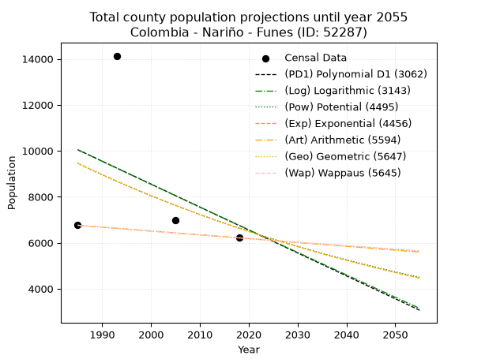
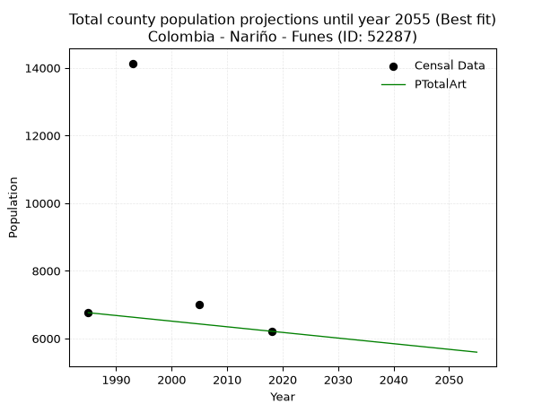
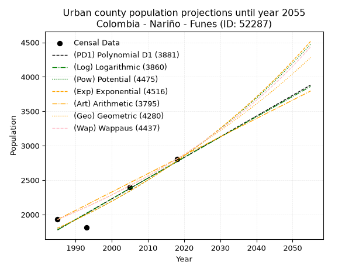
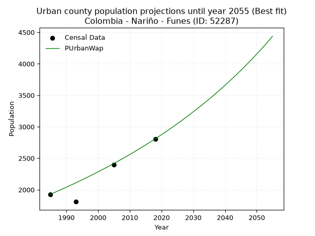
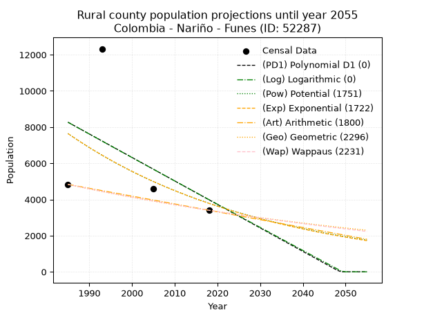
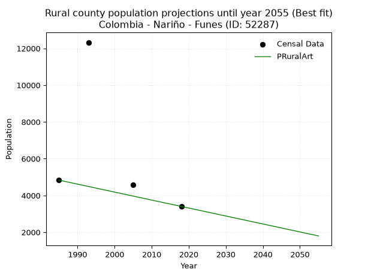

<div align="center">


</div>

# _“Population and Public Services Demand Projections (PPSD) until Year 2050 for Colombia - Nariño - Funes (ID: 52287)”_
Keywords: `population` `public-service` `projection` `lineal` `polynomial` `logarithmic` `potential` `exponential` `arithmetic` `geometric` `wappaus` `dane` `colombia` `south-america`

PPSD are analytical estimates used by governments and planners to anticipate future changes in population size, age distribution, and the resulting community needs for utilities, healthcare, education, and infrastructure as sizing future water treatment facilities, electrical grids, and road networks based on spatial growth.

> **General running parameters**: • app_version: _v20260806_. • Python version: _3.14.7_. • Pandas version: _3.0.5_. • NumPy version: _2.5.1_. • Creates, save and include plots into reports (create_plot): _False_. • Projection until year: _2050_. • Process polynomial degree 2 and up: _False_. • Process Wappaus: _True_. • Process Wappaus: _True_. • Set negative values to zero: _True_. • Set infinite values to zero: _True_. • Drop dataset notes: _True_. 
<div align="center">

Dynamic map: [:earth_americas:Google](http://maps.google.com/maps?q=1.001159335,-77.4489128) [:earth_americas:OSM](https://www.openstreetmap.org/#map=18/1.001159335/-77.4489128&layers=P) [:earth_americas:Bing](https://www.bing.com/maps?cp=1.001159335~-77.4489128&lvl=18) [:earth_americas:Apple](https://maps.apple.com/frame?center=1.001159335%2C-77.4489128&span=0.003%2C0.006)

</div>


<div align="center">

```geojson
{
  "type": "Feature",
  "geometry": {
    "type": "Point", 
    "coordinates": [-77.4489128, 1.001159335]
  }, 
  "properties": {
    "Name": "Colombia - Nariño - Funes (ID: 52287)"
  }
}
```

</div>


## 0. Census Data (4 records)

Census data are official statistics collected by a government about the people and housing in a country. They usually include counts of total population, age, sex, race, income, education, and jobs.

📅Global census file: [Population.xlsx](../data/Population.xlsx)

| Source   |   Year |   CountryID | CountryName   |   StateID | StateName   |   CountyID | CountyName   |   PTotal |   PUrban |   PRural |
|:---------|-------:|------------:|:--------------|----------:|:------------|-----------:|:-------------|---------:|---------:|---------:|
| DANE     |   1985 |          57 | Colombia      |        52 | Nariño      |      52287 | Funes        |     6761 |     1928 |     4833 |
| DANE     |   1993 |          57 | Colombia      |        52 | Nariño      |      52287 | Funes        |    14135 |     1809 |    12326 |
| DANE     |   2005 |          57 | Colombia      |        52 | Nariño      |      52287 | Funes        |     6991 |     2398 |     4593 |
| DANE     |   2018 |          57 | Colombia      |        52 | Nariño      |      52287 | Funes        |     6211 |     2808 |     3403 |

> 🔥Some records could had specific notes about the registered values or the corresponding urban or rural distribution.

## 1. Total

### 1.1. Coefficients and Parameters

* (PD1) Polynomial Deg 1: -99.76957045363217, 208088.58329987773 (lineal)
* (Log) Logarithmic: -199134.68914302113, 1522148.8679413535
* (Pow) Potential: -21.45490213943333, 74.72876093623944
* (Exp) Exponential: -0.01074896853905902, 17462418604222.082
* (Art) Arithmetic: Year diff. 2018 - 1985 = 33, Population diff. 6211 - 6761 = -550, Annual growth = -16.666666666666668
* (Geo) Geometric: Year diff. 2018 - 1985 = 33, Population diff. 6211 - 6761 = -550, Annual growth % = -0.002567875973582212
* (Wap) Wappaus: i = -0.2569637167231987, Condition values only valid for < 200)

<sub>
Wappaus condition values: ['-0.00', '-0.26', '-0.51', '-0.77', '-1.03', '-1.28', '-1.54', '-1.80', '-2.06', '-2.31', '-2.57', '-2.83', '-3.08', '-3.34', '-3.60', '-3.85', '-4.11', '-4.37', '-4.63', '-4.88', '-5.14', '-5.40', '-5.65', '-5.91', '-6.17', '-6.42', '-6.68', '-6.94', '-7.19', '-7.45', '-7.71', '-7.97', '-8.22', '-8.48', '-8.74', '-8.99', '-9.25', '-9.51', '-9.76', '-10.02', '-10.28', '-10.54', '-10.79', '-11.05', '-11.31', '-11.56', '-11.82', '-12.08', '-12.33', '-12.59', '-12.85', '-13.11', '-13.36', '-13.62', '-13.88', '-14.13', '-14.39', '-14.65', '-14.90', '-15.16', '-15.42', '-15.67', '-15.93', '-16.19', '-16.45', '-16.70']
</sub>


### 1.2. Projected Dataset

|   Year |   CountyID |   PTotalPD1 |   PTotalLog |   PTotalPow |   PTotalExp |   PTotalArt |   PTotalGeo |   PTotalWap |
|-------:|-----------:|------------:|------------:|------------:|------------:|------------:|------------:|------------:|
|   1985 |      52287 |       10046 |       10045 |        9454 |        9456 |        6761 |        6761 |        6761 |
|   1986 |      52287 |        9946 |        9944 |        9353 |        9355 |        6744 |        6744 |        6744 |
|   1987 |      52287 |        9846 |        9844 |        9252 |        9255 |        6728 |        6726 |        6726 |
|   1988 |      52287 |        9747 |        9744 |        9153 |        9156 |        6711 |        6709 |        6709 |
|   1989 |      52287 |        9647 |        9644 |        9055 |        9058 |        6694 |        6692 |        6692 |
|   1990 |      52287 |        9547 |        9544 |        8958 |        8961 |        6678 |        6675 |        6675 |
|   1991 |      52287 |        9447 |        9444 |        8862 |        8865 |        6661 |        6657 |        6658 |
|   1992 |      52287 |        9348 |        9344 |        8767 |        8770 |        6644 |        6640 |        6640 |
|   1993 |      52287 |        9248 |        9244 |        8673 |        8677 |        6628 |        6623 |        6623 |
|   1994 |      52287 |        9148 |        9144 |        8580 |        8584 |        6611 |        6606 |        6606 |
|   1995 |      52287 |        9048 |        9044 |        8488 |        8492 |        6594 |        6589 |        6589 |
|   1996 |      52287 |        8949 |        8944 |        8397 |        8401 |        6578 |        6572 |        6573 |
|   1997 |      52287 |        8849 |        8844 |        8308 |        8311 |        6561 |        6556 |        6556 |
|   1998 |      52287 |        8749 |        8745 |        8219 |        8223 |        6544 |        6539 |        6539 |
|   1999 |      52287 |        8649 |        8645 |        8131 |        8135 |        6528 |        6522 |        6522 |
|   2000 |      52287 |        8549 |        8546 |        8044 |        8048 |        6511 |        6505 |        6505 |
|   2001 |      52287 |        8450 |        8446 |        7958 |        7962 |        6494 |        6489 |        6489 |
|   2002 |      52287 |        8350 |        8346 |        7874 |        7876 |        6478 |        6472 |        6472 |
|   2003 |      52287 |        8250 |        8247 |        7790 |        7792 |        6461 |        6455 |        6455 |
|   2004 |      52287 |        8150 |        8148 |        7707 |        7709 |        6444 |        6439 |        6439 |
|   2005 |      52287 |        8051 |        8048 |        7625 |        7627 |        6428 |        6422 |        6422 |
|   2006 |      52287 |        7951 |        7949 |        7544 |        7545 |        6411 |        6406 |        6406 |
|   2007 |      52287 |        7851 |        7850 |        7463 |        7464 |        6394 |        6389 |        6389 |
|   2008 |      52287 |        7751 |        7751 |        7384 |        7385 |        6378 |        6373 |        6373 |
|   2009 |      52287 |        7652 |        7651 |        7305 |        7306 |        6361 |        6356 |        6357 |
|   2010 |      52287 |        7552 |        7552 |        7228 |        7227 |        6344 |        6340 |        6340 |
|   2011 |      52287 |        7452 |        7453 |        7151 |        7150 |        6328 |        6324 |        6324 |
|   2012 |      52287 |        7352 |        7354 |        7075 |        7074 |        6311 |        6308 |        6308 |
|   2013 |      52287 |        7252 |        7255 |        7000 |        6998 |        6294 |        6291 |        6291 |
|   2014 |      52287 |        7153 |        7156 |        6926 |        6923 |        6278 |        6275 |        6275 |
|   2015 |      52287 |        7053 |        7058 |        6853 |        6849 |        6261 |        6259 |        6259 |
|   2016 |      52287 |        6953 |        6959 |        6780 |        6776 |        6244 |        6243 |        6243 |
|   2017 |      52287 |        6853 |        6860 |        6708 |        6704 |        6228 |        6227 |        6227 |
|   2018 |      52287 |        6754 |        6761 |        6637 |        6632 |        6211 |        6211 |        6211 |
|   2019 |      52287 |        6654 |        6663 |        6567 |        6561 |        6194 |        6195 |        6195 |
|   2020 |      52287 |        6554 |        6564 |        6498 |        6491 |        6178 |        6179 |        6179 |
|   2021 |      52287 |        6454 |        6466 |        6429 |        6421 |        6161 |        6163 |        6163 |
|   2022 |      52287 |        6355 |        6367 |        6361 |        6353 |        6144 |        6147 |        6147 |
|   2023 |      52287 |        6255 |        6269 |        6294 |        6285 |        6128 |        6132 |        6132 |
|   2024 |      52287 |        6155 |        6170 |        6228 |        6218 |        6111 |        6116 |        6116 |
|   2025 |      52287 |        6055 |        6072 |        6162 |        6151 |        6094 |        6100 |        6100 |
|   2026 |      52287 |        5955 |        5973 |        6097 |        6085 |        6078 |        6085 |        6084 |
|   2027 |      52287 |        5856 |        5875 |        6033 |        6020 |        6061 |        6069 |        6069 |
|   2028 |      52287 |        5756 |        5777 |        5970 |        5956 |        6044 |        6053 |        6053 |
|   2029 |      52287 |        5656 |        5679 |        5907 |        5892 |        6028 |        6038 |        6037 |
|   2030 |      52287 |        5556 |        5581 |        5845 |        5829 |        6011 |        6022 |        6022 |
|   2031 |      52287 |        5457 |        5483 |        5783 |        5767 |        5994 |        6007 |        6006 |
|   2032 |      52287 |        5357 |        5385 |        5722 |        5705 |        5978 |        5991 |        5991 |
|   2033 |      52287 |        5257 |        5287 |        5662 |        5644 |        5961 |        5976 |        5976 |
|   2034 |      52287 |        5157 |        5189 |        5603 |        5584 |        5944 |        5961 |        5960 |
|   2035 |      52287 |        5058 |        5091 |        5544 |        5524 |        5928 |        5945 |        5945 |
|   2036 |      52287 |        4958 |        4993 |        5486 |        5465 |        5911 |        5930 |        5929 |
|   2037 |      52287 |        4858 |        4895 |        5429 |        5407 |        5894 |        5915 |        5914 |
|   2038 |      52287 |        4758 |        4797 |        5372 |        5349 |        5878 |        5900 |        5899 |
|   2039 |      52287 |        4658 |        4700 |        5315 |        5292 |        5861 |        5885 |        5884 |
|   2040 |      52287 |        4559 |        4602 |        5260 |        5235 |        5844 |        5869 |        5869 |
|   2041 |      52287 |        4459 |        4505 |        5205 |        5179 |        5828 |        5854 |        5853 |
|   2042 |      52287 |        4359 |        4407 |        5150 |        5124 |        5811 |        5839 |        5838 |
|   2043 |      52287 |        4259 |        4309 |        5097 |        5069 |        5794 |        5824 |        5823 |
|   2044 |      52287 |        4160 |        4212 |        5043 |        5015 |        5778 |        5809 |        5808 |
|   2045 |      52287 |        4060 |        4115 |        4991 |        4961 |        5761 |        5794 |        5793 |
|   2046 |      52287 |        3960 |        4017 |        4939 |        4908 |        5744 |        5780 |        5778 |
|   2047 |      52287 |        3860 |        3920 |        4887 |        4856 |        5728 |        5765 |        5763 |
|   2048 |      52287 |        3761 |        3823 |        4836 |        4804 |        5711 |        5750 |        5748 |
|   2049 |      52287 |        3661 |        3726 |        4786 |        4753 |        5694 |        5735 |        5734 |
|   2050 |      52287 |        3561 |        3628 |        4736 |        4702 |        5678 |        5720 |        5719 |
<div align="center">

</img>

</div>


### 1.3. Best fit with absolute and relative error (%)

Relative error puts that difference into context by dividing the absolute error by the true value, creating a unitless ratio or percentage that shows the scale of the mistake.

Absolute and relative error

|   Year | Source   |   CountryID | CountryName   |   StateID | StateName   |   CountyID_x | CountyName   |   PTotal |   PUrban |   PRural |   CountyID_y |   PTotalPD1 |   PTotalLog |   PTotalPow |   PTotalExp |   PTotalArt |   PTotalGeo |   PTotalWap |   PTotalPD1AbsError |   PTotalLogAbsError |   PTotalPowAbsError |   PTotalExpAbsError |   PTotalArtAbsError |   PTotalGeoAbsError |   PTotalWapAbsError |   PTotalPD1RelError |   PTotalLogRelError |   PTotalPowRelError |   PTotalExpRelError |   PTotalArtRelError |   PTotalGeoRelError |   PTotalWapRelError |
|-------:|:---------|------------:|:--------------|----------:|:------------|-------------:|:-------------|---------:|---------:|---------:|-------------:|------------:|------------:|------------:|------------:|------------:|------------:|------------:|--------------------:|--------------------:|--------------------:|--------------------:|--------------------:|--------------------:|--------------------:|--------------------:|--------------------:|--------------------:|--------------------:|--------------------:|--------------------:|--------------------:|
|   1985 | DANE     |          57 | Colombia      |        52 | Nariño      |        52287 | Funes        |     6761 |     1928 |     4833 |        52287 |       10046 |       10045 |        9454 |        9456 |        6761 |        6761 |        6761 |                3285 |                3284 |                2693 |                2695 |                   0 |                   0 |                   0 |            48.5875  |            48.5727  |             39.8314 |            39.861   |             0       |             0       |             0       |
|   1993 | DANE     |          57 | Colombia      |        52 | Nariño      |        52287 | Funes        |    14135 |     1809 |    12326 |        52287 |        9248 |        9244 |        8673 |        8677 |        6628 |        6623 |        6623 |                4887 |                4891 |                5462 |                5458 |                7507 |                7512 |                7512 |            34.5738  |            34.6021  |             38.6417 |            38.6134  |            53.1093  |            53.1447  |            53.1447  |
|   2005 | DANE     |          57 | Colombia      |        52 | Nariño      |        52287 | Funes        |     6991 |     2398 |     4593 |        52287 |        8051 |        8048 |        7625 |        7627 |        6428 |        6422 |        6422 |                1060 |                1057 |                 634 |                 636 |                 563 |                 569 |                 569 |            15.1624  |            15.1194  |              9.0688 |             9.09741 |             8.05321 |             8.13904 |             8.13904 |
|   2018 | DANE     |          57 | Colombia      |        52 | Nariño      |        52287 | Funes        |     6211 |     2808 |     3403 |        52287 |        6754 |        6761 |        6637 |        6632 |        6211 |        6211 |        6211 |                 543 |                 550 |                 426 |                 421 |                   0 |                   0 |                   0 |             8.74255 |             8.85526 |              6.8588 |             6.7783  |             0       |             0       |             0       |

Relative error mean

| Method    |   RelError | Best   |
|:----------|-----------:|:-------|
| PTotalPD1 |    26.7665 |        |
| PTotalLog |    26.7874 |        |
| PTotalPow |    23.6002 |        |
| PTotalExp |    23.5875 |        |
| PTotalArt |    15.2906 | True   |
| PTotalGeo |    15.3209 |        |
| PTotalWap |    15.3209 |        |

💙Best method: _**PTotalArt**_
<div align="center">

</img>

</div>


### 1.4. Fresh water supply demand in liters per capita per day (lpcd)

The fresh water supply demand typically ranges from 100 to 300 liters per capita per day (lpcd) for standard domestic and municipal planning, though absolute survival minimums set by the World Health Organization are as low as 7.5 to 20 liters per day, and total consumption in high-income nations can exceed 400 liters.

> `CZ`: Level in meters above the sea level (masl)<br> `WS`: Fresh water supply demand in liters per capita per day (lpcd or l/h/d)<br> `WSAll`: Zonal fresh water supply demand in liters per second (l/s)<br> `A`: Zonal area in square meters<br> `DP`: Population density (people/hectare)

Reference values (RAS Colombia)

|    CZ |   WS |
|------:|-----:|
|  1000 |  120 |
|  2000 |  130 |
| 99999 |  140 |

County shapefile geometry properties and water supply values

|   CountyID |      ATotal |   CZTotal |   WSTotal |
|-----------:|------------:|----------:|----------:|
|      52287 | 3.95119e+08 |   2861.17 |       140 |

Projected values for best method: PTotalArt

|   CountyID |   Year |   PTotalArt |   DPTotal |   WSTotal |   WSTotalAll |
|-----------:|-------:|------------:|----------:|----------:|-------------:|
|      52287 |   1985 |        6761 |      0.17 |       140 |     10.9553  |
|      52287 |   1986 |        6744 |      0.17 |       140 |     10.9278  |
|      52287 |   1987 |        6728 |      0.17 |       140 |     10.9019  |
|      52287 |   1988 |        6711 |      0.17 |       140 |     10.8743  |
|      52287 |   1989 |        6694 |      0.17 |       140 |     10.8468  |
|      52287 |   1990 |        6678 |      0.17 |       140 |     10.8208  |
|      52287 |   1991 |        6661 |      0.17 |       140 |     10.7933  |
|      52287 |   1992 |        6644 |      0.17 |       140 |     10.7657  |
|      52287 |   1993 |        6628 |      0.17 |       140 |     10.7398  |
|      52287 |   1994 |        6611 |      0.17 |       140 |     10.7123  |
|      52287 |   1995 |        6594 |      0.17 |       140 |     10.6847  |
|      52287 |   1996 |        6578 |      0.17 |       140 |     10.6588  |
|      52287 |   1997 |        6561 |      0.17 |       140 |     10.6312  |
|      52287 |   1998 |        6544 |      0.17 |       140 |     10.6037  |
|      52287 |   1999 |        6528 |      0.17 |       140 |     10.5778  |
|      52287 |   2000 |        6511 |      0.16 |       140 |     10.5502  |
|      52287 |   2001 |        6494 |      0.16 |       140 |     10.5227  |
|      52287 |   2002 |        6478 |      0.16 |       140 |     10.4968  |
|      52287 |   2003 |        6461 |      0.16 |       140 |     10.4692  |
|      52287 |   2004 |        6444 |      0.16 |       140 |     10.4417  |
|      52287 |   2005 |        6428 |      0.16 |       140 |     10.4157  |
|      52287 |   2006 |        6411 |      0.16 |       140 |     10.3882  |
|      52287 |   2007 |        6394 |      0.16 |       140 |     10.3606  |
|      52287 |   2008 |        6378 |      0.16 |       140 |     10.3347  |
|      52287 |   2009 |        6361 |      0.16 |       140 |     10.3072  |
|      52287 |   2010 |        6344 |      0.16 |       140 |     10.2796  |
|      52287 |   2011 |        6328 |      0.16 |       140 |     10.2537  |
|      52287 |   2012 |        6311 |      0.16 |       140 |     10.2262  |
|      52287 |   2013 |        6294 |      0.16 |       140 |     10.1986  |
|      52287 |   2014 |        6278 |      0.16 |       140 |     10.1727  |
|      52287 |   2015 |        6261 |      0.16 |       140 |     10.1451  |
|      52287 |   2016 |        6244 |      0.16 |       140 |     10.1176  |
|      52287 |   2017 |        6228 |      0.16 |       140 |     10.0917  |
|      52287 |   2018 |        6211 |      0.16 |       140 |     10.0641  |
|      52287 |   2019 |        6194 |      0.16 |       140 |     10.0366  |
|      52287 |   2020 |        6178 |      0.16 |       140 |     10.0106  |
|      52287 |   2021 |        6161 |      0.16 |       140 |      9.9831  |
|      52287 |   2022 |        6144 |      0.16 |       140 |      9.95556 |
|      52287 |   2023 |        6128 |      0.16 |       140 |      9.92963 |
|      52287 |   2024 |        6111 |      0.15 |       140 |      9.90208 |
|      52287 |   2025 |        6094 |      0.15 |       140 |      9.87454 |
|      52287 |   2026 |        6078 |      0.15 |       140 |      9.84861 |
|      52287 |   2027 |        6061 |      0.15 |       140 |      9.82106 |
|      52287 |   2028 |        6044 |      0.15 |       140 |      9.79352 |
|      52287 |   2029 |        6028 |      0.15 |       140 |      9.76759 |
|      52287 |   2030 |        6011 |      0.15 |       140 |      9.74005 |
|      52287 |   2031 |        5994 |      0.15 |       140 |      9.7125  |
|      52287 |   2032 |        5978 |      0.15 |       140 |      9.68657 |
|      52287 |   2033 |        5961 |      0.15 |       140 |      9.65903 |
|      52287 |   2034 |        5944 |      0.15 |       140 |      9.63148 |
|      52287 |   2035 |        5928 |      0.15 |       140 |      9.60556 |
|      52287 |   2036 |        5911 |      0.15 |       140 |      9.57801 |
|      52287 |   2037 |        5894 |      0.15 |       140 |      9.55046 |
|      52287 |   2038 |        5878 |      0.15 |       140 |      9.52454 |
|      52287 |   2039 |        5861 |      0.15 |       140 |      9.49699 |
|      52287 |   2040 |        5844 |      0.15 |       140 |      9.46944 |
|      52287 |   2041 |        5828 |      0.15 |       140 |      9.44352 |
|      52287 |   2042 |        5811 |      0.15 |       140 |      9.41597 |
|      52287 |   2043 |        5794 |      0.15 |       140 |      9.38843 |
|      52287 |   2044 |        5778 |      0.15 |       140 |      9.3625  |
|      52287 |   2045 |        5761 |      0.15 |       140 |      9.33495 |
|      52287 |   2046 |        5744 |      0.15 |       140 |      9.30741 |
|      52287 |   2047 |        5728 |      0.14 |       140 |      9.28148 |
|      52287 |   2048 |        5711 |      0.14 |       140 |      9.25394 |
|      52287 |   2049 |        5694 |      0.14 |       140 |      9.22639 |
|      52287 |   2050 |        5678 |      0.14 |       140 |      9.20046 |

## 2. Urban

### 2.1. Coefficients and Parameters

* (PD1) Polynomial Deg 1: 30.052589321557328, -57876.941790445046 (lineal)
* (Log) Logarithmic: 60124.31392017674, -454769.6419132774
* (Pow) Potential: 26.254442505086114, -83.32520780209413
* (Exp) Exponential: 0.013122314588375268, 8.777596270507116e-09
* (Art) Arithmetic: Year diff. 2018 - 1985 = 33, Population diff. 2808 - 1928 = 880, Annual growth = 26.666666666666668
* (Geo) Geometric: Year diff. 2018 - 1985 = 33, Population diff. 2808 - 1928 = 880, Annual growth % = 0.011458769290469295
* (Wap) Wappaus: i = 1.1261261261261262, Condition values only valid for < 200)

<sub>
Wappaus condition values: ['0.00', '1.13', '2.25', '3.38', '4.50', '5.63', '6.76', '7.88', '9.01', '10.14', '11.26', '12.39', '13.51', '14.64', '15.77', '16.89', '18.02', '19.14', '20.27', '21.40', '22.52', '23.65', '24.77', '25.90', '27.03', '28.15', '29.28', '30.41', '31.53', '32.66', '33.78', '34.91', '36.04', '37.16', '38.29', '39.41', '40.54', '41.67', '42.79', '43.92', '45.05', '46.17', '47.30', '48.42', '49.55', '50.68', '51.80', '52.93', '54.05', '55.18', '56.31', '57.43', '58.56', '59.68', '60.81', '61.94', '63.06', '64.19', '65.32', '66.44', '67.57', '68.69', '69.82', '70.95', '72.07', '73.20']
</sub>


### 2.2. Projected Dataset

|   Year |   CountyID |   PUrbanPD1 |   PUrbanLog |   PUrbanPow |   PUrbanExp |   PUrbanArt |   PUrbanGeo |   PUrbanWap |
|-------:|-----------:|------------:|------------:|------------:|------------:|------------:|------------:|------------:|
|   1985 |      52287 |        1777 |        1777 |        1802 |        1802 |        1928 |        1928 |        1928 |
|   1986 |      52287 |        1808 |        1807 |        1826 |        1826 |        1955 |        1950 |        1950 |
|   1987 |      52287 |        1838 |        1837 |        1850 |        1850 |        1981 |        1972 |        1972 |
|   1988 |      52287 |        1868 |        1868 |        1874 |        1875 |        2008 |        1995 |        1994 |
|   1989 |      52287 |        1898 |        1898 |        1899 |        1899 |        2035 |        2018 |        2017 |
|   1990 |      52287 |        1928 |        1928 |        1925 |        1924 |        2061 |        2041 |        2040 |
|   1991 |      52287 |        1958 |        1958 |        1950 |        1950 |        2088 |        2064 |        2063 |
|   1992 |      52287 |        1988 |        1988 |        1976 |        1976 |        2115 |        2088 |        2086 |
|   1993 |      52287 |        2018 |        2019 |        2002 |        2002 |        2141 |        2112 |        2110 |
|   1994 |      52287 |        2048 |        2049 |        2029 |        2028 |        2168 |        2136 |        2134 |
|   1995 |      52287 |        2078 |        2079 |        2056 |        2055 |        2195 |        2161 |        2158 |
|   1996 |      52287 |        2108 |        2109 |        2083 |        2082 |        2221 |        2185 |        2183 |
|   1997 |      52287 |        2138 |        2139 |        2110 |        2109 |        2248 |        2210 |        2207 |
|   1998 |      52287 |        2168 |        2169 |        2138 |        2137 |        2275 |        2236 |        2233 |
|   1999 |      52287 |        2198 |        2199 |        2167 |        2166 |        2301 |        2261 |        2258 |
|   2000 |      52287 |        2228 |        2229 |        2195 |        2194 |        2328 |        2287 |        2284 |
|   2001 |      52287 |        2258 |        2259 |        2224 |        2223 |        2355 |        2314 |        2310 |
|   2002 |      52287 |        2288 |        2289 |        2254 |        2253 |        2381 |        2340 |        2336 |
|   2003 |      52287 |        2318 |        2320 |        2283 |        2282 |        2408 |        2367 |        2363 |
|   2004 |      52287 |        2348 |        2350 |        2314 |        2312 |        2435 |        2394 |        2390 |
|   2005 |      52287 |        2378 |        2380 |        2344 |        2343 |        2461 |        2421 |        2417 |
|   2006 |      52287 |        2409 |        2410 |        2375 |        2374 |        2488 |        2449 |        2445 |
|   2007 |      52287 |        2439 |        2439 |        2406 |        2405 |        2515 |        2477 |        2473 |
|   2008 |      52287 |        2469 |        2469 |        2438 |        2437 |        2541 |        2506 |        2502 |
|   2009 |      52287 |        2499 |        2499 |        2470 |        2469 |        2568 |        2534 |        2530 |
|   2010 |      52287 |        2529 |        2529 |        2502 |        2502 |        2595 |        2563 |        2560 |
|   2011 |      52287 |        2559 |        2559 |        2535 |        2535 |        2621 |        2593 |        2589 |
|   2012 |      52287 |        2589 |        2589 |        2569 |        2568 |        2648 |        2622 |        2619 |
|   2013 |      52287 |        2619 |        2619 |        2602 |        2602 |        2675 |        2653 |        2650 |
|   2014 |      52287 |        2649 |        2649 |        2637 |        2637 |        2701 |        2683 |        2681 |
|   2015 |      52287 |        2679 |        2679 |        2671 |        2672 |        2728 |        2714 |        2712 |
|   2016 |      52287 |        2709 |        2708 |        2706 |        2707 |        2755 |        2745 |        2743 |
|   2017 |      52287 |        2739 |        2738 |        2742 |        2743 |        2781 |        2776 |        2775 |
|   2018 |      52287 |        2769 |        2768 |        2778 |        2779 |        2808 |        2808 |        2808 |
|   2019 |      52287 |        2799 |        2798 |        2814 |        2815 |        2835 |        2840 |        2841 |
|   2020 |      52287 |        2829 |        2828 |        2851 |        2853 |        2861 |        2873 |        2874 |
|   2021 |      52287 |        2859 |        2857 |        2888 |        2890 |        2888 |        2906 |        2908 |
|   2022 |      52287 |        2889 |        2887 |        2926 |        2929 |        2915 |        2939 |        2943 |
|   2023 |      52287 |        2919 |        2917 |        2964 |        2967 |        2941 |        2973 |        2978 |
|   2024 |      52287 |        2949 |        2947 |        3003 |        3006 |        2968 |        3007 |        3013 |
|   2025 |      52287 |        2980 |        2976 |        3042 |        3046 |        2995 |        3041 |        3049 |
|   2026 |      52287 |        3010 |        3006 |        3082 |        3086 |        3021 |        3076 |        3085 |
|   2027 |      52287 |        3040 |        3036 |        3122 |        3127 |        3048 |        3111 |        3122 |
|   2028 |      52287 |        3070 |        3065 |        3162 |        3168 |        3075 |        3147 |        3160 |
|   2029 |      52287 |        3100 |        3095 |        3204 |        3210 |        3101 |        3183 |        3198 |
|   2030 |      52287 |        3130 |        3125 |        3245 |        3253 |        3128 |        3219 |        3237 |
|   2031 |      52287 |        3160 |        3154 |        3288 |        3296 |        3155 |        3256 |        3276 |
|   2032 |      52287 |        3190 |        3184 |        3330 |        3339 |        3181 |        3294 |        3316 |
|   2033 |      52287 |        3220 |        3213 |        3374 |        3383 |        3208 |        3331 |        3356 |
|   2034 |      52287 |        3250 |        3243 |        3417 |        3428 |        3235 |        3370 |        3397 |
|   2035 |      52287 |        3280 |        3272 |        3462 |        3473 |        3261 |        3408 |        3439 |
|   2036 |      52287 |        3310 |        3302 |        3507 |        3519 |        3288 |        3447 |        3481 |
|   2037 |      52287 |        3340 |        3332 |        3552 |        3566 |        3315 |        3487 |        3524 |
|   2038 |      52287 |        3370 |        3361 |        3598 |        3613 |        3341 |        3527 |        3568 |
|   2039 |      52287 |        3400 |        3391 |        3645 |        3660 |        3368 |        3567 |        3613 |
|   2040 |      52287 |        3430 |        3420 |        3692 |        3709 |        3395 |        3608 |        3658 |
|   2041 |      52287 |        3460 |        3449 |        3740 |        3758 |        3421 |        3649 |        3704 |
|   2042 |      52287 |        3490 |        3479 |        3788 |        3807 |        3448 |        3691 |        3750 |
|   2043 |      52287 |        3520 |        3508 |        3837 |        3858 |        3475 |        3733 |        3798 |
|   2044 |      52287 |        3551 |        3538 |        3887 |        3909 |        3501 |        3776 |        3846 |
|   2045 |      52287 |        3581 |        3567 |        3937 |        3960 |        3528 |        3819 |        3895 |
|   2046 |      52287 |        3611 |        3597 |        3988 |        4013 |        3555 |        3863 |        3945 |
|   2047 |      52287 |        3641 |        3626 |        4040 |        4066 |        3581 |        3907 |        3996 |
|   2048 |      52287 |        3671 |        3655 |        4092 |        4119 |        3608 |        3952 |        4048 |
|   2049 |      52287 |        3701 |        3685 |        4145 |        4174 |        3635 |        3998 |        4100 |
|   2050 |      52287 |        3731 |        3714 |        4198 |        4229 |        3661 |        4043 |        4154 |
<div align="center">

</img>

</div>


### 2.3. Best fit with absolute and relative error (%)

Relative error puts that difference into context by dividing the absolute error by the true value, creating a unitless ratio or percentage that shows the scale of the mistake.

Absolute and relative error

|   Year | Source   |   CountryID | CountryName   |   StateID | StateName   |   CountyID_x | CountyName   |   PTotal |   PUrban |   PRural |   CountyID_y |   PUrbanPD1 |   PUrbanLog |   PUrbanPow |   PUrbanExp |   PUrbanArt |   PUrbanGeo |   PUrbanWap |   PUrbanPD1AbsError |   PUrbanLogAbsError |   PUrbanPowAbsError |   PUrbanExpAbsError |   PUrbanArtAbsError |   PUrbanGeoAbsError |   PUrbanWapAbsError |   PUrbanPD1RelError |   PUrbanLogRelError |   PUrbanPowRelError |   PUrbanExpRelError |   PUrbanArtRelError |   PUrbanGeoRelError |   PUrbanWapRelError |
|-------:|:---------|------------:|:--------------|----------:|:------------|-------------:|:-------------|---------:|---------:|---------:|-------------:|------------:|------------:|------------:|------------:|------------:|------------:|------------:|--------------------:|--------------------:|--------------------:|--------------------:|--------------------:|--------------------:|--------------------:|--------------------:|--------------------:|--------------------:|--------------------:|--------------------:|--------------------:|--------------------:|
|   1985 | DANE     |          57 | Colombia      |        52 | Nariño      |        52287 | Funes        |     6761 |     1928 |     4833 |        52287 |        1777 |        1777 |        1802 |        1802 |        1928 |        1928 |        1928 |                 151 |                 151 |                 126 |                 126 |                   0 |                   0 |                   0 |            7.83195  |            7.83195  |             6.53527 |             6.53527 |             0       |            0        |            0        |
|   1993 | DANE     |          57 | Colombia      |        52 | Nariño      |        52287 | Funes        |    14135 |     1809 |    12326 |        52287 |        2018 |        2019 |        2002 |        2002 |        2141 |        2112 |        2110 |                 209 |                 210 |                 193 |                 193 |                 332 |                 303 |                 301 |           11.5533   |           11.6086   |            10.6689  |            10.6689  |            18.3527  |           16.7496   |           16.639    |
|   2005 | DANE     |          57 | Colombia      |        52 | Nariño      |        52287 | Funes        |     6991 |     2398 |     4593 |        52287 |        2378 |        2380 |        2344 |        2343 |        2461 |        2421 |        2417 |                  20 |                  18 |                  54 |                  55 |                  63 |                  23 |                  19 |            0.834028 |            0.750626 |             2.25188 |             2.29358 |             2.62719 |            0.959133 |            0.792327 |
|   2018 | DANE     |          57 | Colombia      |        52 | Nariño      |        52287 | Funes        |     6211 |     2808 |     3403 |        52287 |        2769 |        2768 |        2778 |        2779 |        2808 |        2808 |        2808 |                  39 |                  40 |                  30 |                  29 |                   0 |                   0 |                   0 |            1.38889  |            1.4245   |             1.06838 |             1.03276 |             0       |            0        |            0        |

Relative error mean

| Method    |   RelError | Best   |
|:----------|-----------:|:-------|
| PUrbanPD1 |    5.40205 |        |
| PUrbanLog |    5.40393 |        |
| PUrbanPow |    5.1311  |        |
| PUrbanExp |    5.13262 |        |
| PUrbanArt |    5.24497 |        |
| PUrbanGeo |    4.42718 |        |
| PUrbanWap |    4.35784 | True   |

💙Best method: _**PUrbanWap**_
<div align="center">

</img>

</div>


### 2.4. Fresh water supply demand in liters per capita per day (lpcd)

The fresh water supply demand typically ranges from 100 to 300 liters per capita per day (lpcd) for standard domestic and municipal planning, though absolute survival minimums set by the World Health Organization are as low as 7.5 to 20 liters per day, and total consumption in high-income nations can exceed 400 liters.

> `CZ`: Level in meters above the sea level (masl)<br> `WS`: Fresh water supply demand in liters per capita per day (lpcd or l/h/d)<br> `WSAll`: Zonal fresh water supply demand in liters per second (l/s)<br> `A`: Zonal area in square meters<br> `DP`: Population density (people/hectare)

Reference values (RAS Colombia)

|    CZ |   WS |
|------:|-----:|
|  1000 |  120 |
|  2000 |  130 |
| 99999 |  140 |

County shapefile geometry properties and water supply values

|   CountyID |   AUrban |   CZUrban |   WSUrban |
|-----------:|---------:|----------:|----------:|
|      52287 |   840681 |   2284.85 |       140 |

Projected values for best method: PUrbanWap

|   CountyID |   Year |   PUrbanWap |   DPUrban |   WSUrban |   WSUrbanAll |
|-----------:|-------:|------------:|----------:|----------:|-------------:|
|      52287 |   1985 |        1928 |     22.93 |       140 |      3.12407 |
|      52287 |   1986 |        1950 |     23.2  |       140 |      3.15972 |
|      52287 |   1987 |        1972 |     23.46 |       140 |      3.19537 |
|      52287 |   1988 |        1994 |     23.72 |       140 |      3.23102 |
|      52287 |   1989 |        2017 |     23.99 |       140 |      3.26829 |
|      52287 |   1990 |        2040 |     24.27 |       140 |      3.30556 |
|      52287 |   1991 |        2063 |     24.54 |       140 |      3.34282 |
|      52287 |   1992 |        2086 |     24.81 |       140 |      3.38009 |
|      52287 |   1993 |        2110 |     25.1  |       140 |      3.41898 |
|      52287 |   1994 |        2134 |     25.38 |       140 |      3.45787 |
|      52287 |   1995 |        2158 |     25.67 |       140 |      3.49676 |
|      52287 |   1996 |        2183 |     25.97 |       140 |      3.53727 |
|      52287 |   1997 |        2207 |     26.25 |       140 |      3.57616 |
|      52287 |   1998 |        2233 |     26.56 |       140 |      3.61829 |
|      52287 |   1999 |        2258 |     26.86 |       140 |      3.6588  |
|      52287 |   2000 |        2284 |     27.17 |       140 |      3.70093 |
|      52287 |   2001 |        2310 |     27.48 |       140 |      3.74306 |
|      52287 |   2002 |        2336 |     27.79 |       140 |      3.78519 |
|      52287 |   2003 |        2363 |     28.11 |       140 |      3.82894 |
|      52287 |   2004 |        2390 |     28.43 |       140 |      3.87269 |
|      52287 |   2005 |        2417 |     28.75 |       140 |      3.91644 |
|      52287 |   2006 |        2445 |     29.08 |       140 |      3.96181 |
|      52287 |   2007 |        2473 |     29.42 |       140 |      4.00718 |
|      52287 |   2008 |        2502 |     29.76 |       140 |      4.05417 |
|      52287 |   2009 |        2530 |     30.09 |       140 |      4.09954 |
|      52287 |   2010 |        2560 |     30.45 |       140 |      4.14815 |
|      52287 |   2011 |        2589 |     30.8  |       140 |      4.19514 |
|      52287 |   2012 |        2619 |     31.15 |       140 |      4.24375 |
|      52287 |   2013 |        2650 |     31.52 |       140 |      4.29398 |
|      52287 |   2014 |        2681 |     31.89 |       140 |      4.34421 |
|      52287 |   2015 |        2712 |     32.26 |       140 |      4.39444 |
|      52287 |   2016 |        2743 |     32.63 |       140 |      4.44468 |
|      52287 |   2017 |        2775 |     33.01 |       140 |      4.49653 |
|      52287 |   2018 |        2808 |     33.4  |       140 |      4.55    |
|      52287 |   2019 |        2841 |     33.79 |       140 |      4.60347 |
|      52287 |   2020 |        2874 |     34.19 |       140 |      4.65694 |
|      52287 |   2021 |        2908 |     34.59 |       140 |      4.71204 |
|      52287 |   2022 |        2943 |     35.01 |       140 |      4.76875 |
|      52287 |   2023 |        2978 |     35.42 |       140 |      4.82546 |
|      52287 |   2024 |        3013 |     35.84 |       140 |      4.88218 |
|      52287 |   2025 |        3049 |     36.27 |       140 |      4.94051 |
|      52287 |   2026 |        3085 |     36.7  |       140 |      4.99884 |
|      52287 |   2027 |        3122 |     37.14 |       140 |      5.0588  |
|      52287 |   2028 |        3160 |     37.59 |       140 |      5.12037 |
|      52287 |   2029 |        3198 |     38.04 |       140 |      5.18194 |
|      52287 |   2030 |        3237 |     38.5  |       140 |      5.24514 |
|      52287 |   2031 |        3276 |     38.97 |       140 |      5.30833 |
|      52287 |   2032 |        3316 |     39.44 |       140 |      5.37315 |
|      52287 |   2033 |        3356 |     39.92 |       140 |      5.43796 |
|      52287 |   2034 |        3397 |     40.41 |       140 |      5.5044  |
|      52287 |   2035 |        3439 |     40.91 |       140 |      5.57245 |
|      52287 |   2036 |        3481 |     41.41 |       140 |      5.64051 |
|      52287 |   2037 |        3524 |     41.92 |       140 |      5.71019 |
|      52287 |   2038 |        3568 |     42.44 |       140 |      5.78148 |
|      52287 |   2039 |        3613 |     42.98 |       140 |      5.8544  |
|      52287 |   2040 |        3658 |     43.51 |       140 |      5.92731 |
|      52287 |   2041 |        3704 |     44.06 |       140 |      6.00185 |
|      52287 |   2042 |        3750 |     44.61 |       140 |      6.07639 |
|      52287 |   2043 |        3798 |     45.18 |       140 |      6.15417 |
|      52287 |   2044 |        3846 |     45.75 |       140 |      6.23194 |
|      52287 |   2045 |        3895 |     46.33 |       140 |      6.31134 |
|      52287 |   2046 |        3945 |     46.93 |       140 |      6.39236 |
|      52287 |   2047 |        3996 |     47.53 |       140 |      6.475   |
|      52287 |   2048 |        4048 |     48.15 |       140 |      6.55926 |
|      52287 |   2049 |        4100 |     48.77 |       140 |      6.64352 |
|      52287 |   2050 |        4154 |     49.41 |       140 |      6.73102 |

## 3. Rural

### 3.1. Coefficients and Parameters

* (PD1) Polynomial Deg 1: -129.82215977518945, 265965.5250903227 (lineal)
* (Log) Logarithmic: -259259.0030631979, 1976918.5098546313
* (Pow) Potential: -42.5218110956654, 144.1099724986225
* (Exp) Exponential: -0.021287160138474006, 1.715350720847484e+22
* (Art) Arithmetic: Year diff. 2018 - 1985 = 33, Population diff. 3403 - 4833 = -1430, Annual growth = -43.333333333333336
* (Geo) Geometric: Year diff. 2018 - 1985 = 33, Population diff. 3403 - 4833 = -1430, Annual growth % = -0.010574300784449875
* (Wap) Wappaus: i = -1.0522907560304355, Condition values only valid for < 200)

<sub>
Wappaus condition values: ['-0.00', '-1.05', '-2.10', '-3.16', '-4.21', '-5.26', '-6.31', '-7.37', '-8.42', '-9.47', '-10.52', '-11.58', '-12.63', '-13.68', '-14.73', '-15.78', '-16.84', '-17.89', '-18.94', '-19.99', '-21.05', '-22.10', '-23.15', '-24.20', '-25.25', '-26.31', '-27.36', '-28.41', '-29.46', '-30.52', '-31.57', '-32.62', '-33.67', '-34.73', '-35.78', '-36.83', '-37.88', '-38.93', '-39.99', '-41.04', '-42.09', '-43.14', '-44.20', '-45.25', '-46.30', '-47.35', '-48.41', '-49.46', '-50.51', '-51.56', '-52.61', '-53.67', '-54.72', '-55.77', '-56.82', '-57.88', '-58.93', '-59.98', '-61.03', '-62.09', '-63.14', '-64.19', '-65.24', '-66.29', '-67.35', '-68.40']
</sub>


### 3.2. Projected Dataset

|   Year |   CountyID |   PRuralPD1 |   PRuralLog |   PRuralPow |   PRuralExp |   PRuralArt |   PRuralGeo |   PRuralWap |
|-------:|-----------:|------------:|------------:|------------:|------------:|------------:|------------:|------------:|
|   1985 |      52287 |        8269 |        8268 |        7642 |        7642 |        4833 |        4833 |        4833 |
|   1986 |      52287 |        8139 |        8137 |        7480 |        7482 |        4790 |        4782 |        4782 |
|   1987 |      52287 |        8009 |        8007 |        7322 |        7324 |        4746 |        4731 |        4732 |
|   1988 |      52287 |        7879 |        7876 |        7167 |        7170 |        4703 |        4681 |        4683 |
|   1989 |      52287 |        7749 |        7746 |        7015 |        7019 |        4660 |        4632 |        4634 |
|   1990 |      52287 |        7619 |        7616 |        6867 |        6871 |        4616 |        4583 |        4585 |
|   1991 |      52287 |        7490 |        7485 |        6722 |        6726 |        4573 |        4534 |        4537 |
|   1992 |      52287 |        7360 |        7355 |        6580 |        6584 |        4530 |        4486 |        4490 |
|   1993 |      52287 |        7230 |        7225 |        6441 |        6446 |        4486 |        4439 |        4443 |
|   1994 |      52287 |        7100 |        7095 |        6305 |        6310 |        4443 |        4392 |        4396 |
|   1995 |      52287 |        6970 |        6965 |        6172 |        6177 |        4400 |        4346 |        4350 |
|   1996 |      52287 |        6840 |        6835 |        6042 |        6047 |        4356 |        4300 |        4304 |
|   1997 |      52287 |        6711 |        6705 |        5915 |        5920 |        4313 |        4254 |        4259 |
|   1998 |      52287 |        6581 |        6576 |        5790 |        5795 |        4270 |        4209 |        4214 |
|   1999 |      52287 |        6451 |        6446 |        5668 |        5673 |        4226 |        4165 |        4170 |
|   2000 |      52287 |        6321 |        6316 |        5549 |        5553 |        4183 |        4121 |        4126 |
|   2001 |      52287 |        6191 |        6187 |        5432 |        5436 |        4140 |        4077 |        4082 |
|   2002 |      52287 |        6062 |        6057 |        5318 |        5322 |        4096 |        4034 |        4039 |
|   2003 |      52287 |        5932 |        5928 |        5206 |        5210 |        4053 |        3991 |        3997 |
|   2004 |      52287 |        5802 |        5798 |        5097 |        5100 |        4010 |        3949 |        3955 |
|   2005 |      52287 |        5672 |        5669 |        4990 |        4993 |        3966 |        3907 |        3913 |
|   2006 |      52287 |        5542 |        5540 |        4885 |        4888 |        3923 |        3866 |        3871 |
|   2007 |      52287 |        5412 |        5410 |        4783 |        4785 |        3880 |        3825 |        3830 |
|   2008 |      52287 |        5283 |        5281 |        4683 |        4684 |        3836 |        3785 |        3790 |
|   2009 |      52287 |        5153 |        5152 |        4584 |        4585 |        3793 |        3745 |        3749 |
|   2010 |      52287 |        5023 |        5023 |        4488 |        4489 |        3750 |        3705 |        3709 |
|   2011 |      52287 |        4893 |        4894 |        4394 |        4394 |        3706 |        3666 |        3670 |
|   2012 |      52287 |        4763 |        4765 |        4303 |        4302 |        3663 |        3627 |        3631 |
|   2013 |      52287 |        4634 |        4636 |        4213 |        4211 |        3620 |        3589 |        3592 |
|   2014 |      52287 |        4504 |        4508 |        4125 |        4122 |        3576 |        3551 |        3553 |
|   2015 |      52287 |        4374 |        4379 |        4038 |        4035 |        3533 |        3513 |        3515 |
|   2016 |      52287 |        4244 |        4250 |        3954 |        3950 |        3490 |        3476 |        3478 |
|   2017 |      52287 |        4114 |        4122 |        3872 |        3867 |        3446 |        3439 |        3440 |
|   2018 |      52287 |        3984 |        3993 |        3791 |        3786 |        3403 |        3403 |        3403 |
|   2019 |      52287 |        3855 |        3865 |        3712 |        3706 |        3360 |        3367 |        3366 |
|   2020 |      52287 |        3725 |        3736 |        3635 |        3628 |        3316 |        3331 |        3330 |
|   2021 |      52287 |        3595 |        3608 |        3559 |        3552 |        3273 |        3296 |        3294 |
|   2022 |      52287 |        3465 |        3480 |        3485 |        3477 |        3230 |        3261 |        3258 |
|   2023 |      52287 |        3335 |        3352 |        3412 |        3404 |        3186 |        3227 |        3222 |
|   2024 |      52287 |        3205 |        3224 |        3341 |        3332 |        3143 |        3193 |        3187 |
|   2025 |      52287 |        3076 |        3095 |        3272 |        3262 |        3100 |        3159 |        3152 |
|   2026 |      52287 |        2946 |        2967 |        3204 |        3193 |        3056 |        3126 |        3118 |
|   2027 |      52287 |        2816 |        2840 |        3137 |        3126 |        3013 |        3093 |        3084 |
|   2028 |      52287 |        2686 |        2712 |        3072 |        3060 |        2970 |        3060 |        3050 |
|   2029 |      52287 |        2556 |        2584 |        3009 |        2995 |        2926 |        3027 |        3016 |
|   2030 |      52287 |        2427 |        2456 |        2946 |        2932 |        2883 |        2995 |        2983 |
|   2031 |      52287 |        2297 |        2328 |        2885 |        2871 |        2840 |        2964 |        2949 |
|   2032 |      52287 |        2167 |        2201 |        2825 |        2810 |        2796 |        2932 |        2917 |
|   2033 |      52287 |        2037 |        2073 |        2767 |        2751 |        2753 |        2901 |        2884 |
|   2034 |      52287 |        1907 |        1946 |        2710 |        2693 |        2710 |        2871 |        2852 |
|   2035 |      52287 |        1777 |        1818 |        2654 |        2636 |        2666 |        2840 |        2820 |
|   2036 |      52287 |        1648 |        1691 |        2599 |        2581 |        2623 |        2810 |        2788 |
|   2037 |      52287 |        1518 |        1564 |        2545 |        2526 |        2580 |        2781 |        2757 |
|   2038 |      52287 |        1388 |        1436 |        2492 |        2473 |        2536 |        2751 |        2725 |
|   2039 |      52287 |        1258 |        1309 |        2441 |        2421 |        2493 |        2722 |        2694 |
|   2040 |      52287 |        1128 |        1182 |        2391 |        2370 |        2450 |        2693 |        2664 |
|   2041 |      52287 |         998 |        1055 |        2341 |        2320 |        2406 |        2665 |        2633 |
|   2042 |      52287 |         869 |         928 |        2293 |        2271 |        2363 |        2637 |        2603 |
|   2043 |      52287 |         739 |         801 |        2246 |        2223 |        2320 |        2609 |        2573 |
|   2044 |      52287 |         609 |         674 |        2200 |        2177 |        2276 |        2581 |        2543 |
|   2045 |      52287 |         479 |         547 |        2154 |        2131 |        2233 |        2554 |        2514 |
|   2046 |      52287 |         349 |         421 |        2110 |        2086 |        2190 |        2527 |        2484 |
|   2047 |      52287 |         220 |         294 |        2067 |        2042 |        2146 |        2500 |        2455 |
|   2048 |      52287 |          90 |         167 |        2024 |        1999 |        2103 |        2474 |        2427 |
|   2049 |      52287 |           0 |          41 |        1982 |        1957 |        2060 |        2448 |        2398 |
|   2050 |      52287 |           0 |           0 |        1942 |        1916 |        2016 |        2422 |        2370 |
<div align="center">

</img>

</div>


### 3.3. Best fit with absolute and relative error (%)

Relative error puts that difference into context by dividing the absolute error by the true value, creating a unitless ratio or percentage that shows the scale of the mistake.

Absolute and relative error

|   Year | Source   |   CountryID | CountryName   |   StateID | StateName   |   CountyID_x | CountyName   |   PTotal |   PUrban |   PRural |   CountyID_y |   PRuralPD1 |   PRuralLog |   PRuralPow |   PRuralExp |   PRuralArt |   PRuralGeo |   PRuralWap |   PRuralPD1AbsError |   PRuralLogAbsError |   PRuralPowAbsError |   PRuralExpAbsError |   PRuralArtAbsError |   PRuralGeoAbsError |   PRuralWapAbsError |   PRuralPD1RelError |   PRuralLogRelError |   PRuralPowRelError |   PRuralExpRelError |   PRuralArtRelError |   PRuralGeoRelError |   PRuralWapRelError |
|-------:|:---------|------------:|:--------------|----------:|:------------|-------------:|:-------------|---------:|---------:|---------:|-------------:|------------:|------------:|------------:|------------:|------------:|------------:|------------:|--------------------:|--------------------:|--------------------:|--------------------:|--------------------:|--------------------:|--------------------:|--------------------:|--------------------:|--------------------:|--------------------:|--------------------:|--------------------:|--------------------:|
|   1985 | DANE     |          57 | Colombia      |        52 | Nariño      |        52287 | Funes        |     6761 |     1928 |     4833 |        52287 |        8269 |        8268 |        7642 |        7642 |        4833 |        4833 |        4833 |                3436 |                3435 |                2809 |                2809 |                   0 |                   0 |                   0 |             71.0946 |             71.0739 |            58.1212  |             58.1212 |              0      |              0      |              0      |
|   1993 | DANE     |          57 | Colombia      |        52 | Nariño      |        52287 | Funes        |    14135 |     1809 |    12326 |        52287 |        7230 |        7225 |        6441 |        6446 |        4486 |        4439 |        4443 |                5096 |                5101 |                5885 |                5880 |                7840 |                7887 |                7883 |             41.3435 |             41.3841 |            47.7446  |             47.704  |             63.6054 |             63.9867 |             63.9542 |
|   2005 | DANE     |          57 | Colombia      |        52 | Nariño      |        52287 | Funes        |     6991 |     2398 |     4593 |        52287 |        5672 |        5669 |        4990 |        4993 |        3966 |        3907 |        3913 |                1079 |                1076 |                 397 |                 400 |                 627 |                 686 |                 680 |             23.4923 |             23.427  |             8.64359 |              8.7089 |             13.6512 |             14.9358 |             14.8051 |
|   2018 | DANE     |          57 | Colombia      |        52 | Nariño      |        52287 | Funes        |     6211 |     2808 |     3403 |        52287 |        3984 |        3993 |        3791 |        3786 |        3403 |        3403 |        3403 |                 581 |                 590 |                 388 |                 383 |                   0 |                   0 |                   0 |             17.0732 |             17.3376 |            11.4017  |             11.2548 |              0      |              0      |              0      |

Relative error mean

| Method    |   RelError | Best   |
|:----------|-----------:|:-------|
| PRuralPD1 |    38.2509 |        |
| PRuralLog |    38.3056 |        |
| PRuralPow |    31.4778 |        |
| PRuralExp |    31.4472 |        |
| PRuralArt |    19.3141 | True   |
| PRuralGeo |    19.7306 |        |
| PRuralWap |    19.6898 |        |

💙Best method: _**PRuralArt**_
<div align="center">

</img>

</div>


### 3.4. Fresh water supply demand in liters per capita per day (lpcd)

The fresh water supply demand typically ranges from 100 to 300 liters per capita per day (lpcd) for standard domestic and municipal planning, though absolute survival minimums set by the World Health Organization are as low as 7.5 to 20 liters per day, and total consumption in high-income nations can exceed 400 liters.

> `CZ`: Level in meters above the sea level (masl)<br> `WS`: Fresh water supply demand in liters per capita per day (lpcd or l/h/d)<br> `WSAll`: Zonal fresh water supply demand in liters per second (l/s)<br> `A`: Zonal area in square meters<br> `DP`: Population density (people/hectare)

Reference values (RAS Colombia)

|    CZ |   WS |
|------:|-----:|
|  1000 |  120 |
|  2000 |  130 |
| 99999 |  140 |

County shapefile geometry properties and water supply values

|   CountyID |      ARural |   CZRural |   WSRural |
|-----------:|------------:|----------:|----------:|
|      52287 | 3.94278e+08 |    2862.4 |       140 |

Projected values for best method: PRuralArt

|   CountyID |   Year |   PRuralArt |   DPRural |   WSRural |   WSRuralAll |
|-----------:|-------:|------------:|----------:|----------:|-------------:|
|      52287 |   1985 |        4833 |      0.12 |       140 |      7.83125 |
|      52287 |   1986 |        4790 |      0.12 |       140 |      7.76157 |
|      52287 |   1987 |        4746 |      0.12 |       140 |      7.69028 |
|      52287 |   1988 |        4703 |      0.12 |       140 |      7.6206  |
|      52287 |   1989 |        4660 |      0.12 |       140 |      7.55093 |
|      52287 |   1990 |        4616 |      0.12 |       140 |      7.47963 |
|      52287 |   1991 |        4573 |      0.12 |       140 |      7.40995 |
|      52287 |   1992 |        4530 |      0.11 |       140 |      7.34028 |
|      52287 |   1993 |        4486 |      0.11 |       140 |      7.26898 |
|      52287 |   1994 |        4443 |      0.11 |       140 |      7.19931 |
|      52287 |   1995 |        4400 |      0.11 |       140 |      7.12963 |
|      52287 |   1996 |        4356 |      0.11 |       140 |      7.05833 |
|      52287 |   1997 |        4313 |      0.11 |       140 |      6.98866 |
|      52287 |   1998 |        4270 |      0.11 |       140 |      6.91898 |
|      52287 |   1999 |        4226 |      0.11 |       140 |      6.84769 |
|      52287 |   2000 |        4183 |      0.11 |       140 |      6.77801 |
|      52287 |   2001 |        4140 |      0.11 |       140 |      6.70833 |
|      52287 |   2002 |        4096 |      0.1  |       140 |      6.63704 |
|      52287 |   2003 |        4053 |      0.1  |       140 |      6.56736 |
|      52287 |   2004 |        4010 |      0.1  |       140 |      6.49769 |
|      52287 |   2005 |        3966 |      0.1  |       140 |      6.42639 |
|      52287 |   2006 |        3923 |      0.1  |       140 |      6.35671 |
|      52287 |   2007 |        3880 |      0.1  |       140 |      6.28704 |
|      52287 |   2008 |        3836 |      0.1  |       140 |      6.21574 |
|      52287 |   2009 |        3793 |      0.1  |       140 |      6.14606 |
|      52287 |   2010 |        3750 |      0.1  |       140 |      6.07639 |
|      52287 |   2011 |        3706 |      0.09 |       140 |      6.00509 |
|      52287 |   2012 |        3663 |      0.09 |       140 |      5.93542 |
|      52287 |   2013 |        3620 |      0.09 |       140 |      5.86574 |
|      52287 |   2014 |        3576 |      0.09 |       140 |      5.79444 |
|      52287 |   2015 |        3533 |      0.09 |       140 |      5.72477 |
|      52287 |   2016 |        3490 |      0.09 |       140 |      5.65509 |
|      52287 |   2017 |        3446 |      0.09 |       140 |      5.5838  |
|      52287 |   2018 |        3403 |      0.09 |       140 |      5.51412 |
|      52287 |   2019 |        3360 |      0.09 |       140 |      5.44444 |
|      52287 |   2020 |        3316 |      0.08 |       140 |      5.37315 |
|      52287 |   2021 |        3273 |      0.08 |       140 |      5.30347 |
|      52287 |   2022 |        3230 |      0.08 |       140 |      5.2338  |
|      52287 |   2023 |        3186 |      0.08 |       140 |      5.1625  |
|      52287 |   2024 |        3143 |      0.08 |       140 |      5.09282 |
|      52287 |   2025 |        3100 |      0.08 |       140 |      5.02315 |
|      52287 |   2026 |        3056 |      0.08 |       140 |      4.95185 |
|      52287 |   2027 |        3013 |      0.08 |       140 |      4.88218 |
|      52287 |   2028 |        2970 |      0.08 |       140 |      4.8125  |
|      52287 |   2029 |        2926 |      0.07 |       140 |      4.7412  |
|      52287 |   2030 |        2883 |      0.07 |       140 |      4.67153 |
|      52287 |   2031 |        2840 |      0.07 |       140 |      4.60185 |
|      52287 |   2032 |        2796 |      0.07 |       140 |      4.53056 |
|      52287 |   2033 |        2753 |      0.07 |       140 |      4.46088 |
|      52287 |   2034 |        2710 |      0.07 |       140 |      4.3912  |
|      52287 |   2035 |        2666 |      0.07 |       140 |      4.31991 |
|      52287 |   2036 |        2623 |      0.07 |       140 |      4.25023 |
|      52287 |   2037 |        2580 |      0.07 |       140 |      4.18056 |
|      52287 |   2038 |        2536 |      0.06 |       140 |      4.10926 |
|      52287 |   2039 |        2493 |      0.06 |       140 |      4.03958 |
|      52287 |   2040 |        2450 |      0.06 |       140 |      3.96991 |
|      52287 |   2041 |        2406 |      0.06 |       140 |      3.89861 |
|      52287 |   2042 |        2363 |      0.06 |       140 |      3.82894 |
|      52287 |   2043 |        2320 |      0.06 |       140 |      3.75926 |
|      52287 |   2044 |        2276 |      0.06 |       140 |      3.68796 |
|      52287 |   2045 |        2233 |      0.06 |       140 |      3.61829 |
|      52287 |   2046 |        2190 |      0.06 |       140 |      3.54861 |
|      52287 |   2047 |        2146 |      0.05 |       140 |      3.47731 |
|      52287 |   2048 |        2103 |      0.05 |       140 |      3.40764 |
|      52287 |   2049 |        2060 |      0.05 |       140 |      3.33796 |
|      52287 |   2050 |        2016 |      0.05 |       140 |      3.26667 |

<div align="center"><br><sub>Share this research</sub></div><br>

<sub>**APPS & TOOLS & CONTENT DISCLAIMER**: • NO WARRANTY - This content and software is provided by <a href="https://github.com/rcfdtools" target="_blank">github.com/rcfdtools</a> "as is", without any express or implied warranty, including warranties of merchantability, fitness for a particular purpose, or non-infringement. There is no guarantee that the software will be error-free or operate without interruption. • LIMITATION OF LIABILITY - Neither the authors nor copyright holders will be liable for claims or damages arising from the software or its use. You are responsible for determining if the software is appropriate for your use and assume all associated risks, including errors, legal compliance, and data loss. • NO PROFESSIONAL ADVICE - The software provides general information and does not offer professional advice. It should not replace consultation with professional advisors. [Clauses and global license for rcfdtools use.](https://github.com/rcfdtools/rcfdtools/blob/main/LICENSE.md)</sub>

| [:house: Home](Readme.md)  | [:beginner: Help / Collaborate](https://github.com/rcfdtools/R.HydroTools/discussions/31) |
|----------------------------|-------------------------------------------------------------------------------------------|