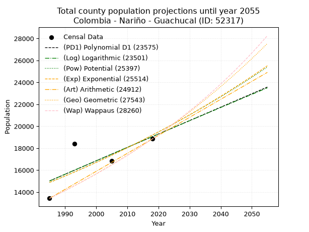
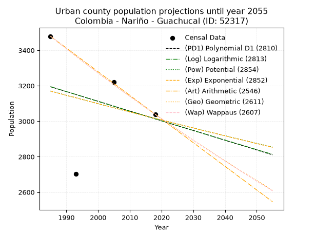
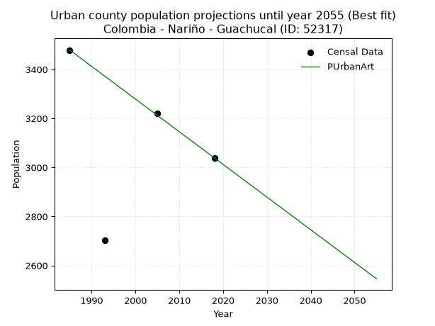
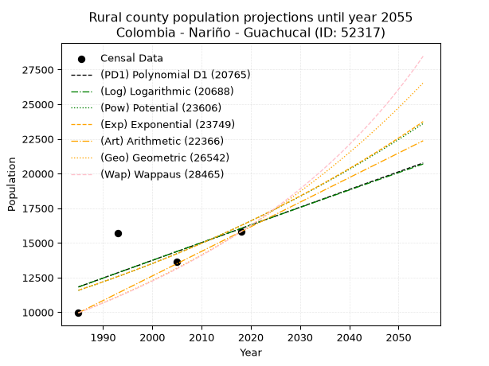
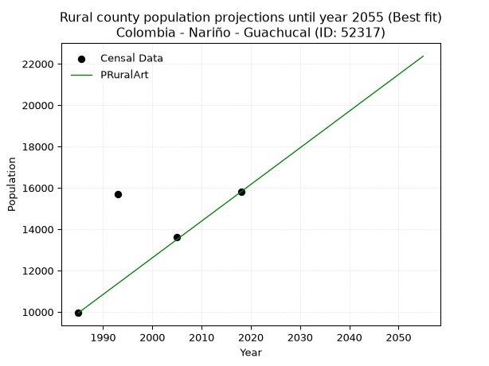

<div align="center">


</div>

# _“Population and Public Services Demand Projections (PPSD) until Year 2050 for Colombia - Nariño - Guachucal (ID: 52317)”_
Keywords: `population` `public-service` `projection` `lineal` `polynomial` `logarithmic` `potential` `exponential` `arithmetic` `geometric` `wappaus` `dane` `colombia` `south-america`

PPSD are analytical estimates used by governments and planners to anticipate future changes in population size, age distribution, and the resulting community needs for utilities, healthcare, education, and infrastructure as sizing future water treatment facilities, electrical grids, and road networks based on spatial growth.

> **General running parameters**: • app_version: _v20260806_. • Python version: _3.14.7_. • Pandas version: _3.0.5_. • NumPy version: _2.5.1_. • Creates, save and include plots into reports (create_plot): _False_. • Projection until year: _2050_. • Process polynomial degree 2 and up: _False_. • Process Wappaus: _True_. • Process Wappaus: _True_. • Set negative values to zero: _True_. • Set infinite values to zero: _True_. • Drop dataset notes: _True_. 
<div align="center">

Dynamic map: [:earth_americas:Google](http://maps.google.com/maps?q=0.959744497,-77.7315889) [:earth_americas:OSM](https://www.openstreetmap.org/#map=18/0.959744497/-77.7315889&layers=P) [:earth_americas:Bing](https://www.bing.com/maps?cp=0.959744497~-77.7315889&lvl=18) [:earth_americas:Apple](https://maps.apple.com/frame?center=0.959744497%2C-77.7315889&span=0.003%2C0.006)

</div>


<div align="center">

```geojson
{
  "type": "Feature",
  "geometry": {
    "type": "Point", 
    "coordinates": [-77.7315889, 0.959744497]
  }, 
  "properties": {
    "Name": "Colombia - Nariño - Guachucal (ID: 52317)"
  }
}
```

</div>


## 0. Census Data (4 records)

Census data are official statistics collected by a government about the people and housing in a country. They usually include counts of total population, age, sex, race, income, education, and jobs.

📅Global census file: [Population.xlsx](../data/Population.xlsx)

| Source   |   Year |   CountryID | CountryName   |   StateID | StateName   |   CountyID | CountyName   |   PTotal |   PUrban |   PRural |
|:---------|-------:|------------:|:--------------|----------:|:------------|-----------:|:-------------|---------:|---------:|---------:|
| DANE     |   1985 |          57 | Colombia      |        52 | Nariño      |      52317 | Guachucal    |    13434 |     3479 |     9955 |
| DANE     |   1993 |          57 | Colombia      |        52 | Nariño      |      52317 | Guachucal    |    18410 |     2704 |    15706 |
| DANE     |   2005 |          57 | Colombia      |        52 | Nariño      |      52317 | Guachucal    |    16837 |     3221 |    13616 |
| DANE     |   2018 |          57 | Colombia      |        52 | Nariño      |      52317 | Guachucal    |    18845 |     3039 |    15806 |

> 🔥Some records could had specific notes about the registered values or the corresponding urban or rural distribution.

📅   [RUPS](https://www.datos.gov.co/Hacienda-y-Cr-dito-P-blico/Registro-nico-de-Prestadores-de-Servicios-P-blicos/4qkq-csdn/about_data) - Local public utility companies: [RUPS.csv](../data/RUPS.xlsx)

 | SERVICIO       | ESTADO    | NOMBRE                                               | NIT         | DEPARTAMENTO_DOMICILIO   | MUNICIPIO_DOMICILIO   | DIRECCION         |   TELEFONO | EMAIL                | TIPO_INSCRIPCION    | REPRESENTANTE_LEGAL               | TIPO_PRESTADOR                            | CLASIFICACION                 |
|:---------------|:----------|:-----------------------------------------------------|:------------|:-------------------------|:----------------------|:------------------|-----------:|:---------------------|:--------------------|:----------------------------------|:------------------------------------------|:------------------------------|
| ACUEDUCTO      | OPERATIVA | EMPRESA MUNICIPAL DE SERVICIOS PUBLICOS DE GUACHUCAL | 814002063-6 | NARINO                   | GUACHUCAL             | BARRIO FUNDADORES |    7778518 | empagua2003@yahoo.es | Registro por la ESP | ROGER FERNANDO MONTENEGRO PAREDES | EMPRESA INDUSTRIAL Y COMERCIAL DEL ESTADO | MENOR O IGUAL A 2500 USUARIOS |
| ALCANTARILLADO | OPERATIVA | EMPRESA MUNICIPAL DE SERVICIOS PUBLICOS DE GUACHUCAL | 814002063-6 | NARINO                   | GUACHUCAL             | BARRIO FUNDADORES |    7778518 | empagua2003@yahoo.es | Registro por la ESP | ROGER FERNANDO MONTENEGRO PAREDES | EMPRESA INDUSTRIAL Y COMERCIAL DEL ESTADO | MENOR O IGUAL A 2500 USUARIOS |

## 1. Total

### 1.1. Coefficients and Parameters

* (PD1) Polynomial Deg 1: 122.25371336812408, -227656.4901645902 (lineal)
* (Log) Logarithmic: 244964.1273270111, -1845092.7948319307
* (Pow) Potential: 15.43190447953833, -46.71820700229263
* (Exp) Exponential: 0.007700737248199039, 0.003420333961523061
* (Art) Arithmetic: Year diff. 2018 - 1985 = 33, Population diff. 18845 - 13434 = 5411, Annual growth = 163.96969696969697
* (Geo) Geometric: Year diff. 2018 - 1985 = 33, Population diff. 18845 - 13434 = 5411, Annual growth % = 0.010309104282115733
* (Wap) Wappaus: i = 1.0159527678657763, Condition values only valid for < 200)

<sub>
Wappaus condition values: ['0.00', '1.02', '2.03', '3.05', '4.06', '5.08', '6.10', '7.11', '8.13', '9.14', '10.16', '11.18', '12.19', '13.21', '14.22', '15.24', '16.26', '17.27', '18.29', '19.30', '20.32', '21.34', '22.35', '23.37', '24.38', '25.40', '26.41', '27.43', '28.45', '29.46', '30.48', '31.49', '32.51', '33.53', '34.54', '35.56', '36.57', '37.59', '38.61', '39.62', '40.64', '41.65', '42.67', '43.69', '44.70', '45.72', '46.73', '47.75', '48.77', '49.78', '50.80', '51.81', '52.83', '53.85', '54.86', '55.88', '56.89', '57.91', '58.93', '59.94', '60.96', '61.97', '62.99', '64.01', '65.02', '66.04']
</sub>


### 1.2. Projected Dataset

|   Year |   CountyID |   PTotalPD1 |   PTotalLog |   PTotalPow |   PTotalExp |   PTotalArt |   PTotalGeo |   PTotalWap |
|-------:|-----------:|------------:|------------:|------------:|------------:|------------:|------------:|------------:|
|   1985 |      52317 |       15017 |       15011 |       14877 |       14883 |       13434 |       13434 |       13434 |
|   1986 |      52317 |       15139 |       15135 |       14993 |       14998 |       13598 |       13572 |       13571 |
|   1987 |      52317 |       15262 |       15258 |       15110 |       15114 |       13762 |       13712 |       13710 |
|   1988 |      52317 |       15384 |       15381 |       15228 |       15230 |       13926 |       13854 |       13850 |
|   1989 |      52317 |       15506 |       15505 |       15347 |       15348 |       14090 |       13997 |       13991 |
|   1990 |      52317 |       15628 |       15628 |       15466 |       15467 |       14254 |       14141 |       14134 |
|   1991 |      52317 |       15751 |       15751 |       15586 |       15586 |       14418 |       14287 |       14279 |
|   1992 |      52317 |       15873 |       15874 |       15708 |       15707 |       14582 |       14434 |       14425 |
|   1993 |      52317 |       15995 |       15997 |       15830 |       15828 |       14746 |       14583 |       14572 |
|   1994 |      52317 |       16117 |       16120 |       15953 |       15951 |       14910 |       14733 |       14721 |
|   1995 |      52317 |       16240 |       16242 |       16077 |       16074 |       15074 |       14885 |       14872 |
|   1996 |      52317 |       16362 |       16365 |       16201 |       16198 |       15238 |       15038 |       15024 |
|   1997 |      52317 |       16484 |       16488 |       16327 |       16323 |       15402 |       15193 |       15178 |
|   1998 |      52317 |       16606 |       16611 |       16454 |       16450 |       15566 |       15350 |       15334 |
|   1999 |      52317 |       16729 |       16733 |       16581 |       16577 |       15730 |       15508 |       15491 |
|   2000 |      52317 |       16851 |       16856 |       16710 |       16705 |       15894 |       15668 |       15650 |
|   2001 |      52317 |       16973 |       16978 |       16839 |       16834 |       16058 |       15830 |       15811 |
|   2002 |      52317 |       17095 |       17100 |       16970 |       16964 |       16221 |       15993 |       15974 |
|   2003 |      52317 |       17218 |       17223 |       17101 |       17095 |       16385 |       16158 |       16138 |
|   2004 |      52317 |       17340 |       17345 |       17233 |       17227 |       16549 |       16324 |       16304 |
|   2005 |      52317 |       17462 |       17467 |       17366 |       17361 |       16713 |       16493 |       16472 |
|   2006 |      52317 |       17584 |       17589 |       17500 |       17495 |       16877 |       16663 |       16642 |
|   2007 |      52317 |       17707 |       17712 |       17636 |       17630 |       17041 |       16834 |       16814 |
|   2008 |      52317 |       17829 |       17834 |       17772 |       17766 |       17205 |       17008 |       16988 |
|   2009 |      52317 |       17951 |       17956 |       17909 |       17904 |       17369 |       17183 |       17164 |
|   2010 |      52317 |       18073 |       18077 |       18047 |       18042 |       17533 |       17360 |       17342 |
|   2011 |      52317 |       18196 |       18199 |       18186 |       18182 |       17697 |       17539 |       17523 |
|   2012 |      52317 |       18318 |       18321 |       18326 |       18322 |       17861 |       17720 |       17705 |
|   2013 |      52317 |       18440 |       18443 |       18467 |       18464 |       18025 |       17903 |       17889 |
|   2014 |      52317 |       18562 |       18564 |       18609 |       18607 |       18189 |       18088 |       18076 |
|   2015 |      52317 |       18685 |       18686 |       18752 |       18750 |       18353 |       18274 |       18265 |
|   2016 |      52317 |       18807 |       18808 |       18896 |       18895 |       18517 |       18462 |       18456 |
|   2017 |      52317 |       18929 |       18929 |       19041 |       19041 |       18681 |       18653 |       18649 |
|   2018 |      52317 |       19052 |       19050 |       19188 |       19189 |       18845 |       18845 |       18845 |
|   2019 |      52317 |       19174 |       19172 |       19335 |       19337 |       19009 |       19039 |       19043 |
|   2020 |      52317 |       19296 |       19293 |       19483 |       19486 |       19173 |       19236 |       19244 |
|   2021 |      52317 |       19418 |       19414 |       19633 |       19637 |       19337 |       19434 |       19447 |
|   2022 |      52317 |       19541 |       19536 |       19783 |       19789 |       19501 |       19634 |       19653 |
|   2023 |      52317 |       19663 |       19657 |       19935 |       19942 |       19665 |       19837 |       19861 |
|   2024 |      52317 |       19785 |       19778 |       20087 |       20096 |       19829 |       20041 |       20072 |
|   2025 |      52317 |       19907 |       19899 |       20241 |       20251 |       19993 |       20248 |       20285 |
|   2026 |      52317 |       20030 |       20020 |       20396 |       20408 |       20157 |       20456 |       20502 |
|   2027 |      52317 |       20152 |       20141 |       20552 |       20566 |       20321 |       20667 |       20721 |
|   2028 |      52317 |       20274 |       20261 |       20709 |       20725 |       20485 |       20880 |       20943 |
|   2029 |      52317 |       20396 |       20382 |       20867 |       20885 |       20649 |       21096 |       21168 |
|   2030 |      52317 |       20519 |       20503 |       21026 |       21046 |       20813 |       21313 |       21396 |
|   2031 |      52317 |       20641 |       20623 |       21186 |       21209 |       20977 |       21533 |       21627 |
|   2032 |      52317 |       20763 |       20744 |       21348 |       21373 |       21141 |       21755 |       21861 |
|   2033 |      52317 |       20885 |       20865 |       21511 |       21538 |       21305 |       21979 |       22098 |
|   2034 |      52317 |       21008 |       20985 |       21674 |       21705 |       21469 |       22206 |       22338 |
|   2035 |      52317 |       21130 |       21105 |       21840 |       21872 |       21632 |       22435 |       22582 |
|   2036 |      52317 |       21252 |       21226 |       22006 |       22042 |       21796 |       22666 |       22828 |
|   2037 |      52317 |       21374 |       21346 |       22173 |       22212 |       21960 |       22900 |       23079 |
|   2038 |      52317 |       21497 |       21466 |       22342 |       22384 |       22124 |       23136 |       23333 |
|   2039 |      52317 |       21619 |       21586 |       22511 |       22557 |       22288 |       23374 |       23590 |
|   2040 |      52317 |       21741 |       21707 |       22682 |       22731 |       22452 |       23615 |       23851 |
|   2041 |      52317 |       21863 |       21827 |       22855 |       22907 |       22616 |       23859 |       24116 |
|   2042 |      52317 |       21986 |       21947 |       23028 |       23084 |       22780 |       24105 |       24384 |
|   2043 |      52317 |       22108 |       22067 |       23203 |       23262 |       22944 |       24353 |       24656 |
|   2044 |      52317 |       22230 |       22186 |       23379 |       23442 |       23108 |       24604 |       24933 |
|   2045 |      52317 |       22352 |       22306 |       23556 |       23623 |       23272 |       24858 |       25213 |
|   2046 |      52317 |       22475 |       22426 |       23734 |       23806 |       23436 |       25114 |       25498 |
|   2047 |      52317 |       22597 |       22546 |       23914 |       23990 |       23600 |       25373 |       25786 |
|   2048 |      52317 |       22719 |       22665 |       24095 |       24175 |       23764 |       25634 |       26079 |
|   2049 |      52317 |       22841 |       22785 |       24277 |       24362 |       23928 |       25899 |       26377 |
|   2050 |      52317 |       22964 |       22904 |       24460 |       24551 |       24092 |       26166 |       26679 |
<div align="center">

</img>

</div>


### 1.3. Best fit with absolute and relative error (%)

Relative error puts that difference into context by dividing the absolute error by the true value, creating a unitless ratio or percentage that shows the scale of the mistake.

Absolute and relative error

|   Year | Source   |   CountryID | CountryName   |   StateID | StateName   |   CountyID_x | CountyName   |   PTotal |   PUrban |   PRural |   CountyID_y |   PTotalPD1 |   PTotalLog |   PTotalPow |   PTotalExp |   PTotalArt |   PTotalGeo |   PTotalWap |   PTotalPD1AbsError |   PTotalLogAbsError |   PTotalPowAbsError |   PTotalExpAbsError |   PTotalArtAbsError |   PTotalGeoAbsError |   PTotalWapAbsError |   PTotalPD1RelError |   PTotalLogRelError |   PTotalPowRelError |   PTotalExpRelError |   PTotalArtRelError |   PTotalGeoRelError |   PTotalWapRelError |
|-------:|:---------|------------:|:--------------|----------:|:------------|-------------:|:-------------|---------:|---------:|---------:|-------------:|------------:|------------:|------------:|------------:|------------:|------------:|------------:|--------------------:|--------------------:|--------------------:|--------------------:|--------------------:|--------------------:|--------------------:|--------------------:|--------------------:|--------------------:|--------------------:|--------------------:|--------------------:|--------------------:|
|   1985 | DANE     |          57 | Colombia      |        52 | Nariño      |        52317 | Guachucal    |    13434 |     3479 |     9955 |        52317 |       15017 |       15011 |       14877 |       14883 |       13434 |       13434 |       13434 |                1583 |                1577 |                1443 |                1449 |                   0 |                   0 |                   0 |            11.7835  |            11.7389  |            10.7414  |            10.7861  |            0        |             0       |             0       |
|   1993 | DANE     |          57 | Colombia      |        52 | Nariño      |        52317 | Guachucal    |    18410 |     2704 |    15706 |        52317 |       15995 |       15997 |       15830 |       15828 |       14746 |       14583 |       14572 |                2415 |                2413 |                2580 |                2582 |                3664 |                3827 |                3838 |            13.1179  |            13.107   |            14.0141  |            14.025   |           19.9022   |            20.7876  |            20.8474  |
|   2005 | DANE     |          57 | Colombia      |        52 | Nariño      |        52317 | Guachucal    |    16837 |     3221 |    13616 |        52317 |       17462 |       17467 |       17366 |       17361 |       16713 |       16493 |       16472 |                 625 |                 630 |                 529 |                 524 |                 124 |                 344 |                 365 |             3.71206 |             3.74176 |             3.14189 |             3.11219 |            0.736473 |             2.04312 |             2.16784 |
|   2018 | DANE     |          57 | Colombia      |        52 | Nariño      |        52317 | Guachucal    |    18845 |     3039 |    15806 |        52317 |       19052 |       19050 |       19188 |       19189 |       18845 |       18845 |       18845 |                 207 |                 205 |                 343 |                 344 |                   0 |                   0 |                   0 |             1.09843 |             1.08782 |             1.82011 |             1.82542 |            0        |             0       |             0       |

Relative error mean

| Method    |   RelError | Best   |
|:----------|-----------:|:-------|
| PTotalPD1 |    7.42798 |        |
| PTotalLog |    7.41886 |        |
| PTotalPow |    7.42938 |        |
| PTotalExp |    7.43717 |        |
| PTotalArt |    5.15968 | True   |
| PTotalGeo |    5.70768 |        |
| PTotalWap |    5.7538  |        |

💙Best method: _**PTotalArt**_
<div align="center">

</img>

</div>


### 1.4. Fresh water supply demand in liters per capita per day (lpcd)

The fresh water supply demand typically ranges from 100 to 300 liters per capita per day (lpcd) for standard domestic and municipal planning, though absolute survival minimums set by the World Health Organization are as low as 7.5 to 20 liters per day, and total consumption in high-income nations can exceed 400 liters.

> `CZ`: Level in meters above the sea level (masl)<br> `WS`: Fresh water supply demand in liters per capita per day (lpcd or l/h/d)<br> `WSAll`: Zonal fresh water supply demand in liters per second (l/s)<br> `A`: Zonal area in square meters<br> `DP`: Population density (people/hectare or p/ha)

Reference values (RAS Colombia)

|    CZ |   WS |
|------:|-----:|
|  1000 |  120 |
|  2000 |  130 |
| 99999 |  140 |

County shapefile geometry properties and water supply values

|   CountyID |     ATotal |   CZTotal |   WSTotal |
|-----------:|-----------:|----------:|----------:|
|      52317 | 1.5585e+08 |   3224.18 |       140 |

Projected values for best method: PTotalArt

|   CountyID |   Year |   PTotalArt |   DPTotal |   WSTotal |   WSTotalAll |
|-----------:|-------:|------------:|----------:|----------:|-------------:|
|      52317 |   1985 |       13434 |      0.86 |       140 |      21.7681 |
|      52317 |   1986 |       13598 |      0.87 |       140 |      22.0338 |
|      52317 |   1987 |       13762 |      0.88 |       140 |      22.2995 |
|      52317 |   1988 |       13926 |      0.89 |       140 |      22.5653 |
|      52317 |   1989 |       14090 |      0.9  |       140 |      22.831  |
|      52317 |   1990 |       14254 |      0.91 |       140 |      23.0968 |
|      52317 |   1991 |       14418 |      0.93 |       140 |      23.3625 |
|      52317 |   1992 |       14582 |      0.94 |       140 |      23.6282 |
|      52317 |   1993 |       14746 |      0.95 |       140 |      23.894  |
|      52317 |   1994 |       14910 |      0.96 |       140 |      24.1597 |
|      52317 |   1995 |       15074 |      0.97 |       140 |      24.4255 |
|      52317 |   1996 |       15238 |      0.98 |       140 |      24.6912 |
|      52317 |   1997 |       15402 |      0.99 |       140 |      24.9569 |
|      52317 |   1998 |       15566 |      1    |       140 |      25.2227 |
|      52317 |   1999 |       15730 |      1.01 |       140 |      25.4884 |
|      52317 |   2000 |       15894 |      1.02 |       140 |      25.7542 |
|      52317 |   2001 |       16058 |      1.03 |       140 |      26.0199 |
|      52317 |   2002 |       16221 |      1.04 |       140 |      26.284  |
|      52317 |   2003 |       16385 |      1.05 |       140 |      26.5498 |
|      52317 |   2004 |       16549 |      1.06 |       140 |      26.8155 |
|      52317 |   2005 |       16713 |      1.07 |       140 |      27.0813 |
|      52317 |   2006 |       16877 |      1.08 |       140 |      27.347  |
|      52317 |   2007 |       17041 |      1.09 |       140 |      27.6127 |
|      52317 |   2008 |       17205 |      1.1  |       140 |      27.8785 |
|      52317 |   2009 |       17369 |      1.11 |       140 |      28.1442 |
|      52317 |   2010 |       17533 |      1.12 |       140 |      28.41   |
|      52317 |   2011 |       17697 |      1.14 |       140 |      28.6757 |
|      52317 |   2012 |       17861 |      1.15 |       140 |      28.9414 |
|      52317 |   2013 |       18025 |      1.16 |       140 |      29.2072 |
|      52317 |   2014 |       18189 |      1.17 |       140 |      29.4729 |
|      52317 |   2015 |       18353 |      1.18 |       140 |      29.7387 |
|      52317 |   2016 |       18517 |      1.19 |       140 |      30.0044 |
|      52317 |   2017 |       18681 |      1.2  |       140 |      30.2701 |
|      52317 |   2018 |       18845 |      1.21 |       140 |      30.5359 |
|      52317 |   2019 |       19009 |      1.22 |       140 |      30.8016 |
|      52317 |   2020 |       19173 |      1.23 |       140 |      31.0674 |
|      52317 |   2021 |       19337 |      1.24 |       140 |      31.3331 |
|      52317 |   2022 |       19501 |      1.25 |       140 |      31.5988 |
|      52317 |   2023 |       19665 |      1.26 |       140 |      31.8646 |
|      52317 |   2024 |       19829 |      1.27 |       140 |      32.1303 |
|      52317 |   2025 |       19993 |      1.28 |       140 |      32.3961 |
|      52317 |   2026 |       20157 |      1.29 |       140 |      32.6618 |
|      52317 |   2027 |       20321 |      1.3  |       140 |      32.9275 |
|      52317 |   2028 |       20485 |      1.31 |       140 |      33.1933 |
|      52317 |   2029 |       20649 |      1.32 |       140 |      33.459  |
|      52317 |   2030 |       20813 |      1.34 |       140 |      33.7248 |
|      52317 |   2031 |       20977 |      1.35 |       140 |      33.9905 |
|      52317 |   2032 |       21141 |      1.36 |       140 |      34.2563 |
|      52317 |   2033 |       21305 |      1.37 |       140 |      34.522  |
|      52317 |   2034 |       21469 |      1.38 |       140 |      34.7877 |
|      52317 |   2035 |       21632 |      1.39 |       140 |      35.0519 |
|      52317 |   2036 |       21796 |      1.4  |       140 |      35.3176 |
|      52317 |   2037 |       21960 |      1.41 |       140 |      35.5833 |
|      52317 |   2038 |       22124 |      1.42 |       140 |      35.8491 |
|      52317 |   2039 |       22288 |      1.43 |       140 |      36.1148 |
|      52317 |   2040 |       22452 |      1.44 |       140 |      36.3806 |
|      52317 |   2041 |       22616 |      1.45 |       140 |      36.6463 |
|      52317 |   2042 |       22780 |      1.46 |       140 |      36.912  |
|      52317 |   2043 |       22944 |      1.47 |       140 |      37.1778 |
|      52317 |   2044 |       23108 |      1.48 |       140 |      37.4435 |
|      52317 |   2045 |       23272 |      1.49 |       140 |      37.7093 |
|      52317 |   2046 |       23436 |      1.5  |       140 |      37.975  |
|      52317 |   2047 |       23600 |      1.51 |       140 |      38.2407 |
|      52317 |   2048 |       23764 |      1.52 |       140 |      38.5065 |
|      52317 |   2049 |       23928 |      1.54 |       140 |      38.7722 |
|      52317 |   2050 |       24092 |      1.55 |       140 |      39.038  |

## 2. Urban

### 2.1. Coefficients and Parameters

* (PD1) Polynomial Deg 1: -5.486551585708452, 14085.224809313331 (lineal)
* (Log) Logarithmic: -11025.4868685135, 86915.56404027795
* (Pow) Potential: -3.032126342526559, 13.500324639772625
* (Exp) Exponential: -0.00150782867426979, 63225.56098594392
* (Art) Arithmetic: Year diff. 2018 - 1985 = 33, Population diff. 3039 - 3479 = -440, Annual growth = -13.333333333333334
* (Geo) Geometric: Year diff. 2018 - 1985 = 33, Population diff. 3039 - 3479 = -440, Annual growth % = -0.004089082967815405
* (Wap) Wappaus: i = -0.40912345300194336, Condition values only valid for < 200)

<sub>
Wappaus condition values: ['-0.00', '-0.41', '-0.82', '-1.23', '-1.64', '-2.05', '-2.45', '-2.86', '-3.27', '-3.68', '-4.09', '-4.50', '-4.91', '-5.32', '-5.73', '-6.14', '-6.55', '-6.96', '-7.36', '-7.77', '-8.18', '-8.59', '-9.00', '-9.41', '-9.82', '-10.23', '-10.64', '-11.05', '-11.46', '-11.86', '-12.27', '-12.68', '-13.09', '-13.50', '-13.91', '-14.32', '-14.73', '-15.14', '-15.55', '-15.96', '-16.36', '-16.77', '-17.18', '-17.59', '-18.00', '-18.41', '-18.82', '-19.23', '-19.64', '-20.05', '-20.46', '-20.87', '-21.27', '-21.68', '-22.09', '-22.50', '-22.91', '-23.32', '-23.73', '-24.14', '-24.55', '-24.96', '-25.37', '-25.77', '-26.18', '-26.59']
</sub>


### 2.2. Projected Dataset

|   Year |   CountyID |   PUrbanPD1 |   PUrbanLog |   PUrbanPow |   PUrbanExp |   PUrbanArt |   PUrbanGeo |   PUrbanWap |
|-------:|-----------:|------------:|------------:|------------:|------------:|------------:|------------:|------------:|
|   1985 |      52317 |        3194 |        3195 |        3170 |        3170 |        3479 |        3479 |        3479 |
|   1986 |      52317 |        3189 |        3189 |        3165 |        3165 |        3466 |        3465 |        3465 |
|   1987 |      52317 |        3183 |        3184 |        3161 |        3160 |        3452 |        3451 |        3451 |
|   1988 |      52317 |        3178 |        3178 |        3156 |        3155 |        3439 |        3436 |        3437 |
|   1989 |      52317 |        3172 |        3173 |        3151 |        3151 |        3426 |        3422 |        3423 |
|   1990 |      52317 |        3167 |        3167 |        3146 |        3146 |        3412 |        3408 |        3409 |
|   1991 |      52317 |        3162 |        3162 |        3141 |        3141 |        3399 |        3395 |        3395 |
|   1992 |      52317 |        3156 |        3156 |        3137 |        3137 |        3386 |        3381 |        3381 |
|   1993 |      52317 |        3151 |        3151 |        3132 |        3132 |        3372 |        3367 |        3367 |
|   1994 |      52317 |        3145 |        3145 |        3127 |        3127 |        3359 |        3353 |        3353 |
|   1995 |      52317 |        3140 |        3140 |        3122 |        3122 |        3346 |        3339 |        3340 |
|   1996 |      52317 |        3134 |        3134 |        3118 |        3118 |        3332 |        3326 |        3326 |
|   1997 |      52317 |        3129 |        3128 |        3113 |        3113 |        3319 |        3312 |        3312 |
|   1998 |      52317 |        3123 |        3123 |        3108 |        3108 |        3306 |        3299 |        3299 |
|   1999 |      52317 |        3118 |        3117 |        3103 |        3104 |        3292 |        3285 |        3285 |
|   2000 |      52317 |        3112 |        3112 |        3099 |        3099 |        3279 |        3272 |        3272 |
|   2001 |      52317 |        3107 |        3106 |        3094 |        3094 |        3266 |        3258 |        3258 |
|   2002 |      52317 |        3101 |        3101 |        3089 |        3090 |        3252 |        3245 |        3245 |
|   2003 |      52317 |        3096 |        3095 |        3085 |        3085 |        3239 |        3232 |        3232 |
|   2004 |      52317 |        3090 |        3090 |        3080 |        3080 |        3226 |        3218 |        3219 |
|   2005 |      52317 |        3085 |        3084 |        3075 |        3076 |        3212 |        3205 |        3206 |
|   2006 |      52317 |        3079 |        3079 |        3071 |        3071 |        3199 |        3192 |        3192 |
|   2007 |      52317 |        3074 |        3073 |        3066 |        3066 |        3186 |        3179 |        3179 |
|   2008 |      52317 |        3068 |        3068 |        3061 |        3062 |        3172 |        3166 |        3166 |
|   2009 |      52317 |        3063 |        3062 |        3057 |        3057 |        3159 |        3153 |        3153 |
|   2010 |      52317 |        3057 |        3057 |        3052 |        3053 |        3146 |        3140 |        3140 |
|   2011 |      52317 |        3052 |        3051 |        3048 |        3048 |        3132 |        3127 |        3128 |
|   2012 |      52317 |        3046 |        3046 |        3043 |        3043 |        3119 |        3115 |        3115 |
|   2013 |      52317 |        3041 |        3040 |        3038 |        3039 |        3106 |        3102 |        3102 |
|   2014 |      52317 |        3035 |        3035 |        3034 |        3034 |        3092 |        3089 |        3089 |
|   2015 |      52317 |        3030 |        3030 |        3029 |        3030 |        3079 |        3077 |        3077 |
|   2016 |      52317 |        3024 |        3024 |        3025 |        3025 |        3066 |        3064 |        3064 |
|   2017 |      52317 |        3019 |        3019 |        3020 |        3020 |        3052 |        3051 |        3052 |
|   2018 |      52317 |        3013 |        3013 |        3016 |        3016 |        3039 |        3039 |        3039 |
|   2019 |      52317 |        3008 |        3008 |        3011 |        3011 |        3026 |        3027 |        3027 |
|   2020 |      52317 |        3002 |        3002 |        3007 |        3007 |        3012 |        3014 |        3014 |
|   2021 |      52317 |        2997 |        2997 |        3002 |        3002 |        2999 |        3002 |        3002 |
|   2022 |      52317 |        2991 |        2991 |        2998 |        2998 |        2986 |        2990 |        2989 |
|   2023 |      52317 |        2986 |        2986 |        2993 |        2993 |        2972 |        2977 |        2977 |
|   2024 |      52317 |        2980 |        2980 |        2989 |        2989 |        2959 |        2965 |        2965 |
|   2025 |      52317 |        2975 |        2975 |        2984 |        2984 |        2946 |        2953 |        2953 |
|   2026 |      52317 |        2969 |        2970 |        2980 |        2980 |        2932 |        2941 |        2941 |
|   2027 |      52317 |        2964 |        2964 |        2975 |        2975 |        2919 |        2929 |        2928 |
|   2028 |      52317 |        2958 |        2959 |        2971 |        2971 |        2906 |        2917 |        2916 |
|   2029 |      52317 |        2953 |        2953 |        2966 |        2966 |        2892 |        2905 |        2904 |
|   2030 |      52317 |        2948 |        2948 |        2962 |        2962 |        2879 |        2893 |        2892 |
|   2031 |      52317 |        2942 |        2942 |        2958 |        2957 |        2866 |        2881 |        2881 |
|   2032 |      52317 |        2937 |        2937 |        2953 |        2953 |        2852 |        2870 |        2869 |
|   2033 |      52317 |        2931 |        2931 |        2949 |        2948 |        2839 |        2858 |        2857 |
|   2034 |      52317 |        2926 |        2926 |        2944 |        2944 |        2826 |        2846 |        2845 |
|   2035 |      52317 |        2920 |        2921 |        2940 |        2940 |        2812 |        2835 |        2833 |
|   2036 |      52317 |        2915 |        2915 |        2936 |        2935 |        2799 |        2823 |        2822 |
|   2037 |      52317 |        2909 |        2910 |        2931 |        2931 |        2786 |        2811 |        2810 |
|   2038 |      52317 |        2904 |        2904 |        2927 |        2926 |        2772 |        2800 |        2798 |
|   2039 |      52317 |        2898 |        2899 |        2922 |        2922 |        2759 |        2788 |        2787 |
|   2040 |      52317 |        2893 |        2894 |        2918 |        2918 |        2746 |        2777 |        2775 |
|   2041 |      52317 |        2887 |        2888 |        2914 |        2913 |        2732 |        2766 |        2764 |
|   2042 |      52317 |        2882 |        2883 |        2909 |        2909 |        2719 |        2754 |        2752 |
|   2043 |      52317 |        2876 |        2877 |        2905 |        2904 |        2706 |        2743 |        2741 |
|   2044 |      52317 |        2871 |        2872 |        2901 |        2900 |        2692 |        2732 |        2730 |
|   2045 |      52317 |        2865 |        2867 |        2897 |        2896 |        2679 |        2721 |        2718 |
|   2046 |      52317 |        2860 |        2861 |        2892 |        2891 |        2666 |        2710 |        2707 |
|   2047 |      52317 |        2854 |        2856 |        2888 |        2887 |        2652 |        2699 |        2696 |
|   2048 |      52317 |        2849 |        2850 |        2884 |        2883 |        2639 |        2687 |        2685 |
|   2049 |      52317 |        2843 |        2845 |        2879 |        2878 |        2626 |        2676 |        2674 |
|   2050 |      52317 |        2838 |        2840 |        2875 |        2874 |        2612 |        2666 |        2662 |
<div align="center">

</img>

</div>


### 2.3. Best fit with absolute and relative error (%)

Relative error puts that difference into context by dividing the absolute error by the true value, creating a unitless ratio or percentage that shows the scale of the mistake.

Absolute and relative error

|   Year | Source   |   CountryID | CountryName   |   StateID | StateName   |   CountyID_x | CountyName   |   PTotal |   PUrban |   PRural |   CountyID_y |   PUrbanPD1 |   PUrbanLog |   PUrbanPow |   PUrbanExp |   PUrbanArt |   PUrbanGeo |   PUrbanWap |   PUrbanPD1AbsError |   PUrbanLogAbsError |   PUrbanPowAbsError |   PUrbanExpAbsError |   PUrbanArtAbsError |   PUrbanGeoAbsError |   PUrbanWapAbsError |   PUrbanPD1RelError |   PUrbanLogRelError |   PUrbanPowRelError |   PUrbanExpRelError |   PUrbanArtRelError |   PUrbanGeoRelError |   PUrbanWapRelError |
|-------:|:---------|------------:|:--------------|----------:|:------------|-------------:|:-------------|---------:|---------:|---------:|-------------:|------------:|------------:|------------:|------------:|------------:|------------:|------------:|--------------------:|--------------------:|--------------------:|--------------------:|--------------------:|--------------------:|--------------------:|--------------------:|--------------------:|--------------------:|--------------------:|--------------------:|--------------------:|--------------------:|
|   1985 | DANE     |          57 | Colombia      |        52 | Nariño      |        52317 | Guachucal    |    13434 |     3479 |     9955 |        52317 |        3194 |        3195 |        3170 |        3170 |        3479 |        3479 |        3479 |                 285 |                 284 |                 309 |                 309 |                   0 |                   0 |                   0 |            8.19201  |            8.16327  |            8.88186  |            8.88186  |            0        |             0       |            0        |
|   1993 | DANE     |          57 | Colombia      |        52 | Nariño      |        52317 | Guachucal    |    18410 |     2704 |    15706 |        52317 |        3151 |        3151 |        3132 |        3132 |        3372 |        3367 |        3367 |                 447 |                 447 |                 428 |                 428 |                 668 |                 663 |                 663 |           16.5311   |           16.5311   |           15.8284   |           15.8284   |           24.7041   |            24.5192  |           24.5192   |
|   2005 | DANE     |          57 | Colombia      |        52 | Nariño      |        52317 | Guachucal    |    16837 |     3221 |    13616 |        52317 |        3085 |        3084 |        3075 |        3076 |        3212 |        3205 |        3206 |                 136 |                 137 |                 146 |                 145 |                   9 |                  16 |                  15 |            4.22229  |            4.25334  |            4.53275  |            4.50171  |            0.279416 |             0.49674 |            0.465694 |
|   2018 | DANE     |          57 | Colombia      |        52 | Nariño      |        52317 | Guachucal    |    18845 |     3039 |    15806 |        52317 |        3013 |        3013 |        3016 |        3016 |        3039 |        3039 |        3039 |                  26 |                  26 |                  23 |                  23 |                   0 |                   0 |                   0 |            0.855545 |            0.855545 |            0.756828 |            0.756828 |            0        |             0       |            0        |

Relative error mean

| Method    |   RelError | Best   |
|:----------|-----------:|:-------|
| PUrbanPD1 |    7.45023 |        |
| PUrbanLog |    7.4508  |        |
| PUrbanPow |    7.49996 |        |
| PUrbanExp |    7.4922  |        |
| PUrbanArt |    6.24589 | True   |
| PUrbanGeo |    6.25399 |        |
| PUrbanWap |    6.24623 |        |

💙Best method: _**PUrbanArt**_
<div align="center">

</img>

</div>


### 2.4. Fresh water supply demand in liters per capita per day (lpcd)

The fresh water supply demand typically ranges from 100 to 300 liters per capita per day (lpcd) for standard domestic and municipal planning, though absolute survival minimums set by the World Health Organization are as low as 7.5 to 20 liters per day, and total consumption in high-income nations can exceed 400 liters.

> `CZ`: Level in meters above the sea level (masl)<br> `WS`: Fresh water supply demand in liters per capita per day (lpcd or l/h/d)<br> `WSAll`: Zonal fresh water supply demand in liters per second (l/s)<br> `A`: Zonal area in square meters<br> `DP`: Population density (people/hectare or p/ha)

Reference values (RAS Colombia)

|    CZ |   WS |
|------:|-----:|
|  1000 |  120 |
|  2000 |  130 |
| 99999 |  140 |

County shapefile geometry properties and water supply values

|   CountyID |   AUrban |   CZUrban |   WSUrban |
|-----------:|---------:|----------:|----------:|
|      52317 |   666369 |   3095.78 |       140 |

Projected values for best method: PUrbanArt

|   CountyID |   Year |   PUrbanArt |   DPUrban |   WSUrban |   WSUrbanAll |
|-----------:|-------:|------------:|----------:|----------:|-------------:|
|      52317 |   1985 |        3479 |     52.21 |       140 |      5.63727 |
|      52317 |   1986 |        3466 |     52.01 |       140 |      5.6162  |
|      52317 |   1987 |        3452 |     51.8  |       140 |      5.59352 |
|      52317 |   1988 |        3439 |     51.61 |       140 |      5.57245 |
|      52317 |   1989 |        3426 |     51.41 |       140 |      5.55139 |
|      52317 |   1990 |        3412 |     51.2  |       140 |      5.5287  |
|      52317 |   1991 |        3399 |     51.01 |       140 |      5.50764 |
|      52317 |   1992 |        3386 |     50.81 |       140 |      5.48657 |
|      52317 |   1993 |        3372 |     50.6  |       140 |      5.46389 |
|      52317 |   1994 |        3359 |     50.41 |       140 |      5.44282 |
|      52317 |   1995 |        3346 |     50.21 |       140 |      5.42176 |
|      52317 |   1996 |        3332 |     50    |       140 |      5.39907 |
|      52317 |   1997 |        3319 |     49.81 |       140 |      5.37801 |
|      52317 |   1998 |        3306 |     49.61 |       140 |      5.35694 |
|      52317 |   1999 |        3292 |     49.4  |       140 |      5.33426 |
|      52317 |   2000 |        3279 |     49.21 |       140 |      5.31319 |
|      52317 |   2001 |        3266 |     49.01 |       140 |      5.29213 |
|      52317 |   2002 |        3252 |     48.8  |       140 |      5.26944 |
|      52317 |   2003 |        3239 |     48.61 |       140 |      5.24838 |
|      52317 |   2004 |        3226 |     48.41 |       140 |      5.22731 |
|      52317 |   2005 |        3212 |     48.2  |       140 |      5.20463 |
|      52317 |   2006 |        3199 |     48.01 |       140 |      5.18356 |
|      52317 |   2007 |        3186 |     47.81 |       140 |      5.1625  |
|      52317 |   2008 |        3172 |     47.6  |       140 |      5.13981 |
|      52317 |   2009 |        3159 |     47.41 |       140 |      5.11875 |
|      52317 |   2010 |        3146 |     47.21 |       140 |      5.09769 |
|      52317 |   2011 |        3132 |     47    |       140 |      5.075   |
|      52317 |   2012 |        3119 |     46.81 |       140 |      5.05394 |
|      52317 |   2013 |        3106 |     46.61 |       140 |      5.03287 |
|      52317 |   2014 |        3092 |     46.4  |       140 |      5.01019 |
|      52317 |   2015 |        3079 |     46.21 |       140 |      4.98912 |
|      52317 |   2016 |        3066 |     46.01 |       140 |      4.96806 |
|      52317 |   2017 |        3052 |     45.8  |       140 |      4.94537 |
|      52317 |   2018 |        3039 |     45.61 |       140 |      4.92431 |
|      52317 |   2019 |        3026 |     45.41 |       140 |      4.90324 |
|      52317 |   2020 |        3012 |     45.2  |       140 |      4.88056 |
|      52317 |   2021 |        2999 |     45.01 |       140 |      4.85949 |
|      52317 |   2022 |        2986 |     44.81 |       140 |      4.83843 |
|      52317 |   2023 |        2972 |     44.6  |       140 |      4.81574 |
|      52317 |   2024 |        2959 |     44.4  |       140 |      4.79468 |
|      52317 |   2025 |        2946 |     44.21 |       140 |      4.77361 |
|      52317 |   2026 |        2932 |     44    |       140 |      4.75093 |
|      52317 |   2027 |        2919 |     43.8  |       140 |      4.72986 |
|      52317 |   2028 |        2906 |     43.61 |       140 |      4.7088  |
|      52317 |   2029 |        2892 |     43.4  |       140 |      4.68611 |
|      52317 |   2030 |        2879 |     43.2  |       140 |      4.66505 |
|      52317 |   2031 |        2866 |     43.01 |       140 |      4.64398 |
|      52317 |   2032 |        2852 |     42.8  |       140 |      4.6213  |
|      52317 |   2033 |        2839 |     42.6  |       140 |      4.60023 |
|      52317 |   2034 |        2826 |     42.41 |       140 |      4.57917 |
|      52317 |   2035 |        2812 |     42.2  |       140 |      4.55648 |
|      52317 |   2036 |        2799 |     42    |       140 |      4.53542 |
|      52317 |   2037 |        2786 |     41.81 |       140 |      4.51435 |
|      52317 |   2038 |        2772 |     41.6  |       140 |      4.49167 |
|      52317 |   2039 |        2759 |     41.4  |       140 |      4.4706  |
|      52317 |   2040 |        2746 |     41.21 |       140 |      4.44954 |
|      52317 |   2041 |        2732 |     41    |       140 |      4.42685 |
|      52317 |   2042 |        2719 |     40.8  |       140 |      4.40579 |
|      52317 |   2043 |        2706 |     40.61 |       140 |      4.38472 |
|      52317 |   2044 |        2692 |     40.4  |       140 |      4.36204 |
|      52317 |   2045 |        2679 |     40.2  |       140 |      4.34097 |
|      52317 |   2046 |        2666 |     40.01 |       140 |      4.31991 |
|      52317 |   2047 |        2652 |     39.8  |       140 |      4.29722 |
|      52317 |   2048 |        2639 |     39.6  |       140 |      4.27616 |
|      52317 |   2049 |        2626 |     39.41 |       140 |      4.25509 |
|      52317 |   2050 |        2612 |     39.2  |       140 |      4.23241 |

## 3. Rural

### 3.1. Coefficients and Parameters

* (PD1) Polynomial Deg 1: 127.74026495383242, -241741.71497390332 (lineal)
* (Log) Logarithmic: 255989.61419552448, -1932008.3588722073
* (Pow) Potential: 20.558469616237375, -63.73332270477926
* (Exp) Exponential: 0.010257533513550111, 1.663606050287626e-05
* (Art) Arithmetic: Year diff. 2018 - 1985 = 33, Population diff. 15806 - 9955 = 5851, Annual growth = 177.3030303030303
* (Geo) Geometric: Year diff. 2018 - 1985 = 33, Population diff. 15806 - 9955 = 5851, Annual growth % = 0.014108129097663014
* (Wap) Wappaus: i = 1.3765228857810667, Condition values only valid for < 200)

<sub>
Wappaus condition values: ['0.00', '1.38', '2.75', '4.13', '5.51', '6.88', '8.26', '9.64', '11.01', '12.39', '13.77', '15.14', '16.52', '17.89', '19.27', '20.65', '22.02', '23.40', '24.78', '26.15', '27.53', '28.91', '30.28', '31.66', '33.04', '34.41', '35.79', '37.17', '38.54', '39.92', '41.30', '42.67', '44.05', '45.43', '46.80', '48.18', '49.55', '50.93', '52.31', '53.68', '55.06', '56.44', '57.81', '59.19', '60.57', '61.94', '63.32', '64.70', '66.07', '67.45', '68.83', '70.20', '71.58', '72.96', '74.33', '75.71', '77.09', '78.46', '79.84', '81.21', '82.59', '83.97', '85.34', '86.72', '88.10', '89.47']
</sub>


### 3.2. Projected Dataset

|   Year |   CountyID |   PRuralPD1 |   PRuralLog |   PRuralPow |   PRuralExp |   PRuralArt |   PRuralGeo |   PRuralWap |
|-------:|-----------:|------------:|------------:|------------:|------------:|------------:|------------:|------------:|
|   1985 |      52317 |       11823 |       11817 |       11577 |       11583 |        9955 |        9955 |        9955 |
|   1986 |      52317 |       11950 |       11946 |       11697 |       11702 |       10132 |       10095 |       10093 |
|   1987 |      52317 |       12078 |       12074 |       11819 |       11823 |       10310 |       10238 |       10233 |
|   1988 |      52317 |       12206 |       12203 |       11942 |       11945 |       10487 |       10382 |       10375 |
|   1989 |      52317 |       12334 |       12332 |       12066 |       12068 |       10664 |       10529 |       10519 |
|   1990 |      52317 |       12461 |       12461 |       12191 |       12192 |       10842 |       10677 |       10665 |
|   1991 |      52317 |       12589 |       12589 |       12318 |       12318 |       11019 |       10828 |       10813 |
|   1992 |      52317 |       12717 |       12718 |       12446 |       12445 |       11196 |       10981 |       10963 |
|   1993 |      52317 |       12845 |       12846 |       12575 |       12573 |       11373 |       11136 |       11115 |
|   1994 |      52317 |       12972 |       12975 |       12705 |       12703 |       11551 |       11293 |       11270 |
|   1995 |      52317 |       13100 |       13103 |       12837 |       12834 |       11728 |       11452 |       11427 |
|   1996 |      52317 |       13228 |       13231 |       12970 |       12966 |       11905 |       11614 |       11586 |
|   1997 |      52317 |       13356 |       13359 |       13104 |       13100 |       12083 |       11777 |       11747 |
|   1998 |      52317 |       13483 |       13488 |       13239 |       13235 |       12260 |       11944 |       11911 |
|   1999 |      52317 |       13611 |       13616 |       13376 |       13371 |       12437 |       12112 |       12078 |
|   2000 |      52317 |       13739 |       13744 |       13515 |       13509 |       12615 |       12283 |       12247 |
|   2001 |      52317 |       13867 |       13872 |       13654 |       13649 |       12792 |       12456 |       12419 |
|   2002 |      52317 |       13994 |       14000 |       13795 |       13789 |       12969 |       12632 |       12593 |
|   2003 |      52317 |       14122 |       14127 |       13937 |       13931 |       13146 |       12810 |       12770 |
|   2004 |      52317 |       14250 |       14255 |       14081 |       14075 |       13324 |       12991 |       12950 |
|   2005 |      52317 |       14378 |       14383 |       14226 |       14220 |       13501 |       13174 |       13133 |
|   2006 |      52317 |       14505 |       14511 |       14373 |       14367 |       13678 |       13360 |       13319 |
|   2007 |      52317 |       14633 |       14638 |       14521 |       14515 |       13856 |       13549 |       13508 |
|   2008 |      52317 |       14761 |       14766 |       14670 |       14665 |       14033 |       13740 |       13700 |
|   2009 |      52317 |       14888 |       14893 |       14821 |       14816 |       14210 |       13934 |       13895 |
|   2010 |      52317 |       15016 |       15020 |       14974 |       14969 |       14388 |       14130 |       14093 |
|   2011 |      52317 |       15144 |       15148 |       15128 |       15123 |       14565 |       14330 |       14294 |
|   2012 |      52317 |       15272 |       15275 |       15283 |       15279 |       14742 |       14532 |       14499 |
|   2013 |      52317 |       15399 |       15402 |       15440 |       15436 |       14919 |       14737 |       14708 |
|   2014 |      52317 |       15527 |       15529 |       15599 |       15595 |       15097 |       14945 |       14920 |
|   2015 |      52317 |       15655 |       15656 |       15759 |       15756 |       15274 |       15155 |       15136 |
|   2016 |      52317 |       15783 |       15783 |       15920 |       15919 |       15451 |       15369 |       15355 |
|   2017 |      52317 |       15910 |       15910 |       16083 |       16083 |       15629 |       15586 |       15579 |
|   2018 |      52317 |       16038 |       16037 |       16248 |       16249 |       15806 |       15806 |       15806 |
|   2019 |      52317 |       16166 |       16164 |       16414 |       16416 |       15983 |       16029 |       16037 |
|   2020 |      52317 |       16294 |       16291 |       16582 |       16585 |       16161 |       16255 |       16273 |
|   2021 |      52317 |       16421 |       16418 |       16752 |       16756 |       16338 |       16484 |       16513 |
|   2022 |      52317 |       16549 |       16544 |       16923 |       16929 |       16515 |       16717 |       16758 |
|   2023 |      52317 |       16677 |       16671 |       17096 |       17104 |       16693 |       16953 |       17006 |
|   2024 |      52317 |       16805 |       16797 |       17271 |       17280 |       16870 |       17192 |       17260 |
|   2025 |      52317 |       16932 |       16924 |       17447 |       17458 |       17047 |       17435 |       17519 |
|   2026 |      52317 |       17060 |       17050 |       17625 |       17638 |       17224 |       17681 |       17782 |
|   2027 |      52317 |       17188 |       17176 |       17804 |       17820 |       17402 |       17930 |       18051 |
|   2028 |      52317 |       17316 |       17303 |       17986 |       18004 |       17579 |       18183 |       18324 |
|   2029 |      52317 |       17443 |       17429 |       18169 |       18189 |       17756 |       18439 |       18604 |
|   2030 |      52317 |       17571 |       17555 |       18354 |       18377 |       17934 |       18700 |       18888 |
|   2031 |      52317 |       17699 |       17681 |       18541 |       18566 |       18111 |       18963 |       19179 |
|   2032 |      52317 |       17827 |       17807 |       18730 |       18758 |       18288 |       19231 |       19475 |
|   2033 |      52317 |       17954 |       17933 |       18920 |       18951 |       18466 |       19502 |       19778 |
|   2034 |      52317 |       18082 |       18059 |       19112 |       19147 |       18643 |       19777 |       20086 |
|   2035 |      52317 |       18210 |       18185 |       19306 |       19344 |       18820 |       20056 |       20402 |
|   2036 |      52317 |       18337 |       18311 |       19502 |       19544 |       18997 |       20339 |       20724 |
|   2037 |      52317 |       18465 |       18436 |       19700 |       19745 |       19175 |       20626 |       21052 |
|   2038 |      52317 |       18593 |       18562 |       19900 |       19949 |       19352 |       20917 |       21388 |
|   2039 |      52317 |       18721 |       18687 |       20102 |       20154 |       19529 |       21212 |       21732 |
|   2040 |      52317 |       18848 |       18813 |       20305 |       20362 |       19707 |       21512 |       22083 |
|   2041 |      52317 |       18976 |       18938 |       20511 |       20572 |       19884 |       21815 |       22441 |
|   2042 |      52317 |       19104 |       19064 |       20718 |       20784 |       20061 |       22123 |       22808 |
|   2043 |      52317 |       19232 |       19189 |       20928 |       20998 |       20239 |       22435 |       23184 |
|   2044 |      52317 |       19359 |       19314 |       21140 |       21215 |       20416 |       22752 |       23568 |
|   2045 |      52317 |       19487 |       19440 |       21353 |       21434 |       20593 |       23073 |       23961 |
|   2046 |      52317 |       19615 |       19565 |       21569 |       21655 |       20770 |       23398 |       24363 |
|   2047 |      52317 |       19743 |       19690 |       21787 |       21878 |       20948 |       23728 |       24775 |
|   2048 |      52317 |       19870 |       19815 |       22007 |       22103 |       21125 |       24063 |       25197 |
|   2049 |      52317 |       19998 |       19940 |       22229 |       22331 |       21302 |       24402 |       25630 |
|   2050 |      52317 |       20126 |       20065 |       22453 |       22562 |       21480 |       24747 |       26073 |
<div align="center">

</img>

</div>


### 3.3. Best fit with absolute and relative error (%)

Relative error puts that difference into context by dividing the absolute error by the true value, creating a unitless ratio or percentage that shows the scale of the mistake.

Absolute and relative error

|   Year | Source   |   CountryID | CountryName   |   StateID | StateName   |   CountyID_x | CountyName   |   PTotal |   PUrban |   PRural |   CountyID_y |   PRuralPD1 |   PRuralLog |   PRuralPow |   PRuralExp |   PRuralArt |   PRuralGeo |   PRuralWap |   PRuralPD1AbsError |   PRuralLogAbsError |   PRuralPowAbsError |   PRuralExpAbsError |   PRuralArtAbsError |   PRuralGeoAbsError |   PRuralWapAbsError |   PRuralPD1RelError |   PRuralLogRelError |   PRuralPowRelError |   PRuralExpRelError |   PRuralArtRelError |   PRuralGeoRelError |   PRuralWapRelError |
|-------:|:---------|------------:|:--------------|----------:|:------------|-------------:|:-------------|---------:|---------:|---------:|-------------:|------------:|------------:|------------:|------------:|------------:|------------:|------------:|--------------------:|--------------------:|--------------------:|--------------------:|--------------------:|--------------------:|--------------------:|--------------------:|--------------------:|--------------------:|--------------------:|--------------------:|--------------------:|--------------------:|
|   1985 | DANE     |          57 | Colombia      |        52 | Nariño      |        52317 | Guachucal    |    13434 |     3479 |     9955 |        52317 |       11823 |       11817 |       11577 |       11583 |        9955 |        9955 |        9955 |                1868 |                1862 |                1622 |                1628 |                   0 |                   0 |                   0 |            18.7644  |            18.7042  |            16.2933  |            16.3536  |            0        |             0       |              0      |
|   1993 | DANE     |          57 | Colombia      |        52 | Nariño      |        52317 | Guachucal    |    18410 |     2704 |    15706 |        52317 |       12845 |       12846 |       12575 |       12573 |       11373 |       11136 |       11115 |                2861 |                2860 |                3131 |                3133 |                4333 |                4570 |                4591 |            18.216   |            18.2096  |            19.9351  |            19.9478  |           27.5882   |            29.0972  |             29.2309 |
|   2005 | DANE     |          57 | Colombia      |        52 | Nariño      |        52317 | Guachucal    |    16837 |     3221 |    13616 |        52317 |       14378 |       14383 |       14226 |       14220 |       13501 |       13174 |       13133 |                 762 |                 767 |                 610 |                 604 |                 115 |                 442 |                 483 |             5.59636 |             5.63308 |             4.48002 |             4.43596 |            0.844595 |             3.24618 |              3.5473 |
|   2018 | DANE     |          57 | Colombia      |        52 | Nariño      |        52317 | Guachucal    |    18845 |     3039 |    15806 |        52317 |       16038 |       16037 |       16248 |       16249 |       15806 |       15806 |       15806 |                 232 |                 231 |                 442 |                 443 |                   0 |                   0 |                   0 |             1.4678  |             1.46147 |             2.79641 |             2.80273 |            0        |             0       |              0      |

Relative error mean

| Method    |   RelError | Best   |
|:----------|-----------:|:-------|
| PRuralPD1 |   11.0111  |        |
| PRuralLog |   11.0021  |        |
| PRuralPow |   10.8762  |        |
| PRuralExp |   10.885   |        |
| PRuralArt |    7.10819 | True   |
| PRuralGeo |    8.08584 |        |
| PRuralWap |    8.19454 |        |

💙Best method: _**PRuralArt**_
<div align="center">

</img>

</div>


### 3.4. Fresh water supply demand in liters per capita per day (lpcd)

The fresh water supply demand typically ranges from 100 to 300 liters per capita per day (lpcd) for standard domestic and municipal planning, though absolute survival minimums set by the World Health Organization are as low as 7.5 to 20 liters per day, and total consumption in high-income nations can exceed 400 liters.

> `CZ`: Level in meters above the sea level (masl)<br> `WS`: Fresh water supply demand in liters per capita per day (lpcd or l/h/d)<br> `WSAll`: Zonal fresh water supply demand in liters per second (l/s)<br> `A`: Zonal area in square meters<br> `DP`: Population density (people/hectare or p/ha)

Reference values (RAS Colombia)

|    CZ |   WS |
|------:|-----:|
|  1000 |  120 |
|  2000 |  130 |
| 99999 |  140 |

County shapefile geometry properties and water supply values

|   CountyID |      ARural |   CZRural |   WSRural |
|-----------:|------------:|----------:|----------:|
|      52317 | 1.55184e+08 |   3224.74 |       140 |

Projected values for best method: PRuralArt

|   CountyID |   Year |   PRuralArt |   DPRural |   WSRural |   WSRuralAll |
|-----------:|-------:|------------:|----------:|----------:|-------------:|
|      52317 |   1985 |        9955 |      0.64 |       140 |      16.1308 |
|      52317 |   1986 |       10132 |      0.65 |       140 |      16.4176 |
|      52317 |   1987 |       10310 |      0.66 |       140 |      16.706  |
|      52317 |   1988 |       10487 |      0.68 |       140 |      16.9928 |
|      52317 |   1989 |       10664 |      0.69 |       140 |      17.2796 |
|      52317 |   1990 |       10842 |      0.7  |       140 |      17.5681 |
|      52317 |   1991 |       11019 |      0.71 |       140 |      17.8549 |
|      52317 |   1992 |       11196 |      0.72 |       140 |      18.1417 |
|      52317 |   1993 |       11373 |      0.73 |       140 |      18.4285 |
|      52317 |   1994 |       11551 |      0.74 |       140 |      18.7169 |
|      52317 |   1995 |       11728 |      0.76 |       140 |      19.0037 |
|      52317 |   1996 |       11905 |      0.77 |       140 |      19.2905 |
|      52317 |   1997 |       12083 |      0.78 |       140 |      19.5789 |
|      52317 |   1998 |       12260 |      0.79 |       140 |      19.8657 |
|      52317 |   1999 |       12437 |      0.8  |       140 |      20.1525 |
|      52317 |   2000 |       12615 |      0.81 |       140 |      20.441  |
|      52317 |   2001 |       12792 |      0.82 |       140 |      20.7278 |
|      52317 |   2002 |       12969 |      0.84 |       140 |      21.0146 |
|      52317 |   2003 |       13146 |      0.85 |       140 |      21.3014 |
|      52317 |   2004 |       13324 |      0.86 |       140 |      21.5898 |
|      52317 |   2005 |       13501 |      0.87 |       140 |      21.8766 |
|      52317 |   2006 |       13678 |      0.88 |       140 |      22.1634 |
|      52317 |   2007 |       13856 |      0.89 |       140 |      22.4519 |
|      52317 |   2008 |       14033 |      0.9  |       140 |      22.7387 |
|      52317 |   2009 |       14210 |      0.92 |       140 |      23.0255 |
|      52317 |   2010 |       14388 |      0.93 |       140 |      23.3139 |
|      52317 |   2011 |       14565 |      0.94 |       140 |      23.6007 |
|      52317 |   2012 |       14742 |      0.95 |       140 |      23.8875 |
|      52317 |   2013 |       14919 |      0.96 |       140 |      24.1743 |
|      52317 |   2014 |       15097 |      0.97 |       140 |      24.4627 |
|      52317 |   2015 |       15274 |      0.98 |       140 |      24.7495 |
|      52317 |   2016 |       15451 |      1    |       140 |      25.0363 |
|      52317 |   2017 |       15629 |      1.01 |       140 |      25.3248 |
|      52317 |   2018 |       15806 |      1.02 |       140 |      25.6116 |
|      52317 |   2019 |       15983 |      1.03 |       140 |      25.8984 |
|      52317 |   2020 |       16161 |      1.04 |       140 |      26.1868 |
|      52317 |   2021 |       16338 |      1.05 |       140 |      26.4736 |
|      52317 |   2022 |       16515 |      1.06 |       140 |      26.7604 |
|      52317 |   2023 |       16693 |      1.08 |       140 |      27.0488 |
|      52317 |   2024 |       16870 |      1.09 |       140 |      27.3356 |
|      52317 |   2025 |       17047 |      1.1  |       140 |      27.6225 |
|      52317 |   2026 |       17224 |      1.11 |       140 |      27.9093 |
|      52317 |   2027 |       17402 |      1.12 |       140 |      28.1977 |
|      52317 |   2028 |       17579 |      1.13 |       140 |      28.4845 |
|      52317 |   2029 |       17756 |      1.14 |       140 |      28.7713 |
|      52317 |   2030 |       17934 |      1.16 |       140 |      29.0597 |
|      52317 |   2031 |       18111 |      1.17 |       140 |      29.3465 |
|      52317 |   2032 |       18288 |      1.18 |       140 |      29.6333 |
|      52317 |   2033 |       18466 |      1.19 |       140 |      29.9218 |
|      52317 |   2034 |       18643 |      1.2  |       140 |      30.2086 |
|      52317 |   2035 |       18820 |      1.21 |       140 |      30.4954 |
|      52317 |   2036 |       18997 |      1.22 |       140 |      30.7822 |
|      52317 |   2037 |       19175 |      1.24 |       140 |      31.0706 |
|      52317 |   2038 |       19352 |      1.25 |       140 |      31.3574 |
|      52317 |   2039 |       19529 |      1.26 |       140 |      31.6442 |
|      52317 |   2040 |       19707 |      1.27 |       140 |      31.9326 |
|      52317 |   2041 |       19884 |      1.28 |       140 |      32.2194 |
|      52317 |   2042 |       20061 |      1.29 |       140 |      32.5063 |
|      52317 |   2043 |       20239 |      1.3  |       140 |      32.7947 |
|      52317 |   2044 |       20416 |      1.32 |       140 |      33.0815 |
|      52317 |   2045 |       20593 |      1.33 |       140 |      33.3683 |
|      52317 |   2046 |       20770 |      1.34 |       140 |      33.6551 |
|      52317 |   2047 |       20948 |      1.35 |       140 |      33.9435 |
|      52317 |   2048 |       21125 |      1.36 |       140 |      34.2303 |
|      52317 |   2049 |       21302 |      1.37 |       140 |      34.5171 |
|      52317 |   2050 |       21480 |      1.38 |       140 |      34.8056 |

<div align="center"><br><sub>Share this research</sub></div><br>

<sub>**APPS & TOOLS & CONTENT DISCLAIMER**: • NO WARRANTY - This content and software is provided by <a href="https://github.com/rcfdtools" target="_blank">github.com/rcfdtools</a> "as is", without any express or implied warranty, including warranties of merchantability, fitness for a particular purpose, or non-infringement. There is no guarantee that the software will be error-free or operate without interruption. • LIMITATION OF LIABILITY - Neither the authors nor copyright holders will be liable for claims or damages arising from the software or its use. You are responsible for determining if the software is appropriate for your use and assume all associated risks, including errors, legal compliance, and data loss. • NO PROFESSIONAL ADVICE - The software provides general information and does not offer professional advice. It should not replace consultation with professional advisors. [Clauses and global license for rcfdtools use.](https://github.com/rcfdtools/rcfdtools/blob/main/LICENSE.md)</sub>

| [:house: Home](Readme.md)  | [:beginner: Help / Collaborate](https://github.com/rcfdtools/R.HydroTools/discussions/31) |
|----------------------------|-------------------------------------------------------------------------------------------|