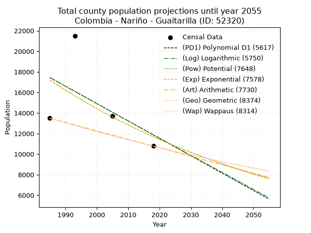
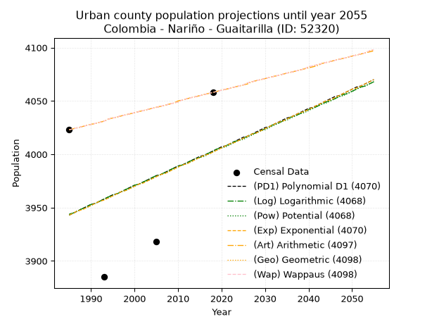
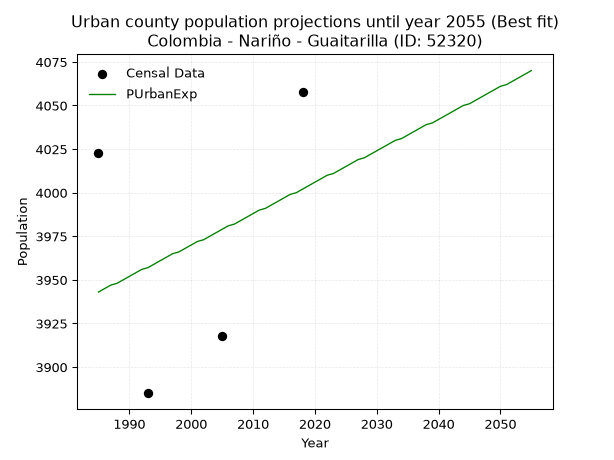
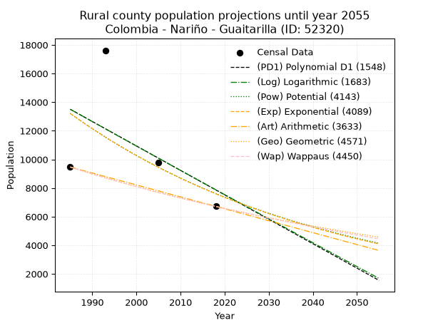
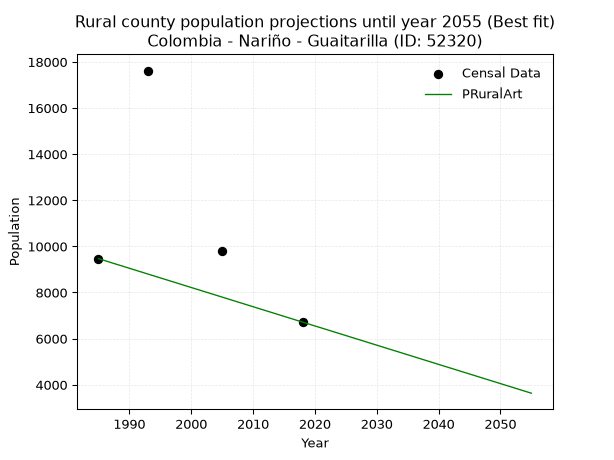

<div align="center">


</div>

# 📜 _“Population and Public Services Demand Projections (PPSD) until Year 2050 for Colombia - Nariño - Guaitarilla (ID: 52320)”_
Keywords: `population` `public-service` `projection` `lineal` `polynomial` `logarithmic` `potential` `exponential` `arithmetic` `geometric` `wappaus` `dane` `colombia` `south-america`

PPSD are analytical estimates used by governments and planners to anticipate future changes in population size, age distribution, and the resulting community needs for utilities, healthcare, education, and infrastructure as sizing future water treatment facilities, electrical grids, and road networks based on spatial growth.

<div align="center">

</img>

</div>


> **General running parameters**: • app_version: _v20260806_. • Python version: _3.14.7_. • Pandas version: _3.0.5_. • NumPy version: _2.5.1_. • Creates, save and include plots into reports (create_plot): _False_. • Projection until year: _2050_. • Process polynomial degree 2 and up: _False_. • Process Wappaus: _True_. • Process Wappaus: _True_. • Set negative values to zero: _True_. • Set infinite values to zero: _True_. • Drop dataset notes: _True_. 
<div align="center">

Maps & GIS Layers: [:earth_americas:Google](http://maps.google.com/maps?q=1.129573938,-77.5498242) [:earth_americas:OSM](https://www.openstreetmap.org/#map=18/1.129573938/-77.5498242&layers=P) [:earth_americas:Bing](https://www.bing.com/maps?cp=1.129573938~-77.5498242&lvl=18) [:earth_americas:Apple](https://maps.apple.com/frame?center=1.129573938%2C-77.5498242&span=0.003%2C0.006) [:earth_americas:GISMobile](https://github.com/rcfdtools/R.GISMobile/blob/main/file/gis/CountyLayer_CO/Readme.md)

</div>


<div align="center">

```geojson
{
  "type": "Feature",
  "geometry": {
    "type": "Point", 
    "coordinates": [-77.5498242, 1.129573938]
  }, 
  "properties": {
    "Name": "Colombia - Nariño - Guaitarilla (ID: 52320)"
  }
}
```

</div>


## 0. Census Data (4 records)

Census data are official statistics collected by a government about the people and housing in a country. They usually include counts of total population, age, sex, race, income, education, and jobs.

📅Global census file: [Population.xlsx](../data/Population.xlsx)

| Source   |   Year |   CountryID | CountryName   |   StateID | StateName   |   CountyID | CountyName   |   PTotal |   PUrban |   PRural |
|:---------|-------:|------------:|:--------------|----------:|:------------|-----------:|:-------------|---------:|---------:|---------:|
| DANE     |   1985 |          57 | Colombia      |        52 | Nariño      |      52320 | Guaitarilla  |    13489 |     4023 |     9466 |
| DANE     |   1993 |          57 | Colombia      |        52 | Nariño      |      52320 | Guaitarilla  |    21504 |     3885 |    17619 |
| DANE     |   2005 |          57 | Colombia      |        52 | Nariño      |      52320 | Guaitarilla  |    13712 |     3918 |     9794 |
| DANE     |   2018 |          57 | Colombia      |        52 | Nariño      |      52320 | Guaitarilla  |    10774 |     4058 |     6716 |

> 🔥Some records could had specific notes about the registered values or the corresponding urban or rural distribution.

📅[SUI-RUPS](https://www.datos.gov.co/Hacienda-y-Cr-dito-P-blico/Registro-nico-de-Prestadores-de-Servicios-P-blicos/4qkq-csdn/about_data) - Local public utility companies: [RUPS.csv](../data/RUPS.csv)

 | SERVICIO   | ESTADO    | NOMBRE                                                                                                                                           | NIT         | DEPARTAMENTO_DOMICILIO   | MUNICIPIO_DOMICILIO   | DIRECCION              |   TELEFONO | EMAIL                     | TIPO_PRESTADOR                            | CLASIFICACION                 |
|:-----------|:----------|:-------------------------------------------------------------------------------------------------------------------------------------------------|:------------|:-------------------------|:----------------------|:-----------------------|-----------:|:--------------------------|:------------------------------------------|:------------------------------|
| ACUEDUCTO  | OPERATIVA | EMPRESA DE SERVICIOS PUBLICOS DE ACUEDUCTO ALCANTARILLADO Y ASEO DE GUAITARILLA                                                                  | 900229156-1 | NARINO                   | GUAITARILLA           | AVENIDA EL SOL         |    7433272 | empoguaitarilla@gmail.com | EMPRESA INDUSTRIAL Y COMERCIAL DEL ESTADO | MENOR O IGUAL A 2500 USUARIOS |
| ACUEDUCTO  | OPERATIVA | ASOCIACION DE USUARIOS ADMINISTRADORA DEL SERVICIO PUBLICO DOMICILIARIO DE ACUEDUCTO DE LA VEREDA CUATRO ESQUINAS MUNICIPIO DE GUATARILLA NARIÑO | 900364810-6 | NARINO                   | GUAITARILLA           | vereda cuatro esquinas |    7433272 | maotoroasoace@hotmail.com | ORGANIZACION AUTORIZADA                   | HASTA 2500 SUSCRIPTORES       |
| ACUEDUCTO  | OPERATIVA | ASOCIACION DE USUARIOS ADMMINISTRADORA DEL SERVICIO PUBLICO DOMICILIARIO DE ACUEDUCTO DE LA VEREDA SAN VICENTE MUNICIPIO DE GUATARILLA NARIÑO    | 900366201-1 | NARINO                   | GUAITARILLA           | VEREDA SAN VICENTE     |    7433272 | auasanvicente@gmail.com   | ORGANIZACION AUTORIZADA                   | HASTA 2500 SUSCRIPTORES       |
| ACUEDUCTO  | OPERATIVA | ASOCIACION DE USUARIOS ADMINISTRADORA DEL SERVICIO PUBLICO DOMICILIARIO DE ACUEDUCTO DE LA VEREDA SAN NICOLAS MUNICIPIO DE GUAITARILLA           | 900349023-3 | NARINO                   | GUAITARILLA           | VEREDA SAN NICOLAS     |    7433272 | auasannicolas@gmail.com   | ORGANIZACION AUTORIZADA                   | HASTA 2500 SUSCRIPTORES       |

## 1. Total

### 1.1. Coefficients and Parameters

* (PD1) Polynomial Deg 1: -168.9935768767539, 352899.152147727 (lineal)
* (Log) Logarithmic: -337463.91543432744, 2579935.675482424
* (Pow) Potential: -23.386256260309267, 81.35779965809455
* (Exp) Exponential: -0.011709946774799664, 213991302480649.7
* (Art) Arithmetic: Year diff. 2018 - 1985 = 33, Population diff. 10774 - 13489 = -2715, Annual growth = -82.27272727272727
* (Geo) Geometric: Year diff. 2018 - 1985 = 33, Population diff. 10774 - 13489 = -2715, Annual growth % = -0.006787126772707319
* (Wap) Wappaus: i = -0.6781743994784427, Condition values only valid for < 200)

<sub>
Wappaus condition values: ['-0.00', '-0.68', '-1.36', '-2.03', '-2.71', '-3.39', '-4.07', '-4.75', '-5.43', '-6.10', '-6.78', '-7.46', '-8.14', '-8.82', '-9.49', '-10.17', '-10.85', '-11.53', '-12.21', '-12.89', '-13.56', '-14.24', '-14.92', '-15.60', '-16.28', '-16.95', '-17.63', '-18.31', '-18.99', '-19.67', '-20.35', '-21.02', '-21.70', '-22.38', '-23.06', '-23.74', '-24.41', '-25.09', '-25.77', '-26.45', '-27.13', '-27.81', '-28.48', '-29.16', '-29.84', '-30.52', '-31.20', '-31.87', '-32.55', '-33.23', '-33.91', '-34.59', '-35.27', '-35.94', '-36.62', '-37.30', '-37.98', '-38.66', '-39.33', '-40.01', '-40.69', '-41.37', '-42.05', '-42.72', '-43.40', '-44.08']
</sub>


### 1.2. Projected Dataset

|   Year |   CountyID |   PTotalPD1 |   PTotalLog |   PTotalPow |   PTotalExp |   PTotalArt |   PTotalGeo |   PTotalWap |
|-------:|-----------:|------------:|------------:|------------:|------------:|------------:|------------:|------------:|
|   1985 |      52320 |       17447 |       17446 |       17200 |       17201 |       13489 |       13489 |       13489 |
|   1986 |      52320 |       17278 |       17276 |       16999 |       17001 |       13407 |       13397 |       13398 |
|   1987 |      52320 |       17109 |       17106 |       16800 |       16803 |       13324 |       13307 |       13307 |
|   1988 |      52320 |       16940 |       16936 |       16603 |       16607 |       13242 |       13216 |       13217 |
|   1989 |      52320 |       16771 |       16767 |       16409 |       16414 |       13160 |       13127 |       13128 |
|   1990 |      52320 |       16602 |       16597 |       16217 |       16223 |       13078 |       13037 |       13039 |
|   1991 |      52320 |       16433 |       16427 |       16028 |       16034 |       12995 |       12949 |       12951 |
|   1992 |      52320 |       16264 |       16258 |       15841 |       15847 |       12913 |       12861 |       12863 |
|   1993 |      52320 |       16095 |       16089 |       15656 |       15663 |       12831 |       12774 |       12776 |
|   1994 |      52320 |       15926 |       15919 |       15473 |       15480 |       12749 |       12687 |       12690 |
|   1995 |      52320 |       15757 |       15750 |       15293 |       15300 |       12666 |       12601 |       12604 |
|   1996 |      52320 |       15588 |       15581 |       15115 |       15122 |       12584 |       12515 |       12519 |
|   1997 |      52320 |       15419 |       15412 |       14939 |       14946 |       12502 |       12430 |       12434 |
|   1998 |      52320 |       15250 |       15243 |       14765 |       14772 |       12419 |       12346 |       12350 |
|   1999 |      52320 |       15081 |       15074 |       14593 |       14600 |       12337 |       12262 |       12266 |
|   2000 |      52320 |       14912 |       14905 |       14423 |       14430 |       12255 |       12179 |       12183 |
|   2001 |      52320 |       14743 |       14737 |       14256 |       14262 |       12173 |       12096 |       12101 |
|   2002 |      52320 |       14574 |       14568 |       14090 |       14096 |       12090 |       12014 |       12019 |
|   2003 |      52320 |       14405 |       14400 |       13927 |       13932 |       12008 |       11933 |       11937 |
|   2004 |      52320 |       14236 |       14231 |       13765 |       13770 |       11926 |       11852 |       11856 |
|   2005 |      52320 |       14067 |       14063 |       13605 |       13609 |       11844 |       11771 |       11776 |
|   2006 |      52320 |       13898 |       13894 |       13448 |       13451 |       11761 |       11691 |       11696 |
|   2007 |      52320 |       13729 |       13726 |       13292 |       13294 |       11679 |       11612 |       11616 |
|   2008 |      52320 |       13560 |       13558 |       13138 |       13140 |       11597 |       11533 |       11537 |
|   2009 |      52320 |       13391 |       13390 |       12986 |       12987 |       11514 |       11455 |       11459 |
|   2010 |      52320 |       13222 |       13222 |       12835 |       12835 |       11432 |       11377 |       11381 |
|   2011 |      52320 |       13053 |       13054 |       12687 |       12686 |       11350 |       11300 |       11303 |
|   2012 |      52320 |       12884 |       12887 |       12540 |       12538 |       11268 |       11223 |       11226 |
|   2013 |      52320 |       12715 |       12719 |       12395 |       12392 |       11185 |       11147 |       11150 |
|   2014 |      52320 |       12546 |       12551 |       12252 |       12248 |       11103 |       11072 |       11074 |
|   2015 |      52320 |       12377 |       12384 |       12111 |       12105 |       11021 |       10996 |       10998 |
|   2016 |      52320 |       12208 |       12216 |       11971 |       11965 |       10939 |       10922 |       10923 |
|   2017 |      52320 |       12039 |       12049 |       11833 |       11825 |       10856 |       10848 |       10848 |
|   2018 |      52320 |       11870 |       11882 |       11697 |       11688 |       10774 |       10774 |       10774 |
|   2019 |      52320 |       11701 |       11715 |       11562 |       11552 |       10692 |       10701 |       10700 |
|   2020 |      52320 |       11532 |       11547 |       11429 |       11417 |       10609 |       10628 |       10627 |
|   2021 |      52320 |       11363 |       11380 |       11297 |       11284 |       10527 |       10556 |       10554 |
|   2022 |      52320 |       11194 |       11214 |       11167 |       11153 |       10445 |       10484 |       10482 |
|   2023 |      52320 |       11025 |       11047 |       11039 |       11023 |       10363 |       10413 |       10410 |
|   2024 |      52320 |       10856 |       10880 |       10912 |       10895 |       10280 |       10343 |       10338 |
|   2025 |      52320 |       10687 |       10713 |       10787 |       10768 |       10198 |       10272 |       10267 |
|   2026 |      52320 |       10518 |       10547 |       10663 |       10642 |       10116 |       10203 |       10196 |
|   2027 |      52320 |       10349 |       10380 |       10541 |       10519 |       10034 |       10133 |       10126 |
|   2028 |      52320 |       10180 |       10214 |       10420 |       10396 |        9951 |       10065 |       10056 |
|   2029 |      52320 |       10011 |       10047 |       10300 |       10275 |        9869 |        9996 |        9986 |
|   2030 |      52320 |        9842 |        9881 |       10182 |       10155 |        9787 |        9929 |        9917 |
|   2031 |      52320 |        9673 |        9715 |       10066 |       10037 |        9704 |        9861 |        9849 |
|   2032 |      52320 |        9504 |        9549 |        9951 |        9920 |        9622 |        9794 |        9781 |
|   2033 |      52320 |        9335 |        9383 |        9837 |        9805 |        9540 |        9728 |        9713 |
|   2034 |      52320 |        9166 |        9217 |        9724 |        9691 |        9458 |        9662 |        9645 |
|   2035 |      52320 |        8997 |        9051 |        9613 |        9578 |        9375 |        9596 |        9578 |
|   2036 |      52320 |        8828 |        8885 |        9503 |        9466 |        9293 |        9531 |        9511 |
|   2037 |      52320 |        8659 |        8719 |        9395 |        9356 |        9211 |        9466 |        9445 |
|   2038 |      52320 |        8490 |        8554 |        9288 |        9247 |        9129 |        9402 |        9379 |
|   2039 |      52320 |        8321 |        8388 |        9182 |        9140 |        9046 |        9338 |        9314 |
|   2040 |      52320 |        8152 |        8223 |        9077 |        9033 |        8964 |        9275 |        9249 |
|   2041 |      52320 |        7983 |        8057 |        8974 |        8928 |        8882 |        9212 |        9184 |
|   2042 |      52320 |        7814 |        7892 |        8871 |        8824 |        8799 |        9149 |        9119 |
|   2043 |      52320 |        7645 |        7727 |        8770 |        8721 |        8717 |        9087 |        9055 |
|   2044 |      52320 |        7476 |        7562 |        8671 |        8620 |        8635 |        9026 |        8992 |
|   2045 |      52320 |        7307 |        7397 |        8572 |        8520 |        8553 |        8964 |        8928 |
|   2046 |      52320 |        7138 |        7232 |        8474 |        8420 |        8470 |        8904 |        8865 |
|   2047 |      52320 |        6969 |        7067 |        8378 |        8322 |        8388 |        8843 |        8803 |
|   2048 |      52320 |        6800 |        6902 |        8283 |        8225 |        8306 |        8783 |        8740 |
|   2049 |      52320 |        6631 |        6737 |        8189 |        8130 |        8224 |        8723 |        8678 |
|   2050 |      52320 |        6462 |        6573 |        8096 |        8035 |        8141 |        8664 |        8617 |
<div align="center">

</img>

</div>


### 1.3. Best fit with absolute and relative error (%)

Relative error puts that difference into context by dividing the absolute error by the true value, creating a unitless ratio or percentage that shows the scale of the mistake.

Absolute and relative error

|   Year | Source   |   CountryID | CountryName   |   StateID | StateName   |   CountyID_x | CountyName   |   PTotal |   PUrban |   PRural |   CountyID_y |   PTotalPD1 |   PTotalLog |   PTotalPow |   PTotalExp |   PTotalArt |   PTotalGeo |   PTotalWap |   PTotalPD1AbsError |   PTotalLogAbsError |   PTotalPowAbsError |   PTotalExpAbsError |   PTotalArtAbsError |   PTotalGeoAbsError |   PTotalWapAbsError |   PTotalPD1RelError |   PTotalLogRelError |   PTotalPowRelError |   PTotalExpRelError |   PTotalArtRelError |   PTotalGeoRelError |   PTotalWapRelError |
|-------:|:---------|------------:|:--------------|----------:|:------------|-------------:|:-------------|---------:|---------:|---------:|-------------:|------------:|------------:|------------:|------------:|------------:|------------:|------------:|--------------------:|--------------------:|--------------------:|--------------------:|--------------------:|--------------------:|--------------------:|--------------------:|--------------------:|--------------------:|--------------------:|--------------------:|--------------------:|--------------------:|
|   1985 | DANE     |          57 | Colombia      |        52 | Nariño      |        52320 | Guaitarilla  |    13489 |     4023 |     9466 |        52320 |       17447 |       17446 |       17200 |       17201 |       13489 |       13489 |       13489 |                3958 |                3957 |                3711 |                3712 |                   0 |                   0 |                   0 |            29.3424  |             29.335  |           27.5113   |           27.5187   |              0      |              0      |              0      |
|   1993 | DANE     |          57 | Colombia      |        52 | Nariño      |        52320 | Guaitarilla  |    21504 |     3885 |    17619 |        52320 |       16095 |       16089 |       15656 |       15663 |       12831 |       12774 |       12776 |                5409 |                5415 |                5848 |                5841 |                8673 |                8730 |                8728 |            25.1535  |             25.1814 |           27.1949   |           27.1624   |             40.332  |             40.5971 |             40.5878 |
|   2005 | DANE     |          57 | Colombia      |        52 | Nariño      |        52320 | Guaitarilla  |    13712 |     3918 |     9794 |        52320 |       14067 |       14063 |       13605 |       13609 |       11844 |       11771 |       11776 |                 355 |                 351 |                 107 |                 103 |                1868 |                1941 |                1936 |             2.58897 |              2.5598 |            0.780338 |            0.751167 |             13.6231 |             14.1555 |             14.119  |
|   2018 | DANE     |          57 | Colombia      |        52 | Nariño      |        52320 | Guaitarilla  |    10774 |     4058 |     6716 |        52320 |       11870 |       11882 |       11697 |       11688 |       10774 |       10774 |       10774 |                1096 |                1108 |                 923 |                 914 |                   0 |                   0 |                   0 |            10.1726  |             10.284  |            8.56692  |            8.48339  |              0      |              0      |              0      |

Relative error mean

| Method    |   RelError | Best   |
|:----------|-----------:|:-------|
| PTotalPD1 |    16.8144 |        |
| PTotalLog |    16.84   |        |
| PTotalPow |    16.0134 |        |
| PTotalExp |    15.9789 |        |
| PTotalArt |    13.4888 | True   |
| PTotalGeo |    13.6881 |        |
| PTotalWap |    13.6767 |        |

💙Best method: _**PTotalArt**_
<div align="center">

</img>

</div>


### 1.4. Fresh water supply demand in liters per capita per day (lpcd)

The fresh water supply demand typically ranges from 100 to 300 liters per capita per day (lpcd) for standard domestic and municipal planning, though absolute survival minimums set by the World Health Organization are as low as 7.5 to 20 liters per day, and total consumption in high-income nations can exceed 400 liters.

> `CZ`: Level in meters above the sea level (masl)<br> `WS`: Fresh water supply demand in liters per capita per day (lpcd or l/h/d)<br> `WSAll`: Zonal fresh water supply demand in liters per second (l/s)<br> `A`: Zonal area in square meters<br> `DP`: Population density (people/hectare or p/ha)

Reference values (RAS Colombia)

|    CZ |   WS |
|------:|-----:|
|  1000 |  120 |
|  2000 |  130 |
| 99999 |  140 |

County shapefile geometry properties and water supply values

|   CountyID |      ATotal |   CZTotal |   WSTotal |
|-----------:|------------:|----------:|----------:|
|      52320 | 1.16861e+08 |   2469.78 |       140 |

Projected values for best method: PTotalArt

|   CountyID |   Year |   PTotalArt |   DPTotal |   WSTotal |   WSTotalAll |
|-----------:|-------:|------------:|----------:|----------:|-------------:|
|      52320 |   1985 |       13489 |      1.15 |       140 |      21.8572 |
|      52320 |   1986 |       13407 |      1.15 |       140 |      21.7243 |
|      52320 |   1987 |       13324 |      1.14 |       140 |      21.5898 |
|      52320 |   1988 |       13242 |      1.13 |       140 |      21.4569 |
|      52320 |   1989 |       13160 |      1.13 |       140 |      21.3241 |
|      52320 |   1990 |       13078 |      1.12 |       140 |      21.1912 |
|      52320 |   1991 |       12995 |      1.11 |       140 |      21.0567 |
|      52320 |   1992 |       12913 |      1.1  |       140 |      20.9238 |
|      52320 |   1993 |       12831 |      1.1  |       140 |      20.791  |
|      52320 |   1994 |       12749 |      1.09 |       140 |      20.6581 |
|      52320 |   1995 |       12666 |      1.08 |       140 |      20.5236 |
|      52320 |   1996 |       12584 |      1.08 |       140 |      20.3907 |
|      52320 |   1997 |       12502 |      1.07 |       140 |      20.2579 |
|      52320 |   1998 |       12419 |      1.06 |       140 |      20.1234 |
|      52320 |   1999 |       12337 |      1.06 |       140 |      19.9905 |
|      52320 |   2000 |       12255 |      1.05 |       140 |      19.8576 |
|      52320 |   2001 |       12173 |      1.04 |       140 |      19.7248 |
|      52320 |   2002 |       12090 |      1.03 |       140 |      19.5903 |
|      52320 |   2003 |       12008 |      1.03 |       140 |      19.4574 |
|      52320 |   2004 |       11926 |      1.02 |       140 |      19.3245 |
|      52320 |   2005 |       11844 |      1.01 |       140 |      19.1917 |
|      52320 |   2006 |       11761 |      1.01 |       140 |      19.0572 |
|      52320 |   2007 |       11679 |      1    |       140 |      18.9243 |
|      52320 |   2008 |       11597 |      0.99 |       140 |      18.7914 |
|      52320 |   2009 |       11514 |      0.99 |       140 |      18.6569 |
|      52320 |   2010 |       11432 |      0.98 |       140 |      18.5241 |
|      52320 |   2011 |       11350 |      0.97 |       140 |      18.3912 |
|      52320 |   2012 |       11268 |      0.96 |       140 |      18.2583 |
|      52320 |   2013 |       11185 |      0.96 |       140 |      18.1238 |
|      52320 |   2014 |       11103 |      0.95 |       140 |      17.991  |
|      52320 |   2015 |       11021 |      0.94 |       140 |      17.8581 |
|      52320 |   2016 |       10939 |      0.94 |       140 |      17.7252 |
|      52320 |   2017 |       10856 |      0.93 |       140 |      17.5907 |
|      52320 |   2018 |       10774 |      0.92 |       140 |      17.4579 |
|      52320 |   2019 |       10692 |      0.91 |       140 |      17.325  |
|      52320 |   2020 |       10609 |      0.91 |       140 |      17.1905 |
|      52320 |   2021 |       10527 |      0.9  |       140 |      17.0576 |
|      52320 |   2022 |       10445 |      0.89 |       140 |      16.9248 |
|      52320 |   2023 |       10363 |      0.89 |       140 |      16.7919 |
|      52320 |   2024 |       10280 |      0.88 |       140 |      16.6574 |
|      52320 |   2025 |       10198 |      0.87 |       140 |      16.5245 |
|      52320 |   2026 |       10116 |      0.87 |       140 |      16.3917 |
|      52320 |   2027 |       10034 |      0.86 |       140 |      16.2588 |
|      52320 |   2028 |        9951 |      0.85 |       140 |      16.1243 |
|      52320 |   2029 |        9869 |      0.84 |       140 |      15.9914 |
|      52320 |   2030 |        9787 |      0.84 |       140 |      15.8586 |
|      52320 |   2031 |        9704 |      0.83 |       140 |      15.7241 |
|      52320 |   2032 |        9622 |      0.82 |       140 |      15.5912 |
|      52320 |   2033 |        9540 |      0.82 |       140 |      15.4583 |
|      52320 |   2034 |        9458 |      0.81 |       140 |      15.3255 |
|      52320 |   2035 |        9375 |      0.8  |       140 |      15.191  |
|      52320 |   2036 |        9293 |      0.8  |       140 |      15.0581 |
|      52320 |   2037 |        9211 |      0.79 |       140 |      14.9252 |
|      52320 |   2038 |        9129 |      0.78 |       140 |      14.7924 |
|      52320 |   2039 |        9046 |      0.77 |       140 |      14.6579 |
|      52320 |   2040 |        8964 |      0.77 |       140 |      14.525  |
|      52320 |   2041 |        8882 |      0.76 |       140 |      14.3921 |
|      52320 |   2042 |        8799 |      0.75 |       140 |      14.2576 |
|      52320 |   2043 |        8717 |      0.75 |       140 |      14.1248 |
|      52320 |   2044 |        8635 |      0.74 |       140 |      13.9919 |
|      52320 |   2045 |        8553 |      0.73 |       140 |      13.859  |
|      52320 |   2046 |        8470 |      0.72 |       140 |      13.7245 |
|      52320 |   2047 |        8388 |      0.72 |       140 |      13.5917 |
|      52320 |   2048 |        8306 |      0.71 |       140 |      13.4588 |
|      52320 |   2049 |        8224 |      0.7  |       140 |      13.3259 |
|      52320 |   2050 |        8141 |      0.7  |       140 |      13.1914 |

## 2. Urban

### 2.1. Coefficients and Parameters

* (PD1) Polynomial Deg 1: 1.80329185066229, 363.9654757127544 (lineal)
* (Log) Logarithmic: 3584.921973568876, -23278.020648858797
* (Pow) Potential: 0.8976217731452687, 0.6357118362737478
* (Exp) Exponential: 0.00045153922472359427, 1609.082716254076
* (Art) Arithmetic: Year diff. 2018 - 1985 = 33, Population diff. 4058 - 4023 = 35, Annual growth = 1.0606060606060606
* (Geo) Geometric: Year diff. 2018 - 1985 = 33, Population diff. 4058 - 4023 = 35, Annual growth % = 0.00026252986208463724
* (Wap) Wappaus: i = 0.026249376577306287, Condition values only valid for < 200)

<sub>
Wappaus condition values: ['0.00', '0.03', '0.05', '0.08', '0.10', '0.13', '0.16', '0.18', '0.21', '0.24', '0.26', '0.29', '0.31', '0.34', '0.37', '0.39', '0.42', '0.45', '0.47', '0.50', '0.52', '0.55', '0.58', '0.60', '0.63', '0.66', '0.68', '0.71', '0.73', '0.76', '0.79', '0.81', '0.84', '0.87', '0.89', '0.92', '0.94', '0.97', '1.00', '1.02', '1.05', '1.08', '1.10', '1.13', '1.15', '1.18', '1.21', '1.23', '1.26', '1.29', '1.31', '1.34', '1.36', '1.39', '1.42', '1.44', '1.47', '1.50', '1.52', '1.55', '1.57', '1.60', '1.63', '1.65', '1.68', '1.71']
</sub>


### 2.2. Projected Dataset

|   Year |   CountyID |   PUrbanPD1 |   PUrbanLog |   PUrbanPow |   PUrbanExp |   PUrbanArt |   PUrbanGeo |   PUrbanWap |
|-------:|-----------:|------------:|------------:|------------:|------------:|------------:|------------:|------------:|
|   1985 |      52320 |        3943 |        3944 |        3943 |        3943 |        4023 |        4023 |        4023 |
|   1986 |      52320 |        3945 |        3945 |        3945 |        3945 |        4024 |        4024 |        4024 |
|   1987 |      52320 |        3947 |        3947 |        3947 |        3947 |        4025 |        4025 |        4025 |
|   1988 |      52320 |        3949 |        3949 |        3949 |        3948 |        4026 |        4026 |        4026 |
|   1989 |      52320 |        3951 |        3951 |        3950 |        3950 |        4027 |        4027 |        4027 |
|   1990 |      52320 |        3953 |        3953 |        3952 |        3952 |        4028 |        4028 |        4028 |
|   1991 |      52320 |        3954 |        3954 |        3954 |        3954 |        4029 |        4029 |        4029 |
|   1992 |      52320 |        3956 |        3956 |        3956 |        3956 |        4030 |        4030 |        4030 |
|   1993 |      52320 |        3958 |        3958 |        3958 |        3957 |        4031 |        4031 |        4031 |
|   1994 |      52320 |        3960 |        3960 |        3959 |        3959 |        4033 |        4033 |        4033 |
|   1995 |      52320 |        3962 |        3962 |        3961 |        3961 |        4034 |        4034 |        4034 |
|   1996 |      52320 |        3963 |        3963 |        3963 |        3963 |        4035 |        4035 |        4035 |
|   1997 |      52320 |        3965 |        3965 |        3965 |        3965 |        4036 |        4036 |        4036 |
|   1998 |      52320 |        3967 |        3967 |        3966 |        3966 |        4037 |        4037 |        4037 |
|   1999 |      52320 |        3969 |        3969 |        3968 |        3968 |        4038 |        4038 |        4038 |
|   2000 |      52320 |        3971 |        3971 |        3970 |        3970 |        4039 |        4039 |        4039 |
|   2001 |      52320 |        3972 |        3972 |        3972 |        3972 |        4040 |        4040 |        4040 |
|   2002 |      52320 |        3974 |        3974 |        3974 |        3973 |        4041 |        4041 |        4041 |
|   2003 |      52320 |        3976 |        3976 |        3975 |        3975 |        4042 |        4042 |        4042 |
|   2004 |      52320 |        3978 |        3978 |        3977 |        3977 |        4043 |        4043 |        4043 |
|   2005 |      52320 |        3980 |        3980 |        3979 |        3979 |        4044 |        4044 |        4044 |
|   2006 |      52320 |        3981 |        3981 |        3981 |        3981 |        4045 |        4045 |        4045 |
|   2007 |      52320 |        3983 |        3983 |        3982 |        3982 |        4046 |        4046 |        4046 |
|   2008 |      52320 |        3985 |        3985 |        3984 |        3984 |        4047 |        4047 |        4047 |
|   2009 |      52320 |        3987 |        3987 |        3986 |        3986 |        4048 |        4048 |        4048 |
|   2010 |      52320 |        3989 |        3989 |        3988 |        3988 |        4050 |        4049 |        4049 |
|   2011 |      52320 |        3990 |        3990 |        3990 |        3990 |        4051 |        4051 |        4051 |
|   2012 |      52320 |        3992 |        3992 |        3991 |        3991 |        4052 |        4052 |        4052 |
|   2013 |      52320 |        3994 |        3994 |        3993 |        3993 |        4053 |        4053 |        4053 |
|   2014 |      52320 |        3996 |        3996 |        3995 |        3995 |        4054 |        4054 |        4054 |
|   2015 |      52320 |        3998 |        3997 |        3997 |        3997 |        4055 |        4055 |        4055 |
|   2016 |      52320 |        3999 |        3999 |        3998 |        3999 |        4056 |        4056 |        4056 |
|   2017 |      52320 |        4001 |        4001 |        4000 |        4000 |        4057 |        4057 |        4057 |
|   2018 |      52320 |        4003 |        4003 |        4002 |        4002 |        4058 |        4058 |        4058 |
|   2019 |      52320 |        4005 |        4005 |        4004 |        4004 |        4059 |        4059 |        4059 |
|   2020 |      52320 |        4007 |        4006 |        4006 |        4006 |        4060 |        4060 |        4060 |
|   2021 |      52320 |        4008 |        4008 |        4007 |        4008 |        4061 |        4061 |        4061 |
|   2022 |      52320 |        4010 |        4010 |        4009 |        4010 |        4062 |        4062 |        4062 |
|   2023 |      52320 |        4012 |        4012 |        4011 |        4011 |        4063 |        4063 |        4063 |
|   2024 |      52320 |        4014 |        4013 |        4013 |        4013 |        4064 |        4064 |        4064 |
|   2025 |      52320 |        4016 |        4015 |        4014 |        4015 |        4065 |        4065 |        4065 |
|   2026 |      52320 |        4017 |        4017 |        4016 |        4017 |        4066 |        4067 |        4067 |
|   2027 |      52320 |        4019 |        4019 |        4018 |        4019 |        4068 |        4068 |        4068 |
|   2028 |      52320 |        4021 |        4020 |        4020 |        4020 |        4069 |        4069 |        4069 |
|   2029 |      52320 |        4023 |        4022 |        4022 |        4022 |        4070 |        4070 |        4070 |
|   2030 |      52320 |        4025 |        4024 |        4023 |        4024 |        4071 |        4071 |        4071 |
|   2031 |      52320 |        4026 |        4026 |        4025 |        4026 |        4072 |        4072 |        4072 |
|   2032 |      52320 |        4028 |        4028 |        4027 |        4028 |        4073 |        4073 |        4073 |
|   2033 |      52320 |        4030 |        4029 |        4029 |        4030 |        4074 |        4074 |        4074 |
|   2034 |      52320 |        4032 |        4031 |        4031 |        4031 |        4075 |        4075 |        4075 |
|   2035 |      52320 |        4034 |        4033 |        4032 |        4033 |        4076 |        4076 |        4076 |
|   2036 |      52320 |        4035 |        4035 |        4034 |        4035 |        4077 |        4077 |        4077 |
|   2037 |      52320 |        4037 |        4036 |        4036 |        4037 |        4078 |        4078 |        4078 |
|   2038 |      52320 |        4039 |        4038 |        4038 |        4039 |        4079 |        4079 |        4079 |
|   2039 |      52320 |        4041 |        4040 |        4039 |        4040 |        4080 |        4080 |        4080 |
|   2040 |      52320 |        4043 |        4042 |        4041 |        4042 |        4081 |        4082 |        4082 |
|   2041 |      52320 |        4044 |        4043 |        4043 |        4044 |        4082 |        4083 |        4083 |
|   2042 |      52320 |        4046 |        4045 |        4045 |        4046 |        4083 |        4084 |        4084 |
|   2043 |      52320 |        4048 |        4047 |        4047 |        4048 |        4085 |        4085 |        4085 |
|   2044 |      52320 |        4050 |        4049 |        4048 |        4050 |        4086 |        4086 |        4086 |
|   2045 |      52320 |        4052 |        4050 |        4050 |        4051 |        4087 |        4087 |        4087 |
|   2046 |      52320 |        4054 |        4052 |        4052 |        4053 |        4088 |        4088 |        4088 |
|   2047 |      52320 |        4055 |        4054 |        4054 |        4055 |        4089 |        4089 |        4089 |
|   2048 |      52320 |        4057 |        4056 |        4055 |        4057 |        4090 |        4090 |        4090 |
|   2049 |      52320 |        4059 |        4057 |        4057 |        4059 |        4091 |        4091 |        4091 |
|   2050 |      52320 |        4061 |        4059 |        4059 |        4061 |        4092 |        4092 |        4092 |
<div align="center">

</img>

</div>


### 2.3. Best fit with absolute and relative error (%)

Relative error puts that difference into context by dividing the absolute error by the true value, creating a unitless ratio or percentage that shows the scale of the mistake.

Absolute and relative error

|   Year | Source   |   CountryID | CountryName   |   StateID | StateName   |   CountyID_x | CountyName   |   PTotal |   PUrban |   PRural |   CountyID_y |   PUrbanPD1 |   PUrbanLog |   PUrbanPow |   PUrbanExp |   PUrbanArt |   PUrbanGeo |   PUrbanWap |   PUrbanPD1AbsError |   PUrbanLogAbsError |   PUrbanPowAbsError |   PUrbanExpAbsError |   PUrbanArtAbsError |   PUrbanGeoAbsError |   PUrbanWapAbsError |   PUrbanPD1RelError |   PUrbanLogRelError |   PUrbanPowRelError |   PUrbanExpRelError |   PUrbanArtRelError |   PUrbanGeoRelError |   PUrbanWapRelError |
|-------:|:---------|------------:|:--------------|----------:|:------------|-------------:|:-------------|---------:|---------:|---------:|-------------:|------------:|------------:|------------:|------------:|------------:|------------:|------------:|--------------------:|--------------------:|--------------------:|--------------------:|--------------------:|--------------------:|--------------------:|--------------------:|--------------------:|--------------------:|--------------------:|--------------------:|--------------------:|--------------------:|
|   1985 | DANE     |          57 | Colombia      |        52 | Nariño      |        52320 | Guaitarilla  |    13489 |     4023 |     9466 |        52320 |        3943 |        3944 |        3943 |        3943 |        4023 |        4023 |        4023 |                  80 |                  79 |                  80 |                  80 |                   0 |                   0 |                   0 |             1.98857 |             1.96371 |             1.98857 |             1.98857 |             0       |             0       |             0       |
|   1993 | DANE     |          57 | Colombia      |        52 | Nariño      |        52320 | Guaitarilla  |    21504 |     3885 |    17619 |        52320 |        3958 |        3958 |        3958 |        3957 |        4031 |        4031 |        4031 |                  73 |                  73 |                  73 |                  72 |                 146 |                 146 |                 146 |             1.87902 |             1.87902 |             1.87902 |             1.85328 |             3.75804 |             3.75804 |             3.75804 |
|   2005 | DANE     |          57 | Colombia      |        52 | Nariño      |        52320 | Guaitarilla  |    13712 |     3918 |     9794 |        52320 |        3980 |        3980 |        3979 |        3979 |        4044 |        4044 |        4044 |                  62 |                  62 |                  61 |                  61 |                 126 |                 126 |                 126 |             1.58244 |             1.58244 |             1.55692 |             1.55692 |             3.21593 |             3.21593 |             3.21593 |
|   2018 | DANE     |          57 | Colombia      |        52 | Nariño      |        52320 | Guaitarilla  |    10774 |     4058 |     6716 |        52320 |        4003 |        4003 |        4002 |        4002 |        4058 |        4058 |        4058 |                  55 |                  55 |                  56 |                  56 |                   0 |                   0 |                   0 |             1.35535 |             1.35535 |             1.37999 |             1.37999 |             0       |             0       |             0       |

Relative error mean

| Method    |   RelError | Best   |
|:----------|-----------:|:-------|
| PUrbanPD1 |    1.70134 |        |
| PUrbanLog |    1.69513 |        |
| PUrbanPow |    1.70112 |        |
| PUrbanExp |    1.69469 | True   |
| PUrbanArt |    1.74349 |        |
| PUrbanGeo |    1.74349 |        |
| PUrbanWap |    1.74349 |        |

💙Best method: _**PUrbanExp**_
<div align="center">

</img>

</div>


### 2.4. Fresh water supply demand in liters per capita per day (lpcd)

The fresh water supply demand typically ranges from 100 to 300 liters per capita per day (lpcd) for standard domestic and municipal planning, though absolute survival minimums set by the World Health Organization are as low as 7.5 to 20 liters per day, and total consumption in high-income nations can exceed 400 liters.

> `CZ`: Level in meters above the sea level (masl)<br> `WS`: Fresh water supply demand in liters per capita per day (lpcd or l/h/d)<br> `WSAll`: Zonal fresh water supply demand in liters per second (l/s)<br> `A`: Zonal area in square meters<br> `DP`: Population density (people/hectare or p/ha)

Reference values (RAS Colombia)

|    CZ |   WS |
|------:|-----:|
|  1000 |  120 |
|  2000 |  130 |
| 99999 |  140 |

County shapefile geometry properties and water supply values

|   CountyID |      AUrban |   CZUrban |   WSUrban |
|-----------:|------------:|----------:|----------:|
|      52320 | 1.19104e+06 |   2638.45 |       140 |

Projected values for best method: PUrbanExp

|   CountyID |   Year |   PUrbanExp |   DPUrban |   WSUrban |   WSUrbanAll |
|-----------:|-------:|------------:|----------:|----------:|-------------:|
|      52320 |   1985 |        3943 |     33.11 |       140 |      6.38912 |
|      52320 |   1986 |        3945 |     33.12 |       140 |      6.39236 |
|      52320 |   1987 |        3947 |     33.14 |       140 |      6.3956  |
|      52320 |   1988 |        3948 |     33.15 |       140 |      6.39722 |
|      52320 |   1989 |        3950 |     33.16 |       140 |      6.40046 |
|      52320 |   1990 |        3952 |     33.18 |       140 |      6.4037  |
|      52320 |   1991 |        3954 |     33.2  |       140 |      6.40694 |
|      52320 |   1992 |        3956 |     33.21 |       140 |      6.41019 |
|      52320 |   1993 |        3957 |     33.22 |       140 |      6.41181 |
|      52320 |   1994 |        3959 |     33.24 |       140 |      6.41505 |
|      52320 |   1995 |        3961 |     33.26 |       140 |      6.41829 |
|      52320 |   1996 |        3963 |     33.27 |       140 |      6.42153 |
|      52320 |   1997 |        3965 |     33.29 |       140 |      6.42477 |
|      52320 |   1998 |        3966 |     33.3  |       140 |      6.42639 |
|      52320 |   1999 |        3968 |     33.32 |       140 |      6.42963 |
|      52320 |   2000 |        3970 |     33.33 |       140 |      6.43287 |
|      52320 |   2001 |        3972 |     33.35 |       140 |      6.43611 |
|      52320 |   2002 |        3973 |     33.36 |       140 |      6.43773 |
|      52320 |   2003 |        3975 |     33.37 |       140 |      6.44097 |
|      52320 |   2004 |        3977 |     33.39 |       140 |      6.44421 |
|      52320 |   2005 |        3979 |     33.41 |       140 |      6.44745 |
|      52320 |   2006 |        3981 |     33.42 |       140 |      6.45069 |
|      52320 |   2007 |        3982 |     33.43 |       140 |      6.45231 |
|      52320 |   2008 |        3984 |     33.45 |       140 |      6.45556 |
|      52320 |   2009 |        3986 |     33.47 |       140 |      6.4588  |
|      52320 |   2010 |        3988 |     33.48 |       140 |      6.46204 |
|      52320 |   2011 |        3990 |     33.5  |       140 |      6.46528 |
|      52320 |   2012 |        3991 |     33.51 |       140 |      6.4669  |
|      52320 |   2013 |        3993 |     33.53 |       140 |      6.47014 |
|      52320 |   2014 |        3995 |     33.54 |       140 |      6.47338 |
|      52320 |   2015 |        3997 |     33.56 |       140 |      6.47662 |
|      52320 |   2016 |        3999 |     33.58 |       140 |      6.47986 |
|      52320 |   2017 |        4000 |     33.58 |       140 |      6.48148 |
|      52320 |   2018 |        4002 |     33.6  |       140 |      6.48472 |
|      52320 |   2019 |        4004 |     33.62 |       140 |      6.48796 |
|      52320 |   2020 |        4006 |     33.63 |       140 |      6.4912  |
|      52320 |   2021 |        4008 |     33.65 |       140 |      6.49444 |
|      52320 |   2022 |        4010 |     33.67 |       140 |      6.49769 |
|      52320 |   2023 |        4011 |     33.68 |       140 |      6.49931 |
|      52320 |   2024 |        4013 |     33.69 |       140 |      6.50255 |
|      52320 |   2025 |        4015 |     33.71 |       140 |      6.50579 |
|      52320 |   2026 |        4017 |     33.73 |       140 |      6.50903 |
|      52320 |   2027 |        4019 |     33.74 |       140 |      6.51227 |
|      52320 |   2028 |        4020 |     33.75 |       140 |      6.51389 |
|      52320 |   2029 |        4022 |     33.77 |       140 |      6.51713 |
|      52320 |   2030 |        4024 |     33.79 |       140 |      6.52037 |
|      52320 |   2031 |        4026 |     33.8  |       140 |      6.52361 |
|      52320 |   2032 |        4028 |     33.82 |       140 |      6.52685 |
|      52320 |   2033 |        4030 |     33.84 |       140 |      6.53009 |
|      52320 |   2034 |        4031 |     33.84 |       140 |      6.53171 |
|      52320 |   2035 |        4033 |     33.86 |       140 |      6.53495 |
|      52320 |   2036 |        4035 |     33.88 |       140 |      6.53819 |
|      52320 |   2037 |        4037 |     33.89 |       140 |      6.54144 |
|      52320 |   2038 |        4039 |     33.91 |       140 |      6.54468 |
|      52320 |   2039 |        4040 |     33.92 |       140 |      6.5463  |
|      52320 |   2040 |        4042 |     33.94 |       140 |      6.54954 |
|      52320 |   2041 |        4044 |     33.95 |       140 |      6.55278 |
|      52320 |   2042 |        4046 |     33.97 |       140 |      6.55602 |
|      52320 |   2043 |        4048 |     33.99 |       140 |      6.55926 |
|      52320 |   2044 |        4050 |     34    |       140 |      6.5625  |
|      52320 |   2045 |        4051 |     34.01 |       140 |      6.56412 |
|      52320 |   2046 |        4053 |     34.03 |       140 |      6.56736 |
|      52320 |   2047 |        4055 |     34.05 |       140 |      6.5706  |
|      52320 |   2048 |        4057 |     34.06 |       140 |      6.57384 |
|      52320 |   2049 |        4059 |     34.08 |       140 |      6.57708 |
|      52320 |   2050 |        4061 |     34.1  |       140 |      6.58032 |

## 3. Rural

### 3.1. Coefficients and Parameters

* (PD1) Polynomial Deg 1: -170.79686872741632, 352535.18667201453 (lineal)
* (Log) Logarithmic: -341048.8374078964, 2603213.696131283
* (Pow) Potential: -33.46270796150239, 114.47299133350764
* (Exp) Exponential: -0.016755454361687967, 3.6768556329064417e+18
* (Art) Arithmetic: Year diff. 2018 - 1985 = 33, Population diff. 6716 - 9466 = -2750, Annual growth = -83.33333333333333
* (Geo) Geometric: Year diff. 2018 - 1985 = 33, Population diff. 6716 - 9466 = -2750, Annual growth % = -0.010346517615276274
* (Wap) Wappaus: i = -1.0299509743336217, Condition values only valid for < 200)

<sub>
Wappaus condition values: ['-0.00', '-1.03', '-2.06', '-3.09', '-4.12', '-5.15', '-6.18', '-7.21', '-8.24', '-9.27', '-10.30', '-11.33', '-12.36', '-13.39', '-14.42', '-15.45', '-16.48', '-17.51', '-18.54', '-19.57', '-20.60', '-21.63', '-22.66', '-23.69', '-24.72', '-25.75', '-26.78', '-27.81', '-28.84', '-29.87', '-30.90', '-31.93', '-32.96', '-33.99', '-35.02', '-36.05', '-37.08', '-38.11', '-39.14', '-40.17', '-41.20', '-42.23', '-43.26', '-44.29', '-45.32', '-46.35', '-47.38', '-48.41', '-49.44', '-50.47', '-51.50', '-52.53', '-53.56', '-54.59', '-55.62', '-56.65', '-57.68', '-58.71', '-59.74', '-60.77', '-61.80', '-62.83', '-63.86', '-64.89', '-65.92', '-66.95']
</sub>


### 3.2. Projected Dataset

|   Year |   CountyID |   PRuralPD1 |   PRuralLog |   PRuralPow |   PRuralExp |   PRuralArt |   PRuralGeo |   PRuralWap |
|-------:|-----------:|------------:|------------:|------------:|------------:|------------:|------------:|------------:|
|   1985 |      52320 |       13503 |       13502 |       13213 |       13214 |        9466 |        9466 |        9466 |
|   1986 |      52320 |       13333 |       13330 |       12992 |       12994 |        9383 |        9368 |        9369 |
|   1987 |      52320 |       13162 |       13159 |       12775 |       12778 |        9299 |        9271 |        9273 |
|   1988 |      52320 |       12991 |       12987 |       12562 |       12566 |        9216 |        9175 |        9178 |
|   1989 |      52320 |       12820 |       12816 |       12352 |       12357 |        9133 |        9080 |        9084 |
|   1990 |      52320 |       12649 |       12644 |       12146 |       12152 |        9049 |        8986 |        8991 |
|   1991 |      52320 |       12479 |       12473 |       11944 |       11950 |        8966 |        8893 |        8899 |
|   1992 |      52320 |       12308 |       12302 |       11745 |       11751 |        8883 |        8801 |        8807 |
|   1993 |      52320 |       12137 |       12131 |       11549 |       11556 |        8799 |        8710 |        8717 |
|   1994 |      52320 |       11966 |       11959 |       11357 |       11364 |        8716 |        8620 |        8627 |
|   1995 |      52320 |       11795 |       11788 |       11168 |       11175 |        8633 |        8531 |        8539 |
|   1996 |      52320 |       11625 |       11618 |       10982 |       10990 |        8549 |        8443 |        8451 |
|   1997 |      52320 |       11454 |       11447 |       10800 |       10807 |        8466 |        8355 |        8364 |
|   1998 |      52320 |       11283 |       11276 |       10620 |       10627 |        8383 |        8269 |        8278 |
|   1999 |      52320 |       11112 |       11105 |       10444 |       10451 |        8299 |        8183 |        8193 |
|   2000 |      52320 |       10941 |       10935 |       10270 |       10277 |        8216 |        8099 |        8108 |
|   2001 |      52320 |       10771 |       10764 |       10100 |       10106 |        8133 |        8015 |        8025 |
|   2002 |      52320 |       10600 |       10594 |        9933 |        9938 |        8049 |        7932 |        7942 |
|   2003 |      52320 |       10429 |       10424 |        9768 |        9773 |        7966 |        7850 |        7860 |
|   2004 |      52320 |       10258 |       10253 |        9606 |        9611 |        7883 |        7769 |        7779 |
|   2005 |      52320 |       10087 |       10083 |        9447 |        9451 |        7799 |        7688 |        7698 |
|   2006 |      52320 |        9917 |        9913 |        9291 |        9294 |        7716 |        7609 |        7618 |
|   2007 |      52320 |        9746 |        9743 |        9137 |        9140 |        7633 |        7530 |        7539 |
|   2008 |      52320 |        9575 |        9573 |        8986 |        8988 |        7549 |        7452 |        7461 |
|   2009 |      52320 |        9404 |        9403 |        8838 |        8839 |        7466 |        7375 |        7384 |
|   2010 |      52320 |        9233 |        9234 |        8692 |        8692 |        7383 |        7299 |        7307 |
|   2011 |      52320 |        9063 |        9064 |        8548 |        8547 |        7299 |        7223 |        7230 |
|   2012 |      52320 |        8892 |        8895 |        8407 |        8405 |        7216 |        7148 |        7155 |
|   2013 |      52320 |        8721 |        8725 |        8269 |        8266 |        7133 |        7074 |        7080 |
|   2014 |      52320 |        8550 |        8556 |        8132 |        8128 |        7049 |        7001 |        7006 |
|   2015 |      52320 |        8379 |        8386 |        7998 |        7993 |        6966 |        6929 |        6933 |
|   2016 |      52320 |        8209 |        8217 |        7867 |        7860 |        6883 |        6857 |        6860 |
|   2017 |      52320 |        8038 |        8048 |        7737 |        7730 |        6799 |        6786 |        6788 |
|   2018 |      52320 |        7867 |        7879 |        7610 |        7601 |        6716 |        6716 |        6716 |
|   2019 |      52320 |        7696 |        7710 |        7485 |        7475 |        6633 |        6647 |        6645 |
|   2020 |      52320 |        7526 |        7541 |        7362 |        7351 |        6549 |        6578 |        6575 |
|   2021 |      52320 |        7355 |        7372 |        7241 |        7229 |        6466 |        6510 |        6505 |
|   2022 |      52320 |        7184 |        7204 |        7122 |        7109 |        6383 |        6442 |        6436 |
|   2023 |      52320 |        7013 |        7035 |        7005 |        6990 |        6299 |        6376 |        6368 |
|   2024 |      52320 |        6842 |        6867 |        6890 |        6874 |        6216 |        6310 |        6300 |
|   2025 |      52320 |        6672 |        6698 |        6777 |        6760 |        6133 |        6244 |        6232 |
|   2026 |      52320 |        6501 |        6530 |        6666 |        6648 |        6049 |        6180 |        6166 |
|   2027 |      52320 |        6330 |        6361 |        6557 |        6537 |        5966 |        6116 |        6099 |
|   2028 |      52320 |        6159 |        6193 |        6450 |        6429 |        5883 |        6053 |        6034 |
|   2029 |      52320 |        5988 |        6025 |        6344 |        6322 |        5799 |        5990 |        5969 |
|   2030 |      52320 |        5818 |        5857 |        6240 |        6217 |        5716 |        5928 |        5904 |
|   2031 |      52320 |        5647 |        5689 |        6138 |        6114 |        5633 |        5867 |        5840 |
|   2032 |      52320 |        5476 |        5521 |        6038 |        6012 |        5549 |        5806 |        5777 |
|   2033 |      52320 |        5305 |        5353 |        5940 |        5912 |        5466 |        5746 |        5714 |
|   2034 |      52320 |        5134 |        5186 |        5843 |        5814 |        5383 |        5686 |        5651 |
|   2035 |      52320 |        4964 |        5018 |        5747 |        5717 |        5299 |        5628 |        5589 |
|   2036 |      52320 |        4793 |        4850 |        5654 |        5622 |        5216 |        5569 |        5528 |
|   2037 |      52320 |        4622 |        4683 |        5561 |        5529 |        5133 |        5512 |        5467 |
|   2038 |      52320 |        4451 |        4516 |        5471 |        5437 |        5049 |        5455 |        5407 |
|   2039 |      52320 |        4280 |        4348 |        5382 |        5347 |        4966 |        5398 |        5347 |
|   2040 |      52320 |        4110 |        4181 |        5294 |        5258 |        4883 |        5342 |        5287 |
|   2041 |      52320 |        3939 |        4014 |        5208 |        5170 |        4799 |        5287 |        5228 |
|   2042 |      52320 |        3768 |        3847 |        5123 |        5084 |        4716 |        5232 |        5170 |
|   2043 |      52320 |        3597 |        3680 |        5040 |        5000 |        4633 |        5178 |        5112 |
|   2044 |      52320 |        3426 |        3513 |        4958 |        4917 |        4549 |        5125 |        5054 |
|   2045 |      52320 |        3256 |        3346 |        4878 |        4835 |        4466 |        5072 |        4997 |
|   2046 |      52320 |        3085 |        3179 |        4799 |        4755 |        4383 |        5019 |        4940 |
|   2047 |      52320 |        2914 |        3013 |        4721 |        4676 |        4299 |        4967 |        4884 |
|   2048 |      52320 |        2743 |        2846 |        4644 |        4598 |        4216 |        4916 |        4828 |
|   2049 |      52320 |        2572 |        2680 |        4569 |        4522 |        4133 |        4865 |        4773 |
|   2050 |      52320 |        2402 |        2513 |        4495 |        4447 |        4049 |        4815 |        4718 |
<div align="center">

</img>

</div>


### 3.3. Best fit with absolute and relative error (%)

Relative error puts that difference into context by dividing the absolute error by the true value, creating a unitless ratio or percentage that shows the scale of the mistake.

Absolute and relative error

|   Year | Source   |   CountryID | CountryName   |   StateID | StateName   |   CountyID_x | CountyName   |   PTotal |   PUrban |   PRural |   CountyID_y |   PRuralPD1 |   PRuralLog |   PRuralPow |   PRuralExp |   PRuralArt |   PRuralGeo |   PRuralWap |   PRuralPD1AbsError |   PRuralLogAbsError |   PRuralPowAbsError |   PRuralExpAbsError |   PRuralArtAbsError |   PRuralGeoAbsError |   PRuralWapAbsError |   PRuralPD1RelError |   PRuralLogRelError |   PRuralPowRelError |   PRuralExpRelError |   PRuralArtRelError |   PRuralGeoRelError |   PRuralWapRelError |
|-------:|:---------|------------:|:--------------|----------:|:------------|-------------:|:-------------|---------:|---------:|---------:|-------------:|------------:|------------:|------------:|------------:|------------:|------------:|------------:|--------------------:|--------------------:|--------------------:|--------------------:|--------------------:|--------------------:|--------------------:|--------------------:|--------------------:|--------------------:|--------------------:|--------------------:|--------------------:|--------------------:|
|   1985 | DANE     |          57 | Colombia      |        52 | Nariño      |        52320 | Guaitarilla  |    13489 |     4023 |     9466 |        52320 |       13503 |       13502 |       13213 |       13214 |        9466 |        9466 |        9466 |                4037 |                4036 |                3747 |                3748 |                   0 |                   0 |                   0 |            42.6474  |            42.6368  |            39.5838  |            39.5943  |              0      |              0      |              0      |
|   1993 | DANE     |          57 | Colombia      |        52 | Nariño      |        52320 | Guaitarilla  |    21504 |     3885 |    17619 |        52320 |       12137 |       12131 |       11549 |       11556 |        8799 |        8710 |        8717 |                5482 |                5488 |                6070 |                6063 |                8820 |                8909 |                8902 |            31.1141  |            31.1482  |            34.4514  |            34.4117  |             50.0596 |             50.5647 |             50.525  |
|   2005 | DANE     |          57 | Colombia      |        52 | Nariño      |        52320 | Guaitarilla  |    13712 |     3918 |     9794 |        52320 |       10087 |       10083 |        9447 |        9451 |        7799 |        7688 |        7698 |                 293 |                 289 |                 347 |                 343 |                1995 |                2106 |                2096 |             2.99163 |             2.95079 |             3.54299 |             3.50214 |             20.3696 |             21.503  |             21.4009 |
|   2018 | DANE     |          57 | Colombia      |        52 | Nariño      |        52320 | Guaitarilla  |    10774 |     4058 |     6716 |        52320 |        7867 |        7879 |        7610 |        7601 |        6716 |        6716 |        6716 |                1151 |                1163 |                 894 |                 885 |                   0 |                   0 |                   0 |            17.1382  |            17.3169  |            13.3115  |            13.1775  |              0      |              0      |              0      |

Relative error mean

| Method    |   RelError | Best   |
|:----------|-----------:|:-------|
| PRuralPD1 |    23.4728 |        |
| PRuralLog |    23.5132 |        |
| PRuralPow |    22.7224 |        |
| PRuralExp |    22.6714 |        |
| PRuralArt |    17.6073 | True   |
| PRuralGeo |    18.0169 |        |
| PRuralWap |    17.9815 |        |

💙Best method: _**PRuralArt**_
<div align="center">

</img>

</div>


### 3.4. Fresh water supply demand in liters per capita per day (lpcd)

The fresh water supply demand typically ranges from 100 to 300 liters per capita per day (lpcd) for standard domestic and municipal planning, though absolute survival minimums set by the World Health Organization are as low as 7.5 to 20 liters per day, and total consumption in high-income nations can exceed 400 liters.

> `CZ`: Level in meters above the sea level (masl)<br> `WS`: Fresh water supply demand in liters per capita per day (lpcd or l/h/d)<br> `WSAll`: Zonal fresh water supply demand in liters per second (l/s)<br> `A`: Zonal area in square meters<br> `DP`: Population density (people/hectare or p/ha)

Reference values (RAS Colombia)

|    CZ |   WS |
|------:|-----:|
|  1000 |  120 |
|  2000 |  130 |
| 99999 |  140 |

County shapefile geometry properties and water supply values

|   CountyID |     ARural |   CZRural |   WSRural |
|-----------:|-----------:|----------:|----------:|
|      52320 | 1.1567e+08 |      2468 |       140 |

Projected values for best method: PRuralArt

|   CountyID |   Year |   PRuralArt |   DPRural |   WSRural |   WSRuralAll |
|-----------:|-------:|------------:|----------:|----------:|-------------:|
|      52320 |   1985 |        9466 |      0.82 |       140 |     15.3384  |
|      52320 |   1986 |        9383 |      0.81 |       140 |     15.2039  |
|      52320 |   1987 |        9299 |      0.8  |       140 |     15.0678  |
|      52320 |   1988 |        9216 |      0.8  |       140 |     14.9333  |
|      52320 |   1989 |        9133 |      0.79 |       140 |     14.7988  |
|      52320 |   1990 |        9049 |      0.78 |       140 |     14.6627  |
|      52320 |   1991 |        8966 |      0.78 |       140 |     14.5282  |
|      52320 |   1992 |        8883 |      0.77 |       140 |     14.3938  |
|      52320 |   1993 |        8799 |      0.76 |       140 |     14.2576  |
|      52320 |   1994 |        8716 |      0.75 |       140 |     14.1231  |
|      52320 |   1995 |        8633 |      0.75 |       140 |     13.9887  |
|      52320 |   1996 |        8549 |      0.74 |       140 |     13.8525  |
|      52320 |   1997 |        8466 |      0.73 |       140 |     13.7181  |
|      52320 |   1998 |        8383 |      0.72 |       140 |     13.5836  |
|      52320 |   1999 |        8299 |      0.72 |       140 |     13.4475  |
|      52320 |   2000 |        8216 |      0.71 |       140 |     13.313   |
|      52320 |   2001 |        8133 |      0.7  |       140 |     13.1785  |
|      52320 |   2002 |        8049 |      0.7  |       140 |     13.0424  |
|      52320 |   2003 |        7966 |      0.69 |       140 |     12.9079  |
|      52320 |   2004 |        7883 |      0.68 |       140 |     12.7734  |
|      52320 |   2005 |        7799 |      0.67 |       140 |     12.6373  |
|      52320 |   2006 |        7716 |      0.67 |       140 |     12.5028  |
|      52320 |   2007 |        7633 |      0.66 |       140 |     12.3683  |
|      52320 |   2008 |        7549 |      0.65 |       140 |     12.2322  |
|      52320 |   2009 |        7466 |      0.65 |       140 |     12.0977  |
|      52320 |   2010 |        7383 |      0.64 |       140 |     11.9632  |
|      52320 |   2011 |        7299 |      0.63 |       140 |     11.8271  |
|      52320 |   2012 |        7216 |      0.62 |       140 |     11.6926  |
|      52320 |   2013 |        7133 |      0.62 |       140 |     11.5581  |
|      52320 |   2014 |        7049 |      0.61 |       140 |     11.422   |
|      52320 |   2015 |        6966 |      0.6  |       140 |     11.2875  |
|      52320 |   2016 |        6883 |      0.6  |       140 |     11.153   |
|      52320 |   2017 |        6799 |      0.59 |       140 |     11.0169  |
|      52320 |   2018 |        6716 |      0.58 |       140 |     10.8824  |
|      52320 |   2019 |        6633 |      0.57 |       140 |     10.7479  |
|      52320 |   2020 |        6549 |      0.57 |       140 |     10.6118  |
|      52320 |   2021 |        6466 |      0.56 |       140 |     10.4773  |
|      52320 |   2022 |        6383 |      0.55 |       140 |     10.3428  |
|      52320 |   2023 |        6299 |      0.54 |       140 |     10.2067  |
|      52320 |   2024 |        6216 |      0.54 |       140 |     10.0722  |
|      52320 |   2025 |        6133 |      0.53 |       140 |      9.93773 |
|      52320 |   2026 |        6049 |      0.52 |       140 |      9.80162 |
|      52320 |   2027 |        5966 |      0.52 |       140 |      9.66713 |
|      52320 |   2028 |        5883 |      0.51 |       140 |      9.53264 |
|      52320 |   2029 |        5799 |      0.5  |       140 |      9.39653 |
|      52320 |   2030 |        5716 |      0.49 |       140 |      9.26204 |
|      52320 |   2031 |        5633 |      0.49 |       140 |      9.12755 |
|      52320 |   2032 |        5549 |      0.48 |       140 |      8.99144 |
|      52320 |   2033 |        5466 |      0.47 |       140 |      8.85694 |
|      52320 |   2034 |        5383 |      0.47 |       140 |      8.72245 |
|      52320 |   2035 |        5299 |      0.46 |       140 |      8.58634 |
|      52320 |   2036 |        5216 |      0.45 |       140 |      8.45185 |
|      52320 |   2037 |        5133 |      0.44 |       140 |      8.31736 |
|      52320 |   2038 |        5049 |      0.44 |       140 |      8.18125 |
|      52320 |   2039 |        4966 |      0.43 |       140 |      8.04676 |
|      52320 |   2040 |        4883 |      0.42 |       140 |      7.91227 |
|      52320 |   2041 |        4799 |      0.41 |       140 |      7.77616 |
|      52320 |   2042 |        4716 |      0.41 |       140 |      7.64167 |
|      52320 |   2043 |        4633 |      0.4  |       140 |      7.50718 |
|      52320 |   2044 |        4549 |      0.39 |       140 |      7.37106 |
|      52320 |   2045 |        4466 |      0.39 |       140 |      7.23657 |
|      52320 |   2046 |        4383 |      0.38 |       140 |      7.10208 |
|      52320 |   2047 |        4299 |      0.37 |       140 |      6.96597 |
|      52320 |   2048 |        4216 |      0.36 |       140 |      6.83148 |
|      52320 |   2049 |        4133 |      0.36 |       140 |      6.69699 |
|      52320 |   2050 |        4049 |      0.35 |       140 |      6.56088 |

#

<div align="center"><br><sub>Share this research</sub></div><br>

<sub>**APPS & TOOLS & CONTENT DISCLAIMER**: • NO WARRANTY - This content and software is provided by <a href="https://github.com/rcfdtools" target="_blank">github.com/rcfdtools</a> "as is", without any express or implied warranty, including warranties of merchantability, fitness for a particular purpose, or non-infringement. There is no guarantee that the software will be error-free or operate without interruption. • LIMITATION OF LIABILITY - Neither the authors nor copyright holders will be liable for claims or damages arising from the software or its use. You are responsible for determining if the software is appropriate for your use and assume all associated risks, including errors, legal compliance, and data loss. • NO PROFESSIONAL ADVICE - The software provides general information and does not offer professional advice. It should not replace consultation with professional advisors. [Clauses and global license for rcfdtools use.](https://github.com/rcfdtools/rcfdtools/blob/main/LICENSE.md)</sub>

| [:house: Home](Readme.md)  | [:beginner: Help / Collab](https://github.com/rcfdtools/R.HydroTools/discussions/31) |
|----------------------------|-------------------------------------------------------------------------------------------|