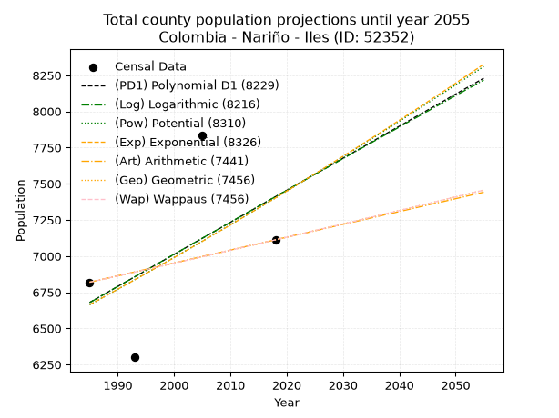
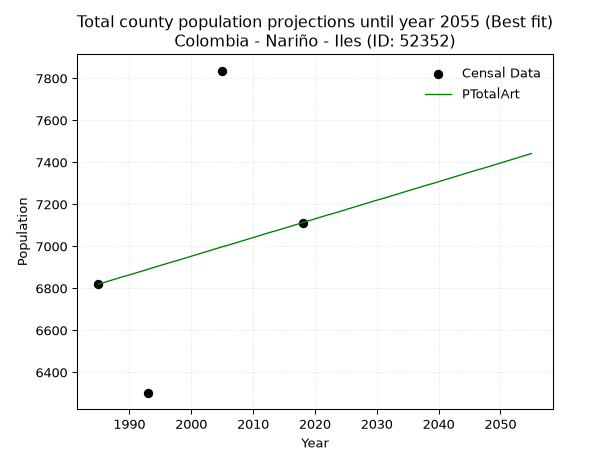
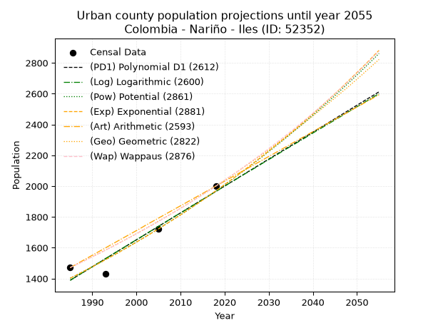
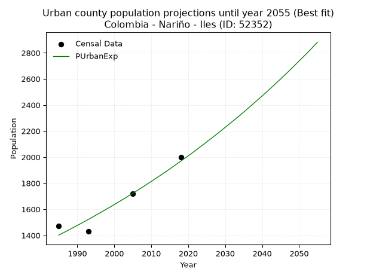
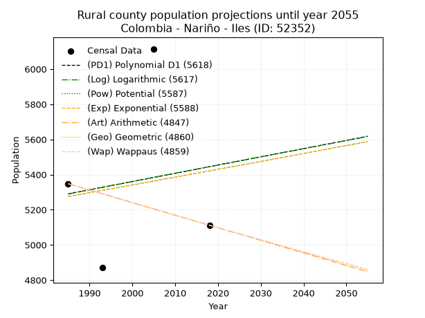
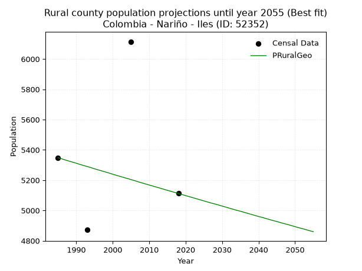

<div align="center">


</div>

# _“Population and Public Services Demand Projections (PPSD) until Year 2050 for Colombia - Nariño - Iles (ID: 52352)”_
Keywords: `population` `public-service` `projection` `lineal` `polynomial` `logarithmic` `potential` `exponential` `arithmetic` `geometric` `wappaus` `dane` `colombia` `south-america`

PPSD are analytical estimates used by governments and planners to anticipate future changes in population size, age distribution, and the resulting community needs for utilities, healthcare, education, and infrastructure as sizing future water treatment facilities, electrical grids, and road networks based on spatial growth.

> **General running parameters**: • app_version: _v20260806_. • Python version: _3.14.7_. • Pandas version: _3.0.5_. • NumPy version: _2.5.1_. • Creates, save and include plots into reports (create_plot): _False_. • Projection until year: _2050_. • Process polynomial degree 2 and up: _False_. • Process Wappaus: _True_. • Process Wappaus: _True_. • Set negative values to zero: _True_. • Set infinite values to zero: _True_. • Drop dataset notes: _True_. 
<div align="center">

Dynamic map: [:earth_americas:Google](http://maps.google.com/maps?q=0.969519552,-77.5212272) [:earth_americas:OSM](https://www.openstreetmap.org/#map=18/0.969519552/-77.5212272&layers=P) [:earth_americas:Bing](https://www.bing.com/maps?cp=0.969519552~-77.5212272&lvl=18) [:earth_americas:Apple](https://maps.apple.com/frame?center=0.969519552%2C-77.5212272&span=0.003%2C0.006)

</div>


<div align="center">

```geojson
{
  "type": "Feature",
  "geometry": {
    "type": "Point", 
    "coordinates": [-77.5212272, 0.969519552]
  }, 
  "properties": {
    "Name": "Colombia - Nariño - Iles (ID: 52352)"
  }
}
```

</div>


## 0. Census Data (4 records)

Census data are official statistics collected by a government about the people and housing in a country. They usually include counts of total population, age, sex, race, income, education, and jobs.

📅Global census file: [Population.xlsx](../data/Population.xlsx)

| Source   |   Year |   CountryID | CountryName   |   StateID | StateName   |   CountyID | CountyName   |   PTotal |   PUrban |   PRural |
|:---------|-------:|------------:|:--------------|----------:|:------------|-----------:|:-------------|---------:|---------:|---------:|
| DANE     |   1985 |          57 | Colombia      |        52 | Nariño      |      52352 | Iles         |     6819 |     1471 |     5348 |
| DANE     |   1993 |          57 | Colombia      |        52 | Nariño      |      52352 | Iles         |     6300 |     1429 |     4871 |
| DANE     |   2005 |          57 | Colombia      |        52 | Nariño      |      52352 | Iles         |     7836 |     1721 |     6115 |
| DANE     |   2018 |          57 | Colombia      |        52 | Nariño      |      52352 | Iles         |     7112 |     2000 |     5112 |

> 🔥Some records could had specific notes about the registered values or the corresponding urban or rural distribution.

## 1. Total

### 1.1. Coefficients and Parameters

* (PD1) Polynomial Deg 1: 22.150541951024042, -37289.871537535844 (lineal)
* (Log) Logarithmic: 44396.316661611585, -330440.00871466356
* (Pow) Potential: 6.374683921805801, -17.198528210036347
* (Exp) Exponential: 0.0031810709193942324, 12.061418308908555
* (Art) Arithmetic: Year diff. 2018 - 1985 = 33, Population diff. 7112 - 6819 = 293, Annual growth = 8.878787878787879
* (Geo) Geometric: Year diff. 2018 - 1985 = 33, Population diff. 7112 - 6819 = 293, Annual growth % = 0.0012756816169132712
* (Wap) Wappaus: i = 0.12746806228968313, Condition values only valid for < 200)

<sub>
Wappaus condition values: ['0.00', '0.13', '0.25', '0.38', '0.51', '0.64', '0.76', '0.89', '1.02', '1.15', '1.27', '1.40', '1.53', '1.66', '1.78', '1.91', '2.04', '2.17', '2.29', '2.42', '2.55', '2.68', '2.80', '2.93', '3.06', '3.19', '3.31', '3.44', '3.57', '3.70', '3.82', '3.95', '4.08', '4.21', '4.33', '4.46', '4.59', '4.72', '4.84', '4.97', '5.10', '5.23', '5.35', '5.48', '5.61', '5.74', '5.86', '5.99', '6.12', '6.25', '6.37', '6.50', '6.63', '6.76', '6.88', '7.01', '7.14', '7.27', '7.39', '7.52', '7.65', '7.78', '7.90', '8.03', '8.16', '8.29']
</sub>


### 1.2. Projected Dataset

|   Year |   CountyID |   PTotalPD1 |   PTotalLog |   PTotalPow |   PTotalExp |   PTotalArt |   PTotalGeo |   PTotalWap |
|-------:|-----------:|------------:|------------:|------------:|------------:|------------:|------------:|------------:|
|   1985 |      52352 |        6679 |        6678 |        6663 |        6664 |        6819 |        6819 |        6819 |
|   1986 |      52352 |        6701 |        6700 |        6684 |        6685 |        6828 |        6828 |        6828 |
|   1987 |      52352 |        6723 |        6723 |        6706 |        6706 |        6837 |        6836 |        6836 |
|   1988 |      52352 |        6745 |        6745 |        6727 |        6728 |        6846 |        6845 |        6845 |
|   1989 |      52352 |        6768 |        6767 |        6749 |        6749 |        6855 |        6854 |        6854 |
|   1990 |      52352 |        6790 |        6790 |        6770 |        6771 |        6863 |        6863 |        6863 |
|   1991 |      52352 |        6812 |        6812 |        6792 |        6792 |        6872 |        6871 |        6871 |
|   1992 |      52352 |        6834 |        6834 |        6814 |        6814 |        6881 |        6880 |        6880 |
|   1993 |      52352 |        6856 |        6856 |        6836 |        6836 |        6890 |        6889 |        6889 |
|   1994 |      52352 |        6878 |        6879 |        6858 |        6857 |        6899 |        6898 |        6898 |
|   1995 |      52352 |        6900 |        6901 |        6880 |        6879 |        6908 |        6906 |        6906 |
|   1996 |      52352 |        6923 |        6923 |        6902 |        6901 |        6917 |        6915 |        6915 |
|   1997 |      52352 |        6945 |        6945 |        6924 |        6923 |        6926 |        6924 |        6924 |
|   1998 |      52352 |        6967 |        6968 |        6946 |        6945 |        6934 |        6933 |        6933 |
|   1999 |      52352 |        6989 |        6990 |        6968 |        6967 |        6943 |        6942 |        6942 |
|   2000 |      52352 |        7011 |        7012 |        6990 |        6989 |        6952 |        6951 |        6951 |
|   2001 |      52352 |        7033 |        7034 |        7013 |        7012 |        6961 |        6960 |        6960 |
|   2002 |      52352 |        7056 |        7056 |        7035 |        7034 |        6970 |        6968 |        6968 |
|   2003 |      52352 |        7078 |        7079 |        7057 |        7056 |        6979 |        6977 |        6977 |
|   2004 |      52352 |        7100 |        7101 |        7080 |        7079 |        6988 |        6986 |        6986 |
|   2005 |      52352 |        7122 |        7123 |        7102 |        7101 |        6997 |        6995 |        6995 |
|   2006 |      52352 |        7144 |        7145 |        7125 |        7124 |        7005 |        7004 |        7004 |
|   2007 |      52352 |        7166 |        7167 |        7148 |        7147 |        7014 |        7013 |        7013 |
|   2008 |      52352 |        7188 |        7189 |        7170 |        7170 |        7023 |        7022 |        7022 |
|   2009 |      52352 |        7211 |        7211 |        7193 |        7192 |        7032 |        7031 |        7031 |
|   2010 |      52352 |        7233 |        7233 |        7216 |        7215 |        7041 |        7040 |        7040 |
|   2011 |      52352 |        7255 |        7256 |        7239 |        7238 |        7050 |        7049 |        7049 |
|   2012 |      52352 |        7277 |        7278 |        7262 |        7261 |        7059 |        7058 |        7058 |
|   2013 |      52352 |        7299 |        7300 |        7285 |        7285 |        7068 |        7067 |        7067 |
|   2014 |      52352 |        7321 |        7322 |        7308 |        7308 |        7076 |        7076 |        7076 |
|   2015 |      52352 |        7343 |        7344 |        7331 |        7331 |        7085 |        7085 |        7085 |
|   2016 |      52352 |        7366 |        7366 |        7355 |        7354 |        7094 |        7094 |        7094 |
|   2017 |      52352 |        7388 |        7388 |        7378 |        7378 |        7103 |        7103 |        7103 |
|   2018 |      52352 |        7410 |        7410 |        7401 |        7401 |        7112 |        7112 |        7112 |
|   2019 |      52352 |        7432 |        7432 |        7425 |        7425 |        7121 |        7121 |        7121 |
|   2020 |      52352 |        7454 |        7454 |        7448 |        7449 |        7130 |        7130 |        7130 |
|   2021 |      52352 |        7476 |        7476 |        7472 |        7472 |        7139 |        7139 |        7139 |
|   2022 |      52352 |        7499 |        7498 |        7495 |        7496 |        7148 |        7148 |        7148 |
|   2023 |      52352 |        7521 |        7520 |        7519 |        7520 |        7156 |        7157 |        7157 |
|   2024 |      52352 |        7543 |        7542 |        7543 |        7544 |        7165 |        7167 |        7167 |
|   2025 |      52352 |        7565 |        7564 |        7566 |        7568 |        7174 |        7176 |        7176 |
|   2026 |      52352 |        7587 |        7585 |        7590 |        7592 |        7183 |        7185 |        7185 |
|   2027 |      52352 |        7609 |        7607 |        7614 |        7616 |        7192 |        7194 |        7194 |
|   2028 |      52352 |        7631 |        7629 |        7638 |        7641 |        7201 |        7203 |        7203 |
|   2029 |      52352 |        7654 |        7651 |        7662 |        7665 |        7210 |        7212 |        7212 |
|   2030 |      52352 |        7676 |        7673 |        7686 |        7689 |        7219 |        7222 |        7222 |
|   2031 |      52352 |        7698 |        7695 |        7710 |        7714 |        7227 |        7231 |        7231 |
|   2032 |      52352 |        7720 |        7717 |        7735 |        7738 |        7236 |        7240 |        7240 |
|   2033 |      52352 |        7742 |        7739 |        7759 |        7763 |        7245 |        7249 |        7249 |
|   2034 |      52352 |        7764 |        7760 |        7783 |        7788 |        7254 |        7259 |        7259 |
|   2035 |      52352 |        7786 |        7782 |        7808 |        7813 |        7263 |        7268 |        7268 |
|   2036 |      52352 |        7809 |        7804 |        7832 |        7837 |        7272 |        7277 |        7277 |
|   2037 |      52352 |        7831 |        7826 |        7857 |        7862 |        7281 |        7286 |        7286 |
|   2038 |      52352 |        7853 |        7848 |        7881 |        7887 |        7290 |        7296 |        7296 |
|   2039 |      52352 |        7875 |        7869 |        7906 |        7913 |        7298 |        7305 |        7305 |
|   2040 |      52352 |        7897 |        7891 |        7931 |        7938 |        7307 |        7314 |        7314 |
|   2041 |      52352 |        7919 |        7913 |        7956 |        7963 |        7316 |        7324 |        7324 |
|   2042 |      52352 |        7942 |        7935 |        7981 |        7989 |        7325 |        7333 |        7333 |
|   2043 |      52352 |        7964 |        7956 |        8005 |        8014 |        7334 |        7342 |        7342 |
|   2044 |      52352 |        7986 |        7978 |        8030 |        8039 |        7343 |        7352 |        7352 |
|   2045 |      52352 |        8008 |        8000 |        8056 |        8065 |        7352 |        7361 |        7361 |
|   2046 |      52352 |        8030 |        8022 |        8081 |        8091 |        7361 |        7370 |        7371 |
|   2047 |      52352 |        8052 |        8043 |        8106 |        8117 |        7369 |        7380 |        7380 |
|   2048 |      52352 |        8074 |        8065 |        8131 |        8142 |        7378 |        7389 |        7390 |
|   2049 |      52352 |        8097 |        8087 |        8157 |        8168 |        7387 |        7399 |        7399 |
|   2050 |      52352 |        8119 |        8108 |        8182 |        8194 |        7396 |        7408 |        7408 |
<div align="center">

</img>

</div>


### 1.3. Best fit with absolute and relative error (%)

Relative error puts that difference into context by dividing the absolute error by the true value, creating a unitless ratio or percentage that shows the scale of the mistake.

Absolute and relative error

|   Year | Source   |   CountryID | CountryName   |   StateID | StateName   |   CountyID_x | CountyName   |   PTotal |   PUrban |   PRural |   CountyID_y |   PTotalPD1 |   PTotalLog |   PTotalPow |   PTotalExp |   PTotalArt |   PTotalGeo |   PTotalWap |   PTotalPD1AbsError |   PTotalLogAbsError |   PTotalPowAbsError |   PTotalExpAbsError |   PTotalArtAbsError |   PTotalGeoAbsError |   PTotalWapAbsError |   PTotalPD1RelError |   PTotalLogRelError |   PTotalPowRelError |   PTotalExpRelError |   PTotalArtRelError |   PTotalGeoRelError |   PTotalWapRelError |
|-------:|:---------|------------:|:--------------|----------:|:------------|-------------:|:-------------|---------:|---------:|---------:|-------------:|------------:|------------:|------------:|------------:|------------:|------------:|------------:|--------------------:|--------------------:|--------------------:|--------------------:|--------------------:|--------------------:|--------------------:|--------------------:|--------------------:|--------------------:|--------------------:|--------------------:|--------------------:|--------------------:|
|   1985 | DANE     |          57 | Colombia      |        52 | Nariño      |        52352 | Iles         |     6819 |     1471 |     5348 |        52352 |        6679 |        6678 |        6663 |        6664 |        6819 |        6819 |        6819 |                 140 |                 141 |                 156 |                 155 |                   0 |                   0 |                   0 |             2.05309 |             2.06775 |             2.28773 |             2.27306 |             0       |             0       |             0       |
|   1993 | DANE     |          57 | Colombia      |        52 | Nariño      |        52352 | Iles         |     6300 |     1429 |     4871 |        52352 |        6856 |        6856 |        6836 |        6836 |        6890 |        6889 |        6889 |                 556 |                 556 |                 536 |                 536 |                 590 |                 589 |                 589 |             8.8254  |             8.8254  |             8.50794 |             8.50794 |             9.36508 |             9.34921 |             9.34921 |
|   2005 | DANE     |          57 | Colombia      |        52 | Nariño      |        52352 | Iles         |     7836 |     1721 |     6115 |        52352 |        7122 |        7123 |        7102 |        7101 |        6997 |        6995 |        6995 |                 714 |                 713 |                 734 |                 735 |                 839 |                 841 |                 841 |             9.11179 |             9.09903 |             9.36702 |             9.37979 |            10.707   |            10.7325  |            10.7325  |
|   2018 | DANE     |          57 | Colombia      |        52 | Nariño      |        52352 | Iles         |     7112 |     2000 |     5112 |        52352 |        7410 |        7410 |        7401 |        7401 |        7112 |        7112 |        7112 |                 298 |                 298 |                 289 |                 289 |                   0 |                   0 |                   0 |             4.1901  |             4.1901  |             4.06355 |             4.06355 |             0       |             0       |             0       |

Relative error mean

| Method    |   RelError | Best   |
|:----------|-----------:|:-------|
| PTotalPD1 |    6.04509 |        |
| PTotalLog |    6.04557 |        |
| PTotalPow |    6.05656 |        |
| PTotalExp |    6.05608 |        |
| PTotalArt |    5.01802 | True   |
| PTotalGeo |    5.02043 |        |
| PTotalWap |    5.02043 |        |

💙Best method: _**PTotalArt**_
<div align="center">

</img>

</div>


### 1.4. Fresh water supply demand in liters per capita per day (lpcd)

The fresh water supply demand typically ranges from 100 to 300 liters per capita per day (lpcd) for standard domestic and municipal planning, though absolute survival minimums set by the World Health Organization are as low as 7.5 to 20 liters per day, and total consumption in high-income nations can exceed 400 liters.

> `CZ`: Level in meters above the sea level (masl).<br> `WS`: Fresh water supply demand in liters per capita per day (lpcd or l/h/d).<br> `WSAll`: Zonal fresh water supply demand in liters per second (l/s).<br> `A`: Zonal area in square meters.

Reference values (RAS Colombia)

|    CZ |   WS |
|------:|-----:|
|  1000 |  120 |
|  2000 |  130 |
| 99999 |  140 |

County shapefile geometry properties and water supply values

|   CountyID |      ATotal |   CZTotal |   WSTotal |
|-----------:|------------:|----------:|----------:|
|      52352 | 8.06377e+07 |   2793.71 |       140 |

Projected values for best method: PTotalArt

|   CountyID |   Year |   PTotalArt |   WSTotal |   WSTotalAll |
|-----------:|-------:|------------:|----------:|-------------:|
|      52352 |   1985 |        6819 |       140 |      11.0493 |
|      52352 |   1986 |        6828 |       140 |      11.0639 |
|      52352 |   1987 |        6837 |       140 |      11.0785 |
|      52352 |   1988 |        6846 |       140 |      11.0931 |
|      52352 |   1989 |        6855 |       140 |      11.1076 |
|      52352 |   1990 |        6863 |       140 |      11.1206 |
|      52352 |   1991 |        6872 |       140 |      11.1352 |
|      52352 |   1992 |        6881 |       140 |      11.1498 |
|      52352 |   1993 |        6890 |       140 |      11.1644 |
|      52352 |   1994 |        6899 |       140 |      11.1789 |
|      52352 |   1995 |        6908 |       140 |      11.1935 |
|      52352 |   1996 |        6917 |       140 |      11.2081 |
|      52352 |   1997 |        6926 |       140 |      11.2227 |
|      52352 |   1998 |        6934 |       140 |      11.2356 |
|      52352 |   1999 |        6943 |       140 |      11.2502 |
|      52352 |   2000 |        6952 |       140 |      11.2648 |
|      52352 |   2001 |        6961 |       140 |      11.2794 |
|      52352 |   2002 |        6970 |       140 |      11.294  |
|      52352 |   2003 |        6979 |       140 |      11.3086 |
|      52352 |   2004 |        6988 |       140 |      11.3231 |
|      52352 |   2005 |        6997 |       140 |      11.3377 |
|      52352 |   2006 |        7005 |       140 |      11.3507 |
|      52352 |   2007 |        7014 |       140 |      11.3653 |
|      52352 |   2008 |        7023 |       140 |      11.3799 |
|      52352 |   2009 |        7032 |       140 |      11.3944 |
|      52352 |   2010 |        7041 |       140 |      11.409  |
|      52352 |   2011 |        7050 |       140 |      11.4236 |
|      52352 |   2012 |        7059 |       140 |      11.4382 |
|      52352 |   2013 |        7068 |       140 |      11.4528 |
|      52352 |   2014 |        7076 |       140 |      11.4657 |
|      52352 |   2015 |        7085 |       140 |      11.4803 |
|      52352 |   2016 |        7094 |       140 |      11.4949 |
|      52352 |   2017 |        7103 |       140 |      11.5095 |
|      52352 |   2018 |        7112 |       140 |      11.5241 |
|      52352 |   2019 |        7121 |       140 |      11.5387 |
|      52352 |   2020 |        7130 |       140 |      11.5532 |
|      52352 |   2021 |        7139 |       140 |      11.5678 |
|      52352 |   2022 |        7148 |       140 |      11.5824 |
|      52352 |   2023 |        7156 |       140 |      11.5954 |
|      52352 |   2024 |        7165 |       140 |      11.61   |
|      52352 |   2025 |        7174 |       140 |      11.6245 |
|      52352 |   2026 |        7183 |       140 |      11.6391 |
|      52352 |   2027 |        7192 |       140 |      11.6537 |
|      52352 |   2028 |        7201 |       140 |      11.6683 |
|      52352 |   2029 |        7210 |       140 |      11.6829 |
|      52352 |   2030 |        7219 |       140 |      11.6975 |
|      52352 |   2031 |        7227 |       140 |      11.7104 |
|      52352 |   2032 |        7236 |       140 |      11.725  |
|      52352 |   2033 |        7245 |       140 |      11.7396 |
|      52352 |   2034 |        7254 |       140 |      11.7542 |
|      52352 |   2035 |        7263 |       140 |      11.7688 |
|      52352 |   2036 |        7272 |       140 |      11.7833 |
|      52352 |   2037 |        7281 |       140 |      11.7979 |
|      52352 |   2038 |        7290 |       140 |      11.8125 |
|      52352 |   2039 |        7298 |       140 |      11.8255 |
|      52352 |   2040 |        7307 |       140 |      11.84   |
|      52352 |   2041 |        7316 |       140 |      11.8546 |
|      52352 |   2042 |        7325 |       140 |      11.8692 |
|      52352 |   2043 |        7334 |       140 |      11.8838 |
|      52352 |   2044 |        7343 |       140 |      11.8984 |
|      52352 |   2045 |        7352 |       140 |      11.913  |
|      52352 |   2046 |        7361 |       140 |      11.9275 |
|      52352 |   2047 |        7369 |       140 |      11.9405 |
|      52352 |   2048 |        7378 |       140 |      11.9551 |
|      52352 |   2049 |        7387 |       140 |      11.9697 |
|      52352 |   2050 |        7396 |       140 |      11.9843 |

## 2. Urban

### 2.1. Coefficients and Parameters

* (PD1) Polynomial Deg 1: 17.473705339220988, -33296.52910477678 (lineal)
* (Log) Logarithmic: 34956.09855064427, -264046.3352040408
* (Pow) Potential: 20.587563941454437, -64.74624593133026
* (Exp) Exponential: 0.01029060362860418, 1.8855667492083375e-06
* (Art) Arithmetic: Year diff. 2018 - 1985 = 33, Population diff. 2000 - 1471 = 529, Annual growth = 16.03030303030303
* (Geo) Geometric: Year diff. 2018 - 1985 = 33, Population diff. 2000 - 1471 = 529, Annual growth % = 0.00935270020972001
* (Wap) Wappaus: i = 0.9236705865919349, Condition values only valid for < 200)

<sub>
Wappaus condition values: ['0.00', '0.92', '1.85', '2.77', '3.69', '4.62', '5.54', '6.47', '7.39', '8.31', '9.24', '10.16', '11.08', '12.01', '12.93', '13.86', '14.78', '15.70', '16.63', '17.55', '18.47', '19.40', '20.32', '21.24', '22.17', '23.09', '24.02', '24.94', '25.86', '26.79', '27.71', '28.63', '29.56', '30.48', '31.40', '32.33', '33.25', '34.18', '35.10', '36.02', '36.95', '37.87', '38.79', '39.72', '40.64', '41.57', '42.49', '43.41', '44.34', '45.26', '46.18', '47.11', '48.03', '48.95', '49.88', '50.80', '51.73', '52.65', '53.57', '54.50', '55.42', '56.34', '57.27', '58.19', '59.11', '60.04']
</sub>


### 2.2. Projected Dataset

|   Year |   CountyID |   PUrbanPD1 |   PUrbanLog |   PUrbanPow |   PUrbanExp |   PUrbanArt |   PUrbanGeo |   PUrbanWap |
|-------:|-----------:|------------:|------------:|------------:|------------:|------------:|------------:|------------:|
|   1985 |      52352 |        1389 |        1388 |        1402 |        1402 |        1471 |        1471 |        1471 |
|   1986 |      52352 |        1406 |        1406 |        1416 |        1416 |        1487 |        1485 |        1485 |
|   1987 |      52352 |        1424 |        1424 |        1431 |        1431 |        1503 |        1499 |        1498 |
|   1988 |      52352 |        1441 |        1441 |        1446 |        1446 |        1519 |        1513 |        1512 |
|   1989 |      52352 |        1459 |        1459 |        1461 |        1461 |        1535 |        1527 |        1526 |
|   1990 |      52352 |        1476 |        1476 |        1476 |        1476 |        1551 |        1541 |        1541 |
|   1991 |      52352 |        1494 |        1494 |        1491 |        1491 |        1567 |        1556 |        1555 |
|   1992 |      52352 |        1511 |        1511 |        1507 |        1507 |        1583 |        1570 |        1569 |
|   1993 |      52352 |        1529 |        1529 |        1523 |        1522 |        1599 |        1585 |        1584 |
|   1994 |      52352 |        1546 |        1547 |        1538 |        1538 |        1615 |        1600 |        1599 |
|   1995 |      52352 |        1564 |        1564 |        1554 |        1554 |        1631 |        1615 |        1613 |
|   1996 |      52352 |        1581 |        1582 |        1570 |        1570 |        1647 |        1630 |        1628 |
|   1997 |      52352 |        1598 |        1599 |        1587 |        1586 |        1663 |        1645 |        1644 |
|   1998 |      52352 |        1616 |        1617 |        1603 |        1603 |        1679 |        1660 |        1659 |
|   1999 |      52352 |        1633 |        1634 |        1620 |        1619 |        1695 |        1676 |        1674 |
|   2000 |      52352 |        1651 |        1652 |        1637 |        1636 |        1711 |        1691 |        1690 |
|   2001 |      52352 |        1668 |        1669 |        1653 |        1653 |        1727 |        1707 |        1706 |
|   2002 |      52352 |        1686 |        1686 |        1671 |        1670 |        1744 |        1723 |        1722 |
|   2003 |      52352 |        1703 |        1704 |        1688 |        1687 |        1760 |        1739 |        1738 |
|   2004 |      52352 |        1721 |        1721 |        1705 |        1705 |        1776 |        1756 |        1754 |
|   2005 |      52352 |        1738 |        1739 |        1723 |        1722 |        1792 |        1772 |        1770 |
|   2006 |      52352 |        1756 |        1756 |        1741 |        1740 |        1808 |        1789 |        1787 |
|   2007 |      52352 |        1773 |        1774 |        1759 |        1758 |        1824 |        1805 |        1804 |
|   2008 |      52352 |        1791 |        1791 |        1777 |        1776 |        1840 |        1822 |        1821 |
|   2009 |      52352 |        1808 |        1809 |        1795 |        1795 |        1856 |        1839 |        1838 |
|   2010 |      52352 |        1826 |        1826 |        1813 |        1813 |        1872 |        1856 |        1855 |
|   2011 |      52352 |        1843 |        1843 |        1832 |        1832 |        1888 |        1874 |        1872 |
|   2012 |      52352 |        1861 |        1861 |        1851 |        1851 |        1904 |        1891 |        1890 |
|   2013 |      52352 |        1878 |        1878 |        1870 |        1870 |        1920 |        1909 |        1908 |
|   2014 |      52352 |        1896 |        1895 |        1889 |        1889 |        1936 |        1927 |        1926 |
|   2015 |      52352 |        1913 |        1913 |        1909 |        1909 |        1952 |        1945 |        1944 |
|   2016 |      52352 |        1930 |        1930 |        1928 |        1929 |        1968 |        1963 |        1963 |
|   2017 |      52352 |        1948 |        1947 |        1948 |        1949 |        1984 |        1981 |        1981 |
|   2018 |      52352 |        1965 |        1965 |        1968 |        1969 |        2000 |        2000 |        2000 |
|   2019 |      52352 |        1983 |        1982 |        1988 |        1989 |        2016 |        2019 |        2019 |
|   2020 |      52352 |        2000 |        1999 |        2009 |        2010 |        2032 |        2038 |        2038 |
|   2021 |      52352 |        2018 |        2017 |        2029 |        2030 |        2048 |        2057 |        2058 |
|   2022 |      52352 |        2035 |        2034 |        2050 |        2051 |        2064 |        2076 |        2077 |
|   2023 |      52352 |        2053 |        2051 |        2071 |        2073 |        2080 |        2095 |        2097 |
|   2024 |      52352 |        2070 |        2069 |        2092 |        2094 |        2096 |        2115 |        2117 |
|   2025 |      52352 |        2088 |        2086 |        2113 |        2116 |        2112 |        2135 |        2138 |
|   2026 |      52352 |        2105 |        2103 |        2135 |        2138 |        2128 |        2155 |        2158 |
|   2027 |      52352 |        2123 |        2120 |        2157 |        2160 |        2144 |        2175 |        2179 |
|   2028 |      52352 |        2140 |        2138 |        2179 |        2182 |        2160 |        2195 |        2200 |
|   2029 |      52352 |        2158 |        2155 |        2201 |        2205 |        2176 |        2216 |        2221 |
|   2030 |      52352 |        2175 |        2172 |        2224 |        2228 |        2192 |        2236 |        2243 |
|   2031 |      52352 |        2193 |        2189 |        2246 |        2251 |        2208 |        2257 |        2265 |
|   2032 |      52352 |        2210 |        2206 |        2269 |        2274 |        2224 |        2278 |        2287 |
|   2033 |      52352 |        2228 |        2224 |        2292 |        2297 |        2240 |        2300 |        2309 |
|   2034 |      52352 |        2245 |        2241 |        2315 |        2321 |        2256 |        2321 |        2332 |
|   2035 |      52352 |        2262 |        2258 |        2339 |        2345 |        2273 |        2343 |        2354 |
|   2036 |      52352 |        2280 |        2275 |        2363 |        2369 |        2289 |        2365 |        2377 |
|   2037 |      52352 |        2297 |        2292 |        2387 |        2394 |        2305 |        2387 |        2401 |
|   2038 |      52352 |        2315 |        2309 |        2411 |        2419 |        2321 |        2409 |        2425 |
|   2039 |      52352 |        2332 |        2327 |        2436 |        2444 |        2337 |        2432 |        2448 |
|   2040 |      52352 |        2350 |        2344 |        2460 |        2469 |        2353 |        2455 |        2473 |
|   2041 |      52352 |        2367 |        2361 |        2485 |        2494 |        2369 |        2478 |        2497 |
|   2042 |      52352 |        2385 |        2378 |        2510 |        2520 |        2385 |        2501 |        2522 |
|   2043 |      52352 |        2402 |        2395 |        2536 |        2546 |        2401 |        2524 |        2547 |
|   2044 |      52352 |        2420 |        2412 |        2561 |        2573 |        2417 |        2548 |        2573 |
|   2045 |      52352 |        2437 |        2429 |        2587 |        2599 |        2433 |        2572 |        2599 |
|   2046 |      52352 |        2455 |        2446 |        2614 |        2626 |        2449 |        2596 |        2625 |
|   2047 |      52352 |        2472 |        2464 |        2640 |        2653 |        2465 |        2620 |        2651 |
|   2048 |      52352 |        2490 |        2481 |        2667 |        2681 |        2481 |        2644 |        2678 |
|   2049 |      52352 |        2507 |        2498 |        2694 |        2709 |        2497 |        2669 |        2705 |
|   2050 |      52352 |        2525 |        2515 |        2721 |        2737 |        2513 |        2694 |        2733 |
<div align="center">

</img>

</div>


### 2.3. Best fit with absolute and relative error (%)

Relative error puts that difference into context by dividing the absolute error by the true value, creating a unitless ratio or percentage that shows the scale of the mistake.

Absolute and relative error

|   Year | Source   |   CountryID | CountryName   |   StateID | StateName   |   CountyID_x | CountyName   |   PTotal |   PUrban |   PRural |   CountyID_y |   PUrbanPD1 |   PUrbanLog |   PUrbanPow |   PUrbanExp |   PUrbanArt |   PUrbanGeo |   PUrbanWap |   PUrbanPD1AbsError |   PUrbanLogAbsError |   PUrbanPowAbsError |   PUrbanExpAbsError |   PUrbanArtAbsError |   PUrbanGeoAbsError |   PUrbanWapAbsError |   PUrbanPD1RelError |   PUrbanLogRelError |   PUrbanPowRelError |   PUrbanExpRelError |   PUrbanArtRelError |   PUrbanGeoRelError |   PUrbanWapRelError |
|-------:|:---------|------------:|:--------------|----------:|:------------|-------------:|:-------------|---------:|---------:|---------:|-------------:|------------:|------------:|------------:|------------:|------------:|------------:|------------:|--------------------:|--------------------:|--------------------:|--------------------:|--------------------:|--------------------:|--------------------:|--------------------:|--------------------:|--------------------:|--------------------:|--------------------:|--------------------:|--------------------:|
|   1985 | DANE     |          57 | Colombia      |        52 | Nariño      |        52352 | Iles         |     6819 |     1471 |     5348 |        52352 |        1389 |        1388 |        1402 |        1402 |        1471 |        1471 |        1471 |                  82 |                  83 |                  69 |                  69 |                   0 |                   0 |                   0 |            5.57444  |             5.64242 |            4.69069  |           4.69069   |             0       |             0       |             0       |
|   1993 | DANE     |          57 | Colombia      |        52 | Nariño      |        52352 | Iles         |     6300 |     1429 |     4871 |        52352 |        1529 |        1529 |        1523 |        1522 |        1599 |        1585 |        1584 |                 100 |                 100 |                  94 |                  93 |                 170 |                 156 |                 155 |            6.9979   |             6.9979  |            6.57803  |           6.50805   |            11.8964  |            10.9167  |            10.8467  |
|   2005 | DANE     |          57 | Colombia      |        52 | Nariño      |        52352 | Iles         |     7836 |     1721 |     6115 |        52352 |        1738 |        1739 |        1723 |        1722 |        1792 |        1772 |        1770 |                  17 |                  18 |                   2 |                   1 |                  71 |                  51 |                  49 |            0.987798 |             1.0459  |            0.116212 |           0.0581058 |             4.12551 |             2.96339 |             2.84718 |
|   2018 | DANE     |          57 | Colombia      |        52 | Nariño      |        52352 | Iles         |     7112 |     2000 |     5112 |        52352 |        1965 |        1965 |        1968 |        1969 |        2000 |        2000 |        2000 |                  35 |                  35 |                  32 |                  31 |                   0 |                   0 |                   0 |            1.75     |             1.75    |            1.6      |           1.55      |             0       |             0       |             0       |

Relative error mean

| Method    |   RelError | Best   |
|:----------|-----------:|:-------|
| PUrbanPD1 |    3.82753 |        |
| PUrbanLog |    3.85906 |        |
| PUrbanPow |    3.24623 |        |
| PUrbanExp |    3.20171 | True   |
| PUrbanArt |    4.00548 |        |
| PUrbanGeo |    3.47003 |        |
| PUrbanWap |    3.42348 |        |

💙Best method: _**PUrbanExp**_
<div align="center">

</img>

</div>


### 2.4. Fresh water supply demand in liters per capita per day (lpcd)

The fresh water supply demand typically ranges from 100 to 300 liters per capita per day (lpcd) for standard domestic and municipal planning, though absolute survival minimums set by the World Health Organization are as low as 7.5 to 20 liters per day, and total consumption in high-income nations can exceed 400 liters.

> `CZ`: Level in meters above the sea level (masl).<br> `WS`: Fresh water supply demand in liters per capita per day (lpcd or l/h/d).<br> `WSAll`: Zonal fresh water supply demand in liters per second (l/s).<br> `A`: Zonal area in square meters.

Reference values (RAS Colombia)

|    CZ |   WS |
|------:|-----:|
|  1000 |  120 |
|  2000 |  130 |
| 99999 |  140 |

County shapefile geometry properties and water supply values

|   CountyID |   AUrban |   CZUrban |   WSUrban |
|-----------:|---------:|----------:|----------:|
|      52352 |   375150 |   2985.61 |       140 |

Projected values for best method: PUrbanExp

|   CountyID |   Year |   PUrbanExp |   WSUrban |   WSUrbanAll |
|-----------:|-------:|------------:|----------:|-------------:|
|      52352 |   1985 |        1402 |       140 |      2.27176 |
|      52352 |   1986 |        1416 |       140 |      2.29444 |
|      52352 |   1987 |        1431 |       140 |      2.31875 |
|      52352 |   1988 |        1446 |       140 |      2.34306 |
|      52352 |   1989 |        1461 |       140 |      2.36736 |
|      52352 |   1990 |        1476 |       140 |      2.39167 |
|      52352 |   1991 |        1491 |       140 |      2.41597 |
|      52352 |   1992 |        1507 |       140 |      2.4419  |
|      52352 |   1993 |        1522 |       140 |      2.4662  |
|      52352 |   1994 |        1538 |       140 |      2.49213 |
|      52352 |   1995 |        1554 |       140 |      2.51806 |
|      52352 |   1996 |        1570 |       140 |      2.54398 |
|      52352 |   1997 |        1586 |       140 |      2.56991 |
|      52352 |   1998 |        1603 |       140 |      2.59745 |
|      52352 |   1999 |        1619 |       140 |      2.62338 |
|      52352 |   2000 |        1636 |       140 |      2.65093 |
|      52352 |   2001 |        1653 |       140 |      2.67847 |
|      52352 |   2002 |        1670 |       140 |      2.70602 |
|      52352 |   2003 |        1687 |       140 |      2.73356 |
|      52352 |   2004 |        1705 |       140 |      2.76273 |
|      52352 |   2005 |        1722 |       140 |      2.79028 |
|      52352 |   2006 |        1740 |       140 |      2.81944 |
|      52352 |   2007 |        1758 |       140 |      2.84861 |
|      52352 |   2008 |        1776 |       140 |      2.87778 |
|      52352 |   2009 |        1795 |       140 |      2.90856 |
|      52352 |   2010 |        1813 |       140 |      2.93773 |
|      52352 |   2011 |        1832 |       140 |      2.96852 |
|      52352 |   2012 |        1851 |       140 |      2.99931 |
|      52352 |   2013 |        1870 |       140 |      3.03009 |
|      52352 |   2014 |        1889 |       140 |      3.06088 |
|      52352 |   2015 |        1909 |       140 |      3.09329 |
|      52352 |   2016 |        1929 |       140 |      3.12569 |
|      52352 |   2017 |        1949 |       140 |      3.1581  |
|      52352 |   2018 |        1969 |       140 |      3.19051 |
|      52352 |   2019 |        1989 |       140 |      3.22292 |
|      52352 |   2020 |        2010 |       140 |      3.25694 |
|      52352 |   2021 |        2030 |       140 |      3.28935 |
|      52352 |   2022 |        2051 |       140 |      3.32338 |
|      52352 |   2023 |        2073 |       140 |      3.35903 |
|      52352 |   2024 |        2094 |       140 |      3.39306 |
|      52352 |   2025 |        2116 |       140 |      3.4287  |
|      52352 |   2026 |        2138 |       140 |      3.46435 |
|      52352 |   2027 |        2160 |       140 |      3.5     |
|      52352 |   2028 |        2182 |       140 |      3.53565 |
|      52352 |   2029 |        2205 |       140 |      3.57292 |
|      52352 |   2030 |        2228 |       140 |      3.61019 |
|      52352 |   2031 |        2251 |       140 |      3.64745 |
|      52352 |   2032 |        2274 |       140 |      3.68472 |
|      52352 |   2033 |        2297 |       140 |      3.72199 |
|      52352 |   2034 |        2321 |       140 |      3.76088 |
|      52352 |   2035 |        2345 |       140 |      3.79977 |
|      52352 |   2036 |        2369 |       140 |      3.83866 |
|      52352 |   2037 |        2394 |       140 |      3.87917 |
|      52352 |   2038 |        2419 |       140 |      3.91968 |
|      52352 |   2039 |        2444 |       140 |      3.96019 |
|      52352 |   2040 |        2469 |       140 |      4.00069 |
|      52352 |   2041 |        2494 |       140 |      4.0412  |
|      52352 |   2042 |        2520 |       140 |      4.08333 |
|      52352 |   2043 |        2546 |       140 |      4.12546 |
|      52352 |   2044 |        2573 |       140 |      4.16921 |
|      52352 |   2045 |        2599 |       140 |      4.21134 |
|      52352 |   2046 |        2626 |       140 |      4.25509 |
|      52352 |   2047 |        2653 |       140 |      4.29884 |
|      52352 |   2048 |        2681 |       140 |      4.34421 |
|      52352 |   2049 |        2709 |       140 |      4.38958 |
|      52352 |   2050 |        2737 |       140 |      4.43495 |

## 3. Rural

### 3.1. Coefficients and Parameters

* (PD1) Polynomial Deg 1: 4.676836611803056, -3993.3424327590637 (lineal)
* (Log) Logarithmic: 9440.218110967313, -66393.67351062283
* (Pow) Potential: 1.661795808490705, -1.7580147810382865
* (Exp) Exponential: 0.000823496958031382, 1028.7963840481461
* (Art) Arithmetic: Year diff. 2018 - 1985 = 33, Population diff. 5112 - 5348 = -236, Annual growth = -7.151515151515151
* (Geo) Geometric: Year diff. 2018 - 1985 = 33, Population diff. 5112 - 5348 = -236, Annual growth % = -0.0013666998250267959
* (Wap) Wappaus: i = -0.1367402514630048, Condition values only valid for < 200)

<sub>
Wappaus condition values: ['-0.00', '-0.14', '-0.27', '-0.41', '-0.55', '-0.68', '-0.82', '-0.96', '-1.09', '-1.23', '-1.37', '-1.50', '-1.64', '-1.78', '-1.91', '-2.05', '-2.19', '-2.32', '-2.46', '-2.60', '-2.73', '-2.87', '-3.01', '-3.15', '-3.28', '-3.42', '-3.56', '-3.69', '-3.83', '-3.97', '-4.10', '-4.24', '-4.38', '-4.51', '-4.65', '-4.79', '-4.92', '-5.06', '-5.20', '-5.33', '-5.47', '-5.61', '-5.74', '-5.88', '-6.02', '-6.15', '-6.29', '-6.43', '-6.56', '-6.70', '-6.84', '-6.97', '-7.11', '-7.25', '-7.38', '-7.52', '-7.66', '-7.79', '-7.93', '-8.07', '-8.20', '-8.34', '-8.48', '-8.61', '-8.75', '-8.89']
</sub>


### 3.2. Projected Dataset

|   Year |   CountyID |   PRuralPD1 |   PRuralLog |   PRuralPow |   PRuralExp |   PRuralArt |   PRuralGeo |   PRuralWap |
|-------:|-----------:|------------:|------------:|------------:|------------:|------------:|------------:|------------:|
|   1985 |      52352 |        5290 |        5289 |        5275 |        5275 |        5348 |        5348 |        5348 |
|   1986 |      52352 |        5295 |        5294 |        5279 |        5280 |        5341 |        5341 |        5341 |
|   1987 |      52352 |        5300 |        5299 |        5283 |        5284 |        5334 |        5333 |        5333 |
|   1988 |      52352 |        5304 |        5304 |        5288 |        5288 |        5327 |        5326 |        5326 |
|   1989 |      52352 |        5309 |        5308 |        5292 |        5293 |        5319 |        5319 |        5319 |
|   1990 |      52352 |        5314 |        5313 |        5297 |        5297 |        5312 |        5312 |        5312 |
|   1991 |      52352 |        5318 |        5318 |        5301 |        5301 |        5305 |        5304 |        5304 |
|   1992 |      52352 |        5323 |        5323 |        5306 |        5306 |        5298 |        5297 |        5297 |
|   1993 |      52352 |        5328 |        5327 |        5310 |        5310 |        5291 |        5290 |        5290 |
|   1994 |      52352 |        5332 |        5332 |        5314 |        5315 |        5284 |        5283 |        5283 |
|   1995 |      52352 |        5337 |        5337 |        5319 |        5319 |        5276 |        5275 |        5275 |
|   1996 |      52352 |        5342 |        5342 |        5323 |        5323 |        5269 |        5268 |        5268 |
|   1997 |      52352 |        5346 |        5346 |        5328 |        5328 |        5262 |        5261 |        5261 |
|   1998 |      52352 |        5351 |        5351 |        5332 |        5332 |        5255 |        5254 |        5254 |
|   1999 |      52352 |        5356 |        5356 |        5337 |        5336 |        5248 |        5247 |        5247 |
|   2000 |      52352 |        5360 |        5361 |        5341 |        5341 |        5241 |        5239 |        5239 |
|   2001 |      52352 |        5365 |        5365 |        5345 |        5345 |        5234 |        5232 |        5232 |
|   2002 |      52352 |        5370 |        5370 |        5350 |        5350 |        5226 |        5225 |        5225 |
|   2003 |      52352 |        5374 |        5375 |        5354 |        5354 |        5219 |        5218 |        5218 |
|   2004 |      52352 |        5379 |        5379 |        5359 |        5358 |        5212 |        5211 |        5211 |
|   2005 |      52352 |        5384 |        5384 |        5363 |        5363 |        5205 |        5204 |        5204 |
|   2006 |      52352 |        5388 |        5389 |        5368 |        5367 |        5198 |        5197 |        5197 |
|   2007 |      52352 |        5393 |        5393 |        5372 |        5372 |        5191 |        5189 |        5190 |
|   2008 |      52352 |        5398 |        5398 |        5377 |        5376 |        5184 |        5182 |        5182 |
|   2009 |      52352 |        5402 |        5403 |        5381 |        5381 |        5176 |        5175 |        5175 |
|   2010 |      52352 |        5407 |        5408 |        5385 |        5385 |        5169 |        5168 |        5168 |
|   2011 |      52352 |        5412 |        5412 |        5390 |        5389 |        5162 |        5161 |        5161 |
|   2012 |      52352 |        5416 |        5417 |        5394 |        5394 |        5155 |        5154 |        5154 |
|   2013 |      52352 |        5421 |        5422 |        5399 |        5398 |        5148 |        5147 |        5147 |
|   2014 |      52352 |        5426 |        5426 |        5403 |        5403 |        5141 |        5140 |        5140 |
|   2015 |      52352 |        5430 |        5431 |        5408 |        5407 |        5133 |        5133 |        5133 |
|   2016 |      52352 |        5435 |        5436 |        5412 |        5412 |        5126 |        5126 |        5126 |
|   2017 |      52352 |        5440 |        5440 |        5417 |        5416 |        5119 |        5119 |        5119 |
|   2018 |      52352 |        5445 |        5445 |        5421 |        5421 |        5112 |        5112 |        5112 |
|   2019 |      52352 |        5449 |        5450 |        5426 |        5425 |        5105 |        5105 |        5105 |
|   2020 |      52352 |        5454 |        5454 |        5430 |        5430 |        5098 |        5098 |        5098 |
|   2021 |      52352 |        5459 |        5459 |        5435 |        5434 |        5091 |        5091 |        5091 |
|   2022 |      52352 |        5463 |        5464 |        5439 |        5438 |        5083 |        5084 |        5084 |
|   2023 |      52352 |        5468 |        5468 |        5443 |        5443 |        5076 |        5077 |        5077 |
|   2024 |      52352 |        5473 |        5473 |        5448 |        5447 |        5069 |        5070 |        5070 |
|   2025 |      52352 |        5477 |        5478 |        5452 |        5452 |        5062 |        5063 |        5063 |
|   2026 |      52352 |        5482 |        5482 |        5457 |        5456 |        5055 |        5056 |        5056 |
|   2027 |      52352 |        5487 |        5487 |        5461 |        5461 |        5048 |        5049 |        5049 |
|   2028 |      52352 |        5491 |        5492 |        5466 |        5465 |        5040 |        5043 |        5043 |
|   2029 |      52352 |        5496 |        5496 |        5470 |        5470 |        5033 |        5036 |        5036 |
|   2030 |      52352 |        5501 |        5501 |        5475 |        5474 |        5026 |        5029 |        5029 |
|   2031 |      52352 |        5505 |        5506 |        5479 |        5479 |        5019 |        5022 |        5022 |
|   2032 |      52352 |        5510 |        5510 |        5484 |        5483 |        5012 |        5015 |        5015 |
|   2033 |      52352 |        5515 |        5515 |        5488 |        5488 |        5005 |        5008 |        5008 |
|   2034 |      52352 |        5519 |        5520 |        5493 |        5492 |        4998 |        5001 |        5001 |
|   2035 |      52352 |        5524 |        5524 |        5497 |        5497 |        4990 |        4995 |        4994 |
|   2036 |      52352 |        5529 |        5529 |        5502 |        5502 |        4983 |        4988 |        4988 |
|   2037 |      52352 |        5533 |        5534 |        5506 |        5506 |        4976 |        4981 |        4981 |
|   2038 |      52352 |        5538 |        5538 |        5511 |        5511 |        4969 |        4974 |        4974 |
|   2039 |      52352 |        5543 |        5543 |        5515 |        5515 |        4962 |        4967 |        4967 |
|   2040 |      52352 |        5547 |        5547 |        5520 |        5520 |        4955 |        4960 |        4960 |
|   2041 |      52352 |        5552 |        5552 |        5524 |        5524 |        4948 |        4954 |        4954 |
|   2042 |      52352 |        5557 |        5557 |        5529 |        5529 |        4940 |        4947 |        4947 |
|   2043 |      52352 |        5561 |        5561 |        5533 |        5533 |        4933 |        4940 |        4940 |
|   2044 |      52352 |        5566 |        5566 |        5538 |        5538 |        4926 |        4933 |        4933 |
|   2045 |      52352 |        5571 |        5571 |        5542 |        5542 |        4919 |        4927 |        4927 |
|   2046 |      52352 |        5575 |        5575 |        5547 |        5547 |        4912 |        4920 |        4920 |
|   2047 |      52352 |        5580 |        5580 |        5551 |        5552 |        4905 |        4913 |        4913 |
|   2048 |      52352 |        5585 |        5584 |        5556 |        5556 |        4897 |        4907 |        4906 |
|   2049 |      52352 |        5589 |        5589 |        5560 |        5561 |        4890 |        4900 |        4900 |
|   2050 |      52352 |        5594 |        5594 |        5565 |        5565 |        4883 |        4893 |        4893 |
<div align="center">

</img>

</div>


### 3.3. Best fit with absolute and relative error (%)

Relative error puts that difference into context by dividing the absolute error by the true value, creating a unitless ratio or percentage that shows the scale of the mistake.

Absolute and relative error

|   Year | Source   |   CountryID | CountryName   |   StateID | StateName   |   CountyID_x | CountyName   |   PTotal |   PUrban |   PRural |   CountyID_y |   PRuralPD1 |   PRuralLog |   PRuralPow |   PRuralExp |   PRuralArt |   PRuralGeo |   PRuralWap |   PRuralPD1AbsError |   PRuralLogAbsError |   PRuralPowAbsError |   PRuralExpAbsError |   PRuralArtAbsError |   PRuralGeoAbsError |   PRuralWapAbsError |   PRuralPD1RelError |   PRuralLogRelError |   PRuralPowRelError |   PRuralExpRelError |   PRuralArtRelError |   PRuralGeoRelError |   PRuralWapRelError |
|-------:|:---------|------------:|:--------------|----------:|:------------|-------------:|:-------------|---------:|---------:|---------:|-------------:|------------:|------------:|------------:|------------:|------------:|------------:|------------:|--------------------:|--------------------:|--------------------:|--------------------:|--------------------:|--------------------:|--------------------:|--------------------:|--------------------:|--------------------:|--------------------:|--------------------:|--------------------:|--------------------:|
|   1985 | DANE     |          57 | Colombia      |        52 | Nariño      |        52352 | Iles         |     6819 |     1471 |     5348 |        52352 |        5290 |        5289 |        5275 |        5275 |        5348 |        5348 |        5348 |                  58 |                  59 |                  73 |                  73 |                   0 |                   0 |                   0 |             1.08452 |             1.10322 |             1.365   |             1.365   |             0       |             0       |             0       |
|   1993 | DANE     |          57 | Colombia      |        52 | Nariño      |        52352 | Iles         |     6300 |     1429 |     4871 |        52352 |        5328 |        5327 |        5310 |        5310 |        5291 |        5290 |        5290 |                 457 |                 456 |                 439 |                 439 |                 420 |                 419 |                 419 |             9.38206 |             9.36153 |             9.01252 |             9.01252 |             8.62246 |             8.60193 |             8.60193 |
|   2005 | DANE     |          57 | Colombia      |        52 | Nariño      |        52352 | Iles         |     7836 |     1721 |     6115 |        52352 |        5384 |        5384 |        5363 |        5363 |        5205 |        5204 |        5204 |                 731 |                 731 |                 752 |                 752 |                 910 |                 911 |                 911 |            11.9542  |            11.9542  |            12.2976  |            12.2976  |            14.8814  |            14.8978  |            14.8978  |
|   2018 | DANE     |          57 | Colombia      |        52 | Nariño      |        52352 | Iles         |     7112 |     2000 |     5112 |        52352 |        5445 |        5445 |        5421 |        5421 |        5112 |        5112 |        5112 |                 333 |                 333 |                 309 |                 309 |                   0 |                   0 |                   0 |             6.51408 |             6.51408 |             6.0446  |             6.0446  |             0       |             0       |             0       |

Relative error mean

| Method    |   RelError | Best   |
|:----------|-----------:|:-------|
| PRuralPD1 |    7.23372 |        |
| PRuralLog |    7.23326 |        |
| PRuralPow |    7.17994 |        |
| PRuralExp |    7.17994 |        |
| PRuralArt |    5.87597 |        |
| PRuralGeo |    5.87493 | True   |
| PRuralWap |    5.87493 | True   |

💙Best method: _**PRuralGeo**_
<div align="center">

</img>

</div>


### 3.4. Fresh water supply demand in liters per capita per day (lpcd)

The fresh water supply demand typically ranges from 100 to 300 liters per capita per day (lpcd) for standard domestic and municipal planning, though absolute survival minimums set by the World Health Organization are as low as 7.5 to 20 liters per day, and total consumption in high-income nations can exceed 400 liters.

> `CZ`: Level in meters above the sea level (masl).<br> `WS`: Fresh water supply demand in liters per capita per day (lpcd or l/h/d).<br> `WSAll`: Zonal fresh water supply demand in liters per second (l/s).<br> `A`: Zonal area in square meters.

Reference values (RAS Colombia)

|    CZ |   WS |
|------:|-----:|
|  1000 |  120 |
|  2000 |  130 |
| 99999 |  140 |

County shapefile geometry properties and water supply values

|   CountyID |      ARural |   CZRural |   WSRural |
|-----------:|------------:|----------:|----------:|
|      52352 | 8.02626e+07 |   2792.83 |       140 |

Projected values for best method: PRuralGeo

|   CountyID |   Year |   PRuralGeo |   WSRural |   WSRuralAll |
|-----------:|-------:|------------:|----------:|-------------:|
|      52352 |   1985 |        5348 |       140 |      8.66574 |
|      52352 |   1986 |        5341 |       140 |      8.6544  |
|      52352 |   1987 |        5333 |       140 |      8.64144 |
|      52352 |   1988 |        5326 |       140 |      8.63009 |
|      52352 |   1989 |        5319 |       140 |      8.61875 |
|      52352 |   1990 |        5312 |       140 |      8.60741 |
|      52352 |   1991 |        5304 |       140 |      8.59444 |
|      52352 |   1992 |        5297 |       140 |      8.5831  |
|      52352 |   1993 |        5290 |       140 |      8.57176 |
|      52352 |   1994 |        5283 |       140 |      8.56042 |
|      52352 |   1995 |        5275 |       140 |      8.54745 |
|      52352 |   1996 |        5268 |       140 |      8.53611 |
|      52352 |   1997 |        5261 |       140 |      8.52477 |
|      52352 |   1998 |        5254 |       140 |      8.51343 |
|      52352 |   1999 |        5247 |       140 |      8.50208 |
|      52352 |   2000 |        5239 |       140 |      8.48912 |
|      52352 |   2001 |        5232 |       140 |      8.47778 |
|      52352 |   2002 |        5225 |       140 |      8.46644 |
|      52352 |   2003 |        5218 |       140 |      8.45509 |
|      52352 |   2004 |        5211 |       140 |      8.44375 |
|      52352 |   2005 |        5204 |       140 |      8.43241 |
|      52352 |   2006 |        5197 |       140 |      8.42106 |
|      52352 |   2007 |        5189 |       140 |      8.4081  |
|      52352 |   2008 |        5182 |       140 |      8.39676 |
|      52352 |   2009 |        5175 |       140 |      8.38542 |
|      52352 |   2010 |        5168 |       140 |      8.37407 |
|      52352 |   2011 |        5161 |       140 |      8.36273 |
|      52352 |   2012 |        5154 |       140 |      8.35139 |
|      52352 |   2013 |        5147 |       140 |      8.34005 |
|      52352 |   2014 |        5140 |       140 |      8.3287  |
|      52352 |   2015 |        5133 |       140 |      8.31736 |
|      52352 |   2016 |        5126 |       140 |      8.30602 |
|      52352 |   2017 |        5119 |       140 |      8.29468 |
|      52352 |   2018 |        5112 |       140 |      8.28333 |
|      52352 |   2019 |        5105 |       140 |      8.27199 |
|      52352 |   2020 |        5098 |       140 |      8.26065 |
|      52352 |   2021 |        5091 |       140 |      8.24931 |
|      52352 |   2022 |        5084 |       140 |      8.23796 |
|      52352 |   2023 |        5077 |       140 |      8.22662 |
|      52352 |   2024 |        5070 |       140 |      8.21528 |
|      52352 |   2025 |        5063 |       140 |      8.20394 |
|      52352 |   2026 |        5056 |       140 |      8.19259 |
|      52352 |   2027 |        5049 |       140 |      8.18125 |
|      52352 |   2028 |        5043 |       140 |      8.17153 |
|      52352 |   2029 |        5036 |       140 |      8.16019 |
|      52352 |   2030 |        5029 |       140 |      8.14884 |
|      52352 |   2031 |        5022 |       140 |      8.1375  |
|      52352 |   2032 |        5015 |       140 |      8.12616 |
|      52352 |   2033 |        5008 |       140 |      8.11481 |
|      52352 |   2034 |        5001 |       140 |      8.10347 |
|      52352 |   2035 |        4995 |       140 |      8.09375 |
|      52352 |   2036 |        4988 |       140 |      8.08241 |
|      52352 |   2037 |        4981 |       140 |      8.07106 |
|      52352 |   2038 |        4974 |       140 |      8.05972 |
|      52352 |   2039 |        4967 |       140 |      8.04838 |
|      52352 |   2040 |        4960 |       140 |      8.03704 |
|      52352 |   2041 |        4954 |       140 |      8.02731 |
|      52352 |   2042 |        4947 |       140 |      8.01597 |
|      52352 |   2043 |        4940 |       140 |      8.00463 |
|      52352 |   2044 |        4933 |       140 |      7.99329 |
|      52352 |   2045 |        4927 |       140 |      7.98356 |
|      52352 |   2046 |        4920 |       140 |      7.97222 |
|      52352 |   2047 |        4913 |       140 |      7.96088 |
|      52352 |   2048 |        4907 |       140 |      7.95116 |
|      52352 |   2049 |        4900 |       140 |      7.93981 |
|      52352 |   2050 |        4893 |       140 |      7.92847 |

<div align="center"><br><sub>Share this research</sub></div><br>

<sub>**APPS & TOOLS & CONTENT DISCLAIMER**: • NO WARRANTY - This content and software is provided by <a href="https://github.com/rcfdtools" target="_blank">github.com/rcfdtools</a> "as is", without any express or implied warranty, including warranties of merchantability, fitness for a particular purpose, or non-infringement. There is no guarantee that the software will be error-free or operate without interruption. • LIMITATION OF LIABILITY - Neither the authors nor copyright holders will be liable for claims or damages arising from the software or its use. You are responsible for determining if the software is appropriate for your use and assume all associated risks, including errors, legal compliance, and data loss. • NO PROFESSIONAL ADVICE - The software provides general information and does not offer professional advice. It should not replace consultation with professional advisors. [Clauses and global license for rcfdtools use.](https://github.com/rcfdtools/rcfdtools/blob/main/LICENSE.md)</sub>