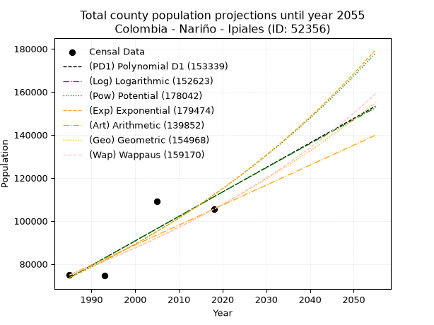
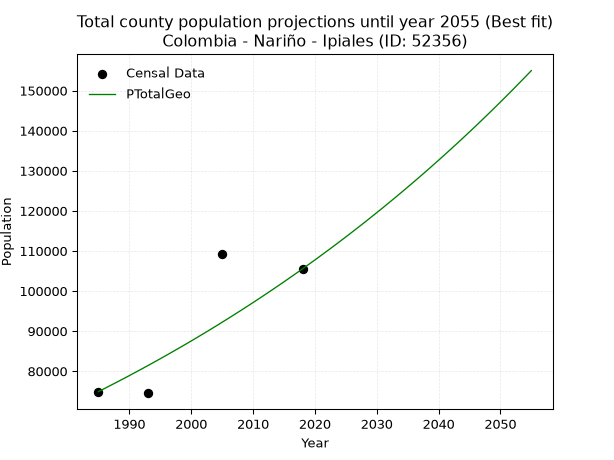
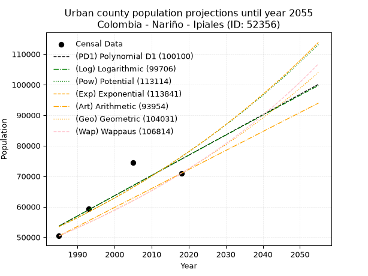
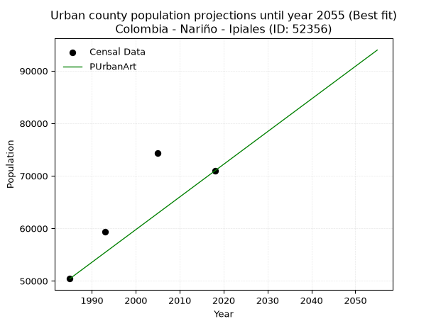
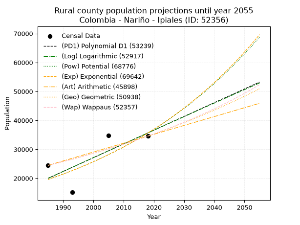
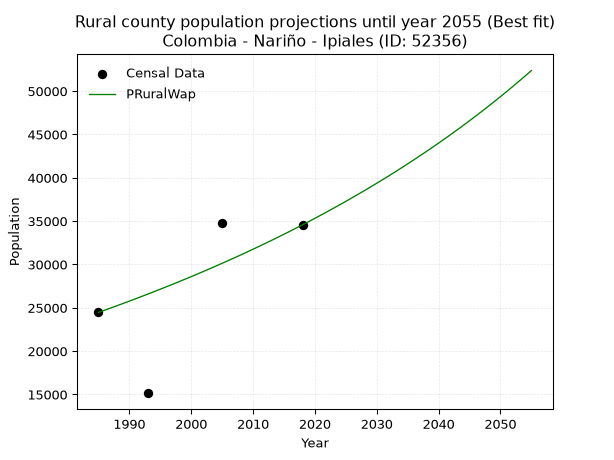

<div align="center">


</div>

# _“Population and Public Services Demand Projections (PPSD) until Year 2050 for Colombia - Nariño - Ipiales (ID: 52356)”_
Keywords: `population` `public-service` `projection` `lineal` `polynomial` `logarithmic` `potential` `exponential` `arithmetic` `geometric` `wappaus` `dane` `colombia` `south-america`

PPSD are analytical estimates used by governments and planners to anticipate future changes in population size, age distribution, and the resulting community needs for utilities, healthcare, education, and infrastructure as sizing future water treatment facilities, electrical grids, and road networks based on spatial growth.

> **General running parameters**: • app_version: _v20260806_. • Python version: _3.14.7_. • Pandas version: _3.0.5_. • NumPy version: _2.5.1_. • Creates, save and include plots into reports (create_plot): _False_. • Projection until year: _2050_. • Process polynomial degree 2 and up: _False_. • Process Wappaus: _True_. • Process Wappaus: _True_. • Set negative values to zero: _True_. • Set infinite values to zero: _True_. • Drop dataset notes: _True_. 
<div align="center">

Dynamic map: [:earth_americas:Google](http://maps.google.com/maps?q=0.82773212,-77.6463672) [:earth_americas:OSM](https://www.openstreetmap.org/#map=18/0.82773212/-77.6463672&layers=P) [:earth_americas:Bing](https://www.bing.com/maps?cp=0.82773212~-77.6463672&lvl=18) [:earth_americas:Apple](https://maps.apple.com/frame?center=0.82773212%2C-77.6463672&span=0.003%2C0.006)

</div>


<div align="center">

```geojson
{
  "type": "Feature",
  "geometry": {
    "type": "Point", 
    "coordinates": [-77.6463672, 0.82773212]
  }, 
  "properties": {
    "Name": "Colombia - Nariño - Ipiales (ID: 52356)"
  }
}
```

</div>


## 0. Census Data (4 records)

Census data are official statistics collected by a government about the people and housing in a country. They usually include counts of total population, age, sex, race, income, education, and jobs.

📅Global census file: [Population.xlsx](../data/Population.xlsx)

| Source   |   Year |   CountryID | CountryName   |   StateID | StateName   |   CountyID | CountyName   |   PTotal |   PUrban |   PRural |
|:---------|-------:|------------:|:--------------|----------:|:------------|-----------:|:-------------|---------:|---------:|---------:|
| DANE     |   1985 |          57 | Colombia      |        52 | Nariño      |      52356 | Ipiales      |    74894 |    50431 |    24463 |
| DANE     |   1993 |          57 | Colombia      |        52 | Nariño      |      52356 | Ipiales      |    74495 |    59351 |    15144 |
| DANE     |   2005 |          57 | Colombia      |        52 | Nariño      |      52356 | Ipiales      |   109116 |    74362 |    34754 |
| DANE     |   2018 |          57 | Colombia      |        52 | Nariño      |      52356 | Ipiales      |   105517 |    70949 |    34568 |

> 🔥Some records could had specific notes about the registered values or the corresponding urban or rural distribution.

📅   [RUPS](https://www.datos.gov.co/Hacienda-y-Cr-dito-P-blico/Registro-nico-de-Prestadores-de-Servicios-P-blicos/4qkq-csdn/about_data) - Local public utility companies: [RUPS.csv](../data/RUPS.xlsx)

 | SERVICIO       | ESTADO    | NOMBRE                                                                                        | NIT         | DEPARTAMENTO_DOMICILIO   | MUNICIPIO_DOMICILIO   | DIRECCION                        |   TELEFONO | EMAIL                                       | TIPO_PRESTADOR                            | CLASIFICACION                 |
|:---------------|:----------|:----------------------------------------------------------------------------------------------|:------------|:-------------------------|:----------------------|:---------------------------------|-----------:|:--------------------------------------------|:------------------------------------------|:------------------------------|
| ACUEDUCTO      | OPERATIVA | EMPRESA DE OBRAS SANITARIAS DE LA PROVINCIA DE OBANDO                                         | 800140132-6 | NARINO                   | IPIALES               | carrera 7 calle 30 barrio puenes |    7733390 | planeacion@empoobando-ipiales-narino.gov.co | EMPRESA INDUSTRIAL Y COMERCIAL DEL ESTADO | MAYOR O IGUAL A 5001 USUARIOS |
| ALCANTARILLADO | OPERATIVA | EMPRESA DE OBRAS SANITARIAS DE LA PROVINCIA DE OBANDO                                         | 800140132-6 | NARINO                   | IPIALES               | carrera 7 calle 30 barrio puenes |    7733390 | planeacion@empoobando-ipiales-narino.gov.co | EMPRESA INDUSTRIAL Y COMERCIAL DEL ESTADO | MAYOR O IGUAL A 5001 USUARIOS |
| ACUEDUCTO      | OPERATIVA | JUNTA ADMINISTRADORA ACUEDUCTO Y OBRAS VARIAS VEREDA LAS ANIMAS IPIALES                       | 837000419-9 | NARINO                   | IPIALES               | VDA LAS ANIMAS                   |    7734825 | carmenzaperdomoc@hotmail.com                | ORGANIZACION AUTORIZADA                   | HASTA 2500 SUSCRIPTORES       |
| ACUEDUCTO      | OPERATIVA | ASOCIACION JUNTA ADMONISTRADORA DE USUARIOS DEL SRVICIO DE ACUEDUCTO DEL RESGUARDO DE YARAMAL | 900266383-2 | NARINO                   | IPIALES               | CORREGIMIENTO YARAMAL            |    7753563 | jauyaramal@gmail.com                        | ORGANIZACION AUTORIZADA                   | HASTA 2500 SUSCRIPTORES       |

## 1. Total

### 1.1. Coefficients and Parameters

* (PD1) Polynomial Deg 1: 1138.5074267362502, -2186293.980329185 (lineal)
* (Log) Logarithmic: 2280179.3984423676, -17240656.379771385
* (Pow) Potential: 25.441176567066847, -79.03130697880124
* (Exp) Exponential: 0.01270333513239911, 8.252590757177568e-07
* (Art) Arithmetic: Year diff. 2018 - 1985 = 33, Population diff. 105517 - 74894 = 30623, Annual growth = 927.969696969697
* (Geo) Geometric: Year diff. 2018 - 1985 = 33, Population diff. 105517 - 74894 = 30623, Annual growth % = 0.0104419679605956
* (Wap) Wappaus: i = 1.028728510977376, Condition values only valid for < 200)

<sub>
Wappaus condition values: ['0.00', '1.03', '2.06', '3.09', '4.11', '5.14', '6.17', '7.20', '8.23', '9.26', '10.29', '11.32', '12.34', '13.37', '14.40', '15.43', '16.46', '17.49', '18.52', '19.55', '20.57', '21.60', '22.63', '23.66', '24.69', '25.72', '26.75', '27.78', '28.80', '29.83', '30.86', '31.89', '32.92', '33.95', '34.98', '36.01', '37.03', '38.06', '39.09', '40.12', '41.15', '42.18', '43.21', '44.24', '45.26', '46.29', '47.32', '48.35', '49.38', '50.41', '51.44', '52.47', '53.49', '54.52', '55.55', '56.58', '57.61', '58.64', '59.67', '60.69', '61.72', '62.75', '63.78', '64.81', '65.84', '66.87']
</sub>


### 1.2. Projected Dataset

|   Year |   CountyID |   PTotalPD1 |   PTotalLog |   PTotalPow |   PTotalExp |   PTotalArt |   PTotalGeo |   PTotalWap |
|-------:|-----------:|------------:|------------:|------------:|------------:|------------:|------------:|------------:|
|   1985 |      52356 |       73643 |       73599 |       73723 |       73759 |       74894 |       74894 |       74894 |
|   1986 |      52356 |       74782 |       74747 |       74673 |       74701 |       75822 |       75676 |       75668 |
|   1987 |      52356 |       75920 |       75895 |       75636 |       75656 |       76750 |       76466 |       76451 |
|   1988 |      52356 |       77059 |       77043 |       76610 |       76624 |       77678 |       77265 |       77242 |
|   1989 |      52356 |       78197 |       78189 |       77597 |       77603 |       78606 |       78072 |       78041 |
|   1990 |      52356 |       79336 |       79335 |       78595 |       78595 |       79534 |       78887 |       78848 |
|   1991 |      52356 |       80474 |       80481 |       79606 |       79600 |       80462 |       79710 |       79664 |
|   1992 |      52356 |       81613 |       81626 |       80630 |       80618 |       81390 |       80543 |       80489 |
|   1993 |      52356 |       82751 |       82770 |       81666 |       81648 |       82318 |       81384 |       81322 |
|   1994 |      52356 |       83890 |       83914 |       82715 |       82692 |       83246 |       82234 |       82165 |
|   1995 |      52356 |       85028 |       85057 |       83777 |       83749 |       84174 |       83092 |       83016 |
|   1996 |      52356 |       86167 |       86200 |       84852 |       84820 |       85102 |       83960 |       83877 |
|   1997 |      52356 |       87305 |       87342 |       85940 |       85905 |       86030 |       84837 |       84748 |
|   1998 |      52356 |       88444 |       88483 |       87041 |       87003 |       86958 |       85723 |       85628 |
|   1999 |      52356 |       89582 |       89624 |       88156 |       88115 |       87886 |       86618 |       86517 |
|   2000 |      52356 |       90721 |       90765 |       89285 |       89242 |       88814 |       87522 |       87417 |
|   2001 |      52356 |       91859 |       91905 |       90428 |       90382 |       89742 |       88436 |       88327 |
|   2002 |      52356 |       92998 |       93044 |       91585 |       91538 |       90669 |       89359 |       89247 |
|   2003 |      52356 |       94136 |       94183 |       92756 |       92708 |       91597 |       90293 |       90177 |
|   2004 |      52356 |       95275 |       95321 |       93941 |       93893 |       92525 |       91235 |       91118 |
|   2005 |      52356 |       96413 |       96458 |       95141 |       95094 |       93453 |       92188 |       92070 |
|   2006 |      52356 |       97552 |       97595 |       96356 |       96309 |       94381 |       93151 |       93033 |
|   2007 |      52356 |       98690 |       98732 |       97585 |       97541 |       95309 |       94123 |       94007 |
|   2008 |      52356 |       99829 |       99867 |       98830 |       98788 |       96237 |       95106 |       94992 |
|   2009 |      52356 |      100967 |      101003 |      100090 |      100051 |       97165 |       96099 |       95989 |
|   2010 |      52356 |      102106 |      102137 |      101365 |      101330 |       98093 |       97103 |       96998 |
|   2011 |      52356 |      103244 |      103271 |      102656 |      102625 |       99021 |       98117 |       98018 |
|   2012 |      52356 |      104383 |      104405 |      103962 |      103937 |       99949 |       99141 |       99051 |
|   2013 |      52356 |      105521 |      105538 |      105285 |      105266 |      100877 |      100176 |      100096 |
|   2014 |      52356 |      106660 |      106670 |      106624 |      106612 |      101805 |      101222 |      101154 |
|   2015 |      52356 |      107798 |      107802 |      107979 |      107975 |      102733 |      102279 |      102225 |
|   2016 |      52356 |      108937 |      108934 |      109350 |      109355 |      103661 |      103347 |      103309 |
|   2017 |      52356 |      110075 |      110064 |      110739 |      110753 |      104589 |      104427 |      104406 |
|   2018 |      52356 |      111214 |      111195 |      112144 |      112169 |      105517 |      105517 |      105517 |
|   2019 |      52356 |      112353 |      112324 |      113566 |      113603 |      106445 |      106619 |      106642 |
|   2020 |      52356 |      113491 |      113453 |      115006 |      115055 |      107373 |      107732 |      107780 |
|   2021 |      52356 |      114630 |      114582 |      116463 |      116526 |      108301 |      108857 |      108934 |
|   2022 |      52356 |      115768 |      115710 |      117938 |      118016 |      109229 |      109994 |      110101 |
|   2023 |      52356 |      116907 |      116837 |      119431 |      119525 |      110157 |      111142 |      111284 |
|   2024 |      52356 |      118045 |      117964 |      120942 |      121053 |      111085 |      112303 |      112482 |
|   2025 |      52356 |      119184 |      119090 |      122472 |      122600 |      112013 |      113475 |      113695 |
|   2026 |      52356 |      120322 |      120216 |      124020 |      124168 |      112941 |      114660 |      114925 |
|   2027 |      52356 |      121461 |      121341 |      125587 |      125755 |      113869 |      115858 |      116170 |
|   2028 |      52356 |      122599 |      122466 |      127172 |      127363 |      114797 |      117067 |      117432 |
|   2029 |      52356 |      123738 |      123590 |      128777 |      128991 |      115725 |      118290 |      118711 |
|   2030 |      52356 |      124876 |      124714 |      130402 |      130640 |      116653 |      119525 |      120006 |
|   2031 |      52356 |      126015 |      125836 |      132046 |      132310 |      117581 |      120773 |      121320 |
|   2032 |      52356 |      127153 |      126959 |      133710 |      134002 |      118509 |      122034 |      122651 |
|   2033 |      52356 |      128292 |      128081 |      135394 |      135715 |      119437 |      123309 |      124000 |
|   2034 |      52356 |      129430 |      129202 |      137099 |      137450 |      120365 |      124596 |      125368 |
|   2035 |      52356 |      130569 |      130323 |      138824 |      139207 |      121292 |      125897 |      126754 |
|   2036 |      52356 |      131707 |      131443 |      140570 |      140987 |      122220 |      127212 |      128160 |
|   2037 |      52356 |      132846 |      132563 |      142337 |      142789 |      123148 |      128540 |      129586 |
|   2038 |      52356 |      133984 |      133682 |      144126 |      144615 |      124076 |      129882 |      131032 |
|   2039 |      52356 |      135123 |      134800 |      145936 |      146464 |      125004 |      131239 |      132499 |
|   2040 |      52356 |      136261 |      135918 |      147767 |      148336 |      125932 |      132609 |      133986 |
|   2041 |      52356 |      137400 |      137036 |      149621 |      150232 |      126860 |      133994 |      135495 |
|   2042 |      52356 |      138538 |      138153 |      151498 |      152153 |      127788 |      135393 |      137026 |
|   2043 |      52356 |      139677 |      139269 |      153396 |      154098 |      128716 |      136807 |      138580 |
|   2044 |      52356 |      140815 |      140385 |      155318 |      156068 |      129644 |      138235 |      140156 |
|   2045 |      52356 |      141954 |      141500 |      157263 |      158063 |      130572 |      139679 |      141756 |
|   2046 |      52356 |      143092 |      142615 |      159231 |      160084 |      131500 |      141137 |      143380 |
|   2047 |      52356 |      144231 |      143729 |      161223 |      162131 |      132428 |      142611 |      145029 |
|   2048 |      52356 |      145369 |      144843 |      163239 |      164204 |      133356 |      144100 |      146702 |
|   2049 |      52356 |      146508 |      145956 |      165279 |      166303 |      134284 |      145605 |      148401 |
|   2050 |      52356 |      147646 |      147068 |      167343 |      168429 |      135212 |      147125 |      150127 |
<div align="center">

</img>

</div>


### 1.3. Best fit with absolute and relative error (%)

Relative error puts that difference into context by dividing the absolute error by the true value, creating a unitless ratio or percentage that shows the scale of the mistake.

Absolute and relative error

|   Year | Source   |   CountryID | CountryName   |   StateID | StateName   |   CountyID_x | CountyName   |   PTotal |   PUrban |   PRural |   CountyID_y |   PTotalPD1 |   PTotalLog |   PTotalPow |   PTotalExp |   PTotalArt |   PTotalGeo |   PTotalWap |   PTotalPD1AbsError |   PTotalLogAbsError |   PTotalPowAbsError |   PTotalExpAbsError |   PTotalArtAbsError |   PTotalGeoAbsError |   PTotalWapAbsError |   PTotalPD1RelError |   PTotalLogRelError |   PTotalPowRelError |   PTotalExpRelError |   PTotalArtRelError |   PTotalGeoRelError |   PTotalWapRelError |
|-------:|:---------|------------:|:--------------|----------:|:------------|-------------:|:-------------|---------:|---------:|---------:|-------------:|------------:|------------:|------------:|------------:|------------:|------------:|------------:|--------------------:|--------------------:|--------------------:|--------------------:|--------------------:|--------------------:|--------------------:|--------------------:|--------------------:|--------------------:|--------------------:|--------------------:|--------------------:|--------------------:|
|   1985 | DANE     |          57 | Colombia      |        52 | Nariño      |        52356 | Ipiales      |    74894 |    50431 |    24463 |        52356 |       73643 |       73599 |       73723 |       73759 |       74894 |       74894 |       74894 |                1251 |                1295 |                1171 |                1135 |                   0 |                   0 |                   0 |             1.67036 |             1.72911 |             1.56354 |             1.51548 |              0      |              0      |             0       |
|   1993 | DANE     |          57 | Colombia      |        52 | Nariño      |        52356 | Ipiales      |    74495 |    59351 |    15144 |        52356 |       82751 |       82770 |       81666 |       81648 |       82318 |       81384 |       81322 |                8256 |                8275 |                7171 |                7153 |                7823 |                6889 |                6827 |            11.0826  |            11.1081  |             9.62615 |             9.60199 |             10.5014 |              9.2476 |             9.16437 |
|   2005 | DANE     |          57 | Colombia      |        52 | Nariño      |        52356 | Ipiales      |   109116 |    74362 |    34754 |        52356 |       96413 |       96458 |       95141 |       95094 |       93453 |       92188 |       92070 |               12703 |               12658 |               13975 |               14022 |               15663 |               16928 |               17046 |            11.6417  |            11.6005  |            12.8075  |            12.8505  |             14.3544 |             15.5138 |            15.6219  |
|   2018 | DANE     |          57 | Colombia      |        52 | Nariño      |        52356 | Ipiales      |   105517 |    70949 |    34568 |        52356 |      111214 |      111195 |      112144 |      112169 |      105517 |      105517 |      105517 |                5697 |                5678 |                6627 |                6652 |                   0 |                   0 |                   0 |             5.39913 |             5.38112 |             6.2805  |             6.3042  |              0      |              0      |             0       |

Relative error mean

| Method    |   RelError | Best   |
|:----------|-----------:|:-------|
| PTotalPD1 |    7.44846 |        |
| PTotalLog |    7.45472 |        |
| PTotalPow |    7.56942 |        |
| PTotalExp |    7.56805 |        |
| PTotalArt |    6.21396 |        |
| PTotalGeo |    6.19034 | True   |
| PTotalWap |    6.19657 |        |

💙Best method: _**PTotalGeo**_
<div align="center">

</img>

</div>


### 1.4. Fresh water supply demand in liters per capita per day (lpcd)

The fresh water supply demand typically ranges from 100 to 300 liters per capita per day (lpcd) for standard domestic and municipal planning, though absolute survival minimums set by the World Health Organization are as low as 7.5 to 20 liters per day, and total consumption in high-income nations can exceed 400 liters.

> `CZ`: Level in meters above the sea level (masl)<br> `WS`: Fresh water supply demand in liters per capita per day (lpcd or l/h/d)<br> `WSAll`: Zonal fresh water supply demand in liters per second (l/s)<br> `A`: Zonal area in square meters<br> `DP`: Population density (people/hectare or p/ha)

Reference values (RAS Colombia)

|    CZ |   WS |
|------:|-----:|
|  1000 |  120 |
|  2000 |  130 |
| 99999 |  140 |

County shapefile geometry properties and water supply values

|   CountyID |      ATotal |   CZTotal |   WSTotal |
|-----------:|------------:|----------:|----------:|
|      52356 | 1.54305e+09 |    1864.8 |       130 |

Projected values for best method: PTotalGeo

|   CountyID |   Year |   PTotalGeo |   DPTotal |   WSTotal |   WSTotalAll |
|-----------:|-------:|------------:|----------:|----------:|-------------:|
|      52356 |   1985 |       74894 |      0.49 |       130 |      112.688 |
|      52356 |   1986 |       75676 |      0.49 |       130 |      113.864 |
|      52356 |   1987 |       76466 |      0.5  |       130 |      115.053 |
|      52356 |   1988 |       77265 |      0.5  |       130 |      116.255 |
|      52356 |   1989 |       78072 |      0.51 |       130 |      117.469 |
|      52356 |   1990 |       78887 |      0.51 |       130 |      118.696 |
|      52356 |   1991 |       79710 |      0.52 |       130 |      119.934 |
|      52356 |   1992 |       80543 |      0.52 |       130 |      121.187 |
|      52356 |   1993 |       81384 |      0.53 |       130 |      122.453 |
|      52356 |   1994 |       82234 |      0.53 |       130 |      123.732 |
|      52356 |   1995 |       83092 |      0.54 |       130 |      125.023 |
|      52356 |   1996 |       83960 |      0.54 |       130 |      126.329 |
|      52356 |   1997 |       84837 |      0.55 |       130 |      127.648 |
|      52356 |   1998 |       85723 |      0.56 |       130 |      128.981 |
|      52356 |   1999 |       86618 |      0.56 |       130 |      130.328 |
|      52356 |   2000 |       87522 |      0.57 |       130 |      131.688 |
|      52356 |   2001 |       88436 |      0.57 |       130 |      133.063 |
|      52356 |   2002 |       89359 |      0.58 |       130 |      134.452 |
|      52356 |   2003 |       90293 |      0.59 |       130 |      135.858 |
|      52356 |   2004 |       91235 |      0.59 |       130 |      137.275 |
|      52356 |   2005 |       92188 |      0.6  |       130 |      138.709 |
|      52356 |   2006 |       93151 |      0.6  |       130 |      140.158 |
|      52356 |   2007 |       94123 |      0.61 |       130 |      141.62  |
|      52356 |   2008 |       95106 |      0.62 |       130 |      143.099 |
|      52356 |   2009 |       96099 |      0.62 |       130 |      144.593 |
|      52356 |   2010 |       97103 |      0.63 |       130 |      146.104 |
|      52356 |   2011 |       98117 |      0.64 |       130 |      147.63  |
|      52356 |   2012 |       99141 |      0.64 |       130 |      149.17  |
|      52356 |   2013 |      100176 |      0.65 |       130 |      150.728 |
|      52356 |   2014 |      101222 |      0.66 |       130 |      152.302 |
|      52356 |   2015 |      102279 |      0.66 |       130 |      153.892 |
|      52356 |   2016 |      103347 |      0.67 |       130 |      155.499 |
|      52356 |   2017 |      104427 |      0.68 |       130 |      157.124 |
|      52356 |   2018 |      105517 |      0.68 |       130 |      158.764 |
|      52356 |   2019 |      106619 |      0.69 |       130 |      160.422 |
|      52356 |   2020 |      107732 |      0.7  |       130 |      162.097 |
|      52356 |   2021 |      108857 |      0.71 |       130 |      163.789 |
|      52356 |   2022 |      109994 |      0.71 |       130 |      165.5   |
|      52356 |   2023 |      111142 |      0.72 |       130 |      167.228 |
|      52356 |   2024 |      112303 |      0.73 |       130 |      168.974 |
|      52356 |   2025 |      113475 |      0.74 |       130 |      170.738 |
|      52356 |   2026 |      114660 |      0.74 |       130 |      172.521 |
|      52356 |   2027 |      115858 |      0.75 |       130 |      174.323 |
|      52356 |   2028 |      117067 |      0.76 |       130 |      176.142 |
|      52356 |   2029 |      118290 |      0.77 |       130 |      177.983 |
|      52356 |   2030 |      119525 |      0.77 |       130 |      179.841 |
|      52356 |   2031 |      120773 |      0.78 |       130 |      181.719 |
|      52356 |   2032 |      122034 |      0.79 |       130 |      183.616 |
|      52356 |   2033 |      123309 |      0.8  |       130 |      185.534 |
|      52356 |   2034 |      124596 |      0.81 |       130 |      187.471 |
|      52356 |   2035 |      125897 |      0.82 |       130 |      189.428 |
|      52356 |   2036 |      127212 |      0.82 |       130 |      191.407 |
|      52356 |   2037 |      128540 |      0.83 |       130 |      193.405 |
|      52356 |   2038 |      129882 |      0.84 |       130 |      195.424 |
|      52356 |   2039 |      131239 |      0.85 |       130 |      197.466 |
|      52356 |   2040 |      132609 |      0.86 |       130 |      199.527 |
|      52356 |   2041 |      133994 |      0.87 |       130 |      201.611 |
|      52356 |   2042 |      135393 |      0.88 |       130 |      203.716 |
|      52356 |   2043 |      136807 |      0.89 |       130 |      205.844 |
|      52356 |   2044 |      138235 |      0.9  |       130 |      207.992 |
|      52356 |   2045 |      139679 |      0.91 |       130 |      210.165 |
|      52356 |   2046 |      141137 |      0.91 |       130 |      212.359 |
|      52356 |   2047 |      142611 |      0.92 |       130 |      214.577 |
|      52356 |   2048 |      144100 |      0.93 |       130 |      216.817 |
|      52356 |   2049 |      145605 |      0.94 |       130 |      219.082 |
|      52356 |   2050 |      147125 |      0.95 |       130 |      221.369 |

## 2. Urban

### 2.1. Coefficients and Parameters

* (PD1) Polynomial Deg 1: 663.5034122842245, -1263399.4504215198 (lineal)
* (Log) Logarithmic: 1329695.6908191526, -10043254.351428917
* (Pow) Potential: 21.635191151354086, -66.61980100189652
* (Exp) Exponential: 0.010795519445549948, 2.639760844355962e-05
* (Art) Arithmetic: Year diff. 2018 - 1985 = 33, Population diff. 70949 - 50431 = 20518, Annual growth = 621.7575757575758
* (Geo) Geometric: Year diff. 2018 - 1985 = 33, Population diff. 70949 - 50431 = 20518, Annual growth % = 0.0103977834275919
* (Wap) Wappaus: i = 1.024481093685246, Condition values only valid for < 200)

<sub>
Wappaus condition values: ['0.00', '1.02', '2.05', '3.07', '4.10', '5.12', '6.15', '7.17', '8.20', '9.22', '10.24', '11.27', '12.29', '13.32', '14.34', '15.37', '16.39', '17.42', '18.44', '19.47', '20.49', '21.51', '22.54', '23.56', '24.59', '25.61', '26.64', '27.66', '28.69', '29.71', '30.73', '31.76', '32.78', '33.81', '34.83', '35.86', '36.88', '37.91', '38.93', '39.95', '40.98', '42.00', '43.03', '44.05', '45.08', '46.10', '47.13', '48.15', '49.18', '50.20', '51.22', '52.25', '53.27', '54.30', '55.32', '56.35', '57.37', '58.40', '59.42', '60.44', '61.47', '62.49', '63.52', '64.54', '65.57', '66.59']
</sub>


### 2.2. Projected Dataset

|   Year |   CountyID |   PUrbanPD1 |   PUrbanLog |   PUrbanPow |   PUrbanExp |   PUrbanArt |   PUrbanGeo |   PUrbanWap |
|-------:|-----------:|------------:|------------:|------------:|------------:|------------:|------------:|------------:|
|   1985 |      52356 |       53655 |       53623 |       53441 |       53470 |       50431 |       50431 |       50431 |
|   1986 |      52356 |       54318 |       54292 |       54027 |       54050 |       51053 |       50955 |       50950 |
|   1987 |      52356 |       54982 |       54962 |       54619 |       54637 |       51675 |       51485 |       51475 |
|   1988 |      52356 |       55645 |       55631 |       55216 |       55230 |       52296 |       52021 |       52005 |
|   1989 |      52356 |       56309 |       56299 |       55820 |       55829 |       52918 |       52561 |       52541 |
|   1990 |      52356 |       56972 |       56968 |       56431 |       56435 |       53540 |       53108 |       53082 |
|   1991 |      52356 |       57636 |       57636 |       57047 |       57048 |       54162 |       53660 |       53629 |
|   1992 |      52356 |       58299 |       58303 |       57671 |       57667 |       54783 |       54218 |       54182 |
|   1993 |      52356 |       58963 |       58971 |       58300 |       58293 |       55405 |       54782 |       54741 |
|   1994 |      52356 |       59626 |       59638 |       58936 |       58925 |       56027 |       55351 |       55306 |
|   1995 |      52356 |       60290 |       60304 |       59579 |       59565 |       56649 |       55927 |       55877 |
|   1996 |      52356 |       60953 |       60971 |       60229 |       60212 |       57270 |       56509 |       56454 |
|   1997 |      52356 |       61617 |       61637 |       60885 |       60865 |       57892 |       57096 |       57037 |
|   1998 |      52356 |       62280 |       62303 |       61548 |       61526 |       58514 |       57690 |       57627 |
|   1999 |      52356 |       62944 |       62968 |       62218 |       62194 |       59136 |       58290 |       58223 |
|   2000 |      52356 |       63607 |       63633 |       62895 |       62869 |       59757 |       58896 |       58826 |
|   2001 |      52356 |       64271 |       64298 |       63579 |       63551 |       60379 |       59508 |       59435 |
|   2002 |      52356 |       64934 |       64962 |       64270 |       64241 |       61001 |       60127 |       60052 |
|   2003 |      52356 |       65598 |       65626 |       64968 |       64938 |       61623 |       60752 |       60675 |
|   2004 |      52356 |       66261 |       66290 |       65673 |       65643 |       62244 |       61384 |       61306 |
|   2005 |      52356 |       66925 |       66953 |       66386 |       66355 |       62866 |       62022 |       61944 |
|   2006 |      52356 |       67588 |       67616 |       67106 |       67076 |       63488 |       62667 |       62589 |
|   2007 |      52356 |       68252 |       68279 |       67833 |       67804 |       64110 |       63318 |       63241 |
|   2008 |      52356 |       68915 |       68941 |       68568 |       68540 |       64731 |       63977 |       63901 |
|   2009 |      52356 |       69579 |       69603 |       69311 |       69283 |       65353 |       64642 |       64569 |
|   2010 |      52356 |       70242 |       70265 |       70061 |       70035 |       65975 |       65314 |       65244 |
|   2011 |      52356 |       70906 |       70926 |       70819 |       70796 |       66597 |       65993 |       65928 |
|   2012 |      52356 |       71569 |       71587 |       71585 |       71564 |       67218 |       66679 |       66620 |
|   2013 |      52356 |       72233 |       72248 |       72359 |       72341 |       67840 |       67373 |       67320 |
|   2014 |      52356 |       72896 |       72908 |       73140 |       73126 |       68462 |       68073 |       68028 |
|   2015 |      52356 |       73560 |       73568 |       73930 |       73920 |       69084 |       68781 |       68745 |
|   2016 |      52356 |       74223 |       74228 |       74728 |       74722 |       69705 |       69496 |       69471 |
|   2017 |      52356 |       74887 |       74888 |       75534 |       75533 |       70327 |       70219 |       70205 |
|   2018 |      52356 |       75550 |       75547 |       76348 |       76353 |       70949 |       70949 |       70949 |
|   2019 |      52356 |       76214 |       76205 |       77171 |       77182 |       71571 |       71687 |       71702 |
|   2020 |      52356 |       76877 |       76864 |       78002 |       78019 |       72193 |       72432 |       72464 |
|   2021 |      52356 |       77541 |       77522 |       78842 |       78866 |       72814 |       73185 |       73236 |
|   2022 |      52356 |       78204 |       78180 |       79690 |       79722 |       73436 |       73946 |       74018 |
|   2023 |      52356 |       78868 |       78837 |       80547 |       80587 |       74058 |       74715 |       74809 |
|   2024 |      52356 |       79531 |       79494 |       81413 |       81462 |       74680 |       75492 |       75611 |
|   2025 |      52356 |       80195 |       80151 |       82288 |       82346 |       75301 |       76277 |       76423 |
|   2026 |      52356 |       80858 |       80808 |       83172 |       83240 |       75923 |       77070 |       77245 |
|   2027 |      52356 |       81522 |       81464 |       84064 |       84144 |       76545 |       77871 |       78079 |
|   2028 |      52356 |       82185 |       82120 |       84966 |       85057 |       77167 |       78681 |       78923 |
|   2029 |      52356 |       82849 |       82775 |       85877 |       85980 |       77788 |       79499 |       79778 |
|   2030 |      52356 |       83512 |       83430 |       86798 |       86913 |       78410 |       80326 |       80645 |
|   2031 |      52356 |       84176 |       84085 |       87727 |       87857 |       79032 |       81161 |       81524 |
|   2032 |      52356 |       84839 |       84740 |       88667 |       88810 |       79654 |       82005 |       82414 |
|   2033 |      52356 |       85503 |       85394 |       89616 |       89774 |       80275 |       82858 |       83316 |
|   2034 |      52356 |       86166 |       86048 |       90574 |       90749 |       80897 |       83719 |       84231 |
|   2035 |      52356 |       86830 |       86701 |       91542 |       91734 |       81519 |       84590 |       85158 |
|   2036 |      52356 |       87493 |       87355 |       92521 |       92729 |       82141 |       85469 |       86098 |
|   2037 |      52356 |       88157 |       88007 |       93509 |       93736 |       82762 |       86358 |       87052 |
|   2038 |      52356 |       88821 |       88660 |       94507 |       94753 |       83384 |       87256 |       88018 |
|   2039 |      52356 |       89484 |       89312 |       95515 |       95782 |       84006 |       88163 |       88999 |
|   2040 |      52356 |       90148 |       89964 |       96534 |       96821 |       84628 |       89080 |       89993 |
|   2041 |      52356 |       90811 |       90616 |       97563 |       97872 |       85249 |       90006 |       91002 |
|   2042 |      52356 |       91475 |       91267 |       98602 |       98935 |       85871 |       90942 |       92025 |
|   2043 |      52356 |       92138 |       91918 |       99652 |      100008 |       86493 |       91887 |       93063 |
|   2044 |      52356 |       92802 |       92569 |      100713 |      101094 |       87115 |       92843 |       94116 |
|   2045 |      52356 |       93465 |       93219 |      101785 |      102191 |       87736 |       93808 |       95185 |
|   2046 |      52356 |       94129 |       93869 |      102867 |      103300 |       88358 |       94784 |       96270 |
|   2047 |      52356 |       94792 |       94519 |      103960 |      104422 |       88980 |       95769 |       97371 |
|   2048 |      52356 |       95456 |       95169 |      105064 |      105555 |       89602 |       96765 |       98489 |
|   2049 |      52356 |       96119 |       95818 |      106180 |      106701 |       90223 |       97771 |       99624 |
|   2050 |      52356 |       96783 |       96467 |      107307 |      107859 |       90845 |       98788 |      100776 |
<div align="center">

</img>

</div>


### 2.3. Best fit with absolute and relative error (%)

Relative error puts that difference into context by dividing the absolute error by the true value, creating a unitless ratio or percentage that shows the scale of the mistake.

Absolute and relative error

|   Year | Source   |   CountryID | CountryName   |   StateID | StateName   |   CountyID_x | CountyName   |   PTotal |   PUrban |   PRural |   CountyID_y |   PUrbanPD1 |   PUrbanLog |   PUrbanPow |   PUrbanExp |   PUrbanArt |   PUrbanGeo |   PUrbanWap |   PUrbanPD1AbsError |   PUrbanLogAbsError |   PUrbanPowAbsError |   PUrbanExpAbsError |   PUrbanArtAbsError |   PUrbanGeoAbsError |   PUrbanWapAbsError |   PUrbanPD1RelError |   PUrbanLogRelError |   PUrbanPowRelError |   PUrbanExpRelError |   PUrbanArtRelError |   PUrbanGeoRelError |   PUrbanWapRelError |
|-------:|:---------|------------:|:--------------|----------:|:------------|-------------:|:-------------|---------:|---------:|---------:|-------------:|------------:|------------:|------------:|------------:|------------:|------------:|------------:|--------------------:|--------------------:|--------------------:|--------------------:|--------------------:|--------------------:|--------------------:|--------------------:|--------------------:|--------------------:|--------------------:|--------------------:|--------------------:|--------------------:|
|   1985 | DANE     |          57 | Colombia      |        52 | Nariño      |        52356 | Ipiales      |    74894 |    50431 |    24463 |        52356 |       53655 |       53623 |       53441 |       53470 |       50431 |       50431 |       50431 |                3224 |                3192 |                3010 |                3039 |                   0 |                   0 |                   0 |            6.39289  |            6.32944  |             5.96855 |             6.02606 |             0       |             0       |             0       |
|   1993 | DANE     |          57 | Colombia      |        52 | Nariño      |        52356 | Ipiales      |    74495 |    59351 |    15144 |        52356 |       58963 |       58971 |       58300 |       58293 |       55405 |       54782 |       54741 |                 388 |                 380 |                1051 |                1058 |                3946 |                4569 |                4610 |            0.653738 |            0.640259 |             1.77082 |             1.78262 |             6.64858 |             7.69827 |             7.76735 |
|   2005 | DANE     |          57 | Colombia      |        52 | Nariño      |        52356 | Ipiales      |   109116 |    74362 |    34754 |        52356 |       66925 |       66953 |       66386 |       66355 |       62866 |       62022 |       61944 |                7437 |                7409 |                7976 |                8007 |               11496 |               12340 |               12418 |           10.0011   |            9.96342  |            10.7259  |            10.7676  |            15.4595  |            16.5945  |            16.6994  |
|   2018 | DANE     |          57 | Colombia      |        52 | Nariño      |        52356 | Ipiales      |   105517 |    70949 |    34568 |        52356 |       75550 |       75547 |       76348 |       76353 |       70949 |       70949 |       70949 |                4601 |                4598 |                5399 |                5404 |                   0 |                   0 |                   0 |            6.48494  |            6.48071  |             7.60969 |             7.61674 |             0       |             0       |             0       |

Relative error mean

| Method    |   RelError | Best   |
|:----------|-----------:|:-------|
| PUrbanPD1 |    5.88316 |        |
| PUrbanLog |    5.85346 |        |
| PUrbanPow |    6.51874 |        |
| PUrbanExp |    6.54825 |        |
| PUrbanArt |    5.52702 | True   |
| PUrbanGeo |    6.07319 |        |
| PUrbanWap |    6.11668 |        |

💙Best method: _**PUrbanArt**_
<div align="center">

</img>

</div>


### 2.4. Fresh water supply demand in liters per capita per day (lpcd)

The fresh water supply demand typically ranges from 100 to 300 liters per capita per day (lpcd) for standard domestic and municipal planning, though absolute survival minimums set by the World Health Organization are as low as 7.5 to 20 liters per day, and total consumption in high-income nations can exceed 400 liters.

> `CZ`: Level in meters above the sea level (masl)<br> `WS`: Fresh water supply demand in liters per capita per day (lpcd or l/h/d)<br> `WSAll`: Zonal fresh water supply demand in liters per second (l/s)<br> `A`: Zonal area in square meters<br> `DP`: Population density (people/hectare or p/ha)

Reference values (RAS Colombia)

|    CZ |   WS |
|------:|-----:|
|  1000 |  120 |
|  2000 |  130 |
| 99999 |  140 |

County shapefile geometry properties and water supply values

|   CountyID |      AUrban |   CZUrban |   WSUrban |
|-----------:|------------:|----------:|----------:|
|      52356 | 1.43376e+07 |    2885.8 |       140 |

Projected values for best method: PUrbanArt

|   CountyID |   Year |   PUrbanArt |   DPUrban |   WSUrban |   WSUrbanAll |
|-----------:|-------:|------------:|----------:|----------:|-------------:|
|      52356 |   1985 |       50431 |     35.17 |       140 |      81.7169 |
|      52356 |   1986 |       51053 |     35.61 |       140 |      82.7248 |
|      52356 |   1987 |       51675 |     36.04 |       140 |      83.7326 |
|      52356 |   1988 |       52296 |     36.47 |       140 |      84.7389 |
|      52356 |   1989 |       52918 |     36.91 |       140 |      85.7468 |
|      52356 |   1990 |       53540 |     37.34 |       140 |      86.7546 |
|      52356 |   1991 |       54162 |     37.78 |       140 |      87.7625 |
|      52356 |   1992 |       54783 |     38.21 |       140 |      88.7687 |
|      52356 |   1993 |       55405 |     38.64 |       140 |      89.7766 |
|      52356 |   1994 |       56027 |     39.08 |       140 |      90.7845 |
|      52356 |   1995 |       56649 |     39.51 |       140 |      91.7924 |
|      52356 |   1996 |       57270 |     39.94 |       140 |      92.7986 |
|      52356 |   1997 |       57892 |     40.38 |       140 |      93.8065 |
|      52356 |   1998 |       58514 |     40.81 |       140 |      94.8144 |
|      52356 |   1999 |       59136 |     41.25 |       140 |      95.8222 |
|      52356 |   2000 |       59757 |     41.68 |       140 |      96.8285 |
|      52356 |   2001 |       60379 |     42.11 |       140 |      97.8363 |
|      52356 |   2002 |       61001 |     42.55 |       140 |      98.8442 |
|      52356 |   2003 |       61623 |     42.98 |       140 |      99.8521 |
|      52356 |   2004 |       62244 |     43.41 |       140 |     100.858  |
|      52356 |   2005 |       62866 |     43.85 |       140 |     101.866  |
|      52356 |   2006 |       63488 |     44.28 |       140 |     102.874  |
|      52356 |   2007 |       64110 |     44.71 |       140 |     103.882  |
|      52356 |   2008 |       64731 |     45.15 |       140 |     104.888  |
|      52356 |   2009 |       65353 |     45.58 |       140 |     105.896  |
|      52356 |   2010 |       65975 |     46.02 |       140 |     106.904  |
|      52356 |   2011 |       66597 |     46.45 |       140 |     107.912  |
|      52356 |   2012 |       67218 |     46.88 |       140 |     108.918  |
|      52356 |   2013 |       67840 |     47.32 |       140 |     109.926  |
|      52356 |   2014 |       68462 |     47.75 |       140 |     110.934  |
|      52356 |   2015 |       69084 |     48.18 |       140 |     111.942  |
|      52356 |   2016 |       69705 |     48.62 |       140 |     112.948  |
|      52356 |   2017 |       70327 |     49.05 |       140 |     113.956  |
|      52356 |   2018 |       70949 |     49.48 |       140 |     114.964  |
|      52356 |   2019 |       71571 |     49.92 |       140 |     115.972  |
|      52356 |   2020 |       72193 |     50.35 |       140 |     116.979  |
|      52356 |   2021 |       72814 |     50.79 |       140 |     117.986  |
|      52356 |   2022 |       73436 |     51.22 |       140 |     118.994  |
|      52356 |   2023 |       74058 |     51.65 |       140 |     120.001  |
|      52356 |   2024 |       74680 |     52.09 |       140 |     121.009  |
|      52356 |   2025 |       75301 |     52.52 |       140 |     122.016  |
|      52356 |   2026 |       75923 |     52.95 |       140 |     123.023  |
|      52356 |   2027 |       76545 |     53.39 |       140 |     124.031  |
|      52356 |   2028 |       77167 |     53.82 |       140 |     125.039  |
|      52356 |   2029 |       77788 |     54.25 |       140 |     126.045  |
|      52356 |   2030 |       78410 |     54.69 |       140 |     127.053  |
|      52356 |   2031 |       79032 |     55.12 |       140 |     128.061  |
|      52356 |   2032 |       79654 |     55.56 |       140 |     129.069  |
|      52356 |   2033 |       80275 |     55.99 |       140 |     130.075  |
|      52356 |   2034 |       80897 |     56.42 |       140 |     131.083  |
|      52356 |   2035 |       81519 |     56.86 |       140 |     132.091  |
|      52356 |   2036 |       82141 |     57.29 |       140 |     133.099  |
|      52356 |   2037 |       82762 |     57.72 |       140 |     134.105  |
|      52356 |   2038 |       83384 |     58.16 |       140 |     135.113  |
|      52356 |   2039 |       84006 |     58.59 |       140 |     136.121  |
|      52356 |   2040 |       84628 |     59.03 |       140 |     137.129  |
|      52356 |   2041 |       85249 |     59.46 |       140 |     138.135  |
|      52356 |   2042 |       85871 |     59.89 |       140 |     139.143  |
|      52356 |   2043 |       86493 |     60.33 |       140 |     140.151  |
|      52356 |   2044 |       87115 |     60.76 |       140 |     141.159  |
|      52356 |   2045 |       87736 |     61.19 |       140 |     142.165  |
|      52356 |   2046 |       88358 |     61.63 |       140 |     143.173  |
|      52356 |   2047 |       88980 |     62.06 |       140 |     144.181  |
|      52356 |   2048 |       89602 |     62.49 |       140 |     145.188  |
|      52356 |   2049 |       90223 |     62.93 |       140 |     146.195  |
|      52356 |   2050 |       90845 |     63.36 |       140 |     147.203  |

## 3. Rural

### 3.1. Coefficients and Parameters

* (PD1) Polynomial Deg 1: 475.00401445202635, -922894.5299076658 (lineal)
* (Log) Logarithmic: 950483.7076232136, -7197402.028342462
* (Pow) Potential: 36.24141135210784, -115.22353997758209
* (Exp) Exponential: 0.01811646688175557, 4.7247319497679546e-12
* (Art) Arithmetic: Year diff. 2018 - 1985 = 33, Population diff. 34568 - 24463 = 10105, Annual growth = 306.2121212121212
* (Geo) Geometric: Year diff. 2018 - 1985 = 33, Population diff. 34568 - 24463 = 10105, Annual growth % = 0.010532860684848266
* (Wap) Wappaus: i = 1.0374620833532253, Condition values only valid for < 200)

<sub>
Wappaus condition values: ['0.00', '1.04', '2.07', '3.11', '4.15', '5.19', '6.22', '7.26', '8.30', '9.34', '10.37', '11.41', '12.45', '13.49', '14.52', '15.56', '16.60', '17.64', '18.67', '19.71', '20.75', '21.79', '22.82', '23.86', '24.90', '25.94', '26.97', '28.01', '29.05', '30.09', '31.12', '32.16', '33.20', '34.24', '35.27', '36.31', '37.35', '38.39', '39.42', '40.46', '41.50', '42.54', '43.57', '44.61', '45.65', '46.69', '47.72', '48.76', '49.80', '50.84', '51.87', '52.91', '53.95', '54.99', '56.02', '57.06', '58.10', '59.14', '60.17', '61.21', '62.25', '63.29', '64.32', '65.36', '66.40', '67.44']
</sub>


### 3.2. Projected Dataset

|   Year |   CountyID |   PRuralPD1 |   PRuralLog |   PRuralPow |   PRuralExp |   PRuralArt |   PRuralGeo |   PRuralWap |
|-------:|-----------:|------------:|------------:|------------:|------------:|------------:|------------:|------------:|
|   1985 |      52356 |       19988 |       19976 |       19586 |       19594 |       24463 |       24463 |       24463 |
|   1986 |      52356 |       20463 |       20455 |       19947 |       19952 |       24769 |       24721 |       24718 |
|   1987 |      52356 |       20938 |       20934 |       20314 |       20317 |       25075 |       24981 |       24976 |
|   1988 |      52356 |       21413 |       21412 |       20688 |       20688 |       25382 |       25244 |       25236 |
|   1989 |      52356 |       21888 |       21890 |       21069 |       21067 |       25688 |       25510 |       25500 |
|   1990 |      52356 |       22363 |       22368 |       21456 |       21452 |       25994 |       25779 |       25766 |
|   1991 |      52356 |       22838 |       22845 |       21850 |       21844 |       26300 |       26050 |       26035 |
|   1992 |      52356 |       23313 |       23322 |       22252 |       22243 |       26606 |       26325 |       26307 |
|   1993 |      52356 |       23788 |       23799 |       22660 |       22650 |       26913 |       26602 |       26581 |
|   1994 |      52356 |       24263 |       24276 |       23076 |       23064 |       27219 |       26882 |       26859 |
|   1995 |      52356 |       24738 |       24753 |       23499 |       23486 |       27525 |       27165 |       27140 |
|   1996 |      52356 |       25213 |       25229 |       23930 |       23915 |       27831 |       27451 |       27424 |
|   1997 |      52356 |       25688 |       25705 |       24368 |       24352 |       28138 |       27741 |       27711 |
|   1998 |      52356 |       26163 |       26181 |       24814 |       24797 |       28444 |       28033 |       28001 |
|   1999 |      52356 |       26638 |       26657 |       25268 |       25251 |       28750 |       28328 |       28294 |
|   2000 |      52356 |       27113 |       27132 |       25730 |       25712 |       29056 |       28626 |       28591 |
|   2001 |      52356 |       27589 |       27607 |       26201 |       26182 |       29362 |       28928 |       28891 |
|   2002 |      52356 |       28064 |       28082 |       26679 |       26661 |       29669 |       29233 |       29195 |
|   2003 |      52356 |       28539 |       28557 |       27167 |       27148 |       29975 |       29540 |       29502 |
|   2004 |      52356 |       29014 |       29031 |       27663 |       27645 |       30281 |       29852 |       29812 |
|   2005 |      52356 |       29489 |       29505 |       28167 |       28150 |       30587 |       30166 |       30126 |
|   2006 |      52356 |       29964 |       29979 |       28681 |       28665 |       30893 |       30484 |       30444 |
|   2007 |      52356 |       30439 |       30453 |       29204 |       29189 |       31200 |       30805 |       30766 |
|   2008 |      52356 |       30914 |       30926 |       29736 |       29722 |       31506 |       31129 |       31091 |
|   2009 |      52356 |       31389 |       31400 |       30277 |       30266 |       31812 |       31457 |       31420 |
|   2010 |      52356 |       31864 |       31872 |       30828 |       30819 |       32118 |       31789 |       31753 |
|   2011 |      52356 |       32339 |       32345 |       31389 |       31382 |       32425 |       32123 |       32090 |
|   2012 |      52356 |       32814 |       32818 |       31960 |       31956 |       32731 |       32462 |       32431 |
|   2013 |      52356 |       33289 |       33290 |       32540 |       32540 |       33037 |       32804 |       32777 |
|   2014 |      52356 |       33764 |       33762 |       33131 |       33135 |       33343 |       33149 |       33126 |
|   2015 |      52356 |       34239 |       34234 |       33733 |       33741 |       33649 |       33498 |       33480 |
|   2016 |      52356 |       34714 |       34706 |       34345 |       34358 |       33956 |       33851 |       33838 |
|   2017 |      52356 |       35189 |       35177 |       34968 |       34986 |       34262 |       34208 |       34201 |
|   2018 |      52356 |       35664 |       35648 |       35601 |       35626 |       34568 |       34568 |       34568 |
|   2019 |      52356 |       36139 |       36119 |       36246 |       36277 |       34874 |       34932 |       34940 |
|   2020 |      52356 |       36614 |       36590 |       36903 |       36940 |       35180 |       35300 |       35316 |
|   2021 |      52356 |       37089 |       37060 |       37571 |       37615 |       35487 |       35672 |       35698 |
|   2022 |      52356 |       37564 |       37530 |       38250 |       38303 |       35793 |       36048 |       36084 |
|   2023 |      52356 |       38039 |       38000 |       38942 |       39003 |       36099 |       36427 |       36475 |
|   2024 |      52356 |       38514 |       38470 |       39646 |       39716 |       36405 |       36811 |       36871 |
|   2025 |      52356 |       38989 |       38939 |       40362 |       40442 |       36711 |       37199 |       37273 |
|   2026 |      52356 |       39464 |       39409 |       41090 |       41182 |       37018 |       37590 |       37679 |
|   2027 |      52356 |       39939 |       39878 |       41832 |       41935 |       37324 |       37986 |       38092 |
|   2028 |      52356 |       40414 |       40346 |       42586 |       42701 |       37630 |       38387 |       38509 |
|   2029 |      52356 |       40889 |       40815 |       43354 |       43482 |       37936 |       38791 |       38932 |
|   2030 |      52356 |       41364 |       41283 |       44135 |       44277 |       38243 |       39199 |       39361 |
|   2031 |      52356 |       41839 |       41751 |       44930 |       45086 |       38549 |       39612 |       39796 |
|   2032 |      52356 |       42314 |       42219 |       45739 |       45911 |       38855 |       40030 |       40237 |
|   2033 |      52356 |       42789 |       42687 |       46562 |       46750 |       39161 |       40451 |       40684 |
|   2034 |      52356 |       43264 |       43154 |       47399 |       47605 |       39467 |       40877 |       41137 |
|   2035 |      52356 |       43739 |       43622 |       48251 |       48475 |       39774 |       41308 |       41597 |
|   2036 |      52356 |       44214 |       44088 |       49118 |       49361 |       40080 |       41743 |       42063 |
|   2037 |      52356 |       44689 |       44555 |       49999 |       50263 |       40386 |       42183 |       42535 |
|   2038 |      52356 |       45164 |       45022 |       50897 |       51182 |       40692 |       42627 |       43014 |
|   2039 |      52356 |       45639 |       45488 |       51810 |       52118 |       40998 |       43076 |       43501 |
|   2040 |      52356 |       46114 |       45954 |       52739 |       53071 |       41305 |       43530 |       43994 |
|   2041 |      52356 |       46589 |       46420 |       53684 |       54041 |       41611 |       43988 |       44494 |
|   2042 |      52356 |       47064 |       46885 |       54645 |       55029 |       41917 |       44451 |       45002 |
|   2043 |      52356 |       47539 |       47351 |       55623 |       56035 |       42223 |       44920 |       45518 |
|   2044 |      52356 |       48014 |       47816 |       56619 |       57059 |       42530 |       45393 |       46041 |
|   2045 |      52356 |       48489 |       48281 |       57631 |       58103 |       42836 |       45871 |       46572 |
|   2046 |      52356 |       48964 |       48745 |       58661 |       59165 |       43142 |       46354 |       47111 |
|   2047 |      52356 |       49439 |       49210 |       59710 |       60246 |       43448 |       46842 |       47658 |
|   2048 |      52356 |       49914 |       49674 |       60776 |       61348 |       43754 |       47336 |       48214 |
|   2049 |      52356 |       50389 |       50138 |       61861 |       62469 |       44061 |       47834 |       48778 |
|   2050 |      52356 |       50864 |       50602 |       62964 |       63611 |       44367 |       48338 |       49351 |
<div align="center">

</img>

</div>


### 3.3. Best fit with absolute and relative error (%)

Relative error puts that difference into context by dividing the absolute error by the true value, creating a unitless ratio or percentage that shows the scale of the mistake.

Absolute and relative error

|   Year | Source   |   CountryID | CountryName   |   StateID | StateName   |   CountyID_x | CountyName   |   PTotal |   PUrban |   PRural |   CountyID_y |   PRuralPD1 |   PRuralLog |   PRuralPow |   PRuralExp |   PRuralArt |   PRuralGeo |   PRuralWap |   PRuralPD1AbsError |   PRuralLogAbsError |   PRuralPowAbsError |   PRuralExpAbsError |   PRuralArtAbsError |   PRuralGeoAbsError |   PRuralWapAbsError |   PRuralPD1RelError |   PRuralLogRelError |   PRuralPowRelError |   PRuralExpRelError |   PRuralArtRelError |   PRuralGeoRelError |   PRuralWapRelError |
|-------:|:---------|------------:|:--------------|----------:|:------------|-------------:|:-------------|---------:|---------:|---------:|-------------:|------------:|------------:|------------:|------------:|------------:|------------:|------------:|--------------------:|--------------------:|--------------------:|--------------------:|--------------------:|--------------------:|--------------------:|--------------------:|--------------------:|--------------------:|--------------------:|--------------------:|--------------------:|--------------------:|
|   1985 | DANE     |          57 | Colombia      |        52 | Nariño      |        52356 | Ipiales      |    74894 |    50431 |    24463 |        52356 |       19988 |       19976 |       19586 |       19594 |       24463 |       24463 |       24463 |                4475 |                4487 |                4877 |                4869 |                   0 |                   0 |                   0 |            18.2929  |            18.342   |            19.9362  |            19.9035  |              0      |              0      |              0      |
|   1993 | DANE     |          57 | Colombia      |        52 | Nariño      |        52356 | Ipiales      |    74495 |    59351 |    15144 |        52356 |       23788 |       23799 |       22660 |       22650 |       26913 |       26602 |       26581 |                8644 |                8655 |                7516 |                7506 |               11769 |               11458 |               11437 |            57.0787  |            57.1513  |            49.6302  |            49.5642  |             77.7139 |             75.6603 |             75.5217 |
|   2005 | DANE     |          57 | Colombia      |        52 | Nariño      |        52356 | Ipiales      |   109116 |    74362 |    34754 |        52356 |       29489 |       29505 |       28167 |       28150 |       30587 |       30166 |       30126 |                5265 |                5249 |                6587 |                6604 |                4167 |                4588 |                4628 |            15.1493  |            15.1033  |            18.9532  |            19.0021  |             11.99   |             13.2014 |             13.3165 |
|   2018 | DANE     |          57 | Colombia      |        52 | Nariño      |        52356 | Ipiales      |   105517 |    70949 |    34568 |        52356 |       35664 |       35648 |       35601 |       35626 |       34568 |       34568 |       34568 |                1096 |                1080 |                1033 |                1058 |                   0 |                   0 |                   0 |             3.17056 |             3.12428 |             2.98831 |             3.06063 |              0      |              0      |              0      |

Relative error mean

| Method    |   RelError | Best   |
|:----------|-----------:|:-------|
| PRuralPD1 |    23.4229 |        |
| PRuralLog |    23.4302 |        |
| PRuralPow |    22.877  |        |
| PRuralExp |    22.8826 |        |
| PRuralArt |    22.426  |        |
| PRuralGeo |    22.2154 |        |
| PRuralWap |    22.2095 | True   |

💙Best method: _**PRuralWap**_
<div align="center">

</img>

</div>


### 3.4. Fresh water supply demand in liters per capita per day (lpcd)

The fresh water supply demand typically ranges from 100 to 300 liters per capita per day (lpcd) for standard domestic and municipal planning, though absolute survival minimums set by the World Health Organization are as low as 7.5 to 20 liters per day, and total consumption in high-income nations can exceed 400 liters.

> `CZ`: Level in meters above the sea level (masl)<br> `WS`: Fresh water supply demand in liters per capita per day (lpcd or l/h/d)<br> `WSAll`: Zonal fresh water supply demand in liters per second (l/s)<br> `A`: Zonal area in square meters<br> `DP`: Population density (people/hectare or p/ha)

Reference values (RAS Colombia)

|    CZ |   WS |
|------:|-----:|
|  1000 |  120 |
|  2000 |  130 |
| 99999 |  140 |

County shapefile geometry properties and water supply values

|   CountyID |      ARural |   CZRural |   WSRural |
|-----------:|------------:|----------:|----------:|
|      52356 | 1.52871e+09 |   1855.28 |       130 |

Projected values for best method: PRuralWap

|   CountyID |   Year |   PRuralWap |   DPRural |   WSRural |   WSRuralAll |
|-----------:|-------:|------------:|----------:|----------:|-------------:|
|      52356 |   1985 |       24463 |      0.16 |       130 |      36.8078 |
|      52356 |   1986 |       24718 |      0.16 |       130 |      37.1914 |
|      52356 |   1987 |       24976 |      0.16 |       130 |      37.5796 |
|      52356 |   1988 |       25236 |      0.17 |       130 |      37.9708 |
|      52356 |   1989 |       25500 |      0.17 |       130 |      38.3681 |
|      52356 |   1990 |       25766 |      0.17 |       130 |      38.7683 |
|      52356 |   1991 |       26035 |      0.17 |       130 |      39.173  |
|      52356 |   1992 |       26307 |      0.17 |       130 |      39.5823 |
|      52356 |   1993 |       26581 |      0.17 |       130 |      39.9946 |
|      52356 |   1994 |       26859 |      0.18 |       130 |      40.4128 |
|      52356 |   1995 |       27140 |      0.18 |       130 |      40.8356 |
|      52356 |   1996 |       27424 |      0.18 |       130 |      41.263  |
|      52356 |   1997 |       27711 |      0.18 |       130 |      41.6948 |
|      52356 |   1998 |       28001 |      0.18 |       130 |      42.1311 |
|      52356 |   1999 |       28294 |      0.19 |       130 |      42.572  |
|      52356 |   2000 |       28591 |      0.19 |       130 |      43.0189 |
|      52356 |   2001 |       28891 |      0.19 |       130 |      43.4703 |
|      52356 |   2002 |       29195 |      0.19 |       130 |      43.9277 |
|      52356 |   2003 |       29502 |      0.19 |       130 |      44.3896 |
|      52356 |   2004 |       29812 |      0.2  |       130 |      44.856  |
|      52356 |   2005 |       30126 |      0.2  |       130 |      45.3285 |
|      52356 |   2006 |       30444 |      0.2  |       130 |      45.8069 |
|      52356 |   2007 |       30766 |      0.2  |       130 |      46.2914 |
|      52356 |   2008 |       31091 |      0.2  |       130 |      46.7804 |
|      52356 |   2009 |       31420 |      0.21 |       130 |      47.2755 |
|      52356 |   2010 |       31753 |      0.21 |       130 |      47.7765 |
|      52356 |   2011 |       32090 |      0.21 |       130 |      48.2836 |
|      52356 |   2012 |       32431 |      0.21 |       130 |      48.7966 |
|      52356 |   2013 |       32777 |      0.21 |       130 |      49.3172 |
|      52356 |   2014 |       33126 |      0.22 |       130 |      49.8424 |
|      52356 |   2015 |       33480 |      0.22 |       130 |      50.375  |
|      52356 |   2016 |       33838 |      0.22 |       130 |      50.9137 |
|      52356 |   2017 |       34201 |      0.22 |       130 |      51.4598 |
|      52356 |   2018 |       34568 |      0.23 |       130 |      52.012  |
|      52356 |   2019 |       34940 |      0.23 |       130 |      52.5718 |
|      52356 |   2020 |       35316 |      0.23 |       130 |      53.1375 |
|      52356 |   2021 |       35698 |      0.23 |       130 |      53.7123 |
|      52356 |   2022 |       36084 |      0.24 |       130 |      54.2931 |
|      52356 |   2023 |       36475 |      0.24 |       130 |      54.8814 |
|      52356 |   2024 |       36871 |      0.24 |       130 |      55.4772 |
|      52356 |   2025 |       37273 |      0.24 |       130 |      56.0821 |
|      52356 |   2026 |       37679 |      0.25 |       130 |      56.6929 |
|      52356 |   2027 |       38092 |      0.25 |       130 |      57.3144 |
|      52356 |   2028 |       38509 |      0.25 |       130 |      57.9418 |
|      52356 |   2029 |       38932 |      0.25 |       130 |      58.5782 |
|      52356 |   2030 |       39361 |      0.26 |       130 |      59.2237 |
|      52356 |   2031 |       39796 |      0.26 |       130 |      59.8782 |
|      52356 |   2032 |       40237 |      0.26 |       130 |      60.5418 |
|      52356 |   2033 |       40684 |      0.27 |       130 |      61.2144 |
|      52356 |   2034 |       41137 |      0.27 |       130 |      61.8959 |
|      52356 |   2035 |       41597 |      0.27 |       130 |      62.5881 |
|      52356 |   2036 |       42063 |      0.28 |       130 |      63.2892 |
|      52356 |   2037 |       42535 |      0.28 |       130 |      63.9994 |
|      52356 |   2038 |       43014 |      0.28 |       130 |      64.7201 |
|      52356 |   2039 |       43501 |      0.28 |       130 |      65.4529 |
|      52356 |   2040 |       43994 |      0.29 |       130 |      66.1947 |
|      52356 |   2041 |       44494 |      0.29 |       130 |      66.947  |
|      52356 |   2042 |       45002 |      0.29 |       130 |      67.7113 |
|      52356 |   2043 |       45518 |      0.3  |       130 |      68.4877 |
|      52356 |   2044 |       46041 |      0.3  |       130 |      69.2747 |
|      52356 |   2045 |       46572 |      0.3  |       130 |      70.0736 |
|      52356 |   2046 |       47111 |      0.31 |       130 |      70.8846 |
|      52356 |   2047 |       47658 |      0.31 |       130 |      71.7076 |
|      52356 |   2048 |       48214 |      0.32 |       130 |      72.5442 |
|      52356 |   2049 |       48778 |      0.32 |       130 |      73.3928 |
|      52356 |   2050 |       49351 |      0.32 |       130 |      74.255  |

<div align="center"><br><sub>Share this research</sub></div><br>

<sub>**APPS & TOOLS & CONTENT DISCLAIMER**: • NO WARRANTY - This content and software is provided by <a href="https://github.com/rcfdtools" target="_blank">github.com/rcfdtools</a> "as is", without any express or implied warranty, including warranties of merchantability, fitness for a particular purpose, or non-infringement. There is no guarantee that the software will be error-free or operate without interruption. • LIMITATION OF LIABILITY - Neither the authors nor copyright holders will be liable for claims or damages arising from the software or its use. You are responsible for determining if the software is appropriate for your use and assume all associated risks, including errors, legal compliance, and data loss. • NO PROFESSIONAL ADVICE - The software provides general information and does not offer professional advice. It should not replace consultation with professional advisors. [Clauses and global license for rcfdtools use.](https://github.com/rcfdtools/rcfdtools/blob/main/LICENSE.md)</sub>

| [:house: Home](Readme.md)  | [:beginner: Help / Collab](https://github.com/rcfdtools/R.HydroTools/discussions/31) |
|----------------------------|-------------------------------------------------------------------------------------------|