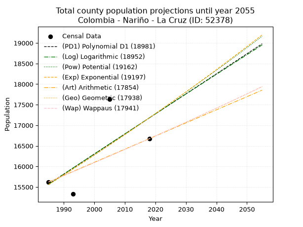
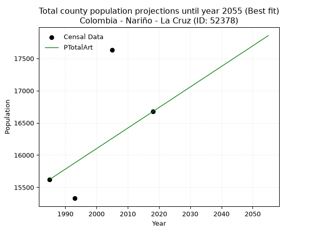
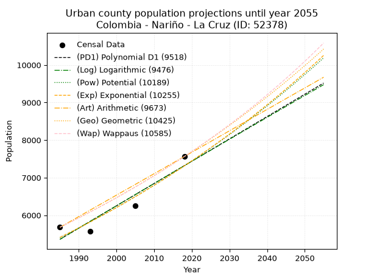
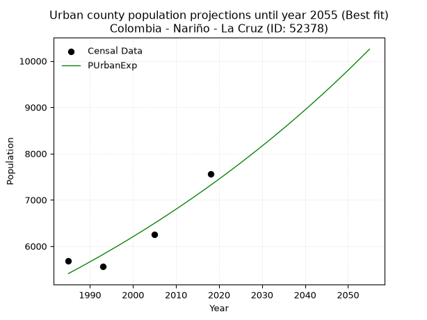
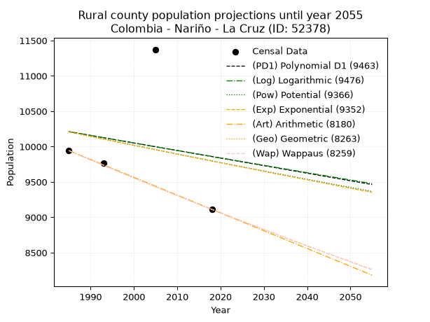
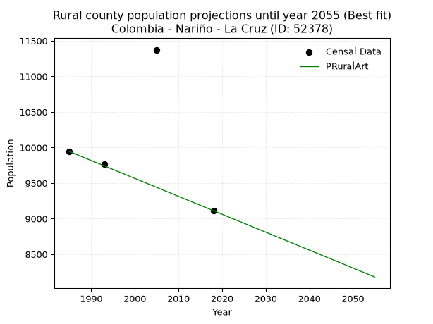

<div align="center">


</div>

# 📜 _“Population and Public Services Demand Projections (PPSD) until Year 2050 for Colombia - Nariño - La Cruz (ID: 52378)”_
Keywords: `population` `public-service` `projection` `lineal` `polynomial` `logarithmic` `potential` `exponential` `arithmetic` `geometric` `wappaus` `dane` `colombia` `south-america`

PPSD are analytical estimates used by governments and planners to anticipate future changes in population size, age distribution, and the resulting community needs for utilities, healthcare, education, and infrastructure as sizing future water treatment facilities, electrical grids, and road networks based on spatial growth.

<div align="center">

</img>

</div>


> **General running parameters**: • app_version: _v20260806_. • Python version: _3.14.7_. • Pandas version: _3.0.5_. • NumPy version: _2.5.1_. • Creates, save and include plots into reports (create_plot): _False_. • Projection until year: _2050_. • Process polynomial degree 2 and up: _False_. • Process Wappaus: _True_. • Process Wappaus: _True_. • Set negative values to zero: _True_. • Set infinite values to zero: _True_. • Drop dataset notes: _True_. 
<div align="center">

Dynamic map: [:earth_americas:Google](http://maps.google.com/maps?q=1.601318495,-76.9705044) [:earth_americas:OSM](https://www.openstreetmap.org/#map=18/1.601318495/-76.9705044&layers=P) [:earth_americas:Bing](https://www.bing.com/maps?cp=1.601318495~-76.9705044&lvl=18) [:earth_americas:Apple](https://maps.apple.com/frame?center=1.601318495%2C-76.9705044&span=0.003%2C0.006)

</div>


<div align="center">

```geojson
{
  "type": "Feature",
  "geometry": {
    "type": "Point", 
    "coordinates": [-76.9705044, 1.601318495]
  }, 
  "properties": {
    "Name": "Colombia - Nariño - La Cruz (ID: 52378)"
  }
}
```

</div>


## 0. Census Data (4 records)

Census data are official statistics collected by a government about the people and housing in a country. They usually include counts of total population, age, sex, race, income, education, and jobs.

📅Global census file: [Population.xlsx](../data/Population.xlsx)

| Source   |   Year |   CountryID | CountryName   |   StateID | StateName   |   CountyID | CountyName   |   PTotal |   PUrban |   PRural |
|:---------|-------:|------------:|:--------------|----------:|:------------|-----------:|:-------------|---------:|---------:|---------:|
| DANE     |   1985 |          57 | Colombia      |        52 | Nariño      |      52378 | La Cruz      |    15622 |     5679 |     9943 |
| DANE     |   1993 |          57 | Colombia      |        52 | Nariño      |      52378 | La Cruz      |    15329 |     5564 |     9765 |
| DANE     |   2005 |          57 | Colombia      |        52 | Nariño      |      52378 | La Cruz      |    17630 |     6256 |    11374 |
| DANE     |   2018 |          57 | Colombia      |        52 | Nariño      |      52378 | La Cruz      |    16674 |     7562 |     9112 |

> 🔥Some records could had specific notes about the registered values or the corresponding urban or rural distribution.

📅[SUI-RUPS](https://www.datos.gov.co/Hacienda-y-Cr-dito-P-blico/Registro-nico-de-Prestadores-de-Servicios-P-blicos/4qkq-csdn/about_data) - Local public utility companies: [RUPS.csv](../data/RUPS.xlsx)

 | SERVICIO       | ESTADO    | NOMBRE                                                                                  | NIT         | DEPARTAMENTO_DOMICILIO   | MUNICIPIO_DOMICILIO   | DIRECCION                              |   TELEFONO | EMAIL                            | TIPO_PRESTADOR                            | CLASIFICACION                 |
|:---------------|:----------|:----------------------------------------------------------------------------------------|:------------|:-------------------------|:----------------------|:---------------------------------------|-----------:|:---------------------------------|:------------------------------------------|:------------------------------|
| ACUEDUCTO      | OPERATIVA | EMPRESA DE SERVICIOS PUBLICOS DE LA CRUZ - EMPOCRUZ E.S.P                               | 814005646-3 | NARINO                   | LA CRUZ               | Calle 6 No 8-02                        |    7266115 | rekineke@gmail.com               | EMPRESA INDUSTRIAL Y COMERCIAL DEL ESTADO | MENOR O IGUAL A 2500 USUARIOS |
| ALCANTARILLADO | OPERATIVA | EMPRESA DE SERVICIOS PUBLICOS DE LA CRUZ - EMPOCRUZ E.S.P                               | 814005646-3 | NARINO                   | LA CRUZ               | Calle 6 No 8-02                        |    7266115 | rekineke@gmail.com               | EMPRESA INDUSTRIAL Y COMERCIAL DEL ESTADO | MENOR O IGUAL A 2500 USUARIOS |
| ACUEDUCTO      | OPERATIVA | JUNTA ADMINISTRADORA DEL ACUEDUCTO Y ALCANTARILLADO DE LA ESTANCIA MUNICIPIO DE LA CRUZ | 814003328-7 | NARINO                   | LA CRUZ               | VEREDA LA ESTANCIA                     |    2726610 | juntalaestancialacruz@gmail.com  | ORGANIZACION AUTORIZADA                   | HASTA 2500 SUSCRIPTORES       |
| ACUEDUCTO      | OPERATIVA | ASOCIACION DE USUARIOS DEL ACUEDUCTO LLANO GRANDE COFRADIA ALTO CABUYAL                 | 814003287-3 | NARINO                   | LA CRUZ               | CARRERA 10 No 2 - 25 PALACIO MUNICIPAL |    7266109 | contactenos@lacruz-narino.gov.co | ORGANIZACION AUTORIZADA                   | HASTA 2500 SUSCRIPTORES       |

## 1. Total

### 1.1. Coefficients and Parameters

* (PD1) Polynomial Deg 1: 48.71176234444041, -81121.95262946693 (lineal)
* (Log) Logarithmic: 97626.99323184145, -725749.8078888521
* (Pow) Potential: 6.01267355349516, -15.636405742411823
* (Exp) Exponential: 0.0030002785331810986, 40.32283590274402
* (Art) Arithmetic: Year diff. 2018 - 1985 = 33, Population diff. 16674 - 15622 = 1052, Annual growth = 31.87878787878788
* (Geo) Geometric: Year diff. 2018 - 1985 = 33, Population diff. 16674 - 15622 = 1052, Annual growth % = 0.0019768132271282823
* (Wap) Wappaus: i = 0.1974163232523401, Condition values only valid for < 200)

<sub>
Wappaus condition values: ['0.00', '0.20', '0.39', '0.59', '0.79', '0.99', '1.18', '1.38', '1.58', '1.78', '1.97', '2.17', '2.37', '2.57', '2.76', '2.96', '3.16', '3.36', '3.55', '3.75', '3.95', '4.15', '4.34', '4.54', '4.74', '4.94', '5.13', '5.33', '5.53', '5.73', '5.92', '6.12', '6.32', '6.51', '6.71', '6.91', '7.11', '7.30', '7.50', '7.70', '7.90', '8.09', '8.29', '8.49', '8.69', '8.88', '9.08', '9.28', '9.48', '9.67', '9.87', '10.07', '10.27', '10.46', '10.66', '10.86', '11.06', '11.25', '11.45', '11.65', '11.84', '12.04', '12.24', '12.44', '12.63', '12.83']
</sub>


### 1.2. Projected Dataset

|   Year |   CountyID |   PTotalPD1 |   PTotalLog |   PTotalPow |   PTotalExp |   PTotalArt |   PTotalGeo |   PTotalWap |
|-------:|-----------:|------------:|------------:|------------:|------------:|------------:|------------:|------------:|
|   1985 |      52378 |       15571 |       15568 |       15558 |       15560 |       15622 |       15622 |       15622 |
|   1986 |      52378 |       15620 |       15618 |       15605 |       15607 |       15654 |       15653 |       15653 |
|   1987 |      52378 |       15668 |       15667 |       15652 |       15654 |       15686 |       15684 |       15684 |
|   1988 |      52378 |       15717 |       15716 |       15700 |       15701 |       15718 |       15715 |       15715 |
|   1989 |      52378 |       15766 |       15765 |       15747 |       15748 |       15750 |       15746 |       15746 |
|   1990 |      52378 |       15814 |       15814 |       15795 |       15795 |       15781 |       15777 |       15777 |
|   1991 |      52378 |       15863 |       15863 |       15843 |       15843 |       15813 |       15808 |       15808 |
|   1992 |      52378 |       15912 |       15912 |       15891 |       15890 |       15845 |       15839 |       15839 |
|   1993 |      52378 |       15961 |       15961 |       15939 |       15938 |       15877 |       15871 |       15871 |
|   1994 |      52378 |       16009 |       16010 |       15987 |       15986 |       15909 |       15902 |       15902 |
|   1995 |      52378 |       16058 |       16059 |       16035 |       16034 |       15941 |       15934 |       15933 |
|   1996 |      52378 |       16107 |       16108 |       16084 |       16082 |       15973 |       15965 |       15965 |
|   1997 |      52378 |       16155 |       16157 |       16132 |       16131 |       16005 |       15997 |       15997 |
|   1998 |      52378 |       16204 |       16206 |       16181 |       16179 |       16036 |       16028 |       16028 |
|   1999 |      52378 |       16253 |       16255 |       16229 |       16228 |       16068 |       16060 |       16060 |
|   2000 |      52378 |       16302 |       16303 |       16278 |       16276 |       16100 |       16092 |       16092 |
|   2001 |      52378 |       16350 |       16352 |       16327 |       16325 |       16132 |       16124 |       16123 |
|   2002 |      52378 |       16399 |       16401 |       16376 |       16374 |       16164 |       16155 |       16155 |
|   2003 |      52378 |       16448 |       16450 |       16426 |       16424 |       16196 |       16187 |       16187 |
|   2004 |      52378 |       16496 |       16499 |       16475 |       16473 |       16228 |       16219 |       16219 |
|   2005 |      52378 |       16545 |       16547 |       16525 |       16522 |       16260 |       16251 |       16251 |
|   2006 |      52378 |       16594 |       16596 |       16574 |       16572 |       16291 |       16283 |       16283 |
|   2007 |      52378 |       16643 |       16645 |       16624 |       16622 |       16323 |       16316 |       16316 |
|   2008 |      52378 |       16691 |       16693 |       16674 |       16672 |       16355 |       16348 |       16348 |
|   2009 |      52378 |       16740 |       16742 |       16724 |       16722 |       16387 |       16380 |       16380 |
|   2010 |      52378 |       16789 |       16790 |       16774 |       16772 |       16419 |       16413 |       16413 |
|   2011 |      52378 |       16837 |       16839 |       16824 |       16823 |       16451 |       16445 |       16445 |
|   2012 |      52378 |       16886 |       16887 |       16874 |       16873 |       16483 |       16478 |       16477 |
|   2013 |      52378 |       16935 |       16936 |       16925 |       16924 |       16515 |       16510 |       16510 |
|   2014 |      52378 |       16984 |       16984 |       16976 |       16975 |       16546 |       16543 |       16543 |
|   2015 |      52378 |       17032 |       17033 |       17026 |       17026 |       16578 |       16576 |       16575 |
|   2016 |      52378 |       17081 |       17081 |       17077 |       17077 |       16610 |       16608 |       16608 |
|   2017 |      52378 |       17130 |       17130 |       17128 |       17128 |       16642 |       16641 |       16641 |
|   2018 |      52378 |       17178 |       17178 |       17179 |       17180 |       16674 |       16674 |       16674 |
|   2019 |      52378 |       17227 |       17227 |       17231 |       17231 |       16706 |       16707 |       16707 |
|   2020 |      52378 |       17276 |       17275 |       17282 |       17283 |       16738 |       16740 |       16740 |
|   2021 |      52378 |       17325 |       17323 |       17333 |       17335 |       16770 |       16773 |       16773 |
|   2022 |      52378 |       17373 |       17371 |       17385 |       17387 |       16802 |       16806 |       16806 |
|   2023 |      52378 |       17422 |       17420 |       17437 |       17439 |       16833 |       16839 |       16840 |
|   2024 |      52378 |       17471 |       17468 |       17489 |       17492 |       16865 |       16873 |       16873 |
|   2025 |      52378 |       17519 |       17516 |       17541 |       17544 |       16897 |       16906 |       16906 |
|   2026 |      52378 |       17568 |       17564 |       17593 |       17597 |       16929 |       16940 |       16940 |
|   2027 |      52378 |       17617 |       17613 |       17645 |       17650 |       16961 |       16973 |       16973 |
|   2028 |      52378 |       17666 |       17661 |       17698 |       17703 |       16993 |       17007 |       17007 |
|   2029 |      52378 |       17714 |       17709 |       17750 |       17756 |       17025 |       17040 |       17041 |
|   2030 |      52378 |       17763 |       17757 |       17803 |       17809 |       17057 |       17074 |       17074 |
|   2031 |      52378 |       17812 |       17805 |       17856 |       17863 |       17088 |       17108 |       17108 |
|   2032 |      52378 |       17860 |       17853 |       17909 |       17917 |       17120 |       17141 |       17142 |
|   2033 |      52378 |       17909 |       17901 |       17962 |       17970 |       17152 |       17175 |       17176 |
|   2034 |      52378 |       17958 |       17949 |       18015 |       18024 |       17184 |       17209 |       17210 |
|   2035 |      52378 |       18006 |       17997 |       18068 |       18079 |       17216 |       17243 |       17244 |
|   2036 |      52378 |       18055 |       18045 |       18122 |       18133 |       17248 |       17277 |       17278 |
|   2037 |      52378 |       18104 |       18093 |       18175 |       18187 |       17280 |       17312 |       17312 |
|   2038 |      52378 |       18153 |       18141 |       18229 |       18242 |       17312 |       17346 |       17347 |
|   2039 |      52378 |       18201 |       18189 |       18283 |       18297 |       17343 |       17380 |       17381 |
|   2040 |      52378 |       18250 |       18237 |       18337 |       18352 |       17375 |       17414 |       17416 |
|   2041 |      52378 |       18299 |       18285 |       18391 |       18407 |       17407 |       17449 |       17450 |
|   2042 |      52378 |       18347 |       18332 |       18445 |       18462 |       17439 |       17483 |       17485 |
|   2043 |      52378 |       18396 |       18380 |       18499 |       18518 |       17471 |       17518 |       17519 |
|   2044 |      52378 |       18445 |       18428 |       18554 |       18573 |       17503 |       17553 |       17554 |
|   2045 |      52378 |       18494 |       18476 |       18609 |       18629 |       17535 |       17587 |       17589 |
|   2046 |      52378 |       18542 |       18523 |       18663 |       18685 |       17567 |       17622 |       17624 |
|   2047 |      52378 |       18591 |       18571 |       18718 |       18741 |       17598 |       17657 |       17659 |
|   2048 |      52378 |       18640 |       18619 |       18773 |       18798 |       17630 |       17692 |       17694 |
|   2049 |      52378 |       18688 |       18666 |       18828 |       18854 |       17662 |       17727 |       17729 |
|   2050 |      52378 |       18737 |       18714 |       18884 |       18911 |       17694 |       17762 |       17764 |
<div align="center">

</img>

</div>


### 1.3. Best fit with absolute and relative error (%)

Relative error puts that difference into context by dividing the absolute error by the true value, creating a unitless ratio or percentage that shows the scale of the mistake.

Absolute and relative error

|   Year | Source   |   CountryID | CountryName   |   StateID | StateName   |   CountyID_x | CountyName   |   PTotal |   PUrban |   PRural |   CountyID_y |   PTotalPD1 |   PTotalLog |   PTotalPow |   PTotalExp |   PTotalArt |   PTotalGeo |   PTotalWap |   PTotalPD1AbsError |   PTotalLogAbsError |   PTotalPowAbsError |   PTotalExpAbsError |   PTotalArtAbsError |   PTotalGeoAbsError |   PTotalWapAbsError |   PTotalPD1RelError |   PTotalLogRelError |   PTotalPowRelError |   PTotalExpRelError |   PTotalArtRelError |   PTotalGeoRelError |   PTotalWapRelError |
|-------:|:---------|------------:|:--------------|----------:|:------------|-------------:|:-------------|---------:|---------:|---------:|-------------:|------------:|------------:|------------:|------------:|------------:|------------:|------------:|--------------------:|--------------------:|--------------------:|--------------------:|--------------------:|--------------------:|--------------------:|--------------------:|--------------------:|--------------------:|--------------------:|--------------------:|--------------------:|--------------------:|
|   1985 | DANE     |          57 | Colombia      |        52 | Nariño      |        52378 | La Cruz      |    15622 |     5679 |     9943 |        52378 |       15571 |       15568 |       15558 |       15560 |       15622 |       15622 |       15622 |                  51 |                  54 |                  64 |                  62 |                   0 |                   0 |                   0 |            0.326463 |            0.345666 |            0.409679 |            0.396876 |             0       |             0       |             0       |
|   1993 | DANE     |          57 | Colombia      |        52 | Nariño      |        52378 | La Cruz      |    15329 |     5564 |     9765 |        52378 |       15961 |       15961 |       15939 |       15938 |       15877 |       15871 |       15871 |                 632 |                 632 |                 610 |                 609 |                 548 |                 542 |                 542 |            4.1229   |            4.1229   |            3.97939  |            3.97286  |             3.57492 |             3.53578 |             3.53578 |
|   2005 | DANE     |          57 | Colombia      |        52 | Nariño      |        52378 | La Cruz      |    17630 |     6256 |    11374 |        52378 |       16545 |       16547 |       16525 |       16522 |       16260 |       16251 |       16251 |                1085 |                1083 |                1105 |                1108 |                1370 |                1379 |                1379 |            6.15428  |            6.14294  |            6.26773  |            6.28474  |             7.77085 |             7.82189 |             7.82189 |
|   2018 | DANE     |          57 | Colombia      |        52 | Nariño      |        52378 | La Cruz      |    16674 |     7562 |     9112 |        52378 |       17178 |       17178 |       17179 |       17180 |       16674 |       16674 |       16674 |                 504 |                 504 |                 505 |                 506 |                   0 |                   0 |                   0 |            3.02267  |            3.02267  |            3.02867  |            3.03466  |             0       |             0       |             0       |

Relative error mean

| Method    |   RelError | Best   |
|:----------|-----------:|:-------|
| PTotalPD1 |    3.40658 |        |
| PTotalLog |    3.40854 |        |
| PTotalPow |    3.42136 |        |
| PTotalExp |    3.42229 |        |
| PTotalArt |    2.83644 | True   |
| PTotalGeo |    2.83942 |        |
| PTotalWap |    2.83942 |        |

💙Best method: _**PTotalArt**_
<div align="center">

</img>

</div>


### 1.4. Fresh water supply demand in liters per capita per day (lpcd)

The fresh water supply demand typically ranges from 100 to 300 liters per capita per day (lpcd) for standard domestic and municipal planning, though absolute survival minimums set by the World Health Organization are as low as 7.5 to 20 liters per day, and total consumption in high-income nations can exceed 400 liters.

> `CZ`: Level in meters above the sea level (masl)<br> `WS`: Fresh water supply demand in liters per capita per day (lpcd or l/h/d)<br> `WSAll`: Zonal fresh water supply demand in liters per second (l/s)<br> `A`: Zonal area in square meters<br> `DP`: Population density (people/hectare or p/ha)

Reference values (RAS Colombia)

|    CZ |   WS |
|------:|-----:|
|  1000 |  120 |
|  2000 |  130 |
| 99999 |  140 |

County shapefile geometry properties and water supply values

|   CountyID |      ATotal |   CZTotal |   WSTotal |
|-----------:|------------:|----------:|----------:|
|      52378 | 2.38999e+08 |   2920.88 |       140 |

Projected values for best method: PTotalArt

|   CountyID |   Year |   PTotalArt |   DPTotal |   WSTotal |   WSTotalAll |
|-----------:|-------:|------------:|----------:|----------:|-------------:|
|      52378 |   1985 |       15622 |      0.65 |       140 |      25.3134 |
|      52378 |   1986 |       15654 |      0.65 |       140 |      25.3653 |
|      52378 |   1987 |       15686 |      0.66 |       140 |      25.4171 |
|      52378 |   1988 |       15718 |      0.66 |       140 |      25.469  |
|      52378 |   1989 |       15750 |      0.66 |       140 |      25.5208 |
|      52378 |   1990 |       15781 |      0.66 |       140 |      25.5711 |
|      52378 |   1991 |       15813 |      0.66 |       140 |      25.6229 |
|      52378 |   1992 |       15845 |      0.66 |       140 |      25.6748 |
|      52378 |   1993 |       15877 |      0.66 |       140 |      25.7266 |
|      52378 |   1994 |       15909 |      0.67 |       140 |      25.7785 |
|      52378 |   1995 |       15941 |      0.67 |       140 |      25.8303 |
|      52378 |   1996 |       15973 |      0.67 |       140 |      25.8822 |
|      52378 |   1997 |       16005 |      0.67 |       140 |      25.934  |
|      52378 |   1998 |       16036 |      0.67 |       140 |      25.9843 |
|      52378 |   1999 |       16068 |      0.67 |       140 |      26.0361 |
|      52378 |   2000 |       16100 |      0.67 |       140 |      26.088  |
|      52378 |   2001 |       16132 |      0.67 |       140 |      26.1398 |
|      52378 |   2002 |       16164 |      0.68 |       140 |      26.1917 |
|      52378 |   2003 |       16196 |      0.68 |       140 |      26.2435 |
|      52378 |   2004 |       16228 |      0.68 |       140 |      26.2954 |
|      52378 |   2005 |       16260 |      0.68 |       140 |      26.3472 |
|      52378 |   2006 |       16291 |      0.68 |       140 |      26.3975 |
|      52378 |   2007 |       16323 |      0.68 |       140 |      26.4493 |
|      52378 |   2008 |       16355 |      0.68 |       140 |      26.5012 |
|      52378 |   2009 |       16387 |      0.69 |       140 |      26.553  |
|      52378 |   2010 |       16419 |      0.69 |       140 |      26.6049 |
|      52378 |   2011 |       16451 |      0.69 |       140 |      26.6567 |
|      52378 |   2012 |       16483 |      0.69 |       140 |      26.7086 |
|      52378 |   2013 |       16515 |      0.69 |       140 |      26.7604 |
|      52378 |   2014 |       16546 |      0.69 |       140 |      26.8106 |
|      52378 |   2015 |       16578 |      0.69 |       140 |      26.8625 |
|      52378 |   2016 |       16610 |      0.69 |       140 |      26.9144 |
|      52378 |   2017 |       16642 |      0.7  |       140 |      26.9662 |
|      52378 |   2018 |       16674 |      0.7  |       140 |      27.0181 |
|      52378 |   2019 |       16706 |      0.7  |       140 |      27.0699 |
|      52378 |   2020 |       16738 |      0.7  |       140 |      27.1218 |
|      52378 |   2021 |       16770 |      0.7  |       140 |      27.1736 |
|      52378 |   2022 |       16802 |      0.7  |       140 |      27.2255 |
|      52378 |   2023 |       16833 |      0.7  |       140 |      27.2757 |
|      52378 |   2024 |       16865 |      0.71 |       140 |      27.3275 |
|      52378 |   2025 |       16897 |      0.71 |       140 |      27.3794 |
|      52378 |   2026 |       16929 |      0.71 |       140 |      27.4312 |
|      52378 |   2027 |       16961 |      0.71 |       140 |      27.4831 |
|      52378 |   2028 |       16993 |      0.71 |       140 |      27.535  |
|      52378 |   2029 |       17025 |      0.71 |       140 |      27.5868 |
|      52378 |   2030 |       17057 |      0.71 |       140 |      27.6387 |
|      52378 |   2031 |       17088 |      0.71 |       140 |      27.6889 |
|      52378 |   2032 |       17120 |      0.72 |       140 |      27.7407 |
|      52378 |   2033 |       17152 |      0.72 |       140 |      27.7926 |
|      52378 |   2034 |       17184 |      0.72 |       140 |      27.8444 |
|      52378 |   2035 |       17216 |      0.72 |       140 |      27.8963 |
|      52378 |   2036 |       17248 |      0.72 |       140 |      27.9481 |
|      52378 |   2037 |       17280 |      0.72 |       140 |      28      |
|      52378 |   2038 |       17312 |      0.72 |       140 |      28.0519 |
|      52378 |   2039 |       17343 |      0.73 |       140 |      28.1021 |
|      52378 |   2040 |       17375 |      0.73 |       140 |      28.1539 |
|      52378 |   2041 |       17407 |      0.73 |       140 |      28.2058 |
|      52378 |   2042 |       17439 |      0.73 |       140 |      28.2576 |
|      52378 |   2043 |       17471 |      0.73 |       140 |      28.3095 |
|      52378 |   2044 |       17503 |      0.73 |       140 |      28.3613 |
|      52378 |   2045 |       17535 |      0.73 |       140 |      28.4132 |
|      52378 |   2046 |       17567 |      0.74 |       140 |      28.465  |
|      52378 |   2047 |       17598 |      0.74 |       140 |      28.5153 |
|      52378 |   2048 |       17630 |      0.74 |       140 |      28.5671 |
|      52378 |   2049 |       17662 |      0.74 |       140 |      28.619  |
|      52378 |   2050 |       17694 |      0.74 |       140 |      28.6708 |

## 2. Urban

### 2.1. Coefficients and Parameters

* (PD1) Polynomial Deg 1: 59.410276997188966, -112570.15656362724 (lineal)
* (Log) Logarithmic: 118812.49571513834, -896829.482034354
* (Pow) Potential: 18.276342034685396, -56.53794298167752
* (Exp) Exponential: 0.009138269123849798, 7.165660311031112e-05
* (Art) Arithmetic: Year diff. 2018 - 1985 = 33, Population diff. 7562 - 5679 = 1883, Annual growth = 57.06060606060606
* (Geo) Geometric: Year diff. 2018 - 1985 = 33, Population diff. 7562 - 5679 = 1883, Annual growth % = 0.00871535170484461
* (Wap) Wappaus: i = 0.8618775932422938, Condition values only valid for < 200)

<sub>
Wappaus condition values: ['0.00', '0.86', '1.72', '2.59', '3.45', '4.31', '5.17', '6.03', '6.90', '7.76', '8.62', '9.48', '10.34', '11.20', '12.07', '12.93', '13.79', '14.65', '15.51', '16.38', '17.24', '18.10', '18.96', '19.82', '20.69', '21.55', '22.41', '23.27', '24.13', '24.99', '25.86', '26.72', '27.58', '28.44', '29.30', '30.17', '31.03', '31.89', '32.75', '33.61', '34.48', '35.34', '36.20', '37.06', '37.92', '38.78', '39.65', '40.51', '41.37', '42.23', '43.09', '43.96', '44.82', '45.68', '46.54', '47.40', '48.27', '49.13', '49.99', '50.85', '51.71', '52.57', '53.44', '54.30', '55.16', '56.02']
</sub>


### 2.2. Projected Dataset

|   Year |   CountyID |   PUrbanPD1 |   PUrbanLog |   PUrbanPow |   PUrbanExp |   PUrbanArt |   PUrbanGeo |   PUrbanWap |
|-------:|-----------:|------------:|------------:|------------:|------------:|------------:|------------:|------------:|
|   1985 |      52378 |        5359 |        5358 |        5408 |        5409 |        5679 |        5679 |        5679 |
|   1986 |      52378 |        5419 |        5418 |        5458 |        5459 |        5736 |        5728 |        5728 |
|   1987 |      52378 |        5478 |        5478 |        5509 |        5509 |        5793 |        5778 |        5778 |
|   1988 |      52378 |        5537 |        5538 |        5560 |        5559 |        5850 |        5829 |        5828 |
|   1989 |      52378 |        5597 |        5597 |        5611 |        5610 |        5907 |        5880 |        5878 |
|   1990 |      52378 |        5656 |        5657 |        5663 |        5662 |        5964 |        5931 |        5929 |
|   1991 |      52378 |        5716 |        5717 |        5715 |        5714 |        6021 |        5983 |        5980 |
|   1992 |      52378 |        5775 |        5777 |        5768 |        5766 |        6078 |        6035 |        6032 |
|   1993 |      52378 |        5835 |        5836 |        5821 |        5819 |        6135 |        6087 |        6085 |
|   1994 |      52378 |        5894 |        5896 |        5874 |        5873 |        6193 |        6140 |        6137 |
|   1995 |      52378 |        5953 |        5955 |        5928 |        5927 |        6250 |        6194 |        6191 |
|   1996 |      52378 |        6013 |        6015 |        5983 |        5981 |        6307 |        6248 |        6244 |
|   1997 |      52378 |        6072 |        6074 |        6038 |        6036 |        6364 |        6302 |        6298 |
|   1998 |      52378 |        6132 |        6134 |        6094 |        6091 |        6421 |        6357 |        6353 |
|   1999 |      52378 |        6191 |        6193 |        6150 |        6147 |        6478 |        6413 |        6408 |
|   2000 |      52378 |        6250 |        6253 |        6206 |        6204 |        6535 |        6468 |        6464 |
|   2001 |      52378 |        6310 |        6312 |        6263 |        6261 |        6592 |        6525 |        6520 |
|   2002 |      52378 |        6369 |        6371 |        6320 |        6318 |        6649 |        6582 |        6577 |
|   2003 |      52378 |        6429 |        6431 |        6378 |        6376 |        6706 |        6639 |        6634 |
|   2004 |      52378 |        6488 |        6490 |        6437 |        6435 |        6763 |        6697 |        6692 |
|   2005 |      52378 |        6547 |        6549 |        6496 |        6494 |        6820 |        6755 |        6750 |
|   2006 |      52378 |        6607 |        6609 |        6555 |        6553 |        6877 |        6814 |        6809 |
|   2007 |      52378 |        6666 |        6668 |        6615 |        6614 |        6934 |        6874 |        6869 |
|   2008 |      52378 |        6726 |        6727 |        6676 |        6674 |        6991 |        6933 |        6929 |
|   2009 |      52378 |        6785 |        6786 |        6737 |        6736 |        7048 |        6994 |        6989 |
|   2010 |      52378 |        6845 |        6845 |        6798 |        6797 |        7106 |        7055 |        7050 |
|   2011 |      52378 |        6904 |        6904 |        6860 |        6860 |        7163 |        7116 |        7112 |
|   2012 |      52378 |        6963 |        6963 |        6923 |        6923 |        7220 |        7178 |        7175 |
|   2013 |      52378 |        7023 |        7022 |        6986 |        6986 |        7277 |        7241 |        7238 |
|   2014 |      52378 |        7082 |        7081 |        7050 |        7050 |        7334 |        7304 |        7301 |
|   2015 |      52378 |        7142 |        7140 |        7114 |        7115 |        7391 |        7368 |        7365 |
|   2016 |      52378 |        7201 |        7199 |        7179 |        7181 |        7448 |        7432 |        7430 |
|   2017 |      52378 |        7260 |        7258 |        7244 |        7246 |        7505 |        7497 |        7496 |
|   2018 |      52378 |        7320 |        7317 |        7310 |        7313 |        7562 |        7562 |        7562 |
|   2019 |      52378 |        7379 |        7376 |        7377 |        7380 |        7619 |        7628 |        7629 |
|   2020 |      52378 |        7439 |        7435 |        7444 |        7448 |        7676 |        7694 |        7696 |
|   2021 |      52378 |        7498 |        7494 |        7511 |        7516 |        7733 |        7761 |        7765 |
|   2022 |      52378 |        7557 |        7553 |        7580 |        7585 |        7790 |        7829 |        7834 |
|   2023 |      52378 |        7617 |        7611 |        7648 |        7655 |        7847 |        7897 |        7903 |
|   2024 |      52378 |        7676 |        7670 |        7718 |        7725 |        7904 |        7966 |        7974 |
|   2025 |      52378 |        7736 |        7729 |        7788 |        7796 |        7961 |        8036 |        8045 |
|   2026 |      52378 |        7795 |        7787 |        7858 |        7868 |        8018 |        8106 |        8116 |
|   2027 |      52378 |        7854 |        7846 |        7930 |        7940 |        8076 |        8176 |        8189 |
|   2028 |      52378 |        7914 |        7905 |        8001 |        8013 |        8133 |        8248 |        8262 |
|   2029 |      52378 |        7973 |        7963 |        8074 |        8086 |        8190 |        8319 |        8337 |
|   2030 |      52378 |        8033 |        8022 |        8147 |        8161 |        8247 |        8392 |        8411 |
|   2031 |      52378 |        8092 |        8080 |        8220 |        8235 |        8304 |        8465 |        8487 |
|   2032 |      52378 |        8152 |        8139 |        8295 |        8311 |        8361 |        8539 |        8564 |
|   2033 |      52378 |        8211 |        8197 |        8370 |        8387 |        8418 |        8613 |        8641 |
|   2034 |      52378 |        8270 |        8256 |        8445 |        8464 |        8475 |        8688 |        8719 |
|   2035 |      52378 |        8330 |        8314 |        8521 |        8542 |        8532 |        8764 |        8798 |
|   2036 |      52378 |        8389 |        8372 |        8598 |        8620 |        8589 |        8840 |        8878 |
|   2037 |      52378 |        8449 |        8431 |        8676 |        8700 |        8646 |        8917 |        8959 |
|   2038 |      52378 |        8508 |        8489 |        8754 |        8779 |        8703 |        8995 |        9041 |
|   2039 |      52378 |        8567 |        8547 |        8833 |        8860 |        8760 |        9074 |        9124 |
|   2040 |      52378 |        8627 |        8606 |        8912 |        8941 |        8817 |        9153 |        9207 |
|   2041 |      52378 |        8686 |        8664 |        8992 |        9023 |        8874 |        9232 |        9292 |
|   2042 |      52378 |        8746 |        8722 |        9073 |        9106 |        8931 |        9313 |        9377 |
|   2043 |      52378 |        8805 |        8780 |        9155 |        9190 |        8989 |        9394 |        9464 |
|   2044 |      52378 |        8864 |        8838 |        9237 |        9274 |        9046 |        9476 |        9551 |
|   2045 |      52378 |        8924 |        8896 |        9320 |        9359 |        9103 |        9558 |        9640 |
|   2046 |      52378 |        8983 |        8954 |        9404 |        9445 |        9160 |        9642 |        9729 |
|   2047 |      52378 |        9043 |        9013 |        9488 |        9532 |        9217 |        9726 |        9820 |
|   2048 |      52378 |        9102 |        9071 |        9573 |        9620 |        9274 |        9811 |        9912 |
|   2049 |      52378 |        9162 |        9129 |        9659 |        9708 |        9331 |        9896 |       10005 |
|   2050 |      52378 |        9221 |        9186 |        9745 |        9797 |        9388 |        9982 |       10098 |
<div align="center">

</img>

</div>


### 2.3. Best fit with absolute and relative error (%)

Relative error puts that difference into context by dividing the absolute error by the true value, creating a unitless ratio or percentage that shows the scale of the mistake.

Absolute and relative error

|   Year | Source   |   CountryID | CountryName   |   StateID | StateName   |   CountyID_x | CountyName   |   PTotal |   PUrban |   PRural |   CountyID_y |   PUrbanPD1 |   PUrbanLog |   PUrbanPow |   PUrbanExp |   PUrbanArt |   PUrbanGeo |   PUrbanWap |   PUrbanPD1AbsError |   PUrbanLogAbsError |   PUrbanPowAbsError |   PUrbanExpAbsError |   PUrbanArtAbsError |   PUrbanGeoAbsError |   PUrbanWapAbsError |   PUrbanPD1RelError |   PUrbanLogRelError |   PUrbanPowRelError |   PUrbanExpRelError |   PUrbanArtRelError |   PUrbanGeoRelError |   PUrbanWapRelError |
|-------:|:---------|------------:|:--------------|----------:|:------------|-------------:|:-------------|---------:|---------:|---------:|-------------:|------------:|------------:|------------:|------------:|------------:|------------:|------------:|--------------------:|--------------------:|--------------------:|--------------------:|--------------------:|--------------------:|--------------------:|--------------------:|--------------------:|--------------------:|--------------------:|--------------------:|--------------------:|--------------------:|
|   1985 | DANE     |          57 | Colombia      |        52 | Nariño      |        52378 | La Cruz      |    15622 |     5679 |     9943 |        52378 |        5359 |        5358 |        5408 |        5409 |        5679 |        5679 |        5679 |                 320 |                 321 |                 271 |                 270 |                   0 |                   0 |                   0 |             5.63479 |             5.6524  |             4.77197 |             4.75436 |             0       |             0       |             0       |
|   1993 | DANE     |          57 | Colombia      |        52 | Nariño      |        52378 | La Cruz      |    15329 |     5564 |     9765 |        52378 |        5835 |        5836 |        5821 |        5819 |        6135 |        6087 |        6085 |                 271 |                 272 |                 257 |                 255 |                 571 |                 523 |                 521 |             4.8706  |             4.88857 |             4.61898 |             4.58303 |            10.2624  |             9.39971 |             9.36377 |
|   2005 | DANE     |          57 | Colombia      |        52 | Nariño      |        52378 | La Cruz      |    17630 |     6256 |    11374 |        52378 |        6547 |        6549 |        6496 |        6494 |        6820 |        6755 |        6750 |                 291 |                 293 |                 240 |                 238 |                 564 |                 499 |                 494 |             4.65153 |             4.6835  |             3.83632 |             3.80435 |             9.01535 |             7.97634 |             7.89642 |
|   2018 | DANE     |          57 | Colombia      |        52 | Nariño      |        52378 | La Cruz      |    16674 |     7562 |     9112 |        52378 |        7320 |        7317 |        7310 |        7313 |        7562 |        7562 |        7562 |                 242 |                 245 |                 252 |                 249 |                   0 |                   0 |                   0 |             3.20021 |             3.23988 |             3.33245 |             3.29278 |             0       |             0       |             0       |

Relative error mean

| Method    |   RelError | Best   |
|:----------|-----------:|:-------|
| PUrbanPD1 |    4.58928 |        |
| PUrbanLog |    4.61609 |        |
| PUrbanPow |    4.13993 |        |
| PUrbanExp |    4.10863 | True   |
| PUrbanArt |    4.81944 |        |
| PUrbanGeo |    4.34401 |        |
| PUrbanWap |    4.31505 |        |

💙Best method: _**PUrbanExp**_
<div align="center">

</img>

</div>


### 2.4. Fresh water supply demand in liters per capita per day (lpcd)

The fresh water supply demand typically ranges from 100 to 300 liters per capita per day (lpcd) for standard domestic and municipal planning, though absolute survival minimums set by the World Health Organization are as low as 7.5 to 20 liters per day, and total consumption in high-income nations can exceed 400 liters.

> `CZ`: Level in meters above the sea level (masl)<br> `WS`: Fresh water supply demand in liters per capita per day (lpcd or l/h/d)<br> `WSAll`: Zonal fresh water supply demand in liters per second (l/s)<br> `A`: Zonal area in square meters<br> `DP`: Population density (people/hectare or p/ha)

Reference values (RAS Colombia)

|    CZ |   WS |
|------:|-----:|
|  1000 |  120 |
|  2000 |  130 |
| 99999 |  140 |

County shapefile geometry properties and water supply values

|   CountyID |   AUrban |   CZUrban |   WSUrban |
|-----------:|---------:|----------:|----------:|
|      52378 |   795364 |    2402.1 |       140 |

Projected values for best method: PUrbanExp

|   CountyID |   Year |   PUrbanExp |   DPUrban |   WSUrban |   WSUrbanAll |
|-----------:|-------:|------------:|----------:|----------:|-------------:|
|      52378 |   1985 |        5409 |     68.01 |       140 |      8.76458 |
|      52378 |   1986 |        5459 |     68.64 |       140 |      8.8456  |
|      52378 |   1987 |        5509 |     69.26 |       140 |      8.92662 |
|      52378 |   1988 |        5559 |     69.89 |       140 |      9.00764 |
|      52378 |   1989 |        5610 |     70.53 |       140 |      9.09028 |
|      52378 |   1990 |        5662 |     71.19 |       140 |      9.17454 |
|      52378 |   1991 |        5714 |     71.84 |       140 |      9.2588  |
|      52378 |   1992 |        5766 |     72.5  |       140 |      9.34306 |
|      52378 |   1993 |        5819 |     73.16 |       140 |      9.42894 |
|      52378 |   1994 |        5873 |     73.84 |       140 |      9.51644 |
|      52378 |   1995 |        5927 |     74.52 |       140 |      9.60394 |
|      52378 |   1996 |        5981 |     75.2  |       140 |      9.69144 |
|      52378 |   1997 |        6036 |     75.89 |       140 |      9.78056 |
|      52378 |   1998 |        6091 |     76.58 |       140 |      9.86968 |
|      52378 |   1999 |        6147 |     77.29 |       140 |      9.96042 |
|      52378 |   2000 |        6204 |     78    |       140 |     10.0528  |
|      52378 |   2001 |        6261 |     78.72 |       140 |     10.1451  |
|      52378 |   2002 |        6318 |     79.44 |       140 |     10.2375  |
|      52378 |   2003 |        6376 |     80.16 |       140 |     10.3315  |
|      52378 |   2004 |        6435 |     80.91 |       140 |     10.4271  |
|      52378 |   2005 |        6494 |     81.65 |       140 |     10.5227  |
|      52378 |   2006 |        6553 |     82.39 |       140 |     10.6183  |
|      52378 |   2007 |        6614 |     83.16 |       140 |     10.7171  |
|      52378 |   2008 |        6674 |     83.91 |       140 |     10.8144  |
|      52378 |   2009 |        6736 |     84.69 |       140 |     10.9148  |
|      52378 |   2010 |        6797 |     85.46 |       140 |     11.0137  |
|      52378 |   2011 |        6860 |     86.25 |       140 |     11.1157  |
|      52378 |   2012 |        6923 |     87.04 |       140 |     11.2178  |
|      52378 |   2013 |        6986 |     87.83 |       140 |     11.3199  |
|      52378 |   2014 |        7050 |     88.64 |       140 |     11.4236  |
|      52378 |   2015 |        7115 |     89.46 |       140 |     11.5289  |
|      52378 |   2016 |        7181 |     90.29 |       140 |     11.6359  |
|      52378 |   2017 |        7246 |     91.1  |       140 |     11.7412  |
|      52378 |   2018 |        7313 |     91.95 |       140 |     11.8498  |
|      52378 |   2019 |        7380 |     92.79 |       140 |     11.9583  |
|      52378 |   2020 |        7448 |     93.64 |       140 |     12.0685  |
|      52378 |   2021 |        7516 |     94.5  |       140 |     12.1787  |
|      52378 |   2022 |        7585 |     95.37 |       140 |     12.2905  |
|      52378 |   2023 |        7655 |     96.25 |       140 |     12.4039  |
|      52378 |   2024 |        7725 |     97.13 |       140 |     12.5174  |
|      52378 |   2025 |        7796 |     98.02 |       140 |     12.6324  |
|      52378 |   2026 |        7868 |     98.92 |       140 |     12.7491  |
|      52378 |   2027 |        7940 |     99.83 |       140 |     12.8657  |
|      52378 |   2028 |        8013 |    100.75 |       140 |     12.984   |
|      52378 |   2029 |        8086 |    101.66 |       140 |     13.1023  |
|      52378 |   2030 |        8161 |    102.61 |       140 |     13.2238  |
|      52378 |   2031 |        8235 |    103.54 |       140 |     13.3438  |
|      52378 |   2032 |        8311 |    104.49 |       140 |     13.4669  |
|      52378 |   2033 |        8387 |    105.45 |       140 |     13.59    |
|      52378 |   2034 |        8464 |    106.42 |       140 |     13.7148  |
|      52378 |   2035 |        8542 |    107.4  |       140 |     13.8412  |
|      52378 |   2036 |        8620 |    108.38 |       140 |     13.9676  |
|      52378 |   2037 |        8700 |    109.38 |       140 |     14.0972  |
|      52378 |   2038 |        8779 |    110.38 |       140 |     14.2252  |
|      52378 |   2039 |        8860 |    111.4  |       140 |     14.3565  |
|      52378 |   2040 |        8941 |    112.41 |       140 |     14.4877  |
|      52378 |   2041 |        9023 |    113.44 |       140 |     14.6206  |
|      52378 |   2042 |        9106 |    114.49 |       140 |     14.7551  |
|      52378 |   2043 |        9190 |    115.54 |       140 |     14.8912  |
|      52378 |   2044 |        9274 |    116.6  |       140 |     15.0273  |
|      52378 |   2045 |        9359 |    117.67 |       140 |     15.165   |
|      52378 |   2046 |        9445 |    118.75 |       140 |     15.3044  |
|      52378 |   2047 |        9532 |    119.84 |       140 |     15.4454  |
|      52378 |   2048 |        9620 |    120.95 |       140 |     15.588   |
|      52378 |   2049 |        9708 |    122.06 |       140 |     15.7306  |
|      52378 |   2050 |        9797 |    123.18 |       140 |     15.8748  |

## 3. Rural

### 3.1. Coefficients and Parameters

* (PD1) Polynomial Deg 1: -10.698514652748665, 31448.20393416052 (lineal)
* (Log) Logarithmic: -21185.502483296892, 171079.67414550198
* (Pow) Potential: -2.483229594512943, 12.198008368084123
* (Exp) Exponential: -0.0012517098861141215, 122471.89879028434
* (Art) Arithmetic: Year diff. 2018 - 1985 = 33, Population diff. 9112 - 9943 = -831, Annual growth = -25.181818181818183
* (Geo) Geometric: Year diff. 2018 - 1985 = 33, Population diff. 9112 - 9943 = -831, Annual growth % = -0.002641249983078242
* (Wap) Wappaus: i = -0.2643066720736624, Condition values only valid for < 200)

<sub>
Wappaus condition values: ['-0.00', '-0.26', '-0.53', '-0.79', '-1.06', '-1.32', '-1.59', '-1.85', '-2.11', '-2.38', '-2.64', '-2.91', '-3.17', '-3.44', '-3.70', '-3.96', '-4.23', '-4.49', '-4.76', '-5.02', '-5.29', '-5.55', '-5.81', '-6.08', '-6.34', '-6.61', '-6.87', '-7.14', '-7.40', '-7.66', '-7.93', '-8.19', '-8.46', '-8.72', '-8.99', '-9.25', '-9.52', '-9.78', '-10.04', '-10.31', '-10.57', '-10.84', '-11.10', '-11.37', '-11.63', '-11.89', '-12.16', '-12.42', '-12.69', '-12.95', '-13.22', '-13.48', '-13.74', '-14.01', '-14.27', '-14.54', '-14.80', '-15.07', '-15.33', '-15.59', '-15.86', '-16.12', '-16.39', '-16.65', '-16.92', '-17.18']
</sub>


### 3.2. Projected Dataset

|   Year |   CountyID |   PRuralPD1 |   PRuralLog |   PRuralPow |   PRuralExp |   PRuralArt |   PRuralGeo |   PRuralWap |
|-------:|-----------:|------------:|------------:|------------:|------------:|------------:|------------:|------------:|
|   1985 |      52378 |       10212 |       10210 |       10207 |       10209 |        9943 |        9943 |        9943 |
|   1986 |      52378 |       10201 |       10200 |       10195 |       10196 |        9918 |        9917 |        9917 |
|   1987 |      52378 |       10190 |       10189 |       10182 |       10183 |        9893 |        9891 |        9891 |
|   1988 |      52378 |       10180 |       10178 |       10169 |       10170 |        9867 |        9864 |        9864 |
|   1989 |      52378 |       10169 |       10168 |       10156 |       10158 |        9842 |        9838 |        9838 |
|   1990 |      52378 |       10158 |       10157 |       10144 |       10145 |        9817 |        9812 |        9812 |
|   1991 |      52378 |       10147 |       10146 |       10131 |       10132 |        9792 |        9786 |        9787 |
|   1992 |      52378 |       10137 |       10136 |       10118 |       10120 |        9767 |        9761 |        9761 |
|   1993 |      52378 |       10126 |       10125 |       10106 |       10107 |        9742 |        9735 |        9735 |
|   1994 |      52378 |       10115 |       10114 |       10093 |       10094 |        9716 |        9709 |        9709 |
|   1995 |      52378 |       10105 |       10104 |       10081 |       10082 |        9691 |        9683 |        9684 |
|   1996 |      52378 |       10094 |       10093 |       10068 |       10069 |        9666 |        9658 |        9658 |
|   1997 |      52378 |       10083 |       10083 |       10056 |       10056 |        9641 |        9632 |        9633 |
|   1998 |      52378 |       10073 |       10072 |       10043 |       10044 |        9616 |        9607 |        9607 |
|   1999 |      52378 |       10062 |       10061 |       10031 |       10031 |        9590 |        9582 |        9582 |
|   2000 |      52378 |       10051 |       10051 |       10018 |       10019 |        9565 |        9556 |        9556 |
|   2001 |      52378 |       10040 |       10040 |       10006 |       10006 |        9540 |        9531 |        9531 |
|   2002 |      52378 |       10030 |       10030 |        9993 |        9994 |        9515 |        9506 |        9506 |
|   2003 |      52378 |       10019 |       10019 |        9981 |        9981 |        9490 |        9481 |        9481 |
|   2004 |      52378 |       10008 |       10008 |        9969 |        9969 |        9465 |        9456 |        9456 |
|   2005 |      52378 |        9998 |        9998 |        9956 |        9956 |        9439 |        9431 |        9431 |
|   2006 |      52378 |        9987 |        9987 |        9944 |        9944 |        9414 |        9406 |        9406 |
|   2007 |      52378 |        9976 |        9977 |        9932 |        9931 |        9389 |        9381 |        9381 |
|   2008 |      52378 |        9966 |        9966 |        9919 |        9919 |        9364 |        9356 |        9356 |
|   2009 |      52378 |        9955 |        9956 |        9907 |        9907 |        9339 |        9331 |        9332 |
|   2010 |      52378 |        9944 |        9945 |        9895 |        9894 |        9313 |        9307 |        9307 |
|   2011 |      52378 |        9933 |        9935 |        9883 |        9882 |        9288 |        9282 |        9282 |
|   2012 |      52378 |        9923 |        9924 |        9871 |        9869 |        9263 |        9258 |        9258 |
|   2013 |      52378 |        9912 |        9913 |        9858 |        9857 |        9238 |        9233 |        9233 |
|   2014 |      52378 |        9901 |        9903 |        9846 |        9845 |        9213 |        9209 |        9209 |
|   2015 |      52378 |        9891 |        9892 |        9834 |        9832 |        9188 |        9185 |        9185 |
|   2016 |      52378 |        9880 |        9882 |        9822 |        9820 |        9162 |        9160 |        9160 |
|   2017 |      52378 |        9869 |        9871 |        9810 |        9808 |        9137 |        9136 |        9136 |
|   2018 |      52378 |        9859 |        9861 |        9798 |        9796 |        9112 |        9112 |        9112 |
|   2019 |      52378 |        9848 |        9850 |        9786 |        9783 |        9087 |        9088 |        9088 |
|   2020 |      52378 |        9837 |        9840 |        9774 |        9771 |        9062 |        9064 |        9064 |
|   2021 |      52378 |        9827 |        9829 |        9762 |        9759 |        9036 |        9040 |        9040 |
|   2022 |      52378 |        9816 |        9819 |        9750 |        9747 |        9011 |        9016 |        9016 |
|   2023 |      52378 |        9805 |        9808 |        9738 |        9734 |        8986 |        8992 |        8992 |
|   2024 |      52378 |        9794 |        9798 |        9726 |        9722 |        8961 |        8969 |        8968 |
|   2025 |      52378 |        9784 |        9788 |        9714 |        9710 |        8936 |        8945 |        8945 |
|   2026 |      52378 |        9773 |        9777 |        9702 |        9698 |        8911 |        8921 |        8921 |
|   2027 |      52378 |        9762 |        9767 |        9690 |        9686 |        8885 |        8898 |        8897 |
|   2028 |      52378 |        9752 |        9756 |        9678 |        9674 |        8860 |        8874 |        8874 |
|   2029 |      52378 |        9741 |        9746 |        9666 |        9662 |        8835 |        8851 |        8850 |
|   2030 |      52378 |        9730 |        9735 |        9655 |        9650 |        8810 |        8827 |        8827 |
|   2031 |      52378 |        9720 |        9725 |        9643 |        9637 |        8785 |        8804 |        8803 |
|   2032 |      52378 |        9709 |        9714 |        9631 |        9625 |        8759 |        8781 |        8780 |
|   2033 |      52378 |        9698 |        9704 |        9619 |        9613 |        8734 |        8758 |        8757 |
|   2034 |      52378 |        9687 |        9694 |        9608 |        9601 |        8709 |        8734 |        8734 |
|   2035 |      52378 |        9677 |        9683 |        9596 |        9589 |        8684 |        8711 |        8710 |
|   2036 |      52378 |        9666 |        9673 |        9584 |        9577 |        8659 |        8688 |        8687 |
|   2037 |      52378 |        9655 |        9662 |        9572 |        9565 |        8634 |        8665 |        8664 |
|   2038 |      52378 |        9645 |        9652 |        9561 |        9553 |        8608 |        8643 |        8641 |
|   2039 |      52378 |        9634 |        9642 |        9549 |        9541 |        8583 |        8620 |        8618 |
|   2040 |      52378 |        9623 |        9631 |        9538 |        9530 |        8558 |        8597 |        8596 |
|   2041 |      52378 |        9613 |        9621 |        9526 |        9518 |        8533 |        8574 |        8573 |
|   2042 |      52378 |        9602 |        9610 |        9514 |        9506 |        8508 |        8552 |        8550 |
|   2043 |      52378 |        9591 |        9600 |        9503 |        9494 |        8482 |        8529 |        8527 |
|   2044 |      52378 |        9580 |        9590 |        9491 |        9482 |        8457 |        8506 |        8505 |
|   2045 |      52378 |        9570 |        9579 |        9480 |        9470 |        8432 |        8484 |        8482 |
|   2046 |      52378 |        9559 |        9569 |        9468 |        9458 |        8407 |        8462 |        8460 |
|   2047 |      52378 |        9548 |        9559 |        9457 |        9446 |        8382 |        8439 |        8437 |
|   2048 |      52378 |        9538 |        9548 |        9445 |        9435 |        8357 |        8417 |        8415 |
|   2049 |      52378 |        9527 |        9538 |        9434 |        9423 |        8331 |        8395 |        8392 |
|   2050 |      52378 |        9516 |        9528 |        9422 |        9411 |        8306 |        8373 |        8370 |
<div align="center">

</img>

</div>


### 3.3. Best fit with absolute and relative error (%)

Relative error puts that difference into context by dividing the absolute error by the true value, creating a unitless ratio or percentage that shows the scale of the mistake.

Absolute and relative error

|   Year | Source   |   CountryID | CountryName   |   StateID | StateName   |   CountyID_x | CountyName   |   PTotal |   PUrban |   PRural |   CountyID_y |   PRuralPD1 |   PRuralLog |   PRuralPow |   PRuralExp |   PRuralArt |   PRuralGeo |   PRuralWap |   PRuralPD1AbsError |   PRuralLogAbsError |   PRuralPowAbsError |   PRuralExpAbsError |   PRuralArtAbsError |   PRuralGeoAbsError |   PRuralWapAbsError |   PRuralPD1RelError |   PRuralLogRelError |   PRuralPowRelError |   PRuralExpRelError |   PRuralArtRelError |   PRuralGeoRelError |   PRuralWapRelError |
|-------:|:---------|------------:|:--------------|----------:|:------------|-------------:|:-------------|---------:|---------:|---------:|-------------:|------------:|------------:|------------:|------------:|------------:|------------:|------------:|--------------------:|--------------------:|--------------------:|--------------------:|--------------------:|--------------------:|--------------------:|--------------------:|--------------------:|--------------------:|--------------------:|--------------------:|--------------------:|--------------------:|
|   1985 | DANE     |          57 | Colombia      |        52 | Nariño      |        52378 | La Cruz      |    15622 |     5679 |     9943 |        52378 |       10212 |       10210 |       10207 |       10209 |        9943 |        9943 |        9943 |                 269 |                 267 |                 264 |                 266 |                   0 |                   0 |                   0 |             2.70542 |             2.68531 |             2.65513 |             2.67525 |            0        |             0       |             0       |
|   1993 | DANE     |          57 | Colombia      |        52 | Nariño      |        52378 | La Cruz      |    15329 |     5564 |     9765 |        52378 |       10126 |       10125 |       10106 |       10107 |        9742 |        9735 |        9735 |                 361 |                 360 |                 341 |                 342 |                  23 |                  30 |                  30 |             3.69688 |             3.68664 |             3.49206 |             3.5023  |            0.235535 |             0.30722 |             0.30722 |
|   2005 | DANE     |          57 | Colombia      |        52 | Nariño      |        52378 | La Cruz      |    17630 |     6256 |    11374 |        52378 |        9998 |        9998 |        9956 |        9956 |        9439 |        9431 |        9431 |                1376 |                1376 |                1418 |                1418 |                1935 |                1943 |                1943 |            12.0978  |            12.0978  |            12.467   |            12.467   |           17.0125   |            17.0828  |            17.0828  |
|   2018 | DANE     |          57 | Colombia      |        52 | Nariño      |        52378 | La Cruz      |    16674 |     7562 |     9112 |        52378 |        9859 |        9861 |        9798 |        9796 |        9112 |        9112 |        9112 |                 747 |                 749 |                 686 |                 684 |                   0 |                   0 |                   0 |             8.19798 |             8.21993 |             7.52853 |             7.50658 |            0        |             0       |             0       |

Relative error mean

| Method    |   RelError | Best   |
|:----------|-----------:|:-------|
| PRuralPD1 |    6.67451 |        |
| PRuralLog |    6.67241 |        |
| PRuralPow |    6.53569 |        |
| PRuralExp |    6.53779 |        |
| PRuralArt |    4.312   | True   |
| PRuralGeo |    4.34751 |        |
| PRuralWap |    4.34751 |        |

💙Best method: _**PRuralArt**_
<div align="center">

</img>

</div>


### 3.4. Fresh water supply demand in liters per capita per day (lpcd)

The fresh water supply demand typically ranges from 100 to 300 liters per capita per day (lpcd) for standard domestic and municipal planning, though absolute survival minimums set by the World Health Organization are as low as 7.5 to 20 liters per day, and total consumption in high-income nations can exceed 400 liters.

> `CZ`: Level in meters above the sea level (masl)<br> `WS`: Fresh water supply demand in liters per capita per day (lpcd or l/h/d)<br> `WSAll`: Zonal fresh water supply demand in liters per second (l/s)<br> `A`: Zonal area in square meters<br> `DP`: Population density (people/hectare or p/ha)

Reference values (RAS Colombia)

|    CZ |   WS |
|------:|-----:|
|  1000 |  120 |
|  2000 |  130 |
| 99999 |  140 |

County shapefile geometry properties and water supply values

|   CountyID |      ARural |   CZRural |   WSRural |
|-----------:|------------:|----------:|----------:|
|      52378 | 2.38204e+08 |   2922.69 |       140 |

Projected values for best method: PRuralArt

|   CountyID |   Year |   PRuralArt |   DPRural |   WSRural |   WSRuralAll |
|-----------:|-------:|------------:|----------:|----------:|-------------:|
|      52378 |   1985 |        9943 |      0.42 |       140 |      16.1113 |
|      52378 |   1986 |        9918 |      0.42 |       140 |      16.0708 |
|      52378 |   1987 |        9893 |      0.42 |       140 |      16.0303 |
|      52378 |   1988 |        9867 |      0.41 |       140 |      15.9882 |
|      52378 |   1989 |        9842 |      0.41 |       140 |      15.9477 |
|      52378 |   1990 |        9817 |      0.41 |       140 |      15.9072 |
|      52378 |   1991 |        9792 |      0.41 |       140 |      15.8667 |
|      52378 |   1992 |        9767 |      0.41 |       140 |      15.8262 |
|      52378 |   1993 |        9742 |      0.41 |       140 |      15.7856 |
|      52378 |   1994 |        9716 |      0.41 |       140 |      15.7435 |
|      52378 |   1995 |        9691 |      0.41 |       140 |      15.703  |
|      52378 |   1996 |        9666 |      0.41 |       140 |      15.6625 |
|      52378 |   1997 |        9641 |      0.4  |       140 |      15.622  |
|      52378 |   1998 |        9616 |      0.4  |       140 |      15.5815 |
|      52378 |   1999 |        9590 |      0.4  |       140 |      15.5394 |
|      52378 |   2000 |        9565 |      0.4  |       140 |      15.4988 |
|      52378 |   2001 |        9540 |      0.4  |       140 |      15.4583 |
|      52378 |   2002 |        9515 |      0.4  |       140 |      15.4178 |
|      52378 |   2003 |        9490 |      0.4  |       140 |      15.3773 |
|      52378 |   2004 |        9465 |      0.4  |       140 |      15.3368 |
|      52378 |   2005 |        9439 |      0.4  |       140 |      15.2947 |
|      52378 |   2006 |        9414 |      0.4  |       140 |      15.2542 |
|      52378 |   2007 |        9389 |      0.39 |       140 |      15.2137 |
|      52378 |   2008 |        9364 |      0.39 |       140 |      15.1731 |
|      52378 |   2009 |        9339 |      0.39 |       140 |      15.1326 |
|      52378 |   2010 |        9313 |      0.39 |       140 |      15.0905 |
|      52378 |   2011 |        9288 |      0.39 |       140 |      15.05   |
|      52378 |   2012 |        9263 |      0.39 |       140 |      15.0095 |
|      52378 |   2013 |        9238 |      0.39 |       140 |      14.969  |
|      52378 |   2014 |        9213 |      0.39 |       140 |      14.9285 |
|      52378 |   2015 |        9188 |      0.39 |       140 |      14.888  |
|      52378 |   2016 |        9162 |      0.38 |       140 |      14.8458 |
|      52378 |   2017 |        9137 |      0.38 |       140 |      14.8053 |
|      52378 |   2018 |        9112 |      0.38 |       140 |      14.7648 |
|      52378 |   2019 |        9087 |      0.38 |       140 |      14.7243 |
|      52378 |   2020 |        9062 |      0.38 |       140 |      14.6838 |
|      52378 |   2021 |        9036 |      0.38 |       140 |      14.6417 |
|      52378 |   2022 |        9011 |      0.38 |       140 |      14.6012 |
|      52378 |   2023 |        8986 |      0.38 |       140 |      14.5606 |
|      52378 |   2024 |        8961 |      0.38 |       140 |      14.5201 |
|      52378 |   2025 |        8936 |      0.38 |       140 |      14.4796 |
|      52378 |   2026 |        8911 |      0.37 |       140 |      14.4391 |
|      52378 |   2027 |        8885 |      0.37 |       140 |      14.397  |
|      52378 |   2028 |        8860 |      0.37 |       140 |      14.3565 |
|      52378 |   2029 |        8835 |      0.37 |       140 |      14.316  |
|      52378 |   2030 |        8810 |      0.37 |       140 |      14.2755 |
|      52378 |   2031 |        8785 |      0.37 |       140 |      14.235  |
|      52378 |   2032 |        8759 |      0.37 |       140 |      14.1928 |
|      52378 |   2033 |        8734 |      0.37 |       140 |      14.1523 |
|      52378 |   2034 |        8709 |      0.37 |       140 |      14.1118 |
|      52378 |   2035 |        8684 |      0.36 |       140 |      14.0713 |
|      52378 |   2036 |        8659 |      0.36 |       140 |      14.0308 |
|      52378 |   2037 |        8634 |      0.36 |       140 |      13.9903 |
|      52378 |   2038 |        8608 |      0.36 |       140 |      13.9481 |
|      52378 |   2039 |        8583 |      0.36 |       140 |      13.9076 |
|      52378 |   2040 |        8558 |      0.36 |       140 |      13.8671 |
|      52378 |   2041 |        8533 |      0.36 |       140 |      13.8266 |
|      52378 |   2042 |        8508 |      0.36 |       140 |      13.7861 |
|      52378 |   2043 |        8482 |      0.36 |       140 |      13.744  |
|      52378 |   2044 |        8457 |      0.36 |       140 |      13.7035 |
|      52378 |   2045 |        8432 |      0.35 |       140 |      13.663  |
|      52378 |   2046 |        8407 |      0.35 |       140 |      13.6225 |
|      52378 |   2047 |        8382 |      0.35 |       140 |      13.5819 |
|      52378 |   2048 |        8357 |      0.35 |       140 |      13.5414 |
|      52378 |   2049 |        8331 |      0.35 |       140 |      13.4993 |
|      52378 |   2050 |        8306 |      0.35 |       140 |      13.4588 |

#

<div align="center"><br><sub>Share this research</sub></div><br>

<sub>**APPS & TOOLS & CONTENT DISCLAIMER**: • NO WARRANTY - This content and software is provided by <a href="https://github.com/rcfdtools" target="_blank">github.com/rcfdtools</a> "as is", without any express or implied warranty, including warranties of merchantability, fitness for a particular purpose, or non-infringement. There is no guarantee that the software will be error-free or operate without interruption. • LIMITATION OF LIABILITY - Neither the authors nor copyright holders will be liable for claims or damages arising from the software or its use. You are responsible for determining if the software is appropriate for your use and assume all associated risks, including errors, legal compliance, and data loss. • NO PROFESSIONAL ADVICE - The software provides general information and does not offer professional advice. It should not replace consultation with professional advisors. [Clauses and global license for rcfdtools use.](https://github.com/rcfdtools/rcfdtools/blob/main/LICENSE.md)</sub>

| [:house: Home](Readme.md)  | [:beginner: Help / Collab](https://github.com/rcfdtools/R.HydroTools/discussions/31) |
|----------------------------|-------------------------------------------------------------------------------------------|