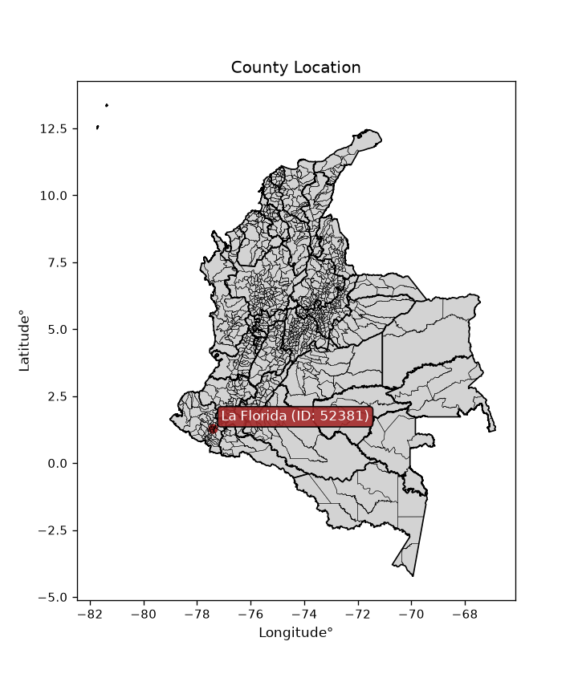
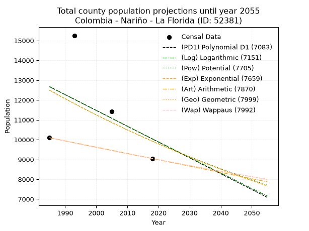
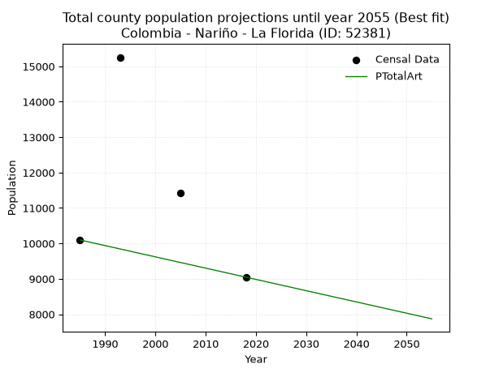
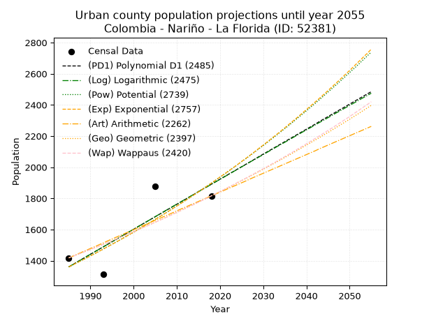
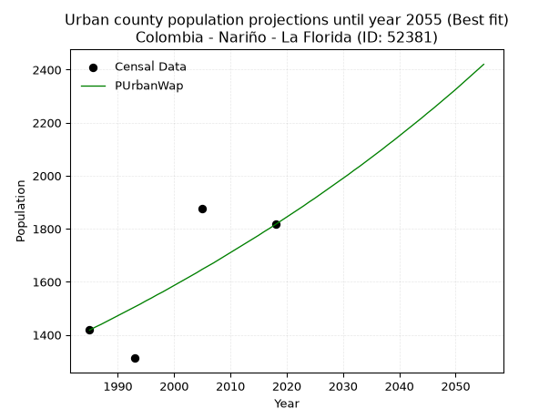
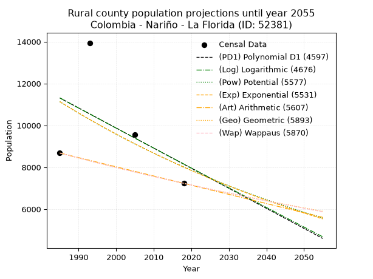
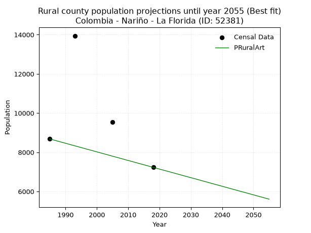

<div align="center">


</div>

# _“Population and Public Services Demand Projections (PPSD) until Year 2050 for Colombia - Nariño - La Florida (ID: 52381)”_
Keywords: `population` `public-service` `projection` `lineal` `polynomial` `logarithmic` `potential` `exponential` `arithmetic` `geometric` `wappaus` `dane` `colombia` `south-america`

PPSD are analytical estimates used by governments and planners to anticipate future changes in population size, age distribution, and the resulting community needs for utilities, healthcare, education, and infrastructure as sizing future water treatment facilities, electrical grids, and road networks based on spatial growth.

<div align="center">

</img>

</div>


> **General running parameters**: • app_version: _v20260806_. • Python version: _3.14.7_. • Pandas version: _3.0.5_. • NumPy version: _2.5.1_. • Creates, save and include plots into reports (create_plot): _False_. • Projection until year: _2050_. • Process polynomial degree 2 and up: _False_. • Process Wappaus: _True_. • Process Wappaus: _True_. • Set negative values to zero: _True_. • Set infinite values to zero: _True_. • Drop dataset notes: _True_. 
<div align="center">

Dynamic map: [:earth_americas:Google](http://maps.google.com/maps?q=1.297530483,-77.4028822) [:earth_americas:OSM](https://www.openstreetmap.org/#map=18/1.297530483/-77.4028822&layers=P) [:earth_americas:Bing](https://www.bing.com/maps?cp=1.297530483~-77.4028822&lvl=18) [:earth_americas:Apple](https://maps.apple.com/frame?center=1.297530483%2C-77.4028822&span=0.003%2C0.006)

</div>


<div align="center">

```geojson
{
  "type": "Feature",
  "geometry": {
    "type": "Point", 
    "coordinates": [-77.4028822, 1.297530483]
  }, 
  "properties": {
    "Name": "Colombia - Nariño - La Florida (ID: 52381)"
  }
}
```

</div>


## 0. Census Data (4 records)

Census data are official statistics collected by a government about the people and housing in a country. They usually include counts of total population, age, sex, race, income, education, and jobs.

📅Global census file: [Population.xlsx](../data/Population.xlsx)

| Source   |   Year |   CountryID | CountryName   |   StateID | StateName   |   CountyID | CountyName   |   PTotal |   PUrban |   PRural |
|:---------|-------:|------------:|:--------------|----------:|:------------|-----------:|:-------------|---------:|---------:|---------:|
| DANE     |   1985 |          57 | Colombia      |        52 | Nariño      |      52381 | La Florida   |    10097 |     1418 |     8679 |
| DANE     |   1993 |          57 | Colombia      |        52 | Nariño      |      52381 | La Florida   |    15256 |     1312 |    13944 |
| DANE     |   2005 |          57 | Colombia      |        52 | Nariño      |      52381 | La Florida   |    11423 |     1876 |     9547 |
| DANE     |   2018 |          57 | Colombia      |        52 | Nariño      |      52381 | La Florida   |     9047 |     1816 |     7231 |

> 🔥Some records could had specific notes about the registered values or the corresponding urban or rural distribution.

📅   [RUPS](https://www.datos.gov.co/Hacienda-y-Cr-dito-P-blico/Registro-nico-de-Prestadores-de-Servicios-P-blicos/4qkq-csdn/about_data) - Local public utility companies: [RUPS.csv](../data/RUPS.xlsx)

 | SERVICIO       | ESTADO    | NOMBRE                                                                                                                                      | NIT         | DEPARTAMENTO_DOMICILIO   | MUNICIPIO_DOMICILIO   | DIRECCION                                |   TELEFONO | EMAIL                         | TIPO_PRESTADOR                             | CLASIFICACION                 |
|:---------------|:----------|:--------------------------------------------------------------------------------------------------------------------------------------------|:------------|:-------------------------|:----------------------|:-----------------------------------------|-----------:|:------------------------------|:-------------------------------------------|:------------------------------|
| ACUEDUCTO      | OPERATIVA | JUNTA ADMINISTRADORA DEL ACUEDUCTO DEL SECTOR ORIENTAL                                                                                      | 814005480-8 | NARINO                   | LA FLORIDA            | SECTOR ORIENTAL - LA FLORIDA (NARIÑO)    |    7231612 | oscar.ramos84@gmail.com       | ORGANIZACION AUTORIZADA                    | HASTA 2500 SUSCRIPTORES       |
| ACUEDUCTO      | OPERATIVA | ASOCIACION DE USUARIOS AGUAS DE LA FLORIDA AU                                                                                               | 814003792-1 | NARINO                   | LA FLORIDA            | Cra 3 Edificio Carlos Albornoz           |    7213332 | gracielacordoba27@yahoo.es    | ORGANIZACION AUTORIZADA                    | HASTA 2500 SUSCRIPTORES       |
| ALCANTARILLADO | OPERATIVA | ASOCIACION DE USUARIOS AGUAS DE LA FLORIDA AU                                                                                               | 814003792-1 | NARINO                   | LA FLORIDA            | Cra 3 Edificio Carlos Albornoz           |    7213332 | gracielacordoba27@yahoo.es    | ORGANIZACION AUTORIZADA                    | HASTA 2500 SUSCRIPTORES       |
| ACUEDUCTO      | OPERATIVA | JUNTA ADMINISTRADORA ACUEDUCTO DE MATITUY                                                                                                   | 814002511-4 | NARINO                   | LA FLORIDA            | CORREGIMIETO DE MATITUY                  |    7287648 | jaa.matituy@hotmail.com       | ORGANIZACION AUTORIZADA                    | HASTA 2500 SUSCRIPTORES       |
| ACUEDUCTO      | OPERATIVA | JUNTA ADMINISTRADORA DE ACUEDUCTO ACHUPALLAS CORREGIMIENTO DE ROBLES MUNICIPIO DE LA FLORIDA                                                | 814006975-6 | NARINO                   | LA FLORIDA            | VEREDA ACHUPALLAS                        |    8182671 | JADMA.ACHUPALLAS@GMAIL.COM    | ORGANIZACION AUTORIZADA                    | MENOR O IGUAL A 2500 USUARIOS |
| ACUEDUCTO      | OPERATIVA | JUNTA ADMINISTRADORA DEL ACUEDUCTO DE LA SECCION DEL BARRANCO                                                                               | 814005775-5 | NARINO                   | LA FLORIDA            | SECCION BARRANCO MUNICIPIO DE LA FLORIDA |    3147074 | jaseccionbarranco@hotmail.com | ORGANIZACION AUTORIZADA                    | HASTA 2500 SUSCRIPTORES       |
| ACUEDUCTO      | OPERATIVA | EMPRESA DE SERVICIOS PUBLICOS DOMICILIARIOS DE ACUEDUCTO ALCANTARILLADO Y ASEO DEL MUNICIPIO DE LA FLORIDA NARIÑO AGUAS DEL GUILQUE SAS ESP | 900688049-8 | NARINO                   | LA FLORIDA            | CALLE 4 CARRERA 3 BARRIO PRIMAVERA       |    7287712 | aguasdelguilque@gmail.com     | SOCIEDADES (EMPRESA DE SERVICIOS PUBLICOS) | MENOR O IGUAL A 2500 USUARIOS |
| ALCANTARILLADO | OPERATIVA | EMPRESA DE SERVICIOS PUBLICOS DOMICILIARIOS DE ACUEDUCTO ALCANTARILLADO Y ASEO DEL MUNICIPIO DE LA FLORIDA NARIÑO AGUAS DEL GUILQUE SAS ESP | 900688049-8 | NARINO                   | LA FLORIDA            | CALLE 4 CARRERA 3 BARRIO PRIMAVERA       |    7287712 | aguasdelguilque@gmail.com     | SOCIEDADES (EMPRESA DE SERVICIOS PUBLICOS) | MENOR O IGUAL A 2500 USUARIOS |

## 1. Total

### 1.1. Coefficients and Parameters

* (PD1) Polynomial Deg 1: -79.87434765154397, 171224.41389000084 (lineal)
* (Log) Logarithmic: -159287.06341876145, 1222197.9954924232
* (Pow) Potential: -13.946949629474775, 50.0904178748573
* (Exp) Exponential: -0.006993595375197824, 13359756144.758814
* (Art) Arithmetic: Year diff. 2018 - 1985 = 33, Population diff. 9047 - 10097 = -1050, Annual growth = -31.818181818181817
* (Geo) Geometric: Year diff. 2018 - 1985 = 33, Population diff. 9047 - 10097 = -1050, Annual growth % = -0.0033218986988268195
* (Wap) Wappaus: i = -0.3324089199559321, Condition values only valid for < 200)

<sub>
Wappaus condition values: ['-0.00', '-0.33', '-0.66', '-1.00', '-1.33', '-1.66', '-1.99', '-2.33', '-2.66', '-2.99', '-3.32', '-3.66', '-3.99', '-4.32', '-4.65', '-4.99', '-5.32', '-5.65', '-5.98', '-6.32', '-6.65', '-6.98', '-7.31', '-7.65', '-7.98', '-8.31', '-8.64', '-8.98', '-9.31', '-9.64', '-9.97', '-10.30', '-10.64', '-10.97', '-11.30', '-11.63', '-11.97', '-12.30', '-12.63', '-12.96', '-13.30', '-13.63', '-13.96', '-14.29', '-14.63', '-14.96', '-15.29', '-15.62', '-15.96', '-16.29', '-16.62', '-16.95', '-17.29', '-17.62', '-17.95', '-18.28', '-18.61', '-18.95', '-19.28', '-19.61', '-19.94', '-20.28', '-20.61', '-20.94', '-21.27', '-21.61']
</sub>


### 1.2. Projected Dataset

|   Year |   CountyID |   PTotalPD1 |   PTotalLog |   PTotalPow |   PTotalExp |   PTotalArt |   PTotalGeo |   PTotalWap |
|-------:|-----------:|------------:|------------:|------------:|------------:|------------:|------------:|------------:|
|   1985 |      52381 |       12674 |       12672 |       12494 |       12497 |       10097 |       10097 |       10097 |
|   1986 |      52381 |       12594 |       12591 |       12407 |       12410 |       10065 |       10063 |       10063 |
|   1987 |      52381 |       12514 |       12511 |       12320 |       12323 |       10033 |       10030 |       10030 |
|   1988 |      52381 |       12434 |       12431 |       12234 |       12237 |       10002 |        9997 |        9997 |
|   1989 |      52381 |       12354 |       12351 |       12149 |       12152 |        9970 |        9964 |        9964 |
|   1990 |      52381 |       12274 |       12271 |       12064 |       12067 |        9938 |        9930 |        9931 |
|   1991 |      52381 |       12195 |       12191 |       11979 |       11983 |        9906 |        9897 |        9898 |
|   1992 |      52381 |       12115 |       12111 |       11896 |       11900 |        9874 |        9865 |        9865 |
|   1993 |      52381 |       12035 |       12031 |       11813 |       11817 |        9842 |        9832 |        9832 |
|   1994 |      52381 |       11955 |       11951 |       11731 |       11734 |        9811 |        9799 |        9799 |
|   1995 |      52381 |       11875 |       11871 |       11649 |       11653 |        9779 |        9767 |        9767 |
|   1996 |      52381 |       11795 |       11791 |       11568 |       11571 |        9747 |        9734 |        9734 |
|   1997 |      52381 |       11715 |       11712 |       11487 |       11491 |        9715 |        9702 |        9702 |
|   1998 |      52381 |       11635 |       11632 |       11407 |       11411 |        9683 |        9670 |        9670 |
|   1999 |      52381 |       11556 |       11552 |       11328 |       11331 |        9652 |        9637 |        9638 |
|   2000 |      52381 |       11476 |       11473 |       11249 |       11252 |        9620 |        9605 |        9606 |
|   2001 |      52381 |       11396 |       11393 |       11171 |       11174 |        9588 |        9574 |        9574 |
|   2002 |      52381 |       11316 |       11313 |       11093 |       11096 |        9556 |        9542 |        9542 |
|   2003 |      52381 |       11236 |       11234 |       11016 |       11019 |        9524 |        9510 |        9510 |
|   2004 |      52381 |       11156 |       11154 |       10940 |       10942 |        9492 |        9478 |        9479 |
|   2005 |      52381 |       11076 |       11075 |       10864 |       10866 |        9461 |        9447 |        9447 |
|   2006 |      52381 |       10996 |       10995 |       10789 |       10790 |        9429 |        9416 |        9416 |
|   2007 |      52381 |       10917 |       10916 |       10714 |       10715 |        9397 |        9384 |        9385 |
|   2008 |      52381 |       10837 |       10837 |       10640 |       10640 |        9365 |        9353 |        9353 |
|   2009 |      52381 |       10757 |       10757 |       10566 |       10566 |        9333 |        9322 |        9322 |
|   2010 |      52381 |       10677 |       10678 |       10493 |       10492 |        9302 |        9291 |        9291 |
|   2011 |      52381 |       10597 |       10599 |       10421 |       10419 |        9270 |        9260 |        9261 |
|   2012 |      52381 |       10517 |       10520 |       10349 |       10346 |        9238 |        9229 |        9230 |
|   2013 |      52381 |       10437 |       10441 |       10277 |       10274 |        9206 |        9199 |        9199 |
|   2014 |      52381 |       10357 |       10361 |       10206 |       10203 |        9174 |        9168 |        9168 |
|   2015 |      52381 |       10278 |       10282 |       10136 |       10132 |        9142 |        9138 |        9138 |
|   2016 |      52381 |       10198 |       10203 |       10066 |       10061 |        9111 |        9107 |        9108 |
|   2017 |      52381 |       10118 |       10124 |        9997 |        9991 |        9079 |        9077 |        9077 |
|   2018 |      52381 |       10038 |       10045 |        9928 |        9921 |        9047 |        9047 |        9047 |
|   2019 |      52381 |        9958 |        9966 |        9859 |        9852 |        9015 |        9017 |        9017 |
|   2020 |      52381 |        9878 |        9888 |        9791 |        9783 |        8983 |        8987 |        8987 |
|   2021 |      52381 |        9798 |        9809 |        9724 |        9715 |        8952 |        8957 |        8957 |
|   2022 |      52381 |        9718 |        9730 |        9657 |        9648 |        8920 |        8927 |        8927 |
|   2023 |      52381 |        9639 |        9651 |        9591 |        9580 |        8888 |        8898 |        8897 |
|   2024 |      52381 |        9559 |        9572 |        9525 |        9514 |        8856 |        8868 |        8868 |
|   2025 |      52381 |        9479 |        9494 |        9460 |        9447 |        8824 |        8839 |        8838 |
|   2026 |      52381 |        9399 |        9415 |        9395 |        9381 |        8792 |        8809 |        8809 |
|   2027 |      52381 |        9319 |        9337 |        9330 |        9316 |        8761 |        8780 |        8779 |
|   2028 |      52381 |        9239 |        9258 |        9266 |        9251 |        8729 |        8751 |        8750 |
|   2029 |      52381 |        9159 |        9179 |        9203 |        9187 |        8697 |        8722 |        8721 |
|   2030 |      52381 |        9079 |        9101 |        9140 |        9123 |        8665 |        8693 |        8692 |
|   2031 |      52381 |        9000 |        9023 |        9077 |        9059 |        8633 |        8664 |        8663 |
|   2032 |      52381 |        8920 |        8944 |        9015 |        8996 |        8602 |        8635 |        8634 |
|   2033 |      52381 |        8840 |        8866 |        8953 |        8933 |        8570 |        8607 |        8605 |
|   2034 |      52381 |        8760 |        8787 |        8892 |        8871 |        8538 |        8578 |        8576 |
|   2035 |      52381 |        8680 |        8709 |        8832 |        8809 |        8506 |        8549 |        8548 |
|   2036 |      52381 |        8600 |        8631 |        8771 |        8748 |        8474 |        8521 |        8519 |
|   2037 |      52381 |        8520 |        8553 |        8711 |        8687 |        8442 |        8493 |        8491 |
|   2038 |      52381 |        8440 |        8475 |        8652 |        8626 |        8411 |        8465 |        8462 |
|   2039 |      52381 |        8361 |        8396 |        8593 |        8566 |        8379 |        8436 |        8434 |
|   2040 |      52381 |        8281 |        8318 |        8534 |        8506 |        8347 |        8408 |        8406 |
|   2041 |      52381 |        8201 |        8240 |        8476 |        8447 |        8315 |        8380 |        8377 |
|   2042 |      52381 |        8121 |        8162 |        8419 |        8388 |        8283 |        8353 |        8349 |
|   2043 |      52381 |        8041 |        8084 |        8361 |        8330 |        8252 |        8325 |        8321 |
|   2044 |      52381 |        7961 |        8006 |        8304 |        8272 |        8220 |        8297 |        8294 |
|   2045 |      52381 |        7881 |        7928 |        8248 |        8214 |        8188 |        8270 |        8266 |
|   2046 |      52381 |        7801 |        7850 |        8192 |        8157 |        8156 |        8242 |        8238 |
|   2047 |      52381 |        7722 |        7773 |        8136 |        8100 |        8124 |        8215 |        8210 |
|   2048 |      52381 |        7642 |        7695 |        8081 |        8044 |        8092 |        8188 |        8183 |
|   2049 |      52381 |        7562 |        7617 |        8026 |        7988 |        8061 |        8160 |        8155 |
|   2050 |      52381 |        7482 |        7539 |        7972 |        7932 |        8029 |        8133 |        8128 |
<div align="center">

</img>

</div>


### 1.3. Best fit with absolute and relative error (%)

Relative error puts that difference into context by dividing the absolute error by the true value, creating a unitless ratio or percentage that shows the scale of the mistake.

Absolute and relative error

|   Year | Source   |   CountryID | CountryName   |   StateID | StateName   |   CountyID_x | CountyName   |   PTotal |   PUrban |   PRural |   CountyID_y |   PTotalPD1 |   PTotalLog |   PTotalPow |   PTotalExp |   PTotalArt |   PTotalGeo |   PTotalWap |   PTotalPD1AbsError |   PTotalLogAbsError |   PTotalPowAbsError |   PTotalExpAbsError |   PTotalArtAbsError |   PTotalGeoAbsError |   PTotalWapAbsError |   PTotalPD1RelError |   PTotalLogRelError |   PTotalPowRelError |   PTotalExpRelError |   PTotalArtRelError |   PTotalGeoRelError |   PTotalWapRelError |
|-------:|:---------|------------:|:--------------|----------:|:------------|-------------:|:-------------|---------:|---------:|---------:|-------------:|------------:|------------:|------------:|------------:|------------:|------------:|------------:|--------------------:|--------------------:|--------------------:|--------------------:|--------------------:|--------------------:|--------------------:|--------------------:|--------------------:|--------------------:|--------------------:|--------------------:|--------------------:|--------------------:|
|   1985 | DANE     |          57 | Colombia      |        52 | Nariño      |        52381 | La Florida   |    10097 |     1418 |     8679 |        52381 |       12674 |       12672 |       12494 |       12497 |       10097 |       10097 |       10097 |                2577 |                2575 |                2397 |                2400 |                   0 |                   0 |                   0 |            25.5224  |            25.5026  |            23.7397  |            23.7694  |              0      |              0      |              0      |
|   1993 | DANE     |          57 | Colombia      |        52 | Nariño      |        52381 | La Florida   |    15256 |     1312 |    13944 |        52381 |       12035 |       12031 |       11813 |       11817 |        9842 |        9832 |        9832 |                3221 |                3225 |                3443 |                3439 |                5414 |                5424 |                5424 |            21.113   |            21.1392  |            22.5682  |            22.542   |             35.4877 |             35.5532 |             35.5532 |
|   2005 | DANE     |          57 | Colombia      |        52 | Nariño      |        52381 | La Florida   |    11423 |     1876 |     9547 |        52381 |       11076 |       11075 |       10864 |       10866 |        9461 |        9447 |        9447 |                 347 |                 348 |                 559 |                 557 |                1962 |                1976 |                1976 |             3.03773 |             3.04649 |             4.89364 |             4.87613 |             17.1759 |             17.2984 |             17.2984 |
|   2018 | DANE     |          57 | Colombia      |        52 | Nariño      |        52381 | La Florida   |     9047 |     1816 |     7231 |        52381 |       10038 |       10045 |        9928 |        9921 |        9047 |        9047 |        9047 |                 991 |                 998 |                 881 |                 874 |                   0 |                   0 |                   0 |            10.9539  |            11.0313  |             9.73803 |             9.66066 |              0      |              0      |              0      |

Relative error mean

| Method    |   RelError | Best   |
|:----------|-----------:|:-------|
| PTotalPD1 |    15.1568 |        |
| PTotalLog |    15.1799 |        |
| PTotalPow |    15.2349 |        |
| PTotalExp |    15.212  |        |
| PTotalArt |    13.1659 | True   |
| PTotalGeo |    13.2129 |        |
| PTotalWap |    13.2129 |        |

💙Best method: _**PTotalArt**_
<div align="center">

</img>

</div>


### 1.4. Fresh water supply demand in liters per capita per day (lpcd)

The fresh water supply demand typically ranges from 100 to 300 liters per capita per day (lpcd) for standard domestic and municipal planning, though absolute survival minimums set by the World Health Organization are as low as 7.5 to 20 liters per day, and total consumption in high-income nations can exceed 400 liters.

> `CZ`: Level in meters above the sea level (masl)<br> `WS`: Fresh water supply demand in liters per capita per day (lpcd or l/h/d)<br> `WSAll`: Zonal fresh water supply demand in liters per second (l/s)<br> `A`: Zonal area in square meters<br> `DP`: Population density (people/hectare or p/ha)

Reference values (RAS Colombia)

|    CZ |   WS |
|------:|-----:|
|  1000 |  120 |
|  2000 |  130 |
| 99999 |  140 |

County shapefile geometry properties and water supply values

|   CountyID |      ATotal |   CZTotal |   WSTotal |
|-----------:|------------:|----------:|----------:|
|      52381 | 1.36442e+08 |   2115.01 |       140 |

Projected values for best method: PTotalArt

|   CountyID |   Year |   PTotalArt |   DPTotal |   WSTotal |   WSTotalAll |
|-----------:|-------:|------------:|----------:|----------:|-------------:|
|      52381 |   1985 |       10097 |      0.74 |       140 |      16.3609 |
|      52381 |   1986 |       10065 |      0.74 |       140 |      16.309  |
|      52381 |   1987 |       10033 |      0.74 |       140 |      16.2572 |
|      52381 |   1988 |       10002 |      0.73 |       140 |      16.2069 |
|      52381 |   1989 |        9970 |      0.73 |       140 |      16.1551 |
|      52381 |   1990 |        9938 |      0.73 |       140 |      16.1032 |
|      52381 |   1991 |        9906 |      0.73 |       140 |      16.0514 |
|      52381 |   1992 |        9874 |      0.72 |       140 |      15.9995 |
|      52381 |   1993 |        9842 |      0.72 |       140 |      15.9477 |
|      52381 |   1994 |        9811 |      0.72 |       140 |      15.8975 |
|      52381 |   1995 |        9779 |      0.72 |       140 |      15.8456 |
|      52381 |   1996 |        9747 |      0.71 |       140 |      15.7937 |
|      52381 |   1997 |        9715 |      0.71 |       140 |      15.7419 |
|      52381 |   1998 |        9683 |      0.71 |       140 |      15.69   |
|      52381 |   1999 |        9652 |      0.71 |       140 |      15.6398 |
|      52381 |   2000 |        9620 |      0.71 |       140 |      15.588  |
|      52381 |   2001 |        9588 |      0.7  |       140 |      15.5361 |
|      52381 |   2002 |        9556 |      0.7  |       140 |      15.4843 |
|      52381 |   2003 |        9524 |      0.7  |       140 |      15.4324 |
|      52381 |   2004 |        9492 |      0.7  |       140 |      15.3806 |
|      52381 |   2005 |        9461 |      0.69 |       140 |      15.3303 |
|      52381 |   2006 |        9429 |      0.69 |       140 |      15.2785 |
|      52381 |   2007 |        9397 |      0.69 |       140 |      15.2266 |
|      52381 |   2008 |        9365 |      0.69 |       140 |      15.1748 |
|      52381 |   2009 |        9333 |      0.68 |       140 |      15.1229 |
|      52381 |   2010 |        9302 |      0.68 |       140 |      15.0727 |
|      52381 |   2011 |        9270 |      0.68 |       140 |      15.0208 |
|      52381 |   2012 |        9238 |      0.68 |       140 |      14.969  |
|      52381 |   2013 |        9206 |      0.67 |       140 |      14.9171 |
|      52381 |   2014 |        9174 |      0.67 |       140 |      14.8653 |
|      52381 |   2015 |        9142 |      0.67 |       140 |      14.8134 |
|      52381 |   2016 |        9111 |      0.67 |       140 |      14.7632 |
|      52381 |   2017 |        9079 |      0.67 |       140 |      14.7113 |
|      52381 |   2018 |        9047 |      0.66 |       140 |      14.6595 |
|      52381 |   2019 |        9015 |      0.66 |       140 |      14.6076 |
|      52381 |   2020 |        8983 |      0.66 |       140 |      14.5558 |
|      52381 |   2021 |        8952 |      0.66 |       140 |      14.5056 |
|      52381 |   2022 |        8920 |      0.65 |       140 |      14.4537 |
|      52381 |   2023 |        8888 |      0.65 |       140 |      14.4019 |
|      52381 |   2024 |        8856 |      0.65 |       140 |      14.35   |
|      52381 |   2025 |        8824 |      0.65 |       140 |      14.2981 |
|      52381 |   2026 |        8792 |      0.64 |       140 |      14.2463 |
|      52381 |   2027 |        8761 |      0.64 |       140 |      14.1961 |
|      52381 |   2028 |        8729 |      0.64 |       140 |      14.1442 |
|      52381 |   2029 |        8697 |      0.64 |       140 |      14.0924 |
|      52381 |   2030 |        8665 |      0.64 |       140 |      14.0405 |
|      52381 |   2031 |        8633 |      0.63 |       140 |      13.9887 |
|      52381 |   2032 |        8602 |      0.63 |       140 |      13.9384 |
|      52381 |   2033 |        8570 |      0.63 |       140 |      13.8866 |
|      52381 |   2034 |        8538 |      0.63 |       140 |      13.8347 |
|      52381 |   2035 |        8506 |      0.62 |       140 |      13.7829 |
|      52381 |   2036 |        8474 |      0.62 |       140 |      13.731  |
|      52381 |   2037 |        8442 |      0.62 |       140 |      13.6792 |
|      52381 |   2038 |        8411 |      0.62 |       140 |      13.6289 |
|      52381 |   2039 |        8379 |      0.61 |       140 |      13.5771 |
|      52381 |   2040 |        8347 |      0.61 |       140 |      13.5252 |
|      52381 |   2041 |        8315 |      0.61 |       140 |      13.4734 |
|      52381 |   2042 |        8283 |      0.61 |       140 |      13.4215 |
|      52381 |   2043 |        8252 |      0.6  |       140 |      13.3713 |
|      52381 |   2044 |        8220 |      0.6  |       140 |      13.3194 |
|      52381 |   2045 |        8188 |      0.6  |       140 |      13.2676 |
|      52381 |   2046 |        8156 |      0.6  |       140 |      13.2157 |
|      52381 |   2047 |        8124 |      0.6  |       140 |      13.1639 |
|      52381 |   2048 |        8092 |      0.59 |       140 |      13.112  |
|      52381 |   2049 |        8061 |      0.59 |       140 |      13.0618 |
|      52381 |   2050 |        8029 |      0.59 |       140 |      13.01   |

## 2. Urban

### 2.1. Coefficients and Parameters

* (PD1) Polynomial Deg 1: 16.071457246085927, -30541.432356483372 (lineal)
* (Log) Logarithmic: 32180.948918774742, -243002.15061354698
* (Pow) Potential: 20.203708433049098, -63.493484043419826
* (Exp) Exponential: 0.01009062621998063, 2.7213696538494324e-06
* (Art) Arithmetic: Year diff. 2018 - 1985 = 33, Population diff. 1816 - 1418 = 398, Annual growth = 12.06060606060606
* (Geo) Geometric: Year diff. 2018 - 1985 = 33, Population diff. 1816 - 1418 = 398, Annual growth % = 0.0075248019752736095
* (Wap) Wappaus: i = 0.7458630835254212, Condition values only valid for < 200)

<sub>
Wappaus condition values: ['0.00', '0.75', '1.49', '2.24', '2.98', '3.73', '4.48', '5.22', '5.97', '6.71', '7.46', '8.20', '8.95', '9.70', '10.44', '11.19', '11.93', '12.68', '13.43', '14.17', '14.92', '15.66', '16.41', '17.15', '17.90', '18.65', '19.39', '20.14', '20.88', '21.63', '22.38', '23.12', '23.87', '24.61', '25.36', '26.11', '26.85', '27.60', '28.34', '29.09', '29.83', '30.58', '31.33', '32.07', '32.82', '33.56', '34.31', '35.06', '35.80', '36.55', '37.29', '38.04', '38.78', '39.53', '40.28', '41.02', '41.77', '42.51', '43.26', '44.01', '44.75', '45.50', '46.24', '46.99', '47.74', '48.48']
</sub>


### 2.2. Projected Dataset

|   Year |   CountyID |   PUrbanPD1 |   PUrbanLog |   PUrbanPow |   PUrbanExp |   PUrbanArt |   PUrbanGeo |   PUrbanWap |
|-------:|-----------:|------------:|------------:|------------:|------------:|------------:|------------:|------------:|
|   1985 |      52381 |        1360 |        1360 |        1360 |        1360 |        1418 |        1418 |        1418 |
|   1986 |      52381 |        1376 |        1376 |        1374 |        1374 |        1430 |        1429 |        1429 |
|   1987 |      52381 |        1393 |        1392 |        1388 |        1388 |        1442 |        1439 |        1439 |
|   1988 |      52381 |        1409 |        1408 |        1402 |        1402 |        1454 |        1450 |        1450 |
|   1989 |      52381 |        1425 |        1425 |        1416 |        1416 |        1466 |        1461 |        1461 |
|   1990 |      52381 |        1441 |        1441 |        1431 |        1431 |        1478 |        1472 |        1472 |
|   1991 |      52381 |        1457 |        1457 |        1445 |        1445 |        1490 |        1483 |        1483 |
|   1992 |      52381 |        1473 |        1473 |        1460 |        1460 |        1502 |        1494 |        1494 |
|   1993 |      52381 |        1489 |        1489 |        1475 |        1475 |        1514 |        1506 |        1505 |
|   1994 |      52381 |        1505 |        1505 |        1490 |        1490 |        1527 |        1517 |        1516 |
|   1995 |      52381 |        1521 |        1522 |        1505 |        1505 |        1539 |        1528 |        1528 |
|   1996 |      52381 |        1537 |        1538 |        1521 |        1520 |        1551 |        1540 |        1539 |
|   1997 |      52381 |        1553 |        1554 |        1536 |        1535 |        1563 |        1551 |        1551 |
|   1998 |      52381 |        1569 |        1570 |        1552 |        1551 |        1575 |        1563 |        1562 |
|   1999 |      52381 |        1585 |        1586 |        1567 |        1567 |        1587 |        1575 |        1574 |
|   2000 |      52381 |        1601 |        1602 |        1583 |        1583 |        1599 |        1587 |        1586 |
|   2001 |      52381 |        1618 |        1618 |        1599 |        1599 |        1611 |        1599 |        1598 |
|   2002 |      52381 |        1634 |        1634 |        1616 |        1615 |        1623 |        1611 |        1610 |
|   2003 |      52381 |        1650 |        1650 |        1632 |        1631 |        1635 |        1623 |        1622 |
|   2004 |      52381 |        1666 |        1666 |        1649 |        1648 |        1647 |        1635 |        1634 |
|   2005 |      52381 |        1682 |        1682 |        1665 |        1665 |        1659 |        1647 |        1647 |
|   2006 |      52381 |        1698 |        1699 |        1682 |        1681 |        1671 |        1660 |        1659 |
|   2007 |      52381 |        1714 |        1715 |        1699 |        1699 |        1683 |        1672 |        1671 |
|   2008 |      52381 |        1730 |        1731 |        1716 |        1716 |        1695 |        1685 |        1684 |
|   2009 |      52381 |        1746 |        1747 |        1734 |        1733 |        1707 |        1698 |        1697 |
|   2010 |      52381 |        1762 |        1763 |        1751 |        1751 |        1720 |        1710 |        1710 |
|   2011 |      52381 |        1778 |        1779 |        1769 |        1768 |        1732 |        1723 |        1723 |
|   2012 |      52381 |        1794 |        1795 |        1787 |        1786 |        1744 |        1736 |        1736 |
|   2013 |      52381 |        1810 |        1811 |        1805 |        1805 |        1756 |        1749 |        1749 |
|   2014 |      52381 |        1826 |        1827 |        1823 |        1823 |        1768 |        1762 |        1762 |
|   2015 |      52381 |        1843 |        1843 |        1841 |        1841 |        1780 |        1776 |        1775 |
|   2016 |      52381 |        1859 |        1859 |        1860 |        1860 |        1792 |        1789 |        1789 |
|   2017 |      52381 |        1875 |        1874 |        1879 |        1879 |        1804 |        1802 |        1802 |
|   2018 |      52381 |        1891 |        1890 |        1897 |        1898 |        1816 |        1816 |        1816 |
|   2019 |      52381 |        1907 |        1906 |        1917 |        1917 |        1828 |        1830 |        1830 |
|   2020 |      52381 |        1923 |        1922 |        1936 |        1937 |        1840 |        1843 |        1844 |
|   2021 |      52381 |        1939 |        1938 |        1955 |        1956 |        1852 |        1857 |        1858 |
|   2022 |      52381 |        1955 |        1954 |        1975 |        1976 |        1864 |        1871 |        1872 |
|   2023 |      52381 |        1971 |        1970 |        1995 |        1996 |        1876 |        1885 |        1886 |
|   2024 |      52381 |        1987 |        1986 |        2015 |        2016 |        1888 |        1900 |        1901 |
|   2025 |      52381 |        2003 |        2002 |        2035 |        2037 |        1900 |        1914 |        1915 |
|   2026 |      52381 |        2019 |        2018 |        2055 |        2057 |        1912 |        1928 |        1930 |
|   2027 |      52381 |        2035 |        2034 |        2076 |        2078 |        1925 |        1943 |        1945 |
|   2028 |      52381 |        2051 |        2050 |        2097 |        2099 |        1937 |        1957 |        1960 |
|   2029 |      52381 |        2068 |        2065 |        2118 |        2121 |        1949 |        1972 |        1975 |
|   2030 |      52381 |        2084 |        2081 |        2139 |        2142 |        1961 |        1987 |        1990 |
|   2031 |      52381 |        2100 |        2097 |        2160 |        2164 |        1973 |        2002 |        2005 |
|   2032 |      52381 |        2116 |        2113 |        2182 |        2186 |        1985 |        2017 |        2021 |
|   2033 |      52381 |        2132 |        2129 |        2204 |        2208 |        1997 |        2032 |        2036 |
|   2034 |      52381 |        2148 |        2145 |        2226 |        2230 |        2009 |        2047 |        2052 |
|   2035 |      52381 |        2164 |        2160 |        2248 |        2253 |        2021 |        2063 |        2068 |
|   2036 |      52381 |        2180 |        2176 |        2270 |        2276 |        2033 |        2078 |        2084 |
|   2037 |      52381 |        2196 |        2192 |        2293 |        2299 |        2045 |        2094 |        2100 |
|   2038 |      52381 |        2212 |        2208 |        2316 |        2322 |        2057 |        2110 |        2117 |
|   2039 |      52381 |        2228 |        2224 |        2339 |        2346 |        2069 |        2126 |        2133 |
|   2040 |      52381 |        2244 |        2239 |        2362 |        2370 |        2081 |        2142 |        2150 |
|   2041 |      52381 |        2260 |        2255 |        2386 |        2394 |        2093 |        2158 |        2167 |
|   2042 |      52381 |        2276 |        2271 |        2409 |        2418 |        2105 |        2174 |        2184 |
|   2043 |      52381 |        2293 |        2287 |        2433 |        2442 |        2118 |        2190 |        2201 |
|   2044 |      52381 |        2309 |        2302 |        2458 |        2467 |        2130 |        2207 |        2218 |
|   2045 |      52381 |        2325 |        2318 |        2482 |        2492 |        2142 |        2223 |        2236 |
|   2046 |      52381 |        2341 |        2334 |        2507 |        2518 |        2154 |        2240 |        2253 |
|   2047 |      52381 |        2357 |        2350 |        2531 |        2543 |        2166 |        2257 |        2271 |
|   2048 |      52381 |        2373 |        2365 |        2557 |        2569 |        2178 |        2274 |        2289 |
|   2049 |      52381 |        2389 |        2381 |        2582 |        2595 |        2190 |        2291 |        2307 |
|   2050 |      52381 |        2405 |        2397 |        2608 |        2621 |        2202 |        2308 |        2325 |
<div align="center">

</img>

</div>


### 2.3. Best fit with absolute and relative error (%)

Relative error puts that difference into context by dividing the absolute error by the true value, creating a unitless ratio or percentage that shows the scale of the mistake.

Absolute and relative error

|   Year | Source   |   CountryID | CountryName   |   StateID | StateName   |   CountyID_x | CountyName   |   PTotal |   PUrban |   PRural |   CountyID_y |   PUrbanPD1 |   PUrbanLog |   PUrbanPow |   PUrbanExp |   PUrbanArt |   PUrbanGeo |   PUrbanWap |   PUrbanPD1AbsError |   PUrbanLogAbsError |   PUrbanPowAbsError |   PUrbanExpAbsError |   PUrbanArtAbsError |   PUrbanGeoAbsError |   PUrbanWapAbsError |   PUrbanPD1RelError |   PUrbanLogRelError |   PUrbanPowRelError |   PUrbanExpRelError |   PUrbanArtRelError |   PUrbanGeoRelError |   PUrbanWapRelError |
|-------:|:---------|------------:|:--------------|----------:|:------------|-------------:|:-------------|---------:|---------:|---------:|-------------:|------------:|------------:|------------:|------------:|------------:|------------:|------------:|--------------------:|--------------------:|--------------------:|--------------------:|--------------------:|--------------------:|--------------------:|--------------------:|--------------------:|--------------------:|--------------------:|--------------------:|--------------------:|--------------------:|
|   1985 | DANE     |          57 | Colombia      |        52 | Nariño      |        52381 | La Florida   |    10097 |     1418 |     8679 |        52381 |        1360 |        1360 |        1360 |        1360 |        1418 |        1418 |        1418 |                  58 |                  58 |                  58 |                  58 |                   0 |                   0 |                   0 |             4.09027 |             4.09027 |             4.09027 |             4.09027 |              0      |              0      |              0      |
|   1993 | DANE     |          57 | Colombia      |        52 | Nariño      |        52381 | La Florida   |    15256 |     1312 |    13944 |        52381 |        1489 |        1489 |        1475 |        1475 |        1514 |        1506 |        1505 |                 177 |                 177 |                 163 |                 163 |                 202 |                 194 |                 193 |            13.4909  |            13.4909  |            12.4238  |            12.4238  |             15.3963 |             14.7866 |             14.7104 |
|   2005 | DANE     |          57 | Colombia      |        52 | Nariño      |        52381 | La Florida   |    11423 |     1876 |     9547 |        52381 |        1682 |        1682 |        1665 |        1665 |        1659 |        1647 |        1647 |                 194 |                 194 |                 211 |                 211 |                 217 |                 229 |                 229 |            10.3412  |            10.3412  |            11.2473  |            11.2473  |             11.5672 |             12.2068 |             12.2068 |
|   2018 | DANE     |          57 | Colombia      |        52 | Nariño      |        52381 | La Florida   |     9047 |     1816 |     7231 |        52381 |        1891 |        1890 |        1897 |        1898 |        1816 |        1816 |        1816 |                  75 |                  74 |                  81 |                  82 |                   0 |                   0 |                   0 |             4.12996 |             4.07489 |             4.46035 |             4.51542 |              0      |              0      |              0      |

Relative error mean

| Method    |   RelError | Best   |
|:----------|-----------:|:-------|
| PUrbanPD1 |    8.01306 |        |
| PUrbanLog |    7.99929 |        |
| PUrbanPow |    8.05543 |        |
| PUrbanExp |    8.0692  |        |
| PUrbanArt |    6.74088 |        |
| PUrbanGeo |    6.74835 |        |
| PUrbanWap |    6.7293  | True   |

💙Best method: _**PUrbanWap**_
<div align="center">

</img>

</div>


### 2.4. Fresh water supply demand in liters per capita per day (lpcd)

The fresh water supply demand typically ranges from 100 to 300 liters per capita per day (lpcd) for standard domestic and municipal planning, though absolute survival minimums set by the World Health Organization are as low as 7.5 to 20 liters per day, and total consumption in high-income nations can exceed 400 liters.

> `CZ`: Level in meters above the sea level (masl)<br> `WS`: Fresh water supply demand in liters per capita per day (lpcd or l/h/d)<br> `WSAll`: Zonal fresh water supply demand in liters per second (l/s)<br> `A`: Zonal area in square meters<br> `DP`: Population density (people/hectare or p/ha)

Reference values (RAS Colombia)

|    CZ |   WS |
|------:|-----:|
|  1000 |  120 |
|  2000 |  130 |
| 99999 |  140 |

County shapefile geometry properties and water supply values

|   CountyID |   AUrban |   CZUrban |   WSUrban |
|-----------:|---------:|----------:|----------:|
|      52381 |   907957 |   2174.21 |       140 |

Projected values for best method: PUrbanWap

|   CountyID |   Year |   PUrbanWap |   DPUrban |   WSUrban |   WSUrbanAll |
|-----------:|-------:|------------:|----------:|----------:|-------------:|
|      52381 |   1985 |        1418 |     15.62 |       140 |      2.29769 |
|      52381 |   1986 |        1429 |     15.74 |       140 |      2.31551 |
|      52381 |   1987 |        1439 |     15.85 |       140 |      2.33171 |
|      52381 |   1988 |        1450 |     15.97 |       140 |      2.34954 |
|      52381 |   1989 |        1461 |     16.09 |       140 |      2.36736 |
|      52381 |   1990 |        1472 |     16.21 |       140 |      2.38519 |
|      52381 |   1991 |        1483 |     16.33 |       140 |      2.40301 |
|      52381 |   1992 |        1494 |     16.45 |       140 |      2.42083 |
|      52381 |   1993 |        1505 |     16.58 |       140 |      2.43866 |
|      52381 |   1994 |        1516 |     16.7  |       140 |      2.45648 |
|      52381 |   1995 |        1528 |     16.83 |       140 |      2.47593 |
|      52381 |   1996 |        1539 |     16.95 |       140 |      2.49375 |
|      52381 |   1997 |        1551 |     17.08 |       140 |      2.51319 |
|      52381 |   1998 |        1562 |     17.2  |       140 |      2.53102 |
|      52381 |   1999 |        1574 |     17.34 |       140 |      2.55046 |
|      52381 |   2000 |        1586 |     17.47 |       140 |      2.56991 |
|      52381 |   2001 |        1598 |     17.6  |       140 |      2.58935 |
|      52381 |   2002 |        1610 |     17.73 |       140 |      2.6088  |
|      52381 |   2003 |        1622 |     17.86 |       140 |      2.62824 |
|      52381 |   2004 |        1634 |     18    |       140 |      2.64769 |
|      52381 |   2005 |        1647 |     18.14 |       140 |      2.66875 |
|      52381 |   2006 |        1659 |     18.27 |       140 |      2.68819 |
|      52381 |   2007 |        1671 |     18.4  |       140 |      2.70764 |
|      52381 |   2008 |        1684 |     18.55 |       140 |      2.7287  |
|      52381 |   2009 |        1697 |     18.69 |       140 |      2.74977 |
|      52381 |   2010 |        1710 |     18.83 |       140 |      2.77083 |
|      52381 |   2011 |        1723 |     18.98 |       140 |      2.7919  |
|      52381 |   2012 |        1736 |     19.12 |       140 |      2.81296 |
|      52381 |   2013 |        1749 |     19.26 |       140 |      2.83403 |
|      52381 |   2014 |        1762 |     19.41 |       140 |      2.85509 |
|      52381 |   2015 |        1775 |     19.55 |       140 |      2.87616 |
|      52381 |   2016 |        1789 |     19.7  |       140 |      2.89884 |
|      52381 |   2017 |        1802 |     19.85 |       140 |      2.91991 |
|      52381 |   2018 |        1816 |     20    |       140 |      2.94259 |
|      52381 |   2019 |        1830 |     20.16 |       140 |      2.96528 |
|      52381 |   2020 |        1844 |     20.31 |       140 |      2.98796 |
|      52381 |   2021 |        1858 |     20.46 |       140 |      3.01065 |
|      52381 |   2022 |        1872 |     20.62 |       140 |      3.03333 |
|      52381 |   2023 |        1886 |     20.77 |       140 |      3.05602 |
|      52381 |   2024 |        1901 |     20.94 |       140 |      3.08032 |
|      52381 |   2025 |        1915 |     21.09 |       140 |      3.10301 |
|      52381 |   2026 |        1930 |     21.26 |       140 |      3.12731 |
|      52381 |   2027 |        1945 |     21.42 |       140 |      3.15162 |
|      52381 |   2028 |        1960 |     21.59 |       140 |      3.17593 |
|      52381 |   2029 |        1975 |     21.75 |       140 |      3.20023 |
|      52381 |   2030 |        1990 |     21.92 |       140 |      3.22454 |
|      52381 |   2031 |        2005 |     22.08 |       140 |      3.24884 |
|      52381 |   2032 |        2021 |     22.26 |       140 |      3.27477 |
|      52381 |   2033 |        2036 |     22.42 |       140 |      3.29907 |
|      52381 |   2034 |        2052 |     22.6  |       140 |      3.325   |
|      52381 |   2035 |        2068 |     22.78 |       140 |      3.35093 |
|      52381 |   2036 |        2084 |     22.95 |       140 |      3.37685 |
|      52381 |   2037 |        2100 |     23.13 |       140 |      3.40278 |
|      52381 |   2038 |        2117 |     23.32 |       140 |      3.43032 |
|      52381 |   2039 |        2133 |     23.49 |       140 |      3.45625 |
|      52381 |   2040 |        2150 |     23.68 |       140 |      3.4838  |
|      52381 |   2041 |        2167 |     23.87 |       140 |      3.51134 |
|      52381 |   2042 |        2184 |     24.05 |       140 |      3.53889 |
|      52381 |   2043 |        2201 |     24.24 |       140 |      3.56644 |
|      52381 |   2044 |        2218 |     24.43 |       140 |      3.59398 |
|      52381 |   2045 |        2236 |     24.63 |       140 |      3.62315 |
|      52381 |   2046 |        2253 |     24.81 |       140 |      3.65069 |
|      52381 |   2047 |        2271 |     25.01 |       140 |      3.67986 |
|      52381 |   2048 |        2289 |     25.21 |       140 |      3.70903 |
|      52381 |   2049 |        2307 |     25.41 |       140 |      3.73819 |
|      52381 |   2050 |        2325 |     25.61 |       140 |      3.76736 |

## 3. Rural

### 3.1. Coefficients and Parameters

* (PD1) Polynomial Deg 1: -95.94580489762988, 201765.84624648417 (lineal)
* (Log) Logarithmic: -191468.0123375361, 1465200.1461059698
* (Pow) Potential: -19.94833636521298, 69.83145175347015
* (Exp) Exponential: -0.009995428196993285, 4607702671333.214
* (Art) Arithmetic: Year diff. 2018 - 1985 = 33, Population diff. 7231 - 8679 = -1448, Annual growth = -43.878787878787875
* (Geo) Geometric: Year diff. 2018 - 1985 = 33, Population diff. 7231 - 8679 = -1448, Annual growth % = -0.0055159122572884245
* (Wap) Wappaus: i = -0.5515875283317144, Condition values only valid for < 200)

<sub>
Wappaus condition values: ['-0.00', '-0.55', '-1.10', '-1.65', '-2.21', '-2.76', '-3.31', '-3.86', '-4.41', '-4.96', '-5.52', '-6.07', '-6.62', '-7.17', '-7.72', '-8.27', '-8.83', '-9.38', '-9.93', '-10.48', '-11.03', '-11.58', '-12.13', '-12.69', '-13.24', '-13.79', '-14.34', '-14.89', '-15.44', '-16.00', '-16.55', '-17.10', '-17.65', '-18.20', '-18.75', '-19.31', '-19.86', '-20.41', '-20.96', '-21.51', '-22.06', '-22.62', '-23.17', '-23.72', '-24.27', '-24.82', '-25.37', '-25.92', '-26.48', '-27.03', '-27.58', '-28.13', '-28.68', '-29.23', '-29.79', '-30.34', '-30.89', '-31.44', '-31.99', '-32.54', '-33.10', '-33.65', '-34.20', '-34.75', '-35.30', '-35.85']
</sub>


### 3.2. Projected Dataset

|   Year |   CountyID |   PRuralPD1 |   PRuralLog |   PRuralPow |   PRuralExp |   PRuralArt |   PRuralGeo |   PRuralWap |
|-------:|-----------:|------------:|------------:|------------:|------------:|------------:|------------:|------------:|
|   1985 |      52381 |       11313 |       11312 |       11133 |       11135 |        8679 |        8679 |        8679 |
|   1986 |      52381 |       11217 |       11215 |       11022 |       11024 |        8635 |        8631 |        8631 |
|   1987 |      52381 |       11122 |       11119 |       10912 |       10914 |        8591 |        8584 |        8584 |
|   1988 |      52381 |       11026 |       11023 |       10803 |       10806 |        8547 |        8536 |        8537 |
|   1989 |      52381 |       10930 |       10926 |       10695 |       10698 |        8503 |        8489 |        8490 |
|   1990 |      52381 |       10834 |       10830 |       10588 |       10592 |        8460 |        8442 |        8443 |
|   1991 |      52381 |       10738 |       10734 |       10483 |       10487 |        8416 |        8396 |        8396 |
|   1992 |      52381 |       10642 |       10638 |       10378 |       10382 |        8372 |        8349 |        8350 |
|   1993 |      52381 |       10546 |       10542 |       10275 |       10279 |        8328 |        8303 |        8304 |
|   1994 |      52381 |       10450 |       10446 |       10172 |       10177 |        8284 |        8258 |        8259 |
|   1995 |      52381 |       10354 |       10350 |       10071 |       10076 |        8240 |        8212 |        8213 |
|   1996 |      52381 |       10258 |       10254 |        9971 |        9975 |        8196 |        8167 |        8168 |
|   1997 |      52381 |       10162 |       10158 |        9872 |        9876 |        8152 |        8122 |        8123 |
|   1998 |      52381 |       10066 |       10062 |        9774 |        9778 |        8109 |        8077 |        8078 |
|   1999 |      52381 |        9970 |        9966 |        9677 |        9681 |        8065 |        8032 |        8034 |
|   2000 |      52381 |        9874 |        9870 |        9581 |        9584 |        8021 |        7988 |        7989 |
|   2001 |      52381 |        9778 |        9775 |        9486 |        9489 |        7977 |        7944 |        7945 |
|   2002 |      52381 |        9682 |        9679 |        9392 |        9395 |        7933 |        7900 |        7902 |
|   2003 |      52381 |        9586 |        9583 |        9298 |        9301 |        7889 |        7857 |        7858 |
|   2004 |      52381 |        9490 |        9488 |        9206 |        9209 |        7845 |        7813 |        7815 |
|   2005 |      52381 |        9395 |        9392 |        9115 |        9117 |        7801 |        7770 |        7772 |
|   2006 |      52381 |        9299 |        9297 |        9025 |        9027 |        7758 |        7727 |        7729 |
|   2007 |      52381 |        9203 |        9201 |        8936 |        8937 |        7714 |        7685 |        7686 |
|   2008 |      52381 |        9107 |        9106 |        8847 |        8848 |        7670 |        7642 |        7644 |
|   2009 |      52381 |        9011 |        9011 |        8760 |        8760 |        7626 |        7600 |        7601 |
|   2010 |      52381 |        8915 |        8916 |        8673 |        8673 |        7582 |        7558 |        7559 |
|   2011 |      52381 |        8819 |        8820 |        8588 |        8586 |        7538 |        7516 |        7518 |
|   2012 |      52381 |        8723 |        8725 |        8503 |        8501 |        7494 |        7475 |        7476 |
|   2013 |      52381 |        8627 |        8630 |        8419 |        8417 |        7450 |        7434 |        7435 |
|   2014 |      52381 |        8531 |        8535 |        8336 |        8333 |        7407 |        7393 |        7394 |
|   2015 |      52381 |        8435 |        8440 |        8254 |        8250 |        7363 |        7352 |        7353 |
|   2016 |      52381 |        8339 |        8345 |        8173 |        8168 |        7319 |        7311 |        7312 |
|   2017 |      52381 |        8243 |        8250 |        8092 |        8087 |        7275 |        7271 |        7271 |
|   2018 |      52381 |        8147 |        8155 |        8013 |        8006 |        7231 |        7231 |        7231 |
|   2019 |      52381 |        8051 |        8060 |        7934 |        7927 |        7187 |        7191 |        7191 |
|   2020 |      52381 |        7955 |        7965 |        7856 |        7848 |        7143 |        7151 |        7151 |
|   2021 |      52381 |        7859 |        7871 |        7779 |        7770 |        7099 |        7112 |        7111 |
|   2022 |      52381 |        7763 |        7776 |        7702 |        7692 |        7055 |        7073 |        7072 |
|   2023 |      52381 |        7667 |        7681 |        7627 |        7616 |        7012 |        7034 |        7032 |
|   2024 |      52381 |        7572 |        7587 |        7552 |        7540 |        6968 |        6995 |        6993 |
|   2025 |      52381 |        7476 |        7492 |        7478 |        7465 |        6924 |        6956 |        6954 |
|   2026 |      52381 |        7380 |        7397 |        7405 |        7391 |        6880 |        6918 |        6916 |
|   2027 |      52381 |        7284 |        7303 |        7332 |        7317 |        6836 |        6880 |        6877 |
|   2028 |      52381 |        7188 |        7208 |        7260 |        7245 |        6792 |        6842 |        6839 |
|   2029 |      52381 |        7092 |        7114 |        7189 |        7173 |        6748 |        6804 |        6801 |
|   2030 |      52381 |        6996 |        7020 |        7119 |        7101 |        6704 |        6767 |        6763 |
|   2031 |      52381 |        6900 |        6925 |        7049 |        7031 |        6661 |        6729 |        6725 |
|   2032 |      52381 |        6804 |        6831 |        6980 |        6961 |        6617 |        6692 |        6687 |
|   2033 |      52381 |        6708 |        6737 |        6912 |        6892 |        6573 |        6655 |        6650 |
|   2034 |      52381 |        6612 |        6643 |        6845 |        6823 |        6529 |        6619 |        6613 |
|   2035 |      52381 |        6516 |        6549 |        6778 |        6755 |        6485 |        6582 |        6575 |
|   2036 |      52381 |        6420 |        6455 |        6712 |        6688 |        6441 |        6546 |        6539 |
|   2037 |      52381 |        6324 |        6361 |        6646 |        6621 |        6397 |        6510 |        6502 |
|   2038 |      52381 |        6228 |        6267 |        6582 |        6556 |        6353 |        6474 |        6465 |
|   2039 |      52381 |        6132 |        6173 |        6518 |        6490 |        6310 |        6438 |        6429 |
|   2040 |      52381 |        6036 |        6079 |        6454 |        6426 |        6266 |        6403 |        6393 |
|   2041 |      52381 |        5940 |        5985 |        6391 |        6362 |        6222 |        6367 |        6357 |
|   2042 |      52381 |        5845 |        5891 |        6329 |        6299 |        6178 |        6332 |        6321 |
|   2043 |      52381 |        5749 |        5798 |        6268 |        6236 |        6134 |        6297 |        6285 |
|   2044 |      52381 |        5653 |        5704 |        6207 |        6174 |        6090 |        6262 |        6250 |
|   2045 |      52381 |        5557 |        5610 |        6147 |        6113 |        6046 |        6228 |        6214 |
|   2046 |      52381 |        5461 |        5517 |        6087 |        6052 |        6002 |        6194 |        6179 |
|   2047 |      52381 |        5365 |        5423 |        6028 |        5992 |        5959 |        6159 |        6144 |
|   2048 |      52381 |        5269 |        5330 |        5969 |        5932 |        5915 |        6125 |        6109 |
|   2049 |      52381 |        5173 |        5236 |        5912 |        5873 |        5871 |        6092 |        6075 |
|   2050 |      52381 |        5077 |        5143 |        5854 |        5815 |        5827 |        6058 |        6040 |
<div align="center">

</img>

</div>


### 3.3. Best fit with absolute and relative error (%)

Relative error puts that difference into context by dividing the absolute error by the true value, creating a unitless ratio or percentage that shows the scale of the mistake.

Absolute and relative error

|   Year | Source   |   CountryID | CountryName   |   StateID | StateName   |   CountyID_x | CountyName   |   PTotal |   PUrban |   PRural |   CountyID_y |   PRuralPD1 |   PRuralLog |   PRuralPow |   PRuralExp |   PRuralArt |   PRuralGeo |   PRuralWap |   PRuralPD1AbsError |   PRuralLogAbsError |   PRuralPowAbsError |   PRuralExpAbsError |   PRuralArtAbsError |   PRuralGeoAbsError |   PRuralWapAbsError |   PRuralPD1RelError |   PRuralLogRelError |   PRuralPowRelError |   PRuralExpRelError |   PRuralArtRelError |   PRuralGeoRelError |   PRuralWapRelError |
|-------:|:---------|------------:|:--------------|----------:|:------------|-------------:|:-------------|---------:|---------:|---------:|-------------:|------------:|------------:|------------:|------------:|------------:|------------:|------------:|--------------------:|--------------------:|--------------------:|--------------------:|--------------------:|--------------------:|--------------------:|--------------------:|--------------------:|--------------------:|--------------------:|--------------------:|--------------------:|--------------------:|
|   1985 | DANE     |          57 | Colombia      |        52 | Nariño      |        52381 | La Florida   |    10097 |     1418 |     8679 |        52381 |       11313 |       11312 |       11133 |       11135 |        8679 |        8679 |        8679 |                2634 |                2633 |                2454 |                2456 |                   0 |                   0 |                   0 |            30.3491  |            30.3376  |            28.2751  |            28.2982  |              0      |              0      |              0      |
|   1993 | DANE     |          57 | Colombia      |        52 | Nariño      |        52381 | La Florida   |    15256 |     1312 |    13944 |        52381 |       10546 |       10542 |       10275 |       10279 |        8328 |        8303 |        8304 |                3398 |                3402 |                3669 |                3665 |                5616 |                5641 |                5640 |            24.3689  |            24.3976  |            26.3124  |            26.2837  |             40.2754 |             40.4547 |             40.4475 |
|   2005 | DANE     |          57 | Colombia      |        52 | Nariño      |        52381 | La Florida   |    11423 |     1876 |     9547 |        52381 |        9395 |        9392 |        9115 |        9117 |        7801 |        7770 |        7772 |                 152 |                 155 |                 432 |                 430 |                1746 |                1777 |                1775 |             1.59212 |             1.62355 |             4.52498 |             4.50403 |             18.2885 |             18.6132 |             18.5922 |
|   2018 | DANE     |          57 | Colombia      |        52 | Nariño      |        52381 | La Florida   |     9047 |     1816 |     7231 |        52381 |        8147 |        8155 |        8013 |        8006 |        7231 |        7231 |        7231 |                 916 |                 924 |                 782 |                 775 |                   0 |                   0 |                   0 |            12.6677  |            12.7783  |            10.8145  |            10.7177  |              0      |              0      |              0      |

Relative error mean

| Method    |   RelError | Best   |
|:----------|-----------:|:-------|
| PRuralPD1 |    17.2445 |        |
| PRuralLog |    17.2843 |        |
| PRuralPow |    17.4818 |        |
| PRuralExp |    17.4509 |        |
| PRuralArt |    14.641  | True   |
| PRuralGeo |    14.767  |        |
| PRuralWap |    14.7599 |        |

💙Best method: _**PRuralArt**_
<div align="center">

</img>

</div>


### 3.4. Fresh water supply demand in liters per capita per day (lpcd)

The fresh water supply demand typically ranges from 100 to 300 liters per capita per day (lpcd) for standard domestic and municipal planning, though absolute survival minimums set by the World Health Organization are as low as 7.5 to 20 liters per day, and total consumption in high-income nations can exceed 400 liters.

> `CZ`: Level in meters above the sea level (masl)<br> `WS`: Fresh water supply demand in liters per capita per day (lpcd or l/h/d)<br> `WSAll`: Zonal fresh water supply demand in liters per second (l/s)<br> `A`: Zonal area in square meters<br> `DP`: Population density (people/hectare or p/ha)

Reference values (RAS Colombia)

|    CZ |   WS |
|------:|-----:|
|  1000 |  120 |
|  2000 |  130 |
| 99999 |  140 |

County shapefile geometry properties and water supply values

|   CountyID |      ARural |   CZRural |   WSRural |
|-----------:|------------:|----------:|----------:|
|      52381 | 1.35534e+08 |   2114.61 |       140 |

Projected values for best method: PRuralArt

|   CountyID |   Year |   PRuralArt |   DPRural |   WSRural |   WSRuralAll |
|-----------:|-------:|------------:|----------:|----------:|-------------:|
|      52381 |   1985 |        8679 |      0.64 |       140 |     14.0632  |
|      52381 |   1986 |        8635 |      0.64 |       140 |     13.9919  |
|      52381 |   1987 |        8591 |      0.63 |       140 |     13.9206  |
|      52381 |   1988 |        8547 |      0.63 |       140 |     13.8493  |
|      52381 |   1989 |        8503 |      0.63 |       140 |     13.778   |
|      52381 |   1990 |        8460 |      0.62 |       140 |     13.7083  |
|      52381 |   1991 |        8416 |      0.62 |       140 |     13.637   |
|      52381 |   1992 |        8372 |      0.62 |       140 |     13.5657  |
|      52381 |   1993 |        8328 |      0.61 |       140 |     13.4944  |
|      52381 |   1994 |        8284 |      0.61 |       140 |     13.4231  |
|      52381 |   1995 |        8240 |      0.61 |       140 |     13.3519  |
|      52381 |   1996 |        8196 |      0.6  |       140 |     13.2806  |
|      52381 |   1997 |        8152 |      0.6  |       140 |     13.2093  |
|      52381 |   1998 |        8109 |      0.6  |       140 |     13.1396  |
|      52381 |   1999 |        8065 |      0.6  |       140 |     13.0683  |
|      52381 |   2000 |        8021 |      0.59 |       140 |     12.997   |
|      52381 |   2001 |        7977 |      0.59 |       140 |     12.9257  |
|      52381 |   2002 |        7933 |      0.59 |       140 |     12.8544  |
|      52381 |   2003 |        7889 |      0.58 |       140 |     12.7831  |
|      52381 |   2004 |        7845 |      0.58 |       140 |     12.7118  |
|      52381 |   2005 |        7801 |      0.58 |       140 |     12.6405  |
|      52381 |   2006 |        7758 |      0.57 |       140 |     12.5708  |
|      52381 |   2007 |        7714 |      0.57 |       140 |     12.4995  |
|      52381 |   2008 |        7670 |      0.57 |       140 |     12.4282  |
|      52381 |   2009 |        7626 |      0.56 |       140 |     12.3569  |
|      52381 |   2010 |        7582 |      0.56 |       140 |     12.2856  |
|      52381 |   2011 |        7538 |      0.56 |       140 |     12.2144  |
|      52381 |   2012 |        7494 |      0.55 |       140 |     12.1431  |
|      52381 |   2013 |        7450 |      0.55 |       140 |     12.0718  |
|      52381 |   2014 |        7407 |      0.55 |       140 |     12.0021  |
|      52381 |   2015 |        7363 |      0.54 |       140 |     11.9308  |
|      52381 |   2016 |        7319 |      0.54 |       140 |     11.8595  |
|      52381 |   2017 |        7275 |      0.54 |       140 |     11.7882  |
|      52381 |   2018 |        7231 |      0.53 |       140 |     11.7169  |
|      52381 |   2019 |        7187 |      0.53 |       140 |     11.6456  |
|      52381 |   2020 |        7143 |      0.53 |       140 |     11.5743  |
|      52381 |   2021 |        7099 |      0.52 |       140 |     11.503   |
|      52381 |   2022 |        7055 |      0.52 |       140 |     11.4317  |
|      52381 |   2023 |        7012 |      0.52 |       140 |     11.362   |
|      52381 |   2024 |        6968 |      0.51 |       140 |     11.2907  |
|      52381 |   2025 |        6924 |      0.51 |       140 |     11.2194  |
|      52381 |   2026 |        6880 |      0.51 |       140 |     11.1481  |
|      52381 |   2027 |        6836 |      0.5  |       140 |     11.0769  |
|      52381 |   2028 |        6792 |      0.5  |       140 |     11.0056  |
|      52381 |   2029 |        6748 |      0.5  |       140 |     10.9343  |
|      52381 |   2030 |        6704 |      0.49 |       140 |     10.863   |
|      52381 |   2031 |        6661 |      0.49 |       140 |     10.7933  |
|      52381 |   2032 |        6617 |      0.49 |       140 |     10.722   |
|      52381 |   2033 |        6573 |      0.48 |       140 |     10.6507  |
|      52381 |   2034 |        6529 |      0.48 |       140 |     10.5794  |
|      52381 |   2035 |        6485 |      0.48 |       140 |     10.5081  |
|      52381 |   2036 |        6441 |      0.48 |       140 |     10.4368  |
|      52381 |   2037 |        6397 |      0.47 |       140 |     10.3655  |
|      52381 |   2038 |        6353 |      0.47 |       140 |     10.2942  |
|      52381 |   2039 |        6310 |      0.47 |       140 |     10.2245  |
|      52381 |   2040 |        6266 |      0.46 |       140 |     10.1532  |
|      52381 |   2041 |        6222 |      0.46 |       140 |     10.0819  |
|      52381 |   2042 |        6178 |      0.46 |       140 |     10.0106  |
|      52381 |   2043 |        6134 |      0.45 |       140 |      9.93935 |
|      52381 |   2044 |        6090 |      0.45 |       140 |      9.86806 |
|      52381 |   2045 |        6046 |      0.45 |       140 |      9.79676 |
|      52381 |   2046 |        6002 |      0.44 |       140 |      9.72546 |
|      52381 |   2047 |        5959 |      0.44 |       140 |      9.65579 |
|      52381 |   2048 |        5915 |      0.44 |       140 |      9.58449 |
|      52381 |   2049 |        5871 |      0.43 |       140 |      9.51319 |
|      52381 |   2050 |        5827 |      0.43 |       140 |      9.4419  |

<div align="center"><br><sub>Share this research</sub></div><br>

<sub>**APPS & TOOLS & CONTENT DISCLAIMER**: • NO WARRANTY - This content and software is provided by <a href="https://github.com/rcfdtools" target="_blank">github.com/rcfdtools</a> "as is", without any express or implied warranty, including warranties of merchantability, fitness for a particular purpose, or non-infringement. There is no guarantee that the software will be error-free or operate without interruption. • LIMITATION OF LIABILITY - Neither the authors nor copyright holders will be liable for claims or damages arising from the software or its use. You are responsible for determining if the software is appropriate for your use and assume all associated risks, including errors, legal compliance, and data loss. • NO PROFESSIONAL ADVICE - The software provides general information and does not offer professional advice. It should not replace consultation with professional advisors. [Clauses and global license for rcfdtools use.](https://github.com/rcfdtools/rcfdtools/blob/main/LICENSE.md)</sub>

| [:house: Home](Readme.md)  | [:beginner: Help / Collab](https://github.com/rcfdtools/R.HydroTools/discussions/31) |
|----------------------------|-------------------------------------------------------------------------------------------|