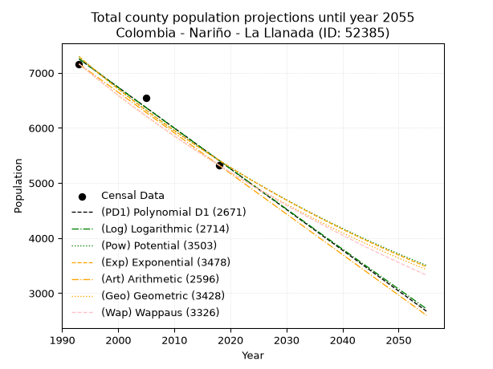
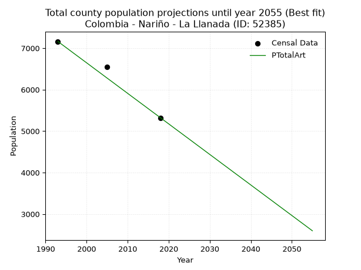
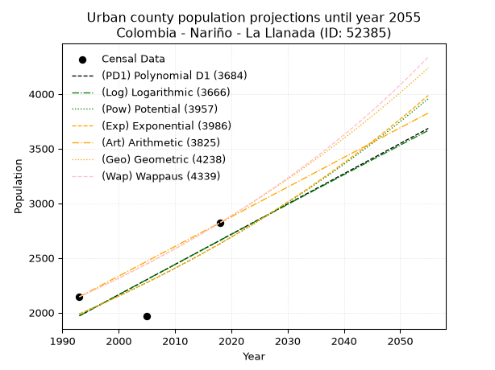
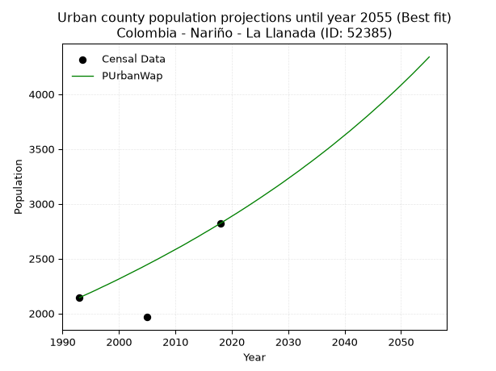
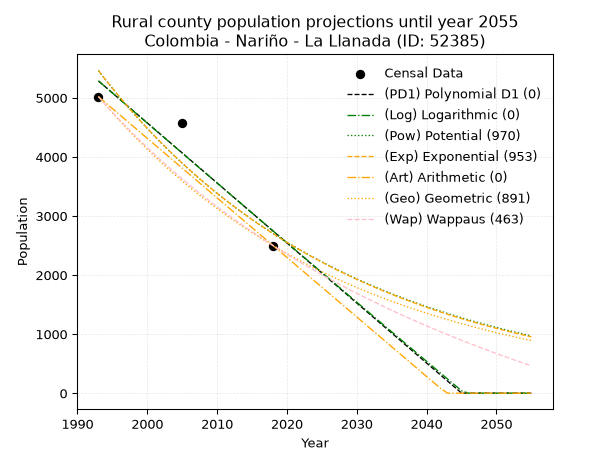
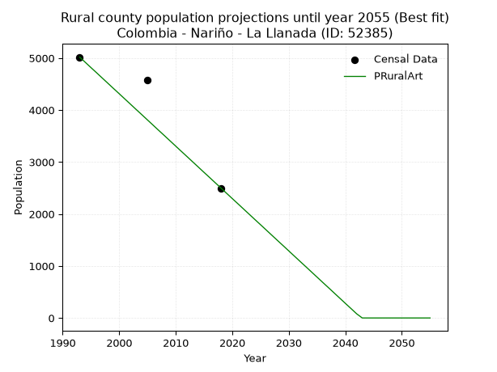

<div align="center">


</div>

# _“Population and Public Services Demand Projections (PPSD) until Year 2050 for Colombia - Nariño - La Llanada (ID: 52385)”_
Keywords: `population` `public-service` `projection` `lineal` `polynomial` `logarithmic` `potential` `exponential` `arithmetic` `geometric` `wappaus` `dane` `colombia` `south-america`

PPSD are analytical estimates used by governments and planners to anticipate future changes in population size, age distribution, and the resulting community needs for utilities, healthcare, education, and infrastructure as sizing future water treatment facilities, electrical grids, and road networks based on spatial growth.

> **General running parameters**: • app_version: _v20260806_. • Python version: _3.14.7_. • Pandas version: _3.0.5_. • NumPy version: _2.5.1_. • Creates, save and include plots into reports (create_plot): _False_. • Projection until year: _2050_. • Process polynomial degree 2 and up: _False_. • Process Wappaus: _True_. • Process Wappaus: _True_. • Set negative values to zero: _True_. • Set infinite values to zero: _True_. • Drop dataset notes: _True_. 
<div align="center">

Dynamic map: [:earth_americas:Google](http://maps.google.com/maps?q=1.4728921,-77.5809103) [:earth_americas:OSM](https://www.openstreetmap.org/#map=18/1.4728921/-77.5809103&layers=P) [:earth_americas:Bing](https://www.bing.com/maps?cp=1.4728921~-77.5809103&lvl=18) [:earth_americas:Apple](https://maps.apple.com/frame?center=1.4728921%2C-77.5809103&span=0.003%2C0.006)

</div>


<div align="center">

```geojson
{
  "type": "Feature",
  "geometry": {
    "type": "Point", 
    "coordinates": [-77.5809103, 1.4728921]
  }, 
  "properties": {
    "Name": "Colombia - Nariño - La Llanada (ID: 52385)"
  }
}
```

</div>


## 0. Census Data (3 records)

Census data are official statistics collected by a government about the people and housing in a country. They usually include counts of total population, age, sex, race, income, education, and jobs.

📅Global census file: [Population.xlsx](../data/Population.xlsx)

| Source   |   Year |   CountryID | CountryName   |   StateID | StateName   |   CountyID | CountyName   |   PTotal |   PUrban |   PRural |
|:---------|-------:|------------:|:--------------|----------:|:------------|-----------:|:-------------|---------:|---------:|---------:|
| DANE     |   1993 |          57 | Colombia      |        52 | Nariño      |      52385 | La Llanada   |     7162 |     2144 |     5018 |
| DANE     |   2005 |          57 | Colombia      |        52 | Nariño      |      52385 | La Llanada   |     6544 |     1966 |     4578 |
| DANE     |   2018 |          57 | Colombia      |        52 | Nariño      |      52385 | La Llanada   |     5321 |     2822 |     2499 |

> 🔥Some records could had specific notes about the registered values or the corresponding urban or rural distribution.

## 1. Total

### 1.1. Coefficients and Parameters

* (PD1) Polynomial Deg 1: -73.92324093816828, 154583.07249467343 (lineal)
* (Log) Logarithmic: -148212.63751523272, 1133284.9216722255
* (Pow) Potential: -23.93949952214144, 82.85151613068238
* (Exp) Exponential: -0.011940963682602238, 157908072391292.03
* (Art) Arithmetic: Year diff. 2018 - 1993 = 25, Population diff. 5321 - 7162 = -1841, Annual growth = -73.64
* (Geo) Geometric: Year diff. 2018 - 1993 = 25, Population diff. 5321 - 7162 = -1841, Annual growth % = -0.011814771570387128
* (Wap) Wappaus: i = -1.179844588640551, Condition values only valid for < 200)

<sub>
Wappaus condition values: ['-0.00', '-1.18', '-2.36', '-3.54', '-4.72', '-5.90', '-7.08', '-8.26', '-9.44', '-10.62', '-11.80', '-12.98', '-14.16', '-15.34', '-16.52', '-17.70', '-18.88', '-20.06', '-21.24', '-22.42', '-23.60', '-24.78', '-25.96', '-27.14', '-28.32', '-29.50', '-30.68', '-31.86', '-33.04', '-34.22', '-35.40', '-36.58', '-37.76', '-38.93', '-40.11', '-41.29', '-42.47', '-43.65', '-44.83', '-46.01', '-47.19', '-48.37', '-49.55', '-50.73', '-51.91', '-53.09', '-54.27', '-55.45', '-56.63', '-57.81', '-58.99', '-60.17', '-61.35', '-62.53', '-63.71', '-64.89', '-66.07', '-67.25']
</sub>


### 1.2. Projected Dataset

|   Year |   CountyID |   PTotalPD1 |   PTotalLog |   PTotalPow |   PTotalExp |   PTotalArt |   PTotalGeo |   PTotalWap |
|-------:|-----------:|------------:|------------:|------------:|------------:|------------:|------------:|------------:|
|   1993 |      52385 |        7254 |        7255 |        7294 |        7293 |        7162 |        7162 |        7162 |
|   1994 |      52385 |        7180 |        7180 |        7207 |        7207 |        7088 |        7077 |        7078 |
|   1995 |      52385 |        7106 |        7106 |        7121 |        7121 |        7015 |        6994 |        6995 |
|   1996 |      52385 |        7032 |        7032 |        7036 |        7037 |        6941 |        6911 |        6913 |
|   1997 |      52385 |        6958 |        6958 |        6952 |        6953 |        6867 |        6829 |        6832 |
|   1998 |      52385 |        6884 |        6883 |        6869 |        6870 |        6794 |        6749 |        6752 |
|   1999 |      52385 |        6811 |        6809 |        6787 |        6789 |        6720 |        6669 |        6672 |
|   2000 |      52385 |        6737 |        6735 |        6707 |        6708 |        6647 |        6590 |        6594 |
|   2001 |      52385 |        6663 |        6661 |        6627 |        6629 |        6573 |        6512 |        6516 |
|   2002 |      52385 |        6589 |        6587 |        6548 |        6550 |        6499 |        6435 |        6440 |
|   2003 |      52385 |        6515 |        6513 |        6470 |        6472 |        6426 |        6359 |        6364 |
|   2004 |      52385 |        6441 |        6439 |        6393 |        6395 |        6352 |        6284 |        6289 |
|   2005 |      52385 |        6367 |        6365 |        6318 |        6320 |        6278 |        6210 |        6215 |
|   2006 |      52385 |        6293 |        6291 |        6243 |        6245 |        6205 |        6137 |        6142 |
|   2007 |      52385 |        6219 |        6217 |        6169 |        6170 |        6131 |        6064 |        6069 |
|   2008 |      52385 |        6145 |        6143 |        6095 |        6097 |        6057 |        5993 |        5998 |
|   2009 |      52385 |        6071 |        6070 |        6023 |        6025 |        5984 |        5922 |        5927 |
|   2010 |      52385 |        5997 |        5996 |        5952 |        5953 |        5910 |        5852 |        5856 |
|   2011 |      52385 |        5923 |        5922 |        5881 |        5883 |        5836 |        5783 |        5787 |
|   2012 |      52385 |        5850 |        5849 |        5812 |        5813 |        5763 |        5714 |        5718 |
|   2013 |      52385 |        5776 |        5775 |        5743 |        5744 |        5689 |        5647 |        5650 |
|   2014 |      52385 |        5702 |        5701 |        5675 |        5676 |        5616 |        5580 |        5583 |
|   2015 |      52385 |        5628 |        5628 |        5608 |        5608 |        5542 |        5514 |        5517 |
|   2016 |      52385 |        5554 |        5554 |        5542 |        5542 |        5468 |        5449 |        5451 |
|   2017 |      52385 |        5480 |        5481 |        5477 |        5476 |        5395 |        5385 |        5386 |
|   2018 |      52385 |        5406 |        5407 |        5412 |        5411 |        5321 |        5321 |        5321 |
|   2019 |      52385 |        5332 |        5334 |        5348 |        5347 |        5247 |        5258 |        5257 |
|   2020 |      52385 |        5258 |        5260 |        5285 |        5283 |        5174 |        5196 |        5194 |
|   2021 |      52385 |        5184 |        5187 |        5223 |        5220 |        5100 |        5135 |        5131 |
|   2022 |      52385 |        5110 |        5114 |        5161 |        5159 |        5026 |        5074 |        5069 |
|   2023 |      52385 |        5036 |        5040 |        5101 |        5097 |        4953 |        5014 |        5008 |
|   2024 |      52385 |        4962 |        4967 |        5041 |        5037 |        4879 |        4955 |        4947 |
|   2025 |      52385 |        4889 |        4894 |        4981 |        4977 |        4806 |        4896 |        4887 |
|   2026 |      52385 |        4815 |        4821 |        4923 |        4918 |        4732 |        4838 |        4828 |
|   2027 |      52385 |        4741 |        4748 |        4865 |        4860 |        4658 |        4781 |        4769 |
|   2028 |      52385 |        4667 |        4675 |        4808 |        4802 |        4585 |        4725 |        4711 |
|   2029 |      52385 |        4593 |        4601 |        4752 |        4745 |        4511 |        4669 |        4653 |
|   2030 |      52385 |        4519 |        4528 |        4696 |        4689 |        4437 |        4614 |        4596 |
|   2031 |      52385 |        4445 |        4455 |        4641 |        4633 |        4364 |        4559 |        4539 |
|   2032 |      52385 |        4371 |        4382 |        4586 |        4578 |        4290 |        4505 |        4483 |
|   2033 |      52385 |        4297 |        4310 |        4533 |        4524 |        4216 |        4452 |        4427 |
|   2034 |      52385 |        4223 |        4237 |        4480 |        4470 |        4143 |        4400 |        4372 |
|   2035 |      52385 |        4149 |        4164 |        4427 |        4417 |        4069 |        4348 |        4318 |
|   2036 |      52385 |        4075 |        4091 |        4376 |        4364 |        3995 |        4296 |        4264 |
|   2037 |      52385 |        4001 |        4018 |        4324 |        4313 |        3922 |        4245 |        4210 |
|   2038 |      52385 |        3928 |        3945 |        4274 |        4261 |        3848 |        4195 |        4157 |
|   2039 |      52385 |        3854 |        3873 |        4224 |        4211 |        3775 |        4146 |        4105 |
|   2040 |      52385 |        3780 |        3800 |        4175 |        4161 |        3701 |        4097 |        4053 |
|   2041 |      52385 |        3706 |        3727 |        4126 |        4111 |        3627 |        4048 |        4001 |
|   2042 |      52385 |        3632 |        3655 |        4078 |        4063 |        3554 |        4000 |        3950 |
|   2043 |      52385 |        3558 |        3582 |        4030 |        4014 |        3480 |        3953 |        3899 |
|   2044 |      52385 |        3484 |        3510 |        3983 |        3967 |        3406 |        3907 |        3849 |
|   2045 |      52385 |        3410 |        3437 |        3937 |        3920 |        3333 |        3860 |        3799 |
|   2046 |      52385 |        3336 |        3365 |        3891 |        3873 |        3259 |        3815 |        3750 |
|   2047 |      52385 |        3262 |        3292 |        3846 |        3827 |        3185 |        3770 |        3701 |
|   2048 |      52385 |        3188 |        3220 |        3801 |        3782 |        3112 |        3725 |        3653 |
|   2049 |      52385 |        3114 |        3148 |        3757 |        3737 |        3038 |        3681 |        3605 |
|   2050 |      52385 |        3040 |        3075 |        3714 |        3692 |        2965 |        3638 |        3558 |
<div align="center">

</img>

</div>


### 1.3. Best fit with absolute and relative error (%)

Relative error puts that difference into context by dividing the absolute error by the true value, creating a unitless ratio or percentage that shows the scale of the mistake.

Absolute and relative error

|   Year | Source   |   CountryID | CountryName   |   StateID | StateName   |   CountyID_x | CountyName   |   PTotal |   PUrban |   PRural |   CountyID_y |   PTotalPD1 |   PTotalLog |   PTotalPow |   PTotalExp |   PTotalArt |   PTotalGeo |   PTotalWap |   PTotalPD1AbsError |   PTotalLogAbsError |   PTotalPowAbsError |   PTotalExpAbsError |   PTotalArtAbsError |   PTotalGeoAbsError |   PTotalWapAbsError |   PTotalPD1RelError |   PTotalLogRelError |   PTotalPowRelError |   PTotalExpRelError |   PTotalArtRelError |   PTotalGeoRelError |   PTotalWapRelError |
|-------:|:---------|------------:|:--------------|----------:|:------------|-------------:|:-------------|---------:|---------:|---------:|-------------:|------------:|------------:|------------:|------------:|------------:|------------:|------------:|--------------------:|--------------------:|--------------------:|--------------------:|--------------------:|--------------------:|--------------------:|--------------------:|--------------------:|--------------------:|--------------------:|--------------------:|--------------------:|--------------------:|
|   1993 | DANE     |          57 | Colombia      |        52 | Nariño      |        52385 | La Llanada   |     7162 |     2144 |     5018 |        52385 |        7254 |        7255 |        7294 |        7293 |        7162 |        7162 |        7162 |                  92 |                  93 |                 132 |                 131 |                   0 |                   0 |                   0 |             1.28456 |             1.29852 |             1.84306 |             1.8291  |             0       |             0       |             0       |
|   2005 | DANE     |          57 | Colombia      |        52 | Nariño      |        52385 | La Llanada   |     6544 |     1966 |     4578 |        52385 |        6367 |        6365 |        6318 |        6320 |        6278 |        6210 |        6215 |                 177 |                 179 |                 226 |                 224 |                 266 |                 334 |                 329 |             2.70477 |             2.73533 |             3.45355 |             3.42298 |             4.06479 |             5.10391 |             5.02751 |
|   2018 | DANE     |          57 | Colombia      |        52 | Nariño      |        52385 | La Llanada   |     5321 |     2822 |     2499 |        52385 |        5406 |        5407 |        5412 |        5411 |        5321 |        5321 |        5321 |                  85 |                  86 |                  91 |                  90 |                   0 |                   0 |                   0 |             1.59744 |             1.61624 |             1.7102  |             1.69141 |             0       |             0       |             0       |

Relative error mean

| Method    |   RelError | Best   |
|:----------|-----------:|:-------|
| PTotalPD1 |    1.86226 |        |
| PTotalLog |    1.88336 |        |
| PTotalPow |    2.3356  |        |
| PTotalExp |    2.3145  |        |
| PTotalArt |    1.35493 | True   |
| PTotalGeo |    1.7013  |        |
| PTotalWap |    1.67584 |        |

💙Best method: _**PTotalArt**_
<div align="center">

</img>

</div>


### 1.4. Fresh water supply demand in liters per capita per day (lpcd)

The fresh water supply demand typically ranges from 100 to 300 liters per capita per day (lpcd) for standard domestic and municipal planning, though absolute survival minimums set by the World Health Organization are as low as 7.5 to 20 liters per day, and total consumption in high-income nations can exceed 400 liters.

> `CZ`: Level in meters above the sea level (masl).<br> `WS`: Fresh water supply demand in liters per capita per day (lpcd or l/h/d).<br> `WSAll`: Zonal fresh water supply demand in liters per second (l/s).<br> `A`: Zonal area in square meters.

Reference values (RAS Colombia)

|    CZ |   WS |
|------:|-----:|
|  1000 |  120 |
|  2000 |  130 |
| 99999 |  140 |

County shapefile geometry properties and water supply values

|   CountyID |      ATotal |   CZTotal |   WSTotal |
|-----------:|------------:|----------:|----------:|
|      52385 | 2.45281e+08 |   1439.46 |       130 |

Projected values for best method: PTotalArt

|   CountyID |   Year |   PTotalArt |   WSTotal |   WSTotalAll |
|-----------:|-------:|------------:|----------:|-------------:|
|      52385 |   1993 |        7162 |       130 |     10.7762  |
|      52385 |   1994 |        7088 |       130 |     10.6648  |
|      52385 |   1995 |        7015 |       130 |     10.555   |
|      52385 |   1996 |        6941 |       130 |     10.4436  |
|      52385 |   1997 |        6867 |       130 |     10.3323  |
|      52385 |   1998 |        6794 |       130 |     10.2225  |
|      52385 |   1999 |        6720 |       130 |     10.1111  |
|      52385 |   2000 |        6647 |       130 |     10.0013  |
|      52385 |   2001 |        6573 |       130 |      9.88993 |
|      52385 |   2002 |        6499 |       130 |      9.77859 |
|      52385 |   2003 |        6426 |       130 |      9.66875 |
|      52385 |   2004 |        6352 |       130 |      9.55741 |
|      52385 |   2005 |        6278 |       130 |      9.44606 |
|      52385 |   2006 |        6205 |       130 |      9.33623 |
|      52385 |   2007 |        6131 |       130 |      9.22488 |
|      52385 |   2008 |        6057 |       130 |      9.11354 |
|      52385 |   2009 |        5984 |       130 |      9.0037  |
|      52385 |   2010 |        5910 |       130 |      8.89236 |
|      52385 |   2011 |        5836 |       130 |      8.78102 |
|      52385 |   2012 |        5763 |       130 |      8.67118 |
|      52385 |   2013 |        5689 |       130 |      8.55984 |
|      52385 |   2014 |        5616 |       130 |      8.45    |
|      52385 |   2015 |        5542 |       130 |      8.33866 |
|      52385 |   2016 |        5468 |       130 |      8.22731 |
|      52385 |   2017 |        5395 |       130 |      8.11748 |
|      52385 |   2018 |        5321 |       130 |      8.00613 |
|      52385 |   2019 |        5247 |       130 |      7.89479 |
|      52385 |   2020 |        5174 |       130 |      7.78495 |
|      52385 |   2021 |        5100 |       130 |      7.67361 |
|      52385 |   2022 |        5026 |       130 |      7.56227 |
|      52385 |   2023 |        4953 |       130 |      7.45243 |
|      52385 |   2024 |        4879 |       130 |      7.34109 |
|      52385 |   2025 |        4806 |       130 |      7.23125 |
|      52385 |   2026 |        4732 |       130 |      7.11991 |
|      52385 |   2027 |        4658 |       130 |      7.00856 |
|      52385 |   2028 |        4585 |       130 |      6.89873 |
|      52385 |   2029 |        4511 |       130 |      6.78738 |
|      52385 |   2030 |        4437 |       130 |      6.67604 |
|      52385 |   2031 |        4364 |       130 |      6.5662  |
|      52385 |   2032 |        4290 |       130 |      6.45486 |
|      52385 |   2033 |        4216 |       130 |      6.34352 |
|      52385 |   2034 |        4143 |       130 |      6.23368 |
|      52385 |   2035 |        4069 |       130 |      6.12234 |
|      52385 |   2036 |        3995 |       130 |      6.011   |
|      52385 |   2037 |        3922 |       130 |      5.90116 |
|      52385 |   2038 |        3848 |       130 |      5.78981 |
|      52385 |   2039 |        3775 |       130 |      5.67998 |
|      52385 |   2040 |        3701 |       130 |      5.56863 |
|      52385 |   2041 |        3627 |       130 |      5.45729 |
|      52385 |   2042 |        3554 |       130 |      5.34745 |
|      52385 |   2043 |        3480 |       130 |      5.23611 |
|      52385 |   2044 |        3406 |       130 |      5.12477 |
|      52385 |   2045 |        3333 |       130 |      5.01493 |
|      52385 |   2046 |        3259 |       130 |      4.90359 |
|      52385 |   2047 |        3185 |       130 |      4.79225 |
|      52385 |   2048 |        3112 |       130 |      4.68241 |
|      52385 |   2049 |        3038 |       130 |      4.57106 |
|      52385 |   2050 |        2965 |       130 |      4.46123 |

## 2. Urban

### 2.1. Coefficients and Parameters

* (PD1) Polynomial Deg 1: 27.656716417911188, -53150.26865671789 (lineal)
* (Log) Logarithmic: 55383.24474045347, -418798.7489997155
* (Pow) Potential: 22.473790293814943, -70.85406698800942
* (Exp) Exponential: 0.011223914083072795, 3.832568716227178e-07
* (Art) Arithmetic: Year diff. 2018 - 1993 = 25, Population diff. 2822 - 2144 = 678, Annual growth = 27.12
* (Geo) Geometric: Year diff. 2018 - 1993 = 25, Population diff. 2822 - 2144 = 678, Annual growth % = 0.011051526291615765
* (Wap) Wappaus: i = 1.0922271445831655, Condition values only valid for < 200)

<sub>
Wappaus condition values: ['0.00', '1.09', '2.18', '3.28', '4.37', '5.46', '6.55', '7.65', '8.74', '9.83', '10.92', '12.01', '13.11', '14.20', '15.29', '16.38', '17.48', '18.57', '19.66', '20.75', '21.84', '22.94', '24.03', '25.12', '26.21', '27.31', '28.40', '29.49', '30.58', '31.67', '32.77', '33.86', '34.95', '36.04', '37.14', '38.23', '39.32', '40.41', '41.50', '42.60', '43.69', '44.78', '45.87', '46.97', '48.06', '49.15', '50.24', '51.33', '52.43', '53.52', '54.61', '55.70', '56.80', '57.89', '58.98', '60.07', '61.16', '62.26']
</sub>


### 2.2. Projected Dataset

|   Year |   CountyID |   PUrbanPD1 |   PUrbanLog |   PUrbanPow |   PUrbanExp |   PUrbanArt |   PUrbanGeo |   PUrbanWap |
|-------:|-----------:|------------:|------------:|------------:|------------:|------------:|------------:|------------:|
|   1993 |      52385 |        1970 |        1970 |        1988 |        1988 |        2144 |        2144 |        2144 |
|   1994 |      52385 |        1997 |        1997 |        2010 |        2010 |        2171 |        2168 |        2168 |
|   1995 |      52385 |        2025 |        2025 |        2033 |        2033 |        2198 |        2192 |        2191 |
|   1996 |      52385 |        2053 |        2053 |        2056 |        2056 |        2225 |        2216 |        2215 |
|   1997 |      52385 |        2080 |        2081 |        2079 |        2079 |        2252 |        2240 |        2240 |
|   1998 |      52385 |        2108 |        2108 |        2103 |        2102 |        2280 |        2265 |        2264 |
|   1999 |      52385 |        2136 |        2136 |        2127 |        2126 |        2307 |        2290 |        2289 |
|   2000 |      52385 |        2163 |        2164 |        2151 |        2150 |        2334 |        2315 |        2314 |
|   2001 |      52385 |        2191 |        2192 |        2175 |        2174 |        2361 |        2341 |        2340 |
|   2002 |      52385 |        2218 |        2219 |        2200 |        2199 |        2388 |        2367 |        2366 |
|   2003 |      52385 |        2246 |        2247 |        2224 |        2224 |        2415 |        2393 |        2392 |
|   2004 |      52385 |        2274 |        2275 |        2250 |        2249 |        2442 |        2420 |        2418 |
|   2005 |      52385 |        2301 |        2302 |        2275 |        2274 |        2469 |        2446 |        2445 |
|   2006 |      52385 |        2329 |        2330 |        2301 |        2300 |        2497 |        2473 |        2472 |
|   2007 |      52385 |        2357 |        2357 |        2326 |        2326 |        2524 |        2501 |        2499 |
|   2008 |      52385 |        2384 |        2385 |        2353 |        2352 |        2551 |        2528 |        2527 |
|   2009 |      52385 |        2412 |        2413 |        2379 |        2379 |        2578 |        2556 |        2555 |
|   2010 |      52385 |        2440 |        2440 |        2406 |        2405 |        2605 |        2584 |        2583 |
|   2011 |      52385 |        2467 |        2468 |        2433 |        2433 |        2632 |        2613 |        2611 |
|   2012 |      52385 |        2495 |        2495 |        2460 |        2460 |        2659 |        2642 |        2640 |
|   2013 |      52385 |        2523 |        2523 |        2488 |        2488 |        2686 |        2671 |        2670 |
|   2014 |      52385 |        2550 |        2550 |        2516 |        2516 |        2714 |        2701 |        2699 |
|   2015 |      52385 |        2578 |        2578 |        2544 |        2544 |        2741 |        2730 |        2730 |
|   2016 |      52385 |        2606 |        2605 |        2573 |        2573 |        2768 |        2761 |        2760 |
|   2017 |      52385 |        2633 |        2633 |        2601 |        2602 |        2795 |        2791 |        2791 |
|   2018 |      52385 |        2661 |        2660 |        2630 |        2631 |        2822 |        2822 |        2822 |
|   2019 |      52385 |        2689 |        2688 |        2660 |        2661 |        2849 |        2853 |        2854 |
|   2020 |      52385 |        2716 |        2715 |        2690 |        2691 |        2876 |        2885 |        2886 |
|   2021 |      52385 |        2744 |        2742 |        2720 |        2722 |        2903 |        2917 |        2918 |
|   2022 |      52385 |        2772 |        2770 |        2750 |        2752 |        2930 |        2949 |        2951 |
|   2023 |      52385 |        2799 |        2797 |        2781 |        2783 |        2958 |        2981 |        2984 |
|   2024 |      52385 |        2827 |        2825 |        2812 |        2815 |        2985 |        3014 |        3018 |
|   2025 |      52385 |        2855 |        2852 |        2843 |        2847 |        3012 |        3048 |        3052 |
|   2026 |      52385 |        2882 |        2879 |        2875 |        2879 |        3039 |        3081 |        3087 |
|   2027 |      52385 |        2910 |        2907 |        2907 |        2911 |        3066 |        3115 |        3122 |
|   2028 |      52385 |        2938 |        2934 |        2940 |        2944 |        3093 |        3150 |        3157 |
|   2029 |      52385 |        2965 |        2961 |        2972 |        2977 |        3120 |        3185 |        3193 |
|   2030 |      52385 |        2993 |        2988 |        3005 |        3011 |        3147 |        3220 |        3230 |
|   2031 |      52385 |        3021 |        3016 |        3039 |        3045 |        3175 |        3255 |        3267 |
|   2032 |      52385 |        3048 |        3043 |        3073 |        3079 |        3202 |        3291 |        3304 |
|   2033 |      52385 |        3076 |        3070 |        3107 |        3114 |        3229 |        3328 |        3343 |
|   2034 |      52385 |        3103 |        3097 |        3141 |        3149 |        3256 |        3365 |        3381 |
|   2035 |      52385 |        3131 |        3125 |        3176 |        3185 |        3283 |        3402 |        3420 |
|   2036 |      52385 |        3159 |        3152 |        3212 |        3221 |        3310 |        3439 |        3460 |
|   2037 |      52385 |        3186 |        3179 |        3247 |        3257 |        3337 |        3477 |        3500 |
|   2038 |      52385 |        3214 |        3206 |        3283 |        3294 |        3364 |        3516 |        3541 |
|   2039 |      52385 |        3242 |        3233 |        3320 |        3331 |        3392 |        3555 |        3583 |
|   2040 |      52385 |        3269 |        3261 |        3356 |        3369 |        3419 |        3594 |        3625 |
|   2041 |      52385 |        3297 |        3288 |        3394 |        3407 |        3446 |        3634 |        3667 |
|   2042 |      52385 |        3325 |        3315 |        3431 |        3445 |        3473 |        3674 |        3711 |
|   2043 |      52385 |        3352 |        3342 |        3469 |        3484 |        3500 |        3714 |        3755 |
|   2044 |      52385 |        3380 |        3369 |        3507 |        3523 |        3527 |        3755 |        3799 |
|   2045 |      52385 |        3408 |        3396 |        3546 |        3563 |        3554 |        3797 |        3845 |
|   2046 |      52385 |        3435 |        3423 |        3585 |        3603 |        3581 |        3839 |        3891 |
|   2047 |      52385 |        3463 |        3450 |        3625 |        3644 |        3608 |        3881 |        3937 |
|   2048 |      52385 |        3491 |        3477 |        3665 |        3685 |        3636 |        3924 |        3985 |
|   2049 |      52385 |        3518 |        3504 |        3705 |        3727 |        3663 |        3968 |        4033 |
|   2050 |      52385 |        3546 |        3531 |        3746 |        3769 |        3690 |        4011 |        4082 |
<div align="center">

</img>

</div>


### 2.3. Best fit with absolute and relative error (%)

Relative error puts that difference into context by dividing the absolute error by the true value, creating a unitless ratio or percentage that shows the scale of the mistake.

Absolute and relative error

|   Year | Source   |   CountryID | CountryName   |   StateID | StateName   |   CountyID_x | CountyName   |   PTotal |   PUrban |   PRural |   CountyID_y |   PUrbanPD1 |   PUrbanLog |   PUrbanPow |   PUrbanExp |   PUrbanArt |   PUrbanGeo |   PUrbanWap |   PUrbanPD1AbsError |   PUrbanLogAbsError |   PUrbanPowAbsError |   PUrbanExpAbsError |   PUrbanArtAbsError |   PUrbanGeoAbsError |   PUrbanWapAbsError |   PUrbanPD1RelError |   PUrbanLogRelError |   PUrbanPowRelError |   PUrbanExpRelError |   PUrbanArtRelError |   PUrbanGeoRelError |   PUrbanWapRelError |
|-------:|:---------|------------:|:--------------|----------:|:------------|-------------:|:-------------|---------:|---------:|---------:|-------------:|------------:|------------:|------------:|------------:|------------:|------------:|------------:|--------------------:|--------------------:|--------------------:|--------------------:|--------------------:|--------------------:|--------------------:|--------------------:|--------------------:|--------------------:|--------------------:|--------------------:|--------------------:|--------------------:|
|   1993 | DANE     |          57 | Colombia      |        52 | Nariño      |        52385 | La Llanada   |     7162 |     2144 |     5018 |        52385 |        1970 |        1970 |        1988 |        1988 |        2144 |        2144 |        2144 |                 174 |                 174 |                 156 |                 156 |                   0 |                   0 |                   0 |             8.11567 |             8.11567 |             7.27612 |             7.27612 |              0      |              0      |              0      |
|   2005 | DANE     |          57 | Colombia      |        52 | Nariño      |        52385 | La Llanada   |     6544 |     1966 |     4578 |        52385 |        2301 |        2302 |        2275 |        2274 |        2469 |        2446 |        2445 |                 335 |                 336 |                 309 |                 308 |                 503 |                 480 |                 479 |            17.0397  |            17.0905  |            15.7172  |            15.6663  |             25.5849 |             24.4151 |             24.3642 |
|   2018 | DANE     |          57 | Colombia      |        52 | Nariño      |        52385 | La Llanada   |     5321 |     2822 |     2499 |        52385 |        2661 |        2660 |        2630 |        2631 |        2822 |        2822 |        2822 |                 161 |                 162 |                 192 |                 191 |                   0 |                   0 |                   0 |             5.70517 |             5.74061 |             6.80369 |             6.76825 |              0      |              0      |              0      |

Relative error mean

| Method    |   RelError | Best   |
|:----------|-----------:|:-------|
| PUrbanPD1 |   10.2868  |        |
| PUrbanLog |   10.3156  |        |
| PUrbanPow |    9.93233 |        |
| PUrbanExp |    9.90357 |        |
| PUrbanArt |    8.52831 |        |
| PUrbanGeo |    8.13835 |        |
| PUrbanWap |    8.1214  | True   |

💙Best method: _**PUrbanWap**_
<div align="center">

</img>

</div>


### 2.4. Fresh water supply demand in liters per capita per day (lpcd)

The fresh water supply demand typically ranges from 100 to 300 liters per capita per day (lpcd) for standard domestic and municipal planning, though absolute survival minimums set by the World Health Organization are as low as 7.5 to 20 liters per day, and total consumption in high-income nations can exceed 400 liters.

> `CZ`: Level in meters above the sea level (masl).<br> `WS`: Fresh water supply demand in liters per capita per day (lpcd or l/h/d).<br> `WSAll`: Zonal fresh water supply demand in liters per second (l/s).<br> `A`: Zonal area in square meters.

Reference values (RAS Colombia)

|    CZ |   WS |
|------:|-----:|
|  1000 |  120 |
|  2000 |  130 |
| 99999 |  140 |

County shapefile geometry properties and water supply values

|   CountyID |   AUrban |   CZUrban |   WSUrban |
|-----------:|---------:|----------:|----------:|
|      52385 |   430967 |   2295.89 |       140 |

Projected values for best method: PUrbanWap

|   CountyID |   Year |   PUrbanWap |   WSUrban |   WSUrbanAll |
|-----------:|-------:|------------:|----------:|-------------:|
|      52385 |   1993 |        2144 |       140 |      3.47407 |
|      52385 |   1994 |        2168 |       140 |      3.51296 |
|      52385 |   1995 |        2191 |       140 |      3.55023 |
|      52385 |   1996 |        2215 |       140 |      3.58912 |
|      52385 |   1997 |        2240 |       140 |      3.62963 |
|      52385 |   1998 |        2264 |       140 |      3.66852 |
|      52385 |   1999 |        2289 |       140 |      3.70903 |
|      52385 |   2000 |        2314 |       140 |      3.74954 |
|      52385 |   2001 |        2340 |       140 |      3.79167 |
|      52385 |   2002 |        2366 |       140 |      3.8338  |
|      52385 |   2003 |        2392 |       140 |      3.87593 |
|      52385 |   2004 |        2418 |       140 |      3.91806 |
|      52385 |   2005 |        2445 |       140 |      3.96181 |
|      52385 |   2006 |        2472 |       140 |      4.00556 |
|      52385 |   2007 |        2499 |       140 |      4.04931 |
|      52385 |   2008 |        2527 |       140 |      4.09468 |
|      52385 |   2009 |        2555 |       140 |      4.14005 |
|      52385 |   2010 |        2583 |       140 |      4.18542 |
|      52385 |   2011 |        2611 |       140 |      4.23079 |
|      52385 |   2012 |        2640 |       140 |      4.27778 |
|      52385 |   2013 |        2670 |       140 |      4.32639 |
|      52385 |   2014 |        2699 |       140 |      4.37338 |
|      52385 |   2015 |        2730 |       140 |      4.42361 |
|      52385 |   2016 |        2760 |       140 |      4.47222 |
|      52385 |   2017 |        2791 |       140 |      4.52245 |
|      52385 |   2018 |        2822 |       140 |      4.57269 |
|      52385 |   2019 |        2854 |       140 |      4.62454 |
|      52385 |   2020 |        2886 |       140 |      4.67639 |
|      52385 |   2021 |        2918 |       140 |      4.72824 |
|      52385 |   2022 |        2951 |       140 |      4.78171 |
|      52385 |   2023 |        2984 |       140 |      4.83519 |
|      52385 |   2024 |        3018 |       140 |      4.89028 |
|      52385 |   2025 |        3052 |       140 |      4.94537 |
|      52385 |   2026 |        3087 |       140 |      5.00208 |
|      52385 |   2027 |        3122 |       140 |      5.0588  |
|      52385 |   2028 |        3157 |       140 |      5.11551 |
|      52385 |   2029 |        3193 |       140 |      5.17384 |
|      52385 |   2030 |        3230 |       140 |      5.2338  |
|      52385 |   2031 |        3267 |       140 |      5.29375 |
|      52385 |   2032 |        3304 |       140 |      5.3537  |
|      52385 |   2033 |        3343 |       140 |      5.4169  |
|      52385 |   2034 |        3381 |       140 |      5.47847 |
|      52385 |   2035 |        3420 |       140 |      5.54167 |
|      52385 |   2036 |        3460 |       140 |      5.60648 |
|      52385 |   2037 |        3500 |       140 |      5.6713  |
|      52385 |   2038 |        3541 |       140 |      5.73773 |
|      52385 |   2039 |        3583 |       140 |      5.80579 |
|      52385 |   2040 |        3625 |       140 |      5.87384 |
|      52385 |   2041 |        3667 |       140 |      5.9419  |
|      52385 |   2042 |        3711 |       140 |      6.01319 |
|      52385 |   2043 |        3755 |       140 |      6.08449 |
|      52385 |   2044 |        3799 |       140 |      6.15579 |
|      52385 |   2045 |        3845 |       140 |      6.23032 |
|      52385 |   2046 |        3891 |       140 |      6.30486 |
|      52385 |   2047 |        3937 |       140 |      6.3794  |
|      52385 |   2048 |        3985 |       140 |      6.45718 |
|      52385 |   2049 |        4033 |       140 |      6.53495 |
|      52385 |   2050 |        4082 |       140 |      6.61435 |

## 3. Rural

### 3.1. Coefficients and Parameters

* (PD1) Polynomial Deg 1: -101.57995735607943, 207733.3411513912 (lineal)
* (Log) Logarithmic: -203595.8822556861, 1552083.6706719408
* (Pow) Potential: -56.404929984630044, 189.84560928120567
* (Exp) Exponential: -0.02814454267064044, 1.2518515363405358e+28
* (Art) Arithmetic: Year diff. 2018 - 1993 = 25, Population diff. 2499 - 5018 = -2519, Annual growth = -100.76
* (Geo) Geometric: Year diff. 2018 - 1993 = 25, Population diff. 2499 - 5018 = -2519, Annual growth % = -0.027500416574293363
* (Wap) Wappaus: i = -2.680856724757217, Condition values only valid for < 200)

<sub>
Wappaus condition values: ['-0.00', '-2.68', '-5.36', '-8.04', '-10.72', '-13.40', '-16.09', '-18.77', '-21.45', '-24.13', '-26.81', '-29.49', '-32.17', '-34.85', '-37.53', '-40.21', '-42.89', '-45.57', '-48.26', '-50.94', '-53.62', '-56.30', '-58.98', '-61.66', '-64.34', '-67.02', '-69.70', '-72.38', '-75.06', '-77.74', '-80.43', '-83.11', '-85.79', '-88.47', '-91.15', '-93.83', '-96.51', '-99.19', '-101.87', '-104.55', '-107.23', '-109.92', '-112.60', '-115.28', '-117.96', '-120.64', '-123.32', '-126.00', '-128.68', '-131.36', '-134.04', '-136.72', '-139.40', '-142.09', '-144.77', '-147.45', '-150.13', '-152.81']
</sub>


### 3.2. Projected Dataset

|   Year |   CountyID |   PRuralPD1 |   PRuralLog |   PRuralPow |   PRuralExp |   PRuralArt |   PRuralGeo |   PRuralWap |
|-------:|-----------:|------------:|------------:|------------:|------------:|------------:|------------:|------------:|
|   1993 |      52385 |        5284 |        5285 |        5459 |        5459 |        5018 |        5018 |        5018 |
|   1994 |      52385 |        5183 |        5183 |        5307 |        5307 |        4917 |        4880 |        4885 |
|   1995 |      52385 |        5081 |        5081 |        5159 |        5160 |        4816 |        4746 |        4756 |
|   1996 |      52385 |        4980 |        4979 |        5015 |        5017 |        4716 |        4615 |        4630 |
|   1997 |      52385 |        4878 |        4877 |        4875 |        4877 |        4615 |        4488 |        4507 |
|   1998 |      52385 |        4777 |        4775 |        4740 |        4742 |        4514 |        4365 |        4388 |
|   1999 |      52385 |        4675 |        4673 |        4608 |        4610 |        4413 |        4245 |        4271 |
|   2000 |      52385 |        4573 |        4571 |        4480 |        4482 |        4313 |        4128 |        4157 |
|   2001 |      52385 |        4472 |        4469 |        4355 |        4358 |        4212 |        4015 |        4046 |
|   2002 |      52385 |        4370 |        4368 |        4234 |        4237 |        4111 |        3904 |        3938 |
|   2003 |      52385 |        4269 |        4266 |        4116 |        4120 |        4010 |        3797 |        3832 |
|   2004 |      52385 |        4167 |        4164 |        4002 |        4005 |        3910 |        3692 |        3728 |
|   2005 |      52385 |        4066 |        4063 |        3891 |        3894 |        3809 |        3591 |        3627 |
|   2006 |      52385 |        3964 |        3961 |        3783 |        3786 |        3708 |        3492 |        3529 |
|   2007 |      52385 |        3862 |        3860 |        3678 |        3681 |        3607 |        3396 |        3432 |
|   2008 |      52385 |        3761 |        3758 |        3576 |        3579 |        3507 |        3303 |        3338 |
|   2009 |      52385 |        3659 |        3657 |        3477 |        3479 |        3406 |        3212 |        3246 |
|   2010 |      52385 |        3558 |        3556 |        3381 |        3383 |        3305 |        3124 |        3155 |
|   2011 |      52385 |        3456 |        3455 |        3288 |        3289 |        3204 |        3038 |        3067 |
|   2012 |      52385 |        3354 |        3353 |        3197 |        3198 |        3104 |        2954 |        2981 |
|   2013 |      52385 |        3253 |        3252 |        3108 |        3109 |        3003 |        2873 |        2896 |
|   2014 |      52385 |        3151 |        3151 |        3023 |        3023 |        2902 |        2794 |        2814 |
|   2015 |      52385 |        3050 |        3050 |        2939 |        2939 |        2801 |        2717 |        2732 |
|   2016 |      52385 |        2948 |        2949 |        2858 |        2857 |        2701 |        2642 |        2653 |
|   2017 |      52385 |        2847 |        2848 |        2779 |        2778 |        2600 |        2570 |        2575 |
|   2018 |      52385 |        2745 |        2747 |        2702 |        2701 |        2499 |        2499 |        2499 |
|   2019 |      52385 |        2643 |        2646 |        2628 |        2626 |        2398 |        2430 |        2424 |
|   2020 |      52385 |        2542 |        2545 |        2556 |        2553 |        2297 |        2363 |        2351 |
|   2021 |      52385 |        2440 |        2445 |        2485 |        2482 |        2197 |        2298 |        2279 |
|   2022 |      52385 |        2339 |        2344 |        2417 |        2413 |        2096 |        2235 |        2209 |
|   2023 |      52385 |        2237 |        2243 |        2350 |        2346 |        1995 |        2174 |        2140 |
|   2024 |      52385 |        2136 |        2143 |        2286 |        2281 |        1894 |        2114 |        2072 |
|   2025 |      52385 |        2034 |        2042 |        2223 |        2218 |        1794 |        2056 |        2005 |
|   2026 |      52385 |        1932 |        1942 |        2162 |        2156 |        1693 |        1999 |        1940 |
|   2027 |      52385 |        1831 |        1841 |        2103 |        2096 |        1592 |        1944 |        1876 |
|   2028 |      52385 |        1729 |        1741 |        2045 |        2038 |        1491 |        1891 |        1813 |
|   2029 |      52385 |        1628 |        1640 |        1989 |        1982 |        1391 |        1839 |        1751 |
|   2030 |      52385 |        1526 |        1540 |        1934 |        1927 |        1290 |        1788 |        1691 |
|   2031 |      52385 |        1424 |        1440 |        1881 |        1873 |        1189 |        1739 |        1631 |
|   2032 |      52385 |        1323 |        1339 |        1830 |        1821 |        1088 |        1691 |        1573 |
|   2033 |      52385 |        1221 |        1239 |        1780 |        1771 |         988 |        1645 |        1515 |
|   2034 |      52385 |        1120 |        1139 |        1731 |        1722 |         887 |        1600 |        1459 |
|   2035 |      52385 |        1018 |        1039 |        1684 |        1674 |         786 |        1556 |        1403 |
|   2036 |      52385 |         917 |         939 |        1638 |        1627 |         685 |        1513 |        1348 |
|   2037 |      52385 |         815 |         839 |        1593 |        1582 |         585 |        1471 |        1295 |
|   2038 |      52385 |         713 |         739 |        1549 |        1538 |         484 |        1431 |        1242 |
|   2039 |      52385 |         612 |         639 |        1507 |        1496 |         383 |        1391 |        1190 |
|   2040 |      52385 |         510 |         539 |        1466 |        1454 |         282 |        1353 |        1139 |
|   2041 |      52385 |         409 |         440 |        1426 |        1414 |         182 |        1316 |        1089 |
|   2042 |      52385 |         307 |         340 |        1387 |        1375 |          81 |        1280 |        1039 |
|   2043 |      52385 |         205 |         240 |        1349 |        1336 |           0 |        1245 |         991 |
|   2044 |      52385 |         104 |         141 |        1313 |        1299 |           0 |        1210 |         943 |
|   2045 |      52385 |           2 |          41 |        1277 |        1263 |           0 |        1177 |         896 |
|   2046 |      52385 |           0 |           0 |        1242 |        1228 |           0 |        1145 |         850 |
|   2047 |      52385 |           0 |           0 |        1208 |        1194 |           0 |        1113 |         804 |
|   2048 |      52385 |           0 |           0 |        1176 |        1161 |           0 |        1083 |         759 |
|   2049 |      52385 |           0 |           0 |        1144 |        1129 |           0 |        1053 |         715 |
|   2050 |      52385 |           0 |           0 |        1113 |        1097 |           0 |        1024 |         671 |
<div align="center">

</img>

</div>


### 3.3. Best fit with absolute and relative error (%)

Relative error puts that difference into context by dividing the absolute error by the true value, creating a unitless ratio or percentage that shows the scale of the mistake.

Absolute and relative error

|   Year | Source   |   CountryID | CountryName   |   StateID | StateName   |   CountyID_x | CountyName   |   PTotal |   PUrban |   PRural |   CountyID_y |   PRuralPD1 |   PRuralLog |   PRuralPow |   PRuralExp |   PRuralArt |   PRuralGeo |   PRuralWap |   PRuralPD1AbsError |   PRuralLogAbsError |   PRuralPowAbsError |   PRuralExpAbsError |   PRuralArtAbsError |   PRuralGeoAbsError |   PRuralWapAbsError |   PRuralPD1RelError |   PRuralLogRelError |   PRuralPowRelError |   PRuralExpRelError |   PRuralArtRelError |   PRuralGeoRelError |   PRuralWapRelError |
|-------:|:---------|------------:|:--------------|----------:|:------------|-------------:|:-------------|---------:|---------:|---------:|-------------:|------------:|------------:|------------:|------------:|------------:|------------:|------------:|--------------------:|--------------------:|--------------------:|--------------------:|--------------------:|--------------------:|--------------------:|--------------------:|--------------------:|--------------------:|--------------------:|--------------------:|--------------------:|--------------------:|
|   1993 | DANE     |          57 | Colombia      |        52 | Nariño      |        52385 | La Llanada   |     7162 |     2144 |     5018 |        52385 |        5284 |        5285 |        5459 |        5459 |        5018 |        5018 |        5018 |                 266 |                 267 |                 441 |                 441 |                   0 |                   0 |                   0 |             5.30092 |             5.32084 |             8.78836 |             8.78836 |              0      |              0      |              0      |
|   2005 | DANE     |          57 | Colombia      |        52 | Nariño      |        52385 | La Llanada   |     6544 |     1966 |     4578 |        52385 |        4066 |        4063 |        3891 |        3894 |        3809 |        3591 |        3627 |                 512 |                 515 |                 687 |                 684 |                 769 |                 987 |                 951 |            11.1839  |            11.2495  |            15.0066  |            14.941   |             16.7977 |             21.5596 |             20.7733 |
|   2018 | DANE     |          57 | Colombia      |        52 | Nariño      |        52385 | La Llanada   |     5321 |     2822 |     2499 |        52385 |        2745 |        2747 |        2702 |        2701 |        2499 |        2499 |        2499 |                 246 |                 248 |                 203 |                 202 |                   0 |                   0 |                   0 |             9.84394 |             9.92397 |             8.12325 |             8.08323 |              0      |              0      |              0      |

Relative error mean

| Method    |   RelError | Best   |
|:----------|-----------:|:-------|
| PRuralPD1 |    8.77626 |        |
| PRuralLog |    8.83142 |        |
| PRuralPow |   10.6394  |        |
| PRuralExp |   10.6042  |        |
| PRuralArt |    5.59924 | True   |
| PRuralGeo |    7.18654 |        |
| PRuralWap |    6.92442 |        |

💙Best method: _**PRuralArt**_
<div align="center">

</img>

</div>


### 3.4. Fresh water supply demand in liters per capita per day (lpcd)

The fresh water supply demand typically ranges from 100 to 300 liters per capita per day (lpcd) for standard domestic and municipal planning, though absolute survival minimums set by the World Health Organization are as low as 7.5 to 20 liters per day, and total consumption in high-income nations can exceed 400 liters.

> `CZ`: Level in meters above the sea level (masl).<br> `WS`: Fresh water supply demand in liters per capita per day (lpcd or l/h/d).<br> `WSAll`: Zonal fresh water supply demand in liters per second (l/s).<br> `A`: Zonal area in square meters.

Reference values (RAS Colombia)

|    CZ |   WS |
|------:|-----:|
|  1000 |  120 |
|  2000 |  130 |
| 99999 |  140 |

County shapefile geometry properties and water supply values

|   CountyID |     ARural |   CZRural |   WSRural |
|-----------:|-----------:|----------:|----------:|
|      52385 | 2.4485e+08 |   1437.96 |       130 |

Projected values for best method: PRuralArt

|   CountyID |   Year |   PRuralArt |   WSRural |   WSRuralAll |
|-----------:|-------:|------------:|----------:|-------------:|
|      52385 |   1993 |        5018 |       130 |     7.55023  |
|      52385 |   1994 |        4917 |       130 |     7.39826  |
|      52385 |   1995 |        4816 |       130 |     7.2463   |
|      52385 |   1996 |        4716 |       130 |     7.09583  |
|      52385 |   1997 |        4615 |       130 |     6.94387  |
|      52385 |   1998 |        4514 |       130 |     6.7919   |
|      52385 |   1999 |        4413 |       130 |     6.63993  |
|      52385 |   2000 |        4313 |       130 |     6.48947  |
|      52385 |   2001 |        4212 |       130 |     6.3375   |
|      52385 |   2002 |        4111 |       130 |     6.18553  |
|      52385 |   2003 |        4010 |       130 |     6.03356  |
|      52385 |   2004 |        3910 |       130 |     5.8831   |
|      52385 |   2005 |        3809 |       130 |     5.73113  |
|      52385 |   2006 |        3708 |       130 |     5.57917  |
|      52385 |   2007 |        3607 |       130 |     5.4272   |
|      52385 |   2008 |        3507 |       130 |     5.27674  |
|      52385 |   2009 |        3406 |       130 |     5.12477  |
|      52385 |   2010 |        3305 |       130 |     4.9728   |
|      52385 |   2011 |        3204 |       130 |     4.82083  |
|      52385 |   2012 |        3104 |       130 |     4.67037  |
|      52385 |   2013 |        3003 |       130 |     4.5184   |
|      52385 |   2014 |        2902 |       130 |     4.36644  |
|      52385 |   2015 |        2801 |       130 |     4.21447  |
|      52385 |   2016 |        2701 |       130 |     4.064    |
|      52385 |   2017 |        2600 |       130 |     3.91204  |
|      52385 |   2018 |        2499 |       130 |     3.76007  |
|      52385 |   2019 |        2398 |       130 |     3.6081   |
|      52385 |   2020 |        2297 |       130 |     3.45613  |
|      52385 |   2021 |        2197 |       130 |     3.30567  |
|      52385 |   2022 |        2096 |       130 |     3.1537   |
|      52385 |   2023 |        1995 |       130 |     3.00174  |
|      52385 |   2024 |        1894 |       130 |     2.84977  |
|      52385 |   2025 |        1794 |       130 |     2.69931  |
|      52385 |   2026 |        1693 |       130 |     2.54734  |
|      52385 |   2027 |        1592 |       130 |     2.39537  |
|      52385 |   2028 |        1491 |       130 |     2.2434   |
|      52385 |   2029 |        1391 |       130 |     2.09294  |
|      52385 |   2030 |        1290 |       130 |     1.94097  |
|      52385 |   2031 |        1189 |       130 |     1.789    |
|      52385 |   2032 |        1088 |       130 |     1.63704  |
|      52385 |   2033 |         988 |       130 |     1.48657  |
|      52385 |   2034 |         887 |       130 |     1.33461  |
|      52385 |   2035 |         786 |       130 |     1.18264  |
|      52385 |   2036 |         685 |       130 |     1.03067  |
|      52385 |   2037 |         585 |       130 |     0.880208 |
|      52385 |   2038 |         484 |       130 |     0.728241 |
|      52385 |   2039 |         383 |       130 |     0.576273 |
|      52385 |   2040 |         282 |       130 |     0.424306 |
|      52385 |   2041 |         182 |       130 |     0.273843 |
|      52385 |   2042 |          81 |       130 |     0.121875 |
|      52385 |   2043 |           0 |       130 |     0        |
|      52385 |   2044 |           0 |       130 |     0        |
|      52385 |   2045 |           0 |       130 |     0        |
|      52385 |   2046 |           0 |       130 |     0        |
|      52385 |   2047 |           0 |       130 |     0        |
|      52385 |   2048 |           0 |       130 |     0        |
|      52385 |   2049 |           0 |       130 |     0        |
|      52385 |   2050 |           0 |       130 |     0        |

<div align="center"><br><sub>Share this research</sub></div><br>

<sub>**APPS & TOOLS & CONTENT DISCLAIMER**: • NO WARRANTY - This content and software is provided by <a href="https://github.com/rcfdtools" target="_blank">github.com/rcfdtools</a> "as is", without any express or implied warranty, including warranties of merchantability, fitness for a particular purpose, or non-infringement. There is no guarantee that the software will be error-free or operate without interruption. • LIMITATION OF LIABILITY - Neither the authors nor copyright holders will be liable for claims or damages arising from the software or its use. You are responsible for determining if the software is appropriate for your use and assume all associated risks, including errors, legal compliance, and data loss. • NO PROFESSIONAL ADVICE - The software provides general information and does not offer professional advice. It should not replace consultation with professional advisors. [Clauses and global license for rcfdtools use.](https://github.com/rcfdtools/rcfdtools/blob/main/LICENSE.md)</sub>