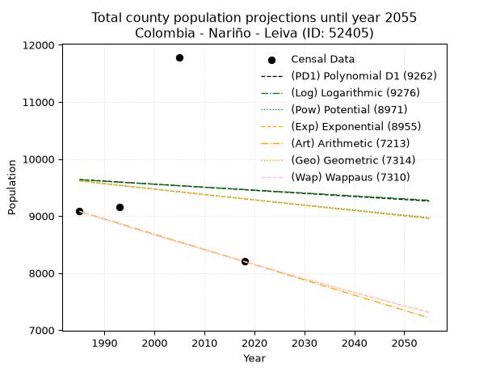
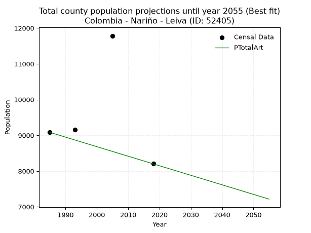
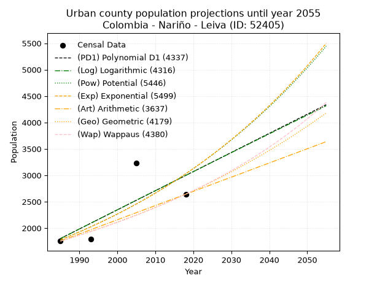
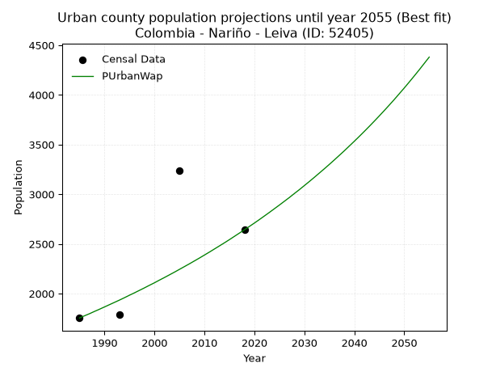
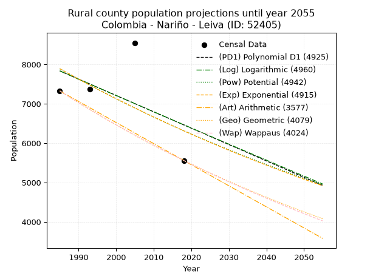
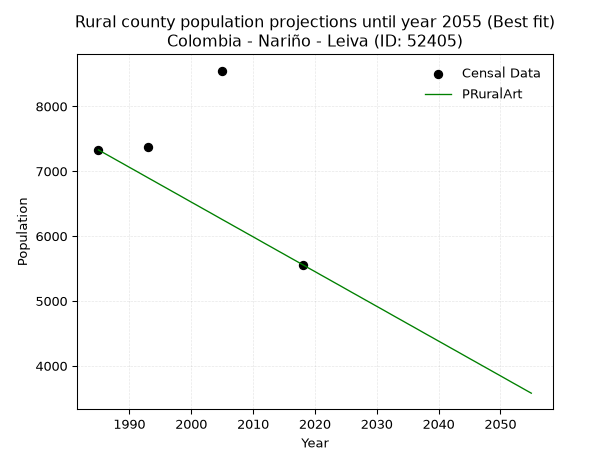

<div align="center">


</div>

# 📜 _“Population and Public Services Demand Projections (PPSD) until Year 2050 for Colombia - Nariño - Leiva (ID: 52405)”_
Keywords: `population` `public-service` `projection` `lineal` `polynomial` `logarithmic` `potential` `exponential` `arithmetic` `geometric` `wappaus` `dane` `colombia` `south-america`

PPSD are analytical estimates used by governments and planners to anticipate future changes in population size, age distribution, and the resulting community needs for utilities, healthcare, education, and infrastructure as sizing future water treatment facilities, electrical grids, and road networks based on spatial growth.

<div align="center">

</img>

</div>


> **General running parameters**: • app_version: _v20260806_. • Python version: _3.14.7_. • Pandas version: _3.0.5_. • NumPy version: _2.5.1_. • Creates, save and include plots into reports (create_plot): _False_. • Projection until year: _2050_. • Process polynomial degree 2 and up: _False_. • Process Wappaus: _True_. • Process Wappaus: _True_. • Set negative values to zero: _True_. • Set infinite values to zero: _True_. • Drop dataset notes: _True_. 
<div align="center">

Maps & GIS Layers: [:earth_americas:Google](http://maps.google.com/maps?q=1.934453244,-77.3061349) [:earth_americas:OSM](https://www.openstreetmap.org/#map=18/1.934453244/-77.3061349&layers=P) [:earth_americas:Bing](https://www.bing.com/maps?cp=1.934453244~-77.3061349&lvl=18) [:earth_americas:Apple](https://maps.apple.com/frame?center=1.934453244%2C-77.3061349&span=0.003%2C0.006) [:earth_americas:GISMobile](https://github.com/rcfdtools/R.GISMobile/blob/main/file/gis/CountyLayer_CO/Readme.md)

</div>


<div align="center">

```geojson
{
  "type": "Feature",
  "geometry": {
    "type": "Point", 
    "coordinates": [-77.3061349, 1.934453244]
  }, 
  "properties": {
    "Name": "Colombia - Nariño - Leiva (ID: 52405)"
  }
}
```

</div>


## 0. Census Data (4 records)

Census data are official statistics collected by a government about the people and housing in a country. They usually include counts of total population, age, sex, race, income, education, and jobs.

📅Global census file: [Population.xlsx](../data/Population.xlsx)

| Source   |   Year |   CountryID | CountryName   |   StateID | StateName   |   CountyID | CountyName   |   PTotal |   PUrban |   PRural |
|:---------|-------:|------------:|:--------------|----------:|:------------|-----------:|:-------------|---------:|---------:|---------:|
| DANE     |   1985 |          57 | Colombia      |        52 | Nariño      |      52405 | Leiva        |     9082 |     1755 |     7327 |
| DANE     |   1993 |          57 | Colombia      |        52 | Nariño      |      52405 | Leiva        |     9158 |     1787 |     7371 |
| DANE     |   2005 |          57 | Colombia      |        52 | Nariño      |      52405 | Leiva        |    11785 |     3236 |     8549 |
| DANE     |   2018 |          57 | Colombia      |        52 | Nariño      |      52405 | Leiva        |     8201 |     2642 |     5559 |

> 🔥Some records could had specific notes about the registered values or the corresponding urban or rural distribution.

📅[SUI-RUPS](https://www.datos.gov.co/Hacienda-y-Cr-dito-P-blico/Registro-nico-de-Prestadores-de-Servicios-P-blicos/4qkq-csdn/about_data) - Local public utility companies: [RUPS.csv](../data/RUPS.csv)

 | SERVICIO       | ESTADO    | NOMBRE                                         | NIT         | DEPARTAMENTO_DOMICILIO   | MUNICIPIO_DOMICILIO   | DIRECCION                         |   TELEFONO | EMAIL                       | TIPO_PRESTADOR                             | CLASIFICACION                 |
|:---------------|:----------|:-----------------------------------------------|:------------|:-------------------------|:----------------------|:----------------------------------|-----------:|:----------------------------|:-------------------------------------------|:------------------------------|
| ACUEDUCTO      | OPERATIVA | MUNICIPIO DE LEIVA                             | 800019111-5 | NARINO                   | LEIVA                 | CALLE 3 nº 2                      |    7228133 | leivanarino@gobernar.gov.co | MUNICIPIO (PRESTACIÓN DIRECTA)             | HASTA 2500 SUSCRIPTORES       |
| ALCANTARILLADO | OPERATIVA | MUNICIPIO DE LEIVA                             | 800019111-5 | NARINO                   | LEIVA                 | CALLE 3 nº 2                      |    7228133 | leivanarino@gobernar.gov.co | MUNICIPIO (PRESTACIÓN DIRECTA)             | HASTA 2500 SUSCRIPTORES       |
| ACUEDUCTO      | OPERATIVA | EMPRESA DE SERVICIOS PUBLICOS DE LEIVA ESP SAS | 900423722-1 | NARINO                   | LEIVA                 | Carrera 4 # 2-21 Barrio Primavera |    7502120 | esp.leiva.sas@gmail.com     | SOCIEDADES (EMPRESA DE SERVICIOS PUBLICOS) | MENOR O IGUAL A 2500 USUARIOS |
| ALCANTARILLADO | OPERATIVA | EMPRESA DE SERVICIOS PUBLICOS DE LEIVA ESP SAS | 900423722-1 | NARINO                   | LEIVA                 | Carrera 4 # 2-21 Barrio Primavera |    7502120 | esp.leiva.sas@gmail.com     | SOCIEDADES (EMPRESA DE SERVICIOS PUBLICOS) | MENOR O IGUAL A 2500 USUARIOS |

## 1. Total

### 1.1. Coefficients and Parameters

* (PD1) Polynomial Deg 1: -5.37856282617228, 20314.970293051105 (lineal)
* (Log) Logarithmic: -10366.242659888983, 88350.39352767145
* (Pow) Potential: -1.9979108421420004, 10.571549839681595
* (Exp) Exponential: -0.0010181697522303143, 72573.18617936871
* (Art) Arithmetic: Year diff. 2018 - 1985 = 33, Population diff. 8201 - 9082 = -881, Annual growth = -26.696969696969695
* (Geo) Geometric: Year diff. 2018 - 1985 = 33, Population diff. 8201 - 9082 = -881, Annual growth % = -0.003087295218713648
* (Wap) Wappaus: i = -0.30893906957090433, Condition values only valid for < 200)

<sub>
Wappaus condition values: ['-0.00', '-0.31', '-0.62', '-0.93', '-1.24', '-1.54', '-1.85', '-2.16', '-2.47', '-2.78', '-3.09', '-3.40', '-3.71', '-4.02', '-4.33', '-4.63', '-4.94', '-5.25', '-5.56', '-5.87', '-6.18', '-6.49', '-6.80', '-7.11', '-7.41', '-7.72', '-8.03', '-8.34', '-8.65', '-8.96', '-9.27', '-9.58', '-9.89', '-10.19', '-10.50', '-10.81', '-11.12', '-11.43', '-11.74', '-12.05', '-12.36', '-12.67', '-12.98', '-13.28', '-13.59', '-13.90', '-14.21', '-14.52', '-14.83', '-15.14', '-15.45', '-15.76', '-16.06', '-16.37', '-16.68', '-16.99', '-17.30', '-17.61', '-17.92', '-18.23', '-18.54', '-18.85', '-19.15', '-19.46', '-19.77', '-20.08']
</sub>


### 1.2. Projected Dataset

|   Year |   CountyID |   PTotalPD1 |   PTotalLog |   PTotalPow |   PTotalExp |   PTotalArt |   PTotalGeo |   PTotalWap |
|-------:|-----------:|------------:|------------:|------------:|------------:|------------:|------------:|------------:|
|   1985 |      52405 |        9639 |        9636 |        9614 |        9617 |        9082 |        9082 |        9082 |
|   1986 |      52405 |        9633 |        9630 |        9605 |        9607 |        9055 |        9054 |        9054 |
|   1987 |      52405 |        9628 |        9625 |        9595 |        9597 |        9029 |        9026 |        9026 |
|   1988 |      52405 |        9622 |        9620 |        9585 |        9588 |        9002 |        8998 |        8998 |
|   1989 |      52405 |        9617 |        9615 |        9576 |        9578 |        8975 |        8970 |        8970 |
|   1990 |      52405 |        9612 |        9610 |        9566 |        9568 |        8949 |        8943 |        8943 |
|   1991 |      52405 |        9606 |        9604 |        9557 |        9558 |        8922 |        8915 |        8915 |
|   1992 |      52405 |        9601 |        9599 |        9547 |        9549 |        8895 |        8888 |        8888 |
|   1993 |      52405 |        9595 |        9594 |        9537 |        9539 |        8868 |        8860 |        8860 |
|   1994 |      52405 |        9590 |        9589 |        9528 |        9529 |        8842 |        8833 |        8833 |
|   1995 |      52405 |        9585 |        9584 |        9518 |        9520 |        8815 |        8805 |        8806 |
|   1996 |      52405 |        9579 |        9578 |        9509 |        9510 |        8788 |        8778 |        8779 |
|   1997 |      52405 |        9574 |        9573 |        9499 |        9500 |        8762 |        8751 |        8751 |
|   1998 |      52405 |        9569 |        9568 |        9490 |        9491 |        8735 |        8724 |        8724 |
|   1999 |      52405 |        9563 |        9563 |        9480 |        9481 |        8708 |        8697 |        8698 |
|   2000 |      52405 |        9558 |        9558 |        9471 |        9471 |        8682 |        8670 |        8671 |
|   2001 |      52405 |        9552 |        9552 |        9461 |        9462 |        8655 |        8644 |        8644 |
|   2002 |      52405 |        9547 |        9547 |        9452 |        9452 |        8628 |        8617 |        8617 |
|   2003 |      52405 |        9542 |        9542 |        9442 |        9442 |        8601 |        8590 |        8591 |
|   2004 |      52405 |        9536 |        9537 |        9433 |        9433 |        8575 |        8564 |        8564 |
|   2005 |      52405 |        9531 |        9532 |        9424 |        9423 |        8548 |        8537 |        8538 |
|   2006 |      52405 |        9526 |        9527 |        9414 |        9414 |        8521 |        8511 |        8511 |
|   2007 |      52405 |        9520 |        9521 |        9405 |        9404 |        8495 |        8485 |        8485 |
|   2008 |      52405 |        9515 |        9516 |        9396 |        9394 |        8468 |        8459 |        8459 |
|   2009 |      52405 |        9509 |        9511 |        9386 |        9385 |        8441 |        8432 |        8433 |
|   2010 |      52405 |        9504 |        9506 |        9377 |        9375 |        8415 |        8406 |        8407 |
|   2011 |      52405 |        9499 |        9501 |        9368 |        9366 |        8388 |        8380 |        8381 |
|   2012 |      52405 |        9493 |        9496 |        9358 |        9356 |        8361 |        8355 |        8355 |
|   2013 |      52405 |        9488 |        9490 |        9349 |        9347 |        8334 |        8329 |        8329 |
|   2014 |      52405 |        9483 |        9485 |        9340 |        9337 |        8308 |        8303 |        8303 |
|   2015 |      52405 |        9477 |        9480 |        9330 |        9328 |        8281 |        8277 |        8278 |
|   2016 |      52405 |        9472 |        9475 |        9321 |        9318 |        8254 |        8252 |        8252 |
|   2017 |      52405 |        9466 |        9470 |        9312 |        9309 |        8228 |        8226 |        8226 |
|   2018 |      52405 |        9461 |        9465 |        9303 |        9299 |        8201 |        8201 |        8201 |
|   2019 |      52405 |        9456 |        9460 |        9294 |        9290 |        8174 |        8176 |        8176 |
|   2020 |      52405 |        9450 |        9454 |        9284 |        9280 |        8148 |        8150 |        8150 |
|   2021 |      52405 |        9445 |        9449 |        9275 |        9271 |        8121 |        8125 |        8125 |
|   2022 |      52405 |        9440 |        9444 |        9266 |        9261 |        8094 |        8100 |        8100 |
|   2023 |      52405 |        9434 |        9439 |        9257 |        9252 |        8068 |        8075 |        8075 |
|   2024 |      52405 |        9429 |        9434 |        9248 |        9243 |        8041 |        8050 |        8050 |
|   2025 |      52405 |        9423 |        9429 |        9239 |        9233 |        8014 |        8025 |        8025 |
|   2026 |      52405 |        9418 |        9424 |        9230 |        9224 |        7987 |        8001 |        8000 |
|   2027 |      52405 |        9413 |        9419 |        9220 |        9214 |        7961 |        7976 |        7975 |
|   2028 |      52405 |        9407 |        9413 |        9211 |        9205 |        7934 |        7951 |        7951 |
|   2029 |      52405 |        9402 |        9408 |        9202 |        9196 |        7907 |        7927 |        7926 |
|   2030 |      52405 |        9396 |        9403 |        9193 |        9186 |        7881 |        7902 |        7901 |
|   2031 |      52405 |        9391 |        9398 |        9184 |        9177 |        7854 |        7878 |        7877 |
|   2032 |      52405 |        9386 |        9393 |        9175 |        9168 |        7827 |        7854 |        7853 |
|   2033 |      52405 |        9380 |        9388 |        9166 |        9158 |        7801 |        7829 |        7828 |
|   2034 |      52405 |        9375 |        9383 |        9157 |        9149 |        7774 |        7805 |        7804 |
|   2035 |      52405 |        9370 |        9378 |        9148 |        9140 |        7747 |        7781 |        7780 |
|   2036 |      52405 |        9364 |        9373 |        9139 |        9130 |        7720 |        7757 |        7756 |
|   2037 |      52405 |        9359 |        9368 |        9130 |        9121 |        7694 |        7733 |        7731 |
|   2038 |      52405 |        9353 |        9362 |        9121 |        9112 |        7667 |        7709 |        7707 |
|   2039 |      52405 |        9348 |        9357 |        9112 |        9102 |        7640 |        7685 |        7684 |
|   2040 |      52405 |        9343 |        9352 |        9103 |        9093 |        7614 |        7662 |        7660 |
|   2041 |      52405 |        9337 |        9347 |        9094 |        9084 |        7587 |        7638 |        7636 |
|   2042 |      52405 |        9332 |        9342 |        9086 |        9075 |        7560 |        7614 |        7612 |
|   2043 |      52405 |        9327 |        9337 |        9077 |        9065 |        7534 |        7591 |        7588 |
|   2044 |      52405 |        9321 |        9332 |        9068 |        9056 |        7507 |        7567 |        7565 |
|   2045 |      52405 |        9316 |        9327 |        9059 |        9047 |        7480 |        7544 |        7541 |
|   2046 |      52405 |        9310 |        9322 |        9050 |        9038 |        7453 |        7521 |        7518 |
|   2047 |      52405 |        9305 |        9317 |        9041 |        9029 |        7427 |        7498 |        7494 |
|   2048 |      52405 |        9300 |        9312 |        9032 |        9019 |        7400 |        7474 |        7471 |
|   2049 |      52405 |        9294 |        9307 |        9024 |        9010 |        7373 |        7451 |        7448 |
|   2050 |      52405 |        9289 |        9302 |        9015 |        9001 |        7347 |        7428 |        7425 |
<div align="center">

</img>

</div>


### 1.3. Best fit with absolute and relative error (%)

Relative error puts that difference into context by dividing the absolute error by the true value, creating a unitless ratio or percentage that shows the scale of the mistake.

Absolute and relative error

|   Year | Source   |   CountryID | CountryName   |   StateID | StateName   |   CountyID_x | CountyName   |   PTotal |   PUrban |   PRural |   CountyID_y |   PTotalPD1 |   PTotalLog |   PTotalPow |   PTotalExp |   PTotalArt |   PTotalGeo |   PTotalWap |   PTotalPD1AbsError |   PTotalLogAbsError |   PTotalPowAbsError |   PTotalExpAbsError |   PTotalArtAbsError |   PTotalGeoAbsError |   PTotalWapAbsError |   PTotalPD1RelError |   PTotalLogRelError |   PTotalPowRelError |   PTotalExpRelError |   PTotalArtRelError |   PTotalGeoRelError |   PTotalWapRelError |
|-------:|:---------|------------:|:--------------|----------:|:------------|-------------:|:-------------|---------:|---------:|---------:|-------------:|------------:|------------:|------------:|------------:|------------:|------------:|------------:|--------------------:|--------------------:|--------------------:|--------------------:|--------------------:|--------------------:|--------------------:|--------------------:|--------------------:|--------------------:|--------------------:|--------------------:|--------------------:|--------------------:|
|   1985 | DANE     |          57 | Colombia      |        52 | Nariño      |        52405 | Leiva        |     9082 |     1755 |     7327 |        52405 |        9639 |        9636 |        9614 |        9617 |        9082 |        9082 |        9082 |                 557 |                 554 |                 532 |                 535 |                   0 |                   0 |                   0 |             6.13301 |             6.09998 |             5.85774 |             5.89077 |             0       |             0       |             0       |
|   1993 | DANE     |          57 | Colombia      |        52 | Nariño      |        52405 | Leiva        |     9158 |     1787 |     7371 |        52405 |        9595 |        9594 |        9537 |        9539 |        8868 |        8860 |        8860 |                 437 |                 436 |                 379 |                 381 |                 290 |                 298 |                 298 |             4.77178 |             4.76086 |             4.13846 |             4.1603  |             3.16663 |             3.25399 |             3.25399 |
|   2005 | DANE     |          57 | Colombia      |        52 | Nariño      |        52405 | Leiva        |    11785 |     3236 |     8549 |        52405 |        9531 |        9532 |        9424 |        9423 |        8548 |        8537 |        8538 |                2254 |                2253 |                2361 |                2362 |                3237 |                3248 |                3247 |            19.126   |            19.1175  |            20.0339  |            20.0424  |            27.4671  |            27.5605  |            27.552   |
|   2018 | DANE     |          57 | Colombia      |        52 | Nariño      |        52405 | Leiva        |     8201 |     2642 |     5559 |        52405 |        9461 |        9465 |        9303 |        9299 |        8201 |        8201 |        8201 |                1260 |                1264 |                1102 |                1098 |                   0 |                   0 |                   0 |            15.364   |            15.4128  |            13.4374  |            13.3886  |             0       |             0       |             0       |

Relative error mean

| Method    |   RelError | Best   |
|:----------|-----------:|:-------|
| PTotalPD1 |   11.3487  |        |
| PTotalLog |   11.3478  |        |
| PTotalPow |   10.8669  |        |
| PTotalExp |   10.8705  |        |
| PTotalArt |    7.65844 | True   |
| PTotalGeo |    7.70361 |        |
| PTotalWap |    7.70149 |        |

💙Best method: _**PTotalArt**_
<div align="center">

</img>

</div>


### 1.4. Fresh water supply demand in liters per capita per day (lpcd)

The fresh water supply demand typically ranges from 100 to 300 liters per capita per day (lpcd) for standard domestic and municipal planning, though absolute survival minimums set by the World Health Organization are as low as 7.5 to 20 liters per day, and total consumption in high-income nations can exceed 400 liters.

> `CZ`: Level in meters above the sea level (masl)<br> `WS`: Fresh water supply demand in liters per capita per day (lpcd or l/h/d)<br> `WSAll`: Zonal fresh water supply demand in liters per second (l/s)<br> `A`: Zonal area in square meters<br> `DP`: Population density (people/hectare or p/ha)

Reference values (RAS Colombia)

|    CZ |   WS |
|------:|-----:|
|  1000 |  120 |
|  2000 |  130 |
| 99999 |  140 |

County shapefile geometry properties and water supply values

|   CountyID |      ATotal |   CZTotal |   WSTotal |
|-----------:|------------:|----------:|----------:|
|      52405 | 3.10696e+08 |   1357.83 |       130 |

Projected values for best method: PTotalArt

|   CountyID |   Year |   PTotalArt |   DPTotal |   WSTotal |   WSTotalAll |
|-----------:|-------:|------------:|----------:|----------:|-------------:|
|      52405 |   1985 |        9082 |      0.29 |       130 |      13.665  |
|      52405 |   1986 |        9055 |      0.29 |       130 |      13.6244 |
|      52405 |   1987 |        9029 |      0.29 |       130 |      13.5853 |
|      52405 |   1988 |        9002 |      0.29 |       130 |      13.5447 |
|      52405 |   1989 |        8975 |      0.29 |       130 |      13.5041 |
|      52405 |   1990 |        8949 |      0.29 |       130 |      13.4649 |
|      52405 |   1991 |        8922 |      0.29 |       130 |      13.4243 |
|      52405 |   1992 |        8895 |      0.29 |       130 |      13.3837 |
|      52405 |   1993 |        8868 |      0.29 |       130 |      13.3431 |
|      52405 |   1994 |        8842 |      0.28 |       130 |      13.3039 |
|      52405 |   1995 |        8815 |      0.28 |       130 |      13.2633 |
|      52405 |   1996 |        8788 |      0.28 |       130 |      13.2227 |
|      52405 |   1997 |        8762 |      0.28 |       130 |      13.1836 |
|      52405 |   1998 |        8735 |      0.28 |       130 |      13.1429 |
|      52405 |   1999 |        8708 |      0.28 |       130 |      13.1023 |
|      52405 |   2000 |        8682 |      0.28 |       130 |      13.0632 |
|      52405 |   2001 |        8655 |      0.28 |       130 |      13.0226 |
|      52405 |   2002 |        8628 |      0.28 |       130 |      12.9819 |
|      52405 |   2003 |        8601 |      0.28 |       130 |      12.9413 |
|      52405 |   2004 |        8575 |      0.28 |       130 |      12.9022 |
|      52405 |   2005 |        8548 |      0.28 |       130 |      12.8616 |
|      52405 |   2006 |        8521 |      0.27 |       130 |      12.8209 |
|      52405 |   2007 |        8495 |      0.27 |       130 |      12.7818 |
|      52405 |   2008 |        8468 |      0.27 |       130 |      12.7412 |
|      52405 |   2009 |        8441 |      0.27 |       130 |      12.7006 |
|      52405 |   2010 |        8415 |      0.27 |       130 |      12.6615 |
|      52405 |   2011 |        8388 |      0.27 |       130 |      12.6208 |
|      52405 |   2012 |        8361 |      0.27 |       130 |      12.5802 |
|      52405 |   2013 |        8334 |      0.27 |       130 |      12.5396 |
|      52405 |   2014 |        8308 |      0.27 |       130 |      12.5005 |
|      52405 |   2015 |        8281 |      0.27 |       130 |      12.4598 |
|      52405 |   2016 |        8254 |      0.27 |       130 |      12.4192 |
|      52405 |   2017 |        8228 |      0.26 |       130 |      12.3801 |
|      52405 |   2018 |        8201 |      0.26 |       130 |      12.3395 |
|      52405 |   2019 |        8174 |      0.26 |       130 |      12.2988 |
|      52405 |   2020 |        8148 |      0.26 |       130 |      12.2597 |
|      52405 |   2021 |        8121 |      0.26 |       130 |      12.2191 |
|      52405 |   2022 |        8094 |      0.26 |       130 |      12.1785 |
|      52405 |   2023 |        8068 |      0.26 |       130 |      12.1394 |
|      52405 |   2024 |        8041 |      0.26 |       130 |      12.0987 |
|      52405 |   2025 |        8014 |      0.26 |       130 |      12.0581 |
|      52405 |   2026 |        7987 |      0.26 |       130 |      12.0175 |
|      52405 |   2027 |        7961 |      0.26 |       130 |      11.9784 |
|      52405 |   2028 |        7934 |      0.26 |       130 |      11.9377 |
|      52405 |   2029 |        7907 |      0.25 |       130 |      11.8971 |
|      52405 |   2030 |        7881 |      0.25 |       130 |      11.858  |
|      52405 |   2031 |        7854 |      0.25 |       130 |      11.8174 |
|      52405 |   2032 |        7827 |      0.25 |       130 |      11.7767 |
|      52405 |   2033 |        7801 |      0.25 |       130 |      11.7376 |
|      52405 |   2034 |        7774 |      0.25 |       130 |      11.697  |
|      52405 |   2035 |        7747 |      0.25 |       130 |      11.6564 |
|      52405 |   2036 |        7720 |      0.25 |       130 |      11.6157 |
|      52405 |   2037 |        7694 |      0.25 |       130 |      11.5766 |
|      52405 |   2038 |        7667 |      0.25 |       130 |      11.536  |
|      52405 |   2039 |        7640 |      0.25 |       130 |      11.4954 |
|      52405 |   2040 |        7614 |      0.25 |       130 |      11.4563 |
|      52405 |   2041 |        7587 |      0.24 |       130 |      11.4156 |
|      52405 |   2042 |        7560 |      0.24 |       130 |      11.375  |
|      52405 |   2043 |        7534 |      0.24 |       130 |      11.3359 |
|      52405 |   2044 |        7507 |      0.24 |       130 |      11.2953 |
|      52405 |   2045 |        7480 |      0.24 |       130 |      11.2546 |
|      52405 |   2046 |        7453 |      0.24 |       130 |      11.214  |
|      52405 |   2047 |        7427 |      0.24 |       130 |      11.1749 |
|      52405 |   2048 |        7400 |      0.24 |       130 |      11.1343 |
|      52405 |   2049 |        7373 |      0.24 |       130 |      11.0936 |
|      52405 |   2050 |        7347 |      0.24 |       130 |      11.0545 |

## 2. Urban

### 2.1. Coefficients and Parameters

* (PD1) Polynomial Deg 1: 36.20553994379794, -70065.13127258183 (lineal)
* (Log) Logarithmic: 72568.41732620788, -549238.1216233065
* (Pow) Potential: 32.29574418288933, -103.25361501548998
* (Exp) Exponential: 0.016116131471982913, 2.2753176059748956e-11
* (Art) Arithmetic: Year diff. 2018 - 1985 = 33, Population diff. 2642 - 1755 = 887, Annual growth = 26.87878787878788
* (Geo) Geometric: Year diff. 2018 - 1985 = 33, Population diff. 2642 - 1755 = 887, Annual growth % = 0.012473128889768148
* (Wap) Wappaus: i = 1.2225966740408405, Condition values only valid for < 200)

<sub>
Wappaus condition values: ['0.00', '1.22', '2.45', '3.67', '4.89', '6.11', '7.34', '8.56', '9.78', '11.00', '12.23', '13.45', '14.67', '15.89', '17.12', '18.34', '19.56', '20.78', '22.01', '23.23', '24.45', '25.67', '26.90', '28.12', '29.34', '30.56', '31.79', '33.01', '34.23', '35.46', '36.68', '37.90', '39.12', '40.35', '41.57', '42.79', '44.01', '45.24', '46.46', '47.68', '48.90', '50.13', '51.35', '52.57', '53.79', '55.02', '56.24', '57.46', '58.68', '59.91', '61.13', '62.35', '63.58', '64.80', '66.02', '67.24', '68.47', '69.69', '70.91', '72.13', '73.36', '74.58', '75.80', '77.02', '78.25', '79.47']
</sub>


### 2.2. Projected Dataset

|   Year |   CountyID |   PUrbanPD1 |   PUrbanLog |   PUrbanPow |   PUrbanExp |   PUrbanArt |   PUrbanGeo |   PUrbanWap |
|-------:|-----------:|------------:|------------:|------------:|------------:|------------:|------------:|------------:|
|   1985 |      52405 |        1803 |        1801 |        1778 |        1780 |        1755 |        1755 |        1755 |
|   1986 |      52405 |        1839 |        1838 |        1808 |        1809 |        1782 |        1777 |        1777 |
|   1987 |      52405 |        1875 |        1874 |        1837 |        1838 |        1809 |        1799 |        1798 |
|   1988 |      52405 |        1911 |        1911 |        1867 |        1868 |        1836 |        1821 |        1821 |
|   1989 |      52405 |        1948 |        1947 |        1898 |        1898 |        1863 |        1844 |        1843 |
|   1990 |      52405 |        1984 |        1984 |        1929 |        1929 |        1889 |        1867 |        1866 |
|   1991 |      52405 |        2020 |        2020 |        1960 |        1960 |        1916 |        1891 |        1889 |
|   1992 |      52405 |        2056 |        2056 |        1992 |        1992 |        1943 |        1914 |        1912 |
|   1993 |      52405 |        2093 |        2093 |        2025 |        2025 |        1970 |        1938 |        1935 |
|   1994 |      52405 |        2129 |        2129 |        2058 |        2058 |        1997 |        1962 |        1959 |
|   1995 |      52405 |        2165 |        2166 |        2092 |        2091 |        2024 |        1987 |        1984 |
|   1996 |      52405 |        2201 |        2202 |        2126 |        2125 |        2051 |        2011 |        2008 |
|   1997 |      52405 |        2237 |        2238 |        2160 |        2159 |        2078 |        2036 |        2033 |
|   1998 |      52405 |        2274 |        2275 |        2196 |        2195 |        2104 |        2062 |        2058 |
|   1999 |      52405 |        2310 |        2311 |        2231 |        2230 |        2131 |        2088 |        2084 |
|   2000 |      52405 |        2346 |        2347 |        2268 |        2266 |        2158 |        2114 |        2109 |
|   2001 |      52405 |        2382 |        2384 |        2305 |        2303 |        2185 |        2140 |        2136 |
|   2002 |      52405 |        2418 |        2420 |        2342 |        2341 |        2212 |        2167 |        2162 |
|   2003 |      52405 |        2455 |        2456 |        2380 |        2379 |        2239 |        2194 |        2189 |
|   2004 |      52405 |        2491 |        2492 |        2419 |        2417 |        2266 |        2221 |        2216 |
|   2005 |      52405 |        2527 |        2529 |        2458 |        2457 |        2293 |        2249 |        2244 |
|   2006 |      52405 |        2563 |        2565 |        2498 |        2496 |        2319 |        2277 |        2272 |
|   2007 |      52405 |        2599 |        2601 |        2539 |        2537 |        2346 |        2305 |        2300 |
|   2008 |      52405 |        2636 |        2637 |        2580 |        2578 |        2373 |        2334 |        2329 |
|   2009 |      52405 |        2672 |        2673 |        2622 |        2620 |        2400 |        2363 |        2358 |
|   2010 |      52405 |        2708 |        2709 |        2664 |        2663 |        2427 |        2393 |        2388 |
|   2011 |      52405 |        2744 |        2745 |        2707 |        2706 |        2454 |        2422 |        2418 |
|   2012 |      52405 |        2780 |        2781 |        2751 |        2750 |        2481 |        2453 |        2449 |
|   2013 |      52405 |        2817 |        2818 |        2796 |        2795 |        2508 |        2483 |        2480 |
|   2014 |      52405 |        2853 |        2854 |        2841 |        2840 |        2534 |        2514 |        2511 |
|   2015 |      52405 |        2889 |        2890 |        2887 |        2886 |        2561 |        2546 |        2543 |
|   2016 |      52405 |        2925 |        2926 |        2933 |        2933 |        2588 |        2577 |        2576 |
|   2017 |      52405 |        2961 |        2962 |        2981 |        2981 |        2615 |        2609 |        2609 |
|   2018 |      52405 |        2998 |        2998 |        3029 |        3029 |        2642 |        2642 |        2642 |
|   2019 |      52405 |        3034 |        3033 |        3078 |        3078 |        2669 |        2675 |        2676 |
|   2020 |      52405 |        3070 |        3069 |        3127 |        3128 |        2696 |        2708 |        2710 |
|   2021 |      52405 |        3106 |        3105 |        3178 |        3179 |        2723 |        2742 |        2745 |
|   2022 |      52405 |        3142 |        3141 |        3229 |        3231 |        2750 |        2776 |        2781 |
|   2023 |      52405 |        3179 |        3177 |        3281 |        3283 |        2776 |        2811 |        2817 |
|   2024 |      52405 |        3215 |        3213 |        3334 |        3337 |        2803 |        2846 |        2854 |
|   2025 |      52405 |        3251 |        3249 |        3387 |        3391 |        2830 |        2881 |        2891 |
|   2026 |      52405 |        3287 |        3285 |        3442 |        3446 |        2857 |        2917 |        2929 |
|   2027 |      52405 |        3323 |        3320 |        3497 |        3502 |        2884 |        2954 |        2967 |
|   2028 |      52405 |        3360 |        3356 |        3553 |        3559 |        2911 |        2991 |        3007 |
|   2029 |      52405 |        3396 |        3392 |        3610 |        3617 |        2938 |        3028 |        3046 |
|   2030 |      52405 |        3432 |        3428 |        3668 |        3675 |        2965 |        3066 |        3087 |
|   2031 |      52405 |        3468 |        3464 |        3727 |        3735 |        2991 |        3104 |        3128 |
|   2032 |      52405 |        3505 |        3499 |        3787 |        3796 |        3018 |        3143 |        3170 |
|   2033 |      52405 |        3541 |        3535 |        3847 |        3858 |        3045 |        3182 |        3213 |
|   2034 |      52405 |        3577 |        3571 |        3909 |        3920 |        3072 |        3222 |        3256 |
|   2035 |      52405 |        3613 |        3606 |        3971 |        3984 |        3099 |        3262 |        3300 |
|   2036 |      52405 |        3649 |        3642 |        4035 |        4049 |        3126 |        3302 |        3345 |
|   2037 |      52405 |        3686 |        3678 |        4099 |        4114 |        3153 |        3344 |        3391 |
|   2038 |      52405 |        3722 |        3713 |        4165 |        4181 |        3180 |        3385 |        3437 |
|   2039 |      52405 |        3758 |        3749 |        4231 |        4249 |        3206 |        3428 |        3485 |
|   2040 |      52405 |        3794 |        3784 |        4299 |        4318 |        3233 |        3470 |        3533 |
|   2041 |      52405 |        3830 |        3820 |        4367 |        4388 |        3260 |        3514 |        3582 |
|   2042 |      52405 |        3867 |        3855 |        4437 |        4460 |        3287 |        3557 |        3632 |
|   2043 |      52405 |        3903 |        3891 |        4508 |        4532 |        3314 |        3602 |        3683 |
|   2044 |      52405 |        3939 |        3927 |        4580 |        4606 |        3341 |        3647 |        3735 |
|   2045 |      52405 |        3975 |        3962 |        4653 |        4681 |        3368 |        3692 |        3788 |
|   2046 |      52405 |        4011 |        3998 |        4727 |        4757 |        3395 |        3738 |        3842 |
|   2047 |      52405 |        4048 |        4033 |        4802 |        4834 |        3421 |        3785 |        3897 |
|   2048 |      52405 |        4084 |        4068 |        4878 |        4912 |        3448 |        3832 |        3953 |
|   2049 |      52405 |        4120 |        4104 |        4956 |        4992 |        3475 |        3880 |        4011 |
|   2050 |      52405 |        4156 |        4139 |        5034 |        5073 |        3502 |        3928 |        4069 |
<div align="center">

</img>

</div>


### 2.3. Best fit with absolute and relative error (%)

Relative error puts that difference into context by dividing the absolute error by the true value, creating a unitless ratio or percentage that shows the scale of the mistake.

Absolute and relative error

|   Year | Source   |   CountryID | CountryName   |   StateID | StateName   |   CountyID_x | CountyName   |   PTotal |   PUrban |   PRural |   CountyID_y |   PUrbanPD1 |   PUrbanLog |   PUrbanPow |   PUrbanExp |   PUrbanArt |   PUrbanGeo |   PUrbanWap |   PUrbanPD1AbsError |   PUrbanLogAbsError |   PUrbanPowAbsError |   PUrbanExpAbsError |   PUrbanArtAbsError |   PUrbanGeoAbsError |   PUrbanWapAbsError |   PUrbanPD1RelError |   PUrbanLogRelError |   PUrbanPowRelError |   PUrbanExpRelError |   PUrbanArtRelError |   PUrbanGeoRelError |   PUrbanWapRelError |
|-------:|:---------|------------:|:--------------|----------:|:------------|-------------:|:-------------|---------:|---------:|---------:|-------------:|------------:|------------:|------------:|------------:|------------:|------------:|------------:|--------------------:|--------------------:|--------------------:|--------------------:|--------------------:|--------------------:|--------------------:|--------------------:|--------------------:|--------------------:|--------------------:|--------------------:|--------------------:|--------------------:|
|   1985 | DANE     |          57 | Colombia      |        52 | Nariño      |        52405 | Leiva        |     9082 |     1755 |     7327 |        52405 |        1803 |        1801 |        1778 |        1780 |        1755 |        1755 |        1755 |                  48 |                  46 |                  23 |                  25 |                   0 |                   0 |                   0 |             2.73504 |             2.62108 |             1.31054 |              1.4245 |              0      |             0       |             0       |
|   1993 | DANE     |          57 | Colombia      |        52 | Nariño      |        52405 | Leiva        |     9158 |     1787 |     7371 |        52405 |        2093 |        2093 |        2025 |        2025 |        1970 |        1938 |        1935 |                 306 |                 306 |                 238 |                 238 |                 183 |                 151 |                 148 |            17.1237  |            17.1237  |            13.3184  |             13.3184 |             10.2406 |             8.44992 |             8.28204 |
|   2005 | DANE     |          57 | Colombia      |        52 | Nariño      |        52405 | Leiva        |    11785 |     3236 |     8549 |        52405 |        2527 |        2529 |        2458 |        2457 |        2293 |        2249 |        2244 |                 709 |                 707 |                 778 |                 779 |                 943 |                 987 |                 992 |            21.9098  |            21.848   |            24.042   |             24.0729 |             29.1409 |            30.5006  |            30.6551  |
|   2018 | DANE     |          57 | Colombia      |        52 | Nariño      |        52405 | Leiva        |     8201 |     2642 |     5559 |        52405 |        2998 |        2998 |        3029 |        3029 |        2642 |        2642 |        2642 |                 356 |                 356 |                 387 |                 387 |                   0 |                   0 |                   0 |            13.4746  |            13.4746  |            14.648   |             14.648  |              0      |             0       |             0       |

Relative error mean

| Method    |   RelError | Best   |
|:----------|-----------:|:-------|
| PUrbanPD1 |   13.8108  |        |
| PUrbanLog |   13.7668  |        |
| PUrbanPow |   13.3297  |        |
| PUrbanExp |   13.366   |        |
| PUrbanArt |    9.84539 |        |
| PUrbanGeo |    9.73763 |        |
| PUrbanWap |    9.73429 | True   |

💙Best method: _**PUrbanWap**_
<div align="center">

</img>

</div>


### 2.4. Fresh water supply demand in liters per capita per day (lpcd)

The fresh water supply demand typically ranges from 100 to 300 liters per capita per day (lpcd) for standard domestic and municipal planning, though absolute survival minimums set by the World Health Organization are as low as 7.5 to 20 liters per day, and total consumption in high-income nations can exceed 400 liters.

> `CZ`: Level in meters above the sea level (masl)<br> `WS`: Fresh water supply demand in liters per capita per day (lpcd or l/h/d)<br> `WSAll`: Zonal fresh water supply demand in liters per second (l/s)<br> `A`: Zonal area in square meters<br> `DP`: Population density (people/hectare or p/ha)

Reference values (RAS Colombia)

|    CZ |   WS |
|------:|-----:|
|  1000 |  120 |
|  2000 |  130 |
| 99999 |  140 |

County shapefile geometry properties and water supply values

|   CountyID |   AUrban |   CZUrban |   WSUrban |
|-----------:|---------:|----------:|----------:|
|      52405 |   241567 |   1547.62 |       130 |

Projected values for best method: PUrbanWap

|   CountyID |   Year |   PUrbanWap |   DPUrban |   WSUrban |   WSUrbanAll |
|-----------:|-------:|------------:|----------:|----------:|-------------:|
|      52405 |   1985 |        1755 |     72.65 |       130 |      2.64062 |
|      52405 |   1986 |        1777 |     73.56 |       130 |      2.67373 |
|      52405 |   1987 |        1798 |     74.43 |       130 |      2.70532 |
|      52405 |   1988 |        1821 |     75.38 |       130 |      2.73993 |
|      52405 |   1989 |        1843 |     76.29 |       130 |      2.77303 |
|      52405 |   1990 |        1866 |     77.25 |       130 |      2.80764 |
|      52405 |   1991 |        1889 |     78.2  |       130 |      2.84225 |
|      52405 |   1992 |        1912 |     79.15 |       130 |      2.87685 |
|      52405 |   1993 |        1935 |     80.1  |       130 |      2.91146 |
|      52405 |   1994 |        1959 |     81.1  |       130 |      2.94757 |
|      52405 |   1995 |        1984 |     82.13 |       130 |      2.98519 |
|      52405 |   1996 |        2008 |     83.12 |       130 |      3.0213  |
|      52405 |   1997 |        2033 |     84.16 |       130 |      3.05891 |
|      52405 |   1998 |        2058 |     85.19 |       130 |      3.09653 |
|      52405 |   1999 |        2084 |     86.27 |       130 |      3.13565 |
|      52405 |   2000 |        2109 |     87.3  |       130 |      3.17326 |
|      52405 |   2001 |        2136 |     88.42 |       130 |      3.21389 |
|      52405 |   2002 |        2162 |     89.5  |       130 |      3.25301 |
|      52405 |   2003 |        2189 |     90.62 |       130 |      3.29363 |
|      52405 |   2004 |        2216 |     91.73 |       130 |      3.33426 |
|      52405 |   2005 |        2244 |     92.89 |       130 |      3.37639 |
|      52405 |   2006 |        2272 |     94.05 |       130 |      3.41852 |
|      52405 |   2007 |        2300 |     95.21 |       130 |      3.46065 |
|      52405 |   2008 |        2329 |     96.41 |       130 |      3.50428 |
|      52405 |   2009 |        2358 |     97.61 |       130 |      3.54792 |
|      52405 |   2010 |        2388 |     98.85 |       130 |      3.59306 |
|      52405 |   2011 |        2418 |    100.1  |       130 |      3.63819 |
|      52405 |   2012 |        2449 |    101.38 |       130 |      3.68484 |
|      52405 |   2013 |        2480 |    102.66 |       130 |      3.73148 |
|      52405 |   2014 |        2511 |    103.95 |       130 |      3.77813 |
|      52405 |   2015 |        2543 |    105.27 |       130 |      3.82627 |
|      52405 |   2016 |        2576 |    106.64 |       130 |      3.87593 |
|      52405 |   2017 |        2609 |    108    |       130 |      3.92558 |
|      52405 |   2018 |        2642 |    109.37 |       130 |      3.97523 |
|      52405 |   2019 |        2676 |    110.78 |       130 |      4.02639 |
|      52405 |   2020 |        2710 |    112.18 |       130 |      4.07755 |
|      52405 |   2021 |        2745 |    113.63 |       130 |      4.13021 |
|      52405 |   2022 |        2781 |    115.12 |       130 |      4.18438 |
|      52405 |   2023 |        2817 |    116.61 |       130 |      4.23854 |
|      52405 |   2024 |        2854 |    118.15 |       130 |      4.29421 |
|      52405 |   2025 |        2891 |    119.68 |       130 |      4.34988 |
|      52405 |   2026 |        2929 |    121.25 |       130 |      4.40706 |
|      52405 |   2027 |        2967 |    122.82 |       130 |      4.46424 |
|      52405 |   2028 |        3007 |    124.48 |       130 |      4.52442 |
|      52405 |   2029 |        3046 |    126.09 |       130 |      4.5831  |
|      52405 |   2030 |        3087 |    127.79 |       130 |      4.64479 |
|      52405 |   2031 |        3128 |    129.49 |       130 |      4.70648 |
|      52405 |   2032 |        3170 |    131.23 |       130 |      4.76968 |
|      52405 |   2033 |        3213 |    133.01 |       130 |      4.83437 |
|      52405 |   2034 |        3256 |    134.79 |       130 |      4.89907 |
|      52405 |   2035 |        3300 |    136.61 |       130 |      4.96528 |
|      52405 |   2036 |        3345 |    138.47 |       130 |      5.03299 |
|      52405 |   2037 |        3391 |    140.38 |       130 |      5.1022  |
|      52405 |   2038 |        3437 |    142.28 |       130 |      5.17141 |
|      52405 |   2039 |        3485 |    144.27 |       130 |      5.24363 |
|      52405 |   2040 |        3533 |    146.25 |       130 |      5.31586 |
|      52405 |   2041 |        3582 |    148.28 |       130 |      5.38958 |
|      52405 |   2042 |        3632 |    150.35 |       130 |      5.46481 |
|      52405 |   2043 |        3683 |    152.46 |       130 |      5.54155 |
|      52405 |   2044 |        3735 |    154.62 |       130 |      5.61979 |
|      52405 |   2045 |        3788 |    156.81 |       130 |      5.69954 |
|      52405 |   2046 |        3842 |    159.04 |       130 |      5.78079 |
|      52405 |   2047 |        3897 |    161.32 |       130 |      5.86354 |
|      52405 |   2048 |        3953 |    163.64 |       130 |      5.9478  |
|      52405 |   2049 |        4011 |    166.04 |       130 |      6.03507 |
|      52405 |   2050 |        4069 |    168.44 |       130 |      6.12234 |

## 3. Rural

### 3.1. Coefficients and Parameters

* (PD1) Polynomial Deg 1: -41.5841027699701, 90380.10156563269 (lineal)
* (Log) Logarithmic: -82934.6599860969, 637588.5151509781
* (Pow) Potential: -13.4965544327811, 48.40549087148941
* (Exp) Exponential: -0.0067641175319356804, 5349502456.9919405
* (Art) Arithmetic: Year diff. 2018 - 1985 = 33, Population diff. 5559 - 7327 = -1768, Annual growth = -53.57575757575758
* (Geo) Geometric: Year diff. 2018 - 1985 = 33, Population diff. 5559 - 7327 = -1768, Annual growth % = -0.008333203517530419
* (Wap) Wappaus: i = -0.8315343407691692, Condition values only valid for < 200)

<sub>
Wappaus condition values: ['-0.00', '-0.83', '-1.66', '-2.49', '-3.33', '-4.16', '-4.99', '-5.82', '-6.65', '-7.48', '-8.32', '-9.15', '-9.98', '-10.81', '-11.64', '-12.47', '-13.30', '-14.14', '-14.97', '-15.80', '-16.63', '-17.46', '-18.29', '-19.13', '-19.96', '-20.79', '-21.62', '-22.45', '-23.28', '-24.11', '-24.95', '-25.78', '-26.61', '-27.44', '-28.27', '-29.10', '-29.94', '-30.77', '-31.60', '-32.43', '-33.26', '-34.09', '-34.92', '-35.76', '-36.59', '-37.42', '-38.25', '-39.08', '-39.91', '-40.75', '-41.58', '-42.41', '-43.24', '-44.07', '-44.90', '-45.73', '-46.57', '-47.40', '-48.23', '-49.06', '-49.89', '-50.72', '-51.56', '-52.39', '-53.22', '-54.05']
</sub>


### 3.2. Projected Dataset

|   Year |   CountyID |   PRuralPD1 |   PRuralLog |   PRuralPow |   PRuralExp |   PRuralArt |   PRuralGeo |   PRuralWap |
|-------:|-----------:|------------:|------------:|------------:|------------:|------------:|------------:|------------:|
|   1985 |      52405 |        7836 |        7835 |        7890 |        7891 |        7327 |        7327 |        7327 |
|   1986 |      52405 |        7794 |        7793 |        7837 |        7838 |        7273 |        7266 |        7266 |
|   1987 |      52405 |        7752 |        7751 |        7784 |        7785 |        7220 |        7205 |        7206 |
|   1988 |      52405 |        7711 |        7709 |        7731 |        7733 |        7166 |        7145 |        7146 |
|   1989 |      52405 |        7669 |        7668 |        7679 |        7680 |        7113 |        7086 |        7087 |
|   1990 |      52405 |        7628 |        7626 |        7627 |        7629 |        7059 |        7027 |        7029 |
|   1991 |      52405 |        7586 |        7584 |        7575 |        7577 |        7006 |        6968 |        6970 |
|   1992 |      52405 |        7545 |        7543 |        7524 |        7526 |        6952 |        6910 |        6913 |
|   1993 |      52405 |        7503 |        7501 |        7473 |        7475 |        6898 |        6853 |        6855 |
|   1994 |      52405 |        7461 |        7459 |        7423 |        7425 |        6845 |        6795 |        6798 |
|   1995 |      52405 |        7420 |        7418 |        7373 |        7375 |        6791 |        6739 |        6742 |
|   1996 |      52405 |        7378 |        7376 |        7323 |        7325 |        6738 |        6683 |        6686 |
|   1997 |      52405 |        7337 |        7335 |        7274 |        7276 |        6684 |        6627 |        6631 |
|   1998 |      52405 |        7295 |        7293 |        7225 |        7227 |        6631 |        6572 |        6576 |
|   1999 |      52405 |        7253 |        7252 |        7176 |        7178 |        6577 |        6517 |        6521 |
|   2000 |      52405 |        7212 |        7210 |        7128 |        7130 |        6523 |        6463 |        6467 |
|   2001 |      52405 |        7170 |        7169 |        7080 |        7082 |        6470 |        6409 |        6413 |
|   2002 |      52405 |        7129 |        7127 |        7032 |        7034 |        6416 |        6355 |        6360 |
|   2003 |      52405 |        7087 |        7086 |        6985 |        6987 |        6363 |        6302 |        6307 |
|   2004 |      52405 |        7046 |        7045 |        6938 |        6939 |        6309 |        6250 |        6254 |
|   2005 |      52405 |        7004 |        7003 |        6892 |        6893 |        6255 |        6198 |        6202 |
|   2006 |      52405 |        6962 |        6962 |        6845 |        6846 |        6202 |        6146 |        6150 |
|   2007 |      52405 |        6921 |        6920 |        6800 |        6800 |        6148 |        6095 |        6099 |
|   2008 |      52405 |        6879 |        6879 |        6754 |        6754 |        6095 |        6044 |        6048 |
|   2009 |      52405 |        6838 |        6838 |        6709 |        6709 |        6041 |        5994 |        5997 |
|   2010 |      52405 |        6796 |        6797 |        6664 |        6663 |        5988 |        5944 |        5947 |
|   2011 |      52405 |        6754 |        6755 |        6619 |        6619 |        5934 |        5894 |        5897 |
|   2012 |      52405 |        6713 |        6714 |        6575 |        6574 |        5880 |        5845 |        5848 |
|   2013 |      52405 |        6671 |        6673 |        6531 |        6530 |        5827 |        5797 |        5799 |
|   2014 |      52405 |        6630 |        6632 |        6487 |        6486 |        5773 |        5748 |        5750 |
|   2015 |      52405 |        6588 |        6591 |        6444 |        6442 |        5720 |        5700 |        5702 |
|   2016 |      52405 |        6547 |        6549 |        6401 |        6398 |        5666 |        5653 |        5654 |
|   2017 |      52405 |        6505 |        6508 |        6358 |        6355 |        5613 |        5606 |        5606 |
|   2018 |      52405 |        6463 |        6467 |        6316 |        6312 |        5559 |        5559 |        5559 |
|   2019 |      52405 |        6422 |        6426 |        6274 |        6270 |        5505 |        5513 |        5512 |
|   2020 |      52405 |        6380 |        6385 |        6232 |        6228 |        5452 |        5467 |        5465 |
|   2021 |      52405 |        6339 |        6344 |        6191 |        6186 |        5398 |        5421 |        5419 |
|   2022 |      52405 |        6297 |        6303 |        6149 |        6144 |        5345 |        5376 |        5373 |
|   2023 |      52405 |        6255 |        6262 |        6109 |        6103 |        5291 |        5331 |        5328 |
|   2024 |      52405 |        6214 |        6221 |        6068 |        6061 |        5238 |        5287 |        5282 |
|   2025 |      52405 |        6172 |        6180 |        6028 |        6021 |        5184 |        5243 |        5237 |
|   2026 |      52405 |        6131 |        6139 |        5988 |        5980 |        5130 |        5199 |        5193 |
|   2027 |      52405 |        6089 |        6098 |        5948 |        5940 |        5077 |        5156 |        5149 |
|   2028 |      52405 |        6048 |        6057 |        5908 |        5900 |        5023 |        5113 |        5104 |
|   2029 |      52405 |        6006 |        6016 |        5869 |        5860 |        4970 |        5070 |        5061 |
|   2030 |      52405 |        5964 |        5975 |        5830 |        5820 |        4916 |        5028 |        5017 |
|   2031 |      52405 |        5923 |        5935 |        5792 |        5781 |        4863 |        4986 |        4974 |
|   2032 |      52405 |        5881 |        5894 |        5753 |        5742 |        4809 |        4944 |        4932 |
|   2033 |      52405 |        5840 |        5853 |        5715 |        5703 |        4755 |        4903 |        4889 |
|   2034 |      52405 |        5798 |        5812 |        5677 |        5665 |        4702 |        4862 |        4847 |
|   2035 |      52405 |        5756 |        5771 |        5640 |        5627 |        4648 |        4822 |        4805 |
|   2036 |      52405 |        5715 |        5731 |        5603 |        5589 |        4595 |        4782 |        4763 |
|   2037 |      52405 |        5673 |        5690 |        5566 |        5551 |        4541 |        4742 |        4722 |
|   2038 |      52405 |        5632 |        5649 |        5529 |        5514 |        4487 |        4702 |        4681 |
|   2039 |      52405 |        5590 |        5609 |        5492 |        5477 |        4434 |        4663 |        4640 |
|   2040 |      52405 |        5549 |        5568 |        5456 |        5440 |        4380 |        4624 |        4600 |
|   2041 |      52405 |        5507 |        5527 |        5420 |        5403 |        4327 |        4586 |        4559 |
|   2042 |      52405 |        5465 |        5487 |        5384 |        5367 |        4273 |        4548 |        4520 |
|   2043 |      52405 |        5424 |        5446 |        5349 |        5330 |        4220 |        4510 |        4480 |
|   2044 |      52405 |        5382 |        5405 |        5314 |        5294 |        4166 |        4472 |        4440 |
|   2045 |      52405 |        5341 |        5365 |        5279 |        5259 |        4112 |        4435 |        4401 |
|   2046 |      52405 |        5299 |        5324 |        5244 |        5223 |        4059 |        4398 |        4362 |
|   2047 |      52405 |        5257 |        5284 |        5210 |        5188 |        4005 |        4361 |        4324 |
|   2048 |      52405 |        5216 |        5243 |        5175 |        5153 |        3952 |        4325 |        4285 |
|   2049 |      52405 |        5174 |        5203 |        5141 |        5118 |        3898 |        4289 |        4247 |
|   2050 |      52405 |        5133 |        5162 |        5108 |        5084 |        3845 |        4253 |        4209 |
<div align="center">

</img>

</div>


### 3.3. Best fit with absolute and relative error (%)

Relative error puts that difference into context by dividing the absolute error by the true value, creating a unitless ratio or percentage that shows the scale of the mistake.

Absolute and relative error

|   Year | Source   |   CountryID | CountryName   |   StateID | StateName   |   CountyID_x | CountyName   |   PTotal |   PUrban |   PRural |   CountyID_y |   PRuralPD1 |   PRuralLog |   PRuralPow |   PRuralExp |   PRuralArt |   PRuralGeo |   PRuralWap |   PRuralPD1AbsError |   PRuralLogAbsError |   PRuralPowAbsError |   PRuralExpAbsError |   PRuralArtAbsError |   PRuralGeoAbsError |   PRuralWapAbsError |   PRuralPD1RelError |   PRuralLogRelError |   PRuralPowRelError |   PRuralExpRelError |   PRuralArtRelError |   PRuralGeoRelError |   PRuralWapRelError |
|-------:|:---------|------------:|:--------------|----------:|:------------|-------------:|:-------------|---------:|---------:|---------:|-------------:|------------:|------------:|------------:|------------:|------------:|------------:|------------:|--------------------:|--------------------:|--------------------:|--------------------:|--------------------:|--------------------:|--------------------:|--------------------:|--------------------:|--------------------:|--------------------:|--------------------:|--------------------:|--------------------:|
|   1985 | DANE     |          57 | Colombia      |        52 | Nariño      |        52405 | Leiva        |     9082 |     1755 |     7327 |        52405 |        7836 |        7835 |        7890 |        7891 |        7327 |        7327 |        7327 |                 509 |                 508 |                 563 |                 564 |                   0 |                   0 |                   0 |             6.94691 |             6.93326 |             7.68391 |             7.69756 |             0       |             0       |             0       |
|   1993 | DANE     |          57 | Colombia      |        52 | Nariño      |        52405 | Leiva        |     9158 |     1787 |     7371 |        52405 |        7503 |        7501 |        7473 |        7475 |        6898 |        6853 |        6855 |                 132 |                 130 |                 102 |                 104 |                 473 |                 518 |                 516 |             1.7908  |             1.76367 |             1.3838  |             1.41093 |             6.41704 |             7.02754 |             7.00041 |
|   2005 | DANE     |          57 | Colombia      |        52 | Nariño      |        52405 | Leiva        |    11785 |     3236 |     8549 |        52405 |        7004 |        7003 |        6892 |        6893 |        6255 |        6198 |        6202 |                1545 |                1546 |                1657 |                1656 |                2294 |                2351 |                2347 |            18.0723  |            18.084   |            19.3824  |            19.3707  |            26.8335  |            27.5003  |            27.4535  |
|   2018 | DANE     |          57 | Colombia      |        52 | Nariño      |        52405 | Leiva        |     8201 |     2642 |     5559 |        52405 |        6463 |        6467 |        6316 |        6312 |        5559 |        5559 |        5559 |                 904 |                 908 |                 757 |                 753 |                   0 |                   0 |                   0 |            16.2619  |            16.3339  |            13.6176  |            13.5456  |             0       |             0       |             0       |

Relative error mean

| Method    |   RelError | Best   |
|:----------|-----------:|:-------|
| PRuralPD1 |   10.768   |        |
| PRuralLog |   10.7787  |        |
| PRuralPow |   10.5169  |        |
| PRuralExp |   10.5062  |        |
| PRuralArt |    8.31265 | True   |
| PRuralGeo |    8.63196 |        |
| PRuralWap |    8.61348 |        |

💙Best method: _**PRuralArt**_
<div align="center">

</img>

</div>


### 3.4. Fresh water supply demand in liters per capita per day (lpcd)

The fresh water supply demand typically ranges from 100 to 300 liters per capita per day (lpcd) for standard domestic and municipal planning, though absolute survival minimums set by the World Health Organization are as low as 7.5 to 20 liters per day, and total consumption in high-income nations can exceed 400 liters.

> `CZ`: Level in meters above the sea level (masl)<br> `WS`: Fresh water supply demand in liters per capita per day (lpcd or l/h/d)<br> `WSAll`: Zonal fresh water supply demand in liters per second (l/s)<br> `A`: Zonal area in square meters<br> `DP`: Population density (people/hectare or p/ha)

Reference values (RAS Colombia)

|    CZ |   WS |
|------:|-----:|
|  1000 |  120 |
|  2000 |  130 |
| 99999 |  140 |

County shapefile geometry properties and water supply values

|   CountyID |      ARural |   CZRural |   WSRural |
|-----------:|------------:|----------:|----------:|
|      52405 | 3.10455e+08 |   1357.69 |       130 |

Projected values for best method: PRuralArt

|   CountyID |   Year |   PRuralArt |   DPRural |   WSRural |   WSRuralAll |
|-----------:|-------:|------------:|----------:|----------:|-------------:|
|      52405 |   1985 |        7327 |      0.24 |       130 |     11.0244  |
|      52405 |   1986 |        7273 |      0.23 |       130 |     10.9432  |
|      52405 |   1987 |        7220 |      0.23 |       130 |     10.8634  |
|      52405 |   1988 |        7166 |      0.23 |       130 |     10.7822  |
|      52405 |   1989 |        7113 |      0.23 |       130 |     10.7024  |
|      52405 |   1990 |        7059 |      0.23 |       130 |     10.6212  |
|      52405 |   1991 |        7006 |      0.23 |       130 |     10.5414  |
|      52405 |   1992 |        6952 |      0.22 |       130 |     10.4602  |
|      52405 |   1993 |        6898 |      0.22 |       130 |     10.3789  |
|      52405 |   1994 |        6845 |      0.22 |       130 |     10.2992  |
|      52405 |   1995 |        6791 |      0.22 |       130 |     10.2179  |
|      52405 |   1996 |        6738 |      0.22 |       130 |     10.1382  |
|      52405 |   1997 |        6684 |      0.22 |       130 |     10.0569  |
|      52405 |   1998 |        6631 |      0.21 |       130 |      9.9772  |
|      52405 |   1999 |        6577 |      0.21 |       130 |      9.89595 |
|      52405 |   2000 |        6523 |      0.21 |       130 |      9.8147  |
|      52405 |   2001 |        6470 |      0.21 |       130 |      9.73495 |
|      52405 |   2002 |        6416 |      0.21 |       130 |      9.6537  |
|      52405 |   2003 |        6363 |      0.2  |       130 |      9.57396 |
|      52405 |   2004 |        6309 |      0.2  |       130 |      9.49271 |
|      52405 |   2005 |        6255 |      0.2  |       130 |      9.41146 |
|      52405 |   2006 |        6202 |      0.2  |       130 |      9.33171 |
|      52405 |   2007 |        6148 |      0.2  |       130 |      9.25046 |
|      52405 |   2008 |        6095 |      0.2  |       130 |      9.17072 |
|      52405 |   2009 |        6041 |      0.19 |       130 |      9.08947 |
|      52405 |   2010 |        5988 |      0.19 |       130 |      9.00972 |
|      52405 |   2011 |        5934 |      0.19 |       130 |      8.92847 |
|      52405 |   2012 |        5880 |      0.19 |       130 |      8.84722 |
|      52405 |   2013 |        5827 |      0.19 |       130 |      8.76748 |
|      52405 |   2014 |        5773 |      0.19 |       130 |      8.68623 |
|      52405 |   2015 |        5720 |      0.18 |       130 |      8.60648 |
|      52405 |   2016 |        5666 |      0.18 |       130 |      8.52523 |
|      52405 |   2017 |        5613 |      0.18 |       130 |      8.44549 |
|      52405 |   2018 |        5559 |      0.18 |       130 |      8.36424 |
|      52405 |   2019 |        5505 |      0.18 |       130 |      8.28299 |
|      52405 |   2020 |        5452 |      0.18 |       130 |      8.20324 |
|      52405 |   2021 |        5398 |      0.17 |       130 |      8.12199 |
|      52405 |   2022 |        5345 |      0.17 |       130 |      8.04225 |
|      52405 |   2023 |        5291 |      0.17 |       130 |      7.961   |
|      52405 |   2024 |        5238 |      0.17 |       130 |      7.88125 |
|      52405 |   2025 |        5184 |      0.17 |       130 |      7.8     |
|      52405 |   2026 |        5130 |      0.17 |       130 |      7.71875 |
|      52405 |   2027 |        5077 |      0.16 |       130 |      7.639   |
|      52405 |   2028 |        5023 |      0.16 |       130 |      7.55775 |
|      52405 |   2029 |        4970 |      0.16 |       130 |      7.47801 |
|      52405 |   2030 |        4916 |      0.16 |       130 |      7.39676 |
|      52405 |   2031 |        4863 |      0.16 |       130 |      7.31701 |
|      52405 |   2032 |        4809 |      0.15 |       130 |      7.23576 |
|      52405 |   2033 |        4755 |      0.15 |       130 |      7.15451 |
|      52405 |   2034 |        4702 |      0.15 |       130 |      7.07477 |
|      52405 |   2035 |        4648 |      0.15 |       130 |      6.99352 |
|      52405 |   2036 |        4595 |      0.15 |       130 |      6.91377 |
|      52405 |   2037 |        4541 |      0.15 |       130 |      6.83252 |
|      52405 |   2038 |        4487 |      0.14 |       130 |      6.75127 |
|      52405 |   2039 |        4434 |      0.14 |       130 |      6.67153 |
|      52405 |   2040 |        4380 |      0.14 |       130 |      6.59028 |
|      52405 |   2041 |        4327 |      0.14 |       130 |      6.51053 |
|      52405 |   2042 |        4273 |      0.14 |       130 |      6.42928 |
|      52405 |   2043 |        4220 |      0.14 |       130 |      6.34954 |
|      52405 |   2044 |        4166 |      0.13 |       130 |      6.26829 |
|      52405 |   2045 |        4112 |      0.13 |       130 |      6.18704 |
|      52405 |   2046 |        4059 |      0.13 |       130 |      6.10729 |
|      52405 |   2047 |        4005 |      0.13 |       130 |      6.02604 |
|      52405 |   2048 |        3952 |      0.13 |       130 |      5.9463  |
|      52405 |   2049 |        3898 |      0.13 |       130 |      5.86505 |
|      52405 |   2050 |        3845 |      0.12 |       130 |      5.7853  |

#

<div align="center"><br><sub>Share this research</sub></div><br>

<sub>**APPS & TOOLS & CONTENT DISCLAIMER**: • NO WARRANTY - This content and software is provided by <a href="https://github.com/rcfdtools" target="_blank">github.com/rcfdtools</a> "as is", without any express or implied warranty, including warranties of merchantability, fitness for a particular purpose, or non-infringement. There is no guarantee that the software will be error-free or operate without interruption. • LIMITATION OF LIABILITY - Neither the authors nor copyright holders will be liable for claims or damages arising from the software or its use. You are responsible for determining if the software is appropriate for your use and assume all associated risks, including errors, legal compliance, and data loss. • NO PROFESSIONAL ADVICE - The software provides general information and does not offer professional advice. It should not replace consultation with professional advisors. [Clauses and global license for rcfdtools use.](https://github.com/rcfdtools/rcfdtools/blob/main/LICENSE.md)</sub>

| [:house: Home](Readme.md)  | [:beginner: Help / Collab](https://github.com/rcfdtools/R.HydroTools/discussions/31) |
|----------------------------|-------------------------------------------------------------------------------------------|