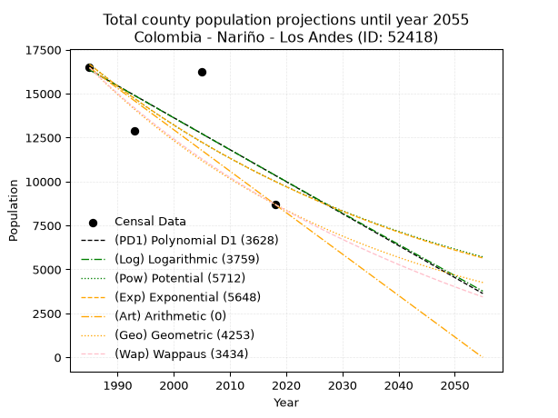
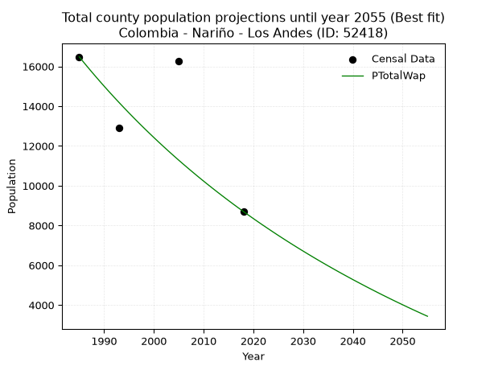
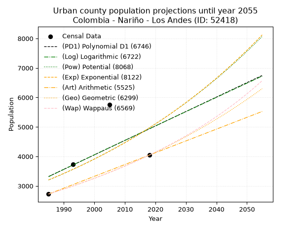
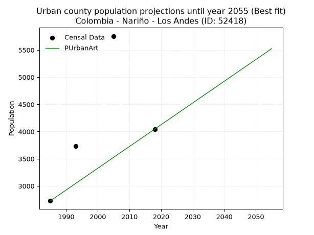
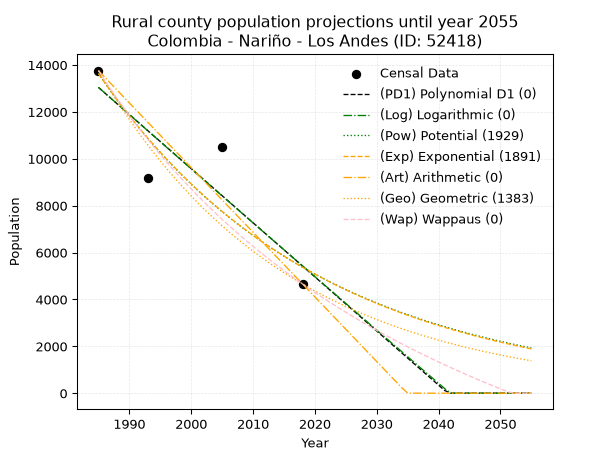
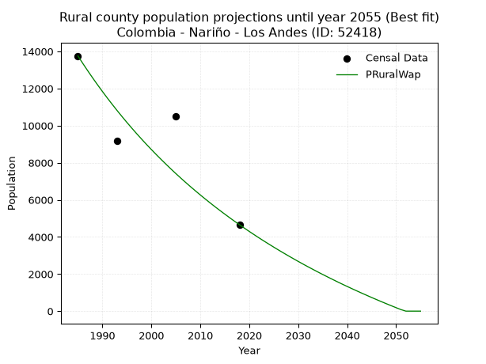

<div align="center">


</div>

# _“Population and Public Services Demand Projections (PPSD) until Year 2050 for Colombia - Nariño - Los Andes (ID: 52418)”_
Keywords: `population` `public-service` `projection` `lineal` `polynomial` `logarithmic` `potential` `exponential` `arithmetic` `geometric` `wappaus` `dane` `colombia` `south-america`

PPSD are analytical estimates used by governments and planners to anticipate future changes in population size, age distribution, and the resulting community needs for utilities, healthcare, education, and infrastructure as sizing future water treatment facilities, electrical grids, and road networks based on spatial growth.

> **General running parameters**: • app_version: _v20260806_. • Python version: _3.14.7_. • Pandas version: _3.0.5_. • NumPy version: _2.5.1_. • Creates, save and include plots into reports (create_plot): _False_. • Projection until year: _2050_. • Process polynomial degree 2 and up: _False_. • Process Wappaus: _True_. • Process Wappaus: _True_. • Set negative values to zero: _True_. • Set infinite values to zero: _True_. • Drop dataset notes: _True_. 
<div align="center">

Dynamic map: [:earth_americas:Google](http://maps.google.com/maps?q=1.494586529,-77.5213033) [:earth_americas:OSM](https://www.openstreetmap.org/#map=18/1.494586529/-77.5213033&layers=P) [:earth_americas:Bing](https://www.bing.com/maps?cp=1.494586529~-77.5213033&lvl=18) [:earth_americas:Apple](https://maps.apple.com/frame?center=1.494586529%2C-77.5213033&span=0.003%2C0.006)

</div>


<div align="center">

```geojson
{
  "type": "Feature",
  "geometry": {
    "type": "Point", 
    "coordinates": [-77.5213033, 1.494586529]
  }, 
  "properties": {
    "Name": "Colombia - Nariño - Los Andes (ID: 52418)"
  }
}
```

</div>


## 0. Census Data (4 records)

Census data are official statistics collected by a government about the people and housing in a country. They usually include counts of total population, age, sex, race, income, education, and jobs.

📅Global census file: [Population.xlsx](../data/Population.xlsx)

| Source   |   Year |   CountryID | CountryName   |   StateID | StateName   |   CountyID | CountyName   |   PTotal |   PUrban |   PRural |
|:---------|-------:|------------:|:--------------|----------:|:------------|-----------:|:-------------|---------:|---------:|---------:|
| DANE     |   1985 |          57 | Colombia      |        52 | Nariño      |      52418 | Los Andes    |    16482 |     2725 |    13757 |
| DANE     |   1993 |          57 | Colombia      |        52 | Nariño      |      52418 | Los Andes    |    12905 |     3735 |     9170 |
| DANE     |   2005 |          57 | Colombia      |        52 | Nariño      |      52418 | Los Andes    |    16249 |     5755 |    10494 |
| DANE     |   2018 |          57 | Colombia      |        52 | Nariño      |      52418 | Los Andes    |     8703 |     4045 |     4658 |

> 🔥Some records could had specific notes about the registered values or the corresponding urban or rural distribution.

## 1. Total

### 1.1. Coefficients and Parameters

* (PD1) Polynomial Deg 1: -181.8558811722155, 377341.976314724 (lineal)
* (Log) Logarithmic: -363592.594792143, 2777254.976663275
* (Pow) Potential: -30.91154914581666, 106.16093385978954
* (Exp) Exponential: -0.015462152652927523, 3.560408409439555e+17
* (Art) Arithmetic: Year diff. 2018 - 1985 = 33, Population diff. 8703 - 16482 = -7779, Annual growth = -235.72727272727272
* (Geo) Geometric: Year diff. 2018 - 1985 = 33, Population diff. 8703 - 16482 = -7779, Annual growth % = -0.019165508733143044
* (Wap) Wappaus: i = -1.8719656361109607, Condition values only valid for < 200)

<sub>
Wappaus condition values: ['-0.00', '-1.87', '-3.74', '-5.62', '-7.49', '-9.36', '-11.23', '-13.10', '-14.98', '-16.85', '-18.72', '-20.59', '-22.46', '-24.34', '-26.21', '-28.08', '-29.95', '-31.82', '-33.70', '-35.57', '-37.44', '-39.31', '-41.18', '-43.06', '-44.93', '-46.80', '-48.67', '-50.54', '-52.42', '-54.29', '-56.16', '-58.03', '-59.90', '-61.77', '-63.65', '-65.52', '-67.39', '-69.26', '-71.13', '-73.01', '-74.88', '-76.75', '-78.62', '-80.49', '-82.37', '-84.24', '-86.11', '-87.98', '-89.85', '-91.73', '-93.60', '-95.47', '-97.34', '-99.21', '-101.09', '-102.96', '-104.83', '-106.70', '-108.57', '-110.45', '-112.32', '-114.19', '-116.06', '-117.93', '-119.81', '-121.68']
</sub>


### 1.2. Projected Dataset

|   Year |   CountyID |   PTotalPD1 |   PTotalLog |   PTotalPow |   PTotalExp |   PTotalArt |   PTotalGeo |   PTotalWap |
|-------:|-----------:|------------:|------------:|------------:|------------:|------------:|------------:|------------:|
|   1985 |      52418 |       16358 |       16360 |       16674 |       16671 |       16482 |       16482 |       16482 |
|   1986 |      52418 |       16176 |       16177 |       16417 |       16416 |       16246 |       16166 |       16176 |
|   1987 |      52418 |       15994 |       15994 |       16163 |       16164 |       16011 |       15856 |       15876 |
|   1988 |      52418 |       15812 |       15811 |       15914 |       15916 |       15775 |       15552 |       15582 |
|   1989 |      52418 |       15631 |       15628 |       15668 |       15672 |       15539 |       15254 |       15292 |
|   1990 |      52418 |       15449 |       15446 |       15427 |       15431 |       15303 |       14962 |       15008 |
|   1991 |      52418 |       15267 |       15263 |       15189 |       15194 |       15068 |       14675 |       14729 |
|   1992 |      52418 |       15085 |       15080 |       14955 |       14961 |       14832 |       14394 |       14455 |
|   1993 |      52418 |       14903 |       14898 |       14725 |       14732 |       14596 |       14118 |       14186 |
|   1994 |      52418 |       14721 |       14716 |       14498 |       14506 |       14360 |       13848 |       13921 |
|   1995 |      52418 |       14539 |       14533 |       14275 |       14283 |       14125 |       13582 |       13661 |
|   1996 |      52418 |       14358 |       14351 |       14056 |       14064 |       13889 |       13322 |       13405 |
|   1997 |      52418 |       14176 |       14169 |       13840 |       13848 |       13653 |       13066 |       13153 |
|   1998 |      52418 |       13994 |       13987 |       13627 |       13636 |       13418 |       12816 |       12906 |
|   1999 |      52418 |       13812 |       13805 |       13418 |       13426 |       13182 |       12570 |       12663 |
|   2000 |      52418 |       13630 |       13623 |       13212 |       13220 |       12946 |       12330 |       12424 |
|   2001 |      52418 |       13448 |       13441 |       13010 |       13018 |       12710 |       12093 |       12188 |
|   2002 |      52418 |       13267 |       13260 |       12810 |       12818 |       12475 |       11861 |       11957 |
|   2003 |      52418 |       13085 |       13078 |       12614 |       12621 |       12239 |       11634 |       11729 |
|   2004 |      52418 |       12903 |       12897 |       12421 |       12428 |       12003 |       11411 |       11505 |
|   2005 |      52418 |       12721 |       12715 |       12231 |       12237 |       11767 |       11192 |       11284 |
|   2006 |      52418 |       12539 |       12534 |       12044 |       12049 |       11532 |       10978 |       11067 |
|   2007 |      52418 |       12357 |       12353 |       11860 |       11864 |       11296 |       10768 |       10853 |
|   2008 |      52418 |       12175 |       12172 |       11679 |       11682 |       11060 |       10561 |       10643 |
|   2009 |      52418 |       11994 |       11991 |       11500 |       11503 |       10825 |       10359 |       10435 |
|   2010 |      52418 |       11812 |       11810 |       11325 |       11326 |       10589 |       10160 |       10231 |
|   2011 |      52418 |       11630 |       11629 |       11152 |       11153 |       10353 |        9965 |       10030 |
|   2012 |      52418 |       11448 |       11448 |       10982 |       10982 |       10117 |        9775 |        9832 |
|   2013 |      52418 |       11266 |       11267 |       10814 |       10813 |        9882 |        9587 |        9637 |
|   2014 |      52418 |       11084 |       11087 |       10650 |       10647 |        9646 |        9403 |        9445 |
|   2015 |      52418 |       10902 |       10906 |       10488 |       10484 |        9410 |        9223 |        9255 |
|   2016 |      52418 |       10721 |       10726 |       10328 |       10323 |        9174 |        9046 |        9068 |
|   2017 |      52418 |       10539 |       10546 |       10171 |       10165 |        8939 |        8873 |        8884 |
|   2018 |      52418 |       10357 |       10365 |       10016 |       10009 |        8703 |        8703 |        8703 |
|   2019 |      52418 |       10175 |       10185 |        9864 |        9855 |        8467 |        8536 |        8524 |
|   2020 |      52418 |        9993 |       10005 |        9714 |        9704 |        8232 |        8373 |        8348 |
|   2021 |      52418 |        9811 |        9825 |        9567 |        9555 |        7996 |        8212 |        8174 |
|   2022 |      52418 |        9629 |        9645 |        9421 |        9408 |        7760 |        8055 |        8003 |
|   2023 |      52418 |        9448 |        9466 |        9279 |        9264 |        7524 |        7900 |        7834 |
|   2024 |      52418 |        9266 |        9286 |        9138 |        9122 |        7289 |        7749 |        7667 |
|   2025 |      52418 |        9084 |        9106 |        8999 |        8982 |        7053 |        7600 |        7502 |
|   2026 |      52418 |        8902 |        8927 |        8863 |        8844 |        6817 |        7455 |        7340 |
|   2027 |      52418 |        8720 |        8747 |        8729 |        8708 |        6581 |        7312 |        7180 |
|   2028 |      52418 |        8538 |        8568 |        8597 |        8575 |        6346 |        7172 |        7022 |
|   2029 |      52418 |        8356 |        8389 |        8467 |        8443 |        6110 |        7034 |        6866 |
|   2030 |      52418 |        8175 |        8210 |        8339 |        8314 |        5874 |        6900 |        6713 |
|   2031 |      52418 |        7993 |        8031 |        8213 |        8186 |        5639 |        6767 |        6561 |
|   2032 |      52418 |        7811 |        7852 |        8089 |        8060 |        5403 |        6638 |        6411 |
|   2033 |      52418 |        7629 |        7673 |        7967 |        7937 |        5167 |        6510 |        6263 |
|   2034 |      52418 |        7447 |        7494 |        7847 |        7815 |        4931 |        6386 |        6117 |
|   2035 |      52418 |        7265 |        7315 |        7728 |        7695 |        4696 |        6263 |        5973 |
|   2036 |      52418 |        7083 |        7137 |        7612 |        7577 |        4460 |        6143 |        5831 |
|   2037 |      52418 |        6902 |        6958 |        7497 |        7461 |        4224 |        6025 |        5690 |
|   2038 |      52418 |        6720 |        6780 |        7384 |        7346 |        3988 |        5910 |        5552 |
|   2039 |      52418 |        6538 |        6601 |        7273 |        7234 |        3753 |        5797 |        5415 |
|   2040 |      52418 |        6356 |        6423 |        7164 |        7123 |        3517 |        5686 |        5279 |
|   2041 |      52418 |        6174 |        6245 |        7056 |        7013 |        3281 |        5577 |        5146 |
|   2042 |      52418 |        5992 |        6067 |        6950 |        6906 |        3046 |        5470 |        5014 |
|   2043 |      52418 |        5810 |        5889 |        6846 |        6800 |        2810 |        5365 |        4883 |
|   2044 |      52418 |        5629 |        5711 |        6743 |        6695 |        2574 |        5262 |        4755 |
|   2045 |      52418 |        5447 |        5533 |        6642 |        6593 |        2338 |        5161 |        4627 |
|   2046 |      52418 |        5265 |        5355 |        6542 |        6492 |        2103 |        5062 |        4501 |
|   2047 |      52418 |        5083 |        5178 |        6444 |        6392 |        1867 |        4965 |        4377 |
|   2048 |      52418 |        4901 |        5000 |        6347 |        6294 |        1631 |        4870 |        4254 |
|   2049 |      52418 |        4719 |        4822 |        6252 |        6197 |        1395 |        4777 |        4133 |
|   2050 |      52418 |        4537 |        4645 |        6159 |        6102 |        1160 |        4685 |        4013 |
<div align="center">

</img>

</div>


### 1.3. Best fit with absolute and relative error (%)

Relative error puts that difference into context by dividing the absolute error by the true value, creating a unitless ratio or percentage that shows the scale of the mistake.

Absolute and relative error

|   Year | Source   |   CountryID | CountryName   |   StateID | StateName   |   CountyID_x | CountyName   |   PTotal |   PUrban |   PRural |   CountyID_y |   PTotalPD1 |   PTotalLog |   PTotalPow |   PTotalExp |   PTotalArt |   PTotalGeo |   PTotalWap |   PTotalPD1AbsError |   PTotalLogAbsError |   PTotalPowAbsError |   PTotalExpAbsError |   PTotalArtAbsError |   PTotalGeoAbsError |   PTotalWapAbsError |   PTotalPD1RelError |   PTotalLogRelError |   PTotalPowRelError |   PTotalExpRelError |   PTotalArtRelError |   PTotalGeoRelError |   PTotalWapRelError |
|-------:|:---------|------------:|:--------------|----------:|:------------|-------------:|:-------------|---------:|---------:|---------:|-------------:|------------:|------------:|------------:|------------:|------------:|------------:|------------:|--------------------:|--------------------:|--------------------:|--------------------:|--------------------:|--------------------:|--------------------:|--------------------:|--------------------:|--------------------:|--------------------:|--------------------:|--------------------:|--------------------:|
|   1985 | DANE     |          57 | Colombia      |        52 | Nariño      |        52418 | Los Andes    |    16482 |     2725 |    13757 |        52418 |       16358 |       16360 |       16674 |       16671 |       16482 |       16482 |       16482 |                 124 |                 122 |                 192 |                 189 |                   0 |                   0 |                   0 |            0.752336 |            0.740201 |             1.16491 |             1.14671 |              0      |             0       |             0       |
|   1993 | DANE     |          57 | Colombia      |        52 | Nariño      |        52418 | Los Andes    |    12905 |     3735 |     9170 |        52418 |       14903 |       14898 |       14725 |       14732 |       14596 |       14118 |       14186 |                1998 |                1993 |                1820 |                1827 |                1691 |                1213 |                1281 |           15.4824   |           15.4436   |            14.1031  |            14.1573  |             13.1034 |             9.39946 |             9.92639 |
|   2005 | DANE     |          57 | Colombia      |        52 | Nariño      |        52418 | Los Andes    |    16249 |     5755 |    10494 |        52418 |       12721 |       12715 |       12231 |       12237 |       11767 |       11192 |       11284 |                3528 |                3534 |                4018 |                4012 |                4482 |                5057 |                4965 |           21.7121   |           21.749    |            24.7277  |            24.6908  |             27.5832 |            31.1219  |            30.5557  |
|   2018 | DANE     |          57 | Colombia      |        52 | Nariño      |        52418 | Los Andes    |     8703 |     4045 |     4658 |        52418 |       10357 |       10365 |       10016 |       10009 |        8703 |        8703 |        8703 |                1654 |                1662 |                1313 |                1306 |                   0 |                   0 |                   0 |           19.0049   |           19.0969   |            15.0868  |            15.0063  |              0      |             0       |             0       |

Relative error mean

| Method    |   RelError | Best   |
|:----------|-----------:|:-------|
| PTotalPD1 |    14.2379 |        |
| PTotalLog |    14.2574 |        |
| PTotalPow |    13.7706 |        |
| PTotalExp |    13.7503 |        |
| PTotalArt |    10.1717 |        |
| PTotalGeo |    10.1303 |        |
| PTotalWap |    10.1205 | True   |

💙Best method: _**PTotalWap**_
<div align="center">

</img>

</div>


### 1.4. Fresh water supply demand in liters per capita per day (lpcd)

The fresh water supply demand typically ranges from 100 to 300 liters per capita per day (lpcd) for standard domestic and municipal planning, though absolute survival minimums set by the World Health Organization are as low as 7.5 to 20 liters per day, and total consumption in high-income nations can exceed 400 liters.

> `CZ`: Level in meters above the sea level (masl).<br> `WS`: Fresh water supply demand in liters per capita per day (lpcd or l/h/d).<br> `WSAll`: Zonal fresh water supply demand in liters per second (l/s).<br> `A`: Zonal area in square meters.

Reference values (RAS Colombia)

|    CZ |   WS |
|------:|-----:|
|  1000 |  120 |
|  2000 |  130 |
| 99999 |  140 |

County shapefile geometry properties and water supply values

|   CountyID |      ATotal |   CZTotal |   WSTotal |
|-----------:|------------:|----------:|----------:|
|      52418 | 9.57967e+08 |   1000.53 |       130 |

Projected values for best method: PTotalWap

|   CountyID |   Year |   PTotalWap |   WSTotal |   WSTotalAll |
|-----------:|-------:|------------:|----------:|-------------:|
|      52418 |   1985 |       16482 |       130 |     24.7993  |
|      52418 |   1986 |       16176 |       130 |     24.3389  |
|      52418 |   1987 |       15876 |       130 |     23.8875  |
|      52418 |   1988 |       15582 |       130 |     23.4451  |
|      52418 |   1989 |       15292 |       130 |     23.0088  |
|      52418 |   1990 |       15008 |       130 |     22.5815  |
|      52418 |   1991 |       14729 |       130 |     22.1617  |
|      52418 |   1992 |       14455 |       130 |     21.7494  |
|      52418 |   1993 |       14186 |       130 |     21.3447  |
|      52418 |   1994 |       13921 |       130 |     20.9459  |
|      52418 |   1995 |       13661 |       130 |     20.5547  |
|      52418 |   1996 |       13405 |       130 |     20.1696  |
|      52418 |   1997 |       13153 |       130 |     19.7904  |
|      52418 |   1998 |       12906 |       130 |     19.4187  |
|      52418 |   1999 |       12663 |       130 |     19.0531  |
|      52418 |   2000 |       12424 |       130 |     18.6935  |
|      52418 |   2001 |       12188 |       130 |     18.3384  |
|      52418 |   2002 |       11957 |       130 |     17.9909  |
|      52418 |   2003 |       11729 |       130 |     17.6478  |
|      52418 |   2004 |       11505 |       130 |     17.3108  |
|      52418 |   2005 |       11284 |       130 |     16.9782  |
|      52418 |   2006 |       11067 |       130 |     16.6517  |
|      52418 |   2007 |       10853 |       130 |     16.3297  |
|      52418 |   2008 |       10643 |       130 |     16.0138  |
|      52418 |   2009 |       10435 |       130 |     15.7008  |
|      52418 |   2010 |       10231 |       130 |     15.3939  |
|      52418 |   2011 |       10030 |       130 |     15.0914  |
|      52418 |   2012 |        9832 |       130 |     14.7935  |
|      52418 |   2013 |        9637 |       130 |     14.5001  |
|      52418 |   2014 |        9445 |       130 |     14.2112  |
|      52418 |   2015 |        9255 |       130 |     13.9253  |
|      52418 |   2016 |        9068 |       130 |     13.644   |
|      52418 |   2017 |        8884 |       130 |     13.3671  |
|      52418 |   2018 |        8703 |       130 |     13.0948  |
|      52418 |   2019 |        8524 |       130 |     12.8255  |
|      52418 |   2020 |        8348 |       130 |     12.5606  |
|      52418 |   2021 |        8174 |       130 |     12.2988  |
|      52418 |   2022 |        8003 |       130 |     12.0416  |
|      52418 |   2023 |        7834 |       130 |     11.7873  |
|      52418 |   2024 |        7667 |       130 |     11.536   |
|      52418 |   2025 |        7502 |       130 |     11.2877  |
|      52418 |   2026 |        7340 |       130 |     11.044   |
|      52418 |   2027 |        7180 |       130 |     10.8032  |
|      52418 |   2028 |        7022 |       130 |     10.5655  |
|      52418 |   2029 |        6866 |       130 |     10.3308  |
|      52418 |   2030 |        6713 |       130 |     10.1006  |
|      52418 |   2031 |        6561 |       130 |      9.87187 |
|      52418 |   2032 |        6411 |       130 |      9.64618 |
|      52418 |   2033 |        6263 |       130 |      9.4235  |
|      52418 |   2034 |        6117 |       130 |      9.20382 |
|      52418 |   2035 |        5973 |       130 |      8.98715 |
|      52418 |   2036 |        5831 |       130 |      8.7735  |
|      52418 |   2037 |        5690 |       130 |      8.56134 |
|      52418 |   2038 |        5552 |       130 |      8.3537  |
|      52418 |   2039 |        5415 |       130 |      8.14757 |
|      52418 |   2040 |        5279 |       130 |      7.94294 |
|      52418 |   2041 |        5146 |       130 |      7.74282 |
|      52418 |   2042 |        5014 |       130 |      7.54421 |
|      52418 |   2043 |        4883 |       130 |      7.34711 |
|      52418 |   2044 |        4755 |       130 |      7.15451 |
|      52418 |   2045 |        4627 |       130 |      6.96192 |
|      52418 |   2046 |        4501 |       130 |      6.77234 |
|      52418 |   2047 |        4377 |       130 |      6.58576 |
|      52418 |   2048 |        4254 |       130 |      6.40069 |
|      52418 |   2049 |        4133 |       130 |      6.21863 |
|      52418 |   2050 |        4013 |       130 |      6.03808 |

## 2. Urban

### 2.1. Coefficients and Parameters

* (PD1) Polynomial Deg 1: 48.97631473303987, -93899.87354476299 (lineal)
* (Log) Logarithmic: 98339.97017757656, -743417.9013668232
* (Pow) Potential: 26.677356589324972, -84.47032199476372
* (Exp) Exponential: 0.013290743088542542, 1.1169132681345512e-08
* (Art) Arithmetic: Year diff. 2018 - 1985 = 33, Population diff. 4045 - 2725 = 1320, Annual growth = 40.0
* (Geo) Geometric: Year diff. 2018 - 1985 = 33, Population diff. 4045 - 2725 = 1320, Annual growth % = 0.01204202291026557
* (Wap) Wappaus: i = 1.1816838995568686, Condition values only valid for < 200)

<sub>
Wappaus condition values: ['0.00', '1.18', '2.36', '3.55', '4.73', '5.91', '7.09', '8.27', '9.45', '10.64', '11.82', '13.00', '14.18', '15.36', '16.54', '17.73', '18.91', '20.09', '21.27', '22.45', '23.63', '24.82', '26.00', '27.18', '28.36', '29.54', '30.72', '31.91', '33.09', '34.27', '35.45', '36.63', '37.81', '39.00', '40.18', '41.36', '42.54', '43.72', '44.90', '46.09', '47.27', '48.45', '49.63', '50.81', '51.99', '53.18', '54.36', '55.54', '56.72', '57.90', '59.08', '60.27', '61.45', '62.63', '63.81', '64.99', '66.17', '67.36', '68.54', '69.72', '70.90', '72.08', '73.26', '74.45', '75.63', '76.81']
</sub>


### 2.2. Projected Dataset

|   Year |   CountyID |   PUrbanPD1 |   PUrbanLog |   PUrbanPow |   PUrbanExp |   PUrbanArt |   PUrbanGeo |   PUrbanWap |
|-------:|-----------:|------------:|------------:|------------:|------------:|------------:|------------:|------------:|
|   1985 |      52418 |        3318 |        3314 |        3200 |        3204 |        2725 |        2725 |        2725 |
|   1986 |      52418 |        3367 |        3364 |        3244 |        3246 |        2765 |        2758 |        2757 |
|   1987 |      52418 |        3416 |        3413 |        3288 |        3290 |        2805 |        2791 |        2790 |
|   1988 |      52418 |        3465 |        3463 |        3332 |        3334 |        2845 |        2825 |        2823 |
|   1989 |      52418 |        3514 |        3512 |        3377 |        3378 |        2885 |        2859 |        2857 |
|   1990 |      52418 |        3563 |        3562 |        3423 |        3424 |        2925 |        2893 |        2891 |
|   1991 |      52418 |        3612 |        3611 |        3469 |        3469 |        2965 |        2928 |        2925 |
|   1992 |      52418 |        3661 |        3660 |        3516 |        3516 |        3005 |        2963 |        2960 |
|   1993 |      52418 |        3710 |        3710 |        3563 |        3563 |        3045 |        2999 |        2995 |
|   1994 |      52418 |        3759 |        3759 |        3611 |        3611 |        3085 |        3035 |        3031 |
|   1995 |      52418 |        3808 |        3808 |        3660 |        3659 |        3125 |        3072 |        3067 |
|   1996 |      52418 |        3857 |        3858 |        3709 |        3708 |        3165 |        3108 |        3104 |
|   1997 |      52418 |        3906 |        3907 |        3759 |        3757 |        3205 |        3146 |        3141 |
|   1998 |      52418 |        3955 |        3956 |        3809 |        3808 |        3245 |        3184 |        3178 |
|   1999 |      52418 |        4004 |        4005 |        3860 |        3859 |        3285 |        3222 |        3216 |
|   2000 |      52418 |        4053 |        4055 |        3912 |        3910 |        3325 |        3261 |        3255 |
|   2001 |      52418 |        4102 |        4104 |        3965 |        3963 |        3365 |        3300 |        3294 |
|   2002 |      52418 |        4151 |        4153 |        4018 |        4016 |        3405 |        3340 |        3334 |
|   2003 |      52418 |        4200 |        4202 |        4072 |        4069 |        3445 |        3380 |        3374 |
|   2004 |      52418 |        4249 |        4251 |        4126 |        4124 |        3485 |        3421 |        3414 |
|   2005 |      52418 |        4298 |        4300 |        4182 |        4179 |        3525 |        3462 |        3455 |
|   2006 |      52418 |        4347 |        4349 |        4238 |        4235 |        3565 |        3504 |        3497 |
|   2007 |      52418 |        4396 |        4398 |        4294 |        4292 |        3605 |        3546 |        3539 |
|   2008 |      52418 |        4445 |        4447 |        4352 |        4349 |        3645 |        3589 |        3582 |
|   2009 |      52418 |        4494 |        4496 |        4410 |        4407 |        3685 |        3632 |        3626 |
|   2010 |      52418 |        4543 |        4545 |        4469 |        4466 |        3725 |        3676 |        3670 |
|   2011 |      52418 |        4591 |        4594 |        4529 |        4526 |        3765 |        3720 |        3714 |
|   2012 |      52418 |        4640 |        4643 |        4589 |        4586 |        3805 |        3765 |        3759 |
|   2013 |      52418 |        4689 |        4692 |        4650 |        4648 |        3845 |        3810 |        3805 |
|   2014 |      52418 |        4738 |        4741 |        4712 |        4710 |        3885 |        3856 |        3852 |
|   2015 |      52418 |        4787 |        4789 |        4775 |        4773 |        3925 |        3902 |        3899 |
|   2016 |      52418 |        4836 |        4838 |        4839 |        4837 |        3965 |        3949 |        3947 |
|   2017 |      52418 |        4885 |        4887 |        4903 |        4902 |        4005 |        3997 |        3996 |
|   2018 |      52418 |        4934 |        4936 |        4969 |        4967 |        4045 |        4045 |        4045 |
|   2019 |      52418 |        4983 |        4984 |        5035 |        5034 |        4085 |        4094 |        4095 |
|   2020 |      52418 |        5032 |        5033 |        5102 |        5101 |        4125 |        4143 |        4146 |
|   2021 |      52418 |        5081 |        5082 |        5170 |        5169 |        4165 |        4193 |        4197 |
|   2022 |      52418 |        5130 |        5130 |        5238 |        5238 |        4205 |        4243 |        4250 |
|   2023 |      52418 |        5179 |        5179 |        5308 |        5308 |        4245 |        4294 |        4303 |
|   2024 |      52418 |        5228 |        5228 |        5378 |        5380 |        4285 |        4346 |        4357 |
|   2025 |      52418 |        5277 |        5276 |        5450 |        5451 |        4325 |        4399 |        4412 |
|   2026 |      52418 |        5326 |        5325 |        5522 |        5524 |        4365 |        4452 |        4467 |
|   2027 |      52418 |        5375 |        5373 |        5595 |        5598 |        4405 |        4505 |        4524 |
|   2028 |      52418 |        5424 |        5422 |        5669 |        5673 |        4445 |        4559 |        4581 |
|   2029 |      52418 |        5473 |        5470 |        5744 |        5749 |        4485 |        4614 |        4640 |
|   2030 |      52418 |        5522 |        5519 |        5820 |        5826 |        4525 |        4670 |        4699 |
|   2031 |      52418 |        5571 |        5567 |        5897 |        5904 |        4565 |        4726 |        4759 |
|   2032 |      52418 |        5620 |        5616 |        5975 |        5983 |        4605 |        4783 |        4820 |
|   2033 |      52418 |        5669 |        5664 |        6054 |        6063 |        4645 |        4841 |        4883 |
|   2034 |      52418 |        5718 |        5712 |        6134 |        6144 |        4685 |        4899 |        4946 |
|   2035 |      52418 |        5767 |        5761 |        6215 |        6226 |        4725 |        4958 |        5010 |
|   2036 |      52418 |        5816 |        5809 |        6297 |        6310 |        4765 |        5018 |        5076 |
|   2037 |      52418 |        5865 |        5857 |        6380 |        6394 |        4805 |        5078 |        5142 |
|   2038 |      52418 |        5914 |        5906 |        6464 |        6480 |        4845 |        5139 |        5210 |
|   2039 |      52418 |        5963 |        5954 |        6549 |        6566 |        4885 |        5201 |        5279 |
|   2040 |      52418 |        6012 |        6002 |        6635 |        6654 |        4925 |        5264 |        5349 |
|   2041 |      52418 |        6061 |        6050 |        6723 |        6743 |        4965 |        5327 |        5420 |
|   2042 |      52418 |        6110 |        6098 |        6811 |        6833 |        5005 |        5391 |        5492 |
|   2043 |      52418 |        6159 |        6147 |        6901 |        6925 |        5045 |        5456 |        5566 |
|   2044 |      52418 |        6208 |        6195 |        6991 |        7018 |        5085 |        5522 |        5642 |
|   2045 |      52418 |        6257 |        6243 |        7083 |        7111 |        5125 |        5588 |        5718 |
|   2046 |      52418 |        6306 |        6291 |        7176 |        7207 |        5165 |        5656 |        5796 |
|   2047 |      52418 |        6355 |        6339 |        7270 |        7303 |        5205 |        5724 |        5876 |
|   2048 |      52418 |        6404 |        6387 |        7366 |        7401 |        5245 |        5793 |        5957 |
|   2049 |      52418 |        6453 |        6435 |        7462 |        7500 |        5285 |        5862 |        6039 |
|   2050 |      52418 |        6502 |        6483 |        7560 |        7600 |        5325 |        5933 |        6123 |
<div align="center">

</img>

</div>


### 2.3. Best fit with absolute and relative error (%)

Relative error puts that difference into context by dividing the absolute error by the true value, creating a unitless ratio or percentage that shows the scale of the mistake.

Absolute and relative error

|   Year | Source   |   CountryID | CountryName   |   StateID | StateName   |   CountyID_x | CountyName   |   PTotal |   PUrban |   PRural |   CountyID_y |   PUrbanPD1 |   PUrbanLog |   PUrbanPow |   PUrbanExp |   PUrbanArt |   PUrbanGeo |   PUrbanWap |   PUrbanPD1AbsError |   PUrbanLogAbsError |   PUrbanPowAbsError |   PUrbanExpAbsError |   PUrbanArtAbsError |   PUrbanGeoAbsError |   PUrbanWapAbsError |   PUrbanPD1RelError |   PUrbanLogRelError |   PUrbanPowRelError |   PUrbanExpRelError |   PUrbanArtRelError |   PUrbanGeoRelError |   PUrbanWapRelError |
|-------:|:---------|------------:|:--------------|----------:|:------------|-------------:|:-------------|---------:|---------:|---------:|-------------:|------------:|------------:|------------:|------------:|------------:|------------:|------------:|--------------------:|--------------------:|--------------------:|--------------------:|--------------------:|--------------------:|--------------------:|--------------------:|--------------------:|--------------------:|--------------------:|--------------------:|--------------------:|--------------------:|
|   1985 | DANE     |          57 | Colombia      |        52 | Nariño      |        52418 | Los Andes    |    16482 |     2725 |    13757 |        52418 |        3318 |        3314 |        3200 |        3204 |        2725 |        2725 |        2725 |                 593 |                 589 |                 475 |                 479 |                   0 |                   0 |                   0 |           21.7615   |           21.6147   |            17.4312  |            17.578   |              0      |              0      |              0      |
|   1993 | DANE     |          57 | Colombia      |        52 | Nariño      |        52418 | Los Andes    |    12905 |     3735 |     9170 |        52418 |        3710 |        3710 |        3563 |        3563 |        3045 |        2999 |        2995 |                  25 |                  25 |                 172 |                 172 |                 690 |                 736 |                 740 |            0.669344 |            0.669344 |             4.60509 |             4.60509 |             18.4739 |             19.7055 |             19.8126 |
|   2005 | DANE     |          57 | Colombia      |        52 | Nariño      |        52418 | Los Andes    |    16249 |     5755 |    10494 |        52418 |        4298 |        4300 |        4182 |        4179 |        3525 |        3462 |        3455 |                1457 |                1455 |                1573 |                1576 |                2230 |                2293 |                2300 |           25.3171   |           25.2824   |            27.3328  |            27.3849  |             38.7489 |             39.8436 |             39.9652 |
|   2018 | DANE     |          57 | Colombia      |        52 | Nariño      |        52418 | Los Andes    |     8703 |     4045 |     4658 |        52418 |        4934 |        4936 |        4969 |        4967 |        4045 |        4045 |        4045 |                 889 |                 891 |                 924 |                 922 |                   0 |                   0 |                   0 |           21.9778   |           22.0272   |            22.843   |            22.7936  |              0      |              0      |              0      |

Relative error mean

| Method    |   RelError | Best   |
|:----------|-----------:|:-------|
| PUrbanPD1 |    17.4314 |        |
| PUrbanLog |    17.3984 |        |
| PUrbanPow |    18.053  |        |
| PUrbanExp |    18.0904 |        |
| PUrbanArt |    14.3057 | True   |
| PUrbanGeo |    14.8873 |        |
| PUrbanWap |    14.9445 |        |

💙Best method: _**PUrbanArt**_
<div align="center">

</img>

</div>


### 2.4. Fresh water supply demand in liters per capita per day (lpcd)

The fresh water supply demand typically ranges from 100 to 300 liters per capita per day (lpcd) for standard domestic and municipal planning, though absolute survival minimums set by the World Health Organization are as low as 7.5 to 20 liters per day, and total consumption in high-income nations can exceed 400 liters.

> `CZ`: Level in meters above the sea level (masl).<br> `WS`: Fresh water supply demand in liters per capita per day (lpcd or l/h/d).<br> `WSAll`: Zonal fresh water supply demand in liters per second (l/s).<br> `A`: Zonal area in square meters.

Reference values (RAS Colombia)

|    CZ |   WS |
|------:|-----:|
|  1000 |  120 |
|  2000 |  130 |
| 99999 |  140 |

County shapefile geometry properties and water supply values

|   CountyID |   AUrban |   CZUrban |   WSUrban |
|-----------:|---------:|----------:|----------:|
|      52418 |   658324 |   1556.32 |       130 |

Projected values for best method: PUrbanArt

|   CountyID |   Year |   PUrbanArt |   WSUrban |   WSUrbanAll |
|-----------:|-------:|------------:|----------:|-------------:|
|      52418 |   1985 |        2725 |       130 |      4.10012 |
|      52418 |   1986 |        2765 |       130 |      4.1603  |
|      52418 |   1987 |        2805 |       130 |      4.22049 |
|      52418 |   1988 |        2845 |       130 |      4.28067 |
|      52418 |   1989 |        2885 |       130 |      4.34086 |
|      52418 |   1990 |        2925 |       130 |      4.40104 |
|      52418 |   1991 |        2965 |       130 |      4.46123 |
|      52418 |   1992 |        3005 |       130 |      4.52141 |
|      52418 |   1993 |        3045 |       130 |      4.5816  |
|      52418 |   1994 |        3085 |       130 |      4.64178 |
|      52418 |   1995 |        3125 |       130 |      4.70197 |
|      52418 |   1996 |        3165 |       130 |      4.76215 |
|      52418 |   1997 |        3205 |       130 |      4.82234 |
|      52418 |   1998 |        3245 |       130 |      4.88252 |
|      52418 |   1999 |        3285 |       130 |      4.94271 |
|      52418 |   2000 |        3325 |       130 |      5.00289 |
|      52418 |   2001 |        3365 |       130 |      5.06308 |
|      52418 |   2002 |        3405 |       130 |      5.12326 |
|      52418 |   2003 |        3445 |       130 |      5.18345 |
|      52418 |   2004 |        3485 |       130 |      5.24363 |
|      52418 |   2005 |        3525 |       130 |      5.30382 |
|      52418 |   2006 |        3565 |       130 |      5.364   |
|      52418 |   2007 |        3605 |       130 |      5.42419 |
|      52418 |   2008 |        3645 |       130 |      5.48438 |
|      52418 |   2009 |        3685 |       130 |      5.54456 |
|      52418 |   2010 |        3725 |       130 |      5.60475 |
|      52418 |   2011 |        3765 |       130 |      5.66493 |
|      52418 |   2012 |        3805 |       130 |      5.72512 |
|      52418 |   2013 |        3845 |       130 |      5.7853  |
|      52418 |   2014 |        3885 |       130 |      5.84549 |
|      52418 |   2015 |        3925 |       130 |      5.90567 |
|      52418 |   2016 |        3965 |       130 |      5.96586 |
|      52418 |   2017 |        4005 |       130 |      6.02604 |
|      52418 |   2018 |        4045 |       130 |      6.08623 |
|      52418 |   2019 |        4085 |       130 |      6.14641 |
|      52418 |   2020 |        4125 |       130 |      6.2066  |
|      52418 |   2021 |        4165 |       130 |      6.26678 |
|      52418 |   2022 |        4205 |       130 |      6.32697 |
|      52418 |   2023 |        4245 |       130 |      6.38715 |
|      52418 |   2024 |        4285 |       130 |      6.44734 |
|      52418 |   2025 |        4325 |       130 |      6.50752 |
|      52418 |   2026 |        4365 |       130 |      6.56771 |
|      52418 |   2027 |        4405 |       130 |      6.62789 |
|      52418 |   2028 |        4445 |       130 |      6.68808 |
|      52418 |   2029 |        4485 |       130 |      6.74826 |
|      52418 |   2030 |        4525 |       130 |      6.80845 |
|      52418 |   2031 |        4565 |       130 |      6.86863 |
|      52418 |   2032 |        4605 |       130 |      6.92882 |
|      52418 |   2033 |        4645 |       130 |      6.989   |
|      52418 |   2034 |        4685 |       130 |      7.04919 |
|      52418 |   2035 |        4725 |       130 |      7.10938 |
|      52418 |   2036 |        4765 |       130 |      7.16956 |
|      52418 |   2037 |        4805 |       130 |      7.22975 |
|      52418 |   2038 |        4845 |       130 |      7.28993 |
|      52418 |   2039 |        4885 |       130 |      7.35012 |
|      52418 |   2040 |        4925 |       130 |      7.4103  |
|      52418 |   2041 |        4965 |       130 |      7.47049 |
|      52418 |   2042 |        5005 |       130 |      7.53067 |
|      52418 |   2043 |        5045 |       130 |      7.59086 |
|      52418 |   2044 |        5085 |       130 |      7.65104 |
|      52418 |   2045 |        5125 |       130 |      7.71123 |
|      52418 |   2046 |        5165 |       130 |      7.77141 |
|      52418 |   2047 |        5205 |       130 |      7.8316  |
|      52418 |   2048 |        5245 |       130 |      7.89178 |
|      52418 |   2049 |        5285 |       130 |      7.95197 |
|      52418 |   2050 |        5325 |       130 |      8.01215 |

## 3. Rural

### 3.1. Coefficients and Parameters

* (PD1) Polynomial Deg 1: -230.8321959052553, 471241.8498594869 (lineal)
* (Log) Logarithmic: -461932.5649697197, 3520672.8780301004
* (Pow) Potential: -56.430427254401444, 190.22862829460806
* (Exp) Exponential: -0.02821024022567374, 2.8423307825660753e+28
* (Art) Arithmetic: Year diff. 2018 - 1985 = 33, Population diff. 4658 - 13757 = -9099, Annual growth = -275.72727272727275
* (Geo) Geometric: Year diff. 2018 - 1985 = 33, Population diff. 4658 - 13757 = -9099, Annual growth % = -0.032284382658491095
* (Wap) Wappaus: i = -2.994594327746649, Condition values only valid for < 200)

<sub>
Wappaus condition values: ['-0.00', '-2.99', '-5.99', '-8.98', '-11.98', '-14.97', '-17.97', '-20.96', '-23.96', '-26.95', '-29.95', '-32.94', '-35.94', '-38.93', '-41.92', '-44.92', '-47.91', '-50.91', '-53.90', '-56.90', '-59.89', '-62.89', '-65.88', '-68.88', '-71.87', '-74.86', '-77.86', '-80.85', '-83.85', '-86.84', '-89.84', '-92.83', '-95.83', '-98.82', '-101.82', '-104.81', '-107.81', '-110.80', '-113.79', '-116.79', '-119.78', '-122.78', '-125.77', '-128.77', '-131.76', '-134.76', '-137.75', '-140.75', '-143.74', '-146.74', '-149.73', '-152.72', '-155.72', '-158.71', '-161.71', '-164.70', '-167.70', '-170.69', '-173.69', '-176.68', '-179.68', '-182.67', '-185.66', '-188.66', '-191.65', '-194.65']
</sub>


### 3.2. Projected Dataset

|   Year |   CountyID |   PRuralPD1 |   PRuralLog |   PRuralPow |   PRuralExp |   PRuralArt |   PRuralGeo |   PRuralWap |
|-------:|-----------:|------------:|------------:|------------:|------------:|------------:|------------:|------------:|
|   1985 |      52418 |       13040 |       13046 |       13633 |       13625 |       13757 |       13757 |       13757 |
|   1986 |      52418 |       12809 |       12813 |       13251 |       13246 |       13481 |       13313 |       13351 |
|   1987 |      52418 |       12578 |       12581 |       12880 |       12878 |       13206 |       12883 |       12957 |
|   1988 |      52418 |       12347 |       12348 |       12519 |       12520 |       12930 |       12467 |       12574 |
|   1989 |      52418 |       12117 |       12116 |       12169 |       12171 |       12654 |       12065 |       12202 |
|   1990 |      52418 |       11886 |       11884 |       11829 |       11833 |       12378 |       11675 |       11841 |
|   1991 |      52418 |       11655 |       11652 |       11498 |       11504 |       12103 |       11298 |       11489 |
|   1992 |      52418 |       11424 |       11420 |       11177 |       11184 |       11827 |       10933 |       11147 |
|   1993 |      52418 |       11193 |       11188 |       10865 |       10873 |       11551 |       10580 |       10814 |
|   1994 |      52418 |       10962 |       10956 |       10562 |       10570 |       11275 |       10239 |       10490 |
|   1995 |      52418 |       10732 |       10725 |       10267 |       10276 |       11000 |        9908 |       10174 |
|   1996 |      52418 |       10501 |       10493 |        9981 |        9990 |       10724 |        9588 |        9866 |
|   1997 |      52418 |       10270 |       10262 |        9703 |        9712 |       10448 |        9279 |        9566 |
|   1998 |      52418 |       10039 |       10031 |        9432 |        9442 |       10173 |        8979 |        9274 |
|   1999 |      52418 |        9808 |        9800 |        9170 |        9180 |        9897 |        8689 |        8989 |
|   2000 |      52418 |        9577 |        9569 |        8914 |        8924 |        9621 |        8409 |        8711 |
|   2001 |      52418 |        9347 |        9338 |        8667 |        8676 |        9345 |        8137 |        8439 |
|   2002 |      52418 |        9116 |        9107 |        8426 |        8435 |        9070 |        7875 |        8175 |
|   2003 |      52418 |        8885 |        8876 |        8191 |        8200 |        8794 |        7620 |        7916 |
|   2004 |      52418 |        8654 |        8646 |        7964 |        7972 |        8518 |        7374 |        7663 |
|   2005 |      52418 |        8423 |        8415 |        7743 |        7750 |        8242 |        7136 |        7416 |
|   2006 |      52418 |        8192 |        8185 |        7528 |        7535 |        7967 |        6906 |        7175 |
|   2007 |      52418 |        7962 |        7955 |        7319 |        7325 |        7691 |        6683 |        6939 |
|   2008 |      52418 |        7731 |        7724 |        7116 |        7121 |        7415 |        6467 |        6709 |
|   2009 |      52418 |        7500 |        7494 |        6919 |        6923 |        7140 |        6258 |        6484 |
|   2010 |      52418 |        7269 |        7265 |        6728 |        6731 |        6864 |        6056 |        6263 |
|   2011 |      52418 |        7038 |        7035 |        6541 |        6543 |        6588 |        5861 |        6047 |
|   2012 |      52418 |        6807 |        6805 |        6360 |        6361 |        6312 |        5672 |        5836 |
|   2013 |      52418 |        6577 |        6576 |        6185 |        6184 |        6037 |        5489 |        5629 |
|   2014 |      52418 |        6346 |        6346 |        6014 |        6012 |        5761 |        5311 |        5427 |
|   2015 |      52418 |        6115 |        6117 |        5848 |        5845 |        5485 |        5140 |        5229 |
|   2016 |      52418 |        5884 |        5888 |        5686 |        5683 |        5209 |        4974 |        5035 |
|   2017 |      52418 |        5653 |        5659 |        5529 |        5525 |        4934 |        4813 |        4844 |
|   2018 |      52418 |        5422 |        5430 |        5377 |        5371 |        4658 |        4658 |        4658 |
|   2019 |      52418 |        5192 |        5201 |        5228 |        5221 |        4382 |        4508 |        4475 |
|   2020 |      52418 |        4961 |        4972 |        5084 |        5076 |        4107 |        4362 |        4296 |
|   2021 |      52418 |        4730 |        4744 |        4944 |        4935 |        3831 |        4221 |        4121 |
|   2022 |      52418 |        4499 |        4515 |        4808 |        4798 |        3555 |        4085 |        3948 |
|   2023 |      52418 |        4268 |        4287 |        4676 |        4664 |        3279 |        3953 |        3779 |
|   2024 |      52418 |        4037 |        4058 |        4547 |        4535 |        3004 |        3825 |        3614 |
|   2025 |      52418 |        3807 |        3830 |        4422 |        4408 |        2728 |        3702 |        3451 |
|   2026 |      52418 |        3576 |        3602 |        4301 |        4286 |        2452 |        3582 |        3291 |
|   2027 |      52418 |        3345 |        3374 |        4183 |        4167 |        2176 |        3467 |        3135 |
|   2028 |      52418 |        3114 |        3146 |        4068 |        4051 |        1901 |        3355 |        2981 |
|   2029 |      52418 |        2883 |        2919 |        3956 |        3938 |        1625 |        3247 |        2830 |
|   2030 |      52418 |        2652 |        2691 |        3848 |        3828 |        1349 |        3142 |        2681 |
|   2031 |      52418 |        2422 |        2463 |        3742 |        3722 |        1074 |        3040 |        2535 |
|   2032 |      52418 |        2191 |        2236 |        3640 |        3618 |         798 |        2942 |        2392 |
|   2033 |      52418 |        1960 |        2009 |        3540 |        3518 |         522 |        2847 |        2252 |
|   2034 |      52418 |        1729 |        1782 |        3443 |        3420 |         246 |        2755 |        2113 |
|   2035 |      52418 |        1498 |        1555 |        3349 |        3325 |           0 |        2666 |        1977 |
|   2036 |      52418 |        1267 |        1328 |        3258 |        3232 |           0 |        2580 |        1844 |
|   2037 |      52418 |        1037 |        1101 |        3168 |        3142 |           0 |        2497 |        1713 |
|   2038 |      52418 |         806 |         874 |        3082 |        3055 |           0 |        2416 |        1583 |
|   2039 |      52418 |         575 |         648 |        2998 |        2970 |           0 |        2338 |        1456 |
|   2040 |      52418 |         344 |         421 |        2916 |        2887 |           0 |        2263 |        1331 |
|   2041 |      52418 |         113 |         195 |        2836 |        2807 |           0 |        2190 |        1209 |
|   2042 |      52418 |           0 |           0 |        2759 |        2729 |           0 |        2119 |        1088 |
|   2043 |      52418 |           0 |           0 |        2684 |        2653 |           0 |        2051 |         969 |
|   2044 |      52418 |           0 |           0 |        2611 |        2579 |           0 |        1984 |         852 |
|   2045 |      52418 |           0 |           0 |        2540 |        2508 |           0 |        1920 |         736 |
|   2046 |      52418 |           0 |           0 |        2471 |        2438 |           0 |        1858 |         623 |
|   2047 |      52418 |           0 |           0 |        2403 |        2370 |           0 |        1798 |         511 |
|   2048 |      52418 |           0 |           0 |        2338 |        2304 |           0 |        1740 |         401 |
|   2049 |      52418 |           0 |           0 |        2275 |        2240 |           0 |        1684 |         293 |
|   2050 |      52418 |           0 |           0 |        2213 |        2178 |           0 |        1630 |         187 |
<div align="center">

</img>

</div>


### 3.3. Best fit with absolute and relative error (%)

Relative error puts that difference into context by dividing the absolute error by the true value, creating a unitless ratio or percentage that shows the scale of the mistake.

Absolute and relative error

|   Year | Source   |   CountryID | CountryName   |   StateID | StateName   |   CountyID_x | CountyName   |   PTotal |   PUrban |   PRural |   CountyID_y |   PRuralPD1 |   PRuralLog |   PRuralPow |   PRuralExp |   PRuralArt |   PRuralGeo |   PRuralWap |   PRuralPD1AbsError |   PRuralLogAbsError |   PRuralPowAbsError |   PRuralExpAbsError |   PRuralArtAbsError |   PRuralGeoAbsError |   PRuralWapAbsError |   PRuralPD1RelError |   PRuralLogRelError |   PRuralPowRelError |   PRuralExpRelError |   PRuralArtRelError |   PRuralGeoRelError |   PRuralWapRelError |
|-------:|:---------|------------:|:--------------|----------:|:------------|-------------:|:-------------|---------:|---------:|---------:|-------------:|------------:|------------:|------------:|------------:|------------:|------------:|------------:|--------------------:|--------------------:|--------------------:|--------------------:|--------------------:|--------------------:|--------------------:|--------------------:|--------------------:|--------------------:|--------------------:|--------------------:|--------------------:|--------------------:|
|   1985 | DANE     |          57 | Colombia      |        52 | Nariño      |        52418 | Los Andes    |    16482 |     2725 |    13757 |        52418 |       13040 |       13046 |       13633 |       13625 |       13757 |       13757 |       13757 |                 717 |                 711 |                 124 |                 132 |                   0 |                   0 |                   0 |             5.21189 |             5.16828 |            0.901359 |            0.959512 |              0      |              0      |               0     |
|   1993 | DANE     |          57 | Colombia      |        52 | Nariño      |        52418 | Los Andes    |    12905 |     3735 |     9170 |        52418 |       11193 |       11188 |       10865 |       10873 |       11551 |       10580 |       10814 |                2023 |                2018 |                1695 |                1703 |                2381 |                1410 |                1644 |            22.0611  |            22.0065  |           18.4842   |           18.5714   |             25.9651 |             15.3762 |              17.928 |
|   2005 | DANE     |          57 | Colombia      |        52 | Nariño      |        52418 | Los Andes    |    16249 |     5755 |    10494 |        52418 |        8423 |        8415 |        7743 |        7750 |        8242 |        7136 |        7416 |                2071 |                2079 |                2751 |                2744 |                2252 |                3358 |                3078 |            19.7351  |            19.8113  |           26.215    |           26.1483   |             21.4599 |             31.9992 |              29.331 |
|   2018 | DANE     |          57 | Colombia      |        52 | Nariño      |        52418 | Los Andes    |     8703 |     4045 |     4658 |        52418 |        5422 |        5430 |        5377 |        5371 |        4658 |        4658 |        4658 |                 764 |                 772 |                 719 |                 713 |                   0 |                   0 |                   0 |            16.4019  |            16.5736  |           15.4358   |           15.307    |              0      |              0      |               0     |

Relative error mean

| Method    |   RelError | Best   |
|:----------|-----------:|:-------|
| PRuralPD1 |    15.8525 |        |
| PRuralLog |    15.8899 |        |
| PRuralPow |    15.2591 |        |
| PRuralExp |    15.2466 |        |
| PRuralArt |    11.8562 |        |
| PRuralGeo |    11.8439 |        |
| PRuralWap |    11.8148 | True   |

💙Best method: _**PRuralWap**_
<div align="center">

</img>

</div>


### 3.4. Fresh water supply demand in liters per capita per day (lpcd)

The fresh water supply demand typically ranges from 100 to 300 liters per capita per day (lpcd) for standard domestic and municipal planning, though absolute survival minimums set by the World Health Organization are as low as 7.5 to 20 liters per day, and total consumption in high-income nations can exceed 400 liters.

> `CZ`: Level in meters above the sea level (masl).<br> `WS`: Fresh water supply demand in liters per capita per day (lpcd or l/h/d).<br> `WSAll`: Zonal fresh water supply demand in liters per second (l/s).<br> `A`: Zonal area in square meters.

Reference values (RAS Colombia)

|    CZ |   WS |
|------:|-----:|
|  1000 |  120 |
|  2000 |  130 |
| 99999 |  140 |

County shapefile geometry properties and water supply values

|   CountyID |      ARural |   CZRural |   WSRural |
|-----------:|------------:|----------:|----------:|
|      52418 | 9.57309e+08 |   1000.14 |       130 |

Projected values for best method: PRuralWap

|   CountyID |   Year |   PRuralWap |   WSRural |   WSRuralAll |
|-----------:|-------:|------------:|----------:|-------------:|
|      52418 |   1985 |       13757 |       130 |    20.6992   |
|      52418 |   1986 |       13351 |       130 |    20.0883   |
|      52418 |   1987 |       12957 |       130 |    19.4955   |
|      52418 |   1988 |       12574 |       130 |    18.9192   |
|      52418 |   1989 |       12202 |       130 |    18.3595   |
|      52418 |   1990 |       11841 |       130 |    17.8163   |
|      52418 |   1991 |       11489 |       130 |    17.2867   |
|      52418 |   1992 |       11147 |       130 |    16.7721   |
|      52418 |   1993 |       10814 |       130 |    16.2711   |
|      52418 |   1994 |       10490 |       130 |    15.7836   |
|      52418 |   1995 |       10174 |       130 |    15.3081   |
|      52418 |   1996 |        9866 |       130 |    14.8447   |
|      52418 |   1997 |        9566 |       130 |    14.3933   |
|      52418 |   1998 |        9274 |       130 |    13.9539   |
|      52418 |   1999 |        8989 |       130 |    13.5251   |
|      52418 |   2000 |        8711 |       130 |    13.1068   |
|      52418 |   2001 |        8439 |       130 |    12.6976   |
|      52418 |   2002 |        8175 |       130 |    12.3003   |
|      52418 |   2003 |        7916 |       130 |    11.9106   |
|      52418 |   2004 |        7663 |       130 |    11.53     |
|      52418 |   2005 |        7416 |       130 |    11.1583   |
|      52418 |   2006 |        7175 |       130 |    10.7957   |
|      52418 |   2007 |        6939 |       130 |    10.4406   |
|      52418 |   2008 |        6709 |       130 |    10.0946   |
|      52418 |   2009 |        6484 |       130 |     9.75602  |
|      52418 |   2010 |        6263 |       130 |     9.4235   |
|      52418 |   2011 |        6047 |       130 |     9.0985   |
|      52418 |   2012 |        5836 |       130 |     8.78102  |
|      52418 |   2013 |        5629 |       130 |     8.46956  |
|      52418 |   2014 |        5427 |       130 |     8.16563  |
|      52418 |   2015 |        5229 |       130 |     7.86771  |
|      52418 |   2016 |        5035 |       130 |     7.57581  |
|      52418 |   2017 |        4844 |       130 |     7.28843  |
|      52418 |   2018 |        4658 |       130 |     7.00856  |
|      52418 |   2019 |        4475 |       130 |     6.73322  |
|      52418 |   2020 |        4296 |       130 |     6.46389  |
|      52418 |   2021 |        4121 |       130 |     6.20058  |
|      52418 |   2022 |        3948 |       130 |     5.94028  |
|      52418 |   2023 |        3779 |       130 |     5.686    |
|      52418 |   2024 |        3614 |       130 |     5.43773  |
|      52418 |   2025 |        3451 |       130 |     5.19248  |
|      52418 |   2026 |        3291 |       130 |     4.95174  |
|      52418 |   2027 |        3135 |       130 |     4.71701  |
|      52418 |   2028 |        2981 |       130 |     4.4853   |
|      52418 |   2029 |        2830 |       130 |     4.2581   |
|      52418 |   2030 |        2681 |       130 |     4.03391  |
|      52418 |   2031 |        2535 |       130 |     3.81424  |
|      52418 |   2032 |        2392 |       130 |     3.59907  |
|      52418 |   2033 |        2252 |       130 |     3.38843  |
|      52418 |   2034 |        2113 |       130 |     3.17928  |
|      52418 |   2035 |        1977 |       130 |     2.97465  |
|      52418 |   2036 |        1844 |       130 |     2.77454  |
|      52418 |   2037 |        1713 |       130 |     2.57743  |
|      52418 |   2038 |        1583 |       130 |     2.38183  |
|      52418 |   2039 |        1456 |       130 |     2.19074  |
|      52418 |   2040 |        1331 |       130 |     2.00266  |
|      52418 |   2041 |        1209 |       130 |     1.8191   |
|      52418 |   2042 |        1088 |       130 |     1.63704  |
|      52418 |   2043 |         969 |       130 |     1.45799  |
|      52418 |   2044 |         852 |       130 |     1.28194  |
|      52418 |   2045 |         736 |       130 |     1.10741  |
|      52418 |   2046 |         623 |       130 |     0.937384 |
|      52418 |   2047 |         511 |       130 |     0.768866 |
|      52418 |   2048 |         401 |       130 |     0.603356 |
|      52418 |   2049 |         293 |       130 |     0.440856 |
|      52418 |   2050 |         187 |       130 |     0.281366 |

<div align="center"><br><sub>Share this research</sub></div><br>

<sub>**APPS & TOOLS & CONTENT DISCLAIMER**: • NO WARRANTY - This content and software is provided by <a href="https://github.com/rcfdtools" target="_blank">github.com/rcfdtools</a> "as is", without any express or implied warranty, including warranties of merchantability, fitness for a particular purpose, or non-infringement. There is no guarantee that the software will be error-free or operate without interruption. • LIMITATION OF LIABILITY - Neither the authors nor copyright holders will be liable for claims or damages arising from the software or its use. You are responsible for determining if the software is appropriate for your use and assume all associated risks, including errors, legal compliance, and data loss. • NO PROFESSIONAL ADVICE - The software provides general information and does not offer professional advice. It should not replace consultation with professional advisors. [Clauses and global license for rcfdtools use.](https://github.com/rcfdtools/rcfdtools/blob/main/LICENSE.md)</sub>

| [:house: Home](Readme.md)  | [:beginner: Help / Collaborate](https://github.com/rcfdtools/R.HydroTools/discussions/31) |
|----------------------------|-------------------------------------------------------------------------------------------|