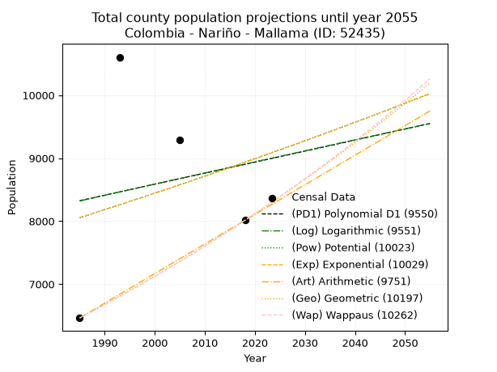
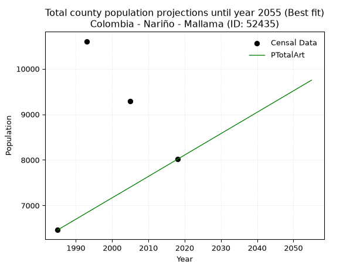
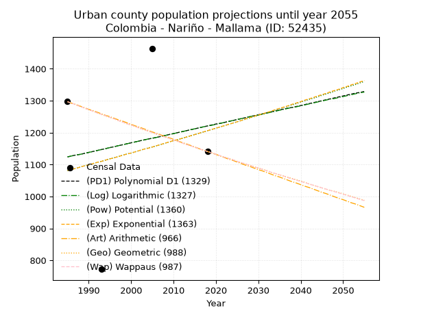
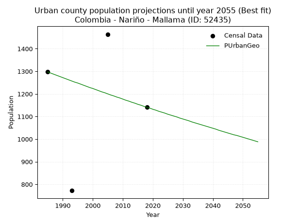
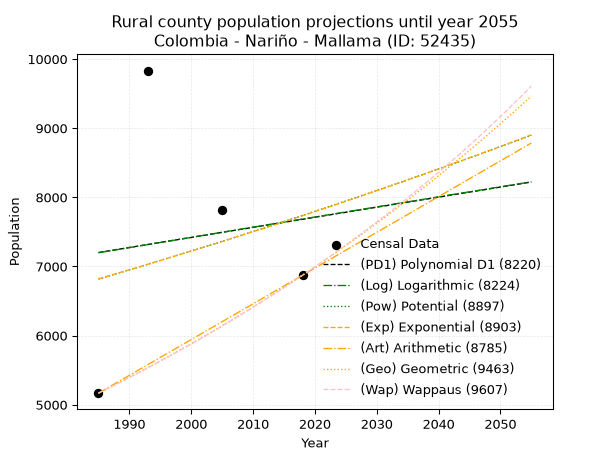
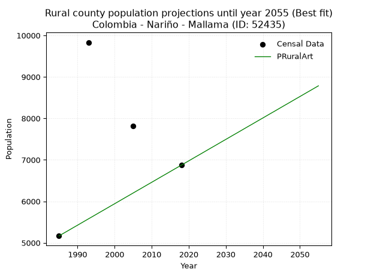

<div align="center">


</div>

# 📜 _“Population and Public Services Demand Projections (PPSD) until Year 2050 for Colombia - Nariño - Mallama (ID: 52435)”_
Keywords: `population` `public-service` `projection` `lineal` `polynomial` `logarithmic` `potential` `exponential` `arithmetic` `geometric` `wappaus` `dane` `colombia` `south-america`

PPSD are analytical estimates used by governments and planners to anticipate future changes in population size, age distribution, and the resulting community needs for utilities, healthcare, education, and infrastructure as sizing future water treatment facilities, electrical grids, and road networks based on spatial growth.

<div align="center">

</img>

</div>


> **General running parameters**: • app_version: _v20260806_. • Python version: _3.14.7_. • Pandas version: _3.0.5_. • NumPy version: _2.5.1_. • Creates, save and include plots into reports (create_plot): _False_. • Projection until year: _2050_. • Process polynomial degree 2 and up: _False_. • Process Wappaus: _True_. • Process Wappaus: _True_. • Set negative values to zero: _True_. • Set infinite values to zero: _True_. • Drop dataset notes: _True_. 
<div align="center">

Maps & GIS Layers: [:earth_americas:Google](http://maps.google.com/maps?q=1.141036762,-77.8645493) [:earth_americas:OSM](https://www.openstreetmap.org/#map=18/1.141036762/-77.8645493&layers=P) [:earth_americas:Bing](https://www.bing.com/maps?cp=1.141036762~-77.8645493&lvl=18) [:earth_americas:Apple](https://maps.apple.com/frame?center=1.141036762%2C-77.8645493&span=0.003%2C0.006) [:earth_americas:GISMobile](https://github.com/rcfdtools/R.GISMobile/blob/main/file/gis/CountyLayer_CO/Readme.md)

</div>


<div align="center">

```geojson
{
  "type": "Feature",
  "geometry": {
    "type": "Point", 
    "coordinates": [-77.8645493, 1.141036762]
  }, 
  "properties": {
    "Name": "Colombia - Nariño - Mallama (ID: 52435)"
  }
}
```

</div>


## 0. Census Data (4 records)

Census data are official statistics collected by a government about the people and housing in a country. They usually include counts of total population, age, sex, race, income, education, and jobs.

📅Global census file: [Population.xlsx](../data/Population.xlsx)

| Source   |   Year |   CountryID | CountryName   |   StateID | StateName   |   CountyID | CountyName   |   PTotal |   PUrban |   PRural |
|:---------|-------:|------------:|:--------------|----------:|:------------|-----------:|:-------------|---------:|---------:|---------:|
| DANE     |   1985 |          57 | Colombia      |        52 | Nariño      |      52435 | Mallama      |     6463 |     1297 |     5166 |
| DANE     |   1993 |          57 | Colombia      |        52 | Nariño      |      52435 | Mallama      |    10604 |      772 |     9832 |
| DANE     |   2005 |          57 | Colombia      |        52 | Nariño      |      52435 | Mallama      |     9286 |     1464 |     7822 |
| DANE     |   2018 |          57 | Colombia      |        52 | Nariño      |      52435 | Mallama      |     8013 |     1141 |     6872 |

> 🔥Some records could had specific notes about the registered values or the corresponding urban or rural distribution.

📅[SUI-RUPS](https://www.datos.gov.co/Hacienda-y-Cr-dito-P-blico/Registro-nico-de-Prestadores-de-Servicios-P-blicos/4qkq-csdn/about_data) - Local public utility companies: [RUPS.csv](../data/RUPS.csv)

 | SERVICIO       | ESTADO    | NOMBRE                                                                                                   | NIT         | DEPARTAMENTO_DOMICILIO   | MUNICIPIO_DOMICILIO   | DIRECCION                                 |   TELEFONO | EMAIL                     | TIPO_PRESTADOR          | CLASIFICACION                 |
|:---------------|:----------|:---------------------------------------------------------------------------------------------------------|:------------|:-------------------------|:----------------------|:------------------------------------------|-----------:|:--------------------------|:------------------------|:------------------------------|
| ACUEDUCTO      | OPERATIVA | ADMINISTRACION PUBLICA COOPERATIVA DE SERVICIOS PUBLICOS DE ACUEDUCTO, ALCANTARILLADO Y ASEO  DE MALLAMA | 900239380-6 | NARINO                   | MALLAMA               | PIEDRANCHA -BARRIO SANTIAGO VIA PRINCIPAL |    3127524 | coopsemallama@hotmail.com | ORGANIZACION AUTORIZADA | MENOR O IGUAL A 2500 USUARIOS |
| ALCANTARILLADO | OPERATIVA | ADMINISTRACION PUBLICA COOPERATIVA DE SERVICIOS PUBLICOS DE ACUEDUCTO, ALCANTARILLADO Y ASEO  DE MALLAMA | 900239380-6 | NARINO                   | MALLAMA               | PIEDRANCHA -BARRIO SANTIAGO VIA PRINCIPAL |    3127524 | coopsemallama@hotmail.com | ORGANIZACION AUTORIZADA | MENOR O IGUAL A 2500 USUARIOS |

## 1. Total

### 1.1. Coefficients and Parameters

* (PD1) Polynomial Deg 1: 17.502207948615833, -26417.29144921882 (lineal)
* (Log) Logarithmic: 35504.84869375442, -261281.13943922872
* (Pow) Potential: 6.316252713453737, -16.923547289541084
* (Exp) Exponential: 0.0031272032811583794, 16.228864525525406
* (Art) Arithmetic: Year diff. 2018 - 1985 = 33, Population diff. 8013 - 6463 = 1550, Annual growth = 46.96969696969697
* (Geo) Geometric: Year diff. 2018 - 1985 = 33, Population diff. 8013 - 6463 = 1550, Annual growth % = 0.006535555554370465
* (Wap) Wappaus: i = 0.6489319835548075, Condition values only valid for < 200)

<sub>
Wappaus condition values: ['0.00', '0.65', '1.30', '1.95', '2.60', '3.24', '3.89', '4.54', '5.19', '5.84', '6.49', '7.14', '7.79', '8.44', '9.09', '9.73', '10.38', '11.03', '11.68', '12.33', '12.98', '13.63', '14.28', '14.93', '15.57', '16.22', '16.87', '17.52', '18.17', '18.82', '19.47', '20.12', '20.77', '21.41', '22.06', '22.71', '23.36', '24.01', '24.66', '25.31', '25.96', '26.61', '27.26', '27.90', '28.55', '29.20', '29.85', '30.50', '31.15', '31.80', '32.45', '33.10', '33.74', '34.39', '35.04', '35.69', '36.34', '36.99', '37.64', '38.29', '38.94', '39.58', '40.23', '40.88', '41.53', '42.18']
</sub>


### 1.2. Projected Dataset

|   Year |   CountyID |   PTotalPD1 |   PTotalLog |   PTotalPow |   PTotalExp |   PTotalArt |   PTotalGeo |   PTotalWap |
|-------:|-----------:|------------:|------------:|------------:|------------:|------------:|------------:|------------:|
|   1985 |      52435 |        8325 |        8320 |        8053 |        8057 |        6463 |        6463 |        6463 |
|   1986 |      52435 |        8342 |        8338 |        8078 |        8082 |        6510 |        6505 |        6505 |
|   1987 |      52435 |        8360 |        8356 |        8104 |        8107 |        6557 |        6548 |        6547 |
|   1988 |      52435 |        8377 |        8374 |        8130 |        8133 |        6604 |        6591 |        6590 |
|   1989 |      52435 |        8395 |        8392 |        8156 |        8158 |        6651 |        6634 |        6633 |
|   1990 |      52435 |        8412 |        8410 |        8182 |        8184 |        6698 |        6677 |        6676 |
|   1991 |      52435 |        8430 |        8428 |        8208 |        8210 |        6745 |        6721 |        6720 |
|   1992 |      52435 |        8447 |        8445 |        8234 |        8235 |        6792 |        6765 |        6763 |
|   1993 |      52435 |        8465 |        8463 |        8260 |        8261 |        6839 |        6809 |        6807 |
|   1994 |      52435 |        8482 |        8481 |        8286 |        8287 |        6886 |        6853 |        6852 |
|   1995 |      52435 |        8500 |        8499 |        8312 |        8313 |        6933 |        6898 |        6896 |
|   1996 |      52435 |        8517 |        8517 |        8339 |        8339 |        6980 |        6943 |        6941 |
|   1997 |      52435 |        8535 |        8534 |        8365 |        8365 |        7027 |        6988 |        6987 |
|   1998 |      52435 |        8552 |        8552 |        8392 |        8391 |        7074 |        7034 |        7032 |
|   1999 |      52435 |        8570 |        8570 |        8418 |        8418 |        7121 |        7080 |        7078 |
|   2000 |      52435 |        8587 |        8588 |        8445 |        8444 |        7168 |        7126 |        7124 |
|   2001 |      52435 |        8605 |        8606 |        8472 |        8470 |        7215 |        7173 |        7171 |
|   2002 |      52435 |        8622 |        8623 |        8498 |        8497 |        7261 |        7220 |        7218 |
|   2003 |      52435 |        8640 |        8641 |        8525 |        8523 |        7308 |        7267 |        7265 |
|   2004 |      52435 |        8657 |        8659 |        8552 |        8550 |        7355 |        7315 |        7312 |
|   2005 |      52435 |        8675 |        8676 |        8579 |        8577 |        7402 |        7362 |        7360 |
|   2006 |      52435 |        8692 |        8694 |        8606 |        8604 |        7449 |        7410 |        7408 |
|   2007 |      52435 |        8710 |        8712 |        8633 |        8631 |        7496 |        7459 |        7457 |
|   2008 |      52435 |        8727 |        8729 |        8660 |        8658 |        7543 |        7508 |        7505 |
|   2009 |      52435 |        8745 |        8747 |        8688 |        8685 |        7590 |        7557 |        7555 |
|   2010 |      52435 |        8762 |        8765 |        8715 |        8712 |        7637 |        7606 |        7604 |
|   2011 |      52435 |        8780 |        8782 |        8743 |        8739 |        7684 |        7656 |        7654 |
|   2012 |      52435 |        8797 |        8800 |        8770 |        8767 |        7731 |        7706 |        7704 |
|   2013 |      52435 |        8815 |        8818 |        8798 |        8794 |        7778 |        7756 |        7755 |
|   2014 |      52435 |        8832 |        8835 |        8825 |        8822 |        7825 |        7807 |        7806 |
|   2015 |      52435 |        8850 |        8853 |        8853 |        8849 |        7872 |        7858 |        7857 |
|   2016 |      52435 |        8867 |        8871 |        8881 |        8877 |        7919 |        7909 |        7909 |
|   2017 |      52435 |        8885 |        8888 |        8909 |        8905 |        7966 |        7961 |        7961 |
|   2018 |      52435 |        8902 |        8906 |        8937 |        8933 |        8013 |        8013 |        8013 |
|   2019 |      52435 |        8920 |        8923 |        8965 |        8961 |        8060 |        8065 |        8066 |
|   2020 |      52435 |        8937 |        8941 |        8993 |        8989 |        8107 |        8118 |        8119 |
|   2021 |      52435 |        8955 |        8959 |        9021 |        9017 |        8154 |        8171 |        8173 |
|   2022 |      52435 |        8972 |        8976 |        9049 |        9045 |        8201 |        8225 |        8227 |
|   2023 |      52435 |        8990 |        8994 |        9077 |        9074 |        8248 |        8278 |        8281 |
|   2024 |      52435 |        9007 |        9011 |        9106 |        9102 |        8295 |        8332 |        8336 |
|   2025 |      52435 |        9025 |        9029 |        9134 |        9131 |        8342 |        8387 |        8391 |
|   2026 |      52435 |        9042 |        9046 |        9163 |        9159 |        8389 |        8442 |        8446 |
|   2027 |      52435 |        9060 |        9064 |        9191 |        9188 |        8436 |        8497 |        8502 |
|   2028 |      52435 |        9077 |        9081 |        9220 |        9217 |        8483 |        8552 |        8559 |
|   2029 |      52435 |        9095 |        9099 |        9249 |        9245 |        8530 |        8608 |        8616 |
|   2030 |      52435 |        9112 |        9116 |        9278 |        9274 |        8577 |        8665 |        8673 |
|   2031 |      52435 |        9130 |        9134 |        9306 |        9303 |        8624 |        8721 |        8731 |
|   2032 |      52435 |        9147 |        9151 |        9335 |        9333 |        8671 |        8778 |        8789 |
|   2033 |      52435 |        9165 |        9169 |        9364 |        9362 |        8718 |        8836 |        8848 |
|   2034 |      52435 |        9182 |        9186 |        9394 |        9391 |        8765 |        8893 |        8907 |
|   2035 |      52435 |        9200 |        9204 |        9423 |        9421 |        8811 |        8951 |        8966 |
|   2036 |      52435 |        9217 |        9221 |        9452 |        9450 |        8858 |        9010 |        9026 |
|   2037 |      52435 |        9235 |        9239 |        9481 |        9480 |        8905 |        9069 |        9087 |
|   2038 |      52435 |        9252 |        9256 |        9511 |        9509 |        8952 |        9128 |        9147 |
|   2039 |      52435 |        9270 |        9273 |        9540 |        9539 |        8999 |        9188 |        9209 |
|   2040 |      52435 |        9287 |        9291 |        9570 |        9569 |        9046 |        9248 |        9271 |
|   2041 |      52435 |        9305 |        9308 |        9600 |        9599 |        9093 |        9308 |        9333 |
|   2042 |      52435 |        9322 |        9326 |        9629 |        9629 |        9140 |        9369 |        9396 |
|   2043 |      52435 |        9340 |        9343 |        9659 |        9659 |        9187 |        9430 |        9459 |
|   2044 |      52435 |        9357 |        9360 |        9689 |        9689 |        9234 |        9492 |        9523 |
|   2045 |      52435 |        9375 |        9378 |        9719 |        9720 |        9281 |        9554 |        9588 |
|   2046 |      52435 |        9392 |        9395 |        9749 |        9750 |        9328 |        9616 |        9653 |
|   2047 |      52435 |        9410 |        9412 |        9779 |        9781 |        9375 |        9679 |        9718 |
|   2048 |      52435 |        9427 |        9430 |        9810 |        9811 |        9422 |        9742 |        9784 |
|   2049 |      52435 |        9445 |        9447 |        9840 |        9842 |        9469 |        9806 |        9851 |
|   2050 |      52435 |        9462 |        9464 |        9870 |        9873 |        9516 |        9870 |        9918 |
<div align="center">

</img>

</div>


### 1.3. Best fit with absolute and relative error (%)

Relative error puts that difference into context by dividing the absolute error by the true value, creating a unitless ratio or percentage that shows the scale of the mistake.

Absolute and relative error

|   Year | Source   |   CountryID | CountryName   |   StateID | StateName   |   CountyID_x | CountyName   |   PTotal |   PUrban |   PRural |   CountyID_y |   PTotalPD1 |   PTotalLog |   PTotalPow |   PTotalExp |   PTotalArt |   PTotalGeo |   PTotalWap |   PTotalPD1AbsError |   PTotalLogAbsError |   PTotalPowAbsError |   PTotalExpAbsError |   PTotalArtAbsError |   PTotalGeoAbsError |   PTotalWapAbsError |   PTotalPD1RelError |   PTotalLogRelError |   PTotalPowRelError |   PTotalExpRelError |   PTotalArtRelError |   PTotalGeoRelError |   PTotalWapRelError |
|-------:|:---------|------------:|:--------------|----------:|:------------|-------------:|:-------------|---------:|---------:|---------:|-------------:|------------:|------------:|------------:|------------:|------------:|------------:|------------:|--------------------:|--------------------:|--------------------:|--------------------:|--------------------:|--------------------:|--------------------:|--------------------:|--------------------:|--------------------:|--------------------:|--------------------:|--------------------:|--------------------:|
|   1985 | DANE     |          57 | Colombia      |        52 | Nariño      |        52435 | Mallama      |     6463 |     1297 |     5166 |        52435 |        8325 |        8320 |        8053 |        8057 |        6463 |        6463 |        6463 |                1862 |                1857 |                1590 |                1594 |                   0 |                   0 |                   0 |             28.8102 |            28.7328  |            24.6016  |            24.6635  |              0      |              0      |              0      |
|   1993 | DANE     |          57 | Colombia      |        52 | Nariño      |        52435 | Mallama      |    10604 |      772 |     9832 |        52435 |        8465 |        8463 |        8260 |        8261 |        6839 |        6809 |        6807 |                2139 |                2141 |                2344 |                2343 |                3765 |                3795 |                3797 |             20.1716 |            20.1905  |            22.1049  |            22.0954  |             35.5055 |             35.7884 |             35.8072 |
|   2005 | DANE     |          57 | Colombia      |        52 | Nariño      |        52435 | Mallama      |     9286 |     1464 |     7822 |        52435 |        8675 |        8676 |        8579 |        8577 |        7402 |        7362 |        7360 |                 611 |                 610 |                 707 |                 709 |                1884 |                1924 |                1926 |              6.5798 |             6.56903 |             7.61361 |             7.63515 |             20.2886 |             20.7194 |             20.7409 |
|   2018 | DANE     |          57 | Colombia      |        52 | Nariño      |        52435 | Mallama      |     8013 |     1141 |     6872 |        52435 |        8902 |        8906 |        8937 |        8933 |        8013 |        8013 |        8013 |                 889 |                 893 |                 924 |                 920 |                   0 |                   0 |                   0 |             11.0945 |            11.1444  |            11.5313  |            11.4813  |              0      |              0      |              0      |

Relative error mean

| Method    |   RelError | Best   |
|:----------|-----------:|:-------|
| PTotalPD1 |    16.664  |        |
| PTotalLog |    16.6592 |        |
| PTotalPow |    16.4628 |        |
| PTotalExp |    16.4688 |        |
| PTotalArt |    13.9485 | True   |
| PTotalGeo |    14.1269 |        |
| PTotalWap |    14.137  |        |

💙Best method: _**PTotalArt**_
<div align="center">

</img>

</div>


### 1.4. Fresh water supply demand in liters per capita per day (lpcd)

The fresh water supply demand typically ranges from 100 to 300 liters per capita per day (lpcd) for standard domestic and municipal planning, though absolute survival minimums set by the World Health Organization are as low as 7.5 to 20 liters per day, and total consumption in high-income nations can exceed 400 liters.

> `CZ`: Level in meters above the sea level (masl)<br> `WS`: Fresh water supply demand in liters per capita per day (lpcd or l/h/d)<br> `WSAll`: Zonal fresh water supply demand in liters per second (l/s)<br> `A`: Zonal area in square meters<br> `DP`: Population density (people/hectare or p/ha)

Reference values (RAS Colombia)

|    CZ |   WS |
|------:|-----:|
|  1000 |  120 |
|  2000 |  130 |
| 99999 |  140 |

County shapefile geometry properties and water supply values

|   CountyID |      ATotal |   CZTotal |   WSTotal |
|-----------:|------------:|----------:|----------:|
|      52435 | 5.69814e+08 |    2438.4 |       140 |

Projected values for best method: PTotalArt

|   CountyID |   Year |   PTotalArt |   DPTotal |   WSTotal |   WSTotalAll |
|-----------:|-------:|------------:|----------:|----------:|-------------:|
|      52435 |   1985 |        6463 |      0.11 |       140 |      10.4725 |
|      52435 |   1986 |        6510 |      0.11 |       140 |      10.5486 |
|      52435 |   1987 |        6557 |      0.12 |       140 |      10.6248 |
|      52435 |   1988 |        6604 |      0.12 |       140 |      10.7009 |
|      52435 |   1989 |        6651 |      0.12 |       140 |      10.7771 |
|      52435 |   1990 |        6698 |      0.12 |       140 |      10.8532 |
|      52435 |   1991 |        6745 |      0.12 |       140 |      10.9294 |
|      52435 |   1992 |        6792 |      0.12 |       140 |      11.0056 |
|      52435 |   1993 |        6839 |      0.12 |       140 |      11.0817 |
|      52435 |   1994 |        6886 |      0.12 |       140 |      11.1579 |
|      52435 |   1995 |        6933 |      0.12 |       140 |      11.234  |
|      52435 |   1996 |        6980 |      0.12 |       140 |      11.3102 |
|      52435 |   1997 |        7027 |      0.12 |       140 |      11.3863 |
|      52435 |   1998 |        7074 |      0.12 |       140 |      11.4625 |
|      52435 |   1999 |        7121 |      0.12 |       140 |      11.5387 |
|      52435 |   2000 |        7168 |      0.13 |       140 |      11.6148 |
|      52435 |   2001 |        7215 |      0.13 |       140 |      11.691  |
|      52435 |   2002 |        7261 |      0.13 |       140 |      11.7655 |
|      52435 |   2003 |        7308 |      0.13 |       140 |      11.8417 |
|      52435 |   2004 |        7355 |      0.13 |       140 |      11.9178 |
|      52435 |   2005 |        7402 |      0.13 |       140 |      11.994  |
|      52435 |   2006 |        7449 |      0.13 |       140 |      12.0701 |
|      52435 |   2007 |        7496 |      0.13 |       140 |      12.1463 |
|      52435 |   2008 |        7543 |      0.13 |       140 |      12.2225 |
|      52435 |   2009 |        7590 |      0.13 |       140 |      12.2986 |
|      52435 |   2010 |        7637 |      0.13 |       140 |      12.3748 |
|      52435 |   2011 |        7684 |      0.13 |       140 |      12.4509 |
|      52435 |   2012 |        7731 |      0.14 |       140 |      12.5271 |
|      52435 |   2013 |        7778 |      0.14 |       140 |      12.6032 |
|      52435 |   2014 |        7825 |      0.14 |       140 |      12.6794 |
|      52435 |   2015 |        7872 |      0.14 |       140 |      12.7556 |
|      52435 |   2016 |        7919 |      0.14 |       140 |      12.8317 |
|      52435 |   2017 |        7966 |      0.14 |       140 |      12.9079 |
|      52435 |   2018 |        8013 |      0.14 |       140 |      12.984  |
|      52435 |   2019 |        8060 |      0.14 |       140 |      13.0602 |
|      52435 |   2020 |        8107 |      0.14 |       140 |      13.1363 |
|      52435 |   2021 |        8154 |      0.14 |       140 |      13.2125 |
|      52435 |   2022 |        8201 |      0.14 |       140 |      13.2887 |
|      52435 |   2023 |        8248 |      0.14 |       140 |      13.3648 |
|      52435 |   2024 |        8295 |      0.15 |       140 |      13.441  |
|      52435 |   2025 |        8342 |      0.15 |       140 |      13.5171 |
|      52435 |   2026 |        8389 |      0.15 |       140 |      13.5933 |
|      52435 |   2027 |        8436 |      0.15 |       140 |      13.6694 |
|      52435 |   2028 |        8483 |      0.15 |       140 |      13.7456 |
|      52435 |   2029 |        8530 |      0.15 |       140 |      13.8218 |
|      52435 |   2030 |        8577 |      0.15 |       140 |      13.8979 |
|      52435 |   2031 |        8624 |      0.15 |       140 |      13.9741 |
|      52435 |   2032 |        8671 |      0.15 |       140 |      14.0502 |
|      52435 |   2033 |        8718 |      0.15 |       140 |      14.1264 |
|      52435 |   2034 |        8765 |      0.15 |       140 |      14.2025 |
|      52435 |   2035 |        8811 |      0.15 |       140 |      14.2771 |
|      52435 |   2036 |        8858 |      0.16 |       140 |      14.3532 |
|      52435 |   2037 |        8905 |      0.16 |       140 |      14.4294 |
|      52435 |   2038 |        8952 |      0.16 |       140 |      14.5056 |
|      52435 |   2039 |        8999 |      0.16 |       140 |      14.5817 |
|      52435 |   2040 |        9046 |      0.16 |       140 |      14.6579 |
|      52435 |   2041 |        9093 |      0.16 |       140 |      14.734  |
|      52435 |   2042 |        9140 |      0.16 |       140 |      14.8102 |
|      52435 |   2043 |        9187 |      0.16 |       140 |      14.8863 |
|      52435 |   2044 |        9234 |      0.16 |       140 |      14.9625 |
|      52435 |   2045 |        9281 |      0.16 |       140 |      15.0387 |
|      52435 |   2046 |        9328 |      0.16 |       140 |      15.1148 |
|      52435 |   2047 |        9375 |      0.16 |       140 |      15.191  |
|      52435 |   2048 |        9422 |      0.17 |       140 |      15.2671 |
|      52435 |   2049 |        9469 |      0.17 |       140 |      15.3433 |
|      52435 |   2050 |        9516 |      0.17 |       140 |      15.4194 |

## 2. Urban

### 2.1. Coefficients and Parameters

* (PD1) Polynomial Deg 1: 2.9393817743879604, -4710.998394219519 (lineal)
* (Log) Logarithmic: 5881.812122671044, -43539.20107830687
* (Pow) Potential: 6.618960021531887, -18.7938429948445
* (Exp) Exponential: 0.003311360434399819, 1.5110378547749308
* (Art) Arithmetic: Year diff. 2018 - 1985 = 33, Population diff. 1141 - 1297 = -156, Annual growth = -4.7272727272727275
* (Geo) Geometric: Year diff. 2018 - 1985 = 33, Population diff. 1141 - 1297 = -156, Annual growth % = -0.003875767762593574
* (Wap) Wappaus: i = -0.3877992393168767, Condition values only valid for < 200)

<sub>
Wappaus condition values: ['-0.00', '-0.39', '-0.78', '-1.16', '-1.55', '-1.94', '-2.33', '-2.71', '-3.10', '-3.49', '-3.88', '-4.27', '-4.65', '-5.04', '-5.43', '-5.82', '-6.20', '-6.59', '-6.98', '-7.37', '-7.76', '-8.14', '-8.53', '-8.92', '-9.31', '-9.69', '-10.08', '-10.47', '-10.86', '-11.25', '-11.63', '-12.02', '-12.41', '-12.80', '-13.19', '-13.57', '-13.96', '-14.35', '-14.74', '-15.12', '-15.51', '-15.90', '-16.29', '-16.68', '-17.06', '-17.45', '-17.84', '-18.23', '-18.61', '-19.00', '-19.39', '-19.78', '-20.17', '-20.55', '-20.94', '-21.33', '-21.72', '-22.10', '-22.49', '-22.88', '-23.27', '-23.66', '-24.04', '-24.43', '-24.82', '-25.21']
</sub>


### 2.2. Projected Dataset

|   Year |   CountyID |   PUrbanPD1 |   PUrbanLog |   PUrbanPow |   PUrbanExp |   PUrbanArt |   PUrbanGeo |   PUrbanWap |
|-------:|-----------:|------------:|------------:|------------:|------------:|------------:|------------:|------------:|
|   1985 |      52435 |        1124 |        1124 |        1081 |        1081 |        1297 |        1297 |        1297 |
|   1986 |      52435 |        1127 |        1127 |        1085 |        1085 |        1292 |        1292 |        1292 |
|   1987 |      52435 |        1130 |        1130 |        1088 |        1088 |        1288 |        1287 |        1287 |
|   1988 |      52435 |        1132 |        1132 |        1092 |        1092 |        1283 |        1282 |        1282 |
|   1989 |      52435 |        1135 |        1135 |        1096 |        1096 |        1278 |        1277 |        1277 |
|   1990 |      52435 |        1138 |        1138 |        1099 |        1099 |        1273 |        1272 |        1272 |
|   1991 |      52435 |        1141 |        1141 |        1103 |        1103 |        1269 |        1267 |        1267 |
|   1992 |      52435 |        1144 |        1144 |        1107 |        1107 |        1264 |        1262 |        1262 |
|   1993 |      52435 |        1147 |        1147 |        1110 |        1110 |        1259 |        1257 |        1257 |
|   1994 |      52435 |        1150 |        1150 |        1114 |        1114 |        1254 |        1252 |        1253 |
|   1995 |      52435 |        1153 |        1153 |        1118 |        1118 |        1250 |        1248 |        1248 |
|   1996 |      52435 |        1156 |        1156 |        1121 |        1121 |        1245 |        1243 |        1243 |
|   1997 |      52435 |        1159 |        1159 |        1125 |        1125 |        1240 |        1238 |        1238 |
|   1998 |      52435 |        1162 |        1162 |        1129 |        1129 |        1236 |        1233 |        1233 |
|   1999 |      52435 |        1165 |        1165 |        1133 |        1133 |        1231 |        1228 |        1228 |
|   2000 |      52435 |        1168 |        1168 |        1136 |        1136 |        1226 |        1224 |        1224 |
|   2001 |      52435 |        1171 |        1171 |        1140 |        1140 |        1221 |        1219 |        1219 |
|   2002 |      52435 |        1174 |        1174 |        1144 |        1144 |        1217 |        1214 |        1214 |
|   2003 |      52435 |        1177 |        1177 |        1148 |        1148 |        1212 |        1209 |        1210 |
|   2004 |      52435 |        1180 |        1180 |        1152 |        1151 |        1207 |        1205 |        1205 |
|   2005 |      52435 |        1182 |        1183 |        1155 |        1155 |        1202 |        1200 |        1200 |
|   2006 |      52435 |        1185 |        1185 |        1159 |        1159 |        1198 |        1195 |        1196 |
|   2007 |      52435 |        1188 |        1188 |        1163 |        1163 |        1193 |        1191 |        1191 |
|   2008 |      52435 |        1191 |        1191 |        1167 |        1167 |        1188 |        1186 |        1186 |
|   2009 |      52435 |        1194 |        1194 |        1171 |        1171 |        1184 |        1182 |        1182 |
|   2010 |      52435 |        1197 |        1197 |        1175 |        1175 |        1179 |        1177 |        1177 |
|   2011 |      52435 |        1200 |        1200 |        1178 |        1178 |        1174 |        1172 |        1173 |
|   2012 |      52435 |        1203 |        1203 |        1182 |        1182 |        1169 |        1168 |        1168 |
|   2013 |      52435 |        1206 |        1206 |        1186 |        1186 |        1165 |        1163 |        1163 |
|   2014 |      52435 |        1209 |        1209 |        1190 |        1190 |        1160 |        1159 |        1159 |
|   2015 |      52435 |        1212 |        1212 |        1194 |        1194 |        1155 |        1154 |        1154 |
|   2016 |      52435 |        1215 |        1215 |        1198 |        1198 |        1150 |        1150 |        1150 |
|   2017 |      52435 |        1218 |        1218 |        1202 |        1202 |        1146 |        1145 |        1145 |
|   2018 |      52435 |        1221 |        1221 |        1206 |        1206 |        1141 |        1141 |        1141 |
|   2019 |      52435 |        1224 |        1223 |        1210 |        1210 |        1136 |        1137 |        1137 |
|   2020 |      52435 |        1227 |        1226 |        1214 |        1214 |        1132 |        1132 |        1132 |
|   2021 |      52435 |        1229 |        1229 |        1218 |        1218 |        1127 |        1128 |        1128 |
|   2022 |      52435 |        1232 |        1232 |        1222 |        1222 |        1122 |        1123 |        1123 |
|   2023 |      52435 |        1235 |        1235 |        1226 |        1226 |        1117 |        1119 |        1119 |
|   2024 |      52435 |        1238 |        1238 |        1230 |        1230 |        1113 |        1115 |        1115 |
|   2025 |      52435 |        1241 |        1241 |        1234 |        1234 |        1108 |        1110 |        1110 |
|   2026 |      52435 |        1244 |        1244 |        1238 |        1238 |        1103 |        1106 |        1106 |
|   2027 |      52435 |        1247 |        1247 |        1242 |        1243 |        1098 |        1102 |        1102 |
|   2028 |      52435 |        1250 |        1250 |        1246 |        1247 |        1094 |        1098 |        1097 |
|   2029 |      52435 |        1253 |        1253 |        1250 |        1251 |        1089 |        1093 |        1093 |
|   2030 |      52435 |        1256 |        1255 |        1254 |        1255 |        1084 |        1089 |        1089 |
|   2031 |      52435 |        1259 |        1258 |        1258 |        1259 |        1080 |        1085 |        1085 |
|   2032 |      52435 |        1262 |        1261 |        1262 |        1263 |        1075 |        1081 |        1080 |
|   2033 |      52435 |        1265 |        1264 |        1266 |        1267 |        1070 |        1076 |        1076 |
|   2034 |      52435 |        1268 |        1267 |        1271 |        1272 |        1065 |        1072 |        1072 |
|   2035 |      52435 |        1271 |        1270 |        1275 |        1276 |        1061 |        1068 |        1068 |
|   2036 |      52435 |        1274 |        1273 |        1279 |        1280 |        1056 |        1064 |        1064 |
|   2037 |      52435 |        1277 |        1276 |        1283 |        1284 |        1051 |        1060 |        1059 |
|   2038 |      52435 |        1279 |        1279 |        1287 |        1289 |        1046 |        1056 |        1055 |
|   2039 |      52435 |        1282 |        1281 |        1291 |        1293 |        1042 |        1052 |        1051 |
|   2040 |      52435 |        1285 |        1284 |        1296 |        1297 |        1037 |        1048 |        1047 |
|   2041 |      52435 |        1288 |        1287 |        1300 |        1302 |        1032 |        1044 |        1043 |
|   2042 |      52435 |        1291 |        1290 |        1304 |        1306 |        1028 |        1039 |        1039 |
|   2043 |      52435 |        1294 |        1293 |        1308 |        1310 |        1023 |        1035 |        1035 |
|   2044 |      52435 |        1297 |        1296 |        1312 |        1315 |        1018 |        1031 |        1031 |
|   2045 |      52435 |        1300 |        1299 |        1317 |        1319 |        1013 |        1027 |        1027 |
|   2046 |      52435 |        1303 |        1302 |        1321 |        1323 |        1009 |        1023 |        1023 |
|   2047 |      52435 |        1306 |        1305 |        1325 |        1328 |        1004 |        1019 |        1019 |
|   2048 |      52435 |        1309 |        1307 |        1330 |        1332 |         999 |        1016 |        1015 |
|   2049 |      52435 |        1312 |        1310 |        1334 |        1336 |         994 |        1012 |        1011 |
|   2050 |      52435 |        1315 |        1313 |        1338 |        1341 |         990 |        1008 |        1007 |
<div align="center">

</img>

</div>


### 2.3. Best fit with absolute and relative error (%)

Relative error puts that difference into context by dividing the absolute error by the true value, creating a unitless ratio or percentage that shows the scale of the mistake.

Absolute and relative error

|   Year | Source   |   CountryID | CountryName   |   StateID | StateName   |   CountyID_x | CountyName   |   PTotal |   PUrban |   PRural |   CountyID_y |   PUrbanPD1 |   PUrbanLog |   PUrbanPow |   PUrbanExp |   PUrbanArt |   PUrbanGeo |   PUrbanWap |   PUrbanPD1AbsError |   PUrbanLogAbsError |   PUrbanPowAbsError |   PUrbanExpAbsError |   PUrbanArtAbsError |   PUrbanGeoAbsError |   PUrbanWapAbsError |   PUrbanPD1RelError |   PUrbanLogRelError |   PUrbanPowRelError |   PUrbanExpRelError |   PUrbanArtRelError |   PUrbanGeoRelError |   PUrbanWapRelError |
|-------:|:---------|------------:|:--------------|----------:|:------------|-------------:|:-------------|---------:|---------:|---------:|-------------:|------------:|------------:|------------:|------------:|------------:|------------:|------------:|--------------------:|--------------------:|--------------------:|--------------------:|--------------------:|--------------------:|--------------------:|--------------------:|--------------------:|--------------------:|--------------------:|--------------------:|--------------------:|--------------------:|
|   1985 | DANE     |          57 | Colombia      |        52 | Nariño      |        52435 | Mallama      |     6463 |     1297 |     5166 |        52435 |        1124 |        1124 |        1081 |        1081 |        1297 |        1297 |        1297 |                 173 |                 173 |                 216 |                 216 |                   0 |                   0 |                   0 |            13.3385  |            13.3385  |            16.6538  |            16.6538  |              0      |              0      |              0      |
|   1993 | DANE     |          57 | Colombia      |        52 | Nariño      |        52435 | Mallama      |    10604 |      772 |     9832 |        52435 |        1147 |        1147 |        1110 |        1110 |        1259 |        1257 |        1257 |                 375 |                 375 |                 338 |                 338 |                 487 |                 485 |                 485 |            48.5751  |            48.5751  |            43.7824  |            43.7824  |             63.0829 |             62.8238 |             62.8238 |
|   2005 | DANE     |          57 | Colombia      |        52 | Nariño      |        52435 | Mallama      |     9286 |     1464 |     7822 |        52435 |        1182 |        1183 |        1155 |        1155 |        1202 |        1200 |        1200 |                 282 |                 281 |                 309 |                 309 |                 262 |                 264 |                 264 |            19.2623  |            19.194   |            21.1066  |            21.1066  |             17.8962 |             18.0328 |             18.0328 |
|   2018 | DANE     |          57 | Colombia      |        52 | Nariño      |        52435 | Mallama      |     8013 |     1141 |     6872 |        52435 |        1221 |        1221 |        1206 |        1206 |        1141 |        1141 |        1141 |                  80 |                  80 |                  65 |                  65 |                   0 |                   0 |                   0 |             7.01139 |             7.01139 |             5.69676 |             5.69676 |              0      |              0      |              0      |

Relative error mean

| Method    |   RelError | Best   |
|:----------|-----------:|:-------|
| PUrbanPD1 |    22.0468 |        |
| PUrbanLog |    22.0297 |        |
| PUrbanPow |    21.8099 |        |
| PUrbanExp |    21.8099 |        |
| PUrbanArt |    20.2448 |        |
| PUrbanGeo |    20.2142 | True   |
| PUrbanWap |    20.2142 | True   |

💙Best method: _**PUrbanGeo**_
<div align="center">

</img>

</div>


### 2.4. Fresh water supply demand in liters per capita per day (lpcd)

The fresh water supply demand typically ranges from 100 to 300 liters per capita per day (lpcd) for standard domestic and municipal planning, though absolute survival minimums set by the World Health Organization are as low as 7.5 to 20 liters per day, and total consumption in high-income nations can exceed 400 liters.

> `CZ`: Level in meters above the sea level (masl)<br> `WS`: Fresh water supply demand in liters per capita per day (lpcd or l/h/d)<br> `WSAll`: Zonal fresh water supply demand in liters per second (l/s)<br> `A`: Zonal area in square meters<br> `DP`: Population density (people/hectare or p/ha)

Reference values (RAS Colombia)

|    CZ |   WS |
|------:|-----:|
|  1000 |  120 |
|  2000 |  130 |
| 99999 |  140 |

County shapefile geometry properties and water supply values

|   CountyID |   AUrban |   CZUrban |   WSUrban |
|-----------:|---------:|----------:|----------:|
|      52435 |   260596 |   1813.25 |       130 |

Projected values for best method: PUrbanGeo

|   CountyID |   Year |   PUrbanGeo |   DPUrban |   WSUrban |   WSUrbanAll |
|-----------:|-------:|------------:|----------:|----------:|-------------:|
|      52435 |   1985 |        1297 |     49.77 |       130 |      1.9515  |
|      52435 |   1986 |        1292 |     49.58 |       130 |      1.94398 |
|      52435 |   1987 |        1287 |     49.39 |       130 |      1.93646 |
|      52435 |   1988 |        1282 |     49.2  |       130 |      1.92894 |
|      52435 |   1989 |        1277 |     49    |       130 |      1.92141 |
|      52435 |   1990 |        1272 |     48.81 |       130 |      1.91389 |
|      52435 |   1991 |        1267 |     48.62 |       130 |      1.90637 |
|      52435 |   1992 |        1262 |     48.43 |       130 |      1.89884 |
|      52435 |   1993 |        1257 |     48.24 |       130 |      1.89132 |
|      52435 |   1994 |        1252 |     48.04 |       130 |      1.8838  |
|      52435 |   1995 |        1248 |     47.89 |       130 |      1.87778 |
|      52435 |   1996 |        1243 |     47.7  |       130 |      1.87025 |
|      52435 |   1997 |        1238 |     47.51 |       130 |      1.86273 |
|      52435 |   1998 |        1233 |     47.31 |       130 |      1.85521 |
|      52435 |   1999 |        1228 |     47.12 |       130 |      1.84769 |
|      52435 |   2000 |        1224 |     46.97 |       130 |      1.84167 |
|      52435 |   2001 |        1219 |     46.78 |       130 |      1.83414 |
|      52435 |   2002 |        1214 |     46.59 |       130 |      1.82662 |
|      52435 |   2003 |        1209 |     46.39 |       130 |      1.8191  |
|      52435 |   2004 |        1205 |     46.24 |       130 |      1.81308 |
|      52435 |   2005 |        1200 |     46.05 |       130 |      1.80556 |
|      52435 |   2006 |        1195 |     45.86 |       130 |      1.79803 |
|      52435 |   2007 |        1191 |     45.7  |       130 |      1.79201 |
|      52435 |   2008 |        1186 |     45.51 |       130 |      1.78449 |
|      52435 |   2009 |        1182 |     45.36 |       130 |      1.77847 |
|      52435 |   2010 |        1177 |     45.17 |       130 |      1.77095 |
|      52435 |   2011 |        1172 |     44.97 |       130 |      1.76343 |
|      52435 |   2012 |        1168 |     44.82 |       130 |      1.75741 |
|      52435 |   2013 |        1163 |     44.63 |       130 |      1.74988 |
|      52435 |   2014 |        1159 |     44.48 |       130 |      1.74387 |
|      52435 |   2015 |        1154 |     44.28 |       130 |      1.73634 |
|      52435 |   2016 |        1150 |     44.13 |       130 |      1.73032 |
|      52435 |   2017 |        1145 |     43.94 |       130 |      1.7228  |
|      52435 |   2018 |        1141 |     43.78 |       130 |      1.71678 |
|      52435 |   2019 |        1137 |     43.63 |       130 |      1.71076 |
|      52435 |   2020 |        1132 |     43.44 |       130 |      1.70324 |
|      52435 |   2021 |        1128 |     43.29 |       130 |      1.69722 |
|      52435 |   2022 |        1123 |     43.09 |       130 |      1.6897  |
|      52435 |   2023 |        1119 |     42.94 |       130 |      1.68368 |
|      52435 |   2024 |        1115 |     42.79 |       130 |      1.67766 |
|      52435 |   2025 |        1110 |     42.59 |       130 |      1.67014 |
|      52435 |   2026 |        1106 |     42.44 |       130 |      1.66412 |
|      52435 |   2027 |        1102 |     42.29 |       130 |      1.6581  |
|      52435 |   2028 |        1098 |     42.13 |       130 |      1.65208 |
|      52435 |   2029 |        1093 |     41.94 |       130 |      1.64456 |
|      52435 |   2030 |        1089 |     41.79 |       130 |      1.63854 |
|      52435 |   2031 |        1085 |     41.64 |       130 |      1.63252 |
|      52435 |   2032 |        1081 |     41.48 |       130 |      1.6265  |
|      52435 |   2033 |        1076 |     41.29 |       130 |      1.61898 |
|      52435 |   2034 |        1072 |     41.14 |       130 |      1.61296 |
|      52435 |   2035 |        1068 |     40.98 |       130 |      1.60694 |
|      52435 |   2036 |        1064 |     40.83 |       130 |      1.60093 |
|      52435 |   2037 |        1060 |     40.68 |       130 |      1.59491 |
|      52435 |   2038 |        1056 |     40.52 |       130 |      1.58889 |
|      52435 |   2039 |        1052 |     40.37 |       130 |      1.58287 |
|      52435 |   2040 |        1048 |     40.22 |       130 |      1.57685 |
|      52435 |   2041 |        1044 |     40.06 |       130 |      1.57083 |
|      52435 |   2042 |        1039 |     39.87 |       130 |      1.56331 |
|      52435 |   2043 |        1035 |     39.72 |       130 |      1.55729 |
|      52435 |   2044 |        1031 |     39.56 |       130 |      1.55127 |
|      52435 |   2045 |        1027 |     39.41 |       130 |      1.54525 |
|      52435 |   2046 |        1023 |     39.26 |       130 |      1.53924 |
|      52435 |   2047 |        1019 |     39.1  |       130 |      1.53322 |
|      52435 |   2048 |        1016 |     38.99 |       130 |      1.5287  |
|      52435 |   2049 |        1012 |     38.83 |       130 |      1.52269 |
|      52435 |   2050 |        1008 |     38.68 |       130 |      1.51667 |

## 3. Rural

### 3.1. Coefficients and Parameters

* (PD1) Polynomial Deg 1: 14.56282617422786, -21706.293054999278 (lineal)
* (Log) Logarithmic: 29623.036571083383, -217741.9383609219
* (Pow) Potential: 7.683867607447599, -21.505980386375047
* (Exp) Exponential: 0.003805513525496323, 3.574448796982204
* (Art) Arithmetic: Year diff. 2018 - 1985 = 33, Population diff. 6872 - 5166 = 1706, Annual growth = 51.696969696969695
* (Geo) Geometric: Year diff. 2018 - 1985 = 33, Population diff. 6872 - 5166 = 1706, Annual growth % = 0.008684661103444347
* (Wap) Wappaus: i = 0.8588963232591742, Condition values only valid for < 200)

<sub>
Wappaus condition values: ['0.00', '0.86', '1.72', '2.58', '3.44', '4.29', '5.15', '6.01', '6.87', '7.73', '8.59', '9.45', '10.31', '11.17', '12.02', '12.88', '13.74', '14.60', '15.46', '16.32', '17.18', '18.04', '18.90', '19.75', '20.61', '21.47', '22.33', '23.19', '24.05', '24.91', '25.77', '26.63', '27.48', '28.34', '29.20', '30.06', '30.92', '31.78', '32.64', '33.50', '34.36', '35.21', '36.07', '36.93', '37.79', '38.65', '39.51', '40.37', '41.23', '42.09', '42.94', '43.80', '44.66', '45.52', '46.38', '47.24', '48.10', '48.96', '49.82', '50.67', '51.53', '52.39', '53.25', '54.11', '54.97', '55.83']
</sub>


### 3.2. Projected Dataset

|   Year |   CountyID |   PRuralPD1 |   PRuralLog |   PRuralPow |   PRuralExp |   PRuralArt |   PRuralGeo |   PRuralWap |
|-------:|-----------:|------------:|------------:|------------:|------------:|------------:|------------:|------------:|
|   1985 |      52435 |        7201 |        7197 |        6817 |        6821 |        5166 |        5166 |        5166 |
|   1986 |      52435 |        7215 |        7212 |        6843 |        6847 |        5218 |        5211 |        5211 |
|   1987 |      52435 |        7230 |        7227 |        6870 |        6873 |        5269 |        5256 |        5256 |
|   1988 |      52435 |        7245 |        7242 |        6896 |        6899 |        5321 |        5302 |        5301 |
|   1989 |      52435 |        7259 |        7256 |        6923 |        6926 |        5373 |        5348 |        5347 |
|   1990 |      52435 |        7274 |        7271 |        6950 |        6952 |        5424 |        5394 |        5393 |
|   1991 |      52435 |        7288 |        7286 |        6977 |        6978 |        5476 |        5441 |        5439 |
|   1992 |      52435 |        7303 |        7301 |        7004 |        7005 |        5528 |        5488 |        5486 |
|   1993 |      52435 |        7317 |        7316 |        7031 |        7032 |        5580 |        5536 |        5534 |
|   1994 |      52435 |        7332 |        7331 |        7058 |        7059 |        5631 |        5584 |        5581 |
|   1995 |      52435 |        7347 |        7346 |        7085 |        7086 |        5683 |        5633 |        5630 |
|   1996 |      52435 |        7361 |        7361 |        7112 |        7113 |        5735 |        5682 |        5678 |
|   1997 |      52435 |        7376 |        7375 |        7140 |        7140 |        5786 |        5731 |        5727 |
|   1998 |      52435 |        7390 |        7390 |        7167 |        7167 |        5838 |        5781 |        5777 |
|   1999 |      52435 |        7405 |        7405 |        7195 |        7194 |        5890 |        5831 |        5827 |
|   2000 |      52435 |        7419 |        7420 |        7223 |        7222 |        5941 |        5881 |        5877 |
|   2001 |      52435 |        7434 |        7435 |        7250 |        7249 |        5993 |        5933 |        5928 |
|   2002 |      52435 |        7448 |        7449 |        7278 |        7277 |        6045 |        5984 |        5980 |
|   2003 |      52435 |        7463 |        7464 |        7306 |        7305 |        6097 |        6036 |        6032 |
|   2004 |      52435 |        7478 |        7479 |        7334 |        7332 |        6148 |        6088 |        6084 |
|   2005 |      52435 |        7492 |        7494 |        7363 |        7360 |        6200 |        6141 |        6137 |
|   2006 |      52435 |        7507 |        7509 |        7391 |        7388 |        6252 |        6195 |        6190 |
|   2007 |      52435 |        7521 |        7523 |        7419 |        7417 |        6303 |        6248 |        6244 |
|   2008 |      52435 |        7536 |        7538 |        7448 |        7445 |        6355 |        6303 |        6298 |
|   2009 |      52435 |        7550 |        7553 |        7476 |        7473 |        6407 |        6357 |        6353 |
|   2010 |      52435 |        7565 |        7568 |        7505 |        7502 |        6458 |        6413 |        6409 |
|   2011 |      52435 |        7580 |        7582 |        7534 |        7530 |        6510 |        6468 |        6465 |
|   2012 |      52435 |        7594 |        7597 |        7562 |        7559 |        6562 |        6525 |        6521 |
|   2013 |      52435 |        7609 |        7612 |        7591 |        7588 |        6614 |        6581 |        6578 |
|   2014 |      52435 |        7623 |        7627 |        7620 |        7617 |        6665 |        6638 |        6636 |
|   2015 |      52435 |        7638 |        7641 |        7649 |        7646 |        6717 |        6696 |        6694 |
|   2016 |      52435 |        7652 |        7656 |        7679 |        7675 |        6769 |        6754 |        6753 |
|   2017 |      52435 |        7667 |        7671 |        7708 |        7704 |        6820 |        6813 |        6812 |
|   2018 |      52435 |        7681 |        7685 |        7737 |        7734 |        6872 |        6872 |        6872 |
|   2019 |      52435 |        7696 |        7700 |        7767 |        7763 |        6924 |        6932 |        6933 |
|   2020 |      52435 |        7711 |        7715 |        7797 |        7793 |        6975 |        6992 |        6994 |
|   2021 |      52435 |        7725 |        7729 |        7826 |        7822 |        7027 |        7053 |        7055 |
|   2022 |      52435 |        7740 |        7744 |        7856 |        7852 |        7079 |        7114 |        7118 |
|   2023 |      52435 |        7754 |        7759 |        7886 |        7882 |        7130 |        7176 |        7181 |
|   2024 |      52435 |        7769 |        7773 |        7916 |        7912 |        7182 |        7238 |        7245 |
|   2025 |      52435 |        7783 |        7788 |        7946 |        7942 |        7234 |        7301 |        7309 |
|   2026 |      52435 |        7798 |        7802 |        7976 |        7973 |        7286 |        7364 |        7374 |
|   2027 |      52435 |        7813 |        7817 |        8007 |        8003 |        7337 |        7428 |        7440 |
|   2028 |      52435 |        7827 |        7832 |        8037 |        8034 |        7389 |        7493 |        7506 |
|   2029 |      52435 |        7842 |        7846 |        8067 |        8064 |        7441 |        7558 |        7573 |
|   2030 |      52435 |        7856 |        7861 |        8098 |        8095 |        7492 |        7623 |        7641 |
|   2031 |      52435 |        7871 |        7876 |        8129 |        8126 |        7544 |        7690 |        7710 |
|   2032 |      52435 |        7885 |        7890 |        8160 |        8157 |        7596 |        7756 |        7779 |
|   2033 |      52435 |        7900 |        7905 |        8190 |        8188 |        7647 |        7824 |        7849 |
|   2034 |      52435 |        7914 |        7919 |        8221 |        8219 |        7699 |        7892 |        7920 |
|   2035 |      52435 |        7929 |        7934 |        8253 |        8251 |        7751 |        7960 |        7991 |
|   2036 |      52435 |        7944 |        7948 |        8284 |        8282 |        7803 |        8029 |        8064 |
|   2037 |      52435 |        7958 |        7963 |        8315 |        8314 |        7854 |        8099 |        8137 |
|   2038 |      52435 |        7973 |        7977 |        8347 |        8345 |        7906 |        8169 |        8211 |
|   2039 |      52435 |        7987 |        7992 |        8378 |        8377 |        7958 |        8240 |        8285 |
|   2040 |      52435 |        8002 |        8006 |        8410 |        8409 |        8009 |        8312 |        8361 |
|   2041 |      52435 |        8016 |        8021 |        8441 |        8441 |        8061 |        8384 |        8438 |
|   2042 |      52435 |        8031 |        8036 |        8473 |        8473 |        8113 |        8457 |        8515 |
|   2043 |      52435 |        8046 |        8050 |        8505 |        8506 |        8164 |        8530 |        8593 |
|   2044 |      52435 |        8060 |        8065 |        8537 |        8538 |        8216 |        8604 |        8672 |
|   2045 |      52435 |        8075 |        8079 |        8569 |        8571 |        8268 |        8679 |        8752 |
|   2046 |      52435 |        8089 |        8093 |        8602 |        8603 |        8320 |        8755 |        8833 |
|   2047 |      52435 |        8104 |        8108 |        8634 |        8636 |        8371 |        8831 |        8915 |
|   2048 |      52435 |        8118 |        8122 |        8666 |        8669 |        8423 |        8907 |        8998 |
|   2049 |      52435 |        8133 |        8137 |        8699 |        8702 |        8475 |        8985 |        9082 |
|   2050 |      52435 |        8148 |        8151 |        8732 |        8735 |        8526 |        9063 |        9167 |
<div align="center">

</img>

</div>


### 3.3. Best fit with absolute and relative error (%)

Relative error puts that difference into context by dividing the absolute error by the true value, creating a unitless ratio or percentage that shows the scale of the mistake.

Absolute and relative error

|   Year | Source   |   CountryID | CountryName   |   StateID | StateName   |   CountyID_x | CountyName   |   PTotal |   PUrban |   PRural |   CountyID_y |   PRuralPD1 |   PRuralLog |   PRuralPow |   PRuralExp |   PRuralArt |   PRuralGeo |   PRuralWap |   PRuralPD1AbsError |   PRuralLogAbsError |   PRuralPowAbsError |   PRuralExpAbsError |   PRuralArtAbsError |   PRuralGeoAbsError |   PRuralWapAbsError |   PRuralPD1RelError |   PRuralLogRelError |   PRuralPowRelError |   PRuralExpRelError |   PRuralArtRelError |   PRuralGeoRelError |   PRuralWapRelError |
|-------:|:---------|------------:|:--------------|----------:|:------------|-------------:|:-------------|---------:|---------:|---------:|-------------:|------------:|------------:|------------:|------------:|------------:|------------:|------------:|--------------------:|--------------------:|--------------------:|--------------------:|--------------------:|--------------------:|--------------------:|--------------------:|--------------------:|--------------------:|--------------------:|--------------------:|--------------------:|--------------------:|
|   1985 | DANE     |          57 | Colombia      |        52 | Nariño      |        52435 | Mallama      |     6463 |     1297 |     5166 |        52435 |        7201 |        7197 |        6817 |        6821 |        5166 |        5166 |        5166 |                2035 |                2031 |                1651 |                1655 |                   0 |                   0 |                   0 |            39.3922  |             39.3148 |            31.959   |            32.0364  |              0      |              0      |              0      |
|   1993 | DANE     |          57 | Colombia      |        52 | Nariño      |        52435 | Mallama      |    10604 |      772 |     9832 |        52435 |        7317 |        7316 |        7031 |        7032 |        5580 |        5536 |        5534 |                2515 |                2516 |                2801 |                2800 |                4252 |                4296 |                4298 |            25.5797  |             25.5899 |            28.4886  |            28.4784  |             43.2465 |             43.6941 |             43.7144 |
|   2005 | DANE     |          57 | Colombia      |        52 | Nariño      |        52435 | Mallama      |     9286 |     1464 |     7822 |        52435 |        7492 |        7494 |        7363 |        7360 |        6200 |        6141 |        6137 |                 330 |                 328 |                 459 |                 462 |                1622 |                1681 |                1685 |             4.21887 |              4.1933 |             5.86806 |             5.90642 |             20.7364 |             21.4907 |             21.5418 |
|   2018 | DANE     |          57 | Colombia      |        52 | Nariño      |        52435 | Mallama      |     8013 |     1141 |     6872 |        52435 |        7681 |        7685 |        7737 |        7734 |        6872 |        6872 |        6872 |                 809 |                 813 |                 865 |                 862 |                   0 |                   0 |                   0 |            11.7724  |             11.8306 |            12.5873  |            12.5437  |              0      |              0      |              0      |

Relative error mean

| Method    |   RelError | Best   |
|:----------|-----------:|:-------|
| PRuralPD1 |    20.2408 |        |
| PRuralLog |    20.2321 |        |
| PRuralPow |    19.7257 |        |
| PRuralExp |    19.7412 |        |
| PRuralArt |    15.9957 | True   |
| PRuralGeo |    16.2962 |        |
| PRuralWap |    16.3141 |        |

💙Best method: _**PRuralArt**_
<div align="center">

</img>

</div>


### 3.4. Fresh water supply demand in liters per capita per day (lpcd)

The fresh water supply demand typically ranges from 100 to 300 liters per capita per day (lpcd) for standard domestic and municipal planning, though absolute survival minimums set by the World Health Organization are as low as 7.5 to 20 liters per day, and total consumption in high-income nations can exceed 400 liters.

> `CZ`: Level in meters above the sea level (masl)<br> `WS`: Fresh water supply demand in liters per capita per day (lpcd or l/h/d)<br> `WSAll`: Zonal fresh water supply demand in liters per second (l/s)<br> `A`: Zonal area in square meters<br> `DP`: Population density (people/hectare or p/ha)

Reference values (RAS Colombia)

|    CZ |   WS |
|------:|-----:|
|  1000 |  120 |
|  2000 |  130 |
| 99999 |  140 |

County shapefile geometry properties and water supply values

|   CountyID |      ARural |   CZRural |   WSRural |
|-----------:|------------:|----------:|----------:|
|      52435 | 5.69553e+08 |   2438.67 |       140 |

Projected values for best method: PRuralArt

|   CountyID |   Year |   PRuralArt |   DPRural |   WSRural |   WSRuralAll |
|-----------:|-------:|------------:|----------:|----------:|-------------:|
|      52435 |   1985 |        5166 |      0.09 |       140 |      8.37083 |
|      52435 |   1986 |        5218 |      0.09 |       140 |      8.45509 |
|      52435 |   1987 |        5269 |      0.09 |       140 |      8.53773 |
|      52435 |   1988 |        5321 |      0.09 |       140 |      8.62199 |
|      52435 |   1989 |        5373 |      0.09 |       140 |      8.70625 |
|      52435 |   1990 |        5424 |      0.1  |       140 |      8.78889 |
|      52435 |   1991 |        5476 |      0.1  |       140 |      8.87315 |
|      52435 |   1992 |        5528 |      0.1  |       140 |      8.95741 |
|      52435 |   1993 |        5580 |      0.1  |       140 |      9.04167 |
|      52435 |   1994 |        5631 |      0.1  |       140 |      9.12431 |
|      52435 |   1995 |        5683 |      0.1  |       140 |      9.20856 |
|      52435 |   1996 |        5735 |      0.1  |       140 |      9.29282 |
|      52435 |   1997 |        5786 |      0.1  |       140 |      9.37546 |
|      52435 |   1998 |        5838 |      0.1  |       140 |      9.45972 |
|      52435 |   1999 |        5890 |      0.1  |       140 |      9.54398 |
|      52435 |   2000 |        5941 |      0.1  |       140 |      9.62662 |
|      52435 |   2001 |        5993 |      0.11 |       140 |      9.71088 |
|      52435 |   2002 |        6045 |      0.11 |       140 |      9.79514 |
|      52435 |   2003 |        6097 |      0.11 |       140 |      9.8794  |
|      52435 |   2004 |        6148 |      0.11 |       140 |      9.96204 |
|      52435 |   2005 |        6200 |      0.11 |       140 |     10.0463  |
|      52435 |   2006 |        6252 |      0.11 |       140 |     10.1306  |
|      52435 |   2007 |        6303 |      0.11 |       140 |     10.2132  |
|      52435 |   2008 |        6355 |      0.11 |       140 |     10.2975  |
|      52435 |   2009 |        6407 |      0.11 |       140 |     10.3817  |
|      52435 |   2010 |        6458 |      0.11 |       140 |     10.4644  |
|      52435 |   2011 |        6510 |      0.11 |       140 |     10.5486  |
|      52435 |   2012 |        6562 |      0.12 |       140 |     10.6329  |
|      52435 |   2013 |        6614 |      0.12 |       140 |     10.7171  |
|      52435 |   2014 |        6665 |      0.12 |       140 |     10.7998  |
|      52435 |   2015 |        6717 |      0.12 |       140 |     10.884   |
|      52435 |   2016 |        6769 |      0.12 |       140 |     10.9683  |
|      52435 |   2017 |        6820 |      0.12 |       140 |     11.0509  |
|      52435 |   2018 |        6872 |      0.12 |       140 |     11.1352  |
|      52435 |   2019 |        6924 |      0.12 |       140 |     11.2194  |
|      52435 |   2020 |        6975 |      0.12 |       140 |     11.3021  |
|      52435 |   2021 |        7027 |      0.12 |       140 |     11.3863  |
|      52435 |   2022 |        7079 |      0.12 |       140 |     11.4706  |
|      52435 |   2023 |        7130 |      0.13 |       140 |     11.5532  |
|      52435 |   2024 |        7182 |      0.13 |       140 |     11.6375  |
|      52435 |   2025 |        7234 |      0.13 |       140 |     11.7218  |
|      52435 |   2026 |        7286 |      0.13 |       140 |     11.806   |
|      52435 |   2027 |        7337 |      0.13 |       140 |     11.8887  |
|      52435 |   2028 |        7389 |      0.13 |       140 |     11.9729  |
|      52435 |   2029 |        7441 |      0.13 |       140 |     12.0572  |
|      52435 |   2030 |        7492 |      0.13 |       140 |     12.1398  |
|      52435 |   2031 |        7544 |      0.13 |       140 |     12.2241  |
|      52435 |   2032 |        7596 |      0.13 |       140 |     12.3083  |
|      52435 |   2033 |        7647 |      0.13 |       140 |     12.391   |
|      52435 |   2034 |        7699 |      0.14 |       140 |     12.4752  |
|      52435 |   2035 |        7751 |      0.14 |       140 |     12.5595  |
|      52435 |   2036 |        7803 |      0.14 |       140 |     12.6438  |
|      52435 |   2037 |        7854 |      0.14 |       140 |     12.7264  |
|      52435 |   2038 |        7906 |      0.14 |       140 |     12.8106  |
|      52435 |   2039 |        7958 |      0.14 |       140 |     12.8949  |
|      52435 |   2040 |        8009 |      0.14 |       140 |     12.9775  |
|      52435 |   2041 |        8061 |      0.14 |       140 |     13.0618  |
|      52435 |   2042 |        8113 |      0.14 |       140 |     13.1461  |
|      52435 |   2043 |        8164 |      0.14 |       140 |     13.2287  |
|      52435 |   2044 |        8216 |      0.14 |       140 |     13.313   |
|      52435 |   2045 |        8268 |      0.15 |       140 |     13.3972  |
|      52435 |   2046 |        8320 |      0.15 |       140 |     13.4815  |
|      52435 |   2047 |        8371 |      0.15 |       140 |     13.5641  |
|      52435 |   2048 |        8423 |      0.15 |       140 |     13.6484  |
|      52435 |   2049 |        8475 |      0.15 |       140 |     13.7326  |
|      52435 |   2050 |        8526 |      0.15 |       140 |     13.8153  |

#

<div align="center"><br><sub>Share this research</sub></div><br>

<sub>**APPS & TOOLS & CONTENT DISCLAIMER**: • NO WARRANTY - This content and software is provided by <a href="https://github.com/rcfdtools" target="_blank">github.com/rcfdtools</a> "as is", without any express or implied warranty, including warranties of merchantability, fitness for a particular purpose, or non-infringement. There is no guarantee that the software will be error-free or operate without interruption. • LIMITATION OF LIABILITY - Neither the authors nor copyright holders will be liable for claims or damages arising from the software or its use. You are responsible for determining if the software is appropriate for your use and assume all associated risks, including errors, legal compliance, and data loss. • NO PROFESSIONAL ADVICE - The software provides general information and does not offer professional advice. It should not replace consultation with professional advisors. [Clauses and global license for rcfdtools use.](https://github.com/rcfdtools/rcfdtools/blob/main/LICENSE.md)</sub>

| [:house: Home](Readme.md)  | [:beginner: Help / Collab](https://github.com/rcfdtools/R.HydroTools/discussions/31) |
|----------------------------|-------------------------------------------------------------------------------------------|