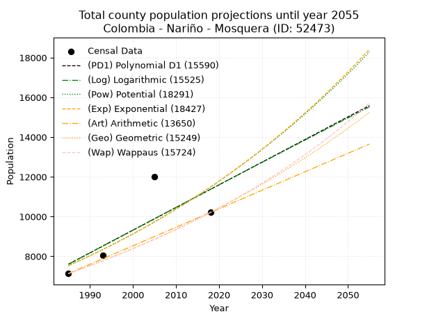
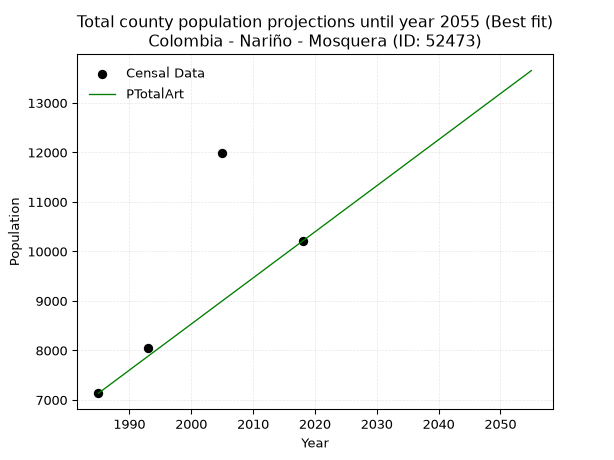
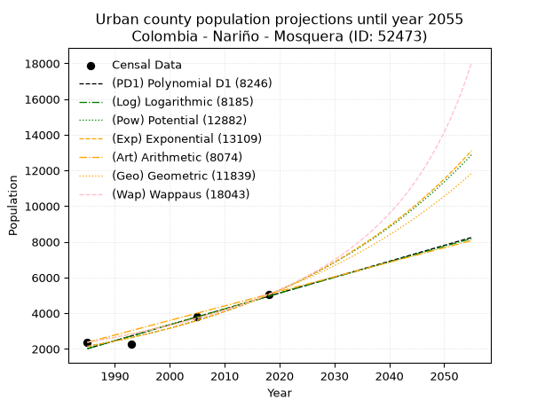
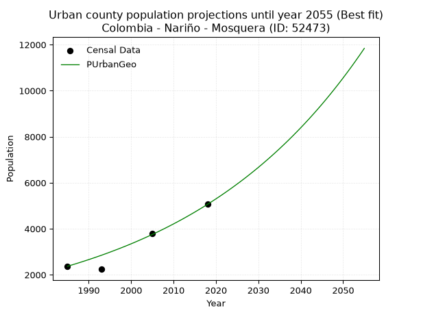
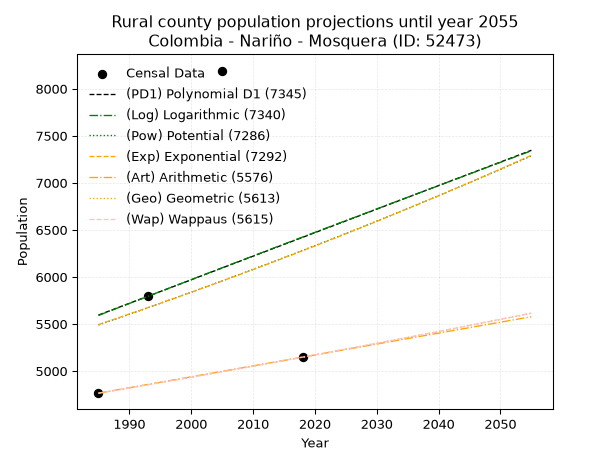
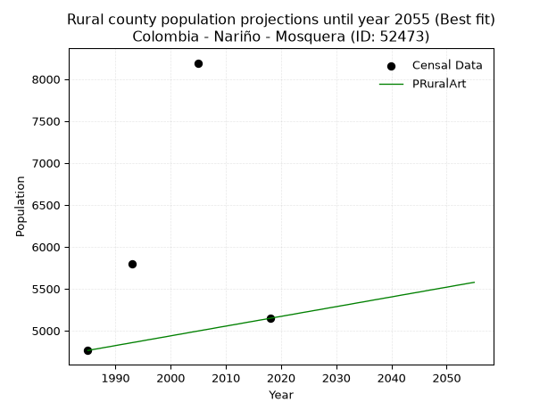

<div align="center">


</div>

# _“Population and Public Services Demand Projections (PPSD) until Year 2050 for Colombia - Nariño - Mosquera (ID: 52473)”_
Keywords: `population` `public-service` `projection` `lineal` `polynomial` `logarithmic` `potential` `exponential` `arithmetic` `geometric` `wappaus` `dane` `colombia` `south-america`

PPSD are analytical estimates used by governments and planners to anticipate future changes in population size, age distribution, and the resulting community needs for utilities, healthcare, education, and infrastructure as sizing future water treatment facilities, electrical grids, and road networks based on spatial growth.

> **General running parameters**: • app_version: _v20260806_. • Python version: _3.14.7_. • Pandas version: _3.0.5_. • NumPy version: _2.5.1_. • Creates, save and include plots into reports (create_plot): _False_. • Projection until year: _2050_. • Process polynomial degree 2 and up: _False_. • Process Wappaus: _True_. • Process Wappaus: _True_. • Set negative values to zero: _True_. • Set infinite values to zero: _True_. • Drop dataset notes: _True_. 
<div align="center">

Dynamic map: [:earth_americas:Google](http://maps.google.com/maps?q=2.507139393,-78.4529916) [:earth_americas:OSM](https://www.openstreetmap.org/#map=18/2.507139393/-78.4529916&layers=P) [:earth_americas:Bing](https://www.bing.com/maps?cp=2.507139393~-78.4529916&lvl=18) [:earth_americas:Apple](https://maps.apple.com/frame?center=2.507139393%2C-78.4529916&span=0.003%2C0.006)

</div>


<div align="center">

```geojson
{
  "type": "Feature",
  "geometry": {
    "type": "Point", 
    "coordinates": [-78.4529916, 2.507139393]
  }, 
  "properties": {
    "Name": "Colombia - Nariño - Mosquera (ID: 52473)"
  }
}
```

</div>


## 0. Census Data (4 records)

Census data are official statistics collected by a government about the people and housing in a country. They usually include counts of total population, age, sex, race, income, education, and jobs.

📅Global census file: [Population.xlsx](../data/Population.xlsx)

| Source   |   Year |   CountryID | CountryName   |   StateID | StateName   |   CountyID | CountyName   |   PTotal |   PUrban |   PRural |
|:---------|-------:|------------:|:--------------|----------:|:------------|-----------:|:-------------|---------:|---------:|---------:|
| DANE     |   1985 |          57 | Colombia      |        52 | Nariño      |      52473 | Mosquera     |     7134 |     2370 |     4764 |
| DANE     |   1993 |          57 | Colombia      |        52 | Nariño      |      52473 | Mosquera     |     8040 |     2240 |     5800 |
| DANE     |   2005 |          57 | Colombia      |        52 | Nariño      |      52473 | Mosquera     |    11995 |     3803 |     8192 |
| DANE     |   2018 |          57 | Colombia      |        52 | Nariño      |      52473 | Mosquera     |    10206 |     5059 |     5147 |

> 🔥Some records could had specific notes about the registered values or the corresponding urban or rural distribution.

## 1. Total

### 1.1. Coefficients and Parameters

* (PD1) Polynomial Deg 1: 114.08952228020951, -218863.81694098908 (lineal)
* (Log) Logarithmic: 228727.0813539693, -1729212.6282753192
* (Pow) Potential: 25.615205887221588, -80.59612597578008
* (Exp) Exponential: 0.012778381325344815, 7.262110500788112e-08
* (Art) Arithmetic: Year diff. 2018 - 1985 = 33, Population diff. 10206 - 7134 = 3072, Annual growth = 93.0909090909091
* (Geo) Geometric: Year diff. 2018 - 1985 = 33, Population diff. 10206 - 7134 = 3072, Annual growth % = 0.010910719604753538
* (Wap) Wappaus: i = 1.0737129076229421, Condition values only valid for < 200)

<sub>
Wappaus condition values: ['0.00', '1.07', '2.15', '3.22', '4.29', '5.37', '6.44', '7.52', '8.59', '9.66', '10.74', '11.81', '12.88', '13.96', '15.03', '16.11', '17.18', '18.25', '19.33', '20.40', '21.47', '22.55', '23.62', '24.70', '25.77', '26.84', '27.92', '28.99', '30.06', '31.14', '32.21', '33.29', '34.36', '35.43', '36.51', '37.58', '38.65', '39.73', '40.80', '41.87', '42.95', '44.02', '45.10', '46.17', '47.24', '48.32', '49.39', '50.46', '51.54', '52.61', '53.69', '54.76', '55.83', '56.91', '57.98', '59.05', '60.13', '61.20', '62.28', '63.35', '64.42', '65.50', '66.57', '67.64', '68.72', '69.79']
</sub>


### 1.2. Projected Dataset

|   Year |   CountyID |   PTotalPD1 |   PTotalLog |   PTotalPow |   PTotalExp |   PTotalArt |   PTotalGeo |   PTotalWap |
|-------:|-----------:|------------:|------------:|------------:|------------:|------------:|------------:|------------:|
|   1985 |      52473 |        7604 |        7598 |        7528 |        7533 |        7134 |        7134 |        7134 |
|   1986 |      52473 |        7718 |        7713 |        7626 |        7630 |        7227 |        7212 |        7211 |
|   1987 |      52473 |        7832 |        7828 |        7725 |        7728 |        7320 |        7291 |        7289 |
|   1988 |      52473 |        7946 |        7943 |        7825 |        7828 |        7413 |        7370 |        7368 |
|   1989 |      52473 |        8060 |        8058 |        7927 |        7928 |        7506 |        7450 |        7447 |
|   1990 |      52473 |        8174 |        8173 |        8029 |        8030 |        7599 |        7532 |        7528 |
|   1991 |      52473 |        8288 |        8288 |        8133 |        8134 |        7693 |        7614 |        7609 |
|   1992 |      52473 |        8403 |        8403 |        8239 |        8238 |        7786 |        7697 |        7691 |
|   1993 |      52473 |        8517 |        8518 |        8345 |        8344 |        7879 |        7781 |        7774 |
|   1994 |      52473 |        8631 |        8632 |        8453 |        8451 |        7972 |        7866 |        7858 |
|   1995 |      52473 |        8745 |        8747 |        8562 |        8560 |        8065 |        7952 |        7943 |
|   1996 |      52473 |        8859 |        8862 |        8673 |        8670 |        8158 |        8038 |        8029 |
|   1997 |      52473 |        8973 |        8976 |        8785 |        8782 |        8251 |        8126 |        8116 |
|   1998 |      52473 |        9087 |        9091 |        8898 |        8895 |        8344 |        8215 |        8204 |
|   1999 |      52473 |        9201 |        9205 |        9013 |        9009 |        8437 |        8304 |        8294 |
|   2000 |      52473 |        9315 |        9320 |        9129 |        9125 |        8530 |        8395 |        8384 |
|   2001 |      52473 |        9429 |        9434 |        9247 |        9242 |        8623 |        8487 |        8475 |
|   2002 |      52473 |        9543 |        9548 |        9366 |        9361 |        8717 |        8579 |        8567 |
|   2003 |      52473 |        9657 |        9662 |        9487 |        9481 |        8810 |        8673 |        8660 |
|   2004 |      52473 |        9772 |        9777 |        9609 |        9603 |        8903 |        8768 |        8755 |
|   2005 |      52473 |        9886 |        9891 |        9732 |        9727 |        8996 |        8863 |        8850 |
|   2006 |      52473 |       10000 |       10005 |        9857 |        9852 |        9089 |        8960 |        8947 |
|   2007 |      52473 |       10114 |       10119 |        9984 |        9979 |        9182 |        9058 |        9045 |
|   2008 |      52473 |       10228 |       10233 |       10112 |       10107 |        9275 |        9156 |        9144 |
|   2009 |      52473 |       10342 |       10347 |       10242 |       10237 |        9368 |        9256 |        9244 |
|   2010 |      52473 |       10456 |       10460 |       10373 |       10369 |        9461 |        9357 |        9346 |
|   2011 |      52473 |       10570 |       10574 |       10506 |       10502 |        9554 |        9459 |        9449 |
|   2012 |      52473 |       10684 |       10688 |       10641 |       10637 |        9647 |        9563 |        9553 |
|   2013 |      52473 |       10798 |       10802 |       10777 |       10774 |        9741 |        9667 |        9658 |
|   2014 |      52473 |       10912 |       10915 |       10915 |       10912 |        9834 |        9772 |        9765 |
|   2015 |      52473 |       11027 |       11029 |       11055 |       11053 |        9927 |        9879 |        9873 |
|   2016 |      52473 |       11141 |       11142 |       11196 |       11195 |       10020 |        9987 |        9983 |
|   2017 |      52473 |       11255 |       11256 |       11340 |       11339 |       10113 |       10096 |       10094 |
|   2018 |      52473 |       11369 |       11369 |       11484 |       11485 |       10206 |       10206 |       10206 |
|   2019 |      52473 |       11483 |       11482 |       11631 |       11632 |       10299 |       10317 |       10320 |
|   2020 |      52473 |       11597 |       11596 |       11780 |       11782 |       10392 |       10430 |       10435 |
|   2021 |      52473 |       11711 |       11709 |       11930 |       11933 |       10485 |       10544 |       10552 |
|   2022 |      52473 |       11825 |       11822 |       12082 |       12087 |       10578 |       10659 |       10671 |
|   2023 |      52473 |       11939 |       11935 |       12236 |       12242 |       10671 |       10775 |       10791 |
|   2024 |      52473 |       12053 |       12048 |       12392 |       12400 |       10765 |       10893 |       10912 |
|   2025 |      52473 |       12167 |       12161 |       12550 |       12559 |       10858 |       11011 |       11036 |
|   2026 |      52473 |       12282 |       12274 |       12709 |       12721 |       10951 |       11132 |       11161 |
|   2027 |      52473 |       12396 |       12387 |       12871 |       12884 |       11044 |       11253 |       11288 |
|   2028 |      52473 |       12510 |       12500 |       13035 |       13050 |       11137 |       11376 |       11416 |
|   2029 |      52473 |       12624 |       12612 |       13200 |       13218 |       11230 |       11500 |       11547 |
|   2030 |      52473 |       12738 |       12725 |       13368 |       13388 |       11323 |       11625 |       11679 |
|   2031 |      52473 |       12852 |       12838 |       13538 |       13560 |       11416 |       11752 |       11813 |
|   2032 |      52473 |       12966 |       12950 |       13709 |       13734 |       11509 |       11881 |       11949 |
|   2033 |      52473 |       13080 |       13063 |       13883 |       13911 |       11602 |       12010 |       12087 |
|   2034 |      52473 |       13194 |       13175 |       14059 |       14090 |       11695 |       12141 |       12227 |
|   2035 |      52473 |       13308 |       13288 |       14237 |       14271 |       11789 |       12274 |       12369 |
|   2036 |      52473 |       13422 |       13400 |       14418 |       14455 |       11882 |       12408 |       12513 |
|   2037 |      52473 |       13537 |       13512 |       14600 |       14641 |       11975 |       12543 |       12660 |
|   2038 |      52473 |       13651 |       13625 |       14785 |       14829 |       12068 |       12680 |       12808 |
|   2039 |      52473 |       13765 |       13737 |       14972 |       15020 |       12161 |       12818 |       12959 |
|   2040 |      52473 |       13879 |       13849 |       15161 |       15213 |       12254 |       12958 |       13112 |
|   2041 |      52473 |       13993 |       13961 |       15353 |       15408 |       12347 |       13099 |       13267 |
|   2042 |      52473 |       14107 |       14073 |       15547 |       15607 |       12440 |       13242 |       13425 |
|   2043 |      52473 |       14221 |       14185 |       15743 |       15807 |       12533 |       13387 |       13586 |
|   2044 |      52473 |       14335 |       14297 |       15941 |       16011 |       12626 |       13533 |       13748 |
|   2045 |      52473 |       14449 |       14409 |       16142 |       16216 |       12719 |       13680 |       13914 |
|   2046 |      52473 |       14563 |       14521 |       16346 |       16425 |       12813 |       13830 |       14082 |
|   2047 |      52473 |       14677 |       14633 |       16552 |       16636 |       12906 |       13981 |       14253 |
|   2048 |      52473 |       14792 |       14744 |       16760 |       16850 |       12999 |       14133 |       14426 |
|   2049 |      52473 |       14906 |       14856 |       16971 |       17067 |       13092 |       14287 |       14602 |
|   2050 |      52473 |       15020 |       14967 |       17184 |       17286 |       13185 |       14443 |       14782 |
<div align="center">

</img>

</div>


### 1.3. Best fit with absolute and relative error (%)

Relative error puts that difference into context by dividing the absolute error by the true value, creating a unitless ratio or percentage that shows the scale of the mistake.

Absolute and relative error

|   Year | Source   |   CountryID | CountryName   |   StateID | StateName   |   CountyID_x | CountyName   |   PTotal |   PUrban |   PRural |   CountyID_y |   PTotalPD1 |   PTotalLog |   PTotalPow |   PTotalExp |   PTotalArt |   PTotalGeo |   PTotalWap |   PTotalPD1AbsError |   PTotalLogAbsError |   PTotalPowAbsError |   PTotalExpAbsError |   PTotalArtAbsError |   PTotalGeoAbsError |   PTotalWapAbsError |   PTotalPD1RelError |   PTotalLogRelError |   PTotalPowRelError |   PTotalExpRelError |   PTotalArtRelError |   PTotalGeoRelError |   PTotalWapRelError |
|-------:|:---------|------------:|:--------------|----------:|:------------|-------------:|:-------------|---------:|---------:|---------:|-------------:|------------:|------------:|------------:|------------:|------------:|------------:|------------:|--------------------:|--------------------:|--------------------:|--------------------:|--------------------:|--------------------:|--------------------:|--------------------:|--------------------:|--------------------:|--------------------:|--------------------:|--------------------:|--------------------:|
|   1985 | DANE     |          57 | Colombia      |        52 | Nariño      |        52473 | Mosquera     |     7134 |     2370 |     4764 |        52473 |        7604 |        7598 |        7528 |        7533 |        7134 |        7134 |        7134 |                 470 |                 464 |                 394 |                 399 |                   0 |                   0 |                   0 |             6.58817 |             6.50407 |             5.52285 |             5.59294 |             0       |             0       |             0       |
|   1993 | DANE     |          57 | Colombia      |        52 | Nariño      |        52473 | Mosquera     |     8040 |     2240 |     5800 |        52473 |        8517 |        8518 |        8345 |        8344 |        7879 |        7781 |        7774 |                 477 |                 478 |                 305 |                 304 |                 161 |                 259 |                 266 |             5.93284 |             5.94527 |             3.79353 |             3.78109 |             2.00249 |             3.22139 |             3.30846 |
|   2005 | DANE     |          57 | Colombia      |        52 | Nariño      |        52473 | Mosquera     |    11995 |     3803 |     8192 |        52473 |        9886 |        9891 |        9732 |        9727 |        8996 |        8863 |        8850 |                2109 |                2104 |                2263 |                2268 |                2999 |                3132 |                3145 |            17.5823  |            17.5406  |            18.8662  |            18.9079  |            25.0021  |            26.1109  |            26.2193  |
|   2018 | DANE     |          57 | Colombia      |        52 | Nariño      |        52473 | Mosquera     |    10206 |     5059 |     5147 |        52473 |       11369 |       11369 |       11484 |       11485 |       10206 |       10206 |       10206 |                1163 |                1163 |                1278 |                1279 |                   0 |                   0 |                   0 |            11.3953  |            11.3953  |            12.522   |            12.5318  |             0       |             0       |             0       |

Relative error mean

| Method    |   RelError | Best   |
|:----------|-----------:|:-------|
| PTotalPD1 |   10.3746  |        |
| PTotalLog |   10.3463  |        |
| PTotalPow |   10.1762  |        |
| PTotalExp |   10.2034  |        |
| PTotalArt |    6.75114 | True   |
| PTotalGeo |    7.33307 |        |
| PTotalWap |    7.38193 |        |

💙Best method: _**PTotalArt**_
<div align="center">

</img>

</div>


### 1.4. Fresh water supply demand in liters per capita per day (lpcd)

The fresh water supply demand typically ranges from 100 to 300 liters per capita per day (lpcd) for standard domestic and municipal planning, though absolute survival minimums set by the World Health Organization are as low as 7.5 to 20 liters per day, and total consumption in high-income nations can exceed 400 liters.

> `CZ`: Level in meters above the sea level (masl).<br> `WS`: Fresh water supply demand in liters per capita per day (lpcd or l/h/d).<br> `WSAll`: Zonal fresh water supply demand in liters per second (l/s).<br> `A`: Zonal area in square meters.

Reference values (RAS Colombia)

|    CZ |   WS |
|------:|-----:|
|  1000 |  120 |
|  2000 |  130 |
| 99999 |  140 |

County shapefile geometry properties and water supply values

|   CountyID |      ATotal |   CZTotal |   WSTotal |
|-----------:|------------:|----------:|----------:|
|      52473 | 7.69308e+08 |   12.4939 |       120 |

Projected values for best method: PTotalArt

|   CountyID |   Year |   PTotalArt |   WSTotal |   WSTotalAll |
|-----------:|-------:|------------:|----------:|-------------:|
|      52473 |   1985 |        7134 |       120 |      9.90833 |
|      52473 |   1986 |        7227 |       120 |     10.0375  |
|      52473 |   1987 |        7320 |       120 |     10.1667  |
|      52473 |   1988 |        7413 |       120 |     10.2958  |
|      52473 |   1989 |        7506 |       120 |     10.425   |
|      52473 |   1990 |        7599 |       120 |     10.5542  |
|      52473 |   1991 |        7693 |       120 |     10.6847  |
|      52473 |   1992 |        7786 |       120 |     10.8139  |
|      52473 |   1993 |        7879 |       120 |     10.9431  |
|      52473 |   1994 |        7972 |       120 |     11.0722  |
|      52473 |   1995 |        8065 |       120 |     11.2014  |
|      52473 |   1996 |        8158 |       120 |     11.3306  |
|      52473 |   1997 |        8251 |       120 |     11.4597  |
|      52473 |   1998 |        8344 |       120 |     11.5889  |
|      52473 |   1999 |        8437 |       120 |     11.7181  |
|      52473 |   2000 |        8530 |       120 |     11.8472  |
|      52473 |   2001 |        8623 |       120 |     11.9764  |
|      52473 |   2002 |        8717 |       120 |     12.1069  |
|      52473 |   2003 |        8810 |       120 |     12.2361  |
|      52473 |   2004 |        8903 |       120 |     12.3653  |
|      52473 |   2005 |        8996 |       120 |     12.4944  |
|      52473 |   2006 |        9089 |       120 |     12.6236  |
|      52473 |   2007 |        9182 |       120 |     12.7528  |
|      52473 |   2008 |        9275 |       120 |     12.8819  |
|      52473 |   2009 |        9368 |       120 |     13.0111  |
|      52473 |   2010 |        9461 |       120 |     13.1403  |
|      52473 |   2011 |        9554 |       120 |     13.2694  |
|      52473 |   2012 |        9647 |       120 |     13.3986  |
|      52473 |   2013 |        9741 |       120 |     13.5292  |
|      52473 |   2014 |        9834 |       120 |     13.6583  |
|      52473 |   2015 |        9927 |       120 |     13.7875  |
|      52473 |   2016 |       10020 |       120 |     13.9167  |
|      52473 |   2017 |       10113 |       120 |     14.0458  |
|      52473 |   2018 |       10206 |       120 |     14.175   |
|      52473 |   2019 |       10299 |       120 |     14.3042  |
|      52473 |   2020 |       10392 |       120 |     14.4333  |
|      52473 |   2021 |       10485 |       120 |     14.5625  |
|      52473 |   2022 |       10578 |       120 |     14.6917  |
|      52473 |   2023 |       10671 |       120 |     14.8208  |
|      52473 |   2024 |       10765 |       120 |     14.9514  |
|      52473 |   2025 |       10858 |       120 |     15.0806  |
|      52473 |   2026 |       10951 |       120 |     15.2097  |
|      52473 |   2027 |       11044 |       120 |     15.3389  |
|      52473 |   2028 |       11137 |       120 |     15.4681  |
|      52473 |   2029 |       11230 |       120 |     15.5972  |
|      52473 |   2030 |       11323 |       120 |     15.7264  |
|      52473 |   2031 |       11416 |       120 |     15.8556  |
|      52473 |   2032 |       11509 |       120 |     15.9847  |
|      52473 |   2033 |       11602 |       120 |     16.1139  |
|      52473 |   2034 |       11695 |       120 |     16.2431  |
|      52473 |   2035 |       11789 |       120 |     16.3736  |
|      52473 |   2036 |       11882 |       120 |     16.5028  |
|      52473 |   2037 |       11975 |       120 |     16.6319  |
|      52473 |   2038 |       12068 |       120 |     16.7611  |
|      52473 |   2039 |       12161 |       120 |     16.8903  |
|      52473 |   2040 |       12254 |       120 |     17.0194  |
|      52473 |   2041 |       12347 |       120 |     17.1486  |
|      52473 |   2042 |       12440 |       120 |     17.2778  |
|      52473 |   2043 |       12533 |       120 |     17.4069  |
|      52473 |   2044 |       12626 |       120 |     17.5361  |
|      52473 |   2045 |       12719 |       120 |     17.6653  |
|      52473 |   2046 |       12813 |       120 |     17.7958  |
|      52473 |   2047 |       12906 |       120 |     17.925   |
|      52473 |   2048 |       12999 |       120 |     18.0542  |
|      52473 |   2049 |       13092 |       120 |     18.1833  |
|      52473 |   2050 |       13185 |       120 |     18.3125  |

## 2. Urban

### 2.1. Coefficients and Parameters

* (PD1) Polynomial Deg 1: 89.0871136089915, -174828.4989963853 (lineal)
* (Log) Logarithmic: 178243.43745219754, -1351461.796427419
* (Pow) Potential: 51.78095233486881, -167.43055373569436
* (Exp) Exponential: 0.025876721912027518, 1.054999467990433e-19
* (Art) Arithmetic: Year diff. 2018 - 1985 = 33, Population diff. 5059 - 2370 = 2689, Annual growth = 81.48484848484848
* (Geo) Geometric: Year diff. 2018 - 1985 = 33, Population diff. 5059 - 2370 = 2689, Annual growth % = 0.023244179252120523
* (Wap) Wappaus: i = 2.1936962844218195, Condition values only valid for < 200)

<sub>
Wappaus condition values: ['0.00', '2.19', '4.39', '6.58', '8.77', '10.97', '13.16', '15.36', '17.55', '19.74', '21.94', '24.13', '26.32', '28.52', '30.71', '32.91', '35.10', '37.29', '39.49', '41.68', '43.87', '46.07', '48.26', '50.46', '52.65', '54.84', '57.04', '59.23', '61.42', '63.62', '65.81', '68.00', '70.20', '72.39', '74.59', '76.78', '78.97', '81.17', '83.36', '85.55', '87.75', '89.94', '92.14', '94.33', '96.52', '98.72', '100.91', '103.10', '105.30', '107.49', '109.68', '111.88', '114.07', '116.27', '118.46', '120.65', '122.85', '125.04', '127.23', '129.43', '131.62', '133.82', '136.01', '138.20', '140.40', '142.59']
</sub>


### 2.2. Projected Dataset

|   Year |   CountyID |   PUrbanPD1 |   PUrbanLog |   PUrbanPow |   PUrbanExp |   PUrbanArt |   PUrbanGeo |   PUrbanWap |
|-------:|-----------:|------------:|------------:|------------:|------------:|------------:|------------:|------------:|
|   1985 |      52473 |        2009 |        2007 |        2141 |        2142 |        2370 |        2370 |        2370 |
|   1986 |      52473 |        2099 |        2097 |        2198 |        2199 |        2451 |        2425 |        2423 |
|   1987 |      52473 |        2188 |        2187 |        2256 |        2256 |        2533 |        2481 |        2476 |
|   1988 |      52473 |        2277 |        2277 |        2315 |        2315 |        2614 |        2539 |        2531 |
|   1989 |      52473 |        2366 |        2366 |        2376 |        2376 |        2696 |        2598 |        2588 |
|   1990 |      52473 |        2455 |        2456 |        2439 |        2438 |        2777 |        2659 |        2645 |
|   1991 |      52473 |        2544 |        2545 |        2503 |        2502 |        2859 |        2720 |        2704 |
|   1992 |      52473 |        2633 |        2635 |        2569 |        2568 |        2940 |        2784 |        2764 |
|   1993 |      52473 |        2722 |        2724 |        2637 |        2635 |        3022 |        2848 |        2826 |
|   1994 |      52473 |        2811 |        2814 |        2706 |        2704 |        3103 |        2914 |        2889 |
|   1995 |      52473 |        2900 |        2903 |        2777 |        2775 |        3185 |        2982 |        2954 |
|   1996 |      52473 |        2989 |        2992 |        2850 |        2848 |        3266 |        3052 |        3020 |
|   1997 |      52473 |        3078 |        3082 |        2925 |        2923 |        3348 |        3122 |        3088 |
|   1998 |      52473 |        3168 |        3171 |        3002 |        2999 |        3429 |        3195 |        3158 |
|   1999 |      52473 |        3257 |        3260 |        3081 |        3078 |        3511 |        3269 |        3230 |
|   2000 |      52473 |        3346 |        3349 |        3162 |        3159 |        3592 |        3345 |        3303 |
|   2001 |      52473 |        3435 |        3438 |        3245 |        3241 |        3674 |        3423 |        3379 |
|   2002 |      52473 |        3524 |        3527 |        3330 |        3326 |        3755 |        3503 |        3456 |
|   2003 |      52473 |        3613 |        3616 |        3417 |        3414 |        3837 |        3584 |        3536 |
|   2004 |      52473 |        3702 |        3705 |        3506 |        3503 |        3918 |        3667 |        3618 |
|   2005 |      52473 |        3791 |        3794 |        3598 |        3595 |        4000 |        3753 |        3702 |
|   2006 |      52473 |        3880 |        3883 |        3692 |        3689 |        4081 |        3840 |        3789 |
|   2007 |      52473 |        3969 |        3972 |        3789 |        3786 |        4163 |        3929 |        3878 |
|   2008 |      52473 |        4058 |        4061 |        3888 |        3885 |        4244 |        4020 |        3969 |
|   2009 |      52473 |        4148 |        4149 |        3989 |        3987 |        4326 |        4114 |        4064 |
|   2010 |      52473 |        4237 |        4238 |        4093 |        4091 |        4407 |        4209 |        4161 |
|   2011 |      52473 |        4326 |        4327 |        4200 |        4199 |        4489 |        4307 |        4261 |
|   2012 |      52473 |        4415 |        4415 |        4310 |        4309 |        4570 |        4407 |        4364 |
|   2013 |      52473 |        4504 |        4504 |        4422 |        4422 |        4652 |        4510 |        4471 |
|   2014 |      52473 |        4593 |        4593 |        4537 |        4538 |        4733 |        4615 |        4581 |
|   2015 |      52473 |        4682 |        4681 |        4655 |        4656 |        4815 |        4722 |        4695 |
|   2016 |      52473 |        4771 |        4769 |        4777 |        4779 |        4896 |        4832 |        4812 |
|   2017 |      52473 |        4860 |        4858 |        4901 |        4904 |        4978 |        4944 |        4933 |
|   2018 |      52473 |        4949 |        4946 |        5028 |        5032 |        5059 |        5059 |        5059 |
|   2019 |      52473 |        5038 |        5035 |        5159 |        5164 |        5140 |        5177 |        5189 |
|   2020 |      52473 |        5127 |        5123 |        5293 |        5300 |        5222 |        5297 |        5324 |
|   2021 |      52473 |        5217 |        5211 |        5430 |        5439 |        5303 |        5420 |        5463 |
|   2022 |      52473 |        5306 |        5299 |        5571 |        5581 |        5385 |        5546 |        5608 |
|   2023 |      52473 |        5395 |        5387 |        5716 |        5727 |        5466 |        5675 |        5758 |
|   2024 |      52473 |        5484 |        5475 |        5864 |        5878 |        5548 |        5807 |        5913 |
|   2025 |      52473 |        5573 |        5563 |        6016 |        6032 |        5629 |        5942 |        6075 |
|   2026 |      52473 |        5662 |        5651 |        6171 |        6190 |        5711 |        6080 |        6244 |
|   2027 |      52473 |        5751 |        5739 |        6331 |        6352 |        5792 |        6221 |        6419 |
|   2028 |      52473 |        5840 |        5827 |        6495 |        6519 |        5874 |        6366 |        6601 |
|   2029 |      52473 |        5929 |        5915 |        6663 |        6689 |        5955 |        6514 |        6791 |
|   2030 |      52473 |        6018 |        6003 |        6835 |        6865 |        6037 |        6665 |        6990 |
|   2031 |      52473 |        6107 |        6091 |        7012 |        7045 |        6118 |        6820 |        7197 |
|   2032 |      52473 |        6197 |        6179 |        7193 |        7229 |        6200 |        6979 |        7414 |
|   2033 |      52473 |        6286 |        6266 |        7378 |        7419 |        6281 |        7141 |        7640 |
|   2034 |      52473 |        6375 |        6354 |        7568 |        7613 |        6363 |        7307 |        7878 |
|   2035 |      52473 |        6464 |        6441 |        7764 |        7813 |        6444 |        7477 |        8127 |
|   2036 |      52473 |        6553 |        6529 |        7964 |        8018 |        6526 |        7651 |        8388 |
|   2037 |      52473 |        6642 |        6617 |        8169 |        8228 |        6607 |        7828 |        8663 |
|   2038 |      52473 |        6731 |        6704 |        8379 |        8444 |        6689 |        8010 |        8952 |
|   2039 |      52473 |        6820 |        6791 |        8595 |        8665 |        6770 |        8197 |        9256 |
|   2040 |      52473 |        6909 |        6879 |        8816 |        8892 |        6852 |        8387 |        9578 |
|   2041 |      52473 |        6998 |        6966 |        9042 |        9125 |        6933 |        8582 |        9917 |
|   2042 |      52473 |        7087 |        7054 |        9274 |        9365 |        7015 |        8781 |       10277 |
|   2043 |      52473 |        7176 |        7141 |        9513 |        9610 |        7096 |        8986 |       10658 |
|   2044 |      52473 |        7266 |        7228 |        9757 |        9862 |        7178 |        9194 |       11063 |
|   2045 |      52473 |        7355 |        7315 |       10007 |       10121 |        7259 |        9408 |       11494 |
|   2046 |      52473 |        7444 |        7402 |       10263 |       10386 |        7341 |        9627 |       11954 |
|   2047 |      52473 |        7533 |        7489 |       10526 |       10658 |        7422 |        9851 |       12445 |
|   2048 |      52473 |        7622 |        7577 |       10796 |       10937 |        7504 |       10080 |       12971 |
|   2049 |      52473 |        7711 |        7664 |       11072 |       11224 |        7585 |       10314 |       13535 |
|   2050 |      52473 |        7800 |        7750 |       11356 |       11518 |        7667 |       10554 |       14143 |
<div align="center">

</img>

</div>


### 2.3. Best fit with absolute and relative error (%)

Relative error puts that difference into context by dividing the absolute error by the true value, creating a unitless ratio or percentage that shows the scale of the mistake.

Absolute and relative error

|   Year | Source   |   CountryID | CountryName   |   StateID | StateName   |   CountyID_x | CountyName   |   PTotal |   PUrban |   PRural |   CountyID_y |   PUrbanPD1 |   PUrbanLog |   PUrbanPow |   PUrbanExp |   PUrbanArt |   PUrbanGeo |   PUrbanWap |   PUrbanPD1AbsError |   PUrbanLogAbsError |   PUrbanPowAbsError |   PUrbanExpAbsError |   PUrbanArtAbsError |   PUrbanGeoAbsError |   PUrbanWapAbsError |   PUrbanPD1RelError |   PUrbanLogRelError |   PUrbanPowRelError |   PUrbanExpRelError |   PUrbanArtRelError |   PUrbanGeoRelError |   PUrbanWapRelError |
|-------:|:---------|------------:|:--------------|----------:|:------------|-------------:|:-------------|---------:|---------:|---------:|-------------:|------------:|------------:|------------:|------------:|------------:|------------:|------------:|--------------------:|--------------------:|--------------------:|--------------------:|--------------------:|--------------------:|--------------------:|--------------------:|--------------------:|--------------------:|--------------------:|--------------------:|--------------------:|--------------------:|
|   1985 | DANE     |          57 | Colombia      |        52 | Nariño      |        52473 | Mosquera     |     7134 |     2370 |     4764 |        52473 |        2009 |        2007 |        2141 |        2142 |        2370 |        2370 |        2370 |                 361 |                 363 |                 229 |                 228 |                   0 |                   0 |                   0 |            15.2321  |           15.3165   |            9.66245  |            9.62025  |             0       |             0       |              0      |
|   1993 | DANE     |          57 | Colombia      |        52 | Nariño      |        52473 | Mosquera     |     8040 |     2240 |     5800 |        52473 |        2722 |        2724 |        2637 |        2635 |        3022 |        2848 |        2826 |                 482 |                 484 |                 397 |                 395 |                 782 |                 608 |                 586 |            21.5179  |           21.6071   |           17.7232   |           17.6339   |            34.9107  |            27.1429  |             26.1607 |
|   2005 | DANE     |          57 | Colombia      |        52 | Nariño      |        52473 | Mosquera     |    11995 |     3803 |     8192 |        52473 |        3791 |        3794 |        3598 |        3595 |        4000 |        3753 |        3702 |                  12 |                   9 |                 205 |                 208 |                 197 |                  50 |                 101 |             0.31554 |            0.236655 |            5.39048  |            5.46937  |             5.18012 |             1.31475 |              2.6558 |
|   2018 | DANE     |          57 | Colombia      |        52 | Nariño      |        52473 | Mosquera     |    10206 |     5059 |     5147 |        52473 |        4949 |        4946 |        5028 |        5032 |        5059 |        5059 |        5059 |                 110 |                 113 |                  31 |                  27 |                   0 |                   0 |                   0 |             2.17434 |            2.23364  |            0.612769 |            0.533702 |             0       |             0       |              0      |

Relative error mean

| Method    |   RelError | Best   |
|:----------|-----------:|:-------|
| PUrbanPD1 |    9.80995 |        |
| PUrbanLog |    9.84847 |        |
| PUrbanPow |    8.34723 |        |
| PUrbanExp |    8.31431 |        |
| PUrbanArt |   10.0227  |        |
| PUrbanGeo |    7.1144  | True   |
| PUrbanWap |    7.20413 |        |

💙Best method: _**PUrbanGeo**_
<div align="center">

</img>

</div>


### 2.4. Fresh water supply demand in liters per capita per day (lpcd)

The fresh water supply demand typically ranges from 100 to 300 liters per capita per day (lpcd) for standard domestic and municipal planning, though absolute survival minimums set by the World Health Organization are as low as 7.5 to 20 liters per day, and total consumption in high-income nations can exceed 400 liters.

> `CZ`: Level in meters above the sea level (masl).<br> `WS`: Fresh water supply demand in liters per capita per day (lpcd or l/h/d).<br> `WSAll`: Zonal fresh water supply demand in liters per second (l/s).<br> `A`: Zonal area in square meters.

Reference values (RAS Colombia)

|    CZ |   WS |
|------:|-----:|
|  1000 |  120 |
|  2000 |  130 |
| 99999 |  140 |

County shapefile geometry properties and water supply values

|   CountyID |   AUrban |   CZUrban |   WSUrban |
|-----------:|---------:|----------:|----------:|
|      52473 |   246779 |   3.21441 |       120 |

Projected values for best method: PUrbanGeo

|   CountyID |   Year |   PUrbanGeo |   WSUrban |   WSUrbanAll |
|-----------:|-------:|------------:|----------:|-------------:|
|      52473 |   1985 |        2370 |       120 |      3.29167 |
|      52473 |   1986 |        2425 |       120 |      3.36806 |
|      52473 |   1987 |        2481 |       120 |      3.44583 |
|      52473 |   1988 |        2539 |       120 |      3.52639 |
|      52473 |   1989 |        2598 |       120 |      3.60833 |
|      52473 |   1990 |        2659 |       120 |      3.69306 |
|      52473 |   1991 |        2720 |       120 |      3.77778 |
|      52473 |   1992 |        2784 |       120 |      3.86667 |
|      52473 |   1993 |        2848 |       120 |      3.95556 |
|      52473 |   1994 |        2914 |       120 |      4.04722 |
|      52473 |   1995 |        2982 |       120 |      4.14167 |
|      52473 |   1996 |        3052 |       120 |      4.23889 |
|      52473 |   1997 |        3122 |       120 |      4.33611 |
|      52473 |   1998 |        3195 |       120 |      4.4375  |
|      52473 |   1999 |        3269 |       120 |      4.54028 |
|      52473 |   2000 |        3345 |       120 |      4.64583 |
|      52473 |   2001 |        3423 |       120 |      4.75417 |
|      52473 |   2002 |        3503 |       120 |      4.86528 |
|      52473 |   2003 |        3584 |       120 |      4.97778 |
|      52473 |   2004 |        3667 |       120 |      5.09306 |
|      52473 |   2005 |        3753 |       120 |      5.2125  |
|      52473 |   2006 |        3840 |       120 |      5.33333 |
|      52473 |   2007 |        3929 |       120 |      5.45694 |
|      52473 |   2008 |        4020 |       120 |      5.58333 |
|      52473 |   2009 |        4114 |       120 |      5.71389 |
|      52473 |   2010 |        4209 |       120 |      5.84583 |
|      52473 |   2011 |        4307 |       120 |      5.98194 |
|      52473 |   2012 |        4407 |       120 |      6.12083 |
|      52473 |   2013 |        4510 |       120 |      6.26389 |
|      52473 |   2014 |        4615 |       120 |      6.40972 |
|      52473 |   2015 |        4722 |       120 |      6.55833 |
|      52473 |   2016 |        4832 |       120 |      6.71111 |
|      52473 |   2017 |        4944 |       120 |      6.86667 |
|      52473 |   2018 |        5059 |       120 |      7.02639 |
|      52473 |   2019 |        5177 |       120 |      7.19028 |
|      52473 |   2020 |        5297 |       120 |      7.35694 |
|      52473 |   2021 |        5420 |       120 |      7.52778 |
|      52473 |   2022 |        5546 |       120 |      7.70278 |
|      52473 |   2023 |        5675 |       120 |      7.88194 |
|      52473 |   2024 |        5807 |       120 |      8.06528 |
|      52473 |   2025 |        5942 |       120 |      8.25278 |
|      52473 |   2026 |        6080 |       120 |      8.44444 |
|      52473 |   2027 |        6221 |       120 |      8.64028 |
|      52473 |   2028 |        6366 |       120 |      8.84167 |
|      52473 |   2029 |        6514 |       120 |      9.04722 |
|      52473 |   2030 |        6665 |       120 |      9.25694 |
|      52473 |   2031 |        6820 |       120 |      9.47222 |
|      52473 |   2032 |        6979 |       120 |      9.69306 |
|      52473 |   2033 |        7141 |       120 |      9.91806 |
|      52473 |   2034 |        7307 |       120 |     10.1486  |
|      52473 |   2035 |        7477 |       120 |     10.3847  |
|      52473 |   2036 |        7651 |       120 |     10.6264  |
|      52473 |   2037 |        7828 |       120 |     10.8722  |
|      52473 |   2038 |        8010 |       120 |     11.125   |
|      52473 |   2039 |        8197 |       120 |     11.3847  |
|      52473 |   2040 |        8387 |       120 |     11.6486  |
|      52473 |   2041 |        8582 |       120 |     11.9194  |
|      52473 |   2042 |        8781 |       120 |     12.1958  |
|      52473 |   2043 |        8986 |       120 |     12.4806  |
|      52473 |   2044 |        9194 |       120 |     12.7694  |
|      52473 |   2045 |        9408 |       120 |     13.0667  |
|      52473 |   2046 |        9627 |       120 |     13.3708  |
|      52473 |   2047 |        9851 |       120 |     13.6819  |
|      52473 |   2048 |       10080 |       120 |     14       |
|      52473 |   2049 |       10314 |       120 |     14.325   |
|      52473 |   2050 |       10554 |       120 |     14.6583  |

## 3. Rural

### 3.1. Coefficients and Parameters

* (PD1) Polynomial Deg 1: 25.00240867121814, -44035.31794460409 (lineal)
* (Log) Logarithmic: 50483.64390177177, -377750.83184790023
* (Pow) Potential: 8.172281998997699, -23.210736676819177
* (Exp) Exponential: 0.004047841194365837, 1.7792471839083996
* (Art) Arithmetic: Year diff. 2018 - 1985 = 33, Population diff. 5147 - 4764 = 383, Annual growth = 11.606060606060606
* (Geo) Geometric: Year diff. 2018 - 1985 = 33, Population diff. 5147 - 4764 = 383, Annual growth % = 0.0023459708017252723
* (Wap) Wappaus: i = 0.2342056423380205, Condition values only valid for < 200)

<sub>
Wappaus condition values: ['0.00', '0.23', '0.47', '0.70', '0.94', '1.17', '1.41', '1.64', '1.87', '2.11', '2.34', '2.58', '2.81', '3.04', '3.28', '3.51', '3.75', '3.98', '4.22', '4.45', '4.68', '4.92', '5.15', '5.39', '5.62', '5.86', '6.09', '6.32', '6.56', '6.79', '7.03', '7.26', '7.49', '7.73', '7.96', '8.20', '8.43', '8.67', '8.90', '9.13', '9.37', '9.60', '9.84', '10.07', '10.31', '10.54', '10.77', '11.01', '11.24', '11.48', '11.71', '11.94', '12.18', '12.41', '12.65', '12.88', '13.12', '13.35', '13.58', '13.82', '14.05', '14.29', '14.52', '14.75', '14.99', '15.22']
</sub>


### 3.2. Projected Dataset

|   Year |   CountyID |   PRuralPD1 |   PRuralLog |   PRuralPow |   PRuralExp |   PRuralArt |   PRuralGeo |   PRuralWap |
|-------:|-----------:|------------:|------------:|------------:|------------:|------------:|------------:|------------:|
|   1985 |      52473 |        5594 |        5590 |        5489 |        5493 |        4764 |        4764 |        4764 |
|   1986 |      52473 |        5619 |        5616 |        5512 |        5515 |        4776 |        4775 |        4775 |
|   1987 |      52473 |        5644 |        5641 |        5534 |        5537 |        4787 |        4786 |        4786 |
|   1988 |      52473 |        5669 |        5667 |        5557 |        5560 |        4799 |        4798 |        4798 |
|   1989 |      52473 |        5694 |        5692 |        5580 |        5582 |        4810 |        4809 |        4809 |
|   1990 |      52473 |        5719 |        5717 |        5603 |        5605 |        4822 |        4820 |        4820 |
|   1991 |      52473 |        5744 |        5743 |        5626 |        5628 |        4834 |        4831 |        4831 |
|   1992 |      52473 |        5769 |        5768 |        5649 |        5650 |        4845 |        4843 |        4843 |
|   1993 |      52473 |        5794 |        5793 |        5672 |        5673 |        4857 |        4854 |        4854 |
|   1994 |      52473 |        5819 |        5819 |        5696 |        5696 |        4868 |        4866 |        4865 |
|   1995 |      52473 |        5844 |        5844 |        5719 |        5719 |        4880 |        4877 |        4877 |
|   1996 |      52473 |        5869 |        5869 |        5743 |        5743 |        4892 |        4888 |        4888 |
|   1997 |      52473 |        5894 |        5895 |        5766 |        5766 |        4903 |        4900 |        4900 |
|   1998 |      52473 |        5919 |        5920 |        5790 |        5789 |        4915 |        4911 |        4911 |
|   1999 |      52473 |        5944 |        5945 |        5813 |        5813 |        4926 |        4923 |        4923 |
|   2000 |      52473 |        5969 |        5970 |        5837 |        5836 |        4938 |        4934 |        4934 |
|   2001 |      52473 |        5995 |        5996 |        5861 |        5860 |        4950 |        4946 |        4946 |
|   2002 |      52473 |        6020 |        6021 |        5885 |        5884 |        4961 |        4958 |        4958 |
|   2003 |      52473 |        6045 |        6046 |        5909 |        5908 |        4973 |        4969 |        4969 |
|   2004 |      52473 |        6070 |        6071 |        5933 |        5932 |        4985 |        4981 |        4981 |
|   2005 |      52473 |        6095 |        6096 |        5958 |        5956 |        4996 |        4993 |        4993 |
|   2006 |      52473 |        6120 |        6122 |        5982 |        5980 |        5008 |        5004 |        5004 |
|   2007 |      52473 |        6145 |        6147 |        6006 |        6004 |        5019 |        5016 |        5016 |
|   2008 |      52473 |        6170 |        6172 |        6031 |        6029 |        5031 |        5028 |        5028 |
|   2009 |      52473 |        6195 |        6197 |        6055 |        6053 |        5043 |        5040 |        5040 |
|   2010 |      52473 |        6220 |        6222 |        6080 |        6078 |        5054 |        5051 |        5051 |
|   2011 |      52473 |        6245 |        6247 |        6105 |        6102 |        5066 |        5063 |        5063 |
|   2012 |      52473 |        6270 |        6272 |        6130 |        6127 |        5077 |        5075 |        5075 |
|   2013 |      52473 |        6295 |        6298 |        6155 |        6152 |        5089 |        5087 |        5087 |
|   2014 |      52473 |        6320 |        6323 |        6180 |        6177 |        5101 |        5099 |        5099 |
|   2015 |      52473 |        6345 |        6348 |        6205 |        6202 |        5112 |        5111 |        5111 |
|   2016 |      52473 |        6370 |        6373 |        6230 |        6227 |        5124 |        5123 |        5123 |
|   2017 |      52473 |        6395 |        6398 |        6255 |        6252 |        5135 |        5135 |        5135 |
|   2018 |      52473 |        6420 |        6423 |        6281 |        6278 |        5147 |        5147 |        5147 |
|   2019 |      52473 |        6445 |        6448 |        6306 |        6303 |        5159 |        5159 |        5159 |
|   2020 |      52473 |        6470 |        6473 |        6332 |        6329 |        5170 |        5171 |        5171 |
|   2021 |      52473 |        6495 |        6498 |        6357 |        6354 |        5182 |        5183 |        5183 |
|   2022 |      52473 |        6520 |        6523 |        6383 |        6380 |        5193 |        5195 |        5196 |
|   2023 |      52473 |        6545 |        6548 |        6409 |        6406 |        5205 |        5208 |        5208 |
|   2024 |      52473 |        6570 |        6573 |        6435 |        6432 |        5217 |        5220 |        5220 |
|   2025 |      52473 |        6595 |        6598 |        6461 |        6458 |        5228 |        5232 |        5232 |
|   2026 |      52473 |        6620 |        6622 |        6487 |        6484 |        5240 |        5244 |        5245 |
|   2027 |      52473 |        6645 |        6647 |        6513 |        6510 |        5251 |        5257 |        5257 |
|   2028 |      52473 |        6670 |        6672 |        6540 |        6537 |        5263 |        5269 |        5269 |
|   2029 |      52473 |        6695 |        6697 |        6566 |        6563 |        5275 |        5281 |        5282 |
|   2030 |      52473 |        6720 |        6722 |        6593 |        6590 |        5286 |        5294 |        5294 |
|   2031 |      52473 |        6745 |        6747 |        6619 |        6617 |        5298 |        5306 |        5306 |
|   2032 |      52473 |        6770 |        6772 |        6646 |        6644 |        5309 |        5319 |        5319 |
|   2033 |      52473 |        6795 |        6797 |        6673 |        6671 |        5321 |        5331 |        5331 |
|   2034 |      52473 |        6820 |        6821 |        6699 |        6698 |        5333 |        5344 |        5344 |
|   2035 |      52473 |        6845 |        6846 |        6726 |        6725 |        5344 |        5356 |        5357 |
|   2036 |      52473 |        6870 |        6871 |        6753 |        6752 |        5356 |        5369 |        5369 |
|   2037 |      52473 |        6895 |        6896 |        6781 |        6779 |        5368 |        5381 |        5382 |
|   2038 |      52473 |        6920 |        6921 |        6808 |        6807 |        5379 |        5394 |        5394 |
|   2039 |      52473 |        6945 |        6945 |        6835 |        6834 |        5391 |        5407 |        5407 |
|   2040 |      52473 |        6970 |        6970 |        6863 |        6862 |        5402 |        5419 |        5420 |
|   2041 |      52473 |        6995 |        6995 |        6890 |        6890 |        5414 |        5432 |        5433 |
|   2042 |      52473 |        7020 |        7020 |        6918 |        6918 |        5426 |        5445 |        5445 |
|   2043 |      52473 |        7045 |        7044 |        6946 |        6946 |        5437 |        5458 |        5458 |
|   2044 |      52473 |        7070 |        7069 |        6973 |        6974 |        5449 |        5470 |        5471 |
|   2045 |      52473 |        7095 |        7094 |        7001 |        7003 |        5460 |        5483 |        5484 |
|   2046 |      52473 |        7120 |        7118 |        7029 |        7031 |        5472 |        5496 |        5497 |
|   2047 |      52473 |        7145 |        7143 |        7058 |        7059 |        5484 |        5509 |        5510 |
|   2048 |      52473 |        7170 |        7168 |        7086 |        7088 |        5495 |        5522 |        5523 |
|   2049 |      52473 |        7195 |        7192 |        7114 |        7117 |        5507 |        5535 |        5536 |
|   2050 |      52473 |        7220 |        7217 |        7142 |        7146 |        5518 |        5548 |        5549 |
<div align="center">

</img>

</div>


### 3.3. Best fit with absolute and relative error (%)

Relative error puts that difference into context by dividing the absolute error by the true value, creating a unitless ratio or percentage that shows the scale of the mistake.

Absolute and relative error

|   Year | Source   |   CountryID | CountryName   |   StateID | StateName   |   CountyID_x | CountyName   |   PTotal |   PUrban |   PRural |   CountyID_y |   PRuralPD1 |   PRuralLog |   PRuralPow |   PRuralExp |   PRuralArt |   PRuralGeo |   PRuralWap |   PRuralPD1AbsError |   PRuralLogAbsError |   PRuralPowAbsError |   PRuralExpAbsError |   PRuralArtAbsError |   PRuralGeoAbsError |   PRuralWapAbsError |   PRuralPD1RelError |   PRuralLogRelError |   PRuralPowRelError |   PRuralExpRelError |   PRuralArtRelError |   PRuralGeoRelError |   PRuralWapRelError |
|-------:|:---------|------------:|:--------------|----------:|:------------|-------------:|:-------------|---------:|---------:|---------:|-------------:|------------:|------------:|------------:|------------:|------------:|------------:|------------:|--------------------:|--------------------:|--------------------:|--------------------:|--------------------:|--------------------:|--------------------:|--------------------:|--------------------:|--------------------:|--------------------:|--------------------:|--------------------:|--------------------:|
|   1985 | DANE     |          57 | Colombia      |        52 | Nariño      |        52473 | Mosquera     |     7134 |     2370 |     4764 |        52473 |        5594 |        5590 |        5489 |        5493 |        4764 |        4764 |        4764 |                 830 |                 826 |                 725 |                 729 |                   0 |                   0 |                   0 |           17.4223   |            17.3384  |             15.2183 |            15.3023  |              0      |              0      |              0      |
|   1993 | DANE     |          57 | Colombia      |        52 | Nariño      |        52473 | Mosquera     |     8040 |     2240 |     5800 |        52473 |        5794 |        5793 |        5672 |        5673 |        4857 |        4854 |        4854 |                   6 |                   7 |                 128 |                 127 |                 943 |                 946 |                 946 |            0.103448 |             0.12069 |              2.2069 |             2.18966 |             16.2586 |             16.3103 |             16.3103 |
|   2005 | DANE     |          57 | Colombia      |        52 | Nariño      |        52473 | Mosquera     |    11995 |     3803 |     8192 |        52473 |        6095 |        6096 |        5958 |        5956 |        4996 |        4993 |        4993 |                2097 |                2096 |                2234 |                2236 |                3196 |                3199 |                3199 |           25.5981   |            25.5859  |             27.2705 |            27.2949  |             39.0137 |             39.0503 |             39.0503 |
|   2018 | DANE     |          57 | Colombia      |        52 | Nariño      |        52473 | Mosquera     |    10206 |     5059 |     5147 |        52473 |        6420 |        6423 |        6281 |        6278 |        5147 |        5147 |        5147 |                1273 |                1276 |                1134 |                1131 |                   0 |                   0 |                   0 |           24.7329   |            24.7911  |             22.0323 |            21.974   |              0      |              0      |              0      |

Relative error mean

| Method    |   RelError | Best   |
|:----------|-----------:|:-------|
| PRuralPD1 |    16.9642 |        |
| PRuralLog |    16.959  |        |
| PRuralPow |    16.682  |        |
| PRuralExp |    16.6902 |        |
| PRuralArt |    13.8181 | True   |
| PRuralGeo |    13.8402 |        |
| PRuralWap |    13.8402 |        |

💙Best method: _**PRuralArt**_
<div align="center">

</img>

</div>


### 3.4. Fresh water supply demand in liters per capita per day (lpcd)

The fresh water supply demand typically ranges from 100 to 300 liters per capita per day (lpcd) for standard domestic and municipal planning, though absolute survival minimums set by the World Health Organization are as low as 7.5 to 20 liters per day, and total consumption in high-income nations can exceed 400 liters.

> `CZ`: Level in meters above the sea level (masl).<br> `WS`: Fresh water supply demand in liters per capita per day (lpcd or l/h/d).<br> `WSAll`: Zonal fresh water supply demand in liters per second (l/s).<br> `A`: Zonal area in square meters.

Reference values (RAS Colombia)

|    CZ |   WS |
|------:|-----:|
|  1000 |  120 |
|  2000 |  130 |
| 99999 |  140 |

County shapefile geometry properties and water supply values

|   CountyID |      ARural |   CZRural |   WSRural |
|-----------:|------------:|----------:|----------:|
|      52473 | 7.69062e+08 |   12.4968 |       120 |

Projected values for best method: PRuralArt

|   CountyID |   Year |   PRuralArt |   WSRural |   WSRuralAll |
|-----------:|-------:|------------:|----------:|-------------:|
|      52473 |   1985 |        4764 |       120 |      6.61667 |
|      52473 |   1986 |        4776 |       120 |      6.63333 |
|      52473 |   1987 |        4787 |       120 |      6.64861 |
|      52473 |   1988 |        4799 |       120 |      6.66528 |
|      52473 |   1989 |        4810 |       120 |      6.68056 |
|      52473 |   1990 |        4822 |       120 |      6.69722 |
|      52473 |   1991 |        4834 |       120 |      6.71389 |
|      52473 |   1992 |        4845 |       120 |      6.72917 |
|      52473 |   1993 |        4857 |       120 |      6.74583 |
|      52473 |   1994 |        4868 |       120 |      6.76111 |
|      52473 |   1995 |        4880 |       120 |      6.77778 |
|      52473 |   1996 |        4892 |       120 |      6.79444 |
|      52473 |   1997 |        4903 |       120 |      6.80972 |
|      52473 |   1998 |        4915 |       120 |      6.82639 |
|      52473 |   1999 |        4926 |       120 |      6.84167 |
|      52473 |   2000 |        4938 |       120 |      6.85833 |
|      52473 |   2001 |        4950 |       120 |      6.875   |
|      52473 |   2002 |        4961 |       120 |      6.89028 |
|      52473 |   2003 |        4973 |       120 |      6.90694 |
|      52473 |   2004 |        4985 |       120 |      6.92361 |
|      52473 |   2005 |        4996 |       120 |      6.93889 |
|      52473 |   2006 |        5008 |       120 |      6.95556 |
|      52473 |   2007 |        5019 |       120 |      6.97083 |
|      52473 |   2008 |        5031 |       120 |      6.9875  |
|      52473 |   2009 |        5043 |       120 |      7.00417 |
|      52473 |   2010 |        5054 |       120 |      7.01944 |
|      52473 |   2011 |        5066 |       120 |      7.03611 |
|      52473 |   2012 |        5077 |       120 |      7.05139 |
|      52473 |   2013 |        5089 |       120 |      7.06806 |
|      52473 |   2014 |        5101 |       120 |      7.08472 |
|      52473 |   2015 |        5112 |       120 |      7.1     |
|      52473 |   2016 |        5124 |       120 |      7.11667 |
|      52473 |   2017 |        5135 |       120 |      7.13194 |
|      52473 |   2018 |        5147 |       120 |      7.14861 |
|      52473 |   2019 |        5159 |       120 |      7.16528 |
|      52473 |   2020 |        5170 |       120 |      7.18056 |
|      52473 |   2021 |        5182 |       120 |      7.19722 |
|      52473 |   2022 |        5193 |       120 |      7.2125  |
|      52473 |   2023 |        5205 |       120 |      7.22917 |
|      52473 |   2024 |        5217 |       120 |      7.24583 |
|      52473 |   2025 |        5228 |       120 |      7.26111 |
|      52473 |   2026 |        5240 |       120 |      7.27778 |
|      52473 |   2027 |        5251 |       120 |      7.29306 |
|      52473 |   2028 |        5263 |       120 |      7.30972 |
|      52473 |   2029 |        5275 |       120 |      7.32639 |
|      52473 |   2030 |        5286 |       120 |      7.34167 |
|      52473 |   2031 |        5298 |       120 |      7.35833 |
|      52473 |   2032 |        5309 |       120 |      7.37361 |
|      52473 |   2033 |        5321 |       120 |      7.39028 |
|      52473 |   2034 |        5333 |       120 |      7.40694 |
|      52473 |   2035 |        5344 |       120 |      7.42222 |
|      52473 |   2036 |        5356 |       120 |      7.43889 |
|      52473 |   2037 |        5368 |       120 |      7.45556 |
|      52473 |   2038 |        5379 |       120 |      7.47083 |
|      52473 |   2039 |        5391 |       120 |      7.4875  |
|      52473 |   2040 |        5402 |       120 |      7.50278 |
|      52473 |   2041 |        5414 |       120 |      7.51944 |
|      52473 |   2042 |        5426 |       120 |      7.53611 |
|      52473 |   2043 |        5437 |       120 |      7.55139 |
|      52473 |   2044 |        5449 |       120 |      7.56806 |
|      52473 |   2045 |        5460 |       120 |      7.58333 |
|      52473 |   2046 |        5472 |       120 |      7.6     |
|      52473 |   2047 |        5484 |       120 |      7.61667 |
|      52473 |   2048 |        5495 |       120 |      7.63194 |
|      52473 |   2049 |        5507 |       120 |      7.64861 |
|      52473 |   2050 |        5518 |       120 |      7.66389 |

<div align="center"><br><sub>Share this research</sub></div><br>

<sub>**APPS & TOOLS & CONTENT DISCLAIMER**: • NO WARRANTY - This content and software is provided by <a href="https://github.com/rcfdtools" target="_blank">github.com/rcfdtools</a> "as is", without any express or implied warranty, including warranties of merchantability, fitness for a particular purpose, or non-infringement. There is no guarantee that the software will be error-free or operate without interruption. • LIMITATION OF LIABILITY - Neither the authors nor copyright holders will be liable for claims or damages arising from the software or its use. You are responsible for determining if the software is appropriate for your use and assume all associated risks, including errors, legal compliance, and data loss. • NO PROFESSIONAL ADVICE - The software provides general information and does not offer professional advice. It should not replace consultation with professional advisors. [Clauses and global license for rcfdtools use.](https://github.com/rcfdtools/rcfdtools/blob/main/LICENSE.md)</sub>

| [:house: Home](Readme.md)  | [:beginner: Help / Collaborate](https://github.com/rcfdtools/R.HydroTools/discussions/31) |
|----------------------------|-------------------------------------------------------------------------------------------|