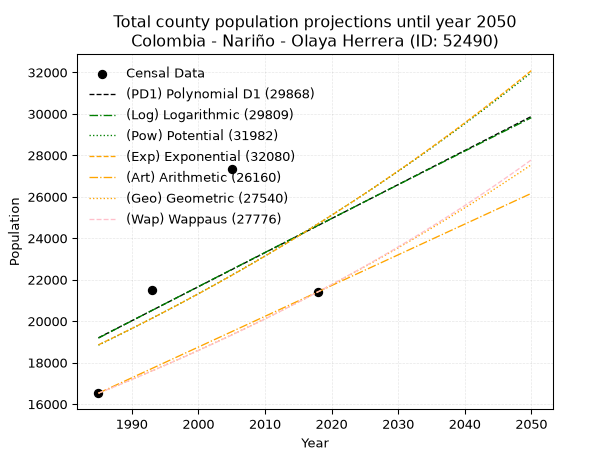
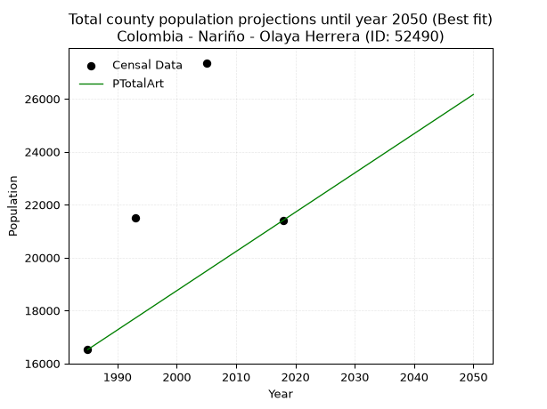
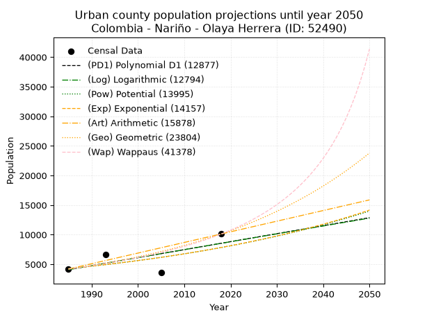
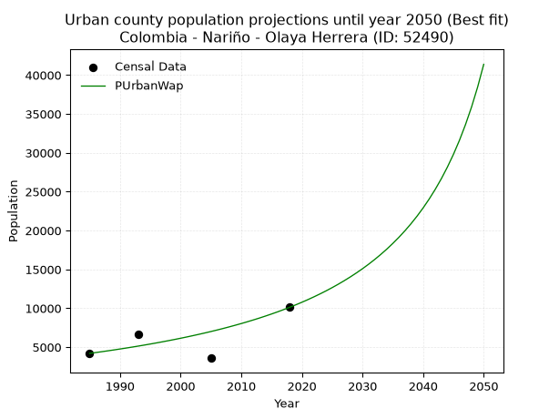
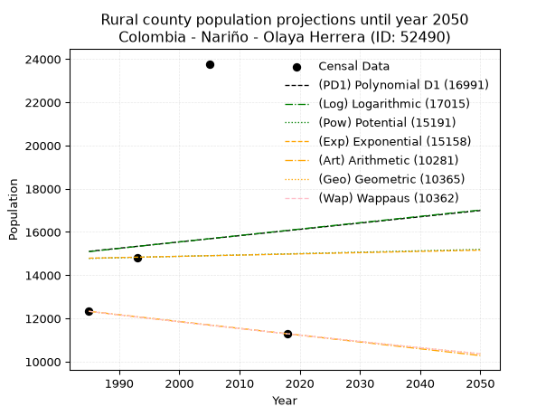
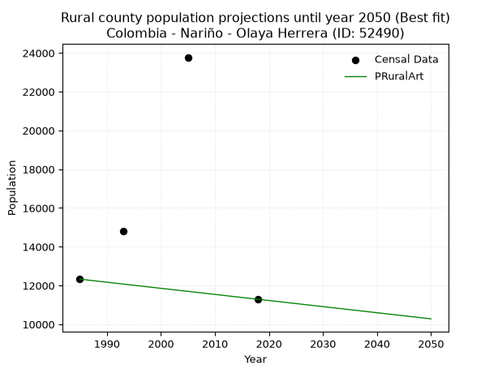

<div align="center">


</div>

# _“Population and Public Services Demand Projections (PPSD) until Year 2050 for Colombia - Nariño - Olaya Herrera (ID: 52490)”_
Keywords: `population` `public-service` `projection` `lineal` `polynomial` `logarithmic` `potential` `exponential` `arithmetic` `geometric` `wappaus` `dane` `colombia` `south-america`

PPSD are analytical estimates used by governments and planners to anticipate future changes in population size, age distribution, and the resulting community needs for utilities, healthcare, education, and infrastructure as sizing future water treatment facilities, electrical grids, and road networks based on spatial growth.

> **General running parameters**: • app_version: _v20260806_. • Python version: _3.14.7_. • Pandas version: _3.0.5_. • NumPy version: _2.5.1_. • Creates, save and include plots into reports (create_plot): _True_. • Projection until year: _2050_. • Process polynomial degree 2 and up: _False_. • Process Wappaus: _True_. • Process Wappaus: _True_. • Set negative values to zero: _True_. • Set infinite values to zero: _True_. • Drop dataset notes: _True_. 
<div align="center">

Dynamic map: [:earth_americas:Google](http://maps.google.com/maps?q=2.347456604,-78.3258138) [:earth_americas:OSM](https://www.openstreetmap.org/#map=18/2.347456604/-78.3258138&layers=P) [:earth_americas:Bing](https://www.bing.com/maps?cp=2.347456604~-78.3258138&lvl=18) [:earth_americas:Apple](https://maps.apple.com/frame?center=2.347456604%2C-78.3258138&span=0.003%2C0.006)

</div>


<div align="center">

```geojson
{
  "type": "Feature",
  "geometry": {
    "type": "Point", 
    "coordinates": [-78.3258138, 2.347456604]
  }, 
  "properties": {
    "Name": "Colombia - Nariño - Olaya Herrera (ID: 52490)"
  }
}
```

</div>


## 0. Census Data (4 records)

Census data are official statistics collected by a government about the people and housing in a country. They usually include counts of total population, age, sex, race, income, education, and jobs.

📅Global census file: [Population.xlsx](../data/Population.xlsx)

| Source   |   Year |   CountryID | CountryName   |   StateID | StateName   |   CountyID | CountyName    |   PTotal |   PUrban |   PRural |
|:---------|-------:|------------:|:--------------|----------:|:------------|-----------:|:--------------|---------:|---------:|---------:|
| DANE     |   1985 |          57 | Colombia      |        52 | Nariño      |      52490 | Olaya Herrera |    16522 |     4194 |    12328 |
| DANE     |   1993 |          57 | Colombia      |        52 | Nariño      |      52490 | Olaya Herrera |    21495 |     6705 |    14790 |
| DANE     |   2005 |          57 | Colombia      |        52 | Nariño      |      52490 | Olaya Herrera |    27359 |     3582 |    23777 |
| DANE     |   2018 |          57 | Colombia      |        52 | Nariño      |      52490 | Olaya Herrera |    21415 |    10126 |    11289 |

> 🔥Some records has specific notes about the registered values or the corresponding urban or rural distribution.

## 1. Total

### 1.1. Coefficients and Parameters

* (PD1) Polynomial Deg 1: 164.22681653954567, -306796.93978322623 (lineal)
* (Log) Logarithmic: 329896.84997098474, -2485850.850256899
* (Pow) Potential: 16.42170494093714, -49.879738794208784
* (Exp) Exponential: 0.008177164651914757, 0.0016829522542143119
* (Art) Arithmetic: Year diff. 2018 - 1985 = 33, Population diff. 21415 - 16522 = 4893, Annual growth = 148.27272727272728
* (Geo) Geometric: Year diff. 2018 - 1985 = 33, Population diff. 21415 - 16522 = 4893, Annual growth % = 0.007891544622790292
* (Wap) Wappaus: i = 0.7816787161490222, Condition values only valid for < 200)

<sub>
Wappaus condition values: ['0.00', '0.78', '1.56', '2.35', '3.13', '3.91', '4.69', '5.47', '6.25', '7.04', '7.82', '8.60', '9.38', '10.16', '10.94', '11.73', '12.51', '13.29', '14.07', '14.85', '15.63', '16.42', '17.20', '17.98', '18.76', '19.54', '20.32', '21.11', '21.89', '22.67', '23.45', '24.23', '25.01', '25.80', '26.58', '27.36', '28.14', '28.92', '29.70', '30.49', '31.27', '32.05', '32.83', '33.61', '34.39', '35.18', '35.96', '36.74', '37.52', '38.30', '39.08', '39.87', '40.65', '41.43', '42.21', '42.99', '43.77', '44.56', '45.34', '46.12', '46.90', '47.68', '48.46', '49.25', '50.03', '50.81']
</sub>


### 1.2. Projected Dataset

|   Year |   CountyID |   PTotalPD1 |   PTotalLog |   PTotalPow |   PTotalExp |   PTotalArt |   PTotalGeo |   PTotalWap |
|-------:|-----------:|------------:|------------:|------------:|------------:|------------:|------------:|------------:|
|   1985 |      52490 |       19193 |       19179 |       18841 |       18854 |       16522 |       16522 |       16522 |
|   1986 |      52490 |       19358 |       19346 |       18998 |       19009 |       16670 |       16652 |       16652 |
|   1987 |      52490 |       19522 |       19512 |       19155 |       19165 |       16819 |       16784 |       16782 |
|   1988 |      52490 |       19686 |       19678 |       19314 |       19322 |       16967 |       16916 |       16914 |
|   1989 |      52490 |       19850 |       19843 |       19475 |       19481 |       17115 |       17050 |       17047 |
|   1990 |      52490 |       20014 |       20009 |       19636 |       19641 |       17263 |       17184 |       17181 |
|   1991 |      52490 |       20179 |       20175 |       19799 |       19802 |       17412 |       17320 |       17316 |
|   1992 |      52490 |       20343 |       20341 |       19963 |       19964 |       17560 |       17457 |       17451 |
|   1993 |      52490 |       20507 |       20506 |       20128 |       20128 |       17708 |       17594 |       17589 |
|   1994 |      52490 |       20671 |       20672 |       20294 |       20294 |       17856 |       17733 |       17727 |
|   1995 |      52490 |       20836 |       20837 |       20462 |       20460 |       18005 |       17873 |       17866 |
|   1996 |      52490 |       21000 |       21002 |       20631 |       20628 |       18153 |       18014 |       18006 |
|   1997 |      52490 |       21164 |       21168 |       20802 |       20798 |       18301 |       18156 |       18148 |
|   1998 |      52490 |       21328 |       21333 |       20973 |       20968 |       18450 |       18300 |       18291 |
|   1999 |      52490 |       21492 |       21498 |       21146 |       21141 |       18598 |       18444 |       18435 |
|   2000 |      52490 |       21657 |       21663 |       21321 |       21314 |       18746 |       18590 |       18580 |
|   2001 |      52490 |       21821 |       21828 |       21496 |       21489 |       18894 |       18736 |       18726 |
|   2002 |      52490 |       21985 |       21993 |       21674 |       21666 |       19043 |       18884 |       18874 |
|   2003 |      52490 |       22149 |       22157 |       21852 |       21843 |       19191 |       19033 |       19023 |
|   2004 |      52490 |       22314 |       22322 |       22032 |       22023 |       19339 |       19183 |       19173 |
|   2005 |      52490 |       22478 |       22487 |       22213 |       22204 |       19487 |       19335 |       19324 |
|   2006 |      52490 |       22642 |       22651 |       22396 |       22386 |       19636 |       19487 |       19477 |
|   2007 |      52490 |       22806 |       22816 |       22580 |       22570 |       19784 |       19641 |       19631 |
|   2008 |      52490 |       22971 |       22980 |       22765 |       22755 |       19932 |       19796 |       19786 |
|   2009 |      52490 |       23135 |       23144 |       22952 |       22942 |       20081 |       19952 |       19942 |
|   2010 |      52490 |       23299 |       23308 |       23140 |       23130 |       20229 |       20110 |       20100 |
|   2011 |      52490 |       23463 |       23472 |       23330 |       23320 |       20377 |       20268 |       20260 |
|   2012 |      52490 |       23627 |       23636 |       23522 |       23512 |       20525 |       20428 |       20420 |
|   2013 |      52490 |       23792 |       23800 |       23714 |       23705 |       20674 |       20590 |       20583 |
|   2014 |      52490 |       23956 |       23964 |       23908 |       23899 |       20822 |       20752 |       20746 |
|   2015 |      52490 |       24120 |       24128 |       24104 |       24096 |       20970 |       20916 |       20911 |
|   2016 |      52490 |       24284 |       24292 |       24301 |       24293 |       21118 |       21081 |       21078 |
|   2017 |      52490 |       24449 |       24455 |       24500 |       24493 |       21267 |       21247 |       21246 |
|   2018 |      52490 |       24613 |       24619 |       24700 |       24694 |       21415 |       21415 |       21415 |
|   2019 |      52490 |       24777 |       24782 |       24902 |       24897 |       21563 |       21584 |       21586 |
|   2020 |      52490 |       24941 |       24946 |       25105 |       25101 |       21712 |       21754 |       21759 |
|   2021 |      52490 |       25105 |       25109 |       25310 |       25307 |       21860 |       21926 |       21933 |
|   2022 |      52490 |       25270 |       25272 |       25517 |       25515 |       22008 |       22099 |       22108 |
|   2023 |      52490 |       25434 |       25435 |       25725 |       25724 |       22156 |       22273 |       22286 |
|   2024 |      52490 |       25598 |       25598 |       25934 |       25936 |       22305 |       22449 |       22465 |
|   2025 |      52490 |       25762 |       25761 |       26146 |       26149 |       22453 |       22626 |       22645 |
|   2026 |      52490 |       25927 |       25924 |       26358 |       26363 |       22601 |       22805 |       22828 |
|   2027 |      52490 |       26091 |       26087 |       26573 |       26580 |       22749 |       22985 |       23012 |
|   2028 |      52490 |       26255 |       26249 |       26789 |       26798 |       22898 |       23166 |       23197 |
|   2029 |      52490 |       26419 |       26412 |       27007 |       27018 |       23046 |       23349 |       23385 |
|   2030 |      52490 |       26583 |       26575 |       27226 |       27240 |       23194 |       23533 |       23574 |
|   2031 |      52490 |       26748 |       26737 |       27447 |       27464 |       23343 |       23719 |       23765 |
|   2032 |      52490 |       26912 |       26899 |       27670 |       27689 |       23491 |       23906 |       23958 |
|   2033 |      52490 |       27076 |       27062 |       27894 |       27916 |       23639 |       24095 |       24153 |
|   2034 |      52490 |       27240 |       27224 |       28121 |       28146 |       23787 |       24285 |       24349 |
|   2035 |      52490 |       27405 |       27386 |       28348 |       28377 |       23936 |       24477 |       24548 |
|   2036 |      52490 |       27569 |       27548 |       28578 |       28610 |       24084 |       24670 |       24748 |
|   2037 |      52490 |       27733 |       27710 |       28809 |       28845 |       24232 |       24865 |       24951 |
|   2038 |      52490 |       27897 |       27872 |       29043 |       29081 |       24380 |       25061 |       25155 |
|   2039 |      52490 |       28062 |       28034 |       29278 |       29320 |       24529 |       25259 |       25362 |
|   2040 |      52490 |       28226 |       28196 |       29514 |       29561 |       24677 |       25458 |       25570 |
|   2041 |      52490 |       28390 |       28357 |       29753 |       29804 |       24825 |       25659 |       25781 |
|   2042 |      52490 |       28554 |       28519 |       29993 |       30048 |       24974 |       25861 |       25994 |
|   2043 |      52490 |       28718 |       28681 |       30235 |       30295 |       25122 |       26065 |       26208 |
|   2044 |      52490 |       28883 |       28842 |       30479 |       30544 |       25270 |       26271 |       26425 |
|   2045 |      52490 |       29047 |       29003 |       30725 |       30795 |       25418 |       26478 |       26645 |
|   2046 |      52490 |       29211 |       29165 |       30973 |       31047 |       25567 |       26687 |       26866 |
|   2047 |      52490 |       29375 |       29326 |       31222 |       31302 |       25715 |       26898 |       27090 |
|   2048 |      52490 |       29540 |       29487 |       31473 |       31559 |       25863 |       27110 |       27316 |
|   2049 |      52490 |       29704 |       29648 |       31727 |       31819 |       26011 |       27324 |       27545 |
|   2050 |      52490 |       29868 |       29809 |       31982 |       32080 |       26160 |       27540 |       27776 |
<div align="center">

</img>

</div>


### 1.3. Best fit with absolute error and relative error (%)

Relative error puts that difference into context by dividing the absolute error by the true value, creating a unitless ratio or percentage that shows the scale of the mistake.

Absolute and relative error

|   Year | Source   |   CountryID | CountryName   |   StateID | StateName   |   CountyID_x | CountyName    |   PTotal |   PUrban |   PRural |   CountyID_y |   PTotalPD1 |   PTotalLog |   PTotalPow |   PTotalExp |   PTotalArt |   PTotalGeo |   PTotalWap |   PTotalPD1AbsError |   PTotalLogAbsError |   PTotalPowAbsError |   PTotalExpAbsError |   PTotalArtAbsError |   PTotalGeoAbsError |   PTotalWapAbsError |   PTotalPD1RelError |   PTotalLogRelError |   PTotalPowRelError |   PTotalExpRelError |   PTotalArtRelError |   PTotalGeoRelError |   PTotalWapRelError |
|-------:|:---------|------------:|:--------------|----------:|:------------|-------------:|:--------------|---------:|---------:|---------:|-------------:|------------:|------------:|------------:|------------:|------------:|------------:|------------:|--------------------:|--------------------:|--------------------:|--------------------:|--------------------:|--------------------:|--------------------:|--------------------:|--------------------:|--------------------:|--------------------:|--------------------:|--------------------:|--------------------:|
|   1985 | DANE     |          57 | Colombia      |        52 | Nariño      |        52490 | Olaya Herrera |    16522 |     4194 |    12328 |        52490 |       19193 |       19179 |       18841 |       18854 |       16522 |       16522 |       16522 |                2671 |                2657 |                2319 |                2332 |                   0 |                   0 |                   0 |            16.1663  |            16.0816  |            14.0358  |            14.1145  |              0      |              0      |              0      |
|   1993 | DANE     |          57 | Colombia      |        52 | Nariño      |        52490 | Olaya Herrera |    21495 |     6705 |    14790 |        52490 |       20507 |       20506 |       20128 |       20128 |       17708 |       17594 |       17589 |                 988 |                 989 |                1367 |                1367 |                3787 |                3901 |                3906 |             4.59642 |             4.60107 |             6.35962 |             6.35962 |             17.6181 |             18.1484 |             18.1717 |
|   2005 | DANE     |          57 | Colombia      |        52 | Nariño      |        52490 | Olaya Herrera |    27359 |     3582 |    23777 |        52490 |       22478 |       22487 |       22213 |       22204 |       19487 |       19335 |       19324 |                4881 |                4872 |                5146 |                5155 |                7872 |                8024 |                8035 |            17.8406  |            17.8077  |            18.8092  |            18.8421  |             28.773  |             29.3286 |             29.3688 |
|   2018 | DANE     |          57 | Colombia      |        52 | Nariño      |        52490 | Olaya Herrera |    21415 |    10126 |    11289 |        52490 |       24613 |       24619 |       24700 |       24694 |       21415 |       21415 |       21415 |                3198 |                3204 |                3285 |                3279 |                   0 |                   0 |                   0 |            14.9335  |            14.9615  |            15.3397  |            15.3117  |              0      |              0      |              0      |

Relative error mean

| Method    |   RelError | Best   |
|:----------|-----------:|:-------|
| PTotalPD1 |    13.3842 |        |
| PTotalLog |    13.363  |        |
| PTotalPow |    13.6361 |        |
| PTotalExp |    13.657  |        |
| PTotalArt |    11.5978 | True   |
| PTotalGeo |    11.8692 |        |
| PTotalWap |    11.8851 |        |

💙Best method: _**PTotalArt**_
<div align="center">

</img>

</div>


### 1.4. Fresh water supply demand in liters per capita per day (lpcd)

The fresh water supply demand typically ranges from 100 to 300 liters per capita per day (lpcd) for standard domestic and municipal planning, though absolute survival minimums set by the World Health Organization are as low as 7.5 to 20 liters per day, and total consumption in high-income nations can exceed 400 liters.

> `CZ`: Level in meters above the sea level (masl).<br> `WS`: Fresh water supply demand in liters per capita per day (lpcd or l/h/d).<br> `WSAll`: Zonal fresh water supply demand in liters per second (l/s).<br> `A`: Zonal area in square meters.

Reference values (RAS Colombia)

|    CZ |   WS |
|------:|-----:|
|  1000 |  120 |
|  2000 |  130 |
| 99999 |  140 |

County shapefile geometry properties and water supply values

|   CountyID |      ATotal |   CZTotal |   WSTotal |
|-----------:|------------:|----------:|----------:|
|      52490 | 1.00467e+09 |   17.6914 |       120 |

Projected values for best method: PTotalArt

|   CountyID |   Year |   PTotalArt |   WSTotal |   WSTotalAll |
|-----------:|-------:|------------:|----------:|-------------:|
|      52490 |   1985 |       16522 |       120 |      22.9472 |
|      52490 |   1986 |       16670 |       120 |      23.1528 |
|      52490 |   1987 |       16819 |       120 |      23.3597 |
|      52490 |   1988 |       16967 |       120 |      23.5653 |
|      52490 |   1989 |       17115 |       120 |      23.7708 |
|      52490 |   1990 |       17263 |       120 |      23.9764 |
|      52490 |   1991 |       17412 |       120 |      24.1833 |
|      52490 |   1992 |       17560 |       120 |      24.3889 |
|      52490 |   1993 |       17708 |       120 |      24.5944 |
|      52490 |   1994 |       17856 |       120 |      24.8    |
|      52490 |   1995 |       18005 |       120 |      25.0069 |
|      52490 |   1996 |       18153 |       120 |      25.2125 |
|      52490 |   1997 |       18301 |       120 |      25.4181 |
|      52490 |   1998 |       18450 |       120 |      25.625  |
|      52490 |   1999 |       18598 |       120 |      25.8306 |
|      52490 |   2000 |       18746 |       120 |      26.0361 |
|      52490 |   2001 |       18894 |       120 |      26.2417 |
|      52490 |   2002 |       19043 |       120 |      26.4486 |
|      52490 |   2003 |       19191 |       120 |      26.6542 |
|      52490 |   2004 |       19339 |       120 |      26.8597 |
|      52490 |   2005 |       19487 |       120 |      27.0653 |
|      52490 |   2006 |       19636 |       120 |      27.2722 |
|      52490 |   2007 |       19784 |       120 |      27.4778 |
|      52490 |   2008 |       19932 |       120 |      27.6833 |
|      52490 |   2009 |       20081 |       120 |      27.8903 |
|      52490 |   2010 |       20229 |       120 |      28.0958 |
|      52490 |   2011 |       20377 |       120 |      28.3014 |
|      52490 |   2012 |       20525 |       120 |      28.5069 |
|      52490 |   2013 |       20674 |       120 |      28.7139 |
|      52490 |   2014 |       20822 |       120 |      28.9194 |
|      52490 |   2015 |       20970 |       120 |      29.125  |
|      52490 |   2016 |       21118 |       120 |      29.3306 |
|      52490 |   2017 |       21267 |       120 |      29.5375 |
|      52490 |   2018 |       21415 |       120 |      29.7431 |
|      52490 |   2019 |       21563 |       120 |      29.9486 |
|      52490 |   2020 |       21712 |       120 |      30.1556 |
|      52490 |   2021 |       21860 |       120 |      30.3611 |
|      52490 |   2022 |       22008 |       120 |      30.5667 |
|      52490 |   2023 |       22156 |       120 |      30.7722 |
|      52490 |   2024 |       22305 |       120 |      30.9792 |
|      52490 |   2025 |       22453 |       120 |      31.1847 |
|      52490 |   2026 |       22601 |       120 |      31.3903 |
|      52490 |   2027 |       22749 |       120 |      31.5958 |
|      52490 |   2028 |       22898 |       120 |      31.8028 |
|      52490 |   2029 |       23046 |       120 |      32.0083 |
|      52490 |   2030 |       23194 |       120 |      32.2139 |
|      52490 |   2031 |       23343 |       120 |      32.4208 |
|      52490 |   2032 |       23491 |       120 |      32.6264 |
|      52490 |   2033 |       23639 |       120 |      32.8319 |
|      52490 |   2034 |       23787 |       120 |      33.0375 |
|      52490 |   2035 |       23936 |       120 |      33.2444 |
|      52490 |   2036 |       24084 |       120 |      33.45   |
|      52490 |   2037 |       24232 |       120 |      33.6556 |
|      52490 |   2038 |       24380 |       120 |      33.8611 |
|      52490 |   2039 |       24529 |       120 |      34.0681 |
|      52490 |   2040 |       24677 |       120 |      34.2736 |
|      52490 |   2041 |       24825 |       120 |      34.4792 |
|      52490 |   2042 |       24974 |       120 |      34.6861 |
|      52490 |   2043 |       25122 |       120 |      34.8917 |
|      52490 |   2044 |       25270 |       120 |      35.0972 |
|      52490 |   2045 |       25418 |       120 |      35.3028 |
|      52490 |   2046 |       25567 |       120 |      35.5097 |
|      52490 |   2047 |       25715 |       120 |      35.7153 |
|      52490 |   2048 |       25863 |       120 |      35.9208 |
|      52490 |   2049 |       26011 |       120 |      36.1264 |
|      52490 |   2050 |       26160 |       120 |      36.3333 |

## 2. Urban

### 2.1. Coefficients and Parameters

* (PD1) Polynomial Deg 1: 135.17663588919723, -264235.31593736674 (lineal)
* (Log) Logarithmic: 270149.5125014135, -2047256.8593655739
* (Pow) Potential: 36.88201761361031, -117.99818949193245
* (Exp) Exponential: 0.018458191258321634, 5.218700659194805e-13
* (Art) Arithmetic: Year diff. 2018 - 1985 = 33, Population diff. 10126 - 4194 = 5932, Annual growth = 179.75757575757575
* (Geo) Geometric: Year diff. 2018 - 1985 = 33, Population diff. 10126 - 4194 = 5932, Annual growth % = 0.027070576614992126
* (Wap) Wappaus: i = 2.510580667005248, Condition values only valid for < 200)

<sub>
Wappaus condition values: ['0.00', '2.51', '5.02', '7.53', '10.04', '12.55', '15.06', '17.57', '20.08', '22.60', '25.11', '27.62', '30.13', '32.64', '35.15', '37.66', '40.17', '42.68', '45.19', '47.70', '50.21', '52.72', '55.23', '57.74', '60.25', '62.76', '65.28', '67.79', '70.30', '72.81', '75.32', '77.83', '80.34', '82.85', '85.36', '87.87', '90.38', '92.89', '95.40', '97.91', '100.42', '102.93', '105.44', '107.95', '110.47', '112.98', '115.49', '118.00', '120.51', '123.02', '125.53', '128.04', '130.55', '133.06', '135.57', '138.08', '140.59', '143.10', '145.61', '148.12', '150.63', '153.15', '155.66', '158.17', '160.68', '163.19']
</sub>


### 2.2. Projected Dataset

|   Year |   CountyID |   PUrbanPD1 |   PUrbanLog |   PUrbanPow |   PUrbanExp |   PUrbanArt |   PUrbanGeo |   PUrbanWap |
|-------:|-----------:|------------:|------------:|------------:|------------:|------------:|------------:|------------:|
|   1985 |      52490 |        4090 |        4089 |        4265 |        4265 |        4194 |        4194 |        4194 |
|   1986 |      52490 |        4225 |        4226 |        4344 |        4344 |        4374 |        4308 |        4301 |
|   1987 |      52490 |        4361 |        4362 |        4426 |        4425 |        4554 |        4424 |        4410 |
|   1988 |      52490 |        4496 |        4497 |        4509 |        4508 |        4733 |        4544 |        4522 |
|   1989 |      52490 |        4631 |        4633 |        4593 |        4592 |        4913 |        4667 |        4637 |
|   1990 |      52490 |        4766 |        4769 |        4679 |        4677 |        5093 |        4793 |        4756 |
|   1991 |      52490 |        4901 |        4905 |        4767 |        4764 |        5273 |        4923 |        4877 |
|   1992 |      52490 |        5037 |        5040 |        4856 |        4853 |        5452 |        5056 |        5002 |
|   1993 |      52490 |        5172 |        5176 |        4946 |        4943 |        5632 |        5193 |        5130 |
|   1994 |      52490 |        5307 |        5312 |        5039 |        5036 |        5812 |        5334 |        5262 |
|   1995 |      52490 |        5442 |        5447 |        5133 |        5129 |        5992 |        5478 |        5398 |
|   1996 |      52490 |        5577 |        5582 |        5229 |        5225 |        6171 |        5626 |        5538 |
|   1997 |      52490 |        5712 |        5718 |        5326 |        5322 |        6351 |        5779 |        5682 |
|   1998 |      52490 |        5848 |        5853 |        5425 |        5421 |        6531 |        5935 |        5830 |
|   1999 |      52490 |        5983 |        5988 |        5526 |        5522 |        6711 |        6096 |        5982 |
|   2000 |      52490 |        6118 |        6123 |        5629 |        5625 |        6890 |        6261 |        6140 |
|   2001 |      52490 |        6253 |        6258 |        5734 |        5730 |        7070 |        6430 |        6302 |
|   2002 |      52490 |        6388 |        6393 |        5841 |        5837 |        7250 |        6604 |        6470 |
|   2003 |      52490 |        6523 |        6528 |        5949 |        5946 |        7430 |        6783 |        6643 |
|   2004 |      52490 |        6659 |        6663 |        6060 |        6056 |        7609 |        6967 |        6821 |
|   2005 |      52490 |        6794 |        6798 |        6172 |        6169 |        7789 |        7155 |        7006 |
|   2006 |      52490 |        6929 |        6932 |        6287 |        6284 |        7969 |        7349 |        7197 |
|   2007 |      52490 |        7064 |        7067 |        6404 |        6401 |        8149 |        7548 |        7394 |
|   2008 |      52490 |        7199 |        7202 |        6522 |        6520 |        8328 |        7752 |        7599 |
|   2009 |      52490 |        7335 |        7336 |        6643 |        6642 |        8508 |        7962 |        7811 |
|   2010 |      52490 |        7470 |        7471 |        6766 |        6766 |        8688 |        8178 |        8030 |
|   2011 |      52490 |        7605 |        7605 |        6891 |        6892 |        8868 |        8399 |        8258 |
|   2012 |      52490 |        7740 |        7739 |        7019 |        7020 |        9047 |        8627 |        8494 |
|   2013 |      52490 |        7875 |        7874 |        7149 |        7151 |        9227 |        8860 |        8740 |
|   2014 |      52490 |        8010 |        8008 |        7281 |        7284 |        9407 |        9100 |        8995 |
|   2015 |      52490 |        8146 |        8142 |        7416 |        7420 |        9587 |        9346 |        9261 |
|   2016 |      52490 |        8281 |        8276 |        7552 |        7558 |        9766 |        9599 |        9537 |
|   2017 |      52490 |        8416 |        8410 |        7692 |        7699 |        9946 |        9859 |        9826 |
|   2018 |      52490 |        8551 |        8544 |        7834 |        7842 |       10126 |       10126 |       10126 |
|   2019 |      52490 |        8686 |        8678 |        7978 |        7988 |       10306 |       10400 |       10440 |
|   2020 |      52490 |        8821 |        8811 |        8125 |        8137 |       10486 |       10682 |       10767 |
|   2021 |      52490 |        8957 |        8945 |        8275 |        8289 |       10665 |       10971 |       11110 |
|   2022 |      52490 |        9092 |        9079 |        8427 |        8443 |       10845 |       11268 |       11469 |
|   2023 |      52490 |        9227 |        9212 |        8582 |        8600 |       11025 |       11573 |       11845 |
|   2024 |      52490 |        9362 |        9346 |        8740 |        8761 |       11205 |       11886 |       12239 |
|   2025 |      52490 |        9497 |        9479 |        8901 |        8924 |       11384 |       12208 |       12653 |
|   2026 |      52490 |        9633 |        9613 |        9065 |        9090 |       11564 |       12538 |       13089 |
|   2027 |      52490 |        9768 |        9746 |        9231 |        9259 |       11744 |       12878 |       13548 |
|   2028 |      52490 |        9903 |        9879 |        9400 |        9432 |       11924 |       13226 |       14032 |
|   2029 |      52490 |       10038 |       10012 |        9573 |        9608 |       12103 |       13584 |       14543 |
|   2030 |      52490 |       10173 |       10145 |        9748 |        9787 |       12283 |       13952 |       15083 |
|   2031 |      52490 |       10308 |       10278 |        9927 |        9969 |       12463 |       14330 |       15656 |
|   2032 |      52490 |       10444 |       10411 |       10109 |       10155 |       12643 |       14718 |       16264 |
|   2033 |      52490 |       10579 |       10544 |       10294 |       10344 |       12822 |       15116 |       16910 |
|   2034 |      52490 |       10714 |       10677 |       10483 |       10537 |       13002 |       15525 |       17598 |
|   2035 |      52490 |       10849 |       10810 |       10674 |       10733 |       13182 |       15946 |       18333 |
|   2036 |      52490 |       10984 |       10943 |       10870 |       10933 |       13362 |       16377 |       19119 |
|   2037 |      52490 |       11119 |       11075 |       11068 |       11136 |       13541 |       16821 |       19962 |
|   2038 |      52490 |       11255 |       11208 |       11270 |       11344 |       13721 |       17276 |       20868 |
|   2039 |      52490 |       11390 |       11340 |       11476 |       11555 |       13901 |       17744 |       21844 |
|   2040 |      52490 |       11525 |       11473 |       11686 |       11771 |       14081 |       18224 |       22900 |
|   2041 |      52490 |       11660 |       11605 |       11899 |       11990 |       14260 |       18717 |       24045 |
|   2042 |      52490 |       11795 |       11738 |       12116 |       12213 |       14440 |       19224 |       25291 |
|   2043 |      52490 |       11931 |       11870 |       12336 |       12441 |       14620 |       19744 |       26652 |
|   2044 |      52490 |       12066 |       12002 |       12561 |       12672 |       14800 |       20279 |       28145 |
|   2045 |      52490 |       12201 |       12134 |       12790 |       12909 |       14979 |       20828 |       29789 |
|   2046 |      52490 |       12336 |       12266 |       13022 |       13149 |       15159 |       21392 |       31610 |
|   2047 |      52490 |       12471 |       12398 |       13259 |       13394 |       15339 |       21971 |       33638 |
|   2048 |      52490 |       12606 |       12530 |       13500 |       13643 |       15519 |       22566 |       35908 |
|   2049 |      52490 |       12742 |       12662 |       13745 |       13898 |       15698 |       23176 |       38468 |
|   2050 |      52490 |       12877 |       12794 |       13995 |       14157 |       15878 |       23804 |       41378 |
<div align="center">

</img>

</div>


### 2.3. Best fit with absolute error and relative error (%)

Relative error puts that difference into context by dividing the absolute error by the true value, creating a unitless ratio or percentage that shows the scale of the mistake.

Absolute and relative error

|   Year | Source   |   CountryID | CountryName   |   StateID | StateName   |   CountyID_x | CountyName    |   PTotal |   PUrban |   PRural |   CountyID_y |   PUrbanPD1 |   PUrbanLog |   PUrbanPow |   PUrbanExp |   PUrbanArt |   PUrbanGeo |   PUrbanWap |   PUrbanPD1AbsError |   PUrbanLogAbsError |   PUrbanPowAbsError |   PUrbanExpAbsError |   PUrbanArtAbsError |   PUrbanGeoAbsError |   PUrbanWapAbsError |   PUrbanPD1RelError |   PUrbanLogRelError |   PUrbanPowRelError |   PUrbanExpRelError |   PUrbanArtRelError |   PUrbanGeoRelError |   PUrbanWapRelError |
|-------:|:---------|------------:|:--------------|----------:|:------------|-------------:|:--------------|---------:|---------:|---------:|-------------:|------------:|------------:|------------:|------------:|------------:|------------:|------------:|--------------------:|--------------------:|--------------------:|--------------------:|--------------------:|--------------------:|--------------------:|--------------------:|--------------------:|--------------------:|--------------------:|--------------------:|--------------------:|--------------------:|
|   1985 | DANE     |          57 | Colombia      |        52 | Nariño      |        52490 | Olaya Herrera |    16522 |     4194 |    12328 |        52490 |        4090 |        4089 |        4265 |        4265 |        4194 |        4194 |        4194 |                 104 |                 105 |                  71 |                  71 |                   0 |                   0 |                   0 |             2.47973 |             2.50358 |             1.69289 |             1.69289 |               0     |              0      |              0      |
|   1993 | DANE     |          57 | Colombia      |        52 | Nariño      |        52490 | Olaya Herrera |    21495 |     6705 |    14790 |        52490 |        5172 |        5176 |        4946 |        4943 |        5632 |        5193 |        5130 |                1533 |                1529 |                1759 |                1762 |                1073 |                1512 |                1575 |            22.8635  |            22.8039  |            26.2342  |            26.2789  |              16.003 |             22.5503 |             23.4899 |
|   2005 | DANE     |          57 | Colombia      |        52 | Nariño      |        52490 | Olaya Herrera |    27359 |     3582 |    23777 |        52490 |        6794 |        6798 |        6172 |        6169 |        7789 |        7155 |        7006 |                3212 |                3216 |                2590 |                2587 |                4207 |                3573 |                3424 |            89.6706  |            89.7822  |            72.306   |            72.2222  |             117.448 |             99.7487 |             95.5891 |
|   2018 | DANE     |          57 | Colombia      |        52 | Nariño      |        52490 | Olaya Herrera |    21415 |    10126 |    11289 |        52490 |        8551 |        8544 |        7834 |        7842 |       10126 |       10126 |       10126 |                1575 |                1582 |                2292 |                2284 |                   0 |                   0 |                   0 |            15.554   |            15.6231  |            22.6348  |            22.5558  |               0     |              0      |              0      |

Relative error mean

| Method    |   RelError | Best   |
|:----------|-----------:|:-------|
| PUrbanPD1 |    32.642  |        |
| PUrbanLog |    32.6782 |        |
| PUrbanPow |    30.717  |        |
| PUrbanExp |    30.6875 |        |
| PUrbanArt |    33.3628 |        |
| PUrbanGeo |    30.5748 |        |
| PUrbanWap |    29.7697 | True   |

💙Best method: _**PUrbanWap**_
<div align="center">

</img>

</div>


### 2.4. Fresh water supply demand in liters per capita per day (lpcd)

The fresh water supply demand typically ranges from 100 to 300 liters per capita per day (lpcd) for standard domestic and municipal planning, though absolute survival minimums set by the World Health Organization are as low as 7.5 to 20 liters per day, and total consumption in high-income nations can exceed 400 liters.

> `CZ`: Level in meters above the sea level (masl).<br> `WS`: Fresh water supply demand in liters per capita per day (lpcd or l/h/d).<br> `WSAll`: Zonal fresh water supply demand in liters per second (l/s).<br> `A`: Zonal area in square meters.

Reference values (RAS Colombia)

|    CZ |   WS |
|------:|-----:|
|  1000 |  120 |
|  2000 |  130 |
| 99999 |  140 |

County shapefile geometry properties and water supply values

|   CountyID |   AUrban |   CZUrban |   WSUrban |
|-----------:|---------:|----------:|----------:|
|      52490 |   861201 |   4.64216 |       120 |

Projected values for best method: PUrbanWap

|   CountyID |   Year |   PUrbanWap |   WSUrban |   WSUrbanAll |
|-----------:|-------:|------------:|----------:|-------------:|
|      52490 |   1985 |        4194 |       120 |      5.825   |
|      52490 |   1986 |        4301 |       120 |      5.97361 |
|      52490 |   1987 |        4410 |       120 |      6.125   |
|      52490 |   1988 |        4522 |       120 |      6.28056 |
|      52490 |   1989 |        4637 |       120 |      6.44028 |
|      52490 |   1990 |        4756 |       120 |      6.60556 |
|      52490 |   1991 |        4877 |       120 |      6.77361 |
|      52490 |   1992 |        5002 |       120 |      6.94722 |
|      52490 |   1993 |        5130 |       120 |      7.125   |
|      52490 |   1994 |        5262 |       120 |      7.30833 |
|      52490 |   1995 |        5398 |       120 |      7.49722 |
|      52490 |   1996 |        5538 |       120 |      7.69167 |
|      52490 |   1997 |        5682 |       120 |      7.89167 |
|      52490 |   1998 |        5830 |       120 |      8.09722 |
|      52490 |   1999 |        5982 |       120 |      8.30833 |
|      52490 |   2000 |        6140 |       120 |      8.52778 |
|      52490 |   2001 |        6302 |       120 |      8.75278 |
|      52490 |   2002 |        6470 |       120 |      8.98611 |
|      52490 |   2003 |        6643 |       120 |      9.22639 |
|      52490 |   2004 |        6821 |       120 |      9.47361 |
|      52490 |   2005 |        7006 |       120 |      9.73056 |
|      52490 |   2006 |        7197 |       120 |      9.99583 |
|      52490 |   2007 |        7394 |       120 |     10.2694  |
|      52490 |   2008 |        7599 |       120 |     10.5542  |
|      52490 |   2009 |        7811 |       120 |     10.8486  |
|      52490 |   2010 |        8030 |       120 |     11.1528  |
|      52490 |   2011 |        8258 |       120 |     11.4694  |
|      52490 |   2012 |        8494 |       120 |     11.7972  |
|      52490 |   2013 |        8740 |       120 |     12.1389  |
|      52490 |   2014 |        8995 |       120 |     12.4931  |
|      52490 |   2015 |        9261 |       120 |     12.8625  |
|      52490 |   2016 |        9537 |       120 |     13.2458  |
|      52490 |   2017 |        9826 |       120 |     13.6472  |
|      52490 |   2018 |       10126 |       120 |     14.0639  |
|      52490 |   2019 |       10440 |       120 |     14.5     |
|      52490 |   2020 |       10767 |       120 |     14.9542  |
|      52490 |   2021 |       11110 |       120 |     15.4306  |
|      52490 |   2022 |       11469 |       120 |     15.9292  |
|      52490 |   2023 |       11845 |       120 |     16.4514  |
|      52490 |   2024 |       12239 |       120 |     16.9986  |
|      52490 |   2025 |       12653 |       120 |     17.5736  |
|      52490 |   2026 |       13089 |       120 |     18.1792  |
|      52490 |   2027 |       13548 |       120 |     18.8167  |
|      52490 |   2028 |       14032 |       120 |     19.4889  |
|      52490 |   2029 |       14543 |       120 |     20.1986  |
|      52490 |   2030 |       15083 |       120 |     20.9486  |
|      52490 |   2031 |       15656 |       120 |     21.7444  |
|      52490 |   2032 |       16264 |       120 |     22.5889  |
|      52490 |   2033 |       16910 |       120 |     23.4861  |
|      52490 |   2034 |       17598 |       120 |     24.4417  |
|      52490 |   2035 |       18333 |       120 |     25.4625  |
|      52490 |   2036 |       19119 |       120 |     26.5542  |
|      52490 |   2037 |       19962 |       120 |     27.725   |
|      52490 |   2038 |       20868 |       120 |     28.9833  |
|      52490 |   2039 |       21844 |       120 |     30.3389  |
|      52490 |   2040 |       22900 |       120 |     31.8056  |
|      52490 |   2041 |       24045 |       120 |     33.3958  |
|      52490 |   2042 |       25291 |       120 |     35.1264  |
|      52490 |   2043 |       26652 |       120 |     37.0167  |
|      52490 |   2044 |       28145 |       120 |     39.0903  |
|      52490 |   2045 |       29789 |       120 |     41.3736  |
|      52490 |   2046 |       31610 |       120 |     43.9028  |
|      52490 |   2047 |       33638 |       120 |     46.7194  |
|      52490 |   2048 |       35908 |       120 |     49.8722  |
|      52490 |   2049 |       38468 |       120 |     53.4278  |
|      52490 |   2050 |       41378 |       120 |     57.4694  |

## 3. Rural

### 3.1. Coefficients and Parameters

* (PD1) Polynomial Deg 1: 29.05018065034836, -42561.6238458593 (lineal)
* (Log) Logarithmic: 59747.33746957104, -438593.9908913238
* (Pow) Potential: 0.8592741030369077, 1.33588935359645
* (Exp) Exponential: 0.0003808328487872156, 6943.681224441921
* (Art) Arithmetic: Year diff. 2018 - 1985 = 33, Population diff. 11289 - 12328 = -1039, Annual growth = -31.484848484848484
* (Geo) Geometric: Year diff. 2018 - 1985 = 33, Population diff. 11289 - 12328 = -1039, Annual growth % = -0.002664453049463056
* (Wap) Wappaus: i = -0.26662868683447083, Condition values only valid for < 200)

<sub>
Wappaus condition values: ['-0.00', '-0.27', '-0.53', '-0.80', '-1.07', '-1.33', '-1.60', '-1.87', '-2.13', '-2.40', '-2.67', '-2.93', '-3.20', '-3.47', '-3.73', '-4.00', '-4.27', '-4.53', '-4.80', '-5.07', '-5.33', '-5.60', '-5.87', '-6.13', '-6.40', '-6.67', '-6.93', '-7.20', '-7.47', '-7.73', '-8.00', '-8.27', '-8.53', '-8.80', '-9.07', '-9.33', '-9.60', '-9.87', '-10.13', '-10.40', '-10.67', '-10.93', '-11.20', '-11.47', '-11.73', '-12.00', '-12.26', '-12.53', '-12.80', '-13.06', '-13.33', '-13.60', '-13.86', '-14.13', '-14.40', '-14.66', '-14.93', '-15.20', '-15.46', '-15.73', '-16.00', '-16.26', '-16.53', '-16.80', '-17.06', '-17.33']
</sub>


### 3.2. Projected Dataset

|   Year |   CountyID |   PRuralPD1 |   PRuralLog |   PRuralPow |   PRuralExp |   PRuralArt |   PRuralGeo |   PRuralWap |
|-------:|-----------:|------------:|------------:|------------:|------------:|------------:|------------:|------------:|
|   1985 |      52490 |       15103 |       15090 |       14776 |       14788 |       12328 |       12328 |       12328 |
|   1986 |      52490 |       15132 |       15120 |       14783 |       14793 |       12297 |       12295 |       12295 |
|   1987 |      52490 |       15161 |       15150 |       14789 |       14799 |       12265 |       12262 |       12262 |
|   1988 |      52490 |       15190 |       15180 |       14796 |       14804 |       12234 |       12230 |       12230 |
|   1989 |      52490 |       15219 |       15210 |       14802 |       14810 |       12202 |       12197 |       12197 |
|   1990 |      52490 |       15248 |       15240 |       14808 |       14816 |       12171 |       12165 |       12165 |
|   1991 |      52490 |       15277 |       15270 |       14815 |       14821 |       12139 |       12132 |       12132 |
|   1992 |      52490 |       15306 |       15300 |       14821 |       14827 |       12108 |       12100 |       12100 |
|   1993 |      52490 |       15335 |       15330 |       14828 |       14833 |       12076 |       12068 |       12068 |
|   1994 |      52490 |       15364 |       15360 |       14834 |       14838 |       12045 |       12036 |       12036 |
|   1995 |      52490 |       15393 |       15390 |       14840 |       14844 |       12013 |       12003 |       12004 |
|   1996 |      52490 |       15423 |       15420 |       14847 |       14850 |       11982 |       11971 |       11972 |
|   1997 |      52490 |       15452 |       15450 |       14853 |       14855 |       11950 |       11940 |       11940 |
|   1998 |      52490 |       15481 |       15480 |       14860 |       14861 |       11919 |       11908 |       11908 |
|   1999 |      52490 |       15510 |       15510 |       14866 |       14867 |       11887 |       11876 |       11876 |
|   2000 |      52490 |       15539 |       15540 |       14872 |       14872 |       11856 |       11844 |       11845 |
|   2001 |      52490 |       15568 |       15570 |       14879 |       14878 |       11824 |       11813 |       11813 |
|   2002 |      52490 |       15597 |       15599 |       14885 |       14884 |       11793 |       11781 |       11782 |
|   2003 |      52490 |       15626 |       15629 |       14891 |       14889 |       11761 |       11750 |       11750 |
|   2004 |      52490 |       15655 |       15659 |       14898 |       14895 |       11730 |       11719 |       11719 |
|   2005 |      52490 |       15684 |       15689 |       14904 |       14901 |       11698 |       11687 |       11688 |
|   2006 |      52490 |       15713 |       15719 |       14911 |       14906 |       11667 |       11656 |       11657 |
|   2007 |      52490 |       15742 |       15748 |       14917 |       14912 |       11635 |       11625 |       11625 |
|   2008 |      52490 |       15771 |       15778 |       14923 |       14918 |       11604 |       11594 |       11594 |
|   2009 |      52490 |       15800 |       15808 |       14930 |       14923 |       11572 |       11563 |       11564 |
|   2010 |      52490 |       15829 |       15838 |       14936 |       14929 |       11541 |       11533 |       11533 |
|   2011 |      52490 |       15858 |       15867 |       14943 |       14935 |       11509 |       11502 |       11502 |
|   2012 |      52490 |       15887 |       15897 |       14949 |       14940 |       11478 |       11471 |       11471 |
|   2013 |      52490 |       15916 |       15927 |       14955 |       14946 |       11446 |       11441 |       11441 |
|   2014 |      52490 |       15945 |       15956 |       14962 |       14952 |       11415 |       11410 |       11410 |
|   2015 |      52490 |       15974 |       15986 |       14968 |       14957 |       11383 |       11380 |       11380 |
|   2016 |      52490 |       16004 |       16016 |       14975 |       14963 |       11352 |       11349 |       11349 |
|   2017 |      52490 |       16033 |       16045 |       14981 |       14969 |       11320 |       11319 |       11319 |
|   2018 |      52490 |       16062 |       16075 |       14987 |       14975 |       11289 |       11289 |       11289 |
|   2019 |      52490 |       16091 |       16105 |       14994 |       14980 |       11258 |       11259 |       11259 |
|   2020 |      52490 |       16120 |       16134 |       15000 |       14986 |       11226 |       11229 |       11229 |
|   2021 |      52490 |       16149 |       16164 |       15006 |       14992 |       11195 |       11199 |       11199 |
|   2022 |      52490 |       16178 |       16193 |       15013 |       14997 |       11163 |       11169 |       11169 |
|   2023 |      52490 |       16207 |       16223 |       15019 |       15003 |       11132 |       11139 |       11139 |
|   2024 |      52490 |       16236 |       16252 |       15026 |       15009 |       11100 |       11110 |       11109 |
|   2025 |      52490 |       16265 |       16282 |       15032 |       15015 |       11069 |       11080 |       11080 |
|   2026 |      52490 |       16294 |       16311 |       15038 |       15020 |       11037 |       11051 |       11050 |
|   2027 |      52490 |       16323 |       16341 |       15045 |       15026 |       11006 |       11021 |       11021 |
|   2028 |      52490 |       16352 |       16370 |       15051 |       15032 |       10974 |       10992 |       10991 |
|   2029 |      52490 |       16381 |       16400 |       15057 |       15037 |       10943 |       10963 |       10962 |
|   2030 |      52490 |       16410 |       16429 |       15064 |       15043 |       10911 |       10933 |       10933 |
|   2031 |      52490 |       16439 |       16459 |       15070 |       15049 |       10880 |       10904 |       10903 |
|   2032 |      52490 |       16468 |       16488 |       15077 |       15055 |       10848 |       10875 |       10874 |
|   2033 |      52490 |       16497 |       16517 |       15083 |       15060 |       10817 |       10846 |       10845 |
|   2034 |      52490 |       16526 |       16547 |       15089 |       15066 |       10785 |       10817 |       10816 |
|   2035 |      52490 |       16555 |       16576 |       15096 |       15072 |       10754 |       10788 |       10787 |
|   2036 |      52490 |       16585 |       16606 |       15102 |       15078 |       10722 |       10760 |       10758 |
|   2037 |      52490 |       16614 |       16635 |       15108 |       15083 |       10691 |       10731 |       10730 |
|   2038 |      52490 |       16643 |       16664 |       15115 |       15089 |       10659 |       10702 |       10701 |
|   2039 |      52490 |       16672 |       16694 |       15121 |       15095 |       10628 |       10674 |       10672 |
|   2040 |      52490 |       16701 |       16723 |       15128 |       15101 |       10596 |       10645 |       10644 |
|   2041 |      52490 |       16730 |       16752 |       15134 |       15106 |       10565 |       10617 |       10615 |
|   2042 |      52490 |       16759 |       16781 |       15140 |       15112 |       10533 |       10589 |       10587 |
|   2043 |      52490 |       16788 |       16811 |       15147 |       15118 |       10502 |       10561 |       10558 |
|   2044 |      52490 |       16817 |       16840 |       15153 |       15124 |       10470 |       10532 |       10530 |
|   2045 |      52490 |       16846 |       16869 |       15159 |       15129 |       10439 |       10504 |       10502 |
|   2046 |      52490 |       16875 |       16898 |       15166 |       15135 |       10407 |       10476 |       10474 |
|   2047 |      52490 |       16904 |       16928 |       15172 |       15141 |       10376 |       10448 |       10446 |
|   2048 |      52490 |       16933 |       16957 |       15179 |       15147 |       10344 |       10421 |       10418 |
|   2049 |      52490 |       16962 |       16986 |       15185 |       15152 |       10313 |       10393 |       10390 |
|   2050 |      52490 |       16991 |       17015 |       15191 |       15158 |       10281 |       10365 |       10362 |
<div align="center">

</img>

</div>


### 3.3. Best fit with absolute error and relative error (%)

Relative error puts that difference into context by dividing the absolute error by the true value, creating a unitless ratio or percentage that shows the scale of the mistake.

Absolute and relative error

|   Year | Source   |   CountryID | CountryName   |   StateID | StateName   |   CountyID_x | CountyName    |   PTotal |   PUrban |   PRural |   CountyID_y |   PRuralPD1 |   PRuralLog |   PRuralPow |   PRuralExp |   PRuralArt |   PRuralGeo |   PRuralWap |   PRuralPD1AbsError |   PRuralLogAbsError |   PRuralPowAbsError |   PRuralExpAbsError |   PRuralArtAbsError |   PRuralGeoAbsError |   PRuralWapAbsError |   PRuralPD1RelError |   PRuralLogRelError |   PRuralPowRelError |   PRuralExpRelError |   PRuralArtRelError |   PRuralGeoRelError |   PRuralWapRelError |
|-------:|:---------|------------:|:--------------|----------:|:------------|-------------:|:--------------|---------:|---------:|---------:|-------------:|------------:|------------:|------------:|------------:|------------:|------------:|------------:|--------------------:|--------------------:|--------------------:|--------------------:|--------------------:|--------------------:|--------------------:|--------------------:|--------------------:|--------------------:|--------------------:|--------------------:|--------------------:|--------------------:|
|   1985 | DANE     |          57 | Colombia      |        52 | Nariño      |        52490 | Olaya Herrera |    16522 |     4194 |    12328 |        52490 |       15103 |       15090 |       14776 |       14788 |       12328 |       12328 |       12328 |                2775 |                2762 |                2448 |                2460 |                   0 |                   0 |                   0 |            22.5097  |            22.4043  |            19.8572  |           19.9546   |              0      |              0      |              0      |
|   1993 | DANE     |          57 | Colombia      |        52 | Nariño      |        52490 | Olaya Herrera |    21495 |     6705 |    14790 |        52490 |       15335 |       15330 |       14828 |       14833 |       12076 |       12068 |       12068 |                 545 |                 540 |                  38 |                  43 |                2714 |                2722 |                2722 |             3.68492 |             3.65112 |             0.25693 |            0.290737 |             18.3502 |             18.4043 |             18.4043 |
|   2005 | DANE     |          57 | Colombia      |        52 | Nariño      |        52490 | Olaya Herrera |    27359 |     3582 |    23777 |        52490 |       15684 |       15689 |       14904 |       14901 |       11698 |       11687 |       11688 |                8093 |                8088 |                8873 |                8876 |               12079 |               12090 |               12089 |            34.0371  |            34.0161  |            37.3176  |           37.3302   |             50.8012 |             50.8475 |             50.8433 |
|   2018 | DANE     |          57 | Colombia      |        52 | Nariño      |        52490 | Olaya Herrera |    21415 |    10126 |    11289 |        52490 |       16062 |       16075 |       14987 |       14975 |       11289 |       11289 |       11289 |                4773 |                4786 |                3698 |                3686 |                   0 |                   0 |                   0 |            42.2801  |            42.3953  |            32.7576  |           32.6513   |              0      |              0      |              0      |

Relative error mean

| Method    |   RelError | Best   |
|:----------|-----------:|:-------|
| PRuralPD1 |    25.628  |        |
| PRuralLog |    25.6167 |        |
| PRuralPow |    22.5473 |        |
| PRuralExp |    22.5567 |        |
| PRuralArt |    17.2879 | True   |
| PRuralGeo |    17.3129 |        |
| PRuralWap |    17.3119 |        |

💙Best method: _**PRuralArt**_
<div align="center">

</img>

</div>


### 3.4. Fresh water supply demand in liters per capita per day (lpcd)

The fresh water supply demand typically ranges from 100 to 300 liters per capita per day (lpcd) for standard domestic and municipal planning, though absolute survival minimums set by the World Health Organization are as low as 7.5 to 20 liters per day, and total consumption in high-income nations can exceed 400 liters.

> `CZ`: Level in meters above the sea level (masl).<br> `WS`: Fresh water supply demand in liters per capita per day (lpcd or l/h/d).<br> `WSAll`: Zonal fresh water supply demand in liters per second (l/s).<br> `A`: Zonal area in square meters.

Reference values (RAS Colombia)

|    CZ |   WS |
|------:|-----:|
|  1000 |  120 |
|  2000 |  130 |
| 99999 |  140 |

County shapefile geometry properties and water supply values

|   CountyID |      ARural |   CZRural |   WSRural |
|-----------:|------------:|----------:|----------:|
|      52490 | 1.00381e+09 |   17.7028 |       120 |

Projected values for best method: PRuralArt

|   CountyID |   Year |   PRuralArt |   WSRural |   WSRuralAll |
|-----------:|-------:|------------:|----------:|-------------:|
|      52490 |   1985 |       12328 |       120 |      17.1222 |
|      52490 |   1986 |       12297 |       120 |      17.0792 |
|      52490 |   1987 |       12265 |       120 |      17.0347 |
|      52490 |   1988 |       12234 |       120 |      16.9917 |
|      52490 |   1989 |       12202 |       120 |      16.9472 |
|      52490 |   1990 |       12171 |       120 |      16.9042 |
|      52490 |   1991 |       12139 |       120 |      16.8597 |
|      52490 |   1992 |       12108 |       120 |      16.8167 |
|      52490 |   1993 |       12076 |       120 |      16.7722 |
|      52490 |   1994 |       12045 |       120 |      16.7292 |
|      52490 |   1995 |       12013 |       120 |      16.6847 |
|      52490 |   1996 |       11982 |       120 |      16.6417 |
|      52490 |   1997 |       11950 |       120 |      16.5972 |
|      52490 |   1998 |       11919 |       120 |      16.5542 |
|      52490 |   1999 |       11887 |       120 |      16.5097 |
|      52490 |   2000 |       11856 |       120 |      16.4667 |
|      52490 |   2001 |       11824 |       120 |      16.4222 |
|      52490 |   2002 |       11793 |       120 |      16.3792 |
|      52490 |   2003 |       11761 |       120 |      16.3347 |
|      52490 |   2004 |       11730 |       120 |      16.2917 |
|      52490 |   2005 |       11698 |       120 |      16.2472 |
|      52490 |   2006 |       11667 |       120 |      16.2042 |
|      52490 |   2007 |       11635 |       120 |      16.1597 |
|      52490 |   2008 |       11604 |       120 |      16.1167 |
|      52490 |   2009 |       11572 |       120 |      16.0722 |
|      52490 |   2010 |       11541 |       120 |      16.0292 |
|      52490 |   2011 |       11509 |       120 |      15.9847 |
|      52490 |   2012 |       11478 |       120 |      15.9417 |
|      52490 |   2013 |       11446 |       120 |      15.8972 |
|      52490 |   2014 |       11415 |       120 |      15.8542 |
|      52490 |   2015 |       11383 |       120 |      15.8097 |
|      52490 |   2016 |       11352 |       120 |      15.7667 |
|      52490 |   2017 |       11320 |       120 |      15.7222 |
|      52490 |   2018 |       11289 |       120 |      15.6792 |
|      52490 |   2019 |       11258 |       120 |      15.6361 |
|      52490 |   2020 |       11226 |       120 |      15.5917 |
|      52490 |   2021 |       11195 |       120 |      15.5486 |
|      52490 |   2022 |       11163 |       120 |      15.5042 |
|      52490 |   2023 |       11132 |       120 |      15.4611 |
|      52490 |   2024 |       11100 |       120 |      15.4167 |
|      52490 |   2025 |       11069 |       120 |      15.3736 |
|      52490 |   2026 |       11037 |       120 |      15.3292 |
|      52490 |   2027 |       11006 |       120 |      15.2861 |
|      52490 |   2028 |       10974 |       120 |      15.2417 |
|      52490 |   2029 |       10943 |       120 |      15.1986 |
|      52490 |   2030 |       10911 |       120 |      15.1542 |
|      52490 |   2031 |       10880 |       120 |      15.1111 |
|      52490 |   2032 |       10848 |       120 |      15.0667 |
|      52490 |   2033 |       10817 |       120 |      15.0236 |
|      52490 |   2034 |       10785 |       120 |      14.9792 |
|      52490 |   2035 |       10754 |       120 |      14.9361 |
|      52490 |   2036 |       10722 |       120 |      14.8917 |
|      52490 |   2037 |       10691 |       120 |      14.8486 |
|      52490 |   2038 |       10659 |       120 |      14.8042 |
|      52490 |   2039 |       10628 |       120 |      14.7611 |
|      52490 |   2040 |       10596 |       120 |      14.7167 |
|      52490 |   2041 |       10565 |       120 |      14.6736 |
|      52490 |   2042 |       10533 |       120 |      14.6292 |
|      52490 |   2043 |       10502 |       120 |      14.5861 |
|      52490 |   2044 |       10470 |       120 |      14.5417 |
|      52490 |   2045 |       10439 |       120 |      14.4986 |
|      52490 |   2046 |       10407 |       120 |      14.4542 |
|      52490 |   2047 |       10376 |       120 |      14.4111 |
|      52490 |   2048 |       10344 |       120 |      14.3667 |
|      52490 |   2049 |       10313 |       120 |      14.3236 |
|      52490 |   2050 |       10281 |       120 |      14.2792 |

<div align="center"><br><sub>Share this research</sub></div><br>

<sub>**APPS & TOOLS & CONTENT DISCLAIMER**: • NO WARRANTY - This content and software is provided by <a href="https://github.com/rcfdtools" target="_blank">github.com/rcfdtools</a> "as is", without any express or implied warranty, including warranties of merchantability, fitness for a particular purpose, or non-infringement. There is no guarantee that the software will be error-free or operate without interruption. • LIMITATION OF LIABILITY - Neither the authors nor copyright holders will be liable for claims or damages arising from the software or its use. You are responsible for determining if the software is appropriate for your use and assume all associated risks, including errors, legal compliance, and data loss. • NO PROFESSIONAL ADVICE - The software provides general information and does not offer professional advice. It should not replace consultation with professional advisors. [Clauses and global license for rcfdtools use.](https://github.com/rcfdtools/rcfdtools/blob/main/LICENSE.md)</sub>