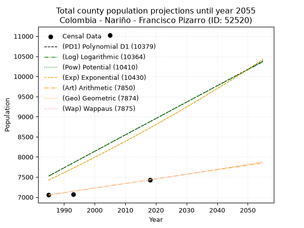
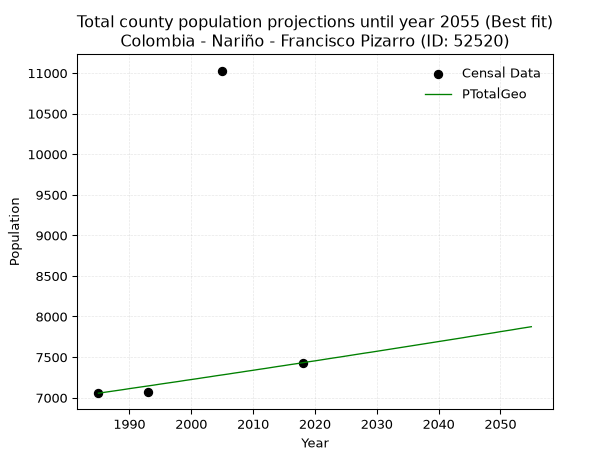
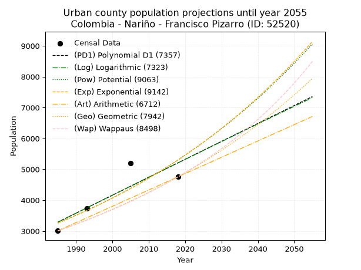
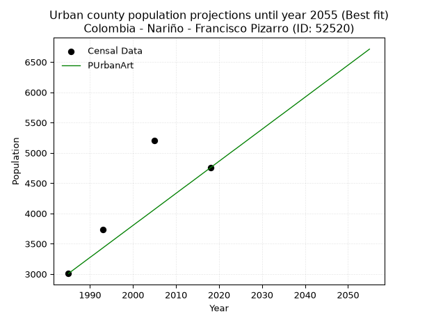
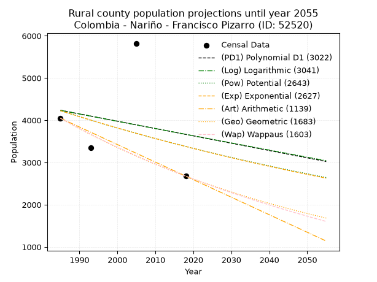
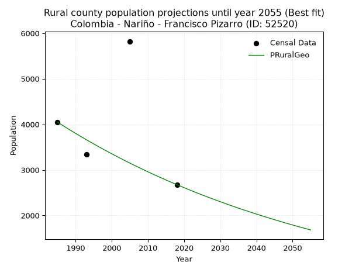

<div align="center">


</div>

# _“Population and Public Services Demand Projections (PPSD) until Year 2050 for Colombia - Nariño - Francisco Pizarro (ID: 52520)”_
Keywords: `population` `public-service` `projection` `lineal` `polynomial` `logarithmic` `potential` `exponential` `arithmetic` `geometric` `wappaus` `dane` `colombia` `south-america`

PPSD are analytical estimates used by governments and planners to anticipate future changes in population size, age distribution, and the resulting community needs for utilities, healthcare, education, and infrastructure as sizing future water treatment facilities, electrical grids, and road networks based on spatial growth.

> **General running parameters**: • app_version: _v20260806_. • Python version: _3.14.7_. • Pandas version: _3.0.5_. • NumPy version: _2.5.1_. • Creates, save and include plots into reports (create_plot): _False_. • Projection until year: _2050_. • Process polynomial degree 2 and up: _False_. • Process Wappaus: _True_. • Process Wappaus: _True_. • Set negative values to zero: _True_. • Set infinite values to zero: _True_. • Drop dataset notes: _True_. 
<div align="center">

Dynamic map: [:earth_americas:Google](http://maps.google.com/maps?q=2.040628643,-78.6583614) [:earth_americas:OSM](https://www.openstreetmap.org/#map=18/2.040628643/-78.6583614&layers=P) [:earth_americas:Bing](https://www.bing.com/maps?cp=2.040628643~-78.6583614&lvl=18) [:earth_americas:Apple](https://maps.apple.com/frame?center=2.040628643%2C-78.6583614&span=0.003%2C0.006)

</div>


<div align="center">

```geojson
{
  "type": "Feature",
  "geometry": {
    "type": "Point", 
    "coordinates": [-78.6583614, 2.040628643]
  }, 
  "properties": {
    "Name": "Colombia - Nariño - Francisco Pizarro (ID: 52520)"
  }
}
```

</div>


## 0. Census Data (4 records)

Census data are official statistics collected by a government about the people and housing in a country. They usually include counts of total population, age, sex, race, income, education, and jobs.

📅Global census file: [Population.xlsx](../data/Population.xlsx)

| Source   |   Year |   CountryID | CountryName   |   StateID | StateName   |   CountyID | CountyName        |   PTotal |   PUrban |   PRural |
|:---------|-------:|------------:|:--------------|----------:|:------------|-----------:|:------------------|---------:|---------:|---------:|
| DANE     |   1985 |          57 | Colombia      |        52 | Nariño      |      52520 | Francisco Pizarro |     7055 |     3008 |     4047 |
| DANE     |   1993 |          57 | Colombia      |        52 | Nariño      |      52520 | Francisco Pizarro |     7075 |     3731 |     3344 |
| DANE     |   2005 |          57 | Colombia      |        52 | Nariño      |      52520 | Francisco Pizarro |    11029 |     5207 |     5822 |
| DANE     |   2018 |          57 | Colombia      |        52 | Nariño      |      52520 | Francisco Pizarro |     7430 |     4754 |     2676 |

> 🔥Some records could had specific notes about the registered values or the corresponding urban or rural distribution.

📅   [RUPS](https://www.datos.gov.co/Hacienda-y-Cr-dito-P-blico/Registro-nico-de-Prestadores-de-Servicios-P-blicos/4qkq-csdn/about_data) - Local public utility companies: [RUPS.csv](../data/RUPS.xlsx)

 | SERVICIO       | ESTADO      | NOMBRE                                          | NIT         | DEPARTAMENTO_DOMICILIO   | MUNICIPIO_DOMICILIO   | DIRECCION                           |   TELEFONO | EMAIL                                      | TIPO_PRESTADOR          | CLASIFICACION           |
|:---------------|:------------|:------------------------------------------------|:------------|:-------------------------|:----------------------|:------------------------------------|-----------:|:-------------------------------------------|:------------------------|:------------------------|
| ACUEDUCTO      | CANCELACION | MUNICIPIO DE FRANCISCO PIZARRO                  | 800099085-3 | NARINO                   | FRANCISCO PIZARRO     | PARQUE PRINCIPAL                    |    7227280 | contactenos@franciscopizarro-narino.gov.co | nan                     | nan                     |
| ALCANTARILLADO | CANCELACION | MUNICIPIO DE FRANCISCO PIZARRO                  | 800099085-3 | NARINO                   | FRANCISCO PIZARRO     | PARQUE PRINCIPAL                    |    7227280 | contactenos@franciscopizarro-narino.gov.co | nan                     | nan                     |
| ACUEDUCTO      | OPERATIVA   | ASOCIACION DE USUARIOS AAA DE FRANCISCO PIZARRO | 900357321-7 | NARINO                   | FRANCISCO PIZARRO     | BARRIO SAN ANDRES - PLAZA PRINCIPAL |    7271912 | asofranc@gmail.com                         | ORGANIZACION AUTORIZADA | HASTA 2500 SUSCRIPTORES |
| ALCANTARILLADO | OPERATIVA   | ASOCIACION DE USUARIOS AAA DE FRANCISCO PIZARRO | 900357321-7 | NARINO                   | FRANCISCO PIZARRO     | BARRIO SAN ANDRES - PLAZA PRINCIPAL |    7271912 | asofranc@gmail.com                         | ORGANIZACION AUTORIZADA | HASTA 2500 SUSCRIPTORES |

## 1. Total

### 1.1. Coefficients and Parameters

* (PD1) Polynomial Deg 1: 40.76716178241871, -73397.26535528303 (lineal)
* (Log) Logarithmic: 82035.88800392093, -615408.1921121519
* (Pow) Potential: 9.758136232683851, -28.309410630276595
* (Exp) Exponential: 0.004851057239270193, 0.4884674461517745
* (Art) Arithmetic: Year diff. 2018 - 1985 = 33, Population diff. 7430 - 7055 = 375, Annual growth = 11.363636363636363
* (Geo) Geometric: Year diff. 2018 - 1985 = 33, Population diff. 7430 - 7055 = 375, Annual growth % = 0.001570604030542322
* (Wap) Wappaus: i = 0.15690212445476512, Condition values only valid for < 200)

<sub>
Wappaus condition values: ['0.00', '0.16', '0.31', '0.47', '0.63', '0.78', '0.94', '1.10', '1.26', '1.41', '1.57', '1.73', '1.88', '2.04', '2.20', '2.35', '2.51', '2.67', '2.82', '2.98', '3.14', '3.29', '3.45', '3.61', '3.77', '3.92', '4.08', '4.24', '4.39', '4.55', '4.71', '4.86', '5.02', '5.18', '5.33', '5.49', '5.65', '5.81', '5.96', '6.12', '6.28', '6.43', '6.59', '6.75', '6.90', '7.06', '7.22', '7.37', '7.53', '7.69', '7.85', '8.00', '8.16', '8.32', '8.47', '8.63', '8.79', '8.94', '9.10', '9.26', '9.41', '9.57', '9.73', '9.88', '10.04', '10.20']
</sub>


### 1.2. Projected Dataset

|   Year |   CountyID |   PTotalPD1 |   PTotalLog |   PTotalPow |   PTotalExp |   PTotalArt |   PTotalGeo |   PTotalWap |
|-------:|-----------:|------------:|------------:|------------:|------------:|------------:|------------:|------------:|
|   1985 |      52520 |        7526 |        7521 |        7423 |        7427 |        7055 |        7055 |        7055 |
|   1986 |      52520 |        7566 |        7562 |        7460 |        7463 |        7066 |        7066 |        7066 |
|   1987 |      52520 |        7607 |        7604 |        7496 |        7499 |        7078 |        7077 |        7077 |
|   1988 |      52520 |        7648 |        7645 |        7533 |        7536 |        7089 |        7088 |        7088 |
|   1989 |      52520 |        7689 |        7686 |        7570 |        7572 |        7100 |        7099 |        7099 |
|   1990 |      52520 |        7729 |        7727 |        7608 |        7609 |        7112 |        7111 |        7111 |
|   1991 |      52520 |        7770 |        7769 |        7645 |        7646 |        7123 |        7122 |        7122 |
|   1992 |      52520 |        7811 |        7810 |        7683 |        7683 |        7135 |        7133 |        7133 |
|   1993 |      52520 |        7852 |        7851 |        7720 |        7721 |        7146 |        7144 |        7144 |
|   1994 |      52520 |        7892 |        7892 |        7758 |        7758 |        7157 |        7155 |        7155 |
|   1995 |      52520 |        7933 |        7933 |        7796 |        7796 |        7169 |        7167 |        7167 |
|   1996 |      52520 |        7974 |        7974 |        7834 |        7834 |        7180 |        7178 |        7178 |
|   1997 |      52520 |        8015 |        8015 |        7873 |        7872 |        7191 |        7189 |        7189 |
|   1998 |      52520 |        8056 |        8057 |        7911 |        7910 |        7203 |        7200 |        7200 |
|   1999 |      52520 |        8096 |        8098 |        7950 |        7949 |        7214 |        7212 |        7212 |
|   2000 |      52520 |        8137 |        8139 |        7989 |        7987 |        7225 |        7223 |        7223 |
|   2001 |      52520 |        8178 |        8180 |        8028 |        8026 |        7237 |        7234 |        7234 |
|   2002 |      52520 |        8219 |        8221 |        8067 |        8065 |        7248 |        7246 |        7246 |
|   2003 |      52520 |        8259 |        8262 |        8107 |        8105 |        7260 |        7257 |        7257 |
|   2004 |      52520 |        8300 |        8302 |        8146 |        8144 |        7271 |        7269 |        7269 |
|   2005 |      52520 |        8341 |        8343 |        8186 |        8184 |        7282 |        7280 |        7280 |
|   2006 |      52520 |        8382 |        8384 |        8226 |        8223 |        7294 |        7291 |        7291 |
|   2007 |      52520 |        8422 |        8425 |        8266 |        8263 |        7305 |        7303 |        7303 |
|   2008 |      52520 |        8463 |        8466 |        8306 |        8304 |        7316 |        7314 |        7314 |
|   2009 |      52520 |        8504 |        8507 |        8347 |        8344 |        7328 |        7326 |        7326 |
|   2010 |      52520 |        8545 |        8548 |        8387 |        8385 |        7339 |        7337 |        7337 |
|   2011 |      52520 |        8585 |        8589 |        8428 |        8425 |        7350 |        7349 |        7349 |
|   2012 |      52520 |        8626 |        8629 |        8469 |        8466 |        7362 |        7360 |        7360 |
|   2013 |      52520 |        8667 |        8670 |        8510 |        8507 |        7373 |        7372 |        7372 |
|   2014 |      52520 |        8708 |        8711 |        8552 |        8549 |        7385 |        7384 |        7383 |
|   2015 |      52520 |        8749 |        8752 |        8593 |        8590 |        7396 |        7395 |        7395 |
|   2016 |      52520 |        8789 |        8792 |        8635 |        8632 |        7407 |        7407 |        7407 |
|   2017 |      52520 |        8830 |        8833 |        8677 |        8674 |        7419 |        7418 |        7418 |
|   2018 |      52520 |        8871 |        8874 |        8719 |        8716 |        7430 |        7430 |        7430 |
|   2019 |      52520 |        8912 |        8914 |        8761 |        8759 |        7441 |        7442 |        7442 |
|   2020 |      52520 |        8952 |        8955 |        8804 |        8801 |        7453 |        7453 |        7453 |
|   2021 |      52520 |        8993 |        8995 |        8846 |        8844 |        7464 |        7465 |        7465 |
|   2022 |      52520 |        9034 |        9036 |        8889 |        8887 |        7475 |        7477 |        7477 |
|   2023 |      52520 |        9075 |        9077 |        8932 |        8930 |        7487 |        7489 |        7489 |
|   2024 |      52520 |        9115 |        9117 |        8975 |        8974 |        7498 |        7500 |        7500 |
|   2025 |      52520 |        9156 |        9158 |        9019 |        9017 |        7510 |        7512 |        7512 |
|   2026 |      52520 |        9197 |        9198 |        9062 |        9061 |        7521 |        7524 |        7524 |
|   2027 |      52520 |        9238 |        9239 |        9106 |        9105 |        7532 |        7536 |        7536 |
|   2028 |      52520 |        9279 |        9279 |        9150 |        9150 |        7544 |        7548 |        7548 |
|   2029 |      52520 |        9319 |        9320 |        9194 |        9194 |        7555 |        7559 |        7559 |
|   2030 |      52520 |        9360 |        9360 |        9238 |        9239 |        7566 |        7571 |        7571 |
|   2031 |      52520 |        9401 |        9400 |        9283 |        9284 |        7578 |        7583 |        7583 |
|   2032 |      52520 |        9442 |        9441 |        9327 |        9329 |        7589 |        7595 |        7595 |
|   2033 |      52520 |        9482 |        9481 |        9372 |        9374 |        7600 |        7607 |        7607 |
|   2034 |      52520 |        9523 |        9521 |        9417 |        9420 |        7612 |        7619 |        7619 |
|   2035 |      52520 |        9564 |        9562 |        9463 |        9466 |        7623 |        7631 |        7631 |
|   2036 |      52520 |        9605 |        9602 |        9508 |        9512 |        7635 |        7643 |        7643 |
|   2037 |      52520 |        9645 |        9642 |        9554 |        9558 |        7646 |        7655 |        7655 |
|   2038 |      52520 |        9686 |        9683 |        9600 |        9604 |        7657 |        7667 |        7667 |
|   2039 |      52520 |        9727 |        9723 |        9646 |        9651 |        7669 |        7679 |        7679 |
|   2040 |      52520 |        9768 |        9763 |        9692 |        9698 |        7680 |        7691 |        7691 |
|   2041 |      52520 |        9809 |        9803 |        9738 |        9745 |        7691 |        7703 |        7703 |
|   2042 |      52520 |        9849 |        9844 |        9785 |        9793 |        7703 |        7715 |        7715 |
|   2043 |      52520 |        9890 |        9884 |        9832 |        9840 |        7714 |        7727 |        7728 |
|   2044 |      52520 |        9931 |        9924 |        9879 |        9888 |        7725 |        7739 |        7740 |
|   2045 |      52520 |        9972 |        9964 |        9926 |        9936 |        7737 |        7752 |        7752 |
|   2046 |      52520 |       10012 |       10004 |        9974 |        9984 |        7748 |        7764 |        7764 |
|   2047 |      52520 |       10053 |       10044 |       10021 |       10033 |        7760 |        7776 |        7776 |
|   2048 |      52520 |       10094 |       10084 |       10069 |       10082 |        7771 |        7788 |        7789 |
|   2049 |      52520 |       10135 |       10124 |       10117 |       10131 |        7782 |        7800 |        7801 |
|   2050 |      52520 |       10175 |       10164 |       10166 |       10180 |        7794 |        7813 |        7813 |
<div align="center">

</img>

</div>


### 1.3. Best fit with absolute and relative error (%)

Relative error puts that difference into context by dividing the absolute error by the true value, creating a unitless ratio or percentage that shows the scale of the mistake.

Absolute and relative error

|   Year | Source   |   CountryID | CountryName   |   StateID | StateName   |   CountyID_x | CountyName        |   PTotal |   PUrban |   PRural |   CountyID_y |   PTotalPD1 |   PTotalLog |   PTotalPow |   PTotalExp |   PTotalArt |   PTotalGeo |   PTotalWap |   PTotalPD1AbsError |   PTotalLogAbsError |   PTotalPowAbsError |   PTotalExpAbsError |   PTotalArtAbsError |   PTotalGeoAbsError |   PTotalWapAbsError |   PTotalPD1RelError |   PTotalLogRelError |   PTotalPowRelError |   PTotalExpRelError |   PTotalArtRelError |   PTotalGeoRelError |   PTotalWapRelError |
|-------:|:---------|------------:|:--------------|----------:|:------------|-------------:|:------------------|---------:|---------:|---------:|-------------:|------------:|------------:|------------:|------------:|------------:|------------:|------------:|--------------------:|--------------------:|--------------------:|--------------------:|--------------------:|--------------------:|--------------------:|--------------------:|--------------------:|--------------------:|--------------------:|--------------------:|--------------------:|--------------------:|
|   1985 | DANE     |          57 | Colombia      |        52 | Nariño      |        52520 | Francisco Pizarro |     7055 |     3008 |     4047 |        52520 |        7526 |        7521 |        7423 |        7427 |        7055 |        7055 |        7055 |                 471 |                 466 |                 368 |                 372 |                   0 |                   0 |                   0 |             6.67612 |             6.60524 |             5.21616 |             5.27286 |             0       |            0        |            0        |
|   1993 | DANE     |          57 | Colombia      |        52 | Nariño      |        52520 | Francisco Pizarro |     7075 |     3731 |     3344 |        52520 |        7852 |        7851 |        7720 |        7721 |        7146 |        7144 |        7144 |                 777 |                 776 |                 645 |                 646 |                  71 |                  69 |                  69 |            10.9823  |            10.9682  |             9.11661 |             9.13074 |             1.00353 |            0.975265 |            0.975265 |
|   2005 | DANE     |          57 | Colombia      |        52 | Nariño      |        52520 | Francisco Pizarro |    11029 |     5207 |     5822 |        52520 |        8341 |        8343 |        8186 |        8184 |        7282 |        7280 |        7280 |                2688 |                2686 |                2843 |                2845 |                3747 |                3749 |                3749 |            24.3721  |            24.354   |            25.7775  |            25.7956  |            33.9741  |           33.9922   |           33.9922   |
|   2018 | DANE     |          57 | Colombia      |        52 | Nariño      |        52520 | Francisco Pizarro |     7430 |     4754 |     2676 |        52520 |        8871 |        8874 |        8719 |        8716 |        7430 |        7430 |        7430 |                1441 |                1444 |                1289 |                1286 |                   0 |                   0 |                   0 |            19.3943  |            19.4347  |            17.3486  |            17.3082  |             0       |            0        |            0        |

Relative error mean

| Method    |   RelError | Best   |
|:----------|-----------:|:-------|
| PTotalPD1 |   15.3562  |        |
| PTotalLog |   15.3405  |        |
| PTotalPow |   14.3647  |        |
| PTotalExp |   14.3769  |        |
| PTotalArt |    8.7444  |        |
| PTotalGeo |    8.74187 | True   |
| PTotalWap |    8.74187 | True   |

💙Best method: _**PTotalGeo**_
<div align="center">

</img>

</div>


### 1.4. Fresh water supply demand in liters per capita per day (lpcd)

The fresh water supply demand typically ranges from 100 to 300 liters per capita per day (lpcd) for standard domestic and municipal planning, though absolute survival minimums set by the World Health Organization are as low as 7.5 to 20 liters per day, and total consumption in high-income nations can exceed 400 liters.

> `CZ`: Level in meters above the sea level (masl)<br> `WS`: Fresh water supply demand in liters per capita per day (lpcd or l/h/d)<br> `WSAll`: Zonal fresh water supply demand in liters per second (l/s)<br> `A`: Zonal area in square meters<br> `DP`: Population density (people/hectare or p/ha)

Reference values (RAS Colombia)

|    CZ |   WS |
|------:|-----:|
|  1000 |  120 |
|  2000 |  130 |
| 99999 |  140 |

County shapefile geometry properties and water supply values

|   CountyID |      ATotal |   CZTotal |   WSTotal |
|-----------:|------------:|----------:|----------:|
|      52520 | 5.26083e+08 |   23.5417 |       120 |

Projected values for best method: PTotalGeo

|   CountyID |   Year |   PTotalGeo |   DPTotal |   WSTotal |   WSTotalAll |
|-----------:|-------:|------------:|----------:|----------:|-------------:|
|      52520 |   1985 |        7055 |      0.13 |       120 |      9.79861 |
|      52520 |   1986 |        7066 |      0.13 |       120 |      9.81389 |
|      52520 |   1987 |        7077 |      0.13 |       120 |      9.82917 |
|      52520 |   1988 |        7088 |      0.13 |       120 |      9.84444 |
|      52520 |   1989 |        7099 |      0.13 |       120 |      9.85972 |
|      52520 |   1990 |        7111 |      0.14 |       120 |      9.87639 |
|      52520 |   1991 |        7122 |      0.14 |       120 |      9.89167 |
|      52520 |   1992 |        7133 |      0.14 |       120 |      9.90694 |
|      52520 |   1993 |        7144 |      0.14 |       120 |      9.92222 |
|      52520 |   1994 |        7155 |      0.14 |       120 |      9.9375  |
|      52520 |   1995 |        7167 |      0.14 |       120 |      9.95417 |
|      52520 |   1996 |        7178 |      0.14 |       120 |      9.96944 |
|      52520 |   1997 |        7189 |      0.14 |       120 |      9.98472 |
|      52520 |   1998 |        7200 |      0.14 |       120 |     10       |
|      52520 |   1999 |        7212 |      0.14 |       120 |     10.0167  |
|      52520 |   2000 |        7223 |      0.14 |       120 |     10.0319  |
|      52520 |   2001 |        7234 |      0.14 |       120 |     10.0472  |
|      52520 |   2002 |        7246 |      0.14 |       120 |     10.0639  |
|      52520 |   2003 |        7257 |      0.14 |       120 |     10.0792  |
|      52520 |   2004 |        7269 |      0.14 |       120 |     10.0958  |
|      52520 |   2005 |        7280 |      0.14 |       120 |     10.1111  |
|      52520 |   2006 |        7291 |      0.14 |       120 |     10.1264  |
|      52520 |   2007 |        7303 |      0.14 |       120 |     10.1431  |
|      52520 |   2008 |        7314 |      0.14 |       120 |     10.1583  |
|      52520 |   2009 |        7326 |      0.14 |       120 |     10.175   |
|      52520 |   2010 |        7337 |      0.14 |       120 |     10.1903  |
|      52520 |   2011 |        7349 |      0.14 |       120 |     10.2069  |
|      52520 |   2012 |        7360 |      0.14 |       120 |     10.2222  |
|      52520 |   2013 |        7372 |      0.14 |       120 |     10.2389  |
|      52520 |   2014 |        7384 |      0.14 |       120 |     10.2556  |
|      52520 |   2015 |        7395 |      0.14 |       120 |     10.2708  |
|      52520 |   2016 |        7407 |      0.14 |       120 |     10.2875  |
|      52520 |   2017 |        7418 |      0.14 |       120 |     10.3028  |
|      52520 |   2018 |        7430 |      0.14 |       120 |     10.3194  |
|      52520 |   2019 |        7442 |      0.14 |       120 |     10.3361  |
|      52520 |   2020 |        7453 |      0.14 |       120 |     10.3514  |
|      52520 |   2021 |        7465 |      0.14 |       120 |     10.3681  |
|      52520 |   2022 |        7477 |      0.14 |       120 |     10.3847  |
|      52520 |   2023 |        7489 |      0.14 |       120 |     10.4014  |
|      52520 |   2024 |        7500 |      0.14 |       120 |     10.4167  |
|      52520 |   2025 |        7512 |      0.14 |       120 |     10.4333  |
|      52520 |   2026 |        7524 |      0.14 |       120 |     10.45    |
|      52520 |   2027 |        7536 |      0.14 |       120 |     10.4667  |
|      52520 |   2028 |        7548 |      0.14 |       120 |     10.4833  |
|      52520 |   2029 |        7559 |      0.14 |       120 |     10.4986  |
|      52520 |   2030 |        7571 |      0.14 |       120 |     10.5153  |
|      52520 |   2031 |        7583 |      0.14 |       120 |     10.5319  |
|      52520 |   2032 |        7595 |      0.14 |       120 |     10.5486  |
|      52520 |   2033 |        7607 |      0.14 |       120 |     10.5653  |
|      52520 |   2034 |        7619 |      0.14 |       120 |     10.5819  |
|      52520 |   2035 |        7631 |      0.15 |       120 |     10.5986  |
|      52520 |   2036 |        7643 |      0.15 |       120 |     10.6153  |
|      52520 |   2037 |        7655 |      0.15 |       120 |     10.6319  |
|      52520 |   2038 |        7667 |      0.15 |       120 |     10.6486  |
|      52520 |   2039 |        7679 |      0.15 |       120 |     10.6653  |
|      52520 |   2040 |        7691 |      0.15 |       120 |     10.6819  |
|      52520 |   2041 |        7703 |      0.15 |       120 |     10.6986  |
|      52520 |   2042 |        7715 |      0.15 |       120 |     10.7153  |
|      52520 |   2043 |        7727 |      0.15 |       120 |     10.7319  |
|      52520 |   2044 |        7739 |      0.15 |       120 |     10.7486  |
|      52520 |   2045 |        7752 |      0.15 |       120 |     10.7667  |
|      52520 |   2046 |        7764 |      0.15 |       120 |     10.7833  |
|      52520 |   2047 |        7776 |      0.15 |       120 |     10.8     |
|      52520 |   2048 |        7788 |      0.15 |       120 |     10.8167  |
|      52520 |   2049 |        7800 |      0.15 |       120 |     10.8333  |
|      52520 |   2050 |        7813 |      0.15 |       120 |     10.8514  |

## 2. Urban

### 2.1. Coefficients and Parameters

* (PD1) Polynomial Deg 1: 58.1212364512246, -112082.00321156201 (lineal)
* (Log) Logarithmic: 116490.67393557995, -881271.5460820186
* (Pow) Potential: 29.510063808561863, -93.8040211326096
* (Exp) Exponential: 0.014723682657470047, 6.614706708069176e-10
* (Art) Arithmetic: Year diff. 2018 - 1985 = 33, Population diff. 4754 - 3008 = 1746, Annual growth = 52.90909090909091
* (Geo) Geometric: Year diff. 2018 - 1985 = 33, Population diff. 4754 - 3008 = 1746, Annual growth % = 0.013966664292385023
* (Wap) Wappaus: i = 1.3632850015225693, Condition values only valid for < 200)

<sub>
Wappaus condition values: ['0.00', '1.36', '2.73', '4.09', '5.45', '6.82', '8.18', '9.54', '10.91', '12.27', '13.63', '15.00', '16.36', '17.72', '19.09', '20.45', '21.81', '23.18', '24.54', '25.90', '27.27', '28.63', '29.99', '31.36', '32.72', '34.08', '35.45', '36.81', '38.17', '39.54', '40.90', '42.26', '43.63', '44.99', '46.35', '47.71', '49.08', '50.44', '51.80', '53.17', '54.53', '55.89', '57.26', '58.62', '59.98', '61.35', '62.71', '64.07', '65.44', '66.80', '68.16', '69.53', '70.89', '72.25', '73.62', '74.98', '76.34', '77.71', '79.07', '80.43', '81.80', '83.16', '84.52', '85.89', '87.25', '88.61']
</sub>


### 2.2. Projected Dataset

|   Year |   CountyID |   PUrbanPD1 |   PUrbanLog |   PUrbanPow |   PUrbanExp |   PUrbanArt |   PUrbanGeo |   PUrbanWap |
|-------:|-----------:|------------:|------------:|------------:|------------:|------------:|------------:|------------:|
|   1985 |      52520 |        3289 |        3286 |        3259 |        3262 |        3008 |        3008 |        3008 |
|   1986 |      52520 |        3347 |        3344 |        3308 |        3310 |        3061 |        3050 |        3049 |
|   1987 |      52520 |        3405 |        3403 |        3357 |        3359 |        3114 |        3093 |        3091 |
|   1988 |      52520 |        3463 |        3462 |        3408 |        3409 |        3167 |        3136 |        3134 |
|   1989 |      52520 |        3521 |        3520 |        3459 |        3459 |        3220 |        3180 |        3177 |
|   1990 |      52520 |        3579 |        3579 |        3510 |        3511 |        3273 |        3224 |        3220 |
|   1991 |      52520 |        3637 |        3637 |        3563 |        3563 |        3325 |        3269 |        3265 |
|   1992 |      52520 |        3695 |        3696 |        3616 |        3616 |        3378 |        3315 |        3309 |
|   1993 |      52520 |        3754 |        3754 |        3670 |        3669 |        3431 |        3361 |        3355 |
|   1994 |      52520 |        3812 |        3813 |        3725 |        3724 |        3484 |        3408 |        3401 |
|   1995 |      52520 |        3870 |        3871 |        3780 |        3779 |        3537 |        3456 |        3448 |
|   1996 |      52520 |        3928 |        3929 |        3836 |        3835 |        3590 |        3504 |        3496 |
|   1997 |      52520 |        3986 |        3988 |        3894 |        3892 |        3643 |        3553 |        3544 |
|   1998 |      52520 |        4044 |        4046 |        3952 |        3950 |        3696 |        3602 |        3593 |
|   1999 |      52520 |        4102 |        4104 |        4010 |        4008 |        3749 |        3653 |        3643 |
|   2000 |      52520 |        4160 |        4163 |        4070 |        4068 |        3802 |        3704 |        3693 |
|   2001 |      52520 |        4219 |        4221 |        4130 |        4128 |        3855 |        3755 |        3744 |
|   2002 |      52520 |        4277 |        4279 |        4192 |        4189 |        3907 |        3808 |        3797 |
|   2003 |      52520 |        4335 |        4337 |        4254 |        4251 |        3960 |        3861 |        3849 |
|   2004 |      52520 |        4393 |        4395 |        4317 |        4314 |        4013 |        3915 |        3903 |
|   2005 |      52520 |        4451 |        4454 |        4381 |        4378 |        4066 |        3970 |        3958 |
|   2006 |      52520 |        4509 |        4512 |        4446 |        4443 |        4119 |        4025 |        4013 |
|   2007 |      52520 |        4567 |        4570 |        4512 |        4509 |        4172 |        4081 |        4069 |
|   2008 |      52520 |        4625 |        4628 |        4579 |        4576 |        4225 |        4138 |        4127 |
|   2009 |      52520 |        4684 |        4686 |        4647 |        4644 |        4278 |        4196 |        4185 |
|   2010 |      52520 |        4742 |        4744 |        4715 |        4713 |        4331 |        4255 |        4244 |
|   2011 |      52520 |        4800 |        4802 |        4785 |        4783 |        4384 |        4314 |        4304 |
|   2012 |      52520 |        4858 |        4860 |        4856 |        4854 |        4437 |        4374 |        4365 |
|   2013 |      52520 |        4916 |        4917 |        4927 |        4926 |        4489 |        4435 |        4427 |
|   2014 |      52520 |        4974 |        4975 |        5000 |        4999 |        4542 |        4497 |        4490 |
|   2015 |      52520 |        5032 |        5033 |        5074 |        5073 |        4595 |        4560 |        4554 |
|   2016 |      52520 |        5090 |        5091 |        5149 |        5148 |        4648 |        4624 |        4620 |
|   2017 |      52520 |        5149 |        5149 |        5225 |        5224 |        4701 |        4689 |        4686 |
|   2018 |      52520 |        5207 |        5206 |        5302 |        5302 |        4754 |        4754 |        4754 |
|   2019 |      52520 |        5265 |        5264 |        5380 |        5381 |        4807 |        4820 |        4823 |
|   2020 |      52520 |        5323 |        5322 |        5459 |        5460 |        4860 |        4888 |        4893 |
|   2021 |      52520 |        5381 |        5379 |        5539 |        5541 |        4913 |        4956 |        4964 |
|   2022 |      52520 |        5439 |        5437 |        5621 |        5624 |        4966 |        5025 |        5037 |
|   2023 |      52520 |        5497 |        5495 |        5703 |        5707 |        5019 |        5095 |        5111 |
|   2024 |      52520 |        5555 |        5552 |        5787 |        5792 |        5071 |        5167 |        5186 |
|   2025 |      52520 |        5614 |        5610 |        5872 |        5878 |        5124 |        5239 |        5263 |
|   2026 |      52520 |        5672 |        5667 |        5958 |        5965 |        5177 |        5312 |        5341 |
|   2027 |      52520 |        5730 |        5725 |        6046 |        6053 |        5230 |        5386 |        5421 |
|   2028 |      52520 |        5788 |        5782 |        6134 |        6143 |        5283 |        5461 |        5502 |
|   2029 |      52520 |        5846 |        5840 |        6224 |        6234 |        5336 |        5538 |        5585 |
|   2030 |      52520 |        5904 |        5897 |        6315 |        6327 |        5389 |        5615 |        5670 |
|   2031 |      52520 |        5962 |        5954 |        6408 |        6420 |        5442 |        5693 |        5756 |
|   2032 |      52520 |        6020 |        6012 |        6502 |        6516 |        5495 |        5773 |        5844 |
|   2033 |      52520 |        6078 |        6069 |        6597 |        6612 |        5548 |        5853 |        5934 |
|   2034 |      52520 |        6137 |        6126 |        6693 |        6710 |        5601 |        5935 |        6025 |
|   2035 |      52520 |        6195 |        6184 |        6791 |        6810 |        5653 |        6018 |        6119 |
|   2036 |      52520 |        6253 |        6241 |        6890 |        6911 |        5706 |        6102 |        6214 |
|   2037 |      52520 |        6311 |        6298 |        6991 |        7013 |        5759 |        6187 |        6311 |
|   2038 |      52520 |        6369 |        6355 |        7093 |        7117 |        5812 |        6274 |        6411 |
|   2039 |      52520 |        6427 |        6412 |        7196 |        7223 |        5865 |        6361 |        6512 |
|   2040 |      52520 |        6485 |        6470 |        7301 |        7330 |        5918 |        6450 |        6616 |
|   2041 |      52520 |        6543 |        6527 |        7407 |        7439 |        5971 |        6540 |        6722 |
|   2042 |      52520 |        6602 |        6584 |        7515 |        7549 |        6024 |        6632 |        6831 |
|   2043 |      52520 |        6660 |        6641 |        7624 |        7661 |        6077 |        6724 |        6942 |
|   2044 |      52520 |        6718 |        6698 |        7735 |        7775 |        6130 |        6818 |        7055 |
|   2045 |      52520 |        6776 |        6755 |        7848 |        7890 |        6183 |        6914 |        7171 |
|   2046 |      52520 |        6834 |        6812 |        7962 |        8007 |        6235 |        7010 |        7290 |
|   2047 |      52520 |        6892 |        6869 |        8078 |        8126 |        6288 |        7108 |        7411 |
|   2048 |      52520 |        6950 |        6925 |        8195 |        8247 |        6341 |        7207 |        7536 |
|   2049 |      52520 |        7008 |        6982 |        8314 |        8369 |        6394 |        7308 |        7663 |
|   2050 |      52520 |        7067 |        7039 |        8434 |        8493 |        6447 |        7410 |        7794 |
<div align="center">

</img>

</div>


### 2.3. Best fit with absolute and relative error (%)

Relative error puts that difference into context by dividing the absolute error by the true value, creating a unitless ratio or percentage that shows the scale of the mistake.

Absolute and relative error

|   Year | Source   |   CountryID | CountryName   |   StateID | StateName   |   CountyID_x | CountyName        |   PTotal |   PUrban |   PRural |   CountyID_y |   PUrbanPD1 |   PUrbanLog |   PUrbanPow |   PUrbanExp |   PUrbanArt |   PUrbanGeo |   PUrbanWap |   PUrbanPD1AbsError |   PUrbanLogAbsError |   PUrbanPowAbsError |   PUrbanExpAbsError |   PUrbanArtAbsError |   PUrbanGeoAbsError |   PUrbanWapAbsError |   PUrbanPD1RelError |   PUrbanLogRelError |   PUrbanPowRelError |   PUrbanExpRelError |   PUrbanArtRelError |   PUrbanGeoRelError |   PUrbanWapRelError |
|-------:|:---------|------------:|:--------------|----------:|:------------|-------------:|:------------------|---------:|---------:|---------:|-------------:|------------:|------------:|------------:|------------:|------------:|------------:|------------:|--------------------:|--------------------:|--------------------:|--------------------:|--------------------:|--------------------:|--------------------:|--------------------:|--------------------:|--------------------:|--------------------:|--------------------:|--------------------:|--------------------:|
|   1985 | DANE     |          57 | Colombia      |        52 | Nariño      |        52520 | Francisco Pizarro |     7055 |     3008 |     4047 |        52520 |        3289 |        3286 |        3259 |        3262 |        3008 |        3008 |        3008 |                 281 |                 278 |                 251 |                 254 |                   0 |                   0 |                   0 |            9.34176  |            9.24202  |             8.34441 |             8.44415 |             0       |             0       |              0      |
|   1993 | DANE     |          57 | Colombia      |        52 | Nariño      |        52520 | Francisco Pizarro |     7075 |     3731 |     3344 |        52520 |        3754 |        3754 |        3670 |        3669 |        3431 |        3361 |        3355 |                  23 |                  23 |                  61 |                  62 |                 300 |                 370 |                 376 |            0.616457 |            0.616457 |             1.63495 |             1.66175 |             8.04074 |             9.91691 |             10.0777 |
|   2005 | DANE     |          57 | Colombia      |        52 | Nariño      |        52520 | Francisco Pizarro |    11029 |     5207 |     5822 |        52520 |        4451 |        4454 |        4381 |        4378 |        4066 |        3970 |        3958 |                 756 |                 753 |                 826 |                 829 |                1141 |                1237 |                1249 |           14.5189   |           14.4613   |            15.8633  |            15.9209  |            21.9128  |            23.7565  |             23.9869 |
|   2018 | DANE     |          57 | Colombia      |        52 | Nariño      |        52520 | Francisco Pizarro |     7430 |     4754 |     2676 |        52520 |        5207 |        5206 |        5302 |        5302 |        4754 |        4754 |        4754 |                 453 |                 452 |                 548 |                 548 |                   0 |                   0 |                   0 |            9.52882  |            9.50778  |            11.5271  |            11.5271  |             0       |             0       |              0      |

Relative error mean

| Method    |   RelError | Best   |
|:----------|-----------:|:-------|
| PUrbanPD1 |    8.50149 |        |
| PUrbanLog |    8.45689 |        |
| PUrbanPow |    9.34244 |        |
| PUrbanExp |    9.38848 |        |
| PUrbanArt |    7.48839 | True   |
| PUrbanGeo |    8.41835 |        |
| PUrbanWap |    8.51617 |        |

💙Best method: _**PUrbanArt**_
<div align="center">

</img>

</div>


### 2.4. Fresh water supply demand in liters per capita per day (lpcd)

The fresh water supply demand typically ranges from 100 to 300 liters per capita per day (lpcd) for standard domestic and municipal planning, though absolute survival minimums set by the World Health Organization are as low as 7.5 to 20 liters per day, and total consumption in high-income nations can exceed 400 liters.

> `CZ`: Level in meters above the sea level (masl)<br> `WS`: Fresh water supply demand in liters per capita per day (lpcd or l/h/d)<br> `WSAll`: Zonal fresh water supply demand in liters per second (l/s)<br> `A`: Zonal area in square meters<br> `DP`: Population density (people/hectare or p/ha)

Reference values (RAS Colombia)

|    CZ |   WS |
|------:|-----:|
|  1000 |  120 |
|  2000 |  130 |
| 99999 |  140 |

County shapefile geometry properties and water supply values

|   CountyID |   AUrban |   CZUrban |   WSUrban |
|-----------:|---------:|----------:|----------:|
|      52520 |   353899 |   3.79989 |       120 |

Projected values for best method: PUrbanArt

|   CountyID |   Year |   PUrbanArt |   DPUrban |   WSUrban |   WSUrbanAll |
|-----------:|-------:|------------:|----------:|----------:|-------------:|
|      52520 |   1985 |        3008 |     85    |       120 |      4.17778 |
|      52520 |   1986 |        3061 |     86.49 |       120 |      4.25139 |
|      52520 |   1987 |        3114 |     87.99 |       120 |      4.325   |
|      52520 |   1988 |        3167 |     89.49 |       120 |      4.39861 |
|      52520 |   1989 |        3220 |     90.99 |       120 |      4.47222 |
|      52520 |   1990 |        3273 |     92.48 |       120 |      4.54583 |
|      52520 |   1991 |        3325 |     93.95 |       120 |      4.61806 |
|      52520 |   1992 |        3378 |     95.45 |       120 |      4.69167 |
|      52520 |   1993 |        3431 |     96.95 |       120 |      4.76528 |
|      52520 |   1994 |        3484 |     98.45 |       120 |      4.83889 |
|      52520 |   1995 |        3537 |     99.94 |       120 |      4.9125  |
|      52520 |   1996 |        3590 |    101.44 |       120 |      4.98611 |
|      52520 |   1997 |        3643 |    102.94 |       120 |      5.05972 |
|      52520 |   1998 |        3696 |    104.44 |       120 |      5.13333 |
|      52520 |   1999 |        3749 |    105.93 |       120 |      5.20694 |
|      52520 |   2000 |        3802 |    107.43 |       120 |      5.28056 |
|      52520 |   2001 |        3855 |    108.93 |       120 |      5.35417 |
|      52520 |   2002 |        3907 |    110.4  |       120 |      5.42639 |
|      52520 |   2003 |        3960 |    111.9  |       120 |      5.5     |
|      52520 |   2004 |        4013 |    113.39 |       120 |      5.57361 |
|      52520 |   2005 |        4066 |    114.89 |       120 |      5.64722 |
|      52520 |   2006 |        4119 |    116.39 |       120 |      5.72083 |
|      52520 |   2007 |        4172 |    117.89 |       120 |      5.79444 |
|      52520 |   2008 |        4225 |    119.38 |       120 |      5.86806 |
|      52520 |   2009 |        4278 |    120.88 |       120 |      5.94167 |
|      52520 |   2010 |        4331 |    122.38 |       120 |      6.01528 |
|      52520 |   2011 |        4384 |    123.88 |       120 |      6.08889 |
|      52520 |   2012 |        4437 |    125.37 |       120 |      6.1625  |
|      52520 |   2013 |        4489 |    126.84 |       120 |      6.23472 |
|      52520 |   2014 |        4542 |    128.34 |       120 |      6.30833 |
|      52520 |   2015 |        4595 |    129.84 |       120 |      6.38194 |
|      52520 |   2016 |        4648 |    131.34 |       120 |      6.45556 |
|      52520 |   2017 |        4701 |    132.83 |       120 |      6.52917 |
|      52520 |   2018 |        4754 |    134.33 |       120 |      6.60278 |
|      52520 |   2019 |        4807 |    135.83 |       120 |      6.67639 |
|      52520 |   2020 |        4860 |    137.33 |       120 |      6.75    |
|      52520 |   2021 |        4913 |    138.83 |       120 |      6.82361 |
|      52520 |   2022 |        4966 |    140.32 |       120 |      6.89722 |
|      52520 |   2023 |        5019 |    141.82 |       120 |      6.97083 |
|      52520 |   2024 |        5071 |    143.29 |       120 |      7.04306 |
|      52520 |   2025 |        5124 |    144.79 |       120 |      7.11667 |
|      52520 |   2026 |        5177 |    146.28 |       120 |      7.19028 |
|      52520 |   2027 |        5230 |    147.78 |       120 |      7.26389 |
|      52520 |   2028 |        5283 |    149.28 |       120 |      7.3375  |
|      52520 |   2029 |        5336 |    150.78 |       120 |      7.41111 |
|      52520 |   2030 |        5389 |    152.28 |       120 |      7.48472 |
|      52520 |   2031 |        5442 |    153.77 |       120 |      7.55833 |
|      52520 |   2032 |        5495 |    155.27 |       120 |      7.63194 |
|      52520 |   2033 |        5548 |    156.77 |       120 |      7.70556 |
|      52520 |   2034 |        5601 |    158.27 |       120 |      7.77917 |
|      52520 |   2035 |        5653 |    159.74 |       120 |      7.85139 |
|      52520 |   2036 |        5706 |    161.23 |       120 |      7.925   |
|      52520 |   2037 |        5759 |    162.73 |       120 |      7.99861 |
|      52520 |   2038 |        5812 |    164.23 |       120 |      8.07222 |
|      52520 |   2039 |        5865 |    165.73 |       120 |      8.14583 |
|      52520 |   2040 |        5918 |    167.22 |       120 |      8.21944 |
|      52520 |   2041 |        5971 |    168.72 |       120 |      8.29306 |
|      52520 |   2042 |        6024 |    170.22 |       120 |      8.36667 |
|      52520 |   2043 |        6077 |    171.72 |       120 |      8.44028 |
|      52520 |   2044 |        6130 |    173.21 |       120 |      8.51389 |
|      52520 |   2045 |        6183 |    174.71 |       120 |      8.5875  |
|      52520 |   2046 |        6235 |    176.18 |       120 |      8.65972 |
|      52520 |   2047 |        6288 |    177.68 |       120 |      8.73333 |
|      52520 |   2048 |        6341 |    179.18 |       120 |      8.80694 |
|      52520 |   2049 |        6394 |    180.67 |       120 |      8.88056 |
|      52520 |   2050 |        6447 |    182.17 |       120 |      8.95417 |

## 3. Rural

### 3.1. Coefficients and Parameters

* (PD1) Polynomial Deg 1: -17.354074668805904, 38684.737856279 (lineal)
* (Log) Logarithmic: -34454.78593165905, 265863.35396986693
* (Pow) Potential: -13.53475433426002, 48.26023994061817
* (Exp) Exponential: -0.006794947739437016, 3046097597.0728736
* (Art) Arithmetic: Year diff. 2018 - 1985 = 33, Population diff. 2676 - 4047 = -1371, Annual growth = -41.54545454545455
* (Geo) Geometric: Year diff. 2018 - 1985 = 33, Population diff. 2676 - 4047 = -1371, Annual growth % = -0.012456696002551504
* (Wap) Wappaus: i = -1.2359201114221194, Condition values only valid for < 200)

<sub>
Wappaus condition values: ['-0.00', '-1.24', '-2.47', '-3.71', '-4.94', '-6.18', '-7.42', '-8.65', '-9.89', '-11.12', '-12.36', '-13.60', '-14.83', '-16.07', '-17.30', '-18.54', '-19.77', '-21.01', '-22.25', '-23.48', '-24.72', '-25.95', '-27.19', '-28.43', '-29.66', '-30.90', '-32.13', '-33.37', '-34.61', '-35.84', '-37.08', '-38.31', '-39.55', '-40.79', '-42.02', '-43.26', '-44.49', '-45.73', '-46.96', '-48.20', '-49.44', '-50.67', '-51.91', '-53.14', '-54.38', '-55.62', '-56.85', '-58.09', '-59.32', '-60.56', '-61.80', '-63.03', '-64.27', '-65.50', '-66.74', '-67.98', '-69.21', '-70.45', '-71.68', '-72.92', '-74.16', '-75.39', '-76.63', '-77.86', '-79.10', '-80.33']
</sub>


### 3.2. Projected Dataset

|   Year |   CountyID |   PRuralPD1 |   PRuralLog |   PRuralPow |   PRuralExp |   PRuralArt |   PRuralGeo |   PRuralWap |
|-------:|-----------:|------------:|------------:|------------:|------------:|------------:|------------:|------------:|
|   1985 |      52520 |        4237 |        4235 |        4225 |        4227 |        4047 |        4047 |        4047 |
|   1986 |      52520 |        4220 |        4218 |        4197 |        4198 |        4005 |        3997 |        3997 |
|   1987 |      52520 |        4202 |        4201 |        4168 |        4170 |        3964 |        3947 |        3948 |
|   1988 |      52520 |        4185 |        4183 |        4140 |        4141 |        3922 |        3898 |        3900 |
|   1989 |      52520 |        4167 |        4166 |        4112 |        4113 |        3881 |        3849 |        3852 |
|   1990 |      52520 |        4150 |        4149 |        4084 |        4085 |        3839 |        3801 |        3804 |
|   1991 |      52520 |        4133 |        4131 |        4056 |        4058 |        3798 |        3754 |        3758 |
|   1992 |      52520 |        4115 |        4114 |        4029 |        4030 |        3756 |        3707 |        3711 |
|   1993 |      52520 |        4098 |        4097 |        4001 |        4003 |        3715 |        3661 |        3666 |
|   1994 |      52520 |        4081 |        4079 |        3974 |        3976 |        3673 |        3615 |        3621 |
|   1995 |      52520 |        4063 |        4062 |        3948 |        3949 |        3632 |        3570 |        3576 |
|   1996 |      52520 |        4046 |        4045 |        3921 |        3922 |        3590 |        3526 |        3532 |
|   1997 |      52520 |        4029 |        4028 |        3894 |        3896 |        3548 |        3482 |        3488 |
|   1998 |      52520 |        4011 |        4010 |        3868 |        3869 |        3507 |        3438 |        3445 |
|   1999 |      52520 |        3994 |        3993 |        3842 |        3843 |        3465 |        3396 |        3403 |
|   2000 |      52520 |        3977 |        3976 |        3816 |        3817 |        3424 |        3353 |        3360 |
|   2001 |      52520 |        3959 |        3959 |        3790 |        3791 |        3382 |        3312 |        3319 |
|   2002 |      52520 |        3942 |        3941 |        3765 |        3766 |        3341 |        3270 |        3278 |
|   2003 |      52520 |        3925 |        3924 |        3739 |        3740 |        3299 |        3230 |        3237 |
|   2004 |      52520 |        3907 |        3907 |        3714 |        3715 |        3258 |        3189 |        3197 |
|   2005 |      52520 |        3890 |        3890 |        3689 |        3690 |        3216 |        3150 |        3157 |
|   2006 |      52520 |        3872 |        3873 |        3664 |        3665 |        3175 |        3110 |        3117 |
|   2007 |      52520 |        3855 |        3856 |        3640 |        3640 |        3133 |        3072 |        3078 |
|   2008 |      52520 |        3838 |        3838 |        3615 |        3615 |        3091 |        3033 |        3040 |
|   2009 |      52520 |        3820 |        3821 |        3591 |        3591 |        3050 |        2996 |        3002 |
|   2010 |      52520 |        3803 |        3804 |        3567 |        3566 |        3008 |        2958 |        2964 |
|   2011 |      52520 |        3786 |        3787 |        3543 |        3542 |        2967 |        2921 |        2927 |
|   2012 |      52520 |        3768 |        3770 |        3519 |        3518 |        2925 |        2885 |        2890 |
|   2013 |      52520 |        3751 |        3753 |        3496 |        3494 |        2884 |        2849 |        2853 |
|   2014 |      52520 |        3734 |        3736 |        3472 |        3471 |        2842 |        2814 |        2817 |
|   2015 |      52520 |        3716 |        3718 |        3449 |        3447 |        2801 |        2779 |        2781 |
|   2016 |      52520 |        3699 |        3701 |        3426 |        3424 |        2759 |        2744 |        2746 |
|   2017 |      52520 |        3682 |        3684 |        3403 |        3401 |        2718 |        2710 |        2711 |
|   2018 |      52520 |        3664 |        3667 |        3380 |        3378 |        2676 |        2676 |        2676 |
|   2019 |      52520 |        3647 |        3650 |        3358 |        3355 |        2634 |        2643 |        2642 |
|   2020 |      52520 |        3630 |        3633 |        3335 |        3332 |        2593 |        2610 |        2608 |
|   2021 |      52520 |        3612 |        3616 |        3313 |        3309 |        2551 |        2577 |        2574 |
|   2022 |      52520 |        3595 |        3599 |        3291 |        3287 |        2510 |        2545 |        2541 |
|   2023 |      52520 |        3577 |        3582 |        3269 |        3265 |        2468 |        2513 |        2508 |
|   2024 |      52520 |        3560 |        3565 |        3247 |        3243 |        2427 |        2482 |        2475 |
|   2025 |      52520 |        3543 |        3548 |        3225 |        3221 |        2385 |        2451 |        2443 |
|   2026 |      52520 |        3525 |        3531 |        3204 |        3199 |        2344 |        2421 |        2411 |
|   2027 |      52520 |        3508 |        3514 |        3183 |        3177 |        2302 |        2391 |        2379 |
|   2028 |      52520 |        3491 |        3497 |        3161 |        3156 |        2261 |        2361 |        2348 |
|   2029 |      52520 |        3473 |        3480 |        3140 |        3134 |        2219 |        2331 |        2317 |
|   2030 |      52520 |        3456 |        3463 |        3120 |        3113 |        2177 |        2302 |        2286 |
|   2031 |      52520 |        3439 |        3446 |        3099 |        3092 |        2136 |        2274 |        2255 |
|   2032 |      52520 |        3421 |        3429 |        3078 |        3071 |        2094 |        2245 |        2225 |
|   2033 |      52520 |        3404 |        3412 |        3058 |        3050 |        2053 |        2217 |        2195 |
|   2034 |      52520 |        3387 |        3395 |        3038 |        3030 |        2011 |        2190 |        2166 |
|   2035 |      52520 |        3369 |        3378 |        3017 |        3009 |        1970 |        2162 |        2136 |
|   2036 |      52520 |        3352 |        3361 |        2997 |        2989 |        1928 |        2135 |        2107 |
|   2037 |      52520 |        3334 |        3344 |        2978 |        2969 |        1887 |        2109 |        2079 |
|   2038 |      52520 |        3317 |        3327 |        2958 |        2948 |        1845 |        2083 |        2050 |
|   2039 |      52520 |        3300 |        3310 |        2938 |        2928 |        1804 |        2057 |        2022 |
|   2040 |      52520 |        3282 |        3294 |        2919 |        2909 |        1762 |        2031 |        1994 |
|   2041 |      52520 |        3265 |        3277 |        2900 |        2889 |        1720 |        2006 |        1966 |
|   2042 |      52520 |        3248 |        3260 |        2880 |        2869 |        1679 |        1981 |        1939 |
|   2043 |      52520 |        3230 |        3243 |        2861 |        2850 |        1637 |        1956 |        1911 |
|   2044 |      52520 |        3213 |        3226 |        2842 |        2831 |        1596 |        1932 |        1884 |
|   2045 |      52520 |        3196 |        3209 |        2824 |        2811 |        1554 |        1908 |        1858 |
|   2046 |      52520 |        3178 |        3192 |        2805 |        2792 |        1513 |        1884 |        1831 |
|   2047 |      52520 |        3161 |        3176 |        2787 |        2774 |        1471 |        1860 |        1805 |
|   2048 |      52520 |        3144 |        3159 |        2768 |        2755 |        1430 |        1837 |        1779 |
|   2049 |      52520 |        3126 |        3142 |        2750 |        2736 |        1388 |        1814 |        1753 |
|   2050 |      52520 |        3109 |        3125 |        2732 |        2718 |        1347 |        1792 |        1728 |
<div align="center">

</img>

</div>


### 3.3. Best fit with absolute and relative error (%)

Relative error puts that difference into context by dividing the absolute error by the true value, creating a unitless ratio or percentage that shows the scale of the mistake.

Absolute and relative error

|   Year | Source   |   CountryID | CountryName   |   StateID | StateName   |   CountyID_x | CountyName        |   PTotal |   PUrban |   PRural |   CountyID_y |   PRuralPD1 |   PRuralLog |   PRuralPow |   PRuralExp |   PRuralArt |   PRuralGeo |   PRuralWap |   PRuralPD1AbsError |   PRuralLogAbsError |   PRuralPowAbsError |   PRuralExpAbsError |   PRuralArtAbsError |   PRuralGeoAbsError |   PRuralWapAbsError |   PRuralPD1RelError |   PRuralLogRelError |   PRuralPowRelError |   PRuralExpRelError |   PRuralArtRelError |   PRuralGeoRelError |   PRuralWapRelError |
|-------:|:---------|------------:|:--------------|----------:|:------------|-------------:|:------------------|---------:|---------:|---------:|-------------:|------------:|------------:|------------:|------------:|------------:|------------:|------------:|--------------------:|--------------------:|--------------------:|--------------------:|--------------------:|--------------------:|--------------------:|--------------------:|--------------------:|--------------------:|--------------------:|--------------------:|--------------------:|--------------------:|
|   1985 | DANE     |          57 | Colombia      |        52 | Nariño      |        52520 | Francisco Pizarro |     7055 |     3008 |     4047 |        52520 |        4237 |        4235 |        4225 |        4227 |        4047 |        4047 |        4047 |                 190 |                 188 |                 178 |                 180 |                   0 |                   0 |                   0 |             4.69484 |             4.64542 |             4.39832 |             4.44774 |              0      |             0       |             0       |
|   1993 | DANE     |          57 | Colombia      |        52 | Nariño      |        52520 | Francisco Pizarro |     7075 |     3731 |     3344 |        52520 |        4098 |        4097 |        4001 |        4003 |        3715 |        3661 |        3666 |                 754 |                 753 |                 657 |                 659 |                 371 |                 317 |                 322 |            22.5478  |            22.5179  |            19.6471  |            19.7069  |             11.0945 |             9.47967 |             9.62919 |
|   2005 | DANE     |          57 | Colombia      |        52 | Nariño      |        52520 | Francisco Pizarro |    11029 |     5207 |     5822 |        52520 |        3890 |        3890 |        3689 |        3690 |        3216 |        3150 |        3157 |                1932 |                1932 |                2133 |                2132 |                2606 |                2672 |                2665 |            33.1845  |            33.1845  |            36.6369  |            36.6197  |             44.7613 |            45.8949  |            45.7746  |
|   2018 | DANE     |          57 | Colombia      |        52 | Nariño      |        52520 | Francisco Pizarro |     7430 |     4754 |     2676 |        52520 |        3664 |        3667 |        3380 |        3378 |        2676 |        2676 |        2676 |                 988 |                 991 |                 704 |                 702 |                   0 |                   0 |                   0 |            36.9208  |            37.0329  |            26.3079  |            26.2332  |              0      |             0       |             0       |

Relative error mean

| Method    |   RelError | Best   |
|:----------|-----------:|:-------|
| PRuralPD1 |    24.337  |        |
| PRuralLog |    24.3452 |        |
| PRuralPow |    21.7476 |        |
| PRuralExp |    21.7519 |        |
| PRuralArt |    13.9639 |        |
| PRuralGeo |    13.8436 | True   |
| PRuralWap |    13.851  |        |

💙Best method: _**PRuralGeo**_
<div align="center">

</img>

</div>


### 3.4. Fresh water supply demand in liters per capita per day (lpcd)

The fresh water supply demand typically ranges from 100 to 300 liters per capita per day (lpcd) for standard domestic and municipal planning, though absolute survival minimums set by the World Health Organization are as low as 7.5 to 20 liters per day, and total consumption in high-income nations can exceed 400 liters.

> `CZ`: Level in meters above the sea level (masl)<br> `WS`: Fresh water supply demand in liters per capita per day (lpcd or l/h/d)<br> `WSAll`: Zonal fresh water supply demand in liters per second (l/s)<br> `A`: Zonal area in square meters<br> `DP`: Population density (people/hectare or p/ha)

Reference values (RAS Colombia)

|    CZ |   WS |
|------:|-----:|
|  1000 |  120 |
|  2000 |  130 |
| 99999 |  140 |

County shapefile geometry properties and water supply values

|   CountyID |      ARural |   CZRural |   WSRural |
|-----------:|------------:|----------:|----------:|
|      52520 | 5.25729e+08 |    23.555 |       120 |

Projected values for best method: PRuralGeo

|   CountyID |   Year |   PRuralGeo |   DPRural |   WSRural |   WSRuralAll |
|-----------:|-------:|------------:|----------:|----------:|-------------:|
|      52520 |   1985 |        4047 |      0.08 |       120 |      5.62083 |
|      52520 |   1986 |        3997 |      0.08 |       120 |      5.55139 |
|      52520 |   1987 |        3947 |      0.08 |       120 |      5.48194 |
|      52520 |   1988 |        3898 |      0.07 |       120 |      5.41389 |
|      52520 |   1989 |        3849 |      0.07 |       120 |      5.34583 |
|      52520 |   1990 |        3801 |      0.07 |       120 |      5.27917 |
|      52520 |   1991 |        3754 |      0.07 |       120 |      5.21389 |
|      52520 |   1992 |        3707 |      0.07 |       120 |      5.14861 |
|      52520 |   1993 |        3661 |      0.07 |       120 |      5.08472 |
|      52520 |   1994 |        3615 |      0.07 |       120 |      5.02083 |
|      52520 |   1995 |        3570 |      0.07 |       120 |      4.95833 |
|      52520 |   1996 |        3526 |      0.07 |       120 |      4.89722 |
|      52520 |   1997 |        3482 |      0.07 |       120 |      4.83611 |
|      52520 |   1998 |        3438 |      0.07 |       120 |      4.775   |
|      52520 |   1999 |        3396 |      0.06 |       120 |      4.71667 |
|      52520 |   2000 |        3353 |      0.06 |       120 |      4.65694 |
|      52520 |   2001 |        3312 |      0.06 |       120 |      4.6     |
|      52520 |   2002 |        3270 |      0.06 |       120 |      4.54167 |
|      52520 |   2003 |        3230 |      0.06 |       120 |      4.48611 |
|      52520 |   2004 |        3189 |      0.06 |       120 |      4.42917 |
|      52520 |   2005 |        3150 |      0.06 |       120 |      4.375   |
|      52520 |   2006 |        3110 |      0.06 |       120 |      4.31944 |
|      52520 |   2007 |        3072 |      0.06 |       120 |      4.26667 |
|      52520 |   2008 |        3033 |      0.06 |       120 |      4.2125  |
|      52520 |   2009 |        2996 |      0.06 |       120 |      4.16111 |
|      52520 |   2010 |        2958 |      0.06 |       120 |      4.10833 |
|      52520 |   2011 |        2921 |      0.06 |       120 |      4.05694 |
|      52520 |   2012 |        2885 |      0.05 |       120 |      4.00694 |
|      52520 |   2013 |        2849 |      0.05 |       120 |      3.95694 |
|      52520 |   2014 |        2814 |      0.05 |       120 |      3.90833 |
|      52520 |   2015 |        2779 |      0.05 |       120 |      3.85972 |
|      52520 |   2016 |        2744 |      0.05 |       120 |      3.81111 |
|      52520 |   2017 |        2710 |      0.05 |       120 |      3.76389 |
|      52520 |   2018 |        2676 |      0.05 |       120 |      3.71667 |
|      52520 |   2019 |        2643 |      0.05 |       120 |      3.67083 |
|      52520 |   2020 |        2610 |      0.05 |       120 |      3.625   |
|      52520 |   2021 |        2577 |      0.05 |       120 |      3.57917 |
|      52520 |   2022 |        2545 |      0.05 |       120 |      3.53472 |
|      52520 |   2023 |        2513 |      0.05 |       120 |      3.49028 |
|      52520 |   2024 |        2482 |      0.05 |       120 |      3.44722 |
|      52520 |   2025 |        2451 |      0.05 |       120 |      3.40417 |
|      52520 |   2026 |        2421 |      0.05 |       120 |      3.3625  |
|      52520 |   2027 |        2391 |      0.05 |       120 |      3.32083 |
|      52520 |   2028 |        2361 |      0.04 |       120 |      3.27917 |
|      52520 |   2029 |        2331 |      0.04 |       120 |      3.2375  |
|      52520 |   2030 |        2302 |      0.04 |       120 |      3.19722 |
|      52520 |   2031 |        2274 |      0.04 |       120 |      3.15833 |
|      52520 |   2032 |        2245 |      0.04 |       120 |      3.11806 |
|      52520 |   2033 |        2217 |      0.04 |       120 |      3.07917 |
|      52520 |   2034 |        2190 |      0.04 |       120 |      3.04167 |
|      52520 |   2035 |        2162 |      0.04 |       120 |      3.00278 |
|      52520 |   2036 |        2135 |      0.04 |       120 |      2.96528 |
|      52520 |   2037 |        2109 |      0.04 |       120 |      2.92917 |
|      52520 |   2038 |        2083 |      0.04 |       120 |      2.89306 |
|      52520 |   2039 |        2057 |      0.04 |       120 |      2.85694 |
|      52520 |   2040 |        2031 |      0.04 |       120 |      2.82083 |
|      52520 |   2041 |        2006 |      0.04 |       120 |      2.78611 |
|      52520 |   2042 |        1981 |      0.04 |       120 |      2.75139 |
|      52520 |   2043 |        1956 |      0.04 |       120 |      2.71667 |
|      52520 |   2044 |        1932 |      0.04 |       120 |      2.68333 |
|      52520 |   2045 |        1908 |      0.04 |       120 |      2.65    |
|      52520 |   2046 |        1884 |      0.04 |       120 |      2.61667 |
|      52520 |   2047 |        1860 |      0.04 |       120 |      2.58333 |
|      52520 |   2048 |        1837 |      0.03 |       120 |      2.55139 |
|      52520 |   2049 |        1814 |      0.03 |       120 |      2.51944 |
|      52520 |   2050 |        1792 |      0.03 |       120 |      2.48889 |

<div align="center"><br><sub>Share this research</sub></div><br>

<sub>**APPS & TOOLS & CONTENT DISCLAIMER**: • NO WARRANTY - This content and software is provided by <a href="https://github.com/rcfdtools" target="_blank">github.com/rcfdtools</a> "as is", without any express or implied warranty, including warranties of merchantability, fitness for a particular purpose, or non-infringement. There is no guarantee that the software will be error-free or operate without interruption. • LIMITATION OF LIABILITY - Neither the authors nor copyright holders will be liable for claims or damages arising from the software or its use. You are responsible for determining if the software is appropriate for your use and assume all associated risks, including errors, legal compliance, and data loss. • NO PROFESSIONAL ADVICE - The software provides general information and does not offer professional advice. It should not replace consultation with professional advisors. [Clauses and global license for rcfdtools use.](https://github.com/rcfdtools/rcfdtools/blob/main/LICENSE.md)</sub>

| [:house: Home](Readme.md)  | [:beginner: Help / Collab](https://github.com/rcfdtools/R.HydroTools/discussions/31) |
|----------------------------|-------------------------------------------------------------------------------------------|