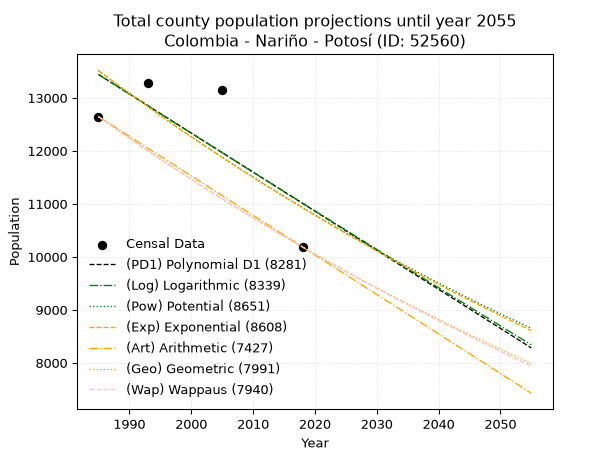
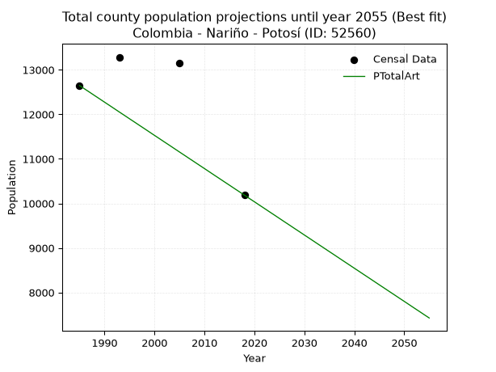
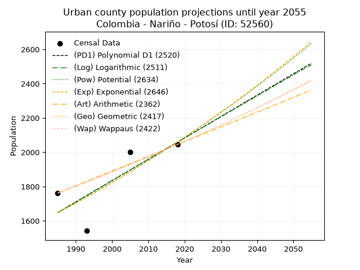
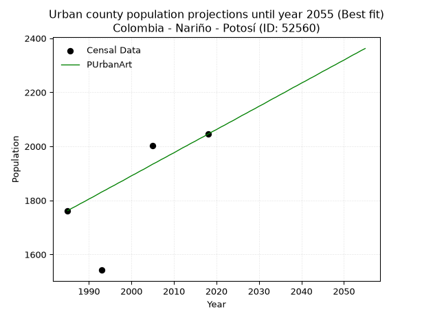
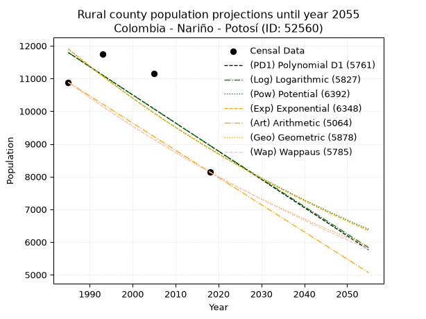
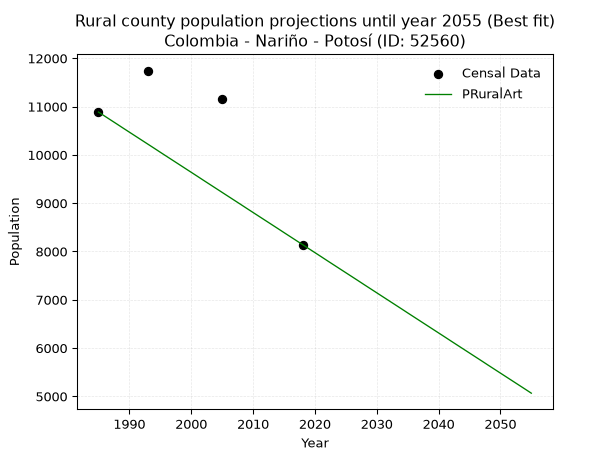

<div align="center">


</div>

# 📜 _“Population and Public Services Demand Projections (PPSD) until Year 2050 for Colombia - Nariño - Potosí (ID: 52560)”_
Keywords: `population` `public-service` `projection` `lineal` `polynomial` `logarithmic` `potential` `exponential` `arithmetic` `geometric` `wappaus` `dane` `colombia` `south-america`

PPSD are analytical estimates used by governments and planners to anticipate future changes in population size, age distribution, and the resulting community needs for utilities, healthcare, education, and infrastructure as sizing future water treatment facilities, electrical grids, and road networks based on spatial growth.

<div align="center">

</img>

</div>


> **General running parameters**: • app_version: _v20260806_. • Python version: _3.14.7_. • Pandas version: _3.0.5_. • NumPy version: _2.5.1_. • Creates, save and include plots into reports (create_plot): _False_. • Projection until year: _2050_. • Process polynomial degree 2 and up: _False_. • Process Wappaus: _True_. • Process Wappaus: _True_. • Set negative values to zero: _True_. • Set infinite values to zero: _True_. • Drop dataset notes: _True_. 
<div align="center">

Dynamic map: [:earth_americas:Google](http://maps.google.com/maps?q=0.80663941,-77.5730027) [:earth_americas:OSM](https://www.openstreetmap.org/#map=18/0.80663941/-77.5730027&layers=P) [:earth_americas:Bing](https://www.bing.com/maps?cp=0.80663941~-77.5730027&lvl=18) [:earth_americas:Apple](https://maps.apple.com/frame?center=0.80663941%2C-77.5730027&span=0.003%2C0.006)

</div>


<div align="center">

```geojson
{
  "type": "Feature",
  "geometry": {
    "type": "Point", 
    "coordinates": [-77.5730027, 0.80663941]
  }, 
  "properties": {
    "Name": "Colombia - Nariño - Potosí (ID: 52560)"
  }
}
```

</div>


## 0. Census Data (4 records)

Census data are official statistics collected by a government about the people and housing in a country. They usually include counts of total population, age, sex, race, income, education, and jobs.

📅Global census file: [Population.xlsx](../data/Population.xlsx)

| Source   |   Year |   CountryID | CountryName   |   StateID | StateName   |   CountyID | CountyName   |   PTotal |   PUrban |   PRural |
|:---------|-------:|------------:|:--------------|----------:|:------------|-----------:|:-------------|---------:|---------:|---------:|
| DANE     |   1985 |          57 | Colombia      |        52 | Nariño      |      52560 | Potosí       |    12647 |     1762 |    10885 |
| DANE     |   1993 |          57 | Colombia      |        52 | Nariño      |      52560 | Potosí       |    13285 |     1542 |    11743 |
| DANE     |   2005 |          57 | Colombia      |        52 | Nariño      |      52560 | Potosí       |    13152 |     2002 |    11150 |
| DANE     |   2018 |          57 | Colombia      |        52 | Nariño      |      52560 | Potosí       |    10186 |     2045 |     8141 |

> 🔥Some records could had specific notes about the registered values or the corresponding urban or rural distribution.

📅[SUI-RUPS](https://www.datos.gov.co/Hacienda-y-Cr-dito-P-blico/Registro-nico-de-Prestadores-de-Servicios-P-blicos/4qkq-csdn/about_data) - Local public utility companies: [RUPS.csv](../data/RUPS.csv)

 | SERVICIO       | ESTADO    | NOMBRE                                             | NIT         | DEPARTAMENTO_DOMICILIO   | MUNICIPIO_DOMICILIO   | DIRECCION                            |   TELEFONO | EMAIL                              | TIPO_PRESTADOR                            | CLASIFICACION                 |
|:---------------|:----------|:---------------------------------------------------|:------------|:-------------------------|:----------------------|:-------------------------------------|-----------:|:-----------------------------------|:------------------------------------------|:------------------------------|
| ACUEDUCTO      | OPERATIVA | EMPRESA DE SERVICIOS PUBLICOS DE POTOSI            | 814000252-2 | NARINO                   | POTOSI                | ALCALDIA MUNICIPAL BARRIO INMACULADA |    7263095 | empopotosi2015@gmail.com           | EMPRESA INDUSTRIAL Y COMERCIAL DEL ESTADO | MENOR O IGUAL A 2500 USUARIOS |
| ALCANTARILLADO | OPERATIVA | EMPRESA DE SERVICIOS PUBLICOS DE POTOSI            | 814000252-2 | NARINO                   | POTOSI                | ALCALDIA MUNICIPAL BARRIO INMACULADA |    7263095 | empopotosi2015@gmail.com           | EMPRESA INDUSTRIAL Y COMERCIAL DEL ESTADO | MENOR O IGUAL A 2500 USUARIOS |
| ACUEDUCTO      | OPERATIVA | JUNTA ADMINISTRADORA DE ACUEDUCTOS CUATRO ESQUINAS | 900010583-1 | NARINO                   | POTOSI                | VEREDA CUASPUD CUATRO ESQUINAS       |    3166564 | acueductocuatroesquinas@hotmail.es | ORGANIZACION AUTORIZADA                   | HASTA 2500 SUSCRIPTORES       |

## 1. Total

### 1.1. Coefficients and Parameters

* (PD1) Polynomial Deg 1: -73.7205941388981, 159777.11842633094 (lineal)
* (Log) Logarithmic: -147243.87720535632, 1131519.3905762932
* (Pow) Potential: -12.868558580720933, 46.5681739272848
* (Exp) Exponential: -0.00644244907872951, 4837553566.562908
* (Art) Arithmetic: Year diff. 2018 - 1985 = 33, Population diff. 10186 - 12647 = -2461, Annual growth = -74.57575757575758
* (Geo) Geometric: Year diff. 2018 - 1985 = 33, Population diff. 10186 - 12647 = -2461, Annual growth % = -0.006536296520962881
* (Wap) Wappaus: i = -0.6532278507051862, Condition values only valid for < 200)

<sub>
Wappaus condition values: ['-0.00', '-0.65', '-1.31', '-1.96', '-2.61', '-3.27', '-3.92', '-4.57', '-5.23', '-5.88', '-6.53', '-7.19', '-7.84', '-8.49', '-9.15', '-9.80', '-10.45', '-11.10', '-11.76', '-12.41', '-13.06', '-13.72', '-14.37', '-15.02', '-15.68', '-16.33', '-16.98', '-17.64', '-18.29', '-18.94', '-19.60', '-20.25', '-20.90', '-21.56', '-22.21', '-22.86', '-23.52', '-24.17', '-24.82', '-25.48', '-26.13', '-26.78', '-27.44', '-28.09', '-28.74', '-29.40', '-30.05', '-30.70', '-31.35', '-32.01', '-32.66', '-33.31', '-33.97', '-34.62', '-35.27', '-35.93', '-36.58', '-37.23', '-37.89', '-38.54', '-39.19', '-39.85', '-40.50', '-41.15', '-41.81', '-42.46']
</sub>


### 1.2. Projected Dataset

|   Year |   CountyID |   PTotalPD1 |   PTotalLog |   PTotalPow |   PTotalExp |   PTotalArt |   PTotalGeo |   PTotalWap |
|-------:|-----------:|------------:|------------:|------------:|------------:|------------:|------------:|------------:|
|   1985 |      52560 |       13442 |       13442 |       13513 |       13513 |       12647 |       12647 |       12647 |
|   1986 |      52560 |       13368 |       13367 |       13426 |       13426 |       12572 |       12564 |       12565 |
|   1987 |      52560 |       13294 |       13293 |       13339 |       13340 |       12498 |       12482 |       12483 |
|   1988 |      52560 |       13221 |       13219 |       13253 |       13254 |       12423 |       12401 |       12402 |
|   1989 |      52560 |       13147 |       13145 |       13167 |       13169 |       12349 |       12320 |       12321 |
|   1990 |      52560 |       13073 |       13071 |       13082 |       13085 |       12274 |       12239 |       12241 |
|   1991 |      52560 |       12999 |       12997 |       12998 |       13001 |       12200 |       12159 |       12161 |
|   1992 |      52560 |       12926 |       12923 |       12914 |       12917 |       12125 |       12080 |       12082 |
|   1993 |      52560 |       12852 |       12849 |       12831 |       12834 |       12050 |       12001 |       12003 |
|   1994 |      52560 |       12778 |       12775 |       12749 |       12752 |       11976 |       11922 |       11925 |
|   1995 |      52560 |       12705 |       12702 |       12667 |       12670 |       11901 |       11844 |       11847 |
|   1996 |      52560 |       12631 |       12628 |       12585 |       12589 |       11827 |       11767 |       11770 |
|   1997 |      52560 |       12557 |       12554 |       12504 |       12508 |       11752 |       11690 |       11693 |
|   1998 |      52560 |       12483 |       12480 |       12424 |       12427 |       11678 |       11614 |       11617 |
|   1999 |      52560 |       12410 |       12407 |       12344 |       12348 |       11603 |       11538 |       11541 |
|   2000 |      52560 |       12336 |       12333 |       12265 |       12268 |       11528 |       11462 |       11466 |
|   2001 |      52560 |       12262 |       12259 |       12187 |       12190 |       11454 |       11387 |       11391 |
|   2002 |      52560 |       12188 |       12186 |       12108 |       12111 |       11379 |       11313 |       11316 |
|   2003 |      52560 |       12115 |       12112 |       12031 |       12033 |       11305 |       11239 |       11243 |
|   2004 |      52560 |       12041 |       12039 |       11954 |       11956 |       11230 |       11165 |       11169 |
|   2005 |      52560 |       11967 |       11965 |       11877 |       11879 |       11155 |       11092 |       11096 |
|   2006 |      52560 |       11894 |       11892 |       11801 |       11803 |       11081 |       11020 |       11023 |
|   2007 |      52560 |       11820 |       11819 |       11726 |       11727 |       11006 |       10948 |       10951 |
|   2008 |      52560 |       11746 |       11745 |       11651 |       11652 |       10932 |       10876 |       10880 |
|   2009 |      52560 |       11672 |       11672 |       11577 |       11577 |       10857 |       10805 |       10808 |
|   2010 |      52560 |       11599 |       11599 |       11503 |       11503 |       10783 |       10735 |       10738 |
|   2011 |      52560 |       11525 |       11525 |       11429 |       11429 |       10708 |       10664 |       10667 |
|   2012 |      52560 |       11451 |       11452 |       11356 |       11356 |       10633 |       10595 |       10597 |
|   2013 |      52560 |       11378 |       11379 |       11284 |       11283 |       10559 |       10526 |       10528 |
|   2014 |      52560 |       11304 |       11306 |       11212 |       11210 |       10484 |       10457 |       10458 |
|   2015 |      52560 |       11230 |       11233 |       11141 |       11138 |       10410 |       10388 |       10390 |
|   2016 |      52560 |       11156 |       11160 |       11070 |       11067 |       10335 |       10320 |       10321 |
|   2017 |      52560 |       11083 |       11087 |       10999 |       10996 |       10261 |       10253 |       10254 |
|   2018 |      52560 |       11009 |       11014 |       10930 |       10925 |       10186 |       10186 |       10186 |
|   2019 |      52560 |       10935 |       10941 |       10860 |       10855 |       10111 |       10119 |       10119 |
|   2020 |      52560 |       10862 |       10868 |       10791 |       10785 |       10037 |       10053 |       10052 |
|   2021 |      52560 |       10788 |       10795 |       10723 |       10716 |        9962 |        9988 |        9986 |
|   2022 |      52560 |       10714 |       10722 |       10655 |       10647 |        9888 |        9922 |        9920 |
|   2023 |      52560 |       10640 |       10649 |       10587 |       10579 |        9813 |        9857 |        9854 |
|   2024 |      52560 |       10567 |       10577 |       10520 |       10511 |        9739 |        9793 |        9789 |
|   2025 |      52560 |       10493 |       10504 |       10453 |       10443 |        9664 |        9729 |        9724 |
|   2026 |      52560 |       10419 |       10431 |       10387 |       10376 |        9589 |        9665 |        9660 |
|   2027 |      52560 |       10345 |       10359 |       10321 |       10310 |        9515 |        9602 |        9596 |
|   2028 |      52560 |       10272 |       10286 |       10256 |       10243 |        9440 |        9539 |        9532 |
|   2029 |      52560 |       10198 |       10213 |       10191 |       10178 |        9366 |        9477 |        9469 |
|   2030 |      52560 |       10124 |       10141 |       10127 |       10112 |        9291 |        9415 |        9406 |
|   2031 |      52560 |       10051 |       10068 |       10063 |       10047 |        9217 |        9354 |        9343 |
|   2032 |      52560 |        9977 |        9996 |        9999 |        9983 |        9142 |        9292 |        9281 |
|   2033 |      52560 |        9903 |        9923 |        9936 |        9919 |        9067 |        9232 |        9219 |
|   2034 |      52560 |        9829 |        9851 |        9873 |        9855 |        8993 |        9171 |        9157 |
|   2035 |      52560 |        9756 |        9779 |        9811 |        9792 |        8918 |        9111 |        9096 |
|   2036 |      52560 |        9682 |        9706 |        9749 |        9729 |        8844 |        9052 |        9035 |
|   2037 |      52560 |        9608 |        9634 |        9688 |        9666 |        8769 |        8993 |        8975 |
|   2038 |      52560 |        9535 |        9562 |        9627 |        9604 |        8694 |        8934 |        8915 |
|   2039 |      52560 |        9461 |        9489 |        9566 |        9543 |        8620 |        8876 |        8855 |
|   2040 |      52560 |        9387 |        9417 |        9506 |        9481 |        8545 |        8818 |        8795 |
|   2041 |      52560 |        9313 |        9345 |        9446 |        9420 |        8471 |        8760 |        8736 |
|   2042 |      52560 |        9240 |        9273 |        9387 |        9360 |        8396 |        8703 |        8677 |
|   2043 |      52560 |        9166 |        9201 |        9328 |        9300 |        8322 |        8646 |        8619 |
|   2044 |      52560 |        9092 |        9129 |        9270 |        9240 |        8247 |        8589 |        8560 |
|   2045 |      52560 |        9019 |        9057 |        9211 |        9181 |        8172 |        8533 |        8502 |
|   2046 |      52560 |        8945 |        8985 |        9154 |        9122 |        8098 |        8477 |        8445 |
|   2047 |      52560 |        8871 |        8913 |        9096 |        9063 |        8023 |        8422 |        8388 |
|   2048 |      52560 |        8797 |        8841 |        9039 |        9005 |        7949 |        8367 |        8331 |
|   2049 |      52560 |        8724 |        8769 |        8983 |        8947 |        7874 |        8312 |        8274 |
|   2050 |      52560 |        8650 |        8697 |        8926 |        8890 |        7800 |        8258 |        8217 |
<div align="center">

</img>

</div>


### 1.3. Best fit with absolute and relative error (%)

Relative error puts that difference into context by dividing the absolute error by the true value, creating a unitless ratio or percentage that shows the scale of the mistake.

Absolute and relative error

|   Year | Source   |   CountryID | CountryName   |   StateID | StateName   |   CountyID_x | CountyName   |   PTotal |   PUrban |   PRural |   CountyID_y |   PTotalPD1 |   PTotalLog |   PTotalPow |   PTotalExp |   PTotalArt |   PTotalGeo |   PTotalWap |   PTotalPD1AbsError |   PTotalLogAbsError |   PTotalPowAbsError |   PTotalExpAbsError |   PTotalArtAbsError |   PTotalGeoAbsError |   PTotalWapAbsError |   PTotalPD1RelError |   PTotalLogRelError |   PTotalPowRelError |   PTotalExpRelError |   PTotalArtRelError |   PTotalGeoRelError |   PTotalWapRelError |
|-------:|:---------|------------:|:--------------|----------:|:------------|-------------:|:-------------|---------:|---------:|---------:|-------------:|------------:|------------:|------------:|------------:|------------:|------------:|------------:|--------------------:|--------------------:|--------------------:|--------------------:|--------------------:|--------------------:|--------------------:|--------------------:|--------------------:|--------------------:|--------------------:|--------------------:|--------------------:|--------------------:|
|   1985 | DANE     |          57 | Colombia      |        52 | Nariño      |        52560 | Potosí       |    12647 |     1762 |    10885 |        52560 |       13442 |       13442 |       13513 |       13513 |       12647 |       12647 |       12647 |                 795 |                 795 |                 866 |                 866 |                   0 |                   0 |                   0 |             6.28608 |             6.28608 |             6.84747 |             6.84747 |              0      |             0       |             0       |
|   1993 | DANE     |          57 | Colombia      |        52 | Nariño      |        52560 | Potosí       |    13285 |     1542 |    11743 |        52560 |       12852 |       12849 |       12831 |       12834 |       12050 |       12001 |       12003 |                 433 |                 436 |                 454 |                 451 |                1235 |                1284 |                1282 |             3.25932 |             3.2819  |             3.41739 |             3.39481 |              9.2962 |             9.66504 |             9.64998 |
|   2005 | DANE     |          57 | Colombia      |        52 | Nariño      |        52560 | Potosí       |    13152 |     2002 |    11150 |        52560 |       11967 |       11965 |       11877 |       11879 |       11155 |       11092 |       11096 |                1185 |                1187 |                1275 |                1273 |                1997 |                2060 |                2056 |             9.01004 |             9.02524 |             9.69434 |             9.67914 |             15.184  |            15.663   |            15.6326  |
|   2018 | DANE     |          57 | Colombia      |        52 | Nariño      |        52560 | Potosí       |    10186 |     2045 |     8141 |        52560 |       11009 |       11014 |       10930 |       10925 |       10186 |       10186 |       10186 |                 823 |                 828 |                 744 |                 739 |                   0 |                   0 |                   0 |             8.07972 |             8.1288  |             7.30414 |             7.25506 |              0      |             0       |             0       |

Relative error mean

| Method    |   RelError | Best   |
|:----------|-----------:|:-------|
| PTotalPD1 |    6.65879 |        |
| PTotalLog |    6.68051 |        |
| PTotalPow |    6.81584 |        |
| PTotalExp |    6.79412 |        |
| PTotalArt |    6.12005 | True   |
| PTotalGeo |    6.33201 |        |
| PTotalWap |    6.32065 |        |

💙Best method: _**PTotalArt**_
<div align="center">

</img>

</div>


### 1.4. Fresh water supply demand in liters per capita per day (lpcd)

The fresh water supply demand typically ranges from 100 to 300 liters per capita per day (lpcd) for standard domestic and municipal planning, though absolute survival minimums set by the World Health Organization are as low as 7.5 to 20 liters per day, and total consumption in high-income nations can exceed 400 liters.

> `CZ`: Level in meters above the sea level (masl)<br> `WS`: Fresh water supply demand in liters per capita per day (lpcd or l/h/d)<br> `WSAll`: Zonal fresh water supply demand in liters per second (l/s)<br> `A`: Zonal area in square meters<br> `DP`: Population density (people/hectare or p/ha)

Reference values (RAS Colombia)

|    CZ |   WS |
|------:|-----:|
|  1000 |  120 |
|  2000 |  130 |
| 99999 |  140 |

County shapefile geometry properties and water supply values

|   CountyID |      ATotal |   CZTotal |   WSTotal |
|-----------:|------------:|----------:|----------:|
|      52560 | 3.88676e+08 |   2868.91 |       140 |

Projected values for best method: PTotalArt

|   CountyID |   Year |   PTotalArt |   DPTotal |   WSTotal |   WSTotalAll |
|-----------:|-------:|------------:|----------:|----------:|-------------:|
|      52560 |   1985 |       12647 |      0.33 |       140 |      20.4928 |
|      52560 |   1986 |       12572 |      0.32 |       140 |      20.3713 |
|      52560 |   1987 |       12498 |      0.32 |       140 |      20.2514 |
|      52560 |   1988 |       12423 |      0.32 |       140 |      20.1299 |
|      52560 |   1989 |       12349 |      0.32 |       140 |      20.01   |
|      52560 |   1990 |       12274 |      0.32 |       140 |      19.8884 |
|      52560 |   1991 |       12200 |      0.31 |       140 |      19.7685 |
|      52560 |   1992 |       12125 |      0.31 |       140 |      19.647  |
|      52560 |   1993 |       12050 |      0.31 |       140 |      19.5255 |
|      52560 |   1994 |       11976 |      0.31 |       140 |      19.4056 |
|      52560 |   1995 |       11901 |      0.31 |       140 |      19.284  |
|      52560 |   1996 |       11827 |      0.3  |       140 |      19.1641 |
|      52560 |   1997 |       11752 |      0.3  |       140 |      19.0426 |
|      52560 |   1998 |       11678 |      0.3  |       140 |      18.9227 |
|      52560 |   1999 |       11603 |      0.3  |       140 |      18.8012 |
|      52560 |   2000 |       11528 |      0.3  |       140 |      18.6796 |
|      52560 |   2001 |       11454 |      0.29 |       140 |      18.5597 |
|      52560 |   2002 |       11379 |      0.29 |       140 |      18.4382 |
|      52560 |   2003 |       11305 |      0.29 |       140 |      18.3183 |
|      52560 |   2004 |       11230 |      0.29 |       140 |      18.1968 |
|      52560 |   2005 |       11155 |      0.29 |       140 |      18.0752 |
|      52560 |   2006 |       11081 |      0.29 |       140 |      17.9553 |
|      52560 |   2007 |       11006 |      0.28 |       140 |      17.8338 |
|      52560 |   2008 |       10932 |      0.28 |       140 |      17.7139 |
|      52560 |   2009 |       10857 |      0.28 |       140 |      17.5924 |
|      52560 |   2010 |       10783 |      0.28 |       140 |      17.4725 |
|      52560 |   2011 |       10708 |      0.28 |       140 |      17.3509 |
|      52560 |   2012 |       10633 |      0.27 |       140 |      17.2294 |
|      52560 |   2013 |       10559 |      0.27 |       140 |      17.1095 |
|      52560 |   2014 |       10484 |      0.27 |       140 |      16.988  |
|      52560 |   2015 |       10410 |      0.27 |       140 |      16.8681 |
|      52560 |   2016 |       10335 |      0.27 |       140 |      16.7465 |
|      52560 |   2017 |       10261 |      0.26 |       140 |      16.6266 |
|      52560 |   2018 |       10186 |      0.26 |       140 |      16.5051 |
|      52560 |   2019 |       10111 |      0.26 |       140 |      16.3836 |
|      52560 |   2020 |       10037 |      0.26 |       140 |      16.2637 |
|      52560 |   2021 |        9962 |      0.26 |       140 |      16.1421 |
|      52560 |   2022 |        9888 |      0.25 |       140 |      16.0222 |
|      52560 |   2023 |        9813 |      0.25 |       140 |      15.9007 |
|      52560 |   2024 |        9739 |      0.25 |       140 |      15.7808 |
|      52560 |   2025 |        9664 |      0.25 |       140 |      15.6593 |
|      52560 |   2026 |        9589 |      0.25 |       140 |      15.5377 |
|      52560 |   2027 |        9515 |      0.24 |       140 |      15.4178 |
|      52560 |   2028 |        9440 |      0.24 |       140 |      15.2963 |
|      52560 |   2029 |        9366 |      0.24 |       140 |      15.1764 |
|      52560 |   2030 |        9291 |      0.24 |       140 |      15.0549 |
|      52560 |   2031 |        9217 |      0.24 |       140 |      14.935  |
|      52560 |   2032 |        9142 |      0.24 |       140 |      14.8134 |
|      52560 |   2033 |        9067 |      0.23 |       140 |      14.6919 |
|      52560 |   2034 |        8993 |      0.23 |       140 |      14.572  |
|      52560 |   2035 |        8918 |      0.23 |       140 |      14.4505 |
|      52560 |   2036 |        8844 |      0.23 |       140 |      14.3306 |
|      52560 |   2037 |        8769 |      0.23 |       140 |      14.209  |
|      52560 |   2038 |        8694 |      0.22 |       140 |      14.0875 |
|      52560 |   2039 |        8620 |      0.22 |       140 |      13.9676 |
|      52560 |   2040 |        8545 |      0.22 |       140 |      13.8461 |
|      52560 |   2041 |        8471 |      0.22 |       140 |      13.7262 |
|      52560 |   2042 |        8396 |      0.22 |       140 |      13.6046 |
|      52560 |   2043 |        8322 |      0.21 |       140 |      13.4847 |
|      52560 |   2044 |        8247 |      0.21 |       140 |      13.3632 |
|      52560 |   2045 |        8172 |      0.21 |       140 |      13.2417 |
|      52560 |   2046 |        8098 |      0.21 |       140 |      13.1218 |
|      52560 |   2047 |        8023 |      0.21 |       140 |      13.0002 |
|      52560 |   2048 |        7949 |      0.2  |       140 |      12.8803 |
|      52560 |   2049 |        7874 |      0.2  |       140 |      12.7588 |
|      52560 |   2050 |        7800 |      0.2  |       140 |      12.6389 |

## 2. Urban

### 2.1. Coefficients and Parameters

* (PD1) Polynomial Deg 1: 12.45804897631468, -23081.462464873435 (lineal)
* (Log) Logarithmic: 24925.115857325734, -187618.25536887607
* (Pow) Potential: 13.548270278293588, -41.46230573522516
* (Exp) Exponential: 0.006772091864170827, 0.0023914559747534353
* (Art) Arithmetic: Year diff. 2018 - 1985 = 33, Population diff. 2045 - 1762 = 283, Annual growth = 8.575757575757576
* (Geo) Geometric: Year diff. 2018 - 1985 = 33, Population diff. 2045 - 1762 = 283, Annual growth % = 0.004523785258038648
* (Wap) Wappaus: i = 0.4505257460340203, Condition values only valid for < 200)

<sub>
Wappaus condition values: ['0.00', '0.45', '0.90', '1.35', '1.80', '2.25', '2.70', '3.15', '3.60', '4.05', '4.51', '4.96', '5.41', '5.86', '6.31', '6.76', '7.21', '7.66', '8.11', '8.56', '9.01', '9.46', '9.91', '10.36', '10.81', '11.26', '11.71', '12.16', '12.61', '13.07', '13.52', '13.97', '14.42', '14.87', '15.32', '15.77', '16.22', '16.67', '17.12', '17.57', '18.02', '18.47', '18.92', '19.37', '19.82', '20.27', '20.72', '21.17', '21.63', '22.08', '22.53', '22.98', '23.43', '23.88', '24.33', '24.78', '25.23', '25.68', '26.13', '26.58', '27.03', '27.48', '27.93', '28.38', '28.83', '29.28']
</sub>


### 2.2. Projected Dataset

|   Year |   CountyID |   PUrbanPD1 |   PUrbanLog |   PUrbanPow |   PUrbanExp |   PUrbanArt |   PUrbanGeo |   PUrbanWap |
|-------:|-----------:|------------:|------------:|------------:|------------:|------------:|------------:|------------:|
|   1985 |      52560 |        1648 |        1647 |        1647 |        1647 |        1762 |        1762 |        1762 |
|   1986 |      52560 |        1660 |        1660 |        1658 |        1658 |        1771 |        1770 |        1770 |
|   1987 |      52560 |        1673 |        1673 |        1669 |        1670 |        1779 |        1778 |        1778 |
|   1988 |      52560 |        1685 |        1685 |        1681 |        1681 |        1788 |        1786 |        1786 |
|   1989 |      52560 |        1698 |        1698 |        1692 |        1692 |        1796 |        1794 |        1794 |
|   1990 |      52560 |        1710 |        1710 |        1704 |        1704 |        1805 |        1802 |        1802 |
|   1991 |      52560 |        1723 |        1723 |        1716 |        1715 |        1813 |        1810 |        1810 |
|   1992 |      52560 |        1735 |        1735 |        1727 |        1727 |        1822 |        1819 |        1818 |
|   1993 |      52560 |        1747 |        1748 |        1739 |        1739 |        1831 |        1827 |        1827 |
|   1994 |      52560 |        1760 |        1760 |        1751 |        1751 |        1839 |        1835 |        1835 |
|   1995 |      52560 |        1772 |        1773 |        1763 |        1762 |        1848 |        1843 |        1843 |
|   1996 |      52560 |        1785 |        1785 |        1775 |        1774 |        1856 |        1852 |        1852 |
|   1997 |      52560 |        1797 |        1798 |        1787 |        1787 |        1865 |        1860 |        1860 |
|   1998 |      52560 |        1810 |        1810 |        1799 |        1799 |        1873 |        1868 |        1868 |
|   1999 |      52560 |        1822 |        1823 |        1811 |        1811 |        1882 |        1877 |        1877 |
|   2000 |      52560 |        1835 |        1835 |        1824 |        1823 |        1891 |        1885 |        1885 |
|   2001 |      52560 |        1847 |        1848 |        1836 |        1836 |        1899 |        1894 |        1894 |
|   2002 |      52560 |        1860 |        1860 |        1849 |        1848 |        1908 |        1903 |        1902 |
|   2003 |      52560 |        1872 |        1872 |        1861 |        1861 |        1916 |        1911 |        1911 |
|   2004 |      52560 |        1884 |        1885 |        1874 |        1873 |        1925 |        1920 |        1920 |
|   2005 |      52560 |        1897 |        1897 |        1886 |        1886 |        1934 |        1928 |        1928 |
|   2006 |      52560 |        1909 |        1910 |        1899 |        1899 |        1942 |        1937 |        1937 |
|   2007 |      52560 |        1922 |        1922 |        1912 |        1912 |        1951 |        1946 |        1946 |
|   2008 |      52560 |        1934 |        1935 |        1925 |        1925 |        1959 |        1955 |        1955 |
|   2009 |      52560 |        1947 |        1947 |        1938 |        1938 |        1968 |        1964 |        1963 |
|   2010 |      52560 |        1959 |        1959 |        1951 |        1951 |        1976 |        1972 |        1972 |
|   2011 |      52560 |        1972 |        1972 |        1964 |        1964 |        1985 |        1981 |        1981 |
|   2012 |      52560 |        1984 |        1984 |        1978 |        1978 |        1994 |        1990 |        1990 |
|   2013 |      52560 |        1997 |        1997 |        1991 |        1991 |        2002 |        1999 |        1999 |
|   2014 |      52560 |        2009 |        2009 |        2004 |        2004 |        2011 |        2008 |        2008 |
|   2015 |      52560 |        2022 |        2021 |        2018 |        2018 |        2019 |        2017 |        2017 |
|   2016 |      52560 |        2034 |        2034 |        2032 |        2032 |        2028 |        2027 |        2027 |
|   2017 |      52560 |        2046 |        2046 |        2045 |        2046 |        2036 |        2036 |        2036 |
|   2018 |      52560 |        2059 |        2058 |        2059 |        2060 |        2045 |        2045 |        2045 |
|   2019 |      52560 |        2071 |        2071 |        2073 |        2074 |        2054 |        2054 |        2054 |
|   2020 |      52560 |        2084 |        2083 |        2087 |        2088 |        2062 |        2064 |        2064 |
|   2021 |      52560 |        2096 |        2095 |        2101 |        2102 |        2071 |        2073 |        2073 |
|   2022 |      52560 |        2109 |        2108 |        2115 |        2116 |        2079 |        2082 |        2082 |
|   2023 |      52560 |        2121 |        2120 |        2129 |        2130 |        2088 |        2092 |        2092 |
|   2024 |      52560 |        2134 |        2132 |        2144 |        2145 |        2096 |        2101 |        2101 |
|   2025 |      52560 |        2146 |        2145 |        2158 |        2160 |        2105 |        2111 |        2111 |
|   2026 |      52560 |        2159 |        2157 |        2172 |        2174 |        2114 |        2120 |        2121 |
|   2027 |      52560 |        2171 |        2169 |        2187 |        2189 |        2122 |        2130 |        2130 |
|   2028 |      52560 |        2183 |        2182 |        2202 |        2204 |        2131 |        2139 |        2140 |
|   2029 |      52560 |        2196 |        2194 |        2216 |        2219 |        2139 |        2149 |        2150 |
|   2030 |      52560 |        2208 |        2206 |        2231 |        2234 |        2148 |        2159 |        2160 |
|   2031 |      52560 |        2221 |        2218 |        2246 |        2249 |        2156 |        2169 |        2169 |
|   2032 |      52560 |        2233 |        2231 |        2261 |        2264 |        2165 |        2178 |        2179 |
|   2033 |      52560 |        2246 |        2243 |        2276 |        2280 |        2174 |        2188 |        2189 |
|   2034 |      52560 |        2258 |        2255 |        2292 |        2295 |        2182 |        2198 |        2199 |
|   2035 |      52560 |        2271 |        2268 |        2307 |        2311 |        2191 |        2208 |        2209 |
|   2036 |      52560 |        2283 |        2280 |        2322 |        2327 |        2199 |        2218 |        2219 |
|   2037 |      52560 |        2296 |        2292 |        2338 |        2342 |        2208 |        2228 |        2230 |
|   2038 |      52560 |        2308 |        2304 |        2353 |        2358 |        2217 |        2238 |        2240 |
|   2039 |      52560 |        2320 |        2316 |        2369 |        2374 |        2225 |        2248 |        2250 |
|   2040 |      52560 |        2333 |        2329 |        2385 |        2390 |        2234 |        2258 |        2260 |
|   2041 |      52560 |        2345 |        2341 |        2401 |        2407 |        2242 |        2269 |        2271 |
|   2042 |      52560 |        2358 |        2353 |        2417 |        2423 |        2251 |        2279 |        2281 |
|   2043 |      52560 |        2370 |        2365 |        2433 |        2439 |        2259 |        2289 |        2292 |
|   2044 |      52560 |        2383 |        2378 |        2449 |        2456 |        2268 |        2300 |        2302 |
|   2045 |      52560 |        2395 |        2390 |        2465 |        2473 |        2277 |        2310 |        2313 |
|   2046 |      52560 |        2408 |        2402 |        2482 |        2490 |        2285 |        2320 |        2323 |
|   2047 |      52560 |        2420 |        2414 |        2498 |        2506 |        2294 |        2331 |        2334 |
|   2048 |      52560 |        2433 |        2426 |        2515 |        2523 |        2302 |        2342 |        2345 |
|   2049 |      52560 |        2445 |        2438 |        2531 |        2541 |        2311 |        2352 |        2356 |
|   2050 |      52560 |        2458 |        2451 |        2548 |        2558 |        2319 |        2363 |        2366 |
<div align="center">

</img>

</div>


### 2.3. Best fit with absolute and relative error (%)

Relative error puts that difference into context by dividing the absolute error by the true value, creating a unitless ratio or percentage that shows the scale of the mistake.

Absolute and relative error

|   Year | Source   |   CountryID | CountryName   |   StateID | StateName   |   CountyID_x | CountyName   |   PTotal |   PUrban |   PRural |   CountyID_y |   PUrbanPD1 |   PUrbanLog |   PUrbanPow |   PUrbanExp |   PUrbanArt |   PUrbanGeo |   PUrbanWap |   PUrbanPD1AbsError |   PUrbanLogAbsError |   PUrbanPowAbsError |   PUrbanExpAbsError |   PUrbanArtAbsError |   PUrbanGeoAbsError |   PUrbanWapAbsError |   PUrbanPD1RelError |   PUrbanLogRelError |   PUrbanPowRelError |   PUrbanExpRelError |   PUrbanArtRelError |   PUrbanGeoRelError |   PUrbanWapRelError |
|-------:|:---------|------------:|:--------------|----------:|:------------|-------------:|:-------------|---------:|---------:|---------:|-------------:|------------:|------------:|------------:|------------:|------------:|------------:|------------:|--------------------:|--------------------:|--------------------:|--------------------:|--------------------:|--------------------:|--------------------:|--------------------:|--------------------:|--------------------:|--------------------:|--------------------:|--------------------:|--------------------:|
|   1985 | DANE     |          57 | Colombia      |        52 | Nariño      |        52560 | Potosí       |    12647 |     1762 |    10885 |        52560 |        1648 |        1647 |        1647 |        1647 |        1762 |        1762 |        1762 |                 114 |                 115 |                 115 |                 115 |                   0 |                   0 |                   0 |            6.46992  |            6.52667  |            6.52667  |            6.52667  |              0      |              0      |              0      |
|   1993 | DANE     |          57 | Colombia      |        52 | Nariño      |        52560 | Potosí       |    13285 |     1542 |    11743 |        52560 |        1747 |        1748 |        1739 |        1739 |        1831 |        1827 |        1827 |                 205 |                 206 |                 197 |                 197 |                 289 |                 285 |                 285 |           13.2944   |           13.3593   |           12.7756   |           12.7756   |             18.7419 |             18.4825 |             18.4825 |
|   2005 | DANE     |          57 | Colombia      |        52 | Nariño      |        52560 | Potosí       |    13152 |     2002 |    11150 |        52560 |        1897 |        1897 |        1886 |        1886 |        1934 |        1928 |        1928 |                 105 |                 105 |                 116 |                 116 |                  68 |                  74 |                  74 |            5.24476  |            5.24476  |            5.79421  |            5.79421  |              3.3966 |              3.6963 |              3.6963 |
|   2018 | DANE     |          57 | Colombia      |        52 | Nariño      |        52560 | Potosí       |    10186 |     2045 |     8141 |        52560 |        2059 |        2058 |        2059 |        2060 |        2045 |        2045 |        2045 |                  14 |                  13 |                  14 |                  15 |                   0 |                   0 |                   0 |            0.684597 |            0.635697 |            0.684597 |            0.733496 |              0      |              0      |              0      |

Relative error mean

| Method    |   RelError | Best   |
|:----------|-----------:|:-------|
| PUrbanPD1 |    6.42342 |        |
| PUrbanLog |    6.4416  |        |
| PUrbanPow |    6.44527 |        |
| PUrbanExp |    6.4575  |        |
| PUrbanArt |    5.53462 | True   |
| PUrbanGeo |    5.5447  |        |
| PUrbanWap |    5.5447  |        |

💙Best method: _**PUrbanArt**_
<div align="center">

</img>

</div>


### 2.4. Fresh water supply demand in liters per capita per day (lpcd)

The fresh water supply demand typically ranges from 100 to 300 liters per capita per day (lpcd) for standard domestic and municipal planning, though absolute survival minimums set by the World Health Organization are as low as 7.5 to 20 liters per day, and total consumption in high-income nations can exceed 400 liters.

> `CZ`: Level in meters above the sea level (masl)<br> `WS`: Fresh water supply demand in liters per capita per day (lpcd or l/h/d)<br> `WSAll`: Zonal fresh water supply demand in liters per second (l/s)<br> `A`: Zonal area in square meters<br> `DP`: Population density (people/hectare or p/ha)

Reference values (RAS Colombia)

|    CZ |   WS |
|------:|-----:|
|  1000 |  120 |
|  2000 |  130 |
| 99999 |  140 |

County shapefile geometry properties and water supply values

|   CountyID |   AUrban |   CZUrban |   WSUrban |
|-----------:|---------:|----------:|----------:|
|      52560 |   339419 |   2740.72 |       140 |

Projected values for best method: PUrbanArt

|   CountyID |   Year |   PUrbanArt |   DPUrban |   WSUrban |   WSUrbanAll |
|-----------:|-------:|------------:|----------:|----------:|-------------:|
|      52560 |   1985 |        1762 |     51.91 |       140 |      2.85509 |
|      52560 |   1986 |        1771 |     52.18 |       140 |      2.86968 |
|      52560 |   1987 |        1779 |     52.41 |       140 |      2.88264 |
|      52560 |   1988 |        1788 |     52.68 |       140 |      2.89722 |
|      52560 |   1989 |        1796 |     52.91 |       140 |      2.91019 |
|      52560 |   1990 |        1805 |     53.18 |       140 |      2.92477 |
|      52560 |   1991 |        1813 |     53.41 |       140 |      2.93773 |
|      52560 |   1992 |        1822 |     53.68 |       140 |      2.95231 |
|      52560 |   1993 |        1831 |     53.95 |       140 |      2.9669  |
|      52560 |   1994 |        1839 |     54.18 |       140 |      2.97986 |
|      52560 |   1995 |        1848 |     54.45 |       140 |      2.99444 |
|      52560 |   1996 |        1856 |     54.68 |       140 |      3.00741 |
|      52560 |   1997 |        1865 |     54.95 |       140 |      3.02199 |
|      52560 |   1998 |        1873 |     55.18 |       140 |      3.03495 |
|      52560 |   1999 |        1882 |     55.45 |       140 |      3.04954 |
|      52560 |   2000 |        1891 |     55.71 |       140 |      3.06412 |
|      52560 |   2001 |        1899 |     55.95 |       140 |      3.07708 |
|      52560 |   2002 |        1908 |     56.21 |       140 |      3.09167 |
|      52560 |   2003 |        1916 |     56.45 |       140 |      3.10463 |
|      52560 |   2004 |        1925 |     56.71 |       140 |      3.11921 |
|      52560 |   2005 |        1934 |     56.98 |       140 |      3.1338  |
|      52560 |   2006 |        1942 |     57.22 |       140 |      3.14676 |
|      52560 |   2007 |        1951 |     57.48 |       140 |      3.16134 |
|      52560 |   2008 |        1959 |     57.72 |       140 |      3.17431 |
|      52560 |   2009 |        1968 |     57.98 |       140 |      3.18889 |
|      52560 |   2010 |        1976 |     58.22 |       140 |      3.20185 |
|      52560 |   2011 |        1985 |     58.48 |       140 |      3.21644 |
|      52560 |   2012 |        1994 |     58.75 |       140 |      3.23102 |
|      52560 |   2013 |        2002 |     58.98 |       140 |      3.24398 |
|      52560 |   2014 |        2011 |     59.25 |       140 |      3.25856 |
|      52560 |   2015 |        2019 |     59.48 |       140 |      3.27153 |
|      52560 |   2016 |        2028 |     59.75 |       140 |      3.28611 |
|      52560 |   2017 |        2036 |     59.98 |       140 |      3.29907 |
|      52560 |   2018 |        2045 |     60.25 |       140 |      3.31366 |
|      52560 |   2019 |        2054 |     60.52 |       140 |      3.32824 |
|      52560 |   2020 |        2062 |     60.75 |       140 |      3.3412  |
|      52560 |   2021 |        2071 |     61.02 |       140 |      3.35579 |
|      52560 |   2022 |        2079 |     61.25 |       140 |      3.36875 |
|      52560 |   2023 |        2088 |     61.52 |       140 |      3.38333 |
|      52560 |   2024 |        2096 |     61.75 |       140 |      3.3963  |
|      52560 |   2025 |        2105 |     62.02 |       140 |      3.41088 |
|      52560 |   2026 |        2114 |     62.28 |       140 |      3.42546 |
|      52560 |   2027 |        2122 |     62.52 |       140 |      3.43843 |
|      52560 |   2028 |        2131 |     62.78 |       140 |      3.45301 |
|      52560 |   2029 |        2139 |     63.02 |       140 |      3.46597 |
|      52560 |   2030 |        2148 |     63.28 |       140 |      3.48056 |
|      52560 |   2031 |        2156 |     63.52 |       140 |      3.49352 |
|      52560 |   2032 |        2165 |     63.79 |       140 |      3.5081  |
|      52560 |   2033 |        2174 |     64.05 |       140 |      3.52269 |
|      52560 |   2034 |        2182 |     64.29 |       140 |      3.53565 |
|      52560 |   2035 |        2191 |     64.55 |       140 |      3.55023 |
|      52560 |   2036 |        2199 |     64.79 |       140 |      3.56319 |
|      52560 |   2037 |        2208 |     65.05 |       140 |      3.57778 |
|      52560 |   2038 |        2217 |     65.32 |       140 |      3.59236 |
|      52560 |   2039 |        2225 |     65.55 |       140 |      3.60532 |
|      52560 |   2040 |        2234 |     65.82 |       140 |      3.61991 |
|      52560 |   2041 |        2242 |     66.05 |       140 |      3.63287 |
|      52560 |   2042 |        2251 |     66.32 |       140 |      3.64745 |
|      52560 |   2043 |        2259 |     66.55 |       140 |      3.66042 |
|      52560 |   2044 |        2268 |     66.82 |       140 |      3.675   |
|      52560 |   2045 |        2277 |     67.09 |       140 |      3.68958 |
|      52560 |   2046 |        2285 |     67.32 |       140 |      3.70255 |
|      52560 |   2047 |        2294 |     67.59 |       140 |      3.71713 |
|      52560 |   2048 |        2302 |     67.82 |       140 |      3.73009 |
|      52560 |   2049 |        2311 |     68.09 |       140 |      3.74468 |
|      52560 |   2050 |        2319 |     68.32 |       140 |      3.75764 |

## 3. Rural

### 3.1. Coefficients and Parameters

* (PD1) Polynomial Deg 1: -86.17864311521281, 182858.58089120442 (lineal)
* (Log) Logarithmic: -172168.99306268193, 1319137.6459451686
* (Pow) Potential: -17.93940152007011, 63.23546492018616
* (Exp) Exponential: -0.00897905039933556, 654966367309.9604
* (Art) Arithmetic: Year diff. 2018 - 1985 = 33, Population diff. 8141 - 10885 = -2744, Annual growth = -83.15151515151516
* (Geo) Geometric: Year diff. 2018 - 1985 = 33, Population diff. 8141 - 10885 = -2744, Annual growth % = -0.008763576217309943
* (Wap) Wappaus: i = -0.8740829932882913, Condition values only valid for < 200)

<sub>
Wappaus condition values: ['-0.00', '-0.87', '-1.75', '-2.62', '-3.50', '-4.37', '-5.24', '-6.12', '-6.99', '-7.87', '-8.74', '-9.61', '-10.49', '-11.36', '-12.24', '-13.11', '-13.99', '-14.86', '-15.73', '-16.61', '-17.48', '-18.36', '-19.23', '-20.10', '-20.98', '-21.85', '-22.73', '-23.60', '-24.47', '-25.35', '-26.22', '-27.10', '-27.97', '-28.84', '-29.72', '-30.59', '-31.47', '-32.34', '-33.22', '-34.09', '-34.96', '-35.84', '-36.71', '-37.59', '-38.46', '-39.33', '-40.21', '-41.08', '-41.96', '-42.83', '-43.70', '-44.58', '-45.45', '-46.33', '-47.20', '-48.07', '-48.95', '-49.82', '-50.70', '-51.57', '-52.44', '-53.32', '-54.19', '-55.07', '-55.94', '-56.82']
</sub>


### 3.2. Projected Dataset

|   Year |   CountyID |   PRuralPD1 |   PRuralLog |   PRuralPow |   PRuralExp |   PRuralArt |   PRuralGeo |   PRuralWap |
|-------:|-----------:|------------:|------------:|------------:|------------:|------------:|------------:|------------:|
|   1985 |      52560 |       11794 |       11794 |       11902 |       11902 |       10885 |       10885 |       10885 |
|   1986 |      52560 |       11708 |       11707 |       11795 |       11795 |       10802 |       10790 |       10790 |
|   1987 |      52560 |       11622 |       11621 |       11689 |       11690 |       10719 |       10695 |       10696 |
|   1988 |      52560 |       11535 |       11534 |       11584 |       11585 |       10636 |       10601 |       10603 |
|   1989 |      52560 |       11449 |       11447 |       11480 |       11482 |       10552 |       10508 |       10511 |
|   1990 |      52560 |       11363 |       11361 |       11377 |       11379 |       10469 |       10416 |       10419 |
|   1991 |      52560 |       11277 |       11274 |       11275 |       11277 |       10386 |       10325 |       10329 |
|   1992 |      52560 |       11191 |       11188 |       11173 |       11177 |       10303 |       10235 |       10239 |
|   1993 |      52560 |       11105 |       11102 |       11073 |       11077 |       10220 |       10145 |       10150 |
|   1994 |      52560 |       11018 |       11015 |       10974 |       10978 |       10137 |       10056 |       10061 |
|   1995 |      52560 |       10932 |       10929 |       10876 |       10880 |       10053 |        9968 |        9973 |
|   1996 |      52560 |       10846 |       10843 |       10779 |       10782 |        9970 |        9880 |        9886 |
|   1997 |      52560 |       10760 |       10756 |       10682 |       10686 |        9887 |        9794 |        9800 |
|   1998 |      52560 |       10674 |       10670 |       10587 |       10590 |        9804 |        9708 |        9715 |
|   1999 |      52560 |       10587 |       10584 |       10492 |       10496 |        9721 |        9623 |        9630 |
|   2000 |      52560 |       10501 |       10498 |       10398 |       10402 |        9638 |        9539 |        9546 |
|   2001 |      52560 |       10415 |       10412 |       10305 |       10309 |        9555 |        9455 |        9462 |
|   2002 |      52560 |       10329 |       10326 |       10214 |       10217 |        9471 |        9372 |        9379 |
|   2003 |      52560 |       10243 |       10240 |       10122 |       10125 |        9388 |        9290 |        9297 |
|   2004 |      52560 |       10157 |       10154 |       10032 |       10035 |        9305 |        9209 |        9216 |
|   2005 |      52560 |       10070 |       10068 |        9943 |        9945 |        9222 |        9128 |        9135 |
|   2006 |      52560 |        9984 |        9982 |        9854 |        9856 |        9139 |        9048 |        9055 |
|   2007 |      52560 |        9898 |        9896 |        9767 |        9768 |        9056 |        8969 |        8975 |
|   2008 |      52560 |        9812 |        9811 |        9680 |        9681 |        8973 |        8890 |        8897 |
|   2009 |      52560 |        9726 |        9725 |        9594 |        9594 |        8889 |        8812 |        8818 |
|   2010 |      52560 |        9640 |        9639 |        9508 |        9509 |        8806 |        8735 |        8741 |
|   2011 |      52560 |        9553 |        9554 |        9424 |        9424 |        8723 |        8658 |        8664 |
|   2012 |      52560 |        9467 |        9468 |        9340 |        9339 |        8640 |        8583 |        8587 |
|   2013 |      52560 |        9381 |        9382 |        9257 |        9256 |        8557 |        8507 |        8511 |
|   2014 |      52560 |        9295 |        9297 |        9175 |        9173 |        8474 |        8433 |        8436 |
|   2015 |      52560 |        9209 |        9211 |        9094 |        9091 |        8390 |        8359 |        8362 |
|   2016 |      52560 |        9122 |        9126 |        9013 |        9010 |        8307 |        8286 |        8287 |
|   2017 |      52560 |        9036 |        9041 |        8933 |        8929 |        8224 |        8213 |        8214 |
|   2018 |      52560 |        8950 |        8955 |        8854 |        8850 |        8141 |        8141 |        8141 |
|   2019 |      52560 |        8864 |        8870 |        8776 |        8770 |        8058 |        8070 |        8069 |
|   2020 |      52560 |        8778 |        8785 |        8698 |        8692 |        7975 |        7999 |        7997 |
|   2021 |      52560 |        8692 |        8700 |        8622 |        8614 |        7892 |        7929 |        7925 |
|   2022 |      52560 |        8605 |        8614 |        8545 |        8537 |        7808 |        7859 |        7855 |
|   2023 |      52560 |        8519 |        8529 |        8470 |        8461 |        7725 |        7790 |        7784 |
|   2024 |      52560 |        8433 |        8444 |        8395 |        8385 |        7642 |        7722 |        7715 |
|   2025 |      52560 |        8347 |        8359 |        8321 |        8310 |        7559 |        7655 |        7646 |
|   2026 |      52560 |        8261 |        8274 |        8248 |        8236 |        7476 |        7587 |        7577 |
|   2027 |      52560 |        8174 |        8189 |        8175 |        8163 |        7393 |        7521 |        7509 |
|   2028 |      52560 |        8088 |        8104 |        8103 |        8090 |        7309 |        7455 |        7441 |
|   2029 |      52560 |        8002 |        8019 |        8032 |        8017 |        7226 |        7390 |        7374 |
|   2030 |      52560 |        7916 |        7935 |        7961 |        7946 |        7143 |        7325 |        7307 |
|   2031 |      52560 |        7830 |        7850 |        7891 |        7875 |        7060 |        7261 |        7241 |
|   2032 |      52560 |        7744 |        7765 |        7822 |        7804 |        6977 |        7197 |        7175 |
|   2033 |      52560 |        7657 |        7680 |        7753 |        7734 |        6894 |        7134 |        7110 |
|   2034 |      52560 |        7571 |        7596 |        7685 |        7665 |        6811 |        7072 |        7045 |
|   2035 |      52560 |        7485 |        7511 |        7617 |        7597 |        6727 |        7010 |        6981 |
|   2036 |      52560 |        7399 |        7426 |        7550 |        7529 |        6644 |        6948 |        6917 |
|   2037 |      52560 |        7313 |        7342 |        7484 |        7462 |        6561 |        6887 |        6854 |
|   2038 |      52560 |        7227 |        7257 |        7419 |        7395 |        6478 |        6827 |        6791 |
|   2039 |      52560 |        7140 |        7173 |        7354 |        7329 |        6395 |        6767 |        6728 |
|   2040 |      52560 |        7054 |        7089 |        7289 |        7263 |        6312 |        6708 |        6666 |
|   2041 |      52560 |        6968 |        7004 |        7225 |        7198 |        6229 |        6649 |        6605 |
|   2042 |      52560 |        6882 |        6920 |        7162 |        7134 |        6145 |        6591 |        6543 |
|   2043 |      52560 |        6796 |        6836 |        7100 |        7070 |        6062 |        6533 |        6483 |
|   2044 |      52560 |        6709 |        6751 |        7038 |        7007 |        5979 |        6476 |        6422 |
|   2045 |      52560 |        6623 |        6667 |        6976 |        6944 |        5896 |        6419 |        6362 |
|   2046 |      52560 |        6537 |        6583 |        6915 |        6882 |        5813 |        6363 |        6303 |
|   2047 |      52560 |        6451 |        6499 |        6855 |        6821 |        5730 |        6307 |        6244 |
|   2048 |      52560 |        6365 |        6415 |        6795 |        6760 |        5646 |        6252 |        6185 |
|   2049 |      52560 |        6279 |        6331 |        6736 |        6699 |        5563 |        6197 |        6127 |
|   2050 |      52560 |        6192 |        6247 |        6677 |        6640 |        5480 |        6143 |        6069 |
<div align="center">

</img>

</div>


### 3.3. Best fit with absolute and relative error (%)

Relative error puts that difference into context by dividing the absolute error by the true value, creating a unitless ratio or percentage that shows the scale of the mistake.

Absolute and relative error

|   Year | Source   |   CountryID | CountryName   |   StateID | StateName   |   CountyID_x | CountyName   |   PTotal |   PUrban |   PRural |   CountyID_y |   PRuralPD1 |   PRuralLog |   PRuralPow |   PRuralExp |   PRuralArt |   PRuralGeo |   PRuralWap |   PRuralPD1AbsError |   PRuralLogAbsError |   PRuralPowAbsError |   PRuralExpAbsError |   PRuralArtAbsError |   PRuralGeoAbsError |   PRuralWapAbsError |   PRuralPD1RelError |   PRuralLogRelError |   PRuralPowRelError |   PRuralExpRelError |   PRuralArtRelError |   PRuralGeoRelError |   PRuralWapRelError |
|-------:|:---------|------------:|:--------------|----------:|:------------|-------------:|:-------------|---------:|---------:|---------:|-------------:|------------:|------------:|------------:|------------:|------------:|------------:|------------:|--------------------:|--------------------:|--------------------:|--------------------:|--------------------:|--------------------:|--------------------:|--------------------:|--------------------:|--------------------:|--------------------:|--------------------:|--------------------:|--------------------:|
|   1985 | DANE     |          57 | Colombia      |        52 | Nariño      |        52560 | Potosí       |    12647 |     1762 |    10885 |        52560 |       11794 |       11794 |       11902 |       11902 |       10885 |       10885 |       10885 |                 909 |                 909 |                1017 |                1017 |                   0 |                   0 |                   0 |             8.35094 |             8.35094 |             9.34313 |             9.34313 |              0      |              0      |              0      |
|   1993 | DANE     |          57 | Colombia      |        52 | Nariño      |        52560 | Potosí       |    13285 |     1542 |    11743 |        52560 |       11105 |       11102 |       11073 |       11077 |       10220 |       10145 |       10150 |                 638 |                 641 |                 670 |                 666 |                1523 |                1598 |                1593 |             5.43302 |             5.45857 |             5.70553 |             5.67146 |             12.9694 |             13.6081 |             13.5655 |
|   2005 | DANE     |          57 | Colombia      |        52 | Nariño      |        52560 | Potosí       |    13152 |     2002 |    11150 |        52560 |       10070 |       10068 |        9943 |        9945 |        9222 |        9128 |        9135 |                1080 |                1082 |                1207 |                1205 |                1928 |                2022 |                2015 |             9.6861  |             9.70404 |            10.8251  |            10.8072  |             17.2915 |             18.1345 |             18.0717 |
|   2018 | DANE     |          57 | Colombia      |        52 | Nariño      |        52560 | Potosí       |    10186 |     2045 |     8141 |        52560 |        8950 |        8955 |        8854 |        8850 |        8141 |        8141 |        8141 |                 809 |                 814 |                 713 |                 709 |                   0 |                   0 |                   0 |             9.93735 |             9.99877 |             8.75814 |             8.709   |              0      |              0      |              0      |

Relative error mean

| Method    |   RelError | Best   |
|:----------|-----------:|:-------|
| PRuralPD1 |    8.35185 |        |
| PRuralLog |    8.37808 |        |
| PRuralPow |    8.65798 |        |
| PRuralExp |    8.63269 |        |
| PRuralArt |    7.56523 | True   |
| PRuralGeo |    7.93566 |        |
| PRuralWap |    7.90932 |        |

💙Best method: _**PRuralArt**_
<div align="center">

</img>

</div>


### 3.4. Fresh water supply demand in liters per capita per day (lpcd)

The fresh water supply demand typically ranges from 100 to 300 liters per capita per day (lpcd) for standard domestic and municipal planning, though absolute survival minimums set by the World Health Organization are as low as 7.5 to 20 liters per day, and total consumption in high-income nations can exceed 400 liters.

> `CZ`: Level in meters above the sea level (masl)<br> `WS`: Fresh water supply demand in liters per capita per day (lpcd or l/h/d)<br> `WSAll`: Zonal fresh water supply demand in liters per second (l/s)<br> `A`: Zonal area in square meters<br> `DP`: Population density (people/hectare or p/ha)

Reference values (RAS Colombia)

|    CZ |   WS |
|------:|-----:|
|  1000 |  120 |
|  2000 |  130 |
| 99999 |  140 |

County shapefile geometry properties and water supply values

|   CountyID |      ARural |   CZRural |   WSRural |
|-----------:|------------:|----------:|----------:|
|      52560 | 3.88337e+08 |   2869.02 |       140 |

Projected values for best method: PRuralArt

|   CountyID |   Year |   PRuralArt |   DPRural |   WSRural |   WSRuralAll |
|-----------:|-------:|------------:|----------:|----------:|-------------:|
|      52560 |   1985 |       10885 |      0.28 |       140 |     17.6377  |
|      52560 |   1986 |       10802 |      0.28 |       140 |     17.5032  |
|      52560 |   1987 |       10719 |      0.28 |       140 |     17.3687  |
|      52560 |   1988 |       10636 |      0.27 |       140 |     17.2343  |
|      52560 |   1989 |       10552 |      0.27 |       140 |     17.0981  |
|      52560 |   1990 |       10469 |      0.27 |       140 |     16.9637  |
|      52560 |   1991 |       10386 |      0.27 |       140 |     16.8292  |
|      52560 |   1992 |       10303 |      0.27 |       140 |     16.6947  |
|      52560 |   1993 |       10220 |      0.26 |       140 |     16.5602  |
|      52560 |   1994 |       10137 |      0.26 |       140 |     16.4257  |
|      52560 |   1995 |       10053 |      0.26 |       140 |     16.2896  |
|      52560 |   1996 |        9970 |      0.26 |       140 |     16.1551  |
|      52560 |   1997 |        9887 |      0.25 |       140 |     16.0206  |
|      52560 |   1998 |        9804 |      0.25 |       140 |     15.8861  |
|      52560 |   1999 |        9721 |      0.25 |       140 |     15.7516  |
|      52560 |   2000 |        9638 |      0.25 |       140 |     15.6171  |
|      52560 |   2001 |        9555 |      0.25 |       140 |     15.4826  |
|      52560 |   2002 |        9471 |      0.24 |       140 |     15.3465  |
|      52560 |   2003 |        9388 |      0.24 |       140 |     15.212   |
|      52560 |   2004 |        9305 |      0.24 |       140 |     15.0775  |
|      52560 |   2005 |        9222 |      0.24 |       140 |     14.9431  |
|      52560 |   2006 |        9139 |      0.24 |       140 |     14.8086  |
|      52560 |   2007 |        9056 |      0.23 |       140 |     14.6741  |
|      52560 |   2008 |        8973 |      0.23 |       140 |     14.5396  |
|      52560 |   2009 |        8889 |      0.23 |       140 |     14.4035  |
|      52560 |   2010 |        8806 |      0.23 |       140 |     14.269   |
|      52560 |   2011 |        8723 |      0.22 |       140 |     14.1345  |
|      52560 |   2012 |        8640 |      0.22 |       140 |     14       |
|      52560 |   2013 |        8557 |      0.22 |       140 |     13.8655  |
|      52560 |   2014 |        8474 |      0.22 |       140 |     13.731   |
|      52560 |   2015 |        8390 |      0.22 |       140 |     13.5949  |
|      52560 |   2016 |        8307 |      0.21 |       140 |     13.4604  |
|      52560 |   2017 |        8224 |      0.21 |       140 |     13.3259  |
|      52560 |   2018 |        8141 |      0.21 |       140 |     13.1914  |
|      52560 |   2019 |        8058 |      0.21 |       140 |     13.0569  |
|      52560 |   2020 |        7975 |      0.21 |       140 |     12.9225  |
|      52560 |   2021 |        7892 |      0.2  |       140 |     12.788   |
|      52560 |   2022 |        7808 |      0.2  |       140 |     12.6519  |
|      52560 |   2023 |        7725 |      0.2  |       140 |     12.5174  |
|      52560 |   2024 |        7642 |      0.2  |       140 |     12.3829  |
|      52560 |   2025 |        7559 |      0.19 |       140 |     12.2484  |
|      52560 |   2026 |        7476 |      0.19 |       140 |     12.1139  |
|      52560 |   2027 |        7393 |      0.19 |       140 |     11.9794  |
|      52560 |   2028 |        7309 |      0.19 |       140 |     11.8433  |
|      52560 |   2029 |        7226 |      0.19 |       140 |     11.7088  |
|      52560 |   2030 |        7143 |      0.18 |       140 |     11.5743  |
|      52560 |   2031 |        7060 |      0.18 |       140 |     11.4398  |
|      52560 |   2032 |        6977 |      0.18 |       140 |     11.3053  |
|      52560 |   2033 |        6894 |      0.18 |       140 |     11.1708  |
|      52560 |   2034 |        6811 |      0.18 |       140 |     11.0363  |
|      52560 |   2035 |        6727 |      0.17 |       140 |     10.9002  |
|      52560 |   2036 |        6644 |      0.17 |       140 |     10.7657  |
|      52560 |   2037 |        6561 |      0.17 |       140 |     10.6312  |
|      52560 |   2038 |        6478 |      0.17 |       140 |     10.4968  |
|      52560 |   2039 |        6395 |      0.16 |       140 |     10.3623  |
|      52560 |   2040 |        6312 |      0.16 |       140 |     10.2278  |
|      52560 |   2041 |        6229 |      0.16 |       140 |     10.0933  |
|      52560 |   2042 |        6145 |      0.16 |       140 |      9.95718 |
|      52560 |   2043 |        6062 |      0.16 |       140 |      9.82269 |
|      52560 |   2044 |        5979 |      0.15 |       140 |      9.68819 |
|      52560 |   2045 |        5896 |      0.15 |       140 |      9.5537  |
|      52560 |   2046 |        5813 |      0.15 |       140 |      9.41921 |
|      52560 |   2047 |        5730 |      0.15 |       140 |      9.28472 |
|      52560 |   2048 |        5646 |      0.15 |       140 |      9.14861 |
|      52560 |   2049 |        5563 |      0.14 |       140 |      9.01412 |
|      52560 |   2050 |        5480 |      0.14 |       140 |      8.87963 |

#

<div align="center"><br><sub>Share this research</sub></div><br>

<sub>**APPS & TOOLS & CONTENT DISCLAIMER**: • NO WARRANTY - This content and software is provided by <a href="https://github.com/rcfdtools" target="_blank">github.com/rcfdtools</a> "as is", without any express or implied warranty, including warranties of merchantability, fitness for a particular purpose, or non-infringement. There is no guarantee that the software will be error-free or operate without interruption. • LIMITATION OF LIABILITY - Neither the authors nor copyright holders will be liable for claims or damages arising from the software or its use. You are responsible for determining if the software is appropriate for your use and assume all associated risks, including errors, legal compliance, and data loss. • NO PROFESSIONAL ADVICE - The software provides general information and does not offer professional advice. It should not replace consultation with professional advisors. [Clauses and global license for rcfdtools use.](https://github.com/rcfdtools/rcfdtools/blob/main/LICENSE.md)</sub>

| [:house: Home](Readme.md)  | [:beginner: Help / Collab](https://github.com/rcfdtools/R.HydroTools/discussions/31) |
|----------------------------|-------------------------------------------------------------------------------------------|