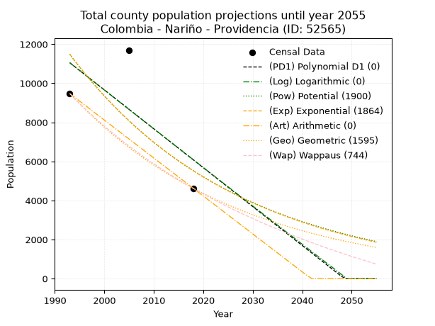
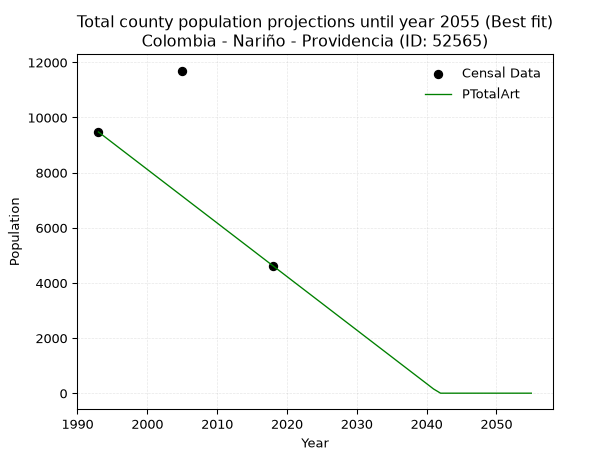
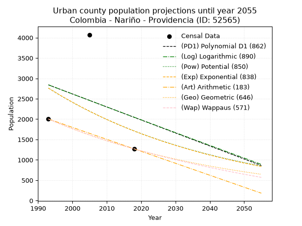
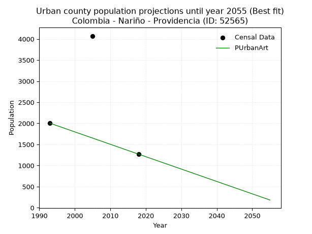
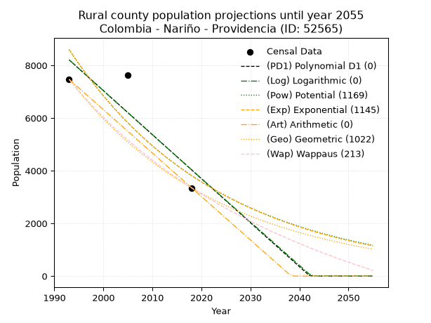
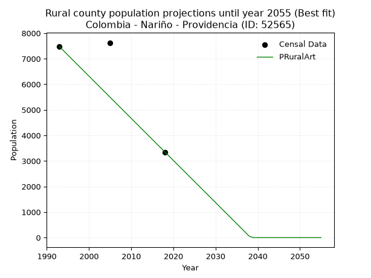

<div align="center">


</div>

# _“Population and Public Services Demand Projections (PPSD) until Year 2050 for Colombia - Nariño - Providencia (ID: 52565)”_
Keywords: `population` `public-service` `projection` `lineal` `polynomial` `logarithmic` `potential` `exponential` `arithmetic` `geometric` `wappaus` `dane` `colombia` `south-america`

PPSD are analytical estimates used by governments and planners to anticipate future changes in population size, age distribution, and the resulting community needs for utilities, healthcare, education, and infrastructure as sizing future water treatment facilities, electrical grids, and road networks based on spatial growth.

> **General running parameters**: • app_version: _v20260806_. • Python version: _3.14.7_. • Pandas version: _3.0.5_. • NumPy version: _2.5.1_. • Creates, save and include plots into reports (create_plot): _False_. • Projection until year: _2050_. • Process polynomial degree 2 and up: _False_. • Process Wappaus: _True_. • Process Wappaus: _True_. • Set negative values to zero: _True_. • Set infinite values to zero: _True_. • Drop dataset notes: _True_. 
<div align="center">

Dynamic map: [:earth_americas:Google](http://maps.google.com/maps?q=1.23781408,-77.5967943) [:earth_americas:OSM](https://www.openstreetmap.org/#map=18/1.23781408/-77.5967943&layers=P) [:earth_americas:Bing](https://www.bing.com/maps?cp=1.23781408~-77.5967943&lvl=18) [:earth_americas:Apple](https://maps.apple.com/frame?center=1.23781408%2C-77.5967943&span=0.003%2C0.006)

</div>


<div align="center">

```geojson
{
  "type": "Feature",
  "geometry": {
    "type": "Point", 
    "coordinates": [-77.5967943, 1.23781408]
  }, 
  "properties": {
    "Name": "Colombia - Nariño - Providencia (ID: 52565)"
  }
}
```

</div>


## 0. Census Data (3 records)

Census data are official statistics collected by a government about the people and housing in a country. They usually include counts of total population, age, sex, race, income, education, and jobs.

📅Global census file: [Population.xlsx](../data/Population.xlsx)

| Source   |   Year |   CountryID | CountryName   |   StateID | StateName   |   CountyID | CountyName   |   PTotal |   PUrban |   PRural |
|:---------|-------:|------------:|:--------------|----------:|:------------|-----------:|:-------------|---------:|---------:|---------:|
| DANE     |   1993 |          57 | Colombia      |        52 | Nariño      |      52565 | Providencia  |     9474 |     2003 |     7471 |
| DANE     |   2005 |          57 | Colombia      |        52 | Nariño      |      52565 | Providencia  |    11699 |     4072 |     7627 |
| DANE     |   2018 |          57 | Colombia      |        52 | Nariño      |      52565 | Providencia  |     4619 |     1269 |     3350 |

> 🔥Some records could had specific notes about the registered values or the corresponding urban or rural distribution.

## 1. Total

### 1.1. Coefficients and Parameters

* (PD1) Polynomial Deg 1: -199.0565031982998, 407771.97441365704 (lineal)
* (Log) Logarithmic: -398460.52409723995, 3038312.8954146323
* (Pow) Potential: -58.72523589797841, 197.82443171753633
* (Exp) Exponential: -0.029327425521942695, 2.7828135849996135e+29
* (Art) Arithmetic: Year diff. 2018 - 1993 = 25, Population diff. 4619 - 9474 = -4855, Annual growth = -194.2
* (Geo) Geometric: Year diff. 2018 - 1993 = 25, Population diff. 4619 - 9474 = -4855, Annual growth % = -0.02832599727717633
* (Wap) Wappaus: i = -2.7559781451784575, Condition values only valid for < 200)

<sub>
Wappaus condition values: ['-0.00', '-2.76', '-5.51', '-8.27', '-11.02', '-13.78', '-16.54', '-19.29', '-22.05', '-24.80', '-27.56', '-30.32', '-33.07', '-35.83', '-38.58', '-41.34', '-44.10', '-46.85', '-49.61', '-52.36', '-55.12', '-57.88', '-60.63', '-63.39', '-66.14', '-68.90', '-71.66', '-74.41', '-77.17', '-79.92', '-82.68', '-85.44', '-88.19', '-90.95', '-93.70', '-96.46', '-99.22', '-101.97', '-104.73', '-107.48', '-110.24', '-113.00', '-115.75', '-118.51', '-121.26', '-124.02', '-126.77', '-129.53', '-132.29', '-135.04', '-137.80', '-140.55', '-143.31', '-146.07', '-148.82', '-151.58', '-154.33', '-157.09']
</sub>


### 1.2. Projected Dataset

|   Year |   CountyID |   PTotalPD1 |   PTotalLog |   PTotalPow |   PTotalExp |   PTotalArt |   PTotalGeo |   PTotalWap |
|-------:|-----------:|------------:|------------:|------------:|------------:|------------:|------------:|------------:|
|   1993 |      52565 |       11052 |       11050 |       11484 |       11486 |        9474 |        9474 |        9474 |
|   1994 |      52565 |       10853 |       10850 |       11150 |       11154 |        9280 |        9206 |        9216 |
|   1995 |      52565 |       10654 |       10651 |       10827 |       10832 |        9086 |        8945 |        8966 |
|   1996 |      52565 |       10455 |       10451 |       10513 |       10518 |        8891 |        8692 |        8722 |
|   1997 |      52565 |       10256 |       10251 |       10208 |       10214 |        8697 |        8445 |        8484 |
|   1998 |      52565 |       10057 |       10052 |        9913 |        9919 |        8503 |        8206 |        8253 |
|   1999 |      52565 |        9858 |        9853 |        9625 |        9633 |        8309 |        7974 |        8027 |
|   2000 |      52565 |        9659 |        9653 |        9347 |        9354 |        8115 |        7748 |        7807 |
|   2001 |      52565 |        9460 |        9454 |        9076 |        9084 |        7920 |        7528 |        7593 |
|   2002 |      52565 |        9261 |        9255 |        8814 |        8821 |        7726 |        7315 |        7383 |
|   2003 |      52565 |        9062 |        9056 |        8559 |        8566 |        7532 |        7108 |        7179 |
|   2004 |      52565 |        8863 |        8857 |        8312 |        8319 |        7338 |        6907 |        6980 |
|   2005 |      52565 |        8664 |        8658 |        8072 |        8078 |        7144 |        6711 |        6785 |
|   2006 |      52565 |        8465 |        8460 |        7839 |        7845 |        6949 |        6521 |        6595 |
|   2007 |      52565 |        8266 |        8261 |        7613 |        7618 |        6755 |        6336 |        6410 |
|   2008 |      52565 |        8067 |        8063 |        7394 |        7398 |        6561 |        6157 |        6228 |
|   2009 |      52565 |        7867 |        7864 |        7181 |        7184 |        6367 |        5982 |        6051 |
|   2010 |      52565 |        7668 |        7666 |        6974 |        6977 |        6173 |        5813 |        5878 |
|   2011 |      52565 |        7469 |        7468 |        6773 |        6775 |        5978 |        5648 |        5708 |
|   2012 |      52565 |        7270 |        7270 |        6578 |        6579 |        5784 |        5488 |        5542 |
|   2013 |      52565 |        7071 |        7072 |        6389 |        6389 |        5590 |        5333 |        5380 |
|   2014 |      52565 |        6872 |        6874 |        6205 |        6204 |        5396 |        5182 |        5221 |
|   2015 |      52565 |        6673 |        6676 |        6027 |        6025 |        5202 |        5035 |        5066 |
|   2016 |      52565 |        6474 |        6478 |        5854 |        5851 |        5007 |        4892 |        4914 |
|   2017 |      52565 |        6275 |        6281 |        5686 |        5682 |        4813 |        4754 |        4765 |
|   2018 |      52565 |        6076 |        6083 |        5523 |        5518 |        4619 |        4619 |        4619 |
|   2019 |      52565 |        5877 |        5886 |        5364 |        5358 |        4425 |        4488 |        4476 |
|   2020 |      52565 |        5678 |        5689 |        5211 |        5203 |        4231 |        4361 |        4336 |
|   2021 |      52565 |        5479 |        5491 |        5061 |        5053 |        4036 |        4238 |        4199 |
|   2022 |      52565 |        5280 |        5294 |        4916 |        4907 |        3842 |        4117 |        4064 |
|   2023 |      52565 |        5081 |        5097 |        4776 |        4765 |        3648 |        4001 |        3932 |
|   2024 |      52565 |        4882 |        4900 |        4639 |        4627 |        3454 |        3888 |        3803 |
|   2025 |      52565 |        4683 |        4703 |        4507 |        4494 |        3260 |        3777 |        3676 |
|   2026 |      52565 |        4483 |        4507 |        4378 |        4364 |        3065 |        3670 |        3551 |
|   2027 |      52565 |        4284 |        4310 |        4253 |        4238 |        2871 |        3566 |        3429 |
|   2028 |      52565 |        4085 |        4114 |        4131 |        4115 |        2677 |        3465 |        3309 |
|   2029 |      52565 |        3886 |        3917 |        4013 |        3996 |        2483 |        3367 |        3191 |
|   2030 |      52565 |        3687 |        3721 |        3899 |        3881 |        2289 |        3272 |        3076 |
|   2031 |      52565 |        3488 |        3525 |        3788 |        3768 |        2094 |        3179 |        2962 |
|   2032 |      52565 |        3289 |        3328 |        3680 |        3660 |        1900 |        3089 |        2851 |
|   2033 |      52565 |        3090 |        3132 |        3575 |        3554 |        1706 |        3002 |        2741 |
|   2034 |      52565 |        2891 |        2936 |        3473 |        3451 |        1512 |        2917 |        2634 |
|   2035 |      52565 |        2692 |        2741 |        3374 |        3351 |        1318 |        2834 |        2528 |
|   2036 |      52565 |        2493 |        2545 |        3279 |        3254 |        1123 |        2754 |        2424 |
|   2037 |      52565 |        2294 |        2349 |        3185 |        3160 |         929 |        2676 |        2322 |
|   2038 |      52565 |        2095 |        2154 |        3095 |        3069 |         735 |        2600 |        2222 |
|   2039 |      52565 |        1896 |        1958 |        3007 |        2980 |         541 |        2526 |        2123 |
|   2040 |      52565 |        1697 |        1763 |        2922 |        2894 |         347 |        2455 |        2026 |
|   2041 |      52565 |        1498 |        1567 |        2839 |        2811 |         152 |        2385 |        1931 |
|   2042 |      52565 |        1299 |        1372 |        2758 |        2729 |           0 |        2318 |        1837 |
|   2043 |      52565 |        1100 |        1177 |        2680 |        2650 |           0 |        2252 |        1745 |
|   2044 |      52565 |         900 |         982 |        2604 |        2574 |           0 |        2188 |        1654 |
|   2045 |      52565 |         701 |         787 |        2530 |        2499 |           0 |        2126 |        1564 |
|   2046 |      52565 |         502 |         593 |        2459 |        2427 |           0 |        2066 |        1476 |
|   2047 |      52565 |         303 |         398 |        2389 |        2357 |           0 |        2007 |        1390 |
|   2048 |      52565 |         104 |         203 |        2322 |        2289 |           0 |        1951 |        1305 |
|   2049 |      52565 |           0 |           9 |        2256 |        2223 |           0 |        1895 |        1221 |
|   2050 |      52565 |           0 |           0 |        2192 |        2159 |           0 |        1842 |        1138 |
<div align="center">

</img>

</div>


### 1.3. Best fit with absolute and relative error (%)

Relative error puts that difference into context by dividing the absolute error by the true value, creating a unitless ratio or percentage that shows the scale of the mistake.

Absolute and relative error

|   Year | Source   |   CountryID | CountryName   |   StateID | StateName   |   CountyID_x | CountyName   |   PTotal |   PUrban |   PRural |   CountyID_y |   PTotalPD1 |   PTotalLog |   PTotalPow |   PTotalExp |   PTotalArt |   PTotalGeo |   PTotalWap |   PTotalPD1AbsError |   PTotalLogAbsError |   PTotalPowAbsError |   PTotalExpAbsError |   PTotalArtAbsError |   PTotalGeoAbsError |   PTotalWapAbsError |   PTotalPD1RelError |   PTotalLogRelError |   PTotalPowRelError |   PTotalExpRelError |   PTotalArtRelError |   PTotalGeoRelError |   PTotalWapRelError |
|-------:|:---------|------------:|:--------------|----------:|:------------|-------------:|:-------------|---------:|---------:|---------:|-------------:|------------:|------------:|------------:|------------:|------------:|------------:|------------:|--------------------:|--------------------:|--------------------:|--------------------:|--------------------:|--------------------:|--------------------:|--------------------:|--------------------:|--------------------:|--------------------:|--------------------:|--------------------:|--------------------:|
|   1993 | DANE     |          57 | Colombia      |        52 | Nariño      |        52565 | Providencia  |     9474 |     2003 |     7471 |        52565 |       11052 |       11050 |       11484 |       11486 |        9474 |        9474 |        9474 |                1578 |                1576 |                2010 |                2012 |                   0 |                   0 |                   0 |             16.6561 |             16.635  |             21.216  |             21.2371 |               0     |              0      |              0      |
|   2005 | DANE     |          57 | Colombia      |        52 | Nariño      |        52565 | Providencia  |    11699 |     4072 |     7627 |        52565 |        8664 |        8658 |        8072 |        8078 |        7144 |        6711 |        6785 |                3035 |                3041 |                3627 |                3621 |                4555 |                4988 |                4914 |             25.9424 |             25.9937 |             31.0026 |             30.9514 |              38.935 |             42.6361 |             42.0036 |
|   2018 | DANE     |          57 | Colombia      |        52 | Nariño      |        52565 | Providencia  |     4619 |     1269 |     3350 |        52565 |        6076 |        6083 |        5523 |        5518 |        4619 |        4619 |        4619 |                1457 |                1464 |                 904 |                 899 |                   0 |                   0 |                   0 |             31.5436 |             31.6952 |             19.5713 |             19.4631 |               0     |              0      |              0      |

Relative error mean

| Method    |   RelError | Best   |
|:----------|-----------:|:-------|
| PTotalPD1 |    24.714  |        |
| PTotalLog |    24.7746 |        |
| PTotalPow |    23.93   |        |
| PTotalExp |    23.8838 |        |
| PTotalArt |    12.9783 | True   |
| PTotalGeo |    14.212  |        |
| PTotalWap |    14.0012 |        |

💙Best method: _**PTotalArt**_
<div align="center">

</img>

</div>


### 1.4. Fresh water supply demand in liters per capita per day (lpcd)

The fresh water supply demand typically ranges from 100 to 300 liters per capita per day (lpcd) for standard domestic and municipal planning, though absolute survival minimums set by the World Health Organization are as low as 7.5 to 20 liters per day, and total consumption in high-income nations can exceed 400 liters.

> `CZ`: Level in meters above the sea level (masl).<br> `WS`: Fresh water supply demand in liters per capita per day (lpcd or l/h/d).<br> `WSAll`: Zonal fresh water supply demand in liters per second (l/s).<br> `A`: Zonal area in square meters.

Reference values (RAS Colombia)

|    CZ |   WS |
|------:|-----:|
|  1000 |  120 |
|  2000 |  130 |
| 99999 |  140 |

County shapefile geometry properties and water supply values

|   CountyID |      ATotal |   CZTotal |   WSTotal |
|-----------:|------------:|----------:|----------:|
|      52565 | 4.00014e+07 |   2508.04 |       140 |

Projected values for best method: PTotalArt

|   CountyID |   Year |   PTotalArt |   WSTotal |   WSTotalAll |
|-----------:|-------:|------------:|----------:|-------------:|
|      52565 |   1993 |        9474 |       140 |    15.3514   |
|      52565 |   1994 |        9280 |       140 |    15.037    |
|      52565 |   1995 |        9086 |       140 |    14.7227   |
|      52565 |   1996 |        8891 |       140 |    14.4067   |
|      52565 |   1997 |        8697 |       140 |    14.0924   |
|      52565 |   1998 |        8503 |       140 |    13.778    |
|      52565 |   1999 |        8309 |       140 |    13.4637   |
|      52565 |   2000 |        8115 |       140 |    13.1493   |
|      52565 |   2001 |        7920 |       140 |    12.8333   |
|      52565 |   2002 |        7726 |       140 |    12.519    |
|      52565 |   2003 |        7532 |       140 |    12.2046   |
|      52565 |   2004 |        7338 |       140 |    11.8903   |
|      52565 |   2005 |        7144 |       140 |    11.5759   |
|      52565 |   2006 |        6949 |       140 |    11.26     |
|      52565 |   2007 |        6755 |       140 |    10.9456   |
|      52565 |   2008 |        6561 |       140 |    10.6312   |
|      52565 |   2009 |        6367 |       140 |    10.3169   |
|      52565 |   2010 |        6173 |       140 |    10.0025   |
|      52565 |   2011 |        5978 |       140 |     9.68657  |
|      52565 |   2012 |        5784 |       140 |     9.37222  |
|      52565 |   2013 |        5590 |       140 |     9.05787  |
|      52565 |   2014 |        5396 |       140 |     8.74352  |
|      52565 |   2015 |        5202 |       140 |     8.42917  |
|      52565 |   2016 |        5007 |       140 |     8.11319  |
|      52565 |   2017 |        4813 |       140 |     7.79884  |
|      52565 |   2018 |        4619 |       140 |     7.48449  |
|      52565 |   2019 |        4425 |       140 |     7.17014  |
|      52565 |   2020 |        4231 |       140 |     6.85579  |
|      52565 |   2021 |        4036 |       140 |     6.53981  |
|      52565 |   2022 |        3842 |       140 |     6.22546  |
|      52565 |   2023 |        3648 |       140 |     5.91111  |
|      52565 |   2024 |        3454 |       140 |     5.59676  |
|      52565 |   2025 |        3260 |       140 |     5.28241  |
|      52565 |   2026 |        3065 |       140 |     4.96644  |
|      52565 |   2027 |        2871 |       140 |     4.65208  |
|      52565 |   2028 |        2677 |       140 |     4.33773  |
|      52565 |   2029 |        2483 |       140 |     4.02338  |
|      52565 |   2030 |        2289 |       140 |     3.70903  |
|      52565 |   2031 |        2094 |       140 |     3.39306  |
|      52565 |   2032 |        1900 |       140 |     3.0787   |
|      52565 |   2033 |        1706 |       140 |     2.76435  |
|      52565 |   2034 |        1512 |       140 |     2.45     |
|      52565 |   2035 |        1318 |       140 |     2.13565  |
|      52565 |   2036 |        1123 |       140 |     1.81968  |
|      52565 |   2037 |         929 |       140 |     1.50532  |
|      52565 |   2038 |         735 |       140 |     1.19097  |
|      52565 |   2039 |         541 |       140 |     0.87662  |
|      52565 |   2040 |         347 |       140 |     0.562269 |
|      52565 |   2041 |         152 |       140 |     0.246296 |
|      52565 |   2042 |           0 |       140 |     0        |
|      52565 |   2043 |           0 |       140 |     0        |
|      52565 |   2044 |           0 |       140 |     0        |
|      52565 |   2045 |           0 |       140 |     0        |
|      52565 |   2046 |           0 |       140 |     0        |
|      52565 |   2047 |           0 |       140 |     0        |
|      52565 |   2048 |           0 |       140 |     0        |
|      52565 |   2049 |           0 |       140 |     0        |
|      52565 |   2050 |           0 |       140 |     0        |

## 2. Urban

### 2.1. Coefficients and Parameters

* (PD1) Polynomial Deg 1: -31.941364605544837, 66501.08315565257 (lineal)
* (Log) Logarithmic: -63657.45261354329, 486470.7906206302
* (Pow) Potential: -38.4456860569541, 130.29292872774096
* (Exp) Exponential: -0.019246619621236177, 1.2597892870034591e+20
* (Art) Arithmetic: Year diff. 2018 - 1993 = 25, Population diff. 1269 - 2003 = -734, Annual growth = -29.36
* (Geo) Geometric: Year diff. 2018 - 1993 = 25, Population diff. 1269 - 2003 = -734, Annual growth % = -0.018091031197211782
* (Wap) Wappaus: i = -1.7946210268948655, Condition values only valid for < 200)

<sub>
Wappaus condition values: ['-0.00', '-1.79', '-3.59', '-5.38', '-7.18', '-8.97', '-10.77', '-12.56', '-14.36', '-16.15', '-17.95', '-19.74', '-21.54', '-23.33', '-25.12', '-26.92', '-28.71', '-30.51', '-32.30', '-34.10', '-35.89', '-37.69', '-39.48', '-41.28', '-43.07', '-44.87', '-46.66', '-48.45', '-50.25', '-52.04', '-53.84', '-55.63', '-57.43', '-59.22', '-61.02', '-62.81', '-64.61', '-66.40', '-68.20', '-69.99', '-71.78', '-73.58', '-75.37', '-77.17', '-78.96', '-80.76', '-82.55', '-84.35', '-86.14', '-87.94', '-89.73', '-91.53', '-93.32', '-95.11', '-96.91', '-98.70', '-100.50', '-102.29']
</sub>


### 2.2. Projected Dataset

|   Year |   CountyID |   PUrbanPD1 |   PUrbanLog |   PUrbanPow |   PUrbanExp |   PUrbanArt |   PUrbanGeo |   PUrbanWap |
|-------:|-----------:|------------:|------------:|------------:|------------:|------------:|------------:|------------:|
|   1993 |      52565 |        2842 |        2840 |        2761 |        2763 |        2003 |        2003 |        2003 |
|   1994 |      52565 |        2810 |        2808 |        2709 |        2710 |        1974 |        1967 |        1967 |
|   1995 |      52565 |        2778 |        2776 |        2657 |        2659 |        1944 |        1931 |        1932 |
|   1996 |      52565 |        2746 |        2744 |        2606 |        2608 |        1915 |        1896 |        1898 |
|   1997 |      52565 |        2714 |        2712 |        2556 |        2558 |        1886 |        1862 |        1864 |
|   1998 |      52565 |        2682 |        2680 |        2508 |        2510 |        1856 |        1828 |        1831 |
|   1999 |      52565 |        2650 |        2649 |        2460 |        2462 |        1827 |        1795 |        1798 |
|   2000 |      52565 |        2618 |        2617 |        2413 |        2415 |        1797 |        1763 |        1766 |
|   2001 |      52565 |        2586 |        2585 |        2367 |        2369 |        1768 |        1731 |        1735 |
|   2002 |      52565 |        2554 |        2553 |        2322 |        2324 |        1739 |        1700 |        1704 |
|   2003 |      52565 |        2523 |        2521 |        2278 |        2279 |        1709 |        1669 |        1673 |
|   2004 |      52565 |        2491 |        2490 |        2235 |        2236 |        1680 |        1639 |        1643 |
|   2005 |      52565 |        2459 |        2458 |        2192 |        2193 |        1651 |        1609 |        1614 |
|   2006 |      52565 |        2427 |        2426 |        2151 |        2152 |        1621 |        1580 |        1585 |
|   2007 |      52565 |        2395 |        2394 |        2110 |        2111 |        1592 |        1551 |        1556 |
|   2008 |      52565 |        2363 |        2363 |        2070 |        2070 |        1563 |        1523 |        1528 |
|   2009 |      52565 |        2331 |        2331 |        2030 |        2031 |        1533 |        1496 |        1500 |
|   2010 |      52565 |        2299 |        2299 |        1992 |        1992 |        1504 |        1469 |        1473 |
|   2011 |      52565 |        2267 |        2268 |        1954 |        1954 |        1475 |        1442 |        1446 |
|   2012 |      52565 |        2235 |        2236 |        1917 |        1917 |        1445 |        1416 |        1420 |
|   2013 |      52565 |        2203 |        2204 |        1881 |        1880 |        1416 |        1390 |        1393 |
|   2014 |      52565 |        2171 |        2173 |        1845 |        1844 |        1386 |        1365 |        1368 |
|   2015 |      52565 |        2139 |        2141 |        1811 |        1809 |        1357 |        1340 |        1343 |
|   2016 |      52565 |        2107 |        2109 |        1776 |        1775 |        1328 |        1316 |        1318 |
|   2017 |      52565 |        2075 |        2078 |        1743 |        1741 |        1298 |        1292 |        1293 |
|   2018 |      52565 |        2043 |        2046 |        1710 |        1708 |        1269 |        1269 |        1269 |
|   2019 |      52565 |        2011 |        2015 |        1678 |        1675 |        1240 |        1246 |        1245 |
|   2020 |      52565 |        1980 |        1983 |        1646 |        1643 |        1210 |        1224 |        1222 |
|   2021 |      52565 |        1948 |        1952 |        1615 |        1612 |        1181 |        1201 |        1199 |
|   2022 |      52565 |        1916 |        1920 |        1585 |        1581 |        1152 |        1180 |        1176 |
|   2023 |      52565 |        1884 |        1889 |        1555 |        1551 |        1122 |        1158 |        1153 |
|   2024 |      52565 |        1852 |        1857 |        1525 |        1522 |        1093 |        1137 |        1131 |
|   2025 |      52565 |        1820 |        1826 |        1497 |        1493 |        1063 |        1117 |        1109 |
|   2026 |      52565 |        1788 |        1794 |        1469 |        1464 |        1034 |        1097 |        1088 |
|   2027 |      52565 |        1756 |        1763 |        1441 |        1436 |        1005 |        1077 |        1067 |
|   2028 |      52565 |        1724 |        1732 |        1414 |        1409 |         975 |        1057 |        1046 |
|   2029 |      52565 |        1692 |        1700 |        1387 |        1382 |         946 |        1038 |        1025 |
|   2030 |      52565 |        1660 |        1669 |        1361 |        1356 |         917 |        1019 |        1004 |
|   2031 |      52565 |        1628 |        1638 |        1336 |        1330 |         887 |        1001 |         984 |
|   2032 |      52565 |        1596 |        1606 |        1311 |        1304 |         858 |         983 |         965 |
|   2033 |      52565 |        1564 |        1575 |        1286 |        1280 |         829 |         965 |         945 |
|   2034 |      52565 |        1532 |        1544 |        1262 |        1255 |         799 |         948 |         926 |
|   2035 |      52565 |        1500 |        1512 |        1239 |        1231 |         770 |         930 |         906 |
|   2036 |      52565 |        1468 |        1481 |        1215 |        1208 |         741 |         914 |         888 |
|   2037 |      52565 |        1437 |        1450 |        1193 |        1185 |         711 |         897 |         869 |
|   2038 |      52565 |        1405 |        1419 |        1170 |        1162 |         682 |         881 |         851 |
|   2039 |      52565 |        1373 |        1387 |        1148 |        1140 |         652 |         865 |         833 |
|   2040 |      52565 |        1341 |        1356 |        1127 |        1118 |         623 |         849 |         815 |
|   2041 |      52565 |        1309 |        1325 |        1106 |        1097 |         594 |         834 |         797 |
|   2042 |      52565 |        1277 |        1294 |        1085 |        1076 |         564 |         819 |         780 |
|   2043 |      52565 |        1245 |        1263 |        1065 |        1056 |         535 |         804 |         762 |
|   2044 |      52565 |        1213 |        1231 |        1045 |        1035 |         506 |         789 |         745 |
|   2045 |      52565 |        1181 |        1200 |        1026 |        1016 |         476 |         775 |         728 |
|   2046 |      52565 |        1149 |        1169 |        1007 |         996 |         447 |         761 |         712 |
|   2047 |      52565 |        1117 |        1138 |         988 |         977 |         418 |         747 |         695 |
|   2048 |      52565 |        1085 |        1107 |         970 |         959 |         388 |         734 |         679 |
|   2049 |      52565 |        1053 |        1076 |         952 |         940 |         359 |         721 |         663 |
|   2050 |      52565 |        1021 |        1045 |         934 |         922 |         329 |         708 |         647 |
<div align="center">

</img>

</div>


### 2.3. Best fit with absolute and relative error (%)

Relative error puts that difference into context by dividing the absolute error by the true value, creating a unitless ratio or percentage that shows the scale of the mistake.

Absolute and relative error

|   Year | Source   |   CountryID | CountryName   |   StateID | StateName   |   CountyID_x | CountyName   |   PTotal |   PUrban |   PRural |   CountyID_y |   PUrbanPD1 |   PUrbanLog |   PUrbanPow |   PUrbanExp |   PUrbanArt |   PUrbanGeo |   PUrbanWap |   PUrbanPD1AbsError |   PUrbanLogAbsError |   PUrbanPowAbsError |   PUrbanExpAbsError |   PUrbanArtAbsError |   PUrbanGeoAbsError |   PUrbanWapAbsError |   PUrbanPD1RelError |   PUrbanLogRelError |   PUrbanPowRelError |   PUrbanExpRelError |   PUrbanArtRelError |   PUrbanGeoRelError |   PUrbanWapRelError |
|-------:|:---------|------------:|:--------------|----------:|:------------|-------------:|:-------------|---------:|---------:|---------:|-------------:|------------:|------------:|------------:|------------:|------------:|------------:|------------:|--------------------:|--------------------:|--------------------:|--------------------:|--------------------:|--------------------:|--------------------:|--------------------:|--------------------:|--------------------:|--------------------:|--------------------:|--------------------:|--------------------:|
|   1993 | DANE     |          57 | Colombia      |        52 | Nariño      |        52565 | Providencia  |     9474 |     2003 |     7471 |        52565 |        2842 |        2840 |        2761 |        2763 |        2003 |        2003 |        2003 |                 839 |                 837 |                 758 |                 760 |                   0 |                   0 |                   0 |             41.8872 |             41.7873 |             37.8432 |             37.9431 |              0      |              0      |              0      |
|   2005 | DANE     |          57 | Colombia      |        52 | Nariño      |        52565 | Providencia  |    11699 |     4072 |     7627 |        52565 |        2459 |        2458 |        2192 |        2193 |        1651 |        1609 |        1614 |                1613 |                1614 |                1880 |                1879 |                2421 |                2463 |                2458 |             39.612  |             39.6365 |             46.169  |             46.1444 |             59.4548 |             60.4862 |             60.3635 |
|   2018 | DANE     |          57 | Colombia      |        52 | Nariño      |        52565 | Providencia  |     4619 |     1269 |     3350 |        52565 |        2043 |        2046 |        1710 |        1708 |        1269 |        1269 |        1269 |                 774 |                 777 |                 441 |                 439 |                   0 |                   0 |                   0 |             60.9929 |             61.2293 |             34.7518 |             34.5942 |              0      |              0      |              0      |

Relative error mean

| Method    |   RelError | Best   |
|:----------|-----------:|:-------|
| PUrbanPD1 |    47.4974 |        |
| PUrbanLog |    47.5511 |        |
| PUrbanPow |    39.588  |        |
| PUrbanExp |    39.5606 |        |
| PUrbanArt |    19.8183 | True   |
| PUrbanGeo |    20.1621 |        |
| PUrbanWap |    20.1212 |        |

💙Best method: _**PUrbanArt**_
<div align="center">

</img>

</div>


### 2.4. Fresh water supply demand in liters per capita per day (lpcd)

The fresh water supply demand typically ranges from 100 to 300 liters per capita per day (lpcd) for standard domestic and municipal planning, though absolute survival minimums set by the World Health Organization are as low as 7.5 to 20 liters per day, and total consumption in high-income nations can exceed 400 liters.

> `CZ`: Level in meters above the sea level (masl).<br> `WS`: Fresh water supply demand in liters per capita per day (lpcd or l/h/d).<br> `WSAll`: Zonal fresh water supply demand in liters per second (l/s).<br> `A`: Zonal area in square meters.

Reference values (RAS Colombia)

|    CZ |   WS |
|------:|-----:|
|  1000 |  120 |
|  2000 |  130 |
| 99999 |  140 |

County shapefile geometry properties and water supply values

|   CountyID |   AUrban |   CZUrban |   WSUrban |
|-----------:|---------:|----------:|----------:|
|      52565 |   269900 |    2332.9 |       140 |

Projected values for best method: PUrbanArt

|   CountyID |   Year |   PUrbanArt |   WSUrban |   WSUrbanAll |
|-----------:|-------:|------------:|----------:|-------------:|
|      52565 |   1993 |        2003 |       140 |     3.2456   |
|      52565 |   1994 |        1974 |       140 |     3.19861  |
|      52565 |   1995 |        1944 |       140 |     3.15     |
|      52565 |   1996 |        1915 |       140 |     3.10301  |
|      52565 |   1997 |        1886 |       140 |     3.05602  |
|      52565 |   1998 |        1856 |       140 |     3.00741  |
|      52565 |   1999 |        1827 |       140 |     2.96042  |
|      52565 |   2000 |        1797 |       140 |     2.91181  |
|      52565 |   2001 |        1768 |       140 |     2.86481  |
|      52565 |   2002 |        1739 |       140 |     2.81782  |
|      52565 |   2003 |        1709 |       140 |     2.76921  |
|      52565 |   2004 |        1680 |       140 |     2.72222  |
|      52565 |   2005 |        1651 |       140 |     2.67523  |
|      52565 |   2006 |        1621 |       140 |     2.62662  |
|      52565 |   2007 |        1592 |       140 |     2.57963  |
|      52565 |   2008 |        1563 |       140 |     2.53264  |
|      52565 |   2009 |        1533 |       140 |     2.48403  |
|      52565 |   2010 |        1504 |       140 |     2.43704  |
|      52565 |   2011 |        1475 |       140 |     2.39005  |
|      52565 |   2012 |        1445 |       140 |     2.34144  |
|      52565 |   2013 |        1416 |       140 |     2.29444  |
|      52565 |   2014 |        1386 |       140 |     2.24583  |
|      52565 |   2015 |        1357 |       140 |     2.19884  |
|      52565 |   2016 |        1328 |       140 |     2.15185  |
|      52565 |   2017 |        1298 |       140 |     2.10324  |
|      52565 |   2018 |        1269 |       140 |     2.05625  |
|      52565 |   2019 |        1240 |       140 |     2.00926  |
|      52565 |   2020 |        1210 |       140 |     1.96065  |
|      52565 |   2021 |        1181 |       140 |     1.91366  |
|      52565 |   2022 |        1152 |       140 |     1.86667  |
|      52565 |   2023 |        1122 |       140 |     1.81806  |
|      52565 |   2024 |        1093 |       140 |     1.77106  |
|      52565 |   2025 |        1063 |       140 |     1.72245  |
|      52565 |   2026 |        1034 |       140 |     1.67546  |
|      52565 |   2027 |        1005 |       140 |     1.62847  |
|      52565 |   2028 |         975 |       140 |     1.57986  |
|      52565 |   2029 |         946 |       140 |     1.53287  |
|      52565 |   2030 |         917 |       140 |     1.48588  |
|      52565 |   2031 |         887 |       140 |     1.43727  |
|      52565 |   2032 |         858 |       140 |     1.39028  |
|      52565 |   2033 |         829 |       140 |     1.34329  |
|      52565 |   2034 |         799 |       140 |     1.29468  |
|      52565 |   2035 |         770 |       140 |     1.24769  |
|      52565 |   2036 |         741 |       140 |     1.20069  |
|      52565 |   2037 |         711 |       140 |     1.15208  |
|      52565 |   2038 |         682 |       140 |     1.10509  |
|      52565 |   2039 |         652 |       140 |     1.05648  |
|      52565 |   2040 |         623 |       140 |     1.00949  |
|      52565 |   2041 |         594 |       140 |     0.9625   |
|      52565 |   2042 |         564 |       140 |     0.913889 |
|      52565 |   2043 |         535 |       140 |     0.866898 |
|      52565 |   2044 |         506 |       140 |     0.819907 |
|      52565 |   2045 |         476 |       140 |     0.771296 |
|      52565 |   2046 |         447 |       140 |     0.724306 |
|      52565 |   2047 |         418 |       140 |     0.677315 |
|      52565 |   2048 |         388 |       140 |     0.628704 |
|      52565 |   2049 |         359 |       140 |     0.581713 |
|      52565 |   2050 |         329 |       140 |     0.533102 |

## 3. Rural

### 3.1. Coefficients and Parameters

* (PD1) Polynomial Deg 1: -167.11513859275496, 341270.8912580045 (lineal)
* (Log) Logarithmic: -334803.07148369687, 2551842.104794003
* (Pow) Potential: -65.14346228278838, 218.87575899369807
* (Exp) Exponential: -0.032515212392477184, 1.1965385141898399e+32
* (Art) Arithmetic: Year diff. 2018 - 1993 = 25, Population diff. 3350 - 7471 = -4121, Annual growth = -164.84
* (Geo) Geometric: Year diff. 2018 - 1993 = 25, Population diff. 3350 - 7471 = -4121, Annual growth % = -0.031573549349993235
* (Wap) Wappaus: i = -3.0466685149246833, Condition values only valid for < 200)

<sub>
Wappaus condition values: ['-0.00', '-3.05', '-6.09', '-9.14', '-12.19', '-15.23', '-18.28', '-21.33', '-24.37', '-27.42', '-30.47', '-33.51', '-36.56', '-39.61', '-42.65', '-45.70', '-48.75', '-51.79', '-54.84', '-57.89', '-60.93', '-63.98', '-67.03', '-70.07', '-73.12', '-76.17', '-79.21', '-82.26', '-85.31', '-88.35', '-91.40', '-94.45', '-97.49', '-100.54', '-103.59', '-106.63', '-109.68', '-112.73', '-115.77', '-118.82', '-121.87', '-124.91', '-127.96', '-131.01', '-134.05', '-137.10', '-140.15', '-143.19', '-146.24', '-149.29', '-152.33', '-155.38', '-158.43', '-161.47', '-164.52', '-167.57', '-170.61', '-173.66']
</sub>


### 3.2. Projected Dataset

|   Year |   CountyID |   PRuralPD1 |   PRuralLog |   PRuralPow |   PRuralExp |   PRuralArt |   PRuralGeo |   PRuralWap |
|-------:|-----------:|------------:|------------:|------------:|------------:|------------:|------------:|------------:|
|   1993 |      52565 |        8210 |        8210 |        8599 |        8598 |        7471 |        7471 |        7471 |
|   1994 |      52565 |        8043 |        8043 |        8322 |        8323 |        7306 |        7235 |        7247 |
|   1995 |      52565 |        7876 |        7875 |        8055 |        8057 |        7141 |        7007 |        7029 |
|   1996 |      52565 |        7709 |        7707 |        7796 |        7799 |        6976 |        6785 |        6818 |
|   1997 |      52565 |        7542 |        7539 |        7546 |        7550 |        6812 |        6571 |        6613 |
|   1998 |      52565 |        7375 |        7372 |        7304 |        7308 |        6647 |        6364 |        6413 |
|   1999 |      52565 |        7208 |        7204 |        7069 |        7074 |        6482 |        6163 |        6220 |
|   2000 |      52565 |        7041 |        7037 |        6843 |        6848 |        6317 |        5968 |        6031 |
|   2001 |      52565 |        6873 |        6869 |        6624 |        6629 |        6152 |        5780 |        5848 |
|   2002 |      52565 |        6706 |        6702 |        6411 |        6417 |        5987 |        5597 |        5669 |
|   2003 |      52565 |        6539 |        6535 |        6206 |        6212 |        5823 |        5421 |        5496 |
|   2004 |      52565 |        6372 |        6368 |        6008 |        6013 |        5658 |        5249 |        5327 |
|   2005 |      52565 |        6205 |        6201 |        5816 |        5821 |        5493 |        5084 |        5162 |
|   2006 |      52565 |        6038 |        6034 |        5630 |        5634 |        5328 |        4923 |        5001 |
|   2007 |      52565 |        5871 |        5867 |        5450 |        5454 |        5163 |        4768 |        4845 |
|   2008 |      52565 |        5704 |        5700 |        5276 |        5280 |        4998 |        4617 |        4692 |
|   2009 |      52565 |        5537 |        5533 |        5108 |        5111 |        4834 |        4471 |        4543 |
|   2010 |      52565 |        5369 |        5367 |        4945 |        4947 |        4669 |        4330 |        4397 |
|   2011 |      52565 |        5202 |        5200 |        4787 |        4789 |        4504 |        4194 |        4256 |
|   2012 |      52565 |        5035 |        5034 |        4634 |        4636 |        4339 |        4061 |        4117 |
|   2013 |      52565 |        4868 |        4867 |        4487 |        4487 |        4174 |        3933 |        3982 |
|   2014 |      52565 |        4701 |        4701 |        4344 |        4344 |        4009 |        3809 |        3850 |
|   2015 |      52565 |        4534 |        4535 |        4206 |        4205 |        3845 |        3688 |        3720 |
|   2016 |      52565 |        4367 |        4369 |        4072 |        4070 |        3680 |        3572 |        3594 |
|   2017 |      52565 |        4200 |        4203 |        3943 |        3940 |        3515 |        3459 |        3471 |
|   2018 |      52565 |        4033 |        4037 |        3817 |        3814 |        3350 |        3350 |        3350 |
|   2019 |      52565 |        3865 |        3871 |        3696 |        3692 |        3185 |        3244 |        3232 |
|   2020 |      52565 |        3698 |        3705 |        3579 |        3574 |        3020 |        3142 |        3116 |
|   2021 |      52565 |        3531 |        3540 |        3465 |        3460 |        2855 |        3043 |        3003 |
|   2022 |      52565 |        3364 |        3374 |        3355 |        3349 |        2691 |        2947 |        2893 |
|   2023 |      52565 |        3197 |        3208 |        3249 |        3242 |        2526 |        2854 |        2784 |
|   2024 |      52565 |        3030 |        3043 |        3146 |        3138 |        2361 |        2763 |        2678 |
|   2025 |      52565 |        2863 |        2878 |        3046 |        3038 |        2196 |        2676 |        2574 |
|   2026 |      52565 |        2696 |        2712 |        2950 |        2941 |        2031 |        2592 |        2472 |
|   2027 |      52565 |        2529 |        2547 |        2857 |        2846 |        1866 |        2510 |        2373 |
|   2028 |      52565 |        2361 |        2382 |        2766 |        2755 |        1702 |        2431 |        2275 |
|   2029 |      52565 |        2194 |        2217 |        2679 |        2667 |        1537 |        2354 |        2179 |
|   2030 |      52565 |        2027 |        2052 |        2594 |        2582 |        1372 |        2280 |        2085 |
|   2031 |      52565 |        1860 |        1887 |        2512 |        2499 |        1207 |        2208 |        1993 |
|   2032 |      52565 |        1693 |        1722 |        2433 |        2419 |        1042 |        2138 |        1902 |
|   2033 |      52565 |        1526 |        1557 |        2356 |        2342 |         877 |        2070 |        1814 |
|   2034 |      52565 |        1359 |        1393 |        2282 |        2267 |         713 |        2005 |        1727 |
|   2035 |      52565 |        1192 |        1228 |        2210 |        2194 |         548 |        1942 |        1641 |
|   2036 |      52565 |        1024 |        1064 |        2141 |        2124 |         383 |        1880 |        1557 |
|   2037 |      52565 |         857 |         899 |        2073 |        2056 |         218 |        1821 |        1475 |
|   2038 |      52565 |         690 |         735 |        2008 |        1991 |          53 |        1764 |        1394 |
|   2039 |      52565 |         523 |         571 |        1945 |        1927 |           0 |        1708 |        1315 |
|   2040 |      52565 |         356 |         407 |        1884 |        1865 |           0 |        1654 |        1237 |
|   2041 |      52565 |         189 |         243 |        1824 |        1806 |           0 |        1602 |        1160 |
|   2042 |      52565 |          22 |          79 |        1767 |        1748 |           0 |        1551 |        1085 |
|   2043 |      52565 |           0 |           0 |        1712 |        1692 |           0 |        1502 |        1011 |
|   2044 |      52565 |           0 |           0 |        1658 |        1638 |           0 |        1455 |         938 |
|   2045 |      52565 |           0 |           0 |        1606 |        1585 |           0 |        1409 |         867 |
|   2046 |      52565 |           0 |           0 |        1556 |        1535 |           0 |        1364 |         796 |
|   2047 |      52565 |           0 |           0 |        1507 |        1486 |           0 |        1321 |         727 |
|   2048 |      52565 |           0 |           0 |        1460 |        1438 |           0 |        1280 |         659 |
|   2049 |      52565 |           0 |           0 |        1414 |        1392 |           0 |        1239 |         592 |
|   2050 |      52565 |           0 |           0 |        1370 |        1347 |           0 |        1200 |         527 |
<div align="center">

</img>

</div>


### 3.3. Best fit with absolute and relative error (%)

Relative error puts that difference into context by dividing the absolute error by the true value, creating a unitless ratio or percentage that shows the scale of the mistake.

Absolute and relative error

|   Year | Source   |   CountryID | CountryName   |   StateID | StateName   |   CountyID_x | CountyName   |   PTotal |   PUrban |   PRural |   CountyID_y |   PRuralPD1 |   PRuralLog |   PRuralPow |   PRuralExp |   PRuralArt |   PRuralGeo |   PRuralWap |   PRuralPD1AbsError |   PRuralLogAbsError |   PRuralPowAbsError |   PRuralExpAbsError |   PRuralArtAbsError |   PRuralGeoAbsError |   PRuralWapAbsError |   PRuralPD1RelError |   PRuralLogRelError |   PRuralPowRelError |   PRuralExpRelError |   PRuralArtRelError |   PRuralGeoRelError |   PRuralWapRelError |
|-------:|:---------|------------:|:--------------|----------:|:------------|-------------:|:-------------|---------:|---------:|---------:|-------------:|------------:|------------:|------------:|------------:|------------:|------------:|------------:|--------------------:|--------------------:|--------------------:|--------------------:|--------------------:|--------------------:|--------------------:|--------------------:|--------------------:|--------------------:|--------------------:|--------------------:|--------------------:|--------------------:|
|   1993 | DANE     |          57 | Colombia      |        52 | Nariño      |        52565 | Providencia  |     9474 |     2003 |     7471 |        52565 |        8210 |        8210 |        8599 |        8598 |        7471 |        7471 |        7471 |                 739 |                 739 |                1128 |                1127 |                   0 |                   0 |                   0 |             9.89158 |             9.89158 |             15.0984 |             15.085  |              0      |              0      |              0      |
|   2005 | DANE     |          57 | Colombia      |        52 | Nariño      |        52565 | Providencia  |    11699 |     4072 |     7627 |        52565 |        6205 |        6201 |        5816 |        5821 |        5493 |        5084 |        5162 |                1422 |                1426 |                1811 |                1806 |                2134 |                2543 |                2465 |            18.6443  |            18.6967  |             23.7446 |             23.679  |             27.9795 |             33.3421 |             32.3194 |
|   2018 | DANE     |          57 | Colombia      |        52 | Nariño      |        52565 | Providencia  |     4619 |     1269 |     3350 |        52565 |        4033 |        4037 |        3817 |        3814 |        3350 |        3350 |        3350 |                 683 |                 687 |                 467 |                 464 |                   0 |                   0 |                   0 |            20.3881  |            20.5075  |             13.9403 |             13.8507 |              0      |              0      |              0      |

Relative error mean

| Method    |   RelError | Best   |
|:----------|-----------:|:-------|
| PRuralPD1 |   16.308   |        |
| PRuralLog |   16.3653  |        |
| PRuralPow |   17.5944  |        |
| PRuralExp |   17.5383  |        |
| PRuralArt |    9.32652 | True   |
| PRuralGeo |   11.114   |        |
| PRuralWap |   10.7731  |        |

💙Best method: _**PRuralArt**_
<div align="center">

</img>

</div>


### 3.4. Fresh water supply demand in liters per capita per day (lpcd)

The fresh water supply demand typically ranges from 100 to 300 liters per capita per day (lpcd) for standard domestic and municipal planning, though absolute survival minimums set by the World Health Organization are as low as 7.5 to 20 liters per day, and total consumption in high-income nations can exceed 400 liters.

> `CZ`: Level in meters above the sea level (masl).<br> `WS`: Fresh water supply demand in liters per capita per day (lpcd or l/h/d).<br> `WSAll`: Zonal fresh water supply demand in liters per second (l/s).<br> `A`: Zonal area in square meters.

Reference values (RAS Colombia)

|    CZ |   WS |
|------:|-----:|
|  1000 |  120 |
|  2000 |  130 |
| 99999 |  140 |

County shapefile geometry properties and water supply values

|   CountyID |      ARural |   CZRural |   WSRural |
|-----------:|------------:|----------:|----------:|
|      52565 | 3.97315e+07 |   2509.14 |       140 |

Projected values for best method: PRuralArt

|   CountyID |   Year |   PRuralArt |   WSRural |   WSRuralAll |
|-----------:|-------:|------------:|----------:|-------------:|
|      52565 |   1993 |        7471 |       140 |   12.1058    |
|      52565 |   1994 |        7306 |       140 |   11.8384    |
|      52565 |   1995 |        7141 |       140 |   11.5711    |
|      52565 |   1996 |        6976 |       140 |   11.3037    |
|      52565 |   1997 |        6812 |       140 |   11.038     |
|      52565 |   1998 |        6647 |       140 |   10.7706    |
|      52565 |   1999 |        6482 |       140 |   10.5032    |
|      52565 |   2000 |        6317 |       140 |   10.2359    |
|      52565 |   2001 |        6152 |       140 |    9.96852   |
|      52565 |   2002 |        5987 |       140 |    9.70116   |
|      52565 |   2003 |        5823 |       140 |    9.43542   |
|      52565 |   2004 |        5658 |       140 |    9.16806   |
|      52565 |   2005 |        5493 |       140 |    8.90069   |
|      52565 |   2006 |        5328 |       140 |    8.63333   |
|      52565 |   2007 |        5163 |       140 |    8.36597   |
|      52565 |   2008 |        4998 |       140 |    8.09861   |
|      52565 |   2009 |        4834 |       140 |    7.83287   |
|      52565 |   2010 |        4669 |       140 |    7.56551   |
|      52565 |   2011 |        4504 |       140 |    7.29815   |
|      52565 |   2012 |        4339 |       140 |    7.03079   |
|      52565 |   2013 |        4174 |       140 |    6.76343   |
|      52565 |   2014 |        4009 |       140 |    6.49606   |
|      52565 |   2015 |        3845 |       140 |    6.23032   |
|      52565 |   2016 |        3680 |       140 |    5.96296   |
|      52565 |   2017 |        3515 |       140 |    5.6956    |
|      52565 |   2018 |        3350 |       140 |    5.42824   |
|      52565 |   2019 |        3185 |       140 |    5.16088   |
|      52565 |   2020 |        3020 |       140 |    4.89352   |
|      52565 |   2021 |        2855 |       140 |    4.62616   |
|      52565 |   2022 |        2691 |       140 |    4.36042   |
|      52565 |   2023 |        2526 |       140 |    4.09306   |
|      52565 |   2024 |        2361 |       140 |    3.82569   |
|      52565 |   2025 |        2196 |       140 |    3.55833   |
|      52565 |   2026 |        2031 |       140 |    3.29097   |
|      52565 |   2027 |        1866 |       140 |    3.02361   |
|      52565 |   2028 |        1702 |       140 |    2.75787   |
|      52565 |   2029 |        1537 |       140 |    2.49051   |
|      52565 |   2030 |        1372 |       140 |    2.22315   |
|      52565 |   2031 |        1207 |       140 |    1.95579   |
|      52565 |   2032 |        1042 |       140 |    1.68843   |
|      52565 |   2033 |         877 |       140 |    1.42106   |
|      52565 |   2034 |         713 |       140 |    1.15532   |
|      52565 |   2035 |         548 |       140 |    0.887963  |
|      52565 |   2036 |         383 |       140 |    0.620602  |
|      52565 |   2037 |         218 |       140 |    0.353241  |
|      52565 |   2038 |          53 |       140 |    0.0858796 |
|      52565 |   2039 |           0 |       140 |    0         |
|      52565 |   2040 |           0 |       140 |    0         |
|      52565 |   2041 |           0 |       140 |    0         |
|      52565 |   2042 |           0 |       140 |    0         |
|      52565 |   2043 |           0 |       140 |    0         |
|      52565 |   2044 |           0 |       140 |    0         |
|      52565 |   2045 |           0 |       140 |    0         |
|      52565 |   2046 |           0 |       140 |    0         |
|      52565 |   2047 |           0 |       140 |    0         |
|      52565 |   2048 |           0 |       140 |    0         |
|      52565 |   2049 |           0 |       140 |    0         |
|      52565 |   2050 |           0 |       140 |    0         |

<div align="center"><br><sub>Share this research</sub></div><br>

<sub>**APPS & TOOLS & CONTENT DISCLAIMER**: • NO WARRANTY - This content and software is provided by <a href="https://github.com/rcfdtools" target="_blank">github.com/rcfdtools</a> "as is", without any express or implied warranty, including warranties of merchantability, fitness for a particular purpose, or non-infringement. There is no guarantee that the software will be error-free or operate without interruption. • LIMITATION OF LIABILITY - Neither the authors nor copyright holders will be liable for claims or damages arising from the software or its use. You are responsible for determining if the software is appropriate for your use and assume all associated risks, including errors, legal compliance, and data loss. • NO PROFESSIONAL ADVICE - The software provides general information and does not offer professional advice. It should not replace consultation with professional advisors. [Clauses and global license for rcfdtools use.](https://github.com/rcfdtools/rcfdtools/blob/main/LICENSE.md)</sub>