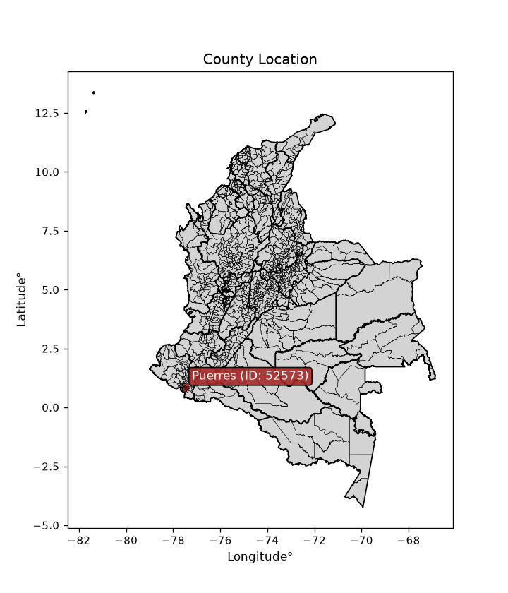
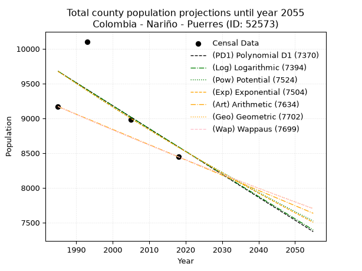
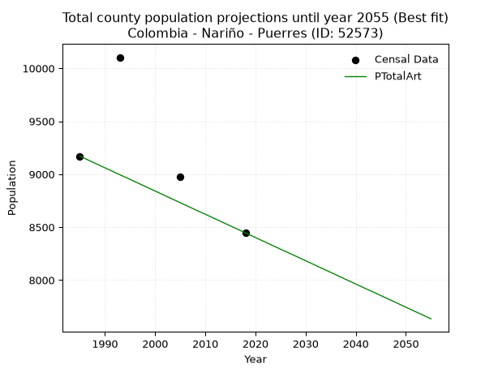
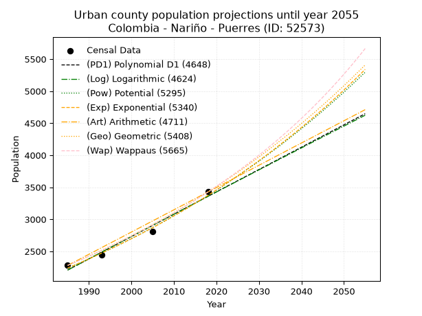
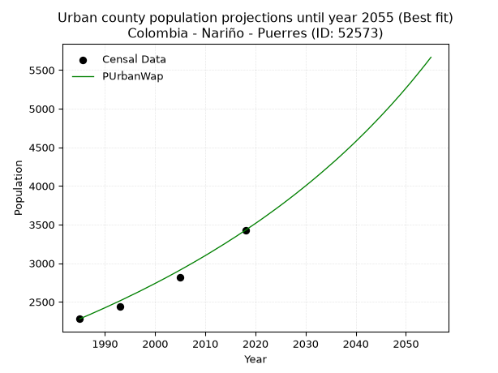
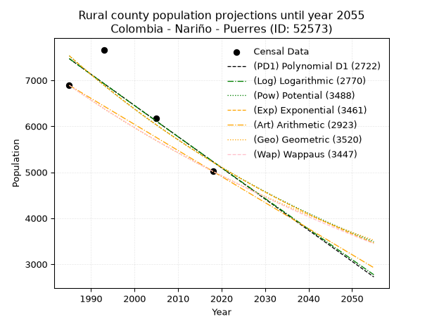
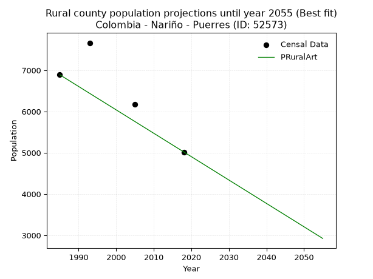

<div align="center">


</div>

# _“Population and Public Services Demand Projections (PPSD) until Year 2050 for Colombia - Nariño - Puerres (ID: 52573)”_
Keywords: `population` `public-service` `projection` `lineal` `polynomial` `logarithmic` `potential` `exponential` `arithmetic` `geometric` `wappaus` `dane` `colombia` `south-america`

PPSD are analytical estimates used by governments and planners to anticipate future changes in population size, age distribution, and the resulting community needs for utilities, healthcare, education, and infrastructure as sizing future water treatment facilities, electrical grids, and road networks based on spatial growth.

<div align="center">

</img>

</div>


> **General running parameters**: • app_version: _v20260806_. • Python version: _3.14.7_. • Pandas version: _3.0.5_. • NumPy version: _2.5.1_. • Creates, save and include plots into reports (create_plot): _False_. • Projection until year: _2050_. • Process polynomial degree 2 and up: _False_. • Process Wappaus: _True_. • Process Wappaus: _True_. • Set negative values to zero: _True_. • Set infinite values to zero: _True_. • Drop dataset notes: _True_. 
<div align="center">

Dynamic map: [:earth_americas:Google](http://maps.google.com/maps?q=0.885125174,-77.5042106) [:earth_americas:OSM](https://www.openstreetmap.org/#map=18/0.885125174/-77.5042106&layers=P) [:earth_americas:Bing](https://www.bing.com/maps?cp=0.885125174~-77.5042106&lvl=18) [:earth_americas:Apple](https://maps.apple.com/frame?center=0.885125174%2C-77.5042106&span=0.003%2C0.006)

</div>


<div align="center">

```geojson
{
  "type": "Feature",
  "geometry": {
    "type": "Point", 
    "coordinates": [-77.5042106, 0.885125174]
  }, 
  "properties": {
    "Name": "Colombia - Nariño - Puerres (ID: 52573)"
  }
}
```

</div>


## 0. Census Data (4 records)

Census data are official statistics collected by a government about the people and housing in a country. They usually include counts of total population, age, sex, race, income, education, and jobs.

📅Global census file: [Population.xlsx](../data/Population.xlsx)

| Source   |   Year |   CountryID | CountryName   |   StateID | StateName   |   CountyID | CountyName   |   PTotal |   PUrban |   PRural |
|:---------|-------:|------------:|:--------------|----------:|:------------|-----------:|:-------------|---------:|---------:|---------:|
| DANE     |   1985 |          57 | Colombia      |        52 | Nariño      |      52573 | Puerres      |     9170 |     2280 |     6890 |
| DANE     |   1993 |          57 | Colombia      |        52 | Nariño      |      52573 | Puerres      |    10104 |     2440 |     7664 |
| DANE     |   2005 |          57 | Colombia      |        52 | Nariño      |      52573 | Puerres      |     8979 |     2812 |     6167 |
| DANE     |   2018 |          57 | Colombia      |        52 | Nariño      |      52573 | Puerres      |     8446 |     3426 |     5020 |

> 🔥Some records could had specific notes about the registered values or the corresponding urban or rural distribution.

📅[SUI-RUPS](https://www.datos.gov.co/Hacienda-y-Cr-dito-P-blico/Registro-nico-de-Prestadores-de-Servicios-P-blicos/4qkq-csdn/about_data) - Local public utility companies: [RUPS.csv](../data/RUPS.xlsx)

 | SERVICIO       | ESTADO    | NOMBRE                                                        | NIT         | DEPARTAMENTO_DOMICILIO   | MUNICIPIO_DOMICILIO   | DIRECCION                            |   TELEFONO | EMAIL                    | TIPO_PRESTADOR                            | CLASIFICACION                 |
|:---------------|:----------|:--------------------------------------------------------------|:------------|:-------------------------|:----------------------|:-------------------------------------|-----------:|:-------------------------|:------------------------------------------|:------------------------------|
| ACUEDUCTO      | OPERATIVA | EMPRESA DE SERVICIOS PUBLICOS DOMICILIARIOS DE PUERRES E.S.P. | 814007234-1 | NARINO                   | PUERRES               | Calle 4 No 4 - 33 - Barrio Esmeralda |    0000000 | jonnycalvache10@yahoo.es | EMPRESA INDUSTRIAL Y COMERCIAL DEL ESTADO | MENOR O IGUAL A 2500 USUARIOS |
| ALCANTARILLADO | OPERATIVA | EMPRESA DE SERVICIOS PUBLICOS DOMICILIARIOS DE PUERRES E.S.P. | 814007234-1 | NARINO                   | PUERRES               | Calle 4 No 4 - 33 - Barrio Esmeralda |    0000000 | jonnycalvache10@yahoo.es | EMPRESA INDUSTRIAL Y COMERCIAL DEL ESTADO | MENOR O IGUAL A 2500 USUARIOS |

## 1. Total

### 1.1. Coefficients and Parameters

* (PD1) Polynomial Deg 1: -32.966278602970284, 75115.5487755913 (lineal)
* (Log) Logarithmic: -65882.98454157905, 509951.84345364664
* (Pow) Potential: -7.262565655956137, 27.935965433161726
* (Exp) Exponential: -0.0036339232770771076, 13136075.395904364
* (Art) Arithmetic: Year diff. 2018 - 1985 = 33, Population diff. 8446 - 9170 = -724, Annual growth = -21.939393939393938
* (Geo) Geometric: Year diff. 2018 - 1985 = 33, Population diff. 8446 - 9170 = -724, Annual growth % = -0.0024891493342363846
* (Wap) Wappaus: i = -0.24908485398948615, Condition values only valid for < 200)

<sub>
Wappaus condition values: ['-0.00', '-0.25', '-0.50', '-0.75', '-1.00', '-1.25', '-1.49', '-1.74', '-1.99', '-2.24', '-2.49', '-2.74', '-2.99', '-3.24', '-3.49', '-3.74', '-3.99', '-4.23', '-4.48', '-4.73', '-4.98', '-5.23', '-5.48', '-5.73', '-5.98', '-6.23', '-6.48', '-6.73', '-6.97', '-7.22', '-7.47', '-7.72', '-7.97', '-8.22', '-8.47', '-8.72', '-8.97', '-9.22', '-9.47', '-9.71', '-9.96', '-10.21', '-10.46', '-10.71', '-10.96', '-11.21', '-11.46', '-11.71', '-11.96', '-12.21', '-12.45', '-12.70', '-12.95', '-13.20', '-13.45', '-13.70', '-13.95', '-14.20', '-14.45', '-14.70', '-14.95', '-15.19', '-15.44', '-15.69', '-15.94', '-16.19']
</sub>


### 1.2. Projected Dataset

|   Year |   CountyID |   PTotalPD1 |   PTotalLog |   PTotalPow |   PTotalExp |   PTotalArt |   PTotalGeo |   PTotalWap |
|-------:|-----------:|------------:|------------:|------------:|------------:|------------:|------------:|------------:|
|   1985 |      52573 |        9677 |        9678 |        9678 |        9677 |        9170 |        9170 |        9170 |
|   1986 |      52573 |        9645 |        9645 |        9642 |        9642 |        9148 |        9147 |        9147 |
|   1987 |      52573 |        9612 |        9611 |        9607 |        9607 |        9126 |        9124 |        9124 |
|   1988 |      52573 |        9579 |        9578 |        9572 |        9572 |        9104 |        9102 |        9102 |
|   1989 |      52573 |        9546 |        9545 |        9537 |        9538 |        9082 |        9079 |        9079 |
|   1990 |      52573 |        9513 |        9512 |        9502 |        9503 |        9060 |        9056 |        9057 |
|   1991 |      52573 |        9480 |        9479 |        9468 |        9469 |        9038 |        9034 |        9034 |
|   1992 |      52573 |        9447 |        9446 |        9433 |        9434 |        9016 |        9011 |        9011 |
|   1993 |      52573 |        9414 |        9413 |        9399 |        9400 |        8994 |        8989 |        8989 |
|   1994 |      52573 |        9381 |        9380 |        9365 |        9366 |        8973 |        8967 |        8967 |
|   1995 |      52573 |        9348 |        9347 |        9331 |        9332 |        8951 |        8944 |        8944 |
|   1996 |      52573 |        9315 |        9314 |        9297 |        9298 |        8929 |        8922 |        8922 |
|   1997 |      52573 |        9282 |        9281 |        9263 |        9264 |        8907 |        8900 |        8900 |
|   1998 |      52573 |        9249 |        9248 |        9229 |        9231 |        8885 |        8878 |        8878 |
|   1999 |      52573 |        9216 |        9215 |        9196 |        9197 |        8863 |        8856 |        8856 |
|   2000 |      52573 |        9183 |        9182 |        9163 |        9164 |        8841 |        8834 |        8834 |
|   2001 |      52573 |        9150 |        9149 |        9129 |        9131 |        8819 |        8812 |        8812 |
|   2002 |      52573 |        9117 |        9116 |        9096 |        9098 |        8797 |        8790 |        8790 |
|   2003 |      52573 |        9084 |        9083 |        9063 |        9065 |        8775 |        8768 |        8768 |
|   2004 |      52573 |        9051 |        9050 |        9031 |        9032 |        8753 |        8746 |        8746 |
|   2005 |      52573 |        9018 |        9017 |        8998 |        8999 |        8731 |        8724 |        8724 |
|   2006 |      52573 |        8985 |        8984 |        8965 |        8966 |        8709 |        8702 |        8703 |
|   2007 |      52573 |        8952 |        8952 |        8933 |        8934 |        8687 |        8681 |        8681 |
|   2008 |      52573 |        8919 |        8919 |        8901 |        8901 |        8665 |        8659 |        8659 |
|   2009 |      52573 |        8886 |        8886 |        8869 |        8869 |        8643 |        8638 |        8638 |
|   2010 |      52573 |        8853 |        8853 |        8837 |        8837 |        8622 |        8616 |        8616 |
|   2011 |      52573 |        8820 |        8820 |        8805 |        8805 |        8600 |        8595 |        8595 |
|   2012 |      52573 |        8787 |        8788 |        8773 |        8773 |        8578 |        8573 |        8573 |
|   2013 |      52573 |        8754 |        8755 |        8741 |        8741 |        8556 |        8552 |        8552 |
|   2014 |      52573 |        8721 |        8722 |        8710 |        8709 |        8534 |        8531 |        8531 |
|   2015 |      52573 |        8688 |        8689 |        8679 |        8678 |        8512 |        8509 |        8509 |
|   2016 |      52573 |        8656 |        8657 |        8647 |        8646 |        8490 |        8488 |        8488 |
|   2017 |      52573 |        8623 |        8624 |        8616 |        8615 |        8468 |        8467 |        8467 |
|   2018 |      52573 |        8590 |        8591 |        8585 |        8584 |        8446 |        8446 |        8446 |
|   2019 |      52573 |        8557 |        8559 |        8555 |        8553 |        8424 |        8425 |        8425 |
|   2020 |      52573 |        8524 |        8526 |        8524 |        8522 |        8402 |        8404 |        8404 |
|   2021 |      52573 |        8491 |        8494 |        8493 |        8491 |        8380 |        8383 |        8383 |
|   2022 |      52573 |        8458 |        8461 |        8463 |        8460 |        8358 |        8362 |        8362 |
|   2023 |      52573 |        8425 |        8428 |        8432 |        8429 |        8336 |        8341 |        8341 |
|   2024 |      52573 |        8392 |        8396 |        8402 |        8399 |        8314 |        8321 |        8320 |
|   2025 |      52573 |        8359 |        8363 |        8372 |        8368 |        8292 |        8300 |        8300 |
|   2026 |      52573 |        8326 |        8331 |        8342 |        8338 |        8270 |        8279 |        8279 |
|   2027 |      52573 |        8293 |        8298 |        8312 |        8307 |        8249 |        8259 |        8258 |
|   2028 |      52573 |        8260 |        8266 |        8283 |        8277 |        8227 |        8238 |        8238 |
|   2029 |      52573 |        8227 |        8233 |        8253 |        8247 |        8205 |        8218 |        8217 |
|   2030 |      52573 |        8194 |        8201 |        8224 |        8217 |        8183 |        8197 |        8197 |
|   2031 |      52573 |        8161 |        8168 |        8194 |        8188 |        8161 |        8177 |        8176 |
|   2032 |      52573 |        8128 |        8136 |        8165 |        8158 |        8139 |        8156 |        8156 |
|   2033 |      52573 |        8095 |        8104 |        8136 |        8128 |        8117 |        8136 |        8135 |
|   2034 |      52573 |        8062 |        8071 |        8107 |        8099 |        8095 |        8116 |        8115 |
|   2035 |      52573 |        8029 |        8039 |        8078 |        8069 |        8073 |        8096 |        8095 |
|   2036 |      52573 |        7996 |        8006 |        8049 |        8040 |        8051 |        8075 |        8075 |
|   2037 |      52573 |        7963 |        7974 |        8020 |        8011 |        8029 |        8055 |        8055 |
|   2038 |      52573 |        7930 |        7942 |        7992 |        7982 |        8007 |        8035 |        8034 |
|   2039 |      52573 |        7897 |        7909 |        7964 |        7953 |        7985 |        8015 |        8014 |
|   2040 |      52573 |        7864 |        7877 |        7935 |        7924 |        7963 |        7995 |        7994 |
|   2041 |      52573 |        7831 |        7845 |        7907 |        7895 |        7941 |        7975 |        7974 |
|   2042 |      52573 |        7798 |        7812 |        7879 |        7867 |        7919 |        7956 |        7954 |
|   2043 |      52573 |        7765 |        7780 |        7851 |        7838 |        7898 |        7936 |        7934 |
|   2044 |      52573 |        7732 |        7748 |        7823 |        7810 |        7876 |        7916 |        7915 |
|   2045 |      52573 |        7700 |        7716 |        7795 |        7781 |        7854 |        7896 |        7895 |
|   2046 |      52573 |        7667 |        7684 |        7768 |        7753 |        7832 |        7877 |        7875 |
|   2047 |      52573 |        7634 |        7651 |        7740 |        7725 |        7810 |        7857 |        7855 |
|   2048 |      52573 |        7601 |        7619 |        7713 |        7697 |        7788 |        7838 |        7836 |
|   2049 |      52573 |        7568 |        7587 |        7686 |        7669 |        7766 |        7818 |        7816 |
|   2050 |      52573 |        7535 |        7555 |        7658 |        7641 |        7744 |        7799 |        7797 |
<div align="center">

</img>

</div>


### 1.3. Best fit with absolute and relative error (%)

Relative error puts that difference into context by dividing the absolute error by the true value, creating a unitless ratio or percentage that shows the scale of the mistake.

Absolute and relative error

|   Year | Source   |   CountryID | CountryName   |   StateID | StateName   |   CountyID_x | CountyName   |   PTotal |   PUrban |   PRural |   CountyID_y |   PTotalPD1 |   PTotalLog |   PTotalPow |   PTotalExp |   PTotalArt |   PTotalGeo |   PTotalWap |   PTotalPD1AbsError |   PTotalLogAbsError |   PTotalPowAbsError |   PTotalExpAbsError |   PTotalArtAbsError |   PTotalGeoAbsError |   PTotalWapAbsError |   PTotalPD1RelError |   PTotalLogRelError |   PTotalPowRelError |   PTotalExpRelError |   PTotalArtRelError |   PTotalGeoRelError |   PTotalWapRelError |
|-------:|:---------|------------:|:--------------|----------:|:------------|-------------:|:-------------|---------:|---------:|---------:|-------------:|------------:|------------:|------------:|------------:|------------:|------------:|------------:|--------------------:|--------------------:|--------------------:|--------------------:|--------------------:|--------------------:|--------------------:|--------------------:|--------------------:|--------------------:|--------------------:|--------------------:|--------------------:|--------------------:|
|   1985 | DANE     |          57 | Colombia      |        52 | Nariño      |        52573 | Puerres      |     9170 |     2280 |     6890 |        52573 |        9677 |        9678 |        9678 |        9677 |        9170 |        9170 |        9170 |                 507 |                 508 |                 508 |                 507 |                   0 |                   0 |                   0 |            5.5289   |             5.5398  |            5.5398   |            5.5289   |              0      |             0       |             0       |
|   1993 | DANE     |          57 | Colombia      |        52 | Nariño      |        52573 | Puerres      |    10104 |     2440 |     7664 |        52573 |        9414 |        9413 |        9399 |        9400 |        8994 |        8989 |        8989 |                 690 |                 691 |                 705 |                 704 |                1110 |                1115 |                1115 |            6.82898  |             6.83888 |            6.97743  |            6.96754  |             10.9857 |            11.0352  |            11.0352  |
|   2005 | DANE     |          57 | Colombia      |        52 | Nariño      |        52573 | Puerres      |     8979 |     2812 |     6167 |        52573 |        9018 |        9017 |        8998 |        8999 |        8731 |        8724 |        8724 |                  39 |                  38 |                  19 |                  20 |                 248 |                 255 |                 255 |            0.434347 |             0.42321 |            0.211605 |            0.222742 |              2.762  |             2.83996 |             2.83996 |
|   2018 | DANE     |          57 | Colombia      |        52 | Nariño      |        52573 | Puerres      |     8446 |     3426 |     5020 |        52573 |        8590 |        8591 |        8585 |        8584 |        8446 |        8446 |        8446 |                 144 |                 145 |                 139 |                 138 |                   0 |                   0 |                   0 |            1.70495  |             1.71679 |            1.64575  |            1.63391  |              0      |             0       |             0       |

Relative error mean

| Method    |   RelError | Best   |
|:----------|-----------:|:-------|
| PTotalPD1 |    3.62429 |        |
| PTotalLog |    3.62967 |        |
| PTotalPow |    3.59365 |        |
| PTotalExp |    3.58827 |        |
| PTotalArt |    3.43694 | True   |
| PTotalGeo |    3.4688  |        |
| PTotalWap |    3.4688  |        |

💙Best method: _**PTotalArt**_
<div align="center">

</img>

</div>


### 1.4. Fresh water supply demand in liters per capita per day (lpcd)

The fresh water supply demand typically ranges from 100 to 300 liters per capita per day (lpcd) for standard domestic and municipal planning, though absolute survival minimums set by the World Health Organization are as low as 7.5 to 20 liters per day, and total consumption in high-income nations can exceed 400 liters.

> `CZ`: Level in meters above the sea level (masl)<br> `WS`: Fresh water supply demand in liters per capita per day (lpcd or l/h/d)<br> `WSAll`: Zonal fresh water supply demand in liters per second (l/s)<br> `A`: Zonal area in square meters<br> `DP`: Population density (people/hectare or p/ha)

Reference values (RAS Colombia)

|    CZ |   WS |
|------:|-----:|
|  1000 |  120 |
|  2000 |  130 |
| 99999 |  140 |

County shapefile geometry properties and water supply values

|   CountyID |     ATotal |   CZTotal |   WSTotal |
|-----------:|-----------:|----------:|----------:|
|      52573 | 3.5046e+08 |   2587.47 |       140 |

Projected values for best method: PTotalArt

|   CountyID |   Year |   PTotalArt |   DPTotal |   WSTotal |   WSTotalAll |
|-----------:|-------:|------------:|----------:|----------:|-------------:|
|      52573 |   1985 |        9170 |      0.26 |       140 |      14.8588 |
|      52573 |   1986 |        9148 |      0.26 |       140 |      14.8231 |
|      52573 |   1987 |        9126 |      0.26 |       140 |      14.7875 |
|      52573 |   1988 |        9104 |      0.26 |       140 |      14.7519 |
|      52573 |   1989 |        9082 |      0.26 |       140 |      14.7162 |
|      52573 |   1990 |        9060 |      0.26 |       140 |      14.6806 |
|      52573 |   1991 |        9038 |      0.26 |       140 |      14.6449 |
|      52573 |   1992 |        9016 |      0.26 |       140 |      14.6093 |
|      52573 |   1993 |        8994 |      0.26 |       140 |      14.5736 |
|      52573 |   1994 |        8973 |      0.26 |       140 |      14.5396 |
|      52573 |   1995 |        8951 |      0.26 |       140 |      14.5039 |
|      52573 |   1996 |        8929 |      0.25 |       140 |      14.4683 |
|      52573 |   1997 |        8907 |      0.25 |       140 |      14.4326 |
|      52573 |   1998 |        8885 |      0.25 |       140 |      14.397  |
|      52573 |   1999 |        8863 |      0.25 |       140 |      14.3613 |
|      52573 |   2000 |        8841 |      0.25 |       140 |      14.3257 |
|      52573 |   2001 |        8819 |      0.25 |       140 |      14.29   |
|      52573 |   2002 |        8797 |      0.25 |       140 |      14.2544 |
|      52573 |   2003 |        8775 |      0.25 |       140 |      14.2188 |
|      52573 |   2004 |        8753 |      0.25 |       140 |      14.1831 |
|      52573 |   2005 |        8731 |      0.25 |       140 |      14.1475 |
|      52573 |   2006 |        8709 |      0.25 |       140 |      14.1118 |
|      52573 |   2007 |        8687 |      0.25 |       140 |      14.0762 |
|      52573 |   2008 |        8665 |      0.25 |       140 |      14.0405 |
|      52573 |   2009 |        8643 |      0.25 |       140 |      14.0049 |
|      52573 |   2010 |        8622 |      0.25 |       140 |      13.9708 |
|      52573 |   2011 |        8600 |      0.25 |       140 |      13.9352 |
|      52573 |   2012 |        8578 |      0.24 |       140 |      13.8995 |
|      52573 |   2013 |        8556 |      0.24 |       140 |      13.8639 |
|      52573 |   2014 |        8534 |      0.24 |       140 |      13.8282 |
|      52573 |   2015 |        8512 |      0.24 |       140 |      13.7926 |
|      52573 |   2016 |        8490 |      0.24 |       140 |      13.7569 |
|      52573 |   2017 |        8468 |      0.24 |       140 |      13.7213 |
|      52573 |   2018 |        8446 |      0.24 |       140 |      13.6856 |
|      52573 |   2019 |        8424 |      0.24 |       140 |      13.65   |
|      52573 |   2020 |        8402 |      0.24 |       140 |      13.6144 |
|      52573 |   2021 |        8380 |      0.24 |       140 |      13.5787 |
|      52573 |   2022 |        8358 |      0.24 |       140 |      13.5431 |
|      52573 |   2023 |        8336 |      0.24 |       140 |      13.5074 |
|      52573 |   2024 |        8314 |      0.24 |       140 |      13.4718 |
|      52573 |   2025 |        8292 |      0.24 |       140 |      13.4361 |
|      52573 |   2026 |        8270 |      0.24 |       140 |      13.4005 |
|      52573 |   2027 |        8249 |      0.24 |       140 |      13.3664 |
|      52573 |   2028 |        8227 |      0.23 |       140 |      13.3308 |
|      52573 |   2029 |        8205 |      0.23 |       140 |      13.2951 |
|      52573 |   2030 |        8183 |      0.23 |       140 |      13.2595 |
|      52573 |   2031 |        8161 |      0.23 |       140 |      13.2238 |
|      52573 |   2032 |        8139 |      0.23 |       140 |      13.1882 |
|      52573 |   2033 |        8117 |      0.23 |       140 |      13.1525 |
|      52573 |   2034 |        8095 |      0.23 |       140 |      13.1169 |
|      52573 |   2035 |        8073 |      0.23 |       140 |      13.0813 |
|      52573 |   2036 |        8051 |      0.23 |       140 |      13.0456 |
|      52573 |   2037 |        8029 |      0.23 |       140 |      13.01   |
|      52573 |   2038 |        8007 |      0.23 |       140 |      12.9743 |
|      52573 |   2039 |        7985 |      0.23 |       140 |      12.9387 |
|      52573 |   2040 |        7963 |      0.23 |       140 |      12.903  |
|      52573 |   2041 |        7941 |      0.23 |       140 |      12.8674 |
|      52573 |   2042 |        7919 |      0.23 |       140 |      12.8317 |
|      52573 |   2043 |        7898 |      0.23 |       140 |      12.7977 |
|      52573 |   2044 |        7876 |      0.22 |       140 |      12.762  |
|      52573 |   2045 |        7854 |      0.22 |       140 |      12.7264 |
|      52573 |   2046 |        7832 |      0.22 |       140 |      12.6907 |
|      52573 |   2047 |        7810 |      0.22 |       140 |      12.6551 |
|      52573 |   2048 |        7788 |      0.22 |       140 |      12.6194 |
|      52573 |   2049 |        7766 |      0.22 |       140 |      12.5838 |
|      52573 |   2050 |        7744 |      0.22 |       140 |      12.5481 |

## 2. Urban

### 2.1. Coefficients and Parameters

* (PD1) Polynomial Deg 1: 34.8590927338414, -66987.40024086628 (lineal)
* (Log) Logarithmic: 69747.74062909174, -527413.6354450423
* (Pow) Potential: 24.84735997431307, -78.59073779144612
* (Exp) Exponential: 0.012416824462971187, 4.424019203240097e-08
* (Art) Arithmetic: Year diff. 2018 - 1985 = 33, Population diff. 3426 - 2280 = 1146, Annual growth = 34.72727272727273
* (Geo) Geometric: Year diff. 2018 - 1985 = 33, Population diff. 3426 - 2280 = 1146, Annual growth % = 0.012416389268944172
* (Wap) Wappaus: i = 1.2172195137494821, Condition values only valid for < 200)

<sub>
Wappaus condition values: ['0.00', '1.22', '2.43', '3.65', '4.87', '6.09', '7.30', '8.52', '9.74', '10.95', '12.17', '13.39', '14.61', '15.82', '17.04', '18.26', '19.48', '20.69', '21.91', '23.13', '24.34', '25.56', '26.78', '28.00', '29.21', '30.43', '31.65', '32.86', '34.08', '35.30', '36.52', '37.73', '38.95', '40.17', '41.39', '42.60', '43.82', '45.04', '46.25', '47.47', '48.69', '49.91', '51.12', '52.34', '53.56', '54.77', '55.99', '57.21', '58.43', '59.64', '60.86', '62.08', '63.30', '64.51', '65.73', '66.95', '68.16', '69.38', '70.60', '71.82', '73.03', '74.25', '75.47', '76.68', '77.90', '79.12']
</sub>


### 2.2. Projected Dataset

|   Year |   CountyID |   PUrbanPD1 |   PUrbanLog |   PUrbanPow |   PUrbanExp |   PUrbanArt |   PUrbanGeo |   PUrbanWap |
|-------:|-----------:|------------:|------------:|------------:|------------:|------------:|------------:|------------:|
|   1985 |      52573 |        2208 |        2207 |        2238 |        2239 |        2280 |        2280 |        2280 |
|   1986 |      52573 |        2243 |        2242 |        2266 |        2267 |        2315 |        2308 |        2308 |
|   1987 |      52573 |        2278 |        2277 |        2295 |        2295 |        2349 |        2337 |        2336 |
|   1988 |      52573 |        2312 |        2312 |        2324 |        2324 |        2384 |        2366 |        2365 |
|   1989 |      52573 |        2347 |        2347 |        2353 |        2353 |        2419 |        2395 |        2394 |
|   1990 |      52573 |        2382 |        2383 |        2383 |        2382 |        2454 |        2425 |        2423 |
|   1991 |      52573 |        2417 |        2418 |        2413 |        2412 |        2488 |        2455 |        2453 |
|   1992 |      52573 |        2452 |        2453 |        2443 |        2442 |        2523 |        2486 |        2483 |
|   1993 |      52573 |        2487 |        2488 |        2473 |        2473 |        2558 |        2517 |        2513 |
|   1994 |      52573 |        2522 |        2523 |        2504 |        2504 |        2593 |        2548 |        2544 |
|   1995 |      52573 |        2556 |        2558 |        2536 |        2535 |        2627 |        2579 |        2576 |
|   1996 |      52573 |        2591 |        2593 |        2568 |        2567 |        2662 |        2611 |        2607 |
|   1997 |      52573 |        2626 |        2627 |        2600 |        2599 |        2697 |        2644 |        2639 |
|   1998 |      52573 |        2661 |        2662 |        2632 |        2631 |        2731 |        2677 |        2672 |
|   1999 |      52573 |        2696 |        2697 |        2665 |        2664 |        2766 |        2710 |        2705 |
|   2000 |      52573 |        2731 |        2732 |        2699 |        2697 |        2801 |        2744 |        2738 |
|   2001 |      52573 |        2766 |        2767 |        2732 |        2731 |        2836 |        2778 |        2772 |
|   2002 |      52573 |        2801 |        2802 |        2766 |        2765 |        2870 |        2812 |        2806 |
|   2003 |      52573 |        2835 |        2837 |        2801 |        2800 |        2905 |        2847 |        2841 |
|   2004 |      52573 |        2870 |        2871 |        2836 |        2835 |        2940 |        2882 |        2876 |
|   2005 |      52573 |        2905 |        2906 |        2871 |        2870 |        2975 |        2918 |        2912 |
|   2006 |      52573 |        2940 |        2941 |        2907 |        2906 |        3009 |        2954 |        2948 |
|   2007 |      52573 |        2975 |        2976 |        2943 |        2942 |        3044 |        2991 |        2985 |
|   2008 |      52573 |        3010 |        3011 |        2980 |        2979 |        3079 |        3028 |        3022 |
|   2009 |      52573 |        3045 |        3045 |        3017 |        3016 |        3113 |        3066 |        3060 |
|   2010 |      52573 |        3079 |        3080 |        3055 |        3054 |        3148 |        3104 |        3098 |
|   2011 |      52573 |        3114 |        3115 |        3093 |        3092 |        3183 |        3142 |        3137 |
|   2012 |      52573 |        3149 |        3149 |        3131 |        3131 |        3218 |        3182 |        3177 |
|   2013 |      52573 |        3184 |        3184 |        3170 |        3170 |        3252 |        3221 |        3217 |
|   2014 |      52573 |        3219 |        3219 |        3209 |        3209 |        3287 |        3261 |        3257 |
|   2015 |      52573 |        3254 |        3253 |        3249 |        3250 |        3322 |        3301 |        3299 |
|   2016 |      52573 |        3289 |        3288 |        3289 |        3290 |        3357 |        3342 |        3340 |
|   2017 |      52573 |        3323 |        3322 |        3330 |        3331 |        3391 |        3384 |        3383 |
|   2018 |      52573 |        3358 |        3357 |        3372 |        3373 |        3426 |        3426 |        3426 |
|   2019 |      52573 |        3393 |        3392 |        3413 |        3415 |        3461 |        3469 |        3470 |
|   2020 |      52573 |        3428 |        3426 |        3456 |        3458 |        3495 |        3512 |        3514 |
|   2021 |      52573 |        3463 |        3461 |        3498 |        3501 |        3530 |        3555 |        3559 |
|   2022 |      52573 |        3498 |        3495 |        3542 |        3545 |        3565 |        3599 |        3605 |
|   2023 |      52573 |        3533 |        3530 |        3585 |        3589 |        3600 |        3644 |        3652 |
|   2024 |      52573 |        3567 |        3564 |        3630 |        3634 |        3634 |        3689 |        3699 |
|   2025 |      52573 |        3602 |        3599 |        3674 |        3679 |        3669 |        3735 |        3747 |
|   2026 |      52573 |        3637 |        3633 |        3720 |        3725 |        3704 |        3781 |        3796 |
|   2027 |      52573 |        3672 |        3667 |        3766 |        3772 |        3739 |        3828 |        3846 |
|   2028 |      52573 |        3707 |        3702 |        3812 |        3819 |        3773 |        3876 |        3896 |
|   2029 |      52573 |        3742 |        3736 |        3859 |        3866 |        3808 |        3924 |        3948 |
|   2030 |      52573 |        3777 |        3771 |        3907 |        3915 |        3843 |        3973 |        4000 |
|   2031 |      52573 |        3811 |        3805 |        3955 |        3964 |        3877 |        4022 |        4053 |
|   2032 |      52573 |        3846 |        3839 |        4003 |        4013 |        3912 |        4072 |        4107 |
|   2033 |      52573 |        3881 |        3874 |        4053 |        4063 |        3947 |        4123 |        4162 |
|   2034 |      52573 |        3916 |        3908 |        4103 |        4114 |        3982 |        4174 |        4218 |
|   2035 |      52573 |        3951 |        3942 |        4153 |        4166 |        4016 |        4226 |        4275 |
|   2036 |      52573 |        3986 |        3976 |        4204 |        4218 |        4051 |        4278 |        4332 |
|   2037 |      52573 |        4021 |        4011 |        4256 |        4270 |        4086 |        4331 |        4391 |
|   2038 |      52573 |        4055 |        4045 |        4308 |        4324 |        4121 |        4385 |        4451 |
|   2039 |      52573 |        4090 |        4079 |        4361 |        4378 |        4155 |        4439 |        4512 |
|   2040 |      52573 |        4125 |        4113 |        4414 |        4432 |        4190 |        4495 |        4574 |
|   2041 |      52573 |        4160 |        4148 |        4468 |        4488 |        4225 |        4550 |        4638 |
|   2042 |      52573 |        4195 |        4182 |        4523 |        4544 |        4259 |        4607 |        4702 |
|   2043 |      52573 |        4230 |        4216 |        4578 |        4601 |        4294 |        4664 |        4768 |
|   2044 |      52573 |        4265 |        4250 |        4634 |        4658 |        4329 |        4722 |        4835 |
|   2045 |      52573 |        4299 |        4284 |        4691 |        4716 |        4364 |        4781 |        4903 |
|   2046 |      52573 |        4334 |        4318 |        4748 |        4775 |        4398 |        4840 |        4973 |
|   2047 |      52573 |        4369 |        4352 |        4806 |        4835 |        4433 |        4900 |        5043 |
|   2048 |      52573 |        4404 |        4386 |        4865 |        4895 |        4468 |        4961 |        5116 |
|   2049 |      52573 |        4439 |        4420 |        4924 |        4956 |        4503 |        5023 |        5189 |
|   2050 |      52573 |        4474 |        4454 |        4984 |        5018 |        4537 |        5085 |        5265 |
<div align="center">

</img>

</div>


### 2.3. Best fit with absolute and relative error (%)

Relative error puts that difference into context by dividing the absolute error by the true value, creating a unitless ratio or percentage that shows the scale of the mistake.

Absolute and relative error

|   Year | Source   |   CountryID | CountryName   |   StateID | StateName   |   CountyID_x | CountyName   |   PTotal |   PUrban |   PRural |   CountyID_y |   PUrbanPD1 |   PUrbanLog |   PUrbanPow |   PUrbanExp |   PUrbanArt |   PUrbanGeo |   PUrbanWap |   PUrbanPD1AbsError |   PUrbanLogAbsError |   PUrbanPowAbsError |   PUrbanExpAbsError |   PUrbanArtAbsError |   PUrbanGeoAbsError |   PUrbanWapAbsError |   PUrbanPD1RelError |   PUrbanLogRelError |   PUrbanPowRelError |   PUrbanExpRelError |   PUrbanArtRelError |   PUrbanGeoRelError |   PUrbanWapRelError |
|-------:|:---------|------------:|:--------------|----------:|:------------|-------------:|:-------------|---------:|---------:|---------:|-------------:|------------:|------------:|------------:|------------:|------------:|------------:|------------:|--------------------:|--------------------:|--------------------:|--------------------:|--------------------:|--------------------:|--------------------:|--------------------:|--------------------:|--------------------:|--------------------:|--------------------:|--------------------:|--------------------:|
|   1985 | DANE     |          57 | Colombia      |        52 | Nariño      |        52573 | Puerres      |     9170 |     2280 |     6890 |        52573 |        2208 |        2207 |        2238 |        2239 |        2280 |        2280 |        2280 |                  72 |                  73 |                  42 |                  41 |                   0 |                   0 |                   0 |             3.15789 |             3.20175 |             1.84211 |             1.79825 |             0       |             0       |             0       |
|   1993 | DANE     |          57 | Colombia      |        52 | Nariño      |        52573 | Puerres      |    10104 |     2440 |     7664 |        52573 |        2487 |        2488 |        2473 |        2473 |        2558 |        2517 |        2513 |                  47 |                  48 |                  33 |                  33 |                 118 |                  77 |                  73 |             1.92623 |             1.96721 |             1.35246 |             1.35246 |             4.83607 |             3.15574 |             2.9918  |
|   2005 | DANE     |          57 | Colombia      |        52 | Nariño      |        52573 | Puerres      |     8979 |     2812 |     6167 |        52573 |        2905 |        2906 |        2871 |        2870 |        2975 |        2918 |        2912 |                  93 |                  94 |                  59 |                  58 |                 163 |                 106 |                 100 |             3.30725 |             3.34282 |             2.09815 |             2.06259 |             5.79659 |             3.76956 |             3.55619 |
|   2018 | DANE     |          57 | Colombia      |        52 | Nariño      |        52573 | Puerres      |     8446 |     3426 |     5020 |        52573 |        3358 |        3357 |        3372 |        3373 |        3426 |        3426 |        3426 |                  68 |                  69 |                  54 |                  53 |                   0 |                   0 |                   0 |             1.98482 |             2.01401 |             1.57618 |             1.54699 |             0       |             0       |             0       |

Relative error mean

| Method    |   RelError | Best   |
|:----------|-----------:|:-------|
| PUrbanPD1 |    2.59405 |        |
| PUrbanLog |    2.63145 |        |
| PUrbanPow |    1.71722 |        |
| PUrbanExp |    1.69007 |        |
| PUrbanArt |    2.65816 |        |
| PUrbanGeo |    1.73132 |        |
| PUrbanWap |    1.637   | True   |

💙Best method: _**PUrbanWap**_
<div align="center">

</img>

</div>


### 2.4. Fresh water supply demand in liters per capita per day (lpcd)

The fresh water supply demand typically ranges from 100 to 300 liters per capita per day (lpcd) for standard domestic and municipal planning, though absolute survival minimums set by the World Health Organization are as low as 7.5 to 20 liters per day, and total consumption in high-income nations can exceed 400 liters.

> `CZ`: Level in meters above the sea level (masl)<br> `WS`: Fresh water supply demand in liters per capita per day (lpcd or l/h/d)<br> `WSAll`: Zonal fresh water supply demand in liters per second (l/s)<br> `A`: Zonal area in square meters<br> `DP`: Population density (people/hectare or p/ha)

Reference values (RAS Colombia)

|    CZ |   WS |
|------:|-----:|
|  1000 |  120 |
|  2000 |  130 |
| 99999 |  140 |

County shapefile geometry properties and water supply values

|   CountyID |      AUrban |   CZUrban |   WSUrban |
|-----------:|------------:|----------:|----------:|
|      52573 | 1.02788e+06 |   2763.28 |       140 |

Projected values for best method: PUrbanWap

|   CountyID |   Year |   PUrbanWap |   DPUrban |   WSUrban |   WSUrbanAll |
|-----------:|-------:|------------:|----------:|----------:|-------------:|
|      52573 |   1985 |        2280 |     22.18 |       140 |      3.69444 |
|      52573 |   1986 |        2308 |     22.45 |       140 |      3.73981 |
|      52573 |   1987 |        2336 |     22.73 |       140 |      3.78519 |
|      52573 |   1988 |        2365 |     23.01 |       140 |      3.83218 |
|      52573 |   1989 |        2394 |     23.29 |       140 |      3.87917 |
|      52573 |   1990 |        2423 |     23.57 |       140 |      3.92616 |
|      52573 |   1991 |        2453 |     23.86 |       140 |      3.97477 |
|      52573 |   1992 |        2483 |     24.16 |       140 |      4.02338 |
|      52573 |   1993 |        2513 |     24.45 |       140 |      4.07199 |
|      52573 |   1994 |        2544 |     24.75 |       140 |      4.12222 |
|      52573 |   1995 |        2576 |     25.06 |       140 |      4.17407 |
|      52573 |   1996 |        2607 |     25.36 |       140 |      4.22431 |
|      52573 |   1997 |        2639 |     25.67 |       140 |      4.27616 |
|      52573 |   1998 |        2672 |     26    |       140 |      4.32963 |
|      52573 |   1999 |        2705 |     26.32 |       140 |      4.3831  |
|      52573 |   2000 |        2738 |     26.64 |       140 |      4.43657 |
|      52573 |   2001 |        2772 |     26.97 |       140 |      4.49167 |
|      52573 |   2002 |        2806 |     27.3  |       140 |      4.54676 |
|      52573 |   2003 |        2841 |     27.64 |       140 |      4.60347 |
|      52573 |   2004 |        2876 |     27.98 |       140 |      4.66019 |
|      52573 |   2005 |        2912 |     28.33 |       140 |      4.71852 |
|      52573 |   2006 |        2948 |     28.68 |       140 |      4.77685 |
|      52573 |   2007 |        2985 |     29.04 |       140 |      4.83681 |
|      52573 |   2008 |        3022 |     29.4  |       140 |      4.89676 |
|      52573 |   2009 |        3060 |     29.77 |       140 |      4.95833 |
|      52573 |   2010 |        3098 |     30.14 |       140 |      5.01991 |
|      52573 |   2011 |        3137 |     30.52 |       140 |      5.0831  |
|      52573 |   2012 |        3177 |     30.91 |       140 |      5.14792 |
|      52573 |   2013 |        3217 |     31.3  |       140 |      5.21273 |
|      52573 |   2014 |        3257 |     31.69 |       140 |      5.27755 |
|      52573 |   2015 |        3299 |     32.1  |       140 |      5.3456  |
|      52573 |   2016 |        3340 |     32.49 |       140 |      5.41204 |
|      52573 |   2017 |        3383 |     32.91 |       140 |      5.48171 |
|      52573 |   2018 |        3426 |     33.33 |       140 |      5.55139 |
|      52573 |   2019 |        3470 |     33.76 |       140 |      5.62269 |
|      52573 |   2020 |        3514 |     34.19 |       140 |      5.69398 |
|      52573 |   2021 |        3559 |     34.62 |       140 |      5.7669  |
|      52573 |   2022 |        3605 |     35.07 |       140 |      5.84144 |
|      52573 |   2023 |        3652 |     35.53 |       140 |      5.91759 |
|      52573 |   2024 |        3699 |     35.99 |       140 |      5.99375 |
|      52573 |   2025 |        3747 |     36.45 |       140 |      6.07153 |
|      52573 |   2026 |        3796 |     36.93 |       140 |      6.15093 |
|      52573 |   2027 |        3846 |     37.42 |       140 |      6.23194 |
|      52573 |   2028 |        3896 |     37.9  |       140 |      6.31296 |
|      52573 |   2029 |        3948 |     38.41 |       140 |      6.39722 |
|      52573 |   2030 |        4000 |     38.91 |       140 |      6.48148 |
|      52573 |   2031 |        4053 |     39.43 |       140 |      6.56736 |
|      52573 |   2032 |        4107 |     39.96 |       140 |      6.65486 |
|      52573 |   2033 |        4162 |     40.49 |       140 |      6.74398 |
|      52573 |   2034 |        4218 |     41.04 |       140 |      6.83472 |
|      52573 |   2035 |        4275 |     41.59 |       140 |      6.92708 |
|      52573 |   2036 |        4332 |     42.14 |       140 |      7.01944 |
|      52573 |   2037 |        4391 |     42.72 |       140 |      7.11505 |
|      52573 |   2038 |        4451 |     43.3  |       140 |      7.21227 |
|      52573 |   2039 |        4512 |     43.9  |       140 |      7.31111 |
|      52573 |   2040 |        4574 |     44.5  |       140 |      7.41157 |
|      52573 |   2041 |        4638 |     45.12 |       140 |      7.51528 |
|      52573 |   2042 |        4702 |     45.74 |       140 |      7.61898 |
|      52573 |   2043 |        4768 |     46.39 |       140 |      7.72593 |
|      52573 |   2044 |        4835 |     47.04 |       140 |      7.83449 |
|      52573 |   2045 |        4903 |     47.7  |       140 |      7.94468 |
|      52573 |   2046 |        4973 |     48.38 |       140 |      8.0581  |
|      52573 |   2047 |        5043 |     49.06 |       140 |      8.17153 |
|      52573 |   2048 |        5116 |     49.77 |       140 |      8.28981 |
|      52573 |   2049 |        5189 |     50.48 |       140 |      8.4081  |
|      52573 |   2050 |        5265 |     51.22 |       140 |      8.53125 |

## 3. Rural

### 3.1. Coefficients and Parameters

* (PD1) Polynomial Deg 1: -67.82537133681177, 142102.94901645777 (lineal)
* (Log) Logarithmic: -135630.7251706709, 1037365.4788986896
* (Pow) Potential: -22.2164839401348, 77.14166141741237
* (Exp) Exponential: -0.011110100621762849, 28489192948896.043
* (Art) Arithmetic: Year diff. 2018 - 1985 = 33, Population diff. 5020 - 6890 = -1870, Annual growth = -56.666666666666664
* (Geo) Geometric: Year diff. 2018 - 1985 = 33, Population diff. 5020 - 6890 = -1870, Annual growth % = -0.009549299484426288
* (Wap) Wappaus: i = -0.9515813042261405, Condition values only valid for < 200)

<sub>
Wappaus condition values: ['-0.00', '-0.95', '-1.90', '-2.85', '-3.81', '-4.76', '-5.71', '-6.66', '-7.61', '-8.56', '-9.52', '-10.47', '-11.42', '-12.37', '-13.32', '-14.27', '-15.23', '-16.18', '-17.13', '-18.08', '-19.03', '-19.98', '-20.93', '-21.89', '-22.84', '-23.79', '-24.74', '-25.69', '-26.64', '-27.60', '-28.55', '-29.50', '-30.45', '-31.40', '-32.35', '-33.31', '-34.26', '-35.21', '-36.16', '-37.11', '-38.06', '-39.01', '-39.97', '-40.92', '-41.87', '-42.82', '-43.77', '-44.72', '-45.68', '-46.63', '-47.58', '-48.53', '-49.48', '-50.43', '-51.39', '-52.34', '-53.29', '-54.24', '-55.19', '-56.14', '-57.09', '-58.05', '-59.00', '-59.95', '-60.90', '-61.85']
</sub>


### 3.2. Projected Dataset

|   Year |   CountyID |   PRuralPD1 |   PRuralLog |   PRuralPow |   PRuralExp |   PRuralArt |   PRuralGeo |   PRuralWap |
|-------:|-----------:|------------:|------------:|------------:|------------:|------------:|------------:|------------:|
|   1985 |      52573 |        7470 |        7471 |        7534 |        7533 |        6890 |        6890 |        6890 |
|   1986 |      52573 |        7402 |        7402 |        7450 |        7449 |        6833 |        6824 |        6825 |
|   1987 |      52573 |        7334 |        7334 |        7367 |        7367 |        6777 |        6759 |        6760 |
|   1988 |      52573 |        7266 |        7266 |        7285 |        7286 |        6720 |        6694 |        6696 |
|   1989 |      52573 |        7198 |        7198 |        7204 |        7205 |        6663 |        6631 |        6633 |
|   1990 |      52573 |        7130 |        7129 |        7124 |        7126 |        6607 |        6567 |        6570 |
|   1991 |      52573 |        7063 |        7061 |        7045 |        7047 |        6550 |        6505 |        6508 |
|   1992 |      52573 |        6995 |        6993 |        6967 |        6969 |        6493 |        6442 |        6446 |
|   1993 |      52573 |        6927 |        6925 |        6890 |        6892 |        6437 |        6381 |        6385 |
|   1994 |      52573 |        6859 |        6857 |        6814 |        6816 |        6380 |        6320 |        6324 |
|   1995 |      52573 |        6791 |        6789 |        6738 |        6741 |        6323 |        6260 |        6264 |
|   1996 |      52573 |        6724 |        6721 |        6663 |        6666 |        6267 |        6200 |        6205 |
|   1997 |      52573 |        6656 |        6653 |        6590 |        6592 |        6210 |        6141 |        6146 |
|   1998 |      52573 |        6588 |        6585 |        6517 |        6520 |        6153 |        6082 |        6087 |
|   1999 |      52573 |        6520 |        6517 |        6445 |        6448 |        6097 |        6024 |        6029 |
|   2000 |      52573 |        6452 |        6450 |        6374 |        6376 |        6040 |        5966 |        5972 |
|   2001 |      52573 |        6384 |        6382 |        6303 |        6306 |        5983 |        5909 |        5915 |
|   2002 |      52573 |        6317 |        6314 |        6234 |        6236 |        5927 |        5853 |        5859 |
|   2003 |      52573 |        6249 |        6246 |        6165 |        6167 |        5870 |        5797 |        5803 |
|   2004 |      52573 |        6181 |        6179 |        6097 |        6099 |        5813 |        5742 |        5748 |
|   2005 |      52573 |        6113 |        6111 |        6030 |        6032 |        5757 |        5687 |        5693 |
|   2006 |      52573 |        6045 |        6043 |        5963 |        5965 |        5700 |        5633 |        5638 |
|   2007 |      52573 |        5977 |        5976 |        5898 |        5899 |        5643 |        5579 |        5584 |
|   2008 |      52573 |        5910 |        5908 |        5833 |        5834 |        5587 |        5526 |        5531 |
|   2009 |      52573 |        5842 |        5841 |        5768 |        5770 |        5530 |        5473 |        5478 |
|   2010 |      52573 |        5774 |        5773 |        5705 |        5706 |        5473 |        5421 |        5425 |
|   2011 |      52573 |        5706 |        5706 |        5642 |        5643 |        5417 |        5369 |        5373 |
|   2012 |      52573 |        5638 |        5638 |        5580 |        5580 |        5360 |        5317 |        5321 |
|   2013 |      52573 |        5570 |        5571 |        5519 |        5519 |        5303 |        5267 |        5270 |
|   2014 |      52573 |        5503 |        5503 |        5459 |        5458 |        5247 |        5216 |        5219 |
|   2015 |      52573 |        5435 |        5436 |        5399 |        5398 |        5190 |        5167 |        5169 |
|   2016 |      52573 |        5367 |        5369 |        5340 |        5338 |        5133 |        5117 |        5119 |
|   2017 |      52573 |        5299 |        5302 |        5281 |        5279 |        5077 |        5068 |        5069 |
|   2018 |      52573 |        5231 |        5234 |        5223 |        5221 |        5020 |        5020 |        5020 |
|   2019 |      52573 |        5164 |        5167 |        5166 |        5163 |        4963 |        4972 |        4971 |
|   2020 |      52573 |        5096 |        5100 |        5109 |        5106 |        4907 |        4925 |        4923 |
|   2021 |      52573 |        5028 |        5033 |        5054 |        5049 |        4850 |        4878 |        4875 |
|   2022 |      52573 |        4960 |        4966 |        4998 |        4994 |        4793 |        4831 |        4827 |
|   2023 |      52573 |        4892 |        4899 |        4944 |        4938 |        4737 |        4785 |        4780 |
|   2024 |      52573 |        4824 |        4832 |        4890 |        4884 |        4680 |        4739 |        4733 |
|   2025 |      52573 |        4757 |        4765 |        4836 |        4830 |        4623 |        4694 |        4687 |
|   2026 |      52573 |        4689 |        4698 |        4784 |        4777 |        4567 |        4649 |        4641 |
|   2027 |      52573 |        4621 |        4631 |        4731 |        4724 |        4510 |        4605 |        4595 |
|   2028 |      52573 |        4553 |        4564 |        4680 |        4672 |        4453 |        4561 |        4550 |
|   2029 |      52573 |        4485 |        4497 |        4629 |        4620 |        4397 |        4517 |        4505 |
|   2030 |      52573 |        4417 |        4430 |        4579 |        4569 |        4340 |        4474 |        4460 |
|   2031 |      52573 |        4350 |        4363 |        4529 |        4518 |        4283 |        4431 |        4416 |
|   2032 |      52573 |        4282 |        4297 |        4479 |        4469 |        4227 |        4389 |        4372 |
|   2033 |      52573 |        4214 |        4230 |        4431 |        4419 |        4170 |        4347 |        4328 |
|   2034 |      52573 |        4146 |        4163 |        4383 |        4370 |        4113 |        4306 |        4285 |
|   2035 |      52573 |        4078 |        4097 |        4335 |        4322 |        4057 |        4264 |        4242 |
|   2036 |      52573 |        4010 |        4030 |        4288 |        4274 |        4000 |        4224 |        4199 |
|   2037 |      52573 |        3943 |        3963 |        4241 |        4227 |        3943 |        4183 |        4157 |
|   2038 |      52573 |        3875 |        3897 |        4195 |        4180 |        3887 |        4143 |        4115 |
|   2039 |      52573 |        3807 |        3830 |        4150 |        4134 |        3830 |        4104 |        4073 |
|   2040 |      52573 |        3739 |        3764 |        4105 |        4089 |        3773 |        4065 |        4032 |
|   2041 |      52573 |        3671 |        3697 |        4061 |        4043 |        3717 |        4026 |        3991 |
|   2042 |      52573 |        3604 |        3631 |        4017 |        3999 |        3660 |        3987 |        3950 |
|   2043 |      52573 |        3536 |        3564 |        3973 |        3955 |        3603 |        3949 |        3910 |
|   2044 |      52573 |        3468 |        3498 |        3930 |        3911 |        3547 |        3912 |        3870 |
|   2045 |      52573 |        3400 |        3432 |        3888 |        3868 |        3490 |        3874 |        3830 |
|   2046 |      52573 |        3332 |        3365 |        3846 |        3825 |        3433 |        3837 |        3790 |
|   2047 |      52573 |        3264 |        3299 |        3804 |        3783 |        3377 |        3801 |        3751 |
|   2048 |      52573 |        3197 |        3233 |        3763 |        3741 |        3320 |        3764 |        3712 |
|   2049 |      52573 |        3129 |        3167 |        3723 |        3699 |        3263 |        3728 |        3673 |
|   2050 |      52573 |        3061 |        3100 |        3682 |        3659 |        3207 |        3693 |        3635 |
<div align="center">

</img>

</div>


### 3.3. Best fit with absolute and relative error (%)

Relative error puts that difference into context by dividing the absolute error by the true value, creating a unitless ratio or percentage that shows the scale of the mistake.

Absolute and relative error

|   Year | Source   |   CountryID | CountryName   |   StateID | StateName   |   CountyID_x | CountyName   |   PTotal |   PUrban |   PRural |   CountyID_y |   PRuralPD1 |   PRuralLog |   PRuralPow |   PRuralExp |   PRuralArt |   PRuralGeo |   PRuralWap |   PRuralPD1AbsError |   PRuralLogAbsError |   PRuralPowAbsError |   PRuralExpAbsError |   PRuralArtAbsError |   PRuralGeoAbsError |   PRuralWapAbsError |   PRuralPD1RelError |   PRuralLogRelError |   PRuralPowRelError |   PRuralExpRelError |   PRuralArtRelError |   PRuralGeoRelError |   PRuralWapRelError |
|-------:|:---------|------------:|:--------------|----------:|:------------|-------------:|:-------------|---------:|---------:|---------:|-------------:|------------:|------------:|------------:|------------:|------------:|------------:|------------:|--------------------:|--------------------:|--------------------:|--------------------:|--------------------:|--------------------:|--------------------:|--------------------:|--------------------:|--------------------:|--------------------:|--------------------:|--------------------:|--------------------:|
|   1985 | DANE     |          57 | Colombia      |        52 | Nariño      |        52573 | Puerres      |     9170 |     2280 |     6890 |        52573 |        7470 |        7471 |        7534 |        7533 |        6890 |        6890 |        6890 |                 580 |                 581 |                 644 |                 643 |                   0 |                   0 |                   0 |            8.418    |            8.43251  |             9.34688 |             9.33237 |             0       |             0       |             0       |
|   1993 | DANE     |          57 | Colombia      |        52 | Nariño      |        52573 | Puerres      |    10104 |     2440 |     7664 |        52573 |        6927 |        6925 |        6890 |        6892 |        6437 |        6381 |        6385 |                 737 |                 739 |                 774 |                 772 |                1227 |                1283 |                1279 |            9.61639  |            9.64248  |            10.0992  |            10.0731  |            16.0099  |            16.7406  |            16.6884  |
|   2005 | DANE     |          57 | Colombia      |        52 | Nariño      |        52573 | Puerres      |     8979 |     2812 |     6167 |        52573 |        6113 |        6111 |        6030 |        6032 |        5757 |        5687 |        5693 |                  54 |                  56 |                 137 |                 135 |                 410 |                 480 |                 474 |            0.875628 |            0.908059 |             2.2215  |             2.18907 |             6.64829 |             7.78336 |             7.68607 |
|   2018 | DANE     |          57 | Colombia      |        52 | Nariño      |        52573 | Puerres      |     8446 |     3426 |     5020 |        52573 |        5231 |        5234 |        5223 |        5221 |        5020 |        5020 |        5020 |                 211 |                 214 |                 203 |                 201 |                   0 |                   0 |                   0 |            4.20319  |            4.26295  |             4.04382 |             4.00398 |             0       |             0       |             0       |

Relative error mean

| Method    |   RelError | Best   |
|:----------|-----------:|:-------|
| PRuralPD1 |    5.7783  |        |
| PRuralLog |    5.8115  |        |
| PRuralPow |    6.42784 |        |
| PRuralExp |    6.39962 |        |
| PRuralArt |    5.66455 | True   |
| PRuralGeo |    6.13099 |        |
| PRuralWap |    6.09362 |        |

💙Best method: _**PRuralArt**_
<div align="center">

</img>

</div>


### 3.4. Fresh water supply demand in liters per capita per day (lpcd)

The fresh water supply demand typically ranges from 100 to 300 liters per capita per day (lpcd) for standard domestic and municipal planning, though absolute survival minimums set by the World Health Organization are as low as 7.5 to 20 liters per day, and total consumption in high-income nations can exceed 400 liters.

> `CZ`: Level in meters above the sea level (masl)<br> `WS`: Fresh water supply demand in liters per capita per day (lpcd or l/h/d)<br> `WSAll`: Zonal fresh water supply demand in liters per second (l/s)<br> `A`: Zonal area in square meters<br> `DP`: Population density (people/hectare or p/ha)

Reference values (RAS Colombia)

|    CZ |   WS |
|------:|-----:|
|  1000 |  120 |
|  2000 |  130 |
| 99999 |  140 |

County shapefile geometry properties and water supply values

|   CountyID |      ARural |   CZRural |   WSRural |
|-----------:|------------:|----------:|----------:|
|      52573 | 3.49432e+08 |   2586.95 |       140 |

Projected values for best method: PRuralArt

|   CountyID |   Year |   PRuralArt |   DPRural |   WSRural |   WSRuralAll |
|-----------:|-------:|------------:|----------:|----------:|-------------:|
|      52573 |   1985 |        6890 |      0.2  |       140 |     11.1644  |
|      52573 |   1986 |        6833 |      0.2  |       140 |     11.072   |
|      52573 |   1987 |        6777 |      0.19 |       140 |     10.9812  |
|      52573 |   1988 |        6720 |      0.19 |       140 |     10.8889  |
|      52573 |   1989 |        6663 |      0.19 |       140 |     10.7965  |
|      52573 |   1990 |        6607 |      0.19 |       140 |     10.7058  |
|      52573 |   1991 |        6550 |      0.19 |       140 |     10.6134  |
|      52573 |   1992 |        6493 |      0.19 |       140 |     10.5211  |
|      52573 |   1993 |        6437 |      0.18 |       140 |     10.4303  |
|      52573 |   1994 |        6380 |      0.18 |       140 |     10.338   |
|      52573 |   1995 |        6323 |      0.18 |       140 |     10.2456  |
|      52573 |   1996 |        6267 |      0.18 |       140 |     10.1549  |
|      52573 |   1997 |        6210 |      0.18 |       140 |     10.0625  |
|      52573 |   1998 |        6153 |      0.18 |       140 |      9.97014 |
|      52573 |   1999 |        6097 |      0.17 |       140 |      9.8794  |
|      52573 |   2000 |        6040 |      0.17 |       140 |      9.78704 |
|      52573 |   2001 |        5983 |      0.17 |       140 |      9.69468 |
|      52573 |   2002 |        5927 |      0.17 |       140 |      9.60394 |
|      52573 |   2003 |        5870 |      0.17 |       140 |      9.51157 |
|      52573 |   2004 |        5813 |      0.17 |       140 |      9.41921 |
|      52573 |   2005 |        5757 |      0.16 |       140 |      9.32847 |
|      52573 |   2006 |        5700 |      0.16 |       140 |      9.23611 |
|      52573 |   2007 |        5643 |      0.16 |       140 |      9.14375 |
|      52573 |   2008 |        5587 |      0.16 |       140 |      9.05301 |
|      52573 |   2009 |        5530 |      0.16 |       140 |      8.96065 |
|      52573 |   2010 |        5473 |      0.16 |       140 |      8.86829 |
|      52573 |   2011 |        5417 |      0.16 |       140 |      8.77755 |
|      52573 |   2012 |        5360 |      0.15 |       140 |      8.68519 |
|      52573 |   2013 |        5303 |      0.15 |       140 |      8.59282 |
|      52573 |   2014 |        5247 |      0.15 |       140 |      8.50208 |
|      52573 |   2015 |        5190 |      0.15 |       140 |      8.40972 |
|      52573 |   2016 |        5133 |      0.15 |       140 |      8.31736 |
|      52573 |   2017 |        5077 |      0.15 |       140 |      8.22662 |
|      52573 |   2018 |        5020 |      0.14 |       140 |      8.13426 |
|      52573 |   2019 |        4963 |      0.14 |       140 |      8.0419  |
|      52573 |   2020 |        4907 |      0.14 |       140 |      7.95116 |
|      52573 |   2021 |        4850 |      0.14 |       140 |      7.8588  |
|      52573 |   2022 |        4793 |      0.14 |       140 |      7.76644 |
|      52573 |   2023 |        4737 |      0.14 |       140 |      7.67569 |
|      52573 |   2024 |        4680 |      0.13 |       140 |      7.58333 |
|      52573 |   2025 |        4623 |      0.13 |       140 |      7.49097 |
|      52573 |   2026 |        4567 |      0.13 |       140 |      7.40023 |
|      52573 |   2027 |        4510 |      0.13 |       140 |      7.30787 |
|      52573 |   2028 |        4453 |      0.13 |       140 |      7.21551 |
|      52573 |   2029 |        4397 |      0.13 |       140 |      7.12477 |
|      52573 |   2030 |        4340 |      0.12 |       140 |      7.03241 |
|      52573 |   2031 |        4283 |      0.12 |       140 |      6.94005 |
|      52573 |   2032 |        4227 |      0.12 |       140 |      6.84931 |
|      52573 |   2033 |        4170 |      0.12 |       140 |      6.75694 |
|      52573 |   2034 |        4113 |      0.12 |       140 |      6.66458 |
|      52573 |   2035 |        4057 |      0.12 |       140 |      6.57384 |
|      52573 |   2036 |        4000 |      0.11 |       140 |      6.48148 |
|      52573 |   2037 |        3943 |      0.11 |       140 |      6.38912 |
|      52573 |   2038 |        3887 |      0.11 |       140 |      6.29838 |
|      52573 |   2039 |        3830 |      0.11 |       140 |      6.20602 |
|      52573 |   2040 |        3773 |      0.11 |       140 |      6.11366 |
|      52573 |   2041 |        3717 |      0.11 |       140 |      6.02292 |
|      52573 |   2042 |        3660 |      0.1  |       140 |      5.93056 |
|      52573 |   2043 |        3603 |      0.1  |       140 |      5.83819 |
|      52573 |   2044 |        3547 |      0.1  |       140 |      5.74745 |
|      52573 |   2045 |        3490 |      0.1  |       140 |      5.65509 |
|      52573 |   2046 |        3433 |      0.1  |       140 |      5.56273 |
|      52573 |   2047 |        3377 |      0.1  |       140 |      5.47199 |
|      52573 |   2048 |        3320 |      0.1  |       140 |      5.37963 |
|      52573 |   2049 |        3263 |      0.09 |       140 |      5.28727 |
|      52573 |   2050 |        3207 |      0.09 |       140 |      5.19653 |

#

<div align="center"><br><sub>Share this research</sub></div><br>

<sub>**APPS & TOOLS & CONTENT DISCLAIMER**: • NO WARRANTY - This content and software is provided by <a href="https://github.com/rcfdtools" target="_blank">github.com/rcfdtools</a> "as is", without any express or implied warranty, including warranties of merchantability, fitness for a particular purpose, or non-infringement. There is no guarantee that the software will be error-free or operate without interruption. • LIMITATION OF LIABILITY - Neither the authors nor copyright holders will be liable for claims or damages arising from the software or its use. You are responsible for determining if the software is appropriate for your use and assume all associated risks, including errors, legal compliance, and data loss. • NO PROFESSIONAL ADVICE - The software provides general information and does not offer professional advice. It should not replace consultation with professional advisors. [Clauses and global license for rcfdtools use.](https://github.com/rcfdtools/rcfdtools/blob/main/LICENSE.md)</sub>

| [:house: Home](Readme.md)  | [:beginner: Help / Collab](https://github.com/rcfdtools/R.HydroTools/discussions/31) |
|----------------------------|-------------------------------------------------------------------------------------------|