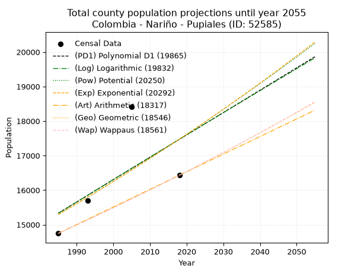
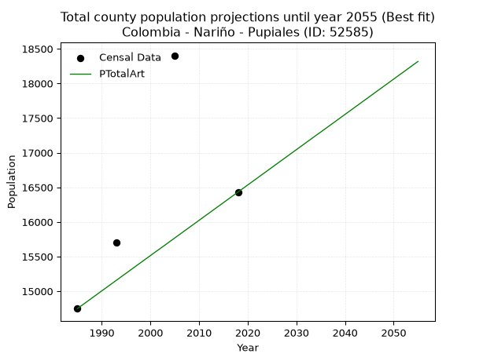
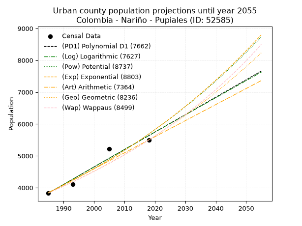
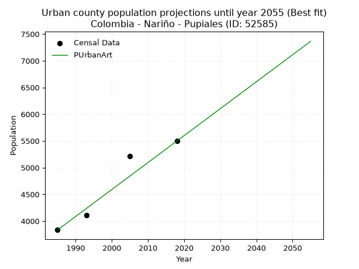
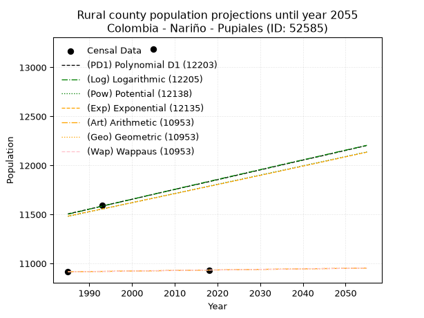
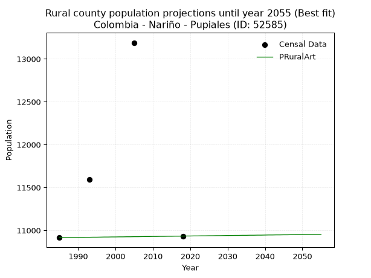

<div align="center">


</div>

# _“Population and Public Services Demand Projections (PPSD) until Year 2050 for Colombia - Nariño - Pupiales (ID: 52585)”_
Keywords: `population` `public-service` `projection` `lineal` `polynomial` `logarithmic` `potential` `exponential` `arithmetic` `geometric` `wappaus` `dane` `colombia` `south-america`

PPSD are analytical estimates used by governments and planners to anticipate future changes in population size, age distribution, and the resulting community needs for utilities, healthcare, education, and infrastructure as sizing future water treatment facilities, electrical grids, and road networks based on spatial growth.

> **General running parameters**: • app_version: _v20260806_. • Python version: _3.14.7_. • Pandas version: _3.0.5_. • NumPy version: _2.5.1_. • Creates, save and include plots into reports (create_plot): _False_. • Projection until year: _2050_. • Process polynomial degree 2 and up: _False_. • Process Wappaus: _True_. • Process Wappaus: _True_. • Set negative values to zero: _True_. • Set infinite values to zero: _True_. • Drop dataset notes: _True_. 
<div align="center">

Dynamic map: [:earth_americas:Google](http://maps.google.com/maps?q=0.870441782,-77.6360423) [:earth_americas:OSM](https://www.openstreetmap.org/#map=18/0.870441782/-77.6360423&layers=P) [:earth_americas:Bing](https://www.bing.com/maps?cp=0.870441782~-77.6360423&lvl=18) [:earth_americas:Apple](https://maps.apple.com/frame?center=0.870441782%2C-77.6360423&span=0.003%2C0.006)

</div>


<div align="center">

```geojson
{
  "type": "Feature",
  "geometry": {
    "type": "Point", 
    "coordinates": [-77.6360423, 0.870441782]
  }, 
  "properties": {
    "Name": "Colombia - Nariño - Pupiales (ID: 52585)"
  }
}
```

</div>


## 0. Census Data (4 records)

Census data are official statistics collected by a government about the people and housing in a country. They usually include counts of total population, age, sex, race, income, education, and jobs.

📅Global census file: [Population.xlsx](../data/Population.xlsx)

| Source   |   Year |   CountryID | CountryName   |   StateID | StateName   |   CountyID | CountyName   |   PTotal |   PUrban |   PRural |
|:---------|-------:|------------:|:--------------|----------:|:------------|-----------:|:-------------|---------:|---------:|---------:|
| DANE     |   1985 |          57 | Colombia      |        52 | Nariño      |      52585 | Pupiales     |    14749 |     3834 |    10915 |
| DANE     |   1993 |          57 | Colombia      |        52 | Nariño      |      52585 | Pupiales     |    15702 |     4109 |    11593 |
| DANE     |   2005 |          57 | Colombia      |        52 | Nariño      |      52585 | Pupiales     |    18404 |     5215 |    13189 |
| DANE     |   2018 |          57 | Colombia      |        52 | Nariño      |      52585 | Pupiales     |    16431 |     5498 |    10933 |

> 🔥Some records could had specific notes about the registered values or the corresponding urban or rural distribution.

## 1. Total

### 1.1. Coefficients and Parameters

* (PD1) Polynomial Deg 1: 64.7250100361312, -113144.7013247714 (lineal)
* (Log) Logarithmic: 129900.90126162686, -971056.2914501186
* (Pow) Potential: 8.103006148931186, -22.537314364407727
* (Exp) Exponential: 0.0040378566896404795, 5.054140136307581
* (Art) Arithmetic: Year diff. 2018 - 1985 = 33, Population diff. 16431 - 14749 = 1682, Annual growth = 50.96969696969697
* (Geo) Geometric: Year diff. 2018 - 1985 = 33, Population diff. 16431 - 14749 = 1682, Annual growth % = 0.0032779216006662004
* (Wap) Wappaus: i = 0.3269384026279472, Condition values only valid for < 200)

<sub>
Wappaus condition values: ['0.00', '0.33', '0.65', '0.98', '1.31', '1.63', '1.96', '2.29', '2.62', '2.94', '3.27', '3.60', '3.92', '4.25', '4.58', '4.90', '5.23', '5.56', '5.88', '6.21', '6.54', '6.87', '7.19', '7.52', '7.85', '8.17', '8.50', '8.83', '9.15', '9.48', '9.81', '10.14', '10.46', '10.79', '11.12', '11.44', '11.77', '12.10', '12.42', '12.75', '13.08', '13.40', '13.73', '14.06', '14.39', '14.71', '15.04', '15.37', '15.69', '16.02', '16.35', '16.67', '17.00', '17.33', '17.65', '17.98', '18.31', '18.64', '18.96', '19.29', '19.62', '19.94', '20.27', '20.60', '20.92', '21.25']
</sub>


### 1.2. Projected Dataset

|   Year |   CountyID |   PTotalPD1 |   PTotalLog |   PTotalPow |   PTotalExp |   PTotalArt |   PTotalGeo |   PTotalWap |
|-------:|-----------:|------------:|------------:|------------:|------------:|------------:|------------:|------------:|
|   1985 |      52585 |       15334 |       15330 |       15292 |       15296 |       14749 |       14749 |       14749 |
|   1986 |      52585 |       15399 |       15395 |       15354 |       15358 |       14800 |       14797 |       14797 |
|   1987 |      52585 |       15464 |       15461 |       15417 |       15420 |       14851 |       14846 |       14846 |
|   1988 |      52585 |       15529 |       15526 |       15480 |       15483 |       14902 |       14895 |       14894 |
|   1989 |      52585 |       15593 |       15591 |       15543 |       15545 |       14953 |       14943 |       14943 |
|   1990 |      52585 |       15658 |       15657 |       15607 |       15608 |       15004 |       14992 |       14992 |
|   1991 |      52585 |       15723 |       15722 |       15670 |       15671 |       15055 |       15041 |       15041 |
|   1992 |      52585 |       15788 |       15787 |       15734 |       15735 |       15106 |       15091 |       15090 |
|   1993 |      52585 |       15852 |       15852 |       15798 |       15798 |       15157 |       15140 |       15140 |
|   1994 |      52585 |       15917 |       15918 |       15863 |       15862 |       15208 |       15190 |       15189 |
|   1995 |      52585 |       15982 |       15983 |       15927 |       15926 |       15259 |       15240 |       15239 |
|   1996 |      52585 |       16046 |       16048 |       15992 |       15991 |       15310 |       15290 |       15289 |
|   1997 |      52585 |       16111 |       16113 |       16057 |       16056 |       15361 |       15340 |       15339 |
|   1998 |      52585 |       16176 |       16178 |       16122 |       16120 |       15412 |       15390 |       15389 |
|   1999 |      52585 |       16241 |       16243 |       16188 |       16186 |       15463 |       15440 |       15440 |
|   2000 |      52585 |       16305 |       16308 |       16254 |       16251 |       15514 |       15491 |       15490 |
|   2001 |      52585 |       16370 |       16373 |       16320 |       16317 |       15565 |       15542 |       15541 |
|   2002 |      52585 |       16435 |       16438 |       16386 |       16383 |       15615 |       15593 |       15592 |
|   2003 |      52585 |       16499 |       16502 |       16452 |       16449 |       15666 |       15644 |       15643 |
|   2004 |      52585 |       16564 |       16567 |       16519 |       16516 |       15717 |       15695 |       15695 |
|   2005 |      52585 |       16629 |       16632 |       16586 |       16583 |       15768 |       15747 |       15746 |
|   2006 |      52585 |       16694 |       16697 |       16653 |       16650 |       15819 |       15798 |       15798 |
|   2007 |      52585 |       16758 |       16762 |       16720 |       16717 |       15870 |       15850 |       15849 |
|   2008 |      52585 |       16823 |       16826 |       16788 |       16785 |       15921 |       15902 |       15901 |
|   2009 |      52585 |       16888 |       16891 |       16856 |       16853 |       15972 |       15954 |       15954 |
|   2010 |      52585 |       16953 |       16956 |       16924 |       16921 |       16023 |       16006 |       16006 |
|   2011 |      52585 |       17017 |       17020 |       16992 |       16989 |       16074 |       16059 |       16058 |
|   2012 |      52585 |       17082 |       17085 |       17061 |       17058 |       16125 |       16112 |       16111 |
|   2013 |      52585 |       17147 |       17149 |       17130 |       17127 |       16176 |       16164 |       16164 |
|   2014 |      52585 |       17211 |       17214 |       17199 |       17196 |       16227 |       16217 |       16217 |
|   2015 |      52585 |       17276 |       17278 |       17268 |       17266 |       16278 |       16270 |       16270 |
|   2016 |      52585 |       17341 |       17343 |       17338 |       17336 |       16329 |       16324 |       16324 |
|   2017 |      52585 |       17406 |       17407 |       17408 |       17406 |       16380 |       16377 |       16377 |
|   2018 |      52585 |       17470 |       17472 |       17478 |       17476 |       16431 |       16431 |       16431 |
|   2019 |      52585 |       17535 |       17536 |       17548 |       17547 |       16482 |       16485 |       16485 |
|   2020 |      52585 |       17600 |       17600 |       17618 |       17618 |       16533 |       16539 |       16539 |
|   2021 |      52585 |       17665 |       17665 |       17689 |       17689 |       16584 |       16593 |       16593 |
|   2022 |      52585 |       17729 |       17729 |       17760 |       17761 |       16635 |       16647 |       16648 |
|   2023 |      52585 |       17794 |       17793 |       17832 |       17833 |       16686 |       16702 |       16703 |
|   2024 |      52585 |       17859 |       17857 |       17903 |       17905 |       16737 |       16757 |       16758 |
|   2025 |      52585 |       17923 |       17921 |       17975 |       17977 |       16788 |       16812 |       16813 |
|   2026 |      52585 |       17988 |       17986 |       18047 |       18050 |       16839 |       16867 |       16868 |
|   2027 |      52585 |       18053 |       18050 |       18119 |       18123 |       16890 |       16922 |       16924 |
|   2028 |      52585 |       18118 |       18114 |       18192 |       18196 |       16941 |       16978 |       16979 |
|   2029 |      52585 |       18182 |       18178 |       18265 |       18270 |       16992 |       17033 |       17035 |
|   2030 |      52585 |       18247 |       18242 |       18338 |       18344 |       17043 |       17089 |       17091 |
|   2031 |      52585 |       18312 |       18306 |       18411 |       18418 |       17094 |       17145 |       17147 |
|   2032 |      52585 |       18377 |       18370 |       18485 |       18493 |       17145 |       17201 |       17204 |
|   2033 |      52585 |       18441 |       18434 |       18559 |       18568 |       17196 |       17258 |       17261 |
|   2034 |      52585 |       18506 |       18498 |       18633 |       18643 |       17247 |       17314 |       17318 |
|   2035 |      52585 |       18571 |       18561 |       18707 |       18718 |       17297 |       17371 |       17375 |
|   2036 |      52585 |       18635 |       18625 |       18782 |       18794 |       17348 |       17428 |       17432 |
|   2037 |      52585 |       18700 |       18689 |       18856 |       18870 |       17399 |       17485 |       17489 |
|   2038 |      52585 |       18765 |       18753 |       18932 |       18946 |       17450 |       17542 |       17547 |
|   2039 |      52585 |       18830 |       18816 |       19007 |       19023 |       17501 |       17600 |       17605 |
|   2040 |      52585 |       18894 |       18880 |       19083 |       19100 |       17552 |       17658 |       17663 |
|   2041 |      52585 |       18959 |       18944 |       19159 |       19177 |       17603 |       17715 |       17721 |
|   2042 |      52585 |       19024 |       19007 |       19235 |       19255 |       17654 |       17774 |       17780 |
|   2043 |      52585 |       19088 |       19071 |       19311 |       19333 |       17705 |       17832 |       17839 |
|   2044 |      52585 |       19153 |       19135 |       19388 |       19411 |       17756 |       17890 |       17898 |
|   2045 |      52585 |       19218 |       19198 |       19465 |       19489 |       17807 |       17949 |       17957 |
|   2046 |      52585 |       19283 |       19262 |       19542 |       19568 |       17858 |       18008 |       18016 |
|   2047 |      52585 |       19347 |       19325 |       19620 |       19647 |       17909 |       18067 |       18076 |
|   2048 |      52585 |       19412 |       19389 |       19698 |       19727 |       17960 |       18126 |       18136 |
|   2049 |      52585 |       19477 |       19452 |       19776 |       19807 |       18011 |       18185 |       18196 |
|   2050 |      52585 |       19542 |       19515 |       19854 |       19887 |       18062 |       18245 |       18256 |
<div align="center">

</img>

</div>


### 1.3. Best fit with absolute and relative error (%)

Relative error puts that difference into context by dividing the absolute error by the true value, creating a unitless ratio or percentage that shows the scale of the mistake.

Absolute and relative error

|   Year | Source   |   CountryID | CountryName   |   StateID | StateName   |   CountyID_x | CountyName   |   PTotal |   PUrban |   PRural |   CountyID_y |   PTotalPD1 |   PTotalLog |   PTotalPow |   PTotalExp |   PTotalArt |   PTotalGeo |   PTotalWap |   PTotalPD1AbsError |   PTotalLogAbsError |   PTotalPowAbsError |   PTotalExpAbsError |   PTotalArtAbsError |   PTotalGeoAbsError |   PTotalWapAbsError |   PTotalPD1RelError |   PTotalLogRelError |   PTotalPowRelError |   PTotalExpRelError |   PTotalArtRelError |   PTotalGeoRelError |   PTotalWapRelError |
|-------:|:---------|------------:|:--------------|----------:|:------------|-------------:|:-------------|---------:|---------:|---------:|-------------:|------------:|------------:|------------:|------------:|------------:|------------:|------------:|--------------------:|--------------------:|--------------------:|--------------------:|--------------------:|--------------------:|--------------------:|--------------------:|--------------------:|--------------------:|--------------------:|--------------------:|--------------------:|--------------------:|
|   1985 | DANE     |          57 | Colombia      |        52 | Nariño      |        52585 | Pupiales     |    14749 |     3834 |    10915 |        52585 |       15334 |       15330 |       15292 |       15296 |       14749 |       14749 |       14749 |                 585 |                 581 |                 543 |                 547 |                   0 |                   0 |                   0 |            3.96637  |            3.93925  |            3.68161  |            3.70873  |              0      |             0       |             0       |
|   1993 | DANE     |          57 | Colombia      |        52 | Nariño      |        52585 | Pupiales     |    15702 |     4109 |    11593 |        52585 |       15852 |       15852 |       15798 |       15798 |       15157 |       15140 |       15140 |                 150 |                 150 |                  96 |                  96 |                 545 |                 562 |                 562 |            0.955292 |            0.955292 |            0.611387 |            0.611387 |              3.4709 |             3.57916 |             3.57916 |
|   2005 | DANE     |          57 | Colombia      |        52 | Nariño      |        52585 | Pupiales     |    18404 |     5215 |    13189 |        52585 |       16629 |       16632 |       16586 |       16583 |       15768 |       15747 |       15746 |                1775 |                1772 |                1818 |                1821 |                2636 |                2657 |                2658 |            9.64464  |            9.62834  |            9.87829  |            9.89459  |             14.323  |            14.4371  |            14.4425  |
|   2018 | DANE     |          57 | Colombia      |        52 | Nariño      |        52585 | Pupiales     |    16431 |     5498 |    10933 |        52585 |       17470 |       17472 |       17478 |       17476 |       16431 |       16431 |       16431 |                1039 |                1041 |                1047 |                1045 |                   0 |                   0 |                   0 |            6.32341  |            6.33559  |            6.3721   |            6.35993  |              0      |             0       |             0       |

Relative error mean

| Method    |   RelError | Best   |
|:----------|-----------:|:-------|
| PTotalPD1 |    5.22243 |        |
| PTotalLog |    5.21462 |        |
| PTotalPow |    5.13585 |        |
| PTotalExp |    5.14366 |        |
| PTotalArt |    4.44847 | True   |
| PTotalGeo |    4.50406 |        |
| PTotalWap |    4.50542 |        |

💙Best method: _**PTotalArt**_
<div align="center">

</img>

</div>


### 1.4. Fresh water supply demand in liters per capita per day (lpcd)

The fresh water supply demand typically ranges from 100 to 300 liters per capita per day (lpcd) for standard domestic and municipal planning, though absolute survival minimums set by the World Health Organization are as low as 7.5 to 20 liters per day, and total consumption in high-income nations can exceed 400 liters.

> `CZ`: Level in meters above the sea level (masl).<br> `WS`: Fresh water supply demand in liters per capita per day (lpcd or l/h/d).<br> `WSAll`: Zonal fresh water supply demand in liters per second (l/s).<br> `A`: Zonal area in square meters.

Reference values (RAS Colombia)

|    CZ |   WS |
|------:|-----:|
|  1000 |  120 |
|  2000 |  130 |
| 99999 |  140 |

County shapefile geometry properties and water supply values

|   CountyID |      ATotal |   CZTotal |   WSTotal |
|-----------:|------------:|----------:|----------:|
|      52585 | 1.29804e+08 |   3068.14 |       140 |

Projected values for best method: PTotalArt

|   CountyID |   Year |   PTotalArt |   WSTotal |   WSTotalAll |
|-----------:|-------:|------------:|----------:|-------------:|
|      52585 |   1985 |       14749 |       140 |      23.8988 |
|      52585 |   1986 |       14800 |       140 |      23.9815 |
|      52585 |   1987 |       14851 |       140 |      24.0641 |
|      52585 |   1988 |       14902 |       140 |      24.1468 |
|      52585 |   1989 |       14953 |       140 |      24.2294 |
|      52585 |   1990 |       15004 |       140 |      24.312  |
|      52585 |   1991 |       15055 |       140 |      24.3947 |
|      52585 |   1992 |       15106 |       140 |      24.4773 |
|      52585 |   1993 |       15157 |       140 |      24.56   |
|      52585 |   1994 |       15208 |       140 |      24.6426 |
|      52585 |   1995 |       15259 |       140 |      24.7252 |
|      52585 |   1996 |       15310 |       140 |      24.8079 |
|      52585 |   1997 |       15361 |       140 |      24.8905 |
|      52585 |   1998 |       15412 |       140 |      24.9731 |
|      52585 |   1999 |       15463 |       140 |      25.0558 |
|      52585 |   2000 |       15514 |       140 |      25.1384 |
|      52585 |   2001 |       15565 |       140 |      25.2211 |
|      52585 |   2002 |       15615 |       140 |      25.3021 |
|      52585 |   2003 |       15666 |       140 |      25.3847 |
|      52585 |   2004 |       15717 |       140 |      25.4674 |
|      52585 |   2005 |       15768 |       140 |      25.55   |
|      52585 |   2006 |       15819 |       140 |      25.6326 |
|      52585 |   2007 |       15870 |       140 |      25.7153 |
|      52585 |   2008 |       15921 |       140 |      25.7979 |
|      52585 |   2009 |       15972 |       140 |      25.8806 |
|      52585 |   2010 |       16023 |       140 |      25.9632 |
|      52585 |   2011 |       16074 |       140 |      26.0458 |
|      52585 |   2012 |       16125 |       140 |      26.1285 |
|      52585 |   2013 |       16176 |       140 |      26.2111 |
|      52585 |   2014 |       16227 |       140 |      26.2937 |
|      52585 |   2015 |       16278 |       140 |      26.3764 |
|      52585 |   2016 |       16329 |       140 |      26.459  |
|      52585 |   2017 |       16380 |       140 |      26.5417 |
|      52585 |   2018 |       16431 |       140 |      26.6243 |
|      52585 |   2019 |       16482 |       140 |      26.7069 |
|      52585 |   2020 |       16533 |       140 |      26.7896 |
|      52585 |   2021 |       16584 |       140 |      26.8722 |
|      52585 |   2022 |       16635 |       140 |      26.9549 |
|      52585 |   2023 |       16686 |       140 |      27.0375 |
|      52585 |   2024 |       16737 |       140 |      27.1201 |
|      52585 |   2025 |       16788 |       140 |      27.2028 |
|      52585 |   2026 |       16839 |       140 |      27.2854 |
|      52585 |   2027 |       16890 |       140 |      27.3681 |
|      52585 |   2028 |       16941 |       140 |      27.4507 |
|      52585 |   2029 |       16992 |       140 |      27.5333 |
|      52585 |   2030 |       17043 |       140 |      27.616  |
|      52585 |   2031 |       17094 |       140 |      27.6986 |
|      52585 |   2032 |       17145 |       140 |      27.7812 |
|      52585 |   2033 |       17196 |       140 |      27.8639 |
|      52585 |   2034 |       17247 |       140 |      27.9465 |
|      52585 |   2035 |       17297 |       140 |      28.0275 |
|      52585 |   2036 |       17348 |       140 |      28.1102 |
|      52585 |   2037 |       17399 |       140 |      28.1928 |
|      52585 |   2038 |       17450 |       140 |      28.2755 |
|      52585 |   2039 |       17501 |       140 |      28.3581 |
|      52585 |   2040 |       17552 |       140 |      28.4407 |
|      52585 |   2041 |       17603 |       140 |      28.5234 |
|      52585 |   2042 |       17654 |       140 |      28.606  |
|      52585 |   2043 |       17705 |       140 |      28.6887 |
|      52585 |   2044 |       17756 |       140 |      28.7713 |
|      52585 |   2045 |       17807 |       140 |      28.8539 |
|      52585 |   2046 |       17858 |       140 |      28.9366 |
|      52585 |   2047 |       17909 |       140 |      29.0192 |
|      52585 |   2048 |       17960 |       140 |      29.1019 |
|      52585 |   2049 |       18011 |       140 |      29.1845 |
|      52585 |   2050 |       18062 |       140 |      29.2671 |

## 2. Urban

### 2.1. Coefficients and Parameters

* (PD1) Polynomial Deg 1: 54.76033721397006, -104870.36451224363 (lineal)
* (Log) Logarithmic: 109644.64659432594, -828745.8374005266
* (Pow) Potential: 23.657399106122057, -74.43115673485049
* (Exp) Exponential: 0.011814490575347758, 2.514739223687946e-07
* (Art) Arithmetic: Year diff. 2018 - 1985 = 33, Population diff. 5498 - 3834 = 1664, Annual growth = 50.42424242424242
* (Geo) Geometric: Year diff. 2018 - 1985 = 33, Population diff. 5498 - 3834 = 1664, Annual growth % = 0.010983386767317027
* (Wap) Wappaus: i = 1.0806738624998375, Condition values only valid for < 200)

<sub>
Wappaus condition values: ['0.00', '1.08', '2.16', '3.24', '4.32', '5.40', '6.48', '7.56', '8.65', '9.73', '10.81', '11.89', '12.97', '14.05', '15.13', '16.21', '17.29', '18.37', '19.45', '20.53', '21.61', '22.69', '23.77', '24.86', '25.94', '27.02', '28.10', '29.18', '30.26', '31.34', '32.42', '33.50', '34.58', '35.66', '36.74', '37.82', '38.90', '39.98', '41.07', '42.15', '43.23', '44.31', '45.39', '46.47', '47.55', '48.63', '49.71', '50.79', '51.87', '52.95', '54.03', '55.11', '56.20', '57.28', '58.36', '59.44', '60.52', '61.60', '62.68', '63.76', '64.84', '65.92', '67.00', '68.08', '69.16', '70.24']
</sub>


### 2.2. Projected Dataset

|   Year |   CountyID |   PUrbanPD1 |   PUrbanLog |   PUrbanPow |   PUrbanExp |   PUrbanArt |   PUrbanGeo |   PUrbanWap |
|-------:|-----------:|------------:|------------:|------------:|------------:|------------:|------------:|------------:|
|   1985 |      52585 |        3829 |        3827 |        3848 |        3850 |        3834 |        3834 |        3834 |
|   1986 |      52585 |        3884 |        3882 |        3895 |        3896 |        3884 |        3876 |        3876 |
|   1987 |      52585 |        3938 |        3937 |        3941 |        3942 |        3935 |        3919 |        3918 |
|   1988 |      52585 |        3993 |        3993 |        3988 |        3989 |        3985 |        3962 |        3960 |
|   1989 |      52585 |        4048 |        4048 |        4036 |        4036 |        4036 |        4005 |        4003 |
|   1990 |      52585 |        4103 |        4103 |        4084 |        4084 |        4086 |        4049 |        4047 |
|   1991 |      52585 |        4157 |        4158 |        4133 |        4133 |        4137 |        4094 |        4091 |
|   1992 |      52585 |        4212 |        4213 |        4183 |        4182 |        4187 |        4139 |        4135 |
|   1993 |      52585 |        4267 |        4268 |        4233 |        4232 |        4237 |        4184 |        4180 |
|   1994 |      52585 |        4322 |        4323 |        4283 |        4282 |        4288 |        4230 |        4226 |
|   1995 |      52585 |        4377 |        4378 |        4334 |        4333 |        4338 |        4277 |        4272 |
|   1996 |      52585 |        4431 |        4433 |        4386 |        4384 |        4389 |        4324 |        4319 |
|   1997 |      52585 |        4486 |        4488 |        4438 |        4436 |        4439 |        4371 |        4366 |
|   1998 |      52585 |        4541 |        4543 |        4491 |        4489 |        4490 |        4419 |        4413 |
|   1999 |      52585 |        4596 |        4598 |        4545 |        4543 |        4540 |        4468 |        4462 |
|   2000 |      52585 |        4650 |        4652 |        4599 |        4597 |        4590 |        4517 |        4510 |
|   2001 |      52585 |        4705 |        4707 |        4653 |        4651 |        4641 |        4566 |        4560 |
|   2002 |      52585 |        4760 |        4762 |        4709 |        4706 |        4691 |        4616 |        4610 |
|   2003 |      52585 |        4815 |        4817 |        4765 |        4762 |        4742 |        4667 |        4660 |
|   2004 |      52585 |        4869 |        4871 |        4821 |        4819 |        4792 |        4718 |        4711 |
|   2005 |      52585 |        4924 |        4926 |        4878 |        4876 |        4842 |        4770 |        4763 |
|   2006 |      52585 |        4979 |        4981 |        4936 |        4934 |        4893 |        4823 |        4815 |
|   2007 |      52585 |        5034 |        5036 |        4995 |        4993 |        4943 |        4876 |        4869 |
|   2008 |      52585 |        5088 |        5090 |        5054 |        5052 |        4994 |        4929 |        4922 |
|   2009 |      52585 |        5143 |        5145 |        5114 |        5112 |        5044 |        4983 |        4977 |
|   2010 |      52585 |        5198 |        5199 |        5175 |        5173 |        5095 |        5038 |        5032 |
|   2011 |      52585 |        5253 |        5254 |        5236 |        5234 |        5145 |        5093 |        5087 |
|   2012 |      52585 |        5307 |        5308 |        5298 |        5297 |        5195 |        5149 |        5144 |
|   2013 |      52585 |        5362 |        5363 |        5360 |        5360 |        5246 |        5206 |        5201 |
|   2014 |      52585 |        5417 |        5417 |        5424 |        5423 |        5296 |        5263 |        5259 |
|   2015 |      52585 |        5472 |        5472 |        5488 |        5488 |        5347 |        5321 |        5317 |
|   2016 |      52585 |        5526 |        5526 |        5553 |        5553 |        5397 |        5379 |        5377 |
|   2017 |      52585 |        5581 |        5580 |        5618 |        5619 |        5448 |        5438 |        5437 |
|   2018 |      52585 |        5636 |        5635 |        5684 |        5686 |        5498 |        5498 |        5498 |
|   2019 |      52585 |        5691 |        5689 |        5751 |        5753 |        5548 |        5558 |        5560 |
|   2020 |      52585 |        5746 |        5743 |        5819 |        5822 |        5599 |        5619 |        5622 |
|   2021 |      52585 |        5800 |        5798 |        5888 |        5891 |        5649 |        5681 |        5686 |
|   2022 |      52585 |        5855 |        5852 |        5957 |        5961 |        5700 |        5744 |        5750 |
|   2023 |      52585 |        5910 |        5906 |        6027 |        6032 |        5750 |        5807 |        5815 |
|   2024 |      52585 |        5965 |        5960 |        6098 |        6103 |        5801 |        5870 |        5881 |
|   2025 |      52585 |        6019 |        6014 |        6170 |        6176 |        5851 |        5935 |        5948 |
|   2026 |      52585 |        6074 |        6069 |        6242 |        6249 |        5901 |        6000 |        6016 |
|   2027 |      52585 |        6129 |        6123 |        6315 |        6324 |        5952 |        6066 |        6085 |
|   2028 |      52585 |        6184 |        6177 |        6390 |        6399 |        6002 |        6133 |        6155 |
|   2029 |      52585 |        6238 |        6231 |        6464 |        6475 |        6053 |        6200 |        6226 |
|   2030 |      52585 |        6293 |        6285 |        6540 |        6552 |        6103 |        6268 |        6297 |
|   2031 |      52585 |        6348 |        6339 |        6617 |        6630 |        6154 |        6337 |        6370 |
|   2032 |      52585 |        6403 |        6393 |        6694 |        6708 |        6204 |        6407 |        6444 |
|   2033 |      52585 |        6457 |        6447 |        6773 |        6788 |        6254 |        6477 |        6519 |
|   2034 |      52585 |        6512 |        6501 |        6852 |        6869 |        6305 |        6548 |        6595 |
|   2035 |      52585 |        6567 |        6555 |        6932 |        6950 |        6355 |        6620 |        6673 |
|   2036 |      52585 |        6622 |        6608 |        7013 |        7033 |        6406 |        6693 |        6751 |
|   2037 |      52585 |        6676 |        6662 |        7095 |        7117 |        6456 |        6766 |        6830 |
|   2038 |      52585 |        6731 |        6716 |        7178 |        7201 |        6506 |        6840 |        6911 |
|   2039 |      52585 |        6786 |        6770 |        7262 |        7287 |        6557 |        6916 |        6993 |
|   2040 |      52585 |        6841 |        6824 |        7347 |        7373 |        6607 |        6992 |        7076 |
|   2041 |      52585 |        6895 |        6877 |        7432 |        7461 |        6658 |        7068 |        7161 |
|   2042 |      52585 |        6950 |        6931 |        7519 |        7550 |        6708 |        7146 |        7247 |
|   2043 |      52585 |        7005 |        6985 |        7606 |        7639 |        6759 |        7224 |        7334 |
|   2044 |      52585 |        7060 |        7038 |        7695 |        7730 |        6809 |        7304 |        7423 |
|   2045 |      52585 |        7115 |        7092 |        7785 |        7822 |        6859 |        7384 |        7513 |
|   2046 |      52585 |        7169 |        7146 |        7875 |        7915 |        6910 |        7465 |        7604 |
|   2047 |      52585 |        7224 |        7199 |        7967 |        8009 |        6960 |        7547 |        7697 |
|   2048 |      52585 |        7279 |        7253 |        8059 |        8104 |        7011 |        7630 |        7791 |
|   2049 |      52585 |        7334 |        7306 |        8153 |        8201 |        7061 |        7714 |        7887 |
|   2050 |      52585 |        7388 |        7360 |        8248 |        8298 |        7112 |        7799 |        7985 |
<div align="center">

</img>

</div>


### 2.3. Best fit with absolute and relative error (%)

Relative error puts that difference into context by dividing the absolute error by the true value, creating a unitless ratio or percentage that shows the scale of the mistake.

Absolute and relative error

|   Year | Source   |   CountryID | CountryName   |   StateID | StateName   |   CountyID_x | CountyName   |   PTotal |   PUrban |   PRural |   CountyID_y |   PUrbanPD1 |   PUrbanLog |   PUrbanPow |   PUrbanExp |   PUrbanArt |   PUrbanGeo |   PUrbanWap |   PUrbanPD1AbsError |   PUrbanLogAbsError |   PUrbanPowAbsError |   PUrbanExpAbsError |   PUrbanArtAbsError |   PUrbanGeoAbsError |   PUrbanWapAbsError |   PUrbanPD1RelError |   PUrbanLogRelError |   PUrbanPowRelError |   PUrbanExpRelError |   PUrbanArtRelError |   PUrbanGeoRelError |   PUrbanWapRelError |
|-------:|:---------|------------:|:--------------|----------:|:------------|-------------:|:-------------|---------:|---------:|---------:|-------------:|------------:|------------:|------------:|------------:|------------:|------------:|------------:|--------------------:|--------------------:|--------------------:|--------------------:|--------------------:|--------------------:|--------------------:|--------------------:|--------------------:|--------------------:|--------------------:|--------------------:|--------------------:|--------------------:|
|   1985 | DANE     |          57 | Colombia      |        52 | Nariño      |        52585 | Pupiales     |    14749 |     3834 |    10915 |        52585 |        3829 |        3827 |        3848 |        3850 |        3834 |        3834 |        3834 |                   5 |                   7 |                  14 |                  16 |                   0 |                   0 |                   0 |            0.130412 |            0.182577 |            0.365154 |            0.417319 |             0       |             0       |             0       |
|   1993 | DANE     |          57 | Colombia      |        52 | Nariño      |        52585 | Pupiales     |    15702 |     4109 |    11593 |        52585 |        4267 |        4268 |        4233 |        4232 |        4237 |        4184 |        4180 |                 158 |                 159 |                 124 |                 123 |                 128 |                  75 |                  71 |            3.84522  |            3.86955  |            3.01777  |            2.99343  |             3.11511 |             1.82526 |             1.72791 |
|   2005 | DANE     |          57 | Colombia      |        52 | Nariño      |        52585 | Pupiales     |    18404 |     5215 |    13189 |        52585 |        4924 |        4926 |        4878 |        4876 |        4842 |        4770 |        4763 |                 291 |                 289 |                 337 |                 339 |                 373 |                 445 |                 452 |            5.58006  |            5.54171  |            6.46213  |            6.50048  |             7.15244 |             8.53308 |             8.66731 |
|   2018 | DANE     |          57 | Colombia      |        52 | Nariño      |        52585 | Pupiales     |    16431 |     5498 |    10933 |        52585 |        5636 |        5635 |        5684 |        5686 |        5498 |        5498 |        5498 |                 138 |                 137 |                 186 |                 188 |                   0 |                   0 |                   0 |            2.51     |            2.49182  |            3.38305  |            3.41943  |             0       |             0       |             0       |

Relative error mean

| Method    |   RelError | Best   |
|:----------|-----------:|:-------|
| PUrbanPD1 |    3.01642 |        |
| PUrbanLog |    3.02141 |        |
| PUrbanPow |    3.30702 |        |
| PUrbanExp |    3.33266 |        |
| PUrbanArt |    2.56689 | True   |
| PUrbanGeo |    2.58958 |        |
| PUrbanWap |    2.59881 |        |

💙Best method: _**PUrbanArt**_
<div align="center">

</img>

</div>


### 2.4. Fresh water supply demand in liters per capita per day (lpcd)

The fresh water supply demand typically ranges from 100 to 300 liters per capita per day (lpcd) for standard domestic and municipal planning, though absolute survival minimums set by the World Health Organization are as low as 7.5 to 20 liters per day, and total consumption in high-income nations can exceed 400 liters.

> `CZ`: Level in meters above the sea level (masl).<br> `WS`: Fresh water supply demand in liters per capita per day (lpcd or l/h/d).<br> `WSAll`: Zonal fresh water supply demand in liters per second (l/s).<br> `A`: Zonal area in square meters.

Reference values (RAS Colombia)

|    CZ |   WS |
|------:|-----:|
|  1000 |  120 |
|  2000 |  130 |
| 99999 |  140 |

County shapefile geometry properties and water supply values

|   CountyID |      AUrban |   CZUrban |   WSUrban |
|-----------:|------------:|----------:|----------:|
|      52585 | 1.58077e+06 |   2966.04 |       140 |

Projected values for best method: PUrbanArt

|   CountyID |   Year |   PUrbanArt |   WSUrban |   WSUrbanAll |
|-----------:|-------:|------------:|----------:|-------------:|
|      52585 |   1985 |        3834 |       140 |      6.2125  |
|      52585 |   1986 |        3884 |       140 |      6.29352 |
|      52585 |   1987 |        3935 |       140 |      6.37616 |
|      52585 |   1988 |        3985 |       140 |      6.45718 |
|      52585 |   1989 |        4036 |       140 |      6.53981 |
|      52585 |   1990 |        4086 |       140 |      6.62083 |
|      52585 |   1991 |        4137 |       140 |      6.70347 |
|      52585 |   1992 |        4187 |       140 |      6.78449 |
|      52585 |   1993 |        4237 |       140 |      6.86551 |
|      52585 |   1994 |        4288 |       140 |      6.94815 |
|      52585 |   1995 |        4338 |       140 |      7.02917 |
|      52585 |   1996 |        4389 |       140 |      7.11181 |
|      52585 |   1997 |        4439 |       140 |      7.19282 |
|      52585 |   1998 |        4490 |       140 |      7.27546 |
|      52585 |   1999 |        4540 |       140 |      7.35648 |
|      52585 |   2000 |        4590 |       140 |      7.4375  |
|      52585 |   2001 |        4641 |       140 |      7.52014 |
|      52585 |   2002 |        4691 |       140 |      7.60116 |
|      52585 |   2003 |        4742 |       140 |      7.6838  |
|      52585 |   2004 |        4792 |       140 |      7.76481 |
|      52585 |   2005 |        4842 |       140 |      7.84583 |
|      52585 |   2006 |        4893 |       140 |      7.92847 |
|      52585 |   2007 |        4943 |       140 |      8.00949 |
|      52585 |   2008 |        4994 |       140 |      8.09213 |
|      52585 |   2009 |        5044 |       140 |      8.17315 |
|      52585 |   2010 |        5095 |       140 |      8.25579 |
|      52585 |   2011 |        5145 |       140 |      8.33681 |
|      52585 |   2012 |        5195 |       140 |      8.41782 |
|      52585 |   2013 |        5246 |       140 |      8.50046 |
|      52585 |   2014 |        5296 |       140 |      8.58148 |
|      52585 |   2015 |        5347 |       140 |      8.66412 |
|      52585 |   2016 |        5397 |       140 |      8.74514 |
|      52585 |   2017 |        5448 |       140 |      8.82778 |
|      52585 |   2018 |        5498 |       140 |      8.9088  |
|      52585 |   2019 |        5548 |       140 |      8.98981 |
|      52585 |   2020 |        5599 |       140 |      9.07245 |
|      52585 |   2021 |        5649 |       140 |      9.15347 |
|      52585 |   2022 |        5700 |       140 |      9.23611 |
|      52585 |   2023 |        5750 |       140 |      9.31713 |
|      52585 |   2024 |        5801 |       140 |      9.39977 |
|      52585 |   2025 |        5851 |       140 |      9.48079 |
|      52585 |   2026 |        5901 |       140 |      9.56181 |
|      52585 |   2027 |        5952 |       140 |      9.64444 |
|      52585 |   2028 |        6002 |       140 |      9.72546 |
|      52585 |   2029 |        6053 |       140 |      9.8081  |
|      52585 |   2030 |        6103 |       140 |      9.88912 |
|      52585 |   2031 |        6154 |       140 |      9.97176 |
|      52585 |   2032 |        6204 |       140 |     10.0528  |
|      52585 |   2033 |        6254 |       140 |     10.1338  |
|      52585 |   2034 |        6305 |       140 |     10.2164  |
|      52585 |   2035 |        6355 |       140 |     10.2975  |
|      52585 |   2036 |        6406 |       140 |     10.3801  |
|      52585 |   2037 |        6456 |       140 |     10.4611  |
|      52585 |   2038 |        6506 |       140 |     10.5421  |
|      52585 |   2039 |        6557 |       140 |     10.6248  |
|      52585 |   2040 |        6607 |       140 |     10.7058  |
|      52585 |   2041 |        6658 |       140 |     10.7884  |
|      52585 |   2042 |        6708 |       140 |     10.8694  |
|      52585 |   2043 |        6759 |       140 |     10.9521  |
|      52585 |   2044 |        6809 |       140 |     11.0331  |
|      52585 |   2045 |        6859 |       140 |     11.1141  |
|      52585 |   2046 |        6910 |       140 |     11.1968  |
|      52585 |   2047 |        6960 |       140 |     11.2778  |
|      52585 |   2048 |        7011 |       140 |     11.3604  |
|      52585 |   2049 |        7061 |       140 |     11.4414  |
|      52585 |   2050 |        7112 |       140 |     11.5241  |

## 3. Rural

### 3.1. Coefficients and Parameters

* (PD1) Polynomial Deg 1: 9.96467282216103, -8274.336812527601 (lineal)
* (Log) Logarithmic: 20256.254667300942, -142310.45404959208
* (Pow) Potential: 1.6050683824472092, -1.2331597562247696
* (Exp) Exponential: 0.00078884275595028, 2398.9817192085593
* (Art) Arithmetic: Year diff. 2018 - 1985 = 33, Population diff. 10933 - 10915 = 18, Annual growth = 0.5454545454545454
* (Geo) Geometric: Year diff. 2018 - 1985 = 33, Population diff. 10933 - 10915 = 18, Annual growth % = 4.9933017837178184e-05
* (Wap) Wappaus: i = 0.004993175992809826, Condition values only valid for < 200)

<sub>
Wappaus condition values: ['0.00', '0.00', '0.01', '0.01', '0.02', '0.02', '0.03', '0.03', '0.04', '0.04', '0.05', '0.05', '0.06', '0.06', '0.07', '0.07', '0.08', '0.08', '0.09', '0.09', '0.10', '0.10', '0.11', '0.11', '0.12', '0.12', '0.13', '0.13', '0.14', '0.14', '0.15', '0.15', '0.16', '0.16', '0.17', '0.17', '0.18', '0.18', '0.19', '0.19', '0.20', '0.20', '0.21', '0.21', '0.22', '0.22', '0.23', '0.23', '0.24', '0.24', '0.25', '0.25', '0.26', '0.26', '0.27', '0.27', '0.28', '0.28', '0.29', '0.29', '0.30', '0.30', '0.31', '0.31', '0.32', '0.32']
</sub>


### 3.2. Projected Dataset

|   Year |   CountyID |   PRuralPD1 |   PRuralLog |   PRuralPow |   PRuralExp |   PRuralArt |   PRuralGeo |   PRuralWap |
|-------:|-----------:|------------:|------------:|------------:|------------:|------------:|------------:|------------:|
|   1985 |      52585 |       11506 |       11503 |       11481 |       11483 |       10915 |       10915 |       10915 |
|   1986 |      52585 |       11516 |       11513 |       11490 |       11492 |       10916 |       10916 |       10916 |
|   1987 |      52585 |       11525 |       11523 |       11499 |       11501 |       10916 |       10916 |       10916 |
|   1988 |      52585 |       11535 |       11533 |       11509 |       11511 |       10917 |       10917 |       10917 |
|   1989 |      52585 |       11545 |       11544 |       11518 |       11520 |       10917 |       10917 |       10917 |
|   1990 |      52585 |       11555 |       11554 |       11527 |       11529 |       10918 |       10918 |       10918 |
|   1991 |      52585 |       11565 |       11564 |       11537 |       11538 |       10918 |       10918 |       10918 |
|   1992 |      52585 |       11575 |       11574 |       11546 |       11547 |       10919 |       10919 |       10919 |
|   1993 |      52585 |       11585 |       11584 |       11555 |       11556 |       10919 |       10919 |       10919 |
|   1994 |      52585 |       11595 |       11595 |       11564 |       11565 |       10920 |       10920 |       10920 |
|   1995 |      52585 |       11605 |       11605 |       11574 |       11574 |       10920 |       10920 |       10920 |
|   1996 |      52585 |       11615 |       11615 |       11583 |       11583 |       10921 |       10921 |       10921 |
|   1997 |      52585 |       11625 |       11625 |       11592 |       11593 |       10922 |       10922 |       10922 |
|   1998 |      52585 |       11635 |       11635 |       11602 |       11602 |       10922 |       10922 |       10922 |
|   1999 |      52585 |       11645 |       11645 |       11611 |       11611 |       10923 |       10923 |       10923 |
|   2000 |      52585 |       11655 |       11655 |       11620 |       11620 |       10923 |       10923 |       10923 |
|   2001 |      52585 |       11665 |       11665 |       11630 |       11629 |       10924 |       10924 |       10924 |
|   2002 |      52585 |       11675 |       11676 |       11639 |       11638 |       10924 |       10924 |       10924 |
|   2003 |      52585 |       11685 |       11686 |       11648 |       11648 |       10925 |       10925 |       10925 |
|   2004 |      52585 |       11695 |       11696 |       11658 |       11657 |       10925 |       10925 |       10925 |
|   2005 |      52585 |       11705 |       11706 |       11667 |       11666 |       10926 |       10926 |       10926 |
|   2006 |      52585 |       11715 |       11716 |       11676 |       11675 |       10926 |       10926 |       10926 |
|   2007 |      52585 |       11725 |       11726 |       11686 |       11684 |       10927 |       10927 |       10927 |
|   2008 |      52585 |       11735 |       11736 |       11695 |       11694 |       10928 |       10928 |       10928 |
|   2009 |      52585 |       11745 |       11746 |       11704 |       11703 |       10928 |       10928 |       10928 |
|   2010 |      52585 |       11755 |       11756 |       11714 |       11712 |       10929 |       10929 |       10929 |
|   2011 |      52585 |       11765 |       11766 |       11723 |       11721 |       10929 |       10929 |       10929 |
|   2012 |      52585 |       11775 |       11777 |       11732 |       11731 |       10930 |       10930 |       10930 |
|   2013 |      52585 |       11785 |       11787 |       11742 |       11740 |       10930 |       10930 |       10930 |
|   2014 |      52585 |       11795 |       11797 |       11751 |       11749 |       10931 |       10931 |       10931 |
|   2015 |      52585 |       11804 |       11807 |       11761 |       11758 |       10931 |       10931 |       10931 |
|   2016 |      52585 |       11814 |       11817 |       11770 |       11768 |       10932 |       10932 |       10932 |
|   2017 |      52585 |       11824 |       11827 |       11779 |       11777 |       10932 |       10932 |       10932 |
|   2018 |      52585 |       11834 |       11837 |       11789 |       11786 |       10933 |       10933 |       10933 |
|   2019 |      52585 |       11844 |       11847 |       11798 |       11795 |       10934 |       10934 |       10934 |
|   2020 |      52585 |       11854 |       11857 |       11807 |       11805 |       10934 |       10934 |       10934 |
|   2021 |      52585 |       11864 |       11867 |       11817 |       11814 |       10935 |       10935 |       10935 |
|   2022 |      52585 |       11874 |       11877 |       11826 |       11823 |       10935 |       10935 |       10935 |
|   2023 |      52585 |       11884 |       11887 |       11836 |       11833 |       10936 |       10936 |       10936 |
|   2024 |      52585 |       11894 |       11897 |       11845 |       11842 |       10936 |       10936 |       10936 |
|   2025 |      52585 |       11904 |       11907 |       11854 |       11851 |       10937 |       10937 |       10937 |
|   2026 |      52585 |       11914 |       11917 |       11864 |       11861 |       10937 |       10937 |       10937 |
|   2027 |      52585 |       11924 |       11927 |       11873 |       11870 |       10938 |       10938 |       10938 |
|   2028 |      52585 |       11934 |       11937 |       11883 |       11880 |       10938 |       10938 |       10938 |
|   2029 |      52585 |       11944 |       11947 |       11892 |       11889 |       10939 |       10939 |       10939 |
|   2030 |      52585 |       11954 |       11957 |       11901 |       11898 |       10940 |       10940 |       10940 |
|   2031 |      52585 |       11964 |       11967 |       11911 |       11908 |       10940 |       10940 |       10940 |
|   2032 |      52585 |       11974 |       11977 |       11920 |       11917 |       10941 |       10941 |       10941 |
|   2033 |      52585 |       11984 |       11987 |       11930 |       11926 |       10941 |       10941 |       10941 |
|   2034 |      52585 |       11994 |       11997 |       11939 |       11936 |       10942 |       10942 |       10942 |
|   2035 |      52585 |       12004 |       12007 |       11948 |       11945 |       10942 |       10942 |       10942 |
|   2036 |      52585 |       12014 |       12017 |       11958 |       11955 |       10943 |       10943 |       10943 |
|   2037 |      52585 |       12024 |       12027 |       11967 |       11964 |       10943 |       10943 |       10943 |
|   2038 |      52585 |       12034 |       12037 |       11977 |       11974 |       10944 |       10944 |       10944 |
|   2039 |      52585 |       12044 |       12047 |       11986 |       11983 |       10944 |       10944 |       10944 |
|   2040 |      52585 |       12054 |       12056 |       11996 |       11993 |       10945 |       10945 |       10945 |
|   2041 |      52585 |       12064 |       12066 |       12005 |       12002 |       10946 |       10946 |       10946 |
|   2042 |      52585 |       12074 |       12076 |       12015 |       12011 |       10946 |       10946 |       10946 |
|   2043 |      52585 |       12083 |       12086 |       12024 |       12021 |       10947 |       10947 |       10947 |
|   2044 |      52585 |       12093 |       12096 |       12033 |       12030 |       10947 |       10947 |       10947 |
|   2045 |      52585 |       12103 |       12106 |       12043 |       12040 |       10948 |       10948 |       10948 |
|   2046 |      52585 |       12113 |       12116 |       12052 |       12049 |       10948 |       10948 |       10948 |
|   2047 |      52585 |       12123 |       12126 |       12062 |       12059 |       10949 |       10949 |       10949 |
|   2048 |      52585 |       12133 |       12136 |       12071 |       12068 |       10949 |       10949 |       10949 |
|   2049 |      52585 |       12143 |       12146 |       12081 |       12078 |       10950 |       10950 |       10950 |
|   2050 |      52585 |       12153 |       12156 |       12090 |       12088 |       10950 |       10950 |       10950 |
<div align="center">

</img>

</div>


### 3.3. Best fit with absolute and relative error (%)

Relative error puts that difference into context by dividing the absolute error by the true value, creating a unitless ratio or percentage that shows the scale of the mistake.

Absolute and relative error

|   Year | Source   |   CountryID | CountryName   |   StateID | StateName   |   CountyID_x | CountyName   |   PTotal |   PUrban |   PRural |   CountyID_y |   PRuralPD1 |   PRuralLog |   PRuralPow |   PRuralExp |   PRuralArt |   PRuralGeo |   PRuralWap |   PRuralPD1AbsError |   PRuralLogAbsError |   PRuralPowAbsError |   PRuralExpAbsError |   PRuralArtAbsError |   PRuralGeoAbsError |   PRuralWapAbsError |   PRuralPD1RelError |   PRuralLogRelError |   PRuralPowRelError |   PRuralExpRelError |   PRuralArtRelError |   PRuralGeoRelError |   PRuralWapRelError |
|-------:|:---------|------------:|:--------------|----------:|:------------|-------------:|:-------------|---------:|---------:|---------:|-------------:|------------:|------------:|------------:|------------:|------------:|------------:|------------:|--------------------:|--------------------:|--------------------:|--------------------:|--------------------:|--------------------:|--------------------:|--------------------:|--------------------:|--------------------:|--------------------:|--------------------:|--------------------:|--------------------:|
|   1985 | DANE     |          57 | Colombia      |        52 | Nariño      |        52585 | Pupiales     |    14749 |     3834 |    10915 |        52585 |       11506 |       11503 |       11481 |       11483 |       10915 |       10915 |       10915 |                 591 |                 588 |                 566 |                 568 |                   0 |                   0 |                   0 |           5.41457   |           5.38708   |            5.18552  |            5.20385  |             0       |             0       |             0       |
|   1993 | DANE     |          57 | Colombia      |        52 | Nariño      |        52585 | Pupiales     |    15702 |     4109 |    11593 |        52585 |       11585 |       11584 |       11555 |       11556 |       10919 |       10919 |       10919 |                   8 |                   9 |                  38 |                  37 |                 674 |                 674 |                 674 |           0.0690072 |           0.0776331 |            0.327784 |            0.319158 |             5.81385 |             5.81385 |             5.81385 |
|   2005 | DANE     |          57 | Colombia      |        52 | Nariño      |        52585 | Pupiales     |    18404 |     5215 |    13189 |        52585 |       11705 |       11706 |       11667 |       11666 |       10926 |       10926 |       10926 |                1484 |                1483 |                1522 |                1523 |                2263 |                2263 |                2263 |          11.2518    |          11.2442    |           11.5399   |           11.5475   |            17.1582  |            17.1582  |            17.1582  |
|   2018 | DANE     |          57 | Colombia      |        52 | Nariño      |        52585 | Pupiales     |    16431 |     5498 |    10933 |        52585 |       11834 |       11837 |       11789 |       11786 |       10933 |       10933 |       10933 |                 901 |                 904 |                 856 |                 853 |                   0 |                   0 |                   0 |           8.2411    |           8.26854   |            7.82951  |            7.80207  |             0       |             0       |             0       |

Relative error mean

| Method    |   RelError | Best   |
|:----------|-----------:|:-------|
| PRuralPD1 |    6.24412 |        |
| PRuralLog |    6.24437 |        |
| PRuralPow |    6.22068 |        |
| PRuralExp |    6.21814 |        |
| PRuralArt |    5.74302 | True   |
| PRuralGeo |    5.74302 | True   |
| PRuralWap |    5.74302 | True   |

💙Best method: _**PRuralArt**_
<div align="center">

</img>

</div>


### 3.4. Fresh water supply demand in liters per capita per day (lpcd)

The fresh water supply demand typically ranges from 100 to 300 liters per capita per day (lpcd) for standard domestic and municipal planning, though absolute survival minimums set by the World Health Organization are as low as 7.5 to 20 liters per day, and total consumption in high-income nations can exceed 400 liters.

> `CZ`: Level in meters above the sea level (masl).<br> `WS`: Fresh water supply demand in liters per capita per day (lpcd or l/h/d).<br> `WSAll`: Zonal fresh water supply demand in liters per second (l/s).<br> `A`: Zonal area in square meters.

Reference values (RAS Colombia)

|    CZ |   WS |
|------:|-----:|
|  1000 |  120 |
|  2000 |  130 |
| 99999 |  140 |

County shapefile geometry properties and water supply values

|   CountyID |      ARural |   CZRural |   WSRural |
|-----------:|------------:|----------:|----------:|
|      52585 | 1.28223e+08 |   3069.38 |       140 |

Projected values for best method: PRuralArt

|   CountyID |   Year |   PRuralArt |   WSRural |   WSRuralAll |
|-----------:|-------:|------------:|----------:|-------------:|
|      52585 |   1985 |       10915 |       140 |      17.6863 |
|      52585 |   1986 |       10916 |       140 |      17.688  |
|      52585 |   1987 |       10916 |       140 |      17.688  |
|      52585 |   1988 |       10917 |       140 |      17.6896 |
|      52585 |   1989 |       10917 |       140 |      17.6896 |
|      52585 |   1990 |       10918 |       140 |      17.6912 |
|      52585 |   1991 |       10918 |       140 |      17.6912 |
|      52585 |   1992 |       10919 |       140 |      17.6928 |
|      52585 |   1993 |       10919 |       140 |      17.6928 |
|      52585 |   1994 |       10920 |       140 |      17.6944 |
|      52585 |   1995 |       10920 |       140 |      17.6944 |
|      52585 |   1996 |       10921 |       140 |      17.6961 |
|      52585 |   1997 |       10922 |       140 |      17.6977 |
|      52585 |   1998 |       10922 |       140 |      17.6977 |
|      52585 |   1999 |       10923 |       140 |      17.6993 |
|      52585 |   2000 |       10923 |       140 |      17.6993 |
|      52585 |   2001 |       10924 |       140 |      17.7009 |
|      52585 |   2002 |       10924 |       140 |      17.7009 |
|      52585 |   2003 |       10925 |       140 |      17.7025 |
|      52585 |   2004 |       10925 |       140 |      17.7025 |
|      52585 |   2005 |       10926 |       140 |      17.7042 |
|      52585 |   2006 |       10926 |       140 |      17.7042 |
|      52585 |   2007 |       10927 |       140 |      17.7058 |
|      52585 |   2008 |       10928 |       140 |      17.7074 |
|      52585 |   2009 |       10928 |       140 |      17.7074 |
|      52585 |   2010 |       10929 |       140 |      17.709  |
|      52585 |   2011 |       10929 |       140 |      17.709  |
|      52585 |   2012 |       10930 |       140 |      17.7106 |
|      52585 |   2013 |       10930 |       140 |      17.7106 |
|      52585 |   2014 |       10931 |       140 |      17.7123 |
|      52585 |   2015 |       10931 |       140 |      17.7123 |
|      52585 |   2016 |       10932 |       140 |      17.7139 |
|      52585 |   2017 |       10932 |       140 |      17.7139 |
|      52585 |   2018 |       10933 |       140 |      17.7155 |
|      52585 |   2019 |       10934 |       140 |      17.7171 |
|      52585 |   2020 |       10934 |       140 |      17.7171 |
|      52585 |   2021 |       10935 |       140 |      17.7188 |
|      52585 |   2022 |       10935 |       140 |      17.7188 |
|      52585 |   2023 |       10936 |       140 |      17.7204 |
|      52585 |   2024 |       10936 |       140 |      17.7204 |
|      52585 |   2025 |       10937 |       140 |      17.722  |
|      52585 |   2026 |       10937 |       140 |      17.722  |
|      52585 |   2027 |       10938 |       140 |      17.7236 |
|      52585 |   2028 |       10938 |       140 |      17.7236 |
|      52585 |   2029 |       10939 |       140 |      17.7252 |
|      52585 |   2030 |       10940 |       140 |      17.7269 |
|      52585 |   2031 |       10940 |       140 |      17.7269 |
|      52585 |   2032 |       10941 |       140 |      17.7285 |
|      52585 |   2033 |       10941 |       140 |      17.7285 |
|      52585 |   2034 |       10942 |       140 |      17.7301 |
|      52585 |   2035 |       10942 |       140 |      17.7301 |
|      52585 |   2036 |       10943 |       140 |      17.7317 |
|      52585 |   2037 |       10943 |       140 |      17.7317 |
|      52585 |   2038 |       10944 |       140 |      17.7333 |
|      52585 |   2039 |       10944 |       140 |      17.7333 |
|      52585 |   2040 |       10945 |       140 |      17.735  |
|      52585 |   2041 |       10946 |       140 |      17.7366 |
|      52585 |   2042 |       10946 |       140 |      17.7366 |
|      52585 |   2043 |       10947 |       140 |      17.7382 |
|      52585 |   2044 |       10947 |       140 |      17.7382 |
|      52585 |   2045 |       10948 |       140 |      17.7398 |
|      52585 |   2046 |       10948 |       140 |      17.7398 |
|      52585 |   2047 |       10949 |       140 |      17.7414 |
|      52585 |   2048 |       10949 |       140 |      17.7414 |
|      52585 |   2049 |       10950 |       140 |      17.7431 |
|      52585 |   2050 |       10950 |       140 |      17.7431 |

<div align="center"><br><sub>Share this research</sub></div><br>

<sub>**APPS & TOOLS & CONTENT DISCLAIMER**: • NO WARRANTY - This content and software is provided by <a href="https://github.com/rcfdtools" target="_blank">github.com/rcfdtools</a> "as is", without any express or implied warranty, including warranties of merchantability, fitness for a particular purpose, or non-infringement. There is no guarantee that the software will be error-free or operate without interruption. • LIMITATION OF LIABILITY - Neither the authors nor copyright holders will be liable for claims or damages arising from the software or its use. You are responsible for determining if the software is appropriate for your use and assume all associated risks, including errors, legal compliance, and data loss. • NO PROFESSIONAL ADVICE - The software provides general information and does not offer professional advice. It should not replace consultation with professional advisors. [Clauses and global license for rcfdtools use.](https://github.com/rcfdtools/rcfdtools/blob/main/LICENSE.md)</sub>