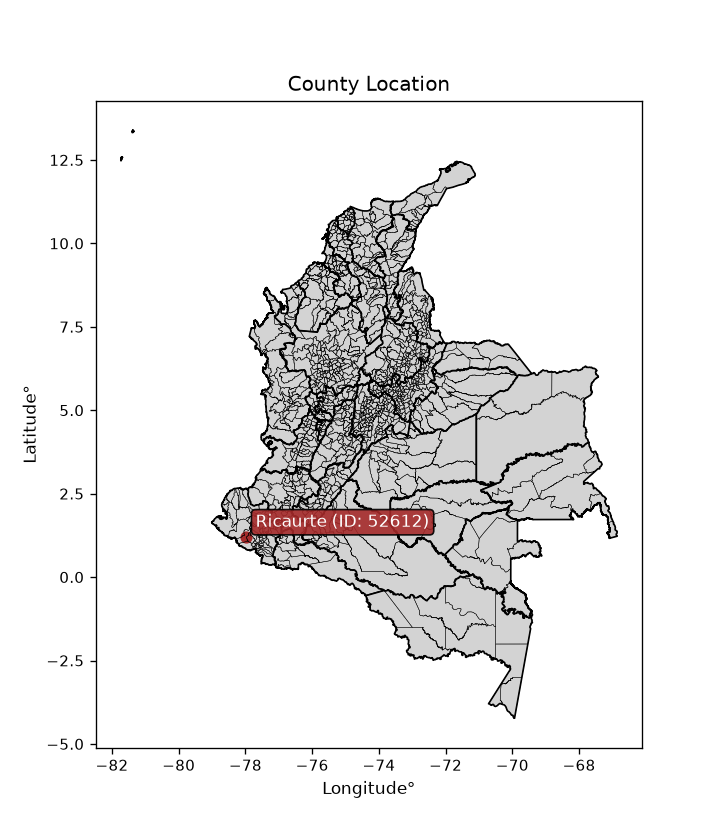
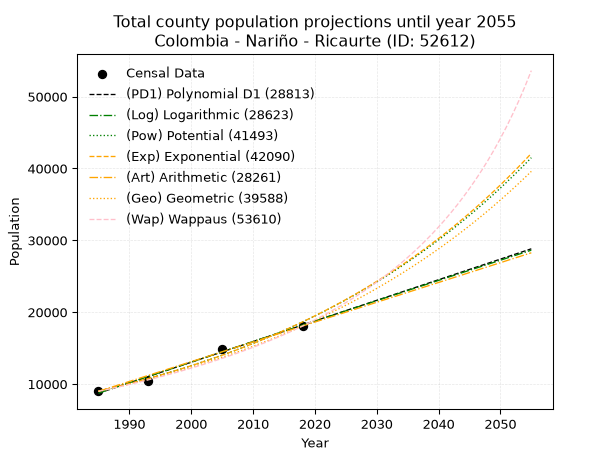
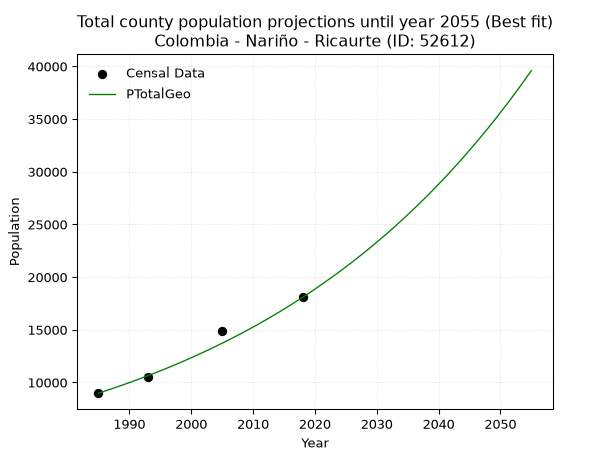
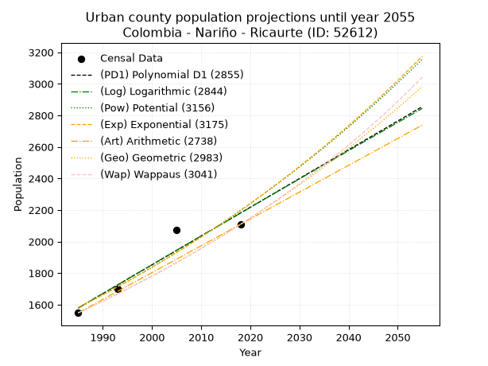
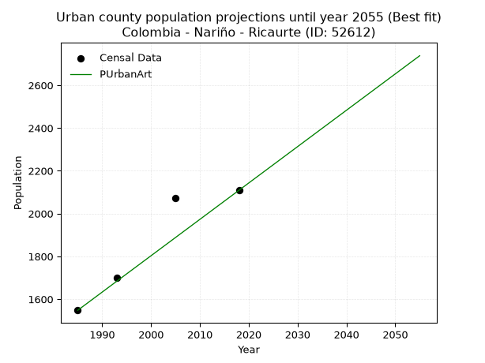
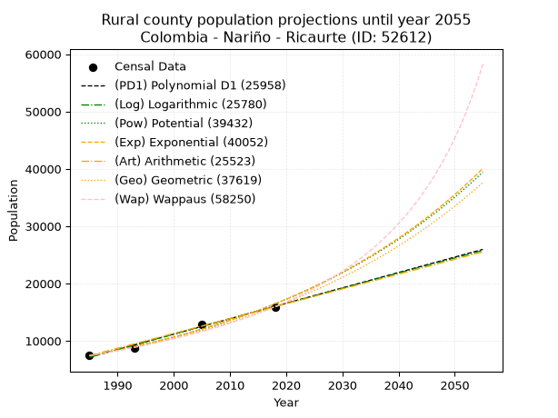

<div align="center">


</div>

# _“Population and Public Services Demand Projections (PPSD) until Year 2050 for Colombia - Nariño - Ricaurte (ID: 52612)”_
Keywords: `population` `public-service` `projection` `lineal` `polynomial` `logarithmic` `potential` `exponential` `arithmetic` `geometric` `wappaus` `dane` `colombia` `south-america`

PPSD are analytical estimates used by governments and planners to anticipate future changes in population size, age distribution, and the resulting community needs for utilities, healthcare, education, and infrastructure as sizing future water treatment facilities, electrical grids, and road networks based on spatial growth.

<div align="center">

</img>

</div>


> **General running parameters**: • app_version: _v20260806_. • Python version: _3.14.7_. • Pandas version: _3.0.5_. • NumPy version: _2.5.1_. • Creates, save and include plots into reports (create_plot): _False_. • Projection until year: _2050_. • Process polynomial degree 2 and up: _False_. • Process Wappaus: _True_. • Process Wappaus: _True_. • Set negative values to zero: _True_. • Set infinite values to zero: _True_. • Drop dataset notes: _True_. 
<div align="center">

Dynamic map: [:earth_americas:Google](http://maps.google.com/maps?q=1.212492213,-77.9951525) [:earth_americas:OSM](https://www.openstreetmap.org/#map=18/1.212492213/-77.9951525&layers=P) [:earth_americas:Bing](https://www.bing.com/maps?cp=1.212492213~-77.9951525&lvl=18) [:earth_americas:Apple](https://maps.apple.com/frame?center=1.212492213%2C-77.9951525&span=0.003%2C0.006)

</div>


<div align="center">

```geojson
{
  "type": "Feature",
  "geometry": {
    "type": "Point", 
    "coordinates": [-77.9951525, 1.212492213]
  }, 
  "properties": {
    "Name": "Colombia - Nariño - Ricaurte (ID: 52612)"
  }
}
```

</div>


## 0. Census Data (4 records)

Census data are official statistics collected by a government about the people and housing in a country. They usually include counts of total population, age, sex, race, income, education, and jobs.

📅Global census file: [Population.xlsx](../data/Population.xlsx)

| Source   |   Year |   CountryID | CountryName   |   StateID | StateName   |   CountyID | CountyName   |   PTotal |   PUrban |   PRural |
|:---------|-------:|------------:|:--------------|----------:|:------------|-----------:|:-------------|---------:|---------:|---------:|
| DANE     |   1985 |          57 | Colombia      |        52 | Nariño      |      52612 | Ricaurte     |     8975 |     1548 |     7427 |
| DANE     |   1993 |          57 | Colombia      |        52 | Nariño      |      52612 | Ricaurte     |    10477 |     1699 |     8778 |
| DANE     |   2005 |          57 | Colombia      |        52 | Nariño      |      52612 | Ricaurte     |    14904 |     2072 |    12832 |
| DANE     |   2018 |          57 | Colombia      |        52 | Nariño      |      52612 | Ricaurte     |    18067 |     2109 |    15958 |

> 🔥Some records could had specific notes about the registered values or the corresponding urban or rural distribution.

📅[SUI-RUPS](https://www.datos.gov.co/Hacienda-y-Cr-dito-P-blico/Registro-nico-de-Prestadores-de-Servicios-P-blicos/4qkq-csdn/about_data) - Local public utility companies: [RUPS.csv](../data/RUPS.xlsx)

 | SERVICIO       | ESTADO    | NOMBRE                                                             | NIT         | DEPARTAMENTO_DOMICILIO   | MUNICIPIO_DOMICILIO   | DIRECCION                         |   TELEFONO | EMAIL                     | TIPO_PRESTADOR          | CLASIFICACION                 |
|:---------------|:----------|:-------------------------------------------------------------------|:------------|:-------------------------|:----------------------|:----------------------------------|-----------:|:--------------------------|:------------------------|:------------------------------|
| ACUEDUCTO      | OPERATIVA | EMPRESA COOPERATIVA DE ACUEDUCTO ALCANTARILLADO Y ASEO DE RICAURTE | 900300084-0 | NARINO                   | RICAURTE              | cra 3 No 72-76 barrio el comercio |    7753421 | ecooparricaurte@gmail.com | ORGANIZACION AUTORIZADA | MENOR O IGUAL A 2500 USUARIOS |
| ALCANTARILLADO | OPERATIVA | EMPRESA COOPERATIVA DE ACUEDUCTO ALCANTARILLADO Y ASEO DE RICAURTE | 900300084-0 | NARINO                   | RICAURTE              | cra 3 No 72-76 barrio el comercio |    7753421 | ecooparricaurte@gmail.com | ORGANIZACION AUTORIZADA | MENOR O IGUAL A 2500 USUARIOS |

## 1. Total

### 1.1. Coefficients and Parameters

* (PD1) Polynomial Deg 1: 286.8827780008006, -560731.5266961014 (lineal)
* (Log) Logarithmic: 574232.9679894815, -4351643.641302261
* (Pow) Potential: 44.061984674759415, -141.3510878754448
* (Exp) Exponential: 0.022008766366244246, 9.59188421605685e-16
* (Art) Arithmetic: Year diff. 2018 - 1985 = 33, Population diff. 18067 - 8975 = 9092, Annual growth = 275.5151515151515
* (Geo) Geometric: Year diff. 2018 - 1985 = 33, Population diff. 18067 - 8975 = 9092, Annual growth % = 0.021427682567810802
* (Wap) Wappaus: i = 2.0376832446945605, Condition values only valid for < 200)

<sub>
Wappaus condition values: ['0.00', '2.04', '4.08', '6.11', '8.15', '10.19', '12.23', '14.26', '16.30', '18.34', '20.38', '22.41', '24.45', '26.49', '28.53', '30.57', '32.60', '34.64', '36.68', '38.72', '40.75', '42.79', '44.83', '46.87', '48.90', '50.94', '52.98', '55.02', '57.06', '59.09', '61.13', '63.17', '65.21', '67.24', '69.28', '71.32', '73.36', '75.39', '77.43', '79.47', '81.51', '83.55', '85.58', '87.62', '89.66', '91.70', '93.73', '95.77', '97.81', '99.85', '101.88', '103.92', '105.96', '108.00', '110.03', '112.07', '114.11', '116.15', '118.19', '120.22', '122.26', '124.30', '126.34', '128.37', '130.41', '132.45']
</sub>


### 1.2. Projected Dataset

|   Year |   CountyID |   PTotalPD1 |   PTotalLog |   PTotalPow |   PTotalExp |   PTotalArt |   PTotalGeo |   PTotalWap |
|-------:|-----------:|------------:|------------:|------------:|------------:|------------:|------------:|------------:|
|   1985 |      52612 |        8731 |        8722 |        9011 |        9018 |        8975 |        8975 |        8975 |
|   1986 |      52612 |        9018 |        9011 |        9213 |        9218 |        9251 |        9167 |        9160 |
|   1987 |      52612 |        9305 |        9300 |        9420 |        9424 |        9526 |        9364 |        9348 |
|   1988 |      52612 |        9591 |        9589 |        9631 |        9633 |        9802 |        9564 |        9541 |
|   1989 |      52612 |        9878 |        9878 |        9847 |        9848 |       10077 |        9769 |        9738 |
|   1990 |      52612 |       10165 |       10167 |       10068 |       10067 |       10353 |        9979 |        9938 |
|   1991 |      52612 |       10452 |       10455 |       10293 |       10291 |       10628 |       10192 |       10144 |
|   1992 |      52612 |       10739 |       10744 |       10523 |       10520 |       10904 |       10411 |       10353 |
|   1993 |      52612 |       11026 |       11032 |       10759 |       10754 |       11179 |       10634 |       10568 |
|   1994 |      52612 |       11313 |       11320 |       10999 |       10993 |       11455 |       10862 |       10787 |
|   1995 |      52612 |       11600 |       11608 |       11245 |       11238 |       11730 |       11095 |       11011 |
|   1996 |      52612 |       11886 |       11896 |       11496 |       11488 |       12006 |       11332 |       11241 |
|   1997 |      52612 |       12173 |       12183 |       11752 |       11744 |       12281 |       11575 |       11475 |
|   1998 |      52612 |       12460 |       12471 |       12014 |       12005 |       12557 |       11823 |       11715 |
|   1999 |      52612 |       12747 |       12758 |       12282 |       12272 |       12832 |       12077 |       11961 |
|   2000 |      52612 |       13034 |       13045 |       12556 |       12545 |       13108 |       12335 |       12213 |
|   2001 |      52612 |       13321 |       13332 |       12835 |       12824 |       13383 |       12600 |       12471 |
|   2002 |      52612 |       13608 |       13619 |       13121 |       13110 |       13659 |       12870 |       12735 |
|   2003 |      52612 |       13895 |       13906 |       13413 |       13401 |       13934 |       13145 |       13006 |
|   2004 |      52612 |       14182 |       14192 |       13711 |       13700 |       14210 |       13427 |       13284 |
|   2005 |      52612 |       14468 |       14479 |       14016 |       14004 |       14485 |       13715 |       13569 |
|   2006 |      52612 |       14755 |       14765 |       14327 |       14316 |       14761 |       14009 |       13861 |
|   2007 |      52612 |       15042 |       15051 |       14645 |       14635 |       15036 |       14309 |       14161 |
|   2008 |      52612 |       15329 |       15337 |       14970 |       14960 |       15312 |       14615 |       14469 |
|   2009 |      52612 |       15616 |       15623 |       15303 |       15293 |       15587 |       14929 |       14785 |
|   2010 |      52612 |       15903 |       15909 |       15642 |       15634 |       15863 |       15248 |       15110 |
|   2011 |      52612 |       16190 |       16195 |       15988 |       15981 |       16138 |       15575 |       15443 |
|   2012 |      52612 |       16477 |       16480 |       16342 |       16337 |       16414 |       15909 |       15787 |
|   2013 |      52612 |       16764 |       16766 |       16704 |       16701 |       16689 |       16250 |       16140 |
|   2014 |      52612 |       17050 |       17051 |       17074 |       17072 |       16965 |       16598 |       16503 |
|   2015 |      52612 |       17337 |       17336 |       17451 |       17452 |       17240 |       16954 |       16877 |
|   2016 |      52612 |       17624 |       17621 |       17837 |       17841 |       17516 |       17317 |       17262 |
|   2017 |      52612 |       17911 |       17905 |       18231 |       18238 |       17791 |       17688 |       17658 |
|   2018 |      52612 |       18198 |       18190 |       18634 |       18643 |       18067 |       18067 |       18067 |
|   2019 |      52612 |       18485 |       18475 |       19045 |       19058 |       18343 |       18454 |       18489 |
|   2020 |      52612 |       18772 |       18759 |       19465 |       19482 |       18618 |       18850 |       18923 |
|   2021 |      52612 |       19059 |       19043 |       19894 |       19916 |       18894 |       19253 |       19372 |
|   2022 |      52612 |       19345 |       19327 |       20332 |       20359 |       19169 |       19666 |       19836 |
|   2023 |      52612 |       19632 |       19611 |       20780 |       20812 |       19445 |       20087 |       20315 |
|   2024 |      52612 |       19919 |       19895 |       21238 |       21275 |       19720 |       20518 |       20810 |
|   2025 |      52612 |       20206 |       20179 |       21705 |       21749 |       19996 |       20957 |       21322 |
|   2026 |      52612 |       20493 |       20462 |       22182 |       22233 |       20271 |       21407 |       21852 |
|   2027 |      52612 |       20780 |       20745 |       22670 |       22727 |       20547 |       21865 |       22401 |
|   2028 |      52612 |       21067 |       21029 |       23168 |       23233 |       20822 |       22334 |       22970 |
|   2029 |      52612 |       21354 |       21312 |       23677 |       23750 |       21098 |       22812 |       23560 |
|   2030 |      52612 |       21641 |       21595 |       24196 |       24279 |       21373 |       23301 |       24172 |
|   2031 |      52612 |       21927 |       21877 |       24727 |       24819 |       21649 |       23800 |       24808 |
|   2032 |      52612 |       22214 |       22160 |       25269 |       25371 |       21924 |       24310 |       25468 |
|   2033 |      52612 |       22501 |       22443 |       25823 |       25936 |       22200 |       24831 |       26155 |
|   2034 |      52612 |       22788 |       22725 |       26389 |       26513 |       22475 |       25363 |       26870 |
|   2035 |      52612 |       23075 |       23007 |       26967 |       27103 |       22751 |       25907 |       27614 |
|   2036 |      52612 |       23362 |       23289 |       27557 |       27706 |       23026 |       26462 |       28390 |
|   2037 |      52612 |       23649 |       23571 |       28159 |       28323 |       23302 |       27029 |       29200 |
|   2038 |      52612 |       23936 |       23853 |       28775 |       28953 |       23577 |       27608 |       30046 |
|   2039 |      52612 |       24222 |       24135 |       29404 |       29597 |       23853 |       28200 |       30929 |
|   2040 |      52612 |       24509 |       24416 |       30046 |       30256 |       24128 |       28804 |       31854 |
|   2041 |      52612 |       24796 |       24698 |       30702 |       30929 |       24404 |       29421 |       32823 |
|   2042 |      52612 |       25083 |       24979 |       31372 |       31617 |       24679 |       30052 |       33839 |
|   2043 |      52612 |       25370 |       25260 |       32056 |       32321 |       24955 |       30696 |       34905 |
|   2044 |      52612 |       25657 |       25541 |       32754 |       33040 |       25230 |       31353 |       36026 |
|   2045 |      52612 |       25944 |       25822 |       33468 |       33775 |       25506 |       32025 |       37205 |
|   2046 |      52612 |       26231 |       26103 |       34197 |       34527 |       25781 |       32711 |       38448 |
|   2047 |      52612 |       26518 |       26383 |       34941 |       35295 |       26057 |       33412 |       39760 |
|   2048 |      52612 |       26804 |       26664 |       35701 |       36081 |       26332 |       34128 |       41146 |
|   2049 |      52612 |       27091 |       26944 |       36477 |       36883 |       26608 |       34860 |       42614 |
|   2050 |      52612 |       27378 |       27224 |       37270 |       37704 |       26883 |       35607 |       44170 |
<div align="center">

</img>

</div>


### 1.3. Best fit with absolute and relative error (%)

Relative error puts that difference into context by dividing the absolute error by the true value, creating a unitless ratio or percentage that shows the scale of the mistake.

Absolute and relative error

|   Year | Source   |   CountryID | CountryName   |   StateID | StateName   |   CountyID_x | CountyName   |   PTotal |   PUrban |   PRural |   CountyID_y |   PTotalPD1 |   PTotalLog |   PTotalPow |   PTotalExp |   PTotalArt |   PTotalGeo |   PTotalWap |   PTotalPD1AbsError |   PTotalLogAbsError |   PTotalPowAbsError |   PTotalExpAbsError |   PTotalArtAbsError |   PTotalGeoAbsError |   PTotalWapAbsError |   PTotalPD1RelError |   PTotalLogRelError |   PTotalPowRelError |   PTotalExpRelError |   PTotalArtRelError |   PTotalGeoRelError |   PTotalWapRelError |
|-------:|:---------|------------:|:--------------|----------:|:------------|-------------:|:-------------|---------:|---------:|---------:|-------------:|------------:|------------:|------------:|------------:|------------:|------------:|------------:|--------------------:|--------------------:|--------------------:|--------------------:|--------------------:|--------------------:|--------------------:|--------------------:|--------------------:|--------------------:|--------------------:|--------------------:|--------------------:|--------------------:|
|   1985 | DANE     |          57 | Colombia      |        52 | Nariño      |        52612 | Ricaurte     |     8975 |     1548 |     7427 |        52612 |        8731 |        8722 |        9011 |        9018 |        8975 |        8975 |        8975 |                 244 |                 253 |                  36 |                  43 |                   0 |                   0 |                   0 |            2.71866  |            2.81894  |            0.401114 |            0.479109 |             0       |             0       |            0        |
|   1993 | DANE     |          57 | Colombia      |        52 | Nariño      |        52612 | Ricaurte     |    10477 |     1699 |     8778 |        52612 |       11026 |       11032 |       10759 |       10754 |       11179 |       10634 |       10568 |                 549 |                 555 |                 282 |                 277 |                 702 |                 157 |                  91 |            5.24005  |            5.29732  |            2.69161  |            2.64389  |             6.70039 |             1.49852 |            0.868569 |
|   2005 | DANE     |          57 | Colombia      |        52 | Nariño      |        52612 | Ricaurte     |    14904 |     2072 |    12832 |        52612 |       14468 |       14479 |       14016 |       14004 |       14485 |       13715 |       13569 |                 436 |                 425 |                 888 |                 900 |                 419 |                1189 |                1335 |            2.92539  |            2.85158  |            5.95813  |            6.03865  |             2.81133 |             7.97772 |            8.95733  |
|   2018 | DANE     |          57 | Colombia      |        52 | Nariño      |        52612 | Ricaurte     |    18067 |     2109 |    15958 |        52612 |       18198 |       18190 |       18634 |       18643 |       18067 |       18067 |       18067 |                 131 |                 123 |                 567 |                 576 |                   0 |                   0 |                   0 |            0.725079 |            0.680799 |            3.13832  |            3.18813  |             0       |             0       |            0        |

Relative error mean

| Method    |   RelError | Best   |
|:----------|-----------:|:-------|
| PTotalPD1 |    2.9023  |        |
| PTotalLog |    2.91216 |        |
| PTotalPow |    3.04729 |        |
| PTotalExp |    3.08744 |        |
| PTotalArt |    2.37793 |        |
| PTotalGeo |    2.36906 | True   |
| PTotalWap |    2.45647 |        |

💙Best method: _**PTotalGeo**_
<div align="center">

</img>

</div>


### 1.4. Fresh water supply demand in liters per capita per day (lpcd)

The fresh water supply demand typically ranges from 100 to 300 liters per capita per day (lpcd) for standard domestic and municipal planning, though absolute survival minimums set by the World Health Organization are as low as 7.5 to 20 liters per day, and total consumption in high-income nations can exceed 400 liters.

> `CZ`: Level in meters above the sea level (masl)<br> `WS`: Fresh water supply demand in liters per capita per day (lpcd or l/h/d)<br> `WSAll`: Zonal fresh water supply demand in liters per second (l/s)<br> `A`: Zonal area in square meters<br> `DP`: Population density (people/hectare or p/ha)

Reference values (RAS Colombia)

|    CZ |   WS |
|------:|-----:|
|  1000 |  120 |
|  2000 |  130 |
| 99999 |  140 |

County shapefile geometry properties and water supply values

|   CountyID |      ATotal |   CZTotal |   WSTotal |
|-----------:|------------:|----------:|----------:|
|      52612 | 1.05644e+09 |   1362.73 |       130 |

Projected values for best method: PTotalGeo

|   CountyID |   Year |   PTotalGeo |   DPTotal |   WSTotal |   WSTotalAll |
|-----------:|-------:|------------:|----------:|----------:|-------------:|
|      52612 |   1985 |        8975 |      0.08 |       130 |      13.5041 |
|      52612 |   1986 |        9167 |      0.09 |       130 |      13.7929 |
|      52612 |   1987 |        9364 |      0.09 |       130 |      14.0894 |
|      52612 |   1988 |        9564 |      0.09 |       130 |      14.3903 |
|      52612 |   1989 |        9769 |      0.09 |       130 |      14.6987 |
|      52612 |   1990 |        9979 |      0.09 |       130 |      15.0147 |
|      52612 |   1991 |       10192 |      0.1  |       130 |      15.3352 |
|      52612 |   1992 |       10411 |      0.1  |       130 |      15.6647 |
|      52612 |   1993 |       10634 |      0.1  |       130 |      16.0002 |
|      52612 |   1994 |       10862 |      0.1  |       130 |      16.3433 |
|      52612 |   1995 |       11095 |      0.11 |       130 |      16.6939 |
|      52612 |   1996 |       11332 |      0.11 |       130 |      17.0505 |
|      52612 |   1997 |       11575 |      0.11 |       130 |      17.4161 |
|      52612 |   1998 |       11823 |      0.11 |       130 |      17.7892 |
|      52612 |   1999 |       12077 |      0.11 |       130 |      18.1714 |
|      52612 |   2000 |       12335 |      0.12 |       130 |      18.5596 |
|      52612 |   2001 |       12600 |      0.12 |       130 |      18.9583 |
|      52612 |   2002 |       12870 |      0.12 |       130 |      19.3646 |
|      52612 |   2003 |       13145 |      0.12 |       130 |      19.7784 |
|      52612 |   2004 |       13427 |      0.13 |       130 |      20.2027 |
|      52612 |   2005 |       13715 |      0.13 |       130 |      20.636  |
|      52612 |   2006 |       14009 |      0.13 |       130 |      21.0784 |
|      52612 |   2007 |       14309 |      0.14 |       130 |      21.5297 |
|      52612 |   2008 |       14615 |      0.14 |       130 |      21.9902 |
|      52612 |   2009 |       14929 |      0.14 |       130 |      22.4626 |
|      52612 |   2010 |       15248 |      0.14 |       130 |      22.9426 |
|      52612 |   2011 |       15575 |      0.15 |       130 |      23.4346 |
|      52612 |   2012 |       15909 |      0.15 |       130 |      23.9372 |
|      52612 |   2013 |       16250 |      0.15 |       130 |      24.4502 |
|      52612 |   2014 |       16598 |      0.16 |       130 |      24.9738 |
|      52612 |   2015 |       16954 |      0.16 |       130 |      25.5095 |
|      52612 |   2016 |       17317 |      0.16 |       130 |      26.0557 |
|      52612 |   2017 |       17688 |      0.17 |       130 |      26.6139 |
|      52612 |   2018 |       18067 |      0.17 |       130 |      27.1841 |
|      52612 |   2019 |       18454 |      0.17 |       130 |      27.7664 |
|      52612 |   2020 |       18850 |      0.18 |       130 |      28.3623 |
|      52612 |   2021 |       19253 |      0.18 |       130 |      28.9686 |
|      52612 |   2022 |       19666 |      0.19 |       130 |      29.59   |
|      52612 |   2023 |       20087 |      0.19 |       130 |      30.2235 |
|      52612 |   2024 |       20518 |      0.19 |       130 |      30.872  |
|      52612 |   2025 |       20957 |      0.2  |       130 |      31.5325 |
|      52612 |   2026 |       21407 |      0.2  |       130 |      32.2096 |
|      52612 |   2027 |       21865 |      0.21 |       130 |      32.8987 |
|      52612 |   2028 |       22334 |      0.21 |       130 |      33.6044 |
|      52612 |   2029 |       22812 |      0.22 |       130 |      34.3236 |
|      52612 |   2030 |       23301 |      0.22 |       130 |      35.0594 |
|      52612 |   2031 |       23800 |      0.23 |       130 |      35.8102 |
|      52612 |   2032 |       24310 |      0.23 |       130 |      36.5775 |
|      52612 |   2033 |       24831 |      0.24 |       130 |      37.3615 |
|      52612 |   2034 |       25363 |      0.24 |       130 |      38.1619 |
|      52612 |   2035 |       25907 |      0.25 |       130 |      38.9804 |
|      52612 |   2036 |       26462 |      0.25 |       130 |      39.8155 |
|      52612 |   2037 |       27029 |      0.26 |       130 |      40.6686 |
|      52612 |   2038 |       27608 |      0.26 |       130 |      41.5398 |
|      52612 |   2039 |       28200 |      0.27 |       130 |      42.4306 |
|      52612 |   2040 |       28804 |      0.27 |       130 |      43.3394 |
|      52612 |   2041 |       29421 |      0.28 |       130 |      44.2677 |
|      52612 |   2042 |       30052 |      0.28 |       130 |      45.2171 |
|      52612 |   2043 |       30696 |      0.29 |       130 |      46.1861 |
|      52612 |   2044 |       31353 |      0.3  |       130 |      47.1747 |
|      52612 |   2045 |       32025 |      0.3  |       130 |      48.1858 |
|      52612 |   2046 |       32711 |      0.31 |       130 |      49.2179 |
|      52612 |   2047 |       33412 |      0.32 |       130 |      50.2727 |
|      52612 |   2048 |       34128 |      0.32 |       130 |      51.35   |
|      52612 |   2049 |       34860 |      0.33 |       130 |      52.4514 |
|      52612 |   2050 |       35607 |      0.34 |       130 |      53.5753 |

## 2. Urban

### 2.1. Coefficients and Parameters

* (PD1) Polynomial Deg 1: 18.22882376555595, -34605.2047370533 (lineal)
* (Log) Logarithmic: 36509.810249094175, -275654.3602746226
* (Pow) Potential: 19.938858474971898, -62.554576265858785
* (Exp) Exponential: 0.009954642090158543, 4.145096034368104e-06
* (Art) Arithmetic: Year diff. 2018 - 1985 = 33, Population diff. 2109 - 1548 = 561, Annual growth = 17.0
* (Geo) Geometric: Year diff. 2018 - 1985 = 33, Population diff. 2109 - 1548 = 561, Annual growth % = 0.009415263278377939
* (Wap) Wappaus: i = 0.9297238173366147, Condition values only valid for < 200)

<sub>
Wappaus condition values: ['0.00', '0.93', '1.86', '2.79', '3.72', '4.65', '5.58', '6.51', '7.44', '8.37', '9.30', '10.23', '11.16', '12.09', '13.02', '13.95', '14.88', '15.81', '16.74', '17.66', '18.59', '19.52', '20.45', '21.38', '22.31', '23.24', '24.17', '25.10', '26.03', '26.96', '27.89', '28.82', '29.75', '30.68', '31.61', '32.54', '33.47', '34.40', '35.33', '36.26', '37.19', '38.12', '39.05', '39.98', '40.91', '41.84', '42.77', '43.70', '44.63', '45.56', '46.49', '47.42', '48.35', '49.28', '50.21', '51.13', '52.06', '52.99', '53.92', '54.85', '55.78', '56.71', '57.64', '58.57', '59.50', '60.43']
</sub>


### 2.2. Projected Dataset

|   Year |   CountyID |   PUrbanPD1 |   PUrbanLog |   PUrbanPow |   PUrbanExp |   PUrbanArt |   PUrbanGeo |   PUrbanWap |
|-------:|-----------:|------------:|------------:|------------:|------------:|------------:|------------:|------------:|
|   1985 |      52612 |        1579 |        1578 |        1581 |        1582 |        1548 |        1548 |        1548 |
|   1986 |      52612 |        1597 |        1597 |        1597 |        1598 |        1565 |        1563 |        1562 |
|   1987 |      52612 |        1615 |        1615 |        1613 |        1614 |        1582 |        1577 |        1577 |
|   1988 |      52612 |        1634 |        1633 |        1630 |        1630 |        1599 |        1592 |        1592 |
|   1989 |      52612 |        1652 |        1652 |        1646 |        1646 |        1616 |        1607 |        1607 |
|   1990 |      52612 |        1670 |        1670 |        1663 |        1663 |        1633 |        1622 |        1622 |
|   1991 |      52612 |        1688 |        1688 |        1679 |        1679 |        1650 |        1638 |        1637 |
|   1992 |      52612 |        1707 |        1707 |        1696 |        1696 |        1667 |        1653 |        1652 |
|   1993 |      52612 |        1725 |        1725 |        1713 |        1713 |        1684 |        1669 |        1668 |
|   1994 |      52612 |        1743 |        1743 |        1731 |        1730 |        1701 |        1684 |        1683 |
|   1995 |      52612 |        1761 |        1762 |        1748 |        1747 |        1718 |        1700 |        1699 |
|   1996 |      52612 |        1780 |        1780 |        1765 |        1765 |        1735 |        1716 |        1715 |
|   1997 |      52612 |        1798 |        1798 |        1783 |        1783 |        1752 |        1732 |        1731 |
|   1998 |      52612 |        1816 |        1817 |        1801 |        1800 |        1769 |        1749 |        1747 |
|   1999 |      52612 |        1834 |        1835 |        1819 |        1818 |        1786 |        1765 |        1764 |
|   2000 |      52612 |        1852 |        1853 |        1837 |        1837 |        1803 |        1782 |        1780 |
|   2001 |      52612 |        1871 |        1871 |        1856 |        1855 |        1820 |        1798 |        1797 |
|   2002 |      52612 |        1889 |        1890 |        1874 |        1874 |        1837 |        1815 |        1814 |
|   2003 |      52612 |        1907 |        1908 |        1893 |        1892 |        1854 |        1832 |        1831 |
|   2004 |      52612 |        1925 |        1926 |        1912 |        1911 |        1871 |        1850 |        1848 |
|   2005 |      52612 |        1944 |        1944 |        1931 |        1930 |        1888 |        1867 |        1865 |
|   2006 |      52612 |        1962 |        1963 |        1950 |        1950 |        1905 |        1885 |        1883 |
|   2007 |      52612 |        1980 |        1981 |        1970 |        1969 |        1922 |        1902 |        1901 |
|   2008 |      52612 |        1998 |        1999 |        1990 |        1989 |        1939 |        1920 |        1919 |
|   2009 |      52612 |        2017 |        2017 |        2009 |        2009 |        1956 |        1938 |        1937 |
|   2010 |      52612 |        2035 |        2035 |        2029 |        2029 |        1973 |        1957 |        1955 |
|   2011 |      52612 |        2053 |        2053 |        2050 |        2049 |        1990 |        1975 |        1974 |
|   2012 |      52612 |        2071 |        2072 |        2070 |        2070 |        2007 |        1994 |        1992 |
|   2013 |      52612 |        2089 |        2090 |        2091 |        2090 |        2024 |        2012 |        2011 |
|   2014 |      52612 |        2108 |        2108 |        2112 |        2111 |        2041 |        2031 |        2030 |
|   2015 |      52612 |        2126 |        2126 |        2133 |        2132 |        2058 |        2051 |        2050 |
|   2016 |      52612 |        2144 |        2144 |        2154 |        2154 |        2075 |        2070 |        2069 |
|   2017 |      52612 |        2162 |        2162 |        2175 |        2175 |        2092 |        2089 |        2089 |
|   2018 |      52612 |        2181 |        2180 |        2197 |        2197 |        2109 |        2109 |        2109 |
|   2019 |      52612 |        2199 |        2198 |        2219 |        2219 |        2126 |        2129 |        2129 |
|   2020 |      52612 |        2217 |        2216 |        2241 |        2241 |        2143 |        2149 |        2150 |
|   2021 |      52612 |        2235 |        2235 |        2263 |        2264 |        2160 |        2169 |        2170 |
|   2022 |      52612 |        2253 |        2253 |        2285 |        2286 |        2177 |        2190 |        2191 |
|   2023 |      52612 |        2272 |        2271 |        2308 |        2309 |        2194 |        2210 |        2212 |
|   2024 |      52612 |        2290 |        2289 |        2331 |        2332 |        2211 |        2231 |        2234 |
|   2025 |      52612 |        2308 |        2307 |        2354 |        2356 |        2228 |        2252 |        2255 |
|   2026 |      52612 |        2326 |        2325 |        2377 |        2379 |        2245 |        2273 |        2277 |
|   2027 |      52612 |        2345 |        2343 |        2401 |        2403 |        2262 |        2295 |        2299 |
|   2028 |      52612 |        2363 |        2361 |        2424 |        2427 |        2279 |        2316 |        2321 |
|   2029 |      52612 |        2381 |        2379 |        2448 |        2451 |        2296 |        2338 |        2344 |
|   2030 |      52612 |        2399 |        2397 |        2472 |        2476 |        2313 |        2360 |        2367 |
|   2031 |      52612 |        2418 |        2415 |        2497 |        2501 |        2330 |        2382 |        2390 |
|   2032 |      52612 |        2436 |        2433 |        2521 |        2526 |        2347 |        2405 |        2414 |
|   2033 |      52612 |        2454 |        2451 |        2546 |        2551 |        2364 |        2427 |        2437 |
|   2034 |      52612 |        2472 |        2469 |        2571 |        2576 |        2381 |        2450 |        2461 |
|   2035 |      52612 |        2490 |        2487 |        2597 |        2602 |        2398 |        2473 |        2486 |
|   2036 |      52612 |        2509 |        2504 |        2622 |        2628 |        2415 |        2497 |        2510 |
|   2037 |      52612 |        2527 |        2522 |        2648 |        2655 |        2432 |        2520 |        2535 |
|   2038 |      52612 |        2545 |        2540 |        2674 |        2681 |        2449 |        2544 |        2560 |
|   2039 |      52612 |        2563 |        2558 |        2700 |        2708 |        2466 |        2568 |        2586 |
|   2040 |      52612 |        2582 |        2576 |        2727 |        2735 |        2483 |        2592 |        2611 |
|   2041 |      52612 |        2600 |        2594 |        2754 |        2762 |        2500 |        2616 |        2638 |
|   2042 |      52612 |        2618 |        2612 |        2781 |        2790 |        2517 |        2641 |        2664 |
|   2043 |      52612 |        2636 |        2630 |        2808 |        2818 |        2534 |        2666 |        2691 |
|   2044 |      52612 |        2655 |        2648 |        2836 |        2846 |        2551 |        2691 |        2718 |
|   2045 |      52612 |        2673 |        2666 |        2863 |        2875 |        2568 |        2716 |        2746 |
|   2046 |      52612 |        2691 |        2683 |        2891 |        2903 |        2585 |        2742 |        2773 |
|   2047 |      52612 |        2709 |        2701 |        2920 |        2932 |        2602 |        2768 |        2802 |
|   2048 |      52612 |        2727 |        2719 |        2948 |        2962 |        2619 |        2794 |        2830 |
|   2049 |      52612 |        2746 |        2737 |        2977 |        2991 |        2636 |        2820 |        2859 |
|   2050 |      52612 |        2764 |        2755 |        3006 |        3021 |        2653 |        2847 |        2889 |
<div align="center">

</img>

</div>


### 2.3. Best fit with absolute and relative error (%)

Relative error puts that difference into context by dividing the absolute error by the true value, creating a unitless ratio or percentage that shows the scale of the mistake.

Absolute and relative error

|   Year | Source   |   CountryID | CountryName   |   StateID | StateName   |   CountyID_x | CountyName   |   PTotal |   PUrban |   PRural |   CountyID_y |   PUrbanPD1 |   PUrbanLog |   PUrbanPow |   PUrbanExp |   PUrbanArt |   PUrbanGeo |   PUrbanWap |   PUrbanPD1AbsError |   PUrbanLogAbsError |   PUrbanPowAbsError |   PUrbanExpAbsError |   PUrbanArtAbsError |   PUrbanGeoAbsError |   PUrbanWapAbsError |   PUrbanPD1RelError |   PUrbanLogRelError |   PUrbanPowRelError |   PUrbanExpRelError |   PUrbanArtRelError |   PUrbanGeoRelError |   PUrbanWapRelError |
|-------:|:---------|------------:|:--------------|----------:|:------------|-------------:|:-------------|---------:|---------:|---------:|-------------:|------------:|------------:|------------:|------------:|------------:|------------:|------------:|--------------------:|--------------------:|--------------------:|--------------------:|--------------------:|--------------------:|--------------------:|--------------------:|--------------------:|--------------------:|--------------------:|--------------------:|--------------------:|--------------------:|
|   1985 | DANE     |          57 | Colombia      |        52 | Nariño      |        52612 | Ricaurte     |     8975 |     1548 |     7427 |        52612 |        1579 |        1578 |        1581 |        1582 |        1548 |        1548 |        1548 |                  31 |                  30 |                  33 |                  34 |                   0 |                   0 |                   0 |             2.00258 |             1.93798 |            2.13178  |            2.19638  |            0        |             0       |             0       |
|   1993 | DANE     |          57 | Colombia      |        52 | Nariño      |        52612 | Ricaurte     |    10477 |     1699 |     8778 |        52612 |        1725 |        1725 |        1713 |        1713 |        1684 |        1669 |        1668 |                  26 |                  26 |                  14 |                  14 |                  15 |                  30 |                  31 |             1.53031 |             1.53031 |            0.824014 |            0.824014 |            0.882872 |             1.76574 |             1.8246  |
|   2005 | DANE     |          57 | Colombia      |        52 | Nariño      |        52612 | Ricaurte     |    14904 |     2072 |    12832 |        52612 |        1944 |        1944 |        1931 |        1930 |        1888 |        1867 |        1865 |                 128 |                 128 |                 141 |                 142 |                 184 |                 205 |                 207 |             6.17761 |             6.17761 |            6.80502  |            6.85328  |            8.88031  |             9.89382 |             9.99035 |
|   2018 | DANE     |          57 | Colombia      |        52 | Nariño      |        52612 | Ricaurte     |    18067 |     2109 |    15958 |        52612 |        2181 |        2180 |        2197 |        2197 |        2109 |        2109 |        2109 |                  72 |                  71 |                  88 |                  88 |                   0 |                   0 |                   0 |             3.41394 |             3.36652 |            4.17259  |            4.17259  |            0        |             0       |             0       |

Relative error mean

| Method    |   RelError | Best   |
|:----------|-----------:|:-------|
| PUrbanPD1 |    3.28111 |        |
| PUrbanLog |    3.25311 |        |
| PUrbanPow |    3.48335 |        |
| PUrbanExp |    3.51157 |        |
| PUrbanArt |    2.4408  | True   |
| PUrbanGeo |    2.91489 |        |
| PUrbanWap |    2.95374 |        |

💙Best method: _**PUrbanArt**_
<div align="center">

</img>

</div>


### 2.4. Fresh water supply demand in liters per capita per day (lpcd)

The fresh water supply demand typically ranges from 100 to 300 liters per capita per day (lpcd) for standard domestic and municipal planning, though absolute survival minimums set by the World Health Organization are as low as 7.5 to 20 liters per day, and total consumption in high-income nations can exceed 400 liters.

> `CZ`: Level in meters above the sea level (masl)<br> `WS`: Fresh water supply demand in liters per capita per day (lpcd or l/h/d)<br> `WSAll`: Zonal fresh water supply demand in liters per second (l/s)<br> `A`: Zonal area in square meters<br> `DP`: Population density (people/hectare or p/ha)

Reference values (RAS Colombia)

|    CZ |   WS |
|------:|-----:|
|  1000 |  120 |
|  2000 |  130 |
| 99999 |  140 |

County shapefile geometry properties and water supply values

|   CountyID |   AUrban |   CZUrban |   WSUrban |
|-----------:|---------:|----------:|----------:|
|      52612 |   426069 |      1185 |       130 |

Projected values for best method: PUrbanArt

|   CountyID |   Year |   PUrbanArt |   DPUrban |   WSUrban |   WSUrbanAll |
|-----------:|-------:|------------:|----------:|----------:|-------------:|
|      52612 |   1985 |        1548 |     36.33 |       130 |      2.32917 |
|      52612 |   1986 |        1565 |     36.73 |       130 |      2.35475 |
|      52612 |   1987 |        1582 |     37.13 |       130 |      2.38032 |
|      52612 |   1988 |        1599 |     37.53 |       130 |      2.4059  |
|      52612 |   1989 |        1616 |     37.93 |       130 |      2.43148 |
|      52612 |   1990 |        1633 |     38.33 |       130 |      2.45706 |
|      52612 |   1991 |        1650 |     38.73 |       130 |      2.48264 |
|      52612 |   1992 |        1667 |     39.13 |       130 |      2.50822 |
|      52612 |   1993 |        1684 |     39.52 |       130 |      2.5338  |
|      52612 |   1994 |        1701 |     39.92 |       130 |      2.55938 |
|      52612 |   1995 |        1718 |     40.32 |       130 |      2.58495 |
|      52612 |   1996 |        1735 |     40.72 |       130 |      2.61053 |
|      52612 |   1997 |        1752 |     41.12 |       130 |      2.63611 |
|      52612 |   1998 |        1769 |     41.52 |       130 |      2.66169 |
|      52612 |   1999 |        1786 |     41.92 |       130 |      2.68727 |
|      52612 |   2000 |        1803 |     42.32 |       130 |      2.71285 |
|      52612 |   2001 |        1820 |     42.72 |       130 |      2.73843 |
|      52612 |   2002 |        1837 |     43.12 |       130 |      2.764   |
|      52612 |   2003 |        1854 |     43.51 |       130 |      2.78958 |
|      52612 |   2004 |        1871 |     43.91 |       130 |      2.81516 |
|      52612 |   2005 |        1888 |     44.31 |       130 |      2.84074 |
|      52612 |   2006 |        1905 |     44.71 |       130 |      2.86632 |
|      52612 |   2007 |        1922 |     45.11 |       130 |      2.8919  |
|      52612 |   2008 |        1939 |     45.51 |       130 |      2.91748 |
|      52612 |   2009 |        1956 |     45.91 |       130 |      2.94306 |
|      52612 |   2010 |        1973 |     46.31 |       130 |      2.96863 |
|      52612 |   2011 |        1990 |     46.71 |       130 |      2.99421 |
|      52612 |   2012 |        2007 |     47.11 |       130 |      3.01979 |
|      52612 |   2013 |        2024 |     47.5  |       130 |      3.04537 |
|      52612 |   2014 |        2041 |     47.9  |       130 |      3.07095 |
|      52612 |   2015 |        2058 |     48.3  |       130 |      3.09653 |
|      52612 |   2016 |        2075 |     48.7  |       130 |      3.12211 |
|      52612 |   2017 |        2092 |     49.1  |       130 |      3.14769 |
|      52612 |   2018 |        2109 |     49.5  |       130 |      3.17326 |
|      52612 |   2019 |        2126 |     49.9  |       130 |      3.19884 |
|      52612 |   2020 |        2143 |     50.3  |       130 |      3.22442 |
|      52612 |   2021 |        2160 |     50.7  |       130 |      3.25    |
|      52612 |   2022 |        2177 |     51.1  |       130 |      3.27558 |
|      52612 |   2023 |        2194 |     51.49 |       130 |      3.30116 |
|      52612 |   2024 |        2211 |     51.89 |       130 |      3.32674 |
|      52612 |   2025 |        2228 |     52.29 |       130 |      3.35231 |
|      52612 |   2026 |        2245 |     52.69 |       130 |      3.37789 |
|      52612 |   2027 |        2262 |     53.09 |       130 |      3.40347 |
|      52612 |   2028 |        2279 |     53.49 |       130 |      3.42905 |
|      52612 |   2029 |        2296 |     53.89 |       130 |      3.45463 |
|      52612 |   2030 |        2313 |     54.29 |       130 |      3.48021 |
|      52612 |   2031 |        2330 |     54.69 |       130 |      3.50579 |
|      52612 |   2032 |        2347 |     55.08 |       130 |      3.53137 |
|      52612 |   2033 |        2364 |     55.48 |       130 |      3.55694 |
|      52612 |   2034 |        2381 |     55.88 |       130 |      3.58252 |
|      52612 |   2035 |        2398 |     56.28 |       130 |      3.6081  |
|      52612 |   2036 |        2415 |     56.68 |       130 |      3.63368 |
|      52612 |   2037 |        2432 |     57.08 |       130 |      3.65926 |
|      52612 |   2038 |        2449 |     57.48 |       130 |      3.68484 |
|      52612 |   2039 |        2466 |     57.88 |       130 |      3.71042 |
|      52612 |   2040 |        2483 |     58.28 |       130 |      3.736   |
|      52612 |   2041 |        2500 |     58.68 |       130 |      3.76157 |
|      52612 |   2042 |        2517 |     59.07 |       130 |      3.78715 |
|      52612 |   2043 |        2534 |     59.47 |       130 |      3.81273 |
|      52612 |   2044 |        2551 |     59.87 |       130 |      3.83831 |
|      52612 |   2045 |        2568 |     60.27 |       130 |      3.86389 |
|      52612 |   2046 |        2585 |     60.67 |       130 |      3.88947 |
|      52612 |   2047 |        2602 |     61.07 |       130 |      3.91505 |
|      52612 |   2048 |        2619 |     61.47 |       130 |      3.94062 |
|      52612 |   2049 |        2636 |     61.87 |       130 |      3.9662  |
|      52612 |   2050 |        2653 |     62.27 |       130 |      3.99178 |

## 3. Rural

### 3.1. Coefficients and Parameters

* (PD1) Polynomial Deg 1: 268.65395423524467, -526126.3219590482 (lineal)
* (Log) Logarithmic: 537723.1577403874, -4075989.2810276384
* (Pow) Potential: 48.09762830812477, -154.74254817982904
* (Exp) Exponential: 0.02402506083004375, 1.4483024769602314e-17
* (Art) Arithmetic: Year diff. 2018 - 1985 = 33, Population diff. 15958 - 7427 = 8531, Annual growth = 258.5151515151515
* (Geo) Geometric: Year diff. 2018 - 1985 = 33, Population diff. 15958 - 7427 = 8531, Annual growth % = 0.023447588845651568
* (Wap) Wappaus: i = 2.2109484842005687, Condition values only valid for < 200)

<sub>
Wappaus condition values: ['0.00', '2.21', '4.42', '6.63', '8.84', '11.05', '13.27', '15.48', '17.69', '19.90', '22.11', '24.32', '26.53', '28.74', '30.95', '33.16', '35.38', '37.59', '39.80', '42.01', '44.22', '46.43', '48.64', '50.85', '53.06', '55.27', '57.48', '59.70', '61.91', '64.12', '66.33', '68.54', '70.75', '72.96', '75.17', '77.38', '79.59', '81.81', '84.02', '86.23', '88.44', '90.65', '92.86', '95.07', '97.28', '99.49', '101.70', '103.91', '106.13', '108.34', '110.55', '112.76', '114.97', '117.18', '119.39', '121.60', '123.81', '126.02', '128.24', '130.45', '132.66', '134.87', '137.08', '139.29', '141.50', '143.71']
</sub>


### 3.2. Projected Dataset

|   Year |   CountyID |   PRuralPD1 |   PRuralLog |   PRuralPow |   PRuralExp |   PRuralArt |   PRuralGeo |   PRuralWap |
|-------:|-----------:|------------:|------------:|------------:|------------:|------------:|------------:|------------:|
|   1985 |      52612 |        7152 |        7144 |        7446 |        7452 |        7427 |        7427 |        7427 |
|   1986 |      52612 |        7420 |        7415 |        7628 |        7633 |        7686 |        7601 |        7593 |
|   1987 |      52612 |        7689 |        7685 |        7815 |        7818 |        7944 |        7779 |        7763 |
|   1988 |      52612 |        7958 |        7956 |        8007 |        8009 |        8203 |        7962 |        7937 |
|   1989 |      52612 |        8226 |        8226 |        8203 |        8203 |        8461 |        8148 |        8114 |
|   1990 |      52612 |        8495 |        8497 |        8404 |        8403 |        8720 |        8340 |        8296 |
|   1991 |      52612 |        8764 |        8767 |        8609 |        8607 |        8978 |        8535 |        8482 |
|   1992 |      52612 |        9032 |        9037 |        8819 |        8816 |        9237 |        8735 |        8673 |
|   1993 |      52612 |        9301 |        9307 |        9035 |        9031 |        9495 |        8940 |        8868 |
|   1994 |      52612 |        9570 |        9576 |        9256 |        9250 |        9754 |        9150 |        9068 |
|   1995 |      52612 |        9838 |        9846 |        9482 |        9475 |       10012 |        9364 |        9273 |
|   1996 |      52612 |       10107 |       10115 |        9713 |        9706 |       10271 |        9584 |        9483 |
|   1997 |      52612 |       10376 |       10385 |        9950 |        9942 |       10529 |        9808 |        9699 |
|   1998 |      52612 |       10644 |       10654 |       10192 |       10183 |       10788 |       10038 |        9920 |
|   1999 |      52612 |       10913 |       10923 |       10440 |       10431 |       11046 |       10274 |       10147 |
|   2000 |      52612 |       11182 |       11192 |       10695 |       10685 |       11305 |       10515 |       10380 |
|   2001 |      52612 |       11450 |       11461 |       10955 |       10944 |       11563 |       10761 |       10619 |
|   2002 |      52612 |       11719 |       11729 |       11221 |       11211 |       11822 |       11014 |       10865 |
|   2003 |      52612 |       11988 |       11998 |       11494 |       11483 |       12080 |       11272 |       11117 |
|   2004 |      52612 |       12256 |       12266 |       11773 |       11762 |       12339 |       11536 |       11376 |
|   2005 |      52612 |       12525 |       12535 |       12059 |       12048 |       12597 |       11807 |       11643 |
|   2006 |      52612 |       12794 |       12803 |       12352 |       12341 |       12856 |       12083 |       11918 |
|   2007 |      52612 |       13062 |       13071 |       12652 |       12642 |       13114 |       12367 |       12200 |
|   2008 |      52612 |       13331 |       13339 |       12958 |       12949 |       13373 |       12657 |       12491 |
|   2009 |      52612 |       13599 |       13606 |       13273 |       13264 |       13631 |       12954 |       12791 |
|   2010 |      52612 |       13868 |       13874 |       13594 |       13586 |       13890 |       13257 |       13100 |
|   2011 |      52612 |       14137 |       14141 |       13923 |       13917 |       14148 |       13568 |       13418 |
|   2012 |      52612 |       14405 |       14409 |       14260 |       14255 |       14407 |       13886 |       13747 |
|   2013 |      52612 |       14674 |       14676 |       14605 |       14602 |       14665 |       14212 |       14086 |
|   2014 |      52612 |       14943 |       14943 |       14958 |       14957 |       14924 |       14545 |       14436 |
|   2015 |      52612 |       15211 |       15210 |       15320 |       15320 |       15182 |       14886 |       14798 |
|   2016 |      52612 |       15480 |       15477 |       15689 |       15693 |       15441 |       15235 |       15171 |
|   2017 |      52612 |       15749 |       15743 |       16068 |       16075 |       15699 |       15592 |       15558 |
|   2018 |      52612 |       16017 |       16010 |       16456 |       16465 |       15958 |       15958 |       15958 |
|   2019 |      52612 |       16286 |       16276 |       16853 |       16866 |       16217 |       16332 |       16372 |
|   2020 |      52612 |       16555 |       16543 |       17259 |       17276 |       16475 |       16715 |       16801 |
|   2021 |      52612 |       16823 |       16809 |       17675 |       17696 |       16734 |       17107 |       17246 |
|   2022 |      52612 |       17092 |       17075 |       18100 |       18126 |       16992 |       17508 |       17708 |
|   2023 |      52612 |       17361 |       17341 |       18536 |       18567 |       17251 |       17919 |       18187 |
|   2024 |      52612 |       17629 |       17606 |       18982 |       19019 |       17509 |       18339 |       18685 |
|   2025 |      52612 |       17898 |       17872 |       19438 |       19481 |       17768 |       18769 |       19202 |
|   2026 |      52612 |       18167 |       18137 |       19905 |       19955 |       18026 |       19209 |       19741 |
|   2027 |      52612 |       18435 |       18403 |       20383 |       20440 |       18285 |       19659 |       20301 |
|   2028 |      52612 |       18704 |       18668 |       20873 |       20937 |       18543 |       20120 |       20885 |
|   2029 |      52612 |       18973 |       18933 |       21373 |       21446 |       18802 |       20592 |       21495 |
|   2030 |      52612 |       19241 |       19198 |       21886 |       21967 |       19060 |       21075 |       22131 |
|   2031 |      52612 |       19510 |       19463 |       22411 |       22502 |       19319 |       21569 |       22796 |
|   2032 |      52612 |       19779 |       19727 |       22948 |       23049 |       19577 |       22075 |       23491 |
|   2033 |      52612 |       20047 |       19992 |       23497 |       23609 |       19836 |       22592 |       24220 |
|   2034 |      52612 |       20316 |       20256 |       24059 |       24183 |       20094 |       23122 |       24983 |
|   2035 |      52612 |       20584 |       20521 |       24635 |       24771 |       20353 |       23664 |       25784 |
|   2036 |      52612 |       20853 |       20785 |       25224 |       25374 |       20611 |       24219 |       26626 |
|   2037 |      52612 |       21122 |       21049 |       25827 |       25991 |       20870 |       24787 |       27511 |
|   2038 |      52612 |       21390 |       21313 |       26444 |       26623 |       21128 |       25368 |       28444 |
|   2039 |      52612 |       21659 |       21577 |       27075 |       27270 |       21387 |       25963 |       29428 |
|   2040 |      52612 |       21928 |       21840 |       27721 |       27933 |       21645 |       26572 |       30467 |
|   2041 |      52612 |       22196 |       22104 |       28382 |       28612 |       21904 |       27195 |       31567 |
|   2042 |      52612 |       22465 |       22367 |       29059 |       29308 |       22162 |       27833 |       32732 |
|   2043 |      52612 |       22734 |       22631 |       29752 |       30021 |       22421 |       28485 |       33969 |
|   2044 |      52612 |       23002 |       22894 |       30460 |       30751 |       22679 |       29153 |       35285 |
|   2045 |      52612 |       23271 |       23157 |       31185 |       31498 |       22938 |       29837 |       36687 |
|   2046 |      52612 |       23540 |       23420 |       31927 |       32264 |       23196 |       30536 |       38185 |
|   2047 |      52612 |       23808 |       23682 |       32686 |       33049 |       23455 |       31252 |       39788 |
|   2048 |      52612 |       24077 |       23945 |       33463 |       33853 |       23713 |       31985 |       41507 |
|   2049 |      52612 |       24346 |       24207 |       34258 |       34676 |       23972 |       32735 |       43357 |
|   2050 |      52612 |       24614 |       24470 |       35072 |       35519 |       24230 |       33503 |       45351 |
<div align="center">

</img>

</div>


### 3.3. Best fit with absolute and relative error (%)

Relative error puts that difference into context by dividing the absolute error by the true value, creating a unitless ratio or percentage that shows the scale of the mistake.

Absolute and relative error

|   Year | Source   |   CountryID | CountryName   |   StateID | StateName   |   CountyID_x | CountyName   |   PTotal |   PUrban |   PRural |   CountyID_y |   PRuralPD1 |   PRuralLog |   PRuralPow |   PRuralExp |   PRuralArt |   PRuralGeo |   PRuralWap |   PRuralPD1AbsError |   PRuralLogAbsError |   PRuralPowAbsError |   PRuralExpAbsError |   PRuralArtAbsError |   PRuralGeoAbsError |   PRuralWapAbsError |   PRuralPD1RelError |   PRuralLogRelError |   PRuralPowRelError |   PRuralExpRelError |   PRuralArtRelError |   PRuralGeoRelError |   PRuralWapRelError |
|-------:|:---------|------------:|:--------------|----------:|:------------|-------------:|:-------------|---------:|---------:|---------:|-------------:|------------:|------------:|------------:|------------:|------------:|------------:|------------:|--------------------:|--------------------:|--------------------:|--------------------:|--------------------:|--------------------:|--------------------:|--------------------:|--------------------:|--------------------:|--------------------:|--------------------:|--------------------:|--------------------:|
|   1985 | DANE     |          57 | Colombia      |        52 | Nariño      |        52612 | Ricaurte     |     8975 |     1548 |     7427 |        52612 |        7152 |        7144 |        7446 |        7452 |        7427 |        7427 |        7427 |                 275 |                 283 |                  19 |                  25 |                   0 |                   0 |                   0 |            3.70271  |            3.81042  |            0.255823 |             0.33661 |             0       |             0       |             0       |
|   1993 | DANE     |          57 | Colombia      |        52 | Nariño      |        52612 | Ricaurte     |    10477 |     1699 |     8778 |        52612 |        9301 |        9307 |        9035 |        9031 |        9495 |        8940 |        8868 |                 523 |                 529 |                 257 |                 253 |                 717 |                 162 |                  90 |            5.95808  |            6.02643  |            2.92777  |             2.88221 |             8.16815 |             1.84552 |             1.02529 |
|   2005 | DANE     |          57 | Colombia      |        52 | Nariño      |        52612 | Ricaurte     |    14904 |     2072 |    12832 |        52612 |       12525 |       12535 |       12059 |       12048 |       12597 |       11807 |       11643 |                 307 |                 297 |                 773 |                 784 |                 235 |                1025 |                1189 |            2.39246  |            2.31453  |            6.024    |             6.10973 |             1.83136 |             7.98784 |             9.2659  |
|   2018 | DANE     |          57 | Colombia      |        52 | Nariño      |        52612 | Ricaurte     |    18067 |     2109 |    15958 |        52612 |       16017 |       16010 |       16456 |       16465 |       15958 |       15958 |       15958 |                  59 |                  52 |                 498 |                 507 |                   0 |                   0 |                   0 |            0.369721 |            0.325855 |            3.12069  |             3.17709 |             0       |             0       |             0       |

Relative error mean

| Method    |   RelError | Best   |
|:----------|-----------:|:-------|
| PRuralPD1 |    3.10574 |        |
| PRuralLog |    3.11931 |        |
| PRuralPow |    3.08207 |        |
| PRuralExp |    3.12641 |        |
| PRuralArt |    2.49988 |        |
| PRuralGeo |    2.45834 | True   |
| PRuralWap |    2.5728  |        |

💙Best method: _**PRuralGeo**_
<div align="center">

</img>

</div>


### 3.4. Fresh water supply demand in liters per capita per day (lpcd)

The fresh water supply demand typically ranges from 100 to 300 liters per capita per day (lpcd) for standard domestic and municipal planning, though absolute survival minimums set by the World Health Organization are as low as 7.5 to 20 liters per day, and total consumption in high-income nations can exceed 400 liters.

> `CZ`: Level in meters above the sea level (masl)<br> `WS`: Fresh water supply demand in liters per capita per day (lpcd or l/h/d)<br> `WSAll`: Zonal fresh water supply demand in liters per second (l/s)<br> `A`: Zonal area in square meters<br> `DP`: Population density (people/hectare or p/ha)

Reference values (RAS Colombia)

|    CZ |   WS |
|------:|-----:|
|  1000 |  120 |
|  2000 |  130 |
| 99999 |  140 |

County shapefile geometry properties and water supply values

|   CountyID |      ARural |   CZRural |   WSRural |
|-----------:|------------:|----------:|----------:|
|      52612 | 1.05601e+09 |   1362.81 |       130 |

Projected values for best method: PRuralGeo

|   CountyID |   Year |   PRuralGeo |   DPRural |   WSRural |   WSRuralAll |
|-----------:|-------:|------------:|----------:|----------:|-------------:|
|      52612 |   1985 |        7427 |      0.07 |       130 |      11.1749 |
|      52612 |   1986 |        7601 |      0.07 |       130 |      11.4367 |
|      52612 |   1987 |        7779 |      0.07 |       130 |      11.7045 |
|      52612 |   1988 |        7962 |      0.08 |       130 |      11.9799 |
|      52612 |   1989 |        8148 |      0.08 |       130 |      12.2597 |
|      52612 |   1990 |        8340 |      0.08 |       130 |      12.5486 |
|      52612 |   1991 |        8535 |      0.08 |       130 |      12.842  |
|      52612 |   1992 |        8735 |      0.08 |       130 |      13.1429 |
|      52612 |   1993 |        8940 |      0.08 |       130 |      13.4514 |
|      52612 |   1994 |        9150 |      0.09 |       130 |      13.7674 |
|      52612 |   1995 |        9364 |      0.09 |       130 |      14.0894 |
|      52612 |   1996 |        9584 |      0.09 |       130 |      14.4204 |
|      52612 |   1997 |        9808 |      0.09 |       130 |      14.7574 |
|      52612 |   1998 |       10038 |      0.1  |       130 |      15.1035 |
|      52612 |   1999 |       10274 |      0.1  |       130 |      15.4586 |
|      52612 |   2000 |       10515 |      0.1  |       130 |      15.8212 |
|      52612 |   2001 |       10761 |      0.1  |       130 |      16.1913 |
|      52612 |   2002 |       11014 |      0.1  |       130 |      16.572  |
|      52612 |   2003 |       11272 |      0.11 |       130 |      16.9602 |
|      52612 |   2004 |       11536 |      0.11 |       130 |      17.3574 |
|      52612 |   2005 |       11807 |      0.11 |       130 |      17.7652 |
|      52612 |   2006 |       12083 |      0.11 |       130 |      18.1804 |
|      52612 |   2007 |       12367 |      0.12 |       130 |      18.6078 |
|      52612 |   2008 |       12657 |      0.12 |       130 |      19.0441 |
|      52612 |   2009 |       12954 |      0.12 |       130 |      19.491  |
|      52612 |   2010 |       13257 |      0.13 |       130 |      19.9469 |
|      52612 |   2011 |       13568 |      0.13 |       130 |      20.4148 |
|      52612 |   2012 |       13886 |      0.13 |       130 |      20.8933 |
|      52612 |   2013 |       14212 |      0.13 |       130 |      21.3838 |
|      52612 |   2014 |       14545 |      0.14 |       130 |      21.8848 |
|      52612 |   2015 |       14886 |      0.14 |       130 |      22.3979 |
|      52612 |   2016 |       15235 |      0.14 |       130 |      22.923  |
|      52612 |   2017 |       15592 |      0.15 |       130 |      23.4602 |
|      52612 |   2018 |       15958 |      0.15 |       130 |      24.0109 |
|      52612 |   2019 |       16332 |      0.15 |       130 |      24.5736 |
|      52612 |   2020 |       16715 |      0.16 |       130 |      25.1499 |
|      52612 |   2021 |       17107 |      0.16 |       130 |      25.7397 |
|      52612 |   2022 |       17508 |      0.17 |       130 |      26.3431 |
|      52612 |   2023 |       17919 |      0.17 |       130 |      26.9615 |
|      52612 |   2024 |       18339 |      0.17 |       130 |      27.5934 |
|      52612 |   2025 |       18769 |      0.18 |       130 |      28.2404 |
|      52612 |   2026 |       19209 |      0.18 |       130 |      28.9024 |
|      52612 |   2027 |       19659 |      0.19 |       130 |      29.5795 |
|      52612 |   2028 |       20120 |      0.19 |       130 |      30.2731 |
|      52612 |   2029 |       20592 |      0.19 |       130 |      30.9833 |
|      52612 |   2030 |       21075 |      0.2  |       130 |      31.7101 |
|      52612 |   2031 |       21569 |      0.2  |       130 |      32.4534 |
|      52612 |   2032 |       22075 |      0.21 |       130 |      33.2147 |
|      52612 |   2033 |       22592 |      0.21 |       130 |      33.9926 |
|      52612 |   2034 |       23122 |      0.22 |       130 |      34.79   |
|      52612 |   2035 |       23664 |      0.22 |       130 |      35.6056 |
|      52612 |   2036 |       24219 |      0.23 |       130 |      36.4406 |
|      52612 |   2037 |       24787 |      0.23 |       130 |      37.2953 |
|      52612 |   2038 |       25368 |      0.24 |       130 |      38.1694 |
|      52612 |   2039 |       25963 |      0.25 |       130 |      39.0647 |
|      52612 |   2040 |       26572 |      0.25 |       130 |      39.981  |
|      52612 |   2041 |       27195 |      0.26 |       130 |      40.9184 |
|      52612 |   2042 |       27833 |      0.26 |       130 |      41.8784 |
|      52612 |   2043 |       28485 |      0.27 |       130 |      42.8594 |
|      52612 |   2044 |       29153 |      0.28 |       130 |      43.8645 |
|      52612 |   2045 |       29837 |      0.28 |       130 |      44.8936 |
|      52612 |   2046 |       30536 |      0.29 |       130 |      45.9454 |
|      52612 |   2047 |       31252 |      0.3  |       130 |      47.0227 |
|      52612 |   2048 |       31985 |      0.3  |       130 |      48.1256 |
|      52612 |   2049 |       32735 |      0.31 |       130 |      49.2541 |
|      52612 |   2050 |       33503 |      0.32 |       130 |      50.4096 |

<div align="center"><br><sub>Share this research</sub></div><br>

<sub>**APPS & TOOLS & CONTENT DISCLAIMER**: • NO WARRANTY - This content and software is provided by <a href="https://github.com/rcfdtools" target="_blank">github.com/rcfdtools</a> "as is", without any express or implied warranty, including warranties of merchantability, fitness for a particular purpose, or non-infringement. There is no guarantee that the software will be error-free or operate without interruption. • LIMITATION OF LIABILITY - Neither the authors nor copyright holders will be liable for claims or damages arising from the software or its use. You are responsible for determining if the software is appropriate for your use and assume all associated risks, including errors, legal compliance, and data loss. • NO PROFESSIONAL ADVICE - The software provides general information and does not offer professional advice. It should not replace consultation with professional advisors. [Clauses and global license for rcfdtools use.](https://github.com/rcfdtools/rcfdtools/blob/main/LICENSE.md)</sub>

| [:house: Home](Readme.md)  | [:beginner: Help / Collab](https://github.com/rcfdtools/R.HydroTools/discussions/31) |
|----------------------------|-------------------------------------------------------------------------------------------|