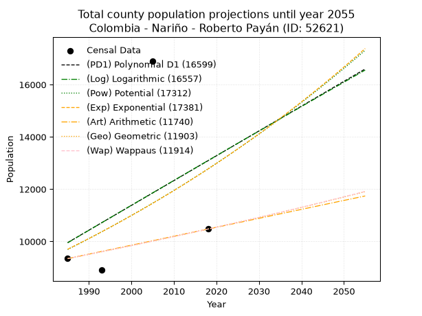
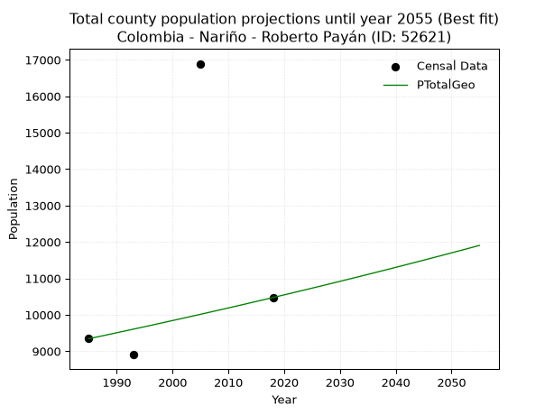
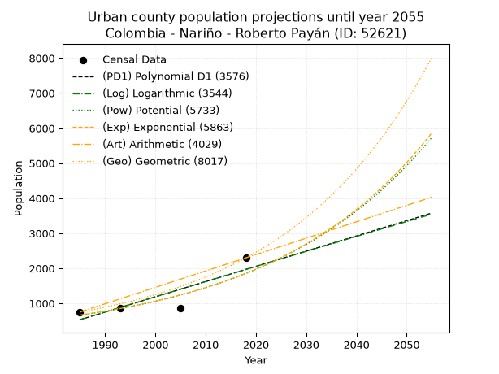
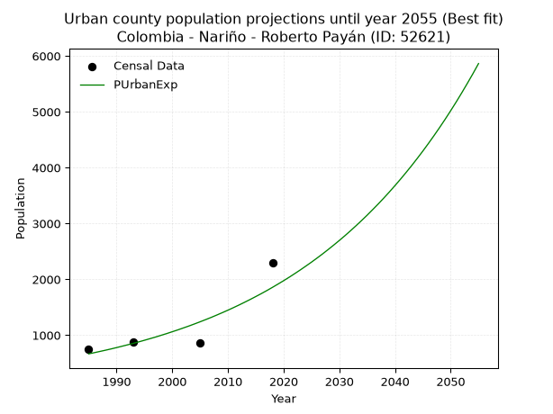
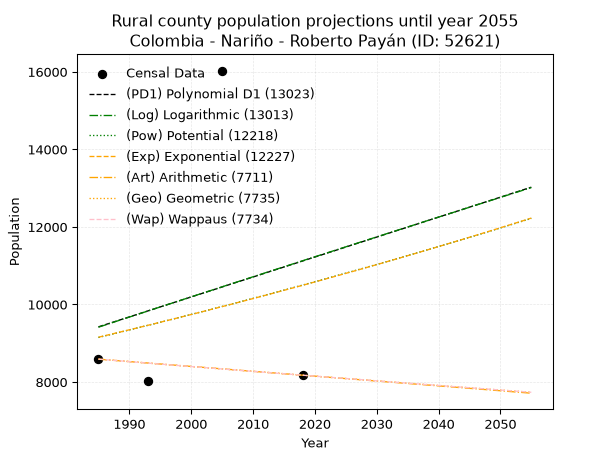
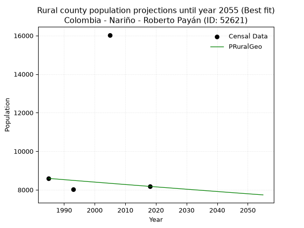

<div align="center">


</div>

# _“Population and Public Services Demand Projections (PPSD) until Year 2050 for Colombia - Nariño - Roberto Payán (ID: 52621)”_
Keywords: `population` `public-service` `projection` `lineal` `polynomial` `logarithmic` `potential` `exponential` `arithmetic` `geometric` `wappaus` `dane` `colombia` `south-america`

PPSD are analytical estimates used by governments and planners to anticipate future changes in population size, age distribution, and the resulting community needs for utilities, healthcare, education, and infrastructure as sizing future water treatment facilities, electrical grids, and road networks based on spatial growth.

> **General running parameters**: • app_version: _v20260806_. • Python version: _3.14.7_. • Pandas version: _3.0.5_. • NumPy version: _2.5.1_. • Creates, save and include plots into reports (create_plot): _False_. • Projection until year: _2050_. • Process polynomial degree 2 and up: _False_. • Process Wappaus: _True_. • Process Wappaus: _True_. • Set negative values to zero: _True_. • Set infinite values to zero: _True_. • Drop dataset notes: _True_. 
<div align="center">

Dynamic map: [:earth_americas:Google](http://maps.google.com/maps?q=1.697492429,-78.2457158) [:earth_americas:OSM](https://www.openstreetmap.org/#map=18/1.697492429/-78.2457158&layers=P) [:earth_americas:Bing](https://www.bing.com/maps?cp=1.697492429~-78.2457158&lvl=18) [:earth_americas:Apple](https://maps.apple.com/frame?center=1.697492429%2C-78.2457158&span=0.003%2C0.006)

</div>


<div align="center">

```geojson
{
  "type": "Feature",
  "geometry": {
    "type": "Point", 
    "coordinates": [-78.2457158, 1.697492429]
  }, 
  "properties": {
    "Name": "Colombia - Nariño - Roberto Payán (ID: 52621)"
  }
}
```

</div>


## 0. Census Data (4 records)

Census data are official statistics collected by a government about the people and housing in a country. They usually include counts of total population, age, sex, race, income, education, and jobs.

📅Global census file: [Population.xlsx](../data/Population.xlsx)

| Source   |   Year |   CountryID | CountryName   |   StateID | StateName   |   CountyID | CountyName    |   PTotal |   PUrban |   PRural |
|:---------|-------:|------------:|:--------------|----------:|:------------|-----------:|:--------------|---------:|---------:|---------:|
| DANE     |   1985 |          57 | Colombia      |        52 | Nariño      |      52621 | Roberto Payán |     9343 |      754 |     8589 |
| DANE     |   1993 |          57 | Colombia      |        52 | Nariño      |      52621 | Roberto Payán |     8903 |      873 |     8030 |
| DANE     |   2005 |          57 | Colombia      |        52 | Nariño      |      52621 | Roberto Payán |    16892 |      863 |    16029 |
| DANE     |   2018 |          57 | Colombia      |        52 | Nariño      |      52621 | Roberto Payán |    10473 |     2298 |     8175 |

> 🔥Some records could had specific notes about the registered values or the corresponding urban or rural distribution.

📅   [RUPS](https://www.datos.gov.co/Hacienda-y-Cr-dito-P-blico/Registro-nico-de-Prestadores-de-Servicios-P-blicos/4qkq-csdn/about_data) - Local public utility companies: [RUPS.csv](../data/RUPS.xlsx)

 | SERVICIO       | ESTADO    | NOMBRE                                             | NIT         | DEPARTAMENTO_DOMICILIO   | MUNICIPIO_DOMICILIO   | DIRECCION              |   TELEFONO | EMAIL                    | TIPO_INSCRIPCION    | REPRESENTANTE_LEGAL       | TIPO_PRESTADOR                             | CLASIFICACION                  |
|:---------------|:----------|:---------------------------------------------------|:------------|:-------------------------|:----------------------|:-----------------------|-----------:|:-------------------------|:--------------------|:--------------------------|:-------------------------------------------|:-------------------------------|
| ALCANTARILLADO | OPERATIVA | EMPRESA DE SERVICIOS PUBLICOS DE ROBERTO PAYAN SAS | 900672147-1 | NARINO                   | ROBERTO PAYAN         | CASA 45 B/ EL PORVENIR |    7369349 | concejalroberto@yahoo.es | Registro por la ESP | JORGE WILLI RAMOS  ANGULO | SOCIEDADES (EMPRESA DE SERVICIOS PUBLICOS) | DESDE 2501 HASTA 5000 USUARIOS |
| ACUEDUCTO      | OPERATIVA | EMPRESA DE SERVICIOS PUBLICOS DE ROBERTO PAYAN SAS | 900672147-1 | NARINO                   | ROBERTO PAYAN         | CASA 45 B/ EL PORVENIR |    7369349 | concejalroberto@yahoo.es | Registro por la ESP | JORGE WILLI RAMOS  ANGULO | SOCIEDADES (EMPRESA DE SERVICIOS PUBLICOS) | MENOR O IGUAL A 2500 USUARIOS  |

## 1. Total

### 1.1. Coefficients and Parameters

* (PD1) Polynomial Deg 1: 94.91007627459199, -178441.13006825265 (lineal)
* (Log) Logarithmic: 190732.9206036166, -1438359.7079457918
* (Pow) Potential: 16.7357111871859, -51.20390809314998
* (Exp) Exponential: 0.008332905358855856, 0.000635578737183109
* (Art) Arithmetic: Year diff. 2018 - 1985 = 33, Population diff. 10473 - 9343 = 1130, Annual growth = 34.24242424242424
* (Geo) Geometric: Year diff. 2018 - 1985 = 33, Population diff. 10473 - 9343 = 1130, Annual growth % = 0.003465783410338208
* (Wap) Wappaus: i = 0.345603797359954, Condition values only valid for < 200)

<sub>
Wappaus condition values: ['0.00', '0.35', '0.69', '1.04', '1.38', '1.73', '2.07', '2.42', '2.76', '3.11', '3.46', '3.80', '4.15', '4.49', '4.84', '5.18', '5.53', '5.88', '6.22', '6.57', '6.91', '7.26', '7.60', '7.95', '8.29', '8.64', '8.99', '9.33', '9.68', '10.02', '10.37', '10.71', '11.06', '11.40', '11.75', '12.10', '12.44', '12.79', '13.13', '13.48', '13.82', '14.17', '14.52', '14.86', '15.21', '15.55', '15.90', '16.24', '16.59', '16.93', '17.28', '17.63', '17.97', '18.32', '18.66', '19.01', '19.35', '19.70', '20.05', '20.39', '20.74', '21.08', '21.43', '21.77', '22.12', '22.46']
</sub>


### 1.2. Projected Dataset

|   Year |   CountyID |   PTotalPD1 |   PTotalLog |   PTotalPow |   PTotalExp |   PTotalArt |   PTotalGeo |   PTotalWap |
|-------:|-----------:|------------:|------------:|------------:|------------:|------------:|------------:|------------:|
|   1985 |      52621 |        9955 |        9947 |        9693 |        9700 |        9343 |        9343 |        9343 |
|   1986 |      52621 |       10050 |       10043 |        9775 |        9781 |        9377 |        9375 |        9375 |
|   1987 |      52621 |       10145 |       10139 |        9858 |        9863 |        9411 |        9408 |        9408 |
|   1988 |      52621 |       10240 |       10235 |        9941 |        9945 |        9446 |        9440 |        9440 |
|   1989 |      52621 |       10335 |       10331 |       10025 |       10028 |        9480 |        9473 |        9473 |
|   1990 |      52621 |       10430 |       10427 |       10110 |       10112 |        9514 |        9506 |        9506 |
|   1991 |      52621 |       10525 |       10522 |       10195 |       10197 |        9548 |        9539 |        9539 |
|   1992 |      52621 |       10620 |       10618 |       10281 |       10282 |        9583 |        9572 |        9572 |
|   1993 |      52621 |       10715 |       10714 |       10368 |       10368 |        9617 |        9605 |        9605 |
|   1994 |      52621 |       10810 |       10810 |       10455 |       10455 |        9651 |        9639 |        9638 |
|   1995 |      52621 |       10904 |       10905 |       10543 |       10543 |        9685 |        9672 |        9672 |
|   1996 |      52621 |       10999 |       11001 |       10632 |       10631 |        9720 |        9705 |        9705 |
|   1997 |      52621 |       11094 |       11096 |       10722 |       10720 |        9754 |        9739 |        9739 |
|   1998 |      52621 |       11189 |       11192 |       10812 |       10809 |        9788 |        9773 |        9772 |
|   1999 |      52621 |       11284 |       11287 |       10903 |       10900 |        9822 |        9807 |        9806 |
|   2000 |      52621 |       11379 |       11383 |       10995 |       10991 |        9857 |        9841 |        9840 |
|   2001 |      52621 |       11474 |       11478 |       11087 |       11083 |        9891 |        9875 |        9874 |
|   2002 |      52621 |       11569 |       11573 |       11180 |       11176 |        9925 |        9909 |        9909 |
|   2003 |      52621 |       11664 |       11669 |       11274 |       11269 |        9959 |        9943 |        9943 |
|   2004 |      52621 |       11759 |       11764 |       11368 |       11364 |        9994 |        9978 |        9977 |
|   2005 |      52621 |       11854 |       11859 |       11464 |       11459 |       10028 |       10012 |       10012 |
|   2006 |      52621 |       11948 |       11954 |       11560 |       11555 |       10062 |       10047 |       10047 |
|   2007 |      52621 |       12043 |       12049 |       11657 |       11651 |       10096 |       10082 |       10081 |
|   2008 |      52621 |       12138 |       12144 |       11754 |       11749 |       10131 |       10117 |       10116 |
|   2009 |      52621 |       12233 |       12239 |       11853 |       11847 |       10165 |       10152 |       10151 |
|   2010 |      52621 |       12328 |       12334 |       11952 |       11946 |       10199 |       10187 |       10187 |
|   2011 |      52621 |       12423 |       12429 |       12052 |       12046 |       10233 |       10222 |       10222 |
|   2012 |      52621 |       12518 |       12524 |       12152 |       12147 |       10268 |       10258 |       10257 |
|   2013 |      52621 |       12613 |       12618 |       12254 |       12249 |       10302 |       10293 |       10293 |
|   2014 |      52621 |       12708 |       12713 |       12356 |       12351 |       10336 |       10329 |       10329 |
|   2015 |      52621 |       12803 |       12808 |       12459 |       12454 |       10370 |       10365 |       10365 |
|   2016 |      52621 |       12898 |       12902 |       12563 |       12559 |       10405 |       10401 |       10401 |
|   2017 |      52621 |       12992 |       12997 |       12668 |       12664 |       10439 |       10437 |       10437 |
|   2018 |      52621 |       13087 |       13092 |       12773 |       12770 |       10473 |       10473 |       10473 |
|   2019 |      52621 |       13182 |       13186 |       12879 |       12877 |       10507 |       10509 |       10509 |
|   2020 |      52621 |       13277 |       13280 |       12987 |       12984 |       10541 |       10546 |       10546 |
|   2021 |      52621 |       13372 |       13375 |       13095 |       13093 |       10576 |       10582 |       10583 |
|   2022 |      52621 |       13467 |       13469 |       13204 |       13202 |       10610 |       10619 |       10619 |
|   2023 |      52621 |       13562 |       13564 |       13313 |       13313 |       10644 |       10656 |       10656 |
|   2024 |      52621 |       13657 |       13658 |       13424 |       13424 |       10678 |       10693 |       10693 |
|   2025 |      52621 |       13752 |       13752 |       13535 |       13537 |       10713 |       10730 |       10730 |
|   2026 |      52621 |       13847 |       13846 |       13648 |       13650 |       10747 |       10767 |       10768 |
|   2027 |      52621 |       13942 |       13940 |       13761 |       13764 |       10781 |       10804 |       10805 |
|   2028 |      52621 |       14037 |       14034 |       13875 |       13879 |       10815 |       10842 |       10843 |
|   2029 |      52621 |       14131 |       14128 |       13990 |       13995 |       10850 |       10879 |       10881 |
|   2030 |      52621 |       14226 |       14222 |       14106 |       14113 |       10884 |       10917 |       10919 |
|   2031 |      52621 |       14321 |       14316 |       14222 |       14231 |       10918 |       10955 |       10957 |
|   2032 |      52621 |       14416 |       14410 |       14340 |       14350 |       10952 |       10993 |       10995 |
|   2033 |      52621 |       14511 |       14504 |       14459 |       14470 |       10987 |       11031 |       11033 |
|   2034 |      52621 |       14606 |       14598 |       14578 |       14591 |       11021 |       11069 |       11072 |
|   2035 |      52621 |       14701 |       14692 |       14698 |       14713 |       11055 |       11107 |       11110 |
|   2036 |      52621 |       14796 |       14785 |       14820 |       14836 |       11089 |       11146 |       11149 |
|   2037 |      52621 |       14891 |       14879 |       14942 |       14960 |       11124 |       11185 |       11188 |
|   2038 |      52621 |       14986 |       14973 |       15065 |       15085 |       11158 |       11223 |       11227 |
|   2039 |      52621 |       15081 |       15066 |       15189 |       15212 |       11192 |       11262 |       11266 |
|   2040 |      52621 |       15175 |       15160 |       15315 |       15339 |       11226 |       11301 |       11305 |
|   2041 |      52621 |       15270 |       15253 |       15441 |       15467 |       11261 |       11340 |       11345 |
|   2042 |      52621 |       15365 |       15347 |       15568 |       15597 |       11295 |       11380 |       11385 |
|   2043 |      52621 |       15460 |       15440 |       15696 |       15727 |       11329 |       11419 |       11424 |
|   2044 |      52621 |       15555 |       15533 |       15825 |       15859 |       11363 |       11459 |       11464 |
|   2045 |      52621 |       15650 |       15627 |       15955 |       15992 |       11398 |       11498 |       11504 |
|   2046 |      52621 |       15745 |       15720 |       16086 |       16125 |       11432 |       11538 |       11545 |
|   2047 |      52621 |       15840 |       15813 |       16218 |       16260 |       11466 |       11578 |       11585 |
|   2048 |      52621 |       15935 |       15906 |       16351 |       16396 |       11500 |       11618 |       11626 |
|   2049 |      52621 |       16030 |       15999 |       16485 |       16534 |       11535 |       11659 |       11667 |
|   2050 |      52621 |       16125 |       16092 |       16621 |       16672 |       11569 |       11699 |       11707 |
<div align="center">

</img>

</div>


### 1.3. Best fit with absolute and relative error (%)

Relative error puts that difference into context by dividing the absolute error by the true value, creating a unitless ratio or percentage that shows the scale of the mistake.

Absolute and relative error

|   Year | Source   |   CountryID | CountryName   |   StateID | StateName   |   CountyID_x | CountyName    |   PTotal |   PUrban |   PRural |   CountyID_y |   PTotalPD1 |   PTotalLog |   PTotalPow |   PTotalExp |   PTotalArt |   PTotalGeo |   PTotalWap |   PTotalPD1AbsError |   PTotalLogAbsError |   PTotalPowAbsError |   PTotalExpAbsError |   PTotalArtAbsError |   PTotalGeoAbsError |   PTotalWapAbsError |   PTotalPD1RelError |   PTotalLogRelError |   PTotalPowRelError |   PTotalExpRelError |   PTotalArtRelError |   PTotalGeoRelError |   PTotalWapRelError |
|-------:|:---------|------------:|:--------------|----------:|:------------|-------------:|:--------------|---------:|---------:|---------:|-------------:|------------:|------------:|------------:|------------:|------------:|------------:|------------:|--------------------:|--------------------:|--------------------:|--------------------:|--------------------:|--------------------:|--------------------:|--------------------:|--------------------:|--------------------:|--------------------:|--------------------:|--------------------:|--------------------:|
|   1985 | DANE     |          57 | Colombia      |        52 | Nariño      |        52621 | Roberto Payán |     9343 |      754 |     8589 |        52621 |        9955 |        9947 |        9693 |        9700 |        9343 |        9343 |        9343 |                 612 |                 604 |                 350 |                 357 |                   0 |                   0 |                   0 |             6.55036 |             6.46473 |             3.74612 |             3.82104 |             0       |             0       |             0       |
|   1993 | DANE     |          57 | Colombia      |        52 | Nariño      |        52621 | Roberto Payán |     8903 |      873 |     8030 |        52621 |       10715 |       10714 |       10368 |       10368 |        9617 |        9605 |        9605 |                1812 |                1811 |                1465 |                1465 |                 714 |                 702 |                 702 |            20.3527  |            20.3415  |            16.4551  |            16.4551  |             8.01977 |             7.88498 |             7.88498 |
|   2005 | DANE     |          57 | Colombia      |        52 | Nariño      |        52621 | Roberto Payán |    16892 |      863 |    16029 |        52621 |       11854 |       11859 |       11464 |       11459 |       10028 |       10012 |       10012 |                5038 |                5033 |                5428 |                5433 |                6864 |                6880 |                6880 |            29.8248  |            29.7952  |            32.1336  |            32.1632  |            40.6346  |            40.7293  |            40.7293  |
|   2018 | DANE     |          57 | Colombia      |        52 | Nariño      |        52621 | Roberto Payán |    10473 |     2298 |     8175 |        52621 |       13087 |       13092 |       12773 |       12770 |       10473 |       10473 |       10473 |                2614 |                2619 |                2300 |                2297 |                   0 |                   0 |                   0 |            24.9594  |            25.0072  |            21.9612  |            21.9326  |             0       |             0       |             0       |

Relative error mean

| Method    |   RelError | Best   |
|:----------|-----------:|:-------|
| PTotalPD1 |    20.4218 |        |
| PTotalLog |    20.4021 |        |
| PTotalPow |    18.574  |        |
| PTotalExp |    18.593  |        |
| PTotalArt |    12.1636 |        |
| PTotalGeo |    12.1536 | True   |
| PTotalWap |    12.1536 | True   |

💙Best method: _**PTotalGeo**_
<div align="center">

</img>

</div>


### 1.4. Fresh water supply demand in liters per capita per day (lpcd)

The fresh water supply demand typically ranges from 100 to 300 liters per capita per day (lpcd) for standard domestic and municipal planning, though absolute survival minimums set by the World Health Organization are as low as 7.5 to 20 liters per day, and total consumption in high-income nations can exceed 400 liters.

> `CZ`: Level in meters above the sea level (masl)<br> `WS`: Fresh water supply demand in liters per capita per day (lpcd or l/h/d)<br> `WSAll`: Zonal fresh water supply demand in liters per second (l/s)<br> `A`: Zonal area in square meters<br> `DP`: Population density (people/hectare or p/ha)

Reference values (RAS Colombia)

|    CZ |   WS |
|------:|-----:|
|  1000 |  120 |
|  2000 |  130 |
| 99999 |  140 |

County shapefile geometry properties and water supply values

|   CountyID |      ATotal |   CZTotal |   WSTotal |
|-----------:|------------:|----------:|----------:|
|      52621 | 1.46004e+09 |    51.521 |       120 |

Projected values for best method: PTotalGeo

|   CountyID |   Year |   PTotalGeo |   DPTotal |   WSTotal |   WSTotalAll |
|-----------:|-------:|------------:|----------:|----------:|-------------:|
|      52621 |   1985 |        9343 |      0.06 |       120 |      12.9764 |
|      52621 |   1986 |        9375 |      0.06 |       120 |      13.0208 |
|      52621 |   1987 |        9408 |      0.06 |       120 |      13.0667 |
|      52621 |   1988 |        9440 |      0.06 |       120 |      13.1111 |
|      52621 |   1989 |        9473 |      0.06 |       120 |      13.1569 |
|      52621 |   1990 |        9506 |      0.07 |       120 |      13.2028 |
|      52621 |   1991 |        9539 |      0.07 |       120 |      13.2486 |
|      52621 |   1992 |        9572 |      0.07 |       120 |      13.2944 |
|      52621 |   1993 |        9605 |      0.07 |       120 |      13.3403 |
|      52621 |   1994 |        9639 |      0.07 |       120 |      13.3875 |
|      52621 |   1995 |        9672 |      0.07 |       120 |      13.4333 |
|      52621 |   1996 |        9705 |      0.07 |       120 |      13.4792 |
|      52621 |   1997 |        9739 |      0.07 |       120 |      13.5264 |
|      52621 |   1998 |        9773 |      0.07 |       120 |      13.5736 |
|      52621 |   1999 |        9807 |      0.07 |       120 |      13.6208 |
|      52621 |   2000 |        9841 |      0.07 |       120 |      13.6681 |
|      52621 |   2001 |        9875 |      0.07 |       120 |      13.7153 |
|      52621 |   2002 |        9909 |      0.07 |       120 |      13.7625 |
|      52621 |   2003 |        9943 |      0.07 |       120 |      13.8097 |
|      52621 |   2004 |        9978 |      0.07 |       120 |      13.8583 |
|      52621 |   2005 |       10012 |      0.07 |       120 |      13.9056 |
|      52621 |   2006 |       10047 |      0.07 |       120 |      13.9542 |
|      52621 |   2007 |       10082 |      0.07 |       120 |      14.0028 |
|      52621 |   2008 |       10117 |      0.07 |       120 |      14.0514 |
|      52621 |   2009 |       10152 |      0.07 |       120 |      14.1    |
|      52621 |   2010 |       10187 |      0.07 |       120 |      14.1486 |
|      52621 |   2011 |       10222 |      0.07 |       120 |      14.1972 |
|      52621 |   2012 |       10258 |      0.07 |       120 |      14.2472 |
|      52621 |   2013 |       10293 |      0.07 |       120 |      14.2958 |
|      52621 |   2014 |       10329 |      0.07 |       120 |      14.3458 |
|      52621 |   2015 |       10365 |      0.07 |       120 |      14.3958 |
|      52621 |   2016 |       10401 |      0.07 |       120 |      14.4458 |
|      52621 |   2017 |       10437 |      0.07 |       120 |      14.4958 |
|      52621 |   2018 |       10473 |      0.07 |       120 |      14.5458 |
|      52621 |   2019 |       10509 |      0.07 |       120 |      14.5958 |
|      52621 |   2020 |       10546 |      0.07 |       120 |      14.6472 |
|      52621 |   2021 |       10582 |      0.07 |       120 |      14.6972 |
|      52621 |   2022 |       10619 |      0.07 |       120 |      14.7486 |
|      52621 |   2023 |       10656 |      0.07 |       120 |      14.8    |
|      52621 |   2024 |       10693 |      0.07 |       120 |      14.8514 |
|      52621 |   2025 |       10730 |      0.07 |       120 |      14.9028 |
|      52621 |   2026 |       10767 |      0.07 |       120 |      14.9542 |
|      52621 |   2027 |       10804 |      0.07 |       120 |      15.0056 |
|      52621 |   2028 |       10842 |      0.07 |       120 |      15.0583 |
|      52621 |   2029 |       10879 |      0.07 |       120 |      15.1097 |
|      52621 |   2030 |       10917 |      0.07 |       120 |      15.1625 |
|      52621 |   2031 |       10955 |      0.08 |       120 |      15.2153 |
|      52621 |   2032 |       10993 |      0.08 |       120 |      15.2681 |
|      52621 |   2033 |       11031 |      0.08 |       120 |      15.3208 |
|      52621 |   2034 |       11069 |      0.08 |       120 |      15.3736 |
|      52621 |   2035 |       11107 |      0.08 |       120 |      15.4264 |
|      52621 |   2036 |       11146 |      0.08 |       120 |      15.4806 |
|      52621 |   2037 |       11185 |      0.08 |       120 |      15.5347 |
|      52621 |   2038 |       11223 |      0.08 |       120 |      15.5875 |
|      52621 |   2039 |       11262 |      0.08 |       120 |      15.6417 |
|      52621 |   2040 |       11301 |      0.08 |       120 |      15.6958 |
|      52621 |   2041 |       11340 |      0.08 |       120 |      15.75   |
|      52621 |   2042 |       11380 |      0.08 |       120 |      15.8056 |
|      52621 |   2043 |       11419 |      0.08 |       120 |      15.8597 |
|      52621 |   2044 |       11459 |      0.08 |       120 |      15.9153 |
|      52621 |   2045 |       11498 |      0.08 |       120 |      15.9694 |
|      52621 |   2046 |       11538 |      0.08 |       120 |      16.025  |
|      52621 |   2047 |       11578 |      0.08 |       120 |      16.0806 |
|      52621 |   2048 |       11618 |      0.08 |       120 |      16.1361 |
|      52621 |   2049 |       11659 |      0.08 |       120 |      16.1931 |
|      52621 |   2050 |       11699 |      0.08 |       120 |      16.2486 |

## 2. Urban

### 2.1. Coefficients and Parameters

* (PD1) Polynomial Deg 1: 43.45403452428653, -85721.93255720414 (lineal)
* (Log) Logarithmic: 86864.35886379426, -659059.6878109863
* (Pow) Potential: 62.15306778091566, -202.1430536547974
* (Exp) Exponential: 0.031087201971002624, 1.0557493062268898e-24
* (Art) Arithmetic: Year diff. 2018 - 1985 = 33, Population diff. 2298 - 754 = 1544, Annual growth = 46.78787878787879
* (Geo) Geometric: Year diff. 2018 - 1985 = 33, Population diff. 2298 - 754 = 1544, Annual growth % = 0.034346431714061376
* (Wap) Wappaus: i = 3.0660471027443505, Condition values only valid for < 200)

<sub>
Wappaus condition values: ['0.00', '3.07', '6.13', '9.20', '12.26', '15.33', '18.40', '21.46', '24.53', '27.59', '30.66', '33.73', '36.79', '39.86', '42.92', '45.99', '49.06', '52.12', '55.19', '58.25', '61.32', '64.39', '67.45', '70.52', '73.59', '76.65', '79.72', '82.78', '85.85', '88.92', '91.98', '95.05', '98.11', '101.18', '104.25', '107.31', '110.38', '113.44', '116.51', '119.58', '122.64', '125.71', '128.77', '131.84', '134.91', '137.97', '141.04', '144.10', '147.17', '150.24', '153.30', '156.37', '159.43', '162.50', '165.57', '168.63', '171.70', '174.76', '177.83', '180.90', '183.96', '187.03', '190.09', '193.16', '196.23', '199.29']
</sub>


### 2.2. Projected Dataset

|   Year |   CountyID |   PUrbanPD1 |   PUrbanLog |   PUrbanPow |   PUrbanExp |   PUrbanArt |   PUrbanGeo |   PUrbanWap |
|-------:|-----------:|------------:|------------:|------------:|------------:|------------:|------------:|------------:|
|   1985 |      52621 |         534 |         534 |         665 |         665 |         754 |         754 |         754 |
|   1986 |      52621 |         578 |         578 |         686 |         686 |         801 |         780 |         777 |
|   1987 |      52621 |         621 |         621 |         708 |         708 |         848 |         807 |         802 |
|   1988 |      52621 |         665 |         665 |         731 |         730 |         894 |         834 |         827 |
|   1989 |      52621 |         708 |         709 |         754 |         753 |         941 |         863 |         853 |
|   1990 |      52621 |         752 |         752 |         778 |         777 |         988 |         893 |         879 |
|   1991 |      52621 |         795 |         796 |         802 |         802 |        1035 |         923 |         907 |
|   1992 |      52621 |         839 |         840 |         828 |         827 |        1082 |         955 |         935 |
|   1993 |      52621 |         882 |         883 |         854 |         853 |        1128 |         988 |         965 |
|   1994 |      52621 |         925 |         927 |         881 |         880 |        1175 |        1022 |         995 |
|   1995 |      52621 |         969 |         970 |         909 |         908 |        1222 |        1057 |        1027 |
|   1996 |      52621 |        1012 |        1014 |         938 |         937 |        1269 |        1093 |        1060 |
|   1997 |      52621 |        1056 |        1057 |         967 |         966 |        1315 |        1131 |        1094 |
|   1998 |      52621 |        1099 |        1101 |         998 |         997 |        1362 |        1170 |        1129 |
|   1999 |      52621 |        1143 |        1144 |        1029 |        1028 |        1409 |        1210 |        1166 |
|   2000 |      52621 |        1186 |        1188 |        1062 |        1061 |        1456 |        1251 |        1204 |
|   2001 |      52621 |        1230 |        1231 |        1095 |        1094 |        1503 |        1294 |        1244 |
|   2002 |      52621 |        1273 |        1275 |        1130 |        1129 |        1549 |        1339 |        1286 |
|   2003 |      52621 |        1316 |        1318 |        1166 |        1164 |        1596 |        1385 |        1329 |
|   2004 |      52621 |        1360 |        1361 |        1202 |        1201 |        1643 |        1432 |        1374 |
|   2005 |      52621 |        1403 |        1405 |        1240 |        1239 |        1690 |        1481 |        1421 |
|   2006 |      52621 |        1447 |        1448 |        1279 |        1278 |        1737 |        1532 |        1470 |
|   2007 |      52621 |        1490 |        1491 |        1319 |        1318 |        1783 |        1585 |        1521 |
|   2008 |      52621 |        1534 |        1535 |        1361 |        1360 |        1830 |        1639 |        1575 |
|   2009 |      52621 |        1577 |        1578 |        1404 |        1403 |        1877 |        1696 |        1632 |
|   2010 |      52621 |        1621 |        1621 |        1448 |        1447 |        1924 |        1754 |        1691 |
|   2011 |      52621 |        1664 |        1664 |        1493 |        1493 |        1970 |        1814 |        1753 |
|   2012 |      52621 |        1708 |        1707 |        1540 |        1540 |        2017 |        1877 |        1819 |
|   2013 |      52621 |        1751 |        1751 |        1588 |        1589 |        2064 |        1941 |        1888 |
|   2014 |      52621 |        1794 |        1794 |        1638 |        1639 |        2111 |        2008 |        1961 |
|   2015 |      52621 |        1838 |        1837 |        1690 |        1691 |        2158 |        2077 |        2038 |
|   2016 |      52621 |        1881 |        1880 |        1742 |        1744 |        2204 |        2148 |        2120 |
|   2017 |      52621 |        1925 |        1923 |        1797 |        1799 |        2251 |        2222 |        2206 |
|   2018 |      52621 |        1968 |        1966 |        1853 |        1856 |        2298 |        2298 |        2298 |
|   2019 |      52621 |        2012 |        2009 |        1911 |        1915 |        2345 |        2377 |        2396 |
|   2020 |      52621 |        2055 |        2052 |        1971 |        1975 |        2392 |        2459 |        2500 |
|   2021 |      52621 |        2099 |        2095 |        2033 |        2037 |        2438 |        2543 |        2611 |
|   2022 |      52621 |        2142 |        2138 |        2096 |        2102 |        2485 |        2630 |        2730 |
|   2023 |      52621 |        2186 |        2181 |        2161 |        2168 |        2532 |        2721 |        2858 |
|   2024 |      52621 |        2229 |        2224 |        2229 |        2237 |        2579 |        2814 |        2996 |
|   2025 |      52621 |        2272 |        2267 |        2298 |        2307 |        2626 |        2911 |        3145 |
|   2026 |      52621 |        2316 |        2310 |        2370 |        2380 |        2672 |        3011 |        3306 |
|   2027 |      52621 |        2359 |        2353 |        2444 |        2455 |        2719 |        3114 |        3480 |
|   2028 |      52621 |        2403 |        2395 |        2520 |        2533 |        2766 |        3221 |        3671 |
|   2029 |      52621 |        2446 |        2438 |        2598 |        2613 |        2813 |        3332 |        3879 |
|   2030 |      52621 |        2490 |        2481 |        2679 |        2695 |        2859 |        3446 |        4108 |
|   2031 |      52621 |        2533 |        2524 |        2762 |        2780 |        2906 |        3565 |        4361 |
|   2032 |      52621 |        2577 |        2567 |        2848 |        2868 |        2953 |        3687 |        4642 |
|   2033 |      52621 |        2620 |        2609 |        2937 |        2959 |        3000 |        3814 |        4955 |
|   2034 |      52621 |        2664 |        2652 |        3028 |        3052 |        3047 |        3945 |        5307 |
|   2035 |      52621 |        2707 |        2695 |        3122 |        3148 |        3093 |        4080 |        5705 |
|   2036 |      52621 |        2750 |        2737 |        3218 |        3248 |        3140 |        4220 |        6158 |
|   2037 |      52621 |        2794 |        2780 |        3318 |        3350 |        3187 |        4365 |        6681 |
|   2038 |      52621 |        2837 |        2823 |        3421 |        3456 |        3234 |        4515 |        7289 |
|   2039 |      52621 |        2881 |        2865 |        3527 |        3565 |        3281 |        4670 |        8005 |
|   2040 |      52621 |        2924 |        2908 |        3636 |        3678 |        3327 |        4831 |        8861 |
|   2041 |      52621 |        2968 |        2951 |        3748 |        3794 |        3374 |        4997 |        9903 |
|   2042 |      52621 |        3011 |        2993 |        3864 |        3914 |        3421 |        5168 |       11198 |
|   2043 |      52621 |        3055 |        3036 |        3984 |        4037 |        3468 |        5346 |       12850 |
|   2044 |      52621 |        3098 |        3078 |        4107 |        4165 |        3514 |        5529 |       15034 |
|   2045 |      52621 |        3142 |        3121 |        4233 |        4296 |        3561 |        5719 |       18052 |
|   2046 |      52621 |        3185 |        3163 |        4364 |        4432 |        3608 |        5916 |       22498 |
|   2047 |      52621 |        3228 |        3206 |        4499 |        4572 |        3655 |        6119 |       29695 |
|   2048 |      52621 |        3272 |        3248 |        4637 |        4716 |        3702 |        6329 |       43346 |
|   2049 |      52621 |        3315 |        3290 |        4780 |        4865 |        3748 |        6546 |       79183 |
|   2050 |      52621 |        3359 |        3333 |        4927 |        5019 |        3795 |        6771 |      425874 |
<div align="center">

</img>

</div>


### 2.3. Best fit with absolute and relative error (%)

Relative error puts that difference into context by dividing the absolute error by the true value, creating a unitless ratio or percentage that shows the scale of the mistake.

Absolute and relative error

|   Year | Source   |   CountryID | CountryName   |   StateID | StateName   |   CountyID_x | CountyName    |   PTotal |   PUrban |   PRural |   CountyID_y |   PUrbanPD1 |   PUrbanLog |   PUrbanPow |   PUrbanExp |   PUrbanArt |   PUrbanGeo |   PUrbanWap |   PUrbanPD1AbsError |   PUrbanLogAbsError |   PUrbanPowAbsError |   PUrbanExpAbsError |   PUrbanArtAbsError |   PUrbanGeoAbsError |   PUrbanWapAbsError |   PUrbanPD1RelError |   PUrbanLogRelError |   PUrbanPowRelError |   PUrbanExpRelError |   PUrbanArtRelError |   PUrbanGeoRelError |   PUrbanWapRelError |
|-------:|:---------|------------:|:--------------|----------:|:------------|-------------:|:--------------|---------:|---------:|---------:|-------------:|------------:|------------:|------------:|------------:|------------:|------------:|------------:|--------------------:|--------------------:|--------------------:|--------------------:|--------------------:|--------------------:|--------------------:|--------------------:|--------------------:|--------------------:|--------------------:|--------------------:|--------------------:|--------------------:|
|   1985 | DANE     |          57 | Colombia      |        52 | Nariño      |        52621 | Roberto Payán |     9343 |      754 |     8589 |        52621 |         534 |         534 |         665 |         665 |         754 |         754 |         754 |                 220 |                 220 |                  89 |                  89 |                   0 |                   0 |                   0 |            29.1777  |            29.1777  |             11.8037 |            11.8037  |              0      |              0      |              0      |
|   1993 | DANE     |          57 | Colombia      |        52 | Nariño      |        52621 | Roberto Payán |     8903 |      873 |     8030 |        52621 |         882 |         883 |         854 |         853 |        1128 |         988 |         965 |                   9 |                  10 |                  19 |                  20 |                 255 |                 115 |                  92 |             1.03093 |             1.14548 |              2.1764 |             2.29095 |             29.2096 |             13.173  |             10.5384 |
|   2005 | DANE     |          57 | Colombia      |        52 | Nariño      |        52621 | Roberto Payán |    16892 |      863 |    16029 |        52621 |        1403 |        1405 |        1240 |        1239 |        1690 |        1481 |        1421 |                 540 |                 542 |                 377 |                 376 |                 827 |                 618 |                 558 |            62.5724  |            62.8042  |             43.6848 |            43.5689  |             95.8285 |             71.6107 |             64.6582 |
|   2018 | DANE     |          57 | Colombia      |        52 | Nariño      |        52621 | Roberto Payán |    10473 |     2298 |     8175 |        52621 |        1968 |        1966 |        1853 |        1856 |        2298 |        2298 |        2298 |                 330 |                 332 |                 445 |                 442 |                   0 |                   0 |                   0 |            14.3603  |            14.4473  |             19.3647 |            19.2341  |              0      |              0      |              0      |

Relative error mean

| Method    |   RelError | Best   |
|:----------|-----------:|:-------|
| PUrbanPD1 |    26.7853 |        |
| PUrbanLog |    26.8937 |        |
| PUrbanPow |    19.2574 |        |
| PUrbanExp |    19.2244 |        |
| PUrbanArt |    31.2595 |        |
| PUrbanGeo |    21.1959 |        |
| PUrbanWap |    18.7991 | True   |

💙Best method: _**PUrbanWap**_
<div align="center">

</img>

</div>


### 2.4. Fresh water supply demand in liters per capita per day (lpcd)

The fresh water supply demand typically ranges from 100 to 300 liters per capita per day (lpcd) for standard domestic and municipal planning, though absolute survival minimums set by the World Health Organization are as low as 7.5 to 20 liters per day, and total consumption in high-income nations can exceed 400 liters.

> `CZ`: Level in meters above the sea level (masl)<br> `WS`: Fresh water supply demand in liters per capita per day (lpcd or l/h/d)<br> `WSAll`: Zonal fresh water supply demand in liters per second (l/s)<br> `A`: Zonal area in square meters<br> `DP`: Population density (people/hectare or p/ha)

Reference values (RAS Colombia)

|    CZ |   WS |
|------:|-----:|
|  1000 |  120 |
|  2000 |  130 |
| 99999 |  140 |

County shapefile geometry properties and water supply values

|   CountyID |   AUrban |   CZUrban |   WSUrban |
|-----------:|---------:|----------:|----------:|
|      52621 |   231705 |   34.3991 |       120 |

Projected values for best method: PUrbanWap

|   CountyID |   Year |   PUrbanWap |   DPUrban |   WSUrban |   WSUrbanAll |
|-----------:|-------:|------------:|----------:|----------:|-------------:|
|      52621 |   1985 |         754 |     32.54 |       120 |      1.04722 |
|      52621 |   1986 |         777 |     33.53 |       120 |      1.07917 |
|      52621 |   1987 |         802 |     34.61 |       120 |      1.11389 |
|      52621 |   1988 |         827 |     35.69 |       120 |      1.14861 |
|      52621 |   1989 |         853 |     36.81 |       120 |      1.18472 |
|      52621 |   1990 |         879 |     37.94 |       120 |      1.22083 |
|      52621 |   1991 |         907 |     39.14 |       120 |      1.25972 |
|      52621 |   1992 |         935 |     40.35 |       120 |      1.29861 |
|      52621 |   1993 |         965 |     41.65 |       120 |      1.34028 |
|      52621 |   1994 |         995 |     42.94 |       120 |      1.38194 |
|      52621 |   1995 |        1027 |     44.32 |       120 |      1.42639 |
|      52621 |   1996 |        1060 |     45.75 |       120 |      1.47222 |
|      52621 |   1997 |        1094 |     47.22 |       120 |      1.51944 |
|      52621 |   1998 |        1129 |     48.73 |       120 |      1.56806 |
|      52621 |   1999 |        1166 |     50.32 |       120 |      1.61944 |
|      52621 |   2000 |        1204 |     51.96 |       120 |      1.67222 |
|      52621 |   2001 |        1244 |     53.69 |       120 |      1.72778 |
|      52621 |   2002 |        1286 |     55.5  |       120 |      1.78611 |
|      52621 |   2003 |        1329 |     57.36 |       120 |      1.84583 |
|      52621 |   2004 |        1374 |     59.3  |       120 |      1.90833 |
|      52621 |   2005 |        1421 |     61.33 |       120 |      1.97361 |
|      52621 |   2006 |        1470 |     63.44 |       120 |      2.04167 |
|      52621 |   2007 |        1521 |     65.64 |       120 |      2.1125  |
|      52621 |   2008 |        1575 |     67.97 |       120 |      2.1875  |
|      52621 |   2009 |        1632 |     70.43 |       120 |      2.26667 |
|      52621 |   2010 |        1691 |     72.98 |       120 |      2.34861 |
|      52621 |   2011 |        1753 |     75.66 |       120 |      2.43472 |
|      52621 |   2012 |        1819 |     78.5  |       120 |      2.52639 |
|      52621 |   2013 |        1888 |     81.48 |       120 |      2.62222 |
|      52621 |   2014 |        1961 |     84.63 |       120 |      2.72361 |
|      52621 |   2015 |        2038 |     87.96 |       120 |      2.83056 |
|      52621 |   2016 |        2120 |     91.5  |       120 |      2.94444 |
|      52621 |   2017 |        2206 |     95.21 |       120 |      3.06389 |
|      52621 |   2018 |        2298 |     99.18 |       120 |      3.19167 |
|      52621 |   2019 |        2396 |    103.41 |       120 |      3.32778 |
|      52621 |   2020 |        2500 |    107.9  |       120 |      3.47222 |
|      52621 |   2021 |        2611 |    112.69 |       120 |      3.62639 |
|      52621 |   2022 |        2730 |    117.82 |       120 |      3.79167 |
|      52621 |   2023 |        2858 |    123.35 |       120 |      3.96944 |
|      52621 |   2024 |        2996 |    129.3  |       120 |      4.16111 |
|      52621 |   2025 |        3145 |    135.73 |       120 |      4.36806 |
|      52621 |   2026 |        3306 |    142.68 |       120 |      4.59167 |
|      52621 |   2027 |        3480 |    150.19 |       120 |      4.83333 |
|      52621 |   2028 |        3671 |    158.43 |       120 |      5.09861 |
|      52621 |   2029 |        3879 |    167.41 |       120 |      5.3875  |
|      52621 |   2030 |        4108 |    177.29 |       120 |      5.70556 |
|      52621 |   2031 |        4361 |    188.21 |       120 |      6.05694 |
|      52621 |   2032 |        4642 |    200.34 |       120 |      6.44722 |
|      52621 |   2033 |        4955 |    213.85 |       120 |      6.88194 |
|      52621 |   2034 |        5307 |    229.04 |       120 |      7.37083 |
|      52621 |   2035 |        5705 |    246.22 |       120 |      7.92361 |
|      52621 |   2036 |        6158 |    265.77 |       120 |      8.55278 |
|      52621 |   2037 |        6681 |    288.34 |       120 |      9.27917 |
|      52621 |   2038 |        7289 |    314.58 |       120 |     10.1236  |
|      52621 |   2039 |        8005 |    345.48 |       120 |     11.1181  |
|      52621 |   2040 |        8861 |    382.43 |       120 |     12.3069  |
|      52621 |   2041 |        9903 |    427.4  |       120 |     13.7542  |
|      52621 |   2042 |       11198 |    483.29 |       120 |     15.5528  |
|      52621 |   2043 |       12850 |    554.58 |       120 |     17.8472  |
|      52621 |   2044 |       15034 |    648.84 |       120 |     20.8806  |
|      52621 |   2045 |       18052 |    779.09 |       120 |     25.0722  |
|      52621 |   2046 |       22498 |    970.98 |       120 |     31.2472  |
|      52621 |   2047 |       29695 |   1281.59 |       120 |     41.2431  |
|      52621 |   2048 |       43346 |   1870.74 |       120 |     60.2028  |
|      52621 |   2049 |       79183 |   3417.4  |       120 |    109.976   |
|      52621 |   2050 |      425874 |  18380    |       120 |    591.492   |

## 3. Rural

### 3.1. Coefficients and Parameters

* (PD1) Polynomial Deg 1: 51.45604175030545, -92719.1975110485 (lineal)
* (Log) Logarithmic: 103868.56173982231, -779300.0201348056
* (Pow) Potential: 8.348447140014912, -23.569844047181913
* (Exp) Exponential: 0.00413430366528176, 2.4977770536857853
* (Art) Arithmetic: Year diff. 2018 - 1985 = 33, Population diff. 8175 - 8589 = -414, Annual growth = -12.545454545454545
* (Geo) Geometric: Year diff. 2018 - 1985 = 33, Population diff. 8175 - 8589 = -414, Annual growth % = -0.0014958981485506673
* (Wap) Wappaus: i = -0.14967137372291273, Condition values only valid for < 200)

<sub>
Wappaus condition values: ['-0.00', '-0.15', '-0.30', '-0.45', '-0.60', '-0.75', '-0.90', '-1.05', '-1.20', '-1.35', '-1.50', '-1.65', '-1.80', '-1.95', '-2.10', '-2.25', '-2.39', '-2.54', '-2.69', '-2.84', '-2.99', '-3.14', '-3.29', '-3.44', '-3.59', '-3.74', '-3.89', '-4.04', '-4.19', '-4.34', '-4.49', '-4.64', '-4.79', '-4.94', '-5.09', '-5.24', '-5.39', '-5.54', '-5.69', '-5.84', '-5.99', '-6.14', '-6.29', '-6.44', '-6.59', '-6.74', '-6.88', '-7.03', '-7.18', '-7.33', '-7.48', '-7.63', '-7.78', '-7.93', '-8.08', '-8.23', '-8.38', '-8.53', '-8.68', '-8.83', '-8.98', '-9.13', '-9.28', '-9.43', '-9.58', '-9.73']
</sub>


### 3.2. Projected Dataset

|   Year |   CountyID |   PRuralPD1 |   PRuralLog |   PRuralPow |   PRuralExp |   PRuralArt |   PRuralGeo |   PRuralWap |
|-------:|-----------:|------------:|------------:|------------:|------------:|------------:|------------:|------------:|
|   1985 |      52621 |        9421 |        9413 |        9148 |        9154 |        8589 |        8589 |        8589 |
|   1986 |      52621 |        9473 |        9465 |        9187 |        9192 |        8576 |        8576 |        8576 |
|   1987 |      52621 |        9524 |        9517 |        9225 |        9230 |        8564 |        8563 |        8563 |
|   1988 |      52621 |        9575 |        9570 |        9264 |        9269 |        8551 |        8551 |        8551 |
|   1989 |      52621 |        9627 |        9622 |        9303 |        9307 |        8539 |        8538 |        8538 |
|   1990 |      52621 |        9678 |        9674 |        9342 |        9346 |        8526 |        8525 |        8525 |
|   1991 |      52621 |        9730 |        9726 |        9382 |        9384 |        8514 |        8512 |        8512 |
|   1992 |      52621 |        9781 |        9778 |        9421 |        9423 |        8501 |        8499 |        8499 |
|   1993 |      52621 |        9833 |        9831 |        9461 |        9462 |        8489 |        8487 |        8487 |
|   1994 |      52621 |        9884 |        9883 |        9500 |        9501 |        8476 |        8474 |        8474 |
|   1995 |      52621 |        9936 |        9935 |        9540 |        9541 |        8464 |        8461 |        8461 |
|   1996 |      52621 |        9987 |        9987 |        9580 |        9580 |        8451 |        8449 |        8449 |
|   1997 |      52621 |       10039 |       10039 |        9620 |        9620 |        8438 |        8436 |        8436 |
|   1998 |      52621 |       10090 |       10091 |        9661 |        9660 |        8426 |        8423 |        8423 |
|   1999 |      52621 |       10141 |       10143 |        9701 |        9700 |        8413 |        8411 |        8411 |
|   2000 |      52621 |       10193 |       10195 |        9742 |        9740 |        8401 |        8398 |        8398 |
|   2001 |      52621 |       10244 |       10247 |        9782 |        9780 |        8388 |        8386 |        8386 |
|   2002 |      52621 |       10296 |       10299 |        9823 |        9821 |        8376 |        8373 |        8373 |
|   2003 |      52621 |       10347 |       10350 |        9864 |        9862 |        8363 |        8361 |        8361 |
|   2004 |      52621 |       10399 |       10402 |        9905 |        9903 |        8351 |        8348 |        8348 |
|   2005 |      52621 |       10450 |       10454 |        9947 |        9944 |        8338 |        8336 |        8336 |
|   2006 |      52621 |       10502 |       10506 |        9988 |        9985 |        8326 |        8323 |        8323 |
|   2007 |      52621 |       10553 |       10558 |       10030 |       10026 |        8313 |        8311 |        8311 |
|   2008 |      52621 |       10605 |       10609 |       10072 |       10068 |        8300 |        8298 |        8298 |
|   2009 |      52621 |       10656 |       10661 |       10114 |       10109 |        8288 |        8286 |        8286 |
|   2010 |      52621 |       10707 |       10713 |       10156 |       10151 |        8275 |        8273 |        8274 |
|   2011 |      52621 |       10759 |       10764 |       10198 |       10193 |        8263 |        8261 |        8261 |
|   2012 |      52621 |       10810 |       10816 |       10240 |       10236 |        8250 |        8249 |        8249 |
|   2013 |      52621 |       10862 |       10868 |       10283 |       10278 |        8238 |        8236 |        8236 |
|   2014 |      52621 |       10913 |       10919 |       10326 |       10321 |        8225 |        8224 |        8224 |
|   2015 |      52621 |       10965 |       10971 |       10369 |       10363 |        8213 |        8212 |        8212 |
|   2016 |      52621 |       11016 |       11022 |       10412 |       10406 |        8200 |        8200 |        8200 |
|   2017 |      52621 |       11068 |       11074 |       10455 |       10449 |        8188 |        8187 |        8187 |
|   2018 |      52621 |       11119 |       11125 |       10498 |       10493 |        8175 |        8175 |        8175 |
|   2019 |      52621 |       11171 |       11177 |       10542 |       10536 |        8162 |        8163 |        8163 |
|   2020 |      52621 |       11222 |       11228 |       10585 |       10580 |        8150 |        8151 |        8151 |
|   2021 |      52621 |       11273 |       11280 |       10629 |       10624 |        8137 |        8138 |        8138 |
|   2022 |      52621 |       11325 |       11331 |       10673 |       10668 |        8125 |        8126 |        8126 |
|   2023 |      52621 |       11376 |       11382 |       10717 |       10712 |        8112 |        8114 |        8114 |
|   2024 |      52621 |       11428 |       11434 |       10762 |       10756 |        8100 |        8102 |        8102 |
|   2025 |      52621 |       11479 |       11485 |       10806 |       10801 |        8087 |        8090 |        8090 |
|   2026 |      52621 |       11531 |       11536 |       10851 |       10845 |        8075 |        8078 |        8078 |
|   2027 |      52621 |       11582 |       11588 |       10896 |       10890 |        8062 |        8066 |        8066 |
|   2028 |      52621 |       11634 |       11639 |       10941 |       10935 |        8050 |        8054 |        8053 |
|   2029 |      52621 |       11685 |       11690 |       10986 |       10981 |        8037 |        8041 |        8041 |
|   2030 |      52621 |       11737 |       11741 |       11031 |       11026 |        8024 |        8029 |        8029 |
|   2031 |      52621 |       11788 |       11792 |       11076 |       11072 |        8012 |        8017 |        8017 |
|   2032 |      52621 |       11839 |       11844 |       11122 |       11118 |        7999 |        8005 |        8005 |
|   2033 |      52621 |       11891 |       11895 |       11168 |       11164 |        7987 |        7993 |        7993 |
|   2034 |      52621 |       11942 |       11946 |       11214 |       11210 |        7974 |        7982 |        7981 |
|   2035 |      52621 |       11994 |       11997 |       11260 |       11257 |        7962 |        7970 |        7969 |
|   2036 |      52621 |       12045 |       12048 |       11306 |       11303 |        7949 |        7958 |        7957 |
|   2037 |      52621 |       12097 |       12099 |       11353 |       11350 |        7937 |        7946 |        7946 |
|   2038 |      52621 |       12148 |       12150 |       11399 |       11397 |        7924 |        7934 |        7934 |
|   2039 |      52621 |       12200 |       12201 |       11446 |       11444 |        7912 |        7922 |        7922 |
|   2040 |      52621 |       12251 |       12252 |       11493 |       11492 |        7899 |        7910 |        7910 |
|   2041 |      52621 |       12303 |       12303 |       11540 |       11539 |        7886 |        7898 |        7898 |
|   2042 |      52621 |       12354 |       12353 |       11587 |       11587 |        7874 |        7886 |        7886 |
|   2043 |      52621 |       12405 |       12404 |       11635 |       11635 |        7861 |        7875 |        7874 |
|   2044 |      52621 |       12457 |       12455 |       11682 |       11683 |        7849 |        7863 |        7863 |
|   2045 |      52621 |       12508 |       12506 |       11730 |       11732 |        7836 |        7851 |        7851 |
|   2046 |      52621 |       12560 |       12557 |       11778 |       11780 |        7824 |        7839 |        7839 |
|   2047 |      52621 |       12611 |       12607 |       11826 |       11829 |        7811 |        7828 |        7827 |
|   2048 |      52621 |       12663 |       12658 |       11875 |       11878 |        7799 |        7816 |        7816 |
|   2049 |      52621 |       12714 |       12709 |       11923 |       11927 |        7786 |        7804 |        7804 |
|   2050 |      52621 |       12766 |       12760 |       11972 |       11977 |        7774 |        7793 |        7792 |
<div align="center">

</img>

</div>


### 3.3. Best fit with absolute and relative error (%)

Relative error puts that difference into context by dividing the absolute error by the true value, creating a unitless ratio or percentage that shows the scale of the mistake.

Absolute and relative error

|   Year | Source   |   CountryID | CountryName   |   StateID | StateName   |   CountyID_x | CountyName    |   PTotal |   PUrban |   PRural |   CountyID_y |   PRuralPD1 |   PRuralLog |   PRuralPow |   PRuralExp |   PRuralArt |   PRuralGeo |   PRuralWap |   PRuralPD1AbsError |   PRuralLogAbsError |   PRuralPowAbsError |   PRuralExpAbsError |   PRuralArtAbsError |   PRuralGeoAbsError |   PRuralWapAbsError |   PRuralPD1RelError |   PRuralLogRelError |   PRuralPowRelError |   PRuralExpRelError |   PRuralArtRelError |   PRuralGeoRelError |   PRuralWapRelError |
|-------:|:---------|------------:|:--------------|----------:|:------------|-------------:|:--------------|---------:|---------:|---------:|-------------:|------------:|------------:|------------:|------------:|------------:|------------:|------------:|--------------------:|--------------------:|--------------------:|--------------------:|--------------------:|--------------------:|--------------------:|--------------------:|--------------------:|--------------------:|--------------------:|--------------------:|--------------------:|--------------------:|
|   1985 | DANE     |          57 | Colombia      |        52 | Nariño      |        52621 | Roberto Payán |     9343 |      754 |     8589 |        52621 |        9421 |        9413 |        9148 |        9154 |        8589 |        8589 |        8589 |                 832 |                 824 |                 559 |                 565 |                   0 |                   0 |                   0 |             9.68681 |             9.59367 |             6.50832 |             6.57818 |             0       |             0       |             0       |
|   1993 | DANE     |          57 | Colombia      |        52 | Nariño      |        52621 | Roberto Payán |     8903 |      873 |     8030 |        52621 |        9833 |        9831 |        9461 |        9462 |        8489 |        8487 |        8487 |                1803 |                1801 |                1431 |                1432 |                 459 |                 457 |                 457 |            22.4533  |            22.4284  |            17.8207  |            17.8331  |             5.71606 |             5.69116 |             5.69116 |
|   2005 | DANE     |          57 | Colombia      |        52 | Nariño      |        52621 | Roberto Payán |    16892 |      863 |    16029 |        52621 |       10450 |       10454 |        9947 |        9944 |        8338 |        8336 |        8336 |                5579 |                5575 |                6082 |                6085 |                7691 |                7693 |                7693 |            34.8057  |            34.7807  |            37.9437  |            37.9624  |            47.9818  |            47.9943  |            47.9943  |
|   2018 | DANE     |          57 | Colombia      |        52 | Nariño      |        52621 | Roberto Payán |    10473 |     2298 |     8175 |        52621 |       11119 |       11125 |       10498 |       10493 |        8175 |        8175 |        8175 |                2944 |                2950 |                2323 |                2318 |                   0 |                   0 |                   0 |            36.0122  |            36.0856  |            28.4159  |            28.3547  |             0       |             0       |             0       |

Relative error mean

| Method    |   RelError | Best   |
|:----------|-----------:|:-------|
| PRuralPD1 |    25.7395 |        |
| PRuralLog |    25.7221 |        |
| PRuralPow |    22.6722 |        |
| PRuralExp |    22.6821 |        |
| PRuralArt |    13.4245 |        |
| PRuralGeo |    13.4214 | True   |
| PRuralWap |    13.4214 | True   |

💙Best method: _**PRuralGeo**_
<div align="center">

</img>

</div>


### 3.4. Fresh water supply demand in liters per capita per day (lpcd)

The fresh water supply demand typically ranges from 100 to 300 liters per capita per day (lpcd) for standard domestic and municipal planning, though absolute survival minimums set by the World Health Organization are as low as 7.5 to 20 liters per day, and total consumption in high-income nations can exceed 400 liters.

> `CZ`: Level in meters above the sea level (masl)<br> `WS`: Fresh water supply demand in liters per capita per day (lpcd or l/h/d)<br> `WSAll`: Zonal fresh water supply demand in liters per second (l/s)<br> `A`: Zonal area in square meters<br> `DP`: Population density (people/hectare or p/ha)

Reference values (RAS Colombia)

|    CZ |   WS |
|------:|-----:|
|  1000 |  120 |
|  2000 |  130 |
| 99999 |  140 |

County shapefile geometry properties and water supply values

|   CountyID |      ARural |   CZRural |   WSRural |
|-----------:|------------:|----------:|----------:|
|      52621 | 1.45981e+09 |   51.5239 |       120 |

Projected values for best method: PRuralGeo

|   CountyID |   Year |   PRuralGeo |   DPRural |   WSRural |   WSRuralAll |
|-----------:|-------:|------------:|----------:|----------:|-------------:|
|      52621 |   1985 |        8589 |      0.06 |       120 |      11.9292 |
|      52621 |   1986 |        8576 |      0.06 |       120 |      11.9111 |
|      52621 |   1987 |        8563 |      0.06 |       120 |      11.8931 |
|      52621 |   1988 |        8551 |      0.06 |       120 |      11.8764 |
|      52621 |   1989 |        8538 |      0.06 |       120 |      11.8583 |
|      52621 |   1990 |        8525 |      0.06 |       120 |      11.8403 |
|      52621 |   1991 |        8512 |      0.06 |       120 |      11.8222 |
|      52621 |   1992 |        8499 |      0.06 |       120 |      11.8042 |
|      52621 |   1993 |        8487 |      0.06 |       120 |      11.7875 |
|      52621 |   1994 |        8474 |      0.06 |       120 |      11.7694 |
|      52621 |   1995 |        8461 |      0.06 |       120 |      11.7514 |
|      52621 |   1996 |        8449 |      0.06 |       120 |      11.7347 |
|      52621 |   1997 |        8436 |      0.06 |       120 |      11.7167 |
|      52621 |   1998 |        8423 |      0.06 |       120 |      11.6986 |
|      52621 |   1999 |        8411 |      0.06 |       120 |      11.6819 |
|      52621 |   2000 |        8398 |      0.06 |       120 |      11.6639 |
|      52621 |   2001 |        8386 |      0.06 |       120 |      11.6472 |
|      52621 |   2002 |        8373 |      0.06 |       120 |      11.6292 |
|      52621 |   2003 |        8361 |      0.06 |       120 |      11.6125 |
|      52621 |   2004 |        8348 |      0.06 |       120 |      11.5944 |
|      52621 |   2005 |        8336 |      0.06 |       120 |      11.5778 |
|      52621 |   2006 |        8323 |      0.06 |       120 |      11.5597 |
|      52621 |   2007 |        8311 |      0.06 |       120 |      11.5431 |
|      52621 |   2008 |        8298 |      0.06 |       120 |      11.525  |
|      52621 |   2009 |        8286 |      0.06 |       120 |      11.5083 |
|      52621 |   2010 |        8273 |      0.06 |       120 |      11.4903 |
|      52621 |   2011 |        8261 |      0.06 |       120 |      11.4736 |
|      52621 |   2012 |        8249 |      0.06 |       120 |      11.4569 |
|      52621 |   2013 |        8236 |      0.06 |       120 |      11.4389 |
|      52621 |   2014 |        8224 |      0.06 |       120 |      11.4222 |
|      52621 |   2015 |        8212 |      0.06 |       120 |      11.4056 |
|      52621 |   2016 |        8200 |      0.06 |       120 |      11.3889 |
|      52621 |   2017 |        8187 |      0.06 |       120 |      11.3708 |
|      52621 |   2018 |        8175 |      0.06 |       120 |      11.3542 |
|      52621 |   2019 |        8163 |      0.06 |       120 |      11.3375 |
|      52621 |   2020 |        8151 |      0.06 |       120 |      11.3208 |
|      52621 |   2021 |        8138 |      0.06 |       120 |      11.3028 |
|      52621 |   2022 |        8126 |      0.06 |       120 |      11.2861 |
|      52621 |   2023 |        8114 |      0.06 |       120 |      11.2694 |
|      52621 |   2024 |        8102 |      0.06 |       120 |      11.2528 |
|      52621 |   2025 |        8090 |      0.06 |       120 |      11.2361 |
|      52621 |   2026 |        8078 |      0.06 |       120 |      11.2194 |
|      52621 |   2027 |        8066 |      0.06 |       120 |      11.2028 |
|      52621 |   2028 |        8054 |      0.06 |       120 |      11.1861 |
|      52621 |   2029 |        8041 |      0.06 |       120 |      11.1681 |
|      52621 |   2030 |        8029 |      0.06 |       120 |      11.1514 |
|      52621 |   2031 |        8017 |      0.05 |       120 |      11.1347 |
|      52621 |   2032 |        8005 |      0.05 |       120 |      11.1181 |
|      52621 |   2033 |        7993 |      0.05 |       120 |      11.1014 |
|      52621 |   2034 |        7982 |      0.05 |       120 |      11.0861 |
|      52621 |   2035 |        7970 |      0.05 |       120 |      11.0694 |
|      52621 |   2036 |        7958 |      0.05 |       120 |      11.0528 |
|      52621 |   2037 |        7946 |      0.05 |       120 |      11.0361 |
|      52621 |   2038 |        7934 |      0.05 |       120 |      11.0194 |
|      52621 |   2039 |        7922 |      0.05 |       120 |      11.0028 |
|      52621 |   2040 |        7910 |      0.05 |       120 |      10.9861 |
|      52621 |   2041 |        7898 |      0.05 |       120 |      10.9694 |
|      52621 |   2042 |        7886 |      0.05 |       120 |      10.9528 |
|      52621 |   2043 |        7875 |      0.05 |       120 |      10.9375 |
|      52621 |   2044 |        7863 |      0.05 |       120 |      10.9208 |
|      52621 |   2045 |        7851 |      0.05 |       120 |      10.9042 |
|      52621 |   2046 |        7839 |      0.05 |       120 |      10.8875 |
|      52621 |   2047 |        7828 |      0.05 |       120 |      10.8722 |
|      52621 |   2048 |        7816 |      0.05 |       120 |      10.8556 |
|      52621 |   2049 |        7804 |      0.05 |       120 |      10.8389 |
|      52621 |   2050 |        7793 |      0.05 |       120 |      10.8236 |

<div align="center"><br><sub>Share this research</sub></div><br>

<sub>**APPS & TOOLS & CONTENT DISCLAIMER**: • NO WARRANTY - This content and software is provided by <a href="https://github.com/rcfdtools" target="_blank">github.com/rcfdtools</a> "as is", without any express or implied warranty, including warranties of merchantability, fitness for a particular purpose, or non-infringement. There is no guarantee that the software will be error-free or operate without interruption. • LIMITATION OF LIABILITY - Neither the authors nor copyright holders will be liable for claims or damages arising from the software or its use. You are responsible for determining if the software is appropriate for your use and assume all associated risks, including errors, legal compliance, and data loss. • NO PROFESSIONAL ADVICE - The software provides general information and does not offer professional advice. It should not replace consultation with professional advisors. [Clauses and global license for rcfdtools use.](https://github.com/rcfdtools/rcfdtools/blob/main/LICENSE.md)</sub>

| [:house: Home](Readme.md)  | [:beginner: Help / Collaborate](https://github.com/rcfdtools/R.HydroTools/discussions/31) |
|----------------------------|-------------------------------------------------------------------------------------------|