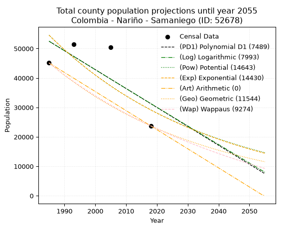
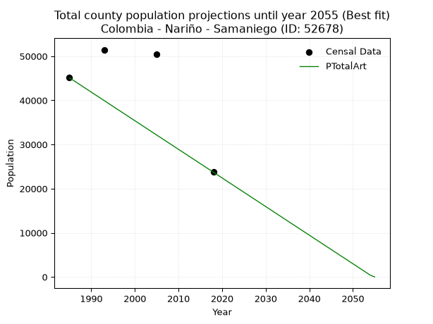
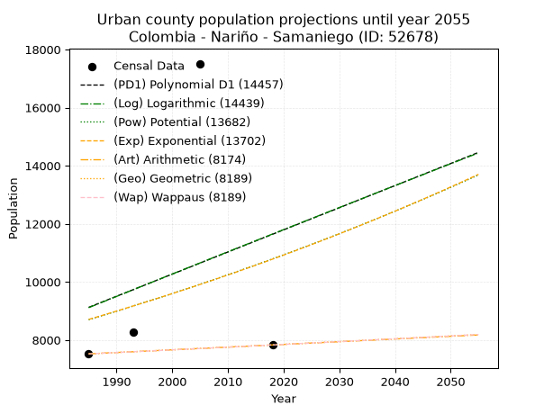
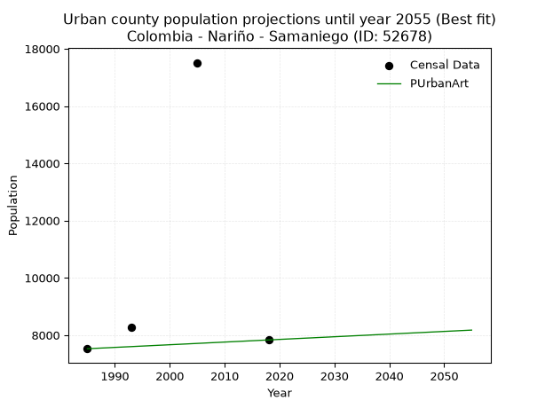
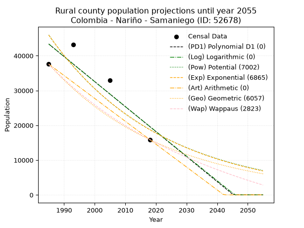
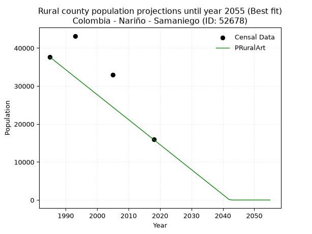

<div align="center">


</div>

# 📜 _“Population and Public Services Demand Projections (PPSD) until Year 2050 for Colombia - Nariño - Samaniego (ID: 52678)”_
Keywords: `population` `public-service` `projection` `lineal` `polynomial` `logarithmic` `potential` `exponential` `arithmetic` `geometric` `wappaus` `dane` `colombia` `south-america`

PPSD are analytical estimates used by governments and planners to anticipate future changes in population size, age distribution, and the resulting community needs for utilities, healthcare, education, and infrastructure as sizing future water treatment facilities, electrical grids, and road networks based on spatial growth.

<div align="center">

</img>

</div>


> **General running parameters**: • app_version: _v20260806_. • Python version: _3.14.7_. • Pandas version: _3.0.5_. • NumPy version: _2.5.1_. • Creates, save and include plots into reports (create_plot): _False_. • Projection until year: _2050_. • Process polynomial degree 2 and up: _False_. • Process Wappaus: _True_. • Process Wappaus: _True_. • Set negative values to zero: _True_. • Set infinite values to zero: _True_. • Drop dataset notes: _True_. 
<div align="center">

Dynamic map: [:earth_americas:Google](http://maps.google.com/maps?q=1.335438245,-77.5943406) [:earth_americas:OSM](https://www.openstreetmap.org/#map=18/1.335438245/-77.5943406&layers=P) [:earth_americas:Bing](https://www.bing.com/maps?cp=1.335438245~-77.5943406&lvl=18) [:earth_americas:Apple](https://maps.apple.com/frame?center=1.335438245%2C-77.5943406&span=0.003%2C0.006)

</div>


<div align="center">

```geojson
{
  "type": "Feature",
  "geometry": {
    "type": "Point", 
    "coordinates": [-77.5943406, 1.335438245]
  }, 
  "properties": {
    "Name": "Colombia - Nariño - Samaniego (ID: 52678)"
  }
}
```

</div>


## 0. Census Data (4 records)

Census data are official statistics collected by a government about the people and housing in a country. They usually include counts of total population, age, sex, race, income, education, and jobs.

📅Global census file: [Population.xlsx](../data/Population.xlsx)

| Source   |   Year |   CountryID | CountryName   |   StateID | StateName   |   CountyID | CountyName   |   PTotal |   PUrban |   PRural |
|:---------|-------:|------------:|:--------------|----------:|:------------|-----------:|:-------------|---------:|---------:|---------:|
| DANE     |   1985 |          57 | Colombia      |        52 | Nariño      |      52678 | Samaniego    |    45112 |     7523 |    37589 |
| DANE     |   1993 |          57 | Colombia      |        52 | Nariño      |      52678 | Samaniego    |    51461 |     8276 |    43185 |
| DANE     |   2005 |          57 | Colombia      |        52 | Nariño      |      52678 | Samaniego    |    50437 |    17514 |    32923 |
| DANE     |   2018 |          57 | Colombia      |        52 | Nariño      |      52678 | Samaniego    |    23727 |     7830 |    15897 |

> 🔥Some records could had specific notes about the registered values or the corresponding urban or rural distribution.

📅[SUI-RUPS](https://www.datos.gov.co/Hacienda-y-Cr-dito-P-blico/Registro-nico-de-Prestadores-de-Servicios-P-blicos/4qkq-csdn/about_data) - Local public utility companies: [RUPS.csv](../data/RUPS.xlsx)

 | SERVICIO       | ESTADO    | NOMBRE                                                     | NIT         | DEPARTAMENTO_DOMICILIO   | MUNICIPIO_DOMICILIO   | DIRECCION                     |   TELEFONO | EMAIL                              | TIPO_PRESTADOR                 | CLASIFICACION                 |
|:---------------|:----------|:-----------------------------------------------------------|:------------|:-------------------------|:----------------------|:------------------------------|-----------:|:-----------------------------------|:-------------------------------|:------------------------------|
| ACUEDUCTO      | OPERATIVA | MUNICIPIO DE SAMANIEGO NARIÑO                              | 800099136-0 | NARINO                   | SAMANIEGO             | CARRERA 3RA CALLE 4TA ESQUINA |    7289068 | ontactenos@samaniego-narino.gov.co | MUNICIPIO (PRESTACIÓN DIRECTA) | MENOR O IGUAL A 2500 USUARIOS |
| ALCANTARILLADO | OPERATIVA | MUNICIPIO DE SAMANIEGO NARIÑO                              | 800099136-0 | NARINO                   | SAMANIEGO             | CARRERA 3RA CALLE 4TA ESQUINA |    7289068 | ontactenos@samaniego-narino.gov.co | MUNICIPIO (PRESTACIÓN DIRECTA) | MENOR O IGUAL A 2500 USUARIOS |
| ACUEDUCTO      | OPERATIVA | ASOCIACION DEL ACUEDUCTO Y ALCANTARILLADO DEL WAYCO AWAYCO | 900088390-0 | NARINO                   | SAMANIEGO             | B/ SILOE                      |    7289165 | awaycoesp@yahoo.com                | ORGANIZACION AUTORIZADA        | HASTA 2500 SUSCRIPTORES       |
| ACUEDUCTO      | OPERATIVA | ASOCIACION JUNTA ADMINISTRADORA ACUEDUCTO EL PLACER        | 900345855-6 | NARINO                   | SAMANIEGO             | Av Mayor Alejo                |    7289068 | pacocalderon54@yahoo.es            | ORGANIZACION AUTORIZADA        | MENOR O IGUAL A 2500 USUARIOS |

## 1. Total

### 1.1. Coefficients and Parameters

* (PD1) Polynomial Deg 1: -642.8265756724039, 1328498.1079887259 (lineal)
* (Log) Logarithmic: -1283778.5365181102, 9800695.193629708
* (Pow) Potential: -37.94443613430715, 129.8684018727462
* (Exp) Exponential: -0.01899582671147107, 1.2958910206550913e+21
* (Art) Arithmetic: Year diff. 2018 - 1985 = 33, Population diff. 23727 - 45112 = -21385, Annual growth = -648.030303030303
* (Geo) Geometric: Year diff. 2018 - 1985 = 33, Population diff. 23727 - 45112 = -21385, Annual growth % = -0.019282416159779325
* (Wap) Wappaus: i = -1.8827417685623062, Condition values only valid for < 200)

<sub>
Wappaus condition values: ['-0.00', '-1.88', '-3.77', '-5.65', '-7.53', '-9.41', '-11.30', '-13.18', '-15.06', '-16.94', '-18.83', '-20.71', '-22.59', '-24.48', '-26.36', '-28.24', '-30.12', '-32.01', '-33.89', '-35.77', '-37.65', '-39.54', '-41.42', '-43.30', '-45.19', '-47.07', '-48.95', '-50.83', '-52.72', '-54.60', '-56.48', '-58.36', '-60.25', '-62.13', '-64.01', '-65.90', '-67.78', '-69.66', '-71.54', '-73.43', '-75.31', '-77.19', '-79.08', '-80.96', '-82.84', '-84.72', '-86.61', '-88.49', '-90.37', '-92.25', '-94.14', '-96.02', '-97.90', '-99.79', '-101.67', '-103.55', '-105.43', '-107.32', '-109.20', '-111.08', '-112.96', '-114.85', '-116.73', '-118.61', '-120.50', '-122.38']
</sub>


### 1.2. Projected Dataset

|   Year |   CountyID |   PTotalPD1 |   PTotalLog |   PTotalPow |   PTotalExp |   PTotalArt |   PTotalGeo |   PTotalWap |
|-------:|-----------:|------------:|------------:|------------:|------------:|------------:|------------:|------------:|
|   1985 |      52678 |       52487 |       52484 |       54543 |       54544 |       45112 |       45112 |       45112 |
|   1986 |      52678 |       51845 |       51838 |       53511 |       53518 |       44464 |       44242 |       44271 |
|   1987 |      52678 |       51202 |       51192 |       52498 |       52511 |       43816 |       43389 |       43445 |
|   1988 |      52678 |       50559 |       50546 |       51505 |       51523 |       43168 |       42552 |       42634 |
|   1989 |      52678 |       49916 |       49900 |       50532 |       50553 |       42520 |       41732 |       41838 |
|   1990 |      52678 |       49273 |       49255 |       49577 |       49602 |       41872 |       40927 |       41056 |
|   1991 |      52678 |       48630 |       48610 |       48641 |       48669 |       41224 |       40138 |       40288 |
|   1992 |      52678 |       47988 |       47965 |       47723 |       47753 |       40576 |       39364 |       39534 |
|   1993 |      52678 |       47345 |       47321 |       46823 |       46855 |       39928 |       38605 |       38793 |
|   1994 |      52678 |       46702 |       46677 |       45940 |       45973 |       39280 |       37861 |       38065 |
|   1995 |      52678 |       46059 |       46033 |       45074 |       45108 |       38632 |       37131 |       37349 |
|   1996 |      52678 |       45416 |       45390 |       44225 |       44259 |       37984 |       36415 |       36646 |
|   1997 |      52678 |       44773 |       44747 |       43393 |       43426 |       37336 |       35712 |       35954 |
|   1998 |      52678 |       44131 |       44104 |       42576 |       42609 |       36688 |       35024 |       35274 |
|   1999 |      52678 |       43488 |       43462 |       41775 |       41807 |       36040 |       34348 |       34606 |
|   2000 |      52678 |       42845 |       42820 |       40990 |       41021 |       35392 |       33686 |       33948 |
|   2001 |      52678 |       42202 |       42178 |       40220 |       40249 |       34744 |       33037 |       33301 |
|   2002 |      52678 |       41559 |       41537 |       39465 |       39491 |       34095 |       32400 |       32665 |
|   2003 |      52678 |       40916 |       40896 |       38724 |       38748 |       33447 |       31775 |       32039 |
|   2004 |      52678 |       40274 |       40255 |       37997 |       38019 |       32799 |       31162 |       31423 |
|   2005 |      52678 |       39631 |       39614 |       37285 |       37304 |       32151 |       30561 |       30817 |
|   2006 |      52678 |       38988 |       38974 |       36586 |       36602 |       31503 |       29972 |       30220 |
|   2007 |      52678 |       38345 |       38334 |       35901 |       35913 |       30855 |       29394 |       29632 |
|   2008 |      52678 |       37702 |       37695 |       35229 |       35237 |       30207 |       28827 |       29054 |
|   2009 |      52678 |       37060 |       37056 |       34569 |       34574 |       29559 |       28271 |       28484 |
|   2010 |      52678 |       36417 |       36417 |       33923 |       33924 |       28911 |       27726 |       27924 |
|   2011 |      52678 |       35774 |       35778 |       33288 |       33286 |       28263 |       27192 |       27371 |
|   2012 |      52678 |       35131 |       35140 |       32666 |       32659 |       27615 |       26667 |       26827 |
|   2013 |      52678 |       34488 |       34502 |       32056 |       32045 |       26967 |       26153 |       26291 |
|   2014 |      52678 |       33845 |       33865 |       31458 |       31442 |       26319 |       25649 |       25763 |
|   2015 |      52678 |       33203 |       33227 |       30871 |       30850 |       25671 |       25154 |       25243 |
|   2016 |      52678 |       32560 |       32590 |       30295 |       30270 |       25023 |       24669 |       24730 |
|   2017 |      52678 |       31917 |       31954 |       29730 |       29700 |       24375 |       24194 |       24225 |
|   2018 |      52678 |       31274 |       31317 |       29176 |       29141 |       23727 |       23727 |       23727 |
|   2019 |      52678 |       30631 |       30681 |       28633 |       28593 |       23079 |       23269 |       23236 |
|   2020 |      52678 |       29988 |       30046 |       28100 |       28055 |       22431 |       22821 |       22752 |
|   2021 |      52678 |       29346 |       29410 |       27577 |       27527 |       21783 |       22381 |       22275 |
|   2022 |      52678 |       28703 |       28775 |       27065 |       27009 |       21135 |       21949 |       21804 |
|   2023 |      52678 |       28060 |       28141 |       26561 |       26501 |       20487 |       21526 |       21341 |
|   2024 |      52678 |       27417 |       27506 |       26068 |       26002 |       19839 |       21111 |       20883 |
|   2025 |      52678 |       26774 |       26872 |       25584 |       25513 |       19191 |       20704 |       20432 |
|   2026 |      52678 |       26131 |       26238 |       25109 |       25033 |       18543 |       20305 |       19986 |
|   2027 |      52678 |       25489 |       25605 |       24643 |       24562 |       17895 |       19913 |       19547 |
|   2028 |      52678 |       24846 |       24972 |       24187 |       24100 |       17247 |       19529 |       19114 |
|   2029 |      52678 |       24203 |       24339 |       23738 |       23646 |       16599 |       19153 |       18686 |
|   2030 |      52678 |       23560 |       23706 |       23299 |       23201 |       15951 |       18783 |       18265 |
|   2031 |      52678 |       22917 |       23074 |       22867 |       22765 |       15303 |       18421 |       17848 |
|   2032 |      52678 |       22275 |       22442 |       22444 |       22336 |       14655 |       18066 |       17437 |
|   2033 |      52678 |       21632 |       21810 |       22029 |       21916 |       14007 |       17717 |       17032 |
|   2034 |      52678 |       20989 |       21179 |       21622 |       21504 |       13359 |       17376 |       16631 |
|   2035 |      52678 |       20346 |       20548 |       21222 |       21099 |       12710 |       17041 |       16236 |
|   2036 |      52678 |       19703 |       19917 |       20830 |       20702 |       12062 |       16712 |       15846 |
|   2037 |      52678 |       19060 |       19287 |       20446 |       20312 |       11414 |       16390 |       15461 |
|   2038 |      52678 |       18418 |       18657 |       20069 |       19930 |       10766 |       16074 |       15080 |
|   2039 |      52678 |       17775 |       18027 |       19698 |       19555 |       10118 |       15764 |       14705 |
|   2040 |      52678 |       17132 |       17398 |       19335 |       19187 |        9470 |       15460 |       14334 |
|   2041 |      52678 |       16489 |       16768 |       18979 |       18826 |        8822 |       15162 |       13967 |
|   2042 |      52678 |       15846 |       16140 |       18630 |       18472 |        8174 |       14870 |       13605 |
|   2043 |      52678 |       15203 |       15511 |       18287 |       18124 |        7526 |       14583 |       13248 |
|   2044 |      52678 |       14561 |       14883 |       17950 |       17783 |        6878 |       14302 |       12895 |
|   2045 |      52678 |       13918 |       14255 |       17620 |       17449 |        6230 |       14026 |       12546 |
|   2046 |      52678 |       13275 |       13627 |       17296 |       17120 |        5582 |       13755 |       12201 |
|   2047 |      52678 |       12632 |       13000 |       16979 |       16798 |        4934 |       13490 |       11860 |
|   2048 |      52678 |       11989 |       12373 |       16667 |       16482 |        4286 |       13230 |       11524 |
|   2049 |      52678 |       11346 |       11746 |       16361 |       16172 |        3638 |       12975 |       11191 |
|   2050 |      52678 |       10704 |       11120 |       16061 |       15868 |        2990 |       12725 |       10862 |
<div align="center">

</img>

</div>


### 1.3. Best fit with absolute and relative error (%)

Relative error puts that difference into context by dividing the absolute error by the true value, creating a unitless ratio or percentage that shows the scale of the mistake.

Absolute and relative error

|   Year | Source   |   CountryID | CountryName   |   StateID | StateName   |   CountyID_x | CountyName   |   PTotal |   PUrban |   PRural |   CountyID_y |   PTotalPD1 |   PTotalLog |   PTotalPow |   PTotalExp |   PTotalArt |   PTotalGeo |   PTotalWap |   PTotalPD1AbsError |   PTotalLogAbsError |   PTotalPowAbsError |   PTotalExpAbsError |   PTotalArtAbsError |   PTotalGeoAbsError |   PTotalWapAbsError |   PTotalPD1RelError |   PTotalLogRelError |   PTotalPowRelError |   PTotalExpRelError |   PTotalArtRelError |   PTotalGeoRelError |   PTotalWapRelError |
|-------:|:---------|------------:|:--------------|----------:|:------------|-------------:|:-------------|---------:|---------:|---------:|-------------:|------------:|------------:|------------:|------------:|------------:|------------:|------------:|--------------------:|--------------------:|--------------------:|--------------------:|--------------------:|--------------------:|--------------------:|--------------------:|--------------------:|--------------------:|--------------------:|--------------------:|--------------------:|--------------------:|
|   1985 | DANE     |          57 | Colombia      |        52 | Nariño      |        52678 | Samaniego    |    45112 |     7523 |    37589 |        52678 |       52487 |       52484 |       54543 |       54544 |       45112 |       45112 |       45112 |                7375 |                7372 |                9431 |                9432 |                   0 |                   0 |                   0 |            16.3482  |            16.3415  |            20.9057  |            20.908   |              0      |              0      |              0      |
|   1993 | DANE     |          57 | Colombia      |        52 | Nariño      |        52678 | Samaniego    |    51461 |     8276 |    43185 |        52678 |       47345 |       47321 |       46823 |       46855 |       39928 |       38605 |       38793 |                4116 |                4140 |                4638 |                4606 |               11533 |               12856 |               12668 |             7.99829 |             8.04493 |             9.01265 |             8.95047 |             22.4111 |             24.982  |             24.6167 |
|   2005 | DANE     |          57 | Colombia      |        52 | Nariño      |        52678 | Samaniego    |    50437 |    17514 |    32923 |        52678 |       39631 |       39614 |       37285 |       37304 |       32151 |       30561 |       30817 |               10806 |               10823 |               13152 |               13133 |               18286 |               19876 |               19620 |            21.4247  |            21.4585  |            26.0761  |            26.0384  |             36.2551 |             39.4076 |             38.9    |
|   2018 | DANE     |          57 | Colombia      |        52 | Nariño      |        52678 | Samaniego    |    23727 |     7830 |    15897 |        52678 |       31274 |       31317 |       29176 |       29141 |       23727 |       23727 |       23727 |                7547 |                7590 |                5449 |                5414 |                   0 |                   0 |                   0 |            31.8076  |            31.9889  |            22.9654  |            22.8179  |              0      |              0      |              0      |

Relative error mean

| Method    |   RelError | Best   |
|:----------|-----------:|:-------|
| PTotalPD1 |    19.3947 |        |
| PTotalLog |    19.4585 |        |
| PTotalPow |    19.74   |        |
| PTotalExp |    19.6787 |        |
| PTotalArt |    14.6666 | True   |
| PTotalGeo |    16.0974 |        |
| PTotalWap |    15.8792 |        |

💙Best method: _**PTotalArt**_
<div align="center">

</img>

</div>


### 1.4. Fresh water supply demand in liters per capita per day (lpcd)

The fresh water supply demand typically ranges from 100 to 300 liters per capita per day (lpcd) for standard domestic and municipal planning, though absolute survival minimums set by the World Health Organization are as low as 7.5 to 20 liters per day, and total consumption in high-income nations can exceed 400 liters.

> `CZ`: Level in meters above the sea level (masl)<br> `WS`: Fresh water supply demand in liters per capita per day (lpcd or l/h/d)<br> `WSAll`: Zonal fresh water supply demand in liters per second (l/s)<br> `A`: Zonal area in square meters<br> `DP`: Population density (people/hectare or p/ha)

Reference values (RAS Colombia)

|    CZ |   WS |
|------:|-----:|
|  1000 |  120 |
|  2000 |  130 |
| 99999 |  140 |

County shapefile geometry properties and water supply values

|   CountyID |      ATotal |   CZTotal |   WSTotal |
|-----------:|------------:|----------:|----------:|
|      52678 | 6.05722e+08 |   1580.11 |       130 |

Projected values for best method: PTotalArt

|   CountyID |   Year |   PTotalArt |   DPTotal |   WSTotal |   WSTotalAll |
|-----------:|-------:|------------:|----------:|----------:|-------------:|
|      52678 |   1985 |       45112 |      0.74 |       130 |     67.8769  |
|      52678 |   1986 |       44464 |      0.73 |       130 |     66.9019  |
|      52678 |   1987 |       43816 |      0.72 |       130 |     65.9269  |
|      52678 |   1988 |       43168 |      0.71 |       130 |     64.9519  |
|      52678 |   1989 |       42520 |      0.7  |       130 |     63.9769  |
|      52678 |   1990 |       41872 |      0.69 |       130 |     63.0019  |
|      52678 |   1991 |       41224 |      0.68 |       130 |     62.0269  |
|      52678 |   1992 |       40576 |      0.67 |       130 |     61.0519  |
|      52678 |   1993 |       39928 |      0.66 |       130 |     60.0769  |
|      52678 |   1994 |       39280 |      0.65 |       130 |     59.1019  |
|      52678 |   1995 |       38632 |      0.64 |       130 |     58.1269  |
|      52678 |   1996 |       37984 |      0.63 |       130 |     57.1519  |
|      52678 |   1997 |       37336 |      0.62 |       130 |     56.1769  |
|      52678 |   1998 |       36688 |      0.61 |       130 |     55.2019  |
|      52678 |   1999 |       36040 |      0.59 |       130 |     54.2269  |
|      52678 |   2000 |       35392 |      0.58 |       130 |     53.2519  |
|      52678 |   2001 |       34744 |      0.57 |       130 |     52.2769  |
|      52678 |   2002 |       34095 |      0.56 |       130 |     51.3003  |
|      52678 |   2003 |       33447 |      0.55 |       130 |     50.3253  |
|      52678 |   2004 |       32799 |      0.54 |       130 |     49.3503  |
|      52678 |   2005 |       32151 |      0.53 |       130 |     48.3753  |
|      52678 |   2006 |       31503 |      0.52 |       130 |     47.4003  |
|      52678 |   2007 |       30855 |      0.51 |       130 |     46.4253  |
|      52678 |   2008 |       30207 |      0.5  |       130 |     45.4503  |
|      52678 |   2009 |       29559 |      0.49 |       130 |     44.4753  |
|      52678 |   2010 |       28911 |      0.48 |       130 |     43.5003  |
|      52678 |   2011 |       28263 |      0.47 |       130 |     42.5253  |
|      52678 |   2012 |       27615 |      0.46 |       130 |     41.5503  |
|      52678 |   2013 |       26967 |      0.45 |       130 |     40.5753  |
|      52678 |   2014 |       26319 |      0.43 |       130 |     39.6003  |
|      52678 |   2015 |       25671 |      0.42 |       130 |     38.6253  |
|      52678 |   2016 |       25023 |      0.41 |       130 |     37.6503  |
|      52678 |   2017 |       24375 |      0.4  |       130 |     36.6753  |
|      52678 |   2018 |       23727 |      0.39 |       130 |     35.7003  |
|      52678 |   2019 |       23079 |      0.38 |       130 |     34.7253  |
|      52678 |   2020 |       22431 |      0.37 |       130 |     33.7503  |
|      52678 |   2021 |       21783 |      0.36 |       130 |     32.7753  |
|      52678 |   2022 |       21135 |      0.35 |       130 |     31.8003  |
|      52678 |   2023 |       20487 |      0.34 |       130 |     30.8253  |
|      52678 |   2024 |       19839 |      0.33 |       130 |     29.8503  |
|      52678 |   2025 |       19191 |      0.32 |       130 |     28.8753  |
|      52678 |   2026 |       18543 |      0.31 |       130 |     27.9003  |
|      52678 |   2027 |       17895 |      0.3  |       130 |     26.9253  |
|      52678 |   2028 |       17247 |      0.28 |       130 |     25.9503  |
|      52678 |   2029 |       16599 |      0.27 |       130 |     24.9753  |
|      52678 |   2030 |       15951 |      0.26 |       130 |     24.0003  |
|      52678 |   2031 |       15303 |      0.25 |       130 |     23.0253  |
|      52678 |   2032 |       14655 |      0.24 |       130 |     22.0503  |
|      52678 |   2033 |       14007 |      0.23 |       130 |     21.0753  |
|      52678 |   2034 |       13359 |      0.22 |       130 |     20.1003  |
|      52678 |   2035 |       12710 |      0.21 |       130 |     19.1238  |
|      52678 |   2036 |       12062 |      0.2  |       130 |     18.1488  |
|      52678 |   2037 |       11414 |      0.19 |       130 |     17.1738  |
|      52678 |   2038 |       10766 |      0.18 |       130 |     16.1988  |
|      52678 |   2039 |       10118 |      0.17 |       130 |     15.2238  |
|      52678 |   2040 |        9470 |      0.16 |       130 |     14.2488  |
|      52678 |   2041 |        8822 |      0.15 |       130 |     13.2738  |
|      52678 |   2042 |        8174 |      0.13 |       130 |     12.2988  |
|      52678 |   2043 |        7526 |      0.12 |       130 |     11.3238  |
|      52678 |   2044 |        6878 |      0.11 |       130 |     10.3488  |
|      52678 |   2045 |        6230 |      0.1  |       130 |      9.37384 |
|      52678 |   2046 |        5582 |      0.09 |       130 |      8.39884 |
|      52678 |   2047 |        4934 |      0.08 |       130 |      7.42384 |
|      52678 |   2048 |        4286 |      0.07 |       130 |      6.44884 |
|      52678 |   2049 |        3638 |      0.06 |       130 |      5.47384 |
|      52678 |   2050 |        2990 |      0.05 |       130 |      4.49884 |

## 2. Urban

### 2.1. Coefficients and Parameters

* (PD1) Polynomial Deg 1: 76.18988358089663, -142113.06463268847 (lineal)
* (Log) Logarithmic: 153700.45176154491, -1157992.6155176242
* (Pow) Potential: 13.062499324359397, -39.137461229805595
* (Exp) Exponential: 0.006474930214859716, 0.022807817547490276
* (Art) Arithmetic: Year diff. 2018 - 1985 = 33, Population diff. 7830 - 7523 = 307, Annual growth = 9.303030303030303
* (Geo) Geometric: Year diff. 2018 - 1985 = 33, Population diff. 7830 - 7523 = 307, Annual growth % = 0.0012127807464672458
* (Wap) Wappaus: i = 0.12118843617573508, Condition values only valid for < 200)

<sub>
Wappaus condition values: ['0.00', '0.12', '0.24', '0.36', '0.48', '0.61', '0.73', '0.85', '0.97', '1.09', '1.21', '1.33', '1.45', '1.58', '1.70', '1.82', '1.94', '2.06', '2.18', '2.30', '2.42', '2.54', '2.67', '2.79', '2.91', '3.03', '3.15', '3.27', '3.39', '3.51', '3.64', '3.76', '3.88', '4.00', '4.12', '4.24', '4.36', '4.48', '4.61', '4.73', '4.85', '4.97', '5.09', '5.21', '5.33', '5.45', '5.57', '5.70', '5.82', '5.94', '6.06', '6.18', '6.30', '6.42', '6.54', '6.67', '6.79', '6.91', '7.03', '7.15', '7.27', '7.39', '7.51', '7.63', '7.76', '7.88']
</sub>


### 2.2. Projected Dataset

|   Year |   CountyID |   PUrbanPD1 |   PUrbanLog |   PUrbanPow |   PUrbanExp |   PUrbanArt |   PUrbanGeo |   PUrbanWap |
|-------:|-----------:|------------:|------------:|------------:|------------:|------------:|------------:|------------:|
|   1985 |      52678 |        9124 |        9112 |        8700 |        8709 |        7523 |        7523 |        7523 |
|   1986 |      52678 |        9200 |        9190 |        8758 |        8765 |        7532 |        7532 |        7532 |
|   1987 |      52678 |        9276 |        9267 |        8815 |        8822 |        7542 |        7541 |        7541 |
|   1988 |      52678 |        9352 |        9345 |        8874 |        8880 |        7551 |        7550 |        7550 |
|   1989 |      52678 |        9429 |        9422 |        8932 |        8937 |        7560 |        7560 |        7560 |
|   1990 |      52678 |        9505 |        9499 |        8991 |        8995 |        7570 |        7569 |        7569 |
|   1991 |      52678 |        9581 |        9576 |        9050 |        9054 |        7579 |        7578 |        7578 |
|   1992 |      52678 |        9657 |        9653 |        9110 |        9113 |        7588 |        7587 |        7587 |
|   1993 |      52678 |        9733 |        9731 |        9170 |        9172 |        7597 |        7596 |        7596 |
|   1994 |      52678 |        9810 |        9808 |        9230 |        9231 |        7607 |        7606 |        7606 |
|   1995 |      52678 |        9886 |        9885 |        9291 |        9291 |        7616 |        7615 |        7615 |
|   1996 |      52678 |        9962 |        9962 |        9352 |        9352 |        7625 |        7624 |        7624 |
|   1997 |      52678 |       10038 |       10039 |        9413 |        9412 |        7635 |        7633 |        7633 |
|   1998 |      52678 |       10114 |       10116 |        9475 |        9474 |        7644 |        7642 |        7642 |
|   1999 |      52678 |       10191 |       10193 |        9537 |        9535 |        7653 |        7652 |        7652 |
|   2000 |      52678 |       10267 |       10270 |        9599 |        9597 |        7663 |        7661 |        7661 |
|   2001 |      52678 |       10343 |       10346 |        9662 |        9659 |        7672 |        7670 |        7670 |
|   2002 |      52678 |       10419 |       10423 |        9725 |        9722 |        7681 |        7680 |        7680 |
|   2003 |      52678 |       10495 |       10500 |        9789 |        9785 |        7690 |        7689 |        7689 |
|   2004 |      52678 |       10571 |       10577 |        9853 |        9849 |        7700 |        7698 |        7698 |
|   2005 |      52678 |       10648 |       10653 |        9918 |        9913 |        7709 |        7708 |        7708 |
|   2006 |      52678 |       10724 |       10730 |        9982 |        9977 |        7718 |        7717 |        7717 |
|   2007 |      52678 |       10800 |       10807 |       10048 |       10042 |        7728 |        7726 |        7726 |
|   2008 |      52678 |       10876 |       10883 |       10113 |       10107 |        7737 |        7736 |        7736 |
|   2009 |      52678 |       10952 |       10960 |       10179 |       10173 |        7746 |        7745 |        7745 |
|   2010 |      52678 |       11029 |       11036 |       10246 |       10239 |        7756 |        7754 |        7754 |
|   2011 |      52678 |       11105 |       11113 |       10312 |       10305 |        7765 |        7764 |        7764 |
|   2012 |      52678 |       11181 |       11189 |       10380 |       10372 |        7774 |        7773 |        7773 |
|   2013 |      52678 |       11257 |       11265 |       10447 |       10440 |        7783 |        7783 |        7783 |
|   2014 |      52678 |       11333 |       11342 |       10515 |       10508 |        7793 |        7792 |        7792 |
|   2015 |      52678 |       11410 |       11418 |       10584 |       10576 |        7802 |        7802 |        7802 |
|   2016 |      52678 |       11486 |       11494 |       10652 |       10645 |        7811 |        7811 |        7811 |
|   2017 |      52678 |       11562 |       11570 |       10722 |       10714 |        7821 |        7821 |        7821 |
|   2018 |      52678 |       11638 |       11647 |       10791 |       10783 |        7830 |        7830 |        7830 |
|   2019 |      52678 |       11714 |       11723 |       10861 |       10853 |        7839 |        7839 |        7839 |
|   2020 |      52678 |       11791 |       11799 |       10932 |       10924 |        7849 |        7849 |        7849 |
|   2021 |      52678 |       11867 |       11875 |       11003 |       10995 |        7858 |        7859 |        7859 |
|   2022 |      52678 |       11943 |       11951 |       11074 |       11066 |        7867 |        7868 |        7868 |
|   2023 |      52678 |       12019 |       12027 |       11146 |       11138 |        7877 |        7878 |        7878 |
|   2024 |      52678 |       12095 |       12103 |       11218 |       11211 |        7886 |        7887 |        7887 |
|   2025 |      52678 |       12171 |       12179 |       11291 |       11283 |        7895 |        7897 |        7897 |
|   2026 |      52678 |       12248 |       12255 |       11364 |       11357 |        7904 |        7906 |        7906 |
|   2027 |      52678 |       12324 |       12331 |       11437 |       11430 |        7914 |        7916 |        7916 |
|   2028 |      52678 |       12400 |       12406 |       11511 |       11505 |        7923 |        7925 |        7926 |
|   2029 |      52678 |       12476 |       12482 |       11585 |       11579 |        7932 |        7935 |        7935 |
|   2030 |      52678 |       12552 |       12558 |       11660 |       11655 |        7942 |        7945 |        7945 |
|   2031 |      52678 |       12629 |       12634 |       11735 |       11730 |        7951 |        7954 |        7954 |
|   2032 |      52678 |       12705 |       12709 |       11811 |       11807 |        7960 |        7964 |        7964 |
|   2033 |      52678 |       12781 |       12785 |       11887 |       11883 |        7970 |        7974 |        7974 |
|   2034 |      52678 |       12857 |       12860 |       11964 |       11960 |        7979 |        7983 |        7983 |
|   2035 |      52678 |       12933 |       12936 |       12041 |       12038 |        7988 |        7993 |        7993 |
|   2036 |      52678 |       13010 |       13012 |       12118 |       12116 |        7997 |        8003 |        8003 |
|   2037 |      52678 |       13086 |       13087 |       12196 |       12195 |        8007 |        8012 |        8013 |
|   2038 |      52678 |       13162 |       13162 |       12275 |       12274 |        8016 |        8022 |        8022 |
|   2039 |      52678 |       13238 |       13238 |       12354 |       12354 |        8025 |        8032 |        8032 |
|   2040 |      52678 |       13314 |       13313 |       12433 |       12434 |        8035 |        8042 |        8042 |
|   2041 |      52678 |       13390 |       13389 |       12513 |       12515 |        8044 |        8051 |        8051 |
|   2042 |      52678 |       13467 |       13464 |       12593 |       12596 |        8053 |        8061 |        8061 |
|   2043 |      52678 |       13543 |       13539 |       12674 |       12678 |        8063 |        8071 |        8071 |
|   2044 |      52678 |       13619 |       13614 |       12755 |       12760 |        8072 |        8081 |        8081 |
|   2045 |      52678 |       13695 |       13689 |       12837 |       12843 |        8081 |        8090 |        8091 |
|   2046 |      52678 |       13771 |       13765 |       12919 |       12927 |        8090 |        8100 |        8100 |
|   2047 |      52678 |       13848 |       13840 |       13002 |       13011 |        8100 |        8110 |        8110 |
|   2048 |      52678 |       13924 |       13915 |       13085 |       13095 |        8109 |        8120 |        8120 |
|   2049 |      52678 |       14000 |       13990 |       13169 |       13180 |        8118 |        8130 |        8130 |
|   2050 |      52678 |       14076 |       14065 |       13253 |       13266 |        8128 |        8140 |        8140 |
<div align="center">

</img>

</div>


### 2.3. Best fit with absolute and relative error (%)

Relative error puts that difference into context by dividing the absolute error by the true value, creating a unitless ratio or percentage that shows the scale of the mistake.

Absolute and relative error

|   Year | Source   |   CountryID | CountryName   |   StateID | StateName   |   CountyID_x | CountyName   |   PTotal |   PUrban |   PRural |   CountyID_y |   PUrbanPD1 |   PUrbanLog |   PUrbanPow |   PUrbanExp |   PUrbanArt |   PUrbanGeo |   PUrbanWap |   PUrbanPD1AbsError |   PUrbanLogAbsError |   PUrbanPowAbsError |   PUrbanExpAbsError |   PUrbanArtAbsError |   PUrbanGeoAbsError |   PUrbanWapAbsError |   PUrbanPD1RelError |   PUrbanLogRelError |   PUrbanPowRelError |   PUrbanExpRelError |   PUrbanArtRelError |   PUrbanGeoRelError |   PUrbanWapRelError |
|-------:|:---------|------------:|:--------------|----------:|:------------|-------------:|:-------------|---------:|---------:|---------:|-------------:|------------:|------------:|------------:|------------:|------------:|------------:|------------:|--------------------:|--------------------:|--------------------:|--------------------:|--------------------:|--------------------:|--------------------:|--------------------:|--------------------:|--------------------:|--------------------:|--------------------:|--------------------:|--------------------:|
|   1985 | DANE     |          57 | Colombia      |        52 | Nariño      |        52678 | Samaniego    |    45112 |     7523 |    37589 |        52678 |        9124 |        9112 |        8700 |        8709 |        7523 |        7523 |        7523 |                1601 |                1589 |                1177 |                1186 |                   0 |                   0 |                   0 |             21.2814 |             21.1219 |             15.6454 |             15.765  |             0       |             0       |             0       |
|   1993 | DANE     |          57 | Colombia      |        52 | Nariño      |        52678 | Samaniego    |    51461 |     8276 |    43185 |        52678 |        9733 |        9731 |        9170 |        9172 |        7597 |        7596 |        7596 |                1457 |                1455 |                 894 |                 896 |                 679 |                 680 |                 680 |             17.6051 |             17.581  |             10.8023 |             10.8265 |             8.20445 |             8.21653 |             8.21653 |
|   2005 | DANE     |          57 | Colombia      |        52 | Nariño      |        52678 | Samaniego    |    50437 |    17514 |    32923 |        52678 |       10648 |       10653 |        9918 |        9913 |        7709 |        7708 |        7708 |                6866 |                6861 |                7596 |                7601 |                9805 |                9806 |                9806 |             39.2029 |             39.1744 |             43.371  |             43.3996 |            55.9838  |            55.9895  |            55.9895  |
|   2018 | DANE     |          57 | Colombia      |        52 | Nariño      |        52678 | Samaniego    |    23727 |     7830 |    15897 |        52678 |       11638 |       11647 |       10791 |       10783 |        7830 |        7830 |        7830 |                3808 |                3817 |                2961 |                2953 |                   0 |                   0 |                   0 |             48.6335 |             48.7484 |             37.8161 |             37.7139 |             0       |             0       |             0       |

Relative error mean

| Method    |   RelError | Best   |
|:----------|-----------:|:-------|
| PUrbanPD1 |    31.6807 |        |
| PUrbanLog |    31.6564 |        |
| PUrbanPow |    26.9087 |        |
| PUrbanExp |    26.9262 |        |
| PUrbanArt |    16.0471 | True   |
| PUrbanGeo |    16.0515 |        |
| PUrbanWap |    16.0515 |        |

💙Best method: _**PUrbanArt**_
<div align="center">

</img>

</div>


### 2.4. Fresh water supply demand in liters per capita per day (lpcd)

The fresh water supply demand typically ranges from 100 to 300 liters per capita per day (lpcd) for standard domestic and municipal planning, though absolute survival minimums set by the World Health Organization are as low as 7.5 to 20 liters per day, and total consumption in high-income nations can exceed 400 liters.

> `CZ`: Level in meters above the sea level (masl)<br> `WS`: Fresh water supply demand in liters per capita per day (lpcd or l/h/d)<br> `WSAll`: Zonal fresh water supply demand in liters per second (l/s)<br> `A`: Zonal area in square meters<br> `DP`: Population density (people/hectare or p/ha)

Reference values (RAS Colombia)

|    CZ |   WS |
|------:|-----:|
|  1000 |  120 |
|  2000 |  130 |
| 99999 |  140 |

County shapefile geometry properties and water supply values

|   CountyID |      AUrban |   CZUrban |   WSUrban |
|-----------:|------------:|----------:|----------:|
|      52678 | 2.22696e+06 |   1503.86 |       130 |

Projected values for best method: PUrbanArt

|   CountyID |   Year |   PUrbanArt |   DPUrban |   WSUrban |   WSUrbanAll |
|-----------:|-------:|------------:|----------:|----------:|-------------:|
|      52678 |   1985 |        7523 |     33.78 |       130 |      11.3193 |
|      52678 |   1986 |        7532 |     33.82 |       130 |      11.3329 |
|      52678 |   1987 |        7542 |     33.87 |       130 |      11.3479 |
|      52678 |   1988 |        7551 |     33.91 |       130 |      11.3615 |
|      52678 |   1989 |        7560 |     33.95 |       130 |      11.375  |
|      52678 |   1990 |        7570 |     33.99 |       130 |      11.39   |
|      52678 |   1991 |        7579 |     34.03 |       130 |      11.4036 |
|      52678 |   1992 |        7588 |     34.07 |       130 |      11.4171 |
|      52678 |   1993 |        7597 |     34.11 |       130 |      11.4307 |
|      52678 |   1994 |        7607 |     34.16 |       130 |      11.4457 |
|      52678 |   1995 |        7616 |     34.2  |       130 |      11.4593 |
|      52678 |   1996 |        7625 |     34.24 |       130 |      11.4728 |
|      52678 |   1997 |        7635 |     34.28 |       130 |      11.4878 |
|      52678 |   1998 |        7644 |     34.32 |       130 |      11.5014 |
|      52678 |   1999 |        7653 |     34.37 |       130 |      11.5149 |
|      52678 |   2000 |        7663 |     34.41 |       130 |      11.53   |
|      52678 |   2001 |        7672 |     34.45 |       130 |      11.5435 |
|      52678 |   2002 |        7681 |     34.49 |       130 |      11.5571 |
|      52678 |   2003 |        7690 |     34.53 |       130 |      11.5706 |
|      52678 |   2004 |        7700 |     34.58 |       130 |      11.5856 |
|      52678 |   2005 |        7709 |     34.62 |       130 |      11.5992 |
|      52678 |   2006 |        7718 |     34.66 |       130 |      11.6127 |
|      52678 |   2007 |        7728 |     34.7  |       130 |      11.6278 |
|      52678 |   2008 |        7737 |     34.74 |       130 |      11.6413 |
|      52678 |   2009 |        7746 |     34.78 |       130 |      11.6549 |
|      52678 |   2010 |        7756 |     34.83 |       130 |      11.6699 |
|      52678 |   2011 |        7765 |     34.87 |       130 |      11.6834 |
|      52678 |   2012 |        7774 |     34.91 |       130 |      11.697  |
|      52678 |   2013 |        7783 |     34.95 |       130 |      11.7105 |
|      52678 |   2014 |        7793 |     34.99 |       130 |      11.7256 |
|      52678 |   2015 |        7802 |     35.03 |       130 |      11.7391 |
|      52678 |   2016 |        7811 |     35.07 |       130 |      11.7527 |
|      52678 |   2017 |        7821 |     35.12 |       130 |      11.7677 |
|      52678 |   2018 |        7830 |     35.16 |       130 |      11.7812 |
|      52678 |   2019 |        7839 |     35.2  |       130 |      11.7948 |
|      52678 |   2020 |        7849 |     35.25 |       130 |      11.8098 |
|      52678 |   2021 |        7858 |     35.29 |       130 |      11.8234 |
|      52678 |   2022 |        7867 |     35.33 |       130 |      11.8369 |
|      52678 |   2023 |        7877 |     35.37 |       130 |      11.852  |
|      52678 |   2024 |        7886 |     35.41 |       130 |      11.8655 |
|      52678 |   2025 |        7895 |     35.45 |       130 |      11.8791 |
|      52678 |   2026 |        7904 |     35.49 |       130 |      11.8926 |
|      52678 |   2027 |        7914 |     35.54 |       130 |      11.9076 |
|      52678 |   2028 |        7923 |     35.58 |       130 |      11.9212 |
|      52678 |   2029 |        7932 |     35.62 |       130 |      11.9347 |
|      52678 |   2030 |        7942 |     35.66 |       130 |      11.9498 |
|      52678 |   2031 |        7951 |     35.7  |       130 |      11.9633 |
|      52678 |   2032 |        7960 |     35.74 |       130 |      11.9769 |
|      52678 |   2033 |        7970 |     35.79 |       130 |      11.9919 |
|      52678 |   2034 |        7979 |     35.83 |       130 |      12.0054 |
|      52678 |   2035 |        7988 |     35.87 |       130 |      12.019  |
|      52678 |   2036 |        7997 |     35.91 |       130 |      12.0325 |
|      52678 |   2037 |        8007 |     35.95 |       130 |      12.0476 |
|      52678 |   2038 |        8016 |     36    |       130 |      12.0611 |
|      52678 |   2039 |        8025 |     36.04 |       130 |      12.0747 |
|      52678 |   2040 |        8035 |     36.08 |       130 |      12.0897 |
|      52678 |   2041 |        8044 |     36.12 |       130 |      12.1032 |
|      52678 |   2042 |        8053 |     36.16 |       130 |      12.1168 |
|      52678 |   2043 |        8063 |     36.21 |       130 |      12.1318 |
|      52678 |   2044 |        8072 |     36.25 |       130 |      12.1454 |
|      52678 |   2045 |        8081 |     36.29 |       130 |      12.1589 |
|      52678 |   2046 |        8090 |     36.33 |       130 |      12.1725 |
|      52678 |   2047 |        8100 |     36.37 |       130 |      12.1875 |
|      52678 |   2048 |        8109 |     36.41 |       130 |      12.201  |
|      52678 |   2049 |        8118 |     36.45 |       130 |      12.2146 |
|      52678 |   2050 |        8128 |     36.5  |       130 |      12.2296 |

## 3. Rural

### 3.1. Coefficients and Parameters

* (PD1) Polynomial Deg 1: -719.0164592533012, 1470611.1726214155 (lineal)
* (Log) Logarithmic: -1437478.9882796556, 10958687.809147336
* (Pow) Potential: -54.28603588908617, 183.6846234369569
* (Exp) Exponential: -0.027155433196056247, 1.1807555979630028e+28
* (Art) Arithmetic: Year diff. 2018 - 1985 = 33, Population diff. 15897 - 37589 = -21692, Annual growth = -657.3333333333334
* (Geo) Geometric: Year diff. 2018 - 1985 = 33, Population diff. 15897 - 37589 = -21692, Annual growth % = -0.025741113471954957
* (Wap) Wappaus: i = -2.4579640778272194, Condition values only valid for < 200)

<sub>
Wappaus condition values: ['-0.00', '-2.46', '-4.92', '-7.37', '-9.83', '-12.29', '-14.75', '-17.21', '-19.66', '-22.12', '-24.58', '-27.04', '-29.50', '-31.95', '-34.41', '-36.87', '-39.33', '-41.79', '-44.24', '-46.70', '-49.16', '-51.62', '-54.08', '-56.53', '-58.99', '-61.45', '-63.91', '-66.37', '-68.82', '-71.28', '-73.74', '-76.20', '-78.65', '-81.11', '-83.57', '-86.03', '-88.49', '-90.94', '-93.40', '-95.86', '-98.32', '-100.78', '-103.23', '-105.69', '-108.15', '-110.61', '-113.07', '-115.52', '-117.98', '-120.44', '-122.90', '-125.36', '-127.81', '-130.27', '-132.73', '-135.19', '-137.65', '-140.10', '-142.56', '-145.02', '-147.48', '-149.94', '-152.39', '-154.85', '-157.31', '-159.77']
</sub>


### 3.2. Projected Dataset

|   Year |   CountyID |   PRuralPD1 |   PRuralLog |   PRuralPow |   PRuralExp |   PRuralArt |   PRuralGeo |   PRuralWap |
|-------:|-----------:|------------:|------------:|------------:|------------:|------------:|------------:|------------:|
|   1985 |      52678 |       43364 |       43372 |       45949 |       45936 |       37589 |       37589 |       37589 |
|   1986 |      52678 |       42644 |       42648 |       44710 |       44705 |       36932 |       36621 |       36676 |
|   1987 |      52678 |       41925 |       41924 |       43505 |       43508 |       36274 |       35679 |       35785 |
|   1988 |      52678 |       41206 |       41201 |       42332 |       42342 |       35617 |       34760 |       34916 |
|   1989 |      52678 |       40487 |       40478 |       41192 |       41208 |       34960 |       33866 |       34066 |
|   1990 |      52678 |       39768 |       39756 |       40084 |       40104 |       34302 |       32994 |       33237 |
|   1991 |      52678 |       39049 |       39033 |       39005 |       39029 |       33645 |       32145 |       32426 |
|   1992 |      52678 |       38330 |       38312 |       37956 |       37984 |       32988 |       31317 |       31634 |
|   1993 |      52678 |       37611 |       37590 |       36936 |       36966 |       32330 |       30511 |       30859 |
|   1994 |      52678 |       36892 |       36869 |       35944 |       35976 |       31673 |       29726 |       30102 |
|   1995 |      52678 |       36173 |       36148 |       34979 |       35012 |       31016 |       28960 |       29361 |
|   1996 |      52678 |       35454 |       35428 |       34040 |       34074 |       30358 |       28215 |       28636 |
|   1997 |      52678 |       34735 |       34708 |       33127 |       33161 |       29701 |       27489 |       27927 |
|   1998 |      52678 |       34016 |       33988 |       32239 |       32273 |       29044 |       26781 |       27233 |
|   1999 |      52678 |       33297 |       33269 |       31375 |       31408 |       28386 |       26092 |       26553 |
|   2000 |      52678 |       32578 |       32550 |       30534 |       30567 |       27729 |       25420 |       25887 |
|   2001 |      52678 |       31859 |       31832 |       29717 |       29748 |       27072 |       24766 |       25235 |
|   2002 |      52678 |       31140 |       31113 |       28922 |       28951 |       26414 |       24128 |       24597 |
|   2003 |      52678 |       30421 |       30396 |       28148 |       28175 |       25757 |       23507 |       23971 |
|   2004 |      52678 |       29702 |       29678 |       27396 |       27421 |       25100 |       22902 |       23358 |
|   2005 |      52678 |       28983 |       28961 |       26664 |       26686 |       24442 |       22313 |       22756 |
|   2006 |      52678 |       28264 |       28244 |       25952 |       25971 |       23785 |       21738 |       22167 |
|   2007 |      52678 |       27545 |       27528 |       25259 |       25275 |       23128 |       21179 |       21589 |
|   2008 |      52678 |       26826 |       26812 |       24585 |       24598 |       22470 |       20633 |       21022 |
|   2009 |      52678 |       26107 |       26096 |       23930 |       23939 |       21813 |       20102 |       20465 |
|   2010 |      52678 |       25388 |       25381 |       23292 |       23298 |       21156 |       19585 |       19920 |
|   2011 |      52678 |       24669 |       24666 |       22671 |       22674 |       20498 |       19081 |       19384 |
|   2012 |      52678 |       23950 |       23951 |       22068 |       22066 |       19841 |       18590 |       18858 |
|   2013 |      52678 |       23231 |       23237 |       21480 |       21475 |       19184 |       18111 |       18342 |
|   2014 |      52678 |       22512 |       22523 |       20909 |       20900 |       18526 |       17645 |       17835 |
|   2015 |      52678 |       21793 |       21809 |       20353 |       20340 |       17869 |       17191 |       17338 |
|   2016 |      52678 |       21074 |       21096 |       19812 |       19795 |       17212 |       16748 |       16849 |
|   2017 |      52678 |       20355 |       20383 |       19286 |       19265 |       16554 |       16317 |       16369 |
|   2018 |      52678 |       19636 |       19671 |       18774 |       18749 |       15897 |       15897 |       15897 |
|   2019 |      52678 |       18917 |       18959 |       18276 |       18246 |       15240 |       15488 |       15433 |
|   2020 |      52678 |       18198 |       18247 |       17791 |       17757 |       14582 |       15089 |       14978 |
|   2021 |      52678 |       17479 |       17535 |       17319 |       17282 |       13925 |       14701 |       14530 |
|   2022 |      52678 |       16760 |       16824 |       16860 |       16819 |       13268 |       14322 |       14090 |
|   2023 |      52678 |       16041 |       16114 |       16414 |       16368 |       12610 |       13954 |       13657 |
|   2024 |      52678 |       15322 |       15403 |       15979 |       15930 |       11953 |       13594 |       13231 |
|   2025 |      52678 |       14603 |       14693 |       15557 |       15503 |       11296 |       13245 |       12812 |
|   2026 |      52678 |       13884 |       13983 |       15145 |       15088 |       10638 |       12904 |       12400 |
|   2027 |      52678 |       13165 |       13274 |       14745 |       14683 |        9981 |       12571 |       11995 |
|   2028 |      52678 |       12446 |       12565 |       14355 |       14290 |        9324 |       12248 |       11596 |
|   2029 |      52678 |       11727 |       11856 |       13976 |       13907 |        8666 |       11933 |       11204 |
|   2030 |      52678 |       11008 |       11148 |       13607 |       13535 |        8009 |       11625 |       10818 |
|   2031 |      52678 |       10289 |       10440 |       13248 |       13172 |        7352 |       11326 |       10438 |
|   2032 |      52678 |        9570 |        9733 |       12899 |       12819 |        6694 |       11035 |       10064 |
|   2033 |      52678 |        8851 |        9025 |       12559 |       12476 |        6037 |       10751 |        9695 |
|   2034 |      52678 |        8132 |        8318 |       12228 |       12142 |        5380 |       10474 |        9333 |
|   2035 |      52678 |        7413 |        7612 |       11906 |       11816 |        4722 |       10204 |        8976 |
|   2036 |      52678 |        6694 |        6906 |       11593 |       11500 |        4065 |        9942 |        8624 |
|   2037 |      52678 |        5975 |        6200 |       11288 |       11192 |        3408 |        9686 |        8277 |
|   2038 |      52678 |        5256 |        5494 |       10991 |       10892 |        2750 |        9436 |        7936 |
|   2039 |      52678 |        4537 |        4789 |       10702 |       10600 |        2093 |        9193 |        7600 |
|   2040 |      52678 |        3818 |        4084 |       10421 |       10316 |        1436 |        8957 |        7268 |
|   2041 |      52678 |        3099 |        3380 |       10148 |       10040 |         778 |        8726 |        6942 |
|   2042 |      52678 |        2380 |        2676 |        9881 |        9771 |         121 |        8502 |        6620 |
|   2043 |      52678 |        1661 |        1972 |        9622 |        9509 |           0 |        8283 |        6303 |
|   2044 |      52678 |         942 |        1269 |        9370 |        9254 |           0 |        8070 |        5990 |
|   2045 |      52678 |         223 |         565 |        9124 |        9006 |           0 |        7862 |        5682 |
|   2046 |      52678 |           0 |           0 |        8885 |        8765 |           0 |        7659 |        5378 |
|   2047 |      52678 |           0 |           0 |        8653 |        8530 |           0 |        7462 |        5078 |
|   2048 |      52678 |           0 |           0 |        8426 |        8302 |           0 |        7270 |        4782 |
|   2049 |      52678 |           0 |           0 |        8206 |        8079 |           0 |        7083 |        4491 |
|   2050 |      52678 |           0 |           0 |        7992 |        7863 |           0 |        6901 |        4204 |
<div align="center">

</img>

</div>


### 3.3. Best fit with absolute and relative error (%)

Relative error puts that difference into context by dividing the absolute error by the true value, creating a unitless ratio or percentage that shows the scale of the mistake.

Absolute and relative error

|   Year | Source   |   CountryID | CountryName   |   StateID | StateName   |   CountyID_x | CountyName   |   PTotal |   PUrban |   PRural |   CountyID_y |   PRuralPD1 |   PRuralLog |   PRuralPow |   PRuralExp |   PRuralArt |   PRuralGeo |   PRuralWap |   PRuralPD1AbsError |   PRuralLogAbsError |   PRuralPowAbsError |   PRuralExpAbsError |   PRuralArtAbsError |   PRuralGeoAbsError |   PRuralWapAbsError |   PRuralPD1RelError |   PRuralLogRelError |   PRuralPowRelError |   PRuralExpRelError |   PRuralArtRelError |   PRuralGeoRelError |   PRuralWapRelError |
|-------:|:---------|------------:|:--------------|----------:|:------------|-------------:|:-------------|---------:|---------:|---------:|-------------:|------------:|------------:|------------:|------------:|------------:|------------:|------------:|--------------------:|--------------------:|--------------------:|--------------------:|--------------------:|--------------------:|--------------------:|--------------------:|--------------------:|--------------------:|--------------------:|--------------------:|--------------------:|--------------------:|
|   1985 | DANE     |          57 | Colombia      |        52 | Nariño      |        52678 | Samaniego    |    45112 |     7523 |    37589 |        52678 |       43364 |       43372 |       45949 |       45936 |       37589 |       37589 |       37589 |                5775 |                5783 |                8360 |                8347 |                   0 |                   0 |                   0 |             15.3635 |             15.3848 |             22.2405 |             22.206  |              0      |              0      |              0      |
|   1993 | DANE     |          57 | Colombia      |        52 | Nariño      |        52678 | Samaniego    |    51461 |     8276 |    43185 |        52678 |       37611 |       37590 |       36936 |       36966 |       32330 |       30511 |       30859 |                5574 |                5595 |                6249 |                6219 |               10855 |               12674 |               12326 |             12.9073 |             12.9559 |             14.4703 |             14.4008 |             25.136  |             29.3482 |             28.5423 |
|   2005 | DANE     |          57 | Colombia      |        52 | Nariño      |        52678 | Samaniego    |    50437 |    17514 |    32923 |        52678 |       28983 |       28961 |       26664 |       26686 |       24442 |       22313 |       22756 |                3940 |                3962 |                6259 |                6237 |                8481 |               10610 |               10167 |             11.9673 |             12.0341 |             19.011  |             18.9442 |             25.7601 |             32.2267 |             30.8811 |
|   2018 | DANE     |          57 | Colombia      |        52 | Nariño      |        52678 | Samaniego    |    23727 |     7830 |    15897 |        52678 |       19636 |       19671 |       18774 |       18749 |       15897 |       15897 |       15897 |                3739 |                3774 |                2877 |                2852 |                   0 |                   0 |                   0 |             23.5202 |             23.7403 |             18.0978 |             17.9405 |              0      |              0      |              0      |

Relative error mean

| Method    |   RelError | Best   |
|:----------|-----------:|:-------|
| PRuralPD1 |    15.9396 |        |
| PRuralLog |    16.0288 |        |
| PRuralPow |    18.4549 |        |
| PRuralExp |    18.3729 |        |
| PRuralArt |    12.724  | True   |
| PRuralGeo |    15.3937 |        |
| PRuralWap |    14.8559 |        |

💙Best method: _**PRuralArt**_
<div align="center">

</img>

</div>


### 3.4. Fresh water supply demand in liters per capita per day (lpcd)

The fresh water supply demand typically ranges from 100 to 300 liters per capita per day (lpcd) for standard domestic and municipal planning, though absolute survival minimums set by the World Health Organization are as low as 7.5 to 20 liters per day, and total consumption in high-income nations can exceed 400 liters.

> `CZ`: Level in meters above the sea level (masl)<br> `WS`: Fresh water supply demand in liters per capita per day (lpcd or l/h/d)<br> `WSAll`: Zonal fresh water supply demand in liters per second (l/s)<br> `A`: Zonal area in square meters<br> `DP`: Population density (people/hectare or p/ha)

Reference values (RAS Colombia)

|    CZ |   WS |
|------:|-----:|
|  1000 |  120 |
|  2000 |  130 |
| 99999 |  140 |

County shapefile geometry properties and water supply values

|   CountyID |      ARural |   CZRural |   WSRural |
|-----------:|------------:|----------:|----------:|
|      52678 | 6.03495e+08 |   1580.39 |       130 |

Projected values for best method: PRuralArt

|   CountyID |   Year |   PRuralArt |   DPRural |   WSRural |   WSRuralAll |
|-----------:|-------:|------------:|----------:|----------:|-------------:|
|      52678 |   1985 |       37589 |      0.62 |       130 |     56.5575  |
|      52678 |   1986 |       36932 |      0.61 |       130 |     55.569   |
|      52678 |   1987 |       36274 |      0.6  |       130 |     54.5789  |
|      52678 |   1988 |       35617 |      0.59 |       130 |     53.5904  |
|      52678 |   1989 |       34960 |      0.58 |       130 |     52.6019  |
|      52678 |   1990 |       34302 |      0.57 |       130 |     51.6118  |
|      52678 |   1991 |       33645 |      0.56 |       130 |     50.6233  |
|      52678 |   1992 |       32988 |      0.55 |       130 |     49.6347  |
|      52678 |   1993 |       32330 |      0.54 |       130 |     48.6447  |
|      52678 |   1994 |       31673 |      0.52 |       130 |     47.6561  |
|      52678 |   1995 |       31016 |      0.51 |       130 |     46.6676  |
|      52678 |   1996 |       30358 |      0.5  |       130 |     45.6775  |
|      52678 |   1997 |       29701 |      0.49 |       130 |     44.689   |
|      52678 |   1998 |       29044 |      0.48 |       130 |     43.7005  |
|      52678 |   1999 |       28386 |      0.47 |       130 |     42.7104  |
|      52678 |   2000 |       27729 |      0.46 |       130 |     41.7219  |
|      52678 |   2001 |       27072 |      0.45 |       130 |     40.7333  |
|      52678 |   2002 |       26414 |      0.44 |       130 |     39.7433  |
|      52678 |   2003 |       25757 |      0.43 |       130 |     38.7547  |
|      52678 |   2004 |       25100 |      0.42 |       130 |     37.7662  |
|      52678 |   2005 |       24442 |      0.41 |       130 |     36.7762  |
|      52678 |   2006 |       23785 |      0.39 |       130 |     35.7876  |
|      52678 |   2007 |       23128 |      0.38 |       130 |     34.7991  |
|      52678 |   2008 |       22470 |      0.37 |       130 |     33.809   |
|      52678 |   2009 |       21813 |      0.36 |       130 |     32.8205  |
|      52678 |   2010 |       21156 |      0.35 |       130 |     31.8319  |
|      52678 |   2011 |       20498 |      0.34 |       130 |     30.8419  |
|      52678 |   2012 |       19841 |      0.33 |       130 |     29.8534  |
|      52678 |   2013 |       19184 |      0.32 |       130 |     28.8648  |
|      52678 |   2014 |       18526 |      0.31 |       130 |     27.8748  |
|      52678 |   2015 |       17869 |      0.3  |       130 |     26.8862  |
|      52678 |   2016 |       17212 |      0.29 |       130 |     25.8977  |
|      52678 |   2017 |       16554 |      0.27 |       130 |     24.9076  |
|      52678 |   2018 |       15897 |      0.26 |       130 |     23.9191  |
|      52678 |   2019 |       15240 |      0.25 |       130 |     22.9306  |
|      52678 |   2020 |       14582 |      0.24 |       130 |     21.9405  |
|      52678 |   2021 |       13925 |      0.23 |       130 |     20.952   |
|      52678 |   2022 |       13268 |      0.22 |       130 |     19.9634  |
|      52678 |   2023 |       12610 |      0.21 |       130 |     18.9734  |
|      52678 |   2024 |       11953 |      0.2  |       130 |     17.9848  |
|      52678 |   2025 |       11296 |      0.19 |       130 |     16.9963  |
|      52678 |   2026 |       10638 |      0.18 |       130 |     16.0063  |
|      52678 |   2027 |        9981 |      0.17 |       130 |     15.0177  |
|      52678 |   2028 |        9324 |      0.15 |       130 |     14.0292  |
|      52678 |   2029 |        8666 |      0.14 |       130 |     13.0391  |
|      52678 |   2030 |        8009 |      0.13 |       130 |     12.0506  |
|      52678 |   2031 |        7352 |      0.12 |       130 |     11.062   |
|      52678 |   2032 |        6694 |      0.11 |       130 |     10.072   |
|      52678 |   2033 |        6037 |      0.1  |       130 |      9.08345 |
|      52678 |   2034 |        5380 |      0.09 |       130 |      8.09491 |
|      52678 |   2035 |        4722 |      0.08 |       130 |      7.10486 |
|      52678 |   2036 |        4065 |      0.07 |       130 |      6.11632 |
|      52678 |   2037 |        3408 |      0.06 |       130 |      5.12778 |
|      52678 |   2038 |        2750 |      0.05 |       130 |      4.13773 |
|      52678 |   2039 |        2093 |      0.03 |       130 |      3.14919 |
|      52678 |   2040 |        1436 |      0.02 |       130 |      2.16065 |
|      52678 |   2041 |         778 |      0.01 |       130 |      1.1706  |
|      52678 |   2042 |         121 |      0    |       130 |      0.18206 |
|      52678 |   2043 |           0 |      0    |       130 |      0       |
|      52678 |   2044 |           0 |      0    |       130 |      0       |
|      52678 |   2045 |           0 |      0    |       130 |      0       |
|      52678 |   2046 |           0 |      0    |       130 |      0       |
|      52678 |   2047 |           0 |      0    |       130 |      0       |
|      52678 |   2048 |           0 |      0    |       130 |      0       |
|      52678 |   2049 |           0 |      0    |       130 |      0       |
|      52678 |   2050 |           0 |      0    |       130 |      0       |

#

<div align="center"><br><sub>Share this research</sub></div><br>

<sub>**APPS & TOOLS & CONTENT DISCLAIMER**: • NO WARRANTY - This content and software is provided by <a href="https://github.com/rcfdtools" target="_blank">github.com/rcfdtools</a> "as is", without any express or implied warranty, including warranties of merchantability, fitness for a particular purpose, or non-infringement. There is no guarantee that the software will be error-free or operate without interruption. • LIMITATION OF LIABILITY - Neither the authors nor copyright holders will be liable for claims or damages arising from the software or its use. You are responsible for determining if the software is appropriate for your use and assume all associated risks, including errors, legal compliance, and data loss. • NO PROFESSIONAL ADVICE - The software provides general information and does not offer professional advice. It should not replace consultation with professional advisors. [Clauses and global license for rcfdtools use.](https://github.com/rcfdtools/rcfdtools/blob/main/LICENSE.md)</sub>

| [:house: Home](Readme.md)  | [:beginner: Help / Collab](https://github.com/rcfdtools/R.HydroTools/discussions/31) |
|----------------------------|-------------------------------------------------------------------------------------------|