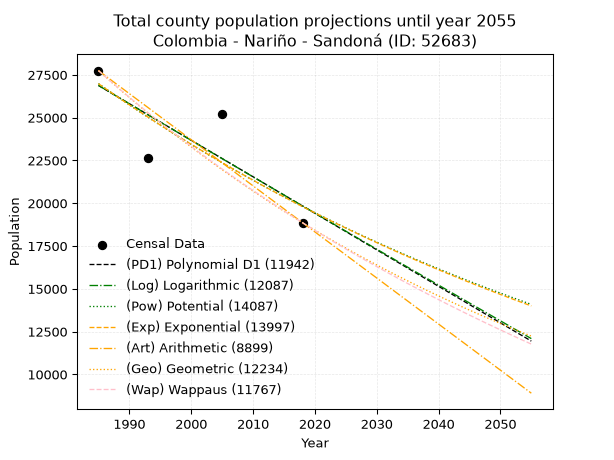
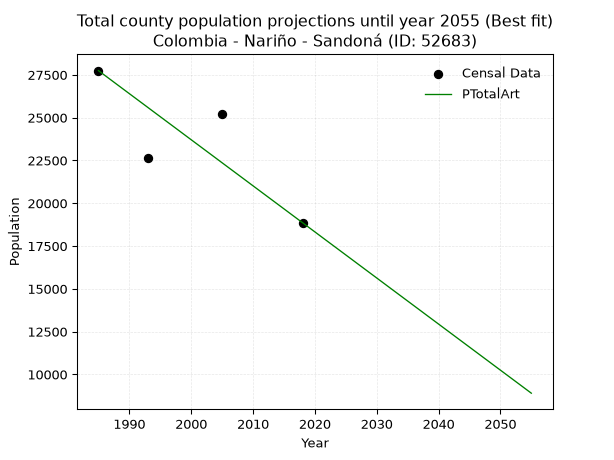
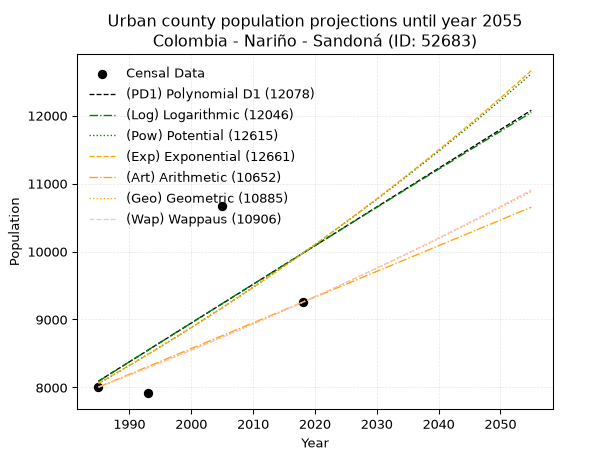
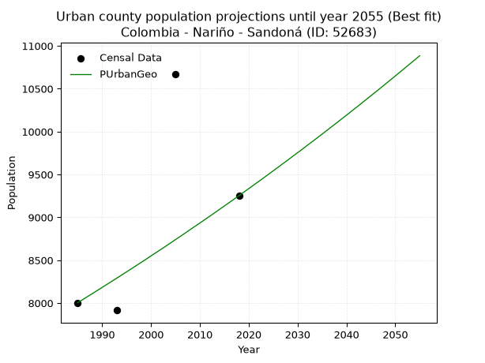
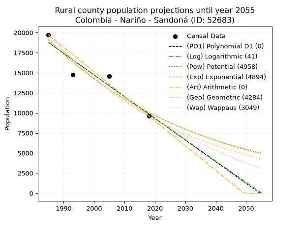
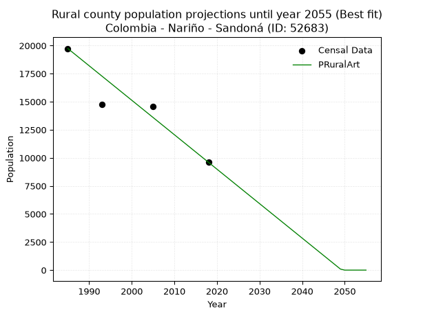

<div align="center">


</div>

# _“Population and Public Services Demand Projections (PPSD) until Year 2050 for Colombia - Nariño - Sandoná (ID: 52683)”_
Keywords: `population` `public-service` `projection` `lineal` `polynomial` `logarithmic` `potential` `exponential` `arithmetic` `geometric` `wappaus` `dane` `colombia` `south-america`

PPSD are analytical estimates used by governments and planners to anticipate future changes in population size, age distribution, and the resulting community needs for utilities, healthcare, education, and infrastructure as sizing future water treatment facilities, electrical grids, and road networks based on spatial growth.

> **General running parameters**: • app_version: _v20260806_. • Python version: _3.14.7_. • Pandas version: _3.0.5_. • NumPy version: _2.5.1_. • Creates, save and include plots into reports (create_plot): _False_. • Projection until year: _2050_. • Process polynomial degree 2 and up: _False_. • Process Wappaus: _True_. • Process Wappaus: _True_. • Set negative values to zero: _True_. • Set infinite values to zero: _True_. • Drop dataset notes: _True_. 
<div align="center">

Dynamic map: [:earth_americas:Google](http://maps.google.com/maps?q=1.283437985,-77.4731304) [:earth_americas:OSM](https://www.openstreetmap.org/#map=18/1.283437985/-77.4731304&layers=P) [:earth_americas:Bing](https://www.bing.com/maps?cp=1.283437985~-77.4731304&lvl=18) [:earth_americas:Apple](https://maps.apple.com/frame?center=1.283437985%2C-77.4731304&span=0.003%2C0.006)

</div>


<div align="center">

```geojson
{
  "type": "Feature",
  "geometry": {
    "type": "Point", 
    "coordinates": [-77.4731304, 1.283437985]
  }, 
  "properties": {
    "Name": "Colombia - Nariño - Sandoná (ID: 52683)"
  }
}
```

</div>


## 0. Census Data (4 records)

Census data are official statistics collected by a government about the people and housing in a country. They usually include counts of total population, age, sex, race, income, education, and jobs.

📅Global census file: [Population.xlsx](../data/Population.xlsx)

| Source   |   Year |   CountryID | CountryName   |   StateID | StateName   |   CountyID | CountyName   |   PTotal |   PUrban |   PRural |
|:---------|-------:|------------:|:--------------|----------:|:------------|-----------:|:-------------|---------:|---------:|---------:|
| DANE     |   1985 |          57 | Colombia      |        52 | Nariño      |      52683 | Sandoná      |    27742 |     8005 |    19737 |
| DANE     |   1993 |          57 | Colombia      |        52 | Nariño      |      52683 | Sandoná      |    22665 |     7916 |    14749 |
| DANE     |   2005 |          57 | Colombia      |        52 | Nariño      |      52683 | Sandoná      |    25220 |    10670 |    14550 |
| DANE     |   2018 |          57 | Colombia      |        52 | Nariño      |      52683 | Sandoná      |    18859 |     9253 |     9606 |

> 🔥Some records could had specific notes about the registered values or the corresponding urban or rural distribution.

**Local public utility companies (RUPS)**

 | SERVICIO       | ESTADO    | NOMBRE                                                                      | NIT         | DEPARTAMENTO_DOMICILIO   | MUNICIPIO_DOMICILIO   | DIRECCION                                 |   TELEFONO | EMAIL                              | TIPO_INSCRIPCION    | REPRESENTANTE_LEGAL             | TIPO_PRESTADOR                             | CLASIFICACION                  |
|:---------------|:----------|:----------------------------------------------------------------------------|:------------|:-------------------------|:----------------------|:------------------------------------------|-----------:|:-----------------------------------|:--------------------|:--------------------------------|:-------------------------------------------|:-------------------------------|
| ACUEDUCTO      | OPERATIVA | EMPRESA DE SERVICIOS PUBLICOS DE SANDONA                                    | 800197457-1 | NARINO                   | SANDONA               | CARRERA 5 No 04-44 BARRIO SAN CARLOS      |    7288087 | cd91bastidas@gmail.com             | Registro por la ESP | CRISTIAN DANIEL  DIAZ BASTIDAS  | EMPRESA INDUSTRIAL Y COMERCIAL DEL ESTADO  | DESDE 2501 HASTA 5000 USUARIOS |
| ALCANTARILLADO | OPERATIVA | EMPRESA DE SERVICIOS PUBLICOS DE SANDONA                                    | 800197457-1 | NARINO                   | SANDONA               | CARRERA 5 No 04-44 BARRIO SAN CARLOS      |    7288087 | cd91bastidas@gmail.com             | Registro por la ESP | CRISTIAN DANIEL  DIAZ BASTIDAS  | EMPRESA INDUSTRIAL Y COMERCIAL DEL ESTADO  | DESDE 2501 HASTA 5000 USUARIOS |
| ASEO           | OPERATIVA | EMPRESA DE SERVICIOS PUBLICOS DE SANDONA                                    | 800197457-1 | NARINO                   | SANDONA               | CARRERA 5 No 04-44 BARRIO SAN CARLOS      |    7288087 | cd91bastidas@gmail.com             | Registro por la ESP | CRISTIAN DANIEL  DIAZ BASTIDAS  | EMPRESA INDUSTRIAL Y COMERCIAL DEL ESTADO  | DESDE 2501 HASTA 5000 USUARIOS |
| ASEO           | OPERATIVA | EMPRESA METROPOLITANA DE ASEO DE PASTO S.A.  E.S.P.                         | 814000704-1 | NARINO                   | PASTO                 | CARRERA 24 #23-51                         |    7362874 | sonia-elizabeth.criollo@veolia.com | Registro por la ESP | ANGELA MARCELA PAZ ROMERO       | SOCIEDADES (EMPRESA DE SERVICIOS PUBLICOS) | MAYOR O IGUAL A 5001 USUARIOS  |
| ACUEDUCTO      | OPERATIVA | ASOCIACION JUNTA ADMINISTRADORA DEL ACUEDUCTO REGIONAL LA LOMA              | 814006941-6 | NARINO                   | SANDONA               | SANDONA                                   |    7287285 | acualoma@gmail.com                 | Registro por la ESP | LUIS ANTONIO BOTINA CRIOLLO     | ORGANIZACION AUTORIZADA                    | MENOR O IGUAL A 2500 USUARIOS  |
| ACUEDUCTO      | OPERATIVA | ASOCIACION SOCIAL JUNTA ADMINISTRADORA ACUEDUCTO EL GUARANGO                | 900283504-9 | NARINO                   | SANDONA               | Carrera 3 # 12 - 43 BARRIO HERNANDO GOMEZ |    7288122 | acueductoelguarango@hotmail.com    | Registro por la ESP | LUIS FAUSTINO BASTIDAS          | ORGANIZACION AUTORIZADA                    | HASTA 2500 SUSCRIPTORES        |
| ACUEDUCTO      | OPERATIVA | JUNTA ADMINISTRADORA DEL ACUEDUCTO REGIONAL EL INGENIO MUNICIPIO DE SANDONA | 814006305-1 | NARINO                   | SANDONA               | Corregimiento de El Ingenio               |    7287036 | marisolsiramos8@hotmail.com        | Registro por la ESP | MIGUEL IGNACIO CAICEDO ENRIQUEZ | ORGANIZACION AUTORIZADA                    | HASTA 2500 SUSCRIPTORES        |

> [📅RUPS Database: Registro Único de Prestadores de Servicios Públicos de Colombia Suramérica - RUPS](https://www.datos.gov.co/Hacienda-y-Cr-dito-P-blico/Registro-nico-de-Prestadores-de-Servicios-P-blicos/4qkq-csdn/about_data)

## 1. Total

### 1.1. Coefficients and Parameters

* (PD1) Polynomial Deg 1: -213.3191489361663, 450313.1276595667 (lineal)
* (Log) Logarithmic: -426842.5251138268, 3268054.9538915255
* (Pow) Potential: -18.75540914896173, 66.28196726615025
* (Exp) Exponential: -0.009374634884525529, 3255828697834.2295
* (Art) Arithmetic: Year diff. 2018 - 1985 = 33, Population diff. 18859 - 27742 = -8883, Annual growth = -269.1818181818182
* (Geo) Geometric: Year diff. 2018 - 1985 = 33, Population diff. 18859 - 27742 = -8883, Annual growth % = -0.011627545910142811
* (Wap) Wappaus: i = -1.1552619822828616, Condition values only valid for < 200)

<sub>
Wappaus condition values: ['-0.00', '-1.16', '-2.31', '-3.47', '-4.62', '-5.78', '-6.93', '-8.09', '-9.24', '-10.40', '-11.55', '-12.71', '-13.86', '-15.02', '-16.17', '-17.33', '-18.48', '-19.64', '-20.79', '-21.95', '-23.11', '-24.26', '-25.42', '-26.57', '-27.73', '-28.88', '-30.04', '-31.19', '-32.35', '-33.50', '-34.66', '-35.81', '-36.97', '-38.12', '-39.28', '-40.43', '-41.59', '-42.74', '-43.90', '-45.06', '-46.21', '-47.37', '-48.52', '-49.68', '-50.83', '-51.99', '-53.14', '-54.30', '-55.45', '-56.61', '-57.76', '-58.92', '-60.07', '-61.23', '-62.38', '-63.54', '-64.69', '-65.85', '-67.01', '-68.16', '-69.32', '-70.47', '-71.63', '-72.78', '-73.94', '-75.09']
</sub>


### 1.2. Projected Dataset

|   Year |   CountyID |   PTotalPD1 |   PTotalLog |   PTotalPow |   PTotalExp |   PTotalArt |   PTotalGeo |   PTotalWap |
|-------:|-----------:|------------:|------------:|------------:|------------:|------------:|------------:|------------:|
|   1985 |      52683 |       26875 |       26880 |       26985 |       26979 |       27742 |       27742 |       27742 |
|   1986 |      52683 |       26661 |       26665 |       26731 |       26727 |       27473 |       27419 |       27423 |
|   1987 |      52683 |       26448 |       26450 |       26480 |       26478 |       27204 |       27101 |       27108 |
|   1988 |      52683 |       26235 |       26235 |       26231 |       26231 |       26934 |       26785 |       26797 |
|   1989 |      52683 |       26021 |       26021 |       25985 |       25986 |       26665 |       26474 |       26489 |
|   1990 |      52683 |       25808 |       25806 |       25741 |       25744 |       26396 |       26166 |       26185 |
|   1991 |      52683 |       25595 |       25592 |       25500 |       25503 |       26127 |       25862 |       25883 |
|   1992 |      52683 |       25381 |       25377 |       25261 |       25266 |       25858 |       25561 |       25586 |
|   1993 |      52683 |       25168 |       25163 |       25024 |       25030 |       25589 |       25264 |       25291 |
|   1994 |      52683 |       24955 |       24949 |       24790 |       24796 |       25319 |       24970 |       25000 |
|   1995 |      52683 |       24741 |       24735 |       24558 |       24565 |       25050 |       24680 |       24712 |
|   1996 |      52683 |       24528 |       24521 |       24328 |       24336 |       24781 |       24393 |       24427 |
|   1997 |      52683 |       24315 |       24307 |       24101 |       24109 |       24512 |       24109 |       24145 |
|   1998 |      52683 |       24101 |       24094 |       23875 |       23884 |       24243 |       23829 |       23867 |
|   1999 |      52683 |       23888 |       23880 |       23652 |       23661 |       23973 |       23552 |       23591 |
|   2000 |      52683 |       23675 |       23667 |       23431 |       23440 |       23704 |       23278 |       23318 |
|   2001 |      52683 |       23462 |       23453 |       23213 |       23221 |       23435 |       23007 |       23048 |
|   2002 |      52683 |       23248 |       23240 |       22996 |       23005 |       23166 |       22740 |       22781 |
|   2003 |      52683 |       23035 |       23027 |       22782 |       22790 |       22897 |       22475 |       22516 |
|   2004 |      52683 |       22822 |       22814 |       22570 |       22577 |       22628 |       22214 |       22255 |
|   2005 |      52683 |       22608 |       22601 |       22359 |       22367 |       22358 |       21956 |       21996 |
|   2006 |      52683 |       22395 |       22388 |       22151 |       22158 |       22089 |       21701 |       21740 |
|   2007 |      52683 |       22182 |       22175 |       21945 |       21951 |       21820 |       21448 |       21486 |
|   2008 |      52683 |       21968 |       21963 |       21741 |       21746 |       21551 |       21199 |       21235 |
|   2009 |      52683 |       21755 |       21750 |       21539 |       21543 |       21282 |       20952 |       20987 |
|   2010 |      52683 |       21542 |       21538 |       21339 |       21342 |       21012 |       20709 |       20741 |
|   2011 |      52683 |       21328 |       21325 |       21141 |       21143 |       20743 |       20468 |       20497 |
|   2012 |      52683 |       21115 |       21113 |       20945 |       20946 |       20474 |       20230 |       20256 |
|   2013 |      52683 |       20902 |       20901 |       20750 |       20751 |       20205 |       19995 |       20018 |
|   2014 |      52683 |       20688 |       20689 |       20558 |       20557 |       19936 |       19762 |       19781 |
|   2015 |      52683 |       20475 |       20477 |       20367 |       20365 |       19667 |       19532 |       19547 |
|   2016 |      52683 |       20262 |       20265 |       20179 |       20175 |       19397 |       19305 |       19316 |
|   2017 |      52683 |       20048 |       20054 |       19992 |       19987 |       19128 |       19081 |       19086 |
|   2018 |      52683 |       19835 |       19842 |       19807 |       19800 |       18859 |       18859 |       18859 |
|   2019 |      52683 |       19622 |       19631 |       19624 |       19616 |       18590 |       18640 |       18634 |
|   2020 |      52683 |       19408 |       19419 |       19442 |       19433 |       18321 |       18423 |       18411 |
|   2021 |      52683 |       19195 |       19208 |       19263 |       19251 |       18051 |       18209 |       18190 |
|   2022 |      52683 |       18982 |       18997 |       19085 |       19072 |       17782 |       17997 |       17972 |
|   2023 |      52683 |       18768 |       18786 |       18909 |       18894 |       17513 |       17788 |       17755 |
|   2024 |      52683 |       18555 |       18575 |       18734 |       18717 |       17244 |       17581 |       17541 |
|   2025 |      52683 |       18342 |       18364 |       18561 |       18543 |       16975 |       17377 |       17328 |
|   2026 |      52683 |       18129 |       18153 |       18390 |       18370 |       16706 |       17174 |       17118 |
|   2027 |      52683 |       17915 |       17943 |       18221 |       18198 |       16436 |       16975 |       16909 |
|   2028 |      52683 |       17702 |       17732 |       18053 |       18028 |       16167 |       16777 |       16703 |
|   2029 |      52683 |       17489 |       17522 |       17887 |       17860 |       15898 |       16582 |       16498 |
|   2030 |      52683 |       17275 |       17311 |       17723 |       17694 |       15629 |       16390 |       16295 |
|   2031 |      52683 |       17062 |       17101 |       17560 |       17529 |       15360 |       16199 |       16094 |
|   2032 |      52683 |       16849 |       16891 |       17398 |       17365 |       15090 |       16011 |       15895 |
|   2033 |      52683 |       16635 |       16681 |       17238 |       17203 |       14821 |       15824 |       15698 |
|   2034 |      52683 |       16422 |       16471 |       17080 |       17042 |       14552 |       15640 |       15502 |
|   2035 |      52683 |       16209 |       16261 |       16923 |       16883 |       14283 |       15459 |       15308 |
|   2036 |      52683 |       15995 |       16052 |       16768 |       16726 |       14014 |       15279 |       15116 |
|   2037 |      52683 |       15782 |       15842 |       16614 |       16570 |       13745 |       15101 |       14926 |
|   2038 |      52683 |       15569 |       15633 |       16462 |       16415 |       13475 |       14926 |       14737 |
|   2039 |      52683 |       15355 |       15423 |       16311 |       16262 |       13206 |       14752 |       14550 |
|   2040 |      52683 |       15142 |       15214 |       16162 |       16110 |       12937 |       14581 |       14365 |
|   2041 |      52683 |       14929 |       15005 |       16014 |       15960 |       12668 |       14411 |       14181 |
|   2042 |      52683 |       14715 |       14796 |       15868 |       15811 |       12399 |       14243 |       13999 |
|   2043 |      52683 |       14502 |       14587 |       15723 |       15664 |       12129 |       14078 |       13818 |
|   2044 |      52683 |       14289 |       14378 |       15579 |       15517 |       11860 |       13914 |       13639 |
|   2045 |      52683 |       14075 |       14169 |       15437 |       15373 |       11591 |       13752 |       13462 |
|   2046 |      52683 |       13862 |       13960 |       15296 |       15229 |       11322 |       13592 |       13286 |
|   2047 |      52683 |       13649 |       13752 |       15156 |       15087 |       11053 |       13434 |       13111 |
|   2048 |      52683 |       13436 |       13543 |       15018 |       14946 |       10784 |       13278 |       12938 |
|   2049 |      52683 |       13222 |       13335 |       14881 |       14807 |       10514 |       13124 |       12767 |
|   2050 |      52683 |       13009 |       13127 |       14746 |       14669 |       10245 |       12971 |       12597 |
<div align="center">

</img>

</div>


### 1.3. Best fit with absolute and relative error (%)

Relative error puts that difference into context by dividing the absolute error by the true value, creating a unitless ratio or percentage that shows the scale of the mistake.

Absolute and relative error

|   Year | Source   |   CountryID | CountryName   |   StateID | StateName   |   CountyID_x | CountyName   |   PTotal |   PUrban |   PRural |   CountyID_y |   PTotalPD1 |   PTotalLog |   PTotalPow |   PTotalExp |   PTotalArt |   PTotalGeo |   PTotalWap |   PTotalPD1AbsError |   PTotalLogAbsError |   PTotalPowAbsError |   PTotalExpAbsError |   PTotalArtAbsError |   PTotalGeoAbsError |   PTotalWapAbsError |   PTotalPD1RelError |   PTotalLogRelError |   PTotalPowRelError |   PTotalExpRelError |   PTotalArtRelError |   PTotalGeoRelError |   PTotalWapRelError |
|-------:|:---------|------------:|:--------------|----------:|:------------|-------------:|:-------------|---------:|---------:|---------:|-------------:|------------:|------------:|------------:|------------:|------------:|------------:|------------:|--------------------:|--------------------:|--------------------:|--------------------:|--------------------:|--------------------:|--------------------:|--------------------:|--------------------:|--------------------:|--------------------:|--------------------:|--------------------:|--------------------:|
|   1985 | DANE     |          57 | Colombia      |        52 | Nariño      |        52683 | Sandoná      |    27742 |     8005 |    19737 |        52683 |       26875 |       26880 |       26985 |       26979 |       27742 |       27742 |       27742 |                 867 |                 862 |                 757 |                 763 |                   0 |                   0 |                   0 |             3.12523 |             3.1072  |             2.72871 |             2.75034 |              0      |              0      |              0      |
|   1993 | DANE     |          57 | Colombia      |        52 | Nariño      |        52683 | Sandoná      |    22665 |     7916 |    14749 |        52683 |       25168 |       25163 |       25024 |       25030 |       25589 |       25264 |       25291 |                2503 |                2498 |                2359 |                2365 |                2924 |                2599 |                2626 |            11.0435  |            11.0214  |            10.4081  |            10.4346  |             12.9009 |             11.467  |             11.5861 |
|   2005 | DANE     |          57 | Colombia      |        52 | Nariño      |        52683 | Sandoná      |    25220 |    10670 |    14550 |        52683 |       22608 |       22601 |       22359 |       22367 |       22358 |       21956 |       21996 |                2612 |                2619 |                2861 |                2853 |                2862 |                3264 |                3224 |            10.3569  |            10.3846  |            11.3442  |            11.3125  |             11.3481 |             12.9421 |             12.7835 |
|   2018 | DANE     |          57 | Colombia      |        52 | Nariño      |        52683 | Sandoná      |    18859 |     9253 |     9606 |        52683 |       19835 |       19842 |       19807 |       19800 |       18859 |       18859 |       18859 |                 976 |                 983 |                 948 |                 941 |                   0 |                   0 |                   0 |             5.17525 |             5.21237 |             5.02678 |             4.98966 |              0      |              0      |              0      |

Relative error mean

| Method    |   RelError | Best   |
|:----------|-----------:|:-------|
| PTotalPD1 |    7.4252  |        |
| PTotalLog |    7.4314  |        |
| PTotalPow |    7.37695 |        |
| PTotalExp |    7.37176 |        |
| PTotalArt |    6.06227 | True   |
| PTotalGeo |    6.10228 |        |
| PTotalWap |    6.09241 |        |

💙Best method: _**PTotalArt**_
<div align="center">

</img>

</div>


### 1.4. Fresh water supply demand in liters per capita per day (lpcd)

The fresh water supply demand typically ranges from 100 to 300 liters per capita per day (lpcd) for standard domestic and municipal planning, though absolute survival minimums set by the World Health Organization are as low as 7.5 to 20 liters per day, and total consumption in high-income nations can exceed 400 liters.

> `CZ`: Level in meters above the sea level (masl)<br> `WS`: Fresh water supply demand in liters per capita per day (lpcd or l/h/d)<br> `WSAll`: Zonal fresh water supply demand in liters per second (l/s)<br> `A`: Zonal area in square meters<br> `DP`: Population density (people/hectare or p/ha)

Reference values (RAS Colombia)

|    CZ |   WS |
|------:|-----:|
|  1000 |  120 |
|  2000 |  130 |
| 99999 |  140 |

County shapefile geometry properties and water supply values

|   CountyID |      ATotal |   CZTotal |   WSTotal |
|-----------:|------------:|----------:|----------:|
|      52683 | 1.01713e+08 |   1931.58 |       130 |

Projected values for best method: PTotalArt

|   CountyID |   Year |   PTotalArt |   DPTotal |   WSTotal |   WSTotalAll |
|-----------:|-------:|------------:|----------:|----------:|-------------:|
|      52683 |   1985 |       27742 |      2.73 |       130 |      41.7414 |
|      52683 |   1986 |       27473 |      2.7  |       130 |      41.3367 |
|      52683 |   1987 |       27204 |      2.67 |       130 |      40.9319 |
|      52683 |   1988 |       26934 |      2.65 |       130 |      40.5257 |
|      52683 |   1989 |       26665 |      2.62 |       130 |      40.1209 |
|      52683 |   1990 |       26396 |      2.6  |       130 |      39.7162 |
|      52683 |   1991 |       26127 |      2.57 |       130 |      39.3115 |
|      52683 |   1992 |       25858 |      2.54 |       130 |      38.9067 |
|      52683 |   1993 |       25589 |      2.52 |       130 |      38.502  |
|      52683 |   1994 |       25319 |      2.49 |       130 |      38.0957 |
|      52683 |   1995 |       25050 |      2.46 |       130 |      37.691  |
|      52683 |   1996 |       24781 |      2.44 |       130 |      37.2862 |
|      52683 |   1997 |       24512 |      2.41 |       130 |      36.8815 |
|      52683 |   1998 |       24243 |      2.38 |       130 |      36.4767 |
|      52683 |   1999 |       23973 |      2.36 |       130 |      36.0705 |
|      52683 |   2000 |       23704 |      2.33 |       130 |      35.6657 |
|      52683 |   2001 |       23435 |      2.3  |       130 |      35.261  |
|      52683 |   2002 |       23166 |      2.28 |       130 |      34.8563 |
|      52683 |   2003 |       22897 |      2.25 |       130 |      34.4515 |
|      52683 |   2004 |       22628 |      2.22 |       130 |      34.0468 |
|      52683 |   2005 |       22358 |      2.2  |       130 |      33.6405 |
|      52683 |   2006 |       22089 |      2.17 |       130 |      33.2358 |
|      52683 |   2007 |       21820 |      2.15 |       130 |      32.831  |
|      52683 |   2008 |       21551 |      2.12 |       130 |      32.4263 |
|      52683 |   2009 |       21282 |      2.09 |       130 |      32.0215 |
|      52683 |   2010 |       21012 |      2.07 |       130 |      31.6153 |
|      52683 |   2011 |       20743 |      2.04 |       130 |      31.2105 |
|      52683 |   2012 |       20474 |      2.01 |       130 |      30.8058 |
|      52683 |   2013 |       20205 |      1.99 |       130 |      30.401  |
|      52683 |   2014 |       19936 |      1.96 |       130 |      29.9963 |
|      52683 |   2015 |       19667 |      1.93 |       130 |      29.5916 |
|      52683 |   2016 |       19397 |      1.91 |       130 |      29.1853 |
|      52683 |   2017 |       19128 |      1.88 |       130 |      28.7806 |
|      52683 |   2018 |       18859 |      1.85 |       130 |      28.3758 |
|      52683 |   2019 |       18590 |      1.83 |       130 |      27.9711 |
|      52683 |   2020 |       18321 |      1.8  |       130 |      27.5663 |
|      52683 |   2021 |       18051 |      1.77 |       130 |      27.1601 |
|      52683 |   2022 |       17782 |      1.75 |       130 |      26.7553 |
|      52683 |   2023 |       17513 |      1.72 |       130 |      26.3506 |
|      52683 |   2024 |       17244 |      1.7  |       130 |      25.9458 |
|      52683 |   2025 |       16975 |      1.67 |       130 |      25.5411 |
|      52683 |   2026 |       16706 |      1.64 |       130 |      25.1363 |
|      52683 |   2027 |       16436 |      1.62 |       130 |      24.7301 |
|      52683 |   2028 |       16167 |      1.59 |       130 |      24.3253 |
|      52683 |   2029 |       15898 |      1.56 |       130 |      23.9206 |
|      52683 |   2030 |       15629 |      1.54 |       130 |      23.5159 |
|      52683 |   2031 |       15360 |      1.51 |       130 |      23.1111 |
|      52683 |   2032 |       15090 |      1.48 |       130 |      22.7049 |
|      52683 |   2033 |       14821 |      1.46 |       130 |      22.3001 |
|      52683 |   2034 |       14552 |      1.43 |       130 |      21.8954 |
|      52683 |   2035 |       14283 |      1.4  |       130 |      21.4906 |
|      52683 |   2036 |       14014 |      1.38 |       130 |      21.0859 |
|      52683 |   2037 |       13745 |      1.35 |       130 |      20.6811 |
|      52683 |   2038 |       13475 |      1.32 |       130 |      20.2749 |
|      52683 |   2039 |       13206 |      1.3  |       130 |      19.8701 |
|      52683 |   2040 |       12937 |      1.27 |       130 |      19.4654 |
|      52683 |   2041 |       12668 |      1.25 |       130 |      19.0606 |
|      52683 |   2042 |       12399 |      1.22 |       130 |      18.6559 |
|      52683 |   2043 |       12129 |      1.19 |       130 |      18.2497 |
|      52683 |   2044 |       11860 |      1.17 |       130 |      17.8449 |
|      52683 |   2045 |       11591 |      1.14 |       130 |      17.4402 |
|      52683 |   2046 |       11322 |      1.11 |       130 |      17.0354 |
|      52683 |   2047 |       11053 |      1.09 |       130 |      16.6307 |
|      52683 |   2048 |       10784 |      1.06 |       130 |      16.2259 |
|      52683 |   2049 |       10514 |      1.03 |       130 |      15.8197 |
|      52683 |   2050 |       10245 |      1.01 |       130 |      15.4149 |

## 2. Urban

### 2.1. Coefficients and Parameters

* (PD1) Polynomial Deg 1: 56.93456443195576, -104922.36250501953 (lineal)
* (Log) Logarithmic: 114159.5821755503, -858766.8989338363
* (Pow) Potential: 12.933942310741738, -38.74684591541958
* (Exp) Exponential: 0.006451561122067657, 0.022111757690415686
* (Art) Arithmetic: Year diff. 2018 - 1985 = 33, Population diff. 9253 - 8005 = 1248, Annual growth = 37.81818181818182
* (Geo) Geometric: Year diff. 2018 - 1985 = 33, Population diff. 9253 - 8005 = 1248, Annual growth % = 0.004399999478793992
* (Wap) Wappaus: i = 0.4382684183356335, Condition values only valid for < 200)

<sub>
Wappaus condition values: ['0.00', '0.44', '0.88', '1.31', '1.75', '2.19', '2.63', '3.07', '3.51', '3.94', '4.38', '4.82', '5.26', '5.70', '6.14', '6.57', '7.01', '7.45', '7.89', '8.33', '8.77', '9.20', '9.64', '10.08', '10.52', '10.96', '11.39', '11.83', '12.27', '12.71', '13.15', '13.59', '14.02', '14.46', '14.90', '15.34', '15.78', '16.22', '16.65', '17.09', '17.53', '17.97', '18.41', '18.85', '19.28', '19.72', '20.16', '20.60', '21.04', '21.48', '21.91', '22.35', '22.79', '23.23', '23.67', '24.10', '24.54', '24.98', '25.42', '25.86', '26.30', '26.73', '27.17', '27.61', '28.05', '28.49']
</sub>


### 2.2. Projected Dataset

|   Year |   CountyID |   PUrbanPD1 |   PUrbanLog |   PUrbanPow |   PUrbanExp |   PUrbanArt |   PUrbanGeo |   PUrbanWap |
|-------:|-----------:|------------:|------------:|------------:|------------:|------------:|------------:|------------:|
|   1985 |      52683 |        8093 |        8090 |        8057 |        8060 |        8005 |        8005 |        8005 |
|   1986 |      52683 |        8150 |        8147 |        8110 |        8112 |        8043 |        8040 |        8040 |
|   1987 |      52683 |        8207 |        8204 |        8163 |        8165 |        8081 |        8076 |        8075 |
|   1988 |      52683 |        8264 |        8262 |        8216 |        8218 |        8118 |        8111 |        8111 |
|   1989 |      52683 |        8320 |        8319 |        8270 |        8271 |        8156 |        8147 |        8147 |
|   1990 |      52683 |        8377 |        8377 |        8324 |        8325 |        8194 |        8183 |        8182 |
|   1991 |      52683 |        8434 |        8434 |        8378 |        8378 |        8232 |        8219 |        8218 |
|   1992 |      52683 |        8491 |        8491 |        8433 |        8433 |        8270 |        8255 |        8254 |
|   1993 |      52683 |        8548 |        8549 |        8488 |        8487 |        8308 |        8291 |        8291 |
|   1994 |      52683 |        8605 |        8606 |        8543 |        8542 |        8345 |        8328 |        8327 |
|   1995 |      52683 |        8662 |        8663 |        8599 |        8597 |        8383 |        8364 |        8364 |
|   1996 |      52683 |        8719 |        8720 |        8654 |        8653 |        8421 |        8401 |        8400 |
|   1997 |      52683 |        8776 |        8778 |        8711 |        8709 |        8459 |        8438 |        8437 |
|   1998 |      52683 |        8833 |        8835 |        8767 |        8765 |        8497 |        8475 |        8474 |
|   1999 |      52683 |        8890 |        8892 |        8824 |        8822 |        8534 |        8512 |        8512 |
|   2000 |      52683 |        8947 |        8949 |        8881 |        8879 |        8572 |        8550 |        8549 |
|   2001 |      52683 |        9004 |        9006 |        8939 |        8937 |        8610 |        8588 |        8587 |
|   2002 |      52683 |        9061 |        9063 |        8997 |        8995 |        8648 |        8625 |        8624 |
|   2003 |      52683 |        9118 |        9120 |        9055 |        9053 |        8686 |        8663 |        8662 |
|   2004 |      52683 |        9175 |        9177 |        9114 |        9111 |        8724 |        8701 |        8701 |
|   2005 |      52683 |        9231 |        9234 |        9173 |        9170 |        8761 |        8740 |        8739 |
|   2006 |      52683 |        9288 |        9291 |        9232 |        9230 |        8799 |        8778 |        8777 |
|   2007 |      52683 |        9345 |        9348 |        9292 |        9289 |        8837 |        8817 |        8816 |
|   2008 |      52683 |        9402 |        9405 |        9352 |        9350 |        8875 |        8856 |        8855 |
|   2009 |      52683 |        9459 |        9462 |        9413 |        9410 |        8913 |        8895 |        8894 |
|   2010 |      52683 |        9516 |        9518 |        9473 |        9471 |        8950 |        8934 |        8933 |
|   2011 |      52683 |        9573 |        9575 |        9534 |        9532 |        8988 |        8973 |        8972 |
|   2012 |      52683 |        9630 |        9632 |        9596 |        9594 |        9026 |        9012 |        9012 |
|   2013 |      52683 |        9687 |        9689 |        9658 |        9656 |        9064 |        9052 |        9052 |
|   2014 |      52683 |        9744 |        9745 |        9720 |        9719 |        9102 |        9092 |        9091 |
|   2015 |      52683 |        9801 |        9802 |        9783 |        9782 |        9140 |        9132 |        9132 |
|   2016 |      52683 |        9858 |        9859 |        9846 |        9845 |        9177 |        9172 |        9172 |
|   2017 |      52683 |        9915 |        9915 |        9909 |        9909 |        9215 |        9212 |        9212 |
|   2018 |      52683 |        9972 |        9972 |        9973 |        9973 |        9253 |        9253 |        9253 |
|   2019 |      52683 |       10029 |       10028 |       10037 |       10037 |        9291 |        9294 |        9294 |
|   2020 |      52683 |       10085 |       10085 |       10101 |       10102 |        9329 |        9335 |        9335 |
|   2021 |      52683 |       10142 |       10141 |       10166 |       10168 |        9366 |        9376 |        9376 |
|   2022 |      52683 |       10199 |       10198 |       10231 |       10233 |        9404 |        9417 |        9418 |
|   2023 |      52683 |       10256 |       10254 |       10297 |       10300 |        9442 |        9458 |        9459 |
|   2024 |      52683 |       10313 |       10311 |       10363 |       10366 |        9480 |        9500 |        9501 |
|   2025 |      52683 |       10370 |       10367 |       10430 |       10433 |        9518 |        9542 |        9543 |
|   2026 |      52683 |       10427 |       10423 |       10496 |       10501 |        9556 |        9584 |        9585 |
|   2027 |      52683 |       10484 |       10480 |       10564 |       10569 |        9593 |        9626 |        9628 |
|   2028 |      52683 |       10541 |       10536 |       10631 |       10637 |        9631 |        9668 |        9671 |
|   2029 |      52683 |       10598 |       10592 |       10699 |       10706 |        9669 |        9711 |        9713 |
|   2030 |      52683 |       10655 |       10649 |       10768 |       10775 |        9707 |        9754 |        9756 |
|   2031 |      52683 |       10712 |       10705 |       10836 |       10845 |        9745 |        9796 |        9800 |
|   2032 |      52683 |       10769 |       10761 |       10906 |       10915 |        9782 |        9840 |        9843 |
|   2033 |      52683 |       10826 |       10817 |       10975 |       10986 |        9820 |        9883 |        9887 |
|   2034 |      52683 |       10883 |       10873 |       11045 |       11057 |        9858 |        9926 |        9931 |
|   2035 |      52683 |       10939 |       10929 |       11116 |       11129 |        9896 |        9970 |        9975 |
|   2036 |      52683 |       10996 |       10986 |       11187 |       11201 |        9934 |       10014 |       10019 |
|   2037 |      52683 |       11053 |       11042 |       11258 |       11273 |        9972 |       10058 |       10064 |
|   2038 |      52683 |       11110 |       11098 |       11329 |       11346 |       10009 |       10102 |       10109 |
|   2039 |      52683 |       11167 |       11154 |       11402 |       11420 |       10047 |       10147 |       10154 |
|   2040 |      52683 |       11224 |       11210 |       11474 |       11494 |       10085 |       10191 |       10199 |
|   2041 |      52683 |       11281 |       11266 |       11547 |       11568 |       10123 |       10236 |       10244 |
|   2042 |      52683 |       11338 |       11321 |       11620 |       11643 |       10161 |       10281 |       10290 |
|   2043 |      52683 |       11395 |       11377 |       11694 |       11718 |       10198 |       10326 |       10336 |
|   2044 |      52683 |       11452 |       11433 |       11769 |       11794 |       10236 |       10372 |       10382 |
|   2045 |      52683 |       11509 |       11489 |       11843 |       11870 |       10274 |       10418 |       10429 |
|   2046 |      52683 |       11566 |       11545 |       11918 |       11947 |       10312 |       10463 |       10475 |
|   2047 |      52683 |       11623 |       11601 |       11994 |       12024 |       10350 |       10509 |       10522 |
|   2048 |      52683 |       11680 |       11656 |       12070 |       12102 |       10388 |       10556 |       10569 |
|   2049 |      52683 |       11737 |       11712 |       12146 |       12181 |       10425 |       10602 |       10617 |
|   2050 |      52683 |       11793 |       11768 |       12223 |       12259 |       10463 |       10649 |       10664 |
<div align="center">

</img>

</div>


### 2.3. Best fit with absolute and relative error (%)

Relative error puts that difference into context by dividing the absolute error by the true value, creating a unitless ratio or percentage that shows the scale of the mistake.

Absolute and relative error

|   Year | Source   |   CountryID | CountryName   |   StateID | StateName   |   CountyID_x | CountyName   |   PTotal |   PUrban |   PRural |   CountyID_y |   PUrbanPD1 |   PUrbanLog |   PUrbanPow |   PUrbanExp |   PUrbanArt |   PUrbanGeo |   PUrbanWap |   PUrbanPD1AbsError |   PUrbanLogAbsError |   PUrbanPowAbsError |   PUrbanExpAbsError |   PUrbanArtAbsError |   PUrbanGeoAbsError |   PUrbanWapAbsError |   PUrbanPD1RelError |   PUrbanLogRelError |   PUrbanPowRelError |   PUrbanExpRelError |   PUrbanArtRelError |   PUrbanGeoRelError |   PUrbanWapRelError |
|-------:|:---------|------------:|:--------------|----------:|:------------|-------------:|:-------------|---------:|---------:|---------:|-------------:|------------:|------------:|------------:|------------:|------------:|------------:|------------:|--------------------:|--------------------:|--------------------:|--------------------:|--------------------:|--------------------:|--------------------:|--------------------:|--------------------:|--------------------:|--------------------:|--------------------:|--------------------:|--------------------:|
|   1985 | DANE     |          57 | Colombia      |        52 | Nariño      |        52683 | Sandoná      |    27742 |     8005 |    19737 |        52683 |        8093 |        8090 |        8057 |        8060 |        8005 |        8005 |        8005 |                  88 |                  85 |                  52 |                  55 |                   0 |                   0 |                   0 |             1.09931 |             1.06184 |            0.649594 |            0.687071 |              0      |             0       |             0       |
|   1993 | DANE     |          57 | Colombia      |        52 | Nariño      |        52683 | Sandoná      |    22665 |     7916 |    14749 |        52683 |        8548 |        8549 |        8488 |        8487 |        8308 |        8291 |        8291 |                 632 |                 633 |                 572 |                 571 |                 392 |                 375 |                 375 |             7.98383 |             7.99646 |            7.22587  |            7.21324  |              4.952  |             4.73724 |             4.73724 |
|   2005 | DANE     |          57 | Colombia      |        52 | Nariño      |        52683 | Sandoná      |    25220 |    10670 |    14550 |        52683 |        9231 |        9234 |        9173 |        9170 |        8761 |        8740 |        8739 |                1439 |                1436 |                1497 |                1500 |                1909 |                1930 |                1931 |            13.4864  |            13.4583  |           14.03     |           14.0581   |             17.8913 |            18.0881  |            18.0975  |
|   2018 | DANE     |          57 | Colombia      |        52 | Nariño      |        52683 | Sandoná      |    18859 |     9253 |     9606 |        52683 |        9972 |        9972 |        9973 |        9973 |        9253 |        9253 |        9253 |                 719 |                 719 |                 720 |                 720 |                   0 |                   0 |                   0 |             7.77045 |             7.77045 |            7.78126  |            7.78126  |              0      |             0       |             0       |

Relative error mean

| Method    |   RelError | Best   |
|:----------|-----------:|:-------|
| PUrbanPD1 |    7.585   |        |
| PUrbanLog |    7.57176 |        |
| PUrbanPow |    7.42168 |        |
| PUrbanExp |    7.43492 |        |
| PUrbanArt |    5.71082 |        |
| PUrbanGeo |    5.70633 | True   |
| PUrbanWap |    5.70868 |        |

💙Best method: _**PUrbanGeo**_
<div align="center">

</img>

</div>


### 2.4. Fresh water supply demand in liters per capita per day (lpcd)

The fresh water supply demand typically ranges from 100 to 300 liters per capita per day (lpcd) for standard domestic and municipal planning, though absolute survival minimums set by the World Health Organization are as low as 7.5 to 20 liters per day, and total consumption in high-income nations can exceed 400 liters.

> `CZ`: Level in meters above the sea level (masl)<br> `WS`: Fresh water supply demand in liters per capita per day (lpcd or l/h/d)<br> `WSAll`: Zonal fresh water supply demand in liters per second (l/s)<br> `A`: Zonal area in square meters<br> `DP`: Population density (people/hectare or p/ha)

Reference values (RAS Colombia)

|    CZ |   WS |
|------:|-----:|
|  1000 |  120 |
|  2000 |  130 |
| 99999 |  140 |

County shapefile geometry properties and water supply values

|   CountyID |      AUrban |   CZUrban |   WSUrban |
|-----------:|------------:|----------:|----------:|
|      52683 | 1.75631e+06 |   1802.35 |       130 |

Projected values for best method: PUrbanGeo

|   CountyID |   Year |   PUrbanGeo |   DPUrban |   WSUrban |   WSUrbanAll |
|-----------:|-------:|------------:|----------:|----------:|-------------:|
|      52683 |   1985 |        8005 |     45.58 |       130 |      12.0446 |
|      52683 |   1986 |        8040 |     45.78 |       130 |      12.0972 |
|      52683 |   1987 |        8076 |     45.98 |       130 |      12.1514 |
|      52683 |   1988 |        8111 |     46.18 |       130 |      12.2041 |
|      52683 |   1989 |        8147 |     46.39 |       130 |      12.2582 |
|      52683 |   1990 |        8183 |     46.59 |       130 |      12.3124 |
|      52683 |   1991 |        8219 |     46.8  |       130 |      12.3666 |
|      52683 |   1992 |        8255 |     47    |       130 |      12.4207 |
|      52683 |   1993 |        8291 |     47.21 |       130 |      12.4749 |
|      52683 |   1994 |        8328 |     47.42 |       130 |      12.5306 |
|      52683 |   1995 |        8364 |     47.62 |       130 |      12.5847 |
|      52683 |   1996 |        8401 |     47.83 |       130 |      12.6404 |
|      52683 |   1997 |        8438 |     48.04 |       130 |      12.6961 |
|      52683 |   1998 |        8475 |     48.25 |       130 |      12.7517 |
|      52683 |   1999 |        8512 |     48.47 |       130 |      12.8074 |
|      52683 |   2000 |        8550 |     48.68 |       130 |      12.8646 |
|      52683 |   2001 |        8588 |     48.9  |       130 |      12.9218 |
|      52683 |   2002 |        8625 |     49.11 |       130 |      12.9774 |
|      52683 |   2003 |        8663 |     49.33 |       130 |      13.0346 |
|      52683 |   2004 |        8701 |     49.54 |       130 |      13.0918 |
|      52683 |   2005 |        8740 |     49.76 |       130 |      13.1505 |
|      52683 |   2006 |        8778 |     49.98 |       130 |      13.2076 |
|      52683 |   2007 |        8817 |     50.2  |       130 |      13.2663 |
|      52683 |   2008 |        8856 |     50.42 |       130 |      13.325  |
|      52683 |   2009 |        8895 |     50.65 |       130 |      13.3837 |
|      52683 |   2010 |        8934 |     50.87 |       130 |      13.4424 |
|      52683 |   2011 |        8973 |     51.09 |       130 |      13.501  |
|      52683 |   2012 |        9012 |     51.31 |       130 |      13.5597 |
|      52683 |   2013 |        9052 |     51.54 |       130 |      13.6199 |
|      52683 |   2014 |        9092 |     51.77 |       130 |      13.6801 |
|      52683 |   2015 |        9132 |     52    |       130 |      13.7403 |
|      52683 |   2016 |        9172 |     52.22 |       130 |      13.8005 |
|      52683 |   2017 |        9212 |     52.45 |       130 |      13.8606 |
|      52683 |   2018 |        9253 |     52.68 |       130 |      13.9223 |
|      52683 |   2019 |        9294 |     52.92 |       130 |      13.984  |
|      52683 |   2020 |        9335 |     53.15 |       130 |      14.0457 |
|      52683 |   2021 |        9376 |     53.38 |       130 |      14.1074 |
|      52683 |   2022 |        9417 |     53.62 |       130 |      14.1691 |
|      52683 |   2023 |        9458 |     53.85 |       130 |      14.2308 |
|      52683 |   2024 |        9500 |     54.09 |       130 |      14.294  |
|      52683 |   2025 |        9542 |     54.33 |       130 |      14.3572 |
|      52683 |   2026 |        9584 |     54.57 |       130 |      14.4204 |
|      52683 |   2027 |        9626 |     54.81 |       130 |      14.4836 |
|      52683 |   2028 |        9668 |     55.05 |       130 |      14.5468 |
|      52683 |   2029 |        9711 |     55.29 |       130 |      14.6115 |
|      52683 |   2030 |        9754 |     55.54 |       130 |      14.6762 |
|      52683 |   2031 |        9796 |     55.78 |       130 |      14.7394 |
|      52683 |   2032 |        9840 |     56.03 |       130 |      14.8056 |
|      52683 |   2033 |        9883 |     56.27 |       130 |      14.8703 |
|      52683 |   2034 |        9926 |     56.52 |       130 |      14.935  |
|      52683 |   2035 |        9970 |     56.77 |       130 |      15.0012 |
|      52683 |   2036 |       10014 |     57.02 |       130 |      15.0674 |
|      52683 |   2037 |       10058 |     57.27 |       130 |      15.1336 |
|      52683 |   2038 |       10102 |     57.52 |       130 |      15.1998 |
|      52683 |   2039 |       10147 |     57.77 |       130 |      15.2675 |
|      52683 |   2040 |       10191 |     58.03 |       130 |      15.3337 |
|      52683 |   2041 |       10236 |     58.28 |       130 |      15.4014 |
|      52683 |   2042 |       10281 |     58.54 |       130 |      15.4691 |
|      52683 |   2043 |       10326 |     58.79 |       130 |      15.5368 |
|      52683 |   2044 |       10372 |     59.06 |       130 |      15.606  |
|      52683 |   2045 |       10418 |     59.32 |       130 |      15.6752 |
|      52683 |   2046 |       10463 |     59.57 |       130 |      15.7429 |
|      52683 |   2047 |       10509 |     59.84 |       130 |      15.8122 |
|      52683 |   2048 |       10556 |     60.1  |       130 |      15.8829 |
|      52683 |   2049 |       10602 |     60.37 |       130 |      15.9521 |
|      52683 |   2050 |       10649 |     60.63 |       130 |      16.0228 |

## 3. Rural

### 3.1. Coefficients and Parameters

* (PD1) Polynomial Deg 1: -270.25371336812225, 555235.4901645865 (lineal)
* (Log) Logarithmic: -541002.1072893769, 4126821.8528253604
* (Pow) Potential: -38.941975234703406, 132.7027758218163
* (Exp) Exponential: -0.01945905703595891, 1.1386683540616392e+21
* (Art) Arithmetic: Year diff. 2018 - 1985 = 33, Population diff. 9606 - 19737 = -10131, Annual growth = -307.0
* (Geo) Geometric: Year diff. 2018 - 1985 = 33, Population diff. 9606 - 19737 = -10131, Annual growth % = -0.021585063614589672
* (Wap) Wappaus: i = -2.0924922468731895, Condition values only valid for < 200)

<sub>
Wappaus condition values: ['-0.00', '-2.09', '-4.18', '-6.28', '-8.37', '-10.46', '-12.55', '-14.65', '-16.74', '-18.83', '-20.92', '-23.02', '-25.11', '-27.20', '-29.29', '-31.39', '-33.48', '-35.57', '-37.66', '-39.76', '-41.85', '-43.94', '-46.03', '-48.13', '-50.22', '-52.31', '-54.40', '-56.50', '-58.59', '-60.68', '-62.77', '-64.87', '-66.96', '-69.05', '-71.14', '-73.24', '-75.33', '-77.42', '-79.51', '-81.61', '-83.70', '-85.79', '-87.88', '-89.98', '-92.07', '-94.16', '-96.25', '-98.35', '-100.44', '-102.53', '-104.62', '-106.72', '-108.81', '-110.90', '-112.99', '-115.09', '-117.18', '-119.27', '-121.36', '-123.46', '-125.55', '-127.64', '-129.73', '-131.83', '-133.92', '-136.01']
</sub>


### 3.2. Projected Dataset

|   Year |   CountyID |   PRuralPD1 |   PRuralLog |   PRuralPow |   PRuralExp |   PRuralArt |   PRuralGeo |   PRuralWap |
|-------:|-----------:|------------:|------------:|------------:|------------:|------------:|------------:|------------:|
|   1985 |      52683 |       18782 |       18790 |       19119 |       19109 |       19737 |       19737 |       19737 |
|   1986 |      52683 |       18512 |       18518 |       18748 |       18741 |       19430 |       19311 |       19328 |
|   1987 |      52683 |       18241 |       18246 |       18384 |       18380 |       19123 |       18894 |       18928 |
|   1988 |      52683 |       17971 |       17973 |       18027 |       18025 |       18816 |       18486 |       18536 |
|   1989 |      52683 |       17701 |       17701 |       17678 |       17678 |       18509 |       18087 |       18151 |
|   1990 |      52683 |       17431 |       17429 |       17335 |       17337 |       18202 |       17697 |       17775 |
|   1991 |      52683 |       17160 |       17158 |       16999 |       17003 |       17895 |       17315 |       17405 |
|   1992 |      52683 |       16890 |       16886 |       16670 |       16676 |       17588 |       16941 |       17043 |
|   1993 |      52683 |       16620 |       16614 |       16347 |       16354 |       17281 |       16575 |       16688 |
|   1994 |      52683 |       16350 |       16343 |       16031 |       16039 |       16974 |       16218 |       16340 |
|   1995 |      52683 |       16079 |       16072 |       15721 |       15730 |       16667 |       15868 |       15998 |
|   1996 |      52683 |       15809 |       15801 |       15417 |       15427 |       16360 |       15525 |       15663 |
|   1997 |      52683 |       15539 |       15530 |       15119 |       15130 |       16053 |       15190 |       15334 |
|   1998 |      52683 |       15269 |       15259 |       14828 |       14838 |       15746 |       14862 |       15011 |
|   1999 |      52683 |       14998 |       14988 |       14541 |       14552 |       15439 |       14541 |       14694 |
|   2000 |      52683 |       14728 |       14718 |       14261 |       14272 |       15132 |       14227 |       14382 |
|   2001 |      52683 |       14458 |       14447 |       13986 |       13997 |       14825 |       13920 |       14077 |
|   2002 |      52683 |       14188 |       14177 |       13717 |       13727 |       14518 |       13620 |       13776 |
|   2003 |      52683 |       13917 |       13907 |       13452 |       13462 |       14211 |       13326 |       13481 |
|   2004 |      52683 |       13647 |       13637 |       13193 |       13203 |       13904 |       13038 |       13191 |
|   2005 |      52683 |       13377 |       13367 |       12940 |       12949 |       13597 |       12757 |       12906 |
|   2006 |      52683 |       13107 |       13097 |       12691 |       12699 |       13290 |       12481 |       12626 |
|   2007 |      52683 |       12836 |       12827 |       12447 |       12454 |       12983 |       12212 |       12351 |
|   2008 |      52683 |       12566 |       12558 |       12208 |       12214 |       12676 |       11948 |       12081 |
|   2009 |      52683 |       12296 |       12289 |       11973 |       11979 |       12369 |       11691 |       11814 |
|   2010 |      52683 |       12026 |       12019 |       11743 |       11748 |       12062 |       11438 |       11553 |
|   2011 |      52683 |       11755 |       11750 |       11518 |       11522 |       11755 |       11191 |       11295 |
|   2012 |      52683 |       11485 |       11481 |       11297 |       11300 |       11448 |       10950 |       11042 |
|   2013 |      52683 |       11215 |       11212 |       11081 |       11082 |       11141 |       10713 |       10793 |
|   2014 |      52683 |       10945 |       10944 |       10869 |       10868 |       10834 |       10482 |       10548 |
|   2015 |      52683 |       10674 |       10675 |       10661 |       10659 |       10527 |       10256 |       10307 |
|   2016 |      52683 |       10404 |       10407 |       10457 |       10453 |       10220 |       10035 |       10070 |
|   2017 |      52683 |       10134 |       10139 |       10257 |       10252 |        9913 |        9818 |        9836 |
|   2018 |      52683 |        9863 |        9870 |       10060 |       10054 |        9606 |        9606 |        9606 |
|   2019 |      52683 |        9593 |        9602 |        9868 |        9861 |        9299 |        9399 |        9380 |
|   2020 |      52683 |        9323 |        9334 |        9680 |        9671 |        8992 |        9196 |        9157 |
|   2021 |      52683 |        9053 |        9067 |        9495 |        9484 |        8685 |        8997 |        8937 |
|   2022 |      52683 |        8782 |        8799 |        9314 |        9302 |        8378 |        8803 |        8721 |
|   2023 |      52683 |        8512 |        8532 |        9136 |        9122 |        8071 |        8613 |        8508 |
|   2024 |      52683 |        8242 |        8264 |        8962 |        8946 |        7764 |        8427 |        8298 |
|   2025 |      52683 |        7972 |        7997 |        8791 |        8774 |        7457 |        8245 |        8091 |
|   2026 |      52683 |        7701 |        7730 |        8624 |        8605 |        7150 |        8067 |        7887 |
|   2027 |      52683 |        7431 |        7463 |        8460 |        8439 |        6843 |        7893 |        7686 |
|   2028 |      52683 |        7161 |        7196 |        8299 |        8277 |        6536 |        7723 |        7489 |
|   2029 |      52683 |        6891 |        6929 |        8141 |        8117 |        6229 |        7556 |        7294 |
|   2030 |      52683 |        6620 |        6663 |        7986 |        7961 |        5922 |        7393 |        7101 |
|   2031 |      52683 |        6350 |        6396 |        7835 |        7807 |        5615 |        7233 |        6912 |
|   2032 |      52683 |        6080 |        6130 |        7686 |        7657 |        5308 |        7077 |        6725 |
|   2033 |      52683 |        5810 |        5864 |        7540 |        7509 |        5001 |        6925 |        6540 |
|   2034 |      52683 |        5539 |        5598 |        7397 |        7364 |        4694 |        6775 |        6359 |
|   2035 |      52683 |        5269 |        5332 |        7257 |        7223 |        4387 |        6629 |        6179 |
|   2036 |      52683 |        4999 |        5066 |        7119 |        7083 |        4080 |        6486 |        6003 |
|   2037 |      52683 |        4729 |        4801 |        6984 |        6947 |        3773 |        6346 |        5828 |
|   2038 |      52683 |        4458 |        4535 |        6852 |        6813 |        3466 |        6209 |        5656 |
|   2039 |      52683 |        4188 |        4270 |        6723 |        6682 |        3159 |        6075 |        5486 |
|   2040 |      52683 |        3918 |        4004 |        6595 |        6553 |        2852 |        5944 |        5319 |
|   2041 |      52683 |        3648 |        3739 |        6471 |        6427 |        2545 |        5815 |        5154 |
|   2042 |      52683 |        3377 |        3474 |        6348 |        6303 |        2238 |        5690 |        4991 |
|   2043 |      52683 |        3107 |        3209 |        6229 |        6181 |        1931 |        5567 |        4829 |
|   2044 |      52683 |        2837 |        2945 |        6111 |        6062 |        1624 |        5447 |        4671 |
|   2045 |      52683 |        2567 |        2680 |        5996 |        5945 |        1317 |        5329 |        4514 |
|   2046 |      52683 |        2296 |        2415 |        5883 |        5831 |        1010 |        5214 |        4359 |
|   2047 |      52683 |        2026 |        2151 |        5772 |        5718 |         703 |        5102 |        4206 |
|   2048 |      52683 |        1756 |        1887 |        5663 |        5608 |         396 |        4992 |        4055 |
|   2049 |      52683 |        1486 |        1623 |        5556 |        5500 |          89 |        4884 |        3906 |
|   2050 |      52683 |        1215 |        1359 |        5452 |        5394 |           0 |        4778 |        3759 |
<div align="center">

</img>

</div>


### 3.3. Best fit with absolute and relative error (%)

Relative error puts that difference into context by dividing the absolute error by the true value, creating a unitless ratio or percentage that shows the scale of the mistake.

Absolute and relative error

|   Year | Source   |   CountryID | CountryName   |   StateID | StateName   |   CountyID_x | CountyName   |   PTotal |   PUrban |   PRural |   CountyID_y |   PRuralPD1 |   PRuralLog |   PRuralPow |   PRuralExp |   PRuralArt |   PRuralGeo |   PRuralWap |   PRuralPD1AbsError |   PRuralLogAbsError |   PRuralPowAbsError |   PRuralExpAbsError |   PRuralArtAbsError |   PRuralGeoAbsError |   PRuralWapAbsError |   PRuralPD1RelError |   PRuralLogRelError |   PRuralPowRelError |   PRuralExpRelError |   PRuralArtRelError |   PRuralGeoRelError |   PRuralWapRelError |
|-------:|:---------|------------:|:--------------|----------:|:------------|-------------:|:-------------|---------:|---------:|---------:|-------------:|------------:|------------:|------------:|------------:|------------:|------------:|------------:|--------------------:|--------------------:|--------------------:|--------------------:|--------------------:|--------------------:|--------------------:|--------------------:|--------------------:|--------------------:|--------------------:|--------------------:|--------------------:|--------------------:|
|   1985 | DANE     |          57 | Colombia      |        52 | Nariño      |        52683 | Sandoná      |    27742 |     8005 |    19737 |        52683 |       18782 |       18790 |       19119 |       19109 |       19737 |       19737 |       19737 |                 955 |                 947 |                 618 |                 628 |                   0 |                   0 |                   0 |             4.83863 |             4.79809 |             3.13117 |             3.18184 |             0       |              0      |              0      |
|   1993 | DANE     |          57 | Colombia      |        52 | Nariño      |        52683 | Sandoná      |    22665 |     7916 |    14749 |        52683 |       16620 |       16614 |       16347 |       16354 |       17281 |       16575 |       16688 |                1871 |                1865 |                1598 |                1605 |                2532 |                1826 |                1939 |            12.6856  |            12.6449  |            10.8346  |            10.8821  |            17.1673  |             12.3805 |             13.1467 |
|   2005 | DANE     |          57 | Colombia      |        52 | Nariño      |        52683 | Sandoná      |    25220 |    10670 |    14550 |        52683 |       13377 |       13367 |       12940 |       12949 |       13597 |       12757 |       12906 |                1173 |                1183 |                1610 |                1601 |                 953 |                1793 |                1644 |             8.06186 |             8.13058 |            11.0653  |            11.0034  |             6.54983 |             12.323  |             11.299  |
|   2018 | DANE     |          57 | Colombia      |        52 | Nariño      |        52683 | Sandoná      |    18859 |     9253 |     9606 |        52683 |        9863 |        9870 |       10060 |       10054 |        9606 |        9606 |        9606 |                 257 |                 264 |                 454 |                 448 |                   0 |                   0 |                   0 |             2.67541 |             2.74828 |             4.72621 |             4.66375 |             0       |              0      |              0      |

Relative error mean

| Method    |   RelError | Best   |
|:----------|-----------:|:-------|
| PRuralPD1 |    7.06538 |        |
| PRuralLog |    7.08047 |        |
| PRuralPow |    7.43933 |        |
| PRuralExp |    7.43278 |        |
| PRuralArt |    5.92927 | True   |
| PRuralGeo |    6.17588 |        |
| PRuralWap |    6.11141 |        |

💙Best method: _**PRuralArt**_
<div align="center">

</img>

</div>


### 3.4. Fresh water supply demand in liters per capita per day (lpcd)

The fresh water supply demand typically ranges from 100 to 300 liters per capita per day (lpcd) for standard domestic and municipal planning, though absolute survival minimums set by the World Health Organization are as low as 7.5 to 20 liters per day, and total consumption in high-income nations can exceed 400 liters.

> `CZ`: Level in meters above the sea level (masl)<br> `WS`: Fresh water supply demand in liters per capita per day (lpcd or l/h/d)<br> `WSAll`: Zonal fresh water supply demand in liters per second (l/s)<br> `A`: Zonal area in square meters<br> `DP`: Population density (people/hectare or p/ha)

Reference values (RAS Colombia)

|    CZ |   WS |
|------:|-----:|
|  1000 |  120 |
|  2000 |  130 |
| 99999 |  140 |

County shapefile geometry properties and water supply values

|   CountyID |     ARural |   CZRural |   WSRural |
|-----------:|-----------:|----------:|----------:|
|      52683 | 9.9957e+07 |   1933.85 |       130 |

Projected values for best method: PRuralArt

|   CountyID |   Year |   PRuralArt |   DPRural |   WSRural |   WSRuralAll |
|-----------:|-------:|------------:|----------:|----------:|-------------:|
|      52683 |   1985 |       19737 |      1.97 |       130 |    29.6969   |
|      52683 |   1986 |       19430 |      1.94 |       130 |    29.235    |
|      52683 |   1987 |       19123 |      1.91 |       130 |    28.773    |
|      52683 |   1988 |       18816 |      1.88 |       130 |    28.3111   |
|      52683 |   1989 |       18509 |      1.85 |       130 |    27.8492   |
|      52683 |   1990 |       18202 |      1.82 |       130 |    27.3873   |
|      52683 |   1991 |       17895 |      1.79 |       130 |    26.9253   |
|      52683 |   1992 |       17588 |      1.76 |       130 |    26.4634   |
|      52683 |   1993 |       17281 |      1.73 |       130 |    26.0015   |
|      52683 |   1994 |       16974 |      1.7  |       130 |    25.5396   |
|      52683 |   1995 |       16667 |      1.67 |       130 |    25.0777   |
|      52683 |   1996 |       16360 |      1.64 |       130 |    24.6157   |
|      52683 |   1997 |       16053 |      1.61 |       130 |    24.1538   |
|      52683 |   1998 |       15746 |      1.58 |       130 |    23.6919   |
|      52683 |   1999 |       15439 |      1.54 |       130 |    23.23     |
|      52683 |   2000 |       15132 |      1.51 |       130 |    22.7681   |
|      52683 |   2001 |       14825 |      1.48 |       130 |    22.3061   |
|      52683 |   2002 |       14518 |      1.45 |       130 |    21.8442   |
|      52683 |   2003 |       14211 |      1.42 |       130 |    21.3823   |
|      52683 |   2004 |       13904 |      1.39 |       130 |    20.9204   |
|      52683 |   2005 |       13597 |      1.36 |       130 |    20.4584   |
|      52683 |   2006 |       13290 |      1.33 |       130 |    19.9965   |
|      52683 |   2007 |       12983 |      1.3  |       130 |    19.5346   |
|      52683 |   2008 |       12676 |      1.27 |       130 |    19.0727   |
|      52683 |   2009 |       12369 |      1.24 |       130 |    18.6108   |
|      52683 |   2010 |       12062 |      1.21 |       130 |    18.1488   |
|      52683 |   2011 |       11755 |      1.18 |       130 |    17.6869   |
|      52683 |   2012 |       11448 |      1.15 |       130 |    17.225    |
|      52683 |   2013 |       11141 |      1.11 |       130 |    16.7631   |
|      52683 |   2014 |       10834 |      1.08 |       130 |    16.3012   |
|      52683 |   2015 |       10527 |      1.05 |       130 |    15.8392   |
|      52683 |   2016 |       10220 |      1.02 |       130 |    15.3773   |
|      52683 |   2017 |        9913 |      0.99 |       130 |    14.9154   |
|      52683 |   2018 |        9606 |      0.96 |       130 |    14.4535   |
|      52683 |   2019 |        9299 |      0.93 |       130 |    13.9916   |
|      52683 |   2020 |        8992 |      0.9  |       130 |    13.5296   |
|      52683 |   2021 |        8685 |      0.87 |       130 |    13.0677   |
|      52683 |   2022 |        8378 |      0.84 |       130 |    12.6058   |
|      52683 |   2023 |        8071 |      0.81 |       130 |    12.1439   |
|      52683 |   2024 |        7764 |      0.78 |       130 |    11.6819   |
|      52683 |   2025 |        7457 |      0.75 |       130 |    11.22     |
|      52683 |   2026 |        7150 |      0.72 |       130 |    10.7581   |
|      52683 |   2027 |        6843 |      0.68 |       130 |    10.2962   |
|      52683 |   2028 |        6536 |      0.65 |       130 |     9.83426  |
|      52683 |   2029 |        6229 |      0.62 |       130 |     9.37234  |
|      52683 |   2030 |        5922 |      0.59 |       130 |     8.91042  |
|      52683 |   2031 |        5615 |      0.56 |       130 |     8.4485   |
|      52683 |   2032 |        5308 |      0.53 |       130 |     7.98657  |
|      52683 |   2033 |        5001 |      0.5  |       130 |     7.52465  |
|      52683 |   2034 |        4694 |      0.47 |       130 |     7.06273  |
|      52683 |   2035 |        4387 |      0.44 |       130 |     6.60081  |
|      52683 |   2036 |        4080 |      0.41 |       130 |     6.13889  |
|      52683 |   2037 |        3773 |      0.38 |       130 |     5.67697  |
|      52683 |   2038 |        3466 |      0.35 |       130 |     5.21505  |
|      52683 |   2039 |        3159 |      0.32 |       130 |     4.75312  |
|      52683 |   2040 |        2852 |      0.29 |       130 |     4.2912   |
|      52683 |   2041 |        2545 |      0.25 |       130 |     3.82928  |
|      52683 |   2042 |        2238 |      0.22 |       130 |     3.36736  |
|      52683 |   2043 |        1931 |      0.19 |       130 |     2.90544  |
|      52683 |   2044 |        1624 |      0.16 |       130 |     2.44352  |
|      52683 |   2045 |        1317 |      0.13 |       130 |     1.9816   |
|      52683 |   2046 |        1010 |      0.1  |       130 |     1.51968  |
|      52683 |   2047 |         703 |      0.07 |       130 |     1.05775  |
|      52683 |   2048 |         396 |      0.04 |       130 |     0.595833 |
|      52683 |   2049 |          89 |      0.01 |       130 |     0.133912 |
|      52683 |   2050 |           0 |      0    |       130 |     0        |

<div align="center"><br><sub>Share this research</sub></div><br>

<sub>**APPS & TOOLS & CONTENT DISCLAIMER**: • NO WARRANTY - This content and software is provided by <a href="https://github.com/rcfdtools" target="_blank">github.com/rcfdtools</a> "as is", without any express or implied warranty, including warranties of merchantability, fitness for a particular purpose, or non-infringement. There is no guarantee that the software will be error-free or operate without interruption. • LIMITATION OF LIABILITY - Neither the authors nor copyright holders will be liable for claims or damages arising from the software or its use. You are responsible for determining if the software is appropriate for your use and assume all associated risks, including errors, legal compliance, and data loss. • NO PROFESSIONAL ADVICE - The software provides general information and does not offer professional advice. It should not replace consultation with professional advisors. [Clauses and global license for rcfdtools use.](https://github.com/rcfdtools/rcfdtools/blob/main/LICENSE.md)</sub>

| [:house: Home](Readme.md)  | [:beginner: Help / Collaborate](https://github.com/rcfdtools/R.HydroTools/discussions/31) |
|----------------------------|-------------------------------------------------------------------------------------------|