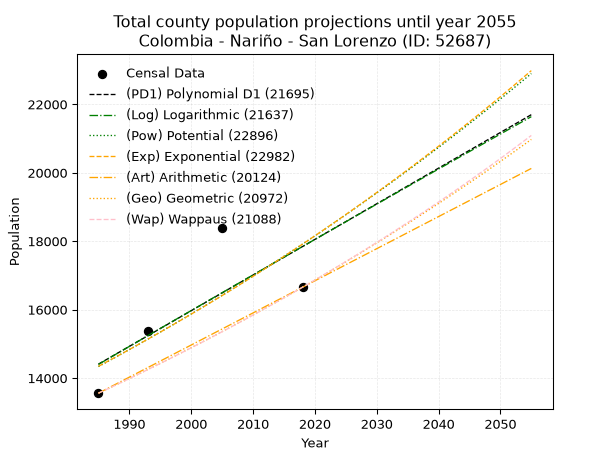
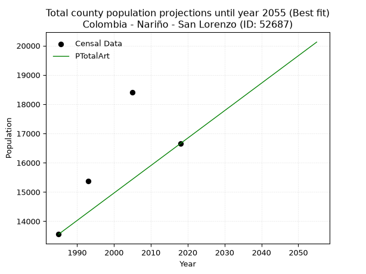
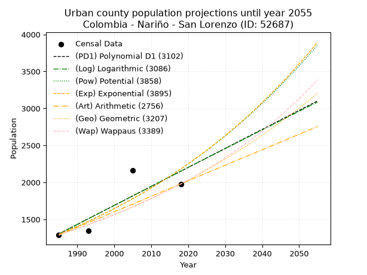
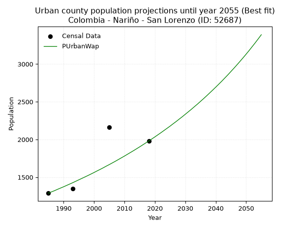
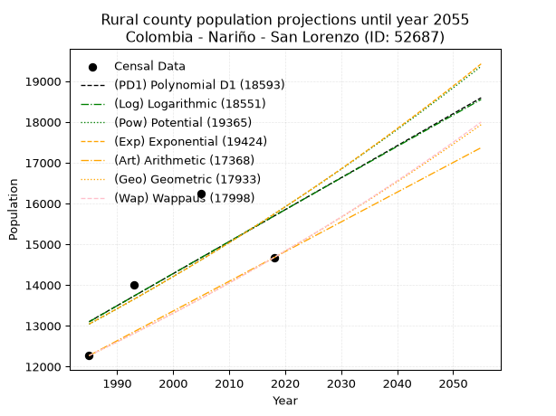
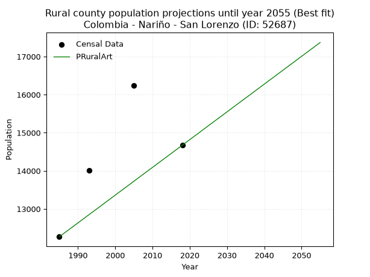

<div align="center">


</div>

# 📜 _“Population and Public Services Demand Projections (PPSD) until Year 2050 for Colombia - Nariño - San Lorenzo (ID: 52687)”_
Keywords: `population` `public-service` `projection` `lineal` `polynomial` `logarithmic` `potential` `exponential` `arithmetic` `geometric` `wappaus` `dane` `colombia` `south-america`

PPSD are analytical estimates used by governments and planners to anticipate future changes in population size, age distribution, and the resulting community needs for utilities, healthcare, education, and infrastructure as sizing future water treatment facilities, electrical grids, and road networks based on spatial growth.

<div align="center">

</img>

</div>


> **General running parameters**: • app_version: _v20260806_. • Python version: _3.14.7_. • Pandas version: _3.0.5_. • NumPy version: _2.5.1_. • Creates, save and include plots into reports (create_plot): _False_. • Projection until year: _2050_. • Process polynomial degree 2 and up: _False_. • Process Wappaus: _True_. • Process Wappaus: _True_. • Set negative values to zero: _True_. • Set infinite values to zero: _True_. • Drop dataset notes: _True_. 
<div align="center">

Dynamic map: [:earth_americas:Google](http://maps.google.com/maps?q=1.503361808,-77.2154196) [:earth_americas:OSM](https://www.openstreetmap.org/#map=18/1.503361808/-77.2154196&layers=P) [:earth_americas:Bing](https://www.bing.com/maps?cp=1.503361808~-77.2154196&lvl=18) [:earth_americas:Apple](https://maps.apple.com/frame?center=1.503361808%2C-77.2154196&span=0.003%2C0.006)

</div>


<div align="center">

```geojson
{
  "type": "Feature",
  "geometry": {
    "type": "Point", 
    "coordinates": [-77.2154196, 1.503361808]
  }, 
  "properties": {
    "Name": "Colombia - Nariño - San Lorenzo (ID: 52687)"
  }
}
```

</div>


## 0. Census Data (4 records)

Census data are official statistics collected by a government about the people and housing in a country. They usually include counts of total population, age, sex, race, income, education, and jobs.

📅Global census file: [Population.xlsx](../data/Population.xlsx)

| Source   |   Year |   CountryID | CountryName   |   StateID | StateName   |   CountyID | CountyName   |   PTotal |   PUrban |   PRural |
|:---------|-------:|------------:|:--------------|----------:|:------------|-----------:|:-------------|---------:|---------:|---------:|
| DANE     |   1985 |          57 | Colombia      |        52 | Nariño      |      52687 | San Lorenzo  |    13557 |     1288 |    12269 |
| DANE     |   1993 |          57 | Colombia      |        52 | Nariño      |      52687 | San Lorenzo  |    15363 |     1350 |    14013 |
| DANE     |   2005 |          57 | Colombia      |        52 | Nariño      |      52687 | San Lorenzo  |    18398 |     2164 |    16234 |
| DANE     |   2018 |          57 | Colombia      |        52 | Nariño      |      52687 | San Lorenzo  |    16653 |     1980 |    14673 |

> 🔥Some records could had specific notes about the registered values or the corresponding urban or rural distribution.

📅[SUI-RUPS](https://www.datos.gov.co/Hacienda-y-Cr-dito-P-blico/Registro-nico-de-Prestadores-de-Servicios-P-blicos/4qkq-csdn/about_data) - Local public utility companies: [RUPS.csv](../data/RUPS.csv)

 | SERVICIO       | ESTADO    | NOMBRE                                                                             | NIT         | DEPARTAMENTO_DOMICILIO   | MUNICIPIO_DOMICILIO   | DIRECCION                                         |   TELEFONO | EMAIL                  | TIPO_PRESTADOR                             | CLASIFICACION                 |
|:---------------|:----------|:-----------------------------------------------------------------------------------|:------------|:-------------------------|:----------------------|:--------------------------------------------------|-----------:|:-----------------------|:-------------------------------------------|:------------------------------|
| ACUEDUCTO      | OPERATIVA | EMPRESA MUNICIPAL DE SERVICIOS PUBLICOS DOMICILIARIOS DEL MUNICIPIO DE SAN LORENZO | 900404526-1 | NARINO                   | SAN LORENZO           | Edificio Alcaldía Municipal - Barrio Plaza Suarez |    7203611 | emsanlorenzo@gmail.com | SOCIEDADES (EMPRESA DE SERVICIOS PUBLICOS) | MENOR O IGUAL A 2500 USUARIOS |
| ALCANTARILLADO | OPERATIVA | EMPRESA MUNICIPAL DE SERVICIOS PUBLICOS DOMICILIARIOS DEL MUNICIPIO DE SAN LORENZO | 900404526-1 | NARINO                   | SAN LORENZO           | Edificio Alcaldía Municipal - Barrio Plaza Suarez |    7203611 | emsanlorenzo@gmail.com | SOCIEDADES (EMPRESA DE SERVICIOS PUBLICOS) | MENOR O IGUAL A 2500 USUARIOS |

## 1. Total

### 1.1. Coefficients and Parameters

* (PD1) Polynomial Deg 1: 104.1433159373754, -192319.91770373518 (lineal)
* (Log) Logarithmic: 208874.03945089874, -1571660.4976777867
* (Pow) Potential: 13.508475435559712, -40.391276176457446
* (Exp) Exponential: 0.006735660990168788, 0.02238584877930422
* (Art) Arithmetic: Year diff. 2018 - 1985 = 33, Population diff. 16653 - 13557 = 3096, Annual growth = 93.81818181818181
* (Geo) Geometric: Year diff. 2018 - 1985 = 33, Population diff. 16653 - 13557 = 3096, Annual growth % = 0.006252415597742367
* (Wap) Wappaus: i = 0.6211067978694592, Condition values only valid for < 200)

<sub>
Wappaus condition values: ['0.00', '0.62', '1.24', '1.86', '2.48', '3.11', '3.73', '4.35', '4.97', '5.59', '6.21', '6.83', '7.45', '8.07', '8.70', '9.32', '9.94', '10.56', '11.18', '11.80', '12.42', '13.04', '13.66', '14.29', '14.91', '15.53', '16.15', '16.77', '17.39', '18.01', '18.63', '19.25', '19.88', '20.50', '21.12', '21.74', '22.36', '22.98', '23.60', '24.22', '24.84', '25.47', '26.09', '26.71', '27.33', '27.95', '28.57', '29.19', '29.81', '30.43', '31.06', '31.68', '32.30', '32.92', '33.54', '34.16', '34.78', '35.40', '36.02', '36.65', '37.27', '37.89', '38.51', '39.13', '39.75', '40.37']
</sub>


### 1.2. Projected Dataset

|   Year |   CountyID |   PTotalPD1 |   PTotalLog |   PTotalPow |   PTotalExp |   PTotalArt |   PTotalGeo |   PTotalWap |
|-------:|-----------:|------------:|------------:|------------:|------------:|------------:|------------:|------------:|
|   1985 |      52687 |       14405 |       14398 |       14336 |       14342 |       13557 |       13557 |       13557 |
|   1986 |      52687 |       14509 |       14503 |       14434 |       14439 |       13651 |       13642 |       13641 |
|   1987 |      52687 |       14613 |       14609 |       14533 |       14537 |       13745 |       13727 |       13726 |
|   1988 |      52687 |       14717 |       14714 |       14632 |       14635 |       13838 |       13813 |       13812 |
|   1989 |      52687 |       14821 |       14819 |       14732 |       14734 |       13932 |       13899 |       13898 |
|   1990 |      52687 |       14925 |       14924 |       14832 |       14833 |       14026 |       13986 |       13985 |
|   1991 |      52687 |       15029 |       15029 |       14933 |       14934 |       14120 |       14074 |       14072 |
|   1992 |      52687 |       15134 |       15134 |       15035 |       15035 |       14214 |       14162 |       14160 |
|   1993 |      52687 |       15238 |       15238 |       15137 |       15136 |       14308 |       14250 |       14248 |
|   1994 |      52687 |       15342 |       15343 |       15240 |       15239 |       14401 |       14339 |       14337 |
|   1995 |      52687 |       15446 |       15448 |       15343 |       15342 |       14495 |       14429 |       14426 |
|   1996 |      52687 |       15550 |       15553 |       15448 |       15445 |       14589 |       14519 |       14516 |
|   1997 |      52687 |       15654 |       15657 |       15552 |       15550 |       14683 |       14610 |       14607 |
|   1998 |      52687 |       15758 |       15762 |       15658 |       15655 |       14777 |       14701 |       14698 |
|   1999 |      52687 |       15863 |       15866 |       15764 |       15760 |       14870 |       14793 |       14789 |
|   2000 |      52687 |       15967 |       15971 |       15871 |       15867 |       14964 |       14886 |       14882 |
|   2001 |      52687 |       16071 |       16075 |       15979 |       15974 |       15058 |       14979 |       14975 |
|   2002 |      52687 |       16175 |       16179 |       16087 |       16082 |       15152 |       15072 |       15068 |
|   2003 |      52687 |       16279 |       16284 |       16196 |       16191 |       15246 |       15167 |       15162 |
|   2004 |      52687 |       16383 |       16388 |       16305 |       16300 |       15340 |       15261 |       15257 |
|   2005 |      52687 |       16487 |       16492 |       16416 |       16410 |       15433 |       15357 |       15353 |
|   2006 |      52687 |       16592 |       16596 |       16526 |       16521 |       15527 |       15453 |       15449 |
|   2007 |      52687 |       16696 |       16700 |       16638 |       16633 |       15621 |       15549 |       15545 |
|   2008 |      52687 |       16800 |       16805 |       16750 |       16745 |       15715 |       15647 |       15643 |
|   2009 |      52687 |       16904 |       16909 |       16863 |       16859 |       15809 |       15745 |       15741 |
|   2010 |      52687 |       17008 |       17012 |       16977 |       16973 |       15902 |       15843 |       15839 |
|   2011 |      52687 |       17112 |       17116 |       17092 |       17087 |       15996 |       15942 |       15939 |
|   2012 |      52687 |       17216 |       17220 |       17207 |       17203 |       16090 |       16042 |       16039 |
|   2013 |      52687 |       17321 |       17324 |       17323 |       17319 |       16184 |       16142 |       16139 |
|   2014 |      52687 |       17425 |       17428 |       17439 |       17436 |       16278 |       16243 |       16241 |
|   2015 |      52687 |       17529 |       17531 |       17557 |       17554 |       16372 |       16345 |       16343 |
|   2016 |      52687 |       17633 |       17635 |       17675 |       17673 |       16465 |       16447 |       16445 |
|   2017 |      52687 |       17737 |       17739 |       17794 |       17792 |       16559 |       16550 |       16549 |
|   2018 |      52687 |       17841 |       17842 |       17913 |       17912 |       16653 |       16653 |       16653 |
|   2019 |      52687 |       17945 |       17946 |       18033 |       18033 |       16747 |       16757 |       16758 |
|   2020 |      52687 |       18050 |       18049 |       18154 |       18155 |       16841 |       16862 |       16864 |
|   2021 |      52687 |       18154 |       18152 |       18276 |       18278 |       16934 |       16967 |       16970 |
|   2022 |      52687 |       18258 |       18256 |       18399 |       18401 |       17028 |       17073 |       17077 |
|   2023 |      52687 |       18362 |       18359 |       18522 |       18526 |       17122 |       17180 |       17185 |
|   2024 |      52687 |       18466 |       18462 |       18646 |       18651 |       17216 |       17288 |       17293 |
|   2025 |      52687 |       18570 |       18565 |       18771 |       18777 |       17310 |       17396 |       17403 |
|   2026 |      52687 |       18674 |       18669 |       18897 |       18904 |       17404 |       17504 |       17513 |
|   2027 |      52687 |       18779 |       18772 |       19023 |       19032 |       17497 |       17614 |       17624 |
|   2028 |      52687 |       18883 |       18875 |       19150 |       19160 |       17591 |       17724 |       17736 |
|   2029 |      52687 |       18987 |       18978 |       19278 |       19290 |       17685 |       17835 |       17848 |
|   2030 |      52687 |       19091 |       19081 |       19407 |       19420 |       17779 |       17946 |       17962 |
|   2031 |      52687 |       19195 |       19183 |       19536 |       19551 |       17873 |       18059 |       18076 |
|   2032 |      52687 |       19299 |       19286 |       19667 |       19684 |       17966 |       18171 |       18191 |
|   2033 |      52687 |       19403 |       19389 |       19798 |       19817 |       18060 |       18285 |       18307 |
|   2034 |      52687 |       19508 |       19492 |       19930 |       19950 |       18154 |       18399 |       18424 |
|   2035 |      52687 |       19612 |       19594 |       20062 |       20085 |       18248 |       18514 |       18541 |
|   2036 |      52687 |       19716 |       19697 |       20196 |       20221 |       18342 |       18630 |       18660 |
|   2037 |      52687 |       19820 |       19800 |       20330 |       20358 |       18436 |       18747 |       18779 |
|   2038 |      52687 |       19924 |       19902 |       20466 |       20495 |       18529 |       18864 |       18899 |
|   2039 |      52687 |       20028 |       20005 |       20602 |       20634 |       18623 |       18982 |       19020 |
|   2040 |      52687 |       20132 |       20107 |       20739 |       20773 |       18717 |       19101 |       19142 |
|   2041 |      52687 |       20237 |       20209 |       20876 |       20914 |       18811 |       19220 |       19265 |
|   2042 |      52687 |       20341 |       20312 |       21015 |       21055 |       18905 |       19340 |       19389 |
|   2043 |      52687 |       20445 |       20414 |       21154 |       21197 |       18998 |       19461 |       19514 |
|   2044 |      52687 |       20549 |       20516 |       21295 |       21341 |       19092 |       19583 |       19639 |
|   2045 |      52687 |       20653 |       20618 |       21436 |       21485 |       19186 |       19705 |       19766 |
|   2046 |      52687 |       20757 |       20720 |       21578 |       21630 |       19280 |       19828 |       19894 |
|   2047 |      52687 |       20861 |       20822 |       21721 |       21776 |       19374 |       19952 |       20023 |
|   2048 |      52687 |       20966 |       20924 |       21865 |       21923 |       19468 |       20077 |       20152 |
|   2049 |      52687 |       21070 |       21026 |       22009 |       22072 |       19561 |       20203 |       20283 |
|   2050 |      52687 |       21174 |       21128 |       22155 |       22221 |       19655 |       20329 |       20414 |
<div align="center">

</img>

</div>


### 1.3. Best fit with absolute and relative error (%)

Relative error puts that difference into context by dividing the absolute error by the true value, creating a unitless ratio or percentage that shows the scale of the mistake.

Absolute and relative error

|   Year | Source   |   CountryID | CountryName   |   StateID | StateName   |   CountyID_x | CountyName   |   PTotal |   PUrban |   PRural |   CountyID_y |   PTotalPD1 |   PTotalLog |   PTotalPow |   PTotalExp |   PTotalArt |   PTotalGeo |   PTotalWap |   PTotalPD1AbsError |   PTotalLogAbsError |   PTotalPowAbsError |   PTotalExpAbsError |   PTotalArtAbsError |   PTotalGeoAbsError |   PTotalWapAbsError |   PTotalPD1RelError |   PTotalLogRelError |   PTotalPowRelError |   PTotalExpRelError |   PTotalArtRelError |   PTotalGeoRelError |   PTotalWapRelError |
|-------:|:---------|------------:|:--------------|----------:|:------------|-------------:|:-------------|---------:|---------:|---------:|-------------:|------------:|------------:|------------:|------------:|------------:|------------:|------------:|--------------------:|--------------------:|--------------------:|--------------------:|--------------------:|--------------------:|--------------------:|--------------------:|--------------------:|--------------------:|--------------------:|--------------------:|--------------------:|--------------------:|
|   1985 | DANE     |          57 | Colombia      |        52 | Nariño      |        52687 | San Lorenzo  |    13557 |     1288 |    12269 |        52687 |       14405 |       14398 |       14336 |       14342 |       13557 |       13557 |       13557 |                 848 |                 841 |                 779 |                 785 |                   0 |                   0 |                   0 |            6.25507  |            6.20344  |             5.74611 |             5.79037 |             0       |             0       |              0      |
|   1993 | DANE     |          57 | Colombia      |        52 | Nariño      |        52687 | San Lorenzo  |    15363 |     1350 |    14013 |        52687 |       15238 |       15238 |       15137 |       15136 |       14308 |       14250 |       14248 |                 125 |                 125 |                 226 |                 227 |                1055 |                1113 |                1115 |            0.813643 |            0.813643 |             1.47107 |             1.47758 |             6.86715 |             7.24468 |              7.2577 |
|   2005 | DANE     |          57 | Colombia      |        52 | Nariño      |        52687 | San Lorenzo  |    18398 |     2164 |    16234 |        52687 |       16487 |       16492 |       16416 |       16410 |       15433 |       15357 |       15353 |                1911 |                1906 |                1982 |                1988 |                2965 |                3041 |                3045 |           10.387    |           10.3598   |            10.7729  |            10.8055  |            16.1159  |            16.529   |             16.5507 |
|   2018 | DANE     |          57 | Colombia      |        52 | Nariño      |        52687 | San Lorenzo  |    16653 |     1980 |    14673 |        52687 |       17841 |       17842 |       17913 |       17912 |       16653 |       16653 |       16653 |                1188 |                1189 |                1260 |                1259 |                   0 |                   0 |                   0 |            7.13385  |            7.13985  |             7.5662  |             7.5602  |             0       |             0       |              0      |

Relative error mean

| Method    |   RelError | Best   |
|:----------|-----------:|:-------|
| PTotalPD1 |    6.14739 |        |
| PTotalLog |    6.12919 |        |
| PTotalPow |    6.38907 |        |
| PTotalExp |    6.40842 |        |
| PTotalArt |    5.74576 | True   |
| PTotalGeo |    5.94341 |        |
| PTotalWap |    5.9521  |        |

💙Best method: _**PTotalArt**_
<div align="center">

</img>

</div>


### 1.4. Fresh water supply demand in liters per capita per day (lpcd)

The fresh water supply demand typically ranges from 100 to 300 liters per capita per day (lpcd) for standard domestic and municipal planning, though absolute survival minimums set by the World Health Organization are as low as 7.5 to 20 liters per day, and total consumption in high-income nations can exceed 400 liters.

> `CZ`: Level in meters above the sea level (masl)<br> `WS`: Fresh water supply demand in liters per capita per day (lpcd or l/h/d)<br> `WSAll`: Zonal fresh water supply demand in liters per second (l/s)<br> `A`: Zonal area in square meters<br> `DP`: Population density (people/hectare or p/ha)

Reference values (RAS Colombia)

|    CZ |   WS |
|------:|-----:|
|  1000 |  120 |
|  2000 |  130 |
| 99999 |  140 |

County shapefile geometry properties and water supply values

|   CountyID |      ATotal |   CZTotal |   WSTotal |
|-----------:|------------:|----------:|----------:|
|      52687 | 2.49351e+08 |   1752.49 |       130 |

Projected values for best method: PTotalArt

|   CountyID |   Year |   PTotalArt |   DPTotal |   WSTotal |   WSTotalAll |
|-----------:|-------:|------------:|----------:|----------:|-------------:|
|      52687 |   1985 |       13557 |      0.54 |       130 |      20.3983 |
|      52687 |   1986 |       13651 |      0.55 |       130 |      20.5397 |
|      52687 |   1987 |       13745 |      0.55 |       130 |      20.6811 |
|      52687 |   1988 |       13838 |      0.55 |       130 |      20.8211 |
|      52687 |   1989 |       13932 |      0.56 |       130 |      20.9625 |
|      52687 |   1990 |       14026 |      0.56 |       130 |      21.1039 |
|      52687 |   1991 |       14120 |      0.57 |       130 |      21.2454 |
|      52687 |   1992 |       14214 |      0.57 |       130 |      21.3868 |
|      52687 |   1993 |       14308 |      0.57 |       130 |      21.5282 |
|      52687 |   1994 |       14401 |      0.58 |       130 |      21.6682 |
|      52687 |   1995 |       14495 |      0.58 |       130 |      21.8096 |
|      52687 |   1996 |       14589 |      0.59 |       130 |      21.951  |
|      52687 |   1997 |       14683 |      0.59 |       130 |      22.0925 |
|      52687 |   1998 |       14777 |      0.59 |       130 |      22.2339 |
|      52687 |   1999 |       14870 |      0.6  |       130 |      22.3738 |
|      52687 |   2000 |       14964 |      0.6  |       130 |      22.5153 |
|      52687 |   2001 |       15058 |      0.6  |       130 |      22.6567 |
|      52687 |   2002 |       15152 |      0.61 |       130 |      22.7981 |
|      52687 |   2003 |       15246 |      0.61 |       130 |      22.9396 |
|      52687 |   2004 |       15340 |      0.62 |       130 |      23.081  |
|      52687 |   2005 |       15433 |      0.62 |       130 |      23.2209 |
|      52687 |   2006 |       15527 |      0.62 |       130 |      23.3624 |
|      52687 |   2007 |       15621 |      0.63 |       130 |      23.5038 |
|      52687 |   2008 |       15715 |      0.63 |       130 |      23.6453 |
|      52687 |   2009 |       15809 |      0.63 |       130 |      23.7867 |
|      52687 |   2010 |       15902 |      0.64 |       130 |      23.9266 |
|      52687 |   2011 |       15996 |      0.64 |       130 |      24.0681 |
|      52687 |   2012 |       16090 |      0.65 |       130 |      24.2095 |
|      52687 |   2013 |       16184 |      0.65 |       130 |      24.3509 |
|      52687 |   2014 |       16278 |      0.65 |       130 |      24.4924 |
|      52687 |   2015 |       16372 |      0.66 |       130 |      24.6338 |
|      52687 |   2016 |       16465 |      0.66 |       130 |      24.7737 |
|      52687 |   2017 |       16559 |      0.66 |       130 |      24.9152 |
|      52687 |   2018 |       16653 |      0.67 |       130 |      25.0566 |
|      52687 |   2019 |       16747 |      0.67 |       130 |      25.198  |
|      52687 |   2020 |       16841 |      0.68 |       130 |      25.3395 |
|      52687 |   2021 |       16934 |      0.68 |       130 |      25.4794 |
|      52687 |   2022 |       17028 |      0.68 |       130 |      25.6208 |
|      52687 |   2023 |       17122 |      0.69 |       130 |      25.7623 |
|      52687 |   2024 |       17216 |      0.69 |       130 |      25.9037 |
|      52687 |   2025 |       17310 |      0.69 |       130 |      26.0451 |
|      52687 |   2026 |       17404 |      0.7  |       130 |      26.1866 |
|      52687 |   2027 |       17497 |      0.7  |       130 |      26.3265 |
|      52687 |   2028 |       17591 |      0.71 |       130 |      26.4679 |
|      52687 |   2029 |       17685 |      0.71 |       130 |      26.6094 |
|      52687 |   2030 |       17779 |      0.71 |       130 |      26.7508 |
|      52687 |   2031 |       17873 |      0.72 |       130 |      26.8922 |
|      52687 |   2032 |       17966 |      0.72 |       130 |      27.0322 |
|      52687 |   2033 |       18060 |      0.72 |       130 |      27.1736 |
|      52687 |   2034 |       18154 |      0.73 |       130 |      27.315  |
|      52687 |   2035 |       18248 |      0.73 |       130 |      27.4565 |
|      52687 |   2036 |       18342 |      0.74 |       130 |      27.5979 |
|      52687 |   2037 |       18436 |      0.74 |       130 |      27.7394 |
|      52687 |   2038 |       18529 |      0.74 |       130 |      27.8793 |
|      52687 |   2039 |       18623 |      0.75 |       130 |      28.0207 |
|      52687 |   2040 |       18717 |      0.75 |       130 |      28.1622 |
|      52687 |   2041 |       18811 |      0.75 |       130 |      28.3036 |
|      52687 |   2042 |       18905 |      0.76 |       130 |      28.445  |
|      52687 |   2043 |       18998 |      0.76 |       130 |      28.585  |
|      52687 |   2044 |       19092 |      0.77 |       130 |      28.7264 |
|      52687 |   2045 |       19186 |      0.77 |       130 |      28.8678 |
|      52687 |   2046 |       19280 |      0.77 |       130 |      29.0093 |
|      52687 |   2047 |       19374 |      0.78 |       130 |      29.1507 |
|      52687 |   2048 |       19468 |      0.78 |       130 |      29.2921 |
|      52687 |   2049 |       19561 |      0.78 |       130 |      29.4321 |
|      52687 |   2050 |       19655 |      0.79 |       130 |      29.5735 |

## 2. Urban

### 2.1. Coefficients and Parameters

* (PD1) Polynomial Deg 1: 25.683661180248954, -49678.24327579297 (lineal)
* (Log) Logarithmic: 51455.55478597895, -389418.58426716406
* (Pow) Potential: 31.38514256268567, -100.38669274008097
* (Exp) Exponential: 0.01566660913817196, 4.0597401932022375e-11
* (Art) Arithmetic: Year diff. 2018 - 1985 = 33, Population diff. 1980 - 1288 = 692, Annual growth = 20.96969696969697
* (Geo) Geometric: Year diff. 2018 - 1985 = 33, Population diff. 1980 - 1288 = 692, Annual growth % = 0.01311575823198985
* (Wap) Wappaus: i = 1.2833351878639516, Condition values only valid for < 200)

<sub>
Wappaus condition values: ['0.00', '1.28', '2.57', '3.85', '5.13', '6.42', '7.70', '8.98', '10.27', '11.55', '12.83', '14.12', '15.40', '16.68', '17.97', '19.25', '20.53', '21.82', '23.10', '24.38', '25.67', '26.95', '28.23', '29.52', '30.80', '32.08', '33.37', '34.65', '35.93', '37.22', '38.50', '39.78', '41.07', '42.35', '43.63', '44.92', '46.20', '47.48', '48.77', '50.05', '51.33', '52.62', '53.90', '55.18', '56.47', '57.75', '59.03', '60.32', '61.60', '62.88', '64.17', '65.45', '66.73', '68.02', '69.30', '70.58', '71.87', '73.15', '74.43', '75.72', '77.00', '78.28', '79.57', '80.85', '82.13', '83.42']
</sub>


### 2.2. Projected Dataset

|   Year |   CountyID |   PUrbanPD1 |   PUrbanLog |   PUrbanPow |   PUrbanExp |   PUrbanArt |   PUrbanGeo |   PUrbanWap |
|-------:|-----------:|------------:|------------:|------------:|------------:|------------:|------------:|------------:|
|   1985 |      52687 |        1304 |        1303 |        1300 |        1301 |        1288 |        1288 |        1288 |
|   1986 |      52687 |        1330 |        1329 |        1321 |        1322 |        1309 |        1305 |        1305 |
|   1987 |      52687 |        1355 |        1355 |        1342 |        1342 |        1330 |        1322 |        1321 |
|   1988 |      52687 |        1381 |        1380 |        1363 |        1364 |        1351 |        1339 |        1339 |
|   1989 |      52687 |        1407 |        1406 |        1385 |        1385 |        1372 |        1357 |        1356 |
|   1990 |      52687 |        1432 |        1432 |        1407 |        1407 |        1393 |        1375 |        1373 |
|   1991 |      52687 |        1458 |        1458 |        1429 |        1429 |        1414 |        1393 |        1391 |
|   1992 |      52687 |        1484 |        1484 |        1452 |        1452 |        1435 |        1411 |        1409 |
|   1993 |      52687 |        1509 |        1510 |        1475 |        1475 |        1456 |        1430 |        1427 |
|   1994 |      52687 |        1535 |        1535 |        1498 |        1498 |        1477 |        1448 |        1446 |
|   1995 |      52687 |        1561 |        1561 |        1522 |        1522 |        1498 |        1467 |        1465 |
|   1996 |      52687 |        1586 |        1587 |        1546 |        1546 |        1519 |        1487 |        1484 |
|   1997 |      52687 |        1612 |        1613 |        1571 |        1570 |        1540 |        1506 |        1503 |
|   1998 |      52687 |        1638 |        1639 |        1596 |        1595 |        1561 |        1526 |        1522 |
|   1999 |      52687 |        1663 |        1664 |        1621 |        1620 |        1582 |        1546 |        1542 |
|   2000 |      52687 |        1689 |        1690 |        1647 |        1646 |        1603 |        1566 |        1562 |
|   2001 |      52687 |        1715 |        1716 |        1673 |        1672 |        1624 |        1587 |        1583 |
|   2002 |      52687 |        1740 |        1741 |        1699 |        1698 |        1644 |        1607 |        1603 |
|   2003 |      52687 |        1766 |        1767 |        1726 |        1725 |        1665 |        1628 |        1624 |
|   2004 |      52687 |        1792 |        1793 |        1753 |        1752 |        1686 |        1650 |        1646 |
|   2005 |      52687 |        1817 |        1819 |        1781 |        1780 |        1707 |        1671 |        1667 |
|   2006 |      52687 |        1843 |        1844 |        1809 |        1808 |        1728 |        1693 |        1689 |
|   2007 |      52687 |        1869 |        1870 |        1838 |        1836 |        1749 |        1716 |        1711 |
|   2008 |      52687 |        1895 |        1895 |        1866 |        1865 |        1770 |        1738 |        1734 |
|   2009 |      52687 |        1920 |        1921 |        1896 |        1895 |        1791 |        1761 |        1757 |
|   2010 |      52687 |        1946 |        1947 |        1926 |        1925 |        1812 |        1784 |        1780 |
|   2011 |      52687 |        1972 |        1972 |        1956 |        1955 |        1833 |        1807 |        1804 |
|   2012 |      52687 |        1997 |        1998 |        1987 |        1986 |        1854 |        1831 |        1828 |
|   2013 |      52687 |        2023 |        2023 |        2018 |        2017 |        1875 |        1855 |        1852 |
|   2014 |      52687 |        2049 |        2049 |        2050 |        2049 |        1896 |        1879 |        1877 |
|   2015 |      52687 |        2074 |        2075 |        2082 |        2082 |        1917 |        1904 |        1902 |
|   2016 |      52687 |        2100 |        2100 |        2115 |        2114 |        1938 |        1929 |        1928 |
|   2017 |      52687 |        2126 |        2126 |        2148 |        2148 |        1959 |        1954 |        1954 |
|   2018 |      52687 |        2151 |        2151 |        2181 |        2182 |        1980 |        1980 |        1980 |
|   2019 |      52687 |        2177 |        2177 |        2216 |        2216 |        2001 |        2006 |        2007 |
|   2020 |      52687 |        2203 |        2202 |        2250 |        2251 |        2022 |        2032 |        2034 |
|   2021 |      52687 |        2228 |        2228 |        2285 |        2287 |        2043 |        2059 |        2062 |
|   2022 |      52687 |        2254 |        2253 |        2321 |        2323 |        2064 |        2086 |        2090 |
|   2023 |      52687 |        2280 |        2278 |        2358 |        2360 |        2085 |        2113 |        2119 |
|   2024 |      52687 |        2305 |        2304 |        2394 |        2397 |        2106 |        2141 |        2148 |
|   2025 |      52687 |        2331 |        2329 |        2432 |        2435 |        2127 |        2169 |        2177 |
|   2026 |      52687 |        2357 |        2355 |        2470 |        2473 |        2148 |        2198 |        2208 |
|   2027 |      52687 |        2383 |        2380 |        2508 |        2512 |        2169 |        2226 |        2238 |
|   2028 |      52687 |        2408 |        2405 |        2547 |        2552 |        2190 |        2256 |        2270 |
|   2029 |      52687 |        2434 |        2431 |        2587 |        2592 |        2211 |        2285 |        2301 |
|   2030 |      52687 |        2460 |        2456 |        2627 |        2633 |        2232 |        2315 |        2334 |
|   2031 |      52687 |        2485 |        2482 |        2668 |        2675 |        2253 |        2345 |        2367 |
|   2032 |      52687 |        2511 |        2507 |        2710 |        2717 |        2274 |        2376 |        2400 |
|   2033 |      52687 |        2537 |        2532 |        2752 |        2760 |        2295 |        2407 |        2435 |
|   2034 |      52687 |        2562 |        2557 |        2795 |        2803 |        2316 |        2439 |        2469 |
|   2035 |      52687 |        2588 |        2583 |        2838 |        2848 |        2336 |        2471 |        2505 |
|   2036 |      52687 |        2614 |        2608 |        2883 |        2893 |        2357 |        2503 |        2541 |
|   2037 |      52687 |        2639 |        2633 |        2927 |        2938 |        2378 |        2536 |        2578 |
|   2038 |      52687 |        2665 |        2659 |        2973 |        2985 |        2399 |        2569 |        2616 |
|   2039 |      52687 |        2691 |        2684 |        3019 |        3032 |        2420 |        2603 |        2654 |
|   2040 |      52687 |        2716 |        2709 |        3066 |        3080 |        2441 |        2637 |        2693 |
|   2041 |      52687 |        2742 |        2734 |        3113 |        3128 |        2462 |        2672 |        2733 |
|   2042 |      52687 |        2768 |        2759 |        3161 |        3178 |        2483 |        2707 |        2773 |
|   2043 |      52687 |        2793 |        2785 |        3210 |        3228 |        2504 |        2742 |        2815 |
|   2044 |      52687 |        2819 |        2810 |        3260 |        3279 |        2525 |        2778 |        2857 |
|   2045 |      52687 |        2845 |        2835 |        3310 |        3331 |        2546 |        2815 |        2901 |
|   2046 |      52687 |        2871 |        2860 |        3362 |        3383 |        2567 |        2852 |        2945 |
|   2047 |      52687 |        2896 |        2885 |        3414 |        3437 |        2588 |        2889 |        2990 |
|   2048 |      52687 |        2922 |        2910 |        3466 |        3491 |        2609 |        2927 |        3036 |
|   2049 |      52687 |        2948 |        2936 |        3520 |        3546 |        2630 |        2965 |        3083 |
|   2050 |      52687 |        2973 |        2961 |        3574 |        3602 |        2651 |        3004 |        3131 |
<div align="center">

</img>

</div>


### 2.3. Best fit with absolute and relative error (%)

Relative error puts that difference into context by dividing the absolute error by the true value, creating a unitless ratio or percentage that shows the scale of the mistake.

Absolute and relative error

|   Year | Source   |   CountryID | CountryName   |   StateID | StateName   |   CountyID_x | CountyName   |   PTotal |   PUrban |   PRural |   CountyID_y |   PUrbanPD1 |   PUrbanLog |   PUrbanPow |   PUrbanExp |   PUrbanArt |   PUrbanGeo |   PUrbanWap |   PUrbanPD1AbsError |   PUrbanLogAbsError |   PUrbanPowAbsError |   PUrbanExpAbsError |   PUrbanArtAbsError |   PUrbanGeoAbsError |   PUrbanWapAbsError |   PUrbanPD1RelError |   PUrbanLogRelError |   PUrbanPowRelError |   PUrbanExpRelError |   PUrbanArtRelError |   PUrbanGeoRelError |   PUrbanWapRelError |
|-------:|:---------|------------:|:--------------|----------:|:------------|-------------:|:-------------|---------:|---------:|---------:|-------------:|------------:|------------:|------------:|------------:|------------:|------------:|------------:|--------------------:|--------------------:|--------------------:|--------------------:|--------------------:|--------------------:|--------------------:|--------------------:|--------------------:|--------------------:|--------------------:|--------------------:|--------------------:|--------------------:|
|   1985 | DANE     |          57 | Colombia      |        52 | Nariño      |        52687 | San Lorenzo  |    13557 |     1288 |    12269 |        52687 |        1304 |        1303 |        1300 |        1301 |        1288 |        1288 |        1288 |                  16 |                  15 |                  12 |                  13 |                   0 |                   0 |                   0 |             1.24224 |             1.1646  |            0.931677 |             1.00932 |             0       |             0       |              0      |
|   1993 | DANE     |          57 | Colombia      |        52 | Nariño      |        52687 | San Lorenzo  |    15363 |     1350 |    14013 |        52687 |        1509 |        1510 |        1475 |        1475 |        1456 |        1430 |        1427 |                 159 |                 160 |                 125 |                 125 |                 106 |                  80 |                  77 |            11.7778  |            11.8519  |            9.25926  |             9.25926 |             7.85185 |             5.92593 |              5.7037 |
|   2005 | DANE     |          57 | Colombia      |        52 | Nariño      |        52687 | San Lorenzo  |    18398 |     2164 |    16234 |        52687 |        1817 |        1819 |        1781 |        1780 |        1707 |        1671 |        1667 |                 347 |                 345 |                 383 |                 384 |                 457 |                 493 |                 497 |            16.0351  |            15.9427  |           17.6987   |            17.7449  |            21.1183  |            22.7819  |             22.9667 |
|   2018 | DANE     |          57 | Colombia      |        52 | Nariño      |        52687 | San Lorenzo  |    16653 |     1980 |    14673 |        52687 |        2151 |        2151 |        2181 |        2182 |        1980 |        1980 |        1980 |                 171 |                 171 |                 201 |                 202 |                   0 |                   0 |                   0 |             8.63636 |             8.63636 |           10.1515   |            10.202   |             0       |             0       |              0      |

Relative error mean

| Method    |   RelError | Best   |
|:----------|-----------:|:-------|
| PUrbanPD1 |    9.42287 |        |
| PUrbanLog |    9.39888 |        |
| PUrbanPow |    9.51029 |        |
| PUrbanExp |    9.55388 |        |
| PUrbanArt |    7.24254 |        |
| PUrbanGeo |    7.17695 |        |
| PUrbanWap |    7.16761 | True   |

💙Best method: _**PUrbanWap**_
<div align="center">

</img>

</div>


### 2.4. Fresh water supply demand in liters per capita per day (lpcd)

The fresh water supply demand typically ranges from 100 to 300 liters per capita per day (lpcd) for standard domestic and municipal planning, though absolute survival minimums set by the World Health Organization are as low as 7.5 to 20 liters per day, and total consumption in high-income nations can exceed 400 liters.

> `CZ`: Level in meters above the sea level (masl)<br> `WS`: Fresh water supply demand in liters per capita per day (lpcd or l/h/d)<br> `WSAll`: Zonal fresh water supply demand in liters per second (l/s)<br> `A`: Zonal area in square meters<br> `DP`: Population density (people/hectare or p/ha)

Reference values (RAS Colombia)

|    CZ |   WS |
|------:|-----:|
|  1000 |  120 |
|  2000 |  130 |
| 99999 |  140 |

County shapefile geometry properties and water supply values

|   CountyID |   AUrban |   CZUrban |   WSUrban |
|-----------:|---------:|----------:|----------:|
|      52687 |   293841 |   2074.54 |       140 |

Projected values for best method: PUrbanWap

|   CountyID |   Year |   PUrbanWap |   DPUrban |   WSUrban |   WSUrbanAll |
|-----------:|-------:|------------:|----------:|----------:|-------------:|
|      52687 |   1985 |        1288 |     43.83 |       140 |      2.08704 |
|      52687 |   1986 |        1305 |     44.41 |       140 |      2.11458 |
|      52687 |   1987 |        1321 |     44.96 |       140 |      2.14051 |
|      52687 |   1988 |        1339 |     45.57 |       140 |      2.16968 |
|      52687 |   1989 |        1356 |     46.15 |       140 |      2.19722 |
|      52687 |   1990 |        1373 |     46.73 |       140 |      2.22477 |
|      52687 |   1991 |        1391 |     47.34 |       140 |      2.25394 |
|      52687 |   1992 |        1409 |     47.95 |       140 |      2.2831  |
|      52687 |   1993 |        1427 |     48.56 |       140 |      2.31227 |
|      52687 |   1994 |        1446 |     49.21 |       140 |      2.34306 |
|      52687 |   1995 |        1465 |     49.86 |       140 |      2.37384 |
|      52687 |   1996 |        1484 |     50.5  |       140 |      2.40463 |
|      52687 |   1997 |        1503 |     51.15 |       140 |      2.43542 |
|      52687 |   1998 |        1522 |     51.8  |       140 |      2.4662  |
|      52687 |   1999 |        1542 |     52.48 |       140 |      2.49861 |
|      52687 |   2000 |        1562 |     53.16 |       140 |      2.53102 |
|      52687 |   2001 |        1583 |     53.87 |       140 |      2.56505 |
|      52687 |   2002 |        1603 |     54.55 |       140 |      2.59745 |
|      52687 |   2003 |        1624 |     55.27 |       140 |      2.63148 |
|      52687 |   2004 |        1646 |     56.02 |       140 |      2.66713 |
|      52687 |   2005 |        1667 |     56.73 |       140 |      2.70116 |
|      52687 |   2006 |        1689 |     57.48 |       140 |      2.73681 |
|      52687 |   2007 |        1711 |     58.23 |       140 |      2.77245 |
|      52687 |   2008 |        1734 |     59.01 |       140 |      2.80972 |
|      52687 |   2009 |        1757 |     59.79 |       140 |      2.84699 |
|      52687 |   2010 |        1780 |     60.58 |       140 |      2.88426 |
|      52687 |   2011 |        1804 |     61.39 |       140 |      2.92315 |
|      52687 |   2012 |        1828 |     62.21 |       140 |      2.96204 |
|      52687 |   2013 |        1852 |     63.03 |       140 |      3.00093 |
|      52687 |   2014 |        1877 |     63.88 |       140 |      3.04144 |
|      52687 |   2015 |        1902 |     64.73 |       140 |      3.08194 |
|      52687 |   2016 |        1928 |     65.61 |       140 |      3.12407 |
|      52687 |   2017 |        1954 |     66.5  |       140 |      3.1662  |
|      52687 |   2018 |        1980 |     67.38 |       140 |      3.20833 |
|      52687 |   2019 |        2007 |     68.3  |       140 |      3.25208 |
|      52687 |   2020 |        2034 |     69.22 |       140 |      3.29583 |
|      52687 |   2021 |        2062 |     70.17 |       140 |      3.3412  |
|      52687 |   2022 |        2090 |     71.13 |       140 |      3.38657 |
|      52687 |   2023 |        2119 |     72.11 |       140 |      3.43356 |
|      52687 |   2024 |        2148 |     73.1  |       140 |      3.48056 |
|      52687 |   2025 |        2177 |     74.09 |       140 |      3.52755 |
|      52687 |   2026 |        2208 |     75.14 |       140 |      3.57778 |
|      52687 |   2027 |        2238 |     76.16 |       140 |      3.62639 |
|      52687 |   2028 |        2270 |     77.25 |       140 |      3.67824 |
|      52687 |   2029 |        2301 |     78.31 |       140 |      3.72847 |
|      52687 |   2030 |        2334 |     79.43 |       140 |      3.78194 |
|      52687 |   2031 |        2367 |     80.55 |       140 |      3.83542 |
|      52687 |   2032 |        2400 |     81.68 |       140 |      3.88889 |
|      52687 |   2033 |        2435 |     82.87 |       140 |      3.9456  |
|      52687 |   2034 |        2469 |     84.02 |       140 |      4.00069 |
|      52687 |   2035 |        2505 |     85.25 |       140 |      4.05903 |
|      52687 |   2036 |        2541 |     86.48 |       140 |      4.11736 |
|      52687 |   2037 |        2578 |     87.73 |       140 |      4.17731 |
|      52687 |   2038 |        2616 |     89.03 |       140 |      4.23889 |
|      52687 |   2039 |        2654 |     90.32 |       140 |      4.30046 |
|      52687 |   2040 |        2693 |     91.65 |       140 |      4.36366 |
|      52687 |   2041 |        2733 |     93.01 |       140 |      4.42847 |
|      52687 |   2042 |        2773 |     94.37 |       140 |      4.49329 |
|      52687 |   2043 |        2815 |     95.8  |       140 |      4.56134 |
|      52687 |   2044 |        2857 |     97.23 |       140 |      4.6294  |
|      52687 |   2045 |        2901 |     98.73 |       140 |      4.70069 |
|      52687 |   2046 |        2945 |    100.22 |       140 |      4.77199 |
|      52687 |   2047 |        2990 |    101.76 |       140 |      4.84491 |
|      52687 |   2048 |        3036 |    103.32 |       140 |      4.91944 |
|      52687 |   2049 |        3083 |    104.92 |       140 |      4.9956  |
|      52687 |   2050 |        3131 |    106.55 |       140 |      5.07338 |

## 3. Rural

### 3.1. Coefficients and Parameters

* (PD1) Polynomial Deg 1: 78.45965475712646, -142641.67442794223 (lineal)
* (Log) Logarithmic: 157418.48466492005, -1182241.9134106243
* (Pow) Potential: 11.412695563365423, -33.52110237422623
* (Exp) Exponential: 0.0056886762764483895, 0.16267923233111395
* (Art) Arithmetic: Year diff. 2018 - 1985 = 33, Population diff. 14673 - 12269 = 2404, Annual growth = 72.84848484848484
* (Geo) Geometric: Year diff. 2018 - 1985 = 33, Population diff. 14673 - 12269 = 2404, Annual growth % = 0.005436948498165561
* (Wap) Wappaus: i = 0.5407800820168128, Condition values only valid for < 200)

<sub>
Wappaus condition values: ['0.00', '0.54', '1.08', '1.62', '2.16', '2.70', '3.24', '3.79', '4.33', '4.87', '5.41', '5.95', '6.49', '7.03', '7.57', '8.11', '8.65', '9.19', '9.73', '10.27', '10.82', '11.36', '11.90', '12.44', '12.98', '13.52', '14.06', '14.60', '15.14', '15.68', '16.22', '16.76', '17.30', '17.85', '18.39', '18.93', '19.47', '20.01', '20.55', '21.09', '21.63', '22.17', '22.71', '23.25', '23.79', '24.34', '24.88', '25.42', '25.96', '26.50', '27.04', '27.58', '28.12', '28.66', '29.20', '29.74', '30.28', '30.82', '31.37', '31.91', '32.45', '32.99', '33.53', '34.07', '34.61', '35.15']
</sub>


### 3.2. Projected Dataset

|   Year |   CountyID |   PRuralPD1 |   PRuralLog |   PRuralPow |   PRuralExp |   PRuralArt |   PRuralGeo |   PRuralWap |
|-------:|-----------:|------------:|------------:|------------:|------------:|------------:|------------:|------------:|
|   1985 |      52687 |       13101 |       13096 |       13039 |       13044 |       12269 |       12269 |       12269 |
|   1986 |      52687 |       13179 |       13175 |       13114 |       13118 |       12342 |       12336 |       12336 |
|   1987 |      52687 |       13258 |       13254 |       13189 |       13193 |       12415 |       12403 |       12402 |
|   1988 |      52687 |       13336 |       13333 |       13265 |       13268 |       12488 |       12470 |       12470 |
|   1989 |      52687 |       13415 |       13412 |       13342 |       13344 |       12560 |       12538 |       12537 |
|   1990 |      52687 |       13493 |       13492 |       13418 |       13420 |       12633 |       12606 |       12605 |
|   1991 |      52687 |       13571 |       13571 |       13496 |       13496 |       12706 |       12675 |       12674 |
|   1992 |      52687 |       13650 |       13650 |       13573 |       13573 |       12779 |       12744 |       12742 |
|   1993 |      52687 |       13728 |       13729 |       13651 |       13651 |       12852 |       12813 |       12812 |
|   1994 |      52687 |       13807 |       13808 |       13730 |       13729 |       12925 |       12883 |       12881 |
|   1995 |      52687 |       13885 |       13887 |       13808 |       13807 |       12997 |       12953 |       12951 |
|   1996 |      52687 |       13964 |       13965 |       13888 |       13886 |       13070 |       13023 |       13021 |
|   1997 |      52687 |       14042 |       14044 |       13967 |       13965 |       13143 |       13094 |       13092 |
|   1998 |      52687 |       14121 |       14123 |       14047 |       14045 |       13216 |       13165 |       13163 |
|   1999 |      52687 |       14199 |       14202 |       14128 |       14125 |       13289 |       13237 |       13234 |
|   2000 |      52687 |       14278 |       14281 |       14208 |       14205 |       13362 |       13309 |       13306 |
|   2001 |      52687 |       14356 |       14359 |       14290 |       14286 |       13435 |       13381 |       13379 |
|   2002 |      52687 |       14435 |       14438 |       14371 |       14368 |       13507 |       13454 |       13451 |
|   2003 |      52687 |       14513 |       14517 |       14454 |       14450 |       13580 |       13527 |       13524 |
|   2004 |      52687 |       14591 |       14595 |       14536 |       14532 |       13653 |       13600 |       13598 |
|   2005 |      52687 |       14670 |       14674 |       14619 |       14615 |       13726 |       13674 |       13672 |
|   2006 |      52687 |       14748 |       14752 |       14703 |       14699 |       13799 |       13749 |       13746 |
|   2007 |      52687 |       14827 |       14831 |       14786 |       14782 |       13872 |       13823 |       13821 |
|   2008 |      52687 |       14905 |       14909 |       14871 |       14867 |       13945 |       13899 |       13896 |
|   2009 |      52687 |       14984 |       14987 |       14956 |       14952 |       14017 |       13974 |       13972 |
|   2010 |      52687 |       15062 |       15066 |       15041 |       15037 |       14090 |       14050 |       14048 |
|   2011 |      52687 |       15141 |       15144 |       15126 |       15123 |       14163 |       14127 |       14125 |
|   2012 |      52687 |       15219 |       15222 |       15212 |       15209 |       14236 |       14203 |       14201 |
|   2013 |      52687 |       15298 |       15301 |       15299 |       15296 |       14309 |       14281 |       14279 |
|   2014 |      52687 |       15376 |       15379 |       15386 |       15383 |       14382 |       14358 |       14357 |
|   2015 |      52687 |       15455 |       15457 |       15473 |       15471 |       14454 |       14436 |       14435 |
|   2016 |      52687 |       15533 |       15535 |       15561 |       15559 |       14527 |       14515 |       14514 |
|   2017 |      52687 |       15611 |       15613 |       15649 |       15648 |       14600 |       14594 |       14593 |
|   2018 |      52687 |       15690 |       15691 |       15738 |       15737 |       14673 |       14673 |       14673 |
|   2019 |      52687 |       15768 |       15769 |       15827 |       15827 |       14746 |       14753 |       14753 |
|   2020 |      52687 |       15847 |       15847 |       15917 |       15917 |       14819 |       14833 |       14834 |
|   2021 |      52687 |       15925 |       15925 |       16007 |       16008 |       14892 |       14914 |       14915 |
|   2022 |      52687 |       16004 |       16003 |       16098 |       16099 |       14964 |       14995 |       14997 |
|   2023 |      52687 |       16082 |       16081 |       16189 |       16191 |       15037 |       15076 |       15079 |
|   2024 |      52687 |       16161 |       16158 |       16281 |       16283 |       15110 |       15158 |       15162 |
|   2025 |      52687 |       16239 |       16236 |       16373 |       16376 |       15183 |       15241 |       15245 |
|   2026 |      52687 |       16318 |       16314 |       16465 |       16470 |       15256 |       15323 |       15328 |
|   2027 |      52687 |       16396 |       16392 |       16558 |       16564 |       15329 |       15407 |       15413 |
|   2028 |      52687 |       16475 |       16469 |       16652 |       16658 |       15401 |       15491 |       15497 |
|   2029 |      52687 |       16553 |       16547 |       16746 |       16753 |       15474 |       15575 |       15583 |
|   2030 |      52687 |       16631 |       16624 |       16840 |       16849 |       15547 |       15659 |       15668 |
|   2031 |      52687 |       16710 |       16702 |       16935 |       16945 |       15620 |       15745 |       15755 |
|   2032 |      52687 |       16788 |       16779 |       17030 |       17042 |       15693 |       15830 |       15841 |
|   2033 |      52687 |       16867 |       16857 |       17126 |       17139 |       15766 |       15916 |       15929 |
|   2034 |      52687 |       16945 |       16934 |       17223 |       17237 |       15839 |       16003 |       16017 |
|   2035 |      52687 |       17024 |       17012 |       17320 |       17335 |       15911 |       16090 |       16105 |
|   2036 |      52687 |       17102 |       17089 |       17417 |       17434 |       15984 |       16177 |       16194 |
|   2037 |      52687 |       17181 |       17166 |       17515 |       17533 |       16057 |       16265 |       16284 |
|   2038 |      52687 |       17259 |       17244 |       17613 |       17633 |       16130 |       16354 |       16374 |
|   2039 |      52687 |       17338 |       17321 |       17712 |       17734 |       16203 |       16443 |       16464 |
|   2040 |      52687 |       17416 |       17398 |       17811 |       17835 |       16276 |       16532 |       16556 |
|   2041 |      52687 |       17494 |       17475 |       17911 |       17937 |       16349 |       16622 |       16647 |
|   2042 |      52687 |       17573 |       17552 |       18012 |       18039 |       16421 |       16712 |       16740 |
|   2043 |      52687 |       17651 |       17629 |       18113 |       18142 |       16494 |       16803 |       16833 |
|   2044 |      52687 |       17730 |       17706 |       18214 |       18246 |       16567 |       16894 |       16927 |
|   2045 |      52687 |       17808 |       17783 |       18316 |       18350 |       16640 |       16986 |       17021 |
|   2046 |      52687 |       17887 |       17860 |       18419 |       18454 |       16713 |       17079 |       17116 |
|   2047 |      52687 |       17965 |       17937 |       18522 |       18560 |       16786 |       17172 |       17211 |
|   2048 |      52687 |       18044 |       18014 |       18625 |       18666 |       16858 |       17265 |       17307 |
|   2049 |      52687 |       18122 |       18091 |       18729 |       18772 |       16931 |       17359 |       17404 |
|   2050 |      52687 |       18201 |       18168 |       18834 |       18879 |       17004 |       17453 |       17501 |
<div align="center">

</img>

</div>


### 3.3. Best fit with absolute and relative error (%)

Relative error puts that difference into context by dividing the absolute error by the true value, creating a unitless ratio or percentage that shows the scale of the mistake.

Absolute and relative error

|   Year | Source   |   CountryID | CountryName   |   StateID | StateName   |   CountyID_x | CountyName   |   PTotal |   PUrban |   PRural |   CountyID_y |   PRuralPD1 |   PRuralLog |   PRuralPow |   PRuralExp |   PRuralArt |   PRuralGeo |   PRuralWap |   PRuralPD1AbsError |   PRuralLogAbsError |   PRuralPowAbsError |   PRuralExpAbsError |   PRuralArtAbsError |   PRuralGeoAbsError |   PRuralWapAbsError |   PRuralPD1RelError |   PRuralLogRelError |   PRuralPowRelError |   PRuralExpRelError |   PRuralArtRelError |   PRuralGeoRelError |   PRuralWapRelError |
|-------:|:---------|------------:|:--------------|----------:|:------------|-------------:|:-------------|---------:|---------:|---------:|-------------:|------------:|------------:|------------:|------------:|------------:|------------:|------------:|--------------------:|--------------------:|--------------------:|--------------------:|--------------------:|--------------------:|--------------------:|--------------------:|--------------------:|--------------------:|--------------------:|--------------------:|--------------------:|--------------------:|
|   1985 | DANE     |          57 | Colombia      |        52 | Nariño      |        52687 | San Lorenzo  |    13557 |     1288 |    12269 |        52687 |       13101 |       13096 |       13039 |       13044 |       12269 |       12269 |       12269 |                 832 |                 827 |                 770 |                 775 |                   0 |                   0 |                   0 |             6.78132 |             6.74057 |             6.27598 |             6.31673 |             0       |             0       |             0       |
|   1993 | DANE     |          57 | Colombia      |        52 | Nariño      |        52687 | San Lorenzo  |    15363 |     1350 |    14013 |        52687 |       13728 |       13729 |       13651 |       13651 |       12852 |       12813 |       12812 |                 285 |                 284 |                 362 |                 362 |                1161 |                1200 |                1201 |             2.03383 |             2.02669 |             2.58332 |             2.58332 |             8.28516 |             8.56348 |             8.57061 |
|   2005 | DANE     |          57 | Colombia      |        52 | Nariño      |        52687 | San Lorenzo  |    18398 |     2164 |    16234 |        52687 |       14670 |       14674 |       14619 |       14615 |       13726 |       13674 |       13672 |                1564 |                1560 |                1615 |                1619 |                2508 |                2560 |                2562 |             9.6341  |             9.60946 |             9.94826 |             9.9729  |            15.4491  |            15.7694  |            15.7817  |
|   2018 | DANE     |          57 | Colombia      |        52 | Nariño      |        52687 | San Lorenzo  |    16653 |     1980 |    14673 |        52687 |       15690 |       15691 |       15738 |       15737 |       14673 |       14673 |       14673 |                1017 |                1018 |                1065 |                1064 |                   0 |                   0 |                   0 |             6.9311  |             6.93791 |             7.25823 |             7.25141 |             0       |             0       |             0       |

Relative error mean

| Method    |   RelError | Best   |
|:----------|-----------:|:-------|
| PRuralPD1 |    6.34509 |        |
| PRuralLog |    6.32866 |        |
| PRuralPow |    6.51645 |        |
| PRuralExp |    6.53109 |        |
| PRuralArt |    5.93356 | True   |
| PRuralGeo |    6.08321 |        |
| PRuralWap |    6.08808 |        |

💙Best method: _**PRuralArt**_
<div align="center">

</img>

</div>


### 3.4. Fresh water supply demand in liters per capita per day (lpcd)

The fresh water supply demand typically ranges from 100 to 300 liters per capita per day (lpcd) for standard domestic and municipal planning, though absolute survival minimums set by the World Health Organization are as low as 7.5 to 20 liters per day, and total consumption in high-income nations can exceed 400 liters.

> `CZ`: Level in meters above the sea level (masl)<br> `WS`: Fresh water supply demand in liters per capita per day (lpcd or l/h/d)<br> `WSAll`: Zonal fresh water supply demand in liters per second (l/s)<br> `A`: Zonal area in square meters<br> `DP`: Population density (people/hectare or p/ha)

Reference values (RAS Colombia)

|    CZ |   WS |
|------:|-----:|
|  1000 |  120 |
|  2000 |  130 |
| 99999 |  140 |

County shapefile geometry properties and water supply values

|   CountyID |      ARural |   CZRural |   WSRural |
|-----------:|------------:|----------:|----------:|
|      52687 | 2.49057e+08 |   1752.07 |       130 |

Projected values for best method: PRuralArt

|   CountyID |   Year |   PRuralArt |   DPRural |   WSRural |   WSRuralAll |
|-----------:|-------:|------------:|----------:|----------:|-------------:|
|      52687 |   1985 |       12269 |      0.49 |       130 |      18.4603 |
|      52687 |   1986 |       12342 |      0.5  |       130 |      18.5701 |
|      52687 |   1987 |       12415 |      0.5  |       130 |      18.68   |
|      52687 |   1988 |       12488 |      0.5  |       130 |      18.7898 |
|      52687 |   1989 |       12560 |      0.5  |       130 |      18.8981 |
|      52687 |   1990 |       12633 |      0.51 |       130 |      19.008  |
|      52687 |   1991 |       12706 |      0.51 |       130 |      19.1178 |
|      52687 |   1992 |       12779 |      0.51 |       130 |      19.2277 |
|      52687 |   1993 |       12852 |      0.52 |       130 |      19.3375 |
|      52687 |   1994 |       12925 |      0.52 |       130 |      19.4473 |
|      52687 |   1995 |       12997 |      0.52 |       130 |      19.5557 |
|      52687 |   1996 |       13070 |      0.52 |       130 |      19.6655 |
|      52687 |   1997 |       13143 |      0.53 |       130 |      19.7753 |
|      52687 |   1998 |       13216 |      0.53 |       130 |      19.8852 |
|      52687 |   1999 |       13289 |      0.53 |       130 |      19.995  |
|      52687 |   2000 |       13362 |      0.54 |       130 |      20.1049 |
|      52687 |   2001 |       13435 |      0.54 |       130 |      20.2147 |
|      52687 |   2002 |       13507 |      0.54 |       130 |      20.323  |
|      52687 |   2003 |       13580 |      0.55 |       130 |      20.4329 |
|      52687 |   2004 |       13653 |      0.55 |       130 |      20.5427 |
|      52687 |   2005 |       13726 |      0.55 |       130 |      20.6525 |
|      52687 |   2006 |       13799 |      0.55 |       130 |      20.7624 |
|      52687 |   2007 |       13872 |      0.56 |       130 |      20.8722 |
|      52687 |   2008 |       13945 |      0.56 |       130 |      20.9821 |
|      52687 |   2009 |       14017 |      0.56 |       130 |      21.0904 |
|      52687 |   2010 |       14090 |      0.57 |       130 |      21.2002 |
|      52687 |   2011 |       14163 |      0.57 |       130 |      21.3101 |
|      52687 |   2012 |       14236 |      0.57 |       130 |      21.4199 |
|      52687 |   2013 |       14309 |      0.57 |       130 |      21.5297 |
|      52687 |   2014 |       14382 |      0.58 |       130 |      21.6396 |
|      52687 |   2015 |       14454 |      0.58 |       130 |      21.7479 |
|      52687 |   2016 |       14527 |      0.58 |       130 |      21.8578 |
|      52687 |   2017 |       14600 |      0.59 |       130 |      21.9676 |
|      52687 |   2018 |       14673 |      0.59 |       130 |      22.0774 |
|      52687 |   2019 |       14746 |      0.59 |       130 |      22.1873 |
|      52687 |   2020 |       14819 |      0.6  |       130 |      22.2971 |
|      52687 |   2021 |       14892 |      0.6  |       130 |      22.4069 |
|      52687 |   2022 |       14964 |      0.6  |       130 |      22.5153 |
|      52687 |   2023 |       15037 |      0.6  |       130 |      22.6251 |
|      52687 |   2024 |       15110 |      0.61 |       130 |      22.735  |
|      52687 |   2025 |       15183 |      0.61 |       130 |      22.8448 |
|      52687 |   2026 |       15256 |      0.61 |       130 |      22.9546 |
|      52687 |   2027 |       15329 |      0.62 |       130 |      23.0645 |
|      52687 |   2028 |       15401 |      0.62 |       130 |      23.1728 |
|      52687 |   2029 |       15474 |      0.62 |       130 |      23.2826 |
|      52687 |   2030 |       15547 |      0.62 |       130 |      23.3925 |
|      52687 |   2031 |       15620 |      0.63 |       130 |      23.5023 |
|      52687 |   2032 |       15693 |      0.63 |       130 |      23.6122 |
|      52687 |   2033 |       15766 |      0.63 |       130 |      23.722  |
|      52687 |   2034 |       15839 |      0.64 |       130 |      23.8318 |
|      52687 |   2035 |       15911 |      0.64 |       130 |      23.9402 |
|      52687 |   2036 |       15984 |      0.64 |       130 |      24.05   |
|      52687 |   2037 |       16057 |      0.64 |       130 |      24.1598 |
|      52687 |   2038 |       16130 |      0.65 |       130 |      24.2697 |
|      52687 |   2039 |       16203 |      0.65 |       130 |      24.3795 |
|      52687 |   2040 |       16276 |      0.65 |       130 |      24.4894 |
|      52687 |   2041 |       16349 |      0.66 |       130 |      24.5992 |
|      52687 |   2042 |       16421 |      0.66 |       130 |      24.7075 |
|      52687 |   2043 |       16494 |      0.66 |       130 |      24.8174 |
|      52687 |   2044 |       16567 |      0.67 |       130 |      24.9272 |
|      52687 |   2045 |       16640 |      0.67 |       130 |      25.037  |
|      52687 |   2046 |       16713 |      0.67 |       130 |      25.1469 |
|      52687 |   2047 |       16786 |      0.67 |       130 |      25.2567 |
|      52687 |   2048 |       16858 |      0.68 |       130 |      25.365  |
|      52687 |   2049 |       16931 |      0.68 |       130 |      25.4749 |
|      52687 |   2050 |       17004 |      0.68 |       130 |      25.5847 |

#

<div align="center"><br><sub>Share this research</sub></div><br>

<sub>**APPS & TOOLS & CONTENT DISCLAIMER**: • NO WARRANTY - This content and software is provided by <a href="https://github.com/rcfdtools" target="_blank">github.com/rcfdtools</a> "as is", without any express or implied warranty, including warranties of merchantability, fitness for a particular purpose, or non-infringement. There is no guarantee that the software will be error-free or operate without interruption. • LIMITATION OF LIABILITY - Neither the authors nor copyright holders will be liable for claims or damages arising from the software or its use. You are responsible for determining if the software is appropriate for your use and assume all associated risks, including errors, legal compliance, and data loss. • NO PROFESSIONAL ADVICE - The software provides general information and does not offer professional advice. It should not replace consultation with professional advisors. [Clauses and global license for rcfdtools use.](https://github.com/rcfdtools/rcfdtools/blob/main/LICENSE.md)</sub>

| [:house: Home](Readme.md)  | [:beginner: Help / Collab](https://github.com/rcfdtools/R.HydroTools/discussions/31) |
|----------------------------|-------------------------------------------------------------------------------------------|