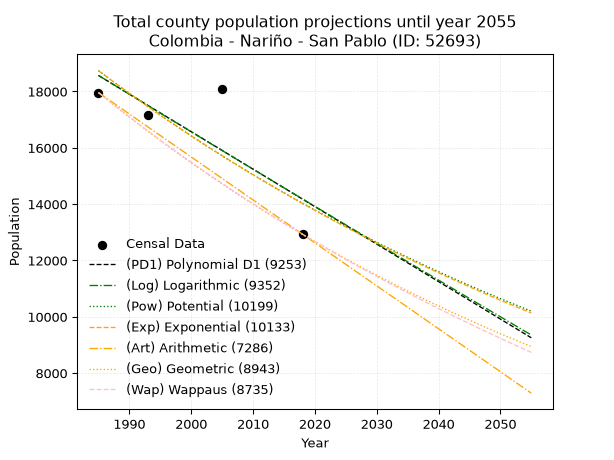
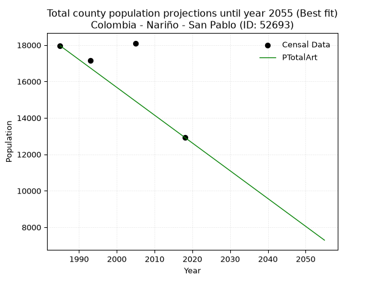
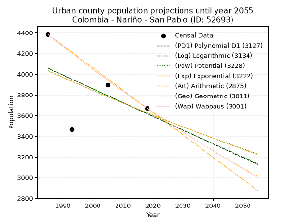
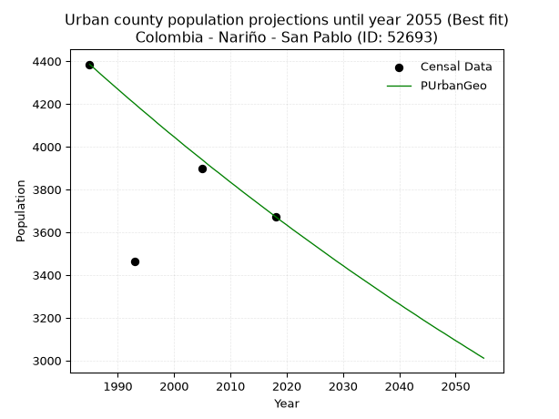
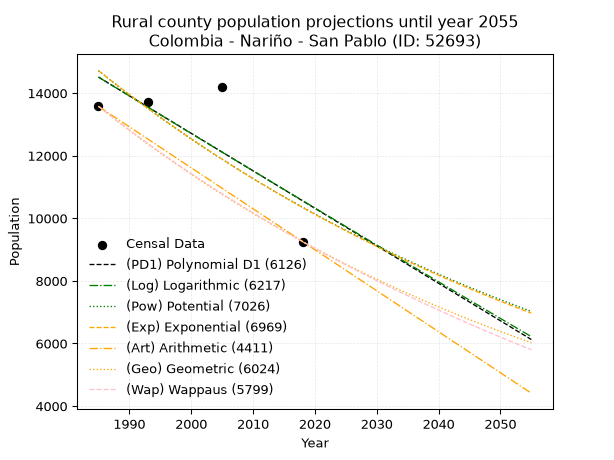
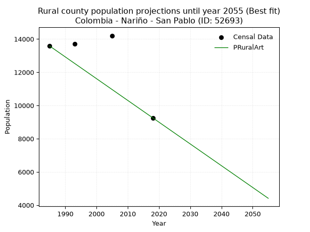

<div align="center">


</div>

# 📜 _“Population and Public Services Demand Projections (PPSD) until Year 2050 for Colombia - Nariño - San Pablo (ID: 52693)”_
Keywords: `population` `public-service` `projection` `lineal` `polynomial` `logarithmic` `potential` `exponential` `arithmetic` `geometric` `wappaus` `dane` `colombia` `south-america`

PPSD are analytical estimates used by governments and planners to anticipate future changes in population size, age distribution, and the resulting community needs for utilities, healthcare, education, and infrastructure as sizing future water treatment facilities, electrical grids, and road networks based on spatial growth.

<div align="center">

</img>

</div>


> **General running parameters**: • app_version: _v20260806_. • Python version: _3.14.7_. • Pandas version: _3.0.5_. • NumPy version: _2.5.1_. • Creates, save and include plots into reports (create_plot): _False_. • Projection until year: _2050_. • Process polynomial degree 2 and up: _False_. • Process Wappaus: _True_. • Process Wappaus: _True_. • Set negative values to zero: _True_. • Set infinite values to zero: _True_. • Drop dataset notes: _True_. 
<div align="center">

Maps & GIS Layers: [:earth_americas:Google](http://maps.google.com/maps?q=1.669428552,-77.0139843) [:earth_americas:OSM](https://www.openstreetmap.org/#map=18/1.669428552/-77.0139843&layers=P) [:earth_americas:Bing](https://www.bing.com/maps?cp=1.669428552~-77.0139843&lvl=18) [:earth_americas:Apple](https://maps.apple.com/frame?center=1.669428552%2C-77.0139843&span=0.003%2C0.006) [:earth_americas:GISMobile](https://github.com/rcfdtools/R.GISMobile/blob/main/file/gis/CountyLayer_CO/Readme.md)

</div>


<div align="center">

```geojson
{
  "type": "Feature",
  "geometry": {
    "type": "Point", 
    "coordinates": [-77.0139843, 1.669428552]
  }, 
  "properties": {
    "Name": "Colombia - Nariño - San Pablo (ID: 52693)"
  }
}
```

</div>


## 0. Census Data (4 records)

Census data are official statistics collected by a government about the people and housing in a country. They usually include counts of total population, age, sex, race, income, education, and jobs.

📅Global census file: [Population.xlsx](../data/Population.xlsx)

| Source   |   Year |   CountryID | CountryName   |   StateID | StateName   |   CountyID | CountyName   |   PTotal |   PUrban |   PRural |
|:---------|-------:|------------:|:--------------|----------:|:------------|-----------:|:-------------|---------:|---------:|---------:|
| DANE     |   1985 |          57 | Colombia      |        52 | Nariño      |      52693 | San Pablo    |    17962 |     4385 |    13577 |
| DANE     |   1993 |          57 | Colombia      |        52 | Nariño      |      52693 | San Pablo    |    17164 |     3465 |    13699 |
| DANE     |   2005 |          57 | Colombia      |        52 | Nariño      |      52693 | San Pablo    |    18103 |     3898 |    14205 |
| DANE     |   2018 |          57 | Colombia      |        52 | Nariño      |      52693 | San Pablo    |    12929 |     3673 |     9256 |

> 🔥Some records could had specific notes about the registered values or the corresponding urban or rural distribution.

📅[SUI-RUPS](https://www.datos.gov.co/Hacienda-y-Cr-dito-P-blico/Registro-nico-de-Prestadores-de-Servicios-P-blicos/4qkq-csdn/about_data) - Local public utility companies: [RUPS.csv](../data/RUPS.csv)

 | SERVICIO       | ESTADO    | NOMBRE                                                        | NIT         | DEPARTAMENTO_DOMICILIO   | MUNICIPIO_DOMICILIO   | DIRECCION                                            |   TELEFONO | EMAIL                 | TIPO_PRESTADOR                            | CLASIFICACION           |
|:---------------|:----------|:--------------------------------------------------------------|:------------|:-------------------------|:----------------------|:-----------------------------------------------------|-----------:|:----------------------|:------------------------------------------|:------------------------|
| ACUEDUCTO      | OPERATIVA | EMPRESA DE SERVICIOS PÚBLICOS MUNICIPALES DE SAN PABLO E.S.P. | 900068939-8 | NARINO                   | SAN PABLO             | Carrera 2ª Calle 1ª Centro de Desarrollo Comunitario |    7285223 | FREDJOJOA@HOTMAIL.COM | EMPRESA INDUSTRIAL Y COMERCIAL DEL ESTADO | HASTA 2500 SUSCRIPTORES |
| ALCANTARILLADO | OPERATIVA | EMPRESA DE SERVICIOS PÚBLICOS MUNICIPALES DE SAN PABLO E.S.P. | 900068939-8 | NARINO                   | SAN PABLO             | Carrera 2ª Calle 1ª Centro de Desarrollo Comunitario |    7285223 | FREDJOJOA@HOTMAIL.COM | EMPRESA INDUSTRIAL Y COMERCIAL DEL ESTADO | HASTA 2500 SUSCRIPTORES |

## 1. Total

### 1.1. Coefficients and Parameters

* (PD1) Polynomial Deg 1: -133.08791649939454, 282748.6049779139 (lineal)
* (Log) Logarithmic: -265988.4752796937, 2038320.0320988218
* (Pow) Potential: -17.552717489100353, 62.15742375103415
* (Exp) Exponential: -0.008782547599397296, 698151448036.5288
* (Art) Arithmetic: Year diff. 2018 - 1985 = 33, Population diff. 12929 - 17962 = -5033, Annual growth = -152.5151515151515
* (Geo) Geometric: Year diff. 2018 - 1985 = 33, Population diff. 12929 - 17962 = -5033, Annual growth % = -0.00991373069575785
* (Wap) Wappaus: i = -0.9874406883244409, Condition values only valid for < 200)

<sub>
Wappaus condition values: ['-0.00', '-0.99', '-1.97', '-2.96', '-3.95', '-4.94', '-5.92', '-6.91', '-7.90', '-8.89', '-9.87', '-10.86', '-11.85', '-12.84', '-13.82', '-14.81', '-15.80', '-16.79', '-17.77', '-18.76', '-19.75', '-20.74', '-21.72', '-22.71', '-23.70', '-24.69', '-25.67', '-26.66', '-27.65', '-28.64', '-29.62', '-30.61', '-31.60', '-32.59', '-33.57', '-34.56', '-35.55', '-36.54', '-37.52', '-38.51', '-39.50', '-40.49', '-41.47', '-42.46', '-43.45', '-44.43', '-45.42', '-46.41', '-47.40', '-48.38', '-49.37', '-50.36', '-51.35', '-52.33', '-53.32', '-54.31', '-55.30', '-56.28', '-57.27', '-58.26', '-59.25', '-60.23', '-61.22', '-62.21', '-63.20', '-64.18']
</sub>


### 1.2. Projected Dataset

|   Year |   CountyID |   PTotalPD1 |   PTotalLog |   PTotalPow |   PTotalExp |   PTotalArt |   PTotalGeo |   PTotalWap |
|-------:|-----------:|------------:|------------:|------------:|------------:|------------:|------------:|------------:|
|   1985 |      52693 |       18569 |       18570 |       18740 |       18739 |       17962 |       17962 |       17962 |
|   1986 |      52693 |       18436 |       18436 |       18575 |       18575 |       17809 |       17784 |       17786 |
|   1987 |      52693 |       18303 |       18302 |       18411 |       18412 |       17657 |       17608 |       17611 |
|   1988 |      52693 |       18170 |       18168 |       18250 |       18251 |       17504 |       17433 |       17438 |
|   1989 |      52693 |       18037 |       18035 |       18089 |       18092 |       17352 |       17260 |       17266 |
|   1990 |      52693 |       17904 |       17901 |       17930 |       17934 |       17199 |       17089 |       17097 |
|   1991 |      52693 |       17771 |       17767 |       17773 |       17777 |       17047 |       16920 |       16928 |
|   1992 |      52693 |       17637 |       17634 |       17617 |       17621 |       16894 |       16752 |       16762 |
|   1993 |      52693 |       17504 |       17500 |       17462 |       17467 |       16742 |       16586 |       16597 |
|   1994 |      52693 |       17371 |       17367 |       17309 |       17315 |       16589 |       16421 |       16434 |
|   1995 |      52693 |       17238 |       17233 |       17158 |       17163 |       16437 |       16259 |       16272 |
|   1996 |      52693 |       17105 |       17100 |       17007 |       17013 |       16284 |       16097 |       16111 |
|   1997 |      52693 |       16972 |       16967 |       16859 |       16864 |       16132 |       15938 |       15953 |
|   1998 |      52693 |       16839 |       16834 |       16711 |       16717 |       15979 |       15780 |       15795 |
|   1999 |      52693 |       16706 |       16701 |       16565 |       16571 |       15827 |       15623 |       15639 |
|   2000 |      52693 |       16573 |       16568 |       16420 |       16426 |       15674 |       15469 |       15485 |
|   2001 |      52693 |       16440 |       16435 |       16277 |       16282 |       15522 |       15315 |       15332 |
|   2002 |      52693 |       16307 |       16302 |       16135 |       16140 |       15369 |       15163 |       15180 |
|   2003 |      52693 |       16174 |       16169 |       15994 |       15999 |       15217 |       15013 |       15030 |
|   2004 |      52693 |       16040 |       16036 |       15854 |       15859 |       15064 |       14864 |       14881 |
|   2005 |      52693 |       15907 |       15903 |       15716 |       15720 |       14912 |       14717 |       14734 |
|   2006 |      52693 |       15774 |       15771 |       15579 |       15583 |       14759 |       14571 |       14587 |
|   2007 |      52693 |       15641 |       15638 |       15443 |       15446 |       14607 |       14427 |       14442 |
|   2008 |      52693 |       15508 |       15506 |       15309 |       15311 |       14454 |       14283 |       14299 |
|   2009 |      52693 |       15375 |       15373 |       15176 |       15177 |       14302 |       14142 |       14156 |
|   2010 |      52693 |       15242 |       15241 |       15044 |       15045 |       14149 |       14002 |       14015 |
|   2011 |      52693 |       15109 |       15109 |       14913 |       14913 |       13997 |       13863 |       13875 |
|   2012 |      52693 |       14976 |       14976 |       14783 |       14783 |       13844 |       13725 |       13736 |
|   2013 |      52693 |       14843 |       14844 |       14655 |       14653 |       13692 |       13589 |       13599 |
|   2014 |      52693 |       14710 |       14712 |       14528 |       14525 |       13539 |       13455 |       13463 |
|   2015 |      52693 |       14576 |       14580 |       14402 |       14398 |       13387 |       13321 |       13328 |
|   2016 |      52693 |       14443 |       14448 |       14277 |       14272 |       13234 |       13189 |       13194 |
|   2017 |      52693 |       14310 |       14316 |       14153 |       14148 |       13082 |       13058 |       13061 |
|   2018 |      52693 |       14177 |       14184 |       14031 |       14024 |       12929 |       12929 |       12929 |
|   2019 |      52693 |       14044 |       14053 |       13909 |       13901 |       12776 |       12801 |       12798 |
|   2020 |      52693 |       13911 |       13921 |       13789 |       13780 |       12624 |       12674 |       12669 |
|   2021 |      52693 |       13778 |       13789 |       13669 |       13659 |       12471 |       12548 |       12541 |
|   2022 |      52693 |       13645 |       13658 |       13551 |       13540 |       12319 |       12424 |       12413 |
|   2023 |      52693 |       13512 |       13526 |       13434 |       13421 |       12166 |       12301 |       12287 |
|   2024 |      52693 |       13379 |       13395 |       13318 |       13304 |       12014 |       12179 |       12162 |
|   2025 |      52693 |       13246 |       13263 |       13203 |       13188 |       11861 |       12058 |       12037 |
|   2026 |      52693 |       13112 |       13132 |       13089 |       13072 |       11709 |       11938 |       11914 |
|   2027 |      52693 |       12979 |       13001 |       12976 |       12958 |       11556 |       11820 |       11792 |
|   2028 |      52693 |       12846 |       12870 |       12865 |       12845 |       11404 |       11703 |       11671 |
|   2029 |      52693 |       12713 |       12738 |       12754 |       12732 |       11251 |       11587 |       11551 |
|   2030 |      52693 |       12580 |       12607 |       12644 |       12621 |       11099 |       11472 |       11432 |
|   2031 |      52693 |       12447 |       12476 |       12535 |       12511 |       10946 |       11358 |       11313 |
|   2032 |      52693 |       12314 |       12345 |       12427 |       12401 |       10794 |       11246 |       11196 |
|   2033 |      52693 |       12181 |       12215 |       12320 |       12293 |       10641 |       11134 |       11080 |
|   2034 |      52693 |       12048 |       12084 |       12214 |       12185 |       10489 |       11024 |       10964 |
|   2035 |      52693 |       11915 |       11953 |       12110 |       12079 |       10336 |       10915 |       10850 |
|   2036 |      52693 |       11782 |       11822 |       12006 |       11973 |       10184 |       10806 |       10736 |
|   2037 |      52693 |       11649 |       11692 |       11903 |       11869 |       10031 |       10699 |       10623 |
|   2038 |      52693 |       11515 |       11561 |       11800 |       11765 |        9879 |       10593 |       10511 |
|   2039 |      52693 |       11382 |       11431 |       11699 |       11662 |        9726 |       10488 |       10400 |
|   2040 |      52693 |       11249 |       11300 |       11599 |       11560 |        9574 |       10384 |       10290 |
|   2041 |      52693 |       11116 |       11170 |       11500 |       11459 |        9421 |       10281 |       10181 |
|   2042 |      52693 |       10983 |       11040 |       11401 |       11359 |        9269 |       10179 |       10073 |
|   2043 |      52693 |       10850 |       10909 |       11304 |       11259 |        9116 |       10078 |        9965 |
|   2044 |      52693 |       10717 |       10779 |       11207 |       11161 |        8964 |        9978 |        9858 |
|   2045 |      52693 |       10584 |       10649 |       11111 |       11063 |        8811 |        9880 |        9752 |
|   2046 |      52693 |       10451 |       10519 |       11016 |       10967 |        8659 |        9782 |        9647 |
|   2047 |      52693 |       10318 |       10389 |       10922 |       10871 |        8506 |        9685 |        9543 |
|   2048 |      52693 |       10185 |       10259 |       10829 |       10776 |        8354 |        9589 |        9439 |
|   2049 |      52693 |       10051 |       10129 |       10737 |       10681 |        8201 |        9494 |        9336 |
|   2050 |      52693 |        9918 |       10000 |       10645 |       10588 |        8049 |        9399 |        9234 |
<div align="center">

</img>

</div>


### 1.3. Best fit with absolute and relative error (%)

Relative error puts that difference into context by dividing the absolute error by the true value, creating a unitless ratio or percentage that shows the scale of the mistake.

Absolute and relative error

|   Year | Source   |   CountryID | CountryName   |   StateID | StateName   |   CountyID_x | CountyName   |   PTotal |   PUrban |   PRural |   CountyID_y |   PTotalPD1 |   PTotalLog |   PTotalPow |   PTotalExp |   PTotalArt |   PTotalGeo |   PTotalWap |   PTotalPD1AbsError |   PTotalLogAbsError |   PTotalPowAbsError |   PTotalExpAbsError |   PTotalArtAbsError |   PTotalGeoAbsError |   PTotalWapAbsError |   PTotalPD1RelError |   PTotalLogRelError |   PTotalPowRelError |   PTotalExpRelError |   PTotalArtRelError |   PTotalGeoRelError |   PTotalWapRelError |
|-------:|:---------|------------:|:--------------|----------:|:------------|-------------:|:-------------|---------:|---------:|---------:|-------------:|------------:|------------:|------------:|------------:|------------:|------------:|------------:|--------------------:|--------------------:|--------------------:|--------------------:|--------------------:|--------------------:|--------------------:|--------------------:|--------------------:|--------------------:|--------------------:|--------------------:|--------------------:|--------------------:|
|   1985 | DANE     |          57 | Colombia      |        52 | Nariño      |        52693 | San Pablo    |    17962 |     4385 |    13577 |        52693 |       18569 |       18570 |       18740 |       18739 |       17962 |       17962 |       17962 |                 607 |                 608 |                 778 |                 777 |                   0 |                   0 |                   0 |             3.37936 |             3.38492 |             4.33137 |             4.3258  |             0       |             0       |             0       |
|   1993 | DANE     |          57 | Colombia      |        52 | Nariño      |        52693 | San Pablo    |    17164 |     3465 |    13699 |        52693 |       17504 |       17500 |       17462 |       17467 |       16742 |       16586 |       16597 |                 340 |                 336 |                 298 |                 303 |                 422 |                 578 |                 567 |             1.98089 |             1.95759 |             1.73619 |             1.76532 |             2.45863 |             3.36751 |             3.30343 |
|   2005 | DANE     |          57 | Colombia      |        52 | Nariño      |        52693 | San Pablo    |    18103 |     3898 |    14205 |        52693 |       15907 |       15903 |       15716 |       15720 |       14912 |       14717 |       14734 |                2196 |                2200 |                2387 |                2383 |                3191 |                3386 |                3369 |            12.1306  |            12.1527  |            13.1857  |            13.1636  |            17.6269  |            18.7041  |            18.6102  |
|   2018 | DANE     |          57 | Colombia      |        52 | Nariño      |        52693 | San Pablo    |    12929 |     3673 |     9256 |        52693 |       14177 |       14184 |       14031 |       14024 |       12929 |       12929 |       12929 |                1248 |                1255 |                1102 |                1095 |                   0 |                   0 |                   0 |             9.65272 |             9.70686 |             8.52347 |             8.46933 |             0       |             0       |             0       |

Relative error mean

| Method    |   RelError | Best   |
|:----------|-----------:|:-------|
| PTotalPD1 |    6.78589 |        |
| PTotalLog |    6.80051 |        |
| PTotalPow |    6.94417 |        |
| PTotalExp |    6.931   |        |
| PTotalArt |    5.02139 | True   |
| PTotalGeo |    5.5179  |        |
| PTotalWap |    5.4784  |        |

💙Best method: _**PTotalArt**_
<div align="center">

</img>

</div>


### 1.4. Fresh water supply demand in liters per capita per day (lpcd)

The fresh water supply demand typically ranges from 100 to 300 liters per capita per day (lpcd) for standard domestic and municipal planning, though absolute survival minimums set by the World Health Organization are as low as 7.5 to 20 liters per day, and total consumption in high-income nations can exceed 400 liters.

> `CZ`: Level in meters above the sea level (masl)<br> `WS`: Fresh water supply demand in liters per capita per day (lpcd or l/h/d)<br> `WSAll`: Zonal fresh water supply demand in liters per second (l/s)<br> `A`: Zonal area in square meters<br> `DP`: Population density (people/hectare or p/ha)

Reference values (RAS Colombia)

|    CZ |   WS |
|------:|-----:|
|  1000 |  120 |
|  2000 |  130 |
| 99999 |  140 |

County shapefile geometry properties and water supply values

|   CountyID |      ATotal |   CZTotal |   WSTotal |
|-----------:|------------:|----------:|----------:|
|      52693 | 1.11934e+08 |      2300 |       140 |

Projected values for best method: PTotalArt

|   CountyID |   Year |   PTotalArt |   DPTotal |   WSTotal |   WSTotalAll |
|-----------:|-------:|------------:|----------:|----------:|-------------:|
|      52693 |   1985 |       17962 |      1.6  |       140 |      29.1051 |
|      52693 |   1986 |       17809 |      1.59 |       140 |      28.8572 |
|      52693 |   1987 |       17657 |      1.58 |       140 |      28.6109 |
|      52693 |   1988 |       17504 |      1.56 |       140 |      28.363  |
|      52693 |   1989 |       17352 |      1.55 |       140 |      28.1167 |
|      52693 |   1990 |       17199 |      1.54 |       140 |      27.8687 |
|      52693 |   1991 |       17047 |      1.52 |       140 |      27.6225 |
|      52693 |   1992 |       16894 |      1.51 |       140 |      27.3745 |
|      52693 |   1993 |       16742 |      1.5  |       140 |      27.1282 |
|      52693 |   1994 |       16589 |      1.48 |       140 |      26.8803 |
|      52693 |   1995 |       16437 |      1.47 |       140 |      26.634  |
|      52693 |   1996 |       16284 |      1.45 |       140 |      26.3861 |
|      52693 |   1997 |       16132 |      1.44 |       140 |      26.1398 |
|      52693 |   1998 |       15979 |      1.43 |       140 |      25.8919 |
|      52693 |   1999 |       15827 |      1.41 |       140 |      25.6456 |
|      52693 |   2000 |       15674 |      1.4  |       140 |      25.3977 |
|      52693 |   2001 |       15522 |      1.39 |       140 |      25.1514 |
|      52693 |   2002 |       15369 |      1.37 |       140 |      24.9035 |
|      52693 |   2003 |       15217 |      1.36 |       140 |      24.6572 |
|      52693 |   2004 |       15064 |      1.35 |       140 |      24.4093 |
|      52693 |   2005 |       14912 |      1.33 |       140 |      24.163  |
|      52693 |   2006 |       14759 |      1.32 |       140 |      23.915  |
|      52693 |   2007 |       14607 |      1.3  |       140 |      23.6687 |
|      52693 |   2008 |       14454 |      1.29 |       140 |      23.4208 |
|      52693 |   2009 |       14302 |      1.28 |       140 |      23.1745 |
|      52693 |   2010 |       14149 |      1.26 |       140 |      22.9266 |
|      52693 |   2011 |       13997 |      1.25 |       140 |      22.6803 |
|      52693 |   2012 |       13844 |      1.24 |       140 |      22.4324 |
|      52693 |   2013 |       13692 |      1.22 |       140 |      22.1861 |
|      52693 |   2014 |       13539 |      1.21 |       140 |      21.9382 |
|      52693 |   2015 |       13387 |      1.2  |       140 |      21.6919 |
|      52693 |   2016 |       13234 |      1.18 |       140 |      21.444  |
|      52693 |   2017 |       13082 |      1.17 |       140 |      21.1977 |
|      52693 |   2018 |       12929 |      1.16 |       140 |      20.9498 |
|      52693 |   2019 |       12776 |      1.14 |       140 |      20.7019 |
|      52693 |   2020 |       12624 |      1.13 |       140 |      20.4556 |
|      52693 |   2021 |       12471 |      1.11 |       140 |      20.2076 |
|      52693 |   2022 |       12319 |      1.1  |       140 |      19.9613 |
|      52693 |   2023 |       12166 |      1.09 |       140 |      19.7134 |
|      52693 |   2024 |       12014 |      1.07 |       140 |      19.4671 |
|      52693 |   2025 |       11861 |      1.06 |       140 |      19.2192 |
|      52693 |   2026 |       11709 |      1.05 |       140 |      18.9729 |
|      52693 |   2027 |       11556 |      1.03 |       140 |      18.725  |
|      52693 |   2028 |       11404 |      1.02 |       140 |      18.4787 |
|      52693 |   2029 |       11251 |      1.01 |       140 |      18.2308 |
|      52693 |   2030 |       11099 |      0.99 |       140 |      17.9845 |
|      52693 |   2031 |       10946 |      0.98 |       140 |      17.7366 |
|      52693 |   2032 |       10794 |      0.96 |       140 |      17.4903 |
|      52693 |   2033 |       10641 |      0.95 |       140 |      17.2424 |
|      52693 |   2034 |       10489 |      0.94 |       140 |      16.9961 |
|      52693 |   2035 |       10336 |      0.92 |       140 |      16.7481 |
|      52693 |   2036 |       10184 |      0.91 |       140 |      16.5019 |
|      52693 |   2037 |       10031 |      0.9  |       140 |      16.2539 |
|      52693 |   2038 |        9879 |      0.88 |       140 |      16.0076 |
|      52693 |   2039 |        9726 |      0.87 |       140 |      15.7597 |
|      52693 |   2040 |        9574 |      0.86 |       140 |      15.5134 |
|      52693 |   2041 |        9421 |      0.84 |       140 |      15.2655 |
|      52693 |   2042 |        9269 |      0.83 |       140 |      15.0192 |
|      52693 |   2043 |        9116 |      0.81 |       140 |      14.7713 |
|      52693 |   2044 |        8964 |      0.8  |       140 |      14.525  |
|      52693 |   2045 |        8811 |      0.79 |       140 |      14.2771 |
|      52693 |   2046 |        8659 |      0.77 |       140 |      14.0308 |
|      52693 |   2047 |        8506 |      0.76 |       140 |      13.7829 |
|      52693 |   2048 |        8354 |      0.75 |       140 |      13.5366 |
|      52693 |   2049 |        8201 |      0.73 |       140 |      13.2887 |
|      52693 |   2050 |        8049 |      0.72 |       140 |      13.0424 |

## 2. Urban

### 2.1. Coefficients and Parameters

* (PD1) Polynomial Deg 1: -13.297872340425416, 30454.319148935938 (lineal)
* (Log) Logarithmic: -26673.59147615316, 206601.43255898755
* (Pow) Potential: -6.432564399738135, 24.818766810922252
* (Exp) Exponential: -0.0032066650565236183, 2344260.86705126
* (Art) Arithmetic: Year diff. 2018 - 1985 = 33, Population diff. 3673 - 4385 = -712, Annual growth = -21.575757575757574
* (Geo) Geometric: Year diff. 2018 - 1985 = 33, Population diff. 3673 - 4385 = -712, Annual growth % = -0.005354728992342683
* (Wap) Wappaus: i = -0.5355114811555616, Condition values only valid for < 200)

<sub>
Wappaus condition values: ['-0.00', '-0.54', '-1.07', '-1.61', '-2.14', '-2.68', '-3.21', '-3.75', '-4.28', '-4.82', '-5.36', '-5.89', '-6.43', '-6.96', '-7.50', '-8.03', '-8.57', '-9.10', '-9.64', '-10.17', '-10.71', '-11.25', '-11.78', '-12.32', '-12.85', '-13.39', '-13.92', '-14.46', '-14.99', '-15.53', '-16.07', '-16.60', '-17.14', '-17.67', '-18.21', '-18.74', '-19.28', '-19.81', '-20.35', '-20.88', '-21.42', '-21.96', '-22.49', '-23.03', '-23.56', '-24.10', '-24.63', '-25.17', '-25.70', '-26.24', '-26.78', '-27.31', '-27.85', '-28.38', '-28.92', '-29.45', '-29.99', '-30.52', '-31.06', '-31.60', '-32.13', '-32.67', '-33.20', '-33.74', '-34.27', '-34.81']
</sub>


### 2.2. Projected Dataset

|   Year |   CountyID |   PUrbanPD1 |   PUrbanLog |   PUrbanPow |   PUrbanExp |   PUrbanArt |   PUrbanGeo |   PUrbanWap |
|-------:|-----------:|------------:|------------:|------------:|------------:|------------:|------------:|------------:|
|   1985 |      52693 |        4058 |        4059 |        4034 |        4033 |        4385 |        4385 |        4385 |
|   1986 |      52693 |        4045 |        4045 |        4021 |        4020 |        4363 |        4362 |        4362 |
|   1987 |      52693 |        4031 |        4032 |        4008 |        4007 |        4342 |        4338 |        4338 |
|   1988 |      52693 |        4018 |        4019 |        3995 |        3994 |        4320 |        4315 |        4315 |
|   1989 |      52693 |        4005 |        4005 |        3982 |        3982 |        4299 |        4292 |        4292 |
|   1990 |      52693 |        3992 |        3992 |        3969 |        3969 |        4277 |        4269 |        4269 |
|   1991 |      52693 |        3978 |        3978 |        3956 |        3956 |        4256 |        4246 |        4246 |
|   1992 |      52693 |        3965 |        3965 |        3943 |        3943 |        4234 |        4223 |        4224 |
|   1993 |      52693 |        3952 |        3952 |        3931 |        3931 |        4212 |        4201 |        4201 |
|   1994 |      52693 |        3938 |        3938 |        3918 |        3918 |        4191 |        4178 |        4179 |
|   1995 |      52693 |        3925 |        3925 |        3905 |        3906 |        4169 |        4156 |        4156 |
|   1996 |      52693 |        3912 |        3911 |        3893 |        3893 |        4148 |        4134 |        4134 |
|   1997 |      52693 |        3898 |        3898 |        3880 |        3881 |        4126 |        4111 |        4112 |
|   1998 |      52693 |        3885 |        3885 |        3868 |        3868 |        4105 |        4089 |        4090 |
|   1999 |      52693 |        3872 |        3871 |        3855 |        3856 |        4083 |        4067 |        4068 |
|   2000 |      52693 |        3859 |        3858 |        3843 |        3844 |        4061 |        4046 |        4046 |
|   2001 |      52693 |        3845 |        3845 |        3831 |        3831 |        4040 |        4024 |        4025 |
|   2002 |      52693 |        3832 |        3831 |        3818 |        3819 |        4018 |        4002 |        4003 |
|   2003 |      52693 |        3819 |        3818 |        3806 |        3807 |        3997 |        3981 |        3982 |
|   2004 |      52693 |        3805 |        3805 |        3794 |        3795 |        3975 |        3960 |        3960 |
|   2005 |      52693 |        3792 |        3791 |        3782 |        3782 |        3953 |        3939 |        3939 |
|   2006 |      52693 |        3779 |        3778 |        3770 |        3770 |        3932 |        3917 |        3918 |
|   2007 |      52693 |        3765 |        3765 |        3758 |        3758 |        3910 |        3896 |        3897 |
|   2008 |      52693 |        3752 |        3752 |        3746 |        3746 |        3889 |        3876 |        3876 |
|   2009 |      52693 |        3739 |        3738 |        3734 |        3734 |        3867 |        3855 |        3855 |
|   2010 |      52693 |        3726 |        3725 |        3722 |        3722 |        3846 |        3834 |        3835 |
|   2011 |      52693 |        3712 |        3712 |        3710 |        3710 |        3824 |        3814 |        3814 |
|   2012 |      52693 |        3699 |        3699 |        3698 |        3698 |        3802 |        3793 |        3794 |
|   2013 |      52693 |        3686 |        3685 |        3686 |        3687 |        3781 |        3773 |        3773 |
|   2014 |      52693 |        3672 |        3672 |        3674 |        3675 |        3759 |        3753 |        3753 |
|   2015 |      52693 |        3659 |        3659 |        3663 |        3663 |        3738 |        3733 |        3733 |
|   2016 |      52693 |        3646 |        3646 |        3651 |        3651 |        3716 |        3713 |        3713 |
|   2017 |      52693 |        3633 |        3632 |        3639 |        3640 |        3695 |        3693 |        3693 |
|   2018 |      52693 |        3619 |        3619 |        3628 |        3628 |        3673 |        3673 |        3673 |
|   2019 |      52693 |        3606 |        3606 |        3616 |        3616 |        3651 |        3653 |        3653 |
|   2020 |      52693 |        3593 |        3593 |        3605 |        3605 |        3630 |        3634 |        3634 |
|   2021 |      52693 |        3579 |        3579 |        3593 |        3593 |        3608 |        3614 |        3614 |
|   2022 |      52693 |        3566 |        3566 |        3582 |        3582 |        3587 |        3595 |        3594 |
|   2023 |      52693 |        3553 |        3553 |        3571 |        3570 |        3565 |        3576 |        3575 |
|   2024 |      52693 |        3539 |        3540 |        3559 |        3559 |        3544 |        3557 |        3556 |
|   2025 |      52693 |        3526 |        3527 |        3548 |        3547 |        3522 |        3538 |        3537 |
|   2026 |      52693 |        3513 |        3514 |        3537 |        3536 |        3500 |        3519 |        3517 |
|   2027 |      52693 |        3500 |        3500 |        3525 |        3525 |        3479 |        3500 |        3498 |
|   2028 |      52693 |        3486 |        3487 |        3514 |        3513 |        3457 |        3481 |        3480 |
|   2029 |      52693 |        3473 |        3474 |        3503 |        3502 |        3436 |        3462 |        3461 |
|   2030 |      52693 |        3460 |        3461 |        3492 |        3491 |        3414 |        3444 |        3442 |
|   2031 |      52693 |        3446 |        3448 |        3481 |        3480 |        3393 |        3425 |        3423 |
|   2032 |      52693 |        3433 |        3435 |        3470 |        3469 |        3371 |        3407 |        3405 |
|   2033 |      52693 |        3420 |        3422 |        3459 |        3458 |        3349 |        3389 |        3386 |
|   2034 |      52693 |        3406 |        3408 |        3448 |        3447 |        3328 |        3371 |        3368 |
|   2035 |      52693 |        3393 |        3395 |        3437 |        3435 |        3306 |        3353 |        3350 |
|   2036 |      52693 |        3380 |        3382 |        3426 |        3424 |        3285 |        3335 |        3331 |
|   2037 |      52693 |        3367 |        3369 |        3416 |        3414 |        3263 |        3317 |        3313 |
|   2038 |      52693 |        3353 |        3356 |        3405 |        3403 |        3241 |        3299 |        3295 |
|   2039 |      52693 |        3340 |        3343 |        3394 |        3392 |        3220 |        3281 |        3277 |
|   2040 |      52693 |        3327 |        3330 |        3383 |        3381 |        3198 |        3264 |        3259 |
|   2041 |      52693 |        3313 |        3317 |        3373 |        3370 |        3177 |        3246 |        3241 |
|   2042 |      52693 |        3300 |        3304 |        3362 |        3359 |        3155 |        3229 |        3224 |
|   2043 |      52693 |        3287 |        3291 |        3352 |        3348 |        3134 |        3212 |        3206 |
|   2044 |      52693 |        3273 |        3278 |        3341 |        3338 |        3112 |        3194 |        3189 |
|   2045 |      52693 |        3260 |        3265 |        3331 |        3327 |        3090 |        3177 |        3171 |
|   2046 |      52693 |        3247 |        3252 |        3320 |        3316 |        3069 |        3160 |        3154 |
|   2047 |      52693 |        3234 |        3238 |        3310 |        3306 |        3047 |        3143 |        3136 |
|   2048 |      52693 |        3220 |        3225 |        3299 |        3295 |        3026 |        3127 |        3119 |
|   2049 |      52693 |        3207 |        3212 |        3289 |        3285 |        3004 |        3110 |        3102 |
|   2050 |      52693 |        3194 |        3199 |        3279 |        3274 |        2983 |        3093 |        3085 |
<div align="center">

</img>

</div>


### 2.3. Best fit with absolute and relative error (%)

Relative error puts that difference into context by dividing the absolute error by the true value, creating a unitless ratio or percentage that shows the scale of the mistake.

Absolute and relative error

|   Year | Source   |   CountryID | CountryName   |   StateID | StateName   |   CountyID_x | CountyName   |   PTotal |   PUrban |   PRural |   CountyID_y |   PUrbanPD1 |   PUrbanLog |   PUrbanPow |   PUrbanExp |   PUrbanArt |   PUrbanGeo |   PUrbanWap |   PUrbanPD1AbsError |   PUrbanLogAbsError |   PUrbanPowAbsError |   PUrbanExpAbsError |   PUrbanArtAbsError |   PUrbanGeoAbsError |   PUrbanWapAbsError |   PUrbanPD1RelError |   PUrbanLogRelError |   PUrbanPowRelError |   PUrbanExpRelError |   PUrbanArtRelError |   PUrbanGeoRelError |   PUrbanWapRelError |
|-------:|:---------|------------:|:--------------|----------:|:------------|-------------:|:-------------|---------:|---------:|---------:|-------------:|------------:|------------:|------------:|------------:|------------:|------------:|------------:|--------------------:|--------------------:|--------------------:|--------------------:|--------------------:|--------------------:|--------------------:|--------------------:|--------------------:|--------------------:|--------------------:|--------------------:|--------------------:|--------------------:|
|   1985 | DANE     |          57 | Colombia      |        52 | Nariño      |        52693 | San Pablo    |    17962 |     4385 |    13577 |        52693 |        4058 |        4059 |        4034 |        4033 |        4385 |        4385 |        4385 |                 327 |                 326 |                 351 |                 352 |                   0 |                   0 |                   0 |             7.45724 |             7.43444 |             8.00456 |             8.02737 |             0       |             0       |             0       |
|   1993 | DANE     |          57 | Colombia      |        52 | Nariño      |        52693 | San Pablo    |    17164 |     3465 |    13699 |        52693 |        3952 |        3952 |        3931 |        3931 |        4212 |        4201 |        4201 |                 487 |                 487 |                 466 |                 466 |                 747 |                 736 |                 736 |            14.0548  |            14.0548  |            13.4488  |            13.4488  |            21.5584  |            21.241   |            21.241   |
|   2005 | DANE     |          57 | Colombia      |        52 | Nariño      |        52693 | San Pablo    |    18103 |     3898 |    14205 |        52693 |        3792 |        3791 |        3782 |        3782 |        3953 |        3939 |        3939 |                 106 |                 107 |                 116 |                 116 |                  55 |                  41 |                  41 |             2.71934 |             2.745   |             2.97589 |             2.97589 |             1.41098 |             1.05182 |             1.05182 |
|   2018 | DANE     |          57 | Colombia      |        52 | Nariño      |        52693 | San Pablo    |    12929 |     3673 |     9256 |        52693 |        3619 |        3619 |        3628 |        3628 |        3673 |        3673 |        3673 |                  54 |                  54 |                  45 |                  45 |                   0 |                   0 |                   0 |             1.47019 |             1.47019 |             1.22516 |             1.22516 |             0       |             0       |             0       |

Relative error mean

| Method    |   RelError | Best   |
|:----------|-----------:|:-------|
| PUrbanPD1 |    6.4254  |        |
| PUrbanLog |    6.42611 |        |
| PUrbanPow |    6.41359 |        |
| PUrbanExp |    6.4193  |        |
| PUrbanArt |    5.74236 |        |
| PUrbanGeo |    5.5732  | True   |
| PUrbanWap |    5.5732  | True   |

💙Best method: _**PUrbanGeo**_
<div align="center">

</img>

</div>


### 2.4. Fresh water supply demand in liters per capita per day (lpcd)

The fresh water supply demand typically ranges from 100 to 300 liters per capita per day (lpcd) for standard domestic and municipal planning, though absolute survival minimums set by the World Health Organization are as low as 7.5 to 20 liters per day, and total consumption in high-income nations can exceed 400 liters.

> `CZ`: Level in meters above the sea level (masl)<br> `WS`: Fresh water supply demand in liters per capita per day (lpcd or l/h/d)<br> `WSAll`: Zonal fresh water supply demand in liters per second (l/s)<br> `A`: Zonal area in square meters<br> `DP`: Population density (people/hectare or p/ha)

Reference values (RAS Colombia)

|    CZ |   WS |
|------:|-----:|
|  1000 |  120 |
|  2000 |  130 |
| 99999 |  140 |

County shapefile geometry properties and water supply values

|   CountyID |   AUrban |   CZUrban |   WSUrban |
|-----------:|---------:|----------:|----------:|
|      52693 |   862117 |   1701.27 |       130 |

Projected values for best method: PUrbanGeo

|   CountyID |   Year |   PUrbanGeo |   DPUrban |   WSUrban |   WSUrbanAll |
|-----------:|-------:|------------:|----------:|----------:|-------------:|
|      52693 |   1985 |        4385 |     50.86 |       130 |      6.5978  |
|      52693 |   1986 |        4362 |     50.6  |       130 |      6.56319 |
|      52693 |   1987 |        4338 |     50.32 |       130 |      6.52708 |
|      52693 |   1988 |        4315 |     50.05 |       130 |      6.49248 |
|      52693 |   1989 |        4292 |     49.78 |       130 |      6.45787 |
|      52693 |   1990 |        4269 |     49.52 |       130 |      6.42326 |
|      52693 |   1991 |        4246 |     49.25 |       130 |      6.38866 |
|      52693 |   1992 |        4223 |     48.98 |       130 |      6.35405 |
|      52693 |   1993 |        4201 |     48.73 |       130 |      6.32095 |
|      52693 |   1994 |        4178 |     48.46 |       130 |      6.28634 |
|      52693 |   1995 |        4156 |     48.21 |       130 |      6.25324 |
|      52693 |   1996 |        4134 |     47.95 |       130 |      6.22014 |
|      52693 |   1997 |        4111 |     47.68 |       130 |      6.18553 |
|      52693 |   1998 |        4089 |     47.43 |       130 |      6.15243 |
|      52693 |   1999 |        4067 |     47.17 |       130 |      6.11933 |
|      52693 |   2000 |        4046 |     46.93 |       130 |      6.08773 |
|      52693 |   2001 |        4024 |     46.68 |       130 |      6.05463 |
|      52693 |   2002 |        4002 |     46.42 |       130 |      6.02153 |
|      52693 |   2003 |        3981 |     46.18 |       130 |      5.98993 |
|      52693 |   2004 |        3960 |     45.93 |       130 |      5.95833 |
|      52693 |   2005 |        3939 |     45.69 |       130 |      5.92674 |
|      52693 |   2006 |        3917 |     45.43 |       130 |      5.89363 |
|      52693 |   2007 |        3896 |     45.19 |       130 |      5.86204 |
|      52693 |   2008 |        3876 |     44.96 |       130 |      5.83194 |
|      52693 |   2009 |        3855 |     44.72 |       130 |      5.80035 |
|      52693 |   2010 |        3834 |     44.47 |       130 |      5.76875 |
|      52693 |   2011 |        3814 |     44.24 |       130 |      5.73866 |
|      52693 |   2012 |        3793 |     44    |       130 |      5.70706 |
|      52693 |   2013 |        3773 |     43.76 |       130 |      5.67697 |
|      52693 |   2014 |        3753 |     43.53 |       130 |      5.64687 |
|      52693 |   2015 |        3733 |     43.3  |       130 |      5.61678 |
|      52693 |   2016 |        3713 |     43.07 |       130 |      5.58669 |
|      52693 |   2017 |        3693 |     42.84 |       130 |      5.5566  |
|      52693 |   2018 |        3673 |     42.6  |       130 |      5.5265  |
|      52693 |   2019 |        3653 |     42.37 |       130 |      5.49641 |
|      52693 |   2020 |        3634 |     42.15 |       130 |      5.46782 |
|      52693 |   2021 |        3614 |     41.92 |       130 |      5.43773 |
|      52693 |   2022 |        3595 |     41.7  |       130 |      5.40914 |
|      52693 |   2023 |        3576 |     41.48 |       130 |      5.38056 |
|      52693 |   2024 |        3557 |     41.26 |       130 |      5.35197 |
|      52693 |   2025 |        3538 |     41.04 |       130 |      5.32338 |
|      52693 |   2026 |        3519 |     40.82 |       130 |      5.29479 |
|      52693 |   2027 |        3500 |     40.6  |       130 |      5.2662  |
|      52693 |   2028 |        3481 |     40.38 |       130 |      5.23762 |
|      52693 |   2029 |        3462 |     40.16 |       130 |      5.20903 |
|      52693 |   2030 |        3444 |     39.95 |       130 |      5.18194 |
|      52693 |   2031 |        3425 |     39.73 |       130 |      5.15336 |
|      52693 |   2032 |        3407 |     39.52 |       130 |      5.12627 |
|      52693 |   2033 |        3389 |     39.31 |       130 |      5.09919 |
|      52693 |   2034 |        3371 |     39.1  |       130 |      5.07211 |
|      52693 |   2035 |        3353 |     38.89 |       130 |      5.04502 |
|      52693 |   2036 |        3335 |     38.68 |       130 |      5.01794 |
|      52693 |   2037 |        3317 |     38.48 |       130 |      4.99086 |
|      52693 |   2038 |        3299 |     38.27 |       130 |      4.96377 |
|      52693 |   2039 |        3281 |     38.06 |       130 |      4.93669 |
|      52693 |   2040 |        3264 |     37.86 |       130 |      4.91111 |
|      52693 |   2041 |        3246 |     37.65 |       130 |      4.88403 |
|      52693 |   2042 |        3229 |     37.45 |       130 |      4.85845 |
|      52693 |   2043 |        3212 |     37.26 |       130 |      4.83287 |
|      52693 |   2044 |        3194 |     37.05 |       130 |      4.80579 |
|      52693 |   2045 |        3177 |     36.85 |       130 |      4.78021 |
|      52693 |   2046 |        3160 |     36.65 |       130 |      4.75463 |
|      52693 |   2047 |        3143 |     36.46 |       130 |      4.72905 |
|      52693 |   2048 |        3127 |     36.27 |       130 |      4.70498 |
|      52693 |   2049 |        3110 |     36.07 |       130 |      4.6794  |
|      52693 |   2050 |        3093 |     35.88 |       130 |      4.65382 |

## 3. Rural

### 3.1. Coefficients and Parameters

* (PD1) Polynomial Deg 1: -119.79004415896928, 252294.28582897832 (lineal)
* (Log) Logarithmic: -239314.88380354055, 1831718.5995398343
* (Pow) Potential: -21.335439937302457, 74.52699456921599
* (Exp) Exponential: -0.010678752699803283, 23642613903900.586
* (Art) Arithmetic: Year diff. 2018 - 1985 = 33, Population diff. 9256 - 13577 = -4321, Annual growth = -130.93939393939394
* (Geo) Geometric: Year diff. 2018 - 1985 = 33, Population diff. 9256 - 13577 = -4321, Annual growth % = -0.011542121018686013
* (Wap) Wappaus: i = -1.1469311429894795, Condition values only valid for < 200)

<sub>
Wappaus condition values: ['-0.00', '-1.15', '-2.29', '-3.44', '-4.59', '-5.73', '-6.88', '-8.03', '-9.18', '-10.32', '-11.47', '-12.62', '-13.76', '-14.91', '-16.06', '-17.20', '-18.35', '-19.50', '-20.64', '-21.79', '-22.94', '-24.09', '-25.23', '-26.38', '-27.53', '-28.67', '-29.82', '-30.97', '-32.11', '-33.26', '-34.41', '-35.55', '-36.70', '-37.85', '-39.00', '-40.14', '-41.29', '-42.44', '-43.58', '-44.73', '-45.88', '-47.02', '-48.17', '-49.32', '-50.46', '-51.61', '-52.76', '-53.91', '-55.05', '-56.20', '-57.35', '-58.49', '-59.64', '-60.79', '-61.93', '-63.08', '-64.23', '-65.38', '-66.52', '-67.67', '-68.82', '-69.96', '-71.11', '-72.26', '-73.40', '-74.55']
</sub>


### 3.2. Projected Dataset

|   Year |   CountyID |   PRuralPD1 |   PRuralLog |   PRuralPow |   PRuralExp |   PRuralArt |   PRuralGeo |   PRuralWap |
|-------:|-----------:|------------:|------------:|------------:|------------:|------------:|------------:|------------:|
|   1985 |      52693 |       14511 |       14511 |       14717 |       14717 |       13577 |       13577 |       13577 |
|   1986 |      52693 |       14391 |       14391 |       14560 |       14561 |       13446 |       13420 |       13422 |
|   1987 |      52693 |       14271 |       14270 |       14404 |       14406 |       13315 |       13265 |       13269 |
|   1988 |      52693 |       14152 |       14150 |       14250 |       14253 |       13184 |       13112 |       13118 |
|   1989 |      52693 |       14032 |       14029 |       14098 |       14101 |       13053 |       12961 |       12968 |
|   1990 |      52693 |       13912 |       13909 |       13948 |       13952 |       12922 |       12811 |       12820 |
|   1991 |      52693 |       13792 |       13789 |       13799 |       13803 |       12791 |       12663 |       12674 |
|   1992 |      52693 |       13673 |       13669 |       13652 |       13657 |       12660 |       12517 |       12529 |
|   1993 |      52693 |       13553 |       13549 |       13507 |       13512 |       12529 |       12373 |       12386 |
|   1994 |      52693 |       13433 |       13429 |       13363 |       13368 |       12399 |       12230 |       12244 |
|   1995 |      52693 |       13313 |       13309 |       13221 |       13226 |       12268 |       12089 |       12104 |
|   1996 |      52693 |       13193 |       13189 |       13080 |       13086 |       12137 |       11949 |       11966 |
|   1997 |      52693 |       13074 |       13069 |       12941 |       12947 |       12006 |       11811 |       11829 |
|   1998 |      52693 |       12954 |       12949 |       12804 |       12809 |       11875 |       11675 |       11693 |
|   1999 |      52693 |       12834 |       12829 |       12668 |       12673 |       11744 |       11540 |       11559 |
|   2000 |      52693 |       12714 |       12710 |       12533 |       12539 |       11613 |       11407 |       11426 |
|   2001 |      52693 |       12594 |       12590 |       12400 |       12405 |       11482 |       11275 |       11295 |
|   2002 |      52693 |       12475 |       12470 |       12269 |       12274 |       11351 |       11145 |       11165 |
|   2003 |      52693 |       12355 |       12351 |       12139 |       12143 |       11220 |       11017 |       11036 |
|   2004 |      52693 |       12235 |       12231 |       12010 |       12014 |       11089 |       10890 |       10909 |
|   2005 |      52693 |       12115 |       12112 |       11883 |       11887 |       10958 |       10764 |       10783 |
|   2006 |      52693 |       11995 |       11993 |       11757 |       11760 |       10827 |       10640 |       10658 |
|   2007 |      52693 |       11876 |       11873 |       11633 |       11635 |       10696 |       10517 |       10535 |
|   2008 |      52693 |       11756 |       11754 |       11510 |       11512 |       10565 |       10395 |       10413 |
|   2009 |      52693 |       11636 |       11635 |       11388 |       11390 |       10434 |       10275 |       10292 |
|   2010 |      52693 |       11516 |       11516 |       11268 |       11269 |       10304 |       10157 |       10172 |
|   2011 |      52693 |       11397 |       11397 |       11149 |       11149 |       10173 |       10040 |       10054 |
|   2012 |      52693 |       11277 |       11278 |       11032 |       11031 |       10042 |        9924 |        9936 |
|   2013 |      52693 |       11157 |       11159 |       10915 |       10913 |        9911 |        9809 |        9820 |
|   2014 |      52693 |       11037 |       11040 |       10800 |       10797 |        9780 |        9696 |        9705 |
|   2015 |      52693 |       10917 |       10921 |       10686 |       10683 |        9649 |        9584 |        9591 |
|   2016 |      52693 |       10798 |       10803 |       10574 |       10569 |        9518 |        9473 |        9478 |
|   2017 |      52693 |       10678 |       10684 |       10463 |       10457 |        9387 |        9364 |        9367 |
|   2018 |      52693 |       10558 |       10565 |       10353 |       10346 |        9256 |        9256 |        9256 |
|   2019 |      52693 |       10438 |       10447 |       10244 |       10236 |        9125 |        9149 |        9146 |
|   2020 |      52693 |       10318 |       10328 |       10136 |       10127 |        8994 |        9044 |        9038 |
|   2021 |      52693 |       10199 |       10210 |       10030 |       10020 |        8863 |        8939 |        8930 |
|   2022 |      52693 |       10079 |       10091 |        9924 |        9913 |        8732 |        8836 |        8824 |
|   2023 |      52693 |        9959 |        9973 |        9820 |        9808 |        8601 |        8734 |        8718 |
|   2024 |      52693 |        9839 |        9855 |        9717 |        9704 |        8470 |        8633 |        8614 |
|   2025 |      52693 |        9719 |        9737 |        9615 |        9601 |        8339 |        8534 |        8510 |
|   2026 |      52693 |        9600 |        9618 |        9515 |        9499 |        8208 |        8435 |        8408 |
|   2027 |      52693 |        9480 |        9500 |        9415 |        9398 |        8078 |        8338 |        8306 |
|   2028 |      52693 |        9360 |        9382 |        9316 |        9298 |        7947 |        8241 |        8206 |
|   2029 |      52693 |        9240 |        9264 |        9219 |        9199 |        7816 |        8146 |        8106 |
|   2030 |      52693 |        9120 |        9146 |        9122 |        9102 |        7685 |        8052 |        8007 |
|   2031 |      52693 |        9001 |        9029 |        9027 |        9005 |        7554 |        7959 |        7909 |
|   2032 |      52693 |        8881 |        8911 |        8933 |        8909 |        7423 |        7868 |        7812 |
|   2033 |      52693 |        8761 |        8793 |        8840 |        8815 |        7292 |        7777 |        7716 |
|   2034 |      52693 |        8641 |        8675 |        8747 |        8721 |        7161 |        7687 |        7621 |
|   2035 |      52693 |        8522 |        8558 |        8656 |        8628 |        7030 |        7598 |        7526 |
|   2036 |      52693 |        8402 |        8440 |        8566 |        8537 |        6899 |        7511 |        7432 |
|   2037 |      52693 |        8282 |        8323 |        8476 |        8446 |        6768 |        7424 |        7340 |
|   2038 |      52693 |        8162 |        8205 |        8388 |        8356 |        6637 |        7338 |        7248 |
|   2039 |      52693 |        8042 |        8088 |        8301 |        8268 |        6506 |        7253 |        7156 |
|   2040 |      52693 |        7923 |        7970 |        8214 |        8180 |        6375 |        7170 |        7066 |
|   2041 |      52693 |        7803 |        7853 |        8129 |        8093 |        6244 |        7087 |        6976 |
|   2042 |      52693 |        7683 |        7736 |        8045 |        8007 |        6113 |        7005 |        6888 |
|   2043 |      52693 |        7563 |        7619 |        7961 |        7922 |        5983 |        6924 |        6800 |
|   2044 |      52693 |        7443 |        7502 |        7878 |        7838 |        5852 |        6844 |        6712 |
|   2045 |      52693 |        7324 |        7385 |        7796 |        7754 |        5721 |        6765 |        6626 |
|   2046 |      52693 |        7204 |        7268 |        7716 |        7672 |        5590 |        6687 |        6540 |
|   2047 |      52693 |        7084 |        7151 |        7636 |        7591 |        5459 |        6610 |        6455 |
|   2048 |      52693 |        6964 |        7034 |        7556 |        7510 |        5328 |        6534 |        6370 |
|   2049 |      52693 |        6844 |        6917 |        7478 |        7430 |        5197 |        6458 |        6287 |
|   2050 |      52693 |        6725 |        6800 |        7401 |        7351 |        5066 |        6384 |        6204 |
<div align="center">

</img>

</div>


### 3.3. Best fit with absolute and relative error (%)

Relative error puts that difference into context by dividing the absolute error by the true value, creating a unitless ratio or percentage that shows the scale of the mistake.

Absolute and relative error

|   Year | Source   |   CountryID | CountryName   |   StateID | StateName   |   CountyID_x | CountyName   |   PTotal |   PUrban |   PRural |   CountyID_y |   PRuralPD1 |   PRuralLog |   PRuralPow |   PRuralExp |   PRuralArt |   PRuralGeo |   PRuralWap |   PRuralPD1AbsError |   PRuralLogAbsError |   PRuralPowAbsError |   PRuralExpAbsError |   PRuralArtAbsError |   PRuralGeoAbsError |   PRuralWapAbsError |   PRuralPD1RelError |   PRuralLogRelError |   PRuralPowRelError |   PRuralExpRelError |   PRuralArtRelError |   PRuralGeoRelError |   PRuralWapRelError |
|-------:|:---------|------------:|:--------------|----------:|:------------|-------------:|:-------------|---------:|---------:|---------:|-------------:|------------:|------------:|------------:|------------:|------------:|------------:|------------:|--------------------:|--------------------:|--------------------:|--------------------:|--------------------:|--------------------:|--------------------:|--------------------:|--------------------:|--------------------:|--------------------:|--------------------:|--------------------:|--------------------:|
|   1985 | DANE     |          57 | Colombia      |        52 | Nariño      |        52693 | San Pablo    |    17962 |     4385 |    13577 |        52693 |       14511 |       14511 |       14717 |       14717 |       13577 |       13577 |       13577 |                 934 |                 934 |                1140 |                1140 |                   0 |                   0 |                   0 |             6.87928 |             6.87928 |             8.39655 |             8.39655 |             0       |             0       |             0       |
|   1993 | DANE     |          57 | Colombia      |        52 | Nariño      |        52693 | San Pablo    |    17164 |     3465 |    13699 |        52693 |       13553 |       13549 |       13507 |       13512 |       12529 |       12373 |       12386 |                 146 |                 150 |                 192 |                 187 |                1170 |                1326 |                1313 |             1.06577 |             1.09497 |             1.40156 |             1.36506 |             8.54077 |             9.67954 |             9.58464 |
|   2005 | DANE     |          57 | Colombia      |        52 | Nariño      |        52693 | San Pablo    |    18103 |     3898 |    14205 |        52693 |       12115 |       12112 |       11883 |       11887 |       10958 |       10764 |       10783 |                2090 |                2093 |                2322 |                2318 |                3247 |                3441 |                3422 |            14.7131  |            14.7342  |            16.3464  |            16.3182  |            22.8581  |            24.2239  |            24.0901  |
|   2018 | DANE     |          57 | Colombia      |        52 | Nariño      |        52693 | San Pablo    |    12929 |     3673 |     9256 |        52693 |       10558 |       10565 |       10353 |       10346 |        9256 |        9256 |        9256 |                1302 |                1309 |                1097 |                1090 |                   0 |                   0 |                   0 |            14.0666  |            14.1422  |            11.8518  |            11.7761  |             0       |             0       |             0       |

Relative error mean

| Method    |   RelError | Best   |
|:----------|-----------:|:-------|
| PRuralPD1 |    9.18118 |        |
| PRuralLog |    9.21267 |        |
| PRuralPow |    9.49906 |        |
| PRuralExp |    9.46399 |        |
| PRuralArt |    7.84973 | True   |
| PRuralGeo |    8.47585 |        |
| PRuralWap |    8.41869 |        |

💙Best method: _**PRuralArt**_
<div align="center">

</img>

</div>


### 3.4. Fresh water supply demand in liters per capita per day (lpcd)

The fresh water supply demand typically ranges from 100 to 300 liters per capita per day (lpcd) for standard domestic and municipal planning, though absolute survival minimums set by the World Health Organization are as low as 7.5 to 20 liters per day, and total consumption in high-income nations can exceed 400 liters.

> `CZ`: Level in meters above the sea level (masl)<br> `WS`: Fresh water supply demand in liters per capita per day (lpcd or l/h/d)<br> `WSAll`: Zonal fresh water supply demand in liters per second (l/s)<br> `A`: Zonal area in square meters<br> `DP`: Population density (people/hectare or p/ha)

Reference values (RAS Colombia)

|    CZ |   WS |
|------:|-----:|
|  1000 |  120 |
|  2000 |  130 |
| 99999 |  140 |

County shapefile geometry properties and water supply values

|   CountyID |      ARural |   CZRural |   WSRural |
|-----------:|------------:|----------:|----------:|
|      52693 | 1.11072e+08 |   2304.72 |       140 |

Projected values for best method: PRuralArt

|   CountyID |   Year |   PRuralArt |   DPRural |   WSRural |   WSRuralAll |
|-----------:|-------:|------------:|----------:|----------:|-------------:|
|      52693 |   1985 |       13577 |      1.22 |       140 |     21.9998  |
|      52693 |   1986 |       13446 |      1.21 |       140 |     21.7875  |
|      52693 |   1987 |       13315 |      1.2  |       140 |     21.5752  |
|      52693 |   1988 |       13184 |      1.19 |       140 |     21.363   |
|      52693 |   1989 |       13053 |      1.18 |       140 |     21.1507  |
|      52693 |   1990 |       12922 |      1.16 |       140 |     20.9384  |
|      52693 |   1991 |       12791 |      1.15 |       140 |     20.7262  |
|      52693 |   1992 |       12660 |      1.14 |       140 |     20.5139  |
|      52693 |   1993 |       12529 |      1.13 |       140 |     20.3016  |
|      52693 |   1994 |       12399 |      1.12 |       140 |     20.091   |
|      52693 |   1995 |       12268 |      1.1  |       140 |     19.8787  |
|      52693 |   1996 |       12137 |      1.09 |       140 |     19.6664  |
|      52693 |   1997 |       12006 |      1.08 |       140 |     19.4542  |
|      52693 |   1998 |       11875 |      1.07 |       140 |     19.2419  |
|      52693 |   1999 |       11744 |      1.06 |       140 |     19.0296  |
|      52693 |   2000 |       11613 |      1.05 |       140 |     18.8174  |
|      52693 |   2001 |       11482 |      1.03 |       140 |     18.6051  |
|      52693 |   2002 |       11351 |      1.02 |       140 |     18.3928  |
|      52693 |   2003 |       11220 |      1.01 |       140 |     18.1806  |
|      52693 |   2004 |       11089 |      1    |       140 |     17.9683  |
|      52693 |   2005 |       10958 |      0.99 |       140 |     17.756   |
|      52693 |   2006 |       10827 |      0.97 |       140 |     17.5437  |
|      52693 |   2007 |       10696 |      0.96 |       140 |     17.3315  |
|      52693 |   2008 |       10565 |      0.95 |       140 |     17.1192  |
|      52693 |   2009 |       10434 |      0.94 |       140 |     16.9069  |
|      52693 |   2010 |       10304 |      0.93 |       140 |     16.6963  |
|      52693 |   2011 |       10173 |      0.92 |       140 |     16.484   |
|      52693 |   2012 |       10042 |      0.9  |       140 |     16.2718  |
|      52693 |   2013 |        9911 |      0.89 |       140 |     16.0595  |
|      52693 |   2014 |        9780 |      0.88 |       140 |     15.8472  |
|      52693 |   2015 |        9649 |      0.87 |       140 |     15.635   |
|      52693 |   2016 |        9518 |      0.86 |       140 |     15.4227  |
|      52693 |   2017 |        9387 |      0.85 |       140 |     15.2104  |
|      52693 |   2018 |        9256 |      0.83 |       140 |     14.9981  |
|      52693 |   2019 |        9125 |      0.82 |       140 |     14.7859  |
|      52693 |   2020 |        8994 |      0.81 |       140 |     14.5736  |
|      52693 |   2021 |        8863 |      0.8  |       140 |     14.3613  |
|      52693 |   2022 |        8732 |      0.79 |       140 |     14.1491  |
|      52693 |   2023 |        8601 |      0.77 |       140 |     13.9368  |
|      52693 |   2024 |        8470 |      0.76 |       140 |     13.7245  |
|      52693 |   2025 |        8339 |      0.75 |       140 |     13.5123  |
|      52693 |   2026 |        8208 |      0.74 |       140 |     13.3     |
|      52693 |   2027 |        8078 |      0.73 |       140 |     13.0894  |
|      52693 |   2028 |        7947 |      0.72 |       140 |     12.8771  |
|      52693 |   2029 |        7816 |      0.7  |       140 |     12.6648  |
|      52693 |   2030 |        7685 |      0.69 |       140 |     12.4525  |
|      52693 |   2031 |        7554 |      0.68 |       140 |     12.2403  |
|      52693 |   2032 |        7423 |      0.67 |       140 |     12.028   |
|      52693 |   2033 |        7292 |      0.66 |       140 |     11.8157  |
|      52693 |   2034 |        7161 |      0.64 |       140 |     11.6035  |
|      52693 |   2035 |        7030 |      0.63 |       140 |     11.3912  |
|      52693 |   2036 |        6899 |      0.62 |       140 |     11.1789  |
|      52693 |   2037 |        6768 |      0.61 |       140 |     10.9667  |
|      52693 |   2038 |        6637 |      0.6  |       140 |     10.7544  |
|      52693 |   2039 |        6506 |      0.59 |       140 |     10.5421  |
|      52693 |   2040 |        6375 |      0.57 |       140 |     10.3299  |
|      52693 |   2041 |        6244 |      0.56 |       140 |     10.1176  |
|      52693 |   2042 |        6113 |      0.55 |       140 |      9.90532 |
|      52693 |   2043 |        5983 |      0.54 |       140 |      9.69468 |
|      52693 |   2044 |        5852 |      0.53 |       140 |      9.48241 |
|      52693 |   2045 |        5721 |      0.52 |       140 |      9.27014 |
|      52693 |   2046 |        5590 |      0.5  |       140 |      9.05787 |
|      52693 |   2047 |        5459 |      0.49 |       140 |      8.8456  |
|      52693 |   2048 |        5328 |      0.48 |       140 |      8.63333 |
|      52693 |   2049 |        5197 |      0.47 |       140 |      8.42106 |
|      52693 |   2050 |        5066 |      0.46 |       140 |      8.2088  |

#

<div align="center"><br><sub>Share this research</sub></div><br>

<sub>**APPS & TOOLS & CONTENT DISCLAIMER**: • NO WARRANTY - This content and software is provided by <a href="https://github.com/rcfdtools" target="_blank">github.com/rcfdtools</a> "as is", without any express or implied warranty, including warranties of merchantability, fitness for a particular purpose, or non-infringement. There is no guarantee that the software will be error-free or operate without interruption. • LIMITATION OF LIABILITY - Neither the authors nor copyright holders will be liable for claims or damages arising from the software or its use. You are responsible for determining if the software is appropriate for your use and assume all associated risks, including errors, legal compliance, and data loss. • NO PROFESSIONAL ADVICE - The software provides general information and does not offer professional advice. It should not replace consultation with professional advisors. [Clauses and global license for rcfdtools use.](https://github.com/rcfdtools/rcfdtools/blob/main/LICENSE.md)</sub>

| [:house: Home](Readme.md)  | [:beginner: Help / Collab](https://github.com/rcfdtools/R.HydroTools/discussions/31) |
|----------------------------|-------------------------------------------------------------------------------------------|