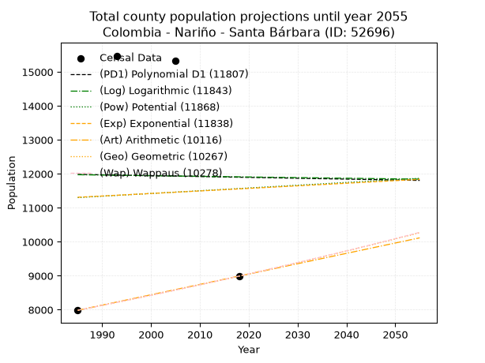
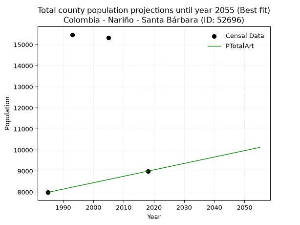
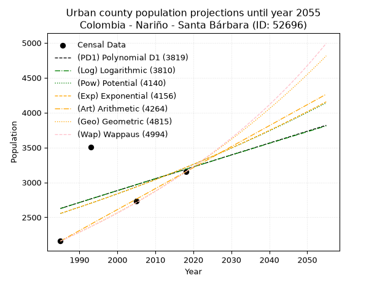
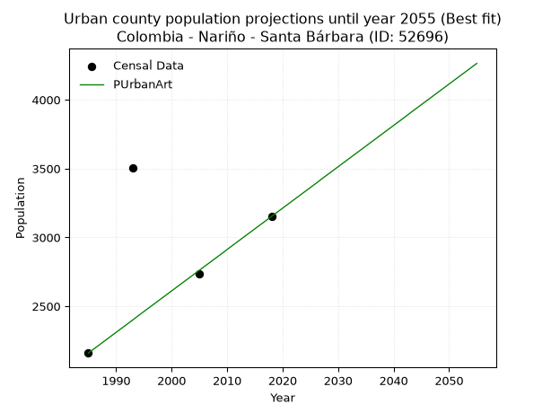
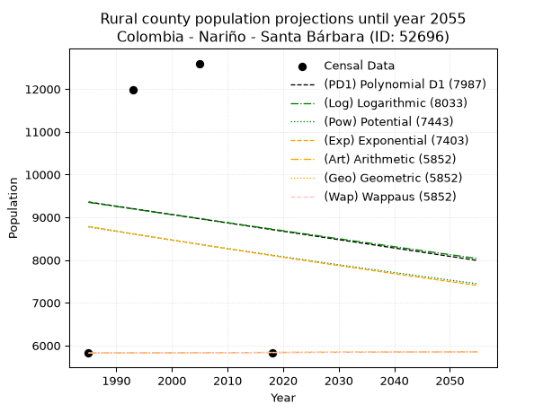
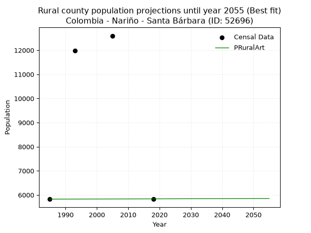

<div align="center">


</div>

# _“Population and Public Services Demand Projections (PPSD) until Year 2050 for Colombia - Nariño - Santa Bárbara (ID: 52696)”_
Keywords: `population` `public-service` `projection` `lineal` `polynomial` `logarithmic` `potential` `exponential` `arithmetic` `geometric` `wappaus` `dane` `colombia` `south-america`

PPSD are analytical estimates used by governments and planners to anticipate future changes in population size, age distribution, and the resulting community needs for utilities, healthcare, education, and infrastructure as sizing future water treatment facilities, electrical grids, and road networks based on spatial growth.

> **General running parameters**: • app_version: _v20260806_. • Python version: _3.14.7_. • Pandas version: _3.0.5_. • NumPy version: _2.5.1_. • Creates, save and include plots into reports (create_plot): _False_. • Projection until year: _2050_. • Process polynomial degree 2 and up: _False_. • Process Wappaus: _True_. • Process Wappaus: _True_. • Set negative values to zero: _True_. • Set infinite values to zero: _True_. • Drop dataset notes: _True_. 
<div align="center">

Dynamic map: [:earth_americas:Google](http://maps.google.com/maps?q=2.44965342,-77.9799164) [:earth_americas:OSM](https://www.openstreetmap.org/#map=18/2.44965342/-77.9799164&layers=P) [:earth_americas:Bing](https://www.bing.com/maps?cp=2.44965342~-77.9799164&lvl=18) [:earth_americas:Apple](https://maps.apple.com/frame?center=2.44965342%2C-77.9799164&span=0.003%2C0.006)

</div>


<div align="center">

```geojson
{
  "type": "Feature",
  "geometry": {
    "type": "Point", 
    "coordinates": [-77.9799164, 2.44965342]
  }, 
  "properties": {
    "Name": "Colombia - Nariño - Santa Bárbara (ID: 52696)"
  }
}
```

</div>


## 0. Census Data (4 records)

Census data are official statistics collected by a government about the people and housing in a country. They usually include counts of total population, age, sex, race, income, education, and jobs.

📅Global census file: [Population.xlsx](../data/Population.xlsx)

| Source   |   Year |   CountryID | CountryName   |   StateID | StateName   |   CountyID | CountyName    |   PTotal |   PUrban |   PRural |
|:---------|-------:|------------:|:--------------|----------:|:------------|-----------:|:--------------|---------:|---------:|---------:|
| DANE     |   1985 |          57 | Colombia      |        52 | Nariño      |      52696 | Santa Bárbara |     7984 |     2160 |     5824 |
| DANE     |   1993 |          57 | Colombia      |        52 | Nariño      |      52696 | Santa Bárbara |    15476 |     3502 |    11974 |
| DANE     |   2005 |          57 | Colombia      |        52 | Nariño      |      52696 | Santa Bárbara |    15332 |     2734 |    12598 |
| DANE     |   2018 |          57 | Colombia      |        52 | Nariño      |      52696 | Santa Bárbara |     8989 |     3152 |     5837 |

> 🔥Some records could had specific notes about the registered values or the corresponding urban or rural distribution.

**Local public utility companies (RUPS)**

 | SERVICIO       | ESTADO    | NOMBRE                                     | NIT         | DEPARTAMENTO_DOMICILIO   | MUNICIPIO_DOMICILIO   | DIRECCION          |   TELEFONO | EMAIL                    | TIPO_INSCRIPCION    | REPRESENTANTE_LEGAL        | TIPO_PRESTADOR                             | CLASIFICACION                 |
|:---------------|:----------|:-------------------------------------------|:------------|:-------------------------|:----------------------|:-------------------|-----------:|:-------------------------|:--------------------|:---------------------------|:-------------------------------------------|:------------------------------|
| ACUEDUCTO      | OPERATIVA | MUNICIPIO DE SANTA BARBARA                 | 800099147-1 | NARINO                   | SANTA BARBARA         | PLAZA PRINCIPAL    |    7466059 | jonnycalvache10@yahoo.es | Registro por la ESP | CONSUELO ARDILA CAICEDO    | MUNICIPIO (PRESTACIÓN DIRECTA)             | MENOR O IGUAL A 2500 USUARIOS |
| ALCANTARILLADO | OPERATIVA | MUNICIPIO DE SANTA BARBARA                 | 800099147-1 | NARINO                   | SANTA BARBARA         | PLAZA PRINCIPAL    |    7466059 | jonnycalvache10@yahoo.es | Registro por la ESP | CONSUELO ARDILA CAICEDO    | MUNICIPIO (PRESTACIÓN DIRECTA)             | MENOR O IGUAL A 2500 USUARIOS |
| ASEO           | OPERATIVA | MUNICIPIO DE SANTA BARBARA                 | 800099147-1 | NARINO                   | SANTA BARBARA         | PLAZA PRINCIPAL    |    7466059 | jonnycalvache10@yahoo.es | Registro por la ESP | CONSUELO ARDILA CAICEDO    | MUNICIPIO (PRESTACIÓN DIRECTA)             | MENOR O IGUAL A 2500 USUARIOS |
| ACUEDUCTO      | OPERATIVA | EMPRESA DE SERVICIOS PUBLICOS ISCUANDE SAS | 901279560-1 | NARINO                   | SANTA BARBARA         | barrio los Angeles |    3116176 | iscuandeespsas@gmail.com | Registro por la ESP | FABIAN ESTUPINAN ESTUPINAN | SOCIEDADES (EMPRESA DE SERVICIOS PUBLICOS) | MENOR O IGUAL A 2500 USUARIOS |
| ALCANTARILLADO | OPERATIVA | EMPRESA DE SERVICIOS PUBLICOS ISCUANDE SAS | 901279560-1 | NARINO                   | SANTA BARBARA         | barrio los Angeles |    3116176 | iscuandeespsas@gmail.com | Registro por la ESP | FABIAN ESTUPINAN ESTUPINAN | SOCIEDADES (EMPRESA DE SERVICIOS PUBLICOS) | MENOR O IGUAL A 2500 USUARIOS |
| ASEO           | OPERATIVA | EMPRESA DE SERVICIOS PUBLICOS ISCUANDE SAS | 901279560-1 | NARINO                   | SANTA BARBARA         | barrio los Angeles |    3116176 | iscuandeespsas@gmail.com | Registro por la ESP | FABIAN ESTUPINAN ESTUPINAN | SOCIEDADES (EMPRESA DE SERVICIOS PUBLICOS) | MENOR O IGUAL A 2500 USUARIOS |

> [📅RUPS Database: Registro Único de Prestadores de Servicios Públicos de Colombia Suramérica - RUPS](https://www.datos.gov.co/Hacienda-y-Cr-dito-P-blico/Registro-nico-de-Prestadores-de-Servicios-P-blicos/4qkq-csdn/about_data)

## 1. Total

### 1.1. Coefficients and Parameters

* (PD1) Polynomial Deg 1: -2.5295062223967473, 17004.894821349095 (lineal)
* (Log) Logarithmic: -3788.618663364731, 40742.57082031992
* (Pow) Potential: 1.4135521900301176, -0.6084456189943303
* (Exp) Exponential: 0.0006510559590362711, 3106.1802338311854
* (Art) Arithmetic: Year diff. 2018 - 1985 = 33, Population diff. 8989 - 7984 = 1005, Annual growth = 30.454545454545453
* (Geo) Geometric: Year diff. 2018 - 1985 = 33, Population diff. 8989 - 7984 = 1005, Annual growth % = 0.0035992517631908694
* (Wap) Wappaus: i = 0.35885872214158315, Condition values only valid for < 200)

<sub>
Wappaus condition values: ['0.00', '0.36', '0.72', '1.08', '1.44', '1.79', '2.15', '2.51', '2.87', '3.23', '3.59', '3.95', '4.31', '4.67', '5.02', '5.38', '5.74', '6.10', '6.46', '6.82', '7.18', '7.54', '7.89', '8.25', '8.61', '8.97', '9.33', '9.69', '10.05', '10.41', '10.77', '11.12', '11.48', '11.84', '12.20', '12.56', '12.92', '13.28', '13.64', '14.00', '14.35', '14.71', '15.07', '15.43', '15.79', '16.15', '16.51', '16.87', '17.23', '17.58', '17.94', '18.30', '18.66', '19.02', '19.38', '19.74', '20.10', '20.45', '20.81', '21.17', '21.53', '21.89', '22.25', '22.61', '22.97', '23.33']
</sub>


### 1.2. Projected Dataset

|   Year |   CountyID |   PTotalPD1 |   PTotalLog |   PTotalPow |   PTotalExp |   PTotalArt |   PTotalGeo |   PTotalWap |
|-------:|-----------:|------------:|------------:|------------:|------------:|------------:|------------:|------------:|
|   1985 |      52696 |       11984 |       11974 |       11301 |       11311 |        7984 |        7984 |        7984 |
|   1986 |      52696 |       11981 |       11972 |       11309 |       11318 |        8014 |        8013 |        8013 |
|   1987 |      52696 |       11979 |       11970 |       11317 |       11325 |        8045 |        8042 |        8042 |
|   1988 |      52696 |       11976 |       11968 |       11325 |       11333 |        8075 |        8071 |        8070 |
|   1989 |      52696 |       11974 |       11967 |       11333 |       11340 |        8106 |        8100 |        8099 |
|   1990 |      52696 |       11971 |       11965 |       11341 |       11347 |        8136 |        8129 |        8129 |
|   1991 |      52696 |       11969 |       11963 |       11349 |       11355 |        8167 |        8158 |        8158 |
|   1992 |      52696 |       11966 |       11961 |       11357 |       11362 |        8197 |        8187 |        8187 |
|   1993 |      52696 |       11964 |       11959 |       11365 |       11370 |        8228 |        8217 |        8217 |
|   1994 |      52696 |       11961 |       11957 |       11373 |       11377 |        8258 |        8246 |        8246 |
|   1995 |      52696 |       11959 |       11955 |       11381 |       11384 |        8289 |        8276 |        8276 |
|   1996 |      52696 |       11956 |       11953 |       11389 |       11392 |        8319 |        8306 |        8306 |
|   1997 |      52696 |       11953 |       11951 |       11398 |       11399 |        8349 |        8336 |        8335 |
|   1998 |      52696 |       11951 |       11949 |       11406 |       11407 |        8380 |        8366 |        8365 |
|   1999 |      52696 |       11948 |       11948 |       11414 |       11414 |        8410 |        8396 |        8395 |
|   2000 |      52696 |       11946 |       11946 |       11422 |       11422 |        8441 |        8426 |        8426 |
|   2001 |      52696 |       11943 |       11944 |       11430 |       11429 |        8471 |        8456 |        8456 |
|   2002 |      52696 |       11941 |       11942 |       11438 |       11436 |        8502 |        8487 |        8486 |
|   2003 |      52696 |       11938 |       11940 |       11446 |       11444 |        8532 |        8517 |        8517 |
|   2004 |      52696 |       11936 |       11938 |       11454 |       11451 |        8563 |        8548 |        8548 |
|   2005 |      52696 |       11933 |       11936 |       11462 |       11459 |        8593 |        8579 |        8578 |
|   2006 |      52696 |       11931 |       11934 |       11470 |       11466 |        8624 |        8610 |        8609 |
|   2007 |      52696 |       11928 |       11932 |       11478 |       11474 |        8654 |        8641 |        8640 |
|   2008 |      52696 |       11926 |       11931 |       11486 |       11481 |        8684 |        8672 |        8671 |
|   2009 |      52696 |       11923 |       11929 |       11494 |       11489 |        8715 |        8703 |        8703 |
|   2010 |      52696 |       11921 |       11927 |       11503 |       11496 |        8745 |        8734 |        8734 |
|   2011 |      52696 |       11918 |       11925 |       11511 |       11504 |        8776 |        8766 |        8765 |
|   2012 |      52696 |       11916 |       11923 |       11519 |       11511 |        8806 |        8797 |        8797 |
|   2013 |      52696 |       11913 |       11921 |       11527 |       11519 |        8837 |        8829 |        8829 |
|   2014 |      52696 |       11910 |       11919 |       11535 |       11526 |        8867 |        8861 |        8860 |
|   2015 |      52696 |       11908 |       11917 |       11543 |       11534 |        8898 |        8893 |        8892 |
|   2016 |      52696 |       11905 |       11915 |       11551 |       11541 |        8928 |        8925 |        8925 |
|   2017 |      52696 |       11903 |       11914 |       11559 |       11549 |        8959 |        8957 |        8957 |
|   2018 |      52696 |       11900 |       11912 |       11567 |       11556 |        8989 |        8989 |        8989 |
|   2019 |      52696 |       11898 |       11910 |       11575 |       11564 |        9019 |        9021 |        9021 |
|   2020 |      52696 |       11895 |       11908 |       11584 |       11571 |        9050 |        9054 |        9054 |
|   2021 |      52696 |       11893 |       11906 |       11592 |       11579 |        9080 |        9086 |        9087 |
|   2022 |      52696 |       11890 |       11904 |       11600 |       11586 |        9111 |        9119 |        9119 |
|   2023 |      52696 |       11888 |       11902 |       11608 |       11594 |        9141 |        9152 |        9152 |
|   2024 |      52696 |       11885 |       11900 |       11616 |       11601 |        9172 |        9185 |        9185 |
|   2025 |      52696 |       11883 |       11899 |       11624 |       11609 |        9202 |        9218 |        9219 |
|   2026 |      52696 |       11880 |       11897 |       11632 |       11617 |        9233 |        9251 |        9252 |
|   2027 |      52696 |       11878 |       11895 |       11640 |       11624 |        9263 |        9284 |        9285 |
|   2028 |      52696 |       11875 |       11893 |       11648 |       11632 |        9294 |        9318 |        9319 |
|   2029 |      52696 |       11873 |       11891 |       11657 |       11639 |        9324 |        9351 |        9353 |
|   2030 |      52696 |       11870 |       11889 |       11665 |       11647 |        9354 |        9385 |        9387 |
|   2031 |      52696 |       11867 |       11887 |       11673 |       11654 |        9385 |        9419 |        9421 |
|   2032 |      52696 |       11865 |       11886 |       11681 |       11662 |        9415 |        9453 |        9455 |
|   2033 |      52696 |       11862 |       11884 |       11689 |       11670 |        9446 |        9487 |        9489 |
|   2034 |      52696 |       11860 |       11882 |       11697 |       11677 |        9476 |        9521 |        9523 |
|   2035 |      52696 |       11857 |       11880 |       11705 |       11685 |        9507 |        9555 |        9558 |
|   2036 |      52696 |       11855 |       11878 |       11713 |       11692 |        9537 |        9590 |        9592 |
|   2037 |      52696 |       11852 |       11876 |       11722 |       11700 |        9568 |        9624 |        9627 |
|   2038 |      52696 |       11850 |       11874 |       11730 |       11708 |        9598 |        9659 |        9662 |
|   2039 |      52696 |       11847 |       11872 |       11738 |       11715 |        9629 |        9693 |        9697 |
|   2040 |      52696 |       11845 |       11871 |       11746 |       11723 |        9659 |        9728 |        9732 |
|   2041 |      52696 |       11842 |       11869 |       11754 |       11731 |        9689 |        9763 |        9768 |
|   2042 |      52696 |       11840 |       11867 |       11762 |       11738 |        9720 |        9798 |        9803 |
|   2043 |      52696 |       11837 |       11865 |       11770 |       11746 |        9750 |        9834 |        9839 |
|   2044 |      52696 |       11835 |       11863 |       11779 |       11754 |        9781 |        9869 |        9875 |
|   2045 |      52696 |       11832 |       11861 |       11787 |       11761 |        9811 |        9905 |        9910 |
|   2046 |      52696 |       11830 |       11859 |       11795 |       11769 |        9842 |        9940 |        9947 |
|   2047 |      52696 |       11827 |       11858 |       11803 |       11776 |        9872 |        9976 |        9983 |
|   2048 |      52696 |       11824 |       11856 |       11811 |       11784 |        9903 |       10012 |       10019 |
|   2049 |      52696 |       11822 |       11854 |       11819 |       11792 |        9933 |       10048 |       10056 |
|   2050 |      52696 |       11819 |       11852 |       11827 |       11800 |        9964 |       10084 |       10092 |
<div align="center">

</img>

</div>


### 1.3. Best fit with absolute and relative error (%)

Relative error puts that difference into context by dividing the absolute error by the true value, creating a unitless ratio or percentage that shows the scale of the mistake.

Absolute and relative error

|   Year | Source   |   CountryID | CountryName   |   StateID | StateName   |   CountyID_x | CountyName    |   PTotal |   PUrban |   PRural |   CountyID_y |   PTotalPD1 |   PTotalLog |   PTotalPow |   PTotalExp |   PTotalArt |   PTotalGeo |   PTotalWap |   PTotalPD1AbsError |   PTotalLogAbsError |   PTotalPowAbsError |   PTotalExpAbsError |   PTotalArtAbsError |   PTotalGeoAbsError |   PTotalWapAbsError |   PTotalPD1RelError |   PTotalLogRelError |   PTotalPowRelError |   PTotalExpRelError |   PTotalArtRelError |   PTotalGeoRelError |   PTotalWapRelError |
|-------:|:---------|------------:|:--------------|----------:|:------------|-------------:|:--------------|---------:|---------:|---------:|-------------:|------------:|------------:|------------:|------------:|------------:|------------:|------------:|--------------------:|--------------------:|--------------------:|--------------------:|--------------------:|--------------------:|--------------------:|--------------------:|--------------------:|--------------------:|--------------------:|--------------------:|--------------------:|--------------------:|
|   1985 | DANE     |          57 | Colombia      |        52 | Nariño      |        52696 | Santa Bárbara |     7984 |     2160 |     5824 |        52696 |       11984 |       11974 |       11301 |       11311 |        7984 |        7984 |        7984 |                4000 |                3990 |                3317 |                3327 |                   0 |                   0 |                   0 |             50.1002 |             49.9749 |             41.5456 |             41.6708 |              0      |              0      |              0      |
|   1993 | DANE     |          57 | Colombia      |        52 | Nariño      |        52696 | Santa Bárbara |    15476 |     3502 |    11974 |        52696 |       11964 |       11959 |       11365 |       11370 |        8228 |        8217 |        8217 |                3512 |                3517 |                4111 |                4106 |                7248 |                7259 |                7259 |             22.6932 |             22.7255 |             26.5637 |             26.5314 |             46.8338 |             46.9049 |             46.9049 |
|   2005 | DANE     |          57 | Colombia      |        52 | Nariño      |        52696 | Santa Bárbara |    15332 |     2734 |    12598 |        52696 |       11933 |       11936 |       11462 |       11459 |        8593 |        8579 |        8578 |                3399 |                3396 |                3870 |                3873 |                6739 |                6753 |                6754 |             22.1693 |             22.1498 |             25.2413 |             25.2609 |             43.9538 |             44.0451 |             44.0517 |
|   2018 | DANE     |          57 | Colombia      |        52 | Nariño      |        52696 | Santa Bárbara |     8989 |     3152 |     5837 |        52696 |       11900 |       11912 |       11567 |       11556 |        8989 |        8989 |        8989 |                2911 |                2923 |                2578 |                2567 |                   0 |                   0 |                   0 |             32.384  |             32.5175 |             28.6795 |             28.5571 |              0      |              0      |              0      |

Relative error mean

| Method    |   RelError | Best   |
|:----------|-----------:|:-------|
| PTotalPD1 |    31.8367 |        |
| PTotalLog |    31.8419 |        |
| PTotalPow |    30.5075 |        |
| PTotalExp |    30.5051 |        |
| PTotalArt |    22.6969 | True   |
| PTotalGeo |    22.7375 |        |
| PTotalWap |    22.7391 |        |

💙Best method: _**PTotalArt**_
<div align="center">

</img>

</div>


### 1.4. Fresh water supply demand in liters per capita per day (lpcd)

The fresh water supply demand typically ranges from 100 to 300 liters per capita per day (lpcd) for standard domestic and municipal planning, though absolute survival minimums set by the World Health Organization are as low as 7.5 to 20 liters per day, and total consumption in high-income nations can exceed 400 liters.

> `CZ`: Level in meters above the sea level (masl)<br> `WS`: Fresh water supply demand in liters per capita per day (lpcd or l/h/d)<br> `WSAll`: Zonal fresh water supply demand in liters per second (l/s)<br> `A`: Zonal area in square meters<br> `DP`: Population density (people/hectare or p/ha)

Reference values (RAS Colombia)

|    CZ |   WS |
|------:|-----:|
|  1000 |  120 |
|  2000 |  130 |
| 99999 |  140 |

County shapefile geometry properties and water supply values

|   CountyID |      ATotal |   CZTotal |   WSTotal |
|-----------:|------------:|----------:|----------:|
|      52696 | 1.22613e+09 |   171.258 |       120 |

Projected values for best method: PTotalArt

|   CountyID |   Year |   PTotalArt |   DPTotal |   WSTotal |   WSTotalAll |
|-----------:|-------:|------------:|----------:|----------:|-------------:|
|      52696 |   1985 |        7984 |      0.07 |       120 |      11.0889 |
|      52696 |   1986 |        8014 |      0.07 |       120 |      11.1306 |
|      52696 |   1987 |        8045 |      0.07 |       120 |      11.1736 |
|      52696 |   1988 |        8075 |      0.07 |       120 |      11.2153 |
|      52696 |   1989 |        8106 |      0.07 |       120 |      11.2583 |
|      52696 |   1990 |        8136 |      0.07 |       120 |      11.3    |
|      52696 |   1991 |        8167 |      0.07 |       120 |      11.3431 |
|      52696 |   1992 |        8197 |      0.07 |       120 |      11.3847 |
|      52696 |   1993 |        8228 |      0.07 |       120 |      11.4278 |
|      52696 |   1994 |        8258 |      0.07 |       120 |      11.4694 |
|      52696 |   1995 |        8289 |      0.07 |       120 |      11.5125 |
|      52696 |   1996 |        8319 |      0.07 |       120 |      11.5542 |
|      52696 |   1997 |        8349 |      0.07 |       120 |      11.5958 |
|      52696 |   1998 |        8380 |      0.07 |       120 |      11.6389 |
|      52696 |   1999 |        8410 |      0.07 |       120 |      11.6806 |
|      52696 |   2000 |        8441 |      0.07 |       120 |      11.7236 |
|      52696 |   2001 |        8471 |      0.07 |       120 |      11.7653 |
|      52696 |   2002 |        8502 |      0.07 |       120 |      11.8083 |
|      52696 |   2003 |        8532 |      0.07 |       120 |      11.85   |
|      52696 |   2004 |        8563 |      0.07 |       120 |      11.8931 |
|      52696 |   2005 |        8593 |      0.07 |       120 |      11.9347 |
|      52696 |   2006 |        8624 |      0.07 |       120 |      11.9778 |
|      52696 |   2007 |        8654 |      0.07 |       120 |      12.0194 |
|      52696 |   2008 |        8684 |      0.07 |       120 |      12.0611 |
|      52696 |   2009 |        8715 |      0.07 |       120 |      12.1042 |
|      52696 |   2010 |        8745 |      0.07 |       120 |      12.1458 |
|      52696 |   2011 |        8776 |      0.07 |       120 |      12.1889 |
|      52696 |   2012 |        8806 |      0.07 |       120 |      12.2306 |
|      52696 |   2013 |        8837 |      0.07 |       120 |      12.2736 |
|      52696 |   2014 |        8867 |      0.07 |       120 |      12.3153 |
|      52696 |   2015 |        8898 |      0.07 |       120 |      12.3583 |
|      52696 |   2016 |        8928 |      0.07 |       120 |      12.4    |
|      52696 |   2017 |        8959 |      0.07 |       120 |      12.4431 |
|      52696 |   2018 |        8989 |      0.07 |       120 |      12.4847 |
|      52696 |   2019 |        9019 |      0.07 |       120 |      12.5264 |
|      52696 |   2020 |        9050 |      0.07 |       120 |      12.5694 |
|      52696 |   2021 |        9080 |      0.07 |       120 |      12.6111 |
|      52696 |   2022 |        9111 |      0.07 |       120 |      12.6542 |
|      52696 |   2023 |        9141 |      0.07 |       120 |      12.6958 |
|      52696 |   2024 |        9172 |      0.07 |       120 |      12.7389 |
|      52696 |   2025 |        9202 |      0.08 |       120 |      12.7806 |
|      52696 |   2026 |        9233 |      0.08 |       120 |      12.8236 |
|      52696 |   2027 |        9263 |      0.08 |       120 |      12.8653 |
|      52696 |   2028 |        9294 |      0.08 |       120 |      12.9083 |
|      52696 |   2029 |        9324 |      0.08 |       120 |      12.95   |
|      52696 |   2030 |        9354 |      0.08 |       120 |      12.9917 |
|      52696 |   2031 |        9385 |      0.08 |       120 |      13.0347 |
|      52696 |   2032 |        9415 |      0.08 |       120 |      13.0764 |
|      52696 |   2033 |        9446 |      0.08 |       120 |      13.1194 |
|      52696 |   2034 |        9476 |      0.08 |       120 |      13.1611 |
|      52696 |   2035 |        9507 |      0.08 |       120 |      13.2042 |
|      52696 |   2036 |        9537 |      0.08 |       120 |      13.2458 |
|      52696 |   2037 |        9568 |      0.08 |       120 |      13.2889 |
|      52696 |   2038 |        9598 |      0.08 |       120 |      13.3306 |
|      52696 |   2039 |        9629 |      0.08 |       120 |      13.3736 |
|      52696 |   2040 |        9659 |      0.08 |       120 |      13.4153 |
|      52696 |   2041 |        9689 |      0.08 |       120 |      13.4569 |
|      52696 |   2042 |        9720 |      0.08 |       120 |      13.5    |
|      52696 |   2043 |        9750 |      0.08 |       120 |      13.5417 |
|      52696 |   2044 |        9781 |      0.08 |       120 |      13.5847 |
|      52696 |   2045 |        9811 |      0.08 |       120 |      13.6264 |
|      52696 |   2046 |        9842 |      0.08 |       120 |      13.6694 |
|      52696 |   2047 |        9872 |      0.08 |       120 |      13.7111 |
|      52696 |   2048 |        9903 |      0.08 |       120 |      13.7542 |
|      52696 |   2049 |        9933 |      0.08 |       120 |      13.7958 |
|      52696 |   2050 |        9964 |      0.08 |       120 |      13.8389 |

## 2. Urban

### 2.1. Coefficients and Parameters

* (PD1) Polynomial Deg 1: 17.029305499799047, -31175.868325973046 (lineal)
* (Log) Logarithmic: 34156.37304316247, -256735.86521307356
* (Pow) Potential: 13.925621242345366, -42.515993147619575
* (Exp) Exponential: 0.00694375509189746, 0.00263946376408183
* (Art) Arithmetic: Year diff. 2018 - 1985 = 33, Population diff. 3152 - 2160 = 992, Annual growth = 30.060606060606062
* (Geo) Geometric: Year diff. 2018 - 1985 = 33, Population diff. 3152 - 2160 = 992, Annual growth % = 0.011518222142078649
* (Wap) Wappaus: i = 1.1317999269806498, Condition values only valid for < 200)

<sub>
Wappaus condition values: ['0.00', '1.13', '2.26', '3.40', '4.53', '5.66', '6.79', '7.92', '9.05', '10.19', '11.32', '12.45', '13.58', '14.71', '15.85', '16.98', '18.11', '19.24', '20.37', '21.50', '22.64', '23.77', '24.90', '26.03', '27.16', '28.29', '29.43', '30.56', '31.69', '32.82', '33.95', '35.09', '36.22', '37.35', '38.48', '39.61', '40.74', '41.88', '43.01', '44.14', '45.27', '46.40', '47.54', '48.67', '49.80', '50.93', '52.06', '53.19', '54.33', '55.46', '56.59', '57.72', '58.85', '59.99', '61.12', '62.25', '63.38', '64.51', '65.64', '66.78', '67.91', '69.04', '70.17', '71.30', '72.44', '73.57']
</sub>


### 2.2. Projected Dataset

|   Year |   CountyID |   PUrbanPD1 |   PUrbanLog |   PUrbanPow |   PUrbanExp |   PUrbanArt |   PUrbanGeo |   PUrbanWap |
|-------:|-----------:|------------:|------------:|------------:|------------:|------------:|------------:|------------:|
|   1985 |      52696 |        2627 |        2626 |        2555 |        2556 |        2160 |        2160 |        2160 |
|   1986 |      52696 |        2644 |        2643 |        2573 |        2574 |        2190 |        2185 |        2185 |
|   1987 |      52696 |        2661 |        2661 |        2591 |        2592 |        2220 |        2210 |        2209 |
|   1988 |      52696 |        2678 |        2678 |        2609 |        2610 |        2250 |        2236 |        2235 |
|   1989 |      52696 |        2695 |        2695 |        2628 |        2628 |        2280 |        2261 |        2260 |
|   1990 |      52696 |        2712 |        2712 |        2646 |        2646 |        2310 |        2287 |        2286 |
|   1991 |      52696 |        2729 |        2729 |        2665 |        2665 |        2340 |        2314 |        2312 |
|   1992 |      52696 |        2747 |        2746 |        2683 |        2683 |        2370 |        2340 |        2338 |
|   1993 |      52696 |        2764 |        2764 |        2702 |        2702 |        2400 |        2367 |        2365 |
|   1994 |      52696 |        2781 |        2781 |        2721 |        2721 |        2431 |        2395 |        2392 |
|   1995 |      52696 |        2798 |        2798 |        2740 |        2740 |        2461 |        2422 |        2419 |
|   1996 |      52696 |        2815 |        2815 |        2759 |        2759 |        2491 |        2450 |        2447 |
|   1997 |      52696 |        2832 |        2832 |        2779 |        2778 |        2521 |        2478 |        2475 |
|   1998 |      52696 |        2849 |        2849 |        2798 |        2797 |        2551 |        2507 |        2503 |
|   1999 |      52696 |        2866 |        2866 |        2818 |        2817 |        2581 |        2536 |        2532 |
|   2000 |      52696 |        2883 |        2883 |        2837 |        2837 |        2611 |        2565 |        2561 |
|   2001 |      52696 |        2900 |        2900 |        2857 |        2856 |        2641 |        2594 |        2590 |
|   2002 |      52696 |        2917 |        2918 |        2877 |        2876 |        2671 |        2624 |        2620 |
|   2003 |      52696 |        2934 |        2935 |        2897 |        2896 |        2701 |        2654 |        2650 |
|   2004 |      52696 |        2951 |        2952 |        2917 |        2916 |        2731 |        2685 |        2680 |
|   2005 |      52696 |        2968 |        2969 |        2938 |        2937 |        2761 |        2716 |        2711 |
|   2006 |      52696 |        2985 |        2986 |        2958 |        2957 |        2791 |        2747 |        2743 |
|   2007 |      52696 |        3002 |        3003 |        2979 |        2978 |        2821 |        2779 |        2774 |
|   2008 |      52696 |        3019 |        3020 |        2999 |        2999 |        2851 |        2811 |        2806 |
|   2009 |      52696 |        3036 |        3037 |        3020 |        3019 |        2881 |        2843 |        2839 |
|   2010 |      52696 |        3053 |        3054 |        3041 |        3040 |        2912 |        2876 |        2872 |
|   2011 |      52696 |        3070 |        3071 |        3062 |        3062 |        2942 |        2909 |        2905 |
|   2012 |      52696 |        3087 |        3088 |        3084 |        3083 |        2972 |        2943 |        2939 |
|   2013 |      52696 |        3104 |        3105 |        3105 |        3104 |        3002 |        2977 |        2973 |
|   2014 |      52696 |        3121 |        3122 |        3127 |        3126 |        3032 |        3011 |        3008 |
|   2015 |      52696 |        3138 |        3139 |        3148 |        3148 |        3062 |        3046 |        3043 |
|   2016 |      52696 |        3155 |        3156 |        3170 |        3170 |        3092 |        3081 |        3079 |
|   2017 |      52696 |        3172 |        3172 |        3192 |        3192 |        3122 |        3116 |        3115 |
|   2018 |      52696 |        3189 |        3189 |        3214 |        3214 |        3152 |        3152 |        3152 |
|   2019 |      52696 |        3206 |        3206 |        3237 |        3237 |        3182 |        3188 |        3189 |
|   2020 |      52696 |        3223 |        3223 |        3259 |        3259 |        3212 |        3225 |        3227 |
|   2021 |      52696 |        3240 |        3240 |        3281 |        3282 |        3242 |        3262 |        3265 |
|   2022 |      52696 |        3257 |        3257 |        3304 |        3305 |        3272 |        3300 |        3304 |
|   2023 |      52696 |        3274 |        3274 |        3327 |        3328 |        3302 |        3338 |        3343 |
|   2024 |      52696 |        3291 |        3291 |        3350 |        3351 |        3332 |        3376 |        3383 |
|   2025 |      52696 |        3308 |        3308 |        3373 |        3374 |        3362 |        3415 |        3424 |
|   2026 |      52696 |        3326 |        3325 |        3396 |        3398 |        3392 |        3454 |        3465 |
|   2027 |      52696 |        3343 |        3341 |        3420 |        3421 |        3423 |        3494 |        3507 |
|   2028 |      52696 |        3360 |        3358 |        3443 |        3445 |        3453 |        3534 |        3549 |
|   2029 |      52696 |        3377 |        3375 |        3467 |        3469 |        3483 |        3575 |        3592 |
|   2030 |      52696 |        3394 |        3392 |        3491 |        3493 |        3513 |        3616 |        3636 |
|   2031 |      52696 |        3411 |        3409 |        3515 |        3518 |        3543 |        3658 |        3680 |
|   2032 |      52696 |        3428 |        3426 |        3539 |        3542 |        3573 |        3700 |        3725 |
|   2033 |      52696 |        3445 |        3442 |        3563 |        3567 |        3603 |        3743 |        3771 |
|   2034 |      52696 |        3462 |        3459 |        3588 |        3592 |        3633 |        3786 |        3818 |
|   2035 |      52696 |        3479 |        3476 |        3613 |        3617 |        3663 |        3829 |        3865 |
|   2036 |      52696 |        3496 |        3493 |        3637 |        3642 |        3693 |        3874 |        3913 |
|   2037 |      52696 |        3513 |        3510 |        3662 |        3667 |        3723 |        3918 |        3961 |
|   2038 |      52696 |        3530 |        3526 |        3687 |        3693 |        3753 |        3963 |        4011 |
|   2039 |      52696 |        3547 |        3543 |        3713 |        3719 |        3783 |        4009 |        4061 |
|   2040 |      52696 |        3564 |        3560 |        3738 |        3745 |        3813 |        4055 |        4112 |
|   2041 |      52696 |        3581 |        3577 |        3764 |        3771 |        3843 |        4102 |        4164 |
|   2042 |      52696 |        3598 |        3593 |        3790 |        3797 |        3873 |        4149 |        4217 |
|   2043 |      52696 |        3615 |        3610 |        3815 |        3823 |        3904 |        4197 |        4271 |
|   2044 |      52696 |        3632 |        3627 |        3842 |        3850 |        3934 |        4245 |        4325 |
|   2045 |      52696 |        3649 |        3643 |        3868 |        3877 |        3964 |        4294 |        4381 |
|   2046 |      52696 |        3666 |        3660 |        3894 |        3904 |        3994 |        4344 |        4437 |
|   2047 |      52696 |        3683 |        3677 |        3921 |        3931 |        4024 |        4394 |        4495 |
|   2048 |      52696 |        3700 |        3693 |        3948 |        3959 |        4054 |        4444 |        4553 |
|   2049 |      52696 |        3717 |        3710 |        3975 |        3986 |        4084 |        4495 |        4613 |
|   2050 |      52696 |        3734 |        3727 |        4002 |        4014 |        4114 |        4547 |        4674 |
<div align="center">

</img>

</div>


### 2.3. Best fit with absolute and relative error (%)

Relative error puts that difference into context by dividing the absolute error by the true value, creating a unitless ratio or percentage that shows the scale of the mistake.

Absolute and relative error

|   Year | Source   |   CountryID | CountryName   |   StateID | StateName   |   CountyID_x | CountyName    |   PTotal |   PUrban |   PRural |   CountyID_y |   PUrbanPD1 |   PUrbanLog |   PUrbanPow |   PUrbanExp |   PUrbanArt |   PUrbanGeo |   PUrbanWap |   PUrbanPD1AbsError |   PUrbanLogAbsError |   PUrbanPowAbsError |   PUrbanExpAbsError |   PUrbanArtAbsError |   PUrbanGeoAbsError |   PUrbanWapAbsError |   PUrbanPD1RelError |   PUrbanLogRelError |   PUrbanPowRelError |   PUrbanExpRelError |   PUrbanArtRelError |   PUrbanGeoRelError |   PUrbanWapRelError |
|-------:|:---------|------------:|:--------------|----------:|:------------|-------------:|:--------------|---------:|---------:|---------:|-------------:|------------:|------------:|------------:|------------:|------------:|------------:|------------:|--------------------:|--------------------:|--------------------:|--------------------:|--------------------:|--------------------:|--------------------:|--------------------:|--------------------:|--------------------:|--------------------:|--------------------:|--------------------:|--------------------:|
|   1985 | DANE     |          57 | Colombia      |        52 | Nariño      |        52696 | Santa Bárbara |     7984 |     2160 |     5824 |        52696 |        2627 |        2626 |        2555 |        2556 |        2160 |        2160 |        2160 |                 467 |                 466 |                 395 |                 396 |                   0 |                   0 |                   0 |            21.6204  |            21.5741  |            18.287   |            18.3333  |            0        |            0        |            0        |
|   1993 | DANE     |          57 | Colombia      |        52 | Nariño      |        52696 | Santa Bárbara |    15476 |     3502 |    11974 |        52696 |        2764 |        2764 |        2702 |        2702 |        2400 |        2367 |        2365 |                 738 |                 738 |                 800 |                 800 |                1102 |                1135 |                1137 |            21.0737  |            21.0737  |            22.8441  |            22.8441  |           31.4677   |           32.4101   |           32.4672   |
|   2005 | DANE     |          57 | Colombia      |        52 | Nariño      |        52696 | Santa Bárbara |    15332 |     2734 |    12598 |        52696 |        2968 |        2969 |        2938 |        2937 |        2761 |        2716 |        2711 |                 234 |                 235 |                 204 |                 203 |                  27 |                  18 |                  23 |             8.55889 |             8.59546 |             7.46159 |             7.42502 |            0.987564 |            0.658376 |            0.841258 |
|   2018 | DANE     |          57 | Colombia      |        52 | Nariño      |        52696 | Santa Bárbara |     8989 |     3152 |     5837 |        52696 |        3189 |        3189 |        3214 |        3214 |        3152 |        3152 |        3152 |                  37 |                  37 |                  62 |                  62 |                   0 |                   0 |                   0 |             1.17386 |             1.17386 |             1.96701 |             1.96701 |            0        |            0        |            0        |

Relative error mean

| Method    |   RelError | Best   |
|:----------|-----------:|:-------|
| PUrbanPD1 |   13.1067  |        |
| PUrbanLog |   13.1043  |        |
| PUrbanPow |   12.6399  |        |
| PUrbanExp |   12.6424  |        |
| PUrbanArt |    8.11382 | True   |
| PUrbanGeo |    8.26711 |        |
| PUrbanWap |    8.3271  |        |

💙Best method: _**PUrbanArt**_
<div align="center">

</img>

</div>


### 2.4. Fresh water supply demand in liters per capita per day (lpcd)

The fresh water supply demand typically ranges from 100 to 300 liters per capita per day (lpcd) for standard domestic and municipal planning, though absolute survival minimums set by the World Health Organization are as low as 7.5 to 20 liters per day, and total consumption in high-income nations can exceed 400 liters.

> `CZ`: Level in meters above the sea level (masl)<br> `WS`: Fresh water supply demand in liters per capita per day (lpcd or l/h/d)<br> `WSAll`: Zonal fresh water supply demand in liters per second (l/s)<br> `A`: Zonal area in square meters<br> `DP`: Population density (people/hectare or p/ha)

Reference values (RAS Colombia)

|    CZ |   WS |
|------:|-----:|
|  1000 |  120 |
|  2000 |  130 |
| 99999 |  140 |

County shapefile geometry properties and water supply values

|   CountyID |   AUrban |   CZUrban |   WSUrban |
|-----------:|---------:|----------:|----------:|
|      52696 |   378358 |   3.93135 |       120 |

Projected values for best method: PUrbanArt

|   CountyID |   Year |   PUrbanArt |   DPUrban |   WSUrban |   WSUrbanAll |
|-----------:|-------:|------------:|----------:|----------:|-------------:|
|      52696 |   1985 |        2160 |     57.09 |       120 |      3       |
|      52696 |   1986 |        2190 |     57.88 |       120 |      3.04167 |
|      52696 |   1987 |        2220 |     58.67 |       120 |      3.08333 |
|      52696 |   1988 |        2250 |     59.47 |       120 |      3.125   |
|      52696 |   1989 |        2280 |     60.26 |       120 |      3.16667 |
|      52696 |   1990 |        2310 |     61.05 |       120 |      3.20833 |
|      52696 |   1991 |        2340 |     61.85 |       120 |      3.25    |
|      52696 |   1992 |        2370 |     62.64 |       120 |      3.29167 |
|      52696 |   1993 |        2400 |     63.43 |       120 |      3.33333 |
|      52696 |   1994 |        2431 |     64.25 |       120 |      3.37639 |
|      52696 |   1995 |        2461 |     65.04 |       120 |      3.41806 |
|      52696 |   1996 |        2491 |     65.84 |       120 |      3.45972 |
|      52696 |   1997 |        2521 |     66.63 |       120 |      3.50139 |
|      52696 |   1998 |        2551 |     67.42 |       120 |      3.54306 |
|      52696 |   1999 |        2581 |     68.22 |       120 |      3.58472 |
|      52696 |   2000 |        2611 |     69.01 |       120 |      3.62639 |
|      52696 |   2001 |        2641 |     69.8  |       120 |      3.66806 |
|      52696 |   2002 |        2671 |     70.59 |       120 |      3.70972 |
|      52696 |   2003 |        2701 |     71.39 |       120 |      3.75139 |
|      52696 |   2004 |        2731 |     72.18 |       120 |      3.79306 |
|      52696 |   2005 |        2761 |     72.97 |       120 |      3.83472 |
|      52696 |   2006 |        2791 |     73.77 |       120 |      3.87639 |
|      52696 |   2007 |        2821 |     74.56 |       120 |      3.91806 |
|      52696 |   2008 |        2851 |     75.35 |       120 |      3.95972 |
|      52696 |   2009 |        2881 |     76.14 |       120 |      4.00139 |
|      52696 |   2010 |        2912 |     76.96 |       120 |      4.04444 |
|      52696 |   2011 |        2942 |     77.76 |       120 |      4.08611 |
|      52696 |   2012 |        2972 |     78.55 |       120 |      4.12778 |
|      52696 |   2013 |        3002 |     79.34 |       120 |      4.16944 |
|      52696 |   2014 |        3032 |     80.14 |       120 |      4.21111 |
|      52696 |   2015 |        3062 |     80.93 |       120 |      4.25278 |
|      52696 |   2016 |        3092 |     81.72 |       120 |      4.29444 |
|      52696 |   2017 |        3122 |     82.51 |       120 |      4.33611 |
|      52696 |   2018 |        3152 |     83.31 |       120 |      4.37778 |
|      52696 |   2019 |        3182 |     84.1  |       120 |      4.41944 |
|      52696 |   2020 |        3212 |     84.89 |       120 |      4.46111 |
|      52696 |   2021 |        3242 |     85.69 |       120 |      4.50278 |
|      52696 |   2022 |        3272 |     86.48 |       120 |      4.54444 |
|      52696 |   2023 |        3302 |     87.27 |       120 |      4.58611 |
|      52696 |   2024 |        3332 |     88.06 |       120 |      4.62778 |
|      52696 |   2025 |        3362 |     88.86 |       120 |      4.66944 |
|      52696 |   2026 |        3392 |     89.65 |       120 |      4.71111 |
|      52696 |   2027 |        3423 |     90.47 |       120 |      4.75417 |
|      52696 |   2028 |        3453 |     91.26 |       120 |      4.79583 |
|      52696 |   2029 |        3483 |     92.06 |       120 |      4.8375  |
|      52696 |   2030 |        3513 |     92.85 |       120 |      4.87917 |
|      52696 |   2031 |        3543 |     93.64 |       120 |      4.92083 |
|      52696 |   2032 |        3573 |     94.43 |       120 |      4.9625  |
|      52696 |   2033 |        3603 |     95.23 |       120 |      5.00417 |
|      52696 |   2034 |        3633 |     96.02 |       120 |      5.04583 |
|      52696 |   2035 |        3663 |     96.81 |       120 |      5.0875  |
|      52696 |   2036 |        3693 |     97.61 |       120 |      5.12917 |
|      52696 |   2037 |        3723 |     98.4  |       120 |      5.17083 |
|      52696 |   2038 |        3753 |     99.19 |       120 |      5.2125  |
|      52696 |   2039 |        3783 |     99.98 |       120 |      5.25417 |
|      52696 |   2040 |        3813 |    100.78 |       120 |      5.29583 |
|      52696 |   2041 |        3843 |    101.57 |       120 |      5.3375  |
|      52696 |   2042 |        3873 |    102.36 |       120 |      5.37917 |
|      52696 |   2043 |        3904 |    103.18 |       120 |      5.42222 |
|      52696 |   2044 |        3934 |    103.98 |       120 |      5.46389 |
|      52696 |   2045 |        3964 |    104.77 |       120 |      5.50556 |
|      52696 |   2046 |        3994 |    105.56 |       120 |      5.54722 |
|      52696 |   2047 |        4024 |    106.35 |       120 |      5.58889 |
|      52696 |   2048 |        4054 |    107.15 |       120 |      5.63056 |
|      52696 |   2049 |        4084 |    107.94 |       120 |      5.67222 |
|      52696 |   2050 |        4114 |    108.73 |       120 |      5.71389 |

## 3. Rural

### 3.1. Coefficients and Parameters

* (PD1) Polynomial Deg 1: -19.55881172219582, 48180.763147322185 (lineal)
* (Log) Logarithmic: -37944.99170652697, 297478.4360333918
* (Pow) Potential: -4.750278532292442, 19.608517662109964
* (Exp) Exponential: -0.0024423883390668334, 1119914.1061639194
* (Art) Arithmetic: Year diff. 2018 - 1985 = 33, Population diff. 5837 - 5824 = 13, Annual growth = 0.3939393939393939
* (Geo) Geometric: Year diff. 2018 - 1985 = 33, Population diff. 5837 - 5824 = 13, Annual growth % = 6.756759553461222e-05
* (Wap) Wappaus: i = 0.00675652849565893, Condition values only valid for < 200)

<sub>
Wappaus condition values: ['0.00', '0.01', '0.01', '0.02', '0.03', '0.03', '0.04', '0.05', '0.05', '0.06', '0.07', '0.07', '0.08', '0.09', '0.09', '0.10', '0.11', '0.11', '0.12', '0.13', '0.14', '0.14', '0.15', '0.16', '0.16', '0.17', '0.18', '0.18', '0.19', '0.20', '0.20', '0.21', '0.22', '0.22', '0.23', '0.24', '0.24', '0.25', '0.26', '0.26', '0.27', '0.28', '0.28', '0.29', '0.30', '0.30', '0.31', '0.32', '0.32', '0.33', '0.34', '0.34', '0.35', '0.36', '0.36', '0.37', '0.38', '0.39', '0.39', '0.40', '0.41', '0.41', '0.42', '0.43', '0.43', '0.44']
</sub>


### 3.2. Projected Dataset

|   Year |   CountyID |   PRuralPD1 |   PRuralLog |   PRuralPow |   PRuralExp |   PRuralArt |   PRuralGeo |   PRuralWap |
|-------:|-----------:|------------:|------------:|------------:|------------:|------------:|------------:|------------:|
|   1985 |      52696 |        9357 |        9348 |        8775 |        8783 |        5824 |        5824 |        5824 |
|   1986 |      52696 |        9337 |        9329 |        8754 |        8762 |        5824 |        5824 |        5824 |
|   1987 |      52696 |        9317 |        9310 |        8733 |        8741 |        5825 |        5825 |        5825 |
|   1988 |      52696 |        9298 |        9291 |        8712 |        8719 |        5825 |        5825 |        5825 |
|   1989 |      52696 |        9278 |        9272 |        8691 |        8698 |        5826 |        5826 |        5826 |
|   1990 |      52696 |        9259 |        9252 |        8671 |        8677 |        5826 |        5826 |        5826 |
|   1991 |      52696 |        9239 |        9233 |        8650 |        8656 |        5826 |        5826 |        5826 |
|   1992 |      52696 |        9220 |        9214 |        8629 |        8635 |        5827 |        5827 |        5827 |
|   1993 |      52696 |        9200 |        9195 |        8609 |        8613 |        5827 |        5827 |        5827 |
|   1994 |      52696 |        9180 |        9176 |        8588 |        8592 |        5828 |        5828 |        5828 |
|   1995 |      52696 |        9161 |        9157 |        8568 |        8571 |        5828 |        5828 |        5828 |
|   1996 |      52696 |        9141 |        9138 |        8547 |        8551 |        5828 |        5828 |        5828 |
|   1997 |      52696 |        9122 |        9119 |        8527 |        8530 |        5829 |        5829 |        5829 |
|   1998 |      52696 |        9102 |        9100 |        8507 |        8509 |        5829 |        5829 |        5829 |
|   1999 |      52696 |        9083 |        9081 |        8487 |        8488 |        5830 |        5830 |        5830 |
|   2000 |      52696 |        9063 |        9062 |        8467 |        8467 |        5830 |        5830 |        5830 |
|   2001 |      52696 |        9044 |        9043 |        8446 |        8447 |        5830 |        5830 |        5830 |
|   2002 |      52696 |        9024 |        9024 |        8426 |        8426 |        5831 |        5831 |        5831 |
|   2003 |      52696 |        9004 |        9005 |        8406 |        8406 |        5831 |        5831 |        5831 |
|   2004 |      52696 |        8985 |        8986 |        8387 |        8385 |        5831 |        5831 |        5831 |
|   2005 |      52696 |        8965 |        8968 |        8367 |        8365 |        5832 |        5832 |        5832 |
|   2006 |      52696 |        8946 |        8949 |        8347 |        8344 |        5832 |        5832 |        5832 |
|   2007 |      52696 |        8926 |        8930 |        8327 |        8324 |        5833 |        5833 |        5833 |
|   2008 |      52696 |        8907 |        8911 |        8307 |        8304 |        5833 |        5833 |        5833 |
|   2009 |      52696 |        8887 |        8892 |        8288 |        8283 |        5833 |        5833 |        5833 |
|   2010 |      52696 |        8868 |        8873 |        8268 |        8263 |        5834 |        5834 |        5834 |
|   2011 |      52696 |        8848 |        8854 |        8249 |        8243 |        5834 |        5834 |        5834 |
|   2012 |      52696 |        8828 |        8835 |        8229 |        8223 |        5835 |        5835 |        5835 |
|   2013 |      52696 |        8809 |        8816 |        8210 |        8203 |        5835 |        5835 |        5835 |
|   2014 |      52696 |        8789 |        8798 |        8191 |        8183 |        5835 |        5835 |        5835 |
|   2015 |      52696 |        8770 |        8779 |        8171 |        8163 |        5836 |        5836 |        5836 |
|   2016 |      52696 |        8750 |        8760 |        8152 |        8143 |        5836 |        5836 |        5836 |
|   2017 |      52696 |        8731 |        8741 |        8133 |        8123 |        5837 |        5837 |        5837 |
|   2018 |      52696 |        8711 |        8722 |        8114 |        8103 |        5837 |        5837 |        5837 |
|   2019 |      52696 |        8692 |        8703 |        8095 |        8084 |        5837 |        5837 |        5837 |
|   2020 |      52696 |        8672 |        8685 |        8076 |        8064 |        5838 |        5838 |        5838 |
|   2021 |      52696 |        8652 |        8666 |        8057 |        8044 |        5838 |        5838 |        5838 |
|   2022 |      52696 |        8633 |        8647 |        8038 |        8024 |        5839 |        5839 |        5839 |
|   2023 |      52696 |        8613 |        8628 |        8019 |        8005 |        5839 |        5839 |        5839 |
|   2024 |      52696 |        8594 |        8610 |        8000 |        7985 |        5839 |        5839 |        5839 |
|   2025 |      52696 |        8574 |        8591 |        7981 |        7966 |        5840 |        5840 |        5840 |
|   2026 |      52696 |        8555 |        8572 |        7963 |        7946 |        5840 |        5840 |        5840 |
|   2027 |      52696 |        8535 |        8553 |        7944 |        7927 |        5841 |        5841 |        5841 |
|   2028 |      52696 |        8515 |        8535 |        7925 |        7908 |        5841 |        5841 |        5841 |
|   2029 |      52696 |        8496 |        8516 |        7907 |        7888 |        5841 |        5841 |        5841 |
|   2030 |      52696 |        8476 |        8497 |        7888 |        7869 |        5842 |        5842 |        5842 |
|   2031 |      52696 |        8457 |        8479 |        7870 |        7850 |        5842 |        5842 |        5842 |
|   2032 |      52696 |        8437 |        8460 |        7852 |        7831 |        5843 |        5843 |        5843 |
|   2033 |      52696 |        8418 |        8441 |        7833 |        7812 |        5843 |        5843 |        5843 |
|   2034 |      52696 |        8398 |        8423 |        7815 |        7793 |        5843 |        5843 |        5843 |
|   2035 |      52696 |        8379 |        8404 |        7797 |        7774 |        5844 |        5844 |        5844 |
|   2036 |      52696 |        8359 |        8385 |        7779 |        7755 |        5844 |        5844 |        5844 |
|   2037 |      52696 |        8339 |        8367 |        7760 |        7736 |        5844 |        5844 |        5844 |
|   2038 |      52696 |        8320 |        8348 |        7742 |        7717 |        5845 |        5845 |        5845 |
|   2039 |      52696 |        8300 |        8329 |        7724 |        7698 |        5845 |        5845 |        5845 |
|   2040 |      52696 |        8281 |        8311 |        7706 |        7679 |        5846 |        5846 |        5846 |
|   2041 |      52696 |        8261 |        8292 |        7688 |        7661 |        5846 |        5846 |        5846 |
|   2042 |      52696 |        8242 |        8274 |        7671 |        7642 |        5846 |        5846 |        5846 |
|   2043 |      52696 |        8222 |        8255 |        7653 |        7623 |        5847 |        5847 |        5847 |
|   2044 |      52696 |        8203 |        8237 |        7635 |        7605 |        5847 |        5847 |        5847 |
|   2045 |      52696 |        8183 |        8218 |        7617 |        7586 |        5848 |        5848 |        5848 |
|   2046 |      52696 |        8163 |        8199 |        7600 |        7568 |        5848 |        5848 |        5848 |
|   2047 |      52696 |        8144 |        8181 |        7582 |        7549 |        5848 |        5848 |        5848 |
|   2048 |      52696 |        8124 |        8162 |        7564 |        7531 |        5849 |        5849 |        5849 |
|   2049 |      52696 |        8105 |        8144 |        7547 |        7512 |        5849 |        5849 |        5849 |
|   2050 |      52696 |        8085 |        8125 |        7529 |        7494 |        5850 |        5850 |        5850 |
<div align="center">

</img>

</div>


### 3.3. Best fit with absolute and relative error (%)

Relative error puts that difference into context by dividing the absolute error by the true value, creating a unitless ratio or percentage that shows the scale of the mistake.

Absolute and relative error

|   Year | Source   |   CountryID | CountryName   |   StateID | StateName   |   CountyID_x | CountyName    |   PTotal |   PUrban |   PRural |   CountyID_y |   PRuralPD1 |   PRuralLog |   PRuralPow |   PRuralExp |   PRuralArt |   PRuralGeo |   PRuralWap |   PRuralPD1AbsError |   PRuralLogAbsError |   PRuralPowAbsError |   PRuralExpAbsError |   PRuralArtAbsError |   PRuralGeoAbsError |   PRuralWapAbsError |   PRuralPD1RelError |   PRuralLogRelError |   PRuralPowRelError |   PRuralExpRelError |   PRuralArtRelError |   PRuralGeoRelError |   PRuralWapRelError |
|-------:|:---------|------------:|:--------------|----------:|:------------|-------------:|:--------------|---------:|---------:|---------:|-------------:|------------:|------------:|------------:|------------:|------------:|------------:|------------:|--------------------:|--------------------:|--------------------:|--------------------:|--------------------:|--------------------:|--------------------:|--------------------:|--------------------:|--------------------:|--------------------:|--------------------:|--------------------:|--------------------:|
|   1985 | DANE     |          57 | Colombia      |        52 | Nariño      |        52696 | Santa Bárbara |     7984 |     2160 |     5824 |        52696 |        9357 |        9348 |        8775 |        8783 |        5824 |        5824 |        5824 |                3533 |                3524 |                2951 |                2959 |                   0 |                   0 |                   0 |             60.6628 |             60.5082 |             50.6696 |             50.807  |              0      |              0      |              0      |
|   1993 | DANE     |          57 | Colombia      |        52 | Nariño      |        52696 | Santa Bárbara |    15476 |     3502 |    11974 |        52696 |        9200 |        9195 |        8609 |        8613 |        5827 |        5827 |        5827 |                2774 |                2779 |                3365 |                3361 |                6147 |                6147 |                6147 |             23.1669 |             23.2086 |             28.1026 |             28.0691 |             51.3362 |             51.3362 |             51.3362 |
|   2005 | DANE     |          57 | Colombia      |        52 | Nariño      |        52696 | Santa Bárbara |    15332 |     2734 |    12598 |        52696 |        8965 |        8968 |        8367 |        8365 |        5832 |        5832 |        5832 |                3633 |                3630 |                4231 |                4233 |                6766 |                6766 |                6766 |             28.8379 |             28.8141 |             33.5847 |             33.6006 |             53.7069 |             53.7069 |             53.7069 |
|   2018 | DANE     |          57 | Colombia      |        52 | Nariño      |        52696 | Santa Bárbara |     8989 |     3152 |     5837 |        52696 |        8711 |        8722 |        8114 |        8103 |        5837 |        5837 |        5837 |                2874 |                2885 |                2277 |                2266 |                   0 |                   0 |                   0 |             49.2376 |             49.4261 |             39.0098 |             38.8213 |              0      |              0      |              0      |

Relative error mean

| Method    |   RelError | Best   |
|:----------|-----------:|:-------|
| PRuralPD1 |    40.4763 |        |
| PRuralLog |    40.4893 |        |
| PRuralPow |    37.8417 |        |
| PRuralExp |    37.8245 |        |
| PRuralArt |    26.2608 | True   |
| PRuralGeo |    26.2608 | True   |
| PRuralWap |    26.2608 | True   |

💙Best method: _**PRuralArt**_
<div align="center">

</img>

</div>


### 3.4. Fresh water supply demand in liters per capita per day (lpcd)

The fresh water supply demand typically ranges from 100 to 300 liters per capita per day (lpcd) for standard domestic and municipal planning, though absolute survival minimums set by the World Health Organization are as low as 7.5 to 20 liters per day, and total consumption in high-income nations can exceed 400 liters.

> `CZ`: Level in meters above the sea level (masl)<br> `WS`: Fresh water supply demand in liters per capita per day (lpcd or l/h/d)<br> `WSAll`: Zonal fresh water supply demand in liters per second (l/s)<br> `A`: Zonal area in square meters<br> `DP`: Population density (people/hectare or p/ha)

Reference values (RAS Colombia)

|    CZ |   WS |
|------:|-----:|
|  1000 |  120 |
|  2000 |  130 |
| 99999 |  140 |

County shapefile geometry properties and water supply values

|   CountyID |      ARural |   CZRural |   WSRural |
|-----------:|------------:|----------:|----------:|
|      52696 | 1.22575e+09 |   171.306 |       120 |

Projected values for best method: PRuralArt

|   CountyID |   Year |   PRuralArt |   DPRural |   WSRural |   WSRuralAll |
|-----------:|-------:|------------:|----------:|----------:|-------------:|
|      52696 |   1985 |        5824 |      0.05 |       120 |      8.08889 |
|      52696 |   1986 |        5824 |      0.05 |       120 |      8.08889 |
|      52696 |   1987 |        5825 |      0.05 |       120 |      8.09028 |
|      52696 |   1988 |        5825 |      0.05 |       120 |      8.09028 |
|      52696 |   1989 |        5826 |      0.05 |       120 |      8.09167 |
|      52696 |   1990 |        5826 |      0.05 |       120 |      8.09167 |
|      52696 |   1991 |        5826 |      0.05 |       120 |      8.09167 |
|      52696 |   1992 |        5827 |      0.05 |       120 |      8.09306 |
|      52696 |   1993 |        5827 |      0.05 |       120 |      8.09306 |
|      52696 |   1994 |        5828 |      0.05 |       120 |      8.09444 |
|      52696 |   1995 |        5828 |      0.05 |       120 |      8.09444 |
|      52696 |   1996 |        5828 |      0.05 |       120 |      8.09444 |
|      52696 |   1997 |        5829 |      0.05 |       120 |      8.09583 |
|      52696 |   1998 |        5829 |      0.05 |       120 |      8.09583 |
|      52696 |   1999 |        5830 |      0.05 |       120 |      8.09722 |
|      52696 |   2000 |        5830 |      0.05 |       120 |      8.09722 |
|      52696 |   2001 |        5830 |      0.05 |       120 |      8.09722 |
|      52696 |   2002 |        5831 |      0.05 |       120 |      8.09861 |
|      52696 |   2003 |        5831 |      0.05 |       120 |      8.09861 |
|      52696 |   2004 |        5831 |      0.05 |       120 |      8.09861 |
|      52696 |   2005 |        5832 |      0.05 |       120 |      8.1     |
|      52696 |   2006 |        5832 |      0.05 |       120 |      8.1     |
|      52696 |   2007 |        5833 |      0.05 |       120 |      8.10139 |
|      52696 |   2008 |        5833 |      0.05 |       120 |      8.10139 |
|      52696 |   2009 |        5833 |      0.05 |       120 |      8.10139 |
|      52696 |   2010 |        5834 |      0.05 |       120 |      8.10278 |
|      52696 |   2011 |        5834 |      0.05 |       120 |      8.10278 |
|      52696 |   2012 |        5835 |      0.05 |       120 |      8.10417 |
|      52696 |   2013 |        5835 |      0.05 |       120 |      8.10417 |
|      52696 |   2014 |        5835 |      0.05 |       120 |      8.10417 |
|      52696 |   2015 |        5836 |      0.05 |       120 |      8.10556 |
|      52696 |   2016 |        5836 |      0.05 |       120 |      8.10556 |
|      52696 |   2017 |        5837 |      0.05 |       120 |      8.10694 |
|      52696 |   2018 |        5837 |      0.05 |       120 |      8.10694 |
|      52696 |   2019 |        5837 |      0.05 |       120 |      8.10694 |
|      52696 |   2020 |        5838 |      0.05 |       120 |      8.10833 |
|      52696 |   2021 |        5838 |      0.05 |       120 |      8.10833 |
|      52696 |   2022 |        5839 |      0.05 |       120 |      8.10972 |
|      52696 |   2023 |        5839 |      0.05 |       120 |      8.10972 |
|      52696 |   2024 |        5839 |      0.05 |       120 |      8.10972 |
|      52696 |   2025 |        5840 |      0.05 |       120 |      8.11111 |
|      52696 |   2026 |        5840 |      0.05 |       120 |      8.11111 |
|      52696 |   2027 |        5841 |      0.05 |       120 |      8.1125  |
|      52696 |   2028 |        5841 |      0.05 |       120 |      8.1125  |
|      52696 |   2029 |        5841 |      0.05 |       120 |      8.1125  |
|      52696 |   2030 |        5842 |      0.05 |       120 |      8.11389 |
|      52696 |   2031 |        5842 |      0.05 |       120 |      8.11389 |
|      52696 |   2032 |        5843 |      0.05 |       120 |      8.11528 |
|      52696 |   2033 |        5843 |      0.05 |       120 |      8.11528 |
|      52696 |   2034 |        5843 |      0.05 |       120 |      8.11528 |
|      52696 |   2035 |        5844 |      0.05 |       120 |      8.11667 |
|      52696 |   2036 |        5844 |      0.05 |       120 |      8.11667 |
|      52696 |   2037 |        5844 |      0.05 |       120 |      8.11667 |
|      52696 |   2038 |        5845 |      0.05 |       120 |      8.11806 |
|      52696 |   2039 |        5845 |      0.05 |       120 |      8.11806 |
|      52696 |   2040 |        5846 |      0.05 |       120 |      8.11944 |
|      52696 |   2041 |        5846 |      0.05 |       120 |      8.11944 |
|      52696 |   2042 |        5846 |      0.05 |       120 |      8.11944 |
|      52696 |   2043 |        5847 |      0.05 |       120 |      8.12083 |
|      52696 |   2044 |        5847 |      0.05 |       120 |      8.12083 |
|      52696 |   2045 |        5848 |      0.05 |       120 |      8.12222 |
|      52696 |   2046 |        5848 |      0.05 |       120 |      8.12222 |
|      52696 |   2047 |        5848 |      0.05 |       120 |      8.12222 |
|      52696 |   2048 |        5849 |      0.05 |       120 |      8.12361 |
|      52696 |   2049 |        5849 |      0.05 |       120 |      8.12361 |
|      52696 |   2050 |        5850 |      0.05 |       120 |      8.125   |

<div align="center"><br><sub>Share this research</sub></div><br>

<sub>**APPS & TOOLS & CONTENT DISCLAIMER**: • NO WARRANTY - This content and software is provided by <a href="https://github.com/rcfdtools" target="_blank">github.com/rcfdtools</a> "as is", without any express or implied warranty, including warranties of merchantability, fitness for a particular purpose, or non-infringement. There is no guarantee that the software will be error-free or operate without interruption. • LIMITATION OF LIABILITY - Neither the authors nor copyright holders will be liable for claims or damages arising from the software or its use. You are responsible for determining if the software is appropriate for your use and assume all associated risks, including errors, legal compliance, and data loss. • NO PROFESSIONAL ADVICE - The software provides general information and does not offer professional advice. It should not replace consultation with professional advisors. [Clauses and global license for rcfdtools use.](https://github.com/rcfdtools/rcfdtools/blob/main/LICENSE.md)</sub>

| [:house: Home](Readme.md)  | [:beginner: Help / Collaborate](https://github.com/rcfdtools/R.HydroTools/discussions/31) |
|----------------------------|-------------------------------------------------------------------------------------------|