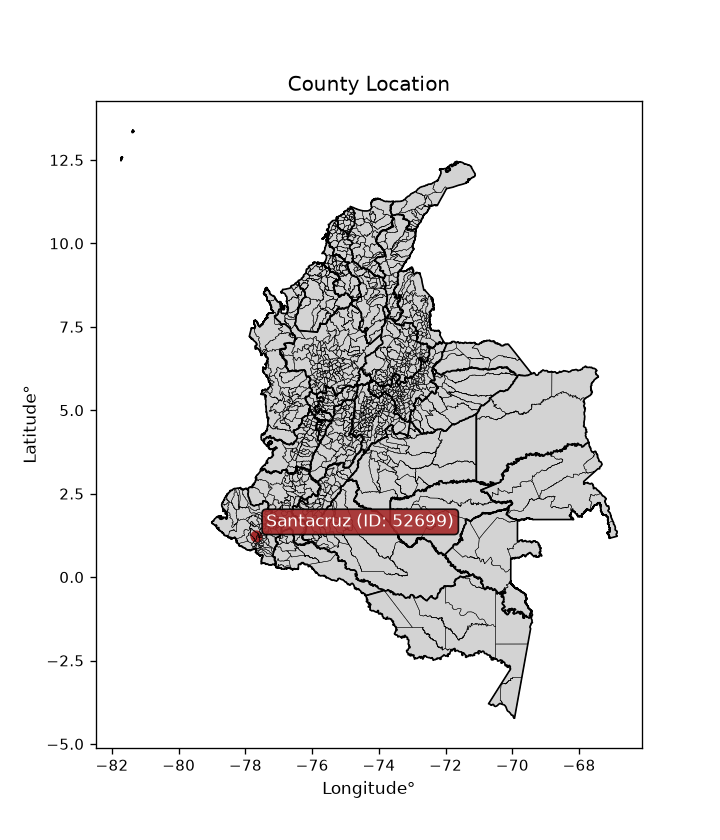
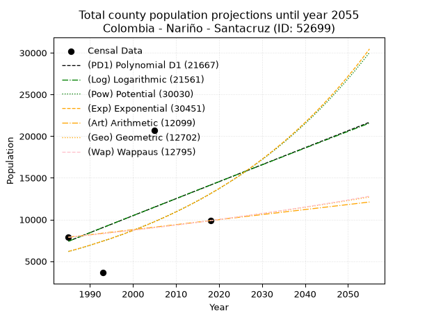
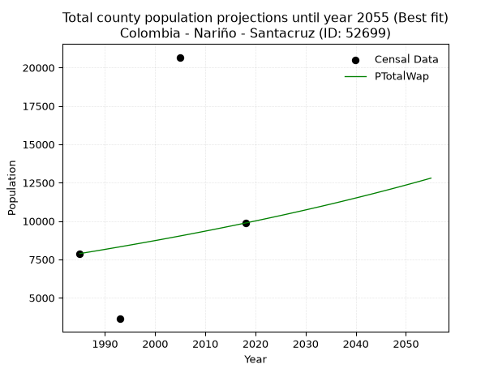
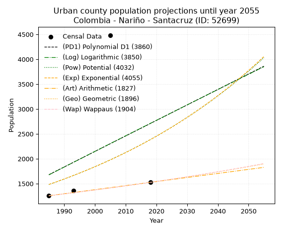
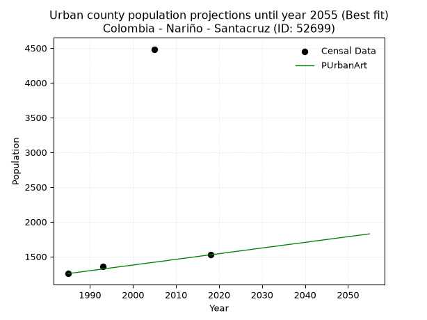
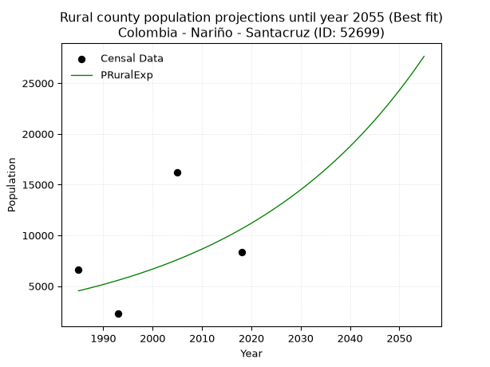

<div align="center">


</div>

# _“Population and Public Services Demand Projections (PPSD) until Year 2050 for Colombia - Nariño - Santacruz (ID: 52699)”_
Keywords: `population` `public-service` `projection` `lineal` `polynomial` `logarithmic` `potential` `exponential` `arithmetic` `geometric` `wappaus` `dane` `colombia` `south-america`

PPSD are analytical estimates used by governments and planners to anticipate future changes in population size, age distribution, and the resulting community needs for utilities, healthcare, education, and infrastructure as sizing future water treatment facilities, electrical grids, and road networks based on spatial growth.

<div align="center">

</img>

</div>


> **General running parameters**: • app_version: _v20260806_. • Python version: _3.14.7_. • Pandas version: _3.0.5_. • NumPy version: _2.5.1_. • Creates, save and include plots into reports (create_plot): _False_. • Projection until year: _2050_. • Process polynomial degree 2 and up: _False_. • Process Wappaus: _True_. • Process Wappaus: _True_. • Set negative values to zero: _True_. • Set infinite values to zero: _True_. • Drop dataset notes: _True_. 
<div align="center">

Dynamic map: [:earth_americas:Google](http://maps.google.com/maps?q=1.222589225,-77.6770345) [:earth_americas:OSM](https://www.openstreetmap.org/#map=18/1.222589225/-77.6770345&layers=P) [:earth_americas:Bing](https://www.bing.com/maps?cp=1.222589225~-77.6770345&lvl=18) [:earth_americas:Apple](https://maps.apple.com/frame?center=1.222589225%2C-77.6770345&span=0.003%2C0.006)

</div>


<div align="center">

```geojson
{
  "type": "Feature",
  "geometry": {
    "type": "Point", 
    "coordinates": [-77.6770345, 1.222589225]
  }, 
  "properties": {
    "Name": "Colombia - Nariño - Santacruz (ID: 52699)"
  }
}
```

</div>


## 0. Census Data (4 records)

Census data are official statistics collected by a government about the people and housing in a country. They usually include counts of total population, age, sex, race, income, education, and jobs.

📅Global census file: [Population.xlsx](../data/Population.xlsx)

| Source   |   Year |   CountryID | CountryName   |   StateID | StateName   |   CountyID | CountyName   |   PTotal |   PUrban |   PRural |
|:---------|-------:|------------:|:--------------|----------:|:------------|-----------:|:-------------|---------:|---------:|---------:|
| DANE     |   1985 |          57 | Colombia      |        52 | Nariño      |      52699 | Santacruz    |     7880 |     1256 |     6624 |
| DANE     |   1993 |          57 | Colombia      |        52 | Nariño      |      52699 | Santacruz    |     3628 |     1353 |     2275 |
| DANE     |   2005 |          57 | Colombia      |        52 | Nariño      |      52699 | Santacruz    |    20670 |     4484 |    16186 |
| DANE     |   2018 |          57 | Colombia      |        52 | Nariño      |      52699 | Santacruz    |     9869 |     1525 |     8344 |

> 🔥Some records could had specific notes about the registered values or the corresponding urban or rural distribution.

📅[SUI-RUPS](https://www.datos.gov.co/Hacienda-y-Cr-dito-P-blico/Registro-nico-de-Prestadores-de-Servicios-P-blicos/4qkq-csdn/about_data) - Local public utility companies: [RUPS.csv](../data/RUPS.xlsx)

 | SERVICIO       | ESTADO    | NOMBRE                                                                               | NIT         | DEPARTAMENTO_DOMICILIO   | MUNICIPIO_DOMICILIO   | DIRECCION            |   TELEFONO | EMAIL                                   | TIPO_PRESTADOR          | CLASIFICACION                 |
|:---------------|:----------|:-------------------------------------------------------------------------------------|:------------|:-------------------------|:----------------------|:---------------------|-----------:|:----------------------------------------|:------------------------|:------------------------------|
| ACUEDUCTO      | OPERATIVA | ADMINISTRACION PUBLICA COOPERATIVA DE AGUA POTABLE Y SANEAMIENTO BASICO DE SANTACRUZ | 900220700-6 | NARINO                   | SANTACRUZ             | BARRIO OLAYA HERRERA |    8185213 | monitab77@gmail.com                     | ORGANIZACION AUTORIZADA | MENOR O IGUAL A 2500 USUARIOS |
| ALCANTARILLADO | OPERATIVA | ADMINISTRACION PUBLICA COOPERATIVA DE AGUA POTABLE Y SANEAMIENTO BASICO DE SANTACRUZ | 900220700-6 | NARINO                   | SANTACRUZ             | BARRIO OLAYA HERRERA |    8185213 | monitab77@gmail.com                     | ORGANIZACION AUTORIZADA | MENOR O IGUAL A 2500 USUARIOS |
| ACUEDUCTO      | OPERATIVA | ASOCIACION JUNTA ADMINISTRADORA DE ACUEDUCTO DE LA VEREDA CANDAGAN                   | 900311781-3 | NARINO                   | SANTACRUZ             | VEREDA CANDAGAN      |    3127666 | acueductocandagansantacruz123@gmail.com | ORGANIZACION AUTORIZADA | HASTA 2500 SUSCRIPTORES       |

## 1. Total

### 1.1. Coefficients and Parameters

* (PD1) Polynomial Deg 1: 203.74829385789405, -397035.77478925255 (lineal)
* (Log) Logarithmic: 408872.63160930295, -3097332.399361951
* (Pow) Potential: 45.680318488831894, -146.85274381707754
* (Exp) Exponential: 0.022800687773292087, 1.363171381985759e-16
* (Art) Arithmetic: Year diff. 2018 - 1985 = 33, Population diff. 9869 - 7880 = 1989, Annual growth = 60.27272727272727
* (Geo) Geometric: Year diff. 2018 - 1985 = 33, Population diff. 9869 - 7880 = 1989, Annual growth % = 0.006843633403233573
* (Wap) Wappaus: i = 0.6791675843453409, Condition values only valid for < 200)

<sub>
Wappaus condition values: ['0.00', '0.68', '1.36', '2.04', '2.72', '3.40', '4.08', '4.75', '5.43', '6.11', '6.79', '7.47', '8.15', '8.83', '9.51', '10.19', '10.87', '11.55', '12.23', '12.90', '13.58', '14.26', '14.94', '15.62', '16.30', '16.98', '17.66', '18.34', '19.02', '19.70', '20.38', '21.05', '21.73', '22.41', '23.09', '23.77', '24.45', '25.13', '25.81', '26.49', '27.17', '27.85', '28.53', '29.20', '29.88', '30.56', '31.24', '31.92', '32.60', '33.28', '33.96', '34.64', '35.32', '36.00', '36.68', '37.35', '38.03', '38.71', '39.39', '40.07', '40.75', '41.43', '42.11', '42.79', '43.47', '44.15']
</sub>


### 1.2. Projected Dataset

|   Year |   CountyID |   PTotalPD1 |   PTotalLog |   PTotalPow |   PTotalExp |   PTotalArt |   PTotalGeo |   PTotalWap |
|-------:|-----------:|------------:|------------:|------------:|------------:|------------:|------------:|------------:|
|   1985 |      52699 |        7405 |        7390 |        6166 |        6172 |        7880 |        7880 |        7880 |
|   1986 |      52699 |        7608 |        7596 |        6310 |        6315 |        7940 |        7934 |        7934 |
|   1987 |      52699 |        7812 |        7802 |        6456 |        6460 |        8001 |        7988 |        7988 |
|   1988 |      52699 |        8016 |        8008 |        6606 |        6609 |        8061 |        8043 |        8042 |
|   1989 |      52699 |        8220 |        8214 |        6760 |        6762 |        8121 |        8098 |        8097 |
|   1990 |      52699 |        8423 |        8419 |        6917 |        6918 |        8181 |        8153 |        8152 |
|   1991 |      52699 |        8627 |        8625 |        7078 |        7077 |        8242 |        8209 |        8208 |
|   1992 |      52699 |        8831 |        8830 |        7242 |        7240 |        8302 |        8265 |        8264 |
|   1993 |      52699 |        9035 |        9035 |        7410 |        7407 |        8362 |        8322 |        8320 |
|   1994 |      52699 |        9238 |        9240 |        7581 |        7578 |        8422 |        8379 |        8377 |
|   1995 |      52699 |        9442 |        9445 |        7757 |        7753 |        8483 |        8436 |        8434 |
|   1996 |      52699 |        9646 |        9650 |        7937 |        7932 |        8543 |        8494 |        8492 |
|   1997 |      52699 |        9850 |        9855 |        8120 |        8115 |        8603 |        8552 |        8550 |
|   1998 |      52699 |       10053 |       10060 |        8308 |        8302 |        8664 |        8611 |        8608 |
|   1999 |      52699 |       10257 |       10264 |        8500 |        8493 |        8724 |        8670 |        8667 |
|   2000 |      52699 |       10461 |       10469 |        8697 |        8689 |        8784 |        8729 |        8726 |
|   2001 |      52699 |       10665 |       10673 |        8898 |        8890 |        8844 |        8789 |        8785 |
|   2002 |      52699 |       10868 |       10877 |        9103 |        9095 |        8905 |        8849 |        8846 |
|   2003 |      52699 |       11072 |       11081 |        9313 |        9304 |        8965 |        8909 |        8906 |
|   2004 |      52699 |       11276 |       11286 |        9528 |        9519 |        9025 |        8970 |        8967 |
|   2005 |      52699 |       11480 |       11489 |        9747 |        9738 |        9085 |        9032 |        9028 |
|   2006 |      52699 |       11683 |       11693 |        9972 |        9963 |        9146 |        9093 |        9090 |
|   2007 |      52699 |       11887 |       11897 |       10202 |       10193 |        9206 |        9156 |        9152 |
|   2008 |      52699 |       12091 |       12101 |       10436 |       10428 |        9266 |        9218 |        9215 |
|   2009 |      52699 |       12295 |       12304 |       10677 |       10668 |        9327 |        9281 |        9278 |
|   2010 |      52699 |       12498 |       12508 |       10922 |       10914 |        9387 |        9345 |        9342 |
|   2011 |      52699 |       12702 |       12711 |       11173 |       11166 |        9447 |        9409 |        9406 |
|   2012 |      52699 |       12906 |       12914 |       11430 |       11424 |        9507 |        9473 |        9471 |
|   2013 |      52699 |       13110 |       13118 |       11692 |       11687 |        9568 |        9538 |        9536 |
|   2014 |      52699 |       13313 |       13321 |       11960 |       11957 |        9628 |        9603 |        9602 |
|   2015 |      52699 |       13517 |       13524 |       12235 |       12232 |        9688 |        9669 |        9668 |
|   2016 |      52699 |       13721 |       13727 |       12515 |       12514 |        9748 |        9735 |        9734 |
|   2017 |      52699 |       13925 |       13929 |       12802 |       12803 |        9809 |        9802 |        9801 |
|   2018 |      52699 |       14128 |       14132 |       13095 |       13098 |        9869 |        9869 |        9869 |
|   2019 |      52699 |       14332 |       14335 |       13395 |       13400 |        9929 |        9937 |        9937 |
|   2020 |      52699 |       14536 |       14537 |       13701 |       13709 |        9990 |       10005 |       10006 |
|   2021 |      52699 |       14740 |       14739 |       14015 |       14026 |       10050 |       10073 |       10075 |
|   2022 |      52699 |       14943 |       14942 |       14335 |       14349 |       10110 |       10142 |       10145 |
|   2023 |      52699 |       15147 |       15144 |       14662 |       14680 |       10170 |       10211 |       10215 |
|   2024 |      52699 |       15351 |       15346 |       14997 |       15019 |       10231 |       10281 |       10286 |
|   2025 |      52699 |       15555 |       15548 |       15339 |       15365 |       10291 |       10352 |       10357 |
|   2026 |      52699 |       15758 |       15750 |       15689 |       15719 |       10351 |       10422 |       10429 |
|   2027 |      52699 |       15962 |       15951 |       16047 |       16082 |       10411 |       10494 |       10502 |
|   2028 |      52699 |       16166 |       16153 |       16412 |       16453 |       10472 |       10566 |       10575 |
|   2029 |      52699 |       16370 |       16355 |       16786 |       16832 |       10532 |       10638 |       10648 |
|   2030 |      52699 |       16573 |       16556 |       17168 |       17220 |       10592 |       10711 |       10723 |
|   2031 |      52699 |       16777 |       16758 |       17559 |       17618 |       10653 |       10784 |       10798 |
|   2032 |      52699 |       16981 |       16959 |       17958 |       18024 |       10713 |       10858 |       10873 |
|   2033 |      52699 |       17185 |       17160 |       18366 |       18440 |       10773 |       10932 |       10949 |
|   2034 |      52699 |       17388 |       17361 |       18784 |       18865 |       10833 |       11007 |       11026 |
|   2035 |      52699 |       17592 |       17562 |       19210 |       19300 |       10894 |       11082 |       11103 |
|   2036 |      52699 |       17796 |       17763 |       19646 |       19745 |       10954 |       11158 |       11181 |
|   2037 |      52699 |       17999 |       17964 |       20092 |       20200 |       11014 |       11234 |       11260 |
|   2038 |      52699 |       18203 |       18164 |       20547 |       20666 |       11074 |       11311 |       11339 |
|   2039 |      52699 |       18407 |       18365 |       21013 |       21143 |       11135 |       11389 |       11419 |
|   2040 |      52699 |       18611 |       18565 |       21489 |       21630 |       11195 |       11467 |       11500 |
|   2041 |      52699 |       18814 |       18766 |       21976 |       22129 |       11255 |       11545 |       11581 |
|   2042 |      52699 |       19018 |       18966 |       22473 |       22640 |       11316 |       11624 |       11663 |
|   2043 |      52699 |       19222 |       19166 |       22981 |       23162 |       11376 |       11704 |       11745 |
|   2044 |      52699 |       19426 |       19366 |       23501 |       23696 |       11436 |       11784 |       11829 |
|   2045 |      52699 |       19629 |       19566 |       24032 |       24242 |       11496 |       11864 |       11913 |
|   2046 |      52699 |       19833 |       19766 |       24574 |       24802 |       11557 |       11946 |       11998 |
|   2047 |      52699 |       20037 |       19966 |       25129 |       25373 |       11617 |       12027 |       12083 |
|   2048 |      52699 |       20241 |       20166 |       25696 |       25959 |       11677 |       12110 |       12169 |
|   2049 |      52699 |       20444 |       20365 |       26275 |       26557 |       11737 |       12193 |       12256 |
|   2050 |      52699 |       20648 |       20565 |       26868 |       27170 |       11798 |       12276 |       12344 |
<div align="center">

</img>

</div>


### 1.3. Best fit with absolute and relative error (%)

Relative error puts that difference into context by dividing the absolute error by the true value, creating a unitless ratio or percentage that shows the scale of the mistake.

Absolute and relative error

|   Year | Source   |   CountryID | CountryName   |   StateID | StateName   |   CountyID_x | CountyName   |   PTotal |   PUrban |   PRural |   CountyID_y |   PTotalPD1 |   PTotalLog |   PTotalPow |   PTotalExp |   PTotalArt |   PTotalGeo |   PTotalWap |   PTotalPD1AbsError |   PTotalLogAbsError |   PTotalPowAbsError |   PTotalExpAbsError |   PTotalArtAbsError |   PTotalGeoAbsError |   PTotalWapAbsError |   PTotalPD1RelError |   PTotalLogRelError |   PTotalPowRelError |   PTotalExpRelError |   PTotalArtRelError |   PTotalGeoRelError |   PTotalWapRelError |
|-------:|:---------|------------:|:--------------|----------:|:------------|-------------:|:-------------|---------:|---------:|---------:|-------------:|------------:|------------:|------------:|------------:|------------:|------------:|------------:|--------------------:|--------------------:|--------------------:|--------------------:|--------------------:|--------------------:|--------------------:|--------------------:|--------------------:|--------------------:|--------------------:|--------------------:|--------------------:|--------------------:|
|   1985 | DANE     |          57 | Colombia      |        52 | Nariño      |        52699 | Santacruz    |     7880 |     1256 |     6624 |        52699 |        7405 |        7390 |        6166 |        6172 |        7880 |        7880 |        7880 |                 475 |                 490 |                1714 |                1708 |                   0 |                   0 |                   0 |             6.02792 |             6.21827 |             21.7513 |             21.6751 |              0      |              0      |              0      |
|   1993 | DANE     |          57 | Colombia      |        52 | Nariño      |        52699 | Santacruz    |     3628 |     1353 |     2275 |        52699 |        9035 |        9035 |        7410 |        7407 |        8362 |        8322 |        8320 |                5407 |                5407 |                3782 |                3779 |                4734 |                4694 |                4692 |           149.035   |           149.035   |            104.245  |            104.162  |            130.485  |            129.383  |            129.327  |
|   2005 | DANE     |          57 | Colombia      |        52 | Nariño      |        52699 | Santacruz    |    20670 |     4484 |    16186 |        52699 |       11480 |       11489 |        9747 |        9738 |        9085 |        9032 |        9028 |                9190 |                9181 |               10923 |               10932 |               11585 |               11638 |               11642 |            44.4606  |            44.417   |             52.8447 |             52.8882 |             56.0474 |             56.3038 |             56.3232 |
|   2018 | DANE     |          57 | Colombia      |        52 | Nariño      |        52699 | Santacruz    |     9869 |     1525 |     8344 |        52699 |       14128 |       14132 |       13095 |       13098 |        9869 |        9869 |        9869 |                4259 |                4263 |                3226 |                3229 |                   0 |                   0 |                   0 |            43.1553  |            43.1959  |             32.6882 |             32.7186 |              0      |              0      |              0      |

Relative error mean

| Method    |   RelError | Best   |
|:----------|-----------:|:-------|
| PTotalPD1 |    60.6698 |        |
| PTotalLog |    60.7166 |        |
| PTotalPow |    52.8822 |        |
| PTotalExp |    52.861  |        |
| PTotalArt |    46.6331 |        |
| PTotalGeo |    46.4216 |        |
| PTotalWap |    46.4127 | True   |

💙Best method: _**PTotalWap**_
<div align="center">

</img>

</div>


### 1.4. Fresh water supply demand in liters per capita per day (lpcd)

The fresh water supply demand typically ranges from 100 to 300 liters per capita per day (lpcd) for standard domestic and municipal planning, though absolute survival minimums set by the World Health Organization are as low as 7.5 to 20 liters per day, and total consumption in high-income nations can exceed 400 liters.

> `CZ`: Level in meters above the sea level (masl)<br> `WS`: Fresh water supply demand in liters per capita per day (lpcd or l/h/d)<br> `WSAll`: Zonal fresh water supply demand in liters per second (l/s)<br> `A`: Zonal area in square meters<br> `DP`: Population density (people/hectare or p/ha)

Reference values (RAS Colombia)

|    CZ |   WS |
|------:|-----:|
|  1000 |  120 |
|  2000 |  130 |
| 99999 |  140 |

County shapefile geometry properties and water supply values

|   CountyID |      ATotal |   CZTotal |   WSTotal |
|-----------:|------------:|----------:|----------:|
|      52699 | 5.41275e+08 |   1993.76 |       130 |

Projected values for best method: PTotalWap

|   CountyID |   Year |   PTotalWap |   DPTotal |   WSTotal |   WSTotalAll |
|-----------:|-------:|------------:|----------:|----------:|-------------:|
|      52699 |   1985 |        7880 |      0.15 |       130 |      11.8565 |
|      52699 |   1986 |        7934 |      0.15 |       130 |      11.9377 |
|      52699 |   1987 |        7988 |      0.15 |       130 |      12.019  |
|      52699 |   1988 |        8042 |      0.15 |       130 |      12.1002 |
|      52699 |   1989 |        8097 |      0.15 |       130 |      12.183  |
|      52699 |   1990 |        8152 |      0.15 |       130 |      12.2657 |
|      52699 |   1991 |        8208 |      0.15 |       130 |      12.35   |
|      52699 |   1992 |        8264 |      0.15 |       130 |      12.4343 |
|      52699 |   1993 |        8320 |      0.15 |       130 |      12.5185 |
|      52699 |   1994 |        8377 |      0.15 |       130 |      12.6043 |
|      52699 |   1995 |        8434 |      0.16 |       130 |      12.69   |
|      52699 |   1996 |        8492 |      0.16 |       130 |      12.7773 |
|      52699 |   1997 |        8550 |      0.16 |       130 |      12.8646 |
|      52699 |   1998 |        8608 |      0.16 |       130 |      12.9519 |
|      52699 |   1999 |        8667 |      0.16 |       130 |      13.0406 |
|      52699 |   2000 |        8726 |      0.16 |       130 |      13.1294 |
|      52699 |   2001 |        8785 |      0.16 |       130 |      13.2182 |
|      52699 |   2002 |        8846 |      0.16 |       130 |      13.31   |
|      52699 |   2003 |        8906 |      0.16 |       130 |      13.4002 |
|      52699 |   2004 |        8967 |      0.17 |       130 |      13.492  |
|      52699 |   2005 |        9028 |      0.17 |       130 |      13.5838 |
|      52699 |   2006 |        9090 |      0.17 |       130 |      13.6771 |
|      52699 |   2007 |        9152 |      0.17 |       130 |      13.7704 |
|      52699 |   2008 |        9215 |      0.17 |       130 |      13.8652 |
|      52699 |   2009 |        9278 |      0.17 |       130 |      13.96   |
|      52699 |   2010 |        9342 |      0.17 |       130 |      14.0563 |
|      52699 |   2011 |        9406 |      0.17 |       130 |      14.1525 |
|      52699 |   2012 |        9471 |      0.17 |       130 |      14.2503 |
|      52699 |   2013 |        9536 |      0.18 |       130 |      14.3481 |
|      52699 |   2014 |        9602 |      0.18 |       130 |      14.4475 |
|      52699 |   2015 |        9668 |      0.18 |       130 |      14.5468 |
|      52699 |   2016 |        9734 |      0.18 |       130 |      14.6461 |
|      52699 |   2017 |        9801 |      0.18 |       130 |      14.7469 |
|      52699 |   2018 |        9869 |      0.18 |       130 |      14.8492 |
|      52699 |   2019 |        9937 |      0.18 |       130 |      14.9515 |
|      52699 |   2020 |       10006 |      0.18 |       130 |      15.0553 |
|      52699 |   2021 |       10075 |      0.19 |       130 |      15.1591 |
|      52699 |   2022 |       10145 |      0.19 |       130 |      15.2645 |
|      52699 |   2023 |       10215 |      0.19 |       130 |      15.3698 |
|      52699 |   2024 |       10286 |      0.19 |       130 |      15.4766 |
|      52699 |   2025 |       10357 |      0.19 |       130 |      15.5834 |
|      52699 |   2026 |       10429 |      0.19 |       130 |      15.6918 |
|      52699 |   2027 |       10502 |      0.19 |       130 |      15.8016 |
|      52699 |   2028 |       10575 |      0.2  |       130 |      15.9115 |
|      52699 |   2029 |       10648 |      0.2  |       130 |      16.0213 |
|      52699 |   2030 |       10723 |      0.2  |       130 |      16.1341 |
|      52699 |   2031 |       10798 |      0.2  |       130 |      16.247  |
|      52699 |   2032 |       10873 |      0.2  |       130 |      16.3598 |
|      52699 |   2033 |       10949 |      0.2  |       130 |      16.4742 |
|      52699 |   2034 |       11026 |      0.2  |       130 |      16.59   |
|      52699 |   2035 |       11103 |      0.21 |       130 |      16.7059 |
|      52699 |   2036 |       11181 |      0.21 |       130 |      16.8233 |
|      52699 |   2037 |       11260 |      0.21 |       130 |      16.9421 |
|      52699 |   2038 |       11339 |      0.21 |       130 |      17.061  |
|      52699 |   2039 |       11419 |      0.21 |       130 |      17.1814 |
|      52699 |   2040 |       11500 |      0.21 |       130 |      17.3032 |
|      52699 |   2041 |       11581 |      0.21 |       130 |      17.4251 |
|      52699 |   2042 |       11663 |      0.22 |       130 |      17.5485 |
|      52699 |   2043 |       11745 |      0.22 |       130 |      17.6719 |
|      52699 |   2044 |       11829 |      0.22 |       130 |      17.7983 |
|      52699 |   2045 |       11913 |      0.22 |       130 |      17.9247 |
|      52699 |   2046 |       11998 |      0.22 |       130 |      18.0525 |
|      52699 |   2047 |       12083 |      0.22 |       130 |      18.1804 |
|      52699 |   2048 |       12169 |      0.22 |       130 |      18.3098 |
|      52699 |   2049 |       12256 |      0.23 |       130 |      18.4407 |
|      52699 |   2050 |       12344 |      0.23 |       130 |      18.5731 |

## 2. Urban

### 2.1. Coefficients and Parameters

* (PD1) Polynomial Deg 1: 31.159373745485375, -60172.03733440712 (lineal)
* (Log) Logarithmic: 62731.47778353145, -474667.96533113666
* (Pow) Potential: 28.904400287824576, -92.14931165695789
* (Exp) Exponential: 0.014371792627831465, 6.047346544981396e-10
* (Art) Arithmetic: Year diff. 2018 - 1985 = 33, Population diff. 1525 - 1256 = 269, Annual growth = 8.151515151515152
* (Geo) Geometric: Year diff. 2018 - 1985 = 33, Population diff. 1525 - 1256 = 269, Annual growth % = 0.005898002156384585
* (Wap) Wappaus: i = 0.5862290651934665, Condition values only valid for < 200)

<sub>
Wappaus condition values: ['0.00', '0.59', '1.17', '1.76', '2.34', '2.93', '3.52', '4.10', '4.69', '5.28', '5.86', '6.45', '7.03', '7.62', '8.21', '8.79', '9.38', '9.97', '10.55', '11.14', '11.72', '12.31', '12.90', '13.48', '14.07', '14.66', '15.24', '15.83', '16.41', '17.00', '17.59', '18.17', '18.76', '19.35', '19.93', '20.52', '21.10', '21.69', '22.28', '22.86', '23.45', '24.04', '24.62', '25.21', '25.79', '26.38', '26.97', '27.55', '28.14', '28.73', '29.31', '29.90', '30.48', '31.07', '31.66', '32.24', '32.83', '33.42', '34.00', '34.59', '35.17', '35.76', '36.35', '36.93', '37.52', '38.10']
</sub>


### 2.2. Projected Dataset

|   Year |   CountyID |   PUrbanPD1 |   PUrbanLog |   PUrbanPow |   PUrbanExp |   PUrbanArt |   PUrbanGeo |   PUrbanWap |
|-------:|-----------:|------------:|------------:|------------:|------------:|------------:|------------:|------------:|
|   1985 |      52699 |        1679 |        1676 |        1481 |        1483 |        1256 |        1256 |        1256 |
|   1986 |      52699 |        1710 |        1707 |        1502 |        1504 |        1264 |        1263 |        1263 |
|   1987 |      52699 |        1742 |        1739 |        1524 |        1526 |        1272 |        1271 |        1271 |
|   1988 |      52699 |        1773 |        1770 |        1547 |        1548 |        1280 |        1278 |        1278 |
|   1989 |      52699 |        1804 |        1802 |        1569 |        1571 |        1289 |        1286 |        1286 |
|   1990 |      52699 |        1835 |        1833 |        1592 |        1593 |        1297 |        1293 |        1293 |
|   1991 |      52699 |        1866 |        1865 |        1616 |        1616 |        1305 |        1301 |        1301 |
|   1992 |      52699 |        1897 |        1896 |        1639 |        1640 |        1313 |        1309 |        1309 |
|   1993 |      52699 |        1929 |        1928 |        1663 |        1664 |        1321 |        1317 |        1316 |
|   1994 |      52699 |        1960 |        1959 |        1688 |        1688 |        1329 |        1324 |        1324 |
|   1995 |      52699 |        1991 |        1991 |        1712 |        1712 |        1338 |        1332 |        1332 |
|   1996 |      52699 |        2022 |        2022 |        1737 |        1737 |        1346 |        1340 |        1340 |
|   1997 |      52699 |        2053 |        2054 |        1763 |        1762 |        1354 |        1348 |        1348 |
|   1998 |      52699 |        2084 |        2085 |        1788 |        1788 |        1362 |        1356 |        1356 |
|   1999 |      52699 |        2116 |        2117 |        1814 |        1813 |        1370 |        1364 |        1363 |
|   2000 |      52699 |        2147 |        2148 |        1841 |        1840 |        1378 |        1372 |        1372 |
|   2001 |      52699 |        2178 |        2179 |        1867 |        1866 |        1386 |        1380 |        1380 |
|   2002 |      52699 |        2209 |        2211 |        1895 |        1893 |        1395 |        1388 |        1388 |
|   2003 |      52699 |        2240 |        2242 |        1922 |        1921 |        1403 |        1396 |        1396 |
|   2004 |      52699 |        2271 |        2273 |        1950 |        1949 |        1411 |        1404 |        1404 |
|   2005 |      52699 |        2303 |        2305 |        1978 |        1977 |        1419 |        1413 |        1412 |
|   2006 |      52699 |        2334 |        2336 |        2007 |        2005 |        1427 |        1421 |        1421 |
|   2007 |      52699 |        2365 |        2367 |        2036 |        2034 |        1435 |        1429 |        1429 |
|   2008 |      52699 |        2396 |        2398 |        2066 |        2064 |        1443 |        1438 |        1438 |
|   2009 |      52699 |        2427 |        2430 |        2096 |        2094 |        1452 |        1446 |        1446 |
|   2010 |      52699 |        2458 |        2461 |        2126 |        2124 |        1460 |        1455 |        1455 |
|   2011 |      52699 |        2489 |        2492 |        2157 |        2155 |        1468 |        1463 |        1463 |
|   2012 |      52699 |        2521 |        2523 |        2188 |        2186 |        1476 |        1472 |        1472 |
|   2013 |      52699 |        2552 |        2554 |        2220 |        2218 |        1484 |        1481 |        1481 |
|   2014 |      52699 |        2583 |        2585 |        2252 |        2250 |        1492 |        1490 |        1489 |
|   2015 |      52699 |        2614 |        2617 |        2284 |        2282 |        1501 |        1498 |        1498 |
|   2016 |      52699 |        2645 |        2648 |        2317 |        2315 |        1509 |        1507 |        1507 |
|   2017 |      52699 |        2676 |        2679 |        2351 |        2349 |        1517 |        1516 |        1516 |
|   2018 |      52699 |        2708 |        2710 |        2385 |        2383 |        1525 |        1525 |        1525 |
|   2019 |      52699 |        2739 |        2741 |        2419 |        2417 |        1533 |        1534 |        1534 |
|   2020 |      52699 |        2770 |        2772 |        2454 |        2452 |        1541 |        1543 |        1543 |
|   2021 |      52699 |        2801 |        2803 |        2489 |        2488 |        1549 |        1552 |        1552 |
|   2022 |      52699 |        2832 |        2834 |        2525 |        2524 |        1558 |        1561 |        1562 |
|   2023 |      52699 |        2863 |        2865 |        2562 |        2560 |        1566 |        1571 |        1571 |
|   2024 |      52699 |        2895 |        2896 |        2598 |        2597 |        1574 |        1580 |        1580 |
|   2025 |      52699 |        2926 |        2927 |        2636 |        2635 |        1582 |        1589 |        1590 |
|   2026 |      52699 |        2957 |        2958 |        2674 |        2673 |        1590 |        1598 |        1599 |
|   2027 |      52699 |        2988 |        2989 |        2712 |        2712 |        1598 |        1608 |        1609 |
|   2028 |      52699 |        3019 |        3020 |        2751 |        2751 |        1607 |        1617 |        1618 |
|   2029 |      52699 |        3050 |        3051 |        2791 |        2791 |        1615 |        1627 |        1628 |
|   2030 |      52699 |        3081 |        3082 |        2831 |        2831 |        1623 |        1637 |        1638 |
|   2031 |      52699 |        3113 |        3113 |        2871 |        2872 |        1631 |        1646 |        1647 |
|   2032 |      52699 |        3144 |        3144 |        2912 |        2914 |        1639 |        1656 |        1657 |
|   2033 |      52699 |        3175 |        3175 |        2954 |        2956 |        1647 |        1666 |        1667 |
|   2034 |      52699 |        3206 |        3205 |        2996 |        2999 |        1655 |        1675 |        1677 |
|   2035 |      52699 |        3237 |        3236 |        3039 |        3042 |        1664 |        1685 |        1687 |
|   2036 |      52699 |        3268 |        3267 |        3083 |        3086 |        1672 |        1695 |        1698 |
|   2037 |      52699 |        3300 |        3298 |        3127 |        3131 |        1680 |        1705 |        1708 |
|   2038 |      52699 |        3331 |        3329 |        3171 |        3176 |        1688 |        1715 |        1718 |
|   2039 |      52699 |        3362 |        3359 |        3217 |        3222 |        1696 |        1725 |        1728 |
|   2040 |      52699 |        3393 |        3390 |        3263 |        3269 |        1704 |        1736 |        1739 |
|   2041 |      52699 |        3424 |        3421 |        3309 |        3316 |        1712 |        1746 |        1749 |
|   2042 |      52699 |        3455 |        3452 |        3356 |        3364 |        1721 |        1756 |        1760 |
|   2043 |      52699 |        3487 |        3482 |        3404 |        3413 |        1729 |        1767 |        1771 |
|   2044 |      52699 |        3518 |        3513 |        3453 |        3462 |        1737 |        1777 |        1781 |
|   2045 |      52699 |        3549 |        3544 |        3502 |        3513 |        1745 |        1787 |        1792 |
|   2046 |      52699 |        3580 |        3574 |        3552 |        3563 |        1753 |        1798 |        1803 |
|   2047 |      52699 |        3611 |        3605 |        3602 |        3615 |        1761 |        1809 |        1814 |
|   2048 |      52699 |        3642 |        3636 |        3653 |        3667 |        1770 |        1819 |        1825 |
|   2049 |      52699 |        3674 |        3666 |        3705 |        3720 |        1778 |        1830 |        1836 |
|   2050 |      52699 |        3705 |        3697 |        3758 |        3774 |        1786 |        1841 |        1847 |
<div align="center">

</img>

</div>


### 2.3. Best fit with absolute and relative error (%)

Relative error puts that difference into context by dividing the absolute error by the true value, creating a unitless ratio or percentage that shows the scale of the mistake.

Absolute and relative error

|   Year | Source   |   CountryID | CountryName   |   StateID | StateName   |   CountyID_x | CountyName   |   PTotal |   PUrban |   PRural |   CountyID_y |   PUrbanPD1 |   PUrbanLog |   PUrbanPow |   PUrbanExp |   PUrbanArt |   PUrbanGeo |   PUrbanWap |   PUrbanPD1AbsError |   PUrbanLogAbsError |   PUrbanPowAbsError |   PUrbanExpAbsError |   PUrbanArtAbsError |   PUrbanGeoAbsError |   PUrbanWapAbsError |   PUrbanPD1RelError |   PUrbanLogRelError |   PUrbanPowRelError |   PUrbanExpRelError |   PUrbanArtRelError |   PUrbanGeoRelError |   PUrbanWapRelError |
|-------:|:---------|------------:|:--------------|----------:|:------------|-------------:|:-------------|---------:|---------:|---------:|-------------:|------------:|------------:|------------:|------------:|------------:|------------:|------------:|--------------------:|--------------------:|--------------------:|--------------------:|--------------------:|--------------------:|--------------------:|--------------------:|--------------------:|--------------------:|--------------------:|--------------------:|--------------------:|--------------------:|
|   1985 | DANE     |          57 | Colombia      |        52 | Nariño      |        52699 | Santacruz    |     7880 |     1256 |     6624 |        52699 |        1679 |        1676 |        1481 |        1483 |        1256 |        1256 |        1256 |                 423 |                 420 |                 225 |                 227 |                   0 |                   0 |                   0 |             33.6783 |             33.4395 |             17.914  |             18.0732 |             0       |             0       |             0       |
|   1993 | DANE     |          57 | Colombia      |        52 | Nariño      |        52699 | Santacruz    |     3628 |     1353 |     2275 |        52699 |        1929 |        1928 |        1663 |        1664 |        1321 |        1317 |        1316 |                 576 |                 575 |                 310 |                 311 |                  32 |                  36 |                  37 |             42.5721 |             42.4982 |             22.912  |             22.986  |             2.36511 |             2.66075 |             2.73466 |
|   2005 | DANE     |          57 | Colombia      |        52 | Nariño      |        52699 | Santacruz    |    20670 |     4484 |    16186 |        52699 |        2303 |        2305 |        1978 |        1977 |        1419 |        1413 |        1412 |                2181 |                2179 |                2506 |                2507 |                3065 |                3071 |                3072 |             48.6396 |             48.595  |             55.8876 |             55.9099 |            68.3541  |            68.488   |            68.5103  |
|   2018 | DANE     |          57 | Colombia      |        52 | Nariño      |        52699 | Santacruz    |     9869 |     1525 |     8344 |        52699 |        2708 |        2710 |        2385 |        2383 |        1525 |        1525 |        1525 |                1183 |                1185 |                 860 |                 858 |                   0 |                   0 |                   0 |             77.5738 |             77.7049 |             56.3934 |             56.2623 |             0       |             0       |             0       |

Relative error mean

| Method    |   RelError | Best   |
|:----------|-----------:|:-------|
| PUrbanPD1 |    50.6159 |        |
| PUrbanLog |    50.5594 |        |
| PUrbanPow |    38.2768 |        |
| PUrbanExp |    38.3079 |        |
| PUrbanArt |    17.6798 | True   |
| PUrbanGeo |    17.7872 |        |
| PUrbanWap |    17.8112 |        |

💙Best method: _**PUrbanArt**_
<div align="center">

</img>

</div>


### 2.4. Fresh water supply demand in liters per capita per day (lpcd)

The fresh water supply demand typically ranges from 100 to 300 liters per capita per day (lpcd) for standard domestic and municipal planning, though absolute survival minimums set by the World Health Organization are as low as 7.5 to 20 liters per day, and total consumption in high-income nations can exceed 400 liters.

> `CZ`: Level in meters above the sea level (masl)<br> `WS`: Fresh water supply demand in liters per capita per day (lpcd or l/h/d)<br> `WSAll`: Zonal fresh water supply demand in liters per second (l/s)<br> `A`: Zonal area in square meters<br> `DP`: Population density (people/hectare or p/ha)

Reference values (RAS Colombia)

|    CZ |   WS |
|------:|-----:|
|  1000 |  120 |
|  2000 |  130 |
| 99999 |  140 |

County shapefile geometry properties and water supply values

|   CountyID |   AUrban |   CZUrban |   WSUrban |
|-----------:|---------:|----------:|----------:|
|      52699 |   211748 |    2596.9 |       140 |

Projected values for best method: PUrbanArt

|   CountyID |   Year |   PUrbanArt |   DPUrban |   WSUrban |   WSUrbanAll |
|-----------:|-------:|------------:|----------:|----------:|-------------:|
|      52699 |   1985 |        1256 |     59.32 |       140 |      2.03519 |
|      52699 |   1986 |        1264 |     59.69 |       140 |      2.04815 |
|      52699 |   1987 |        1272 |     60.07 |       140 |      2.06111 |
|      52699 |   1988 |        1280 |     60.45 |       140 |      2.07407 |
|      52699 |   1989 |        1289 |     60.87 |       140 |      2.08866 |
|      52699 |   1990 |        1297 |     61.25 |       140 |      2.10162 |
|      52699 |   1991 |        1305 |     61.63 |       140 |      2.11458 |
|      52699 |   1992 |        1313 |     62.01 |       140 |      2.12755 |
|      52699 |   1993 |        1321 |     62.39 |       140 |      2.14051 |
|      52699 |   1994 |        1329 |     62.76 |       140 |      2.15347 |
|      52699 |   1995 |        1338 |     63.19 |       140 |      2.16806 |
|      52699 |   1996 |        1346 |     63.57 |       140 |      2.18102 |
|      52699 |   1997 |        1354 |     63.94 |       140 |      2.19398 |
|      52699 |   1998 |        1362 |     64.32 |       140 |      2.20694 |
|      52699 |   1999 |        1370 |     64.7  |       140 |      2.21991 |
|      52699 |   2000 |        1378 |     65.08 |       140 |      2.23287 |
|      52699 |   2001 |        1386 |     65.46 |       140 |      2.24583 |
|      52699 |   2002 |        1395 |     65.88 |       140 |      2.26042 |
|      52699 |   2003 |        1403 |     66.26 |       140 |      2.27338 |
|      52699 |   2004 |        1411 |     66.64 |       140 |      2.28634 |
|      52699 |   2005 |        1419 |     67.01 |       140 |      2.29931 |
|      52699 |   2006 |        1427 |     67.39 |       140 |      2.31227 |
|      52699 |   2007 |        1435 |     67.77 |       140 |      2.32523 |
|      52699 |   2008 |        1443 |     68.15 |       140 |      2.33819 |
|      52699 |   2009 |        1452 |     68.57 |       140 |      2.35278 |
|      52699 |   2010 |        1460 |     68.95 |       140 |      2.36574 |
|      52699 |   2011 |        1468 |     69.33 |       140 |      2.3787  |
|      52699 |   2012 |        1476 |     69.71 |       140 |      2.39167 |
|      52699 |   2013 |        1484 |     70.08 |       140 |      2.40463 |
|      52699 |   2014 |        1492 |     70.46 |       140 |      2.41759 |
|      52699 |   2015 |        1501 |     70.89 |       140 |      2.43218 |
|      52699 |   2016 |        1509 |     71.26 |       140 |      2.44514 |
|      52699 |   2017 |        1517 |     71.64 |       140 |      2.4581  |
|      52699 |   2018 |        1525 |     72.02 |       140 |      2.47106 |
|      52699 |   2019 |        1533 |     72.4  |       140 |      2.48403 |
|      52699 |   2020 |        1541 |     72.78 |       140 |      2.49699 |
|      52699 |   2021 |        1549 |     73.15 |       140 |      2.50995 |
|      52699 |   2022 |        1558 |     73.58 |       140 |      2.52454 |
|      52699 |   2023 |        1566 |     73.96 |       140 |      2.5375  |
|      52699 |   2024 |        1574 |     74.33 |       140 |      2.55046 |
|      52699 |   2025 |        1582 |     74.71 |       140 |      2.56343 |
|      52699 |   2026 |        1590 |     75.09 |       140 |      2.57639 |
|      52699 |   2027 |        1598 |     75.47 |       140 |      2.58935 |
|      52699 |   2028 |        1607 |     75.89 |       140 |      2.60394 |
|      52699 |   2029 |        1615 |     76.27 |       140 |      2.6169  |
|      52699 |   2030 |        1623 |     76.65 |       140 |      2.62986 |
|      52699 |   2031 |        1631 |     77.03 |       140 |      2.64282 |
|      52699 |   2032 |        1639 |     77.4  |       140 |      2.65579 |
|      52699 |   2033 |        1647 |     77.78 |       140 |      2.66875 |
|      52699 |   2034 |        1655 |     78.16 |       140 |      2.68171 |
|      52699 |   2035 |        1664 |     78.58 |       140 |      2.6963  |
|      52699 |   2036 |        1672 |     78.96 |       140 |      2.70926 |
|      52699 |   2037 |        1680 |     79.34 |       140 |      2.72222 |
|      52699 |   2038 |        1688 |     79.72 |       140 |      2.73519 |
|      52699 |   2039 |        1696 |     80.1  |       140 |      2.74815 |
|      52699 |   2040 |        1704 |     80.47 |       140 |      2.76111 |
|      52699 |   2041 |        1712 |     80.85 |       140 |      2.77407 |
|      52699 |   2042 |        1721 |     81.28 |       140 |      2.78866 |
|      52699 |   2043 |        1729 |     81.65 |       140 |      2.80162 |
|      52699 |   2044 |        1737 |     82.03 |       140 |      2.81458 |
|      52699 |   2045 |        1745 |     82.41 |       140 |      2.82755 |
|      52699 |   2046 |        1753 |     82.79 |       140 |      2.84051 |
|      52699 |   2047 |        1761 |     83.17 |       140 |      2.85347 |
|      52699 |   2048 |        1770 |     83.59 |       140 |      2.86806 |
|      52699 |   2049 |        1778 |     83.97 |       140 |      2.88102 |
|      52699 |   2050 |        1786 |     84.35 |       140 |      2.89398 |

## 3. Rural

### 3.1. Coefficients and Parameters

* (PD1) Polynomial Deg 1: 172.58892011240872, -336863.73745484557 (lineal)
* (Log) Logarithmic: 346141.1538257716, -2622664.434030815
* (Pow) Potential: 51.728118054206284, -166.93128672165523
* (Exp) Exponential: 0.02583630419319306, 2.416685076421523e-19
* (Art) Arithmetic: Year diff. 2018 - 1985 = 33, Population diff. 8344 - 6624 = 1720, Annual growth = 52.121212121212125
* (Geo) Geometric: Year diff. 2018 - 1985 = 33, Population diff. 8344 - 6624 = 1720, Annual growth % = 0.0070197754561323045
* (Wap) Wappaus: i = 0.6964352234261374, Condition values only valid for < 200)

<sub>
Wappaus condition values: ['0.00', '0.70', '1.39', '2.09', '2.79', '3.48', '4.18', '4.88', '5.57', '6.27', '6.96', '7.66', '8.36', '9.05', '9.75', '10.45', '11.14', '11.84', '12.54', '13.23', '13.93', '14.63', '15.32', '16.02', '16.71', '17.41', '18.11', '18.80', '19.50', '20.20', '20.89', '21.59', '22.29', '22.98', '23.68', '24.38', '25.07', '25.77', '26.46', '27.16', '27.86', '28.55', '29.25', '29.95', '30.64', '31.34', '32.04', '32.73', '33.43', '34.13', '34.82', '35.52', '36.21', '36.91', '37.61', '38.30', '39.00', '39.70', '40.39', '41.09', '41.79', '42.48', '43.18', '43.88', '44.57', '45.27']
</sub>


### 3.2. Projected Dataset

|   Year |   CountyID |   PRuralPD1 |   PRuralLog |   PRuralPow |   PRuralExp |   PRuralArt |   PRuralGeo |   PRuralWap |
|-------:|-----------:|------------:|------------:|------------:|------------:|------------:|------------:|------------:|
|   1985 |      52699 |        5725 |        5715 |        4525 |        4529 |        6624 |        6624 |        6624 |
|   1986 |      52699 |        5898 |        5889 |        4645 |        4648 |        6676 |        6670 |        6670 |
|   1987 |      52699 |        6070 |        6063 |        4767 |        4770 |        6728 |        6717 |        6717 |
|   1988 |      52699 |        6243 |        6238 |        4893 |        4894 |        6780 |        6764 |        6764 |
|   1989 |      52699 |        6416 |        6412 |        5022 |        5023 |        6832 |        6812 |        6811 |
|   1990 |      52699 |        6588 |        6586 |        5154 |        5154 |        6885 |        6860 |        6859 |
|   1991 |      52699 |        6761 |        6760 |        5290 |        5289 |        6937 |        6908 |        6907 |
|   1992 |      52699 |        6933 |        6933 |        5429 |        5427 |        6989 |        6956 |        6955 |
|   1993 |      52699 |        7106 |        7107 |        5572 |        5569 |        7041 |        7005 |        7004 |
|   1994 |      52699 |        7279 |        7281 |        5719 |        5715 |        7093 |        7054 |        7053 |
|   1995 |      52699 |        7451 |        7454 |        5869 |        5865 |        7145 |        7104 |        7102 |
|   1996 |      52699 |        7624 |        7628 |        6023 |        6018 |        7197 |        7154 |        7152 |
|   1997 |      52699 |        7796 |        7801 |        6181 |        6176 |        7249 |        7204 |        7202 |
|   1998 |      52699 |        7969 |        7974 |        6343 |        6337 |        7302 |        7255 |        7252 |
|   1999 |      52699 |        8142 |        8148 |        6509 |        6503 |        7354 |        7306 |        7303 |
|   2000 |      52699 |        8314 |        8321 |        6680 |        6673 |        7406 |        7357 |        7354 |
|   2001 |      52699 |        8487 |        8494 |        6855 |        6848 |        7458 |        7408 |        7406 |
|   2002 |      52699 |        8659 |        8667 |        7035 |        7027 |        7510 |        7460 |        7458 |
|   2003 |      52699 |        8832 |        8840 |        7219 |        7211 |        7562 |        7513 |        7510 |
|   2004 |      52699 |        9004 |        9012 |        7407 |        7400 |        7614 |        7566 |        7563 |
|   2005 |      52699 |        9177 |        9185 |        7601 |        7594 |        7666 |        7619 |        7616 |
|   2006 |      52699 |        9350 |        9358 |        7800 |        7792 |        7719 |        7672 |        7669 |
|   2007 |      52699 |        9522 |        9530 |        8003 |        7996 |        7771 |        7726 |        7723 |
|   2008 |      52699 |        9695 |        9703 |        8212 |        8206 |        7823 |        7780 |        7777 |
|   2009 |      52699 |        9867 |        9875 |        8427 |        8420 |        7875 |        7835 |        7832 |
|   2010 |      52699 |       10040 |       10047 |        8646 |        8641 |        7927 |        7890 |        7887 |
|   2011 |      52699 |       10213 |       10219 |        8872 |        8867 |        7979 |        7945 |        7943 |
|   2012 |      52699 |       10385 |       10391 |        9103 |        9099 |        8031 |        8001 |        7999 |
|   2013 |      52699 |       10558 |       10563 |        9340 |        9337 |        8083 |        8057 |        8055 |
|   2014 |      52699 |       10730 |       10735 |        9583 |        9582 |        8136 |        8114 |        8112 |
|   2015 |      52699 |       10903 |       10907 |        9832 |        9832 |        8188 |        8171 |        8169 |
|   2016 |      52699 |       11076 |       11079 |       10088 |       10090 |        8240 |        8228 |        8227 |
|   2017 |      52699 |       11248 |       11250 |       10350 |       10354 |        8292 |        8286 |        8285 |
|   2018 |      52699 |       11421 |       11422 |       10619 |       10625 |        8344 |        8344 |        8344 |
|   2019 |      52699 |       11593 |       11594 |       10894 |       10903 |        8396 |        8403 |        8403 |
|   2020 |      52699 |       11766 |       11765 |       11177 |       11188 |        8448 |        8462 |        8463 |
|   2021 |      52699 |       11938 |       11936 |       11467 |       11481 |        8500 |        8521 |        8523 |
|   2022 |      52699 |       12111 |       12107 |       11764 |       11782 |        8552 |        8581 |        8583 |
|   2023 |      52699 |       12284 |       12279 |       12069 |       12090 |        8605 |        8641 |        8644 |
|   2024 |      52699 |       12456 |       12450 |       12381 |       12406 |        8657 |        8702 |        8706 |
|   2025 |      52699 |       12629 |       12621 |       12702 |       12731 |        8709 |        8763 |        8768 |
|   2026 |      52699 |       12801 |       12792 |       13030 |       13064 |        8761 |        8824 |        8830 |
|   2027 |      52699 |       12974 |       12962 |       13367 |       13406 |        8813 |        8886 |        8893 |
|   2028 |      52699 |       13147 |       13133 |       13712 |       13757 |        8865 |        8949 |        8957 |
|   2029 |      52699 |       13319 |       13304 |       14067 |       14117 |        8917 |        9011 |        9021 |
|   2030 |      52699 |       13492 |       13474 |       14430 |       14487 |        8969 |        9075 |        9086 |
|   2031 |      52699 |       13664 |       13645 |       14802 |       14866 |        9022 |        9138 |        9151 |
|   2032 |      52699 |       13837 |       13815 |       15184 |       15255 |        9074 |        9203 |        9216 |
|   2033 |      52699 |       14010 |       13985 |       15575 |       15654 |        9126 |        9267 |        9283 |
|   2034 |      52699 |       14182 |       14156 |       15977 |       16064 |        9178 |        9332 |        9350 |
|   2035 |      52699 |       14355 |       14326 |       16388 |       16484 |        9230 |        9398 |        9417 |
|   2036 |      52699 |       14527 |       14496 |       16810 |       16916 |        9282 |        9464 |        9485 |
|   2037 |      52699 |       14700 |       14666 |       17242 |       17358 |        9334 |        9530 |        9553 |
|   2038 |      52699 |       14872 |       14836 |       17686 |       17813 |        9386 |        9597 |        9622 |
|   2039 |      52699 |       15045 |       15005 |       18140 |       18279 |        9439 |        9664 |        9692 |
|   2040 |      52699 |       15218 |       15175 |       18606 |       18757 |        9491 |        9732 |        9762 |
|   2041 |      52699 |       15390 |       15345 |       19084 |       19248 |        9543 |        9801 |        9833 |
|   2042 |      52699 |       15563 |       15514 |       19573 |       19752 |        9595 |        9869 |        9905 |
|   2043 |      52699 |       15735 |       15684 |       20075 |       20269 |        9647 |        9939 |        9977 |
|   2044 |      52699 |       15908 |       15853 |       20590 |       20800 |        9699 |       10008 |       10050 |
|   2045 |      52699 |       16081 |       16023 |       21118 |       21344 |        9751 |       10079 |       10123 |
|   2046 |      52699 |       16253 |       16192 |       21659 |       21903 |        9803 |       10149 |       10197 |
|   2047 |      52699 |       16426 |       16361 |       22213 |       22476 |        9856 |       10221 |       10272 |
|   2048 |      52699 |       16598 |       16530 |       22781 |       23064 |        9908 |       10292 |       10347 |
|   2049 |      52699 |       16771 |       16699 |       23364 |       23668 |        9960 |       10365 |       10423 |
|   2050 |      52699 |       16944 |       16868 |       23961 |       24287 |       10012 |       10437 |       10500 |
<div align="center">

</img>

</div>


### 3.3. Best fit with absolute and relative error (%)

Relative error puts that difference into context by dividing the absolute error by the true value, creating a unitless ratio or percentage that shows the scale of the mistake.

Absolute and relative error

|   Year | Source   |   CountryID | CountryName   |   StateID | StateName   |   CountyID_x | CountyName   |   PTotal |   PUrban |   PRural |   CountyID_y |   PRuralPD1 |   PRuralLog |   PRuralPow |   PRuralExp |   PRuralArt |   PRuralGeo |   PRuralWap |   PRuralPD1AbsError |   PRuralLogAbsError |   PRuralPowAbsError |   PRuralExpAbsError |   PRuralArtAbsError |   PRuralGeoAbsError |   PRuralWapAbsError |   PRuralPD1RelError |   PRuralLogRelError |   PRuralPowRelError |   PRuralExpRelError |   PRuralArtRelError |   PRuralGeoRelError |   PRuralWapRelError |
|-------:|:---------|------------:|:--------------|----------:|:------------|-------------:|:-------------|---------:|---------:|---------:|-------------:|------------:|------------:|------------:|------------:|------------:|------------:|------------:|--------------------:|--------------------:|--------------------:|--------------------:|--------------------:|--------------------:|--------------------:|--------------------:|--------------------:|--------------------:|--------------------:|--------------------:|--------------------:|--------------------:|
|   1985 | DANE     |          57 | Colombia      |        52 | Nariño      |        52699 | Santacruz    |     7880 |     1256 |     6624 |        52699 |        5725 |        5715 |        4525 |        4529 |        6624 |        6624 |        6624 |                 899 |                 909 |                2099 |                2095 |                   0 |                   0 |                   0 |             13.5719 |             13.7228 |             31.6878 |             31.6274 |              0      |              0      |               0     |
|   1993 | DANE     |          57 | Colombia      |        52 | Nariño      |        52699 | Santacruz    |     3628 |     1353 |     2275 |        52699 |        7106 |        7107 |        5572 |        5569 |        7041 |        7005 |        7004 |                4831 |                4832 |                3297 |                3294 |                4766 |                4730 |                4729 |            212.352  |            212.396  |            144.923  |            144.791  |            209.495  |            207.912  |             207.868 |
|   2005 | DANE     |          57 | Colombia      |        52 | Nariño      |        52699 | Santacruz    |    20670 |     4484 |    16186 |        52699 |        9177 |        9185 |        7601 |        7594 |        7666 |        7619 |        7616 |                7009 |                7001 |                8585 |                8592 |                8520 |                8567 |                8570 |             43.3029 |             43.2534 |             53.0397 |             53.0829 |             52.6381 |             52.9285 |              52.947 |
|   2018 | DANE     |          57 | Colombia      |        52 | Nariño      |        52699 | Santacruz    |     9869 |     1525 |     8344 |        52699 |       11421 |       11422 |       10619 |       10625 |        8344 |        8344 |        8344 |                3077 |                3078 |                2275 |                2281 |                   0 |                   0 |                   0 |             36.8768 |             36.8888 |             27.2651 |             27.337  |              0      |              0      |               0     |

Relative error mean

| Method    |   RelError | Best   |
|:----------|-----------:|:-------|
| PRuralPD1 |    76.5258 |        |
| PRuralLog |    76.5652 |        |
| PRuralPow |    64.2289 |        |
| PRuralExp |    64.2096 | True   |
| PRuralArt |    65.5331 |        |
| PRuralGeo |    65.2101 |        |
| PRuralWap |    65.2038 |        |

💙Best method: _**PRuralExp**_
<div align="center">

</img>

</div>


### 3.4. Fresh water supply demand in liters per capita per day (lpcd)

The fresh water supply demand typically ranges from 100 to 300 liters per capita per day (lpcd) for standard domestic and municipal planning, though absolute survival minimums set by the World Health Organization are as low as 7.5 to 20 liters per day, and total consumption in high-income nations can exceed 400 liters.

> `CZ`: Level in meters above the sea level (masl)<br> `WS`: Fresh water supply demand in liters per capita per day (lpcd or l/h/d)<br> `WSAll`: Zonal fresh water supply demand in liters per second (l/s)<br> `A`: Zonal area in square meters<br> `DP`: Population density (people/hectare or p/ha)

Reference values (RAS Colombia)

|    CZ |   WS |
|------:|-----:|
|  1000 |  120 |
|  2000 |  130 |
| 99999 |  140 |

County shapefile geometry properties and water supply values

|   CountyID |      ARural |   CZRural |   WSRural |
|-----------:|------------:|----------:|----------:|
|      52699 | 5.41063e+08 |   1993.53 |       130 |

Projected values for best method: PRuralExp

|   CountyID |   Year |   PRuralExp |   DPRural |   WSRural |   WSRuralAll |
|-----------:|-------:|------------:|----------:|----------:|-------------:|
|      52699 |   1985 |        4529 |      0.08 |       130 |      6.81447 |
|      52699 |   1986 |        4648 |      0.09 |       130 |      6.99352 |
|      52699 |   1987 |        4770 |      0.09 |       130 |      7.17708 |
|      52699 |   1988 |        4894 |      0.09 |       130 |      7.36366 |
|      52699 |   1989 |        5023 |      0.09 |       130 |      7.55775 |
|      52699 |   1990 |        5154 |      0.1  |       130 |      7.75486 |
|      52699 |   1991 |        5289 |      0.1  |       130 |      7.95799 |
|      52699 |   1992 |        5427 |      0.1  |       130 |      8.16563 |
|      52699 |   1993 |        5569 |      0.1  |       130 |      8.37928 |
|      52699 |   1994 |        5715 |      0.11 |       130 |      8.59896 |
|      52699 |   1995 |        5865 |      0.11 |       130 |      8.82465 |
|      52699 |   1996 |        6018 |      0.11 |       130 |      9.05486 |
|      52699 |   1997 |        6176 |      0.11 |       130 |      9.29259 |
|      52699 |   1998 |        6337 |      0.12 |       130 |      9.53484 |
|      52699 |   1999 |        6503 |      0.12 |       130 |      9.78461 |
|      52699 |   2000 |        6673 |      0.12 |       130 |     10.0404  |
|      52699 |   2001 |        6848 |      0.13 |       130 |     10.3037  |
|      52699 |   2002 |        7027 |      0.13 |       130 |     10.573   |
|      52699 |   2003 |        7211 |      0.13 |       130 |     10.8499  |
|      52699 |   2004 |        7400 |      0.14 |       130 |     11.1343  |
|      52699 |   2005 |        7594 |      0.14 |       130 |     11.4262  |
|      52699 |   2006 |        7792 |      0.14 |       130 |     11.7241  |
|      52699 |   2007 |        7996 |      0.15 |       130 |     12.031   |
|      52699 |   2008 |        8206 |      0.15 |       130 |     12.347   |
|      52699 |   2009 |        8420 |      0.16 |       130 |     12.669   |
|      52699 |   2010 |        8641 |      0.16 |       130 |     13.0015  |
|      52699 |   2011 |        8867 |      0.16 |       130 |     13.3416  |
|      52699 |   2012 |        9099 |      0.17 |       130 |     13.6906  |
|      52699 |   2013 |        9337 |      0.17 |       130 |     14.0487  |
|      52699 |   2014 |        9582 |      0.18 |       130 |     14.4174  |
|      52699 |   2015 |        9832 |      0.18 |       130 |     14.7935  |
|      52699 |   2016 |       10090 |      0.19 |       130 |     15.1817  |
|      52699 |   2017 |       10354 |      0.19 |       130 |     15.5789  |
|      52699 |   2018 |       10625 |      0.2  |       130 |     15.9867  |
|      52699 |   2019 |       10903 |      0.2  |       130 |     16.405   |
|      52699 |   2020 |       11188 |      0.21 |       130 |     16.8338  |
|      52699 |   2021 |       11481 |      0.21 |       130 |     17.2747  |
|      52699 |   2022 |       11782 |      0.22 |       130 |     17.7275  |
|      52699 |   2023 |       12090 |      0.22 |       130 |     18.191   |
|      52699 |   2024 |       12406 |      0.23 |       130 |     18.6664  |
|      52699 |   2025 |       12731 |      0.24 |       130 |     19.1554  |
|      52699 |   2026 |       13064 |      0.24 |       130 |     19.6565  |
|      52699 |   2027 |       13406 |      0.25 |       130 |     20.1711  |
|      52699 |   2028 |       13757 |      0.25 |       130 |     20.6992  |
|      52699 |   2029 |       14117 |      0.26 |       130 |     21.2409  |
|      52699 |   2030 |       14487 |      0.27 |       130 |     21.7976  |
|      52699 |   2031 |       14866 |      0.27 |       130 |     22.3678  |
|      52699 |   2032 |       15255 |      0.28 |       130 |     22.9531  |
|      52699 |   2033 |       15654 |      0.29 |       130 |     23.5535  |
|      52699 |   2034 |       16064 |      0.3  |       130 |     24.1704  |
|      52699 |   2035 |       16484 |      0.3  |       130 |     24.8023  |
|      52699 |   2036 |       16916 |      0.31 |       130 |     25.4523  |
|      52699 |   2037 |       17358 |      0.32 |       130 |     26.1174  |
|      52699 |   2038 |       17813 |      0.33 |       130 |     26.802   |
|      52699 |   2039 |       18279 |      0.34 |       130 |     27.5031  |
|      52699 |   2040 |       18757 |      0.35 |       130 |     28.2223  |
|      52699 |   2041 |       19248 |      0.36 |       130 |     28.9611  |
|      52699 |   2042 |       19752 |      0.37 |       130 |     29.7194  |
|      52699 |   2043 |       20269 |      0.37 |       130 |     30.4973  |
|      52699 |   2044 |       20800 |      0.38 |       130 |     31.2963  |
|      52699 |   2045 |       21344 |      0.39 |       130 |     32.1148  |
|      52699 |   2046 |       21903 |      0.4  |       130 |     32.9559  |
|      52699 |   2047 |       22476 |      0.42 |       130 |     33.8181  |
|      52699 |   2048 |       23064 |      0.43 |       130 |     34.7028  |
|      52699 |   2049 |       23668 |      0.44 |       130 |     35.6116  |
|      52699 |   2050 |       24287 |      0.45 |       130 |     36.5429  |

#

<div align="center"><br><sub>Share this research</sub></div><br>

<sub>**APPS & TOOLS & CONTENT DISCLAIMER**: • NO WARRANTY - This content and software is provided by <a href="https://github.com/rcfdtools" target="_blank">github.com/rcfdtools</a> "as is", without any express or implied warranty, including warranties of merchantability, fitness for a particular purpose, or non-infringement. There is no guarantee that the software will be error-free or operate without interruption. • LIMITATION OF LIABILITY - Neither the authors nor copyright holders will be liable for claims or damages arising from the software or its use. You are responsible for determining if the software is appropriate for your use and assume all associated risks, including errors, legal compliance, and data loss. • NO PROFESSIONAL ADVICE - The software provides general information and does not offer professional advice. It should not replace consultation with professional advisors. [Clauses and global license for rcfdtools use.](https://github.com/rcfdtools/rcfdtools/blob/main/LICENSE.md)</sub>

| [:house: Home](Readme.md)  | [:beginner: Help / Collab](https://github.com/rcfdtools/R.HydroTools/discussions/31) |
|----------------------------|-------------------------------------------------------------------------------------------|