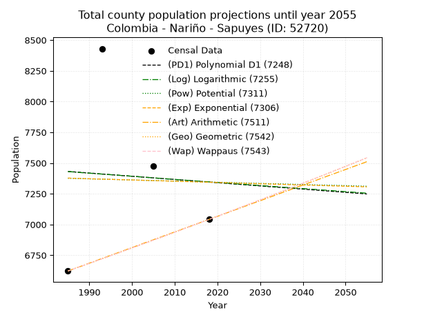
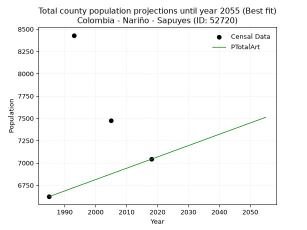
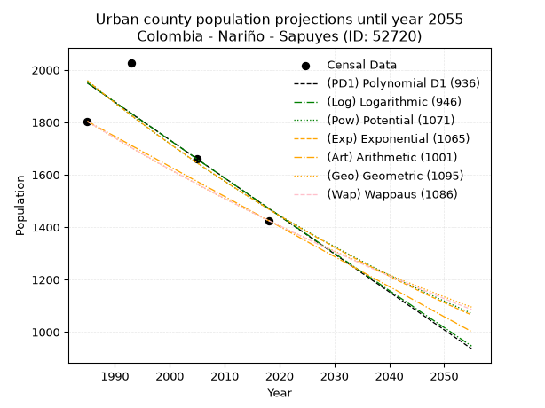
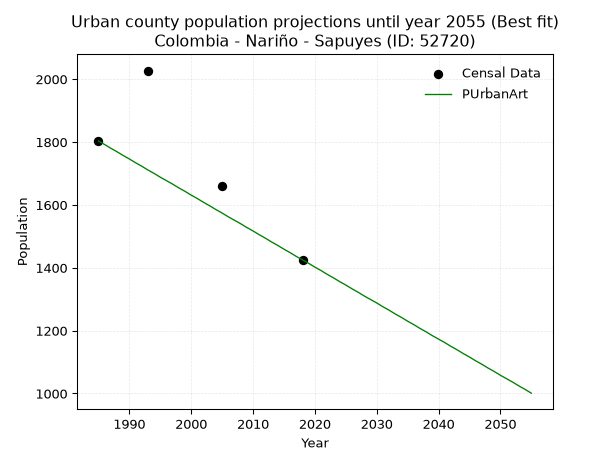
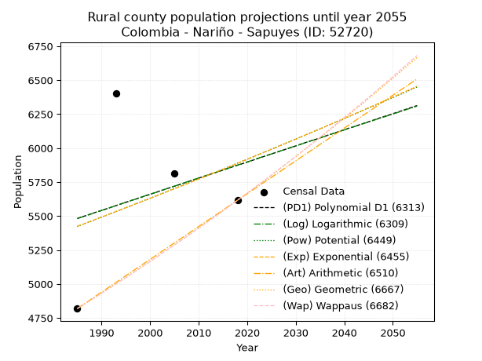
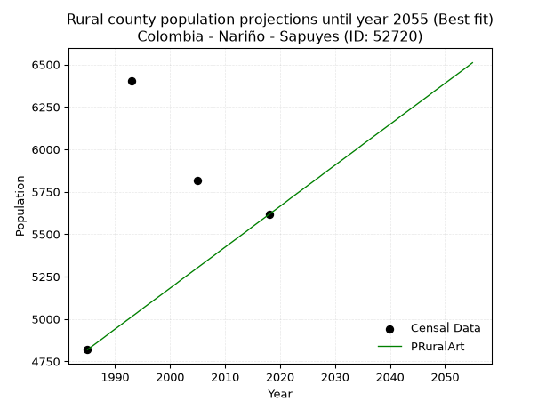

<div align="center">


</div>

# _“Population and Public Services Demand Projections (PPSD) until Year 2050 for Colombia - Nariño - Sapuyes (ID: 52720)”_
Keywords: `population` `public-service` `projection` `lineal` `polynomial` `logarithmic` `potential` `exponential` `arithmetic` `geometric` `wappaus` `dane` `colombia` `south-america`

PPSD are analytical estimates used by governments and planners to anticipate future changes in population size, age distribution, and the resulting community needs for utilities, healthcare, education, and infrastructure as sizing future water treatment facilities, electrical grids, and road networks based on spatial growth.

> **General running parameters**: • app_version: _v20260806_. • Python version: _3.14.7_. • Pandas version: _3.0.5_. • NumPy version: _2.5.1_. • Creates, save and include plots into reports (create_plot): _False_. • Projection until year: _2050_. • Process polynomial degree 2 and up: _False_. • Process Wappaus: _True_. • Process Wappaus: _True_. • Set negative values to zero: _True_. • Set infinite values to zero: _True_. • Drop dataset notes: _True_. 
<div align="center">

Dynamic map: [:earth_americas:Google](http://maps.google.com/maps?q=1.037536386,-77.6202802) [:earth_americas:OSM](https://www.openstreetmap.org/#map=18/1.037536386/-77.6202802&layers=P) [:earth_americas:Bing](https://www.bing.com/maps?cp=1.037536386~-77.6202802&lvl=18) [:earth_americas:Apple](https://maps.apple.com/frame?center=1.037536386%2C-77.6202802&span=0.003%2C0.006)

</div>


<div align="center">

```geojson
{
  "type": "Feature",
  "geometry": {
    "type": "Point", 
    "coordinates": [-77.6202802, 1.037536386]
  }, 
  "properties": {
    "Name": "Colombia - Nariño - Sapuyes (ID: 52720)"
  }
}
```

</div>


## 0. Census Data (4 records)

Census data are official statistics collected by a government about the people and housing in a country. They usually include counts of total population, age, sex, race, income, education, and jobs.

📅Global census file: [Population.xlsx](../data/Population.xlsx)

| Source   |   Year |   CountryID | CountryName   |   StateID | StateName   |   CountyID | CountyName   |   PTotal |   PUrban |   PRural |
|:---------|-------:|------------:|:--------------|----------:|:------------|-----------:|:-------------|---------:|---------:|---------:|
| DANE     |   1985 |          57 | Colombia      |        52 | Nariño      |      52720 | Sapuyes      |     6622 |     1803 |     4819 |
| DANE     |   1993 |          57 | Colombia      |        52 | Nariño      |      52720 | Sapuyes      |     8430 |     2027 |     6403 |
| DANE     |   2005 |          57 | Colombia      |        52 | Nariño      |      52720 | Sapuyes      |     7473 |     1659 |     5814 |
| DANE     |   2018 |          57 | Colombia      |        52 | Nariño      |      52720 | Sapuyes      |     7041 |     1425 |     5616 |

> 🔥Some records could had specific notes about the registered values or the corresponding urban or rural distribution.

**Local public utility companies (RUPS)**

 | SERVICIO       | ESTADO    | NOMBRE                                                     | NIT         | DEPARTAMENTO_DOMICILIO   | MUNICIPIO_DOMICILIO   | DIRECCION                        |   TELEFONO | EMAIL                              | TIPO_INSCRIPCION    | REPRESENTANTE_LEGAL             | TIPO_PRESTADOR                             | CLASIFICACION                 |
|:---------------|:----------|:-----------------------------------------------------------|:------------|:-------------------------|:----------------------|:---------------------------------|-----------:|:-----------------------------------|:--------------------|:--------------------------------|:-------------------------------------------|:------------------------------|
| ASEO           | OPERATIVA | INSTITUTO DE SERVICIOS VARIOS DE IPIALES                   | 800200999-2 | NARINO                   | IPIALES               | CRA 1 NRO 3E-140 AV.PANAMERICANA |    7734408 | iservi@ipiales-narino.gov.co       | Registro por la ESP | LUIS CARLOS ORTEGA SANCHEZ      | EMPRESA INDUSTRIAL Y COMERCIAL DEL ESTADO  | MAYOR O IGUAL A 5001 USUARIOS |
| ASEO           | OPERATIVA | EMPRESA METROPOLITANA DE ASEO DE PASTO S.A.  E.S.P.        | 814000704-1 | NARINO                   | PASTO                 | CARRERA 24 #23-51                |    7362874 | sonia-elizabeth.criollo@veolia.com | Registro por la ESP | ANGELA MARCELA PAZ ROMERO       | SOCIEDADES (EMPRESA DE SERVICIOS PUBLICOS) | MAYOR O IGUAL A 5001 USUARIOS |
| ACUEDUCTO      | OPERATIVA | ASOCIACION ADMINISTRADORA DE SERVICIOS PUBLICOS DE SAPUYES | 900049542-7 | NARINO                   | SAPUYES               | CRA:4 Nro 4 -20 PUEYO DE VAL     |    7752371 | aades.esp@gmail.com                | Registro por la ESP | JAVIER RODRIGO URBANO  CALDERON | ORGANIZACION AUTORIZADA                    | HASTA 2500 SUSCRIPTORES       |
| ALCANTARILLADO | OPERATIVA | ASOCIACION ADMINISTRADORA DE SERVICIOS PUBLICOS DE SAPUYES | 900049542-7 | NARINO                   | SAPUYES               | CRA:4 Nro 4 -20 PUEYO DE VAL     |    7752371 | aades.esp@gmail.com                | Registro por la ESP | JAVIER RODRIGO URBANO  CALDERON | ORGANIZACION AUTORIZADA                    | HASTA 2500 SUSCRIPTORES       |
| ASEO           | OPERATIVA | ASOCIACION ADMINISTRADORA DE SERVICIOS PUBLICOS DE SAPUYES | 900049542-7 | NARINO                   | SAPUYES               | CRA:4 Nro 4 -20 PUEYO DE VAL     |    7752371 | aades.esp@gmail.com                | Registro por la ESP | JAVIER RODRIGO URBANO  CALDERON | ORGANIZACION AUTORIZADA                    | HASTA 2500 SUSCRIPTORES       |
| ACUEDUCTO      | OPERATIVA | EMPRESA DE SERVICIOS PUBLICOS DE SAPUYES EMSSAP SA ESP     | 901013193-8 | NARINO                   | SAPUYES               | carrera 3 No.5-37 centro         |    3176802 | germanjov492@gmail.com             | Registro por la ESP | RUBIELA DEL PILAR BOLANOS OLIVA | SOCIEDADES (EMPRESA DE SERVICIOS PUBLICOS) | MENOR O IGUAL A 2500 USUARIOS |
| ALCANTARILLADO | OPERATIVA | EMPRESA DE SERVICIOS PUBLICOS DE SAPUYES EMSSAP SA ESP     | 901013193-8 | NARINO                   | SAPUYES               | carrera 3 No.5-37 centro         |    3176802 | germanjov492@gmail.com             | Registro por la ESP | RUBIELA DEL PILAR BOLANOS OLIVA | SOCIEDADES (EMPRESA DE SERVICIOS PUBLICOS) | MENOR O IGUAL A 2500 USUARIOS |
| ASEO           | OPERATIVA | EMPRESA DE SERVICIOS PUBLICOS DE SAPUYES EMSSAP SA ESP     | 901013193-8 | NARINO                   | SAPUYES               | carrera 3 No.5-37 centro         |    3176802 | germanjov492@gmail.com             | Registro por la ESP | RUBIELA DEL PILAR BOLANOS OLIVA | SOCIEDADES (EMPRESA DE SERVICIOS PUBLICOS) | MENOR O IGUAL A 2500 USUARIOS |

> [📅RUPS Database: Registro Único de Prestadores de Servicios Públicos de Colombia Suramérica - RUPS](https://www.datos.gov.co/Hacienda-y-Cr-dito-P-blico/Registro-nico-de-Prestadores-de-Servicios-P-blicos/4qkq-csdn/about_data)

## 1. Total

### 1.1. Coefficients and Parameters

* (PD1) Polynomial Deg 1: -2.6150140505818187, 12622.181854676284 (lineal)
* (Log) Logarithmic: -5050.472717689594, 45780.18359910698
* (Pow) Potential: -0.25426961424605865, 4.7063497991165235
* (Exp) Exponential: -0.00013948278116649704, 9730.941639421346
* (Art) Arithmetic: Year diff. 2018 - 1985 = 33, Population diff. 7041 - 6622 = 419, Annual growth = 12.696969696969697
* (Geo) Geometric: Year diff. 2018 - 1985 = 33, Population diff. 7041 - 6622 = 419, Annual growth % = 0.0018609040766592866
* (Wap) Wappaus: i = 0.18585917729590423, Condition values only valid for < 200)

<sub>
Wappaus condition values: ['0.00', '0.19', '0.37', '0.56', '0.74', '0.93', '1.12', '1.30', '1.49', '1.67', '1.86', '2.04', '2.23', '2.42', '2.60', '2.79', '2.97', '3.16', '3.35', '3.53', '3.72', '3.90', '4.09', '4.27', '4.46', '4.65', '4.83', '5.02', '5.20', '5.39', '5.58', '5.76', '5.95', '6.13', '6.32', '6.51', '6.69', '6.88', '7.06', '7.25', '7.43', '7.62', '7.81', '7.99', '8.18', '8.36', '8.55', '8.74', '8.92', '9.11', '9.29', '9.48', '9.66', '9.85', '10.04', '10.22', '10.41', '10.59', '10.78', '10.97', '11.15', '11.34', '11.52', '11.71', '11.89', '12.08']
</sub>


### 1.2. Projected Dataset

|   Year |   CountyID |   PTotalPD1 |   PTotalLog |   PTotalPow |   PTotalExp |   PTotalArt |   PTotalGeo |   PTotalWap |
|-------:|-----------:|------------:|------------:|------------:|------------:|------------:|------------:|------------:|
|   1985 |      52720 |        7431 |        7430 |        7376 |        7378 |        6622 |        6622 |        6622 |
|   1986 |      52720 |        7429 |        7428 |        7375 |        7376 |        6635 |        6634 |        6634 |
|   1987 |      52720 |        7426 |        7425 |        7374 |        7375 |        6647 |        6647 |        6647 |
|   1988 |      52720 |        7424 |        7422 |        7373 |        7374 |        6660 |        6659 |        6659 |
|   1989 |      52720 |        7421 |        7420 |        7372 |        7373 |        6673 |        6671 |        6671 |
|   1990 |      52720 |        7418 |        7417 |        7371 |        7372 |        6685 |        6684 |        6684 |
|   1991 |      52720 |        7416 |        7415 |        7370 |        7371 |        6698 |        6696 |        6696 |
|   1992 |      52720 |        7413 |        7412 |        7370 |        7370 |        6711 |        6709 |        6709 |
|   1993 |      52720 |        7410 |        7410 |        7369 |        7369 |        6724 |        6721 |        6721 |
|   1994 |      52720 |        7408 |        7407 |        7368 |        7368 |        6736 |        6734 |        6734 |
|   1995 |      52720 |        7405 |        7405 |        7367 |        7367 |        6749 |        6746 |        6746 |
|   1996 |      52720 |        7403 |        7402 |        7366 |        7366 |        6762 |        6759 |        6759 |
|   1997 |      52720 |        7400 |        7400 |        7365 |        7365 |        6774 |        6771 |        6771 |
|   1998 |      52720 |        7397 |        7397 |        7364 |        7364 |        6787 |        6784 |        6784 |
|   1999 |      52720 |        7395 |        7395 |        7363 |        7363 |        6800 |        6797 |        6797 |
|   2000 |      52720 |        7392 |        7392 |        7362 |        7362 |        6812 |        6809 |        6809 |
|   2001 |      52720 |        7390 |        7390 |        7361 |        7361 |        6825 |        6822 |        6822 |
|   2002 |      52720 |        7387 |        7387 |        7360 |        7360 |        6838 |        6835 |        6835 |
|   2003 |      52720 |        7384 |        7384 |        7359 |        7359 |        6851 |        6847 |        6847 |
|   2004 |      52720 |        7382 |        7382 |        7358 |        7358 |        6863 |        6860 |        6860 |
|   2005 |      52720 |        7379 |        7379 |        7357 |        7357 |        6876 |        6873 |        6873 |
|   2006 |      52720 |        7376 |        7377 |        7356 |        7356 |        6889 |        6886 |        6886 |
|   2007 |      52720 |        7374 |        7374 |        7356 |        7355 |        6901 |        6898 |        6898 |
|   2008 |      52720 |        7371 |        7372 |        7355 |        7354 |        6914 |        6911 |        6911 |
|   2009 |      52720 |        7369 |        7369 |        7354 |        7353 |        6927 |        6924 |        6924 |
|   2010 |      52720 |        7366 |        7367 |        7353 |        7352 |        6939 |        6937 |        6937 |
|   2011 |      52720 |        7363 |        7364 |        7352 |        7351 |        6952 |        6950 |        6950 |
|   2012 |      52720 |        7361 |        7362 |        7351 |        7350 |        6965 |        6963 |        6963 |
|   2013 |      52720 |        7358 |        7359 |        7350 |        7349 |        6978 |        6976 |        6976 |
|   2014 |      52720 |        7356 |        7357 |        7349 |        7348 |        6990 |        6989 |        6989 |
|   2015 |      52720 |        7353 |        7354 |        7348 |        7347 |        7003 |        7002 |        7002 |
|   2016 |      52720 |        7350 |        7352 |        7347 |        7346 |        7016 |        7015 |        7015 |
|   2017 |      52720 |        7348 |        7349 |        7346 |        7345 |        7028 |        7028 |        7028 |
|   2018 |      52720 |        7345 |        7347 |        7345 |        7344 |        7041 |        7041 |        7041 |
|   2019 |      52720 |        7342 |        7344 |        7344 |        7343 |        7054 |        7054 |        7054 |
|   2020 |      52720 |        7340 |        7342 |        7343 |        7342 |        7066 |        7067 |        7067 |
|   2021 |      52720 |        7337 |        7339 |        7343 |        7341 |        7079 |        7080 |        7080 |
|   2022 |      52720 |        7335 |        7337 |        7342 |        7340 |        7092 |        7094 |        7094 |
|   2023 |      52720 |        7332 |        7334 |        7341 |        7339 |        7104 |        7107 |        7107 |
|   2024 |      52720 |        7329 |        7332 |        7340 |        7337 |        7117 |        7120 |        7120 |
|   2025 |      52720 |        7327 |        7329 |        7339 |        7336 |        7130 |        7133 |        7133 |
|   2026 |      52720 |        7324 |        7327 |        7338 |        7335 |        7143 |        7147 |        7147 |
|   2027 |      52720 |        7322 |        7324 |        7337 |        7334 |        7155 |        7160 |        7160 |
|   2028 |      52720 |        7319 |        7322 |        7336 |        7333 |        7168 |        7173 |        7173 |
|   2029 |      52720 |        7316 |        7319 |        7335 |        7332 |        7181 |        7186 |        7187 |
|   2030 |      52720 |        7314 |        7317 |        7334 |        7331 |        7193 |        7200 |        7200 |
|   2031 |      52720 |        7311 |        7314 |        7333 |        7330 |        7206 |        7213 |        7213 |
|   2032 |      52720 |        7308 |        7312 |        7332 |        7329 |        7219 |        7227 |        7227 |
|   2033 |      52720 |        7306 |        7309 |        7331 |        7328 |        7231 |        7240 |        7240 |
|   2034 |      52720 |        7303 |        7307 |        7331 |        7327 |        7244 |        7254 |        7254 |
|   2035 |      52720 |        7301 |        7304 |        7330 |        7326 |        7257 |        7267 |        7267 |
|   2036 |      52720 |        7298 |        7302 |        7329 |        7325 |        7270 |        7281 |        7281 |
|   2037 |      52720 |        7295 |        7299 |        7328 |        7324 |        7282 |        7294 |        7294 |
|   2038 |      52720 |        7293 |        7297 |        7327 |        7323 |        7295 |        7308 |        7308 |
|   2039 |      52720 |        7290 |        7294 |        7326 |        7322 |        7308 |        7321 |        7322 |
|   2040 |      52720 |        7288 |        7292 |        7325 |        7321 |        7320 |        7335 |        7335 |
|   2041 |      52720 |        7285 |        7290 |        7324 |        7320 |        7333 |        7349 |        7349 |
|   2042 |      52720 |        7282 |        7287 |        7323 |        7319 |        7346 |        7362 |        7363 |
|   2043 |      52720 |        7280 |        7285 |        7322 |        7318 |        7358 |        7376 |        7377 |
|   2044 |      52720 |        7277 |        7282 |        7321 |        7317 |        7371 |        7390 |        7390 |
|   2045 |      52720 |        7274 |        7280 |        7321 |        7316 |        7384 |        7403 |        7404 |
|   2046 |      52720 |        7272 |        7277 |        7320 |        7315 |        7397 |        7417 |        7418 |
|   2047 |      52720 |        7269 |        7275 |        7319 |        7314 |        7409 |        7431 |        7432 |
|   2048 |      52720 |        7267 |        7272 |        7318 |        7313 |        7422 |        7445 |        7446 |
|   2049 |      52720 |        7264 |        7270 |        7317 |        7312 |        7435 |        7459 |        7459 |
|   2050 |      52720 |        7261 |        7267 |        7316 |        7311 |        7447 |        7473 |        7473 |
<div align="center">

</img>

</div>


### 1.3. Best fit with absolute and relative error (%)

Relative error puts that difference into context by dividing the absolute error by the true value, creating a unitless ratio or percentage that shows the scale of the mistake.

Absolute and relative error

|   Year | Source   |   CountryID | CountryName   |   StateID | StateName   |   CountyID_x | CountyName   |   PTotal |   PUrban |   PRural |   CountyID_y |   PTotalPD1 |   PTotalLog |   PTotalPow |   PTotalExp |   PTotalArt |   PTotalGeo |   PTotalWap |   PTotalPD1AbsError |   PTotalLogAbsError |   PTotalPowAbsError |   PTotalExpAbsError |   PTotalArtAbsError |   PTotalGeoAbsError |   PTotalWapAbsError |   PTotalPD1RelError |   PTotalLogRelError |   PTotalPowRelError |   PTotalExpRelError |   PTotalArtRelError |   PTotalGeoRelError |   PTotalWapRelError |
|-------:|:---------|------------:|:--------------|----------:|:------------|-------------:|:-------------|---------:|---------:|---------:|-------------:|------------:|------------:|------------:|------------:|------------:|------------:|------------:|--------------------:|--------------------:|--------------------:|--------------------:|--------------------:|--------------------:|--------------------:|--------------------:|--------------------:|--------------------:|--------------------:|--------------------:|--------------------:|--------------------:|
|   1985 | DANE     |          57 | Colombia      |        52 | Nariño      |        52720 | Sapuyes      |     6622 |     1803 |     4819 |        52720 |        7431 |        7430 |        7376 |        7378 |        6622 |        6622 |        6622 |                 809 |                 808 |                 754 |                 756 |                   0 |                   0 |                   0 |            12.2169  |            12.2018  |            11.3863  |            11.4165  |             0       |              0      |              0      |
|   1993 | DANE     |          57 | Colombia      |        52 | Nariño      |        52720 | Sapuyes      |     8430 |     2027 |     6403 |        52720 |        7410 |        7410 |        7369 |        7369 |        6724 |        6721 |        6721 |                1020 |                1020 |                1061 |                1061 |                1706 |                1709 |                1709 |            12.0996  |            12.0996  |            12.586   |            12.586   |            20.2372  |             20.2728 |             20.2728 |
|   2005 | DANE     |          57 | Colombia      |        52 | Nariño      |        52720 | Sapuyes      |     7473 |     1659 |     5814 |        52720 |        7379 |        7379 |        7357 |        7357 |        6876 |        6873 |        6873 |                  94 |                  94 |                 116 |                 116 |                 597 |                 600 |                 600 |             1.25786 |             1.25786 |             1.55225 |             1.55225 |             7.98876 |              8.0289 |              8.0289 |
|   2018 | DANE     |          57 | Colombia      |        52 | Nariño      |        52720 | Sapuyes      |     7041 |     1425 |     5616 |        52720 |        7345 |        7347 |        7345 |        7344 |        7041 |        7041 |        7041 |                 304 |                 306 |                 304 |                 303 |                   0 |                   0 |                   0 |             4.31757 |             4.34597 |             4.31757 |             4.30337 |             0       |              0      |              0      |

Relative error mean

| Method    |   RelError | Best   |
|:----------|-----------:|:-------|
| PTotalPD1 |    7.47298 |        |
| PTotalLog |    7.47631 |        |
| PTotalPow |    7.46053 |        |
| PTotalExp |    7.46453 |        |
| PTotalArt |    7.0565  | True   |
| PTotalGeo |    7.07543 |        |
| PTotalWap |    7.07543 |        |

💙Best method: _**PTotalArt**_
<div align="center">

</img>

</div>


### 1.4. Fresh water supply demand in liters per capita per day (lpcd)

The fresh water supply demand typically ranges from 100 to 300 liters per capita per day (lpcd) for standard domestic and municipal planning, though absolute survival minimums set by the World Health Organization are as low as 7.5 to 20 liters per day, and total consumption in high-income nations can exceed 400 liters.

> `CZ`: Level in meters above the sea level (masl)<br> `WS`: Fresh water supply demand in liters per capita per day (lpcd or l/h/d)<br> `WSAll`: Zonal fresh water supply demand in liters per second (l/s)<br> `A`: Zonal area in square meters<br> `DP`: Population density (people/hectare or p/ha)

Reference values (RAS Colombia)

|    CZ |   WS |
|------:|-----:|
|  1000 |  120 |
|  2000 |  130 |
| 99999 |  140 |

County shapefile geometry properties and water supply values

|   CountyID |     ATotal |   CZTotal |   WSTotal |
|-----------:|-----------:|----------:|----------:|
|      52720 | 1.1568e+08 |   3166.22 |       140 |

Projected values for best method: PTotalArt

|   CountyID |   Year |   PTotalArt |   DPTotal |   WSTotal |   WSTotalAll |
|-----------:|-------:|------------:|----------:|----------:|-------------:|
|      52720 |   1985 |        6622 |      0.57 |       140 |      10.7301 |
|      52720 |   1986 |        6635 |      0.57 |       140 |      10.7512 |
|      52720 |   1987 |        6647 |      0.57 |       140 |      10.7706 |
|      52720 |   1988 |        6660 |      0.58 |       140 |      10.7917 |
|      52720 |   1989 |        6673 |      0.58 |       140 |      10.8127 |
|      52720 |   1990 |        6685 |      0.58 |       140 |      10.8322 |
|      52720 |   1991 |        6698 |      0.58 |       140 |      10.8532 |
|      52720 |   1992 |        6711 |      0.58 |       140 |      10.8743 |
|      52720 |   1993 |        6724 |      0.58 |       140 |      10.8954 |
|      52720 |   1994 |        6736 |      0.58 |       140 |      10.9148 |
|      52720 |   1995 |        6749 |      0.58 |       140 |      10.9359 |
|      52720 |   1996 |        6762 |      0.58 |       140 |      10.9569 |
|      52720 |   1997 |        6774 |      0.59 |       140 |      10.9764 |
|      52720 |   1998 |        6787 |      0.59 |       140 |      10.9975 |
|      52720 |   1999 |        6800 |      0.59 |       140 |      11.0185 |
|      52720 |   2000 |        6812 |      0.59 |       140 |      11.038  |
|      52720 |   2001 |        6825 |      0.59 |       140 |      11.059  |
|      52720 |   2002 |        6838 |      0.59 |       140 |      11.0801 |
|      52720 |   2003 |        6851 |      0.59 |       140 |      11.1012 |
|      52720 |   2004 |        6863 |      0.59 |       140 |      11.1206 |
|      52720 |   2005 |        6876 |      0.59 |       140 |      11.1417 |
|      52720 |   2006 |        6889 |      0.6  |       140 |      11.1627 |
|      52720 |   2007 |        6901 |      0.6  |       140 |      11.1822 |
|      52720 |   2008 |        6914 |      0.6  |       140 |      11.2032 |
|      52720 |   2009 |        6927 |      0.6  |       140 |      11.2243 |
|      52720 |   2010 |        6939 |      0.6  |       140 |      11.2438 |
|      52720 |   2011 |        6952 |      0.6  |       140 |      11.2648 |
|      52720 |   2012 |        6965 |      0.6  |       140 |      11.2859 |
|      52720 |   2013 |        6978 |      0.6  |       140 |      11.3069 |
|      52720 |   2014 |        6990 |      0.6  |       140 |      11.3264 |
|      52720 |   2015 |        7003 |      0.61 |       140 |      11.3475 |
|      52720 |   2016 |        7016 |      0.61 |       140 |      11.3685 |
|      52720 |   2017 |        7028 |      0.61 |       140 |      11.388  |
|      52720 |   2018 |        7041 |      0.61 |       140 |      11.409  |
|      52720 |   2019 |        7054 |      0.61 |       140 |      11.4301 |
|      52720 |   2020 |        7066 |      0.61 |       140 |      11.4495 |
|      52720 |   2021 |        7079 |      0.61 |       140 |      11.4706 |
|      52720 |   2022 |        7092 |      0.61 |       140 |      11.4917 |
|      52720 |   2023 |        7104 |      0.61 |       140 |      11.5111 |
|      52720 |   2024 |        7117 |      0.62 |       140 |      11.5322 |
|      52720 |   2025 |        7130 |      0.62 |       140 |      11.5532 |
|      52720 |   2026 |        7143 |      0.62 |       140 |      11.5743 |
|      52720 |   2027 |        7155 |      0.62 |       140 |      11.5938 |
|      52720 |   2028 |        7168 |      0.62 |       140 |      11.6148 |
|      52720 |   2029 |        7181 |      0.62 |       140 |      11.6359 |
|      52720 |   2030 |        7193 |      0.62 |       140 |      11.6553 |
|      52720 |   2031 |        7206 |      0.62 |       140 |      11.6764 |
|      52720 |   2032 |        7219 |      0.62 |       140 |      11.6975 |
|      52720 |   2033 |        7231 |      0.63 |       140 |      11.7169 |
|      52720 |   2034 |        7244 |      0.63 |       140 |      11.738  |
|      52720 |   2035 |        7257 |      0.63 |       140 |      11.759  |
|      52720 |   2036 |        7270 |      0.63 |       140 |      11.7801 |
|      52720 |   2037 |        7282 |      0.63 |       140 |      11.7995 |
|      52720 |   2038 |        7295 |      0.63 |       140 |      11.8206 |
|      52720 |   2039 |        7308 |      0.63 |       140 |      11.8417 |
|      52720 |   2040 |        7320 |      0.63 |       140 |      11.8611 |
|      52720 |   2041 |        7333 |      0.63 |       140 |      11.8822 |
|      52720 |   2042 |        7346 |      0.64 |       140 |      11.9032 |
|      52720 |   2043 |        7358 |      0.64 |       140 |      11.9227 |
|      52720 |   2044 |        7371 |      0.64 |       140 |      11.9437 |
|      52720 |   2045 |        7384 |      0.64 |       140 |      11.9648 |
|      52720 |   2046 |        7397 |      0.64 |       140 |      11.9859 |
|      52720 |   2047 |        7409 |      0.64 |       140 |      12.0053 |
|      52720 |   2048 |        7422 |      0.64 |       140 |      12.0264 |
|      52720 |   2049 |        7435 |      0.64 |       140 |      12.0475 |
|      52720 |   2050 |        7447 |      0.64 |       140 |      12.0669 |

## 2. Urban

### 2.1. Coefficients and Parameters

* (PD1) Polynomial Deg 1: -14.480128462464707, 30692.376957045035 (lineal)
* (Log) Logarithmic: -28952.70808034257, 221798.2661311256
* (Pow) Potential: -17.40415445573553, 60.686561421547914
* (Exp) Exponential: -0.008704309019267883, 62451013597.31232
* (Art) Arithmetic: Year diff. 2018 - 1985 = 33, Population diff. 1425 - 1803 = -378, Annual growth = -11.454545454545455
* (Geo) Geometric: Year diff. 2018 - 1985 = 33, Population diff. 1425 - 1803 = -378, Annual growth % = -0.007104344902694515
* (Wap) Wappaus: i = -0.7096992227103751, Condition values only valid for < 200)

<sub>
Wappaus condition values: ['-0.00', '-0.71', '-1.42', '-2.13', '-2.84', '-3.55', '-4.26', '-4.97', '-5.68', '-6.39', '-7.10', '-7.81', '-8.52', '-9.23', '-9.94', '-10.65', '-11.36', '-12.06', '-12.77', '-13.48', '-14.19', '-14.90', '-15.61', '-16.32', '-17.03', '-17.74', '-18.45', '-19.16', '-19.87', '-20.58', '-21.29', '-22.00', '-22.71', '-23.42', '-24.13', '-24.84', '-25.55', '-26.26', '-26.97', '-27.68', '-28.39', '-29.10', '-29.81', '-30.52', '-31.23', '-31.94', '-32.65', '-33.36', '-34.07', '-34.78', '-35.48', '-36.19', '-36.90', '-37.61', '-38.32', '-39.03', '-39.74', '-40.45', '-41.16', '-41.87', '-42.58', '-43.29', '-44.00', '-44.71', '-45.42', '-46.13']
</sub>


### 2.2. Projected Dataset

|   Year |   CountyID |   PUrbanPD1 |   PUrbanLog |   PUrbanPow |   PUrbanExp |   PUrbanArt |   PUrbanGeo |   PUrbanWap |
|-------:|-----------:|------------:|------------:|------------:|------------:|------------:|------------:|------------:|
|   1985 |      52720 |        1949 |        1950 |        1958 |        1958 |        1803 |        1803 |        1803 |
|   1986 |      52720 |        1935 |        1935 |        1941 |        1941 |        1792 |        1790 |        1790 |
|   1987 |      52720 |        1920 |        1920 |        1924 |        1924 |        1780 |        1777 |        1778 |
|   1988 |      52720 |        1906 |        1906 |        1907 |        1907 |        1769 |        1765 |        1765 |
|   1989 |      52720 |        1891 |        1891 |        1891 |        1891 |        1757 |        1752 |        1753 |
|   1990 |      52720 |        1877 |        1877 |        1874 |        1874 |        1746 |        1740 |        1740 |
|   1991 |      52720 |        1862 |        1862 |        1858 |        1858 |        1734 |        1727 |        1728 |
|   1992 |      52720 |        1848 |        1848 |        1842 |        1842 |        1723 |        1715 |        1716 |
|   1993 |      52720 |        1833 |        1833 |        1826 |        1826 |        1711 |        1703 |        1703 |
|   1994 |      52720 |        1819 |        1819 |        1810 |        1810 |        1700 |        1691 |        1691 |
|   1995 |      52720 |        1805 |        1804 |        1794 |        1795 |        1688 |        1679 |        1679 |
|   1996 |      52720 |        1790 |        1790 |        1779 |        1779 |        1677 |        1667 |        1668 |
|   1997 |      52720 |        1776 |        1775 |        1763 |        1764 |        1666 |        1655 |        1656 |
|   1998 |      52720 |        1761 |        1761 |        1748 |        1748 |        1654 |        1643 |        1644 |
|   1999 |      52720 |        1747 |        1746 |        1733 |        1733 |        1643 |        1632 |        1632 |
|   2000 |      52720 |        1732 |        1732 |        1718 |        1718 |        1631 |        1620 |        1621 |
|   2001 |      52720 |        1718 |        1717 |        1703 |        1703 |        1620 |        1609 |        1609 |
|   2002 |      52720 |        1703 |        1703 |        1688 |        1689 |        1608 |        1597 |        1598 |
|   2003 |      52720 |        1689 |        1688 |        1673 |        1674 |        1597 |        1586 |        1587 |
|   2004 |      52720 |        1674 |        1674 |        1659 |        1659 |        1585 |        1575 |        1575 |
|   2005 |      52720 |        1660 |        1659 |        1645 |        1645 |        1574 |        1563 |        1564 |
|   2006 |      52720 |        1645 |        1645 |        1630 |        1631 |        1562 |        1552 |        1553 |
|   2007 |      52720 |        1631 |        1630 |        1616 |        1617 |        1551 |        1541 |        1542 |
|   2008 |      52720 |        1616 |        1616 |        1602 |        1603 |        1540 |        1530 |        1531 |
|   2009 |      52720 |        1602 |        1602 |        1589 |        1589 |        1528 |        1519 |        1520 |
|   2010 |      52720 |        1587 |        1587 |        1575 |        1575 |        1517 |        1509 |        1509 |
|   2011 |      52720 |        1573 |        1573 |        1561 |        1561 |        1505 |        1498 |        1498 |
|   2012 |      52720 |        1558 |        1558 |        1548 |        1548 |        1494 |        1487 |        1488 |
|   2013 |      52720 |        1544 |        1544 |        1534 |        1534 |        1482 |        1477 |        1477 |
|   2014 |      52720 |        1529 |        1530 |        1521 |        1521 |        1471 |        1466 |        1467 |
|   2015 |      52720 |        1515 |        1515 |        1508 |        1508 |        1459 |        1456 |        1456 |
|   2016 |      52720 |        1500 |        1501 |        1495 |        1495 |        1448 |        1445 |        1446 |
|   2017 |      52720 |        1486 |        1486 |        1482 |        1482 |        1436 |        1435 |        1435 |
|   2018 |      52720 |        1471 |        1472 |        1470 |        1469 |        1425 |        1425 |        1425 |
|   2019 |      52720 |        1457 |        1458 |        1457 |        1456 |        1414 |        1415 |        1415 |
|   2020 |      52720 |        1443 |        1443 |        1444 |        1444 |        1402 |        1405 |        1405 |
|   2021 |      52720 |        1428 |        1429 |        1432 |        1431 |        1391 |        1395 |        1395 |
|   2022 |      52720 |        1414 |        1415 |        1420 |        1419 |        1379 |        1385 |        1384 |
|   2023 |      52720 |        1399 |        1400 |        1408 |        1406 |        1368 |        1375 |        1375 |
|   2024 |      52720 |        1385 |        1386 |        1396 |        1394 |        1356 |        1365 |        1365 |
|   2025 |      52720 |        1370 |        1372 |        1384 |        1382 |        1345 |        1356 |        1355 |
|   2026 |      52720 |        1356 |        1358 |        1372 |        1370 |        1333 |        1346 |        1345 |
|   2027 |      52720 |        1341 |        1343 |        1360 |        1358 |        1322 |        1336 |        1335 |
|   2028 |      52720 |        1327 |        1329 |        1348 |        1347 |        1310 |        1327 |        1326 |
|   2029 |      52720 |        1312 |        1315 |        1337 |        1335 |        1299 |        1318 |        1316 |
|   2030 |      52720 |        1298 |        1300 |        1326 |        1323 |        1288 |        1308 |        1306 |
|   2031 |      52720 |        1283 |        1286 |        1314 |        1312 |        1276 |        1299 |        1297 |
|   2032 |      52720 |        1269 |        1272 |        1303 |        1300 |        1265 |        1290 |        1288 |
|   2033 |      52720 |        1254 |        1258 |        1292 |        1289 |        1253 |        1280 |        1278 |
|   2034 |      52720 |        1240 |        1243 |        1281 |        1278 |        1242 |        1271 |        1269 |
|   2035 |      52720 |        1225 |        1229 |        1270 |        1267 |        1230 |        1262 |        1260 |
|   2036 |      52720 |        1211 |        1215 |        1259 |        1256 |        1219 |        1253 |        1250 |
|   2037 |      52720 |        1196 |        1201 |        1248 |        1245 |        1207 |        1244 |        1241 |
|   2038 |      52720 |        1182 |        1187 |        1238 |        1234 |        1196 |        1236 |        1232 |
|   2039 |      52720 |        1167 |        1172 |        1227 |        1224 |        1184 |        1227 |        1223 |
|   2040 |      52720 |        1153 |        1158 |        1217 |        1213 |        1173 |        1218 |        1214 |
|   2041 |      52720 |        1138 |        1144 |        1207 |        1202 |        1162 |        1209 |        1205 |
|   2042 |      52720 |        1124 |        1130 |        1196 |        1192 |        1150 |        1201 |        1196 |
|   2043 |      52720 |        1109 |        1116 |        1186 |        1182 |        1139 |        1192 |        1188 |
|   2044 |      52720 |        1095 |        1102 |        1176 |        1172 |        1127 |        1184 |        1179 |
|   2045 |      52720 |        1081 |        1087 |        1166 |        1161 |        1116 |        1175 |        1170 |
|   2046 |      52720 |        1066 |        1073 |        1156 |        1151 |        1104 |        1167 |        1161 |
|   2047 |      52720 |        1052 |        1059 |        1146 |        1141 |        1093 |        1159 |        1153 |
|   2048 |      52720 |        1037 |        1045 |        1137 |        1131 |        1081 |        1151 |        1144 |
|   2049 |      52720 |        1023 |        1031 |        1127 |        1122 |        1070 |        1142 |        1136 |
|   2050 |      52720 |        1008 |        1017 |        1118 |        1112 |        1058 |        1134 |        1127 |
<div align="center">

</img>

</div>


### 2.3. Best fit with absolute and relative error (%)

Relative error puts that difference into context by dividing the absolute error by the true value, creating a unitless ratio or percentage that shows the scale of the mistake.

Absolute and relative error

|   Year | Source   |   CountryID | CountryName   |   StateID | StateName   |   CountyID_x | CountyName   |   PTotal |   PUrban |   PRural |   CountyID_y |   PUrbanPD1 |   PUrbanLog |   PUrbanPow |   PUrbanExp |   PUrbanArt |   PUrbanGeo |   PUrbanWap |   PUrbanPD1AbsError |   PUrbanLogAbsError |   PUrbanPowAbsError |   PUrbanExpAbsError |   PUrbanArtAbsError |   PUrbanGeoAbsError |   PUrbanWapAbsError |   PUrbanPD1RelError |   PUrbanLogRelError |   PUrbanPowRelError |   PUrbanExpRelError |   PUrbanArtRelError |   PUrbanGeoRelError |   PUrbanWapRelError |
|-------:|:---------|------------:|:--------------|----------:|:------------|-------------:|:-------------|---------:|---------:|---------:|-------------:|------------:|------------:|------------:|------------:|------------:|------------:|------------:|--------------------:|--------------------:|--------------------:|--------------------:|--------------------:|--------------------:|--------------------:|--------------------:|--------------------:|--------------------:|--------------------:|--------------------:|--------------------:|--------------------:|
|   1985 | DANE     |          57 | Colombia      |        52 | Nariño      |        52720 | Sapuyes      |     6622 |     1803 |     4819 |        52720 |        1949 |        1950 |        1958 |        1958 |        1803 |        1803 |        1803 |                 146 |                 147 |                 155 |                 155 |                   0 |                   0 |                   0 |           8.09762   |             8.15308 |            8.59678  |            8.59678  |             0       |             0       |             0       |
|   1993 | DANE     |          57 | Colombia      |        52 | Nariño      |        52720 | Sapuyes      |     8430 |     2027 |     6403 |        52720 |        1833 |        1833 |        1826 |        1826 |        1711 |        1703 |        1703 |                 194 |                 194 |                 201 |                 201 |                 316 |                 324 |                 324 |           9.57079   |             9.57079 |            9.91613  |            9.91613  |            15.5895  |            15.9842  |            15.9842  |
|   2005 | DANE     |          57 | Colombia      |        52 | Nariño      |        52720 | Sapuyes      |     7473 |     1659 |     5814 |        52720 |        1660 |        1659 |        1645 |        1645 |        1574 |        1563 |        1564 |                   1 |                   0 |                  14 |                  14 |                  85 |                  96 |                  95 |           0.0602773 |             0       |            0.843882 |            0.843882 |             5.12357 |             5.78662 |             5.72634 |
|   2018 | DANE     |          57 | Colombia      |        52 | Nariño      |        52720 | Sapuyes      |     7041 |     1425 |     5616 |        52720 |        1471 |        1472 |        1470 |        1469 |        1425 |        1425 |        1425 |                  46 |                  47 |                  45 |                  44 |                   0 |                   0 |                   0 |           3.22807   |             3.29825 |            3.15789  |            3.08772  |             0       |             0       |             0       |

Relative error mean

| Method    |   RelError | Best   |
|:----------|-----------:|:-------|
| PUrbanPD1 |    5.23919 |        |
| PUrbanLog |    5.25553 |        |
| PUrbanPow |    5.62867 |        |
| PUrbanExp |    5.61113 |        |
| PUrbanArt |    5.17828 | True   |
| PUrbanGeo |    5.44271 |        |
| PUrbanWap |    5.42764 |        |

💙Best method: _**PUrbanArt**_
<div align="center">

</img>

</div>


### 2.4. Fresh water supply demand in liters per capita per day (lpcd)

The fresh water supply demand typically ranges from 100 to 300 liters per capita per day (lpcd) for standard domestic and municipal planning, though absolute survival minimums set by the World Health Organization are as low as 7.5 to 20 liters per day, and total consumption in high-income nations can exceed 400 liters.

> `CZ`: Level in meters above the sea level (masl)<br> `WS`: Fresh water supply demand in liters per capita per day (lpcd or l/h/d)<br> `WSAll`: Zonal fresh water supply demand in liters per second (l/s)<br> `A`: Zonal area in square meters<br> `DP`: Population density (people/hectare or p/ha)

Reference values (RAS Colombia)

|    CZ |   WS |
|------:|-----:|
|  1000 |  120 |
|  2000 |  130 |
| 99999 |  140 |

County shapefile geometry properties and water supply values

|   CountyID |   AUrban |   CZUrban |   WSUrban |
|-----------:|---------:|----------:|----------:|
|      52720 |   474544 |   2996.34 |       140 |

Projected values for best method: PUrbanArt

|   CountyID |   Year |   PUrbanArt |   DPUrban |   WSUrban |   WSUrbanAll |
|-----------:|-------:|------------:|----------:|----------:|-------------:|
|      52720 |   1985 |        1803 |     37.99 |       140 |      2.92153 |
|      52720 |   1986 |        1792 |     37.76 |       140 |      2.9037  |
|      52720 |   1987 |        1780 |     37.51 |       140 |      2.88426 |
|      52720 |   1988 |        1769 |     37.28 |       140 |      2.86644 |
|      52720 |   1989 |        1757 |     37.03 |       140 |      2.84699 |
|      52720 |   1990 |        1746 |     36.79 |       140 |      2.82917 |
|      52720 |   1991 |        1734 |     36.54 |       140 |      2.80972 |
|      52720 |   1992 |        1723 |     36.31 |       140 |      2.7919  |
|      52720 |   1993 |        1711 |     36.06 |       140 |      2.77245 |
|      52720 |   1994 |        1700 |     35.82 |       140 |      2.75463 |
|      52720 |   1995 |        1688 |     35.57 |       140 |      2.73519 |
|      52720 |   1996 |        1677 |     35.34 |       140 |      2.71736 |
|      52720 |   1997 |        1666 |     35.11 |       140 |      2.69954 |
|      52720 |   1998 |        1654 |     34.85 |       140 |      2.68009 |
|      52720 |   1999 |        1643 |     34.62 |       140 |      2.66227 |
|      52720 |   2000 |        1631 |     34.37 |       140 |      2.64282 |
|      52720 |   2001 |        1620 |     34.14 |       140 |      2.625   |
|      52720 |   2002 |        1608 |     33.89 |       140 |      2.60556 |
|      52720 |   2003 |        1597 |     33.65 |       140 |      2.58773 |
|      52720 |   2004 |        1585 |     33.4  |       140 |      2.56829 |
|      52720 |   2005 |        1574 |     33.17 |       140 |      2.55046 |
|      52720 |   2006 |        1562 |     32.92 |       140 |      2.53102 |
|      52720 |   2007 |        1551 |     32.68 |       140 |      2.51319 |
|      52720 |   2008 |        1540 |     32.45 |       140 |      2.49537 |
|      52720 |   2009 |        1528 |     32.2  |       140 |      2.47593 |
|      52720 |   2010 |        1517 |     31.97 |       140 |      2.4581  |
|      52720 |   2011 |        1505 |     31.71 |       140 |      2.43866 |
|      52720 |   2012 |        1494 |     31.48 |       140 |      2.42083 |
|      52720 |   2013 |        1482 |     31.23 |       140 |      2.40139 |
|      52720 |   2014 |        1471 |     31    |       140 |      2.38356 |
|      52720 |   2015 |        1459 |     30.75 |       140 |      2.36412 |
|      52720 |   2016 |        1448 |     30.51 |       140 |      2.3463  |
|      52720 |   2017 |        1436 |     30.26 |       140 |      2.32685 |
|      52720 |   2018 |        1425 |     30.03 |       140 |      2.30903 |
|      52720 |   2019 |        1414 |     29.8  |       140 |      2.2912  |
|      52720 |   2020 |        1402 |     29.54 |       140 |      2.27176 |
|      52720 |   2021 |        1391 |     29.31 |       140 |      2.25394 |
|      52720 |   2022 |        1379 |     29.06 |       140 |      2.23449 |
|      52720 |   2023 |        1368 |     28.83 |       140 |      2.21667 |
|      52720 |   2024 |        1356 |     28.57 |       140 |      2.19722 |
|      52720 |   2025 |        1345 |     28.34 |       140 |      2.1794  |
|      52720 |   2026 |        1333 |     28.09 |       140 |      2.15995 |
|      52720 |   2027 |        1322 |     27.86 |       140 |      2.14213 |
|      52720 |   2028 |        1310 |     27.61 |       140 |      2.12269 |
|      52720 |   2029 |        1299 |     27.37 |       140 |      2.10486 |
|      52720 |   2030 |        1288 |     27.14 |       140 |      2.08704 |
|      52720 |   2031 |        1276 |     26.89 |       140 |      2.06759 |
|      52720 |   2032 |        1265 |     26.66 |       140 |      2.04977 |
|      52720 |   2033 |        1253 |     26.4  |       140 |      2.03032 |
|      52720 |   2034 |        1242 |     26.17 |       140 |      2.0125  |
|      52720 |   2035 |        1230 |     25.92 |       140 |      1.99306 |
|      52720 |   2036 |        1219 |     25.69 |       140 |      1.97523 |
|      52720 |   2037 |        1207 |     25.43 |       140 |      1.95579 |
|      52720 |   2038 |        1196 |     25.2  |       140 |      1.93796 |
|      52720 |   2039 |        1184 |     24.95 |       140 |      1.91852 |
|      52720 |   2040 |        1173 |     24.72 |       140 |      1.90069 |
|      52720 |   2041 |        1162 |     24.49 |       140 |      1.88287 |
|      52720 |   2042 |        1150 |     24.23 |       140 |      1.86343 |
|      52720 |   2043 |        1139 |     24    |       140 |      1.8456  |
|      52720 |   2044 |        1127 |     23.75 |       140 |      1.82616 |
|      52720 |   2045 |        1116 |     23.52 |       140 |      1.80833 |
|      52720 |   2046 |        1104 |     23.26 |       140 |      1.78889 |
|      52720 |   2047 |        1093 |     23.03 |       140 |      1.77106 |
|      52720 |   2048 |        1081 |     22.78 |       140 |      1.75162 |
|      52720 |   2049 |        1070 |     22.55 |       140 |      1.7338  |
|      52720 |   2050 |        1058 |     22.3  |       140 |      1.71435 |

## 3. Rural

### 3.1. Coefficients and Parameters

* (PD1) Polynomial Deg 1: 11.865114411882924, -18070.195102368823 (lineal)
* (Log) Logarithmic: 23902.235362653053, -176018.08253201915
* (Pow) Potential: 5.00258981816862, -12.76311773332959
* (Exp) Exponential: 0.0024854751486362682, 39.05570643806971
* (Art) Arithmetic: Year diff. 2018 - 1985 = 33, Population diff. 5616 - 4819 = 797, Annual growth = 24.151515151515152
* (Geo) Geometric: Year diff. 2018 - 1985 = 33, Population diff. 5616 - 4819 = 797, Annual growth % = 0.004648748699075167
* (Wap) Wappaus: i = 0.4628943967707743, Condition values only valid for < 200)

<sub>
Wappaus condition values: ['0.00', '0.46', '0.93', '1.39', '1.85', '2.31', '2.78', '3.24', '3.70', '4.17', '4.63', '5.09', '5.55', '6.02', '6.48', '6.94', '7.41', '7.87', '8.33', '8.79', '9.26', '9.72', '10.18', '10.65', '11.11', '11.57', '12.04', '12.50', '12.96', '13.42', '13.89', '14.35', '14.81', '15.28', '15.74', '16.20', '16.66', '17.13', '17.59', '18.05', '18.52', '18.98', '19.44', '19.90', '20.37', '20.83', '21.29', '21.76', '22.22', '22.68', '23.14', '23.61', '24.07', '24.53', '25.00', '25.46', '25.92', '26.38', '26.85', '27.31', '27.77', '28.24', '28.70', '29.16', '29.63', '30.09']
</sub>


### 3.2. Projected Dataset

|   Year |   CountyID |   PRuralPD1 |   PRuralLog |   PRuralPow |   PRuralExp |   PRuralArt |   PRuralGeo |   PRuralWap |
|-------:|-----------:|------------:|------------:|------------:|------------:|------------:|------------:|------------:|
|   1985 |      52720 |        5482 |        5481 |        5423 |        5424 |        4819 |        4819 |        4819 |
|   1986 |      52720 |        5494 |        5493 |        5437 |        5438 |        4843 |        4841 |        4841 |
|   1987 |      52720 |        5506 |        5505 |        5450 |        5451 |        4867 |        4864 |        4864 |
|   1988 |      52720 |        5518 |        5517 |        5464 |        5465 |        4891 |        4887 |        4886 |
|   1989 |      52720 |        5530 |        5529 |        5478 |        5479 |        4916 |        4909 |        4909 |
|   1990 |      52720 |        5541 |        5541 |        5492 |        5492 |        4940 |        4932 |        4932 |
|   1991 |      52720 |        5553 |        5553 |        5505 |        5506 |        4964 |        4955 |        4955 |
|   1992 |      52720 |        5565 |        5565 |        5519 |        5520 |        4988 |        4978 |        4978 |
|   1993 |      52720 |        5577 |        5577 |        5533 |        5533 |        5012 |        5001 |        5001 |
|   1994 |      52720 |        5589 |        5589 |        5547 |        5547 |        5036 |        5024 |        5024 |
|   1995 |      52720 |        5601 |        5601 |        5561 |        5561 |        5061 |        5048 |        5047 |
|   1996 |      52720 |        5613 |        5613 |        5575 |        5575 |        5085 |        5071 |        5071 |
|   1997 |      52720 |        5624 |        5625 |        5589 |        5589 |        5109 |        5095 |        5094 |
|   1998 |      52720 |        5636 |        5637 |        5603 |        5603 |        5133 |        5118 |        5118 |
|   1999 |      52720 |        5648 |        5649 |        5617 |        5616 |        5157 |        5142 |        5142 |
|   2000 |      52720 |        5660 |        5660 |        5631 |        5630 |        5181 |        5166 |        5166 |
|   2001 |      52720 |        5672 |        5672 |        5645 |        5644 |        5205 |        5190 |        5190 |
|   2002 |      52720 |        5684 |        5684 |        5659 |        5658 |        5230 |        5214 |        5214 |
|   2003 |      52720 |        5696 |        5696 |        5673 |        5673 |        5254 |        5239 |        5238 |
|   2004 |      52720 |        5707 |        5708 |        5688 |        5687 |        5278 |        5263 |        5262 |
|   2005 |      52720 |        5719 |        5720 |        5702 |        5701 |        5302 |        5287 |        5287 |
|   2006 |      52720 |        5731 |        5732 |        5716 |        5715 |        5326 |        5312 |        5311 |
|   2007 |      52720 |        5743 |        5744 |        5730 |        5729 |        5350 |        5337 |        5336 |
|   2008 |      52720 |        5755 |        5756 |        5745 |        5743 |        5374 |        5361 |        5361 |
|   2009 |      52720 |        5767 |        5768 |        5759 |        5758 |        5399 |        5386 |        5386 |
|   2010 |      52720 |        5779 |        5780 |        5773 |        5772 |        5423 |        5411 |        5411 |
|   2011 |      52720 |        5791 |        5792 |        5788 |        5786 |        5447 |        5437 |        5436 |
|   2012 |      52720 |        5802 |        5803 |        5802 |        5801 |        5471 |        5462 |        5461 |
|   2013 |      52720 |        5814 |        5815 |        5816 |        5815 |        5495 |        5487 |        5487 |
|   2014 |      52720 |        5826 |        5827 |        5831 |        5830 |        5519 |        5513 |        5512 |
|   2015 |      52720 |        5838 |        5839 |        5845 |        5844 |        5544 |        5538 |        5538 |
|   2016 |      52720 |        5850 |        5851 |        5860 |        5859 |        5568 |        5564 |        5564 |
|   2017 |      52720 |        5862 |        5863 |        5874 |        5873 |        5592 |        5590 |        5590 |
|   2018 |      52720 |        5874 |        5875 |        5889 |        5888 |        5616 |        5616 |        5616 |
|   2019 |      52720 |        5885 |        5886 |        5904 |        5903 |        5640 |        5642 |        5642 |
|   2020 |      52720 |        5897 |        5898 |        5918 |        5917 |        5664 |        5668 |        5669 |
|   2021 |      52720 |        5909 |        5910 |        5933 |        5932 |        5688 |        5695 |        5695 |
|   2022 |      52720 |        5921 |        5922 |        5948 |        5947 |        5713 |        5721 |        5722 |
|   2023 |      52720 |        5933 |        5934 |        5962 |        5962 |        5737 |        5748 |        5748 |
|   2024 |      52720 |        5945 |        5946 |        5977 |        5977 |        5761 |        5774 |        5775 |
|   2025 |      52720 |        5957 |        5957 |        5992 |        5991 |        5785 |        5801 |        5802 |
|   2026 |      52720 |        5969 |        5969 |        6007 |        6006 |        5809 |        5828 |        5829 |
|   2027 |      52720 |        5980 |        5981 |        6022 |        6021 |        5833 |        5855 |        5857 |
|   2028 |      52720 |        5992 |        5993 |        6037 |        6036 |        5858 |        5883 |        5884 |
|   2029 |      52720 |        6004 |        6005 |        6051 |        6051 |        5882 |        5910 |        5912 |
|   2030 |      52720 |        6016 |        6016 |        6066 |        6066 |        5906 |        5937 |        5940 |
|   2031 |      52720 |        6028 |        6028 |        6081 |        6081 |        5930 |        5965 |        5967 |
|   2032 |      52720 |        6040 |        6040 |        6096 |        6097 |        5954 |        5993 |        5995 |
|   2033 |      52720 |        6052 |        6052 |        6111 |        6112 |        5978 |        6021 |        6024 |
|   2034 |      52720 |        6063 |        6063 |        6126 |        6127 |        6002 |        6049 |        6052 |
|   2035 |      52720 |        6075 |        6075 |        6141 |        6142 |        6027 |        6077 |        6080 |
|   2036 |      52720 |        6087 |        6087 |        6157 |        6157 |        6051 |        6105 |        6109 |
|   2037 |      52720 |        6099 |        6099 |        6172 |        6173 |        6075 |        6133 |        6138 |
|   2038 |      52720 |        6111 |        6110 |        6187 |        6188 |        6099 |        6162 |        6167 |
|   2039 |      52720 |        6123 |        6122 |        6202 |        6204 |        6123 |        6191 |        6196 |
|   2040 |      52720 |        6135 |        6134 |        6217 |        6219 |        6147 |        6219 |        6225 |
|   2041 |      52720 |        6147 |        6146 |        6233 |        6234 |        6171 |        6248 |        6254 |
|   2042 |      52720 |        6158 |        6157 |        6248 |        6250 |        6196 |        6277 |        6284 |
|   2043 |      52720 |        6170 |        6169 |        6263 |        6266 |        6220 |        6306 |        6313 |
|   2044 |      52720 |        6182 |        6181 |        6279 |        6281 |        6244 |        6336 |        6343 |
|   2045 |      52720 |        6194 |        6192 |        6294 |        6297 |        6268 |        6365 |        6373 |
|   2046 |      52720 |        6206 |        6204 |        6309 |        6312 |        6292 |        6395 |        6403 |
|   2047 |      52720 |        6218 |        6216 |        6325 |        6328 |        6316 |        6425 |        6434 |
|   2048 |      52720 |        6230 |        6227 |        6340 |        6344 |        6341 |        6454 |        6464 |
|   2049 |      52720 |        6241 |        6239 |        6356 |        6360 |        6365 |        6484 |        6495 |
|   2050 |      52720 |        6253 |        6251 |        6371 |        6375 |        6389 |        6515 |        6526 |
<div align="center">

</img>

</div>


### 3.3. Best fit with absolute and relative error (%)

Relative error puts that difference into context by dividing the absolute error by the true value, creating a unitless ratio or percentage that shows the scale of the mistake.

Absolute and relative error

|   Year | Source   |   CountryID | CountryName   |   StateID | StateName   |   CountyID_x | CountyName   |   PTotal |   PUrban |   PRural |   CountyID_y |   PRuralPD1 |   PRuralLog |   PRuralPow |   PRuralExp |   PRuralArt |   PRuralGeo |   PRuralWap |   PRuralPD1AbsError |   PRuralLogAbsError |   PRuralPowAbsError |   PRuralExpAbsError |   PRuralArtAbsError |   PRuralGeoAbsError |   PRuralWapAbsError |   PRuralPD1RelError |   PRuralLogRelError |   PRuralPowRelError |   PRuralExpRelError |   PRuralArtRelError |   PRuralGeoRelError |   PRuralWapRelError |
|-------:|:---------|------------:|:--------------|----------:|:------------|-------------:|:-------------|---------:|---------:|---------:|-------------:|------------:|------------:|------------:|------------:|------------:|------------:|------------:|--------------------:|--------------------:|--------------------:|--------------------:|--------------------:|--------------------:|--------------------:|--------------------:|--------------------:|--------------------:|--------------------:|--------------------:|--------------------:|--------------------:|
|   1985 | DANE     |          57 | Colombia      |        52 | Nariño      |        52720 | Sapuyes      |     6622 |     1803 |     4819 |        52720 |        5482 |        5481 |        5423 |        5424 |        4819 |        4819 |        4819 |                 663 |                 662 |                 604 |                 605 |                   0 |                   0 |                   0 |            13.758   |            13.7373  |            12.5337  |            12.5545  |             0       |             0       |             0       |
|   1993 | DANE     |          57 | Colombia      |        52 | Nariño      |        52720 | Sapuyes      |     8430 |     2027 |     6403 |        52720 |        5577 |        5577 |        5533 |        5533 |        5012 |        5001 |        5001 |                 826 |                 826 |                 870 |                 870 |                1391 |                1402 |                1402 |            12.9002  |            12.9002  |            13.5874  |            13.5874  |            21.7242  |            21.896   |            21.896   |
|   2005 | DANE     |          57 | Colombia      |        52 | Nariño      |        52720 | Sapuyes      |     7473 |     1659 |     5814 |        52720 |        5719 |        5720 |        5702 |        5701 |        5302 |        5287 |        5287 |                  95 |                  94 |                 112 |                 113 |                 512 |                 527 |                 527 |             1.63399 |             1.61679 |             1.92638 |             1.94358 |             8.80633 |             9.06433 |             9.06433 |
|   2018 | DANE     |          57 | Colombia      |        52 | Nariño      |        52720 | Sapuyes      |     7041 |     1425 |     5616 |        52720 |        5874 |        5875 |        5889 |        5888 |        5616 |        5616 |        5616 |                 258 |                 259 |                 273 |                 272 |                   0 |                   0 |                   0 |             4.59402 |             4.61182 |             4.86111 |             4.8433  |             0       |             0       |             0       |

Relative error mean

| Method    |   RelError | Best   |
|:----------|-----------:|:-------|
| PRuralPD1 |    8.22156 |        |
| PRuralLog |    8.21653 |        |
| PRuralPow |    8.22715 |        |
| PRuralExp |    8.23219 |        |
| PRuralArt |    7.63263 | True   |
| PRuralGeo |    7.74008 |        |
| PRuralWap |    7.74008 |        |

💙Best method: _**PRuralArt**_
<div align="center">

</img>

</div>


### 3.4. Fresh water supply demand in liters per capita per day (lpcd)

The fresh water supply demand typically ranges from 100 to 300 liters per capita per day (lpcd) for standard domestic and municipal planning, though absolute survival minimums set by the World Health Organization are as low as 7.5 to 20 liters per day, and total consumption in high-income nations can exceed 400 liters.

> `CZ`: Level in meters above the sea level (masl)<br> `WS`: Fresh water supply demand in liters per capita per day (lpcd or l/h/d)<br> `WSAll`: Zonal fresh water supply demand in liters per second (l/s)<br> `A`: Zonal area in square meters<br> `DP`: Population density (people/hectare or p/ha)

Reference values (RAS Colombia)

|    CZ |   WS |
|------:|-----:|
|  1000 |  120 |
|  2000 |  130 |
| 99999 |  140 |

County shapefile geometry properties and water supply values

|   CountyID |      ARural |   CZRural |   WSRural |
|-----------:|------------:|----------:|----------:|
|      52720 | 1.15206e+08 |   3166.92 |       140 |

Projected values for best method: PRuralArt

|   CountyID |   Year |   PRuralArt |   DPRural |   WSRural |   WSRuralAll |
|-----------:|-------:|------------:|----------:|----------:|-------------:|
|      52720 |   1985 |        4819 |      0.42 |       140 |      7.80856 |
|      52720 |   1986 |        4843 |      0.42 |       140 |      7.84745 |
|      52720 |   1987 |        4867 |      0.42 |       140 |      7.88634 |
|      52720 |   1988 |        4891 |      0.42 |       140 |      7.92523 |
|      52720 |   1989 |        4916 |      0.43 |       140 |      7.96574 |
|      52720 |   1990 |        4940 |      0.43 |       140 |      8.00463 |
|      52720 |   1991 |        4964 |      0.43 |       140 |      8.04352 |
|      52720 |   1992 |        4988 |      0.43 |       140 |      8.08241 |
|      52720 |   1993 |        5012 |      0.44 |       140 |      8.1213  |
|      52720 |   1994 |        5036 |      0.44 |       140 |      8.16019 |
|      52720 |   1995 |        5061 |      0.44 |       140 |      8.20069 |
|      52720 |   1996 |        5085 |      0.44 |       140 |      8.23958 |
|      52720 |   1997 |        5109 |      0.44 |       140 |      8.27847 |
|      52720 |   1998 |        5133 |      0.45 |       140 |      8.31736 |
|      52720 |   1999 |        5157 |      0.45 |       140 |      8.35625 |
|      52720 |   2000 |        5181 |      0.45 |       140 |      8.39514 |
|      52720 |   2001 |        5205 |      0.45 |       140 |      8.43403 |
|      52720 |   2002 |        5230 |      0.45 |       140 |      8.47454 |
|      52720 |   2003 |        5254 |      0.46 |       140 |      8.51343 |
|      52720 |   2004 |        5278 |      0.46 |       140 |      8.55231 |
|      52720 |   2005 |        5302 |      0.46 |       140 |      8.5912  |
|      52720 |   2006 |        5326 |      0.46 |       140 |      8.63009 |
|      52720 |   2007 |        5350 |      0.46 |       140 |      8.66898 |
|      52720 |   2008 |        5374 |      0.47 |       140 |      8.70787 |
|      52720 |   2009 |        5399 |      0.47 |       140 |      8.74838 |
|      52720 |   2010 |        5423 |      0.47 |       140 |      8.78727 |
|      52720 |   2011 |        5447 |      0.47 |       140 |      8.82616 |
|      52720 |   2012 |        5471 |      0.47 |       140 |      8.86505 |
|      52720 |   2013 |        5495 |      0.48 |       140 |      8.90394 |
|      52720 |   2014 |        5519 |      0.48 |       140 |      8.94282 |
|      52720 |   2015 |        5544 |      0.48 |       140 |      8.98333 |
|      52720 |   2016 |        5568 |      0.48 |       140 |      9.02222 |
|      52720 |   2017 |        5592 |      0.49 |       140 |      9.06111 |
|      52720 |   2018 |        5616 |      0.49 |       140 |      9.1     |
|      52720 |   2019 |        5640 |      0.49 |       140 |      9.13889 |
|      52720 |   2020 |        5664 |      0.49 |       140 |      9.17778 |
|      52720 |   2021 |        5688 |      0.49 |       140 |      9.21667 |
|      52720 |   2022 |        5713 |      0.5  |       140 |      9.25718 |
|      52720 |   2023 |        5737 |      0.5  |       140 |      9.29606 |
|      52720 |   2024 |        5761 |      0.5  |       140 |      9.33495 |
|      52720 |   2025 |        5785 |      0.5  |       140 |      9.37384 |
|      52720 |   2026 |        5809 |      0.5  |       140 |      9.41273 |
|      52720 |   2027 |        5833 |      0.51 |       140 |      9.45162 |
|      52720 |   2028 |        5858 |      0.51 |       140 |      9.49213 |
|      52720 |   2029 |        5882 |      0.51 |       140 |      9.53102 |
|      52720 |   2030 |        5906 |      0.51 |       140 |      9.56991 |
|      52720 |   2031 |        5930 |      0.51 |       140 |      9.6088  |
|      52720 |   2032 |        5954 |      0.52 |       140 |      9.64769 |
|      52720 |   2033 |        5978 |      0.52 |       140 |      9.68657 |
|      52720 |   2034 |        6002 |      0.52 |       140 |      9.72546 |
|      52720 |   2035 |        6027 |      0.52 |       140 |      9.76597 |
|      52720 |   2036 |        6051 |      0.53 |       140 |      9.80486 |
|      52720 |   2037 |        6075 |      0.53 |       140 |      9.84375 |
|      52720 |   2038 |        6099 |      0.53 |       140 |      9.88264 |
|      52720 |   2039 |        6123 |      0.53 |       140 |      9.92153 |
|      52720 |   2040 |        6147 |      0.53 |       140 |      9.96042 |
|      52720 |   2041 |        6171 |      0.54 |       140 |      9.99931 |
|      52720 |   2042 |        6196 |      0.54 |       140 |     10.0398  |
|      52720 |   2043 |        6220 |      0.54 |       140 |     10.0787  |
|      52720 |   2044 |        6244 |      0.54 |       140 |     10.1176  |
|      52720 |   2045 |        6268 |      0.54 |       140 |     10.1565  |
|      52720 |   2046 |        6292 |      0.55 |       140 |     10.1954  |
|      52720 |   2047 |        6316 |      0.55 |       140 |     10.2343  |
|      52720 |   2048 |        6341 |      0.55 |       140 |     10.2748  |
|      52720 |   2049 |        6365 |      0.55 |       140 |     10.3137  |
|      52720 |   2050 |        6389 |      0.55 |       140 |     10.3525  |

<div align="center"><br><sub>Share this research</sub></div><br>

<sub>**APPS & TOOLS & CONTENT DISCLAIMER**: • NO WARRANTY - This content and software is provided by <a href="https://github.com/rcfdtools" target="_blank">github.com/rcfdtools</a> "as is", without any express or implied warranty, including warranties of merchantability, fitness for a particular purpose, or non-infringement. There is no guarantee that the software will be error-free or operate without interruption. • LIMITATION OF LIABILITY - Neither the authors nor copyright holders will be liable for claims or damages arising from the software or its use. You are responsible for determining if the software is appropriate for your use and assume all associated risks, including errors, legal compliance, and data loss. • NO PROFESSIONAL ADVICE - The software provides general information and does not offer professional advice. It should not replace consultation with professional advisors. [Clauses and global license for rcfdtools use.](https://github.com/rcfdtools/rcfdtools/blob/main/LICENSE.md)</sub>

| [:house: Home](Readme.md)  | [:beginner: Help / Collaborate](https://github.com/rcfdtools/R.HydroTools/discussions/31) |
|----------------------------|-------------------------------------------------------------------------------------------|