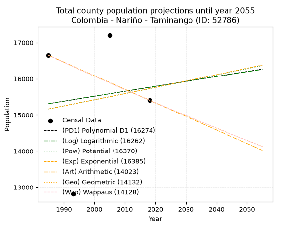
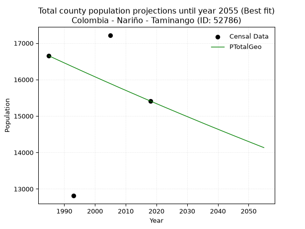
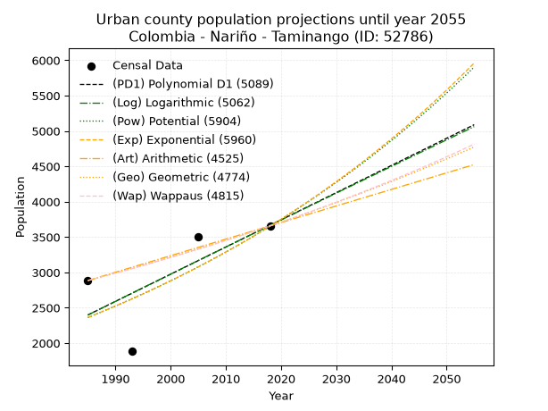
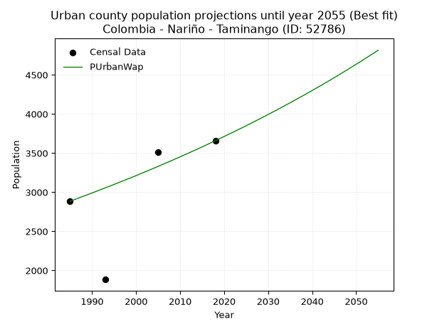
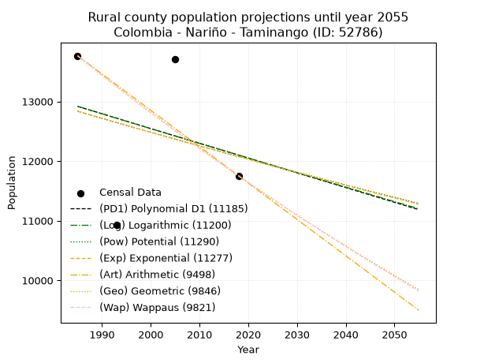
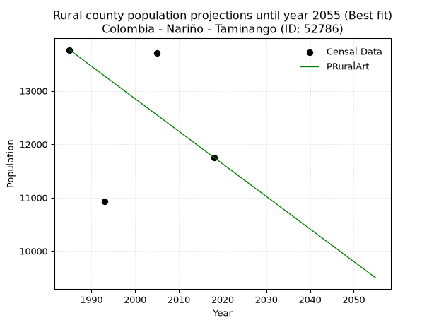

<div align="center">


</div>

# 📜 _“Population and Public Services Demand Projections (PPSD) until Year 2050 for Colombia - Nariño - Taminango (ID: 52786)”_
Keywords: `population` `public-service` `projection` `lineal` `polynomial` `logarithmic` `potential` `exponential` `arithmetic` `geometric` `wappaus` `dane` `colombia` `south-america`

PPSD are analytical estimates used by governments and planners to anticipate future changes in population size, age distribution, and the resulting community needs for utilities, healthcare, education, and infrastructure as sizing future water treatment facilities, electrical grids, and road networks based on spatial growth.

<div align="center">

</img>

</div>


> **General running parameters**: • app_version: _v20260806_. • Python version: _3.14.7_. • Pandas version: _3.0.5_. • NumPy version: _2.5.1_. • Creates, save and include plots into reports (create_plot): _False_. • Projection until year: _2050_. • Process polynomial degree 2 and up: _False_. • Process Wappaus: _True_. • Process Wappaus: _True_. • Set negative values to zero: _True_. • Set infinite values to zero: _True_. • Drop dataset notes: _True_. 
<div align="center">

Dynamic map: [:earth_americas:Google](http://maps.google.com/maps?q=1.57035799,-77.2807995) [:earth_americas:OSM](https://www.openstreetmap.org/#map=18/1.57035799/-77.2807995&layers=P) [:earth_americas:Bing](https://www.bing.com/maps?cp=1.57035799~-77.2807995&lvl=18) [:earth_americas:Apple](https://maps.apple.com/frame?center=1.57035799%2C-77.2807995&span=0.003%2C0.006)

</div>


<div align="center">

```geojson
{
  "type": "Feature",
  "geometry": {
    "type": "Point", 
    "coordinates": [-77.2807995, 1.57035799]
  }, 
  "properties": {
    "Name": "Colombia - Nariño - Taminango (ID: 52786)"
  }
}
```

</div>


## 0. Census Data (4 records)

Census data are official statistics collected by a government about the people and housing in a country. They usually include counts of total population, age, sex, race, income, education, and jobs.

📅Global census file: [Population.xlsx](../data/Population.xlsx)

| Source   |   Year |   CountryID | CountryName   |   StateID | StateName   |   CountyID | CountyName   |   PTotal |   PUrban |   PRural |
|:---------|-------:|------------:|:--------------|----------:|:------------|-----------:|:-------------|---------:|---------:|---------:|
| DANE     |   1985 |          57 | Colombia      |        52 | Nariño      |      52786 | Taminango    |    16651 |     2885 |    13766 |
| DANE     |   1993 |          57 | Colombia      |        52 | Nariño      |      52786 | Taminango    |    12812 |     1884 |    10928 |
| DANE     |   2005 |          57 | Colombia      |        52 | Nariño      |      52786 | Taminango    |    17218 |     3509 |    13709 |
| DANE     |   2018 |          57 | Colombia      |        52 | Nariño      |      52786 | Taminango    |    15412 |     3658 |    11754 |

> 🔥Some records could had specific notes about the registered values or the corresponding urban or rural distribution.

📅[SUI-RUPS](https://www.datos.gov.co/Hacienda-y-Cr-dito-P-blico/Registro-nico-de-Prestadores-de-Servicios-P-blicos/4qkq-csdn/about_data) - Local public utility companies: [RUPS.csv](../data/RUPS.xlsx)

 | SERVICIO       | ESTADO    | NOMBRE                                                        | NIT         | DEPARTAMENTO_DOMICILIO   | MUNICIPIO_DOMICILIO   | DIRECCION                         |   TELEFONO | EMAIL               | TIPO_PRESTADOR                             | CLASIFICACION           |
|:---------------|:----------|:--------------------------------------------------------------|:------------|:-------------------------|:----------------------|:----------------------------------|-----------:|:--------------------|:-------------------------------------------|:------------------------|
| ACUEDUCTO      | OPERATIVA | EMPRESA REGIONAL DE OBRAS SANITARIAS DE TAMINANGO EMPOTAM ESP | 814001033-0 | NARINO                   | TAMINANGO             | CALLE 3 No 7 - 16 BARRIO EL PRADO |    7265763 | jotaland@hotmail.es | SOCIEDADES (EMPRESA DE SERVICIOS PUBLICOS) | HASTA 2500 SUSCRIPTORES |
| ALCANTARILLADO | OPERATIVA | EMPRESA REGIONAL DE OBRAS SANITARIAS DE TAMINANGO EMPOTAM ESP | 814001033-0 | NARINO                   | TAMINANGO             | CALLE 3 No 7 - 16 BARRIO EL PRADO |    7265763 | jotaland@hotmail.es | SOCIEDADES (EMPRESA DE SERVICIOS PUBLICOS) | HASTA 2500 SUSCRIPTORES |

## 1. Total

### 1.1. Coefficients and Parameters

* (PD1) Polynomial Deg 1: 13.703331995183484, -11886.839823365764 (lineal)
* (Log) Logarithmic: 27348.053775786397, -192349.52590330146
* (Pow) Potential: 2.200381890849083, -3.075402753758953
* (Exp) Exponential: 0.0011026802249678959, 1699.5312034655972
* (Art) Arithmetic: Year diff. 2018 - 1985 = 33, Population diff. 15412 - 16651 = -1239, Annual growth = -37.54545454545455
* (Geo) Geometric: Year diff. 2018 - 1985 = 33, Population diff. 15412 - 16651 = -1239, Annual growth % = -0.002340403880781161
* (Wap) Wappaus: i = -0.2341980135698752, Condition values only valid for < 200)

<sub>
Wappaus condition values: ['-0.00', '-0.23', '-0.47', '-0.70', '-0.94', '-1.17', '-1.41', '-1.64', '-1.87', '-2.11', '-2.34', '-2.58', '-2.81', '-3.04', '-3.28', '-3.51', '-3.75', '-3.98', '-4.22', '-4.45', '-4.68', '-4.92', '-5.15', '-5.39', '-5.62', '-5.85', '-6.09', '-6.32', '-6.56', '-6.79', '-7.03', '-7.26', '-7.49', '-7.73', '-7.96', '-8.20', '-8.43', '-8.67', '-8.90', '-9.13', '-9.37', '-9.60', '-9.84', '-10.07', '-10.30', '-10.54', '-10.77', '-11.01', '-11.24', '-11.48', '-11.71', '-11.94', '-12.18', '-12.41', '-12.65', '-12.88', '-13.12', '-13.35', '-13.58', '-13.82', '-14.05', '-14.29', '-14.52', '-14.75', '-14.99', '-15.22']
</sub>


### 1.2. Projected Dataset

|   Year |   CountyID |   PTotalPD1 |   PTotalLog |   PTotalPow |   PTotalExp |   PTotalArt |   PTotalGeo |   PTotalWap |
|-------:|-----------:|------------:|------------:|------------:|------------:|------------:|------------:|------------:|
|   1985 |      52786 |       15314 |       15314 |       15168 |       15168 |       16651 |       16651 |       16651 |
|   1986 |      52786 |       15328 |       15328 |       15185 |       15185 |       16613 |       16612 |       16612 |
|   1987 |      52786 |       15342 |       15342 |       15202 |       15201 |       16576 |       16573 |       16573 |
|   1988 |      52786 |       15355 |       15356 |       15219 |       15218 |       16538 |       16534 |       16534 |
|   1989 |      52786 |       15369 |       15370 |       15235 |       15235 |       16501 |       16496 |       16496 |
|   1990 |      52786 |       15383 |       15383 |       15252 |       15252 |       16463 |       16457 |       16457 |
|   1991 |      52786 |       15396 |       15397 |       15269 |       15268 |       16426 |       16419 |       16419 |
|   1992 |      52786 |       15410 |       15411 |       15286 |       15285 |       16388 |       16380 |       16380 |
|   1993 |      52786 |       15424 |       15424 |       15303 |       15302 |       16351 |       16342 |       16342 |
|   1994 |      52786 |       15438 |       15438 |       15320 |       15319 |       16313 |       16304 |       16304 |
|   1995 |      52786 |       15451 |       15452 |       15337 |       15336 |       16276 |       16265 |       16266 |
|   1996 |      52786 |       15465 |       15466 |       15354 |       15353 |       16238 |       16227 |       16227 |
|   1997 |      52786 |       15479 |       15479 |       15371 |       15370 |       16200 |       16189 |       16190 |
|   1998 |      52786 |       15492 |       15493 |       15387 |       15387 |       16163 |       16151 |       16152 |
|   1999 |      52786 |       15506 |       15507 |       15404 |       15404 |       16125 |       16114 |       16114 |
|   2000 |      52786 |       15520 |       15520 |       15421 |       15421 |       16088 |       16076 |       16076 |
|   2001 |      52786 |       15534 |       15534 |       15438 |       15438 |       16050 |       16038 |       16039 |
|   2002 |      52786 |       15547 |       15548 |       15455 |       15455 |       16013 |       16001 |       16001 |
|   2003 |      52786 |       15561 |       15561 |       15472 |       15472 |       15975 |       15963 |       15964 |
|   2004 |      52786 |       15575 |       15575 |       15489 |       15489 |       15938 |       15926 |       15926 |
|   2005 |      52786 |       15588 |       15589 |       15506 |       15506 |       15900 |       15889 |       15889 |
|   2006 |      52786 |       15602 |       15602 |       15523 |       15523 |       15863 |       15852 |       15852 |
|   2007 |      52786 |       15616 |       15616 |       15540 |       15540 |       15825 |       15814 |       15815 |
|   2008 |      52786 |       15629 |       15630 |       15557 |       15557 |       15787 |       15777 |       15778 |
|   2009 |      52786 |       15643 |       15643 |       15575 |       15575 |       15750 |       15740 |       15741 |
|   2010 |      52786 |       15657 |       15657 |       15592 |       15592 |       15712 |       15704 |       15704 |
|   2011 |      52786 |       15671 |       15670 |       15609 |       15609 |       15675 |       15667 |       15667 |
|   2012 |      52786 |       15684 |       15684 |       15626 |       15626 |       15637 |       15630 |       15630 |
|   2013 |      52786 |       15698 |       15698 |       15643 |       15643 |       15600 |       15594 |       15594 |
|   2014 |      52786 |       15712 |       15711 |       15660 |       15661 |       15562 |       15557 |       15557 |
|   2015 |      52786 |       15725 |       15725 |       15677 |       15678 |       15525 |       15521 |       15521 |
|   2016 |      52786 |       15739 |       15738 |       15694 |       15695 |       15487 |       15484 |       15484 |
|   2017 |      52786 |       15753 |       15752 |       15711 |       15713 |       15450 |       15448 |       15448 |
|   2018 |      52786 |       15766 |       15765 |       15728 |       15730 |       15412 |       15412 |       15412 |
|   2019 |      52786 |       15780 |       15779 |       15746 |       15747 |       15374 |       15376 |       15376 |
|   2020 |      52786 |       15794 |       15792 |       15763 |       15765 |       15337 |       15340 |       15340 |
|   2021 |      52786 |       15808 |       15806 |       15780 |       15782 |       15299 |       15304 |       15304 |
|   2022 |      52786 |       15821 |       15820 |       15797 |       15799 |       15262 |       15268 |       15268 |
|   2023 |      52786 |       15835 |       15833 |       15814 |       15817 |       15224 |       15232 |       15232 |
|   2024 |      52786 |       15849 |       15847 |       15832 |       15834 |       15187 |       15197 |       15197 |
|   2025 |      52786 |       15862 |       15860 |       15849 |       15852 |       15149 |       15161 |       15161 |
|   2026 |      52786 |       15876 |       15874 |       15866 |       15869 |       15112 |       15126 |       15125 |
|   2027 |      52786 |       15890 |       15887 |       15883 |       15887 |       15074 |       15090 |       15090 |
|   2028 |      52786 |       15904 |       15901 |       15900 |       15904 |       15037 |       15055 |       15055 |
|   2029 |      52786 |       15917 |       15914 |       15918 |       15922 |       14999 |       15020 |       15019 |
|   2030 |      52786 |       15931 |       15928 |       15935 |       15939 |       14961 |       14985 |       14984 |
|   2031 |      52786 |       15945 |       15941 |       15952 |       15957 |       14924 |       14950 |       14949 |
|   2032 |      52786 |       15958 |       15954 |       15970 |       15975 |       14886 |       14915 |       14914 |
|   2033 |      52786 |       15972 |       15968 |       15987 |       15992 |       14849 |       14880 |       14879 |
|   2034 |      52786 |       15986 |       15981 |       16004 |       16010 |       14811 |       14845 |       14844 |
|   2035 |      52786 |       15999 |       15995 |       16021 |       16028 |       14774 |       14810 |       14809 |
|   2036 |      52786 |       16013 |       16008 |       16039 |       16045 |       14736 |       14775 |       14774 |
|   2037 |      52786 |       16027 |       16022 |       16056 |       16063 |       14699 |       14741 |       14740 |
|   2038 |      52786 |       16041 |       16035 |       16073 |       16081 |       14661 |       14706 |       14705 |
|   2039 |      52786 |       16054 |       16049 |       16091 |       16098 |       14624 |       14672 |       14670 |
|   2040 |      52786 |       16068 |       16062 |       16108 |       16116 |       14586 |       14638 |       14636 |
|   2041 |      52786 |       16082 |       16075 |       16126 |       16134 |       14548 |       14603 |       14602 |
|   2042 |      52786 |       16095 |       16089 |       16143 |       16152 |       14511 |       14569 |       14567 |
|   2043 |      52786 |       16109 |       16102 |       16160 |       16170 |       14473 |       14535 |       14533 |
|   2044 |      52786 |       16123 |       16115 |       16178 |       16187 |       14436 |       14501 |       14499 |
|   2045 |      52786 |       16136 |       16129 |       16195 |       16205 |       14398 |       14467 |       14465 |
|   2046 |      52786 |       16150 |       16142 |       16213 |       16223 |       14361 |       14433 |       14431 |
|   2047 |      52786 |       16164 |       16156 |       16230 |       16241 |       14323 |       14400 |       14397 |
|   2048 |      52786 |       16178 |       16169 |       16248 |       16259 |       14286 |       14366 |       14363 |
|   2049 |      52786 |       16191 |       16182 |       16265 |       16277 |       14248 |       14332 |       14329 |
|   2050 |      52786 |       16205 |       16196 |       16282 |       16295 |       14211 |       14299 |       14296 |
<div align="center">

</img>

</div>


### 1.3. Best fit with absolute and relative error (%)

Relative error puts that difference into context by dividing the absolute error by the true value, creating a unitless ratio or percentage that shows the scale of the mistake.

Absolute and relative error

|   Year | Source   |   CountryID | CountryName   |   StateID | StateName   |   CountyID_x | CountyName   |   PTotal |   PUrban |   PRural |   CountyID_y |   PTotalPD1 |   PTotalLog |   PTotalPow |   PTotalExp |   PTotalArt |   PTotalGeo |   PTotalWap |   PTotalPD1AbsError |   PTotalLogAbsError |   PTotalPowAbsError |   PTotalExpAbsError |   PTotalArtAbsError |   PTotalGeoAbsError |   PTotalWapAbsError |   PTotalPD1RelError |   PTotalLogRelError |   PTotalPowRelError |   PTotalExpRelError |   PTotalArtRelError |   PTotalGeoRelError |   PTotalWapRelError |
|-------:|:---------|------------:|:--------------|----------:|:------------|-------------:|:-------------|---------:|---------:|---------:|-------------:|------------:|------------:|------------:|------------:|------------:|------------:|------------:|--------------------:|--------------------:|--------------------:|--------------------:|--------------------:|--------------------:|--------------------:|--------------------:|--------------------:|--------------------:|--------------------:|--------------------:|--------------------:|--------------------:|
|   1985 | DANE     |          57 | Colombia      |        52 | Nariño      |        52786 | Taminango    |    16651 |     2885 |    13766 |        52786 |       15314 |       15314 |       15168 |       15168 |       16651 |       16651 |       16651 |                1337 |                1337 |                1483 |                1483 |                   0 |                   0 |                   0 |             8.02955 |             8.02955 |             8.90637 |             8.90637 |             0       |             0       |             0       |
|   1993 | DANE     |          57 | Colombia      |        52 | Nariño      |        52786 | Taminango    |    12812 |     1884 |    10928 |        52786 |       15424 |       15424 |       15303 |       15302 |       16351 |       16342 |       16342 |                2612 |                2612 |                2491 |                2490 |                3539 |                3530 |                3530 |            20.3871  |            20.3871  |            19.4427  |            19.4349  |            27.6225  |            27.5523  |            27.5523  |
|   2005 | DANE     |          57 | Colombia      |        52 | Nariño      |        52786 | Taminango    |    17218 |     3509 |    13709 |        52786 |       15588 |       15589 |       15506 |       15506 |       15900 |       15889 |       15889 |                1630 |                1629 |                1712 |                1712 |                1318 |                1329 |                1329 |             9.46684 |             9.46103 |             9.94308 |             9.94308 |             7.65478 |             7.71867 |             7.71867 |
|   2018 | DANE     |          57 | Colombia      |        52 | Nariño      |        52786 | Taminango    |    15412 |     3658 |    11754 |        52786 |       15766 |       15765 |       15728 |       15730 |       15412 |       15412 |       15412 |                 354 |                 353 |                 316 |                 318 |                   0 |                   0 |                   0 |             2.29691 |             2.29042 |             2.05035 |             2.06333 |             0       |             0       |             0       |

Relative error mean

| Method    |   RelError | Best   |
|:----------|-----------:|:-------|
| PTotalPD1 |   10.0451  |        |
| PTotalLog |   10.042   |        |
| PTotalPow |   10.0856  |        |
| PTotalExp |   10.0869  |        |
| PTotalArt |    8.81933 |        |
| PTotalGeo |    8.81774 | True   |
| PTotalWap |    8.81774 | True   |

💙Best method: _**PTotalGeo**_
<div align="center">

</img>

</div>


### 1.4. Fresh water supply demand in liters per capita per day (lpcd)

The fresh water supply demand typically ranges from 100 to 300 liters per capita per day (lpcd) for standard domestic and municipal planning, though absolute survival minimums set by the World Health Organization are as low as 7.5 to 20 liters per day, and total consumption in high-income nations can exceed 400 liters.

> `CZ`: Level in meters above the sea level (masl)<br> `WS`: Fresh water supply demand in liters per capita per day (lpcd or l/h/d)<br> `WSAll`: Zonal fresh water supply demand in liters per second (l/s)<br> `A`: Zonal area in square meters<br> `DP`: Population density (people/hectare or p/ha)

Reference values (RAS Colombia)

|    CZ |   WS |
|------:|-----:|
|  1000 |  120 |
|  2000 |  130 |
| 99999 |  140 |

County shapefile geometry properties and water supply values

|   CountyID |      ATotal |   CZTotal |   WSTotal |
|-----------:|------------:|----------:|----------:|
|      52786 | 2.34803e+08 |   1104.55 |       130 |

Projected values for best method: PTotalGeo

|   CountyID |   Year |   PTotalGeo |   DPTotal |   WSTotal |   WSTotalAll |
|-----------:|-------:|------------:|----------:|----------:|-------------:|
|      52786 |   1985 |       16651 |      0.71 |       130 |      25.0536 |
|      52786 |   1986 |       16612 |      0.71 |       130 |      24.9949 |
|      52786 |   1987 |       16573 |      0.71 |       130 |      24.9362 |
|      52786 |   1988 |       16534 |      0.7  |       130 |      24.8775 |
|      52786 |   1989 |       16496 |      0.7  |       130 |      24.8204 |
|      52786 |   1990 |       16457 |      0.7  |       130 |      24.7617 |
|      52786 |   1991 |       16419 |      0.7  |       130 |      24.7045 |
|      52786 |   1992 |       16380 |      0.7  |       130 |      24.6458 |
|      52786 |   1993 |       16342 |      0.7  |       130 |      24.5887 |
|      52786 |   1994 |       16304 |      0.69 |       130 |      24.5315 |
|      52786 |   1995 |       16265 |      0.69 |       130 |      24.4728 |
|      52786 |   1996 |       16227 |      0.69 |       130 |      24.4156 |
|      52786 |   1997 |       16189 |      0.69 |       130 |      24.3584 |
|      52786 |   1998 |       16151 |      0.69 |       130 |      24.3013 |
|      52786 |   1999 |       16114 |      0.69 |       130 |      24.2456 |
|      52786 |   2000 |       16076 |      0.68 |       130 |      24.1884 |
|      52786 |   2001 |       16038 |      0.68 |       130 |      24.1313 |
|      52786 |   2002 |       16001 |      0.68 |       130 |      24.0756 |
|      52786 |   2003 |       15963 |      0.68 |       130 |      24.0184 |
|      52786 |   2004 |       15926 |      0.68 |       130 |      23.9627 |
|      52786 |   2005 |       15889 |      0.68 |       130 |      23.9071 |
|      52786 |   2006 |       15852 |      0.68 |       130 |      23.8514 |
|      52786 |   2007 |       15814 |      0.67 |       130 |      23.7942 |
|      52786 |   2008 |       15777 |      0.67 |       130 |      23.7385 |
|      52786 |   2009 |       15740 |      0.67 |       130 |      23.6829 |
|      52786 |   2010 |       15704 |      0.67 |       130 |      23.6287 |
|      52786 |   2011 |       15667 |      0.67 |       130 |      23.573  |
|      52786 |   2012 |       15630 |      0.67 |       130 |      23.5174 |
|      52786 |   2013 |       15594 |      0.66 |       130 |      23.4632 |
|      52786 |   2014 |       15557 |      0.66 |       130 |      23.4075 |
|      52786 |   2015 |       15521 |      0.66 |       130 |      23.3534 |
|      52786 |   2016 |       15484 |      0.66 |       130 |      23.2977 |
|      52786 |   2017 |       15448 |      0.66 |       130 |      23.2435 |
|      52786 |   2018 |       15412 |      0.66 |       130 |      23.1894 |
|      52786 |   2019 |       15376 |      0.65 |       130 |      23.1352 |
|      52786 |   2020 |       15340 |      0.65 |       130 |      23.081  |
|      52786 |   2021 |       15304 |      0.65 |       130 |      23.0269 |
|      52786 |   2022 |       15268 |      0.65 |       130 |      22.9727 |
|      52786 |   2023 |       15232 |      0.65 |       130 |      22.9185 |
|      52786 |   2024 |       15197 |      0.65 |       130 |      22.8659 |
|      52786 |   2025 |       15161 |      0.65 |       130 |      22.8117 |
|      52786 |   2026 |       15126 |      0.64 |       130 |      22.759  |
|      52786 |   2027 |       15090 |      0.64 |       130 |      22.7049 |
|      52786 |   2028 |       15055 |      0.64 |       130 |      22.6522 |
|      52786 |   2029 |       15020 |      0.64 |       130 |      22.5995 |
|      52786 |   2030 |       14985 |      0.64 |       130 |      22.5469 |
|      52786 |   2031 |       14950 |      0.64 |       130 |      22.4942 |
|      52786 |   2032 |       14915 |      0.64 |       130 |      22.4416 |
|      52786 |   2033 |       14880 |      0.63 |       130 |      22.3889 |
|      52786 |   2034 |       14845 |      0.63 |       130 |      22.3362 |
|      52786 |   2035 |       14810 |      0.63 |       130 |      22.2836 |
|      52786 |   2036 |       14775 |      0.63 |       130 |      22.2309 |
|      52786 |   2037 |       14741 |      0.63 |       130 |      22.1797 |
|      52786 |   2038 |       14706 |      0.63 |       130 |      22.1271 |
|      52786 |   2039 |       14672 |      0.62 |       130 |      22.0759 |
|      52786 |   2040 |       14638 |      0.62 |       130 |      22.0248 |
|      52786 |   2041 |       14603 |      0.62 |       130 |      21.9721 |
|      52786 |   2042 |       14569 |      0.62 |       130 |      21.9209 |
|      52786 |   2043 |       14535 |      0.62 |       130 |      21.8698 |
|      52786 |   2044 |       14501 |      0.62 |       130 |      21.8186 |
|      52786 |   2045 |       14467 |      0.62 |       130 |      21.7675 |
|      52786 |   2046 |       14433 |      0.61 |       130 |      21.7163 |
|      52786 |   2047 |       14400 |      0.61 |       130 |      21.6667 |
|      52786 |   2048 |       14366 |      0.61 |       130 |      21.6155 |
|      52786 |   2049 |       14332 |      0.61 |       130 |      21.5644 |
|      52786 |   2050 |       14299 |      0.61 |       130 |      21.5147 |

## 2. Urban

### 2.1. Coefficients and Parameters

* (PD1) Polynomial Deg 1: 38.44560417502992, -73916.8197511036 (lineal)
* (Log) Logarithmic: 76892.64841081144, -581477.6367495913
* (Pow) Potential: 26.43677033020521, -83.8088703033732
* (Exp) Exponential: 0.013220726165058804, 9.464576453371228e-09
* (Art) Arithmetic: Year diff. 2018 - 1985 = 33, Population diff. 3658 - 2885 = 773, Annual growth = 23.424242424242426
* (Geo) Geometric: Year diff. 2018 - 1985 = 33, Population diff. 3658 - 2885 = 773, Annual growth % = 0.007219623081885285
* (Wap) Wappaus: i = 0.7160092442073185, Condition values only valid for < 200)

<sub>
Wappaus condition values: ['0.00', '0.72', '1.43', '2.15', '2.86', '3.58', '4.30', '5.01', '5.73', '6.44', '7.16', '7.88', '8.59', '9.31', '10.02', '10.74', '11.46', '12.17', '12.89', '13.60', '14.32', '15.04', '15.75', '16.47', '17.18', '17.90', '18.62', '19.33', '20.05', '20.76', '21.48', '22.20', '22.91', '23.63', '24.34', '25.06', '25.78', '26.49', '27.21', '27.92', '28.64', '29.36', '30.07', '30.79', '31.50', '32.22', '32.94', '33.65', '34.37', '35.08', '35.80', '36.52', '37.23', '37.95', '38.66', '39.38', '40.10', '40.81', '41.53', '42.24', '42.96', '43.68', '44.39', '45.11', '45.82', '46.54']
</sub>


### 2.2. Projected Dataset

|   Year |   CountyID |   PUrbanPD1 |   PUrbanLog |   PUrbanPow |   PUrbanExp |   PUrbanArt |   PUrbanGeo |   PUrbanWap |
|-------:|-----------:|------------:|------------:|------------:|------------:|------------:|------------:|------------:|
|   1985 |      52786 |        2398 |        2397 |        2362 |        2362 |        2885 |        2885 |        2885 |
|   1986 |      52786 |        2436 |        2436 |        2394 |        2394 |        2908 |        2906 |        2906 |
|   1987 |      52786 |        2475 |        2474 |        2426 |        2426 |        2932 |        2927 |        2927 |
|   1988 |      52786 |        2513 |        2513 |        2458 |        2458 |        2955 |        2948 |        2948 |
|   1989 |      52786 |        2551 |        2552 |        2491 |        2491 |        2979 |        2969 |        2969 |
|   1990 |      52786 |        2590 |        2590 |        2524 |        2524 |        3002 |        2991 |        2990 |
|   1991 |      52786 |        2628 |        2629 |        2558 |        2557 |        3026 |        3012 |        3012 |
|   1992 |      52786 |        2667 |        2668 |        2592 |        2591 |        3049 |        3034 |        3033 |
|   1993 |      52786 |        2705 |        2706 |        2627 |        2626 |        3072 |        3056 |        3055 |
|   1994 |      52786 |        2744 |        2745 |        2662 |        2661 |        3096 |        3078 |        3077 |
|   1995 |      52786 |        2782 |        2783 |        2698 |        2696 |        3119 |        3100 |        3099 |
|   1996 |      52786 |        2821 |        2822 |        2733 |        2732 |        3143 |        3123 |        3122 |
|   1997 |      52786 |        2859 |        2860 |        2770 |        2769 |        3166 |        3145 |        3144 |
|   1998 |      52786 |        2897 |        2899 |        2807 |        2805 |        3190 |        3168 |        3167 |
|   1999 |      52786 |        2936 |        2937 |        2844 |        2843 |        3213 |        3191 |        3189 |
|   2000 |      52786 |        2974 |        2976 |        2882 |        2881 |        3236 |        3214 |        3212 |
|   2001 |      52786 |        3013 |        3014 |        2920 |        2919 |        3260 |        3237 |        3236 |
|   2002 |      52786 |        3051 |        3053 |        2959 |        2958 |        3283 |        3260 |        3259 |
|   2003 |      52786 |        3090 |        3091 |        2999 |        2997 |        3307 |        3284 |        3282 |
|   2004 |      52786 |        3128 |        3130 |        3038 |        3037 |        3330 |        3308 |        3306 |
|   2005 |      52786 |        3167 |        3168 |        3079 |        3077 |        3353 |        3331 |        3330 |
|   2006 |      52786 |        3205 |        3206 |        3120 |        3118 |        3377 |        3355 |        3354 |
|   2007 |      52786 |        3244 |        3245 |        3161 |        3160 |        3400 |        3380 |        3378 |
|   2008 |      52786 |        3282 |        3283 |        3203 |        3202 |        3424 |        3404 |        3403 |
|   2009 |      52786 |        3320 |        3321 |        3245 |        3245 |        3447 |        3429 |        3427 |
|   2010 |      52786 |        3359 |        3359 |        3288 |        3288 |        3471 |        3453 |        3452 |
|   2011 |      52786 |        3397 |        3398 |        3332 |        3331 |        3494 |        3478 |        3477 |
|   2012 |      52786 |        3436 |        3436 |        3376 |        3376 |        3517 |        3503 |        3502 |
|   2013 |      52786 |        3474 |        3474 |        3420 |        3421 |        3541 |        3529 |        3528 |
|   2014 |      52786 |        3513 |        3512 |        3466 |        3466 |        3564 |        3554 |        3553 |
|   2015 |      52786 |        3551 |        3550 |        3511 |        3512 |        3588 |        3580 |        3579 |
|   2016 |      52786 |        3590 |        3589 |        3558 |        3559 |        3611 |        3606 |        3605 |
|   2017 |      52786 |        3628 |        3627 |        3605 |        3607 |        3635 |        3632 |        3632 |
|   2018 |      52786 |        3666 |        3665 |        3652 |        3655 |        3658 |        3658 |        3658 |
|   2019 |      52786 |        3705 |        3703 |        3700 |        3703 |        3681 |        3684 |        3685 |
|   2020 |      52786 |        3743 |        3741 |        3749 |        3752 |        3705 |        3711 |        3712 |
|   2021 |      52786 |        3782 |        3779 |        3799 |        3802 |        3728 |        3738 |        3739 |
|   2022 |      52786 |        3820 |        3817 |        3849 |        3853 |        3752 |        3765 |        3766 |
|   2023 |      52786 |        3859 |        3855 |        3899 |        3904 |        3775 |        3792 |        3794 |
|   2024 |      52786 |        3897 |        3893 |        3951 |        3956 |        3799 |        3819 |        3821 |
|   2025 |      52786 |        3936 |        3931 |        4002 |        4009 |        3822 |        3847 |        3849 |
|   2026 |      52786 |        3974 |        3969 |        4055 |        4062 |        3845 |        3875 |        3878 |
|   2027 |      52786 |        4012 |        4007 |        4108 |        4116 |        3869 |        3903 |        3906 |
|   2028 |      52786 |        4051 |        4045 |        4162 |        4171 |        3892 |        3931 |        3935 |
|   2029 |      52786 |        4089 |        4083 |        4217 |        4227 |        3916 |        3959 |        3964 |
|   2030 |      52786 |        4128 |        4121 |        4272 |        4283 |        3939 |        3988 |        3993 |
|   2031 |      52786 |        4166 |        4159 |        4328 |        4340 |        3963 |        4017 |        4023 |
|   2032 |      52786 |        4205 |        4196 |        4385 |        4398 |        3986 |        4046 |        4052 |
|   2033 |      52786 |        4243 |        4234 |        4442 |        4456 |        4009 |        4075 |        4082 |
|   2034 |      52786 |        4282 |        4272 |        4500 |        4515 |        4033 |        4104 |        4113 |
|   2035 |      52786 |        4320 |        4310 |        4559 |        4575 |        4056 |        4134 |        4143 |
|   2036 |      52786 |        4358 |        4348 |        4619 |        4636 |        4080 |        4164 |        4174 |
|   2037 |      52786 |        4397 |        4385 |        4679 |        4698 |        4103 |        4194 |        4205 |
|   2038 |      52786 |        4435 |        4423 |        4740 |        4761 |        4126 |        4224 |        4236 |
|   2039 |      52786 |        4474 |        4461 |        4802 |        4824 |        4150 |        4255 |        4268 |
|   2040 |      52786 |        4512 |        4499 |        4865 |        4888 |        4173 |        4285 |        4300 |
|   2041 |      52786 |        4551 |        4536 |        4928 |        4953 |        4197 |        4316 |        4332 |
|   2042 |      52786 |        4589 |        4574 |        4992 |        5019 |        4220 |        4347 |        4364 |
|   2043 |      52786 |        4628 |        4612 |        5057 |        5086 |        4244 |        4379 |        4397 |
|   2044 |      52786 |        4666 |        4649 |        5123 |        5154 |        4267 |        4410 |        4430 |
|   2045 |      52786 |        4704 |        4687 |        5190 |        5222 |        4290 |        4442 |        4463 |
|   2046 |      52786 |        4743 |        4724 |        5258 |        5292 |        4314 |        4474 |        4497 |
|   2047 |      52786 |        4781 |        4762 |        5326 |        5362 |        4337 |        4507 |        4531 |
|   2048 |      52786 |        4820 |        4800 |        5395 |        5433 |        4361 |        4539 |        4565 |
|   2049 |      52786 |        4858 |        4837 |        5465 |        5506 |        4384 |        4572 |        4600 |
|   2050 |      52786 |        4897 |        4875 |        5536 |        5579 |        4408 |        4605 |        4635 |
<div align="center">

</img>

</div>


### 2.3. Best fit with absolute and relative error (%)

Relative error puts that difference into context by dividing the absolute error by the true value, creating a unitless ratio or percentage that shows the scale of the mistake.

Absolute and relative error

|   Year | Source   |   CountryID | CountryName   |   StateID | StateName   |   CountyID_x | CountyName   |   PTotal |   PUrban |   PRural |   CountyID_y |   PUrbanPD1 |   PUrbanLog |   PUrbanPow |   PUrbanExp |   PUrbanArt |   PUrbanGeo |   PUrbanWap |   PUrbanPD1AbsError |   PUrbanLogAbsError |   PUrbanPowAbsError |   PUrbanExpAbsError |   PUrbanArtAbsError |   PUrbanGeoAbsError |   PUrbanWapAbsError |   PUrbanPD1RelError |   PUrbanLogRelError |   PUrbanPowRelError |   PUrbanExpRelError |   PUrbanArtRelError |   PUrbanGeoRelError |   PUrbanWapRelError |
|-------:|:---------|------------:|:--------------|----------:|:------------|-------------:|:-------------|---------:|---------:|---------:|-------------:|------------:|------------:|------------:|------------:|------------:|------------:|------------:|--------------------:|--------------------:|--------------------:|--------------------:|--------------------:|--------------------:|--------------------:|--------------------:|--------------------:|--------------------:|--------------------:|--------------------:|--------------------:|--------------------:|
|   1985 | DANE     |          57 | Colombia      |        52 | Nariño      |        52786 | Taminango    |    16651 |     2885 |    13766 |        52786 |        2398 |        2397 |        2362 |        2362 |        2885 |        2885 |        2885 |                 487 |                 488 |                 523 |                 523 |                   0 |                   0 |                   0 |           16.8804   |           16.9151   |           18.1282   |           18.1282   |             0       |             0       |             0       |
|   1993 | DANE     |          57 | Colombia      |        52 | Nariño      |        52786 | Taminango    |    12812 |     1884 |    10928 |        52786 |        2705 |        2706 |        2627 |        2626 |        3072 |        3056 |        3055 |                 821 |                 822 |                 743 |                 742 |                1188 |                1172 |                1171 |           43.5775   |           43.6306   |           39.4374   |           39.3843   |            63.0573  |            62.2081  |            62.155   |
|   2005 | DANE     |          57 | Colombia      |        52 | Nariño      |        52786 | Taminango    |    17218 |     3509 |    13709 |        52786 |        3167 |        3168 |        3079 |        3077 |        3353 |        3331 |        3330 |                 342 |                 341 |                 430 |                 432 |                 156 |                 178 |                 179 |            9.74637  |            9.71787  |           12.2542   |           12.3112   |             4.44571 |             5.07267 |             5.10117 |
|   2018 | DANE     |          57 | Colombia      |        52 | Nariño      |        52786 | Taminango    |    15412 |     3658 |    11754 |        52786 |        3666 |        3665 |        3652 |        3655 |        3658 |        3658 |        3658 |                   8 |                   7 |                   6 |                   3 |                   0 |                   0 |                   0 |            0.218699 |            0.191361 |            0.164024 |            0.082012 |             0       |             0       |             0       |

Relative error mean

| Method    |   RelError | Best   |
|:----------|-----------:|:-------|
| PUrbanPD1 |    17.6057 |        |
| PUrbanLog |    17.6137 |        |
| PUrbanPow |    17.496  |        |
| PUrbanExp |    17.4764 |        |
| PUrbanArt |    16.8758 |        |
| PUrbanGeo |    16.8202 |        |
| PUrbanWap |    16.814  | True   |

💙Best method: _**PUrbanWap**_
<div align="center">

</img>

</div>


### 2.4. Fresh water supply demand in liters per capita per day (lpcd)

The fresh water supply demand typically ranges from 100 to 300 liters per capita per day (lpcd) for standard domestic and municipal planning, though absolute survival minimums set by the World Health Organization are as low as 7.5 to 20 liters per day, and total consumption in high-income nations can exceed 400 liters.

> `CZ`: Level in meters above the sea level (masl)<br> `WS`: Fresh water supply demand in liters per capita per day (lpcd or l/h/d)<br> `WSAll`: Zonal fresh water supply demand in liters per second (l/s)<br> `A`: Zonal area in square meters<br> `DP`: Population density (people/hectare or p/ha)

Reference values (RAS Colombia)

|    CZ |   WS |
|------:|-----:|
|  1000 |  120 |
|  2000 |  130 |
| 99999 |  140 |

County shapefile geometry properties and water supply values

|   CountyID |   AUrban |   CZUrban |   WSUrban |
|-----------:|---------:|----------:|----------:|
|      52786 |   368345 |   1540.19 |       130 |

Projected values for best method: PUrbanWap

|   CountyID |   Year |   PUrbanWap |   DPUrban |   WSUrban |   WSUrbanAll |
|-----------:|-------:|------------:|----------:|----------:|-------------:|
|      52786 |   1985 |        2885 |     78.32 |       130 |      4.34086 |
|      52786 |   1986 |        2906 |     78.89 |       130 |      4.37245 |
|      52786 |   1987 |        2927 |     79.46 |       130 |      4.40405 |
|      52786 |   1988 |        2948 |     80.03 |       130 |      4.43565 |
|      52786 |   1989 |        2969 |     80.6  |       130 |      4.46725 |
|      52786 |   1990 |        2990 |     81.17 |       130 |      4.49884 |
|      52786 |   1991 |        3012 |     81.77 |       130 |      4.53194 |
|      52786 |   1992 |        3033 |     82.34 |       130 |      4.56354 |
|      52786 |   1993 |        3055 |     82.94 |       130 |      4.59664 |
|      52786 |   1994 |        3077 |     83.54 |       130 |      4.62975 |
|      52786 |   1995 |        3099 |     84.13 |       130 |      4.66285 |
|      52786 |   1996 |        3122 |     84.76 |       130 |      4.69745 |
|      52786 |   1997 |        3144 |     85.35 |       130 |      4.73056 |
|      52786 |   1998 |        3167 |     85.98 |       130 |      4.76516 |
|      52786 |   1999 |        3189 |     86.58 |       130 |      4.79826 |
|      52786 |   2000 |        3212 |     87.2  |       130 |      4.83287 |
|      52786 |   2001 |        3236 |     87.85 |       130 |      4.86898 |
|      52786 |   2002 |        3259 |     88.48 |       130 |      4.90359 |
|      52786 |   2003 |        3282 |     89.1  |       130 |      4.93819 |
|      52786 |   2004 |        3306 |     89.75 |       130 |      4.97431 |
|      52786 |   2005 |        3330 |     90.4  |       130 |      5.01042 |
|      52786 |   2006 |        3354 |     91.06 |       130 |      5.04653 |
|      52786 |   2007 |        3378 |     91.71 |       130 |      5.08264 |
|      52786 |   2008 |        3403 |     92.39 |       130 |      5.12025 |
|      52786 |   2009 |        3427 |     93.04 |       130 |      5.15637 |
|      52786 |   2010 |        3452 |     93.72 |       130 |      5.19398 |
|      52786 |   2011 |        3477 |     94.4  |       130 |      5.2316  |
|      52786 |   2012 |        3502 |     95.07 |       130 |      5.26921 |
|      52786 |   2013 |        3528 |     95.78 |       130 |      5.30833 |
|      52786 |   2014 |        3553 |     96.46 |       130 |      5.34595 |
|      52786 |   2015 |        3579 |     97.16 |       130 |      5.38507 |
|      52786 |   2016 |        3605 |     97.87 |       130 |      5.42419 |
|      52786 |   2017 |        3632 |     98.6  |       130 |      5.46481 |
|      52786 |   2018 |        3658 |     99.31 |       130 |      5.50394 |
|      52786 |   2019 |        3685 |    100.04 |       130 |      5.54456 |
|      52786 |   2020 |        3712 |    100.78 |       130 |      5.58519 |
|      52786 |   2021 |        3739 |    101.51 |       130 |      5.62581 |
|      52786 |   2022 |        3766 |    102.24 |       130 |      5.66644 |
|      52786 |   2023 |        3794 |    103    |       130 |      5.70856 |
|      52786 |   2024 |        3821 |    103.73 |       130 |      5.74919 |
|      52786 |   2025 |        3849 |    104.49 |       130 |      5.79132 |
|      52786 |   2026 |        3878 |    105.28 |       130 |      5.83495 |
|      52786 |   2027 |        3906 |    106.04 |       130 |      5.87708 |
|      52786 |   2028 |        3935 |    106.83 |       130 |      5.92072 |
|      52786 |   2029 |        3964 |    107.62 |       130 |      5.96435 |
|      52786 |   2030 |        3993 |    108.4  |       130 |      6.00799 |
|      52786 |   2031 |        4023 |    109.22 |       130 |      6.05312 |
|      52786 |   2032 |        4052 |    110.01 |       130 |      6.09676 |
|      52786 |   2033 |        4082 |    110.82 |       130 |      6.1419  |
|      52786 |   2034 |        4113 |    111.66 |       130 |      6.18854 |
|      52786 |   2035 |        4143 |    112.48 |       130 |      6.23368 |
|      52786 |   2036 |        4174 |    113.32 |       130 |      6.28032 |
|      52786 |   2037 |        4205 |    114.16 |       130 |      6.32697 |
|      52786 |   2038 |        4236 |    115    |       130 |      6.37361 |
|      52786 |   2039 |        4268 |    115.87 |       130 |      6.42176 |
|      52786 |   2040 |        4300 |    116.74 |       130 |      6.46991 |
|      52786 |   2041 |        4332 |    117.61 |       130 |      6.51806 |
|      52786 |   2042 |        4364 |    118.48 |       130 |      6.5662  |
|      52786 |   2043 |        4397 |    119.37 |       130 |      6.61586 |
|      52786 |   2044 |        4430 |    120.27 |       130 |      6.66551 |
|      52786 |   2045 |        4463 |    121.16 |       130 |      6.71516 |
|      52786 |   2046 |        4497 |    122.09 |       130 |      6.76632 |
|      52786 |   2047 |        4531 |    123.01 |       130 |      6.81748 |
|      52786 |   2048 |        4565 |    123.93 |       130 |      6.86863 |
|      52786 |   2049 |        4600 |    124.88 |       130 |      6.9213  |
|      52786 |   2050 |        4635 |    125.83 |       130 |      6.97396 |

## 3. Rural

### 3.1. Coefficients and Parameters

* (PD1) Polynomial Deg 1: -24.742272179846342, 62029.979927737644 (lineal)
* (Log) Logarithmic: -49544.59463502505, 389128.1108462899
* (Pow) Potential: -3.7000249795302174, 16.310198035421745
* (Exp) Exponential: -0.0018474849238967618, 502389.5328475558
* (Art) Arithmetic: Year diff. 2018 - 1985 = 33, Population diff. 11754 - 13766 = -2012, Annual growth = -60.96969696969697
* (Geo) Geometric: Year diff. 2018 - 1985 = 33, Population diff. 11754 - 13766 = -2012, Annual growth % = -0.004776681734760868
* (Wap) Wappaus: i = -0.47781894176878503, Condition values only valid for < 200)

<sub>
Wappaus condition values: ['-0.00', '-0.48', '-0.96', '-1.43', '-1.91', '-2.39', '-2.87', '-3.34', '-3.82', '-4.30', '-4.78', '-5.26', '-5.73', '-6.21', '-6.69', '-7.17', '-7.65', '-8.12', '-8.60', '-9.08', '-9.56', '-10.03', '-10.51', '-10.99', '-11.47', '-11.95', '-12.42', '-12.90', '-13.38', '-13.86', '-14.33', '-14.81', '-15.29', '-15.77', '-16.25', '-16.72', '-17.20', '-17.68', '-18.16', '-18.63', '-19.11', '-19.59', '-20.07', '-20.55', '-21.02', '-21.50', '-21.98', '-22.46', '-22.94', '-23.41', '-23.89', '-24.37', '-24.85', '-25.32', '-25.80', '-26.28', '-26.76', '-27.24', '-27.71', '-28.19', '-28.67', '-29.15', '-29.62', '-30.10', '-30.58', '-31.06']
</sub>


### 3.2. Projected Dataset

|   Year |   CountyID |   PRuralPD1 |   PRuralLog |   PRuralPow |   PRuralExp |   PRuralArt |   PRuralGeo |   PRuralWap |
|-------:|-----------:|------------:|------------:|------------:|------------:|------------:|------------:|------------:|
|   1985 |      52786 |       12917 |       12917 |       12835 |       12834 |       13766 |       13766 |       13766 |
|   1986 |      52786 |       12892 |       12893 |       12811 |       12811 |       13705 |       13700 |       13700 |
|   1987 |      52786 |       12867 |       12868 |       12787 |       12787 |       13644 |       13635 |       13635 |
|   1988 |      52786 |       12842 |       12843 |       12764 |       12763 |       13583 |       13570 |       13570 |
|   1989 |      52786 |       12818 |       12818 |       12740 |       12740 |       13522 |       13505 |       13505 |
|   1990 |      52786 |       12793 |       12793 |       12716 |       12716 |       13461 |       13440 |       13441 |
|   1991 |      52786 |       12768 |       12768 |       12693 |       12693 |       13400 |       13376 |       13377 |
|   1992 |      52786 |       12743 |       12743 |       12669 |       12669 |       13339 |       13312 |       13313 |
|   1993 |      52786 |       12719 |       12718 |       12646 |       12646 |       13278 |       13249 |       13250 |
|   1994 |      52786 |       12694 |       12693 |       12622 |       12623 |       13217 |       13185 |       13186 |
|   1995 |      52786 |       12669 |       12668 |       12599 |       12599 |       13156 |       13122 |       13124 |
|   1996 |      52786 |       12644 |       12644 |       12575 |       12576 |       13095 |       13060 |       13061 |
|   1997 |      52786 |       12620 |       12619 |       12552 |       12553 |       13034 |       12997 |       12999 |
|   1998 |      52786 |       12595 |       12594 |       12529 |       12530 |       12973 |       12935 |       12937 |
|   1999 |      52786 |       12570 |       12569 |       12506 |       12507 |       12912 |       12873 |       12875 |
|   2000 |      52786 |       12545 |       12544 |       12483 |       12483 |       12851 |       12812 |       12813 |
|   2001 |      52786 |       12521 |       12520 |       12460 |       12460 |       12790 |       12751 |       12752 |
|   2002 |      52786 |       12496 |       12495 |       12437 |       12437 |       12730 |       12690 |       12691 |
|   2003 |      52786 |       12471 |       12470 |       12414 |       12414 |       12669 |       12629 |       12631 |
|   2004 |      52786 |       12446 |       12445 |       12391 |       12392 |       12608 |       12569 |       12571 |
|   2005 |      52786 |       12422 |       12421 |       12368 |       12369 |       12547 |       12509 |       12510 |
|   2006 |      52786 |       12397 |       12396 |       12345 |       12346 |       12486 |       12449 |       12451 |
|   2007 |      52786 |       12372 |       12371 |       12322 |       12323 |       12425 |       12390 |       12391 |
|   2008 |      52786 |       12347 |       12347 |       12300 |       12300 |       12364 |       12330 |       12332 |
|   2009 |      52786 |       12323 |       12322 |       12277 |       12278 |       12303 |       12272 |       12273 |
|   2010 |      52786 |       12298 |       12297 |       12254 |       12255 |       12242 |       12213 |       12214 |
|   2011 |      52786 |       12273 |       12273 |       12232 |       12232 |       12181 |       12155 |       12156 |
|   2012 |      52786 |       12249 |       12248 |       12209 |       12210 |       12120 |       12097 |       12098 |
|   2013 |      52786 |       12224 |       12223 |       12187 |       12187 |       12059 |       12039 |       12040 |
|   2014 |      52786 |       12199 |       12199 |       12165 |       12165 |       11998 |       11981 |       11982 |
|   2015 |      52786 |       12174 |       12174 |       12142 |       12142 |       11937 |       11924 |       11925 |
|   2016 |      52786 |       12150 |       12150 |       12120 |       12120 |       11876 |       11867 |       11868 |
|   2017 |      52786 |       12125 |       12125 |       12098 |       12097 |       11815 |       11810 |       11811 |
|   2018 |      52786 |       12100 |       12101 |       12076 |       12075 |       11754 |       11754 |       11754 |
|   2019 |      52786 |       12075 |       12076 |       12053 |       12053 |       11693 |       11698 |       11698 |
|   2020 |      52786 |       12051 |       12051 |       12031 |       12031 |       11632 |       11642 |       11641 |
|   2021 |      52786 |       12026 |       12027 |       12009 |       12008 |       11571 |       11586 |       11586 |
|   2022 |      52786 |       12001 |       12002 |       11987 |       11986 |       11510 |       11531 |       11530 |
|   2023 |      52786 |       11976 |       11978 |       11965 |       11964 |       11449 |       11476 |       11475 |
|   2024 |      52786 |       11952 |       11953 |       11944 |       11942 |       11388 |       11421 |       11419 |
|   2025 |      52786 |       11927 |       11929 |       11922 |       11920 |       11327 |       11367 |       11364 |
|   2026 |      52786 |       11902 |       11905 |       11900 |       11898 |       11266 |       11312 |       11310 |
|   2027 |      52786 |       11877 |       11880 |       11878 |       11876 |       11205 |       11258 |       11255 |
|   2028 |      52786 |       11853 |       11856 |       11857 |       11854 |       11144 |       11204 |       11201 |
|   2029 |      52786 |       11828 |       11831 |       11835 |       11832 |       11083 |       11151 |       11147 |
|   2030 |      52786 |       11803 |       11807 |       11814 |       11810 |       11022 |       11098 |       11093 |
|   2031 |      52786 |       11778 |       11782 |       11792 |       11789 |       10961 |       11045 |       11040 |
|   2032 |      52786 |       11754 |       11758 |       11771 |       11767 |       10900 |       10992 |       10987 |
|   2033 |      52786 |       11729 |       11734 |       11749 |       11745 |       10839 |       10939 |       10934 |
|   2034 |      52786 |       11704 |       11709 |       11728 |       11723 |       10778 |       10887 |       10881 |
|   2035 |      52786 |       11679 |       11685 |       11706 |       11702 |       10718 |       10835 |       10828 |
|   2036 |      52786 |       11655 |       11661 |       11685 |       11680 |       10657 |       10783 |       10776 |
|   2037 |      52786 |       11630 |       11636 |       11664 |       11659 |       10596 |       10732 |       10724 |
|   2038 |      52786 |       11605 |       11612 |       11643 |       11637 |       10535 |       10681 |       10672 |
|   2039 |      52786 |       11580 |       11588 |       11622 |       11616 |       10474 |       10630 |       10620 |
|   2040 |      52786 |       11556 |       11563 |       11601 |       11594 |       10413 |       10579 |       10568 |
|   2041 |      52786 |       11531 |       11539 |       11580 |       11573 |       10352 |       10528 |       10517 |
|   2042 |      52786 |       11506 |       11515 |       11559 |       11551 |       10291 |       10478 |       10466 |
|   2043 |      52786 |       11482 |       11491 |       11538 |       11530 |       10230 |       10428 |       10415 |
|   2044 |      52786 |       11457 |       11466 |       11517 |       11509 |       10169 |       10378 |       10365 |
|   2045 |      52786 |       11432 |       11442 |       11496 |       11488 |       10108 |       10329 |       10314 |
|   2046 |      52786 |       11407 |       11418 |       11475 |       11466 |       10047 |       10279 |       10264 |
|   2047 |      52786 |       11383 |       11394 |       11455 |       11445 |        9986 |       10230 |       10214 |
|   2048 |      52786 |       11358 |       11369 |       11434 |       11424 |        9925 |       10181 |       10164 |
|   2049 |      52786 |       11333 |       11345 |       11413 |       11403 |        9864 |       10133 |       10115 |
|   2050 |      52786 |       11308 |       11321 |       11393 |       11382 |        9803 |       10084 |       10065 |
<div align="center">

</img>

</div>


### 3.3. Best fit with absolute and relative error (%)

Relative error puts that difference into context by dividing the absolute error by the true value, creating a unitless ratio or percentage that shows the scale of the mistake.

Absolute and relative error

|   Year | Source   |   CountryID | CountryName   |   StateID | StateName   |   CountyID_x | CountyName   |   PTotal |   PUrban |   PRural |   CountyID_y |   PRuralPD1 |   PRuralLog |   PRuralPow |   PRuralExp |   PRuralArt |   PRuralGeo |   PRuralWap |   PRuralPD1AbsError |   PRuralLogAbsError |   PRuralPowAbsError |   PRuralExpAbsError |   PRuralArtAbsError |   PRuralGeoAbsError |   PRuralWapAbsError |   PRuralPD1RelError |   PRuralLogRelError |   PRuralPowRelError |   PRuralExpRelError |   PRuralArtRelError |   PRuralGeoRelError |   PRuralWapRelError |
|-------:|:---------|------------:|:--------------|----------:|:------------|-------------:|:-------------|---------:|---------:|---------:|-------------:|------------:|------------:|------------:|------------:|------------:|------------:|------------:|--------------------:|--------------------:|--------------------:|--------------------:|--------------------:|--------------------:|--------------------:|--------------------:|--------------------:|--------------------:|--------------------:|--------------------:|--------------------:|--------------------:|
|   1985 | DANE     |          57 | Colombia      |        52 | Nariño      |        52786 | Taminango    |    16651 |     2885 |    13766 |        52786 |       12917 |       12917 |       12835 |       12834 |       13766 |       13766 |       13766 |                 849 |                 849 |                 931 |                 932 |                   0 |                   0 |                   0 |             6.16737 |             6.16737 |             6.76304 |             6.7703  |             0       |             0       |             0       |
|   1993 | DANE     |          57 | Colombia      |        52 | Nariño      |        52786 | Taminango    |    12812 |     1884 |    10928 |        52786 |       12719 |       12718 |       12646 |       12646 |       13278 |       13249 |       13250 |                1791 |                1790 |                1718 |                1718 |                2350 |                2321 |                2322 |            16.3891  |            16.3799  |            15.7211  |            15.7211  |            21.5044  |            21.239   |            21.2482  |
|   2005 | DANE     |          57 | Colombia      |        52 | Nariño      |        52786 | Taminango    |    17218 |     3509 |    13709 |        52786 |       12422 |       12421 |       12368 |       12369 |       12547 |       12509 |       12510 |                1287 |                1288 |                1341 |                1340 |                1162 |                1200 |                1199 |             9.38799 |             9.39529 |             9.7819  |             9.7746  |             8.47618 |             8.75337 |             8.74608 |
|   2018 | DANE     |          57 | Colombia      |        52 | Nariño      |        52786 | Taminango    |    15412 |     3658 |    11754 |        52786 |       12100 |       12101 |       12076 |       12075 |       11754 |       11754 |       11754 |                 346 |                 347 |                 322 |                 321 |                   0 |                   0 |                   0 |             2.94368 |             2.95219 |             2.73949 |             2.73099 |             0       |             0       |             0       |

Relative error mean

| Method    |   RelError | Best   |
|:----------|-----------:|:-------|
| PRuralPD1 |    8.72203 |        |
| PRuralLog |    8.7237  |        |
| PRuralPow |    8.75138 |        |
| PRuralExp |    8.74924 |        |
| PRuralArt |    7.49514 | True   |
| PRuralGeo |    7.4981  |        |
| PRuralWap |    7.49856 |        |

💙Best method: _**PRuralArt**_
<div align="center">

</img>

</div>


### 3.4. Fresh water supply demand in liters per capita per day (lpcd)

The fresh water supply demand typically ranges from 100 to 300 liters per capita per day (lpcd) for standard domestic and municipal planning, though absolute survival minimums set by the World Health Organization are as low as 7.5 to 20 liters per day, and total consumption in high-income nations can exceed 400 liters.

> `CZ`: Level in meters above the sea level (masl)<br> `WS`: Fresh water supply demand in liters per capita per day (lpcd or l/h/d)<br> `WSAll`: Zonal fresh water supply demand in liters per second (l/s)<br> `A`: Zonal area in square meters<br> `DP`: Population density (people/hectare or p/ha)

Reference values (RAS Colombia)

|    CZ |   WS |
|------:|-----:|
|  1000 |  120 |
|  2000 |  130 |
| 99999 |  140 |

County shapefile geometry properties and water supply values

|   CountyID |      ARural |   CZRural |   WSRural |
|-----------:|------------:|----------:|----------:|
|      52786 | 2.34435e+08 |   1103.88 |       130 |

Projected values for best method: PRuralArt

|   CountyID |   Year |   PRuralArt |   DPRural |   WSRural |   WSRuralAll |
|-----------:|-------:|------------:|----------:|----------:|-------------:|
|      52786 |   1985 |       13766 |      0.59 |       130 |      20.7127 |
|      52786 |   1986 |       13705 |      0.58 |       130 |      20.6209 |
|      52786 |   1987 |       13644 |      0.58 |       130 |      20.5292 |
|      52786 |   1988 |       13583 |      0.58 |       130 |      20.4374 |
|      52786 |   1989 |       13522 |      0.58 |       130 |      20.3456 |
|      52786 |   1990 |       13461 |      0.57 |       130 |      20.2538 |
|      52786 |   1991 |       13400 |      0.57 |       130 |      20.162  |
|      52786 |   1992 |       13339 |      0.57 |       130 |      20.0703 |
|      52786 |   1993 |       13278 |      0.57 |       130 |      19.9785 |
|      52786 |   1994 |       13217 |      0.56 |       130 |      19.8867 |
|      52786 |   1995 |       13156 |      0.56 |       130 |      19.7949 |
|      52786 |   1996 |       13095 |      0.56 |       130 |      19.7031 |
|      52786 |   1997 |       13034 |      0.56 |       130 |      19.6113 |
|      52786 |   1998 |       12973 |      0.55 |       130 |      19.5196 |
|      52786 |   1999 |       12912 |      0.55 |       130 |      19.4278 |
|      52786 |   2000 |       12851 |      0.55 |       130 |      19.336  |
|      52786 |   2001 |       12790 |      0.55 |       130 |      19.2442 |
|      52786 |   2002 |       12730 |      0.54 |       130 |      19.1539 |
|      52786 |   2003 |       12669 |      0.54 |       130 |      19.0622 |
|      52786 |   2004 |       12608 |      0.54 |       130 |      18.9704 |
|      52786 |   2005 |       12547 |      0.54 |       130 |      18.8786 |
|      52786 |   2006 |       12486 |      0.53 |       130 |      18.7868 |
|      52786 |   2007 |       12425 |      0.53 |       130 |      18.695  |
|      52786 |   2008 |       12364 |      0.53 |       130 |      18.6032 |
|      52786 |   2009 |       12303 |      0.52 |       130 |      18.5115 |
|      52786 |   2010 |       12242 |      0.52 |       130 |      18.4197 |
|      52786 |   2011 |       12181 |      0.52 |       130 |      18.3279 |
|      52786 |   2012 |       12120 |      0.52 |       130 |      18.2361 |
|      52786 |   2013 |       12059 |      0.51 |       130 |      18.1443 |
|      52786 |   2014 |       11998 |      0.51 |       130 |      18.0525 |
|      52786 |   2015 |       11937 |      0.51 |       130 |      17.9608 |
|      52786 |   2016 |       11876 |      0.51 |       130 |      17.869  |
|      52786 |   2017 |       11815 |      0.5  |       130 |      17.7772 |
|      52786 |   2018 |       11754 |      0.5  |       130 |      17.6854 |
|      52786 |   2019 |       11693 |      0.5  |       130 |      17.5936 |
|      52786 |   2020 |       11632 |      0.5  |       130 |      17.5019 |
|      52786 |   2021 |       11571 |      0.49 |       130 |      17.4101 |
|      52786 |   2022 |       11510 |      0.49 |       130 |      17.3183 |
|      52786 |   2023 |       11449 |      0.49 |       130 |      17.2265 |
|      52786 |   2024 |       11388 |      0.49 |       130 |      17.1347 |
|      52786 |   2025 |       11327 |      0.48 |       130 |      17.0429 |
|      52786 |   2026 |       11266 |      0.48 |       130 |      16.9512 |
|      52786 |   2027 |       11205 |      0.48 |       130 |      16.8594 |
|      52786 |   2028 |       11144 |      0.48 |       130 |      16.7676 |
|      52786 |   2029 |       11083 |      0.47 |       130 |      16.6758 |
|      52786 |   2030 |       11022 |      0.47 |       130 |      16.584  |
|      52786 |   2031 |       10961 |      0.47 |       130 |      16.4922 |
|      52786 |   2032 |       10900 |      0.46 |       130 |      16.4005 |
|      52786 |   2033 |       10839 |      0.46 |       130 |      16.3087 |
|      52786 |   2034 |       10778 |      0.46 |       130 |      16.2169 |
|      52786 |   2035 |       10718 |      0.46 |       130 |      16.1266 |
|      52786 |   2036 |       10657 |      0.45 |       130 |      16.0348 |
|      52786 |   2037 |       10596 |      0.45 |       130 |      15.9431 |
|      52786 |   2038 |       10535 |      0.45 |       130 |      15.8513 |
|      52786 |   2039 |       10474 |      0.45 |       130 |      15.7595 |
|      52786 |   2040 |       10413 |      0.44 |       130 |      15.6677 |
|      52786 |   2041 |       10352 |      0.44 |       130 |      15.5759 |
|      52786 |   2042 |       10291 |      0.44 |       130 |      15.4841 |
|      52786 |   2043 |       10230 |      0.44 |       130 |      15.3924 |
|      52786 |   2044 |       10169 |      0.43 |       130 |      15.3006 |
|      52786 |   2045 |       10108 |      0.43 |       130 |      15.2088 |
|      52786 |   2046 |       10047 |      0.43 |       130 |      15.117  |
|      52786 |   2047 |        9986 |      0.43 |       130 |      15.0252 |
|      52786 |   2048 |        9925 |      0.42 |       130 |      14.9334 |
|      52786 |   2049 |        9864 |      0.42 |       130 |      14.8417 |
|      52786 |   2050 |        9803 |      0.42 |       130 |      14.7499 |

#

<div align="center"><br><sub>Share this research</sub></div><br>

<sub>**APPS & TOOLS & CONTENT DISCLAIMER**: • NO WARRANTY - This content and software is provided by <a href="https://github.com/rcfdtools" target="_blank">github.com/rcfdtools</a> "as is", without any express or implied warranty, including warranties of merchantability, fitness for a particular purpose, or non-infringement. There is no guarantee that the software will be error-free or operate without interruption. • LIMITATION OF LIABILITY - Neither the authors nor copyright holders will be liable for claims or damages arising from the software or its use. You are responsible for determining if the software is appropriate for your use and assume all associated risks, including errors, legal compliance, and data loss. • NO PROFESSIONAL ADVICE - The software provides general information and does not offer professional advice. It should not replace consultation with professional advisors. [Clauses and global license for rcfdtools use.](https://github.com/rcfdtools/rcfdtools/blob/main/LICENSE.md)</sub>

| [:house: Home](Readme.md)  | [:beginner: Help / Collab](https://github.com/rcfdtools/R.HydroTools/discussions/31) |
|----------------------------|-------------------------------------------------------------------------------------------|