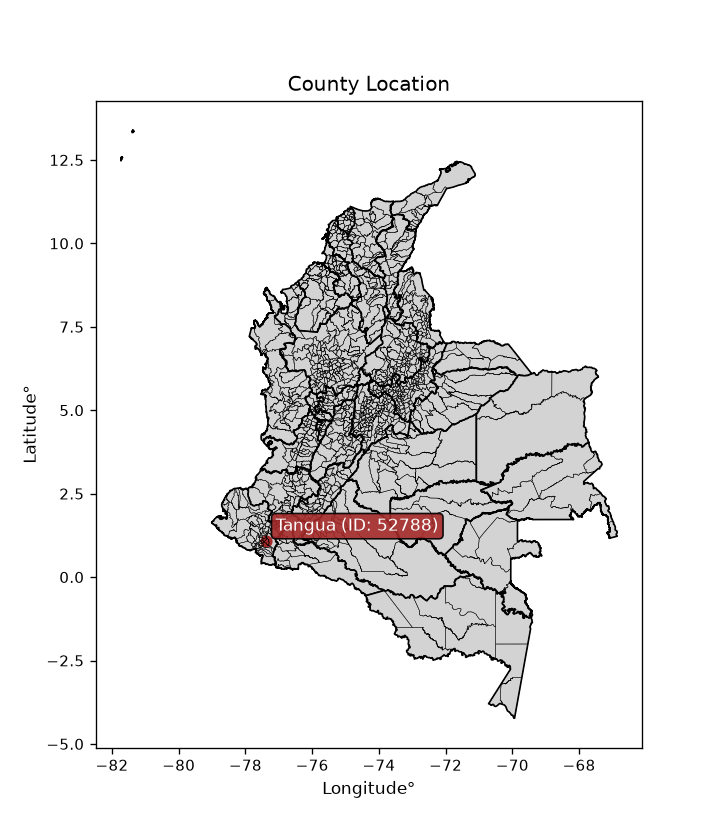
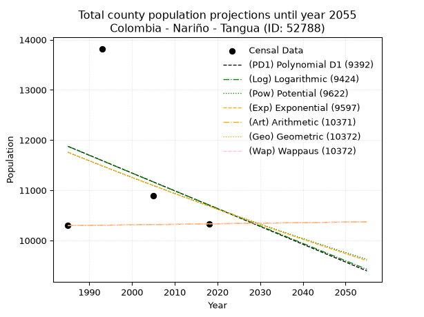
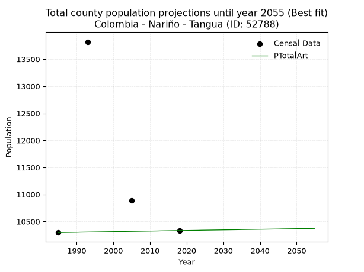
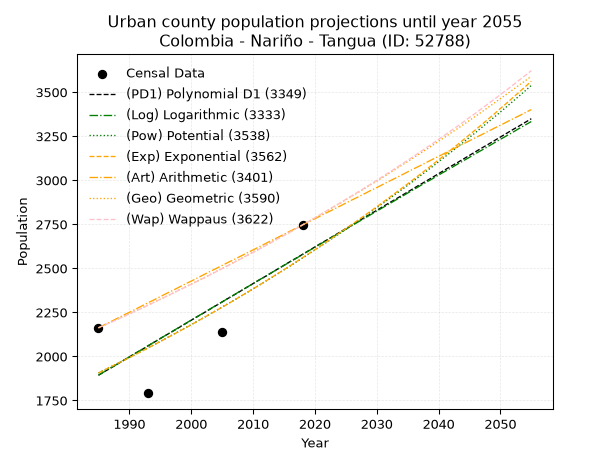
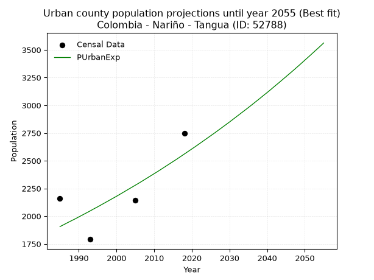
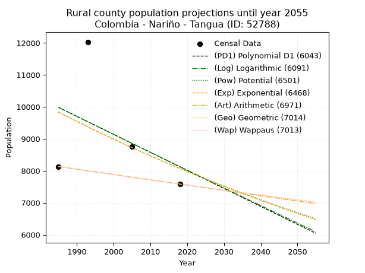
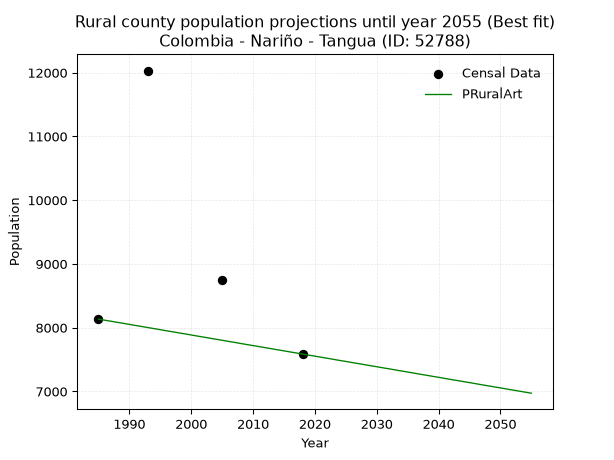

<div align="center">


</div>

# _“Population and Public Services Demand Projections (PPSD) until Year 2050 for Colombia - Nariño - Tangua (ID: 52788)”_
Keywords: `population` `public-service` `projection` `lineal` `polynomial` `logarithmic` `potential` `exponential` `arithmetic` `geometric` `wappaus` `dane` `colombia` `south-america`

PPSD are analytical estimates used by governments and planners to anticipate future changes in population size, age distribution, and the resulting community needs for utilities, healthcare, education, and infrastructure as sizing future water treatment facilities, electrical grids, and road networks based on spatial growth.

<div align="center">

</img>

</div>


> **General running parameters**: • app_version: _v20260806_. • Python version: _3.14.7_. • Pandas version: _3.0.5_. • NumPy version: _2.5.1_. • Creates, save and include plots into reports (create_plot): _False_. • Projection until year: _2050_. • Process polynomial degree 2 and up: _False_. • Process Wappaus: _True_. • Process Wappaus: _True_. • Set negative values to zero: _True_. • Set infinite values to zero: _True_. • Drop dataset notes: _True_. 
<div align="center">

Dynamic map: [:earth_americas:Google](http://maps.google.com/maps?q=1.094820064,-77.3937354) [:earth_americas:OSM](https://www.openstreetmap.org/#map=18/1.094820064/-77.3937354&layers=P) [:earth_americas:Bing](https://www.bing.com/maps?cp=1.094820064~-77.3937354&lvl=18) [:earth_americas:Apple](https://maps.apple.com/frame?center=1.094820064%2C-77.3937354&span=0.003%2C0.006)

</div>


<div align="center">

```geojson
{
  "type": "Feature",
  "geometry": {
    "type": "Point", 
    "coordinates": [-77.3937354, 1.094820064]
  }, 
  "properties": {
    "Name": "Colombia - Nariño - Tangua (ID: 52788)"
  }
}
```

</div>


## 0. Census Data (4 records)

Census data are official statistics collected by a government about the people and housing in a country. They usually include counts of total population, age, sex, race, income, education, and jobs.

📅Global census file: [Population.xlsx](../data/Population.xlsx)

| Source   |   Year |   CountryID | CountryName   |   StateID | StateName   |   CountyID | CountyName   |   PTotal |   PUrban |   PRural |
|:---------|-------:|------------:|:--------------|----------:|:------------|-----------:|:-------------|---------:|---------:|---------:|
| DANE     |   1985 |          57 | Colombia      |        52 | Nariño      |      52788 | Tangua       |    10295 |     2162 |     8133 |
| DANE     |   1993 |          57 | Colombia      |        52 | Nariño      |      52788 | Tangua       |    13822 |     1791 |    12031 |
| DANE     |   2005 |          57 | Colombia      |        52 | Nariño      |      52788 | Tangua       |    10892 |     2141 |     8751 |
| DANE     |   2018 |          57 | Colombia      |        52 | Nariño      |      52788 | Tangua       |    10331 |     2746 |     7585 |

> 🔥Some records could had specific notes about the registered values or the corresponding urban or rural distribution.

📅[SUI-RUPS](https://www.datos.gov.co/Hacienda-y-Cr-dito-P-blico/Registro-nico-de-Prestadores-de-Servicios-P-blicos/4qkq-csdn/about_data) - Local public utility companies: [RUPS.csv](../data/RUPS.xlsx)

 | SERVICIO       | ESTADO    | NOMBRE                                                                                                                                                 | NIT         | DEPARTAMENTO_DOMICILIO   | MUNICIPIO_DOMICILIO   | DIRECCION                 |   TELEFONO | EMAIL                          | TIPO_PRESTADOR          | CLASIFICACION                 |
|:---------------|:----------|:-------------------------------------------------------------------------------------------------------------------------------------------------------|:------------|:-------------------------|:----------------------|:--------------------------|-----------:|:-------------------------------|:------------------------|:------------------------------|
| ACUEDUCTO      | OPERATIVA | JUNTA ADMINISTRADORA DEL ACUEDUCTO DE LA VEREDA SAN RAFAEL MUNICIPIO DE TANGUA                                                                         | 814001855-8 | NARINO                   | TANGUA                | VEREDA SAN RAFAEL         |    3153513 | personerodetangua@gmail.com    | ORGANIZACION AUTORIZADA | HASTA 2500 SUSCRIPTORES       |
| ACUEDUCTO      | OPERATIVA | JUNTA ADMINISTRADORA DEL ACUEDUCTO DE LA VEREDA CHAVES MUNICIPIO DE TANGUA                                                                             | 900237750-9 | NARINO                   | TANGUA                | VEREDA DE CHAVES          |    7753030 | alcaldia@tangua-narino.gov.co  | ORGANIZACION AUTORIZADA | HASTA 2500 SUSCRIPTORES       |
| ACUEDUCTO      | OPERATIVA | ADMINISTRACION PUBLICA COOPERATIVA DE AGUA POTABLE Y SANEAMIENTO BASICO DE TANGUA                                                                      | 900299548-2 | NARINO                   | TANGUA                | Barrio los Andes          |    8185624 | empotangua@yahoo.es            | ORGANIZACION AUTORIZADA | MENOR O IGUAL A 2500 USUARIOS |
| ALCANTARILLADO | OPERATIVA | ADMINISTRACION PUBLICA COOPERATIVA DE AGUA POTABLE Y SANEAMIENTO BASICO DE TANGUA                                                                      | 900299548-2 | NARINO                   | TANGUA                | Barrio los Andes          |    8185624 | empotangua@yahoo.es            | ORGANIZACION AUTORIZADA | MENOR O IGUAL A 2500 USUARIOS |
| ACUEDUCTO      | OPERATIVA | ASOCIACION JUNTA ADMINISTRADORA DE ACUEDUCTO EL PESACADOR DEL TABLOR OBRAJE                                                                            | 900316457-4 | NARINO                   | TANGUA                | OBRAJE TANGUA             |    8185624 | asociacionelpescador@gmail.com | ORGANIZACION AUTORIZADA | HASTA 2500 SUSCRIPTORES       |
| ACUEDUCTO      | OPERATIVA | JUNTA ADMINISTRADORA DEL ACUEDUCTO DE LA VEREDA TAPIALQUER BAJO MUNICIPIO DE TANGUA                                                                    | 900080709-1 | NARINO                   | TANGUA                | VEREDA TAPIALQUER BAJO    |    7753030 | JGOMEZHH@HOTMAIL.COM           | ORGANIZACION AUTORIZADA | HASTA 2500 SUSCRIPTORES       |
| ACUEDUCTO      | OPERATIVA | ASOCIACION JUNTA ADMINISTRADORA ACUEDUCTO MANANTIAL                                                                                                    | 900363515-3 | NARINO                   | TANGUA                | palacio municipal Tangua  |    3148544 | luis.alberto.paz@hotmail.com   | ORGANIZACION AUTORIZADA | HASTA 2500 SUSCRIPTORES       |
| ACUEDUCTO      | OPERATIVA | ASOCIACION DE USUARIOS ADMINISTRADORA DE LOS SERVICIOS PUBLICOS DE ACUEDUCTO ALCANTARILLADO Y ASEO DEL CORREGIMIENTO OPONGOY VEREDA DE SANTANDER TANGU | 900306064-0 | NARINO                   | TANGUA                | Vereda Santander Casa 129 |    8185624 | eulererney@gmail.com           | ORGANIZACION AUTORIZADA | MENOR O IGUAL A 2500 USUARIOS |

## 1. Total

### 1.1. Coefficients and Parameters

* (PD1) Polynomial Deg 1: -35.481332798072515, 82306.53592934455 (lineal)
* (Log) Logarithmic: -70718.28558156946, 548865.2554062845
* (Pow) Potential: -5.779336936733884, 23.129141325132647
* (Exp) Exponential: -0.0029002870885885546, 3720352.2370222555
* (Art) Arithmetic: Year diff. 2018 - 1985 = 33, Population diff. 10331 - 10295 = 36, Annual growth = 1.0909090909090908
* (Geo) Geometric: Year diff. 2018 - 1985 = 33, Population diff. 10331 - 10295 = 36, Annual growth % = 0.00010578569756547473
* (Wap) Wappaus: i = 0.010577999523990021, Condition values only valid for < 200)

<sub>
Wappaus condition values: ['0.00', '0.01', '0.02', '0.03', '0.04', '0.05', '0.06', '0.07', '0.08', '0.10', '0.11', '0.12', '0.13', '0.14', '0.15', '0.16', '0.17', '0.18', '0.19', '0.20', '0.21', '0.22', '0.23', '0.24', '0.25', '0.26', '0.28', '0.29', '0.30', '0.31', '0.32', '0.33', '0.34', '0.35', '0.36', '0.37', '0.38', '0.39', '0.40', '0.41', '0.42', '0.43', '0.44', '0.45', '0.47', '0.48', '0.49', '0.50', '0.51', '0.52', '0.53', '0.54', '0.55', '0.56', '0.57', '0.58', '0.59', '0.60', '0.61', '0.62', '0.63', '0.65', '0.66', '0.67', '0.68', '0.69']
</sub>


### 1.2. Projected Dataset

|   Year |   CountyID |   PTotalPD1 |   PTotalLog |   PTotalPow |   PTotalExp |   PTotalArt |   PTotalGeo |   PTotalWap |
|-------:|-----------:|------------:|------------:|------------:|------------:|------------:|------------:|------------:|
|   1985 |      52788 |       11876 |       11875 |       11756 |       11758 |       10295 |       10295 |       10295 |
|   1986 |      52788 |       11841 |       11839 |       11722 |       11724 |       10296 |       10296 |       10296 |
|   1987 |      52788 |       11805 |       11804 |       11688 |       11690 |       10297 |       10297 |       10297 |
|   1988 |      52788 |       11770 |       11768 |       11654 |       11656 |       10298 |       10298 |       10298 |
|   1989 |      52788 |       11734 |       11732 |       11620 |       11622 |       10299 |       10299 |       10299 |
|   1990 |      52788 |       11699 |       11697 |       11587 |       11588 |       10300 |       10300 |       10300 |
|   1991 |      52788 |       11663 |       11661 |       11553 |       11555 |       10302 |       10302 |       10302 |
|   1992 |      52788 |       11628 |       11626 |       11520 |       11521 |       10303 |       10303 |       10303 |
|   1993 |      52788 |       11592 |       11590 |       11486 |       11488 |       10304 |       10304 |       10304 |
|   1994 |      52788 |       11557 |       11555 |       11453 |       11455 |       10305 |       10305 |       10305 |
|   1995 |      52788 |       11521 |       11519 |       11420 |       11422 |       10306 |       10306 |       10306 |
|   1996 |      52788 |       11486 |       11484 |       11387 |       11388 |       10307 |       10307 |       10307 |
|   1997 |      52788 |       11450 |       11449 |       11354 |       11355 |       10308 |       10308 |       10308 |
|   1998 |      52788 |       11415 |       11413 |       11321 |       11323 |       10309 |       10309 |       10309 |
|   1999 |      52788 |       11379 |       11378 |       11288 |       11290 |       10310 |       10310 |       10310 |
|   2000 |      52788 |       11344 |       11342 |       11256 |       11257 |       10311 |       10311 |       10311 |
|   2001 |      52788 |       11308 |       11307 |       11223 |       11225 |       10312 |       10312 |       10312 |
|   2002 |      52788 |       11273 |       11272 |       11191 |       11192 |       10314 |       10314 |       10314 |
|   2003 |      52788 |       11237 |       11236 |       11159 |       11160 |       10315 |       10315 |       10315 |
|   2004 |      52788 |       11202 |       11201 |       11127 |       11127 |       10316 |       10316 |       10316 |
|   2005 |      52788 |       11166 |       11166 |       11095 |       11095 |       10317 |       10317 |       10317 |
|   2006 |      52788 |       11131 |       11131 |       11063 |       11063 |       10318 |       10318 |       10318 |
|   2007 |      52788 |       11096 |       11095 |       11031 |       11031 |       10319 |       10319 |       10319 |
|   2008 |      52788 |       11060 |       11060 |       10999 |       10999 |       10320 |       10320 |       10320 |
|   2009 |      52788 |       11025 |       11025 |       10967 |       10967 |       10321 |       10321 |       10321 |
|   2010 |      52788 |       10989 |       10990 |       10936 |       10935 |       10322 |       10322 |       10322 |
|   2011 |      52788 |       10954 |       10955 |       10905 |       10904 |       10323 |       10323 |       10323 |
|   2012 |      52788 |       10918 |       10919 |       10873 |       10872 |       10324 |       10324 |       10324 |
|   2013 |      52788 |       10883 |       10884 |       10842 |       10841 |       10326 |       10326 |       10326 |
|   2014 |      52788 |       10847 |       10849 |       10811 |       10809 |       10327 |       10327 |       10327 |
|   2015 |      52788 |       10812 |       10814 |       10780 |       10778 |       10328 |       10328 |       10328 |
|   2016 |      52788 |       10776 |       10779 |       10749 |       10747 |       10329 |       10329 |       10329 |
|   2017 |      52788 |       10741 |       10744 |       10718 |       10716 |       10330 |       10330 |       10330 |
|   2018 |      52788 |       10705 |       10709 |       10688 |       10685 |       10331 |       10331 |       10331 |
|   2019 |      52788 |       10670 |       10674 |       10657 |       10654 |       10332 |       10332 |       10332 |
|   2020 |      52788 |       10634 |       10639 |       10627 |       10623 |       10333 |       10333 |       10333 |
|   2021 |      52788 |       10599 |       10604 |       10596 |       10592 |       10334 |       10334 |       10334 |
|   2022 |      52788 |       10563 |       10569 |       10566 |       10561 |       10335 |       10335 |       10335 |
|   2023 |      52788 |       10528 |       10534 |       10536 |       10531 |       10336 |       10336 |       10336 |
|   2024 |      52788 |       10492 |       10499 |       10506 |       10500 |       10338 |       10338 |       10338 |
|   2025 |      52788 |       10457 |       10464 |       10476 |       10470 |       10339 |       10339 |       10339 |
|   2026 |      52788 |       10421 |       10429 |       10446 |       10439 |       10340 |       10340 |       10340 |
|   2027 |      52788 |       10386 |       10394 |       10416 |       10409 |       10341 |       10341 |       10341 |
|   2028 |      52788 |       10350 |       10359 |       10387 |       10379 |       10342 |       10342 |       10342 |
|   2029 |      52788 |       10315 |       10324 |       10357 |       10349 |       10343 |       10343 |       10343 |
|   2030 |      52788 |       10279 |       10290 |       10328 |       10319 |       10344 |       10344 |       10344 |
|   2031 |      52788 |       10244 |       10255 |       10298 |       10289 |       10345 |       10345 |       10345 |
|   2032 |      52788 |       10208 |       10220 |       10269 |       10259 |       10346 |       10346 |       10346 |
|   2033 |      52788 |       10173 |       10185 |       10240 |       10230 |       10347 |       10347 |       10347 |
|   2034 |      52788 |       10138 |       10150 |       10211 |       10200 |       10348 |       10348 |       10348 |
|   2035 |      52788 |       10102 |       10116 |       10182 |       10170 |       10350 |       10350 |       10350 |
|   2036 |      52788 |       10067 |       10081 |       10153 |       10141 |       10351 |       10351 |       10351 |
|   2037 |      52788 |       10031 |       10046 |       10124 |       10112 |       10352 |       10352 |       10352 |
|   2038 |      52788 |        9996 |       10011 |       10096 |       10082 |       10353 |       10353 |       10353 |
|   2039 |      52788 |        9960 |        9977 |       10067 |       10053 |       10354 |       10354 |       10354 |
|   2040 |      52788 |        9925 |        9942 |       10039 |       10024 |       10355 |       10355 |       10355 |
|   2041 |      52788 |        9889 |        9907 |       10010 |        9995 |       10356 |       10356 |       10356 |
|   2042 |      52788 |        9854 |        9873 |        9982 |        9966 |       10357 |       10357 |       10357 |
|   2043 |      52788 |        9818 |        9838 |        9954 |        9937 |       10358 |       10358 |       10358 |
|   2044 |      52788 |        9783 |        9804 |        9926 |        9908 |       10359 |       10359 |       10359 |
|   2045 |      52788 |        9747 |        9769 |        9898 |        9880 |       10360 |       10361 |       10361 |
|   2046 |      52788 |        9712 |        9734 |        9870 |        9851 |       10362 |       10362 |       10362 |
|   2047 |      52788 |        9676 |        9700 |        9842 |        9823 |       10363 |       10363 |       10363 |
|   2048 |      52788 |        9641 |        9665 |        9814 |        9794 |       10364 |       10364 |       10364 |
|   2049 |      52788 |        9605 |        9631 |        9786 |        9766 |       10365 |       10365 |       10365 |
|   2050 |      52788 |        9570 |        9596 |        9759 |        9738 |       10366 |       10366 |       10366 |
<div align="center">

</img>

</div>


### 1.3. Best fit with absolute and relative error (%)

Relative error puts that difference into context by dividing the absolute error by the true value, creating a unitless ratio or percentage that shows the scale of the mistake.

Absolute and relative error

|   Year | Source   |   CountryID | CountryName   |   StateID | StateName   |   CountyID_x | CountyName   |   PTotal |   PUrban |   PRural |   CountyID_y |   PTotalPD1 |   PTotalLog |   PTotalPow |   PTotalExp |   PTotalArt |   PTotalGeo |   PTotalWap |   PTotalPD1AbsError |   PTotalLogAbsError |   PTotalPowAbsError |   PTotalExpAbsError |   PTotalArtAbsError |   PTotalGeoAbsError |   PTotalWapAbsError |   PTotalPD1RelError |   PTotalLogRelError |   PTotalPowRelError |   PTotalExpRelError |   PTotalArtRelError |   PTotalGeoRelError |   PTotalWapRelError |
|-------:|:---------|------------:|:--------------|----------:|:------------|-------------:|:-------------|---------:|---------:|---------:|-------------:|------------:|------------:|------------:|------------:|------------:|------------:|------------:|--------------------:|--------------------:|--------------------:|--------------------:|--------------------:|--------------------:|--------------------:|--------------------:|--------------------:|--------------------:|--------------------:|--------------------:|--------------------:|--------------------:|
|   1985 | DANE     |          57 | Colombia      |        52 | Nariño      |        52788 | Tangua       |    10295 |     2162 |     8133 |        52788 |       11876 |       11875 |       11756 |       11758 |       10295 |       10295 |       10295 |                1581 |                1580 |                1461 |                1463 |                   0 |                   0 |                   0 |            15.357   |            15.3473  |            14.1914  |            14.2108  |              0      |              0      |              0      |
|   1993 | DANE     |          57 | Colombia      |        52 | Nariño      |        52788 | Tangua       |    13822 |     1791 |    12031 |        52788 |       11592 |       11590 |       11486 |       11488 |       10304 |       10304 |       10304 |                2230 |                2232 |                2336 |                2334 |                3518 |                3518 |                3518 |            16.1337  |            16.1482  |            16.9006  |            16.8861  |             25.4522 |             25.4522 |             25.4522 |
|   2005 | DANE     |          57 | Colombia      |        52 | Nariño      |        52788 | Tangua       |    10892 |     2141 |     8751 |        52788 |       11166 |       11166 |       11095 |       11095 |       10317 |       10317 |       10317 |                 274 |                 274 |                 203 |                 203 |                 575 |                 575 |                 575 |             2.51561 |             2.51561 |             1.86375 |             1.86375 |              5.2791 |              5.2791 |              5.2791 |
|   2018 | DANE     |          57 | Colombia      |        52 | Nariño      |        52788 | Tangua       |    10331 |     2746 |     7585 |        52788 |       10705 |       10709 |       10688 |       10685 |       10331 |       10331 |       10331 |                 374 |                 378 |                 357 |                 354 |                   0 |                   0 |                   0 |             3.62017 |             3.65889 |             3.45562 |             3.42658 |              0      |              0      |              0      |

Relative error mean

| Method    |   RelError | Best   |
|:----------|-----------:|:-------|
| PTotalPD1 |    9.40661 |        |
| PTotalLog |    9.41748 |        |
| PTotalPow |    9.10283 |        |
| PTotalExp |    9.09681 |        |
| PTotalArt |    7.68282 | True   |
| PTotalGeo |    7.68282 | True   |
| PTotalWap |    7.68282 | True   |

💙Best method: _**PTotalArt**_
<div align="center">

</img>

</div>


### 1.4. Fresh water supply demand in liters per capita per day (lpcd)

The fresh water supply demand typically ranges from 100 to 300 liters per capita per day (lpcd) for standard domestic and municipal planning, though absolute survival minimums set by the World Health Organization are as low as 7.5 to 20 liters per day, and total consumption in high-income nations can exceed 400 liters.

> `CZ`: Level in meters above the sea level (masl)<br> `WS`: Fresh water supply demand in liters per capita per day (lpcd or l/h/d)<br> `WSAll`: Zonal fresh water supply demand in liters per second (l/s)<br> `A`: Zonal area in square meters<br> `DP`: Population density (people/hectare or p/ha)

Reference values (RAS Colombia)

|    CZ |   WS |
|------:|-----:|
|  1000 |  120 |
|  2000 |  130 |
| 99999 |  140 |

County shapefile geometry properties and water supply values

|   CountyID |      ATotal |   CZTotal |   WSTotal |
|-----------:|------------:|----------:|----------:|
|      52788 | 2.18187e+08 |   3053.69 |       140 |

Projected values for best method: PTotalArt

|   CountyID |   Year |   PTotalArt |   DPTotal |   WSTotal |   WSTotalAll |
|-----------:|-------:|------------:|----------:|----------:|-------------:|
|      52788 |   1985 |       10295 |      0.47 |       140 |      16.6817 |
|      52788 |   1986 |       10296 |      0.47 |       140 |      16.6833 |
|      52788 |   1987 |       10297 |      0.47 |       140 |      16.685  |
|      52788 |   1988 |       10298 |      0.47 |       140 |      16.6866 |
|      52788 |   1989 |       10299 |      0.47 |       140 |      16.6882 |
|      52788 |   1990 |       10300 |      0.47 |       140 |      16.6898 |
|      52788 |   1991 |       10302 |      0.47 |       140 |      16.6931 |
|      52788 |   1992 |       10303 |      0.47 |       140 |      16.6947 |
|      52788 |   1993 |       10304 |      0.47 |       140 |      16.6963 |
|      52788 |   1994 |       10305 |      0.47 |       140 |      16.6979 |
|      52788 |   1995 |       10306 |      0.47 |       140 |      16.6995 |
|      52788 |   1996 |       10307 |      0.47 |       140 |      16.7012 |
|      52788 |   1997 |       10308 |      0.47 |       140 |      16.7028 |
|      52788 |   1998 |       10309 |      0.47 |       140 |      16.7044 |
|      52788 |   1999 |       10310 |      0.47 |       140 |      16.706  |
|      52788 |   2000 |       10311 |      0.47 |       140 |      16.7076 |
|      52788 |   2001 |       10312 |      0.47 |       140 |      16.7093 |
|      52788 |   2002 |       10314 |      0.47 |       140 |      16.7125 |
|      52788 |   2003 |       10315 |      0.47 |       140 |      16.7141 |
|      52788 |   2004 |       10316 |      0.47 |       140 |      16.7157 |
|      52788 |   2005 |       10317 |      0.47 |       140 |      16.7174 |
|      52788 |   2006 |       10318 |      0.47 |       140 |      16.719  |
|      52788 |   2007 |       10319 |      0.47 |       140 |      16.7206 |
|      52788 |   2008 |       10320 |      0.47 |       140 |      16.7222 |
|      52788 |   2009 |       10321 |      0.47 |       140 |      16.7238 |
|      52788 |   2010 |       10322 |      0.47 |       140 |      16.7255 |
|      52788 |   2011 |       10323 |      0.47 |       140 |      16.7271 |
|      52788 |   2012 |       10324 |      0.47 |       140 |      16.7287 |
|      52788 |   2013 |       10326 |      0.47 |       140 |      16.7319 |
|      52788 |   2014 |       10327 |      0.47 |       140 |      16.7336 |
|      52788 |   2015 |       10328 |      0.47 |       140 |      16.7352 |
|      52788 |   2016 |       10329 |      0.47 |       140 |      16.7368 |
|      52788 |   2017 |       10330 |      0.47 |       140 |      16.7384 |
|      52788 |   2018 |       10331 |      0.47 |       140 |      16.74   |
|      52788 |   2019 |       10332 |      0.47 |       140 |      16.7417 |
|      52788 |   2020 |       10333 |      0.47 |       140 |      16.7433 |
|      52788 |   2021 |       10334 |      0.47 |       140 |      16.7449 |
|      52788 |   2022 |       10335 |      0.47 |       140 |      16.7465 |
|      52788 |   2023 |       10336 |      0.47 |       140 |      16.7481 |
|      52788 |   2024 |       10338 |      0.47 |       140 |      16.7514 |
|      52788 |   2025 |       10339 |      0.47 |       140 |      16.753  |
|      52788 |   2026 |       10340 |      0.47 |       140 |      16.7546 |
|      52788 |   2027 |       10341 |      0.47 |       140 |      16.7563 |
|      52788 |   2028 |       10342 |      0.47 |       140 |      16.7579 |
|      52788 |   2029 |       10343 |      0.47 |       140 |      16.7595 |
|      52788 |   2030 |       10344 |      0.47 |       140 |      16.7611 |
|      52788 |   2031 |       10345 |      0.47 |       140 |      16.7627 |
|      52788 |   2032 |       10346 |      0.47 |       140 |      16.7644 |
|      52788 |   2033 |       10347 |      0.47 |       140 |      16.766  |
|      52788 |   2034 |       10348 |      0.47 |       140 |      16.7676 |
|      52788 |   2035 |       10350 |      0.47 |       140 |      16.7708 |
|      52788 |   2036 |       10351 |      0.47 |       140 |      16.7725 |
|      52788 |   2037 |       10352 |      0.47 |       140 |      16.7741 |
|      52788 |   2038 |       10353 |      0.47 |       140 |      16.7757 |
|      52788 |   2039 |       10354 |      0.47 |       140 |      16.7773 |
|      52788 |   2040 |       10355 |      0.47 |       140 |      16.7789 |
|      52788 |   2041 |       10356 |      0.47 |       140 |      16.7806 |
|      52788 |   2042 |       10357 |      0.47 |       140 |      16.7822 |
|      52788 |   2043 |       10358 |      0.47 |       140 |      16.7838 |
|      52788 |   2044 |       10359 |      0.47 |       140 |      16.7854 |
|      52788 |   2045 |       10360 |      0.47 |       140 |      16.787  |
|      52788 |   2046 |       10362 |      0.47 |       140 |      16.7903 |
|      52788 |   2047 |       10363 |      0.47 |       140 |      16.7919 |
|      52788 |   2048 |       10364 |      0.48 |       140 |      16.7935 |
|      52788 |   2049 |       10365 |      0.48 |       140 |      16.7951 |
|      52788 |   2050 |       10366 |      0.48 |       140 |      16.7968 |

## 2. Urban

### 2.1. Coefficients and Parameters

* (PD1) Polynomial Deg 1: 20.804496186270192, -39404.193496586944 (lineal)
* (Log) Logarithmic: 41564.52336729745, -313722.2751920146
* (Pow) Potential: 17.845018889038812, -55.56844354942901
* (Exp) Exponential: 0.008932556227449425, 3.7986346130498326e-05
* (Art) Arithmetic: Year diff. 2018 - 1985 = 33, Population diff. 2746 - 2162 = 584, Annual growth = 17.696969696969695
* (Geo) Geometric: Year diff. 2018 - 1985 = 33, Population diff. 2746 - 2162 = 584, Annual growth % = 0.007272120068869903
* (Wap) Wappaus: i = 0.721147909411968, Condition values only valid for < 200)

<sub>
Wappaus condition values: ['0.00', '0.72', '1.44', '2.16', '2.88', '3.61', '4.33', '5.05', '5.77', '6.49', '7.21', '7.93', '8.65', '9.37', '10.10', '10.82', '11.54', '12.26', '12.98', '13.70', '14.42', '15.14', '15.87', '16.59', '17.31', '18.03', '18.75', '19.47', '20.19', '20.91', '21.63', '22.36', '23.08', '23.80', '24.52', '25.24', '25.96', '26.68', '27.40', '28.12', '28.85', '29.57', '30.29', '31.01', '31.73', '32.45', '33.17', '33.89', '34.62', '35.34', '36.06', '36.78', '37.50', '38.22', '38.94', '39.66', '40.38', '41.11', '41.83', '42.55', '43.27', '43.99', '44.71', '45.43', '46.15', '46.87']
</sub>


### 2.2. Projected Dataset

|   Year |   CountyID |   PUrbanPD1 |   PUrbanLog |   PUrbanPow |   PUrbanExp |   PUrbanArt |   PUrbanGeo |   PUrbanWap |
|-------:|-----------:|------------:|------------:|------------:|------------:|------------:|------------:|------------:|
|   1985 |      52788 |        1893 |        1893 |        1906 |        1906 |        2162 |        2162 |        2162 |
|   1986 |      52788 |        1914 |        1914 |        1923 |        1923 |        2180 |        2178 |        2178 |
|   1987 |      52788 |        1934 |        1935 |        1941 |        1941 |        2197 |        2194 |        2193 |
|   1988 |      52788 |        1955 |        1955 |        1958 |        1958 |        2215 |        2210 |        2209 |
|   1989 |      52788 |        1976 |        1976 |        1976 |        1975 |        2233 |        2226 |        2225 |
|   1990 |      52788 |        1997 |        1997 |        1994 |        1993 |        2250 |        2242 |        2241 |
|   1991 |      52788 |        2018 |        2018 |        2012 |        2011 |        2268 |        2258 |        2258 |
|   1992 |      52788 |        2038 |        2039 |        2030 |        2029 |        2286 |        2274 |        2274 |
|   1993 |      52788 |        2059 |        2060 |        2048 |        2047 |        2304 |        2291 |        2290 |
|   1994 |      52788 |        2080 |        2081 |        2066 |        2066 |        2321 |        2308 |        2307 |
|   1995 |      52788 |        2101 |        2102 |        2085 |        2084 |        2339 |        2324 |        2324 |
|   1996 |      52788 |        2122 |        2122 |        2104 |        2103 |        2357 |        2341 |        2341 |
|   1997 |      52788 |        2142 |        2143 |        2123 |        2122 |        2374 |        2358 |        2358 |
|   1998 |      52788 |        2163 |        2164 |        2142 |        2141 |        2392 |        2376 |        2375 |
|   1999 |      52788 |        2184 |        2185 |        2161 |        2160 |        2410 |        2393 |        2392 |
|   2000 |      52788 |        2205 |        2206 |        2180 |        2179 |        2427 |        2410 |        2409 |
|   2001 |      52788 |        2226 |        2226 |        2200 |        2199 |        2445 |        2428 |        2427 |
|   2002 |      52788 |        2246 |        2247 |        2219 |        2219 |        2463 |        2445 |        2444 |
|   2003 |      52788 |        2267 |        2268 |        2239 |        2239 |        2481 |        2463 |        2462 |
|   2004 |      52788 |        2288 |        2289 |        2259 |        2259 |        2498 |        2481 |        2480 |
|   2005 |      52788 |        2309 |        2309 |        2280 |        2279 |        2516 |        2499 |        2498 |
|   2006 |      52788 |        2330 |        2330 |        2300 |        2299 |        2534 |        2517 |        2516 |
|   2007 |      52788 |        2350 |        2351 |        2320 |        2320 |        2551 |        2536 |        2535 |
|   2008 |      52788 |        2371 |        2372 |        2341 |        2341 |        2569 |        2554 |        2553 |
|   2009 |      52788 |        2392 |        2392 |        2362 |        2362 |        2587 |        2573 |        2572 |
|   2010 |      52788 |        2413 |        2413 |        2383 |        2383 |        2604 |        2591 |        2590 |
|   2011 |      52788 |        2434 |        2434 |        2404 |        2404 |        2622 |        2610 |        2609 |
|   2012 |      52788 |        2454 |        2454 |        2426 |        2426 |        2640 |        2629 |        2628 |
|   2013 |      52788 |        2475 |        2475 |        2447 |        2448 |        2658 |        2648 |        2648 |
|   2014 |      52788 |        2496 |        2496 |        2469 |        2470 |        2675 |        2668 |        2667 |
|   2015 |      52788 |        2517 |        2516 |        2491 |        2492 |        2693 |        2687 |        2686 |
|   2016 |      52788 |        2538 |        2537 |        2513 |        2514 |        2711 |        2706 |        2706 |
|   2017 |      52788 |        2558 |        2557 |        2536 |        2537 |        2728 |        2726 |        2726 |
|   2018 |      52788 |        2579 |        2578 |        2558 |        2560 |        2746 |        2746 |        2746 |
|   2019 |      52788 |        2600 |        2599 |        2581 |        2583 |        2764 |        2766 |        2766 |
|   2020 |      52788 |        2621 |        2619 |        2604 |        2606 |        2781 |        2786 |        2787 |
|   2021 |      52788 |        2642 |        2640 |        2627 |        2629 |        2799 |        2806 |        2807 |
|   2022 |      52788 |        2662 |        2660 |        2650 |        2653 |        2817 |        2827 |        2828 |
|   2023 |      52788 |        2683 |        2681 |        2674 |        2677 |        2834 |        2847 |        2849 |
|   2024 |      52788 |        2704 |        2701 |        2697 |        2701 |        2852 |        2868 |        2870 |
|   2025 |      52788 |        2725 |        2722 |        2721 |        2725 |        2870 |        2889 |        2891 |
|   2026 |      52788 |        2746 |        2742 |        2745 |        2749 |        2888 |        2910 |        2912 |
|   2027 |      52788 |        2767 |        2763 |        2770 |        2774 |        2905 |        2931 |        2934 |
|   2028 |      52788 |        2787 |        2783 |        2794 |        2799 |        2923 |        2952 |        2955 |
|   2029 |      52788 |        2808 |        2804 |        2819 |        2824 |        2941 |        2974 |        2977 |
|   2030 |      52788 |        2829 |        2824 |        2844 |        2849 |        2958 |        2995 |        2999 |
|   2031 |      52788 |        2850 |        2845 |        2869 |        2875 |        2976 |        3017 |        3022 |
|   2032 |      52788 |        2871 |        2865 |        2894 |        2901 |        2994 |        3039 |        3044 |
|   2033 |      52788 |        2891 |        2886 |        2920 |        2927 |        3011 |        3061 |        3067 |
|   2034 |      52788 |        2912 |        2906 |        2945 |        2953 |        3029 |        3084 |        3090 |
|   2035 |      52788 |        2933 |        2927 |        2971 |        2979 |        3047 |        3106 |        3113 |
|   2036 |      52788 |        2954 |        2947 |        2997 |        3006 |        3065 |        3129 |        3136 |
|   2037 |      52788 |        2975 |        2968 |        3024 |        3033 |        3082 |        3151 |        3160 |
|   2038 |      52788 |        2995 |        2988 |        3050 |        3060 |        3100 |        3174 |        3184 |
|   2039 |      52788 |        3016 |        3008 |        3077 |        3088 |        3118 |        3197 |        3207 |
|   2040 |      52788 |        3037 |        3029 |        3104 |        3115 |        3135 |        3221 |        3232 |
|   2041 |      52788 |        3058 |        3049 |        3132 |        3143 |        3153 |        3244 |        3256 |
|   2042 |      52788 |        3079 |        3069 |        3159 |        3172 |        3171 |        3268 |        3281 |
|   2043 |      52788 |        3099 |        3090 |        3187 |        3200 |        3188 |        3291 |        3305 |
|   2044 |      52788 |        3120 |        3110 |        3215 |        3229 |        3206 |        3315 |        3330 |
|   2045 |      52788 |        3141 |        3130 |        3243 |        3258 |        3224 |        3339 |        3356 |
|   2046 |      52788 |        3162 |        3151 |        3271 |        3287 |        3242 |        3364 |        3381 |
|   2047 |      52788 |        3183 |        3171 |        3300 |        3316 |        3259 |        3388 |        3407 |
|   2048 |      52788 |        3203 |        3191 |        3329 |        3346 |        3277 |        3413 |        3433 |
|   2049 |      52788 |        3224 |        3212 |        3358 |        3376 |        3295 |        3438 |        3459 |
|   2050 |      52788 |        3245 |        3232 |        3387 |        3407 |        3312 |        3463 |        3486 |
<div align="center">

</img>

</div>


### 2.3. Best fit with absolute and relative error (%)

Relative error puts that difference into context by dividing the absolute error by the true value, creating a unitless ratio or percentage that shows the scale of the mistake.

Absolute and relative error

|   Year | Source   |   CountryID | CountryName   |   StateID | StateName   |   CountyID_x | CountyName   |   PTotal |   PUrban |   PRural |   CountyID_y |   PUrbanPD1 |   PUrbanLog |   PUrbanPow |   PUrbanExp |   PUrbanArt |   PUrbanGeo |   PUrbanWap |   PUrbanPD1AbsError |   PUrbanLogAbsError |   PUrbanPowAbsError |   PUrbanExpAbsError |   PUrbanArtAbsError |   PUrbanGeoAbsError |   PUrbanWapAbsError |   PUrbanPD1RelError |   PUrbanLogRelError |   PUrbanPowRelError |   PUrbanExpRelError |   PUrbanArtRelError |   PUrbanGeoRelError |   PUrbanWapRelError |
|-------:|:---------|------------:|:--------------|----------:|:------------|-------------:|:-------------|---------:|---------:|---------:|-------------:|------------:|------------:|------------:|------------:|------------:|------------:|------------:|--------------------:|--------------------:|--------------------:|--------------------:|--------------------:|--------------------:|--------------------:|--------------------:|--------------------:|--------------------:|--------------------:|--------------------:|--------------------:|--------------------:|
|   1985 | DANE     |          57 | Colombia      |        52 | Nariño      |        52788 | Tangua       |    10295 |     2162 |     8133 |        52788 |        1893 |        1893 |        1906 |        1906 |        2162 |        2162 |        2162 |                 269 |                 269 |                 256 |                 256 |                   0 |                   0 |                   0 |            12.4422  |            12.4422  |            11.8409  |            11.8409  |              0      |              0      |              0      |
|   1993 | DANE     |          57 | Colombia      |        52 | Nariño      |        52788 | Tangua       |    13822 |     1791 |    12031 |        52788 |        2059 |        2060 |        2048 |        2047 |        2304 |        2291 |        2290 |                 268 |                 269 |                 257 |                 256 |                 513 |                 500 |                 499 |            14.9637  |            15.0195  |            14.3495  |            14.2937  |             28.6432 |             27.9174 |             27.8615 |
|   2005 | DANE     |          57 | Colombia      |        52 | Nariño      |        52788 | Tangua       |    10892 |     2141 |     8751 |        52788 |        2309 |        2309 |        2280 |        2279 |        2516 |        2499 |        2498 |                 168 |                 168 |                 139 |                 138 |                 375 |                 358 |                 357 |             7.8468  |             7.8468  |             6.49229 |             6.44559 |             17.5152 |             16.7212 |             16.6745 |
|   2018 | DANE     |          57 | Colombia      |        52 | Nariño      |        52788 | Tangua       |    10331 |     2746 |     7585 |        52788 |        2579 |        2578 |        2558 |        2560 |        2746 |        2746 |        2746 |                 167 |                 168 |                 188 |                 186 |                   0 |                   0 |                   0 |             6.08157 |             6.11799 |             6.84632 |             6.77349 |              0      |              0      |              0      |

Relative error mean

| Method    |   RelError | Best   |
|:----------|-----------:|:-------|
| PUrbanPD1 |   10.3336  |        |
| PUrbanLog |   10.3566  |        |
| PUrbanPow |    9.88226 |        |
| PUrbanExp |    9.83841 | True   |
| PUrbanArt |   11.5396  |        |
| PUrbanGeo |   11.1596  |        |
| PUrbanWap |   11.134   |        |

💙Best method: _**PUrbanExp**_
<div align="center">

</img>

</div>


### 2.4. Fresh water supply demand in liters per capita per day (lpcd)

The fresh water supply demand typically ranges from 100 to 300 liters per capita per day (lpcd) for standard domestic and municipal planning, though absolute survival minimums set by the World Health Organization are as low as 7.5 to 20 liters per day, and total consumption in high-income nations can exceed 400 liters.

> `CZ`: Level in meters above the sea level (masl)<br> `WS`: Fresh water supply demand in liters per capita per day (lpcd or l/h/d)<br> `WSAll`: Zonal fresh water supply demand in liters per second (l/s)<br> `A`: Zonal area in square meters<br> `DP`: Population density (people/hectare or p/ha)

Reference values (RAS Colombia)

|    CZ |   WS |
|------:|-----:|
|  1000 |  120 |
|  2000 |  130 |
| 99999 |  140 |

County shapefile geometry properties and water supply values

|   CountyID |   AUrban |   CZUrban |   WSUrban |
|-----------:|---------:|----------:|----------:|
|      52788 |   754714 |    2422.1 |       140 |

Projected values for best method: PUrbanExp

|   CountyID |   Year |   PUrbanExp |   DPUrban |   WSUrban |   WSUrbanAll |
|-----------:|-------:|------------:|----------:|----------:|-------------:|
|      52788 |   1985 |        1906 |     25.25 |       140 |      3.08843 |
|      52788 |   1986 |        1923 |     25.48 |       140 |      3.11597 |
|      52788 |   1987 |        1941 |     25.72 |       140 |      3.14514 |
|      52788 |   1988 |        1958 |     25.94 |       140 |      3.17269 |
|      52788 |   1989 |        1975 |     26.17 |       140 |      3.20023 |
|      52788 |   1990 |        1993 |     26.41 |       140 |      3.2294  |
|      52788 |   1991 |        2011 |     26.65 |       140 |      3.25856 |
|      52788 |   1992 |        2029 |     26.88 |       140 |      3.28773 |
|      52788 |   1993 |        2047 |     27.12 |       140 |      3.3169  |
|      52788 |   1994 |        2066 |     27.37 |       140 |      3.34769 |
|      52788 |   1995 |        2084 |     27.61 |       140 |      3.37685 |
|      52788 |   1996 |        2103 |     27.86 |       140 |      3.40764 |
|      52788 |   1997 |        2122 |     28.12 |       140 |      3.43843 |
|      52788 |   1998 |        2141 |     28.37 |       140 |      3.46921 |
|      52788 |   1999 |        2160 |     28.62 |       140 |      3.5     |
|      52788 |   2000 |        2179 |     28.87 |       140 |      3.53079 |
|      52788 |   2001 |        2199 |     29.14 |       140 |      3.56319 |
|      52788 |   2002 |        2219 |     29.4  |       140 |      3.5956  |
|      52788 |   2003 |        2239 |     29.67 |       140 |      3.62801 |
|      52788 |   2004 |        2259 |     29.93 |       140 |      3.66042 |
|      52788 |   2005 |        2279 |     30.2  |       140 |      3.69282 |
|      52788 |   2006 |        2299 |     30.46 |       140 |      3.72523 |
|      52788 |   2007 |        2320 |     30.74 |       140 |      3.75926 |
|      52788 |   2008 |        2341 |     31.02 |       140 |      3.79329 |
|      52788 |   2009 |        2362 |     31.3  |       140 |      3.82731 |
|      52788 |   2010 |        2383 |     31.57 |       140 |      3.86134 |
|      52788 |   2011 |        2404 |     31.85 |       140 |      3.89537 |
|      52788 |   2012 |        2426 |     32.14 |       140 |      3.93102 |
|      52788 |   2013 |        2448 |     32.44 |       140 |      3.96667 |
|      52788 |   2014 |        2470 |     32.73 |       140 |      4.00231 |
|      52788 |   2015 |        2492 |     33.02 |       140 |      4.03796 |
|      52788 |   2016 |        2514 |     33.31 |       140 |      4.07361 |
|      52788 |   2017 |        2537 |     33.62 |       140 |      4.11088 |
|      52788 |   2018 |        2560 |     33.92 |       140 |      4.14815 |
|      52788 |   2019 |        2583 |     34.22 |       140 |      4.18542 |
|      52788 |   2020 |        2606 |     34.53 |       140 |      4.22269 |
|      52788 |   2021 |        2629 |     34.83 |       140 |      4.25995 |
|      52788 |   2022 |        2653 |     35.15 |       140 |      4.29884 |
|      52788 |   2023 |        2677 |     35.47 |       140 |      4.33773 |
|      52788 |   2024 |        2701 |     35.79 |       140 |      4.37662 |
|      52788 |   2025 |        2725 |     36.11 |       140 |      4.41551 |
|      52788 |   2026 |        2749 |     36.42 |       140 |      4.4544  |
|      52788 |   2027 |        2774 |     36.76 |       140 |      4.49491 |
|      52788 |   2028 |        2799 |     37.09 |       140 |      4.53542 |
|      52788 |   2029 |        2824 |     37.42 |       140 |      4.57593 |
|      52788 |   2030 |        2849 |     37.75 |       140 |      4.61644 |
|      52788 |   2031 |        2875 |     38.09 |       140 |      4.65856 |
|      52788 |   2032 |        2901 |     38.44 |       140 |      4.70069 |
|      52788 |   2033 |        2927 |     38.78 |       140 |      4.74282 |
|      52788 |   2034 |        2953 |     39.13 |       140 |      4.78495 |
|      52788 |   2035 |        2979 |     39.47 |       140 |      4.82708 |
|      52788 |   2036 |        3006 |     39.83 |       140 |      4.87083 |
|      52788 |   2037 |        3033 |     40.19 |       140 |      4.91458 |
|      52788 |   2038 |        3060 |     40.55 |       140 |      4.95833 |
|      52788 |   2039 |        3088 |     40.92 |       140 |      5.0037  |
|      52788 |   2040 |        3115 |     41.27 |       140 |      5.04745 |
|      52788 |   2041 |        3143 |     41.64 |       140 |      5.09282 |
|      52788 |   2042 |        3172 |     42.03 |       140 |      5.13981 |
|      52788 |   2043 |        3200 |     42.4  |       140 |      5.18519 |
|      52788 |   2044 |        3229 |     42.78 |       140 |      5.23218 |
|      52788 |   2045 |        3258 |     43.17 |       140 |      5.27917 |
|      52788 |   2046 |        3287 |     43.55 |       140 |      5.32616 |
|      52788 |   2047 |        3316 |     43.94 |       140 |      5.37315 |
|      52788 |   2048 |        3346 |     44.33 |       140 |      5.42176 |
|      52788 |   2049 |        3376 |     44.73 |       140 |      5.47037 |
|      52788 |   2050 |        3407 |     45.14 |       140 |      5.5206  |

## 3. Rural

### 3.1. Coefficients and Parameters

* (PD1) Polynomial Deg 1: -56.2858289843427, 121710.72942593148 (lineal)
* (Log) Logarithmic: -112282.80894886701, 862587.5305982997
* (Pow) Potential: -11.945154547576905, 43.385002490212486
* (Exp) Exponential: -0.0059881120832587405, 1428892848.3430872
* (Art) Arithmetic: Year diff. 2018 - 1985 = 33, Population diff. 7585 - 8133 = -548, Annual growth = -16.606060606060606
* (Geo) Geometric: Year diff. 2018 - 1985 = 33, Population diff. 7585 - 8133 = -548, Annual growth % = -0.0021116233309665944
* (Wap) Wappaus: i = -0.21129991864181966, Condition values only valid for < 200)

<sub>
Wappaus condition values: ['-0.00', '-0.21', '-0.42', '-0.63', '-0.85', '-1.06', '-1.27', '-1.48', '-1.69', '-1.90', '-2.11', '-2.32', '-2.54', '-2.75', '-2.96', '-3.17', '-3.38', '-3.59', '-3.80', '-4.01', '-4.23', '-4.44', '-4.65', '-4.86', '-5.07', '-5.28', '-5.49', '-5.71', '-5.92', '-6.13', '-6.34', '-6.55', '-6.76', '-6.97', '-7.18', '-7.40', '-7.61', '-7.82', '-8.03', '-8.24', '-8.45', '-8.66', '-8.87', '-9.09', '-9.30', '-9.51', '-9.72', '-9.93', '-10.14', '-10.35', '-10.56', '-10.78', '-10.99', '-11.20', '-11.41', '-11.62', '-11.83', '-12.04', '-12.26', '-12.47', '-12.68', '-12.89', '-13.10', '-13.31', '-13.52', '-13.73']
</sub>


### 3.2. Projected Dataset

|   Year |   CountyID |   PRuralPD1 |   PRuralLog |   PRuralPow |   PRuralExp |   PRuralArt |   PRuralGeo |   PRuralWap |
|-------:|-----------:|------------:|------------:|------------:|------------:|------------:|------------:|------------:|
|   1985 |      52788 |        9983 |        9982 |        9834 |        9836 |        8133 |        8133 |        8133 |
|   1986 |      52788 |        9927 |        9926 |        9775 |        9777 |        8116 |        8116 |        8116 |
|   1987 |      52788 |        9871 |        9869 |        9717 |        9719 |        8100 |        8099 |        8099 |
|   1988 |      52788 |        9815 |        9813 |        9658 |        9660 |        8083 |        8082 |        8082 |
|   1989 |      52788 |        9758 |        9756 |        9601 |        9603 |        8067 |        8065 |        8065 |
|   1990 |      52788 |        9702 |        9700 |        9543 |        9545 |        8050 |        8047 |        8048 |
|   1991 |      52788 |        9646 |        9643 |        9486 |        9488 |        8033 |        8030 |        8031 |
|   1992 |      52788 |        9589 |        9587 |        9429 |        9432 |        8017 |        8014 |        8014 |
|   1993 |      52788 |        9533 |        9531 |        9373 |        9376 |        8000 |        7997 |        7997 |
|   1994 |      52788 |        9477 |        9474 |        9317 |        9320 |        7984 |        7980 |        7980 |
|   1995 |      52788 |        9421 |        9418 |        9261 |        9264 |        7967 |        7963 |        7963 |
|   1996 |      52788 |        9364 |        9362 |        9206 |        9209 |        7950 |        7946 |        7946 |
|   1997 |      52788 |        9308 |        9305 |        9151 |        9154 |        7934 |        7929 |        7929 |
|   1998 |      52788 |        9252 |        9249 |        9097 |        9099 |        7917 |        7913 |        7913 |
|   1999 |      52788 |        9195 |        9193 |        9042 |        9045 |        7901 |        7896 |        7896 |
|   2000 |      52788 |        9139 |        9137 |        8989 |        8991 |        7884 |        7879 |        7879 |
|   2001 |      52788 |        9083 |        9081 |        8935 |        8937 |        7867 |        7863 |        7863 |
|   2002 |      52788 |        9026 |        9025 |        8882 |        8884 |        7851 |        7846 |        7846 |
|   2003 |      52788 |        8970 |        8969 |        8829 |        8831 |        7834 |        7829 |        7829 |
|   2004 |      52788 |        8914 |        8913 |        8777 |        8778 |        7817 |        7813 |        7813 |
|   2005 |      52788 |        8858 |        8856 |        8724 |        8725 |        7801 |        7796 |        7796 |
|   2006 |      52788 |        8801 |        8801 |        8673 |        8673 |        7784 |        7780 |        7780 |
|   2007 |      52788 |        8745 |        8745 |        8621 |        8622 |        7768 |        7763 |        7764 |
|   2008 |      52788 |        8689 |        8689 |        8570 |        8570 |        7751 |        7747 |        7747 |
|   2009 |      52788 |        8632 |        8633 |        8519 |        8519 |        7734 |        7731 |        7731 |
|   2010 |      52788 |        8576 |        8577 |        8469 |        8468 |        7718 |        7714 |        7714 |
|   2011 |      52788 |        8520 |        8521 |        8419 |        8418 |        7701 |        7698 |        7698 |
|   2012 |      52788 |        8464 |        8465 |        8369 |        8367 |        7685 |        7682 |        7682 |
|   2013 |      52788 |        8407 |        8409 |        8319 |        8317 |        7668 |        7666 |        7666 |
|   2014 |      52788 |        8351 |        8354 |        8270 |        8268 |        7651 |        7649 |        7649 |
|   2015 |      52788 |        8295 |        8298 |        8221 |        8218 |        7635 |        7633 |        7633 |
|   2016 |      52788 |        8238 |        8242 |        8172 |        8169 |        7618 |        7617 |        7617 |
|   2017 |      52788 |        8182 |        8186 |        8124 |        8120 |        7602 |        7601 |        7601 |
|   2018 |      52788 |        8126 |        8131 |        8076 |        8072 |        7585 |        7585 |        7585 |
|   2019 |      52788 |        8070 |        8075 |        8029 |        8024 |        7568 |        7569 |        7569 |
|   2020 |      52788 |        8013 |        8020 |        7981 |        7976 |        7552 |        7553 |        7553 |
|   2021 |      52788 |        7957 |        7964 |        7934 |        7928 |        7535 |        7537 |        7537 |
|   2022 |      52788 |        7901 |        7908 |        7887 |        7881 |        7519 |        7521 |        7521 |
|   2023 |      52788 |        7844 |        7853 |        7841 |        7834 |        7502 |        7505 |        7505 |
|   2024 |      52788 |        7788 |        7797 |        7795 |        7787 |        7485 |        7489 |        7489 |
|   2025 |      52788 |        7732 |        7742 |        7749 |        7741 |        7469 |        7474 |        7473 |
|   2026 |      52788 |        7676 |        7687 |        7703 |        7694 |        7452 |        7458 |        7458 |
|   2027 |      52788 |        7619 |        7631 |        7658 |        7648 |        7436 |        7442 |        7442 |
|   2028 |      52788 |        7563 |        7576 |        7613 |        7603 |        7419 |        7426 |        7426 |
|   2029 |      52788 |        7507 |        7520 |        7568 |        7557 |        7402 |        7411 |        7410 |
|   2030 |      52788 |        7450 |        7465 |        7524 |        7512 |        7386 |        7395 |        7395 |
|   2031 |      52788 |        7394 |        7410 |        7480 |        7467 |        7369 |        7379 |        7379 |
|   2032 |      52788 |        7338 |        7355 |        7436 |        7423 |        7353 |        7364 |        7364 |
|   2033 |      52788 |        7282 |        7299 |        7392 |        7379 |        7336 |        7348 |        7348 |
|   2034 |      52788 |        7225 |        7244 |        7349 |        7335 |        7319 |        7333 |        7332 |
|   2035 |      52788 |        7169 |        7189 |        7306 |        7291 |        7303 |        7317 |        7317 |
|   2036 |      52788 |        7113 |        7134 |        7263 |        7247 |        7286 |        7302 |        7301 |
|   2037 |      52788 |        7056 |        7079 |        7221 |        7204 |        7269 |        7286 |        7286 |
|   2038 |      52788 |        7000 |        7023 |        7179 |        7161 |        7253 |        7271 |        7270 |
|   2039 |      52788 |        6944 |        6968 |        7137 |        7118 |        7236 |        7256 |        7255 |
|   2040 |      52788 |        6888 |        6913 |        7095 |        7076 |        7220 |        7240 |        7240 |
|   2041 |      52788 |        6831 |        6858 |        7054 |        7033 |        7203 |        7225 |        7224 |
|   2042 |      52788 |        6775 |        6803 |        7013 |        6991 |        7186 |        7210 |        7209 |
|   2043 |      52788 |        6719 |        6748 |        6972 |        6950 |        7170 |        7195 |        7194 |
|   2044 |      52788 |        6662 |        6693 |        6931 |        6908 |        7153 |        7179 |        7179 |
|   2045 |      52788 |        6606 |        6638 |        6891 |        6867 |        7137 |        7164 |        7163 |
|   2046 |      52788 |        6550 |        6584 |        6851 |        6826 |        7120 |        7149 |        7148 |
|   2047 |      52788 |        6494 |        6529 |        6811 |        6785 |        7103 |        7134 |        7133 |
|   2048 |      52788 |        6437 |        6474 |        6771 |        6745 |        7087 |        7119 |        7118 |
|   2049 |      52788 |        6381 |        6419 |        6732 |        6704 |        7070 |        7104 |        7103 |
|   2050 |      52788 |        6325 |        6364 |        6693 |        6664 |        7054 |        7089 |        7088 |
<div align="center">

</img>

</div>


### 3.3. Best fit with absolute and relative error (%)

Relative error puts that difference into context by dividing the absolute error by the true value, creating a unitless ratio or percentage that shows the scale of the mistake.

Absolute and relative error

|   Year | Source   |   CountryID | CountryName   |   StateID | StateName   |   CountyID_x | CountyName   |   PTotal |   PUrban |   PRural |   CountyID_y |   PRuralPD1 |   PRuralLog |   PRuralPow |   PRuralExp |   PRuralArt |   PRuralGeo |   PRuralWap |   PRuralPD1AbsError |   PRuralLogAbsError |   PRuralPowAbsError |   PRuralExpAbsError |   PRuralArtAbsError |   PRuralGeoAbsError |   PRuralWapAbsError |   PRuralPD1RelError |   PRuralLogRelError |   PRuralPowRelError |   PRuralExpRelError |   PRuralArtRelError |   PRuralGeoRelError |   PRuralWapRelError |
|-------:|:---------|------------:|:--------------|----------:|:------------|-------------:|:-------------|---------:|---------:|---------:|-------------:|------------:|------------:|------------:|------------:|------------:|------------:|------------:|--------------------:|--------------------:|--------------------:|--------------------:|--------------------:|--------------------:|--------------------:|--------------------:|--------------------:|--------------------:|--------------------:|--------------------:|--------------------:|--------------------:|
|   1985 | DANE     |          57 | Colombia      |        52 | Nariño      |        52788 | Tangua       |    10295 |     2162 |     8133 |        52788 |        9983 |        9982 |        9834 |        9836 |        8133 |        8133 |        8133 |                1850 |                1849 |                1701 |                1703 |                   0 |                   0 |                   0 |            22.7468  |            22.7345  |           20.9148   |           20.9394   |              0      |               0     |               0     |
|   1993 | DANE     |          57 | Colombia      |        52 | Nariño      |        52788 | Tangua       |    13822 |     1791 |    12031 |        52788 |        9533 |        9531 |        9373 |        9376 |        8000 |        7997 |        7997 |                2498 |                2500 |                2658 |                2655 |                4031 |                4034 |                4034 |            20.763   |            20.7797  |           22.0929   |           22.068    |             33.5051 |              33.53  |              33.53  |
|   2005 | DANE     |          57 | Colombia      |        52 | Nariño      |        52788 | Tangua       |    10892 |     2141 |     8751 |        52788 |        8858 |        8856 |        8724 |        8725 |        7801 |        7796 |        7796 |                 107 |                 105 |                  27 |                  26 |                 950 |                 955 |                 955 |             1.22272 |             1.19986 |            0.308536 |            0.297109 |             10.8559 |              10.913 |              10.913 |
|   2018 | DANE     |          57 | Colombia      |        52 | Nariño      |        52788 | Tangua       |    10331 |     2746 |     7585 |        52788 |        8126 |        8131 |        8076 |        8072 |        7585 |        7585 |        7585 |                 541 |                 546 |                 491 |                 487 |                   0 |                   0 |                   0 |             7.1325  |             7.19842 |            6.4733   |            6.42057  |              0      |               0     |               0     |

Relative error mean

| Method    |   RelError | Best   |
|:----------|-----------:|:-------|
| PRuralPD1 |    12.9663 |        |
| PRuralLog |    12.9781 |        |
| PRuralPow |    12.4474 |        |
| PRuralExp |    12.4313 |        |
| PRuralArt |    11.0903 | True   |
| PRuralGeo |    11.1108 |        |
| PRuralWap |    11.1108 |        |

💙Best method: _**PRuralArt**_
<div align="center">

</img>

</div>


### 3.4. Fresh water supply demand in liters per capita per day (lpcd)

The fresh water supply demand typically ranges from 100 to 300 liters per capita per day (lpcd) for standard domestic and municipal planning, though absolute survival minimums set by the World Health Organization are as low as 7.5 to 20 liters per day, and total consumption in high-income nations can exceed 400 liters.

> `CZ`: Level in meters above the sea level (masl)<br> `WS`: Fresh water supply demand in liters per capita per day (lpcd or l/h/d)<br> `WSAll`: Zonal fresh water supply demand in liters per second (l/s)<br> `A`: Zonal area in square meters<br> `DP`: Population density (people/hectare or p/ha)

Reference values (RAS Colombia)

|    CZ |   WS |
|------:|-----:|
|  1000 |  120 |
|  2000 |  130 |
| 99999 |  140 |

County shapefile geometry properties and water supply values

|   CountyID |      ARural |   CZRural |   WSRural |
|-----------:|------------:|----------:|----------:|
|      52788 | 2.17433e+08 |   3055.89 |       140 |

Projected values for best method: PRuralArt

|   CountyID |   Year |   PRuralArt |   DPRural |   WSRural |   WSRuralAll |
|-----------:|-------:|------------:|----------:|----------:|-------------:|
|      52788 |   1985 |        8133 |      0.37 |       140 |      13.1785 |
|      52788 |   1986 |        8116 |      0.37 |       140 |      13.1509 |
|      52788 |   1987 |        8100 |      0.37 |       140 |      13.125  |
|      52788 |   1988 |        8083 |      0.37 |       140 |      13.0975 |
|      52788 |   1989 |        8067 |      0.37 |       140 |      13.0715 |
|      52788 |   1990 |        8050 |      0.37 |       140 |      13.044  |
|      52788 |   1991 |        8033 |      0.37 |       140 |      13.0164 |
|      52788 |   1992 |        8017 |      0.37 |       140 |      12.9905 |
|      52788 |   1993 |        8000 |      0.37 |       140 |      12.963  |
|      52788 |   1994 |        7984 |      0.37 |       140 |      12.937  |
|      52788 |   1995 |        7967 |      0.37 |       140 |      12.9095 |
|      52788 |   1996 |        7950 |      0.37 |       140 |      12.8819 |
|      52788 |   1997 |        7934 |      0.36 |       140 |      12.856  |
|      52788 |   1998 |        7917 |      0.36 |       140 |      12.8285 |
|      52788 |   1999 |        7901 |      0.36 |       140 |      12.8025 |
|      52788 |   2000 |        7884 |      0.36 |       140 |      12.775  |
|      52788 |   2001 |        7867 |      0.36 |       140 |      12.7475 |
|      52788 |   2002 |        7851 |      0.36 |       140 |      12.7215 |
|      52788 |   2003 |        7834 |      0.36 |       140 |      12.694  |
|      52788 |   2004 |        7817 |      0.36 |       140 |      12.6664 |
|      52788 |   2005 |        7801 |      0.36 |       140 |      12.6405 |
|      52788 |   2006 |        7784 |      0.36 |       140 |      12.613  |
|      52788 |   2007 |        7768 |      0.36 |       140 |      12.587  |
|      52788 |   2008 |        7751 |      0.36 |       140 |      12.5595 |
|      52788 |   2009 |        7734 |      0.36 |       140 |      12.5319 |
|      52788 |   2010 |        7718 |      0.35 |       140 |      12.506  |
|      52788 |   2011 |        7701 |      0.35 |       140 |      12.4785 |
|      52788 |   2012 |        7685 |      0.35 |       140 |      12.4525 |
|      52788 |   2013 |        7668 |      0.35 |       140 |      12.425  |
|      52788 |   2014 |        7651 |      0.35 |       140 |      12.3975 |
|      52788 |   2015 |        7635 |      0.35 |       140 |      12.3715 |
|      52788 |   2016 |        7618 |      0.35 |       140 |      12.344  |
|      52788 |   2017 |        7602 |      0.35 |       140 |      12.3181 |
|      52788 |   2018 |        7585 |      0.35 |       140 |      12.2905 |
|      52788 |   2019 |        7568 |      0.35 |       140 |      12.263  |
|      52788 |   2020 |        7552 |      0.35 |       140 |      12.237  |
|      52788 |   2021 |        7535 |      0.35 |       140 |      12.2095 |
|      52788 |   2022 |        7519 |      0.35 |       140 |      12.1836 |
|      52788 |   2023 |        7502 |      0.35 |       140 |      12.156  |
|      52788 |   2024 |        7485 |      0.34 |       140 |      12.1285 |
|      52788 |   2025 |        7469 |      0.34 |       140 |      12.1025 |
|      52788 |   2026 |        7452 |      0.34 |       140 |      12.075  |
|      52788 |   2027 |        7436 |      0.34 |       140 |      12.0491 |
|      52788 |   2028 |        7419 |      0.34 |       140 |      12.0215 |
|      52788 |   2029 |        7402 |      0.34 |       140 |      11.994  |
|      52788 |   2030 |        7386 |      0.34 |       140 |      11.9681 |
|      52788 |   2031 |        7369 |      0.34 |       140 |      11.9405 |
|      52788 |   2032 |        7353 |      0.34 |       140 |      11.9146 |
|      52788 |   2033 |        7336 |      0.34 |       140 |      11.887  |
|      52788 |   2034 |        7319 |      0.34 |       140 |      11.8595 |
|      52788 |   2035 |        7303 |      0.34 |       140 |      11.8336 |
|      52788 |   2036 |        7286 |      0.34 |       140 |      11.806  |
|      52788 |   2037 |        7269 |      0.33 |       140 |      11.7785 |
|      52788 |   2038 |        7253 |      0.33 |       140 |      11.7525 |
|      52788 |   2039 |        7236 |      0.33 |       140 |      11.725  |
|      52788 |   2040 |        7220 |      0.33 |       140 |      11.6991 |
|      52788 |   2041 |        7203 |      0.33 |       140 |      11.6715 |
|      52788 |   2042 |        7186 |      0.33 |       140 |      11.644  |
|      52788 |   2043 |        7170 |      0.33 |       140 |      11.6181 |
|      52788 |   2044 |        7153 |      0.33 |       140 |      11.5905 |
|      52788 |   2045 |        7137 |      0.33 |       140 |      11.5646 |
|      52788 |   2046 |        7120 |      0.33 |       140 |      11.537  |
|      52788 |   2047 |        7103 |      0.33 |       140 |      11.5095 |
|      52788 |   2048 |        7087 |      0.33 |       140 |      11.4836 |
|      52788 |   2049 |        7070 |      0.33 |       140 |      11.456  |
|      52788 |   2050 |        7054 |      0.32 |       140 |      11.4301 |

<div align="center"><br><sub>Share this research</sub></div><br>

<sub>**APPS & TOOLS & CONTENT DISCLAIMER**: • NO WARRANTY - This content and software is provided by <a href="https://github.com/rcfdtools" target="_blank">github.com/rcfdtools</a> "as is", without any express or implied warranty, including warranties of merchantability, fitness for a particular purpose, or non-infringement. There is no guarantee that the software will be error-free or operate without interruption. • LIMITATION OF LIABILITY - Neither the authors nor copyright holders will be liable for claims or damages arising from the software or its use. You are responsible for determining if the software is appropriate for your use and assume all associated risks, including errors, legal compliance, and data loss. • NO PROFESSIONAL ADVICE - The software provides general information and does not offer professional advice. It should not replace consultation with professional advisors. [Clauses and global license for rcfdtools use.](https://github.com/rcfdtools/rcfdtools/blob/main/LICENSE.md)</sub>

| [:house: Home](Readme.md)  | [:beginner: Help / Collab](https://github.com/rcfdtools/R.HydroTools/discussions/31) |
|----------------------------|-------------------------------------------------------------------------------------------|