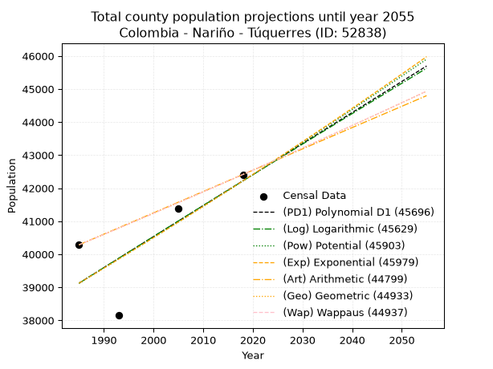
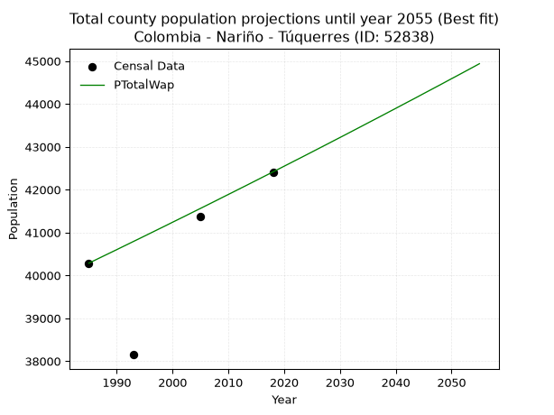
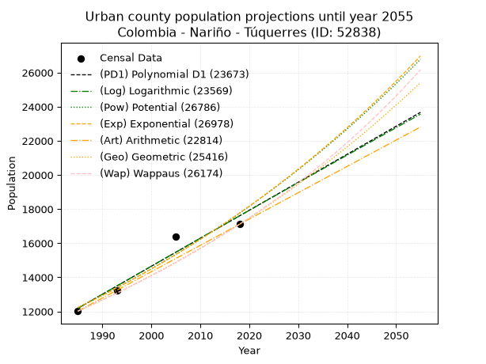
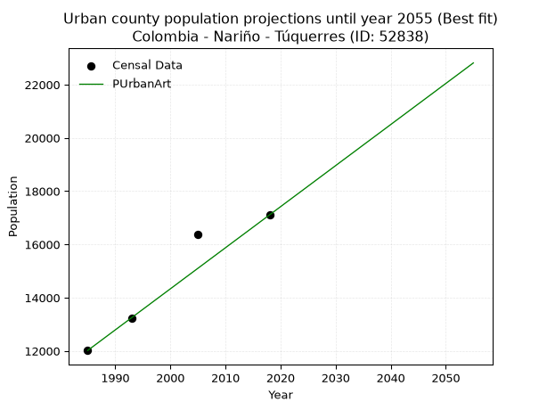
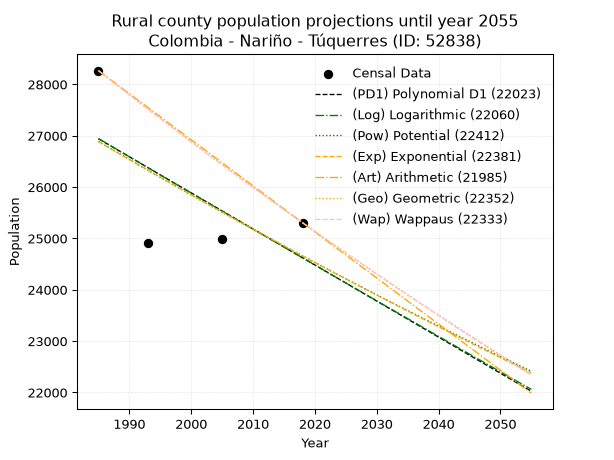
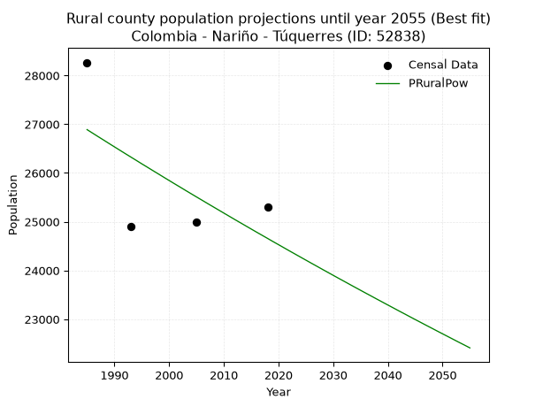

<div align="center">


</div>

# _“Population and Public Services Demand Projections (PPSD) until Year 2050 for Colombia - Nariño - Túquerres (ID: 52838)”_
Keywords: `population` `public-service` `projection` `lineal` `polynomial` `logarithmic` `potential` `exponential` `arithmetic` `geometric` `wappaus` `dane` `colombia` `south-america`

PPSD are analytical estimates used by governments and planners to anticipate future changes in population size, age distribution, and the resulting community needs for utilities, healthcare, education, and infrastructure as sizing future water treatment facilities, electrical grids, and road networks based on spatial growth.

> **General running parameters**: • app_version: _v20260806_. • Python version: _3.14.7_. • Pandas version: _3.0.5_. • NumPy version: _2.5.1_. • Creates, save and include plots into reports (create_plot): _False_. • Projection until year: _2050_. • Process polynomial degree 2 and up: _False_. • Process Wappaus: _True_. • Process Wappaus: _True_. • Set negative values to zero: _True_. • Set infinite values to zero: _True_. • Drop dataset notes: _True_. 
<div align="center">

Dynamic map: [:earth_americas:Google](http://maps.google.com/maps?q=1.085043561,-77.6167202) [:earth_americas:OSM](https://www.openstreetmap.org/#map=18/1.085043561/-77.6167202&layers=P) [:earth_americas:Bing](https://www.bing.com/maps?cp=1.085043561~-77.6167202&lvl=18) [:earth_americas:Apple](https://maps.apple.com/frame?center=1.085043561%2C-77.6167202&span=0.003%2C0.006)

</div>


<div align="center">

```geojson
{
  "type": "Feature",
  "geometry": {
    "type": "Point", 
    "coordinates": [-77.6167202, 1.085043561]
  }, 
  "properties": {
    "Name": "Colombia - Nariño - Túquerres (ID: 52838)"
  }
}
```

</div>


## 0. Census Data (4 records)

Census data are official statistics collected by a government about the people and housing in a country. They usually include counts of total population, age, sex, race, income, education, and jobs.

📅Global census file: [Population.xlsx](../data/Population.xlsx)

| Source   |   Year |   CountryID | CountryName   |   StateID | StateName   |   CountyID | CountyName   |   PTotal |   PUrban |   PRural |
|:---------|-------:|------------:|:--------------|----------:|:------------|-----------:|:-------------|---------:|---------:|---------:|
| DANE     |   1985 |          57 | Colombia      |        52 | Nariño      |      52838 | Túquerres    |    40285 |    12019 |    28266 |
| DANE     |   1993 |          57 | Colombia      |        52 | Nariño      |      52838 | Tuquerres    |    38149 |    13243 |    24906 |
| DANE     |   2005 |          57 | Colombia      |        52 | Nariño      |      52838 | Túquerres    |    41380 |    16385 |    24995 |
| DANE     |   2018 |          57 | Colombia      |        52 | Nariño      |      52838 | Túquerres    |    42413 |    17108 |    25305 |

> 🔥Some records could had specific notes about the registered values or the corresponding urban or rural distribution.

## 1. Total

### 1.1. Coefficients and Parameters

* (PD1) Polynomial Deg 1: 93.87274187073388, -147212.2019269354 (lineal)
* (Log) Logarithmic: 187698.14797274274, -1386138.3768593783
* (Pow) Potential: 4.610756989993258, -10.612729489428478
* (Exp) Exponential: 0.0023059966087494556, 402.26794411565385
* (Art) Arithmetic: Year diff. 2018 - 1985 = 33, Population diff. 42413 - 40285 = 2128, Annual growth = 64.48484848484848
* (Geo) Geometric: Year diff. 2018 - 1985 = 33, Population diff. 42413 - 40285 = 2128, Annual growth % = 0.0015610877699352432
* (Wap) Wappaus: i = 0.15595261913189795, Condition values only valid for < 200)

<sub>
Wappaus condition values: ['0.00', '0.16', '0.31', '0.47', '0.62', '0.78', '0.94', '1.09', '1.25', '1.40', '1.56', '1.72', '1.87', '2.03', '2.18', '2.34', '2.50', '2.65', '2.81', '2.96', '3.12', '3.28', '3.43', '3.59', '3.74', '3.90', '4.05', '4.21', '4.37', '4.52', '4.68', '4.83', '4.99', '5.15', '5.30', '5.46', '5.61', '5.77', '5.93', '6.08', '6.24', '6.39', '6.55', '6.71', '6.86', '7.02', '7.17', '7.33', '7.49', '7.64', '7.80', '7.95', '8.11', '8.27', '8.42', '8.58', '8.73', '8.89', '9.05', '9.20', '9.36', '9.51', '9.67', '9.83', '9.98', '10.14']
</sub>


### 1.2. Projected Dataset

|   Year |   CountyID |   PTotalPD1 |   PTotalLog |   PTotalPow |   PTotalExp |   PTotalArt |   PTotalGeo |   PTotalWap |
|-------:|-----------:|------------:|------------:|------------:|------------:|------------:|------------:|------------:|
|   1985 |      52838 |       39125 |       39124 |       39124 |       39125 |       40285 |       40285 |       40285 |
|   1986 |      52838 |       39219 |       39218 |       39215 |       39216 |       40349 |       40348 |       40348 |
|   1987 |      52838 |       39313 |       39313 |       39306 |       39306 |       40414 |       40411 |       40411 |
|   1988 |      52838 |       39407 |       39407 |       39397 |       39397 |       40478 |       40474 |       40474 |
|   1989 |      52838 |       39501 |       39502 |       39489 |       39488 |       40543 |       40537 |       40537 |
|   1990 |      52838 |       39595 |       39596 |       39580 |       39579 |       40607 |       40600 |       40600 |
|   1991 |      52838 |       39688 |       39690 |       39672 |       39670 |       40672 |       40664 |       40664 |
|   1992 |      52838 |       39782 |       39785 |       39764 |       39762 |       40736 |       40727 |       40727 |
|   1993 |      52838 |       39876 |       39879 |       39856 |       39854 |       40801 |       40791 |       40791 |
|   1994 |      52838 |       39970 |       39973 |       39949 |       39946 |       40865 |       40855 |       40854 |
|   1995 |      52838 |       40064 |       40067 |       40041 |       40038 |       40930 |       40918 |       40918 |
|   1996 |      52838 |       40158 |       40161 |       40134 |       40130 |       40994 |       40982 |       40982 |
|   1997 |      52838 |       40252 |       40255 |       40226 |       40223 |       41059 |       41046 |       41046 |
|   1998 |      52838 |       40346 |       40349 |       40319 |       40316 |       41123 |       41110 |       41110 |
|   1999 |      52838 |       40439 |       40443 |       40413 |       40409 |       41188 |       41174 |       41174 |
|   2000 |      52838 |       40533 |       40537 |       40506 |       40502 |       41252 |       41239 |       41239 |
|   2001 |      52838 |       40627 |       40631 |       40599 |       40596 |       41317 |       41303 |       41303 |
|   2002 |      52838 |       40721 |       40725 |       40693 |       40689 |       41381 |       41368 |       41367 |
|   2003 |      52838 |       40815 |       40818 |       40787 |       40783 |       41446 |       41432 |       41432 |
|   2004 |      52838 |       40909 |       40912 |       40881 |       40878 |       41510 |       41497 |       41497 |
|   2005 |      52838 |       41003 |       41006 |       40975 |       40972 |       41575 |       41562 |       41561 |
|   2006 |      52838 |       41097 |       41099 |       41069 |       41066 |       41639 |       41626 |       41626 |
|   2007 |      52838 |       41190 |       41193 |       41164 |       41161 |       41704 |       41691 |       41691 |
|   2008 |      52838 |       41284 |       41286 |       41258 |       41256 |       41768 |       41757 |       41756 |
|   2009 |      52838 |       41378 |       41380 |       41353 |       41352 |       41833 |       41822 |       41822 |
|   2010 |      52838 |       41472 |       41473 |       41448 |       41447 |       41897 |       41887 |       41887 |
|   2011 |      52838 |       41566 |       41566 |       41543 |       41543 |       41962 |       41952 |       41952 |
|   2012 |      52838 |       41660 |       41660 |       41639 |       41639 |       42026 |       42018 |       42018 |
|   2013 |      52838 |       41754 |       41753 |       41734 |       41735 |       42091 |       42083 |       42083 |
|   2014 |      52838 |       41848 |       41846 |       41830 |       41831 |       42155 |       42149 |       42149 |
|   2015 |      52838 |       41941 |       41939 |       41926 |       41928 |       42220 |       42215 |       42215 |
|   2016 |      52838 |       42035 |       42033 |       42022 |       42024 |       42284 |       42281 |       42281 |
|   2017 |      52838 |       42129 |       42126 |       42118 |       42121 |       42349 |       42347 |       42347 |
|   2018 |      52838 |       42223 |       42219 |       42214 |       42219 |       42413 |       42413 |       42413 |
|   2019 |      52838 |       42317 |       42312 |       42311 |       42316 |       42477 |       42479 |       42479 |
|   2020 |      52838 |       42411 |       42405 |       42407 |       42414 |       42542 |       42546 |       42546 |
|   2021 |      52838 |       42505 |       42497 |       42504 |       42512 |       42606 |       42612 |       42612 |
|   2022 |      52838 |       42598 |       42590 |       42601 |       42610 |       42671 |       42678 |       42679 |
|   2023 |      52838 |       42692 |       42683 |       42699 |       42708 |       42735 |       42745 |       42745 |
|   2024 |      52838 |       42786 |       42776 |       42796 |       42807 |       42800 |       42812 |       42812 |
|   2025 |      52838 |       42880 |       42869 |       42894 |       42906 |       42864 |       42879 |       42879 |
|   2026 |      52838 |       42974 |       42961 |       42991 |       43005 |       42929 |       42946 |       42946 |
|   2027 |      52838 |       43068 |       43054 |       43089 |       43104 |       42993 |       43013 |       43013 |
|   2028 |      52838 |       43162 |       43146 |       43187 |       43204 |       43058 |       43080 |       43080 |
|   2029 |      52838 |       43256 |       43239 |       43286 |       43303 |       43122 |       43147 |       43148 |
|   2030 |      52838 |       43349 |       43332 |       43384 |       43403 |       43187 |       43214 |       43215 |
|   2031 |      52838 |       43443 |       43424 |       43483 |       43504 |       43251 |       43282 |       43282 |
|   2032 |      52838 |       43537 |       43516 |       43582 |       43604 |       43316 |       43349 |       43350 |
|   2033 |      52838 |       43631 |       43609 |       43681 |       43705 |       43380 |       43417 |       43418 |
|   2034 |      52838 |       43725 |       43701 |       43780 |       43806 |       43445 |       43485 |       43486 |
|   2035 |      52838 |       43819 |       43793 |       43879 |       43907 |       43509 |       43553 |       43554 |
|   2036 |      52838 |       43913 |       43885 |       43979 |       44008 |       43574 |       43621 |       43622 |
|   2037 |      52838 |       44007 |       43978 |       44078 |       44110 |       43638 |       43689 |       43690 |
|   2038 |      52838 |       44100 |       44070 |       44178 |       44211 |       43703 |       43757 |       43758 |
|   2039 |      52838 |       44194 |       44162 |       44278 |       44314 |       43767 |       43825 |       43827 |
|   2040 |      52838 |       44288 |       44254 |       44378 |       44416 |       43832 |       43894 |       43895 |
|   2041 |      52838 |       44382 |       44346 |       44479 |       44518 |       43896 |       43962 |       43964 |
|   2042 |      52838 |       44476 |       44438 |       44579 |       44621 |       43961 |       44031 |       44033 |
|   2043 |      52838 |       44570 |       44530 |       44680 |       44724 |       44025 |       44100 |       44101 |
|   2044 |      52838 |       44664 |       44622 |       44781 |       44827 |       44090 |       44168 |       44170 |
|   2045 |      52838 |       44758 |       44713 |       44882 |       44931 |       44154 |       44237 |       44240 |
|   2046 |      52838 |       44851 |       44805 |       44983 |       45035 |       44219 |       44306 |       44309 |
|   2047 |      52838 |       44945 |       44897 |       45085 |       45139 |       44283 |       44376 |       44378 |
|   2048 |      52838 |       45039 |       44988 |       45186 |       45243 |       44348 |       44445 |       44447 |
|   2049 |      52838 |       45133 |       45080 |       45288 |       45347 |       44412 |       44514 |       44517 |
|   2050 |      52838 |       45227 |       45172 |       45390 |       45452 |       44477 |       44584 |       44587 |
<div align="center">

</img>

</div>


### 1.3. Best fit with absolute and relative error (%)

Relative error puts that difference into context by dividing the absolute error by the true value, creating a unitless ratio or percentage that shows the scale of the mistake.

Absolute and relative error

|   Year | Source   |   CountryID | CountryName   |   StateID | StateName   |   CountyID_x | CountyName   |   PTotal |   PUrban |   PRural |   CountyID_y |   PTotalPD1 |   PTotalLog |   PTotalPow |   PTotalExp |   PTotalArt |   PTotalGeo |   PTotalWap |   PTotalPD1AbsError |   PTotalLogAbsError |   PTotalPowAbsError |   PTotalExpAbsError |   PTotalArtAbsError |   PTotalGeoAbsError |   PTotalWapAbsError |   PTotalPD1RelError |   PTotalLogRelError |   PTotalPowRelError |   PTotalExpRelError |   PTotalArtRelError |   PTotalGeoRelError |   PTotalWapRelError |
|-------:|:---------|------------:|:--------------|----------:|:------------|-------------:|:-------------|---------:|---------:|---------:|-------------:|------------:|------------:|------------:|------------:|------------:|------------:|------------:|--------------------:|--------------------:|--------------------:|--------------------:|--------------------:|--------------------:|--------------------:|--------------------:|--------------------:|--------------------:|--------------------:|--------------------:|--------------------:|--------------------:|
|   1985 | DANE     |          57 | Colombia      |        52 | Nariño      |        52838 | Túquerres    |    40285 |    12019 |    28266 |        52838 |       39125 |       39124 |       39124 |       39125 |       40285 |       40285 |       40285 |                1160 |                1161 |                1161 |                1160 |                   0 |                   0 |                   0 |            2.87948  |            2.88197  |            2.88197  |            2.87948  |            0        |            0        |            0        |
|   1993 | DANE     |          57 | Colombia      |        52 | Nariño      |        52838 | Tuquerres    |    38149 |    13243 |    24906 |        52838 |       39876 |       39879 |       39856 |       39854 |       40801 |       40791 |       40791 |                1727 |                1730 |                1707 |                1705 |                2652 |                2642 |                2642 |            4.52699  |            4.53485  |            4.47456  |            4.46932  |            6.95169  |            6.92548  |            6.92548  |
|   2005 | DANE     |          57 | Colombia      |        52 | Nariño      |        52838 | Túquerres    |    41380 |    16385 |    24995 |        52838 |       41003 |       41006 |       40975 |       40972 |       41575 |       41562 |       41561 |                 377 |                 374 |                 405 |                 408 |                 195 |                 182 |                 181 |            0.911068 |            0.903818 |            0.978734 |            0.985984 |            0.471242 |            0.439826 |            0.437409 |
|   2018 | DANE     |          57 | Colombia      |        52 | Nariño      |        52838 | Túquerres    |    42413 |    17108 |    25305 |        52838 |       42223 |       42219 |       42214 |       42219 |       42413 |       42413 |       42413 |                 190 |                 194 |                 199 |                 194 |                   0 |                   0 |                   0 |            0.447976 |            0.457407 |            0.469196 |            0.457407 |            0        |            0        |            0        |

Relative error mean

| Method    |   RelError | Best   |
|:----------|-----------:|:-------|
| PTotalPD1 |    2.19138 |        |
| PTotalLog |    2.19451 |        |
| PTotalPow |    2.20111 |        |
| PTotalExp |    2.19805 |        |
| PTotalArt |    1.85573 |        |
| PTotalGeo |    1.84133 |        |
| PTotalWap |    1.84072 | True   |

💙Best method: _**PTotalWap**_
<div align="center">

</img>

</div>


### 1.4. Fresh water supply demand in liters per capita per day (lpcd)

The fresh water supply demand typically ranges from 100 to 300 liters per capita per day (lpcd) for standard domestic and municipal planning, though absolute survival minimums set by the World Health Organization are as low as 7.5 to 20 liters per day, and total consumption in high-income nations can exceed 400 liters.

> `CZ`: Level in meters above the sea level (masl).<br> `WS`: Fresh water supply demand in liters per capita per day (lpcd or l/h/d).<br> `WSAll`: Zonal fresh water supply demand in liters per second (l/s).<br> `A`: Zonal area in square meters.

Reference values (RAS Colombia)

|    CZ |   WS |
|------:|-----:|
|  1000 |  120 |
|  2000 |  130 |
| 99999 |  140 |

County shapefile geometry properties and water supply values

|   CountyID |      ATotal |   CZTotal |   WSTotal |
|-----------:|------------:|----------:|----------:|
|      52838 | 2.16515e+08 |   2985.16 |       140 |

Projected values for best method: PTotalWap

|   CountyID |   Year |   PTotalWap |   WSTotal |   WSTotalAll |
|-----------:|-------:|------------:|----------:|-------------:|
|      52838 |   1985 |       40285 |       140 |      65.2766 |
|      52838 |   1986 |       40348 |       140 |      65.3787 |
|      52838 |   1987 |       40411 |       140 |      65.4808 |
|      52838 |   1988 |       40474 |       140 |      65.5829 |
|      52838 |   1989 |       40537 |       140 |      65.685  |
|      52838 |   1990 |       40600 |       140 |      65.787  |
|      52838 |   1991 |       40664 |       140 |      65.8907 |
|      52838 |   1992 |       40727 |       140 |      65.9928 |
|      52838 |   1993 |       40791 |       140 |      66.0965 |
|      52838 |   1994 |       40854 |       140 |      66.1986 |
|      52838 |   1995 |       40918 |       140 |      66.3023 |
|      52838 |   1996 |       40982 |       140 |      66.406  |
|      52838 |   1997 |       41046 |       140 |      66.5097 |
|      52838 |   1998 |       41110 |       140 |      66.6134 |
|      52838 |   1999 |       41174 |       140 |      66.7171 |
|      52838 |   2000 |       41239 |       140 |      66.8225 |
|      52838 |   2001 |       41303 |       140 |      66.9262 |
|      52838 |   2002 |       41367 |       140 |      67.0299 |
|      52838 |   2003 |       41432 |       140 |      67.1352 |
|      52838 |   2004 |       41497 |       140 |      67.2405 |
|      52838 |   2005 |       41561 |       140 |      67.3442 |
|      52838 |   2006 |       41626 |       140 |      67.4495 |
|      52838 |   2007 |       41691 |       140 |      67.5549 |
|      52838 |   2008 |       41756 |       140 |      67.6602 |
|      52838 |   2009 |       41822 |       140 |      67.7671 |
|      52838 |   2010 |       41887 |       140 |      67.8725 |
|      52838 |   2011 |       41952 |       140 |      67.9778 |
|      52838 |   2012 |       42018 |       140 |      68.0847 |
|      52838 |   2013 |       42083 |       140 |      68.19   |
|      52838 |   2014 |       42149 |       140 |      68.297  |
|      52838 |   2015 |       42215 |       140 |      68.4039 |
|      52838 |   2016 |       42281 |       140 |      68.5109 |
|      52838 |   2017 |       42347 |       140 |      68.6178 |
|      52838 |   2018 |       42413 |       140 |      68.7248 |
|      52838 |   2019 |       42479 |       140 |      68.8317 |
|      52838 |   2020 |       42546 |       140 |      68.9403 |
|      52838 |   2021 |       42612 |       140 |      69.0472 |
|      52838 |   2022 |       42679 |       140 |      69.1558 |
|      52838 |   2023 |       42745 |       140 |      69.2627 |
|      52838 |   2024 |       42812 |       140 |      69.3713 |
|      52838 |   2025 |       42879 |       140 |      69.4799 |
|      52838 |   2026 |       42946 |       140 |      69.5884 |
|      52838 |   2027 |       43013 |       140 |      69.697  |
|      52838 |   2028 |       43080 |       140 |      69.8056 |
|      52838 |   2029 |       43148 |       140 |      69.9157 |
|      52838 |   2030 |       43215 |       140 |      70.0243 |
|      52838 |   2031 |       43282 |       140 |      70.1329 |
|      52838 |   2032 |       43350 |       140 |      70.2431 |
|      52838 |   2033 |       43418 |       140 |      70.3532 |
|      52838 |   2034 |       43486 |       140 |      70.4634 |
|      52838 |   2035 |       43554 |       140 |      70.5736 |
|      52838 |   2036 |       43622 |       140 |      70.6838 |
|      52838 |   2037 |       43690 |       140 |      70.794  |
|      52838 |   2038 |       43758 |       140 |      70.9042 |
|      52838 |   2039 |       43827 |       140 |      71.016  |
|      52838 |   2040 |       43895 |       140 |      71.1262 |
|      52838 |   2041 |       43964 |       140 |      71.238  |
|      52838 |   2042 |       44033 |       140 |      71.3498 |
|      52838 |   2043 |       44101 |       140 |      71.46   |
|      52838 |   2044 |       44170 |       140 |      71.5718 |
|      52838 |   2045 |       44240 |       140 |      71.6852 |
|      52838 |   2046 |       44309 |       140 |      71.797  |
|      52838 |   2047 |       44378 |       140 |      71.9088 |
|      52838 |   2048 |       44447 |       140 |      72.0206 |
|      52838 |   2049 |       44517 |       140 |      72.134  |
|      52838 |   2050 |       44587 |       140 |      72.2475 |

## 2. Urban

### 2.1. Coefficients and Parameters

* (PD1) Polynomial Deg 1: 164.10156563629002, -313555.4066639891 (lineal)
* (Log) Logarithmic: 328619.05697652744, -2483147.3354664384
* (Pow) Potential: 22.62553795752274, -70.52624155403699
* (Exp) Exponential: 0.01129760018873784, 2.2293468228850895e-06
* (Art) Arithmetic: Year diff. 2018 - 1985 = 33, Population diff. 17108 - 12019 = 5089, Annual growth = 154.21212121212122
* (Geo) Geometric: Year diff. 2018 - 1985 = 33, Population diff. 17108 - 12019 = 5089, Annual growth % = 0.010756146745208417
* (Wap) Wappaus: i = 1.0588946421678938, Condition values only valid for < 200)

<sub>
Wappaus condition values: ['0.00', '1.06', '2.12', '3.18', '4.24', '5.29', '6.35', '7.41', '8.47', '9.53', '10.59', '11.65', '12.71', '13.77', '14.82', '15.88', '16.94', '18.00', '19.06', '20.12', '21.18', '22.24', '23.30', '24.35', '25.41', '26.47', '27.53', '28.59', '29.65', '30.71', '31.77', '32.83', '33.88', '34.94', '36.00', '37.06', '38.12', '39.18', '40.24', '41.30', '42.36', '43.41', '44.47', '45.53', '46.59', '47.65', '48.71', '49.77', '50.83', '51.89', '52.94', '54.00', '55.06', '56.12', '57.18', '58.24', '59.30', '60.36', '61.42', '62.47', '63.53', '64.59', '65.65', '66.71', '67.77', '68.83']
</sub>


### 2.2. Projected Dataset

|   Year |   CountyID |   PUrbanPD1 |   PUrbanLog |   PUrbanPow |   PUrbanExp |   PUrbanArt |   PUrbanGeo |   PUrbanWap |
|-------:|-----------:|------------:|------------:|------------:|------------:|------------:|------------:|------------:|
|   1985 |      52838 |       12186 |       12180 |       12228 |       12234 |       12019 |       12019 |       12019 |
|   1986 |      52838 |       12350 |       12346 |       12368 |       12373 |       12173 |       12148 |       12147 |
|   1987 |      52838 |       12514 |       12511 |       12510 |       12513 |       12327 |       12279 |       12276 |
|   1988 |      52838 |       12679 |       12676 |       12653 |       12655 |       12482 |       12411 |       12407 |
|   1989 |      52838 |       12843 |       12842 |       12798 |       12799 |       12636 |       12545 |       12539 |
|   1990 |      52838 |       13007 |       13007 |       12944 |       12944 |       12790 |       12679 |       12673 |
|   1991 |      52838 |       13171 |       13172 |       13092 |       13092 |       12944 |       12816 |       12808 |
|   1992 |      52838 |       13335 |       13337 |       13242 |       13240 |       13098 |       12954 |       12944 |
|   1993 |      52838 |       13499 |       13502 |       13393 |       13391 |       13253 |       13093 |       13082 |
|   1994 |      52838 |       13663 |       13667 |       13546 |       13543 |       13407 |       13234 |       13222 |
|   1995 |      52838 |       13827 |       13831 |       13701 |       13697 |       13561 |       13376 |       13363 |
|   1996 |      52838 |       13991 |       13996 |       13857 |       13852 |       13715 |       13520 |       13506 |
|   1997 |      52838 |       14155 |       14161 |       14015 |       14010 |       13870 |       13665 |       13650 |
|   1998 |      52838 |       14320 |       14325 |       14174 |       14169 |       14024 |       13812 |       13796 |
|   1999 |      52838 |       14484 |       14490 |       14336 |       14330 |       14178 |       13961 |       13943 |
|   2000 |      52838 |       14648 |       14654 |       14499 |       14493 |       14332 |       14111 |       14093 |
|   2001 |      52838 |       14812 |       14818 |       14664 |       14657 |       14486 |       14263 |       14244 |
|   2002 |      52838 |       14976 |       14983 |       14831 |       14824 |       14641 |       14416 |       14397 |
|   2003 |      52838 |       15140 |       15147 |       14999 |       14992 |       14795 |       14571 |       14551 |
|   2004 |      52838 |       15304 |       15311 |       15169 |       15163 |       14949 |       14728 |       14708 |
|   2005 |      52838 |       15468 |       15475 |       15342 |       15335 |       15103 |       14887 |       14866 |
|   2006 |      52838 |       15632 |       15638 |       15516 |       15509 |       15257 |       15047 |       15026 |
|   2007 |      52838 |       15796 |       15802 |       15692 |       15685 |       15412 |       15209 |       15188 |
|   2008 |      52838 |       15961 |       15966 |       15870 |       15864 |       15566 |       15372 |       15352 |
|   2009 |      52838 |       16125 |       16130 |       16049 |       16044 |       15720 |       15538 |       15518 |
|   2010 |      52838 |       16289 |       16293 |       16231 |       16226 |       15874 |       15705 |       15686 |
|   2011 |      52838 |       16453 |       16457 |       16415 |       16410 |       16029 |       15874 |       15856 |
|   2012 |      52838 |       16617 |       16620 |       16600 |       16597 |       16183 |       16044 |       16028 |
|   2013 |      52838 |       16781 |       16783 |       16788 |       16785 |       16337 |       16217 |       16203 |
|   2014 |      52838 |       16945 |       16946 |       16978 |       16976 |       16491 |       16391 |       16379 |
|   2015 |      52838 |       17109 |       17110 |       17170 |       17169 |       16645 |       16568 |       16558 |
|   2016 |      52838 |       17273 |       17273 |       17363 |       17364 |       16800 |       16746 |       16739 |
|   2017 |      52838 |       17437 |       17436 |       17559 |       17561 |       16954 |       16926 |       16922 |
|   2018 |      52838 |       17602 |       17598 |       17757 |       17761 |       17108 |       17108 |       17108 |
|   2019 |      52838 |       17766 |       17761 |       17957 |       17963 |       17262 |       17292 |       17296 |
|   2020 |      52838 |       17930 |       17924 |       18160 |       18167 |       17416 |       17478 |       17487 |
|   2021 |      52838 |       18094 |       18087 |       18364 |       18373 |       17571 |       17666 |       17680 |
|   2022 |      52838 |       18258 |       18249 |       18571 |       18582 |       17725 |       17856 |       17875 |
|   2023 |      52838 |       18422 |       18412 |       18780 |       18793 |       17879 |       18048 |       18073 |
|   2024 |      52838 |       18586 |       18574 |       18991 |       19007 |       18033 |       18242 |       18274 |
|   2025 |      52838 |       18750 |       18736 |       19205 |       19223 |       18187 |       18438 |       18478 |
|   2026 |      52838 |       18914 |       18899 |       19420 |       19441 |       18342 |       18637 |       18684 |
|   2027 |      52838 |       19078 |       19061 |       19638 |       19662 |       18496 |       18837 |       18893 |
|   2028 |      52838 |       19243 |       19223 |       19859 |       19885 |       18650 |       19040 |       19105 |
|   2029 |      52838 |       19407 |       19385 |       20081 |       20111 |       18804 |       19245 |       19320 |
|   2030 |      52838 |       19571 |       19547 |       20307 |       20340 |       18959 |       19452 |       19537 |
|   2031 |      52838 |       19735 |       19709 |       20534 |       20571 |       19113 |       19661 |       19758 |
|   2032 |      52838 |       19899 |       19870 |       20764 |       20804 |       19267 |       19872 |       19982 |
|   2033 |      52838 |       20063 |       20032 |       20996 |       21041 |       19421 |       20086 |       20209 |
|   2034 |      52838 |       20227 |       20194 |       21231 |       21280 |       19575 |       20302 |       20440 |
|   2035 |      52838 |       20391 |       20355 |       21469 |       21522 |       19730 |       20520 |       20673 |
|   2036 |      52838 |       20555 |       20517 |       21709 |       21766 |       19884 |       20741 |       20911 |
|   2037 |      52838 |       20719 |       20678 |       21951 |       22013 |       20038 |       20964 |       21151 |
|   2038 |      52838 |       20884 |       20839 |       22196 |       22264 |       20192 |       21190 |       21395 |
|   2039 |      52838 |       21048 |       21000 |       22444 |       22517 |       20346 |       21418 |       21643 |
|   2040 |      52838 |       21212 |       21162 |       22695 |       22772 |       20501 |       21648 |       21894 |
|   2041 |      52838 |       21376 |       21323 |       22948 |       23031 |       20655 |       21881 |       22150 |
|   2042 |      52838 |       21540 |       21484 |       23203 |       23293 |       20809 |       22116 |       22409 |
|   2043 |      52838 |       21704 |       21644 |       23462 |       23557 |       20963 |       22354 |       22672 |
|   2044 |      52838 |       21868 |       21805 |       23723 |       23825 |       21118 |       22595 |       22939 |
|   2045 |      52838 |       22032 |       21966 |       23987 |       24096 |       21272 |       22838 |       23210 |
|   2046 |      52838 |       22196 |       22127 |       24254 |       24370 |       21426 |       23083 |       23486 |
|   2047 |      52838 |       22360 |       22287 |       24523 |       24646 |       21580 |       23332 |       23766 |
|   2048 |      52838 |       22525 |       22448 |       24796 |       24926 |       21734 |       23583 |       24050 |
|   2049 |      52838 |       22689 |       22608 |       25071 |       25210 |       21889 |       23836 |       24339 |
|   2050 |      52838 |       22853 |       22769 |       25350 |       25496 |       22043 |       24093 |       24632 |
<div align="center">

</img>

</div>


### 2.3. Best fit with absolute and relative error (%)

Relative error puts that difference into context by dividing the absolute error by the true value, creating a unitless ratio or percentage that shows the scale of the mistake.

Absolute and relative error

|   Year | Source   |   CountryID | CountryName   |   StateID | StateName   |   CountyID_x | CountyName   |   PTotal |   PUrban |   PRural |   CountyID_y |   PUrbanPD1 |   PUrbanLog |   PUrbanPow |   PUrbanExp |   PUrbanArt |   PUrbanGeo |   PUrbanWap |   PUrbanPD1AbsError |   PUrbanLogAbsError |   PUrbanPowAbsError |   PUrbanExpAbsError |   PUrbanArtAbsError |   PUrbanGeoAbsError |   PUrbanWapAbsError |   PUrbanPD1RelError |   PUrbanLogRelError |   PUrbanPowRelError |   PUrbanExpRelError |   PUrbanArtRelError |   PUrbanGeoRelError |   PUrbanWapRelError |
|-------:|:---------|------------:|:--------------|----------:|:------------|-------------:|:-------------|---------:|---------:|---------:|-------------:|------------:|------------:|------------:|------------:|------------:|------------:|------------:|--------------------:|--------------------:|--------------------:|--------------------:|--------------------:|--------------------:|--------------------:|--------------------:|--------------------:|--------------------:|--------------------:|--------------------:|--------------------:|--------------------:|
|   1985 | DANE     |          57 | Colombia      |        52 | Nariño      |        52838 | Túquerres    |    40285 |    12019 |    28266 |        52838 |       12186 |       12180 |       12228 |       12234 |       12019 |       12019 |       12019 |                 167 |                 161 |                 209 |                 215 |                   0 |                   0 |                   0 |             1.38947 |             1.33955 |             1.73891 |             1.78883 |           0         |             0       |             0       |
|   1993 | DANE     |          57 | Colombia      |        52 | Nariño      |        52838 | Tuquerres    |    38149 |    13243 |    24906 |        52838 |       13499 |       13502 |       13393 |       13391 |       13253 |       13093 |       13082 |                 256 |                 259 |                 150 |                 148 |                  10 |                 150 |                 161 |             1.9331  |             1.95575 |             1.13267 |             1.11757 |           0.0755116 |             1.13267 |             1.21574 |
|   2005 | DANE     |          57 | Colombia      |        52 | Nariño      |        52838 | Túquerres    |    41380 |    16385 |    24995 |        52838 |       15468 |       15475 |       15342 |       15335 |       15103 |       14887 |       14866 |                 917 |                 910 |                1043 |                1050 |                1282 |                1498 |                1519 |             5.59658 |             5.55386 |             6.36558 |             6.4083  |           7.82423   |             9.14251 |             9.27067 |
|   2018 | DANE     |          57 | Colombia      |        52 | Nariño      |        52838 | Túquerres    |    42413 |    17108 |    25305 |        52838 |       17602 |       17598 |       17757 |       17761 |       17108 |       17108 |       17108 |                 494 |                 490 |                 649 |                 653 |                   0 |                   0 |                   0 |             2.88754 |             2.86416 |             3.79355 |             3.81693 |           0         |             0       |             0       |

Relative error mean

| Method    |   RelError | Best   |
|:----------|-----------:|:-------|
| PUrbanPD1 |    2.95167 |        |
| PUrbanLog |    2.92833 |        |
| PUrbanPow |    3.25768 |        |
| PUrbanExp |    3.28291 |        |
| PUrbanArt |    1.97494 | True   |
| PUrbanGeo |    2.5688  |        |
| PUrbanWap |    2.6216  |        |

💙Best method: _**PUrbanArt**_
<div align="center">

</img>

</div>


### 2.4. Fresh water supply demand in liters per capita per day (lpcd)

The fresh water supply demand typically ranges from 100 to 300 liters per capita per day (lpcd) for standard domestic and municipal planning, though absolute survival minimums set by the World Health Organization are as low as 7.5 to 20 liters per day, and total consumption in high-income nations can exceed 400 liters.

> `CZ`: Level in meters above the sea level (masl).<br> `WS`: Fresh water supply demand in liters per capita per day (lpcd or l/h/d).<br> `WSAll`: Zonal fresh water supply demand in liters per second (l/s).<br> `A`: Zonal area in square meters.

Reference values (RAS Colombia)

|    CZ |   WS |
|------:|-----:|
|  1000 |  120 |
|  2000 |  130 |
| 99999 |  140 |

County shapefile geometry properties and water supply values

|   CountyID |      AUrban |   CZUrban |   WSUrban |
|-----------:|------------:|----------:|----------:|
|      52838 | 3.88202e+06 |   3029.28 |       140 |

Projected values for best method: PUrbanArt

|   CountyID |   Year |   PUrbanArt |   WSUrban |   WSUrbanAll |
|-----------:|-------:|------------:|----------:|-------------:|
|      52838 |   1985 |       12019 |       140 |      19.4752 |
|      52838 |   1986 |       12173 |       140 |      19.7248 |
|      52838 |   1987 |       12327 |       140 |      19.9743 |
|      52838 |   1988 |       12482 |       140 |      20.2255 |
|      52838 |   1989 |       12636 |       140 |      20.475  |
|      52838 |   1990 |       12790 |       140 |      20.7245 |
|      52838 |   1991 |       12944 |       140 |      20.9741 |
|      52838 |   1992 |       13098 |       140 |      21.2236 |
|      52838 |   1993 |       13253 |       140 |      21.4748 |
|      52838 |   1994 |       13407 |       140 |      21.7243 |
|      52838 |   1995 |       13561 |       140 |      21.9738 |
|      52838 |   1996 |       13715 |       140 |      22.2234 |
|      52838 |   1997 |       13870 |       140 |      22.4745 |
|      52838 |   1998 |       14024 |       140 |      22.7241 |
|      52838 |   1999 |       14178 |       140 |      22.9736 |
|      52838 |   2000 |       14332 |       140 |      23.2231 |
|      52838 |   2001 |       14486 |       140 |      23.4727 |
|      52838 |   2002 |       14641 |       140 |      23.7238 |
|      52838 |   2003 |       14795 |       140 |      23.9734 |
|      52838 |   2004 |       14949 |       140 |      24.2229 |
|      52838 |   2005 |       15103 |       140 |      24.4725 |
|      52838 |   2006 |       15257 |       140 |      24.722  |
|      52838 |   2007 |       15412 |       140 |      24.9731 |
|      52838 |   2008 |       15566 |       140 |      25.2227 |
|      52838 |   2009 |       15720 |       140 |      25.4722 |
|      52838 |   2010 |       15874 |       140 |      25.7218 |
|      52838 |   2011 |       16029 |       140 |      25.9729 |
|      52838 |   2012 |       16183 |       140 |      26.2225 |
|      52838 |   2013 |       16337 |       140 |      26.472  |
|      52838 |   2014 |       16491 |       140 |      26.7215 |
|      52838 |   2015 |       16645 |       140 |      26.9711 |
|      52838 |   2016 |       16800 |       140 |      27.2222 |
|      52838 |   2017 |       16954 |       140 |      27.4718 |
|      52838 |   2018 |       17108 |       140 |      27.7213 |
|      52838 |   2019 |       17262 |       140 |      27.9708 |
|      52838 |   2020 |       17416 |       140 |      28.2204 |
|      52838 |   2021 |       17571 |       140 |      28.4715 |
|      52838 |   2022 |       17725 |       140 |      28.7211 |
|      52838 |   2023 |       17879 |       140 |      28.9706 |
|      52838 |   2024 |       18033 |       140 |      29.2201 |
|      52838 |   2025 |       18187 |       140 |      29.4697 |
|      52838 |   2026 |       18342 |       140 |      29.7208 |
|      52838 |   2027 |       18496 |       140 |      29.9704 |
|      52838 |   2028 |       18650 |       140 |      30.2199 |
|      52838 |   2029 |       18804 |       140 |      30.4694 |
|      52838 |   2030 |       18959 |       140 |      30.7206 |
|      52838 |   2031 |       19113 |       140 |      30.9701 |
|      52838 |   2032 |       19267 |       140 |      31.2197 |
|      52838 |   2033 |       19421 |       140 |      31.4692 |
|      52838 |   2034 |       19575 |       140 |      31.7188 |
|      52838 |   2035 |       19730 |       140 |      31.9699 |
|      52838 |   2036 |       19884 |       140 |      32.2194 |
|      52838 |   2037 |       20038 |       140 |      32.469  |
|      52838 |   2038 |       20192 |       140 |      32.7185 |
|      52838 |   2039 |       20346 |       140 |      32.9681 |
|      52838 |   2040 |       20501 |       140 |      33.2192 |
|      52838 |   2041 |       20655 |       140 |      33.4688 |
|      52838 |   2042 |       20809 |       140 |      33.7183 |
|      52838 |   2043 |       20963 |       140 |      33.9678 |
|      52838 |   2044 |       21118 |       140 |      34.219  |
|      52838 |   2045 |       21272 |       140 |      34.4685 |
|      52838 |   2046 |       21426 |       140 |      34.7181 |
|      52838 |   2047 |       21580 |       140 |      34.9676 |
|      52838 |   2048 |       21734 |       140 |      35.2171 |
|      52838 |   2049 |       21889 |       140 |      35.4683 |
|      52838 |   2050 |       22043 |       140 |      35.7178 |

## 3. Rural

### 3.1. Coefficients and Parameters

* (PD1) Polynomial Deg 1: -70.22882376555614, 166343.2047370537 (lineal)
* (Log) Logarithmic: -140920.90900378535, 1097008.9586070653
* (Pow) Potential: -5.255039739002193, 21.759441661037055
* (Exp) Exponential: -0.0026187918878519695, 4865136.383672496
* (Art) Arithmetic: Year diff. 2018 - 1985 = 33, Population diff. 25305 - 28266 = -2961, Annual growth = -89.72727272727273
* (Geo) Geometric: Year diff. 2018 - 1985 = 33, Population diff. 25305 - 28266 = -2961, Annual growth % = -0.0033476466480151235
* (Wap) Wappaus: i = -0.33498449805780267, Condition values only valid for < 200)

<sub>
Wappaus condition values: ['-0.00', '-0.33', '-0.67', '-1.00', '-1.34', '-1.67', '-2.01', '-2.34', '-2.68', '-3.01', '-3.35', '-3.68', '-4.02', '-4.35', '-4.69', '-5.02', '-5.36', '-5.69', '-6.03', '-6.36', '-6.70', '-7.03', '-7.37', '-7.70', '-8.04', '-8.37', '-8.71', '-9.04', '-9.38', '-9.71', '-10.05', '-10.38', '-10.72', '-11.05', '-11.39', '-11.72', '-12.06', '-12.39', '-12.73', '-13.06', '-13.40', '-13.73', '-14.07', '-14.40', '-14.74', '-15.07', '-15.41', '-15.74', '-16.08', '-16.41', '-16.75', '-17.08', '-17.42', '-17.75', '-18.09', '-18.42', '-18.76', '-19.09', '-19.43', '-19.76', '-20.10', '-20.43', '-20.77', '-21.10', '-21.44', '-21.77']
</sub>


### 3.2. Projected Dataset

|   Year |   CountyID |   PRuralPD1 |   PRuralLog |   PRuralPow |   PRuralExp |   PRuralArt |   PRuralGeo |   PRuralWap |
|-------:|-----------:|------------:|------------:|------------:|------------:|------------:|------------:|------------:|
|   1985 |      52838 |       26939 |       26944 |       26889 |       26884 |       28266 |       28266 |       28266 |
|   1986 |      52838 |       26869 |       26873 |       26818 |       26814 |       28176 |       28171 |       28171 |
|   1987 |      52838 |       26799 |       26802 |       26747 |       26744 |       28087 |       28077 |       28077 |
|   1988 |      52838 |       26728 |       26731 |       26677 |       26674 |       27997 |       27983 |       27983 |
|   1989 |      52838 |       26658 |       26660 |       26606 |       26604 |       27907 |       27889 |       27890 |
|   1990 |      52838 |       26588 |       26589 |       26536 |       26535 |       27817 |       27796 |       27796 |
|   1991 |      52838 |       26518 |       26518 |       26466 |       26465 |       27728 |       27703 |       27704 |
|   1992 |      52838 |       26447 |       26448 |       26396 |       26396 |       27638 |       27610 |       27611 |
|   1993 |      52838 |       26377 |       26377 |       26327 |       26327 |       27548 |       27518 |       27519 |
|   1994 |      52838 |       26307 |       26306 |       26258 |       26258 |       27458 |       27426 |       27426 |
|   1995 |      52838 |       26237 |       26236 |       26188 |       26190 |       27369 |       27334 |       27335 |
|   1996 |      52838 |       26166 |       26165 |       26120 |       26121 |       27279 |       27242 |       27243 |
|   1997 |      52838 |       26096 |       26094 |       26051 |       26053 |       27189 |       27151 |       27152 |
|   1998 |      52838 |       26026 |       26024 |       25983 |       25985 |       27100 |       27060 |       27061 |
|   1999 |      52838 |       25956 |       25953 |       25914 |       25917 |       27010 |       26970 |       26971 |
|   2000 |      52838 |       25886 |       25883 |       25846 |       25849 |       26920 |       26879 |       26881 |
|   2001 |      52838 |       25815 |       25812 |       25778 |       25781 |       26830 |       26789 |       26791 |
|   2002 |      52838 |       25745 |       25742 |       25711 |       25714 |       26741 |       26700 |       26701 |
|   2003 |      52838 |       25675 |       25672 |       25643 |       25647 |       26651 |       26610 |       26612 |
|   2004 |      52838 |       25605 |       25601 |       25576 |       25579 |       26561 |       26521 |       26522 |
|   2005 |      52838 |       25534 |       25531 |       25509 |       25513 |       26471 |       26433 |       26434 |
|   2006 |      52838 |       25464 |       25461 |       25443 |       25446 |       26382 |       26344 |       26345 |
|   2007 |      52838 |       25394 |       25391 |       25376 |       25379 |       26292 |       26256 |       26257 |
|   2008 |      52838 |       25324 |       25320 |       25310 |       25313 |       26202 |       26168 |       26169 |
|   2009 |      52838 |       25253 |       25250 |       25244 |       25247 |       26113 |       26080 |       26081 |
|   2010 |      52838 |       25183 |       25180 |       25178 |       25181 |       26023 |       25993 |       25994 |
|   2011 |      52838 |       25113 |       25110 |       25112 |       25115 |       25933 |       25906 |       25907 |
|   2012 |      52838 |       25043 |       25040 |       25046 |       25049 |       25843 |       25819 |       25820 |
|   2013 |      52838 |       24973 |       24970 |       24981 |       24984 |       25754 |       25733 |       25734 |
|   2014 |      52838 |       24902 |       24900 |       24916 |       24918 |       25664 |       25647 |       25647 |
|   2015 |      52838 |       24832 |       24830 |       24851 |       24853 |       25574 |       25561 |       25561 |
|   2016 |      52838 |       24762 |       24760 |       24786 |       24788 |       25484 |       25475 |       25476 |
|   2017 |      52838 |       24692 |       24690 |       24722 |       24723 |       25395 |       25390 |       25390 |
|   2018 |      52838 |       24621 |       24620 |       24658 |       24659 |       25305 |       25305 |       25305 |
|   2019 |      52838 |       24551 |       24550 |       24593 |       24594 |       25215 |       25220 |       25220 |
|   2020 |      52838 |       24481 |       24481 |       24530 |       24530 |       25126 |       25136 |       25135 |
|   2021 |      52838 |       24411 |       24411 |       24466 |       24466 |       25036 |       25052 |       25051 |
|   2022 |      52838 |       24341 |       24341 |       24402 |       24402 |       24946 |       24968 |       24967 |
|   2023 |      52838 |       24270 |       24272 |       24339 |       24338 |       24856 |       24884 |       24883 |
|   2024 |      52838 |       24200 |       24202 |       24276 |       24274 |       24767 |       24801 |       24800 |
|   2025 |      52838 |       24130 |       24132 |       24213 |       24211 |       24677 |       24718 |       24716 |
|   2026 |      52838 |       24060 |       24063 |       24150 |       24147 |       24587 |       24635 |       24633 |
|   2027 |      52838 |       23989 |       23993 |       24088 |       24084 |       24497 |       24553 |       24551 |
|   2028 |      52838 |       23919 |       23924 |       24025 |       24021 |       24408 |       24471 |       24468 |
|   2029 |      52838 |       23849 |       23854 |       23963 |       23958 |       24318 |       24389 |       24386 |
|   2030 |      52838 |       23779 |       23785 |       23901 |       23896 |       24228 |       24307 |       24304 |
|   2031 |      52838 |       23708 |       23715 |       23839 |       23833 |       24139 |       24226 |       24222 |
|   2032 |      52838 |       23638 |       23646 |       23778 |       23771 |       24049 |       24144 |       24140 |
|   2033 |      52838 |       23568 |       23577 |       23716 |       23709 |       23959 |       24064 |       24059 |
|   2034 |      52838 |       23498 |       23507 |       23655 |       23647 |       23869 |       23983 |       23978 |
|   2035 |      52838 |       23428 |       23438 |       23594 |       23585 |       23780 |       23903 |       23898 |
|   2036 |      52838 |       23357 |       23369 |       23533 |       23523 |       23690 |       23823 |       23817 |
|   2037 |      52838 |       23287 |       23300 |       23473 |       23462 |       23600 |       23743 |       23737 |
|   2038 |      52838 |       23217 |       23230 |       23412 |       23400 |       23510 |       23664 |       23657 |
|   2039 |      52838 |       23147 |       23161 |       23352 |       23339 |       23421 |       23584 |       23577 |
|   2040 |      52838 |       23076 |       23092 |       23292 |       23278 |       23331 |       23505 |       23498 |
|   2041 |      52838 |       23006 |       23023 |       23232 |       23217 |       23241 |       23427 |       23418 |
|   2042 |      52838 |       22936 |       22954 |       23172 |       23157 |       23152 |       23348 |       23339 |
|   2043 |      52838 |       22866 |       22885 |       23113 |       23096 |       23062 |       23270 |       23260 |
|   2044 |      52838 |       22795 |       22816 |       23053 |       23036 |       22972 |       23192 |       23182 |
|   2045 |      52838 |       22725 |       22747 |       22994 |       22975 |       22882 |       23115 |       23104 |
|   2046 |      52838 |       22655 |       22678 |       22935 |       22915 |       22793 |       23037 |       23026 |
|   2047 |      52838 |       22585 |       22610 |       22876 |       22855 |       22703 |       22960 |       22948 |
|   2048 |      52838 |       22515 |       22541 |       22818 |       22796 |       22613 |       22883 |       22870 |
|   2049 |      52838 |       22444 |       22472 |       22759 |       22736 |       22523 |       22807 |       22793 |
|   2050 |      52838 |       22374 |       22403 |       22701 |       22676 |       22434 |       22730 |       22716 |
<div align="center">

</img>

</div>


### 3.3. Best fit with absolute and relative error (%)

Relative error puts that difference into context by dividing the absolute error by the true value, creating a unitless ratio or percentage that shows the scale of the mistake.

Absolute and relative error

|   Year | Source   |   CountryID | CountryName   |   StateID | StateName   |   CountyID_x | CountyName   |   PTotal |   PUrban |   PRural |   CountyID_y |   PRuralPD1 |   PRuralLog |   PRuralPow |   PRuralExp |   PRuralArt |   PRuralGeo |   PRuralWap |   PRuralPD1AbsError |   PRuralLogAbsError |   PRuralPowAbsError |   PRuralExpAbsError |   PRuralArtAbsError |   PRuralGeoAbsError |   PRuralWapAbsError |   PRuralPD1RelError |   PRuralLogRelError |   PRuralPowRelError |   PRuralExpRelError |   PRuralArtRelError |   PRuralGeoRelError |   PRuralWapRelError |
|-------:|:---------|------------:|:--------------|----------:|:------------|-------------:|:-------------|---------:|---------:|---------:|-------------:|------------:|------------:|------------:|------------:|------------:|------------:|------------:|--------------------:|--------------------:|--------------------:|--------------------:|--------------------:|--------------------:|--------------------:|--------------------:|--------------------:|--------------------:|--------------------:|--------------------:|--------------------:|--------------------:|
|   1985 | DANE     |          57 | Colombia      |        52 | Nariño      |        52838 | Túquerres    |    40285 |    12019 |    28266 |        52838 |       26939 |       26944 |       26889 |       26884 |       28266 |       28266 |       28266 |                1327 |                1322 |                1377 |                1382 |                   0 |                   0 |                   0 |             4.69469 |             4.677   |             4.87158 |             4.88927 |             0       |             0       |             0       |
|   1993 | DANE     |          57 | Colombia      |        52 | Nariño      |        52838 | Tuquerres    |    38149 |    13243 |    24906 |        52838 |       26377 |       26377 |       26327 |       26327 |       27548 |       27518 |       27519 |                1471 |                1471 |                1421 |                1421 |                2642 |                2612 |                2613 |             5.90621 |             5.90621 |             5.70545 |             5.70545 |            10.6079  |            10.4874  |            10.4914  |
|   2005 | DANE     |          57 | Colombia      |        52 | Nariño      |        52838 | Túquerres    |    41380 |    16385 |    24995 |        52838 |       25534 |       25531 |       25509 |       25513 |       26471 |       26433 |       26434 |                 539 |                 536 |                 514 |                 518 |                1476 |                1438 |                1439 |             2.15643 |             2.14443 |             2.05641 |             2.07241 |             5.90518 |             5.75315 |             5.75715 |
|   2018 | DANE     |          57 | Colombia      |        52 | Nariño      |        52838 | Túquerres    |    42413 |    17108 |    25305 |        52838 |       24621 |       24620 |       24658 |       24659 |       25305 |       25305 |       25305 |                 684 |                 685 |                 647 |                 646 |                   0 |                   0 |                   0 |             2.70302 |             2.70697 |             2.55681 |             2.55286 |             0       |             0       |             0       |

Relative error mean

| Method    |   RelError | Best   |
|:----------|-----------:|:-------|
| PRuralPD1 |    3.86509 |        |
| PRuralLog |    3.85865 |        |
| PRuralPow |    3.79756 | True   |
| PRuralExp |    3.805   |        |
| PRuralArt |    4.12827 |        |
| PRuralGeo |    4.06015 |        |
| PRuralWap |    4.06215 |        |

💙Best method: _**PRuralPow**_
<div align="center">

</img>

</div>


### 3.4. Fresh water supply demand in liters per capita per day (lpcd)

The fresh water supply demand typically ranges from 100 to 300 liters per capita per day (lpcd) for standard domestic and municipal planning, though absolute survival minimums set by the World Health Organization are as low as 7.5 to 20 liters per day, and total consumption in high-income nations can exceed 400 liters.

> `CZ`: Level in meters above the sea level (masl).<br> `WS`: Fresh water supply demand in liters per capita per day (lpcd or l/h/d).<br> `WSAll`: Zonal fresh water supply demand in liters per second (l/s).<br> `A`: Zonal area in square meters.

Reference values (RAS Colombia)

|    CZ |   WS |
|------:|-----:|
|  1000 |  120 |
|  2000 |  130 |
| 99999 |  140 |

County shapefile geometry properties and water supply values

|   CountyID |      ARural |   CZRural |   WSRural |
|-----------:|------------:|----------:|----------:|
|      52838 | 2.12633e+08 |   2984.35 |       140 |

Projected values for best method: PRuralPow

|   CountyID |   Year |   PRuralPow |   WSRural |   WSRuralAll |
|-----------:|-------:|------------:|----------:|-------------:|
|      52838 |   1985 |       26889 |       140 |      43.5701 |
|      52838 |   1986 |       26818 |       140 |      43.4551 |
|      52838 |   1987 |       26747 |       140 |      43.34   |
|      52838 |   1988 |       26677 |       140 |      43.2266 |
|      52838 |   1989 |       26606 |       140 |      43.1116 |
|      52838 |   1990 |       26536 |       140 |      42.9981 |
|      52838 |   1991 |       26466 |       140 |      42.8847 |
|      52838 |   1992 |       26396 |       140 |      42.7713 |
|      52838 |   1993 |       26327 |       140 |      42.6595 |
|      52838 |   1994 |       26258 |       140 |      42.5477 |
|      52838 |   1995 |       26188 |       140 |      42.4343 |
|      52838 |   1996 |       26120 |       140 |      42.3241 |
|      52838 |   1997 |       26051 |       140 |      42.2123 |
|      52838 |   1998 |       25983 |       140 |      42.1021 |
|      52838 |   1999 |       25914 |       140 |      41.9903 |
|      52838 |   2000 |       25846 |       140 |      41.8801 |
|      52838 |   2001 |       25778 |       140 |      41.7699 |
|      52838 |   2002 |       25711 |       140 |      41.6613 |
|      52838 |   2003 |       25643 |       140 |      41.5512 |
|      52838 |   2004 |       25576 |       140 |      41.4426 |
|      52838 |   2005 |       25509 |       140 |      41.334  |
|      52838 |   2006 |       25443 |       140 |      41.2271 |
|      52838 |   2007 |       25376 |       140 |      41.1185 |
|      52838 |   2008 |       25310 |       140 |      41.0116 |
|      52838 |   2009 |       25244 |       140 |      40.9046 |
|      52838 |   2010 |       25178 |       140 |      40.7977 |
|      52838 |   2011 |       25112 |       140 |      40.6907 |
|      52838 |   2012 |       25046 |       140 |      40.5838 |
|      52838 |   2013 |       24981 |       140 |      40.4785 |
|      52838 |   2014 |       24916 |       140 |      40.3731 |
|      52838 |   2015 |       24851 |       140 |      40.2678 |
|      52838 |   2016 |       24786 |       140 |      40.1625 |
|      52838 |   2017 |       24722 |       140 |      40.0588 |
|      52838 |   2018 |       24658 |       140 |      39.9551 |
|      52838 |   2019 |       24593 |       140 |      39.8498 |
|      52838 |   2020 |       24530 |       140 |      39.7477 |
|      52838 |   2021 |       24466 |       140 |      39.644  |
|      52838 |   2022 |       24402 |       140 |      39.5403 |
|      52838 |   2023 |       24339 |       140 |      39.4382 |
|      52838 |   2024 |       24276 |       140 |      39.3361 |
|      52838 |   2025 |       24213 |       140 |      39.234  |
|      52838 |   2026 |       24150 |       140 |      39.1319 |
|      52838 |   2027 |       24088 |       140 |      39.0315 |
|      52838 |   2028 |       24025 |       140 |      38.9294 |
|      52838 |   2029 |       23963 |       140 |      38.8289 |
|      52838 |   2030 |       23901 |       140 |      38.7285 |
|      52838 |   2031 |       23839 |       140 |      38.628  |
|      52838 |   2032 |       23778 |       140 |      38.5292 |
|      52838 |   2033 |       23716 |       140 |      38.4287 |
|      52838 |   2034 |       23655 |       140 |      38.3299 |
|      52838 |   2035 |       23594 |       140 |      38.231  |
|      52838 |   2036 |       23533 |       140 |      38.1322 |
|      52838 |   2037 |       23473 |       140 |      38.035  |
|      52838 |   2038 |       23412 |       140 |      37.9361 |
|      52838 |   2039 |       23352 |       140 |      37.8389 |
|      52838 |   2040 |       23292 |       140 |      37.7417 |
|      52838 |   2041 |       23232 |       140 |      37.6444 |
|      52838 |   2042 |       23172 |       140 |      37.5472 |
|      52838 |   2043 |       23113 |       140 |      37.4516 |
|      52838 |   2044 |       23053 |       140 |      37.3544 |
|      52838 |   2045 |       22994 |       140 |      37.2588 |
|      52838 |   2046 |       22935 |       140 |      37.1632 |
|      52838 |   2047 |       22876 |       140 |      37.0676 |
|      52838 |   2048 |       22818 |       140 |      36.9736 |
|      52838 |   2049 |       22759 |       140 |      36.878  |
|      52838 |   2050 |       22701 |       140 |      36.784  |

<div align="center"><br><sub>Share this research</sub></div><br>

<sub>**APPS & TOOLS & CONTENT DISCLAIMER**: • NO WARRANTY - This content and software is provided by <a href="https://github.com/rcfdtools" target="_blank">github.com/rcfdtools</a> "as is", without any express or implied warranty, including warranties of merchantability, fitness for a particular purpose, or non-infringement. There is no guarantee that the software will be error-free or operate without interruption. • LIMITATION OF LIABILITY - Neither the authors nor copyright holders will be liable for claims or damages arising from the software or its use. You are responsible for determining if the software is appropriate for your use and assume all associated risks, including errors, legal compliance, and data loss. • NO PROFESSIONAL ADVICE - The software provides general information and does not offer professional advice. It should not replace consultation with professional advisors. [Clauses and global license for rcfdtools use.](https://github.com/rcfdtools/rcfdtools/blob/main/LICENSE.md)</sub>