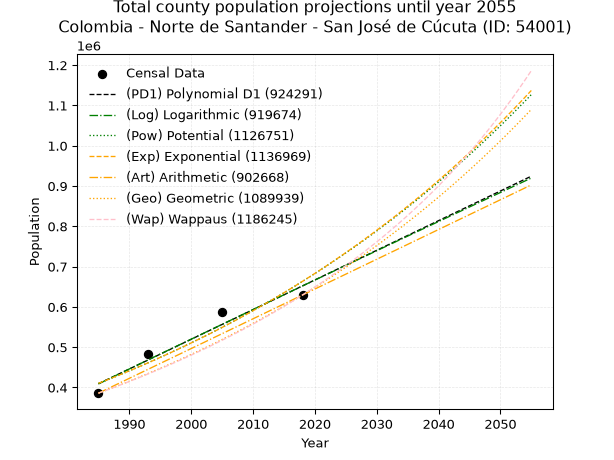
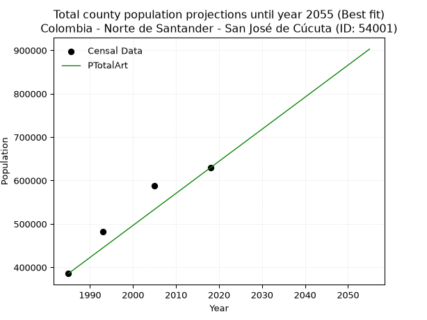
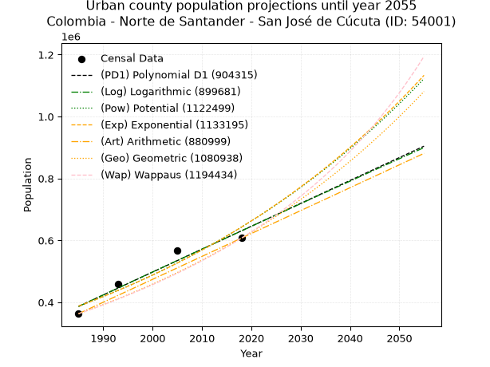
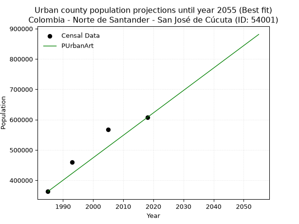
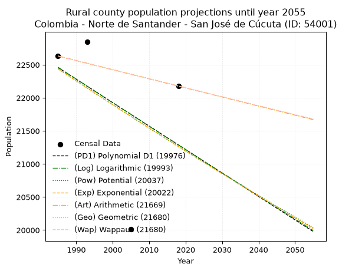
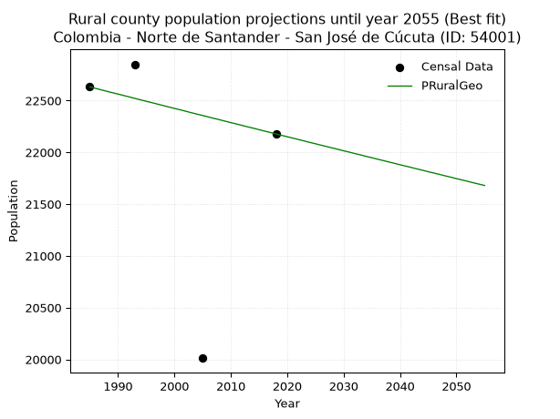

<div align="center">


</div>

# _“Population and Public Services Demand Projections (PPSD) until Year 2050 for Colombia - Norte de Santander - Cúcuta (ID: 54001)”_
Keywords: `population` `public-service` `projection` `lineal` `polynomial` `logarithmic` `potential` `exponential` `arithmetic` `geometric` `wappaus` `dane` `colombia` `south-america`

PPSD are analytical estimates used by governments and planners to anticipate future changes in population size, age distribution, and the resulting community needs for utilities, healthcare, education, and infrastructure as sizing future water treatment facilities, electrical grids, and road networks based on spatial growth.

> **General running parameters**: • app_version: _v20260806_. • Python version: _3.14.7_. • Pandas version: _3.0.5_. • NumPy version: _2.5.1_. • Creates, save and include plots into reports (create_plot): _False_. • Projection until year: _2050_. • Process polynomial degree 2 and up: _False_. • Process Wappaus: _True_. • Process Wappaus: _True_. • Set negative values to zero: _True_. • Set infinite values to zero: _True_. • Drop dataset notes: _True_. 
<div align="center">

Dynamic map: [:earth_americas:Google](http://maps.google.com/maps?q=7.905724964,-72.5081778) [:earth_americas:OSM](https://www.openstreetmap.org/#map=18/7.905724964/-72.5081778&layers=P) [:earth_americas:Bing](https://www.bing.com/maps?cp=7.905724964~-72.5081778&lvl=18) [:earth_americas:Apple](https://maps.apple.com/frame?center=7.905724964%2C-72.5081778&span=0.003%2C0.006)

</div>


<div align="center">

```geojson
{
  "type": "Feature",
  "geometry": {
    "type": "Point", 
    "coordinates": [-72.5081778, 7.905724964]
  }, 
  "properties": {
    "Name": "Colombia - Norte de Santander - Cúcuta (ID: 54001)"
  }
}
```

</div>


## 0. Census Data (4 records)

Census data are official statistics collected by a government about the people and housing in a country. They usually include counts of total population, age, sex, race, income, education, and jobs.

📅Global census file: [Population.xlsx](../data/Population.xlsx)

| Source   |   Year |   CountryID | CountryName   |   StateID | StateName          |   CountyID | CountyName         |   PTotal |   PUrban |   PRural |
|:---------|-------:|------------:|:--------------|----------:|:-------------------|-----------:|:-------------------|---------:|---------:|---------:|
| DANE     |   1985 |          57 | Colombia      |        54 | Norte de Santander |      54001 | Cúcuta             |   385701 |   363069 |    22632 |
| DANE     |   1993 |          57 | Colombia      |        54 | Norte de Santander |      54001 | San José de Cucuta |   482490 |   459640 |    22850 |
| DANE     |   2005 |          57 | Colombia      |        54 | Norte De Santander |      54001 | Cúcuta             |   587676 |   567664 |    20012 |
| DANE     |   2018 |          57 | Colombia      |        54 | Norte de Santander |      54001 | San José de Cúcuta |   629414 |   607236 |    22178 |

> 🔥Some records could had specific notes about the registered values or the corresponding urban or rural distribution.

## 1. Total

### 1.1. Coefficients and Parameters

* (PD1) Polynomial Deg 1: 7360.20353271775, -14200926.866318682 (lineal)
* (Log) Logarithmic: 14741223.964564774, -111526841.23341204
* (Pow) Potential: 29.173050626012408, -90.5929991591028
* (Exp) Exponential: 0.014563917831360474, 1.1423884495722366e-07
* (Art) Arithmetic: Year diff. 2018 - 1985 = 33, Population diff. 629414 - 385701 = 243713, Annual growth = 7385.242424242424
* (Geo) Geometric: Year diff. 2018 - 1985 = 33, Population diff. 629414 - 385701 = 243713, Annual growth % = 0.014950867733435569
* (Wap) Wappaus: i = 1.4550553236317902, Condition values only valid for < 200)

<sub>
Wappaus condition values: ['0.00', '1.46', '2.91', '4.37', '5.82', '7.28', '8.73', '10.19', '11.64', '13.10', '14.55', '16.01', '17.46', '18.92', '20.37', '21.83', '23.28', '24.74', '26.19', '27.65', '29.10', '30.56', '32.01', '33.47', '34.92', '36.38', '37.83', '39.29', '40.74', '42.20', '43.65', '45.11', '46.56', '48.02', '49.47', '50.93', '52.38', '53.84', '55.29', '56.75', '58.20', '59.66', '61.11', '62.57', '64.02', '65.48', '66.93', '68.39', '69.84', '71.30', '72.75', '74.21', '75.66', '77.12', '78.57', '80.03', '81.48', '82.94', '84.39', '85.85', '87.30', '88.76', '90.21', '91.67', '93.12', '94.58']
</sub>


### 1.2. Projected Dataset

|   Year |   CountyID |   PTotalPD1 |   PTotalLog |        PTotalPow |        PTotalExp |   PTotalArt |        PTotalGeo |        PTotalWap |
|-------:|-----------:|------------:|------------:|-----------------:|-----------------:|------------:|-----------------:|-----------------:|
|   1985 |      54001 |      409077 |      408788 | 409954           | 410201           |      385701 | 385701           | 385701           |
|   1986 |      54001 |      416437 |      416213 | 416022           | 416219           |      393086 | 391468           | 391354           |
|   1987 |      54001 |      423798 |      423634 | 422177           | 422325           |      400471 | 397320           | 397091           |
|   1988 |      54001 |      431158 |      431051 | 428419           | 428521           |      407857 | 403261           | 402913           |
|   1989 |      54001 |      438518 |      438464 | 434751           | 434807           |      415242 | 409290           | 408823           |
|   1990 |      54001 |      445878 |      445873 | 441173           | 441186           |      422627 | 415409           | 414821           |
|   1991 |      54001 |      453238 |      453279 | 447686           | 447659           |      430012 | 421620           | 420911           |
|   1992 |      54001 |      460599 |      460681 | 454293           | 454226           |      437398 | 427923           | 427094           |
|   1993 |      54001 |      467959 |      468079 | 460993           | 460890           |      444783 | 434321           | 433373           |
|   1994 |      54001 |      475319 |      475474 | 467789           | 467651           |      452168 | 440815           | 439749           |
|   1995 |      54001 |      482679 |      482865 | 474681           | 474512           |      459553 | 447405           | 446226           |
|   1996 |      54001 |      490039 |      490252 | 481672           | 481473           |      466939 | 454094           | 452805           |
|   1997 |      54001 |      497400 |      497636 | 488762           | 488536           |      474324 | 460883           | 459489           |
|   1998 |      54001 |      504760 |      505016 | 495952           | 495704           |      481709 | 467774           | 466280           |
|   1999 |      54001 |      512120 |      512392 | 503245           | 502976           |      489094 | 474768           | 473182           |
|   2000 |      54001 |      519480 |      519764 | 510641           | 510355           |      496480 | 481866           | 480196           |
|   2001 |      54001 |      526840 |      527133 | 518143           | 517842           |      503865 | 489070           | 487325           |
|   2002 |      54001 |      534201 |      534498 | 525750           | 525439           |      511250 | 496382           | 494573           |
|   2003 |      54001 |      541561 |      541860 | 533465           | 533147           |      518635 | 503803           | 501942           |
|   2004 |      54001 |      548921 |      549217 | 541290           | 540969           |      526021 | 511336           | 509436           |
|   2005 |      54001 |      556281 |      556571 | 549226           | 548905           |      533406 | 518981           | 517057           |
|   2006 |      54001 |      563641 |      563922 | 557273           | 556958           |      540791 | 526740           | 524810           |
|   2007 |      54001 |      571002 |      571268 | 565435           | 565129           |      548176 | 534615           | 532696           |
|   2008 |      54001 |      578362 |      578612 | 573712           | 573419           |      555562 | 542608           | 540720           |
|   2009 |      54001 |      585722 |      585951 | 582106           | 581832           |      562947 | 550720           | 548886           |
|   2010 |      54001 |      593082 |      593287 | 590618           | 590367           |      570332 | 558954           | 557197           |
|   2011 |      54001 |      600442 |      600619 | 599251           | 599028           |      577717 | 567311           | 565657           |
|   2012 |      54001 |      607803 |      607947 | 608005           | 607816           |      585103 | 575793           | 574271           |
|   2013 |      54001 |      615163 |      615272 | 616883           | 616733           |      592488 | 584401           | 583041           |
|   2014 |      54001 |      622523 |      622593 | 625886           | 625781           |      599873 | 593139           | 591974           |
|   2015 |      54001 |      629883 |      629911 | 635015           | 634962           |      607258 | 602007           | 601073           |
|   2016 |      54001 |      637243 |      637225 | 644274           | 644277           |      614644 | 611007           | 610342           |
|   2017 |      54001 |      644604 |      644535 | 653662           | 653729           |      622029 | 620142           | 619788           |
|   2018 |      54001 |      651964 |      651842 | 663183           | 663319           |      629414 | 629414           | 629414           |
|   2019 |      54001 |      659324 |      659145 | 672837           | 673051           |      636799 | 638824           | 639226           |
|   2020 |      54001 |      666684 |      666444 | 682627           | 682924           |      644184 | 648375           | 649230           |
|   2021 |      54001 |      674044 |      673740 | 692555           | 692943           |      651570 | 658069           | 659432           |
|   2022 |      54001 |      681405 |      681032 | 702622           | 703109           |      658955 | 667908           | 669836           |
|   2023 |      54001 |      688765 |      688321 | 712830           | 713424           |      666340 | 677894           | 680450           |
|   2024 |      54001 |      696125 |      695606 | 723182           | 723890           |      673725 | 688029           | 691279           |
|   2025 |      54001 |      703485 |      702887 | 733678           | 734510           |      681111 | 698315           | 702330           |
|   2026 |      54001 |      710845 |      710165 | 744322           | 745286           |      688496 | 708756           | 713611           |
|   2027 |      54001 |      718206 |      717439 | 755114           | 756220           |      695881 | 719352           | 725128           |
|   2028 |      54001 |      725566 |      724710 | 766058           | 767314           |      703266 | 730107           | 736888           |
|   2029 |      54001 |      732926 |      731977 | 777155           | 778571           |      710652 | 741023           | 748901           |
|   2030 |      54001 |      740286 |      739241 | 788407           | 789993           |      718037 | 752102           | 761173           |
|   2031 |      54001 |      747647 |      746501 | 799816           | 801582           |      725422 | 763346           | 773714           |
|   2032 |      54001 |      755007 |      753757 | 811384           | 813342           |      732807 | 774759           | 786532           |
|   2033 |      54001 |      762367 |      761010 | 823114           | 825274           |      740193 | 786342           | 799637           |
|   2034 |      54001 |      769727 |      768259 | 835008           | 837381           |      747578 | 798099           | 813038           |
|   2035 |      54001 |      777087 |      775504 | 847067           | 849666           |      754963 | 810031           | 826745           |
|   2036 |      54001 |      784448 |      782746 | 859295           | 862131           |      762348 | 822142           | 840770           |
|   2037 |      54001 |      791808 |      789985 | 871693           | 874779           |      769734 | 834434           | 855122           |
|   2038 |      54001 |      799168 |      797220 | 884264           | 887612           |      777119 | 846909           | 869815           |
|   2039 |      54001 |      806528 |      804451 | 897010           | 900634           |      784504 | 859571           | 884860           |
|   2040 |      54001 |      813888 |      811679 | 909933           | 913847           |      791889 | 872422           | 900270           |
|   2041 |      54001 |      821249 |      818904 | 923035           | 927253           |      799275 | 885466           | 916058           |
|   2042 |      54001 |      828609 |      826124 | 936320           | 940856           |      806660 | 898704           | 932238           |
|   2043 |      54001 |      835969 |      833342 | 949790           | 954659           |      814045 | 912141           | 948826           |
|   2044 |      54001 |      843329 |      840555 | 963446           | 968665           |      821430 | 925778           | 965837           |
|   2045 |      54001 |      850689 |      847765 | 977292           | 982875           |      828816 | 939619           | 983287           |
|   2046 |      54001 |      858050 |      854972 | 991330           | 997295           |      836201 | 953667           |      1.00119e+06 |
|   2047 |      54001 |      865410 |      862175 |      1.00556e+06 |      1.01192e+06 |      843586 | 967926           |      1.01958e+06 |
|   2048 |      54001 |      872770 |      869375 |      1.01999e+06 |      1.02677e+06 |      850971 | 982397           |      1.03845e+06 |
|   2049 |      54001 |      880130 |      876571 |      1.03462e+06 |      1.04183e+06 |      858357 | 997085           |      1.05784e+06 |
|   2050 |      54001 |      887490 |      883764 |      1.04946e+06 |      1.05712e+06 |      865742 |      1.01199e+06 |      1.07776e+06 |
<div align="center">

</img>

</div>


### 1.3. Best fit with absolute and relative error (%)

Relative error puts that difference into context by dividing the absolute error by the true value, creating a unitless ratio or percentage that shows the scale of the mistake.

Absolute and relative error

|   Year | Source   |   CountryID | CountryName   |   StateID | StateName          |   CountyID_x | CountyName         |   PTotal |   PUrban |   PRural |   CountyID_y |   PTotalPD1 |   PTotalLog |   PTotalPow |   PTotalExp |   PTotalArt |   PTotalGeo |   PTotalWap |   PTotalPD1AbsError |   PTotalLogAbsError |   PTotalPowAbsError |   PTotalExpAbsError |   PTotalArtAbsError |   PTotalGeoAbsError |   PTotalWapAbsError |   PTotalPD1RelError |   PTotalLogRelError |   PTotalPowRelError |   PTotalExpRelError |   PTotalArtRelError |   PTotalGeoRelError |   PTotalWapRelError |
|-------:|:---------|------------:|:--------------|----------:|:-------------------|-------------:|:-------------------|---------:|---------:|---------:|-------------:|------------:|------------:|------------:|------------:|------------:|------------:|------------:|--------------------:|--------------------:|--------------------:|--------------------:|--------------------:|--------------------:|--------------------:|--------------------:|--------------------:|--------------------:|--------------------:|--------------------:|--------------------:|--------------------:|
|   1985 | DANE     |          57 | Colombia      |        54 | Norte de Santander |        54001 | Cúcuta             |   385701 |   363069 |    22632 |        54001 |      409077 |      408788 |      409954 |      410201 |      385701 |      385701 |      385701 |               23376 |               23087 |               24253 |               24500 |                   0 |                   0 |                   0 |             6.06065 |             5.98572 |             6.28803 |             6.35207 |             0       |             0       |              0      |
|   1993 | DANE     |          57 | Colombia      |        54 | Norte de Santander |        54001 | San José de Cucuta |   482490 |   459640 |    22850 |        54001 |      467959 |      468079 |      460993 |      460890 |      444783 |      434321 |      433373 |               14531 |               14411 |               21497 |               21600 |               37707 |               48169 |               49117 |             3.01167 |             2.9868  |             4.45543 |             4.47678 |             7.81508 |             9.98342 |             10.1799 |
|   2005 | DANE     |          57 | Colombia      |        54 | Norte De Santander |        54001 | Cúcuta             |   587676 |   567664 |    20012 |        54001 |      556281 |      556571 |      549226 |      548905 |      533406 |      518981 |      517057 |               31395 |               31105 |               38450 |               38771 |               54270 |               68695 |               70619 |             5.34223 |             5.29288 |             6.54272 |             6.59734 |             9.23468 |            11.6893  |             12.0167 |
|   2018 | DANE     |          57 | Colombia      |        54 | Norte de Santander |        54001 | San José de Cúcuta |   629414 |   607236 |    22178 |        54001 |      651964 |      651842 |      663183 |      663319 |      629414 |      629414 |      629414 |               22550 |               22428 |               33769 |               33905 |                   0 |                   0 |                   0 |             3.5827  |             3.56331 |             5.36515 |             5.38676 |             0       |             0       |              0      |

Relative error mean

| Method    |   RelError | Best   |
|:----------|-----------:|:-------|
| PTotalPD1 |    4.49931 |        |
| PTotalLog |    4.45718 |        |
| PTotalPow |    5.66283 |        |
| PTotalExp |    5.70324 |        |
| PTotalArt |    4.26244 | True   |
| PTotalGeo |    5.41817 |        |
| PTotalWap |    5.54914 |        |

💙Best method: _**PTotalArt**_
<div align="center">

</img>

</div>


### 1.4. Fresh water supply demand in liters per capita per day (lpcd)

The fresh water supply demand typically ranges from 100 to 300 liters per capita per day (lpcd) for standard domestic and municipal planning, though absolute survival minimums set by the World Health Organization are as low as 7.5 to 20 liters per day, and total consumption in high-income nations can exceed 400 liters.

> `CZ`: Level in meters above the sea level (masl).<br> `WS`: Fresh water supply demand in liters per capita per day (lpcd or l/h/d).<br> `WSAll`: Zonal fresh water supply demand in liters per second (l/s).<br> `A`: Zonal area in square meters.

Reference values (RAS Colombia)

|    CZ |   WS |
|------:|-----:|
|  1000 |  120 |
|  2000 |  130 |
| 99999 |  140 |

County shapefile geometry properties and water supply values

|   CountyID |      ATotal |   CZTotal |   WSTotal |
|-----------:|------------:|----------:|----------:|
|      54001 | 1.13215e+09 |   240.042 |       120 |

Projected values for best method: PTotalArt

|   CountyID |   Year |   PTotalArt |   WSTotal |   WSTotalAll |
|-----------:|-------:|------------:|----------:|-------------:|
|      54001 |   1985 |      385701 |       120 |      535.696 |
|      54001 |   1986 |      393086 |       120 |      545.953 |
|      54001 |   1987 |      400471 |       120 |      556.21  |
|      54001 |   1988 |      407857 |       120 |      566.468 |
|      54001 |   1989 |      415242 |       120 |      576.725 |
|      54001 |   1990 |      422627 |       120 |      586.982 |
|      54001 |   1991 |      430012 |       120 |      597.239 |
|      54001 |   1992 |      437398 |       120 |      607.497 |
|      54001 |   1993 |      444783 |       120 |      617.754 |
|      54001 |   1994 |      452168 |       120 |      628.011 |
|      54001 |   1995 |      459553 |       120 |      638.268 |
|      54001 |   1996 |      466939 |       120 |      648.526 |
|      54001 |   1997 |      474324 |       120 |      658.783 |
|      54001 |   1998 |      481709 |       120 |      669.04  |
|      54001 |   1999 |      489094 |       120 |      679.297 |
|      54001 |   2000 |      496480 |       120 |      689.556 |
|      54001 |   2001 |      503865 |       120 |      699.812 |
|      54001 |   2002 |      511250 |       120 |      710.069 |
|      54001 |   2003 |      518635 |       120 |      720.326 |
|      54001 |   2004 |      526021 |       120 |      730.585 |
|      54001 |   2005 |      533406 |       120 |      740.842 |
|      54001 |   2006 |      540791 |       120 |      751.099 |
|      54001 |   2007 |      548176 |       120 |      761.356 |
|      54001 |   2008 |      555562 |       120 |      771.614 |
|      54001 |   2009 |      562947 |       120 |      781.871 |
|      54001 |   2010 |      570332 |       120 |      792.128 |
|      54001 |   2011 |      577717 |       120 |      802.385 |
|      54001 |   2012 |      585103 |       120 |      812.643 |
|      54001 |   2013 |      592488 |       120 |      822.9   |
|      54001 |   2014 |      599873 |       120 |      833.157 |
|      54001 |   2015 |      607258 |       120 |      843.414 |
|      54001 |   2016 |      614644 |       120 |      853.672 |
|      54001 |   2017 |      622029 |       120 |      863.929 |
|      54001 |   2018 |      629414 |       120 |      874.186 |
|      54001 |   2019 |      636799 |       120 |      884.443 |
|      54001 |   2020 |      644184 |       120 |      894.7   |
|      54001 |   2021 |      651570 |       120 |      904.958 |
|      54001 |   2022 |      658955 |       120 |      915.215 |
|      54001 |   2023 |      666340 |       120 |      925.472 |
|      54001 |   2024 |      673725 |       120 |      935.729 |
|      54001 |   2025 |      681111 |       120 |      945.987 |
|      54001 |   2026 |      688496 |       120 |      956.244 |
|      54001 |   2027 |      695881 |       120 |      966.501 |
|      54001 |   2028 |      703266 |       120 |      976.758 |
|      54001 |   2029 |      710652 |       120 |      987.017 |
|      54001 |   2030 |      718037 |       120 |      997.274 |
|      54001 |   2031 |      725422 |       120 |     1007.53  |
|      54001 |   2032 |      732807 |       120 |     1017.79  |
|      54001 |   2033 |      740193 |       120 |     1028.05  |
|      54001 |   2034 |      747578 |       120 |     1038.3   |
|      54001 |   2035 |      754963 |       120 |     1048.56  |
|      54001 |   2036 |      762348 |       120 |     1058.82  |
|      54001 |   2037 |      769734 |       120 |     1069.08  |
|      54001 |   2038 |      777119 |       120 |     1079.33  |
|      54001 |   2039 |      784504 |       120 |     1089.59  |
|      54001 |   2040 |      791889 |       120 |     1099.85  |
|      54001 |   2041 |      799275 |       120 |     1110.1   |
|      54001 |   2042 |      806660 |       120 |     1120.36  |
|      54001 |   2043 |      814045 |       120 |     1130.62  |
|      54001 |   2044 |      821430 |       120 |     1140.88  |
|      54001 |   2045 |      828816 |       120 |     1151.13  |
|      54001 |   2046 |      836201 |       120 |     1161.39  |
|      54001 |   2047 |      843586 |       120 |     1171.65  |
|      54001 |   2048 |      850971 |       120 |     1181.9   |
|      54001 |   2049 |      858357 |       120 |     1192.16  |
|      54001 |   2050 |      865742 |       120 |     1202.42  |

## 2. Urban

### 2.1. Coefficients and Parameters

* (PD1) Polynomial Deg 1: 7395.665596146092, -14293777.858691221 (lineal)
* (Log) Logarithmic: 14812459.22173923, -112090218.99403861
* (Pow) Potential: 30.693792520204823, -95.63257287714873
* (Exp) Exponential: 0.01532283304684524, 2.393627843250286e-08
* (Art) Arithmetic: Year diff. 2018 - 1985 = 33, Population diff. 607236 - 363069 = 244167, Annual growth = 7399.0
* (Geo) Geometric: Year diff. 2018 - 1985 = 33, Population diff. 607236 - 363069 = 244167, Annual growth % = 0.015707683190936628
* (Wap) Wappaus: i = 1.5250874724957617, Condition values only valid for < 200)

<sub>
Wappaus condition values: ['0.00', '1.53', '3.05', '4.58', '6.10', '7.63', '9.15', '10.68', '12.20', '13.73', '15.25', '16.78', '18.30', '19.83', '21.35', '22.88', '24.40', '25.93', '27.45', '28.98', '30.50', '32.03', '33.55', '35.08', '36.60', '38.13', '39.65', '41.18', '42.70', '44.23', '45.75', '47.28', '48.80', '50.33', '51.85', '53.38', '54.90', '56.43', '57.95', '59.48', '61.00', '62.53', '64.05', '65.58', '67.10', '68.63', '70.15', '71.68', '73.20', '74.73', '76.25', '77.78', '79.30', '80.83', '82.35', '83.88', '85.40', '86.93', '88.46', '89.98', '91.51', '93.03', '94.56', '96.08', '97.61', '99.13']
</sub>


### 2.2. Projected Dataset

|   Year |   CountyID |   PUrbanPD1 |   PUrbanLog |        PUrbanPow |        PUrbanExp |   PUrbanArt |   PUrbanGeo |        PUrbanWap |
|-------:|-----------:|------------:|------------:|-----------------:|-----------------:|------------:|------------:|-----------------:|
|   1985 |      54001 |      386618 |      386327 | 387440           | 387687           |      363069 |      363069 | 363069           |
|   1986 |      54001 |      394014 |      393787 | 393476           | 393673           |      370468 |      368772 | 368649           |
|   1987 |      54001 |      401410 |      401243 | 399602           | 399752           |      377867 |      374565 | 374315           |
|   1988 |      54001 |      408805 |      408696 | 405822           | 405924           |      385266 |      380448 | 380069           |
|   1989 |      54001 |      416201 |      416145 | 412134           | 412192           |      392665 |      386424 | 385914           |
|   1990 |      54001 |      423597 |      423591 | 418542           | 418556           |      400064 |      392494 | 391852           |
|   1991 |      54001 |      430992 |      431032 | 425046           | 425019           |      407463 |      398659 | 397885           |
|   1992 |      54001 |      438388 |      438470 | 431648           | 431582           |      414862 |      404921 | 404014           |
|   1993 |      54001 |      445784 |      445904 | 438349           | 438246           |      422261 |      411281 | 410244           |
|   1994 |      54001 |      453179 |      453335 | 445150           | 445013           |      429660 |      417742 | 416575           |
|   1995 |      54001 |      460575 |      460761 | 452053           | 451884           |      437059 |      424303 | 423011           |
|   1996 |      54001 |      467971 |      468184 | 459061           | 458862           |      444458 |      430968 | 429554           |
|   1997 |      54001 |      475366 |      475603 | 466173           | 465947           |      451857 |      437738 | 436207           |
|   1998 |      54001 |      482762 |      483019 | 473391           | 473142           |      459256 |      444614 | 442972           |
|   1999 |      54001 |      490158 |      490431 | 480718           | 480447           |      466655 |      451597 | 449853           |
|   2000 |      54001 |      497553 |      497839 | 488154           | 487866           |      474054 |      458691 | 456853           |
|   2001 |      54001 |      504949 |      505243 | 495702           | 495399           |      481453 |      465896 | 463974           |
|   2002 |      54001 |      512345 |      512644 | 503362           | 503048           |      488852 |      473214 | 471220           |
|   2003 |      54001 |      519740 |      520041 | 511137           | 510816           |      496251 |      480647 | 478594           |
|   2004 |      54001 |      527136 |      527434 | 519028           | 518703           |      503650 |      488197 | 486099           |
|   2005 |      54001 |      534532 |      534824 | 527036           | 526712           |      511049 |      495866 | 493740           |
|   2006 |      54001 |      541927 |      542210 | 535165           | 534845           |      518448 |      503654 | 501519           |
|   2007 |      54001 |      549323 |      549592 | 543414           | 543104           |      525847 |      511566 | 509441           |
|   2008 |      54001 |      556719 |      556970 | 551787           | 551490           |      533246 |      519601 | 517509           |
|   2009 |      54001 |      564114 |      564345 | 560284           | 560005           |      540645 |      527763 | 525728           |
|   2010 |      54001 |      571510 |      571716 | 568907           | 568652           |      548044 |      536053 | 534102           |
|   2011 |      54001 |      578906 |      579084 | 577659           | 577432           |      555443 |      544473 | 542635           |
|   2012 |      54001 |      586301 |      586448 | 586542           | 586348           |      562842 |      553025 | 551332           |
|   2013 |      54001 |      593697 |      593808 | 595556           | 595402           |      570241 |      561712 | 560198           |
|   2014 |      54001 |      601093 |      601165 | 604704           | 604596           |      577640 |      570535 | 569237           |
|   2015 |      54001 |      608488 |      608518 | 613988           | 613931           |      585039 |      579497 | 578455           |
|   2016 |      54001 |      615884 |      615867 | 623410           | 623411           |      592438 |      588600 | 587857           |
|   2017 |      54001 |      623280 |      623213 | 632972           | 633037           |      599837 |      597845 | 597449           |
|   2018 |      54001 |      630675 |      630555 | 642675           | 642811           |      607236 |      607236 | 607236           |
|   2019 |      54001 |      638071 |      637893 | 652523           | 652737           |      614635 |      616774 | 617225           |
|   2020 |      54001 |      645467 |      645228 | 662516           | 662816           |      622034 |      626462 | 627421           |
|   2021 |      54001 |      652862 |      652559 | 672657           | 673050           |      629433 |      636303 | 637832           |
|   2022 |      54001 |      660258 |      659886 | 682948           | 683443           |      636832 |      646297 | 648464           |
|   2023 |      54001 |      667654 |      667210 | 693392           | 693995           |      644231 |      656449 | 659325           |
|   2024 |      54001 |      675049 |      674530 | 703990           | 704711           |      651630 |      666761 | 670421           |
|   2025 |      54001 |      682445 |      681847 | 714745           | 715593           |      659029 |      677234 | 681760           |
|   2026 |      54001 |      689841 |      689160 | 725658           | 726642           |      666428 |      687872 | 693351           |
|   2027 |      54001 |      697236 |      696469 | 736733           | 737862           |      673827 |      698677 | 705203           |
|   2028 |      54001 |      704632 |      703775 | 747971           | 749255           |      681226 |      709651 | 717323           |
|   2029 |      54001 |      712028 |      711077 | 759375           | 760824           |      688625 |      720798 | 729721           |
|   2030 |      54001 |      719423 |      718376 | 770947           | 772572           |      696024 |      732120 | 742407           |
|   2031 |      54001 |      726819 |      725671 | 782689           | 784501           |      703423 |      743620 | 755392           |
|   2032 |      54001 |      734215 |      732962 | 794604           | 796614           |      710822 |      755301 | 768684           |
|   2033 |      54001 |      741610 |      740250 | 806695           | 808915           |      718221 |      767165 | 782297           |
|   2034 |      54001 |      749006 |      747534 | 818964           | 821405           |      725620 |      779215 | 796241           |
|   2035 |      54001 |      756402 |      754815 | 831413           | 834088           |      733019 |      791455 | 810529           |
|   2036 |      54001 |      763797 |      762092 | 844045           | 846967           |      740418 |      803887 | 825173           |
|   2037 |      54001 |      771193 |      769365 | 856863           | 860045           |      747817 |      816514 | 840188           |
|   2038 |      54001 |      778589 |      776635 | 869869           | 873325           |      755216 |      829339 | 855586           |
|   2039 |      54001 |      785984 |      783902 | 883065           | 886810           |      762615 |      842366 | 871384           |
|   2040 |      54001 |      793380 |      791164 | 896456           | 900503           |      770014 |      855598 | 887597           |
|   2041 |      54001 |      800776 |      798424 | 910042           | 914408           |      777413 |      869037 | 904242           |
|   2042 |      54001 |      808171 |      805679 | 923828           | 928527           |      784812 |      882688 | 921335           |
|   2043 |      54001 |      815567 |      812931 | 937816           | 942864           |      792211 |      896553 | 938896           |
|   2044 |      54001 |      822963 |      820180 | 952008           | 957423           |      799610 |      910636 | 956944           |
|   2045 |      54001 |      830358 |      827425 | 966409           | 972206           |      807009 |      924940 | 975499           |
|   2046 |      54001 |      837754 |      834666 | 981019           | 987218           |      814408 |      939468 | 994583           |
|   2047 |      54001 |      845150 |      841904 | 995844           |      1.00246e+06 |      821807 |      954225 |      1.01422e+06 |
|   2048 |      54001 |      852545 |      849139 |      1.01088e+06 |      1.01794e+06 |      829206 |      969214 |      1.03443e+06 |
|   2049 |      54001 |      859941 |      856370 |      1.02614e+06 |      1.03366e+06 |      836605 |      984438 |      1.05525e+06 |
|   2050 |      54001 |      867337 |      863597 |      1.04163e+06 |      1.04962e+06 |      844004 |      999901 |      1.07669e+06 |
<div align="center">

</img>

</div>


### 2.3. Best fit with absolute and relative error (%)

Relative error puts that difference into context by dividing the absolute error by the true value, creating a unitless ratio or percentage that shows the scale of the mistake.

Absolute and relative error

|   Year | Source   |   CountryID | CountryName   |   StateID | StateName          |   CountyID_x | CountyName         |   PTotal |   PUrban |   PRural |   CountyID_y |   PUrbanPD1 |   PUrbanLog |   PUrbanPow |   PUrbanExp |   PUrbanArt |   PUrbanGeo |   PUrbanWap |   PUrbanPD1AbsError |   PUrbanLogAbsError |   PUrbanPowAbsError |   PUrbanExpAbsError |   PUrbanArtAbsError |   PUrbanGeoAbsError |   PUrbanWapAbsError |   PUrbanPD1RelError |   PUrbanLogRelError |   PUrbanPowRelError |   PUrbanExpRelError |   PUrbanArtRelError |   PUrbanGeoRelError |   PUrbanWapRelError |
|-------:|:---------|------------:|:--------------|----------:|:-------------------|-------------:|:-------------------|---------:|---------:|---------:|-------------:|------------:|------------:|------------:|------------:|------------:|------------:|------------:|--------------------:|--------------------:|--------------------:|--------------------:|--------------------:|--------------------:|--------------------:|--------------------:|--------------------:|--------------------:|--------------------:|--------------------:|--------------------:|--------------------:|
|   1985 | DANE     |          57 | Colombia      |        54 | Norte de Santander |        54001 | Cúcuta             |   385701 |   363069 |    22632 |        54001 |      386618 |      386327 |      387440 |      387687 |      363069 |      363069 |      363069 |               23549 |               23258 |               24371 |               24618 |                   0 |                   0 |                   0 |             6.48609 |             6.40594 |             6.7125  |             6.78053 |             0       |              0      |              0      |
|   1993 | DANE     |          57 | Colombia      |        54 | Norte de Santander |        54001 | San José de Cucuta |   482490 |   459640 |    22850 |        54001 |      445784 |      445904 |      438349 |      438246 |      422261 |      411281 |      410244 |               13856 |               13736 |               21291 |               21394 |               37379 |               48359 |               49396 |             3.01453 |             2.98843 |             4.6321  |             4.65451 |             8.13223 |             10.5211 |             10.7467 |
|   2005 | DANE     |          57 | Colombia      |        54 | Norte De Santander |        54001 | Cúcuta             |   587676 |   567664 |    20012 |        54001 |      534532 |      534824 |      527036 |      526712 |      511049 |      495866 |      493740 |               33132 |               32840 |               40628 |               40952 |               56615 |               71798 |               73924 |             5.83655 |             5.78511 |             7.15705 |             7.21413 |             9.97333 |             12.648  |             13.0225 |
|   2018 | DANE     |          57 | Colombia      |        54 | Norte de Santander |        54001 | San José de Cúcuta |   629414 |   607236 |    22178 |        54001 |      630675 |      630555 |      642675 |      642811 |      607236 |      607236 |      607236 |               23439 |               23319 |               35439 |               35575 |                   0 |                   0 |                   0 |             3.85995 |             3.84019 |             5.83612 |             5.85851 |             0       |              0      |              0      |

Relative error mean

| Method    |   RelError | Best   |
|:----------|-----------:|:-------|
| PUrbanPD1 |    4.79928 |        |
| PUrbanLog |    4.75492 |        |
| PUrbanPow |    6.08444 |        |
| PUrbanExp |    6.12692 |        |
| PUrbanArt |    4.52639 | True   |
| PUrbanGeo |    5.79226 |        |
| PUrbanWap |    5.94229 |        |

💙Best method: _**PUrbanArt**_
<div align="center">

</img>

</div>


### 2.4. Fresh water supply demand in liters per capita per day (lpcd)

The fresh water supply demand typically ranges from 100 to 300 liters per capita per day (lpcd) for standard domestic and municipal planning, though absolute survival minimums set by the World Health Organization are as low as 7.5 to 20 liters per day, and total consumption in high-income nations can exceed 400 liters.

> `CZ`: Level in meters above the sea level (masl).<br> `WS`: Fresh water supply demand in liters per capita per day (lpcd or l/h/d).<br> `WSAll`: Zonal fresh water supply demand in liters per second (l/s).<br> `A`: Zonal area in square meters.

Reference values (RAS Colombia)

|    CZ |   WS |
|------:|-----:|
|  1000 |  120 |
|  2000 |  130 |
| 99999 |  140 |

County shapefile geometry properties and water supply values

|   CountyID |      AUrban |   CZUrban |   WSUrban |
|-----------:|------------:|----------:|----------:|
|      54001 | 7.43327e+07 |   317.102 |       120 |

Projected values for best method: PUrbanArt

|   CountyID |   Year |   PUrbanArt |   WSUrban |   WSUrbanAll |
|-----------:|-------:|------------:|----------:|-------------:|
|      54001 |   1985 |      363069 |       120 |      504.262 |
|      54001 |   1986 |      370468 |       120 |      514.539 |
|      54001 |   1987 |      377867 |       120 |      524.815 |
|      54001 |   1988 |      385266 |       120 |      535.092 |
|      54001 |   1989 |      392665 |       120 |      545.368 |
|      54001 |   1990 |      400064 |       120 |      555.644 |
|      54001 |   1991 |      407463 |       120 |      565.921 |
|      54001 |   1992 |      414862 |       120 |      576.197 |
|      54001 |   1993 |      422261 |       120 |      586.474 |
|      54001 |   1994 |      429660 |       120 |      596.75  |
|      54001 |   1995 |      437059 |       120 |      607.026 |
|      54001 |   1996 |      444458 |       120 |      617.303 |
|      54001 |   1997 |      451857 |       120 |      627.579 |
|      54001 |   1998 |      459256 |       120 |      637.856 |
|      54001 |   1999 |      466655 |       120 |      648.132 |
|      54001 |   2000 |      474054 |       120 |      658.408 |
|      54001 |   2001 |      481453 |       120 |      668.685 |
|      54001 |   2002 |      488852 |       120 |      678.961 |
|      54001 |   2003 |      496251 |       120 |      689.237 |
|      54001 |   2004 |      503650 |       120 |      699.514 |
|      54001 |   2005 |      511049 |       120 |      709.79  |
|      54001 |   2006 |      518448 |       120 |      720.067 |
|      54001 |   2007 |      525847 |       120 |      730.343 |
|      54001 |   2008 |      533246 |       120 |      740.619 |
|      54001 |   2009 |      540645 |       120 |      750.896 |
|      54001 |   2010 |      548044 |       120 |      761.172 |
|      54001 |   2011 |      555443 |       120 |      771.449 |
|      54001 |   2012 |      562842 |       120 |      781.725 |
|      54001 |   2013 |      570241 |       120 |      792.001 |
|      54001 |   2014 |      577640 |       120 |      802.278 |
|      54001 |   2015 |      585039 |       120 |      812.554 |
|      54001 |   2016 |      592438 |       120 |      822.831 |
|      54001 |   2017 |      599837 |       120 |      833.107 |
|      54001 |   2018 |      607236 |       120 |      843.383 |
|      54001 |   2019 |      614635 |       120 |      853.66  |
|      54001 |   2020 |      622034 |       120 |      863.936 |
|      54001 |   2021 |      629433 |       120 |      874.212 |
|      54001 |   2022 |      636832 |       120 |      884.489 |
|      54001 |   2023 |      644231 |       120 |      894.765 |
|      54001 |   2024 |      651630 |       120 |      905.042 |
|      54001 |   2025 |      659029 |       120 |      915.318 |
|      54001 |   2026 |      666428 |       120 |      925.594 |
|      54001 |   2027 |      673827 |       120 |      935.871 |
|      54001 |   2028 |      681226 |       120 |      946.147 |
|      54001 |   2029 |      688625 |       120 |      956.424 |
|      54001 |   2030 |      696024 |       120 |      966.7   |
|      54001 |   2031 |      703423 |       120 |      976.976 |
|      54001 |   2032 |      710822 |       120 |      987.253 |
|      54001 |   2033 |      718221 |       120 |      997.529 |
|      54001 |   2034 |      725620 |       120 |     1007.81  |
|      54001 |   2035 |      733019 |       120 |     1018.08  |
|      54001 |   2036 |      740418 |       120 |     1028.36  |
|      54001 |   2037 |      747817 |       120 |     1038.63  |
|      54001 |   2038 |      755216 |       120 |     1048.91  |
|      54001 |   2039 |      762615 |       120 |     1059.19  |
|      54001 |   2040 |      770014 |       120 |     1069.46  |
|      54001 |   2041 |      777413 |       120 |     1079.74  |
|      54001 |   2042 |      784812 |       120 |     1090.02  |
|      54001 |   2043 |      792211 |       120 |     1100.29  |
|      54001 |   2044 |      799610 |       120 |     1110.57  |
|      54001 |   2045 |      807009 |       120 |     1120.85  |
|      54001 |   2046 |      814408 |       120 |     1131.12  |
|      54001 |   2047 |      821807 |       120 |     1141.4   |
|      54001 |   2048 |      829206 |       120 |     1151.67  |
|      54001 |   2049 |      836605 |       120 |     1161.95  |
|      54001 |   2050 |      844004 |       120 |     1172.23  |

## 3. Rural

### 3.1. Coefficients and Parameters

* (PD1) Polynomial Deg 1: -35.462063428343164, 92850.99237254342 (lineal)
* (Log) Logarithmic: -71235.25717445007, 563377.7606265203
* (Pow) Potential: -3.269899845098898, 15.134392871653992
* (Exp) Exponential: -0.001627607480620551, 567680.6791183826
* (Art) Arithmetic: Year diff. 2018 - 1985 = 33, Population diff. 22178 - 22632 = -454, Annual growth = -13.757575757575758
* (Geo) Geometric: Year diff. 2018 - 1985 = 33, Population diff. 22178 - 22632 = -454, Annual growth % = -0.000613872941291449
* (Wap) Wappaus: i = -0.06140404265822699, Condition values only valid for < 200)

<sub>
Wappaus condition values: ['-0.00', '-0.06', '-0.12', '-0.18', '-0.25', '-0.31', '-0.37', '-0.43', '-0.49', '-0.55', '-0.61', '-0.68', '-0.74', '-0.80', '-0.86', '-0.92', '-0.98', '-1.04', '-1.11', '-1.17', '-1.23', '-1.29', '-1.35', '-1.41', '-1.47', '-1.54', '-1.60', '-1.66', '-1.72', '-1.78', '-1.84', '-1.90', '-1.96', '-2.03', '-2.09', '-2.15', '-2.21', '-2.27', '-2.33', '-2.39', '-2.46', '-2.52', '-2.58', '-2.64', '-2.70', '-2.76', '-2.82', '-2.89', '-2.95', '-3.01', '-3.07', '-3.13', '-3.19', '-3.25', '-3.32', '-3.38', '-3.44', '-3.50', '-3.56', '-3.62', '-3.68', '-3.75', '-3.81', '-3.87', '-3.93', '-3.99']
</sub>


### 3.2. Projected Dataset

|   Year |   CountyID |   PRuralPD1 |   PRuralLog |   PRuralPow |   PRuralExp |   PRuralArt |   PRuralGeo |   PRuralWap |
|-------:|-----------:|------------:|------------:|------------:|------------:|------------:|------------:|------------:|
|   1985 |      54001 |       22459 |       22462 |       22441 |       22438 |       22632 |       22632 |       22632 |
|   1986 |      54001 |       22423 |       22426 |       22404 |       22402 |       22618 |       22618 |       22618 |
|   1987 |      54001 |       22388 |       22390 |       22367 |       22365 |       22604 |       22604 |       22604 |
|   1988 |      54001 |       22352 |       22354 |       22331 |       22329 |       22591 |       22590 |       22590 |
|   1989 |      54001 |       22317 |       22318 |       22294 |       22292 |       22577 |       22576 |       22576 |
|   1990 |      54001 |       22281 |       22283 |       22257 |       22256 |       22563 |       22563 |       22563 |
|   1991 |      54001 |       22246 |       22247 |       22221 |       22220 |       22549 |       22549 |       22549 |
|   1992 |      54001 |       22211 |       22211 |       22184 |       22184 |       22536 |       22535 |       22535 |
|   1993 |      54001 |       22175 |       22175 |       22148 |       22148 |       22522 |       22521 |       22521 |
|   1994 |      54001 |       22140 |       22140 |       22112 |       22112 |       22508 |       22507 |       22507 |
|   1995 |      54001 |       22104 |       22104 |       22075 |       22076 |       22494 |       22493 |       22493 |
|   1996 |      54001 |       22069 |       22068 |       22039 |       22040 |       22481 |       22480 |       22480 |
|   1997 |      54001 |       22033 |       22032 |       22003 |       22004 |       22467 |       22466 |       22466 |
|   1998 |      54001 |       21998 |       21997 |       21967 |       21968 |       22453 |       22452 |       22452 |
|   1999 |      54001 |       21962 |       21961 |       21931 |       21933 |       22439 |       22438 |       22438 |
|   2000 |      54001 |       21927 |       21926 |       21896 |       21897 |       22426 |       22424 |       22425 |
|   2001 |      54001 |       21891 |       21890 |       21860 |       21861 |       22412 |       22411 |       22411 |
|   2002 |      54001 |       21856 |       21854 |       21824 |       21826 |       22398 |       22397 |       22397 |
|   2003 |      54001 |       21820 |       21819 |       21788 |       21790 |       22384 |       22383 |       22383 |
|   2004 |      54001 |       21785 |       21783 |       21753 |       21755 |       22371 |       22369 |       22369 |
|   2005 |      54001 |       21750 |       21748 |       21717 |       21719 |       22357 |       22356 |       22356 |
|   2006 |      54001 |       21714 |       21712 |       21682 |       21684 |       22343 |       22342 |       22342 |
|   2007 |      54001 |       21679 |       21677 |       21647 |       21649 |       22329 |       22328 |       22328 |
|   2008 |      54001 |       21643 |       21641 |       21612 |       21614 |       22316 |       22315 |       22315 |
|   2009 |      54001 |       21608 |       21606 |       21576 |       21578 |       22302 |       22301 |       22301 |
|   2010 |      54001 |       21572 |       21570 |       21541 |       21543 |       22288 |       22287 |       22287 |
|   2011 |      54001 |       21537 |       21535 |       21506 |       21508 |       22274 |       22274 |       22274 |
|   2012 |      54001 |       21501 |       21499 |       21471 |       21473 |       22261 |       22260 |       22260 |
|   2013 |      54001 |       21466 |       21464 |       21437 |       21438 |       22247 |       22246 |       22246 |
|   2014 |      54001 |       21430 |       21429 |       21402 |       21404 |       22233 |       22233 |       22233 |
|   2015 |      54001 |       21395 |       21393 |       21367 |       21369 |       22219 |       22219 |       22219 |
|   2016 |      54001 |       21359 |       21358 |       21332 |       21334 |       22206 |       22205 |       22205 |
|   2017 |      54001 |       21324 |       21323 |       21298 |       21299 |       22192 |       22192 |       22192 |
|   2018 |      54001 |       21289 |       21287 |       21263 |       21265 |       22178 |       22178 |       22178 |
|   2019 |      54001 |       21253 |       21252 |       21229 |       21230 |       22164 |       22164 |       22164 |
|   2020 |      54001 |       21218 |       21217 |       21195 |       21196 |       22150 |       22151 |       22151 |
|   2021 |      54001 |       21182 |       21181 |       21160 |       21161 |       22137 |       22137 |       22137 |
|   2022 |      54001 |       21147 |       21146 |       21126 |       21127 |       22123 |       22124 |       22124 |
|   2023 |      54001 |       21111 |       21111 |       21092 |       21092 |       22109 |       22110 |       22110 |
|   2024 |      54001 |       21076 |       21076 |       21058 |       21058 |       22095 |       22096 |       22096 |
|   2025 |      54001 |       21040 |       21041 |       21024 |       21024 |       22082 |       22083 |       22083 |
|   2026 |      54001 |       21005 |       21005 |       20990 |       20990 |       22068 |       22069 |       22069 |
|   2027 |      54001 |       20969 |       20970 |       20956 |       20955 |       22054 |       22056 |       22056 |
|   2028 |      54001 |       20934 |       20935 |       20922 |       20921 |       22040 |       22042 |       22042 |
|   2029 |      54001 |       20898 |       20900 |       20889 |       20887 |       22027 |       22029 |       22029 |
|   2030 |      54001 |       20863 |       20865 |       20855 |       20853 |       22013 |       22015 |       22015 |
|   2031 |      54001 |       20828 |       20830 |       20822 |       20819 |       21999 |       22002 |       22002 |
|   2032 |      54001 |       20792 |       20795 |       20788 |       20786 |       21985 |       21988 |       21988 |
|   2033 |      54001 |       20757 |       20760 |       20755 |       20752 |       21972 |       21975 |       21975 |
|   2034 |      54001 |       20721 |       20725 |       20721 |       20718 |       21958 |       21961 |       21961 |
|   2035 |      54001 |       20686 |       20690 |       20688 |       20684 |       21944 |       21948 |       21948 |
|   2036 |      54001 |       20650 |       20655 |       20655 |       20651 |       21930 |       21934 |       21934 |
|   2037 |      54001 |       20615 |       20620 |       20622 |       20617 |       21917 |       21921 |       21921 |
|   2038 |      54001 |       20579 |       20585 |       20589 |       20584 |       21903 |       21907 |       21907 |
|   2039 |      54001 |       20544 |       20550 |       20556 |       20550 |       21889 |       21894 |       21894 |
|   2040 |      54001 |       20508 |       20515 |       20523 |       20517 |       21875 |       21880 |       21880 |
|   2041 |      54001 |       20473 |       20480 |       20490 |       20483 |       21862 |       21867 |       21867 |
|   2042 |      54001 |       20437 |       20445 |       20457 |       20450 |       21848 |       21854 |       21853 |
|   2043 |      54001 |       20402 |       20410 |       20424 |       20417 |       21834 |       21840 |       21840 |
|   2044 |      54001 |       20367 |       20375 |       20392 |       20384 |       21820 |       21827 |       21827 |
|   2045 |      54001 |       20331 |       20340 |       20359 |       20350 |       21807 |       21813 |       21813 |
|   2046 |      54001 |       20296 |       20306 |       20327 |       20317 |       21793 |       21800 |       21800 |
|   2047 |      54001 |       20260 |       20271 |       20294 |       20284 |       21779 |       21787 |       21786 |
|   2048 |      54001 |       20225 |       20236 |       20262 |       20251 |       21765 |       21773 |       21773 |
|   2049 |      54001 |       20189 |       20201 |       20229 |       20218 |       21752 |       21760 |       21760 |
|   2050 |      54001 |       20154 |       20167 |       20197 |       20185 |       21738 |       21746 |       21746 |
<div align="center">

</img>

</div>


### 3.3. Best fit with absolute and relative error (%)

Relative error puts that difference into context by dividing the absolute error by the true value, creating a unitless ratio or percentage that shows the scale of the mistake.

Absolute and relative error

|   Year | Source   |   CountryID | CountryName   |   StateID | StateName          |   CountyID_x | CountyName         |   PTotal |   PUrban |   PRural |   CountyID_y |   PRuralPD1 |   PRuralLog |   PRuralPow |   PRuralExp |   PRuralArt |   PRuralGeo |   PRuralWap |   PRuralPD1AbsError |   PRuralLogAbsError |   PRuralPowAbsError |   PRuralExpAbsError |   PRuralArtAbsError |   PRuralGeoAbsError |   PRuralWapAbsError |   PRuralPD1RelError |   PRuralLogRelError |   PRuralPowRelError |   PRuralExpRelError |   PRuralArtRelError |   PRuralGeoRelError |   PRuralWapRelError |
|-------:|:---------|------------:|:--------------|----------:|:-------------------|-------------:|:-------------------|---------:|---------:|---------:|-------------:|------------:|------------:|------------:|------------:|------------:|------------:|------------:|--------------------:|--------------------:|--------------------:|--------------------:|--------------------:|--------------------:|--------------------:|--------------------:|--------------------:|--------------------:|--------------------:|--------------------:|--------------------:|--------------------:|
|   1985 | DANE     |          57 | Colombia      |        54 | Norte de Santander |        54001 | Cúcuta             |   385701 |   363069 |    22632 |        54001 |       22459 |       22462 |       22441 |       22438 |       22632 |       22632 |       22632 |                 173 |                 170 |                 191 |                 194 |                   0 |                   0 |                   0 |            0.764404 |            0.751149 |            0.843938 |            0.857193 |             0       |             0       |             0       |
|   1993 | DANE     |          57 | Colombia      |        54 | Norte de Santander |        54001 | San José de Cucuta |   482490 |   459640 |    22850 |        54001 |       22175 |       22175 |       22148 |       22148 |       22522 |       22521 |       22521 |                 675 |                 675 |                 702 |                 702 |                 328 |                 329 |                 329 |            2.95405  |            2.95405  |            3.07221  |            3.07221  |             1.43545 |             1.43982 |             1.43982 |
|   2005 | DANE     |          57 | Colombia      |        54 | Norte De Santander |        54001 | Cúcuta             |   587676 |   567664 |    20012 |        54001 |       21750 |       21748 |       21717 |       21719 |       22357 |       22356 |       22356 |                1738 |                1736 |                1705 |                1707 |                2345 |                2344 |                2344 |            8.68479  |            8.6748   |            8.51989  |            8.52988  |            11.718   |            11.713   |            11.713   |
|   2018 | DANE     |          57 | Colombia      |        54 | Norte de Santander |        54001 | San José de Cúcuta |   629414 |   607236 |    22178 |        54001 |       21289 |       21287 |       21263 |       21265 |       22178 |       22178 |       22178 |                 889 |                 891 |                 915 |                 913 |                   0 |                   0 |                   0 |            4.00848  |            4.01749  |            4.12571  |            4.11669  |             0       |             0       |             0       |

Relative error mean

| Method    |   RelError | Best   |
|:----------|-----------:|:-------|
| PRuralPD1 |    4.10293 |        |
| PRuralLog |    4.09937 |        |
| PRuralPow |    4.14044 |        |
| PRuralExp |    4.14399 |        |
| PRuralArt |    3.28835 |        |
| PRuralGeo |    3.2882  | True   |
| PRuralWap |    3.2882  | True   |

💙Best method: _**PRuralGeo**_
<div align="center">

</img>

</div>


### 3.4. Fresh water supply demand in liters per capita per day (lpcd)

The fresh water supply demand typically ranges from 100 to 300 liters per capita per day (lpcd) for standard domestic and municipal planning, though absolute survival minimums set by the World Health Organization are as low as 7.5 to 20 liters per day, and total consumption in high-income nations can exceed 400 liters.

> `CZ`: Level in meters above the sea level (masl).<br> `WS`: Fresh water supply demand in liters per capita per day (lpcd or l/h/d).<br> `WSAll`: Zonal fresh water supply demand in liters per second (l/s).<br> `A`: Zonal area in square meters.

Reference values (RAS Colombia)

|    CZ |   WS |
|------:|-----:|
|  1000 |  120 |
|  2000 |  130 |
| 99999 |  140 |

County shapefile geometry properties and water supply values

|   CountyID |      ARural |   CZRural |   WSRural |
|-----------:|------------:|----------:|----------:|
|      54001 | 1.05782e+09 |   234.636 |       120 |

Projected values for best method: PRuralGeo

|   CountyID |   Year |   PRuralGeo |   WSRural |   WSRuralAll |
|-----------:|-------:|------------:|----------:|-------------:|
|      54001 |   1985 |       22632 |       120 |      31.4333 |
|      54001 |   1986 |       22618 |       120 |      31.4139 |
|      54001 |   1987 |       22604 |       120 |      31.3944 |
|      54001 |   1988 |       22590 |       120 |      31.375  |
|      54001 |   1989 |       22576 |       120 |      31.3556 |
|      54001 |   1990 |       22563 |       120 |      31.3375 |
|      54001 |   1991 |       22549 |       120 |      31.3181 |
|      54001 |   1992 |       22535 |       120 |      31.2986 |
|      54001 |   1993 |       22521 |       120 |      31.2792 |
|      54001 |   1994 |       22507 |       120 |      31.2597 |
|      54001 |   1995 |       22493 |       120 |      31.2403 |
|      54001 |   1996 |       22480 |       120 |      31.2222 |
|      54001 |   1997 |       22466 |       120 |      31.2028 |
|      54001 |   1998 |       22452 |       120 |      31.1833 |
|      54001 |   1999 |       22438 |       120 |      31.1639 |
|      54001 |   2000 |       22424 |       120 |      31.1444 |
|      54001 |   2001 |       22411 |       120 |      31.1264 |
|      54001 |   2002 |       22397 |       120 |      31.1069 |
|      54001 |   2003 |       22383 |       120 |      31.0875 |
|      54001 |   2004 |       22369 |       120 |      31.0681 |
|      54001 |   2005 |       22356 |       120 |      31.05   |
|      54001 |   2006 |       22342 |       120 |      31.0306 |
|      54001 |   2007 |       22328 |       120 |      31.0111 |
|      54001 |   2008 |       22315 |       120 |      30.9931 |
|      54001 |   2009 |       22301 |       120 |      30.9736 |
|      54001 |   2010 |       22287 |       120 |      30.9542 |
|      54001 |   2011 |       22274 |       120 |      30.9361 |
|      54001 |   2012 |       22260 |       120 |      30.9167 |
|      54001 |   2013 |       22246 |       120 |      30.8972 |
|      54001 |   2014 |       22233 |       120 |      30.8792 |
|      54001 |   2015 |       22219 |       120 |      30.8597 |
|      54001 |   2016 |       22205 |       120 |      30.8403 |
|      54001 |   2017 |       22192 |       120 |      30.8222 |
|      54001 |   2018 |       22178 |       120 |      30.8028 |
|      54001 |   2019 |       22164 |       120 |      30.7833 |
|      54001 |   2020 |       22151 |       120 |      30.7653 |
|      54001 |   2021 |       22137 |       120 |      30.7458 |
|      54001 |   2022 |       22124 |       120 |      30.7278 |
|      54001 |   2023 |       22110 |       120 |      30.7083 |
|      54001 |   2024 |       22096 |       120 |      30.6889 |
|      54001 |   2025 |       22083 |       120 |      30.6708 |
|      54001 |   2026 |       22069 |       120 |      30.6514 |
|      54001 |   2027 |       22056 |       120 |      30.6333 |
|      54001 |   2028 |       22042 |       120 |      30.6139 |
|      54001 |   2029 |       22029 |       120 |      30.5958 |
|      54001 |   2030 |       22015 |       120 |      30.5764 |
|      54001 |   2031 |       22002 |       120 |      30.5583 |
|      54001 |   2032 |       21988 |       120 |      30.5389 |
|      54001 |   2033 |       21975 |       120 |      30.5208 |
|      54001 |   2034 |       21961 |       120 |      30.5014 |
|      54001 |   2035 |       21948 |       120 |      30.4833 |
|      54001 |   2036 |       21934 |       120 |      30.4639 |
|      54001 |   2037 |       21921 |       120 |      30.4458 |
|      54001 |   2038 |       21907 |       120 |      30.4264 |
|      54001 |   2039 |       21894 |       120 |      30.4083 |
|      54001 |   2040 |       21880 |       120 |      30.3889 |
|      54001 |   2041 |       21867 |       120 |      30.3708 |
|      54001 |   2042 |       21854 |       120 |      30.3528 |
|      54001 |   2043 |       21840 |       120 |      30.3333 |
|      54001 |   2044 |       21827 |       120 |      30.3153 |
|      54001 |   2045 |       21813 |       120 |      30.2958 |
|      54001 |   2046 |       21800 |       120 |      30.2778 |
|      54001 |   2047 |       21787 |       120 |      30.2597 |
|      54001 |   2048 |       21773 |       120 |      30.2403 |
|      54001 |   2049 |       21760 |       120 |      30.2222 |
|      54001 |   2050 |       21746 |       120 |      30.2028 |

<div align="center"><br><sub>Share this research</sub></div><br>

<sub>**APPS & TOOLS & CONTENT DISCLAIMER**: • NO WARRANTY - This content and software is provided by <a href="https://github.com/rcfdtools" target="_blank">github.com/rcfdtools</a> "as is", without any express or implied warranty, including warranties of merchantability, fitness for a particular purpose, or non-infringement. There is no guarantee that the software will be error-free or operate without interruption. • LIMITATION OF LIABILITY - Neither the authors nor copyright holders will be liable for claims or damages arising from the software or its use. You are responsible for determining if the software is appropriate for your use and assume all associated risks, including errors, legal compliance, and data loss. • NO PROFESSIONAL ADVICE - The software provides general information and does not offer professional advice. It should not replace consultation with professional advisors. [Clauses and global license for rcfdtools use.](https://github.com/rcfdtools/rcfdtools/blob/main/LICENSE.md)</sub>

| [:house: Home](Readme.md)  | [:beginner: Help / Collaborate](https://github.com/rcfdtools/R.HydroTools/discussions/31) |
|----------------------------|-------------------------------------------------------------------------------------------|