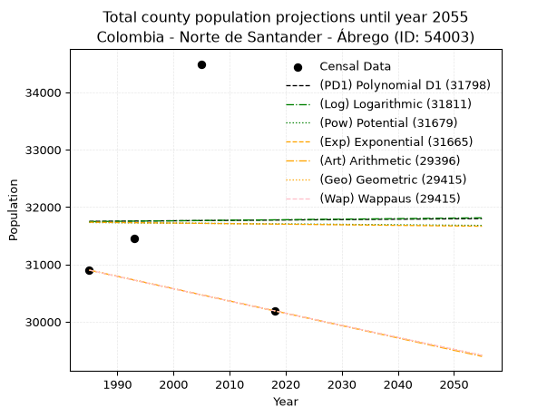
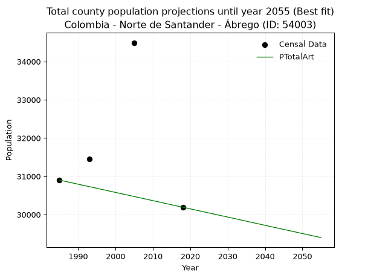
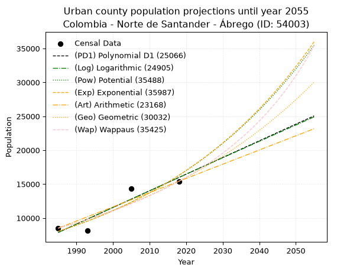
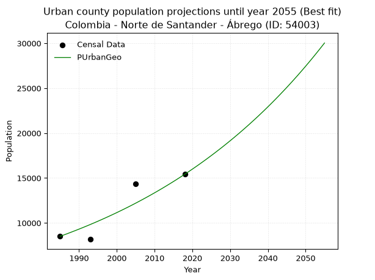
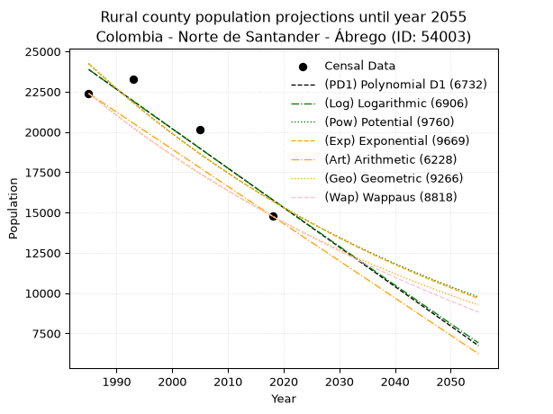
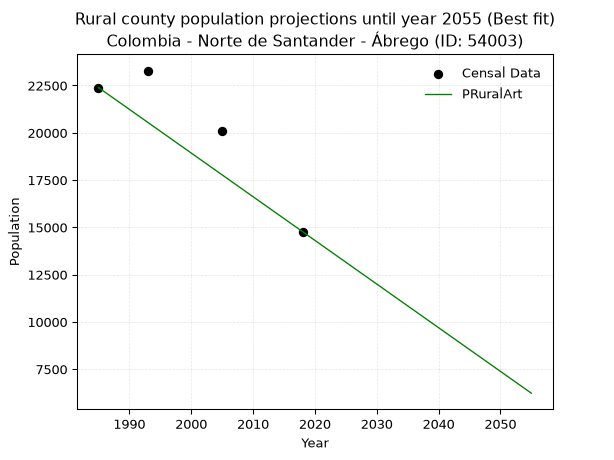

<div align="center">


</div>

# 📜 _“Population and Public Services Demand Projections (PPSD) until Year 2050 for Colombia - Norte de Santander - Ábrego (ID: 54003)”_
Keywords: `population` `public-service` `projection` `lineal` `polynomial` `logarithmic` `potential` `exponential` `arithmetic` `geometric` `wappaus` `dane` `colombia` `south-america`

PPSD are analytical estimates used by governments and planners to anticipate future changes in population size, age distribution, and the resulting community needs for utilities, healthcare, education, and infrastructure as sizing future water treatment facilities, electrical grids, and road networks based on spatial growth.

<div align="center">

</img>

</div>


> **General running parameters**: • app_version: _v20260806_. • Python version: _3.14.7_. • Pandas version: _3.0.5_. • NumPy version: _2.5.1_. • Creates, save and include plots into reports (create_plot): _False_. • Projection until year: _2050_. • Process polynomial degree 2 and up: _False_. • Process Wappaus: _True_. • Process Wappaus: _True_. • Set negative values to zero: _True_. • Set infinite values to zero: _True_. • Drop dataset notes: _True_. 
<div align="center">

Maps & GIS Layers: [:earth_americas:Google](http://maps.google.com/maps?q=8.081615975,-73.2217218) [:earth_americas:OSM](https://www.openstreetmap.org/#map=18/8.081615975/-73.2217218&layers=P) [:earth_americas:Bing](https://www.bing.com/maps?cp=8.081615975~-73.2217218&lvl=18) [:earth_americas:Apple](https://maps.apple.com/frame?center=8.081615975%2C-73.2217218&span=0.003%2C0.006) [:earth_americas:GISMobile](https://github.com/rcfdtools/R.GISMobile/blob/main/file/gis/CountyLayer_CO/Readme.md)

</div>


<div align="center">

```geojson
{
  "type": "Feature",
  "geometry": {
    "type": "Point", 
    "coordinates": [-73.2217218, 8.081615975]
  }, 
  "properties": {
    "Name": "Colombia - Norte de Santander - Ábrego (ID: 54003)"
  }
}
```

</div>


## 0. Census Data (4 records)

Census data are official statistics collected by a government about the people and housing in a country. They usually include counts of total population, age, sex, race, income, education, and jobs.

📅Global census file: [Population.xlsx](../data/Population.xlsx)

| Source   |   Year |   CountryID | CountryName   |   StateID | StateName          |   CountyID | CountyName   |   PTotal |   PUrban |   PRural |
|:---------|-------:|------------:|:--------------|----------:|:-------------------|-----------:|:-------------|---------:|---------:|---------:|
| DANE     |   1985 |          57 | Colombia      |        54 | Norte de Santander |      54003 | Ábrego       |    30900 |     8508 |    22392 |
| DANE     |   1993 |          57 | Colombia      |        54 | Norte de Santander |      54003 | Ábrego       |    31459 |     8173 |    23286 |
| DANE     |   2005 |          57 | Colombia      |        54 | Norte de Santander |      54003 | Ábrego       |    34492 |    14373 |    20119 |
| DANE     |   2018 |          57 | Colombia      |        54 | Norte de Santander |      54003 | Ábrego       |    30191 |    15419 |    14772 |

> 🔥Some records could had specific notes about the registered values or the corresponding urban or rural distribution.

📅[SUI-RUPS](https://www.datos.gov.co/Hacienda-y-Cr-dito-P-blico/Registro-nico-de-Prestadores-de-Servicios-P-blicos/4qkq-csdn/about_data) - Local public utility companies: [RUPS.csv](../data/RUPS.csv)

 | SERVICIO       | ESTADO    | NOMBRE                                               | NIT         | DEPARTAMENTO_DOMICILIO   | MUNICIPIO_DOMICILIO   | DIRECCION                       |   TELEFONO | EMAIL                                      | TIPO_PRESTADOR                 | CLASIFICACION                  |
|:---------------|:----------|:-----------------------------------------------------|:------------|:-------------------------|:----------------------|:--------------------------------|-----------:|:-------------------------------------------|:-------------------------------|:-------------------------------|
| ACUEDUCTO      | OPERATIVA | UNIDAD DE SERVICIOS PUBLICOS DEL MUNICIPIO DE ABREGO | 890504612-0 | NORTE DE SANTANDER       | ABREGO                | calle14 cra 5 palacio municipal |    5642137 | contactenos@abrego-nortedesantander.gov.co | MUNICIPIO (PRESTACIÓN DIRECTA) | DESDE 2501 HASTA 5000 USUARIOS |
| ALCANTARILLADO | OPERATIVA | UNIDAD DE SERVICIOS PUBLICOS DEL MUNICIPIO DE ABREGO | 890504612-0 | NORTE DE SANTANDER       | ABREGO                | calle14 cra 5 palacio municipal |    5642137 | contactenos@abrego-nortedesantander.gov.co | MUNICIPIO (PRESTACIÓN DIRECTA) | DESDE 2501 HASTA 5000 USUARIOS |

## 1. Total

### 1.1. Coefficients and Parameters

* (PD1) Polynomial Deg 1: 0.6816539542377309, 30397.021678035977 (lineal)
* (Log) Logarithmic: 1885.605965440824, 17427.993946386392
* (Pow) Potential: -0.04698377376676073, 4.656421817426583
* (Exp) Exponential: -3.153755254016884e-05, 33784.804590672946
* (Art) Arithmetic: Year diff. 2018 - 1985 = 33, Population diff. 30191 - 30900 = -709, Annual growth = -21.484848484848484
* (Geo) Geometric: Year diff. 2018 - 1985 = 33, Population diff. 30191 - 30900 = -709, Annual growth % = -0.0007031562207069353
* (Wap) Wappaus: i = -0.07033719691885379, Condition values only valid for < 200)

<sub>
Wappaus condition values: ['-0.00', '-0.07', '-0.14', '-0.21', '-0.28', '-0.35', '-0.42', '-0.49', '-0.56', '-0.63', '-0.70', '-0.77', '-0.84', '-0.91', '-0.98', '-1.06', '-1.13', '-1.20', '-1.27', '-1.34', '-1.41', '-1.48', '-1.55', '-1.62', '-1.69', '-1.76', '-1.83', '-1.90', '-1.97', '-2.04', '-2.11', '-2.18', '-2.25', '-2.32', '-2.39', '-2.46', '-2.53', '-2.60', '-2.67', '-2.74', '-2.81', '-2.88', '-2.95', '-3.02', '-3.09', '-3.17', '-3.24', '-3.31', '-3.38', '-3.45', '-3.52', '-3.59', '-3.66', '-3.73', '-3.80', '-3.87', '-3.94', '-4.01', '-4.08', '-4.15', '-4.22', '-4.29', '-4.36', '-4.43', '-4.50', '-4.57']
</sub>


### 1.2. Projected Dataset

|   Year |   CountyID |   PTotalPD1 |   PTotalLog |   PTotalPow |   PTotalExp |   PTotalArt |   PTotalGeo |   PTotalWap |
|-------:|-----------:|------------:|------------:|------------:|------------:|------------:|------------:|------------:|
|   1985 |      54003 |       31750 |       31746 |       31731 |       31735 |       30900 |       30900 |       30900 |
|   1986 |      54003 |       31751 |       31747 |       31730 |       31734 |       30879 |       30878 |       30878 |
|   1987 |      54003 |       31751 |       31748 |       31729 |       31733 |       30857 |       30857 |       30857 |
|   1988 |      54003 |       31752 |       31749 |       31729 |       31732 |       30836 |       30835 |       30835 |
|   1989 |      54003 |       31753 |       31750 |       31728 |       31731 |       30814 |       30813 |       30813 |
|   1990 |      54003 |       31754 |       31751 |       31727 |       31730 |       30793 |       30792 |       30792 |
|   1991 |      54003 |       31754 |       31752 |       31726 |       31729 |       30771 |       30770 |       30770 |
|   1992 |      54003 |       31755 |       31753 |       31726 |       31728 |       30750 |       30748 |       30748 |
|   1993 |      54003 |       31756 |       31754 |       31725 |       31727 |       30728 |       30727 |       30727 |
|   1994 |      54003 |       31756 |       31755 |       31724 |       31726 |       30707 |       30705 |       30705 |
|   1995 |      54003 |       31757 |       31756 |       31723 |       31725 |       30685 |       30683 |       30683 |
|   1996 |      54003 |       31758 |       31757 |       31723 |       31724 |       30664 |       30662 |       30662 |
|   1997 |      54003 |       31758 |       31757 |       31722 |       31723 |       30642 |       30640 |       30640 |
|   1998 |      54003 |       31759 |       31758 |       31721 |       31722 |       30621 |       30619 |       30619 |
|   1999 |      54003 |       31760 |       31759 |       31720 |       31721 |       30599 |       30597 |       30597 |
|   2000 |      54003 |       31760 |       31760 |       31720 |       31720 |       30578 |       30576 |       30576 |
|   2001 |      54003 |       31761 |       31761 |       31719 |       31719 |       30556 |       30554 |       30554 |
|   2002 |      54003 |       31762 |       31762 |       31718 |       31718 |       30535 |       30533 |       30533 |
|   2003 |      54003 |       31762 |       31763 |       31717 |       31717 |       30513 |       30511 |       30511 |
|   2004 |      54003 |       31763 |       31764 |       31717 |       31716 |       30492 |       30490 |       30490 |
|   2005 |      54003 |       31764 |       31765 |       31716 |       31715 |       30470 |       30468 |       30468 |
|   2006 |      54003 |       31764 |       31766 |       31715 |       31714 |       30449 |       30447 |       30447 |
|   2007 |      54003 |       31765 |       31767 |       31714 |       31713 |       30427 |       30426 |       30426 |
|   2008 |      54003 |       31766 |       31768 |       31714 |       31712 |       30406 |       30404 |       30404 |
|   2009 |      54003 |       31766 |       31769 |       31713 |       31711 |       30384 |       30383 |       30383 |
|   2010 |      54003 |       31767 |       31770 |       31712 |       31710 |       30363 |       30361 |       30361 |
|   2011 |      54003 |       31768 |       31771 |       31711 |       31709 |       30341 |       30340 |       30340 |
|   2012 |      54003 |       31769 |       31772 |       31711 |       31708 |       30320 |       30319 |       30319 |
|   2013 |      54003 |       31769 |       31773 |       31710 |       31707 |       30298 |       30297 |       30297 |
|   2014 |      54003 |       31770 |       31773 |       31709 |       31706 |       30277 |       30276 |       30276 |
|   2015 |      54003 |       31771 |       31774 |       31708 |       31705 |       30255 |       30255 |       30255 |
|   2016 |      54003 |       31771 |       31775 |       31708 |       31704 |       30234 |       30234 |       30234 |
|   2017 |      54003 |       31772 |       31776 |       31707 |       31703 |       30212 |       30212 |       30212 |
|   2018 |      54003 |       31773 |       31777 |       31706 |       31702 |       30191 |       30191 |       30191 |
|   2019 |      54003 |       31773 |       31778 |       31705 |       31701 |       30170 |       30170 |       30170 |
|   2020 |      54003 |       31774 |       31779 |       31705 |       31700 |       30148 |       30149 |       30149 |
|   2021 |      54003 |       31775 |       31780 |       31704 |       31699 |       30127 |       30127 |       30127 |
|   2022 |      54003 |       31775 |       31781 |       31703 |       31698 |       30105 |       30106 |       30106 |
|   2023 |      54003 |       31776 |       31782 |       31703 |       31697 |       30084 |       30085 |       30085 |
|   2024 |      54003 |       31777 |       31783 |       31702 |       31696 |       30062 |       30064 |       30064 |
|   2025 |      54003 |       31777 |       31784 |       31701 |       31695 |       30041 |       30043 |       30043 |
|   2026 |      54003 |       31778 |       31785 |       31700 |       31694 |       30019 |       30022 |       30022 |
|   2027 |      54003 |       31779 |       31786 |       31700 |       31693 |       29998 |       30000 |       30000 |
|   2028 |      54003 |       31779 |       31787 |       31699 |       31692 |       29976 |       29979 |       29979 |
|   2029 |      54003 |       31780 |       31787 |       31698 |       31691 |       29955 |       29958 |       29958 |
|   2030 |      54003 |       31781 |       31788 |       31697 |       31690 |       29933 |       29937 |       29937 |
|   2031 |      54003 |       31781 |       31789 |       31697 |       31689 |       29912 |       29916 |       29916 |
|   2032 |      54003 |       31782 |       31790 |       31696 |       31688 |       29890 |       29895 |       29895 |
|   2033 |      54003 |       31783 |       31791 |       31695 |       31687 |       29869 |       29874 |       29874 |
|   2034 |      54003 |       31784 |       31792 |       31694 |       31686 |       29847 |       29853 |       29853 |
|   2035 |      54003 |       31784 |       31793 |       31694 |       31685 |       29826 |       29832 |       29832 |
|   2036 |      54003 |       31785 |       31794 |       31693 |       31684 |       29804 |       29811 |       29811 |
|   2037 |      54003 |       31786 |       31795 |       31692 |       31683 |       29783 |       29790 |       29790 |
|   2038 |      54003 |       31786 |       31796 |       31692 |       31682 |       29761 |       29769 |       29769 |
|   2039 |      54003 |       31787 |       31797 |       31691 |       31681 |       29740 |       29748 |       29748 |
|   2040 |      54003 |       31788 |       31798 |       31690 |       31680 |       29718 |       29727 |       29727 |
|   2041 |      54003 |       31788 |       31799 |       31689 |       31679 |       29697 |       29706 |       29706 |
|   2042 |      54003 |       31789 |       31799 |       31689 |       31678 |       29675 |       29686 |       29685 |
|   2043 |      54003 |       31790 |       31800 |       31688 |       31677 |       29654 |       29665 |       29665 |
|   2044 |      54003 |       31790 |       31801 |       31687 |       31676 |       29632 |       29644 |       29644 |
|   2045 |      54003 |       31791 |       31802 |       31686 |       31675 |       29611 |       29623 |       29623 |
|   2046 |      54003 |       31792 |       31803 |       31686 |       31674 |       29589 |       29602 |       29602 |
|   2047 |      54003 |       31792 |       31804 |       31685 |       31673 |       29568 |       29581 |       29581 |
|   2048 |      54003 |       31793 |       31805 |       31684 |       31672 |       29546 |       29561 |       29560 |
|   2049 |      54003 |       31794 |       31806 |       31683 |       31671 |       29525 |       29540 |       29540 |
|   2050 |      54003 |       31794 |       31807 |       31683 |       31670 |       29503 |       29519 |       29519 |
<div align="center">

</img>

</div>


### 1.3. Best fit with absolute and relative error (%)

Relative error puts that difference into context by dividing the absolute error by the true value, creating a unitless ratio or percentage that shows the scale of the mistake.

Absolute and relative error

|   Year | Source   |   CountryID | CountryName   |   StateID | StateName          |   CountyID_x | CountyName   |   PTotal |   PUrban |   PRural |   CountyID_y |   PTotalPD1 |   PTotalLog |   PTotalPow |   PTotalExp |   PTotalArt |   PTotalGeo |   PTotalWap |   PTotalPD1AbsError |   PTotalLogAbsError |   PTotalPowAbsError |   PTotalExpAbsError |   PTotalArtAbsError |   PTotalGeoAbsError |   PTotalWapAbsError |   PTotalPD1RelError |   PTotalLogRelError |   PTotalPowRelError |   PTotalExpRelError |   PTotalArtRelError |   PTotalGeoRelError |   PTotalWapRelError |
|-------:|:---------|------------:|:--------------|----------:|:-------------------|-------------:|:-------------|---------:|---------:|---------:|-------------:|------------:|------------:|------------:|------------:|------------:|------------:|------------:|--------------------:|--------------------:|--------------------:|--------------------:|--------------------:|--------------------:|--------------------:|--------------------:|--------------------:|--------------------:|--------------------:|--------------------:|--------------------:|--------------------:|
|   1985 | DANE     |          57 | Colombia      |        54 | Norte de Santander |        54003 | Ábrego       |    30900 |     8508 |    22392 |        54003 |       31750 |       31746 |       31731 |       31735 |       30900 |       30900 |       30900 |                 850 |                 846 |                 831 |                 835 |                   0 |                   0 |                   0 |            2.75081  |            2.73786  |            2.68932  |            2.70227  |             0       |             0       |             0       |
|   1993 | DANE     |          57 | Colombia      |        54 | Norte de Santander |        54003 | Ábrego       |    31459 |     8173 |    23286 |        54003 |       31756 |       31754 |       31725 |       31727 |       30728 |       30727 |       30727 |                 297 |                 295 |                 266 |                 268 |                 731 |                 732 |                 732 |            0.944086 |            0.937728 |            0.845545 |            0.851902 |             2.32366 |             2.32684 |             2.32684 |
|   2005 | DANE     |          57 | Colombia      |        54 | Norte de Santander |        54003 | Ábrego       |    34492 |    14373 |    20119 |        54003 |       31764 |       31765 |       31716 |       31715 |       30470 |       30468 |       30468 |                2728 |                2727 |                2776 |                2777 |                4022 |                4024 |                4024 |            7.90908  |            7.90618  |            8.04824  |            8.05114  |            11.6607  |            11.6665  |            11.6665  |
|   2018 | DANE     |          57 | Colombia      |        54 | Norte de Santander |        54003 | Ábrego       |    30191 |    15419 |    14772 |        54003 |       31773 |       31777 |       31706 |       31702 |       30191 |       30191 |       30191 |                1582 |                1586 |                1515 |                1511 |                   0 |                   0 |                   0 |            5.23997  |            5.25322  |            5.01805  |            5.0048   |             0       |             0       |             0       |

Relative error mean

| Method    |   RelError | Best   |
|:----------|-----------:|:-------|
| PTotalPD1 |    4.21099 |        |
| PTotalLog |    4.20875 |        |
| PTotalPow |    4.15029 |        |
| PTotalExp |    4.15253 |        |
| PTotalArt |    3.49608 | True   |
| PTotalGeo |    3.49833 |        |
| PTotalWap |    3.49833 |        |

💙Best method: _**PTotalArt**_
<div align="center">

</img>

</div>


### 1.4. Fresh water supply demand in liters per capita per day (lpcd)

The fresh water supply demand typically ranges from 100 to 300 liters per capita per day (lpcd) for standard domestic and municipal planning, though absolute survival minimums set by the World Health Organization are as low as 7.5 to 20 liters per day, and total consumption in high-income nations can exceed 400 liters.

> `CZ`: Level in meters above the sea level (masl)<br> `WS`: Fresh water supply demand in liters per capita per day (lpcd or l/h/d)<br> `WSAll`: Zonal fresh water supply demand in liters per second (l/s)<br> `A`: Zonal area in square meters<br> `DP`: Population density (people/hectare or p/ha)

Reference values (RAS Colombia)

|    CZ |   WS |
|------:|-----:|
|  1000 |  120 |
|  2000 |  130 |
| 99999 |  140 |

County shapefile geometry properties and water supply values

|   CountyID |      ATotal |   CZTotal |   WSTotal |
|-----------:|------------:|----------:|----------:|
|      54003 | 1.37918e+09 |   1841.18 |       130 |

Projected values for best method: PTotalArt

|   CountyID |   Year |   PTotalArt |   DPTotal |   WSTotal |   WSTotalAll |
|-----------:|-------:|------------:|----------:|----------:|-------------:|
|      54003 |   1985 |       30900 |      0.22 |       130 |      46.4931 |
|      54003 |   1986 |       30879 |      0.22 |       130 |      46.4615 |
|      54003 |   1987 |       30857 |      0.22 |       130 |      46.4284 |
|      54003 |   1988 |       30836 |      0.22 |       130 |      46.3968 |
|      54003 |   1989 |       30814 |      0.22 |       130 |      46.3637 |
|      54003 |   1990 |       30793 |      0.22 |       130 |      46.3321 |
|      54003 |   1991 |       30771 |      0.22 |       130 |      46.299  |
|      54003 |   1992 |       30750 |      0.22 |       130 |      46.2674 |
|      54003 |   1993 |       30728 |      0.22 |       130 |      46.2343 |
|      54003 |   1994 |       30707 |      0.22 |       130 |      46.2027 |
|      54003 |   1995 |       30685 |      0.22 |       130 |      46.1696 |
|      54003 |   1996 |       30664 |      0.22 |       130 |      46.138  |
|      54003 |   1997 |       30642 |      0.22 |       130 |      46.1049 |
|      54003 |   1998 |       30621 |      0.22 |       130 |      46.0733 |
|      54003 |   1999 |       30599 |      0.22 |       130 |      46.0402 |
|      54003 |   2000 |       30578 |      0.22 |       130 |      46.0086 |
|      54003 |   2001 |       30556 |      0.22 |       130 |      45.9755 |
|      54003 |   2002 |       30535 |      0.22 |       130 |      45.9439 |
|      54003 |   2003 |       30513 |      0.22 |       130 |      45.9108 |
|      54003 |   2004 |       30492 |      0.22 |       130 |      45.8792 |
|      54003 |   2005 |       30470 |      0.22 |       130 |      45.8461 |
|      54003 |   2006 |       30449 |      0.22 |       130 |      45.8145 |
|      54003 |   2007 |       30427 |      0.22 |       130 |      45.7814 |
|      54003 |   2008 |       30406 |      0.22 |       130 |      45.7498 |
|      54003 |   2009 |       30384 |      0.22 |       130 |      45.7167 |
|      54003 |   2010 |       30363 |      0.22 |       130 |      45.6851 |
|      54003 |   2011 |       30341 |      0.22 |       130 |      45.652  |
|      54003 |   2012 |       30320 |      0.22 |       130 |      45.6204 |
|      54003 |   2013 |       30298 |      0.22 |       130 |      45.5873 |
|      54003 |   2014 |       30277 |      0.22 |       130 |      45.5557 |
|      54003 |   2015 |       30255 |      0.22 |       130 |      45.5226 |
|      54003 |   2016 |       30234 |      0.22 |       130 |      45.491  |
|      54003 |   2017 |       30212 |      0.22 |       130 |      45.4579 |
|      54003 |   2018 |       30191 |      0.22 |       130 |      45.4263 |
|      54003 |   2019 |       30170 |      0.22 |       130 |      45.3947 |
|      54003 |   2020 |       30148 |      0.22 |       130 |      45.3616 |
|      54003 |   2021 |       30127 |      0.22 |       130 |      45.33   |
|      54003 |   2022 |       30105 |      0.22 |       130 |      45.2969 |
|      54003 |   2023 |       30084 |      0.22 |       130 |      45.2653 |
|      54003 |   2024 |       30062 |      0.22 |       130 |      45.2322 |
|      54003 |   2025 |       30041 |      0.22 |       130 |      45.2006 |
|      54003 |   2026 |       30019 |      0.22 |       130 |      45.1675 |
|      54003 |   2027 |       29998 |      0.22 |       130 |      45.1359 |
|      54003 |   2028 |       29976 |      0.22 |       130 |      45.1028 |
|      54003 |   2029 |       29955 |      0.22 |       130 |      45.0712 |
|      54003 |   2030 |       29933 |      0.22 |       130 |      45.0381 |
|      54003 |   2031 |       29912 |      0.22 |       130 |      45.0065 |
|      54003 |   2032 |       29890 |      0.22 |       130 |      44.9734 |
|      54003 |   2033 |       29869 |      0.22 |       130 |      44.9418 |
|      54003 |   2034 |       29847 |      0.22 |       130 |      44.9087 |
|      54003 |   2035 |       29826 |      0.22 |       130 |      44.8771 |
|      54003 |   2036 |       29804 |      0.22 |       130 |      44.844  |
|      54003 |   2037 |       29783 |      0.22 |       130 |      44.8124 |
|      54003 |   2038 |       29761 |      0.22 |       130 |      44.7793 |
|      54003 |   2039 |       29740 |      0.22 |       130 |      44.7477 |
|      54003 |   2040 |       29718 |      0.22 |       130 |      44.7146 |
|      54003 |   2041 |       29697 |      0.22 |       130 |      44.683  |
|      54003 |   2042 |       29675 |      0.22 |       130 |      44.6499 |
|      54003 |   2043 |       29654 |      0.22 |       130 |      44.6183 |
|      54003 |   2044 |       29632 |      0.21 |       130 |      44.5852 |
|      54003 |   2045 |       29611 |      0.21 |       130 |      44.5536 |
|      54003 |   2046 |       29589 |      0.21 |       130 |      44.5205 |
|      54003 |   2047 |       29568 |      0.21 |       130 |      44.4889 |
|      54003 |   2048 |       29546 |      0.21 |       130 |      44.4558 |
|      54003 |   2049 |       29525 |      0.21 |       130 |      44.4242 |
|      54003 |   2050 |       29503 |      0.21 |       130 |      44.3911 |

## 2. Urban

### 2.1. Coefficients and Parameters

* (PD1) Polynomial Deg 1: 245.61661983139197, -479676.39381774183 (lineal)
* (Log) Logarithmic: 491694.4238513047, -3725755.005885597
* (Pow) Potential: 42.870803946647506, -137.47282187453936
* (Exp) Exponential: 0.021414551669266837, 2.7808966783072217e-15
* (Art) Arithmetic: Year diff. 2018 - 1985 = 33, Population diff. 15419 - 8508 = 6911, Annual growth = 209.42424242424244
* (Geo) Geometric: Year diff. 2018 - 1985 = 33, Population diff. 15419 - 8508 = 6911, Annual growth % = 0.018181291697501933
* (Wap) Wappaus: i = 1.750526538423057, Condition values only valid for < 200)

<sub>
Wappaus condition values: ['0.00', '1.75', '3.50', '5.25', '7.00', '8.75', '10.50', '12.25', '14.00', '15.75', '17.51', '19.26', '21.01', '22.76', '24.51', '26.26', '28.01', '29.76', '31.51', '33.26', '35.01', '36.76', '38.51', '40.26', '42.01', '43.76', '45.51', '47.26', '49.01', '50.77', '52.52', '54.27', '56.02', '57.77', '59.52', '61.27', '63.02', '64.77', '66.52', '68.27', '70.02', '71.77', '73.52', '75.27', '77.02', '78.77', '80.52', '82.27', '84.03', '85.78', '87.53', '89.28', '91.03', '92.78', '94.53', '96.28', '98.03', '99.78', '101.53', '103.28', '105.03', '106.78', '108.53', '110.28', '112.03', '113.78']
</sub>


### 2.2. Projected Dataset

|   Year |   CountyID |   PUrbanPD1 |   PUrbanLog |   PUrbanPow |   PUrbanExp |   PUrbanArt |   PUrbanGeo |   PUrbanWap |
|-------:|-----------:|------------:|------------:|------------:|------------:|------------:|------------:|------------:|
|   1985 |      54003 |        7873 |        7865 |        8032 |        8038 |        8508 |        8508 |        8508 |
|   1986 |      54003 |        8118 |        8112 |        8207 |        8212 |        8717 |        8663 |        8658 |
|   1987 |      54003 |        8364 |        8360 |        8386 |        8389 |        8927 |        8820 |        8811 |
|   1988 |      54003 |        8609 |        8607 |        8569 |        8571 |        9136 |        8981 |        8967 |
|   1989 |      54003 |        8855 |        8855 |        8756 |        8756 |        9346 |        9144 |        9125 |
|   1990 |      54003 |        9101 |        9102 |        8947 |        8946 |        9555 |        9310 |        9287 |
|   1991 |      54003 |        9346 |        9349 |        9141 |        9140 |        9765 |        9479 |        9451 |
|   1992 |      54003 |        9592 |        9596 |        9340 |        9337 |        9974 |        9652 |        9619 |
|   1993 |      54003 |        9838 |        9842 |        9544 |        9540 |       10183 |        9827 |        9789 |
|   1994 |      54003 |       10083 |       10089 |        9751 |        9746 |       10393 |       10006 |        9963 |
|   1995 |      54003 |       10329 |       10336 |        9963 |        9957 |       10602 |       10188 |       10140 |
|   1996 |      54003 |       10574 |       10582 |       10179 |       10172 |       10812 |       10373 |       10321 |
|   1997 |      54003 |       10820 |       10828 |       10400 |       10393 |       11021 |       10562 |       10505 |
|   1998 |      54003 |       11066 |       11074 |       10626 |       10618 |       11231 |       10754 |       10693 |
|   1999 |      54003 |       11311 |       11320 |       10856 |       10847 |       11440 |       10949 |       10884 |
|   2000 |      54003 |       11557 |       11566 |       11091 |       11082 |       11649 |       11148 |       11080 |
|   2001 |      54003 |       11802 |       11812 |       11332 |       11322 |       11859 |       11351 |       11279 |
|   2002 |      54003 |       12048 |       12058 |       11577 |       11567 |       12068 |       11557 |       11482 |
|   2003 |      54003 |       12294 |       12303 |       11828 |       11818 |       12278 |       11767 |       11690 |
|   2004 |      54003 |       12539 |       12549 |       12083 |       12073 |       12487 |       11981 |       11902 |
|   2005 |      54003 |       12785 |       12794 |       12345 |       12335 |       12696 |       12199 |       12119 |
|   2006 |      54003 |       13031 |       13039 |       12611 |       12602 |       12906 |       12421 |       12340 |
|   2007 |      54003 |       13276 |       13284 |       12884 |       12874 |       13115 |       12647 |       12566 |
|   2008 |      54003 |       13522 |       13529 |       13162 |       13153 |       13325 |       12877 |       12797 |
|   2009 |      54003 |       13767 |       13774 |       13446 |       13438 |       13534 |       13111 |       13033 |
|   2010 |      54003 |       14013 |       14019 |       13736 |       13729 |       13744 |       13349 |       13274 |
|   2011 |      54003 |       14259 |       14263 |       14032 |       14026 |       13953 |       13592 |       13521 |
|   2012 |      54003 |       14504 |       14508 |       14334 |       14329 |       14162 |       13839 |       13774 |
|   2013 |      54003 |       14750 |       14752 |       14643 |       14640 |       14372 |       14091 |       14032 |
|   2014 |      54003 |       14995 |       14996 |       14958 |       14957 |       14581 |       14347 |       14296 |
|   2015 |      54003 |       15241 |       15240 |       15279 |       15280 |       14791 |       14608 |       14567 |
|   2016 |      54003 |       15487 |       15484 |       15608 |       15611 |       15000 |       14873 |       14844 |
|   2017 |      54003 |       15732 |       15728 |       15943 |       15949 |       15210 |       15144 |       15128 |
|   2018 |      54003 |       15978 |       15972 |       16286 |       16294 |       15419 |       15419 |       15419 |
|   2019 |      54003 |       16224 |       16215 |       16635 |       16647 |       15628 |       15699 |       15717 |
|   2020 |      54003 |       16469 |       16459 |       16992 |       17007 |       15838 |       15985 |       16023 |
|   2021 |      54003 |       16715 |       16702 |       17357 |       17375 |       16047 |       16275 |       16336 |
|   2022 |      54003 |       16960 |       16945 |       17729 |       17751 |       16257 |       16571 |       16658 |
|   2023 |      54003 |       17206 |       17189 |       18108 |       18136 |       16466 |       16873 |       16988 |
|   2024 |      54003 |       17452 |       17432 |       18496 |       18528 |       16676 |       17179 |       17327 |
|   2025 |      54003 |       17697 |       17674 |       18892 |       18929 |       16885 |       17492 |       17675 |
|   2026 |      54003 |       17943 |       17917 |       19296 |       19339 |       17094 |       17810 |       18032 |
|   2027 |      54003 |       18188 |       18160 |       19709 |       19758 |       17304 |       18134 |       18399 |
|   2028 |      54003 |       18434 |       18402 |       20130 |       20185 |       17513 |       18463 |       18777 |
|   2029 |      54003 |       18680 |       18645 |       20560 |       20622 |       17723 |       18799 |       19166 |
|   2030 |      54003 |       18925 |       18887 |       20999 |       21069 |       17932 |       19141 |       19565 |
|   2031 |      54003 |       19171 |       19129 |       21447 |       21525 |       18142 |       19489 |       19976 |
|   2032 |      54003 |       19417 |       19371 |       21904 |       21991 |       18351 |       19843 |       20400 |
|   2033 |      54003 |       19662 |       19613 |       22371 |       22466 |       18560 |       20204 |       20836 |
|   2034 |      54003 |       19908 |       19855 |       22848 |       22953 |       18770 |       20571 |       21286 |
|   2035 |      54003 |       20153 |       20097 |       23334 |       23450 |       18979 |       20945 |       21750 |
|   2036 |      54003 |       20399 |       20338 |       23831 |       23957 |       19189 |       21326 |       22228 |
|   2037 |      54003 |       20645 |       20580 |       24338 |       24476 |       19398 |       21714 |       22722 |
|   2038 |      54003 |       20890 |       20821 |       24855 |       25006 |       19607 |       22108 |       23232 |
|   2039 |      54003 |       21136 |       21062 |       25384 |       25547 |       19817 |       22510 |       23759 |
|   2040 |      54003 |       21382 |       21303 |       25923 |       26100 |       20026 |       22920 |       24303 |
|   2041 |      54003 |       21627 |       21544 |       26473 |       26665 |       20236 |       23336 |       24866 |
|   2042 |      54003 |       21873 |       21785 |       27035 |       27242 |       20445 |       23761 |       25449 |
|   2043 |      54003 |       22118 |       22026 |       27609 |       27832 |       20655 |       24193 |       26053 |
|   2044 |      54003 |       22364 |       22266 |       28194 |       28434 |       20864 |       24633 |       26678 |
|   2045 |      54003 |       22610 |       22507 |       28791 |       29049 |       21073 |       25080 |       27327 |
|   2046 |      54003 |       22855 |       22747 |       29401 |       29678 |       21283 |       25536 |       28000 |
|   2047 |      54003 |       23101 |       22987 |       30024 |       30321 |       21492 |       26001 |       28699 |
|   2048 |      54003 |       23346 |       23228 |       30659 |       30977 |       21702 |       26473 |       29425 |
|   2049 |      54003 |       23592 |       23468 |       31307 |       31647 |       21911 |       26955 |       30180 |
|   2050 |      54003 |       23838 |       23708 |       31969 |       32332 |       22121 |       27445 |       30965 |
<div align="center">

</img>

</div>


### 2.3. Best fit with absolute and relative error (%)

Relative error puts that difference into context by dividing the absolute error by the true value, creating a unitless ratio or percentage that shows the scale of the mistake.

Absolute and relative error

|   Year | Source   |   CountryID | CountryName   |   StateID | StateName          |   CountyID_x | CountyName   |   PTotal |   PUrban |   PRural |   CountyID_y |   PUrbanPD1 |   PUrbanLog |   PUrbanPow |   PUrbanExp |   PUrbanArt |   PUrbanGeo |   PUrbanWap |   PUrbanPD1AbsError |   PUrbanLogAbsError |   PUrbanPowAbsError |   PUrbanExpAbsError |   PUrbanArtAbsError |   PUrbanGeoAbsError |   PUrbanWapAbsError |   PUrbanPD1RelError |   PUrbanLogRelError |   PUrbanPowRelError |   PUrbanExpRelError |   PUrbanArtRelError |   PUrbanGeoRelError |   PUrbanWapRelError |
|-------:|:---------|------------:|:--------------|----------:|:-------------------|-------------:|:-------------|---------:|---------:|---------:|-------------:|------------:|------------:|------------:|------------:|------------:|------------:|------------:|--------------------:|--------------------:|--------------------:|--------------------:|--------------------:|--------------------:|--------------------:|--------------------:|--------------------:|--------------------:|--------------------:|--------------------:|--------------------:|--------------------:|
|   1985 | DANE     |          57 | Colombia      |        54 | Norte de Santander |        54003 | Ábrego       |    30900 |     8508 |    22392 |        54003 |        7873 |        7865 |        8032 |        8038 |        8508 |        8508 |        8508 |                 635 |                 643 |                 476 |                 470 |                   0 |                   0 |                   0 |             7.46356 |             7.55759 |             5.59473 |             5.52421 |              0      |              0      |              0      |
|   1993 | DANE     |          57 | Colombia      |        54 | Norte de Santander |        54003 | Ábrego       |    31459 |     8173 |    23286 |        54003 |        9838 |        9842 |        9544 |        9540 |       10183 |        9827 |        9789 |                1665 |                1669 |                1371 |                1367 |                2010 |                1654 |                1616 |            20.372   |            20.4209  |            16.7747  |            16.7258  |             24.5932 |             20.2374 |             19.7724 |
|   2005 | DANE     |          57 | Colombia      |        54 | Norte de Santander |        54003 | Ábrego       |    34492 |    14373 |    20119 |        54003 |       12785 |       12794 |       12345 |       12335 |       12696 |       12199 |       12119 |                1588 |                1579 |                2028 |                2038 |                1677 |                2174 |                2254 |            11.0485  |            10.9859  |            14.1098  |            14.1794  |             11.6677 |             15.1256 |             15.6822 |
|   2018 | DANE     |          57 | Colombia      |        54 | Norte de Santander |        54003 | Ábrego       |    30191 |    15419 |    14772 |        54003 |       15978 |       15972 |       16286 |       16294 |       15419 |       15419 |       15419 |                 559 |                 553 |                 867 |                 875 |                   0 |                   0 |                   0 |             3.6254  |             3.58648 |             5.62293 |             5.67482 |              0      |              0      |              0      |

Relative error mean

| Method    |   RelError | Best   |
|:----------|-----------:|:-------|
| PUrbanPD1 |   10.6274  |        |
| PUrbanLog |   10.6377  |        |
| PUrbanPow |   10.5256  |        |
| PUrbanExp |   10.526   |        |
| PUrbanArt |    9.06522 |        |
| PUrbanGeo |    8.84074 | True   |
| PUrbanWap |    8.86365 |        |

💙Best method: _**PUrbanGeo**_
<div align="center">

</img>

</div>


### 2.4. Fresh water supply demand in liters per capita per day (lpcd)

The fresh water supply demand typically ranges from 100 to 300 liters per capita per day (lpcd) for standard domestic and municipal planning, though absolute survival minimums set by the World Health Organization are as low as 7.5 to 20 liters per day, and total consumption in high-income nations can exceed 400 liters.

> `CZ`: Level in meters above the sea level (masl)<br> `WS`: Fresh water supply demand in liters per capita per day (lpcd or l/h/d)<br> `WSAll`: Zonal fresh water supply demand in liters per second (l/s)<br> `A`: Zonal area in square meters<br> `DP`: Population density (people/hectare or p/ha)

Reference values (RAS Colombia)

|    CZ |   WS |
|------:|-----:|
|  1000 |  120 |
|  2000 |  130 |
| 99999 |  140 |

County shapefile geometry properties and water supply values

|   CountyID |     AUrban |   CZUrban |   WSUrban |
|-----------:|-----------:|----------:|----------:|
|      54003 | 1.8892e+06 |   1390.64 |       130 |

Projected values for best method: PUrbanGeo

|   CountyID |   Year |   PUrbanGeo |   DPUrban |   WSUrban |   WSUrbanAll |
|-----------:|-------:|------------:|----------:|----------:|-------------:|
|      54003 |   1985 |        8508 |     45.03 |       130 |      12.8014 |
|      54003 |   1986 |        8663 |     45.86 |       130 |      13.0346 |
|      54003 |   1987 |        8820 |     46.69 |       130 |      13.2708 |
|      54003 |   1988 |        8981 |     47.54 |       130 |      13.5131 |
|      54003 |   1989 |        9144 |     48.4  |       130 |      13.7583 |
|      54003 |   1990 |        9310 |     49.28 |       130 |      14.0081 |
|      54003 |   1991 |        9479 |     50.17 |       130 |      14.2624 |
|      54003 |   1992 |        9652 |     51.09 |       130 |      14.5227 |
|      54003 |   1993 |        9827 |     52.02 |       130 |      14.786  |
|      54003 |   1994 |       10006 |     52.96 |       130 |      15.0553 |
|      54003 |   1995 |       10188 |     53.93 |       130 |      15.3292 |
|      54003 |   1996 |       10373 |     54.91 |       130 |      15.6075 |
|      54003 |   1997 |       10562 |     55.91 |       130 |      15.8919 |
|      54003 |   1998 |       10754 |     56.92 |       130 |      16.1808 |
|      54003 |   1999 |       10949 |     57.96 |       130 |      16.4742 |
|      54003 |   2000 |       11148 |     59.01 |       130 |      16.7736 |
|      54003 |   2001 |       11351 |     60.08 |       130 |      17.0791 |
|      54003 |   2002 |       11557 |     61.17 |       130 |      17.389  |
|      54003 |   2003 |       11767 |     62.29 |       130 |      17.705  |
|      54003 |   2004 |       11981 |     63.42 |       130 |      18.027  |
|      54003 |   2005 |       12199 |     64.57 |       130 |      18.355  |
|      54003 |   2006 |       12421 |     65.75 |       130 |      18.689  |
|      54003 |   2007 |       12647 |     66.94 |       130 |      19.0291 |
|      54003 |   2008 |       12877 |     68.16 |       130 |      19.3751 |
|      54003 |   2009 |       13111 |     69.4  |       130 |      19.7272 |
|      54003 |   2010 |       13349 |     70.66 |       130 |      20.0853 |
|      54003 |   2011 |       13592 |     71.95 |       130 |      20.4509 |
|      54003 |   2012 |       13839 |     73.25 |       130 |      20.8226 |
|      54003 |   2013 |       14091 |     74.59 |       130 |      21.2017 |
|      54003 |   2014 |       14347 |     75.94 |       130 |      21.5869 |
|      54003 |   2015 |       14608 |     77.32 |       130 |      21.9796 |
|      54003 |   2016 |       14873 |     78.73 |       130 |      22.3784 |
|      54003 |   2017 |       15144 |     80.16 |       130 |      22.7861 |
|      54003 |   2018 |       15419 |     81.62 |       130 |      23.1999 |
|      54003 |   2019 |       15699 |     83.1  |       130 |      23.6212 |
|      54003 |   2020 |       15985 |     84.61 |       130 |      24.0515 |
|      54003 |   2021 |       16275 |     86.15 |       130 |      24.4878 |
|      54003 |   2022 |       16571 |     87.71 |       130 |      24.9332 |
|      54003 |   2023 |       16873 |     89.31 |       130 |      25.3876 |
|      54003 |   2024 |       17179 |     90.93 |       130 |      25.848  |
|      54003 |   2025 |       17492 |     92.59 |       130 |      26.319  |
|      54003 |   2026 |       17810 |     94.27 |       130 |      26.7975 |
|      54003 |   2027 |       18134 |     95.99 |       130 |      27.285  |
|      54003 |   2028 |       18463 |     97.73 |       130 |      27.78   |
|      54003 |   2029 |       18799 |     99.51 |       130 |      28.2855 |
|      54003 |   2030 |       19141 |    101.32 |       130 |      28.8001 |
|      54003 |   2031 |       19489 |    103.16 |       130 |      29.3237 |
|      54003 |   2032 |       19843 |    105.03 |       130 |      29.8564 |
|      54003 |   2033 |       20204 |    106.94 |       130 |      30.3995 |
|      54003 |   2034 |       20571 |    108.89 |       130 |      30.9517 |
|      54003 |   2035 |       20945 |    110.87 |       130 |      31.5145 |
|      54003 |   2036 |       21326 |    112.88 |       130 |      32.0877 |
|      54003 |   2037 |       21714 |    114.94 |       130 |      32.6715 |
|      54003 |   2038 |       22108 |    117.02 |       130 |      33.2644 |
|      54003 |   2039 |       22510 |    119.15 |       130 |      33.8692 |
|      54003 |   2040 |       22920 |    121.32 |       130 |      34.4861 |
|      54003 |   2041 |       23336 |    123.52 |       130 |      35.112  |
|      54003 |   2042 |       23761 |    125.77 |       130 |      35.7515 |
|      54003 |   2043 |       24193 |    128.06 |       130 |      36.4015 |
|      54003 |   2044 |       24633 |    130.39 |       130 |      37.0635 |
|      54003 |   2045 |       25080 |    132.75 |       130 |      37.7361 |
|      54003 |   2046 |       25536 |    135.17 |       130 |      38.4222 |
|      54003 |   2047 |       26001 |    137.63 |       130 |      39.1219 |
|      54003 |   2048 |       26473 |    140.13 |       130 |      39.8321 |
|      54003 |   2049 |       26955 |    142.68 |       130 |      40.5573 |
|      54003 |   2050 |       27445 |    145.27 |       130 |      41.2946 |

## 3. Rural

### 3.1. Coefficients and Parameters

* (PD1) Polynomial Deg 1: -244.93496587715418, 510073.4154957776 (lineal)
* (Log) Logarithmic: -489808.8178858642, 3743182.999831985
* (Pow) Potential: -26.25178812867394, 90.95670184096781
* (Exp) Exponential: -0.013128438267195595, 5037329503725775.0
* (Art) Arithmetic: Year diff. 2018 - 1985 = 33, Population diff. 14772 - 22392 = -7620, Annual growth = -230.9090909090909
* (Geo) Geometric: Year diff. 2018 - 1985 = 33, Population diff. 14772 - 22392 = -7620, Annual growth % = -0.012526046985764983
* (Wap) Wappaus: i = -1.2426492891458987, Condition values only valid for < 200)

<sub>
Wappaus condition values: ['-0.00', '-1.24', '-2.49', '-3.73', '-4.97', '-6.21', '-7.46', '-8.70', '-9.94', '-11.18', '-12.43', '-13.67', '-14.91', '-16.15', '-17.40', '-18.64', '-19.88', '-21.13', '-22.37', '-23.61', '-24.85', '-26.10', '-27.34', '-28.58', '-29.82', '-31.07', '-32.31', '-33.55', '-34.79', '-36.04', '-37.28', '-38.52', '-39.76', '-41.01', '-42.25', '-43.49', '-44.74', '-45.98', '-47.22', '-48.46', '-49.71', '-50.95', '-52.19', '-53.43', '-54.68', '-55.92', '-57.16', '-58.40', '-59.65', '-60.89', '-62.13', '-63.38', '-64.62', '-65.86', '-67.10', '-68.35', '-69.59', '-70.83', '-72.07', '-73.32', '-74.56', '-75.80', '-77.04', '-78.29', '-79.53', '-80.77']
</sub>


### 3.2. Projected Dataset

|   Year |   CountyID |   PRuralPD1 |   PRuralLog |   PRuralPow |   PRuralExp |   PRuralArt |   PRuralGeo |   PRuralWap |
|-------:|-----------:|------------:|------------:|------------:|------------:|------------:|------------:|------------:|
|   1985 |      54003 |       23878 |       23881 |       24243 |       24239 |       22392 |       22392 |       22392 |
|   1986 |      54003 |       23633 |       23635 |       23925 |       23922 |       22161 |       22112 |       22115 |
|   1987 |      54003 |       23388 |       23388 |       23611 |       23610 |       21930 |       21835 |       21842 |
|   1988 |      54003 |       23143 |       23142 |       23301 |       23303 |       21699 |       21561 |       21573 |
|   1989 |      54003 |       22898 |       22895 |       22995 |       22999 |       21468 |       21291 |       21306 |
|   1990 |      54003 |       22653 |       22649 |       22694 |       22699 |       21237 |       21024 |       21043 |
|   1991 |      54003 |       22408 |       22403 |       22397 |       22403 |       21007 |       20761 |       20782 |
|   1992 |      54003 |       22163 |       22157 |       22103 |       22110 |       20776 |       20501 |       20525 |
|   1993 |      54003 |       21918 |       21911 |       21814 |       21822 |       20545 |       20244 |       20271 |
|   1994 |      54003 |       21673 |       21666 |       21529 |       21537 |       20314 |       19991 |       20020 |
|   1995 |      54003 |       21428 |       21420 |       21247 |       21257 |       20083 |       19740 |       19772 |
|   1996 |      54003 |       21183 |       21175 |       20969 |       20979 |       19852 |       19493 |       19527 |
|   1997 |      54003 |       20938 |       20929 |       20696 |       20706 |       19621 |       19249 |       19285 |
|   1998 |      54003 |       20693 |       20684 |       20425 |       20436 |       19390 |       19008 |       19045 |
|   1999 |      54003 |       20448 |       20439 |       20159 |       20169 |       19159 |       18769 |       18808 |
|   2000 |      54003 |       20203 |       20194 |       19896 |       19906 |       18928 |       18534 |       18574 |
|   2001 |      54003 |       19959 |       19949 |       19636 |       19646 |       18697 |       18302 |       18343 |
|   2002 |      54003 |       19714 |       19704 |       19381 |       19390 |       18467 |       18073 |       18114 |
|   2003 |      54003 |       19469 |       19460 |       19128 |       19137 |       18236 |       17847 |       17887 |
|   2004 |      54003 |       19224 |       19215 |       18879 |       18888 |       18005 |       17623 |       17663 |
|   2005 |      54003 |       18979 |       18971 |       18634 |       18641 |       17774 |       17402 |       17442 |
|   2006 |      54003 |       18734 |       18727 |       18391 |       18398 |       17543 |       17184 |       17223 |
|   2007 |      54003 |       18489 |       18483 |       18152 |       18158 |       17312 |       16969 |       17007 |
|   2008 |      54003 |       18244 |       18239 |       17916 |       17921 |       17081 |       16756 |       16792 |
|   2009 |      54003 |       17999 |       17995 |       17684 |       17688 |       16850 |       16547 |       16581 |
|   2010 |      54003 |       17754 |       17751 |       17454 |       17457 |       16619 |       16339 |       16371 |
|   2011 |      54003 |       17509 |       17507 |       17228 |       17229 |       16388 |       16135 |       16164 |
|   2012 |      54003 |       17264 |       17264 |       17004 |       17005 |       16157 |       15933 |       15958 |
|   2013 |      54003 |       17019 |       17020 |       16784 |       16783 |       15927 |       15733 |       15755 |
|   2014 |      54003 |       16774 |       16777 |       16567 |       16564 |       15696 |       15536 |       15555 |
|   2015 |      54003 |       16529 |       16534 |       16352 |       16348 |       15465 |       15341 |       15356 |
|   2016 |      54003 |       16285 |       16291 |       16140 |       16135 |       15234 |       15149 |       15159 |
|   2017 |      54003 |       16040 |       16048 |       15932 |       15924 |       15003 |       14959 |       14965 |
|   2018 |      54003 |       15795 |       15805 |       15726 |       15716 |       14772 |       14772 |       14772 |
|   2019 |      54003 |       15550 |       15563 |       15523 |       15511 |       14541 |       14587 |       14581 |
|   2020 |      54003 |       15305 |       15320 |       15322 |       15309 |       14310 |       14404 |       14393 |
|   2021 |      54003 |       15060 |       15078 |       15124 |       15109 |       14079 |       14224 |       14206 |
|   2022 |      54003 |       14815 |       14835 |       14929 |       14912 |       13848 |       14046 |       14021 |
|   2023 |      54003 |       14570 |       14593 |       14737 |       14718 |       13617 |       13870 |       13838 |
|   2024 |      54003 |       14325 |       14351 |       14547 |       14526 |       13387 |       13696 |       13657 |
|   2025 |      54003 |       14080 |       14109 |       14359 |       14337 |       13156 |       13524 |       13477 |
|   2026 |      54003 |       13835 |       13867 |       14174 |       14150 |       12925 |       13355 |       13300 |
|   2027 |      54003 |       13590 |       13626 |       13992 |       13965 |       12694 |       13188 |       13124 |
|   2028 |      54003 |       13345 |       13384 |       13812 |       13783 |       12463 |       13023 |       12950 |
|   2029 |      54003 |       13100 |       13143 |       13634 |       13603 |       12232 |       12859 |       12777 |
|   2030 |      54003 |       12855 |       12901 |       13459 |       13426 |       12001 |       12698 |       12607 |
|   2031 |      54003 |       12610 |       12660 |       13286 |       13251 |       11770 |       12539 |       12437 |
|   2032 |      54003 |       12366 |       12419 |       13116 |       13078 |       11539 |       12382 |       12270 |
|   2033 |      54003 |       12121 |       12178 |       12947 |       12907 |       11308 |       12227 |       12104 |
|   2034 |      54003 |       11876 |       11937 |       12781 |       12739 |       11077 |       12074 |       11940 |
|   2035 |      54003 |       11631 |       11696 |       12617 |       12573 |       10847 |       11923 |       11777 |
|   2036 |      54003 |       11386 |       11456 |       12456 |       12409 |       10616 |       11773 |       11616 |
|   2037 |      54003 |       11141 |       11215 |       12296 |       12247 |       10385 |       11626 |       11456 |
|   2038 |      54003 |       10896 |       10975 |       12139 |       12087 |       10154 |       11480 |       11298 |
|   2039 |      54003 |       10651 |       10735 |       11983 |       11929 |        9923 |       11336 |       11141 |
|   2040 |      54003 |       10406 |       10494 |       11830 |       11774 |        9692 |       11194 |       10986 |
|   2041 |      54003 |       10161 |       10254 |       11679 |       11620 |        9461 |       11054 |       10832 |
|   2042 |      54003 |        9916 |       10014 |       11530 |       11469 |        9230 |       10916 |       10680 |
|   2043 |      54003 |        9671 |        9775 |       11383 |       11319 |        8999 |       10779 |       10528 |
|   2044 |      54003 |        9426 |        9535 |       11237 |       11172 |        8768 |       10644 |       10379 |
|   2045 |      54003 |        9181 |        9295 |       11094 |       11026 |        8537 |       10511 |       10231 |
|   2046 |      54003 |        8936 |        9056 |       10952 |       10882 |        8307 |       10379 |       10084 |
|   2047 |      54003 |        8692 |        8817 |       10813 |       10740 |        8076 |       10249 |        9938 |
|   2048 |      54003 |        8447 |        8577 |       10675 |       10600 |        7845 |       10121 |        9793 |
|   2049 |      54003 |        8202 |        8338 |       10539 |       10462 |        7614 |        9994 |        9650 |
|   2050 |      54003 |        7957 |        8099 |       10405 |       10325 |        7383 |        9869 |        9509 |
<div align="center">

</img>

</div>


### 3.3. Best fit with absolute and relative error (%)

Relative error puts that difference into context by dividing the absolute error by the true value, creating a unitless ratio or percentage that shows the scale of the mistake.

Absolute and relative error

|   Year | Source   |   CountryID | CountryName   |   StateID | StateName          |   CountyID_x | CountyName   |   PTotal |   PUrban |   PRural |   CountyID_y |   PRuralPD1 |   PRuralLog |   PRuralPow |   PRuralExp |   PRuralArt |   PRuralGeo |   PRuralWap |   PRuralPD1AbsError |   PRuralLogAbsError |   PRuralPowAbsError |   PRuralExpAbsError |   PRuralArtAbsError |   PRuralGeoAbsError |   PRuralWapAbsError |   PRuralPD1RelError |   PRuralLogRelError |   PRuralPowRelError |   PRuralExpRelError |   PRuralArtRelError |   PRuralGeoRelError |   PRuralWapRelError |
|-------:|:---------|------------:|:--------------|----------:|:-------------------|-------------:|:-------------|---------:|---------:|---------:|-------------:|------------:|------------:|------------:|------------:|------------:|------------:|------------:|--------------------:|--------------------:|--------------------:|--------------------:|--------------------:|--------------------:|--------------------:|--------------------:|--------------------:|--------------------:|--------------------:|--------------------:|--------------------:|--------------------:|
|   1985 | DANE     |          57 | Colombia      |        54 | Norte de Santander |        54003 | Ábrego       |    30900 |     8508 |    22392 |        54003 |       23878 |       23881 |       24243 |       24239 |       22392 |       22392 |       22392 |                1486 |                1489 |                1851 |                1847 |                   0 |                   0 |                   0 |             6.6363  |             6.6497  |             8.26635 |             8.24848 |              0      |              0      |              0      |
|   1993 | DANE     |          57 | Colombia      |        54 | Norte de Santander |        54003 | Ábrego       |    31459 |     8173 |    23286 |        54003 |       21918 |       21911 |       21814 |       21822 |       20545 |       20244 |       20271 |                1368 |                1375 |                1472 |                1464 |                2741 |                3042 |                3015 |             5.87477 |             5.90484 |             6.32139 |             6.28704 |             11.771  |             13.0636 |             12.9477 |
|   2005 | DANE     |          57 | Colombia      |        54 | Norte de Santander |        54003 | Ábrego       |    34492 |    14373 |    20119 |        54003 |       18979 |       18971 |       18634 |       18641 |       17774 |       17402 |       17442 |                1140 |                1148 |                1485 |                1478 |                2345 |                2717 |                2677 |             5.66629 |             5.70605 |             7.38108 |             7.34629 |             11.6556 |             13.5046 |             13.3058 |
|   2018 | DANE     |          57 | Colombia      |        54 | Norte de Santander |        54003 | Ábrego       |    30191 |    15419 |    14772 |        54003 |       15795 |       15805 |       15726 |       15716 |       14772 |       14772 |       14772 |                1023 |                1033 |                 954 |                 944 |                   0 |                   0 |                   0 |             6.92526 |             6.99296 |             6.45816 |             6.39047 |              0      |              0      |              0      |

Relative error mean

| Method    |   RelError | Best   |
|:----------|-----------:|:-------|
| PRuralPD1 |    6.27566 |        |
| PRuralLog |    6.31339 |        |
| PRuralPow |    7.10675 |        |
| PRuralExp |    7.06807 |        |
| PRuralArt |    5.85667 | True   |
| PRuralGeo |    6.64207 |        |
| PRuralWap |    6.56338 |        |

💙Best method: _**PRuralArt**_
<div align="center">

</img>

</div>


### 3.4. Fresh water supply demand in liters per capita per day (lpcd)

The fresh water supply demand typically ranges from 100 to 300 liters per capita per day (lpcd) for standard domestic and municipal planning, though absolute survival minimums set by the World Health Organization are as low as 7.5 to 20 liters per day, and total consumption in high-income nations can exceed 400 liters.

> `CZ`: Level in meters above the sea level (masl)<br> `WS`: Fresh water supply demand in liters per capita per day (lpcd or l/h/d)<br> `WSAll`: Zonal fresh water supply demand in liters per second (l/s)<br> `A`: Zonal area in square meters<br> `DP`: Population density (people/hectare or p/ha)

Reference values (RAS Colombia)

|    CZ |   WS |
|------:|-----:|
|  1000 |  120 |
|  2000 |  130 |
| 99999 |  140 |

County shapefile geometry properties and water supply values

|   CountyID |      ARural |   CZRural |   WSRural |
|-----------:|------------:|----------:|----------:|
|      54003 | 1.37729e+09 |    1841.8 |       130 |

Projected values for best method: PRuralArt

|   CountyID |   Year |   PRuralArt |   DPRural |   WSRural |   WSRuralAll |
|-----------:|-------:|------------:|----------:|----------:|-------------:|
|      54003 |   1985 |       22392 |      0.16 |       130 |      33.6917 |
|      54003 |   1986 |       22161 |      0.16 |       130 |      33.3441 |
|      54003 |   1987 |       21930 |      0.16 |       130 |      32.9965 |
|      54003 |   1988 |       21699 |      0.16 |       130 |      32.649  |
|      54003 |   1989 |       21468 |      0.16 |       130 |      32.3014 |
|      54003 |   1990 |       21237 |      0.15 |       130 |      31.9538 |
|      54003 |   1991 |       21007 |      0.15 |       130 |      31.6078 |
|      54003 |   1992 |       20776 |      0.15 |       130 |      31.2602 |
|      54003 |   1993 |       20545 |      0.15 |       130 |      30.9126 |
|      54003 |   1994 |       20314 |      0.15 |       130 |      30.565  |
|      54003 |   1995 |       20083 |      0.15 |       130 |      30.2175 |
|      54003 |   1996 |       19852 |      0.14 |       130 |      29.8699 |
|      54003 |   1997 |       19621 |      0.14 |       130 |      29.5223 |
|      54003 |   1998 |       19390 |      0.14 |       130 |      29.1748 |
|      54003 |   1999 |       19159 |      0.14 |       130 |      28.8272 |
|      54003 |   2000 |       18928 |      0.14 |       130 |      28.4796 |
|      54003 |   2001 |       18697 |      0.14 |       130 |      28.1321 |
|      54003 |   2002 |       18467 |      0.13 |       130 |      27.786  |
|      54003 |   2003 |       18236 |      0.13 |       130 |      27.4384 |
|      54003 |   2004 |       18005 |      0.13 |       130 |      27.0909 |
|      54003 |   2005 |       17774 |      0.13 |       130 |      26.7433 |
|      54003 |   2006 |       17543 |      0.13 |       130 |      26.3957 |
|      54003 |   2007 |       17312 |      0.13 |       130 |      26.0481 |
|      54003 |   2008 |       17081 |      0.12 |       130 |      25.7006 |
|      54003 |   2009 |       16850 |      0.12 |       130 |      25.353  |
|      54003 |   2010 |       16619 |      0.12 |       130 |      25.0054 |
|      54003 |   2011 |       16388 |      0.12 |       130 |      24.6579 |
|      54003 |   2012 |       16157 |      0.12 |       130 |      24.3103 |
|      54003 |   2013 |       15927 |      0.12 |       130 |      23.9642 |
|      54003 |   2014 |       15696 |      0.11 |       130 |      23.6167 |
|      54003 |   2015 |       15465 |      0.11 |       130 |      23.2691 |
|      54003 |   2016 |       15234 |      0.11 |       130 |      22.9215 |
|      54003 |   2017 |       15003 |      0.11 |       130 |      22.574  |
|      54003 |   2018 |       14772 |      0.11 |       130 |      22.2264 |
|      54003 |   2019 |       14541 |      0.11 |       130 |      21.8788 |
|      54003 |   2020 |       14310 |      0.1  |       130 |      21.5312 |
|      54003 |   2021 |       14079 |      0.1  |       130 |      21.1837 |
|      54003 |   2022 |       13848 |      0.1  |       130 |      20.8361 |
|      54003 |   2023 |       13617 |      0.1  |       130 |      20.4885 |
|      54003 |   2024 |       13387 |      0.1  |       130 |      20.1425 |
|      54003 |   2025 |       13156 |      0.1  |       130 |      19.7949 |
|      54003 |   2026 |       12925 |      0.09 |       130 |      19.4473 |
|      54003 |   2027 |       12694 |      0.09 |       130 |      19.0998 |
|      54003 |   2028 |       12463 |      0.09 |       130 |      18.7522 |
|      54003 |   2029 |       12232 |      0.09 |       130 |      18.4046 |
|      54003 |   2030 |       12001 |      0.09 |       130 |      18.0571 |
|      54003 |   2031 |       11770 |      0.09 |       130 |      17.7095 |
|      54003 |   2032 |       11539 |      0.08 |       130 |      17.3619 |
|      54003 |   2033 |       11308 |      0.08 |       130 |      17.0144 |
|      54003 |   2034 |       11077 |      0.08 |       130 |      16.6668 |
|      54003 |   2035 |       10847 |      0.08 |       130 |      16.3207 |
|      54003 |   2036 |       10616 |      0.08 |       130 |      15.9731 |
|      54003 |   2037 |       10385 |      0.08 |       130 |      15.6256 |
|      54003 |   2038 |       10154 |      0.07 |       130 |      15.278  |
|      54003 |   2039 |        9923 |      0.07 |       130 |      14.9304 |
|      54003 |   2040 |        9692 |      0.07 |       130 |      14.5829 |
|      54003 |   2041 |        9461 |      0.07 |       130 |      14.2353 |
|      54003 |   2042 |        9230 |      0.07 |       130 |      13.8877 |
|      54003 |   2043 |        8999 |      0.07 |       130 |      13.5402 |
|      54003 |   2044 |        8768 |      0.06 |       130 |      13.1926 |
|      54003 |   2045 |        8537 |      0.06 |       130 |      12.845  |
|      54003 |   2046 |        8307 |      0.06 |       130 |      12.499  |
|      54003 |   2047 |        8076 |      0.06 |       130 |      12.1514 |
|      54003 |   2048 |        7845 |      0.06 |       130 |      11.8038 |
|      54003 |   2049 |        7614 |      0.06 |       130 |      11.4563 |
|      54003 |   2050 |        7383 |      0.05 |       130 |      11.1087 |

#

<div align="center"><br><sub>Share this research</sub></div><br>

<sub>**APPS & TOOLS & CONTENT DISCLAIMER**: • NO WARRANTY - This content and software is provided by <a href="https://github.com/rcfdtools" target="_blank">github.com/rcfdtools</a> "as is", without any express or implied warranty, including warranties of merchantability, fitness for a particular purpose, or non-infringement. There is no guarantee that the software will be error-free or operate without interruption. • LIMITATION OF LIABILITY - Neither the authors nor copyright holders will be liable for claims or damages arising from the software or its use. You are responsible for determining if the software is appropriate for your use and assume all associated risks, including errors, legal compliance, and data loss. • NO PROFESSIONAL ADVICE - The software provides general information and does not offer professional advice. It should not replace consultation with professional advisors. [Clauses and global license for rcfdtools use.](https://github.com/rcfdtools/rcfdtools/blob/main/LICENSE.md)</sub>

| [:house: Home](Readme.md)  | [:beginner: Help / Collab](https://github.com/rcfdtools/R.HydroTools/discussions/31) |
|----------------------------|-------------------------------------------------------------------------------------------|