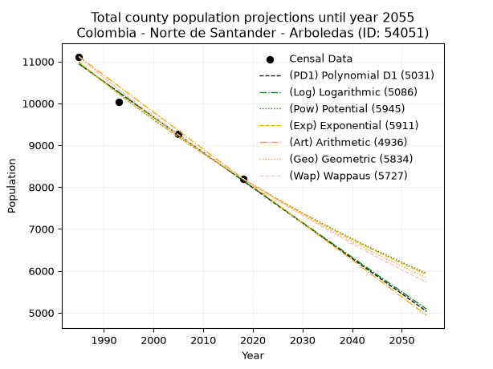
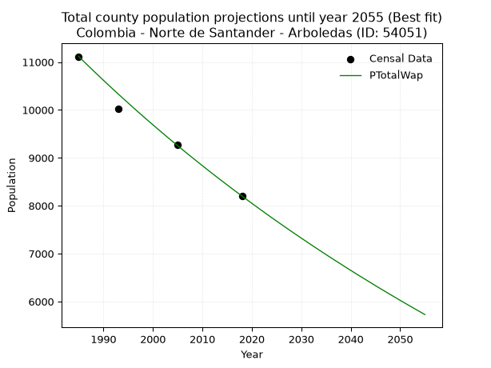
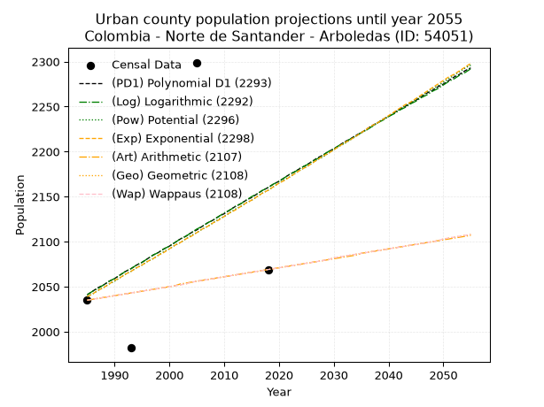
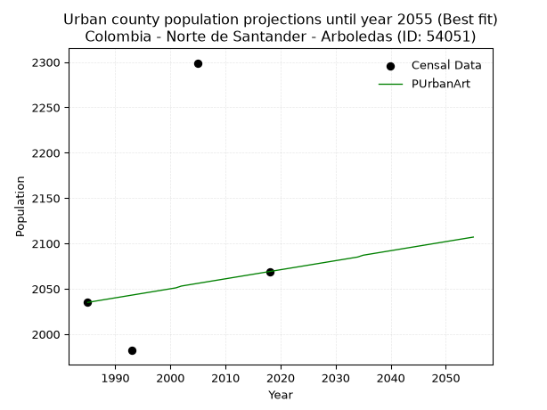
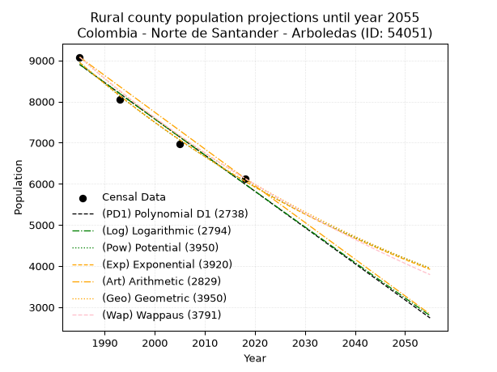
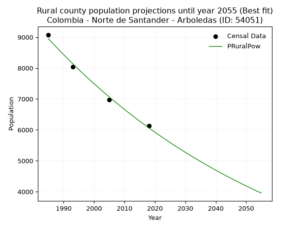

<div align="center">


</div>

# _“Population and Public Services Demand Projections (PPSD) until Year 2050 for Colombia - Norte de Santander - Arboledas (ID: 54051)”_
Keywords: `population` `public-service` `projection` `lineal` `polynomial` `logarithmic` `potential` `exponential` `arithmetic` `geometric` `wappaus` `dane` `colombia` `south-america`

PPSD are analytical estimates used by governments and planners to anticipate future changes in population size, age distribution, and the resulting community needs for utilities, healthcare, education, and infrastructure as sizing future water treatment facilities, electrical grids, and road networks based on spatial growth.

> **General running parameters**: • app_version: _v20260806_. • Python version: _3.14.7_. • Pandas version: _3.0.5_. • NumPy version: _2.5.1_. • Creates, save and include plots into reports (create_plot): _False_. • Projection until year: _2050_. • Process polynomial degree 2 and up: _False_. • Process Wappaus: _True_. • Process Wappaus: _True_. • Set negative values to zero: _True_. • Set infinite values to zero: _True_. • Drop dataset notes: _True_. 
<div align="center">

Dynamic map: [:earth_americas:Google](http://maps.google.com/maps?q=7.64298488,-72.7989523) [:earth_americas:OSM](https://www.openstreetmap.org/#map=18/7.64298488/-72.7989523&layers=P) [:earth_americas:Bing](https://www.bing.com/maps?cp=7.64298488~-72.7989523&lvl=18) [:earth_americas:Apple](https://maps.apple.com/frame?center=7.64298488%2C-72.7989523&span=0.003%2C0.006)

</div>


<div align="center">

```geojson
{
  "type": "Feature",
  "geometry": {
    "type": "Point", 
    "coordinates": [-72.7989523, 7.64298488]
  }, 
  "properties": {
    "Name": "Colombia - Norte de Santander - Arboledas (ID: 54051)"
  }
}
```

</div>


## 0. Census Data (4 records)

Census data are official statistics collected by a government about the people and housing in a country. They usually include counts of total population, age, sex, race, income, education, and jobs.

📅Global census file: [Population.xlsx](../data/Population.xlsx)

| Source   |   Year |   CountryID | CountryName   |   StateID | StateName          |   CountyID | CountyName   |   PTotal |   PUrban |   PRural |
|:---------|-------:|------------:|:--------------|----------:|:-------------------|-----------:|:-------------|---------:|---------:|---------:|
| DANE     |   1985 |          57 | Colombia      |        54 | Norte de Santander |      54051 | Arboledas    |    11115 |     2035 |     9080 |
| DANE     |   1993 |          57 | Colombia      |        54 | Norte de Santander |      54051 | Arboledas    |    10026 |     1982 |     8044 |
| DANE     |   2005 |          57 | Colombia      |        54 | Norte De Santander |      54051 | Arboledas    |     9270 |     2299 |     6971 |
| DANE     |   2018 |          57 | Colombia      |        54 | Norte de Santander |      54051 | Arboledas    |     8202 |     2069 |     6133 |

> 🔥Some records could had specific notes about the registered values or the corresponding urban or rural distribution.

## 1. Total

### 1.1. Coefficients and Parameters

* (PD1) Polynomial Deg 1: -84.42272179847376, 178519.79927739716 (lineal)
* (Log) Logarithmic: -169017.11619190333, 1294353.7045928242
* (Pow) Potential: -17.70893775363165, 62.440555686959925
* (Exp) Exponential: -0.008846476961840832, 464431767595.4468
* (Art) Arithmetic: Year diff. 2018 - 1985 = 33, Population diff. 8202 - 11115 = -2913, Annual growth = -88.27272727272727
* (Geo) Geometric: Year diff. 2018 - 1985 = 33, Population diff. 8202 - 11115 = -2913, Annual growth % = -0.009167343154323104
* (Wap) Wappaus: i = -0.9139382644585315, Condition values only valid for < 200)

<sub>
Wappaus condition values: ['-0.00', '-0.91', '-1.83', '-2.74', '-3.66', '-4.57', '-5.48', '-6.40', '-7.31', '-8.23', '-9.14', '-10.05', '-10.97', '-11.88', '-12.80', '-13.71', '-14.62', '-15.54', '-16.45', '-17.36', '-18.28', '-19.19', '-20.11', '-21.02', '-21.93', '-22.85', '-23.76', '-24.68', '-25.59', '-26.50', '-27.42', '-28.33', '-29.25', '-30.16', '-31.07', '-31.99', '-32.90', '-33.82', '-34.73', '-35.64', '-36.56', '-37.47', '-38.39', '-39.30', '-40.21', '-41.13', '-42.04', '-42.96', '-43.87', '-44.78', '-45.70', '-46.61', '-47.52', '-48.44', '-49.35', '-50.27', '-51.18', '-52.09', '-53.01', '-53.92', '-54.84', '-55.75', '-56.66', '-57.58', '-58.49', '-59.41']
</sub>


### 1.2. Projected Dataset

|   Year |   CountyID |   PTotalPD1 |   PTotalLog |   PTotalPow |   PTotalExp |   PTotalArt |   PTotalGeo |   PTotalWap |
|-------:|-----------:|------------:|------------:|------------:|------------:|------------:|------------:|------------:|
|   1985 |      54051 |       10941 |       10943 |       10983 |       10980 |       11115 |       11115 |       11115 |
|   1986 |      54051 |       10856 |       10858 |       10885 |       10883 |       11027 |       11013 |       11014 |
|   1987 |      54051 |       10772 |       10773 |       10789 |       10787 |       10938 |       10912 |       10914 |
|   1988 |      54051 |       10687 |       10688 |       10693 |       10692 |       10850 |       10812 |       10814 |
|   1989 |      54051 |       10603 |       10603 |       10598 |       10598 |       10762 |       10713 |       10716 |
|   1990 |      54051 |       10519 |       10518 |       10504 |       10505 |       10674 |       10615 |       10618 |
|   1991 |      54051 |       10434 |       10433 |       10411 |       10412 |       10585 |       10517 |       10522 |
|   1992 |      54051 |       10350 |       10349 |       10319 |       10321 |       10497 |       10421 |       10426 |
|   1993 |      54051 |       10265 |       10264 |       10228 |       10230 |       10409 |       10326 |       10331 |
|   1994 |      54051 |       10181 |       10179 |       10137 |       10140 |       10321 |       10231 |       10237 |
|   1995 |      54051 |       10096 |       10094 |       10048 |       10050 |       10232 |       10137 |       10144 |
|   1996 |      54051 |       10012 |       10009 |        9959 |        9962 |       10144 |       10044 |       10051 |
|   1997 |      54051 |        9928 |        9925 |        9871 |        9874 |       10056 |        9952 |        9959 |
|   1998 |      54051 |        9843 |        9840 |        9784 |        9787 |        9967 |        9861 |        9868 |
|   1999 |      54051 |        9759 |        9756 |        9698 |        9701 |        9879 |        9770 |        9778 |
|   2000 |      54051 |        9674 |        9671 |        9612 |        9615 |        9791 |        9681 |        9689 |
|   2001 |      54051 |        9590 |        9587 |        9527 |        9531 |        9703 |        9592 |        9600 |
|   2002 |      54051 |        9506 |        9502 |        9444 |        9447 |        9614 |        9504 |        9513 |
|   2003 |      54051 |        9421 |        9418 |        9360 |        9364 |        9526 |        9417 |        9425 |
|   2004 |      54051 |        9337 |        9333 |        9278 |        9281 |        9438 |        9331 |        9339 |
|   2005 |      54051 |        9252 |        9249 |        9196 |        9199 |        9350 |        9245 |        9253 |
|   2006 |      54051 |        9168 |        9165 |        9116 |        9118 |        9261 |        9160 |        9169 |
|   2007 |      54051 |        9083 |        9081 |        9035 |        9038 |        9173 |        9076 |        9084 |
|   2008 |      54051 |        8999 |        8996 |        8956 |        8958 |        9085 |        8993 |        9001 |
|   2009 |      54051 |        8915 |        8912 |        8877 |        8880 |        8996 |        8911 |        8918 |
|   2010 |      54051 |        8830 |        8828 |        8800 |        8801 |        8908 |        8829 |        8836 |
|   2011 |      54051 |        8746 |        8744 |        8722 |        8724 |        8820 |        8748 |        8754 |
|   2012 |      54051 |        8661 |        8660 |        8646 |        8647 |        8732 |        8668 |        8673 |
|   2013 |      54051 |        8577 |        8576 |        8570 |        8571 |        8643 |        8589 |        8593 |
|   2014 |      54051 |        8492 |        8492 |        8495 |        8495 |        8555 |        8510 |        8514 |
|   2015 |      54051 |        8408 |        8408 |        8421 |        8421 |        8467 |        8432 |        8435 |
|   2016 |      54051 |        8324 |        8324 |        8347 |        8346 |        8379 |        8354 |        8357 |
|   2017 |      54051 |        8239 |        8241 |        8274 |        8273 |        8290 |        8278 |        8279 |
|   2018 |      54051 |        8155 |        8157 |        8202 |        8200 |        8202 |        8202 |        8202 |
|   2019 |      54051 |        8070 |        8073 |        8130 |        8128 |        8114 |        8127 |        8126 |
|   2020 |      54051 |        7986 |        7989 |        8059 |        8056 |        8025 |        8052 |        8050 |
|   2021 |      54051 |        7901 |        7906 |        7989 |        7985 |        7937 |        7978 |        7975 |
|   2022 |      54051 |        7817 |        7822 |        7919 |        7915 |        7849 |        7905 |        7900 |
|   2023 |      54051 |        7733 |        7738 |        7850 |        7845 |        7761 |        7833 |        7826 |
|   2024 |      54051 |        7648 |        7655 |        7782 |        7776 |        7672 |        7761 |        7752 |
|   2025 |      54051 |        7564 |        7571 |        7714 |        7708 |        7584 |        7690 |        7680 |
|   2026 |      54051 |        7479 |        7488 |        7647 |        7640 |        7496 |        7619 |        7607 |
|   2027 |      54051 |        7395 |        7405 |        7580 |        7572 |        7408 |        7550 |        7535 |
|   2028 |      54051 |        7311 |        7321 |        7514 |        7506 |        7319 |        7480 |        7464 |
|   2029 |      54051 |        7226 |        7238 |        7449 |        7440 |        7231 |        7412 |        7394 |
|   2030 |      54051 |        7142 |        7155 |        7384 |        7374 |        7143 |        7344 |        7323 |
|   2031 |      54051 |        7057 |        7071 |        7320 |        7309 |        7054 |        7277 |        7254 |
|   2032 |      54051 |        6973 |        6988 |        7257 |        7245 |        6966 |        7210 |        7185 |
|   2033 |      54051 |        6888 |        6905 |        7194 |        7181 |        6878 |        7144 |        7116 |
|   2034 |      54051 |        6804 |        6822 |        7131 |        7118 |        6790 |        7078 |        7048 |
|   2035 |      54051 |        6720 |        6739 |        7070 |        7055 |        6701 |        7013 |        6980 |
|   2036 |      54051 |        6635 |        6656 |        7008 |        6993 |        6613 |        6949 |        6913 |
|   2037 |      54051 |        6551 |        6573 |        6948 |        6931 |        6525 |        6885 |        6847 |
|   2038 |      54051 |        6466 |        6490 |        6888 |        6870 |        6437 |        6822 |        6781 |
|   2039 |      54051 |        6382 |        6407 |        6828 |        6810 |        6348 |        6760 |        6715 |
|   2040 |      54051 |        6297 |        6324 |        6769 |        6750 |        6260 |        6698 |        6650 |
|   2041 |      54051 |        6213 |        6241 |        6710 |        6690 |        6172 |        6636 |        6585 |
|   2042 |      54051 |        6129 |        6158 |        6652 |        6631 |        6083 |        6575 |        6521 |
|   2043 |      54051 |        6044 |        6076 |        6595 |        6573 |        5995 |        6515 |        6458 |
|   2044 |      54051 |        5960 |        5993 |        6538 |        6515 |        5907 |        6455 |        6394 |
|   2045 |      54051 |        5875 |        5910 |        6482 |        6458 |        5819 |        6396 |        6331 |
|   2046 |      54051 |        5791 |        5828 |        6426 |        6401 |        5730 |        6338 |        6269 |
|   2047 |      54051 |        5706 |        5745 |        6371 |        6344 |        5642 |        6280 |        6207 |
|   2048 |      54051 |        5622 |        5663 |        6316 |        6289 |        5554 |        6222 |        6146 |
|   2049 |      54051 |        5538 |        5580 |        6261 |        6233 |        5466 |        6165 |        6085 |
|   2050 |      54051 |        5453 |        5498 |        6207 |        6178 |        5377 |        6108 |        6024 |
<div align="center">

</img>

</div>


### 1.3. Best fit with absolute and relative error (%)

Relative error puts that difference into context by dividing the absolute error by the true value, creating a unitless ratio or percentage that shows the scale of the mistake.

Absolute and relative error

|   Year | Source   |   CountryID | CountryName   |   StateID | StateName          |   CountyID_x | CountyName   |   PTotal |   PUrban |   PRural |   CountyID_y |   PTotalPD1 |   PTotalLog |   PTotalPow |   PTotalExp |   PTotalArt |   PTotalGeo |   PTotalWap |   PTotalPD1AbsError |   PTotalLogAbsError |   PTotalPowAbsError |   PTotalExpAbsError |   PTotalArtAbsError |   PTotalGeoAbsError |   PTotalWapAbsError |   PTotalPD1RelError |   PTotalLogRelError |   PTotalPowRelError |   PTotalExpRelError |   PTotalArtRelError |   PTotalGeoRelError |   PTotalWapRelError |
|-------:|:---------|------------:|:--------------|----------:|:-------------------|-------------:|:-------------|---------:|---------:|---------:|-------------:|------------:|------------:|------------:|------------:|------------:|------------:|------------:|--------------------:|--------------------:|--------------------:|--------------------:|--------------------:|--------------------:|--------------------:|--------------------:|--------------------:|--------------------:|--------------------:|--------------------:|--------------------:|--------------------:|
|   1985 | DANE     |          57 | Colombia      |        54 | Norte de Santander |        54051 | Arboledas    |    11115 |     2035 |     9080 |        54051 |       10941 |       10943 |       10983 |       10980 |       11115 |       11115 |       11115 |                 174 |                 172 |                 132 |                 135 |                   0 |                   0 |                   0 |            1.56545  |            1.54746  |            1.18758  |           1.21457   |            0        |            0        |            0        |
|   1993 | DANE     |          57 | Colombia      |        54 | Norte de Santander |        54051 | Arboledas    |    10026 |     1982 |     8044 |        54051 |       10265 |       10264 |       10228 |       10230 |       10409 |       10326 |       10331 |                 239 |                 238 |                 202 |                 204 |                 383 |                 300 |                 305 |            2.3838   |            2.37383  |            2.01476  |           2.03471   |            3.82007  |            2.99222  |            3.04209  |
|   2005 | DANE     |          57 | Colombia      |        54 | Norte De Santander |        54051 | Arboledas    |     9270 |     2299 |     6971 |        54051 |        9252 |        9249 |        9196 |        9199 |        9350 |        9245 |        9253 |                  18 |                  21 |                  74 |                  71 |                  80 |                  25 |                  17 |            0.194175 |            0.226537 |            0.798274 |           0.765912  |            0.862999 |            0.269687 |            0.183387 |
|   2018 | DANE     |          57 | Colombia      |        54 | Norte de Santander |        54051 | Arboledas    |     8202 |     2069 |     6133 |        54051 |        8155 |        8157 |        8202 |        8200 |        8202 |        8202 |        8202 |                  47 |                  45 |                   0 |                   2 |                   0 |                   0 |                   0 |            0.573031 |            0.548647 |            0        |           0.0243843 |            0        |            0        |            0        |

Relative error mean

| Method    |   RelError | Best   |
|:----------|-----------:|:-------|
| PTotalPD1 |   1.17911  |        |
| PTotalLog |   1.17412  |        |
| PTotalPow |   1.00015  |        |
| PTotalExp |   1.0099   |        |
| PTotalArt |   1.17077  |        |
| PTotalGeo |   0.815477 |        |
| PTotalWap |   0.806369 | True   |

💙Best method: _**PTotalWap**_
<div align="center">

</img>

</div>


### 1.4. Fresh water supply demand in liters per capita per day (lpcd)

The fresh water supply demand typically ranges from 100 to 300 liters per capita per day (lpcd) for standard domestic and municipal planning, though absolute survival minimums set by the World Health Organization are as low as 7.5 to 20 liters per day, and total consumption in high-income nations can exceed 400 liters.

> `CZ`: Level in meters above the sea level (masl).<br> `WS`: Fresh water supply demand in liters per capita per day (lpcd or l/h/d).<br> `WSAll`: Zonal fresh water supply demand in liters per second (l/s).<br> `A`: Zonal area in square meters.

Reference values (RAS Colombia)

|    CZ |   WS |
|------:|-----:|
|  1000 |  120 |
|  2000 |  130 |
| 99999 |  140 |

County shapefile geometry properties and water supply values

|   CountyID |      ATotal |   CZTotal |   WSTotal |
|-----------:|------------:|----------:|----------:|
|      54051 | 4.55219e+08 |   2177.32 |       140 |

Projected values for best method: PTotalWap

|   CountyID |   Year |   PTotalWap |   WSTotal |   WSTotalAll |
|-----------:|-------:|------------:|----------:|-------------:|
|      54051 |   1985 |       11115 |       140 |     18.0104  |
|      54051 |   1986 |       11014 |       140 |     17.8468  |
|      54051 |   1987 |       10914 |       140 |     17.6847  |
|      54051 |   1988 |       10814 |       140 |     17.5227  |
|      54051 |   1989 |       10716 |       140 |     17.3639  |
|      54051 |   1990 |       10618 |       140 |     17.2051  |
|      54051 |   1991 |       10522 |       140 |     17.0495  |
|      54051 |   1992 |       10426 |       140 |     16.894   |
|      54051 |   1993 |       10331 |       140 |     16.74    |
|      54051 |   1994 |       10237 |       140 |     16.5877  |
|      54051 |   1995 |       10144 |       140 |     16.437   |
|      54051 |   1996 |       10051 |       140 |     16.2863  |
|      54051 |   1997 |        9959 |       140 |     16.1373  |
|      54051 |   1998 |        9868 |       140 |     15.9898  |
|      54051 |   1999 |        9778 |       140 |     15.844   |
|      54051 |   2000 |        9689 |       140 |     15.6998  |
|      54051 |   2001 |        9600 |       140 |     15.5556  |
|      54051 |   2002 |        9513 |       140 |     15.4146  |
|      54051 |   2003 |        9425 |       140 |     15.272   |
|      54051 |   2004 |        9339 |       140 |     15.1326  |
|      54051 |   2005 |        9253 |       140 |     14.9933  |
|      54051 |   2006 |        9169 |       140 |     14.8572  |
|      54051 |   2007 |        9084 |       140 |     14.7194  |
|      54051 |   2008 |        9001 |       140 |     14.585   |
|      54051 |   2009 |        8918 |       140 |     14.4505  |
|      54051 |   2010 |        8836 |       140 |     14.3176  |
|      54051 |   2011 |        8754 |       140 |     14.1847  |
|      54051 |   2012 |        8673 |       140 |     14.0535  |
|      54051 |   2013 |        8593 |       140 |     13.9238  |
|      54051 |   2014 |        8514 |       140 |     13.7958  |
|      54051 |   2015 |        8435 |       140 |     13.6678  |
|      54051 |   2016 |        8357 |       140 |     13.5414  |
|      54051 |   2017 |        8279 |       140 |     13.415   |
|      54051 |   2018 |        8202 |       140 |     13.2903  |
|      54051 |   2019 |        8126 |       140 |     13.1671  |
|      54051 |   2020 |        8050 |       140 |     13.044   |
|      54051 |   2021 |        7975 |       140 |     12.9225  |
|      54051 |   2022 |        7900 |       140 |     12.8009  |
|      54051 |   2023 |        7826 |       140 |     12.681   |
|      54051 |   2024 |        7752 |       140 |     12.5611  |
|      54051 |   2025 |        7680 |       140 |     12.4444  |
|      54051 |   2026 |        7607 |       140 |     12.3262  |
|      54051 |   2027 |        7535 |       140 |     12.2095  |
|      54051 |   2028 |        7464 |       140 |     12.0944  |
|      54051 |   2029 |        7394 |       140 |     11.981   |
|      54051 |   2030 |        7323 |       140 |     11.866   |
|      54051 |   2031 |        7254 |       140 |     11.7542  |
|      54051 |   2032 |        7185 |       140 |     11.6424  |
|      54051 |   2033 |        7116 |       140 |     11.5306  |
|      54051 |   2034 |        7048 |       140 |     11.4204  |
|      54051 |   2035 |        6980 |       140 |     11.3102  |
|      54051 |   2036 |        6913 |       140 |     11.2016  |
|      54051 |   2037 |        6847 |       140 |     11.0947  |
|      54051 |   2038 |        6781 |       140 |     10.9877  |
|      54051 |   2039 |        6715 |       140 |     10.8808  |
|      54051 |   2040 |        6650 |       140 |     10.7755  |
|      54051 |   2041 |        6585 |       140 |     10.6701  |
|      54051 |   2042 |        6521 |       140 |     10.5664  |
|      54051 |   2043 |        6458 |       140 |     10.4644  |
|      54051 |   2044 |        6394 |       140 |     10.3606  |
|      54051 |   2045 |        6331 |       140 |     10.2586  |
|      54051 |   2046 |        6269 |       140 |     10.1581  |
|      54051 |   2047 |        6207 |       140 |     10.0576  |
|      54051 |   2048 |        6146 |       140 |      9.9588  |
|      54051 |   2049 |        6085 |       140 |      9.85995 |
|      54051 |   2050 |        6024 |       140 |      9.76111 |

## 2. Urban

### 2.1. Coefficients and Parameters

* (PD1) Polynomial Deg 1: 3.599759132878478, -5104.168205540176 (lineal)
* (Log) Logarithmic: 7229.871051774597, -52858.05780108928
* (Pow) Potential: 3.4336671160666743, -8.014053668301532
* (Exp) Exponential: 0.001709884539601582, 68.44936011502645
* (Art) Arithmetic: Year diff. 2018 - 1985 = 33, Population diff. 2069 - 2035 = 34, Annual growth = 1.0303030303030303
* (Geo) Geometric: Year diff. 2018 - 1985 = 33, Population diff. 2069 - 2035 = 34, Annual growth % = 0.0005022345584380083
* (Wap) Wappaus: i = 0.05020969933250635, Condition values only valid for < 200)

<sub>
Wappaus condition values: ['0.00', '0.05', '0.10', '0.15', '0.20', '0.25', '0.30', '0.35', '0.40', '0.45', '0.50', '0.55', '0.60', '0.65', '0.70', '0.75', '0.80', '0.85', '0.90', '0.95', '1.00', '1.05', '1.10', '1.15', '1.21', '1.26', '1.31', '1.36', '1.41', '1.46', '1.51', '1.56', '1.61', '1.66', '1.71', '1.76', '1.81', '1.86', '1.91', '1.96', '2.01', '2.06', '2.11', '2.16', '2.21', '2.26', '2.31', '2.36', '2.41', '2.46', '2.51', '2.56', '2.61', '2.66', '2.71', '2.76', '2.81', '2.86', '2.91', '2.96', '3.01', '3.06', '3.11', '3.16', '3.21', '3.26']
</sub>


### 2.2. Projected Dataset

|   Year |   CountyID |   PUrbanPD1 |   PUrbanLog |   PUrbanPow |   PUrbanExp |   PUrbanArt |   PUrbanGeo |   PUrbanWap |
|-------:|-----------:|------------:|------------:|------------:|------------:|------------:|------------:|------------:|
|   1985 |      54051 |        2041 |        2041 |        2039 |        2039 |        2035 |        2035 |        2035 |
|   1986 |      54051 |        2045 |        2045 |        2042 |        2042 |        2036 |        2036 |        2036 |
|   1987 |      54051 |        2049 |        2048 |        2046 |        2046 |        2037 |        2037 |        2037 |
|   1988 |      54051 |        2052 |        2052 |        2049 |        2049 |        2038 |        2038 |        2038 |
|   1989 |      54051 |        2056 |        2056 |        2053 |        2053 |        2039 |        2039 |        2039 |
|   1990 |      54051 |        2059 |        2059 |        2056 |        2057 |        2040 |        2040 |        2040 |
|   1991 |      54051 |        2063 |        2063 |        2060 |        2060 |        2041 |        2041 |        2041 |
|   1992 |      54051 |        2067 |        2067 |        2064 |        2064 |        2042 |        2042 |        2042 |
|   1993 |      54051 |        2070 |        2070 |        2067 |        2067 |        2043 |        2043 |        2043 |
|   1994 |      54051 |        2074 |        2074 |        2071 |        2071 |        2044 |        2044 |        2044 |
|   1995 |      54051 |        2077 |        2077 |        2074 |        2074 |        2045 |        2045 |        2045 |
|   1996 |      54051 |        2081 |        2081 |        2078 |        2078 |        2046 |        2046 |        2046 |
|   1997 |      54051 |        2085 |        2085 |        2081 |        2081 |        2047 |        2047 |        2047 |
|   1998 |      54051 |        2088 |        2088 |        2085 |        2085 |        2048 |        2048 |        2048 |
|   1999 |      54051 |        2092 |        2092 |        2089 |        2088 |        2049 |        2049 |        2049 |
|   2000 |      54051 |        2095 |        2095 |        2092 |        2092 |        2050 |        2050 |        2050 |
|   2001 |      54051 |        2099 |        2099 |        2096 |        2096 |        2051 |        2051 |        2051 |
|   2002 |      54051 |        2103 |        2103 |        2099 |        2099 |        2053 |        2052 |        2052 |
|   2003 |      54051 |        2106 |        2106 |        2103 |        2103 |        2054 |        2053 |        2053 |
|   2004 |      54051 |        2110 |        2110 |        2107 |        2106 |        2055 |        2055 |        2055 |
|   2005 |      54051 |        2113 |        2114 |        2110 |        2110 |        2056 |        2056 |        2056 |
|   2006 |      54051 |        2117 |        2117 |        2114 |        2114 |        2057 |        2057 |        2057 |
|   2007 |      54051 |        2121 |        2121 |        2117 |        2117 |        2058 |        2058 |        2058 |
|   2008 |      54051 |        2124 |        2124 |        2121 |        2121 |        2059 |        2059 |        2059 |
|   2009 |      54051 |        2128 |        2128 |        2125 |        2124 |        2060 |        2060 |        2060 |
|   2010 |      54051 |        2131 |        2132 |        2128 |        2128 |        2061 |        2061 |        2061 |
|   2011 |      54051 |        2135 |        2135 |        2132 |        2132 |        2062 |        2062 |        2062 |
|   2012 |      54051 |        2139 |        2139 |        2136 |        2135 |        2063 |        2063 |        2063 |
|   2013 |      54051 |        2142 |        2142 |        2139 |        2139 |        2064 |        2064 |        2064 |
|   2014 |      54051 |        2146 |        2146 |        2143 |        2143 |        2065 |        2065 |        2065 |
|   2015 |      54051 |        2149 |        2150 |        2146 |        2146 |        2066 |        2066 |        2066 |
|   2016 |      54051 |        2153 |        2153 |        2150 |        2150 |        2067 |        2067 |        2067 |
|   2017 |      54051 |        2157 |        2157 |        2154 |        2154 |        2068 |        2068 |        2068 |
|   2018 |      54051 |        2160 |        2160 |        2157 |        2157 |        2069 |        2069 |        2069 |
|   2019 |      54051 |        2164 |        2164 |        2161 |        2161 |        2070 |        2070 |        2070 |
|   2020 |      54051 |        2167 |        2167 |        2165 |        2165 |        2071 |        2071 |        2071 |
|   2021 |      54051 |        2171 |        2171 |        2169 |        2168 |        2072 |        2072 |        2072 |
|   2022 |      54051 |        2175 |        2175 |        2172 |        2172 |        2073 |        2073 |        2073 |
|   2023 |      54051 |        2178 |        2178 |        2176 |        2176 |        2074 |        2074 |        2074 |
|   2024 |      54051 |        2182 |        2182 |        2180 |        2180 |        2075 |        2075 |        2075 |
|   2025 |      54051 |        2185 |        2185 |        2183 |        2183 |        2076 |        2076 |        2076 |
|   2026 |      54051 |        2189 |        2189 |        2187 |        2187 |        2077 |        2077 |        2077 |
|   2027 |      54051 |        2193 |        2192 |        2191 |        2191 |        2078 |        2078 |        2078 |
|   2028 |      54051 |        2196 |        2196 |        2194 |        2195 |        2079 |        2079 |        2079 |
|   2029 |      54051 |        2200 |        2200 |        2198 |        2198 |        2080 |        2080 |        2080 |
|   2030 |      54051 |        2203 |        2203 |        2202 |        2202 |        2081 |        2082 |        2082 |
|   2031 |      54051 |        2207 |        2207 |        2206 |        2206 |        2082 |        2083 |        2083 |
|   2032 |      54051 |        2211 |        2210 |        2209 |        2210 |        2083 |        2084 |        2084 |
|   2033 |      54051 |        2214 |        2214 |        2213 |        2213 |        2084 |        2085 |        2085 |
|   2034 |      54051 |        2218 |        2217 |        2217 |        2217 |        2085 |        2086 |        2086 |
|   2035 |      54051 |        2221 |        2221 |        2221 |        2221 |        2087 |        2087 |        2087 |
|   2036 |      54051 |        2225 |        2224 |        2224 |        2225 |        2088 |        2088 |        2088 |
|   2037 |      54051 |        2229 |        2228 |        2228 |        2229 |        2089 |        2089 |        2089 |
|   2038 |      54051 |        2232 |        2232 |        2232 |        2232 |        2090 |        2090 |        2090 |
|   2039 |      54051 |        2236 |        2235 |        2236 |        2236 |        2091 |        2091 |        2091 |
|   2040 |      54051 |        2239 |        2239 |        2239 |        2240 |        2092 |        2092 |        2092 |
|   2041 |      54051 |        2243 |        2242 |        2243 |        2244 |        2093 |        2093 |        2093 |
|   2042 |      54051 |        2247 |        2246 |        2247 |        2248 |        2094 |        2094 |        2094 |
|   2043 |      54051 |        2250 |        2249 |        2251 |        2252 |        2095 |        2095 |        2095 |
|   2044 |      54051 |        2254 |        2253 |        2254 |        2255 |        2096 |        2096 |        2096 |
|   2045 |      54051 |        2257 |        2256 |        2258 |        2259 |        2097 |        2097 |        2097 |
|   2046 |      54051 |        2261 |        2260 |        2262 |        2263 |        2098 |        2098 |        2098 |
|   2047 |      54051 |        2265 |        2263 |        2266 |        2267 |        2099 |        2099 |        2099 |
|   2048 |      54051 |        2268 |        2267 |        2270 |        2271 |        2100 |        2100 |        2100 |
|   2049 |      54051 |        2272 |        2270 |        2273 |        2275 |        2101 |        2101 |        2101 |
|   2050 |      54051 |        2275 |        2274 |        2277 |        2279 |        2102 |        2103 |        2103 |
<div align="center">

</img>

</div>


### 2.3. Best fit with absolute and relative error (%)

Relative error puts that difference into context by dividing the absolute error by the true value, creating a unitless ratio or percentage that shows the scale of the mistake.

Absolute and relative error

|   Year | Source   |   CountryID | CountryName   |   StateID | StateName          |   CountyID_x | CountyName   |   PTotal |   PUrban |   PRural |   CountyID_y |   PUrbanPD1 |   PUrbanLog |   PUrbanPow |   PUrbanExp |   PUrbanArt |   PUrbanGeo |   PUrbanWap |   PUrbanPD1AbsError |   PUrbanLogAbsError |   PUrbanPowAbsError |   PUrbanExpAbsError |   PUrbanArtAbsError |   PUrbanGeoAbsError |   PUrbanWapAbsError |   PUrbanPD1RelError |   PUrbanLogRelError |   PUrbanPowRelError |   PUrbanExpRelError |   PUrbanArtRelError |   PUrbanGeoRelError |   PUrbanWapRelError |
|-------:|:---------|------------:|:--------------|----------:|:-------------------|-------------:|:-------------|---------:|---------:|---------:|-------------:|------------:|------------:|------------:|------------:|------------:|------------:|------------:|--------------------:|--------------------:|--------------------:|--------------------:|--------------------:|--------------------:|--------------------:|--------------------:|--------------------:|--------------------:|--------------------:|--------------------:|--------------------:|--------------------:|
|   1985 | DANE     |          57 | Colombia      |        54 | Norte de Santander |        54051 | Arboledas    |    11115 |     2035 |     9080 |        54051 |        2041 |        2041 |        2039 |        2039 |        2035 |        2035 |        2035 |                   6 |                   6 |                   4 |                   4 |                   0 |                   0 |                   0 |             0.29484 |             0.29484 |             0.19656 |             0.19656 |              0      |              0      |              0      |
|   1993 | DANE     |          57 | Colombia      |        54 | Norte de Santander |        54051 | Arboledas    |    10026 |     1982 |     8044 |        54051 |        2070 |        2070 |        2067 |        2067 |        2043 |        2043 |        2043 |                  88 |                  88 |                  85 |                  85 |                  61 |                  61 |                  61 |             4.43996 |             4.43996 |             4.2886  |             4.2886  |              3.0777 |              3.0777 |              3.0777 |
|   2005 | DANE     |          57 | Colombia      |        54 | Norte De Santander |        54051 | Arboledas    |     9270 |     2299 |     6971 |        54051 |        2113 |        2114 |        2110 |        2110 |        2056 |        2056 |        2056 |                 186 |                 185 |                 189 |                 189 |                 243 |                 243 |                 243 |             8.09047 |             8.04698 |             8.22097 |             8.22097 |             10.5698 |             10.5698 |             10.5698 |
|   2018 | DANE     |          57 | Colombia      |        54 | Norte de Santander |        54051 | Arboledas    |     8202 |     2069 |     6133 |        54051 |        2160 |        2160 |        2157 |        2157 |        2069 |        2069 |        2069 |                  91 |                  91 |                  88 |                  88 |                   0 |                   0 |                   0 |             4.39826 |             4.39826 |             4.25326 |             4.25326 |              0      |              0      |              0      |

Relative error mean

| Method    |   RelError | Best   |
|:----------|-----------:|:-------|
| PUrbanPD1 |    4.30588 |        |
| PUrbanLog |    4.29501 |        |
| PUrbanPow |    4.23985 |        |
| PUrbanExp |    4.23985 |        |
| PUrbanArt |    3.41188 | True   |
| PUrbanGeo |    3.41188 | True   |
| PUrbanWap |    3.41188 | True   |

💙Best method: _**PUrbanArt**_
<div align="center">

</img>

</div>


### 2.4. Fresh water supply demand in liters per capita per day (lpcd)

The fresh water supply demand typically ranges from 100 to 300 liters per capita per day (lpcd) for standard domestic and municipal planning, though absolute survival minimums set by the World Health Organization are as low as 7.5 to 20 liters per day, and total consumption in high-income nations can exceed 400 liters.

> `CZ`: Level in meters above the sea level (masl).<br> `WS`: Fresh water supply demand in liters per capita per day (lpcd or l/h/d).<br> `WSAll`: Zonal fresh water supply demand in liters per second (l/s).<br> `A`: Zonal area in square meters.

Reference values (RAS Colombia)

|    CZ |   WS |
|------:|-----:|
|  1000 |  120 |
|  2000 |  130 |
| 99999 |  140 |

County shapefile geometry properties and water supply values

|   CountyID |   AUrban |   CZUrban |   WSUrban |
|-----------:|---------:|----------:|----------:|
|      54051 |   369616 |   936.498 |       120 |

Projected values for best method: PUrbanArt

|   CountyID |   Year |   PUrbanArt |   WSUrban |   WSUrbanAll |
|-----------:|-------:|------------:|----------:|-------------:|
|      54051 |   1985 |        2035 |       120 |      2.82639 |
|      54051 |   1986 |        2036 |       120 |      2.82778 |
|      54051 |   1987 |        2037 |       120 |      2.82917 |
|      54051 |   1988 |        2038 |       120 |      2.83056 |
|      54051 |   1989 |        2039 |       120 |      2.83194 |
|      54051 |   1990 |        2040 |       120 |      2.83333 |
|      54051 |   1991 |        2041 |       120 |      2.83472 |
|      54051 |   1992 |        2042 |       120 |      2.83611 |
|      54051 |   1993 |        2043 |       120 |      2.8375  |
|      54051 |   1994 |        2044 |       120 |      2.83889 |
|      54051 |   1995 |        2045 |       120 |      2.84028 |
|      54051 |   1996 |        2046 |       120 |      2.84167 |
|      54051 |   1997 |        2047 |       120 |      2.84306 |
|      54051 |   1998 |        2048 |       120 |      2.84444 |
|      54051 |   1999 |        2049 |       120 |      2.84583 |
|      54051 |   2000 |        2050 |       120 |      2.84722 |
|      54051 |   2001 |        2051 |       120 |      2.84861 |
|      54051 |   2002 |        2053 |       120 |      2.85139 |
|      54051 |   2003 |        2054 |       120 |      2.85278 |
|      54051 |   2004 |        2055 |       120 |      2.85417 |
|      54051 |   2005 |        2056 |       120 |      2.85556 |
|      54051 |   2006 |        2057 |       120 |      2.85694 |
|      54051 |   2007 |        2058 |       120 |      2.85833 |
|      54051 |   2008 |        2059 |       120 |      2.85972 |
|      54051 |   2009 |        2060 |       120 |      2.86111 |
|      54051 |   2010 |        2061 |       120 |      2.8625  |
|      54051 |   2011 |        2062 |       120 |      2.86389 |
|      54051 |   2012 |        2063 |       120 |      2.86528 |
|      54051 |   2013 |        2064 |       120 |      2.86667 |
|      54051 |   2014 |        2065 |       120 |      2.86806 |
|      54051 |   2015 |        2066 |       120 |      2.86944 |
|      54051 |   2016 |        2067 |       120 |      2.87083 |
|      54051 |   2017 |        2068 |       120 |      2.87222 |
|      54051 |   2018 |        2069 |       120 |      2.87361 |
|      54051 |   2019 |        2070 |       120 |      2.875   |
|      54051 |   2020 |        2071 |       120 |      2.87639 |
|      54051 |   2021 |        2072 |       120 |      2.87778 |
|      54051 |   2022 |        2073 |       120 |      2.87917 |
|      54051 |   2023 |        2074 |       120 |      2.88056 |
|      54051 |   2024 |        2075 |       120 |      2.88194 |
|      54051 |   2025 |        2076 |       120 |      2.88333 |
|      54051 |   2026 |        2077 |       120 |      2.88472 |
|      54051 |   2027 |        2078 |       120 |      2.88611 |
|      54051 |   2028 |        2079 |       120 |      2.8875  |
|      54051 |   2029 |        2080 |       120 |      2.88889 |
|      54051 |   2030 |        2081 |       120 |      2.89028 |
|      54051 |   2031 |        2082 |       120 |      2.89167 |
|      54051 |   2032 |        2083 |       120 |      2.89306 |
|      54051 |   2033 |        2084 |       120 |      2.89444 |
|      54051 |   2034 |        2085 |       120 |      2.89583 |
|      54051 |   2035 |        2087 |       120 |      2.89861 |
|      54051 |   2036 |        2088 |       120 |      2.9     |
|      54051 |   2037 |        2089 |       120 |      2.90139 |
|      54051 |   2038 |        2090 |       120 |      2.90278 |
|      54051 |   2039 |        2091 |       120 |      2.90417 |
|      54051 |   2040 |        2092 |       120 |      2.90556 |
|      54051 |   2041 |        2093 |       120 |      2.90694 |
|      54051 |   2042 |        2094 |       120 |      2.90833 |
|      54051 |   2043 |        2095 |       120 |      2.90972 |
|      54051 |   2044 |        2096 |       120 |      2.91111 |
|      54051 |   2045 |        2097 |       120 |      2.9125  |
|      54051 |   2046 |        2098 |       120 |      2.91389 |
|      54051 |   2047 |        2099 |       120 |      2.91528 |
|      54051 |   2048 |        2100 |       120 |      2.91667 |
|      54051 |   2049 |        2101 |       120 |      2.91806 |
|      54051 |   2050 |        2102 |       120 |      2.91944 |

## 3. Rural

### 3.1. Coefficients and Parameters

* (PD1) Polynomial Deg 1: -88.02248093135228, 183623.96748293738 (lineal)
* (Log) Logarithmic: -176246.98724367798, 1347211.7623939137
* (Pow) Potential: -23.60357246072281, 81.79081421031334
* (Exp) Exponential: -0.0117898083097201, 130439442770384.2
* (Art) Arithmetic: Year diff. 2018 - 1985 = 33, Population diff. 6133 - 9080 = -2947, Annual growth = -89.3030303030303
* (Geo) Geometric: Year diff. 2018 - 1985 = 33, Population diff. 6133 - 9080 = -2947, Annual growth % = -0.011820197138562527
* (Wap) Wappaus: i = -1.1740357628742564, Condition values only valid for < 200)

<sub>
Wappaus condition values: ['-0.00', '-1.17', '-2.35', '-3.52', '-4.70', '-5.87', '-7.04', '-8.22', '-9.39', '-10.57', '-11.74', '-12.91', '-14.09', '-15.26', '-16.44', '-17.61', '-18.78', '-19.96', '-21.13', '-22.31', '-23.48', '-24.65', '-25.83', '-27.00', '-28.18', '-29.35', '-30.52', '-31.70', '-32.87', '-34.05', '-35.22', '-36.40', '-37.57', '-38.74', '-39.92', '-41.09', '-42.27', '-43.44', '-44.61', '-45.79', '-46.96', '-48.14', '-49.31', '-50.48', '-51.66', '-52.83', '-54.01', '-55.18', '-56.35', '-57.53', '-58.70', '-59.88', '-61.05', '-62.22', '-63.40', '-64.57', '-65.75', '-66.92', '-68.09', '-69.27', '-70.44', '-71.62', '-72.79', '-73.96', '-75.14', '-76.31']
</sub>


### 3.2. Projected Dataset

|   Year |   CountyID |   PRuralPD1 |   PRuralLog |   PRuralPow |   PRuralExp |   PRuralArt |   PRuralGeo |   PRuralWap |
|-------:|-----------:|------------:|------------:|------------:|------------:|------------:|------------:|------------:|
|   1985 |      54051 |        8899 |        8902 |        8951 |        8948 |        9080 |        9080 |        9080 |
|   1986 |      54051 |        8811 |        8814 |        8845 |        8843 |        8991 |        8973 |        8974 |
|   1987 |      54051 |        8723 |        8725 |        8741 |        8739 |        8901 |        8867 |        8869 |
|   1988 |      54051 |        8635 |        8636 |        8638 |        8637 |        8812 |        8762 |        8766 |
|   1989 |      54051 |        8547 |        8548 |        8536 |        8536 |        8723 |        8658 |        8663 |
|   1990 |      54051 |        8459 |        8459 |        8435 |        8436 |        8633 |        8556 |        8562 |
|   1991 |      54051 |        8371 |        8371 |        8336 |        8337 |        8544 |        8455 |        8462 |
|   1992 |      54051 |        8283 |        8282 |        8238 |        8239 |        8455 |        8355 |        8363 |
|   1993 |      54051 |        8195 |        8194 |        8141 |        8142 |        8366 |        8256 |        8265 |
|   1994 |      54051 |        8107 |        8105 |        8045 |        8047 |        8276 |        8158 |        8169 |
|   1995 |      54051 |        8019 |        8017 |        7950 |        7953 |        8187 |        8062 |        8073 |
|   1996 |      54051 |        7931 |        7928 |        7857 |        7859 |        8098 |        7967 |        7978 |
|   1997 |      54051 |        7843 |        7840 |        7764 |        7767 |        8008 |        7873 |        7885 |
|   1998 |      54051 |        7755 |        7752 |        7673 |        7676 |        7919 |        7780 |        7792 |
|   1999 |      54051 |        7667 |        7664 |        7583 |        7586 |        7830 |        7688 |        7701 |
|   2000 |      54051 |        7579 |        7576 |        7494 |        7497 |        7740 |        7597 |        7610 |
|   2001 |      54051 |        7491 |        7488 |        7406 |        7410 |        7651 |        7507 |        7521 |
|   2002 |      54051 |        7403 |        7399 |        7319 |        7323 |        7562 |        7418 |        7432 |
|   2003 |      54051 |        7315 |        7311 |        7234 |        7237 |        7473 |        7330 |        7345 |
|   2004 |      54051 |        7227 |        7223 |        7149 |        7152 |        7383 |        7244 |        7258 |
|   2005 |      54051 |        7139 |        7136 |        7065 |        7068 |        7294 |        7158 |        7172 |
|   2006 |      54051 |        7051 |        7048 |        6982 |        6985 |        7205 |        7074 |        7087 |
|   2007 |      54051 |        6963 |        6960 |        6901 |        6904 |        7115 |        6990 |        7003 |
|   2008 |      54051 |        6875 |        6872 |        6820 |        6823 |        7026 |        6907 |        6920 |
|   2009 |      54051 |        6787 |        6784 |        6740 |        6743 |        6937 |        6826 |        6837 |
|   2010 |      54051 |        6699 |        6697 |        6662 |        6664 |        6847 |        6745 |        6756 |
|   2011 |      54051 |        6611 |        6609 |        6584 |        6586 |        6758 |        6665 |        6675 |
|   2012 |      54051 |        6523 |        6521 |        6507 |        6508 |        6669 |        6587 |        6596 |
|   2013 |      54051 |        6435 |        6434 |        6431 |        6432 |        6580 |        6509 |        6516 |
|   2014 |      54051 |        6347 |        6346 |        6356 |        6357 |        6490 |        6432 |        6438 |
|   2015 |      54051 |        6259 |        6259 |        6282 |        6282 |        6401 |        6356 |        6361 |
|   2016 |      54051 |        6171 |        6171 |        6209 |        6209 |        6312 |        6281 |        6284 |
|   2017 |      54051 |        6083 |        6084 |        6137 |        6136 |        6222 |        6206 |        6208 |
|   2018 |      54051 |        5995 |        5996 |        6066 |        6064 |        6133 |        6133 |        6133 |
|   2019 |      54051 |        5907 |        5909 |        5995 |        5993 |        6044 |        6061 |        6059 |
|   2020 |      54051 |        5819 |        5822 |        5925 |        5923 |        5954 |        5989 |        5985 |
|   2021 |      54051 |        5731 |        5735 |        5857 |        5853 |        5865 |        5918 |        5912 |
|   2022 |      54051 |        5643 |        5647 |        5789 |        5785 |        5776 |        5848 |        5840 |
|   2023 |      54051 |        5554 |        5560 |        5721 |        5717 |        5686 |        5779 |        5768 |
|   2024 |      54051 |        5466 |        5473 |        5655 |        5650 |        5597 |        5711 |        5697 |
|   2025 |      54051 |        5378 |        5386 |        5589 |        5583 |        5508 |        5643 |        5627 |
|   2026 |      54051 |        5290 |        5299 |        5525 |        5518 |        5419 |        5576 |        5557 |
|   2027 |      54051 |        5202 |        5212 |        5461 |        5453 |        5329 |        5511 |        5488 |
|   2028 |      54051 |        5114 |        5125 |        5398 |        5389 |        5240 |        5445 |        5420 |
|   2029 |      54051 |        5026 |        5038 |        5335 |        5326 |        5151 |        5381 |        5352 |
|   2030 |      54051 |        4938 |        4952 |        5273 |        5264 |        5061 |        5317 |        5285 |
|   2031 |      54051 |        4850 |        4865 |        5212 |        5202 |        4972 |        5255 |        5219 |
|   2032 |      54051 |        4762 |        4778 |        5152 |        5141 |        4883 |        5193 |        5153 |
|   2033 |      54051 |        4674 |        4691 |        5093 |        5081 |        4793 |        5131 |        5088 |
|   2034 |      54051 |        4586 |        4605 |        5034 |        5021 |        4704 |        5070 |        5023 |
|   2035 |      54051 |        4498 |        4518 |        4976 |        4963 |        4615 |        5011 |        4959 |
|   2036 |      54051 |        4410 |        4431 |        4919 |        4904 |        4526 |        4951 |        4896 |
|   2037 |      54051 |        4322 |        4345 |        4862 |        4847 |        4436 |        4893 |        4833 |
|   2038 |      54051 |        4234 |        4258 |        4806 |        4790 |        4347 |        4835 |        4771 |
|   2039 |      54051 |        4146 |        4172 |        4751 |        4734 |        4258 |        4778 |        4709 |
|   2040 |      54051 |        4058 |        4085 |        4696 |        4678 |        4168 |        4721 |        4648 |
|   2041 |      54051 |        3970 |        3999 |        4642 |        4624 |        4079 |        4666 |        4587 |
|   2042 |      54051 |        3882 |        3913 |        4589 |        4569 |        3990 |        4610 |        4527 |
|   2043 |      54051 |        3794 |        3826 |        4536 |        4516 |        3900 |        4556 |        4467 |
|   2044 |      54051 |        3706 |        3740 |        4484 |        4463 |        3811 |        4502 |        4408 |
|   2045 |      54051 |        3618 |        3654 |        4432 |        4411 |        3722 |        4449 |        4350 |
|   2046 |      54051 |        3530 |        3568 |        4381 |        4359 |        3633 |        4396 |        4292 |
|   2047 |      54051 |        3442 |        3482 |        4331 |        4308 |        3543 |        4344 |        4234 |
|   2048 |      54051 |        3354 |        3396 |        4282 |        4257 |        3454 |        4293 |        4177 |
|   2049 |      54051 |        3266 |        3310 |        4232 |        4207 |        3365 |        4242 |        4121 |
|   2050 |      54051 |        3178 |        3224 |        4184 |        4158 |        3275 |        4192 |        4065 |
<div align="center">

</img>

</div>


### 3.3. Best fit with absolute and relative error (%)

Relative error puts that difference into context by dividing the absolute error by the true value, creating a unitless ratio or percentage that shows the scale of the mistake.

Absolute and relative error

|   Year | Source   |   CountryID | CountryName   |   StateID | StateName          |   CountyID_x | CountyName   |   PTotal |   PUrban |   PRural |   CountyID_y |   PRuralPD1 |   PRuralLog |   PRuralPow |   PRuralExp |   PRuralArt |   PRuralGeo |   PRuralWap |   PRuralPD1AbsError |   PRuralLogAbsError |   PRuralPowAbsError |   PRuralExpAbsError |   PRuralArtAbsError |   PRuralGeoAbsError |   PRuralWapAbsError |   PRuralPD1RelError |   PRuralLogRelError |   PRuralPowRelError |   PRuralExpRelError |   PRuralArtRelError |   PRuralGeoRelError |   PRuralWapRelError |
|-------:|:---------|------------:|:--------------|----------:|:-------------------|-------------:|:-------------|---------:|---------:|---------:|-------------:|------------:|------------:|------------:|------------:|------------:|------------:|------------:|--------------------:|--------------------:|--------------------:|--------------------:|--------------------:|--------------------:|--------------------:|--------------------:|--------------------:|--------------------:|--------------------:|--------------------:|--------------------:|--------------------:|
|   1985 | DANE     |          57 | Colombia      |        54 | Norte de Santander |        54051 | Arboledas    |    11115 |     2035 |     9080 |        54051 |        8899 |        8902 |        8951 |        8948 |        9080 |        9080 |        9080 |                 181 |                 178 |                 129 |                 132 |                   0 |                   0 |                   0 |             1.99339 |             1.96035 |             1.4207  |             1.45374 |             0       |             0       |             0       |
|   1993 | DANE     |          57 | Colombia      |        54 | Norte de Santander |        54051 | Arboledas    |    10026 |     1982 |     8044 |        54051 |        8195 |        8194 |        8141 |        8142 |        8366 |        8256 |        8265 |                 151 |                 150 |                  97 |                  98 |                 322 |                 212 |                 221 |             1.87718 |             1.86474 |             1.20587 |             1.2183  |             4.00298 |             2.6355  |             2.74739 |
|   2005 | DANE     |          57 | Colombia      |        54 | Norte De Santander |        54051 | Arboledas    |     9270 |     2299 |     6971 |        54051 |        7139 |        7136 |        7065 |        7068 |        7294 |        7158 |        7172 |                 168 |                 165 |                  94 |                  97 |                 323 |                 187 |                 201 |             2.40998 |             2.36695 |             1.34844 |             1.39148 |             4.63348 |             2.68254 |             2.88337 |
|   2018 | DANE     |          57 | Colombia      |        54 | Norte de Santander |        54051 | Arboledas    |     8202 |     2069 |     6133 |        54051 |        5995 |        5996 |        6066 |        6064 |        6133 |        6133 |        6133 |                 138 |                 137 |                  67 |                  69 |                   0 |                   0 |                   0 |             2.25012 |             2.23382 |             1.09245 |             1.12506 |             0       |             0       |             0       |

Relative error mean

| Method    |   RelError | Best   |
|:----------|-----------:|:-------|
| PRuralPD1 |    2.13267 |        |
| PRuralLog |    2.10647 |        |
| PRuralPow |    1.26687 | True   |
| PRuralExp |    1.29715 |        |
| PRuralArt |    2.15912 |        |
| PRuralGeo |    1.32951 |        |
| PRuralWap |    1.40769 |        |

💙Best method: _**PRuralPow**_
<div align="center">

</img>

</div>


### 3.4. Fresh water supply demand in liters per capita per day (lpcd)

The fresh water supply demand typically ranges from 100 to 300 liters per capita per day (lpcd) for standard domestic and municipal planning, though absolute survival minimums set by the World Health Organization are as low as 7.5 to 20 liters per day, and total consumption in high-income nations can exceed 400 liters.

> `CZ`: Level in meters above the sea level (masl).<br> `WS`: Fresh water supply demand in liters per capita per day (lpcd or l/h/d).<br> `WSAll`: Zonal fresh water supply demand in liters per second (l/s).<br> `A`: Zonal area in square meters.

Reference values (RAS Colombia)

|    CZ |   WS |
|------:|-----:|
|  1000 |  120 |
|  2000 |  130 |
| 99999 |  140 |

County shapefile geometry properties and water supply values

|   CountyID |     ARural |   CZRural |   WSRural |
|-----------:|-----------:|----------:|----------:|
|      54051 | 4.5485e+08 |   2178.29 |       140 |

Projected values for best method: PRuralPow

|   CountyID |   Year |   PRuralPow |   WSRural |   WSRuralAll |
|-----------:|-------:|------------:|----------:|-------------:|
|      54051 |   1985 |        8951 |       140 |     14.5039  |
|      54051 |   1986 |        8845 |       140 |     14.3322  |
|      54051 |   1987 |        8741 |       140 |     14.1637  |
|      54051 |   1988 |        8638 |       140 |     13.9968  |
|      54051 |   1989 |        8536 |       140 |     13.8315  |
|      54051 |   1990 |        8435 |       140 |     13.6678  |
|      54051 |   1991 |        8336 |       140 |     13.5074  |
|      54051 |   1992 |        8238 |       140 |     13.3486  |
|      54051 |   1993 |        8141 |       140 |     13.1914  |
|      54051 |   1994 |        8045 |       140 |     13.0359  |
|      54051 |   1995 |        7950 |       140 |     12.8819  |
|      54051 |   1996 |        7857 |       140 |     12.7312  |
|      54051 |   1997 |        7764 |       140 |     12.5806  |
|      54051 |   1998 |        7673 |       140 |     12.4331  |
|      54051 |   1999 |        7583 |       140 |     12.2873  |
|      54051 |   2000 |        7494 |       140 |     12.1431  |
|      54051 |   2001 |        7406 |       140 |     12.0005  |
|      54051 |   2002 |        7319 |       140 |     11.8595  |
|      54051 |   2003 |        7234 |       140 |     11.7218  |
|      54051 |   2004 |        7149 |       140 |     11.584   |
|      54051 |   2005 |        7065 |       140 |     11.4479  |
|      54051 |   2006 |        6982 |       140 |     11.3134  |
|      54051 |   2007 |        6901 |       140 |     11.1822  |
|      54051 |   2008 |        6820 |       140 |     11.0509  |
|      54051 |   2009 |        6740 |       140 |     10.9213  |
|      54051 |   2010 |        6662 |       140 |     10.7949  |
|      54051 |   2011 |        6584 |       140 |     10.6685  |
|      54051 |   2012 |        6507 |       140 |     10.5437  |
|      54051 |   2013 |        6431 |       140 |     10.4206  |
|      54051 |   2014 |        6356 |       140 |     10.2991  |
|      54051 |   2015 |        6282 |       140 |     10.1792  |
|      54051 |   2016 |        6209 |       140 |     10.0609  |
|      54051 |   2017 |        6137 |       140 |      9.94421 |
|      54051 |   2018 |        6066 |       140 |      9.82917 |
|      54051 |   2019 |        5995 |       140 |      9.71412 |
|      54051 |   2020 |        5925 |       140 |      9.60069 |
|      54051 |   2021 |        5857 |       140 |      9.49051 |
|      54051 |   2022 |        5789 |       140 |      9.38032 |
|      54051 |   2023 |        5721 |       140 |      9.27014 |
|      54051 |   2024 |        5655 |       140 |      9.16319 |
|      54051 |   2025 |        5589 |       140 |      9.05625 |
|      54051 |   2026 |        5525 |       140 |      8.95255 |
|      54051 |   2027 |        5461 |       140 |      8.84884 |
|      54051 |   2028 |        5398 |       140 |      8.74676 |
|      54051 |   2029 |        5335 |       140 |      8.64468 |
|      54051 |   2030 |        5273 |       140 |      8.54421 |
|      54051 |   2031 |        5212 |       140 |      8.44537 |
|      54051 |   2032 |        5152 |       140 |      8.34815 |
|      54051 |   2033 |        5093 |       140 |      8.25255 |
|      54051 |   2034 |        5034 |       140 |      8.15694 |
|      54051 |   2035 |        4976 |       140 |      8.06296 |
|      54051 |   2036 |        4919 |       140 |      7.9706  |
|      54051 |   2037 |        4862 |       140 |      7.87824 |
|      54051 |   2038 |        4806 |       140 |      7.7875  |
|      54051 |   2039 |        4751 |       140 |      7.69838 |
|      54051 |   2040 |        4696 |       140 |      7.60926 |
|      54051 |   2041 |        4642 |       140 |      7.52176 |
|      54051 |   2042 |        4589 |       140 |      7.43588 |
|      54051 |   2043 |        4536 |       140 |      7.35    |
|      54051 |   2044 |        4484 |       140 |      7.26574 |
|      54051 |   2045 |        4432 |       140 |      7.18148 |
|      54051 |   2046 |        4381 |       140 |      7.09884 |
|      54051 |   2047 |        4331 |       140 |      7.01782 |
|      54051 |   2048 |        4282 |       140 |      6.93843 |
|      54051 |   2049 |        4232 |       140 |      6.85741 |
|      54051 |   2050 |        4184 |       140 |      6.77963 |

<div align="center"><br><sub>Share this research</sub></div><br>

<sub>**APPS & TOOLS & CONTENT DISCLAIMER**: • NO WARRANTY - This content and software is provided by <a href="https://github.com/rcfdtools" target="_blank">github.com/rcfdtools</a> "as is", without any express or implied warranty, including warranties of merchantability, fitness for a particular purpose, or non-infringement. There is no guarantee that the software will be error-free or operate without interruption. • LIMITATION OF LIABILITY - Neither the authors nor copyright holders will be liable for claims or damages arising from the software or its use. You are responsible for determining if the software is appropriate for your use and assume all associated risks, including errors, legal compliance, and data loss. • NO PROFESSIONAL ADVICE - The software provides general information and does not offer professional advice. It should not replace consultation with professional advisors. [Clauses and global license for rcfdtools use.](https://github.com/rcfdtools/rcfdtools/blob/main/LICENSE.md)</sub>