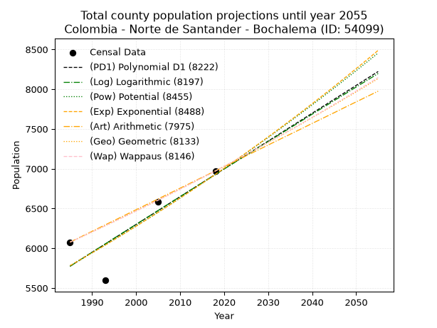
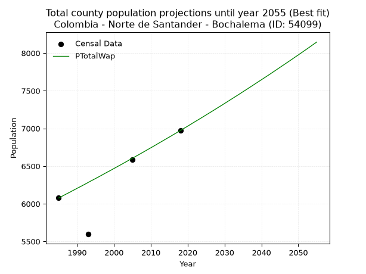
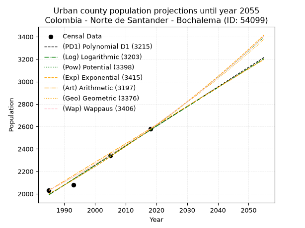
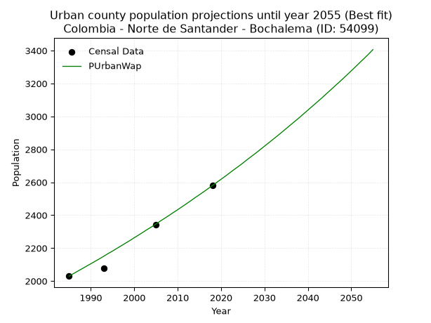
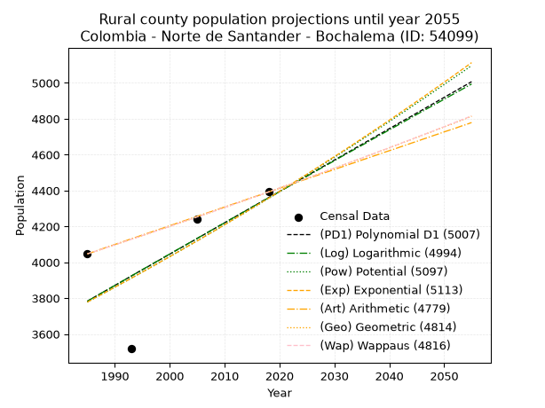
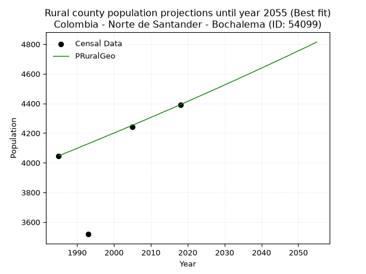

<div align="center">


</div>

# 📜 _“Population and Public Services Demand Projections (PPSD) until Year 2050 for Colombia - Norte de Santander - Bochalema (ID: 54099)”_
Keywords: `population` `public-service` `projection` `lineal` `polynomial` `logarithmic` `potential` `exponential` `arithmetic` `geometric` `wappaus` `dane` `colombia` `south-america`

PPSD are analytical estimates used by governments and planners to anticipate future changes in population size, age distribution, and the resulting community needs for utilities, healthcare, education, and infrastructure as sizing future water treatment facilities, electrical grids, and road networks based on spatial growth.

<div align="center">

</img>

</div>


> **General running parameters**: • app_version: _v20260806_. • Python version: _3.14.7_. • Pandas version: _3.0.5_. • NumPy version: _2.5.1_. • Creates, save and include plots into reports (create_plot): _False_. • Projection until year: _2050_. • Process polynomial degree 2 and up: _False_. • Process Wappaus: _True_. • Process Wappaus: _True_. • Set negative values to zero: _True_. • Set infinite values to zero: _True_. • Drop dataset notes: _True_. 
<div align="center">

Dynamic map: [:earth_americas:Google](http://maps.google.com/maps?q=7.612191708,-72.6470102) [:earth_americas:OSM](https://www.openstreetmap.org/#map=18/7.612191708/-72.6470102&layers=P) [:earth_americas:Bing](https://www.bing.com/maps?cp=7.612191708~-72.6470102&lvl=18) [:earth_americas:Apple](https://maps.apple.com/frame?center=7.612191708%2C-72.6470102&span=0.003%2C0.006)

</div>


<div align="center">

```geojson
{
  "type": "Feature",
  "geometry": {
    "type": "Point", 
    "coordinates": [-72.6470102, 7.612191708]
  }, 
  "properties": {
    "Name": "Colombia - Norte de Santander - Bochalema (ID: 54099)"
  }
}
```

</div>


## 0. Census Data (4 records)

Census data are official statistics collected by a government about the people and housing in a country. They usually include counts of total population, age, sex, race, income, education, and jobs.

📅Global census file: [Population.xlsx](../data/Population.xlsx)

| Source   |   Year |   CountryID | CountryName   |   StateID | StateName          |   CountyID | CountyName   |   PTotal |   PUrban |   PRural |
|:---------|-------:|------------:|:--------------|----------:|:-------------------|-----------:|:-------------|---------:|---------:|---------:|
| DANE     |   1985 |          57 | Colombia      |        54 | Norte de Santander |      54099 | Bochalema    |     6077 |     2030 |     4047 |
| DANE     |   1993 |          57 | Colombia      |        54 | Norte de Santander |      54099 | Bochalema    |     5596 |     2078 |     3518 |
| DANE     |   2005 |          57 | Colombia      |        54 | Norte de Santander |      54099 | Bochalema    |     6583 |     2341 |     4242 |
| DANE     |   2018 |          57 | Colombia      |        54 | Norte de Santander |      54099 | Bochalema    |     6972 |     2580 |     4392 |

> 🔥Some records could had specific notes about the registered values or the corresponding urban or rural distribution.

📅[SUI-RUPS](https://www.datos.gov.co/Hacienda-y-Cr-dito-P-blico/Registro-nico-de-Prestadores-de-Servicios-P-blicos/4qkq-csdn/about_data) - Local public utility companies: [RUPS.csv](../data/RUPS.csv)

 | SERVICIO       | ESTADO    | NOMBRE                                                  | NIT         | DEPARTAMENTO_DOMICILIO   | MUNICIPIO_DOMICILIO   | DIRECCION                         |   TELEFONO | EMAIL                   | TIPO_PRESTADOR                 | CLASIFICACION                 |
|:---------------|:----------|:--------------------------------------------------------|:------------|:-------------------------|:----------------------|:----------------------------------|-----------:|:------------------------|:-------------------------------|:------------------------------|
| ACUEDUCTO      | OPERATIVA | UNIDAD DE SERVICIOS PUBLICOS DEL MUNICIPIO DE BOCHALEMA | 890505662-3 | NORTE DE SANTANDER       | BOCHALEMA             | Calle 3 No 3-08 Palacio Municipal |    5863014 | edilsonc_72@hotmail.com | MUNICIPIO (PRESTACIÓN DIRECTA) | MENOR O IGUAL A 2500 USUARIOS |
| ALCANTARILLADO | OPERATIVA | UNIDAD DE SERVICIOS PUBLICOS DEL MUNICIPIO DE BOCHALEMA | 890505662-3 | NORTE DE SANTANDER       | BOCHALEMA             | Calle 3 No 3-08 Palacio Municipal |    5863014 | edilsonc_72@hotmail.com | MUNICIPIO (PRESTACIÓN DIRECTA) | MENOR O IGUAL A 2500 USUARIOS |

## 1. Total

### 1.1. Coefficients and Parameters

* (PD1) Polynomial Deg 1: 34.9690887193895, -63639.91971095884 (lineal)
* (Log) Logarithmic: 69944.0924570501, -525338.6072628185
* (Pow) Potential: 10.972840540791116, -32.42384173033679
* (Exp) Exponential: 0.005486022430867519, 0.10780598400088047
* (Art) Arithmetic: Year diff. 2018 - 1985 = 33, Population diff. 6972 - 6077 = 895, Annual growth = 27.12121212121212
* (Geo) Geometric: Year diff. 2018 - 1985 = 33, Population diff. 6972 - 6077 = 895, Annual growth % = 0.004172041699142426
* (Wap) Wappaus: i = 0.4156826135521821, Condition values only valid for < 200)

<sub>
Wappaus condition values: ['0.00', '0.42', '0.83', '1.25', '1.66', '2.08', '2.49', '2.91', '3.33', '3.74', '4.16', '4.57', '4.99', '5.40', '5.82', '6.24', '6.65', '7.07', '7.48', '7.90', '8.31', '8.73', '9.15', '9.56', '9.98', '10.39', '10.81', '11.22', '11.64', '12.05', '12.47', '12.89', '13.30', '13.72', '14.13', '14.55', '14.96', '15.38', '15.80', '16.21', '16.63', '17.04', '17.46', '17.87', '18.29', '18.71', '19.12', '19.54', '19.95', '20.37', '20.78', '21.20', '21.62', '22.03', '22.45', '22.86', '23.28', '23.69', '24.11', '24.53', '24.94', '25.36', '25.77', '26.19', '26.60', '27.02']
</sub>


### 1.2. Projected Dataset

|   Year |   CountyID |   PTotalPD1 |   PTotalLog |   PTotalPow |   PTotalExp |   PTotalArt |   PTotalGeo |   PTotalWap |
|-------:|-----------:|------------:|------------:|------------:|------------:|------------:|------------:|------------:|
|   1985 |      54099 |        5774 |        5773 |        5780 |        5781 |        6077 |        6077 |        6077 |
|   1986 |      54099 |        5809 |        5808 |        5812 |        5813 |        6104 |        6102 |        6102 |
|   1987 |      54099 |        5844 |        5843 |        5845 |        5845 |        6131 |        6128 |        6128 |
|   1988 |      54099 |        5879 |        5879 |        5877 |        5877 |        6158 |        6153 |        6153 |
|   1989 |      54099 |        5914 |        5914 |        5910 |        5909 |        6185 |        6179 |        6179 |
|   1990 |      54099 |        5949 |        5949 |        5942 |        5942 |        6213 |        6205 |        6205 |
|   1991 |      54099 |        5984 |        5984 |        5975 |        5974 |        6240 |        6231 |        6230 |
|   1992 |      54099 |        6019 |        6019 |        6008 |        6007 |        6267 |        6257 |        6256 |
|   1993 |      54099 |        6053 |        6054 |        6041 |        6040 |        6294 |        6283 |        6283 |
|   1994 |      54099 |        6088 |        6089 |        6075 |        6074 |        6321 |        6309 |        6309 |
|   1995 |      54099 |        6123 |        6125 |        6108 |        6107 |        6348 |        6335 |        6335 |
|   1996 |      54099 |        6158 |        6160 |        6142 |        6141 |        6375 |        6362 |        6361 |
|   1997 |      54099 |        6193 |        6195 |        6176 |        6174 |        6402 |        6388 |        6388 |
|   1998 |      54099 |        6228 |        6230 |        6210 |        6208 |        6430 |        6415 |        6415 |
|   1999 |      54099 |        6263 |        6265 |        6244 |        6243 |        6457 |        6442 |        6441 |
|   2000 |      54099 |        6298 |        6300 |        6278 |        6277 |        6484 |        6469 |        6468 |
|   2001 |      54099 |        6333 |        6335 |        6313 |        6311 |        6511 |        6496 |        6495 |
|   2002 |      54099 |        6368 |        6370 |        6347 |        6346 |        6538 |        6523 |        6522 |
|   2003 |      54099 |        6403 |        6404 |        6382 |        6381 |        6565 |        6550 |        6549 |
|   2004 |      54099 |        6438 |        6439 |        6417 |        6416 |        6592 |        6577 |        6577 |
|   2005 |      54099 |        6473 |        6474 |        6453 |        6451 |        6619 |        6605 |        6604 |
|   2006 |      54099 |        6508 |        6509 |        6488 |        6487 |        6647 |        6632 |        6632 |
|   2007 |      54099 |        6543 |        6544 |        6524 |        6523 |        6674 |        6660 |        6659 |
|   2008 |      54099 |        6578 |        6579 |        6559 |        6558 |        6701 |        6688 |        6687 |
|   2009 |      54099 |        6613 |        6614 |        6595 |        6595 |        6728 |        6716 |        6715 |
|   2010 |      54099 |        6648 |        6648 |        6631 |        6631 |        6755 |        6744 |        6743 |
|   2011 |      54099 |        6683 |        6683 |        6668 |        6667 |        6782 |        6772 |        6771 |
|   2012 |      54099 |        6718 |        6718 |        6704 |        6704 |        6809 |        6800 |        6800 |
|   2013 |      54099 |        6753 |        6753 |        6741 |        6741 |        6836 |        6828 |        6828 |
|   2014 |      54099 |        6788 |        6788 |        6778 |        6778 |        6864 |        6857 |        6857 |
|   2015 |      54099 |        6823 |        6822 |        6815 |        6815 |        6891 |        6885 |        6885 |
|   2016 |      54099 |        6858 |        6857 |        6852 |        6853 |        6918 |        6914 |        6914 |
|   2017 |      54099 |        6893 |        6892 |        6889 |        6890 |        6945 |        6943 |        6943 |
|   2018 |      54099 |        6928 |        6926 |        6927 |        6928 |        6972 |        6972 |        6972 |
|   2019 |      54099 |        6963 |        6961 |        6965 |        6966 |        6999 |        7001 |        7001 |
|   2020 |      54099 |        6998 |        6996 |        7002 |        7005 |        7026 |        7030 |        7030 |
|   2021 |      54099 |        7033 |        7030 |        7041 |        7043 |        7053 |        7060 |        7060 |
|   2022 |      54099 |        7068 |        7065 |        7079 |        7082 |        7080 |        7089 |        7090 |
|   2023 |      54099 |        7103 |        7099 |        7117 |        7121 |        7108 |        7119 |        7119 |
|   2024 |      54099 |        7138 |        7134 |        7156 |        7160 |        7135 |        7148 |        7149 |
|   2025 |      54099 |        7172 |        7168 |        7195 |        7200 |        7162 |        7178 |        7179 |
|   2026 |      54099 |        7207 |        7203 |        7234 |        7239 |        7189 |        7208 |        7209 |
|   2027 |      54099 |        7242 |        7238 |        7273 |        7279 |        7216 |        7238 |        7239 |
|   2028 |      54099 |        7277 |        7272 |        7313 |        7319 |        7243 |        7268 |        7270 |
|   2029 |      54099 |        7312 |        7307 |        7353 |        7359 |        7270 |        7299 |        7300 |
|   2030 |      54099 |        7347 |        7341 |        7392 |        7400 |        7297 |        7329 |        7331 |
|   2031 |      54099 |        7382 |        7375 |        7432 |        7440 |        7325 |        7360 |        7362 |
|   2032 |      54099 |        7417 |        7410 |        7473 |        7481 |        7352 |        7390 |        7393 |
|   2033 |      54099 |        7452 |        7444 |        7513 |        7523 |        7379 |        7421 |        7424 |
|   2034 |      54099 |        7487 |        7479 |        7554 |        7564 |        7406 |        7452 |        7455 |
|   2035 |      54099 |        7522 |        7513 |        7595 |        7606 |        7433 |        7483 |        7487 |
|   2036 |      54099 |        7557 |        7547 |        7636 |        7647 |        7460 |        7515 |        7518 |
|   2037 |      54099 |        7592 |        7582 |        7677 |        7689 |        7487 |        7546 |        7550 |
|   2038 |      54099 |        7627 |        7616 |        7718 |        7732 |        7514 |        7577 |        7582 |
|   2039 |      54099 |        7662 |        7650 |        7760 |        7774 |        7542 |        7609 |        7614 |
|   2040 |      54099 |        7697 |        7685 |        7802 |        7817 |        7569 |        7641 |        7646 |
|   2041 |      54099 |        7732 |        7719 |        7844 |        7860 |        7596 |        7673 |        7678 |
|   2042 |      54099 |        7767 |        7753 |        7886 |        7903 |        7623 |        7705 |        7710 |
|   2043 |      54099 |        7802 |        7787 |        7929 |        7947 |        7650 |        7737 |        7743 |
|   2044 |      54099 |        7837 |        7822 |        7971 |        7990 |        7677 |        7769 |        7776 |
|   2045 |      54099 |        7872 |        7856 |        8014 |        8034 |        7704 |        7801 |        7809 |
|   2046 |      54099 |        7907 |        7890 |        8057 |        8079 |        7731 |        7834 |        7842 |
|   2047 |      54099 |        7942 |        7924 |        8101 |        8123 |        7759 |        7867 |        7875 |
|   2048 |      54099 |        7977 |        7958 |        8144 |        8168 |        7786 |        7900 |        7908 |
|   2049 |      54099 |        8012 |        7993 |        8188 |        8213 |        7813 |        7932 |        7942 |
|   2050 |      54099 |        8047 |        8027 |        8232 |        8258 |        7840 |        7966 |        7975 |
<div align="center">

</img>

</div>


### 1.3. Best fit with absolute and relative error (%)

Relative error puts that difference into context by dividing the absolute error by the true value, creating a unitless ratio or percentage that shows the scale of the mistake.

Absolute and relative error

|   Year | Source   |   CountryID | CountryName   |   StateID | StateName          |   CountyID_x | CountyName   |   PTotal |   PUrban |   PRural |   CountyID_y |   PTotalPD1 |   PTotalLog |   PTotalPow |   PTotalExp |   PTotalArt |   PTotalGeo |   PTotalWap |   PTotalPD1AbsError |   PTotalLogAbsError |   PTotalPowAbsError |   PTotalExpAbsError |   PTotalArtAbsError |   PTotalGeoAbsError |   PTotalWapAbsError |   PTotalPD1RelError |   PTotalLogRelError |   PTotalPowRelError |   PTotalExpRelError |   PTotalArtRelError |   PTotalGeoRelError |   PTotalWapRelError |
|-------:|:---------|------------:|:--------------|----------:|:-------------------|-------------:|:-------------|---------:|---------:|---------:|-------------:|------------:|------------:|------------:|------------:|------------:|------------:|------------:|--------------------:|--------------------:|--------------------:|--------------------:|--------------------:|--------------------:|--------------------:|--------------------:|--------------------:|--------------------:|--------------------:|--------------------:|--------------------:|--------------------:|
|   1985 | DANE     |          57 | Colombia      |        54 | Norte de Santander |        54099 | Bochalema    |     6077 |     2030 |     4047 |        54099 |        5774 |        5773 |        5780 |        5781 |        6077 |        6077 |        6077 |                 303 |                 304 |                 297 |                 296 |                   0 |                   0 |                   0 |            4.98601  |            5.00247  |            4.88728  |            4.87082  |            0        |            0        |            0        |
|   1993 | DANE     |          57 | Colombia      |        54 | Norte de Santander |        54099 | Bochalema    |     5596 |     2078 |     3518 |        54099 |        6053 |        6054 |        6041 |        6040 |        6294 |        6283 |        6283 |                 457 |                 458 |                 445 |                 444 |                 698 |                 687 |                 687 |            8.16655  |            8.18442  |            7.95211  |            7.93424  |           12.4732   |           12.2766   |           12.2766   |
|   2005 | DANE     |          57 | Colombia      |        54 | Norte de Santander |        54099 | Bochalema    |     6583 |     2341 |     4242 |        54099 |        6473 |        6474 |        6453 |        6451 |        6619 |        6605 |        6604 |                 110 |                 109 |                 130 |                 132 |                  36 |                  22 |                  21 |            1.67097  |            1.65578  |            1.97478  |            2.00516  |            0.546863 |            0.334194 |            0.319003 |
|   2018 | DANE     |          57 | Colombia      |        54 | Norte de Santander |        54099 | Bochalema    |     6972 |     2580 |     4392 |        54099 |        6928 |        6926 |        6927 |        6928 |        6972 |        6972 |        6972 |                  44 |                  46 |                  45 |                  44 |                   0 |                   0 |                   0 |            0.631096 |            0.659782 |            0.645439 |            0.631096 |            0        |            0        |            0        |

Relative error mean

| Method    |   RelError | Best   |
|:----------|-----------:|:-------|
| PTotalPD1 |    3.86366 |        |
| PTotalLog |    3.87561 |        |
| PTotalPow |    3.8649  |        |
| PTotalExp |    3.86033 |        |
| PTotalArt |    3.25501 |        |
| PTotalGeo |    3.15271 |        |
| PTotalWap |    3.14891 | True   |

💙Best method: _**PTotalWap**_
<div align="center">

</img>

</div>


### 1.4. Fresh water supply demand in liters per capita per day (lpcd)

The fresh water supply demand typically ranges from 100 to 300 liters per capita per day (lpcd) for standard domestic and municipal planning, though absolute survival minimums set by the World Health Organization are as low as 7.5 to 20 liters per day, and total consumption in high-income nations can exceed 400 liters.

> `CZ`: Level in meters above the sea level (masl)<br> `WS`: Fresh water supply demand in liters per capita per day (lpcd or l/h/d)<br> `WSAll`: Zonal fresh water supply demand in liters per second (l/s)<br> `A`: Zonal area in square meters<br> `DP`: Population density (people/hectare or p/ha)

Reference values (RAS Colombia)

|    CZ |   WS |
|------:|-----:|
|  1000 |  120 |
|  2000 |  130 |
| 99999 |  140 |

County shapefile geometry properties and water supply values

|   CountyID |      ATotal |   CZTotal |   WSTotal |
|-----------:|------------:|----------:|----------:|
|      54099 | 1.69964e+08 |   1521.57 |       130 |

Projected values for best method: PTotalWap

|   CountyID |   Year |   PTotalWap |   DPTotal |   WSTotal |   WSTotalAll |
|-----------:|-------:|------------:|----------:|----------:|-------------:|
|      54099 |   1985 |        6077 |      0.36 |       130 |      9.14363 |
|      54099 |   1986 |        6102 |      0.36 |       130 |      9.18125 |
|      54099 |   1987 |        6128 |      0.36 |       130 |      9.22037 |
|      54099 |   1988 |        6153 |      0.36 |       130 |      9.25799 |
|      54099 |   1989 |        6179 |      0.36 |       130 |      9.29711 |
|      54099 |   1990 |        6205 |      0.37 |       130 |      9.33623 |
|      54099 |   1991 |        6230 |      0.37 |       130 |      9.37384 |
|      54099 |   1992 |        6256 |      0.37 |       130 |      9.41296 |
|      54099 |   1993 |        6283 |      0.37 |       130 |      9.45359 |
|      54099 |   1994 |        6309 |      0.37 |       130 |      9.49271 |
|      54099 |   1995 |        6335 |      0.37 |       130 |      9.53183 |
|      54099 |   1996 |        6361 |      0.37 |       130 |      9.57095 |
|      54099 |   1997 |        6388 |      0.38 |       130 |      9.61157 |
|      54099 |   1998 |        6415 |      0.38 |       130 |      9.6522  |
|      54099 |   1999 |        6441 |      0.38 |       130 |      9.69132 |
|      54099 |   2000 |        6468 |      0.38 |       130 |      9.73194 |
|      54099 |   2001 |        6495 |      0.38 |       130 |      9.77257 |
|      54099 |   2002 |        6522 |      0.38 |       130 |      9.81319 |
|      54099 |   2003 |        6549 |      0.39 |       130 |      9.85382 |
|      54099 |   2004 |        6577 |      0.39 |       130 |      9.89595 |
|      54099 |   2005 |        6604 |      0.39 |       130 |      9.93657 |
|      54099 |   2006 |        6632 |      0.39 |       130 |      9.9787  |
|      54099 |   2007 |        6659 |      0.39 |       130 |     10.0193  |
|      54099 |   2008 |        6687 |      0.39 |       130 |     10.0615  |
|      54099 |   2009 |        6715 |      0.4  |       130 |     10.1036  |
|      54099 |   2010 |        6743 |      0.4  |       130 |     10.1457  |
|      54099 |   2011 |        6771 |      0.4  |       130 |     10.1878  |
|      54099 |   2012 |        6800 |      0.4  |       130 |     10.2315  |
|      54099 |   2013 |        6828 |      0.4  |       130 |     10.2736  |
|      54099 |   2014 |        6857 |      0.4  |       130 |     10.3172  |
|      54099 |   2015 |        6885 |      0.41 |       130 |     10.3594  |
|      54099 |   2016 |        6914 |      0.41 |       130 |     10.403   |
|      54099 |   2017 |        6943 |      0.41 |       130 |     10.4466  |
|      54099 |   2018 |        6972 |      0.41 |       130 |     10.4903  |
|      54099 |   2019 |        7001 |      0.41 |       130 |     10.5339  |
|      54099 |   2020 |        7030 |      0.41 |       130 |     10.5775  |
|      54099 |   2021 |        7060 |      0.42 |       130 |     10.6227  |
|      54099 |   2022 |        7090 |      0.42 |       130 |     10.6678  |
|      54099 |   2023 |        7119 |      0.42 |       130 |     10.7115  |
|      54099 |   2024 |        7149 |      0.42 |       130 |     10.7566  |
|      54099 |   2025 |        7179 |      0.42 |       130 |     10.8017  |
|      54099 |   2026 |        7209 |      0.42 |       130 |     10.8469  |
|      54099 |   2027 |        7239 |      0.43 |       130 |     10.892   |
|      54099 |   2028 |        7270 |      0.43 |       130 |     10.9387  |
|      54099 |   2029 |        7300 |      0.43 |       130 |     10.9838  |
|      54099 |   2030 |        7331 |      0.43 |       130 |     11.0304  |
|      54099 |   2031 |        7362 |      0.43 |       130 |     11.0771  |
|      54099 |   2032 |        7393 |      0.43 |       130 |     11.1237  |
|      54099 |   2033 |        7424 |      0.44 |       130 |     11.1704  |
|      54099 |   2034 |        7455 |      0.44 |       130 |     11.217   |
|      54099 |   2035 |        7487 |      0.44 |       130 |     11.2652  |
|      54099 |   2036 |        7518 |      0.44 |       130 |     11.3118  |
|      54099 |   2037 |        7550 |      0.44 |       130 |     11.36    |
|      54099 |   2038 |        7582 |      0.45 |       130 |     11.4081  |
|      54099 |   2039 |        7614 |      0.45 |       130 |     11.4563  |
|      54099 |   2040 |        7646 |      0.45 |       130 |     11.5044  |
|      54099 |   2041 |        7678 |      0.45 |       130 |     11.5525  |
|      54099 |   2042 |        7710 |      0.45 |       130 |     11.6007  |
|      54099 |   2043 |        7743 |      0.46 |       130 |     11.6503  |
|      54099 |   2044 |        7776 |      0.46 |       130 |     11.7     |
|      54099 |   2045 |        7809 |      0.46 |       130 |     11.7497  |
|      54099 |   2046 |        7842 |      0.46 |       130 |     11.7993  |
|      54099 |   2047 |        7875 |      0.46 |       130 |     11.849   |
|      54099 |   2048 |        7908 |      0.47 |       130 |     11.8986  |
|      54099 |   2049 |        7942 |      0.47 |       130 |     11.9498  |
|      54099 |   2050 |        7975 |      0.47 |       130 |     11.9994  |

## 2. Urban

### 2.1. Coefficients and Parameters

* (PD1) Polynomial Deg 1: 17.489763147330205, -32726.648735447245 (lineal)
* (Log) Logarithmic: 34999.56660885463, -263774.73626282887
* (Pow) Potential: 15.307292103302455, -47.17899141942722
* (Exp) Exponential: 0.007648767018080075, 0.0005094195433936359
* (Art) Arithmetic: Year diff. 2018 - 1985 = 33, Population diff. 2580 - 2030 = 550, Annual growth = 16.666666666666668
* (Geo) Geometric: Year diff. 2018 - 1985 = 33, Population diff. 2580 - 2030 = 550, Annual growth % = 0.007291716822565464
* (Wap) Wappaus: i = 0.7230657989877078, Condition values only valid for < 200)

<sub>
Wappaus condition values: ['0.00', '0.72', '1.45', '2.17', '2.89', '3.62', '4.34', '5.06', '5.78', '6.51', '7.23', '7.95', '8.68', '9.40', '10.12', '10.85', '11.57', '12.29', '13.02', '13.74', '14.46', '15.18', '15.91', '16.63', '17.35', '18.08', '18.80', '19.52', '20.25', '20.97', '21.69', '22.42', '23.14', '23.86', '24.58', '25.31', '26.03', '26.75', '27.48', '28.20', '28.92', '29.65', '30.37', '31.09', '31.81', '32.54', '33.26', '33.98', '34.71', '35.43', '36.15', '36.88', '37.60', '38.32', '39.05', '39.77', '40.49', '41.21', '41.94', '42.66', '43.38', '44.11', '44.83', '45.55', '46.28', '47.00']
</sub>


### 2.2. Projected Dataset

|   Year |   CountyID |   PUrbanPD1 |   PUrbanLog |   PUrbanPow |   PUrbanExp |   PUrbanArt |   PUrbanGeo |   PUrbanWap |
|-------:|-----------:|------------:|------------:|------------:|------------:|------------:|------------:|------------:|
|   1985 |      54099 |        1991 |        1990 |        1999 |        1999 |        2030 |        2030 |        2030 |
|   1986 |      54099 |        2008 |        2008 |        2014 |        2015 |        2047 |        2045 |        2045 |
|   1987 |      54099 |        2026 |        2025 |        2030 |        2030 |        2063 |        2060 |        2060 |
|   1988 |      54099 |        2043 |        2043 |        2046 |        2046 |        2080 |        2075 |        2075 |
|   1989 |      54099 |        2060 |        2061 |        2061 |        2061 |        2097 |        2090 |        2090 |
|   1990 |      54099 |        2078 |        2078 |        2077 |        2077 |        2113 |        2105 |        2105 |
|   1991 |      54099 |        2095 |        2096 |        2093 |        2093 |        2130 |        2120 |        2120 |
|   1992 |      54099 |        2113 |        2113 |        2110 |        2109 |        2147 |        2136 |        2135 |
|   1993 |      54099 |        2130 |        2131 |        2126 |        2125 |        2163 |        2151 |        2151 |
|   1994 |      54099 |        2148 |        2148 |        2142 |        2142 |        2180 |        2167 |        2167 |
|   1995 |      54099 |        2165 |        2166 |        2159 |        2158 |        2197 |        2183 |        2182 |
|   1996 |      54099 |        2183 |        2183 |        2175 |        2175 |        2213 |        2199 |        2198 |
|   1997 |      54099 |        2200 |        2201 |        2192 |        2192 |        2230 |        2215 |        2214 |
|   1998 |      54099 |        2218 |        2219 |        2209 |        2208 |        2247 |        2231 |        2230 |
|   1999 |      54099 |        2235 |        2236 |        2226 |        2225 |        2263 |        2247 |        2246 |
|   2000 |      54099 |        2253 |        2254 |        2243 |        2242 |        2280 |        2264 |        2263 |
|   2001 |      54099 |        2270 |        2271 |        2260 |        2260 |        2297 |        2280 |        2279 |
|   2002 |      54099 |        2288 |        2289 |        2278 |        2277 |        2313 |        2297 |        2296 |
|   2003 |      54099 |        2305 |        2306 |        2295 |        2294 |        2330 |        2314 |        2313 |
|   2004 |      54099 |        2323 |        2323 |        2313 |        2312 |        2347 |        2330 |        2329 |
|   2005 |      54099 |        2340 |        2341 |        2330 |        2330 |        2363 |        2347 |        2346 |
|   2006 |      54099 |        2358 |        2358 |        2348 |        2348 |        2380 |        2365 |        2364 |
|   2007 |      54099 |        2375 |        2376 |        2366 |        2366 |        2397 |        2382 |        2381 |
|   2008 |      54099 |        2393 |        2393 |        2384 |        2384 |        2413 |        2399 |        2398 |
|   2009 |      54099 |        2410 |        2411 |        2403 |        2402 |        2430 |        2417 |        2416 |
|   2010 |      54099 |        2428 |        2428 |        2421 |        2421 |        2447 |        2434 |        2433 |
|   2011 |      54099 |        2445 |        2446 |        2440 |        2439 |        2463 |        2452 |        2451 |
|   2012 |      54099 |        2463 |        2463 |        2458 |        2458 |        2480 |        2470 |        2469 |
|   2013 |      54099 |        2480 |        2480 |        2477 |        2477 |        2497 |        2488 |        2487 |
|   2014 |      54099 |        2498 |        2498 |        2496 |        2496 |        2513 |        2506 |        2506 |
|   2015 |      54099 |        2515 |        2515 |        2515 |        2515 |        2530 |        2524 |        2524 |
|   2016 |      54099 |        2533 |        2532 |        2534 |        2534 |        2547 |        2543 |        2542 |
|   2017 |      54099 |        2550 |        2550 |        2553 |        2554 |        2563 |        2561 |        2561 |
|   2018 |      54099 |        2568 |        2567 |        2573 |        2573 |        2580 |        2580 |        2580 |
|   2019 |      54099 |        2585 |        2584 |        2592 |        2593 |        2597 |        2599 |        2599 |
|   2020 |      54099 |        2603 |        2602 |        2612 |        2613 |        2613 |        2618 |        2618 |
|   2021 |      54099 |        2620 |        2619 |        2632 |        2633 |        2630 |        2637 |        2637 |
|   2022 |      54099 |        2638 |        2636 |        2652 |        2653 |        2647 |        2656 |        2657 |
|   2023 |      54099 |        2655 |        2654 |        2672 |        2674 |        2663 |        2675 |        2677 |
|   2024 |      54099 |        2673 |        2671 |        2692 |        2694 |        2680 |        2695 |        2696 |
|   2025 |      54099 |        2690 |        2688 |        2713 |        2715 |        2697 |        2715 |        2716 |
|   2026 |      54099 |        2708 |        2706 |        2733 |        2736 |        2713 |        2734 |        2737 |
|   2027 |      54099 |        2725 |        2723 |        2754 |        2757 |        2730 |        2754 |        2757 |
|   2028 |      54099 |        2743 |        2740 |        2775 |        2778 |        2747 |        2774 |        2777 |
|   2029 |      54099 |        2760 |        2757 |        2796 |        2799 |        2763 |        2795 |        2798 |
|   2030 |      54099 |        2778 |        2775 |        2817 |        2821 |        2780 |        2815 |        2819 |
|   2031 |      54099 |        2795 |        2792 |        2839 |        2842 |        2797 |        2836 |        2840 |
|   2032 |      54099 |        2813 |        2809 |        2860 |        2864 |        2813 |        2856 |        2861 |
|   2033 |      54099 |        2830 |        2826 |        2882 |        2886 |        2830 |        2877 |        2882 |
|   2034 |      54099 |        2848 |        2844 |        2903 |        2908 |        2847 |        2898 |        2904 |
|   2035 |      54099 |        2865 |        2861 |        2925 |        2931 |        2863 |        2919 |        2926 |
|   2036 |      54099 |        2883 |        2878 |        2947 |        2953 |        2880 |        2940 |        2948 |
|   2037 |      54099 |        2900 |        2895 |        2970 |        2976 |        2897 |        2962 |        2970 |
|   2038 |      54099 |        2917 |        2912 |        2992 |        2999 |        2913 |        2983 |        2992 |
|   2039 |      54099 |        2935 |        2929 |        3015 |        3022 |        2930 |        3005 |        3015 |
|   2040 |      54099 |        2952 |        2947 |        3037 |        3045 |        2947 |        3027 |        3038 |
|   2041 |      54099 |        2970 |        2964 |        3060 |        3068 |        2963 |        3049 |        3061 |
|   2042 |      54099 |        2987 |        2981 |        3083 |        3092 |        2980 |        3071 |        3084 |
|   2043 |      54099 |        3005 |        2998 |        3106 |        3116 |        2997 |        3094 |        3107 |
|   2044 |      54099 |        3022 |        3015 |        3130 |        3140 |        3013 |        3116 |        3131 |
|   2045 |      54099 |        3040 |        3032 |        3153 |        3164 |        3030 |        3139 |        3155 |
|   2046 |      54099 |        3057 |        3049 |        3177 |        3188 |        3047 |        3162 |        3179 |
|   2047 |      54099 |        3075 |        3067 |        3201 |        3212 |        3063 |        3185 |        3203 |
|   2048 |      54099 |        3092 |        3084 |        3225 |        3237 |        3080 |        3208 |        3227 |
|   2049 |      54099 |        3110 |        3101 |        3249 |        3262 |        3097 |        3232 |        3252 |
|   2050 |      54099 |        3127 |        3118 |        3273 |        3287 |        3113 |        3255 |        3277 |
<div align="center">

</img>

</div>


### 2.3. Best fit with absolute and relative error (%)

Relative error puts that difference into context by dividing the absolute error by the true value, creating a unitless ratio or percentage that shows the scale of the mistake.

Absolute and relative error

|   Year | Source   |   CountryID | CountryName   |   StateID | StateName          |   CountyID_x | CountyName   |   PTotal |   PUrban |   PRural |   CountyID_y |   PUrbanPD1 |   PUrbanLog |   PUrbanPow |   PUrbanExp |   PUrbanArt |   PUrbanGeo |   PUrbanWap |   PUrbanPD1AbsError |   PUrbanLogAbsError |   PUrbanPowAbsError |   PUrbanExpAbsError |   PUrbanArtAbsError |   PUrbanGeoAbsError |   PUrbanWapAbsError |   PUrbanPD1RelError |   PUrbanLogRelError |   PUrbanPowRelError |   PUrbanExpRelError |   PUrbanArtRelError |   PUrbanGeoRelError |   PUrbanWapRelError |
|-------:|:---------|------------:|:--------------|----------:|:-------------------|-------------:|:-------------|---------:|---------:|---------:|-------------:|------------:|------------:|------------:|------------:|------------:|------------:|------------:|--------------------:|--------------------:|--------------------:|--------------------:|--------------------:|--------------------:|--------------------:|--------------------:|--------------------:|--------------------:|--------------------:|--------------------:|--------------------:|--------------------:|
|   1985 | DANE     |          57 | Colombia      |        54 | Norte de Santander |        54099 | Bochalema    |     6077 |     2030 |     4047 |        54099 |        1991 |        1990 |        1999 |        1999 |        2030 |        2030 |        2030 |                  39 |                  40 |                  31 |                  31 |                   0 |                   0 |                   0 |           1.92118   |            1.97044  |            1.52709  |            1.52709  |            0        |            0        |            0        |
|   1993 | DANE     |          57 | Colombia      |        54 | Norte de Santander |        54099 | Bochalema    |     5596 |     2078 |     3518 |        54099 |        2130 |        2131 |        2126 |        2125 |        2163 |        2151 |        2151 |                  52 |                  53 |                  48 |                  47 |                  85 |                  73 |                  73 |           2.50241   |            2.55053  |            2.30991  |            2.26179  |            4.09047  |            3.51299  |            3.51299  |
|   2005 | DANE     |          57 | Colombia      |        54 | Norte de Santander |        54099 | Bochalema    |     6583 |     2341 |     4242 |        54099 |        2340 |        2341 |        2330 |        2330 |        2363 |        2347 |        2346 |                   1 |                   0 |                  11 |                  11 |                  22 |                   6 |                   5 |           0.0427168 |            0        |            0.469885 |            0.469885 |            0.939769 |            0.256301 |            0.213584 |
|   2018 | DANE     |          57 | Colombia      |        54 | Norte de Santander |        54099 | Bochalema    |     6972 |     2580 |     4392 |        54099 |        2568 |        2567 |        2573 |        2573 |        2580 |        2580 |        2580 |                  12 |                  13 |                   7 |                   7 |                   0 |                   0 |                   0 |           0.465116  |            0.503876 |            0.271318 |            0.271318 |            0        |            0        |            0        |

Relative error mean

| Method    |   RelError | Best   |
|:----------|-----------:|:-------|
| PUrbanPD1 |   1.23286  |        |
| PUrbanLog |   1.25621  |        |
| PUrbanPow |   1.14455  |        |
| PUrbanExp |   1.13252  |        |
| PUrbanArt |   1.25756  |        |
| PUrbanGeo |   0.942323 |        |
| PUrbanWap |   0.931644 | True   |

💙Best method: _**PUrbanWap**_
<div align="center">

</img>

</div>


### 2.4. Fresh water supply demand in liters per capita per day (lpcd)

The fresh water supply demand typically ranges from 100 to 300 liters per capita per day (lpcd) for standard domestic and municipal planning, though absolute survival minimums set by the World Health Organization are as low as 7.5 to 20 liters per day, and total consumption in high-income nations can exceed 400 liters.

> `CZ`: Level in meters above the sea level (masl)<br> `WS`: Fresh water supply demand in liters per capita per day (lpcd or l/h/d)<br> `WSAll`: Zonal fresh water supply demand in liters per second (l/s)<br> `A`: Zonal area in square meters<br> `DP`: Population density (people/hectare or p/ha)

Reference values (RAS Colombia)

|    CZ |   WS |
|------:|-----:|
|  1000 |  120 |
|  2000 |  130 |
| 99999 |  140 |

County shapefile geometry properties and water supply values

|   CountyID |   AUrban |   CZUrban |   WSUrban |
|-----------:|---------:|----------:|----------:|
|      54099 |   710256 |   1051.49 |       130 |

Projected values for best method: PUrbanWap

|   CountyID |   Year |   PUrbanWap |   DPUrban |   WSUrban |   WSUrbanAll |
|-----------:|-------:|------------:|----------:|----------:|-------------:|
|      54099 |   1985 |        2030 |     28.58 |       130 |      3.0544  |
|      54099 |   1986 |        2045 |     28.79 |       130 |      3.07697 |
|      54099 |   1987 |        2060 |     29    |       130 |      3.09954 |
|      54099 |   1988 |        2075 |     29.21 |       130 |      3.12211 |
|      54099 |   1989 |        2090 |     29.43 |       130 |      3.14468 |
|      54099 |   1990 |        2105 |     29.64 |       130 |      3.16725 |
|      54099 |   1991 |        2120 |     29.85 |       130 |      3.18981 |
|      54099 |   1992 |        2135 |     30.06 |       130 |      3.21238 |
|      54099 |   1993 |        2151 |     30.28 |       130 |      3.23646 |
|      54099 |   1994 |        2167 |     30.51 |       130 |      3.26053 |
|      54099 |   1995 |        2182 |     30.72 |       130 |      3.2831  |
|      54099 |   1996 |        2198 |     30.95 |       130 |      3.30718 |
|      54099 |   1997 |        2214 |     31.17 |       130 |      3.33125 |
|      54099 |   1998 |        2230 |     31.4  |       130 |      3.35532 |
|      54099 |   1999 |        2246 |     31.62 |       130 |      3.3794  |
|      54099 |   2000 |        2263 |     31.86 |       130 |      3.40498 |
|      54099 |   2001 |        2279 |     32.09 |       130 |      3.42905 |
|      54099 |   2002 |        2296 |     32.33 |       130 |      3.45463 |
|      54099 |   2003 |        2313 |     32.57 |       130 |      3.48021 |
|      54099 |   2004 |        2329 |     32.79 |       130 |      3.50428 |
|      54099 |   2005 |        2346 |     33.03 |       130 |      3.52986 |
|      54099 |   2006 |        2364 |     33.28 |       130 |      3.55694 |
|      54099 |   2007 |        2381 |     33.52 |       130 |      3.58252 |
|      54099 |   2008 |        2398 |     33.76 |       130 |      3.6081  |
|      54099 |   2009 |        2416 |     34.02 |       130 |      3.63519 |
|      54099 |   2010 |        2433 |     34.26 |       130 |      3.66076 |
|      54099 |   2011 |        2451 |     34.51 |       130 |      3.68785 |
|      54099 |   2012 |        2469 |     34.76 |       130 |      3.71493 |
|      54099 |   2013 |        2487 |     35.02 |       130 |      3.74201 |
|      54099 |   2014 |        2506 |     35.28 |       130 |      3.7706  |
|      54099 |   2015 |        2524 |     35.54 |       130 |      3.79769 |
|      54099 |   2016 |        2542 |     35.79 |       130 |      3.82477 |
|      54099 |   2017 |        2561 |     36.06 |       130 |      3.85336 |
|      54099 |   2018 |        2580 |     36.32 |       130 |      3.88194 |
|      54099 |   2019 |        2599 |     36.59 |       130 |      3.91053 |
|      54099 |   2020 |        2618 |     36.86 |       130 |      3.93912 |
|      54099 |   2021 |        2637 |     37.13 |       130 |      3.96771 |
|      54099 |   2022 |        2657 |     37.41 |       130 |      3.9978  |
|      54099 |   2023 |        2677 |     37.69 |       130 |      4.02789 |
|      54099 |   2024 |        2696 |     37.96 |       130 |      4.05648 |
|      54099 |   2025 |        2716 |     38.24 |       130 |      4.08657 |
|      54099 |   2026 |        2737 |     38.54 |       130 |      4.11817 |
|      54099 |   2027 |        2757 |     38.82 |       130 |      4.14826 |
|      54099 |   2028 |        2777 |     39.1  |       130 |      4.17836 |
|      54099 |   2029 |        2798 |     39.39 |       130 |      4.20995 |
|      54099 |   2030 |        2819 |     39.69 |       130 |      4.24155 |
|      54099 |   2031 |        2840 |     39.99 |       130 |      4.27315 |
|      54099 |   2032 |        2861 |     40.28 |       130 |      4.30475 |
|      54099 |   2033 |        2882 |     40.58 |       130 |      4.33634 |
|      54099 |   2034 |        2904 |     40.89 |       130 |      4.36944 |
|      54099 |   2035 |        2926 |     41.2  |       130 |      4.40255 |
|      54099 |   2036 |        2948 |     41.51 |       130 |      4.43565 |
|      54099 |   2037 |        2970 |     41.82 |       130 |      4.46875 |
|      54099 |   2038 |        2992 |     42.13 |       130 |      4.50185 |
|      54099 |   2039 |        3015 |     42.45 |       130 |      4.53646 |
|      54099 |   2040 |        3038 |     42.77 |       130 |      4.57106 |
|      54099 |   2041 |        3061 |     43.1  |       130 |      4.60567 |
|      54099 |   2042 |        3084 |     43.42 |       130 |      4.64028 |
|      54099 |   2043 |        3107 |     43.74 |       130 |      4.67488 |
|      54099 |   2044 |        3131 |     44.08 |       130 |      4.711   |
|      54099 |   2045 |        3155 |     44.42 |       130 |      4.74711 |
|      54099 |   2046 |        3179 |     44.76 |       130 |      4.78322 |
|      54099 |   2047 |        3203 |     45.1  |       130 |      4.81933 |
|      54099 |   2048 |        3227 |     45.43 |       130 |      4.85544 |
|      54099 |   2049 |        3252 |     45.79 |       130 |      4.89306 |
|      54099 |   2050 |        3277 |     46.14 |       130 |      4.93067 |

## 3. Rural

### 3.1. Coefficients and Parameters

* (PD1) Polynomial Deg 1: 17.479325572059288, -30913.27097551159 (lineal)
* (Log) Logarithmic: 34944.525848195604, -261563.87099999058
* (Pow) Potential: 8.639142467113391, -24.912548943223047
* (Exp) Exponential: 0.004321542233142299, 0.7108900128675611
* (Art) Arithmetic: Year diff. 2018 - 1985 = 33, Population diff. 4392 - 4047 = 345, Annual growth = 10.454545454545455
* (Geo) Geometric: Year diff. 2018 - 1985 = 33, Population diff. 4392 - 4047 = 345, Annual growth % = 0.0024821311059046725
* (Wap) Wappaus: i = 0.2477674002736214, Condition values only valid for < 200)

<sub>
Wappaus condition values: ['0.00', '0.25', '0.50', '0.74', '0.99', '1.24', '1.49', '1.73', '1.98', '2.23', '2.48', '2.73', '2.97', '3.22', '3.47', '3.72', '3.96', '4.21', '4.46', '4.71', '4.96', '5.20', '5.45', '5.70', '5.95', '6.19', '6.44', '6.69', '6.94', '7.19', '7.43', '7.68', '7.93', '8.18', '8.42', '8.67', '8.92', '9.17', '9.42', '9.66', '9.91', '10.16', '10.41', '10.65', '10.90', '11.15', '11.40', '11.65', '11.89', '12.14', '12.39', '12.64', '12.88', '13.13', '13.38', '13.63', '13.87', '14.12', '14.37', '14.62', '14.87', '15.11', '15.36', '15.61', '15.86', '16.10']
</sub>


### 3.2. Projected Dataset

|   Year |   CountyID |   PRuralPD1 |   PRuralLog |   PRuralPow |   PRuralExp |   PRuralArt |   PRuralGeo |   PRuralWap |
|-------:|-----------:|------------:|------------:|------------:|------------:|------------:|------------:|------------:|
|   1985 |      54099 |        3783 |        3783 |        3778 |        3778 |        4047 |        4047 |        4047 |
|   1986 |      54099 |        3801 |        3801 |        3795 |        3795 |        4057 |        4057 |        4057 |
|   1987 |      54099 |        3818 |        3818 |        3811 |        3811 |        4068 |        4067 |        4067 |
|   1988 |      54099 |        3836 |        3836 |        3828 |        3828 |        4078 |        4077 |        4077 |
|   1989 |      54099 |        3853 |        3853 |        3844 |        3844 |        4089 |        4087 |        4087 |
|   1990 |      54099 |        3871 |        3871 |        3861 |        3861 |        4099 |        4097 |        4097 |
|   1991 |      54099 |        3888 |        3888 |        3878 |        3878 |        4110 |        4108 |        4108 |
|   1992 |      54099 |        3906 |        3906 |        3895 |        3894 |        4120 |        4118 |        4118 |
|   1993 |      54099 |        3923 |        3924 |        3912 |        3911 |        4131 |        4128 |        4128 |
|   1994 |      54099 |        3941 |        3941 |        3929 |        3928 |        4141 |        4138 |        4138 |
|   1995 |      54099 |        3958 |        3959 |        3946 |        3945 |        4152 |        4149 |        4149 |
|   1996 |      54099 |        3975 |        3976 |        3963 |        3962 |        4162 |        4159 |        4159 |
|   1997 |      54099 |        3993 |        3994 |        3980 |        3979 |        4172 |        4169 |        4169 |
|   1998 |      54099 |        4010 |        4011 |        3997 |        3997 |        4183 |        4180 |        4179 |
|   1999 |      54099 |        4028 |        4029 |        4015 |        4014 |        4193 |        4190 |        4190 |
|   2000 |      54099 |        4045 |        4046 |        4032 |        4031 |        4204 |        4200 |        4200 |
|   2001 |      54099 |        4063 |        4064 |        4049 |        4049 |        4214 |        4211 |        4211 |
|   2002 |      54099 |        4080 |        4081 |        4067 |        4066 |        4225 |        4221 |        4221 |
|   2003 |      54099 |        4098 |        4098 |        4085 |        4084 |        4235 |        4232 |        4232 |
|   2004 |      54099 |        4115 |        4116 |        4102 |        4102 |        4246 |        4242 |        4242 |
|   2005 |      54099 |        4133 |        4133 |        4120 |        4119 |        4256 |        4253 |        4253 |
|   2006 |      54099 |        4150 |        4151 |        4138 |        4137 |        4267 |        4263 |        4263 |
|   2007 |      54099 |        4168 |        4168 |        4156 |        4155 |        4277 |        4274 |        4274 |
|   2008 |      54099 |        4185 |        4186 |        4173 |        4173 |        4287 |        4284 |        4284 |
|   2009 |      54099 |        4203 |        4203 |        4191 |        4191 |        4298 |        4295 |        4295 |
|   2010 |      54099 |        4220 |        4220 |        4210 |        4209 |        4308 |        4306 |        4306 |
|   2011 |      54099 |        4238 |        4238 |        4228 |        4228 |        4319 |        4316 |        4316 |
|   2012 |      54099 |        4255 |        4255 |        4246 |        4246 |        4329 |        4327 |        4327 |
|   2013 |      54099 |        4273 |        4272 |        4264 |        4264 |        4340 |        4338 |        4338 |
|   2014 |      54099 |        4290 |        4290 |        4282 |        4283 |        4350 |        4349 |        4349 |
|   2015 |      54099 |        4308 |        4307 |        4301 |        4301 |        4361 |        4359 |        4359 |
|   2016 |      54099 |        4325 |        4325 |        4319 |        4320 |        4371 |        4370 |        4370 |
|   2017 |      54099 |        4343 |        4342 |        4338 |        4339 |        4382 |        4381 |        4381 |
|   2018 |      54099 |        4360 |        4359 |        4356 |        4357 |        4392 |        4392 |        4392 |
|   2019 |      54099 |        4377 |        4376 |        4375 |        4376 |        4402 |        4403 |        4403 |
|   2020 |      54099 |        4395 |        4394 |        4394 |        4395 |        4413 |        4414 |        4414 |
|   2021 |      54099 |        4412 |        4411 |        4413 |        4414 |        4423 |        4425 |        4425 |
|   2022 |      54099 |        4430 |        4428 |        4432 |        4433 |        4434 |        4436 |        4436 |
|   2023 |      54099 |        4447 |        4446 |        4451 |        4453 |        4444 |        4447 |        4447 |
|   2024 |      54099 |        4465 |        4463 |        4470 |        4472 |        4455 |        4458 |        4458 |
|   2025 |      54099 |        4482 |        4480 |        4489 |        4491 |        4465 |        4469 |        4469 |
|   2026 |      54099 |        4500 |        4497 |        4508 |        4511 |        4476 |        4480 |        4480 |
|   2027 |      54099 |        4517 |        4515 |        4527 |        4530 |        4486 |        4491 |        4491 |
|   2028 |      54099 |        4535 |        4532 |        4547 |        4550 |        4497 |        4502 |        4502 |
|   2029 |      54099 |        4552 |        4549 |        4566 |        4570 |        4507 |        4513 |        4514 |
|   2030 |      54099 |        4570 |        4566 |        4585 |        4589 |        4517 |        4525 |        4525 |
|   2031 |      54099 |        4587 |        4584 |        4605 |        4609 |        4528 |        4536 |        4536 |
|   2032 |      54099 |        4605 |        4601 |        4625 |        4629 |        4538 |        4547 |        4547 |
|   2033 |      54099 |        4622 |        4618 |        4644 |        4649 |        4549 |        4558 |        4559 |
|   2034 |      54099 |        4640 |        4635 |        4664 |        4669 |        4559 |        4570 |        4570 |
|   2035 |      54099 |        4657 |        4652 |        4684 |        4690 |        4570 |        4581 |        4581 |
|   2036 |      54099 |        4675 |        4669 |        4704 |        4710 |        4580 |        4592 |        4593 |
|   2037 |      54099 |        4692 |        4687 |        4724 |        4730 |        4591 |        4604 |        4604 |
|   2038 |      54099 |        4710 |        4704 |        4744 |        4751 |        4601 |        4615 |        4616 |
|   2039 |      54099 |        4727 |        4721 |        4764 |        4771 |        4612 |        4627 |        4627 |
|   2040 |      54099 |        4745 |        4738 |        4784 |        4792 |        4622 |        4638 |        4639 |
|   2041 |      54099 |        4762 |        4755 |        4805 |        4813 |        4632 |        4650 |        4650 |
|   2042 |      54099 |        4780 |        4772 |        4825 |        4834 |        4643 |        4661 |        4662 |
|   2043 |      54099 |        4797 |        4789 |        4845 |        4855 |        4653 |        4673 |        4674 |
|   2044 |      54099 |        4814 |        4807 |        4866 |        4876 |        4664 |        4684 |        4685 |
|   2045 |      54099 |        4832 |        4824 |        4887 |        4897 |        4674 |        4696 |        4697 |
|   2046 |      54099 |        4849 |        4841 |        4907 |        4918 |        4685 |        4708 |        4709 |
|   2047 |      54099 |        4867 |        4858 |        4928 |        4939 |        4695 |        4719 |        4720 |
|   2048 |      54099 |        4884 |        4875 |        4949 |        4961 |        4706 |        4731 |        4732 |
|   2049 |      54099 |        4902 |        4892 |        4970 |        4982 |        4716 |        4743 |        4744 |
|   2050 |      54099 |        4919 |        4909 |        4991 |        5004 |        4727 |        4755 |        4756 |
<div align="center">

</img>

</div>


### 3.3. Best fit with absolute and relative error (%)

Relative error puts that difference into context by dividing the absolute error by the true value, creating a unitless ratio or percentage that shows the scale of the mistake.

Absolute and relative error

|   Year | Source   |   CountryID | CountryName   |   StateID | StateName          |   CountyID_x | CountyName   |   PTotal |   PUrban |   PRural |   CountyID_y |   PRuralPD1 |   PRuralLog |   PRuralPow |   PRuralExp |   PRuralArt |   PRuralGeo |   PRuralWap |   PRuralPD1AbsError |   PRuralLogAbsError |   PRuralPowAbsError |   PRuralExpAbsError |   PRuralArtAbsError |   PRuralGeoAbsError |   PRuralWapAbsError |   PRuralPD1RelError |   PRuralLogRelError |   PRuralPowRelError |   PRuralExpRelError |   PRuralArtRelError |   PRuralGeoRelError |   PRuralWapRelError |
|-------:|:---------|------------:|:--------------|----------:|:-------------------|-------------:|:-------------|---------:|---------:|---------:|-------------:|------------:|------------:|------------:|------------:|------------:|------------:|------------:|--------------------:|--------------------:|--------------------:|--------------------:|--------------------:|--------------------:|--------------------:|--------------------:|--------------------:|--------------------:|--------------------:|--------------------:|--------------------:|--------------------:|
|   1985 | DANE     |          57 | Colombia      |        54 | Norte de Santander |        54099 | Bochalema    |     6077 |     2030 |     4047 |        54099 |        3783 |        3783 |        3778 |        3778 |        4047 |        4047 |        4047 |                 264 |                 264 |                 269 |                 269 |                   0 |                   0 |                   0 |            6.52335  |            6.52335  |            6.6469   |            6.6469   |            0        |            0        |            0        |
|   1993 | DANE     |          57 | Colombia      |        54 | Norte de Santander |        54099 | Bochalema    |     5596 |     2078 |     3518 |        54099 |        3923 |        3924 |        3912 |        3911 |        4131 |        4128 |        4128 |                 405 |                 406 |                 394 |                 393 |                 613 |                 610 |                 610 |           11.5122   |           11.5406   |           11.1995   |           11.1711   |           17.4247   |           17.3394   |           17.3394   |
|   2005 | DANE     |          57 | Colombia      |        54 | Norte de Santander |        54099 | Bochalema    |     6583 |     2341 |     4242 |        54099 |        4133 |        4133 |        4120 |        4119 |        4256 |        4253 |        4253 |                 109 |                 109 |                 122 |                 123 |                  14 |                  11 |                  11 |            2.56954  |            2.56954  |            2.876    |            2.89958  |            0.330033 |            0.259312 |            0.259312 |
|   2018 | DANE     |          57 | Colombia      |        54 | Norte de Santander |        54099 | Bochalema    |     6972 |     2580 |     4392 |        54099 |        4360 |        4359 |        4356 |        4357 |        4392 |        4392 |        4392 |                  32 |                  33 |                  36 |                  35 |                   0 |                   0 |                   0 |            0.728597 |            0.751366 |            0.819672 |            0.796903 |            0        |            0        |            0        |

Relative error mean

| Method    |   RelError | Best   |
|:----------|-----------:|:-------|
| PRuralPD1 |    5.33343 |        |
| PRuralLog |    5.34623 |        |
| PRuralPow |    5.38553 |        |
| PRuralExp |    5.37862 |        |
| PRuralArt |    4.43868 |        |
| PRuralGeo |    4.39968 | True   |
| PRuralWap |    4.39968 | True   |

💙Best method: _**PRuralGeo**_
<div align="center">

</img>

</div>


### 3.4. Fresh water supply demand in liters per capita per day (lpcd)

The fresh water supply demand typically ranges from 100 to 300 liters per capita per day (lpcd) for standard domestic and municipal planning, though absolute survival minimums set by the World Health Organization are as low as 7.5 to 20 liters per day, and total consumption in high-income nations can exceed 400 liters.

> `CZ`: Level in meters above the sea level (masl)<br> `WS`: Fresh water supply demand in liters per capita per day (lpcd or l/h/d)<br> `WSAll`: Zonal fresh water supply demand in liters per second (l/s)<br> `A`: Zonal area in square meters<br> `DP`: Population density (people/hectare or p/ha)

Reference values (RAS Colombia)

|    CZ |   WS |
|------:|-----:|
|  1000 |  120 |
|  2000 |  130 |
| 99999 |  140 |

County shapefile geometry properties and water supply values

|   CountyID |      ARural |   CZRural |   WSRural |
|-----------:|------------:|----------:|----------:|
|      54099 | 1.69253e+08 |    1523.5 |       130 |

Projected values for best method: PRuralGeo

|   CountyID |   Year |   PRuralGeo |   DPRural |   WSRural |   WSRuralAll |
|-----------:|-------:|------------:|----------:|----------:|-------------:|
|      54099 |   1985 |        4047 |      0.24 |       130 |      6.08924 |
|      54099 |   1986 |        4057 |      0.24 |       130 |      6.10428 |
|      54099 |   1987 |        4067 |      0.24 |       130 |      6.11933 |
|      54099 |   1988 |        4077 |      0.24 |       130 |      6.13438 |
|      54099 |   1989 |        4087 |      0.24 |       130 |      6.14942 |
|      54099 |   1990 |        4097 |      0.24 |       130 |      6.16447 |
|      54099 |   1991 |        4108 |      0.24 |       130 |      6.18102 |
|      54099 |   1992 |        4118 |      0.24 |       130 |      6.19606 |
|      54099 |   1993 |        4128 |      0.24 |       130 |      6.21111 |
|      54099 |   1994 |        4138 |      0.24 |       130 |      6.22616 |
|      54099 |   1995 |        4149 |      0.25 |       130 |      6.24271 |
|      54099 |   1996 |        4159 |      0.25 |       130 |      6.25775 |
|      54099 |   1997 |        4169 |      0.25 |       130 |      6.2728  |
|      54099 |   1998 |        4180 |      0.25 |       130 |      6.28935 |
|      54099 |   1999 |        4190 |      0.25 |       130 |      6.3044  |
|      54099 |   2000 |        4200 |      0.25 |       130 |      6.31944 |
|      54099 |   2001 |        4211 |      0.25 |       130 |      6.336   |
|      54099 |   2002 |        4221 |      0.25 |       130 |      6.35104 |
|      54099 |   2003 |        4232 |      0.25 |       130 |      6.36759 |
|      54099 |   2004 |        4242 |      0.25 |       130 |      6.38264 |
|      54099 |   2005 |        4253 |      0.25 |       130 |      6.39919 |
|      54099 |   2006 |        4263 |      0.25 |       130 |      6.41424 |
|      54099 |   2007 |        4274 |      0.25 |       130 |      6.43079 |
|      54099 |   2008 |        4284 |      0.25 |       130 |      6.44583 |
|      54099 |   2009 |        4295 |      0.25 |       130 |      6.46238 |
|      54099 |   2010 |        4306 |      0.25 |       130 |      6.47894 |
|      54099 |   2011 |        4316 |      0.26 |       130 |      6.49398 |
|      54099 |   2012 |        4327 |      0.26 |       130 |      6.51053 |
|      54099 |   2013 |        4338 |      0.26 |       130 |      6.52708 |
|      54099 |   2014 |        4349 |      0.26 |       130 |      6.54363 |
|      54099 |   2015 |        4359 |      0.26 |       130 |      6.55868 |
|      54099 |   2016 |        4370 |      0.26 |       130 |      6.57523 |
|      54099 |   2017 |        4381 |      0.26 |       130 |      6.59178 |
|      54099 |   2018 |        4392 |      0.26 |       130 |      6.60833 |
|      54099 |   2019 |        4403 |      0.26 |       130 |      6.62488 |
|      54099 |   2020 |        4414 |      0.26 |       130 |      6.64144 |
|      54099 |   2021 |        4425 |      0.26 |       130 |      6.65799 |
|      54099 |   2022 |        4436 |      0.26 |       130 |      6.67454 |
|      54099 |   2023 |        4447 |      0.26 |       130 |      6.69109 |
|      54099 |   2024 |        4458 |      0.26 |       130 |      6.70764 |
|      54099 |   2025 |        4469 |      0.26 |       130 |      6.72419 |
|      54099 |   2026 |        4480 |      0.26 |       130 |      6.74074 |
|      54099 |   2027 |        4491 |      0.27 |       130 |      6.75729 |
|      54099 |   2028 |        4502 |      0.27 |       130 |      6.77384 |
|      54099 |   2029 |        4513 |      0.27 |       130 |      6.79039 |
|      54099 |   2030 |        4525 |      0.27 |       130 |      6.80845 |
|      54099 |   2031 |        4536 |      0.27 |       130 |      6.825   |
|      54099 |   2032 |        4547 |      0.27 |       130 |      6.84155 |
|      54099 |   2033 |        4558 |      0.27 |       130 |      6.8581  |
|      54099 |   2034 |        4570 |      0.27 |       130 |      6.87616 |
|      54099 |   2035 |        4581 |      0.27 |       130 |      6.89271 |
|      54099 |   2036 |        4592 |      0.27 |       130 |      6.90926 |
|      54099 |   2037 |        4604 |      0.27 |       130 |      6.92731 |
|      54099 |   2038 |        4615 |      0.27 |       130 |      6.94387 |
|      54099 |   2039 |        4627 |      0.27 |       130 |      6.96192 |
|      54099 |   2040 |        4638 |      0.27 |       130 |      6.97847 |
|      54099 |   2041 |        4650 |      0.27 |       130 |      6.99653 |
|      54099 |   2042 |        4661 |      0.28 |       130 |      7.01308 |
|      54099 |   2043 |        4673 |      0.28 |       130 |      7.03113 |
|      54099 |   2044 |        4684 |      0.28 |       130 |      7.04769 |
|      54099 |   2045 |        4696 |      0.28 |       130 |      7.06574 |
|      54099 |   2046 |        4708 |      0.28 |       130 |      7.0838  |
|      54099 |   2047 |        4719 |      0.28 |       130 |      7.10035 |
|      54099 |   2048 |        4731 |      0.28 |       130 |      7.1184  |
|      54099 |   2049 |        4743 |      0.28 |       130 |      7.13646 |
|      54099 |   2050 |        4755 |      0.28 |       130 |      7.15451 |

#

<div align="center"><br><sub>Share this research</sub></div><br>

<sub>**APPS & TOOLS & CONTENT DISCLAIMER**: • NO WARRANTY - This content and software is provided by <a href="https://github.com/rcfdtools" target="_blank">github.com/rcfdtools</a> "as is", without any express or implied warranty, including warranties of merchantability, fitness for a particular purpose, or non-infringement. There is no guarantee that the software will be error-free or operate without interruption. • LIMITATION OF LIABILITY - Neither the authors nor copyright holders will be liable for claims or damages arising from the software or its use. You are responsible for determining if the software is appropriate for your use and assume all associated risks, including errors, legal compliance, and data loss. • NO PROFESSIONAL ADVICE - The software provides general information and does not offer professional advice. It should not replace consultation with professional advisors. [Clauses and global license for rcfdtools use.](https://github.com/rcfdtools/rcfdtools/blob/main/LICENSE.md)</sub>

| [:house: Home](Readme.md)  | [:beginner: Help / Collab](https://github.com/rcfdtools/R.HydroTools/discussions/31) |
|----------------------------|-------------------------------------------------------------------------------------------|