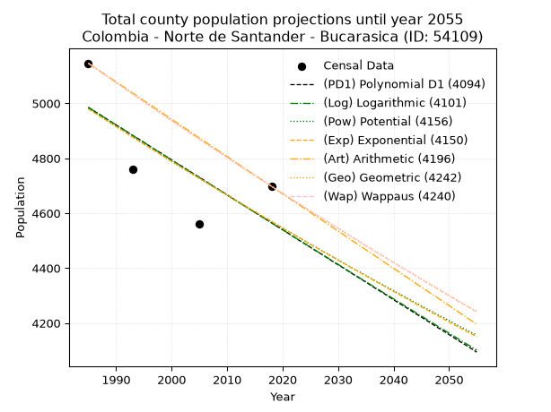
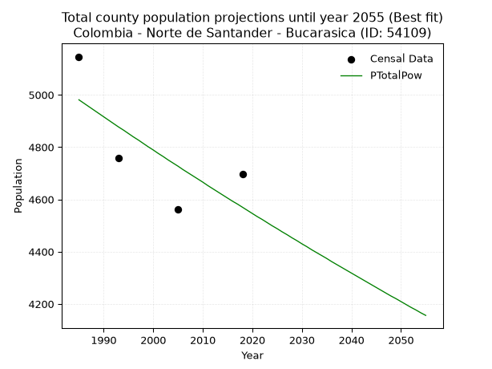
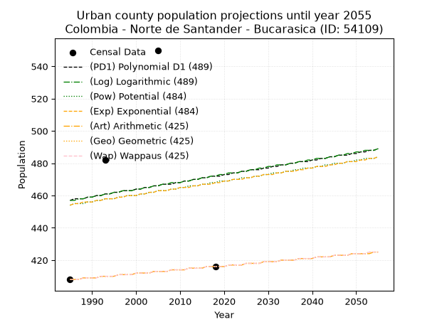
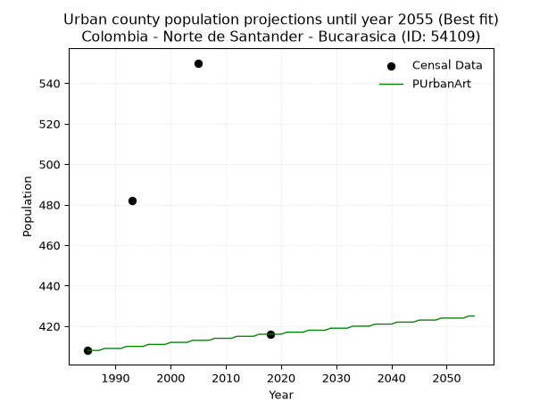
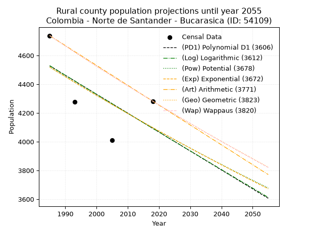
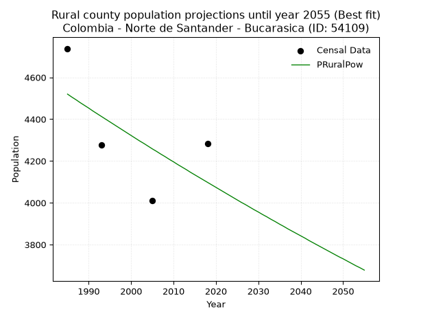

<div align="center">


</div>

# 📜 _“Population and Public Services Demand Projections (PPSD) until Year 2050 for Colombia - Norte de Santander - Bucarasica (ID: 54109)”_
Keywords: `population` `public-service` `projection` `lineal` `polynomial` `logarithmic` `potential` `exponential` `arithmetic` `geometric` `wappaus` `dane` `colombia` `south-america`

PPSD are analytical estimates used by governments and planners to anticipate future changes in population size, age distribution, and the resulting community needs for utilities, healthcare, education, and infrastructure as sizing future water treatment facilities, electrical grids, and road networks based on spatial growth.

<div align="center">

</img>

</div>


> **General running parameters**: • app_version: _v20260806_. • Python version: _3.14.7_. • Pandas version: _3.0.5_. • NumPy version: _2.5.1_. • Creates, save and include plots into reports (create_plot): _False_. • Projection until year: _2050_. • Process polynomial degree 2 and up: _False_. • Process Wappaus: _True_. • Process Wappaus: _True_. • Set negative values to zero: _True_. • Set infinite values to zero: _True_. • Drop dataset notes: _True_. 
<div align="center">

Maps & GIS Layers: [:earth_americas:Google](http://maps.google.com/maps?q=8.041299348,-72.8682305) [:earth_americas:OSM](https://www.openstreetmap.org/#map=18/8.041299348/-72.8682305&layers=P) [:earth_americas:Bing](https://www.bing.com/maps?cp=8.041299348~-72.8682305&lvl=18) [:earth_americas:Apple](https://maps.apple.com/frame?center=8.041299348%2C-72.8682305&span=0.003%2C0.006) [:earth_americas:GISMobile](https://github.com/rcfdtools/R.GISMobile/blob/main/file/gis/CountyLayer_CO/Readme.md)

</div>


<div align="center">

```geojson
{
  "type": "Feature",
  "geometry": {
    "type": "Point", 
    "coordinates": [-72.8682305, 8.041299348]
  }, 
  "properties": {
    "Name": "Colombia - Norte de Santander - Bucarasica (ID: 54109)"
  }
}
```

</div>


## 0. Census Data (4 records)

Census data are official statistics collected by a government about the people and housing in a country. They usually include counts of total population, age, sex, race, income, education, and jobs.

📅Global census file: [Population.xlsx](../data/Population.xlsx)

| Source   |   Year |   CountryID | CountryName   |   StateID | StateName          |   CountyID | CountyName   |   PTotal |   PUrban |   PRural |
|:---------|-------:|------------:|:--------------|----------:|:-------------------|-----------:|:-------------|---------:|---------:|---------:|
| DANE     |   1985 |          57 | Colombia      |        54 | Norte de Santander |      54109 | Bucarasica   |     5146 |      408 |     4738 |
| DANE     |   1993 |          57 | Colombia      |        54 | Norte de Santander |      54109 | Bucarasica   |     4759 |      482 |     4277 |
| DANE     |   2005 |          57 | Colombia      |        54 | Norte de Santander |      54109 | Bucarasica   |     4561 |      550 |     4011 |
| DANE     |   2018 |          57 | Colombia      |        54 | Norte de Santander |      54109 | Bucarasica   |     4698 |      416 |     4282 |

> 🔥Some records could had specific notes about the registered values or the corresponding urban or rural distribution.

📅[SUI-RUPS](https://www.datos.gov.co/Hacienda-y-Cr-dito-P-blico/Registro-nico-de-Prestadores-de-Servicios-P-blicos/4qkq-csdn/about_data) - Local public utility companies: [RUPS.csv](../data/RUPS.csv)

 | SERVICIO       | ESTADO    | NOMBRE                                                                                  | NIT         | DEPARTAMENTO_DOMICILIO   | MUNICIPIO_DOMICILIO   | DIRECCION                           |   TELEFONO | EMAIL                      | TIPO_PRESTADOR                 | CLASIFICACION                 |
|:---------------|:----------|:----------------------------------------------------------------------------------------|:------------|:-------------------------|:----------------------|:------------------------------------|-----------:|:---------------------------|:-------------------------------|:------------------------------|
| ACUEDUCTO      | OPERATIVA | UNIDAD MUNICIPAL DE SERVICIOS PUBLICOS DE ACUEDUCTO ALCANTARILLADO Y ASEO DE BUCARASICA | 800021150-9 | NORTE DE SANTANDER       | BUCARASICA            | Calle 2 No 3 - 35 Palacio Municipal |    5665380 | unidadbucarasica@gmail.com | MUNICIPIO (PRESTACIÓN DIRECTA) | MENOR O IGUAL A 2500 USUARIOS |
| ALCANTARILLADO | OPERATIVA | UNIDAD MUNICIPAL DE SERVICIOS PUBLICOS DE ACUEDUCTO ALCANTARILLADO Y ASEO DE BUCARASICA | 800021150-9 | NORTE DE SANTANDER       | BUCARASICA            | Calle 2 No 3 - 35 Palacio Municipal |    5665380 | unidadbucarasica@gmail.com | MUNICIPIO (PRESTACIÓN DIRECTA) | MENOR O IGUAL A 2500 USUARIOS |

## 1. Total

### 1.1. Coefficients and Parameters

* (PD1) Polynomial Deg 1: -12.725812926535633, 30245.807306302904 (lineal)
* (Log) Logarithmic: -25527.62420103806, 198826.67611763228
* (Pow) Potential: -5.228400941097746, 20.939337656503124
* (Exp) Exponential: -0.0026063736924103104, 879306.0292488488
* (Art) Arithmetic: Year diff. 2018 - 1985 = 33, Population diff. 4698 - 5146 = -448, Annual growth = -13.575757575757576
* (Geo) Geometric: Year diff. 2018 - 1985 = 33, Population diff. 4698 - 5146 = -448, Annual growth % = -0.0027562801510501167
* (Wap) Wappaus: i = -0.2758179109255907, Condition values only valid for < 200)

<sub>
Wappaus condition values: ['-0.00', '-0.28', '-0.55', '-0.83', '-1.10', '-1.38', '-1.65', '-1.93', '-2.21', '-2.48', '-2.76', '-3.03', '-3.31', '-3.59', '-3.86', '-4.14', '-4.41', '-4.69', '-4.96', '-5.24', '-5.52', '-5.79', '-6.07', '-6.34', '-6.62', '-6.90', '-7.17', '-7.45', '-7.72', '-8.00', '-8.27', '-8.55', '-8.83', '-9.10', '-9.38', '-9.65', '-9.93', '-10.21', '-10.48', '-10.76', '-11.03', '-11.31', '-11.58', '-11.86', '-12.14', '-12.41', '-12.69', '-12.96', '-13.24', '-13.52', '-13.79', '-14.07', '-14.34', '-14.62', '-14.89', '-15.17', '-15.45', '-15.72', '-16.00', '-16.27', '-16.55', '-16.82', '-17.10', '-17.38', '-17.65', '-17.93']
</sub>


### 1.2. Projected Dataset

|   Year |   CountyID |   PTotalPD1 |   PTotalLog |   PTotalPow |   PTotalExp |   PTotalArt |   PTotalGeo |   PTotalWap |
|-------:|-----------:|------------:|------------:|------------:|------------:|------------:|------------:|------------:|
|   1985 |      54109 |        4985 |        4986 |        4981 |        4980 |        5146 |        5146 |        5146 |
|   1986 |      54109 |        4972 |        4973 |        4968 |        4967 |        5132 |        5132 |        5132 |
|   1987 |      54109 |        4960 |        4960 |        4955 |        4954 |        5119 |        5118 |        5118 |
|   1988 |      54109 |        4947 |        4947 |        4942 |        4941 |        5105 |        5104 |        5104 |
|   1989 |      54109 |        4934 |        4934 |        4929 |        4929 |        5092 |        5089 |        5090 |
|   1990 |      54109 |        4921 |        4922 |        4916 |        4916 |        5078 |        5075 |        5076 |
|   1991 |      54109 |        4909 |        4909 |        4903 |        4903 |        5065 |        5061 |        5062 |
|   1992 |      54109 |        4896 |        4896 |        4890 |        4890 |        5051 |        5048 |        5048 |
|   1993 |      54109 |        4883 |        4883 |        4877 |        4877 |        5037 |        5034 |        5034 |
|   1994 |      54109 |        4871 |        4870 |        4865 |        4865 |        5024 |        5020 |        5020 |
|   1995 |      54109 |        4858 |        4858 |        4852 |        4852 |        5010 |        5006 |        5006 |
|   1996 |      54109 |        4845 |        4845 |        4839 |        4839 |        4997 |        4992 |        4992 |
|   1997 |      54109 |        4832 |        4832 |        4827 |        4827 |        4983 |        4978 |        4978 |
|   1998 |      54109 |        4820 |        4819 |        4814 |        4814 |        4970 |        4965 |        4965 |
|   1999 |      54109 |        4807 |        4806 |        4801 |        4802 |        4956 |        4951 |        4951 |
|   2000 |      54109 |        4794 |        4794 |        4789 |        4789 |        4942 |        4937 |        4937 |
|   2001 |      54109 |        4781 |        4781 |        4776 |        4777 |        4929 |        4924 |        4924 |
|   2002 |      54109 |        4769 |        4768 |        4764 |        4764 |        4915 |        4910 |        4910 |
|   2003 |      54109 |        4756 |        4755 |        4751 |        4752 |        4902 |        4897 |        4897 |
|   2004 |      54109 |        4743 |        4743 |        4739 |        4740 |        4888 |        4883 |        4883 |
|   2005 |      54109 |        4731 |        4730 |        4727 |        4727 |        4874 |        4870 |        4870 |
|   2006 |      54109 |        4718 |        4717 |        4714 |        4715 |        4861 |        4856 |        4856 |
|   2007 |      54109 |        4705 |        4705 |        4702 |        4703 |        4847 |        4843 |        4843 |
|   2008 |      54109 |        4692 |        4692 |        4690 |        4690 |        4834 |        4829 |        4830 |
|   2009 |      54109 |        4680 |        4679 |        4678 |        4678 |        4820 |        4816 |        4816 |
|   2010 |      54109 |        4667 |        4666 |        4666 |        4666 |        4807 |        4803 |        4803 |
|   2011 |      54109 |        4654 |        4654 |        4653 |        4654 |        4793 |        4790 |        4790 |
|   2012 |      54109 |        4641 |        4641 |        4641 |        4642 |        4779 |        4776 |        4777 |
|   2013 |      54109 |        4629 |        4628 |        4629 |        4630 |        4766 |        4763 |        4763 |
|   2014 |      54109 |        4616 |        4616 |        4617 |        4618 |        4752 |        4750 |        4750 |
|   2015 |      54109 |        4603 |        4603 |        4605 |        4606 |        4739 |        4737 |        4737 |
|   2016 |      54109 |        4591 |        4590 |        4593 |        4594 |        4725 |        4724 |        4724 |
|   2017 |      54109 |        4578 |        4578 |        4582 |        4582 |        4712 |        4711 |        4711 |
|   2018 |      54109 |        4565 |        4565 |        4570 |        4570 |        4698 |        4698 |        4698 |
|   2019 |      54109 |        4552 |        4552 |        4558 |        4558 |        4684 |        4685 |        4685 |
|   2020 |      54109 |        4540 |        4540 |        4546 |        4546 |        4671 |        4672 |        4672 |
|   2021 |      54109 |        4527 |        4527 |        4534 |        4534 |        4657 |        4659 |        4659 |
|   2022 |      54109 |        4514 |        4514 |        4523 |        4522 |        4644 |        4646 |        4646 |
|   2023 |      54109 |        4501 |        4502 |        4511 |        4511 |        4630 |        4634 |        4634 |
|   2024 |      54109 |        4489 |        4489 |        4499 |        4499 |        4617 |        4621 |        4621 |
|   2025 |      54109 |        4476 |        4477 |        4488 |        4487 |        4603 |        4608 |        4608 |
|   2026 |      54109 |        4463 |        4464 |        4476 |        4476 |        4589 |        4595 |        4595 |
|   2027 |      54109 |        4451 |        4451 |        4465 |        4464 |        4576 |        4583 |        4583 |
|   2028 |      54109 |        4438 |        4439 |        4453 |        4452 |        4562 |        4570 |        4570 |
|   2029 |      54109 |        4425 |        4426 |        4442 |        4441 |        4549 |        4558 |        4557 |
|   2030 |      54109 |        4412 |        4414 |        4430 |        4429 |        4535 |        4545 |        4545 |
|   2031 |      54109 |        4400 |        4401 |        4419 |        4418 |        4522 |        4532 |        4532 |
|   2032 |      54109 |        4387 |        4388 |        4407 |        4406 |        4508 |        4520 |        4520 |
|   2033 |      54109 |        4374 |        4376 |        4396 |        4395 |        4494 |        4507 |        4507 |
|   2034 |      54109 |        4362 |        4363 |        4385 |        4383 |        4481 |        4495 |        4495 |
|   2035 |      54109 |        4349 |        4351 |        4374 |        4372 |        4467 |        4483 |        4482 |
|   2036 |      54109 |        4336 |        4338 |        4362 |        4360 |        4454 |        4470 |        4470 |
|   2037 |      54109 |        4323 |        4326 |        4351 |        4349 |        4440 |        4458 |        4457 |
|   2038 |      54109 |        4311 |        4313 |        4340 |        4338 |        4426 |        4446 |        4445 |
|   2039 |      54109 |        4298 |        4301 |        4329 |        4326 |        4413 |        4433 |        4433 |
|   2040 |      54109 |        4285 |        4288 |        4318 |        4315 |        4399 |        4421 |        4420 |
|   2041 |      54109 |        4272 |        4276 |        4307 |        4304 |        4386 |        4409 |        4408 |
|   2042 |      54109 |        4260 |        4263 |        4296 |        4293 |        4372 |        4397 |        4396 |
|   2043 |      54109 |        4247 |        4251 |        4285 |        4282 |        4359 |        4385 |        4384 |
|   2044 |      54109 |        4234 |        4238 |        4274 |        4270 |        4345 |        4373 |        4372 |
|   2045 |      54109 |        4222 |        4226 |        4263 |        4259 |        4331 |        4361 |        4359 |
|   2046 |      54109 |        4209 |        4213 |        4252 |        4248 |        4318 |        4349 |        4347 |
|   2047 |      54109 |        4196 |        4201 |        4241 |        4237 |        4304 |        4337 |        4335 |
|   2048 |      54109 |        4183 |        4188 |        4230 |        4226 |        4291 |        4325 |        4323 |
|   2049 |      54109 |        4171 |        4176 |        4220 |        4215 |        4277 |        4313 |        4311 |
|   2050 |      54109 |        4158 |        4163 |        4209 |        4204 |        4264 |        4301 |        4299 |
<div align="center">

</img>

</div>


### 1.3. Best fit with absolute and relative error (%)

Relative error puts that difference into context by dividing the absolute error by the true value, creating a unitless ratio or percentage that shows the scale of the mistake.

Absolute and relative error

|   Year | Source   |   CountryID | CountryName   |   StateID | StateName          |   CountyID_x | CountyName   |   PTotal |   PUrban |   PRural |   CountyID_y |   PTotalPD1 |   PTotalLog |   PTotalPow |   PTotalExp |   PTotalArt |   PTotalGeo |   PTotalWap |   PTotalPD1AbsError |   PTotalLogAbsError |   PTotalPowAbsError |   PTotalExpAbsError |   PTotalArtAbsError |   PTotalGeoAbsError |   PTotalWapAbsError |   PTotalPD1RelError |   PTotalLogRelError |   PTotalPowRelError |   PTotalExpRelError |   PTotalArtRelError |   PTotalGeoRelError |   PTotalWapRelError |
|-------:|:---------|------------:|:--------------|----------:|:-------------------|-------------:|:-------------|---------:|---------:|---------:|-------------:|------------:|------------:|------------:|------------:|------------:|------------:|------------:|--------------------:|--------------------:|--------------------:|--------------------:|--------------------:|--------------------:|--------------------:|--------------------:|--------------------:|--------------------:|--------------------:|--------------------:|--------------------:|--------------------:|
|   1985 | DANE     |          57 | Colombia      |        54 | Norte de Santander |        54109 | Bucarasica   |     5146 |      408 |     4738 |        54109 |        4985 |        4986 |        4981 |        4980 |        5146 |        5146 |        5146 |                 161 |                 160 |                 165 |                 166 |                   0 |                   0 |                   0 |             3.12864 |             3.10921 |             3.20637 |             3.22581 |             0       |             0       |             0       |
|   1993 | DANE     |          57 | Colombia      |        54 | Norte de Santander |        54109 | Bucarasica   |     4759 |      482 |     4277 |        54109 |        4883 |        4883 |        4877 |        4877 |        5037 |        5034 |        5034 |                 124 |                 124 |                 118 |                 118 |                 278 |                 275 |                 275 |             2.60559 |             2.60559 |             2.47951 |             2.47951 |             5.84156 |             5.77852 |             5.77852 |
|   2005 | DANE     |          57 | Colombia      |        54 | Norte de Santander |        54109 | Bucarasica   |     4561 |      550 |     4011 |        54109 |        4731 |        4730 |        4727 |        4727 |        4874 |        4870 |        4870 |                 170 |                 169 |                 166 |                 166 |                 313 |                 309 |                 309 |             3.72725 |             3.70533 |             3.63955 |             3.63955 |             6.86253 |             6.77483 |             6.77483 |
|   2018 | DANE     |          57 | Colombia      |        54 | Norte de Santander |        54109 | Bucarasica   |     4698 |      416 |     4282 |        54109 |        4565 |        4565 |        4570 |        4570 |        4698 |        4698 |        4698 |                 133 |                 133 |                 128 |                 128 |                   0 |                   0 |                   0 |             2.83099 |             2.83099 |             2.72456 |             2.72456 |             0       |             0       |             0       |

Relative error mean

| Method    |   RelError | Best   |
|:----------|-----------:|:-------|
| PTotalPD1 |    3.07312 |        |
| PTotalLog |    3.06278 |        |
| PTotalPow |    3.0125  | True   |
| PTotalExp |    3.01736 |        |
| PTotalArt |    3.17602 |        |
| PTotalGeo |    3.13834 |        |
| PTotalWap |    3.13834 |        |

💙Best method: _**PTotalPow**_
<div align="center">

</img>

</div>


### 1.4. Fresh water supply demand in liters per capita per day (lpcd)

The fresh water supply demand typically ranges from 100 to 300 liters per capita per day (lpcd) for standard domestic and municipal planning, though absolute survival minimums set by the World Health Organization are as low as 7.5 to 20 liters per day, and total consumption in high-income nations can exceed 400 liters.

> `CZ`: Level in meters above the sea level (masl)<br> `WS`: Fresh water supply demand in liters per capita per day (lpcd or l/h/d)<br> `WSAll`: Zonal fresh water supply demand in liters per second (l/s)<br> `A`: Zonal area in square meters<br> `DP`: Population density (people/hectare or p/ha)

Reference values (RAS Colombia)

|    CZ |   WS |
|------:|-----:|
|  1000 |  120 |
|  2000 |  130 |
| 99999 |  140 |

County shapefile geometry properties and water supply values

|   CountyID |      ATotal |   CZTotal |   WSTotal |
|-----------:|------------:|----------:|----------:|
|      54109 | 2.70251e+08 |   1732.99 |       130 |

Projected values for best method: PTotalPow

|   CountyID |   Year |   PTotalPow |   DPTotal |   WSTotal |   WSTotalAll |
|-----------:|-------:|------------:|----------:|----------:|-------------:|
|      54109 |   1985 |        4981 |      0.18 |       130 |      7.49456 |
|      54109 |   1986 |        4968 |      0.18 |       130 |      7.475   |
|      54109 |   1987 |        4955 |      0.18 |       130 |      7.45544 |
|      54109 |   1988 |        4942 |      0.18 |       130 |      7.43588 |
|      54109 |   1989 |        4929 |      0.18 |       130 |      7.41632 |
|      54109 |   1990 |        4916 |      0.18 |       130 |      7.39676 |
|      54109 |   1991 |        4903 |      0.18 |       130 |      7.3772  |
|      54109 |   1992 |        4890 |      0.18 |       130 |      7.35764 |
|      54109 |   1993 |        4877 |      0.18 |       130 |      7.33808 |
|      54109 |   1994 |        4865 |      0.18 |       130 |      7.32002 |
|      54109 |   1995 |        4852 |      0.18 |       130 |      7.30046 |
|      54109 |   1996 |        4839 |      0.18 |       130 |      7.2809  |
|      54109 |   1997 |        4827 |      0.18 |       130 |      7.26285 |
|      54109 |   1998 |        4814 |      0.18 |       130 |      7.24329 |
|      54109 |   1999 |        4801 |      0.18 |       130 |      7.22373 |
|      54109 |   2000 |        4789 |      0.18 |       130 |      7.20567 |
|      54109 |   2001 |        4776 |      0.18 |       130 |      7.18611 |
|      54109 |   2002 |        4764 |      0.18 |       130 |      7.16806 |
|      54109 |   2003 |        4751 |      0.18 |       130 |      7.1485  |
|      54109 |   2004 |        4739 |      0.18 |       130 |      7.13044 |
|      54109 |   2005 |        4727 |      0.17 |       130 |      7.11238 |
|      54109 |   2006 |        4714 |      0.17 |       130 |      7.09282 |
|      54109 |   2007 |        4702 |      0.17 |       130 |      7.07477 |
|      54109 |   2008 |        4690 |      0.17 |       130 |      7.05671 |
|      54109 |   2009 |        4678 |      0.17 |       130 |      7.03866 |
|      54109 |   2010 |        4666 |      0.17 |       130 |      7.0206  |
|      54109 |   2011 |        4653 |      0.17 |       130 |      7.00104 |
|      54109 |   2012 |        4641 |      0.17 |       130 |      6.98299 |
|      54109 |   2013 |        4629 |      0.17 |       130 |      6.96493 |
|      54109 |   2014 |        4617 |      0.17 |       130 |      6.94688 |
|      54109 |   2015 |        4605 |      0.17 |       130 |      6.92882 |
|      54109 |   2016 |        4593 |      0.17 |       130 |      6.91076 |
|      54109 |   2017 |        4582 |      0.17 |       130 |      6.89421 |
|      54109 |   2018 |        4570 |      0.17 |       130 |      6.87616 |
|      54109 |   2019 |        4558 |      0.17 |       130 |      6.8581  |
|      54109 |   2020 |        4546 |      0.17 |       130 |      6.84005 |
|      54109 |   2021 |        4534 |      0.17 |       130 |      6.82199 |
|      54109 |   2022 |        4523 |      0.17 |       130 |      6.80544 |
|      54109 |   2023 |        4511 |      0.17 |       130 |      6.78738 |
|      54109 |   2024 |        4499 |      0.17 |       130 |      6.76933 |
|      54109 |   2025 |        4488 |      0.17 |       130 |      6.75278 |
|      54109 |   2026 |        4476 |      0.17 |       130 |      6.73472 |
|      54109 |   2027 |        4465 |      0.17 |       130 |      6.71817 |
|      54109 |   2028 |        4453 |      0.16 |       130 |      6.70012 |
|      54109 |   2029 |        4442 |      0.16 |       130 |      6.68356 |
|      54109 |   2030 |        4430 |      0.16 |       130 |      6.66551 |
|      54109 |   2031 |        4419 |      0.16 |       130 |      6.64896 |
|      54109 |   2032 |        4407 |      0.16 |       130 |      6.6309  |
|      54109 |   2033 |        4396 |      0.16 |       130 |      6.61435 |
|      54109 |   2034 |        4385 |      0.16 |       130 |      6.5978  |
|      54109 |   2035 |        4374 |      0.16 |       130 |      6.58125 |
|      54109 |   2036 |        4362 |      0.16 |       130 |      6.56319 |
|      54109 |   2037 |        4351 |      0.16 |       130 |      6.54664 |
|      54109 |   2038 |        4340 |      0.16 |       130 |      6.53009 |
|      54109 |   2039 |        4329 |      0.16 |       130 |      6.51354 |
|      54109 |   2040 |        4318 |      0.16 |       130 |      6.49699 |
|      54109 |   2041 |        4307 |      0.16 |       130 |      6.48044 |
|      54109 |   2042 |        4296 |      0.16 |       130 |      6.46389 |
|      54109 |   2043 |        4285 |      0.16 |       130 |      6.44734 |
|      54109 |   2044 |        4274 |      0.16 |       130 |      6.43079 |
|      54109 |   2045 |        4263 |      0.16 |       130 |      6.41424 |
|      54109 |   2046 |        4252 |      0.16 |       130 |      6.39769 |
|      54109 |   2047 |        4241 |      0.16 |       130 |      6.38113 |
|      54109 |   2048 |        4230 |      0.16 |       130 |      6.36458 |
|      54109 |   2049 |        4220 |      0.16 |       130 |      6.34954 |
|      54109 |   2050 |        4209 |      0.16 |       130 |      6.33299 |

## 2. Urban

### 2.1. Coefficients and Parameters

* (PD1) Polynomial Deg 1: 0.4496186270574867, -435.3496587717377 (lineal)
* (Log) Logarithmic: 920.8793047604323, -6535.610974947665
* (Pow) Potential: 1.8278914564497544, -3.3707175144826946
* (Exp) Exponential: 0.000890977044854556, 77.49991757150943
* (Art) Arithmetic: Year diff. 2018 - 1985 = 33, Population diff. 416 - 408 = 8, Annual growth = 0.24242424242424243
* (Geo) Geometric: Year diff. 2018 - 1985 = 33, Population diff. 416 - 408 = 8, Annual growth % = 0.0005886000011918746
* (Wap) Wappaus: i = 0.05884083553986467, Condition values only valid for < 200)

<sub>
Wappaus condition values: ['0.00', '0.06', '0.12', '0.18', '0.24', '0.29', '0.35', '0.41', '0.47', '0.53', '0.59', '0.65', '0.71', '0.76', '0.82', '0.88', '0.94', '1.00', '1.06', '1.12', '1.18', '1.24', '1.29', '1.35', '1.41', '1.47', '1.53', '1.59', '1.65', '1.71', '1.77', '1.82', '1.88', '1.94', '2.00', '2.06', '2.12', '2.18', '2.24', '2.29', '2.35', '2.41', '2.47', '2.53', '2.59', '2.65', '2.71', '2.77', '2.82', '2.88', '2.94', '3.00', '3.06', '3.12', '3.18', '3.24', '3.30', '3.35', '3.41', '3.47', '3.53', '3.59', '3.65', '3.71', '3.77', '3.82']
</sub>


### 2.2. Projected Dataset

|   Year |   CountyID |   PUrbanPD1 |   PUrbanLog |   PUrbanPow |   PUrbanExp |   PUrbanArt |   PUrbanGeo |   PUrbanWap |
|-------:|-----------:|------------:|------------:|------------:|------------:|------------:|------------:|------------:|
|   1985 |      54109 |         457 |         457 |         454 |         454 |         408 |         408 |         408 |
|   1986 |      54109 |         458 |         457 |         455 |         455 |         408 |         408 |         408 |
|   1987 |      54109 |         458 |         458 |         455 |         455 |         408 |         408 |         408 |
|   1988 |      54109 |         458 |         458 |         455 |         456 |         409 |         409 |         409 |
|   1989 |      54109 |         459 |         459 |         456 |         456 |         409 |         409 |         409 |
|   1990 |      54109 |         459 |         459 |         456 |         456 |         409 |         409 |         409 |
|   1991 |      54109 |         460 |         460 |         457 |         457 |         409 |         409 |         409 |
|   1992 |      54109 |         460 |         460 |         457 |         457 |         410 |         410 |         410 |
|   1993 |      54109 |         461 |         461 |         458 |         458 |         410 |         410 |         410 |
|   1994 |      54109 |         461 |         461 |         458 |         458 |         410 |         410 |         410 |
|   1995 |      54109 |         462 |         462 |         458 |         458 |         410 |         410 |         410 |
|   1996 |      54109 |         462 |         462 |         459 |         459 |         411 |         411 |         411 |
|   1997 |      54109 |         463 |         463 |         459 |         459 |         411 |         411 |         411 |
|   1998 |      54109 |         463 |         463 |         460 |         460 |         411 |         411 |         411 |
|   1999 |      54109 |         463 |         463 |         460 |         460 |         411 |         411 |         411 |
|   2000 |      54109 |         464 |         464 |         460 |         460 |         412 |         412 |         412 |
|   2001 |      54109 |         464 |         464 |         461 |         461 |         412 |         412 |         412 |
|   2002 |      54109 |         465 |         465 |         461 |         461 |         412 |         412 |         412 |
|   2003 |      54109 |         465 |         465 |         462 |         462 |         412 |         412 |         412 |
|   2004 |      54109 |         466 |         466 |         462 |         462 |         413 |         413 |         413 |
|   2005 |      54109 |         466 |         466 |         463 |         463 |         413 |         413 |         413 |
|   2006 |      54109 |         467 |         467 |         463 |         463 |         413 |         413 |         413 |
|   2007 |      54109 |         467 |         467 |         463 |         463 |         413 |         413 |         413 |
|   2008 |      54109 |         467 |         468 |         464 |         464 |         414 |         414 |         414 |
|   2009 |      54109 |         468 |         468 |         464 |         464 |         414 |         414 |         414 |
|   2010 |      54109 |         468 |         468 |         465 |         465 |         414 |         414 |         414 |
|   2011 |      54109 |         469 |         469 |         465 |         465 |         414 |         414 |         414 |
|   2012 |      54109 |         469 |         469 |         466 |         465 |         415 |         415 |         415 |
|   2013 |      54109 |         470 |         470 |         466 |         466 |         415 |         415 |         415 |
|   2014 |      54109 |         470 |         470 |         466 |         466 |         415 |         415 |         415 |
|   2015 |      54109 |         471 |         471 |         467 |         467 |         415 |         415 |         415 |
|   2016 |      54109 |         471 |         471 |         467 |         467 |         416 |         416 |         416 |
|   2017 |      54109 |         472 |         472 |         468 |         467 |         416 |         416 |         416 |
|   2018 |      54109 |         472 |         472 |         468 |         468 |         416 |         416 |         416 |
|   2019 |      54109 |         472 |         473 |         469 |         468 |         416 |         416 |         416 |
|   2020 |      54109 |         473 |         473 |         469 |         469 |         416 |         416 |         416 |
|   2021 |      54109 |         473 |         474 |         469 |         469 |         417 |         417 |         417 |
|   2022 |      54109 |         474 |         474 |         470 |         470 |         417 |         417 |         417 |
|   2023 |      54109 |         474 |         474 |         470 |         470 |         417 |         417 |         417 |
|   2024 |      54109 |         475 |         475 |         471 |         470 |         417 |         417 |         417 |
|   2025 |      54109 |         475 |         475 |         471 |         471 |         418 |         418 |         418 |
|   2026 |      54109 |         476 |         476 |         471 |         471 |         418 |         418 |         418 |
|   2027 |      54109 |         476 |         476 |         472 |         472 |         418 |         418 |         418 |
|   2028 |      54109 |         476 |         477 |         472 |         472 |         418 |         418 |         418 |
|   2029 |      54109 |         477 |         477 |         473 |         473 |         419 |         419 |         419 |
|   2030 |      54109 |         477 |         478 |         473 |         473 |         419 |         419 |         419 |
|   2031 |      54109 |         478 |         478 |         474 |         473 |         419 |         419 |         419 |
|   2032 |      54109 |         478 |         479 |         474 |         474 |         419 |         419 |         419 |
|   2033 |      54109 |         479 |         479 |         474 |         474 |         420 |         420 |         420 |
|   2034 |      54109 |         479 |         479 |         475 |         475 |         420 |         420 |         420 |
|   2035 |      54109 |         480 |         480 |         475 |         475 |         420 |         420 |         420 |
|   2036 |      54109 |         480 |         480 |         476 |         475 |         420 |         420 |         420 |
|   2037 |      54109 |         481 |         481 |         476 |         476 |         421 |         421 |         421 |
|   2038 |      54109 |         481 |         481 |         477 |         476 |         421 |         421 |         421 |
|   2039 |      54109 |         481 |         482 |         477 |         477 |         421 |         421 |         421 |
|   2040 |      54109 |         482 |         482 |         477 |         477 |         421 |         421 |         421 |
|   2041 |      54109 |         482 |         483 |         478 |         478 |         422 |         422 |         422 |
|   2042 |      54109 |         483 |         483 |         478 |         478 |         422 |         422 |         422 |
|   2043 |      54109 |         483 |         483 |         479 |         478 |         422 |         422 |         422 |
|   2044 |      54109 |         484 |         484 |         479 |         479 |         422 |         422 |         422 |
|   2045 |      54109 |         484 |         484 |         480 |         479 |         423 |         423 |         423 |
|   2046 |      54109 |         485 |         485 |         480 |         480 |         423 |         423 |         423 |
|   2047 |      54109 |         485 |         485 |         480 |         480 |         423 |         423 |         423 |
|   2048 |      54109 |         485 |         486 |         481 |         481 |         423 |         423 |         423 |
|   2049 |      54109 |         486 |         486 |         481 |         481 |         424 |         424 |         424 |
|   2050 |      54109 |         486 |         487 |         482 |         481 |         424 |         424 |         424 |
<div align="center">

</img>

</div>


### 2.3. Best fit with absolute and relative error (%)

Relative error puts that difference into context by dividing the absolute error by the true value, creating a unitless ratio or percentage that shows the scale of the mistake.

Absolute and relative error

|   Year | Source   |   CountryID | CountryName   |   StateID | StateName          |   CountyID_x | CountyName   |   PTotal |   PUrban |   PRural |   CountyID_y |   PUrbanPD1 |   PUrbanLog |   PUrbanPow |   PUrbanExp |   PUrbanArt |   PUrbanGeo |   PUrbanWap |   PUrbanPD1AbsError |   PUrbanLogAbsError |   PUrbanPowAbsError |   PUrbanExpAbsError |   PUrbanArtAbsError |   PUrbanGeoAbsError |   PUrbanWapAbsError |   PUrbanPD1RelError |   PUrbanLogRelError |   PUrbanPowRelError |   PUrbanExpRelError |   PUrbanArtRelError |   PUrbanGeoRelError |   PUrbanWapRelError |
|-------:|:---------|------------:|:--------------|----------:|:-------------------|-------------:|:-------------|---------:|---------:|---------:|-------------:|------------:|------------:|------------:|------------:|------------:|------------:|------------:|--------------------:|--------------------:|--------------------:|--------------------:|--------------------:|--------------------:|--------------------:|--------------------:|--------------------:|--------------------:|--------------------:|--------------------:|--------------------:|--------------------:|
|   1985 | DANE     |          57 | Colombia      |        54 | Norte de Santander |        54109 | Bucarasica   |     5146 |      408 |     4738 |        54109 |         457 |         457 |         454 |         454 |         408 |         408 |         408 |                  49 |                  49 |                  46 |                  46 |                   0 |                   0 |                   0 |            12.0098  |            12.0098  |            11.2745  |            11.2745  |              0      |              0      |              0      |
|   1993 | DANE     |          57 | Colombia      |        54 | Norte de Santander |        54109 | Bucarasica   |     4759 |      482 |     4277 |        54109 |         461 |         461 |         458 |         458 |         410 |         410 |         410 |                  21 |                  21 |                  24 |                  24 |                  72 |                  72 |                  72 |             4.35685 |             4.35685 |             4.97925 |             4.97925 |             14.9378 |             14.9378 |             14.9378 |
|   2005 | DANE     |          57 | Colombia      |        54 | Norte de Santander |        54109 | Bucarasica   |     4561 |      550 |     4011 |        54109 |         466 |         466 |         463 |         463 |         413 |         413 |         413 |                  84 |                  84 |                  87 |                  87 |                 137 |                 137 |                 137 |            15.2727  |            15.2727  |            15.8182  |            15.8182  |             24.9091 |             24.9091 |             24.9091 |
|   2018 | DANE     |          57 | Colombia      |        54 | Norte de Santander |        54109 | Bucarasica   |     4698 |      416 |     4282 |        54109 |         472 |         472 |         468 |         468 |         416 |         416 |         416 |                  56 |                  56 |                  52 |                  52 |                   0 |                   0 |                   0 |            13.4615  |            13.4615  |            12.5     |            12.5     |              0      |              0      |              0      |

Relative error mean

| Method    |   RelError | Best   |
|:----------|-----------:|:-------|
| PUrbanPD1 |   11.2752  |        |
| PUrbanLog |   11.2752  |        |
| PUrbanPow |   11.143   |        |
| PUrbanExp |   11.143   |        |
| PUrbanArt |    9.96171 | True   |
| PUrbanGeo |    9.96171 | True   |
| PUrbanWap |    9.96171 | True   |

💙Best method: _**PUrbanArt**_
<div align="center">

</img>

</div>


### 2.4. Fresh water supply demand in liters per capita per day (lpcd)

The fresh water supply demand typically ranges from 100 to 300 liters per capita per day (lpcd) for standard domestic and municipal planning, though absolute survival minimums set by the World Health Organization are as low as 7.5 to 20 liters per day, and total consumption in high-income nations can exceed 400 liters.

> `CZ`: Level in meters above the sea level (masl)<br> `WS`: Fresh water supply demand in liters per capita per day (lpcd or l/h/d)<br> `WSAll`: Zonal fresh water supply demand in liters per second (l/s)<br> `A`: Zonal area in square meters<br> `DP`: Population density (people/hectare or p/ha)

Reference values (RAS Colombia)

|    CZ |   WS |
|------:|-----:|
|  1000 |  120 |
|  2000 |  130 |
| 99999 |  140 |

County shapefile geometry properties and water supply values

|   CountyID |   AUrban |   CZUrban |   WSUrban |
|-----------:|---------:|----------:|----------:|
|      54109 |   131323 |   1133.63 |       130 |

Projected values for best method: PUrbanArt

|   CountyID |   Year |   PUrbanArt |   DPUrban |   WSUrban |   WSUrbanAll |
|-----------:|-------:|------------:|----------:|----------:|-------------:|
|      54109 |   1985 |         408 |     31.07 |       130 |     0.613889 |
|      54109 |   1986 |         408 |     31.07 |       130 |     0.613889 |
|      54109 |   1987 |         408 |     31.07 |       130 |     0.613889 |
|      54109 |   1988 |         409 |     31.14 |       130 |     0.615394 |
|      54109 |   1989 |         409 |     31.14 |       130 |     0.615394 |
|      54109 |   1990 |         409 |     31.14 |       130 |     0.615394 |
|      54109 |   1991 |         409 |     31.14 |       130 |     0.615394 |
|      54109 |   1992 |         410 |     31.22 |       130 |     0.616898 |
|      54109 |   1993 |         410 |     31.22 |       130 |     0.616898 |
|      54109 |   1994 |         410 |     31.22 |       130 |     0.616898 |
|      54109 |   1995 |         410 |     31.22 |       130 |     0.616898 |
|      54109 |   1996 |         411 |     31.3  |       130 |     0.618403 |
|      54109 |   1997 |         411 |     31.3  |       130 |     0.618403 |
|      54109 |   1998 |         411 |     31.3  |       130 |     0.618403 |
|      54109 |   1999 |         411 |     31.3  |       130 |     0.618403 |
|      54109 |   2000 |         412 |     31.37 |       130 |     0.619907 |
|      54109 |   2001 |         412 |     31.37 |       130 |     0.619907 |
|      54109 |   2002 |         412 |     31.37 |       130 |     0.619907 |
|      54109 |   2003 |         412 |     31.37 |       130 |     0.619907 |
|      54109 |   2004 |         413 |     31.45 |       130 |     0.621412 |
|      54109 |   2005 |         413 |     31.45 |       130 |     0.621412 |
|      54109 |   2006 |         413 |     31.45 |       130 |     0.621412 |
|      54109 |   2007 |         413 |     31.45 |       130 |     0.621412 |
|      54109 |   2008 |         414 |     31.53 |       130 |     0.622917 |
|      54109 |   2009 |         414 |     31.53 |       130 |     0.622917 |
|      54109 |   2010 |         414 |     31.53 |       130 |     0.622917 |
|      54109 |   2011 |         414 |     31.53 |       130 |     0.622917 |
|      54109 |   2012 |         415 |     31.6  |       130 |     0.624421 |
|      54109 |   2013 |         415 |     31.6  |       130 |     0.624421 |
|      54109 |   2014 |         415 |     31.6  |       130 |     0.624421 |
|      54109 |   2015 |         415 |     31.6  |       130 |     0.624421 |
|      54109 |   2016 |         416 |     31.68 |       130 |     0.625926 |
|      54109 |   2017 |         416 |     31.68 |       130 |     0.625926 |
|      54109 |   2018 |         416 |     31.68 |       130 |     0.625926 |
|      54109 |   2019 |         416 |     31.68 |       130 |     0.625926 |
|      54109 |   2020 |         416 |     31.68 |       130 |     0.625926 |
|      54109 |   2021 |         417 |     31.75 |       130 |     0.627431 |
|      54109 |   2022 |         417 |     31.75 |       130 |     0.627431 |
|      54109 |   2023 |         417 |     31.75 |       130 |     0.627431 |
|      54109 |   2024 |         417 |     31.75 |       130 |     0.627431 |
|      54109 |   2025 |         418 |     31.83 |       130 |     0.628935 |
|      54109 |   2026 |         418 |     31.83 |       130 |     0.628935 |
|      54109 |   2027 |         418 |     31.83 |       130 |     0.628935 |
|      54109 |   2028 |         418 |     31.83 |       130 |     0.628935 |
|      54109 |   2029 |         419 |     31.91 |       130 |     0.63044  |
|      54109 |   2030 |         419 |     31.91 |       130 |     0.63044  |
|      54109 |   2031 |         419 |     31.91 |       130 |     0.63044  |
|      54109 |   2032 |         419 |     31.91 |       130 |     0.63044  |
|      54109 |   2033 |         420 |     31.98 |       130 |     0.631944 |
|      54109 |   2034 |         420 |     31.98 |       130 |     0.631944 |
|      54109 |   2035 |         420 |     31.98 |       130 |     0.631944 |
|      54109 |   2036 |         420 |     31.98 |       130 |     0.631944 |
|      54109 |   2037 |         421 |     32.06 |       130 |     0.633449 |
|      54109 |   2038 |         421 |     32.06 |       130 |     0.633449 |
|      54109 |   2039 |         421 |     32.06 |       130 |     0.633449 |
|      54109 |   2040 |         421 |     32.06 |       130 |     0.633449 |
|      54109 |   2041 |         422 |     32.13 |       130 |     0.634954 |
|      54109 |   2042 |         422 |     32.13 |       130 |     0.634954 |
|      54109 |   2043 |         422 |     32.13 |       130 |     0.634954 |
|      54109 |   2044 |         422 |     32.13 |       130 |     0.634954 |
|      54109 |   2045 |         423 |     32.21 |       130 |     0.636458 |
|      54109 |   2046 |         423 |     32.21 |       130 |     0.636458 |
|      54109 |   2047 |         423 |     32.21 |       130 |     0.636458 |
|      54109 |   2048 |         423 |     32.21 |       130 |     0.636458 |
|      54109 |   2049 |         424 |     32.29 |       130 |     0.637963 |
|      54109 |   2050 |         424 |     32.29 |       130 |     0.637963 |

## 3. Rural

### 3.1. Coefficients and Parameters

* (PD1) Polynomial Deg 1: -13.175431553593093, 30681.156965074584 (lineal)
* (Log) Logarithmic: -26448.503505798573, 205362.28709258058
* (Pow) Potential: -5.948662021602803, 23.27239287086513
* (Exp) Exponential: -0.002963155297939902, 1619922.054703726
* (Art) Arithmetic: Year diff. 2018 - 1985 = 33, Population diff. 4282 - 4738 = -456, Annual growth = -13.818181818181818
* (Geo) Geometric: Year diff. 2018 - 1985 = 33, Population diff. 4282 - 4738 = -456, Annual growth % = -0.0030618156455710643
* (Wap) Wappaus: i = -0.3063898407579117, Condition values only valid for < 200)

<sub>
Wappaus condition values: ['-0.00', '-0.31', '-0.61', '-0.92', '-1.23', '-1.53', '-1.84', '-2.14', '-2.45', '-2.76', '-3.06', '-3.37', '-3.68', '-3.98', '-4.29', '-4.60', '-4.90', '-5.21', '-5.52', '-5.82', '-6.13', '-6.43', '-6.74', '-7.05', '-7.35', '-7.66', '-7.97', '-8.27', '-8.58', '-8.89', '-9.19', '-9.50', '-9.80', '-10.11', '-10.42', '-10.72', '-11.03', '-11.34', '-11.64', '-11.95', '-12.26', '-12.56', '-12.87', '-13.17', '-13.48', '-13.79', '-14.09', '-14.40', '-14.71', '-15.01', '-15.32', '-15.63', '-15.93', '-16.24', '-16.55', '-16.85', '-17.16', '-17.46', '-17.77', '-18.08', '-18.38', '-18.69', '-19.00', '-19.30', '-19.61', '-19.92']
</sub>


### 3.2. Projected Dataset

|   Year |   CountyID |   PRuralPD1 |   PRuralLog |   PRuralPow |   PRuralExp |   PRuralArt |   PRuralGeo |   PRuralWap |
|-------:|-----------:|------------:|------------:|------------:|------------:|------------:|------------:|------------:|
|   1985 |      54109 |        4528 |        4529 |        4520 |        4519 |        4738 |        4738 |        4738 |
|   1986 |      54109 |        4515 |        4516 |        4506 |        4506 |        4724 |        4723 |        4724 |
|   1987 |      54109 |        4502 |        4502 |        4493 |        4492 |        4710 |        4709 |        4709 |
|   1988 |      54109 |        4488 |        4489 |        4479 |        4479 |        4697 |        4695 |        4695 |
|   1989 |      54109 |        4475 |        4476 |        4466 |        4466 |        4683 |        4680 |        4680 |
|   1990 |      54109 |        4462 |        4462 |        4453 |        4452 |        4669 |        4666 |        4666 |
|   1991 |      54109 |        4449 |        4449 |        4439 |        4439 |        4655 |        4652 |        4652 |
|   1992 |      54109 |        4436 |        4436 |        4426 |        4426 |        4641 |        4637 |        4637 |
|   1993 |      54109 |        4423 |        4423 |        4413 |        4413 |        4627 |        4623 |        4623 |
|   1994 |      54109 |        4409 |        4409 |        4400 |        4400 |        4614 |        4609 |        4609 |
|   1995 |      54109 |        4396 |        4396 |        4387 |        4387 |        4600 |        4595 |        4595 |
|   1996 |      54109 |        4383 |        4383 |        4374 |        4374 |        4586 |        4581 |        4581 |
|   1997 |      54109 |        4370 |        4369 |        4361 |        4361 |        4572 |        4567 |        4567 |
|   1998 |      54109 |        4357 |        4356 |        4348 |        4348 |        4558 |        4553 |        4553 |
|   1999 |      54109 |        4343 |        4343 |        4335 |        4335 |        4545 |        4539 |        4539 |
|   2000 |      54109 |        4330 |        4330 |        4322 |        4322 |        4531 |        4525 |        4525 |
|   2001 |      54109 |        4317 |        4317 |        4309 |        4310 |        4517 |        4511 |        4511 |
|   2002 |      54109 |        4304 |        4303 |        4296 |        4297 |        4503 |        4497 |        4497 |
|   2003 |      54109 |        4291 |        4290 |        4284 |        4284 |        4489 |        4484 |        4484 |
|   2004 |      54109 |        4278 |        4277 |        4271 |        4272 |        4475 |        4470 |        4470 |
|   2005 |      54109 |        4264 |        4264 |        4258 |        4259 |        4462 |        4456 |        4456 |
|   2006 |      54109 |        4251 |        4251 |        4246 |        4246 |        4448 |        4443 |        4443 |
|   2007 |      54109 |        4238 |        4237 |        4233 |        4234 |        4434 |        4429 |        4429 |
|   2008 |      54109 |        4225 |        4224 |        4221 |        4221 |        4420 |        4415 |        4415 |
|   2009 |      54109 |        4212 |        4211 |        4208 |        4209 |        4406 |        4402 |        4402 |
|   2010 |      54109 |        4199 |        4198 |        4196 |        4196 |        4393 |        4388 |        4388 |
|   2011 |      54109 |        4185 |        4185 |        4183 |        4184 |        4379 |        4375 |        4375 |
|   2012 |      54109 |        4172 |        4172 |        4171 |        4171 |        4365 |        4362 |        4362 |
|   2013 |      54109 |        4159 |        4158 |        4159 |        4159 |        4351 |        4348 |        4348 |
|   2014 |      54109 |        4146 |        4145 |        4146 |        4147 |        4337 |        4335 |        4335 |
|   2015 |      54109 |        4133 |        4132 |        4134 |        4135 |        4323 |        4322 |        4322 |
|   2016 |      54109 |        4119 |        4119 |        4122 |        4122 |        4310 |        4308 |        4308 |
|   2017 |      54109 |        4106 |        4106 |        4110 |        4110 |        4296 |        4295 |        4295 |
|   2018 |      54109 |        4093 |        4093 |        4098 |        4098 |        4282 |        4282 |        4282 |
|   2019 |      54109 |        4080 |        4080 |        4086 |        4086 |        4268 |        4269 |        4269 |
|   2020 |      54109 |        4067 |        4067 |        4074 |        4074 |        4254 |        4256 |        4256 |
|   2021 |      54109 |        4054 |        4054 |        4062 |        4062 |        4241 |        4243 |        4243 |
|   2022 |      54109 |        4040 |        4040 |        4050 |        4050 |        4227 |        4230 |        4230 |
|   2023 |      54109 |        4027 |        4027 |        4038 |        4038 |        4213 |        4217 |        4217 |
|   2024 |      54109 |        4014 |        4014 |        4026 |        4026 |        4199 |        4204 |        4204 |
|   2025 |      54109 |        4001 |        4001 |        4014 |        4014 |        4185 |        4191 |        4191 |
|   2026 |      54109 |        3988 |        3988 |        4002 |        4002 |        4171 |        4178 |        4178 |
|   2027 |      54109 |        3975 |        3975 |        3991 |        3990 |        4158 |        4165 |        4165 |
|   2028 |      54109 |        3961 |        3962 |        3979 |        3978 |        4144 |        4153 |        4152 |
|   2029 |      54109 |        3948 |        3949 |        3967 |        3967 |        4130 |        4140 |        4140 |
|   2030 |      54109 |        3935 |        3936 |        3956 |        3955 |        4116 |        4127 |        4127 |
|   2031 |      54109 |        3922 |        3923 |        3944 |        3943 |        4102 |        4115 |        4114 |
|   2032 |      54109 |        3909 |        3910 |        3933 |        3931 |        4089 |        4102 |        4102 |
|   2033 |      54109 |        3896 |        3897 |        3921 |        3920 |        4075 |        4089 |        4089 |
|   2034 |      54109 |        3882 |        3884 |        3910 |        3908 |        4061 |        4077 |        4076 |
|   2035 |      54109 |        3869 |        3871 |        3898 |        3897 |        4047 |        4064 |        4064 |
|   2036 |      54109 |        3856 |        3858 |        3887 |        3885 |        4033 |        4052 |        4051 |
|   2037 |      54109 |        3843 |        3845 |        3875 |        3874 |        4019 |        4040 |        4039 |
|   2038 |      54109 |        3830 |        3832 |        3864 |        3862 |        4006 |        4027 |        4026 |
|   2039 |      54109 |        3816 |        3819 |        3853 |        3851 |        3992 |        4015 |        4014 |
|   2040 |      54109 |        3803 |        3806 |        3842 |        3839 |        3978 |        4003 |        4002 |
|   2041 |      54109 |        3790 |        3793 |        3831 |        3828 |        3964 |        3990 |        3989 |
|   2042 |      54109 |        3777 |        3780 |        3819 |        3817 |        3950 |        3978 |        3977 |
|   2043 |      54109 |        3764 |        3767 |        3808 |        3805 |        3937 |        3966 |        3965 |
|   2044 |      54109 |        3751 |        3754 |        3797 |        3794 |        3923 |        3954 |        3953 |
|   2045 |      54109 |        3737 |        3741 |        3786 |        3783 |        3909 |        3942 |        3940 |
|   2046 |      54109 |        3724 |        3728 |        3775 |        3772 |        3895 |        3930 |        3928 |
|   2047 |      54109 |        3711 |        3715 |        3764 |        3761 |        3881 |        3918 |        3916 |
|   2048 |      54109 |        3698 |        3703 |        3753 |        3749 |        3867 |        3906 |        3904 |
|   2049 |      54109 |        3685 |        3690 |        3742 |        3738 |        3854 |        3894 |        3892 |
|   2050 |      54109 |        3672 |        3677 |        3732 |        3727 |        3840 |        3882 |        3880 |
<div align="center">

</img>

</div>


### 3.3. Best fit with absolute and relative error (%)

Relative error puts that difference into context by dividing the absolute error by the true value, creating a unitless ratio or percentage that shows the scale of the mistake.

Absolute and relative error

|   Year | Source   |   CountryID | CountryName   |   StateID | StateName          |   CountyID_x | CountyName   |   PTotal |   PUrban |   PRural |   CountyID_y |   PRuralPD1 |   PRuralLog |   PRuralPow |   PRuralExp |   PRuralArt |   PRuralGeo |   PRuralWap |   PRuralPD1AbsError |   PRuralLogAbsError |   PRuralPowAbsError |   PRuralExpAbsError |   PRuralArtAbsError |   PRuralGeoAbsError |   PRuralWapAbsError |   PRuralPD1RelError |   PRuralLogRelError |   PRuralPowRelError |   PRuralExpRelError |   PRuralArtRelError |   PRuralGeoRelError |   PRuralWapRelError |
|-------:|:---------|------------:|:--------------|----------:|:-------------------|-------------:|:-------------|---------:|---------:|---------:|-------------:|------------:|------------:|------------:|------------:|------------:|------------:|------------:|--------------------:|--------------------:|--------------------:|--------------------:|--------------------:|--------------------:|--------------------:|--------------------:|--------------------:|--------------------:|--------------------:|--------------------:|--------------------:|--------------------:|
|   1985 | DANE     |          57 | Colombia      |        54 | Norte de Santander |        54109 | Bucarasica   |     5146 |      408 |     4738 |        54109 |        4528 |        4529 |        4520 |        4519 |        4738 |        4738 |        4738 |                 210 |                 209 |                 218 |                 219 |                   0 |                   0 |                   0 |             4.43225 |             4.41114 |             4.6011  |             4.6222  |             0       |             0       |             0       |
|   1993 | DANE     |          57 | Colombia      |        54 | Norte de Santander |        54109 | Bucarasica   |     4759 |      482 |     4277 |        54109 |        4423 |        4423 |        4413 |        4413 |        4627 |        4623 |        4623 |                 146 |                 146 |                 136 |                 136 |                 350 |                 346 |                 346 |             3.41361 |             3.41361 |             3.1798  |             3.1798  |             8.18331 |             8.08978 |             8.08978 |
|   2005 | DANE     |          57 | Colombia      |        54 | Norte de Santander |        54109 | Bucarasica   |     4561 |      550 |     4011 |        54109 |        4264 |        4264 |        4258 |        4259 |        4462 |        4456 |        4456 |                 253 |                 253 |                 247 |                 248 |                 451 |                 445 |                 445 |             6.30765 |             6.30765 |             6.15807 |             6.183   |            11.2441  |            11.0945  |            11.0945  |
|   2018 | DANE     |          57 | Colombia      |        54 | Norte de Santander |        54109 | Bucarasica   |     4698 |      416 |     4282 |        54109 |        4093 |        4093 |        4098 |        4098 |        4282 |        4282 |        4282 |                 189 |                 189 |                 184 |                 184 |                   0 |                   0 |                   0 |             4.41383 |             4.41383 |             4.29706 |             4.29706 |             0       |             0       |             0       |

Relative error mean

| Method    |   RelError | Best   |
|:----------|-----------:|:-------|
| PRuralPD1 |    4.64183 |        |
| PRuralLog |    4.63656 |        |
| PRuralPow |    4.559   | True   |
| PRuralExp |    4.57051 |        |
| PRuralArt |    4.85685 |        |
| PRuralGeo |    4.79607 |        |
| PRuralWap |    4.79607 |        |

💙Best method: _**PRuralPow**_
<div align="center">

</img>

</div>


### 3.4. Fresh water supply demand in liters per capita per day (lpcd)

The fresh water supply demand typically ranges from 100 to 300 liters per capita per day (lpcd) for standard domestic and municipal planning, though absolute survival minimums set by the World Health Organization are as low as 7.5 to 20 liters per day, and total consumption in high-income nations can exceed 400 liters.

> `CZ`: Level in meters above the sea level (masl)<br> `WS`: Fresh water supply demand in liters per capita per day (lpcd or l/h/d)<br> `WSAll`: Zonal fresh water supply demand in liters per second (l/s)<br> `A`: Zonal area in square meters<br> `DP`: Population density (people/hectare or p/ha)

Reference values (RAS Colombia)

|    CZ |   WS |
|------:|-----:|
|  1000 |  120 |
|  2000 |  130 |
| 99999 |  140 |

County shapefile geometry properties and water supply values

|   CountyID |     ARural |   CZRural |   WSRural |
|-----------:|-----------:|----------:|----------:|
|      54109 | 2.7012e+08 |   1733.25 |       130 |

Projected values for best method: PRuralPow

|   CountyID |   Year |   PRuralPow |   DPRural |   WSRural |   WSRuralAll |
|-----------:|-------:|------------:|----------:|----------:|-------------:|
|      54109 |   1985 |        4520 |      0.17 |       130 |      6.80093 |
|      54109 |   1986 |        4506 |      0.17 |       130 |      6.77986 |
|      54109 |   1987 |        4493 |      0.17 |       130 |      6.7603  |
|      54109 |   1988 |        4479 |      0.17 |       130 |      6.73924 |
|      54109 |   1989 |        4466 |      0.17 |       130 |      6.71968 |
|      54109 |   1990 |        4453 |      0.16 |       130 |      6.70012 |
|      54109 |   1991 |        4439 |      0.16 |       130 |      6.67905 |
|      54109 |   1992 |        4426 |      0.16 |       130 |      6.65949 |
|      54109 |   1993 |        4413 |      0.16 |       130 |      6.63993 |
|      54109 |   1994 |        4400 |      0.16 |       130 |      6.62037 |
|      54109 |   1995 |        4387 |      0.16 |       130 |      6.60081 |
|      54109 |   1996 |        4374 |      0.16 |       130 |      6.58125 |
|      54109 |   1997 |        4361 |      0.16 |       130 |      6.56169 |
|      54109 |   1998 |        4348 |      0.16 |       130 |      6.54213 |
|      54109 |   1999 |        4335 |      0.16 |       130 |      6.52257 |
|      54109 |   2000 |        4322 |      0.16 |       130 |      6.50301 |
|      54109 |   2001 |        4309 |      0.16 |       130 |      6.48345 |
|      54109 |   2002 |        4296 |      0.16 |       130 |      6.46389 |
|      54109 |   2003 |        4284 |      0.16 |       130 |      6.44583 |
|      54109 |   2004 |        4271 |      0.16 |       130 |      6.42627 |
|      54109 |   2005 |        4258 |      0.16 |       130 |      6.40671 |
|      54109 |   2006 |        4246 |      0.16 |       130 |      6.38866 |
|      54109 |   2007 |        4233 |      0.16 |       130 |      6.3691  |
|      54109 |   2008 |        4221 |      0.16 |       130 |      6.35104 |
|      54109 |   2009 |        4208 |      0.16 |       130 |      6.33148 |
|      54109 |   2010 |        4196 |      0.16 |       130 |      6.31343 |
|      54109 |   2011 |        4183 |      0.15 |       130 |      6.29387 |
|      54109 |   2012 |        4171 |      0.15 |       130 |      6.27581 |
|      54109 |   2013 |        4159 |      0.15 |       130 |      6.25775 |
|      54109 |   2014 |        4146 |      0.15 |       130 |      6.23819 |
|      54109 |   2015 |        4134 |      0.15 |       130 |      6.22014 |
|      54109 |   2016 |        4122 |      0.15 |       130 |      6.20208 |
|      54109 |   2017 |        4110 |      0.15 |       130 |      6.18403 |
|      54109 |   2018 |        4098 |      0.15 |       130 |      6.16597 |
|      54109 |   2019 |        4086 |      0.15 |       130 |      6.14792 |
|      54109 |   2020 |        4074 |      0.15 |       130 |      6.12986 |
|      54109 |   2021 |        4062 |      0.15 |       130 |      6.11181 |
|      54109 |   2022 |        4050 |      0.15 |       130 |      6.09375 |
|      54109 |   2023 |        4038 |      0.15 |       130 |      6.07569 |
|      54109 |   2024 |        4026 |      0.15 |       130 |      6.05764 |
|      54109 |   2025 |        4014 |      0.15 |       130 |      6.03958 |
|      54109 |   2026 |        4002 |      0.15 |       130 |      6.02153 |
|      54109 |   2027 |        3991 |      0.15 |       130 |      6.00498 |
|      54109 |   2028 |        3979 |      0.15 |       130 |      5.98692 |
|      54109 |   2029 |        3967 |      0.15 |       130 |      5.96887 |
|      54109 |   2030 |        3956 |      0.15 |       130 |      5.95231 |
|      54109 |   2031 |        3944 |      0.15 |       130 |      5.93426 |
|      54109 |   2032 |        3933 |      0.15 |       130 |      5.91771 |
|      54109 |   2033 |        3921 |      0.15 |       130 |      5.89965 |
|      54109 |   2034 |        3910 |      0.14 |       130 |      5.8831  |
|      54109 |   2035 |        3898 |      0.14 |       130 |      5.86505 |
|      54109 |   2036 |        3887 |      0.14 |       130 |      5.8485  |
|      54109 |   2037 |        3875 |      0.14 |       130 |      5.83044 |
|      54109 |   2038 |        3864 |      0.14 |       130 |      5.81389 |
|      54109 |   2039 |        3853 |      0.14 |       130 |      5.79734 |
|      54109 |   2040 |        3842 |      0.14 |       130 |      5.78079 |
|      54109 |   2041 |        3831 |      0.14 |       130 |      5.76424 |
|      54109 |   2042 |        3819 |      0.14 |       130 |      5.74618 |
|      54109 |   2043 |        3808 |      0.14 |       130 |      5.72963 |
|      54109 |   2044 |        3797 |      0.14 |       130 |      5.71308 |
|      54109 |   2045 |        3786 |      0.14 |       130 |      5.69653 |
|      54109 |   2046 |        3775 |      0.14 |       130 |      5.67998 |
|      54109 |   2047 |        3764 |      0.14 |       130 |      5.66343 |
|      54109 |   2048 |        3753 |      0.14 |       130 |      5.64687 |
|      54109 |   2049 |        3742 |      0.14 |       130 |      5.63032 |
|      54109 |   2050 |        3732 |      0.14 |       130 |      5.61528 |

#

<div align="center"><br><sub>Share this research</sub></div><br>

<sub>**APPS & TOOLS & CONTENT DISCLAIMER**: • NO WARRANTY - This content and software is provided by <a href="https://github.com/rcfdtools" target="_blank">github.com/rcfdtools</a> "as is", without any express or implied warranty, including warranties of merchantability, fitness for a particular purpose, or non-infringement. There is no guarantee that the software will be error-free or operate without interruption. • LIMITATION OF LIABILITY - Neither the authors nor copyright holders will be liable for claims or damages arising from the software or its use. You are responsible for determining if the software is appropriate for your use and assume all associated risks, including errors, legal compliance, and data loss. • NO PROFESSIONAL ADVICE - The software provides general information and does not offer professional advice. It should not replace consultation with professional advisors. [Clauses and global license for rcfdtools use.](https://github.com/rcfdtools/rcfdtools/blob/main/LICENSE.md)</sub>

| [:house: Home](Readme.md)  | [:beginner: Help / Collab](https://github.com/rcfdtools/R.HydroTools/discussions/31) |
|----------------------------|-------------------------------------------------------------------------------------------|