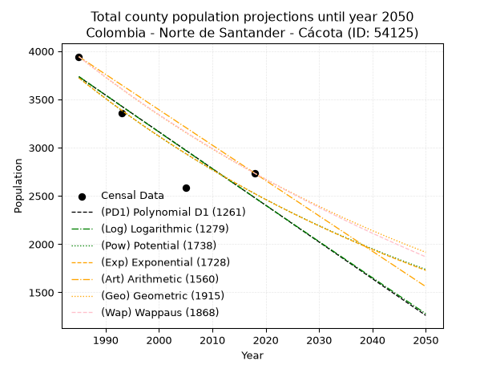
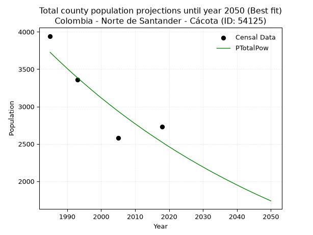
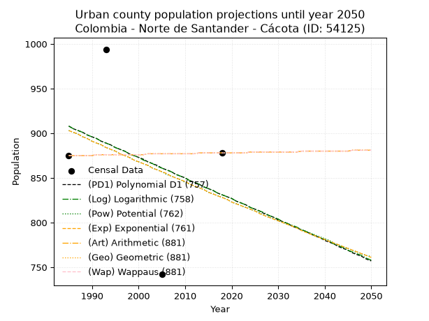
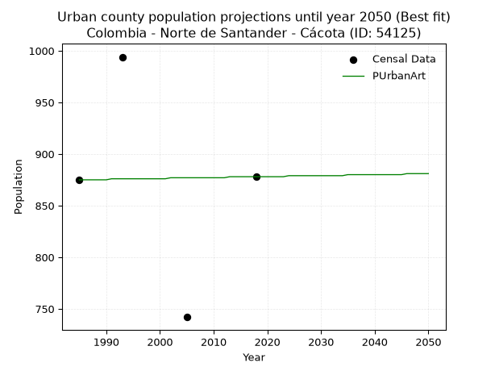
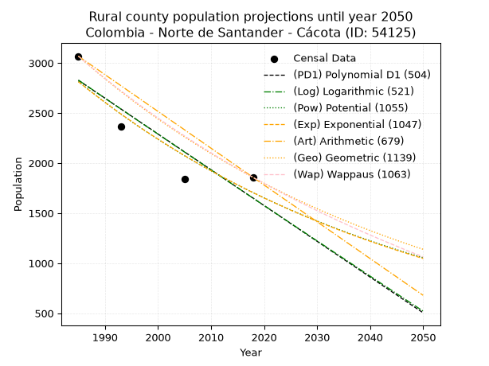
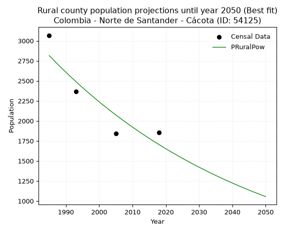

<div align="center">


</div>

# _“Population and Public Services Demand Projections (PPSD) until Year 2050 for Colombia - Norte de Santander - Cácota (ID: 54125)”_
Keywords: `population` `public-service` `projection` `lineal` `polynomial` `logarithmic` `potential` `exponential` `arithmetic` `geometric` `wappaus` `dane` `colombia` `south-america`

PPSD are analytical estimates used by governments and planners to anticipate future changes in population size, age distribution, and the resulting community needs for utilities, healthcare, education, and infrastructure as sizing future water treatment facilities, electrical grids, and road networks based on spatial growth.

> **General running parameters**: • app_version: _v20260806_. • Python version: _3.14.7_. • Pandas version: _3.0.5_. • NumPy version: _2.5.1_. • Creates, save and include plots into reports (create_plot): _True_. • Projection until year: _2050_. • Process polynomial degree 2 and up: _False_. • Process Wappaus: _True_. • Process Wappaus: _True_. • Set negative values to zero: _True_. • Set infinite values to zero: _True_. • Drop dataset notes: _True_. 
<div align="center">

Dynamic map: [:earth_americas:Google](http://maps.google.com/maps?q=7.268705462,-72.6420588) [:earth_americas:OSM](https://www.openstreetmap.org/#map=18/7.268705462/-72.6420588&layers=P) [:earth_americas:Bing](https://www.bing.com/maps?cp=7.268705462~-72.6420588&lvl=18) [:earth_americas:Apple](https://maps.apple.com/frame?center=7.268705462%2C-72.6420588&span=0.003%2C0.006)

</div>


<div align="center">

```geojson
{
  "type": "Feature",
  "geometry": {
    "type": "Point", 
    "coordinates": [-72.6420588, 7.268705462]
  }, 
  "properties": {
    "Name": "Colombia - Norte de Santander - Cácota (ID: 54125)"
  }
}
```

</div>


## 0. Census Data (4 records)

Census data are official statistics collected by a government about the people and housing in a country. They usually include counts of total population, age, sex, race, income, education, and jobs.

📅Global census file: [Population.xlsx](../data/Population.xlsx)

| Source   |   Year |   CountryID | CountryName   |   StateID | StateName          |   CountyID | CountyName   |   PTotal |   PUrban |   PRural |
|:---------|-------:|------------:|:--------------|----------:|:-------------------|-----------:|:-------------|---------:|---------:|---------:|
| DANE     |   1985 |          57 | Colombia      |        54 | Norte de Santander |      54125 | Cácota       |     3943 |      875 |     3068 |
| DANE     |   1993 |          57 | Colombia      |        54 | Norte de Santander |      54125 | Cácota       |     3359 |      994 |     2365 |
| DANE     |   2005 |          57 | Colombia      |        54 | Norte De Santander |      54125 | Cácota       |     2583 |      742 |     1841 |
| DANE     |   2018 |          57 | Colombia      |        54 | Norte de Santander |      54125 | Cácota       |     2733 |      878 |     1855 |

> 🔥Some records has specific notes about the registered values or the corresponding urban or rural distribution.

## 1. Total

### 1.1. Coefficients and Parameters

* (PD1) Polynomial Deg 1: -38.062625451625905, 79289.26655961473 (lineal)
* (Log) Logarithmic: -76279.92879545025, 582958.8500432039
* (Pow) Potential: -23.662616985099717, 81.60479337827859
* (Exp) Exponential: -0.011807562021508724, 56221218735997.21
* (Art) Arithmetic: Year diff. 2018 - 1985 = 33, Population diff. 2733 - 3943 = -1210, Annual growth = -36.666666666666664
* (Geo) Geometric: Year diff. 2018 - 1985 = 33, Population diff. 2733 - 3943 = -1210, Annual growth % = -0.011045873104353121
* (Wap) Wappaus: i = -1.0984621529858198, Condition values only valid for < 200)

<sub>
Wappaus condition values: ['-0.00', '-1.10', '-2.20', '-3.30', '-4.39', '-5.49', '-6.59', '-7.69', '-8.79', '-9.89', '-10.98', '-12.08', '-13.18', '-14.28', '-15.38', '-16.48', '-17.58', '-18.67', '-19.77', '-20.87', '-21.97', '-23.07', '-24.17', '-25.26', '-26.36', '-27.46', '-28.56', '-29.66', '-30.76', '-31.86', '-32.95', '-34.05', '-35.15', '-36.25', '-37.35', '-38.45', '-39.54', '-40.64', '-41.74', '-42.84', '-43.94', '-45.04', '-46.14', '-47.23', '-48.33', '-49.43', '-50.53', '-51.63', '-52.73', '-53.82', '-54.92', '-56.02', '-57.12', '-58.22', '-59.32', '-60.42', '-61.51', '-62.61', '-63.71', '-64.81', '-65.91', '-67.01', '-68.10', '-69.20', '-70.30', '-71.40']
</sub>


### 1.2. Projected Dataset

|   Year |   CountyID |   PTotalPD1 |   PTotalLog |   PTotalPow |   PTotalExp |   PTotalArt |   PTotalGeo |   PTotalWap |
|-------:|-----------:|------------:|------------:|------------:|------------:|------------:|------------:|------------:|
|   1985 |      54125 |        3735 |        3737 |        3725 |        3723 |        3943 |        3943 |        3943 |
|   1986 |      54125 |        3697 |        3698 |        3681 |        3679 |        3906 |        3899 |        3900 |
|   1987 |      54125 |        3659 |        3660 |        3637 |        3636 |        3870 |        3856 |        3857 |
|   1988 |      54125 |        3621 |        3622 |        3594 |        3594 |        3833 |        3814 |        3815 |
|   1989 |      54125 |        3583 |        3583 |        3552 |        3551 |        3796 |        3772 |        3773 |
|   1990 |      54125 |        3545 |        3545 |        3510 |        3510 |        3760 |        3730 |        3732 |
|   1991 |      54125 |        3507 |        3507 |        3468 |        3468 |        3723 |        3689 |        3691 |
|   1992 |      54125 |        3469 |        3468 |        3427 |        3428 |        3686 |        3648 |        3651 |
|   1993 |      54125 |        3430 |        3430 |        3387 |        3387 |        3650 |        3608 |        3611 |
|   1994 |      54125 |        3392 |        3392 |        3347 |        3348 |        3613 |        3568 |        3572 |
|   1995 |      54125 |        3354 |        3353 |        3308 |        3308 |        3576 |        3528 |        3532 |
|   1996 |      54125 |        3316 |        3315 |        3269 |        3270 |        3540 |        3490 |        3494 |
|   1997 |      54125 |        3278 |        3277 |        3230 |        3231 |        3503 |        3451 |        3455 |
|   1998 |      54125 |        3240 |        3239 |        3192 |        3193 |        3466 |        3413 |        3417 |
|   1999 |      54125 |        3202 |        3201 |        3154 |        3156 |        3430 |        3375 |        3380 |
|   2000 |      54125 |        3164 |        3163 |        3117 |        3119 |        3393 |        3338 |        3343 |
|   2001 |      54125 |        3126 |        3124 |        3081 |        3082 |        3356 |        3301 |        3306 |
|   2002 |      54125 |        3088 |        3086 |        3044 |        3046 |        3320 |        3265 |        3270 |
|   2003 |      54125 |        3050 |        3048 |        3009 |        3010 |        3283 |        3228 |        3234 |
|   2004 |      54125 |        3012 |        3010 |        2973 |        2975 |        3246 |        3193 |        3198 |
|   2005 |      54125 |        2974 |        2972 |        2938 |        2940 |        3210 |        3158 |        3162 |
|   2006 |      54125 |        2936 |        2934 |        2904 |        2905 |        3173 |        3123 |        3127 |
|   2007 |      54125 |        2898 |        2896 |        2870 |        2871 |        3136 |        3088 |        3093 |
|   2008 |      54125 |        2860 |        2858 |        2836 |        2838 |        3100 |        3054 |        3059 |
|   2009 |      54125 |        2821 |        2820 |        2803 |        2804 |        3063 |        3020 |        3025 |
|   2010 |      54125 |        2783 |        2782 |        2770 |        2771 |        3026 |        2987 |        2991 |
|   2011 |      54125 |        2745 |        2744 |        2738 |        2739 |        2990 |        2954 |        2958 |
|   2012 |      54125 |        2707 |        2706 |        2706 |        2707 |        2953 |        2921 |        2925 |
|   2013 |      54125 |        2669 |        2668 |        2674 |        2675 |        2916 |        2889 |        2892 |
|   2014 |      54125 |        2631 |        2630 |        2643 |        2644 |        2880 |        2857 |        2860 |
|   2015 |      54125 |        2593 |        2593 |        2612 |        2613 |        2843 |        2826 |        2827 |
|   2016 |      54125 |        2555 |        2555 |        2582 |        2582 |        2806 |        2794 |        2796 |
|   2017 |      54125 |        2517 |        2517 |        2552 |        2552 |        2770 |        2764 |        2764 |
|   2018 |      54125 |        2479 |        2479 |        2522 |        2522 |        2733 |        2733 |        2733 |
|   2019 |      54125 |        2441 |        2441 |        2492 |        2492 |        2696 |        2703 |        2702 |
|   2020 |      54125 |        2403 |        2404 |        2463 |        2463 |        2660 |        2673 |        2671 |
|   2021 |      54125 |        2365 |        2366 |        2435 |        2434 |        2623 |        2643 |        2641 |
|   2022 |      54125 |        2327 |        2328 |        2406 |        2405 |        2586 |        2614 |        2611 |
|   2023 |      54125 |        2289 |        2290 |        2378 |        2377 |        2550 |        2585 |        2581 |
|   2024 |      54125 |        2251 |        2253 |        2351 |        2349 |        2513 |        2557 |        2552 |
|   2025 |      54125 |        2212 |        2215 |        2323 |        2322 |        2476 |        2529 |        2523 |
|   2026 |      54125 |        2174 |        2177 |        2296 |        2294 |        2440 |        2501 |        2494 |
|   2027 |      54125 |        2136 |        2140 |        2270 |        2267 |        2403 |        2473 |        2465 |
|   2028 |      54125 |        2098 |        2102 |        2243 |        2241 |        2366 |        2446 |        2436 |
|   2029 |      54125 |        2060 |        2064 |        2217 |        2214 |        2330 |        2419 |        2408 |
|   2030 |      54125 |        2022 |        2027 |        2192 |        2188 |        2293 |        2392 |        2380 |
|   2031 |      54125 |        1984 |        1989 |        2166 |        2163 |        2256 |        2366 |        2352 |
|   2032 |      54125 |        1946 |        1952 |        2141 |        2137 |        2220 |        2339 |        2325 |
|   2033 |      54125 |        1908 |        1914 |        2116 |        2112 |        2183 |        2314 |        2298 |
|   2034 |      54125 |        1870 |        1877 |        2092 |        2088 |        2146 |        2288 |        2271 |
|   2035 |      54125 |        1832 |        1839 |        2068 |        2063 |        2110 |        2263 |        2244 |
|   2036 |      54125 |        1794 |        1802 |        2044 |        2039 |        2073 |        2238 |        2217 |
|   2037 |      54125 |        1756 |        1764 |        2020 |        2015 |        2036 |        2213 |        2191 |
|   2038 |      54125 |        1718 |        1727 |        1997 |        1991 |        2000 |        2189 |        2165 |
|   2039 |      54125 |        1680 |        1689 |        1974 |        1968 |        1963 |        2164 |        2139 |
|   2040 |      54125 |        1642 |        1652 |        1951 |        1945 |        1926 |        2140 |        2113 |
|   2041 |      54125 |        1603 |        1615 |        1929 |        1922 |        1890 |        2117 |        2088 |
|   2042 |      54125 |        1565 |        1577 |        1906 |        1899 |        1853 |        2093 |        2063 |
|   2043 |      54125 |        1527 |        1540 |        1884 |        1877 |        1816 |        2070 |        2038 |
|   2044 |      54125 |        1489 |        1503 |        1863 |        1855 |        1780 |        2047 |        2013 |
|   2045 |      54125 |        1451 |        1465 |        1841 |        1833 |        1743 |        2025 |        1988 |
|   2046 |      54125 |        1413 |        1428 |        1820 |        1812 |        1706 |        2002 |        1964 |
|   2047 |      54125 |        1375 |        1391 |        1799 |        1790 |        1670 |        1980 |        1940 |
|   2048 |      54125 |        1337 |        1353 |        1779 |        1769 |        1633 |        1959 |        1916 |
|   2049 |      54125 |        1299 |        1316 |        1758 |        1749 |        1596 |        1937 |        1892 |
|   2050 |      54125 |        1261 |        1279 |        1738 |        1728 |        1560 |        1915 |        1868 |
<div align="center">

</img>

</div>


### 1.3. Best fit with absolute error and relative error (%)

Relative error puts that difference into context by dividing the absolute error by the true value, creating a unitless ratio or percentage that shows the scale of the mistake.

Absolute and relative error

|   Year | Source   |   CountryID | CountryName   |   StateID | StateName          |   CountyID_x | CountyName   |   PTotal |   PUrban |   PRural |   CountyID_y |   PTotalPD1 |   PTotalLog |   PTotalPow |   PTotalExp |   PTotalArt |   PTotalGeo |   PTotalWap |   PTotalPD1AbsError |   PTotalLogAbsError |   PTotalPowAbsError |   PTotalExpAbsError |   PTotalArtAbsError |   PTotalGeoAbsError |   PTotalWapAbsError |   PTotalPD1RelError |   PTotalLogRelError |   PTotalPowRelError |   PTotalExpRelError |   PTotalArtRelError |   PTotalGeoRelError |   PTotalWapRelError |
|-------:|:---------|------------:|:--------------|----------:|:-------------------|-------------:|:-------------|---------:|---------:|---------:|-------------:|------------:|------------:|------------:|------------:|------------:|------------:|------------:|--------------------:|--------------------:|--------------------:|--------------------:|--------------------:|--------------------:|--------------------:|--------------------:|--------------------:|--------------------:|--------------------:|--------------------:|--------------------:|--------------------:|
|   1985 | DANE     |          57 | Colombia      |        54 | Norte de Santander |        54125 | Cácota       |     3943 |      875 |     3068 |        54125 |        3735 |        3737 |        3725 |        3723 |        3943 |        3943 |        3943 |                 208 |                 206 |                 218 |                 220 |                   0 |                   0 |                   0 |             5.27517 |             5.22445 |            5.52879  |            5.57951  |             0       |             0       |             0       |
|   1993 | DANE     |          57 | Colombia      |        54 | Norte de Santander |        54125 | Cácota       |     3359 |      994 |     2365 |        54125 |        3430 |        3430 |        3387 |        3387 |        3650 |        3608 |        3611 |                  71 |                  71 |                  28 |                  28 |                 291 |                 249 |                 252 |             2.11372 |             2.11372 |            0.833581 |            0.833581 |             8.66329 |             7.41292 |             7.50223 |
|   2005 | DANE     |          57 | Colombia      |        54 | Norte De Santander |        54125 | Cácota       |     2583 |      742 |     1841 |        54125 |        2974 |        2972 |        2938 |        2940 |        3210 |        3158 |        3162 |                 391 |                 389 |                 355 |                 357 |                 627 |                 575 |                 579 |            15.1374  |            15.06    |           13.7437   |           13.8211   |            24.2741  |            22.2609  |            22.4158  |
|   2018 | DANE     |          57 | Colombia      |        54 | Norte de Santander |        54125 | Cácota       |     2733 |      878 |     1855 |        54125 |        2479 |        2479 |        2522 |        2522 |        2733 |        2733 |        2733 |                 254 |                 254 |                 211 |                 211 |                   0 |                   0 |                   0 |             9.29382 |             9.29382 |            7.72045  |            7.72045  |             0       |             0       |             0       |

Relative error mean

| Method    |   RelError | Best   |
|:----------|-----------:|:-------|
| PTotalPD1 |    7.95504 |        |
| PTotalLog |    7.923   |        |
| PTotalPow |    6.95663 | True   |
| PTotalExp |    6.98867 |        |
| PTotalArt |    8.23435 |        |
| PTotalGeo |    7.41846 |        |
| PTotalWap |    7.47951 |        |

💙Best method: _**PTotalPow**_
<div align="center">

</img>

</div>


### 1.4. Fresh water supply demand in liters per capita per day (lpcd)

The fresh water supply demand typically ranges from 100 to 300 liters per capita per day (lpcd) for standard domestic and municipal planning, though absolute survival minimums set by the World Health Organization are as low as 7.5 to 20 liters per day, and total consumption in high-income nations can exceed 400 liters.

> `CZ`: Level in meters above the sea level (masl).<br> `WS`: Fresh water supply demand in liters per capita per day (lpcd or l/h/d).<br> `WSAll`: Zonal fresh water supply demand in liters per second (l/s).<br> `A`: Zonal area in square meters.

Reference values (RAS Colombia)

|    CZ |   WS |
|------:|-----:|
|  1000 |  120 |
|  2000 |  130 |
| 99999 |  140 |

County shapefile geometry properties and water supply values

|   CountyID |     ATotal |   CZTotal |   WSTotal |
|-----------:|-----------:|----------:|----------:|
|      54125 | 1.3862e+08 |   2756.54 |       140 |

Projected values for best method: PTotalPow

|   CountyID |   Year |   PTotalPow |   WSTotal |   WSTotalAll |
|-----------:|-------:|------------:|----------:|-------------:|
|      54125 |   1985 |        3725 |       140 |      6.03588 |
|      54125 |   1986 |        3681 |       140 |      5.96458 |
|      54125 |   1987 |        3637 |       140 |      5.89329 |
|      54125 |   1988 |        3594 |       140 |      5.82361 |
|      54125 |   1989 |        3552 |       140 |      5.75556 |
|      54125 |   1990 |        3510 |       140 |      5.6875  |
|      54125 |   1991 |        3468 |       140 |      5.61944 |
|      54125 |   1992 |        3427 |       140 |      5.55301 |
|      54125 |   1993 |        3387 |       140 |      5.48819 |
|      54125 |   1994 |        3347 |       140 |      5.42338 |
|      54125 |   1995 |        3308 |       140 |      5.36019 |
|      54125 |   1996 |        3269 |       140 |      5.29699 |
|      54125 |   1997 |        3230 |       140 |      5.2338  |
|      54125 |   1998 |        3192 |       140 |      5.17222 |
|      54125 |   1999 |        3154 |       140 |      5.11065 |
|      54125 |   2000 |        3117 |       140 |      5.05069 |
|      54125 |   2001 |        3081 |       140 |      4.99236 |
|      54125 |   2002 |        3044 |       140 |      4.93241 |
|      54125 |   2003 |        3009 |       140 |      4.87569 |
|      54125 |   2004 |        2973 |       140 |      4.81736 |
|      54125 |   2005 |        2938 |       140 |      4.76065 |
|      54125 |   2006 |        2904 |       140 |      4.70556 |
|      54125 |   2007 |        2870 |       140 |      4.65046 |
|      54125 |   2008 |        2836 |       140 |      4.59537 |
|      54125 |   2009 |        2803 |       140 |      4.5419  |
|      54125 |   2010 |        2770 |       140 |      4.48843 |
|      54125 |   2011 |        2738 |       140 |      4.43657 |
|      54125 |   2012 |        2706 |       140 |      4.38472 |
|      54125 |   2013 |        2674 |       140 |      4.33287 |
|      54125 |   2014 |        2643 |       140 |      4.28264 |
|      54125 |   2015 |        2612 |       140 |      4.23241 |
|      54125 |   2016 |        2582 |       140 |      4.1838  |
|      54125 |   2017 |        2552 |       140 |      4.13519 |
|      54125 |   2018 |        2522 |       140 |      4.08657 |
|      54125 |   2019 |        2492 |       140 |      4.03796 |
|      54125 |   2020 |        2463 |       140 |      3.99097 |
|      54125 |   2021 |        2435 |       140 |      3.9456  |
|      54125 |   2022 |        2406 |       140 |      3.89861 |
|      54125 |   2023 |        2378 |       140 |      3.85324 |
|      54125 |   2024 |        2351 |       140 |      3.80949 |
|      54125 |   2025 |        2323 |       140 |      3.76412 |
|      54125 |   2026 |        2296 |       140 |      3.72037 |
|      54125 |   2027 |        2270 |       140 |      3.67824 |
|      54125 |   2028 |        2243 |       140 |      3.63449 |
|      54125 |   2029 |        2217 |       140 |      3.59236 |
|      54125 |   2030 |        2192 |       140 |      3.55185 |
|      54125 |   2031 |        2166 |       140 |      3.50972 |
|      54125 |   2032 |        2141 |       140 |      3.46921 |
|      54125 |   2033 |        2116 |       140 |      3.4287  |
|      54125 |   2034 |        2092 |       140 |      3.38981 |
|      54125 |   2035 |        2068 |       140 |      3.35093 |
|      54125 |   2036 |        2044 |       140 |      3.31204 |
|      54125 |   2037 |        2020 |       140 |      3.27315 |
|      54125 |   2038 |        1997 |       140 |      3.23588 |
|      54125 |   2039 |        1974 |       140 |      3.19861 |
|      54125 |   2040 |        1951 |       140 |      3.16134 |
|      54125 |   2041 |        1929 |       140 |      3.12569 |
|      54125 |   2042 |        1906 |       140 |      3.08843 |
|      54125 |   2043 |        1884 |       140 |      3.05278 |
|      54125 |   2044 |        1863 |       140 |      3.01875 |
|      54125 |   2045 |        1841 |       140 |      2.9831  |
|      54125 |   2046 |        1820 |       140 |      2.94907 |
|      54125 |   2047 |        1799 |       140 |      2.91505 |
|      54125 |   2048 |        1779 |       140 |      2.88264 |
|      54125 |   2049 |        1758 |       140 |      2.84861 |
|      54125 |   2050 |        1738 |       140 |      2.8162  |

## 2. Urban

### 2.1. Coefficients and Parameters

* (PD1) Polynomial Deg 1: -2.3143315937375255, 5501.4917703734845 (lineal)
* (Log) Logarithmic: -4640.3776625510145, 36143.79779870311
* (Pow) Potential: -5.3044989789058645, 20.448876622179398
* (Exp) Exponential: -0.0026445171788766412, 172031.8166999087
* (Art) Arithmetic: Year diff. 2018 - 1985 = 33, Population diff. 878 - 875 = 3, Annual growth = 0.09090909090909091
* (Geo) Geometric: Year diff. 2018 - 1985 = 33, Population diff. 878 - 875 = 3, Annual growth % = 0.00010372378128797877
* (Wap) Wappaus: i = 0.010371830109422808, Condition values only valid for < 200)

<sub>
Wappaus condition values: ['0.00', '0.01', '0.02', '0.03', '0.04', '0.05', '0.06', '0.07', '0.08', '0.09', '0.10', '0.11', '0.12', '0.13', '0.15', '0.16', '0.17', '0.18', '0.19', '0.20', '0.21', '0.22', '0.23', '0.24', '0.25', '0.26', '0.27', '0.28', '0.29', '0.30', '0.31', '0.32', '0.33', '0.34', '0.35', '0.36', '0.37', '0.38', '0.39', '0.40', '0.41', '0.43', '0.44', '0.45', '0.46', '0.47', '0.48', '0.49', '0.50', '0.51', '0.52', '0.53', '0.54', '0.55', '0.56', '0.57', '0.58', '0.59', '0.60', '0.61', '0.62', '0.63', '0.64', '0.65', '0.66', '0.67']
</sub>


### 2.2. Projected Dataset

|   Year |   CountyID |   PUrbanPD1 |   PUrbanLog |   PUrbanPow |   PUrbanExp |   PUrbanArt |   PUrbanGeo |   PUrbanWap |
|-------:|-----------:|------------:|------------:|------------:|------------:|------------:|------------:|------------:|
|   1985 |      54125 |         908 |         908 |         903 |         903 |         875 |         875 |         875 |
|   1986 |      54125 |         905 |         905 |         901 |         901 |         875 |         875 |         875 |
|   1987 |      54125 |         903 |         903 |         899 |         899 |         875 |         875 |         875 |
|   1988 |      54125 |         901 |         901 |         896 |         896 |         875 |         875 |         875 |
|   1989 |      54125 |         898 |         898 |         894 |         894 |         875 |         875 |         875 |
|   1990 |      54125 |         896 |         896 |         891 |         891 |         875 |         875 |         875 |
|   1991 |      54125 |         894 |         894 |         889 |         889 |         876 |         876 |         876 |
|   1992 |      54125 |         891 |         891 |         887 |         887 |         876 |         876 |         876 |
|   1993 |      54125 |         889 |         889 |         884 |         884 |         876 |         876 |         876 |
|   1994 |      54125 |         887 |         887 |         882 |         882 |         876 |         876 |         876 |
|   1995 |      54125 |         884 |         884 |         880 |         880 |         876 |         876 |         876 |
|   1996 |      54125 |         882 |         882 |         877 |         877 |         876 |         876 |         876 |
|   1997 |      54125 |         880 |         880 |         875 |         875 |         876 |         876 |         876 |
|   1998 |      54125 |         877 |         877 |         873 |         873 |         876 |         876 |         876 |
|   1999 |      54125 |         875 |         875 |         870 |         870 |         876 |         876 |         876 |
|   2000 |      54125 |         873 |         873 |         868 |         868 |         876 |         876 |         876 |
|   2001 |      54125 |         871 |         870 |         866 |         866 |         876 |         876 |         876 |
|   2002 |      54125 |         868 |         868 |         864 |         864 |         877 |         877 |         877 |
|   2003 |      54125 |         866 |         866 |         861 |         861 |         877 |         877 |         877 |
|   2004 |      54125 |         864 |         863 |         859 |         859 |         877 |         877 |         877 |
|   2005 |      54125 |         861 |         861 |         857 |         857 |         877 |         877 |         877 |
|   2006 |      54125 |         859 |         859 |         854 |         855 |         877 |         877 |         877 |
|   2007 |      54125 |         857 |         857 |         852 |         852 |         877 |         877 |         877 |
|   2008 |      54125 |         854 |         854 |         850 |         850 |         877 |         877 |         877 |
|   2009 |      54125 |         852 |         852 |         848 |         848 |         877 |         877 |         877 |
|   2010 |      54125 |         850 |         850 |         845 |         846 |         877 |         877 |         877 |
|   2011 |      54125 |         847 |         847 |         843 |         843 |         877 |         877 |         877 |
|   2012 |      54125 |         845 |         845 |         841 |         841 |         877 |         877 |         877 |
|   2013 |      54125 |         843 |         843 |         839 |         839 |         878 |         878 |         878 |
|   2014 |      54125 |         840 |         840 |         837 |         837 |         878 |         878 |         878 |
|   2015 |      54125 |         838 |         838 |         834 |         834 |         878 |         878 |         878 |
|   2016 |      54125 |         836 |         836 |         832 |         832 |         878 |         878 |         878 |
|   2017 |      54125 |         833 |         833 |         830 |         830 |         878 |         878 |         878 |
|   2018 |      54125 |         831 |         831 |         828 |         828 |         878 |         878 |         878 |
|   2019 |      54125 |         829 |         829 |         826 |         826 |         878 |         878 |         878 |
|   2020 |      54125 |         827 |         827 |         823 |         823 |         878 |         878 |         878 |
|   2021 |      54125 |         824 |         824 |         821 |         821 |         878 |         878 |         878 |
|   2022 |      54125 |         822 |         822 |         819 |         819 |         878 |         878 |         878 |
|   2023 |      54125 |         820 |         820 |         817 |         817 |         878 |         878 |         878 |
|   2024 |      54125 |         817 |         817 |         815 |         815 |         879 |         879 |         879 |
|   2025 |      54125 |         815 |         815 |         813 |         813 |         879 |         879 |         879 |
|   2026 |      54125 |         813 |         813 |         811 |         810 |         879 |         879 |         879 |
|   2027 |      54125 |         810 |         811 |         808 |         808 |         879 |         879 |         879 |
|   2028 |      54125 |         808 |         808 |         806 |         806 |         879 |         879 |         879 |
|   2029 |      54125 |         806 |         806 |         804 |         804 |         879 |         879 |         879 |
|   2030 |      54125 |         803 |         804 |         802 |         802 |         879 |         879 |         879 |
|   2031 |      54125 |         801 |         801 |         800 |         800 |         879 |         879 |         879 |
|   2032 |      54125 |         799 |         799 |         798 |         798 |         879 |         879 |         879 |
|   2033 |      54125 |         796 |         797 |         796 |         796 |         879 |         879 |         879 |
|   2034 |      54125 |         794 |         795 |         794 |         794 |         879 |         879 |         879 |
|   2035 |      54125 |         792 |         792 |         792 |         791 |         880 |         880 |         880 |
|   2036 |      54125 |         790 |         790 |         790 |         789 |         880 |         880 |         880 |
|   2037 |      54125 |         787 |         788 |         788 |         787 |         880 |         880 |         880 |
|   2038 |      54125 |         785 |         785 |         786 |         785 |         880 |         880 |         880 |
|   2039 |      54125 |         783 |         783 |         784 |         783 |         880 |         880 |         880 |
|   2040 |      54125 |         780 |         781 |         782 |         781 |         880 |         880 |         880 |
|   2041 |      54125 |         778 |         779 |         780 |         779 |         880 |         880 |         880 |
|   2042 |      54125 |         776 |         776 |         777 |         777 |         880 |         880 |         880 |
|   2043 |      54125 |         773 |         774 |         775 |         775 |         880 |         880 |         880 |
|   2044 |      54125 |         771 |         772 |         773 |         773 |         880 |         880 |         880 |
|   2045 |      54125 |         769 |         769 |         771 |         771 |         880 |         880 |         880 |
|   2046 |      54125 |         766 |         767 |         769 |         769 |         881 |         881 |         881 |
|   2047 |      54125 |         764 |         765 |         767 |         767 |         881 |         881 |         881 |
|   2048 |      54125 |         762 |         763 |         765 |         765 |         881 |         881 |         881 |
|   2049 |      54125 |         759 |         760 |         763 |         763 |         881 |         881 |         881 |
|   2050 |      54125 |         757 |         758 |         762 |         761 |         881 |         881 |         881 |
<div align="center">

</img>

</div>


### 2.3. Best fit with absolute error and relative error (%)

Relative error puts that difference into context by dividing the absolute error by the true value, creating a unitless ratio or percentage that shows the scale of the mistake.

Absolute and relative error

|   Year | Source   |   CountryID | CountryName   |   StateID | StateName          |   CountyID_x | CountyName   |   PTotal |   PUrban |   PRural |   CountyID_y |   PUrbanPD1 |   PUrbanLog |   PUrbanPow |   PUrbanExp |   PUrbanArt |   PUrbanGeo |   PUrbanWap |   PUrbanPD1AbsError |   PUrbanLogAbsError |   PUrbanPowAbsError |   PUrbanExpAbsError |   PUrbanArtAbsError |   PUrbanGeoAbsError |   PUrbanWapAbsError |   PUrbanPD1RelError |   PUrbanLogRelError |   PUrbanPowRelError |   PUrbanExpRelError |   PUrbanArtRelError |   PUrbanGeoRelError |   PUrbanWapRelError |
|-------:|:---------|------------:|:--------------|----------:|:-------------------|-------------:|:-------------|---------:|---------:|---------:|-------------:|------------:|------------:|------------:|------------:|------------:|------------:|------------:|--------------------:|--------------------:|--------------------:|--------------------:|--------------------:|--------------------:|--------------------:|--------------------:|--------------------:|--------------------:|--------------------:|--------------------:|--------------------:|--------------------:|
|   1985 | DANE     |          57 | Colombia      |        54 | Norte de Santander |        54125 | Cácota       |     3943 |      875 |     3068 |        54125 |         908 |         908 |         903 |         903 |         875 |         875 |         875 |                  33 |                  33 |                  28 |                  28 |                   0 |                   0 |                   0 |             3.77143 |             3.77143 |             3.2     |             3.2     |              0      |              0      |              0      |
|   1993 | DANE     |          57 | Colombia      |        54 | Norte de Santander |        54125 | Cácota       |     3359 |      994 |     2365 |        54125 |         889 |         889 |         884 |         884 |         876 |         876 |         876 |                 105 |                 105 |                 110 |                 110 |                 118 |                 118 |                 118 |            10.5634  |            10.5634  |            11.0664  |            11.0664  |             11.8712 |             11.8712 |             11.8712 |
|   2005 | DANE     |          57 | Colombia      |        54 | Norte De Santander |        54125 | Cácota       |     2583 |      742 |     1841 |        54125 |         861 |         861 |         857 |         857 |         877 |         877 |         877 |                 119 |                 119 |                 115 |                 115 |                 135 |                 135 |                 135 |            16.0377  |            16.0377  |            15.4987  |            15.4987  |             18.1941 |             18.1941 |             18.1941 |
|   2018 | DANE     |          57 | Colombia      |        54 | Norte de Santander |        54125 | Cácota       |     2733 |      878 |     1855 |        54125 |         831 |         831 |         828 |         828 |         878 |         878 |         878 |                  47 |                  47 |                  50 |                  50 |                   0 |                   0 |                   0 |             5.35308 |             5.35308 |             5.69476 |             5.69476 |              0      |              0      |              0      |

Relative error mean

| Method    |   RelError | Best   |
|:----------|-----------:|:-------|
| PUrbanPD1 |    8.9314  |        |
| PUrbanLog |    8.9314  |        |
| PUrbanPow |    8.86495 |        |
| PUrbanExp |    8.86495 |        |
| PUrbanArt |    7.51632 | True   |
| PUrbanGeo |    7.51632 | True   |
| PUrbanWap |    7.51632 | True   |

💙Best method: _**PUrbanArt**_
<div align="center">

</img>

</div>


### 2.4. Fresh water supply demand in liters per capita per day (lpcd)

The fresh water supply demand typically ranges from 100 to 300 liters per capita per day (lpcd) for standard domestic and municipal planning, though absolute survival minimums set by the World Health Organization are as low as 7.5 to 20 liters per day, and total consumption in high-income nations can exceed 400 liters.

> `CZ`: Level in meters above the sea level (masl).<br> `WS`: Fresh water supply demand in liters per capita per day (lpcd or l/h/d).<br> `WSAll`: Zonal fresh water supply demand in liters per second (l/s).<br> `A`: Zonal area in square meters.

Reference values (RAS Colombia)

|    CZ |   WS |
|------:|-----:|
|  1000 |  120 |
|  2000 |  130 |
| 99999 |  140 |

County shapefile geometry properties and water supply values

|   CountyID |   AUrban |   CZUrban |   WSUrban |
|-----------:|---------:|----------:|----------:|
|      54125 |   276896 |   2410.98 |       140 |

Projected values for best method: PUrbanArt

|   CountyID |   Year |   PUrbanArt |   WSUrban |   WSUrbanAll |
|-----------:|-------:|------------:|----------:|-------------:|
|      54125 |   1985 |         875 |       140 |      1.41782 |
|      54125 |   1986 |         875 |       140 |      1.41782 |
|      54125 |   1987 |         875 |       140 |      1.41782 |
|      54125 |   1988 |         875 |       140 |      1.41782 |
|      54125 |   1989 |         875 |       140 |      1.41782 |
|      54125 |   1990 |         875 |       140 |      1.41782 |
|      54125 |   1991 |         876 |       140 |      1.41944 |
|      54125 |   1992 |         876 |       140 |      1.41944 |
|      54125 |   1993 |         876 |       140 |      1.41944 |
|      54125 |   1994 |         876 |       140 |      1.41944 |
|      54125 |   1995 |         876 |       140 |      1.41944 |
|      54125 |   1996 |         876 |       140 |      1.41944 |
|      54125 |   1997 |         876 |       140 |      1.41944 |
|      54125 |   1998 |         876 |       140 |      1.41944 |
|      54125 |   1999 |         876 |       140 |      1.41944 |
|      54125 |   2000 |         876 |       140 |      1.41944 |
|      54125 |   2001 |         876 |       140 |      1.41944 |
|      54125 |   2002 |         877 |       140 |      1.42106 |
|      54125 |   2003 |         877 |       140 |      1.42106 |
|      54125 |   2004 |         877 |       140 |      1.42106 |
|      54125 |   2005 |         877 |       140 |      1.42106 |
|      54125 |   2006 |         877 |       140 |      1.42106 |
|      54125 |   2007 |         877 |       140 |      1.42106 |
|      54125 |   2008 |         877 |       140 |      1.42106 |
|      54125 |   2009 |         877 |       140 |      1.42106 |
|      54125 |   2010 |         877 |       140 |      1.42106 |
|      54125 |   2011 |         877 |       140 |      1.42106 |
|      54125 |   2012 |         877 |       140 |      1.42106 |
|      54125 |   2013 |         878 |       140 |      1.42269 |
|      54125 |   2014 |         878 |       140 |      1.42269 |
|      54125 |   2015 |         878 |       140 |      1.42269 |
|      54125 |   2016 |         878 |       140 |      1.42269 |
|      54125 |   2017 |         878 |       140 |      1.42269 |
|      54125 |   2018 |         878 |       140 |      1.42269 |
|      54125 |   2019 |         878 |       140 |      1.42269 |
|      54125 |   2020 |         878 |       140 |      1.42269 |
|      54125 |   2021 |         878 |       140 |      1.42269 |
|      54125 |   2022 |         878 |       140 |      1.42269 |
|      54125 |   2023 |         878 |       140 |      1.42269 |
|      54125 |   2024 |         879 |       140 |      1.42431 |
|      54125 |   2025 |         879 |       140 |      1.42431 |
|      54125 |   2026 |         879 |       140 |      1.42431 |
|      54125 |   2027 |         879 |       140 |      1.42431 |
|      54125 |   2028 |         879 |       140 |      1.42431 |
|      54125 |   2029 |         879 |       140 |      1.42431 |
|      54125 |   2030 |         879 |       140 |      1.42431 |
|      54125 |   2031 |         879 |       140 |      1.42431 |
|      54125 |   2032 |         879 |       140 |      1.42431 |
|      54125 |   2033 |         879 |       140 |      1.42431 |
|      54125 |   2034 |         879 |       140 |      1.42431 |
|      54125 |   2035 |         880 |       140 |      1.42593 |
|      54125 |   2036 |         880 |       140 |      1.42593 |
|      54125 |   2037 |         880 |       140 |      1.42593 |
|      54125 |   2038 |         880 |       140 |      1.42593 |
|      54125 |   2039 |         880 |       140 |      1.42593 |
|      54125 |   2040 |         880 |       140 |      1.42593 |
|      54125 |   2041 |         880 |       140 |      1.42593 |
|      54125 |   2042 |         880 |       140 |      1.42593 |
|      54125 |   2043 |         880 |       140 |      1.42593 |
|      54125 |   2044 |         880 |       140 |      1.42593 |
|      54125 |   2045 |         880 |       140 |      1.42593 |
|      54125 |   2046 |         881 |       140 |      1.42755 |
|      54125 |   2047 |         881 |       140 |      1.42755 |
|      54125 |   2048 |         881 |       140 |      1.42755 |
|      54125 |   2049 |         881 |       140 |      1.42755 |
|      54125 |   2050 |         881 |       140 |      1.42755 |

## 3. Rural

### 3.1. Coefficients and Parameters

* (PD1) Polynomial Deg 1: -35.74829385788836, 73787.77478924122 (lineal)
* (Log) Logarithmic: -71639.55113289921, 546815.0522445007
* (Pow) Potential: -30.471087460937945, 103.93589160012009
* (Exp) Exponential: -0.01520652708438115, 3.617376240305121e+16
* (Art) Arithmetic: Year diff. 2018 - 1985 = 33, Population diff. 1855 - 3068 = -1213, Annual growth = -36.75757575757576
* (Geo) Geometric: Year diff. 2018 - 1985 = 33, Population diff. 1855 - 3068 = -1213, Annual growth % = -0.015131060147279385
* (Wap) Wappaus: i = -1.4932998479616395, Condition values only valid for < 200)

<sub>
Wappaus condition values: ['-0.00', '-1.49', '-2.99', '-4.48', '-5.97', '-7.47', '-8.96', '-10.45', '-11.95', '-13.44', '-14.93', '-16.43', '-17.92', '-19.41', '-20.91', '-22.40', '-23.89', '-25.39', '-26.88', '-28.37', '-29.87', '-31.36', '-32.85', '-34.35', '-35.84', '-37.33', '-38.83', '-40.32', '-41.81', '-43.31', '-44.80', '-46.29', '-47.79', '-49.28', '-50.77', '-52.27', '-53.76', '-55.25', '-56.75', '-58.24', '-59.73', '-61.23', '-62.72', '-64.21', '-65.71', '-67.20', '-68.69', '-70.19', '-71.68', '-73.17', '-74.66', '-76.16', '-77.65', '-79.14', '-80.64', '-82.13', '-83.62', '-85.12', '-86.61', '-88.10', '-89.60', '-91.09', '-92.58', '-94.08', '-95.57', '-97.06']
</sub>


### 3.2. Projected Dataset

|   Year |   CountyID |   PRuralPD1 |   PRuralLog |   PRuralPow |   PRuralExp |   PRuralArt |   PRuralGeo |   PRuralWap |
|-------:|-----------:|------------:|------------:|------------:|------------:|------------:|------------:|------------:|
|   1985 |      54125 |        2827 |        2829 |        2815 |        2813 |        3068 |        3068 |        3068 |
|   1986 |      54125 |        2792 |        2793 |        2773 |        2771 |        3031 |        3022 |        3023 |
|   1987 |      54125 |        2756 |        2757 |        2730 |        2729 |        2994 |        2976 |        2978 |
|   1988 |      54125 |        2720 |        2721 |        2689 |        2688 |        2958 |        2931 |        2934 |
|   1989 |      54125 |        2684 |        2685 |        2648 |        2647 |        2921 |        2886 |        2890 |
|   1990 |      54125 |        2649 |        2649 |        2608 |        2607 |        2884 |        2843 |        2847 |
|   1991 |      54125 |        2613 |        2613 |        2568 |        2568 |        2847 |        2800 |        2805 |
|   1992 |      54125 |        2577 |        2577 |        2529 |        2529 |        2811 |        2757 |        2763 |
|   1993 |      54125 |        2541 |        2541 |        2491 |        2491 |        2774 |        2716 |        2722 |
|   1994 |      54125 |        2506 |        2505 |        2453 |        2454 |        2737 |        2675 |        2682 |
|   1995 |      54125 |        2470 |        2469 |        2416 |        2417 |        2700 |        2634 |        2642 |
|   1996 |      54125 |        2434 |        2433 |        2379 |        2380 |        2664 |        2594 |        2602 |
|   1997 |      54125 |        2398 |        2397 |        2343 |        2344 |        2627 |        2555 |        2563 |
|   1998 |      54125 |        2363 |        2361 |        2308 |        2309 |        2590 |        2516 |        2525 |
|   1999 |      54125 |        2327 |        2326 |        2273 |        2274 |        2553 |        2478 |        2487 |
|   2000 |      54125 |        2291 |        2290 |        2238 |        2240 |        2517 |        2441 |        2450 |
|   2001 |      54125 |        2255 |        2254 |        2204 |        2206 |        2480 |        2404 |        2413 |
|   2002 |      54125 |        2220 |        2218 |        2171 |        2173 |        2443 |        2367 |        2377 |
|   2003 |      54125 |        2184 |        2182 |        2138 |        2140 |        2406 |        2332 |        2341 |
|   2004 |      54125 |        2148 |        2147 |        2106 |        2107 |        2370 |        2296 |        2306 |
|   2005 |      54125 |        2112 |        2111 |        2074 |        2076 |        2333 |        2262 |        2271 |
|   2006 |      54125 |        2077 |        2075 |        2043 |        2044 |        2296 |        2227 |        2236 |
|   2007 |      54125 |        2041 |        2040 |        2012 |        2013 |        2259 |        2194 |        2202 |
|   2008 |      54125 |        2005 |        2004 |        1982 |        1983 |        2223 |        2161 |        2169 |
|   2009 |      54125 |        1969 |        1968 |        1952 |        1953 |        2186 |        2128 |        2136 |
|   2010 |      54125 |        1934 |        1933 |        1923 |        1924 |        2149 |        2096 |        2103 |
|   2011 |      54125 |        1898 |        1897 |        1894 |        1895 |        2112 |        2064 |        2070 |
|   2012 |      54125 |        1862 |        1861 |        1865 |        1866 |        2076 |        2033 |        2039 |
|   2013 |      54125 |        1826 |        1826 |        1837 |        1838 |        2039 |        2002 |        2007 |
|   2014 |      54125 |        1791 |        1790 |        1810 |        1810 |        2002 |        1972 |        1976 |
|   2015 |      54125 |        1755 |        1755 |        1783 |        1783 |        1965 |        1942 |        1945 |
|   2016 |      54125 |        1719 |        1719 |        1756 |        1756 |        1929 |        1912 |        1915 |
|   2017 |      54125 |        1683 |        1683 |        1729 |        1729 |        1892 |        1883 |        1885 |
|   2018 |      54125 |        1648 |        1648 |        1704 |        1703 |        1855 |        1855 |        1855 |
|   2019 |      54125 |        1612 |        1612 |        1678 |        1678 |        1818 |        1827 |        1826 |
|   2020 |      54125 |        1576 |        1577 |        1653 |        1652 |        1781 |        1799 |        1797 |
|   2021 |      54125 |        1540 |        1542 |        1628 |        1627 |        1745 |        1772 |        1768 |
|   2022 |      54125 |        1505 |        1506 |        1604 |        1603 |        1708 |        1745 |        1740 |
|   2023 |      54125 |        1469 |        1471 |        1580 |        1579 |        1671 |        1719 |        1712 |
|   2024 |      54125 |        1433 |        1435 |        1556 |        1555 |        1634 |        1693 |        1684 |
|   2025 |      54125 |        1397 |        1400 |        1533 |        1531 |        1598 |        1667 |        1657 |
|   2026 |      54125 |        1362 |        1364 |        1510 |        1508 |        1561 |        1642 |        1630 |
|   2027 |      54125 |        1326 |        1329 |        1488 |        1485 |        1524 |        1617 |        1603 |
|   2028 |      54125 |        1290 |        1294 |        1465 |        1463 |        1487 |        1593 |        1577 |
|   2029 |      54125 |        1254 |        1258 |        1443 |        1441 |        1451 |        1569 |        1551 |
|   2030 |      54125 |        1219 |        1223 |        1422 |        1419 |        1414 |        1545 |        1525 |
|   2031 |      54125 |        1183 |        1188 |        1401 |        1398 |        1377 |        1521 |        1499 |
|   2032 |      54125 |        1147 |        1153 |        1380 |        1377 |        1340 |        1498 |        1474 |
|   2033 |      54125 |        1111 |        1117 |        1359 |        1356 |        1304 |        1476 |        1449 |
|   2034 |      54125 |        1076 |        1082 |        1339 |        1335 |        1267 |        1453 |        1424 |
|   2035 |      54125 |        1040 |        1047 |        1319 |        1315 |        1230 |        1431 |        1400 |
|   2036 |      54125 |        1004 |        1012 |        1300 |        1295 |        1193 |        1410 |        1376 |
|   2037 |      54125 |         969 |         977 |        1280 |        1276 |        1157 |        1388 |        1352 |
|   2038 |      54125 |         933 |         941 |        1261 |        1257 |        1120 |        1367 |        1328 |
|   2039 |      54125 |         897 |         906 |        1243 |        1238 |        1083 |        1347 |        1305 |
|   2040 |      54125 |         861 |         871 |        1224 |        1219 |        1046 |        1326 |        1282 |
|   2041 |      54125 |         826 |         836 |        1206 |        1201 |        1010 |        1306 |        1259 |
|   2042 |      54125 |         790 |         801 |        1188 |        1182 |         973 |        1287 |        1236 |
|   2043 |      54125 |         754 |         766 |        1171 |        1165 |         936 |        1267 |        1214 |
|   2044 |      54125 |         718 |         731 |        1153 |        1147 |         899 |        1248 |        1192 |
|   2045 |      54125 |         683 |         696 |        1136 |        1130 |         863 |        1229 |        1170 |
|   2046 |      54125 |         647 |         661 |        1119 |        1113 |         826 |        1210 |        1148 |
|   2047 |      54125 |         611 |         626 |        1103 |        1096 |         789 |        1192 |        1126 |
|   2048 |      54125 |         575 |         591 |        1087 |        1079 |         752 |        1174 |        1105 |
|   2049 |      54125 |         540 |         556 |        1071 |        1063 |         716 |        1156 |        1084 |
|   2050 |      54125 |         504 |         521 |        1055 |        1047 |         679 |        1139 |        1063 |
<div align="center">

</img>

</div>


### 3.3. Best fit with absolute error and relative error (%)

Relative error puts that difference into context by dividing the absolute error by the true value, creating a unitless ratio or percentage that shows the scale of the mistake.

Absolute and relative error

|   Year | Source   |   CountryID | CountryName   |   StateID | StateName          |   CountyID_x | CountyName   |   PTotal |   PUrban |   PRural |   CountyID_y |   PRuralPD1 |   PRuralLog |   PRuralPow |   PRuralExp |   PRuralArt |   PRuralGeo |   PRuralWap |   PRuralPD1AbsError |   PRuralLogAbsError |   PRuralPowAbsError |   PRuralExpAbsError |   PRuralArtAbsError |   PRuralGeoAbsError |   PRuralWapAbsError |   PRuralPD1RelError |   PRuralLogRelError |   PRuralPowRelError |   PRuralExpRelError |   PRuralArtRelError |   PRuralGeoRelError |   PRuralWapRelError |
|-------:|:---------|------------:|:--------------|----------:|:-------------------|-------------:|:-------------|---------:|---------:|---------:|-------------:|------------:|------------:|------------:|------------:|------------:|------------:|------------:|--------------------:|--------------------:|--------------------:|--------------------:|--------------------:|--------------------:|--------------------:|--------------------:|--------------------:|--------------------:|--------------------:|--------------------:|--------------------:|--------------------:|
|   1985 | DANE     |          57 | Colombia      |        54 | Norte de Santander |        54125 | Cácota       |     3943 |      875 |     3068 |        54125 |        2827 |        2829 |        2815 |        2813 |        3068 |        3068 |        3068 |                 241 |                 239 |                 253 |                 255 |                   0 |                   0 |                   0 |             7.85528 |             7.79009 |             8.24641 |             8.3116  |              0      |              0      |              0      |
|   1993 | DANE     |          57 | Colombia      |        54 | Norte de Santander |        54125 | Cácota       |     3359 |      994 |     2365 |        54125 |        2541 |        2541 |        2491 |        2491 |        2774 |        2716 |        2722 |                 176 |                 176 |                 126 |                 126 |                 409 |                 351 |                 357 |             7.44186 |             7.44186 |             5.3277  |             5.3277  |             17.2939 |             14.8414 |             15.0951 |
|   2005 | DANE     |          57 | Colombia      |        54 | Norte De Santander |        54125 | Cácota       |     2583 |      742 |     1841 |        54125 |        2112 |        2111 |        2074 |        2076 |        2333 |        2262 |        2271 |                 271 |                 270 |                 233 |                 235 |                 492 |                 421 |                 430 |            14.7203  |            14.6659  |            12.6562  |            12.7648  |             26.7246 |             22.868  |             23.3569 |
|   2018 | DANE     |          57 | Colombia      |        54 | Norte de Santander |        54125 | Cácota       |     2733 |      878 |     1855 |        54125 |        1648 |        1648 |        1704 |        1703 |        1855 |        1855 |        1855 |                 207 |                 207 |                 151 |                 152 |                   0 |                   0 |                   0 |            11.159   |            11.159   |             8.14016 |             8.19407 |              0      |              0      |              0      |

Relative error mean

| Method    |   RelError | Best   |
|:----------|-----------:|:-------|
| PRuralPD1 |   10.2941  |        |
| PRuralLog |   10.2642  |        |
| PRuralPow |    8.59261 | True   |
| PRuralExp |    8.64954 |        |
| PRuralArt |   11.0046  |        |
| PRuralGeo |    9.42736 |        |
| PRuralWap |    9.613   |        |

💙Best method: _**PRuralPow**_
<div align="center">

</img>

</div>


### 3.4. Fresh water supply demand in liters per capita per day (lpcd)

The fresh water supply demand typically ranges from 100 to 300 liters per capita per day (lpcd) for standard domestic and municipal planning, though absolute survival minimums set by the World Health Organization are as low as 7.5 to 20 liters per day, and total consumption in high-income nations can exceed 400 liters.

> `CZ`: Level in meters above the sea level (masl).<br> `WS`: Fresh water supply demand in liters per capita per day (lpcd or l/h/d).<br> `WSAll`: Zonal fresh water supply demand in liters per second (l/s).<br> `A`: Zonal area in square meters.

Reference values (RAS Colombia)

|    CZ |   WS |
|------:|-----:|
|  1000 |  120 |
|  2000 |  130 |
| 99999 |  140 |

County shapefile geometry properties and water supply values

|   CountyID |      ARural |   CZRural |   WSRural |
|-----------:|------------:|----------:|----------:|
|      54125 | 1.38343e+08 |    2757.2 |       140 |

Projected values for best method: PRuralPow

|   CountyID |   Year |   PRuralPow |   WSRural |   WSRuralAll |
|-----------:|-------:|------------:|----------:|-------------:|
|      54125 |   1985 |        2815 |       140 |      4.56134 |
|      54125 |   1986 |        2773 |       140 |      4.49329 |
|      54125 |   1987 |        2730 |       140 |      4.42361 |
|      54125 |   1988 |        2689 |       140 |      4.35718 |
|      54125 |   1989 |        2648 |       140 |      4.29074 |
|      54125 |   1990 |        2608 |       140 |      4.22593 |
|      54125 |   1991 |        2568 |       140 |      4.16111 |
|      54125 |   1992 |        2529 |       140 |      4.09792 |
|      54125 |   1993 |        2491 |       140 |      4.03634 |
|      54125 |   1994 |        2453 |       140 |      3.97477 |
|      54125 |   1995 |        2416 |       140 |      3.91481 |
|      54125 |   1996 |        2379 |       140 |      3.85486 |
|      54125 |   1997 |        2343 |       140 |      3.79653 |
|      54125 |   1998 |        2308 |       140 |      3.73981 |
|      54125 |   1999 |        2273 |       140 |      3.6831  |
|      54125 |   2000 |        2238 |       140 |      3.62639 |
|      54125 |   2001 |        2204 |       140 |      3.5713  |
|      54125 |   2002 |        2171 |       140 |      3.51782 |
|      54125 |   2003 |        2138 |       140 |      3.46435 |
|      54125 |   2004 |        2106 |       140 |      3.4125  |
|      54125 |   2005 |        2074 |       140 |      3.36065 |
|      54125 |   2006 |        2043 |       140 |      3.31042 |
|      54125 |   2007 |        2012 |       140 |      3.26019 |
|      54125 |   2008 |        1982 |       140 |      3.21157 |
|      54125 |   2009 |        1952 |       140 |      3.16296 |
|      54125 |   2010 |        1923 |       140 |      3.11597 |
|      54125 |   2011 |        1894 |       140 |      3.06898 |
|      54125 |   2012 |        1865 |       140 |      3.02199 |
|      54125 |   2013 |        1837 |       140 |      2.97662 |
|      54125 |   2014 |        1810 |       140 |      2.93287 |
|      54125 |   2015 |        1783 |       140 |      2.88912 |
|      54125 |   2016 |        1756 |       140 |      2.84537 |
|      54125 |   2017 |        1729 |       140 |      2.80162 |
|      54125 |   2018 |        1704 |       140 |      2.76111 |
|      54125 |   2019 |        1678 |       140 |      2.71898 |
|      54125 |   2020 |        1653 |       140 |      2.67847 |
|      54125 |   2021 |        1628 |       140 |      2.63796 |
|      54125 |   2022 |        1604 |       140 |      2.59907 |
|      54125 |   2023 |        1580 |       140 |      2.56019 |
|      54125 |   2024 |        1556 |       140 |      2.5213  |
|      54125 |   2025 |        1533 |       140 |      2.48403 |
|      54125 |   2026 |        1510 |       140 |      2.44676 |
|      54125 |   2027 |        1488 |       140 |      2.41111 |
|      54125 |   2028 |        1465 |       140 |      2.37384 |
|      54125 |   2029 |        1443 |       140 |      2.33819 |
|      54125 |   2030 |        1422 |       140 |      2.30417 |
|      54125 |   2031 |        1401 |       140 |      2.27014 |
|      54125 |   2032 |        1380 |       140 |      2.23611 |
|      54125 |   2033 |        1359 |       140 |      2.20208 |
|      54125 |   2034 |        1339 |       140 |      2.16968 |
|      54125 |   2035 |        1319 |       140 |      2.13727 |
|      54125 |   2036 |        1300 |       140 |      2.10648 |
|      54125 |   2037 |        1280 |       140 |      2.07407 |
|      54125 |   2038 |        1261 |       140 |      2.04329 |
|      54125 |   2039 |        1243 |       140 |      2.01412 |
|      54125 |   2040 |        1224 |       140 |      1.98333 |
|      54125 |   2041 |        1206 |       140 |      1.95417 |
|      54125 |   2042 |        1188 |       140 |      1.925   |
|      54125 |   2043 |        1171 |       140 |      1.89745 |
|      54125 |   2044 |        1153 |       140 |      1.86829 |
|      54125 |   2045 |        1136 |       140 |      1.84074 |
|      54125 |   2046 |        1119 |       140 |      1.81319 |
|      54125 |   2047 |        1103 |       140 |      1.78727 |
|      54125 |   2048 |        1087 |       140 |      1.76134 |
|      54125 |   2049 |        1071 |       140 |      1.73542 |
|      54125 |   2050 |        1055 |       140 |      1.70949 |

<div align="center"><br><sub>Share this research</sub></div><br>

<sub>**APPS & TOOLS & CONTENT DISCLAIMER**: • NO WARRANTY - This content and software is provided by <a href="https://github.com/rcfdtools" target="_blank">github.com/rcfdtools</a> "as is", without any express or implied warranty, including warranties of merchantability, fitness for a particular purpose, or non-infringement. There is no guarantee that the software will be error-free or operate without interruption. • LIMITATION OF LIABILITY - Neither the authors nor copyright holders will be liable for claims or damages arising from the software or its use. You are responsible for determining if the software is appropriate for your use and assume all associated risks, including errors, legal compliance, and data loss. • NO PROFESSIONAL ADVICE - The software provides general information and does not offer professional advice. It should not replace consultation with professional advisors. [Clauses and global license for rcfdtools use.](https://github.com/rcfdtools/rcfdtools/blob/main/LICENSE.md)</sub>