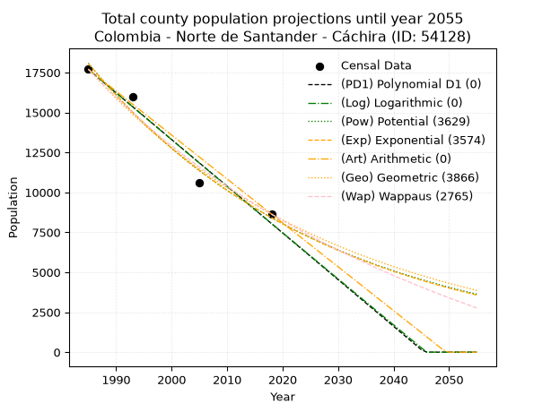
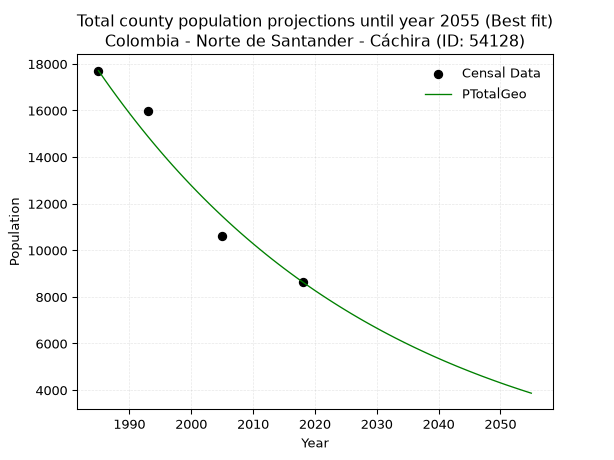
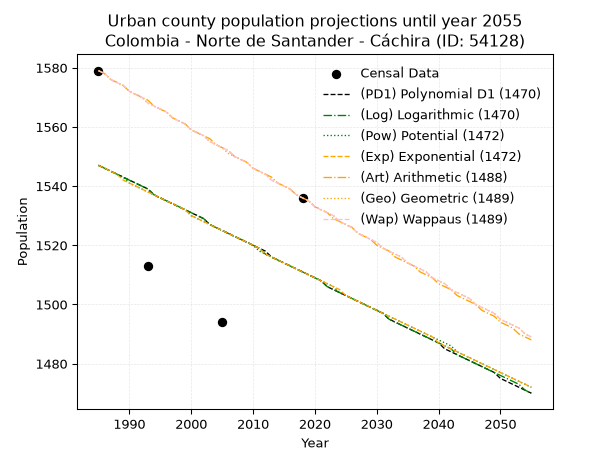
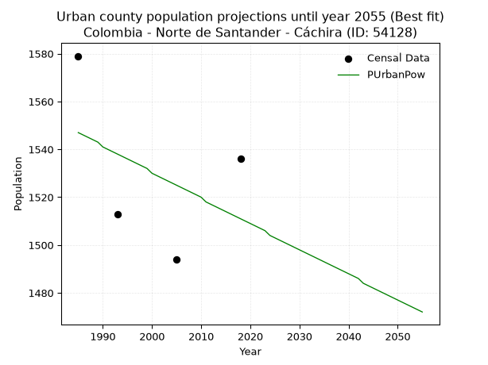
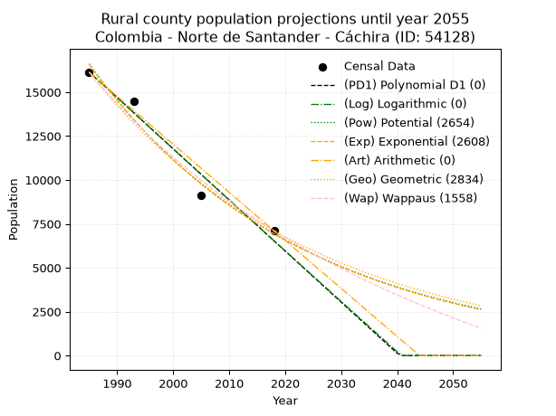
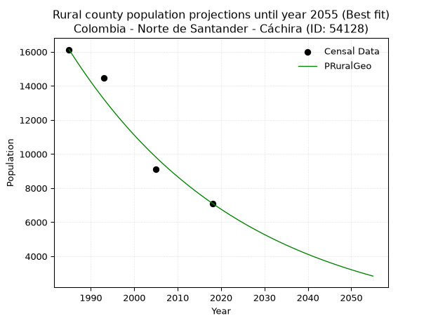

<div align="center">


</div>

# 📜 _“Population and Public Services Demand Projections (PPSD) until Year 2050 for Colombia - Norte de Santander - Cáchira (ID: 54128)”_
Keywords: `population` `public-service` `projection` `lineal` `polynomial` `logarithmic` `potential` `exponential` `arithmetic` `geometric` `wappaus` `dane` `colombia` `south-america`

PPSD are analytical estimates used by governments and planners to anticipate future changes in population size, age distribution, and the resulting community needs for utilities, healthcare, education, and infrastructure as sizing future water treatment facilities, electrical grids, and road networks based on spatial growth.

<div align="center">

</img>

</div>


> **General running parameters**: • app_version: _v20260806_. • Python version: _3.14.7_. • Pandas version: _3.0.5_. • NumPy version: _2.5.1_. • Creates, save and include plots into reports (create_plot): _False_. • Projection until year: _2050_. • Process polynomial degree 2 and up: _False_. • Process Wappaus: _True_. • Process Wappaus: _True_. • Set negative values to zero: _True_. • Set infinite values to zero: _True_. • Drop dataset notes: _True_. 
<div align="center">

Maps & GIS Layers: [:earth_americas:Google](http://maps.google.com/maps?q=7.741247717,-73.048983) [:earth_americas:OSM](https://www.openstreetmap.org/#map=18/7.741247717/-73.048983&layers=P) [:earth_americas:Bing](https://www.bing.com/maps?cp=7.741247717~-73.048983&lvl=18) [:earth_americas:Apple](https://maps.apple.com/frame?center=7.741247717%2C-73.048983&span=0.003%2C0.006) [:earth_americas:GISMobile](https://github.com/rcfdtools/R.GISMobile/blob/main/file/gis/CountyLayer_CO/Readme.md)

</div>


<div align="center">

```geojson
{
  "type": "Feature",
  "geometry": {
    "type": "Point", 
    "coordinates": [-73.048983, 7.741247717]
  }, 
  "properties": {
    "Name": "Colombia - Norte de Santander - Cáchira (ID: 54128)"
  }
}
```

</div>


## 0. Census Data (4 records)

Census data are official statistics collected by a government about the people and housing in a country. They usually include counts of total population, age, sex, race, income, education, and jobs.

📅Global census file: [Population.xlsx](../data/Population.xlsx)

| Source   |   Year |   CountryID | CountryName   |   StateID | StateName          |   CountyID | CountyName   |   PTotal |   PUrban |   PRural |
|:---------|-------:|------------:|:--------------|----------:|:-------------------|-----------:|:-------------|---------:|---------:|---------:|
| DANE     |   1985 |          57 | Colombia      |        54 | Norte de Santander |      54128 | Cáchira      |    17709 |     1579 |    16130 |
| DANE     |   1993 |          57 | Colombia      |        54 | Norte de Santander |      54128 | Cáchira      |    15969 |     1513 |    14456 |
| DANE     |   2005 |          57 | Colombia      |        54 | Norte de Santander |      54128 | Cáchira      |    10619 |     1494 |     9125 |
| DANE     |   2018 |          57 | Colombia      |        54 | Norte de Santander |      54128 | Cáchira      |     8642 |     1536 |     7106 |

> 🔥Some records could had specific notes about the registered values or the corresponding urban or rural distribution.

📅[SUI-RUPS](https://www.datos.gov.co/Hacienda-y-Cr-dito-P-blico/Registro-nico-de-Prestadores-de-Servicios-P-blicos/4qkq-csdn/about_data) - Local public utility companies: [RUPS.csv](../data/RUPS.csv)

 | SERVICIO       | ESTADO    | NOMBRE                                                           | NIT         | DEPARTAMENTO_DOMICILIO   | MUNICIPIO_DOMICILIO   | DIRECCION        |   TELEFONO | EMAIL                 | TIPO_PRESTADOR                             | CLASIFICACION                 |
|:---------------|:----------|:-----------------------------------------------------------------|:------------|:-------------------------|:----------------------|:-----------------|-----------:|:----------------------|:-------------------------------------------|:------------------------------|
| ACUEDUCTO      | OPERATIVA | EMPRESA DE SERVICIOS PUBLICOS DOMICILIARIOS DE CACHIRA E.S.P SAS | 900386285-3 | NORTE DE SANTANDER       | CACHIRA               | Carrera 5 No 5-2 |    5687021 | joandrez7@hotmail.com | SOCIEDADES (EMPRESA DE SERVICIOS PUBLICOS) | MENOR O IGUAL A 2500 USUARIOS |
| ALCANTARILLADO | OPERATIVA | EMPRESA DE SERVICIOS PUBLICOS DOMICILIARIOS DE CACHIRA E.S.P SAS | 900386285-3 | NORTE DE SANTANDER       | CACHIRA               | Carrera 5 No 5-2 |    5687021 | joandrez7@hotmail.com | SOCIEDADES (EMPRESA DE SERVICIOS PUBLICOS) | MENOR O IGUAL A 2500 USUARIOS |

## 1. Total

### 1.1. Coefficients and Parameters

* (PD1) Polynomial Deg 1: -292.2549177037318, 597817.6491368896 (lineal)
* (Log) Logarithmic: -585140.3971351762, 4460891.597645338
* (Pow) Potential: -46.33328177072418, 157.05321932025944
* (Exp) Exponential: -0.02314573031763358, 1.6224874241399995e+24
* (Art) Arithmetic: Year diff. 2018 - 1985 = 33, Population diff. 8642 - 17709 = -9067, Annual growth = -274.75757575757575
* (Geo) Geometric: Year diff. 2018 - 1985 = 33, Population diff. 8642 - 17709 = -9067, Annual growth % = -0.021505951236655108
* (Wap) Wappaus: i = -2.0853673542376057, Condition values only valid for < 200)

<sub>
Wappaus condition values: ['-0.00', '-2.09', '-4.17', '-6.26', '-8.34', '-10.43', '-12.51', '-14.60', '-16.68', '-18.77', '-20.85', '-22.94', '-25.02', '-27.11', '-29.20', '-31.28', '-33.37', '-35.45', '-37.54', '-39.62', '-41.71', '-43.79', '-45.88', '-47.96', '-50.05', '-52.13', '-54.22', '-56.30', '-58.39', '-60.48', '-62.56', '-64.65', '-66.73', '-68.82', '-70.90', '-72.99', '-75.07', '-77.16', '-79.24', '-81.33', '-83.41', '-85.50', '-87.59', '-89.67', '-91.76', '-93.84', '-95.93', '-98.01', '-100.10', '-102.18', '-104.27', '-106.35', '-108.44', '-110.52', '-112.61', '-114.70', '-116.78', '-118.87', '-120.95', '-123.04', '-125.12', '-127.21', '-129.29', '-131.38', '-133.46', '-135.55']
</sub>


### 1.2. Projected Dataset

|   Year |   CountyID |   PTotalPD1 |   PTotalLog |   PTotalPow |   PTotalExp |   PTotalArt |   PTotalGeo |   PTotalWap |
|-------:|-----------:|------------:|------------:|------------:|------------:|------------:|------------:|------------:|
|   1985 |      54128 |       17692 |       17702 |       18078 |       18065 |       17709 |       17709 |       17709 |
|   1986 |      54128 |       17399 |       17407 |       17661 |       17652 |       17434 |       17328 |       17344 |
|   1987 |      54128 |       17107 |       17112 |       17254 |       17248 |       17159 |       16955 |       16985 |
|   1988 |      54128 |       16815 |       16818 |       16856 |       16853 |       16885 |       16591 |       16635 |
|   1989 |      54128 |       16523 |       16524 |       16468 |       16468 |       16610 |       16234 |       16291 |
|   1990 |      54128 |       16230 |       16230 |       16089 |       16091 |       16335 |       15885 |       15954 |
|   1991 |      54128 |       15938 |       15936 |       15719 |       15723 |       16060 |       15543 |       15624 |
|   1992 |      54128 |       15646 |       15642 |       15357 |       15363 |       15786 |       15209 |       15300 |
|   1993 |      54128 |       15354 |       15348 |       15004 |       15011 |       15511 |       14882 |       14982 |
|   1994 |      54128 |       15061 |       15055 |       14660 |       14668 |       15236 |       14562 |       14670 |
|   1995 |      54128 |       14769 |       14761 |       14323 |       14332 |       14961 |       14249 |       14365 |
|   1996 |      54128 |       14477 |       14468 |       13994 |       14004 |       14687 |       13942 |       14065 |
|   1997 |      54128 |       14185 |       14175 |       13673 |       13684 |       14412 |       13642 |       13770 |
|   1998 |      54128 |       13892 |       13882 |       13360 |       13371 |       14137 |       13349 |       13481 |
|   1999 |      54128 |       13600 |       13589 |       13054 |       13065 |       13862 |       13062 |       13197 |
|   2000 |      54128 |       13308 |       13297 |       12755 |       12766 |       13588 |       12781 |       12919 |
|   2001 |      54128 |       13016 |       13004 |       12463 |       12474 |       13313 |       12506 |       12645 |
|   2002 |      54128 |       12723 |       12712 |       12177 |       12189 |       13038 |       12237 |       12376 |
|   2003 |      54128 |       12431 |       12419 |       11899 |       11910 |       12763 |       11974 |       12112 |
|   2004 |      54128 |       12139 |       12127 |       11627 |       11637 |       12489 |       11717 |       11853 |
|   2005 |      54128 |       11847 |       11835 |       11361 |       11371 |       12214 |       11465 |       11598 |
|   2006 |      54128 |       11554 |       11544 |       11102 |       11111 |       11939 |       11218 |       11347 |
|   2007 |      54128 |       11262 |       11252 |       10848 |       10857 |       11664 |       10977 |       11100 |
|   2008 |      54128 |       10970 |       10961 |       10601 |       10608 |       11390 |       10741 |       10858 |
|   2009 |      54128 |       10678 |       10669 |       10359 |       10365 |       11115 |       10510 |       10620 |
|   2010 |      54128 |       10385 |       10378 |       10123 |       10128 |       10840 |       10284 |       10386 |
|   2011 |      54128 |       10093 |       10087 |        9892 |        9897 |       10565 |       10063 |       10155 |
|   2012 |      54128 |        9801 |        9796 |        9667 |        9670 |       10291 |        9846 |        9928 |
|   2013 |      54128 |        9508 |        9505 |        9447 |        9449 |       10016 |        9634 |        9705 |
|   2014 |      54128 |        9216 |        9215 |        9232 |        9233 |        9741 |        9427 |        9486 |
|   2015 |      54128 |        8924 |        8924 |        9022 |        9021 |        9466 |        9224 |        9270 |
|   2016 |      54128 |        8632 |        8634 |        8817 |        8815 |        9192 |        9026 |        9057 |
|   2017 |      54128 |        8339 |        8344 |        8617 |        8613 |        8917 |        8832 |        8848 |
|   2018 |      54128 |        8047 |        8054 |        8421 |        8416 |        8642 |        8642 |        8642 |
|   2019 |      54128 |        7755 |        7764 |        8230 |        8224 |        8367 |        8456 |        8439 |
|   2020 |      54128 |        7463 |        7474 |        8043 |        8036 |        8092 |        8274 |        8239 |
|   2021 |      54128 |        7170 |        7185 |        7861 |        7852 |        7818 |        8096 |        8043 |
|   2022 |      54128 |        6878 |        6895 |        7683 |        7672 |        7543 |        7922 |        7849 |
|   2023 |      54128 |        6586 |        6606 |        7509 |        7496 |        7268 |        7752 |        7658 |
|   2024 |      54128 |        6294 |        6317 |        7339 |        7325 |        6993 |        7585 |        7470 |
|   2025 |      54128 |        6001 |        6028 |        7173 |        7157 |        6719 |        7422 |        7285 |
|   2026 |      54128 |        5709 |        5739 |        7011 |        6994 |        6444 |        7262 |        7102 |
|   2027 |      54128 |        5417 |        5450 |        6852 |        6834 |        6169 |        7106 |        6922 |
|   2028 |      54128 |        5125 |        5161 |        6697 |        6677 |        5894 |        6953 |        6745 |
|   2029 |      54128 |        4832 |        4873 |        6546 |        6524 |        5620 |        6804 |        6570 |
|   2030 |      54128 |        4540 |        4585 |        6398 |        6375 |        5345 |        6658 |        6398 |
|   2031 |      54128 |        4248 |        4296 |        6254 |        6229 |        5070 |        6514 |        6228 |
|   2032 |      54128 |        3956 |        4008 |        6113 |        6087 |        4795 |        6374 |        6060 |
|   2033 |      54128 |        3663 |        3720 |        5975 |        5948 |        4521 |        6237 |        5895 |
|   2034 |      54128 |        3371 |        3433 |        5841 |        5811 |        4246 |        6103 |        5732 |
|   2035 |      54128 |        3079 |        3145 |        5709 |        5678 |        3971 |        5972 |        5572 |
|   2036 |      54128 |        2787 |        2858 |        5581 |        5549 |        3696 |        5843 |        5413 |
|   2037 |      54128 |        2494 |        2570 |        5455 |        5422 |        3422 |        5718 |        5257 |
|   2038 |      54128 |        2202 |        2283 |        5332 |        5298 |        3147 |        5595 |        5103 |
|   2039 |      54128 |        1910 |        1996 |        5213 |        5176 |        2872 |        5474 |        4951 |
|   2040 |      54128 |        1618 |        1709 |        5096 |        5058 |        2597 |        5357 |        4800 |
|   2041 |      54128 |        1325 |        1422 |        4981 |        4942 |        2323 |        5241 |        4652 |
|   2042 |      54128 |        1033 |        1136 |        4869 |        4829 |        2048 |        5129 |        4506 |
|   2043 |      54128 |         741 |         849 |        4760 |        4719 |        1773 |        5018 |        4362 |
|   2044 |      54128 |         449 |         563 |        4653 |        4611 |        1498 |        4911 |        4219 |
|   2045 |      54128 |         156 |         277 |        4549 |        4505 |        1224 |        4805 |        4079 |
|   2046 |      54128 |           0 |           0 |        4447 |        4402 |         949 |        4702 |        3940 |
|   2047 |      54128 |           0 |           0 |        4348 |        4301 |         674 |        4600 |        3803 |
|   2048 |      54128 |           0 |           0 |        4250 |        4203 |         399 |        4502 |        3667 |
|   2049 |      54128 |           0 |           0 |        4155 |        4107 |         125 |        4405 |        3534 |
|   2050 |      54128 |           0 |           0 |        4063 |        4013 |           0 |        4310 |        3401 |
<div align="center">

</img>

</div>


### 1.3. Best fit with absolute and relative error (%)

Relative error puts that difference into context by dividing the absolute error by the true value, creating a unitless ratio or percentage that shows the scale of the mistake.

Absolute and relative error

|   Year | Source   |   CountryID | CountryName   |   StateID | StateName          |   CountyID_x | CountyName   |   PTotal |   PUrban |   PRural |   CountyID_y |   PTotalPD1 |   PTotalLog |   PTotalPow |   PTotalExp |   PTotalArt |   PTotalGeo |   PTotalWap |   PTotalPD1AbsError |   PTotalLogAbsError |   PTotalPowAbsError |   PTotalExpAbsError |   PTotalArtAbsError |   PTotalGeoAbsError |   PTotalWapAbsError |   PTotalPD1RelError |   PTotalLogRelError |   PTotalPowRelError |   PTotalExpRelError |   PTotalArtRelError |   PTotalGeoRelError |   PTotalWapRelError |
|-------:|:---------|------------:|:--------------|----------:|:-------------------|-------------:|:-------------|---------:|---------:|---------:|-------------:|------------:|------------:|------------:|------------:|------------:|------------:|------------:|--------------------:|--------------------:|--------------------:|--------------------:|--------------------:|--------------------:|--------------------:|--------------------:|--------------------:|--------------------:|--------------------:|--------------------:|--------------------:|--------------------:|
|   1985 | DANE     |          57 | Colombia      |        54 | Norte de Santander |        54128 | Cáchira      |    17709 |     1579 |    16130 |        54128 |       17692 |       17702 |       18078 |       18065 |       17709 |       17709 |       17709 |                  17 |                   7 |                 369 |                 356 |                   0 |                   0 |                   0 |           0.0959964 |           0.0395279 |             2.08369 |             2.01028 |             0       |             0       |             0       |
|   1993 | DANE     |          57 | Colombia      |        54 | Norte de Santander |        54128 | Cáchira      |    15969 |     1513 |    14456 |        54128 |       15354 |       15348 |       15004 |       15011 |       15511 |       14882 |       14982 |                 615 |                 621 |                 965 |                 958 |                 458 |                1087 |                 987 |           3.85121   |           3.88878   |             6.04296 |             5.99912 |             2.86806 |             6.80694 |             6.18073 |
|   2005 | DANE     |          57 | Colombia      |        54 | Norte de Santander |        54128 | Cáchira      |    10619 |     1494 |     9125 |        54128 |       11847 |       11835 |       11361 |       11371 |       12214 |       11465 |       11598 |                1228 |                1216 |                 742 |                 752 |                1595 |                 846 |                 979 |          11.5642    |          11.4512    |             6.98748 |             7.08165 |            15.0202  |             7.96685 |             9.21932 |
|   2018 | DANE     |          57 | Colombia      |        54 | Norte de Santander |        54128 | Cáchira      |     8642 |     1536 |     7106 |        54128 |        8047 |        8054 |        8421 |        8416 |        8642 |        8642 |        8642 |                 595 |                 588 |                 221 |                 226 |                   0 |                   0 |                   0 |           6.88498   |           6.80398   |             2.55728 |             2.61514 |             0       |             0       |             0       |

Relative error mean

| Method    |   RelError | Best   |
|:----------|-----------:|:-------|
| PTotalPD1 |    5.59909 |        |
| PTotalLog |    5.54587 |        |
| PTotalPow |    4.41785 |        |
| PTotalExp |    4.42655 |        |
| PTotalArt |    4.47208 |        |
| PTotalGeo |    3.69345 | True   |
| PTotalWap |    3.85001 |        |

💙Best method: _**PTotalGeo**_
<div align="center">

</img>

</div>


### 1.4. Fresh water supply demand in liters per capita per day (lpcd)

The fresh water supply demand typically ranges from 100 to 300 liters per capita per day (lpcd) for standard domestic and municipal planning, though absolute survival minimums set by the World Health Organization are as low as 7.5 to 20 liters per day, and total consumption in high-income nations can exceed 400 liters.

> `CZ`: Level in meters above the sea level (masl)<br> `WS`: Fresh water supply demand in liters per capita per day (lpcd or l/h/d)<br> `WSAll`: Zonal fresh water supply demand in liters per second (l/s)<br> `A`: Zonal area in square meters<br> `DP`: Population density (people/hectare or p/ha)

Reference values (RAS Colombia)

|    CZ |   WS |
|------:|-----:|
|  1000 |  120 |
|  2000 |  130 |
| 99999 |  140 |

County shapefile geometry properties and water supply values

|   CountyID |      ATotal |   CZTotal |   WSTotal |
|-----------:|------------:|----------:|----------:|
|      54128 | 6.14672e+08 |   1825.57 |       130 |

Projected values for best method: PTotalGeo

|   CountyID |   Year |   PTotalGeo |   DPTotal |   WSTotal |   WSTotalAll |
|-----------:|-------:|------------:|----------:|----------:|-------------:|
|      54128 |   1985 |       17709 |      0.29 |       130 |     26.6455  |
|      54128 |   1986 |       17328 |      0.28 |       130 |     26.0722  |
|      54128 |   1987 |       16955 |      0.28 |       130 |     25.511   |
|      54128 |   1988 |       16591 |      0.27 |       130 |     24.9633  |
|      54128 |   1989 |       16234 |      0.26 |       130 |     24.4262  |
|      54128 |   1990 |       15885 |      0.26 |       130 |     23.901   |
|      54128 |   1991 |       15543 |      0.25 |       130 |     23.3865  |
|      54128 |   1992 |       15209 |      0.25 |       130 |     22.8839  |
|      54128 |   1993 |       14882 |      0.24 |       130 |     22.3919  |
|      54128 |   1994 |       14562 |      0.24 |       130 |     21.9104  |
|      54128 |   1995 |       14249 |      0.23 |       130 |     21.4395  |
|      54128 |   1996 |       13942 |      0.23 |       130 |     20.9775  |
|      54128 |   1997 |       13642 |      0.22 |       130 |     20.5262  |
|      54128 |   1998 |       13349 |      0.22 |       130 |     20.0853  |
|      54128 |   1999 |       13062 |      0.21 |       130 |     19.6535  |
|      54128 |   2000 |       12781 |      0.21 |       130 |     19.2307  |
|      54128 |   2001 |       12506 |      0.2  |       130 |     18.8169  |
|      54128 |   2002 |       12237 |      0.2  |       130 |     18.4122  |
|      54128 |   2003 |       11974 |      0.19 |       130 |     18.0164  |
|      54128 |   2004 |       11717 |      0.19 |       130 |     17.6297  |
|      54128 |   2005 |       11465 |      0.19 |       130 |     17.2506  |
|      54128 |   2006 |       11218 |      0.18 |       130 |     16.8789  |
|      54128 |   2007 |       10977 |      0.18 |       130 |     16.5163  |
|      54128 |   2008 |       10741 |      0.17 |       130 |     16.1612  |
|      54128 |   2009 |       10510 |      0.17 |       130 |     15.8137  |
|      54128 |   2010 |       10284 |      0.17 |       130 |     15.4736  |
|      54128 |   2011 |       10063 |      0.16 |       130 |     15.1411  |
|      54128 |   2012 |        9846 |      0.16 |       130 |     14.8146  |
|      54128 |   2013 |        9634 |      0.16 |       130 |     14.4956  |
|      54128 |   2014 |        9427 |      0.15 |       130 |     14.1841  |
|      54128 |   2015 |        9224 |      0.15 |       130 |     13.8787  |
|      54128 |   2016 |        9026 |      0.15 |       130 |     13.5808  |
|      54128 |   2017 |        8832 |      0.14 |       130 |     13.2889  |
|      54128 |   2018 |        8642 |      0.14 |       130 |     13.003   |
|      54128 |   2019 |        8456 |      0.14 |       130 |     12.7231  |
|      54128 |   2020 |        8274 |      0.13 |       130 |     12.4493  |
|      54128 |   2021 |        8096 |      0.13 |       130 |     12.1815  |
|      54128 |   2022 |        7922 |      0.13 |       130 |     11.9197  |
|      54128 |   2023 |        7752 |      0.13 |       130 |     11.6639  |
|      54128 |   2024 |        7585 |      0.12 |       130 |     11.4126  |
|      54128 |   2025 |        7422 |      0.12 |       130 |     11.1674  |
|      54128 |   2026 |        7262 |      0.12 |       130 |     10.9266  |
|      54128 |   2027 |        7106 |      0.12 |       130 |     10.6919  |
|      54128 |   2028 |        6953 |      0.11 |       130 |     10.4617  |
|      54128 |   2029 |        6804 |      0.11 |       130 |     10.2375  |
|      54128 |   2030 |        6658 |      0.11 |       130 |     10.0178  |
|      54128 |   2031 |        6514 |      0.11 |       130 |      9.80116 |
|      54128 |   2032 |        6374 |      0.1  |       130 |      9.59051 |
|      54128 |   2033 |        6237 |      0.1  |       130 |      9.38438 |
|      54128 |   2034 |        6103 |      0.1  |       130 |      9.18275 |
|      54128 |   2035 |        5972 |      0.1  |       130 |      8.98565 |
|      54128 |   2036 |        5843 |      0.1  |       130 |      8.79155 |
|      54128 |   2037 |        5718 |      0.09 |       130 |      8.60347 |
|      54128 |   2038 |        5595 |      0.09 |       130 |      8.4184  |
|      54128 |   2039 |        5474 |      0.09 |       130 |      8.23634 |
|      54128 |   2040 |        5357 |      0.09 |       130 |      8.0603  |
|      54128 |   2041 |        5241 |      0.09 |       130 |      7.88576 |
|      54128 |   2042 |        5129 |      0.08 |       130 |      7.71725 |
|      54128 |   2043 |        5018 |      0.08 |       130 |      7.55023 |
|      54128 |   2044 |        4911 |      0.08 |       130 |      7.38924 |
|      54128 |   2045 |        4805 |      0.08 |       130 |      7.22975 |
|      54128 |   2046 |        4702 |      0.08 |       130 |      7.07477 |
|      54128 |   2047 |        4600 |      0.07 |       130 |      6.9213  |
|      54128 |   2048 |        4502 |      0.07 |       130 |      6.77384 |
|      54128 |   2049 |        4405 |      0.07 |       130 |      6.62789 |
|      54128 |   2050 |        4310 |      0.07 |       130 |      6.48495 |

## 2. Urban

### 2.1. Coefficients and Parameters

* (PD1) Polynomial Deg 1: -1.1055800883179754, 3741.9365716580305 (lineal)
* (Log) Logarithmic: -2223.578231661802, 18431.935957499023
* (Pow) Potential: -1.4319760408187874, 7.911802225546512
* (Exp) Exponential: -0.0007119444994192138, 6356.31119208815
* (Art) Arithmetic: Year diff. 2018 - 1985 = 33, Population diff. 1536 - 1579 = -43, Annual growth = -1.303030303030303
* (Geo) Geometric: Year diff. 2018 - 1985 = 33, Population diff. 1536 - 1579 = -43, Annual growth % = -0.0008363198030649777
* (Wap) Wappaus: i = -0.08366165669536456, Condition values only valid for < 200)

<sub>
Wappaus condition values: ['-0.00', '-0.08', '-0.17', '-0.25', '-0.33', '-0.42', '-0.50', '-0.59', '-0.67', '-0.75', '-0.84', '-0.92', '-1.00', '-1.09', '-1.17', '-1.25', '-1.34', '-1.42', '-1.51', '-1.59', '-1.67', '-1.76', '-1.84', '-1.92', '-2.01', '-2.09', '-2.18', '-2.26', '-2.34', '-2.43', '-2.51', '-2.59', '-2.68', '-2.76', '-2.84', '-2.93', '-3.01', '-3.10', '-3.18', '-3.26', '-3.35', '-3.43', '-3.51', '-3.60', '-3.68', '-3.76', '-3.85', '-3.93', '-4.02', '-4.10', '-4.18', '-4.27', '-4.35', '-4.43', '-4.52', '-4.60', '-4.69', '-4.77', '-4.85', '-4.94', '-5.02', '-5.10', '-5.19', '-5.27', '-5.35', '-5.44']
</sub>


### 2.2. Projected Dataset

|   Year |   CountyID |   PUrbanPD1 |   PUrbanLog |   PUrbanPow |   PUrbanExp |   PUrbanArt |   PUrbanGeo |   PUrbanWap |
|-------:|-----------:|------------:|------------:|------------:|------------:|------------:|------------:|------------:|
|   1985 |      54128 |        1547 |        1547 |        1547 |        1547 |        1579 |        1579 |        1579 |
|   1986 |      54128 |        1546 |        1546 |        1546 |        1546 |        1578 |        1578 |        1578 |
|   1987 |      54128 |        1545 |        1545 |        1545 |        1545 |        1576 |        1576 |        1576 |
|   1988 |      54128 |        1544 |        1544 |        1544 |        1544 |        1575 |        1575 |        1575 |
|   1989 |      54128 |        1543 |        1543 |        1543 |        1542 |        1574 |        1574 |        1574 |
|   1990 |      54128 |        1542 |        1542 |        1541 |        1541 |        1572 |        1572 |        1572 |
|   1991 |      54128 |        1541 |        1541 |        1540 |        1540 |        1571 |        1571 |        1571 |
|   1992 |      54128 |        1540 |        1540 |        1539 |        1539 |        1570 |        1570 |        1570 |
|   1993 |      54128 |        1539 |        1539 |        1538 |        1538 |        1569 |        1568 |        1568 |
|   1994 |      54128 |        1537 |        1537 |        1537 |        1537 |        1567 |        1567 |        1567 |
|   1995 |      54128 |        1536 |        1536 |        1536 |        1536 |        1566 |        1566 |        1566 |
|   1996 |      54128 |        1535 |        1535 |        1535 |        1535 |        1565 |        1565 |        1565 |
|   1997 |      54128 |        1534 |        1534 |        1534 |        1534 |        1563 |        1563 |        1563 |
|   1998 |      54128 |        1533 |        1533 |        1533 |        1533 |        1562 |        1562 |        1562 |
|   1999 |      54128 |        1532 |        1532 |        1532 |        1532 |        1561 |        1561 |        1561 |
|   2000 |      54128 |        1531 |        1531 |        1530 |        1530 |        1559 |        1559 |        1559 |
|   2001 |      54128 |        1530 |        1530 |        1529 |        1529 |        1558 |        1558 |        1558 |
|   2002 |      54128 |        1529 |        1529 |        1528 |        1528 |        1557 |        1557 |        1557 |
|   2003 |      54128 |        1527 |        1527 |        1527 |        1527 |        1556 |        1555 |        1555 |
|   2004 |      54128 |        1526 |        1526 |        1526 |        1526 |        1554 |        1554 |        1554 |
|   2005 |      54128 |        1525 |        1525 |        1525 |        1525 |        1553 |        1553 |        1553 |
|   2006 |      54128 |        1524 |        1524 |        1524 |        1524 |        1552 |        1551 |        1552 |
|   2007 |      54128 |        1523 |        1523 |        1523 |        1523 |        1550 |        1550 |        1550 |
|   2008 |      54128 |        1522 |        1522 |        1522 |        1522 |        1549 |        1549 |        1549 |
|   2009 |      54128 |        1521 |        1521 |        1521 |        1521 |        1548 |        1548 |        1548 |
|   2010 |      54128 |        1520 |        1520 |        1520 |        1520 |        1546 |        1546 |        1546 |
|   2011 |      54128 |        1519 |        1519 |        1518 |        1519 |        1545 |        1545 |        1545 |
|   2012 |      54128 |        1518 |        1517 |        1517 |        1517 |        1544 |        1544 |        1544 |
|   2013 |      54128 |        1516 |        1516 |        1516 |        1516 |        1543 |        1542 |        1542 |
|   2014 |      54128 |        1515 |        1515 |        1515 |        1515 |        1541 |        1541 |        1541 |
|   2015 |      54128 |        1514 |        1514 |        1514 |        1514 |        1540 |        1540 |        1540 |
|   2016 |      54128 |        1513 |        1513 |        1513 |        1513 |        1539 |        1539 |        1539 |
|   2017 |      54128 |        1512 |        1512 |        1512 |        1512 |        1537 |        1537 |        1537 |
|   2018 |      54128 |        1511 |        1511 |        1511 |        1511 |        1536 |        1536 |        1536 |
|   2019 |      54128 |        1510 |        1510 |        1510 |        1510 |        1535 |        1535 |        1535 |
|   2020 |      54128 |        1509 |        1509 |        1509 |        1509 |        1533 |        1533 |        1533 |
|   2021 |      54128 |        1508 |        1508 |        1508 |        1508 |        1532 |        1532 |        1532 |
|   2022 |      54128 |        1506 |        1506 |        1507 |        1507 |        1531 |        1531 |        1531 |
|   2023 |      54128 |        1505 |        1505 |        1506 |        1506 |        1529 |        1530 |        1530 |
|   2024 |      54128 |        1504 |        1504 |        1504 |        1505 |        1528 |        1528 |        1528 |
|   2025 |      54128 |        1503 |        1503 |        1503 |        1503 |        1527 |        1527 |        1527 |
|   2026 |      54128 |        1502 |        1502 |        1502 |        1502 |        1526 |        1526 |        1526 |
|   2027 |      54128 |        1501 |        1501 |        1501 |        1501 |        1524 |        1524 |        1524 |
|   2028 |      54128 |        1500 |        1500 |        1500 |        1500 |        1523 |        1523 |        1523 |
|   2029 |      54128 |        1499 |        1499 |        1499 |        1499 |        1522 |        1522 |        1522 |
|   2030 |      54128 |        1498 |        1498 |        1498 |        1498 |        1520 |        1521 |        1521 |
|   2031 |      54128 |        1497 |        1497 |        1497 |        1497 |        1519 |        1519 |        1519 |
|   2032 |      54128 |        1495 |        1495 |        1496 |        1496 |        1518 |        1518 |        1518 |
|   2033 |      54128 |        1494 |        1494 |        1495 |        1495 |        1516 |        1517 |        1517 |
|   2034 |      54128 |        1493 |        1493 |        1494 |        1494 |        1515 |        1516 |        1516 |
|   2035 |      54128 |        1492 |        1492 |        1493 |        1493 |        1514 |        1514 |        1514 |
|   2036 |      54128 |        1491 |        1491 |        1492 |        1492 |        1513 |        1513 |        1513 |
|   2037 |      54128 |        1490 |        1490 |        1491 |        1491 |        1511 |        1512 |        1512 |
|   2038 |      54128 |        1489 |        1489 |        1490 |        1490 |        1510 |        1511 |        1511 |
|   2039 |      54128 |        1488 |        1488 |        1489 |        1489 |        1509 |        1509 |        1509 |
|   2040 |      54128 |        1487 |        1487 |        1488 |        1487 |        1507 |        1508 |        1508 |
|   2041 |      54128 |        1485 |        1486 |        1487 |        1486 |        1506 |        1507 |        1507 |
|   2042 |      54128 |        1484 |        1485 |        1486 |        1485 |        1505 |        1505 |        1505 |
|   2043 |      54128 |        1483 |        1483 |        1484 |        1484 |        1503 |        1504 |        1504 |
|   2044 |      54128 |        1482 |        1482 |        1483 |        1483 |        1502 |        1503 |        1503 |
|   2045 |      54128 |        1481 |        1481 |        1482 |        1482 |        1501 |        1502 |        1502 |
|   2046 |      54128 |        1480 |        1480 |        1481 |        1481 |        1500 |        1500 |        1500 |
|   2047 |      54128 |        1479 |        1479 |        1480 |        1480 |        1498 |        1499 |        1499 |
|   2048 |      54128 |        1478 |        1478 |        1479 |        1479 |        1497 |        1498 |        1498 |
|   2049 |      54128 |        1477 |        1477 |        1478 |        1478 |        1496 |        1497 |        1497 |
|   2050 |      54128 |        1475 |        1476 |        1477 |        1477 |        1494 |        1495 |        1495 |
<div align="center">

</img>

</div>


### 2.3. Best fit with absolute and relative error (%)

Relative error puts that difference into context by dividing the absolute error by the true value, creating a unitless ratio or percentage that shows the scale of the mistake.

Absolute and relative error

|   Year | Source   |   CountryID | CountryName   |   StateID | StateName          |   CountyID_x | CountyName   |   PTotal |   PUrban |   PRural |   CountyID_y |   PUrbanPD1 |   PUrbanLog |   PUrbanPow |   PUrbanExp |   PUrbanArt |   PUrbanGeo |   PUrbanWap |   PUrbanPD1AbsError |   PUrbanLogAbsError |   PUrbanPowAbsError |   PUrbanExpAbsError |   PUrbanArtAbsError |   PUrbanGeoAbsError |   PUrbanWapAbsError |   PUrbanPD1RelError |   PUrbanLogRelError |   PUrbanPowRelError |   PUrbanExpRelError |   PUrbanArtRelError |   PUrbanGeoRelError |   PUrbanWapRelError |
|-------:|:---------|------------:|:--------------|----------:|:-------------------|-------------:|:-------------|---------:|---------:|---------:|-------------:|------------:|------------:|------------:|------------:|------------:|------------:|------------:|--------------------:|--------------------:|--------------------:|--------------------:|--------------------:|--------------------:|--------------------:|--------------------:|--------------------:|--------------------:|--------------------:|--------------------:|--------------------:|--------------------:|
|   1985 | DANE     |          57 | Colombia      |        54 | Norte de Santander |        54128 | Cáchira      |    17709 |     1579 |    16130 |        54128 |        1547 |        1547 |        1547 |        1547 |        1579 |        1579 |        1579 |                  32 |                  32 |                  32 |                  32 |                   0 |                   0 |                   0 |             2.0266  |             2.0266  |             2.0266  |             2.0266  |             0       |             0       |             0       |
|   1993 | DANE     |          57 | Colombia      |        54 | Norte de Santander |        54128 | Cáchira      |    15969 |     1513 |    14456 |        54128 |        1539 |        1539 |        1538 |        1538 |        1569 |        1568 |        1568 |                  26 |                  26 |                  25 |                  25 |                  56 |                  55 |                  55 |             1.71844 |             1.71844 |             1.65235 |             1.65235 |             3.70126 |             3.63516 |             3.63516 |
|   2005 | DANE     |          57 | Colombia      |        54 | Norte de Santander |        54128 | Cáchira      |    10619 |     1494 |     9125 |        54128 |        1525 |        1525 |        1525 |        1525 |        1553 |        1553 |        1553 |                  31 |                  31 |                  31 |                  31 |                  59 |                  59 |                  59 |             2.07497 |             2.07497 |             2.07497 |             2.07497 |             3.94913 |             3.94913 |             3.94913 |
|   2018 | DANE     |          57 | Colombia      |        54 | Norte de Santander |        54128 | Cáchira      |     8642 |     1536 |     7106 |        54128 |        1511 |        1511 |        1511 |        1511 |        1536 |        1536 |        1536 |                  25 |                  25 |                  25 |                  25 |                   0 |                   0 |                   0 |             1.6276  |             1.6276  |             1.6276  |             1.6276  |             0       |             0       |             0       |

Relative error mean

| Method    |   RelError | Best   |
|:----------|-----------:|:-------|
| PUrbanPD1 |    1.8619  |        |
| PUrbanLog |    1.8619  |        |
| PUrbanPow |    1.84538 | True   |
| PUrbanExp |    1.84538 | True   |
| PUrbanArt |    1.9126  |        |
| PUrbanGeo |    1.89607 |        |
| PUrbanWap |    1.89607 |        |

💙Best method: _**PUrbanPow**_
<div align="center">

</img>

</div>


### 2.4. Fresh water supply demand in liters per capita per day (lpcd)

The fresh water supply demand typically ranges from 100 to 300 liters per capita per day (lpcd) for standard domestic and municipal planning, though absolute survival minimums set by the World Health Organization are as low as 7.5 to 20 liters per day, and total consumption in high-income nations can exceed 400 liters.

> `CZ`: Level in meters above the sea level (masl)<br> `WS`: Fresh water supply demand in liters per capita per day (lpcd or l/h/d)<br> `WSAll`: Zonal fresh water supply demand in liters per second (l/s)<br> `A`: Zonal area in square meters<br> `DP`: Population density (people/hectare or p/ha)

Reference values (RAS Colombia)

|    CZ |   WS |
|------:|-----:|
|  1000 |  120 |
|  2000 |  130 |
| 99999 |  140 |

County shapefile geometry properties and water supply values

|   CountyID |   AUrban |   CZUrban |   WSUrban |
|-----------:|---------:|----------:|----------:|
|      54128 |   208820 |   1996.69 |       130 |

Projected values for best method: PUrbanPow

|   CountyID |   Year |   PUrbanPow |   DPUrban |   WSUrban |   WSUrbanAll |
|-----------:|-------:|------------:|----------:|----------:|-------------:|
|      54128 |   1985 |        1547 |     74.08 |       130 |      2.32766 |
|      54128 |   1986 |        1546 |     74.04 |       130 |      2.32616 |
|      54128 |   1987 |        1545 |     73.99 |       130 |      2.32465 |
|      54128 |   1988 |        1544 |     73.94 |       130 |      2.32315 |
|      54128 |   1989 |        1543 |     73.89 |       130 |      2.32164 |
|      54128 |   1990 |        1541 |     73.8  |       130 |      2.31863 |
|      54128 |   1991 |        1540 |     73.75 |       130 |      2.31713 |
|      54128 |   1992 |        1539 |     73.7  |       130 |      2.31562 |
|      54128 |   1993 |        1538 |     73.65 |       130 |      2.31412 |
|      54128 |   1994 |        1537 |     73.6  |       130 |      2.31262 |
|      54128 |   1995 |        1536 |     73.56 |       130 |      2.31111 |
|      54128 |   1996 |        1535 |     73.51 |       130 |      2.30961 |
|      54128 |   1997 |        1534 |     73.46 |       130 |      2.3081  |
|      54128 |   1998 |        1533 |     73.41 |       130 |      2.3066  |
|      54128 |   1999 |        1532 |     73.36 |       130 |      2.30509 |
|      54128 |   2000 |        1530 |     73.27 |       130 |      2.30208 |
|      54128 |   2001 |        1529 |     73.22 |       130 |      2.30058 |
|      54128 |   2002 |        1528 |     73.17 |       130 |      2.29907 |
|      54128 |   2003 |        1527 |     73.13 |       130 |      2.29757 |
|      54128 |   2004 |        1526 |     73.08 |       130 |      2.29606 |
|      54128 |   2005 |        1525 |     73.03 |       130 |      2.29456 |
|      54128 |   2006 |        1524 |     72.98 |       130 |      2.29306 |
|      54128 |   2007 |        1523 |     72.93 |       130 |      2.29155 |
|      54128 |   2008 |        1522 |     72.89 |       130 |      2.29005 |
|      54128 |   2009 |        1521 |     72.84 |       130 |      2.28854 |
|      54128 |   2010 |        1520 |     72.79 |       130 |      2.28704 |
|      54128 |   2011 |        1518 |     72.69 |       130 |      2.28403 |
|      54128 |   2012 |        1517 |     72.65 |       130 |      2.28252 |
|      54128 |   2013 |        1516 |     72.6  |       130 |      2.28102 |
|      54128 |   2014 |        1515 |     72.55 |       130 |      2.27951 |
|      54128 |   2015 |        1514 |     72.5  |       130 |      2.27801 |
|      54128 |   2016 |        1513 |     72.45 |       130 |      2.2765  |
|      54128 |   2017 |        1512 |     72.41 |       130 |      2.275   |
|      54128 |   2018 |        1511 |     72.36 |       130 |      2.2735  |
|      54128 |   2019 |        1510 |     72.31 |       130 |      2.27199 |
|      54128 |   2020 |        1509 |     72.26 |       130 |      2.27049 |
|      54128 |   2021 |        1508 |     72.22 |       130 |      2.26898 |
|      54128 |   2022 |        1507 |     72.17 |       130 |      2.26748 |
|      54128 |   2023 |        1506 |     72.12 |       130 |      2.26597 |
|      54128 |   2024 |        1504 |     72.02 |       130 |      2.26296 |
|      54128 |   2025 |        1503 |     71.98 |       130 |      2.26146 |
|      54128 |   2026 |        1502 |     71.93 |       130 |      2.25995 |
|      54128 |   2027 |        1501 |     71.88 |       130 |      2.25845 |
|      54128 |   2028 |        1500 |     71.83 |       130 |      2.25694 |
|      54128 |   2029 |        1499 |     71.78 |       130 |      2.25544 |
|      54128 |   2030 |        1498 |     71.74 |       130 |      2.25394 |
|      54128 |   2031 |        1497 |     71.69 |       130 |      2.25243 |
|      54128 |   2032 |        1496 |     71.64 |       130 |      2.25093 |
|      54128 |   2033 |        1495 |     71.59 |       130 |      2.24942 |
|      54128 |   2034 |        1494 |     71.54 |       130 |      2.24792 |
|      54128 |   2035 |        1493 |     71.5  |       130 |      2.24641 |
|      54128 |   2036 |        1492 |     71.45 |       130 |      2.24491 |
|      54128 |   2037 |        1491 |     71.4  |       130 |      2.2434  |
|      54128 |   2038 |        1490 |     71.35 |       130 |      2.2419  |
|      54128 |   2039 |        1489 |     71.31 |       130 |      2.24039 |
|      54128 |   2040 |        1488 |     71.26 |       130 |      2.23889 |
|      54128 |   2041 |        1487 |     71.21 |       130 |      2.23738 |
|      54128 |   2042 |        1486 |     71.16 |       130 |      2.23588 |
|      54128 |   2043 |        1484 |     71.07 |       130 |      2.23287 |
|      54128 |   2044 |        1483 |     71.02 |       130 |      2.23137 |
|      54128 |   2045 |        1482 |     70.97 |       130 |      2.22986 |
|      54128 |   2046 |        1481 |     70.92 |       130 |      2.22836 |
|      54128 |   2047 |        1480 |     70.87 |       130 |      2.22685 |
|      54128 |   2048 |        1479 |     70.83 |       130 |      2.22535 |
|      54128 |   2049 |        1478 |     70.78 |       130 |      2.22384 |
|      54128 |   2050 |        1477 |     70.73 |       130 |      2.22234 |

## 3. Rural

### 3.1. Coefficients and Parameters

* (PD1) Polynomial Deg 1: -291.1493376154139, 594075.7125652317 (lineal)
* (Log) Logarithmic: -582916.8189035144, 4442459.661687839
* (Pow) Potential: -52.913926422009034, 178.71776910698316
* (Exp) Exponential: -0.02643423004670892, 1.0191443265590118e+27
* (Art) Arithmetic: Year diff. 2018 - 1985 = 33, Population diff. 7106 - 16130 = -9024, Annual growth = -273.45454545454544
* (Geo) Geometric: Year diff. 2018 - 1985 = 33, Population diff. 7106 - 16130 = -9024, Annual growth % = -0.02453465831436341
* (Wap) Wappaus: i = -2.353714455625284, Condition values only valid for < 200)

<sub>
Wappaus condition values: ['-0.00', '-2.35', '-4.71', '-7.06', '-9.41', '-11.77', '-14.12', '-16.48', '-18.83', '-21.18', '-23.54', '-25.89', '-28.24', '-30.60', '-32.95', '-35.31', '-37.66', '-40.01', '-42.37', '-44.72', '-47.07', '-49.43', '-51.78', '-54.14', '-56.49', '-58.84', '-61.20', '-63.55', '-65.90', '-68.26', '-70.61', '-72.97', '-75.32', '-77.67', '-80.03', '-82.38', '-84.73', '-87.09', '-89.44', '-91.79', '-94.15', '-96.50', '-98.86', '-101.21', '-103.56', '-105.92', '-108.27', '-110.62', '-112.98', '-115.33', '-117.69', '-120.04', '-122.39', '-124.75', '-127.10', '-129.45', '-131.81', '-134.16', '-136.52', '-138.87', '-141.22', '-143.58', '-145.93', '-148.28', '-150.64', '-152.99']
</sub>


### 3.2. Projected Dataset

|   Year |   CountyID |   PRuralPD1 |   PRuralLog |   PRuralPow |   PRuralExp |   PRuralArt |   PRuralGeo |   PRuralWap |
|-------:|-----------:|------------:|------------:|------------:|------------:|------------:|------------:|------------:|
|   1985 |      54128 |       16144 |       16154 |       16608 |       16594 |       16130 |       16130 |       16130 |
|   1986 |      54128 |       15853 |       15861 |       16171 |       16161 |       15857 |       15734 |       15755 |
|   1987 |      54128 |       15562 |       15567 |       15746 |       15740 |       15583 |       15348 |       15388 |
|   1988 |      54128 |       15271 |       15274 |       15332 |       15329 |       15310 |       14972 |       15030 |
|   1989 |      54128 |       14980 |       14981 |       14930 |       14929 |       15036 |       14604 |       14680 |
|   1990 |      54128 |       14689 |       14688 |       14538 |       14540 |       14763 |       14246 |       14337 |
|   1991 |      54128 |       14397 |       14395 |       14156 |       14160 |       14489 |       13896 |       14002 |
|   1992 |      54128 |       14106 |       14102 |       13785 |       13791 |       14216 |       13556 |       13675 |
|   1993 |      54128 |       13815 |       13810 |       13424 |       13431 |       13942 |       13223 |       13354 |
|   1994 |      54128 |       13524 |       13517 |       13072 |       13081 |       13669 |       12899 |       13040 |
|   1995 |      54128 |       13233 |       13225 |       12730 |       12740 |       13395 |       12582 |       12733 |
|   1996 |      54128 |       12942 |       12933 |       12397 |       12407 |       13122 |       12273 |       12432 |
|   1997 |      54128 |       12650 |       12641 |       12073 |       12084 |       12849 |       11972 |       12138 |
|   1998 |      54128 |       12359 |       12349 |       11757 |       11768 |       12575 |       11679 |       11849 |
|   1999 |      54128 |       12068 |       12057 |       11450 |       11461 |       12302 |       11392 |       11567 |
|   2000 |      54128 |       11777 |       11766 |       11151 |       11162 |       12028 |       11113 |       11290 |
|   2001 |      54128 |       11486 |       11474 |       10860 |       10871 |       11755 |       10840 |       11018 |
|   2002 |      54128 |       11195 |       11183 |       10577 |       10588 |       11481 |       10574 |       10752 |
|   2003 |      54128 |       10904 |       10892 |       10301 |       10311 |       11208 |       10314 |       10491 |
|   2004 |      54128 |       10612 |       10601 |       10032 |       10042 |       10934 |       10061 |       10235 |
|   2005 |      54128 |       10321 |       10310 |        9771 |        9780 |       10661 |        9815 |        9984 |
|   2006 |      54128 |       10030 |       10020 |        9516 |        9525 |       10387 |        9574 |        9737 |
|   2007 |      54128 |        9739 |        9729 |        9269 |        9277 |       10114 |        9339 |        9495 |
|   2008 |      54128 |        9448 |        9439 |        9028 |        9035 |        9841 |        9110 |        9258 |
|   2009 |      54128 |        9157 |        9149 |        8793 |        8799 |        9567 |        8886 |        9025 |
|   2010 |      54128 |        8866 |        8858 |        8564 |        8569 |        9294 |        8668 |        8796 |
|   2011 |      54128 |        8574 |        8569 |        8342 |        8346 |        9020 |        8456 |        8572 |
|   2012 |      54128 |        8283 |        8279 |        8125 |        8128 |        8747 |        8248 |        8351 |
|   2013 |      54128 |        7992 |        7989 |        7914 |        7916 |        8473 |        8046 |        8134 |
|   2014 |      54128 |        7701 |        7700 |        7709 |        7710 |        8200 |        7848 |        7921 |
|   2015 |      54128 |        7410 |        7410 |        7509 |        7508 |        7926 |        7656 |        7712 |
|   2016 |      54128 |        7119 |        7121 |        7315 |        7313 |        7653 |        7468 |        7507 |
|   2017 |      54128 |        6827 |        6832 |        7125 |        7122 |        7379 |        7285 |        7305 |
|   2018 |      54128 |        6536 |        6543 |        6941 |        6936 |        7106 |        7106 |        7106 |
|   2019 |      54128 |        6245 |        6254 |        6761 |        6755 |        6833 |        6932 |        6911 |
|   2020 |      54128 |        5954 |        5966 |        6586 |        6579 |        6559 |        6762 |        6719 |
|   2021 |      54128 |        5663 |        5677 |        6416 |        6407 |        6286 |        6596 |        6530 |
|   2022 |      54128 |        5372 |        5389 |        6250 |        6240 |        6012 |        6434 |        6344 |
|   2023 |      54128 |        5081 |        5100 |        6089 |        6077 |        5739 |        6276 |        6161 |
|   2024 |      54128 |        4789 |        4812 |        5932 |        5919 |        5465 |        6122 |        5981 |
|   2025 |      54128 |        4498 |        4524 |        5779 |        5764 |        5192 |        5972 |        5804 |
|   2026 |      54128 |        4207 |        4237 |        5630 |        5614 |        4918 |        5825 |        5630 |
|   2027 |      54128 |        3916 |        3949 |        5485 |        5467 |        4645 |        5682 |        5459 |
|   2028 |      54128 |        3625 |        3662 |        5343 |        5325 |        4371 |        5543 |        5290 |
|   2029 |      54128 |        3334 |        3374 |        5206 |        5186 |        4098 |        5407 |        5124 |
|   2030 |      54128 |        3043 |        3087 |        5072 |        5051 |        3825 |        5274 |        4961 |
|   2031 |      54128 |        2751 |        2800 |        4941 |        4919 |        3551 |        5145 |        4800 |
|   2032 |      54128 |        2460 |        2513 |        4814 |        4791 |        3278 |        5019 |        4641 |
|   2033 |      54128 |        2169 |        2226 |        4691 |        4666 |        3004 |        4896 |        4485 |
|   2034 |      54128 |        1878 |        1939 |        4570 |        4544 |        2731 |        4775 |        4331 |
|   2035 |      54128 |        1587 |        1653 |        4453 |        4425 |        2457 |        4658 |        4179 |
|   2036 |      54128 |        1296 |        1367 |        4339 |        4310 |        2184 |        4544 |        4030 |
|   2037 |      54128 |        1005 |        1080 |        4227 |        4197 |        1910 |        4433 |        3883 |
|   2038 |      54128 |         713 |         794 |        4119 |        4088 |        1637 |        4324 |        3738 |
|   2039 |      54128 |         422 |         508 |        4013 |        3981 |        1363 |        4218 |        3595 |
|   2040 |      54128 |         131 |         222 |        3911 |        3877 |        1090 |        4114 |        3454 |
|   2041 |      54128 |           0 |           0 |        3810 |        3776 |         817 |        4013 |        3315 |
|   2042 |      54128 |           0 |           0 |        3713 |        3678 |         543 |        3915 |        3178 |
|   2043 |      54128 |           0 |           0 |        3618 |        3582 |         270 |        3819 |        3043 |
|   2044 |      54128 |           0 |           0 |        3526 |        3488 |           0 |        3725 |        2910 |
|   2045 |      54128 |           0 |           0 |        3435 |        3397 |           0 |        3634 |        2778 |
|   2046 |      54128 |           0 |           0 |        3348 |        3309 |           0 |        3545 |        2649 |
|   2047 |      54128 |           0 |           0 |        3262 |        3222 |           0 |        3458 |        2521 |
|   2048 |      54128 |           0 |           0 |        3179 |        3138 |           0 |        3373 |        2395 |
|   2049 |      54128 |           0 |           0 |        3098 |        3056 |           0 |        3290 |        2271 |
|   2050 |      54128 |           0 |           0 |        3019 |        2977 |           0 |        3209 |        2148 |
<div align="center">

</img>

</div>


### 3.3. Best fit with absolute and relative error (%)

Relative error puts that difference into context by dividing the absolute error by the true value, creating a unitless ratio or percentage that shows the scale of the mistake.

Absolute and relative error

|   Year | Source   |   CountryID | CountryName   |   StateID | StateName          |   CountyID_x | CountyName   |   PTotal |   PUrban |   PRural |   CountyID_y |   PRuralPD1 |   PRuralLog |   PRuralPow |   PRuralExp |   PRuralArt |   PRuralGeo |   PRuralWap |   PRuralPD1AbsError |   PRuralLogAbsError |   PRuralPowAbsError |   PRuralExpAbsError |   PRuralArtAbsError |   PRuralGeoAbsError |   PRuralWapAbsError |   PRuralPD1RelError |   PRuralLogRelError |   PRuralPowRelError |   PRuralExpRelError |   PRuralArtRelError |   PRuralGeoRelError |   PRuralWapRelError |
|-------:|:---------|------------:|:--------------|----------:|:-------------------|-------------:|:-------------|---------:|---------:|---------:|-------------:|------------:|------------:|------------:|------------:|------------:|------------:|------------:|--------------------:|--------------------:|--------------------:|--------------------:|--------------------:|--------------------:|--------------------:|--------------------:|--------------------:|--------------------:|--------------------:|--------------------:|--------------------:|--------------------:|
|   1985 | DANE     |          57 | Colombia      |        54 | Norte de Santander |        54128 | Cáchira      |    17709 |     1579 |    16130 |        54128 |       16144 |       16154 |       16608 |       16594 |       16130 |       16130 |       16130 |                  14 |                  24 |                 478 |                 464 |                   0 |                   0 |                   0 |           0.0867948 |            0.148791 |             2.96342 |             2.87663 |             0       |             0       |             0       |
|   1993 | DANE     |          57 | Colombia      |        54 | Norte de Santander |        54128 | Cáchira      |    15969 |     1513 |    14456 |        54128 |       13815 |       13810 |       13424 |       13431 |       13942 |       13223 |       13354 |                 641 |                 646 |                1032 |                1025 |                 514 |                1233 |                1102 |           4.43414   |            4.46873  |             7.1389  |             7.09048 |             3.55562 |             8.52933 |             7.62313 |
|   2005 | DANE     |          57 | Colombia      |        54 | Norte de Santander |        54128 | Cáchira      |    10619 |     1494 |     9125 |        54128 |       10321 |       10310 |        9771 |        9780 |       10661 |        9815 |        9984 |                1196 |                1185 |                 646 |                 655 |                1536 |                 690 |                 859 |          13.1068    |           12.9863   |             7.07945 |             7.17808 |            16.8329  |             7.56164 |             9.4137  |
|   2018 | DANE     |          57 | Colombia      |        54 | Norte de Santander |        54128 | Cáchira      |     8642 |     1536 |     7106 |        54128 |        6536 |        6543 |        6941 |        6936 |        7106 |        7106 |        7106 |                 570 |                 563 |                 165 |                 170 |                   0 |                   0 |                   0 |           8.02139   |            7.92288  |             2.32198 |             2.39234 |             0       |             0       |             0       |

Relative error mean

| Method    |   RelError | Best   |
|:----------|-----------:|:-------|
| PRuralPD1 |    6.41229 |        |
| PRuralLog |    6.38168 |        |
| PRuralPow |    4.87594 |        |
| PRuralExp |    4.88438 |        |
| PRuralArt |    5.09712 |        |
| PRuralGeo |    4.02274 | True   |
| PRuralWap |    4.25921 |        |

💙Best method: _**PRuralGeo**_
<div align="center">

</img>

</div>


### 3.4. Fresh water supply demand in liters per capita per day (lpcd)

The fresh water supply demand typically ranges from 100 to 300 liters per capita per day (lpcd) for standard domestic and municipal planning, though absolute survival minimums set by the World Health Organization are as low as 7.5 to 20 liters per day, and total consumption in high-income nations can exceed 400 liters.

> `CZ`: Level in meters above the sea level (masl)<br> `WS`: Fresh water supply demand in liters per capita per day (lpcd or l/h/d)<br> `WSAll`: Zonal fresh water supply demand in liters per second (l/s)<br> `A`: Zonal area in square meters<br> `DP`: Population density (people/hectare or p/ha)

Reference values (RAS Colombia)

|    CZ |   WS |
|------:|-----:|
|  1000 |  120 |
|  2000 |  130 |
| 99999 |  140 |

County shapefile geometry properties and water supply values

|   CountyID |      ARural |   CZRural |   WSRural |
|-----------:|------------:|----------:|----------:|
|      54128 | 6.14463e+08 |   1825.51 |       130 |

Projected values for best method: PRuralGeo

|   CountyID |   Year |   PRuralGeo |   DPRural |   WSRural |   WSRuralAll |
|-----------:|-------:|------------:|----------:|----------:|-------------:|
|      54128 |   1985 |       16130 |      0.26 |       130 |     24.2697  |
|      54128 |   1986 |       15734 |      0.26 |       130 |     23.6738  |
|      54128 |   1987 |       15348 |      0.25 |       130 |     23.0931  |
|      54128 |   1988 |       14972 |      0.24 |       130 |     22.5273  |
|      54128 |   1989 |       14604 |      0.24 |       130 |     21.9736  |
|      54128 |   1990 |       14246 |      0.23 |       130 |     21.435   |
|      54128 |   1991 |       13896 |      0.23 |       130 |     20.9083  |
|      54128 |   1992 |       13556 |      0.22 |       130 |     20.3968  |
|      54128 |   1993 |       13223 |      0.22 |       130 |     19.8957  |
|      54128 |   1994 |       12899 |      0.21 |       130 |     19.4082  |
|      54128 |   1995 |       12582 |      0.2  |       130 |     18.9312  |
|      54128 |   1996 |       12273 |      0.2  |       130 |     18.4663  |
|      54128 |   1997 |       11972 |      0.19 |       130 |     18.0134  |
|      54128 |   1998 |       11679 |      0.19 |       130 |     17.5726  |
|      54128 |   1999 |       11392 |      0.19 |       130 |     17.1407  |
|      54128 |   2000 |       11113 |      0.18 |       130 |     16.7209  |
|      54128 |   2001 |       10840 |      0.18 |       130 |     16.3102  |
|      54128 |   2002 |       10574 |      0.17 |       130 |     15.91    |
|      54128 |   2003 |       10314 |      0.17 |       130 |     15.5188  |
|      54128 |   2004 |       10061 |      0.16 |       130 |     15.1381  |
|      54128 |   2005 |        9815 |      0.16 |       130 |     14.7679  |
|      54128 |   2006 |        9574 |      0.16 |       130 |     14.4053  |
|      54128 |   2007 |        9339 |      0.15 |       130 |     14.0517  |
|      54128 |   2008 |        9110 |      0.15 |       130 |     13.7072  |
|      54128 |   2009 |        8886 |      0.14 |       130 |     13.3701  |
|      54128 |   2010 |        8668 |      0.14 |       130 |     13.0421  |
|      54128 |   2011 |        8456 |      0.14 |       130 |     12.7231  |
|      54128 |   2012 |        8248 |      0.13 |       130 |     12.4102  |
|      54128 |   2013 |        8046 |      0.13 |       130 |     12.1062  |
|      54128 |   2014 |        7848 |      0.13 |       130 |     11.8083  |
|      54128 |   2015 |        7656 |      0.12 |       130 |     11.5194  |
|      54128 |   2016 |        7468 |      0.12 |       130 |     11.2366  |
|      54128 |   2017 |        7285 |      0.12 |       130 |     10.9612  |
|      54128 |   2018 |        7106 |      0.12 |       130 |     10.6919  |
|      54128 |   2019 |        6932 |      0.11 |       130 |     10.4301  |
|      54128 |   2020 |        6762 |      0.11 |       130 |     10.1743  |
|      54128 |   2021 |        6596 |      0.11 |       130 |      9.92454 |
|      54128 |   2022 |        6434 |      0.1  |       130 |      9.68079 |
|      54128 |   2023 |        6276 |      0.1  |       130 |      9.44306 |
|      54128 |   2024 |        6122 |      0.1  |       130 |      9.21134 |
|      54128 |   2025 |        5972 |      0.1  |       130 |      8.98565 |
|      54128 |   2026 |        5825 |      0.09 |       130 |      8.76447 |
|      54128 |   2027 |        5682 |      0.09 |       130 |      8.54931 |
|      54128 |   2028 |        5543 |      0.09 |       130 |      8.34016 |
|      54128 |   2029 |        5407 |      0.09 |       130 |      8.13553 |
|      54128 |   2030 |        5274 |      0.09 |       130 |      7.93542 |
|      54128 |   2031 |        5145 |      0.08 |       130 |      7.74132 |
|      54128 |   2032 |        5019 |      0.08 |       130 |      7.55174 |
|      54128 |   2033 |        4896 |      0.08 |       130 |      7.36667 |
|      54128 |   2034 |        4775 |      0.08 |       130 |      7.18461 |
|      54128 |   2035 |        4658 |      0.08 |       130 |      7.00856 |
|      54128 |   2036 |        4544 |      0.07 |       130 |      6.83704 |
|      54128 |   2037 |        4433 |      0.07 |       130 |      6.67002 |
|      54128 |   2038 |        4324 |      0.07 |       130 |      6.50602 |
|      54128 |   2039 |        4218 |      0.07 |       130 |      6.34653 |
|      54128 |   2040 |        4114 |      0.07 |       130 |      6.19005 |
|      54128 |   2041 |        4013 |      0.07 |       130 |      6.03808 |
|      54128 |   2042 |        3915 |      0.06 |       130 |      5.89062 |
|      54128 |   2043 |        3819 |      0.06 |       130 |      5.74618 |
|      54128 |   2044 |        3725 |      0.06 |       130 |      5.60475 |
|      54128 |   2045 |        3634 |      0.06 |       130 |      5.46782 |
|      54128 |   2046 |        3545 |      0.06 |       130 |      5.33391 |
|      54128 |   2047 |        3458 |      0.06 |       130 |      5.20301 |
|      54128 |   2048 |        3373 |      0.05 |       130 |      5.07512 |
|      54128 |   2049 |        3290 |      0.05 |       130 |      4.95023 |
|      54128 |   2050 |        3209 |      0.05 |       130 |      4.82836 |

#

<div align="center"><br><sub>Share this research</sub></div><br>

<sub>**APPS & TOOLS & CONTENT DISCLAIMER**: • NO WARRANTY - This content and software is provided by <a href="https://github.com/rcfdtools" target="_blank">github.com/rcfdtools</a> "as is", without any express or implied warranty, including warranties of merchantability, fitness for a particular purpose, or non-infringement. There is no guarantee that the software will be error-free or operate without interruption. • LIMITATION OF LIABILITY - Neither the authors nor copyright holders will be liable for claims or damages arising from the software or its use. You are responsible for determining if the software is appropriate for your use and assume all associated risks, including errors, legal compliance, and data loss. • NO PROFESSIONAL ADVICE - The software provides general information and does not offer professional advice. It should not replace consultation with professional advisors. [Clauses and global license for rcfdtools use.](https://github.com/rcfdtools/rcfdtools/blob/main/LICENSE.md)</sub>

| [:house: Home](Readme.md)  | [:beginner: Help / Collab](https://github.com/rcfdtools/R.HydroTools/discussions/31) |
|----------------------------|-------------------------------------------------------------------------------------------|