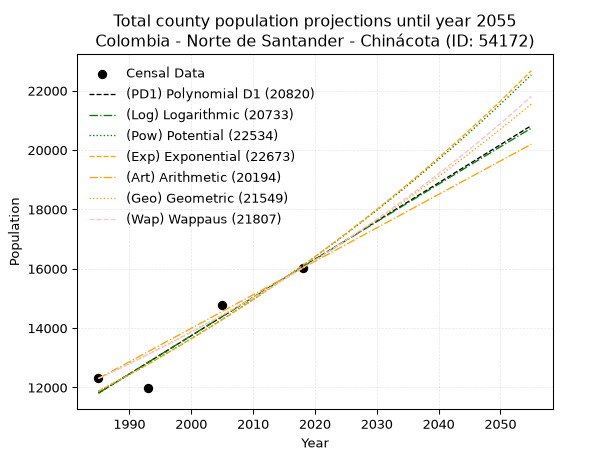
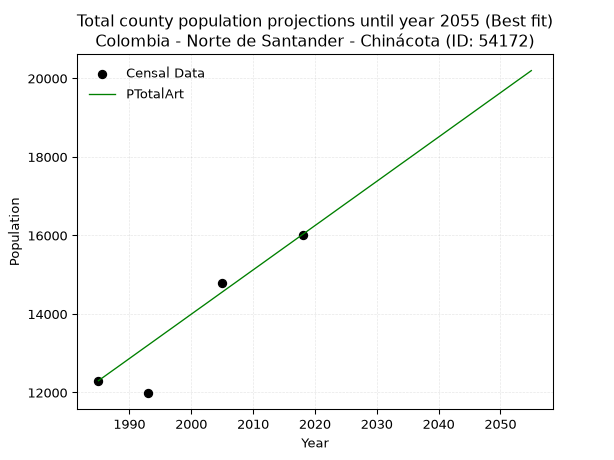
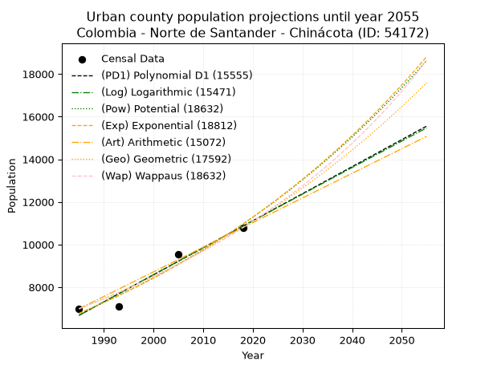
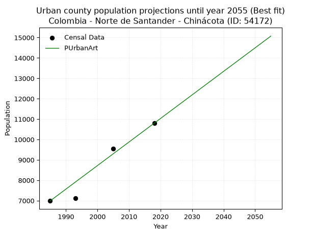
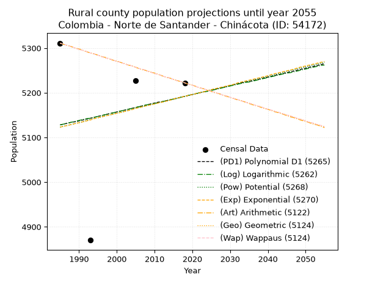
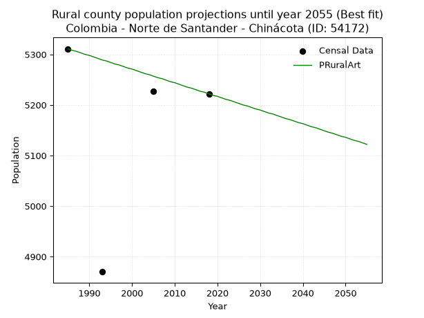

<div align="center">


</div>

# _“Population and Public Services Demand Projections (PPSD) until Year 2050 for Colombia - Norte de Santander - Chinácota (ID: 54172)”_
Keywords: `population` `public-service` `projection` `lineal` `polynomial` `logarithmic` `potential` `exponential` `arithmetic` `geometric` `wappaus` `dane` `colombia` `south-america`

PPSD are analytical estimates used by governments and planners to anticipate future changes in population size, age distribution, and the resulting community needs for utilities, healthcare, education, and infrastructure as sizing future water treatment facilities, electrical grids, and road networks based on spatial growth.

> **General running parameters**: • app_version: _v20260806_. • Python version: _3.14.7_. • Pandas version: _3.0.5_. • NumPy version: _2.5.1_. • Creates, save and include plots into reports (create_plot): _False_. • Projection until year: _2050_. • Process polynomial degree 2 and up: _False_. • Process Wappaus: _True_. • Process Wappaus: _True_. • Set negative values to zero: _True_. • Set infinite values to zero: _True_. • Drop dataset notes: _True_. 
<div align="center">

Dynamic map: [:earth_americas:Google](http://maps.google.com/maps?q=7.603112251,-72.6011615) [:earth_americas:OSM](https://www.openstreetmap.org/#map=18/7.603112251/-72.6011615&layers=P) [:earth_americas:Bing](https://www.bing.com/maps?cp=7.603112251~-72.6011615&lvl=18) [:earth_americas:Apple](https://maps.apple.com/frame?center=7.603112251%2C-72.6011615&span=0.003%2C0.006)

</div>


<div align="center">

```geojson
{
  "type": "Feature",
  "geometry": {
    "type": "Point", 
    "coordinates": [-72.6011615, 7.603112251]
  }, 
  "properties": {
    "Name": "Colombia - Norte de Santander - Chinácota (ID: 54172)"
  }
}
```

</div>


## 0. Census Data (4 records)

Census data are official statistics collected by a government about the people and housing in a country. They usually include counts of total population, age, sex, race, income, education, and jobs.

📅Global census file: [Population.xlsx](../data/Population.xlsx)

| Source   |   Year |   CountryID | CountryName   |   StateID | StateName          |   CountyID | CountyName   |   PTotal |   PUrban |   PRural |
|:---------|-------:|------------:|:--------------|----------:|:-------------------|-----------:|:-------------|---------:|---------:|---------:|
| DANE     |   1985 |          57 | Colombia      |        54 | Norte de Santander |      54172 | Chinácota    |    12299 |     6988 |     5311 |
| DANE     |   1993 |          57 | Colombia      |        54 | Norte de Santander |      54172 | Chinácota    |    11981 |     7111 |     4870 |
| DANE     |   2005 |          57 | Colombia      |        54 | Norte De Santander |      54172 | Chinácota    |    14784 |     9557 |     5227 |
| DANE     |   2018 |          57 | Colombia      |        54 | Norte de Santander |      54172 | Chinácota    |    16021 |    10799 |     5222 |

> 🔥Some records could had specific notes about the registered values or the corresponding urban or rural distribution.

📅   [RUPS](https://www.datos.gov.co/Hacienda-y-Cr-dito-P-blico/Registro-nico-de-Prestadores-de-Servicios-P-blicos/4qkq-csdn/about_data) - Local public utility companies: [RUPS.csv](../data/RUPS.xlsx)

 | SERVICIO       | ESTADO    | NOMBRE                                                                    | NIT         | DEPARTAMENTO_DOMICILIO   | MUNICIPIO_DOMICILIO   | DIRECCION                        |   TELEFONO | EMAIL                                 | TIPO_INSCRIPCION    | REPRESENTANTE_LEGAL           | TIPO_PRESTADOR                            | CLASIFICACION                  |
|:---------------|:----------|:--------------------------------------------------------------------------|:------------|:-------------------------|:----------------------|:---------------------------------|-----------:|:--------------------------------------|:--------------------|:------------------------------|:------------------------------------------|:-------------------------------|
| ACUEDUCTO      | OPERATIVA | ASOCIACIÓN DE USUARIOS DEL ACUEDUCTO RURAL COLECTIVO DE CHINACOTA TENERIA | 807002356-3 | NORTE DE SANTANDER       | CHINACOTA             | VEREDA TENERIA FINCA LA HELENA   |    5864831 | edilsonc_72@hotmail.com               | Registro por la ESP | GERMAN JACOME MENDOZA         | ORGANIZACION AUTORIZADA                   | MENOR O IGUAL A 2500 USUARIOS  |
| ACUEDUCTO      | OPERATIVA | EMPRESAS MUNICIPALES DE CHINACOTA E.S.P.                                  | 807000581-5 | NORTE DE SANTANDER       | CHINACOTA             | Carrera 4a. No.13-35 Las Colinas |    5864209 | emchinac@emchinacesp-chinacota.gov.co | Registro por la ESP | JOSE GUILLERMO PABON PINILLOS | EMPRESA INDUSTRIAL Y COMERCIAL DEL ESTADO | DESDE 2501 HASTA 5000 USUARIOS |
| ALCANTARILLADO | OPERATIVA | EMPRESAS MUNICIPALES DE CHINACOTA E.S.P.                                  | 807000581-5 | NORTE DE SANTANDER       | CHINACOTA             | Carrera 4a. No.13-35 Las Colinas |    5864209 | emchinac@emchinacesp-chinacota.gov.co | Registro por la ESP | JOSE GUILLERMO PABON PINILLOS | EMPRESA INDUSTRIAL Y COMERCIAL DEL ESTADO | DESDE 2501 HASTA 5000 USUARIOS |

## 1. Total

### 1.1. Coefficients and Parameters

* (PD1) Polynomial Deg 1: 128.74307507025196, -243747.08590927144 (lineal)
* (Log) Logarithmic: 257640.48112341404, -1944556.111620313
* (Pow) Potential: 18.500208366909202, -56.9348797115134
* (Exp) Exponential: 0.009244221284351768, 0.00012743210169713975
* (Art) Arithmetic: Year diff. 2018 - 1985 = 33, Population diff. 16021 - 12299 = 3722, Annual growth = 112.78787878787878
* (Geo) Geometric: Year diff. 2018 - 1985 = 33, Population diff. 16021 - 12299 = 3722, Annual growth % = 0.008043766629564075
* (Wap) Wappaus: i = 0.7965245677110084, Condition values only valid for < 200)

<sub>
Wappaus condition values: ['0.00', '0.80', '1.59', '2.39', '3.19', '3.98', '4.78', '5.58', '6.37', '7.17', '7.97', '8.76', '9.56', '10.35', '11.15', '11.95', '12.74', '13.54', '14.34', '15.13', '15.93', '16.73', '17.52', '18.32', '19.12', '19.91', '20.71', '21.51', '22.30', '23.10', '23.90', '24.69', '25.49', '26.29', '27.08', '27.88', '28.67', '29.47', '30.27', '31.06', '31.86', '32.66', '33.45', '34.25', '35.05', '35.84', '36.64', '37.44', '38.23', '39.03', '39.83', '40.62', '41.42', '42.22', '43.01', '43.81', '44.61', '45.40', '46.20', '46.99', '47.79', '48.59', '49.38', '50.18', '50.98', '51.77']
</sub>


### 1.2. Projected Dataset

|   Year |   CountyID |   PTotalPD1 |   PTotalLog |   PTotalPow |   PTotalExp |   PTotalArt |   PTotalGeo |   PTotalWap |
|-------:|-----------:|------------:|------------:|------------:|------------:|------------:|------------:|------------:|
|   1985 |      54172 |       11808 |       11804 |       11868 |       11871 |       12299 |       12299 |       12299 |
|   1986 |      54172 |       11937 |       11934 |       11979 |       11981 |       12412 |       12398 |       12397 |
|   1987 |      54172 |       12065 |       12064 |       12091 |       12093 |       12525 |       12498 |       12497 |
|   1988 |      54172 |       12194 |       12194 |       12204 |       12205 |       12637 |       12598 |       12596 |
|   1989 |      54172 |       12323 |       12323 |       12318 |       12318 |       12750 |       12700 |       12697 |
|   1990 |      54172 |       12452 |       12453 |       12433 |       12433 |       12863 |       12802 |       12799 |
|   1991 |      54172 |       12580 |       12582 |       12549 |       12548 |       12976 |       12905 |       12901 |
|   1992 |      54172 |       12709 |       12711 |       12667 |       12665 |       13089 |       13008 |       13004 |
|   1993 |      54172 |       12838 |       12841 |       12785 |       12782 |       13201 |       13113 |       13109 |
|   1994 |      54172 |       12967 |       12970 |       12904 |       12901 |       13314 |       13219 |       13213 |
|   1995 |      54172 |       13095 |       13099 |       13024 |       13021 |       13427 |       13325 |       13319 |
|   1996 |      54172 |       13224 |       13228 |       13146 |       13142 |       13540 |       13432 |       13426 |
|   1997 |      54172 |       13353 |       13357 |       13268 |       13264 |       13652 |       13540 |       13534 |
|   1998 |      54172 |       13482 |       13486 |       13391 |       13387 |       13765 |       13649 |       13642 |
|   1999 |      54172 |       13610 |       13615 |       13516 |       13511 |       13878 |       13759 |       13751 |
|   2000 |      54172 |       13739 |       13744 |       13642 |       13637 |       13991 |       13869 |       13862 |
|   2001 |      54172 |       13868 |       13873 |       13768 |       13763 |       14104 |       13981 |       13973 |
|   2002 |      54172 |       13997 |       14002 |       13896 |       13891 |       14216 |       14094 |       14085 |
|   2003 |      54172 |       14125 |       14130 |       14025 |       14020 |       14329 |       14207 |       14199 |
|   2004 |      54172 |       14254 |       14259 |       14155 |       14150 |       14442 |       14321 |       14313 |
|   2005 |      54172 |       14383 |       14387 |       14286 |       14282 |       14555 |       14436 |       14428 |
|   2006 |      54172 |       14512 |       14516 |       14419 |       14414 |       14668 |       14552 |       14544 |
|   2007 |      54172 |       14640 |       14644 |       14552 |       14548 |       14780 |       14670 |       14661 |
|   2008 |      54172 |       14769 |       14773 |       14687 |       14683 |       14893 |       14788 |       14779 |
|   2009 |      54172 |       14898 |       14901 |       14823 |       14820 |       15006 |       14906 |       14899 |
|   2010 |      54172 |       15026 |       15029 |       14960 |       14957 |       15119 |       15026 |       15019 |
|   2011 |      54172 |       15155 |       15157 |       15098 |       15096 |       15231 |       15147 |       15140 |
|   2012 |      54172 |       15284 |       15285 |       15238 |       15236 |       15344 |       15269 |       15263 |
|   2013 |      54172 |       15413 |       15413 |       15379 |       15378 |       15457 |       15392 |       15386 |
|   2014 |      54172 |       15541 |       15541 |       15521 |       15521 |       15570 |       15516 |       15511 |
|   2015 |      54172 |       15670 |       15669 |       15664 |       15665 |       15683 |       15641 |       15637 |
|   2016 |      54172 |       15799 |       15797 |       15808 |       15810 |       15795 |       15766 |       15764 |
|   2017 |      54172 |       15928 |       15925 |       15954 |       15957 |       15908 |       15893 |       15892 |
|   2018 |      54172 |       16056 |       16052 |       16101 |       16105 |       16021 |       16021 |       16021 |
|   2019 |      54172 |       16185 |       16180 |       16249 |       16255 |       16134 |       16150 |       16151 |
|   2020 |      54172 |       16314 |       16308 |       16399 |       16406 |       16247 |       16280 |       16283 |
|   2021 |      54172 |       16443 |       16435 |       16550 |       16558 |       16359 |       16411 |       16416 |
|   2022 |      54172 |       16571 |       16563 |       16702 |       16712 |       16472 |       16543 |       16550 |
|   2023 |      54172 |       16700 |       16690 |       16855 |       16867 |       16585 |       16676 |       16686 |
|   2024 |      54172 |       16829 |       16817 |       17010 |       17024 |       16698 |       16810 |       16822 |
|   2025 |      54172 |       16958 |       16945 |       17166 |       17182 |       16811 |       16945 |       16960 |
|   2026 |      54172 |       17086 |       17072 |       17324 |       17342 |       16923 |       17081 |       17099 |
|   2027 |      54172 |       17215 |       17199 |       17483 |       17503 |       17036 |       17219 |       17240 |
|   2028 |      54172 |       17344 |       17326 |       17643 |       17665 |       17149 |       17357 |       17382 |
|   2029 |      54172 |       17473 |       17453 |       17804 |       17829 |       17262 |       17497 |       17525 |
|   2030 |      54172 |       17601 |       17580 |       17967 |       17995 |       17374 |       17638 |       17670 |
|   2031 |      54172 |       17730 |       17707 |       18132 |       18162 |       17487 |       17780 |       17816 |
|   2032 |      54172 |       17859 |       17834 |       18298 |       18331 |       17600 |       17923 |       17964 |
|   2033 |      54172 |       17988 |       17960 |       18465 |       18501 |       17713 |       18067 |       18113 |
|   2034 |      54172 |       18116 |       18087 |       18634 |       18673 |       17826 |       18212 |       18263 |
|   2035 |      54172 |       18245 |       18214 |       18804 |       18846 |       17938 |       18359 |       18415 |
|   2036 |      54172 |       18374 |       18340 |       18976 |       19021 |       18051 |       18506 |       18569 |
|   2037 |      54172 |       18503 |       18467 |       19149 |       19198 |       18164 |       18655 |       18724 |
|   2038 |      54172 |       18631 |       18593 |       19324 |       19376 |       18277 |       18805 |       18880 |
|   2039 |      54172 |       18760 |       18720 |       19500 |       19556 |       18390 |       18956 |       19038 |
|   2040 |      54172 |       18889 |       18846 |       19677 |       19738 |       18502 |       19109 |       19198 |
|   2041 |      54172 |       19018 |       18972 |       19857 |       19921 |       18615 |       19263 |       19360 |
|   2042 |      54172 |       19146 |       19098 |       20037 |       20106 |       18728 |       19418 |       19523 |
|   2043 |      54172 |       19275 |       19225 |       20220 |       20293 |       18841 |       19574 |       19688 |
|   2044 |      54172 |       19404 |       19351 |       20404 |       20481 |       18953 |       19731 |       19854 |
|   2045 |      54172 |       19533 |       19477 |       20589 |       20671 |       19066 |       19890 |       20022 |
|   2046 |      54172 |       19661 |       19603 |       20776 |       20863 |       19179 |       20050 |       20192 |
|   2047 |      54172 |       19790 |       19729 |       20965 |       21057 |       19292 |       20211 |       20364 |
|   2048 |      54172 |       19919 |       19854 |       21155 |       21253 |       19405 |       20374 |       20538 |
|   2049 |      54172 |       20047 |       19980 |       21347 |       21450 |       19517 |       20538 |       20713 |
|   2050 |      54172 |       20176 |       20106 |       21541 |       21649 |       19630 |       20703 |       20891 |
<div align="center">

</img>

</div>


### 1.3. Best fit with absolute and relative error (%)

Relative error puts that difference into context by dividing the absolute error by the true value, creating a unitless ratio or percentage that shows the scale of the mistake.

Absolute and relative error

|   Year | Source   |   CountryID | CountryName   |   StateID | StateName          |   CountyID_x | CountyName   |   PTotal |   PUrban |   PRural |   CountyID_y |   PTotalPD1 |   PTotalLog |   PTotalPow |   PTotalExp |   PTotalArt |   PTotalGeo |   PTotalWap |   PTotalPD1AbsError |   PTotalLogAbsError |   PTotalPowAbsError |   PTotalExpAbsError |   PTotalArtAbsError |   PTotalGeoAbsError |   PTotalWapAbsError |   PTotalPD1RelError |   PTotalLogRelError |   PTotalPowRelError |   PTotalExpRelError |   PTotalArtRelError |   PTotalGeoRelError |   PTotalWapRelError |
|-------:|:---------|------------:|:--------------|----------:|:-------------------|-------------:|:-------------|---------:|---------:|---------:|-------------:|------------:|------------:|------------:|------------:|------------:|------------:|------------:|--------------------:|--------------------:|--------------------:|--------------------:|--------------------:|--------------------:|--------------------:|--------------------:|--------------------:|--------------------:|--------------------:|--------------------:|--------------------:|--------------------:|
|   1985 | DANE     |          57 | Colombia      |        54 | Norte de Santander |        54172 | Chinácota    |    12299 |     6988 |     5311 |        54172 |       11808 |       11804 |       11868 |       11871 |       12299 |       12299 |       12299 |                 491 |                 495 |                 431 |                 428 |                   0 |                   0 |                   0 |            3.99219  |            4.02472  |            3.50435  |            3.47996  |             0       |             0       |             0       |
|   1993 | DANE     |          57 | Colombia      |        54 | Norte de Santander |        54172 | Chinácota    |    11981 |     7111 |     4870 |        54172 |       12838 |       12841 |       12785 |       12782 |       13201 |       13113 |       13109 |                 857 |                 860 |                 804 |                 801 |                1220 |                1132 |                1128 |            7.15299  |            7.17803  |            6.71063  |            6.68559  |            10.1828  |             9.44829 |             9.41491 |
|   2005 | DANE     |          57 | Colombia      |        54 | Norte De Santander |        54172 | Chinácota    |    14784 |     9557 |     5227 |        54172 |       14383 |       14387 |       14286 |       14282 |       14555 |       14436 |       14428 |                 401 |                 397 |                 498 |                 502 |                 229 |                 348 |                 356 |            2.71239  |            2.68534  |            3.36851  |            3.39556  |             1.54897 |             2.3539  |             2.40801 |
|   2018 | DANE     |          57 | Colombia      |        54 | Norte de Santander |        54172 | Chinácota    |    16021 |    10799 |     5222 |        54172 |       16056 |       16052 |       16101 |       16105 |       16021 |       16021 |       16021 |                  35 |                  31 |                  80 |                  84 |                   0 |                   0 |                   0 |            0.218463 |            0.193496 |            0.499345 |            0.524312 |             0       |             0       |             0       |

Relative error mean

| Method    |   RelError | Best   |
|:----------|-----------:|:-------|
| PTotalPD1 |    3.51901 |        |
| PTotalLog |    3.5204  |        |
| PTotalPow |    3.52071 |        |
| PTotalExp |    3.52135 |        |
| PTotalArt |    2.93294 | True   |
| PTotalGeo |    2.95055 |        |
| PTotalWap |    2.95573 |        |

💙Best method: _**PTotalArt**_
<div align="center">

</img>

</div>


### 1.4. Fresh water supply demand in liters per capita per day (lpcd)

The fresh water supply demand typically ranges from 100 to 300 liters per capita per day (lpcd) for standard domestic and municipal planning, though absolute survival minimums set by the World Health Organization are as low as 7.5 to 20 liters per day, and total consumption in high-income nations can exceed 400 liters.

> `CZ`: Level in meters above the sea level (masl)<br> `WS`: Fresh water supply demand in liters per capita per day (lpcd or l/h/d)<br> `WSAll`: Zonal fresh water supply demand in liters per second (l/s)<br> `A`: Zonal area in square meters<br> `DP`: Population density (people/hectare or p/ha)

Reference values (RAS Colombia)

|    CZ |   WS |
|------:|-----:|
|  1000 |  120 |
|  2000 |  130 |
| 99999 |  140 |

County shapefile geometry properties and water supply values

|   CountyID |      ATotal |   CZTotal |   WSTotal |
|-----------:|------------:|----------:|----------:|
|      54172 | 1.65892e+08 |   1639.59 |       130 |

Projected values for best method: PTotalArt

|   CountyID |   Year |   PTotalArt |   DPTotal |   WSTotal |   WSTotalAll |
|-----------:|-------:|------------:|----------:|----------:|-------------:|
|      54172 |   1985 |       12299 |      0.74 |       130 |      18.5054 |
|      54172 |   1986 |       12412 |      0.75 |       130 |      18.6755 |
|      54172 |   1987 |       12525 |      0.76 |       130 |      18.8455 |
|      54172 |   1988 |       12637 |      0.76 |       130 |      19.014  |
|      54172 |   1989 |       12750 |      0.77 |       130 |      19.184  |
|      54172 |   1990 |       12863 |      0.78 |       130 |      19.3541 |
|      54172 |   1991 |       12976 |      0.78 |       130 |      19.5241 |
|      54172 |   1992 |       13089 |      0.79 |       130 |      19.6941 |
|      54172 |   1993 |       13201 |      0.8  |       130 |      19.8626 |
|      54172 |   1994 |       13314 |      0.8  |       130 |      20.0326 |
|      54172 |   1995 |       13427 |      0.81 |       130 |      20.2027 |
|      54172 |   1996 |       13540 |      0.82 |       130 |      20.3727 |
|      54172 |   1997 |       13652 |      0.82 |       130 |      20.5412 |
|      54172 |   1998 |       13765 |      0.83 |       130 |      20.7112 |
|      54172 |   1999 |       13878 |      0.84 |       130 |      20.8813 |
|      54172 |   2000 |       13991 |      0.84 |       130 |      21.0513 |
|      54172 |   2001 |       14104 |      0.85 |       130 |      21.2213 |
|      54172 |   2002 |       14216 |      0.86 |       130 |      21.3898 |
|      54172 |   2003 |       14329 |      0.86 |       130 |      21.5598 |
|      54172 |   2004 |       14442 |      0.87 |       130 |      21.7299 |
|      54172 |   2005 |       14555 |      0.88 |       130 |      21.8999 |
|      54172 |   2006 |       14668 |      0.88 |       130 |      22.0699 |
|      54172 |   2007 |       14780 |      0.89 |       130 |      22.2384 |
|      54172 |   2008 |       14893 |      0.9  |       130 |      22.4084 |
|      54172 |   2009 |       15006 |      0.9  |       130 |      22.5785 |
|      54172 |   2010 |       15119 |      0.91 |       130 |      22.7485 |
|      54172 |   2011 |       15231 |      0.92 |       130 |      22.917  |
|      54172 |   2012 |       15344 |      0.92 |       130 |      23.087  |
|      54172 |   2013 |       15457 |      0.93 |       130 |      23.2571 |
|      54172 |   2014 |       15570 |      0.94 |       130 |      23.4271 |
|      54172 |   2015 |       15683 |      0.95 |       130 |      23.5971 |
|      54172 |   2016 |       15795 |      0.95 |       130 |      23.7656 |
|      54172 |   2017 |       15908 |      0.96 |       130 |      23.9356 |
|      54172 |   2018 |       16021 |      0.97 |       130 |      24.1057 |
|      54172 |   2019 |       16134 |      0.97 |       130 |      24.2757 |
|      54172 |   2020 |       16247 |      0.98 |       130 |      24.4457 |
|      54172 |   2021 |       16359 |      0.99 |       130 |      24.6142 |
|      54172 |   2022 |       16472 |      0.99 |       130 |      24.7843 |
|      54172 |   2023 |       16585 |      1    |       130 |      24.9543 |
|      54172 |   2024 |       16698 |      1.01 |       130 |      25.1243 |
|      54172 |   2025 |       16811 |      1.01 |       130 |      25.2943 |
|      54172 |   2026 |       16923 |      1.02 |       130 |      25.4628 |
|      54172 |   2027 |       17036 |      1.03 |       130 |      25.6329 |
|      54172 |   2028 |       17149 |      1.03 |       130 |      25.8029 |
|      54172 |   2029 |       17262 |      1.04 |       130 |      25.9729 |
|      54172 |   2030 |       17374 |      1.05 |       130 |      26.1414 |
|      54172 |   2031 |       17487 |      1.05 |       130 |      26.3115 |
|      54172 |   2032 |       17600 |      1.06 |       130 |      26.4815 |
|      54172 |   2033 |       17713 |      1.07 |       130 |      26.6515 |
|      54172 |   2034 |       17826 |      1.07 |       130 |      26.8215 |
|      54172 |   2035 |       17938 |      1.08 |       130 |      26.99   |
|      54172 |   2036 |       18051 |      1.09 |       130 |      27.1601 |
|      54172 |   2037 |       18164 |      1.09 |       130 |      27.3301 |
|      54172 |   2038 |       18277 |      1.1  |       130 |      27.5001 |
|      54172 |   2039 |       18390 |      1.11 |       130 |      27.6701 |
|      54172 |   2040 |       18502 |      1.12 |       130 |      27.8387 |
|      54172 |   2041 |       18615 |      1.12 |       130 |      28.0087 |
|      54172 |   2042 |       18728 |      1.13 |       130 |      28.1787 |
|      54172 |   2043 |       18841 |      1.14 |       130 |      28.3487 |
|      54172 |   2044 |       18953 |      1.14 |       130 |      28.5172 |
|      54172 |   2045 |       19066 |      1.15 |       130 |      28.6873 |
|      54172 |   2046 |       19179 |      1.16 |       130 |      28.8573 |
|      54172 |   2047 |       19292 |      1.16 |       130 |      29.0273 |
|      54172 |   2048 |       19405 |      1.17 |       130 |      29.1973 |
|      54172 |   2049 |       19517 |      1.18 |       130 |      29.3659 |
|      54172 |   2050 |       19630 |      1.18 |       130 |      29.5359 |

## 2. Urban

### 2.1. Coefficients and Parameters

* (PD1) Polynomial Deg 1: 126.78643115214682, -244990.80891208167 (lineal)
* (Log) Logarithmic: 253755.4865068617, -1920183.7364075058
* (Pow) Potential: 29.205351343567013, -92.48158246060619
* (Exp) Exponential: 0.014590888480718623, 1.7882502048292675e-09
* (Art) Arithmetic: Year diff. 2018 - 1985 = 33, Population diff. 10799 - 6988 = 3811, Annual growth = 115.48484848484848
* (Geo) Geometric: Year diff. 2018 - 1985 = 33, Population diff. 10799 - 6988 = 3811, Annual growth % = 0.01327703846450734
* (Wap) Wappaus: i = 1.2985309325332939, Condition values only valid for < 200)

<sub>
Wappaus condition values: ['0.00', '1.30', '2.60', '3.90', '5.19', '6.49', '7.79', '9.09', '10.39', '11.69', '12.99', '14.28', '15.58', '16.88', '18.18', '19.48', '20.78', '22.08', '23.37', '24.67', '25.97', '27.27', '28.57', '29.87', '31.16', '32.46', '33.76', '35.06', '36.36', '37.66', '38.96', '40.25', '41.55', '42.85', '44.15', '45.45', '46.75', '48.05', '49.34', '50.64', '51.94', '53.24', '54.54', '55.84', '57.14', '58.43', '59.73', '61.03', '62.33', '63.63', '64.93', '66.23', '67.52', '68.82', '70.12', '71.42', '72.72', '74.02', '75.31', '76.61', '77.91', '79.21', '80.51', '81.81', '83.11', '84.40']
</sub>


### 2.2. Projected Dataset

|   Year |   CountyID |   PUrbanPD1 |   PUrbanLog |   PUrbanPow |   PUrbanExp |   PUrbanArt |   PUrbanGeo |   PUrbanWap |
|-------:|-----------:|------------:|------------:|------------:|------------:|------------:|------------:|------------:|
|   1985 |      54172 |        6680 |        6677 |        6771 |        6774 |        6988 |        6988 |        6988 |
|   1986 |      54172 |        6807 |        6804 |        6872 |        6874 |        7103 |        7081 |        7079 |
|   1987 |      54172 |        6934 |        6932 |        6973 |        6975 |        7219 |        7175 |        7172 |
|   1988 |      54172 |        7061 |        7060 |        7077 |        7077 |        7334 |        7270 |        7266 |
|   1989 |      54172 |        7187 |        7187 |        7181 |        7181 |        7450 |        7367 |        7361 |
|   1990 |      54172 |        7314 |        7315 |        7288 |        7287 |        7565 |        7464 |        7457 |
|   1991 |      54172 |        7441 |        7442 |        7395 |        7394 |        7681 |        7563 |        7555 |
|   1992 |      54172 |        7568 |        7570 |        7504 |        7503 |        7796 |        7664 |        7653 |
|   1993 |      54172 |        7695 |        7697 |        7615 |        7613 |        7912 |        7766 |        7754 |
|   1994 |      54172 |        7821 |        7825 |        7728 |        7725 |        8027 |        7869 |        7855 |
|   1995 |      54172 |        7948 |        7952 |        7842 |        7838 |        8143 |        7973 |        7958 |
|   1996 |      54172 |        8075 |        8079 |        7957 |        7954 |        8258 |        8079 |        8063 |
|   1997 |      54172 |        8202 |        8206 |        8075 |        8071 |        8374 |        8186 |        8169 |
|   1998 |      54172 |        8328 |        8333 |        8193 |        8189 |        8489 |        8295 |        8276 |
|   1999 |      54172 |        8455 |        8460 |        8314 |        8310 |        8605 |        8405 |        8385 |
|   2000 |      54172 |        8582 |        8587 |        8436 |        8432 |        8720 |        8517 |        8496 |
|   2001 |      54172 |        8709 |        8714 |        8560 |        8556 |        8836 |        8630 |        8608 |
|   2002 |      54172 |        8836 |        8841 |        8686 |        8681 |        8951 |        8744 |        8722 |
|   2003 |      54172 |        8962 |        8967 |        8814 |        8809 |        9067 |        8861 |        8837 |
|   2004 |      54172 |        9089 |        9094 |        8943 |        8938 |        9182 |        8978 |        8955 |
|   2005 |      54172 |        9216 |        9221 |        9075 |        9070 |        9298 |        9097 |        9074 |
|   2006 |      54172 |        9343 |        9347 |        9208 |        9203 |        9413 |        9218 |        9194 |
|   2007 |      54172 |        9470 |        9474 |        9343 |        9338 |        9529 |        9341 |        9317 |
|   2008 |      54172 |        9596 |        9600 |        9480 |        9476 |        9644 |        9465 |        9441 |
|   2009 |      54172 |        9723 |        9726 |        9618 |        9615 |        9760 |        9590 |        9568 |
|   2010 |      54172 |        9850 |        9853 |        9759 |        9756 |        9875 |        9718 |        9696 |
|   2011 |      54172 |        9977 |        9979 |        9902 |        9900 |        9991 |        9847 |        9826 |
|   2012 |      54172 |       10103 |       10105 |       10047 |       10045 |       10106 |        9977 |        9959 |
|   2013 |      54172 |       10230 |       10231 |       10194 |       10193 |       10222 |       10110 |       10093 |
|   2014 |      54172 |       10357 |       10357 |       10343 |       10343 |       10337 |       10244 |       10230 |
|   2015 |      54172 |       10484 |       10483 |       10494 |       10495 |       10453 |       10380 |       10369 |
|   2016 |      54172 |       10611 |       10609 |       10647 |       10649 |       10568 |       10518 |       10510 |
|   2017 |      54172 |       10737 |       10735 |       10802 |       10805 |       10684 |       10657 |       10653 |
|   2018 |      54172 |       10864 |       10861 |       10960 |       10964 |       10799 |       10799 |       10799 |
|   2019 |      54172 |       10991 |       10986 |       11119 |       11125 |       10914 |       10942 |       10947 |
|   2020 |      54172 |       11118 |       11112 |       11281 |       11289 |       11030 |       11088 |       11098 |
|   2021 |      54172 |       11245 |       11238 |       11446 |       11455 |       11145 |       11235 |       11251 |
|   2022 |      54172 |       11371 |       11363 |       11612 |       11623 |       11261 |       11384 |       11407 |
|   2023 |      54172 |       11498 |       11489 |       11781 |       11794 |       11376 |       11535 |       11566 |
|   2024 |      54172 |       11625 |       11614 |       11952 |       11967 |       11492 |       11688 |       11727 |
|   2025 |      54172 |       11752 |       11739 |       12126 |       12143 |       11607 |       11844 |       11891 |
|   2026 |      54172 |       11879 |       11865 |       12302 |       12322 |       11723 |       12001 |       12058 |
|   2027 |      54172 |       12005 |       11990 |       12481 |       12503 |       11838 |       12160 |       12228 |
|   2028 |      54172 |       12132 |       12115 |       12662 |       12686 |       11954 |       12322 |       12401 |
|   2029 |      54172 |       12259 |       12240 |       12846 |       12873 |       12069 |       12485 |       12577 |
|   2030 |      54172 |       12386 |       12365 |       13032 |       13062 |       12185 |       12651 |       12757 |
|   2031 |      54172 |       12512 |       12490 |       13221 |       13254 |       12300 |       12819 |       12940 |
|   2032 |      54172 |       12639 |       12615 |       13412 |       13449 |       12416 |       12989 |       13126 |
|   2033 |      54172 |       12766 |       12740 |       13606 |       13647 |       12531 |       13162 |       13316 |
|   2034 |      54172 |       12893 |       12865 |       13803 |       13847 |       12647 |       13336 |       13509 |
|   2035 |      54172 |       13020 |       12989 |       14002 |       14051 |       12762 |       13513 |       13706 |
|   2036 |      54172 |       13146 |       13114 |       14205 |       14257 |       12878 |       13693 |       13907 |
|   2037 |      54172 |       13273 |       13239 |       14410 |       14467 |       12993 |       13875 |       14112 |
|   2038 |      54172 |       13400 |       13363 |       14618 |       14679 |       13109 |       14059 |       14320 |
|   2039 |      54172 |       13527 |       13488 |       14829 |       14895 |       13224 |       14245 |       14534 |
|   2040 |      54172 |       13654 |       13612 |       15043 |       15114 |       13340 |       14435 |       14751 |
|   2041 |      54172 |       13780 |       13736 |       15260 |       15336 |       13455 |       14626 |       14973 |
|   2042 |      54172 |       13907 |       13861 |       15480 |       15562 |       13571 |       14820 |       15199 |
|   2043 |      54172 |       14034 |       13985 |       15702 |       15790 |       13686 |       15017 |       15430 |
|   2044 |      54172 |       14161 |       14109 |       15929 |       16022 |       13802 |       15217 |       15666 |
|   2045 |      54172 |       14287 |       14233 |       16158 |       16258 |       13917 |       15419 |       15907 |
|   2046 |      54172 |       14414 |       14357 |       16390 |       16497 |       14033 |       15623 |       16153 |
|   2047 |      54172 |       14541 |       14481 |       16626 |       16739 |       14148 |       15831 |       16405 |
|   2048 |      54172 |       14668 |       14605 |       16864 |       16985 |       14264 |       16041 |       16662 |
|   2049 |      54172 |       14795 |       14729 |       17107 |       17235 |       14379 |       16254 |       16924 |
|   2050 |      54172 |       14921 |       14853 |       17352 |       17488 |       14495 |       16470 |       17193 |
<div align="center">

</img>

</div>


### 2.3. Best fit with absolute and relative error (%)

Relative error puts that difference into context by dividing the absolute error by the true value, creating a unitless ratio or percentage that shows the scale of the mistake.

Absolute and relative error

|   Year | Source   |   CountryID | CountryName   |   StateID | StateName          |   CountyID_x | CountyName   |   PTotal |   PUrban |   PRural |   CountyID_y |   PUrbanPD1 |   PUrbanLog |   PUrbanPow |   PUrbanExp |   PUrbanArt |   PUrbanGeo |   PUrbanWap |   PUrbanPD1AbsError |   PUrbanLogAbsError |   PUrbanPowAbsError |   PUrbanExpAbsError |   PUrbanArtAbsError |   PUrbanGeoAbsError |   PUrbanWapAbsError |   PUrbanPD1RelError |   PUrbanLogRelError |   PUrbanPowRelError |   PUrbanExpRelError |   PUrbanArtRelError |   PUrbanGeoRelError |   PUrbanWapRelError |
|-------:|:---------|------------:|:--------------|----------:|:-------------------|-------------:|:-------------|---------:|---------:|---------:|-------------:|------------:|------------:|------------:|------------:|------------:|------------:|------------:|--------------------:|--------------------:|--------------------:|--------------------:|--------------------:|--------------------:|--------------------:|--------------------:|--------------------:|--------------------:|--------------------:|--------------------:|--------------------:|--------------------:|
|   1985 | DANE     |          57 | Colombia      |        54 | Norte de Santander |        54172 | Chinácota    |    12299 |     6988 |     5311 |        54172 |        6680 |        6677 |        6771 |        6774 |        6988 |        6988 |        6988 |                 308 |                 311 |                 217 |                 214 |                   0 |                   0 |                   0 |            4.40756  |            4.45049  |             3.10532 |             3.06239 |             0       |             0       |             0       |
|   1993 | DANE     |          57 | Colombia      |        54 | Norte de Santander |        54172 | Chinácota    |    11981 |     7111 |     4870 |        54172 |        7695 |        7697 |        7615 |        7613 |        7912 |        7766 |        7754 |                 584 |                 586 |                 504 |                 502 |                 801 |                 655 |                 643 |            8.21263  |            8.24075  |             7.08761 |             7.05949 |            11.2642  |             9.21108 |             9.04233 |
|   2005 | DANE     |          57 | Colombia      |        54 | Norte De Santander |        54172 | Chinácota    |    14784 |     9557 |     5227 |        54172 |        9216 |        9221 |        9075 |        9070 |        9298 |        9097 |        9074 |                 341 |                 336 |                 482 |                 487 |                 259 |                 460 |                 483 |            3.56807  |            3.51575  |             5.04342 |             5.09574 |             2.71006 |             4.81323 |             5.05389 |
|   2018 | DANE     |          57 | Colombia      |        54 | Norte de Santander |        54172 | Chinácota    |    16021 |    10799 |     5222 |        54172 |       10864 |       10861 |       10960 |       10964 |       10799 |       10799 |       10799 |                  65 |                  62 |                 161 |                 165 |                   0 |                   0 |                   0 |            0.601908 |            0.574127 |             1.49088 |             1.52792 |             0       |             0       |             0       |

Relative error mean

| Method    |   RelError | Best   |
|:----------|-----------:|:-------|
| PUrbanPD1 |    4.19754 |        |
| PUrbanLog |    4.19528 |        |
| PUrbanPow |    4.18181 |        |
| PUrbanExp |    4.18638 |        |
| PUrbanArt |    3.49357 | True   |
| PUrbanGeo |    3.50608 |        |
| PUrbanWap |    3.52405 |        |

💙Best method: _**PUrbanArt**_
<div align="center">

</img>

</div>


### 2.4. Fresh water supply demand in liters per capita per day (lpcd)

The fresh water supply demand typically ranges from 100 to 300 liters per capita per day (lpcd) for standard domestic and municipal planning, though absolute survival minimums set by the World Health Organization are as low as 7.5 to 20 liters per day, and total consumption in high-income nations can exceed 400 liters.

> `CZ`: Level in meters above the sea level (masl)<br> `WS`: Fresh water supply demand in liters per capita per day (lpcd or l/h/d)<br> `WSAll`: Zonal fresh water supply demand in liters per second (l/s)<br> `A`: Zonal area in square meters<br> `DP`: Population density (people/hectare or p/ha)

Reference values (RAS Colombia)

|    CZ |   WS |
|------:|-----:|
|  1000 |  120 |
|  2000 |  130 |
| 99999 |  140 |

County shapefile geometry properties and water supply values

|   CountyID |      AUrban |   CZUrban |   WSUrban |
|-----------:|------------:|----------:|----------:|
|      54172 | 4.16989e+06 |   1251.63 |       130 |

Projected values for best method: PUrbanArt

|   CountyID |   Year |   PUrbanArt |   DPUrban |   WSUrban |   WSUrbanAll |
|-----------:|-------:|------------:|----------:|----------:|-------------:|
|      54172 |   1985 |        6988 |     16.76 |       130 |      10.5144 |
|      54172 |   1986 |        7103 |     17.03 |       130 |      10.6874 |
|      54172 |   1987 |        7219 |     17.31 |       130 |      10.8619 |
|      54172 |   1988 |        7334 |     17.59 |       130 |      11.035  |
|      54172 |   1989 |        7450 |     17.87 |       130 |      11.2095 |
|      54172 |   1990 |        7565 |     18.14 |       130 |      11.3825 |
|      54172 |   1991 |        7681 |     18.42 |       130 |      11.5571 |
|      54172 |   1992 |        7796 |     18.7  |       130 |      11.7301 |
|      54172 |   1993 |        7912 |     18.97 |       130 |      11.9046 |
|      54172 |   1994 |        8027 |     19.25 |       130 |      12.0777 |
|      54172 |   1995 |        8143 |     19.53 |       130 |      12.2522 |
|      54172 |   1996 |        8258 |     19.8  |       130 |      12.4252 |
|      54172 |   1997 |        8374 |     20.08 |       130 |      12.5998 |
|      54172 |   1998 |        8489 |     20.36 |       130 |      12.7728 |
|      54172 |   1999 |        8605 |     20.64 |       130 |      12.9473 |
|      54172 |   2000 |        8720 |     20.91 |       130 |      13.1204 |
|      54172 |   2001 |        8836 |     21.19 |       130 |      13.2949 |
|      54172 |   2002 |        8951 |     21.47 |       130 |      13.4679 |
|      54172 |   2003 |        9067 |     21.74 |       130 |      13.6425 |
|      54172 |   2004 |        9182 |     22.02 |       130 |      13.8155 |
|      54172 |   2005 |        9298 |     22.3  |       130 |      13.99   |
|      54172 |   2006 |        9413 |     22.57 |       130 |      14.1631 |
|      54172 |   2007 |        9529 |     22.85 |       130 |      14.3376 |
|      54172 |   2008 |        9644 |     23.13 |       130 |      14.5106 |
|      54172 |   2009 |        9760 |     23.41 |       130 |      14.6852 |
|      54172 |   2010 |        9875 |     23.68 |       130 |      14.8582 |
|      54172 |   2011 |        9991 |     23.96 |       130 |      15.0328 |
|      54172 |   2012 |       10106 |     24.24 |       130 |      15.2058 |
|      54172 |   2013 |       10222 |     24.51 |       130 |      15.3803 |
|      54172 |   2014 |       10337 |     24.79 |       130 |      15.5534 |
|      54172 |   2015 |       10453 |     25.07 |       130 |      15.7279 |
|      54172 |   2016 |       10568 |     25.34 |       130 |      15.9009 |
|      54172 |   2017 |       10684 |     25.62 |       130 |      16.0755 |
|      54172 |   2018 |       10799 |     25.9  |       130 |      16.2485 |
|      54172 |   2019 |       10914 |     26.17 |       130 |      16.4215 |
|      54172 |   2020 |       11030 |     26.45 |       130 |      16.5961 |
|      54172 |   2021 |       11145 |     26.73 |       130 |      16.7691 |
|      54172 |   2022 |       11261 |     27.01 |       130 |      16.9436 |
|      54172 |   2023 |       11376 |     27.28 |       130 |      17.1167 |
|      54172 |   2024 |       11492 |     27.56 |       130 |      17.2912 |
|      54172 |   2025 |       11607 |     27.84 |       130 |      17.4642 |
|      54172 |   2026 |       11723 |     28.11 |       130 |      17.6388 |
|      54172 |   2027 |       11838 |     28.39 |       130 |      17.8118 |
|      54172 |   2028 |       11954 |     28.67 |       130 |      17.9863 |
|      54172 |   2029 |       12069 |     28.94 |       130 |      18.1594 |
|      54172 |   2030 |       12185 |     29.22 |       130 |      18.3339 |
|      54172 |   2031 |       12300 |     29.5  |       130 |      18.5069 |
|      54172 |   2032 |       12416 |     29.78 |       130 |      18.6815 |
|      54172 |   2033 |       12531 |     30.05 |       130 |      18.8545 |
|      54172 |   2034 |       12647 |     30.33 |       130 |      19.0291 |
|      54172 |   2035 |       12762 |     30.61 |       130 |      19.2021 |
|      54172 |   2036 |       12878 |     30.88 |       130 |      19.3766 |
|      54172 |   2037 |       12993 |     31.16 |       130 |      19.5497 |
|      54172 |   2038 |       13109 |     31.44 |       130 |      19.7242 |
|      54172 |   2039 |       13224 |     31.71 |       130 |      19.8972 |
|      54172 |   2040 |       13340 |     31.99 |       130 |      20.0718 |
|      54172 |   2041 |       13455 |     32.27 |       130 |      20.2448 |
|      54172 |   2042 |       13571 |     32.55 |       130 |      20.4193 |
|      54172 |   2043 |       13686 |     32.82 |       130 |      20.5924 |
|      54172 |   2044 |       13802 |     33.1  |       130 |      20.7669 |
|      54172 |   2045 |       13917 |     33.37 |       130 |      20.9399 |
|      54172 |   2046 |       14033 |     33.65 |       130 |      21.1145 |
|      54172 |   2047 |       14148 |     33.93 |       130 |      21.2875 |
|      54172 |   2048 |       14264 |     34.21 |       130 |      21.462  |
|      54172 |   2049 |       14379 |     34.48 |       130 |      21.6351 |
|      54172 |   2050 |       14495 |     34.76 |       130 |      21.8096 |

## 3. Rural

### 3.1. Coefficients and Parameters

* (PD1) Polynomial Deg 1: 1.9566439181051587, 1243.7230028101562 (lineal)
* (Log) Logarithmic: 3884.9946165525207, -24372.37521280873
* (Pow) Potential: 0.8063008774014643, 1.0505383136803605
* (Exp) Exponential: 0.00040590649576523376, 2288.699023180888
* (Art) Arithmetic: Year diff. 2018 - 1985 = 33, Population diff. 5222 - 5311 = -89, Annual growth = -2.696969696969697
* (Geo) Geometric: Year diff. 2018 - 1985 = 33, Population diff. 5222 - 5311 = -89, Annual growth % = -0.0005119801407900137
* (Wap) Wappaus: i = -0.051209905952144634, Condition values only valid for < 200)

<sub>
Wappaus condition values: ['-0.00', '-0.05', '-0.10', '-0.15', '-0.20', '-0.26', '-0.31', '-0.36', '-0.41', '-0.46', '-0.51', '-0.56', '-0.61', '-0.67', '-0.72', '-0.77', '-0.82', '-0.87', '-0.92', '-0.97', '-1.02', '-1.08', '-1.13', '-1.18', '-1.23', '-1.28', '-1.33', '-1.38', '-1.43', '-1.49', '-1.54', '-1.59', '-1.64', '-1.69', '-1.74', '-1.79', '-1.84', '-1.89', '-1.95', '-2.00', '-2.05', '-2.10', '-2.15', '-2.20', '-2.25', '-2.30', '-2.36', '-2.41', '-2.46', '-2.51', '-2.56', '-2.61', '-2.66', '-2.71', '-2.77', '-2.82', '-2.87', '-2.92', '-2.97', '-3.02', '-3.07', '-3.12', '-3.18', '-3.23', '-3.28', '-3.33']
</sub>


### 3.2. Projected Dataset

|   Year |   CountyID |   PRuralPD1 |   PRuralLog |   PRuralPow |   PRuralExp |   PRuralArt |   PRuralGeo |   PRuralWap |
|-------:|-----------:|------------:|------------:|------------:|------------:|------------:|------------:|------------:|
|   1985 |      54172 |        5128 |        5128 |        5123 |        5123 |        5311 |        5311 |        5311 |
|   1986 |      54172 |        5130 |        5130 |        5125 |        5125 |        5308 |        5308 |        5308 |
|   1987 |      54172 |        5132 |        5132 |        5127 |        5127 |        5306 |        5306 |        5306 |
|   1988 |      54172 |        5134 |        5134 |        5129 |        5129 |        5303 |        5303 |        5303 |
|   1989 |      54172 |        5135 |        5136 |        5131 |        5131 |        5300 |        5300 |        5300 |
|   1990 |      54172 |        5137 |        5138 |        5133 |        5133 |        5298 |        5297 |        5297 |
|   1991 |      54172 |        5139 |        5140 |        5135 |        5135 |        5295 |        5295 |        5295 |
|   1992 |      54172 |        5141 |        5142 |        5138 |        5137 |        5292 |        5292 |        5292 |
|   1993 |      54172 |        5143 |        5143 |        5140 |        5139 |        5289 |        5289 |        5289 |
|   1994 |      54172 |        5145 |        5145 |        5142 |        5142 |        5287 |        5287 |        5287 |
|   1995 |      54172 |        5147 |        5147 |        5144 |        5144 |        5284 |        5284 |        5284 |
|   1996 |      54172 |        5149 |        5149 |        5146 |        5146 |        5281 |        5281 |        5281 |
|   1997 |      54172 |        5151 |        5151 |        5148 |        5148 |        5279 |        5278 |        5278 |
|   1998 |      54172 |        5153 |        5153 |        5150 |        5150 |        5276 |        5276 |        5276 |
|   1999 |      54172 |        5155 |        5155 |        5152 |        5152 |        5273 |        5273 |        5273 |
|   2000 |      54172 |        5157 |        5157 |        5154 |        5154 |        5271 |        5270 |        5270 |
|   2001 |      54172 |        5159 |        5159 |        5156 |        5156 |        5268 |        5268 |        5268 |
|   2002 |      54172 |        5161 |        5161 |        5158 |        5158 |        5265 |        5265 |        5265 |
|   2003 |      54172 |        5163 |        5163 |        5160 |        5160 |        5262 |        5262 |        5262 |
|   2004 |      54172 |        5165 |        5165 |        5163 |        5162 |        5260 |        5260 |        5260 |
|   2005 |      54172 |        5167 |        5167 |        5165 |        5165 |        5257 |        5257 |        5257 |
|   2006 |      54172 |        5169 |        5169 |        5167 |        5167 |        5254 |        5254 |        5254 |
|   2007 |      54172 |        5171 |        5171 |        5169 |        5169 |        5252 |        5251 |        5252 |
|   2008 |      54172 |        5173 |        5173 |        5171 |        5171 |        5249 |        5249 |        5249 |
|   2009 |      54172 |        5175 |        5175 |        5173 |        5173 |        5246 |        5246 |        5246 |
|   2010 |      54172 |        5177 |        5176 |        5175 |        5175 |        5244 |        5243 |        5243 |
|   2011 |      54172 |        5179 |        5178 |        5177 |        5177 |        5241 |        5241 |        5241 |
|   2012 |      54172 |        5180 |        5180 |        5179 |        5179 |        5238 |        5238 |        5238 |
|   2013 |      54172 |        5182 |        5182 |        5181 |        5181 |        5235 |        5235 |        5235 |
|   2014 |      54172 |        5184 |        5184 |        5183 |        5183 |        5233 |        5233 |        5233 |
|   2015 |      54172 |        5186 |        5186 |        5185 |        5186 |        5230 |        5230 |        5230 |
|   2016 |      54172 |        5188 |        5188 |        5187 |        5188 |        5227 |        5227 |        5227 |
|   2017 |      54172 |        5190 |        5190 |        5190 |        5190 |        5225 |        5225 |        5225 |
|   2018 |      54172 |        5192 |        5192 |        5192 |        5192 |        5222 |        5222 |        5222 |
|   2019 |      54172 |        5194 |        5194 |        5194 |        5194 |        5219 |        5219 |        5219 |
|   2020 |      54172 |        5196 |        5196 |        5196 |        5196 |        5217 |        5217 |        5217 |
|   2021 |      54172 |        5198 |        5198 |        5198 |        5198 |        5214 |        5214 |        5214 |
|   2022 |      54172 |        5200 |        5200 |        5200 |        5200 |        5211 |        5211 |        5211 |
|   2023 |      54172 |        5202 |        5202 |        5202 |        5202 |        5209 |        5209 |        5209 |
|   2024 |      54172 |        5204 |        5203 |        5204 |        5205 |        5206 |        5206 |        5206 |
|   2025 |      54172 |        5206 |        5205 |        5206 |        5207 |        5203 |        5203 |        5203 |
|   2026 |      54172 |        5208 |        5207 |        5208 |        5209 |        5200 |        5201 |        5201 |
|   2027 |      54172 |        5210 |        5209 |        5210 |        5211 |        5198 |        5198 |        5198 |
|   2028 |      54172 |        5212 |        5211 |        5212 |        5213 |        5195 |        5195 |        5195 |
|   2029 |      54172 |        5214 |        5213 |        5214 |        5215 |        5192 |        5193 |        5193 |
|   2030 |      54172 |        5216 |        5215 |        5216 |        5217 |        5190 |        5190 |        5190 |
|   2031 |      54172 |        5218 |        5217 |        5219 |        5219 |        5187 |        5187 |        5187 |
|   2032 |      54172 |        5220 |        5219 |        5221 |        5222 |        5184 |        5185 |        5185 |
|   2033 |      54172 |        5222 |        5221 |        5223 |        5224 |        5182 |        5182 |        5182 |
|   2034 |      54172 |        5224 |        5223 |        5225 |        5226 |        5179 |        5179 |        5179 |
|   2035 |      54172 |        5225 |        5224 |        5227 |        5228 |        5176 |        5177 |        5177 |
|   2036 |      54172 |        5227 |        5226 |        5229 |        5230 |        5173 |        5174 |        5174 |
|   2037 |      54172 |        5229 |        5228 |        5231 |        5232 |        5171 |        5171 |        5171 |
|   2038 |      54172 |        5231 |        5230 |        5233 |        5234 |        5168 |        5169 |        5169 |
|   2039 |      54172 |        5233 |        5232 |        5235 |        5236 |        5165 |        5166 |        5166 |
|   2040 |      54172 |        5235 |        5234 |        5237 |        5238 |        5163 |        5163 |        5163 |
|   2041 |      54172 |        5237 |        5236 |        5239 |        5241 |        5160 |        5161 |        5161 |
|   2042 |      54172 |        5239 |        5238 |        5241 |        5243 |        5157 |        5158 |        5158 |
|   2043 |      54172 |        5241 |        5240 |        5243 |        5245 |        5155 |        5156 |        5156 |
|   2044 |      54172 |        5243 |        5242 |        5245 |        5247 |        5152 |        5153 |        5153 |
|   2045 |      54172 |        5245 |        5244 |        5248 |        5249 |        5149 |        5150 |        5150 |
|   2046 |      54172 |        5247 |        5245 |        5250 |        5251 |        5146 |        5148 |        5148 |
|   2047 |      54172 |        5249 |        5247 |        5252 |        5253 |        5144 |        5145 |        5145 |
|   2048 |      54172 |        5251 |        5249 |        5254 |        5256 |        5141 |        5142 |        5142 |
|   2049 |      54172 |        5253 |        5251 |        5256 |        5258 |        5138 |        5140 |        5140 |
|   2050 |      54172 |        5255 |        5253 |        5258 |        5260 |        5136 |        5137 |        5137 |
<div align="center">

</img>

</div>


### 3.3. Best fit with absolute and relative error (%)

Relative error puts that difference into context by dividing the absolute error by the true value, creating a unitless ratio or percentage that shows the scale of the mistake.

Absolute and relative error

|   Year | Source   |   CountryID | CountryName   |   StateID | StateName          |   CountyID_x | CountyName   |   PTotal |   PUrban |   PRural |   CountyID_y |   PRuralPD1 |   PRuralLog |   PRuralPow |   PRuralExp |   PRuralArt |   PRuralGeo |   PRuralWap |   PRuralPD1AbsError |   PRuralLogAbsError |   PRuralPowAbsError |   PRuralExpAbsError |   PRuralArtAbsError |   PRuralGeoAbsError |   PRuralWapAbsError |   PRuralPD1RelError |   PRuralLogRelError |   PRuralPowRelError |   PRuralExpRelError |   PRuralArtRelError |   PRuralGeoRelError |   PRuralWapRelError |
|-------:|:---------|------------:|:--------------|----------:|:-------------------|-------------:|:-------------|---------:|---------:|---------:|-------------:|------------:|------------:|------------:|------------:|------------:|------------:|------------:|--------------------:|--------------------:|--------------------:|--------------------:|--------------------:|--------------------:|--------------------:|--------------------:|--------------------:|--------------------:|--------------------:|--------------------:|--------------------:|--------------------:|
|   1985 | DANE     |          57 | Colombia      |        54 | Norte de Santander |        54172 | Chinácota    |    12299 |     6988 |     5311 |        54172 |        5128 |        5128 |        5123 |        5123 |        5311 |        5311 |        5311 |                 183 |                 183 |                 188 |                 188 |                   0 |                   0 |                   0 |            3.44568  |            3.44568  |            3.53982  |            3.53982  |            0        |            0        |            0        |
|   1993 | DANE     |          57 | Colombia      |        54 | Norte de Santander |        54172 | Chinácota    |    11981 |     7111 |     4870 |        54172 |        5143 |        5143 |        5140 |        5139 |        5289 |        5289 |        5289 |                 273 |                 273 |                 270 |                 269 |                 419 |                 419 |                 419 |            5.60575  |            5.60575  |            5.54415  |            5.52361  |            8.6037   |            8.6037   |            8.6037   |
|   2005 | DANE     |          57 | Colombia      |        54 | Norte De Santander |        54172 | Chinácota    |    14784 |     9557 |     5227 |        54172 |        5167 |        5167 |        5165 |        5165 |        5257 |        5257 |        5257 |                  60 |                  60 |                  62 |                  62 |                  30 |                  30 |                  30 |            1.14789  |            1.14789  |            1.18615  |            1.18615  |            0.573943 |            0.573943 |            0.573943 |
|   2018 | DANE     |          57 | Colombia      |        54 | Norte de Santander |        54172 | Chinácota    |    16021 |    10799 |     5222 |        54172 |        5192 |        5192 |        5192 |        5192 |        5222 |        5222 |        5222 |                  30 |                  30 |                  30 |                  30 |                   0 |                   0 |                   0 |            0.574493 |            0.574493 |            0.574493 |            0.574493 |            0        |            0        |            0        |

Relative error mean

| Method    |   RelError | Best   |
|:----------|-----------:|:-------|
| PRuralPD1 |    2.69345 |        |
| PRuralLog |    2.69345 |        |
| PRuralPow |    2.71115 |        |
| PRuralExp |    2.70602 |        |
| PRuralArt |    2.29441 | True   |
| PRuralGeo |    2.29441 | True   |
| PRuralWap |    2.29441 | True   |

💙Best method: _**PRuralArt**_
<div align="center">

</img>

</div>


### 3.4. Fresh water supply demand in liters per capita per day (lpcd)

The fresh water supply demand typically ranges from 100 to 300 liters per capita per day (lpcd) for standard domestic and municipal planning, though absolute survival minimums set by the World Health Organization are as low as 7.5 to 20 liters per day, and total consumption in high-income nations can exceed 400 liters.

> `CZ`: Level in meters above the sea level (masl)<br> `WS`: Fresh water supply demand in liters per capita per day (lpcd or l/h/d)<br> `WSAll`: Zonal fresh water supply demand in liters per second (l/s)<br> `A`: Zonal area in square meters<br> `DP`: Population density (people/hectare or p/ha)

Reference values (RAS Colombia)

|    CZ |   WS |
|------:|-----:|
|  1000 |  120 |
|  2000 |  130 |
| 99999 |  140 |

County shapefile geometry properties and water supply values

|   CountyID |      ARural |   CZRural |   WSRural |
|-----------:|------------:|----------:|----------:|
|      54172 | 1.61722e+08 |    1649.6 |       130 |

Projected values for best method: PRuralArt

|   CountyID |   Year |   PRuralArt |   DPRural |   WSRural |   WSRuralAll |
|-----------:|-------:|------------:|----------:|----------:|-------------:|
|      54172 |   1985 |        5311 |      0.33 |       130 |      7.99109 |
|      54172 |   1986 |        5308 |      0.33 |       130 |      7.98657 |
|      54172 |   1987 |        5306 |      0.33 |       130 |      7.98356 |
|      54172 |   1988 |        5303 |      0.33 |       130 |      7.97905 |
|      54172 |   1989 |        5300 |      0.33 |       130 |      7.97454 |
|      54172 |   1990 |        5298 |      0.33 |       130 |      7.97153 |
|      54172 |   1991 |        5295 |      0.33 |       130 |      7.96701 |
|      54172 |   1992 |        5292 |      0.33 |       130 |      7.9625  |
|      54172 |   1993 |        5289 |      0.33 |       130 |      7.95799 |
|      54172 |   1994 |        5287 |      0.33 |       130 |      7.95498 |
|      54172 |   1995 |        5284 |      0.33 |       130 |      7.95046 |
|      54172 |   1996 |        5281 |      0.33 |       130 |      7.94595 |
|      54172 |   1997 |        5279 |      0.33 |       130 |      7.94294 |
|      54172 |   1998 |        5276 |      0.33 |       130 |      7.93843 |
|      54172 |   1999 |        5273 |      0.33 |       130 |      7.93391 |
|      54172 |   2000 |        5271 |      0.33 |       130 |      7.9309  |
|      54172 |   2001 |        5268 |      0.33 |       130 |      7.92639 |
|      54172 |   2002 |        5265 |      0.33 |       130 |      7.92188 |
|      54172 |   2003 |        5262 |      0.33 |       130 |      7.91736 |
|      54172 |   2004 |        5260 |      0.33 |       130 |      7.91435 |
|      54172 |   2005 |        5257 |      0.33 |       130 |      7.90984 |
|      54172 |   2006 |        5254 |      0.32 |       130 |      7.90532 |
|      54172 |   2007 |        5252 |      0.32 |       130 |      7.90231 |
|      54172 |   2008 |        5249 |      0.32 |       130 |      7.8978  |
|      54172 |   2009 |        5246 |      0.32 |       130 |      7.89329 |
|      54172 |   2010 |        5244 |      0.32 |       130 |      7.89028 |
|      54172 |   2011 |        5241 |      0.32 |       130 |      7.88576 |
|      54172 |   2012 |        5238 |      0.32 |       130 |      7.88125 |
|      54172 |   2013 |        5235 |      0.32 |       130 |      7.87674 |
|      54172 |   2014 |        5233 |      0.32 |       130 |      7.87373 |
|      54172 |   2015 |        5230 |      0.32 |       130 |      7.86921 |
|      54172 |   2016 |        5227 |      0.32 |       130 |      7.8647  |
|      54172 |   2017 |        5225 |      0.32 |       130 |      7.86169 |
|      54172 |   2018 |        5222 |      0.32 |       130 |      7.85718 |
|      54172 |   2019 |        5219 |      0.32 |       130 |      7.85266 |
|      54172 |   2020 |        5217 |      0.32 |       130 |      7.84965 |
|      54172 |   2021 |        5214 |      0.32 |       130 |      7.84514 |
|      54172 |   2022 |        5211 |      0.32 |       130 |      7.84063 |
|      54172 |   2023 |        5209 |      0.32 |       130 |      7.83762 |
|      54172 |   2024 |        5206 |      0.32 |       130 |      7.8331  |
|      54172 |   2025 |        5203 |      0.32 |       130 |      7.82859 |
|      54172 |   2026 |        5200 |      0.32 |       130 |      7.82407 |
|      54172 |   2027 |        5198 |      0.32 |       130 |      7.82106 |
|      54172 |   2028 |        5195 |      0.32 |       130 |      7.81655 |
|      54172 |   2029 |        5192 |      0.32 |       130 |      7.81204 |
|      54172 |   2030 |        5190 |      0.32 |       130 |      7.80903 |
|      54172 |   2031 |        5187 |      0.32 |       130 |      7.80451 |
|      54172 |   2032 |        5184 |      0.32 |       130 |      7.8     |
|      54172 |   2033 |        5182 |      0.32 |       130 |      7.79699 |
|      54172 |   2034 |        5179 |      0.32 |       130 |      7.79248 |
|      54172 |   2035 |        5176 |      0.32 |       130 |      7.78796 |
|      54172 |   2036 |        5173 |      0.32 |       130 |      7.78345 |
|      54172 |   2037 |        5171 |      0.32 |       130 |      7.78044 |
|      54172 |   2038 |        5168 |      0.32 |       130 |      7.77593 |
|      54172 |   2039 |        5165 |      0.32 |       130 |      7.77141 |
|      54172 |   2040 |        5163 |      0.32 |       130 |      7.7684  |
|      54172 |   2041 |        5160 |      0.32 |       130 |      7.76389 |
|      54172 |   2042 |        5157 |      0.32 |       130 |      7.75938 |
|      54172 |   2043 |        5155 |      0.32 |       130 |      7.75637 |
|      54172 |   2044 |        5152 |      0.32 |       130 |      7.75185 |
|      54172 |   2045 |        5149 |      0.32 |       130 |      7.74734 |
|      54172 |   2046 |        5146 |      0.32 |       130 |      7.74282 |
|      54172 |   2047 |        5144 |      0.32 |       130 |      7.73981 |
|      54172 |   2048 |        5141 |      0.32 |       130 |      7.7353  |
|      54172 |   2049 |        5138 |      0.32 |       130 |      7.73079 |
|      54172 |   2050 |        5136 |      0.32 |       130 |      7.72778 |

<div align="center"><br><sub>Share this research</sub></div><br>

<sub>**APPS & TOOLS & CONTENT DISCLAIMER**: • NO WARRANTY - This content and software is provided by <a href="https://github.com/rcfdtools" target="_blank">github.com/rcfdtools</a> "as is", without any express or implied warranty, including warranties of merchantability, fitness for a particular purpose, or non-infringement. There is no guarantee that the software will be error-free or operate without interruption. • LIMITATION OF LIABILITY - Neither the authors nor copyright holders will be liable for claims or damages arising from the software or its use. You are responsible for determining if the software is appropriate for your use and assume all associated risks, including errors, legal compliance, and data loss. • NO PROFESSIONAL ADVICE - The software provides general information and does not offer professional advice. It should not replace consultation with professional advisors. [Clauses and global license for rcfdtools use.](https://github.com/rcfdtools/rcfdtools/blob/main/LICENSE.md)</sub>

| [:house: Home](Readme.md)  | [:beginner: Help / Collaborate](https://github.com/rcfdtools/R.HydroTools/discussions/31) |
|----------------------------|-------------------------------------------------------------------------------------------|