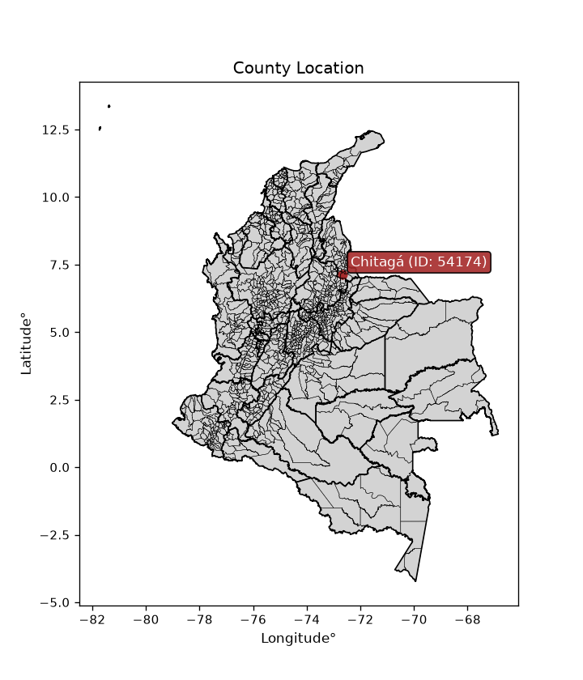
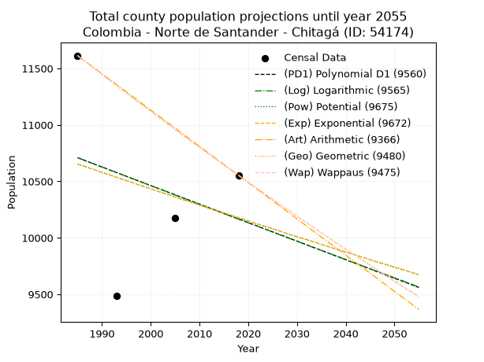
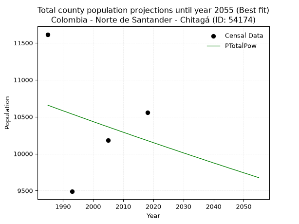
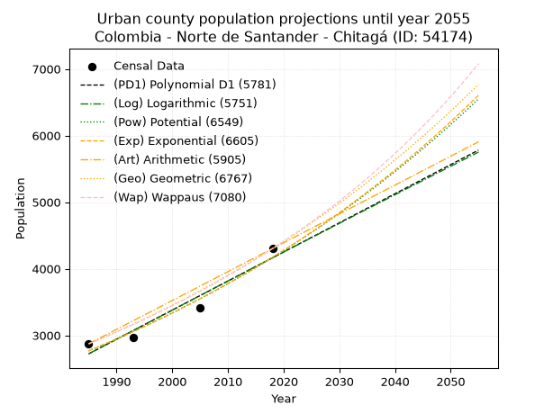
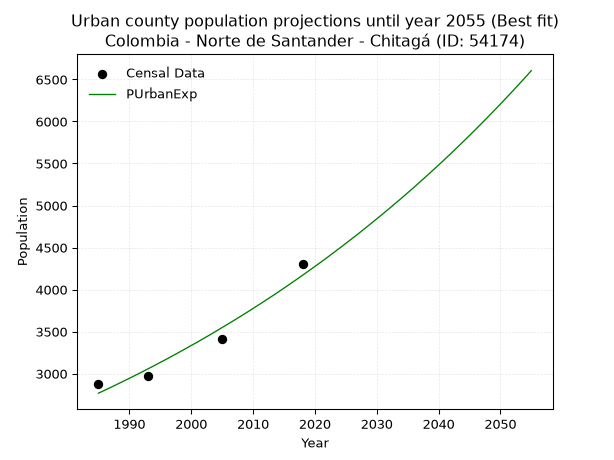
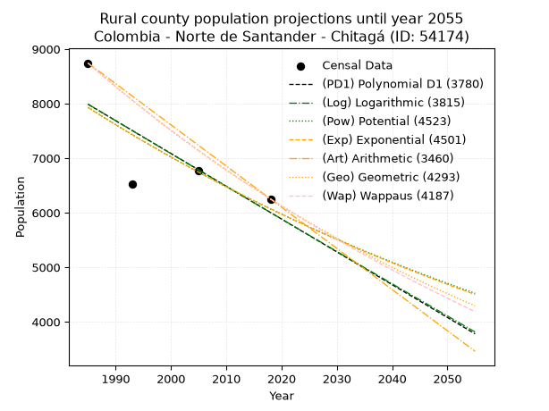
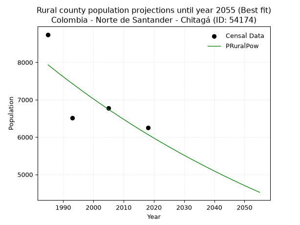

<div align="center">


</div>

# _“Population and Public Services Demand Projections (PPSD) until Year 2050 for Colombia - Norte de Santander - Chitagá (ID: 54174)”_
Keywords: `population` `public-service` `projection` `lineal` `polynomial` `logarithmic` `potential` `exponential` `arithmetic` `geometric` `wappaus` `dane` `colombia` `south-america`

PPSD are analytical estimates used by governments and planners to anticipate future changes in population size, age distribution, and the resulting community needs for utilities, healthcare, education, and infrastructure as sizing future water treatment facilities, electrical grids, and road networks based on spatial growth.

<div align="center">

</img>

</div>


> **General running parameters**: • app_version: _v20260806_. • Python version: _3.14.7_. • Pandas version: _3.0.5_. • NumPy version: _2.5.1_. • Creates, save and include plots into reports (create_plot): _False_. • Projection until year: _2050_. • Process polynomial degree 2 and up: _False_. • Process Wappaus: _True_. • Process Wappaus: _True_. • Set negative values to zero: _True_. • Set infinite values to zero: _True_. • Drop dataset notes: _True_. 
<div align="center">

Dynamic map: [:earth_americas:Google](http://maps.google.com/maps?q=7.138187329,-72.6654683) [:earth_americas:OSM](https://www.openstreetmap.org/#map=18/7.138187329/-72.6654683&layers=P) [:earth_americas:Bing](https://www.bing.com/maps?cp=7.138187329~-72.6654683&lvl=18) [:earth_americas:Apple](https://maps.apple.com/frame?center=7.138187329%2C-72.6654683&span=0.003%2C0.006)

</div>


<div align="center">

```geojson
{
  "type": "Feature",
  "geometry": {
    "type": "Point", 
    "coordinates": [-72.6654683, 7.138187329]
  }, 
  "properties": {
    "Name": "Colombia - Norte de Santander - Chitagá (ID: 54174)"
  }
}
```

</div>


## 0. Census Data (4 records)

Census data are official statistics collected by a government about the people and housing in a country. They usually include counts of total population, age, sex, race, income, education, and jobs.

📅Global census file: [Population.xlsx](../data/Population.xlsx)

| Source   |   Year |   CountryID | CountryName   |   StateID | StateName          |   CountyID | CountyName   |   PTotal |   PUrban |   PRural |
|:---------|-------:|------------:|:--------------|----------:|:-------------------|-----------:|:-------------|---------:|---------:|---------:|
| DANE     |   1985 |          57 | Colombia      |        54 | Norte de Santander |      54174 | Chitagá      |    11614 |     2872 |     8742 |
| DANE     |   1993 |          57 | Colombia      |        54 | Norte de Santander |      54174 | Chitagá      |     9488 |     2970 |     6518 |
| DANE     |   2005 |          57 | Colombia      |        54 | Norte de Santander |      54174 | Chitagá      |    10179 |     3408 |     6771 |
| DANE     |   2018 |          57 | Colombia      |        54 | Norte de Santander |      54174 | Chitagá      |    10554 |     4302 |     6252 |

> 🔥Some records could had specific notes about the registered values or the corresponding urban or rural distribution.

📅[SUI-RUPS](https://www.datos.gov.co/Hacienda-y-Cr-dito-P-blico/Registro-nico-de-Prestadores-de-Servicios-P-blicos/4qkq-csdn/about_data) - Local public utility companies: [RUPS.csv](../data/RUPS.xlsx)

 | SERVICIO       | ESTADO    | NOMBRE                                                                                | NIT         | DEPARTAMENTO_DOMICILIO   | MUNICIPIO_DOMICILIO   | DIRECCION                     |   TELEFONO | EMAIL                                       | TIPO_PRESTADOR                 | CLASIFICACION                 |
|:---------------|:----------|:--------------------------------------------------------------------------------------|:------------|:-------------------------|:----------------------|:------------------------------|-----------:|:--------------------------------------------|:-------------------------------|:------------------------------|
| ACUEDUCTO      | OPERATIVA | UNIDAD DE SERVICIOS PUBLICOS DOMICILIARIOS ACUEDUCTO, ALCANTARILLADO, ASEO DE CHITAGA | 890501422-4 | NORTE DE SANTANDER       | CHITAGA               | CALLE 4 No 6-07 Barrio Centro |    5678002 | contactenos@chitaga-nortedesantander.gov.co | MUNICIPIO (PRESTACIÓN DIRECTA) | MENOR O IGUAL A 2500 USUARIOS |
| ALCANTARILLADO | OPERATIVA | UNIDAD DE SERVICIOS PUBLICOS DOMICILIARIOS ACUEDUCTO, ALCANTARILLADO, ASEO DE CHITAGA | 890501422-4 | NORTE DE SANTANDER       | CHITAGA               | CALLE 4 No 6-07 Barrio Centro |    5678002 | contactenos@chitaga-nortedesantander.gov.co | MUNICIPIO (PRESTACIÓN DIRECTA) | MENOR O IGUAL A 2500 USUARIOS |

## 1. Total

### 1.1. Coefficients and Parameters

* (PD1) Polynomial Deg 1: -16.407466880771118, 43277.785628262434 (lineal)
* (Log) Logarithmic: -33059.1213684142, 261741.39644048884
* (Pow) Potential: -2.7828815536234486, 13.204822729837117
* (Exp) Exponential: -0.0013800223246031584, 164870.01234531912
* (Art) Arithmetic: Year diff. 2018 - 1985 = 33, Population diff. 10554 - 11614 = -1060, Annual growth = -32.121212121212125
* (Geo) Geometric: Year diff. 2018 - 1985 = 33, Population diff. 10554 - 11614 = -1060, Annual growth % = -0.0028959903839993473
* (Wap) Wappaus: i = -0.28979801625056045, Condition values only valid for < 200)

<sub>
Wappaus condition values: ['-0.00', '-0.29', '-0.58', '-0.87', '-1.16', '-1.45', '-1.74', '-2.03', '-2.32', '-2.61', '-2.90', '-3.19', '-3.48', '-3.77', '-4.06', '-4.35', '-4.64', '-4.93', '-5.22', '-5.51', '-5.80', '-6.09', '-6.38', '-6.67', '-6.96', '-7.24', '-7.53', '-7.82', '-8.11', '-8.40', '-8.69', '-8.98', '-9.27', '-9.56', '-9.85', '-10.14', '-10.43', '-10.72', '-11.01', '-11.30', '-11.59', '-11.88', '-12.17', '-12.46', '-12.75', '-13.04', '-13.33', '-13.62', '-13.91', '-14.20', '-14.49', '-14.78', '-15.07', '-15.36', '-15.65', '-15.94', '-16.23', '-16.52', '-16.81', '-17.10', '-17.39', '-17.68', '-17.97', '-18.26', '-18.55', '-18.84']
</sub>


### 1.2. Projected Dataset

|   Year |   CountyID |   PTotalPD1 |   PTotalLog |   PTotalPow |   PTotalExp |   PTotalArt |   PTotalGeo |   PTotalWap |
|-------:|-----------:|------------:|------------:|------------:|------------:|------------:|------------:|------------:|
|   1985 |      54174 |       10709 |       10711 |       10655 |       10653 |       11614 |       11614 |       11614 |
|   1986 |      54174 |       10693 |       10694 |       10640 |       10638 |       11582 |       11580 |       11580 |
|   1987 |      54174 |       10676 |       10678 |       10625 |       10623 |       11550 |       11547 |       11547 |
|   1988 |      54174 |       10660 |       10661 |       10610 |       10609 |       11518 |       11513 |       11513 |
|   1989 |      54174 |       10643 |       10645 |       10595 |       10594 |       11486 |       11480 |       11480 |
|   1990 |      54174 |       10627 |       10628 |       10580 |       10579 |       11453 |       11447 |       11447 |
|   1991 |      54174 |       10611 |       10611 |       10566 |       10565 |       11421 |       11414 |       11414 |
|   1992 |      54174 |       10594 |       10595 |       10551 |       10550 |       11389 |       11381 |       11381 |
|   1993 |      54174 |       10578 |       10578 |       10536 |       10536 |       11357 |       11348 |       11348 |
|   1994 |      54174 |       10561 |       10562 |       10522 |       10521 |       11325 |       11315 |       11315 |
|   1995 |      54174 |       10545 |       10545 |       10507 |       10507 |       11293 |       11282 |       11282 |
|   1996 |      54174 |       10528 |       10528 |       10492 |       10492 |       11261 |       11249 |       11250 |
|   1997 |      54174 |       10512 |       10512 |       10478 |       10478 |       11229 |       11217 |       11217 |
|   1998 |      54174 |       10496 |       10495 |       10463 |       10463 |       11196 |       11184 |       11185 |
|   1999 |      54174 |       10479 |       10479 |       10448 |       10449 |       11164 |       11152 |       11152 |
|   2000 |      54174 |       10463 |       10462 |       10434 |       10434 |       11132 |       11120 |       11120 |
|   2001 |      54174 |       10446 |       10446 |       10419 |       10420 |       11100 |       11087 |       11088 |
|   2002 |      54174 |       10430 |       10429 |       10405 |       10406 |       11068 |       11055 |       11056 |
|   2003 |      54174 |       10414 |       10413 |       10390 |       10391 |       11036 |       11023 |       11024 |
|   2004 |      54174 |       10397 |       10396 |       10376 |       10377 |       11004 |       10991 |       10992 |
|   2005 |      54174 |       10381 |       10380 |       10362 |       10363 |       10972 |       10960 |       10960 |
|   2006 |      54174 |       10364 |       10363 |       10347 |       10348 |       10939 |       10928 |       10928 |
|   2007 |      54174 |       10348 |       10347 |       10333 |       10334 |       10907 |       10896 |       10896 |
|   2008 |      54174 |       10332 |       10330 |       10319 |       10320 |       10875 |       10865 |       10865 |
|   2009 |      54174 |       10315 |       10314 |       10304 |       10306 |       10843 |       10833 |       10833 |
|   2010 |      54174 |       10299 |       10297 |       10290 |       10291 |       10811 |       10802 |       10802 |
|   2011 |      54174 |       10282 |       10281 |       10276 |       10277 |       10779 |       10770 |       10771 |
|   2012 |      54174 |       10266 |       10264 |       10262 |       10263 |       10747 |       10739 |       10739 |
|   2013 |      54174 |       10250 |       10248 |       10247 |       10249 |       10715 |       10708 |       10708 |
|   2014 |      54174 |       10233 |       10232 |       10233 |       10235 |       10682 |       10677 |       10677 |
|   2015 |      54174 |       10217 |       10215 |       10219 |       10221 |       10650 |       10646 |       10646 |
|   2016 |      54174 |       10200 |       10199 |       10205 |       10207 |       10618 |       10615 |       10615 |
|   2017 |      54174 |       10184 |       10182 |       10191 |       10193 |       10586 |       10585 |       10585 |
|   2018 |      54174 |       10168 |       10166 |       10177 |       10178 |       10554 |       10554 |       10554 |
|   2019 |      54174 |       10151 |       10150 |       10163 |       10164 |       10522 |       10523 |       10523 |
|   2020 |      54174 |       10135 |       10133 |       10149 |       10150 |       10490 |       10493 |       10493 |
|   2021 |      54174 |       10118 |       10117 |       10135 |       10136 |       10458 |       10463 |       10462 |
|   2022 |      54174 |       10102 |       10101 |       10121 |       10122 |       10426 |       10432 |       10432 |
|   2023 |      54174 |       10085 |       10084 |       10107 |       10108 |       10393 |       10402 |       10402 |
|   2024 |      54174 |       10069 |       10068 |       10093 |       10095 |       10361 |       10372 |       10372 |
|   2025 |      54174 |       10053 |       10052 |       10079 |       10081 |       10329 |       10342 |       10341 |
|   2026 |      54174 |       10036 |       10035 |       10066 |       10067 |       10297 |       10312 |       10311 |
|   2027 |      54174 |       10020 |       10019 |       10052 |       10053 |       10265 |       10282 |       10281 |
|   2028 |      54174 |       10003 |       10003 |       10038 |       10039 |       10233 |       10252 |       10252 |
|   2029 |      54174 |        9987 |        9986 |       10024 |       10025 |       10201 |       10223 |       10222 |
|   2030 |      54174 |        9971 |        9970 |       10010 |       10011 |       10169 |       10193 |       10192 |
|   2031 |      54174 |        9954 |        9954 |        9997 |        9997 |       10136 |       10163 |       10163 |
|   2032 |      54174 |        9938 |        9937 |        9983 |        9984 |       10104 |       10134 |       10133 |
|   2033 |      54174 |        9921 |        9921 |        9969 |        9970 |       10072 |       10105 |       10104 |
|   2034 |      54174 |        9905 |        9905 |        9956 |        9956 |       10040 |       10075 |       10074 |
|   2035 |      54174 |        9889 |        9889 |        9942 |        9942 |       10008 |       10046 |       10045 |
|   2036 |      54174 |        9872 |        9872 |        9929 |        9929 |        9976 |       10017 |       10016 |
|   2037 |      54174 |        9856 |        9856 |        9915 |        9915 |        9944 |        9988 |        9986 |
|   2038 |      54174 |        9839 |        9840 |        9901 |        9901 |        9912 |        9959 |        9957 |
|   2039 |      54174 |        9823 |        9824 |        9888 |        9888 |        9879 |        9930 |        9928 |
|   2040 |      54174 |        9807 |        9808 |        9874 |        9874 |        9847 |        9902 |        9899 |
|   2041 |      54174 |        9790 |        9791 |        9861 |        9860 |        9815 |        9873 |        9871 |
|   2042 |      54174 |        9774 |        9775 |        9848 |        9847 |        9783 |        9844 |        9842 |
|   2043 |      54174 |        9757 |        9759 |        9834 |        9833 |        9751 |        9816 |        9813 |
|   2044 |      54174 |        9741 |        9743 |        9821 |        9820 |        9719 |        9787 |        9785 |
|   2045 |      54174 |        9725 |        9727 |        9807 |        9806 |        9687 |        9759 |        9756 |
|   2046 |      54174 |        9708 |        9710 |        9794 |        9793 |        9655 |        9731 |        9728 |
|   2047 |      54174 |        9692 |        9694 |        9781 |        9779 |        9622 |        9703 |        9699 |
|   2048 |      54174 |        9675 |        9678 |        9768 |        9766 |        9590 |        9675 |        9671 |
|   2049 |      54174 |        9659 |        9662 |        9754 |        9752 |        9558 |        9647 |        9643 |
|   2050 |      54174 |        9642 |        9646 |        9741 |        9739 |        9526 |        9619 |        9615 |
<div align="center">

</img>

</div>


### 1.3. Best fit with absolute and relative error (%)

Relative error puts that difference into context by dividing the absolute error by the true value, creating a unitless ratio or percentage that shows the scale of the mistake.

Absolute and relative error

|   Year | Source   |   CountryID | CountryName   |   StateID | StateName          |   CountyID_x | CountyName   |   PTotal |   PUrban |   PRural |   CountyID_y |   PTotalPD1 |   PTotalLog |   PTotalPow |   PTotalExp |   PTotalArt |   PTotalGeo |   PTotalWap |   PTotalPD1AbsError |   PTotalLogAbsError |   PTotalPowAbsError |   PTotalExpAbsError |   PTotalArtAbsError |   PTotalGeoAbsError |   PTotalWapAbsError |   PTotalPD1RelError |   PTotalLogRelError |   PTotalPowRelError |   PTotalExpRelError |   PTotalArtRelError |   PTotalGeoRelError |   PTotalWapRelError |
|-------:|:---------|------------:|:--------------|----------:|:-------------------|-------------:|:-------------|---------:|---------:|---------:|-------------:|------------:|------------:|------------:|------------:|------------:|------------:|------------:|--------------------:|--------------------:|--------------------:|--------------------:|--------------------:|--------------------:|--------------------:|--------------------:|--------------------:|--------------------:|--------------------:|--------------------:|--------------------:|--------------------:|
|   1985 | DANE     |          57 | Colombia      |        54 | Norte de Santander |        54174 | Chitagá      |    11614 |     2872 |     8742 |        54174 |       10709 |       10711 |       10655 |       10653 |       11614 |       11614 |       11614 |                 905 |                 903 |                 959 |                 961 |                   0 |                   0 |                   0 |             7.79232 |             7.7751  |             8.25728 |             8.2745  |             0       |             0       |             0       |
|   1993 | DANE     |          57 | Colombia      |        54 | Norte de Santander |        54174 | Chitagá      |     9488 |     2970 |     6518 |        54174 |       10578 |       10578 |       10536 |       10536 |       11357 |       11348 |       11348 |                1090 |                1090 |                1048 |                1048 |                1869 |                1860 |                1860 |            11.4882  |            11.4882  |            11.0455  |            11.0455  |            19.6986  |            19.6037  |            19.6037  |
|   2005 | DANE     |          57 | Colombia      |        54 | Norte de Santander |        54174 | Chitagá      |    10179 |     3408 |     6771 |        54174 |       10381 |       10380 |       10362 |       10363 |       10972 |       10960 |       10960 |                 202 |                 201 |                 183 |                 184 |                 793 |                 781 |                 781 |             1.98448 |             1.97465 |             1.79782 |             1.80764 |             7.79055 |             7.67266 |             7.67266 |
|   2018 | DANE     |          57 | Colombia      |        54 | Norte de Santander |        54174 | Chitagá      |    10554 |     4302 |     6252 |        54174 |       10168 |       10166 |       10177 |       10178 |       10554 |       10554 |       10554 |                 386 |                 388 |                 377 |                 376 |                   0 |                   0 |                   0 |             3.65738 |             3.67633 |             3.57211 |             3.56263 |             0       |             0       |             0       |

Relative error mean

| Method    |   RelError | Best   |
|:----------|-----------:|:-------|
| PTotalPD1 |    6.23059 |        |
| PTotalLog |    6.22857 |        |
| PTotalPow |    6.16818 | True   |
| PTotalExp |    6.17258 |        |
| PTotalArt |    6.87228 |        |
| PTotalGeo |    6.81909 |        |
| PTotalWap |    6.81909 |        |

💙Best method: _**PTotalPow**_
<div align="center">

</img>

</div>


### 1.4. Fresh water supply demand in liters per capita per day (lpcd)

The fresh water supply demand typically ranges from 100 to 300 liters per capita per day (lpcd) for standard domestic and municipal planning, though absolute survival minimums set by the World Health Organization are as low as 7.5 to 20 liters per day, and total consumption in high-income nations can exceed 400 liters.

> `CZ`: Level in meters above the sea level (masl)<br> `WS`: Fresh water supply demand in liters per capita per day (lpcd or l/h/d)<br> `WSAll`: Zonal fresh water supply demand in liters per second (l/s)<br> `A`: Zonal area in square meters<br> `DP`: Population density (people/hectare or p/ha)

Reference values (RAS Colombia)

|    CZ |   WS |
|------:|-----:|
|  1000 |  120 |
|  2000 |  130 |
| 99999 |  140 |

County shapefile geometry properties and water supply values

|   CountyID |      ATotal |   CZTotal |   WSTotal |
|-----------:|------------:|----------:|----------:|
|      54174 | 1.18251e+09 |   2587.47 |       140 |

Projected values for best method: PTotalPow

|   CountyID |   Year |   PTotalPow |   DPTotal |   WSTotal |   WSTotalAll |
|-----------:|-------:|------------:|----------:|----------:|-------------:|
|      54174 |   1985 |       10655 |      0.09 |       140 |      17.265  |
|      54174 |   1986 |       10640 |      0.09 |       140 |      17.2407 |
|      54174 |   1987 |       10625 |      0.09 |       140 |      17.2164 |
|      54174 |   1988 |       10610 |      0.09 |       140 |      17.1921 |
|      54174 |   1989 |       10595 |      0.09 |       140 |      17.1678 |
|      54174 |   1990 |       10580 |      0.09 |       140 |      17.1435 |
|      54174 |   1991 |       10566 |      0.09 |       140 |      17.1208 |
|      54174 |   1992 |       10551 |      0.09 |       140 |      17.0965 |
|      54174 |   1993 |       10536 |      0.09 |       140 |      17.0722 |
|      54174 |   1994 |       10522 |      0.09 |       140 |      17.0495 |
|      54174 |   1995 |       10507 |      0.09 |       140 |      17.0252 |
|      54174 |   1996 |       10492 |      0.09 |       140 |      17.0009 |
|      54174 |   1997 |       10478 |      0.09 |       140 |      16.9782 |
|      54174 |   1998 |       10463 |      0.09 |       140 |      16.9539 |
|      54174 |   1999 |       10448 |      0.09 |       140 |      16.9296 |
|      54174 |   2000 |       10434 |      0.09 |       140 |      16.9069 |
|      54174 |   2001 |       10419 |      0.09 |       140 |      16.8826 |
|      54174 |   2002 |       10405 |      0.09 |       140 |      16.86   |
|      54174 |   2003 |       10390 |      0.09 |       140 |      16.8356 |
|      54174 |   2004 |       10376 |      0.09 |       140 |      16.813  |
|      54174 |   2005 |       10362 |      0.09 |       140 |      16.7903 |
|      54174 |   2006 |       10347 |      0.09 |       140 |      16.766  |
|      54174 |   2007 |       10333 |      0.09 |       140 |      16.7433 |
|      54174 |   2008 |       10319 |      0.09 |       140 |      16.7206 |
|      54174 |   2009 |       10304 |      0.09 |       140 |      16.6963 |
|      54174 |   2010 |       10290 |      0.09 |       140 |      16.6736 |
|      54174 |   2011 |       10276 |      0.09 |       140 |      16.6509 |
|      54174 |   2012 |       10262 |      0.09 |       140 |      16.6282 |
|      54174 |   2013 |       10247 |      0.09 |       140 |      16.6039 |
|      54174 |   2014 |       10233 |      0.09 |       140 |      16.5813 |
|      54174 |   2015 |       10219 |      0.09 |       140 |      16.5586 |
|      54174 |   2016 |       10205 |      0.09 |       140 |      16.5359 |
|      54174 |   2017 |       10191 |      0.09 |       140 |      16.5132 |
|      54174 |   2018 |       10177 |      0.09 |       140 |      16.4905 |
|      54174 |   2019 |       10163 |      0.09 |       140 |      16.4678 |
|      54174 |   2020 |       10149 |      0.09 |       140 |      16.4451 |
|      54174 |   2021 |       10135 |      0.09 |       140 |      16.4225 |
|      54174 |   2022 |       10121 |      0.09 |       140 |      16.3998 |
|      54174 |   2023 |       10107 |      0.09 |       140 |      16.3771 |
|      54174 |   2024 |       10093 |      0.09 |       140 |      16.3544 |
|      54174 |   2025 |       10079 |      0.09 |       140 |      16.3317 |
|      54174 |   2026 |       10066 |      0.09 |       140 |      16.3106 |
|      54174 |   2027 |       10052 |      0.09 |       140 |      16.288  |
|      54174 |   2028 |       10038 |      0.08 |       140 |      16.2653 |
|      54174 |   2029 |       10024 |      0.08 |       140 |      16.2426 |
|      54174 |   2030 |       10010 |      0.08 |       140 |      16.2199 |
|      54174 |   2031 |        9997 |      0.08 |       140 |      16.1988 |
|      54174 |   2032 |        9983 |      0.08 |       140 |      16.1762 |
|      54174 |   2033 |        9969 |      0.08 |       140 |      16.1535 |
|      54174 |   2034 |        9956 |      0.08 |       140 |      16.1324 |
|      54174 |   2035 |        9942 |      0.08 |       140 |      16.1097 |
|      54174 |   2036 |        9929 |      0.08 |       140 |      16.0887 |
|      54174 |   2037 |        9915 |      0.08 |       140 |      16.066  |
|      54174 |   2038 |        9901 |      0.08 |       140 |      16.0433 |
|      54174 |   2039 |        9888 |      0.08 |       140 |      16.0222 |
|      54174 |   2040 |        9874 |      0.08 |       140 |      15.9995 |
|      54174 |   2041 |        9861 |      0.08 |       140 |      15.9785 |
|      54174 |   2042 |        9848 |      0.08 |       140 |      15.9574 |
|      54174 |   2043 |        9834 |      0.08 |       140 |      15.9347 |
|      54174 |   2044 |        9821 |      0.08 |       140 |      15.9137 |
|      54174 |   2045 |        9807 |      0.08 |       140 |      15.891  |
|      54174 |   2046 |        9794 |      0.08 |       140 |      15.8699 |
|      54174 |   2047 |        9781 |      0.08 |       140 |      15.8488 |
|      54174 |   2048 |        9768 |      0.08 |       140 |      15.8278 |
|      54174 |   2049 |        9754 |      0.08 |       140 |      15.8051 |
|      54174 |   2050 |        9741 |      0.08 |       140 |      15.784  |

## 2. Urban

### 2.1. Coefficients and Parameters

* (PD1) Polynomial Deg 1: 43.706142111601174, -84035.21075873023 (lineal)
* (Log) Logarithmic: 87427.71148547853, -661150.7356028331
* (Pow) Potential: 24.870495482963566, -78.57511397785349
* (Exp) Exponential: 0.012431651708726975, 5.308019305425927e-08
* (Art) Arithmetic: Year diff. 2018 - 1985 = 33, Population diff. 4302 - 2872 = 1430, Annual growth = 43.333333333333336
* (Geo) Geometric: Year diff. 2018 - 1985 = 33, Population diff. 4302 - 2872 = 1430, Annual growth % = 0.012319859131606048
* (Wap) Wappaus: i = 1.2080661648545674, Condition values only valid for < 200)

<sub>
Wappaus condition values: ['0.00', '1.21', '2.42', '3.62', '4.83', '6.04', '7.25', '8.46', '9.66', '10.87', '12.08', '13.29', '14.50', '15.70', '16.91', '18.12', '19.33', '20.54', '21.75', '22.95', '24.16', '25.37', '26.58', '27.79', '28.99', '30.20', '31.41', '32.62', '33.83', '35.03', '36.24', '37.45', '38.66', '39.87', '41.07', '42.28', '43.49', '44.70', '45.91', '47.11', '48.32', '49.53', '50.74', '51.95', '53.15', '54.36', '55.57', '56.78', '57.99', '59.20', '60.40', '61.61', '62.82', '64.03', '65.24', '66.44', '67.65', '68.86', '70.07', '71.28', '72.48', '73.69', '74.90', '76.11', '77.32', '78.52']
</sub>


### 2.2. Projected Dataset

|   Year |   CountyID |   PUrbanPD1 |   PUrbanLog |   PUrbanPow |   PUrbanExp |   PUrbanArt |   PUrbanGeo |   PUrbanWap |
|-------:|-----------:|------------:|------------:|------------:|------------:|------------:|------------:|------------:|
|   1985 |      54174 |        2721 |        2721 |        2766 |        2767 |        2872 |        2872 |        2872 |
|   1986 |      54174 |        2765 |        2765 |        2801 |        2801 |        2915 |        2907 |        2907 |
|   1987 |      54174 |        2809 |        2809 |        2836 |        2836 |        2959 |        2943 |        2942 |
|   1988 |      54174 |        2853 |        2853 |        2872 |        2872 |        3002 |        2979 |        2978 |
|   1989 |      54174 |        2896 |        2897 |        2908 |        2908 |        3045 |        3016 |        3014 |
|   1990 |      54174 |        2940 |        2941 |        2944 |        2944 |        3089 |        3053 |        3051 |
|   1991 |      54174 |        2984 |        2984 |        2981 |        2981 |        3132 |        3091 |        3088 |
|   1992 |      54174 |        3027 |        3028 |        3019 |        3018 |        3175 |        3129 |        3126 |
|   1993 |      54174 |        3071 |        3072 |        3057 |        3056 |        3219 |        3168 |        3164 |
|   1994 |      54174 |        3115 |        3116 |        3095 |        3094 |        3262 |        3207 |        3202 |
|   1995 |      54174 |        3159 |        3160 |        3134 |        3133 |        3305 |        3246 |        3241 |
|   1996 |      54174 |        3202 |        3204 |        3173 |        3172 |        3349 |        3286 |        3281 |
|   1997 |      54174 |        3246 |        3248 |        3213 |        3212 |        3392 |        3327 |        3321 |
|   1998 |      54174 |        3290 |        3291 |        3253 |        3252 |        3435 |        3368 |        3361 |
|   1999 |      54174 |        3333 |        3335 |        3294 |        3293 |        3479 |        3409 |        3403 |
|   2000 |      54174 |        3377 |        3379 |        3335 |        3334 |        3522 |        3451 |        3444 |
|   2001 |      54174 |        3421 |        3422 |        3377 |        3375 |        3565 |        3494 |        3487 |
|   2002 |      54174 |        3464 |        3466 |        3419 |        3418 |        3609 |        3537 |        3529 |
|   2003 |      54174 |        3508 |        3510 |        3462 |        3460 |        3652 |        3580 |        3573 |
|   2004 |      54174 |        3552 |        3553 |        3505 |        3504 |        3695 |        3624 |        3617 |
|   2005 |      54174 |        3596 |        3597 |        3549 |        3548 |        3739 |        3669 |        3661 |
|   2006 |      54174 |        3639 |        3641 |        3593 |        3592 |        3782 |        3714 |        3706 |
|   2007 |      54174 |        3683 |        3684 |        3638 |        3637 |        3825 |        3760 |        3752 |
|   2008 |      54174 |        3727 |        3728 |        3683 |        3682 |        3869 |        3806 |        3799 |
|   2009 |      54174 |        3770 |        3771 |        3729 |        3728 |        3912 |        3853 |        3846 |
|   2010 |      54174 |        3814 |        3815 |        3776 |        3775 |        3955 |        3901 |        3894 |
|   2011 |      54174 |        3858 |        3858 |        3823 |        3822 |        3999 |        3949 |        3942 |
|   2012 |      54174 |        3902 |        3902 |        3870 |        3870 |        4042 |        3997 |        3991 |
|   2013 |      54174 |        3945 |        3945 |        3918 |        3918 |        4085 |        4047 |        4041 |
|   2014 |      54174 |        3989 |        3989 |        3967 |        3967 |        4129 |        4096 |        4092 |
|   2015 |      54174 |        4033 |        4032 |        4016 |        4017 |        4172 |        4147 |        4143 |
|   2016 |      54174 |        4076 |        4075 |        4066 |        4067 |        4215 |        4198 |        4195 |
|   2017 |      54174 |        4120 |        4119 |        4117 |        4118 |        4259 |        4250 |        4248 |
|   2018 |      54174 |        4164 |        4162 |        4168 |        4170 |        4302 |        4302 |        4302 |
|   2019 |      54174 |        4207 |        4205 |        4220 |        4222 |        4345 |        4355 |        4357 |
|   2020 |      54174 |        4251 |        4249 |        4272 |        4275 |        4389 |        4409 |        4412 |
|   2021 |      54174 |        4295 |        4292 |        4325 |        4328 |        4432 |        4463 |        4468 |
|   2022 |      54174 |        4339 |        4335 |        4378 |        4382 |        4475 |        4518 |        4525 |
|   2023 |      54174 |        4382 |        4378 |        4432 |        4437 |        4519 |        4574 |        4583 |
|   2024 |      54174 |        4426 |        4422 |        4487 |        4493 |        4562 |        4630 |        4642 |
|   2025 |      54174 |        4470 |        4465 |        4543 |        4549 |        4605 |        4687 |        4702 |
|   2026 |      54174 |        4513 |        4508 |        4599 |        4606 |        4649 |        4745 |        4763 |
|   2027 |      54174 |        4557 |        4551 |        4656 |        4663 |        4692 |        4803 |        4825 |
|   2028 |      54174 |        4601 |        4594 |        4713 |        4722 |        4735 |        4862 |        4887 |
|   2029 |      54174 |        4645 |        4637 |        4771 |        4781 |        4779 |        4922 |        4951 |
|   2030 |      54174 |        4688 |        4680 |        4830 |        4841 |        4822 |        4983 |        5016 |
|   2031 |      54174 |        4732 |        4724 |        4890 |        4901 |        4865 |        5044 |        5082 |
|   2032 |      54174 |        4776 |        4767 |        4950 |        4962 |        4909 |        5106 |        5149 |
|   2033 |      54174 |        4819 |        4810 |        5011 |        5025 |        4952 |        5169 |        5217 |
|   2034 |      54174 |        4863 |        4853 |        5072 |        5087 |        4995 |        5233 |        5287 |
|   2035 |      54174 |        4907 |        4896 |        5135 |        5151 |        5039 |        5298 |        5357 |
|   2036 |      54174 |        4950 |        4938 |        5198 |        5215 |        5082 |        5363 |        5429 |
|   2037 |      54174 |        4994 |        4981 |        5262 |        5281 |        5125 |        5429 |        5502 |
|   2038 |      54174 |        5038 |        5024 |        5326 |        5347 |        5169 |        5496 |        5577 |
|   2039 |      54174 |        5082 |        5067 |        5392 |        5414 |        5212 |        5563 |        5653 |
|   2040 |      54174 |        5125 |        5110 |        5458 |        5481 |        5255 |        5632 |        5730 |
|   2041 |      54174 |        5169 |        5153 |        5525 |        5550 |        5299 |        5701 |        5808 |
|   2042 |      54174 |        5213 |        5196 |        5593 |        5619 |        5342 |        5772 |        5888 |
|   2043 |      54174 |        5256 |        5239 |        5661 |        5690 |        5385 |        5843 |        5970 |
|   2044 |      54174 |        5300 |        5281 |        5730 |        5761 |        5429 |        5915 |        6053 |
|   2045 |      54174 |        5344 |        5324 |        5801 |        5833 |        5472 |        5988 |        6137 |
|   2046 |      54174 |        5388 |        5367 |        5872 |        5906 |        5515 |        6061 |        6223 |
|   2047 |      54174 |        5431 |        5410 |        5943 |        5980 |        5559 |        6136 |        6311 |
|   2048 |      54174 |        5475 |        5452 |        6016 |        6055 |        5602 |        6212 |        6401 |
|   2049 |      54174 |        5519 |        5495 |        6089 |        6130 |        5645 |        6288 |        6492 |
|   2050 |      54174 |        5562 |        5538 |        6164 |        6207 |        5689 |        6366 |        6585 |
<div align="center">

</img>

</div>


### 2.3. Best fit with absolute and relative error (%)

Relative error puts that difference into context by dividing the absolute error by the true value, creating a unitless ratio or percentage that shows the scale of the mistake.

Absolute and relative error

|   Year | Source   |   CountryID | CountryName   |   StateID | StateName          |   CountyID_x | CountyName   |   PTotal |   PUrban |   PRural |   CountyID_y |   PUrbanPD1 |   PUrbanLog |   PUrbanPow |   PUrbanExp |   PUrbanArt |   PUrbanGeo |   PUrbanWap |   PUrbanPD1AbsError |   PUrbanLogAbsError |   PUrbanPowAbsError |   PUrbanExpAbsError |   PUrbanArtAbsError |   PUrbanGeoAbsError |   PUrbanWapAbsError |   PUrbanPD1RelError |   PUrbanLogRelError |   PUrbanPowRelError |   PUrbanExpRelError |   PUrbanArtRelError |   PUrbanGeoRelError |   PUrbanWapRelError |
|-------:|:---------|------------:|:--------------|----------:|:-------------------|-------------:|:-------------|---------:|---------:|---------:|-------------:|------------:|------------:|------------:|------------:|------------:|------------:|------------:|--------------------:|--------------------:|--------------------:|--------------------:|--------------------:|--------------------:|--------------------:|--------------------:|--------------------:|--------------------:|--------------------:|--------------------:|--------------------:|--------------------:|
|   1985 | DANE     |          57 | Colombia      |        54 | Norte de Santander |        54174 | Chitagá      |    11614 |     2872 |     8742 |        54174 |        2721 |        2721 |        2766 |        2767 |        2872 |        2872 |        2872 |                 151 |                 151 |                 106 |                 105 |                   0 |                   0 |                   0 |             5.25766 |             5.25766 |             3.69081 |             3.65599 |             0       |             0       |             0       |
|   1993 | DANE     |          57 | Colombia      |        54 | Norte de Santander |        54174 | Chitagá      |     9488 |     2970 |     6518 |        54174 |        3071 |        3072 |        3057 |        3056 |        3219 |        3168 |        3164 |                 101 |                 102 |                  87 |                  86 |                 249 |                 198 |                 194 |             3.40067 |             3.43434 |             2.92929 |             2.89562 |             8.38384 |             6.66667 |             6.53199 |
|   2005 | DANE     |          57 | Colombia      |        54 | Norte de Santander |        54174 | Chitagá      |    10179 |     3408 |     6771 |        54174 |        3596 |        3597 |        3549 |        3548 |        3739 |        3669 |        3661 |                 188 |                 189 |                 141 |                 140 |                 331 |                 261 |                 253 |             5.51643 |             5.54577 |             4.13732 |             4.10798 |             9.71244 |             7.65845 |             7.42371 |
|   2018 | DANE     |          57 | Colombia      |        54 | Norte de Santander |        54174 | Chitagá      |    10554 |     4302 |     6252 |        54174 |        4164 |        4162 |        4168 |        4170 |        4302 |        4302 |        4302 |                 138 |                 140 |                 134 |                 132 |                   0 |                   0 |                   0 |             3.20781 |             3.2543  |             3.11483 |             3.06834 |             0       |             0       |             0       |

Relative error mean

| Method    |   RelError | Best   |
|:----------|-----------:|:-------|
| PUrbanPD1 |    4.34564 |        |
| PUrbanLog |    4.37302 |        |
| PUrbanPow |    3.46806 |        |
| PUrbanExp |    3.43198 | True   |
| PUrbanArt |    4.52407 |        |
| PUrbanGeo |    3.58128 |        |
| PUrbanWap |    3.48892 |        |

💙Best method: _**PUrbanExp**_
<div align="center">

</img>

</div>


### 2.4. Fresh water supply demand in liters per capita per day (lpcd)

The fresh water supply demand typically ranges from 100 to 300 liters per capita per day (lpcd) for standard domestic and municipal planning, though absolute survival minimums set by the World Health Organization are as low as 7.5 to 20 liters per day, and total consumption in high-income nations can exceed 400 liters.

> `CZ`: Level in meters above the sea level (masl)<br> `WS`: Fresh water supply demand in liters per capita per day (lpcd or l/h/d)<br> `WSAll`: Zonal fresh water supply demand in liters per second (l/s)<br> `A`: Zonal area in square meters<br> `DP`: Population density (people/hectare or p/ha)

Reference values (RAS Colombia)

|    CZ |   WS |
|------:|-----:|
|  1000 |  120 |
|  2000 |  130 |
| 99999 |  140 |

County shapefile geometry properties and water supply values

|   CountyID |   AUrban |   CZUrban |   WSUrban |
|-----------:|---------:|----------:|----------:|
|      54174 |   635702 |   2320.37 |       140 |

Projected values for best method: PUrbanExp

|   CountyID |   Year |   PUrbanExp |   DPUrban |   WSUrban |   WSUrbanAll |
|-----------:|-------:|------------:|----------:|----------:|-------------:|
|      54174 |   1985 |        2767 |     43.53 |       140 |      4.48356 |
|      54174 |   1986 |        2801 |     44.06 |       140 |      4.53866 |
|      54174 |   1987 |        2836 |     44.61 |       140 |      4.59537 |
|      54174 |   1988 |        2872 |     45.18 |       140 |      4.6537  |
|      54174 |   1989 |        2908 |     45.74 |       140 |      4.71204 |
|      54174 |   1990 |        2944 |     46.31 |       140 |      4.77037 |
|      54174 |   1991 |        2981 |     46.89 |       140 |      4.83032 |
|      54174 |   1992 |        3018 |     47.48 |       140 |      4.89028 |
|      54174 |   1993 |        3056 |     48.07 |       140 |      4.95185 |
|      54174 |   1994 |        3094 |     48.67 |       140 |      5.01343 |
|      54174 |   1995 |        3133 |     49.28 |       140 |      5.07662 |
|      54174 |   1996 |        3172 |     49.9  |       140 |      5.13981 |
|      54174 |   1997 |        3212 |     50.53 |       140 |      5.20463 |
|      54174 |   1998 |        3252 |     51.16 |       140 |      5.26944 |
|      54174 |   1999 |        3293 |     51.8  |       140 |      5.33588 |
|      54174 |   2000 |        3334 |     52.45 |       140 |      5.40231 |
|      54174 |   2001 |        3375 |     53.09 |       140 |      5.46875 |
|      54174 |   2002 |        3418 |     53.77 |       140 |      5.53843 |
|      54174 |   2003 |        3460 |     54.43 |       140 |      5.60648 |
|      54174 |   2004 |        3504 |     55.12 |       140 |      5.67778 |
|      54174 |   2005 |        3548 |     55.81 |       140 |      5.74907 |
|      54174 |   2006 |        3592 |     56.5  |       140 |      5.82037 |
|      54174 |   2007 |        3637 |     57.21 |       140 |      5.89329 |
|      54174 |   2008 |        3682 |     57.92 |       140 |      5.9662  |
|      54174 |   2009 |        3728 |     58.64 |       140 |      6.04074 |
|      54174 |   2010 |        3775 |     59.38 |       140 |      6.1169  |
|      54174 |   2011 |        3822 |     60.12 |       140 |      6.19306 |
|      54174 |   2012 |        3870 |     60.88 |       140 |      6.27083 |
|      54174 |   2013 |        3918 |     61.63 |       140 |      6.34861 |
|      54174 |   2014 |        3967 |     62.4  |       140 |      6.42801 |
|      54174 |   2015 |        4017 |     63.19 |       140 |      6.50903 |
|      54174 |   2016 |        4067 |     63.98 |       140 |      6.59005 |
|      54174 |   2017 |        4118 |     64.78 |       140 |      6.67269 |
|      54174 |   2018 |        4170 |     65.6  |       140 |      6.75694 |
|      54174 |   2019 |        4222 |     66.41 |       140 |      6.8412  |
|      54174 |   2020 |        4275 |     67.25 |       140 |      6.92708 |
|      54174 |   2021 |        4328 |     68.08 |       140 |      7.01296 |
|      54174 |   2022 |        4382 |     68.93 |       140 |      7.10046 |
|      54174 |   2023 |        4437 |     69.8  |       140 |      7.18958 |
|      54174 |   2024 |        4493 |     70.68 |       140 |      7.28032 |
|      54174 |   2025 |        4549 |     71.56 |       140 |      7.37106 |
|      54174 |   2026 |        4606 |     72.46 |       140 |      7.46343 |
|      54174 |   2027 |        4663 |     73.35 |       140 |      7.55579 |
|      54174 |   2028 |        4722 |     74.28 |       140 |      7.65139 |
|      54174 |   2029 |        4781 |     75.21 |       140 |      7.74699 |
|      54174 |   2030 |        4841 |     76.15 |       140 |      7.84421 |
|      54174 |   2031 |        4901 |     77.1  |       140 |      7.94144 |
|      54174 |   2032 |        4962 |     78.06 |       140 |      8.04028 |
|      54174 |   2033 |        5025 |     79.05 |       140 |      8.14236 |
|      54174 |   2034 |        5087 |     80.02 |       140 |      8.24282 |
|      54174 |   2035 |        5151 |     81.03 |       140 |      8.34653 |
|      54174 |   2036 |        5215 |     82.04 |       140 |      8.45023 |
|      54174 |   2037 |        5281 |     83.07 |       140 |      8.55718 |
|      54174 |   2038 |        5347 |     84.11 |       140 |      8.66412 |
|      54174 |   2039 |        5414 |     85.17 |       140 |      8.77269 |
|      54174 |   2040 |        5481 |     86.22 |       140 |      8.88125 |
|      54174 |   2041 |        5550 |     87.31 |       140 |      8.99306 |
|      54174 |   2042 |        5619 |     88.39 |       140 |      9.10486 |
|      54174 |   2043 |        5690 |     89.51 |       140 |      9.21991 |
|      54174 |   2044 |        5761 |     90.62 |       140 |      9.33495 |
|      54174 |   2045 |        5833 |     91.76 |       140 |      9.45162 |
|      54174 |   2046 |        5906 |     92.91 |       140 |      9.56991 |
|      54174 |   2047 |        5980 |     94.07 |       140 |      9.68981 |
|      54174 |   2048 |        6055 |     95.25 |       140 |      9.81134 |
|      54174 |   2049 |        6130 |     96.43 |       140 |      9.93287 |
|      54174 |   2050 |        6207 |     97.64 |       140 |     10.0576  |

## 3. Rural

### 3.1. Coefficients and Parameters

* (PD1) Polynomial Deg 1: -60.1136089923722, 127312.9963869925 (lineal)
* (Log) Logarithmic: -120486.83285389269, 922892.1320433215
* (Pow) Potential: -16.205700909810712, 57.341846933042525
* (Exp) Exponential: -0.00808615470882458, 74134765501.87022
* (Art) Arithmetic: Year diff. 2018 - 1985 = 33, Population diff. 6252 - 8742 = -2490, Annual growth = -75.45454545454545
* (Geo) Geometric: Year diff. 2018 - 1985 = 33, Population diff. 6252 - 8742 = -2490, Annual growth % = -0.010107289207447079
* (Wap) Wappaus: i = -1.006463191337141, Condition values only valid for < 200)

<sub>
Wappaus condition values: ['-0.00', '-1.01', '-2.01', '-3.02', '-4.03', '-5.03', '-6.04', '-7.05', '-8.05', '-9.06', '-10.06', '-11.07', '-12.08', '-13.08', '-14.09', '-15.10', '-16.10', '-17.11', '-18.12', '-19.12', '-20.13', '-21.14', '-22.14', '-23.15', '-24.16', '-25.16', '-26.17', '-27.17', '-28.18', '-29.19', '-30.19', '-31.20', '-32.21', '-33.21', '-34.22', '-35.23', '-36.23', '-37.24', '-38.25', '-39.25', '-40.26', '-41.26', '-42.27', '-43.28', '-44.28', '-45.29', '-46.30', '-47.30', '-48.31', '-49.32', '-50.32', '-51.33', '-52.34', '-53.34', '-54.35', '-55.36', '-56.36', '-57.37', '-58.37', '-59.38', '-60.39', '-61.39', '-62.40', '-63.41', '-64.41', '-65.42']
</sub>


### 3.2. Projected Dataset

|   Year |   CountyID |   PRuralPD1 |   PRuralLog |   PRuralPow |   PRuralExp |   PRuralArt |   PRuralGeo |   PRuralWap |
|-------:|-----------:|------------:|------------:|------------:|------------:|------------:|------------:|------------:|
|   1985 |      54174 |        7987 |        7991 |        7931 |        7928 |        8742 |        8742 |        8742 |
|   1986 |      54174 |        7927 |        7930 |        7867 |        7864 |        8667 |        8654 |        8654 |
|   1987 |      54174 |        7867 |        7869 |        7803 |        7801 |        8591 |        8566 |        8568 |
|   1988 |      54174 |        7807 |        7809 |        7739 |        7738 |        8516 |        8480 |        8482 |
|   1989 |      54174 |        7747 |        7748 |        7676 |        7675 |        8440 |        8394 |        8397 |
|   1990 |      54174 |        7687 |        7687 |        7614 |        7614 |        8365 |        8309 |        8313 |
|   1991 |      54174 |        7627 |        7627 |        7552 |        7552 |        8289 |        8225 |        8230 |
|   1992 |      54174 |        7567 |        7566 |        7491 |        7492 |        8214 |        8142 |        8147 |
|   1993 |      54174 |        7507 |        7506 |        7431 |        7431 |        8138 |        8060 |        8065 |
|   1994 |      54174 |        7446 |        7445 |        7370 |        7371 |        8063 |        7978 |        7984 |
|   1995 |      54174 |        7386 |        7385 |        7311 |        7312 |        7987 |        7898 |        7904 |
|   1996 |      54174 |        7326 |        7325 |        7252 |        7253 |        7912 |        7818 |        7825 |
|   1997 |      54174 |        7266 |        7264 |        7193 |        7195 |        7837 |        7739 |        7746 |
|   1998 |      54174 |        7206 |        7204 |        7135 |        7137 |        7761 |        7660 |        7668 |
|   1999 |      54174 |        7146 |        7144 |        7077 |        7079 |        7686 |        7583 |        7591 |
|   2000 |      54174 |        7086 |        7083 |        7020 |        7022 |        7610 |        7506 |        7515 |
|   2001 |      54174 |        7026 |        7023 |        6963 |        6966 |        7535 |        7431 |        7439 |
|   2002 |      54174 |        6966 |        6963 |        6907 |        6910 |        7459 |        7355 |        7364 |
|   2003 |      54174 |        6905 |        6903 |        6852 |        6854 |        7384 |        7281 |        7290 |
|   2004 |      54174 |        6845 |        6843 |        6796 |        6799 |        7308 |        7208 |        7216 |
|   2005 |      54174 |        6785 |        6783 |        6742 |        6744 |        7233 |        7135 |        7143 |
|   2006 |      54174 |        6725 |        6723 |        6687 |        6690 |        7157 |        7063 |        7071 |
|   2007 |      54174 |        6665 |        6663 |        6634 |        6636 |        7082 |        6991 |        6999 |
|   2008 |      54174 |        6605 |        6602 |        6580 |        6582 |        7007 |        6921 |        6928 |
|   2009 |      54174 |        6545 |        6542 |        6527 |        6529 |        6931 |        6851 |        6858 |
|   2010 |      54174 |        6485 |        6483 |        6475 |        6477 |        6856 |        6781 |        6788 |
|   2011 |      54174 |        6425 |        6423 |        6423 |        6425 |        6780 |        6713 |        6719 |
|   2012 |      54174 |        6364 |        6363 |        6371 |        6373 |        6705 |        6645 |        6651 |
|   2013 |      54174 |        6304 |        6303 |        6320 |        6322 |        6629 |        6578 |        6583 |
|   2014 |      54174 |        6244 |        6243 |        6270 |        6271 |        6554 |        6511 |        6515 |
|   2015 |      54174 |        6184 |        6183 |        6219 |        6220 |        6478 |        6445 |        6449 |
|   2016 |      54174 |        6124 |        6123 |        6170 |        6170 |        6403 |        6380 |        6383 |
|   2017 |      54174 |        6064 |        6064 |        6120 |        6120 |        6327 |        6316 |        6317 |
|   2018 |      54174 |        6004 |        6004 |        6071 |        6071 |        6252 |        6252 |        6252 |
|   2019 |      54174 |        5944 |        5944 |        6023 |        6022 |        6177 |        6189 |        6188 |
|   2020 |      54174 |        5884 |        5885 |        5975 |        5974 |        6101 |        6126 |        6124 |
|   2021 |      54174 |        5823 |        5825 |        5927 |        5926 |        6026 |        6064 |        6060 |
|   2022 |      54174 |        5763 |        5765 |        5880 |        5878 |        5950 |        6003 |        5998 |
|   2023 |      54174 |        5703 |        5706 |        5833 |        5831 |        5875 |        5942 |        5935 |
|   2024 |      54174 |        5643 |        5646 |        5786 |        5784 |        5799 |        5882 |        5874 |
|   2025 |      54174 |        5583 |        5587 |        5740 |        5737 |        5724 |        5823 |        5812 |
|   2026 |      54174 |        5523 |        5527 |        5694 |        5691 |        5648 |        5764 |        5752 |
|   2027 |      54174 |        5463 |        5468 |        5649 |        5645 |        5573 |        5706 |        5691 |
|   2028 |      54174 |        5403 |        5408 |        5604 |        5599 |        5497 |        5648 |        5632 |
|   2029 |      54174 |        5342 |        5349 |        5559 |        5554 |        5422 |        5591 |        5572 |
|   2030 |      54174 |        5282 |        5290 |        5515 |        5510 |        5347 |        5534 |        5514 |
|   2031 |      54174 |        5222 |        5230 |        5471 |        5465 |        5271 |        5479 |        5455 |
|   2032 |      54174 |        5162 |        5171 |        5428 |        5421 |        5196 |        5423 |        5398 |
|   2033 |      54174 |        5102 |        5112 |        5385 |        5378 |        5120 |        5368 |        5340 |
|   2034 |      54174 |        5042 |        5052 |        5342 |        5334 |        5045 |        5314 |        5284 |
|   2035 |      54174 |        4982 |        4993 |        5300 |        5291 |        4969 |        5260 |        5227 |
|   2036 |      54174 |        4922 |        4934 |        5258 |        5249 |        4894 |        5207 |        5171 |
|   2037 |      54174 |        4862 |        4875 |        5216 |        5206 |        4818 |        5155 |        5116 |
|   2038 |      54174 |        4801 |        4816 |        5175 |        5165 |        4743 |        5102 |        5061 |
|   2039 |      54174 |        4741 |        4757 |        5134 |        5123 |        4667 |        5051 |        5006 |
|   2040 |      54174 |        4681 |        4698 |        5093 |        5082 |        4592 |        5000 |        4952 |
|   2041 |      54174 |        4621 |        4638 |        5053 |        5041 |        4517 |        4949 |        4898 |
|   2042 |      54174 |        4561 |        4579 |        5013 |        5000 |        4441 |        4899 |        4845 |
|   2043 |      54174 |        4501 |        4520 |        4973 |        4960 |        4366 |        4850 |        4792 |
|   2044 |      54174 |        4441 |        4461 |        4934 |        4920 |        4290 |        4801 |        4739 |
|   2045 |      54174 |        4381 |        4403 |        4895 |        4880 |        4215 |        4752 |        4687 |
|   2046 |      54174 |        4321 |        4344 |        4856 |        4841 |        4139 |        4704 |        4635 |
|   2047 |      54174 |        4260 |        4285 |        4818 |        4802 |        4064 |        4657 |        4584 |
|   2048 |      54174 |        4200 |        4226 |        4780 |        4763 |        3988 |        4610 |        4533 |
|   2049 |      54174 |        4140 |        4167 |        4742 |        4725 |        3913 |        4563 |        4483 |
|   2050 |      54174 |        4080 |        4108 |        4705 |        4687 |        3837 |        4517 |        4433 |
<div align="center">

</img>

</div>


### 3.3. Best fit with absolute and relative error (%)

Relative error puts that difference into context by dividing the absolute error by the true value, creating a unitless ratio or percentage that shows the scale of the mistake.

Absolute and relative error

|   Year | Source   |   CountryID | CountryName   |   StateID | StateName          |   CountyID_x | CountyName   |   PTotal |   PUrban |   PRural |   CountyID_y |   PRuralPD1 |   PRuralLog |   PRuralPow |   PRuralExp |   PRuralArt |   PRuralGeo |   PRuralWap |   PRuralPD1AbsError |   PRuralLogAbsError |   PRuralPowAbsError |   PRuralExpAbsError |   PRuralArtAbsError |   PRuralGeoAbsError |   PRuralWapAbsError |   PRuralPD1RelError |   PRuralLogRelError |   PRuralPowRelError |   PRuralExpRelError |   PRuralArtRelError |   PRuralGeoRelError |   PRuralWapRelError |
|-------:|:---------|------------:|:--------------|----------:|:-------------------|-------------:|:-------------|---------:|---------:|---------:|-------------:|------------:|------------:|------------:|------------:|------------:|------------:|------------:|--------------------:|--------------------:|--------------------:|--------------------:|--------------------:|--------------------:|--------------------:|--------------------:|--------------------:|--------------------:|--------------------:|--------------------:|--------------------:|--------------------:|
|   1985 | DANE     |          57 | Colombia      |        54 | Norte de Santander |        54174 | Chitagá      |    11614 |     2872 |     8742 |        54174 |        7987 |        7991 |        7931 |        7928 |        8742 |        8742 |        8742 |                 755 |                 751 |                 811 |                 814 |                   0 |                   0 |                   0 |            8.63647  |            8.59071  |            9.27705  |            9.31137  |             0       |             0       |             0       |
|   1993 | DANE     |          57 | Colombia      |        54 | Norte de Santander |        54174 | Chitagá      |     9488 |     2970 |     6518 |        54174 |        7507 |        7506 |        7431 |        7431 |        8138 |        8060 |        8065 |                 989 |                 988 |                 913 |                 913 |                1620 |                1542 |                1547 |           15.1734   |           15.158    |           14.0074   |           14.0074   |            24.8542  |            23.6576  |            23.7343  |
|   2005 | DANE     |          57 | Colombia      |        54 | Norte de Santander |        54174 | Chitagá      |    10179 |     3408 |     6771 |        54174 |        6785 |        6783 |        6742 |        6744 |        7233 |        7135 |        7143 |                  14 |                  12 |                  29 |                  27 |                 462 |                 364 |                 372 |            0.206764 |            0.177226 |            0.428297 |            0.398759 |             6.82322 |             5.37587 |             5.49402 |
|   2018 | DANE     |          57 | Colombia      |        54 | Norte de Santander |        54174 | Chitagá      |    10554 |     4302 |     6252 |        54174 |        6004 |        6004 |        6071 |        6071 |        6252 |        6252 |        6252 |                 248 |                 248 |                 181 |                 181 |                   0 |                   0 |                   0 |            3.96673  |            3.96673  |            2.89507  |            2.89507  |             0       |             0       |             0       |

Relative error mean

| Method    |   RelError | Best   |
|:----------|-----------:|:-------|
| PRuralPD1 |    6.99583 |        |
| PRuralLog |    6.97317 |        |
| PRuralPow |    6.65195 | True   |
| PRuralExp |    6.65314 |        |
| PRuralArt |    7.91937 |        |
| PRuralGeo |    7.25836 |        |
| PRuralWap |    7.30707 |        |

💙Best method: _**PRuralPow**_
<div align="center">

</img>

</div>


### 3.4. Fresh water supply demand in liters per capita per day (lpcd)

The fresh water supply demand typically ranges from 100 to 300 liters per capita per day (lpcd) for standard domestic and municipal planning, though absolute survival minimums set by the World Health Organization are as low as 7.5 to 20 liters per day, and total consumption in high-income nations can exceed 400 liters.

> `CZ`: Level in meters above the sea level (masl)<br> `WS`: Fresh water supply demand in liters per capita per day (lpcd or l/h/d)<br> `WSAll`: Zonal fresh water supply demand in liters per second (l/s)<br> `A`: Zonal area in square meters<br> `DP`: Population density (people/hectare or p/ha)

Reference values (RAS Colombia)

|    CZ |   WS |
|------:|-----:|
|  1000 |  120 |
|  2000 |  130 |
| 99999 |  140 |

County shapefile geometry properties and water supply values

|   CountyID |      ARural |   CZRural |   WSRural |
|-----------:|------------:|----------:|----------:|
|      54174 | 1.18187e+09 |   2587.62 |       140 |

Projected values for best method: PRuralPow

|   CountyID |   Year |   PRuralPow |   DPRural |   WSRural |   WSRuralAll |
|-----------:|-------:|------------:|----------:|----------:|-------------:|
|      54174 |   1985 |        7931 |      0.07 |       140 |     12.8512  |
|      54174 |   1986 |        7867 |      0.07 |       140 |     12.7475  |
|      54174 |   1987 |        7803 |      0.07 |       140 |     12.6438  |
|      54174 |   1988 |        7739 |      0.07 |       140 |     12.54    |
|      54174 |   1989 |        7676 |      0.06 |       140 |     12.438   |
|      54174 |   1990 |        7614 |      0.06 |       140 |     12.3375  |
|      54174 |   1991 |        7552 |      0.06 |       140 |     12.237   |
|      54174 |   1992 |        7491 |      0.06 |       140 |     12.1382  |
|      54174 |   1993 |        7431 |      0.06 |       140 |     12.041   |
|      54174 |   1994 |        7370 |      0.06 |       140 |     11.9421  |
|      54174 |   1995 |        7311 |      0.06 |       140 |     11.8465  |
|      54174 |   1996 |        7252 |      0.06 |       140 |     11.7509  |
|      54174 |   1997 |        7193 |      0.06 |       140 |     11.6553  |
|      54174 |   1998 |        7135 |      0.06 |       140 |     11.5613  |
|      54174 |   1999 |        7077 |      0.06 |       140 |     11.4674  |
|      54174 |   2000 |        7020 |      0.06 |       140 |     11.375   |
|      54174 |   2001 |        6963 |      0.06 |       140 |     11.2826  |
|      54174 |   2002 |        6907 |      0.06 |       140 |     11.1919  |
|      54174 |   2003 |        6852 |      0.06 |       140 |     11.1028  |
|      54174 |   2004 |        6796 |      0.06 |       140 |     11.012   |
|      54174 |   2005 |        6742 |      0.06 |       140 |     10.9245  |
|      54174 |   2006 |        6687 |      0.06 |       140 |     10.8354  |
|      54174 |   2007 |        6634 |      0.06 |       140 |     10.7495  |
|      54174 |   2008 |        6580 |      0.06 |       140 |     10.662   |
|      54174 |   2009 |        6527 |      0.06 |       140 |     10.5762  |
|      54174 |   2010 |        6475 |      0.05 |       140 |     10.4919  |
|      54174 |   2011 |        6423 |      0.05 |       140 |     10.4076  |
|      54174 |   2012 |        6371 |      0.05 |       140 |     10.3234  |
|      54174 |   2013 |        6320 |      0.05 |       140 |     10.2407  |
|      54174 |   2014 |        6270 |      0.05 |       140 |     10.1597  |
|      54174 |   2015 |        6219 |      0.05 |       140 |     10.0771  |
|      54174 |   2016 |        6170 |      0.05 |       140 |      9.99769 |
|      54174 |   2017 |        6120 |      0.05 |       140 |      9.91667 |
|      54174 |   2018 |        6071 |      0.05 |       140 |      9.83727 |
|      54174 |   2019 |        6023 |      0.05 |       140 |      9.75949 |
|      54174 |   2020 |        5975 |      0.05 |       140 |      9.68171 |
|      54174 |   2021 |        5927 |      0.05 |       140 |      9.60394 |
|      54174 |   2022 |        5880 |      0.05 |       140 |      9.52778 |
|      54174 |   2023 |        5833 |      0.05 |       140 |      9.45162 |
|      54174 |   2024 |        5786 |      0.05 |       140 |      9.37546 |
|      54174 |   2025 |        5740 |      0.05 |       140 |      9.30093 |
|      54174 |   2026 |        5694 |      0.05 |       140 |      9.22639 |
|      54174 |   2027 |        5649 |      0.05 |       140 |      9.15347 |
|      54174 |   2028 |        5604 |      0.05 |       140 |      9.08056 |
|      54174 |   2029 |        5559 |      0.05 |       140 |      9.00764 |
|      54174 |   2030 |        5515 |      0.05 |       140 |      8.93634 |
|      54174 |   2031 |        5471 |      0.05 |       140 |      8.86505 |
|      54174 |   2032 |        5428 |      0.05 |       140 |      8.79537 |
|      54174 |   2033 |        5385 |      0.05 |       140 |      8.72569 |
|      54174 |   2034 |        5342 |      0.05 |       140 |      8.65602 |
|      54174 |   2035 |        5300 |      0.04 |       140 |      8.58796 |
|      54174 |   2036 |        5258 |      0.04 |       140 |      8.51991 |
|      54174 |   2037 |        5216 |      0.04 |       140 |      8.45185 |
|      54174 |   2038 |        5175 |      0.04 |       140 |      8.38542 |
|      54174 |   2039 |        5134 |      0.04 |       140 |      8.31898 |
|      54174 |   2040 |        5093 |      0.04 |       140 |      8.25255 |
|      54174 |   2041 |        5053 |      0.04 |       140 |      8.18773 |
|      54174 |   2042 |        5013 |      0.04 |       140 |      8.12292 |
|      54174 |   2043 |        4973 |      0.04 |       140 |      8.0581  |
|      54174 |   2044 |        4934 |      0.04 |       140 |      7.99491 |
|      54174 |   2045 |        4895 |      0.04 |       140 |      7.93171 |
|      54174 |   2046 |        4856 |      0.04 |       140 |      7.86852 |
|      54174 |   2047 |        4818 |      0.04 |       140 |      7.80694 |
|      54174 |   2048 |        4780 |      0.04 |       140 |      7.74537 |
|      54174 |   2049 |        4742 |      0.04 |       140 |      7.6838  |
|      54174 |   2050 |        4705 |      0.04 |       140 |      7.62384 |

#

<div align="center"><br><sub>Share this research</sub></div><br>

<sub>**APPS & TOOLS & CONTENT DISCLAIMER**: • NO WARRANTY - This content and software is provided by <a href="https://github.com/rcfdtools" target="_blank">github.com/rcfdtools</a> "as is", without any express or implied warranty, including warranties of merchantability, fitness for a particular purpose, or non-infringement. There is no guarantee that the software will be error-free or operate without interruption. • LIMITATION OF LIABILITY - Neither the authors nor copyright holders will be liable for claims or damages arising from the software or its use. You are responsible for determining if the software is appropriate for your use and assume all associated risks, including errors, legal compliance, and data loss. • NO PROFESSIONAL ADVICE - The software provides general information and does not offer professional advice. It should not replace consultation with professional advisors. [Clauses and global license for rcfdtools use.](https://github.com/rcfdtools/rcfdtools/blob/main/LICENSE.md)</sub>

| [:house: Home](Readme.md)  | [:beginner: Help / Collab](https://github.com/rcfdtools/R.HydroTools/discussions/31) |
|----------------------------|-------------------------------------------------------------------------------------------|