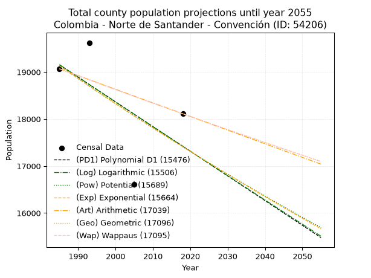
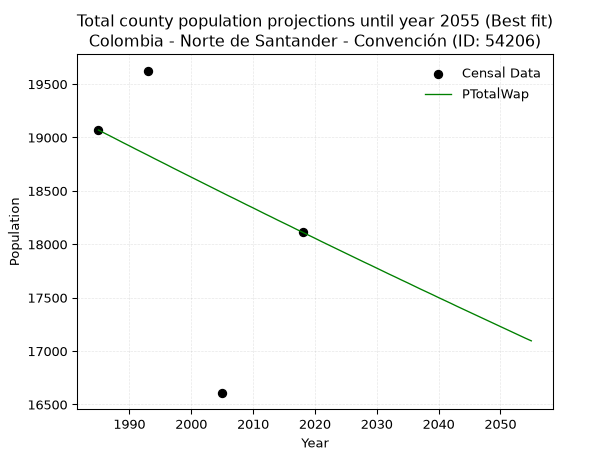
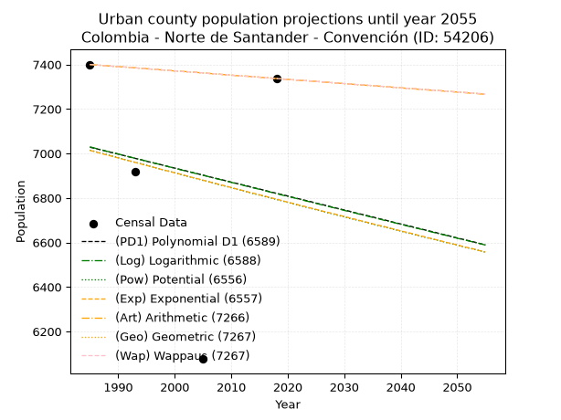
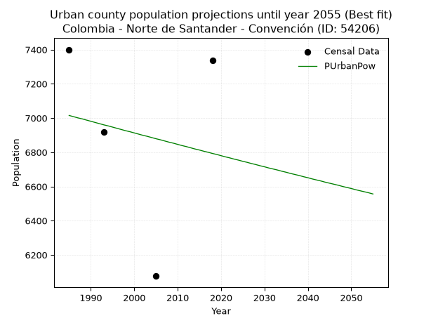
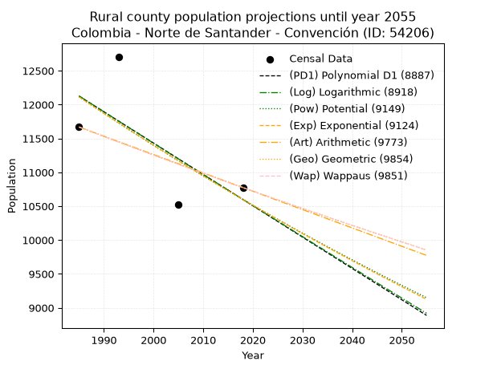
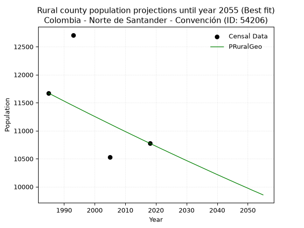

<div align="center">


</div>

# _“Population and Public Services Demand Projections (PPSD) until Year 2050 for Colombia - Norte de Santander - Convención (ID: 54206)”_
Keywords: `population` `public-service` `projection` `lineal` `polynomial` `logarithmic` `potential` `exponential` `arithmetic` `geometric` `wappaus` `dane` `colombia` `south-america`

PPSD are analytical estimates used by governments and planners to anticipate future changes in population size, age distribution, and the resulting community needs for utilities, healthcare, education, and infrastructure as sizing future water treatment facilities, electrical grids, and road networks based on spatial growth.

> **General running parameters**: • app_version: _v20260806_. • Python version: _3.14.7_. • Pandas version: _3.0.5_. • NumPy version: _2.5.1_. • Creates, save and include plots into reports (create_plot): _False_. • Projection until year: _2050_. • Process polynomial degree 2 and up: _False_. • Process Wappaus: _True_. • Process Wappaus: _True_. • Set negative values to zero: _True_. • Set infinite values to zero: _True_. • Drop dataset notes: _True_. 
<div align="center">

Dynamic map: [:earth_americas:Google](http://maps.google.com/maps?q=8.470373553,-73.3372002) [:earth_americas:OSM](https://www.openstreetmap.org/#map=18/8.470373553/-73.3372002&layers=P) [:earth_americas:Bing](https://www.bing.com/maps?cp=8.470373553~-73.3372002&lvl=18) [:earth_americas:Apple](https://maps.apple.com/frame?center=8.470373553%2C-73.3372002&span=0.003%2C0.006)

</div>


<div align="center">

```geojson
{
  "type": "Feature",
  "geometry": {
    "type": "Point", 
    "coordinates": [-73.3372002, 8.470373553]
  }, 
  "properties": {
    "Name": "Colombia - Norte de Santander - Convención (ID: 54206)"
  }
}
```

</div>


## 0. Census Data (4 records)

Census data are official statistics collected by a government about the people and housing in a country. They usually include counts of total population, age, sex, race, income, education, and jobs.

📅Global census file: [Population.xlsx](../data/Population.xlsx)

| Source   |   Year |   CountryID | CountryName   |   StateID | StateName          |   CountyID | CountyName   |   PTotal |   PUrban |   PRural |
|:---------|-------:|------------:|:--------------|----------:|:-------------------|-----------:|:-------------|---------:|---------:|---------:|
| DANE     |   1985 |          57 | Colombia      |        54 | Norte de Santander |      54206 | Convención   |    19069 |     7400 |    11669 |
| DANE     |   1993 |          57 | Colombia      |        54 | Norte de Santander |      54206 | Convención   |    19625 |     6917 |    12708 |
| DANE     |   2005 |          57 | Colombia      |        54 | Norte De Santander |      54206 | Convención   |    16605 |     6076 |    10529 |
| DANE     |   2018 |          57 | Colombia      |        54 | Norte de Santander |      54206 | Convención   |    18112 |     7337 |    10775 |

> 🔥Some records could had specific notes about the registered values or the corresponding urban or rural distribution.

📅   [RUPS](https://www.datos.gov.co/Hacienda-y-Cr-dito-P-blico/Registro-nico-de-Prestadores-de-Servicios-P-blicos/4qkq-csdn/about_data) - Local public utility companies: [RUPS.csv](../data/RUPS.xlsx)

 | SERVICIO       | ESTADO    | NOMBRE                                                                                            | NIT         | DEPARTAMENTO_DOMICILIO   | MUNICIPIO_DOMICILIO   | DIRECCION         |   TELEFONO | EMAIL                    | TIPO_INSCRIPCION    | REPRESENTANTE_LEGAL   | TIPO_PRESTADOR                 | CLASIFICACION                 |
|:---------------|:----------|:--------------------------------------------------------------------------------------------------|:------------|:-------------------------|:----------------------|:------------------|-----------:|:-------------------------|:--------------------|:----------------------|:-------------------------------|:------------------------------|
| ACUEDUCTO      | OPERATIVA | EMPRESA DE SERVICIOS PUBLICOS DE AGUA POTABLE, ALCANTARILLADO Y ASEO DEL MUNICIPIO DE  CONVENCIÓN | 800099236-9 | NORTE DE SANTANDER       | CONVENCION            | CARRERA 6 No 5-12 |    5630840 | uspcconvencion@gmail.com | Registro por la ESP | DIMAR  BARBOSA  RIOBO | MUNICIPIO (PRESTACIÓN DIRECTA) | MENOR O IGUAL A 2500 USUARIOS |
| ALCANTARILLADO | OPERATIVA | EMPRESA DE SERVICIOS PUBLICOS DE AGUA POTABLE, ALCANTARILLADO Y ASEO DEL MUNICIPIO DE  CONVENCIÓN | 800099236-9 | NORTE DE SANTANDER       | CONVENCION            | CARRERA 6 No 5-12 |    5630840 | uspcconvencion@gmail.com | Registro por la ESP | DIMAR  BARBOSA  RIOBO | MUNICIPIO (PRESTACIÓN DIRECTA) | MENOR O IGUAL A 2500 USUARIOS |

## 1. Total

### 1.1. Coefficients and Parameters

* (PD1) Polynomial Deg 1: -52.54395824969958, 123453.80248896159 (lineal)
* (Log) Logarithmic: -105341.95603957772, 819057.8020142874
* (Pow) Potential: -5.72948945265507, 23.17631490984855
* (Exp) Exponential: -0.0028575067571927943, 5560896.366058083
* (Art) Arithmetic: Year diff. 2018 - 1985 = 33, Population diff. 18112 - 19069 = -957, Annual growth = -29.0
* (Geo) Geometric: Year diff. 2018 - 1985 = 33, Population diff. 18112 - 19069 = -957, Annual growth % = -0.0015590645406190484
* (Wap) Wappaus: i = -0.1559936526720637, Condition values only valid for < 200)

<sub>
Wappaus condition values: ['-0.00', '-0.16', '-0.31', '-0.47', '-0.62', '-0.78', '-0.94', '-1.09', '-1.25', '-1.40', '-1.56', '-1.72', '-1.87', '-2.03', '-2.18', '-2.34', '-2.50', '-2.65', '-2.81', '-2.96', '-3.12', '-3.28', '-3.43', '-3.59', '-3.74', '-3.90', '-4.06', '-4.21', '-4.37', '-4.52', '-4.68', '-4.84', '-4.99', '-5.15', '-5.30', '-5.46', '-5.62', '-5.77', '-5.93', '-6.08', '-6.24', '-6.40', '-6.55', '-6.71', '-6.86', '-7.02', '-7.18', '-7.33', '-7.49', '-7.64', '-7.80', '-7.96', '-8.11', '-8.27', '-8.42', '-8.58', '-8.74', '-8.89', '-9.05', '-9.20', '-9.36', '-9.52', '-9.67', '-9.83', '-9.98', '-10.14']
</sub>


### 1.2. Projected Dataset

|   Year |   CountyID |   PTotalPD1 |   PTotalLog |   PTotalPow |   PTotalExp |   PTotalArt |   PTotalGeo |   PTotalWap |
|-------:|-----------:|------------:|------------:|------------:|------------:|------------:|------------:|------------:|
|   1985 |      54206 |       19154 |       19157 |       19135 |       19132 |       19069 |       19069 |       19069 |
|   1986 |      54206 |       19102 |       19104 |       19080 |       19077 |       19040 |       19039 |       19039 |
|   1987 |      54206 |       19049 |       19051 |       19025 |       19023 |       19011 |       19010 |       19010 |
|   1988 |      54206 |       18996 |       18998 |       18970 |       18969 |       18982 |       18980 |       18980 |
|   1989 |      54206 |       18944 |       18945 |       18916 |       18915 |       18953 |       18950 |       18950 |
|   1990 |      54206 |       18891 |       18892 |       18861 |       18861 |       18924 |       18921 |       18921 |
|   1991 |      54206 |       18839 |       18839 |       18807 |       18807 |       18895 |       18891 |       18891 |
|   1992 |      54206 |       18786 |       18786 |       18753 |       18753 |       18866 |       18862 |       18862 |
|   1993 |      54206 |       18734 |       18733 |       18699 |       18700 |       18837 |       18832 |       18833 |
|   1994 |      54206 |       18681 |       18680 |       18646 |       18646 |       18808 |       18803 |       18803 |
|   1995 |      54206 |       18629 |       18628 |       18592 |       18593 |       18779 |       18774 |       18774 |
|   1996 |      54206 |       18576 |       18575 |       18539 |       18540 |       18750 |       18745 |       18745 |
|   1997 |      54206 |       18524 |       18522 |       18486 |       18487 |       18721 |       18715 |       18715 |
|   1998 |      54206 |       18471 |       18469 |       18433 |       18434 |       18692 |       18686 |       18686 |
|   1999 |      54206 |       18418 |       18417 |       18380 |       18382 |       18663 |       18657 |       18657 |
|   2000 |      54206 |       18366 |       18364 |       18327 |       18329 |       18634 |       18628 |       18628 |
|   2001 |      54206 |       18313 |       18311 |       18275 |       18277 |       18605 |       18599 |       18599 |
|   2002 |      54206 |       18261 |       18259 |       18223 |       18225 |       18576 |       18570 |       18570 |
|   2003 |      54206 |       18208 |       18206 |       18171 |       18173 |       18547 |       18541 |       18541 |
|   2004 |      54206 |       18156 |       18153 |       18119 |       18121 |       18518 |       18512 |       18512 |
|   2005 |      54206 |       18103 |       18101 |       18067 |       18069 |       18489 |       18483 |       18483 |
|   2006 |      54206 |       18051 |       18048 |       18015 |       18018 |       18460 |       18454 |       18454 |
|   2007 |      54206 |       17998 |       17996 |       17964 |       17966 |       18431 |       18426 |       18426 |
|   2008 |      54206 |       17946 |       17943 |       17913 |       17915 |       18402 |       18397 |       18397 |
|   2009 |      54206 |       17893 |       17891 |       17862 |       17864 |       18373 |       18368 |       18368 |
|   2010 |      54206 |       17840 |       17838 |       17811 |       17813 |       18344 |       18339 |       18340 |
|   2011 |      54206 |       17788 |       17786 |       17760 |       17762 |       18315 |       18311 |       18311 |
|   2012 |      54206 |       17735 |       17734 |       17710 |       17711 |       18286 |       18282 |       18282 |
|   2013 |      54206 |       17683 |       17681 |       17659 |       17661 |       18257 |       18254 |       18254 |
|   2014 |      54206 |       17630 |       17629 |       17609 |       17611 |       18228 |       18225 |       18225 |
|   2015 |      54206 |       17578 |       17577 |       17559 |       17560 |       18199 |       18197 |       18197 |
|   2016 |      54206 |       17525 |       17524 |       17509 |       17510 |       18170 |       18169 |       18169 |
|   2017 |      54206 |       17473 |       17472 |       17460 |       17460 |       18141 |       18140 |       18140 |
|   2018 |      54206 |       17420 |       17420 |       17410 |       17410 |       18112 |       18112 |       18112 |
|   2019 |      54206 |       17368 |       17368 |       17361 |       17361 |       18083 |       18084 |       18084 |
|   2020 |      54206 |       17315 |       17316 |       17312 |       17311 |       18054 |       18056 |       18056 |
|   2021 |      54206 |       17262 |       17264 |       17263 |       17262 |       18025 |       18027 |       18027 |
|   2022 |      54206 |       17210 |       17211 |       17214 |       17213 |       17996 |       17999 |       17999 |
|   2023 |      54206 |       17157 |       17159 |       17165 |       17163 |       17967 |       17971 |       17971 |
|   2024 |      54206 |       17105 |       17107 |       17117 |       17114 |       17938 |       17943 |       17943 |
|   2025 |      54206 |       17052 |       17055 |       17068 |       17066 |       17909 |       17915 |       17915 |
|   2026 |      54206 |       17000 |       17003 |       17020 |       17017 |       17880 |       17887 |       17887 |
|   2027 |      54206 |       16947 |       16951 |       16972 |       16968 |       17851 |       17859 |       17859 |
|   2028 |      54206 |       16895 |       16899 |       16924 |       16920 |       17822 |       17832 |       17831 |
|   2029 |      54206 |       16842 |       16847 |       16876 |       16872 |       17793 |       17804 |       17804 |
|   2030 |      54206 |       16790 |       16795 |       16829 |       16823 |       17764 |       17776 |       17776 |
|   2031 |      54206 |       16737 |       16744 |       16781 |       16775 |       17735 |       17748 |       17748 |
|   2032 |      54206 |       16684 |       16692 |       16734 |       16728 |       17706 |       17721 |       17720 |
|   2033 |      54206 |       16632 |       16640 |       16687 |       16680 |       17677 |       17693 |       17693 |
|   2034 |      54206 |       16579 |       16588 |       16640 |       16632 |       17648 |       17665 |       17665 |
|   2035 |      54206 |       16527 |       16536 |       16593 |       16585 |       17619 |       17638 |       17638 |
|   2036 |      54206 |       16474 |       16485 |       16547 |       16538 |       17590 |       17610 |       17610 |
|   2037 |      54206 |       16422 |       16433 |       16500 |       16490 |       17561 |       17583 |       17582 |
|   2038 |      54206 |       16369 |       16381 |       16454 |       16443 |       17532 |       17556 |       17555 |
|   2039 |      54206 |       16317 |       16329 |       16408 |       16396 |       17503 |       17528 |       17528 |
|   2040 |      54206 |       16264 |       16278 |       16362 |       16350 |       17474 |       17501 |       17500 |
|   2041 |      54206 |       16212 |       16226 |       16316 |       16303 |       17445 |       17474 |       17473 |
|   2042 |      54206 |       16159 |       16175 |       16270 |       16256 |       17416 |       17446 |       17446 |
|   2043 |      54206 |       16106 |       16123 |       16224 |       16210 |       17387 |       17419 |       17418 |
|   2044 |      54206 |       16054 |       16071 |       16179 |       16164 |       17358 |       17392 |       17391 |
|   2045 |      54206 |       16001 |       16020 |       16134 |       16118 |       17329 |       17365 |       17364 |
|   2046 |      54206 |       15949 |       15968 |       16089 |       16072 |       17300 |       17338 |       17337 |
|   2047 |      54206 |       15896 |       15917 |       16044 |       16026 |       17271 |       17311 |       17310 |
|   2048 |      54206 |       15844 |       15866 |       15999 |       15980 |       17242 |       17284 |       17283 |
|   2049 |      54206 |       15791 |       15814 |       15954 |       15934 |       17213 |       17257 |       17256 |
|   2050 |      54206 |       15739 |       15763 |       15909 |       15889 |       17184 |       17230 |       17229 |
<div align="center">

</img>

</div>


### 1.3. Best fit with absolute and relative error (%)

Relative error puts that difference into context by dividing the absolute error by the true value, creating a unitless ratio or percentage that shows the scale of the mistake.

Absolute and relative error

|   Year | Source   |   CountryID | CountryName   |   StateID | StateName          |   CountyID_x | CountyName   |   PTotal |   PUrban |   PRural |   CountyID_y |   PTotalPD1 |   PTotalLog |   PTotalPow |   PTotalExp |   PTotalArt |   PTotalGeo |   PTotalWap |   PTotalPD1AbsError |   PTotalLogAbsError |   PTotalPowAbsError |   PTotalExpAbsError |   PTotalArtAbsError |   PTotalGeoAbsError |   PTotalWapAbsError |   PTotalPD1RelError |   PTotalLogRelError |   PTotalPowRelError |   PTotalExpRelError |   PTotalArtRelError |   PTotalGeoRelError |   PTotalWapRelError |
|-------:|:---------|------------:|:--------------|----------:|:-------------------|-------------:|:-------------|---------:|---------:|---------:|-------------:|------------:|------------:|------------:|------------:|------------:|------------:|------------:|--------------------:|--------------------:|--------------------:|--------------------:|--------------------:|--------------------:|--------------------:|--------------------:|--------------------:|--------------------:|--------------------:|--------------------:|--------------------:|--------------------:|
|   1985 | DANE     |          57 | Colombia      |        54 | Norte de Santander |        54206 | Convención   |    19069 |     7400 |    11669 |        54206 |       19154 |       19157 |       19135 |       19132 |       19069 |       19069 |       19069 |                  85 |                  88 |                  66 |                  63 |                   0 |                   0 |                   0 |             0.44575 |            0.461482 |            0.346111 |            0.330379 |             0       |             0       |             0       |
|   1993 | DANE     |          57 | Colombia      |        54 | Norte de Santander |        54206 | Convención   |    19625 |     6917 |    12708 |        54206 |       18734 |       18733 |       18699 |       18700 |       18837 |       18832 |       18833 |                 891 |                 892 |                 926 |                 925 |                 788 |                 793 |                 792 |             4.54013 |            4.54522  |            4.71847  |            4.71338  |             4.01529 |             4.04076 |             4.03567 |
|   2005 | DANE     |          57 | Colombia      |        54 | Norte De Santander |        54206 | Convención   |    16605 |     6076 |    10529 |        54206 |       18103 |       18101 |       18067 |       18069 |       18489 |       18483 |       18483 |                1498 |                1496 |                1462 |                1464 |                1884 |                1878 |                1878 |             9.02138 |            9.00933  |            8.80458  |            8.81662  |            11.346   |            11.3098  |            11.3098  |
|   2018 | DANE     |          57 | Colombia      |        54 | Norte de Santander |        54206 | Convención   |    18112 |     7337 |    10775 |        54206 |       17420 |       17420 |       17410 |       17410 |       18112 |       18112 |       18112 |                 692 |                 692 |                 702 |                 702 |                   0 |                   0 |                   0 |             3.82067 |            3.82067  |            3.87588  |            3.87588  |             0       |             0       |             0       |

Relative error mean

| Method    |   RelError | Best   |
|:----------|-----------:|:-------|
| PTotalPD1 |    4.45698 |        |
| PTotalLog |    4.45918 |        |
| PTotalPow |    4.43626 |        |
| PTotalExp |    4.43406 |        |
| PTotalArt |    3.84032 |        |
| PTotalGeo |    3.83765 |        |
| PTotalWap |    3.83638 | True   |

💙Best method: _**PTotalWap**_
<div align="center">

</img>

</div>


### 1.4. Fresh water supply demand in liters per capita per day (lpcd)

The fresh water supply demand typically ranges from 100 to 300 liters per capita per day (lpcd) for standard domestic and municipal planning, though absolute survival minimums set by the World Health Organization are as low as 7.5 to 20 liters per day, and total consumption in high-income nations can exceed 400 liters.

> `CZ`: Level in meters above the sea level (masl)<br> `WS`: Fresh water supply demand in liters per capita per day (lpcd or l/h/d)<br> `WSAll`: Zonal fresh water supply demand in liters per second (l/s)<br> `A`: Zonal area in square meters<br> `DP`: Population density (people/hectare or p/ha)

Reference values (RAS Colombia)

|    CZ |   WS |
|------:|-----:|
|  1000 |  120 |
|  2000 |  130 |
| 99999 |  140 |

County shapefile geometry properties and water supply values

|   CountyID |      ATotal |   CZTotal |   WSTotal |
|-----------:|------------:|----------:|----------:|
|      54206 | 9.28415e+08 |   783.325 |       120 |

Projected values for best method: PTotalWap

|   CountyID |   Year |   PTotalWap |   DPTotal |   WSTotal |   WSTotalAll |
|-----------:|-------:|------------:|----------:|----------:|-------------:|
|      54206 |   1985 |       19069 |      0.21 |       120 |      26.4847 |
|      54206 |   1986 |       19039 |      0.21 |       120 |      26.4431 |
|      54206 |   1987 |       19010 |      0.2  |       120 |      26.4028 |
|      54206 |   1988 |       18980 |      0.2  |       120 |      26.3611 |
|      54206 |   1989 |       18950 |      0.2  |       120 |      26.3194 |
|      54206 |   1990 |       18921 |      0.2  |       120 |      26.2792 |
|      54206 |   1991 |       18891 |      0.2  |       120 |      26.2375 |
|      54206 |   1992 |       18862 |      0.2  |       120 |      26.1972 |
|      54206 |   1993 |       18833 |      0.2  |       120 |      26.1569 |
|      54206 |   1994 |       18803 |      0.2  |       120 |      26.1153 |
|      54206 |   1995 |       18774 |      0.2  |       120 |      26.075  |
|      54206 |   1996 |       18745 |      0.2  |       120 |      26.0347 |
|      54206 |   1997 |       18715 |      0.2  |       120 |      25.9931 |
|      54206 |   1998 |       18686 |      0.2  |       120 |      25.9528 |
|      54206 |   1999 |       18657 |      0.2  |       120 |      25.9125 |
|      54206 |   2000 |       18628 |      0.2  |       120 |      25.8722 |
|      54206 |   2001 |       18599 |      0.2  |       120 |      25.8319 |
|      54206 |   2002 |       18570 |      0.2  |       120 |      25.7917 |
|      54206 |   2003 |       18541 |      0.2  |       120 |      25.7514 |
|      54206 |   2004 |       18512 |      0.2  |       120 |      25.7111 |
|      54206 |   2005 |       18483 |      0.2  |       120 |      25.6708 |
|      54206 |   2006 |       18454 |      0.2  |       120 |      25.6306 |
|      54206 |   2007 |       18426 |      0.2  |       120 |      25.5917 |
|      54206 |   2008 |       18397 |      0.2  |       120 |      25.5514 |
|      54206 |   2009 |       18368 |      0.2  |       120 |      25.5111 |
|      54206 |   2010 |       18340 |      0.2  |       120 |      25.4722 |
|      54206 |   2011 |       18311 |      0.2  |       120 |      25.4319 |
|      54206 |   2012 |       18282 |      0.2  |       120 |      25.3917 |
|      54206 |   2013 |       18254 |      0.2  |       120 |      25.3528 |
|      54206 |   2014 |       18225 |      0.2  |       120 |      25.3125 |
|      54206 |   2015 |       18197 |      0.2  |       120 |      25.2736 |
|      54206 |   2016 |       18169 |      0.2  |       120 |      25.2347 |
|      54206 |   2017 |       18140 |      0.2  |       120 |      25.1944 |
|      54206 |   2018 |       18112 |      0.2  |       120 |      25.1556 |
|      54206 |   2019 |       18084 |      0.19 |       120 |      25.1167 |
|      54206 |   2020 |       18056 |      0.19 |       120 |      25.0778 |
|      54206 |   2021 |       18027 |      0.19 |       120 |      25.0375 |
|      54206 |   2022 |       17999 |      0.19 |       120 |      24.9986 |
|      54206 |   2023 |       17971 |      0.19 |       120 |      24.9597 |
|      54206 |   2024 |       17943 |      0.19 |       120 |      24.9208 |
|      54206 |   2025 |       17915 |      0.19 |       120 |      24.8819 |
|      54206 |   2026 |       17887 |      0.19 |       120 |      24.8431 |
|      54206 |   2027 |       17859 |      0.19 |       120 |      24.8042 |
|      54206 |   2028 |       17831 |      0.19 |       120 |      24.7653 |
|      54206 |   2029 |       17804 |      0.19 |       120 |      24.7278 |
|      54206 |   2030 |       17776 |      0.19 |       120 |      24.6889 |
|      54206 |   2031 |       17748 |      0.19 |       120 |      24.65   |
|      54206 |   2032 |       17720 |      0.19 |       120 |      24.6111 |
|      54206 |   2033 |       17693 |      0.19 |       120 |      24.5736 |
|      54206 |   2034 |       17665 |      0.19 |       120 |      24.5347 |
|      54206 |   2035 |       17638 |      0.19 |       120 |      24.4972 |
|      54206 |   2036 |       17610 |      0.19 |       120 |      24.4583 |
|      54206 |   2037 |       17582 |      0.19 |       120 |      24.4194 |
|      54206 |   2038 |       17555 |      0.19 |       120 |      24.3819 |
|      54206 |   2039 |       17528 |      0.19 |       120 |      24.3444 |
|      54206 |   2040 |       17500 |      0.19 |       120 |      24.3056 |
|      54206 |   2041 |       17473 |      0.19 |       120 |      24.2681 |
|      54206 |   2042 |       17446 |      0.19 |       120 |      24.2306 |
|      54206 |   2043 |       17418 |      0.19 |       120 |      24.1917 |
|      54206 |   2044 |       17391 |      0.19 |       120 |      24.1542 |
|      54206 |   2045 |       17364 |      0.19 |       120 |      24.1167 |
|      54206 |   2046 |       17337 |      0.19 |       120 |      24.0792 |
|      54206 |   2047 |       17310 |      0.19 |       120 |      24.0417 |
|      54206 |   2048 |       17283 |      0.19 |       120 |      24.0042 |
|      54206 |   2049 |       17256 |      0.19 |       120 |      23.9667 |
|      54206 |   2050 |       17229 |      0.19 |       120 |      23.9292 |

## 2. Urban

### 2.1. Coefficients and Parameters

* (PD1) Polynomial Deg 1: -6.271376957046073, 19476.821758331407 (lineal)
* (Log) Logarithmic: -12735.141784678797, 103732.41475836505
* (Pow) Potential: -1.9515068957747321, 10.281643704620036
* (Exp) Exponential: -0.00096151923759691, 47297.788922309206
* (Art) Arithmetic: Year diff. 2018 - 1985 = 33, Population diff. 7337 - 7400 = -63, Annual growth = -1.9090909090909092
* (Geo) Geometric: Year diff. 2018 - 1985 = 33, Population diff. 7337 - 7400 = -63, Annual growth % = -0.0002590561506218281
* (Wap) Wappaus: i = -0.02590881331466254, Condition values only valid for < 200)

<sub>
Wappaus condition values: ['-0.00', '-0.03', '-0.05', '-0.08', '-0.10', '-0.13', '-0.16', '-0.18', '-0.21', '-0.23', '-0.26', '-0.28', '-0.31', '-0.34', '-0.36', '-0.39', '-0.41', '-0.44', '-0.47', '-0.49', '-0.52', '-0.54', '-0.57', '-0.60', '-0.62', '-0.65', '-0.67', '-0.70', '-0.73', '-0.75', '-0.78', '-0.80', '-0.83', '-0.85', '-0.88', '-0.91', '-0.93', '-0.96', '-0.98', '-1.01', '-1.04', '-1.06', '-1.09', '-1.11', '-1.14', '-1.17', '-1.19', '-1.22', '-1.24', '-1.27', '-1.30', '-1.32', '-1.35', '-1.37', '-1.40', '-1.42', '-1.45', '-1.48', '-1.50', '-1.53', '-1.55', '-1.58', '-1.61', '-1.63', '-1.66', '-1.68']
</sub>


### 2.2. Projected Dataset

|   Year |   CountyID |   PUrbanPD1 |   PUrbanLog |   PUrbanPow |   PUrbanExp |   PUrbanArt |   PUrbanGeo |   PUrbanWap |
|-------:|-----------:|------------:|------------:|------------:|------------:|------------:|------------:|------------:|
|   1985 |      54206 |        7028 |        7030 |        7015 |        7014 |        7400 |        7400 |        7400 |
|   1986 |      54206 |        7022 |        7023 |        7008 |        7007 |        7398 |        7398 |        7398 |
|   1987 |      54206 |        7016 |        7017 |        7001 |        7000 |        7396 |        7396 |        7396 |
|   1988 |      54206 |        7009 |        7010 |        6995 |        6993 |        7394 |        7394 |        7394 |
|   1989 |      54206 |        7003 |        7004 |        6988 |        6987 |        7392 |        7392 |        7392 |
|   1990 |      54206 |        6997 |        6998 |        6981 |        6980 |        7390 |        7390 |        7390 |
|   1991 |      54206 |        6991 |        6991 |        6974 |        6973 |        7389 |        7389 |        7389 |
|   1992 |      54206 |        6984 |        6985 |        6967 |        6967 |        7387 |        7387 |        7387 |
|   1993 |      54206 |        6978 |        6978 |        6960 |        6960 |        7385 |        7385 |        7385 |
|   1994 |      54206 |        6972 |        6972 |        6954 |        6953 |        7383 |        7383 |        7383 |
|   1995 |      54206 |        6965 |        6966 |        6947 |        6946 |        7381 |        7381 |        7381 |
|   1996 |      54206 |        6959 |        6959 |        6940 |        6940 |        7379 |        7379 |        7379 |
|   1997 |      54206 |        6953 |        6953 |        6933 |        6933 |        7377 |        7377 |        7377 |
|   1998 |      54206 |        6947 |        6947 |        6926 |        6926 |        7375 |        7375 |        7375 |
|   1999 |      54206 |        6940 |        6940 |        6920 |        6920 |        7373 |        7373 |        7373 |
|   2000 |      54206 |        6934 |        6934 |        6913 |        6913 |        7371 |        7371 |        7371 |
|   2001 |      54206 |        6928 |        6927 |        6906 |        6907 |        7369 |        7369 |        7369 |
|   2002 |      54206 |        6922 |        6921 |        6899 |        6900 |        7368 |        7367 |        7367 |
|   2003 |      54206 |        6915 |        6915 |        6893 |        6893 |        7366 |        7366 |        7366 |
|   2004 |      54206 |        6909 |        6908 |        6886 |        6887 |        7364 |        7364 |        7364 |
|   2005 |      54206 |        6903 |        6902 |        6879 |        6880 |        7362 |        7362 |        7362 |
|   2006 |      54206 |        6896 |        6896 |        6873 |        6873 |        7360 |        7360 |        7360 |
|   2007 |      54206 |        6890 |        6889 |        6866 |        6867 |        7358 |        7358 |        7358 |
|   2008 |      54206 |        6884 |        6883 |        6859 |        6860 |        7356 |        7356 |        7356 |
|   2009 |      54206 |        6878 |        6877 |        6853 |        6854 |        7354 |        7354 |        7354 |
|   2010 |      54206 |        6871 |        6870 |        6846 |        6847 |        7352 |        7352 |        7352 |
|   2011 |      54206 |        6865 |        6864 |        6839 |        6840 |        7350 |        7350 |        7350 |
|   2012 |      54206 |        6859 |        6858 |        6833 |        6834 |        7348 |        7348 |        7348 |
|   2013 |      54206 |        6853 |        6851 |        6826 |        6827 |        7347 |        7347 |        7347 |
|   2014 |      54206 |        6846 |        6845 |        6819 |        6821 |        7345 |        7345 |        7345 |
|   2015 |      54206 |        6840 |        6839 |        6813 |        6814 |        7343 |        7343 |        7343 |
|   2016 |      54206 |        6834 |        6832 |        6806 |        6808 |        7341 |        7341 |        7341 |
|   2017 |      54206 |        6827 |        6826 |        6800 |        6801 |        7339 |        7339 |        7339 |
|   2018 |      54206 |        6821 |        6820 |        6793 |        6795 |        7337 |        7337 |        7337 |
|   2019 |      54206 |        6815 |        6813 |        6787 |        6788 |        7335 |        7335 |        7335 |
|   2020 |      54206 |        6809 |        6807 |        6780 |        6781 |        7333 |        7333 |        7333 |
|   2021 |      54206 |        6802 |        6801 |        6773 |        6775 |        7331 |        7331 |        7331 |
|   2022 |      54206 |        6796 |        6795 |        6767 |        6768 |        7329 |        7329 |        7329 |
|   2023 |      54206 |        6790 |        6788 |        6760 |        6762 |        7327 |        7328 |        7328 |
|   2024 |      54206 |        6784 |        6782 |        6754 |        6755 |        7326 |        7326 |        7326 |
|   2025 |      54206 |        6777 |        6776 |        6747 |        6749 |        7324 |        7324 |        7324 |
|   2026 |      54206 |        6771 |        6769 |        6741 |        6742 |        7322 |        7322 |        7322 |
|   2027 |      54206 |        6765 |        6763 |        6734 |        6736 |        7320 |        7320 |        7320 |
|   2028 |      54206 |        6758 |        6757 |        6728 |        6730 |        7318 |        7318 |        7318 |
|   2029 |      54206 |        6752 |        6751 |        6721 |        6723 |        7316 |        7316 |        7316 |
|   2030 |      54206 |        6746 |        6744 |        6715 |        6717 |        7314 |        7314 |        7314 |
|   2031 |      54206 |        6740 |        6738 |        6708 |        6710 |        7312 |        7312 |        7312 |
|   2032 |      54206 |        6733 |        6732 |        6702 |        6704 |        7310 |        7310 |        7310 |
|   2033 |      54206 |        6727 |        6725 |        6696 |        6697 |        7308 |        7309 |        7309 |
|   2034 |      54206 |        6721 |        6719 |        6689 |        6691 |        7306 |        7307 |        7307 |
|   2035 |      54206 |        6715 |        6713 |        6683 |        6684 |        7305 |        7305 |        7305 |
|   2036 |      54206 |        6708 |        6707 |        6676 |        6678 |        7303 |        7303 |        7303 |
|   2037 |      54206 |        6702 |        6700 |        6670 |        6672 |        7301 |        7301 |        7301 |
|   2038 |      54206 |        6696 |        6694 |        6664 |        6665 |        7299 |        7299 |        7299 |
|   2039 |      54206 |        6689 |        6688 |        6657 |        6659 |        7297 |        7297 |        7297 |
|   2040 |      54206 |        6683 |        6682 |        6651 |        6652 |        7295 |        7295 |        7295 |
|   2041 |      54206 |        6677 |        6675 |        6644 |        6646 |        7293 |        7293 |        7293 |
|   2042 |      54206 |        6671 |        6669 |        6638 |        6640 |        7291 |        7292 |        7292 |
|   2043 |      54206 |        6664 |        6663 |        6632 |        6633 |        7289 |        7290 |        7290 |
|   2044 |      54206 |        6658 |        6657 |        6625 |        6627 |        7287 |        7288 |        7288 |
|   2045 |      54206 |        6652 |        6650 |        6619 |        6620 |        7285 |        7286 |        7286 |
|   2046 |      54206 |        6646 |        6644 |        6613 |        6614 |        7284 |        7284 |        7284 |
|   2047 |      54206 |        6639 |        6638 |        6607 |        6608 |        7282 |        7282 |        7282 |
|   2048 |      54206 |        6633 |        6632 |        6600 |        6601 |        7280 |        7280 |        7280 |
|   2049 |      54206 |        6627 |        6626 |        6594 |        6595 |        7278 |        7278 |        7278 |
|   2050 |      54206 |        6620 |        6619 |        6588 |        6589 |        7276 |        7276 |        7276 |
<div align="center">

</img>

</div>


### 2.3. Best fit with absolute and relative error (%)

Relative error puts that difference into context by dividing the absolute error by the true value, creating a unitless ratio or percentage that shows the scale of the mistake.

Absolute and relative error

|   Year | Source   |   CountryID | CountryName   |   StateID | StateName          |   CountyID_x | CountyName   |   PTotal |   PUrban |   PRural |   CountyID_y |   PUrbanPD1 |   PUrbanLog |   PUrbanPow |   PUrbanExp |   PUrbanArt |   PUrbanGeo |   PUrbanWap |   PUrbanPD1AbsError |   PUrbanLogAbsError |   PUrbanPowAbsError |   PUrbanExpAbsError |   PUrbanArtAbsError |   PUrbanGeoAbsError |   PUrbanWapAbsError |   PUrbanPD1RelError |   PUrbanLogRelError |   PUrbanPowRelError |   PUrbanExpRelError |   PUrbanArtRelError |   PUrbanGeoRelError |   PUrbanWapRelError |
|-------:|:---------|------------:|:--------------|----------:|:-------------------|-------------:|:-------------|---------:|---------:|---------:|-------------:|------------:|------------:|------------:|------------:|------------:|------------:|------------:|--------------------:|--------------------:|--------------------:|--------------------:|--------------------:|--------------------:|--------------------:|--------------------:|--------------------:|--------------------:|--------------------:|--------------------:|--------------------:|--------------------:|
|   1985 | DANE     |          57 | Colombia      |        54 | Norte de Santander |        54206 | Convención   |    19069 |     7400 |    11669 |        54206 |        7028 |        7030 |        7015 |        7014 |        7400 |        7400 |        7400 |                 372 |                 370 |                 385 |                 386 |                   0 |                   0 |                   0 |            5.02703  |            5        |            5.2027   |            5.21622  |             0       |             0       |             0       |
|   1993 | DANE     |          57 | Colombia      |        54 | Norte de Santander |        54206 | Convención   |    19625 |     6917 |    12708 |        54206 |        6978 |        6978 |        6960 |        6960 |        7385 |        7385 |        7385 |                  61 |                  61 |                  43 |                  43 |                 468 |                 468 |                 468 |            0.881885 |            0.881885 |            0.621657 |            0.621657 |             6.76594 |             6.76594 |             6.76594 |
|   2005 | DANE     |          57 | Colombia      |        54 | Norte De Santander |        54206 | Convención   |    16605 |     6076 |    10529 |        54206 |        6903 |        6902 |        6879 |        6880 |        7362 |        7362 |        7362 |                 827 |                 826 |                 803 |                 804 |                1286 |                1286 |                1286 |           13.6109   |           13.5945   |           13.2159   |           13.2324   |            21.1652  |            21.1652  |            21.1652  |
|   2018 | DANE     |          57 | Colombia      |        54 | Norte de Santander |        54206 | Convención   |    18112 |     7337 |    10775 |        54206 |        6821 |        6820 |        6793 |        6795 |        7337 |        7337 |        7337 |                 516 |                 517 |                 544 |                 542 |                   0 |                   0 |                   0 |            7.03285  |            7.04648  |            7.41447  |            7.38722  |             0       |             0       |             0       |

Relative error mean

| Method    |   RelError | Best   |
|:----------|-----------:|:-------|
| PUrbanPD1 |    6.63817 |        |
| PUrbanLog |    6.63071 |        |
| PUrbanPow |    6.61369 | True   |
| PUrbanExp |    6.61437 |        |
| PUrbanArt |    6.98279 |        |
| PUrbanGeo |    6.98279 |        |
| PUrbanWap |    6.98279 |        |

💙Best method: _**PUrbanPow**_
<div align="center">

</img>

</div>


### 2.4. Fresh water supply demand in liters per capita per day (lpcd)

The fresh water supply demand typically ranges from 100 to 300 liters per capita per day (lpcd) for standard domestic and municipal planning, though absolute survival minimums set by the World Health Organization are as low as 7.5 to 20 liters per day, and total consumption in high-income nations can exceed 400 liters.

> `CZ`: Level in meters above the sea level (masl)<br> `WS`: Fresh water supply demand in liters per capita per day (lpcd or l/h/d)<br> `WSAll`: Zonal fresh water supply demand in liters per second (l/s)<br> `A`: Zonal area in square meters<br> `DP`: Population density (people/hectare or p/ha)

Reference values (RAS Colombia)

|    CZ |   WS |
|------:|-----:|
|  1000 |  120 |
|  2000 |  130 |
| 99999 |  140 |

County shapefile geometry properties and water supply values

|   CountyID |   AUrban |   CZUrban |   WSUrban |
|-----------:|---------:|----------:|----------:|
|      54206 |   876693 |   1060.44 |       130 |

Projected values for best method: PUrbanPow

|   CountyID |   Year |   PUrbanPow |   DPUrban |   WSUrban |   WSUrbanAll |
|-----------:|-------:|------------:|----------:|----------:|-------------:|
|      54206 |   1985 |        7015 |     80.02 |       130 |     10.555   |
|      54206 |   1986 |        7008 |     79.94 |       130 |     10.5444  |
|      54206 |   1987 |        7001 |     79.86 |       130 |     10.5339  |
|      54206 |   1988 |        6995 |     79.79 |       130 |     10.5249  |
|      54206 |   1989 |        6988 |     79.71 |       130 |     10.5144  |
|      54206 |   1990 |        6981 |     79.63 |       130 |     10.5038  |
|      54206 |   1991 |        6974 |     79.55 |       130 |     10.4933  |
|      54206 |   1992 |        6967 |     79.47 |       130 |     10.4828  |
|      54206 |   1993 |        6960 |     79.39 |       130 |     10.4722  |
|      54206 |   1994 |        6954 |     79.32 |       130 |     10.4632  |
|      54206 |   1995 |        6947 |     79.24 |       130 |     10.4527  |
|      54206 |   1996 |        6940 |     79.16 |       130 |     10.4421  |
|      54206 |   1997 |        6933 |     79.08 |       130 |     10.4316  |
|      54206 |   1998 |        6926 |     79    |       130 |     10.4211  |
|      54206 |   1999 |        6920 |     78.93 |       130 |     10.412   |
|      54206 |   2000 |        6913 |     78.85 |       130 |     10.4015  |
|      54206 |   2001 |        6906 |     78.77 |       130 |     10.391   |
|      54206 |   2002 |        6899 |     78.69 |       130 |     10.3804  |
|      54206 |   2003 |        6893 |     78.63 |       130 |     10.3714  |
|      54206 |   2004 |        6886 |     78.55 |       130 |     10.3609  |
|      54206 |   2005 |        6879 |     78.47 |       130 |     10.3503  |
|      54206 |   2006 |        6873 |     78.4  |       130 |     10.3413  |
|      54206 |   2007 |        6866 |     78.32 |       130 |     10.3308  |
|      54206 |   2008 |        6859 |     78.24 |       130 |     10.3203  |
|      54206 |   2009 |        6853 |     78.17 |       130 |     10.3112  |
|      54206 |   2010 |        6846 |     78.09 |       130 |     10.3007  |
|      54206 |   2011 |        6839 |     78.01 |       130 |     10.2902  |
|      54206 |   2012 |        6833 |     77.94 |       130 |     10.2811  |
|      54206 |   2013 |        6826 |     77.86 |       130 |     10.2706  |
|      54206 |   2014 |        6819 |     77.78 |       130 |     10.2601  |
|      54206 |   2015 |        6813 |     77.71 |       130 |     10.251   |
|      54206 |   2016 |        6806 |     77.63 |       130 |     10.2405  |
|      54206 |   2017 |        6800 |     77.56 |       130 |     10.2315  |
|      54206 |   2018 |        6793 |     77.48 |       130 |     10.2209  |
|      54206 |   2019 |        6787 |     77.42 |       130 |     10.2119  |
|      54206 |   2020 |        6780 |     77.34 |       130 |     10.2014  |
|      54206 |   2021 |        6773 |     77.26 |       130 |     10.1909  |
|      54206 |   2022 |        6767 |     77.19 |       130 |     10.1818  |
|      54206 |   2023 |        6760 |     77.11 |       130 |     10.1713  |
|      54206 |   2024 |        6754 |     77.04 |       130 |     10.1623  |
|      54206 |   2025 |        6747 |     76.96 |       130 |     10.1517  |
|      54206 |   2026 |        6741 |     76.89 |       130 |     10.1427  |
|      54206 |   2027 |        6734 |     76.81 |       130 |     10.1322  |
|      54206 |   2028 |        6728 |     76.74 |       130 |     10.1231  |
|      54206 |   2029 |        6721 |     76.66 |       130 |     10.1126  |
|      54206 |   2030 |        6715 |     76.59 |       130 |     10.1036  |
|      54206 |   2031 |        6708 |     76.51 |       130 |     10.0931  |
|      54206 |   2032 |        6702 |     76.45 |       130 |     10.084   |
|      54206 |   2033 |        6696 |     76.38 |       130 |     10.075   |
|      54206 |   2034 |        6689 |     76.3  |       130 |     10.0645  |
|      54206 |   2035 |        6683 |     76.23 |       130 |     10.0554  |
|      54206 |   2036 |        6676 |     76.15 |       130 |     10.0449  |
|      54206 |   2037 |        6670 |     76.08 |       130 |     10.0359  |
|      54206 |   2038 |        6664 |     76.01 |       130 |     10.0269  |
|      54206 |   2039 |        6657 |     75.93 |       130 |     10.0163  |
|      54206 |   2040 |        6651 |     75.86 |       130 |     10.0073  |
|      54206 |   2041 |        6644 |     75.78 |       130 |      9.99676 |
|      54206 |   2042 |        6638 |     75.72 |       130 |      9.98773 |
|      54206 |   2043 |        6632 |     75.65 |       130 |      9.9787  |
|      54206 |   2044 |        6625 |     75.57 |       130 |      9.96817 |
|      54206 |   2045 |        6619 |     75.5  |       130 |      9.95914 |
|      54206 |   2046 |        6613 |     75.43 |       130 |      9.95012 |
|      54206 |   2047 |        6607 |     75.36 |       130 |      9.94109 |
|      54206 |   2048 |        6600 |     75.28 |       130 |      9.93056 |
|      54206 |   2049 |        6594 |     75.21 |       130 |      9.92153 |
|      54206 |   2050 |        6588 |     75.15 |       130 |      9.9125  |

## 3. Rural

### 3.1. Coefficients and Parameters

* (PD1) Polynomial Deg 1: -46.272581292653626, 103976.98073063041 (lineal)
* (Log) Logarithmic: -92606.814254899, 715325.387255923
* (Pow) Potential: -8.103977728466393, 30.808323876986204
* (Exp) Exponential: -0.004048989883652585, 37482310.4676296
* (Art) Arithmetic: Year diff. 2018 - 1985 = 33, Population diff. 10775 - 11669 = -894, Annual growth = -27.09090909090909
* (Geo) Geometric: Year diff. 2018 - 1985 = 33, Population diff. 10775 - 11669 = -894, Annual growth % = -0.0024124525246173034
* (Wap) Wappaus: i = -0.24140892078871048, Condition values only valid for < 200)

<sub>
Wappaus condition values: ['-0.00', '-0.24', '-0.48', '-0.72', '-0.97', '-1.21', '-1.45', '-1.69', '-1.93', '-2.17', '-2.41', '-2.66', '-2.90', '-3.14', '-3.38', '-3.62', '-3.86', '-4.10', '-4.35', '-4.59', '-4.83', '-5.07', '-5.31', '-5.55', '-5.79', '-6.04', '-6.28', '-6.52', '-6.76', '-7.00', '-7.24', '-7.48', '-7.73', '-7.97', '-8.21', '-8.45', '-8.69', '-8.93', '-9.17', '-9.41', '-9.66', '-9.90', '-10.14', '-10.38', '-10.62', '-10.86', '-11.10', '-11.35', '-11.59', '-11.83', '-12.07', '-12.31', '-12.55', '-12.79', '-13.04', '-13.28', '-13.52', '-13.76', '-14.00', '-14.24', '-14.48', '-14.73', '-14.97', '-15.21', '-15.45', '-15.69']
</sub>


### 3.2. Projected Dataset

|   Year |   CountyID |   PRuralPD1 |   PRuralLog |   PRuralPow |   PRuralExp |   PRuralArt |   PRuralGeo |   PRuralWap |
|-------:|-----------:|------------:|------------:|------------:|------------:|------------:|------------:|------------:|
|   1985 |      54206 |       12126 |       12127 |       12116 |       12114 |       11669 |       11669 |       11669 |
|   1986 |      54206 |       12080 |       12081 |       12066 |       12065 |       11642 |       11641 |       11641 |
|   1987 |      54206 |       12033 |       12034 |       12017 |       12017 |       11615 |       11613 |       11613 |
|   1988 |      54206 |       11987 |       11987 |       11968 |       11968 |       11588 |       11585 |       11585 |
|   1989 |      54206 |       11941 |       11941 |       11920 |       11920 |       11561 |       11557 |       11557 |
|   1990 |      54206 |       11895 |       11894 |       11871 |       11871 |       11534 |       11529 |       11529 |
|   1991 |      54206 |       11848 |       11848 |       11823 |       11823 |       11506 |       11501 |       11501 |
|   1992 |      54206 |       11802 |       11801 |       11775 |       11776 |       11479 |       11473 |       11473 |
|   1993 |      54206 |       11756 |       11755 |       11727 |       11728 |       11452 |       11446 |       11446 |
|   1994 |      54206 |       11709 |       11708 |       11680 |       11681 |       11425 |       11418 |       11418 |
|   1995 |      54206 |       11663 |       11662 |       11632 |       11634 |       11398 |       11391 |       11391 |
|   1996 |      54206 |       11617 |       11615 |       11585 |       11586 |       11371 |       11363 |       11363 |
|   1997 |      54206 |       11571 |       11569 |       11538 |       11540 |       11344 |       11336 |       11336 |
|   1998 |      54206 |       11524 |       11523 |       11491 |       11493 |       11317 |       11308 |       11308 |
|   1999 |      54206 |       11478 |       11476 |       11445 |       11447 |       11290 |       11281 |       11281 |
|   2000 |      54206 |       11432 |       11430 |       11399 |       11400 |       11263 |       11254 |       11254 |
|   2001 |      54206 |       11386 |       11384 |       11352 |       11354 |       11236 |       11227 |       11227 |
|   2002 |      54206 |       11339 |       11337 |       11307 |       11308 |       11208 |       11200 |       11200 |
|   2003 |      54206 |       11293 |       11291 |       11261 |       11263 |       11181 |       11173 |       11173 |
|   2004 |      54206 |       11247 |       11245 |       11215 |       11217 |       11154 |       11146 |       11146 |
|   2005 |      54206 |       11200 |       11199 |       11170 |       11172 |       11127 |       11119 |       11119 |
|   2006 |      54206 |       11154 |       11153 |       11125 |       11127 |       11100 |       11092 |       11092 |
|   2007 |      54206 |       11108 |       11106 |       11080 |       11082 |       11073 |       11065 |       11065 |
|   2008 |      54206 |       11062 |       11060 |       11036 |       11037 |       11046 |       11038 |       11039 |
|   2009 |      54206 |       11015 |       11014 |       10991 |       10992 |       11019 |       11012 |       11012 |
|   2010 |      54206 |       10969 |       10968 |       10947 |       10948 |       10992 |       10985 |       10985 |
|   2011 |      54206 |       10923 |       10922 |       10903 |       10904 |       10965 |       10959 |       10959 |
|   2012 |      54206 |       10877 |       10876 |       10859 |       10860 |       10938 |       10932 |       10932 |
|   2013 |      54206 |       10830 |       10830 |       10816 |       10816 |       10910 |       10906 |       10906 |
|   2014 |      54206 |       10784 |       10784 |       10772 |       10772 |       10883 |       10880 |       10880 |
|   2015 |      54206 |       10738 |       10738 |       10729 |       10729 |       10856 |       10853 |       10853 |
|   2016 |      54206 |       10691 |       10692 |       10686 |       10685 |       10829 |       10827 |       10827 |
|   2017 |      54206 |       10645 |       10646 |       10643 |       10642 |       10802 |       10801 |       10801 |
|   2018 |      54206 |       10599 |       10600 |       10600 |       10599 |       10775 |       10775 |       10775 |
|   2019 |      54206 |       10553 |       10554 |       10558 |       10556 |       10748 |       10749 |       10749 |
|   2020 |      54206 |       10506 |       10509 |       10516 |       10514 |       10721 |       10723 |       10723 |
|   2021 |      54206 |       10460 |       10463 |       10473 |       10471 |       10694 |       10697 |       10697 |
|   2022 |      54206 |       10414 |       10417 |       10432 |       10429 |       10667 |       10671 |       10671 |
|   2023 |      54206 |       10368 |       10371 |       10390 |       10387 |       10640 |       10646 |       10645 |
|   2024 |      54206 |       10321 |       10325 |       10348 |       10345 |       10612 |       10620 |       10620 |
|   2025 |      54206 |       10275 |       10280 |       10307 |       10303 |       10585 |       10594 |       10594 |
|   2026 |      54206 |       10229 |       10234 |       10266 |       10261 |       10558 |       10569 |       10568 |
|   2027 |      54206 |       10182 |       10188 |       10225 |       10220 |       10531 |       10543 |       10543 |
|   2028 |      54206 |       10136 |       10143 |       10184 |       10178 |       10504 |       10518 |       10517 |
|   2029 |      54206 |       10090 |       10097 |       10143 |       10137 |       10477 |       10492 |       10492 |
|   2030 |      54206 |       10044 |       10051 |       10103 |       10096 |       10450 |       10467 |       10467 |
|   2031 |      54206 |        9997 |       10006 |       10063 |       10056 |       10423 |       10442 |       10441 |
|   2032 |      54206 |        9951 |        9960 |       10023 |       10015 |       10396 |       10417 |       10416 |
|   2033 |      54206 |        9905 |        9914 |        9983 |        9974 |       10369 |       10392 |       10391 |
|   2034 |      54206 |        9859 |        9869 |        9943 |        9934 |       10342 |       10367 |       10366 |
|   2035 |      54206 |        9812 |        9823 |        9904 |        9894 |       10314 |       10342 |       10341 |
|   2036 |      54206 |        9766 |        9778 |        9864 |        9854 |       10287 |       10317 |       10316 |
|   2037 |      54206 |        9720 |        9732 |        9825 |        9814 |       10260 |       10292 |       10291 |
|   2038 |      54206 |        9673 |        9687 |        9786 |        9775 |       10233 |       10267 |       10266 |
|   2039 |      54206 |        9627 |        9642 |        9747 |        9735 |       10206 |       10242 |       10241 |
|   2040 |      54206 |        9581 |        9596 |        9709 |        9696 |       10179 |       10217 |       10216 |
|   2041 |      54206 |        9535 |        9551 |        9670 |        9657 |       10152 |       10193 |       10191 |
|   2042 |      54206 |        9488 |        9505 |        9632 |        9618 |       10125 |       10168 |       10167 |
|   2043 |      54206 |        9442 |        9460 |        9594 |        9579 |       10098 |       10144 |       10142 |
|   2044 |      54206 |        9396 |        9415 |        9556 |        9540 |       10071 |       10119 |       10117 |
|   2045 |      54206 |        9350 |        9369 |        9518 |        9501 |       10044 |       10095 |       10093 |
|   2046 |      54206 |        9303 |        9324 |        9480 |        9463 |       10016 |       10070 |       10068 |
|   2047 |      54206 |        9257 |        9279 |        9443 |        9425 |        9989 |       10046 |       10044 |
|   2048 |      54206 |        9211 |        9234 |        9405 |        9387 |        9962 |       10022 |       10020 |
|   2049 |      54206 |        9164 |        9189 |        9368 |        9349 |        9935 |        9998 |        9995 |
|   2050 |      54206 |        9118 |        9143 |        9331 |        9311 |        9908 |        9974 |        9971 |
<div align="center">

</img>

</div>


### 3.3. Best fit with absolute and relative error (%)

Relative error puts that difference into context by dividing the absolute error by the true value, creating a unitless ratio or percentage that shows the scale of the mistake.

Absolute and relative error

|   Year | Source   |   CountryID | CountryName   |   StateID | StateName          |   CountyID_x | CountyName   |   PTotal |   PUrban |   PRural |   CountyID_y |   PRuralPD1 |   PRuralLog |   PRuralPow |   PRuralExp |   PRuralArt |   PRuralGeo |   PRuralWap |   PRuralPD1AbsError |   PRuralLogAbsError |   PRuralPowAbsError |   PRuralExpAbsError |   PRuralArtAbsError |   PRuralGeoAbsError |   PRuralWapAbsError |   PRuralPD1RelError |   PRuralLogRelError |   PRuralPowRelError |   PRuralExpRelError |   PRuralArtRelError |   PRuralGeoRelError |   PRuralWapRelError |
|-------:|:---------|------------:|:--------------|----------:|:-------------------|-------------:|:-------------|---------:|---------:|---------:|-------------:|------------:|------------:|------------:|------------:|------------:|------------:|------------:|--------------------:|--------------------:|--------------------:|--------------------:|--------------------:|--------------------:|--------------------:|--------------------:|--------------------:|--------------------:|--------------------:|--------------------:|--------------------:|--------------------:|
|   1985 | DANE     |          57 | Colombia      |        54 | Norte de Santander |        54206 | Convención   |    19069 |     7400 |    11669 |        54206 |       12126 |       12127 |       12116 |       12114 |       11669 |       11669 |       11669 |                 457 |                 458 |                 447 |                 445 |                   0 |                   0 |                   0 |             3.91636 |             3.92493 |             3.83066 |             3.81352 |             0       |             0       |             0       |
|   1993 | DANE     |          57 | Colombia      |        54 | Norte de Santander |        54206 | Convención   |    19625 |     6917 |    12708 |        54206 |       11756 |       11755 |       11727 |       11728 |       11452 |       11446 |       11446 |                 952 |                 953 |                 981 |                 980 |                1256 |                1262 |                1262 |             7.49134 |             7.49921 |             7.71955 |             7.71168 |             9.88354 |             9.93075 |             9.93075 |
|   2005 | DANE     |          57 | Colombia      |        54 | Norte De Santander |        54206 | Convención   |    16605 |     6076 |    10529 |        54206 |       11200 |       11199 |       11170 |       11172 |       11127 |       11119 |       11119 |                 671 |                 670 |                 641 |                 643 |                 598 |                 590 |                 590 |             6.37287 |             6.36338 |             6.08795 |             6.10694 |             5.67955 |             5.60357 |             5.60357 |
|   2018 | DANE     |          57 | Colombia      |        54 | Norte de Santander |        54206 | Convención   |    18112 |     7337 |    10775 |        54206 |       10599 |       10600 |       10600 |       10599 |       10775 |       10775 |       10775 |                 176 |                 175 |                 175 |                 176 |                   0 |                   0 |                   0 |             1.63341 |             1.62413 |             1.62413 |             1.63341 |             0       |             0       |             0       |

Relative error mean

| Method    |   RelError | Best   |
|:----------|-----------:|:-------|
| PRuralPD1 |    4.8535  |        |
| PRuralLog |    4.85291 |        |
| PRuralPow |    4.81557 |        |
| PRuralExp |    4.81639 |        |
| PRuralArt |    3.89077 |        |
| PRuralGeo |    3.88358 | True   |
| PRuralWap |    3.88358 | True   |

💙Best method: _**PRuralGeo**_
<div align="center">

</img>

</div>


### 3.4. Fresh water supply demand in liters per capita per day (lpcd)

The fresh water supply demand typically ranges from 100 to 300 liters per capita per day (lpcd) for standard domestic and municipal planning, though absolute survival minimums set by the World Health Organization are as low as 7.5 to 20 liters per day, and total consumption in high-income nations can exceed 400 liters.

> `CZ`: Level in meters above the sea level (masl)<br> `WS`: Fresh water supply demand in liters per capita per day (lpcd or l/h/d)<br> `WSAll`: Zonal fresh water supply demand in liters per second (l/s)<br> `A`: Zonal area in square meters<br> `DP`: Population density (people/hectare or p/ha)

Reference values (RAS Colombia)

|    CZ |   WS |
|------:|-----:|
|  1000 |  120 |
|  2000 |  130 |
| 99999 |  140 |

County shapefile geometry properties and water supply values

|   CountyID |      ARural |   CZRural |   WSRural |
|-----------:|------------:|----------:|----------:|
|      54206 | 9.27538e+08 |   783.065 |       120 |

Projected values for best method: PRuralGeo

|   CountyID |   Year |   PRuralGeo |   DPRural |   WSRural |   WSRuralAll |
|-----------:|-------:|------------:|----------:|----------:|-------------:|
|      54206 |   1985 |       11669 |      0.13 |       120 |      16.2069 |
|      54206 |   1986 |       11641 |      0.13 |       120 |      16.1681 |
|      54206 |   1987 |       11613 |      0.13 |       120 |      16.1292 |
|      54206 |   1988 |       11585 |      0.12 |       120 |      16.0903 |
|      54206 |   1989 |       11557 |      0.12 |       120 |      16.0514 |
|      54206 |   1990 |       11529 |      0.12 |       120 |      16.0125 |
|      54206 |   1991 |       11501 |      0.12 |       120 |      15.9736 |
|      54206 |   1992 |       11473 |      0.12 |       120 |      15.9347 |
|      54206 |   1993 |       11446 |      0.12 |       120 |      15.8972 |
|      54206 |   1994 |       11418 |      0.12 |       120 |      15.8583 |
|      54206 |   1995 |       11391 |      0.12 |       120 |      15.8208 |
|      54206 |   1996 |       11363 |      0.12 |       120 |      15.7819 |
|      54206 |   1997 |       11336 |      0.12 |       120 |      15.7444 |
|      54206 |   1998 |       11308 |      0.12 |       120 |      15.7056 |
|      54206 |   1999 |       11281 |      0.12 |       120 |      15.6681 |
|      54206 |   2000 |       11254 |      0.12 |       120 |      15.6306 |
|      54206 |   2001 |       11227 |      0.12 |       120 |      15.5931 |
|      54206 |   2002 |       11200 |      0.12 |       120 |      15.5556 |
|      54206 |   2003 |       11173 |      0.12 |       120 |      15.5181 |
|      54206 |   2004 |       11146 |      0.12 |       120 |      15.4806 |
|      54206 |   2005 |       11119 |      0.12 |       120 |      15.4431 |
|      54206 |   2006 |       11092 |      0.12 |       120 |      15.4056 |
|      54206 |   2007 |       11065 |      0.12 |       120 |      15.3681 |
|      54206 |   2008 |       11038 |      0.12 |       120 |      15.3306 |
|      54206 |   2009 |       11012 |      0.12 |       120 |      15.2944 |
|      54206 |   2010 |       10985 |      0.12 |       120 |      15.2569 |
|      54206 |   2011 |       10959 |      0.12 |       120 |      15.2208 |
|      54206 |   2012 |       10932 |      0.12 |       120 |      15.1833 |
|      54206 |   2013 |       10906 |      0.12 |       120 |      15.1472 |
|      54206 |   2014 |       10880 |      0.12 |       120 |      15.1111 |
|      54206 |   2015 |       10853 |      0.12 |       120 |      15.0736 |
|      54206 |   2016 |       10827 |      0.12 |       120 |      15.0375 |
|      54206 |   2017 |       10801 |      0.12 |       120 |      15.0014 |
|      54206 |   2018 |       10775 |      0.12 |       120 |      14.9653 |
|      54206 |   2019 |       10749 |      0.12 |       120 |      14.9292 |
|      54206 |   2020 |       10723 |      0.12 |       120 |      14.8931 |
|      54206 |   2021 |       10697 |      0.12 |       120 |      14.8569 |
|      54206 |   2022 |       10671 |      0.12 |       120 |      14.8208 |
|      54206 |   2023 |       10646 |      0.11 |       120 |      14.7861 |
|      54206 |   2024 |       10620 |      0.11 |       120 |      14.75   |
|      54206 |   2025 |       10594 |      0.11 |       120 |      14.7139 |
|      54206 |   2026 |       10569 |      0.11 |       120 |      14.6792 |
|      54206 |   2027 |       10543 |      0.11 |       120 |      14.6431 |
|      54206 |   2028 |       10518 |      0.11 |       120 |      14.6083 |
|      54206 |   2029 |       10492 |      0.11 |       120 |      14.5722 |
|      54206 |   2030 |       10467 |      0.11 |       120 |      14.5375 |
|      54206 |   2031 |       10442 |      0.11 |       120 |      14.5028 |
|      54206 |   2032 |       10417 |      0.11 |       120 |      14.4681 |
|      54206 |   2033 |       10392 |      0.11 |       120 |      14.4333 |
|      54206 |   2034 |       10367 |      0.11 |       120 |      14.3986 |
|      54206 |   2035 |       10342 |      0.11 |       120 |      14.3639 |
|      54206 |   2036 |       10317 |      0.11 |       120 |      14.3292 |
|      54206 |   2037 |       10292 |      0.11 |       120 |      14.2944 |
|      54206 |   2038 |       10267 |      0.11 |       120 |      14.2597 |
|      54206 |   2039 |       10242 |      0.11 |       120 |      14.225  |
|      54206 |   2040 |       10217 |      0.11 |       120 |      14.1903 |
|      54206 |   2041 |       10193 |      0.11 |       120 |      14.1569 |
|      54206 |   2042 |       10168 |      0.11 |       120 |      14.1222 |
|      54206 |   2043 |       10144 |      0.11 |       120 |      14.0889 |
|      54206 |   2044 |       10119 |      0.11 |       120 |      14.0542 |
|      54206 |   2045 |       10095 |      0.11 |       120 |      14.0208 |
|      54206 |   2046 |       10070 |      0.11 |       120 |      13.9861 |
|      54206 |   2047 |       10046 |      0.11 |       120 |      13.9528 |
|      54206 |   2048 |       10022 |      0.11 |       120 |      13.9194 |
|      54206 |   2049 |        9998 |      0.11 |       120 |      13.8861 |
|      54206 |   2050 |        9974 |      0.11 |       120 |      13.8528 |

<div align="center"><br><sub>Share this research</sub></div><br>

<sub>**APPS & TOOLS & CONTENT DISCLAIMER**: • NO WARRANTY - This content and software is provided by <a href="https://github.com/rcfdtools" target="_blank">github.com/rcfdtools</a> "as is", without any express or implied warranty, including warranties of merchantability, fitness for a particular purpose, or non-infringement. There is no guarantee that the software will be error-free or operate without interruption. • LIMITATION OF LIABILITY - Neither the authors nor copyright holders will be liable for claims or damages arising from the software or its use. You are responsible for determining if the software is appropriate for your use and assume all associated risks, including errors, legal compliance, and data loss. • NO PROFESSIONAL ADVICE - The software provides general information and does not offer professional advice. It should not replace consultation with professional advisors. [Clauses and global license for rcfdtools use.](https://github.com/rcfdtools/rcfdtools/blob/main/LICENSE.md)</sub>

| [:house: Home](Readme.md)  | [:beginner: Help / Collaborate](https://github.com/rcfdtools/R.HydroTools/discussions/31) |
|----------------------------|-------------------------------------------------------------------------------------------|