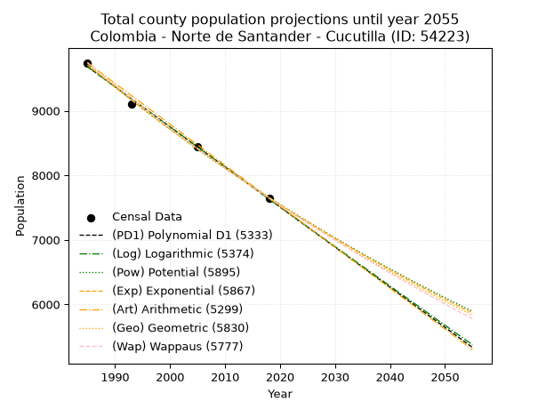
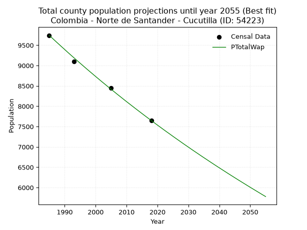
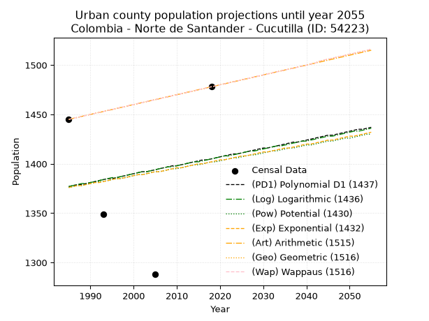
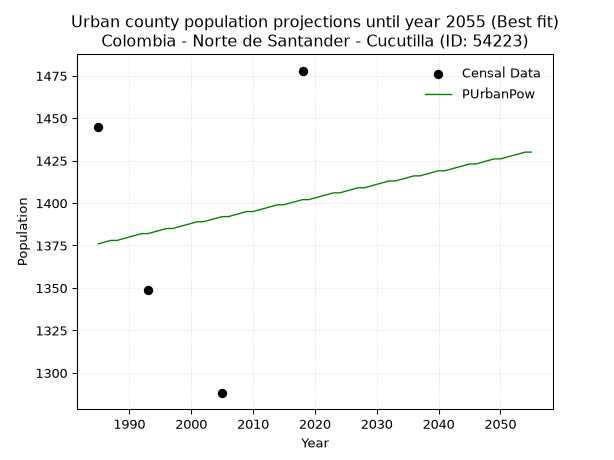
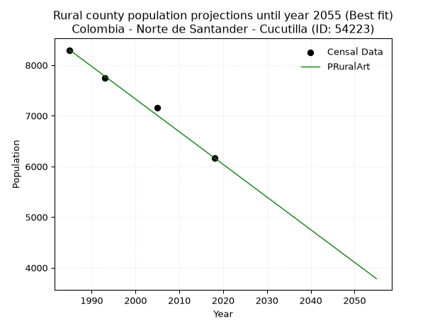

<div align="center">


</div>

# 📜 _“Population and Public Services Demand Projections (PPSD) until Year 2050 for Colombia - Norte de Santander - Cucutilla (ID: 54223)”_
Keywords: `population` `public-service` `projection` `lineal` `polynomial` `logarithmic` `potential` `exponential` `arithmetic` `geometric` `wappaus` `dane` `colombia` `south-america`

PPSD are analytical estimates used by governments and planners to anticipate future changes in population size, age distribution, and the resulting community needs for utilities, healthcare, education, and infrastructure as sizing future water treatment facilities, electrical grids, and road networks based on spatial growth.

<div align="center">

</img>

</div>


> **General running parameters**: • app_version: _v20260806_. • Python version: _3.14.7_. • Pandas version: _3.0.5_. • NumPy version: _2.5.1_. • Creates, save and include plots into reports (create_plot): _False_. • Projection until year: _2050_. • Process polynomial degree 2 and up: _False_. • Process Wappaus: _True_. • Process Wappaus: _True_. • Set negative values to zero: _True_. • Set infinite values to zero: _True_. • Drop dataset notes: _True_. 
<div align="center">

Maps & GIS Layers: [:earth_americas:Google](http://maps.google.com/maps?q=7.539632731,-72.7728156) [:earth_americas:OSM](https://www.openstreetmap.org/#map=18/7.539632731/-72.7728156&layers=P) [:earth_americas:Bing](https://www.bing.com/maps?cp=7.539632731~-72.7728156&lvl=18) [:earth_americas:Apple](https://maps.apple.com/frame?center=7.539632731%2C-72.7728156&span=0.003%2C0.006) [:earth_americas:GISMobile](https://github.com/rcfdtools/R.GISMobile/blob/main/file/gis/CountyLayer_CO/Readme.md)

</div>


<div align="center">

```geojson
{
  "type": "Feature",
  "geometry": {
    "type": "Point", 
    "coordinates": [-72.7728156, 7.539632731]
  }, 
  "properties": {
    "Name": "Colombia - Norte de Santander - Cucutilla (ID: 54223)"
  }
}
```

</div>


## 0. Census Data (4 records)

Census data are official statistics collected by a government about the people and housing in a country. They usually include counts of total population, age, sex, race, income, education, and jobs.

📅Global census file: [Population.xlsx](../data/Population.xlsx)

| Source   |   Year |   CountryID | CountryName   |   StateID | StateName          |   CountyID | CountyName   |   PTotal |   PUrban |   PRural |
|:---------|-------:|------------:|:--------------|----------:|:-------------------|-----------:|:-------------|---------:|---------:|---------:|
| DANE     |   1985 |          57 | Colombia      |        54 | Norte de Santander |      54223 | Cucutilla    |     9743 |     1445 |     8298 |
| DANE     |   1993 |          57 | Colombia      |        54 | Norte de Santander |      54223 | Cucutilla    |     9102 |     1349 |     7753 |
| DANE     |   2005 |          57 | Colombia      |        54 | Norte de Santander |      54223 | Cucutilla    |     8447 |     1288 |     7159 |
| DANE     |   2018 |          57 | Colombia      |        54 | Norte de Santander |      54223 | Cucutilla    |     7648 |     1478 |     6170 |

> 🔥Some records could had specific notes about the registered values or the corresponding urban or rural distribution.

📅[SUI-RUPS](https://www.datos.gov.co/Hacienda-y-Cr-dito-P-blico/Registro-nico-de-Prestadores-de-Servicios-P-blicos/4qkq-csdn/about_data) - Local public utility companies: [RUPS.csv](../data/RUPS.csv)

 | SERVICIO       | ESTADO    | NOMBRE                                    | NIT         | DEPARTAMENTO_DOMICILIO   | MUNICIPIO_DOMICILIO   | DIRECCION                             |   TELEFONO | EMAIL                                      | TIPO_PRESTADOR                 | CLASIFICACION                 |
|:---------------|:----------|:------------------------------------------|:------------|:-------------------------|:----------------------|:--------------------------------------|-----------:|:-------------------------------------------|:-------------------------------|:------------------------------|
| ACUEDUCTO      | OPERATIVA | JUNTA PROBIENESTAR SOCIAL DE CUCUTILLA    | 807003811-8 | NORTE DE SANTANDER       | CUCUTILLA             | AV 3 4 40 KDX 141 BARRIO SOGAMOSO     |    3133927 | aguacucutilla2020@gmail.com                | ORGANIZACION AUTORIZADA        | MENOR O IGUAL A 2500 USUARIOS |
| ALCANTARILLADO | OPERATIVA | UNIDAD DE SERVICIOS PUBLICOS DE CUCUTILLA | 800013237-7 | NORTE DE SANTANDER       | CUCUTILLA             | Carrera 3 con cll 3 Palacio Municipal |    5677248 | alcaldia@cucutilla-nortedesantander.gov.co | MUNICIPIO (PRESTACIÓN DIRECTA) | MENOR O IGUAL A 2500 USUARIOS |

## 1. Total

### 1.1. Coefficients and Parameters

* (PD1) Polynomial Deg 1: -62.13568847852215, 133021.91087916394 (lineal)
* (Log) Logarithmic: -124384.04206763265, 954179.1005072336
* (Pow) Potential: -14.405936300468161, 51.49460820999449
* (Exp) Exponential: -0.007197058449990497, 15544864079.02427
* (Art) Arithmetic: Year diff. 2018 - 1985 = 33, Population diff. 7648 - 9743 = -2095, Annual growth = -63.484848484848484
* (Geo) Geometric: Year diff. 2018 - 1985 = 33, Population diff. 7648 - 9743 = -2095, Annual growth % = -0.007309665690574452
* (Wap) Wappaus: i = -0.7300885341251048, Condition values only valid for < 200)

<sub>
Wappaus condition values: ['-0.00', '-0.73', '-1.46', '-2.19', '-2.92', '-3.65', '-4.38', '-5.11', '-5.84', '-6.57', '-7.30', '-8.03', '-8.76', '-9.49', '-10.22', '-10.95', '-11.68', '-12.41', '-13.14', '-13.87', '-14.60', '-15.33', '-16.06', '-16.79', '-17.52', '-18.25', '-18.98', '-19.71', '-20.44', '-21.17', '-21.90', '-22.63', '-23.36', '-24.09', '-24.82', '-25.55', '-26.28', '-27.01', '-27.74', '-28.47', '-29.20', '-29.93', '-30.66', '-31.39', '-32.12', '-32.85', '-33.58', '-34.31', '-35.04', '-35.77', '-36.50', '-37.23', '-37.96', '-38.69', '-39.42', '-40.15', '-40.88', '-41.62', '-42.35', '-43.08', '-43.81', '-44.54', '-45.27', '-46.00', '-46.73', '-47.46']
</sub>


### 1.2. Projected Dataset

|   Year |   CountyID |   PTotalPD1 |   PTotalLog |   PTotalPow |   PTotalExp |   PTotalArt |   PTotalGeo |   PTotalWap |
|-------:|-----------:|------------:|------------:|------------:|------------:|------------:|------------:|------------:|
|   1985 |      54223 |        9683 |        9685 |        9711 |        9709 |        9743 |        9743 |        9743 |
|   1986 |      54223 |        9620 |        9622 |        9641 |        9640 |        9680 |        9672 |        9672 |
|   1987 |      54223 |        9558 |        9559 |        9571 |        9571 |        9616 |        9601 |        9602 |
|   1988 |      54223 |        9496 |        9497 |        9502 |        9502 |        9553 |        9531 |        9532 |
|   1989 |      54223 |        9434 |        9434 |        9434 |        9434 |        9489 |        9461 |        9463 |
|   1990 |      54223 |        9372 |        9372 |        9366 |        9366 |        9426 |        9392 |        9394 |
|   1991 |      54223 |        9310 |        9309 |        9298 |        9299 |        9362 |        9323 |        9325 |
|   1992 |      54223 |        9248 |        9247 |        9231 |        9232 |        9299 |        9255 |        9257 |
|   1993 |      54223 |        9185 |        9184 |        9165 |        9166 |        9235 |        9188 |        9190 |
|   1994 |      54223 |        9123 |        9122 |        9099 |        9100 |        9172 |        9120 |        9123 |
|   1995 |      54223 |        9061 |        9059 |        9033 |        9035 |        9108 |        9054 |        9057 |
|   1996 |      54223 |        8999 |        8997 |        8968 |        8970 |        9045 |        8988 |        8991 |
|   1997 |      54223 |        8937 |        8935 |        8904 |        8906 |        8981 |        8922 |        8925 |
|   1998 |      54223 |        8875 |        8873 |        8840 |        8842 |        8918 |        8857 |        8860 |
|   1999 |      54223 |        8813 |        8810 |        8776 |        8779 |        8854 |        8792 |        8796 |
|   2000 |      54223 |        8751 |        8748 |        8713 |        8716 |        8791 |        8728 |        8731 |
|   2001 |      54223 |        8688 |        8686 |        8651 |        8653 |        8727 |        8664 |        8668 |
|   2002 |      54223 |        8626 |        8624 |        8589 |        8591 |        8664 |        8601 |        8604 |
|   2003 |      54223 |        8564 |        8562 |        8527 |        8530 |        8600 |        8538 |        8542 |
|   2004 |      54223 |        8502 |        8500 |        8466 |        8468 |        8537 |        8475 |        8479 |
|   2005 |      54223 |        8440 |        8438 |        8405 |        8408 |        8473 |        8413 |        8417 |
|   2006 |      54223 |        8378 |        8376 |        8345 |        8347 |        8410 |        8352 |        8356 |
|   2007 |      54223 |        8316 |        8314 |        8286 |        8287 |        8346 |        8291 |        8294 |
|   2008 |      54223 |        8253 |        8252 |        8226 |        8228 |        8283 |        8230 |        8234 |
|   2009 |      54223 |        8191 |        8190 |        8168 |        8169 |        8219 |        8170 |        8173 |
|   2010 |      54223 |        8129 |        8128 |        8109 |        8110 |        8156 |        8110 |        8113 |
|   2011 |      54223 |        8067 |        8066 |        8051 |        8052 |        8092 |        8051 |        8054 |
|   2012 |      54223 |        8005 |        8004 |        7994 |        7995 |        8029 |        7992 |        7995 |
|   2013 |      54223 |        7943 |        7942 |        7937 |        7937 |        7965 |        7934 |        7936 |
|   2014 |      54223 |        7881 |        7880 |        7880 |        7880 |        7902 |        7876 |        7878 |
|   2015 |      54223 |        7818 |        7819 |        7824 |        7824 |        7838 |        7818 |        7820 |
|   2016 |      54223 |        7756 |        7757 |        7768 |        7768 |        7775 |        7761 |        7762 |
|   2017 |      54223 |        7694 |        7695 |        7713 |        7712 |        7711 |        7704 |        7705 |
|   2018 |      54223 |        7632 |        7634 |        7658 |        7657 |        7648 |        7648 |        7648 |
|   2019 |      54223 |        7570 |        7572 |        7604 |        7602 |        7585 |        7592 |        7592 |
|   2020 |      54223 |        7508 |        7510 |        7550 |        7547 |        7521 |        7537 |        7535 |
|   2021 |      54223 |        7446 |        7449 |        7496 |        7493 |        7458 |        7482 |        7480 |
|   2022 |      54223 |        7384 |        7387 |        7443 |        7439 |        7394 |        7427 |        7424 |
|   2023 |      54223 |        7321 |        7326 |        7390 |        7386 |        7331 |        7373 |        7369 |
|   2024 |      54223 |        7259 |        7264 |        7338 |        7333 |        7267 |        7319 |        7315 |
|   2025 |      54223 |        7197 |        7203 |        7286 |        7280 |        7204 |        7265 |        7260 |
|   2026 |      54223 |        7135 |        7142 |        7234 |        7228 |        7140 |        7212 |        7206 |
|   2027 |      54223 |        7073 |        7080 |        7183 |        7176 |        7077 |        7159 |        7153 |
|   2028 |      54223 |        7011 |        7019 |        7132 |        7125 |        7013 |        7107 |        7099 |
|   2029 |      54223 |        6949 |        6958 |        7081 |        7074 |        6950 |        7055 |        7046 |
|   2030 |      54223 |        6886 |        6896 |        7031 |        7023 |        6886 |        7003 |        6994 |
|   2031 |      54223 |        6824 |        6835 |        6982 |        6973 |        6823 |        6952 |        6941 |
|   2032 |      54223 |        6762 |        6774 |        6932 |        6923 |        6759 |        6901 |        6889 |
|   2033 |      54223 |        6700 |        6713 |        6883 |        6873 |        6696 |        6851 |        6838 |
|   2034 |      54223 |        6638 |        6651 |        6835 |        6824 |        6632 |        6801 |        6786 |
|   2035 |      54223 |        6576 |        6590 |        6786 |        6775 |        6569 |        6751 |        6735 |
|   2036 |      54223 |        6514 |        6529 |        6739 |        6726 |        6505 |        6702 |        6685 |
|   2037 |      54223 |        6452 |        6468 |        6691 |        6678 |        6442 |        6653 |        6634 |
|   2038 |      54223 |        6389 |        6407 |        6644 |        6630 |        6378 |        6604 |        6584 |
|   2039 |      54223 |        6327 |        6346 |        6597 |        6583 |        6315 |        6556 |        6534 |
|   2040 |      54223 |        6265 |        6285 |        6551 |        6535 |        6251 |        6508 |        6485 |
|   2041 |      54223 |        6203 |        6224 |        6505 |        6489 |        6188 |        6460 |        6436 |
|   2042 |      54223 |        6141 |        6163 |        6459 |        6442 |        6124 |        6413 |        6387 |
|   2043 |      54223 |        6079 |        6102 |        6413 |        6396 |        6061 |        6366 |        6338 |
|   2044 |      54223 |        6017 |        6041 |        6368 |        6350 |        5997 |        6320 |        6290 |
|   2045 |      54223 |        5954 |        5981 |        6324 |        6304 |        5934 |        6274 |        6242 |
|   2046 |      54223 |        5892 |        5920 |        6279 |        6259 |        5870 |        6228 |        6194 |
|   2047 |      54223 |        5830 |        5859 |        6235 |        6214 |        5807 |        6182 |        6147 |
|   2048 |      54223 |        5768 |        5798 |        6192 |        6170 |        5743 |        6137 |        6100 |
|   2049 |      54223 |        5706 |        5737 |        6148 |        6126 |        5680 |        6092 |        6053 |
|   2050 |      54223 |        5644 |        5677 |        6105 |        6082 |        5616 |        6048 |        6006 |
<div align="center">

</img>

</div>


### 1.3. Best fit with absolute and relative error (%)

Relative error puts that difference into context by dividing the absolute error by the true value, creating a unitless ratio or percentage that shows the scale of the mistake.

Absolute and relative error

|   Year | Source   |   CountryID | CountryName   |   StateID | StateName          |   CountyID_x | CountyName   |   PTotal |   PUrban |   PRural |   CountyID_y |   PTotalPD1 |   PTotalLog |   PTotalPow |   PTotalExp |   PTotalArt |   PTotalGeo |   PTotalWap |   PTotalPD1AbsError |   PTotalLogAbsError |   PTotalPowAbsError |   PTotalExpAbsError |   PTotalArtAbsError |   PTotalGeoAbsError |   PTotalWapAbsError |   PTotalPD1RelError |   PTotalLogRelError |   PTotalPowRelError |   PTotalExpRelError |   PTotalArtRelError |   PTotalGeoRelError |   PTotalWapRelError |
|-------:|:---------|------------:|:--------------|----------:|:-------------------|-------------:|:-------------|---------:|---------:|---------:|-------------:|------------:|------------:|------------:|------------:|------------:|------------:|------------:|--------------------:|--------------------:|--------------------:|--------------------:|--------------------:|--------------------:|--------------------:|--------------------:|--------------------:|--------------------:|--------------------:|--------------------:|--------------------:|--------------------:|
|   1985 | DANE     |          57 | Colombia      |        54 | Norte de Santander |        54223 | Cucutilla    |     9743 |     1445 |     8298 |        54223 |        9683 |        9685 |        9711 |        9709 |        9743 |        9743 |        9743 |                  60 |                  58 |                  32 |                  34 |                   0 |                   0 |                   0 |           0.615827  |            0.595299 |            0.328441 |            0.348968 |            0        |            0        |            0        |
|   1993 | DANE     |          57 | Colombia      |        54 | Norte de Santander |        54223 | Cucutilla    |     9102 |     1349 |     7753 |        54223 |        9185 |        9184 |        9165 |        9166 |        9235 |        9188 |        9190 |                  83 |                  82 |                  63 |                  64 |                 133 |                  86 |                  88 |           0.911887  |            0.900901 |            0.692156 |            0.703142 |            1.46122  |            0.944847 |            0.96682  |
|   2005 | DANE     |          57 | Colombia      |        54 | Norte de Santander |        54223 | Cucutilla    |     8447 |     1288 |     7159 |        54223 |        8440 |        8438 |        8405 |        8408 |        8473 |        8413 |        8417 |                   7 |                   9 |                  42 |                  39 |                  26 |                  34 |                  30 |           0.0828697 |            0.106547 |            0.497218 |            0.461702 |            0.307802 |            0.40251  |            0.355156 |
|   2018 | DANE     |          57 | Colombia      |        54 | Norte de Santander |        54223 | Cucutilla    |     7648 |     1478 |     6170 |        54223 |        7632 |        7634 |        7658 |        7657 |        7648 |        7648 |        7648 |                  16 |                  14 |                  10 |                   9 |                   0 |                   0 |                   0 |           0.209205  |            0.183054 |            0.130753 |            0.117678 |            0        |            0        |            0        |

Relative error mean

| Method    |   RelError | Best   |
|:----------|-----------:|:-------|
| PTotalPD1 |   0.454947 |        |
| PTotalLog |   0.44645  |        |
| PTotalPow |   0.412142 |        |
| PTotalExp |   0.407873 |        |
| PTotalArt |   0.442255 |        |
| PTotalGeo |   0.336839 |        |
| PTotalWap |   0.330494 | True   |

💙Best method: _**PTotalWap**_
<div align="center">

</img>

</div>


### 1.4. Fresh water supply demand in liters per capita per day (lpcd)

The fresh water supply demand typically ranges from 100 to 300 liters per capita per day (lpcd) for standard domestic and municipal planning, though absolute survival minimums set by the World Health Organization are as low as 7.5 to 20 liters per day, and total consumption in high-income nations can exceed 400 liters.

> `CZ`: Level in meters above the sea level (masl)<br> `WS`: Fresh water supply demand in liters per capita per day (lpcd or l/h/d)<br> `WSAll`: Zonal fresh water supply demand in liters per second (l/s)<br> `A`: Zonal area in square meters<br> `DP`: Population density (people/hectare or p/ha)

Reference values (RAS Colombia)

|    CZ |   WS |
|------:|-----:|
|  1000 |  120 |
|  2000 |  130 |
| 99999 |  140 |

County shapefile geometry properties and water supply values

|   CountyID |      ATotal |   CZTotal |   WSTotal |
|-----------:|------------:|----------:|----------:|
|      54223 | 3.74131e+08 |   2346.08 |       140 |

Projected values for best method: PTotalWap

|   CountyID |   Year |   PTotalWap |   DPTotal |   WSTotal |   WSTotalAll |
|-----------:|-------:|------------:|----------:|----------:|-------------:|
|      54223 |   1985 |        9743 |      0.26 |       140 |     15.7873  |
|      54223 |   1986 |        9672 |      0.26 |       140 |     15.6722  |
|      54223 |   1987 |        9602 |      0.26 |       140 |     15.5588  |
|      54223 |   1988 |        9532 |      0.25 |       140 |     15.4454  |
|      54223 |   1989 |        9463 |      0.25 |       140 |     15.3336  |
|      54223 |   1990 |        9394 |      0.25 |       140 |     15.2218  |
|      54223 |   1991 |        9325 |      0.25 |       140 |     15.11    |
|      54223 |   1992 |        9257 |      0.25 |       140 |     14.9998  |
|      54223 |   1993 |        9190 |      0.25 |       140 |     14.8912  |
|      54223 |   1994 |        9123 |      0.24 |       140 |     14.7826  |
|      54223 |   1995 |        9057 |      0.24 |       140 |     14.6757  |
|      54223 |   1996 |        8991 |      0.24 |       140 |     14.5687  |
|      54223 |   1997 |        8925 |      0.24 |       140 |     14.4618  |
|      54223 |   1998 |        8860 |      0.24 |       140 |     14.3565  |
|      54223 |   1999 |        8796 |      0.24 |       140 |     14.2528  |
|      54223 |   2000 |        8731 |      0.23 |       140 |     14.1475  |
|      54223 |   2001 |        8668 |      0.23 |       140 |     14.0454  |
|      54223 |   2002 |        8604 |      0.23 |       140 |     13.9417  |
|      54223 |   2003 |        8542 |      0.23 |       140 |     13.8412  |
|      54223 |   2004 |        8479 |      0.23 |       140 |     13.7391  |
|      54223 |   2005 |        8417 |      0.22 |       140 |     13.6387  |
|      54223 |   2006 |        8356 |      0.22 |       140 |     13.5398  |
|      54223 |   2007 |        8294 |      0.22 |       140 |     13.4394  |
|      54223 |   2008 |        8234 |      0.22 |       140 |     13.3421  |
|      54223 |   2009 |        8173 |      0.22 |       140 |     13.2433  |
|      54223 |   2010 |        8113 |      0.22 |       140 |     13.1461  |
|      54223 |   2011 |        8054 |      0.22 |       140 |     13.0505  |
|      54223 |   2012 |        7995 |      0.21 |       140 |     12.9549  |
|      54223 |   2013 |        7936 |      0.21 |       140 |     12.8593  |
|      54223 |   2014 |        7878 |      0.21 |       140 |     12.7653  |
|      54223 |   2015 |        7820 |      0.21 |       140 |     12.6713  |
|      54223 |   2016 |        7762 |      0.21 |       140 |     12.5773  |
|      54223 |   2017 |        7705 |      0.21 |       140 |     12.485   |
|      54223 |   2018 |        7648 |      0.2  |       140 |     12.3926  |
|      54223 |   2019 |        7592 |      0.2  |       140 |     12.3019  |
|      54223 |   2020 |        7535 |      0.2  |       140 |     12.2095  |
|      54223 |   2021 |        7480 |      0.2  |       140 |     12.1204  |
|      54223 |   2022 |        7424 |      0.2  |       140 |     12.0296  |
|      54223 |   2023 |        7369 |      0.2  |       140 |     11.9405  |
|      54223 |   2024 |        7315 |      0.2  |       140 |     11.853   |
|      54223 |   2025 |        7260 |      0.19 |       140 |     11.7639  |
|      54223 |   2026 |        7206 |      0.19 |       140 |     11.6764  |
|      54223 |   2027 |        7153 |      0.19 |       140 |     11.5905  |
|      54223 |   2028 |        7099 |      0.19 |       140 |     11.503   |
|      54223 |   2029 |        7046 |      0.19 |       140 |     11.4171  |
|      54223 |   2030 |        6994 |      0.19 |       140 |     11.3329  |
|      54223 |   2031 |        6941 |      0.19 |       140 |     11.247   |
|      54223 |   2032 |        6889 |      0.18 |       140 |     11.1627  |
|      54223 |   2033 |        6838 |      0.18 |       140 |     11.0801  |
|      54223 |   2034 |        6786 |      0.18 |       140 |     10.9958  |
|      54223 |   2035 |        6735 |      0.18 |       140 |     10.9132  |
|      54223 |   2036 |        6685 |      0.18 |       140 |     10.8322  |
|      54223 |   2037 |        6634 |      0.18 |       140 |     10.7495  |
|      54223 |   2038 |        6584 |      0.18 |       140 |     10.6685  |
|      54223 |   2039 |        6534 |      0.17 |       140 |     10.5875  |
|      54223 |   2040 |        6485 |      0.17 |       140 |     10.5081  |
|      54223 |   2041 |        6436 |      0.17 |       140 |     10.4287  |
|      54223 |   2042 |        6387 |      0.17 |       140 |     10.3493  |
|      54223 |   2043 |        6338 |      0.17 |       140 |     10.2699  |
|      54223 |   2044 |        6290 |      0.17 |       140 |     10.1921  |
|      54223 |   2045 |        6242 |      0.17 |       140 |     10.1144  |
|      54223 |   2046 |        6194 |      0.17 |       140 |     10.0366  |
|      54223 |   2047 |        6147 |      0.16 |       140 |      9.96042 |
|      54223 |   2048 |        6100 |      0.16 |       140 |      9.88426 |
|      54223 |   2049 |        6053 |      0.16 |       140 |      9.8081  |
|      54223 |   2050 |        6006 |      0.16 |       140 |      9.73194 |

## 2. Urban

### 2.1. Coefficients and Parameters

* (PD1) Polynomial Deg 1: 0.8606985146526507, -331.6122039339648 (lineal)
* (Log) Logarithmic: 1695.0697554941178, -11494.238794947327
* (Pow) Potential: 1.1141231712581319, -0.535437556803181
* (Exp) Exponential: 0.0005666346729572426, 446.8207965459867
* (Art) Arithmetic: Year diff. 2018 - 1985 = 33, Population diff. 1478 - 1445 = 33, Annual growth = 1.0
* (Geo) Geometric: Year diff. 2018 - 1985 = 33, Population diff. 1478 - 1445 = 33, Annual growth % = 0.0006844917625372648
* (Wap) Wappaus: i = 0.06842285323297982, Condition values only valid for < 200)

<sub>
Wappaus condition values: ['0.00', '0.07', '0.14', '0.21', '0.27', '0.34', '0.41', '0.48', '0.55', '0.62', '0.68', '0.75', '0.82', '0.89', '0.96', '1.03', '1.09', '1.16', '1.23', '1.30', '1.37', '1.44', '1.51', '1.57', '1.64', '1.71', '1.78', '1.85', '1.92', '1.98', '2.05', '2.12', '2.19', '2.26', '2.33', '2.39', '2.46', '2.53', '2.60', '2.67', '2.74', '2.81', '2.87', '2.94', '3.01', '3.08', '3.15', '3.22', '3.28', '3.35', '3.42', '3.49', '3.56', '3.63', '3.69', '3.76', '3.83', '3.90', '3.97', '4.04', '4.11', '4.17', '4.24', '4.31', '4.38', '4.45']
</sub>


### 2.2. Projected Dataset

|   Year |   CountyID |   PUrbanPD1 |   PUrbanLog |   PUrbanPow |   PUrbanExp |   PUrbanArt |   PUrbanGeo |   PUrbanWap |
|-------:|-----------:|------------:|------------:|------------:|------------:|------------:|------------:|------------:|
|   1985 |      54223 |        1377 |        1377 |        1376 |        1376 |        1445 |        1445 |        1445 |
|   1986 |      54223 |        1378 |        1378 |        1377 |        1377 |        1446 |        1446 |        1446 |
|   1987 |      54223 |        1379 |        1379 |        1378 |        1378 |        1447 |        1447 |        1447 |
|   1988 |      54223 |        1379 |        1380 |        1378 |        1378 |        1448 |        1448 |        1448 |
|   1989 |      54223 |        1380 |        1380 |        1379 |        1379 |        1449 |        1449 |        1449 |
|   1990 |      54223 |        1381 |        1381 |        1380 |        1380 |        1450 |        1450 |        1450 |
|   1991 |      54223 |        1382 |        1382 |        1381 |        1381 |        1451 |        1451 |        1451 |
|   1992 |      54223 |        1383 |        1383 |        1382 |        1381 |        1452 |        1452 |        1452 |
|   1993 |      54223 |        1384 |        1384 |        1382 |        1382 |        1453 |        1453 |        1453 |
|   1994 |      54223 |        1385 |        1385 |        1383 |        1383 |        1454 |        1454 |        1454 |
|   1995 |      54223 |        1385 |        1386 |        1384 |        1384 |        1455 |        1455 |        1455 |
|   1996 |      54223 |        1386 |        1386 |        1385 |        1385 |        1456 |        1456 |        1456 |
|   1997 |      54223 |        1387 |        1387 |        1385 |        1385 |        1457 |        1457 |        1457 |
|   1998 |      54223 |        1388 |        1388 |        1386 |        1386 |        1458 |        1458 |        1458 |
|   1999 |      54223 |        1389 |        1389 |        1387 |        1387 |        1459 |        1459 |        1459 |
|   2000 |      54223 |        1390 |        1390 |        1388 |        1388 |        1460 |        1460 |        1460 |
|   2001 |      54223 |        1391 |        1391 |        1389 |        1389 |        1461 |        1461 |        1461 |
|   2002 |      54223 |        1392 |        1392 |        1389 |        1389 |        1462 |        1462 |        1462 |
|   2003 |      54223 |        1392 |        1392 |        1390 |        1390 |        1463 |        1463 |        1463 |
|   2004 |      54223 |        1393 |        1393 |        1391 |        1391 |        1464 |        1464 |        1464 |
|   2005 |      54223 |        1394 |        1394 |        1392 |        1392 |        1465 |        1465 |        1465 |
|   2006 |      54223 |        1395 |        1395 |        1392 |        1392 |        1466 |        1466 |        1466 |
|   2007 |      54223 |        1396 |        1396 |        1393 |        1393 |        1467 |        1467 |        1467 |
|   2008 |      54223 |        1397 |        1397 |        1394 |        1394 |        1468 |        1468 |        1468 |
|   2009 |      54223 |        1398 |        1397 |        1395 |        1395 |        1469 |        1469 |        1469 |
|   2010 |      54223 |        1398 |        1398 |        1395 |        1396 |        1470 |        1470 |        1470 |
|   2011 |      54223 |        1399 |        1399 |        1396 |        1396 |        1471 |        1471 |        1471 |
|   2012 |      54223 |        1400 |        1400 |        1397 |        1397 |        1472 |        1472 |        1472 |
|   2013 |      54223 |        1401 |        1401 |        1398 |        1398 |        1473 |        1473 |        1473 |
|   2014 |      54223 |        1402 |        1402 |        1399 |        1399 |        1474 |        1474 |        1474 |
|   2015 |      54223 |        1403 |        1402 |        1399 |        1400 |        1475 |        1475 |        1475 |
|   2016 |      54223 |        1404 |        1403 |        1400 |        1400 |        1476 |        1476 |        1476 |
|   2017 |      54223 |        1404 |        1404 |        1401 |        1401 |        1477 |        1477 |        1477 |
|   2018 |      54223 |        1405 |        1405 |        1402 |        1402 |        1478 |        1478 |        1478 |
|   2019 |      54223 |        1406 |        1406 |        1402 |        1403 |        1479 |        1479 |        1479 |
|   2020 |      54223 |        1407 |        1407 |        1403 |        1404 |        1480 |        1480 |        1480 |
|   2021 |      54223 |        1408 |        1408 |        1404 |        1404 |        1481 |        1481 |        1481 |
|   2022 |      54223 |        1409 |        1408 |        1405 |        1405 |        1482 |        1482 |        1482 |
|   2023 |      54223 |        1410 |        1409 |        1406 |        1406 |        1483 |        1483 |        1483 |
|   2024 |      54223 |        1410 |        1410 |        1406 |        1407 |        1484 |        1484 |        1484 |
|   2025 |      54223 |        1411 |        1411 |        1407 |        1408 |        1485 |        1485 |        1485 |
|   2026 |      54223 |        1412 |        1412 |        1408 |        1408 |        1486 |        1486 |        1486 |
|   2027 |      54223 |        1413 |        1413 |        1409 |        1409 |        1487 |        1487 |        1487 |
|   2028 |      54223 |        1414 |        1413 |        1409 |        1410 |        1488 |        1488 |        1488 |
|   2029 |      54223 |        1415 |        1414 |        1410 |        1411 |        1489 |        1489 |        1489 |
|   2030 |      54223 |        1416 |        1415 |        1411 |        1412 |        1490 |        1490 |        1490 |
|   2031 |      54223 |        1416 |        1416 |        1412 |        1412 |        1491 |        1491 |        1491 |
|   2032 |      54223 |        1417 |        1417 |        1413 |        1413 |        1492 |        1492 |        1492 |
|   2033 |      54223 |        1418 |        1418 |        1413 |        1414 |        1493 |        1493 |        1493 |
|   2034 |      54223 |        1419 |        1418 |        1414 |        1415 |        1494 |        1494 |        1494 |
|   2035 |      54223 |        1420 |        1419 |        1415 |        1416 |        1495 |        1495 |        1495 |
|   2036 |      54223 |        1421 |        1420 |        1416 |        1416 |        1496 |        1496 |        1496 |
|   2037 |      54223 |        1422 |        1421 |        1416 |        1417 |        1497 |        1497 |        1497 |
|   2038 |      54223 |        1422 |        1422 |        1417 |        1418 |        1498 |        1498 |        1498 |
|   2039 |      54223 |        1423 |        1423 |        1418 |        1419 |        1499 |        1499 |        1499 |
|   2040 |      54223 |        1424 |        1423 |        1419 |        1420 |        1500 |        1500 |        1500 |
|   2041 |      54223 |        1425 |        1424 |        1419 |        1420 |        1501 |        1501 |        1501 |
|   2042 |      54223 |        1426 |        1425 |        1420 |        1421 |        1502 |        1502 |        1502 |
|   2043 |      54223 |        1427 |        1426 |        1421 |        1422 |        1503 |        1504 |        1504 |
|   2044 |      54223 |        1428 |        1427 |        1422 |        1423 |        1504 |        1505 |        1505 |
|   2045 |      54223 |        1429 |        1428 |        1423 |        1424 |        1505 |        1506 |        1506 |
|   2046 |      54223 |        1429 |        1428 |        1423 |        1424 |        1506 |        1507 |        1507 |
|   2047 |      54223 |        1430 |        1429 |        1424 |        1425 |        1507 |        1508 |        1508 |
|   2048 |      54223 |        1431 |        1430 |        1425 |        1426 |        1508 |        1509 |        1509 |
|   2049 |      54223 |        1432 |        1431 |        1426 |        1427 |        1509 |        1510 |        1510 |
|   2050 |      54223 |        1433 |        1432 |        1426 |        1428 |        1510 |        1511 |        1511 |
<div align="center">

</img>

</div>


### 2.3. Best fit with absolute and relative error (%)

Relative error puts that difference into context by dividing the absolute error by the true value, creating a unitless ratio or percentage that shows the scale of the mistake.

Absolute and relative error

|   Year | Source   |   CountryID | CountryName   |   StateID | StateName          |   CountyID_x | CountyName   |   PTotal |   PUrban |   PRural |   CountyID_y |   PUrbanPD1 |   PUrbanLog |   PUrbanPow |   PUrbanExp |   PUrbanArt |   PUrbanGeo |   PUrbanWap |   PUrbanPD1AbsError |   PUrbanLogAbsError |   PUrbanPowAbsError |   PUrbanExpAbsError |   PUrbanArtAbsError |   PUrbanGeoAbsError |   PUrbanWapAbsError |   PUrbanPD1RelError |   PUrbanLogRelError |   PUrbanPowRelError |   PUrbanExpRelError |   PUrbanArtRelError |   PUrbanGeoRelError |   PUrbanWapRelError |
|-------:|:---------|------------:|:--------------|----------:|:-------------------|-------------:|:-------------|---------:|---------:|---------:|-------------:|------------:|------------:|------------:|------------:|------------:|------------:|------------:|--------------------:|--------------------:|--------------------:|--------------------:|--------------------:|--------------------:|--------------------:|--------------------:|--------------------:|--------------------:|--------------------:|--------------------:|--------------------:|--------------------:|
|   1985 | DANE     |          57 | Colombia      |        54 | Norte de Santander |        54223 | Cucutilla    |     9743 |     1445 |     8298 |        54223 |        1377 |        1377 |        1376 |        1376 |        1445 |        1445 |        1445 |                  68 |                  68 |                  69 |                  69 |                   0 |                   0 |                   0 |             4.70588 |             4.70588 |             4.77509 |             4.77509 |             0       |             0       |             0       |
|   1993 | DANE     |          57 | Colombia      |        54 | Norte de Santander |        54223 | Cucutilla    |     9102 |     1349 |     7753 |        54223 |        1384 |        1384 |        1382 |        1382 |        1453 |        1453 |        1453 |                  35 |                  35 |                  33 |                  33 |                 104 |                 104 |                 104 |             2.59451 |             2.59451 |             2.44626 |             2.44626 |             7.70941 |             7.70941 |             7.70941 |
|   2005 | DANE     |          57 | Colombia      |        54 | Norte de Santander |        54223 | Cucutilla    |     8447 |     1288 |     7159 |        54223 |        1394 |        1394 |        1392 |        1392 |        1465 |        1465 |        1465 |                 106 |                 106 |                 104 |                 104 |                 177 |                 177 |                 177 |             8.22981 |             8.22981 |             8.07453 |             8.07453 |            13.7422  |            13.7422  |            13.7422  |
|   2018 | DANE     |          57 | Colombia      |        54 | Norte de Santander |        54223 | Cucutilla    |     7648 |     1478 |     6170 |        54223 |        1405 |        1405 |        1402 |        1402 |        1478 |        1478 |        1478 |                  73 |                  73 |                  76 |                  76 |                   0 |                   0 |                   0 |             4.93911 |             4.93911 |             5.14208 |             5.14208 |             0       |             0       |             0       |

Relative error mean

| Method    |   RelError | Best   |
|:----------|-----------:|:-------|
| PUrbanPD1 |    5.11733 |        |
| PUrbanLog |    5.11733 |        |
| PUrbanPow |    5.10949 | True   |
| PUrbanExp |    5.10949 | True   |
| PUrbanArt |    5.36291 |        |
| PUrbanGeo |    5.36291 |        |
| PUrbanWap |    5.36291 |        |

💙Best method: _**PUrbanPow**_
<div align="center">

</img>

</div>


### 2.4. Fresh water supply demand in liters per capita per day (lpcd)

The fresh water supply demand typically ranges from 100 to 300 liters per capita per day (lpcd) for standard domestic and municipal planning, though absolute survival minimums set by the World Health Organization are as low as 7.5 to 20 liters per day, and total consumption in high-income nations can exceed 400 liters.

> `CZ`: Level in meters above the sea level (masl)<br> `WS`: Fresh water supply demand in liters per capita per day (lpcd or l/h/d)<br> `WSAll`: Zonal fresh water supply demand in liters per second (l/s)<br> `A`: Zonal area in square meters<br> `DP`: Population density (people/hectare or p/ha)

Reference values (RAS Colombia)

|    CZ |   WS |
|------:|-----:|
|  1000 |  120 |
|  2000 |  130 |
| 99999 |  140 |

County shapefile geometry properties and water supply values

|   CountyID |   AUrban |   CZUrban |   WSUrban |
|-----------:|---------:|----------:|----------:|
|      54223 |   319293 |   1285.49 |       130 |

Projected values for best method: PUrbanPow

|   CountyID |   Year |   PUrbanPow |   DPUrban |   WSUrban |   WSUrbanAll |
|-----------:|-------:|------------:|----------:|----------:|-------------:|
|      54223 |   1985 |        1376 |     43.1  |       130 |      2.07037 |
|      54223 |   1986 |        1377 |     43.13 |       130 |      2.07187 |
|      54223 |   1987 |        1378 |     43.16 |       130 |      2.07338 |
|      54223 |   1988 |        1378 |     43.16 |       130 |      2.07338 |
|      54223 |   1989 |        1379 |     43.19 |       130 |      2.07488 |
|      54223 |   1990 |        1380 |     43.22 |       130 |      2.07639 |
|      54223 |   1991 |        1381 |     43.25 |       130 |      2.07789 |
|      54223 |   1992 |        1382 |     43.28 |       130 |      2.0794  |
|      54223 |   1993 |        1382 |     43.28 |       130 |      2.0794  |
|      54223 |   1994 |        1383 |     43.31 |       130 |      2.0809  |
|      54223 |   1995 |        1384 |     43.35 |       130 |      2.08241 |
|      54223 |   1996 |        1385 |     43.38 |       130 |      2.08391 |
|      54223 |   1997 |        1385 |     43.38 |       130 |      2.08391 |
|      54223 |   1998 |        1386 |     43.41 |       130 |      2.08542 |
|      54223 |   1999 |        1387 |     43.44 |       130 |      2.08692 |
|      54223 |   2000 |        1388 |     43.47 |       130 |      2.08843 |
|      54223 |   2001 |        1389 |     43.5  |       130 |      2.08993 |
|      54223 |   2002 |        1389 |     43.5  |       130 |      2.08993 |
|      54223 |   2003 |        1390 |     43.53 |       130 |      2.09144 |
|      54223 |   2004 |        1391 |     43.56 |       130 |      2.09294 |
|      54223 |   2005 |        1392 |     43.6  |       130 |      2.09444 |
|      54223 |   2006 |        1392 |     43.6  |       130 |      2.09444 |
|      54223 |   2007 |        1393 |     43.63 |       130 |      2.09595 |
|      54223 |   2008 |        1394 |     43.66 |       130 |      2.09745 |
|      54223 |   2009 |        1395 |     43.69 |       130 |      2.09896 |
|      54223 |   2010 |        1395 |     43.69 |       130 |      2.09896 |
|      54223 |   2011 |        1396 |     43.72 |       130 |      2.10046 |
|      54223 |   2012 |        1397 |     43.75 |       130 |      2.10197 |
|      54223 |   2013 |        1398 |     43.78 |       130 |      2.10347 |
|      54223 |   2014 |        1399 |     43.82 |       130 |      2.10498 |
|      54223 |   2015 |        1399 |     43.82 |       130 |      2.10498 |
|      54223 |   2016 |        1400 |     43.85 |       130 |      2.10648 |
|      54223 |   2017 |        1401 |     43.88 |       130 |      2.10799 |
|      54223 |   2018 |        1402 |     43.91 |       130 |      2.10949 |
|      54223 |   2019 |        1402 |     43.91 |       130 |      2.10949 |
|      54223 |   2020 |        1403 |     43.94 |       130 |      2.111   |
|      54223 |   2021 |        1404 |     43.97 |       130 |      2.1125  |
|      54223 |   2022 |        1405 |     44    |       130 |      2.114   |
|      54223 |   2023 |        1406 |     44.03 |       130 |      2.11551 |
|      54223 |   2024 |        1406 |     44.03 |       130 |      2.11551 |
|      54223 |   2025 |        1407 |     44.07 |       130 |      2.11701 |
|      54223 |   2026 |        1408 |     44.1  |       130 |      2.11852 |
|      54223 |   2027 |        1409 |     44.13 |       130 |      2.12002 |
|      54223 |   2028 |        1409 |     44.13 |       130 |      2.12002 |
|      54223 |   2029 |        1410 |     44.16 |       130 |      2.12153 |
|      54223 |   2030 |        1411 |     44.19 |       130 |      2.12303 |
|      54223 |   2031 |        1412 |     44.22 |       130 |      2.12454 |
|      54223 |   2032 |        1413 |     44.25 |       130 |      2.12604 |
|      54223 |   2033 |        1413 |     44.25 |       130 |      2.12604 |
|      54223 |   2034 |        1414 |     44.29 |       130 |      2.12755 |
|      54223 |   2035 |        1415 |     44.32 |       130 |      2.12905 |
|      54223 |   2036 |        1416 |     44.35 |       130 |      2.13056 |
|      54223 |   2037 |        1416 |     44.35 |       130 |      2.13056 |
|      54223 |   2038 |        1417 |     44.38 |       130 |      2.13206 |
|      54223 |   2039 |        1418 |     44.41 |       130 |      2.13356 |
|      54223 |   2040 |        1419 |     44.44 |       130 |      2.13507 |
|      54223 |   2041 |        1419 |     44.44 |       130 |      2.13507 |
|      54223 |   2042 |        1420 |     44.47 |       130 |      2.13657 |
|      54223 |   2043 |        1421 |     44.5  |       130 |      2.13808 |
|      54223 |   2044 |        1422 |     44.54 |       130 |      2.13958 |
|      54223 |   2045 |        1423 |     44.57 |       130 |      2.14109 |
|      54223 |   2046 |        1423 |     44.57 |       130 |      2.14109 |
|      54223 |   2047 |        1424 |     44.6  |       130 |      2.14259 |
|      54223 |   2048 |        1425 |     44.63 |       130 |      2.1441  |
|      54223 |   2049 |        1426 |     44.66 |       130 |      2.1456  |
|      54223 |   2050 |        1426 |     44.66 |       130 |      2.1456  |

## 3. Rural

### 3.1. Coefficients and Parameters

* (PD1) Polynomial Deg 1: -62.996386993174774, 133353.52308309785 (lineal)
* (Log) Logarithmic: -126079.11182312676, 965673.3393021809
* (Pow) Potential: -17.57228203756268, 61.87083082326066
* (Exp) Exponential: -0.008781031157938124, 310066843544.02655
* (Art) Arithmetic: Year diff. 2018 - 1985 = 33, Population diff. 6170 - 8298 = -2128, Annual growth = -64.48484848484848
* (Geo) Geometric: Year diff. 2018 - 1985 = 33, Population diff. 6170 - 8298 = -2128, Annual growth % = -0.008939069959656987
* (Wap) Wappaus: i = -0.8914134432519835, Condition values only valid for < 200)

<sub>
Wappaus condition values: ['-0.00', '-0.89', '-1.78', '-2.67', '-3.57', '-4.46', '-5.35', '-6.24', '-7.13', '-8.02', '-8.91', '-9.81', '-10.70', '-11.59', '-12.48', '-13.37', '-14.26', '-15.15', '-16.05', '-16.94', '-17.83', '-18.72', '-19.61', '-20.50', '-21.39', '-22.29', '-23.18', '-24.07', '-24.96', '-25.85', '-26.74', '-27.63', '-28.53', '-29.42', '-30.31', '-31.20', '-32.09', '-32.98', '-33.87', '-34.77', '-35.66', '-36.55', '-37.44', '-38.33', '-39.22', '-40.11', '-41.01', '-41.90', '-42.79', '-43.68', '-44.57', '-45.46', '-46.35', '-47.24', '-48.14', '-49.03', '-49.92', '-50.81', '-51.70', '-52.59', '-53.48', '-54.38', '-55.27', '-56.16', '-57.05', '-57.94']
</sub>


### 3.2. Projected Dataset

|   Year |   CountyID |   PRuralPD1 |   PRuralLog |   PRuralPow |   PRuralExp |   PRuralArt |   PRuralGeo |   PRuralWap |
|-------:|-----------:|------------:|------------:|------------:|------------:|------------:|------------:|------------:|
|   1985 |      54223 |        8306 |        8307 |        8349 |        8347 |        8298 |        8298 |        8298 |
|   1986 |      54223 |        8243 |        8244 |        8276 |        8274 |        8234 |        8224 |        8224 |
|   1987 |      54223 |        8180 |        8180 |        8203 |        8202 |        8169 |        8150 |        8151 |
|   1988 |      54223 |        8117 |        8117 |        8131 |        8130 |        8105 |        8077 |        8079 |
|   1989 |      54223 |        8054 |        8054 |        8059 |        8059 |        8040 |        8005 |        8007 |
|   1990 |      54223 |        7991 |        7990 |        7988 |        7989 |        7976 |        7934 |        7936 |
|   1991 |      54223 |        7928 |        7927 |        7918 |        7919 |        7911 |        7863 |        7866 |
|   1992 |      54223 |        7865 |        7864 |        7849 |        7850 |        7847 |        7792 |        7796 |
|   1993 |      54223 |        7802 |        7800 |        7780 |        7781 |        7782 |        7723 |        7727 |
|   1994 |      54223 |        7739 |        7737 |        7711 |        7713 |        7718 |        7654 |        7658 |
|   1995 |      54223 |        7676 |        7674 |        7644 |        7646 |        7653 |        7585 |        7590 |
|   1996 |      54223 |        7613 |        7611 |        7577 |        7579 |        7589 |        7518 |        7522 |
|   1997 |      54223 |        7550 |        7548 |        7510 |        7513 |        7524 |        7450 |        7455 |
|   1998 |      54223 |        7487 |        7484 |        7445 |        7447 |        7460 |        7384 |        7389 |
|   1999 |      54223 |        7424 |        7421 |        7379 |        7382 |        7395 |        7318 |        7323 |
|   2000 |      54223 |        7361 |        7358 |        7315 |        7317 |        7331 |        7252 |        7258 |
|   2001 |      54223 |        7298 |        7295 |        7251 |        7253 |        7266 |        7188 |        7193 |
|   2002 |      54223 |        7235 |        7232 |        7187 |        7190 |        7202 |        7123 |        7129 |
|   2003 |      54223 |        7172 |        7169 |        7125 |        7127 |        7137 |        7060 |        7065 |
|   2004 |      54223 |        7109 |        7106 |        7062 |        7065 |        7073 |        6996 |        7002 |
|   2005 |      54223 |        7046 |        7044 |        7001 |        7003 |        7008 |        6934 |        6940 |
|   2006 |      54223 |        6983 |        6981 |        6940 |        6942 |        6944 |        6872 |        6878 |
|   2007 |      54223 |        6920 |        6918 |        6879 |        6881 |        6879 |        6811 |        6816 |
|   2008 |      54223 |        6857 |        6855 |        6819 |        6821 |        6815 |        6750 |        6755 |
|   2009 |      54223 |        6794 |        6792 |        6760 |        6761 |        6750 |        6689 |        6694 |
|   2010 |      54223 |        6731 |        6729 |        6701 |        6702 |        6686 |        6630 |        6634 |
|   2011 |      54223 |        6668 |        6667 |        6643 |        6644 |        6621 |        6570 |        6575 |
|   2012 |      54223 |        6605 |        6604 |        6585 |        6585 |        6557 |        6512 |        6515 |
|   2013 |      54223 |        6542 |        6541 |        6528 |        6528 |        6492 |        6453 |        6457 |
|   2014 |      54223 |        6479 |        6479 |        6471 |        6471 |        6428 |        6396 |        6398 |
|   2015 |      54223 |        6416 |        6416 |        6415 |        6414 |        6363 |        6338 |        6341 |
|   2016 |      54223 |        6353 |        6354 |        6359 |        6358 |        6299 |        6282 |        6283 |
|   2017 |      54223 |        6290 |        6291 |        6304 |        6303 |        6234 |        6226 |        6226 |
|   2018 |      54223 |        6227 |        6229 |        6249 |        6247 |        6170 |        6170 |        6170 |
|   2019 |      54223 |        6164 |        6166 |        6195 |        6193 |        6106 |        6115 |        6114 |
|   2020 |      54223 |        6101 |        6104 |        6141 |        6139 |        6041 |        6060 |        6058 |
|   2021 |      54223 |        6038 |        6041 |        6088 |        6085 |        5977 |        6006 |        6003 |
|   2022 |      54223 |        5975 |        5979 |        6035 |        6032 |        5912 |        5952 |        5949 |
|   2023 |      54223 |        5912 |        5917 |        5983 |        5979 |        5848 |        5899 |        5894 |
|   2024 |      54223 |        5849 |        5854 |        5932 |        5927 |        5783 |        5846 |        5840 |
|   2025 |      54223 |        5786 |        5792 |        5880 |        5875 |        5719 |        5794 |        5787 |
|   2026 |      54223 |        5723 |        5730 |        5829 |        5824 |        5654 |        5742 |        5734 |
|   2027 |      54223 |        5660 |        5668 |        5779 |        5773 |        5590 |        5691 |        5681 |
|   2028 |      54223 |        5597 |        5605 |        5729 |        5722 |        5525 |        5640 |        5629 |
|   2029 |      54223 |        5534 |        5543 |        5680 |        5672 |        5461 |        5590 |        5577 |
|   2030 |      54223 |        5471 |        5481 |        5631 |        5623 |        5396 |        5540 |        5525 |
|   2031 |      54223 |        5408 |        5419 |        5582 |        5574 |        5332 |        5490 |        5474 |
|   2032 |      54223 |        5345 |        5357 |        5534 |        5525 |        5267 |        5441 |        5424 |
|   2033 |      54223 |        5282 |        5295 |        5487 |        5476 |        5203 |        5393 |        5373 |
|   2034 |      54223 |        5219 |        5233 |        5439 |        5429 |        5138 |        5344 |        5323 |
|   2035 |      54223 |        5156 |        5171 |        5393 |        5381 |        5074 |        5297 |        5274 |
|   2036 |      54223 |        5093 |        5109 |        5346 |        5334 |        5009 |        5249 |        5224 |
|   2037 |      54223 |        5030 |        5047 |        5300 |        5287 |        4945 |        5202 |        5175 |
|   2038 |      54223 |        4967 |        4985 |        5255 |        5241 |        4880 |        5156 |        5127 |
|   2039 |      54223 |        4904 |        4923 |        5210 |        5195 |        4816 |        5110 |        5079 |
|   2040 |      54223 |        4841 |        4862 |        5165 |        5150 |        4751 |        5064 |        5031 |
|   2041 |      54223 |        4778 |        4800 |        5121 |        5105 |        4687 |        5019 |        4983 |
|   2042 |      54223 |        4715 |        4738 |        5077 |        5060 |        4622 |        4974 |        4936 |
|   2043 |      54223 |        4652 |        4676 |        5033 |        5016 |        4558 |        4929 |        4889 |
|   2044 |      54223 |        4589 |        4615 |        4990 |        4972 |        4493 |        4885 |        4842 |
|   2045 |      54223 |        4526 |        4553 |        4948 |        4929 |        4429 |        4842 |        4796 |
|   2046 |      54223 |        4463 |        4491 |        4905 |        4886 |        4364 |        4798 |        4750 |
|   2047 |      54223 |        4400 |        4430 |        4863 |        4843 |        4300 |        4755 |        4705 |
|   2048 |      54223 |        4337 |        4368 |        4822 |        4801 |        4235 |        4713 |        4660 |
|   2049 |      54223 |        4274 |        4307 |        4781 |        4759 |        4171 |        4671 |        4615 |
|   2050 |      54223 |        4211 |        4245 |        4740 |        4717 |        4106 |        4629 |        4570 |
<div align="center">

</img>

</div>


### 3.3. Best fit with absolute and relative error (%)

Relative error puts that difference into context by dividing the absolute error by the true value, creating a unitless ratio or percentage that shows the scale of the mistake.

Absolute and relative error

|   Year | Source   |   CountryID | CountryName   |   StateID | StateName          |   CountyID_x | CountyName   |   PTotal |   PUrban |   PRural |   CountyID_y |   PRuralPD1 |   PRuralLog |   PRuralPow |   PRuralExp |   PRuralArt |   PRuralGeo |   PRuralWap |   PRuralPD1AbsError |   PRuralLogAbsError |   PRuralPowAbsError |   PRuralExpAbsError |   PRuralArtAbsError |   PRuralGeoAbsError |   PRuralWapAbsError |   PRuralPD1RelError |   PRuralLogRelError |   PRuralPowRelError |   PRuralExpRelError |   PRuralArtRelError |   PRuralGeoRelError |   PRuralWapRelError |
|-------:|:---------|------------:|:--------------|----------:|:-------------------|-------------:|:-------------|---------:|---------:|---------:|-------------:|------------:|------------:|------------:|------------:|------------:|------------:|------------:|--------------------:|--------------------:|--------------------:|--------------------:|--------------------:|--------------------:|--------------------:|--------------------:|--------------------:|--------------------:|--------------------:|--------------------:|--------------------:|--------------------:|
|   1985 | DANE     |          57 | Colombia      |        54 | Norte de Santander |        54223 | Cucutilla    |     9743 |     1445 |     8298 |        54223 |        8306 |        8307 |        8349 |        8347 |        8298 |        8298 |        8298 |                   8 |                   9 |                  51 |                  49 |                   0 |                   0 |                   0 |           0.0964088 |            0.10846  |            0.614606 |            0.590504 |            0        |            0        |            0        |
|   1993 | DANE     |          57 | Colombia      |        54 | Norte de Santander |        54223 | Cucutilla    |     9102 |     1349 |     7753 |        54223 |        7802 |        7800 |        7780 |        7781 |        7782 |        7723 |        7727 |                  49 |                  47 |                  27 |                  28 |                  29 |                  30 |                  26 |           0.632013  |            0.606217 |            0.348252 |            0.361151 |            0.374049 |            0.386947 |            0.335354 |
|   2005 | DANE     |          57 | Colombia      |        54 | Norte de Santander |        54223 | Cucutilla    |     8447 |     1288 |     7159 |        54223 |        7046 |        7044 |        7001 |        7003 |        7008 |        6934 |        6940 |                 113 |                 115 |                 158 |                 156 |                 151 |                 225 |                 219 |           1.57843   |            1.60637  |            2.20701  |            2.17908  |            2.10923  |            3.1429   |            3.05909  |
|   2018 | DANE     |          57 | Colombia      |        54 | Norte de Santander |        54223 | Cucutilla    |     7648 |     1478 |     6170 |        54223 |        6227 |        6229 |        6249 |        6247 |        6170 |        6170 |        6170 |                  57 |                  59 |                  79 |                  77 |                   0 |                   0 |                   0 |           0.923825  |            0.95624  |            1.28039  |            1.24797  |            0        |            0        |            0        |

Relative error mean

| Method    |   RelError | Best   |
|:----------|-----------:|:-------|
| PRuralPD1 |   0.80767  |        |
| PRuralLog |   0.819322 |        |
| PRuralPow |   1.11256  |        |
| PRuralExp |   1.09468  |        |
| PRuralArt |   0.62082  | True   |
| PRuralGeo |   0.882461 |        |
| PRuralWap |   0.84861  |        |

💙Best method: _**PRuralArt**_
<div align="center">

</img>

</div>


### 3.4. Fresh water supply demand in liters per capita per day (lpcd)

The fresh water supply demand typically ranges from 100 to 300 liters per capita per day (lpcd) for standard domestic and municipal planning, though absolute survival minimums set by the World Health Organization are as low as 7.5 to 20 liters per day, and total consumption in high-income nations can exceed 400 liters.

> `CZ`: Level in meters above the sea level (masl)<br> `WS`: Fresh water supply demand in liters per capita per day (lpcd or l/h/d)<br> `WSAll`: Zonal fresh water supply demand in liters per second (l/s)<br> `A`: Zonal area in square meters<br> `DP`: Population density (people/hectare or p/ha)

Reference values (RAS Colombia)

|    CZ |   WS |
|------:|-----:|
|  1000 |  120 |
|  2000 |  130 |
| 99999 |  140 |

County shapefile geometry properties and water supply values

|   CountyID |      ARural |   CZRural |   WSRural |
|-----------:|------------:|----------:|----------:|
|      54223 | 3.73811e+08 |   2346.92 |       140 |

Projected values for best method: PRuralArt

|   CountyID |   Year |   PRuralArt |   DPRural |   WSRural |   WSRuralAll |
|-----------:|-------:|------------:|----------:|----------:|-------------:|
|      54223 |   1985 |        8298 |      0.22 |       140 |     13.4458  |
|      54223 |   1986 |        8234 |      0.22 |       140 |     13.3421  |
|      54223 |   1987 |        8169 |      0.22 |       140 |     13.2368  |
|      54223 |   1988 |        8105 |      0.22 |       140 |     13.1331  |
|      54223 |   1989 |        8040 |      0.22 |       140 |     13.0278  |
|      54223 |   1990 |        7976 |      0.21 |       140 |     12.9241  |
|      54223 |   1991 |        7911 |      0.21 |       140 |     12.8187  |
|      54223 |   1992 |        7847 |      0.21 |       140 |     12.715   |
|      54223 |   1993 |        7782 |      0.21 |       140 |     12.6097  |
|      54223 |   1994 |        7718 |      0.21 |       140 |     12.506   |
|      54223 |   1995 |        7653 |      0.2  |       140 |     12.4007  |
|      54223 |   1996 |        7589 |      0.2  |       140 |     12.297   |
|      54223 |   1997 |        7524 |      0.2  |       140 |     12.1917  |
|      54223 |   1998 |        7460 |      0.2  |       140 |     12.088   |
|      54223 |   1999 |        7395 |      0.2  |       140 |     11.9826  |
|      54223 |   2000 |        7331 |      0.2  |       140 |     11.8789  |
|      54223 |   2001 |        7266 |      0.19 |       140 |     11.7736  |
|      54223 |   2002 |        7202 |      0.19 |       140 |     11.6699  |
|      54223 |   2003 |        7137 |      0.19 |       140 |     11.5646  |
|      54223 |   2004 |        7073 |      0.19 |       140 |     11.4609  |
|      54223 |   2005 |        7008 |      0.19 |       140 |     11.3556  |
|      54223 |   2006 |        6944 |      0.19 |       140 |     11.2519  |
|      54223 |   2007 |        6879 |      0.18 |       140 |     11.1465  |
|      54223 |   2008 |        6815 |      0.18 |       140 |     11.0428  |
|      54223 |   2009 |        6750 |      0.18 |       140 |     10.9375  |
|      54223 |   2010 |        6686 |      0.18 |       140 |     10.8338  |
|      54223 |   2011 |        6621 |      0.18 |       140 |     10.7285  |
|      54223 |   2012 |        6557 |      0.18 |       140 |     10.6248  |
|      54223 |   2013 |        6492 |      0.17 |       140 |     10.5194  |
|      54223 |   2014 |        6428 |      0.17 |       140 |     10.4157  |
|      54223 |   2015 |        6363 |      0.17 |       140 |     10.3104  |
|      54223 |   2016 |        6299 |      0.17 |       140 |     10.2067  |
|      54223 |   2017 |        6234 |      0.17 |       140 |     10.1014  |
|      54223 |   2018 |        6170 |      0.17 |       140 |      9.99769 |
|      54223 |   2019 |        6106 |      0.16 |       140 |      9.89398 |
|      54223 |   2020 |        6041 |      0.16 |       140 |      9.78866 |
|      54223 |   2021 |        5977 |      0.16 |       140 |      9.68495 |
|      54223 |   2022 |        5912 |      0.16 |       140 |      9.57963 |
|      54223 |   2023 |        5848 |      0.16 |       140 |      9.47593 |
|      54223 |   2024 |        5783 |      0.15 |       140 |      9.3706  |
|      54223 |   2025 |        5719 |      0.15 |       140 |      9.2669  |
|      54223 |   2026 |        5654 |      0.15 |       140 |      9.16157 |
|      54223 |   2027 |        5590 |      0.15 |       140 |      9.05787 |
|      54223 |   2028 |        5525 |      0.15 |       140 |      8.95255 |
|      54223 |   2029 |        5461 |      0.15 |       140 |      8.84884 |
|      54223 |   2030 |        5396 |      0.14 |       140 |      8.74352 |
|      54223 |   2031 |        5332 |      0.14 |       140 |      8.63981 |
|      54223 |   2032 |        5267 |      0.14 |       140 |      8.53449 |
|      54223 |   2033 |        5203 |      0.14 |       140 |      8.43079 |
|      54223 |   2034 |        5138 |      0.14 |       140 |      8.32546 |
|      54223 |   2035 |        5074 |      0.14 |       140 |      8.22176 |
|      54223 |   2036 |        5009 |      0.13 |       140 |      8.11644 |
|      54223 |   2037 |        4945 |      0.13 |       140 |      8.01273 |
|      54223 |   2038 |        4880 |      0.13 |       140 |      7.90741 |
|      54223 |   2039 |        4816 |      0.13 |       140 |      7.8037  |
|      54223 |   2040 |        4751 |      0.13 |       140 |      7.69838 |
|      54223 |   2041 |        4687 |      0.13 |       140 |      7.59468 |
|      54223 |   2042 |        4622 |      0.12 |       140 |      7.48935 |
|      54223 |   2043 |        4558 |      0.12 |       140 |      7.38565 |
|      54223 |   2044 |        4493 |      0.12 |       140 |      7.28032 |
|      54223 |   2045 |        4429 |      0.12 |       140 |      7.17662 |
|      54223 |   2046 |        4364 |      0.12 |       140 |      7.0713  |
|      54223 |   2047 |        4300 |      0.12 |       140 |      6.96759 |
|      54223 |   2048 |        4235 |      0.11 |       140 |      6.86227 |
|      54223 |   2049 |        4171 |      0.11 |       140 |      6.75856 |
|      54223 |   2050 |        4106 |      0.11 |       140 |      6.65324 |

#

<div align="center"><br><sub>Share this research</sub></div><br>

<sub>**APPS & TOOLS & CONTENT DISCLAIMER**: • NO WARRANTY - This content and software is provided by <a href="https://github.com/rcfdtools" target="_blank">github.com/rcfdtools</a> "as is", without any express or implied warranty, including warranties of merchantability, fitness for a particular purpose, or non-infringement. There is no guarantee that the software will be error-free or operate without interruption. • LIMITATION OF LIABILITY - Neither the authors nor copyright holders will be liable for claims or damages arising from the software or its use. You are responsible for determining if the software is appropriate for your use and assume all associated risks, including errors, legal compliance, and data loss. • NO PROFESSIONAL ADVICE - The software provides general information and does not offer professional advice. It should not replace consultation with professional advisors. [Clauses and global license for rcfdtools use.](https://github.com/rcfdtools/rcfdtools/blob/main/LICENSE.md)</sub>

| [:house: Home](Readme.md)  | [:beginner: Help / Collab](https://github.com/rcfdtools/R.HydroTools/discussions/31) |
|----------------------------|-------------------------------------------------------------------------------------------|