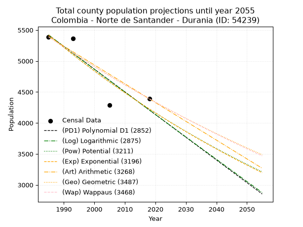
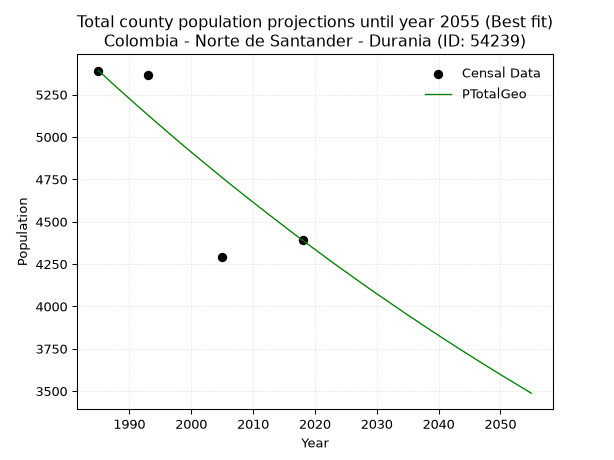
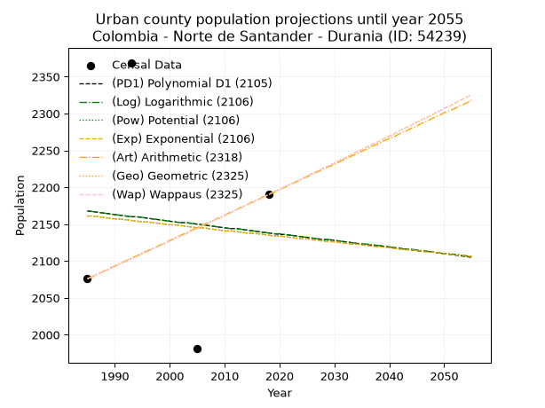
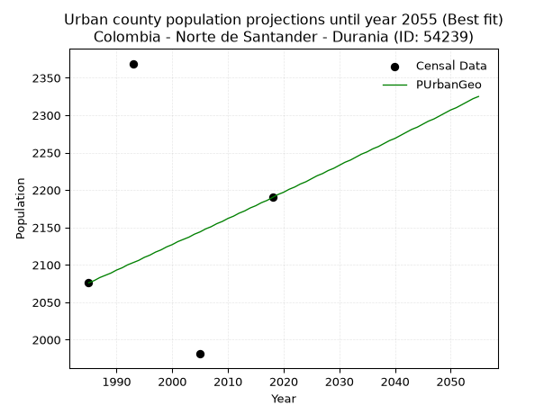
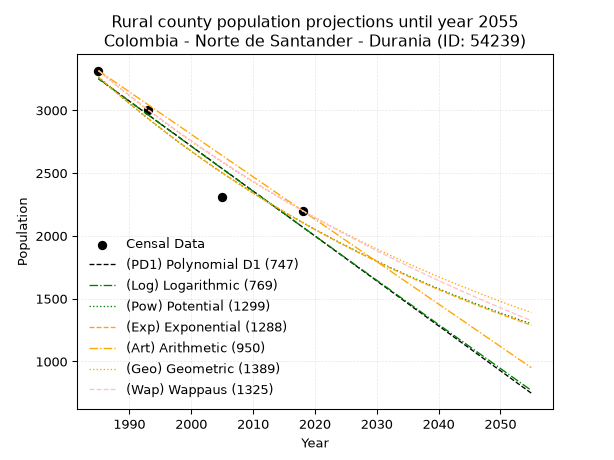
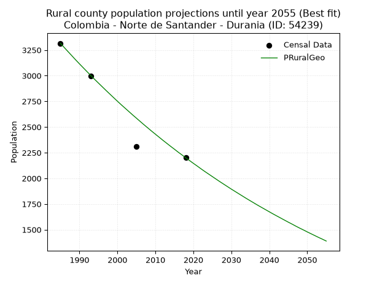

<div align="center">


</div>

# 📜 _“Population and Public Services Demand Projections (PPSD) until Year 2050 for Colombia - Norte de Santander - Durania (ID: 54239)”_
Keywords: `population` `public-service` `projection` `lineal` `polynomial` `logarithmic` `potential` `exponential` `arithmetic` `geometric` `wappaus` `dane` `colombia` `south-america`

PPSD are analytical estimates used by governments and planners to anticipate future changes in population size, age distribution, and the resulting community needs for utilities, healthcare, education, and infrastructure as sizing future water treatment facilities, electrical grids, and road networks based on spatial growth.

<div align="center">

</img>

</div>


> **General running parameters**: • app_version: _v20260806_. • Python version: _3.14.7_. • Pandas version: _3.0.5_. • NumPy version: _2.5.1_. • Creates, save and include plots into reports (create_plot): _False_. • Projection until year: _2050_. • Process polynomial degree 2 and up: _False_. • Process Wappaus: _True_. • Process Wappaus: _True_. • Set negative values to zero: _True_. • Set infinite values to zero: _True_. • Drop dataset notes: _True_. 
<div align="center">

Maps & GIS Layers: [:earth_americas:Google](http://maps.google.com/maps?q=7.714803698,-72.6584908) [:earth_americas:OSM](https://www.openstreetmap.org/#map=18/7.714803698/-72.6584908&layers=P) [:earth_americas:Bing](https://www.bing.com/maps?cp=7.714803698~-72.6584908&lvl=18) [:earth_americas:Apple](https://maps.apple.com/frame?center=7.714803698%2C-72.6584908&span=0.003%2C0.006) [:earth_americas:GISMobile](https://github.com/rcfdtools/R.GISMobile/blob/main/file/gis/CountyLayer_CO/Readme.md)

</div>


<div align="center">

```geojson
{
  "type": "Feature",
  "geometry": {
    "type": "Point", 
    "coordinates": [-72.6584908, 7.714803698]
  }, 
  "properties": {
    "Name": "Colombia - Norte de Santander - Durania (ID: 54239)"
  }
}
```

</div>


## 0. Census Data (4 records)

Census data are official statistics collected by a government about the people and housing in a country. They usually include counts of total population, age, sex, race, income, education, and jobs.

📅Global census file: [Population.xlsx](../data/Population.xlsx)

| Source   |   Year |   CountryID | CountryName   |   StateID | StateName          |   CountyID | CountyName   |   PTotal |   PUrban |   PRural |
|:---------|-------:|------------:|:--------------|----------:|:-------------------|-----------:|:-------------|---------:|---------:|---------:|
| DANE     |   1985 |          57 | Colombia      |        54 | Norte de Santander |      54239 | Durania      |     5391 |     2076 |     3315 |
| DANE     |   1993 |          57 | Colombia      |        54 | Norte de Santander |      54239 | Durania      |     5367 |     2369 |     2998 |
| DANE     |   2005 |          57 | Colombia      |        54 | Norte de Santander |      54239 | Durania      |     4289 |     1981 |     2308 |
| DANE     |   2018 |          57 | Colombia      |        54 | Norte de Santander |      54239 | Durania      |     4390 |     2190 |     2200 |

> 🔥Some records could had specific notes about the registered values or the corresponding urban or rural distribution.

📅[SUI-RUPS](https://www.datos.gov.co/Hacienda-y-Cr-dito-P-blico/Registro-nico-de-Prestadores-de-Servicios-P-blicos/4qkq-csdn/about_data) - Local public utility companies: [RUPS.csv](../data/RUPS.csv)

 | SERVICIO       | ESTADO    | NOMBRE                                                                                                 | NIT         | DEPARTAMENTO_DOMICILIO   | MUNICIPIO_DOMICILIO   | DIRECCION   |   TELEFONO | EMAIL                 | TIPO_PRESTADOR                 | CLASIFICACION                 |
|:---------------|:----------|:-------------------------------------------------------------------------------------------------------|:------------|:-------------------------|:----------------------|:------------|-----------:|:----------------------|:-------------------------------|:------------------------------|
| ACUEDUCTO      | OPERATIVA | UNIDAD DE SERVICIOS PUBLICOS DOMICILIARIOS DE ACUEDUCTO ALCANTARILLADO Y ASEO DEL MUNICIPIO DE DURANIA | 807005152-1 | NORTE DE SANTANDER       | DURANIA               | av 2 # 8-57 |    5664254 | VARGASCOL@HOTMAIL.COM | MUNICIPIO (PRESTACIÓN DIRECTA) | MENOR O IGUAL A 2500 USUARIOS |
| ALCANTARILLADO | OPERATIVA | UNIDAD DE SERVICIOS PUBLICOS DOMICILIARIOS DE ACUEDUCTO ALCANTARILLADO Y ASEO DEL MUNICIPIO DE DURANIA | 807005152-1 | NORTE DE SANTANDER       | DURANIA               | av 2 # 8-57 |    5664254 | VARGASCOL@HOTMAIL.COM | MUNICIPIO (PRESTACIÓN DIRECTA) | MENOR O IGUAL A 2500 USUARIOS |

## 1. Total

### 1.1. Coefficients and Parameters

* (PD1) Polynomial Deg 1: -36.657165796868696, 78182.74588518661 (lineal)
* (Log) Logarithmic: -73417.38049283253, 562905.3474559842
* (Pow) Potential: -15.11498693166168, 53.57977351255991
* (Exp) Exponential: -0.007546766262121486, 17374513019.71445
* (Art) Arithmetic: Year diff. 2018 - 1985 = 33, Population diff. 4390 - 5391 = -1001, Annual growth = -30.333333333333332
* (Geo) Geometric: Year diff. 2018 - 1985 = 33, Population diff. 4390 - 5391 = -1001, Annual growth % = -0.006204962227458366
* (Wap) Wappaus: i = -0.6202501448386327, Condition values only valid for < 200)

<sub>
Wappaus condition values: ['-0.00', '-0.62', '-1.24', '-1.86', '-2.48', '-3.10', '-3.72', '-4.34', '-4.96', '-5.58', '-6.20', '-6.82', '-7.44', '-8.06', '-8.68', '-9.30', '-9.92', '-10.54', '-11.16', '-11.78', '-12.41', '-13.03', '-13.65', '-14.27', '-14.89', '-15.51', '-16.13', '-16.75', '-17.37', '-17.99', '-18.61', '-19.23', '-19.85', '-20.47', '-21.09', '-21.71', '-22.33', '-22.95', '-23.57', '-24.19', '-24.81', '-25.43', '-26.05', '-26.67', '-27.29', '-27.91', '-28.53', '-29.15', '-29.77', '-30.39', '-31.01', '-31.63', '-32.25', '-32.87', '-33.49', '-34.11', '-34.73', '-35.35', '-35.97', '-36.59', '-37.22', '-37.84', '-38.46', '-39.08', '-39.70', '-40.32']
</sub>


### 1.2. Projected Dataset

|   Year |   CountyID |   PTotalPD1 |   PTotalLog |   PTotalPow |   PTotalExp |   PTotalArt |   PTotalGeo |   PTotalWap |
|-------:|-----------:|------------:|------------:|------------:|------------:|------------:|------------:|------------:|
|   1985 |      54239 |        5418 |        5420 |        5422 |        5420 |        5391 |        5391 |        5391 |
|   1986 |      54239 |        5382 |        5383 |        5381 |        5380 |        5361 |        5358 |        5358 |
|   1987 |      54239 |        5345 |        5346 |        5340 |        5339 |        5330 |        5324 |        5325 |
|   1988 |      54239 |        5308 |        5309 |        5300 |        5299 |        5300 |        5291 |        5292 |
|   1989 |      54239 |        5272 |        5272 |        5260 |        5259 |        5270 |        5258 |        5259 |
|   1990 |      54239 |        5235 |        5235 |        5220 |        5220 |        5239 |        5226 |        5226 |
|   1991 |      54239 |        5198 |        5198 |        5180 |        5181 |        5209 |        5193 |        5194 |
|   1992 |      54239 |        5162 |        5161 |        5141 |        5142 |        5179 |        5161 |        5162 |
|   1993 |      54239 |        5125 |        5124 |        5102 |        5103 |        5148 |        5129 |        5130 |
|   1994 |      54239 |        5088 |        5088 |        5064 |        5065 |        5118 |        5097 |        5098 |
|   1995 |      54239 |        5052 |        5051 |        5026 |        5026 |        5088 |        5066 |        5067 |
|   1996 |      54239 |        5015 |        5014 |        4988 |        4989 |        5057 |        5034 |        5035 |
|   1997 |      54239 |        4978 |        4977 |        4950 |        4951 |        5027 |        5003 |        5004 |
|   1998 |      54239 |        4942 |        4940 |        4913 |        4914 |        4997 |        4972 |        4973 |
|   1999 |      54239 |        4905 |        4904 |        4876 |        4877 |        4966 |        4941 |        4942 |
|   2000 |      54239 |        4868 |        4867 |        4839 |        4840 |        4936 |        4910 |        4912 |
|   2001 |      54239 |        4832 |        4830 |        4802 |        4804 |        4906 |        4880 |        4881 |
|   2002 |      54239 |        4795 |        4794 |        4766 |        4768 |        4875 |        4850 |        4851 |
|   2003 |      54239 |        4758 |        4757 |        4731 |        4732 |        4845 |        4820 |        4821 |
|   2004 |      54239 |        4722 |        4720 |        4695 |        4696 |        4815 |        4790 |        4791 |
|   2005 |      54239 |        4685 |        4684 |        4660 |        4661 |        4784 |        4760 |        4761 |
|   2006 |      54239 |        4648 |        4647 |        4625 |        4626 |        4754 |        4730 |        4732 |
|   2007 |      54239 |        4612 |        4610 |        4590 |        4591 |        4724 |        4701 |        4702 |
|   2008 |      54239 |        4575 |        4574 |        4556 |        4557 |        4693 |        4672 |        4673 |
|   2009 |      54239 |        4538 |        4537 |        4521 |        4522 |        4663 |        4643 |        4644 |
|   2010 |      54239 |        4502 |        4501 |        4488 |        4488 |        4633 |        4614 |        4615 |
|   2011 |      54239 |        4465 |        4464 |        4454 |        4455 |        4602 |        4586 |        4586 |
|   2012 |      54239 |        4429 |        4428 |        4421 |        4421 |        4572 |        4557 |        4558 |
|   2013 |      54239 |        4392 |        4391 |        4388 |        4388 |        4542 |        4529 |        4530 |
|   2014 |      54239 |        4355 |        4355 |        4355 |        4355 |        4511 |        4501 |        4501 |
|   2015 |      54239 |        4319 |        4318 |        4322 |        4322 |        4481 |        4473 |        4473 |
|   2016 |      54239 |        4282 |        4282 |        4290 |        4290 |        4451 |        4445 |        4445 |
|   2017 |      54239 |        4245 |        4246 |        4258 |        4258 |        4420 |        4417 |        4418 |
|   2018 |      54239 |        4209 |        4209 |        4226 |        4226 |        4390 |        4390 |        4390 |
|   2019 |      54239 |        4172 |        4173 |        4195 |        4194 |        4360 |        4363 |        4363 |
|   2020 |      54239 |        4135 |        4136 |        4163 |        4162 |        4329 |        4336 |        4335 |
|   2021 |      54239 |        4099 |        4100 |        4132 |        4131 |        4299 |        4309 |        4308 |
|   2022 |      54239 |        4062 |        4064 |        4101 |        4100 |        4269 |        4282 |        4281 |
|   2023 |      54239 |        4025 |        4028 |        4071 |        4069 |        4238 |        4255 |        4254 |
|   2024 |      54239 |        3989 |        3991 |        4041 |        4038 |        4208 |        4229 |        4228 |
|   2025 |      54239 |        3952 |        3955 |        4011 |        4008 |        4178 |        4203 |        4201 |
|   2026 |      54239 |        3915 |        3919 |        3981 |        3978 |        4147 |        4177 |        4175 |
|   2027 |      54239 |        3879 |        3882 |        3951 |        3948 |        4117 |        4151 |        4148 |
|   2028 |      54239 |        3842 |        3846 |        3922 |        3918 |        4087 |        4125 |        4122 |
|   2029 |      54239 |        3805 |        3810 |        3893 |        3889 |        4056 |        4099 |        4096 |
|   2030 |      54239 |        3769 |        3774 |        3864 |        3860 |        4026 |        4074 |        4071 |
|   2031 |      54239 |        3732 |        3738 |        3835 |        3831 |        3996 |        4049 |        4045 |
|   2032 |      54239 |        3695 |        3702 |        3807 |        3802 |        3965 |        4024 |        4019 |
|   2033 |      54239 |        3659 |        3665 |        3779 |        3773 |        3935 |        3999 |        3994 |
|   2034 |      54239 |        3622 |        3629 |        3751 |        3745 |        3905 |        3974 |        3969 |
|   2035 |      54239 |        3585 |        3593 |        3723 |        3717 |        3874 |        3949 |        3944 |
|   2036 |      54239 |        3549 |        3557 |        3695 |        3689 |        3844 |        3925 |        3919 |
|   2037 |      54239 |        3512 |        3521 |        3668 |        3661 |        3814 |        3900 |        3894 |
|   2038 |      54239 |        3475 |        3485 |        3641 |        3634 |        3783 |        3876 |        3869 |
|   2039 |      54239 |        3439 |        3449 |        3614 |        3606 |        3753 |        3852 |        3844 |
|   2040 |      54239 |        3402 |        3413 |        3587 |        3579 |        3723 |        3828 |        3820 |
|   2041 |      54239 |        3365 |        3377 |        3561 |        3552 |        3692 |        3804 |        3796 |
|   2042 |      54239 |        3329 |        3341 |        3534 |        3525 |        3662 |        3781 |        3771 |
|   2043 |      54239 |        3292 |        3305 |        3508 |        3499 |        3632 |        3757 |        3747 |
|   2044 |      54239 |        3255 |        3269 |        3483 |        3473 |        3601 |        3734 |        3723 |
|   2045 |      54239 |        3219 |        3233 |        3457 |        3447 |        3571 |        3711 |        3699 |
|   2046 |      54239 |        3182 |        3198 |        3431 |        3421 |        3541 |        3688 |        3676 |
|   2047 |      54239 |        3146 |        3162 |        3406 |        3395 |        3510 |        3665 |        3652 |
|   2048 |      54239 |        3109 |        3126 |        3381 |        3369 |        3480 |        3642 |        3629 |
|   2049 |      54239 |        3072 |        3090 |        3356 |        3344 |        3450 |        3620 |        3605 |
|   2050 |      54239 |        3036 |        3054 |        3332 |        3319 |        3419 |        3597 |        3582 |
<div align="center">

</img>

</div>


### 1.3. Best fit with absolute and relative error (%)

Relative error puts that difference into context by dividing the absolute error by the true value, creating a unitless ratio or percentage that shows the scale of the mistake.

Absolute and relative error

|   Year | Source   |   CountryID | CountryName   |   StateID | StateName          |   CountyID_x | CountyName   |   PTotal |   PUrban |   PRural |   CountyID_y |   PTotalPD1 |   PTotalLog |   PTotalPow |   PTotalExp |   PTotalArt |   PTotalGeo |   PTotalWap |   PTotalPD1AbsError |   PTotalLogAbsError |   PTotalPowAbsError |   PTotalExpAbsError |   PTotalArtAbsError |   PTotalGeoAbsError |   PTotalWapAbsError |   PTotalPD1RelError |   PTotalLogRelError |   PTotalPowRelError |   PTotalExpRelError |   PTotalArtRelError |   PTotalGeoRelError |   PTotalWapRelError |
|-------:|:---------|------------:|:--------------|----------:|:-------------------|-------------:|:-------------|---------:|---------:|---------:|-------------:|------------:|------------:|------------:|------------:|------------:|------------:|------------:|--------------------:|--------------------:|--------------------:|--------------------:|--------------------:|--------------------:|--------------------:|--------------------:|--------------------:|--------------------:|--------------------:|--------------------:|--------------------:|--------------------:|
|   1985 | DANE     |          57 | Colombia      |        54 | Norte de Santander |        54239 | Durania      |     5391 |     2076 |     3315 |        54239 |        5418 |        5420 |        5422 |        5420 |        5391 |        5391 |        5391 |                  27 |                  29 |                  31 |                  29 |                   0 |                   0 |                   0 |            0.500835 |            0.537934 |            0.575032 |            0.537934 |             0       |             0       |             0       |
|   1993 | DANE     |          57 | Colombia      |        54 | Norte de Santander |        54239 | Durania      |     5367 |     2369 |     2998 |        54239 |        5125 |        5124 |        5102 |        5103 |        5148 |        5129 |        5130 |                 242 |                 243 |                 265 |                 264 |                 219 |                 238 |                 237 |            4.50904  |            4.52767  |            4.93758  |            4.91895  |             4.08049 |             4.43451 |             4.41587 |
|   2005 | DANE     |          57 | Colombia      |        54 | Norte de Santander |        54239 | Durania      |     4289 |     1981 |     2308 |        54239 |        4685 |        4684 |        4660 |        4661 |        4784 |        4760 |        4761 |                 396 |                 395 |                 371 |                 372 |                 495 |                 471 |                 472 |            9.23292  |            9.20961  |            8.65003  |            8.67335  |            11.5412  |            10.9816  |            11.0049  |
|   2018 | DANE     |          57 | Colombia      |        54 | Norte de Santander |        54239 | Durania      |     4390 |     2190 |     2200 |        54239 |        4209 |        4209 |        4226 |        4226 |        4390 |        4390 |        4390 |                 181 |                 181 |                 164 |                 164 |                   0 |                   0 |                   0 |            4.12301  |            4.12301  |            3.73576  |            3.73576  |             0       |             0       |             0       |

Relative error mean

| Method    |   RelError | Best   |
|:----------|-----------:|:-------|
| PTotalPD1 |    4.59145 |        |
| PTotalLog |    4.59955 |        |
| PTotalPow |    4.4746  |        |
| PTotalExp |    4.4665  |        |
| PTotalArt |    3.90541 |        |
| PTotalGeo |    3.85402 | True   |
| PTotalWap |    3.85519 |        |

💙Best method: _**PTotalGeo**_
<div align="center">

</img>

</div>


### 1.4. Fresh water supply demand in liters per capita per day (lpcd)

The fresh water supply demand typically ranges from 100 to 300 liters per capita per day (lpcd) for standard domestic and municipal planning, though absolute survival minimums set by the World Health Organization are as low as 7.5 to 20 liters per day, and total consumption in high-income nations can exceed 400 liters.

> `CZ`: Level in meters above the sea level (masl)<br> `WS`: Fresh water supply demand in liters per capita per day (lpcd or l/h/d)<br> `WSAll`: Zonal fresh water supply demand in liters per second (l/s)<br> `A`: Zonal area in square meters<br> `DP`: Population density (people/hectare or p/ha)

Reference values (RAS Colombia)

|    CZ |   WS |
|------:|-----:|
|  1000 |  120 |
|  2000 |  130 |
| 99999 |  140 |

County shapefile geometry properties and water supply values

|   CountyID |      ATotal |   CZTotal |   WSTotal |
|-----------:|------------:|----------:|----------:|
|      54239 | 1.74578e+08 |   972.993 |       120 |

Projected values for best method: PTotalGeo

|   CountyID |   Year |   PTotalGeo |   DPTotal |   WSTotal |   WSTotalAll |
|-----------:|-------:|------------:|----------:|----------:|-------------:|
|      54239 |   1985 |        5391 |      0.31 |       120 |      7.4875  |
|      54239 |   1986 |        5358 |      0.31 |       120 |      7.44167 |
|      54239 |   1987 |        5324 |      0.3  |       120 |      7.39444 |
|      54239 |   1988 |        5291 |      0.3  |       120 |      7.34861 |
|      54239 |   1989 |        5258 |      0.3  |       120 |      7.30278 |
|      54239 |   1990 |        5226 |      0.3  |       120 |      7.25833 |
|      54239 |   1991 |        5193 |      0.3  |       120 |      7.2125  |
|      54239 |   1992 |        5161 |      0.3  |       120 |      7.16806 |
|      54239 |   1993 |        5129 |      0.29 |       120 |      7.12361 |
|      54239 |   1994 |        5097 |      0.29 |       120 |      7.07917 |
|      54239 |   1995 |        5066 |      0.29 |       120 |      7.03611 |
|      54239 |   1996 |        5034 |      0.29 |       120 |      6.99167 |
|      54239 |   1997 |        5003 |      0.29 |       120 |      6.94861 |
|      54239 |   1998 |        4972 |      0.28 |       120 |      6.90556 |
|      54239 |   1999 |        4941 |      0.28 |       120 |      6.8625  |
|      54239 |   2000 |        4910 |      0.28 |       120 |      6.81944 |
|      54239 |   2001 |        4880 |      0.28 |       120 |      6.77778 |
|      54239 |   2002 |        4850 |      0.28 |       120 |      6.73611 |
|      54239 |   2003 |        4820 |      0.28 |       120 |      6.69444 |
|      54239 |   2004 |        4790 |      0.27 |       120 |      6.65278 |
|      54239 |   2005 |        4760 |      0.27 |       120 |      6.61111 |
|      54239 |   2006 |        4730 |      0.27 |       120 |      6.56944 |
|      54239 |   2007 |        4701 |      0.27 |       120 |      6.52917 |
|      54239 |   2008 |        4672 |      0.27 |       120 |      6.48889 |
|      54239 |   2009 |        4643 |      0.27 |       120 |      6.44861 |
|      54239 |   2010 |        4614 |      0.26 |       120 |      6.40833 |
|      54239 |   2011 |        4586 |      0.26 |       120 |      6.36944 |
|      54239 |   2012 |        4557 |      0.26 |       120 |      6.32917 |
|      54239 |   2013 |        4529 |      0.26 |       120 |      6.29028 |
|      54239 |   2014 |        4501 |      0.26 |       120 |      6.25139 |
|      54239 |   2015 |        4473 |      0.26 |       120 |      6.2125  |
|      54239 |   2016 |        4445 |      0.25 |       120 |      6.17361 |
|      54239 |   2017 |        4417 |      0.25 |       120 |      6.13472 |
|      54239 |   2018 |        4390 |      0.25 |       120 |      6.09722 |
|      54239 |   2019 |        4363 |      0.25 |       120 |      6.05972 |
|      54239 |   2020 |        4336 |      0.25 |       120 |      6.02222 |
|      54239 |   2021 |        4309 |      0.25 |       120 |      5.98472 |
|      54239 |   2022 |        4282 |      0.25 |       120 |      5.94722 |
|      54239 |   2023 |        4255 |      0.24 |       120 |      5.90972 |
|      54239 |   2024 |        4229 |      0.24 |       120 |      5.87361 |
|      54239 |   2025 |        4203 |      0.24 |       120 |      5.8375  |
|      54239 |   2026 |        4177 |      0.24 |       120 |      5.80139 |
|      54239 |   2027 |        4151 |      0.24 |       120 |      5.76528 |
|      54239 |   2028 |        4125 |      0.24 |       120 |      5.72917 |
|      54239 |   2029 |        4099 |      0.23 |       120 |      5.69306 |
|      54239 |   2030 |        4074 |      0.23 |       120 |      5.65833 |
|      54239 |   2031 |        4049 |      0.23 |       120 |      5.62361 |
|      54239 |   2032 |        4024 |      0.23 |       120 |      5.58889 |
|      54239 |   2033 |        3999 |      0.23 |       120 |      5.55417 |
|      54239 |   2034 |        3974 |      0.23 |       120 |      5.51944 |
|      54239 |   2035 |        3949 |      0.23 |       120 |      5.48472 |
|      54239 |   2036 |        3925 |      0.22 |       120 |      5.45139 |
|      54239 |   2037 |        3900 |      0.22 |       120 |      5.41667 |
|      54239 |   2038 |        3876 |      0.22 |       120 |      5.38333 |
|      54239 |   2039 |        3852 |      0.22 |       120 |      5.35    |
|      54239 |   2040 |        3828 |      0.22 |       120 |      5.31667 |
|      54239 |   2041 |        3804 |      0.22 |       120 |      5.28333 |
|      54239 |   2042 |        3781 |      0.22 |       120 |      5.25139 |
|      54239 |   2043 |        3757 |      0.22 |       120 |      5.21806 |
|      54239 |   2044 |        3734 |      0.21 |       120 |      5.18611 |
|      54239 |   2045 |        3711 |      0.21 |       120 |      5.15417 |
|      54239 |   2046 |        3688 |      0.21 |       120 |      5.12222 |
|      54239 |   2047 |        3665 |      0.21 |       120 |      5.09028 |
|      54239 |   2048 |        3642 |      0.21 |       120 |      5.05833 |
|      54239 |   2049 |        3620 |      0.21 |       120 |      5.02778 |
|      54239 |   2050 |        3597 |      0.21 |       120 |      4.99583 |

## 2. Urban

### 2.1. Coefficients and Parameters

* (PD1) Polynomial Deg 1: -0.8863910076275507, 3927.003613007008 (lineal)
* (Log) Logarithmic: -1775.8255120607814, 15652.063947746552
* (Pow) Potential: -0.743167604955488, 5.785532873751197
* (Exp) Exponential: -0.0003705931413954814, 4510.384846005547
* (Art) Arithmetic: Year diff. 2018 - 1985 = 33, Population diff. 2190 - 2076 = 114, Annual growth = 3.4545454545454546
* (Geo) Geometric: Year diff. 2018 - 1985 = 33, Population diff. 2190 - 2076 = 114, Annual growth % = 0.0016212697640309859
* (Wap) Wappaus: i = 0.16195712398244044, Condition values only valid for < 200)

<sub>
Wappaus condition values: ['0.00', '0.16', '0.32', '0.49', '0.65', '0.81', '0.97', '1.13', '1.30', '1.46', '1.62', '1.78', '1.94', '2.11', '2.27', '2.43', '2.59', '2.75', '2.92', '3.08', '3.24', '3.40', '3.56', '3.73', '3.89', '4.05', '4.21', '4.37', '4.53', '4.70', '4.86', '5.02', '5.18', '5.34', '5.51', '5.67', '5.83', '5.99', '6.15', '6.32', '6.48', '6.64', '6.80', '6.96', '7.13', '7.29', '7.45', '7.61', '7.77', '7.94', '8.10', '8.26', '8.42', '8.58', '8.75', '8.91', '9.07', '9.23', '9.39', '9.56', '9.72', '9.88', '10.04', '10.20', '10.37', '10.53']
</sub>


### 2.2. Projected Dataset

|   Year |   CountyID |   PUrbanPD1 |   PUrbanLog |   PUrbanPow |   PUrbanExp |   PUrbanArt |   PUrbanGeo |   PUrbanWap |
|-------:|-----------:|------------:|------------:|------------:|------------:|------------:|------------:|------------:|
|   1985 |      54239 |        2168 |        2168 |        2161 |        2161 |        2076 |        2076 |        2076 |
|   1986 |      54239 |        2167 |        2167 |        2161 |        2161 |        2079 |        2079 |        2079 |
|   1987 |      54239 |        2166 |        2166 |        2160 |        2160 |        2083 |        2083 |        2083 |
|   1988 |      54239 |        2165 |        2165 |        2159 |        2159 |        2086 |        2086 |        2086 |
|   1989 |      54239 |        2164 |        2164 |        2158 |        2158 |        2090 |        2089 |        2089 |
|   1990 |      54239 |        2163 |        2163 |        2157 |        2157 |        2093 |        2093 |        2093 |
|   1991 |      54239 |        2162 |        2162 |        2157 |        2157 |        2097 |        2096 |        2096 |
|   1992 |      54239 |        2161 |        2161 |        2156 |        2156 |        2100 |        2100 |        2100 |
|   1993 |      54239 |        2160 |        2160 |        2155 |        2155 |        2104 |        2103 |        2103 |
|   1994 |      54239 |        2160 |        2160 |        2154 |        2154 |        2107 |        2106 |        2106 |
|   1995 |      54239 |        2159 |        2159 |        2153 |        2153 |        2111 |        2110 |        2110 |
|   1996 |      54239 |        2158 |        2158 |        2153 |        2153 |        2114 |        2113 |        2113 |
|   1997 |      54239 |        2157 |        2157 |        2152 |        2152 |        2117 |        2117 |        2117 |
|   1998 |      54239 |        2156 |        2156 |        2151 |        2151 |        2121 |        2120 |        2120 |
|   1999 |      54239 |        2155 |        2155 |        2150 |        2150 |        2124 |        2124 |        2124 |
|   2000 |      54239 |        2154 |        2154 |        2149 |        2149 |        2128 |        2127 |        2127 |
|   2001 |      54239 |        2153 |        2153 |        2149 |        2149 |        2131 |        2131 |        2131 |
|   2002 |      54239 |        2152 |        2152 |        2148 |        2148 |        2135 |        2134 |        2134 |
|   2003 |      54239 |        2152 |        2152 |        2147 |        2147 |        2138 |        2137 |        2137 |
|   2004 |      54239 |        2151 |        2151 |        2146 |        2146 |        2142 |        2141 |        2141 |
|   2005 |      54239 |        2150 |        2150 |        2145 |        2145 |        2145 |        2144 |        2144 |
|   2006 |      54239 |        2149 |        2149 |        2145 |        2145 |        2149 |        2148 |        2148 |
|   2007 |      54239 |        2148 |        2148 |        2144 |        2144 |        2152 |        2151 |        2151 |
|   2008 |      54239 |        2147 |        2147 |        2143 |        2143 |        2155 |        2155 |        2155 |
|   2009 |      54239 |        2146 |        2146 |        2142 |        2142 |        2159 |        2158 |        2158 |
|   2010 |      54239 |        2145 |        2145 |        2141 |        2141 |        2162 |        2162 |        2162 |
|   2011 |      54239 |        2144 |        2144 |        2141 |        2141 |        2166 |        2165 |        2165 |
|   2012 |      54239 |        2144 |        2144 |        2140 |        2140 |        2169 |        2169 |        2169 |
|   2013 |      54239 |        2143 |        2143 |        2139 |        2139 |        2173 |        2172 |        2172 |
|   2014 |      54239 |        2142 |        2142 |        2138 |        2138 |        2176 |        2176 |        2176 |
|   2015 |      54239 |        2141 |        2141 |        2137 |        2138 |        2180 |        2179 |        2179 |
|   2016 |      54239 |        2140 |        2140 |        2137 |        2137 |        2183 |        2183 |        2183 |
|   2017 |      54239 |        2139 |        2139 |        2136 |        2136 |        2187 |        2186 |        2186 |
|   2018 |      54239 |        2138 |        2138 |        2135 |        2135 |        2190 |        2190 |        2190 |
|   2019 |      54239 |        2137 |        2137 |        2134 |        2134 |        2193 |        2194 |        2194 |
|   2020 |      54239 |        2136 |        2137 |        2134 |        2134 |        2197 |        2197 |        2197 |
|   2021 |      54239 |        2136 |        2136 |        2133 |        2133 |        2200 |        2201 |        2201 |
|   2022 |      54239 |        2135 |        2135 |        2132 |        2132 |        2204 |        2204 |        2204 |
|   2023 |      54239 |        2134 |        2134 |        2131 |        2131 |        2207 |        2208 |        2208 |
|   2024 |      54239 |        2133 |        2133 |        2130 |        2130 |        2211 |        2211 |        2211 |
|   2025 |      54239 |        2132 |        2132 |        2130 |        2130 |        2214 |        2215 |        2215 |
|   2026 |      54239 |        2131 |        2131 |        2129 |        2129 |        2218 |        2219 |        2219 |
|   2027 |      54239 |        2130 |        2130 |        2128 |        2128 |        2221 |        2222 |        2222 |
|   2028 |      54239 |        2129 |        2129 |        2127 |        2127 |        2225 |        2226 |        2226 |
|   2029 |      54239 |        2129 |        2129 |        2127 |        2126 |        2228 |        2229 |        2229 |
|   2030 |      54239 |        2128 |        2128 |        2126 |        2126 |        2231 |        2233 |        2233 |
|   2031 |      54239 |        2127 |        2127 |        2125 |        2125 |        2235 |        2237 |        2237 |
|   2032 |      54239 |        2126 |        2126 |        2124 |        2124 |        2238 |        2240 |        2240 |
|   2033 |      54239 |        2125 |        2125 |        2123 |        2123 |        2242 |        2244 |        2244 |
|   2034 |      54239 |        2124 |        2124 |        2123 |        2123 |        2245 |        2248 |        2248 |
|   2035 |      54239 |        2123 |        2123 |        2122 |        2122 |        2249 |        2251 |        2251 |
|   2036 |      54239 |        2122 |        2123 |        2121 |        2121 |        2252 |        2255 |        2255 |
|   2037 |      54239 |        2121 |        2122 |        2120 |        2120 |        2256 |        2258 |        2259 |
|   2038 |      54239 |        2121 |        2121 |        2120 |        2119 |        2259 |        2262 |        2262 |
|   2039 |      54239 |        2120 |        2120 |        2119 |        2119 |        2263 |        2266 |        2266 |
|   2040 |      54239 |        2119 |        2119 |        2118 |        2118 |        2266 |        2269 |        2270 |
|   2041 |      54239 |        2118 |        2118 |        2117 |        2117 |        2269 |        2273 |        2273 |
|   2042 |      54239 |        2117 |        2117 |        2116 |        2116 |        2273 |        2277 |        2277 |
|   2043 |      54239 |        2116 |        2116 |        2116 |        2115 |        2276 |        2281 |        2281 |
|   2044 |      54239 |        2115 |        2116 |        2115 |        2115 |        2280 |        2284 |        2284 |
|   2045 |      54239 |        2114 |        2115 |        2114 |        2114 |        2283 |        2288 |        2288 |
|   2046 |      54239 |        2113 |        2114 |        2113 |        2113 |        2287 |        2292 |        2292 |
|   2047 |      54239 |        2113 |        2113 |        2113 |        2112 |        2290 |        2295 |        2295 |
|   2048 |      54239 |        2112 |        2112 |        2112 |        2112 |        2294 |        2299 |        2299 |
|   2049 |      54239 |        2111 |        2111 |        2111 |        2111 |        2297 |        2303 |        2303 |
|   2050 |      54239 |        2110 |        2110 |        2110 |        2110 |        2301 |        2307 |        2307 |
<div align="center">

</img>

</div>


### 2.3. Best fit with absolute and relative error (%)

Relative error puts that difference into context by dividing the absolute error by the true value, creating a unitless ratio or percentage that shows the scale of the mistake.

Absolute and relative error

|   Year | Source   |   CountryID | CountryName   |   StateID | StateName          |   CountyID_x | CountyName   |   PTotal |   PUrban |   PRural |   CountyID_y |   PUrbanPD1 |   PUrbanLog |   PUrbanPow |   PUrbanExp |   PUrbanArt |   PUrbanGeo |   PUrbanWap |   PUrbanPD1AbsError |   PUrbanLogAbsError |   PUrbanPowAbsError |   PUrbanExpAbsError |   PUrbanArtAbsError |   PUrbanGeoAbsError |   PUrbanWapAbsError |   PUrbanPD1RelError |   PUrbanLogRelError |   PUrbanPowRelError |   PUrbanExpRelError |   PUrbanArtRelError |   PUrbanGeoRelError |   PUrbanWapRelError |
|-------:|:---------|------------:|:--------------|----------:|:-------------------|-------------:|:-------------|---------:|---------:|---------:|-------------:|------------:|------------:|------------:|------------:|------------:|------------:|------------:|--------------------:|--------------------:|--------------------:|--------------------:|--------------------:|--------------------:|--------------------:|--------------------:|--------------------:|--------------------:|--------------------:|--------------------:|--------------------:|--------------------:|
|   1985 | DANE     |          57 | Colombia      |        54 | Norte de Santander |        54239 | Durania      |     5391 |     2076 |     3315 |        54239 |        2168 |        2168 |        2161 |        2161 |        2076 |        2076 |        2076 |                  92 |                  92 |                  85 |                  85 |                   0 |                   0 |                   0 |             4.4316  |             4.4316  |             4.09441 |             4.09441 |             0       |             0       |             0       |
|   1993 | DANE     |          57 | Colombia      |        54 | Norte de Santander |        54239 | Durania      |     5367 |     2369 |     2998 |        54239 |        2160 |        2160 |        2155 |        2155 |        2104 |        2103 |        2103 |                 209 |                 209 |                 214 |                 214 |                 265 |                 266 |                 266 |             8.82229 |             8.82229 |             9.03335 |             9.03335 |            11.1862  |            11.2284  |            11.2284  |
|   2005 | DANE     |          57 | Colombia      |        54 | Norte de Santander |        54239 | Durania      |     4289 |     1981 |     2308 |        54239 |        2150 |        2150 |        2145 |        2145 |        2145 |        2144 |        2144 |                 169 |                 169 |                 164 |                 164 |                 164 |                 163 |                 163 |             8.53104 |             8.53104 |             8.27865 |             8.27865 |             8.27865 |             8.22817 |             8.22817 |
|   2018 | DANE     |          57 | Colombia      |        54 | Norte de Santander |        54239 | Durania      |     4390 |     2190 |     2200 |        54239 |        2138 |        2138 |        2135 |        2135 |        2190 |        2190 |        2190 |                  52 |                  52 |                  55 |                  55 |                   0 |                   0 |                   0 |             2.37443 |             2.37443 |             2.51142 |             2.51142 |             0       |             0       |             0       |

Relative error mean

| Method    |   RelError | Best   |
|:----------|-----------:|:-------|
| PUrbanPD1 |    6.03984 |        |
| PUrbanLog |    6.03984 |        |
| PUrbanPow |    5.97946 |        |
| PUrbanExp |    5.97946 |        |
| PUrbanArt |    4.8662  |        |
| PUrbanGeo |    4.86413 | True   |
| PUrbanWap |    4.86413 | True   |

💙Best method: _**PUrbanGeo**_
<div align="center">

</img>

</div>


### 2.4. Fresh water supply demand in liters per capita per day (lpcd)

The fresh water supply demand typically ranges from 100 to 300 liters per capita per day (lpcd) for standard domestic and municipal planning, though absolute survival minimums set by the World Health Organization are as low as 7.5 to 20 liters per day, and total consumption in high-income nations can exceed 400 liters.

> `CZ`: Level in meters above the sea level (masl)<br> `WS`: Fresh water supply demand in liters per capita per day (lpcd or l/h/d)<br> `WSAll`: Zonal fresh water supply demand in liters per second (l/s)<br> `A`: Zonal area in square meters<br> `DP`: Population density (people/hectare or p/ha)

Reference values (RAS Colombia)

|    CZ |   WS |
|------:|-----:|
|  1000 |  120 |
|  2000 |  130 |
| 99999 |  140 |

County shapefile geometry properties and water supply values

|   CountyID |   AUrban |   CZUrban |   WSUrban |
|-----------:|---------:|----------:|----------:|
|      54239 |   470439 |   953.486 |       120 |

Projected values for best method: PUrbanGeo

|   CountyID |   Year |   PUrbanGeo |   DPUrban |   WSUrban |   WSUrbanAll |
|-----------:|-------:|------------:|----------:|----------:|-------------:|
|      54239 |   1985 |        2076 |     44.13 |       120 |      2.88333 |
|      54239 |   1986 |        2079 |     44.19 |       120 |      2.8875  |
|      54239 |   1987 |        2083 |     44.28 |       120 |      2.89306 |
|      54239 |   1988 |        2086 |     44.34 |       120 |      2.89722 |
|      54239 |   1989 |        2089 |     44.41 |       120 |      2.90139 |
|      54239 |   1990 |        2093 |     44.49 |       120 |      2.90694 |
|      54239 |   1991 |        2096 |     44.55 |       120 |      2.91111 |
|      54239 |   1992 |        2100 |     44.64 |       120 |      2.91667 |
|      54239 |   1993 |        2103 |     44.7  |       120 |      2.92083 |
|      54239 |   1994 |        2106 |     44.77 |       120 |      2.925   |
|      54239 |   1995 |        2110 |     44.85 |       120 |      2.93056 |
|      54239 |   1996 |        2113 |     44.92 |       120 |      2.93472 |
|      54239 |   1997 |        2117 |     45    |       120 |      2.94028 |
|      54239 |   1998 |        2120 |     45.06 |       120 |      2.94444 |
|      54239 |   1999 |        2124 |     45.15 |       120 |      2.95    |
|      54239 |   2000 |        2127 |     45.21 |       120 |      2.95417 |
|      54239 |   2001 |        2131 |     45.3  |       120 |      2.95972 |
|      54239 |   2002 |        2134 |     45.36 |       120 |      2.96389 |
|      54239 |   2003 |        2137 |     45.43 |       120 |      2.96806 |
|      54239 |   2004 |        2141 |     45.51 |       120 |      2.97361 |
|      54239 |   2005 |        2144 |     45.57 |       120 |      2.97778 |
|      54239 |   2006 |        2148 |     45.66 |       120 |      2.98333 |
|      54239 |   2007 |        2151 |     45.72 |       120 |      2.9875  |
|      54239 |   2008 |        2155 |     45.81 |       120 |      2.99306 |
|      54239 |   2009 |        2158 |     45.87 |       120 |      2.99722 |
|      54239 |   2010 |        2162 |     45.96 |       120 |      3.00278 |
|      54239 |   2011 |        2165 |     46.02 |       120 |      3.00694 |
|      54239 |   2012 |        2169 |     46.11 |       120 |      3.0125  |
|      54239 |   2013 |        2172 |     46.17 |       120 |      3.01667 |
|      54239 |   2014 |        2176 |     46.25 |       120 |      3.02222 |
|      54239 |   2015 |        2179 |     46.32 |       120 |      3.02639 |
|      54239 |   2016 |        2183 |     46.4  |       120 |      3.03194 |
|      54239 |   2017 |        2186 |     46.47 |       120 |      3.03611 |
|      54239 |   2018 |        2190 |     46.55 |       120 |      3.04167 |
|      54239 |   2019 |        2194 |     46.64 |       120 |      3.04722 |
|      54239 |   2020 |        2197 |     46.7  |       120 |      3.05139 |
|      54239 |   2021 |        2201 |     46.79 |       120 |      3.05694 |
|      54239 |   2022 |        2204 |     46.85 |       120 |      3.06111 |
|      54239 |   2023 |        2208 |     46.93 |       120 |      3.06667 |
|      54239 |   2024 |        2211 |     47    |       120 |      3.07083 |
|      54239 |   2025 |        2215 |     47.08 |       120 |      3.07639 |
|      54239 |   2026 |        2219 |     47.17 |       120 |      3.08194 |
|      54239 |   2027 |        2222 |     47.23 |       120 |      3.08611 |
|      54239 |   2028 |        2226 |     47.32 |       120 |      3.09167 |
|      54239 |   2029 |        2229 |     47.38 |       120 |      3.09583 |
|      54239 |   2030 |        2233 |     47.47 |       120 |      3.10139 |
|      54239 |   2031 |        2237 |     47.55 |       120 |      3.10694 |
|      54239 |   2032 |        2240 |     47.62 |       120 |      3.11111 |
|      54239 |   2033 |        2244 |     47.7  |       120 |      3.11667 |
|      54239 |   2034 |        2248 |     47.79 |       120 |      3.12222 |
|      54239 |   2035 |        2251 |     47.85 |       120 |      3.12639 |
|      54239 |   2036 |        2255 |     47.93 |       120 |      3.13194 |
|      54239 |   2037 |        2258 |     48    |       120 |      3.13611 |
|      54239 |   2038 |        2262 |     48.08 |       120 |      3.14167 |
|      54239 |   2039 |        2266 |     48.17 |       120 |      3.14722 |
|      54239 |   2040 |        2269 |     48.23 |       120 |      3.15139 |
|      54239 |   2041 |        2273 |     48.32 |       120 |      3.15694 |
|      54239 |   2042 |        2277 |     48.4  |       120 |      3.1625  |
|      54239 |   2043 |        2281 |     48.49 |       120 |      3.16806 |
|      54239 |   2044 |        2284 |     48.55 |       120 |      3.17222 |
|      54239 |   2045 |        2288 |     48.64 |       120 |      3.17778 |
|      54239 |   2046 |        2292 |     48.72 |       120 |      3.18333 |
|      54239 |   2047 |        2295 |     48.78 |       120 |      3.1875  |
|      54239 |   2048 |        2299 |     48.87 |       120 |      3.19306 |
|      54239 |   2049 |        2303 |     48.95 |       120 |      3.19861 |
|      54239 |   2050 |        2307 |     49.04 |       120 |      3.20417 |

## 3. Rural

### 3.1. Coefficients and Parameters

* (PD1) Polynomial Deg 1: -35.77077478924116, 74255.74227217965 (lineal)
* (Log) Logarithmic: -71641.55498077176, 547253.2835082377
* (Pow) Potential: -26.590230680147926, 91.20211141449767
* (Exp) Exponential: -0.013277644890607999, 912012584318820.5
* (Art) Arithmetic: Year diff. 2018 - 1985 = 33, Population diff. 2200 - 3315 = -1115, Annual growth = -33.78787878787879
* (Geo) Geometric: Year diff. 2018 - 1985 = 33, Population diff. 2200 - 3315 = -1115, Annual growth % = -0.012347388051530572
* (Wap) Wappaus: i = -1.2253083875930657, Condition values only valid for < 200)

<sub>
Wappaus condition values: ['-0.00', '-1.23', '-2.45', '-3.68', '-4.90', '-6.13', '-7.35', '-8.58', '-9.80', '-11.03', '-12.25', '-13.48', '-14.70', '-15.93', '-17.15', '-18.38', '-19.60', '-20.83', '-22.06', '-23.28', '-24.51', '-25.73', '-26.96', '-28.18', '-29.41', '-30.63', '-31.86', '-33.08', '-34.31', '-35.53', '-36.76', '-37.98', '-39.21', '-40.44', '-41.66', '-42.89', '-44.11', '-45.34', '-46.56', '-47.79', '-49.01', '-50.24', '-51.46', '-52.69', '-53.91', '-55.14', '-56.36', '-57.59', '-58.81', '-60.04', '-61.27', '-62.49', '-63.72', '-64.94', '-66.17', '-67.39', '-68.62', '-69.84', '-71.07', '-72.29', '-73.52', '-74.74', '-75.97', '-77.19', '-78.42', '-79.65']
</sub>


### 3.2. Projected Dataset

|   Year |   CountyID |   PRuralPD1 |   PRuralLog |   PRuralPow |   PRuralExp |   PRuralArt |   PRuralGeo |   PRuralWap |
|-------:|-----------:|------------:|------------:|------------:|------------:|------------:|------------:|------------:|
|   1985 |      54239 |        3251 |        3252 |        3265 |        3263 |        3315 |        3315 |        3315 |
|   1986 |      54239 |        3215 |        3216 |        3222 |        3220 |        3281 |        3274 |        3275 |
|   1987 |      54239 |        3179 |        3180 |        3179 |        3178 |        3247 |        3234 |        3235 |
|   1988 |      54239 |        3143 |        3144 |        3137 |        3136 |        3214 |        3194 |        3195 |
|   1989 |      54239 |        3108 |        3108 |        3095 |        3095 |        3180 |        3154 |        3156 |
|   1990 |      54239 |        3072 |        3072 |        3054 |        3054 |        3146 |        3115 |        3118 |
|   1991 |      54239 |        3036 |        3036 |        3013 |        3014 |        3112 |        3077 |        3080 |
|   1992 |      54239 |        3000 |        3000 |        2973 |        2974 |        3078 |        3039 |        3042 |
|   1993 |      54239 |        2965 |        2964 |        2934 |        2935 |        3045 |        3001 |        3005 |
|   1994 |      54239 |        2929 |        2928 |        2895 |        2896 |        3011 |        2964 |        2969 |
|   1995 |      54239 |        2893 |        2892 |        2857 |        2858 |        2977 |        2928 |        2932 |
|   1996 |      54239 |        2857 |        2856 |        2819 |        2820 |        2943 |        2892 |        2896 |
|   1997 |      54239 |        2822 |        2820 |        2782 |        2783 |        2910 |        2856 |        2861 |
|   1998 |      54239 |        2786 |        2784 |        2745 |        2746 |        2876 |        2821 |        2826 |
|   1999 |      54239 |        2750 |        2749 |        2709 |        2710 |        2842 |        2786 |        2791 |
|   2000 |      54239 |        2714 |        2713 |        2673 |        2674 |        2808 |        2751 |        2757 |
|   2001 |      54239 |        2678 |        2677 |        2637 |        2639 |        2774 |        2717 |        2723 |
|   2002 |      54239 |        2643 |        2641 |        2603 |        2604 |        2741 |        2684 |        2690 |
|   2003 |      54239 |        2607 |        2605 |        2568 |        2570 |        2707 |        2651 |        2656 |
|   2004 |      54239 |        2571 |        2570 |        2534 |        2536 |        2673 |        2618 |        2624 |
|   2005 |      54239 |        2535 |        2534 |        2501 |        2502 |        2639 |        2586 |        2591 |
|   2006 |      54239 |        2500 |        2498 |        2468 |        2469 |        2605 |        2554 |        2559 |
|   2007 |      54239 |        2464 |        2463 |        2436 |        2437 |        2572 |        2522 |        2528 |
|   2008 |      54239 |        2428 |        2427 |        2404 |        2405 |        2538 |        2491 |        2496 |
|   2009 |      54239 |        2392 |        2391 |        2372 |        2373 |        2504 |        2460 |        2465 |
|   2010 |      54239 |        2356 |        2355 |        2341 |        2342 |        2470 |        2430 |        2434 |
|   2011 |      54239 |        2321 |        2320 |        2310 |        2311 |        2437 |        2400 |        2404 |
|   2012 |      54239 |        2285 |        2284 |        2280 |        2280 |        2403 |        2370 |        2374 |
|   2013 |      54239 |        2249 |        2249 |        2250 |        2250 |        2369 |        2341 |        2344 |
|   2014 |      54239 |        2213 |        2213 |        2220 |        2221 |        2335 |        2312 |        2315 |
|   2015 |      54239 |        2178 |        2178 |        2191 |        2191 |        2301 |        2284 |        2286 |
|   2016 |      54239 |        2142 |        2142 |        2162 |        2162 |        2268 |        2255 |        2257 |
|   2017 |      54239 |        2106 |        2106 |        2134 |        2134 |        2234 |        2228 |        2228 |
|   2018 |      54239 |        2070 |        2071 |        2106 |        2106 |        2200 |        2200 |        2200 |
|   2019 |      54239 |        2035 |        2035 |        2079 |        2078 |        2166 |        2173 |        2172 |
|   2020 |      54239 |        1999 |        2000 |        2051 |        2050 |        2132 |        2146 |        2144 |
|   2021 |      54239 |        1963 |        1964 |        2025 |        2023 |        2099 |        2120 |        2117 |
|   2022 |      54239 |        1927 |        1929 |        1998 |        1997 |        2065 |        2093 |        2090 |
|   2023 |      54239 |        1891 |        1894 |        1972 |        1970 |        2031 |        2067 |        2063 |
|   2024 |      54239 |        1856 |        1858 |        1946 |        1944 |        1997 |        2042 |        2036 |
|   2025 |      54239 |        1820 |        1823 |        1921 |        1919 |        1963 |        2017 |        2010 |
|   2026 |      54239 |        1784 |        1787 |        1896 |        1893 |        1930 |        1992 |        1984 |
|   2027 |      54239 |        1748 |        1752 |        1871 |        1868 |        1896 |        1967 |        1958 |
|   2028 |      54239 |        1713 |        1717 |        1847 |        1844 |        1862 |        1943 |        1933 |
|   2029 |      54239 |        1677 |        1681 |        1823 |        1820 |        1828 |        1919 |        1907 |
|   2030 |      54239 |        1641 |        1646 |        1799 |        1796 |        1795 |        1895 |        1882 |
|   2031 |      54239 |        1605 |        1611 |        1776 |        1772 |        1761 |        1872 |        1857 |
|   2032 |      54239 |        1570 |        1576 |        1752 |        1748 |        1727 |        1849 |        1833 |
|   2033 |      54239 |        1534 |        1540 |        1730 |        1725 |        1693 |        1826 |        1808 |
|   2034 |      54239 |        1498 |        1505 |        1707 |        1703 |        1659 |        1803 |        1784 |
|   2035 |      54239 |        1462 |        1470 |        1685 |        1680 |        1626 |        1781 |        1760 |
|   2036 |      54239 |        1426 |        1435 |        1663 |        1658 |        1592 |        1759 |        1737 |
|   2037 |      54239 |        1391 |        1400 |        1642 |        1636 |        1558 |        1737 |        1713 |
|   2038 |      54239 |        1355 |        1364 |        1620 |        1615 |        1524 |        1716 |        1690 |
|   2039 |      54239 |        1319 |        1329 |        1599 |        1593 |        1490 |        1695 |        1667 |
|   2040 |      54239 |        1283 |        1294 |        1579 |        1572 |        1457 |        1674 |        1644 |
|   2041 |      54239 |        1248 |        1259 |        1558 |        1552 |        1423 |        1653 |        1621 |
|   2042 |      54239 |        1212 |        1224 |        1538 |        1531 |        1389 |        1633 |        1599 |
|   2043 |      54239 |        1176 |        1189 |        1518 |        1511 |        1355 |        1613 |        1577 |
|   2044 |      54239 |        1140 |        1154 |        1499 |        1491 |        1322 |        1593 |        1555 |
|   2045 |      54239 |        1105 |        1119 |        1479 |        1471 |        1288 |        1573 |        1533 |
|   2046 |      54239 |        1069 |        1084 |        1460 |        1452 |        1254 |        1554 |        1511 |
|   2047 |      54239 |        1033 |        1049 |        1441 |        1433 |        1220 |        1534 |        1490 |
|   2048 |      54239 |         997 |        1014 |        1423 |        1414 |        1186 |        1515 |        1469 |
|   2049 |      54239 |         961 |         979 |        1404 |        1395 |        1153 |        1497 |        1448 |
|   2050 |      54239 |         926 |         944 |        1386 |        1377 |        1119 |        1478 |        1427 |
<div align="center">

</img>

</div>


### 3.3. Best fit with absolute and relative error (%)

Relative error puts that difference into context by dividing the absolute error by the true value, creating a unitless ratio or percentage that shows the scale of the mistake.

Absolute and relative error

|   Year | Source   |   CountryID | CountryName   |   StateID | StateName          |   CountyID_x | CountyName   |   PTotal |   PUrban |   PRural |   CountyID_y |   PRuralPD1 |   PRuralLog |   PRuralPow |   PRuralExp |   PRuralArt |   PRuralGeo |   PRuralWap |   PRuralPD1AbsError |   PRuralLogAbsError |   PRuralPowAbsError |   PRuralExpAbsError |   PRuralArtAbsError |   PRuralGeoAbsError |   PRuralWapAbsError |   PRuralPD1RelError |   PRuralLogRelError |   PRuralPowRelError |   PRuralExpRelError |   PRuralArtRelError |   PRuralGeoRelError |   PRuralWapRelError |
|-------:|:---------|------------:|:--------------|----------:|:-------------------|-------------:|:-------------|---------:|---------:|---------:|-------------:|------------:|------------:|------------:|------------:|------------:|------------:|------------:|--------------------:|--------------------:|--------------------:|--------------------:|--------------------:|--------------------:|--------------------:|--------------------:|--------------------:|--------------------:|--------------------:|--------------------:|--------------------:|--------------------:|
|   1985 | DANE     |          57 | Colombia      |        54 | Norte de Santander |        54239 | Durania      |     5391 |     2076 |     3315 |        54239 |        3251 |        3252 |        3265 |        3263 |        3315 |        3315 |        3315 |                  64 |                  63 |                  50 |                  52 |                   0 |                   0 |                   0 |             1.93062 |             1.90045 |             1.5083  |             1.56863 |             0       |            0        |            0        |
|   1993 | DANE     |          57 | Colombia      |        54 | Norte de Santander |        54239 | Durania      |     5367 |     2369 |     2998 |        54239 |        2965 |        2964 |        2934 |        2935 |        3045 |        3001 |        3005 |                  33 |                  34 |                  64 |                  63 |                  47 |                   3 |                   7 |             1.10073 |             1.13409 |             2.13476 |             2.1014  |             1.56771 |            0.100067 |            0.233489 |
|   2005 | DANE     |          57 | Colombia      |        54 | Norte de Santander |        54239 | Durania      |     4289 |     1981 |     2308 |        54239 |        2535 |        2534 |        2501 |        2502 |        2639 |        2586 |        2591 |                 227 |                 226 |                 193 |                 194 |                 331 |                 278 |                 283 |             9.83536 |             9.79203 |             8.36222 |             8.40555 |            14.3414  |           12.0451   |           12.2617   |
|   2018 | DANE     |          57 | Colombia      |        54 | Norte de Santander |        54239 | Durania      |     4390 |     2190 |     2200 |        54239 |        2070 |        2071 |        2106 |        2106 |        2200 |        2200 |        2200 |                 130 |                 129 |                  94 |                  94 |                   0 |                   0 |                   0 |             5.90909 |             5.86364 |             4.27273 |             4.27273 |             0       |            0        |            0        |

Relative error mean

| Method    |   RelError | Best   |
|:----------|-----------:|:-------|
| PRuralPD1 |    4.69395 |        |
| PRuralLog |    4.67255 |        |
| PRuralPow |    4.0695  |        |
| PRuralExp |    4.08708 |        |
| PRuralArt |    3.97728 |        |
| PRuralGeo |    3.03628 | True   |
| PRuralWap |    3.1238  |        |

💙Best method: _**PRuralGeo**_
<div align="center">

</img>

</div>


### 3.4. Fresh water supply demand in liters per capita per day (lpcd)

The fresh water supply demand typically ranges from 100 to 300 liters per capita per day (lpcd) for standard domestic and municipal planning, though absolute survival minimums set by the World Health Organization are as low as 7.5 to 20 liters per day, and total consumption in high-income nations can exceed 400 liters.

> `CZ`: Level in meters above the sea level (masl)<br> `WS`: Fresh water supply demand in liters per capita per day (lpcd or l/h/d)<br> `WSAll`: Zonal fresh water supply demand in liters per second (l/s)<br> `A`: Zonal area in square meters<br> `DP`: Population density (people/hectare or p/ha)

Reference values (RAS Colombia)

|    CZ |   WS |
|------:|-----:|
|  1000 |  120 |
|  2000 |  130 |
| 99999 |  140 |

County shapefile geometry properties and water supply values

|   CountyID |      ARural |   CZRural |   WSRural |
|-----------:|------------:|----------:|----------:|
|      54239 | 1.74107e+08 |   973.049 |       120 |

Projected values for best method: PRuralGeo

|   CountyID |   Year |   PRuralGeo |   DPRural |   WSRural |   WSRuralAll |
|-----------:|-------:|------------:|----------:|----------:|-------------:|
|      54239 |   1985 |        3315 |      0.19 |       120 |      4.60417 |
|      54239 |   1986 |        3274 |      0.19 |       120 |      4.54722 |
|      54239 |   1987 |        3234 |      0.19 |       120 |      4.49167 |
|      54239 |   1988 |        3194 |      0.18 |       120 |      4.43611 |
|      54239 |   1989 |        3154 |      0.18 |       120 |      4.38056 |
|      54239 |   1990 |        3115 |      0.18 |       120 |      4.32639 |
|      54239 |   1991 |        3077 |      0.18 |       120 |      4.27361 |
|      54239 |   1992 |        3039 |      0.17 |       120 |      4.22083 |
|      54239 |   1993 |        3001 |      0.17 |       120 |      4.16806 |
|      54239 |   1994 |        2964 |      0.17 |       120 |      4.11667 |
|      54239 |   1995 |        2928 |      0.17 |       120 |      4.06667 |
|      54239 |   1996 |        2892 |      0.17 |       120 |      4.01667 |
|      54239 |   1997 |        2856 |      0.16 |       120 |      3.96667 |
|      54239 |   1998 |        2821 |      0.16 |       120 |      3.91806 |
|      54239 |   1999 |        2786 |      0.16 |       120 |      3.86944 |
|      54239 |   2000 |        2751 |      0.16 |       120 |      3.82083 |
|      54239 |   2001 |        2717 |      0.16 |       120 |      3.77361 |
|      54239 |   2002 |        2684 |      0.15 |       120 |      3.72778 |
|      54239 |   2003 |        2651 |      0.15 |       120 |      3.68194 |
|      54239 |   2004 |        2618 |      0.15 |       120 |      3.63611 |
|      54239 |   2005 |        2586 |      0.15 |       120 |      3.59167 |
|      54239 |   2006 |        2554 |      0.15 |       120 |      3.54722 |
|      54239 |   2007 |        2522 |      0.14 |       120 |      3.50278 |
|      54239 |   2008 |        2491 |      0.14 |       120 |      3.45972 |
|      54239 |   2009 |        2460 |      0.14 |       120 |      3.41667 |
|      54239 |   2010 |        2430 |      0.14 |       120 |      3.375   |
|      54239 |   2011 |        2400 |      0.14 |       120 |      3.33333 |
|      54239 |   2012 |        2370 |      0.14 |       120 |      3.29167 |
|      54239 |   2013 |        2341 |      0.13 |       120 |      3.25139 |
|      54239 |   2014 |        2312 |      0.13 |       120 |      3.21111 |
|      54239 |   2015 |        2284 |      0.13 |       120 |      3.17222 |
|      54239 |   2016 |        2255 |      0.13 |       120 |      3.13194 |
|      54239 |   2017 |        2228 |      0.13 |       120 |      3.09444 |
|      54239 |   2018 |        2200 |      0.13 |       120 |      3.05556 |
|      54239 |   2019 |        2173 |      0.12 |       120 |      3.01806 |
|      54239 |   2020 |        2146 |      0.12 |       120 |      2.98056 |
|      54239 |   2021 |        2120 |      0.12 |       120 |      2.94444 |
|      54239 |   2022 |        2093 |      0.12 |       120 |      2.90694 |
|      54239 |   2023 |        2067 |      0.12 |       120 |      2.87083 |
|      54239 |   2024 |        2042 |      0.12 |       120 |      2.83611 |
|      54239 |   2025 |        2017 |      0.12 |       120 |      2.80139 |
|      54239 |   2026 |        1992 |      0.11 |       120 |      2.76667 |
|      54239 |   2027 |        1967 |      0.11 |       120 |      2.73194 |
|      54239 |   2028 |        1943 |      0.11 |       120 |      2.69861 |
|      54239 |   2029 |        1919 |      0.11 |       120 |      2.66528 |
|      54239 |   2030 |        1895 |      0.11 |       120 |      2.63194 |
|      54239 |   2031 |        1872 |      0.11 |       120 |      2.6     |
|      54239 |   2032 |        1849 |      0.11 |       120 |      2.56806 |
|      54239 |   2033 |        1826 |      0.1  |       120 |      2.53611 |
|      54239 |   2034 |        1803 |      0.1  |       120 |      2.50417 |
|      54239 |   2035 |        1781 |      0.1  |       120 |      2.47361 |
|      54239 |   2036 |        1759 |      0.1  |       120 |      2.44306 |
|      54239 |   2037 |        1737 |      0.1  |       120 |      2.4125  |
|      54239 |   2038 |        1716 |      0.1  |       120 |      2.38333 |
|      54239 |   2039 |        1695 |      0.1  |       120 |      2.35417 |
|      54239 |   2040 |        1674 |      0.1  |       120 |      2.325   |
|      54239 |   2041 |        1653 |      0.09 |       120 |      2.29583 |
|      54239 |   2042 |        1633 |      0.09 |       120 |      2.26806 |
|      54239 |   2043 |        1613 |      0.09 |       120 |      2.24028 |
|      54239 |   2044 |        1593 |      0.09 |       120 |      2.2125  |
|      54239 |   2045 |        1573 |      0.09 |       120 |      2.18472 |
|      54239 |   2046 |        1554 |      0.09 |       120 |      2.15833 |
|      54239 |   2047 |        1534 |      0.09 |       120 |      2.13056 |
|      54239 |   2048 |        1515 |      0.09 |       120 |      2.10417 |
|      54239 |   2049 |        1497 |      0.09 |       120 |      2.07917 |
|      54239 |   2050 |        1478 |      0.08 |       120 |      2.05278 |

#

<div align="center"><br><sub>Share this research</sub></div><br>

<sub>**APPS & TOOLS & CONTENT DISCLAIMER**: • NO WARRANTY - This content and software is provided by <a href="https://github.com/rcfdtools" target="_blank">github.com/rcfdtools</a> "as is", without any express or implied warranty, including warranties of merchantability, fitness for a particular purpose, or non-infringement. There is no guarantee that the software will be error-free or operate without interruption. • LIMITATION OF LIABILITY - Neither the authors nor copyright holders will be liable for claims or damages arising from the software or its use. You are responsible for determining if the software is appropriate for your use and assume all associated risks, including errors, legal compliance, and data loss. • NO PROFESSIONAL ADVICE - The software provides general information and does not offer professional advice. It should not replace consultation with professional advisors. [Clauses and global license for rcfdtools use.](https://github.com/rcfdtools/rcfdtools/blob/main/LICENSE.md)</sub>

| [:house: Home](Readme.md)  | [:beginner: Help / Collab](https://github.com/rcfdtools/R.HydroTools/discussions/31) |
|----------------------------|-------------------------------------------------------------------------------------------|