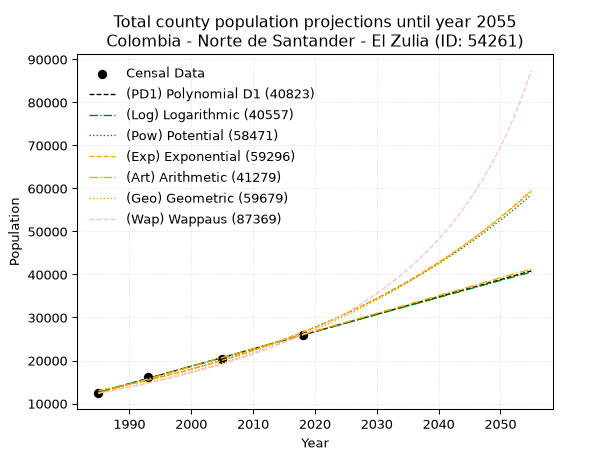
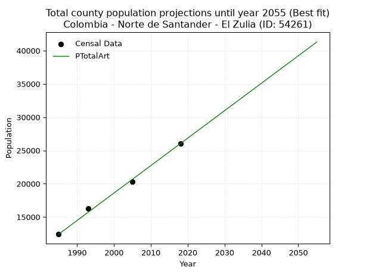
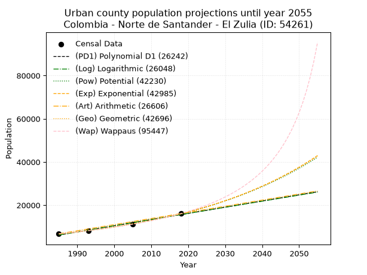
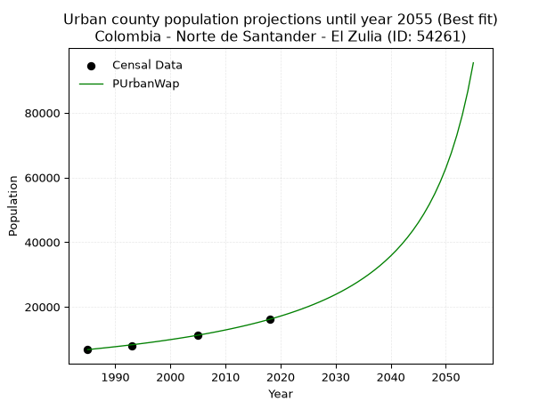
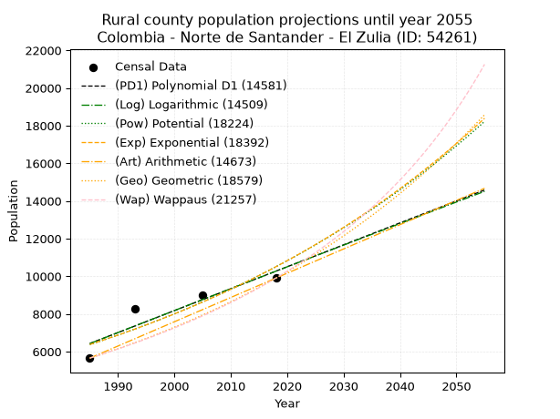
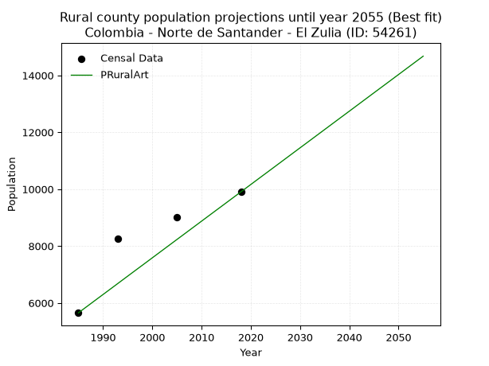

<div align="center">


</div>

# 📜 _“Population and Public Services Demand Projections (PPSD) until Year 2050 for Colombia - Norte de Santander - El Zulia (ID: 54261)”_
Keywords: `population` `public-service` `projection` `lineal` `polynomial` `logarithmic` `potential` `exponential` `arithmetic` `geometric` `wappaus` `dane` `colombia` `south-america`

PPSD are analytical estimates used by governments and planners to anticipate future changes in population size, age distribution, and the resulting community needs for utilities, healthcare, education, and infrastructure as sizing future water treatment facilities, electrical grids, and road networks based on spatial growth.

<div align="center">

</img>

</div>


> **General running parameters**: • app_version: _v20260806_. • Python version: _3.14.7_. • Pandas version: _3.0.5_. • NumPy version: _2.5.1_. • Creates, save and include plots into reports (create_plot): _False_. • Projection until year: _2050_. • Process polynomial degree 2 and up: _False_. • Process Wappaus: _True_. • Process Wappaus: _True_. • Set negative values to zero: _True_. • Set infinite values to zero: _True_. • Drop dataset notes: _True_. 
<div align="center">

Maps & GIS Layers: [:earth_americas:Google](http://maps.google.com/maps?q=7.938571956,-72.6047169) [:earth_americas:OSM](https://www.openstreetmap.org/#map=18/7.938571956/-72.6047169&layers=P) [:earth_americas:Bing](https://www.bing.com/maps?cp=7.938571956~-72.6047169&lvl=18) [:earth_americas:Apple](https://maps.apple.com/frame?center=7.938571956%2C-72.6047169&span=0.003%2C0.006) [:earth_americas:GISMobile](https://github.com/rcfdtools/R.GISMobile/blob/main/file/gis/CountyLayer_CO/Readme.md)

</div>


<div align="center">

```geojson
{
  "type": "Feature",
  "geometry": {
    "type": "Point", 
    "coordinates": [-72.6047169, 7.938571956]
  }, 
  "properties": {
    "Name": "Colombia - Norte de Santander - El Zulia (ID: 54261)"
  }
}
```

</div>


## 0. Census Data (4 records)

Census data are official statistics collected by a government about the people and housing in a country. They usually include counts of total population, age, sex, race, income, education, and jobs.

📅Global census file: [Population.xlsx](../data/Population.xlsx)

| Source   |   Year |   CountryID | CountryName   |   StateID | StateName          |   CountyID | CountyName   |   PTotal |   PUrban |   PRural |
|:---------|-------:|------------:|:--------------|----------:|:-------------------|-----------:|:-------------|---------:|---------:|---------:|
| DANE     |   1985 |          57 | Colombia      |        54 | Norte de Santander |      54261 | El Zulia     |    12409 |     6758 |     5651 |
| DANE     |   1993 |          57 | Colombia      |        54 | Norte de Santander |      54261 | El Zulia     |    16284 |     8029 |     8255 |
| DANE     |   2005 |          57 | Colombia      |        54 | Norte de Santander |      54261 | El Zulia     |    20309 |    11305 |     9004 |
| DANE     |   2018 |          57 | Colombia      |        54 | Norte de Santander |      54261 | El Zulia     |    26019 |    16115 |     9904 |

> 🔥Some records could had specific notes about the registered values or the corresponding urban or rural distribution.

📅[SUI-RUPS](https://www.datos.gov.co/Hacienda-y-Cr-dito-P-blico/Registro-nico-de-Prestadores-de-Servicios-P-blicos/4qkq-csdn/about_data) - Local public utility companies: [RUPS.csv](../data/RUPS.csv)

 | SERVICIO       | ESTADO    | NOMBRE                                                               | NIT         | DEPARTAMENTO_DOMICILIO   | MUNICIPIO_DOMICILIO   | DIRECCION              |   TELEFONO | EMAIL               | TIPO_PRESTADOR                            | CLASIFICACION                  |
|:---------------|:----------|:---------------------------------------------------------------------|:------------|:-------------------------|:----------------------|:-----------------------|-----------:|:--------------------|:------------------------------------------|:-------------------------------|
| ACUEDUCTO      | OPERATIVA | EMPRESAS MUNICIPALES DE SERVICIOS PUBLICOS DOMICILIARIOS DE EL ZULIA | 807002043-3 | NORTE DE SANTANDER       | EL ZULIA              | CALLE 7 N. 2-03 CENTRO |    5789038 | jahacon@hotmail.com | EMPRESA INDUSTRIAL Y COMERCIAL DEL ESTADO | DESDE 2501 HASTA 5000 USUARIOS |
| ALCANTARILLADO | OPERATIVA | EMPRESAS MUNICIPALES DE SERVICIOS PUBLICOS DOMICILIARIOS DE EL ZULIA | 807002043-3 | NORTE DE SANTANDER       | EL ZULIA              | CALLE 7 N. 2-03 CENTRO |    5789038 | jahacon@hotmail.com | EMPRESA INDUSTRIAL Y COMERCIAL DEL ESTADO | DESDE 2501 HASTA 5000 USUARIOS |

## 1. Total

### 1.1. Coefficients and Parameters

* (PD1) Polynomial Deg 1: 403.0650341228384, -787475.5845042076 (lineal)
* (Log) Logarithmic: 806780.7433442761, -6113591.645294973
* (Pow) Potential: 43.4410013954574, -139.1449207940161
* (Exp) Exponential: 0.021697265205879484, 2.5630578079356373e-15
* (Art) Arithmetic: Year diff. 2018 - 1985 = 33, Population diff. 26019 - 12409 = 13610, Annual growth = 412.42424242424244
* (Geo) Geometric: Year diff. 2018 - 1985 = 33, Population diff. 26019 - 12409 = 13610, Annual growth % = 0.022690107538724913
* (Wap) Wappaus: i = 2.1464777892382765, Condition values only valid for < 200)

<sub>
Wappaus condition values: ['0.00', '2.15', '4.29', '6.44', '8.59', '10.73', '12.88', '15.03', '17.17', '19.32', '21.46', '23.61', '25.76', '27.90', '30.05', '32.20', '34.34', '36.49', '38.64', '40.78', '42.93', '45.08', '47.22', '49.37', '51.52', '53.66', '55.81', '57.95', '60.10', '62.25', '64.39', '66.54', '68.69', '70.83', '72.98', '75.13', '77.27', '79.42', '81.57', '83.71', '85.86', '88.01', '90.15', '92.30', '94.45', '96.59', '98.74', '100.88', '103.03', '105.18', '107.32', '109.47', '111.62', '113.76', '115.91', '118.06', '120.20', '122.35', '124.50', '126.64', '128.79', '130.94', '133.08', '135.23', '137.37', '139.52']
</sub>


### 1.2. Projected Dataset

|   Year |   CountyID |   PTotalPD1 |   PTotalLog |   PTotalPow |   PTotalExp |   PTotalArt |   PTotalGeo |   PTotalWap |
|-------:|-----------:|------------:|------------:|------------:|------------:|------------:|------------:|------------:|
|   1985 |      54261 |       12609 |       12596 |       12975 |       12984 |       12409 |       12409 |       12409 |
|   1986 |      54261 |       13012 |       13003 |       13262 |       13269 |       12821 |       12691 |       12678 |
|   1987 |      54261 |       13415 |       13409 |       13555 |       13560 |       13234 |       12979 |       12953 |
|   1988 |      54261 |       13818 |       13815 |       13854 |       13858 |       13646 |       13273 |       13235 |
|   1989 |      54261 |       14221 |       14221 |       14160 |       14162 |       14059 |       13574 |       13522 |
|   1990 |      54261 |       14624 |       14626 |       14473 |       14472 |       14471 |       13882 |       13816 |
|   1991 |      54261 |       15027 |       15031 |       14792 |       14790 |       14884 |       14197 |       14117 |
|   1992 |      54261 |       15430 |       15436 |       15119 |       15114 |       15296 |       14519 |       14425 |
|   1993 |      54261 |       15833 |       15841 |       15452 |       15446 |       15708 |       14849 |       14740 |
|   1994 |      54261 |       16236 |       16246 |       15792 |       15784 |       16121 |       15186 |       15063 |
|   1995 |      54261 |       16639 |       16651 |       16140 |       16131 |       16533 |       15530 |       15393 |
|   1996 |      54261 |       17042 |       17055 |       16495 |       16484 |       16946 |       15883 |       15731 |
|   1997 |      54261 |       17445 |       17459 |       16858 |       16846 |       17358 |       16243 |       16078 |
|   1998 |      54261 |       17848 |       17863 |       17229 |       17215 |       17771 |       16612 |       16433 |
|   1999 |      54261 |       18251 |       18267 |       17607 |       17593 |       18183 |       16988 |       16797 |
|   2000 |      54261 |       18654 |       18670 |       17994 |       17979 |       18595 |       17374 |       17171 |
|   2001 |      54261 |       19058 |       19073 |       18389 |       18373 |       19008 |       17768 |       17554 |
|   2002 |      54261 |       19461 |       19476 |       18793 |       18776 |       19420 |       18171 |       17948 |
|   2003 |      54261 |       19864 |       19879 |       19205 |       19188 |       19833 |       18584 |       18351 |
|   2004 |      54261 |       20267 |       20282 |       19626 |       19609 |       20245 |       19005 |       18766 |
|   2005 |      54261 |       20670 |       20685 |       20056 |       20039 |       20657 |       19436 |       19192 |
|   2006 |      54261 |       21073 |       21087 |       20495 |       20479 |       21070 |       19878 |       19630 |
|   2007 |      54261 |       21476 |       21489 |       20943 |       20928 |       21482 |       20329 |       20080 |
|   2008 |      54261 |       21879 |       21891 |       21401 |       21387 |       21895 |       20790 |       20543 |
|   2009 |      54261 |       22282 |       22292 |       21869 |       21856 |       22307 |       21262 |       21019 |
|   2010 |      54261 |       22685 |       22694 |       22347 |       22335 |       22720 |       21744 |       21510 |
|   2011 |      54261 |       23088 |       23095 |       22835 |       22825 |       23132 |       22237 |       22015 |
|   2012 |      54261 |       23491 |       23496 |       23334 |       23326 |       23544 |       22742 |       22535 |
|   2013 |      54261 |       23894 |       23897 |       23843 |       23838 |       23957 |       23258 |       23071 |
|   2014 |      54261 |       24297 |       24298 |       24363 |       24360 |       24369 |       23786 |       23624 |
|   2015 |      54261 |       24700 |       24698 |       24894 |       24895 |       24782 |       24325 |       24194 |
|   2016 |      54261 |       25104 |       25099 |       25436 |       25441 |       25194 |       24877 |       24783 |
|   2017 |      54261 |       25507 |       25499 |       25990 |       25999 |       25607 |       25442 |       25391 |
|   2018 |      54261 |       25910 |       25899 |       26556 |       26569 |       26019 |       26019 |       26019 |
|   2019 |      54261 |       26313 |       26298 |       27134 |       27152 |       26431 |       26609 |       26668 |
|   2020 |      54261 |       26716 |       26698 |       27724 |       27747 |       26844 |       27213 |       27340 |
|   2021 |      54261 |       27119 |       27097 |       28326 |       28356 |       27256 |       27831 |       28035 |
|   2022 |      54261 |       27522 |       27496 |       28942 |       28978 |       27669 |       28462 |       28755 |
|   2023 |      54261 |       27925 |       27895 |       29570 |       29614 |       28081 |       29108 |       29501 |
|   2024 |      54261 |       28328 |       28294 |       30212 |       30263 |       28494 |       29768 |       30275 |
|   2025 |      54261 |       28731 |       28692 |       30867 |       30927 |       28906 |       30444 |       31078 |
|   2026 |      54261 |       29134 |       29091 |       31536 |       31605 |       29318 |       31135 |       31911 |
|   2027 |      54261 |       29537 |       29489 |       32219 |       32299 |       29731 |       31841 |       32777 |
|   2028 |      54261 |       29940 |       29887 |       32917 |       33007 |       30143 |       32564 |       33678 |
|   2029 |      54261 |       30343 |       30284 |       33630 |       33731 |       30556 |       33302 |       34615 |
|   2030 |      54261 |       30746 |       30682 |       34357 |       34471 |       30968 |       34058 |       35591 |
|   2031 |      54261 |       31149 |       31079 |       35100 |       35227 |       31381 |       34831 |       36608 |
|   2032 |      54261 |       31553 |       31476 |       35859 |       36000 |       31793 |       35621 |       37670 |
|   2033 |      54261 |       31956 |       31873 |       36634 |       36789 |       32205 |       36429 |       38778 |
|   2034 |      54261 |       32359 |       32270 |       37425 |       37596 |       32618 |       37256 |       39937 |
|   2035 |      54261 |       32762 |       32667 |       38232 |       38421 |       33030 |       38101 |       41150 |
|   2036 |      54261 |       33165 |       33063 |       39057 |       39264 |       33443 |       38966 |       42419 |
|   2037 |      54261 |       33568 |       33459 |       39899 |       40125 |       33855 |       39850 |       43751 |
|   2038 |      54261 |       33971 |       33855 |       40759 |       41005 |       34267 |       40754 |       45149 |
|   2039 |      54261 |       34374 |       34251 |       41637 |       41904 |       34680 |       41679 |       46618 |
|   2040 |      54261 |       34777 |       34646 |       42533 |       42824 |       35092 |       42625 |       48164 |
|   2041 |      54261 |       35180 |       35042 |       43448 |       43763 |       35505 |       43592 |       49794 |
|   2042 |      54261 |       35583 |       35437 |       44383 |       44723 |       35917 |       44581 |       51513 |
|   2043 |      54261 |       35986 |       35832 |       45337 |       45704 |       36330 |       45592 |       53330 |
|   2044 |      54261 |       36389 |       36227 |       46311 |       46706 |       36742 |       46627 |       55254 |
|   2045 |      54261 |       36792 |       36621 |       47306 |       47731 |       37154 |       47685 |       57293 |
|   2046 |      54261 |       37195 |       37016 |       48321 |       48778 |       37567 |       48767 |       59460 |
|   2047 |      54261 |       37599 |       37410 |       49358 |       49848 |       37979 |       49873 |       61765 |
|   2048 |      54261 |       38002 |       37804 |       50416 |       50941 |       38392 |       51005 |       64223 |
|   2049 |      54261 |       38405 |       38198 |       51497 |       52058 |       38804 |       52162 |       66850 |
|   2050 |      54261 |       38808 |       38592 |       52600 |       53200 |       39217 |       53346 |       69663 |
<div align="center">

</img>

</div>


### 1.3. Best fit with absolute and relative error (%)

Relative error puts that difference into context by dividing the absolute error by the true value, creating a unitless ratio or percentage that shows the scale of the mistake.

Absolute and relative error

|   Year | Source   |   CountryID | CountryName   |   StateID | StateName          |   CountyID_x | CountyName   |   PTotal |   PUrban |   PRural |   CountyID_y |   PTotalPD1 |   PTotalLog |   PTotalPow |   PTotalExp |   PTotalArt |   PTotalGeo |   PTotalWap |   PTotalPD1AbsError |   PTotalLogAbsError |   PTotalPowAbsError |   PTotalExpAbsError |   PTotalArtAbsError |   PTotalGeoAbsError |   PTotalWapAbsError |   PTotalPD1RelError |   PTotalLogRelError |   PTotalPowRelError |   PTotalExpRelError |   PTotalArtRelError |   PTotalGeoRelError |   PTotalWapRelError |
|-------:|:---------|------------:|:--------------|----------:|:-------------------|-------------:|:-------------|---------:|---------:|---------:|-------------:|------------:|------------:|------------:|------------:|------------:|------------:|------------:|--------------------:|--------------------:|--------------------:|--------------------:|--------------------:|--------------------:|--------------------:|--------------------:|--------------------:|--------------------:|--------------------:|--------------------:|--------------------:|--------------------:|
|   1985 | DANE     |          57 | Colombia      |        54 | Norte de Santander |        54261 | El Zulia     |    12409 |     6758 |     5651 |        54261 |       12609 |       12596 |       12975 |       12984 |       12409 |       12409 |       12409 |                 200 |                 187 |                 566 |                 575 |                   0 |                   0 |                   0 |            1.61173  |            1.50697  |             4.56121 |             4.63373 |             0       |             0       |             0       |
|   1993 | DANE     |          57 | Colombia      |        54 | Norte de Santander |        54261 | El Zulia     |    16284 |     8029 |     8255 |        54261 |       15833 |       15841 |       15452 |       15446 |       15708 |       14849 |       14740 |                 451 |                 443 |                 832 |                 838 |                 576 |                1435 |                1544 |            2.76959  |            2.72046  |             5.10931 |             5.14616 |             3.53721 |             8.81233 |             9.4817  |
|   2005 | DANE     |          57 | Colombia      |        54 | Norte de Santander |        54261 | El Zulia     |    20309 |    11305 |     9004 |        54261 |       20670 |       20685 |       20056 |       20039 |       20657 |       19436 |       19192 |                 361 |                 376 |                 253 |                 270 |                 348 |                 873 |                1117 |            1.77754  |            1.8514   |             1.24575 |             1.32946 |             1.71353 |             4.29859 |             5.50002 |
|   2018 | DANE     |          57 | Colombia      |        54 | Norte de Santander |        54261 | El Zulia     |    26019 |    16115 |     9904 |        54261 |       25910 |       25899 |       26556 |       26569 |       26019 |       26019 |       26019 |                 109 |                 120 |                 537 |                 550 |                   0 |                   0 |                   0 |            0.418925 |            0.461201 |             2.06388 |             2.11384 |             0       |             0       |             0       |

Relative error mean

| Method    |   RelError | Best   |
|:----------|-----------:|:-------|
| PTotalPD1 |    1.64445 |        |
| PTotalLog |    1.63501 |        |
| PTotalPow |    3.24504 |        |
| PTotalExp |    3.3058  |        |
| PTotalArt |    1.31269 | True   |
| PTotalGeo |    3.27773 |        |
| PTotalWap |    3.74543 |        |

💙Best method: _**PTotalArt**_
<div align="center">

</img>

</div>


### 1.4. Fresh water supply demand in liters per capita per day (lpcd)

The fresh water supply demand typically ranges from 100 to 300 liters per capita per day (lpcd) for standard domestic and municipal planning, though absolute survival minimums set by the World Health Organization are as low as 7.5 to 20 liters per day, and total consumption in high-income nations can exceed 400 liters.

> `CZ`: Level in meters above the sea level (masl)<br> `WS`: Fresh water supply demand in liters per capita per day (lpcd or l/h/d)<br> `WSAll`: Zonal fresh water supply demand in liters per second (l/s)<br> `A`: Zonal area in square meters<br> `DP`: Population density (people/hectare or p/ha)

Reference values (RAS Colombia)

|    CZ |   WS |
|------:|-----:|
|  1000 |  120 |
|  2000 |  130 |
| 99999 |  140 |

County shapefile geometry properties and water supply values

|   CountyID |      ATotal |   CZTotal |   WSTotal |
|-----------:|------------:|----------:|----------:|
|      54261 | 5.04246e+08 |   470.543 |       120 |

Projected values for best method: PTotalArt

|   CountyID |   Year |   PTotalArt |   DPTotal |   WSTotal |   WSTotalAll |
|-----------:|-------:|------------:|----------:|----------:|-------------:|
|      54261 |   1985 |       12409 |      0.25 |       120 |      17.2347 |
|      54261 |   1986 |       12821 |      0.25 |       120 |      17.8069 |
|      54261 |   1987 |       13234 |      0.26 |       120 |      18.3806 |
|      54261 |   1988 |       13646 |      0.27 |       120 |      18.9528 |
|      54261 |   1989 |       14059 |      0.28 |       120 |      19.5264 |
|      54261 |   1990 |       14471 |      0.29 |       120 |      20.0986 |
|      54261 |   1991 |       14884 |      0.3  |       120 |      20.6722 |
|      54261 |   1992 |       15296 |      0.3  |       120 |      21.2444 |
|      54261 |   1993 |       15708 |      0.31 |       120 |      21.8167 |
|      54261 |   1994 |       16121 |      0.32 |       120 |      22.3903 |
|      54261 |   1995 |       16533 |      0.33 |       120 |      22.9625 |
|      54261 |   1996 |       16946 |      0.34 |       120 |      23.5361 |
|      54261 |   1997 |       17358 |      0.34 |       120 |      24.1083 |
|      54261 |   1998 |       17771 |      0.35 |       120 |      24.6819 |
|      54261 |   1999 |       18183 |      0.36 |       120 |      25.2542 |
|      54261 |   2000 |       18595 |      0.37 |       120 |      25.8264 |
|      54261 |   2001 |       19008 |      0.38 |       120 |      26.4    |
|      54261 |   2002 |       19420 |      0.39 |       120 |      26.9722 |
|      54261 |   2003 |       19833 |      0.39 |       120 |      27.5458 |
|      54261 |   2004 |       20245 |      0.4  |       120 |      28.1181 |
|      54261 |   2005 |       20657 |      0.41 |       120 |      28.6903 |
|      54261 |   2006 |       21070 |      0.42 |       120 |      29.2639 |
|      54261 |   2007 |       21482 |      0.43 |       120 |      29.8361 |
|      54261 |   2008 |       21895 |      0.43 |       120 |      30.4097 |
|      54261 |   2009 |       22307 |      0.44 |       120 |      30.9819 |
|      54261 |   2010 |       22720 |      0.45 |       120 |      31.5556 |
|      54261 |   2011 |       23132 |      0.46 |       120 |      32.1278 |
|      54261 |   2012 |       23544 |      0.47 |       120 |      32.7    |
|      54261 |   2013 |       23957 |      0.48 |       120 |      33.2736 |
|      54261 |   2014 |       24369 |      0.48 |       120 |      33.8458 |
|      54261 |   2015 |       24782 |      0.49 |       120 |      34.4194 |
|      54261 |   2016 |       25194 |      0.5  |       120 |      34.9917 |
|      54261 |   2017 |       25607 |      0.51 |       120 |      35.5653 |
|      54261 |   2018 |       26019 |      0.52 |       120 |      36.1375 |
|      54261 |   2019 |       26431 |      0.52 |       120 |      36.7097 |
|      54261 |   2020 |       26844 |      0.53 |       120 |      37.2833 |
|      54261 |   2021 |       27256 |      0.54 |       120 |      37.8556 |
|      54261 |   2022 |       27669 |      0.55 |       120 |      38.4292 |
|      54261 |   2023 |       28081 |      0.56 |       120 |      39.0014 |
|      54261 |   2024 |       28494 |      0.57 |       120 |      39.575  |
|      54261 |   2025 |       28906 |      0.57 |       120 |      40.1472 |
|      54261 |   2026 |       29318 |      0.58 |       120 |      40.7194 |
|      54261 |   2027 |       29731 |      0.59 |       120 |      41.2931 |
|      54261 |   2028 |       30143 |      0.6  |       120 |      41.8653 |
|      54261 |   2029 |       30556 |      0.61 |       120 |      42.4389 |
|      54261 |   2030 |       30968 |      0.61 |       120 |      43.0111 |
|      54261 |   2031 |       31381 |      0.62 |       120 |      43.5847 |
|      54261 |   2032 |       31793 |      0.63 |       120 |      44.1569 |
|      54261 |   2033 |       32205 |      0.64 |       120 |      44.7292 |
|      54261 |   2034 |       32618 |      0.65 |       120 |      45.3028 |
|      54261 |   2035 |       33030 |      0.66 |       120 |      45.875  |
|      54261 |   2036 |       33443 |      0.66 |       120 |      46.4486 |
|      54261 |   2037 |       33855 |      0.67 |       120 |      47.0208 |
|      54261 |   2038 |       34267 |      0.68 |       120 |      47.5931 |
|      54261 |   2039 |       34680 |      0.69 |       120 |      48.1667 |
|      54261 |   2040 |       35092 |      0.7  |       120 |      48.7389 |
|      54261 |   2041 |       35505 |      0.7  |       120 |      49.3125 |
|      54261 |   2042 |       35917 |      0.71 |       120 |      49.8847 |
|      54261 |   2043 |       36330 |      0.72 |       120 |      50.4583 |
|      54261 |   2044 |       36742 |      0.73 |       120 |      51.0306 |
|      54261 |   2045 |       37154 |      0.74 |       120 |      51.6028 |
|      54261 |   2046 |       37567 |      0.75 |       120 |      52.1764 |
|      54261 |   2047 |       37979 |      0.75 |       120 |      52.7486 |
|      54261 |   2048 |       38392 |      0.76 |       120 |      53.3222 |
|      54261 |   2049 |       38804 |      0.77 |       120 |      53.8944 |
|      54261 |   2050 |       39217 |      0.78 |       120 |      54.4681 |

## 2. Urban

### 2.1. Coefficients and Parameters

* (PD1) Polynomial Deg 1: 286.58410276996864, -562688.1015656297 (lineal)
* (Log) Logarithmic: 573434.226652, -4348126.401995352
* (Pow) Potential: 53.414509782543206, -172.326602466652
* (Exp) Exponential: 0.026687618497856995, 6.535467534357792e-20
* (Art) Arithmetic: Year diff. 2018 - 1985 = 33, Population diff. 16115 - 6758 = 9357, Annual growth = 283.54545454545456
* (Geo) Geometric: Year diff. 2018 - 1985 = 33, Population diff. 16115 - 6758 = 9357, Annual growth % = 0.026683851110544055
* (Wap) Wappaus: i = 2.479302711016959, Condition values only valid for < 200)

<sub>
Wappaus condition values: ['0.00', '2.48', '4.96', '7.44', '9.92', '12.40', '14.88', '17.36', '19.83', '22.31', '24.79', '27.27', '29.75', '32.23', '34.71', '37.19', '39.67', '42.15', '44.63', '47.11', '49.59', '52.07', '54.54', '57.02', '59.50', '61.98', '64.46', '66.94', '69.42', '71.90', '74.38', '76.86', '79.34', '81.82', '84.30', '86.78', '89.25', '91.73', '94.21', '96.69', '99.17', '101.65', '104.13', '106.61', '109.09', '111.57', '114.05', '116.53', '119.01', '121.49', '123.97', '126.44', '128.92', '131.40', '133.88', '136.36', '138.84', '141.32', '143.80', '146.28', '148.76', '151.24', '153.72', '156.20', '158.68', '161.15']
</sub>


### 2.2. Projected Dataset

|   Year |   CountyID |   PUrbanPD1 |   PUrbanLog |   PUrbanPow |   PUrbanExp |   PUrbanArt |   PUrbanGeo |   PUrbanWap |
|-------:|-----------:|------------:|------------:|------------:|------------:|------------:|------------:|------------:|
|   1985 |      54261 |        6181 |        6174 |        6632 |        6637 |        6758 |        6758 |        6758 |
|   1986 |      54261 |        6468 |        6463 |        6813 |        6817 |        7042 |        6938 |        6928 |
|   1987 |      54261 |        6755 |        6752 |        6999 |        7001 |        7325 |        7123 |        7102 |
|   1988 |      54261 |        7041 |        7040 |        7189 |        7191 |        7609 |        7314 |        7280 |
|   1989 |      54261 |        7328 |        7329 |        7385 |        7385 |        7892 |        7509 |        7463 |
|   1990 |      54261 |        7614 |        7617 |        7586 |        7585 |        8176 |        7709 |        7651 |
|   1991 |      54261 |        7901 |        7905 |        7792 |        7790 |        8459 |        7915 |        7844 |
|   1992 |      54261 |        8187 |        8193 |        8004 |        8001 |        8743 |        8126 |        8042 |
|   1993 |      54261 |        8474 |        8481 |        8222 |        8217 |        9026 |        8343 |        8246 |
|   1994 |      54261 |        8761 |        8768 |        8445 |        8439 |        9310 |        8565 |        8455 |
|   1995 |      54261 |        9047 |        9056 |        8674 |        8668 |        9593 |        8794 |        8671 |
|   1996 |      54261 |        9334 |        9343 |        8910 |        8902 |        9877 |        9029 |        8892 |
|   1997 |      54261 |        9620 |        9630 |        9151 |        9143 |       10161 |        9270 |        9120 |
|   1998 |      54261 |        9907 |        9918 |        9399 |        9390 |       10444 |        9517 |        9355 |
|   1999 |      54261 |       10194 |       10204 |        9654 |        9644 |       10728 |        9771 |        9596 |
|   2000 |      54261 |       10480 |       10491 |        9915 |        9905 |       11011 |       10032 |        9845 |
|   2001 |      54261 |       10767 |       10778 |       10183 |       10173 |       11295 |       10299 |       10102 |
|   2002 |      54261 |       11053 |       11064 |       10459 |       10448 |       11578 |       10574 |       10367 |
|   2003 |      54261 |       11340 |       11351 |       10742 |       10730 |       11862 |       10856 |       10640 |
|   2004 |      54261 |       11626 |       11637 |       11032 |       11021 |       12145 |       11146 |       10922 |
|   2005 |      54261 |       11913 |       11923 |       11330 |       11319 |       12429 |       11443 |       11214 |
|   2006 |      54261 |       12200 |       12209 |       11636 |       11625 |       12712 |       11749 |       11515 |
|   2007 |      54261 |       12486 |       12495 |       11949 |       11939 |       12996 |       12062 |       11826 |
|   2008 |      54261 |       12773 |       12780 |       12272 |       12262 |       13280 |       12384 |       12149 |
|   2009 |      54261 |       13059 |       13066 |       12602 |       12594 |       13563 |       12715 |       12482 |
|   2010 |      54261 |       13346 |       13351 |       12942 |       12935 |       13847 |       13054 |       12828 |
|   2011 |      54261 |       13633 |       13636 |       13290 |       13284 |       14130 |       13402 |       13186 |
|   2012 |      54261 |       13919 |       13922 |       13648 |       13644 |       14414 |       13760 |       13558 |
|   2013 |      54261 |       14206 |       14206 |       14015 |       14013 |       14697 |       14127 |       13944 |
|   2014 |      54261 |       14492 |       14491 |       14392 |       14392 |       14981 |       14504 |       14344 |
|   2015 |      54261 |       14779 |       14776 |       14778 |       14781 |       15264 |       14891 |       14761 |
|   2016 |      54261 |       15065 |       15060 |       15175 |       15181 |       15548 |       15288 |       15194 |
|   2017 |      54261 |       15352 |       15345 |       15583 |       15591 |       15831 |       15696 |       15645 |
|   2018 |      54261 |       15639 |       15629 |       16001 |       16013 |       16115 |       16115 |       16115 |
|   2019 |      54261 |       15925 |       15913 |       16430 |       16446 |       16399 |       16545 |       16605 |
|   2020 |      54261 |       16212 |       16197 |       16870 |       16891 |       16682 |       16986 |       17117 |
|   2021 |      54261 |       16498 |       16481 |       17322 |       17348 |       16966 |       17440 |       17651 |
|   2022 |      54261 |       16785 |       16765 |       17786 |       17817 |       17249 |       17905 |       18210 |
|   2023 |      54261 |       17072 |       17048 |       18262 |       18299 |       17533 |       18383 |       18795 |
|   2024 |      54261 |       17358 |       17331 |       18750 |       18794 |       17816 |       18873 |       19409 |
|   2025 |      54261 |       17645 |       17615 |       19252 |       19302 |       18100 |       19377 |       20052 |
|   2026 |      54261 |       17931 |       17898 |       19766 |       19824 |       18383 |       19894 |       20728 |
|   2027 |      54261 |       18218 |       18181 |       20294 |       20360 |       18667 |       20425 |       21439 |
|   2028 |      54261 |       18504 |       18464 |       20836 |       20911 |       18950 |       20970 |       22187 |
|   2029 |      54261 |       18791 |       18746 |       21392 |       21477 |       19234 |       21530 |       22977 |
|   2030 |      54261 |       19078 |       19029 |       21962 |       22057 |       19518 |       22104 |       23810 |
|   2031 |      54261 |       19364 |       19311 |       22548 |       22654 |       19801 |       22694 |       24692 |
|   2032 |      54261 |       19651 |       19594 |       23148 |       23267 |       20085 |       23299 |       25626 |
|   2033 |      54261 |       19937 |       19876 |       23765 |       23896 |       20368 |       23921 |       26618 |
|   2034 |      54261 |       20224 |       20158 |       24397 |       24542 |       20652 |       24559 |       27671 |
|   2035 |      54261 |       20511 |       20440 |       25046 |       25206 |       20935 |       25215 |       28794 |
|   2036 |      54261 |       20797 |       20721 |       25712 |       25888 |       21219 |       25888 |       29992 |
|   2037 |      54261 |       21084 |       21003 |       26396 |       26588 |       21502 |       26578 |       31274 |
|   2038 |      54261 |       21370 |       21284 |       27097 |       27307 |       21786 |       27288 |       32649 |
|   2039 |      54261 |       21657 |       21566 |       27816 |       28046 |       22069 |       28016 |       34127 |
|   2040 |      54261 |       21943 |       21847 |       28554 |       28804 |       22353 |       28763 |       35720 |
|   2041 |      54261 |       22230 |       22128 |       29312 |       29583 |       22637 |       29531 |       37442 |
|   2042 |      54261 |       22517 |       22409 |       30089 |       30384 |       22920 |       30319 |       39309 |
|   2043 |      54261 |       22803 |       22689 |       30886 |       31205 |       23204 |       31128 |       41341 |
|   2044 |      54261 |       23090 |       22970 |       31704 |       32049 |       23487 |       31958 |       43561 |
|   2045 |      54261 |       23376 |       23250 |       32543 |       32916 |       23771 |       32811 |       45996 |
|   2046 |      54261 |       23663 |       23531 |       33404 |       33807 |       24054 |       33687 |       48678 |
|   2047 |      54261 |       23950 |       23811 |       34287 |       34721 |       24338 |       34586 |       51648 |
|   2048 |      54261 |       24236 |       24091 |       35194 |       35660 |       24621 |       35508 |       54953 |
|   2049 |      54261 |       24523 |       24371 |       36123 |       36624 |       24905 |       36456 |       58656 |
|   2050 |      54261 |       24809 |       24651 |       37077 |       37615 |       25188 |       37429 |       62831 |
<div align="center">

</img>

</div>


### 2.3. Best fit with absolute and relative error (%)

Relative error puts that difference into context by dividing the absolute error by the true value, creating a unitless ratio or percentage that shows the scale of the mistake.

Absolute and relative error

|   Year | Source   |   CountryID | CountryName   |   StateID | StateName          |   CountyID_x | CountyName   |   PTotal |   PUrban |   PRural |   CountyID_y |   PUrbanPD1 |   PUrbanLog |   PUrbanPow |   PUrbanExp |   PUrbanArt |   PUrbanGeo |   PUrbanWap |   PUrbanPD1AbsError |   PUrbanLogAbsError |   PUrbanPowAbsError |   PUrbanExpAbsError |   PUrbanArtAbsError |   PUrbanGeoAbsError |   PUrbanWapAbsError |   PUrbanPD1RelError |   PUrbanLogRelError |   PUrbanPowRelError |   PUrbanExpRelError |   PUrbanArtRelError |   PUrbanGeoRelError |   PUrbanWapRelError |
|-------:|:---------|------------:|:--------------|----------:|:-------------------|-------------:|:-------------|---------:|---------:|---------:|-------------:|------------:|------------:|------------:|------------:|------------:|------------:|------------:|--------------------:|--------------------:|--------------------:|--------------------:|--------------------:|--------------------:|--------------------:|--------------------:|--------------------:|--------------------:|--------------------:|--------------------:|--------------------:|--------------------:|
|   1985 | DANE     |          57 | Colombia      |        54 | Norte de Santander |        54261 | El Zulia     |    12409 |     6758 |     5651 |        54261 |        6181 |        6174 |        6632 |        6637 |        6758 |        6758 |        6758 |                 577 |                 584 |                 126 |                 121 |                   0 |                   0 |                   0 |             8.53803 |             8.64161 |            1.86446  |            1.79047  |              0      |             0       |            0        |
|   1993 | DANE     |          57 | Colombia      |        54 | Norte de Santander |        54261 | El Zulia     |    16284 |     8029 |     8255 |        54261 |        8474 |        8481 |        8222 |        8217 |        9026 |        8343 |        8246 |                 445 |                 452 |                 193 |                 188 |                 997 |                 314 |                 217 |             5.54241 |             5.62959 |            2.40379  |            2.34151  |             12.4175 |             3.91082 |            2.7027   |
|   2005 | DANE     |          57 | Colombia      |        54 | Norte de Santander |        54261 | El Zulia     |    20309 |    11305 |     9004 |        54261 |       11913 |       11923 |       11330 |       11319 |       12429 |       11443 |       11214 |                 608 |                 618 |                  25 |                  14 |                1124 |                 138 |                  91 |             5.37815 |             5.46661 |            0.221141 |            0.123839 |              9.9425 |             1.2207  |            0.804954 |
|   2018 | DANE     |          57 | Colombia      |        54 | Norte de Santander |        54261 | El Zulia     |    26019 |    16115 |     9904 |        54261 |       15639 |       15629 |       16001 |       16013 |       16115 |       16115 |       16115 |                 476 |                 486 |                 114 |                 102 |                   0 |                   0 |                   0 |             2.95377 |             3.01582 |            0.707415 |            0.632951 |              0      |             0       |            0        |

Relative error mean

| Method    |   RelError | Best   |
|:----------|-----------:|:-------|
| PUrbanPD1 |   5.60309  |        |
| PUrbanLog |   5.68841  |        |
| PUrbanPow |   1.2992   |        |
| PUrbanExp |   1.22219  |        |
| PUrbanArt |   5.59     |        |
| PUrbanGeo |   1.28288  |        |
| PUrbanWap |   0.876914 | True   |

💙Best method: _**PUrbanWap**_
<div align="center">

</img>

</div>


### 2.4. Fresh water supply demand in liters per capita per day (lpcd)

The fresh water supply demand typically ranges from 100 to 300 liters per capita per day (lpcd) for standard domestic and municipal planning, though absolute survival minimums set by the World Health Organization are as low as 7.5 to 20 liters per day, and total consumption in high-income nations can exceed 400 liters.

> `CZ`: Level in meters above the sea level (masl)<br> `WS`: Fresh water supply demand in liters per capita per day (lpcd or l/h/d)<br> `WSAll`: Zonal fresh water supply demand in liters per second (l/s)<br> `A`: Zonal area in square meters<br> `DP`: Population density (people/hectare or p/ha)

Reference values (RAS Colombia)

|    CZ |   WS |
|------:|-----:|
|  1000 |  120 |
|  2000 |  130 |
| 99999 |  140 |

County shapefile geometry properties and water supply values

|   CountyID |      AUrban |   CZUrban |   WSUrban |
|-----------:|------------:|----------:|----------:|
|      54261 | 1.93242e+06 |   221.044 |       120 |

Projected values for best method: PUrbanWap

|   CountyID |   Year |   PUrbanWap |   DPUrban |   WSUrban |   WSUrbanAll |
|-----------:|-------:|------------:|----------:|----------:|-------------:|
|      54261 |   1985 |        6758 |     34.97 |       120 |      9.38611 |
|      54261 |   1986 |        6928 |     35.85 |       120 |      9.62222 |
|      54261 |   1987 |        7102 |     36.75 |       120 |      9.86389 |
|      54261 |   1988 |        7280 |     37.67 |       120 |     10.1111  |
|      54261 |   1989 |        7463 |     38.62 |       120 |     10.3653  |
|      54261 |   1990 |        7651 |     39.59 |       120 |     10.6264  |
|      54261 |   1991 |        7844 |     40.59 |       120 |     10.8944  |
|      54261 |   1992 |        8042 |     41.62 |       120 |     11.1694  |
|      54261 |   1993 |        8246 |     42.67 |       120 |     11.4528  |
|      54261 |   1994 |        8455 |     43.75 |       120 |     11.7431  |
|      54261 |   1995 |        8671 |     44.87 |       120 |     12.0431  |
|      54261 |   1996 |        8892 |     46.01 |       120 |     12.35    |
|      54261 |   1997 |        9120 |     47.19 |       120 |     12.6667  |
|      54261 |   1998 |        9355 |     48.41 |       120 |     12.9931  |
|      54261 |   1999 |        9596 |     49.66 |       120 |     13.3278  |
|      54261 |   2000 |        9845 |     50.95 |       120 |     13.6736  |
|      54261 |   2001 |       10102 |     52.28 |       120 |     14.0306  |
|      54261 |   2002 |       10367 |     53.65 |       120 |     14.3986  |
|      54261 |   2003 |       10640 |     55.06 |       120 |     14.7778  |
|      54261 |   2004 |       10922 |     56.52 |       120 |     15.1694  |
|      54261 |   2005 |       11214 |     58.03 |       120 |     15.575   |
|      54261 |   2006 |       11515 |     59.59 |       120 |     15.9931  |
|      54261 |   2007 |       11826 |     61.2  |       120 |     16.425   |
|      54261 |   2008 |       12149 |     62.87 |       120 |     16.8736  |
|      54261 |   2009 |       12482 |     64.59 |       120 |     17.3361  |
|      54261 |   2010 |       12828 |     66.38 |       120 |     17.8167  |
|      54261 |   2011 |       13186 |     68.24 |       120 |     18.3139  |
|      54261 |   2012 |       13558 |     70.16 |       120 |     18.8306  |
|      54261 |   2013 |       13944 |     72.16 |       120 |     19.3667  |
|      54261 |   2014 |       14344 |     74.23 |       120 |     19.9222  |
|      54261 |   2015 |       14761 |     76.39 |       120 |     20.5014  |
|      54261 |   2016 |       15194 |     78.63 |       120 |     21.1028  |
|      54261 |   2017 |       15645 |     80.96 |       120 |     21.7292  |
|      54261 |   2018 |       16115 |     83.39 |       120 |     22.3819  |
|      54261 |   2019 |       16605 |     85.93 |       120 |     23.0625  |
|      54261 |   2020 |       17117 |     88.58 |       120 |     23.7736  |
|      54261 |   2021 |       17651 |     91.34 |       120 |     24.5153  |
|      54261 |   2022 |       18210 |     94.23 |       120 |     25.2917  |
|      54261 |   2023 |       18795 |     97.26 |       120 |     26.1042  |
|      54261 |   2024 |       19409 |    100.44 |       120 |     26.9569  |
|      54261 |   2025 |       20052 |    103.77 |       120 |     27.85    |
|      54261 |   2026 |       20728 |    107.26 |       120 |     28.7889  |
|      54261 |   2027 |       21439 |    110.94 |       120 |     29.7764  |
|      54261 |   2028 |       22187 |    114.81 |       120 |     30.8153  |
|      54261 |   2029 |       22977 |    118.9  |       120 |     31.9125  |
|      54261 |   2030 |       23810 |    123.21 |       120 |     33.0694  |
|      54261 |   2031 |       24692 |    127.78 |       120 |     34.2944  |
|      54261 |   2032 |       25626 |    132.61 |       120 |     35.5917  |
|      54261 |   2033 |       26618 |    137.74 |       120 |     36.9694  |
|      54261 |   2034 |       27671 |    143.19 |       120 |     38.4319  |
|      54261 |   2035 |       28794 |    149.01 |       120 |     39.9917  |
|      54261 |   2036 |       29992 |    155.2  |       120 |     41.6556  |
|      54261 |   2037 |       31274 |    161.84 |       120 |     43.4361  |
|      54261 |   2038 |       32649 |    168.95 |       120 |     45.3458  |
|      54261 |   2039 |       34127 |    176.6  |       120 |     47.3986  |
|      54261 |   2040 |       35720 |    184.85 |       120 |     49.6111  |
|      54261 |   2041 |       37442 |    193.76 |       120 |     52.0028  |
|      54261 |   2042 |       39309 |    203.42 |       120 |     54.5958  |
|      54261 |   2043 |       41341 |    213.93 |       120 |     57.4181  |
|      54261 |   2044 |       43561 |    225.42 |       120 |     60.5014  |
|      54261 |   2045 |       45996 |    238.02 |       120 |     63.8833  |
|      54261 |   2046 |       48678 |    251.9  |       120 |     67.6083  |
|      54261 |   2047 |       51648 |    267.27 |       120 |     71.7333  |
|      54261 |   2048 |       54953 |    284.37 |       120 |     76.3236  |
|      54261 |   2049 |       58656 |    303.54 |       120 |     81.4667  |
|      54261 |   2050 |       62831 |    325.14 |       120 |     87.2653  |

## 3. Rural

### 3.1. Coefficients and Parameters

* (PD1) Polynomial Deg 1: 116.48093135286966, -224787.48293857757 (lineal)
* (Log) Logarithmic: 233346.5166922763, -1765465.243299622
* (Pow) Potential: 30.323508940978954, -96.19543053737225
* (Exp) Exponential: 0.015134010986127395, 5.726563102467998e-10
* (Art) Arithmetic: Year diff. 2018 - 1985 = 33, Population diff. 9904 - 5651 = 4253, Annual growth = 128.87878787878788
* (Geo) Geometric: Year diff. 2018 - 1985 = 33, Population diff. 9904 - 5651 = 4253, Annual growth % = 0.017148595544055567
* (Wap) Wappaus: i = 1.6570721681618499, Condition values only valid for < 200)

<sub>
Wappaus condition values: ['0.00', '1.66', '3.31', '4.97', '6.63', '8.29', '9.94', '11.60', '13.26', '14.91', '16.57', '18.23', '19.88', '21.54', '23.20', '24.86', '26.51', '28.17', '29.83', '31.48', '33.14', '34.80', '36.46', '38.11', '39.77', '41.43', '43.08', '44.74', '46.40', '48.06', '49.71', '51.37', '53.03', '54.68', '56.34', '58.00', '59.65', '61.31', '62.97', '64.63', '66.28', '67.94', '69.60', '71.25', '72.91', '74.57', '76.23', '77.88', '79.54', '81.20', '82.85', '84.51', '86.17', '87.82', '89.48', '91.14', '92.80', '94.45', '96.11', '97.77', '99.42', '101.08', '102.74', '104.40', '106.05', '107.71']
</sub>


### 3.2. Projected Dataset

|   Year |   CountyID |   PRuralPD1 |   PRuralLog |   PRuralPow |   PRuralExp |   PRuralArt |   PRuralGeo |   PRuralWap |
|-------:|-----------:|------------:|------------:|------------:|------------:|------------:|------------:|------------:|
|   1985 |      54261 |        6427 |        6422 |        6371 |        6376 |        5651 |        5651 |        5651 |
|   1986 |      54261 |        6544 |        6540 |        6470 |        6473 |        5780 |        5748 |        5745 |
|   1987 |      54261 |        6660 |        6657 |        6569 |        6572 |        5909 |        5846 |        5841 |
|   1988 |      54261 |        6777 |        6775 |        6670 |        6672 |        6038 |        5947 |        5939 |
|   1989 |      54261 |        6893 |        6892 |        6773 |        6774 |        6167 |        6049 |        6038 |
|   1990 |      54261 |        7010 |        7009 |        6877 |        6877 |        6295 |        6152 |        6139 |
|   1991 |      54261 |        7126 |        7126 |        6982 |        6982 |        6424 |        6258 |        6242 |
|   1992 |      54261 |        7243 |        7244 |        7089 |        7088 |        6553 |        6365 |        6347 |
|   1993 |      54261 |        7359 |        7361 |        7198 |        7196 |        6682 |        6474 |        6453 |
|   1994 |      54261 |        7475 |        7478 |        7308 |        7306 |        6811 |        6585 |        6562 |
|   1995 |      54261 |        7592 |        7595 |        7420 |        7418 |        6940 |        6698 |        6672 |
|   1996 |      54261 |        7708 |        7712 |        7534 |        7531 |        7069 |        6813 |        6784 |
|   1997 |      54261 |        7825 |        7829 |        7649 |        7646 |        7198 |        6930 |        6899 |
|   1998 |      54261 |        7941 |        7945 |        7766 |        7762 |        7326 |        7049 |        7015 |
|   1999 |      54261 |        8058 |        8062 |        7885 |        7881 |        7455 |        7170 |        7134 |
|   2000 |      54261 |        8174 |        8179 |        8005 |        8001 |        7584 |        7293 |        7255 |
|   2001 |      54261 |        8291 |        8296 |        8128 |        8123 |        7713 |        7418 |        7378 |
|   2002 |      54261 |        8407 |        8412 |        8252 |        8247 |        7842 |        7545 |        7504 |
|   2003 |      54261 |        8524 |        8529 |        8378 |        8372 |        7971 |        7674 |        7632 |
|   2004 |      54261 |        8640 |        8645 |        8505 |        8500 |        8100 |        7806 |        7763 |
|   2005 |      54261 |        8757 |        8762 |        8635 |        8630 |        8229 |        7940 |        7896 |
|   2006 |      54261 |        8873 |        8878 |        8767 |        8761 |        8357 |        8076 |        8032 |
|   2007 |      54261 |        8990 |        8994 |        8900 |        8895 |        8486 |        8215 |        8170 |
|   2008 |      54261 |        9106 |        9110 |        9036 |        9030 |        8615 |        8355 |        8312 |
|   2009 |      54261 |        9223 |        9227 |        9173 |        9168 |        8744 |        8499 |        8456 |
|   2010 |      54261 |        9339 |        9343 |        9312 |        9308 |        8873 |        8644 |        8604 |
|   2011 |      54261 |        9456 |        9459 |        9454 |        9450 |        9002 |        8793 |        8754 |
|   2012 |      54261 |        9572 |        9575 |        9598 |        9594 |        9131 |        8943 |        8908 |
|   2013 |      54261 |        9689 |        9691 |        9743 |        9740 |        9260 |        9097 |        9065 |
|   2014 |      54261 |        9805 |        9807 |        9891 |        9889 |        9388 |        9253 |        9225 |
|   2015 |      54261 |        9922 |        9922 |       10041 |       10040 |        9517 |        9411 |        9389 |
|   2016 |      54261 |       10038 |       10038 |       10193 |       10193 |        9646 |        9573 |        9557 |
|   2017 |      54261 |       10155 |       10154 |       10348 |       10348 |        9775 |        9737 |        9729 |
|   2018 |      54261 |       10271 |       10270 |       10505 |       10506 |        9904 |        9904 |        9904 |
|   2019 |      54261 |       10388 |       10385 |       10664 |       10666 |       10033 |       10074 |       10083 |
|   2020 |      54261 |       10504 |       10501 |       10825 |       10829 |       10162 |       10247 |       10267 |
|   2021 |      54261 |       10620 |       10616 |       10989 |       10994 |       10291 |       10422 |       10455 |
|   2022 |      54261 |       10737 |       10732 |       11155 |       11162 |       10420 |       10601 |       10647 |
|   2023 |      54261 |       10853 |       10847 |       11323 |       11332 |       10548 |       10783 |       10845 |
|   2024 |      54261 |       10970 |       10962 |       11494 |       11505 |       10677 |       10968 |       11046 |
|   2025 |      54261 |       11086 |       11078 |       11668 |       11680 |       10806 |       11156 |       11253 |
|   2026 |      54261 |       11203 |       11193 |       11844 |       11858 |       10935 |       11347 |       11465 |
|   2027 |      54261 |       11319 |       11308 |       12022 |       12039 |       11064 |       11542 |       11683 |
|   2028 |      54261 |       11436 |       11423 |       12203 |       12223 |       11193 |       11740 |       11906 |
|   2029 |      54261 |       11552 |       11538 |       12387 |       12409 |       11322 |       11941 |       12135 |
|   2030 |      54261 |       11669 |       11653 |       12573 |       12598 |       11451 |       12146 |       12370 |
|   2031 |      54261 |       11785 |       11768 |       12763 |       12790 |       11579 |       12354 |       12611 |
|   2032 |      54261 |       11902 |       11883 |       12955 |       12985 |       11708 |       12566 |       12859 |
|   2033 |      54261 |       12018 |       11998 |       13149 |       13183 |       11837 |       12781 |       13114 |
|   2034 |      54261 |       12135 |       12112 |       13347 |       13384 |       11966 |       13001 |       13375 |
|   2035 |      54261 |       12251 |       12227 |       13547 |       13588 |       12095 |       13223 |       13645 |
|   2036 |      54261 |       12368 |       12342 |       13751 |       13796 |       12224 |       13450 |       13921 |
|   2037 |      54261 |       12484 |       12456 |       13957 |       14006 |       12353 |       13681 |       14206 |
|   2038 |      54261 |       12601 |       12571 |       14166 |       14220 |       12482 |       13915 |       14500 |
|   2039 |      54261 |       12717 |       12685 |       14378 |       14436 |       12610 |       14154 |       14802 |
|   2040 |      54261 |       12834 |       12800 |       14594 |       14657 |       12739 |       14397 |       15113 |
|   2041 |      54261 |       12950 |       12914 |       14812 |       14880 |       12868 |       14644 |       15434 |
|   2042 |      54261 |       13067 |       13028 |       15034 |       15107 |       12997 |       14895 |       15765 |
|   2043 |      54261 |       13183 |       13143 |       15259 |       15337 |       13126 |       15150 |       16107 |
|   2044 |      54261 |       13300 |       13257 |       15487 |       15571 |       13255 |       15410 |       16459 |
|   2045 |      54261 |       13416 |       13371 |       15718 |       15809 |       13384 |       15674 |       16824 |
|   2046 |      54261 |       13533 |       13485 |       15953 |       16050 |       13513 |       15943 |       17200 |
|   2047 |      54261 |       13649 |       13599 |       16191 |       16295 |       13641 |       16217 |       17589 |
|   2048 |      54261 |       13765 |       13713 |       16433 |       16543 |       13770 |       16495 |       17992 |
|   2049 |      54261 |       13882 |       13827 |       16678 |       16795 |       13899 |       16777 |       18409 |
|   2050 |      54261 |       13998 |       13941 |       16927 |       17051 |       14028 |       17065 |       18841 |
<div align="center">

</img>

</div>


### 3.3. Best fit with absolute and relative error (%)

Relative error puts that difference into context by dividing the absolute error by the true value, creating a unitless ratio or percentage that shows the scale of the mistake.

Absolute and relative error

|   Year | Source   |   CountryID | CountryName   |   StateID | StateName          |   CountyID_x | CountyName   |   PTotal |   PUrban |   PRural |   CountyID_y |   PRuralPD1 |   PRuralLog |   PRuralPow |   PRuralExp |   PRuralArt |   PRuralGeo |   PRuralWap |   PRuralPD1AbsError |   PRuralLogAbsError |   PRuralPowAbsError |   PRuralExpAbsError |   PRuralArtAbsError |   PRuralGeoAbsError |   PRuralWapAbsError |   PRuralPD1RelError |   PRuralLogRelError |   PRuralPowRelError |   PRuralExpRelError |   PRuralArtRelError |   PRuralGeoRelError |   PRuralWapRelError |
|-------:|:---------|------------:|:--------------|----------:|:-------------------|-------------:|:-------------|---------:|---------:|---------:|-------------:|------------:|------------:|------------:|------------:|------------:|------------:|------------:|--------------------:|--------------------:|--------------------:|--------------------:|--------------------:|--------------------:|--------------------:|--------------------:|--------------------:|--------------------:|--------------------:|--------------------:|--------------------:|--------------------:|
|   1985 | DANE     |          57 | Colombia      |        54 | Norte de Santander |        54261 | El Zulia     |    12409 |     6758 |     5651 |        54261 |        6427 |        6422 |        6371 |        6376 |        5651 |        5651 |        5651 |                 776 |                 771 |                 720 |                 725 |                   0 |                   0 |                   0 |            13.7321  |            13.6436  |            12.7411  |            12.8296  |             0       |              0      |              0      |
|   1993 | DANE     |          57 | Colombia      |        54 | Norte de Santander |        54261 | El Zulia     |    16284 |     8029 |     8255 |        54261 |        7359 |        7361 |        7198 |        7196 |        6682 |        6474 |        6453 |                 896 |                 894 |                1057 |                1059 |                1573 |                1781 |                1802 |            10.854   |            10.8298  |            12.8044  |            12.8286  |            19.0551  |             21.5748 |             21.8292 |
|   2005 | DANE     |          57 | Colombia      |        54 | Norte de Santander |        54261 | El Zulia     |    20309 |    11305 |     9004 |        54261 |        8757 |        8762 |        8635 |        8630 |        8229 |        7940 |        7896 |                 247 |                 242 |                 369 |                 374 |                 775 |                1064 |                1108 |             2.74323 |             2.68769 |             4.09818 |             4.15371 |             8.60729 |             11.817  |             12.3056 |
|   2018 | DANE     |          57 | Colombia      |        54 | Norte de Santander |        54261 | El Zulia     |    26019 |    16115 |     9904 |        54261 |       10271 |       10270 |       10505 |       10506 |        9904 |        9904 |        9904 |                 367 |                 366 |                 601 |                 602 |                   0 |                   0 |                   0 |             3.70557 |             3.69548 |             6.06826 |             6.07835 |             0       |              0      |              0      |

Relative error mean

| Method    |   RelError | Best   |
|:----------|-----------:|:-------|
| PRuralPD1 |    7.75873 |        |
| PRuralLog |    7.71414 |        |
| PRuralPow |    8.92798 |        |
| PRuralExp |    8.97256 |        |
| PRuralArt |    6.9156  | True   |
| PRuralGeo |    8.34794 |        |
| PRuralWap |    8.53371 |        |

💙Best method: _**PRuralArt**_
<div align="center">

</img>

</div>


### 3.4. Fresh water supply demand in liters per capita per day (lpcd)

The fresh water supply demand typically ranges from 100 to 300 liters per capita per day (lpcd) for standard domestic and municipal planning, though absolute survival minimums set by the World Health Organization are as low as 7.5 to 20 liters per day, and total consumption in high-income nations can exceed 400 liters.

> `CZ`: Level in meters above the sea level (masl)<br> `WS`: Fresh water supply demand in liters per capita per day (lpcd or l/h/d)<br> `WSAll`: Zonal fresh water supply demand in liters per second (l/s)<br> `A`: Zonal area in square meters<br> `DP`: Population density (people/hectare or p/ha)

Reference values (RAS Colombia)

|    CZ |   WS |
|------:|-----:|
|  1000 |  120 |
|  2000 |  130 |
| 99999 |  140 |

County shapefile geometry properties and water supply values

|   CountyID |      ARural |   CZRural |   WSRural |
|-----------:|------------:|----------:|----------:|
|      54261 | 5.02314e+08 |   471.479 |       120 |

Projected values for best method: PRuralArt

|   CountyID |   Year |   PRuralArt |   DPRural |   WSRural |   WSRuralAll |
|-----------:|-------:|------------:|----------:|----------:|-------------:|
|      54261 |   1985 |        5651 |      0.11 |       120 |      7.84861 |
|      54261 |   1986 |        5780 |      0.12 |       120 |      8.02778 |
|      54261 |   1987 |        5909 |      0.12 |       120 |      8.20694 |
|      54261 |   1988 |        6038 |      0.12 |       120 |      8.38611 |
|      54261 |   1989 |        6167 |      0.12 |       120 |      8.56528 |
|      54261 |   1990 |        6295 |      0.13 |       120 |      8.74306 |
|      54261 |   1991 |        6424 |      0.13 |       120 |      8.92222 |
|      54261 |   1992 |        6553 |      0.13 |       120 |      9.10139 |
|      54261 |   1993 |        6682 |      0.13 |       120 |      9.28056 |
|      54261 |   1994 |        6811 |      0.14 |       120 |      9.45972 |
|      54261 |   1995 |        6940 |      0.14 |       120 |      9.63889 |
|      54261 |   1996 |        7069 |      0.14 |       120 |      9.81806 |
|      54261 |   1997 |        7198 |      0.14 |       120 |      9.99722 |
|      54261 |   1998 |        7326 |      0.15 |       120 |     10.175   |
|      54261 |   1999 |        7455 |      0.15 |       120 |     10.3542  |
|      54261 |   2000 |        7584 |      0.15 |       120 |     10.5333  |
|      54261 |   2001 |        7713 |      0.15 |       120 |     10.7125  |
|      54261 |   2002 |        7842 |      0.16 |       120 |     10.8917  |
|      54261 |   2003 |        7971 |      0.16 |       120 |     11.0708  |
|      54261 |   2004 |        8100 |      0.16 |       120 |     11.25    |
|      54261 |   2005 |        8229 |      0.16 |       120 |     11.4292  |
|      54261 |   2006 |        8357 |      0.17 |       120 |     11.6069  |
|      54261 |   2007 |        8486 |      0.17 |       120 |     11.7861  |
|      54261 |   2008 |        8615 |      0.17 |       120 |     11.9653  |
|      54261 |   2009 |        8744 |      0.17 |       120 |     12.1444  |
|      54261 |   2010 |        8873 |      0.18 |       120 |     12.3236  |
|      54261 |   2011 |        9002 |      0.18 |       120 |     12.5028  |
|      54261 |   2012 |        9131 |      0.18 |       120 |     12.6819  |
|      54261 |   2013 |        9260 |      0.18 |       120 |     12.8611  |
|      54261 |   2014 |        9388 |      0.19 |       120 |     13.0389  |
|      54261 |   2015 |        9517 |      0.19 |       120 |     13.2181  |
|      54261 |   2016 |        9646 |      0.19 |       120 |     13.3972  |
|      54261 |   2017 |        9775 |      0.19 |       120 |     13.5764  |
|      54261 |   2018 |        9904 |      0.2  |       120 |     13.7556  |
|      54261 |   2019 |       10033 |      0.2  |       120 |     13.9347  |
|      54261 |   2020 |       10162 |      0.2  |       120 |     14.1139  |
|      54261 |   2021 |       10291 |      0.2  |       120 |     14.2931  |
|      54261 |   2022 |       10420 |      0.21 |       120 |     14.4722  |
|      54261 |   2023 |       10548 |      0.21 |       120 |     14.65    |
|      54261 |   2024 |       10677 |      0.21 |       120 |     14.8292  |
|      54261 |   2025 |       10806 |      0.22 |       120 |     15.0083  |
|      54261 |   2026 |       10935 |      0.22 |       120 |     15.1875  |
|      54261 |   2027 |       11064 |      0.22 |       120 |     15.3667  |
|      54261 |   2028 |       11193 |      0.22 |       120 |     15.5458  |
|      54261 |   2029 |       11322 |      0.23 |       120 |     15.725   |
|      54261 |   2030 |       11451 |      0.23 |       120 |     15.9042  |
|      54261 |   2031 |       11579 |      0.23 |       120 |     16.0819  |
|      54261 |   2032 |       11708 |      0.23 |       120 |     16.2611  |
|      54261 |   2033 |       11837 |      0.24 |       120 |     16.4403  |
|      54261 |   2034 |       11966 |      0.24 |       120 |     16.6194  |
|      54261 |   2035 |       12095 |      0.24 |       120 |     16.7986  |
|      54261 |   2036 |       12224 |      0.24 |       120 |     16.9778  |
|      54261 |   2037 |       12353 |      0.25 |       120 |     17.1569  |
|      54261 |   2038 |       12482 |      0.25 |       120 |     17.3361  |
|      54261 |   2039 |       12610 |      0.25 |       120 |     17.5139  |
|      54261 |   2040 |       12739 |      0.25 |       120 |     17.6931  |
|      54261 |   2041 |       12868 |      0.26 |       120 |     17.8722  |
|      54261 |   2042 |       12997 |      0.26 |       120 |     18.0514  |
|      54261 |   2043 |       13126 |      0.26 |       120 |     18.2306  |
|      54261 |   2044 |       13255 |      0.26 |       120 |     18.4097  |
|      54261 |   2045 |       13384 |      0.27 |       120 |     18.5889  |
|      54261 |   2046 |       13513 |      0.27 |       120 |     18.7681  |
|      54261 |   2047 |       13641 |      0.27 |       120 |     18.9458  |
|      54261 |   2048 |       13770 |      0.27 |       120 |     19.125   |
|      54261 |   2049 |       13899 |      0.28 |       120 |     19.3042  |
|      54261 |   2050 |       14028 |      0.28 |       120 |     19.4833  |

#

<div align="center"><br><sub>Share this research</sub></div><br>

<sub>**APPS & TOOLS & CONTENT DISCLAIMER**: • NO WARRANTY - This content and software is provided by <a href="https://github.com/rcfdtools" target="_blank">github.com/rcfdtools</a> "as is", without any express or implied warranty, including warranties of merchantability, fitness for a particular purpose, or non-infringement. There is no guarantee that the software will be error-free or operate without interruption. • LIMITATION OF LIABILITY - Neither the authors nor copyright holders will be liable for claims or damages arising from the software or its use. You are responsible for determining if the software is appropriate for your use and assume all associated risks, including errors, legal compliance, and data loss. • NO PROFESSIONAL ADVICE - The software provides general information and does not offer professional advice. It should not replace consultation with professional advisors. [Clauses and global license for rcfdtools use.](https://github.com/rcfdtools/rcfdtools/blob/main/LICENSE.md)</sub>

| [:house: Home](Readme.md)  | [:beginner: Help / Collab](https://github.com/rcfdtools/R.HydroTools/discussions/31) |
|----------------------------|-------------------------------------------------------------------------------------------|