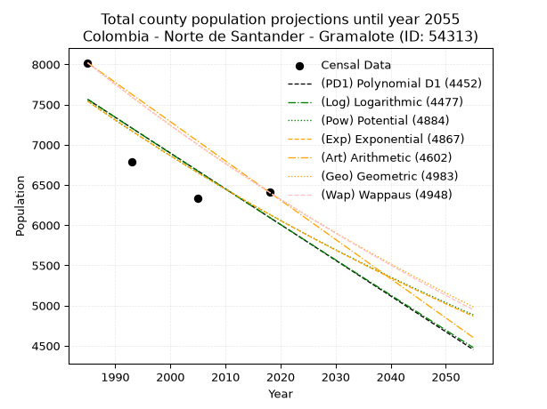
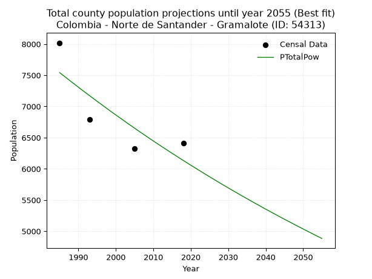
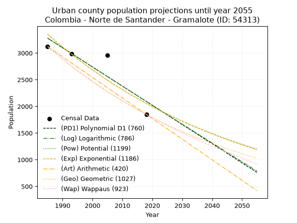
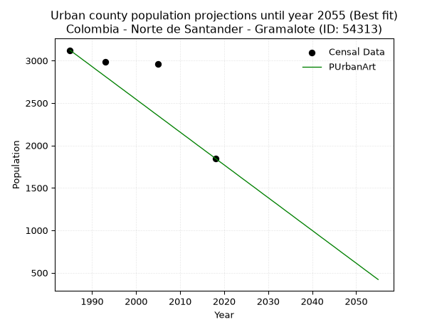
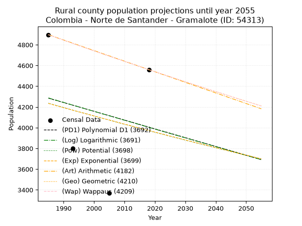
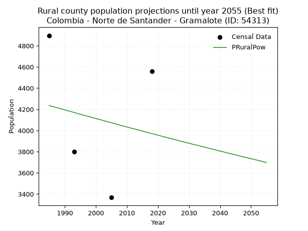

<div align="center">


</div>

# _“Population and Public Services Demand Projections (PPSD) until Year 2050 for Colombia - Norte de Santander - Gramalote (ID: 54313)”_
Keywords: `population` `public-service` `projection` `lineal` `polynomial` `logarithmic` `potential` `exponential` `arithmetic` `geometric` `wappaus` `dane` `colombia` `south-america`

PPSD are analytical estimates used by governments and planners to anticipate future changes in population size, age distribution, and the resulting community needs for utilities, healthcare, education, and infrastructure as sizing future water treatment facilities, electrical grids, and road networks based on spatial growth.

> **General running parameters**: • app_version: _v20260806_. • Python version: _3.14.7_. • Pandas version: _3.0.5_. • NumPy version: _2.5.1_. • Creates, save and include plots into reports (create_plot): _False_. • Projection until year: _2050_. • Process polynomial degree 2 and up: _False_. • Process Wappaus: _True_. • Process Wappaus: _True_. • Set negative values to zero: _True_. • Set infinite values to zero: _True_. • Drop dataset notes: _True_. 
<div align="center">

Dynamic map: [:earth_americas:Google](http://maps.google.com/maps?q=7.916946044,-72.7872327) [:earth_americas:OSM](https://www.openstreetmap.org/#map=18/7.916946044/-72.7872327&layers=P) [:earth_americas:Bing](https://www.bing.com/maps?cp=7.916946044~-72.7872327&lvl=18) [:earth_americas:Apple](https://maps.apple.com/frame?center=7.916946044%2C-72.7872327&span=0.003%2C0.006)

</div>


<div align="center">

```geojson
{
  "type": "Feature",
  "geometry": {
    "type": "Point", 
    "coordinates": [-72.7872327, 7.916946044]
  }, 
  "properties": {
    "Name": "Colombia - Norte de Santander - Gramalote (ID: 54313)"
  }
}
```

</div>


## 0. Census Data (4 records)

Census data are official statistics collected by a government about the people and housing in a country. They usually include counts of total population, age, sex, race, income, education, and jobs.

📅Global census file: [Population.xlsx](../data/Population.xlsx)

| Source   |   Year |   CountryID | CountryName   |   StateID | StateName          |   CountyID | CountyName   |   PTotal |   PUrban |   PRural |
|:---------|-------:|------------:|:--------------|----------:|:-------------------|-----------:|:-------------|---------:|---------:|---------:|
| DANE     |   1985 |          57 | Colombia      |        54 | Norte de Santander |      54313 | Gramalote    |     8019 |     3122 |     4897 |
| DANE     |   1993 |          57 | Colombia      |        54 | Norte de Santander |      54313 | Gramalote    |     6786 |     2988 |     3798 |
| DANE     |   2005 |          57 | Colombia      |        54 | Norte De Santander |      54313 | Gramalote    |     6329 |     2961 |     3368 |
| DANE     |   2018 |          57 | Colombia      |        54 | Norte de Santander |      54313 | Gramalote    |     6408 |     1848 |     4560 |

> 🔥Some records could had specific notes about the registered values or the corresponding urban or rural distribution.

📅   [RUPS](https://www.datos.gov.co/Hacienda-y-Cr-dito-P-blico/Registro-nico-de-Prestadores-de-Servicios-P-blicos/4qkq-csdn/about_data) - Local public utility companies: [RUPS.csv](../data/RUPS.xlsx)

 | SERVICIO       | ESTADO    | NOMBRE                                                                                    | NIT         | DEPARTAMENTO_DOMICILIO   | MUNICIPIO_DOMICILIO   | DIRECCION                                         |   TELEFONO | EMAIL                                      | TIPO_INSCRIPCION    | REPRESENTANTE_LEGAL             | TIPO_PRESTADOR                 | CLASIFICACION                 |
|:---------------|:----------|:------------------------------------------------------------------------------------------|:------------|:-------------------------|:----------------------|:--------------------------------------------------|-----------:|:-------------------------------------------|:--------------------|:--------------------------------|:-------------------------------|:------------------------------|
| ACUEDUCTO      | OPERATIVA | DEPENDENCIA EMPRESA DE  SERVICIOS PUBLICOS  DE AGUA POTABLE Y ALCANTARILLADO DE GRAMALOTE | 890501404-1 | NORTE DE SANTANDER       | GRAMALOTE             | Centro Administrativo Municipal, Parque Principal |    5667045 | alcaldia@gramalote-nortedesantander.gov.co | Registro por la ESP | MARIO CRISTOPHER VARGAS RIVEROS | MUNICIPIO (PRESTACIÓN DIRECTA) | MENOR O IGUAL A 2500 USUARIOS |
| ALCANTARILLADO | OPERATIVA | DEPENDENCIA EMPRESA DE  SERVICIOS PUBLICOS  DE AGUA POTABLE Y ALCANTARILLADO DE GRAMALOTE | 890501404-1 | NORTE DE SANTANDER       | GRAMALOTE             | Centro Administrativo Municipal, Parque Principal |    5667045 | alcaldia@gramalote-nortedesantander.gov.co | Registro por la ESP | MARIO CRISTOPHER VARGAS RIVEROS | MUNICIPIO (PRESTACIÓN DIRECTA) | MENOR O IGUAL A 2500 USUARIOS |

## 1. Total

### 1.1. Coefficients and Parameters

* (PD1) Polynomial Deg 1: -44.45363307908471, 95803.87956643921 (lineal)
* (Log) Logarithmic: -89119.26857453476, 684281.7745920372
* (Pow) Potential: -12.53695527976023, 45.22138806250838
* (Exp) Exponential: -0.00625374188532997, 1855915044.91696
* (Art) Arithmetic: Year diff. 2018 - 1985 = 33, Population diff. 6408 - 8019 = -1611, Annual growth = -48.81818181818182
* (Geo) Geometric: Year diff. 2018 - 1985 = 33, Population diff. 6408 - 8019 = -1611, Annual growth % = -0.006772914752799508
* (Wap) Wappaus: i = -0.6767613754513317, Condition values only valid for < 200)

<sub>
Wappaus condition values: ['-0.00', '-0.68', '-1.35', '-2.03', '-2.71', '-3.38', '-4.06', '-4.74', '-5.41', '-6.09', '-6.77', '-7.44', '-8.12', '-8.80', '-9.47', '-10.15', '-10.83', '-11.50', '-12.18', '-12.86', '-13.54', '-14.21', '-14.89', '-15.57', '-16.24', '-16.92', '-17.60', '-18.27', '-18.95', '-19.63', '-20.30', '-20.98', '-21.66', '-22.33', '-23.01', '-23.69', '-24.36', '-25.04', '-25.72', '-26.39', '-27.07', '-27.75', '-28.42', '-29.10', '-29.78', '-30.45', '-31.13', '-31.81', '-32.48', '-33.16', '-33.84', '-34.51', '-35.19', '-35.87', '-36.55', '-37.22', '-37.90', '-38.58', '-39.25', '-39.93', '-40.61', '-41.28', '-41.96', '-42.64', '-43.31', '-43.99']
</sub>


### 1.2. Projected Dataset

|   Year |   CountyID |   PTotalPD1 |   PTotalLog |   PTotalPow |   PTotalExp |   PTotalArt |   PTotalGeo |   PTotalWap |
|-------:|-----------:|------------:|------------:|------------:|------------:|------------:|------------:|------------:|
|   1985 |      54313 |        7563 |        7566 |        7542 |        7540 |        8019 |        8019 |        8019 |
|   1986 |      54313 |        7519 |        7521 |        7495 |        7493 |        7970 |        7965 |        7965 |
|   1987 |      54313 |        7475 |        7476 |        7448 |        7446 |        7921 |        7911 |        7911 |
|   1988 |      54313 |        7430 |        7431 |        7401 |        7400 |        7873 |        7857 |        7858 |
|   1989 |      54313 |        7386 |        7386 |        7354 |        7354 |        7824 |        7804 |        7805 |
|   1990 |      54313 |        7341 |        7342 |        7308 |        7308 |        7775 |        7751 |        7752 |
|   1991 |      54313 |        7297 |        7297 |        7262 |        7262 |        7726 |        7699 |        7700 |
|   1992 |      54313 |        7252 |        7252 |        7217 |        7217 |        7677 |        7646 |        7648 |
|   1993 |      54313 |        7208 |        7207 |        7172 |        7172 |        7628 |        7595 |        7596 |
|   1994 |      54313 |        7163 |        7163 |        7127 |        7127 |        7580 |        7543 |        7545 |
|   1995 |      54313 |        7119 |        7118 |        7082 |        7083 |        7531 |        7492 |        7494 |
|   1996 |      54313 |        7074 |        7073 |        7038 |        7039 |        7482 |        7441 |        7443 |
|   1997 |      54313 |        7030 |        7029 |        6994 |        6995 |        7433 |        7391 |        7393 |
|   1998 |      54313 |        6986 |        6984 |        6950 |        6951 |        7384 |        7341 |        7343 |
|   1999 |      54313 |        6941 |        6939 |        6906 |        6908 |        7336 |        7291 |        7294 |
|   2000 |      54313 |        6897 |        6895 |        6863 |        6865 |        7287 |        7242 |        7244 |
|   2001 |      54313 |        6852 |        6850 |        6820 |        6822 |        7238 |        7193 |        7195 |
|   2002 |      54313 |        6808 |        6806 |        6778 |        6779 |        7189 |        7144 |        7147 |
|   2003 |      54313 |        6763 |        6761 |        6735 |        6737 |        7140 |        7096 |        7098 |
|   2004 |      54313 |        6719 |        6717 |        6693 |        6695 |        7091 |        7048 |        7050 |
|   2005 |      54313 |        6674 |        6672 |        6652 |        6653 |        7043 |        7000 |        7002 |
|   2006 |      54313 |        6630 |        6628 |        6610 |        6612 |        6994 |        6952 |        6955 |
|   2007 |      54313 |        6585 |        6584 |        6569 |        6571 |        6945 |        6905 |        6908 |
|   2008 |      54313 |        6541 |        6539 |        6528 |        6530 |        6896 |        6859 |        6861 |
|   2009 |      54313 |        6497 |        6495 |        6487 |        6489 |        6847 |        6812 |        6814 |
|   2010 |      54313 |        6452 |        6450 |        6447 |        6449 |        6799 |        6766 |        6768 |
|   2011 |      54313 |        6408 |        6406 |        6407 |        6408 |        6750 |        6720 |        6722 |
|   2012 |      54313 |        6363 |        6362 |        6367 |        6368 |        6701 |        6675 |        6676 |
|   2013 |      54313 |        6319 |        6318 |        6328 |        6329 |        6652 |        6629 |        6631 |
|   2014 |      54313 |        6274 |        6273 |        6288 |        6289 |        6603 |        6585 |        6586 |
|   2015 |      54313 |        6230 |        6229 |        6249 |        6250 |        6554 |        6540 |        6541 |
|   2016 |      54313 |        6185 |        6185 |        6211 |        6211 |        6506 |        6496 |        6496 |
|   2017 |      54313 |        6141 |        6141 |        6172 |        6172 |        6457 |        6452 |        6452 |
|   2018 |      54313 |        6096 |        6096 |        6134 |        6134 |        6408 |        6408 |        6408 |
|   2019 |      54313 |        6052 |        6052 |        6096 |        6096 |        6359 |        6365 |        6364 |
|   2020 |      54313 |        6008 |        6008 |        6058 |        6058 |        6310 |        6321 |        6321 |
|   2021 |      54313 |        5963 |        5964 |        6021 |        6020 |        6262 |        6279 |        6277 |
|   2022 |      54313 |        5919 |        5920 |        5984 |        5982 |        6213 |        6236 |        6234 |
|   2023 |      54313 |        5874 |        5876 |        5947 |        5945 |        6164 |        6194 |        6192 |
|   2024 |      54313 |        5830 |        5832 |        5910 |        5908 |        6115 |        6152 |        6149 |
|   2025 |      54313 |        5785 |        5788 |        5873 |        5871 |        6066 |        6110 |        6107 |
|   2026 |      54313 |        5741 |        5744 |        5837 |        5835 |        6017 |        6069 |        6065 |
|   2027 |      54313 |        5696 |        5700 |        5801 |        5798 |        5969 |        6028 |        6023 |
|   2028 |      54313 |        5652 |        5656 |        5765 |        5762 |        5920 |        5987 |        5982 |
|   2029 |      54313 |        5607 |        5612 |        5730 |        5726 |        5871 |        5946 |        5941 |
|   2030 |      54313 |        5563 |        5568 |        5695 |        5690 |        5822 |        5906 |        5900 |
|   2031 |      54313 |        5519 |        5524 |        5659 |        5655 |        5773 |        5866 |        5859 |
|   2032 |      54313 |        5474 |        5480 |        5625 |        5620 |        5725 |        5826 |        5818 |
|   2033 |      54313 |        5430 |        5436 |        5590 |        5585 |        5676 |        5787 |        5778 |
|   2034 |      54313 |        5385 |        5393 |        5556 |        5550 |        5627 |        5748 |        5738 |
|   2035 |      54313 |        5341 |        5349 |        5522 |        5515 |        5578 |        5709 |        5698 |
|   2036 |      54313 |        5296 |        5305 |        5488 |        5481 |        5529 |        5670 |        5659 |
|   2037 |      54313 |        5252 |        5261 |        5454 |        5447 |        5480 |        5632 |        5619 |
|   2038 |      54313 |        5207 |        5218 |        5421 |        5413 |        5432 |        5594 |        5580 |
|   2039 |      54313 |        5163 |        5174 |        5387 |        5379 |        5383 |        5556 |        5541 |
|   2040 |      54313 |        5118 |        5130 |        5354 |        5345 |        5334 |        5518 |        5503 |
|   2041 |      54313 |        5074 |        5086 |        5322 |        5312 |        5285 |        5481 |        5464 |
|   2042 |      54313 |        5030 |        5043 |        5289 |        5279 |        5236 |        5444 |        5426 |
|   2043 |      54313 |        4985 |        4999 |        5257 |        5246 |        5188 |        5407 |        5388 |
|   2044 |      54313 |        4941 |        4956 |        5224 |        5213 |        5139 |        5370 |        5350 |
|   2045 |      54313 |        4896 |        4912 |        5192 |        5181 |        5090 |        5334 |        5312 |
|   2046 |      54313 |        4852 |        4868 |        5161 |        5149 |        5041 |        5298 |        5275 |
|   2047 |      54313 |        4807 |        4825 |        5129 |        5117 |        4992 |        5262 |        5238 |
|   2048 |      54313 |        4763 |        4781 |        5098 |        5085 |        4943 |        5226 |        5201 |
|   2049 |      54313 |        4718 |        4738 |        5067 |        5053 |        4895 |        5191 |        5164 |
|   2050 |      54313 |        4674 |        4694 |        5036 |        5021 |        4846 |        5156 |        5127 |
<div align="center">

</img>

</div>


### 1.3. Best fit with absolute and relative error (%)

Relative error puts that difference into context by dividing the absolute error by the true value, creating a unitless ratio or percentage that shows the scale of the mistake.

Absolute and relative error

|   Year | Source   |   CountryID | CountryName   |   StateID | StateName          |   CountyID_x | CountyName   |   PTotal |   PUrban |   PRural |   CountyID_y |   PTotalPD1 |   PTotalLog |   PTotalPow |   PTotalExp |   PTotalArt |   PTotalGeo |   PTotalWap |   PTotalPD1AbsError |   PTotalLogAbsError |   PTotalPowAbsError |   PTotalExpAbsError |   PTotalArtAbsError |   PTotalGeoAbsError |   PTotalWapAbsError |   PTotalPD1RelError |   PTotalLogRelError |   PTotalPowRelError |   PTotalExpRelError |   PTotalArtRelError |   PTotalGeoRelError |   PTotalWapRelError |
|-------:|:---------|------------:|:--------------|----------:|:-------------------|-------------:|:-------------|---------:|---------:|---------:|-------------:|------------:|------------:|------------:|------------:|------------:|------------:|------------:|--------------------:|--------------------:|--------------------:|--------------------:|--------------------:|--------------------:|--------------------:|--------------------:|--------------------:|--------------------:|--------------------:|--------------------:|--------------------:|--------------------:|
|   1985 | DANE     |          57 | Colombia      |        54 | Norte de Santander |        54313 | Gramalote    |     8019 |     3122 |     4897 |        54313 |        7563 |        7566 |        7542 |        7540 |        8019 |        8019 |        8019 |                 456 |                 453 |                 477 |                 479 |                   0 |                   0 |                   0 |             5.68649 |             5.64908 |             5.94837 |             5.97331 |              0      |              0      |              0      |
|   1993 | DANE     |          57 | Colombia      |        54 | Norte de Santander |        54313 | Gramalote    |     6786 |     2988 |     3798 |        54313 |        7208 |        7207 |        7172 |        7172 |        7628 |        7595 |        7596 |                 422 |                 421 |                 386 |                 386 |                 842 |                 809 |                 810 |             6.21869 |             6.20395 |             5.68818 |             5.68818 |             12.4079 |             11.9216 |             11.9363 |
|   2005 | DANE     |          57 | Colombia      |        54 | Norte De Santander |        54313 | Gramalote    |     6329 |     2961 |     3368 |        54313 |        6674 |        6672 |        6652 |        6653 |        7043 |        7000 |        7002 |                 345 |                 343 |                 323 |                 324 |                 714 |                 671 |                 673 |             5.4511  |             5.4195  |             5.10349 |             5.11929 |             11.2814 |             10.602  |             10.6336 |
|   2018 | DANE     |          57 | Colombia      |        54 | Norte de Santander |        54313 | Gramalote    |     6408 |     1848 |     4560 |        54313 |        6096 |        6096 |        6134 |        6134 |        6408 |        6408 |        6408 |                 312 |                 312 |                 274 |                 274 |                   0 |                   0 |                   0 |             4.86891 |             4.86891 |             4.27591 |             4.27591 |              0      |              0      |              0      |

Relative error mean

| Method    |   RelError | Best   |
|:----------|-----------:|:-------|
| PTotalPD1 |    5.5563  |        |
| PTotalLog |    5.53536 |        |
| PTotalPow |    5.25399 | True   |
| PTotalExp |    5.26417 |        |
| PTotalArt |    5.92233 |        |
| PTotalGeo |    5.6309  |        |
| PTotalWap |    5.64248 |        |

💙Best method: _**PTotalPow**_
<div align="center">

</img>

</div>


### 1.4. Fresh water supply demand in liters per capita per day (lpcd)

The fresh water supply demand typically ranges from 100 to 300 liters per capita per day (lpcd) for standard domestic and municipal planning, though absolute survival minimums set by the World Health Organization are as low as 7.5 to 20 liters per day, and total consumption in high-income nations can exceed 400 liters.

> `CZ`: Level in meters above the sea level (masl)<br> `WS`: Fresh water supply demand in liters per capita per day (lpcd or l/h/d)<br> `WSAll`: Zonal fresh water supply demand in liters per second (l/s)<br> `A`: Zonal area in square meters<br> `DP`: Population density (people/hectare or p/ha)

Reference values (RAS Colombia)

|    CZ |   WS |
|------:|-----:|
|  1000 |  120 |
|  2000 |  130 |
| 99999 |  140 |

County shapefile geometry properties and water supply values

|   CountyID |      ATotal |   CZTotal |   WSTotal |
|-----------:|------------:|----------:|----------:|
|      54313 | 1.48715e+08 |   1582.23 |       130 |

Projected values for best method: PTotalPow

|   CountyID |   Year |   PTotalPow |   DPTotal |   WSTotal |   WSTotalAll |
|-----------:|-------:|------------:|----------:|----------:|-------------:|
|      54313 |   1985 |        7542 |      0.51 |       130 |     11.3479  |
|      54313 |   1986 |        7495 |      0.5  |       130 |     11.2772  |
|      54313 |   1987 |        7448 |      0.5  |       130 |     11.2065  |
|      54313 |   1988 |        7401 |      0.5  |       130 |     11.1358  |
|      54313 |   1989 |        7354 |      0.49 |       130 |     11.065   |
|      54313 |   1990 |        7308 |      0.49 |       130 |     10.9958  |
|      54313 |   1991 |        7262 |      0.49 |       130 |     10.9266  |
|      54313 |   1992 |        7217 |      0.49 |       130 |     10.8589  |
|      54313 |   1993 |        7172 |      0.48 |       130 |     10.7912  |
|      54313 |   1994 |        7127 |      0.48 |       130 |     10.7235  |
|      54313 |   1995 |        7082 |      0.48 |       130 |     10.6558  |
|      54313 |   1996 |        7038 |      0.47 |       130 |     10.5896  |
|      54313 |   1997 |        6994 |      0.47 |       130 |     10.5234  |
|      54313 |   1998 |        6950 |      0.47 |       130 |     10.4572  |
|      54313 |   1999 |        6906 |      0.46 |       130 |     10.391   |
|      54313 |   2000 |        6863 |      0.46 |       130 |     10.3263  |
|      54313 |   2001 |        6820 |      0.46 |       130 |     10.2616  |
|      54313 |   2002 |        6778 |      0.46 |       130 |     10.1984  |
|      54313 |   2003 |        6735 |      0.45 |       130 |     10.1337  |
|      54313 |   2004 |        6693 |      0.45 |       130 |     10.0705  |
|      54313 |   2005 |        6652 |      0.45 |       130 |     10.0088  |
|      54313 |   2006 |        6610 |      0.44 |       130 |      9.9456  |
|      54313 |   2007 |        6569 |      0.44 |       130 |      9.88391 |
|      54313 |   2008 |        6528 |      0.44 |       130 |      9.82222 |
|      54313 |   2009 |        6487 |      0.44 |       130 |      9.76053 |
|      54313 |   2010 |        6447 |      0.43 |       130 |      9.70035 |
|      54313 |   2011 |        6407 |      0.43 |       130 |      9.64016 |
|      54313 |   2012 |        6367 |      0.43 |       130 |      9.57998 |
|      54313 |   2013 |        6328 |      0.43 |       130 |      9.5213  |
|      54313 |   2014 |        6288 |      0.42 |       130 |      9.46111 |
|      54313 |   2015 |        6249 |      0.42 |       130 |      9.40243 |
|      54313 |   2016 |        6211 |      0.42 |       130 |      9.34525 |
|      54313 |   2017 |        6172 |      0.42 |       130 |      9.28657 |
|      54313 |   2018 |        6134 |      0.41 |       130 |      9.2294  |
|      54313 |   2019 |        6096 |      0.41 |       130 |      9.17222 |
|      54313 |   2020 |        6058 |      0.41 |       130 |      9.11505 |
|      54313 |   2021 |        6021 |      0.4  |       130 |      9.05937 |
|      54313 |   2022 |        5984 |      0.4  |       130 |      9.0037  |
|      54313 |   2023 |        5947 |      0.4  |       130 |      8.94803 |
|      54313 |   2024 |        5910 |      0.4  |       130 |      8.89236 |
|      54313 |   2025 |        5873 |      0.39 |       130 |      8.83669 |
|      54313 |   2026 |        5837 |      0.39 |       130 |      8.78252 |
|      54313 |   2027 |        5801 |      0.39 |       130 |      8.72836 |
|      54313 |   2028 |        5765 |      0.39 |       130 |      8.67419 |
|      54313 |   2029 |        5730 |      0.39 |       130 |      8.62153 |
|      54313 |   2030 |        5695 |      0.38 |       130 |      8.56887 |
|      54313 |   2031 |        5659 |      0.38 |       130 |      8.5147  |
|      54313 |   2032 |        5625 |      0.38 |       130 |      8.46354 |
|      54313 |   2033 |        5590 |      0.38 |       130 |      8.41088 |
|      54313 |   2034 |        5556 |      0.37 |       130 |      8.35972 |
|      54313 |   2035 |        5522 |      0.37 |       130 |      8.30856 |
|      54313 |   2036 |        5488 |      0.37 |       130 |      8.25741 |
|      54313 |   2037 |        5454 |      0.37 |       130 |      8.20625 |
|      54313 |   2038 |        5421 |      0.36 |       130 |      8.1566  |
|      54313 |   2039 |        5387 |      0.36 |       130 |      8.10544 |
|      54313 |   2040 |        5354 |      0.36 |       130 |      8.05579 |
|      54313 |   2041 |        5322 |      0.36 |       130 |      8.00764 |
|      54313 |   2042 |        5289 |      0.36 |       130 |      7.95799 |
|      54313 |   2043 |        5257 |      0.35 |       130 |      7.90984 |
|      54313 |   2044 |        5224 |      0.35 |       130 |      7.86019 |
|      54313 |   2045 |        5192 |      0.35 |       130 |      7.81204 |
|      54313 |   2046 |        5161 |      0.35 |       130 |      7.76539 |
|      54313 |   2047 |        5129 |      0.34 |       130 |      7.71725 |
|      54313 |   2048 |        5098 |      0.34 |       130 |      7.6706  |
|      54313 |   2049 |        5067 |      0.34 |       130 |      7.62396 |
|      54313 |   2050 |        5036 |      0.34 |       130 |      7.57731 |

## 2. Urban

### 2.1. Coefficients and Parameters

* (PD1) Polynomial Deg 1: -35.98032918506556, 74699.40345242739 (lineal)
* (Log) Logarithmic: -71935.52854198446, 549512.2789027718
* (Pow) Potential: -29.665454262396025, 101.3549027306304
* (Exp) Exponential: -0.014839032864985878, 2.077876704518158e+16
* (Art) Arithmetic: Year diff. 2018 - 1985 = 33, Population diff. 1848 - 3122 = -1274, Annual growth = -38.60606060606061
* (Geo) Geometric: Year diff. 2018 - 1985 = 33, Population diff. 1848 - 3122 = -1274, Annual growth % = -0.01576441547793128
* (Wap) Wappaus: i = -1.5535638070849338, Condition values only valid for < 200)

<sub>
Wappaus condition values: ['-0.00', '-1.55', '-3.11', '-4.66', '-6.21', '-7.77', '-9.32', '-10.87', '-12.43', '-13.98', '-15.54', '-17.09', '-18.64', '-20.20', '-21.75', '-23.30', '-24.86', '-26.41', '-27.96', '-29.52', '-31.07', '-32.62', '-34.18', '-35.73', '-37.29', '-38.84', '-40.39', '-41.95', '-43.50', '-45.05', '-46.61', '-48.16', '-49.71', '-51.27', '-52.82', '-54.37', '-55.93', '-57.48', '-59.04', '-60.59', '-62.14', '-63.70', '-65.25', '-66.80', '-68.36', '-69.91', '-71.46', '-73.02', '-74.57', '-76.12', '-77.68', '-79.23', '-80.79', '-82.34', '-83.89', '-85.45', '-87.00', '-88.55', '-90.11', '-91.66', '-93.21', '-94.77', '-96.32', '-97.87', '-99.43', '-100.98']
</sub>


### 2.2. Projected Dataset

|   Year |   CountyID |   PUrbanPD1 |   PUrbanLog |   PUrbanPow |   PUrbanExp |   PUrbanArt |   PUrbanGeo |   PUrbanWap |
|-------:|-----------:|------------:|------------:|------------:|------------:|------------:|------------:|------------:|
|   1985 |      54313 |        3278 |        3279 |        3352 |        3352 |        3122 |        3122 |        3122 |
|   1986 |      54313 |        3242 |        3243 |        3303 |        3302 |        3083 |        3073 |        3074 |
|   1987 |      54313 |        3206 |        3206 |        3254 |        3254 |        3045 |        3024 |        3026 |
|   1988 |      54313 |        3171 |        3170 |        3205 |        3206 |        3006 |        2977 |        2980 |
|   1989 |      54313 |        3135 |        3134 |        3158 |        3159 |        2968 |        2930 |        2934 |
|   1990 |      54313 |        3099 |        3098 |        3111 |        3112 |        2929 |        2884 |        2889 |
|   1991 |      54313 |        3063 |        3062 |        3065 |        3066 |        2890 |        2838 |        2844 |
|   1992 |      54313 |        3027 |        3026 |        3020 |        3021 |        2852 |        2793 |        2800 |
|   1993 |      54313 |        2991 |        2990 |        2975 |        2977 |        2813 |        2749 |        2757 |
|   1994 |      54313 |        2955 |        2953 |        2931 |        2933 |        2775 |        2706 |        2714 |
|   1995 |      54313 |        2919 |        2917 |        2888 |        2889 |        2736 |        2663 |        2672 |
|   1996 |      54313 |        2883 |        2881 |        2845 |        2847 |        2697 |        2621 |        2630 |
|   1997 |      54313 |        2847 |        2845 |        2803 |        2805 |        2659 |        2580 |        2590 |
|   1998 |      54313 |        2811 |        2809 |        2762 |        2764 |        2620 |        2539 |        2549 |
|   1999 |      54313 |        2775 |        2773 |        2721 |        2723 |        2582 |        2499 |        2510 |
|   2000 |      54313 |        2739 |        2737 |        2681 |        2683 |        2543 |        2460 |        2470 |
|   2001 |      54313 |        2703 |        2701 |        2642 |        2643 |        2504 |        2421 |        2432 |
|   2002 |      54313 |        2667 |        2665 |        2603 |        2604 |        2466 |        2383 |        2394 |
|   2003 |      54313 |        2631 |        2630 |        2565 |        2566 |        2427 |        2345 |        2356 |
|   2004 |      54313 |        2595 |        2594 |        2527 |        2528 |        2388 |        2308 |        2319 |
|   2005 |      54313 |        2559 |        2558 |        2490 |        2491 |        2350 |        2272 |        2282 |
|   2006 |      54313 |        2523 |        2522 |        2453 |        2454 |        2311 |        2236 |        2246 |
|   2007 |      54313 |        2487 |        2486 |        2417 |        2418 |        2273 |        2201 |        2211 |
|   2008 |      54313 |        2451 |        2450 |        2382 |        2383 |        2234 |        2166 |        2176 |
|   2009 |      54313 |        2415 |        2414 |        2347 |        2347 |        2195 |        2132 |        2141 |
|   2010 |      54313 |        2379 |        2379 |        2313 |        2313 |        2157 |        2099 |        2107 |
|   2011 |      54313 |        2343 |        2343 |        2279 |        2279 |        2118 |        2065 |        2073 |
|   2012 |      54313 |        2307 |        2307 |        2245 |        2245 |        2080 |        2033 |        2039 |
|   2013 |      54313 |        2271 |        2271 |        2212 |        2212 |        2041 |        2001 |        2007 |
|   2014 |      54313 |        2235 |        2236 |        2180 |        2180 |        2002 |        1969 |        1974 |
|   2015 |      54313 |        2199 |        2200 |        2148 |        2147 |        1964 |        1938 |        1942 |
|   2016 |      54313 |        2163 |        2164 |        2117 |        2116 |        1925 |        1908 |        1910 |
|   2017 |      54313 |        2127 |        2128 |        2086 |        2085 |        1887 |        1878 |        1879 |
|   2018 |      54313 |        2091 |        2093 |        2055 |        2054 |        1848 |        1848 |        1848 |
|   2019 |      54313 |        2055 |        2057 |        2026 |        2024 |        1809 |        1819 |        1817 |
|   2020 |      54313 |        2019 |        2022 |        1996 |        1994 |        1771 |        1790 |        1787 |
|   2021 |      54313 |        1983 |        1986 |        1967 |        1965 |        1732 |        1762 |        1757 |
|   2022 |      54313 |        1947 |        1950 |        1938 |        1936 |        1694 |        1734 |        1728 |
|   2023 |      54313 |        1911 |        1915 |        1910 |        1907 |        1655 |        1707 |        1699 |
|   2024 |      54313 |        1875 |        1879 |        1882 |        1879 |        1616 |        1680 |        1670 |
|   2025 |      54313 |        1839 |        1844 |        1855 |        1851 |        1578 |        1653 |        1642 |
|   2026 |      54313 |        1803 |        1808 |        1828 |        1824 |        1539 |        1627 |        1614 |
|   2027 |      54313 |        1767 |        1773 |        1801 |        1797 |        1501 |        1602 |        1586 |
|   2028 |      54313 |        1731 |        1737 |        1775 |        1771 |        1462 |        1576 |        1559 |
|   2029 |      54313 |        1695 |        1702 |        1749 |        1745 |        1423 |        1552 |        1532 |
|   2030 |      54313 |        1659 |        1666 |        1724 |        1719 |        1385 |        1527 |        1505 |
|   2031 |      54313 |        1623 |        1631 |        1699 |        1694 |        1346 |        1503 |        1478 |
|   2032 |      54313 |        1587 |        1595 |        1674 |        1669 |        1308 |        1479 |        1452 |
|   2033 |      54313 |        1551 |        1560 |        1650 |        1644 |        1269 |        1456 |        1426 |
|   2034 |      54313 |        1515 |        1525 |        1626 |        1620 |        1230 |        1433 |        1401 |
|   2035 |      54313 |        1479 |        1489 |        1603 |        1596 |        1192 |        1411 |        1375 |
|   2036 |      54313 |        1443 |        1454 |        1579 |        1573 |        1153 |        1388 |        1350 |
|   2037 |      54313 |        1407 |        1419 |        1557 |        1549 |        1114 |        1366 |        1326 |
|   2038 |      54313 |        1371 |        1383 |        1534 |        1527 |        1076 |        1345 |        1301 |
|   2039 |      54313 |        1336 |        1348 |        1512 |        1504 |        1037 |        1324 |        1277 |
|   2040 |      54313 |        1300 |        1313 |        1490 |        1482 |         999 |        1303 |        1253 |
|   2041 |      54313 |        1264 |        1278 |        1469 |        1460 |         960 |        1282 |        1229 |
|   2042 |      54313 |        1228 |        1242 |        1447 |        1439 |         921 |        1262 |        1206 |
|   2043 |      54313 |        1192 |        1207 |        1427 |        1417 |         883 |        1242 |        1183 |
|   2044 |      54313 |        1156 |        1172 |        1406 |        1397 |         844 |        1223 |        1160 |
|   2045 |      54313 |        1120 |        1137 |        1386 |        1376 |         806 |        1203 |        1137 |
|   2046 |      54313 |        1084 |        1102 |        1366 |        1356 |         767 |        1184 |        1115 |
|   2047 |      54313 |        1048 |        1066 |        1346 |        1336 |         728 |        1166 |        1092 |
|   2048 |      54313 |        1012 |        1031 |        1327 |        1316 |         690 |        1147 |        1070 |
|   2049 |      54313 |         976 |         996 |        1308 |        1297 |         651 |        1129 |        1049 |
|   2050 |      54313 |         940 |         961 |        1289 |        1278 |         613 |        1111 |        1027 |
<div align="center">

</img>

</div>


### 2.3. Best fit with absolute and relative error (%)

Relative error puts that difference into context by dividing the absolute error by the true value, creating a unitless ratio or percentage that shows the scale of the mistake.

Absolute and relative error

|   Year | Source   |   CountryID | CountryName   |   StateID | StateName          |   CountyID_x | CountyName   |   PTotal |   PUrban |   PRural |   CountyID_y |   PUrbanPD1 |   PUrbanLog |   PUrbanPow |   PUrbanExp |   PUrbanArt |   PUrbanGeo |   PUrbanWap |   PUrbanPD1AbsError |   PUrbanLogAbsError |   PUrbanPowAbsError |   PUrbanExpAbsError |   PUrbanArtAbsError |   PUrbanGeoAbsError |   PUrbanWapAbsError |   PUrbanPD1RelError |   PUrbanLogRelError |   PUrbanPowRelError |   PUrbanExpRelError |   PUrbanArtRelError |   PUrbanGeoRelError |   PUrbanWapRelError |
|-------:|:---------|------------:|:--------------|----------:|:-------------------|-------------:|:-------------|---------:|---------:|---------:|-------------:|------------:|------------:|------------:|------------:|------------:|------------:|------------:|--------------------:|--------------------:|--------------------:|--------------------:|--------------------:|--------------------:|--------------------:|--------------------:|--------------------:|--------------------:|--------------------:|--------------------:|--------------------:|--------------------:|
|   1985 | DANE     |          57 | Colombia      |        54 | Norte de Santander |        54313 | Gramalote    |     8019 |     3122 |     4897 |        54313 |        3278 |        3279 |        3352 |        3352 |        3122 |        3122 |        3122 |                 156 |                 157 |                 230 |                 230 |                   0 |                   0 |                   0 |            4.9968   |           5.02883   |            7.36707  |            7.36707  |             0       |             0       |             0       |
|   1993 | DANE     |          57 | Colombia      |        54 | Norte de Santander |        54313 | Gramalote    |     6786 |     2988 |     3798 |        54313 |        2991 |        2990 |        2975 |        2977 |        2813 |        2749 |        2757 |                   3 |                   2 |                  13 |                  11 |                 175 |                 239 |                 231 |            0.100402 |           0.0669344 |            0.435074 |            0.368139 |             5.85676 |             7.99866 |             7.73092 |
|   2005 | DANE     |          57 | Colombia      |        54 | Norte De Santander |        54313 | Gramalote    |     6329 |     2961 |     3368 |        54313 |        2559 |        2558 |        2490 |        2491 |        2350 |        2272 |        2282 |                 402 |                 403 |                 471 |                 470 |                 611 |                 689 |                 679 |           13.5765   |          13.6103    |           15.9068   |           15.873    |            20.6349  |            23.2692  |            22.9314  |
|   2018 | DANE     |          57 | Colombia      |        54 | Norte de Santander |        54313 | Gramalote    |     6408 |     1848 |     4560 |        54313 |        2091 |        2093 |        2055 |        2054 |        1848 |        1848 |        1848 |                 243 |                 245 |                 207 |                 206 |                   0 |                   0 |                   0 |           13.1494   |          13.2576    |           11.2013   |           11.1472   |             0       |             0       |             0       |

Relative error mean

| Method    |   RelError | Best   |
|:----------|-----------:|:-------|
| PUrbanPD1 |    7.95576 |        |
| PUrbanLog |    7.9909  |        |
| PUrbanPow |    8.72756 |        |
| PUrbanExp |    8.68885 |        |
| PUrbanArt |    6.62292 | True   |
| PUrbanGeo |    7.81696 |        |
| PUrbanWap |    7.66559 |        |

💙Best method: _**PUrbanArt**_
<div align="center">

</img>

</div>


### 2.4. Fresh water supply demand in liters per capita per day (lpcd)

The fresh water supply demand typically ranges from 100 to 300 liters per capita per day (lpcd) for standard domestic and municipal planning, though absolute survival minimums set by the World Health Organization are as low as 7.5 to 20 liters per day, and total consumption in high-income nations can exceed 400 liters.

> `CZ`: Level in meters above the sea level (masl)<br> `WS`: Fresh water supply demand in liters per capita per day (lpcd or l/h/d)<br> `WSAll`: Zonal fresh water supply demand in liters per second (l/s)<br> `A`: Zonal area in square meters<br> `DP`: Population density (people/hectare or p/ha)

Reference values (RAS Colombia)

|    CZ |   WS |
|------:|-----:|
|  1000 |  120 |
|  2000 |  130 |
| 99999 |  140 |

County shapefile geometry properties and water supply values

|   CountyID |   AUrban |   CZUrban |   WSUrban |
|-----------:|---------:|----------:|----------:|
|      54313 |   837242 |   1471.45 |       130 |

Projected values for best method: PUrbanArt

|   CountyID |   Year |   PUrbanArt |   DPUrban |   WSUrban |   WSUrbanAll |
|-----------:|-------:|------------:|----------:|----------:|-------------:|
|      54313 |   1985 |        3122 |     37.29 |       130 |     4.69745  |
|      54313 |   1986 |        3083 |     36.82 |       130 |     4.63877  |
|      54313 |   1987 |        3045 |     36.37 |       130 |     4.5816   |
|      54313 |   1988 |        3006 |     35.9  |       130 |     4.52292  |
|      54313 |   1989 |        2968 |     35.45 |       130 |     4.46574  |
|      54313 |   1990 |        2929 |     34.98 |       130 |     4.40706  |
|      54313 |   1991 |        2890 |     34.52 |       130 |     4.34838  |
|      54313 |   1992 |        2852 |     34.06 |       130 |     4.2912   |
|      54313 |   1993 |        2813 |     33.6  |       130 |     4.23252  |
|      54313 |   1994 |        2775 |     33.14 |       130 |     4.17535  |
|      54313 |   1995 |        2736 |     32.68 |       130 |     4.11667  |
|      54313 |   1996 |        2697 |     32.21 |       130 |     4.05799  |
|      54313 |   1997 |        2659 |     31.76 |       130 |     4.00081  |
|      54313 |   1998 |        2620 |     31.29 |       130 |     3.94213  |
|      54313 |   1999 |        2582 |     30.84 |       130 |     3.88495  |
|      54313 |   2000 |        2543 |     30.37 |       130 |     3.82627  |
|      54313 |   2001 |        2504 |     29.91 |       130 |     3.76759  |
|      54313 |   2002 |        2466 |     29.45 |       130 |     3.71042  |
|      54313 |   2003 |        2427 |     28.99 |       130 |     3.65174  |
|      54313 |   2004 |        2388 |     28.52 |       130 |     3.59306  |
|      54313 |   2005 |        2350 |     28.07 |       130 |     3.53588  |
|      54313 |   2006 |        2311 |     27.6  |       130 |     3.4772   |
|      54313 |   2007 |        2273 |     27.15 |       130 |     3.42002  |
|      54313 |   2008 |        2234 |     26.68 |       130 |     3.36134  |
|      54313 |   2009 |        2195 |     26.22 |       130 |     3.30266  |
|      54313 |   2010 |        2157 |     25.76 |       130 |     3.24549  |
|      54313 |   2011 |        2118 |     25.3  |       130 |     3.18681  |
|      54313 |   2012 |        2080 |     24.84 |       130 |     3.12963  |
|      54313 |   2013 |        2041 |     24.38 |       130 |     3.07095  |
|      54313 |   2014 |        2002 |     23.91 |       130 |     3.01227  |
|      54313 |   2015 |        1964 |     23.46 |       130 |     2.95509  |
|      54313 |   2016 |        1925 |     22.99 |       130 |     2.89641  |
|      54313 |   2017 |        1887 |     22.54 |       130 |     2.83924  |
|      54313 |   2018 |        1848 |     22.07 |       130 |     2.78056  |
|      54313 |   2019 |        1809 |     21.61 |       130 |     2.72187  |
|      54313 |   2020 |        1771 |     21.15 |       130 |     2.6647   |
|      54313 |   2021 |        1732 |     20.69 |       130 |     2.60602  |
|      54313 |   2022 |        1694 |     20.23 |       130 |     2.54884  |
|      54313 |   2023 |        1655 |     19.77 |       130 |     2.49016  |
|      54313 |   2024 |        1616 |     19.3  |       130 |     2.43148  |
|      54313 |   2025 |        1578 |     18.85 |       130 |     2.37431  |
|      54313 |   2026 |        1539 |     18.38 |       130 |     2.31562  |
|      54313 |   2027 |        1501 |     17.93 |       130 |     2.25845  |
|      54313 |   2028 |        1462 |     17.46 |       130 |     2.19977  |
|      54313 |   2029 |        1423 |     17    |       130 |     2.14109  |
|      54313 |   2030 |        1385 |     16.54 |       130 |     2.08391  |
|      54313 |   2031 |        1346 |     16.08 |       130 |     2.02523  |
|      54313 |   2032 |        1308 |     15.62 |       130 |     1.96806  |
|      54313 |   2033 |        1269 |     15.16 |       130 |     1.90938  |
|      54313 |   2034 |        1230 |     14.69 |       130 |     1.85069  |
|      54313 |   2035 |        1192 |     14.24 |       130 |     1.79352  |
|      54313 |   2036 |        1153 |     13.77 |       130 |     1.73484  |
|      54313 |   2037 |        1114 |     13.31 |       130 |     1.67616  |
|      54313 |   2038 |        1076 |     12.85 |       130 |     1.61898  |
|      54313 |   2039 |        1037 |     12.39 |       130 |     1.5603   |
|      54313 |   2040 |         999 |     11.93 |       130 |     1.50313  |
|      54313 |   2041 |         960 |     11.47 |       130 |     1.44444  |
|      54313 |   2042 |         921 |     11    |       130 |     1.38576  |
|      54313 |   2043 |         883 |     10.55 |       130 |     1.32859  |
|      54313 |   2044 |         844 |     10.08 |       130 |     1.26991  |
|      54313 |   2045 |         806 |      9.63 |       130 |     1.21273  |
|      54313 |   2046 |         767 |      9.16 |       130 |     1.15405  |
|      54313 |   2047 |         728 |      8.7  |       130 |     1.09537  |
|      54313 |   2048 |         690 |      8.24 |       130 |     1.03819  |
|      54313 |   2049 |         651 |      7.78 |       130 |     0.979514 |
|      54313 |   2050 |         613 |      7.32 |       130 |     0.922338 |

## 3. Rural

### 3.1. Coefficients and Parameters

* (PD1) Polynomial Deg 1: -8.473303894019184, 21104.47611401187 (lineal)
* (Log) Logarithmic: -17183.74003255027, 134769.4956892652
* (Pow) Potential: -3.914712773516377, 16.536719243570694
* (Exp) Exponential: -0.0019284559589143827, 194625.8131290859
* (Art) Arithmetic: Year diff. 2018 - 1985 = 33, Population diff. 4560 - 4897 = -337, Annual growth = -10.212121212121213
* (Geo) Geometric: Year diff. 2018 - 1985 = 33, Population diff. 4560 - 4897 = -337, Annual growth % = -0.002158278142723291
* (Wap) Wappaus: i = -0.21596957200214048, Condition values only valid for < 200)

<sub>
Wappaus condition values: ['-0.00', '-0.22', '-0.43', '-0.65', '-0.86', '-1.08', '-1.30', '-1.51', '-1.73', '-1.94', '-2.16', '-2.38', '-2.59', '-2.81', '-3.02', '-3.24', '-3.46', '-3.67', '-3.89', '-4.10', '-4.32', '-4.54', '-4.75', '-4.97', '-5.18', '-5.40', '-5.62', '-5.83', '-6.05', '-6.26', '-6.48', '-6.70', '-6.91', '-7.13', '-7.34', '-7.56', '-7.77', '-7.99', '-8.21', '-8.42', '-8.64', '-8.85', '-9.07', '-9.29', '-9.50', '-9.72', '-9.93', '-10.15', '-10.37', '-10.58', '-10.80', '-11.01', '-11.23', '-11.45', '-11.66', '-11.88', '-12.09', '-12.31', '-12.53', '-12.74', '-12.96', '-13.17', '-13.39', '-13.61', '-13.82', '-14.04']
</sub>


### 3.2. Projected Dataset

|   Year |   CountyID |   PRuralPD1 |   PRuralLog |   PRuralPow |   PRuralExp |   PRuralArt |   PRuralGeo |   PRuralWap |
|-------:|-----------:|------------:|------------:|------------:|------------:|------------:|------------:|------------:|
|   1985 |      54313 |        4285 |        4287 |        4236 |        4234 |        4897 |        4897 |        4897 |
|   1986 |      54313 |        4276 |        4278 |        4227 |        4226 |        4887 |        4886 |        4886 |
|   1987 |      54313 |        4268 |        4270 |        4219 |        4217 |        4877 |        4876 |        4876 |
|   1988 |      54313 |        4260 |        4261 |        4211 |        4209 |        4866 |        4865 |        4865 |
|   1989 |      54313 |        4251 |        4252 |        4203 |        4201 |        4856 |        4855 |        4855 |
|   1990 |      54313 |        4243 |        4244 |        4194 |        4193 |        4846 |        4844 |        4844 |
|   1991 |      54313 |        4234 |        4235 |        4186 |        4185 |        4836 |        4834 |        4834 |
|   1992 |      54313 |        4226 |        4226 |        4178 |        4177 |        4826 |        4823 |        4824 |
|   1993 |      54313 |        4217 |        4218 |        4170 |        4169 |        4815 |        4813 |        4813 |
|   1994 |      54313 |        4209 |        4209 |        4161 |        4161 |        4805 |        4803 |        4803 |
|   1995 |      54313 |        4200 |        4201 |        4153 |        4153 |        4795 |        4792 |        4792 |
|   1996 |      54313 |        4192 |        4192 |        4145 |        4145 |        4785 |        4782 |        4782 |
|   1997 |      54313 |        4183 |        4183 |        4137 |        4137 |        4774 |        4772 |        4772 |
|   1998 |      54313 |        4175 |        4175 |        4129 |        4129 |        4764 |        4761 |        4761 |
|   1999 |      54313 |        4166 |        4166 |        4121 |        4121 |        4754 |        4751 |        4751 |
|   2000 |      54313 |        4158 |        4158 |        4113 |        4113 |        4744 |        4741 |        4741 |
|   2001 |      54313 |        4149 |        4149 |        4105 |        4105 |        4734 |        4731 |        4731 |
|   2002 |      54313 |        4141 |        4140 |        4097 |        4097 |        4723 |        4720 |        4720 |
|   2003 |      54313 |        4132 |        4132 |        4089 |        4089 |        4713 |        4710 |        4710 |
|   2004 |      54313 |        4124 |        4123 |        4081 |        4081 |        4703 |        4700 |        4700 |
|   2005 |      54313 |        4116 |        4115 |        4073 |        4074 |        4693 |        4690 |        4690 |
|   2006 |      54313 |        4107 |        4106 |        4065 |        4066 |        4683 |        4680 |        4680 |
|   2007 |      54313 |        4099 |        4098 |        4057 |        4058 |        4672 |        4670 |        4670 |
|   2008 |      54313 |        4090 |        4089 |        4049 |        4050 |        4662 |        4660 |        4660 |
|   2009 |      54313 |        4082 |        4080 |        4041 |        4042 |        4652 |        4650 |        4650 |
|   2010 |      54313 |        4073 |        4072 |        4033 |        4034 |        4642 |        4640 |        4640 |
|   2011 |      54313 |        4065 |        4063 |        4025 |        4027 |        4631 |        4629 |        4630 |
|   2012 |      54313 |        4056 |        4055 |        4018 |        4019 |        4621 |        4619 |        4620 |
|   2013 |      54313 |        4048 |        4046 |        4010 |        4011 |        4611 |        4610 |        4610 |
|   2014 |      54313 |        4039 |        4038 |        4002 |        4003 |        4601 |        4600 |        4600 |
|   2015 |      54313 |        4031 |        4029 |        3994 |        3996 |        4591 |        4590 |        4590 |
|   2016 |      54313 |        4022 |        4021 |        3986 |        3988 |        4580 |        4580 |        4580 |
|   2017 |      54313 |        4014 |        4012 |        3979 |        3980 |        4570 |        4570 |        4570 |
|   2018 |      54313 |        4005 |        4004 |        3971 |        3973 |        4560 |        4560 |        4560 |
|   2019 |      54313 |        3997 |        3995 |        3963 |        3965 |        4550 |        4550 |        4550 |
|   2020 |      54313 |        3988 |        3987 |        3956 |        3957 |        4540 |        4540 |        4540 |
|   2021 |      54313 |        3980 |        3978 |        3948 |        3950 |        4529 |        4531 |        4531 |
|   2022 |      54313 |        3971 |        3970 |        3940 |        3942 |        4519 |        4521 |        4521 |
|   2023 |      54313 |        3963 |        3961 |        3933 |        3935 |        4509 |        4511 |        4511 |
|   2024 |      54313 |        3955 |        3953 |        3925 |        3927 |        4499 |        4501 |        4501 |
|   2025 |      54313 |        3946 |        3944 |        3918 |        3919 |        4489 |        4492 |        4491 |
|   2026 |      54313 |        3938 |        3936 |        3910 |        3912 |        4478 |        4482 |        4482 |
|   2027 |      54313 |        3929 |        3927 |        3902 |        3904 |        4468 |        4472 |        4472 |
|   2028 |      54313 |        3921 |        3919 |        3895 |        3897 |        4458 |        4463 |        4462 |
|   2029 |      54313 |        3912 |        3910 |        3887 |        3889 |        4448 |        4453 |        4453 |
|   2030 |      54313 |        3904 |        3902 |        3880 |        3882 |        4437 |        4443 |        4443 |
|   2031 |      54313 |        3895 |        3893 |        3872 |        3874 |        4427 |        4434 |        4434 |
|   2032 |      54313 |        3887 |        3885 |        3865 |        3867 |        4417 |        4424 |        4424 |
|   2033 |      54313 |        3878 |        3876 |        3858 |        3859 |        4407 |        4415 |        4414 |
|   2034 |      54313 |        3870 |        3868 |        3850 |        3852 |        4397 |        4405 |        4405 |
|   2035 |      54313 |        3861 |        3859 |        3843 |        3845 |        4386 |        4396 |        4395 |
|   2036 |      54313 |        3853 |        3851 |        3835 |        3837 |        4376 |        4386 |        4386 |
|   2037 |      54313 |        3844 |        3843 |        3828 |        3830 |        4366 |        4377 |        4376 |
|   2038 |      54313 |        3836 |        3834 |        3821 |        3822 |        4356 |        4367 |        4367 |
|   2039 |      54313 |        3827 |        3826 |        3813 |        3815 |        4346 |        4358 |        4357 |
|   2040 |      54313 |        3819 |        3817 |        3806 |        3808 |        4335 |        4348 |        4348 |
|   2041 |      54313 |        3810 |        3809 |        3799 |        3800 |        4325 |        4339 |        4339 |
|   2042 |      54313 |        3802 |        3800 |        3791 |        3793 |        4315 |        4330 |        4329 |
|   2043 |      54313 |        3794 |        3792 |        3784 |        3786 |        4305 |        4320 |        4320 |
|   2044 |      54313 |        3785 |        3784 |        3777 |        3778 |        4294 |        4311 |        4310 |
|   2045 |      54313 |        3777 |        3775 |        3770 |        3771 |        4284 |        4302 |        4301 |
|   2046 |      54313 |        3768 |        3767 |        3762 |        3764 |        4274 |        4292 |        4292 |
|   2047 |      54313 |        3760 |        3758 |        3755 |        3757 |        4264 |        4283 |        4282 |
|   2048 |      54313 |        3751 |        3750 |        3748 |        3749 |        4254 |        4274 |        4273 |
|   2049 |      54313 |        3743 |        3742 |        3741 |        3742 |        4243 |        4265 |        4264 |
|   2050 |      54313 |        3734 |        3733 |        3734 |        3735 |        4233 |        4255 |        4255 |
<div align="center">

</img>

</div>


### 3.3. Best fit with absolute and relative error (%)

Relative error puts that difference into context by dividing the absolute error by the true value, creating a unitless ratio or percentage that shows the scale of the mistake.

Absolute and relative error

|   Year | Source   |   CountryID | CountryName   |   StateID | StateName          |   CountyID_x | CountyName   |   PTotal |   PUrban |   PRural |   CountyID_y |   PRuralPD1 |   PRuralLog |   PRuralPow |   PRuralExp |   PRuralArt |   PRuralGeo |   PRuralWap |   PRuralPD1AbsError |   PRuralLogAbsError |   PRuralPowAbsError |   PRuralExpAbsError |   PRuralArtAbsError |   PRuralGeoAbsError |   PRuralWapAbsError |   PRuralPD1RelError |   PRuralLogRelError |   PRuralPowRelError |   PRuralExpRelError |   PRuralArtRelError |   PRuralGeoRelError |   PRuralWapRelError |
|-------:|:---------|------------:|:--------------|----------:|:-------------------|-------------:|:-------------|---------:|---------:|---------:|-------------:|------------:|------------:|------------:|------------:|------------:|------------:|------------:|--------------------:|--------------------:|--------------------:|--------------------:|--------------------:|--------------------:|--------------------:|--------------------:|--------------------:|--------------------:|--------------------:|--------------------:|--------------------:|--------------------:|
|   1985 | DANE     |          57 | Colombia      |        54 | Norte de Santander |        54313 | Gramalote    |     8019 |     3122 |     4897 |        54313 |        4285 |        4287 |        4236 |        4234 |        4897 |        4897 |        4897 |                 612 |                 610 |                 661 |                 663 |                   0 |                   0 |                   0 |             12.4974 |             12.4566 |            13.4981  |             13.5389 |              0      |              0      |              0      |
|   1993 | DANE     |          57 | Colombia      |        54 | Norte de Santander |        54313 | Gramalote    |     6786 |     2988 |     3798 |        54313 |        4217 |        4218 |        4170 |        4169 |        4815 |        4813 |        4813 |                 419 |                 420 |                 372 |                 371 |                1017 |                1015 |                1015 |             11.0321 |             11.0585 |             9.79463 |              9.7683 |             26.7773 |             26.7246 |             26.7246 |
|   2005 | DANE     |          57 | Colombia      |        54 | Norte De Santander |        54313 | Gramalote    |     6329 |     2961 |     3368 |        54313 |        4116 |        4115 |        4073 |        4074 |        4693 |        4690 |        4690 |                 748 |                 747 |                 705 |                 706 |                1325 |                1322 |                1322 |             22.209  |             22.1793 |            20.9323  |             20.962  |             39.3409 |             39.2518 |             39.2518 |
|   2018 | DANE     |          57 | Colombia      |        54 | Norte de Santander |        54313 | Gramalote    |     6408 |     1848 |     4560 |        54313 |        4005 |        4004 |        3971 |        3973 |        4560 |        4560 |        4560 |                 555 |                 556 |                 589 |                 587 |                   0 |                   0 |                   0 |             12.1711 |             12.193  |            12.9167  |             12.8728 |              0      |              0      |              0      |

Relative error mean

| Method    |   RelError | Best   |
|:----------|-----------:|:-------|
| PRuralPD1 |    14.4774 |        |
| PRuralLog |    14.4718 |        |
| PRuralPow |    14.2854 | True   |
| PRuralExp |    14.2855 |        |
| PRuralArt |    16.5295 |        |
| PRuralGeo |    16.4941 |        |
| PRuralWap |    16.4941 |        |

💙Best method: _**PRuralPow**_
<div align="center">

</img>

</div>


### 3.4. Fresh water supply demand in liters per capita per day (lpcd)

The fresh water supply demand typically ranges from 100 to 300 liters per capita per day (lpcd) for standard domestic and municipal planning, though absolute survival minimums set by the World Health Organization are as low as 7.5 to 20 liters per day, and total consumption in high-income nations can exceed 400 liters.

> `CZ`: Level in meters above the sea level (masl)<br> `WS`: Fresh water supply demand in liters per capita per day (lpcd or l/h/d)<br> `WSAll`: Zonal fresh water supply demand in liters per second (l/s)<br> `A`: Zonal area in square meters<br> `DP`: Population density (people/hectare or p/ha)

Reference values (RAS Colombia)

|    CZ |   WS |
|------:|-----:|
|  1000 |  120 |
|  2000 |  130 |
| 99999 |  140 |

County shapefile geometry properties and water supply values

|   CountyID |      ARural |   CZRural |   WSRural |
|-----------:|------------:|----------:|----------:|
|      54313 | 1.47878e+08 |   1582.86 |       130 |

Projected values for best method: PRuralPow

|   CountyID |   Year |   PRuralPow |   DPRural |   WSRural |   WSRuralAll |
|-----------:|-------:|------------:|----------:|----------:|-------------:|
|      54313 |   1985 |        4236 |      0.29 |       130 |      6.37361 |
|      54313 |   1986 |        4227 |      0.29 |       130 |      6.36007 |
|      54313 |   1987 |        4219 |      0.29 |       130 |      6.34803 |
|      54313 |   1988 |        4211 |      0.28 |       130 |      6.336   |
|      54313 |   1989 |        4203 |      0.28 |       130 |      6.32396 |
|      54313 |   1990 |        4194 |      0.28 |       130 |      6.31042 |
|      54313 |   1991 |        4186 |      0.28 |       130 |      6.29838 |
|      54313 |   1992 |        4178 |      0.28 |       130 |      6.28634 |
|      54313 |   1993 |        4170 |      0.28 |       130 |      6.27431 |
|      54313 |   1994 |        4161 |      0.28 |       130 |      6.26076 |
|      54313 |   1995 |        4153 |      0.28 |       130 |      6.24873 |
|      54313 |   1996 |        4145 |      0.28 |       130 |      6.23669 |
|      54313 |   1997 |        4137 |      0.28 |       130 |      6.22465 |
|      54313 |   1998 |        4129 |      0.28 |       130 |      6.21262 |
|      54313 |   1999 |        4121 |      0.28 |       130 |      6.20058 |
|      54313 |   2000 |        4113 |      0.28 |       130 |      6.18854 |
|      54313 |   2001 |        4105 |      0.28 |       130 |      6.1765  |
|      54313 |   2002 |        4097 |      0.28 |       130 |      6.16447 |
|      54313 |   2003 |        4089 |      0.28 |       130 |      6.15243 |
|      54313 |   2004 |        4081 |      0.28 |       130 |      6.14039 |
|      54313 |   2005 |        4073 |      0.28 |       130 |      6.12836 |
|      54313 |   2006 |        4065 |      0.27 |       130 |      6.11632 |
|      54313 |   2007 |        4057 |      0.27 |       130 |      6.10428 |
|      54313 |   2008 |        4049 |      0.27 |       130 |      6.09225 |
|      54313 |   2009 |        4041 |      0.27 |       130 |      6.08021 |
|      54313 |   2010 |        4033 |      0.27 |       130 |      6.06817 |
|      54313 |   2011 |        4025 |      0.27 |       130 |      6.05613 |
|      54313 |   2012 |        4018 |      0.27 |       130 |      6.0456  |
|      54313 |   2013 |        4010 |      0.27 |       130 |      6.03356 |
|      54313 |   2014 |        4002 |      0.27 |       130 |      6.02153 |
|      54313 |   2015 |        3994 |      0.27 |       130 |      6.00949 |
|      54313 |   2016 |        3986 |      0.27 |       130 |      5.99745 |
|      54313 |   2017 |        3979 |      0.27 |       130 |      5.98692 |
|      54313 |   2018 |        3971 |      0.27 |       130 |      5.97488 |
|      54313 |   2019 |        3963 |      0.27 |       130 |      5.96285 |
|      54313 |   2020 |        3956 |      0.27 |       130 |      5.95231 |
|      54313 |   2021 |        3948 |      0.27 |       130 |      5.94028 |
|      54313 |   2022 |        3940 |      0.27 |       130 |      5.92824 |
|      54313 |   2023 |        3933 |      0.27 |       130 |      5.91771 |
|      54313 |   2024 |        3925 |      0.27 |       130 |      5.90567 |
|      54313 |   2025 |        3918 |      0.26 |       130 |      5.89514 |
|      54313 |   2026 |        3910 |      0.26 |       130 |      5.8831  |
|      54313 |   2027 |        3902 |      0.26 |       130 |      5.87106 |
|      54313 |   2028 |        3895 |      0.26 |       130 |      5.86053 |
|      54313 |   2029 |        3887 |      0.26 |       130 |      5.8485  |
|      54313 |   2030 |        3880 |      0.26 |       130 |      5.83796 |
|      54313 |   2031 |        3872 |      0.26 |       130 |      5.82593 |
|      54313 |   2032 |        3865 |      0.26 |       130 |      5.81539 |
|      54313 |   2033 |        3858 |      0.26 |       130 |      5.80486 |
|      54313 |   2034 |        3850 |      0.26 |       130 |      5.79282 |
|      54313 |   2035 |        3843 |      0.26 |       130 |      5.78229 |
|      54313 |   2036 |        3835 |      0.26 |       130 |      5.77025 |
|      54313 |   2037 |        3828 |      0.26 |       130 |      5.75972 |
|      54313 |   2038 |        3821 |      0.26 |       130 |      5.74919 |
|      54313 |   2039 |        3813 |      0.26 |       130 |      5.73715 |
|      54313 |   2040 |        3806 |      0.26 |       130 |      5.72662 |
|      54313 |   2041 |        3799 |      0.26 |       130 |      5.71609 |
|      54313 |   2042 |        3791 |      0.26 |       130 |      5.70405 |
|      54313 |   2043 |        3784 |      0.26 |       130 |      5.69352 |
|      54313 |   2044 |        3777 |      0.26 |       130 |      5.68299 |
|      54313 |   2045 |        3770 |      0.25 |       130 |      5.67245 |
|      54313 |   2046 |        3762 |      0.25 |       130 |      5.66042 |
|      54313 |   2047 |        3755 |      0.25 |       130 |      5.64988 |
|      54313 |   2048 |        3748 |      0.25 |       130 |      5.63935 |
|      54313 |   2049 |        3741 |      0.25 |       130 |      5.62882 |
|      54313 |   2050 |        3734 |      0.25 |       130 |      5.61829 |

<div align="center"><br><sub>Share this research</sub></div><br>

<sub>**APPS & TOOLS & CONTENT DISCLAIMER**: • NO WARRANTY - This content and software is provided by <a href="https://github.com/rcfdtools" target="_blank">github.com/rcfdtools</a> "as is", without any express or implied warranty, including warranties of merchantability, fitness for a particular purpose, or non-infringement. There is no guarantee that the software will be error-free or operate without interruption. • LIMITATION OF LIABILITY - Neither the authors nor copyright holders will be liable for claims or damages arising from the software or its use. You are responsible for determining if the software is appropriate for your use and assume all associated risks, including errors, legal compliance, and data loss. • NO PROFESSIONAL ADVICE - The software provides general information and does not offer professional advice. It should not replace consultation with professional advisors. [Clauses and global license for rcfdtools use.](https://github.com/rcfdtools/rcfdtools/blob/main/LICENSE.md)</sub>

| [:house: Home](Readme.md)  | [:beginner: Help / Collaborate](https://github.com/rcfdtools/R.HydroTools/discussions/31) |
|----------------------------|-------------------------------------------------------------------------------------------|