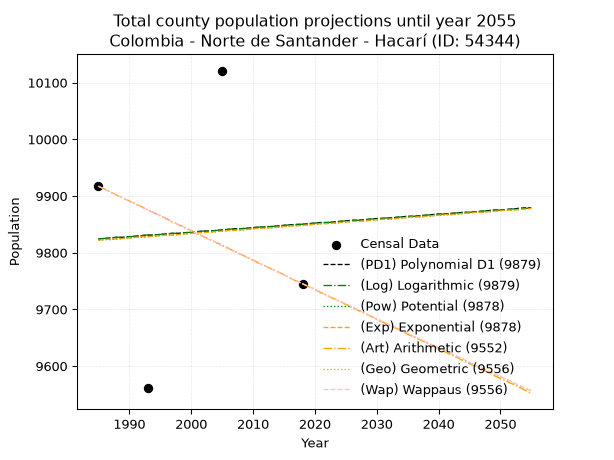
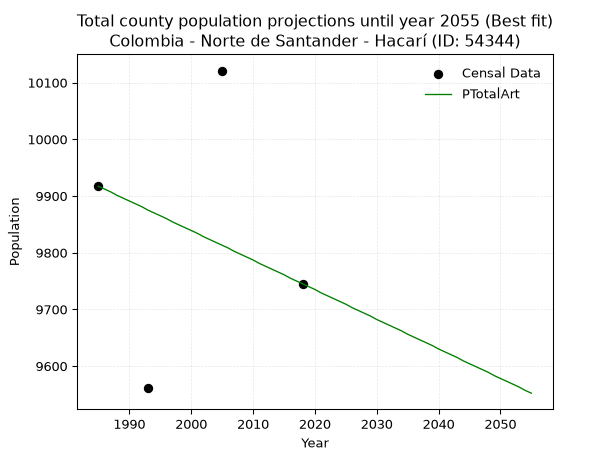
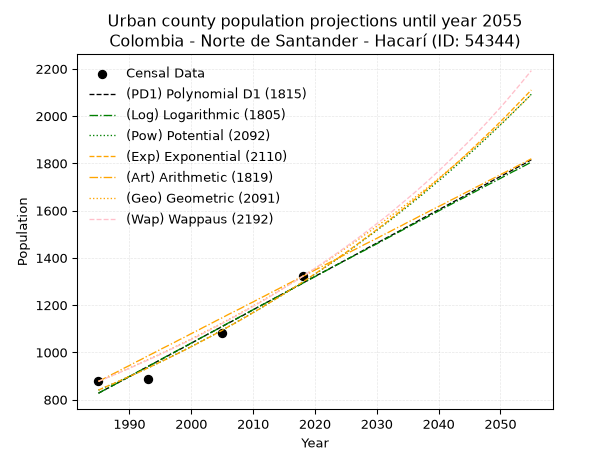
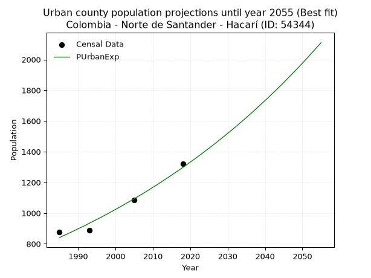
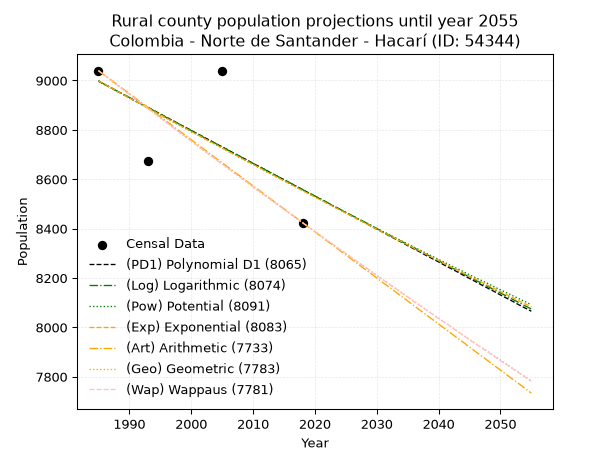
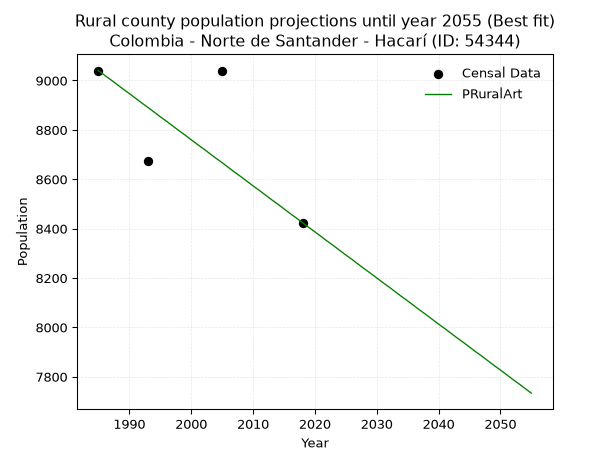

<div align="center">


</div>

# _“Population and Public Services Demand Projections (PPSD) until Year 2050 for Colombia - Norte de Santander - Hacarí (ID: 54344)”_
Keywords: `population` `public-service` `projection` `lineal` `polynomial` `logarithmic` `potential` `exponential` `arithmetic` `geometric` `wappaus` `dane` `colombia` `south-america`

PPSD are analytical estimates used by governments and planners to anticipate future changes in population size, age distribution, and the resulting community needs for utilities, healthcare, education, and infrastructure as sizing future water treatment facilities, electrical grids, and road networks based on spatial growth.

> **General running parameters**: • app_version: _v20260806_. • Python version: _3.14.7_. • Pandas version: _3.0.5_. • NumPy version: _2.5.1_. • Creates, save and include plots into reports (create_plot): _False_. • Projection until year: _2050_. • Process polynomial degree 2 and up: _False_. • Process Wappaus: _True_. • Process Wappaus: _True_. • Set negative values to zero: _True_. • Set infinite values to zero: _True_. • Drop dataset notes: _True_. 
<div align="center">

Dynamic map: [:earth_americas:Google](http://maps.google.com/maps?q=8.321505809,-73.1459968) [:earth_americas:OSM](https://www.openstreetmap.org/#map=18/8.321505809/-73.1459968&layers=P) [:earth_americas:Bing](https://www.bing.com/maps?cp=8.321505809~-73.1459968&lvl=18) [:earth_americas:Apple](https://maps.apple.com/frame?center=8.321505809%2C-73.1459968&span=0.003%2C0.006)

</div>


<div align="center">

```geojson
{
  "type": "Feature",
  "geometry": {
    "type": "Point", 
    "coordinates": [-73.1459968, 8.321505809]
  }, 
  "properties": {
    "Name": "Colombia - Norte de Santander - Hacarí (ID: 54344)"
  }
}
```

</div>


## 0. Census Data (4 records)

Census data are official statistics collected by a government about the people and housing in a country. They usually include counts of total population, age, sex, race, income, education, and jobs.

📅Global census file: [Population.xlsx](../data/Population.xlsx)

| Source   |   Year |   CountryID | CountryName   |   StateID | StateName          |   CountyID | CountyName   |   PTotal |   PUrban |   PRural |
|:---------|-------:|------------:|:--------------|----------:|:-------------------|-----------:|:-------------|---------:|---------:|---------:|
| DANE     |   1985 |          57 | Colombia      |        54 | Norte de Santander |      54344 | Hacarí       |     9917 |      877 |     9040 |
| DANE     |   1993 |          57 | Colombia      |        54 | Norte de Santander |      54344 | Hacarí       |     9562 |      887 |     8675 |
| DANE     |   2005 |          57 | Colombia      |        54 | Norte De Santander |      54344 | Hacarí       |    10121 |     1083 |     9038 |
| DANE     |   2018 |          57 | Colombia      |        54 | Norte de Santander |      54344 | Hacarí       |     9745 |     1321 |     8424 |

> 🔥Some records could had specific notes about the registered values or the corresponding urban or rural distribution.

## 1. Total

### 1.1. Coefficients and Parameters

* (PD1) Polynomial Deg 1: 0.7864311521480236, 8263.191087915915 (lineal)
* (Log) Logarithmic: 1589.4878328072339, -2245.4597545238917
* (Pow) Potential: 0.163652724086236, 3.452503527059068
* (Exp) Exponential: 8.101421384916598e-05, 8362.896696616664
* (Art) Arithmetic: Year diff. 2018 - 1985 = 33, Population diff. 9745 - 9917 = -172, Annual growth = -5.212121212121212
* (Geo) Geometric: Year diff. 2018 - 1985 = 33, Population diff. 9745 - 9917 = -172, Annual growth % = -0.0005300450293379555
* (Wap) Wappaus: i = -0.05301720284936642, Condition values only valid for < 200)

<sub>
Wappaus condition values: ['-0.00', '-0.05', '-0.11', '-0.16', '-0.21', '-0.27', '-0.32', '-0.37', '-0.42', '-0.48', '-0.53', '-0.58', '-0.64', '-0.69', '-0.74', '-0.80', '-0.85', '-0.90', '-0.95', '-1.01', '-1.06', '-1.11', '-1.17', '-1.22', '-1.27', '-1.33', '-1.38', '-1.43', '-1.48', '-1.54', '-1.59', '-1.64', '-1.70', '-1.75', '-1.80', '-1.86', '-1.91', '-1.96', '-2.01', '-2.07', '-2.12', '-2.17', '-2.23', '-2.28', '-2.33', '-2.39', '-2.44', '-2.49', '-2.54', '-2.60', '-2.65', '-2.70', '-2.76', '-2.81', '-2.86', '-2.92', '-2.97', '-3.02', '-3.07', '-3.13', '-3.18', '-3.23', '-3.29', '-3.34', '-3.39', '-3.45']
</sub>


### 1.2. Projected Dataset

|   Year |   CountyID |   PTotalPD1 |   PTotalLog |   PTotalPow |   PTotalExp |   PTotalArt |   PTotalGeo |   PTotalWap |
|-------:|-----------:|------------:|------------:|------------:|------------:|------------:|------------:|------------:|
|   1985 |      54344 |        9824 |        9824 |        9822 |        9822 |        9917 |        9917 |        9917 |
|   1986 |      54344 |        9825 |        9825 |        9823 |        9823 |        9912 |        9912 |        9912 |
|   1987 |      54344 |        9826 |        9826 |        9823 |        9824 |        9907 |        9906 |        9906 |
|   1988 |      54344 |        9827 |        9827 |        9824 |        9824 |        9901 |        9901 |        9901 |
|   1989 |      54344 |        9827 |        9827 |        9825 |        9825 |        9896 |        9896 |        9896 |
|   1990 |      54344 |        9828 |        9828 |        9826 |        9826 |        9891 |        9891 |        9891 |
|   1991 |      54344 |        9829 |        9829 |        9827 |        9827 |        9886 |        9886 |        9886 |
|   1992 |      54344 |        9830 |        9830 |        9827 |        9828 |        9881 |        9880 |        9880 |
|   1993 |      54344 |        9831 |        9831 |        9828 |        9828 |        9875 |        9875 |        9875 |
|   1994 |      54344 |        9831 |        9831 |        9829 |        9829 |        9870 |        9870 |        9870 |
|   1995 |      54344 |        9832 |        9832 |        9830 |        9830 |        9865 |        9865 |        9865 |
|   1996 |      54344 |        9833 |        9833 |        9831 |        9831 |        9860 |        9859 |        9859 |
|   1997 |      54344 |        9834 |        9834 |        9831 |        9831 |        9854 |        9854 |        9854 |
|   1998 |      54344 |        9834 |        9834 |        9832 |        9832 |        9849 |        9849 |        9849 |
|   1999 |      54344 |        9835 |        9835 |        9833 |        9833 |        9844 |        9844 |        9844 |
|   2000 |      54344 |        9836 |        9836 |        9834 |        9834 |        9839 |        9838 |        9838 |
|   2001 |      54344 |        9837 |        9837 |        9835 |        9835 |        9834 |        9833 |        9833 |
|   2002 |      54344 |        9838 |        9838 |        9836 |        9835 |        9828 |        9828 |        9828 |
|   2003 |      54344 |        9838 |        9838 |        9836 |        9836 |        9823 |        9823 |        9823 |
|   2004 |      54344 |        9839 |        9839 |        9837 |        9837 |        9818 |        9818 |        9818 |
|   2005 |      54344 |        9840 |        9840 |        9838 |        9838 |        9813 |        9812 |        9812 |
|   2006 |      54344 |        9841 |        9841 |        9839 |        9839 |        9808 |        9807 |        9807 |
|   2007 |      54344 |        9842 |        9842 |        9840 |        9839 |        9802 |        9802 |        9802 |
|   2008 |      54344 |        9842 |        9842 |        9840 |        9840 |        9797 |        9797 |        9797 |
|   2009 |      54344 |        9843 |        9843 |        9841 |        9841 |        9792 |        9792 |        9792 |
|   2010 |      54344 |        9844 |        9844 |        9842 |        9842 |        9787 |        9786 |        9786 |
|   2011 |      54344 |        9845 |        9845 |        9843 |        9843 |        9781 |        9781 |        9781 |
|   2012 |      54344 |        9845 |        9846 |        9844 |        9843 |        9776 |        9776 |        9776 |
|   2013 |      54344 |        9846 |        9846 |        9844 |        9844 |        9771 |        9771 |        9771 |
|   2014 |      54344 |        9847 |        9847 |        9845 |        9845 |        9766 |        9766 |        9766 |
|   2015 |      54344 |        9848 |        9848 |        9846 |        9846 |        9761 |        9761 |        9761 |
|   2016 |      54344 |        9849 |        9849 |        9847 |        9847 |        9755 |        9755 |        9755 |
|   2017 |      54344 |        9849 |        9850 |        9848 |        9847 |        9750 |        9750 |        9750 |
|   2018 |      54344 |        9850 |        9850 |        9848 |        9848 |        9745 |        9745 |        9745 |
|   2019 |      54344 |        9851 |        9851 |        9849 |        9849 |        9740 |        9740 |        9740 |
|   2020 |      54344 |        9852 |        9852 |        9850 |        9850 |        9735 |        9735 |        9735 |
|   2021 |      54344 |        9853 |        9853 |        9851 |        9851 |        9729 |        9730 |        9730 |
|   2022 |      54344 |        9853 |        9853 |        9852 |        9851 |        9724 |        9724 |        9724 |
|   2023 |      54344 |        9854 |        9854 |        9852 |        9852 |        9719 |        9719 |        9719 |
|   2024 |      54344 |        9855 |        9855 |        9853 |        9853 |        9714 |        9714 |        9714 |
|   2025 |      54344 |        9856 |        9856 |        9854 |        9854 |        9709 |        9709 |        9709 |
|   2026 |      54344 |        9857 |        9857 |        9855 |        9855 |        9703 |        9704 |        9704 |
|   2027 |      54344 |        9857 |        9857 |        9856 |        9855 |        9698 |        9699 |        9699 |
|   2028 |      54344 |        9858 |        9858 |        9856 |        9856 |        9693 |        9693 |        9693 |
|   2029 |      54344 |        9859 |        9859 |        9857 |        9857 |        9688 |        9688 |        9688 |
|   2030 |      54344 |        9860 |        9860 |        9858 |        9858 |        9682 |        9683 |        9683 |
|   2031 |      54344 |        9860 |        9861 |        9859 |        9859 |        9677 |        9678 |        9678 |
|   2032 |      54344 |        9861 |        9861 |        9859 |        9859 |        9672 |        9673 |        9673 |
|   2033 |      54344 |        9862 |        9862 |        9860 |        9860 |        9667 |        9668 |        9668 |
|   2034 |      54344 |        9863 |        9863 |        9861 |        9861 |        9662 |        9663 |        9663 |
|   2035 |      54344 |        9864 |        9864 |        9862 |        9862 |        9656 |        9658 |        9658 |
|   2036 |      54344 |        9864 |        9864 |        9863 |        9863 |        9651 |        9652 |        9652 |
|   2037 |      54344 |        9865 |        9865 |        9863 |        9863 |        9646 |        9647 |        9647 |
|   2038 |      54344 |        9866 |        9866 |        9864 |        9864 |        9641 |        9642 |        9642 |
|   2039 |      54344 |        9867 |        9867 |        9865 |        9865 |        9636 |        9637 |        9637 |
|   2040 |      54344 |        9868 |        9868 |        9866 |        9866 |        9630 |        9632 |        9632 |
|   2041 |      54344 |        9868 |        9868 |        9867 |        9867 |        9625 |        9627 |        9627 |
|   2042 |      54344 |        9869 |        9869 |        9867 |        9867 |        9620 |        9622 |        9622 |
|   2043 |      54344 |        9870 |        9870 |        9868 |        9868 |        9615 |        9617 |        9617 |
|   2044 |      54344 |        9871 |        9871 |        9869 |        9869 |        9609 |        9612 |        9612 |
|   2045 |      54344 |        9871 |        9871 |        9870 |        9870 |        9604 |        9606 |        9606 |
|   2046 |      54344 |        9872 |        9872 |        9871 |        9871 |        9599 |        9601 |        9601 |
|   2047 |      54344 |        9873 |        9873 |        9871 |        9871 |        9594 |        9596 |        9596 |
|   2048 |      54344 |        9874 |        9874 |        9872 |        9872 |        9589 |        9591 |        9591 |
|   2049 |      54344 |        9875 |        9875 |        9873 |        9873 |        9583 |        9586 |        9586 |
|   2050 |      54344 |        9875 |        9875 |        9874 |        9874 |        9578 |        9581 |        9581 |
<div align="center">

</img>

</div>


### 1.3. Best fit with absolute and relative error (%)

Relative error puts that difference into context by dividing the absolute error by the true value, creating a unitless ratio or percentage that shows the scale of the mistake.

Absolute and relative error

|   Year | Source   |   CountryID | CountryName   |   StateID | StateName          |   CountyID_x | CountyName   |   PTotal |   PUrban |   PRural |   CountyID_y |   PTotalPD1 |   PTotalLog |   PTotalPow |   PTotalExp |   PTotalArt |   PTotalGeo |   PTotalWap |   PTotalPD1AbsError |   PTotalLogAbsError |   PTotalPowAbsError |   PTotalExpAbsError |   PTotalArtAbsError |   PTotalGeoAbsError |   PTotalWapAbsError |   PTotalPD1RelError |   PTotalLogRelError |   PTotalPowRelError |   PTotalExpRelError |   PTotalArtRelError |   PTotalGeoRelError |   PTotalWapRelError |
|-------:|:---------|------------:|:--------------|----------:|:-------------------|-------------:|:-------------|---------:|---------:|---------:|-------------:|------------:|------------:|------------:|------------:|------------:|------------:|------------:|--------------------:|--------------------:|--------------------:|--------------------:|--------------------:|--------------------:|--------------------:|--------------------:|--------------------:|--------------------:|--------------------:|--------------------:|--------------------:|--------------------:|
|   1985 | DANE     |          57 | Colombia      |        54 | Norte de Santander |        54344 | Hacarí       |     9917 |      877 |     9040 |        54344 |        9824 |        9824 |        9822 |        9822 |        9917 |        9917 |        9917 |                  93 |                  93 |                  95 |                  95 |                   0 |                   0 |                   0 |            0.937784 |            0.937784 |            0.957951 |            0.957951 |             0       |             0       |             0       |
|   1993 | DANE     |          57 | Colombia      |        54 | Norte de Santander |        54344 | Hacarí       |     9562 |      887 |     8675 |        54344 |        9831 |        9831 |        9828 |        9828 |        9875 |        9875 |        9875 |                 269 |                 269 |                 266 |                 266 |                 313 |                 313 |                 313 |            2.81322  |            2.81322  |            2.78184  |            2.78184  |             3.27337 |             3.27337 |             3.27337 |
|   2005 | DANE     |          57 | Colombia      |        54 | Norte De Santander |        54344 | Hacarí       |    10121 |     1083 |     9038 |        54344 |        9840 |        9840 |        9838 |        9838 |        9813 |        9812 |        9812 |                 281 |                 281 |                 283 |                 283 |                 308 |                 309 |                 309 |            2.77641  |            2.77641  |            2.79617  |            2.79617  |             3.04318 |             3.05306 |             3.05306 |
|   2018 | DANE     |          57 | Colombia      |        54 | Norte de Santander |        54344 | Hacarí       |     9745 |     1321 |     8424 |        54344 |        9850 |        9850 |        9848 |        9848 |        9745 |        9745 |        9745 |                 105 |                 105 |                 103 |                 103 |                   0 |                   0 |                   0 |            1.07748  |            1.07748  |            1.05695  |            1.05695  |             0       |             0       |             0       |

Relative error mean

| Method    |   RelError | Best   |
|:----------|-----------:|:-------|
| PTotalPD1 |    1.90122 |        |
| PTotalLog |    1.90122 |        |
| PTotalPow |    1.89823 |        |
| PTotalExp |    1.89823 |        |
| PTotalArt |    1.57914 | True   |
| PTotalGeo |    1.58161 |        |
| PTotalWap |    1.58161 |        |

💙Best method: _**PTotalArt**_
<div align="center">

</img>

</div>


### 1.4. Fresh water supply demand in liters per capita per day (lpcd)

The fresh water supply demand typically ranges from 100 to 300 liters per capita per day (lpcd) for standard domestic and municipal planning, though absolute survival minimums set by the World Health Organization are as low as 7.5 to 20 liters per day, and total consumption in high-income nations can exceed 400 liters.

> `CZ`: Level in meters above the sea level (masl)<br> `WS`: Fresh water supply demand in liters per capita per day (lpcd or l/h/d)<br> `WSAll`: Zonal fresh water supply demand in liters per second (l/s)<br> `A`: Zonal area in square meters<br> `DP`: Population density (people/hectare)

Reference values (RAS Colombia)

|    CZ |   WS |
|------:|-----:|
|  1000 |  120 |
|  2000 |  130 |
| 99999 |  140 |

County shapefile geometry properties and water supply values

|   CountyID |     ATotal |   CZTotal |   WSTotal |
|-----------:|-----------:|----------:|----------:|
|      54344 | 4.1821e+08 |   1143.89 |       130 |

Projected values for best method: PTotalArt

|   CountyID |   Year |   PTotalArt |   DPTotal |   WSTotal |   WSTotalAll |
|-----------:|-------:|------------:|----------:|----------:|-------------:|
|      54344 |   1985 |        9917 |      0.24 |       130 |      14.9214 |
|      54344 |   1986 |        9912 |      0.24 |       130 |      14.9139 |
|      54344 |   1987 |        9907 |      0.24 |       130 |      14.9064 |
|      54344 |   1988 |        9901 |      0.24 |       130 |      14.8973 |
|      54344 |   1989 |        9896 |      0.24 |       130 |      14.8898 |
|      54344 |   1990 |        9891 |      0.24 |       130 |      14.8823 |
|      54344 |   1991 |        9886 |      0.24 |       130 |      14.8748 |
|      54344 |   1992 |        9881 |      0.24 |       130 |      14.8672 |
|      54344 |   1993 |        9875 |      0.24 |       130 |      14.8582 |
|      54344 |   1994 |        9870 |      0.24 |       130 |      14.8507 |
|      54344 |   1995 |        9865 |      0.24 |       130 |      14.8432 |
|      54344 |   1996 |        9860 |      0.24 |       130 |      14.8356 |
|      54344 |   1997 |        9854 |      0.24 |       130 |      14.8266 |
|      54344 |   1998 |        9849 |      0.24 |       130 |      14.8191 |
|      54344 |   1999 |        9844 |      0.24 |       130 |      14.8116 |
|      54344 |   2000 |        9839 |      0.24 |       130 |      14.8041 |
|      54344 |   2001 |        9834 |      0.24 |       130 |      14.7965 |
|      54344 |   2002 |        9828 |      0.24 |       130 |      14.7875 |
|      54344 |   2003 |        9823 |      0.23 |       130 |      14.78   |
|      54344 |   2004 |        9818 |      0.23 |       130 |      14.7725 |
|      54344 |   2005 |        9813 |      0.23 |       130 |      14.7649 |
|      54344 |   2006 |        9808 |      0.23 |       130 |      14.7574 |
|      54344 |   2007 |        9802 |      0.23 |       130 |      14.7484 |
|      54344 |   2008 |        9797 |      0.23 |       130 |      14.7409 |
|      54344 |   2009 |        9792 |      0.23 |       130 |      14.7333 |
|      54344 |   2010 |        9787 |      0.23 |       130 |      14.7258 |
|      54344 |   2011 |        9781 |      0.23 |       130 |      14.7168 |
|      54344 |   2012 |        9776 |      0.23 |       130 |      14.7093 |
|      54344 |   2013 |        9771 |      0.23 |       130 |      14.7017 |
|      54344 |   2014 |        9766 |      0.23 |       130 |      14.6942 |
|      54344 |   2015 |        9761 |      0.23 |       130 |      14.6867 |
|      54344 |   2016 |        9755 |      0.23 |       130 |      14.6777 |
|      54344 |   2017 |        9750 |      0.23 |       130 |      14.6701 |
|      54344 |   2018 |        9745 |      0.23 |       130 |      14.6626 |
|      54344 |   2019 |        9740 |      0.23 |       130 |      14.6551 |
|      54344 |   2020 |        9735 |      0.23 |       130 |      14.6476 |
|      54344 |   2021 |        9729 |      0.23 |       130 |      14.6385 |
|      54344 |   2022 |        9724 |      0.23 |       130 |      14.631  |
|      54344 |   2023 |        9719 |      0.23 |       130 |      14.6235 |
|      54344 |   2024 |        9714 |      0.23 |       130 |      14.616  |
|      54344 |   2025 |        9709 |      0.23 |       130 |      14.6084 |
|      54344 |   2026 |        9703 |      0.23 |       130 |      14.5994 |
|      54344 |   2027 |        9698 |      0.23 |       130 |      14.5919 |
|      54344 |   2028 |        9693 |      0.23 |       130 |      14.5844 |
|      54344 |   2029 |        9688 |      0.23 |       130 |      14.5769 |
|      54344 |   2030 |        9682 |      0.23 |       130 |      14.5678 |
|      54344 |   2031 |        9677 |      0.23 |       130 |      14.5603 |
|      54344 |   2032 |        9672 |      0.23 |       130 |      14.5528 |
|      54344 |   2033 |        9667 |      0.23 |       130 |      14.5453 |
|      54344 |   2034 |        9662 |      0.23 |       130 |      14.5377 |
|      54344 |   2035 |        9656 |      0.23 |       130 |      14.5287 |
|      54344 |   2036 |        9651 |      0.23 |       130 |      14.5212 |
|      54344 |   2037 |        9646 |      0.23 |       130 |      14.5137 |
|      54344 |   2038 |        9641 |      0.23 |       130 |      14.5061 |
|      54344 |   2039 |        9636 |      0.23 |       130 |      14.4986 |
|      54344 |   2040 |        9630 |      0.23 |       130 |      14.4896 |
|      54344 |   2041 |        9625 |      0.23 |       130 |      14.4821 |
|      54344 |   2042 |        9620 |      0.23 |       130 |      14.4745 |
|      54344 |   2043 |        9615 |      0.23 |       130 |      14.467  |
|      54344 |   2044 |        9609 |      0.23 |       130 |      14.458  |
|      54344 |   2045 |        9604 |      0.23 |       130 |      14.4505 |
|      54344 |   2046 |        9599 |      0.23 |       130 |      14.4429 |
|      54344 |   2047 |        9594 |      0.23 |       130 |      14.4354 |
|      54344 |   2048 |        9589 |      0.23 |       130 |      14.4279 |
|      54344 |   2049 |        9583 |      0.23 |       130 |      14.4189 |
|      54344 |   2050 |        9578 |      0.23 |       130 |      14.4113 |

## 2. Urban

### 2.1. Coefficients and Parameters

* (PD1) Polynomial Deg 1: 14.109995985547814, -27181.519470092015 (lineal)
* (Log) Logarithmic: 28228.946324831857, -213526.4472276259
* (Pow) Potential: 26.317084578493617, -83.8630783848119
* (Exp) Exponential: 0.013153002526062866, 3.851524969084084e-09
* (Art) Arithmetic: Year diff. 2018 - 1985 = 33, Population diff. 1321 - 877 = 444, Annual growth = 13.454545454545455
* (Geo) Geometric: Year diff. 2018 - 1985 = 33, Population diff. 1321 - 877 = 444, Annual growth % = 0.012490616076825889
* (Wap) Wappaus: i = 1.2242534535528167, Condition values only valid for < 200)

<sub>
Wappaus condition values: ['0.00', '1.22', '2.45', '3.67', '4.90', '6.12', '7.35', '8.57', '9.79', '11.02', '12.24', '13.47', '14.69', '15.92', '17.14', '18.36', '19.59', '20.81', '22.04', '23.26', '24.49', '25.71', '26.93', '28.16', '29.38', '30.61', '31.83', '33.05', '34.28', '35.50', '36.73', '37.95', '39.18', '40.40', '41.62', '42.85', '44.07', '45.30', '46.52', '47.75', '48.97', '50.19', '51.42', '52.64', '53.87', '55.09', '56.32', '57.54', '58.76', '59.99', '61.21', '62.44', '63.66', '64.89', '66.11', '67.33', '68.56', '69.78', '71.01', '72.23', '73.46', '74.68', '75.90', '77.13', '78.35', '79.58']
</sub>


### 2.2. Projected Dataset

|   Year |   CountyID |   PUrbanPD1 |   PUrbanLog |   PUrbanPow |   PUrbanExp |   PUrbanArt |   PUrbanGeo |   PUrbanWap |
|-------:|-----------:|------------:|------------:|------------:|------------:|------------:|------------:|------------:|
|   1985 |      54344 |         827 |         827 |         840 |         840 |         877 |         877 |         877 |
|   1986 |      54344 |         841 |         841 |         851 |         852 |         890 |         888 |         888 |
|   1987 |      54344 |         855 |         855 |         863 |         863 |         904 |         899 |         899 |
|   1988 |      54344 |         869 |         869 |         874 |         874 |         917 |         910 |         910 |
|   1989 |      54344 |         883 |         883 |         886 |         886 |         931 |         922 |         921 |
|   1990 |      54344 |         897 |         898 |         898 |         898 |         944 |         933 |         932 |
|   1991 |      54344 |         911 |         912 |         910 |         909 |         958 |         945 |         944 |
|   1992 |      54344 |         926 |         926 |         922 |         921 |         971 |         957 |         956 |
|   1993 |      54344 |         940 |         940 |         934 |         934 |         985 |         969 |         967 |
|   1994 |      54344 |         954 |         954 |         946 |         946 |         998 |         981 |         979 |
|   1995 |      54344 |         968 |         968 |         959 |         959 |        1012 |         993 |         991 |
|   1996 |      54344 |         982 |         983 |         972 |         971 |        1025 |        1005 |        1004 |
|   1997 |      54344 |         996 |         997 |         985 |         984 |        1038 |        1018 |        1016 |
|   1998 |      54344 |        1010 |        1011 |         998 |         997 |        1052 |        1031 |        1029 |
|   1999 |      54344 |        1024 |        1025 |        1011 |        1010 |        1065 |        1043 |        1041 |
|   2000 |      54344 |        1038 |        1039 |        1024 |        1024 |        1079 |        1056 |        1054 |
|   2001 |      54344 |        1053 |        1053 |        1038 |        1037 |        1092 |        1070 |        1067 |
|   2002 |      54344 |        1067 |        1067 |        1052 |        1051 |        1106 |        1083 |        1081 |
|   2003 |      54344 |        1081 |        1081 |        1065 |        1065 |        1119 |        1097 |        1094 |
|   2004 |      54344 |        1095 |        1095 |        1080 |        1079 |        1133 |        1110 |        1108 |
|   2005 |      54344 |        1109 |        1110 |        1094 |        1093 |        1146 |        1124 |        1122 |
|   2006 |      54344 |        1123 |        1124 |        1108 |        1108 |        1160 |        1138 |        1136 |
|   2007 |      54344 |        1137 |        1138 |        1123 |        1122 |        1173 |        1152 |        1150 |
|   2008 |      54344 |        1151 |        1152 |        1138 |        1137 |        1186 |        1167 |        1164 |
|   2009 |      54344 |        1165 |        1166 |        1153 |        1152 |        1200 |        1181 |        1179 |
|   2010 |      54344 |        1180 |        1180 |        1168 |        1168 |        1213 |        1196 |        1194 |
|   2011 |      54344 |        1194 |        1194 |        1183 |        1183 |        1227 |        1211 |        1209 |
|   2012 |      54344 |        1208 |        1208 |        1199 |        1199 |        1240 |        1226 |        1224 |
|   2013 |      54344 |        1222 |        1222 |        1215 |        1215 |        1254 |        1242 |        1240 |
|   2014 |      54344 |        1236 |        1236 |        1231 |        1231 |        1267 |        1257 |        1256 |
|   2015 |      54344 |        1250 |        1250 |        1247 |        1247 |        1281 |        1273 |        1272 |
|   2016 |      54344 |        1264 |        1264 |        1263 |        1264 |        1294 |        1289 |        1288 |
|   2017 |      54344 |        1278 |        1278 |        1280 |        1280 |        1308 |        1305 |        1304 |
|   2018 |      54344 |        1292 |        1292 |        1297 |        1297 |        1321 |        1321 |        1321 |
|   2019 |      54344 |        1307 |        1306 |        1314 |        1314 |        1334 |        1338 |        1338 |
|   2020 |      54344 |        1321 |        1320 |        1331 |        1332 |        1348 |        1354 |        1355 |
|   2021 |      54344 |        1335 |        1334 |        1348 |        1349 |        1361 |        1371 |        1373 |
|   2022 |      54344 |        1349 |        1348 |        1366 |        1367 |        1375 |        1388 |        1391 |
|   2023 |      54344 |        1363 |        1362 |        1384 |        1385 |        1388 |        1406 |        1409 |
|   2024 |      54344 |        1377 |        1376 |        1402 |        1404 |        1402 |        1423 |        1427 |
|   2025 |      54344 |        1391 |        1390 |        1420 |        1422 |        1415 |        1441 |        1446 |
|   2026 |      54344 |        1405 |        1404 |        1439 |        1441 |        1429 |        1459 |        1465 |
|   2027 |      54344 |        1419 |        1418 |        1458 |        1460 |        1442 |        1477 |        1484 |
|   2028 |      54344 |        1434 |        1431 |        1477 |        1480 |        1456 |        1496 |        1504 |
|   2029 |      54344 |        1448 |        1445 |        1496 |        1499 |        1469 |        1514 |        1524 |
|   2030 |      54344 |        1462 |        1459 |        1516 |        1519 |        1482 |        1533 |        1544 |
|   2031 |      54344 |        1476 |        1473 |        1535 |        1539 |        1496 |        1552 |        1564 |
|   2032 |      54344 |        1490 |        1487 |        1555 |        1559 |        1509 |        1572 |        1585 |
|   2033 |      54344 |        1504 |        1501 |        1576 |        1580 |        1523 |        1591 |        1607 |
|   2034 |      54344 |        1518 |        1515 |        1596 |        1601 |        1536 |        1611 |        1629 |
|   2035 |      54344 |        1532 |        1529 |        1617 |        1622 |        1550 |        1631 |        1651 |
|   2036 |      54344 |        1546 |        1543 |        1638 |        1644 |        1563 |        1652 |        1673 |
|   2037 |      54344 |        1561 |        1556 |        1659 |        1665 |        1577 |        1672 |        1696 |
|   2038 |      54344 |        1575 |        1570 |        1681 |        1688 |        1590 |        1693 |        1719 |
|   2039 |      54344 |        1589 |        1584 |        1703 |        1710 |        1604 |        1714 |        1743 |
|   2040 |      54344 |        1603 |        1598 |        1725 |        1733 |        1617 |        1736 |        1767 |
|   2041 |      54344 |        1617 |        1612 |        1747 |        1755 |        1630 |        1758 |        1792 |
|   2042 |      54344 |        1631 |        1626 |        1770 |        1779 |        1644 |        1779 |        1817 |
|   2043 |      54344 |        1645 |        1640 |        1793 |        1802 |        1657 |        1802 |        1843 |
|   2044 |      54344 |        1659 |        1653 |        1816 |        1826 |        1671 |        1824 |        1869 |
|   2045 |      54344 |        1673 |        1667 |        1840 |        1850 |        1684 |        1847 |        1895 |
|   2046 |      54344 |        1688 |        1681 |        1863 |        1875 |        1698 |        1870 |        1922 |
|   2047 |      54344 |        1702 |        1695 |        1888 |        1900 |        1711 |        1893 |        1950 |
|   2048 |      54344 |        1716 |        1709 |        1912 |        1925 |        1725 |        1917 |        1978 |
|   2049 |      54344 |        1730 |        1722 |        1937 |        1950 |        1738 |        1941 |        2007 |
|   2050 |      54344 |        1744 |        1736 |        1962 |        1976 |        1752 |        1965 |        2036 |
<div align="center">

</img>

</div>


### 2.3. Best fit with absolute and relative error (%)

Relative error puts that difference into context by dividing the absolute error by the true value, creating a unitless ratio or percentage that shows the scale of the mistake.

Absolute and relative error

|   Year | Source   |   CountryID | CountryName   |   StateID | StateName          |   CountyID_x | CountyName   |   PTotal |   PUrban |   PRural |   CountyID_y |   PUrbanPD1 |   PUrbanLog |   PUrbanPow |   PUrbanExp |   PUrbanArt |   PUrbanGeo |   PUrbanWap |   PUrbanPD1AbsError |   PUrbanLogAbsError |   PUrbanPowAbsError |   PUrbanExpAbsError |   PUrbanArtAbsError |   PUrbanGeoAbsError |   PUrbanWapAbsError |   PUrbanPD1RelError |   PUrbanLogRelError |   PUrbanPowRelError |   PUrbanExpRelError |   PUrbanArtRelError |   PUrbanGeoRelError |   PUrbanWapRelError |
|-------:|:---------|------------:|:--------------|----------:|:-------------------|-------------:|:-------------|---------:|---------:|---------:|-------------:|------------:|------------:|------------:|------------:|------------:|------------:|------------:|--------------------:|--------------------:|--------------------:|--------------------:|--------------------:|--------------------:|--------------------:|--------------------:|--------------------:|--------------------:|--------------------:|--------------------:|--------------------:|--------------------:|
|   1985 | DANE     |          57 | Colombia      |        54 | Norte de Santander |        54344 | Hacarí       |     9917 |      877 |     9040 |        54344 |         827 |         827 |         840 |         840 |         877 |         877 |         877 |                  50 |                  50 |                  37 |                  37 |                   0 |                   0 |                   0 |             5.70125 |             5.70125 |             4.21893 |            4.21893  |             0       |             0       |             0       |
|   1993 | DANE     |          57 | Colombia      |        54 | Norte de Santander |        54344 | Hacarí       |     9562 |      887 |     8675 |        54344 |         940 |         940 |         934 |         934 |         985 |         969 |         967 |                  53 |                  53 |                  47 |                  47 |                  98 |                  82 |                  80 |             5.9752  |             5.9752  |             5.29876 |            5.29876  |            11.0485  |             9.24464 |             9.01917 |
|   2005 | DANE     |          57 | Colombia      |        54 | Norte De Santander |        54344 | Hacarí       |    10121 |     1083 |     9038 |        54344 |        1109 |        1110 |        1094 |        1093 |        1146 |        1124 |        1122 |                  26 |                  27 |                  11 |                  10 |                  63 |                  41 |                  39 |             2.40074 |             2.49307 |             1.0157  |            0.923361 |             5.81717 |             3.78578 |             3.60111 |
|   2018 | DANE     |          57 | Colombia      |        54 | Norte de Santander |        54344 | Hacarí       |     9745 |     1321 |     8424 |        54344 |        1292 |        1292 |        1297 |        1297 |        1321 |        1321 |        1321 |                  29 |                  29 |                  24 |                  24 |                   0 |                   0 |                   0 |             2.19531 |             2.19531 |             1.81681 |            1.81681  |             0       |             0       |             0       |

Relative error mean

| Method    |   RelError | Best   |
|:----------|-----------:|:-------|
| PUrbanPD1 |    4.06812 |        |
| PUrbanLog |    4.09121 |        |
| PUrbanPow |    3.08755 |        |
| PUrbanExp |    3.06446 | True   |
| PUrbanArt |    4.21641 |        |
| PUrbanGeo |    3.25761 |        |
| PUrbanWap |    3.15507 |        |

💙Best method: _**PUrbanExp**_
<div align="center">

</img>

</div>


### 2.4. Fresh water supply demand in liters per capita per day (lpcd)

The fresh water supply demand typically ranges from 100 to 300 liters per capita per day (lpcd) for standard domestic and municipal planning, though absolute survival minimums set by the World Health Organization are as low as 7.5 to 20 liters per day, and total consumption in high-income nations can exceed 400 liters.

> `CZ`: Level in meters above the sea level (masl)<br> `WS`: Fresh water supply demand in liters per capita per day (lpcd or l/h/d)<br> `WSAll`: Zonal fresh water supply demand in liters per second (l/s)<br> `A`: Zonal area in square meters<br> `DP`: Population density (people/hectare)

Reference values (RAS Colombia)

|    CZ |   WS |
|------:|-----:|
|  1000 |  120 |
|  2000 |  130 |
| 99999 |  140 |

County shapefile geometry properties and water supply values

|   CountyID |   AUrban |   CZUrban |   WSUrban |
|-----------:|---------:|----------:|----------:|
|      54344 |   153219 |   1068.55 |       130 |

Projected values for best method: PUrbanExp

|   CountyID |   Year |   PUrbanExp |   DPUrban |   WSUrban |   WSUrbanAll |
|-----------:|-------:|------------:|----------:|----------:|-------------:|
|      54344 |   1985 |         840 |     54.82 |       130 |      1.26389 |
|      54344 |   1986 |         852 |     55.61 |       130 |      1.28194 |
|      54344 |   1987 |         863 |     56.32 |       130 |      1.2985  |
|      54344 |   1988 |         874 |     57.04 |       130 |      1.31505 |
|      54344 |   1989 |         886 |     57.83 |       130 |      1.3331  |
|      54344 |   1990 |         898 |     58.61 |       130 |      1.35116 |
|      54344 |   1991 |         909 |     59.33 |       130 |      1.36771 |
|      54344 |   1992 |         921 |     60.11 |       130 |      1.38576 |
|      54344 |   1993 |         934 |     60.96 |       130 |      1.40532 |
|      54344 |   1994 |         946 |     61.74 |       130 |      1.42338 |
|      54344 |   1995 |         959 |     62.59 |       130 |      1.44294 |
|      54344 |   1996 |         971 |     63.37 |       130 |      1.461   |
|      54344 |   1997 |         984 |     64.22 |       130 |      1.48056 |
|      54344 |   1998 |         997 |     65.07 |       130 |      1.50012 |
|      54344 |   1999 |        1010 |     65.92 |       130 |      1.51968 |
|      54344 |   2000 |        1024 |     66.83 |       130 |      1.54074 |
|      54344 |   2001 |        1037 |     67.68 |       130 |      1.5603  |
|      54344 |   2002 |        1051 |     68.59 |       130 |      1.58137 |
|      54344 |   2003 |        1065 |     69.51 |       130 |      1.60243 |
|      54344 |   2004 |        1079 |     70.42 |       130 |      1.6235  |
|      54344 |   2005 |        1093 |     71.34 |       130 |      1.64456 |
|      54344 |   2006 |        1108 |     72.31 |       130 |      1.66713 |
|      54344 |   2007 |        1122 |     73.23 |       130 |      1.68819 |
|      54344 |   2008 |        1137 |     74.21 |       130 |      1.71076 |
|      54344 |   2009 |        1152 |     75.19 |       130 |      1.73333 |
|      54344 |   2010 |        1168 |     76.23 |       130 |      1.75741 |
|      54344 |   2011 |        1183 |     77.21 |       130 |      1.77998 |
|      54344 |   2012 |        1199 |     78.25 |       130 |      1.80405 |
|      54344 |   2013 |        1215 |     79.3  |       130 |      1.82812 |
|      54344 |   2014 |        1231 |     80.34 |       130 |      1.8522  |
|      54344 |   2015 |        1247 |     81.39 |       130 |      1.87627 |
|      54344 |   2016 |        1264 |     82.5  |       130 |      1.90185 |
|      54344 |   2017 |        1280 |     83.54 |       130 |      1.92593 |
|      54344 |   2018 |        1297 |     84.65 |       130 |      1.9515  |
|      54344 |   2019 |        1314 |     85.76 |       130 |      1.97708 |
|      54344 |   2020 |        1332 |     86.93 |       130 |      2.00417 |
|      54344 |   2021 |        1349 |     88.04 |       130 |      2.02975 |
|      54344 |   2022 |        1367 |     89.22 |       130 |      2.05683 |
|      54344 |   2023 |        1385 |     90.39 |       130 |      2.08391 |
|      54344 |   2024 |        1404 |     91.63 |       130 |      2.1125  |
|      54344 |   2025 |        1422 |     92.81 |       130 |      2.13958 |
|      54344 |   2026 |        1441 |     94.05 |       130 |      2.16817 |
|      54344 |   2027 |        1460 |     95.29 |       130 |      2.19676 |
|      54344 |   2028 |        1480 |     96.59 |       130 |      2.22685 |
|      54344 |   2029 |        1499 |     97.83 |       130 |      2.25544 |
|      54344 |   2030 |        1519 |     99.14 |       130 |      2.28553 |
|      54344 |   2031 |        1539 |    100.44 |       130 |      2.31562 |
|      54344 |   2032 |        1559 |    101.75 |       130 |      2.34572 |
|      54344 |   2033 |        1580 |    103.12 |       130 |      2.37731 |
|      54344 |   2034 |        1601 |    104.49 |       130 |      2.40891 |
|      54344 |   2035 |        1622 |    105.86 |       130 |      2.44051 |
|      54344 |   2036 |        1644 |    107.3  |       130 |      2.47361 |
|      54344 |   2037 |        1665 |    108.67 |       130 |      2.50521 |
|      54344 |   2038 |        1688 |    110.17 |       130 |      2.53981 |
|      54344 |   2039 |        1710 |    111.6  |       130 |      2.57292 |
|      54344 |   2040 |        1733 |    113.11 |       130 |      2.60752 |
|      54344 |   2041 |        1755 |    114.54 |       130 |      2.64062 |
|      54344 |   2042 |        1779 |    116.11 |       130 |      2.67674 |
|      54344 |   2043 |        1802 |    117.61 |       130 |      2.71134 |
|      54344 |   2044 |        1826 |    119.18 |       130 |      2.74745 |
|      54344 |   2045 |        1850 |    120.74 |       130 |      2.78356 |
|      54344 |   2046 |        1875 |    122.37 |       130 |      2.82118 |
|      54344 |   2047 |        1900 |    124.01 |       130 |      2.8588  |
|      54344 |   2048 |        1925 |    125.64 |       130 |      2.89641 |
|      54344 |   2049 |        1950 |    127.27 |       130 |      2.93403 |
|      54344 |   2050 |        1976 |    128.97 |       130 |      2.97315 |

## 3. Rural

### 3.1. Coefficients and Parameters

* (PD1) Polynomial Deg 1: -13.323564833399928, 35444.710558008206 (lineal)
* (Log) Logarithmic: -26639.45849202458, 211280.9874731017
* (Pow) Potential: -3.065959822252833, 14.064973039232726
* (Exp) Exponential: -0.0015334342697560974, 188841.62382627768
* (Art) Arithmetic: Year diff. 2018 - 1985 = 33, Population diff. 8424 - 9040 = -616, Annual growth = -18.666666666666668
* (Geo) Geometric: Year diff. 2018 - 1985 = 33, Population diff. 8424 - 9040 = -616, Annual growth % = -0.002136332954382203
* (Wap) Wappaus: i = -0.21377309512902734, Condition values only valid for < 200)

<sub>
Wappaus condition values: ['-0.00', '-0.21', '-0.43', '-0.64', '-0.86', '-1.07', '-1.28', '-1.50', '-1.71', '-1.92', '-2.14', '-2.35', '-2.57', '-2.78', '-2.99', '-3.21', '-3.42', '-3.63', '-3.85', '-4.06', '-4.28', '-4.49', '-4.70', '-4.92', '-5.13', '-5.34', '-5.56', '-5.77', '-5.99', '-6.20', '-6.41', '-6.63', '-6.84', '-7.05', '-7.27', '-7.48', '-7.70', '-7.91', '-8.12', '-8.34', '-8.55', '-8.76', '-8.98', '-9.19', '-9.41', '-9.62', '-9.83', '-10.05', '-10.26', '-10.47', '-10.69', '-10.90', '-11.12', '-11.33', '-11.54', '-11.76', '-11.97', '-12.19', '-12.40', '-12.61', '-12.83', '-13.04', '-13.25', '-13.47', '-13.68', '-13.90']
</sub>


### 3.2. Projected Dataset

|   Year |   CountyID |   PRuralPD1 |   PRuralLog |   PRuralPow |   PRuralExp |   PRuralArt |   PRuralGeo |   PRuralWap |
|-------:|-----------:|------------:|------------:|------------:|------------:|------------:|------------:|------------:|
|   1985 |      54344 |        8997 |        8998 |        8999 |        8998 |        9040 |        9040 |        9040 |
|   1986 |      54344 |        8984 |        8984 |        8985 |        8985 |        9021 |        9021 |        9021 |
|   1987 |      54344 |        8971 |        8971 |        8971 |        8971 |        9003 |        9001 |        9001 |
|   1988 |      54344 |        8957 |        8957 |        8957 |        8957 |        8984 |        8982 |        8982 |
|   1989 |      54344 |        8944 |        8944 |        8943 |        8943 |        8965 |        8963 |        8963 |
|   1990 |      54344 |        8931 |        8931 |        8929 |        8930 |        8947 |        8944 |        8944 |
|   1991 |      54344 |        8917 |        8917 |        8916 |        8916 |        8928 |        8925 |        8925 |
|   1992 |      54344 |        8904 |        8904 |        8902 |        8902 |        8909 |        8906 |        8906 |
|   1993 |      54344 |        8891 |        8890 |        8888 |        8889 |        8891 |        8887 |        8887 |
|   1994 |      54344 |        8878 |        8877 |        8875 |        8875 |        8872 |        8868 |        8868 |
|   1995 |      54344 |        8864 |        8864 |        8861 |        8861 |        8853 |        8849 |        8849 |
|   1996 |      54344 |        8851 |        8850 |        8847 |        8848 |        8835 |        8830 |        8830 |
|   1997 |      54344 |        8838 |        8837 |        8834 |        8834 |        8816 |        8811 |        8811 |
|   1998 |      54344 |        8824 |        8824 |        8820 |        8821 |        8797 |        8792 |        8792 |
|   1999 |      54344 |        8811 |        8810 |        8807 |        8807 |        8779 |        8773 |        8773 |
|   2000 |      54344 |        8798 |        8797 |        8793 |        8794 |        8760 |        8755 |        8755 |
|   2001 |      54344 |        8784 |        8784 |        8780 |        8780 |        8741 |        8736 |        8736 |
|   2002 |      54344 |        8771 |        8770 |        8766 |        8767 |        8723 |        8717 |        8717 |
|   2003 |      54344 |        8758 |        8757 |        8753 |        8753 |        8704 |        8699 |        8699 |
|   2004 |      54344 |        8744 |        8744 |        8740 |        8740 |        8685 |        8680 |        8680 |
|   2005 |      54344 |        8731 |        8731 |        8726 |        8727 |        8667 |        8661 |        8662 |
|   2006 |      54344 |        8718 |        8717 |        8713 |        8713 |        8648 |        8643 |        8643 |
|   2007 |      54344 |        8704 |        8704 |        8700 |        8700 |        8629 |        8625 |        8625 |
|   2008 |      54344 |        8691 |        8691 |        8686 |        8687 |        8611 |        8606 |        8606 |
|   2009 |      54344 |        8678 |        8677 |        8673 |        8673 |        8592 |        8588 |        8588 |
|   2010 |      54344 |        8664 |        8664 |        8660 |        8660 |        8573 |        8569 |        8569 |
|   2011 |      54344 |        8651 |        8651 |        8647 |        8647 |        8555 |        8551 |        8551 |
|   2012 |      54344 |        8638 |        8638 |        8633 |        8633 |        8536 |        8533 |        8533 |
|   2013 |      54344 |        8624 |        8624 |        8620 |        8620 |        8517 |        8515 |        8515 |
|   2014 |      54344 |        8611 |        8611 |        8607 |        8607 |        8499 |        8496 |        8496 |
|   2015 |      54344 |        8598 |        8598 |        8594 |        8594 |        8480 |        8478 |        8478 |
|   2016 |      54344 |        8584 |        8585 |        8581 |        8581 |        8461 |        8460 |        8460 |
|   2017 |      54344 |        8571 |        8572 |        8568 |        8567 |        8443 |        8442 |        8442 |
|   2018 |      54344 |        8558 |        8558 |        8555 |        8554 |        8424 |        8424 |        8424 |
|   2019 |      54344 |        8544 |        8545 |        8542 |        8541 |        8405 |        8406 |        8406 |
|   2020 |      54344 |        8531 |        8532 |        8529 |        8528 |        8387 |        8388 |        8388 |
|   2021 |      54344 |        8518 |        8519 |        8516 |        8515 |        8368 |        8370 |        8370 |
|   2022 |      54344 |        8504 |        8506 |        8503 |        8502 |        8349 |        8352 |        8352 |
|   2023 |      54344 |        8491 |        8492 |        8490 |        8489 |        8331 |        8334 |        8334 |
|   2024 |      54344 |        8478 |        8479 |        8477 |        8476 |        8312 |        8317 |        8316 |
|   2025 |      54344 |        8464 |        8466 |        8465 |        8463 |        8293 |        8299 |        8299 |
|   2026 |      54344 |        8451 |        8453 |        8452 |        8450 |        8275 |        8281 |        8281 |
|   2027 |      54344 |        8438 |        8440 |        8439 |        8437 |        8256 |        8263 |        8263 |
|   2028 |      54344 |        8425 |        8427 |        8426 |        8424 |        8237 |        8246 |        8246 |
|   2029 |      54344 |        8411 |        8414 |        8414 |        8411 |        8219 |        8228 |        8228 |
|   2030 |      54344 |        8398 |        8400 |        8401 |        8398 |        8200 |        8211 |        8210 |
|   2031 |      54344 |        8385 |        8387 |        8388 |        8385 |        8181 |        8193 |        8193 |
|   2032 |      54344 |        8371 |        8374 |        8376 |        8373 |        8163 |        8176 |        8175 |
|   2033 |      54344 |        8358 |        8361 |        8363 |        8360 |        8144 |        8158 |        8158 |
|   2034 |      54344 |        8345 |        8348 |        8350 |        8347 |        8125 |        8141 |        8140 |
|   2035 |      54344 |        8331 |        8335 |        8338 |        8334 |        8107 |        8123 |        8123 |
|   2036 |      54344 |        8318 |        8322 |        8325 |        8321 |        8088 |        8106 |        8105 |
|   2037 |      54344 |        8305 |        8309 |        8313 |        8309 |        8069 |        8089 |        8088 |
|   2038 |      54344 |        8291 |        8296 |        8300 |        8296 |        8051 |        8071 |        8071 |
|   2039 |      54344 |        8278 |        8283 |        8288 |        8283 |        8032 |        8054 |        8053 |
|   2040 |      54344 |        8265 |        8270 |        8275 |        8271 |        8013 |        8037 |        8036 |
|   2041 |      54344 |        8251 |        8256 |        8263 |        8258 |        7995 |        8020 |        8019 |
|   2042 |      54344 |        8238 |        8243 |        8250 |        8245 |        7976 |        8003 |        8002 |
|   2043 |      54344 |        8225 |        8230 |        8238 |        8233 |        7957 |        7985 |        7985 |
|   2044 |      54344 |        8211 |        8217 |        8226 |        8220 |        7939 |        7968 |        7967 |
|   2045 |      54344 |        8198 |        8204 |        8213 |        8207 |        7920 |        7951 |        7950 |
|   2046 |      54344 |        8185 |        8191 |        8201 |        8195 |        7901 |        7934 |        7933 |
|   2047 |      54344 |        8171 |        8178 |        8189 |        8182 |        7883 |        7917 |        7916 |
|   2048 |      54344 |        8158 |        8165 |        8177 |        8170 |        7864 |        7901 |        7899 |
|   2049 |      54344 |        8145 |        8152 |        8164 |        8157 |        7845 |        7884 |        7882 |
|   2050 |      54344 |        8131 |        8139 |        8152 |        8145 |        7827 |        7867 |        7865 |
<div align="center">

</img>

</div>


### 3.3. Best fit with absolute and relative error (%)

Relative error puts that difference into context by dividing the absolute error by the true value, creating a unitless ratio or percentage that shows the scale of the mistake.

Absolute and relative error

|   Year | Source   |   CountryID | CountryName   |   StateID | StateName          |   CountyID_x | CountyName   |   PTotal |   PUrban |   PRural |   CountyID_y |   PRuralPD1 |   PRuralLog |   PRuralPow |   PRuralExp |   PRuralArt |   PRuralGeo |   PRuralWap |   PRuralPD1AbsError |   PRuralLogAbsError |   PRuralPowAbsError |   PRuralExpAbsError |   PRuralArtAbsError |   PRuralGeoAbsError |   PRuralWapAbsError |   PRuralPD1RelError |   PRuralLogRelError |   PRuralPowRelError |   PRuralExpRelError |   PRuralArtRelError |   PRuralGeoRelError |   PRuralWapRelError |
|-------:|:---------|------------:|:--------------|----------:|:-------------------|-------------:|:-------------|---------:|---------:|---------:|-------------:|------------:|------------:|------------:|------------:|------------:|------------:|------------:|--------------------:|--------------------:|--------------------:|--------------------:|--------------------:|--------------------:|--------------------:|--------------------:|--------------------:|--------------------:|--------------------:|--------------------:|--------------------:|--------------------:|
|   1985 | DANE     |          57 | Colombia      |        54 | Norte de Santander |        54344 | Hacarí       |     9917 |      877 |     9040 |        54344 |        8997 |        8998 |        8999 |        8998 |        9040 |        9040 |        9040 |                  43 |                  42 |                  41 |                  42 |                   0 |                   0 |                   0 |            0.475664 |            0.464602 |             0.45354 |            0.464602 |             0       |             0       |             0       |
|   1993 | DANE     |          57 | Colombia      |        54 | Norte de Santander |        54344 | Hacarí       |     9562 |      887 |     8675 |        54344 |        8891 |        8890 |        8888 |        8889 |        8891 |        8887 |        8887 |                 216 |                 215 |                 213 |                 214 |                 216 |                 212 |                 212 |            2.48991  |            2.47839  |             2.45533 |            2.46686  |             2.48991 |             2.4438  |             2.4438  |
|   2005 | DANE     |          57 | Colombia      |        54 | Norte De Santander |        54344 | Hacarí       |    10121 |     1083 |     9038 |        54344 |        8731 |        8731 |        8726 |        8727 |        8667 |        8661 |        8662 |                 307 |                 307 |                 312 |                 311 |                 371 |                 377 |                 376 |            3.39677  |            3.39677  |             3.45209 |            3.44103  |             4.10489 |             4.17128 |             4.16021 |
|   2018 | DANE     |          57 | Colombia      |        54 | Norte de Santander |        54344 | Hacarí       |     9745 |     1321 |     8424 |        54344 |        8558 |        8558 |        8555 |        8554 |        8424 |        8424 |        8424 |                 134 |                 134 |                 131 |                 130 |                   0 |                   0 |                   0 |            1.59069  |            1.59069  |             1.55508 |            1.54321  |             0       |             0       |             0       |

Relative error mean

| Method    |   RelError | Best   |
|:----------|-----------:|:-------|
| PRuralPD1 |    1.98826 |        |
| PRuralLog |    1.98261 |        |
| PRuralPow |    1.97901 |        |
| PRuralExp |    1.97892 |        |
| PRuralArt |    1.6487  | True   |
| PRuralGeo |    1.65377 |        |
| PRuralWap |    1.651   |        |

💙Best method: _**PRuralArt**_
<div align="center">

</img>

</div>


### 3.4. Fresh water supply demand in liters per capita per day (lpcd)

The fresh water supply demand typically ranges from 100 to 300 liters per capita per day (lpcd) for standard domestic and municipal planning, though absolute survival minimums set by the World Health Organization are as low as 7.5 to 20 liters per day, and total consumption in high-income nations can exceed 400 liters.

> `CZ`: Level in meters above the sea level (masl)<br> `WS`: Fresh water supply demand in liters per capita per day (lpcd or l/h/d)<br> `WSAll`: Zonal fresh water supply demand in liters per second (l/s)<br> `A`: Zonal area in square meters<br> `DP`: Population density (people/hectare)

Reference values (RAS Colombia)

|    CZ |   WS |
|------:|-----:|
|  1000 |  120 |
|  2000 |  130 |
| 99999 |  140 |

County shapefile geometry properties and water supply values

|   CountyID |      ARural |   CZRural |   WSRural |
|-----------:|------------:|----------:|----------:|
|      54344 | 4.18057e+08 |   1143.92 |       130 |

Projected values for best method: PRuralArt

|   CountyID |   Year |   PRuralArt |   DPRural |   WSRural |   WSRuralAll |
|-----------:|-------:|------------:|----------:|----------:|-------------:|
|      54344 |   1985 |        9040 |      0.22 |       130 |      13.6019 |
|      54344 |   1986 |        9021 |      0.22 |       130 |      13.5733 |
|      54344 |   1987 |        9003 |      0.22 |       130 |      13.5462 |
|      54344 |   1988 |        8984 |      0.21 |       130 |      13.5176 |
|      54344 |   1989 |        8965 |      0.21 |       130 |      13.489  |
|      54344 |   1990 |        8947 |      0.21 |       130 |      13.4619 |
|      54344 |   1991 |        8928 |      0.21 |       130 |      13.4333 |
|      54344 |   1992 |        8909 |      0.21 |       130 |      13.4047 |
|      54344 |   1993 |        8891 |      0.21 |       130 |      13.3777 |
|      54344 |   1994 |        8872 |      0.21 |       130 |      13.3491 |
|      54344 |   1995 |        8853 |      0.21 |       130 |      13.3205 |
|      54344 |   1996 |        8835 |      0.21 |       130 |      13.2934 |
|      54344 |   1997 |        8816 |      0.21 |       130 |      13.2648 |
|      54344 |   1998 |        8797 |      0.21 |       130 |      13.2362 |
|      54344 |   1999 |        8779 |      0.21 |       130 |      13.2091 |
|      54344 |   2000 |        8760 |      0.21 |       130 |      13.1806 |
|      54344 |   2001 |        8741 |      0.21 |       130 |      13.152  |
|      54344 |   2002 |        8723 |      0.21 |       130 |      13.1249 |
|      54344 |   2003 |        8704 |      0.21 |       130 |      13.0963 |
|      54344 |   2004 |        8685 |      0.21 |       130 |      13.0677 |
|      54344 |   2005 |        8667 |      0.21 |       130 |      13.0406 |
|      54344 |   2006 |        8648 |      0.21 |       130 |      13.012  |
|      54344 |   2007 |        8629 |      0.21 |       130 |      12.9834 |
|      54344 |   2008 |        8611 |      0.21 |       130 |      12.9564 |
|      54344 |   2009 |        8592 |      0.21 |       130 |      12.9278 |
|      54344 |   2010 |        8573 |      0.21 |       130 |      12.8992 |
|      54344 |   2011 |        8555 |      0.2  |       130 |      12.8721 |
|      54344 |   2012 |        8536 |      0.2  |       130 |      12.8435 |
|      54344 |   2013 |        8517 |      0.2  |       130 |      12.8149 |
|      54344 |   2014 |        8499 |      0.2  |       130 |      12.7878 |
|      54344 |   2015 |        8480 |      0.2  |       130 |      12.7593 |
|      54344 |   2016 |        8461 |      0.2  |       130 |      12.7307 |
|      54344 |   2017 |        8443 |      0.2  |       130 |      12.7036 |
|      54344 |   2018 |        8424 |      0.2  |       130 |      12.675  |
|      54344 |   2019 |        8405 |      0.2  |       130 |      12.6464 |
|      54344 |   2020 |        8387 |      0.2  |       130 |      12.6193 |
|      54344 |   2021 |        8368 |      0.2  |       130 |      12.5907 |
|      54344 |   2022 |        8349 |      0.2  |       130 |      12.5622 |
|      54344 |   2023 |        8331 |      0.2  |       130 |      12.5351 |
|      54344 |   2024 |        8312 |      0.2  |       130 |      12.5065 |
|      54344 |   2025 |        8293 |      0.2  |       130 |      12.4779 |
|      54344 |   2026 |        8275 |      0.2  |       130 |      12.4508 |
|      54344 |   2027 |        8256 |      0.2  |       130 |      12.4222 |
|      54344 |   2028 |        8237 |      0.2  |       130 |      12.3936 |
|      54344 |   2029 |        8219 |      0.2  |       130 |      12.3666 |
|      54344 |   2030 |        8200 |      0.2  |       130 |      12.338  |
|      54344 |   2031 |        8181 |      0.2  |       130 |      12.3094 |
|      54344 |   2032 |        8163 |      0.2  |       130 |      12.2823 |
|      54344 |   2033 |        8144 |      0.19 |       130 |      12.2537 |
|      54344 |   2034 |        8125 |      0.19 |       130 |      12.2251 |
|      54344 |   2035 |        8107 |      0.19 |       130 |      12.198  |
|      54344 |   2036 |        8088 |      0.19 |       130 |      12.1694 |
|      54344 |   2037 |        8069 |      0.19 |       130 |      12.1409 |
|      54344 |   2038 |        8051 |      0.19 |       130 |      12.1138 |
|      54344 |   2039 |        8032 |      0.19 |       130 |      12.0852 |
|      54344 |   2040 |        8013 |      0.19 |       130 |      12.0566 |
|      54344 |   2041 |        7995 |      0.19 |       130 |      12.0295 |
|      54344 |   2042 |        7976 |      0.19 |       130 |      12.0009 |
|      54344 |   2043 |        7957 |      0.19 |       130 |      11.9723 |
|      54344 |   2044 |        7939 |      0.19 |       130 |      11.9453 |
|      54344 |   2045 |        7920 |      0.19 |       130 |      11.9167 |
|      54344 |   2046 |        7901 |      0.19 |       130 |      11.8881 |
|      54344 |   2047 |        7883 |      0.19 |       130 |      11.861  |
|      54344 |   2048 |        7864 |      0.19 |       130 |      11.8324 |
|      54344 |   2049 |        7845 |      0.19 |       130 |      11.8038 |
|      54344 |   2050 |        7827 |      0.19 |       130 |      11.7767 |

<div align="center"><br><sub>Share this research</sub></div><br>

<sub>**APPS & TOOLS & CONTENT DISCLAIMER**: • NO WARRANTY - This content and software is provided by <a href="https://github.com/rcfdtools" target="_blank">github.com/rcfdtools</a> "as is", without any express or implied warranty, including warranties of merchantability, fitness for a particular purpose, or non-infringement. There is no guarantee that the software will be error-free or operate without interruption. • LIMITATION OF LIABILITY - Neither the authors nor copyright holders will be liable for claims or damages arising from the software or its use. You are responsible for determining if the software is appropriate for your use and assume all associated risks, including errors, legal compliance, and data loss. • NO PROFESSIONAL ADVICE - The software provides general information and does not offer professional advice. It should not replace consultation with professional advisors. [Clauses and global license for rcfdtools use.](https://github.com/rcfdtools/rcfdtools/blob/main/LICENSE.md)</sub>

| [:house: Home](Readme.md)  | [:beginner: Help / Collaborate](https://github.com/rcfdtools/R.HydroTools/discussions/31) |
|----------------------------|-------------------------------------------------------------------------------------------|