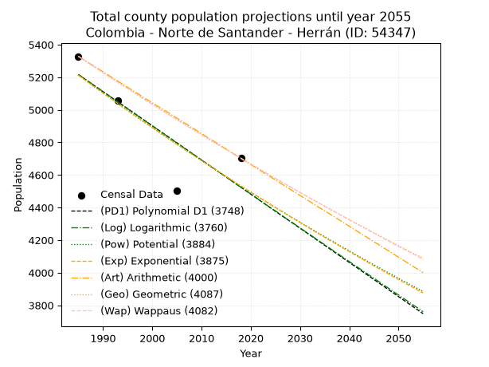
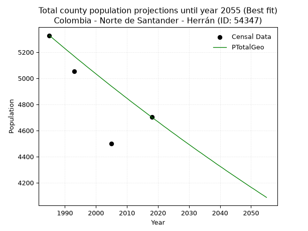
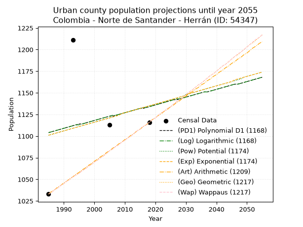
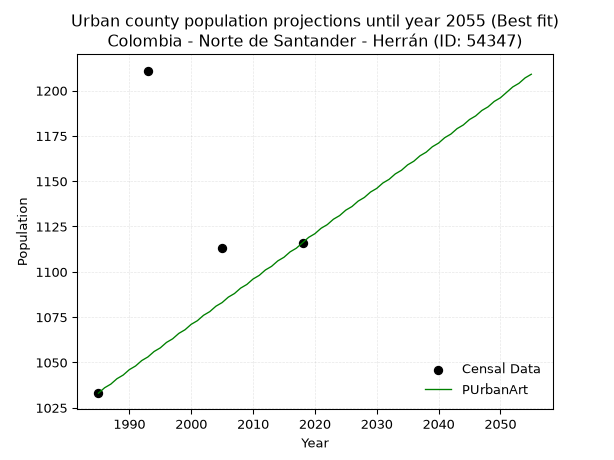
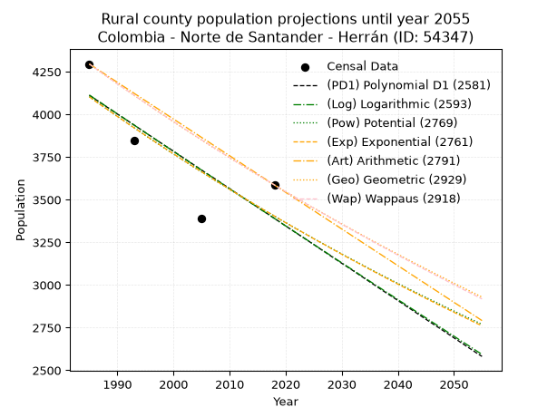
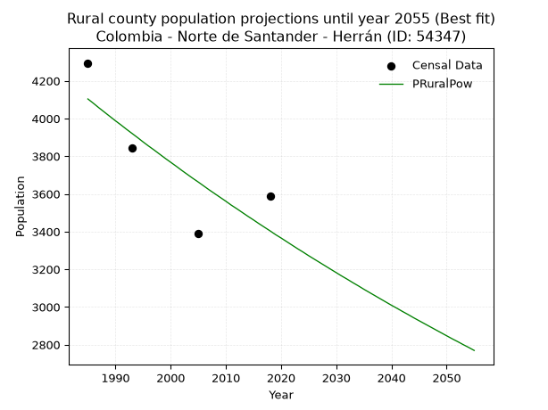

<div align="center">


</div>

# _“Population and Public Services Demand Projections (PPSD) until Year 2050 for Colombia - Norte de Santander - Herrán (ID: 54347)”_
Keywords: `population` `public-service` `projection` `lineal` `polynomial` `logarithmic` `potential` `exponential` `arithmetic` `geometric` `wappaus` `dane` `colombia` `south-america`

PPSD are analytical estimates used by governments and planners to anticipate future changes in population size, age distribution, and the resulting community needs for utilities, healthcare, education, and infrastructure as sizing future water treatment facilities, electrical grids, and road networks based on spatial growth.

> **General running parameters**: • app_version: _v20260806_. • Python version: _3.14.7_. • Pandas version: _3.0.5_. • NumPy version: _2.5.1_. • Creates, save and include plots into reports (create_plot): _False_. • Projection until year: _2050_. • Process polynomial degree 2 and up: _False_. • Process Wappaus: _True_. • Process Wappaus: _True_. • Set negative values to zero: _True_. • Set infinite values to zero: _True_. • Drop dataset notes: _True_. 
<div align="center">

Dynamic map: [:earth_americas:Google](http://maps.google.com/maps?q=7.506540865,-72.4835193) [:earth_americas:OSM](https://www.openstreetmap.org/#map=18/7.506540865/-72.4835193&layers=P) [:earth_americas:Bing](https://www.bing.com/maps?cp=7.506540865~-72.4835193&lvl=18) [:earth_americas:Apple](https://maps.apple.com/frame?center=7.506540865%2C-72.4835193&span=0.003%2C0.006)

</div>


<div align="center">

```geojson
{
  "type": "Feature",
  "geometry": {
    "type": "Point", 
    "coordinates": [-72.4835193, 7.506540865]
  }, 
  "properties": {
    "Name": "Colombia - Norte de Santander - Herrán (ID: 54347)"
  }
}
```

</div>


## 0. Census Data (4 records)

Census data are official statistics collected by a government about the people and housing in a country. They usually include counts of total population, age, sex, race, income, education, and jobs.

📅Global census file: [Population.xlsx](../data/Population.xlsx)

| Source   |   Year |   CountryID | CountryName   |   StateID | StateName          |   CountyID | CountyName   |   PTotal |   PUrban |   PRural |
|:---------|-------:|------------:|:--------------|----------:|:-------------------|-----------:|:-------------|---------:|---------:|---------:|
| DANE     |   1985 |          57 | Colombia      |        54 | Norte de Santander |      54347 | Herrán       |     5328 |     1033 |     4295 |
| DANE     |   1993 |          57 | Colombia      |        54 | Norte de Santander |      54347 | Herrán       |     5055 |     1211 |     3844 |
| DANE     |   2005 |          57 | Colombia      |        54 | Norte De Santander |      54347 | Herrán       |     4501 |     1113 |     3388 |
| DANE     |   2018 |          57 | Colombia      |        54 | Norte de Santander |      54347 | Herrán       |     4702 |     1116 |     3586 |

> 🔥Some records could had specific notes about the registered values or the corresponding urban or rural distribution.

📅   [RUPS](https://www.datos.gov.co/Hacienda-y-Cr-dito-P-blico/Registro-nico-de-Prestadores-de-Servicios-P-blicos/4qkq-csdn/about_data) - Local public utility companies: [RUPS.csv](../data/RUPS.xlsx)

 | SERVICIO       | ESTADO      | NOMBRE                                                                                                               | NIT         | DEPARTAMENTO_DOMICILIO   | MUNICIPIO_DOMICILIO   | DIRECCION                           |   TELEFONO | EMAIL                                   | TIPO_PRESTADOR          | CLASIFICACION                 |
|:---------------|:------------|:---------------------------------------------------------------------------------------------------------------------|:------------|:-------------------------|:----------------------|:------------------------------------|-----------:|:----------------------------------------|:------------------------|:------------------------------|
| ACUEDUCTO      | CANCELACION | UNIDAD DE SERVICIOS PUBLICOS DEL MUNICIPIO DE HERRAN                                                                 | 800005292-9 | NORTE DE SANTANDER       | HERRAN                | Calle 6 N° 3 - 29 Sector San Martín |    5860005 | alcaldia@herran-nortedesantander.gov.co | nan                     | nan                           |
| ALCANTARILLADO | CANCELACION | UNIDAD DE SERVICIOS PUBLICOS DEL MUNICIPIO DE HERRAN                                                                 | 800005292-9 | NORTE DE SANTANDER       | HERRAN                | Calle 6 N° 3 - 29 Sector San Martín |    5860005 | alcaldia@herran-nortedesantander.gov.co | nan                     | nan                           |
| ACUEDUCTO      | OPERATIVA   | Administración Pública Cooperativa de servicios Públicos domiciliarios de Acueducto, Alcantarillado y Aseo de Herrán | 901238264-9 | NORTE DE SANTANDER       | HERRAN                | Cra 5 No 6 -03                      |    5860005 | apcmanobaherran@gmail.com               | ORGANIZACION AUTORIZADA | MENOR O IGUAL A 2500 USUARIOS |
| ALCANTARILLADO | OPERATIVA   | Administración Pública Cooperativa de servicios Públicos domiciliarios de Acueducto, Alcantarillado y Aseo de Herrán | 901238264-9 | NORTE DE SANTANDER       | HERRAN                | Cra 5 No 6 -03                      |    5860005 | apcmanobaherran@gmail.com               | ORGANIZACION AUTORIZADA | MENOR O IGUAL A 2500 USUARIOS |

## 1. Total

### 1.1. Coefficients and Parameters

* (PD1) Polynomial Deg 1: -20.972300281011663, 46846.343637093574 (lineal)
* (Log) Logarithmic: -42039.25706540898, 324437.2298356374
* (Pow) Potential: -8.492696581433803, 31.724004730792114
* (Exp) Exponential: -0.004236713327559074, 23409475.750622436
* (Art) Arithmetic: Year diff. 2018 - 1985 = 33, Population diff. 4702 - 5328 = -626, Annual growth = -18.96969696969697
* (Geo) Geometric: Year diff. 2018 - 1985 = 33, Population diff. 4702 - 5328 = -626, Annual growth % = -0.0037803510533491735
* (Wap) Wappaus: i = -0.37825916190821474, Condition values only valid for < 200)

<sub>
Wappaus condition values: ['-0.00', '-0.38', '-0.76', '-1.13', '-1.51', '-1.89', '-2.27', '-2.65', '-3.03', '-3.40', '-3.78', '-4.16', '-4.54', '-4.92', '-5.30', '-5.67', '-6.05', '-6.43', '-6.81', '-7.19', '-7.57', '-7.94', '-8.32', '-8.70', '-9.08', '-9.46', '-9.83', '-10.21', '-10.59', '-10.97', '-11.35', '-11.73', '-12.10', '-12.48', '-12.86', '-13.24', '-13.62', '-14.00', '-14.37', '-14.75', '-15.13', '-15.51', '-15.89', '-16.27', '-16.64', '-17.02', '-17.40', '-17.78', '-18.16', '-18.53', '-18.91', '-19.29', '-19.67', '-20.05', '-20.43', '-20.80', '-21.18', '-21.56', '-21.94', '-22.32', '-22.70', '-23.07', '-23.45', '-23.83', '-24.21', '-24.59']
</sub>


### 1.2. Projected Dataset

|   Year |   CountyID |   PTotalPD1 |   PTotalLog |   PTotalPow |   PTotalExp |   PTotalArt |   PTotalGeo |   PTotalWap |
|-------:|-----------:|------------:|------------:|------------:|------------:|------------:|------------:|------------:|
|   1985 |      54347 |        5216 |        5217 |        5213 |        5212 |        5328 |        5328 |        5328 |
|   1986 |      54347 |        5195 |        5196 |        5191 |        5190 |        5309 |        5308 |        5308 |
|   1987 |      54347 |        5174 |        5175 |        5169 |        5168 |        5290 |        5288 |        5288 |
|   1988 |      54347 |        5153 |        5154 |        5147 |        5146 |        5271 |        5268 |        5268 |
|   1989 |      54347 |        5132 |        5133 |        5125 |        5125 |        5252 |        5248 |        5248 |
|   1990 |      54347 |        5111 |        5112 |        5103 |        5103 |        5233 |        5228 |        5228 |
|   1991 |      54347 |        5090 |        5091 |        5082 |        5081 |        5214 |        5208 |        5208 |
|   1992 |      54347 |        5070 |        5069 |        5060 |        5060 |        5195 |        5189 |        5189 |
|   1993 |      54347 |        5049 |        5048 |        5038 |        5039 |        5176 |        5169 |        5169 |
|   1994 |      54347 |        5028 |        5027 |        5017 |        5017 |        5157 |        5149 |        5150 |
|   1995 |      54347 |        5007 |        5006 |        4996 |        4996 |        5138 |        5130 |        5130 |
|   1996 |      54347 |        4986 |        4985 |        4974 |        4975 |        5119 |        5111 |        5111 |
|   1997 |      54347 |        4965 |        4964 |        4953 |        4954 |        5100 |        5091 |        5092 |
|   1998 |      54347 |        4944 |        4943 |        4932 |        4933 |        5081 |        5072 |        5072 |
|   1999 |      54347 |        4923 |        4922 |        4911 |        4912 |        5062 |        5053 |        5053 |
|   2000 |      54347 |        4902 |        4901 |        4891 |        4891 |        5043 |        5034 |        5034 |
|   2001 |      54347 |        4881 |        4880 |        4870 |        4871 |        5024 |        5015 |        5015 |
|   2002 |      54347 |        4860 |        4859 |        4849 |        4850 |        5006 |        4996 |        4996 |
|   2003 |      54347 |        4839 |        4838 |        4829 |        4830 |        4987 |        4977 |        4977 |
|   2004 |      54347 |        4818 |        4817 |        4808 |        4809 |        4968 |        4958 |        4958 |
|   2005 |      54347 |        4797 |        4796 |        4788 |        4789 |        4949 |        4939 |        4940 |
|   2006 |      54347 |        4776 |        4775 |        4768 |        4769 |        4930 |        4921 |        4921 |
|   2007 |      54347 |        4755 |        4754 |        4748 |        4748 |        4911 |        4902 |        4902 |
|   2008 |      54347 |        4734 |        4733 |        4728 |        4728 |        4892 |        4884 |        4884 |
|   2009 |      54347 |        4713 |        4712 |        4708 |        4708 |        4873 |        4865 |        4865 |
|   2010 |      54347 |        4692 |        4691 |        4688 |        4688 |        4854 |        4847 |        4847 |
|   2011 |      54347 |        4671 |        4670 |        4668 |        4669 |        4835 |        4828 |        4829 |
|   2012 |      54347 |        4650 |        4649 |        4648 |        4649 |        4816 |        4810 |        4810 |
|   2013 |      54347 |        4629 |        4629 |        4629 |        4629 |        4797 |        4792 |        4792 |
|   2014 |      54347 |        4608 |        4608 |        4609 |        4610 |        4778 |        4774 |        4774 |
|   2015 |      54347 |        4587 |        4587 |        4590 |        4590 |        4759 |        4756 |        4756 |
|   2016 |      54347 |        4566 |        4566 |        4571 |        4571 |        4740 |        4738 |        4738 |
|   2017 |      54347 |        4545 |        4545 |        4551 |        4551 |        4721 |        4720 |        4720 |
|   2018 |      54347 |        4524 |        4524 |        4532 |        4532 |        4702 |        4702 |        4702 |
|   2019 |      54347 |        4503 |        4503 |        4513 |        4513 |        4683 |        4684 |        4684 |
|   2020 |      54347 |        4482 |        4483 |        4494 |        4494 |        4664 |        4667 |        4666 |
|   2021 |      54347 |        4461 |        4462 |        4475 |        4475 |        4645 |        4649 |        4649 |
|   2022 |      54347 |        4440 |        4441 |        4457 |        4456 |        4626 |        4631 |        4631 |
|   2023 |      54347 |        4419 |        4420 |        4438 |        4437 |        4607 |        4614 |        4614 |
|   2024 |      54347 |        4398 |        4399 |        4419 |        4418 |        4588 |        4596 |        4596 |
|   2025 |      54347 |        4377 |        4379 |        4401 |        4400 |        4569 |        4579 |        4579 |
|   2026 |      54347 |        4356 |        4358 |        4382 |        4381 |        4550 |        4562 |        4561 |
|   2027 |      54347 |        4335 |        4337 |        4364 |        4363 |        4531 |        4544 |        4544 |
|   2028 |      54347 |        4315 |        4316 |        4346 |        4344 |        4512 |        4527 |        4527 |
|   2029 |      54347 |        4294 |        4296 |        4328 |        4326 |        4493 |        4510 |        4509 |
|   2030 |      54347 |        4273 |        4275 |        4310 |        4308 |        4474 |        4493 |        4492 |
|   2031 |      54347 |        4252 |        4254 |        4292 |        4289 |        4455 |        4476 |        4475 |
|   2032 |      54347 |        4231 |        4234 |        4274 |        4271 |        4436 |        4459 |        4458 |
|   2033 |      54347 |        4210 |        4213 |        4256 |        4253 |        4417 |        4442 |        4441 |
|   2034 |      54347 |        4189 |        4192 |        4238 |        4235 |        4398 |        4426 |        4424 |
|   2035 |      54347 |        4168 |        4172 |        4221 |        4217 |        4380 |        4409 |        4407 |
|   2036 |      54347 |        4147 |        4151 |        4203 |        4199 |        4361 |        4392 |        4391 |
|   2037 |      54347 |        4126 |        4130 |        4186 |        4182 |        4342 |        4376 |        4374 |
|   2038 |      54347 |        4105 |        4110 |        4168 |        4164 |        4323 |        4359 |        4357 |
|   2039 |      54347 |        4084 |        4089 |        4151 |        4146 |        4304 |        4342 |        4341 |
|   2040 |      54347 |        4063 |        4068 |        4134 |        4129 |        4285 |        4326 |        4324 |
|   2041 |      54347 |        4042 |        4048 |        4116 |        4111 |        4266 |        4310 |        4307 |
|   2042 |      54347 |        4021 |        4027 |        4099 |        4094 |        4247 |        4293 |        4291 |
|   2043 |      54347 |        4000 |        4007 |        4082 |        4077 |        4228 |        4277 |        4275 |
|   2044 |      54347 |        3979 |        3986 |        4065 |        4059 |        4209 |        4261 |        4258 |
|   2045 |      54347 |        3958 |        3966 |        4048 |        4042 |        4190 |        4245 |        4242 |
|   2046 |      54347 |        3937 |        3945 |        4032 |        4025 |        4171 |        4229 |        4226 |
|   2047 |      54347 |        3916 |        3924 |        4015 |        4008 |        4152 |        4213 |        4210 |
|   2048 |      54347 |        3895 |        3904 |        3998 |        3991 |        4133 |        4197 |        4193 |
|   2049 |      54347 |        3874 |        3883 |        3982 |        3974 |        4114 |        4181 |        4177 |
|   2050 |      54347 |        3853 |        3863 |        3965 |        3958 |        4095 |        4165 |        4161 |
<div align="center">

</img>

</div>


### 1.3. Best fit with absolute and relative error (%)

Relative error puts that difference into context by dividing the absolute error by the true value, creating a unitless ratio or percentage that shows the scale of the mistake.

Absolute and relative error

|   Year | Source   |   CountryID | CountryName   |   StateID | StateName          |   CountyID_x | CountyName   |   PTotal |   PUrban |   PRural |   CountyID_y |   PTotalPD1 |   PTotalLog |   PTotalPow |   PTotalExp |   PTotalArt |   PTotalGeo |   PTotalWap |   PTotalPD1AbsError |   PTotalLogAbsError |   PTotalPowAbsError |   PTotalExpAbsError |   PTotalArtAbsError |   PTotalGeoAbsError |   PTotalWapAbsError |   PTotalPD1RelError |   PTotalLogRelError |   PTotalPowRelError |   PTotalExpRelError |   PTotalArtRelError |   PTotalGeoRelError |   PTotalWapRelError |
|-------:|:---------|------------:|:--------------|----------:|:-------------------|-------------:|:-------------|---------:|---------:|---------:|-------------:|------------:|------------:|------------:|------------:|------------:|------------:|------------:|--------------------:|--------------------:|--------------------:|--------------------:|--------------------:|--------------------:|--------------------:|--------------------:|--------------------:|--------------------:|--------------------:|--------------------:|--------------------:|--------------------:|
|   1985 | DANE     |          57 | Colombia      |        54 | Norte de Santander |        54347 | Herrán       |     5328 |     1033 |     4295 |        54347 |        5216 |        5217 |        5213 |        5212 |        5328 |        5328 |        5328 |                 112 |                 111 |                 115 |                 116 |                   0 |                   0 |                   0 |            2.1021   |            2.08333  |            2.15841  |            2.17718  |             0       |             0       |             0       |
|   1993 | DANE     |          57 | Colombia      |        54 | Norte de Santander |        54347 | Herrán       |     5055 |     1211 |     3844 |        54347 |        5049 |        5048 |        5038 |        5039 |        5176 |        5169 |        5169 |                   6 |                   7 |                  17 |                  16 |                 121 |                 114 |                 114 |            0.118694 |            0.138477 |            0.336301 |            0.316518 |             2.39367 |             2.25519 |             2.25519 |
|   2005 | DANE     |          57 | Colombia      |        54 | Norte De Santander |        54347 | Herrán       |     4501 |     1113 |     3388 |        54347 |        4797 |        4796 |        4788 |        4789 |        4949 |        4939 |        4940 |                 296 |                 295 |                 287 |                 288 |                 448 |                 438 |                 439 |            6.57632  |            6.5541   |            6.37636  |            6.39858  |             9.95334 |             9.73117 |             9.75339 |
|   2018 | DANE     |          57 | Colombia      |        54 | Norte de Santander |        54347 | Herrán       |     4702 |     1116 |     3586 |        54347 |        4524 |        4524 |        4532 |        4532 |        4702 |        4702 |        4702 |                 178 |                 178 |                 170 |                 170 |                   0 |                   0 |                   0 |            3.78562  |            3.78562  |            3.61548  |            3.61548  |             0       |             0       |             0       |

Relative error mean

| Method    |   RelError | Best   |
|:----------|-----------:|:-------|
| PTotalPD1 |    3.14568 |        |
| PTotalLog |    3.14038 |        |
| PTotalPow |    3.12164 |        |
| PTotalExp |    3.12694 |        |
| PTotalArt |    3.08675 |        |
| PTotalGeo |    2.99659 | True   |
| PTotalWap |    3.00215 |        |

💙Best method: _**PTotalGeo**_
<div align="center">

</img>

</div>


### 1.4. Fresh water supply demand in liters per capita per day (lpcd)

The fresh water supply demand typically ranges from 100 to 300 liters per capita per day (lpcd) for standard domestic and municipal planning, though absolute survival minimums set by the World Health Organization are as low as 7.5 to 20 liters per day, and total consumption in high-income nations can exceed 400 liters.

> `CZ`: Level in meters above the sea level (masl)<br> `WS`: Fresh water supply demand in liters per capita per day (lpcd or l/h/d)<br> `WSAll`: Zonal fresh water supply demand in liters per second (l/s)<br> `A`: Zonal area in square meters<br> `DP`: Population density (people/hectare or p/ha)

Reference values (RAS Colombia)

|    CZ |   WS |
|------:|-----:|
|  1000 |  120 |
|  2000 |  130 |
| 99999 |  140 |

County shapefile geometry properties and water supply values

|   CountyID |      ATotal |   CZTotal |   WSTotal |
|-----------:|------------:|----------:|----------:|
|      54347 | 1.07518e+08 |   2377.24 |       140 |

Projected values for best method: PTotalGeo

|   CountyID |   Year |   PTotalGeo |   DPTotal |   WSTotal |   WSTotalAll |
|-----------:|-------:|------------:|----------:|----------:|-------------:|
|      54347 |   1985 |        5328 |      0.5  |       140 |      8.63333 |
|      54347 |   1986 |        5308 |      0.49 |       140 |      8.60093 |
|      54347 |   1987 |        5288 |      0.49 |       140 |      8.56852 |
|      54347 |   1988 |        5268 |      0.49 |       140 |      8.53611 |
|      54347 |   1989 |        5248 |      0.49 |       140 |      8.5037  |
|      54347 |   1990 |        5228 |      0.49 |       140 |      8.4713  |
|      54347 |   1991 |        5208 |      0.48 |       140 |      8.43889 |
|      54347 |   1992 |        5189 |      0.48 |       140 |      8.4081  |
|      54347 |   1993 |        5169 |      0.48 |       140 |      8.37569 |
|      54347 |   1994 |        5149 |      0.48 |       140 |      8.34329 |
|      54347 |   1995 |        5130 |      0.48 |       140 |      8.3125  |
|      54347 |   1996 |        5111 |      0.48 |       140 |      8.28171 |
|      54347 |   1997 |        5091 |      0.47 |       140 |      8.24931 |
|      54347 |   1998 |        5072 |      0.47 |       140 |      8.21852 |
|      54347 |   1999 |        5053 |      0.47 |       140 |      8.18773 |
|      54347 |   2000 |        5034 |      0.47 |       140 |      8.15694 |
|      54347 |   2001 |        5015 |      0.47 |       140 |      8.12616 |
|      54347 |   2002 |        4996 |      0.46 |       140 |      8.09537 |
|      54347 |   2003 |        4977 |      0.46 |       140 |      8.06458 |
|      54347 |   2004 |        4958 |      0.46 |       140 |      8.0338  |
|      54347 |   2005 |        4939 |      0.46 |       140 |      8.00301 |
|      54347 |   2006 |        4921 |      0.46 |       140 |      7.97384 |
|      54347 |   2007 |        4902 |      0.46 |       140 |      7.94306 |
|      54347 |   2008 |        4884 |      0.45 |       140 |      7.91389 |
|      54347 |   2009 |        4865 |      0.45 |       140 |      7.8831  |
|      54347 |   2010 |        4847 |      0.45 |       140 |      7.85394 |
|      54347 |   2011 |        4828 |      0.45 |       140 |      7.82315 |
|      54347 |   2012 |        4810 |      0.45 |       140 |      7.79398 |
|      54347 |   2013 |        4792 |      0.45 |       140 |      7.76481 |
|      54347 |   2014 |        4774 |      0.44 |       140 |      7.73565 |
|      54347 |   2015 |        4756 |      0.44 |       140 |      7.70648 |
|      54347 |   2016 |        4738 |      0.44 |       140 |      7.67731 |
|      54347 |   2017 |        4720 |      0.44 |       140 |      7.64815 |
|      54347 |   2018 |        4702 |      0.44 |       140 |      7.61898 |
|      54347 |   2019 |        4684 |      0.44 |       140 |      7.58981 |
|      54347 |   2020 |        4667 |      0.43 |       140 |      7.56227 |
|      54347 |   2021 |        4649 |      0.43 |       140 |      7.5331  |
|      54347 |   2022 |        4631 |      0.43 |       140 |      7.50394 |
|      54347 |   2023 |        4614 |      0.43 |       140 |      7.47639 |
|      54347 |   2024 |        4596 |      0.43 |       140 |      7.44722 |
|      54347 |   2025 |        4579 |      0.43 |       140 |      7.41968 |
|      54347 |   2026 |        4562 |      0.42 |       140 |      7.39213 |
|      54347 |   2027 |        4544 |      0.42 |       140 |      7.36296 |
|      54347 |   2028 |        4527 |      0.42 |       140 |      7.33542 |
|      54347 |   2029 |        4510 |      0.42 |       140 |      7.30787 |
|      54347 |   2030 |        4493 |      0.42 |       140 |      7.28032 |
|      54347 |   2031 |        4476 |      0.42 |       140 |      7.25278 |
|      54347 |   2032 |        4459 |      0.41 |       140 |      7.22523 |
|      54347 |   2033 |        4442 |      0.41 |       140 |      7.19769 |
|      54347 |   2034 |        4426 |      0.41 |       140 |      7.17176 |
|      54347 |   2035 |        4409 |      0.41 |       140 |      7.14421 |
|      54347 |   2036 |        4392 |      0.41 |       140 |      7.11667 |
|      54347 |   2037 |        4376 |      0.41 |       140 |      7.09074 |
|      54347 |   2038 |        4359 |      0.41 |       140 |      7.06319 |
|      54347 |   2039 |        4342 |      0.4  |       140 |      7.03565 |
|      54347 |   2040 |        4326 |      0.4  |       140 |      7.00972 |
|      54347 |   2041 |        4310 |      0.4  |       140 |      6.9838  |
|      54347 |   2042 |        4293 |      0.4  |       140 |      6.95625 |
|      54347 |   2043 |        4277 |      0.4  |       140 |      6.93032 |
|      54347 |   2044 |        4261 |      0.4  |       140 |      6.9044  |
|      54347 |   2045 |        4245 |      0.39 |       140 |      6.87847 |
|      54347 |   2046 |        4229 |      0.39 |       140 |      6.85255 |
|      54347 |   2047 |        4213 |      0.39 |       140 |      6.82662 |
|      54347 |   2048 |        4197 |      0.39 |       140 |      6.80069 |
|      54347 |   2049 |        4181 |      0.39 |       140 |      6.77477 |
|      54347 |   2050 |        4165 |      0.39 |       140 |      6.74884 |

## 2. Urban

### 2.1. Coefficients and Parameters

* (PD1) Polynomial Deg 1: 0.9036531513448478, -689.2822159775319 (lineal)
* (Log) Logarithmic: 1822.7744517014046, -12736.673214180122
* (Pow) Potential: 1.8559139763054069, -3.078661827137336
* (Exp) Exponential: 0.0009209103346956887, 176.95319803843796
* (Art) Arithmetic: Year diff. 2018 - 1985 = 33, Population diff. 1116 - 1033 = 83, Annual growth = 2.515151515151515
* (Geo) Geometric: Year diff. 2018 - 1985 = 33, Population diff. 1116 - 1033 = 83, Annual growth % = 0.002344673968685207
* (Wap) Wappaus: i = 0.2340764555748269, Condition values only valid for < 200)

<sub>
Wappaus condition values: ['0.00', '0.23', '0.47', '0.70', '0.94', '1.17', '1.40', '1.64', '1.87', '2.11', '2.34', '2.57', '2.81', '3.04', '3.28', '3.51', '3.75', '3.98', '4.21', '4.45', '4.68', '4.92', '5.15', '5.38', '5.62', '5.85', '6.09', '6.32', '6.55', '6.79', '7.02', '7.26', '7.49', '7.72', '7.96', '8.19', '8.43', '8.66', '8.89', '9.13', '9.36', '9.60', '9.83', '10.07', '10.30', '10.53', '10.77', '11.00', '11.24', '11.47', '11.70', '11.94', '12.17', '12.41', '12.64', '12.87', '13.11', '13.34', '13.58', '13.81', '14.04', '14.28', '14.51', '14.75', '14.98', '15.21']
</sub>


### 2.2. Projected Dataset

|   Year |   CountyID |   PUrbanPD1 |   PUrbanLog |   PUrbanPow |   PUrbanExp |   PUrbanArt |   PUrbanGeo |   PUrbanWap |
|-------:|-----------:|------------:|------------:|------------:|------------:|------------:|------------:|------------:|
|   1985 |      54347 |        1104 |        1104 |        1101 |        1101 |        1033 |        1033 |        1033 |
|   1986 |      54347 |        1105 |        1105 |        1102 |        1102 |        1036 |        1035 |        1035 |
|   1987 |      54347 |        1106 |        1106 |        1103 |        1103 |        1038 |        1038 |        1038 |
|   1988 |      54347 |        1107 |        1107 |        1104 |        1104 |        1041 |        1040 |        1040 |
|   1989 |      54347 |        1108 |        1108 |        1105 |        1105 |        1043 |        1043 |        1043 |
|   1990 |      54347 |        1109 |        1109 |        1106 |        1106 |        1046 |        1045 |        1045 |
|   1991 |      54347 |        1110 |        1110 |        1107 |        1107 |        1048 |        1048 |        1048 |
|   1992 |      54347 |        1111 |        1111 |        1108 |        1108 |        1051 |        1050 |        1050 |
|   1993 |      54347 |        1112 |        1112 |        1109 |        1109 |        1053 |        1053 |        1053 |
|   1994 |      54347 |        1113 |        1113 |        1110 |        1110 |        1056 |        1055 |        1055 |
|   1995 |      54347 |        1114 |        1113 |        1111 |        1111 |        1058 |        1057 |        1057 |
|   1996 |      54347 |        1114 |        1114 |        1112 |        1112 |        1061 |        1060 |        1060 |
|   1997 |      54347 |        1115 |        1115 |        1113 |        1113 |        1063 |        1062 |        1062 |
|   1998 |      54347 |        1116 |        1116 |        1114 |        1114 |        1066 |        1065 |        1065 |
|   1999 |      54347 |        1117 |        1117 |        1115 |        1115 |        1068 |        1067 |        1067 |
|   2000 |      54347 |        1118 |        1118 |        1116 |        1116 |        1071 |        1070 |        1070 |
|   2001 |      54347 |        1119 |        1119 |        1117 |        1117 |        1073 |        1072 |        1072 |
|   2002 |      54347 |        1120 |        1120 |        1118 |        1118 |        1076 |        1075 |        1075 |
|   2003 |      54347 |        1121 |        1121 |        1119 |        1119 |        1078 |        1077 |        1077 |
|   2004 |      54347 |        1122 |        1122 |        1120 |        1120 |        1081 |        1080 |        1080 |
|   2005 |      54347 |        1123 |        1123 |        1121 |        1121 |        1083 |        1083 |        1083 |
|   2006 |      54347 |        1123 |        1124 |        1122 |        1122 |        1086 |        1085 |        1085 |
|   2007 |      54347 |        1124 |        1124 |        1124 |        1123 |        1088 |        1088 |        1088 |
|   2008 |      54347 |        1125 |        1125 |        1125 |        1124 |        1091 |        1090 |        1090 |
|   2009 |      54347 |        1126 |        1126 |        1126 |        1126 |        1093 |        1093 |        1093 |
|   2010 |      54347 |        1127 |        1127 |        1127 |        1127 |        1096 |        1095 |        1095 |
|   2011 |      54347 |        1128 |        1128 |        1128 |        1128 |        1098 |        1098 |        1098 |
|   2012 |      54347 |        1129 |        1129 |        1129 |        1129 |        1101 |        1100 |        1100 |
|   2013 |      54347 |        1130 |        1130 |        1130 |        1130 |        1103 |        1103 |        1103 |
|   2014 |      54347 |        1131 |        1131 |        1131 |        1131 |        1106 |        1106 |        1106 |
|   2015 |      54347 |        1132 |        1132 |        1132 |        1132 |        1108 |        1108 |        1108 |
|   2016 |      54347 |        1132 |        1133 |        1133 |        1133 |        1111 |        1111 |        1111 |
|   2017 |      54347 |        1133 |        1133 |        1134 |        1134 |        1113 |        1113 |        1113 |
|   2018 |      54347 |        1134 |        1134 |        1135 |        1135 |        1116 |        1116 |        1116 |
|   2019 |      54347 |        1135 |        1135 |        1136 |        1136 |        1119 |        1119 |        1119 |
|   2020 |      54347 |        1136 |        1136 |        1137 |        1137 |        1121 |        1121 |        1121 |
|   2021 |      54347 |        1137 |        1137 |        1138 |        1138 |        1124 |        1124 |        1124 |
|   2022 |      54347 |        1138 |        1138 |        1139 |        1139 |        1126 |        1127 |        1127 |
|   2023 |      54347 |        1139 |        1139 |        1140 |        1140 |        1129 |        1129 |        1129 |
|   2024 |      54347 |        1140 |        1140 |        1141 |        1141 |        1131 |        1132 |        1132 |
|   2025 |      54347 |        1141 |        1141 |        1142 |        1142 |        1134 |        1134 |        1134 |
|   2026 |      54347 |        1142 |        1142 |        1143 |        1143 |        1136 |        1137 |        1137 |
|   2027 |      54347 |        1142 |        1143 |        1144 |        1144 |        1139 |        1140 |        1140 |
|   2028 |      54347 |        1143 |        1143 |        1145 |        1145 |        1141 |        1142 |        1142 |
|   2029 |      54347 |        1144 |        1144 |        1146 |        1146 |        1144 |        1145 |        1145 |
|   2030 |      54347 |        1145 |        1145 |        1148 |        1147 |        1146 |        1148 |        1148 |
|   2031 |      54347 |        1146 |        1146 |        1149 |        1149 |        1149 |        1150 |        1151 |
|   2032 |      54347 |        1147 |        1147 |        1150 |        1150 |        1151 |        1153 |        1153 |
|   2033 |      54347 |        1148 |        1148 |        1151 |        1151 |        1154 |        1156 |        1156 |
|   2034 |      54347 |        1149 |        1149 |        1152 |        1152 |        1156 |        1159 |        1159 |
|   2035 |      54347 |        1150 |        1150 |        1153 |        1153 |        1159 |        1161 |        1161 |
|   2036 |      54347 |        1151 |        1151 |        1154 |        1154 |        1161 |        1164 |        1164 |
|   2037 |      54347 |        1151 |        1151 |        1155 |        1155 |        1164 |        1167 |        1167 |
|   2038 |      54347 |        1152 |        1152 |        1156 |        1156 |        1166 |        1170 |        1170 |
|   2039 |      54347 |        1153 |        1153 |        1157 |        1157 |        1169 |        1172 |        1172 |
|   2040 |      54347 |        1154 |        1154 |        1158 |        1158 |        1171 |        1175 |        1175 |
|   2041 |      54347 |        1155 |        1155 |        1159 |        1159 |        1174 |        1178 |        1178 |
|   2042 |      54347 |        1156 |        1156 |        1160 |        1160 |        1176 |        1181 |        1181 |
|   2043 |      54347 |        1157 |        1157 |        1161 |        1161 |        1179 |        1183 |        1183 |
|   2044 |      54347 |        1158 |        1158 |        1162 |        1162 |        1181 |        1186 |        1186 |
|   2045 |      54347 |        1159 |        1159 |        1163 |        1163 |        1184 |        1189 |        1189 |
|   2046 |      54347 |        1160 |        1160 |        1164 |        1165 |        1186 |        1192 |        1192 |
|   2047 |      54347 |        1160 |        1160 |        1165 |        1166 |        1189 |        1194 |        1195 |
|   2048 |      54347 |        1161 |        1161 |        1166 |        1167 |        1191 |        1197 |        1197 |
|   2049 |      54347 |        1162 |        1162 |        1168 |        1168 |        1194 |        1200 |        1200 |
|   2050 |      54347 |        1163 |        1163 |        1169 |        1169 |        1196 |        1203 |        1203 |
<div align="center">

</img>

</div>


### 2.3. Best fit with absolute and relative error (%)

Relative error puts that difference into context by dividing the absolute error by the true value, creating a unitless ratio or percentage that shows the scale of the mistake.

Absolute and relative error

|   Year | Source   |   CountryID | CountryName   |   StateID | StateName          |   CountyID_x | CountyName   |   PTotal |   PUrban |   PRural |   CountyID_y |   PUrbanPD1 |   PUrbanLog |   PUrbanPow |   PUrbanExp |   PUrbanArt |   PUrbanGeo |   PUrbanWap |   PUrbanPD1AbsError |   PUrbanLogAbsError |   PUrbanPowAbsError |   PUrbanExpAbsError |   PUrbanArtAbsError |   PUrbanGeoAbsError |   PUrbanWapAbsError |   PUrbanPD1RelError |   PUrbanLogRelError |   PUrbanPowRelError |   PUrbanExpRelError |   PUrbanArtRelError |   PUrbanGeoRelError |   PUrbanWapRelError |
|-------:|:---------|------------:|:--------------|----------:|:-------------------|-------------:|:-------------|---------:|---------:|---------:|-------------:|------------:|------------:|------------:|------------:|------------:|------------:|------------:|--------------------:|--------------------:|--------------------:|--------------------:|--------------------:|--------------------:|--------------------:|--------------------:|--------------------:|--------------------:|--------------------:|--------------------:|--------------------:|--------------------:|
|   1985 | DANE     |          57 | Colombia      |        54 | Norte de Santander |        54347 | Herrán       |     5328 |     1033 |     4295 |        54347 |        1104 |        1104 |        1101 |        1101 |        1033 |        1033 |        1033 |                  71 |                  71 |                  68 |                  68 |                   0 |                   0 |                   0 |            6.87318  |            6.87318  |            6.58277  |            6.58277  |             0       |             0       |             0       |
|   1993 | DANE     |          57 | Colombia      |        54 | Norte de Santander |        54347 | Herrán       |     5055 |     1211 |     3844 |        54347 |        1112 |        1112 |        1109 |        1109 |        1053 |        1053 |        1053 |                  99 |                  99 |                 102 |                 102 |                 158 |                 158 |                 158 |            8.17506  |            8.17506  |            8.42279  |            8.42279  |            13.0471  |            13.0471  |            13.0471  |
|   2005 | DANE     |          57 | Colombia      |        54 | Norte De Santander |        54347 | Herrán       |     4501 |     1113 |     3388 |        54347 |        1123 |        1123 |        1121 |        1121 |        1083 |        1083 |        1083 |                  10 |                  10 |                   8 |                   8 |                  30 |                  30 |                  30 |            0.898473 |            0.898473 |            0.718778 |            0.718778 |             2.69542 |             2.69542 |             2.69542 |
|   2018 | DANE     |          57 | Colombia      |        54 | Norte de Santander |        54347 | Herrán       |     4702 |     1116 |     3586 |        54347 |        1134 |        1134 |        1135 |        1135 |        1116 |        1116 |        1116 |                  18 |                  18 |                  19 |                  19 |                   0 |                   0 |                   0 |            1.6129   |            1.6129   |            1.70251  |            1.70251  |             0       |             0       |             0       |

Relative error mean

| Method    |   RelError | Best   |
|:----------|-----------:|:-------|
| PUrbanPD1 |    4.38991 |        |
| PUrbanLog |    4.38991 |        |
| PUrbanPow |    4.35671 |        |
| PUrbanExp |    4.35671 |        |
| PUrbanArt |    3.93562 | True   |
| PUrbanGeo |    3.93562 | True   |
| PUrbanWap |    3.93562 | True   |

💙Best method: _**PUrbanArt**_
<div align="center">

</img>

</div>


### 2.4. Fresh water supply demand in liters per capita per day (lpcd)

The fresh water supply demand typically ranges from 100 to 300 liters per capita per day (lpcd) for standard domestic and municipal planning, though absolute survival minimums set by the World Health Organization are as low as 7.5 to 20 liters per day, and total consumption in high-income nations can exceed 400 liters.

> `CZ`: Level in meters above the sea level (masl)<br> `WS`: Fresh water supply demand in liters per capita per day (lpcd or l/h/d)<br> `WSAll`: Zonal fresh water supply demand in liters per second (l/s)<br> `A`: Zonal area in square meters<br> `DP`: Population density (people/hectare or p/ha)

Reference values (RAS Colombia)

|    CZ |   WS |
|------:|-----:|
|  1000 |  120 |
|  2000 |  130 |
| 99999 |  140 |

County shapefile geometry properties and water supply values

|   CountyID |   AUrban |   CZUrban |   WSUrban |
|-----------:|---------:|----------:|----------:|
|      54347 |   162751 |   1957.85 |       130 |

Projected values for best method: PUrbanArt

|   CountyID |   Year |   PUrbanArt |   DPUrban |   WSUrban |   WSUrbanAll |
|-----------:|-------:|------------:|----------:|----------:|-------------:|
|      54347 |   1985 |        1033 |     63.47 |       130 |      1.55428 |
|      54347 |   1986 |        1036 |     63.66 |       130 |      1.5588  |
|      54347 |   1987 |        1038 |     63.78 |       130 |      1.56181 |
|      54347 |   1988 |        1041 |     63.96 |       130 |      1.56632 |
|      54347 |   1989 |        1043 |     64.09 |       130 |      1.56933 |
|      54347 |   1990 |        1046 |     64.27 |       130 |      1.57384 |
|      54347 |   1991 |        1048 |     64.39 |       130 |      1.57685 |
|      54347 |   1992 |        1051 |     64.58 |       130 |      1.58137 |
|      54347 |   1993 |        1053 |     64.7  |       130 |      1.58438 |
|      54347 |   1994 |        1056 |     64.88 |       130 |      1.58889 |
|      54347 |   1995 |        1058 |     65.01 |       130 |      1.5919  |
|      54347 |   1996 |        1061 |     65.19 |       130 |      1.59641 |
|      54347 |   1997 |        1063 |     65.31 |       130 |      1.59942 |
|      54347 |   1998 |        1066 |     65.5  |       130 |      1.60394 |
|      54347 |   1999 |        1068 |     65.62 |       130 |      1.60694 |
|      54347 |   2000 |        1071 |     65.81 |       130 |      1.61146 |
|      54347 |   2001 |        1073 |     65.93 |       130 |      1.61447 |
|      54347 |   2002 |        1076 |     66.11 |       130 |      1.61898 |
|      54347 |   2003 |        1078 |     66.24 |       130 |      1.62199 |
|      54347 |   2004 |        1081 |     66.42 |       130 |      1.6265  |
|      54347 |   2005 |        1083 |     66.54 |       130 |      1.62951 |
|      54347 |   2006 |        1086 |     66.73 |       130 |      1.63403 |
|      54347 |   2007 |        1088 |     66.85 |       130 |      1.63704 |
|      54347 |   2008 |        1091 |     67.03 |       130 |      1.64155 |
|      54347 |   2009 |        1093 |     67.16 |       130 |      1.64456 |
|      54347 |   2010 |        1096 |     67.34 |       130 |      1.64907 |
|      54347 |   2011 |        1098 |     67.46 |       130 |      1.65208 |
|      54347 |   2012 |        1101 |     67.65 |       130 |      1.6566  |
|      54347 |   2013 |        1103 |     67.77 |       130 |      1.65961 |
|      54347 |   2014 |        1106 |     67.96 |       130 |      1.66412 |
|      54347 |   2015 |        1108 |     68.08 |       130 |      1.66713 |
|      54347 |   2016 |        1111 |     68.26 |       130 |      1.67164 |
|      54347 |   2017 |        1113 |     68.39 |       130 |      1.67465 |
|      54347 |   2018 |        1116 |     68.57 |       130 |      1.67917 |
|      54347 |   2019 |        1119 |     68.76 |       130 |      1.68368 |
|      54347 |   2020 |        1121 |     68.88 |       130 |      1.68669 |
|      54347 |   2021 |        1124 |     69.06 |       130 |      1.6912  |
|      54347 |   2022 |        1126 |     69.19 |       130 |      1.69421 |
|      54347 |   2023 |        1129 |     69.37 |       130 |      1.69873 |
|      54347 |   2024 |        1131 |     69.49 |       130 |      1.70174 |
|      54347 |   2025 |        1134 |     69.68 |       130 |      1.70625 |
|      54347 |   2026 |        1136 |     69.8  |       130 |      1.70926 |
|      54347 |   2027 |        1139 |     69.98 |       130 |      1.71377 |
|      54347 |   2028 |        1141 |     70.11 |       130 |      1.71678 |
|      54347 |   2029 |        1144 |     70.29 |       130 |      1.7213  |
|      54347 |   2030 |        1146 |     70.41 |       130 |      1.72431 |
|      54347 |   2031 |        1149 |     70.6  |       130 |      1.72882 |
|      54347 |   2032 |        1151 |     70.72 |       130 |      1.73183 |
|      54347 |   2033 |        1154 |     70.91 |       130 |      1.73634 |
|      54347 |   2034 |        1156 |     71.03 |       130 |      1.73935 |
|      54347 |   2035 |        1159 |     71.21 |       130 |      1.74387 |
|      54347 |   2036 |        1161 |     71.34 |       130 |      1.74687 |
|      54347 |   2037 |        1164 |     71.52 |       130 |      1.75139 |
|      54347 |   2038 |        1166 |     71.64 |       130 |      1.7544  |
|      54347 |   2039 |        1169 |     71.83 |       130 |      1.75891 |
|      54347 |   2040 |        1171 |     71.95 |       130 |      1.76192 |
|      54347 |   2041 |        1174 |     72.13 |       130 |      1.76644 |
|      54347 |   2042 |        1176 |     72.26 |       130 |      1.76944 |
|      54347 |   2043 |        1179 |     72.44 |       130 |      1.77396 |
|      54347 |   2044 |        1181 |     72.56 |       130 |      1.77697 |
|      54347 |   2045 |        1184 |     72.75 |       130 |      1.78148 |
|      54347 |   2046 |        1186 |     72.87 |       130 |      1.78449 |
|      54347 |   2047 |        1189 |     73.06 |       130 |      1.789   |
|      54347 |   2048 |        1191 |     73.18 |       130 |      1.79201 |
|      54347 |   2049 |        1194 |     73.36 |       130 |      1.79653 |
|      54347 |   2050 |        1196 |     73.49 |       130 |      1.79954 |

## 3. Rural

### 3.1. Coefficients and Parameters

* (PD1) Polynomial Deg 1: -21.875953432356543, 47535.62585307117 (lineal)
* (Log) Logarithmic: -43862.03151711041, 337173.9030498177
* (Pow) Potential: -11.348806834871613, 41.03884708175052
* (Exp) Exponential: -0.00566006693165295, 310785868.926666
* (Art) Arithmetic: Year diff. 2018 - 1985 = 33, Population diff. 3586 - 4295 = -709, Annual growth = -21.484848484848484
* (Geo) Geometric: Year diff. 2018 - 1985 = 33, Population diff. 3586 - 4295 = -709, Annual growth % = -0.005452178997232715
* (Wap) Wappaus: i = -0.545231531147024, Condition values only valid for < 200)

<sub>
Wappaus condition values: ['-0.00', '-0.55', '-1.09', '-1.64', '-2.18', '-2.73', '-3.27', '-3.82', '-4.36', '-4.91', '-5.45', '-6.00', '-6.54', '-7.09', '-7.63', '-8.18', '-8.72', '-9.27', '-9.81', '-10.36', '-10.90', '-11.45', '-12.00', '-12.54', '-13.09', '-13.63', '-14.18', '-14.72', '-15.27', '-15.81', '-16.36', '-16.90', '-17.45', '-17.99', '-18.54', '-19.08', '-19.63', '-20.17', '-20.72', '-21.26', '-21.81', '-22.35', '-22.90', '-23.44', '-23.99', '-24.54', '-25.08', '-25.63', '-26.17', '-26.72', '-27.26', '-27.81', '-28.35', '-28.90', '-29.44', '-29.99', '-30.53', '-31.08', '-31.62', '-32.17', '-32.71', '-33.26', '-33.80', '-34.35', '-34.89', '-35.44']
</sub>


### 3.2. Projected Dataset

|   Year |   CountyID |   PRuralPD1 |   PRuralLog |   PRuralPow |   PRuralExp |   PRuralArt |   PRuralGeo |   PRuralWap |
|-------:|-----------:|------------:|------------:|------------:|------------:|------------:|------------:|------------:|
|   1985 |      54347 |        4112 |        4113 |        4104 |        4103 |        4295 |        4295 |        4295 |
|   1986 |      54347 |        4090 |        4091 |        4081 |        4079 |        4274 |        4272 |        4272 |
|   1987 |      54347 |        4068 |        4069 |        4057 |        4056 |        4252 |        4248 |        4248 |
|   1988 |      54347 |        4046 |        4047 |        4034 |        4034 |        4231 |        4225 |        4225 |
|   1989 |      54347 |        4024 |        4025 |        4011 |        4011 |        4209 |        4202 |        4202 |
|   1990 |      54347 |        4002 |        4003 |        3988 |        3988 |        4188 |        4179 |        4179 |
|   1991 |      54347 |        3981 |        3981 |        3966 |        3966 |        4166 |        4156 |        4157 |
|   1992 |      54347 |        3959 |        3959 |        3943 |        3943 |        4145 |        4134 |        4134 |
|   1993 |      54347 |        3937 |        3937 |        3921 |        3921 |        4123 |        4111 |        4112 |
|   1994 |      54347 |        3915 |        3915 |        3899 |        3899 |        4102 |        4089 |        4089 |
|   1995 |      54347 |        3893 |        3893 |        3876 |        3877 |        4080 |        4066 |        4067 |
|   1996 |      54347 |        3871 |        3871 |        3854 |        3855 |        4059 |        4044 |        4045 |
|   1997 |      54347 |        3849 |        3849 |        3833 |        3833 |        4037 |        4022 |        4023 |
|   1998 |      54347 |        3827 |        3827 |        3811 |        3812 |        4016 |        4000 |        4001 |
|   1999 |      54347 |        3806 |        3805 |        3789 |        3790 |        3994 |        3979 |        3979 |
|   2000 |      54347 |        3784 |        3783 |        3768 |        3769 |        3973 |        3957 |        3958 |
|   2001 |      54347 |        3762 |        3761 |        3747 |        3747 |        3951 |        3935 |        3936 |
|   2002 |      54347 |        3740 |        3739 |        3725 |        3726 |        3930 |        3914 |        3915 |
|   2003 |      54347 |        3718 |        3717 |        3704 |        3705 |        3908 |        3892 |        3893 |
|   2004 |      54347 |        3696 |        3695 |        3683 |        3684 |        3887 |        3871 |        3872 |
|   2005 |      54347 |        3674 |        3673 |        3663 |        3664 |        3865 |        3850 |        3851 |
|   2006 |      54347 |        3652 |        3651 |        3642 |        3643 |        3844 |        3829 |        3830 |
|   2007 |      54347 |        3631 |        3630 |        3621 |        3622 |        3822 |        3808 |        3809 |
|   2008 |      54347 |        3609 |        3608 |        3601 |        3602 |        3801 |        3788 |        3788 |
|   2009 |      54347 |        3587 |        3586 |        3581 |        3582 |        3779 |        3767 |        3767 |
|   2010 |      54347 |        3565 |        3564 |        3561 |        3561 |        3758 |        3746 |        3747 |
|   2011 |      54347 |        3543 |        3542 |        3540 |        3541 |        3736 |        3726 |        3726 |
|   2012 |      54347 |        3521 |        3520 |        3521 |        3521 |        3715 |        3706 |        3706 |
|   2013 |      54347 |        3499 |        3499 |        3501 |        3501 |        3693 |        3685 |        3686 |
|   2014 |      54347 |        3477 |        3477 |        3481 |        3482 |        3672 |        3665 |        3666 |
|   2015 |      54347 |        3456 |        3455 |        3462 |        3462 |        3650 |        3645 |        3646 |
|   2016 |      54347 |        3434 |        3433 |        3442 |        3442 |        3629 |        3625 |        3626 |
|   2017 |      54347 |        3412 |        3412 |        3423 |        3423 |        3607 |        3606 |        3606 |
|   2018 |      54347 |        3390 |        3390 |        3404 |        3404 |        3586 |        3586 |        3586 |
|   2019 |      54347 |        3368 |        3368 |        3384 |        3384 |        3565 |        3566 |        3566 |
|   2020 |      54347 |        3346 |        3346 |        3366 |        3365 |        3543 |        3547 |        3547 |
|   2021 |      54347 |        3324 |        3325 |        3347 |        3346 |        3522 |        3528 |        3527 |
|   2022 |      54347 |        3302 |        3303 |        3328 |        3327 |        3500 |        3508 |        3508 |
|   2023 |      54347 |        3281 |        3281 |        3309 |        3309 |        3479 |        3489 |        3489 |
|   2024 |      54347 |        3259 |        3260 |        3291 |        3290 |        3457 |        3470 |        3469 |
|   2025 |      54347 |        3237 |        3238 |        3272 |        3271 |        3436 |        3451 |        3450 |
|   2026 |      54347 |        3215 |        3216 |        3254 |        3253 |        3414 |        3433 |        3431 |
|   2027 |      54347 |        3193 |        3195 |        3236 |        3235 |        3393 |        3414 |        3413 |
|   2028 |      54347 |        3171 |        3173 |        3218 |        3216 |        3371 |        3395 |        3394 |
|   2029 |      54347 |        3149 |        3151 |        3200 |        3198 |        3350 |        3377 |        3375 |
|   2030 |      54347 |        3127 |        3130 |        3182 |        3180 |        3328 |        3358 |        3356 |
|   2031 |      54347 |        3106 |        3108 |        3164 |        3162 |        3307 |        3340 |        3338 |
|   2032 |      54347 |        3084 |        3087 |        3147 |        3144 |        3285 |        3322 |        3319 |
|   2033 |      54347 |        3062 |        3065 |        3129 |        3127 |        3264 |        3304 |        3301 |
|   2034 |      54347 |        3040 |        3043 |        3112 |        3109 |        3242 |        3286 |        3283 |
|   2035 |      54347 |        3018 |        3022 |        3094 |        3091 |        3221 |        3268 |        3265 |
|   2036 |      54347 |        2996 |        3000 |        3077 |        3074 |        3199 |        3250 |        3246 |
|   2037 |      54347 |        2974 |        2979 |        3060 |        3057 |        3178 |        3232 |        3228 |
|   2038 |      54347 |        2952 |        2957 |        3043 |        3039 |        3156 |        3215 |        3211 |
|   2039 |      54347 |        2931 |        2936 |        3026 |        3022 |        3135 |        3197 |        3193 |
|   2040 |      54347 |        2909 |        2914 |        3009 |        3005 |        3113 |        3180 |        3175 |
|   2041 |      54347 |        2887 |        2893 |        2993 |        2988 |        3092 |        3162 |        3157 |
|   2042 |      54347 |        2865 |        2871 |        2976 |        2971 |        3070 |        3145 |        3140 |
|   2043 |      54347 |        2843 |        2850 |        2960 |        2955 |        3049 |        3128 |        3122 |
|   2044 |      54347 |        2821 |        2828 |        2943 |        2938 |        3027 |        3111 |        3105 |
|   2045 |      54347 |        2799 |        2807 |        2927 |        2921 |        3006 |        3094 |        3087 |
|   2046 |      54347 |        2777 |        2785 |        2911 |        2905 |        2984 |        3077 |        3070 |
|   2047 |      54347 |        2756 |        2764 |        2895 |        2888 |        2963 |        3060 |        3053 |
|   2048 |      54347 |        2734 |        2743 |        2879 |        2872 |        2941 |        3044 |        3036 |
|   2049 |      54347 |        2712 |        2721 |        2863 |        2856 |        2920 |        3027 |        3019 |
|   2050 |      54347 |        2690 |        2700 |        2847 |        2840 |        2898 |        3010 |        3002 |
<div align="center">

</img>

</div>


### 3.3. Best fit with absolute and relative error (%)

Relative error puts that difference into context by dividing the absolute error by the true value, creating a unitless ratio or percentage that shows the scale of the mistake.

Absolute and relative error

|   Year | Source   |   CountryID | CountryName   |   StateID | StateName          |   CountyID_x | CountyName   |   PTotal |   PUrban |   PRural |   CountyID_y |   PRuralPD1 |   PRuralLog |   PRuralPow |   PRuralExp |   PRuralArt |   PRuralGeo |   PRuralWap |   PRuralPD1AbsError |   PRuralLogAbsError |   PRuralPowAbsError |   PRuralExpAbsError |   PRuralArtAbsError |   PRuralGeoAbsError |   PRuralWapAbsError |   PRuralPD1RelError |   PRuralLogRelError |   PRuralPowRelError |   PRuralExpRelError |   PRuralArtRelError |   PRuralGeoRelError |   PRuralWapRelError |
|-------:|:---------|------------:|:--------------|----------:|:-------------------|-------------:|:-------------|---------:|---------:|---------:|-------------:|------------:|------------:|------------:|------------:|------------:|------------:|------------:|--------------------:|--------------------:|--------------------:|--------------------:|--------------------:|--------------------:|--------------------:|--------------------:|--------------------:|--------------------:|--------------------:|--------------------:|--------------------:|--------------------:|
|   1985 | DANE     |          57 | Colombia      |        54 | Norte de Santander |        54347 | Herrán       |     5328 |     1033 |     4295 |        54347 |        4112 |        4113 |        4104 |        4103 |        4295 |        4295 |        4295 |                 183 |                 182 |                 191 |                 192 |                   0 |                   0 |                   0 |             4.26077 |             4.23749 |             4.44703 |             4.47031 |             0       |             0       |              0      |
|   1993 | DANE     |          57 | Colombia      |        54 | Norte de Santander |        54347 | Herrán       |     5055 |     1211 |     3844 |        54347 |        3937 |        3937 |        3921 |        3921 |        4123 |        4111 |        4112 |                  93 |                  93 |                  77 |                  77 |                 279 |                 267 |                 268 |             2.41935 |             2.41935 |             2.00312 |             2.00312 |             7.25806 |             6.94589 |              6.9719 |
|   2005 | DANE     |          57 | Colombia      |        54 | Norte De Santander |        54347 | Herrán       |     4501 |     1113 |     3388 |        54347 |        3674 |        3673 |        3663 |        3664 |        3865 |        3850 |        3851 |                 286 |                 285 |                 275 |                 276 |                 477 |                 462 |                 463 |             8.44156 |             8.41204 |             8.11688 |             8.1464  |            14.0791  |            13.6364  |             13.6659 |
|   2018 | DANE     |          57 | Colombia      |        54 | Norte de Santander |        54347 | Herrán       |     4702 |     1116 |     3586 |        54347 |        3390 |        3390 |        3404 |        3404 |        3586 |        3586 |        3586 |                 196 |                 196 |                 182 |                 182 |                   0 |                   0 |                   0 |             5.4657  |             5.4657  |             5.07529 |             5.07529 |             0       |             0       |              0      |

Relative error mean

| Method    |   RelError | Best   |
|:----------|-----------:|:-------|
| PRuralPD1 |    5.14685 |        |
| PRuralLog |    5.13365 |        |
| PRuralPow |    4.91058 | True   |
| PRuralExp |    4.92378 |        |
| PRuralArt |    5.33429 |        |
| PRuralGeo |    5.14556 |        |
| PRuralWap |    5.15945 |        |

💙Best method: _**PRuralPow**_
<div align="center">

</img>

</div>


### 3.4. Fresh water supply demand in liters per capita per day (lpcd)

The fresh water supply demand typically ranges from 100 to 300 liters per capita per day (lpcd) for standard domestic and municipal planning, though absolute survival minimums set by the World Health Organization are as low as 7.5 to 20 liters per day, and total consumption in high-income nations can exceed 400 liters.

> `CZ`: Level in meters above the sea level (masl)<br> `WS`: Fresh water supply demand in liters per capita per day (lpcd or l/h/d)<br> `WSAll`: Zonal fresh water supply demand in liters per second (l/s)<br> `A`: Zonal area in square meters<br> `DP`: Population density (people/hectare or p/ha)

Reference values (RAS Colombia)

|    CZ |   WS |
|------:|-----:|
|  1000 |  120 |
|  2000 |  130 |
| 99999 |  140 |

County shapefile geometry properties and water supply values

|   CountyID |      ARural |   CZRural |   WSRural |
|-----------:|------------:|----------:|----------:|
|      54347 | 1.07355e+08 |    2377.9 |       140 |

Projected values for best method: PRuralPow

|   CountyID |   Year |   PRuralPow |   DPRural |   WSRural |   WSRuralAll |
|-----------:|-------:|------------:|----------:|----------:|-------------:|
|      54347 |   1985 |        4104 |      0.38 |       140 |      6.65    |
|      54347 |   1986 |        4081 |      0.38 |       140 |      6.61273 |
|      54347 |   1987 |        4057 |      0.38 |       140 |      6.57384 |
|      54347 |   1988 |        4034 |      0.38 |       140 |      6.53657 |
|      54347 |   1989 |        4011 |      0.37 |       140 |      6.49931 |
|      54347 |   1990 |        3988 |      0.37 |       140 |      6.46204 |
|      54347 |   1991 |        3966 |      0.37 |       140 |      6.42639 |
|      54347 |   1992 |        3943 |      0.37 |       140 |      6.38912 |
|      54347 |   1993 |        3921 |      0.37 |       140 |      6.35347 |
|      54347 |   1994 |        3899 |      0.36 |       140 |      6.31782 |
|      54347 |   1995 |        3876 |      0.36 |       140 |      6.28056 |
|      54347 |   1996 |        3854 |      0.36 |       140 |      6.24491 |
|      54347 |   1997 |        3833 |      0.36 |       140 |      6.21088 |
|      54347 |   1998 |        3811 |      0.35 |       140 |      6.17523 |
|      54347 |   1999 |        3789 |      0.35 |       140 |      6.13958 |
|      54347 |   2000 |        3768 |      0.35 |       140 |      6.10556 |
|      54347 |   2001 |        3747 |      0.35 |       140 |      6.07153 |
|      54347 |   2002 |        3725 |      0.35 |       140 |      6.03588 |
|      54347 |   2003 |        3704 |      0.35 |       140 |      6.00185 |
|      54347 |   2004 |        3683 |      0.34 |       140 |      5.96782 |
|      54347 |   2005 |        3663 |      0.34 |       140 |      5.93542 |
|      54347 |   2006 |        3642 |      0.34 |       140 |      5.90139 |
|      54347 |   2007 |        3621 |      0.34 |       140 |      5.86736 |
|      54347 |   2008 |        3601 |      0.34 |       140 |      5.83495 |
|      54347 |   2009 |        3581 |      0.33 |       140 |      5.80255 |
|      54347 |   2010 |        3561 |      0.33 |       140 |      5.77014 |
|      54347 |   2011 |        3540 |      0.33 |       140 |      5.73611 |
|      54347 |   2012 |        3521 |      0.33 |       140 |      5.70532 |
|      54347 |   2013 |        3501 |      0.33 |       140 |      5.67292 |
|      54347 |   2014 |        3481 |      0.32 |       140 |      5.64051 |
|      54347 |   2015 |        3462 |      0.32 |       140 |      5.60972 |
|      54347 |   2016 |        3442 |      0.32 |       140 |      5.57731 |
|      54347 |   2017 |        3423 |      0.32 |       140 |      5.54653 |
|      54347 |   2018 |        3404 |      0.32 |       140 |      5.51574 |
|      54347 |   2019 |        3384 |      0.32 |       140 |      5.48333 |
|      54347 |   2020 |        3366 |      0.31 |       140 |      5.45417 |
|      54347 |   2021 |        3347 |      0.31 |       140 |      5.42338 |
|      54347 |   2022 |        3328 |      0.31 |       140 |      5.39259 |
|      54347 |   2023 |        3309 |      0.31 |       140 |      5.36181 |
|      54347 |   2024 |        3291 |      0.31 |       140 |      5.33264 |
|      54347 |   2025 |        3272 |      0.3  |       140 |      5.30185 |
|      54347 |   2026 |        3254 |      0.3  |       140 |      5.27269 |
|      54347 |   2027 |        3236 |      0.3  |       140 |      5.24352 |
|      54347 |   2028 |        3218 |      0.3  |       140 |      5.21435 |
|      54347 |   2029 |        3200 |      0.3  |       140 |      5.18519 |
|      54347 |   2030 |        3182 |      0.3  |       140 |      5.15602 |
|      54347 |   2031 |        3164 |      0.29 |       140 |      5.12685 |
|      54347 |   2032 |        3147 |      0.29 |       140 |      5.09931 |
|      54347 |   2033 |        3129 |      0.29 |       140 |      5.07014 |
|      54347 |   2034 |        3112 |      0.29 |       140 |      5.04259 |
|      54347 |   2035 |        3094 |      0.29 |       140 |      5.01343 |
|      54347 |   2036 |        3077 |      0.29 |       140 |      4.98588 |
|      54347 |   2037 |        3060 |      0.29 |       140 |      4.95833 |
|      54347 |   2038 |        3043 |      0.28 |       140 |      4.93079 |
|      54347 |   2039 |        3026 |      0.28 |       140 |      4.90324 |
|      54347 |   2040 |        3009 |      0.28 |       140 |      4.87569 |
|      54347 |   2041 |        2993 |      0.28 |       140 |      4.84977 |
|      54347 |   2042 |        2976 |      0.28 |       140 |      4.82222 |
|      54347 |   2043 |        2960 |      0.28 |       140 |      4.7963  |
|      54347 |   2044 |        2943 |      0.27 |       140 |      4.76875 |
|      54347 |   2045 |        2927 |      0.27 |       140 |      4.74282 |
|      54347 |   2046 |        2911 |      0.27 |       140 |      4.7169  |
|      54347 |   2047 |        2895 |      0.27 |       140 |      4.69097 |
|      54347 |   2048 |        2879 |      0.27 |       140 |      4.66505 |
|      54347 |   2049 |        2863 |      0.27 |       140 |      4.63912 |
|      54347 |   2050 |        2847 |      0.27 |       140 |      4.61319 |

<div align="center"><br><sub>Share this research</sub></div><br>

<sub>**APPS & TOOLS & CONTENT DISCLAIMER**: • NO WARRANTY - This content and software is provided by <a href="https://github.com/rcfdtools" target="_blank">github.com/rcfdtools</a> "as is", without any express or implied warranty, including warranties of merchantability, fitness for a particular purpose, or non-infringement. There is no guarantee that the software will be error-free or operate without interruption. • LIMITATION OF LIABILITY - Neither the authors nor copyright holders will be liable for claims or damages arising from the software or its use. You are responsible for determining if the software is appropriate for your use and assume all associated risks, including errors, legal compliance, and data loss. • NO PROFESSIONAL ADVICE - The software provides general information and does not offer professional advice. It should not replace consultation with professional advisors. [Clauses and global license for rcfdtools use.](https://github.com/rcfdtools/rcfdtools/blob/main/LICENSE.md)</sub>

| [:house: Home](Readme.md)  | [:beginner: Help / Collab](https://github.com/rcfdtools/R.HydroTools/discussions/31) |
|----------------------------|-------------------------------------------------------------------------------------------|