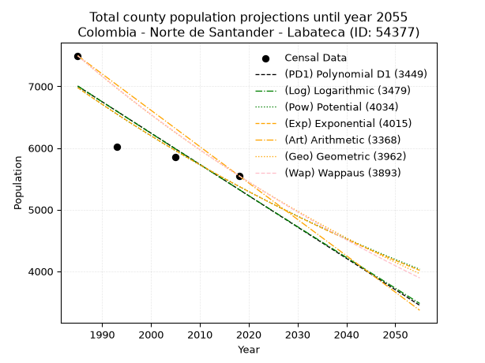
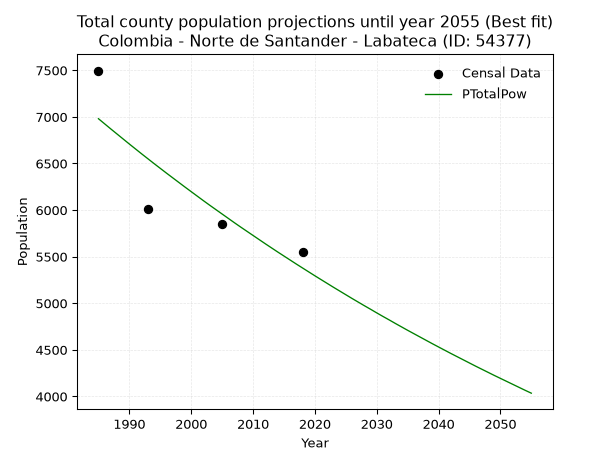
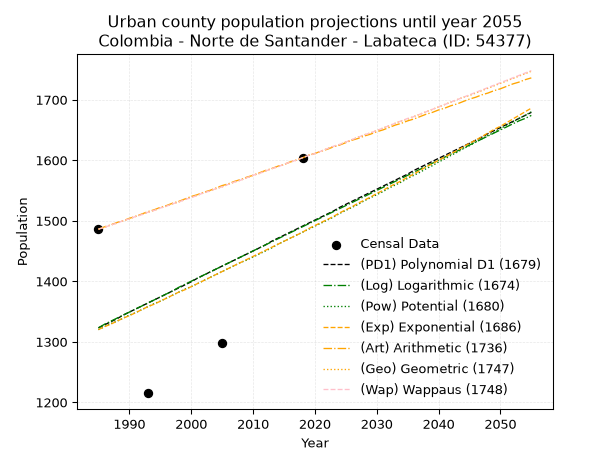
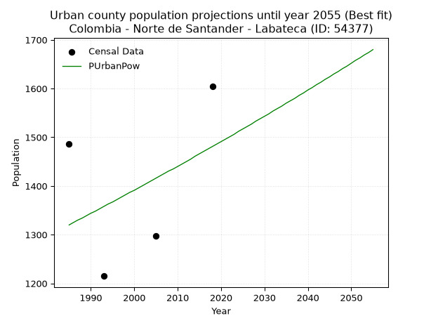
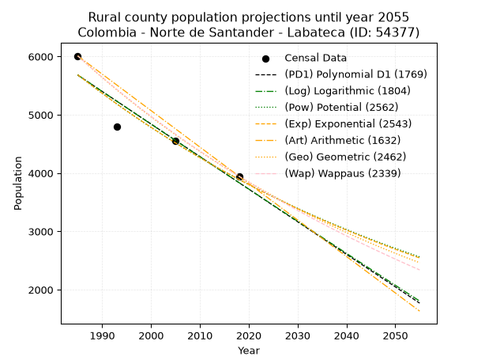
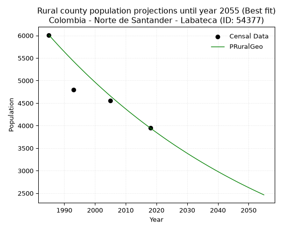

<div align="center">


</div>

# _“Population and Public Services Demand Projections (PPSD) until Year 2050 for Colombia - Norte de Santander - Labateca (ID: 54377)”_
Keywords: `population` `public-service` `projection` `lineal` `polynomial` `logarithmic` `potential` `exponential` `arithmetic` `geometric` `wappaus` `dane` `colombia` `south-america`

PPSD are analytical estimates used by governments and planners to anticipate future changes in population size, age distribution, and the resulting community needs for utilities, healthcare, education, and infrastructure as sizing future water treatment facilities, electrical grids, and road networks based on spatial growth.

> **General running parameters**: • app_version: _v20260806_. • Python version: _3.14.7_. • Pandas version: _3.0.5_. • NumPy version: _2.5.1_. • Creates, save and include plots into reports (create_plot): _False_. • Projection until year: _2050_. • Process polynomial degree 2 and up: _False_. • Process Wappaus: _True_. • Process Wappaus: _True_. • Set negative values to zero: _True_. • Set infinite values to zero: _True_. • Drop dataset notes: _True_. 
<div align="center">

Dynamic map: [:earth_americas:Google](http://maps.google.com/maps?q=7.298413667,-72.4959829) [:earth_americas:OSM](https://www.openstreetmap.org/#map=18/7.298413667/-72.4959829&layers=P) [:earth_americas:Bing](https://www.bing.com/maps?cp=7.298413667~-72.4959829&lvl=18) [:earth_americas:Apple](https://maps.apple.com/frame?center=7.298413667%2C-72.4959829&span=0.003%2C0.006)

</div>


<div align="center">

```geojson
{
  "type": "Feature",
  "geometry": {
    "type": "Point", 
    "coordinates": [-72.4959829, 7.298413667]
  }, 
  "properties": {
    "Name": "Colombia - Norte de Santander - Labateca (ID: 54377)"
  }
}
```

</div>


## 0. Census Data (4 records)

Census data are official statistics collected by a government about the people and housing in a country. They usually include counts of total population, age, sex, race, income, education, and jobs.

📅Global census file: [Population.xlsx](../data/Population.xlsx)

| Source   |   Year |   CountryID | CountryName   |   StateID | StateName          |   CountyID | CountyName   |   PTotal |   PUrban |   PRural |
|:---------|-------:|------------:|:--------------|----------:|:-------------------|-----------:|:-------------|---------:|---------:|---------:|
| DANE     |   1985 |          57 | Colombia      |        54 | Norte de Santander |      54377 | Labateca     |     7496 |     1486 |     6010 |
| DANE     |   1993 |          57 | Colombia      |        54 | Norte de Santander |      54377 | Labateca     |     6016 |     1215 |     4801 |
| DANE     |   2005 |          57 | Colombia      |        54 | Norte De Santander |      54377 | Labateca     |     5852 |     1298 |     4554 |
| DANE     |   2018 |          57 | Colombia      |        54 | Norte de Santander |      54377 | Labateca     |     5550 |     1604 |     3946 |

> 🔥Some records could had specific notes about the registered values or the corresponding urban or rural distribution.

## 1. Total

### 1.1. Coefficients and Parameters

* (PD1) Polynomial Deg 1: -50.775592131673775, 107792.37816138047 (lineal)
* (Log) Logarithmic: -101755.21520208528, 779670.7061661701
* (Pow) Potential: -15.820127835212375, 56.01487541417782
* (Exp) Exponential: -0.007894925011256488, 44641172411.49288
* (Art) Arithmetic: Year diff. 2018 - 1985 = 33, Population diff. 5550 - 7496 = -1946, Annual growth = -58.96969696969697
* (Geo) Geometric: Year diff. 2018 - 1985 = 33, Population diff. 5550 - 7496 = -1946, Annual growth % = -0.009066876539230995
* (Wap) Wappaus: i = -0.9040272416019771, Condition values only valid for < 200)

<sub>
Wappaus condition values: ['-0.00', '-0.90', '-1.81', '-2.71', '-3.62', '-4.52', '-5.42', '-6.33', '-7.23', '-8.14', '-9.04', '-9.94', '-10.85', '-11.75', '-12.66', '-13.56', '-14.46', '-15.37', '-16.27', '-17.18', '-18.08', '-18.98', '-19.89', '-20.79', '-21.70', '-22.60', '-23.50', '-24.41', '-25.31', '-26.22', '-27.12', '-28.02', '-28.93', '-29.83', '-30.74', '-31.64', '-32.54', '-33.45', '-34.35', '-35.26', '-36.16', '-37.07', '-37.97', '-38.87', '-39.78', '-40.68', '-41.59', '-42.49', '-43.39', '-44.30', '-45.20', '-46.11', '-47.01', '-47.91', '-48.82', '-49.72', '-50.63', '-51.53', '-52.43', '-53.34', '-54.24', '-55.15', '-56.05', '-56.95', '-57.86', '-58.76']
</sub>


### 1.2. Projected Dataset

|   Year |   CountyID |   PTotalPD1 |   PTotalLog |   PTotalPow |   PTotalExp |   PTotalArt |   PTotalGeo |   PTotalWap |
|-------:|-----------:|------------:|------------:|------------:|------------:|------------:|------------:|------------:|
|   1985 |      54377 |        7003 |        7005 |        6980 |        6978 |        7496 |        7496 |        7496 |
|   1986 |      54377 |        6952 |        6954 |        6925 |        6923 |        7437 |        7428 |        7429 |
|   1987 |      54377 |        6901 |        6903 |        6870 |        6869 |        7378 |        7361 |        7362 |
|   1988 |      54377 |        6851 |        6852 |        6816 |        6815 |        7319 |        7294 |        7295 |
|   1989 |      54377 |        6800 |        6800 |        6762 |        6761 |        7260 |        7228 |        7230 |
|   1990 |      54377 |        6749 |        6749 |        6708 |        6708 |        7201 |        7162 |        7165 |
|   1991 |      54377 |        6698 |        6698 |        6655 |        6655 |        7142 |        7097 |        7100 |
|   1992 |      54377 |        6647 |        6647 |        6602 |        6603 |        7083 |        7033 |        7036 |
|   1993 |      54377 |        6597 |        6596 |        6550 |        6551 |        7024 |        6969 |        6973 |
|   1994 |      54377 |        6546 |        6545 |        6498 |        6499 |        6965 |        6906 |        6910 |
|   1995 |      54377 |        6495 |        6494 |        6447 |        6448 |        6906 |        6843 |        6848 |
|   1996 |      54377 |        6444 |        6443 |        6396 |        6397 |        6847 |        6781 |        6786 |
|   1997 |      54377 |        6394 |        6392 |        6346 |        6347 |        6788 |        6720 |        6725 |
|   1998 |      54377 |        6343 |        6341 |        6296 |        6297 |        6729 |        6659 |        6664 |
|   1999 |      54377 |        6292 |        6290 |        6246 |        6248 |        6670 |        6599 |        6604 |
|   2000 |      54377 |        6241 |        6239 |        6197 |        6199 |        6611 |        6539 |        6544 |
|   2001 |      54377 |        6190 |        6188 |        6148 |        6150 |        6552 |        6479 |        6485 |
|   2002 |      54377 |        6140 |        6138 |        6099 |        6101 |        6494 |        6421 |        6426 |
|   2003 |      54377 |        6089 |        6087 |        6051 |        6053 |        6435 |        6363 |        6368 |
|   2004 |      54377 |        6038 |        6036 |        6004 |        6006 |        6376 |        6305 |        6310 |
|   2005 |      54377 |        5987 |        5985 |        5957 |        5959 |        6317 |        6248 |        6253 |
|   2006 |      54377 |        5937 |        5934 |        5910 |        5912 |        6258 |        6191 |        6196 |
|   2007 |      54377 |        5886 |        5884 |        5863 |        5865 |        6199 |        6135 |        6140 |
|   2008 |      54377 |        5835 |        5833 |        5817 |        5819 |        6140 |        6079 |        6084 |
|   2009 |      54377 |        5784 |        5782 |        5772 |        5773 |        6081 |        6024 |        6029 |
|   2010 |      54377 |        5733 |        5732 |        5727 |        5728 |        6022 |        5970 |        5974 |
|   2011 |      54377 |        5683 |        5681 |        5682 |        5683 |        5963 |        5915 |        5919 |
|   2012 |      54377 |        5632 |        5631 |        5637 |        5638 |        5904 |        5862 |        5865 |
|   2013 |      54377 |        5581 |        5580 |        5593 |        5594 |        5845 |        5809 |        5812 |
|   2014 |      54377 |        5530 |        5529 |        5549 |        5550 |        5786 |        5756 |        5759 |
|   2015 |      54377 |        5480 |        5479 |        5506 |        5506 |        5727 |        5704 |        5706 |
|   2016 |      54377 |        5429 |        5428 |        5463 |        5463 |        5668 |        5652 |        5653 |
|   2017 |      54377 |        5378 |        5378 |        5420 |        5420 |        5609 |        5601 |        5602 |
|   2018 |      54377 |        5327 |        5328 |        5378 |        5377 |        5550 |        5550 |        5550 |
|   2019 |      54377 |        5276 |        5277 |        5336 |        5335 |        5491 |        5500 |        5499 |
|   2020 |      54377 |        5226 |        5227 |        5294 |        5293 |        5432 |        5450 |        5448 |
|   2021 |      54377 |        5175 |        5176 |        5253 |        5252 |        5373 |        5400 |        5398 |
|   2022 |      54377 |        5124 |        5126 |        5212 |        5210 |        5314 |        5351 |        5348 |
|   2023 |      54377 |        5073 |        5076 |        5171 |        5169 |        5255 |        5303 |        5298 |
|   2024 |      54377 |        5023 |        5025 |        5131 |        5129 |        5196 |        5255 |        5249 |
|   2025 |      54377 |        4972 |        4975 |        5091 |        5088 |        5137 |        5207 |        5200 |
|   2026 |      54377 |        4921 |        4925 |        5051 |        5048 |        5078 |        5160 |        5152 |
|   2027 |      54377 |        4870 |        4875 |        5012 |        5009 |        5019 |        5113 |        5104 |
|   2028 |      54377 |        4819 |        4825 |        4973 |        4969 |        4960 |        5067 |        5056 |
|   2029 |      54377 |        4769 |        4774 |        4935 |        4930 |        4901 |        5021 |        5009 |
|   2030 |      54377 |        4718 |        4724 |        4896 |        4891 |        4842 |        4975 |        4962 |
|   2031 |      54377 |        4667 |        4674 |        4858 |        4853 |        4783 |        4930 |        4915 |
|   2032 |      54377 |        4616 |        4624 |        4821 |        4815 |        4724 |        4886 |        4869 |
|   2033 |      54377 |        4566 |        4574 |        4783 |        4777 |        4665 |        4841 |        4823 |
|   2034 |      54377 |        4515 |        4524 |        4746 |        4739 |        4606 |        4797 |        4778 |
|   2035 |      54377 |        4464 |        4474 |        4709 |        4702 |        4548 |        4754 |        4732 |
|   2036 |      54377 |        4413 |        4424 |        4673 |        4665 |        4489 |        4711 |        4687 |
|   2037 |      54377 |        4362 |        4374 |        4637 |        4628 |        4430 |        4668 |        4643 |
|   2038 |      54377 |        4312 |        4324 |        4601 |        4592 |        4371 |        4626 |        4599 |
|   2039 |      54377 |        4261 |        4274 |        4565 |        4556 |        4312 |        4584 |        4555 |
|   2040 |      54377 |        4210 |        4224 |        4530 |        4520 |        4253 |        4542 |        4511 |
|   2041 |      54377 |        4159 |        4174 |        4495 |        4484 |        4194 |        4501 |        4468 |
|   2042 |      54377 |        4109 |        4125 |        4460 |        4449 |        4135 |        4460 |        4425 |
|   2043 |      54377 |        4058 |        4075 |        4426 |        4414 |        4076 |        4420 |        4382 |
|   2044 |      54377 |        4007 |        4025 |        4392 |        4380 |        4017 |        4380 |        4340 |
|   2045 |      54377 |        3956 |        3975 |        4358 |        4345 |        3958 |        4340 |        4298 |
|   2046 |      54377 |        3906 |        3925 |        4324 |        4311 |        3899 |        4301 |        4256 |
|   2047 |      54377 |        3855 |        3876 |        4291 |        4277 |        3840 |        4262 |        4214 |
|   2048 |      54377 |        3804 |        3826 |        4258 |        4243 |        3781 |        4223 |        4173 |
|   2049 |      54377 |        3753 |        3776 |        4225 |        4210 |        3722 |        4185 |        4132 |
|   2050 |      54377 |        3702 |        3727 |        4193 |        4177 |        3663 |        4147 |        4091 |
<div align="center">

</img>

</div>


### 1.3. Best fit with absolute and relative error (%)

Relative error puts that difference into context by dividing the absolute error by the true value, creating a unitless ratio or percentage that shows the scale of the mistake.

Absolute and relative error

|   Year | Source   |   CountryID | CountryName   |   StateID | StateName          |   CountyID_x | CountyName   |   PTotal |   PUrban |   PRural |   CountyID_y |   PTotalPD1 |   PTotalLog |   PTotalPow |   PTotalExp |   PTotalArt |   PTotalGeo |   PTotalWap |   PTotalPD1AbsError |   PTotalLogAbsError |   PTotalPowAbsError |   PTotalExpAbsError |   PTotalArtAbsError |   PTotalGeoAbsError |   PTotalWapAbsError |   PTotalPD1RelError |   PTotalLogRelError |   PTotalPowRelError |   PTotalExpRelError |   PTotalArtRelError |   PTotalGeoRelError |   PTotalWapRelError |
|-------:|:---------|------------:|:--------------|----------:|:-------------------|-------------:|:-------------|---------:|---------:|---------:|-------------:|------------:|------------:|------------:|------------:|------------:|------------:|------------:|--------------------:|--------------------:|--------------------:|--------------------:|--------------------:|--------------------:|--------------------:|--------------------:|--------------------:|--------------------:|--------------------:|--------------------:|--------------------:|--------------------:|
|   1985 | DANE     |          57 | Colombia      |        54 | Norte de Santander |        54377 | Labateca     |     7496 |     1486 |     6010 |        54377 |        7003 |        7005 |        6980 |        6978 |        7496 |        7496 |        7496 |                 493 |                 491 |                 516 |                 518 |                   0 |                   0 |                   0 |             6.57684 |             6.55016 |             6.88367 |             6.91035 |              0      |             0       |             0       |
|   1993 | DANE     |          57 | Colombia      |        54 | Norte de Santander |        54377 | Labateca     |     6016 |     1215 |     4801 |        54377 |        6597 |        6596 |        6550 |        6551 |        7024 |        6969 |        6973 |                 581 |                 580 |                 534 |                 535 |                1008 |                 953 |                 957 |             9.65758 |             9.64096 |             8.87633 |             8.89295 |             16.7553 |            15.8411  |            15.9076  |
|   2005 | DANE     |          57 | Colombia      |        54 | Norte De Santander |        54377 | Labateca     |     5852 |     1298 |     4554 |        54377 |        5987 |        5985 |        5957 |        5959 |        6317 |        6248 |        6253 |                 135 |                 133 |                 105 |                 107 |                 465 |                 396 |                 401 |             2.3069  |             2.27273 |             1.79426 |             1.82843 |              7.946  |             6.76692 |             6.85236 |
|   2018 | DANE     |          57 | Colombia      |        54 | Norte de Santander |        54377 | Labateca     |     5550 |     1604 |     3946 |        54377 |        5327 |        5328 |        5378 |        5377 |        5550 |        5550 |        5550 |                 223 |                 222 |                 172 |                 173 |                   0 |                   0 |                   0 |             4.01802 |             4       |             3.0991  |             3.11712 |              0      |             0       |             0       |

Relative error mean

| Method    |   RelError | Best   |
|:----------|-----------:|:-------|
| PTotalPD1 |    5.63984 |        |
| PTotalLog |    5.61596 |        |
| PTotalPow |    5.16334 | True   |
| PTotalExp |    5.18721 |        |
| PTotalArt |    6.17533 |        |
| PTotalGeo |    5.652   |        |
| PTotalWap |    5.68998 |        |

💙Best method: _**PTotalPow**_
<div align="center">

</img>

</div>


### 1.4. Fresh water supply demand in liters per capita per day (lpcd)

The fresh water supply demand typically ranges from 100 to 300 liters per capita per day (lpcd) for standard domestic and municipal planning, though absolute survival minimums set by the World Health Organization are as low as 7.5 to 20 liters per day, and total consumption in high-income nations can exceed 400 liters.

> `CZ`: Level in meters above the sea level (masl).<br> `WS`: Fresh water supply demand in liters per capita per day (lpcd or l/h/d).<br> `WSAll`: Zonal fresh water supply demand in liters per second (l/s).<br> `A`: Zonal area in square meters.

Reference values (RAS Colombia)

|    CZ |   WS |
|------:|-----:|
|  1000 |  120 |
|  2000 |  130 |
| 99999 |  140 |

County shapefile geometry properties and water supply values

|   CountyID |      ATotal |   CZTotal |   WSTotal |
|-----------:|------------:|----------:|----------:|
|      54377 | 2.55461e+08 |   2284.77 |       140 |

Projected values for best method: PTotalPow

|   CountyID |   Year |   PTotalPow |   WSTotal |   WSTotalAll |
|-----------:|-------:|------------:|----------:|-------------:|
|      54377 |   1985 |        6980 |       140 |     11.3102  |
|      54377 |   1986 |        6925 |       140 |     11.2211  |
|      54377 |   1987 |        6870 |       140 |     11.1319  |
|      54377 |   1988 |        6816 |       140 |     11.0444  |
|      54377 |   1989 |        6762 |       140 |     10.9569  |
|      54377 |   1990 |        6708 |       140 |     10.8694  |
|      54377 |   1991 |        6655 |       140 |     10.7836  |
|      54377 |   1992 |        6602 |       140 |     10.6977  |
|      54377 |   1993 |        6550 |       140 |     10.6134  |
|      54377 |   1994 |        6498 |       140 |     10.5292  |
|      54377 |   1995 |        6447 |       140 |     10.4465  |
|      54377 |   1996 |        6396 |       140 |     10.3639  |
|      54377 |   1997 |        6346 |       140 |     10.2829  |
|      54377 |   1998 |        6296 |       140 |     10.2019  |
|      54377 |   1999 |        6246 |       140 |     10.1208  |
|      54377 |   2000 |        6197 |       140 |     10.0414  |
|      54377 |   2001 |        6148 |       140 |      9.96204 |
|      54377 |   2002 |        6099 |       140 |      9.88264 |
|      54377 |   2003 |        6051 |       140 |      9.80486 |
|      54377 |   2004 |        6004 |       140 |      9.7287  |
|      54377 |   2005 |        5957 |       140 |      9.65255 |
|      54377 |   2006 |        5910 |       140 |      9.57639 |
|      54377 |   2007 |        5863 |       140 |      9.50023 |
|      54377 |   2008 |        5817 |       140 |      9.42569 |
|      54377 |   2009 |        5772 |       140 |      9.35278 |
|      54377 |   2010 |        5727 |       140 |      9.27986 |
|      54377 |   2011 |        5682 |       140 |      9.20694 |
|      54377 |   2012 |        5637 |       140 |      9.13403 |
|      54377 |   2013 |        5593 |       140 |      9.06273 |
|      54377 |   2014 |        5549 |       140 |      8.99144 |
|      54377 |   2015 |        5506 |       140 |      8.92176 |
|      54377 |   2016 |        5463 |       140 |      8.85208 |
|      54377 |   2017 |        5420 |       140 |      8.78241 |
|      54377 |   2018 |        5378 |       140 |      8.71435 |
|      54377 |   2019 |        5336 |       140 |      8.6463  |
|      54377 |   2020 |        5294 |       140 |      8.57824 |
|      54377 |   2021 |        5253 |       140 |      8.51181 |
|      54377 |   2022 |        5212 |       140 |      8.44537 |
|      54377 |   2023 |        5171 |       140 |      8.37894 |
|      54377 |   2024 |        5131 |       140 |      8.31412 |
|      54377 |   2025 |        5091 |       140 |      8.24931 |
|      54377 |   2026 |        5051 |       140 |      8.18449 |
|      54377 |   2027 |        5012 |       140 |      8.1213  |
|      54377 |   2028 |        4973 |       140 |      8.0581  |
|      54377 |   2029 |        4935 |       140 |      7.99653 |
|      54377 |   2030 |        4896 |       140 |      7.93333 |
|      54377 |   2031 |        4858 |       140 |      7.87176 |
|      54377 |   2032 |        4821 |       140 |      7.81181 |
|      54377 |   2033 |        4783 |       140 |      7.75023 |
|      54377 |   2034 |        4746 |       140 |      7.69028 |
|      54377 |   2035 |        4709 |       140 |      7.63032 |
|      54377 |   2036 |        4673 |       140 |      7.57199 |
|      54377 |   2037 |        4637 |       140 |      7.51366 |
|      54377 |   2038 |        4601 |       140 |      7.45532 |
|      54377 |   2039 |        4565 |       140 |      7.39699 |
|      54377 |   2040 |        4530 |       140 |      7.34028 |
|      54377 |   2041 |        4495 |       140 |      7.28356 |
|      54377 |   2042 |        4460 |       140 |      7.22685 |
|      54377 |   2043 |        4426 |       140 |      7.17176 |
|      54377 |   2044 |        4392 |       140 |      7.11667 |
|      54377 |   2045 |        4358 |       140 |      7.06157 |
|      54377 |   2046 |        4324 |       140 |      7.00648 |
|      54377 |   2047 |        4291 |       140 |      6.95301 |
|      54377 |   2048 |        4258 |       140 |      6.89954 |
|      54377 |   2049 |        4225 |       140 |      6.84606 |
|      54377 |   2050 |        4193 |       140 |      6.79421 |

## 2. Urban

### 2.1. Coefficients and Parameters

* (PD1) Polynomial Deg 1: 5.0843034925730795, -8769.128061019303 (lineal)
* (Log) Logarithmic: 10126.403515922684, -75570.12427243333
* (Pow) Potential: 6.950219486479232, -19.799433073861373
* (Exp) Exponential: 0.003490269356439234, 1.2935408284509364
* (Art) Arithmetic: Year diff. 2018 - 1985 = 33, Population diff. 1604 - 1486 = 118, Annual growth = 3.5757575757575757
* (Geo) Geometric: Year diff. 2018 - 1985 = 33, Population diff. 1604 - 1486 = 118, Annual growth % = 0.002318215131744461
* (Wap) Wappaus: i = 0.23144061979013436, Condition values only valid for < 200)

<sub>
Wappaus condition values: ['0.00', '0.23', '0.46', '0.69', '0.93', '1.16', '1.39', '1.62', '1.85', '2.08', '2.31', '2.55', '2.78', '3.01', '3.24', '3.47', '3.70', '3.93', '4.17', '4.40', '4.63', '4.86', '5.09', '5.32', '5.55', '5.79', '6.02', '6.25', '6.48', '6.71', '6.94', '7.17', '7.41', '7.64', '7.87', '8.10', '8.33', '8.56', '8.79', '9.03', '9.26', '9.49', '9.72', '9.95', '10.18', '10.41', '10.65', '10.88', '11.11', '11.34', '11.57', '11.80', '12.03', '12.27', '12.50', '12.73', '12.96', '13.19', '13.42', '13.65', '13.89', '14.12', '14.35', '14.58', '14.81', '15.04']
</sub>


### 2.2. Projected Dataset

|   Year |   CountyID |   PUrbanPD1 |   PUrbanLog |   PUrbanPow |   PUrbanExp |   PUrbanArt |   PUrbanGeo |   PUrbanWap |
|-------:|-----------:|------------:|------------:|------------:|------------:|------------:|------------:|------------:|
|   1985 |      54377 |        1323 |        1323 |        1320 |        1320 |        1486 |        1486 |        1486 |
|   1986 |      54377 |        1328 |        1329 |        1325 |        1325 |        1490 |        1489 |        1489 |
|   1987 |      54377 |        1333 |        1334 |        1330 |        1329 |        1493 |        1493 |        1493 |
|   1988 |      54377 |        1338 |        1339 |        1334 |        1334 |        1497 |        1496 |        1496 |
|   1989 |      54377 |        1344 |        1344 |        1339 |        1339 |        1500 |        1500 |        1500 |
|   1990 |      54377 |        1349 |        1349 |        1344 |        1343 |        1504 |        1503 |        1503 |
|   1991 |      54377 |        1354 |        1354 |        1348 |        1348 |        1507 |        1507 |        1507 |
|   1992 |      54377 |        1359 |        1359 |        1353 |        1353 |        1511 |        1510 |        1510 |
|   1993 |      54377 |        1364 |        1364 |        1358 |        1358 |        1515 |        1514 |        1514 |
|   1994 |      54377 |        1369 |        1369 |        1363 |        1362 |        1518 |        1517 |        1517 |
|   1995 |      54377 |        1374 |        1374 |        1367 |        1367 |        1522 |        1521 |        1521 |
|   1996 |      54377 |        1379 |        1379 |        1372 |        1372 |        1525 |        1524 |        1524 |
|   1997 |      54377 |        1384 |        1384 |        1377 |        1377 |        1529 |        1528 |        1528 |
|   1998 |      54377 |        1389 |        1390 |        1382 |        1382 |        1532 |        1531 |        1531 |
|   1999 |      54377 |        1394 |        1395 |        1387 |        1386 |        1536 |        1535 |        1535 |
|   2000 |      54377 |        1399 |        1400 |        1391 |        1391 |        1540 |        1539 |        1538 |
|   2001 |      54377 |        1405 |        1405 |        1396 |        1396 |        1543 |        1542 |        1542 |
|   2002 |      54377 |        1410 |        1410 |        1401 |        1401 |        1547 |        1546 |        1546 |
|   2003 |      54377 |        1415 |        1415 |        1406 |        1406 |        1550 |        1549 |        1549 |
|   2004 |      54377 |        1420 |        1420 |        1411 |        1411 |        1554 |        1553 |        1553 |
|   2005 |      54377 |        1425 |        1425 |        1416 |        1416 |        1558 |        1556 |        1556 |
|   2006 |      54377 |        1430 |        1430 |        1421 |        1421 |        1561 |        1560 |        1560 |
|   2007 |      54377 |        1435 |        1435 |        1426 |        1426 |        1565 |        1564 |        1564 |
|   2008 |      54377 |        1440 |        1440 |        1431 |        1431 |        1568 |        1567 |        1567 |
|   2009 |      54377 |        1445 |        1445 |        1435 |        1436 |        1572 |        1571 |        1571 |
|   2010 |      54377 |        1450 |        1450 |        1440 |        1441 |        1575 |        1575 |        1575 |
|   2011 |      54377 |        1455 |        1455 |        1445 |        1446 |        1579 |        1578 |        1578 |
|   2012 |      54377 |        1460 |        1460 |        1450 |        1451 |        1583 |        1582 |        1582 |
|   2013 |      54377 |        1466 |        1465 |        1455 |        1456 |        1586 |        1586 |        1586 |
|   2014 |      54377 |        1471 |        1470 |        1461 |        1461 |        1590 |        1589 |        1589 |
|   2015 |      54377 |        1476 |        1475 |        1466 |        1466 |        1593 |        1593 |        1593 |
|   2016 |      54377 |        1481 |        1480 |        1471 |        1471 |        1597 |        1597 |        1597 |
|   2017 |      54377 |        1486 |        1485 |        1476 |        1476 |        1600 |        1600 |        1600 |
|   2018 |      54377 |        1491 |        1490 |        1481 |        1481 |        1604 |        1604 |        1604 |
|   2019 |      54377 |        1496 |        1495 |        1486 |        1487 |        1608 |        1608 |        1608 |
|   2020 |      54377 |        1501 |        1500 |        1491 |        1492 |        1611 |        1611 |        1611 |
|   2021 |      54377 |        1506 |        1505 |        1496 |        1497 |        1615 |        1615 |        1615 |
|   2022 |      54377 |        1511 |        1510 |        1501 |        1502 |        1618 |        1619 |        1619 |
|   2023 |      54377 |        1516 |        1515 |        1506 |        1507 |        1622 |        1623 |        1623 |
|   2024 |      54377 |        1522 |        1520 |        1512 |        1513 |        1625 |        1626 |        1626 |
|   2025 |      54377 |        1527 |        1525 |        1517 |        1518 |        1629 |        1630 |        1630 |
|   2026 |      54377 |        1532 |        1530 |        1522 |        1523 |        1633 |        1634 |        1634 |
|   2027 |      54377 |        1537 |        1535 |        1527 |        1529 |        1636 |        1638 |        1638 |
|   2028 |      54377 |        1542 |        1540 |        1533 |        1534 |        1640 |        1642 |        1642 |
|   2029 |      54377 |        1547 |        1545 |        1538 |        1539 |        1643 |        1645 |        1645 |
|   2030 |      54377 |        1552 |        1550 |        1543 |        1545 |        1647 |        1649 |        1649 |
|   2031 |      54377 |        1557 |        1555 |        1548 |        1550 |        1650 |        1653 |        1653 |
|   2032 |      54377 |        1562 |        1560 |        1554 |        1556 |        1654 |        1657 |        1657 |
|   2033 |      54377 |        1567 |        1565 |        1559 |        1561 |        1658 |        1661 |        1661 |
|   2034 |      54377 |        1572 |        1570 |        1564 |        1566 |        1661 |        1665 |        1665 |
|   2035 |      54377 |        1577 |        1575 |        1570 |        1572 |        1665 |        1668 |        1669 |
|   2036 |      54377 |        1583 |        1580 |        1575 |        1577 |        1668 |        1672 |        1672 |
|   2037 |      54377 |        1588 |        1585 |        1580 |        1583 |        1672 |        1676 |        1676 |
|   2038 |      54377 |        1593 |        1590 |        1586 |        1589 |        1676 |        1680 |        1680 |
|   2039 |      54377 |        1598 |        1595 |        1591 |        1594 |        1679 |        1684 |        1684 |
|   2040 |      54377 |        1603 |        1600 |        1597 |        1600 |        1683 |        1688 |        1688 |
|   2041 |      54377 |        1608 |        1605 |        1602 |        1605 |        1686 |        1692 |        1692 |
|   2042 |      54377 |        1613 |        1610 |        1608 |        1611 |        1690 |        1696 |        1696 |
|   2043 |      54377 |        1618 |        1615 |        1613 |        1616 |        1693 |        1700 |        1700 |
|   2044 |      54377 |        1623 |        1620 |        1619 |        1622 |        1697 |        1704 |        1704 |
|   2045 |      54377 |        1628 |        1625 |        1624 |        1628 |        1701 |        1707 |        1708 |
|   2046 |      54377 |        1633 |        1630 |        1630 |        1633 |        1704 |        1711 |        1712 |
|   2047 |      54377 |        1638 |        1635 |        1635 |        1639 |        1708 |        1715 |        1716 |
|   2048 |      54377 |        1644 |        1640 |        1641 |        1645 |        1711 |        1719 |        1720 |
|   2049 |      54377 |        1649 |        1645 |        1646 |        1651 |        1715 |        1723 |        1724 |
|   2050 |      54377 |        1654 |        1650 |        1652 |        1656 |        1718 |        1727 |        1728 |
<div align="center">

</img>

</div>


### 2.3. Best fit with absolute and relative error (%)

Relative error puts that difference into context by dividing the absolute error by the true value, creating a unitless ratio or percentage that shows the scale of the mistake.

Absolute and relative error

|   Year | Source   |   CountryID | CountryName   |   StateID | StateName          |   CountyID_x | CountyName   |   PTotal |   PUrban |   PRural |   CountyID_y |   PUrbanPD1 |   PUrbanLog |   PUrbanPow |   PUrbanExp |   PUrbanArt |   PUrbanGeo |   PUrbanWap |   PUrbanPD1AbsError |   PUrbanLogAbsError |   PUrbanPowAbsError |   PUrbanExpAbsError |   PUrbanArtAbsError |   PUrbanGeoAbsError |   PUrbanWapAbsError |   PUrbanPD1RelError |   PUrbanLogRelError |   PUrbanPowRelError |   PUrbanExpRelError |   PUrbanArtRelError |   PUrbanGeoRelError |   PUrbanWapRelError |
|-------:|:---------|------------:|:--------------|----------:|:-------------------|-------------:|:-------------|---------:|---------:|---------:|-------------:|------------:|------------:|------------:|------------:|------------:|------------:|------------:|--------------------:|--------------------:|--------------------:|--------------------:|--------------------:|--------------------:|--------------------:|--------------------:|--------------------:|--------------------:|--------------------:|--------------------:|--------------------:|--------------------:|
|   1985 | DANE     |          57 | Colombia      |        54 | Norte de Santander |        54377 | Labateca     |     7496 |     1486 |     6010 |        54377 |        1323 |        1323 |        1320 |        1320 |        1486 |        1486 |        1486 |                 163 |                 163 |                 166 |                 166 |                   0 |                   0 |                   0 |            10.969   |            10.969   |            11.1709  |            11.1709  |              0      |              0      |              0      |
|   1993 | DANE     |          57 | Colombia      |        54 | Norte de Santander |        54377 | Labateca     |     6016 |     1215 |     4801 |        54377 |        1364 |        1364 |        1358 |        1358 |        1515 |        1514 |        1514 |                 149 |                 149 |                 143 |                 143 |                 300 |                 299 |                 299 |            12.2634  |            12.2634  |            11.7695  |            11.7695  |             24.6914 |             24.6091 |             24.6091 |
|   2005 | DANE     |          57 | Colombia      |        54 | Norte De Santander |        54377 | Labateca     |     5852 |     1298 |     4554 |        54377 |        1425 |        1425 |        1416 |        1416 |        1558 |        1556 |        1556 |                 127 |                 127 |                 118 |                 118 |                 260 |                 258 |                 258 |             9.78428 |             9.78428 |             9.09091 |             9.09091 |             20.0308 |             19.8767 |             19.8767 |
|   2018 | DANE     |          57 | Colombia      |        54 | Norte de Santander |        54377 | Labateca     |     5550 |     1604 |     3946 |        54377 |        1491 |        1490 |        1481 |        1481 |        1604 |        1604 |        1604 |                 113 |                 114 |                 123 |                 123 |                   0 |                   0 |                   0 |             7.04489 |             7.10723 |             7.66833 |             7.66833 |              0      |              0      |              0      |

Relative error mean

| Method    |   RelError | Best   |
|:----------|-----------:|:-------|
| PUrbanPD1 |   10.0154  |        |
| PUrbanLog |   10.031   |        |
| PUrbanPow |    9.92493 | True   |
| PUrbanExp |    9.92493 | True   |
| PUrbanArt |   11.1805  |        |
| PUrbanGeo |   11.1214  |        |
| PUrbanWap |   11.1214  |        |

💙Best method: _**PUrbanPow**_
<div align="center">

</img>

</div>


### 2.4. Fresh water supply demand in liters per capita per day (lpcd)

The fresh water supply demand typically ranges from 100 to 300 liters per capita per day (lpcd) for standard domestic and municipal planning, though absolute survival minimums set by the World Health Organization are as low as 7.5 to 20 liters per day, and total consumption in high-income nations can exceed 400 liters.

> `CZ`: Level in meters above the sea level (masl).<br> `WS`: Fresh water supply demand in liters per capita per day (lpcd or l/h/d).<br> `WSAll`: Zonal fresh water supply demand in liters per second (l/s).<br> `A`: Zonal area in square meters.

Reference values (RAS Colombia)

|    CZ |   WS |
|------:|-----:|
|  1000 |  120 |
|  2000 |  130 |
| 99999 |  140 |

County shapefile geometry properties and water supply values

|   CountyID |   AUrban |   CZUrban |   WSUrban |
|-----------:|---------:|----------:|----------:|
|      54377 |   254789 |   1581.28 |       130 |

Projected values for best method: PUrbanPow

|   CountyID |   Year |   PUrbanPow |   WSUrban |   WSUrbanAll |
|-----------:|-------:|------------:|----------:|-------------:|
|      54377 |   1985 |        1320 |       130 |      1.98611 |
|      54377 |   1986 |        1325 |       130 |      1.99363 |
|      54377 |   1987 |        1330 |       130 |      2.00116 |
|      54377 |   1988 |        1334 |       130 |      2.00718 |
|      54377 |   1989 |        1339 |       130 |      2.0147  |
|      54377 |   1990 |        1344 |       130 |      2.02222 |
|      54377 |   1991 |        1348 |       130 |      2.02824 |
|      54377 |   1992 |        1353 |       130 |      2.03576 |
|      54377 |   1993 |        1358 |       130 |      2.04329 |
|      54377 |   1994 |        1363 |       130 |      2.05081 |
|      54377 |   1995 |        1367 |       130 |      2.05683 |
|      54377 |   1996 |        1372 |       130 |      2.06435 |
|      54377 |   1997 |        1377 |       130 |      2.07187 |
|      54377 |   1998 |        1382 |       130 |      2.0794  |
|      54377 |   1999 |        1387 |       130 |      2.08692 |
|      54377 |   2000 |        1391 |       130 |      2.09294 |
|      54377 |   2001 |        1396 |       130 |      2.10046 |
|      54377 |   2002 |        1401 |       130 |      2.10799 |
|      54377 |   2003 |        1406 |       130 |      2.11551 |
|      54377 |   2004 |        1411 |       130 |      2.12303 |
|      54377 |   2005 |        1416 |       130 |      2.13056 |
|      54377 |   2006 |        1421 |       130 |      2.13808 |
|      54377 |   2007 |        1426 |       130 |      2.1456  |
|      54377 |   2008 |        1431 |       130 |      2.15313 |
|      54377 |   2009 |        1435 |       130 |      2.15914 |
|      54377 |   2010 |        1440 |       130 |      2.16667 |
|      54377 |   2011 |        1445 |       130 |      2.17419 |
|      54377 |   2012 |        1450 |       130 |      2.18171 |
|      54377 |   2013 |        1455 |       130 |      2.18924 |
|      54377 |   2014 |        1461 |       130 |      2.19826 |
|      54377 |   2015 |        1466 |       130 |      2.20579 |
|      54377 |   2016 |        1471 |       130 |      2.21331 |
|      54377 |   2017 |        1476 |       130 |      2.22083 |
|      54377 |   2018 |        1481 |       130 |      2.22836 |
|      54377 |   2019 |        1486 |       130 |      2.23588 |
|      54377 |   2020 |        1491 |       130 |      2.2434  |
|      54377 |   2021 |        1496 |       130 |      2.25093 |
|      54377 |   2022 |        1501 |       130 |      2.25845 |
|      54377 |   2023 |        1506 |       130 |      2.26597 |
|      54377 |   2024 |        1512 |       130 |      2.275   |
|      54377 |   2025 |        1517 |       130 |      2.28252 |
|      54377 |   2026 |        1522 |       130 |      2.29005 |
|      54377 |   2027 |        1527 |       130 |      2.29757 |
|      54377 |   2028 |        1533 |       130 |      2.3066  |
|      54377 |   2029 |        1538 |       130 |      2.31412 |
|      54377 |   2030 |        1543 |       130 |      2.32164 |
|      54377 |   2031 |        1548 |       130 |      2.32917 |
|      54377 |   2032 |        1554 |       130 |      2.33819 |
|      54377 |   2033 |        1559 |       130 |      2.34572 |
|      54377 |   2034 |        1564 |       130 |      2.35324 |
|      54377 |   2035 |        1570 |       130 |      2.36227 |
|      54377 |   2036 |        1575 |       130 |      2.36979 |
|      54377 |   2037 |        1580 |       130 |      2.37731 |
|      54377 |   2038 |        1586 |       130 |      2.38634 |
|      54377 |   2039 |        1591 |       130 |      2.39387 |
|      54377 |   2040 |        1597 |       130 |      2.40289 |
|      54377 |   2041 |        1602 |       130 |      2.41042 |
|      54377 |   2042 |        1608 |       130 |      2.41944 |
|      54377 |   2043 |        1613 |       130 |      2.42697 |
|      54377 |   2044 |        1619 |       130 |      2.436   |
|      54377 |   2045 |        1624 |       130 |      2.44352 |
|      54377 |   2046 |        1630 |       130 |      2.45255 |
|      54377 |   2047 |        1635 |       130 |      2.46007 |
|      54377 |   2048 |        1641 |       130 |      2.4691  |
|      54377 |   2049 |        1646 |       130 |      2.47662 |
|      54377 |   2050 |        1652 |       130 |      2.48565 |

## 3. Rural

### 3.1. Coefficients and Parameters

* (PD1) Polynomial Deg 1: -55.859895624246924, 116561.50622239991 (lineal)
* (Log) Logarithmic: -111881.61871800794, 855240.8304386033
* (Pow) Potential: -23.01524029891335, 79.65374270856194
* (Exp) Exponential: -0.011492905657755811, 45977771126582.26
* (Art) Arithmetic: Year diff. 2018 - 1985 = 33, Population diff. 3946 - 6010 = -2064, Annual growth = -62.54545454545455
* (Geo) Geometric: Year diff. 2018 - 1985 = 33, Population diff. 3946 - 6010 = -2064, Annual growth % = -0.012668235562145025
* (Wap) Wappaus: i = -1.2564374155374558, Condition values only valid for < 200)

<sub>
Wappaus condition values: ['-0.00', '-1.26', '-2.51', '-3.77', '-5.03', '-6.28', '-7.54', '-8.80', '-10.05', '-11.31', '-12.56', '-13.82', '-15.08', '-16.33', '-17.59', '-18.85', '-20.10', '-21.36', '-22.62', '-23.87', '-25.13', '-26.39', '-27.64', '-28.90', '-30.15', '-31.41', '-32.67', '-33.92', '-35.18', '-36.44', '-37.69', '-38.95', '-40.21', '-41.46', '-42.72', '-43.98', '-45.23', '-46.49', '-47.74', '-49.00', '-50.26', '-51.51', '-52.77', '-54.03', '-55.28', '-56.54', '-57.80', '-59.05', '-60.31', '-61.57', '-62.82', '-64.08', '-65.33', '-66.59', '-67.85', '-69.10', '-70.36', '-71.62', '-72.87', '-74.13', '-75.39', '-76.64', '-77.90', '-79.16', '-80.41', '-81.67']
</sub>


### 3.2. Projected Dataset

|   Year |   CountyID |   PRuralPD1 |   PRuralLog |   PRuralPow |   PRuralExp |   PRuralArt |   PRuralGeo |   PRuralWap |
|-------:|-----------:|------------:|------------:|------------:|------------:|------------:|------------:|------------:|
|   1985 |      54377 |        5680 |        5682 |        5688 |        5686 |        6010 |        6010 |        6010 |
|   1986 |      54377 |        5624 |        5625 |        5623 |        5621 |        5947 |        5934 |        5935 |
|   1987 |      54377 |        5568 |        5569 |        5558 |        5557 |        5885 |        5859 |        5861 |
|   1988 |      54377 |        5512 |        5513 |        5494 |        5493 |        5822 |        5784 |        5788 |
|   1989 |      54377 |        5456 |        5457 |        5431 |        5431 |        5760 |        5711 |        5715 |
|   1990 |      54377 |        5400 |        5400 |        5368 |        5368 |        5697 |        5639 |        5644 |
|   1991 |      54377 |        5344 |        5344 |        5307 |        5307 |        5635 |        5567 |        5573 |
|   1992 |      54377 |        5289 |        5288 |        5246 |        5246 |        5572 |        5497 |        5504 |
|   1993 |      54377 |        5233 |        5232 |        5185 |        5187 |        5510 |        5427 |        5435 |
|   1994 |      54377 |        5177 |        5176 |        5126 |        5127 |        5447 |        5358 |        5367 |
|   1995 |      54377 |        5121 |        5120 |        5067 |        5069 |        5385 |        5291 |        5300 |
|   1996 |      54377 |        5065 |        5064 |        5009 |        5011 |        5322 |        5224 |        5233 |
|   1997 |      54377 |        5009 |        5008 |        4952 |        4953 |        5259 |        5157 |        5167 |
|   1998 |      54377 |        4953 |        4951 |        4895 |        4897 |        5197 |        5092 |        5102 |
|   1999 |      54377 |        4898 |        4896 |        4839 |        4841 |        5134 |        5028 |        5038 |
|   2000 |      54377 |        4842 |        4840 |        4783 |        4786 |        5072 |        4964 |        4975 |
|   2001 |      54377 |        4786 |        4784 |        4729 |        4731 |        5009 |        4901 |        4912 |
|   2002 |      54377 |        4730 |        4728 |        4675 |        4677 |        4947 |        4839 |        4850 |
|   2003 |      54377 |        4674 |        4672 |        4621 |        4623 |        4884 |        4778 |        4789 |
|   2004 |      54377 |        4618 |        4616 |        4568 |        4571 |        4822 |        4717 |        4728 |
|   2005 |      54377 |        4562 |        4560 |        4516 |        4518 |        4759 |        4657 |        4668 |
|   2006 |      54377 |        4507 |        4504 |        4465 |        4467 |        4697 |        4598 |        4609 |
|   2007 |      54377 |        4451 |        4449 |        4414 |        4416 |        4634 |        4540 |        4550 |
|   2008 |      54377 |        4395 |        4393 |        4364 |        4365 |        4571 |        4483 |        4492 |
|   2009 |      54377 |        4339 |        4337 |        4314 |        4315 |        4509 |        4426 |        4435 |
|   2010 |      54377 |        4283 |        4282 |        4265 |        4266 |        4446 |        4370 |        4378 |
|   2011 |      54377 |        4227 |        4226 |        4216 |        4217 |        4384 |        4314 |        4322 |
|   2012 |      54377 |        4171 |        4170 |        4168 |        4169 |        4321 |        4260 |        4267 |
|   2013 |      54377 |        4116 |        4115 |        4121 |        4121 |        4259 |        4206 |        4212 |
|   2014 |      54377 |        4060 |        4059 |        4074 |        4074 |        4196 |        4152 |        4158 |
|   2015 |      54377 |        4004 |        4004 |        4028 |        4028 |        4134 |        4100 |        4104 |
|   2016 |      54377 |        3948 |        3948 |        3982 |        3982 |        4071 |        4048 |        4051 |
|   2017 |      54377 |        3892 |        3893 |        3937 |        3936 |        4009 |        3997 |        3998 |
|   2018 |      54377 |        3836 |        3837 |        3892 |        3891 |        3946 |        3946 |        3946 |
|   2019 |      54377 |        3780 |        3782 |        3848 |        3847 |        3883 |        3896 |        3894 |
|   2020 |      54377 |        3725 |        3726 |        3804 |        3803 |        3821 |        3847 |        3843 |
|   2021 |      54377 |        3669 |        3671 |        3761 |        3759 |        3758 |        3798 |        3793 |
|   2022 |      54377 |        3613 |        3616 |        3719 |        3716 |        3696 |        3750 |        3743 |
|   2023 |      54377 |        3557 |        3560 |        3677 |        3674 |        3633 |        3702 |        3694 |
|   2024 |      54377 |        3501 |        3505 |        3635 |        3632 |        3571 |        3655 |        3645 |
|   2025 |      54377 |        3445 |        3450 |        3594 |        3590 |        3508 |        3609 |        3596 |
|   2026 |      54377 |        3389 |        3394 |        3553 |        3549 |        3446 |        3563 |        3548 |
|   2027 |      54377 |        3333 |        3339 |        3513 |        3509 |        3383 |        3518 |        3501 |
|   2028 |      54377 |        3278 |        3284 |        3474 |        3469 |        3321 |        3474 |        3454 |
|   2029 |      54377 |        3222 |        3229 |        3434 |        3429 |        3258 |        3430 |        3407 |
|   2030 |      54377 |        3166 |        3174 |        3396 |        3390 |        3195 |        3386 |        3361 |
|   2031 |      54377 |        3110 |        3119 |        3357 |        3351 |        3133 |        3343 |        3315 |
|   2032 |      54377 |        3054 |        3064 |        3320 |        3313 |        3070 |        3301 |        3270 |
|   2033 |      54377 |        2998 |        3009 |        3282 |        3275 |        3008 |        3259 |        3225 |
|   2034 |      54377 |        2942 |        2954 |        3245 |        3238 |        2945 |        3218 |        3181 |
|   2035 |      54377 |        2887 |        2899 |        3209 |        3201 |        2883 |        3177 |        3137 |
|   2036 |      54377 |        2831 |        2844 |        3173 |        3164 |        2820 |        3137 |        3093 |
|   2037 |      54377 |        2775 |        2789 |        3137 |        3128 |        2758 |        3097 |        3050 |
|   2038 |      54377 |        2719 |        2734 |        3102 |        3092 |        2695 |        3058 |        3008 |
|   2039 |      54377 |        2663 |        2679 |        3067 |        3057 |        2633 |        3019 |        2965 |
|   2040 |      54377 |        2607 |        2624 |        3033 |        3022 |        2570 |        2981 |        2923 |
|   2041 |      54377 |        2551 |        2569 |        2999 |        2987 |        2507 |        2943 |        2882 |
|   2042 |      54377 |        2496 |        2514 |        2965 |        2953 |        2445 |        2906 |        2841 |
|   2043 |      54377 |        2440 |        2460 |        2932 |        2920 |        2382 |        2869 |        2800 |
|   2044 |      54377 |        2384 |        2405 |        2899 |        2886 |        2320 |        2833 |        2760 |
|   2045 |      54377 |        2328 |        2350 |        2866 |        2853 |        2257 |        2797 |        2720 |
|   2046 |      54377 |        2272 |        2295 |        2834 |        2821 |        2195 |        2761 |        2680 |
|   2047 |      54377 |        2216 |        2241 |        2803 |        2788 |        2132 |        2726 |        2641 |
|   2048 |      54377 |        2160 |        2186 |        2771 |        2756 |        2070 |        2692 |        2602 |
|   2049 |      54377 |        2105 |        2131 |        2740 |        2725 |        2007 |        2658 |        2563 |
|   2050 |      54377 |        2049 |        2077 |        2710 |        2694 |        1945 |        2624 |        2525 |
<div align="center">

</img>

</div>


### 3.3. Best fit with absolute and relative error (%)

Relative error puts that difference into context by dividing the absolute error by the true value, creating a unitless ratio or percentage that shows the scale of the mistake.

Absolute and relative error

|   Year | Source   |   CountryID | CountryName   |   StateID | StateName          |   CountyID_x | CountyName   |   PTotal |   PUrban |   PRural |   CountyID_y |   PRuralPD1 |   PRuralLog |   PRuralPow |   PRuralExp |   PRuralArt |   PRuralGeo |   PRuralWap |   PRuralPD1AbsError |   PRuralLogAbsError |   PRuralPowAbsError |   PRuralExpAbsError |   PRuralArtAbsError |   PRuralGeoAbsError |   PRuralWapAbsError |   PRuralPD1RelError |   PRuralLogRelError |   PRuralPowRelError |   PRuralExpRelError |   PRuralArtRelError |   PRuralGeoRelError |   PRuralWapRelError |
|-------:|:---------|------------:|:--------------|----------:|:-------------------|-------------:|:-------------|---------:|---------:|---------:|-------------:|------------:|------------:|------------:|------------:|------------:|------------:|------------:|--------------------:|--------------------:|--------------------:|--------------------:|--------------------:|--------------------:|--------------------:|--------------------:|--------------------:|--------------------:|--------------------:|--------------------:|--------------------:|--------------------:|
|   1985 | DANE     |          57 | Colombia      |        54 | Norte de Santander |        54377 | Labateca     |     7496 |     1486 |     6010 |        54377 |        5680 |        5682 |        5688 |        5686 |        6010 |        6010 |        6010 |                 330 |                 328 |                 322 |                 324 |                   0 |                   0 |                   0 |             5.49085 |            5.45757  |            5.35774  |            5.39101  |             0       |             0       |             0       |
|   1993 | DANE     |          57 | Colombia      |        54 | Norte de Santander |        54377 | Labateca     |     6016 |     1215 |     4801 |        54377 |        5233 |        5232 |        5185 |        5187 |        5510 |        5427 |        5435 |                 432 |                 431 |                 384 |                 386 |                 709 |                 626 |                 634 |             8.99813 |            8.9773   |            7.99833  |            8.03999  |            14.7678  |            13.039   |            13.2056  |
|   2005 | DANE     |          57 | Colombia      |        54 | Norte De Santander |        54377 | Labateca     |     5852 |     1298 |     4554 |        54377 |        4562 |        4560 |        4516 |        4518 |        4759 |        4657 |        4668 |                   8 |                   6 |                  38 |                  36 |                 205 |                 103 |                 114 |             0.17567 |            0.131752 |            0.834431 |            0.790514 |             4.50154 |             2.26175 |             2.50329 |
|   2018 | DANE     |          57 | Colombia      |        54 | Norte de Santander |        54377 | Labateca     |     5550 |     1604 |     3946 |        54377 |        3836 |        3837 |        3892 |        3891 |        3946 |        3946 |        3946 |                 110 |                 109 |                  54 |                  55 |                   0 |                   0 |                   0 |             2.78763 |            2.76229  |            1.36847  |            1.39382  |             0       |             0       |             0       |

Relative error mean

| Method    |   RelError | Best   |
|:----------|-----------:|:-------|
| PRuralPD1 |    4.36307 |        |
| PRuralLog |    4.33223 |        |
| PRuralPow |    3.88974 |        |
| PRuralExp |    3.90383 |        |
| PRuralArt |    4.81732 |        |
| PRuralGeo |    3.82517 | True   |
| PRuralWap |    3.92722 |        |

💙Best method: _**PRuralGeo**_
<div align="center">

</img>

</div>


### 3.4. Fresh water supply demand in liters per capita per day (lpcd)

The fresh water supply demand typically ranges from 100 to 300 liters per capita per day (lpcd) for standard domestic and municipal planning, though absolute survival minimums set by the World Health Organization are as low as 7.5 to 20 liters per day, and total consumption in high-income nations can exceed 400 liters.

> `CZ`: Level in meters above the sea level (masl).<br> `WS`: Fresh water supply demand in liters per capita per day (lpcd or l/h/d).<br> `WSAll`: Zonal fresh water supply demand in liters per second (l/s).<br> `A`: Zonal area in square meters.

Reference values (RAS Colombia)

|    CZ |   WS |
|------:|-----:|
|  1000 |  120 |
|  2000 |  130 |
| 99999 |  140 |

County shapefile geometry properties and water supply values

|   CountyID |      ARural |   CZRural |   WSRural |
|-----------:|------------:|----------:|----------:|
|      54377 | 2.55207e+08 |   2285.43 |       140 |

Projected values for best method: PRuralGeo

|   CountyID |   Year |   PRuralGeo |   WSRural |   WSRuralAll |
|-----------:|-------:|------------:|----------:|-------------:|
|      54377 |   1985 |        6010 |       140 |      9.73843 |
|      54377 |   1986 |        5934 |       140 |      9.61528 |
|      54377 |   1987 |        5859 |       140 |      9.49375 |
|      54377 |   1988 |        5784 |       140 |      9.37222 |
|      54377 |   1989 |        5711 |       140 |      9.25394 |
|      54377 |   1990 |        5639 |       140 |      9.13727 |
|      54377 |   1991 |        5567 |       140 |      9.0206  |
|      54377 |   1992 |        5497 |       140 |      8.90718 |
|      54377 |   1993 |        5427 |       140 |      8.79375 |
|      54377 |   1994 |        5358 |       140 |      8.68194 |
|      54377 |   1995 |        5291 |       140 |      8.57338 |
|      54377 |   1996 |        5224 |       140 |      8.46481 |
|      54377 |   1997 |        5157 |       140 |      8.35625 |
|      54377 |   1998 |        5092 |       140 |      8.25093 |
|      54377 |   1999 |        5028 |       140 |      8.14722 |
|      54377 |   2000 |        4964 |       140 |      8.04352 |
|      54377 |   2001 |        4901 |       140 |      7.94144 |
|      54377 |   2002 |        4839 |       140 |      7.84097 |
|      54377 |   2003 |        4778 |       140 |      7.74213 |
|      54377 |   2004 |        4717 |       140 |      7.64329 |
|      54377 |   2005 |        4657 |       140 |      7.54606 |
|      54377 |   2006 |        4598 |       140 |      7.45046 |
|      54377 |   2007 |        4540 |       140 |      7.35648 |
|      54377 |   2008 |        4483 |       140 |      7.26412 |
|      54377 |   2009 |        4426 |       140 |      7.17176 |
|      54377 |   2010 |        4370 |       140 |      7.08102 |
|      54377 |   2011 |        4314 |       140 |      6.99028 |
|      54377 |   2012 |        4260 |       140 |      6.90278 |
|      54377 |   2013 |        4206 |       140 |      6.81528 |
|      54377 |   2014 |        4152 |       140 |      6.72778 |
|      54377 |   2015 |        4100 |       140 |      6.64352 |
|      54377 |   2016 |        4048 |       140 |      6.55926 |
|      54377 |   2017 |        3997 |       140 |      6.47662 |
|      54377 |   2018 |        3946 |       140 |      6.39398 |
|      54377 |   2019 |        3896 |       140 |      6.31296 |
|      54377 |   2020 |        3847 |       140 |      6.23356 |
|      54377 |   2021 |        3798 |       140 |      6.15417 |
|      54377 |   2022 |        3750 |       140 |      6.07639 |
|      54377 |   2023 |        3702 |       140 |      5.99861 |
|      54377 |   2024 |        3655 |       140 |      5.92245 |
|      54377 |   2025 |        3609 |       140 |      5.84792 |
|      54377 |   2026 |        3563 |       140 |      5.77338 |
|      54377 |   2027 |        3518 |       140 |      5.70046 |
|      54377 |   2028 |        3474 |       140 |      5.62917 |
|      54377 |   2029 |        3430 |       140 |      5.55787 |
|      54377 |   2030 |        3386 |       140 |      5.48657 |
|      54377 |   2031 |        3343 |       140 |      5.4169  |
|      54377 |   2032 |        3301 |       140 |      5.34884 |
|      54377 |   2033 |        3259 |       140 |      5.28079 |
|      54377 |   2034 |        3218 |       140 |      5.21435 |
|      54377 |   2035 |        3177 |       140 |      5.14792 |
|      54377 |   2036 |        3137 |       140 |      5.0831  |
|      54377 |   2037 |        3097 |       140 |      5.01829 |
|      54377 |   2038 |        3058 |       140 |      4.95509 |
|      54377 |   2039 |        3019 |       140 |      4.8919  |
|      54377 |   2040 |        2981 |       140 |      4.83032 |
|      54377 |   2041 |        2943 |       140 |      4.76875 |
|      54377 |   2042 |        2906 |       140 |      4.7088  |
|      54377 |   2043 |        2869 |       140 |      4.64884 |
|      54377 |   2044 |        2833 |       140 |      4.59051 |
|      54377 |   2045 |        2797 |       140 |      4.53218 |
|      54377 |   2046 |        2761 |       140 |      4.47384 |
|      54377 |   2047 |        2726 |       140 |      4.41713 |
|      54377 |   2048 |        2692 |       140 |      4.36204 |
|      54377 |   2049 |        2658 |       140 |      4.30694 |
|      54377 |   2050 |        2624 |       140 |      4.25185 |

<div align="center"><br><sub>Share this research</sub></div><br>

<sub>**APPS & TOOLS & CONTENT DISCLAIMER**: • NO WARRANTY - This content and software is provided by <a href="https://github.com/rcfdtools" target="_blank">github.com/rcfdtools</a> "as is", without any express or implied warranty, including warranties of merchantability, fitness for a particular purpose, or non-infringement. There is no guarantee that the software will be error-free or operate without interruption. • LIMITATION OF LIABILITY - Neither the authors nor copyright holders will be liable for claims or damages arising from the software or its use. You are responsible for determining if the software is appropriate for your use and assume all associated risks, including errors, legal compliance, and data loss. • NO PROFESSIONAL ADVICE - The software provides general information and does not offer professional advice. It should not replace consultation with professional advisors. [Clauses and global license for rcfdtools use.](https://github.com/rcfdtools/rcfdtools/blob/main/LICENSE.md)</sub>