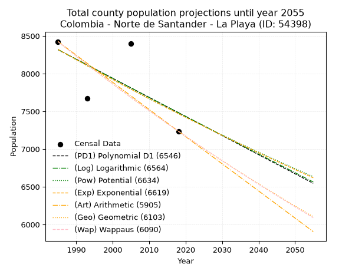
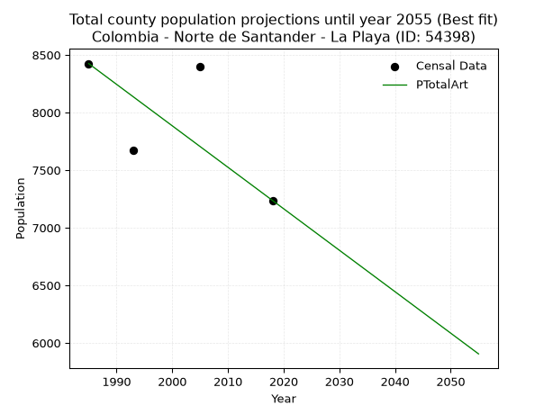
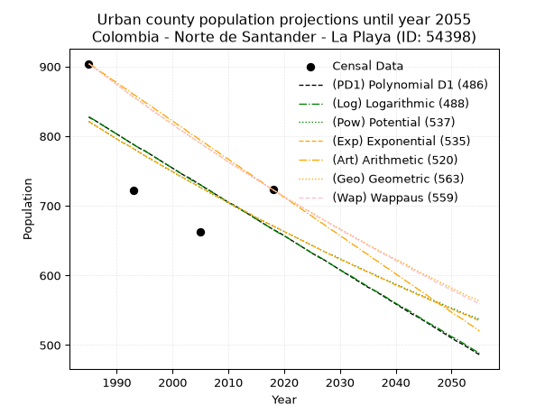
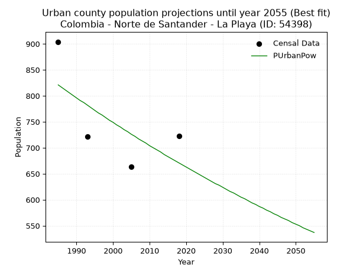
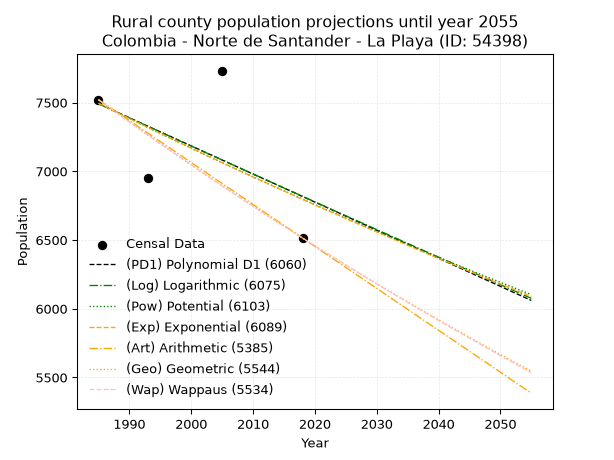
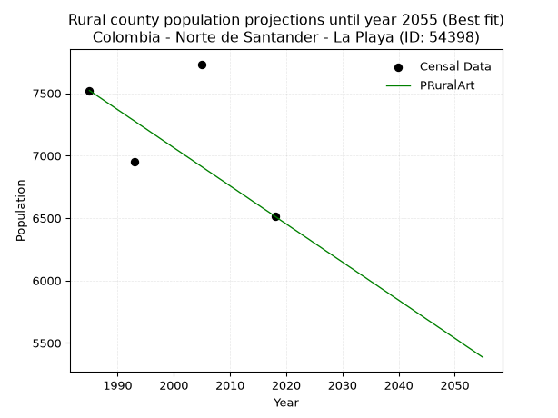

<div align="center">


</div>

# 📜 _“Population and Public Services Demand Projections (PPSD) until Year 2050 for Colombia - Norte de Santander - La Playa (ID: 54398)”_
Keywords: `population` `public-service` `projection` `lineal` `polynomial` `logarithmic` `potential` `exponential` `arithmetic` `geometric` `wappaus` `dane` `colombia` `south-america`

PPSD are analytical estimates used by governments and planners to anticipate future changes in population size, age distribution, and the resulting community needs for utilities, healthcare, education, and infrastructure as sizing future water treatment facilities, electrical grids, and road networks based on spatial growth.

<div align="center">

</img>

</div>


> **General running parameters**: • app_version: _v20260806_. • Python version: _3.14.7_. • Pandas version: _3.0.5_. • NumPy version: _2.5.1_. • Creates, save and include plots into reports (create_plot): _False_. • Projection until year: _2050_. • Process polynomial degree 2 and up: _False_. • Process Wappaus: _True_. • Process Wappaus: _True_. • Set negative values to zero: _True_. • Set infinite values to zero: _True_. • Drop dataset notes: _True_. 
<div align="center">

Maps & GIS Layers: [:earth_americas:Google](http://maps.google.com/maps?q=8.211240027,-73.2399856) [:earth_americas:OSM](https://www.openstreetmap.org/#map=18/8.211240027/-73.2399856&layers=P) [:earth_americas:Bing](https://www.bing.com/maps?cp=8.211240027~-73.2399856&lvl=18) [:earth_americas:Apple](https://maps.apple.com/frame?center=8.211240027%2C-73.2399856&span=0.003%2C0.006) [:earth_americas:GISMobile](https://github.com/rcfdtools/R.GISMobile/blob/main/file/gis/CountyLayer_CO/Readme.md)

</div>


<div align="center">

```geojson
{
  "type": "Feature",
  "geometry": {
    "type": "Point", 
    "coordinates": [-73.2399856, 8.211240027]
  }, 
  "properties": {
    "Name": "Colombia - Norte de Santander - La Playa (ID: 54398)"
  }
}
```

</div>


## 0. Census Data (4 records)

Census data are official statistics collected by a government about the people and housing in a country. They usually include counts of total population, age, sex, race, income, education, and jobs.

📅Global census file: [Population.xlsx](../data/Population.xlsx)

| Source   |   Year |   CountryID | CountryName   |   StateID | StateName          |   CountyID | CountyName   |   PTotal |   PUrban |   PRural |
|:---------|-------:|------------:|:--------------|----------:|:-------------------|-----------:|:-------------|---------:|---------:|---------:|
| DANE     |   1985 |          57 | Colombia      |        54 | Norte de Santander |      54398 | La Playa     |     8425 |      904 |     7521 |
| DANE     |   1993 |          57 | Colombia      |        54 | Norte de Santander |      54398 | La Playa     |     7672 |      722 |     6950 |
| DANE     |   2005 |          57 | Colombia      |        54 | Norte de Santander |      54398 | La Playa     |     8395 |      663 |     7732 |
| DANE     |   2018 |          57 | Colombia      |        54 | Norte de Santander |      54398 | La Playa     |     7237 |      723 |     6514 |

> 🔥Some records could had specific notes about the registered values or the corresponding urban or rural distribution.

📅[SUI-RUPS](https://www.datos.gov.co/Hacienda-y-Cr-dito-P-blico/Registro-nico-de-Prestadores-de-Servicios-P-blicos/4qkq-csdn/about_data) - Local public utility companies: [RUPS.csv](../data/RUPS.csv)

 | SERVICIO       | ESTADO    | NOMBRE                                                                        | NIT         | DEPARTAMENTO_DOMICILIO   | MUNICIPIO_DOMICILIO   | DIRECCION         |   TELEFONO | EMAIL                 | TIPO_PRESTADOR          | CLASIFICACION                 |
|:---------------|:----------|:------------------------------------------------------------------------------|:------------|:-------------------------|:----------------------|:------------------|-----------:|:----------------------|:------------------------|:------------------------------|
| ACUEDUCTO      | OPERATIVA | ADMINISTRACIÓN PÚBLICA COOPERATIVA DE SERVICIOS PÚBLICOS DE LA PLAYA DE BELEN | 900088786-3 | NORTE DE SANTANDER       | LA PLAYA              | CARRERA 3 N. 5-62 |    5632136 | erikat301@hotmail.com | ORGANIZACION AUTORIZADA | MENOR O IGUAL A 2500 USUARIOS |
| ALCANTARILLADO | OPERATIVA | ADMINISTRACIÓN PÚBLICA COOPERATIVA DE SERVICIOS PÚBLICOS DE LA PLAYA DE BELEN | 900088786-3 | NORTE DE SANTANDER       | LA PLAYA              | CARRERA 3 N. 5-62 |    5632136 | erikat301@hotmail.com | ORGANIZACION AUTORIZADA | MENOR O IGUAL A 2500 USUARIOS |

## 1. Total

### 1.1. Coefficients and Parameters

* (PD1) Polynomial Deg 1: -25.323564833399537, 58585.71055800743 (lineal)
* (Log) Logarithmic: -50638.07213863405, 392832.6421138007
* (Pow) Potential: -6.537725449409697, 25.480041955261196
* (Exp) Exponential: -0.0032695245494069537, 5479518.137756269
* (Art) Arithmetic: Year diff. 2018 - 1985 = 33, Population diff. 7237 - 8425 = -1188, Annual growth = -36.0
* (Geo) Geometric: Year diff. 2018 - 1985 = 33, Population diff. 7237 - 8425 = -1188, Annual growth % = -0.004595370050550884
* (Wap) Wappaus: i = -0.4597114033967565, Condition values only valid for < 200)

<sub>
Wappaus condition values: ['-0.00', '-0.46', '-0.92', '-1.38', '-1.84', '-2.30', '-2.76', '-3.22', '-3.68', '-4.14', '-4.60', '-5.06', '-5.52', '-5.98', '-6.44', '-6.90', '-7.36', '-7.82', '-8.27', '-8.73', '-9.19', '-9.65', '-10.11', '-10.57', '-11.03', '-11.49', '-11.95', '-12.41', '-12.87', '-13.33', '-13.79', '-14.25', '-14.71', '-15.17', '-15.63', '-16.09', '-16.55', '-17.01', '-17.47', '-17.93', '-18.39', '-18.85', '-19.31', '-19.77', '-20.23', '-20.69', '-21.15', '-21.61', '-22.07', '-22.53', '-22.99', '-23.45', '-23.90', '-24.36', '-24.82', '-25.28', '-25.74', '-26.20', '-26.66', '-27.12', '-27.58', '-28.04', '-28.50', '-28.96', '-29.42', '-29.88']
</sub>


### 1.2. Projected Dataset

|   Year |   CountyID |   PTotalPD1 |   PTotalLog |   PTotalPow |   PTotalExp |   PTotalArt |   PTotalGeo |   PTotalWap |
|-------:|-----------:|------------:|------------:|------------:|------------:|------------:|------------:|------------:|
|   1985 |      54398 |        8318 |        8319 |        8321 |        8321 |        8425 |        8425 |        8425 |
|   1986 |      54398 |        8293 |        8293 |        8294 |        8294 |        8389 |        8386 |        8386 |
|   1987 |      54398 |        8268 |        8268 |        8267 |        8267 |        8353 |        8348 |        8348 |
|   1988 |      54398 |        8242 |        8242 |        8240 |        8240 |        8317 |        8309 |        8310 |
|   1989 |      54398 |        8217 |        8217 |        8212 |        8213 |        8281 |        8271 |        8271 |
|   1990 |      54398 |        8192 |        8191 |        8186 |        8186 |        8245 |        8233 |        8234 |
|   1991 |      54398 |        8166 |        8166 |        8159 |        8159 |        8209 |        8195 |        8196 |
|   1992 |      54398 |        8141 |        8141 |        8132 |        8133 |        8173 |        8158 |        8158 |
|   1993 |      54398 |        8116 |        8115 |        8105 |        8106 |        8137 |        8120 |        8121 |
|   1994 |      54398 |        8091 |        8090 |        8079 |        8080 |        8101 |        8083 |        8083 |
|   1995 |      54398 |        8065 |        8064 |        8052 |        8053 |        8065 |        8046 |        8046 |
|   1996 |      54398 |        8040 |        8039 |        8026 |        8027 |        8029 |        8009 |        8009 |
|   1997 |      54398 |        8015 |        8014 |        8000 |        8001 |        7993 |        7972 |        7973 |
|   1998 |      54398 |        7989 |        7988 |        7974 |        7975 |        7957 |        7935 |        7936 |
|   1999 |      54398 |        7964 |        7963 |        7948 |        7949 |        7921 |        7899 |        7900 |
|   2000 |      54398 |        7939 |        7938 |        7922 |        7923 |        7885 |        7863 |        7863 |
|   2001 |      54398 |        7913 |        7912 |        7896 |        7897 |        7849 |        7826 |        7827 |
|   2002 |      54398 |        7888 |        7887 |        7870 |        7871 |        7813 |        7790 |        7791 |
|   2003 |      54398 |        7863 |        7862 |        7844 |        7845 |        7777 |        7755 |        7756 |
|   2004 |      54398 |        7837 |        7836 |        7819 |        7820 |        7741 |        7719 |        7720 |
|   2005 |      54398 |        7812 |        7811 |        7793 |        7794 |        7705 |        7684 |        7684 |
|   2006 |      54398 |        7787 |        7786 |        7768 |        7769 |        7669 |        7648 |        7649 |
|   2007 |      54398 |        7761 |        7761 |        7743 |        7743 |        7633 |        7613 |        7614 |
|   2008 |      54398 |        7736 |        7735 |        7718 |        7718 |        7597 |        7578 |        7579 |
|   2009 |      54398 |        7711 |        7710 |        7692 |        7693 |        7561 |        7543 |        7544 |
|   2010 |      54398 |        7685 |        7685 |        7667 |        7668 |        7525 |        7509 |        7509 |
|   2011 |      54398 |        7660 |        7660 |        7643 |        7643 |        7489 |        7474 |        7475 |
|   2012 |      54398 |        7635 |        7635 |        7618 |        7618 |        7453 |        7440 |        7440 |
|   2013 |      54398 |        7609 |        7610 |        7593 |        7593 |        7417 |        7406 |        7406 |
|   2014 |      54398 |        7584 |        7584 |        7568 |        7568 |        7381 |        7372 |        7372 |
|   2015 |      54398 |        7559 |        7559 |        7544 |        7543 |        7345 |        7338 |        7338 |
|   2016 |      54398 |        7533 |        7534 |        7520 |        7519 |        7309 |        7304 |        7304 |
|   2017 |      54398 |        7508 |        7509 |        7495 |        7494 |        7273 |        7270 |        7271 |
|   2018 |      54398 |        7483 |        7484 |        7471 |        7470 |        7237 |        7237 |        7237 |
|   2019 |      54398 |        7457 |        7459 |        7447 |        7445 |        7201 |        7204 |        7204 |
|   2020 |      54398 |        7432 |        7434 |        7423 |        7421 |        7165 |        7171 |        7170 |
|   2021 |      54398 |        7407 |        7409 |        7399 |        7397 |        7129 |        7138 |        7137 |
|   2022 |      54398 |        7381 |        7384 |        7375 |        7373 |        7093 |        7105 |        7104 |
|   2023 |      54398 |        7356 |        7359 |        7351 |        7349 |        7057 |        7072 |        7071 |
|   2024 |      54398 |        7331 |        7334 |        7327 |        7325 |        7021 |        7040 |        7039 |
|   2025 |      54398 |        7305 |        7309 |        7304 |        7301 |        6985 |        7007 |        7006 |
|   2026 |      54398 |        7280 |        7284 |        7280 |        7277 |        6949 |        6975 |        6974 |
|   2027 |      54398 |        7255 |        7259 |        7257 |        7253 |        6913 |        6943 |        6942 |
|   2028 |      54398 |        7230 |        7234 |        7233 |        7230 |        6877 |        6911 |        6909 |
|   2029 |      54398 |        7204 |        7209 |        7210 |        7206 |        6841 |        6879 |        6877 |
|   2030 |      54398 |        7179 |        7184 |        7187 |        7182 |        6805 |        6848 |        6845 |
|   2031 |      54398 |        7154 |        7159 |        7164 |        7159 |        6769 |        6816 |        6814 |
|   2032 |      54398 |        7128 |        7134 |        7141 |        7136 |        6733 |        6785 |        6782 |
|   2033 |      54398 |        7103 |        7109 |        7118 |        7112 |        6697 |        6754 |        6751 |
|   2034 |      54398 |        7078 |        7084 |        7095 |        7089 |        6661 |        6723 |        6719 |
|   2035 |      54398 |        7052 |        7059 |        7072 |        7066 |        6625 |        6692 |        6688 |
|   2036 |      54398 |        7027 |        7034 |        7050 |        7043 |        6589 |        6661 |        6657 |
|   2037 |      54398 |        7002 |        7009 |        7027 |        7020 |        6553 |        6631 |        6626 |
|   2038 |      54398 |        6976 |        6984 |        7004 |        6997 |        6517 |        6600 |        6595 |
|   2039 |      54398 |        6951 |        6960 |        6982 |        6974 |        6481 |        6570 |        6564 |
|   2040 |      54398 |        6926 |        6935 |        6960 |        6951 |        6445 |        6540 |        6534 |
|   2041 |      54398 |        6900 |        6910 |        6937 |        6929 |        6409 |        6510 |        6503 |
|   2042 |      54398 |        6875 |        6885 |        6915 |        6906 |        6373 |        6480 |        6473 |
|   2043 |      54398 |        6850 |        6860 |        6893 |        6884 |        6337 |        6450 |        6443 |
|   2044 |      54398 |        6824 |        6836 |        6871 |        6861 |        6301 |        6420 |        6413 |
|   2045 |      54398 |        6799 |        6811 |        6849 |        6839 |        6265 |        6391 |        6383 |
|   2046 |      54398 |        6774 |        6786 |        6827 |        6816 |        6229 |        6361 |        6353 |
|   2047 |      54398 |        6748 |        6761 |        6806 |        6794 |        6193 |        6332 |        6323 |
|   2048 |      54398 |        6723 |        6737 |        6784 |        6772 |        6157 |        6303 |        6294 |
|   2049 |      54398 |        6698 |        6712 |        6762 |        6750 |        6121 |        6274 |        6264 |
|   2050 |      54398 |        6672 |        6687 |        6741 |        6728 |        6085 |        6245 |        6235 |
<div align="center">

</img>

</div>


### 1.3. Best fit with absolute and relative error (%)

Relative error puts that difference into context by dividing the absolute error by the true value, creating a unitless ratio or percentage that shows the scale of the mistake.

Absolute and relative error

|   Year | Source   |   CountryID | CountryName   |   StateID | StateName          |   CountyID_x | CountyName   |   PTotal |   PUrban |   PRural |   CountyID_y |   PTotalPD1 |   PTotalLog |   PTotalPow |   PTotalExp |   PTotalArt |   PTotalGeo |   PTotalWap |   PTotalPD1AbsError |   PTotalLogAbsError |   PTotalPowAbsError |   PTotalExpAbsError |   PTotalArtAbsError |   PTotalGeoAbsError |   PTotalWapAbsError |   PTotalPD1RelError |   PTotalLogRelError |   PTotalPowRelError |   PTotalExpRelError |   PTotalArtRelError |   PTotalGeoRelError |   PTotalWapRelError |
|-------:|:---------|------------:|:--------------|----------:|:-------------------|-------------:|:-------------|---------:|---------:|---------:|-------------:|------------:|------------:|------------:|------------:|------------:|------------:|------------:|--------------------:|--------------------:|--------------------:|--------------------:|--------------------:|--------------------:|--------------------:|--------------------:|--------------------:|--------------------:|--------------------:|--------------------:|--------------------:|--------------------:|
|   1985 | DANE     |          57 | Colombia      |        54 | Norte de Santander |        54398 | La Playa     |     8425 |      904 |     7521 |        54398 |        8318 |        8319 |        8321 |        8321 |        8425 |        8425 |        8425 |                 107 |                 106 |                 104 |                 104 |                   0 |                   0 |                   0 |             1.27003 |             1.25816 |             1.23442 |             1.23442 |             0       |             0       |             0       |
|   1993 | DANE     |          57 | Colombia      |        54 | Norte de Santander |        54398 | La Playa     |     7672 |      722 |     6950 |        54398 |        8116 |        8115 |        8105 |        8106 |        8137 |        8120 |        8121 |                 444 |                 443 |                 433 |                 434 |                 465 |                 448 |                 449 |             5.78728 |             5.77424 |             5.6439  |             5.65693 |             6.061   |             5.83942 |             5.85245 |
|   2005 | DANE     |          57 | Colombia      |        54 | Norte de Santander |        54398 | La Playa     |     8395 |      663 |     7732 |        54398 |        7812 |        7811 |        7793 |        7794 |        7705 |        7684 |        7684 |                 583 |                 584 |                 602 |                 601 |                 690 |                 711 |                 711 |             6.94461 |             6.95652 |             7.17094 |             7.15902 |             8.21918 |             8.46933 |             8.46933 |
|   2018 | DANE     |          57 | Colombia      |        54 | Norte de Santander |        54398 | La Playa     |     7237 |      723 |     6514 |        54398 |        7483 |        7484 |        7471 |        7470 |        7237 |        7237 |        7237 |                 246 |                 247 |                 234 |                 233 |                   0 |                   0 |                   0 |             3.3992  |             3.41302 |             3.23338 |             3.21957 |             0       |             0       |             0       |

Relative error mean

| Method    |   RelError | Best   |
|:----------|-----------:|:-------|
| PTotalPD1 |    4.35028 |        |
| PTotalLog |    4.35049 |        |
| PTotalPow |    4.32066 |        |
| PTotalExp |    4.31749 |        |
| PTotalArt |    3.57004 | True   |
| PTotalGeo |    3.57719 |        |
| PTotalWap |    3.58044 |        |

💙Best method: _**PTotalArt**_
<div align="center">

</img>

</div>


### 1.4. Fresh water supply demand in liters per capita per day (lpcd)

The fresh water supply demand typically ranges from 100 to 300 liters per capita per day (lpcd) for standard domestic and municipal planning, though absolute survival minimums set by the World Health Organization are as low as 7.5 to 20 liters per day, and total consumption in high-income nations can exceed 400 liters.

> `CZ`: Level in meters above the sea level (masl)<br> `WS`: Fresh water supply demand in liters per capita per day (lpcd or l/h/d)<br> `WSAll`: Zonal fresh water supply demand in liters per second (l/s)<br> `A`: Zonal area in square meters<br> `DP`: Population density (people/hectare or p/ha)

Reference values (RAS Colombia)

|    CZ |   WS |
|------:|-----:|
|  1000 |  120 |
|  2000 |  130 |
| 99999 |  140 |

County shapefile geometry properties and water supply values

|   CountyID |      ATotal |   CZTotal |   WSTotal |
|-----------:|------------:|----------:|----------:|
|      54398 | 2.41772e+08 |   1584.15 |       130 |

Projected values for best method: PTotalArt

|   CountyID |   Year |   PTotalArt |   DPTotal |   WSTotal |   WSTotalAll |
|-----------:|-------:|------------:|----------:|----------:|-------------:|
|      54398 |   1985 |        8425 |      0.35 |       130 |     12.6765  |
|      54398 |   1986 |        8389 |      0.35 |       130 |     12.6223  |
|      54398 |   1987 |        8353 |      0.35 |       130 |     12.5682  |
|      54398 |   1988 |        8317 |      0.34 |       130 |     12.514   |
|      54398 |   1989 |        8281 |      0.34 |       130 |     12.4598  |
|      54398 |   1990 |        8245 |      0.34 |       130 |     12.4057  |
|      54398 |   1991 |        8209 |      0.34 |       130 |     12.3515  |
|      54398 |   1992 |        8173 |      0.34 |       130 |     12.2973  |
|      54398 |   1993 |        8137 |      0.34 |       130 |     12.2432  |
|      54398 |   1994 |        8101 |      0.34 |       130 |     12.189   |
|      54398 |   1995 |        8065 |      0.33 |       130 |     12.1348  |
|      54398 |   1996 |        8029 |      0.33 |       130 |     12.0807  |
|      54398 |   1997 |        7993 |      0.33 |       130 |     12.0265  |
|      54398 |   1998 |        7957 |      0.33 |       130 |     11.9723  |
|      54398 |   1999 |        7921 |      0.33 |       130 |     11.9182  |
|      54398 |   2000 |        7885 |      0.33 |       130 |     11.864   |
|      54398 |   2001 |        7849 |      0.32 |       130 |     11.8098  |
|      54398 |   2002 |        7813 |      0.32 |       130 |     11.7557  |
|      54398 |   2003 |        7777 |      0.32 |       130 |     11.7015  |
|      54398 |   2004 |        7741 |      0.32 |       130 |     11.6473  |
|      54398 |   2005 |        7705 |      0.32 |       130 |     11.5932  |
|      54398 |   2006 |        7669 |      0.32 |       130 |     11.539   |
|      54398 |   2007 |        7633 |      0.32 |       130 |     11.4848  |
|      54398 |   2008 |        7597 |      0.31 |       130 |     11.4307  |
|      54398 |   2009 |        7561 |      0.31 |       130 |     11.3765  |
|      54398 |   2010 |        7525 |      0.31 |       130 |     11.3223  |
|      54398 |   2011 |        7489 |      0.31 |       130 |     11.2682  |
|      54398 |   2012 |        7453 |      0.31 |       130 |     11.214   |
|      54398 |   2013 |        7417 |      0.31 |       130 |     11.1598  |
|      54398 |   2014 |        7381 |      0.31 |       130 |     11.1057  |
|      54398 |   2015 |        7345 |      0.3  |       130 |     11.0515  |
|      54398 |   2016 |        7309 |      0.3  |       130 |     10.9973  |
|      54398 |   2017 |        7273 |      0.3  |       130 |     10.9432  |
|      54398 |   2018 |        7237 |      0.3  |       130 |     10.889   |
|      54398 |   2019 |        7201 |      0.3  |       130 |     10.8348  |
|      54398 |   2020 |        7165 |      0.3  |       130 |     10.7807  |
|      54398 |   2021 |        7129 |      0.29 |       130 |     10.7265  |
|      54398 |   2022 |        7093 |      0.29 |       130 |     10.6723  |
|      54398 |   2023 |        7057 |      0.29 |       130 |     10.6182  |
|      54398 |   2024 |        7021 |      0.29 |       130 |     10.564   |
|      54398 |   2025 |        6985 |      0.29 |       130 |     10.5098  |
|      54398 |   2026 |        6949 |      0.29 |       130 |     10.4557  |
|      54398 |   2027 |        6913 |      0.29 |       130 |     10.4015  |
|      54398 |   2028 |        6877 |      0.28 |       130 |     10.3473  |
|      54398 |   2029 |        6841 |      0.28 |       130 |     10.2932  |
|      54398 |   2030 |        6805 |      0.28 |       130 |     10.239   |
|      54398 |   2031 |        6769 |      0.28 |       130 |     10.1848  |
|      54398 |   2032 |        6733 |      0.28 |       130 |     10.1307  |
|      54398 |   2033 |        6697 |      0.28 |       130 |     10.0765  |
|      54398 |   2034 |        6661 |      0.28 |       130 |     10.0223  |
|      54398 |   2035 |        6625 |      0.27 |       130 |      9.96817 |
|      54398 |   2036 |        6589 |      0.27 |       130 |      9.914   |
|      54398 |   2037 |        6553 |      0.27 |       130 |      9.85984 |
|      54398 |   2038 |        6517 |      0.27 |       130 |      9.80567 |
|      54398 |   2039 |        6481 |      0.27 |       130 |      9.7515  |
|      54398 |   2040 |        6445 |      0.27 |       130 |      9.69734 |
|      54398 |   2041 |        6409 |      0.27 |       130 |      9.64317 |
|      54398 |   2042 |        6373 |      0.26 |       130 |      9.589   |
|      54398 |   2043 |        6337 |      0.26 |       130 |      9.53484 |
|      54398 |   2044 |        6301 |      0.26 |       130 |      9.48067 |
|      54398 |   2045 |        6265 |      0.26 |       130 |      9.4265  |
|      54398 |   2046 |        6229 |      0.26 |       130 |      9.37234 |
|      54398 |   2047 |        6193 |      0.26 |       130 |      9.31817 |
|      54398 |   2048 |        6157 |      0.25 |       130 |      9.264   |
|      54398 |   2049 |        6121 |      0.25 |       130 |      9.20984 |
|      54398 |   2050 |        6085 |      0.25 |       130 |      9.15567 |

## 2. Urban

### 2.1. Coefficients and Parameters

* (PD1) Polynomial Deg 1: -4.8783621035728935, 10510.943797671682 (lineal)
* (Log) Logarithmic: -9789.256664448085, 75161.21835264961
* (Pow) Potential: -12.273462999578006, 43.389471509671615
* (Exp) Exponential: -0.0061158331694143924, 153691049.7746854
* (Art) Arithmetic: Year diff. 2018 - 1985 = 33, Population diff. 723 - 904 = -181, Annual growth = -5.484848484848484
* (Geo) Geometric: Year diff. 2018 - 1985 = 33, Population diff. 723 - 904 = -181, Annual growth % = -0.006747440323677911
* (Wap) Wappaus: i = -0.674228455420834, Condition values only valid for < 200)

<sub>
Wappaus condition values: ['-0.00', '-0.67', '-1.35', '-2.02', '-2.70', '-3.37', '-4.05', '-4.72', '-5.39', '-6.07', '-6.74', '-7.42', '-8.09', '-8.76', '-9.44', '-10.11', '-10.79', '-11.46', '-12.14', '-12.81', '-13.48', '-14.16', '-14.83', '-15.51', '-16.18', '-16.86', '-17.53', '-18.20', '-18.88', '-19.55', '-20.23', '-20.90', '-21.58', '-22.25', '-22.92', '-23.60', '-24.27', '-24.95', '-25.62', '-26.29', '-26.97', '-27.64', '-28.32', '-28.99', '-29.67', '-30.34', '-31.01', '-31.69', '-32.36', '-33.04', '-33.71', '-34.39', '-35.06', '-35.73', '-36.41', '-37.08', '-37.76', '-38.43', '-39.11', '-39.78', '-40.45', '-41.13', '-41.80', '-42.48', '-43.15', '-43.82']
</sub>


### 2.2. Projected Dataset

|   Year |   CountyID |   PUrbanPD1 |   PUrbanLog |   PUrbanPow |   PUrbanExp |   PUrbanArt |   PUrbanGeo |   PUrbanWap |
|-------:|-----------:|------------:|------------:|------------:|------------:|------------:|------------:|------------:|
|   1985 |      54398 |         827 |         828 |         821 |         821 |         904 |         904 |         904 |
|   1986 |      54398 |         823 |         823 |         816 |         816 |         899 |         898 |         898 |
|   1987 |      54398 |         818 |         818 |         811 |         811 |         893 |         892 |         892 |
|   1988 |      54398 |         813 |         813 |         806 |         806 |         888 |         886 |         886 |
|   1989 |      54398 |         808 |         808 |         801 |         801 |         882 |         880 |         880 |
|   1990 |      54398 |         803 |         803 |         796 |         796 |         877 |         874 |         874 |
|   1991 |      54398 |         798 |         798 |         791 |         791 |         871 |         868 |         868 |
|   1992 |      54398 |         793 |         793 |         787 |         787 |         866 |         862 |         862 |
|   1993 |      54398 |         788 |         788 |         782 |         782 |         860 |         856 |         857 |
|   1994 |      54398 |         783 |         783 |         777 |         777 |         855 |         851 |         851 |
|   1995 |      54398 |         779 |         779 |         772 |         772 |         849 |         845 |         845 |
|   1996 |      54398 |         774 |         774 |         767 |         768 |         844 |         839 |         839 |
|   1997 |      54398 |         769 |         769 |         763 |         763 |         838 |         833 |         834 |
|   1998 |      54398 |         764 |         764 |         758 |         758 |         833 |         828 |         828 |
|   1999 |      54398 |         759 |         759 |         753 |         754 |         827 |         822 |         823 |
|   2000 |      54398 |         754 |         754 |         749 |         749 |         822 |         817 |         817 |
|   2001 |      54398 |         749 |         749 |         744 |         744 |         816 |         811 |         811 |
|   2002 |      54398 |         744 |         744 |         740 |         740 |         811 |         806 |         806 |
|   2003 |      54398 |         740 |         739 |         735 |         735 |         805 |         800 |         801 |
|   2004 |      54398 |         735 |         734 |         731 |         731 |         800 |         795 |         795 |
|   2005 |      54398 |         730 |         730 |         726 |         726 |         794 |         790 |         790 |
|   2006 |      54398 |         725 |         725 |         722 |         722 |         789 |         784 |         784 |
|   2007 |      54398 |         720 |         720 |         717 |         718 |         783 |         779 |         779 |
|   2008 |      54398 |         715 |         715 |         713 |         713 |         778 |         774 |         774 |
|   2009 |      54398 |         710 |         710 |         709 |         709 |         772 |         768 |         769 |
|   2010 |      54398 |         705 |         705 |         704 |         705 |         767 |         763 |         763 |
|   2011 |      54398 |         701 |         700 |         700 |         700 |         761 |         758 |         758 |
|   2012 |      54398 |         696 |         695 |         696 |         696 |         756 |         753 |         753 |
|   2013 |      54398 |         691 |         691 |         692 |         692 |         750 |         748 |         748 |
|   2014 |      54398 |         686 |         686 |         687 |         688 |         745 |         743 |         743 |
|   2015 |      54398 |         681 |         681 |         683 |         683 |         739 |         738 |         738 |
|   2016 |      54398 |         676 |         676 |         679 |         679 |         734 |         733 |         733 |
|   2017 |      54398 |         671 |         671 |         675 |         675 |         728 |         728 |         728 |
|   2018 |      54398 |         666 |         666 |         671 |         671 |         723 |         723 |         723 |
|   2019 |      54398 |         662 |         661 |         667 |         667 |         718 |         718 |         718 |
|   2020 |      54398 |         657 |         657 |         663 |         663 |         712 |         713 |         713 |
|   2021 |      54398 |         652 |         652 |         659 |         659 |         707 |         708 |         708 |
|   2022 |      54398 |         647 |         647 |         655 |         655 |         701 |         704 |         703 |
|   2023 |      54398 |         642 |         642 |         651 |         651 |         696 |         699 |         699 |
|   2024 |      54398 |         637 |         637 |         647 |         647 |         690 |         694 |         694 |
|   2025 |      54398 |         632 |         632 |         643 |         643 |         685 |         690 |         689 |
|   2026 |      54398 |         627 |         628 |         639 |         639 |         679 |         685 |         684 |
|   2027 |      54398 |         623 |         623 |         635 |         635 |         674 |         680 |         680 |
|   2028 |      54398 |         618 |         618 |         631 |         631 |         668 |         676 |         675 |
|   2029 |      54398 |         613 |         613 |         628 |         627 |         663 |         671 |         670 |
|   2030 |      54398 |         608 |         608 |         624 |         623 |         657 |         667 |         666 |
|   2031 |      54398 |         603 |         603 |         620 |         620 |         652 |         662 |         661 |
|   2032 |      54398 |         598 |         599 |         616 |         616 |         646 |         658 |         657 |
|   2033 |      54398 |         593 |         594 |         613 |         612 |         641 |         653 |         652 |
|   2034 |      54398 |         588 |         589 |         609 |         608 |         635 |         649 |         648 |
|   2035 |      54398 |         583 |         584 |         605 |         605 |         630 |         644 |         643 |
|   2036 |      54398 |         579 |         579 |         602 |         601 |         624 |         640 |         639 |
|   2037 |      54398 |         574 |         575 |         598 |         597 |         619 |         636 |         634 |
|   2038 |      54398 |         569 |         570 |         594 |         594 |         613 |         631 |         630 |
|   2039 |      54398 |         564 |         565 |         591 |         590 |         608 |         627 |         626 |
|   2040 |      54398 |         559 |         560 |         587 |         586 |         602 |         623 |         621 |
|   2041 |      54398 |         554 |         555 |         584 |         583 |         597 |         619 |         617 |
|   2042 |      54398 |         549 |         551 |         580 |         579 |         591 |         615 |         613 |
|   2043 |      54398 |         544 |         546 |         577 |         576 |         586 |         610 |         608 |
|   2044 |      54398 |         540 |         541 |         573 |         572 |         580 |         606 |         604 |
|   2045 |      54398 |         535 |         536 |         570 |         569 |         575 |         602 |         600 |
|   2046 |      54398 |         530 |         531 |         566 |         565 |         569 |         598 |         596 |
|   2047 |      54398 |         525 |         527 |         563 |         562 |         564 |         594 |         591 |
|   2048 |      54398 |         520 |         522 |         560 |         558 |         558 |         590 |         587 |
|   2049 |      54398 |         515 |         517 |         556 |         555 |         553 |         586 |         583 |
|   2050 |      54398 |         510 |         512 |         553 |         552 |         547 |         582 |         579 |
<div align="center">

</img>

</div>


### 2.3. Best fit with absolute and relative error (%)

Relative error puts that difference into context by dividing the absolute error by the true value, creating a unitless ratio or percentage that shows the scale of the mistake.

Absolute and relative error

|   Year | Source   |   CountryID | CountryName   |   StateID | StateName          |   CountyID_x | CountyName   |   PTotal |   PUrban |   PRural |   CountyID_y |   PUrbanPD1 |   PUrbanLog |   PUrbanPow |   PUrbanExp |   PUrbanArt |   PUrbanGeo |   PUrbanWap |   PUrbanPD1AbsError |   PUrbanLogAbsError |   PUrbanPowAbsError |   PUrbanExpAbsError |   PUrbanArtAbsError |   PUrbanGeoAbsError |   PUrbanWapAbsError |   PUrbanPD1RelError |   PUrbanLogRelError |   PUrbanPowRelError |   PUrbanExpRelError |   PUrbanArtRelError |   PUrbanGeoRelError |   PUrbanWapRelError |
|-------:|:---------|------------:|:--------------|----------:|:-------------------|-------------:|:-------------|---------:|---------:|---------:|-------------:|------------:|------------:|------------:|------------:|------------:|------------:|------------:|--------------------:|--------------------:|--------------------:|--------------------:|--------------------:|--------------------:|--------------------:|--------------------:|--------------------:|--------------------:|--------------------:|--------------------:|--------------------:|--------------------:|
|   1985 | DANE     |          57 | Colombia      |        54 | Norte de Santander |        54398 | La Playa     |     8425 |      904 |     7521 |        54398 |         827 |         828 |         821 |         821 |         904 |         904 |         904 |                  77 |                  76 |                  83 |                  83 |                   0 |                   0 |                   0 |             8.5177  |             8.40708 |             9.18142 |             9.18142 |              0      |              0      |              0      |
|   1993 | DANE     |          57 | Colombia      |        54 | Norte de Santander |        54398 | La Playa     |     7672 |      722 |     6950 |        54398 |         788 |         788 |         782 |         782 |         860 |         856 |         857 |                  66 |                  66 |                  60 |                  60 |                 138 |                 134 |                 135 |             9.14127 |             9.14127 |             8.31025 |             8.31025 |             19.1136 |             18.5596 |             18.6981 |
|   2005 | DANE     |          57 | Colombia      |        54 | Norte de Santander |        54398 | La Playa     |     8395 |      663 |     7732 |        54398 |         730 |         730 |         726 |         726 |         794 |         790 |         790 |                  67 |                  67 |                  63 |                  63 |                 131 |                 127 |                 127 |            10.1056  |            10.1056  |             9.50226 |             9.50226 |             19.7587 |             19.1554 |             19.1554 |
|   2018 | DANE     |          57 | Colombia      |        54 | Norte de Santander |        54398 | La Playa     |     7237 |      723 |     6514 |        54398 |         666 |         666 |         671 |         671 |         723 |         723 |         723 |                  57 |                  57 |                  52 |                  52 |                   0 |                   0 |                   0 |             7.88382 |             7.88382 |             7.19225 |             7.19225 |              0      |              0      |              0      |

Relative error mean

| Method    |   RelError | Best   |
|:----------|-----------:|:-------|
| PUrbanPD1 |    8.91209 |        |
| PUrbanLog |    8.88444 |        |
| PUrbanPow |    8.54655 | True   |
| PUrbanExp |    8.54655 | True   |
| PUrbanArt |    9.71806 |        |
| PUrbanGeo |    9.42873 |        |
| PUrbanWap |    9.46335 |        |

💙Best method: _**PUrbanPow**_
<div align="center">

</img>

</div>


### 2.4. Fresh water supply demand in liters per capita per day (lpcd)

The fresh water supply demand typically ranges from 100 to 300 liters per capita per day (lpcd) for standard domestic and municipal planning, though absolute survival minimums set by the World Health Organization are as low as 7.5 to 20 liters per day, and total consumption in high-income nations can exceed 400 liters.

> `CZ`: Level in meters above the sea level (masl)<br> `WS`: Fresh water supply demand in liters per capita per day (lpcd or l/h/d)<br> `WSAll`: Zonal fresh water supply demand in liters per second (l/s)<br> `A`: Zonal area in square meters<br> `DP`: Population density (people/hectare or p/ha)

Reference values (RAS Colombia)

|    CZ |   WS |
|------:|-----:|
|  1000 |  120 |
|  2000 |  130 |
| 99999 |  140 |

County shapefile geometry properties and water supply values

|   CountyID |   AUrban |   CZUrban |   WSUrban |
|-----------:|---------:|----------:|----------:|
|      54398 |   369574 |   1431.73 |       130 |

Projected values for best method: PUrbanPow

|   CountyID |   Year |   PUrbanPow |   DPUrban |   WSUrban |   WSUrbanAll |
|-----------:|-------:|------------:|----------:|----------:|-------------:|
|      54398 |   1985 |         821 |     22.21 |       130 |     1.2353   |
|      54398 |   1986 |         816 |     22.08 |       130 |     1.22778  |
|      54398 |   1987 |         811 |     21.94 |       130 |     1.22025  |
|      54398 |   1988 |         806 |     21.81 |       130 |     1.21273  |
|      54398 |   1989 |         801 |     21.67 |       130 |     1.20521  |
|      54398 |   1990 |         796 |     21.54 |       130 |     1.19769  |
|      54398 |   1991 |         791 |     21.4  |       130 |     1.19016  |
|      54398 |   1992 |         787 |     21.29 |       130 |     1.18414  |
|      54398 |   1993 |         782 |     21.16 |       130 |     1.17662  |
|      54398 |   1994 |         777 |     21.02 |       130 |     1.1691   |
|      54398 |   1995 |         772 |     20.89 |       130 |     1.16157  |
|      54398 |   1996 |         767 |     20.75 |       130 |     1.15405  |
|      54398 |   1997 |         763 |     20.65 |       130 |     1.14803  |
|      54398 |   1998 |         758 |     20.51 |       130 |     1.14051  |
|      54398 |   1999 |         753 |     20.37 |       130 |     1.13299  |
|      54398 |   2000 |         749 |     20.27 |       130 |     1.12697  |
|      54398 |   2001 |         744 |     20.13 |       130 |     1.11944  |
|      54398 |   2002 |         740 |     20.02 |       130 |     1.11343  |
|      54398 |   2003 |         735 |     19.89 |       130 |     1.1059   |
|      54398 |   2004 |         731 |     19.78 |       130 |     1.09988  |
|      54398 |   2005 |         726 |     19.64 |       130 |     1.09236  |
|      54398 |   2006 |         722 |     19.54 |       130 |     1.08634  |
|      54398 |   2007 |         717 |     19.4  |       130 |     1.07882  |
|      54398 |   2008 |         713 |     19.29 |       130 |     1.0728   |
|      54398 |   2009 |         709 |     19.18 |       130 |     1.06678  |
|      54398 |   2010 |         704 |     19.05 |       130 |     1.05926  |
|      54398 |   2011 |         700 |     18.94 |       130 |     1.05324  |
|      54398 |   2012 |         696 |     18.83 |       130 |     1.04722  |
|      54398 |   2013 |         692 |     18.72 |       130 |     1.0412   |
|      54398 |   2014 |         687 |     18.59 |       130 |     1.03368  |
|      54398 |   2015 |         683 |     18.48 |       130 |     1.02766  |
|      54398 |   2016 |         679 |     18.37 |       130 |     1.02164  |
|      54398 |   2017 |         675 |     18.26 |       130 |     1.01562  |
|      54398 |   2018 |         671 |     18.16 |       130 |     1.00961  |
|      54398 |   2019 |         667 |     18.05 |       130 |     1.00359  |
|      54398 |   2020 |         663 |     17.94 |       130 |     0.997569 |
|      54398 |   2021 |         659 |     17.83 |       130 |     0.991551 |
|      54398 |   2022 |         655 |     17.72 |       130 |     0.985532 |
|      54398 |   2023 |         651 |     17.61 |       130 |     0.979514 |
|      54398 |   2024 |         647 |     17.51 |       130 |     0.973495 |
|      54398 |   2025 |         643 |     17.4  |       130 |     0.967477 |
|      54398 |   2026 |         639 |     17.29 |       130 |     0.961458 |
|      54398 |   2027 |         635 |     17.18 |       130 |     0.95544  |
|      54398 |   2028 |         631 |     17.07 |       130 |     0.949421 |
|      54398 |   2029 |         628 |     16.99 |       130 |     0.944907 |
|      54398 |   2030 |         624 |     16.88 |       130 |     0.938889 |
|      54398 |   2031 |         620 |     16.78 |       130 |     0.93287  |
|      54398 |   2032 |         616 |     16.67 |       130 |     0.926852 |
|      54398 |   2033 |         613 |     16.59 |       130 |     0.922338 |
|      54398 |   2034 |         609 |     16.48 |       130 |     0.916319 |
|      54398 |   2035 |         605 |     16.37 |       130 |     0.910301 |
|      54398 |   2036 |         602 |     16.29 |       130 |     0.905787 |
|      54398 |   2037 |         598 |     16.18 |       130 |     0.899769 |
|      54398 |   2038 |         594 |     16.07 |       130 |     0.89375  |
|      54398 |   2039 |         591 |     15.99 |       130 |     0.889236 |
|      54398 |   2040 |         587 |     15.88 |       130 |     0.883218 |
|      54398 |   2041 |         584 |     15.8  |       130 |     0.878704 |
|      54398 |   2042 |         580 |     15.69 |       130 |     0.872685 |
|      54398 |   2043 |         577 |     15.61 |       130 |     0.868171 |
|      54398 |   2044 |         573 |     15.5  |       130 |     0.862153 |
|      54398 |   2045 |         570 |     15.42 |       130 |     0.857639 |
|      54398 |   2046 |         566 |     15.31 |       130 |     0.85162  |
|      54398 |   2047 |         563 |     15.23 |       130 |     0.847106 |
|      54398 |   2048 |         560 |     15.15 |       130 |     0.842593 |
|      54398 |   2049 |         556 |     15.04 |       130 |     0.836574 |
|      54398 |   2050 |         553 |     14.96 |       130 |     0.83206  |

## 3. Rural

### 3.1. Coefficients and Parameters

* (PD1) Polynomial Deg 1: -20.44520272982668, 48074.76676033582 (lineal)
* (Log) Logarithmic: -40848.815474185845, 317671.4237611502
* (Pow) Potential: -5.927986624409808, 23.423833407085
* (Exp) Exponential: -0.002966863450024802, 2706493.3923057886
* (Art) Arithmetic: Year diff. 2018 - 1985 = 33, Population diff. 6514 - 7521 = -1007, Annual growth = -30.515151515151516
* (Geo) Geometric: Year diff. 2018 - 1985 = 33, Population diff. 6514 - 7521 = -1007, Annual growth % = -0.004346447977117807
* (Wap) Wappaus: i = -0.43484362686357697, Condition values only valid for < 200)

<sub>
Wappaus condition values: ['-0.00', '-0.43', '-0.87', '-1.30', '-1.74', '-2.17', '-2.61', '-3.04', '-3.48', '-3.91', '-4.35', '-4.78', '-5.22', '-5.65', '-6.09', '-6.52', '-6.96', '-7.39', '-7.83', '-8.26', '-8.70', '-9.13', '-9.57', '-10.00', '-10.44', '-10.87', '-11.31', '-11.74', '-12.18', '-12.61', '-13.05', '-13.48', '-13.91', '-14.35', '-14.78', '-15.22', '-15.65', '-16.09', '-16.52', '-16.96', '-17.39', '-17.83', '-18.26', '-18.70', '-19.13', '-19.57', '-20.00', '-20.44', '-20.87', '-21.31', '-21.74', '-22.18', '-22.61', '-23.05', '-23.48', '-23.92', '-24.35', '-24.79', '-25.22', '-25.66', '-26.09', '-26.53', '-26.96', '-27.40', '-27.83', '-28.26']
</sub>


### 3.2. Projected Dataset

|   Year |   CountyID |   PRuralPD1 |   PRuralLog |   PRuralPow |   PRuralExp |   PRuralArt |   PRuralGeo |   PRuralWap |
|-------:|-----------:|------------:|------------:|------------:|------------:|------------:|------------:|------------:|
|   1985 |      54398 |        7491 |        7491 |        7495 |        7495 |        7521 |        7521 |        7521 |
|   1986 |      54398 |        7471 |        7471 |        7472 |        7472 |        7490 |        7488 |        7488 |
|   1987 |      54398 |        7450 |        7450 |        7450 |        7450 |        7460 |        7456 |        7456 |
|   1988 |      54398 |        7430 |        7429 |        7428 |        7428 |        7429 |        7423 |        7424 |
|   1989 |      54398 |        7409 |        7409 |        7406 |        7406 |        7399 |        7391 |        7391 |
|   1990 |      54398 |        7389 |        7388 |        7384 |        7384 |        7368 |        7359 |        7359 |
|   1991 |      54398 |        7368 |        7368 |        7362 |        7362 |        7338 |        7327 |        7327 |
|   1992 |      54398 |        7348 |        7347 |        7340 |        7341 |        7307 |        7295 |        7295 |
|   1993 |      54398 |        7327 |        7327 |        7318 |        7319 |        7277 |        7263 |        7264 |
|   1994 |      54398 |        7307 |        7306 |        7296 |        7297 |        7246 |        7232 |        7232 |
|   1995 |      54398 |        7287 |        7286 |        7275 |        7276 |        7216 |        7200 |        7201 |
|   1996 |      54398 |        7266 |        7265 |        7253 |        7254 |        7185 |        7169 |        7170 |
|   1997 |      54398 |        7246 |        7245 |        7232 |        7232 |        7155 |        7138 |        7139 |
|   1998 |      54398 |        7225 |        7224 |        7210 |        7211 |        7124 |        7107 |        7108 |
|   1999 |      54398 |        7205 |        7204 |        7189 |        7190 |        7094 |        7076 |        7077 |
|   2000 |      54398 |        7184 |        7184 |        7168 |        7168 |        7063 |        7045 |        7046 |
|   2001 |      54398 |        7164 |        7163 |        7146 |        7147 |        7033 |        7015 |        7015 |
|   2002 |      54398 |        7143 |        7143 |        7125 |        7126 |        7002 |        6984 |        6985 |
|   2003 |      54398 |        7123 |        7122 |        7104 |        7105 |        6972 |        6954 |        6954 |
|   2004 |      54398 |        7103 |        7102 |        7083 |        7084 |        6941 |        6924 |        6924 |
|   2005 |      54398 |        7082 |        7082 |        7062 |        7063 |        6911 |        6894 |        6894 |
|   2006 |      54398 |        7062 |        7061 |        7041 |        7042 |        6880 |        6864 |        6864 |
|   2007 |      54398 |        7041 |        7041 |        7021 |        7021 |        6850 |        6834 |        6834 |
|   2008 |      54398 |        7021 |        7020 |        7000 |        7000 |        6819 |        6804 |        6805 |
|   2009 |      54398 |        7000 |        7000 |        6979 |        6980 |        6789 |        6774 |        6775 |
|   2010 |      54398 |        6980 |        6980 |        6959 |        6959 |        6758 |        6745 |        6746 |
|   2011 |      54398 |        6959 |        6960 |        6938 |        6938 |        6728 |        6716 |        6716 |
|   2012 |      54398 |        6939 |        6939 |        6918 |        6918 |        6697 |        6686 |        6687 |
|   2013 |      54398 |        6919 |        6919 |        6897 |        6897 |        6667 |        6657 |        6658 |
|   2014 |      54398 |        6898 |        6899 |        6877 |        6877 |        6636 |        6628 |        6629 |
|   2015 |      54398 |        6878 |        6878 |        6857 |        6856 |        6606 |        6600 |        6600 |
|   2016 |      54398 |        6857 |        6858 |        6837 |        6836 |        6575 |        6571 |        6571 |
|   2017 |      54398 |        6837 |        6838 |        6817 |        6816 |        6545 |        6542 |        6543 |
|   2018 |      54398 |        6816 |        6818 |        6797 |        6796 |        6514 |        6514 |        6514 |
|   2019 |      54398 |        6796 |        6797 |        6777 |        6775 |        6483 |        6486 |        6486 |
|   2020 |      54398 |        6775 |        6777 |        6757 |        6755 |        6453 |        6457 |        6457 |
|   2021 |      54398 |        6755 |        6757 |        6737 |        6735 |        6422 |        6429 |        6429 |
|   2022 |      54398 |        6735 |        6737 |        6717 |        6715 |        6392 |        6401 |        6401 |
|   2023 |      54398 |        6714 |        6716 |        6698 |        6696 |        6361 |        6374 |        6373 |
|   2024 |      54398 |        6694 |        6696 |        6678 |        6676 |        6331 |        6346 |        6345 |
|   2025 |      54398 |        6673 |        6676 |        6659 |        6656 |        6300 |        6318 |        6317 |
|   2026 |      54398 |        6653 |        6656 |        6639 |        6636 |        6270 |        6291 |        6290 |
|   2027 |      54398 |        6632 |        6636 |        6620 |        6617 |        6239 |        6264 |        6262 |
|   2028 |      54398 |        6612 |        6616 |        6601 |        6597 |        6209 |        6236 |        6235 |
|   2029 |      54398 |        6591 |        6596 |        6581 |        6577 |        6178 |        6209 |        6208 |
|   2030 |      54398 |        6571 |        6575 |        6562 |        6558 |        6148 |        6182 |        6180 |
|   2031 |      54398 |        6551 |        6555 |        6543 |        6539 |        6117 |        6155 |        6153 |
|   2032 |      54398 |        6530 |        6535 |        6524 |        6519 |        6087 |        6129 |        6126 |
|   2033 |      54398 |        6510 |        6515 |        6505 |        6500 |        6056 |        6102 |        6100 |
|   2034 |      54398 |        6489 |        6495 |        6486 |        6481 |        6026 |        6075 |        6073 |
|   2035 |      54398 |        6469 |        6475 |        6467 |        6461 |        5995 |        6049 |        6046 |
|   2036 |      54398 |        6448 |        6455 |        6448 |        6442 |        5965 |        6023 |        6020 |
|   2037 |      54398 |        6428 |        6435 |        6430 |        6423 |        5934 |        5997 |        5993 |
|   2038 |      54398 |        6407 |        6415 |        6411 |        6404 |        5904 |        5971 |        5967 |
|   2039 |      54398 |        6387 |        6395 |        6392 |        6385 |        5873 |        5945 |        5941 |
|   2040 |      54398 |        6367 |        6375 |        6374 |        6366 |        5843 |        5919 |        5914 |
|   2041 |      54398 |        6346 |        6355 |        6355 |        6347 |        5812 |        5893 |        5888 |
|   2042 |      54398 |        6326 |        6335 |        6337 |        6329 |        5782 |        5867 |        5862 |
|   2043 |      54398 |        6305 |        6315 |        6318 |        6310 |        5751 |        5842 |        5837 |
|   2044 |      54398 |        6285 |        6295 |        6300 |        6291 |        5721 |        5817 |        5811 |
|   2045 |      54398 |        6264 |        6275 |        6282 |        6272 |        5690 |        5791 |        5785 |
|   2046 |      54398 |        6244 |        6255 |        6264 |        6254 |        5660 |        5766 |        5760 |
|   2047 |      54398 |        6223 |        6235 |        6246 |        6235 |        5629 |        5741 |        5734 |
|   2048 |      54398 |        6203 |        6215 |        6228 |        6217 |        5599 |        5716 |        5709 |
|   2049 |      54398 |        6183 |        6195 |        6210 |        6198 |        5568 |        5691 |        5684 |
|   2050 |      54398 |        6162 |        6175 |        6192 |        6180 |        5538 |        5666 |        5658 |
<div align="center">

</img>

</div>


### 3.3. Best fit with absolute and relative error (%)

Relative error puts that difference into context by dividing the absolute error by the true value, creating a unitless ratio or percentage that shows the scale of the mistake.

Absolute and relative error

|   Year | Source   |   CountryID | CountryName   |   StateID | StateName          |   CountyID_x | CountyName   |   PTotal |   PUrban |   PRural |   CountyID_y |   PRuralPD1 |   PRuralLog |   PRuralPow |   PRuralExp |   PRuralArt |   PRuralGeo |   PRuralWap |   PRuralPD1AbsError |   PRuralLogAbsError |   PRuralPowAbsError |   PRuralExpAbsError |   PRuralArtAbsError |   PRuralGeoAbsError |   PRuralWapAbsError |   PRuralPD1RelError |   PRuralLogRelError |   PRuralPowRelError |   PRuralExpRelError |   PRuralArtRelError |   PRuralGeoRelError |   PRuralWapRelError |
|-------:|:---------|------------:|:--------------|----------:|:-------------------|-------------:|:-------------|---------:|---------:|---------:|-------------:|------------:|------------:|------------:|------------:|------------:|------------:|------------:|--------------------:|--------------------:|--------------------:|--------------------:|--------------------:|--------------------:|--------------------:|--------------------:|--------------------:|--------------------:|--------------------:|--------------------:|--------------------:|--------------------:|
|   1985 | DANE     |          57 | Colombia      |        54 | Norte de Santander |        54398 | La Playa     |     8425 |      904 |     7521 |        54398 |        7491 |        7491 |        7495 |        7495 |        7521 |        7521 |        7521 |                  30 |                  30 |                  26 |                  26 |                   0 |                   0 |                   0 |            0.398883 |            0.398883 |            0.345699 |            0.345699 |             0       |              0      |             0       |
|   1993 | DANE     |          57 | Colombia      |        54 | Norte de Santander |        54398 | La Playa     |     7672 |      722 |     6950 |        54398 |        7327 |        7327 |        7318 |        7319 |        7277 |        7263 |        7264 |                 377 |                 377 |                 368 |                 369 |                 327 |                 313 |                 314 |            5.42446  |            5.42446  |            5.29496  |            5.30935  |             4.70504 |              4.5036 |             4.51799 |
|   2005 | DANE     |          57 | Colombia      |        54 | Norte de Santander |        54398 | La Playa     |     8395 |      663 |     7732 |        54398 |        7082 |        7082 |        7062 |        7063 |        6911 |        6894 |        6894 |                 650 |                 650 |                 670 |                 669 |                 821 |                 838 |                 838 |            8.40662  |            8.40662  |            8.66529  |            8.65235  |            10.6182  |             10.8381 |            10.8381  |
|   2018 | DANE     |          57 | Colombia      |        54 | Norte de Santander |        54398 | La Playa     |     7237 |      723 |     6514 |        54398 |        6816 |        6818 |        6797 |        6796 |        6514 |        6514 |        6514 |                 302 |                 304 |                 283 |                 282 |                   0 |                   0 |                   0 |            4.63617  |            4.66687  |            4.34449  |            4.32914  |             0       |              0      |             0       |

Relative error mean

| Method    |   RelError | Best   |
|:----------|-----------:|:-------|
| PRuralPD1 |    4.71653 |        |
| PRuralLog |    4.72421 |        |
| PRuralPow |    4.66261 |        |
| PRuralExp |    4.65914 |        |
| PRuralArt |    3.83081 | True   |
| PRuralGeo |    3.83542 |        |
| PRuralWap |    3.83902 |        |

💙Best method: _**PRuralArt**_
<div align="center">

</img>

</div>


### 3.4. Fresh water supply demand in liters per capita per day (lpcd)

The fresh water supply demand typically ranges from 100 to 300 liters per capita per day (lpcd) for standard domestic and municipal planning, though absolute survival minimums set by the World Health Organization are as low as 7.5 to 20 liters per day, and total consumption in high-income nations can exceed 400 liters.

> `CZ`: Level in meters above the sea level (masl)<br> `WS`: Fresh water supply demand in liters per capita per day (lpcd or l/h/d)<br> `WSAll`: Zonal fresh water supply demand in liters per second (l/s)<br> `A`: Zonal area in square meters<br> `DP`: Population density (people/hectare or p/ha)

Reference values (RAS Colombia)

|    CZ |   WS |
|------:|-----:|
|  1000 |  120 |
|  2000 |  130 |
| 99999 |  140 |

County shapefile geometry properties and water supply values

|   CountyID |      ARural |   CZRural |   WSRural |
|-----------:|------------:|----------:|----------:|
|      54398 | 2.41403e+08 |   1584.38 |       130 |

Projected values for best method: PRuralArt

|   CountyID |   Year |   PRuralArt |   DPRural |   WSRural |   WSRuralAll |
|-----------:|-------:|------------:|----------:|----------:|-------------:|
|      54398 |   1985 |        7521 |      0.31 |       130 |     11.3163  |
|      54398 |   1986 |        7490 |      0.31 |       130 |     11.2697  |
|      54398 |   1987 |        7460 |      0.31 |       130 |     11.2245  |
|      54398 |   1988 |        7429 |      0.31 |       130 |     11.1779  |
|      54398 |   1989 |        7399 |      0.31 |       130 |     11.1328  |
|      54398 |   1990 |        7368 |      0.31 |       130 |     11.0861  |
|      54398 |   1991 |        7338 |      0.3  |       130 |     11.041   |
|      54398 |   1992 |        7307 |      0.3  |       130 |     10.9943  |
|      54398 |   1993 |        7277 |      0.3  |       130 |     10.9492  |
|      54398 |   1994 |        7246 |      0.3  |       130 |     10.9025  |
|      54398 |   1995 |        7216 |      0.3  |       130 |     10.8574  |
|      54398 |   1996 |        7185 |      0.3  |       130 |     10.8108  |
|      54398 |   1997 |        7155 |      0.3  |       130 |     10.7656  |
|      54398 |   1998 |        7124 |      0.3  |       130 |     10.719   |
|      54398 |   1999 |        7094 |      0.29 |       130 |     10.6738  |
|      54398 |   2000 |        7063 |      0.29 |       130 |     10.6272  |
|      54398 |   2001 |        7033 |      0.29 |       130 |     10.5821  |
|      54398 |   2002 |        7002 |      0.29 |       130 |     10.5354  |
|      54398 |   2003 |        6972 |      0.29 |       130 |     10.4903  |
|      54398 |   2004 |        6941 |      0.29 |       130 |     10.4436  |
|      54398 |   2005 |        6911 |      0.29 |       130 |     10.3985  |
|      54398 |   2006 |        6880 |      0.29 |       130 |     10.3519  |
|      54398 |   2007 |        6850 |      0.28 |       130 |     10.3067  |
|      54398 |   2008 |        6819 |      0.28 |       130 |     10.2601  |
|      54398 |   2009 |        6789 |      0.28 |       130 |     10.2149  |
|      54398 |   2010 |        6758 |      0.28 |       130 |     10.1683  |
|      54398 |   2011 |        6728 |      0.28 |       130 |     10.1231  |
|      54398 |   2012 |        6697 |      0.28 |       130 |     10.0765  |
|      54398 |   2013 |        6667 |      0.28 |       130 |     10.0314  |
|      54398 |   2014 |        6636 |      0.27 |       130 |      9.98472 |
|      54398 |   2015 |        6606 |      0.27 |       130 |      9.93958 |
|      54398 |   2016 |        6575 |      0.27 |       130 |      9.89294 |
|      54398 |   2017 |        6545 |      0.27 |       130 |      9.8478  |
|      54398 |   2018 |        6514 |      0.27 |       130 |      9.80116 |
|      54398 |   2019 |        6483 |      0.27 |       130 |      9.75451 |
|      54398 |   2020 |        6453 |      0.27 |       130 |      9.70937 |
|      54398 |   2021 |        6422 |      0.27 |       130 |      9.66273 |
|      54398 |   2022 |        6392 |      0.26 |       130 |      9.61759 |
|      54398 |   2023 |        6361 |      0.26 |       130 |      9.57095 |
|      54398 |   2024 |        6331 |      0.26 |       130 |      9.52581 |
|      54398 |   2025 |        6300 |      0.26 |       130 |      9.47917 |
|      54398 |   2026 |        6270 |      0.26 |       130 |      9.43403 |
|      54398 |   2027 |        6239 |      0.26 |       130 |      9.38738 |
|      54398 |   2028 |        6209 |      0.26 |       130 |      9.34225 |
|      54398 |   2029 |        6178 |      0.26 |       130 |      9.2956  |
|      54398 |   2030 |        6148 |      0.25 |       130 |      9.25046 |
|      54398 |   2031 |        6117 |      0.25 |       130 |      9.20382 |
|      54398 |   2032 |        6087 |      0.25 |       130 |      9.15868 |
|      54398 |   2033 |        6056 |      0.25 |       130 |      9.11204 |
|      54398 |   2034 |        6026 |      0.25 |       130 |      9.0669  |
|      54398 |   2035 |        5995 |      0.25 |       130 |      9.02025 |
|      54398 |   2036 |        5965 |      0.25 |       130 |      8.97512 |
|      54398 |   2037 |        5934 |      0.25 |       130 |      8.92847 |
|      54398 |   2038 |        5904 |      0.24 |       130 |      8.88333 |
|      54398 |   2039 |        5873 |      0.24 |       130 |      8.83669 |
|      54398 |   2040 |        5843 |      0.24 |       130 |      8.79155 |
|      54398 |   2041 |        5812 |      0.24 |       130 |      8.74491 |
|      54398 |   2042 |        5782 |      0.24 |       130 |      8.69977 |
|      54398 |   2043 |        5751 |      0.24 |       130 |      8.65312 |
|      54398 |   2044 |        5721 |      0.24 |       130 |      8.60799 |
|      54398 |   2045 |        5690 |      0.24 |       130 |      8.56134 |
|      54398 |   2046 |        5660 |      0.23 |       130 |      8.5162  |
|      54398 |   2047 |        5629 |      0.23 |       130 |      8.46956 |
|      54398 |   2048 |        5599 |      0.23 |       130 |      8.42442 |
|      54398 |   2049 |        5568 |      0.23 |       130 |      8.37778 |
|      54398 |   2050 |        5538 |      0.23 |       130 |      8.33264 |

#

<div align="center"><br><sub>Share this research</sub></div><br>

<sub>**APPS & TOOLS & CONTENT DISCLAIMER**: • NO WARRANTY - This content and software is provided by <a href="https://github.com/rcfdtools" target="_blank">github.com/rcfdtools</a> "as is", without any express or implied warranty, including warranties of merchantability, fitness for a particular purpose, or non-infringement. There is no guarantee that the software will be error-free or operate without interruption. • LIMITATION OF LIABILITY - Neither the authors nor copyright holders will be liable for claims or damages arising from the software or its use. You are responsible for determining if the software is appropriate for your use and assume all associated risks, including errors, legal compliance, and data loss. • NO PROFESSIONAL ADVICE - The software provides general information and does not offer professional advice. It should not replace consultation with professional advisors. [Clauses and global license for rcfdtools use.](https://github.com/rcfdtools/rcfdtools/blob/main/LICENSE.md)</sub>

| [:house: Home](Readme.md)  | [:beginner: Help / Collab](https://github.com/rcfdtools/R.HydroTools/discussions/31) |
|----------------------------|-------------------------------------------------------------------------------------------|