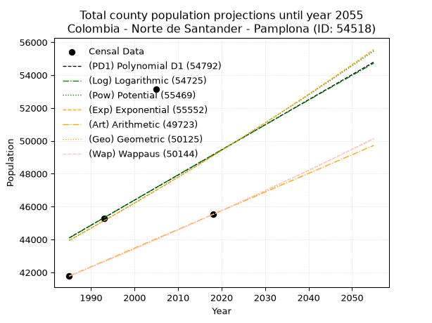
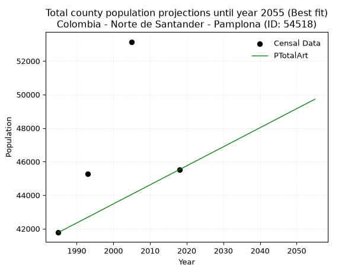
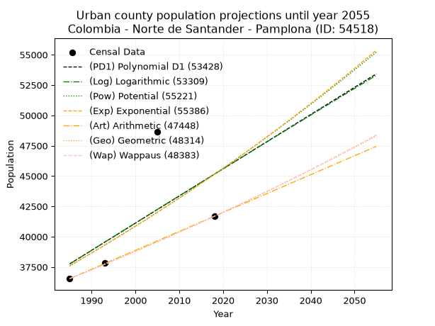
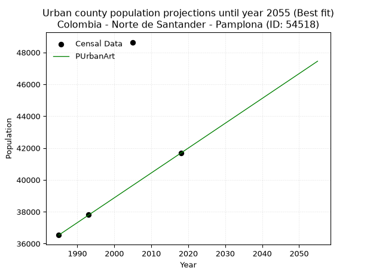
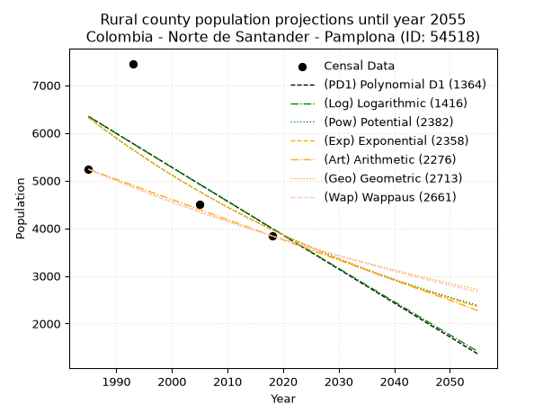
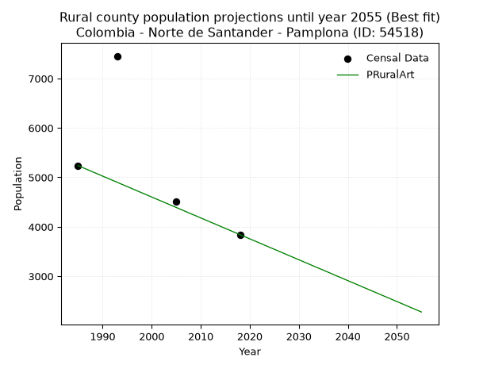

<div align="center">


</div>

# 📜 _“Population and Public Services Demand Projections (PPSD) until Year 2050 for Colombia - Norte de Santander - Pamplona (ID: 54518)”_
Keywords: `population` `public-service` `projection` `lineal` `polynomial` `logarithmic` `potential` `exponential` `arithmetic` `geometric` `wappaus` `dane` `colombia` `south-america`

PPSD are analytical estimates used by governments and planners to anticipate future changes in population size, age distribution, and the resulting community needs for utilities, healthcare, education, and infrastructure as sizing future water treatment facilities, electrical grids, and road networks based on spatial growth.

<div align="center">

</img>

</div>


> **General running parameters**: • app_version: _v20260806_. • Python version: _3.14.7_. • Pandas version: _3.0.5_. • NumPy version: _2.5.1_. • Creates, save and include plots into reports (create_plot): _False_. • Projection until year: _2050_. • Process polynomial degree 2 and up: _False_. • Process Wappaus: _True_. • Process Wappaus: _True_. • Set negative values to zero: _True_. • Set infinite values to zero: _True_. • Drop dataset notes: _True_. 
<div align="center">

Dynamic map: [:earth_americas:Google](http://maps.google.com/maps?q=7.372801548,-72.6477136) [:earth_americas:OSM](https://www.openstreetmap.org/#map=18/7.372801548/-72.6477136&layers=P) [:earth_americas:Bing](https://www.bing.com/maps?cp=7.372801548~-72.6477136&lvl=18) [:earth_americas:Apple](https://maps.apple.com/frame?center=7.372801548%2C-72.6477136&span=0.003%2C0.006)

</div>


<div align="center">

```geojson
{
  "type": "Feature",
  "geometry": {
    "type": "Point", 
    "coordinates": [-72.6477136, 7.372801548]
  }, 
  "properties": {
    "Name": "Colombia - Norte de Santander - Pamplona (ID: 54518)"
  }
}
```

</div>


## 0. Census Data (4 records)

Census data are official statistics collected by a government about the people and housing in a country. They usually include counts of total population, age, sex, race, income, education, and jobs.

📅Global census file: [Population.xlsx](../data/Population.xlsx)

| Source   |   Year |   CountryID | CountryName   |   StateID | StateName          |   CountyID | CountyName   |   PTotal |   PUrban |   PRural |
|:---------|-------:|------------:|:--------------|----------:|:-------------------|-----------:|:-------------|---------:|---------:|---------:|
| DANE     |   1985 |          57 | Colombia      |        54 | Norte de Santander |      54518 | Pamplona     |    41773 |    36536 |     5237 |
| DANE     |   1993 |          57 | Colombia      |        54 | Norte de Santander |      54518 | Pamplona     |    45283 |    37829 |     7454 |
| DANE     |   2005 |          57 | Colombia      |        54 | Norte de Santander |      54518 | Pamplona     |    53147 |    48639 |     4508 |
| DANE     |   2018 |          57 | Colombia      |        54 | Norte de Santander |      54518 | Pamplona     |    45521 |    41680 |     3841 |

> 🔥Some records could had specific notes about the registered values or the corresponding urban or rural distribution.

📅[SUI-RUPS](https://www.datos.gov.co/Hacienda-y-Cr-dito-P-blico/Registro-nico-de-Prestadores-de-Servicios-P-blicos/4qkq-csdn/about_data) - Local public utility companies: [RUPS.csv](../data/RUPS.xlsx)

 | SERVICIO       | ESTADO    | NOMBRE                                                | NIT         | DEPARTAMENTO_DOMICILIO   | MUNICIPIO_DOMICILIO   | DIRECCION                 |   TELEFONO | EMAIL                            | TIPO_PRESTADOR                             | CLASIFICACION                 |
|:---------------|:----------|:------------------------------------------------------|:------------|:-------------------------|:----------------------|:--------------------------|-----------:|:---------------------------------|:-------------------------------------------|:------------------------------|
| ACUEDUCTO      | OPERATIVA | EMPRESA DE SERVICIOS PUBLICOS DE PAMPLONA S.A. E.S.P. | 800094327-8 | NORTE DE SANTANDER       | PAMPLONA              | carrera 6 No. 4-65 centro |    5684200 | planeacionempopamplona@gmail.com | SOCIEDADES (EMPRESA DE SERVICIOS PUBLICOS) | MAYOR O IGUAL A 5001 USUARIOS |
| ALCANTARILLADO | OPERATIVA | EMPRESA DE SERVICIOS PUBLICOS DE PAMPLONA S.A. E.S.P. | 800094327-8 | NORTE DE SANTANDER       | PAMPLONA              | carrera 6 No. 4-65 centro |    5684200 | planeacionempopamplona@gmail.com | SOCIEDADES (EMPRESA DE SERVICIOS PUBLICOS) | MAYOR O IGUAL A 5001 USUARIOS |

## 1. Total

### 1.1. Coefficients and Parameters

* (PD1) Polynomial Deg 1: 152.7193898032955, -259045.95945404182 (lineal)
* (Log) Logarithmic: 306929.02483685344, -2286538.9773597666
* (Pow) Potential: 6.7246620907469525, -17.533489189356924
* (Exp) Exponential: 0.003346538488235427, 57.27968327093201
* (Art) Arithmetic: Year diff. 2018 - 1985 = 33, Population diff. 45521 - 41773 = 3748, Annual growth = 113.57575757575758
* (Geo) Geometric: Year diff. 2018 - 1985 = 33, Population diff. 45521 - 41773 = 3748, Annual growth % = 0.0026071369323545923
* (Wap) Wappaus: i = 0.2602143505298361, Condition values only valid for < 200)

<sub>
Wappaus condition values: ['0.00', '0.26', '0.52', '0.78', '1.04', '1.30', '1.56', '1.82', '2.08', '2.34', '2.60', '2.86', '3.12', '3.38', '3.64', '3.90', '4.16', '4.42', '4.68', '4.94', '5.20', '5.46', '5.72', '5.98', '6.25', '6.51', '6.77', '7.03', '7.29', '7.55', '7.81', '8.07', '8.33', '8.59', '8.85', '9.11', '9.37', '9.63', '9.89', '10.15', '10.41', '10.67', '10.93', '11.19', '11.45', '11.71', '11.97', '12.23', '12.49', '12.75', '13.01', '13.27', '13.53', '13.79', '14.05', '14.31', '14.57', '14.83', '15.09', '15.35', '15.61', '15.87', '16.13', '16.39', '16.65', '16.91']
</sub>


### 1.2. Projected Dataset

|   Year |   CountyID |   PTotalPD1 |   PTotalLog |   PTotalPow |   PTotalExp |   PTotalArt |   PTotalGeo |   PTotalWap |
|-------:|-----------:|------------:|------------:|------------:|------------:|------------:|------------:|------------:|
|   1985 |      54518 |       44102 |       44088 |       43938 |       43951 |       41773 |       41773 |       41773 |
|   1986 |      54518 |       44255 |       44243 |       44087 |       44098 |       41887 |       41882 |       41882 |
|   1987 |      54518 |       44407 |       44397 |       44236 |       44246 |       42000 |       41991 |       41991 |
|   1988 |      54518 |       44560 |       44551 |       44386 |       44394 |       42114 |       42101 |       42100 |
|   1989 |      54518 |       44713 |       44706 |       44536 |       44543 |       42227 |       42210 |       42210 |
|   1990 |      54518 |       44866 |       44860 |       44687 |       44692 |       42341 |       42320 |       42320 |
|   1991 |      54518 |       45018 |       45014 |       44838 |       44842 |       42454 |       42431 |       42430 |
|   1992 |      54518 |       45171 |       45168 |       44990 |       44992 |       42568 |       42541 |       42541 |
|   1993 |      54518 |       45324 |       45322 |       45142 |       45143 |       42682 |       42652 |       42652 |
|   1994 |      54518 |       45477 |       45476 |       45295 |       45295 |       42795 |       42763 |       42763 |
|   1995 |      54518 |       45629 |       45630 |       45448 |       45446 |       42909 |       42875 |       42874 |
|   1996 |      54518 |       45782 |       45784 |       45601 |       45599 |       43022 |       42987 |       42986 |
|   1997 |      54518 |       45935 |       45938 |       45755 |       45752 |       43136 |       43099 |       43098 |
|   1998 |      54518 |       46087 |       46092 |       45909 |       45905 |       43249 |       43211 |       43210 |
|   1999 |      54518 |       46240 |       46245 |       46064 |       46059 |       43363 |       43324 |       43323 |
|   2000 |      54518 |       46393 |       46399 |       46219 |       46213 |       43477 |       43437 |       43436 |
|   2001 |      54518 |       46546 |       46552 |       46375 |       46368 |       43590 |       43550 |       43549 |
|   2002 |      54518 |       46698 |       46705 |       46531 |       46524 |       43704 |       43664 |       43663 |
|   2003 |      54518 |       46851 |       46859 |       46687 |       46680 |       43817 |       43777 |       43777 |
|   2004 |      54518 |       47004 |       47012 |       46844 |       46836 |       43931 |       43892 |       43891 |
|   2005 |      54518 |       47156 |       47165 |       47002 |       46993 |       44045 |       44006 |       44005 |
|   2006 |      54518 |       47309 |       47318 |       47160 |       47151 |       44158 |       44121 |       44120 |
|   2007 |      54518 |       47462 |       47471 |       47318 |       47309 |       44272 |       44236 |       44235 |
|   2008 |      54518 |       47615 |       47624 |       47477 |       47467 |       44385 |       44351 |       44350 |
|   2009 |      54518 |       47767 |       47777 |       47636 |       47626 |       44499 |       44467 |       44466 |
|   2010 |      54518 |       47920 |       47929 |       47796 |       47786 |       44612 |       44583 |       44582 |
|   2011 |      54518 |       48073 |       48082 |       47956 |       47946 |       44726 |       44699 |       44698 |
|   2012 |      54518 |       48225 |       48235 |       48116 |       48107 |       44840 |       44815 |       44815 |
|   2013 |      54518 |       48378 |       48387 |       48277 |       48268 |       44953 |       44932 |       44932 |
|   2014 |      54518 |       48531 |       48540 |       48439 |       48430 |       45067 |       45049 |       45049 |
|   2015 |      54518 |       48684 |       48692 |       48601 |       48592 |       45180 |       45167 |       45166 |
|   2016 |      54518 |       48836 |       48844 |       48763 |       48755 |       45294 |       45285 |       45284 |
|   2017 |      54518 |       48989 |       48996 |       48926 |       48919 |       45407 |       45403 |       45402 |
|   2018 |      54518 |       49142 |       49149 |       49090 |       49083 |       45521 |       45521 |       45521 |
|   2019 |      54518 |       49294 |       49301 |       49253 |       49247 |       45635 |       45640 |       45640 |
|   2020 |      54518 |       49447 |       49453 |       49418 |       49412 |       45748 |       45759 |       45759 |
|   2021 |      54518 |       49600 |       49605 |       49582 |       49578 |       45862 |       45878 |       45878 |
|   2022 |      54518 |       49753 |       49756 |       49748 |       49744 |       45975 |       45998 |       45998 |
|   2023 |      54518 |       49905 |       49908 |       49913 |       49911 |       46089 |       46117 |       46118 |
|   2024 |      54518 |       50058 |       50060 |       50079 |       50078 |       46202 |       46238 |       46239 |
|   2025 |      54518 |       50211 |       50211 |       50246 |       50246 |       46316 |       46358 |       46360 |
|   2026 |      54518 |       50364 |       50363 |       50413 |       50414 |       46430 |       46479 |       46481 |
|   2027 |      54518 |       50516 |       50514 |       50581 |       50583 |       46543 |       46600 |       46602 |
|   2028 |      54518 |       50669 |       50666 |       50749 |       50753 |       46657 |       46722 |       46724 |
|   2029 |      54518 |       50822 |       50817 |       50917 |       50923 |       46770 |       46844 |       46846 |
|   2030 |      54518 |       50974 |       50968 |       51086 |       51094 |       46884 |       46966 |       46969 |
|   2031 |      54518 |       51127 |       51120 |       51256 |       51265 |       46997 |       47088 |       47091 |
|   2032 |      54518 |       51280 |       51271 |       51426 |       51437 |       47111 |       47211 |       47215 |
|   2033 |      54518 |       51433 |       51422 |       51596 |       51609 |       47225 |       47334 |       47338 |
|   2034 |      54518 |       51585 |       51573 |       51767 |       51782 |       47338 |       47457 |       47462 |
|   2035 |      54518 |       51738 |       51723 |       51938 |       51956 |       47452 |       47581 |       47586 |
|   2036 |      54518 |       51891 |       51874 |       52110 |       52130 |       47565 |       47705 |       47711 |
|   2037 |      54518 |       52043 |       52025 |       52283 |       52305 |       47679 |       47830 |       47836 |
|   2038 |      54518 |       52196 |       52176 |       52455 |       52480 |       47793 |       47954 |       47961 |
|   2039 |      54518 |       52349 |       52326 |       52629 |       52656 |       47906 |       48079 |       48086 |
|   2040 |      54518 |       52502 |       52477 |       52803 |       52833 |       48020 |       48205 |       48212 |
|   2041 |      54518 |       52654 |       52627 |       52977 |       53010 |       48133 |       48330 |       48339 |
|   2042 |      54518 |       52807 |       52777 |       53152 |       53187 |       48247 |       48456 |       48465 |
|   2043 |      54518 |       52960 |       52928 |       53327 |       53366 |       48360 |       48583 |       48592 |
|   2044 |      54518 |       53112 |       53078 |       53503 |       53545 |       48474 |       48709 |       48719 |
|   2045 |      54518 |       53265 |       53228 |       53679 |       53724 |       48588 |       48836 |       48847 |
|   2046 |      54518 |       53418 |       53378 |       53856 |       53904 |       48701 |       48964 |       48975 |
|   2047 |      54518 |       53571 |       53528 |       54033 |       54085 |       48815 |       49091 |       49104 |
|   2048 |      54518 |       53723 |       53678 |       54211 |       54266 |       48928 |       49219 |       49232 |
|   2049 |      54518 |       53876 |       53828 |       54389 |       54448 |       49042 |       49348 |       49362 |
|   2050 |      54518 |       54029 |       53977 |       54568 |       54631 |       49155 |       49476 |       49491 |
<div align="center">

</img>

</div>


### 1.3. Best fit with absolute and relative error (%)

Relative error puts that difference into context by dividing the absolute error by the true value, creating a unitless ratio or percentage that shows the scale of the mistake.

Absolute and relative error

|   Year | Source   |   CountryID | CountryName   |   StateID | StateName          |   CountyID_x | CountyName   |   PTotal |   PUrban |   PRural |   CountyID_y |   PTotalPD1 |   PTotalLog |   PTotalPow |   PTotalExp |   PTotalArt |   PTotalGeo |   PTotalWap |   PTotalPD1AbsError |   PTotalLogAbsError |   PTotalPowAbsError |   PTotalExpAbsError |   PTotalArtAbsError |   PTotalGeoAbsError |   PTotalWapAbsError |   PTotalPD1RelError |   PTotalLogRelError |   PTotalPowRelError |   PTotalExpRelError |   PTotalArtRelError |   PTotalGeoRelError |   PTotalWapRelError |
|-------:|:---------|------------:|:--------------|----------:|:-------------------|-------------:|:-------------|---------:|---------:|---------:|-------------:|------------:|------------:|------------:|------------:|------------:|------------:|------------:|--------------------:|--------------------:|--------------------:|--------------------:|--------------------:|--------------------:|--------------------:|--------------------:|--------------------:|--------------------:|--------------------:|--------------------:|--------------------:|--------------------:|
|   1985 | DANE     |          57 | Colombia      |        54 | Norte de Santander |        54518 | Pamplona     |    41773 |    36536 |     5237 |        54518 |       44102 |       44088 |       43938 |       43951 |       41773 |       41773 |       41773 |                2329 |                2315 |                2165 |                2178 |                   0 |                   0 |                   0 |           5.57537   |            5.54186  |            5.18277  |            5.21389  |             0       |             0       |             0       |
|   1993 | DANE     |          57 | Colombia      |        54 | Norte de Santander |        54518 | Pamplona     |    45283 |    37829 |     7454 |        54518 |       45324 |       45322 |       45142 |       45143 |       42682 |       42652 |       42652 |                  41 |                  39 |                 141 |                 140 |                2601 |                2631 |                2631 |           0.0905417 |            0.086125 |            0.311375 |            0.309167 |             5.74388 |             5.81013 |             5.81013 |
|   2005 | DANE     |          57 | Colombia      |        54 | Norte de Santander |        54518 | Pamplona     |    53147 |    48639 |     4508 |        54518 |       47156 |       47165 |       47002 |       46993 |       44045 |       44006 |       44005 |                5991 |                5982 |                6145 |                6154 |                9102 |                9141 |                9142 |          11.2725    |           11.2556   |           11.5623   |           11.5792   |            17.1261  |            17.1995  |            17.2013  |
|   2018 | DANE     |          57 | Colombia      |        54 | Norte de Santander |        54518 | Pamplona     |    45521 |    41680 |     3841 |        54518 |       49142 |       49149 |       49090 |       49083 |       45521 |       45521 |       45521 |                3621 |                3628 |                3569 |                3562 |                   0 |                   0 |                   0 |           7.95457   |            7.96995  |            7.84034  |            7.82496  |             0       |             0       |             0       |

Relative error mean

| Method    |   RelError | Best   |
|:----------|-----------:|:-------|
| PTotalPD1 |    6.22325 |        |
| PTotalLog |    6.21338 |        |
| PTotalPow |    6.22419 |        |
| PTotalExp |    6.23181 |        |
| PTotalArt |    5.71749 | True   |
| PTotalGeo |    5.7524  |        |
| PTotalWap |    5.75287 |        |

💙Best method: _**PTotalArt**_
<div align="center">

</img>

</div>


### 1.4. Fresh water supply demand in liters per capita per day (lpcd)

The fresh water supply demand typically ranges from 100 to 300 liters per capita per day (lpcd) for standard domestic and municipal planning, though absolute survival minimums set by the World Health Organization are as low as 7.5 to 20 liters per day, and total consumption in high-income nations can exceed 400 liters.

> `CZ`: Level in meters above the sea level (masl)<br> `WS`: Fresh water supply demand in liters per capita per day (lpcd or l/h/d)<br> `WSAll`: Zonal fresh water supply demand in liters per second (l/s)<br> `A`: Zonal area in square meters<br> `DP`: Population density (people/hectare or p/ha)

Reference values (RAS Colombia)

|    CZ |   WS |
|------:|-----:|
|  1000 |  120 |
|  2000 |  130 |
| 99999 |  140 |

County shapefile geometry properties and water supply values

|   CountyID |     ATotal |   CZTotal |   WSTotal |
|-----------:|-----------:|----------:|----------:|
|      54518 | 2.9765e+08 |   2623.25 |       140 |

Projected values for best method: PTotalArt

|   CountyID |   Year |   PTotalArt |   DPTotal |   WSTotal |   WSTotalAll |
|-----------:|-------:|------------:|----------:|----------:|-------------:|
|      54518 |   1985 |       41773 |      1.4  |       140 |      67.6877 |
|      54518 |   1986 |       41887 |      1.41 |       140 |      67.8725 |
|      54518 |   1987 |       42000 |      1.41 |       140 |      68.0556 |
|      54518 |   1988 |       42114 |      1.41 |       140 |      68.2403 |
|      54518 |   1989 |       42227 |      1.42 |       140 |      68.4234 |
|      54518 |   1990 |       42341 |      1.42 |       140 |      68.6081 |
|      54518 |   1991 |       42454 |      1.43 |       140 |      68.7912 |
|      54518 |   1992 |       42568 |      1.43 |       140 |      68.9759 |
|      54518 |   1993 |       42682 |      1.43 |       140 |      69.1606 |
|      54518 |   1994 |       42795 |      1.44 |       140 |      69.3438 |
|      54518 |   1995 |       42909 |      1.44 |       140 |      69.5285 |
|      54518 |   1996 |       43022 |      1.45 |       140 |      69.7116 |
|      54518 |   1997 |       43136 |      1.45 |       140 |      69.8963 |
|      54518 |   1998 |       43249 |      1.45 |       140 |      70.0794 |
|      54518 |   1999 |       43363 |      1.46 |       140 |      70.2641 |
|      54518 |   2000 |       43477 |      1.46 |       140 |      70.4488 |
|      54518 |   2001 |       43590 |      1.46 |       140 |      70.6319 |
|      54518 |   2002 |       43704 |      1.47 |       140 |      70.8167 |
|      54518 |   2003 |       43817 |      1.47 |       140 |      70.9998 |
|      54518 |   2004 |       43931 |      1.48 |       140 |      71.1845 |
|      54518 |   2005 |       44045 |      1.48 |       140 |      71.3692 |
|      54518 |   2006 |       44158 |      1.48 |       140 |      71.5523 |
|      54518 |   2007 |       44272 |      1.49 |       140 |      71.737  |
|      54518 |   2008 |       44385 |      1.49 |       140 |      71.9201 |
|      54518 |   2009 |       44499 |      1.5  |       140 |      72.1049 |
|      54518 |   2010 |       44612 |      1.5  |       140 |      72.288  |
|      54518 |   2011 |       44726 |      1.5  |       140 |      72.4727 |
|      54518 |   2012 |       44840 |      1.51 |       140 |      72.6574 |
|      54518 |   2013 |       44953 |      1.51 |       140 |      72.8405 |
|      54518 |   2014 |       45067 |      1.51 |       140 |      73.0252 |
|      54518 |   2015 |       45180 |      1.52 |       140 |      73.2083 |
|      54518 |   2016 |       45294 |      1.52 |       140 |      73.3931 |
|      54518 |   2017 |       45407 |      1.53 |       140 |      73.5762 |
|      54518 |   2018 |       45521 |      1.53 |       140 |      73.7609 |
|      54518 |   2019 |       45635 |      1.53 |       140 |      73.9456 |
|      54518 |   2020 |       45748 |      1.54 |       140 |      74.1287 |
|      54518 |   2021 |       45862 |      1.54 |       140 |      74.3134 |
|      54518 |   2022 |       45975 |      1.54 |       140 |      74.4965 |
|      54518 |   2023 |       46089 |      1.55 |       140 |      74.6813 |
|      54518 |   2024 |       46202 |      1.55 |       140 |      74.8644 |
|      54518 |   2025 |       46316 |      1.56 |       140 |      75.0491 |
|      54518 |   2026 |       46430 |      1.56 |       140 |      75.2338 |
|      54518 |   2027 |       46543 |      1.56 |       140 |      75.4169 |
|      54518 |   2028 |       46657 |      1.57 |       140 |      75.6016 |
|      54518 |   2029 |       46770 |      1.57 |       140 |      75.7847 |
|      54518 |   2030 |       46884 |      1.58 |       140 |      75.9694 |
|      54518 |   2031 |       46997 |      1.58 |       140 |      76.1525 |
|      54518 |   2032 |       47111 |      1.58 |       140 |      76.3373 |
|      54518 |   2033 |       47225 |      1.59 |       140 |      76.522  |
|      54518 |   2034 |       47338 |      1.59 |       140 |      76.7051 |
|      54518 |   2035 |       47452 |      1.59 |       140 |      76.8898 |
|      54518 |   2036 |       47565 |      1.6  |       140 |      77.0729 |
|      54518 |   2037 |       47679 |      1.6  |       140 |      77.2576 |
|      54518 |   2038 |       47793 |      1.61 |       140 |      77.4424 |
|      54518 |   2039 |       47906 |      1.61 |       140 |      77.6255 |
|      54518 |   2040 |       48020 |      1.61 |       140 |      77.8102 |
|      54518 |   2041 |       48133 |      1.62 |       140 |      77.9933 |
|      54518 |   2042 |       48247 |      1.62 |       140 |      78.178  |
|      54518 |   2043 |       48360 |      1.62 |       140 |      78.3611 |
|      54518 |   2044 |       48474 |      1.63 |       140 |      78.5458 |
|      54518 |   2045 |       48588 |      1.63 |       140 |      78.7306 |
|      54518 |   2046 |       48701 |      1.64 |       140 |      78.9137 |
|      54518 |   2047 |       48815 |      1.64 |       140 |      79.0984 |
|      54518 |   2048 |       48928 |      1.64 |       140 |      79.2815 |
|      54518 |   2049 |       49042 |      1.65 |       140 |      79.4662 |
|      54518 |   2050 |       49155 |      1.65 |       140 |      79.6493 |

## 2. Urban

### 2.1. Coefficients and Parameters

* (PD1) Polynomial Deg 1: 223.87956643918457, -406644.1027699789 (lineal)
* (Log) Logarithmic: 449180.7752659329, -3373055.672305187
* (Pow) Potential: 11.09740052462586, -32.02149617535253
* (Exp) Exponential: 0.005532003353286526, 0.6400691001475223
* (Art) Arithmetic: Year diff. 2018 - 1985 = 33, Population diff. 41680 - 36536 = 5144, Annual growth = 155.87878787878788
* (Geo) Geometric: Year diff. 2018 - 1985 = 33, Population diff. 41680 - 36536 = 5144, Annual growth % = 0.003999592913608296
* (Wap) Wappaus: i = 0.3985854246670448, Condition values only valid for < 200)

<sub>
Wappaus condition values: ['0.00', '0.40', '0.80', '1.20', '1.59', '1.99', '2.39', '2.79', '3.19', '3.59', '3.99', '4.38', '4.78', '5.18', '5.58', '5.98', '6.38', '6.78', '7.17', '7.57', '7.97', '8.37', '8.77', '9.17', '9.57', '9.96', '10.36', '10.76', '11.16', '11.56', '11.96', '12.36', '12.75', '13.15', '13.55', '13.95', '14.35', '14.75', '15.15', '15.54', '15.94', '16.34', '16.74', '17.14', '17.54', '17.94', '18.33', '18.73', '19.13', '19.53', '19.93', '20.33', '20.73', '21.13', '21.52', '21.92', '22.32', '22.72', '23.12', '23.52', '23.92', '24.31', '24.71', '25.11', '25.51', '25.91']
</sub>


### 2.2. Projected Dataset

|   Year |   CountyID |   PUrbanPD1 |   PUrbanLog |   PUrbanPow |   PUrbanExp |   PUrbanArt |   PUrbanGeo |   PUrbanWap |
|-------:|-----------:|------------:|------------:|------------:|------------:|------------:|------------:|------------:|
|   1985 |      54518 |       37757 |       37742 |       37590 |       37603 |       36536 |       36536 |       36536 |
|   1986 |      54518 |       37981 |       37968 |       37801 |       37812 |       36692 |       36682 |       36682 |
|   1987 |      54518 |       38205 |       38194 |       38013 |       38022 |       36848 |       36829 |       36828 |
|   1988 |      54518 |       38428 |       38420 |       38225 |       38233 |       37004 |       36976 |       36976 |
|   1989 |      54518 |       38652 |       38646 |       38439 |       38445 |       37160 |       37124 |       37123 |
|   1990 |      54518 |       38876 |       38872 |       38654 |       38658 |       37315 |       37273 |       37271 |
|   1991 |      54518 |       39100 |       39098 |       38870 |       38872 |       37471 |       37422 |       37420 |
|   1992 |      54518 |       39324 |       39323 |       39088 |       39088 |       37627 |       37571 |       37570 |
|   1993 |      54518 |       39548 |       39549 |       39306 |       39305 |       37783 |       37722 |       37720 |
|   1994 |      54518 |       39772 |       39774 |       39525 |       39523 |       37939 |       37872 |       37871 |
|   1995 |      54518 |       39996 |       39999 |       39746 |       39742 |       38095 |       38024 |       38022 |
|   1996 |      54518 |       40220 |       40224 |       39968 |       39963 |       38251 |       38176 |       38174 |
|   1997 |      54518 |       40443 |       40449 |       40190 |       40184 |       38407 |       38329 |       38326 |
|   1998 |      54518 |       40667 |       40674 |       40414 |       40407 |       38562 |       38482 |       38480 |
|   1999 |      54518 |       40891 |       40899 |       40639 |       40631 |       38718 |       38636 |       38633 |
|   2000 |      54518 |       41115 |       41124 |       40865 |       40857 |       38874 |       38790 |       38788 |
|   2001 |      54518 |       41339 |       41348 |       41093 |       41083 |       39030 |       38946 |       38943 |
|   2002 |      54518 |       41563 |       41573 |       41321 |       41311 |       39186 |       39101 |       39098 |
|   2003 |      54518 |       41787 |       41797 |       41551 |       41540 |       39342 |       39258 |       39255 |
|   2004 |      54518 |       42011 |       42021 |       41782 |       41771 |       39498 |       39415 |       39412 |
|   2005 |      54518 |       42234 |       42245 |       42014 |       42003 |       39654 |       39572 |       39569 |
|   2006 |      54518 |       42458 |       42469 |       42247 |       42236 |       39809 |       39731 |       39728 |
|   2007 |      54518 |       42682 |       42693 |       42481 |       42470 |       39965 |       39890 |       39887 |
|   2008 |      54518 |       42906 |       42917 |       42716 |       42706 |       40121 |       40049 |       40046 |
|   2009 |      54518 |       43130 |       43140 |       42953 |       42942 |       40277 |       40209 |       40207 |
|   2010 |      54518 |       43354 |       43364 |       43191 |       43181 |       40433 |       40370 |       40368 |
|   2011 |      54518 |       43578 |       43587 |       43430 |       43420 |       40589 |       40532 |       40529 |
|   2012 |      54518 |       43802 |       43811 |       43670 |       43661 |       40745 |       40694 |       40692 |
|   2013 |      54518 |       44025 |       44034 |       43912 |       43903 |       40901 |       40856 |       40855 |
|   2014 |      54518 |       44249 |       44257 |       44155 |       44147 |       41056 |       41020 |       41018 |
|   2015 |      54518 |       44473 |       44480 |       44398 |       44392 |       41212 |       41184 |       41183 |
|   2016 |      54518 |       44697 |       44703 |       44644 |       44638 |       41368 |       41349 |       41348 |
|   2017 |      54518 |       44921 |       44925 |       44890 |       44886 |       41524 |       41514 |       41514 |
|   2018 |      54518 |       45145 |       45148 |       45138 |       45135 |       41680 |       41680 |       41680 |
|   2019 |      54518 |       45369 |       45371 |       45386 |       45385 |       41836 |       41847 |       41847 |
|   2020 |      54518 |       45593 |       45593 |       45636 |       45637 |       41992 |       42014 |       42015 |
|   2021 |      54518 |       45817 |       45815 |       45888 |       45890 |       42148 |       42182 |       42184 |
|   2022 |      54518 |       46040 |       46038 |       46140 |       46144 |       42304 |       42351 |       42353 |
|   2023 |      54518 |       46264 |       46260 |       46394 |       46400 |       42459 |       42520 |       42523 |
|   2024 |      54518 |       46488 |       46482 |       46649 |       46658 |       42615 |       42690 |       42694 |
|   2025 |      54518 |       46712 |       46704 |       46906 |       46917 |       42771 |       42861 |       42866 |
|   2026 |      54518 |       46936 |       46925 |       47164 |       47177 |       42927 |       43032 |       43038 |
|   2027 |      54518 |       47160 |       47147 |       47422 |       47439 |       43083 |       43205 |       43211 |
|   2028 |      54518 |       47384 |       47369 |       47683 |       47702 |       43239 |       43377 |       43385 |
|   2029 |      54518 |       47608 |       47590 |       47944 |       47966 |       43395 |       43551 |       43559 |
|   2030 |      54518 |       47831 |       47811 |       48207 |       48232 |       43551 |       43725 |       43735 |
|   2031 |      54518 |       48055 |       48032 |       48471 |       48500 |       43706 |       43900 |       43911 |
|   2032 |      54518 |       48279 |       48254 |       48737 |       48769 |       43862 |       44075 |       44088 |
|   2033 |      54518 |       48503 |       48475 |       49004 |       49040 |       44018 |       44252 |       44266 |
|   2034 |      54518 |       48727 |       48695 |       49272 |       49312 |       44174 |       44429 |       44444 |
|   2035 |      54518 |       48951 |       48916 |       49541 |       49585 |       44330 |       44606 |       44623 |
|   2036 |      54518 |       49175 |       49137 |       49812 |       49860 |       44486 |       44785 |       44803 |
|   2037 |      54518 |       49399 |       49358 |       50084 |       50137 |       44642 |       44964 |       44984 |
|   2038 |      54518 |       49622 |       49578 |       50358 |       50415 |       44798 |       45144 |       45166 |
|   2039 |      54518 |       49846 |       49798 |       50633 |       50695 |       44953 |       45324 |       45348 |
|   2040 |      54518 |       50070 |       50019 |       50909 |       50976 |       45109 |       45506 |       45532 |
|   2041 |      54518 |       50294 |       50239 |       51187 |       51259 |       45265 |       45688 |       45716 |
|   2042 |      54518 |       50518 |       50459 |       51466 |       51543 |       45421 |       45870 |       45901 |
|   2043 |      54518 |       50742 |       50679 |       51746 |       51829 |       45577 |       46054 |       46086 |
|   2044 |      54518 |       50966 |       50898 |       52028 |       52116 |       45733 |       46238 |       46273 |
|   2045 |      54518 |       51190 |       51118 |       52311 |       52406 |       45889 |       46423 |       46460 |
|   2046 |      54518 |       51413 |       51338 |       52596 |       52696 |       46045 |       46609 |       46649 |
|   2047 |      54518 |       51637 |       51557 |       52882 |       52989 |       46200 |       46795 |       46838 |
|   2048 |      54518 |       51861 |       51777 |       53169 |       53283 |       46356 |       46982 |       47028 |
|   2049 |      54518 |       52085 |       51996 |       53458 |       53578 |       46512 |       47170 |       47219 |
|   2050 |      54518 |       52309 |       52215 |       53748 |       53875 |       46668 |       47359 |       47410 |
<div align="center">

</img>

</div>


### 2.3. Best fit with absolute and relative error (%)

Relative error puts that difference into context by dividing the absolute error by the true value, creating a unitless ratio or percentage that shows the scale of the mistake.

Absolute and relative error

|   Year | Source   |   CountryID | CountryName   |   StateID | StateName          |   CountyID_x | CountyName   |   PTotal |   PUrban |   PRural |   CountyID_y |   PUrbanPD1 |   PUrbanLog |   PUrbanPow |   PUrbanExp |   PUrbanArt |   PUrbanGeo |   PUrbanWap |   PUrbanPD1AbsError |   PUrbanLogAbsError |   PUrbanPowAbsError |   PUrbanExpAbsError |   PUrbanArtAbsError |   PUrbanGeoAbsError |   PUrbanWapAbsError |   PUrbanPD1RelError |   PUrbanLogRelError |   PUrbanPowRelError |   PUrbanExpRelError |   PUrbanArtRelError |   PUrbanGeoRelError |   PUrbanWapRelError |
|-------:|:---------|------------:|:--------------|----------:|:-------------------|-------------:|:-------------|---------:|---------:|---------:|-------------:|------------:|------------:|------------:|------------:|------------:|------------:|------------:|--------------------:|--------------------:|--------------------:|--------------------:|--------------------:|--------------------:|--------------------:|--------------------:|--------------------:|--------------------:|--------------------:|--------------------:|--------------------:|--------------------:|
|   1985 | DANE     |          57 | Colombia      |        54 | Norte de Santander |        54518 | Pamplona     |    41773 |    36536 |     5237 |        54518 |       37757 |       37742 |       37590 |       37603 |       36536 |       36536 |       36536 |                1221 |                1206 |                1054 |                1067 |                   0 |                   0 |                   0 |             3.34191 |             3.30085 |             2.88483 |             2.92041 |              0      |            0        |            0        |
|   1993 | DANE     |          57 | Colombia      |        54 | Norte de Santander |        54518 | Pamplona     |    45283 |    37829 |     7454 |        54518 |       39548 |       39549 |       39306 |       39305 |       37783 |       37722 |       37720 |                1719 |                1720 |                1477 |                1476 |                  46 |                 107 |                 109 |             4.54413 |             4.54678 |             3.90441 |             3.90177 |              0.1216 |            0.282852 |            0.288139 |
|   2005 | DANE     |          57 | Colombia      |        54 | Norte de Santander |        54518 | Pamplona     |    53147 |    48639 |     4508 |        54518 |       42234 |       42245 |       42014 |       42003 |       39654 |       39572 |       39569 |                6405 |                6394 |                6625 |                6636 |                8985 |                9067 |                9070 |            13.1684  |            13.1458  |            13.6208  |            13.6434  |             18.4728 |           18.6414   |           18.6476   |
|   2018 | DANE     |          57 | Colombia      |        54 | Norte de Santander |        54518 | Pamplona     |    45521 |    41680 |     3841 |        54518 |       45145 |       45148 |       45138 |       45135 |       41680 |       41680 |       41680 |                3465 |                3468 |                3458 |                3455 |                   0 |                   0 |                   0 |             8.31334 |             8.32054 |             8.29655 |             8.28935 |              0      |            0        |            0        |

Relative error mean

| Method    |   RelError | Best   |
|:----------|-----------:|:-------|
| PUrbanPD1 |    7.34196 |        |
| PUrbanLog |    7.3285  |        |
| PUrbanPow |    7.17663 |        |
| PUrbanExp |    7.18872 |        |
| PUrbanArt |    4.64861 | True   |
| PUrbanGeo |    4.73107 |        |
| PUrbanWap |    4.73393 |        |

💙Best method: _**PUrbanArt**_
<div align="center">

</img>

</div>


### 2.4. Fresh water supply demand in liters per capita per day (lpcd)

The fresh water supply demand typically ranges from 100 to 300 liters per capita per day (lpcd) for standard domestic and municipal planning, though absolute survival minimums set by the World Health Organization are as low as 7.5 to 20 liters per day, and total consumption in high-income nations can exceed 400 liters.

> `CZ`: Level in meters above the sea level (masl)<br> `WS`: Fresh water supply demand in liters per capita per day (lpcd or l/h/d)<br> `WSAll`: Zonal fresh water supply demand in liters per second (l/s)<br> `A`: Zonal area in square meters<br> `DP`: Population density (people/hectare or p/ha)

Reference values (RAS Colombia)

|    CZ |   WS |
|------:|-----:|
|  1000 |  120 |
|  2000 |  130 |
| 99999 |  140 |

County shapefile geometry properties and water supply values

|   CountyID |      AUrban |   CZUrban |   WSUrban |
|-----------:|------------:|----------:|----------:|
|      54518 | 5.25975e+06 |   2364.18 |       140 |

Projected values for best method: PUrbanArt

|   CountyID |   Year |   PUrbanArt |   DPUrban |   WSUrban |   WSUrbanAll |
|-----------:|-------:|------------:|----------:|----------:|-------------:|
|      54518 |   1985 |       36536 |     69.46 |       140 |      59.2019 |
|      54518 |   1986 |       36692 |     69.76 |       140 |      59.4546 |
|      54518 |   1987 |       36848 |     70.06 |       140 |      59.7074 |
|      54518 |   1988 |       37004 |     70.35 |       140 |      59.9602 |
|      54518 |   1989 |       37160 |     70.65 |       140 |      60.213  |
|      54518 |   1990 |       37315 |     70.94 |       140 |      60.4641 |
|      54518 |   1991 |       37471 |     71.24 |       140 |      60.7169 |
|      54518 |   1992 |       37627 |     71.54 |       140 |      60.9697 |
|      54518 |   1993 |       37783 |     71.83 |       140 |      61.2225 |
|      54518 |   1994 |       37939 |     72.13 |       140 |      61.4752 |
|      54518 |   1995 |       38095 |     72.43 |       140 |      61.728  |
|      54518 |   1996 |       38251 |     72.72 |       140 |      61.9808 |
|      54518 |   1997 |       38407 |     73.02 |       140 |      62.2336 |
|      54518 |   1998 |       38562 |     73.32 |       140 |      62.4847 |
|      54518 |   1999 |       38718 |     73.61 |       140 |      62.7375 |
|      54518 |   2000 |       38874 |     73.91 |       140 |      62.9903 |
|      54518 |   2001 |       39030 |     74.21 |       140 |      63.2431 |
|      54518 |   2002 |       39186 |     74.5  |       140 |      63.4958 |
|      54518 |   2003 |       39342 |     74.8  |       140 |      63.7486 |
|      54518 |   2004 |       39498 |     75.09 |       140 |      64.0014 |
|      54518 |   2005 |       39654 |     75.39 |       140 |      64.2542 |
|      54518 |   2006 |       39809 |     75.69 |       140 |      64.5053 |
|      54518 |   2007 |       39965 |     75.98 |       140 |      64.7581 |
|      54518 |   2008 |       40121 |     76.28 |       140 |      65.0109 |
|      54518 |   2009 |       40277 |     76.58 |       140 |      65.2637 |
|      54518 |   2010 |       40433 |     76.87 |       140 |      65.5164 |
|      54518 |   2011 |       40589 |     77.17 |       140 |      65.7692 |
|      54518 |   2012 |       40745 |     77.47 |       140 |      66.022  |
|      54518 |   2013 |       40901 |     77.76 |       140 |      66.2748 |
|      54518 |   2014 |       41056 |     78.06 |       140 |      66.5259 |
|      54518 |   2015 |       41212 |     78.35 |       140 |      66.7787 |
|      54518 |   2016 |       41368 |     78.65 |       140 |      67.0315 |
|      54518 |   2017 |       41524 |     78.95 |       140 |      67.2843 |
|      54518 |   2018 |       41680 |     79.24 |       140 |      67.537  |
|      54518 |   2019 |       41836 |     79.54 |       140 |      67.7898 |
|      54518 |   2020 |       41992 |     79.84 |       140 |      68.0426 |
|      54518 |   2021 |       42148 |     80.13 |       140 |      68.2954 |
|      54518 |   2022 |       42304 |     80.43 |       140 |      68.5481 |
|      54518 |   2023 |       42459 |     80.72 |       140 |      68.7993 |
|      54518 |   2024 |       42615 |     81.02 |       140 |      69.0521 |
|      54518 |   2025 |       42771 |     81.32 |       140 |      69.3049 |
|      54518 |   2026 |       42927 |     81.61 |       140 |      69.5576 |
|      54518 |   2027 |       43083 |     81.91 |       140 |      69.8104 |
|      54518 |   2028 |       43239 |     82.21 |       140 |      70.0632 |
|      54518 |   2029 |       43395 |     82.5  |       140 |      70.316  |
|      54518 |   2030 |       43551 |     82.8  |       140 |      70.5687 |
|      54518 |   2031 |       43706 |     83.1  |       140 |      70.8199 |
|      54518 |   2032 |       43862 |     83.39 |       140 |      71.0727 |
|      54518 |   2033 |       44018 |     83.69 |       140 |      71.3255 |
|      54518 |   2034 |       44174 |     83.98 |       140 |      71.5782 |
|      54518 |   2035 |       44330 |     84.28 |       140 |      71.831  |
|      54518 |   2036 |       44486 |     84.58 |       140 |      72.0838 |
|      54518 |   2037 |       44642 |     84.87 |       140 |      72.3366 |
|      54518 |   2038 |       44798 |     85.17 |       140 |      72.5894 |
|      54518 |   2039 |       44953 |     85.47 |       140 |      72.8405 |
|      54518 |   2040 |       45109 |     85.76 |       140 |      73.0933 |
|      54518 |   2041 |       45265 |     86.06 |       140 |      73.3461 |
|      54518 |   2042 |       45421 |     86.36 |       140 |      73.5988 |
|      54518 |   2043 |       45577 |     86.65 |       140 |      73.8516 |
|      54518 |   2044 |       45733 |     86.95 |       140 |      74.1044 |
|      54518 |   2045 |       45889 |     87.25 |       140 |      74.3572 |
|      54518 |   2046 |       46045 |     87.54 |       140 |      74.61   |
|      54518 |   2047 |       46200 |     87.84 |       140 |      74.8611 |
|      54518 |   2048 |       46356 |     88.13 |       140 |      75.1139 |
|      54518 |   2049 |       46512 |     88.43 |       140 |      75.3667 |
|      54518 |   2050 |       46668 |     88.73 |       140 |      75.6194 |

## 3. Rural

### 3.1. Coefficients and Parameters

* (PD1) Polynomial Deg 1: -71.16017663588856, 147598.14331593612 (lineal)
* (Log) Logarithmic: -142251.7504290798, 1086516.6949454222
* (Pow) Potential: -28.168265738308534, 96.69305644776453
* (Exp) Exponential: -0.014089204107423705, 8845694915332752.0
* (Art) Arithmetic: Year diff. 2018 - 1985 = 33, Population diff. 3841 - 5237 = -1396, Annual growth = -42.303030303030305
* (Geo) Geometric: Year diff. 2018 - 1985 = 33, Population diff. 3841 - 5237 = -1396, Annual growth % = -0.009350436478849922
* (Wap) Wappaus: i = -0.931990092598156, Condition values only valid for < 200)

<sub>
Wappaus condition values: ['-0.00', '-0.93', '-1.86', '-2.80', '-3.73', '-4.66', '-5.59', '-6.52', '-7.46', '-8.39', '-9.32', '-10.25', '-11.18', '-12.12', '-13.05', '-13.98', '-14.91', '-15.84', '-16.78', '-17.71', '-18.64', '-19.57', '-20.50', '-21.44', '-22.37', '-23.30', '-24.23', '-25.16', '-26.10', '-27.03', '-27.96', '-28.89', '-29.82', '-30.76', '-31.69', '-32.62', '-33.55', '-34.48', '-35.42', '-36.35', '-37.28', '-38.21', '-39.14', '-40.08', '-41.01', '-41.94', '-42.87', '-43.80', '-44.74', '-45.67', '-46.60', '-47.53', '-48.46', '-49.40', '-50.33', '-51.26', '-52.19', '-53.12', '-54.06', '-54.99', '-55.92', '-56.85', '-57.78', '-58.72', '-59.65', '-60.58']
</sub>


### 3.2. Projected Dataset

|   Year |   CountyID |   PRuralPD1 |   PRuralLog |   PRuralPow |   PRuralExp |   PRuralArt |   PRuralGeo |   PRuralWap |
|-------:|-----------:|------------:|------------:|------------:|------------:|------------:|------------:|------------:|
|   1985 |      54518 |        6345 |        6346 |        6322 |        6321 |        5237 |        5237 |        5237 |
|   1986 |      54518 |        6274 |        6274 |        6233 |        6233 |        5195 |        5188 |        5188 |
|   1987 |      54518 |        6203 |        6203 |        6145 |        6145 |        5152 |        5140 |        5140 |
|   1988 |      54518 |        6132 |        6131 |        6059 |        6059 |        5110 |        5091 |        5093 |
|   1989 |      54518 |        6061 |        6060 |        5974 |        5975 |        5068 |        5044 |        5045 |
|   1990 |      54518 |        5989 |        5988 |        5890 |        5891 |        5025 |        4997 |        4999 |
|   1991 |      54518 |        5918 |        5917 |        5807 |        5809 |        4983 |        4950 |        4952 |
|   1992 |      54518 |        5847 |        5845 |        5725 |        5727 |        4941 |        4904 |        4906 |
|   1993 |      54518 |        5776 |        5774 |        5645 |        5647 |        4899 |        4858 |        4861 |
|   1994 |      54518 |        5705 |        5702 |        5566 |        5568 |        4856 |        4812 |        4815 |
|   1995 |      54518 |        5634 |        5631 |        5488 |        5490 |        4814 |        4767 |        4771 |
|   1996 |      54518 |        5562 |        5560 |        5411 |        5414 |        4772 |        4723 |        4726 |
|   1997 |      54518 |        5491 |        5489 |        5335 |        5338 |        4729 |        4679 |        4682 |
|   1998 |      54518 |        5420 |        5417 |        5260 |        5263 |        4687 |        4635 |        4639 |
|   1999 |      54518 |        5349 |        5346 |        5187 |        5189 |        4645 |        4592 |        4596 |
|   2000 |      54518 |        5278 |        5275 |        5114 |        5117 |        4602 |        4549 |        4553 |
|   2001 |      54518 |        5207 |        5204 |        5043 |        5045 |        4560 |        4506 |        4510 |
|   2002 |      54518 |        5135 |        5133 |        4972 |        4975 |        4518 |        4464 |        4468 |
|   2003 |      54518 |        5064 |        5062 |        4903 |        4905 |        4476 |        4422 |        4426 |
|   2004 |      54518 |        4993 |        4991 |        4834 |        4836 |        4433 |        4381 |        4385 |
|   2005 |      54518 |        4922 |        4920 |        4767 |        4769 |        4391 |        4340 |        4344 |
|   2006 |      54518 |        4851 |        4849 |        4700 |        4702 |        4349 |        4299 |        4303 |
|   2007 |      54518 |        4780 |        4778 |        4635 |        4636 |        4306 |        4259 |        4263 |
|   2008 |      54518 |        4709 |        4707 |        4570 |        4571 |        4264 |        4219 |        4223 |
|   2009 |      54518 |        4637 |        4636 |        4507 |        4507 |        4222 |        4180 |        4183 |
|   2010 |      54518 |        4566 |        4566 |        4444 |        4444 |        4179 |        4141 |        4144 |
|   2011 |      54518 |        4495 |        4495 |        4382 |        4382 |        4137 |        4102 |        4105 |
|   2012 |      54518 |        4424 |        4424 |        4321 |        4321 |        4095 |        4064 |        4066 |
|   2013 |      54518 |        4353 |        4353 |        4261 |        4260 |        4053 |        4026 |        4028 |
|   2014 |      54518 |        4282 |        4283 |        4202 |        4201 |        4010 |        3988 |        3990 |
|   2015 |      54518 |        4210 |        4212 |        4143 |        4142 |        3968 |        3951 |        3952 |
|   2016 |      54518 |        4139 |        4142 |        4086 |        4084 |        3926 |        3914 |        3915 |
|   2017 |      54518 |        4068 |        4071 |        4029 |        4027 |        3883 |        3877 |        3878 |
|   2018 |      54518 |        3997 |        4000 |        3973 |        3971 |        3841 |        3841 |        3841 |
|   2019 |      54518 |        3926 |        3930 |        3918 |        3915 |        3799 |        3805 |        3804 |
|   2020 |      54518 |        3855 |        3860 |        3864 |        3860 |        3756 |        3770 |        3768 |
|   2021 |      54518 |        3783 |        3789 |        3811 |        3806 |        3714 |        3734 |        3732 |
|   2022 |      54518 |        3712 |        3719 |        3758 |        3753 |        3672 |        3699 |        3697 |
|   2023 |      54518 |        3641 |        3648 |        3706 |        3701 |        3629 |        3665 |        3661 |
|   2024 |      54518 |        3570 |        3578 |        3655 |        3649 |        3587 |        3630 |        3626 |
|   2025 |      54518 |        3499 |        3508 |        3604 |        3598 |        3545 |        3597 |        3591 |
|   2026 |      54518 |        3428 |        3438 |        3554 |        3547 |        3503 |        3563 |        3557 |
|   2027 |      54518 |        3356 |        3367 |        3505 |        3498 |        3460 |        3530 |        3523 |
|   2028 |      54518 |        3285 |        3297 |        3457 |        3449 |        3418 |        3497 |        3489 |
|   2029 |      54518 |        3214 |        3227 |        3409 |        3401 |        3376 |        3464 |        3455 |
|   2030 |      54518 |        3143 |        3157 |        3362 |        3353 |        3333 |        3432 |        3421 |
|   2031 |      54518 |        3072 |        3087 |        3316 |        3306 |        3291 |        3399 |        3388 |
|   2032 |      54518 |        3001 |        3017 |        3270 |        3260 |        3249 |        3368 |        3355 |
|   2033 |      54518 |        2930 |        2947 |        3225 |        3214 |        3206 |        3336 |        3322 |
|   2034 |      54518 |        2858 |        2877 |        3181 |        3169 |        3164 |        3305 |        3290 |
|   2035 |      54518 |        2787 |        2807 |        3137 |        3125 |        3122 |        3274 |        3258 |
|   2036 |      54518 |        2716 |        2737 |        3094 |        3081 |        3080 |        3243 |        3226 |
|   2037 |      54518 |        2645 |        2667 |        3052 |        3038 |        3037 |        3213 |        3194 |
|   2038 |      54518 |        2574 |        2598 |        3010 |        2996 |        2995 |        3183 |        3163 |
|   2039 |      54518 |        2503 |        2528 |        2968 |        2954 |        2953 |        3153 |        3131 |
|   2040 |      54518 |        2431 |        2458 |        2928 |        2912 |        2910 |        3124 |        3100 |
|   2041 |      54518 |        2360 |        2388 |        2887 |        2872 |        2868 |        3095 |        3069 |
|   2042 |      54518 |        2289 |        2319 |        2848 |        2831 |        2826 |        3066 |        3039 |
|   2043 |      54518 |        2218 |        2249 |        2809 |        2792 |        2783 |        3037 |        3008 |
|   2044 |      54518 |        2147 |        2179 |        2770 |        2753 |        2741 |        3009 |        2978 |
|   2045 |      54518 |        2076 |        2110 |        2733 |        2714 |        2699 |        2980 |        2948 |
|   2046 |      54518 |        2004 |        2040 |        2695 |        2676 |        2657 |        2953 |        2919 |
|   2047 |      54518 |        1933 |        1971 |        2658 |        2639 |        2614 |        2925 |        2889 |
|   2048 |      54518 |        1862 |        1901 |        2622 |        2602 |        2572 |        2898 |        2860 |
|   2049 |      54518 |        1791 |        1832 |        2586 |        2566 |        2530 |        2871 |        2831 |
|   2050 |      54518 |        1720 |        1762 |        2551 |        2530 |        2487 |        2844 |        2802 |
<div align="center">

</img>

</div>


### 3.3. Best fit with absolute and relative error (%)

Relative error puts that difference into context by dividing the absolute error by the true value, creating a unitless ratio or percentage that shows the scale of the mistake.

Absolute and relative error

|   Year | Source   |   CountryID | CountryName   |   StateID | StateName          |   CountyID_x | CountyName   |   PTotal |   PUrban |   PRural |   CountyID_y |   PRuralPD1 |   PRuralLog |   PRuralPow |   PRuralExp |   PRuralArt |   PRuralGeo |   PRuralWap |   PRuralPD1AbsError |   PRuralLogAbsError |   PRuralPowAbsError |   PRuralExpAbsError |   PRuralArtAbsError |   PRuralGeoAbsError |   PRuralWapAbsError |   PRuralPD1RelError |   PRuralLogRelError |   PRuralPowRelError |   PRuralExpRelError |   PRuralArtRelError |   PRuralGeoRelError |   PRuralWapRelError |
|-------:|:---------|------------:|:--------------|----------:|:-------------------|-------------:|:-------------|---------:|---------:|---------:|-------------:|------------:|------------:|------------:|------------:|------------:|------------:|------------:|--------------------:|--------------------:|--------------------:|--------------------:|--------------------:|--------------------:|--------------------:|--------------------:|--------------------:|--------------------:|--------------------:|--------------------:|--------------------:|--------------------:|
|   1985 | DANE     |          57 | Colombia      |        54 | Norte de Santander |        54518 | Pamplona     |    41773 |    36536 |     5237 |        54518 |        6345 |        6346 |        6322 |        6321 |        5237 |        5237 |        5237 |                1108 |                1109 |                1085 |                1084 |                   0 |                   0 |                   0 |            21.1572  |            21.1762  |            20.718   |            20.6989  |             0       |             0       |             0       |
|   1993 | DANE     |          57 | Colombia      |        54 | Norte de Santander |        54518 | Pamplona     |    45283 |    37829 |     7454 |        54518 |        5776 |        5774 |        5645 |        5647 |        4899 |        4858 |        4861 |                1678 |                1680 |                1809 |                1807 |                2555 |                2596 |                2593 |            22.5114  |            22.5382  |            24.2688  |            24.242   |            34.2769  |            34.8269  |            34.7867  |
|   2005 | DANE     |          57 | Colombia      |        54 | Norte de Santander |        54518 | Pamplona     |    53147 |    48639 |     4508 |        54518 |        4922 |        4920 |        4767 |        4769 |        4391 |        4340 |        4344 |                 414 |                 412 |                 259 |                 261 |                 117 |                 168 |                 164 |             9.18367 |             9.13931 |             5.74534 |             5.78971 |             2.59539 |             3.72671 |             3.63798 |
|   2018 | DANE     |          57 | Colombia      |        54 | Norte de Santander |        54518 | Pamplona     |    45521 |    41680 |     3841 |        54518 |        3997 |        4000 |        3973 |        3971 |        3841 |        3841 |        3841 |                 156 |                 159 |                 132 |                 130 |                   0 |                   0 |                   0 |             4.06144 |             4.13955 |             3.43661 |             3.38454 |             0       |             0       |             0       |

Relative error mean

| Method    |   RelError | Best   |
|:----------|-----------:|:-------|
| PRuralPD1 |   14.2284  |        |
| PRuralLog |   14.2483  |        |
| PRuralPow |   13.5422  |        |
| PRuralExp |   13.5288  |        |
| PRuralArt |    9.21807 | True   |
| PRuralGeo |    9.63841 |        |
| PRuralWap |    9.60617 |        |

💙Best method: _**PRuralArt**_
<div align="center">

</img>

</div>


### 3.4. Fresh water supply demand in liters per capita per day (lpcd)

The fresh water supply demand typically ranges from 100 to 300 liters per capita per day (lpcd) for standard domestic and municipal planning, though absolute survival minimums set by the World Health Organization are as low as 7.5 to 20 liters per day, and total consumption in high-income nations can exceed 400 liters.

> `CZ`: Level in meters above the sea level (masl)<br> `WS`: Fresh water supply demand in liters per capita per day (lpcd or l/h/d)<br> `WSAll`: Zonal fresh water supply demand in liters per second (l/s)<br> `A`: Zonal area in square meters<br> `DP`: Population density (people/hectare or p/ha)

Reference values (RAS Colombia)

|    CZ |   WS |
|------:|-----:|
|  1000 |  120 |
|  2000 |  130 |
| 99999 |  140 |

County shapefile geometry properties and water supply values

|   CountyID |     ARural |   CZRural |   WSRural |
|-----------:|-----------:|----------:|----------:|
|      54518 | 2.9239e+08 |   2627.93 |       140 |

Projected values for best method: PRuralArt

|   CountyID |   Year |   PRuralArt |   DPRural |   WSRural |   WSRuralAll |
|-----------:|-------:|------------:|----------:|----------:|-------------:|
|      54518 |   1985 |        5237 |      0.18 |       140 |      8.48588 |
|      54518 |   1986 |        5195 |      0.18 |       140 |      8.41782 |
|      54518 |   1987 |        5152 |      0.18 |       140 |      8.34815 |
|      54518 |   1988 |        5110 |      0.17 |       140 |      8.28009 |
|      54518 |   1989 |        5068 |      0.17 |       140 |      8.21204 |
|      54518 |   1990 |        5025 |      0.17 |       140 |      8.14236 |
|      54518 |   1991 |        4983 |      0.17 |       140 |      8.07431 |
|      54518 |   1992 |        4941 |      0.17 |       140 |      8.00625 |
|      54518 |   1993 |        4899 |      0.17 |       140 |      7.93819 |
|      54518 |   1994 |        4856 |      0.17 |       140 |      7.86852 |
|      54518 |   1995 |        4814 |      0.16 |       140 |      7.80046 |
|      54518 |   1996 |        4772 |      0.16 |       140 |      7.73241 |
|      54518 |   1997 |        4729 |      0.16 |       140 |      7.66273 |
|      54518 |   1998 |        4687 |      0.16 |       140 |      7.59468 |
|      54518 |   1999 |        4645 |      0.16 |       140 |      7.52662 |
|      54518 |   2000 |        4602 |      0.16 |       140 |      7.45694 |
|      54518 |   2001 |        4560 |      0.16 |       140 |      7.38889 |
|      54518 |   2002 |        4518 |      0.15 |       140 |      7.32083 |
|      54518 |   2003 |        4476 |      0.15 |       140 |      7.25278 |
|      54518 |   2004 |        4433 |      0.15 |       140 |      7.1831  |
|      54518 |   2005 |        4391 |      0.15 |       140 |      7.11505 |
|      54518 |   2006 |        4349 |      0.15 |       140 |      7.04699 |
|      54518 |   2007 |        4306 |      0.15 |       140 |      6.97731 |
|      54518 |   2008 |        4264 |      0.15 |       140 |      6.90926 |
|      54518 |   2009 |        4222 |      0.14 |       140 |      6.8412  |
|      54518 |   2010 |        4179 |      0.14 |       140 |      6.77153 |
|      54518 |   2011 |        4137 |      0.14 |       140 |      6.70347 |
|      54518 |   2012 |        4095 |      0.14 |       140 |      6.63542 |
|      54518 |   2013 |        4053 |      0.14 |       140 |      6.56736 |
|      54518 |   2014 |        4010 |      0.14 |       140 |      6.49769 |
|      54518 |   2015 |        3968 |      0.14 |       140 |      6.42963 |
|      54518 |   2016 |        3926 |      0.13 |       140 |      6.36157 |
|      54518 |   2017 |        3883 |      0.13 |       140 |      6.2919  |
|      54518 |   2018 |        3841 |      0.13 |       140 |      6.22384 |
|      54518 |   2019 |        3799 |      0.13 |       140 |      6.15579 |
|      54518 |   2020 |        3756 |      0.13 |       140 |      6.08611 |
|      54518 |   2021 |        3714 |      0.13 |       140 |      6.01806 |
|      54518 |   2022 |        3672 |      0.13 |       140 |      5.95    |
|      54518 |   2023 |        3629 |      0.12 |       140 |      5.88032 |
|      54518 |   2024 |        3587 |      0.12 |       140 |      5.81227 |
|      54518 |   2025 |        3545 |      0.12 |       140 |      5.74421 |
|      54518 |   2026 |        3503 |      0.12 |       140 |      5.67616 |
|      54518 |   2027 |        3460 |      0.12 |       140 |      5.60648 |
|      54518 |   2028 |        3418 |      0.12 |       140 |      5.53843 |
|      54518 |   2029 |        3376 |      0.12 |       140 |      5.47037 |
|      54518 |   2030 |        3333 |      0.11 |       140 |      5.40069 |
|      54518 |   2031 |        3291 |      0.11 |       140 |      5.33264 |
|      54518 |   2032 |        3249 |      0.11 |       140 |      5.26458 |
|      54518 |   2033 |        3206 |      0.11 |       140 |      5.19491 |
|      54518 |   2034 |        3164 |      0.11 |       140 |      5.12685 |
|      54518 |   2035 |        3122 |      0.11 |       140 |      5.0588  |
|      54518 |   2036 |        3080 |      0.11 |       140 |      4.99074 |
|      54518 |   2037 |        3037 |      0.1  |       140 |      4.92106 |
|      54518 |   2038 |        2995 |      0.1  |       140 |      4.85301 |
|      54518 |   2039 |        2953 |      0.1  |       140 |      4.78495 |
|      54518 |   2040 |        2910 |      0.1  |       140 |      4.71528 |
|      54518 |   2041 |        2868 |      0.1  |       140 |      4.64722 |
|      54518 |   2042 |        2826 |      0.1  |       140 |      4.57917 |
|      54518 |   2043 |        2783 |      0.1  |       140 |      4.50949 |
|      54518 |   2044 |        2741 |      0.09 |       140 |      4.44144 |
|      54518 |   2045 |        2699 |      0.09 |       140 |      4.37338 |
|      54518 |   2046 |        2657 |      0.09 |       140 |      4.30532 |
|      54518 |   2047 |        2614 |      0.09 |       140 |      4.23565 |
|      54518 |   2048 |        2572 |      0.09 |       140 |      4.16759 |
|      54518 |   2049 |        2530 |      0.09 |       140 |      4.09954 |
|      54518 |   2050 |        2487 |      0.09 |       140 |      4.02986 |

#

<div align="center"><br><sub>Share this research</sub></div><br>

<sub>**APPS & TOOLS & CONTENT DISCLAIMER**: • NO WARRANTY - This content and software is provided by <a href="https://github.com/rcfdtools" target="_blank">github.com/rcfdtools</a> "as is", without any express or implied warranty, including warranties of merchantability, fitness for a particular purpose, or non-infringement. There is no guarantee that the software will be error-free or operate without interruption. • LIMITATION OF LIABILITY - Neither the authors nor copyright holders will be liable for claims or damages arising from the software or its use. You are responsible for determining if the software is appropriate for your use and assume all associated risks, including errors, legal compliance, and data loss. • NO PROFESSIONAL ADVICE - The software provides general information and does not offer professional advice. It should not replace consultation with professional advisors. [Clauses and global license for rcfdtools use.](https://github.com/rcfdtools/rcfdtools/blob/main/LICENSE.md)</sub>

| [:house: Home](Readme.md)  | [:beginner: Help / Collab](https://github.com/rcfdtools/R.HydroTools/discussions/31) |
|----------------------------|-------------------------------------------------------------------------------------------|