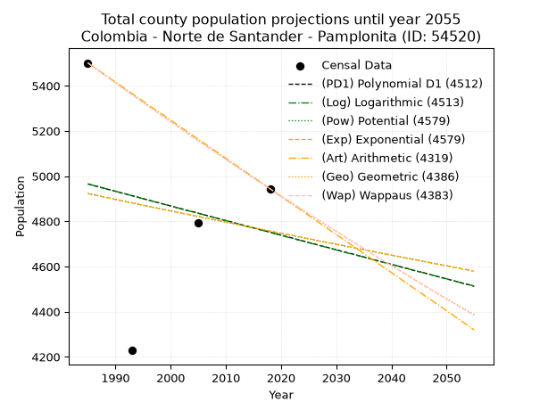
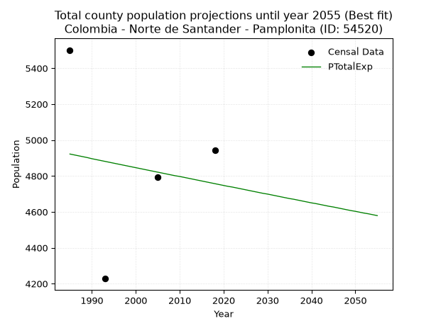
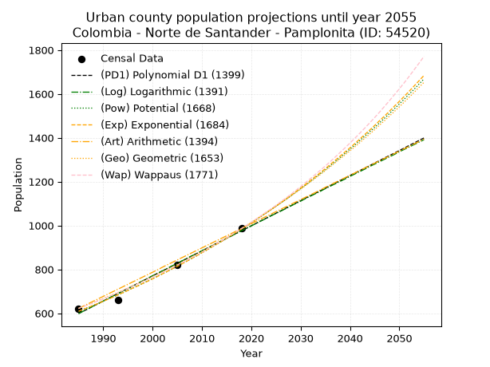
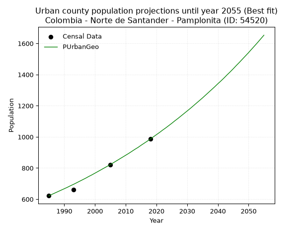
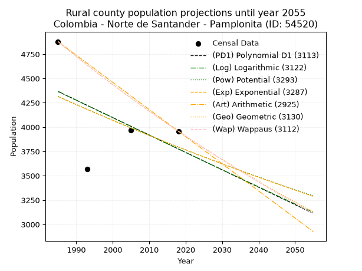
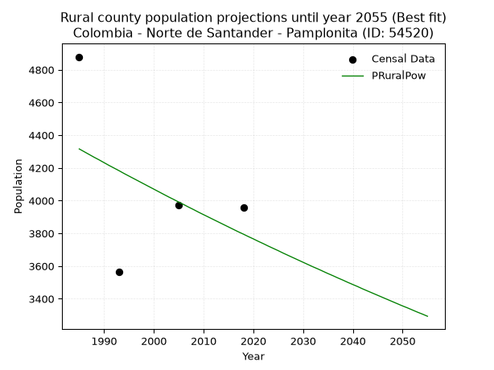

<div align="center">


</div>

# _“Population and Public Services Demand Projections (PPSD) until Year 2050 for Colombia - Norte de Santander - Pamplonita (ID: 54520)”_
Keywords: `population` `public-service` `projection` `lineal` `polynomial` `logarithmic` `potential` `exponential` `arithmetic` `geometric` `wappaus` `dane` `colombia` `south-america`

PPSD are analytical estimates used by governments and planners to anticipate future changes in population size, age distribution, and the resulting community needs for utilities, healthcare, education, and infrastructure as sizing future water treatment facilities, electrical grids, and road networks based on spatial growth.

> **General running parameters**: • app_version: _v20260806_. • Python version: _3.14.7_. • Pandas version: _3.0.5_. • NumPy version: _2.5.1_. • Creates, save and include plots into reports (create_plot): _False_. • Projection until year: _2050_. • Process polynomial degree 2 and up: _False_. • Process Wappaus: _True_. • Process Wappaus: _True_. • Set negative values to zero: _True_. • Set infinite values to zero: _True_. • Drop dataset notes: _True_. 
<div align="center">

Dynamic map: [:earth_americas:Google](http://maps.google.com/maps?q=7.436744632,-72.6391107) [:earth_americas:OSM](https://www.openstreetmap.org/#map=18/7.436744632/-72.6391107&layers=P) [:earth_americas:Bing](https://www.bing.com/maps?cp=7.436744632~-72.6391107&lvl=18) [:earth_americas:Apple](https://maps.apple.com/frame?center=7.436744632%2C-72.6391107&span=0.003%2C0.006)

</div>


<div align="center">

```geojson
{
  "type": "Feature",
  "geometry": {
    "type": "Point", 
    "coordinates": [-72.6391107, 7.436744632]
  }, 
  "properties": {
    "Name": "Colombia - Norte de Santander - Pamplonita (ID: 54520)"
  }
}
```

</div>


## 0. Census Data (4 records)

Census data are official statistics collected by a government about the people and housing in a country. They usually include counts of total population, age, sex, race, income, education, and jobs.

📅Global census file: [Population.xlsx](../data/Population.xlsx)

| Source   |   Year |   CountryID | CountryName   |   StateID | StateName          |   CountyID | CountyName   |   PTotal |   PUrban |   PRural |
|:---------|-------:|------------:|:--------------|----------:|:-------------------|-----------:|:-------------|---------:|---------:|---------:|
| DANE     |   1985 |          57 | Colombia      |        54 | Norte de Santander |      54520 | Pamplonita   |     5501 |      622 |     4879 |
| DANE     |   1993 |          57 | Colombia      |        54 | Norte de Santander |      54520 | Pamplonita   |     4228 |      662 |     3566 |
| DANE     |   2005 |          57 | Colombia      |        54 | Norte De Santander |      54520 | Pamplonita   |     4792 |      822 |     3970 |
| DANE     |   2018 |          57 | Colombia      |        54 | Norte de Santander |      54520 | Pamplonita   |     4944 |      986 |     3958 |

> 🔥Some records has specific notes about the registered values or the corresponding urban or rural distribution.

## 1. Total

### 1.1. Coefficients and Parameters

* (PD1) Polynomial Deg 1: -6.463669209153037, 17795.204335608363 (lineal)
* (Log) Logarithmic: -13057.24023364447, 104114.4376500881
* (Pow) Potential: -2.0882717240295907, 10.578836303389055
* (Exp) Exponential: -0.0010310927391577456, 38106.64350788977
* (Art) Arithmetic: Year diff. 2018 - 1985 = 33, Population diff. 4944 - 5501 = -557, Annual growth = -16.87878787878788
* (Geo) Geometric: Year diff. 2018 - 1985 = 33, Population diff. 4944 - 5501 = -557, Annual growth % = -0.003229778273221795
* (Wap) Wappaus: i = -0.32319364057037586, Condition values only valid for < 200)

<sub>
Wappaus condition values: ['-0.00', '-0.32', '-0.65', '-0.97', '-1.29', '-1.62', '-1.94', '-2.26', '-2.59', '-2.91', '-3.23', '-3.56', '-3.88', '-4.20', '-4.52', '-4.85', '-5.17', '-5.49', '-5.82', '-6.14', '-6.46', '-6.79', '-7.11', '-7.43', '-7.76', '-8.08', '-8.40', '-8.73', '-9.05', '-9.37', '-9.70', '-10.02', '-10.34', '-10.67', '-10.99', '-11.31', '-11.63', '-11.96', '-12.28', '-12.60', '-12.93', '-13.25', '-13.57', '-13.90', '-14.22', '-14.54', '-14.87', '-15.19', '-15.51', '-15.84', '-16.16', '-16.48', '-16.81', '-17.13', '-17.45', '-17.78', '-18.10', '-18.42', '-18.75', '-19.07', '-19.39', '-19.71', '-20.04', '-20.36', '-20.68', '-21.01']
</sub>


### 1.2. Projected Dataset

|   Year |   CountyID |   PTotalPD1 |   PTotalLog |   PTotalPow |   PTotalExp |   PTotalArt |   PTotalGeo |   PTotalWap |
|-------:|-----------:|------------:|------------:|------------:|------------:|------------:|------------:|------------:|
|   1985 |      54520 |        4965 |        4966 |        4923 |        4922 |        5501 |        5501 |        5501 |
|   1986 |      54520 |        4958 |        4959 |        4918 |        4917 |        5484 |        5483 |        5483 |
|   1987 |      54520 |        4952 |        4953 |        4913 |        4912 |        5467 |        5466 |        5466 |
|   1988 |      54520 |        4945 |        4946 |        4907 |        4907 |        5450 |        5448 |        5448 |
|   1989 |      54520 |        4939 |        4940 |        4902 |        4902 |        5433 |        5430 |        5430 |
|   1990 |      54520 |        4933 |        4933 |        4897 |        4896 |        5417 |        5413 |        5413 |
|   1991 |      54520 |        4926 |        4927 |        4892 |        4891 |        5400 |        5395 |        5395 |
|   1992 |      54520 |        4920 |        4920 |        4887 |        4886 |        5383 |        5378 |        5378 |
|   1993 |      54520 |        4913 |        4913 |        4882 |        4881 |        5366 |        5360 |        5361 |
|   1994 |      54520 |        4907 |        4907 |        4877 |        4876 |        5349 |        5343 |        5343 |
|   1995 |      54520 |        4900 |        4900 |        4871 |        4871 |        5332 |        5326 |        5326 |
|   1996 |      54520 |        4894 |        4894 |        4866 |        4866 |        5315 |        5309 |        5309 |
|   1997 |      54520 |        4887 |        4887 |        4861 |        4861 |        5298 |        5292 |        5292 |
|   1998 |      54520 |        4881 |        4881 |        4856 |        4856 |        5282 |        5274 |        5275 |
|   1999 |      54520 |        4874 |        4874 |        4851 |        4851 |        5265 |        5257 |        5258 |
|   2000 |      54520 |        4868 |        4868 |        4846 |        4846 |        5248 |        5240 |        5241 |
|   2001 |      54520 |        4861 |        4861 |        4841 |        4841 |        5231 |        5224 |        5224 |
|   2002 |      54520 |        4855 |        4855 |        4836 |        4836 |        5214 |        5207 |        5207 |
|   2003 |      54520 |        4848 |        4848 |        4831 |        4831 |        5197 |        5190 |        5190 |
|   2004 |      54520 |        4842 |        4842 |        4826 |        4826 |        5180 |        5173 |        5173 |
|   2005 |      54520 |        4836 |        4835 |        4821 |        4821 |        5163 |        5156 |        5157 |
|   2006 |      54520 |        4829 |        4829 |        4816 |        4816 |        5147 |        5140 |        5140 |
|   2007 |      54520 |        4823 |        4822 |        4811 |        4811 |        5130 |        5123 |        5123 |
|   2008 |      54520 |        4816 |        4816 |        4806 |        4806 |        5113 |        5107 |        5107 |
|   2009 |      54520 |        4810 |        4809 |        4801 |        4801 |        5096 |        5090 |        5090 |
|   2010 |      54520 |        4803 |        4803 |        4796 |        4797 |        5079 |        5074 |        5074 |
|   2011 |      54520 |        4797 |        4796 |        4791 |        4792 |        5062 |        5057 |        5057 |
|   2012 |      54520 |        4790 |        4790 |        4786 |        4787 |        5045 |        5041 |        5041 |
|   2013 |      54520 |        4784 |        4783 |        4781 |        4782 |        5028 |        5025 |        5025 |
|   2014 |      54520 |        4777 |        4777 |        4776 |        4777 |        5012 |        5008 |        5008 |
|   2015 |      54520 |        4771 |        4770 |        4771 |        4772 |        4995 |        4992 |        4992 |
|   2016 |      54520 |        4764 |        4764 |        4766 |        4767 |        4978 |        4976 |        4976 |
|   2017 |      54520 |        4758 |        4757 |        4761 |        4762 |        4961 |        4960 |        4960 |
|   2018 |      54520 |        4752 |        4751 |        4756 |        4757 |        4944 |        4944 |        4944 |
|   2019 |      54520 |        4745 |        4744 |        4751 |        4752 |        4927 |        4928 |        4928 |
|   2020 |      54520 |        4739 |        4738 |        4746 |        4747 |        4910 |        4912 |        4912 |
|   2021 |      54520 |        4732 |        4731 |        4741 |        4742 |        4893 |        4896 |        4896 |
|   2022 |      54520 |        4726 |        4725 |        4737 |        4738 |        4876 |        4880 |        4880 |
|   2023 |      54520 |        4719 |        4718 |        4732 |        4733 |        4860 |        4865 |        4864 |
|   2024 |      54520 |        4713 |        4712 |        4727 |        4728 |        4843 |        4849 |        4849 |
|   2025 |      54520 |        4706 |        4705 |        4722 |        4723 |        4826 |        4833 |        4833 |
|   2026 |      54520 |        4700 |        4699 |        4717 |        4718 |        4809 |        4818 |        4817 |
|   2027 |      54520 |        4693 |        4693 |        4712 |        4713 |        4792 |        4802 |        4802 |
|   2028 |      54520 |        4687 |        4686 |        4707 |        4708 |        4775 |        4787 |        4786 |
|   2029 |      54520 |        4680 |        4680 |        4703 |        4703 |        4758 |        4771 |        4771 |
|   2030 |      54520 |        4674 |        4673 |        4698 |        4699 |        4741 |        4756 |        4755 |
|   2031 |      54520 |        4667 |        4667 |        4693 |        4694 |        4725 |        4740 |        4740 |
|   2032 |      54520 |        4661 |        4660 |        4688 |        4689 |        4708 |        4725 |        4724 |
|   2033 |      54520 |        4655 |        4654 |        4683 |        4684 |        4691 |        4710 |        4709 |
|   2034 |      54520 |        4648 |        4648 |        4678 |        4679 |        4674 |        4695 |        4694 |
|   2035 |      54520 |        4642 |        4641 |        4674 |        4674 |        4657 |        4679 |        4679 |
|   2036 |      54520 |        4635 |        4635 |        4669 |        4670 |        4640 |        4664 |        4663 |
|   2037 |      54520 |        4629 |        4628 |        4664 |        4665 |        4623 |        4649 |        4648 |
|   2038 |      54520 |        4622 |        4622 |        4659 |        4660 |        4606 |        4634 |        4633 |
|   2039 |      54520 |        4616 |        4615 |        4655 |        4655 |        4590 |        4619 |        4618 |
|   2040 |      54520 |        4609 |        4609 |        4650 |        4650 |        4573 |        4604 |        4603 |
|   2041 |      54520 |        4603 |        4603 |        4645 |        4646 |        4556 |        4589 |        4588 |
|   2042 |      54520 |        4596 |        4596 |        4640 |        4641 |        4539 |        4575 |        4573 |
|   2043 |      54520 |        4590 |        4590 |        4635 |        4636 |        4522 |        4560 |        4558 |
|   2044 |      54520 |        4583 |        4583 |        4631 |        4631 |        4505 |        4545 |        4543 |
|   2045 |      54520 |        4577 |        4577 |        4626 |        4627 |        4488 |        4530 |        4529 |
|   2046 |      54520 |        4571 |        4571 |        4621 |        4622 |        4471 |        4516 |        4514 |
|   2047 |      54520 |        4564 |        4564 |        4617 |        4617 |        4455 |        4501 |        4499 |
|   2048 |      54520 |        4558 |        4558 |        4612 |        4612 |        4438 |        4487 |        4484 |
|   2049 |      54520 |        4551 |        4552 |        4607 |        4607 |        4421 |        4472 |        4470 |
|   2050 |      54520 |        4545 |        4545 |        4603 |        4603 |        4404 |        4458 |        4455 |
<div align="center">

</img>

</div>


### 1.3. Best fit with absolute error and relative error (%)

Relative error puts that difference into context by dividing the absolute error by the true value, creating a unitless ratio or percentage that shows the scale of the mistake.

Absolute and relative error

|   Year | Source   |   CountryID | CountryName   |   StateID | StateName          |   CountyID_x | CountyName   |   PTotal |   PUrban |   PRural |   CountyID_y |   PTotalPD1 |   PTotalLog |   PTotalPow |   PTotalExp |   PTotalArt |   PTotalGeo |   PTotalWap |   PTotalPD1AbsError |   PTotalLogAbsError |   PTotalPowAbsError |   PTotalExpAbsError |   PTotalArtAbsError |   PTotalGeoAbsError |   PTotalWapAbsError |   PTotalPD1RelError |   PTotalLogRelError |   PTotalPowRelError |   PTotalExpRelError |   PTotalArtRelError |   PTotalGeoRelError |   PTotalWapRelError |
|-------:|:---------|------------:|:--------------|----------:|:-------------------|-------------:|:-------------|---------:|---------:|---------:|-------------:|------------:|------------:|------------:|------------:|------------:|------------:|------------:|--------------------:|--------------------:|--------------------:|--------------------:|--------------------:|--------------------:|--------------------:|--------------------:|--------------------:|--------------------:|--------------------:|--------------------:|--------------------:|--------------------:|
|   1985 | DANE     |          57 | Colombia      |        54 | Norte de Santander |        54520 | Pamplonita   |     5501 |      622 |     4879 |        54520 |        4965 |        4966 |        4923 |        4922 |        5501 |        5501 |        5501 |                 536 |                 535 |                 578 |                 579 |                   0 |                   0 |                   0 |            9.74368  |            9.7255   |           10.5072   |           10.5254   |             0       |             0       |             0       |
|   1993 | DANE     |          57 | Colombia      |        54 | Norte de Santander |        54520 | Pamplonita   |     4228 |      662 |     3566 |        54520 |        4913 |        4913 |        4882 |        4881 |        5366 |        5360 |        5361 |                 685 |                 685 |                 654 |                 653 |                1138 |                1132 |                1133 |           16.2015   |           16.2015   |           15.4683   |           15.4447   |            26.9158  |            26.7739  |            26.7975  |
|   2005 | DANE     |          57 | Colombia      |        54 | Norte De Santander |        54520 | Pamplonita   |     4792 |      822 |     3970 |        54520 |        4836 |        4835 |        4821 |        4821 |        5163 |        5156 |        5157 |                  44 |                  43 |                  29 |                  29 |                 371 |                 364 |                 365 |            0.918197 |            0.897329 |            0.605175 |            0.605175 |             7.74207 |             7.59599 |             7.61686 |
|   2018 | DANE     |          57 | Colombia      |        54 | Norte de Santander |        54520 | Pamplonita   |     4944 |      986 |     3958 |        54520 |        4752 |        4751 |        4756 |        4757 |        4944 |        4944 |        4944 |                 192 |                 193 |                 188 |                 187 |                   0 |                   0 |                   0 |            3.8835   |            3.90372  |            3.80259  |            3.78236  |             0       |             0       |             0       |

Relative error mean

| Method    |   RelError | Best   |
|:----------|-----------:|:-------|
| PTotalPD1 |    7.68672 |        |
| PTotalLog |    7.68202 |        |
| PTotalPow |    7.59581 |        |
| PTotalExp |    7.58939 | True   |
| PTotalArt |    8.66447 |        |
| PTotalGeo |    8.59247 |        |
| PTotalWap |    8.6036  |        |

💙Best method: _**PTotalExp**_
<div align="center">

</img>

</div>


### 1.4. Fresh water supply demand in liters per capita per day (lpcd)

The fresh water supply demand typically ranges from 100 to 300 liters per capita per day (lpcd) for standard domestic and municipal planning, though absolute survival minimums set by the World Health Organization are as low as 7.5 to 20 liters per day, and total consumption in high-income nations can exceed 400 liters.

> `CZ`: Level in meters above the sea level (masl).<br> `WS`: Fresh water supply demand in liters per capita per day (lpcd or l/h/d).<br> `WSAll`: Zonal fresh water supply demand in liters per second (l/s).<br> `A`: Zonal area in square meters.

Reference values (RAS Colombia)

|    CZ |   WS |
|------:|-----:|
|  1000 |  120 |
|  2000 |  130 |
| 99999 |  140 |

County shapefile geometry properties and water supply values

|   CountyID |      ATotal |   CZTotal |   WSTotal |
|-----------:|------------:|----------:|----------:|
|      54520 | 1.70542e+08 |   2017.31 |       140 |

Projected values for best method: PTotalExp

|   CountyID |   Year |   PTotalExp |   WSTotal |   WSTotalAll |
|-----------:|-------:|------------:|----------:|-------------:|
|      54520 |   1985 |        4922 |       140 |      7.97546 |
|      54520 |   1986 |        4917 |       140 |      7.96736 |
|      54520 |   1987 |        4912 |       140 |      7.95926 |
|      54520 |   1988 |        4907 |       140 |      7.95116 |
|      54520 |   1989 |        4902 |       140 |      7.94306 |
|      54520 |   1990 |        4896 |       140 |      7.93333 |
|      54520 |   1991 |        4891 |       140 |      7.92523 |
|      54520 |   1992 |        4886 |       140 |      7.91713 |
|      54520 |   1993 |        4881 |       140 |      7.90903 |
|      54520 |   1994 |        4876 |       140 |      7.90093 |
|      54520 |   1995 |        4871 |       140 |      7.89282 |
|      54520 |   1996 |        4866 |       140 |      7.88472 |
|      54520 |   1997 |        4861 |       140 |      7.87662 |
|      54520 |   1998 |        4856 |       140 |      7.86852 |
|      54520 |   1999 |        4851 |       140 |      7.86042 |
|      54520 |   2000 |        4846 |       140 |      7.85231 |
|      54520 |   2001 |        4841 |       140 |      7.84421 |
|      54520 |   2002 |        4836 |       140 |      7.83611 |
|      54520 |   2003 |        4831 |       140 |      7.82801 |
|      54520 |   2004 |        4826 |       140 |      7.81991 |
|      54520 |   2005 |        4821 |       140 |      7.81181 |
|      54520 |   2006 |        4816 |       140 |      7.8037  |
|      54520 |   2007 |        4811 |       140 |      7.7956  |
|      54520 |   2008 |        4806 |       140 |      7.7875  |
|      54520 |   2009 |        4801 |       140 |      7.7794  |
|      54520 |   2010 |        4797 |       140 |      7.77292 |
|      54520 |   2011 |        4792 |       140 |      7.76481 |
|      54520 |   2012 |        4787 |       140 |      7.75671 |
|      54520 |   2013 |        4782 |       140 |      7.74861 |
|      54520 |   2014 |        4777 |       140 |      7.74051 |
|      54520 |   2015 |        4772 |       140 |      7.73241 |
|      54520 |   2016 |        4767 |       140 |      7.72431 |
|      54520 |   2017 |        4762 |       140 |      7.7162  |
|      54520 |   2018 |        4757 |       140 |      7.7081  |
|      54520 |   2019 |        4752 |       140 |      7.7     |
|      54520 |   2020 |        4747 |       140 |      7.6919  |
|      54520 |   2021 |        4742 |       140 |      7.6838  |
|      54520 |   2022 |        4738 |       140 |      7.67731 |
|      54520 |   2023 |        4733 |       140 |      7.66921 |
|      54520 |   2024 |        4728 |       140 |      7.66111 |
|      54520 |   2025 |        4723 |       140 |      7.65301 |
|      54520 |   2026 |        4718 |       140 |      7.64491 |
|      54520 |   2027 |        4713 |       140 |      7.63681 |
|      54520 |   2028 |        4708 |       140 |      7.6287  |
|      54520 |   2029 |        4703 |       140 |      7.6206  |
|      54520 |   2030 |        4699 |       140 |      7.61412 |
|      54520 |   2031 |        4694 |       140 |      7.60602 |
|      54520 |   2032 |        4689 |       140 |      7.59792 |
|      54520 |   2033 |        4684 |       140 |      7.58981 |
|      54520 |   2034 |        4679 |       140 |      7.58171 |
|      54520 |   2035 |        4674 |       140 |      7.57361 |
|      54520 |   2036 |        4670 |       140 |      7.56713 |
|      54520 |   2037 |        4665 |       140 |      7.55903 |
|      54520 |   2038 |        4660 |       140 |      7.55093 |
|      54520 |   2039 |        4655 |       140 |      7.54282 |
|      54520 |   2040 |        4650 |       140 |      7.53472 |
|      54520 |   2041 |        4646 |       140 |      7.52824 |
|      54520 |   2042 |        4641 |       140 |      7.52014 |
|      54520 |   2043 |        4636 |       140 |      7.51204 |
|      54520 |   2044 |        4631 |       140 |      7.50394 |
|      54520 |   2045 |        4627 |       140 |      7.49745 |
|      54520 |   2046 |        4622 |       140 |      7.48935 |
|      54520 |   2047 |        4617 |       140 |      7.48125 |
|      54520 |   2048 |        4612 |       140 |      7.47315 |
|      54520 |   2049 |        4607 |       140 |      7.46505 |
|      54520 |   2050 |        4603 |       140 |      7.45856 |

## 2. Urban

### 2.1. Coefficients and Parameters

* (PD1) Polynomial Deg 1: 11.434765154556287, -22099.389000401214 (lineal)
* (Log) Logarithmic: 22882.429825258263, -173156.53247007265
* (Pow) Potential: 29.08534927204791, -93.13209442078515
* (Exp) Exponential: 0.014532565999032961, 1.804866070672454e-10
* (Art) Arithmetic: Year diff. 2018 - 1985 = 33, Population diff. 986 - 622 = 364, Annual growth = 11.030303030303031
* (Geo) Geometric: Year diff. 2018 - 1985 = 33, Population diff. 986 - 622 = 364, Annual growth % = 0.014059010103801395
* (Wap) Wappaus: i = 1.3719282375998794, Condition values only valid for < 200)

<sub>
Wappaus condition values: ['0.00', '1.37', '2.74', '4.12', '5.49', '6.86', '8.23', '9.60', '10.98', '12.35', '13.72', '15.09', '16.46', '17.84', '19.21', '20.58', '21.95', '23.32', '24.69', '26.07', '27.44', '28.81', '30.18', '31.55', '32.93', '34.30', '35.67', '37.04', '38.41', '39.79', '41.16', '42.53', '43.90', '45.27', '46.65', '48.02', '49.39', '50.76', '52.13', '53.51', '54.88', '56.25', '57.62', '58.99', '60.36', '61.74', '63.11', '64.48', '65.85', '67.22', '68.60', '69.97', '71.34', '72.71', '74.08', '75.46', '76.83', '78.20', '79.57', '80.94', '82.32', '83.69', '85.06', '86.43', '87.80', '89.18']
</sub>


### 2.2. Projected Dataset

|   Year |   CountyID |   PUrbanPD1 |   PUrbanLog |   PUrbanPow |   PUrbanExp |   PUrbanArt |   PUrbanGeo |   PUrbanWap |
|-------:|-----------:|------------:|------------:|------------:|------------:|------------:|------------:|------------:|
|   1985 |      54520 |         599 |         598 |         609 |         609 |         622 |         622 |         622 |
|   1986 |      54520 |         610 |         610 |         618 |         618 |         633 |         631 |         631 |
|   1987 |      54520 |         621 |         621 |         627 |         627 |         644 |         640 |         639 |
|   1988 |      54520 |         633 |         633 |         636 |         636 |         655 |         649 |         648 |
|   1989 |      54520 |         644 |         644 |         645 |         645 |         666 |         658 |         657 |
|   1990 |      54520 |         656 |         656 |         655 |         655 |         677 |         667 |         666 |
|   1991 |      54520 |         667 |         667 |         665 |         664 |         688 |         676 |         675 |
|   1992 |      54520 |         679 |         679 |         674 |         674 |         699 |         686 |         685 |
|   1993 |      54520 |         690 |         690 |         684 |         684 |         710 |         695 |         694 |
|   1994 |      54520 |         702 |         702 |         694 |         694 |         721 |         705 |         704 |
|   1995 |      54520 |         713 |         713 |         705 |         704 |         732 |         715 |         714 |
|   1996 |      54520 |         724 |         725 |         715 |         715 |         743 |         725 |         724 |
|   1997 |      54520 |         736 |         736 |         725 |         725 |         754 |         735 |         734 |
|   1998 |      54520 |         747 |         748 |         736 |         736 |         765 |         746 |         744 |
|   1999 |      54520 |         759 |         759 |         747 |         746 |         776 |         756 |         754 |
|   2000 |      54520 |         770 |         771 |         758 |         757 |         787 |         767 |         765 |
|   2001 |      54520 |         782 |         782 |         769 |         768 |         798 |         778 |         775 |
|   2002 |      54520 |         793 |         793 |         780 |         780 |         810 |         789 |         786 |
|   2003 |      54520 |         804 |         805 |         791 |         791 |         821 |         800 |         797 |
|   2004 |      54520 |         816 |         816 |         803 |         803 |         832 |         811 |         808 |
|   2005 |      54520 |         827 |         828 |         815 |         814 |         843 |         822 |         820 |
|   2006 |      54520 |         839 |         839 |         827 |         826 |         854 |         834 |         831 |
|   2007 |      54520 |         850 |         851 |         839 |         838 |         865 |         846 |         843 |
|   2008 |      54520 |         862 |         862 |         851 |         851 |         876 |         858 |         855 |
|   2009 |      54520 |         873 |         873 |         863 |         863 |         887 |         870 |         867 |
|   2010 |      54520 |         884 |         885 |         876 |         876 |         898 |         882 |         879 |
|   2011 |      54520 |         896 |         896 |         889 |         889 |         909 |         894 |         892 |
|   2012 |      54520 |         907 |         907 |         902 |         902 |         920 |         907 |         905 |
|   2013 |      54520 |         919 |         919 |         915 |         915 |         931 |         920 |         918 |
|   2014 |      54520 |         930 |         930 |         928 |         928 |         942 |         932 |         931 |
|   2015 |      54520 |         942 |         942 |         942 |         942 |         953 |         946 |         944 |
|   2016 |      54520 |         953 |         953 |         955 |         956 |         964 |         959 |         958 |
|   2017 |      54520 |         965 |         964 |         969 |         970 |         975 |         972 |         972 |
|   2018 |      54520 |         976 |         976 |         983 |         984 |         986 |         986 |         986 |
|   2019 |      54520 |         987 |         987 |         998 |         998 |         997 |        1000 |        1000 |
|   2020 |      54520 |         999 |         998 |        1012 |        1013 |        1008 |        1014 |        1015 |
|   2021 |      54520 |        1010 |        1010 |        1027 |        1028 |        1019 |        1028 |        1030 |
|   2022 |      54520 |        1022 |        1021 |        1042 |        1043 |        1030 |        1043 |        1045 |
|   2023 |      54520 |        1033 |        1032 |        1057 |        1058 |        1041 |        1057 |        1061 |
|   2024 |      54520 |        1045 |        1044 |        1072 |        1073 |        1052 |        1072 |        1076 |
|   2025 |      54520 |        1056 |        1055 |        1088 |        1089 |        1063 |        1087 |        1092 |
|   2026 |      54520 |        1067 |        1066 |        1103 |        1105 |        1074 |        1103 |        1109 |
|   2027 |      54520 |        1079 |        1077 |        1119 |        1121 |        1085 |        1118 |        1125 |
|   2028 |      54520 |        1090 |        1089 |        1135 |        1138 |        1096 |        1134 |        1142 |
|   2029 |      54520 |        1102 |        1100 |        1152 |        1154 |        1107 |        1150 |        1160 |
|   2030 |      54520 |        1113 |        1111 |        1168 |        1171 |        1118 |        1166 |        1177 |
|   2031 |      54520 |        1125 |        1123 |        1185 |        1188 |        1129 |        1182 |        1196 |
|   2032 |      54520 |        1136 |        1134 |        1202 |        1206 |        1140 |        1199 |        1214 |
|   2033 |      54520 |        1147 |        1145 |        1220 |        1223 |        1151 |        1216 |        1233 |
|   2034 |      54520 |        1159 |        1156 |        1237 |        1241 |        1162 |        1233 |        1252 |
|   2035 |      54520 |        1170 |        1168 |        1255 |        1259 |        1174 |        1250 |        1271 |
|   2036 |      54520 |        1182 |        1179 |        1273 |        1278 |        1185 |        1268 |        1291 |
|   2037 |      54520 |        1193 |        1190 |        1291 |        1297 |        1196 |        1286 |        1312 |
|   2038 |      54520 |        1205 |        1201 |        1310 |        1316 |        1207 |        1304 |        1333 |
|   2039 |      54520 |        1216 |        1212 |        1329 |        1335 |        1218 |        1322 |        1354 |
|   2040 |      54520 |        1228 |        1224 |        1348 |        1354 |        1229 |        1341 |        1376 |
|   2041 |      54520 |        1239 |        1235 |        1367 |        1374 |        1240 |        1359 |        1398 |
|   2042 |      54520 |        1250 |        1246 |        1387 |        1394 |        1251 |        1378 |        1421 |
|   2043 |      54520 |        1262 |        1257 |        1407 |        1415 |        1262 |        1398 |        1444 |
|   2044 |      54520 |        1273 |        1269 |        1427 |        1435 |        1273 |        1417 |        1468 |
|   2045 |      54520 |        1285 |        1280 |        1447 |        1456 |        1284 |        1437 |        1492 |
|   2046 |      54520 |        1296 |        1291 |        1468 |        1478 |        1295 |        1458 |        1517 |
|   2047 |      54520 |        1308 |        1302 |        1489 |        1499 |        1306 |        1478 |        1543 |
|   2048 |      54520 |        1319 |        1313 |        1510 |        1521 |        1317 |        1499 |        1569 |
|   2049 |      54520 |        1330 |        1324 |        1532 |        1544 |        1328 |        1520 |        1596 |
|   2050 |      54520 |        1342 |        1336 |        1554 |        1566 |        1339 |        1541 |        1623 |
<div align="center">

</img>

</div>


### 2.3. Best fit with absolute error and relative error (%)

Relative error puts that difference into context by dividing the absolute error by the true value, creating a unitless ratio or percentage that shows the scale of the mistake.

Absolute and relative error

|   Year | Source   |   CountryID | CountryName   |   StateID | StateName          |   CountyID_x | CountyName   |   PTotal |   PUrban |   PRural |   CountyID_y |   PUrbanPD1 |   PUrbanLog |   PUrbanPow |   PUrbanExp |   PUrbanArt |   PUrbanGeo |   PUrbanWap |   PUrbanPD1AbsError |   PUrbanLogAbsError |   PUrbanPowAbsError |   PUrbanExpAbsError |   PUrbanArtAbsError |   PUrbanGeoAbsError |   PUrbanWapAbsError |   PUrbanPD1RelError |   PUrbanLogRelError |   PUrbanPowRelError |   PUrbanExpRelError |   PUrbanArtRelError |   PUrbanGeoRelError |   PUrbanWapRelError |
|-------:|:---------|------------:|:--------------|----------:|:-------------------|-------------:|:-------------|---------:|---------:|---------:|-------------:|------------:|------------:|------------:|------------:|------------:|------------:|------------:|--------------------:|--------------------:|--------------------:|--------------------:|--------------------:|--------------------:|--------------------:|--------------------:|--------------------:|--------------------:|--------------------:|--------------------:|--------------------:|--------------------:|
|   1985 | DANE     |          57 | Colombia      |        54 | Norte de Santander |        54520 | Pamplonita   |     5501 |      622 |     4879 |        54520 |         599 |         598 |         609 |         609 |         622 |         622 |         622 |                  23 |                  24 |                  13 |                  13 |                   0 |                   0 |                   0 |            3.69775  |            3.85852  |            2.09003  |            2.09003  |             0       |             0       |            0        |
|   1993 | DANE     |          57 | Colombia      |        54 | Norte de Santander |        54520 | Pamplonita   |     4228 |      662 |     3566 |        54520 |         690 |         690 |         684 |         684 |         710 |         695 |         694 |                  28 |                  28 |                  22 |                  22 |                  48 |                  33 |                  32 |            4.22961  |            4.22961  |            3.32326  |            3.32326  |             7.25076 |             4.98489 |            4.83384  |
|   2005 | DANE     |          57 | Colombia      |        54 | Norte De Santander |        54520 | Pamplonita   |     4792 |      822 |     3970 |        54520 |         827 |         828 |         815 |         814 |         843 |         822 |         820 |                   5 |                   6 |                   7 |                   8 |                  21 |                   0 |                   2 |            0.608273 |            0.729927 |            0.851582 |            0.973236 |             2.55474 |             0       |            0.243309 |
|   2018 | DANE     |          57 | Colombia      |        54 | Norte de Santander |        54520 | Pamplonita   |     4944 |      986 |     3958 |        54520 |         976 |         976 |         983 |         984 |         986 |         986 |         986 |                  10 |                  10 |                   3 |                   2 |                   0 |                   0 |                   0 |            1.0142   |            1.0142   |            0.30426  |            0.20284  |             0       |             0       |            0        |

Relative error mean

| Method    |   RelError | Best   |
|:----------|-----------:|:-------|
| PUrbanPD1 |    2.38746 |        |
| PUrbanLog |    2.45806 |        |
| PUrbanPow |    1.64228 |        |
| PUrbanExp |    1.64734 |        |
| PUrbanArt |    2.45137 |        |
| PUrbanGeo |    1.24622 | True   |
| PUrbanWap |    1.26929 |        |

💙Best method: _**PUrbanGeo**_
<div align="center">

</img>

</div>


### 2.4. Fresh water supply demand in liters per capita per day (lpcd)

The fresh water supply demand typically ranges from 100 to 300 liters per capita per day (lpcd) for standard domestic and municipal planning, though absolute survival minimums set by the World Health Organization are as low as 7.5 to 20 liters per day, and total consumption in high-income nations can exceed 400 liters.

> `CZ`: Level in meters above the sea level (masl).<br> `WS`: Fresh water supply demand in liters per capita per day (lpcd or l/h/d).<br> `WSAll`: Zonal fresh water supply demand in liters per second (l/s).<br> `A`: Zonal area in square meters.

Reference values (RAS Colombia)

|    CZ |   WS |
|------:|-----:|
|  1000 |  120 |
|  2000 |  130 |
| 99999 |  140 |

County shapefile geometry properties and water supply values

|   CountyID |   AUrban |   CZUrban |   WSUrban |
|-----------:|---------:|----------:|----------:|
|      54520 |   445254 |   1744.23 |       130 |

Projected values for best method: PUrbanGeo

|   CountyID |   Year |   PUrbanGeo |   WSUrban |   WSUrbanAll |
|-----------:|-------:|------------:|----------:|-------------:|
|      54520 |   1985 |         622 |       130 |     0.93588  |
|      54520 |   1986 |         631 |       130 |     0.949421 |
|      54520 |   1987 |         640 |       130 |     0.962963 |
|      54520 |   1988 |         649 |       130 |     0.976505 |
|      54520 |   1989 |         658 |       130 |     0.990046 |
|      54520 |   1990 |         667 |       130 |     1.00359  |
|      54520 |   1991 |         676 |       130 |     1.01713  |
|      54520 |   1992 |         686 |       130 |     1.03218  |
|      54520 |   1993 |         695 |       130 |     1.04572  |
|      54520 |   1994 |         705 |       130 |     1.06076  |
|      54520 |   1995 |         715 |       130 |     1.07581  |
|      54520 |   1996 |         725 |       130 |     1.09086  |
|      54520 |   1997 |         735 |       130 |     1.1059   |
|      54520 |   1998 |         746 |       130 |     1.12245  |
|      54520 |   1999 |         756 |       130 |     1.1375   |
|      54520 |   2000 |         767 |       130 |     1.15405  |
|      54520 |   2001 |         778 |       130 |     1.1706   |
|      54520 |   2002 |         789 |       130 |     1.18715  |
|      54520 |   2003 |         800 |       130 |     1.2037   |
|      54520 |   2004 |         811 |       130 |     1.22025  |
|      54520 |   2005 |         822 |       130 |     1.23681  |
|      54520 |   2006 |         834 |       130 |     1.25486  |
|      54520 |   2007 |         846 |       130 |     1.27292  |
|      54520 |   2008 |         858 |       130 |     1.29097  |
|      54520 |   2009 |         870 |       130 |     1.30903  |
|      54520 |   2010 |         882 |       130 |     1.32708  |
|      54520 |   2011 |         894 |       130 |     1.34514  |
|      54520 |   2012 |         907 |       130 |     1.3647   |
|      54520 |   2013 |         920 |       130 |     1.38426  |
|      54520 |   2014 |         932 |       130 |     1.40231  |
|      54520 |   2015 |         946 |       130 |     1.42338  |
|      54520 |   2016 |         959 |       130 |     1.44294  |
|      54520 |   2017 |         972 |       130 |     1.4625   |
|      54520 |   2018 |         986 |       130 |     1.48356  |
|      54520 |   2019 |        1000 |       130 |     1.50463  |
|      54520 |   2020 |        1014 |       130 |     1.52569  |
|      54520 |   2021 |        1028 |       130 |     1.54676  |
|      54520 |   2022 |        1043 |       130 |     1.56933  |
|      54520 |   2023 |        1057 |       130 |     1.59039  |
|      54520 |   2024 |        1072 |       130 |     1.61296  |
|      54520 |   2025 |        1087 |       130 |     1.63553  |
|      54520 |   2026 |        1103 |       130 |     1.65961  |
|      54520 |   2027 |        1118 |       130 |     1.68218  |
|      54520 |   2028 |        1134 |       130 |     1.70625  |
|      54520 |   2029 |        1150 |       130 |     1.73032  |
|      54520 |   2030 |        1166 |       130 |     1.7544   |
|      54520 |   2031 |        1182 |       130 |     1.77847  |
|      54520 |   2032 |        1199 |       130 |     1.80405  |
|      54520 |   2033 |        1216 |       130 |     1.82963  |
|      54520 |   2034 |        1233 |       130 |     1.85521  |
|      54520 |   2035 |        1250 |       130 |     1.88079  |
|      54520 |   2036 |        1268 |       130 |     1.90787  |
|      54520 |   2037 |        1286 |       130 |     1.93495  |
|      54520 |   2038 |        1304 |       130 |     1.96204  |
|      54520 |   2039 |        1322 |       130 |     1.98912  |
|      54520 |   2040 |        1341 |       130 |     2.01771  |
|      54520 |   2041 |        1359 |       130 |     2.04479  |
|      54520 |   2042 |        1378 |       130 |     2.07338  |
|      54520 |   2043 |        1398 |       130 |     2.10347  |
|      54520 |   2044 |        1417 |       130 |     2.13206  |
|      54520 |   2045 |        1437 |       130 |     2.16215  |
|      54520 |   2046 |        1458 |       130 |     2.19375  |
|      54520 |   2047 |        1478 |       130 |     2.22384  |
|      54520 |   2048 |        1499 |       130 |     2.25544  |
|      54520 |   2049 |        1520 |       130 |     2.28704  |
|      54520 |   2050 |        1541 |       130 |     2.31863  |

## 3. Rural

### 3.1. Coefficients and Parameters

* (PD1) Polynomial Deg 1: -17.898434363709335, 39894.593336009595 (lineal)
* (Log) Logarithmic: -35939.67005890274, 277270.9701201607
* (Pow) Potential: -7.804489910843945, 29.372407679474836
* (Exp) Exponential: -0.0038856821539758964, 9653329.531825116
* (Art) Arithmetic: Year diff. 2018 - 1985 = 33, Population diff. 3958 - 4879 = -921, Annual growth = -27.90909090909091
* (Geo) Geometric: Year diff. 2018 - 1985 = 33, Population diff. 3958 - 4879 = -921, Annual growth % = -0.006319385545098033
* (Wap) Wappaus: i = -0.6316417541946567, Condition values only valid for < 200)

<sub>
Wappaus condition values: ['-0.00', '-0.63', '-1.26', '-1.89', '-2.53', '-3.16', '-3.79', '-4.42', '-5.05', '-5.68', '-6.32', '-6.95', '-7.58', '-8.21', '-8.84', '-9.47', '-10.11', '-10.74', '-11.37', '-12.00', '-12.63', '-13.26', '-13.90', '-14.53', '-15.16', '-15.79', '-16.42', '-17.05', '-17.69', '-18.32', '-18.95', '-19.58', '-20.21', '-20.84', '-21.48', '-22.11', '-22.74', '-23.37', '-24.00', '-24.63', '-25.27', '-25.90', '-26.53', '-27.16', '-27.79', '-28.42', '-29.06', '-29.69', '-30.32', '-30.95', '-31.58', '-32.21', '-32.85', '-33.48', '-34.11', '-34.74', '-35.37', '-36.00', '-36.64', '-37.27', '-37.90', '-38.53', '-39.16', '-39.79', '-40.43', '-41.06']
</sub>


### 3.2. Projected Dataset

|   Year |   CountyID |   PRuralPD1 |   PRuralLog |   PRuralPow |   PRuralExp |   PRuralArt |   PRuralGeo |   PRuralWap |
|-------:|-----------:|------------:|------------:|------------:|------------:|------------:|------------:|------------:|
|   1985 |      54520 |        4366 |        4368 |        4316 |        4314 |        4879 |        4879 |        4879 |
|   1986 |      54520 |        4348 |        4350 |        4299 |        4298 |        4851 |        4848 |        4848 |
|   1987 |      54520 |        4330 |        4331 |        4282 |        4281 |        4823 |        4818 |        4818 |
|   1988 |      54520 |        4313 |        4313 |        4265 |        4264 |        4795 |        4787 |        4787 |
|   1989 |      54520 |        4295 |        4295 |        4249 |        4248 |        4767 |        4757 |        4757 |
|   1990 |      54520 |        4277 |        4277 |        4232 |        4231 |        4739 |        4727 |        4727 |
|   1991 |      54520 |        4259 |        4259 |        4215 |        4215 |        4712 |        4697 |        4698 |
|   1992 |      54520 |        4241 |        4241 |        4199 |        4199 |        4684 |        4667 |        4668 |
|   1993 |      54520 |        4223 |        4223 |        4183 |        4182 |        4656 |        4638 |        4639 |
|   1994 |      54520 |        4205 |        4205 |        4166 |        4166 |        4628 |        4608 |        4609 |
|   1995 |      54520 |        4187 |        4187 |        4150 |        4150 |        4600 |        4579 |        4580 |
|   1996 |      54520 |        4169 |        4169 |        4134 |        4134 |        4572 |        4550 |        4551 |
|   1997 |      54520 |        4151 |        4151 |        4118 |        4118 |        4544 |        4522 |        4523 |
|   1998 |      54520 |        4134 |        4133 |        4102 |        4102 |        4516 |        4493 |        4494 |
|   1999 |      54520 |        4116 |        4115 |        4086 |        4086 |        4488 |        4465 |        4466 |
|   2000 |      54520 |        4098 |        4097 |        4070 |        4070 |        4460 |        4436 |        4438 |
|   2001 |      54520 |        4080 |        4079 |        4054 |        4054 |        4432 |        4408 |        4410 |
|   2002 |      54520 |        4062 |        4061 |        4038 |        4039 |        4405 |        4381 |        4382 |
|   2003 |      54520 |        4044 |        4043 |        4022 |        4023 |        4377 |        4353 |        4354 |
|   2004 |      54520 |        4026 |        4025 |        4007 |        4007 |        4349 |        4325 |        4327 |
|   2005 |      54520 |        4008 |        4007 |        3991 |        3992 |        4321 |        4298 |        4299 |
|   2006 |      54520 |        3990 |        3989 |        3976 |        3976 |        4293 |        4271 |        4272 |
|   2007 |      54520 |        3972 |        3971 |        3960 |        3961 |        4265 |        4244 |        4245 |
|   2008 |      54520 |        3955 |        3954 |        3945 |        3946 |        4237 |        4217 |        4218 |
|   2009 |      54520 |        3937 |        3936 |        3929 |        3930 |        4209 |        4190 |        4191 |
|   2010 |      54520 |        3919 |        3918 |        3914 |        3915 |        4181 |        4164 |        4165 |
|   2011 |      54520 |        3901 |        3900 |        3899 |        3900 |        4153 |        4138 |        4139 |
|   2012 |      54520 |        3883 |        3882 |        3884 |        3885 |        4125 |        4111 |        4112 |
|   2013 |      54520 |        3865 |        3864 |        3869 |        3870 |        4098 |        4085 |        4086 |
|   2014 |      54520 |        3847 |        3846 |        3854 |        3855 |        4070 |        4060 |        4060 |
|   2015 |      54520 |        3829 |        3829 |        3839 |        3840 |        4042 |        4034 |        4034 |
|   2016 |      54520 |        3811 |        3811 |        3824 |        3825 |        4014 |        4009 |        4009 |
|   2017 |      54520 |        3793 |        3793 |        3809 |        3810 |        3986 |        3983 |        3983 |
|   2018 |      54520 |        3776 |        3775 |        3795 |        3795 |        3958 |        3958 |        3958 |
|   2019 |      54520 |        3758 |        3757 |        3780 |        3781 |        3930 |        3933 |        3933 |
|   2020 |      54520 |        3740 |        3739 |        3766 |        3766 |        3902 |        3908 |        3908 |
|   2021 |      54520 |        3722 |        3722 |        3751 |        3751 |        3874 |        3883 |        3883 |
|   2022 |      54520 |        3704 |        3704 |        3737 |        3737 |        3846 |        3859 |        3858 |
|   2023 |      54520 |        3686 |        3686 |        3722 |        3722 |        3818 |        3835 |        3833 |
|   2024 |      54520 |        3668 |        3668 |        3708 |        3708 |        3791 |        3810 |        3809 |
|   2025 |      54520 |        3650 |        3651 |        3694 |        3693 |        3763 |        3786 |        3785 |
|   2026 |      54520 |        3632 |        3633 |        3679 |        3679 |        3735 |        3762 |        3760 |
|   2027 |      54520 |        3614 |        3615 |        3665 |        3665 |        3707 |        3738 |        3736 |
|   2028 |      54520 |        3597 |        3597 |        3651 |        3651 |        3679 |        3715 |        3712 |
|   2029 |      54520 |        3579 |        3580 |        3637 |        3636 |        3651 |        3691 |        3688 |
|   2030 |      54520 |        3561 |        3562 |        3623 |        3622 |        3623 |        3668 |        3665 |
|   2031 |      54520 |        3543 |        3544 |        3609 |        3608 |        3595 |        3645 |        3641 |
|   2032 |      54520 |        3525 |        3527 |        3595 |        3594 |        3567 |        3622 |        3618 |
|   2033 |      54520 |        3507 |        3509 |        3582 |        3580 |        3539 |        3599 |        3594 |
|   2034 |      54520 |        3489 |        3491 |        3568 |        3566 |        3511 |        3576 |        3571 |
|   2035 |      54520 |        3471 |        3474 |        3554 |        3553 |        3484 |        3554 |        3548 |
|   2036 |      54520 |        3453 |        3456 |        3541 |        3539 |        3456 |        3531 |        3525 |
|   2037 |      54520 |        3435 |        3438 |        3527 |        3525 |        3428 |        3509 |        3503 |
|   2038 |      54520 |        3418 |        3421 |        3514 |        3511 |        3400 |        3487 |        3480 |
|   2039 |      54520 |        3400 |        3403 |        3500 |        3498 |        3372 |        3465 |        3457 |
|   2040 |      54520 |        3382 |        3385 |        3487 |        3484 |        3344 |        3443 |        3435 |
|   2041 |      54520 |        3364 |        3368 |        3474 |        3471 |        3316 |        3421 |        3413 |
|   2042 |      54520 |        3346 |        3350 |        3460 |        3457 |        3288 |        3399 |        3390 |
|   2043 |      54520 |        3328 |        3333 |        3447 |        3444 |        3260 |        3378 |        3368 |
|   2044 |      54520 |        3310 |        3315 |        3434 |        3431 |        3232 |        3357 |        3346 |
|   2045 |      54520 |        3292 |        3297 |        3421 |        3417 |        3204 |        3335 |        3324 |
|   2046 |      54520 |        3274 |        3280 |        3408 |        3404 |        3177 |        3314 |        3303 |
|   2047 |      54520 |        3256 |        3262 |        3395 |        3391 |        3149 |        3293 |        3281 |
|   2048 |      54520 |        3239 |        3245 |        3382 |        3378 |        3121 |        3273 |        3260 |
|   2049 |      54520 |        3221 |        3227 |        3369 |        3365 |        3093 |        3252 |        3238 |
|   2050 |      54520 |        3203 |        3210 |        3356 |        3352 |        3065 |        3231 |        3217 |
<div align="center">

</img>

</div>


### 3.3. Best fit with absolute error and relative error (%)

Relative error puts that difference into context by dividing the absolute error by the true value, creating a unitless ratio or percentage that shows the scale of the mistake.

Absolute and relative error

|   Year | Source   |   CountryID | CountryName   |   StateID | StateName          |   CountyID_x | CountyName   |   PTotal |   PUrban |   PRural |   CountyID_y |   PRuralPD1 |   PRuralLog |   PRuralPow |   PRuralExp |   PRuralArt |   PRuralGeo |   PRuralWap |   PRuralPD1AbsError |   PRuralLogAbsError |   PRuralPowAbsError |   PRuralExpAbsError |   PRuralArtAbsError |   PRuralGeoAbsError |   PRuralWapAbsError |   PRuralPD1RelError |   PRuralLogRelError |   PRuralPowRelError |   PRuralExpRelError |   PRuralArtRelError |   PRuralGeoRelError |   PRuralWapRelError |
|-------:|:---------|------------:|:--------------|----------:|:-------------------|-------------:|:-------------|---------:|---------:|---------:|-------------:|------------:|------------:|------------:|------------:|------------:|------------:|------------:|--------------------:|--------------------:|--------------------:|--------------------:|--------------------:|--------------------:|--------------------:|--------------------:|--------------------:|--------------------:|--------------------:|--------------------:|--------------------:|--------------------:|
|   1985 | DANE     |          57 | Colombia      |        54 | Norte de Santander |        54520 | Pamplonita   |     5501 |      622 |     4879 |        54520 |        4366 |        4368 |        4316 |        4314 |        4879 |        4879 |        4879 |                 513 |                 511 |                 563 |                 565 |                   0 |                   0 |                   0 |           10.5144   |            10.4735  |           11.5392   |           11.5802   |             0       |             0       |             0       |
|   1993 | DANE     |          57 | Colombia      |        54 | Norte de Santander |        54520 | Pamplonita   |     4228 |      662 |     3566 |        54520 |        4223 |        4223 |        4183 |        4182 |        4656 |        4638 |        4639 |                 657 |                 657 |                 617 |                 616 |                1090 |                1072 |                1073 |           18.424    |            18.424   |           17.3023   |           17.2743   |            30.5665  |            30.0617  |            30.0897  |
|   2005 | DANE     |          57 | Colombia      |        54 | Norte De Santander |        54520 | Pamplonita   |     4792 |      822 |     3970 |        54520 |        4008 |        4007 |        3991 |        3992 |        4321 |        4298 |        4299 |                  38 |                  37 |                  21 |                  22 |                 351 |                 328 |                 329 |            0.957179 |             0.93199 |            0.528967 |            0.554156 |             8.84131 |             8.26196 |             8.28715 |
|   2018 | DANE     |          57 | Colombia      |        54 | Norte de Santander |        54520 | Pamplonita   |     4944 |      986 |     3958 |        54520 |        3776 |        3775 |        3795 |        3795 |        3958 |        3958 |        3958 |                 182 |                 183 |                 163 |                 163 |                   0 |                   0 |                   0 |            4.59828  |             4.62355 |            4.11824  |            4.11824  |             0       |             0       |             0       |

Relative error mean

| Method    |   RelError | Best   |
|:----------|-----------:|:-------|
| PRuralPD1 |    8.62348 |        |
| PRuralLog |    8.61325 |        |
| PRuralPow |    8.37219 | True   |
| PRuralExp |    8.38172 |        |
| PRuralArt |    9.85194 |        |
| PRuralGeo |    9.58091 |        |
| PRuralWap |    9.59422 |        |

💙Best method: _**PRuralPow**_
<div align="center">

</img>

</div>


### 3.4. Fresh water supply demand in liters per capita per day (lpcd)

The fresh water supply demand typically ranges from 100 to 300 liters per capita per day (lpcd) for standard domestic and municipal planning, though absolute survival minimums set by the World Health Organization are as low as 7.5 to 20 liters per day, and total consumption in high-income nations can exceed 400 liters.

> `CZ`: Level in meters above the sea level (masl).<br> `WS`: Fresh water supply demand in liters per capita per day (lpcd or l/h/d).<br> `WSAll`: Zonal fresh water supply demand in liters per second (l/s).<br> `A`: Zonal area in square meters.

Reference values (RAS Colombia)

|    CZ |   WS |
|------:|-----:|
|  1000 |  120 |
|  2000 |  130 |
| 99999 |  140 |

County shapefile geometry properties and water supply values

|   CountyID |      ARural |   CZRural |   WSRural |
|-----------:|------------:|----------:|----------:|
|      54520 | 1.70096e+08 |      2018 |       140 |

Projected values for best method: PRuralPow

|   CountyID |   Year |   PRuralPow |   WSRural |   WSRuralAll |
|-----------:|-------:|------------:|----------:|-------------:|
|      54520 |   1985 |        4316 |       140 |      6.99352 |
|      54520 |   1986 |        4299 |       140 |      6.96597 |
|      54520 |   1987 |        4282 |       140 |      6.93843 |
|      54520 |   1988 |        4265 |       140 |      6.91088 |
|      54520 |   1989 |        4249 |       140 |      6.88495 |
|      54520 |   1990 |        4232 |       140 |      6.85741 |
|      54520 |   1991 |        4215 |       140 |      6.82986 |
|      54520 |   1992 |        4199 |       140 |      6.80394 |
|      54520 |   1993 |        4183 |       140 |      6.77801 |
|      54520 |   1994 |        4166 |       140 |      6.75046 |
|      54520 |   1995 |        4150 |       140 |      6.72454 |
|      54520 |   1996 |        4134 |       140 |      6.69861 |
|      54520 |   1997 |        4118 |       140 |      6.67269 |
|      54520 |   1998 |        4102 |       140 |      6.64676 |
|      54520 |   1999 |        4086 |       140 |      6.62083 |
|      54520 |   2000 |        4070 |       140 |      6.59491 |
|      54520 |   2001 |        4054 |       140 |      6.56898 |
|      54520 |   2002 |        4038 |       140 |      6.54306 |
|      54520 |   2003 |        4022 |       140 |      6.51713 |
|      54520 |   2004 |        4007 |       140 |      6.49282 |
|      54520 |   2005 |        3991 |       140 |      6.4669  |
|      54520 |   2006 |        3976 |       140 |      6.44259 |
|      54520 |   2007 |        3960 |       140 |      6.41667 |
|      54520 |   2008 |        3945 |       140 |      6.39236 |
|      54520 |   2009 |        3929 |       140 |      6.36644 |
|      54520 |   2010 |        3914 |       140 |      6.34213 |
|      54520 |   2011 |        3899 |       140 |      6.31782 |
|      54520 |   2012 |        3884 |       140 |      6.29352 |
|      54520 |   2013 |        3869 |       140 |      6.26921 |
|      54520 |   2014 |        3854 |       140 |      6.24491 |
|      54520 |   2015 |        3839 |       140 |      6.2206  |
|      54520 |   2016 |        3824 |       140 |      6.1963  |
|      54520 |   2017 |        3809 |       140 |      6.17199 |
|      54520 |   2018 |        3795 |       140 |      6.14931 |
|      54520 |   2019 |        3780 |       140 |      6.125   |
|      54520 |   2020 |        3766 |       140 |      6.10231 |
|      54520 |   2021 |        3751 |       140 |      6.07801 |
|      54520 |   2022 |        3737 |       140 |      6.05532 |
|      54520 |   2023 |        3722 |       140 |      6.03102 |
|      54520 |   2024 |        3708 |       140 |      6.00833 |
|      54520 |   2025 |        3694 |       140 |      5.98565 |
|      54520 |   2026 |        3679 |       140 |      5.96134 |
|      54520 |   2027 |        3665 |       140 |      5.93866 |
|      54520 |   2028 |        3651 |       140 |      5.91597 |
|      54520 |   2029 |        3637 |       140 |      5.89329 |
|      54520 |   2030 |        3623 |       140 |      5.8706  |
|      54520 |   2031 |        3609 |       140 |      5.84792 |
|      54520 |   2032 |        3595 |       140 |      5.82523 |
|      54520 |   2033 |        3582 |       140 |      5.80417 |
|      54520 |   2034 |        3568 |       140 |      5.78148 |
|      54520 |   2035 |        3554 |       140 |      5.7588  |
|      54520 |   2036 |        3541 |       140 |      5.73773 |
|      54520 |   2037 |        3527 |       140 |      5.71505 |
|      54520 |   2038 |        3514 |       140 |      5.69398 |
|      54520 |   2039 |        3500 |       140 |      5.6713  |
|      54520 |   2040 |        3487 |       140 |      5.65023 |
|      54520 |   2041 |        3474 |       140 |      5.62917 |
|      54520 |   2042 |        3460 |       140 |      5.60648 |
|      54520 |   2043 |        3447 |       140 |      5.58542 |
|      54520 |   2044 |        3434 |       140 |      5.56435 |
|      54520 |   2045 |        3421 |       140 |      5.54329 |
|      54520 |   2046 |        3408 |       140 |      5.52222 |
|      54520 |   2047 |        3395 |       140 |      5.50116 |
|      54520 |   2048 |        3382 |       140 |      5.48009 |
|      54520 |   2049 |        3369 |       140 |      5.45903 |
|      54520 |   2050 |        3356 |       140 |      5.43796 |

<div align="center"><br><sub>Share this research</sub></div><br>

<sub>**APPS & TOOLS & CONTENT DISCLAIMER**: • NO WARRANTY - This content and software is provided by <a href="https://github.com/rcfdtools" target="_blank">github.com/rcfdtools</a> "as is", without any express or implied warranty, including warranties of merchantability, fitness for a particular purpose, or non-infringement. There is no guarantee that the software will be error-free or operate without interruption. • LIMITATION OF LIABILITY - Neither the authors nor copyright holders will be liable for claims or damages arising from the software or its use. You are responsible for determining if the software is appropriate for your use and assume all associated risks, including errors, legal compliance, and data loss. • NO PROFESSIONAL ADVICE - The software provides general information and does not offer professional advice. It should not replace consultation with professional advisors. [Clauses and global license for rcfdtools use.](https://github.com/rcfdtools/rcfdtools/blob/main/LICENSE.md)</sub>